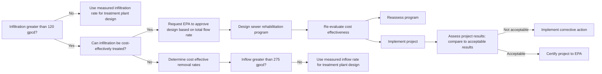

# 1985_EPA_Guide_Infiltration_Inflow.pdf

# Infiltration/Inflow

## I/I Analysis and Project Certification

Ecology Publication No. 97-03

---

# Introduction

As part of facilities planning for municipal wastewater treatment facilities, the grantee must demonstrate that contributing sewer systems are not, and will not be, subject to excessive infiltration or inflow. This brochure informs grantees and facility planners on how to determine whether excessive I/I exists, and how to certify that excessive I/I has been sufficiently reduced through sewer rehabilitation.

“Infiltration” occurs when groundwater enters a sewer system through broken pipes, defective pipe joints, or illegal connections of foundation drains. “Inflow” is surface runoff that enters a sewer system through manhole covers, exposed broken pipe and defective pipe joints, cross connections between storm sewers and sanitary sewers, and illegal connection of roof leaders, cellar drains, yard drains, or catch basins.

Virtually every sewer system will have some infiltration or inflow. Guidelines have been developed to help determine what amount of infiltration and inflow is considered “excessive.” To make this determination, infiltration and inflow must be evaluated separately as discussed below.

## Determination of Non-Excessive Infiltration

Based on Needs Survey data from 270 Standard Metropolitan Statistical Area Cities, the national average for dry weather flow is 120 gallons per capita per day (gpcd). This includes domestic wastewater flow, infiltration and nominal industrial and commercial flows. This average dry weather flow should be used as an indicator to determine the limit of non-excessive infiltration. If the average daily flow per capita (excluding major industrial and commercial flows greater than 50,000 gpd each) is less than 120 gpcd (i.e., a 7–14 day average measured during periods of seasonal high groundwater), the amount of infiltration is considered non-excessive.

The 120 gpcd flow rate guideline has been incorporated into EPA’s final Construction Grant Regulations. These regulations provide that no further infiltration analysis work is required if the 120 gpcd guideline is not exceeded. If the average daily dry weather flow (DWF) exceeds 120 gpcd, the grantee may request special approval from the EPA Regional Administrator to proceed with project design without further infiltration studies. To receive such approval, the grantee must demonstrate that the increased flows due to infiltration can be cost-effectively treated, and that sufficient funding is available to pay for the local share of project construction and operating costs. In such cases, the incremental cost of treatment capacity over and above 120 gpcd is not eligible for EPA construction grant funding.

---

The grantee’s basic options regarding determination of non‑excessive infiltration are listed below:

**If Average DWF* < 120 gpcd:**
* Grantee may proceed with project design and construction without further infiltration study.
* Grantee may investigate rehabilitation alternatives for specific sections of sewer system where excessive infiltration has been documented.

**If Average DWF* marginally exceeds 120 gpcd:**
* Grantee may request special approval from EPA Regional Administrator to proceed with the project without further study of infiltration correction alternatives.
* Grantee must demonstrate that project is cost‑effective (i.e., that treating increased flows due to infiltration is less costly than sewer rehabilitation).
* Grantee must demonstrate that sufficient funds are available for the local share of project cost, including capital and operating costs.
* The treatment facility must be sized to treat the total flow including infiltration; however, the incremental cost of treatment capacity above 120 gpcd is not eligible for EPA construction grant funding.

**If Average DWF* > 120 gpcd, and Special RA Approval is _not_ granted:**
* Further studies must be conducted to quantify excessive infiltration and evaluate alternative corrective measures.
* Based on results of these studies, the most cost‑effective sewer rehabilitation program is selected, and the treatment plant is sized to handle the infiltration that cannot be cost‑effectively removed.
* Upon approval of the proposed rehabilitation program by EPA, grantee may proceed with project design and construction. Total project cost (including sewer rehabilitation costs) is eligible for construction grant funding.

*Highest average daily flow recorded over a 7‑14 period during a period of seasonal high groundwater.*

---

# Determination of Non-Excessive Inflow

A statistical analysis of data from Sewer System Evaluation Survey (SSES) studies representing more than 45 different sewer systems (i.e., separate sanitary sewer system) indicated a strong correlation between inflow rate and service area population. Based on these data, the average wet weather flow (WWF) after removal of excessive inflow (i.e., that which can be cost-effectively removed) is 275 gpcd. This flow rate should be used as an indicator of non-excessive inflow.

If the average daily flow during periods of significant rainfall (i.e., any storm event that creates surface ponding and surface runoff; this can be related to a minimum rainfall amount for a particular geographic area) does not exceed 275 gpcd, the amount of inflow is considered non-excessive. This calculation should exclude major commercial and industrial flows (greater than 50,000 gpd each). If wet weather flows do not exceed 275 gpcd, the grantee may proceed with project design and construction without further study of inflow correction alternatives. However, if the treatment plant experiences hydraulic overloads during storm events, further study is required regardless of the wet weather flow (i.e., even in cases where WWF is less than 275 gpcd).

The determination of non-excessive inflow is made as follows:

*If* `WWF* ≤ 275 gpcd`, and the treatment plant does not experience hydraulic overloads during storm events:  
* Grantee may proceed with project design and construction without further inflow studies.  
* Grantee may investigate rehabilitation alternatives for specific sections of the sewer system where excessive inflow has been documented.

*If* `WWF* > 275 gpcd`, or the treatment plant experiences hydraulic overloads during storm events:  
* Further studies must be conducted to quantify excessive inflow and evaluate alternative corrective measures.  
* Based on results of these studies, the most cost-effective sewer rehabilitation program is selected, and the treatment plant is sized to handle the inflow that cannot be cost-effectively removed.  
* Upon approval of the proposed rehabilitation program by EPA, the grantee may proceed with project design and construction. Total project cost (including sewer rehabilitation cost) is eligible for construction grant funding.

\*Highest daily flow recorded during a storm event.

---

# I/I Cost-Effectiveness Analysis

Before obtaining a grant for sewer system rehabilitation, the grantee must determine the amount of infiltration and inflow that can be cost-effectively removed. This is essentially an estimate of the point at which the cost savings (i.e., reduction in transport and treatment cost less the cost of the rehabilitation program) is maximized. Generally, the planned I/I reduction (i.e., the target sought in a sewer rehabilitation project) is determined on the basis of a cost-effectiveness analysis. *Figure 1* illustrates how the planned I/I reduction target is established from cost curves developed in the cost-effectiveness analysis. A separate cost-effectiveness analysis should be done for infiltration alternatives and for inflow alternatives.

<table>
  <thead>
    <tr>
      <th colspan="2"></th>
      <th>Cost (Present Worth of Average Annual Equivalent Value)</th>
      <th colspan="2"></th>
    </tr>
  </thead>
  <tbody>
    <tr>
      <td colspan="2" rowspan="2">0</td>
      <td rowspan="2" style="text-align:center;">50</td>
      <td colspan="2" rowspan="2" style="text-align:center;">100</td>
    </tr>
<tr></tr>
<tr>
      <td colspan="5" style="text-align:center;">% Infiltration or Inflow Reduction</td>
    </tr>
<tr>
      <td colspan="5" style="text-align:center;">Planned reduction</td>
    </tr>
<tr>
      <td colspan="5" style="text-align:center;">
        <b>Total cost curve</b> (dashed line, starts high, dips, then rises after 50%)
      </td>
    </tr>
<tr>
      <td colspan="5" style="text-align:center;">
        <b>Minimum planned total cost</b> (marked at about 50% reduction)
      </td>
    </tr>
<tr>
      <td colspan="5" style="text-align:center;">
        <b>Transport and treatment cost curve</b> (solid line, starts high and decreases continuously)
      </td>
    </tr>
<tr>
      <td colspan="5" style="text-align:center;">
        <b>Rehabilitation cost curve</b> (solid line, starts low and increases continuously)
      </td>
    </tr>
<tr>
      <td colspan="5" style="text-align:center;">
        <b>Planned rehabilitation cost</b> (marked near the intersection of the rehabilitation and transport cost curves)
      </td>
    </tr>
  </tbody>
</table>

*Figure 1  Cost-Effectiveness Analysis*

---

# Certification of I/I Rehabilitation Performance

At the end of the one-year performance period (i.e., one year after initiation of sewer system operation), the grantee must certify that the rehabilitation project has achieved an acceptable level of I/I reduction. Ideally, this means that the planned I/I reduction target is achieved at a cost not exceeding that projected in the cost-effectiveness analysis. However, past experience has shown that it is difficult to measure the effectiveness of an I/I rehabilitation program simply by comparing flow data before and after sewer rehabilitation.

A sewer rehabilitation project will be considered certifiable as long as the project is cost-effective (i.e. transport and treatment cost savings exceed rehabilitation costs). *Figure 2* illustrates how to determine the minimum acceptable I/I reduction using the transport and treatment cost curve from the cost-effectiveness analysis. A separate determination should be made for infiltration and for inflow, consistent with the original cost-effectiveness analysis.

The actual cost of the rehabilitation program (i.e., the “sunk cost”) should include design costs and the cost of the SSES study, as well as the cost of the sewer rehabilitation itself. The actual I/I reduction is determined by comparing post-construction flow to the flow data collected during the SSES study. The post-construction flow data should be based on plant flow records. Monitoring flows at multiple points throughout the sewer system is not recommended.

<table>
  <thead>
    <tr>
      <th colspan="3">Determining Acceptable Range of I/I Reduction</th>
    </tr>
  </thead>
  <tbody>
    <tr>
      <td rowspan="6" style="writing-mode: vertical-rl; text-orientation: mixed;">
        Cost (Present Worth or Average Annual Equivalent Value)
      </td>
      <td colspan="2" style="text-align:center;">Transport and treatment cost curve</td>
    </tr>
<tr>
      <td colspan="2" style="text-align:center;">
        <svg width="300" height="200" xmlns="http://www.w3.org/2000/svg">
          <path d="M20 30 Q 80 10 140 50 T 280 150" stroke="black" fill="none"/>
          <circle cx="140" cy="50" r="5" fill="black"/>
          <line x1="140" y1="50" x2="140" y2="180" stroke="black" stroke-dasharray="4"/>
          <line x1="60" y1="180" x2="140" y2="180" stroke="black" stroke-dasharray="4"/>
          <text x="10" y="25" font-size="10" transform="rotate(-90 10,25)">Actual Sunk Cost</text>
          <text x="70" y="195" font-size="10">Minimum acceptable reduction</text>
          <text x="160" y="195" font-size="10">Planned reduction</text>
          <text x="250" y="170" font-size="10">100</text>
          <text x="50" y="170" font-size="10">0</text>
          <text x="130" y="170" font-size="10">50</text>
          <text x="200" y="50" font-size="10">Acceptable range</text>
        </svg>
      </td>
    </tr>
  </tbody>
</table>

---

If the actual I/I reduction is greater than the minimum acceptable I/I reduction derived from *Figure 2*, the rehabilitation project can be certified as meeting performance objectives. However, it should be noted that treatment plant design capacity is based on the planned I/I reduction projected in the SSES study. If the actual I/I reduction is significantly less than planned, redesign may be required to increase treatment capacity. Therefore, every effort should be made to develop realistic estimates of the amount of I/I that can be cost-effectively removed. As an I/I project proceeds from initial planning through design and construction, certain assumptions made during the cost-effectiveness analysis may prove to be invalid. This could affect the cost-effectiveness of the project and the determination of minimum acceptable I/I reduction. For example, if the actual rehabilitation cost is greater than projected, the range of acceptable I/I reduction is reduced (*see Figure 3*). If the reduction in transport and treatment costs is not as great as expected, this will also reduce the acceptable range.

<table>
  <thead>
    <tr>
      <th colspan="3">Effect of Underestimating Project Costs</th>
    </tr>
  </thead>
  <tbody>
    <tr>
      <td rowspan="6" style="writing-mode: vertical-rl; text-orientation: mixed;">
        Cost (Present Worth or Average Annual Equivalent Value)
      </td>
      <td colspan="2" style="text-align: center;">Transport and treatment cost curve</td>
    </tr>
<tr>
      <td colspan="2" style="text-align: center;">
        
Actual Cost

        
Projected Cost

      </td>
    </tr>
<tr>
      <td colspan="2" style="text-align: center;">
        
Acceptable range based on projected costs

      </td>
    </tr>
<tr>
      <td colspan="2" style="text-align: center;">
        
Acceptable range based on actual costs

      </td>
    </tr>
<tr>
      <td style="text-align: center;">Minimum acceptable reduction</td>
      <td style="text-align: center;">Planned reduction</td>
    </tr>
<tr>
      <td style="text-align: center;">0</td>
      <td style="text-align: center;">50</td>
      <td style="text-align: center;">100</td>
    </tr>
  </tbody>
</table>

Therefore, it is important to recalculate the acceptable range of I/I reduction at different stages of the project (e.g., after approval of SSES study; after completion of design and preparation of detailed cost estimates; after receipt of construction bids; and at completion of various construction phases) using updated cost estimates or actual cost data.

As the minimum acceptable I/I reduction limit approaches the planned I/I reduction target, the

---

cost-effectiveness of the project should be reevaluated. The risk of the project not achieving the minimum acceptable I/I reduction increases as the acceptable range derived from *Figure 2* diminishes. If there is evidence that actual rehabilitation costs will be much higher than projected, it may be advisable to reassess the objectives of the rehabilitation program, and modify the scope of work accordingly.

# Summary

This brochure presents an overview on how to approach the implementation of an infiltration/inflow correction program. A schematic of the process is presented in *Figure 4*. The basic steps are as follows:  
1. Determine if excessive infiltration exists using 120 gpcd guidelines.  
2. Determine if excessive inflow exists using 275 gpcd guideline.  
3. If infiltration and inflow are non-excessive, proceed with project design based on measured flow data.  
4. If either excessive infiltration or excessive inflow exists, conduct sewer system evaluation survey (SSES) study.  
5. Select most cost-effective sewer rehabilitation alternative.  
6. Implement sewer system rehabilitation; verify project cost-effectiveness as updated cost data become available.  
7. Upon completion of project (i.e., at end of one-year performance period), certify that I/I reduction is within acceptable range.

*Figure 4  I/I Project Flow Chart*

---

To achieve affirmative project certification, the estimates of rehabilitation cost and I/I reduction must be realistic. Underestimating project cost can invalidate the conclusions of the cost-effectiveness analysis conducted as part of the SSES study. It is important to include all cost items in the cost estimates (the cost of service line rehabilitation should be included even though it is not grant eligible).

Sewer rehabilitation programs can significantly reduce transport and treatment costs, and therefore should be given serious consideration. However, the cost-effectiveness of such projects must be carefully evaluated to assure that rehabilitation is justified. The requirements for project certification now mandate that project cost-effectiveness be confirmed at the completion of the project. Grantees and their engineers should carefully assess their I/I correction plans to be sure that project certification requirements can be satisfied.

Further guidance on this subject is available from U.S. EPA Regional Offices and delegated State agencies.
