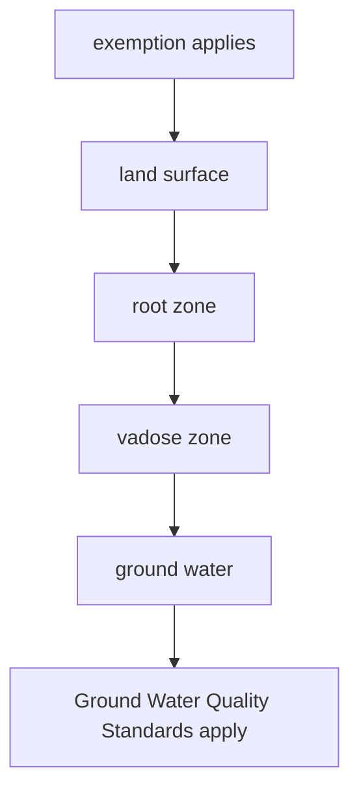
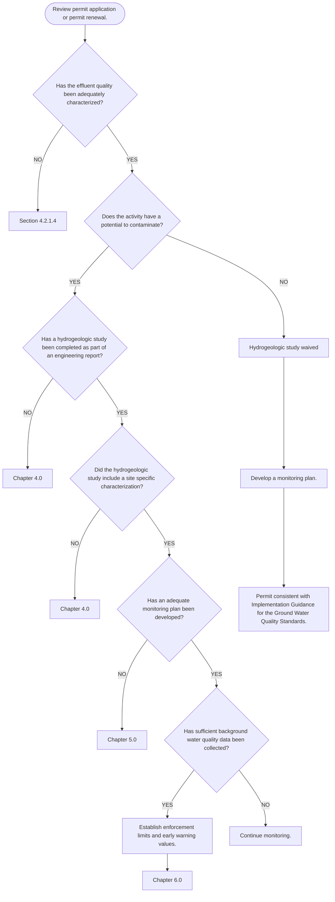
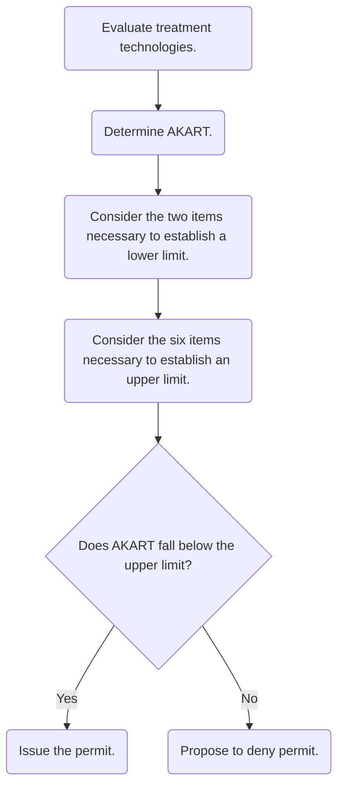
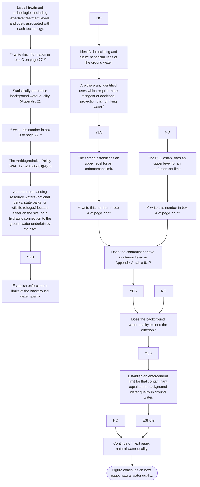
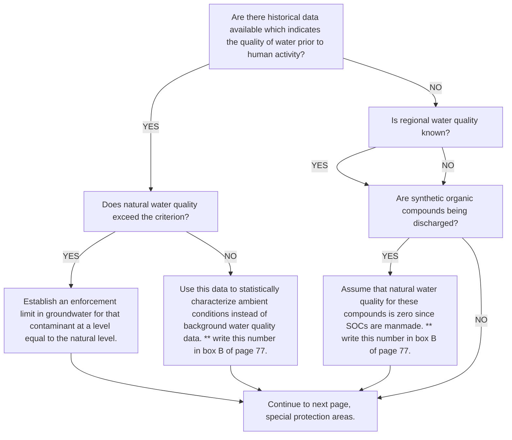
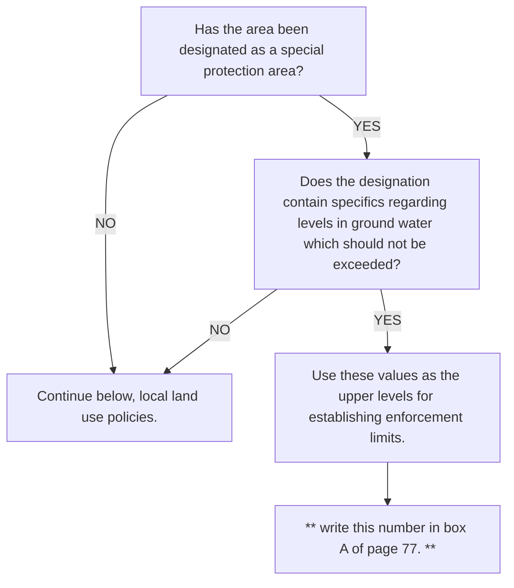

# 1996_Ecology_02_Guidance_Document.pdf

# Implementation Guidance
for the Ground Water Quality Standards

[Image: Washington State Department of Ecology logo]
\n---\n

No text detected on this page.
\n---\n

# Implementation Guidance
----

for the Ground Water Quality Standards

Prepared by
Melanie B. Kimsey
Watershed Management Section
P.O. Box 47600
Olympia, Washington 98504-7600
\n---\n

The page is blank with no text or figures.
\n---\n

# Table of Contents

- Acknowledgments
- Abstract
- 1.0 Applicability
  - 1.1 Activities to Which This Regulation Applies
  - 1.2 Exemptions From the Regulation [WAC 173-200-010 (3)(a, b, c)]
  - 1.3 Implementation
    - 1.3.1 Activities Regulated by Ecology
      - 1.3.1.1 State Waste Discharge Permits
      - 1.3.1.2 National Pollutant Discharge Elimination System (NPDES) Permits
      - 1.3.1.3 General Permits
      - 1.3.1.4 Independent Cleanup Sites
    - 1.3.2 Activities Regulated by Other Mechanisms
      - 1.3.2.1 Agriculture
      - 1.3.2.2 On-Site Sewage Systems
      - 1.3.2.3 Municipal Solid Waste Disposal Facilities
      - 1.3.2.4 Other Solid Waste Facilities
  - 1.4 Scope of Guidance
- 2.0 Process For Using This Guidance Document
  - 2.1 Process
  - 2.2 Checklist of Requirements to Comply With The Ground Water Quality Standards
- 3.0 Antidegradation Policy
  - 3.1 Authority
    - 3.1.1 Revised Code of Washington (RCW)
    - 3.1.2 Washington Administrative Code (WAC)
  - 3.2 Overriding Public Interest
  - 3.3 Antidegradation
    - 3.3.1 Permitted Activities
    - 3.3.2 Nonpermitted Activities
    - 3.3.3 Instances When the Background Water Quality Is Greater Than the Criteria
  - 3.4 Nondegradation
  - 3.5 Beneficial Uses
- 4.0 Hydrogeologic Study
\n---\n

# 4.1 Objectives of the Hydrogeologic Study
## 4.2 Characterization Requirements
### 4.2.1 Minimum Requirements
#### 4.2.1.1 Ambient Ground Water Quality
##### 4.2.1.1.1 Background water quality
##### 4.2.1.1.2 Natural Water Quality
##### 4.2.1.1.3 Minimum Number of Samples
#### 4.2.1.2 Ground Water Depth and Flow Direction
#### 4.2.1.3 Location and Construction of Existing Area Wells
#### 4.2.1.4 Waste Characterization
##### 4.2.1.4.1 Common Wastewater Characteristics
##### 4.2.1.4.2 Impoundments
#### 4.2.1.5 AKART
#### 4.2.1.6 Beneficial Uses
### 4.2.2 Additional Hydrogeologic Characterization Requirements
#### 4.2.2.1 Geology
#### 4.2.2.2 Hydrogeology
#### 4.2.2.3 Area Impacted
#### 4.2.2.4 Location and Construction of Existing Area Wells
#### 4.2.2.5 Surface Water

# 5.0 Monitoring Plan
## 5.1 Media to be Sampled
## 5.2 Constituents to be Analyzed
### 5.2.1 Constituents of Concern
### 5.2.2 Organic Compounds
### 5.2.3 Major Cations and Anions
### 5.2.4 Metals
### 5.2.5 Microbiological Parameters
### 5.2.6 Field Parameters
## 5.3 Location of Monitor Wells
## 5.4 Monitor Well Construction
### 5.4.1 Well Construction Regulatory Requirements
#### 5.4.1.1 Monitor Wells
#### 5.4.1.2 Existing Wells
### 5.4.2 Drilling Methods
### 5.4.3 Screened Interval
### 5.4.4 Casing Materials
### 5.4.5 Monitor Well Development
## 5.5 Vadose Zone Monitoring
## 5.6 Point of Compliance
## 5.7 Alternate Points of Compliance
## 5.8 Monitoring Frequency
## 5.9 Sampling and Analytical Protocol
\n---\n

## 5.9

* 5.9.1 Well Purging
* 5.9.2 Sample Collection
* 5.9.3 Decontamination
* 5.9.4 Quality Assurance/Quality Control

## 6.0 Numerical Limits

### 6.1 Introduction

### 6.2 Criteria

### 6.3 Enforcement Limits

- 6.3.1 Overview
- 6.3.2 Establishing Enforcement Limits
  - 6.3.2.1 Treatment Technology Evaluation
  - 6.3.2.2 Water Quality Evaluation
  - 6.3.2.2.1 The Antidegradation Policy
  - 6.3.2.2.2 Natural Water Quality
  - 6.3.2.2.3 Protection of Human Health and the Environment
  - 6.3.2.2.4 Special Protection Areas
  - 6.3.2.2.5 Protection of Existing and Future Beneficial Uses
  - 6.3.2.2.6 Effects of the Presence of Multiple Chemicals, and Multiple Exposure Pathways
  - 6.3.2.2.7 Other Land Use Plans, Policies, or Ordinances
  - 6.3.2.2.8 Pollution of Other Media such as Soils or Surface Waters
  - 6.3.2.2.9 Other Considerations Ecology Deems Necessary
- 6.3.3 Background Water Quality
  - 6.3.3.1 Establishing Enforcement Limits When Background Water Quality Is Greater Than the Criterion
  - 6.3.3.2 Establishing Enforcement Limits When Background Water Quality Is Less Than the Detection Limit
- 6.3.6 Constituents Without Criteria
- 6.3.7 Instances When an Enforcement Limit Can Exceed a Criterion
  - 6.3.7.1 Natural Ground Water Quality Exceeds the Criterion
  - 6.3.7.2 Background Water Quality Exceeds the Criterion
  - 6.3.7.3 PQL Greater Than Criterion
  - 6.3.7.4 Secondary Standards In Non-Potable Water
  - 6.3.7.5 Isolated Artificial Or Seasonal Ground Water
  - 6.3.7.6 Net Environmental Benefit
  - 6.3.7.7 Option to Demonstrate Overriding Public Interest
- 6.4 Early Warning Values

### 7.0 Enforcement

- 7.1 Enforcement Actions
- 7.2 Contingency Plans
- 7.3 Notification

## 8.0 Special Protection Areas

- 8.1 Purpose
- 8.2 Implications of Special Protection Area Designation

\n---\n

# 8.3 Procedures for Designating Special Protection Areas

# 9.0 Appendix A: Ground Water Contaminant Levels

# 10.0 Appendix B: Independent Leaking Underground Storage Tank (LUST) Cleanup Sites

# 11.0 Appendix C: Well Construction and Design Considerations: 

# 12.0 Appendix D: Method for Establishing Criteria for Carcinogens

## 12.1 Model Description

## 12.2 Calculating the Effects of Multiple Carcinogens

# 13.0 Appendix E: Statistical Methods for Establishing Background Water Quality

## 13.1 Independence/Seasonality

## 13.2 Outliers

## 13.3 Number of Samples

## 13.4 Values Below the Detection Limit

### 13.4.1 Cohen's Adjustment

### 13.4.2 Aitchison's Adjustment

## 13.5 Distribution Assumptions (Tests of Normality)

### 13.5.1 Probability Plots

### 13.5.2 Shapiro-Wilk (W-Test)

### 13.5.3 Coefficient of Skewness

## 13.6 Parametric Tolerance Intervals

## 13.7 Nonparametric Tolerance Intervals

# 14.0 References

# 15.0 Glossary

# 16.0 Acronyms, Abbreviations, and Chemical Symbols

# 17.0 Index

\n---\n

# List of Figures

- Figure 1.1 Agricultural and Land Application Exemptions
- Figure 1.2 Determining Which Activities are Required to Complete a Hydrogeologic Study and a Monitoring Plan
- Figure 2.1 Water Quality Program State Waste Discharge Permitting Process
- Figure 5.1 Point of Compliance Location
- Figure 6.1 Relationship of the numerical Limits to Ground Water Quality
- Figure 6.2 Overview of the Process to Establish Enforcement Limits
- Figure 6.3 Statistical Procedure for Establishing Enforcement Limits and Early Warning Values
- Figure 6.4 Establishing Enforcement Limits
\n---\n

# List of Tables
* Table 2.1: Checklist of Requirements to Comply With the Ground Water Quality Standards
* Table 4.1: Common Constituents of Concern Discharged by Specific Activities
* Table 5.1: Suggested Media to Monitor Based on Treatment and Disposal Methods
* Table 5.2: Recommended Ground Water Monitoring Parameters
* Table 5.3: Benefits of Various Screen Lengths, (EPA, 1986)
* Table 5.4: Ground Water Sampling Equipment
* Table 5.5: Sampling Equipment Material
* Table 7.1: Recommended Action When Numeric Violations Occur
* Table 9.1: Ground Water Contaminant Levels
* Table 10.1: LUST Short Term <60 day Discharge
* Table 10.2: LUST Long Term ≥60 day Discharge
* Table 10.3: LUST Discharge Quality Maximum Concentration Levels
* Table 11.1: Drilling Methods (not listed in order of preference)
* Table 11.2: Monitor Well Casing Materials
* Table 11.3: Well Development Techniques (a combination of these methods is recommended)
* Table 13.1: Treatment of Values Below the Detection Limit
* Table 13.2: Critical Values for Tₙ in the Test for Outliers
* Table 13.3: Values of the Parameter Lambda for Cohen's Adjustment for Nondetected Values
* Table 13.4: Coefficients for the W-Test (Shapiro-Wilk Test of Normality)
* Table 13.5: Computed Value for the W-Statistic
* Table 13.6: Critical Skewness Coefficients
* Table 13.7: K Values for Tolerance Intervals
* Table 13.8: Minimum Coverage of 95% Confidence Nonparametric Tolerance Intervals
\n---\n

# Acknowledgments

I would like to recognize several people who provided extensive review and assistance in developing the specific conditions for this document. Dave Garland, Mike Herold, Cheryl Niemi, Don Nichols, Cyronose Spicer, and Dorothy Stoffel spent considerable time and effort by participating in the development work group for this document. In particular, Bob Raforth contributed innovative ideas and extra initiative towards this project. Kelsey Highfill assisted in creating the design and the format of this document. Mike Llewelyn and Bob Barwin posed the difficult questions which helped keep this document on track. I especially want to thank Carl Nuechterlein, who was the Water Quality Program Management Team sponsor for this project and graciously deflected most of the bullets.

I would also like to acknowledge the external Ground Water Guidance Work group, and the Water Quality Program Management Team for assisting in the review and development of the policies established in this document.

For all of their help and assistance, I am extremely grateful.
\n---\n

# Abstract

This guidance document explains and interprets the Ground Water Quality Standards (Chapter 173-200 WAC). The objective of this document is to promote consistent statewide implementation of these standards for all activities which have a potential to degrade ground water quality. The standards are a regulatory approach to protect and preserve ground water quality. The Ground Water Quality Standards are preventative in nature and protect all waters in the saturated zone. The goal of the standards is to maintain a high quality of ground water and to protect existing and future beneficial uses through the reduction or elimination of contaminants discharged to the subsurface. The goal is achieved through three mechanisms:

1. AKART - all known, available and reasonable methods of prevention, control and treatment. All wastes must be provided with AKART prior to entry into the state's waters, regardless of the quality of water.

2. The antidegradation policy which mandates the protection of background water quality and prevents the degradation of water quality which would harm a beneficial use or violate the Ground Water Quality Standards.

3. The human health and welfare based standards which include numeric and narrative standards.

The standards affect all activities which have a potential to impact ground water quality. This includes both point source and nonpoint source activities. Activities which are regulated by these standards include municipal wastewater treatment facilities, surface impoundments, industrial facilities, ground water recharge projects, land application projects, mines, landfills, injection wells, agricultural activities, and septic systems.

This guidance document implements the Ground Water Quality Standards for all activities regulated by Ecology which have a potential to contaminate ground water. This applies to only those activities which are not covered by another regulation, general permit, guideline or BMPs, which include ground water protection provisions.

Proponents of all activities that may impact ground water quality have a legal obligation not to violate these standards regardless of whether they are directly regulated by Ecology through permits or through other regulatory mechanisms.
\n---\n

# 1.0 Applicability

This chapter describes:
- Those activities which are regulated by the Ground Water Quality Standards, Chapter 173-200 WAC (Washington Administrative Code).
- Those activities which are exempt from Chapter 173-200 WAC.
- The various mechanisms for how Chapter 173-200 WAC should be implemented, including those activities which must use this Implementation Guidance document.

as an aquifer (ground water which produces a significant yield) in order to be protected. Likewise the standards do not distinguish ground water which is perched, seasonal or artificial. Chapter 90.48 RCW (Revised Code of Washington) mandates that all underground water be protected; however, water in the vadose zone (unsaturated zone) is not specifically protected by the Ground Water Quality Standards.

## 1.1 Activities to Which This Regulation Applies

The Ground Water Quality Standards apply to any activity which has a potential to contaminate ground water quality. This includes both point source activities and nonpoint source activities. There are many potential sources of ground water contaminants, these include: landfills, mines, wastewater treatment facilities, industrial impoundments, septic systems, agricultural activities, stormwater discharges, land application facilities, underground storage tanks, plus many other sources.

These standards protect all ground water in the saturated zone, statewide. Since ground water in the state has not been fully characterized, especially the interconnections between aquifers, the state protects all ground water equally. All ground water is classified as a potential source of drinking water for the purposes of this guidance. It is not necessary for ground water to be defined

1
\n---\n

# Figure 1.1 Agricultural and Land Application Exemptions



Figure 1.1 Agricultural and Land Application Exemptions

Exemptions 1 and 2 are included in the regulation to prevent a technical violation of the standards when fields are temporarily saturated during irrigation. This should not be misinterpreted to be an exemption for all agricultural or land application facilities. It is common for farmers, food processors, and other facilities which land apply wastewater to temporarily saturate their fields when irrigating. Pesticides and fertilizers are frequently applied to crops and to the soils intended for crop use and uptake. The Ground Water Quality Standards apply to all water in the saturated zone. Therefore, if the soils are saturated, this condition could be viewed as a violation of the Ground Water Quality Standards. WAC 173-200-010 (3)(a,b) is an exemption which prevents this situation from being declared a violation. If the water has migrated below the root zone, the contaminants will no longer be available to the crops. Once the contaminants migrate to ground water then the Ground Water Quality Standards apply to the discharge. Figure 1.1 illustrates this point.

1. Clean up actions approved by the department under the Model Toxics Control Act (MTCA), Chapter 70.105D RCW, or approved by the United States Environmental Protection Agency (EPA) under the Comprehensive Environmental Response Compensation and Liability Act (CERCLA), 42 USC 9601 et seq. Ground Water Quality Standards apply to the discharge.
\n---\n

# 1.3 Implementation

water cleanup standards for such sites shall be developed under WAC 173-340-720, [WAC 173-200-010 (3)(c)].

The Ground Water Quality Standards are designed to be preventative in nature and protect ground water from contamination. They are not intended to be used as remediation standards. There are other state and federal cleanup regulatory programs such as MTCA and CERCLA, which specifically regulate environmental remediation activities. This exemption includes the re-injection of water as a part of pump and treat activities. Therefore, these cleanup activities are exempt from the Ground Water Quality Standards to avoid regulatory duplication and to apply more appropriate standards to areas which have been previously degraded and are currently being remediated.

Even though it is not explicitly stated in the rule, Ecology has determined that the intent of the standards is also to exempt corrective actions conducted under RCRA (Resource Conservation and Recovery Act), regardless of whether they are conducted under MTCA.

Independent cleanup actions are not exempt from Chapter 173-200 WAC. The implementation of the Ground Water Quality Standards for independent cleanup actions is discussed under section 1.3.1.4.

Ground Water Quality Standards must still be achieved. This can be accomplished through consistent regulation development, implementation of best management practices (BMPs), permits, or other regulatory controls. Some of these activities are described below:

1.3.1 Activities Regulated by Ecology

Some of the activities that the Department of Ecology is responsible for permitting include all discharges to ground water, surface water, and independent cleanup sites. A discharging facility is one which cannot completely contain all the wastewater generated by its operation. If a facility is a nondischarging facility then it does not have a potential to contaminate ground water quality and they are not required to complete a hydrogeologic study or a monitoring plan.

1.3.1.1 State Waste Discharge Permits

Facilities which are required to receive a state waste discharge permit must be in compliance with the Ground Water Quality Standards. This can be achieved through implementation of this guidance and in consultation with the Department of Ecology.

Any facility which is determined to have a potential to contaminate ground water must take preventative measures to protect ground water quality. A facility is determined to have a potential to contaminate if there is a discharge of a regulated substance which is either applied at rates greater than agronomic rates, or if the wastewater is stored in an impoundment (whether lined or unlined).
\n---\n

# 1.3.1.1 Regulated Substances and Monitoring Provisions
A regulated substance is any contaminant listed in Appendix A. Any facility which is determined to have a potential to contaminate must complete a hydrogeologic study and a monitoring plan, unless they are covered by a general permit, regulation, policy, guideline, or BMPs, which include ground water protection provisions. If a facility is determined to have a limited potential to contaminate then the hydrogeologic study is waived, but a monitoring plan should still be developed based on the estimated risk. Figure 1.2 describes the characteristics of those facilities which have a potential to contaminate.

State waste discharge permits are typically required for food processing facilities, mines, wastewater treatment facilities, wastewater reuse projects, large on-site sewage systems, and other industrial or commercial facilities which store their wastes in lagoons, land apply their wastewater, or discharge it to the subsurface.

## 1.3.1.2 National Pollutant Discharge Elimination System (NPDES) Permits
NPDES permits are required for discharges to surface water bodies. If there is also a discharge that impacts ground water, then the requirements of a state waste discharge permit must also be incorporated into the NPDES permit. The Ground Water Quality Standards is similar to the process described in section 1.3.1.1.

## 1.3.1.3 General Permits
A general permit is developed by the Water Quality Program within Ecology for activities which are numerous, similar in nature and have the potential to impact water quality. The hydrogeologic study and the monitoring plan are waived for any activity which is regulated by a general permit which include ground water protection provisions.

Currently, general permits with ground water protection provisions have been established for dairies, and sand and gravel operations.

## 1.3.1.4 Independent Cleanup Sites
The Ground Water Quality Standards do not exempt all independent cleanup sites. All discharges to ground water at independent cleanup sites must register with the state underground injection control (UIC) program. The UIC coordinator will evaluate the registration and determine if a permit is required. Only those independent cleanup sites which are required to receive a state waste discharge permit will be required to implement the Ground Water Quality Standards through this guidance document. Independent cleanups under the Independent Remedial Action Program which have received a “no further action” letter from Ecology, are excluded from implementing this guidance document.

Petroleum based independent leaking underground storage tanks (LUST) are allowed an exemption from permits for short term discharges that meet higher treatment standards. If a LUST site meets the criteria listed in Appendix B then it is assumed that the site is in compliance with the standards and it is not required to implement the standards with this guidance document.
\n---\n

```mermaid
flowchart TD
  A[This figure applies only to those activities which are not exempt from Chapter 173-200 WAC, (section 1.2).]
  B{Is there a discharge of a regulated substance to the subsurface or the land surface?}
  C1[No potential to contaminate ground water.]
  D1[Hydrogeologic study and monitoring plan waived.]
  B -->|NO| C1
  C1 --> D1
  B -->|YES| E{Are the discharge rates greater than agronomic rates? Or is the wastewater stored in an impoundment, (whether lined or unlined)?}
  E -->|NO| F[Limited potential to contaminate ground water.]
  F --> G[Develop a monitoring plan based on the estimated risk.]
  G --> H[Hydrogeologic study waived.]
  E -->|YES| I[Potential to contaminate ground water.]
  I --> J{Is the activity covered by one of the following? A general permit, a policy, guidelines or BMP's, and which include ground water protection provisions.}
  J -->|YES| K[Hydrogeologic study and Monitoring plan waived.]
  J -->|NO| L[Hydrogeologic study and monitoring plan must be completed.]
```

Figure 1.2 Determining Which Activities are Required to Complete a Hydrogeologic Study and a Monitoring Plan
\n---\n

# 1.3.2 Activities Regulated by Other Mechanisms

For other activities which have a potential to contaminate ground water and are regulated by other agencies, the implementation and enforcement of the Ground Water Quality Standards will be administered through memorandums of understanding with each agency.

## 1.3.2.1 Agriculture

Implementation and enforcement of the Ground Water Quality Standards for general agricultural activities will be handled through a memorandum of understanding (MOU) with the Department of Agriculture, [WAC 173‑200‑080(7)(b)]. This MOU will be developed consistent with the strategy "Protecting Ground Water: A Strategy for Managing Agricultural Pesticides and Nutrients", (Washington State Department of Ecology, 1992). Currently there is also a memorandum of agreement between the Department of Ecology and the Washington State Conservation Commission which describes how complaints on water quality violations will be managed.

## 1.3.2.2 On-Site Sewage Systems

On-site sewage systems are regulated by the Washington State Department of Health, local health departments and the Department of Ecology. Ecology has authority over systems that dispose of waste in quantities greater than 14,500 gallons per day for conventional systems and greater than 3,500 gallons per day for mechanical systems. The larger on-site systems regulated by Ecology may also be required to apply for a State Waste Discharge Permit and to implement the Ground Water Quality Standards through this guidance document. Implementation and enforcement of Chapter 173-200 WAC for the smaller on-site sewage systems, which are currently regulated by the Department of Health and local health departments, will be handled through a memorandum of understanding with these jurisdictions.

## 1.3.2.3 Municipal Solid Waste Disposal Facilities

Municipal Solid Waste Disposal Facilities are required to comply with Chapter 173-351 WAC (Criteria for Municipal Solid Waste Landfills), as well as with the Ground Water Quality Standards. Local health departments implement this rule through the issuance of solid waste permits. The requirements for a hydrogeologic study and monitoring plan are explicitly stated in Chapter 173-351 WAC and are more extensive than the requirements listed in this document. Therefore, compliance with the Municipal Solid Waste Disposal Facilities Regulation ensures compliance with the Ground Water Quality Standards.

## 1.3.2.4 Other Solid Waste Facilities

Other solid waste facilities, including landfills that accept inert and demolition waste, wood waste and other solid wastes, are required to comply with Chapter 173-304 WAC, the Minimum Functional Standards for Solid Waste Handling. Inert and demolition landfills are not required to install ground water monitoring because of their relatively low potential to impact ground water quality. Local health departments permitting other solid waste facilities, which are required to monitor ground water,
\n---\n

will be encouraged to follow the requirements and the guidance associated with the implementation of Chapter 173-351 WAC, (Criteria for Municipal Solid Waste Landfills).

# 1.4 Scope of Guidance

Ecology's Implementation Guidance Document for the Ground Water Quality Standards will be used to implement Chapter 173-200 WAC for activities directly controlled by the agency which are required to receive a State Waste Discharge Permit or other authorizations. The elements outlined in this guidance document are required for all facilities which have a potential to contaminate ground water (except those activities exempt and listed under section 1.2). The hydrogeologic study and the monitoring plan assess the current and future conditions of the environment, and are necessary to determine compliance. Activities which are required to follow the elements described in this guidance document are illustrated in figure 1.2. If an activity is not exempt from the regulation and discharges a regulated substance at rates greater than agronomic rates it is considered to have a potential to contaminate. A facility is also considered to have a potential to contaminate if wastewater containing a regulated substance is stored in an impoundment (whether lined or unlined). A regulated substance is any contaminant listed in Appendix A, table 9.1. If the facility is determined to have a limited potential to contaminate, then the hydrogeologic study is waived, but a monitoring plan should still be developed based on the estimated risk. If the activity is determined to have a potential to contaminate, and the activity discharges to the subsurface or land surface, then the hydrogeologic study is required; unless the activity is covered by one of the following; a general permit, a policy, guidelines, regulations or BMPs which have Ecology approved ground water protection provisions**.

**(Even if a general permit is required or ground water protection provisions have been developed, it does not preclude or inhibit Ecology's ability to request a ground water evaluation or issue an order requiring additional hydrogeologic characterization elements).**

For example, a dairy farm has a potential to contaminate ground water since it discharges nitrogen compounds, chloride and total dissolved solids to the subsurface through a lined impoundment. However, since a general wastewater discharge permit has been developed by the Department of Ecology and contains ground water protection provisions, a hydrogeologic study and a monitoring plan are not necessary, unless the Department determines that an adverse impact may be occurring despite compliance with the general permit requirements.

Another example is a gold mining operation. This type of activity has a potential to contaminate ground water. It includes a discharge to the subsurface, it is not covered by a general permit, and it is not regulated through an approved Ecology policy; therefore, the facility must complete a hydrogeologic study and design a monitoring plan.

The following types of activities are typically considered to have a potential to contaminate:

* Application of wastewater, wastes, or chemicals to the land or subsurface
* Unlined wastewater impoundments
* Lined wastewater impoundments
* On-site sewage systems
\n---\n

* Irrigated agriculture
* Confined animal feeding operations (CAFO)
* Food processing facilities
* Wastewater reuse facilities
* Stormwater discharges
* Landfills
* Mineral mining
* Municipal wastewater treatment facilities.
* (This is not a comprehensive list.)
\n---\n

# 2.0 Process For Using This Guidance Document

This chapter describes:
- The intent and the objectives of the Implementation Guidance for the Ground Water Quality Standards.
- How the document should be used.
- A brief overview of the following chapters.
- A checklist for determining required elements.

## 2.1 Process

The Implementation Guidance for the Ground Water Quality Standards explains the intent of Chapter 173-200 WAC, and interprets those portions of the standards which need a more precise definition for adequate implementation. This guidance details the specific requirements necessary to assure compliance with the Ground Water Quality Standards for those activities which are required to receive a state waste discharge permit. The Ground Water Quality Standards are designed to be preventative in nature and to protect ground water from contamination. The goal of the standards is to maintain existing high quality ground water and to protect existing and future beneficial uses. This goal is achieved through three basic mechanisms:

1. All discharges of pollutants to ground water must be treated at a minimum with AKART, or BMPs implemented through permits or agreements with other agencies.
2. The antidegradation policy which mandates the protection of background water quality and prevents degradation of water quality which would harm a beneficial use or violate the Ground Water Quality Standards. Additional treatment may be necessary to achieve the antidegradation policy.
3. The human health and welfare based standards which include numeric and narrative standards. The numeric criteria are listed in table 1 of the regulation and in Appendix A.

The intent of the standards is not to allow degradation of ground water up to the criteria, but rather it is intended to protect background water quality to the extent practical.

One of the primary objectives of this guidance document is to provide Ecology water quality permit managers, hydrogeologists, and engineers the necessary information to incorporate ground water quality protection provisions into water quality based permits. This guidance will also be useful to the regulated community by allowing them to understand more fully the information necessary to comply with state regulations. The specific requirements will depend upon each facility and its unique situation. This document is not intended to be inclusive or address every circumstance at every facility. This document is intended to be used as a general guide to facilitate consistent state-wide issuance of permits. Figure 2.1 is a flow chart which outlines the major requirements necessary to develop a permit which is consistent with the Ground
\n---\n

# Water Quality Standards

This flow chart references specific chapters, sections and page numbers for ease of use. Additionally, this document will be useful for other activities which have a potential to impact ground water quality but are regulated by other programs or agencies.

Ecology will assume that all contaminants which are discharged to the environment will have the potential to migrate to ground water, except for those instances where the discharger can demonstrate to Ecology's satisfaction that site specific characteristics will degrade or attenuate contaminants prior to reaching ground water, and will not generate contaminants by discharging the wastewater into the environment.

These standards apply to all discharges to ground which have the potential to degrade ground water. Any person who operates an existing activity or proposes an activity which discharges waste materials from industrial, commercial or municipal operations into ground and surface waters of the state is required to apply for a state waste discharge permit (Chapter 173-216 WAC). These activities are required to implement Chapter 173-200 WAC through the use of this guidance document. Some activities are covered under a general permit and have ground water protection provisions already incorporated into the requirements.

Chapter 1.0, the Applicability chapter, describes which activities are regulated by Chapter 173-200 WAC, which activities are exempt from the regulation, and which activities are covered by the Implementation Guidance for the Ground Water Quality Standards.

Ground Water Quality Standards. Chapter 2.0 describes the process for using this guidance document. Chapter 3.0, the Antidegradation chapter interprets the antidegradation policy specified in state law, to protect ground water quality. Chapter 4.0, the Hydrogeologic Study chapter details the necessary requirements to characterize the geology and the hydrogeology of the aquifer at the site. The evaluation of treatment technology alternatives, and the AKART determination are also discussed. These elements are important to assess the environmental conditions and an activity's impact on ground water quality. Chapter 5.0, the Monitoring Plan chapter, describes the elements to consider in monitoring the impacts of the facility on the environment. The point of compliance is also discussed in this chapter. Chapter 6.0, the Numerical Limits chapter, implements the antidegradation policy through the establishment of enforcement limits and early warning values. This chapter describes how site specific data are used to statistically determine compliance under various scenarios. Chapter 7.0, the Enforcement chapter, suggests how violations of the Ground Water Quality Standards should be managed. Finally, Chapter 8.0, the Special Protection Areas chapter, describes the implications and process for petitioning an area for designation.

This is a guidance document, prepared by Ecology for the benefit of its staff and the community regulated by Chapter 173-200 WAC. This document is not a regulation, but the information in this guidance document is intended to clarify the intent of the standards for successful implementation.
\n---\n

# Figure 2.1 Water Quality Program State Waste Discharge Permitting Process



Figure 2.1 Water Quality Program State Waste Discharge Permitting Process
\n---\n

# 2.2 Checklist of Requirements to Comply With The Ground Water Quality Standards

The following is a checklist which contains the elements which should be considered in order to implement the ground water quality standards through a state waste discharge permit. If the activity is covered by a general permit, regulation, policy, guideline or BMPs, which have ground water protection provisions, then the hydro-geologic study and the monitoring plan are waived.

The level of effort required to complete each element is dependent upon the facility and its unique situation. Factors which influence the level of effort include the wastewater characteristics (volume, contaminants present, concentration) and the site characteristics (depth of aquifer, geology, treatment capacity of the soils). For example, a facility which has a limited potential to contaminate

<table>
<thead>
<tr><th>Hydrogeologic Study</th><th>Minimum requirements:</th></tr>
</thead>
<tbody>
<tr><td>Ambient ground water quality:</td><td>Eight ground water quality samples (4.2.1.1.3)</td></tr>
<tr><td>Constituents of concern (5.2.1)</td><td></td></tr>
<tr><td>Ground water flow direction: (4.2.1.2)</td><td>Depth to water<br>Potentiometric map</td></tr>
<tr><td>Location and construction of existing wells: (within a 1/4 mile radius of the discharge (4.2.1.3))</td><td></td></tr>
</tbody>
</table>

\n---\n

<table>
<caption>Table 2.1 (continued)</caption>
<tbody>
<tr><td>Well use</td><td></td></tr>
<tr><td>Well construction</td><td></td></tr>
<tr><td>Depth</td><td></td></tr>
<tr><td>Static water level</td><td></td></tr>
<tr><td>Screened interval</td><td></td></tr>
<tr><td>Geologic well logs</td><td></td></tr>
<tr><td>Waste characterization:</td><td></td></tr>
<tr><td>Constituents of concern (5.2.1)</td><td></td></tr>
<tr><td>Quality (mean and range)</td><td></td></tr>
<tr><td>Quantity (rate, frequency and duration).</td><td></td></tr>
<tr><td>AKART: (4.2.1.5)</td><td></td></tr>
<tr><td>Beneficial uses: (4.2.1.6)</td><td></td></tr>
<tr><td>Additional requirements: The level of effort in considering each of the following elements depends upon the level of complexity at each site. The level of expectation should be discussed with Ecology. These elements should be considered if any of the following conditions exist:</td><td></td></tr>
<tr><td>1) Compliance is dependent upon site specific treatment,</td><td></td></tr>
<tr><td>2) A catastrophic failure could impair a beneficial use,</td><td></td></tr>
<tr><td>3) The quantity of wastewater discharged is greater than 15,000 gallons per day, or</td><td></td></tr>
<tr><td>4) If Ecology determines it is necessary.</td><td></td></tr>
<tr><td>Geology: (4.2.2.1)</td><td></td></tr>
<tr><td>Well logs</td><td></td></tr>
<tr><td>Geologic maps</td><td></td></tr>
<tr><td>Cross sections</td><td></td></tr>
<tr><td>Subsurface features</td><td></td></tr>
<tr><td>Geomorphology</td><td></td></tr>
<tr><td>Lithology</td><td></td></tr>
<tr><td>Hydrogeology: (4.2.2.2)</td><td></td></tr>
<tr><td>Ground water velocity</td><td></td></tr>
<tr><td>Transmissivity</td><td></td></tr>
<tr><td>Storage coefficient</td><td></td></tr>
<tr><td>Hydraulic conductivity</td><td></td></tr>
<tr><td>Porosity</td><td></td></tr>
<tr><td>Dispersivity</td><td></td></tr>
<tr><td>Precipitation</td><td></td></tr>
<tr><td>Evapotranspiration</td><td></td></tr>
</tbody>
</table>

\n---\n

# Table 2.1 (continued)

- Area impacted: (4.2.2.3)

- Location and construction of existing wells: This is similar to the requirement listed under minimum requirements except the wells should be identified for a 1 mile radius from the discharge (4.2.2.4).

- Surface water: (4.2.2.5)
  - Surface water bodies
  - Marine waters
  - Wetlands

- Monitoring Plan:
  - Even if there is a limited potential to contaminate, some level of monitoring may be necessary to assure that a discharge is not occurring which is impacting the environment.

- Media to be sampled: (5.1)
  - Ground water
  - Surface water
  - Vadose zone (5.5)
  - Soil
  - Effluent
  - Treatment process

- Constituents to be analyzed: (5.2)
  - Volatile organic compounds
  - Inorganic constituents
  - Ions (5.2.3)
  - Metals (5.2.4)
  - Microbiological pathogens (5.2.5)
  - Field parameters (5.2.6)

- Location of monitor wells: (5.3)
  - Upgradient
  - Downgradient
  - Vertical placement

- Well construction: (5.4)
  - Well type
  - Existing (5.4.1.2)
  - Monitor (5.4.1.1)
  - Drilling method (5.4.2)
  - Screened interval (5.4.3)
\n---\n

<table>
  <thead>
    <tr>
      <th>Item</th>
      <th>Reference</th>
    </tr>
  </thead>
  <tbody>
    <tr>
      <td>Casing materials</td>
      <td>(5.4.4)</td>
    </tr>
<tr>
      <td>Monitor well development</td>
      <td>(5.4.5)</td>
    </tr>
<tr>
      <td>Point of compliance/Alternate point of compliance</td>
      <td>(5.6/5.7)</td>
    </tr>
<tr>
      <td>Monitoring frequency</td>
      <td>(5.8)</td>
    </tr>
<tr>
      <td>Sampling and analytical protocol</td>
      <td>(5.9)</td>
    </tr>
<tr>
      <td>Well purging</td>
      <td>(5.9.1)</td>
    </tr>
<tr>
      <td>Sample collection</td>
      <td>(5.9.2)</td>
    </tr>
<tr>
      <td>Equipment</td>
      <td>(5.9)</td>
    </tr>
<tr>
      <td>Material</td>
      <td>(5.9)</td>
    </tr>
<tr>
      <td>Decontamination procedures</td>
      <td>(5.9.3)</td>
    </tr>
<tr>
      <td>QA/QC (quality assurance/quality control)</td>
      <td>(5.9.4)</td>
    </tr>
<tr>
      <td>Field blanks</td>
      <td>—</td>
    </tr>
<tr>
      <td>Equipment blanks</td>
      <td>—</td>
    </tr>
<tr>
      <td>Duplicates</td>
      <td>—</td>
    </tr>
<tr>
      <td>Lab spikes</td>
      <td>—</td>
    </tr>
<tr>
      <td>Background water samples</td>
      <td>—</td>
    </tr>
  </tbody>
</table>

\n---\n

\n---\n

# 3.0 Antidegradation Policy

This chapter describes:
- The regulatory authority for the antidegradation policy
- Overriding public interest
- How the antidegradation policy is implemented for permitted and nonpermitted activities
- Nondegradation
- Beneficial uses.

## 3.1 Authority

The antidegradation policy is designed to ensure the protection of the state's ground waters and the natural environment. The antidegradation policy and AKART form the primary mechanisms for protecting ground water quality. Antidegradation protects background water quality and prevents degradation of the state's waters beyond the criteria. Criteria are the numeric values and narrative standards that represent contaminant concentrations which are not to be exceeded in ground water. This policy is not a nondegradation policy. Nondegradation is different than antidegradation in that it prohibits any increase in contaminant concentrations in ground water.

### 3.1.1 Revised Code of Washington (RCW)

The antidegradation policy is based on RCW 90.48.010 (the Water Pollution Control Act) and RCW 90.54.020 (3) (the Water Resources Act). The Ground Water Quality

### 3.1.2 Washington Administrative Code (WAC)

Standards (Chapter 173-200 WAC) are a device to establish and implement the antidegradation policy in ground water.

The antidegradation policy as described in the Ground Water Quality Standards (WAC 173-200-030) has a two tiered approach:

1. Existing and future beneficial uses shall be maintained and protected. Degradation of ground water quality that would interfere with or become injurious to beneficial uses shall not be allowed, [WAC 173-200-030 (2)(a)]. At a minimum all ground water should be protected as a potential source of drinking water. Not all ground water is presently used for drinking water, nor do the standards presume that all ground water is suitable as a drinking water source. However, the Ground Water Quality Standards recognize the potential for future use of these sources to be used for drinking water purposes if other sources become diminished or the demand for water increases.

2. Whenever ground waters are of a higher quality than the criteria assigned for said waters, the existing water quality shall be protected, and contaminants that will reduce the existing quality thereof shall not be allowed to enter such waters, except in those instances where it can be demonstrated to the department's satisfaction that:

a) An overriding public interest will be served.
\n---\n

b)   All contaminants proposed for entry into said waters shall be provided with all known, available, and reasonable methods of prevention, control, and treatment prior to entry, [WAC 173-200-030 2(c)].

Regardless of the quality of the receiving water, AKART must be applied to all wastes. Degradation of water quality which would either harm a beneficial use or violate the Ground Water Quality Standards is allowed only in extreme circumstances. This section of the regulation should not be misinterpreted to mean that background water quality is to be protected except when AKART is applied to the wastewater. Rather the intent is that AKART must always be applied to the wastewater, and the goal is to maintain existing high quality water and improve degraded ground water quality whenever possible. If this is not possible, then a treatment technology which is most protective of ground water quality should be used.

3.2 Overriding Public Interest

The goal of the standards is to maintain the highest quality of the state's ground waters and to protect existing and future beneficial uses. Overriding public interest is applied when existing high quality ground water cannot be maintained. Existing high quality ground water is defined as background water quality which does not exceed the criterion.

1.  If existing high quality ground water cannot be maintained but the criterion will not be violated, then the following requirements must be achieved:

a)  AKART must be applied to the wastewater prior to being released to the environment, and

b)  Overriding public interest must be demonstrated through a public notification procedure where the public will be notified and they will be invited to comment. This involves notifying the public and affected parties of the benefits of the activity as well as the reasons that the discharge will not maintain background water quality. Based on the comments submitted and the issues raised, Ecology will determine if the discharge is in the overriding public interest. If it is determined that it is not in the overriding public interest then Ecology will work with the facility to develop alternate mitigative measures that will address the public concerns. If mitigation is not possible, then the discharge will not be allowed.

2.  If the existing high quality ground water cannot be maintained and the discharge will also cause a violation of any of the criteria, then the following requirements must be achieved:

a)  AKART must be applied to the wastewater prior to being released to the environment, and

b)  Overriding public interest must be demonstrated through one of the following ways. There must be:

-  An alleviation of a public health concern,
-  A net improvement to the environment, or
-  Socioeconomic benefits to the community.

Public notification is an essential element in this demonstration. This involves notifying the public and affected parties that the discharge will result in a violation of a criteria and the benefits of allowing the
\n---\n

discharge. Based on the comments submitted, the technical justification, and the social implications, the director of Ecology or their designee will determine whether the permit should be issued, or whether additional mitigative measures are necessary to address the public concerns.

## 3.3 Antidegradation

Antidegradation applies to both permitted and nonpermitted activities. There are also special considerations when background water quality exceeds the criteria, (section 3.3.3).

### 3.3.1 Permitted Activities

Antidegradation is implemented for permitted activities by establishing enforcement limits and early warning values. These limits are included as permit requirements to account for site specific conditions. The procedure for establishing limits is detailed in chapter 6.0.

### 3.3.2 Nonpermitted Activities

The standards apply to all activities that have a potential to adversely impact ground water quality. There is no distinction between activities which are required to receive a permit and those activities which are unpermitted. Antidegradation for many discharges to the subsurface can be implemented through establishing numerical limits within permits. However, for nonpermitted activities it is difficult to establish numerical limits for several reasons: 1) background water quality is often unknown, 2) there is often no individual permit which is issued which accounts for site specific conditions, and 3) compliance monitoring is often not conducted. In order to apply the standards consistently statewide, the antidegradation policy must also be factored into the development of BMPs, regulations, guidelines or policies for nonpermitted activities. Ecology may determine the appropriate ground water protection provisions for activities that may impact ground water quality to provide a reasonable level of assurance that the intent of the antidegradation policy will be met.

### 3.3.3 Instances When the Background Water Quality Is Greater Than the Criteria

> When the background ground water quality exceeds a criterion, the enforcement limit at the point of compliance shall not exceed the background ground water quality for that criterion. Enforcement limits based on elevated background ground water quality shall in no way be construed to allow continued pollution of the receiving ground water, [WAC 173-200-050(3)(b)(ii)]. When the background water quality is known to be at a level greater than the criteria, then a nondegradation policy must be implemented for those constituents which exceed the criteria. Elevated background water quality does not preclude discharging to that aquifer. These concepts are further described in chapter 6.0.
\n---\n

## 3.4 Nondegradation

The standards also include a nondegradation clause which prohibits a measurable increase of contaminant concentrations in ground water. Nondegradation of ground water applies in the following situations:

* High quality ground waters constituting an outstanding national or state resource, such as waters of national and state parks, wildlife refuges, and waters of exceptional recreational or ecological significance, [WAC 173-200-030 (2)(b)].
* Waters designated as outstanding resource waters through the provisions of Chapter 34.05 RCW, Administrative Procedures Act.
* Designated Special Protection Areas which have been classified as nondegradation areas, (WAC 173-200-090).
* Those areas where ground water has been degraded to levels greater than the criteria, a nondegradation policy will be in effect for those constituents which exceed the criteria in ground water, (chapter 6.0).

## 3.5 Beneficial Uses

The Ground Water Quality Standards protect both existing and future beneficial uses of the ground water resource. At a minimum, all ground water is protected as a potential source of drinking water. Ground water which is hydraulically connected to a surface water body must maintain the water quality standards established in Chapter 173-201A WAC (Water Quality Standards for Surface Water of the State of Washington). Additional beneficial uses include, but are not limited to the following: domestic, stock watering, industrial, commercial, agricultural, irrigation, mining, fish/wildlife maintenance and enhancement, recreation, generation of electrical power, preservation of environmental and aesthetic values, and all other uses compatible with the enjoyment of the public waters of the state, [WAC 173-200-020 (4)]. Beneficial uses can be identified by the methods described in chapter 4.0. The most stringent criteria must be applied to protect all beneficial uses.
\n---\n

# 4.0 Hydrogeologic Study

## 4.1 Objectives of the Hydrogeologic Study

This chapter describes the requirements necessary to complete a hydrogeologic study. The hydrogeologic study describes the elements necessary to characterize the site, the activity, and the potential impacts. This study will help determine the level of monitoring necessary to establish a monitoring plan, which will evaluate compliance. There are minimum requirements which all facilities that are implementing the Ground Water Quality Standards through this guidance should follow. There are also additional requirements which should be considered by facilities that discharge large quantities of waste or are relying on site specific treatment to achieve compliance.

WAC 173-200-080 establishes the minimum requirements needed to evaluate an activity and determine compliance with the Ground Water Quality Standards. These evaluation requirements pertain to activities that are not already covered by state regulation which have specific monitoring requirements, such as Chapter 173-303 WAC (Dangerous Waste Regulations), Chapter 173-304 WAC (Minimum Functional Standards for Solid Waste Handling), Chapter 173-351 WAC (Criteria for Municipal Solid Waste Landfills), and Chapter 402-52 WAC (Uranium and/or Thorium Mill Operation and Stabilization of Mill Tailings Piles) [WAC 173-200-080(6)]. The following basic information must be compiled by the owner or operator of the project and evaluated by Ecology with respect to:

> Current environmental conditions.
> Constituents released into the environment by the activity.
> The potential to degrade the environment by the activity.

The goal of the hydrogeologic study is to assess the current condition of the hydrogeologic environment and to characterize the facility's activity. This information is used to establish enforcement limits, permit conditions and develop a monitoring plan which will accurately assess each individual facility's impact on ground water quality. The Monitoring Plan (chapter 5.0) includes designing a monitor well network detailing the location and well construction designs. Figure 1.2 determines which activities have a potential to contaminate and are required to complete a hydrogeologic study [WAC 173-200-080 (2)].

## 4.2 Characterization Requirements

The scope of work for the hydrogeologic study and the final hydrogeologic report must be evaluated and approved by the Department of Ecology. Some of these required elements are also required by WAC 173-240-060 in the form of an engineering report. The following additional requirements should be viewed as a supplement to the engineering report for state waste discharge permit applications. This information is necessary to adequately assess the impacts of a discharge on ground water quality. The extent of the study will be based upon the nature of the activity, the type and the quantity of chemicals used on site,
\n---\n

the constituents discharged in the wastewater,         Location and construction of existing area
and the geographic characteristics of the area.        wells (1 mi.)

The level of effort required to complete each          Surface water
element is dependent upon the facility and its        The criteria used to determine when the
unique situation. For facilities which have a         additional hydrogeologic characterization
limited potential to contaminate ground water         requirements are necessary are listed under
(figure 1.2) the hydrogeologic study is               section 4.2.2. All facilities which have a
waived. For facilities which are not antici‑          potential to contaminate ground water and
pated to have a substantial impact on the             are not covered by a general permit, policy
environment, a less intensive hydrogeologic           guideline, regulation or BMPs and that
study may be appropriate. If the information          have ground water protection provisions,
is available, this could be completed through         are required to conduct a hydrogeologic
a literature search and discussion of the site        study and must supply the set of minimum
and the proposed activities. The level of             information requirements, (figure 1.2).
expectation should be discussed with                  These elements are essential to establishing
Ecology.                                              enforcement limits and assessing the

The following section details the information         environmental impacts.
which should be compiled for the hydro‑               4.2.1 Minimum Requirements
geologic study, and additional requirements
which may be necessary depending upon the
activity and the complexity of the site. These        The following minimum requirements
elements should be addressed in the scope of          provide the basic information to assess
work for the hydrogeologic study:                     environmental impacts from any activity

Minimum Hydrogeologic Characteriza-                   which is implementing the Ground Water
tion Requirements:                                    Quality Standards through this guidance
                                                      document.
Ambient ground water quality
Ground water depth and flow direction                4.2.1.1 Ambient Ground Water
Location and construction of existing                Quality
wells (1/4 mi.)
Waste characterization                               The ambient ground water quality characteri‑
AKART (technology based treatment)                   zation is the most important information
                                                      collected in the hydrogeologic study. This
Beneficial uses                                      characterization provides a basis for waste‑
Additional Hydrogeologic Characteri-                  water treatment design and enables future
zation Requirements:                                  evaluation of the activity on ground water
                                                      quality. Enforcement limits and early
Geology                                              warning values are established on a site‑
                                                      specific basis using ambient ground water
Hydrogeology                                         quality. The ground water quality characteri‑
Area impacted                                        zation documents the condition of the ground
                                                      water resource upgradient of the facility or
                                                      the condition prior to its operation. Existing

                                                    22
\n---\n

Wells may be used to characterize ambient ground water quality if the well is constructed according to Chapter 173-160 WAC, and if the well is completed in the uppermost aquifer. If there are no existing wells which are located in the uppermost aquifer and hydraulically upgradient of the discharge, then a monitor well must be installed to assess ambient conditions. Ground water quality should be characterized for the constituents of concern. The constituents of concern are the chemicals which are discharged, handled, stored on-site or mobilized as a result of a discharge. Table 4.1 suggests constituents of concern common to many types of activities. Constituents of concern are also addressed in section 5.2. State waste discharge applications will be reviewed by Ecology to determine if the constituents of concern are adequately identified. In addition, the basic inorganic chemical parameters should also be characterized. The Ground Water Quality Standards protect existing and natural ground water quality and the associated beneficial uses, WAC 173-200-030 (2)(c). Ambient ground water quality data is used to derive numerical limits; it does not measure a facility's compliance with the standards. Compliance monitoring is addressed in chapter 5.0. Ambient ground water quality can be defined as either natural or back-ground water quality conditions. The difference in quality between these two designations is described below.

## 4.2.1.1.1 Background water quality
Background water quality is defined as the quality of ground water which is representative of conditions without the impacts of the proposed activity. This quality is measured hydraulically upgradient of the facility's point of discharge.

## 4.2.1.1.2 Natural Water Quality
Natural water quality is protected under WAC 173-200-040 (1)(c)(ii) and WAC 173-200-050 (3)(b)(i). Natural ground water is defined as that quality which was present prior to human activity. Unless historic data is available which documents natural water quality, it is difficult to infer the actual quality prior to human activity. However, synthetic organic compounds are manmade, therefore, it can be deduced that no concentrations of these chemicals should be found in ground water.

## 4.2.1.1.3 Minimum Number of Samples
Individual ground water samples are only representative of ground water quality at a particular time in a particular location. One ground water sample cannot be assumed to be representative of ground water conditions throughout the site or over a period of time. Since ground water quality often varies seasonally or changes with time due to other influences, the greater the number of samples collected over time, the more representative the characterization. Sufficiently large sample populations increase confidence in determinations of ground water quality impacts. It is in the discharger's best interest to accurately characterize background water quality based on a sufficient number of samples to determine average concentrations and variability on site. Background water quality is characterized by samples taken from hydraulically upgradient monitor wells in the aquifer which will be impacted by the activity. Background water quality should be calculated using current data. Typically the most recent 10 years of data is considered current. Background water quality data is used to establish enforcement limits and early warning values, (chapter 6.0).
\n---\n

## 4.2.1.2 Ground Water Depth and Flow Direction

The position of the water table and the direction of ground water movement can be determined by mapping the static water level recorded from area wells. This is necessary to establish the directions that contaminants will migrate once released into the environment.

Depth to ground water below the land surface should also be defined by taking static water levels from a reasonable number of wells for a period of time sufficient to characterize ground water elevation trends. Water level elevations should be monitored on a monthly or quarterly basis to determine seasonal variations in ground water flow. Seasonal water level fluctuations in the uppermost aquifer may occur and should be taken into account when developing permit conditions. Seasonal water table elevation can sometimes be detected in the soil horizon by identification of mottled soil.

A ground water potentiometric map illustrating ground water flow directions should be included for all aquifers which have a potential to be contaminated by the discharge. Data to determine flow direction and ground water gradient should include locations of wells, dates of measurements, locations of measuring points relative to the land surface elevation, depth to water, time since the wells were last pumped, other area wells which were pumping during the

### Option 1.
Eight background water quality samples should be collected prior to submission of the permit application. During the review of the application early warning values and enforcement limits will be established and incorporated into the permit. Background water quality is statistically determined based on the procedures described in Appendix E.

### Option 2.
Background water quality will be based on at least two samples. Additional back- ground samples will be collected after the permit has been issued through a compli- ance order/schedule during the first/next permit cycle with an awareness by the owner that additional treatment may be required if background water quality warrants more stringent protection.
\n---\n

measurement, and any available construction data such as total depth and screened interval. A contour map should be drawn from the resulting information. Ground water divides should also be noted.

Discharges to the subsurface can cause a mounding effect of ground water. Mounding can influence the local hydraulic gradients which may impact the effectiveness of the monitor wells. The potential of a discharge to alter the gradient due to ground water mounding should be evaluated prior to developing a monitoring plan.

#### 4.2.1.3 Location and Construction of Existing Area Wells

All wells within a 1/4 mile radius of the discharge point should be located on a 7.5 minute topographic map (or some other appropriately sized map). This includes domestic, irrigation, monitor, and public drinking water supply wells. The level of detail will depend on the complexity of the wastewater and the hydrogeology of the site. Available information on the well use and construction should be included for all contiguous wells and other representative wells within the 1/4 mile radius. Construction information should consist of well depth, static water level, screened interval and geologic well logs. This information will be used for determining geologic characteristics of the subsurface, developing potentiometric maps, assessing the adequacy of wells for sample collection, and evaluating potential impacts to area wells in the event of environmental contamination.

Details of any proposed monitor wells should be submitted to Ecology to assure they are located and designed properly prior to installation. Guidelines for monitor well design are discussed in this chapter in section 5.4.

#### 4.2.1.4 Waste Characterization

Potential impacts to the environment can be assessed by characterizing the quantity and the quality of the waste prior to operation. Facilities must analyze their effluent for those chemical, physical, biological and radiological constituents which are expected to be in their waste stream,(WAC 173‑200‑080 (3)(d) and 080 (4)(a)). New facilities which have not yet been constructed can project the quality of their effluent by analyzing the waste stream from a similar type of operation. The quality, variability of pollutant concentrations, volume, rate, frequency and duration of the discharge should be described.

#### 4.2.1.4.1 Common Wastewater Characteristics

Table 4.1 describes common wastewater characteristics discharged by specific activities. This is a general list of contaminants and should not be considered a comprehensive list. This list provides a base to consider in evaluating wastewater parameters and delineating the constituents of concern which could impact ground water quality.

#### 4.2.1.4.2 Impoundments

Any type of wastewater impoundment, whether it is lined or unlined, has a potential to contaminate ground water. All liners leak to some extent. The amount of
\n---\n

# Table 4.1 Common Constituents of Concern Discharged by Specific Activities.

<table>
<thead>
<tr><th>Activity</th><th>Constituents Of Concern (Suggested)</th></tr>
</thead>
<tbody>
<tr><td>Wastewater Treatment Plant *</td><td>total nitrogen, microbiological, synthetic organic compounds, inorganics, Cl, TDS, metals, BOD</td></tr>
<tr><td>Septic Systems (domestic)</td><td>total nitrogen (nitrate), microbiological, Cl, TDS, synthetic organic compounds</td></tr>
<tr><td>Irrigated Agriculture</td><td>total nitrogen, pesticides, Cl, TDS</td></tr>
<tr><td>Confined Animal Feeding Operations</td><td>total nitrogen, microbiological,</td></tr>
<tr><td>Biosolids (sludge)</td><td>total nitrogen, microbiological, Cl, TDS, metals</td></tr>
<tr><td>Food Processors</td><td>pH, total nitrogen, metals, TDS, inorganics, Fe, As, BOD, Cl, Mn, microbiological</td></tr>
<tr><td>Wastewater Reuse **</td><td>total nitrogen, microbiological, inorganics, metals, TDS</td></tr>
<tr><td>Stormwater</td><td>PAHs, metals, total nitrogen, phosphorus, total coliform, pesticides, BTEX, TPHC</td></tr>
<tr><td>Mining and Ore Processing</td><td>sulfate, pH, Cl, metals, cyanide, TPHC, nitrate</td></tr>
<tr><td>Sand and Gravel Mining</td><td>Cl, pH, metals, TPHC, TDS</td></tr>
<tr><td>Solid Waste Facilities</td><td>TDS, synthetic organic compounds, microbiological, Cl, Fe, metals, inorganics</td></tr>
<tr><td>Industrial (other)</td><td>synthetic organic compounds, metals</td></tr>
<tr><td>Drinking water filtration backwash waters</td><td>Fe, Mn, As</td></tr>
<tr><td>Petroleum Products</td><td>BTEX, TPHC</td></tr>
</tbody>
</table>

<p>* must be in compliance with Department of Health’s “Design Criteria for Municipal Wastewater Land Treatment Systems for Public Health Protection”(2/94).</p>

<p>** must be in compliance with the wastewater reuse standards (Washington State Departments of Health and Ecology, 1993)</p>

<p>Cl = Chloride    TPHC = Total petroleum hydrocarbons</p>
<p>TDS = Total dissolved solids    BTEX = Benzene, Toluene, Ethyl benzene, Xylene</p>
<p>BOD = Biological oxygen demanding substances    As = Arsenic</p>
<p>Total Nitrogen = Nitrate, nitrite, ammonium, and organic nitrogen</p>
<p>Fe = Iron</p>
<p>Mn = Manganese</p>
<p>Inorganics = Cations/Anions listed under section 5.2.2</p>
<p>PAH = Polynuclear aromatic hydrocarbons</p>
\n---\n

leakage is dependent upon the permeability of the liner material, the thickness of the liner, the depth of the water in the impoundment and the surface area of the liner. The potential to contaminate ground water should be evaluated using the following method to determine if ground water monitoring or additional protection measures are required.

The potential to contaminate ground water can be assessed by evaluating the volume of water discharged to the aquifer and the mass loading of contaminants infiltrating to ground water. The volume of wastewater discharge is calculated by using the following equation:

$$ Q = K A \left( \frac{D_p}{L_t} \right) - ET $$

- Q = discharge
- K = liner permeability
- A = surficial area of the impoundment
- D_p = average depth of wastewater in impoundment
- L_t = liner thickness
- ET = evapotranspiration rate

The mass loading can be calculated by using the following equation:

Mass Loading = Q C

- Q = discharge
- C = concentration of contaminants in wastewater

The impact to ground water quality can be evaluated by assessing the assimilative capacity of the aquifer based on the hydrogeologic conditions and the mass loading to the aquifer.

Impoundments which have double synthetic membrane liners with a leak detection system are not considered to have a potential to contaminate ground water.

### 4.2.1.5 AKART

AKART is the acronym for "all known, available, and reasonable methods of prevention, control and treatment". AKART must be applied to all wastes prior to entry into ground water. The permit applicant must evaluate for each pollutant or similar groups of pollutants the treatment technologies available and the degree of pollutant reduction provided by each treatment, and the capital and operating expenses of each treatment technology. Rationale should be provided for selecting the treatment technology proposed, (WAC 173-200-080 (4)(d)). When Ecology determines whether a treatment technology is considered AKART, consideration is given to reducing the contaminant load as much as technically and economically feasible. Reducing or eliminating the discharge should also be evaluated. AKART should reduce the co5ntaminant load sufficiently to assure that the criteria will not be exceeded. If AKART does not reduce the contaminant load sufficiently to prevent degradation of a beneficial use or cause an exceedance of a criterion, then additional treatment may be required. Even if an economically achievable technology is used, the discharge cannot cause an impairment of a beneficial use.

Some form of treatment may occur naturally on site through contaminant attenuation. Examples of contaminant attenuation include biodegradation, photodegradation, volatilization, adsorption, plant uptake and chemical decomposition. If the applicant is relying on site specific characteristics to treat the discharged wastewater, then contaminant
\n---\n

attenuation due to site specific treatment should be demonstrated and quantified.

If crops or vegetation are included as part of the treatment, the facility must meet the specific requirements outlined in Ecology's "Guidelines for Preparation of Engineering Reports for Industrial Wastewater Land Application Systems" (1993). Elements which must be assessed include: a description and characterization of the soils, cation exchange capacity, electrical conductivity, depth to water, fraction of organic carbon content in the soil, pH, precipitation, and evapotranspiration. The Department may require that other conditions also be addressed.

Unless a facility can demonstrate site specific characteristics which will degrade or attenuate contaminants, it is assumed that all constituents which are discharged to the environment will eventually migrate to ground water. A discharge must comply with the Ground Water Quality Standards at the point of compliance. In most circumstances dilution by ground water is not considered an acceptable form of treatment.

Determining the appropriate level of treatment must consider the protection of background water quality. This concept is discussed in chapter 6.0. AKART is generally established on a site specific basis. The procedure for determining AKART is outlined in the Permit Writers Manual (1994), which is consistent with Chapter 173-240 WAC. There are, however, some activities where AKART is defined on an industry wide basis. AKART can be defined on an activity wide basis through a rule making process, by the establishment of general permits or best management practices.

## 4.2.1.6 Beneficial Uses
All existing and future beneficial uses for ground water should be identified for the area which will be impacted by the facility's discharge. Beneficial uses are defined as uses of the waters of the state, which include but are not limited to; domestic, stock watering, industrial, commercial, agricultural, irrigation, mining, fish and wildlife maintenance and enhancement, recreation, generation of electric power, preservation of environmental and aesthetic values, and all other uses compatible with the enjoyment of the public waters of the state. All ground water has the potential to be used as a source of drinking water; therefore, at a minimum ground water should be protected to the drinking water standards. Determination of beneficial use impairment should consider impairment of surface water uses as well as ground water uses. If additional parameters need to be monitored in order to protect an identified beneficial use, then those should be incorporated into the effluent and ground water monitoring plan.

Beneficial uses of ground water can be evaluated by identifying land ownership, land use, zoning restrictions, and well water use in the surrounding area. Future beneficial uses should also be projected if possible.

### 4.2.2 Additional Hydrogeologic Characterization Requirements
Additional information requirements may be necessary for the following four situations depending upon the complexity of the site, the nature of the operation and the characterization of the waste stream, (WAC 173-200-080 (4)(f)):
\n---\n

# 4.2.2

1. When compliance with the Ground Water Quality Standards is dependent upon site specific treatment. The lithology of the uppermost aquifer and the overlying units in the unsaturated zone should be defined in terms of thickness, permeability, and aerobic/anaerobic conditions. These parameters will be used to identify contaminant movement and behavior prior to reaching ground water.
2. When existing beneficial uses have a potential to be impaired in the event of a catastrophic failure.
3. When the volume of wastewater discharged is greater than 15,000 gallons per day.
4. When Ecology determines additional requirements are necessary to adequately characterize the site, (WAC 173‑200‑080). Not all of the items listed are necessarily required. The level of effort in considering each of the elements depends upon the level of complexity at each site. This level of expectation should be discussed with Ecology.

## 4.2.2.1 Geology

The geology of a site should be characterized through the interpretation of well logs, geologic maps and cross sections [WAC 173‑200‑080 (4)(c)]. Cross sections can be constructed from information contained in drillers' logs and geological reports. This information may be required if the geology is complex or if there are multiple aquifer systems. Structural features should be delineated, such as faults, fractures, fissures, impermeable boundaries or other subsurface features which might provide preferential pathways for contaminant migration.

The geomorphology of the area should be described including the topography and drainage patterns. The soils on the site should be identified and described by type, horizontal and vertical extent, infiltration rate, organic carbon content, and mineral content.

## 4.2.2.2 Hydrogeology

Additional hydrogeologic parameters should be identified, such as ground water velocity, transmissivity, storage coefficient, hydraulic conductivity, porosity, and dispersivity [WAC 173‑200‑080 (4)(c)]. These hydrogeologic parameters may be necessary to characterize the rate of contaminant movement in the aquifer and to accurately assess the area potentially impacted by the facility's activities. Ground water flow conditions such as the flow rates, volumes and directions should be identified. Any available hydrographs or equipotential maps should also be included. Precipitation, evaporation and evapotranspiration rates should be identified for the area.

## 4.2.2.3 Area Impacted

The area potentially affected by pollutant migration should be described. This is the area which will be affected either chemically, physically or biologically as a result of the activity. The area impacted should take into account advection, dispersion, and diffusion of contaminants in ground water. The size of the area will depend upon the effluent quality, the aquifer characteristics and the rate of assimilation. The applicant can demonstrate this by using a simple mixing equation or a computer model. The location of the facility should be illustrated on a 7.5 minute topographic map,
\n---\n

plus an enlarged map of the facility. The              detected in ground water as a result of the
facility site boundary and land ownership or           new facility's activities.
uses of the adjacent property should also be       2.  Another example involves a leaking
delineated on this map. Additionally, a site           underground storage tank (LUST) which
plan should be submitted which is drawn to             released petroleum products to the sub‑
approximate scale. The site map should                 surface, but is involved in remediation. A
include the following; property lines,                 new facility, located hydraulically upgra‑
buildings, structures, locations of wells,             dient, discharged large quantities of
locations of other underground conveyance              "clean water". As a result of this dis‑
systems (i.e., underground storage tanks,              charge, the water table is raised causing a
septic systems, water lines, gas lines, etc.),         mounding effect and as a consequence,
location of geologic borings, the discharge            the plume from the LUST site is mobi‑lized
point location, topography, plus any other             and the contaminant plume size increased.
relevant information.                                

It is recommended that the facility also be          In both of these situations ground water has
plotted on a Water Resources Inventory Area          been degraded as a result of the discharge.
(WRIA) basin map, (available from Ecol‑
ogy's regional offices). Other areas of              4.2.2.4 Location and Construc-
designation should also be identified, such as;         tion of Existing Area Wells
Ground Water Management Areas, Sole                  All wells within a 1 mile radius of the
Source Aquifers, Special Protection Areas,           discharge point should be located on a 7.5
Wellhead Protection Areas, and Critical              minute topographic map (or some other
Aquifer Recharge Areas.                              appropriately sized map). This includes
                                                       domestic, irrigation, monitor, and public
Previous land use should be identified to            drinking water supply wells. The level of
determine what, if any, contaminants may be          detail will depend on the complexity of the
present in the subsurface. Consideration             wastewater and the hydrogeology of the site.
should be given to those discharges which            Available information on the well use and
have a potential to mobilize pollutants              construction should be included for all
already present in the environment. Even             contiguous wells and other representative
though a discharger may not be responsible           wells within the 1 mile radius. Construction
for contributing these pollutants to the             information should consist of well depth,
environment, they are responsible for                static water level, screened interval and
mobilizing or increasing the contaminant             geologic well logs. This information will be
plume.                                               used for determining geologic characteristics
                                                     of the subsurface, developing potentiometric
Two examples of this situation are described         maps, assessing the adequacy of wells for
below:                                               sample collection, and evaluating potential
                                                     impacts to area wells in the event of envi‑
1.  A previous facility discharged metals            ronmental contamination.
    which were attenuated in the vadose zone
    but were never detected in ground water.         Details of any proposed monitor wells should
    Years later a new facility moved into the        be submitted to Ecology to assure they are
    area and discharged water with a low pH.       

    Although the facility is not discharging
    metals, elevated concentrations were
    detected in ground water as a result of the
    new facility's activities.
2.  Another example involves a leaking
    underground storage tank (LUST) which
    released petroleum products to the sub-
    surface, but is involved in remediation. A
    new facility, located hydraulically upgrad‑
    ient, discharged large quantities of
    "clean water". As a result of this dis‑
    charge, the water table is raised causing a
    mounding effect and as a consequence,
    the plume from the LUST site is mobi‑
    lized and the contaminant plume size
    increased.

In both of these situations ground water has
been degraded as a result of the discharge.

## 4.2.2.4 Location and Construction of Existing Area Wells

All wells within a 1 mile radius of the discharge point should be located on a 7.5
minute topographic map (or some other appropriately sized map). This includes domestic, irrigation, monitor, and public
drinking water supply wells. The level of detail will depend on the complexity of the wastewater and the hydrogeology of the site.
Available information on the well use and construction should be included for all
contiguous wells and other representative wells within the 1 mile radius. Construction
information should consist of well depth, static water level, screened interval and
geologic well logs. This information will be used for determining geologic characteristics
of the subsurface, developing potentiometric maps, assessing the adequacy of wells for
sample collection, and evaluating potential impacts to area wells in the event of envi‑
ronmental contamination.
Details of any proposed monitor wells should be submitted to Ecology to assure they are
\n---\n

located and designed properly prior to installation. Guidelines for monitor well design are discussed in section 5.4.

## 4.2.2.5 Surface Water

Surface water bodies including lakes, wetlands, marine waters, streams and the 25 year flood plain should be delineated on a 7.5 minute topographic map within a 1 mile radius of the facility. The discharge point should also be located on a topographic map. If a surface water body has a potential to be impacted, compliance with the surface water quality standards (Chapter 173-201A WAC) should be assured through preventative measures.
\n---\n

\n---\n

# 5.0 Monitoring Plan

This chapter describes the elements necessary to consider in developing a monitoring plan which will evaluate a facility's impact on the environment. The monitoring plan is a proposal of how the facility will assess the impacts to the environment and assure compliance with the Ground Water Quality Standards. Ground water monitoring is required in most circumstances to define ambient conditions, and to determine compliance with the standards.

Some level of monitoring is required for all activities which are required to apply for a state waste discharge permit or for other types of wastewater permits which are not covered by a regulation, general permit, policy, guideline or BMPs, that have ground water protection provisions. This monitoring may consist of effluent quality sampling, periodic environmental monitoring, or both effluent and environmental monitoring. Usually, both the effluent and the ground water quality will need to be characterized and monitored in order to assess the environmental impacts of an activity. Monitoring provides three things: 1) it assures that monitor wells are properly sited and representative water quality samples will be collected, 2) it establishes a water quality baseline for the facility, and 3) it determines compliance with water quality laws and regulations. Ground water monitoring typically follows preparation of a hydrogeologic study and development of a monitoring plan. The preparation of the hydrogeologic study and a monitoring plan may be conducted as an engineering report for a new discharge, as a requirement in a permit, or in response to an administrative order, if the facility is required to receive a state waste discharge permit or other wastewater permit. General permits will describe the level of environmental monitoring that is necessary in the permit. Figure 1.2 describes specifically when an activity is required to complete a hydrogeologic study and a monitoring plan.

A monitoring network should be designed based on the information compiled during the hydrogeologic study. A properly designed monitoring network is essential to assure representative samples are collected and the site is accurately assessed. Sample variability can result from temporal and spatial variability in ground water or from influences during well pumping, purging and recharge. Therefore, monitor well location, design, construction, and sampling should be carefully planned initially to assure that all samples will be useful and representative of ground water quality. The specifics of the monitoring plan should be tailored to each facility, the characteristics of the discharge, and the type and purpose of the monitoring.

There are three basic types of monitoring advocated; 1) effluent monitoring, 2) treatment technology monitoring and 3) environmental monitoring. Effluent monitoring involves characterizing the effluent quality. Effluent monitoring may also be used to determine compliance with the standards prior to being discharged to the environment. This characterization may consist of monitoring or extracting values from literature sources. Treatment technology monitoring (or process control monitoring) is monitoring within the treatment process to assure that the system is operating properly. This type of monitoring can also be used to project a final effluent quality when monitoring the effluent is not feasible.
\n---\n

# Environmental monitoring

Environmental monitoring involves developing an environmental quality evaluation program (which includes a ground water monitoring plan) [WAC 173-200-080]. The environmental monitoring plan should be designed to detect the impacts of the activity on the ground water quality and the environment, and also to determine compliance with the Ground Water Quality Standards. Monitoring results will assist in evaluating whether the treatment processes are performing properly and if they are protective of the environment.

Even if there is a limited potential to contaminate ground water (figure 1.2), some level of monitoring may be necessary to assure that a discharge is not occurring which is impacting the environment. The level of effort required to complete each element is dependent upon the facility and its unique situation. Factors which influence the level of effort include the wastewater characteristics (volume, contaminants present, concentration) and the site characteristics (depth of aquifer, geology, treatment capacity of the soils). For example, a facility which has a limited potential to contaminate ground water is not required to complete a hydrogeologic study but is required to complete a monitoring plan. However, this plan may only propose effluent monitoring and additional monitoring as a contingency if there is a problem. The monitoring plan might consist of a description of where the effluent would be sampled, for which constituents, at what frequency, and how the data would be analyzed to determine if the discharge is creating a problem.

The monitoring plan is subject to Ecology's approval and may be incorporated into the permit. Any facility which is required to monitor must submit a monitoring plan which covers the following elements:

- Media to be sampled
- Constituents to be analyzed
- Location of monitor wells
- Monitor well construction
- Vadose zone monitoring
- Point of compliance
- Alternate points of compliance
- Monitoring frequency
- Sampling and analytical protocol
- Contingency Plans

These elements are discussed in further detail below.

## 5.1 Media to be Sampled

The determination of which medium yields data that most appropriately evaluates environmental impacts is based on site specific characteristics and depends upon the natural resources which could potentially be affected. The monitoring plan should address how the environment will be protected from pollution and how contaminants will be measured to assess the potential impacts. Table 5.1 can be used as a general guide to determine the optimal media to monitor based on specific treatment and disposal methods.

Determining which media should be monitored also depends upon the specific treatment processes, the activity, the quality of the effluent and other potentially impacted resources. For example, if the effluent does not meet the Ground Water Quality Standards at the point of discharge and the facility is relying on site specific treatment in the subsurface, then ground water should be monitored to verify that
\n---\n

# Table 5.1 Suggested Media to Monitor Based on Treatment and Disposal Methods

<table>
  <thead>
    <tr>
      <th>Treatment And Disposal Method</th>
      <th>Ground Water</th>
      <th>Surface Water</th>
      <th>Vadose Zone</th>
      <th>Soil</th>
      <th>Effluent</th>
      <th>Treatment Process</th>
    </tr>
  </thead>
  <tbody>
    <tr>
      <td>Lined Impoundment</td>
      <td>X</td>
      <td></td>
      <td>X</td>
      <td></td>
      <td>X</td>
      <td>X</td>
    </tr>
<tr>
      <td>Unlined Impoundment</td>
      <td>X</td>
      <td></td>
      <td>X</td>
      <td></td>
      <td>X</td>
      <td>X</td>
    </tr>
<tr>
      <td>Drainfield</td>
      <td>X</td>
      <td></td>
      <td>X</td>
      <td></td>
      <td></td>
      <td></td>
    </tr>
<tr>
      <td>Subsurface Injection</td>
      <td>X</td>
      <td></td>
      <td>X</td>
      <td></td>
      <td></td>
      <td></td>
    </tr>
<tr>
      <td>Infiltration Basin</td>
      <td>X</td>
      <td></td>
      <td>X</td>
      <td>X</td>
      <td>X</td>
      <td></td>
    </tr>
<tr>
      <td>Land Application</td>
      <td>X</td>
      <td>X</td>
      <td>X</td>
      <td>X</td>
      <td>X</td>
      <td></td>
    </tr>
<tr>
      <td>Wetlands (natural or artificial)</td>
      <td></td>
      <td>X</td>
      <td></td>
      <td></td>
      <td>X</td>
      <td></td>
    </tr>
  </tbody>
</table>

> additional treatment is occurring. Ground water monitoring results should assist in evaluating whether treatment processes are performing properly. Ground water monitoring is not a substitute for adequate prevention, control and treatment measures.

> Surface water monitoring should be considered if the ground water is in proximal hydraulic connection with a surface water body. Conversely, ground water monitoring should also be considered where discharges to surface water could potentially impact ground water quality.

> In most circumstances it is necessary to sample effluent regardless of the type of activity, as this is the first indication that the treatment process is performing as designed. Effluent monitoring also provides a means to prevent pollution of the environment. If elevated levels of contaminants are detected in the effluent, then actions to bring the discharge into compliance can be taken before ground water is contaminated.

> Vadose zone monitoring allows an opportunity to verify treatment in the unsaturated zone. Details on construction and operation of vadose zone monitoring devices should be included. Comparison of monitoring data with early warning values and enforcement limits established in the vadose zone confirms whether contaminant attenuation has occurred. Attenuation mechanisms include plant uptake, degradation and adsorption. Vadose zone monitoring is discussed further in section 5.5.

## 5.2 Constituents to be Analyzed

Constituents which will be analyzed from environmental samples should be specified in the Monitoring Plan. For each facility the constituents to be analyzed should consider
\n---\n

## 5.2.1 Constituents of Concern
Constituents of concern are those contaminants which are discharged, handled or stored on-site by the facility. These include any contaminants which could potentially impair a beneficial use. These also consist of degradation products or contaminants released during chemical reactions in the environment. Table 5.2 identifies many of the constituents of concern for various types of activities.

Constituents of concern should be monitored at a frequency and duration to statistically characterize ambient ground water and effluent quality. Eight background water quality samples are considered the minimum number to statistically evaluate existing conditions.

Any constituent which may affect ground water quality should be monitored. However, if the constituent has a low solubility then a more conservative constituent with a higher solubility may be used as an indicator parameter. Once an increase in the indicator parameter has been detected, then the monitoring frequency for all constituents should be increased. Background water quality must be determined for all constituents which may affect ground water quality even if an indicator parameter will be used to determine compliance.

## 5.2.2 Organic Compounds
There are many types of organic compounds discharged from a variety of activities. If a facility identifies specific organic compounds as constituents of concern, then they should characterize these constituents in their effluent and in ground water. However, if a facility suspects that organic compounds are present in their effluent but the specific constituents and concentrations are unknown, (i.e. municipal wastewater treatment facilities), then a general pollutant scan should be used as a tool to detect contaminant. These constituents may be present only on an infrequent interval. Then less frequent monitoring of these constituents may be warranted or indicator parameters may be used to delineate when contamination is present. Indicator parameters are typically conservative parameters which are present in the effluent, persistent and move at the same rate as ground water. If an increasing trend is noted with the indicator parameter, then the organic compounds should be sampled to determine their presence in ground water. Chloride and nitrate generally are excellent indicator parameters.

Degradation products should also be included. For example, if a facility discharges tetrachloroethylene, they should also monitor the degradation products; trichloroethylene, dichloroethylene, and vinyl chloride. As the organic compounds degrade, their by-products will still be retained in ground water.

Trihalomethanes should be included as a constituent of concern by facilities which disinfect their wastewater with chlorine.
\n---\n

# Table 5.2 Recommended Ground Water Monitoring Parameters

<table>
    <thead>
    <tr>
        <th></th>
        <th>Plant
Treatment 
Wastewater </th>
        <th>Systems
Sewage 
On-Site </th>
        <th>Agriculture
Irrigated </th>
        <th>Operations
Feeding 
Animal 
Confined </th>
        <th>(sludge)
Biosolids </th>
        <th>Processors
Food </th>
        <th>Reuse
Wastewater </th>
        <th>Stormwater</th>
        <th>Processing
Ore 
and 
Mining 
Metal </th>
        <th>Mining
Gravel 
and 
Sand </th>
        <th>Facilities
Waste 
Solid </th>
        <th>(other)
Facilities 
Industrial </th>
        <th>Backwash
Filtration 
Water 
Drinking </th>
        <th>Products
Petroleum </th>
    </tr>
    </thead>
    <tr>
        <td colspan="2">Parameters</td>
        <td></td>
        <td></td>
        <td></td>
        <td></td>
        <td></td>
        <td></td>
        <td></td>
        <td></td>
        <td></td>
        <td></td>
        <td></td>
        <td></td>
        <td></td>
    </tr>
    <tr>
        <td colspan="2">Inorganics</td>
        <td></td>
        <td></td>
        <td></td>
        <td></td>
        <td></td>
        <td></td>
        <td></td>
        <td></td>
        <td></td>
        <td></td>
        <td></td>
        <td></td>
        <td></td>
    </tr>
    <tr>
        <td colspan="2">Chloride X</td>
        <td>X</td>
        <td>X</td>
        <td></td>
        <td>X</td>
        <td>X</td>
        <td>X</td>
        <td>X</td>
        <td>X</td>
        <td>X</td>
        <td>X</td>
        <td></td>
        <td></td>
        <td></td>
    </tr>
    <tr>
        <td colspan="2">Total Dissolved Solids X</td>
        <td>X</td>
        <td>X</td>
        <td></td>
        <td>X</td>
        <td>X</td>
        <td>X</td>
        <td>X</td>
        <td>X</td>
        <td>X</td>
        <td>X</td>
        <td></td>
        <td></td>
        <td></td>
    </tr>
    <tr>
        <td colspan="2">Arsenic</td>
        <td></td>
        <td></td>
        <td></td>
        <td></td>
        <td>X</td>
        <td></td>
        <td></td>
        <td>X</td>
        <td></td>
        <td>X</td>
        <td></td>
        <td>X</td>
        <td></td>
    </tr>
    <tr>
        <td colspan="2">Iron</td>
        <td></td>
        <td></td>
        <td></td>
        <td></td>
        <td>X</td>
        <td></td>
        <td></td>
        <td>X</td>
        <td></td>
        <td>X</td>
        <td></td>
        <td>X</td>
        <td></td>
    </tr>
    <tr>
        <td colspan="2">Manganese</td>
        <td></td>
        <td></td>
        <td></td>
        <td></td>
        <td>X</td>
        <td></td>
        <td></td>
        <td>X</td>
        <td></td>
        <td>X</td>
        <td></td>
        <td>X</td>
        <td></td>
    </tr>
    <tr>
        <td colspan="2">Total Nitrogen X</td>
        <td>X</td>
        <td>X</td>
        <td>X</td>
        <td>X</td>
        <td>X</td>
        <td>X</td>
        <td>X</td>
        <td></td>
        <td></td>
        <td></td>
        <td></td>
        <td></td>
        <td></td>
    </tr>
    <tr>
        <td colspan="2">Nitrate X</td>
        <td>X</td>
        <td>X</td>
        <td>X</td>
        <td>X</td>
        <td>X</td>
        <td>X</td>
        <td>X</td>
        <td>X</td>
        <td></td>
        <td>X</td>
        <td></td>
        <td></td>
        <td></td>
    </tr>
    <tr>
        <td colspan="2">Nitrite</td>
        <td></td>
        <td></td>
        <td></td>
        <td></td>
        <td></td>
        <td></td>
        <td></td>
        <td></td>
        <td></td>
        <td></td>
        <td></td>
        <td></td>
        <td></td>
    </tr>
    <tr>
        <td colspan="2">Ammonia X</td>
        <td>X</td>
        <td>X</td>
        <td>X</td>
        <td>X</td>
        <td>X</td>
        <td>X</td>
        <td>X</td>
        <td></td>
        <td></td>
        <td></td>
        <td></td>
        <td></td>
        <td></td>
    </tr>
    <tr>
        <td colspan="2">Organic Nitrogen X</td>
        <td>X</td>
        <td>X</td>
        <td>X</td>
        <td>X</td>
        <td>X</td>
        <td>X</td>
        <td>X</td>
        <td></td>
        <td></td>
        <td></td>
        <td></td>
        <td></td>
        <td></td>
    </tr>
    <tr>
        <td colspan="2">pH</td>
        <td></td>
        <td></td>
        <td></td>
        <td></td>
        <td>X</td>
        <td></td>
        <td>X</td>
        <td>X</td>
        <td>X</td>
        <td>X</td>
        <td></td>
        <td></td>
        <td></td>
    </tr>
    <tr>
        <td colspan="2">Sulfate X</td>
        <td></td>
        <td></td>
        <td></td>
        <td></td>
        <td></td>
        <td></td>
        <td></td>
        <td>X</td>
        <td></td>
        <td>X</td>
        <td></td>
        <td></td>
        <td></td>
    </tr>
    <tr>
        <td colspan="2">Cyanide</td>
        <td></td>
        <td></td>
        <td></td>
        <td></td>
        <td></td>
        <td></td>
        <td></td>
        <td>X</td>
        <td></td>
        <td></td>
        <td></td>
        <td></td>
        <td></td>
    </tr>
    <tr>
        <td colspan="2">Metals X</td>
        <td></td>
        <td></td>
        <td></td>
        <td>X</td>
        <td>X</td>
        <td>X</td>
        <td>X</td>
        <td>X</td>
        <td>X</td>
        <td>X</td>
        <td>X</td>
        <td></td>
        <td></td>
    </tr>
    <tr>
        <td colspan="2">Microbiological Parameters X</td>
        <td>X</td>
        <td></td>
        <td>X</td>
        <td>X</td>
        <td>X</td>
        <td>X</td>
        <td>X</td>
        <td></td>
        <td></td>
        <td>X</td>
        <td></td>
        <td></td>
        <td></td>
    </tr>
    <tr>
        <td colspan="2">Pesticides</td>
        <td></td>
        <td>X</td>
        <td></td>
        <td></td>
        <td></td>
        <td></td>
        <td></td>
        <td></td>
        <td></td>
        <td></td>
        <td></td>
        <td></td>
        <td></td>
    </tr>
    <tr>
        <td colspan="2">Volatile Organic Compounds X</td>
        <td>X</td>
        <td></td>
        <td></td>
        <td></td>
        <td></td>
        <td></td>
        <td></td>
        <td></td>
        <td></td>
        <td>X</td>
        <td>X</td>
        <td></td>
        <td></td>
    </tr>
    <tr>
        <td colspan="2">PAH</td>
        <td></td>
        <td></td>
        <td></td>
        <td></td>
        <td></td>
        <td></td>
        <td>X</td>
        <td></td>
        <td></td>
        <td></td>
        <td></td>
        <td></td>
        <td></td>
    </tr>
    <tr>
        <td colspan="2">BTEX</td>
        <td></td>
        <td></td>
        <td></td>
        <td></td>
        <td></td>
        <td></td>
        <td>X</td>
        <td></td>
        <td></td>
        <td></td>
        <td></td>
        <td></td>
        <td>X</td>
    </tr>
    <tr>
        <td colspan="2">TPHC</td>
        <td></td>
        <td></td>
        <td></td>
        <td></td>
        <td></td>
        <td></td>
        <td>X</td>
        <td>X</td>
        <td>X</td>
        <td></td>
        <td></td>
        <td></td>
        <td>X</td>
    </tr></table>

Trihalomethanes are formed when chlorine reacts with organic compounds. Chlorine is a primary wastewater disinfectant. The group of trihalomethanes includes bromodichloromethane, bromoform, chloroform and dibromochloromethane.

## 5.2.3 Major Cations and Anions

A complete chemical characterization of ground water quality is essential when making a determination of the impacts a discharge may have on background water.
\n---\n

quality. Major cations and anions may not necessarily be considered constituents of concern, but can provide both the facility and Ecology with relatively inexpensive, and high quality information. Ground water typically has naturally occurring concentrations of inorganic constituents in unpolluted ground water. Data collected before and during the operation of the facility can be compared to defining the composition of the water quality and to more accurately assess environmental impacts, (Pennino, 1988).

Natural ground water has a distinct chemical composition which is characteristic of the geologic formation. Minerals are dissolved in solution as they migrate through the geologic formation. The concentration of minerals in ground water depends upon the point of equilibrium between the aquifer media and the ground water. Cations and anions provide a means of identifying background water quality by delineating a signature based on inorganic constituents. This can be illustrated by using Stiff Diagrams or Trilinear Plots to characterize the signature of the ground water. Analysis of inorganic parameters in ground water assists in characterizing the water chemistry.

Chemical characterization also serves in identifying cross flow between aquifers and mixing within wells. Ionic characterization data can be used to detect water quality changes and trends which may be attributed to a facility's discharge.

The inorganic parameters are common constituents which are usually found at elevated concentrations in most contaminant plumes. Chloride, sulfate and nitrate have a high solubility and tend to move at the same rate as ground water. Many of these inorganic constituents commonly travel more rapidly than other organic contaminants and give an early warning of their arrival, (Davis, 1988). These parameters can act to define the contaminant plume, and indicate plume migration. This is a less expensive alternative to the more exotic and expensive analysis of organic constituents. The presence of inorganic constituents in ground water may suggest the presence of other contaminants. For example, low calcium concentrations may be indicative of high iron concentrations; elevated bicarbonate can be an indicator of the presence of uranium; and elevated concentrations of nitrate may be indicative of the presence of pathogens, (Davis, 1988).

Inorganic constituents provide a check on the reliability of the analyses with a cation–anion balance. This is the most fundamental quality assurance/quality control (QA/QC) procedure. Theoretically all waters have an equal balance of negatively and positively charged ions. The sum of cations should not differ from the sum of anions by more than 2 to 3 percent. If the ratio of cations to anions does not balance, the problem is usually a typographical or analytical error; however, it can also indicate the presence of an unusual constituent which was not included in the analysis. Cation/anion analytical results with a difference of >5% should be questioned. A difference of >5% does not presuppose that the facility’s discharge is causing this imbalance. It is simply an indicator that other analyses may be skewed and should be investigated for possible errors. If the relative difference between the cations and anions is equal, then it is safe to assume that there are no errors in the inorganic constituents, (Hem, 1989). Another QA/QC check is a comparison of the calculated versus the analyzed total dissolved solids values.

Ecology strongly advocates analyzing groundwater, at least annually, for the major cations and anions. These analyses provide some of the most meaningful information in terms of evaluating impacts
\n---\n

Ground water quality. Ground water should be analyzed annually for the following ionic parameters:

<table>
  <thead>
    <tr><th>Cations</th><th>Anions</th></tr>
  </thead>
  <tbody>
    <tr><td>Calcium</td><td>Bicarbonate</td></tr>
<tr><td>Magnesium</td><td>Carbonate</td></tr>
<tr><td>Potassium</td><td>Chloride</td></tr>
<tr><td>Sodium</td><td>Fluoride</td></tr>
<tr><td>Iron (total)</td><td>Nitrate</td></tr>
<tr><td>Manganese</td><td>Sulfate</td></tr>
  </tbody>
</table>

5.2.4 Metals

The Ground Water Quality Standards mimic the drinking water standards by establishing criteria for total metals. This reflection is a natural extension since the standards recognize all ground water as a potential source of drinking water. Total metals analyses are used to provide an indication of the metals concentration which is available for human consumption, which is the goal in monitoring public drinking water wells. These wells are designed to maximize water production and minimize sediment intake whereas monitor wells are designed to monitor changes in ground water quality which would indicate ground water degradation. Monitor wells are not designed to produce water for human consumption. The screened interval may not be placed in the most productive part of the formation, rather it is placed in the zone where contaminants are expected to be present which may be in a formation with finer grained sediment.

Total metals analysis measures both the metals dissolved in ground water, and metals which may be adhered to clay or colloid sized particles suspended in the water. The suspended fraction may be a result of metals from the well casing or from collected sediment within the well. A total metals analyses may trigger false positive analytical results when wells are place in low hydraulic conductivity formations or when well development has not been properly completed. Dissolved metals analyses measure only the dissolved fraction of metals in water. Dissolved analyses are more useful in evaluating the impacts of a discharge on ground water quality, since it considers only the fraction which are not from anthropogenic sources.

There is considerable debate in the literature regarding whether metals in ground water should be evaluated using the total or the dissolved fraction. One school of thought is that only dissolved metals truly migrate through aquifers and therefore measuring total metals skews the analytical result by including metals which are adsorbed onto particles of sediment which may only be present in the well due to poor well construction or from a silty formation. The other school of thought is that total metals not only represent drinking water criteria, but that metals may also be transported via colloids through the aquifer, thereby making the total fraction necessary to completely characterize ground water contamination. This is a difficult issue where the appropriate method is dependent upon site specific characteristics. There are two alternatives available which resolve this conflict:

1. If metals are identified as a constituent of concern, it is recommended that during the initial phases of monitoring, both total and dissolved metals be analyzed to determine if a correlation exists. If a correlation between the total and dis-solved fractions can be determined, total
\n---\n

## 5.2.5 Microbiological Parameters

Typical domestic wastewater contains bacteria, parasites and viruses. Parasites are relatively large and are naturally filtered from the wastewater percolating through the soils prior to reaching ground water. Viruses are smaller, remain viable under more extreme conditions and are more readily transported to ground water. There are test methods available for monitoring viruses in ground water, unfortunately these tests are expensive and there are a limited number of labs in the country which can perform the analysis. Bacteria have typically been used as an indicator of pathogens in water. There are inexpensive and readily available analytical methods for bacteria which can be performed in the field. However, they are not a conservative indicator parameter due to their size, mobility and viability in the subsurface.

Facilities which discharge animal or human wastes should characterize the biological component of the discharge. Fecal coliform bacteria is the best available parameter for determining microbiological contamination from human or animal wastes.

There are two common analytical tests for bacteria. The membrane filter test method is preferable to the most probable number method since a more accurate number is determined in less time. The membrane filter method is also the only approved method which can be completed in the field.

metals analysis frequency may be reduced, but should still be analyzed annually for compliance. Dissolved metals move through the formation at a faster rate than colloids; therefore, the dissolved fraction can be used as an indicator of increasing metal concentrations in ground water.

2. Another alternative to measuring both the total and dissolved fractions of metals is to use the low flow purge and sampling technique recommended by Puls and Powell, (1992). This method provides a characterization of both the dissolved fraction and the portion which is naturally transported through the aquifer via colloids. Low flow pump rates allow water from the ground water formation to move into the well while overlying stagnant zones are undisturbed. In order to minimize sample disturbance during collection, a low flow rate of 0.2 to 0.3 liters/minute (not using a bailer) should be used for ground water samples collected for metals analysis with no filtration. Puls and Powell (1992) demonstrated no significant difference in metal concentrations between filtered and unfiltered samples when low flow rates were used. This provides an assessment of both the dissolved and mobile particulates associated with metals transport in ground water.

Water samples analyzed for the dissolved fraction of metals should be filtered in the field using a filter with a pore size of 0.45 microns and preserved prior to submission to the laboratory.

Total metals should be monitored and controlled in the effluent prior to release into the environment. Metals which are adsorbed in the soil matrix have not been treated or removed from the environment, and these can be remobilized under optimal conditions. Metals are simply transferred from one media to another. If anaerobic conditions are present, then ground water should be analyzed for arsenic, cadmium, iron, manganese and sulfur.
\n---\n

# 5.2.6 Field Parameters

Field parameters are analytical methods for ground water parameters which can be measured in the field. These include pH, electrical conductivity, temperature, dissolved oxygen and redox potential. These field measurements serve several purposes. They can be used to verify when effective well purging has occurred and when ground water has stabilized to assure that the ground water sampled is representative of water in the aquifer formation. They can be used as a verification of laboratory measurements and can indicate sample deterioration. Additionally, field parameters are used to detect abnormalities, and they can be indicative of ground water contamination, (Davis, 1988). These measurements can easily be made accurately in the field with portable electronic instrumentation.

Field measurements should stabilize to within 5% variation per casing volume removed during well purging prior to collecting ground water samples. The preferred method of measurement is with a flow through cell which operates at the land surface and is not introduced into the borehole. If this technology is not available, then these measurements should be taken at the wellhead. Although in‑situ measurements eliminate interference caused by the atmosphere, there are other interferences which may skew field measurements more dramatically. Therefore, it is recommended that field parameters be measured with a flow through cell at the land surface, or at the wellhead, (Garner, 1988).

Electrical conductivity, temperature and pH often stabilize within one casing volume while other chemical constituents take longer to stabilize. Dissolved oxygen is a better indicator of ground water stabilization since it mimics the behavior of other inorganic constituents, (Puls and Powell, 1992). Dissolved oxygen is a critical field parameter to determine when representative ground water is entering the formation. Therefore, dissolved oxygen should be included in a facility's monitoring plan.

Redox potential is also a field parameter which provides important information on whether the ground water is in either an oxidizing or reducing condition. Unfortunately, field measuring devices for this parameter are not completely reliable. A qualitative method for determining reducing conditions is the use of the 2,2'-dipyridyl test, which indicates the presence of ferrous iron. A positive test indicates that anaerobic conditions are present which may result in the mobilization of metals. This test is simply a screening tool. A few drops of a 0.1% 2,2'-dipyridyl (or 1,10-phenanthroline) solution added to a ground water sample will cause a bright red or pink reaction if ferrous iron is present, which is indicative of a reducing environment, (Heaney and Davison, 1977), (Childs, 1981). When ground water is in a reducing environment, then the sample should be field filtered rather than filtering the sample at the lab. Total digestion analysis should be requested. Metals may co-precipitate in oxidizing conditions due to a change in redox after filtration.

----

### 5.3 Location of Monitor Wells

Generally, in order to have an effective monitoring plan, monitor wells should be located to provide areal coverage of the affected site. Information on ground water flow direction is essential in siting wells. Aquifer hydraulics may cause spatial and
\n---\n

temporal variability in samples, (Barcelona et al. 1989); therefore, monitor well locations should be carefully considered prior to installation. Monitor well locations must be approved by Ecology prior to installation to ensure that the wells will be sited, designed and constructed properly in order to assess discharge impacts.

The number of wells must be sufficient to ensure a high probability of detecting contamination when it is present. The number of ground water wells which is determined to be sufficient to evaluate the system, is based on the information compiled in the hydrogeologic study. Specifically the placement and number of monitor wells will depend on the volume and quality of discharge, the affected area, the ground water gradient, the site hydrogeology, and the fate and transport characteristics of potential contaminants. At least one upgradient well is necessary to characterize background water quality. Downgradient wells will be determined based on the designated point of compliance (section 5.6), and the hydrogeologic characteristics of the site. Compliance wells must be located hydraulically downgradient of the discharge and must be reflective of the activity's impacts to ground water quality.

Upgradient wells (unimpacted by the facility's activities) define ambient ground water quality, and are necessary to compare background water quality to downgradient water quality (water potentially impacted by the facility's activities). Background water quality characterization from upgradient wells will reduce the probability of a false positive violation resulting from contamination originating off-site from other discharges. Downgradient wells should be located as near the source as technically, hydrogeologically, and geographically feasible, and should assess the impacts to ground water resulting from the discharge. Ground water monitoring should be conducted in the uppermost saturated zone in addition to any other zones potentially affected by the discharge. Significant water quality changes will occur in the uppermost saturated zone sooner; however, hydraulic connections between aquifers can cause contamination in lower aquifers. Ground water quality trends are determined by monitoring specific wells consistently over time.

5.4 Monitor Well Construc-
tion

Chapter 173-160 WAC, the Minimum Standards for Construction and Maintenance of Wells, address how wells should be properly constructed to prevent ground water contamination and insure the integrity of the well. There are additional elements to consider when designing and constructing monitor wells to determine environmental compliance. These are described in this section.

The following criteria only apply to facilities which are required to monitor ground water quality. Monitor wells should be designed to sample the uppermost aquifer zone potentially affected by the activity plus any other aquifer where contaminants may impact ground water quality. The number of wells installed should be sufficient to adequately assess background water quality and the impacts to the aquifer as a result of the discharge. Monitor well construction is a critical component of the monitoring plan since background water quality data are used to establish enforcement limits and
\n---\n

## 5.4.1 Well Construction Regulatory Requirements
It is important that all wells be located, constructed and sampled properly to ensure representative sample collection. All wells must be constructed in accordance with Chapter 173-160 WAC, the Minimum Standards for Construction and Maintenance of Wells. This will ensure that wells will be constructed adequately and in such a manner that contamination from the surface will not migrate along the sides of the borehole. Similarly, wells must be sealed properly to prevent cross contamination from other aquifers

There are a few general guidelines which should be considered during the construction of any monitor well. The most important aspects to consider in designing monitor wells include: well construction regulatory requirements, drilling methods, screened interval, casing materials, and well development. Additionally there are several goals which should be achieved in monitor well construction. These goals are to:

* Construct the well with minimal disturbance to the formation.
* Use materials which are compatible with the geochemical environment.
* Complete the well within the zone of interest.
* Adequately seal the borehole with materials which will not influence the quality of the samples.
* Sufficiently develop the well to remove additives introduced during drilling and allow unobstructed flow through the well, (EPA, 1991b).

### 5.4.1.1 Monitor Wells
Monitor wells are preferred over other types of wells for collection of ground water quality samples. They can be located in a specific location and they can be constructed to monitor specific zones within an aquifer to isolate particular contaminants. Monitor wells are installed specifically for the purpose of assessing ground water quality.

- The well is located within a 1/2 mile radius upgradient of the discharge point or within 1/4 mile radius downgradient of the discharge point.
- The well meets the construction requirements outlined in Chapter 173-160 WAC.
- The well is completed in the uppermost aquifer.
- The screen length is appropriate for the hydrogeologic conditions and monitoring the constituents of concern (section 5.4.3).
- The well will yield water quality samples representative of background water quality conditions.

### 5.4.1.2 Existing Wells
Existing wells may be used for ground water monitoring only if the well is properly located, constructed and it is screened in the appropriate interval necessary to monitor the appropriate aquifer and the constituents of concern. Existing wells may be used if they meet all of the following criteria:

- The well is located within a 1/2 mile radius upgradient of the discharge point or within 1/4 mile radius downgradient of the discharge point.
- The well meets the construction requirements outlined in Chapter 173-160 WAC.
- The well is completed in the uppermost aquifer.
- The screen length is appropriate for the hydrogeologic conditions and monitoring the constituents of concern (section 5.4.3).
- The well will yield water quality samples representative of background water quality conditions.
\n---\n

* The water quality is not degraded by an activity between the well and the discharge point.
* The well is approved for use by Ecology.

## 5.4.2 Drilling Methods

There are a variety of different types of drilling methods. Care should be taken to minimize the introduction of contaminants into the borehole during drilling since this may compromise the analytical results of the ground water quality samples collected from this well. Table 11.1 of Appendix C summarizes the most common drilling methods.

## 5.4.3 Screened Interval

The depth and the length of the screen interval of a well should ensure that the samples will be obtained from the portion of the aquifer that will detect the earliest impacts of the discharge on ground water quality. For the majority of sites, this will be the uppermost portion of the uppermost aquifer.

This element of well construction is site specific, depending upon the contaminants of concern and the characteristics of the aquifer. Contaminants may be confined to narrow zones within an aquifer. Dense non‑aqueous phase liquids (DNAPLs) will migrate downward through the aquifer to the top of the confining layer. Light nonaqueous phase liquids (LNAPLs) will remain in the uppermost portion of the uppermost aquifer near the potentiometric surface and within the capillary fringe. Wells which are designed to monitor LNAPLs at the intersection of the water table should always have a screened section above the water table, within the vadose zone, (Driscoll, 1986). Table 5.3 describes the benefits of short and long well screens. In many situations it may not be sufficient to monitor all contaminants with a single well. Multiple wells, or well clusters may be appropriate to monitor contaminants which are stratified vertically over a large area. A single well is usually sufficient if the aquifer

Table 5.3 Benefits of Various Screen Lengths, (EPA, 1986)

<table>
<thead>
<tr><th>Short well screens (2-5 feet)</th><th>Benefits</th></tr>
</thead>
<tbody>
<tr>
<td>Short well screens (2-5 feet)</td>
<td>
<ul>
<li>allow discrete sampling of the formation. targeting contaminants concentrated at specific depths.</li>
<li>isolate a single flow zone.</li>
<li>does not allow for substantial vertical dilution in the borehole.</li>
<li>easier to detect statistically significant increases in contaminant concentrations.</li>
</ul>
</td>
</tr>
<tr>
<td>Long well screens (10-20 feet)</td>
<td>
<ul>
<li>ideal for aquifers whose potentiometric surface fluctuates dramatically.</li>
<li>allow sufficient quantities of water to enter the borehole in low permeability aquifers.</li>
</ul>
</td>
</tr>
</tbody>
</table>

\n---\n

is homogeneous, the geology is simple, there is a small flow zone, and there are few contaminants. Multiple wells installed with well screens at various depths are appropriate when there are DNAPLs or LNAPLs present, when the aquifer is heterogeneous, when the site geology is complex, when there are fractures or faults present, when multiple aquifers will be affected, when there is a perched aquifer, or when the aquifer is discontinuous, (EPA, 1986). Multiple wells should be designed and installed to prevent cross contamination of aquifers.

## 5.4.4 Casing Materials

A monitor well is literally an intrusion of foreign material into the subsurface for investigative purposes. It is important to consider chemical reactions between any foreign matter introduced into the aquifer with water chemistry. Typically care is given to assuring that the well casing and screen materials are compatible with the constituents which may be present in ground water.

Casing material should be selected based on the ground water chemistry to avoid corrosion or chemical degradation. Additionally, the casing material can influence the water quality of the sample by either sorbing contaminants from ground water or leaching contaminants from the casing material into the ground water sample. Table 11.2 of Appendix C describes several types of casing material and the advantages and disadvantages as they are used in a ground water monitoring network. PVC (thermoplastic material) is recommended for inorganic samples. Stainless steel is recommended for all ground waters except acidic waters. PTFE (fluoropolymer material, i.e., Teflon) is excellent for all types of ground water and all types of chemical constituents. Mild steel is not advocated by Chapter 173-160 WAC.

Other tools used or placed in the borehole should also be made of compatible materials. These tools include welding compounds, bentonite, sand pack materials, centralizers, packers, and grout. Everything placed in the aquifer must come into equilibrium with the water in the formation. This may mean contaminants may be precipitated onto the material or may be dissolved in ground water (Pennino, 1988). Ultimately, the presence of the monitor well can alter the chemistry of the ground water, therefore care should be taken to minimize its impacts.

## 5.4.5 Monitor Well Development

During drilling and monitor well installation, fine sediment particles are forced through the sides of the borehole which act to clog the formation. This reduces the hydraulic conductivity of the aquifer adjacent to the borehole. The fine materials must be removed from the well intake to assure representative ground water samples will be collected. If the particulate matter is not removed, water moving into the borehole will be turbid and will reduce the integrity of the water sample. Well development also repairs the damage inflicted on the formation during drilling. All new wells must be developed prior to water quality compliance monitoring. A monitor well is considered adequately developed when clean, non‑turbid water can be removed from the formation. The time interval will vary depending upon the formation material and the amount of damage incurred during drilling. The goal in well development is to continue the process until the water is chemically stable (within 10%)

\n---\n

per casing volume) and the water is non‑ turbid. It is in the facility owner's best interest to properly develop the wells to assure the wells will yield representative samples and that their investment of the monitor well installation, sampling and analytical costs will not be wasted due to insufficient development time. The additional time and money spent on well development will result in samples that are more representative of water chemistry in the formation being monitored. Table 11.3 of Appendix C describes the common well development techniques. Puls and Powell, (1992), recommend using a water pump which is slowly raised and lowered throughout the length of the screened interval without causing excessive surging. Development techniques which introduce fluids or air into the formation are not recommended due to the possible alteration of ground water chemistry. Bailing, mechanical surging, overpumping and backwashing are all recommended well development techniques. A combination of methods is recommended to assure that adequate surging dislodges the particulates, and that the particulates are physically removed from the well.

For each monitor well installed, documentation should be provided for the development method, flow rate, the length of time, and the criteria used for ending the development procedures.

## 5.5 Vadose Zone Monitoring

Vadose zone monitoring is a means of providing early detection of migrating contaminants before they reach ground water. Vadose zone contamination will almost always precede ground water contamination. Vadose zone monitoring technology is evolving and is a very effective tool when appropriately applied.

In theory vadose zone monitoring offers many advantages for sampling the effects of a discharge on the environment. The lysimeters are cheaper and easier to install than monitor wells, the samples reflect the quality of effluent after it has received treatment in the root zone, and it does not have to factor in the effects of dilution within the aquifer. However, the primary disadvantage with lysimeters is the ability to get a reliable and representative sample on a regular basis. Water infiltrates vertically through the unsaturated zone in pulses and typically does not migrate as a uniform wetting front. This unpredictable migration of water makes it difficult to locate lysimeters that will collect usable quantities of water.

Vadose zone monitoring is a great supplement to ground water monitoring. However, due to the disadvantages, vadose zone monitoring is not advocated as the sole means of determining compliance if other methods are available. Vadose zone monitoring is not required by Ecology. It is an option that a facility can use in place of ground water monitoring when monitoring ground water is not feasible, (i.e., fractured basalt). If ground water monitoring is not a viable option, then vadose zone monitoring may be used only if Ecology and the applicant agree that the results will be used to determine compliance.

Vadose zone monitoring allows an opportunity to verify that treatment is occurring in the unsaturated zone. Details on construction and operation of vadose zone monitoring devices should be included in the monitoring plan. Comparison of monitoring data with early warning values and enforcement limits established in the vadose zone confirms whether contaminant attenuation has occurred. Attenuation
\n---\n

## 5.6 Point of Compliance

The point of compliance is the location where the facility must be in compliance with the Ground Water Quality Standards. The enforcement limits are the maximum allowable contaminant concentrations that can be detected at a point of compliance. The point of compliance is determined on a site specific basis for each facility and is approved or designated by the department of Ecology [WAC 173‑200‑080 (4)(e)]. The point of compliance assures the protection of all current and reasonable future uses of the ground water. Alternate points of compliance are allowed under limited circumstances and are described in section 5.7 Ground water is typically designated as the medium where the point of compliance must be achieved since it is the resource which is being protected; however, this does not preclude monitoring of other media. The rule specifies that enforcement limits can only be established in ground water; therefore, monitoring limits may be established in other media. Monitoring limits may also be used as compliance points positioned in locations other than ground water, such as the effluent, the soil horizon, the vadose zone, surface water, or in the treatment process. These monitoring limits should be established with the goal of achieving compliance with the enforcement limit in ground water.

The point of compliance should be located in accordance with WAC 173-200-060(1) in the ground water as near and directly downgradient from the pollutant source as technically, hydrogeologically, and geographically feasible. The Ground Water Quality Standards protect all water in the saturated zone, therefore, the facility must be in compliance with established limits everywhere under the property and in water originating from all wells located on site. This includes the uppermost saturated zone to the lowest aquifer which is hydraulically connected. Even if a point of compliance is designated in ground water, other monitoring points may also be designated to monitor other media.

An enforcement limit must always be established in ground water at the point(s) of compliance unless one of the following conditions exist:

* A monitor well will not adequately allow measurement of the impacts a discharge will have on ground water quality.
* The initial point where the discharge reaches ground water cannot be determined. For example, in fractured basalt the wastewater may move along preferential pathways making it difficult to determine the location of its intersection with ground water.
* The facility is a non-discharging operation.
* The enforcement limit established for ground water is met at the point of discharge prior to release into the environment.

If ground water monitoring is required, the point(s) of compliance must be located using the following criteria:

* A monitor well must be used as the device to measure compliance.
* The monitor well must be located hydraulically downgradient of the discharge.
\n---\n

- The monitor well must be located as close to the source in ground water as possible.
- The monitor well must be screened in the uppermost aquifer.
- If other aquifers will be affected, then these must also be monitored by separate monitor wells.
- The monitor wells must measure the impacts of the facility's discharge on ground water quality.

If the point of compliance cannot be located in ground water, monitoring limits must be established in either the vadose zone directly under the discharge or in the effluent at the point of discharge. Additionally, a demonstration must be made which ensures that the facility will be in compliance with the enforcement limits in ground water. The Ground Water Quality Standards do not regulate water in the vadose zone. However, vadose zone monitoring can still be used to measure compliance when ground water monitoring is not feasible, (section 5.5)

A non-discharging facility is an operation which is designed to contain all contaminants without discharging to the environment. This may be achieved through complete containment, reusing or recycling of the wastes. An example of a non-discharging operation is a storage tank, which is designed to contain chemicals. However, intentional or unintentional releases sometimes occur, therefore, monitoring to detect these releases may be required. Lined and unlined lagoons are considered discharging activities. If a facility has a non-discharging operation, vadose zone monitoring may be required to document that there is no contaminant migration. Vadose zone monitoring is based on information that a release may have occurred or is likely to occur. Direct or indirect discharges to surface water must also comply with Chapter 173-201A WAC, the Surface Water Quality Standards.

One well may not be adequate to measure compliance. Therefore, the point of compliance is not necessarily limited to one well, but may include an array of wells if it is determined that the information would provide a better representation of ground water conditions. Additional wells may be required if there are multiple discharge points, if the wastewater is being land applied over a large surface area, if multiple aquifers may be affected, or if the ground water flow direction varies seasonally.

## 5.7 Alternate Points of Compliance

Alternate points of compliance are determined on a site specific basis which may be established at locations some distance from the source, up to, but not exceeding the property boundary. An intermediate location other than the property boundary may be used. Alternate points of compliance accommodate continued treatment, and degradation of contaminants in the saturated zone, which occur prior to ground water crossing the property boundary. Alternate points of compliance consider long term fate and transport of chemicals in the environment, where immediate compliance is not feasible. Early warning values must be used when an alternate point of compliance is established. Alternate points of compliance can only be established in accordance with WAC 173-200-060(2) by one of four ways:

1. If a point of compliance has previously been defined by another administrative rule, then that point of compliance can also be used to determine compliance
\n---\n

with the Ground Water Quality Standards.

2. An alternate point of compliance may be used for those constituents where the criteria is established below the PQL, [WAC 173-200-070 (3)].

3. If there is no available treatment technology which allows compliance with the Ground Water Quality Standards at the primary point of compliance, then an alternate point of compliance can be established in ground water up to the downgradient property boundary if the following two conditions exist:
- a) The contaminants in the wastewater cannot feasibly be contained, reused or recycled.
- b) The facility will be in compliance with the Ground Water Quality Standards at the alternate point of compliance through advection, dispersion, contaminant degradation or attenuation.

If continued contaminant degradation or treatment will occur in ground water and can be demonstrated, then an alternate point of compliance can be used if the contaminants discharged to the subsurface will be in compliance with the Ground Water Quality Standards at the property boundary.

Figure 5.1 illustrates the points of compliance and alternate points of compliance locations.

Point of Compliance                    Alternate Point of Compliance                 Property Boundary
Moni toring Point

GROUND WATER FLOW DIRECTION

Monitoring is advocated at the point of compliance in ground water directly downgradient of the discharge. An alternate point of compliance can be established up to the property boundary under limited circumstances. Monitoring points can be established in other locations such as the effluent, or in the vadose zone, to supplement ground water monitoring, or in some circumstances, in place of ground water monitoring.

Figure 5.1 Point of Compliance Location
\n---\n

# 5.8 Monitoring Frequency

Monitoring frequency is critical to assure that samples will detect contamination if it is present, while still assuring discrete, independent samples. Monthly or quarterly monitoring is recommended and should be based on the information compiled in the hydrogeologic study.

Monitoring frequency for compliance can be adjusted during the renewal of a permit. It may be decreased if Ecology has determined that background and seasonal variations in ground water quality have been characterized and the data supports that a less frequent sampling interval will not overlook episodes of potential contamination. Certain parameters may be monitored on a less frequent basis, if the applicant proposes and demonstrates that there is a high probability that those parameters will not be evident in the waste stream or if other reasons exist which justify less frequent monitoring. Proper well purging and sampling techniques are especially critical when samples are collected on a less frequent basis, such as annual or biannual, (Barcelona et al. 1989). Sampling at a frequency less than an annual basis is not recommended.

----

## 5.9 Sampling and Analytical Protocol

The goal of ground water monitoring is to sample water from the geologic formation with minimal disturbance. Representative samples should indicate the condition of ambient ground water and subsequent changes in quality as a result of the discharge. WAC 173-200-080 (4)(b) requires the applicant to submit information regarding the sampling and analytical protocol to assure ground water samples will be collected and analyzed properly. The applicant is responsi- ble for collecting and analyzing the required samples. However, Ecology reserves the right to conduct site inspections and collect samples for determining compliance. It is important to assure that the resulting analytical data will adequately represent the conditions in ground water. Therefore, it is critical that sampling and analytical protocol be properly planned to assure that the sample will not be compromised by personnel, the atmosphere, the sample container, preservatives, filtering, sampling equipment, transport, or the laboratory. The following items must be addressed in the facility's monitoring plan:

- Well purging
- Sample collection
- Decontamination
- QA/QC procedures

### 5.9.1 Well Purging

Stagnant water sitting in a well casing is exposed to the atmosphere which can alter the chemistry of the water. Improper well purging can result in gross errors to analytical results, (Barcelona, 1989). There has been considerable debate in the literature regarding when a representative ground water sample should be collected. Historically, purging between 3 and 5 bore volumes of water prior to collecting a sample has been advocated. This method is arbitrary and is not recommended if other methods are available. The removal of an established volume of water may disturb ground water flow patterns and affect other aquifer systems.

Field parameters should stabilize within 5% per casing volume removed before a sample is collected, (Garner, 1988). Stabilization of the field parameters especially dissolved oxygen provides assurance that the sample water is representative of the aquifer
\n---\n

formation, without disturbing the flow patterns in the aquifer. Purging the well dry and sampling the next day after the well has recovered, is not advisable, since the water entering the borehole will be exposed to the atmosphere and will not be representative of the water in the formation. Barcelona (1989) recommends using low flow rates (0.2-0.3 liters/minute) during both purging and sampling. Purge rates should always be below the rate at which the well was developed.

## 5.9.2 Sample Collection

Proper sample collection is critical to acquiring reliable data which is representative of ground water conditions. Water quality and effluent samples must be submitted for analysis at a Washington State accredited laboratory (as specified by Chapter 173-50 WAC). Samples should be collected according to the laboratory's instructions regarding sample container, preservation, filtering, holding time, and collection procedures. It is standard procedure to follow chain of custody procedures with documentation of the location and handling of the sample from the time of collection until the time of analysis.

It is important to consider the type of sampling equipment and the construction material. Dedicated sampling equipment is preferred. Table 5.3 describes the most common and recommended equipment for ground water quality sampling. Low flow pumps (0.2-0.3 liters/minute) such as the bladder pump, reduce the introduction of oxygen into the sample which can alter the water chemistry. These pumps also cause the least amount of disturbance to the water in the well and as such are the preferred sampling device. Bailers are not recommended since they disrupt the column of water and re-suspend sediment. Studies show that lower concentrations of metals are detected, mistakenly, in samples collected with bailers, than from samples collected with low flow rates using a peristaltic pump, (Puls and Powell, 1992). Ideally the proper sampling equipment which creates the least disturbance to the water in the borehole and formation will yield water quality samples which are representative of true aquifer conditions. Other considerations during sampling include the placement of the intake valve on the pump in order to create the minimum disturbance to the stagnant water above and below the screened interval.

Sampling equipment should be made of inert materials to assure that the sample will not be contaminated during the sample collection process. Table 5.4 describes the recommended material for sampling equipment based on the type of constituents being analyzed. Teflon is the best inert material for the majority of constituents, and stainless steel is the second choice, (Garner, 1988).

Ground water samples should be filtered (if necessary), preserved and analyzed in the field as soon as possible after collection to avoid equilibrium changes due to volatilization, sorption, leaching, or degassing, (Barcelona, 1985). Only ground water samples collected for microbiological, metal or ionic analysis should be filtered Samples collected for analysis of organic compounds should never be filtered. Traditional filtration protocols for inorganic parameters recommend using an in-line filter with a 0.45 micron pore size. This is also consistent with the NPDES guidance for metals filtration. Puls and Powell (1992) noted that larger diameter, high capacity filters erroneously produced lower concentrations of contaminants on a routine basis; therefore, they are not recommended.
\n---\n

## 5.9.3 Decontamination

All sampling equipment which is not dedicated should be routinely decontaminated prior to collecting a sample. Decontamination between each sampling point eliminates the possibility of cross-contamination, which could introduce a level of error into the sampling results. Decontamination typically involves removing or neutralizing contaminants that have accumulated on the surface of the sampling equipment. Care should be taken not to use cleaning solutions which contain a contaminant of concern. Decontamination should be conducted according to appropriate sampling procedures.

- Equipment blanks (when non-dedicated equipment is used)
- Duplicates
- Lab spikes
- Background water samples

Approved sampling protocol is further explained in the following documents:

- Barcelona, M.J., et al., 1985. Practical Guide for Ground-Water Sampling. Illinois State Water Survey. EPA/600/2-85/104.
- Driscoll, F.G., 1987. Groundwater and Wells. Johnson Division, St. Paul, MN, 1089 p.
- Environmental Protection Agency, 1991. Compendium of ERT Groundwater Sampling Procedures. Office of Solid Waste and Emergency Response, Washington DC, EPA/540/P-91/007, 63 p.
- Washington State Department of Ecology, 1991. Guidelines and Specifications for Preparing Quality Assurance Project Plans, #91-16, 17p.

## 5.9.4 Quality Assurance/Quality Control

Quality assurance and quality control (QA/QC) procedures should be followed as outlined in the Department of Ecology Quality Assurance Management Plan. The QA/QC plan should be submitted to the Department of Ecology as part of the monitoring plan. QA/QC should be addressed by all of the following methods:

- Field blanks
\n---\n

# Table 5.4 Ground Water Sampling Equipment (listed in order of preference)

<table>
<caption>Table 5.4 Ground Water Sampling Equipment (listed in order of preference)</caption>
<thead>
<tr><th>Equipment</th><th>Advantages</th><th>Disadvantages</th></tr>
</thead>
<tbody>
<tr>
<td>Positive Displacement Pump (bladder pump)</td>
<td>
<ul>
<li>efficient well purging</li>
<li>maintains integrity of sample</li>
<li>easy to use</li>
<li>high quality, consistent, representative samples</li>
<li>does not introduce air</li>
<li>low flow rates</li>
</ul>
</td>
<td>
<ul>
<li>difficult to decontaminate if the pump and/or tubing is not dedicated</li>
<li>limited to depths of &lt; 100 ft</li>
<li>lengthy purge process</li>
</ul>
</td>
</tr>
<tr>
<td>Submersible electric pump</td>
<td>
<ul>
<li>efficient purging tool</li>
<li>portable</li>
<li>variable pump rate</li>
<li>reliable</li>
</ul>
</td>
<td>
<ul>
<li>potential for affects on trace organic constituents</li>
<li>expensive</li>
<li>power source required</li>
</ul>
</td>
</tr>
<tr>
<td>Suction Pump (peristaltic pump)</td>
<td>
<ul>
<li>portable</li>
<li>inexpensive</li>
<li>readily available</li>
<li>efficient for purging, not recommended for sampling</li>
</ul>
</td>
<td>
<ul>
<li>useful to depths &lt; 25 ft</li>
<li>may cause pH modifications</li>
<li>vacuum can cause loss of dissolved gases and volatile organic constituents</li>
<li>silicon tubing has high sorption capacity for organic constituents</li>
</ul>
</td>
</tr>
<tr>
<td>Bailer</td>
<td>
<ul>
<li>inexpensive</li>
<li>portable</li>
<li>no power source</li>
<li>easy to decontaminate</li>
</ul>
</td>
<td>
<ul>
<li>transfer of sample may cause aeration</li>
<li>potential for introducing contamination is high</li>
<li>unsuitable for well purging</li>
<li>caution with operation and sample handling</li>
<li>time consuming</li>
<li>labor intensive</li>
</ul>
</td>
</tr>
</tbody>
</table>

\n---\n

# Table 5.5 Sampling Equipment Material (listed in order of preference)

<table>
<thead>
<tr><th>Material</th><th>Advantages</th><th>Disadvantages</th></tr>
</thead>
<tbody>
<tr>
<td>PTFE<br>(fluoropolymer materials, Teflon)</td>
<td>
<ul>
<li>recommended for organic constituents</li>
<li>recommended for corrosive situations where organic constituents are of interest</li>
<li>recommended for metals</li>
<li>easiest to clean</li>
<li>inert</li>
<li>least likely to introduce sample bias or imprecision</li>
</ul>
</td>
<td>
<ul>
<li>expensive</li>
</ul>
</td>
</tr>
<tr>
<td>Stainless Steel</td>
<td>
<ul>
<li>recommended for organic constituents</li>
</ul>
</td>
<td>
<ul>
<li>may corrode in acidic waters</li>
<li>corrosion products may introduce Fe, Cr, Ni</li>
<li>expensive</li>
</ul>
</td>
</tr>
<tr>
<td>PVC<br>(thermoplastic materials)</td>
<td>
<ul>
<li>lightweight</li>
<li>inexpensive</li>
<li>resistant to acids</li>
<li>recommended for inorganic constituents</li>
</ul>
</td>
<td>
<ul>
<li>not recommended for organic constituents (may sorb or leach)</li>
<li>may release Sn or Sb compounds</li>
</ul>
</td>
</tr>
<tr>
<td>Mild Steel<br>(low carbon steel, galvanized steel, carbon steel)</td>
<td>readily available</td>
</tr>
<tr>
<td colspan="3">
<ul>
<li>corrosion products Fe, Mn (galvanized Zn, Cd)</li>
<li>active adsorption sites for organic constituents and inorganics</li>
<li>not recommended for organic constituents</li>
<li>not recommended for corrosive conditions</li>
</ul>
</td>
</tr>
</tbody>
</table>

<br>
(Barcelona, 1985)

\n---\n

# 6.0 Numerical Limits

## 6.1 Introduction

Criteria, enforcement limits and early warning values are regulatory thresholds which are designed to protect ground water from contaminants discharged from permitted activities. Activities which do not require an individual permit generally rely on best management practices or other requirements to achieve compliance rather than utilizing numerical limits.

The numeric criteria values and the narrative standards represent contaminant concentrations which are not to be exceeded in ground water. An enforcement limit is the value assigned to a contaminant for the purposes of regulation. This limit protects existing ground water quality and assures that a criteria will not be exceeded. Enforcement limits are generally established at levels less than the criteria, (figure 6.1). An early warning value acts as a trigger to detect increasing contaminant concentrations prior to the degradation of a beneficial use. It is a mechanism which alerts the owner and Ecology that the facility may not be operating under optimal conditions. This allows the problem to be corrected before an enforcement limit or criterion is exceeded. Enforcement limits and early warning values are based on a site specific evaluation with the goal of meeting the antidegradation policy guidelines.

<table>
<thead>
<tr><th>Natural Water Quality</th><th>Background Water Quality</th><th>Enforcement * Limit</th><th>Degraded Beneficial Use</th></tr>
</thead>
<tbody>
<tr><td>Early ** Warning Value</td><td colspan="3">Criteria</td></tr>
</tbody>
<tfoot>
<tr><td colspan="4">
<p>* Enforcement Limits are based on AKART and are established between background water quality and the criteria. Background water quality is the protection goal.</p>
<p>** Early Warning Values are established halfway between the enforcement limit and background water quality.</p>
</td></tr>
<tr><td colspan="4">Figure 6.1 Relationship of the Numerical Limits to Ground Water Quality</td></tr>
</tfoot>
</table>

\n---\n

# 6.2 Criteria

Criteria are the pollutant concentrations which theoretically should never be exceeded in ground water. Criteria do not represent the goal for ground water quality. Criteria alone do not necessarily achieve the intent of the antidegradation policy. The goal of the Antidegradation Policy is to protect background water quality to the extent practical. Enforcement limits described in section 6.3 are the limits with which compliance is measured. When a criterion is exceeded, the water is no longer considered suitable for one or more beneficial uses. Criteria are designed to protect a variety of beneficial uses. The numeric criteria are based on drinking water standards which protect human health. Generally, drinking water standards require a high quality of water. Therefore, protection to the drinking water criteria will generally protect a variety of other beneficial uses.

There are two types of criteria: numeric and narrative. Numeric criteria are listed in WAC 173-200-040 table 1 (appendix A, table 9.1, bold print), and are established at levels for specific contaminants based on the best available scientific knowledge. The numeric criteria are defined as the federal primary and secondary maximum contaminant levels (MCL’s), maximum contaminant level goals (MCLG’s), or the human health based carcinogens (using the one in one million cancer risk equation found in appendix D), whichever is most protective. For example, the MCL for arsenic is established at 0.05 mg/l; however, arsenic is also classified as a carcinogen, therefore the criteria is established at 0.00005 mg/l or 0.05 ug/l. As the EPA or the State of Washington develops new or revised MCL’s or MCLG’s, the criteria will be revised without amendment of the rule [WAC 173‑200‑040 (2)(b)(iii)]. The criteria for carcinogens are based on a one in a one million ($$1 \times 10^{-6}$$) increased incidence of cancer risk. As new carcinogens are identified, the criteria for these chemicals will be determined using the equation and the standard exposure assumptions described in Appendix D. Methods for calculating criteria for multiple carcinogens based on synergistic effects are also described in Appendix D.

Narrative standards are descriptive statements of environmental and health based goals. The narrative standards regulate contaminants which are not specifically identified in WAC 173‑200‑040 table 1, but may be detrimental to human health or the environment. WAC 173‑200‑040(3) allows the establishment of enforcement limits for those contaminants with no numeric criteria. These include the priority pollutants and many other contaminants which are harmful but are not classified as MCL’s, MCLG’s, or carcinogens. Even though the narrative standards do not mention specific chemicals or harmful concentrations, the ground water is still protected from chemical concentrations which would degrade existing high quality ground water or degrade an existing or future beneficial use. If a contaminant is harmful to a beneficial use, then it is regulated under the Ground Water Quality Standards regardless of whether it is listed in WAC 173‑200‑040 table 1. If a beneficial use requires a more stringent standard than a criterion specified in Chapter 173‑200 WAC, then the more stringent standard applies to the discharge. There are some contaminants, such as xylene, which do not have an established MCL, and they are not classified as a carcinogen, but are toxic and would be harmful to a particular beneficial use. If a contaminant not specifically listed in Chapter 173-200 WAC is present which would degrade a beneficial use, then a limit for that constituent can be established on a site specific basis. Essentially, the narrative standards are designed to protect all beneficial uses.
\n---\n

# 6.3 Enforcement Limits
Enforcement limits are regulatory thresholds which are established for individual contaminants to delineate when ground water has been contaminated. An enforcement limit is the concentration that represents the maximum allowable concentration of a particular substance which can be detected at a specific point of compliance. Points of compliance are described in section 5.6. Enforcement limits are determined on a site-specific basis and are generally established at levels less than the criteria. Enforcement limits are commonly used within a formal regulatory framework, such as a permit, to ensure that the criteria will not be exceeded and that background water quality will be protected. Figure 6.2 provides an overview describing how enforcement limits are established. Figure 6.4 gives a more detailed explanation of all the specific elements which must be considered when enforcement limits are established.

Enforcement limits and early warning values are generally established for activities which require an individual permit. Limits are established in individual state waste discharge permits for the duration of one permit cycle (generally 5 years or less). Limits also can be incorporated into permits through a permit modification. Enforcement limits for point source discharges in an individual permit can be established in ground water. Additionally monitoring limits can be established in surface water, the vadose zone, effluent, or within the treatment process to assess other impacts to the environment or to project compliance with an enforcement limit in ground water. Any one or a combination of these can be used to assess the effects of an activity on the environment, depending upon the monitoring requirements outlined in chapter 5.0.

Compliance with an enforcement limit must be met for all constituents of concern at the point of compliance or the alternative point of compliance. The point of compliance is discussed in further detail in chapter 5.0. Chapter 7.0, describes the action which is taken when an early warning value, an enforcement limit or a criterion are exceeded.

### 6.3.1 Overview
The goal of the Ground Water Quality Standards is to minimize the impact to background water quality by promoting the most effective and reasonable treatment and reduction of wastewater discharges. The purpose of this guidance is to establish enforcement limits for the protection of ground water in conformance with the Ground Water Quality Standards. Enforcement limits will be established on a case-by-case basis considering the application of AKART and the conditions specified in WAC 173-200-050(3)(a).

An overview of the process to establish enforcement limits is described in figure 6.2. At a minimum, all facilities must apply AKART to their wastestream. The permittee must complete an AKART evaluation which involves listing all available treatment technology alternatives, including the effective treatment levels and the costs associated with each technology. The goal in listing these alternatives is to determine if there is a reasonable treatment technology available which is protective of background water quality. A non-discharging option should also be considered. AKART has been determined to be a process of deriving the technology based treatment level. AKART has specific and separate cost tests for determining reasonable costs for conventional and toxic pollutants, (Ecology, 94). If a determination
\n---\n

# Figure 6.2 Overview of the Process to Establish Enforcement Limits

The diagram below represents the workflow for establishing enforcement limits and related decision points.



> The permittee should describe all possible treatment technologies, including the effective treatment levels and the costs associated with each technology. The goal in listing these alternatives is to protect background water quality.

> The treatment technology alternative that best protects background water quality and is considered reasonable should be advocated.

> WAC 173-200-050(3)(a):
> (i) antidegradation policy
> (ii) natural water quality

> WAC 173-200-050(3)(a):
> (iv) special protection areas
> (v) existing and future beneficial uses
> (vii) other federal, state, tribal, or local groundwater protection provisions
> (viii) pollution of other media
> WAC 173-200-040 Criteria

> An opportunity is available to propose additional treatment or to demonstrate that there is an alleviation of public health concern, a net improvement to the environment, or that there are socioeconomic benefits associated with this activity which warrant this discharge. This would be presented in a public notice or public meeting to gather input. A decision by the directory would be made based on all these considerations and the public comments.

> Yes
> No
> Propose to deny permit.

> If AKART is not protective of background water quality then the fact sheet and public notice statement should detail the impacts to ground water quality and should be used to receive public input.
\n---\n

\n---\n

AKART is not protective of the back-ground water quality, in some cases additional treatment for meeting the Ground Water Quality Standards may be necessary if it is cost effective and justifiable. If background water quality cannot be maintained, then a demonstration should be made which explains why ground water should be allowed to be degraded. This demonstration is part of the overriding public interest process.

Ecology must also consider the following items, detailed in WAC 173-200-050(3)(a), in determining enforcement limits. Some of these factors define an upper level for the enforcement level while some of these factors define a lower level. An AKART evaluation will determine where within the range of the upper and lower levels that it is reasonable to protect ground water quality. Each of the treatment technologies proposed should be evaluated to determine which one will adequately and cost effectively protect background water quality. Enforcement limits should be established at levels less than the criteria; however, there are six circumstances when an enforcement limit can exceed a criterion. These are specified in WAC 173-200-050(3)(b). If no adequate or cost effective treatment technology is available which protects background water quality, then WAC 173-200-050(3)(a)(ix) should be evaluated to determine if the discharge is necessary.

Two factors can affect the lower level of the enforcement limit. These are defined under WAC 173-200-050(3)(a) and include:
 (i) The antidegradation policy
 (ii) The protection of natural water quality.

Six factors can affect the upper level of the enforcement limit. These include:

WAC 173-200-040 criteria
WAC 173-200-050(3)(a):
 (iv) special protection areas
 (v) existing and future beneficial uses
 (vi) multiple contaminants/exposure routes
 (vii) Other federal, state, tribal, or local ground water protection provisions
 (viii) Pollution of other media
There are six circumstances identified in Chapter 173-200 WAC which allow an enforcement limit to be established at a level greater than the criterion. These are described under WAC 173-200-050(3)(b) and are allowed when:
 (i) Natural water quality exceeds a criterion
 (ii) Background water quality exceeds a criterion
 (iii) The criterion is less than the practical quantification limit (PQL)
 (iv) Naturally nonpotable ground water exceeds a secondary contaminant criterion
 (v) The ground water is defined as isolated artificial or isolated seasonal ground water
 (vi) There is a net environmental benefit

If AKART does not provide treatment of the wastewater to levels less than the upper level, and none of the specified six circumstances which allow an enforcement limit to be established above the criterion exist, then an opportunity is available to demonstrate that other conditions are present which warrant the discharge to occur.
\n---\n

These considerations are defined under WAC 173-200-050(3)(a)(ix) and include the following:
1. An alleviation of a public health concern,
2. A net improvement to the environment, or
3. Socioeconomic benefits.

These considerations must be presented in a public notice or a public forum to gather input. A presentation must be made to the director outlining these considerations and the comments received through the public forum. A decision whether the permit should be issued will be made by the director or their designee based on this information.

## 6.3.2 Establishing Enforcement Limits

Establishing enforcement limits is a dual process. The treatment technology evaluation and the water quality evaluation must both be considered. The treatment technology which is reasonable and is most protective of background water quality should be advocated. Figure 6.4 details the steps and elements to consider when establishing an enforcement limit.

Enforcement limits should be calculated using the following procedures:

### 6.3.2.1 Treatment Technology Evaluation

WAC 173-200-050 (3) all enforcement limits shall, at a minimum, be based on all known, available, and reasonable methods of prevention, control and treatment.

> AKART is the acronym for "all known, available, and reasonable methods of prevention, control and treatment". AKART should reduce the contaminant load sufficiently to assure that the criteria will not be exceeded, and must be applied to all wastes prior to entry into ground water. The permittee must complete an AKART evaluation which involves listing all available treatment technology alternatives including defining the effective treatment levels and the costs associated with each technology. A non-discharging option should also be considered. An appropriate treatment technology will be chosen based on its ability to minimize the impact to the environment. The goal in listing these alternatives is to protect background water quality. The treatment technology alternative which is reasonable and best protects background water quality should be advocated. If background water quality cannot be maintained, then a demonstration should be made which explains why ground water should be allowed to be degraded.

### 6.3.2.2 Water Quality Evaluation

The department shall consider all of the following in establishing enforcement limits, [WAC 173-200-050 (3)(a)].

#### 6.3.2.2.1 The Antidegradation Policy

WAC 173-200-050(3)(a)(i) the antidegradation policy

WAC 173-200-030(2)(a) Existing and future beneficial uses shall be maintained and protected and degradation of ground water quality that would interfere with or become injurious to beneficial uses shall not be allowed.

(b) Degradation shall not be allowed of high quality ground waters constituting an
\n---\n

outstanding national or state resource, such as waters of national and state parks and wildlife refuges, and waters of exceptional recreational or ecological significance.

(c) Whenever ground waters are of a higher quality than the criteria assigned for said waters, the existing water quality shall be protected, and contaminants that will reduce the existing quality thereof shall not be allowed to enter such waters, except in those instances where it can be demonstrated to the department's satisfaction that: (i) an overriding consideration of the public interest will be served, and (ii) all contaminants proposed for entry into said ground waters shall be provided with AKART prior to entry.

The first section of the antidegradation policy considers the preservation of existing and future beneficial uses. All ground water is protected at a minimum as a potential source of drinking water, which is reflected in the criteria. However if there is a beneficial use which requires more stringent protection, then this establishes an upper level for an enforcement limit. Contaminants which do not have a criterion, but may impair a beneficial use must also be considered. For example, boron is not a contaminant which is harmful to human health, but there are some crops which are sensitive to elevated concentrations. If a facility discharges boron in an area where ground water is being used for irrigated agriculture, then an enforcement limit must be established at a level which protects that crop. This consideration is similar to WAC 173-200-050(3)(a)(v).

The second section considers outstanding resource waters which warrant a nondegradation policy. If an outstanding resource water is within the area of impact or is hydraulically connected to the receiving water, then the enforcement limit should be established at the background water quality. Outstanding resource waters include: national parks, state parks, wildlife refuges, and waters of exceptional recreational or ecological significance.

The third section is concerned with the protection of existing high quality ground water where the quality is a level less than the criteria. For these ground waters the goal is to protect background water quality concentrations unless the following two demonstrations can be made: (1) AKART is applied to the wastewater, and (2) the overriding public interest will be served.

An AKART evaluation is required of all facilities which discharge wastewater.

Overriding public interest is a demonstration which explains why ground water will not be protected at background water quality concentrations and what benefits the public will receive by allowing this discharge. This rationale must be presented in a public notice or public forum to the affected public. Overriding public interest is discussed further in section 3.2.

6.3.2.2.2 Natural Water Quality

WAC 173-200-050(3)(a)(ii) establishment of an enforcement limit as near the natural ground water quality as practical

Natural ground water quality is defined as that quality which was present prior to human activity. Unless historic data is available which documents natural water quality, it would be difficult to infer the actual quality prior to human activity. Regional water quality may also be used since it is indicative of water unimpacted by area activities. Natural water quality for synthetic organic compounds can be assumed to have a concentration of zero since these chemicals
\n---\n

# 6.3.2.2.3 Protection of Human Health and the Environment
WAC 173-200-050(3)(a)(iii) overall protection of human health and the environment

Overall protection of human health is generally provided by the criteria, while overall protection of the environment is generally provided to other media via [WAC 173‑200‑050(3)(a)(viii)].

This item also includes two additional elements which should be considered:

* The presence of toxic chemicals which are persistent or mobile in the environment.
* That the receiving water is not being used as a drinking water source, and the quantity of water is such that it cannot feasibly support a long-term substantial use.

</page>
<page_transcription>
are manmade. Therefore, it can be deduced               If an area has been designated as a special
that no concentrations of these chemicals               protection area, depending upon the specifics
should be found in ground water.                        of the designation, it could establish an upper

When natural water quality is known to be               level for the enforcement limit.
less than background water quality, other               6.3.2.2.5 Protection of Existing and
practical treatment technologies should be              Future Beneficial Uses
considered to improve the quality of the
effluent. It is unreasonable in this situation,         WAC 173-200-050(3)(a)(v) protection of
to establish enforcement limits in ground               existing and future beneficial uses
water at natural water quality if background
concentrations are greater than natural                 Protection of existing and future beneficial
concentrations. Therefore, monitoring limits            uses is also covered by the antidegradation
should be established in the effluent or other          policy, [WAC 173‑200‑050(3)(a)(i)]. All
media.                                                  ground water is protected at a minimum as a
                                                        potential source of drinking water, which is
6.3.2.2.3 Protection of Human Health                    reflected in the criteria. However if there is a
and the Environment                                     beneficial use which requires more stringent
                                                        protection, then this establishes an upper
WAC 173-200-050(3)(a)(iii) overall protec-              level for an enforcement limit. Contaminants
tion of human health and the environment                which do not have a criterion, but may impair

Overall protection of human health is                   a beneficial use must also be considered. For
generally provided by the criteria, while               example, boron is not a contaminant which is
overall protection of the environment is                harmful to human health, but there are some
generally provided to other media via [WAC              crops which are sensitive to elevated
173‑200‑050(3)(a)(viii)].                               concentrations. If a facility is discharging
                                                        boron in an area where ground water is being
This item also includes two additional                  used for irrigated agriculture, then an
elements which should be considered:                    enforcement limit must be established at a
                                                        level which protects that crop.
1.  The presence of toxic chemicals which
    are persistent or mobile in the environ‑            6.3.2.2.6 Effects of the Presence of
    ment.                                               Multiple Chemicals, and Multiple
2.  That the receiving water is not being used          Exposure Pathways
    as a drinking water source, and the quan‑           WAC 173-200-050(3)(a)(vi) effects of the
    tity of water is such that it cannot feasibly       presence of multiple chemicals, multiple
    support a long‑term substantial use.                exposure pathways in accordance with
                                                        subsection (5) of this section, and toxicity of
6.3.2.2.4 Special Protection Areas                      individual contaminants
WAC 173-200-050(3)(a)(iv) whether the                   WAC 173-200-050(5) for multiple contami-
potentially affected area has been designated           nants and multiple routes of exposure,
as a special protection area                            enforcement limits shall be addressed as
                                                        follows:

                                                      63
\n---\n

(a) estimated doses of individual contaminants from one or more routes of exposure are assumed to be additive unless evidence is available to suggest otherwise

(b) adverse effects of multiple contaminants with similar types of toxic responses are assumed to be additive unless evidence is available to suggest otherwise

(c) human cancer risks associated with multiple carcinogens are assumed to be additive unless evidence is available to suggest otherwise and shall not exceed a total incremental human cancer risk of 1 in 1,000,000

The presence of multiple contaminants can be considered additive unless demonstrated otherwise. The equations in Appendix D can be used to calculate the human cancer risks based on a single compound, multiple compounds and multiple exposure routes. If the calculations for the multiple compounds or multiple exposure routes result in a number which requires more stringent protection, then that number establishes an upper level for an enforcement limit.

6.3.2.2.7 Other Land Use Plans, Policies, or Ordinances

WAC 173-200-050(3)(a)(vii) federal, state, tribal, and local land use plans, policies, or ordinances including wellhead protection programs

Establishing enforcement limits must also consider other ground water protection regulatory mechanisms which may establish thresholds which should not be exceeded in ground water. Other federal, state, tribal or local regulatory controls for ground water include but are not limited to the following:

land use plans, policies, ordinances, or wellhead protection areas designations.

This information could be compiled during the SEPA process, or the applicant could be required to collect this information in preparation for writing the permit. Ecology will develop a list of the ground water protection mechanisms in the state and consolidate this information with other similar types of designations, such as sole source aquifers, ground water management areas, critical aquifer recharge areas, and special protection areas.

If one of these regulatory controls requires more stringent ground water protection, then this should be used to establish an upper level for an enforcement limit.

6.3.2.2.8 Pollution of Other Media such as Soils or Surface Waters

WAC 173-200-050(3)(a)(viii) pollution of other media such as soils or surface waters;

Protection of other media must also be considered. If another media could be impacted and requires more stringent protection than the ground water criteria, then this establishes an upper level for an enforcement limit. Other media which should be considered include soils, wetlands, and surface water.

These areas can be identified by delineating all of the other media which are hydraulically connected to ground water. Identifying other permits which are required of the facility can also assist in determining other affected media. If there is a hydraulic connection and more stringent protection is required, then a an upper level for an enforcement limit should be established which is reflective of that media.
\n---\n

# 6.3.2.2.9 Other Considerations Ecology Deems Necessary
WAC 173-200-050(3)(a)(ix) any other considerations the department deems pertinent to achieve the objectives of this chapter.

If AKART does not provide treatment of the wastewater below the upper level, and none of the specified six circumstances in WAC 173‑200‑050(3)(b) (section 6.3.7) exist which allow an enforcement limit to be established above the criterion, then an opportunity is available to demonstrate the benefits and the importance of their facility which would warrant the discharge to occur.

There are three additional considerations that the Department of Ecology has deemed to be pertinent which help to define whether a discharge would be allowed if AKART is not protective of the upper level. These include a demonstration of one of the following:

1. An alleviation of a public health concern
2. A net improvement to the environment
3. A socioeconomic benefit.

This must be presented in a public notice or a public forum to gather input. A presentation must be made to the director outlining these considerations and the comments received through the public forum. This process can be used to determine if an enforcement limit can be established above the upper level. Based on this information, the director will determine if the evidence warrants the discharge to occur

# 6.3.3 Background Water Quality
Background water quality is statistically defined as the 95 percent upper tolerance interval with a 95% confidence. Background data should be collected according to specifications as outlined in chapter 5.0 of this document. This number should be written in Box B on page 72 of figure 6.4.

The following flow chart (figure 6.3), describes the process for statistically determining background water quality and the process for deriving limits. The flow chart also references various appendices where additional information on statistical methods and examples are further described. This statistical process is only necessary to calculate background water quality when a new permit is being issued, or when a permit is being reissued to accommodate background water quality changes over time.

## 6.3.3.1 Establishing Enforcement Limits When Background Water Quality Is Greater Than the Criterion
If the background water quality is greater than the criterion then:

Enforcement Limit = Background Water Quality

Elevated background water quality does not preclude a discharge from occurring to that aquifer. AKART must still be applied to the wastewater. This is also discussed in this chapter under section 6.3.7.2.
\n---\n

## Figure 6.3 Statistical Procedure for Establishing Enforcement

```mermaid
flowchart TD
  A([Independence])
  B([Take the average of any replicate analyses and substitute the average in the data set. Appendix E, section 13.1])
  A --> B

  C([Outliers])
  D([If anomalously high/low values are present and they can be attributed to laboratory or typographical errors, they should be changed if the correct value is known. If the value is a known outlier then it should be deleted. Appendix E, section 13.2])
  C --> D
  B --> C

  E([Number of Samples/ Seasonality])
  F([A minimum of eight samples should be collected over a period of at least one year, with no more than one sample collected per month. Adjust for seasonality after two years of background data have been collected. Appendix E, section 13.3])
  D --> E

  G([Values Below the Detection Limit])
  H([Determine the percentage of values reported as nondetected in the data set. Appendix E, section 13.4])
  F --> G
  E --> G
  H --> I{{<15%}}
  I --> J([Replace nondetected values with 1/2 PQL. Test distribution assumption])
  H --> K{{15%-50%}}
  K --> L([Use Cohen's or Aitchinson's adjustment. Test distribution assumption])
  H --> M{{>90%}}
  M --> N([Use Aitchinson's adjustment.])

  O([Distribution Test (Normality)])
  P([Normality should be tested using at least 2 of the following methods to determine distribution of data:
1) probability plots, 2) Shapiro-Wilk, 3) coefficient of skewness, and 4) probability plot correlation coefficient. Appendix E, section 13.5])
  F --> O
  P --> Q([Determine type of distribution. Appendix E, section 13.5])
  
  Q --> R{{normal or log-normal}}
  Q --> S([Parametric Tolerance Interval
Background = 95%
upper tolerance interval (95% confidence)
Appendix E, section 13.6])
  Q --> T{{distribution unknown}}
  T --> U([Nonparametric Tolerance Interval
Background = highest value in the data set.
Appendix E, section 13.7])
```

Figure 6.3 Statistical Procedure for Establishing Enforcement
\n---\n

# 6.3.3.2 Establishing Enforcement Limits When Background Water Quality Is Less Than the Detection Limit

If background water quality is at a level below the PQL (practical quantitation limit), then the PQL is the ground water protection goal. This number should be written in Box B on page 72 of figure 6.4.

PQL's are the minimum concentration that a compound can be reliably quantified within specified limits of precision and accuracy during routine laboratory operating conditions. Method detection limits (MDL's) are not consistent numbers which can be accurately reproduced. Therefore, MDL's cannot provide a uniform measurement of concentrations that should be used to establish limits. The PQL is several times greater than the MDL, therefore, a measured value at or above the PQL has a lower chance of error than measures below the PQL. By using the PQL, compliance can be assessed with a greater degree of confidence. Recommended analytical methods and the associated PQL's are listed in Appendix A, table 9.1. The PQL's are dynamic numbers that will change as analytical capabilities change.

When background water quality is at a level less than the detection limit, then the ground water protection goal is established at the PQL. Compliance cannot be determined at levels below the PQL, since by definition, this is the lower level that a analytical laboratory can reliably detect concentrations in ground water. Compliance may not be definitively determined by using the PQL, but it will act as the first reliable and reproducible point which can be accurately measured. Therefore, the ground water protection goal should be established at the PQL; however, all detected values must be reported, regardless if an enforcement limit violation has been exceeded.

### 6.3.6 Constituents Without Criteria

Constituents which do not have criteria established by Chapter 173-200 WAC, but that are harmful to either human health or the environment are also regulated by the standards and require that limits be established, [WAC 173-200-040 (3)]. A reasonable treatment technology should be used which will best protect background water quality. Where a criterion is not established for a contaminant, the enforcement limit in ground water shall not exceed the PQL, except where there is evidence that a lower concentration would better protect human health and the environment, the department may establish a more stringent enforcement limit. Or if clear and convincing evidence can be provided to the department that an alternative concentration will provide protection to human health and the environment, the department may establish an enforcement limit higher than the PQL. [WAC 173-200-050(4)(a)&(b)]. The enforcement limit for constituents without criteria shall be set equal to the PQL.

For example, xylene is not a carcinogen, and it does not have an established maximum contaminant level (MCL), yet elevated concentrations are toxic for human consumption; therefore, it is important to establish enforcement limits for xylene if it is a constituent of concern.

Another example is total nitrogen. WAC 173-200-040 includes a criterion only for nitrate; however, other forms of nitrogen readily convert to nitrate in the environment. Therefore, it is important to establish
\n---\n

# 6.3.7 Instances When an Enforcement Limit Can Exceed a Criterion

Enforcement limits are established on a site-by-site basis. Ideally they are set below the criterion; however, there are some instances where an enforcement limit can be established above a criterion. In each of the following situations the wastestream must meet AKART. These six instances are described below

6.3.7.1 Natural Ground Water Quality Exceeds the Criterion

[WAC 173-200-050 (3)(b)(i)] when the natural ground water quality for a contaminant exceeds the criterion, the enforcement limit for that contaminant shall be equal to the natural level. When natural water quality exceeds the upper limit of the enforcement limit then the natural water quality concentration is the value which must be achieved. If the facility withdraws water from the uppermost aquifer to use as source water for their operations, and the natural water quality is greater than the criterion, then an enforcement limit must be established at the point of compliance at the background water quality concentration. A monitoring limit must also be established in the effluent at the criteria to assure that ground water will not continue to be degraded. The standards recognize that under these circumstances the permittee should not be held responsible for ground water quality which was inherited; however, the permittee should not be contributing to its continued degradation. Even if a treatment technology has been determined to be AKART, continued degradation cannot be allowed simply because background water quality is already degraded. Elevated background water quality does not preclude a discharge from occurring to that aquifer.

6.3.7.2 Background Water Quality Exceeds the Criterion

[WAC 173-200-050 (3)(b)(ii)] when the background ground water quality exceeds a criterion, the enforcement limit at the point of compliance shall not exceed the background ground water quality for that contaminant. Enforcement limits based on elevated background ground water quality shall in no way be construed to allow continued pollution of the receiving ground water. When background water quality exceeds the upper limit of the enforcement limit, then the background water quality concentration is the value which must be achieved. If the background water quality concentration of a contaminant is greater than the criterion, and the facility withdraws water from the uppermost aquifer to use as source water for their operations, then an enforcement limit must be established in ground water at the point of compliance at the background water quality concentration. A monitoring limit must also be established in the effluent at the criteria to assure that ground water will not continue to be degraded. The standards recognize that under these circumstances the permittee should not be held responsible for ground water quality which was inherited; however, the permittee should not be contributing to its continued degradation. Even if a treatment technology has been determined to be AKART, continued degradation cannot be allowed simply because background water quality is already degraded. Elevated background water quality does not preclude a discharge from occurring to that aquifer.
\n---\n

# 6.3.7.3 PQL Greater Than Criterion

[WAC 173-200-050 (3)(b)(iii)] when a criterion is less than the practical quantification level, the enforcement limit shall be established in an alternate location to provide a realistic estimate that the criterion shall not be exceeded in the ground water. The criterion still applies to ground water even if a criterion cannot be reliably measured due to the analytical capabilities of a laboratory. Monitoring limits may also be established in other media to assure compliance. If the PQL is greater than the criterion, then an enforcement limit should be established in the effluent or somewhere within the treatment process at the concentration of the PQL in order to demonstrate that the criterion will not be exceeded in the ground water. An alternate point of compliance may be established to assure that the enforcement limit will not exceed the criteria in ground water.

Modeling is a tool which can be used to demonstrate compliance if the model is calibrated and is suitable for assessing the activity and the local hydrogeologic conditions. A model may include literature values on efficiency of photodegradation, biodegradation, volatilization or attenuation of the contaminants when site specific conditions support these assumptions. The permittee is responsible for making this demonstration to Ecology.

Other methods should be considered to assure that the criterion will not be exceeded. These include:
- 1. Minimizing the waste stream
- 2. Reducing the contaminant load
- 3. Recycling
- 4. Using alternative treatment methods
- 5. Using alternative materials in the facility's operation

When a criterion is at a level less than the detection limit, then an enforcement limit may be established at the PQL. Compliance cannot be determined at levels below the PQL, since by definition, this is the lower level that an analytical laboratory can reliably detect concentrations in ground water. Compliance may not be definitively deter­ mined by using the PQL, but it will act as the first reliable and reproducible point which can be accurately measured. Therefore, the enforcement limit should be established at the PQL; however, all detected values must be reported, regardless if an enforcement limit violation has occurred. This allows Ecology to assess whether ground water degradation has occurred when the criteria is established at a level less than the PQL.

## 6.3.7.4 Secondary Standards In Non-Potable Water

[WAC 173-200-050 (3)(b)(iv)] when naturally nonpotable ground water exceeds a secondary contaminant criterion, an enforcement limit for a secondary contaminant may exceed a criterion when it can be demonstrated to the department's satisfaction that: 1) the environment is protected, 2) that human health is protected, 3) that existing and future beneficial uses are not harmed, and 4) that AKART will not result in concentrations less than the secondary contaminant criteria. This exclusion applies only to secondary standards in ground water which is designated as nonpotable prior to human influences.
\n---\n

# 6.3.7.5 Isolated Artificial Or Seasonal Ground Water

[WAC 173-200-050 (3)(b)(v)] enforcement limits may exceed criteria in isolated artificial or seasonal ground waters when all of the following conditions exist: 1) the isolated artificial or seasonal ground waters are of insufficient quantity for use as a drinking water source, 2) the established enforcement limits will not cause harm to existing and future beneficial uses including support of seasonal wetlands, 3) accumulation of contaminants will not cause adverse acute or chronic effects to human health, and 4) accumulation of contaminants will not cause adverse acute or chronic effects to the environment. Isolated artificial or isolated seasonal ground water may be degraded beyond a criterion when there is insufficient water to be used as a drinking water source, when the discharge will not degrade an existing or future beneficial use, and when the accumulation of contaminants will not cause adverse acute or chronic effects to human health or the environment.

The permittee must provide evidence demonstrating that the ground water is isolated, and artificial or seasonal. Ground water must be isolated to meet this categorical exemption. Isolated ground water is defined as ground water which is fully separated from other ground waters and surface waters by an impermeable layer of rock or strata. A hydrogeologic report is required to demonstrate that no cross‑connection is evident, and that no cross‑contamination will occur. A demonstration must also be made by the permittee that the confining layers are continuous and will not be breached by current or future practices. A confined aquifer is not necessarily considered to be isolated or impermeable. Confined aquifers are often discontinuous and have preferential pathways through which contaminants can migrate through the confining layer into adjacent aquifers. Even a confining layer with a very low permeability will transmit some quantity of water. Seasonal ground water is ground water that exists for a temporary period of the year and is usually associated with a particular activity or phenomenon. A demonstration must be made that cross‑contamination to other ground waters or surface waters will not occur. Ground water monitoring should be strongly considered to monitor any effects of cross‑contamination to other aquifers.

6.3.7.6 Net Environmental Benefit

[WAC 173-200-050 (3)(b)(vi)] in rare circumstances the department may allow an enforcement limit to exceed a criterion for an activity for a period not to exceed five years without reconsideration of the evidence presented and if all of the following conditions are met: 1) the permit holder or responsible person demonstrates to the department's satisfaction that an enforcement limit that exceeds a criterion is necessary to provide greater benefit to the environment as a whole and to protect other media such as air, surface water, soil, or sediments, 2) the activity has been demonstrated to be in the overriding public interest of human health and the environment, 3) the department selects from a variety of control technologies available for reducing and eliminating contamination from each potentially affected media, the technologies that minimize impacts to all affected media, and 4) the action has been approved by the director of the department or the director's designee. Net Environmental Benefit is an exclusion which can be used to protect media other than
\n---\n

## 6.3.7.7 Option to Demonstrate Overriding Public Interest

ground water or preserve a special or unique habitat. A discharge to ground water may exceed a criterion if it can be demonstrated that this discharge will provide a greater benefit to the environment as a whole, rather than discharging to surface water, soils, sediment or air. This categorical exemption is not simply an environmental tradeoff, it is a net environmental benefit. An overall environmental advantage must be demonstrated. No economic factors are considered.

If AKART does not provide treatment of the wastewater below the upper level, and none of the specified six circumstances which allow an enforcement limit to be established above the criterion exist, then an opportunity is available to demonstrate that other conditions are present which warrant the discharge to occur.

The following items must be characterized for each media in order to evaluate the net environmental benefit:
* Identify all available forms of treatment technology.
* Determine AKART (chapter 4.0).
* Determine the potential impacts to each media.
* Determine the relative risk by analyzing the various exposure routes and the associated health risks.
* Demonstrate the net environmental benefit.
* Determine if the discharge is in the overriding public interest of human health and the environment.

AKART must still be applied to the wastes to ensure that ground water will not be used as a receptacle for wastes. AKART should be selected based on its capacity to minimize the impacts to all media and the public must have the opportunity to comment on this activity. This practice must be approved by Ecology and reevaluated every five years.

These considerations are defined under WAC 173-200-050(3)(a)(ix) and include the following:
1. An alleviation of a public health concern
2. A net improvement to the environment
3. Socioeconomic benefits

These considerations must be presented in a public notice or a public forum to gather input. A presentation must be made to the director outlining these considerations and the comments received through the public forum. A decision whether the permit should be issued will be made by the director or the director’s designee based on this information.

## 6.4 Early Warning Values

Early warning values means a concentration set in accordance with WAC 173-200-070 that is a percentage of a ground water quality enforcement limit, [WAC 173-200-020(10)]. Early warning values act as a trigger to detect increasing contaminant concentrations prior to the degradation of a beneficial use.
\n---\n

# Early warning values

Early warning values are effective tools for protecting the environment from degradation and alerting the permittee that concentrations are increasing. This allows protective measures to be implemented which will prevent the activity from exceeding an enforcement limit or a criterion. Early warning values should be used in conjunction with enforcement limits. They can be established in the effluent, the ground water, surface water, the vadose zone or within the treatment process.

An exceedance of an early warning value does not necessarily constitute a violation of the standards. A violation occurs only if the applicant fails to report an exceedance of an early warning value. It shall not be considered a violation of these rules when contaminants are detected in concentration exceeding an early warning value, but not exceeding an enforcement limit, unless there is failure to notify the department, [WAC 173-200-070 (5)]. If an enforcement limit is established close to the background water quality, an early warning value established in the ground water may not be useful if it is consistently violated as the background water quality varies naturally. Similarly, early warning values may not be useful for carcinogens if the criterion is less than the PQL. Early warning values are useful to identify trends in water quality. Indicator parameters, such as chloride, can often give an early indication of contaminant plume migration.

Early warning values can be established following the flow chart (figure 6.3), and are further described in Appendix E. Early warning values are established halfway between the background water quality and the enforcement limit. The early warning value can be calculated using the following equation:

$$
EWV = \frac{BWQ + EL}{2}
$$

EWV = Early Warning Value
BWQ = Background Water Quality
EL = Enforcement Limit

Early warning values are optional except when an alternative point of compliance is established. However, it is advantageous to use early warning values whenever possible to detect increasing contaminant trends in ground water.
\n---\n

Figure 6.4 Establishing Enforcement Limits



\n---\n

# Natural Water Quality
[WAC 173-200-050(3)(a)(ii)]


\n---\n

# Special Protection Areas
[WAC 173-200-050(3)(a)(iv)]



## Local Land Use Policies
[WAC 173-200-050(3)(a)(vii)]

```mermaid
graph TD
  LQ[Are there any other federal, state, tribal, or local land use plans, policies or ordinances (including wellhead protection areas) which require more stringent ground water protection provisions?]
  LY[Use these regulatory limits to establish an upper level for an enforcement limit.]
  LN[Continue to next page, multiple chemicals / exposure routes.]

  LQ -->|YES| LY
  LQ -->|NO| LN
```

**Note:** The following notes appear in the flow:
- After establishing enforcement limits from the top section: ** write this number in box A of page 77.
- After establishing regulatory limits in the Local Land Use Policies section: ** write this number in box A of page 77.

\n---\n

# Multiple Chemicals/Exposure Routes
[WAC 173-200-050(3)(a)(vi)]
Are there multiple organic chemicals present in the wastestream?

```mermaid
flowchart TD
    A[Are there multiple organic chemicals present in the wastestream?]
    A -- YES --> B[Use Appendix D to determine the human cancer risks for multiple compounds and exposure routes.]
    A -- NO --> C[Continue below, pollution of other media.]
    B --> D{Is this number more stringent than the criteria?}
    D -- YES --> E[Use this value as an upper level for establishing an enforcement limit.
** write this number in box A of page 77.**]
    D -- NO --> C
    C --> F[Pollution of Other Media [WAC 173-200-050(3)(a)(viii)]]
    F --> G{Are there other media in the area such as soils, surface waters, or wetlands, which could be impacted by the discharge as a result of the hydraulic connection with ground water?}
    G -- YES --> H[An upper level for an enforcement limit should be established which is protective of that media.
** write this number in box A of page 77.**]
    G -- NO --> I[Continue to next page.]
    H --> I
    I --> J{Does this media require more stringent protection than ground water?}
    J -- YES --> K[An upper level for an enforcement limit should be established which is protective of that media.]
    J -- NO --> L[Continue to next page.]
    K --> L
```

\n---\n

# Box A, Box B, Box C Figure

<table>
<thead>
<tr><th>BOX A</th><th>BOX B</th></tr>
</thead>
<tbody>
<tr><td>A square box placeholder (illustrative)</td><td>A square box placeholder (illustrative)</td></tr>
<tr>
<td>The lowest number in this box describes the upper level where an enforcement limit can be established. If any of these values are less than the PQL, then the PQL is the upper level.</td>
<td>The lowest number in this box describes the ground water protection goal. If Box B is greater than or equal to Box A, the Box B is the value which must be achieved.</td>
</tr>
</tbody>
</table>

BOX C

[Large rectangular box placeholder representing Box C]

The treatment technology alternative which is reasonable and best protects background water quality should be advocated. If this goal cannot be protected, the next best reasonable treatment technology alternative should be used and the permittee should explain the rationale why background water quality could not be maintained in a public notice or public forum. If a reasonable treatment technology alternative cannot achieve the upper level in Box A, then Ecology should propose to deny the permit. However, the permittee may also re-evaluate the alternatives and select to use one which will achieve at least the upper level listed in Box A. Otherwise one of the following three demonstrations must be explained and discussed in a public forum. These include: 1) an alleviation of a public health concern, 2) a net improvement to the environment, or 3) socioeconomic benefits. The rationale and the public comments will be consolidated and presented to the director of Ecology or their designee, who will make a determination whether this discharge is necessary to occur.

See next page of this figure for further details.
\n---\n

# AKART Evaluation [WAC 173-200-050 (3)]

- Evaluate the treatment technologies proposed in box C.

- Is there a treatment technology which is reasonable and protects the lowest value in Box B ?

  - YES
  - NO

- Is there another treatment technology alternative which is protective of the lowest value in Box A?

  - YES
  - NO

- Is this treatment technology cost effective?

  - YES
  - NO

- Use this treatment technology and establish an enforcement limit which is protective of the lowest value in Box B.

- Propose to deny the permit.

- Does one of the following three situations exist?
  1) an alleviation of a public health concern,
  2) a net improvement to the environment, or
  3) socioeconomic benefits.

  - YES
  - NO

- Deny the permit.

- Solicit public comments.

- Present this information to the director for a decision on whether the permit should be issued.

- Is there a treatment technology available which the permittee could use to achieve water quality better than the lowest value in Box A?

  - YES
  - NO
\n---\n

# 7.0 Enforcement

This chapter of the guidance describes the enforcement procedures which should be followed when either an early warning value, an enforcement limit or a criterion have been exceeded. The enforcement actions described in this chapter apply to wastewater discharge activities permitted under the State Waste Discharge Permit Program (Chapter 173-216 WAC). Other activities regulated by Ecology are subject to specific enforcement procedures outlined in their specific permitting guidelines (section 1.3). Degradation of ground water quality by those activities which are not regulated by Ecology will be resolved with the agency or jurisdiction that has direct regulatory control.

The Ground Water Quality Standards are enforced through mechanisms similar to other water quality enforcement procedures. These procedures are outlined in the Department of Ecology's “Enforcement Policy” (1990).

## 7.1 Enforcement Actions

No person shall engage in an activity which violates or causes a violation of this chapter, WAC 173-200-100 (2). Dischargers are responsible for ensuring that their activities are in compliance with the requirements of this rule for all ground water in all places at all times, WAC 173-200-100 (1). Table 7.1 describes the recommended action which should be taken when a numerical limit has been violated.

There are some instances when a violation is not subject to enforcement action. These instances are described below:

1. A facility may temporarily exceed an enforcement limit at the point of compliance while the activity is under an enforceable schedule of compliance. [WAC 173-200-050 (7)]

2. Enforcement through a compliance order or permit modification shall precede any civil or criminal penalty [WAC 173-200-100 (8)] if a permittee violates the Ground Water Quality Standards but is in compliance with the best management practices adopted by the following rules:
   - a) WAC 173-304-300 (4), Solid Waste Handling--Sewage sludge shall be utilized or disposed according to the "Municipal and Domestic Sludge Utilization Guidelines".
   - b) RCW 15.58.150 (2)(c), Pesticide Control Act--Pesticides shall be used according to label directions or according to the Washington State Department of Agriculture regulations.
   - c) WAC 16-228-180 (1), Pesticide regulations--A pesticide license may be denied, revoked or suspended if the provisions are violated.
   - d) WAC 16-228-185, Pesticide regulations--Restrictions on the holding, handling, using, or disposing of pesticides and their containers.

3. Enforcement through a compliance order or permit modification shall precede any civil or criminal penalty for permit holders in compliance with the terms and conditions of a department permit but are violating the Ground Water Quality Standards [WAC 173-200-100 (5)].
\n---\n

## 4. Limits are established for a permit cycle (5 years or less)

If a violation occurs, the applicant has the option to demonstrate to Ecology that the violation is due to variations in background water quality. This demonstration must be made with statistically valid methods of evaluation.

### Table 7.1 Recommended Action When Numeric Violations Occur.

<table>
<thead>
<tr><th></th><th>Criteria</th><th>Enforcement Limit</th><th>Early Warning Value</th></tr>
</thead>
<tbody>
<tr><td>Violation</td><td>A violation occurs if a numerical criterion (appendix A, table 9.1) is exceeded. If an enforcement limit is established at a value greater than a criterion, then this column should be disregarded.</td><td>Two consecutive exceedances of an enforcement limit for the same parameter at the same well constitutes a violation.</td><td>An exceedance of an early warning value does not necessarily constitute a violation. A violation occurs only if the applicant fails to report an exceedance to the department.</td></tr>
<tr><td>Notification</td><td>*Immediate verbal notification to Ecology's regional office. Written notification with the monitoring report. Prepare report documenting conditions and discussing options to reduce impacts.</td><td>*Immediate verbal notification to Ecology's regional office. Written notification with the monitoring report. Prepare report documenting conditions and discussing options to reduce impacts.</td><td>Verbal notification to Ecology's regional office within 10 days, [WAC 173-200-070(5)]. Written notification with the monitoring report. If an EWV is exceeded, measures should be taken to avoid exceeding an EL in the future.</td></tr>
<tr><td>Resample</td><td>*Immediately</td><td>*Immediately</td><td></td></tr>
<tr><td>Modify Monitoring Plan</td><td></td><td>Expansion of parameter list for monitoring or increase frequency may be necessary if sampling results violate ELs.</td><td></td></tr>
<tr><td>Trend Analysis</td><td>Optional</td><td>Optional</td><td>Optional</td></tr>
<tr><td>Prepare report documenting conditions and discussing options to reduce impacts</td><td>As required by Ecology</td><td>As required by Ecology</td><td>As required by Ecology</td></tr>
<tr><td>Enforcement Action</td><td>According to Ecology's Enforcement Policy</td><td>According to Ecology's Enforcement Policy</td><td>According to Ecology's Enforcement Policy</td></tr>
</tbody>
</table>

<p>*Immediate is defined within 48 hours</p>
<p>**A required resampling is considered a verification sample and will not be considered a separate sample or violation.</p>

\n---\n

# 7.2 Contingency Plans

Ecology may require a spill plan or a contingency plan depending upon the individual circumstances. A contingency plan should be prepared which describes the specific actions which will be taken if a violation occurs. A contingency plan should identify all the equipment and structural features which could potentially fail, resulting in immediate public health or environmental impacts. A plan should be developed which describes the action necessary to remedy impacts of such an event in a timely manner. This includes an outline of the procedures for controlling the release, the proposed methods for evaluating the extent of contamination, and alternatives for remediation. An emergency response coordinator should also be identified. This person is responsible for notifying Ecology and implementing the contingency plan in the event of a release to the environment which may cause imminent or substantial endangerment to public health or the environment.

* Concentration of other contaminants measured.
* Monitoring locations and dates sampled.
* Previous contaminant concentrations.
* Other relevant information.

Notification should be made to the appropriate location:

* Central Regional Office (Yakima)
  - (509) 575-2491
  - Counties: Benton, Chelan, Douglas, Kittitas, Klickitat, Okanogan, Yakima.

* Eastern Regional Office (Spokane)
  - (509) 456-2926
  - Counties: Adams, Asotin, Columbia, Ferry, Franklin, Garfield, Grant, Lincoln, Pend Oreille, Spokane, Stevens, Walla Walla, Whitman.

* Northwest Regional Office (Bellevue)
  - (206) 649-7000
  - Counties: Island, King, Kitsap, San Juan, Skagit, Snohomish, Whatcom.

* Southwest Regional Office (Lacey)
  - (360) 407-6300
  - Counties: Clallam, Clark, Cowlitz, Grays Harbor, Jefferson, Lewis, Mason, Pacific, Pierce, Skamania, Thurston, Wahkiakum.

* Hanford Site Discharges (Kennewick)
  - (509) 735-7581

* Industrial Section (Headquarters - Lacey)
  - (360) 407-6916

# 7.3 Notification

Written notification of a violation must be reported to Ecology with the following information:

* Concentration of contaminants which exceeded an early warning value, an enforcement limit or a criterion.
\n---\n

\n---\n

# 8.0 Special Protection Areas

This chapter describes the implications and the procedures for designating an area as a special protection area.

## 8.1 Purpose

The goal of designating a Special Protection Area is to provide a mechanism for promoting additional protection to environmentally sensitive areas, or areas hydro-geologically vulnerable to contamination. This document does not propose specific action for areas, it simply provides guidelines for designation. Special Protection Areas receive additional consideration during planning and permitting activities. The Special Protection Area designation ensures that discharges do not result in a loss of a beneficial use or a violation of the Ground Water Quality Standards. This designation does not exempt an area from the requirements of the antidegradation policy. It is not the intent to extend this designation to all ground water; it is reserved for ground water which is particularly vulnerable. Special Protection Areas identify and designate ground water that requires special consideration or increased protection due to one or more unique characteristics. These characteristics are defined under section 8.3. If an area has one of these unique characteristics it is not automatically characterized as a Special Protection Area; it must undergo the designation process described below.

## 8.2 Implications of Special Protection Area Designation

The Special Protection Area designation is a tool which can be used to target specific activities, increase public awareness, support a particular beneficial use, establish alternate enforcement limits, or it can be used to implement a nondegradation policy. This designation can be limited to specific contaminants of concern, or it can apply to all contaminants. However, justification regarding the intent and implications must be made in the application to the Department of Ecology.

## 8.3 Procedures for Designating Special Protection Areas

Special Protection Areas can be initiated by Ecology or at the request of another federal, state, local or tribal government. Private citizens cannot directly initiate a designation; however, they can request a local, state or federal government agency or tribe to apply for designation.

1. Unique Characteristics: The proposed designation area must have at least one unique characteristic. These unique characteristics can be defined by one of the following:
   * A beneficial use which requires more stringent criteria than drinking water standards.
   - Recharge areas and wellhead protection areas which are vulnerable to pollution.
\n---\n

* Sole source aquifers.
* Vulnerable ground waters.
* Areas which support a sensitive eco-system.
* Ground Water Management Areas (GWMAs).

## 2. Proposal
The requester shall supply the following information to Ecology to assure that the designation is in the best interest of the public:

* Rationale for the proposed designation. This should include the purpose of the designation, the degree of protection required, and the implications to the environment and the regulated community. The initiator has the option to work with Ecology to develop a goal and an implementation plan for the Special Protection Area.
* Supporting technical and hydrogeologic data.
* Description of the boundaries including the hydrologic and geographic areas.
* Documentation of coordination with interested water users, government agencies and tribes.
* Documentation of the public review process which includes:
  - at least one public workshop, and
  - a written comment period.
* Other information as deemed necessary.

## 3. Ecology's Role:
* Assist the petitioner in developing a goal and an implementation plan.
* Review the rationale for the proposed designation, the supporting descriptive and technical data and the public comments.
* Provide written notification to all affected local, state, federal and tribal governments.
* Conduct at least one public hearing within the county of the proposed Special Protection Area.

## 4. Designation:
The Special Protection Area will be designated if Ecology determines that:
- At least one unique characteristic is identified, and
- The designation is in the public interest.

## 5. Where to Submit Information:
* Requests for Special Protection Area designation should be submitted to:
  - The WA State Department of Ecology
  - Water Quality Program
  - Surface & Ground Water Quality Unit
  - Box 47600
  - Olympia, WA 98504-7600
\n---\n

# 9.0 Appendix A: Ground Water Contaminant Levels

This table lists the most stringent regulatory levels for ground water contaminants derived from Ch 173‑200 WAC (10/31/90) and Ch 246‑290 WAC (07/03/04). The listed Regulatory Source should be referenced when establishing appropriate ground water limits in permit.

\* = Listed as Carcinogens in WAC 173‑200, Table 1

<p><strong>Table 9.1 Ground Water Contaminant Levels</strong></p>

<table>
<thead>
<tr><th>CONTAMINANT</th><th>REG. LEVEL</th><th>CAS NUMBER</th><th>REGULATORY SOURCE</th></tr>
</thead>
<tbody>
<tr><td colspan="4">Contaminants without established criteria shall have enforcement limits not exceeding the Practical Quantification Level [WAC 173-200-050(4)], except as allowed under WAC 173-200-050(4)(b).</td></tr>
<tr><td>*Acrylamide</td><td>0.02 ug/L</td><td>79-06-1</td><td>Ch 173-200 WAC, Table 1</td></tr>
<tr><td>*Acrylonitrile</td><td>0.07 ug/L</td><td>107-13-1</td><td>Ch 173-200 WAC, Table 1</td></tr>
<tr><td>Alachlor</td><td>2 ug/L</td><td>15972-60-8</td><td>Ch 246-290 WAC</td></tr>
<tr><td>Aldicarb</td><td>3 ug/L</td><td>116-06-3</td><td>Ch 246-290 WAC</td></tr>
<tr><td>Aldicarb sulfone</td><td>2 ug/L</td><td>1646-88-4</td><td>Ch 246-290 WAC</td></tr>
<tr><td>Aldicarb sulfoxide</td><td>4 ug/L</td><td>1646-87-3</td><td>Ch 246-290 WAC</td></tr>
<tr><td>*Aldrin</td><td>0.005 ug/L</td><td>309-00-2</td><td>Ch 173-200 WAC, Table 1</td></tr>
<tr><td>*Aniline</td><td>14 ug/L</td><td>62-53-3</td><td>Ch 173-200 WAC, Table 1</td></tr>
<tr><td>Antimony</td><td>6 ug/L</td><td>7440-36-0</td><td>Ch 246-290 WAC</td></tr>
<tr><td>*Aramite</td><td>3 ug/L</td><td>140-57-8</td><td>Ch 173-200 WAC, Table 1</td></tr>
<tr><td>*Arsenic</td><td>0.05 ug/L</td><td>7440-38-2</td><td>Ch 173-200 WAC, Table 1</td></tr>
<tr><td>Asbestos</td><td>7 MFL</td><td>1332-21-4</td><td>Ch 246-290 WAC</td></tr>
<tr><td>Atrazine</td><td>3 ug/L</td><td>1912-24-9</td><td>Ch 246-290 WAC</td></tr>
<tr><td>*Azobenzene</td><td>0.7 ug/L</td><td>103-33-3</td><td>Ch 173-200 WAC, Table 1</td></tr>
<tr><td>Barium (total)</td><td>1.0 mg/L</td><td>7440-39-3</td><td>Ch 173-200 WAC, Table 1</td></tr>
<tr><td>*Benzene</td><td>1.0 ug/L</td><td>71-43-2</td><td>Ch 173-200 WAC, Table 1</td></tr>
<tr><td>*Benzidine</td><td>0.0004 ug/L</td><td>92-87-5</td><td>Ch 173-200 WAC, Table 1</td></tr>
<tr><td>*Benzo(a)pyrene</td><td>0.008 ug/L</td><td>50-32-8</td><td>Ch 173-200 WAC, Table 1</td></tr>
<tr><td>*Benzotrichloride</td><td>0.007 ug/L</td><td>98-07-7</td><td>Ch 173-200 WAC, Table 1</td></tr>
<tr><td>*Benzyl chloride</td><td>0.5 ug/L</td><td>100-44-7</td><td>Ch 173-200 WAC, Table 1</td></tr>
<tr><td>Beryllium</td><td>4 ug/L</td><td>7440-41-7</td><td>Ch 246-290 WAC</td></tr>
<tr><td>*Bis(chloroethyl)ether</td><td>0.07 ug/L</td><td>111-44-4</td><td>Ch 173-200 WAC, Table 1</td></tr>
<tr><td>*Bis(chloromethyl)ether</td><td>0.0004 ug/L</td><td>542-88-1</td><td>Ch 173-200 WAC, Table 1</td></tr>
<tr><td>*Bis(2-ethylhexyl)phthalate</td><td>6 ug/L</td><td>117-81-7</td><td>Ch 173-200 WAC, Table 1</td></tr>
<tr><td>*Bromodichloromethane</td><td>0.3 ug/L</td><td>75-27-4</td><td>Ch 173-200 WAC, Table 1</td></tr>
<tr><td>*Bromoform (tribromomethane)</td><td>5 ug/L</td><td>75-25-2</td><td>Ch 173-200 WAC, Table 1</td></tr>
<tr><td>Cadmium (total)</td><td>5 ug/L</td><td>7440-43-9</td><td>Ch 246-290 WAC</td></tr>
<tr><td>*Carbazole</td><td>5 ug/L</td><td>86-74-8</td><td>Ch 173-200 WAC, Table 1</td></tr>
<tr><td>Carbofuran</td><td>40 ug/L</td><td>1563-66-2</td><td>Ch 246-290 WAC</td></tr>
<tr><td>*Carbon Tetrachloride</td><td>0.3 ug/L</td><td>56-23-5</td><td>Ch 173-200 WAC, Table 1</td></tr>
<tr><td>Chloramines</td><td>4 mg/L(as Cl2)</td><td></td><td>Ch 246-290 WAC</td></tr>
<tr><td>*Chlordane</td><td>0.06 ug/L</td><td>57-74-9</td><td>Ch 173-200 WAC, Table 1</td></tr>
<tr><td>Chloride</td><td>250 mg/L</td><td>16887-00-6</td><td>Ch 173-200 WAC, Table 1</td></tr>
<tr><td>Chlorine</td><td>4 mg/L(as Cl2)</td><td>7782-50-5</td><td>Ch 246-290 WAC</td></tr>
<tr><td>Chlorine Dioxide</td><td>0.8 mg/L(as ClO2)</td><td>10049-04-4</td><td>Ch 246-290 WAC</td></tr>
<tr><td>Chlorite</td><td>1 mg/L</td><td>14998-27-7</td><td>Ch 246-290 WAC</td></tr>
</tbody>
</table>

\n---\n

# CONTAMINANTS REGULATORY TABLE

<table>
  <thead>
    <tr>
      <th>CONTAMINANT</th>
      <th>REG. LEVEL</th>
      <th>CAS NUMBER</th>
      <th>REGULATORY SOURCE</th>
    </tr>
  </thead>
  <tbody>
    <tr>
      <td>*4-Chloro-2-methyl analine hydrochloride</td>
      <td>0.2 ug/L</td>
      <td>3165-93-3</td>
      <td>Ch 173-200 WAC, Table 1</td>
    </tr>
<tr>
      <td>*4-Chloro-2-methyl aniline</td>
      <td>0.1 ug/L</td>
      <td>95-69-2</td>
      <td>Ch 173-200 WAC, Table 1</td>
    </tr>
<tr>
      <td> Chlorobenzene</td>
      <td>100 ug/L</td>
      <td>108-90-7</td>
      <td>Ch 246-290 WAC</td>
    </tr>
<tr>
      <td>*Chlorodibromomethane</td>
      <td>0.5 ug/L</td>
      <td>124-48-1</td>
      <td>Ch 173-200 WAC, Table 1</td>
    </tr>
<tr>
      <td>*Chloroform (trichloromethane)</td>
      <td>7 ug/L</td>
      <td>67-66-3</td>
      <td>Ch 173-200 WAC, Table 1</td>
    </tr>
<tr>
      <td>*o-Chloronitrobenzene</td>
      <td>3 ug/L</td>
      <td>88-73-3</td>
      <td>Ch 173-200 WAC, Table 1</td>
    </tr>
<tr>
      <td>*p-Chloronitrobenzene</td>
      <td>5 ug/L</td>
      <td>100-00-5</td>
      <td>Ch 173-200 WAC, Table 1</td>
    </tr>
<tr>
      <td>*Chlorthalonil</td>
      <td>30 ug/L</td>
      <td>1897-45-6</td>
      <td>Ch 173-200 WAC, Table 1</td>
    </tr>
<tr>
      <td> Chromium (total)</td>
      <td>50 ug/L</td>
      <td>7440-47-3</td>
      <td>Ch 173-200 WAC, Table 1</td>
    </tr>
<tr>
      <td> Color</td>
      <td>15 color units</td>
      <td></td>
      <td>Ch 173-200 WAC, Table 1</td>
    </tr>
<tr>
      <td> Copper (total)</td>
      <td>1 mg/L</td>
      <td>7440-50-8</td>
      <td>Ch 173-200 WAC, Table 1</td>
    </tr>
<tr>
      <td> Corrosivity</td>
      <td>non-corrosive</td>
      <td></td>
      <td>Ch 173-200 WAC, Table 1</td>
    </tr>
<tr>
      <td> Cyanide (as free cyanide)</td>
      <td>0.2 mg/L</td>
      <td>57-12-5</td>
      <td>Ch 246-290 WAC</td>
    </tr>
<tr>
      <td> Dalapon</td>
      <td>200 ug/L</td>
      <td>75-99-0</td>
      <td>Ch 246-290 WAC</td>
    </tr>
<tr>
      <td>*4,4-DDD (Dichlorodiphenyl dichloroethane)</td>
      <td>0.3 ug/L</td>
      <td>72-54-8</td>
      <td>Ch 173-200 WAC, Table 1</td>
    </tr>
<tr>
      <td>*4,4-DDE</td>
      <td>0.3 ug/L</td>
      <td>72-55-9</td>
      <td>Ch 173-200 WAC, Table 1</td>
    </tr>
<tr>
      <td>*4,4-DDT (Dichlorodiphenyl trichloroethane)</td>
      <td>0.3 ug/L</td>
      <td>50-29-3</td>
      <td>Ch 173-200 WAC, Table 1</td>
    </tr>
<tr>
      <td>*Diallate</td>
      <td>1 ug/L</td>
      <td>2303-16-4</td>
      <td>Ch 173-200 WAC, Table 1</td>
    </tr>
<tr>
      <td> Dibromochloropropane (DBCP)</td>
      <td>0.2 ug/L</td>
      <td>96-12-8</td>
      <td>Ch 246-290 WAC</td>
    </tr>
<tr>
      <td>*1,2-Dibromoethane</td>
      <td>0.001 ug/L</td>
      <td>106-93-4</td>
      <td>Ch 173-200 WAC, Table 1</td>
    </tr>
<tr>
      <td>*1,4 Dichlorobenzene</td>
      <td>4 ug/L</td>
      <td>106-46-7</td>
      <td>Ch 173-200 WAC, Table 1</td>
    </tr>
<tr>
      <td> o-Dichlorobenzene</td>
      <td>600 ug/L</td>
      <td>95-50-1</td>
      <td>Ch 246-290 WAC</td>
    </tr>
<tr>
      <td>*3,3-Dichlorobenzidine</td>
      <td>0.2 ug/L</td>
      <td>91-94-1</td>
      <td>Ch 173-200 WAC, Table 1</td>
    </tr>
<tr>
      <td>*1,1-Dichloroethane</td>
      <td>1 ug/L</td>
      <td>75-34-3</td>
      <td>Ch 173-200 WAC, Table 1</td>
    </tr>
<tr>
      <td>*1,2 Dichloroethane (Ethylene chloride)</td>
      <td>0.5 ug/L</td>
      <td>107-06-2</td>
      <td>Ch 173-200 WAC, Table 1</td>
    </tr>
<tr>
      <td> 1,1-Dichloroethylene</td>
      <td>7 ug/L</td>
      <td>75-35-4</td>
      <td>Ch 246-290 WAC</td>
    </tr>
<tr>
      <td> cis 1,2-Dichloroethylene</td>
      <td>70 ug/L</td>
      <td>156-59-2</td>
      <td>Ch 246-290 WAC</td>
    </tr>
<tr>
      <td> trans 1,2-Dichloroethylene</td>
      <td>100 ug/L</td>
      <td>156-60-5</td>
      <td>Ch 246-290 WAC</td>
    </tr>
<tr>
      <td> 2,4-D (2,4-Dichlorophenoxyacetic acid)</td>
      <td>70 ug/L</td>
      <td>94-75-7</td>
      <td>Ch 246-290 WAC</td>
    </tr>
<tr>
      <td>*1,2 Dichloropropane</td>
      <td>0.6 ug/L</td>
      <td>78-87-5</td>
      <td>Ch 173-200 WAC, Table 1</td>
    </tr>
<tr>
      <td>*1,3-Dichloropropene</td>
      <td>0.2 ug/L</td>
      <td>542-75-6</td>
      <td>Ch 173-200 WAC, Table 1</td>
    </tr>
<tr>
      <td>*Dichlorvos</td>
      <td>0.3 ug/L</td>
      <td>62-73-7</td>
      <td>Ch 173-200 WAC, Table 1</td>
    </tr>
<tr>
      <td>*Dieldrin</td>
      <td>0.005 ug/L</td>
      <td>60-57-1</td>
      <td>Ch 173-200 WAC, Table 1</td>
    </tr>
<tr>
      <td>*3,3-Dimethoxybenzidine</td>
      <td>6 ug/L</td>
      <td>119-90-4</td>
      <td>Ch 173-200 WAC, Table 1</td>
    </tr>
<tr>
      <td>*3,3-Dimethylbenzidine</td>
      <td>0.007 ug/L</td>
      <td>119-93-7</td>
      <td>Ch 173-200 WAC, Table 1</td>
    </tr>
<tr>
      <td>*1,2-Dimethylhydrazine</td>
      <td>60 ug/L</td>
      <td>540-73-8</td>
      <td>Ch 173-200 WAC, Table 1</td>
    </tr>
<tr>
      <td>*2,4-Dinitrotoluene</td>
      <td>0.1 ug/L</td>
      <td>121-14-2</td>
      <td>Ch 173-200 WAC, Table 1</td>
    </tr>
<tr>
      <td>*2,6-Dinitrotoluene</td>
      <td>0.1 ug/L</td>
      <td>606-20-2</td>
      <td>Ch 173-200 WAC, Table 1</td>
    </tr>
<tr>
      <td> Dinoseb</td>
      <td>7 ug/L</td>
      <td>88-85-7</td>
      <td>Ch 246-290 WAC</td>
    </tr>
<tr>
      <td>*1,4-Dioxane</td>
      <td>7 ug/L</td>
      <td>123-91-1</td>
      <td>Ch 173-200 WAC, Table 1</td>
    </tr>
<tr>
      <td>*1,2-Diphenylhydrazine</td>
      <td>0.09 ug/L</td>
      <td>122-66-7</td>
      <td>Ch 173-200 WAC, Table 1</td>
    </tr>
<tr>
      <td> Diquat</td>
      <td>20 ug/L</td>
      <td>85-00-7</td>
      <td>Ch 246-290 WAC</td>
    </tr>
<tr>
      <td>*Direct Black 38</td>
      <td>0.009 ug/L</td>
      <td>1937-37-7</td>
      <td>Ch 173-200 WAC, Table 1</td>
    </tr>
<tr>
      <td>*Direct Blue 6</td>
      <td>0.009 ug/L</td>
      <td>2602-46-2</td>
      <td>Ch 173-200 WAC, Table 1</td>
    </tr>
<tr>
      <td>*Direct Brown 95</td>
      <td>0.009 ug/L</td>
      <td>16071-86-6</td>
      <td>Ch 173-200 WAC, Table 1</td>
    </tr>
<tr>
      <td> Endothall</td>
      <td>100 ug/L</td>
      <td>145-73-3</td>
      <td>Ch 246-290 WAC</td>
    </tr>
<tr>
      <td> Endrin</td>
      <td>0.2 ug/L</td>
      <td>72-20-8</td>
      <td>Ch 173-200 WAC, Table 1</td>
    </tr>
<tr>
      <td>*Epichlorohydrin</td>
      <td>8 ug/L</td>
      <td>106-89-8</td>
      <td>Ch 173-200 WAC, Table 1</td>
    </tr>
<tr>
      <td>*Ethyl acrylate</td>
      <td>2 ug/L</td>
      <td>140-88-5</td>
      <td>Ch 173-200 WAC, Table 1</td>
    </tr>
<tr>
      <td> Ethylbenzene</td>
      <td>700 ug/L</td>
      <td>100-41-4</td>
      <td>Ch 246-290 WAC</td>
    </tr>
  </tbody>
</table>

\n---\n

<table>
<thead>
<tr>
<th>CONTAMINANT</th>
<th>REG. LEVEL</th>
<th>CAS NUMBER</th>
<th>REGULATORY SOURCE</th>
</tr>
</thead>
<tbody>
<tr>
<td>*Ethylene dibromide (EDB)</td>
<td>0.001 ug/L</td>
<td>106-93-4</td>
<td>Ch 173-200 WAC, Table 1</td>
</tr>
<tr>
<td>*Ethylene thiourea</td>
<td>2 ug/L</td>
<td>96-45-7</td>
<td>Ch 173-200 WAC, Table 1</td>
</tr>
<tr>
<td>Fecal coliform and E.coli.</td>
<td>0</td>
<td></td>
<td>Ch 246-290 WAC</td>
</tr>
<tr>
<td>Fluoride</td>
<td>2 mg/L</td>
<td>16984-48-8</td>
<td>Ch 246-290 WAC</td>
</tr>
<tr>
<td>Foaming Agents</td>
<td>500 ug/L</td>
<td></td>
<td>Ch 173-200 WAC, Table 1</td>
</tr>
<tr>
<td>*Folpet</td>
<td>20 ug/L</td>
<td>133-07-3</td>
<td>Ch 173-200 WAC, Table 1</td>
</tr>
<tr>
<td>*Furazolidone</td>
<td>0.02 ug/L</td>
<td>67-45-8</td>
<td>Ch 173-200 WAC, Table 1</td>
</tr>
<tr>
<td>*Furium</td>
<td>0.002 ug/L</td>
<td>531-82-8</td>
<td>Ch 173-200 WAC, Table 1</td>
</tr>
<tr>
<td>*Furmecyclox</td>
<td>3 ug/L</td>
<td>60568-05-0</td>
<td>Ch 173-200 WAC, Table 1</td>
</tr>
<tr>
<td>Glyphosate</td>
<td>700 ug/L</td>
<td>1071-83-6</td>
<td>Ch 246-290 WAC</td>
</tr>
<tr>
<td>Gross Alpha Particle Activity</td>
<td>15 pCi/L</td>
<td></td>
<td>Ch 173-200 WAC, Table 1</td>
</tr>
<tr>
<td>Gross Beta Activity</td>
<td>50 pCi/L</td>
<td></td>
<td>Ch 173-200 WAC, Table 1</td>
</tr>
<tr>
<td>Haloacetic acids (five) (HAA5)</td>
<td>60 ug/L</td>
<td></td>
<td>Ch 246-290 WAC</td>
</tr>
<tr>
<td>*Heptachlor</td>
<td>0.02 ug/L</td>
<td>76-44-8</td>
<td>Ch 173-200 WAC, Table 1</td>
</tr>
<tr>
<td>*Heptachlor Epoxide</td>
<td>0.009 ug/L</td>
<td>1024-57-3</td>
<td>Ch 173-200 WAC, Table 1</td>
</tr>
<tr>
<td>*Hexachlorobenzene</td>
<td>0.05 ug/L</td>
<td>118-74-1</td>
<td>Ch 173-200 WAC, Table 1</td>
</tr><tr>
<td>*Hexachlorocyclohexane (alpha)</td>
<td>0.001 ug/L</td>
<td>319-84-6</td>
<td>Ch 173-200 WAC, Table 1</td>
</tr><tr>
<td>*Hexachlorocyclohexane (technical)</td>
<td>0.05 ug/L</td>
<td>608-73-1</td>
<td>Ch 173-200 WAC, Table 1</td>
</tr><tr>
<td>Hexachlorocyclopentadiene</td>
<td>50 ug/L</td>
<td>77-47-4</td>
<td>Ch 246-290 WAC</td>
</tr><tr>
<td>*Hexachlorodibenzo-p-dioxin, mix</td>
<td>0.00001 ug/L</td>
<td>19408-74-3</td>
<td>Ch 173-200 WAC, Table 1</td>
</tr><tr>
<td>*Hydrazine</td>
<td>0.03 ug/L</td>
<td>302-01-2</td>
<td>Ch 173-200 WAC, Table 1</td>
</tr><tr>
<td>*Hydrazine sulfate</td>
<td>0.03 ug/L</td>
<td>10034-93-2</td>
<td>Ch 173-200 WAC, Table 1</td>
</tr><tr>
<td>Iron (total)</td>
<td>0.30 mg/L</td>
<td>7439-89-6</td>
<td>Ch 173-200 WAC, Table 1</td>
</tr><tr>
<td>Lead (total)</td>
<td>50 ug/L</td>
<td>7439-92-1</td>
<td>Ch 173-200 WAC, Table 1</td>
</tr><tr>
<td>*Lindane</td>
<td>0.06 ug/L</td>
<td>58-89-9</td>
<td>Ch 173-200 WAC, Table 1</td>
</tr><tr>
<td>Manganese (total)</td>
<td>50 ug/L</td>
<td>7439-96-5</td>
<td>Ch 173-200 WAC, Table 1</td>
</tr><tr>
<td>Mercury (total)</td>
<td>2 ug/L</td>
<td>7439-97-6</td>
<td>Ch 173-200 WAC, Table 1</td>
</tr><tr>
<td>*2-Methoxy-5-nitroaniline</td>
<td>2 ug/L</td>
<td>99-59-2</td>
<td>Ch 173-200 WAC, Table 1</td>
</tr><tr>
<td>Methoxychlor</td>
<td>0.1 mg/L</td>
<td>72-43-5</td>
<td>Ch 173-200 WAC, Table 1</td>
</tr><tr>
<td>*2-Methylaniline</td>
<td>0.2 ug/L</td>
<td>95-53-4</td>
<td>Ch 173-200 WAC, Table 1</td>
</tr><tr>
<td>*2-Methylaniline hydrochloride</td>
<td>0.5 ug/L</td>
<td>636-21-5</td>
<td>Ch 173-200 WAC, Table 1</td>
</tr><tr>
<td>*4,4-Methylene bis (n,n-dimethyl) aniline</td>
<td>2 ug/L</td>
<td>101-61-1</td>
<td>Ch 173-200 WAC, Table 1</td>
</tr><tr>
<td>*Methylene chloride (dichloromethane)</td>
<td>5 ug/L</td>
<td>75-09-2</td>
<td>Ch 173-200 WAC, Table 1</td>
</tr><tr>
<td>*Mirex</td>
<td>0.05 ug/L</td>
<td>2385-85-5</td>
<td>Ch 173-200 WAC, Table 1</td>
</tr><tr>
<td>*N-Nitroso-di-n-butylamine</td>
<td>0.02 ug/L</td>
<td>924-16-3</td>
<td>Ch 173-200 WAC, Table 1</td>
</tr><tr>
<td>*N-Nitroso-di-n-propylamine</td>
<td>0.01 ug/L</td>
<td>621-64-7</td>
<td>Ch 173-200 WAC, Table 1</td>
</tr><tr>
<td>*N-Nitroso-N-methylethylamine</td>
<td>0.004 ug/L</td>
<td>10595-95-6</td>
<td>Ch 173-200 WAC, Table 1</td>
</tr><tr>
<td>*N-Nitrosodiethanolamine</td>
<td>0.03 ug/L</td>
<td>1116-54-7</td>
<td>Ch 173-200 WAC, Table 1</td>
</tr><tr>
<td>*N-Nitrosodiethylamine</td>
<td>0.0005 ug/L</td>
<td>55-18-5</td>
<td>Ch 173-200 WAC, Table 1</td>
</tr><tr>
<td>*N-Nitrosodimethylamine</td>
<td>0.002 ug/L</td>
<td>62-75-9</td>
<td>Ch 173-200 WAC, Table 1</td>
</tr><tr>
<td>*N-Nitrosodiphenylamine</td>
<td>17 ug/L</td>
<td>86-30-6</td>
<td>Ch 173-200 WAC, Table 1</td>
</tr><tr>
<td>*N-Nitrosopyrrolidine</td>
<td>0.04 ug/L</td>
<td>930-55-2</td>
<td>Ch 173-200 WAC, Table 1</td>
</tr><tr>
<td>Nickel</td>
<td>0.1 mg/L</td>
<td>7440-02-0</td>
<td>Ch 246-290 WAC</td>
</tr>
<tr>
<td>Nitrate (as N)</td>
<td>10 mg/L</td>
<td>14797-55-8</td>
<td>Ch 173-200 WAC, Table 1</td>
</tr>
<tr>
<td>Nitrite (as N)</td>
<td>1 mg/L</td>
<td>14797-65-0</td>
<td>Ch 246-290 WAC</td>
</tr>
<tr>
<td>*Nitrofurazone</td>
<td>0.06 ug/L</td>
<td>59-87-0</td>
<td>Ch 173-200 WAC, Table 1</td>
</tr>
<tr>
<td>Nitrogen, total [includes: ammonia, nitrate (as N), nitrite (as N) & organic nitrogen]</td>
<td>10 mg/L</td>
<td></td>
<td>Ch 246-290 WAC</td>
</tr>
<tr>
<td>Odor</td>
<td>3 threshold odor units</td>
<td></td>
<td>Ch 173-200 WAC, Table 1</td>
</tr>
<tr>
<td>Oxamyl (Vydate)</td>
<td>200 ug/L</td>
<td>23135-22-0</td>
<td>Ch 246-290 WAC</td>
</tr>
</tbody>
</table>

\n---\n

<table>
  <thead>
    <tr><th>CONTAMINANT</th><th>REG. LEVEL</th><th>CAS NUMBER</th><th>REGULATORY SOURCE</th></tr>
  </thead>
  <tbody>
    <tr><td>*PAH (Polyaromatic hydrocarbons)</td><td>0.01 ug/L</td><td>130498-29-2</td><td>Ch 173-200 WAC, Table 1</td></tr>
<tr><td>*PBB's (Polybrominated Biphenyls)</td><td>0.01 ug/L</td><td></td><td>Ch 173-200 WAC, Table 1</td></tr>
<tr><td>*PCBs (Polychlorinated Biphenyls)</td><td>0.01 ug/L</td><td>1336-36-3</td><td>Ch 173-200 WAC, Table 1</td></tr>
<tr><td> pH</td><td>6.5-8.5</td><td></td><td>Ch 173-200 WAC, Table 1</td></tr>
<tr><td>*o-Phenylenediamine</td><td>0.005 ug/L</td><td>95-54-5</td><td>Ch 173-200 WAC, Table 1</td></tr>
<tr><td> Picloram</td><td>500 ug/L</td><td>1918-02-1</td><td>Ch 246-290 WAC</td></tr>
<tr><td>*Propylene oxide</td><td>0.01 ug/L</td><td>75-56-9</td><td>Ch 173-200 WAC, Table 1</td></tr>
<tr><td> Radium 226</td><td>3 pCi/L</td><td>13982-63-3</td><td>Ch 173-200 WAC, Table 1</td></tr>
<tr><td> Radium 226 & Radium 228</td><td>5 pCi/L</td><td>13982-63-3 & 15262-20-1</td><td>Ch 173-200 WAC, Table 1</td></tr>
<tr><td> Selenium (total)</td><td>10 ug/L</td><td>7782-49-2</td><td>Ch 173-200 WAC, Table 1</td></tr>
<tr><td> Silver (total)</td><td>50 ug/L</td><td>7440-22-4</td><td>Ch 173-200 WAC, Table 1</td></tr>
<tr><td> 2,4,5-TP Silvex</td><td>10 ug/L</td><td>93-72-1</td><td>Ch 173-200 WAC, Table 1</td></tr>
<tr><td> Simazine</td><td>4 ug/L</td><td>122-34-9</td><td>Ch 246-290 WAC</td></tr>
<tr><td> Sodium</td><td>RL=20 mg/L</td><td>7440-23-5</td><td>Ch 246-290 WAC</td></tr>
<tr><td> Specific conductivity</td><td>700 umhos/cm</td><td></td><td>Ch 246-290 WAC</td></tr>
<tr><td> Strontium-90</td><td>8 pCi/L</td><td>10098-97-2</td><td>Ch 173-200 WAC, Table 1</td></tr>
<tr><td> Styrene</td><td>100 ug/L</td><td>100-42-5</td><td>Ch 246-290 WAC</td></tr>
<tr><td> Sulfate</td><td>250 mg/L</td><td>14808-79-8</td><td>Ch 173-200 WAC, Table 1</td></tr>
<tr><td>*2,3,7,8-Tetrachlorodibenzo-p-dioxin</td><td>0.0000006 ug/L</td><td>1746-01-6</td><td>Ch 173-200 WAC, Table 1</td></tr>
<tr><td>*Tetrachloroethylene (perchloroethylene)</td><td>0.8 ug/L</td><td>127-18-4</td><td>Ch 173-200 WAC, Table 1</td></tr>
<tr><td>*p,α,α,α-Tetrachlorotoluene</td><td>0.004 ug/L</td><td>5216-25-1</td><td>Ch 173-200 WAC, Table 1</td></tr>
<tr><td> Thallium</td><td>2 ug/L</td><td>7440-28-0</td><td>Ch 246-290 WAC</td></tr>
<tr><td> Toluene</td><td>1 mg/L</td><td>108-88-3</td><td>Ch 246-290 WAC</td></tr>
<tr><td>*2,4-Toluenediamine</td><td>0.002 ug/L</td><td>95-80-7</td><td>Ch 173-200 WAC, Table 1</td></tr>
<tr><td>*o-Toluidine</td><td>0.2 ug/L</td><td>95-53-4</td><td>Ch 173-200 WAC, Table 1</td></tr>
<tr><td> Total Coliform Bacteria</td><td>0</td><td></td><td>Ch 246-290 WAC</td></tr>
<tr><td> Total Dissolved Solids</td><td>500 mg/L</td><td></td><td>Ch 173-200 WAC, Table 1</td></tr>
<tr><td>*Toxaphene</td><td>0.08 ug/L</td><td>8001-35-2</td><td>Ch 173-200 WAC, Table 1</td></tr>
<tr><td> 1,2,4-Trichlorobenzene</td><td>70 ug/L</td><td>120-82-1</td><td>Ch 246-290 WAC</td></tr>
<tr><td> 1,1,1-Trichloroethane</td><td>200 ug/L</td><td>71-55-6</td><td>Ch 173-200 WAC, Table 1</td></tr>
<tr><td>*Trichloroethylene</td><td>3 ug/L</td><td>79-01-6</td><td>Ch 173-200 WAC, Table 1</td></tr>
<tr><td>*2,4,6-Trichlorophenol</td><td>4 ug/L</td><td>88-06-2</td><td>Ch 173-200 WAC, Table 1</td></tr>
<tr><td> Trihalomethanes (total)</td><td>80 ug/L</td><td></td><td>Ch 246-290 WAC</td></tr>
<tr><td>*Trimethyl phosphate</td><td>2 ug/L</td><td>512-56-1</td><td>Ch 173-200 WAC, Table 1</td></tr>
<tr><td> Tritium</td><td>20,000 pCi/L</td><td>10028-17-8</td><td>Ch 173-200 WAC, Table 1</td></tr>
<tr><td> Uranium</td><td>30 ug/L</td><td>7440-61-1</td><td>Ch 246-290 WAC</td></tr>
<tr><td>*Vinyl chloride</td><td>0.02 ug/L</td><td>75-01-4</td><td>Ch 173-200 WAC, Table 1</td></tr>
<tr><td> Xylene (total)</td><td>10 mg/L</td><td>1330-20-7</td><td>Ch 246-290 WAC</td></tr>
<tr><td> Zinc (total)</td><td>5 mg/L</td><td>7440-66-6</td><td>Ch 173-200 WAC, Table 1</td></tr>
  </tbody>
</table>

<p>RL = EPA “recommended level” for those on a sodium restricted diet.</p>
<p>mg/L = milligrams per liter</p>
<p>pCi/L = pico Curie per liter</p>
<p>ug/L = micrograms per liter</p>
<p>MFL = million fibers per liter (longer than 10 microns)</p>
<p>CAS = Chemical Abstract Service Number</p>
\n---\n

# 10.0 Appendix B: Independent Leaking Underground Storage Tank (LUST) Cleanup Sites

Independent Leaking Underground Storage Tank (LUST) cleanup sites are allowed an exemption from permits for short term discharges that meet higher treatment standards.

All discharges to ground water at LUST cleanup sites must register with the state Underground Injection Control (UIC) program. The UIC coordinator will evaluate the registration and will refer the owner/operator to the regional permit coordinator if a permit is required.

All long term discharges (>60 days) to surface waters must contact the regional office.

All long term dischargers to ground water must submit an engineering report which includes a hydrogeological investigation.

The facility must notify the Water Quality permit manager when the discharge stops or if the effluent quality meets level 2 and a permit is no longer required.

For Independent LUST sites involving gasoline or diesel (only) go to table A if there is a short term discharge (<60 days), otherwise go to table B for discharges longer than 60 days.

<table>
<thead>
<tr><th>Discharge Location</th><th>Conditions</th><th>Permit Type</th></tr>
</thead>
<tbody>
<tr>
<td>Surface Water</td>
<td>Meet table 10.3 level 1 treatment<br/>Local approval required if discharge is to municipal stormwater system</td>
<td>No permit required. These are typically tests of treatment methods.</td>
</tr>
<tr>
<td>Wastewater Treatment Plant</td>
<td>Meet table 10.3 level 1 treatment<br/>Local approval required</td>
<td>No permit required</td>
</tr>
<tr>
<td>Ground Water, hydraulically contained* on-site</td>
<td>Meet table 10.3 level 1 treatment</td>
<td>UIC registration only<br/>No permit required</td>
</tr>
<tr>
<td>Ground Water, but not contained on-site</td>
<td>Option A: If meet table 10.3 level 2 treatment<br/>Option B: Meet table 10.3 level 1 treatment</td>
<td>UIC registration only<br/>No permit<br/>Temporary permit<br/>Discharge to an injection well is not allowed</td>
</tr>
</tbody>
</table>

<p><em>*Hydraulically contained means that recharge rates are matched to local hydrogeologic conditions and pumping rates so the recharge fluid does not leave the site boundaries, but is recycled back to the pumping wells..</em></p>
\n---\n

# Table 10.2 LUST Long Term ≥60 day Discharge

<table>
  <thead>
    <tr>
      <th>Discharge Location</th>
      <th>Conditions</th>
      <th>Permit Type</th>
    </tr>
  </thead>
  <tbody>
    <tr>
      <td>Surface Water</td>
      <td>Meet table 10.3 level 1 treatment<br>Local approval required if discharge is to municipal stormwater system</td>
      <td>NPDES - Model Permit</td>
    </tr>
<tr>
      <td>Wastewater Treatment Plant</td>
      <td>Meet table 10.3 level 1 treatment<br>Local approval required</td>
      <td>State Industrial User (IU) Temporary Permit</td>
    </tr>
<tr>
      <td>Ground Water, hydraulically contained on-site</td>
      <td>Option A: Meet table 10.3 level 2 treatment<br>Option B: Meet table 10.3 level 1 treatment</td>
      <td>UIC Registration - No permit<br>Temporary Permit</td>
    </tr>
<tr>
      <td>Ground Water, but not contained on-site</td>
      <td>Meet table 10.3 level 2 treatment</td>
      <td>Temporary Permit</td>
    </tr>
  </tbody>
</table>

A facility manager may require a permit in a situation that otherwise may be exempted if monitoring and reporting is required.

## Table 10.3 LUST Discharge Quality Maximum Concentration Levels

<table>
  <thead>
    <tr>
      <th>Parameter</th>
      <th>Level 1</th>
      <th>Level 2</th>
    </tr>
  </thead>
  <tbody>
    <tr>
      <td>pH</td>
      <td>6.0 - 9.0</td>
      <td>6.5 - 8.5</td>
    </tr>
<tr>
      <td>TPH-Gas</td>
      <td>1 mg/l</td>
      <td>1 mg/l</td>
    </tr>
<tr>
      <td>TPH-Diesel</td>
      <td>10 mg/l</td>
      <td>1 mg/l</td>
    </tr>
<tr>
      <td>Total Lead</td>
      <td>5.0 ug/l</td>
      <td>5.0 ug/l</td>
    </tr>
<tr>
      <td>BTEX</td>
      <td>100</td>
      <td></td>
    </tr>
<tr>
      <td>Benzene</td>
      <td>5.0 ug/l</td>
      <td>1.0 ug/l</td>
    </tr>
<tr>
      <td>Toluene</td>
      <td>N/A (see BTEX)</td>
      <td>40 ug/l</td>
    </tr>
<tr>
      <td>Ethylbenzene</td>
      <td>N/A (see BTEX)</td>
      <td>30 ug/l</td>
    </tr>
<tr>
      <td>Xylene</td>
      <td>N/A (see BTEX)</td>
      <td>20 ug/l</td>
    </tr>
  </tbody>
</table>

Level 1 limitations are performance and technology based (MTCA method A for lead).  
Level 2 limitations are based on the ground water standards or MTCA method A value, whichever is more stringent

mg/l = milligrams per liter

ug/l = micrograms per liter
\n---\n

# 11.0 Appendix C: Well Construction and Design Considerations:

Table 11.1 Drilling Methods (not listed in order of preference)

<table>
<thead>
<tr>
<th>Method</th>
<th>Environment</th>
<th>Advantages</th>
<th>Disadvantages</th>
</tr>
</thead>
<tbody>
<tr>
<td>Hollow-stem continuous flight auger</td>
<td>Glaciated or unconsolidated materials (< 150 ft)</td>
<td>
<ul>
<li>mobile</li>
<li>fast</li>
<li>inexpensive</li>
<li>no drilling fluids</li>
<li>minimal disturbance to formation</li>
</ul>
</td>
<td>
<ul>
<li>cannot be used in loose large cobbles</li>
<li>drilling depth 150 ft</li>
</ul>
</td>
</tr>
<tr>
<td>Cable tool</td>
<td>Glaciated or unconsolidated materials (any depth), Consolidated formations (any depth), excellent for glacial till, effective in boulder environments</td>
<td>
<ul>
<li>excellent for formation sample collection</li>
<li>minimal water used</li>
<li>easy detection of water table</li>
<li>driven casing seals well, preventing cross contamination</li>
</ul>
</td>
<td>
<ul>
<li>relatively slow</li>
<li>minimum size diameter limited to 6 inches</li>
<li>difficult to collect rock samples</li>
</ul>
</td>
</tr>
<tr>
<td>Air rotary (with foam)</td>
<td>Consolidated or unconsolidated formations, no depth limitations</td>
<td>
<ul>
<li>quick and efficient</li>
<li>core samples easily collected</li>
</ul>
</td>
<td>
<ul>
<li>introduction of air to ground water may alter chemistry</li>
<li>foam may interfere with organic and inorganic parameters</li>
<li>loss of circulation in fractured or high permeability zones</li>
<li>often miss saturated zone</li>
</ul>
</td>
</tr>
<tr>
<td>Bucket auger</td>
<td>Fine grained formations, Shallow (< 100 ft), large diameter wells, difficult in boulder environment</td>
<td>
<ul>
<li>less well development is required</li>
</ul>
</td>
<td>
<ul>
<li>disturbs large areas of the formation</li>
<li>less potential for cross contamination</li>
</ul>
</td>
</tr>
<tr>
<td>Solid-stem continuous flight auger (generally not recommended)</td>
<td>Glaciated or unconsolidated materials (< 150 ft)</td>
<td> </td>
<td>
<ul>
<li>limited to unconsolidated fine grained materials</li>
<li>drilling depth 150 ft</li>
<li>difficult to collect formation samples</li>
</ul>
</td>
</tr>
<tr>
<td>Reverse circulation rotary (generally not recommended)</td>
<td>Consolidated formations</td>
<td>
<ul>
<li>formation sampling</li>
</ul>
</td>
<td>
<ul>
<li>limited applications</li>
<li>uses large quantities of water</li>
</ul>
</td>
</tr>
<tr>
<td>Mud rotary (generally not recommended)</td>
<td>Consolidated formations to any depth</td>
<td>
<ul>
<li>fast drilling</li>
<li>flowing artesian conditions can be managed.</li>
</ul>
</td>
<td>
<ul>
<li>mud and water circulated through borehole</li>
<li>difficult to completely remove all mud</li>
<li>mud may contain organic matter</li>
<li>high potential for cross contamination</li>
<li>may alter ground water chemistry</li>
<li>may alter permeability</li>
</ul>
</td>
</tr>
</tbody>
</table>

(Barcelona, 1985)(EPA, 1992a) (EPA, 1991b)
\n---\n

# Table 11.2 Monitor Well Casing Materials

<table>
<thead>
<tr><th>Casing Material</th><th>Suggested Use</th><th>Advantages</th><th>Disadvantages</th></tr>
</thead>
<tbody>
<tr>
<td>PVC<br>(thermoplastic materials)<br>Chapter 173-160 WAC<br>recommends using minimum<br>schedule 40</td>
<td>inorganic</td>
<td>
<ul>
<li>lightweight</li>
<li>inexpensive</li>
<li>available</li>
<li>resistant to acids and alkaloids</li>
</ul>
</td>
<td>
<ul>
<li>less rigid than steel</li>
<li>may sorb or leach organic chemicals</li>
</ul>
</td>
</tr>
<tr>
<td>Stainless steel<br>Chapter 173-160 WAC<br>recommends using 304 or 316</td>
<td>all ground water except acidic waters</td>
<td>
<ul>
<li>strong</li>
<li>rigid</li>
<li>resistant to corrosion and oxidation</li>
<li>available</li>
<li>resistant to organic compounds</li>
</ul>
</td>
<td>
<ul>
<li>heavy</li>
<li>expensive</li>
<li>may corrode in acidic waters</li>
<li>may leach Cr, Fe, Ni</li>
</ul>
</td>
</tr>
<tr>
<td>PTFE<br>(fluoropolymer materials - Teflon)</td>
<td>excellent for all types of ground waters and all types of chemical constituents</td>
<td>
<ul>
<li>lightweight</li>
<li>inert</li>
<li>resistant to most chemicals</li>
<li>good for corrosive environments</li>
</ul>
</td>
<td>
<ul>
<li>expensive</li>
<li>not readily available</li>
</ul>
</td>
</tr>
<tr>
<td>Mild steel<br>not advocated by Chapter 173-160 WAC</td>
<td>organic constituents, not recommended for corrosive conditions</td>
<td>
<ul>
<li>strong</li>
<li>rigid</li>
<li>available</li>
</ul>
</td>
<td>
<ul>
<li>heavy</li>
<li>may leach metals</li>
<li>not chemically resistant</li>
</ul>
</td>
</tr>
</tbody>
</table>

<p><em>(Barcelona, 1985), (EPA, 1992a), (EPA, 1991b)</em></p>
\n---\n

# Table 11.3 Well Development Techniques
(a combination of these methods is recommended)

<table>
  <thead>
    <tr>
      <th>Method</th>
      <th>Description</th>
      <th>Advantages</th>
      <th>Disadvantages</th>
    </tr>
  </thead>
  <tbody>
    <tr>
      <td>Bailer</td>
      <td>Motion of introducing a bailer into the borehole causes a surge of water to be forced into the formation.</td>
      <td>
        <ul>
          <li>removes fines</li>
          <li>good for small diameter wells</li>
          <li>breaks up bridging in formation</li>
        </ul>
      </td>
      <td>
        <ul>
          <li>not as effective as surge blocks</li>
          <li>must use sufficiently heavy bailer</li>
        </ul>
      </td>
    </tr>
<tr>
      <td>Mechanical surging</td>
      <td>A block the size of the inner diameter of the well is moved up and down throughout the screened interval. Must be used in conjunction with a bailer to remove fines.</td>
      <td>
        <ul>
          <li>effective at dislodging fines</li>
          <li>physically breaks up bridges and removes particulates from casing walls</li>
          <li>good for low yield formations</li>
        </ul>
      </td>
      <td>
        <ul>
          <li>caution needed to avoid damage to screen and casing</li>
          <li>caution to prevent plugging screen with particulates</li>
          <li>may damage filter pack</li>
        </ul>
      </td>
    </tr>
<tr>
      <td>Overpumping</td>
      <td>Pumping at a rate that substantially exceeds the ability of the formation to deliver. The increased velocity causes migration of particles towards the pumping well. Typically used after bailing, or surging and bailing to avoid pump burnout caused by excess particulates in the well bore.</td>
      <td>
        <ul>
          <li>most common</li>
          <li>least expensive</li>
          <li>pump removes particulates</li>
          <li>effective when alternating pump on and off</li>
          <li>effective when raising and lowering the pump</li>
          <li>works best in coarse materials</li>
          <li>minimal time and effort</li>
          <li>no new fluids introduced</li>
        </ul>
      </td>
      <td>
        <ul>
          <li>not as vigorous as backwashing</li>
          <li>can leave the lower portion of large screen intervals undeveloped</li>
        </ul>
      </td>
    </tr>
<tr>
      <td>Backwashing</td>
      <td>The surging action consists of lifting a column of water within the well and then letting it fall back into the well. Reversing the direction of flow breaks down the bridging and the particles are moved back into the well when the pump is restarted.</td>
      <td>
        <ul>
          <li>low cost</li>
          <li>breaks down bridging in filter pack</li>
          <li>no new fluids introduced</li>
        </ul>
      </td>
      <td>
        <ul>
          <li>tends to push fine grained sediments into filter pack</li>
          <li>potential for air entrainment if air is used</li>
          <li>unless combined with pumping or bailing, does not remove fines</li>
          <li>possible disturbance to the gravel pack</li>
        </ul>
      </td>
    </tr>
<tr>
      <td>Air surging</td>
      <td>Air is injected into the well to lift the water to the surface, and then the water is allowed to fall back down the borehole.</td>
      <td>
        <ul>
          <li>develops discrete zones</li>
          <li>can be used to open fractures</li>
        </ul>
      </td>
      <td>
        <ul>
          <li>can entrain air permanently into the formation</li>
          <li>alter the chemistry of the formation water</li>
          <li>can reduce the permeability</li>
        </ul>
      </td>
    </tr>
<tr>
      <td>Jetting</td>
      <td>Operation of a horizontal jet forces water inside the well screen openings.</td>
      <td>
        <ul>
          <li>develops discrete zones</li>
          <li>can be used to open fractures</li>
        </ul>
      </td>
      <td>
        <ul>
          <li>introduces fluid into the formation</li>
          <li>can drive fines into the formation</li>
          <li>can alter the chemistry of the formation water</li>
          <li>can reduce the permeability</li>
        </ul>
      </td>
    </tr>
  </tbody>
</table>

<em>(Driscoll, 1986), (Barcelona, 1985), (EPA, 1992a), (EPA, 1991b)</em>

\n---\n

\n---\n

# 12.0 Appendix D: Method for Establishing Criteria for Carcinogens

## 12.1 Model Description

The following multistage linear model calculates the concentration at which a carcinogen would cause an increased cancer risk of one additional cancer case in every one million persons exposed.

$$Ground\ Water\ Criteria\ ( \mu g/L) = \frac{RISK \times BW \times LIFE \times UCF}{CPF \times DWIR \times DUR}$$

- RISK = Human Cancer risk level (1 in 1,000,000)
- BW = Body weight (70 kg)
- LIFE = Lifetime (70 years)
- UCF = Unit conversion factor (1,000 \mu g / mg)
- CPF = Cancer potency factor as published in the IRIS database (1 mg / kg / day)^{-1}
- DWIR = Drinking water ingestion rate (2 liters / day)
- DUR = Duration of exposure (30 years)

The following equation is a condensed version and requires only the CPF to determine the criteria:

$$Ground\ Water\ Criteria\ ( \mu g/L) = \frac{0.08167}{CPF}$$

Volatile carcinogens incorporate inhalation from showering as a potential exposure route by doubling the drinking water ingestion rate. In these instances the following equation should be used:

$$Ground\ Water\ Criteria\ ( \mu g/L) = \frac{0.04083}{CPF}$$

The CPF can be obtained from the EPA's Integrated Risk Information System (IRIS) data base. The IRIS data base contains EPA information on chemical characteristics, human health and
\n---\n

environmental risk, exposure routes, carcinogenic potency, and physical property information.
New criteria will be evaluated in conjunction with the Department of Health.

## 12.2 Calculating the Effects of Multiple Carcinogens

When multiple carcinogens are present, the effects are assumed to be additive unless a demonstration can be made that the effects are synergistic (greater effect than the sum), or antagonistic (lesser effect than the sum). These demonstrations should be made by the discharger. The Department of Health can assist in reviewing synergistic effects. When assuming additive effects, the following equation should be used:

$$
\text{Maximum Concentration}^*(\mu g/L) \;=\; \left(\frac{1}{n}\right) \left(0.08167 \, CPF_1\right) \;+\; \left(\frac{1}{n}\right) \left(0.08167 \, CPF_2\right) \;+\; \cdots \;+\; \left(\frac{1}{n}\right) \left(0.08167 \, CPF_n\right)
$$

*Total risk = 1 x 10^-6

where n = number of carcinogens present
\n---\n

# 13.0 Appendix E: Statistical Methods for Establishing Background Water Quality

This appendix describes the procedures for determining background water quality, not for evaluating compliance data. Background water quality data is used to calculate enforcement limits and early warning values, (chapter 6.0). Downgrading data, or compliance data, is compared to the enforcement limit to determine compliance with the Ground Water Quality Standards.

The purpose of using statistical methods to evaluate ground water monitoring data is to determine a statistically defensible, reasonable, and valid method of defining background water quality. This definition will be used to delineate when there has been a statistically significant increase in contaminant concentrations as evidence of contamination. Ground water quality sample results vary temporally and spatially due to many factors including: variation in laboratory measurements; sampling variability among sample methods; handling; decontamination; transport; and natural variation in the environment. The combination of these sources of variability give the appearance of random variation manifested as fluctuating constituent concentrations, even when no contamination has occurred. Since these sources of variability cannot be controlled, it is difficult to quantify the error associated with each source. A statistically valid approach to evaluate ground water quality data delineates the difference between a statistically significant increase and natural background variability in water quality. Background variability is not caused by the sampling issues discussed above. Usually the background concentrations indicate the actual variability of the constituent, and the other sources are confounding factors. Since the error introduced by the sampling and analytical procedures cannot be quantified, the true background variability also cannot be quantified. Using appropriate statistical methods allows a more accurate means of determining standards violations.

The purpose of using statistical methods to evaluate ground water monitoring data is to determine a statistically defensible, reasonable, and valid method of defining background water quality. This definition will be used to delineate when there has been a statistically significant increase in contaminant concentrations as evidence of contamination. Ground water quality sample results vary temporally and spatially due to many factors including: variation in laboratory measurements; sampling variability among sample methods; handling; decontamination; transport; and natural variation in the environment. The combination of these sources of variability give the appearance of random variation manifested as fluctuating constituent concentrations, even when no contamination has occurred. Since these sources of variability cannot be controlled, it is difficult to quantify the error associated with each source. A statistically valid approach to evaluate ground water quality data delineates the difference between a statistically significant increase and natural background variability in water quality. Background variability is not caused by the sampling issues discussed above. Usually the background concentrations indicate the actual variability of the constituent, and the other sources are confounding factors. Since the error introduced by the sampling and analytical procedures cannot be quantified, the true background variability also cannot be quantified. Using appropriate statistical methods allows a more accurate means of determining standards violations.

False positive values (alpha, or type I errors), occur when contamination is falsely detected in a sample. The goal of this guidance is to minimize the false detection rate to 5% or less. False negatives (beta, or type II errors), occur when a contaminated sample is determined to be uncontaminated. This result actually misses true contamination events. The intent of this guidance is to balance the risk between taking action to correct a problem for a facility which has falsely exceeded a limit and the risk that actual contamination will not be detected. Statistical errors can be minimized by using the most appropriate statistical model based on the characteristics of the data set.

Statistical models describe data. Therefore, determining which statistical test is most appropriate is dependent upon the frequency distribution of the data, and verification of other statistical assumptions, such as, independence of data, seasonality, presence of outliers, minimum number of samples, and treatment of censored data.

The Ground Water Quality Standards are preventative in nature, and are based on the premise that ground water has not been contaminated. Therefore, the null hypothesis.
\n---\n

# 13.1 Independence/ Seasonality

Data independence assumes each data point is independent of the others, and that the data set represents a random sample of a population. Independence is a characteristic which is very important since dependent samples exhibit less variability resulting in the underestimation of the sample variance. The standard deviation is a measure of variance within the data population. The calculation of enforcement limits utilizes tolerance intervals, which are based on the standard deviation. Therefore, it is important that the true variability is not influenced by samples which are not independent. Sufficient time should be allowed between sampling events to assure independence between samples. The data set should be adjusted for seasonal ground water variations to prevent a false positive detection. Independence can be assured and seasonality can be adjusted by the following steps:

1. Determine the sampling frequency as summarized in section 5.8.

2. Calculate the average for each set of replicate values and substitute the average value in the data set, (field or laboratory splits should be used solely to measure the variability of sampling or analytical procedures).

3. Adjust for serial or temporal correlation. Seasonality is usually associated with shallow unconfined aquifers. The test for seasonality generally requires a minimum of 2 years of data (collected at least quarterly). Seasonality can be adjusted by the following steps:

a) Calculate the mean for all values which fall in the same month taken during different years, (i.e., average all January data, average all February data, and so on).

b) Calculate the universal mean for all values in the data set.

c) For each value subtract the monthly mean and add the universal mean. This value is equal to the seasonally adjusted value. Using the seasonally adjusted values allow the data to be analyzed without excessive variance due to natural seasonal influences.

$$
\bar{X_i} = \frac{X_{i1} + \cdots + X_{iN}}{N}
$$

$$
\bar{X} = \frac{\sum_{i=1}^{12} \bar{X_i}}{12}
$$

$$
Z_{ij} = X_{ij} - \bar{X_i} + \bar{X}
$$

Where:
- $\bar{X_i}$ = mean concentration for month i over the N year period
- $N$ = number of years of data
- $\bar{X}$ = universal mean
- $X_{ij}$ = the unadjusted observation (i-th month, j-th year)
- $Z_{ij}$ = the seasonally adjusted value

The last equation removes the average monthly seasonal effect and replaces it with the universal mean to calculate the seasonally adjusted values.

(EPA, 1989), (Fisher and Potter, 1989).

The test
\n---\n

## 13.2 Outliers

Outliers are extreme values which are not in the same distribution as the rest of the data set. Outliers may be due to: contaminated equipment, improper sampling procedures, poor analytical methodology, data errors, catastrophic events (such as spills) or extreme measurements which are truly accurate. The following steps should be taken to determine if data values are true outliers:

1.  Order data from highest to lowest.
2.  If data has a lognormal distribution, take logarithms of data points.
3.  Calculate the mean and standard deviation.
4.  Calculate Tₙ which equals the largest value minus the mean, divided by the standard deviation.
    
    $$ T_n = \frac{X_n - \bar{X}}{SD} $$
    
    Tₙ = computed outlier statistic
    Xₙ = data observation
    \bar{X} = mean
    SD = standard deviation

5.  Compare Tₙ to the tabulated value in table 13.2, using a 5% significance level and based on the sample size n. If Tₙ is greater than the tabulated value, then the measurement is considered an outlier, (EPA, 1989).
6.  If the value is a known outlier:
    a) Replace the value if an error was made and the correct value is known.
    b) Delete the value if it is a known error but the correct value is unknown.
    c) Delete the value if the value is determined to be an outlier, but no error can be determined. This procedure is only to be used for determining background water quality and should not be used when evaluating compliance data.
7.  If the value is not determined to be an outlier:
    a) Replace the value if an error was made and the correct value is known.
    b) Delete the value if it is a known error but the correct value is unknown.
    c) Do not delete the value if it is not determined to be an outlier and no error has occurred.
8.  If an outlier is found, then the procedure should be conducted again with the next largest value and without the outlier value.

### 13.3 Number of Samples

A minimum number of eight background samples, collected over a period of at least one year with no more than one sample collected per month, is necessary to statistically characterize ground water quality, (EPA, 1989). This minimum number is necessary to make an adequate assessment prior to issuing a permit in order to establish the level of treatment necessary to protect background water quality. Data compiled to determine background water quality should be limited to the most recent ten years.
\n---\n

# 13.4 Values Below the Detection Limit

Laboratories can only detect contaminants to a level which the analytical equipment is capable of measuring. When contaminant concentrations are present in samples at levels less than the level which can be reliably detected, the laboratory reports the value as "less than the detection limit". The concentration is not known; the value may represent a concentration of zero, or it may represent a value between the detection level and zero. Table 13.1 specifies the recommended action based on the percentage of values below the detection limit.

When the percentage of values below the detection limit is between 15% and 50%,

nondetected values (with the values below the detection limit given arbitrary but distinct ranks). However, only the detected values are plotted against their cumulative frequencies. If the shape of the plot is approximately linear, then Cohen's adjustment should be used to estimate the sample mean and standard deviation. A detects only probability plot orders, ranks and plots only the values with detectable concentrations. The values below the detection limit are simply disregarded. If the plot is relatively linear, then Aitchison's adjustment should be used to estimate the mean and standard deviation. If it is not clear which adjustment is most appropriate, probability plot correlation coefficients can be computed for both approaches. The plot with the higher correlation coefficient should be used.

<table>
<thead>
<tr><th>Percent of values below the detection limit</th><th>Recommended procedure:</th></tr>
</thead>
<tbody>
<tr><td>≤ 15%</td><td>Substitute one half of the PQL value.</td></tr>
<tr><td>≤ 50%</td><td>Use Cohen's or Aitchison's adjustment.</td></tr>
<tr><td>≤ 90%</td><td>Aitchison's adjustment.</td></tr>
<tr><td>> 90%</td><td>Assume background water quality is below the PQL. See section 6.3.3.2.</td></tr>
</tbody>
</table>

(Gibbons,1987) EPA, 1992c)

either Cohen's or Aitchison's procedure should be used to adjust the data set. A censored probability plot and a detects only probability plot should be constructed to determine which of the two methods is most appropriate based on the data distribution. Both plots utilize similar procedures for constructing probability plots described in section 13.5.1. A censored probability plot requires that the data be ordered and ranks ssigned to the combined set of detected and nondetected values (with the values below the detection limit given arbitrary but distinct ranks). However, only the detected values are plotted against their cumulative frequencies. If the shape of the plot is approximately linear, then Cohen's adjustment should be used to estimate the mean and standard deviation. A detects only probability plot orders, ranks and plots only the values with detectable concentrations. The values below the detection limit are simply disregarded. If the plot is relatively linear, then Aitchison's adjustment should be used to estimate the mean and standard deviation. If it is not clear which adjustment is most appropriate, probability plot correlation coefficients can be computed for both approaches. The plot with the higher correlation coefficient should be used.

## 13.4.1 Cohen's Adjustment

Cohen's adjustment assumes that all the measurements (both the detected values and the non-detected values) are from the same distribution. This method assumes that the detection limit is the same for each reported value for each individual constituent. This procedure estimates a new mean and standard deviation by following the described steps:
\n---\n

1. Calculate the sample mean from all the data which are greater than the detection limit.
$$\overline{X}_d = \frac{\sum_{i=1}^{m} X_i}{m}$$
- \(X_i\) = ith value above the detection limit
- \(m\) = number of data points above the detection limit
- \(\overline{X}_d\) = sample mean
- \(h\) = parameter to determine \(\lambda\) from table 13.3
- \(\gamma\) = parameter to determine \(\lambda\) from table 13.3

2. Calculate the sample variance from the same data evaluated in step 1.
$$S^{*} = \frac{\sum_{i=1}^{m} \left( X_i - \overline{X}_d \right)^2}{m - 1}$$
- \(n\) = number of observations
- \(DL\) = detection limit

3. Determine \(\lambda\) from table 13.3 using the values \(h\) and \(\gamma\) which are calculated below.
$$h = \frac{n - m}{n}$$
$$\gamma = \frac{S^{*}}{ \left( \overline{X}_d - DL \right)^2 }$$

4. The corrected sample mean is calculated using the following equation:
$$\overline{X} = \overline{X}_d - \lambda \left( \overline{X}_d - DL \right)$$

5. The corrected standard deviation is calculated using the following equation:
$$S = \sqrt{\,S^{*} + \lambda \left( \overline{X}_d - DL \right)^2\,}$$

6. The corrected values for the mean and the standard deviation should be used in subsequent calculations, (Cohen,1961), (EPA, 1989).

101

13.4.2 Aitchison's Adjustment

Aitchison's adjustment assumes the detected values come from one distribution and the values below the detection limit represent concentrations equal to zero. This procedure estimates a new mean and standard deviation by following the described steps:

1. The corrected sample mean is calculated using the following equation:

2. \[
\overline{X} = \left(1 - \frac{d}{n}\right) \overline{X}^{*}
\]

3. The corrected standard deviation is calculated using the following equation:
\[
S^{2} = \frac{n - d - 1}{n - 1} (S^{*})^{2} + \frac{d}{n} \frac{n - d}{n - 1} \left(\overline{X}\right)^{2}
\]

Use the corrected values for the mean and the standard deviation in subsequent calculations, (EPA, 1992b).
\n---\n

# 13.5 Distribution Assumptions (Tests of Normality)

X̄ = corrected sample mean of the original observations. The tests of normality should be applied to the transformed data to determine if the values follow a lognormal distribution. A logarithmic transformation acts to suppress outliers so the mean is a better representation of the central tendency of the sample data. The logarithmic transformation does not alter the data set, it simply re-scales the numbers using a different set of units. If the original data do not follow a normal distribution and if the transformed data do not follow a log-normal distribution, then a nonparametric method should be considered to evaluate the data. Other transformation procedures which produce a normal data set may also be used with parametric tests.

d = number of nondetect values
n = number of samples
X̄* = sample mean of detected values
S = corrected standard deviation
S* = standard deviation of the detected values

A normal or transformed-normal distribution is assumed for parametric test procedures. Failure to use normal or normalized data can lead to false conclusions caused by extreme tail behavior. However, tests of normality are not diagnostic, they should only be used as a qualitative tool to help delineate which statistical tests will be most appropriate to evaluate the data set. The described tests of normality provide an adequate measure of rejecting non-normal data. The default assumption when the distribution is not known, is to assume that the data is lognormally distributed, (Helsel, 1990), (EPA, 1992b). Ground water quality data typically have lognormal distributions since pollutants are mixed and randomly diluted with uncontaminated water in the environment. Random repeated dilution of a pollutant mathematically results in a lognormal distribution. (EPA, 1992b).

## 13.5.1 Probability Plots

The probability plot is not a formal test of normality. It is a good visual aid to identify cases of obvious non-normality and to
\n---\n

# 13.5.1 Normal Probability Plot

indicate the presence of potential outliers. A probability plot is constructed using the following steps:

1. Arrange data in ascending order.

2. Compute the cumulative frequency for each distinctive value using the following equation:

$$ 100 \cdot \frac{i}{n+1} $$

i = rank position of the ith ordered concentration
n = number of samples

3. Plot the distinctive pairs on normal probability paper. Plot the concentration on the X axis and the cumulative frequencies on the Y axis.

4. If the original untransformed values are used, and if the points fall on a relatively straight line, then the conclusion is that the data follow a normal distribution. If the natural logarithms of each value are used, and if the points fall on a relatively straight line, then the conclusion is that the data follow a lognormal distribution. (EPA, 1989), (EPA, 1992b).

5. The mean is the intersection of the horizontal line at 50%, and the standard deviation is the intersection of the horizontal line at 84%.

## 13.5.2 Shapiro-Wilk (W-Test)

Shapiro‑Wilk is an excellent test of normality which is powerful for detecting non‑normality in the extreme tails of the distribution.
\n---\n

<table>
  <thead>
    <tr>
      <th>Rank<br>i</th>
      <th>Column 1<br>ascending order<br>X<sub>(i)</sub></th>
      <th>Column 2<br>descending order<br>X<sub>(n-i+1)</sub></th>
      <th>Column 3<br>col 2 - col 1<br>X<sub>(n-i+1)</sub> - X<sub>(i)</sub></th>
      <th>Column 4<br>coefficient (table 13.4)<br>a<sub>(n-i+1)</sub></th>
      <th>Column 5<br>(col 3) x (col 4)</th>
    </tr>
  </thead>
  <tbody>
    <tr>
      <td></td>
      <td></td>
      <td></td>
      <td></td>
      <td></td>
      <td></td>
    </tr>
  </tbody>
</table>

<p>W =  ⎛ b ⎞²</p>
<p>      ⎜   ⎟</p>
<p>      ⎝ SD √n - 1 ⎠</p>
<p> -</p>
<p> 1</p>

<p>\(K\)  (        )</p>
<p>b = ∑<sub>i=1</sub><sup>K</sup> a<sub>n-i+1</sub>(X<sub>n-i+1</sub> - X<sub>i</sub>) = ∑<sub>i=1</sub><sup>K</sup> b<sub>i</sub></p>
<p> </p>

<p>g =  skewness coefficient</p>
<p>n = sample size</p>
<p>X<sub>i</sub> = concentration of rank value i</p>
<p>\( \bar{X} \) = mean concentration</p>
<p>SD = standard deviation</p>

<p><strong>1. Calculate g, the skewness coefficient:</strong></p>
<p>\( g = \frac{1}{n} \sum_{i=1}^{n} (X_i - \bar{X})^3 \Big/ \left( \frac{n-1}{n} \right)^{3/2} (SD)^3 \)</p>
<p> </p>

<p>Condition</p>
<p>Distribution</p>
<p>n = sample size</p>
<p>(EPA, 1992b)</p>

<p>Computed W value < |  critical W value</p>
<p>Non-normal</p>

<p>Computed W value >  critical W value</p>
<p>Normal</p>

<p><em>2. Using table 13.6, based on the sample size n, find the critical skewness coefficient using a 5% significance level.</em></p>

<p><em>3. Compare the calculated skewness coefficient (g), with the critical skewness coefficient (tabled value). If the</em></p>

<p>Condition</p>
<p>Distribution</p>

<table>
  <thead>
    <tr>
      <th>Condition</th>
      <th>Distribution</th>
    </tr>
  </thead>
  <tbody>
    <tr>
      <td>calculated skewness coefficient &lt;  critical skewness coefficient</td>
      <td>Normal</td>
    </tr>
<tr>
      <td>calculated skewness coefficient &gt;  critical skewness coefficient</td>
      <td>Non-normal</td>
    </tr>
  </tbody>
</table>

<p>(Fisher and Potter, 1989)</p>

<p>calculated value is less than the critical value, then the conclusion is that the</p>

<p><em>13.5.3 Coefficient of Skewness</em></p>

<p>The skewness coefficient is a test which indicates the degree of symmetry with respect to the mean. It is a simple test which is easy to use and is appropriate for small sample populations. A normal distribution has a skewness coefficient equal to zero. Ground water quality data is inherently non‑negative, since it is impossible to detect concentrations less than zero, therefore some skewness is expected and will not likely affect the statistical results based on an assumption of normality. The skewness coefficient is calculated as follows:</p>

<p>$$
g = \frac{\frac{1}{n} \sum_{i=1}^{n} (X_i - \bar{X})^3}{\left( \frac{n-1}{n} \right)^{3/2} (SD)^3}
$$</p>

<p>g = skewness coefficient</p>
<p>n = sample size</p>
<p>X<sub>i</sub> = concentration of rank value i</p>
<p>\(\bar{X}\) = mean concentration</p>
<p>SD = standard deviation</p>

<p><em>(EPA, 1992b)</em></p>
\n---\n

data have a normal distribution. If the calculated value is greater than the critical value, then the conclusion is that the data are not from a normal distribution. urements, therefore the observations of non‑violations should rarely exceed the upper tolerance limit.

## 13.6 Parametric Tolerance Intervals

The parametric tolerance interval is the statistical test used to derive background water quality. Parametric tests should be applied to those data sets which have a normal distribution or have been otherwise transformed to bring about normality. If the data has a lognormal distribution, the transformed values should be used in subsequent calculations. Parametric tests estimate two parameters; the mean and the standard deviation. Tolerance intervals are the preferred statistical method for developing enforcement limits and early warning values. Tolerance intervals estimate the bounds on the extreme tails of the distribution.

Tolerance Intervals describe the likelihood that a designated proportion of the population will fall within a specific interval. Two factors are involved; the coverage and the tolerance coefficient. The coverage is the proportion of the population contained in the interval. The tolerance coefficient is the degree of confidence which the interval reaches the specified coverage.

Background water quality is defined as a coverage of 95% and a tolerance coefficient of 95%. In other words, we are 95% confident that at least 95% of the distribution is less than the calculated value. This creates a tolerance interval which contains an average of 95% of the distribution with a probability of 95%. This is designed to cover all but a small population of measurements, therefore the observations of non‑violations should rarely exceed the upper tolerance limit.

If one exceedance occurs, it does not necessarily mean that a facility has violated an enforcement limit or is out of compliance. Two consecutive exceedances of an enforcement limit are required for the same parameter at the same well in order to constitute a violation. A facility also has the option to recalculate background water quality if they believe that an enforcement limit is being exceeded due to an increasing trend in ground water. This assures than any exceedance is due to the facility’s discharge rather than a random occurrence or natural variation in background water quality.

A tolerance interval is based on the mean and the standard deviation of the background data (after validating the assumptions). This value represents the protection goal when determining the appropriate treatment technology to use. Although two consecutive exceedances of this number is evidence of a statistically significant increase in background water quality, a violation does not occur until there are two consecutive exceedances of an enforcement limit. The tolerance interval is calculated as follows:

1.  Calculate the mean and the standard deviation:

$$
\bar{X} = \frac{1}{n} \sum_{i=1}^n X_i
$$

$$
S = \sqrt{ \frac{ \sum_{i=1}^n (X_i - \bar{X})^2 }{n - 1} }
$$

\n---\n

## 13.7 Nonparametric Tolerance Intervals

Unlike parametric statistical methods, nonparametric tests do not rely on estimating parameters, such as the mean and the standard deviation. Nonparametric statistics are based on the ranks of observations. Typically they are used for grossly non-normal and non-transformable distributions. They are also used when there is a high percentage of values below the detection limit, or if the underlying probability distribution model is unknown.

2. Determine K values tabulated in table 13.7 based on the sample size (n), the confidence (95%), and the coverage (95%):

3. Calculate the tolerance interval:

$$\text{Tolerance Interval} = \bar{X} + KS$$

4. This value defines background water quality, (chapter 4.0). (EPA, 1989).

13.7 Nonparametric Tolerance Intervals

The nonparametric tolerance interval is calculated as follows:

1. Order the data, but do not assign ranks to numbers. There is no special handling of the values below the detection limit.
2. Use the maximum value as the upper tolerance limit.
3. The derived upper tolerance limit defines background water quality, (chapter 4.0). (EPA, 1992b).

Nonparametric tolerance intervals require a large number of samples (n = 59) in order to achieve a 95% coverage. Table 13.8 can be used to determine the coverage achieved with fewer samples. The minimum number of samples required to statistically characterize ground water (8), achieves a coverage of only 69%. If a 95% coverage cannot be achieved, a parametric tolerance interval should be used to calculate background water quality. Even though the data may not display a strong normal or lognormal distribution, this method is advocated to maintain a higher degree of coverage.
\n---\n

# Table 13.2 Critical Values for Tₙ in the Test for Outliers

<table>
  <thead>
    <tr>
      <th>Number of Observations, n</th>
      <th>Upper 5% Significance Level</th>
      <th></th>
      <th>Number of Observations, n</th>
      <th>Upper 5% Significance Level</th>
    </tr>
  </thead>
  <tbody>
    <tr><td>3</td><td>1.153</td><td></td><td>37</td><td>2.835</td></tr>
<tr><td>4</td><td>1.463</td><td></td><td>38</td><td>2.846</td></tr>
<tr><td>5</td><td>1.672</td><td></td><td>39</td><td>2.857</td></tr>
<tr><td>6</td><td>1.822</td><td></td><td>40</td><td>2.866</td></tr>
<tr><td>7</td><td>1.938</td><td></td><td>41</td><td>2.877</td></tr>
<tr><td>8</td><td>2.032</td><td></td><td>42</td><td>2.887</td></tr>
<tr><td>9</td><td>2.110</td><td></td><td>43</td><td>2.896</td></tr>
<tr><td>10</td><td>2.176</td><td></td><td>44</td><td>2.905</td></tr>
<tr><td>11</td><td>2.234</td><td></td><td>45</td><td>2.914</td></tr>
<tr><td>12</td><td>2.285</td><td></td><td>46</td><td>2.923</td></tr>
<tr><td>13</td><td>2.331</td><td></td><td>47</td><td>2.931</td></tr>
<tr><td>14</td><td>2.371</td><td></td><td>48</td><td>2.940</td></tr>
<tr><td>15</td><td>2.409</td><td></td><td>49</td><td>2.948</td></tr>
<tr><td>16</td><td>2.443</td><td></td><td>50</td><td>2.956</td></tr>
<tr><td>17</td><td>2.475</td><td></td><td>51</td><td>2.964</td></tr>
<tr><td>18</td><td>2.504</td><td></td><td>52</td><td>2.971</td></tr>
<tr><td>19</td><td>2.532</td><td></td><td>53</td><td>2.978</td></tr>
<tr><td>20</td><td>2.557</td><td></td><td>54</td><td>2.986</td></tr>
<tr><td>21</td><td>2.580</td><td></td><td>55</td><td>2.992</td></tr>
<tr><td>22</td><td>2.603</td><td></td><td>56</td><td>3.000</td></tr>
<tr><td>23</td><td>2.624</td><td></td><td>57</td><td>3.006</td></tr>
<tr><td>24</td><td>2.644</td><td></td><td>58</td><td>3.013</td></tr>
<tr><td>25</td><td>2.663</td><td></td><td>59</td><td>3.019</td></tr>
<tr><td>26</td><td>2.681</td><td></td><td>60</td><td>3.025</td></tr>
<tr><td>27</td><td>2.698</td><td></td><td>61</td><td>3.032</td></tr>
<tr><td>28</td><td>2.714</td><td></td><td>62</td><td>3.037</td></tr>
<tr><td>29</td><td>2.730</td><td></td><td>63</td><td>3.044</td></tr>
<tr><td>30</td><td>2.745</td><td></td><td>64</td><td>3.049</td></tr>
<tr><td>31</td><td>2.759</td><td></td><td>65</td><td>3.055</td></tr>
<tr><td>32</td><td>2.773</td><td></td><td>66</td><td>3.061</td></tr>
<tr><td>33</td><td>2.786</td><td></td><td>67</td><td>3.066</td></tr>
<tr><td>34</td><td>2.799</td><td></td><td>68</td><td>3.071</td></tr>
<tr><td>35</td><td>2.811</td><td></td><td>69</td><td>3.076</td></tr>
<tr><td>36</td><td>2.823</td><td></td><td>70</td><td>3.082</td></tr>
<tr><td></td><td></td><td></td><td>71</td><td>3.087</td></tr>
<tr><td></td><td></td><td></td><td>72</td><td>3.092</td></tr>
  </tbody>
</table>

\n---\n

<table>
<tbody>
<tr><td>73</td><td>3.098</td></tr>
<tr><td>74</td><td>3.102</td></tr>
<tr><td>75</td><td>3.107</td></tr>
<tr><td>76</td><td>3.111</td></tr>
<tr><td>77</td><td>3.117</td></tr>
<tr><td>78</td><td>3.121</td></tr>
<tr><td>79</td><td>3.125</td></tr>
<tr><td>80</td><td>3.130</td></tr>
<tr><td>81</td><td>3.134</td></tr>
<tr><td>82</td><td>3.139</td></tr>
<tr><td>83</td><td>3.143</td></tr>
<tr><td>84</td><td>3.147</td></tr>
<tr><td>85</td><td>3.151</td></tr>
<tr><td>86</td><td>3.155</td></tr>
<tr><td>87</td><td>3.160</td></tr>
<tr><td>88</td><td>3.163</td></tr>
<tr><td>89</td><td>3.167</td></tr>
<tr><td>90</td><td>3.171</td></tr>
<tr><td>91</td><td>3.174</td></tr>
<tr><td>92</td><td>3.179</td></tr>
<tr><td>93</td><td>3.182</td></tr>
<tr><td>94</td><td>3.186</td></tr>
<tr><td>95</td><td>3.189</td></tr>
<tr><td>96</td><td>3.193</td></tr>
<tr><td>97</td><td>3.196</td></tr>
<tr><td>98</td><td>3.201</td></tr>
<tr><td>99</td><td>3.204</td></tr>
<tr><td>100</td><td>3.207</td></tr>
<tr><td>101</td><td>3.210</td></tr>
<tr><td>102</td><td>3.214</td></tr>
<tr><td>103</td><td>3.217</td></tr>
<tr><td>104</td><td>3.220</td></tr>
<tr><td>105</td><td>3.224</td></tr>
<tr><td>106</td><td>3.227</td></tr>
<tr><td>107</td><td>3.230</td></tr>
<tr><td>108</td><td>3.233</td></tr>
<tr><td>109</td><td>3.236</td></tr>
<tr><td>110</td><td>3.239</td></tr>
<tr><td>111</td><td>3.242</td></tr>
<tr><td>112</td><td>3.245</td></tr>
<tr><td>113</td><td>3.248</td></tr>
<tr><td>114</td><td>3.251</td></tr>
<tr><td>115</td><td>3.254</td></tr>
<tr><td>116</td><td>3.257</td></tr>
<tr><td>117</td><td>3.259</td></tr>
<tr><td>118</td><td>3.262</td></tr>
<tr><td>119</td><td>3.265</td></tr>
<tr><td>120</td><td>3.267</td></tr>
<tr><td>121</td><td>3.270</td></tr>
<tr><td>122</td><td>3.274</td></tr>
<tr><td>123</td><td>3.276</td></tr>
<tr><td>124</td><td>3.279</td></tr>
<tr><td>125</td><td>3.281</td></tr>
<tr><td>126</td><td>3.284</td></tr>
<tr><td>127</td><td>3.286</td></tr>
<tr><td>128</td><td>3.289</td></tr>
<tr><td>129</td><td>3.291</td></tr>
<tr><td>130</td><td>3.294</td></tr>
<tr><td>131</td><td>3.296</td></tr>
<tr><td>132</td><td>3.298</td></tr>
<tr><td>133</td><td>3.302</td></tr>
<tr><td>134</td><td>3.304</td></tr>
<tr><td>135</td><td>3.306</td></tr>
<tr><td>136</td><td>3.309</td></tr>
<tr><td>137</td><td>3.311</td></tr>
<tr><td>138</td><td>3.313</td></tr>
<tr><td>139</td><td>3.315</td></tr>
<tr><td>140</td><td>3.318</td></tr>
<tr><td>141</td><td>3.320</td></tr>
<tr><td>142</td><td>3.322</td></tr>
<tr><td>143</td><td>3.324</td></tr>
<tr><td>144</td><td>3.326</td></tr>
</tbody>
</table>

\n---\n

<table>
  <thead>
    <tr><th>Number of Observations, n</th><th>Upper 5% Significance Level</th></tr>
  </thead>
  <tbody>
    <tr><td>145</td><td>3.328</td></tr>
<tr><td>146</td><td>3.331</td></tr>
<tr><td>147</td><td>3.334</td></tr>
  </tbody>
</table>

<p>(EPA, 1989) (ASTM, 1990)</p>
\n---\n

# Table 13.3 Values of the Parameter Lambda for Cohen's Adjustment for Nondetected Values

<table>
  <thead>
    <tr>
      <th>h</th>
      <th></th>
      <th>.01</th>
      <th>.02</th>
      <th>.03</th>
      <th>.04</th>
      <th>.05</th>
      <th>.06</th>
      <th>.07</th>
      <th>.08</th>
      <th>.09</th>
      <th>.10</th>
      <th>.15</th>
      <th>.20</th>
      <th>ϒ</th>
    </tr>
  </thead>
  <tbody>
    <tr><td>0.00</td><td></td><td>0.010100</td><td>0.020400</td><td>0.030902</td><td>0.041583</td><td>0.052507</td><td>0.063627</td><td>0.074953</td><td>0.086488</td><td>0.09824</td><td>0.11020</td><td>0.17342</td><td>0.24268</td><td>0.00</td></tr>
<tr><td>0.05</td><td></td><td>0.010551</td><td>0.021294</td><td>0.032225</td><td>0.043350</td><td>0.054670</td><td>0.066189</td><td>0.077909</td><td>0.089834</td><td>0.10197</td><td>0.11431</td><td>0.17935</td><td>0.25033</td><td>0.05</td></tr>
<tr><td>0.10</td><td></td><td>0.010950</td><td>0.022082</td><td>0.033398</td><td>0.044902</td><td>0.056596</td><td>0.068483</td><td>0.080568</td><td>0.092852</td><td>0.10534</td><td>0.11804</td><td>0.18479</td><td>0.25741</td><td>0.10</td></tr>
<tr><td>0.15</td><td></td><td>0.011310</td><td>0.022798</td><td>0.034466</td><td>0.046318</td><td>0.058356</td><td>0.070586</td><td>0.083009</td><td>0.095629</td><td>0.10845</td><td>0.12148</td><td>0.18985</td><td>0.26405</td><td>0.15</td></tr>
<tr><td>0.20</td><td></td><td>0.011642</td><td>0.023459</td><td>0.035453</td><td>0.047629</td><td>0.059990</td><td>0.072539</td><td>0.085280</td><td>0.098216</td><td>0.11135</td><td>0.12469</td><td>0.19460</td><td>0.27031</td><td>0.20</td></tr>
<tr><td>0.25</td><td></td><td>0.011952</td><td>0.024076</td><td>0.036377</td><td>0.048858</td><td>0.061522</td><td>0.074372</td><td>0.087413</td><td>0.10065</td><td>0.11408</td><td>0.12772</td><td>0.19910</td><td>0.27626</td><td>0.25</td></tr>
<tr><td>0.30</td><td></td><td>0.012243</td><td>0.024658</td><td>0.037249</td><td>0.050018</td><td>0.062969</td><td>0.076106</td><td>0.089433</td><td>0.10295</td><td>0.11667</td><td>0.13059</td><td>0.20338</td><td>0.28193</td><td>0.30</td></tr>
<tr><td>0.35</td><td></td><td>0.012520</td><td>0.025211</td><td>0.038077</td><td>0.051120</td><td>0.064345</td><td>0.077756</td><td>0.091355</td><td>0.10515</td><td>0.11914</td><td>0.13333</td><td>0.20747</td><td>0.28737</td><td>0.35</td></tr>
<tr><td>0.40</td><td></td><td>0.012784</td><td>0.025738</td><td>0.038866</td><td>0.052173</td><td>0.065660</td><td>0.079332</td><td>0.093193</td><td>0.10725</td><td>0.12150</td><td>0.13595</td><td>0.21139</td><td>0.29260</td><td>0.40</td></tr>
<tr><td>0.45</td><td></td><td>0.013036</td><td>0.026243</td><td>0.039624</td><td>0.053182</td><td>0.066921</td><td>0.080845</td><td>0.094958</td><td>0.10926</td><td>0.12377</td><td>0.13847</td><td>0.21517</td><td>0.29765</td><td>0.45</td></tr>
<tr><td>0.50</td><td></td><td>0.013279</td><td>0.026728</td><td>0.040352</td><td>0.054153</td><td>0.068135</td><td>0.082301</td><td>0.096657</td><td>0.11121</td><td>0.12595</td><td>0.14090</td><td>0.21882</td><td>0.30253</td><td>0.50</td></tr>
<tr><td>0.55</td><td></td><td>0.013513</td><td>0.027196</td><td>0.041054</td><td>0.055089</td><td>0.069306</td><td>0.083708</td><td>0.098298</td><td>0.11308</td><td>0.12806</td><td>0.14325</td><td>0.22235</td><td>0.30725</td><td>0.55</td></tr>
<tr><td>0.60</td><td></td><td>0.013739</td><td>0.027649</td><td>0.041733</td><td>0.055995</td><td>0.070439</td><td>0.085068</td><td>0.099887</td><td>0.11490</td><td>0.13011</td><td>0.14552</td><td>0.22578</td><td>0.31184</td><td>0.60</td></tr>
<tr><td>0.65</td><td></td><td>0.013958</td><td>0.028087</td><td>0.042391</td><td>0.056874</td><td>0.071538</td><td>0.086388</td><td>0.10143</td><td>0.11666</td><td>0.13209</td><td>0.14773</td><td>0.22910</td><td>0.31630</td><td>0.65</td></tr>
<tr><td>0.70</td><td></td><td>0.014171</td><td>0.028513</td><td>0.043030</td><td>0.057726</td><td>0.072605</td><td>0.087670</td><td>0.10292</td><td>0.11837</td><td>0.13402</td><td>0.14987</td><td>0.23234</td><td>0.32065</td><td>0.70</td></tr>
<tr><td>0.75</td><td></td><td>0.014378</td><td>0.028927</td><td>0.043652</td><td>0.058556</td><td>0.073643</td><td>0.088917</td><td>0.10438</td><td>0.12004</td><td>0.13590</td><td>0.15196</td><td>0.23550</td><td>0.32489</td><td>0.75</td></tr>
<tr><td>0.80</td><td></td><td>0.014579</td><td>0.029330</td><td>0.044258</td><td>0.059364</td><td>0.074655</td><td>0.090133</td><td>0.10580</td><td>0.12167</td><td>0.13773</td><td>0.15400</td><td>0.23858</td><td>0.32903</td><td>0.80</td></tr>
<tr><td>0.85</td><td></td><td>0.014775</td><td>0.029723</td><td>0.044848</td><td>0.060153</td><td>0.075642</td><td>0.091319</td><td>0.10719</td><td>0.12325</td><td>0.13952</td><td>0.15599</td><td>0.24158</td><td>0.33307</td><td>0.85</td></tr>
<tr><td>0.90</td><td></td><td>0.014967</td><td>0.030107</td><td>0.045425</td><td>0.060923</td><td>0.076606</td><td>0.092477</td><td>0.10854</td><td>0.12480</td><td>0.14126</td><td>0.15793</td><td>0.24452</td><td>0.33703</td><td>0.90</td></tr>
<tr><td>0.95</td><td></td><td>0.015154</td><td>0.030483</td><td>0.045989</td><td>0.061676</td><td>0.077549</td><td>0.093611</td><td>0.10987</td><td>0.12632</td><td>0.14297</td><td>0.15983</td><td>0.24740</td><td>0.34091</td><td>0.95</td></tr>
<tr><td>1.00</td><td></td><td>0.015338</td><td>0.030850</td><td>0.046540</td><td>0.062413</td><td>0.078471</td><td>0.094720</td><td>0.11116</td><td>0.12780</td><td>0.14465</td><td>0.16170</td><td>0.25022</td><td>0.34471</td><td>1.00</td></tr>
  </tbody>
</table>

<table>
  <thead>
    <tr>
      <th>h</th>
      <th></th>
      <th>.25</th>
      <th>.30</th>
      <th>.35</th>
      <th>.40</th>
      <th>.45</th>
      <th>.50</th>
      <th>.55</th>
      <th>.60</th>
      <th>.65</th>
      <th>.70</th>
      <th>.80</th>
      <th>.90</th>
      <th>ϒ</th>
    </tr>
  </thead>
  <tbody>
    <tr><td>0.00</td><td></td><td>0.31862</td><td>0.4021</td><td>0.4941</td><td>0.5961</td><td>0.7096</td><td>0.8368</td><td>0.9808</td><td>1.145</td><td>1.336</td><td>1.561</td><td>2.176</td><td>3.283</td><td>0.00</td></tr>
<tr><td>0.05</td><td></td><td>0.32793</td><td>0.4130</td><td>0.5066</td><td>0.6101</td><td>0.7252</td><td>0.8540</td><td>0.9994</td><td>1.166</td><td>1.358</td><td>1.585</td><td>2.203</td><td>3.314</td><td>0.05</td></tr>
<tr><td>0.10</td><td></td><td>0.33662</td><td>0.4233</td><td>0.5184</td><td>0.6234</td><td>0.7400</td><td>0.8703</td><td>1.017</td><td>1.185</td><td>1.379</td><td>1.608</td><td>2.229</td><td>3.345</td><td>0.10</td></tr>
<tr><td>0.15</td><td></td><td>0.34480</td><td>0.4330</td><td>0.5296</td><td>0.6361</td><td>0.7542</td><td>0.8860</td><td>1.035</td><td>1.204</td><td>1.400</td><td>1.630</td><td>2.255</td><td>3.376</td><td>0.15</td></tr>
<tr><td>0.20</td><td></td><td>0.35255</td><td>0.4422</td><td>0.5403</td><td>0.6483</td><td>0.7678</td><td>0.9012</td><td>1.051</td><td>1.222</td><td>1.419</td><td>1.651</td><td>2.280</td><td>3.405</td><td>0.20</td></tr>
<tr><td>0.25</td><td></td><td>0.35993</td><td>0.4510</td><td>0.5506</td><td>0.6600</td><td>0.7810</td><td>0.9158</td><td>1.067</td><td>1.240</td><td>1.439</td><td>1.672</td><td>2.305</td><td>3.435</td><td>0.25</td></tr>
<tr><td>0.30</td><td></td><td>0.36700</td><td>0.4595</td><td>0.5604</td><td>0.6713</td><td>0.7937</td><td>0.9300</td><td>1.083</td><td>1.257</td><td>1.457</td><td>1.693</td><td>2.329</td><td>3.464</td><td>0.30</td></tr>
<tr><td>0.35</td><td></td><td>0.37379</td><td>0.4676</td><td>0.5699</td><td>0.6821</td><td>0.8060</td><td>0.9437</td><td>1.098</td><td>1.274</td><td>1.476</td><td>1.713</td><td>2.353</td><td>3.492</td><td>0.35</td></tr>
<tr><td>0.40</td><td></td><td>0.38033</td><td>0.4755</td><td>0.5791</td><td>0.6927</td><td>0.8179</td><td>0.9570</td><td>1.113</td><td>1.290</td><td>1.494</td><td>1.732</td><td>2.376</td><td>3.520</td><td>0.40</td></tr>
<tr><td>0.45</td><td></td><td>0.38665</td><td>0.4831</td><td>0.5880</td><td>0.7029</td><td>0.8295</td><td>0.9700</td><td>1.127</td><td>1.306</td><td>1.511</td><td>1.751</td><td>2.399</td><td>3.547</td><td>0.45</td></tr>
<tr><td>0.50</td><td></td><td>0.39276</td><td>0.4904</td><td>0.5967</td><td>0.7129</td><td>0.8408</td><td>0.9826</td><td>1.141</td><td>1.321</td><td>1.528</td><td>1.770</td><td>2.421</td><td>3.575</td><td>0.50</td></tr>
<tr><td>0.55</td><td></td><td>0.39870</td><td>0.4976</td><td>0.6051</td><td>0.7225</td><td>0.8517</td><td>0.9950</td><td>1.155</td><td>1.337</td><td>1.545</td><td>1.788</td><td>2.443</td><td>3.601</td><td>0.55</td></tr>
<tr><td>0.60</td><td></td><td>0.40447</td><td>0.5045</td><td>0.6133</td><td>0.7320</td><td>0.8625</td><td>1.007</td><td>1.169</td><td>1.351</td><td>1.561</td><td>1.806</td><td>2.465</td><td>3.628</td><td>0.60</td></tr>
<tr><td>0.65</td><td></td><td>0.41008</td><td>0.5114</td><td>0.6213</td><td>0.7412</td><td>0.8729</td><td>1.019</td><td>1.182</td><td>1.366</td><td>1.577</td><td>1.824</td><td>2.486</td><td>3.654</td><td>0.65</td></tr>
<tr><td>0.70</td><td></td><td>0.41555</td><td>0.5180</td><td>0.6291</td><td>0.7502</td><td>0.8832</td><td>1.030</td><td>1.195</td><td>1.380</td><td>1.593</td><td>1.841</td><td>2.507</td><td>3.679</td><td>0.70</td></tr>
<tr><td>0.75</td><td></td><td>0.42090</td><td>0.5245</td><td>0.6367</td><td>0.7590</td><td>0.8932</td><td>1.042</td><td>1.207</td><td>1.394</td><td>1.608</td><td>1.858</td><td>2.528</td><td>3.705</td><td>0.75</td></tr>
<tr><td>0.80</td><td></td><td>0.42612</td><td>0.5308</td><td>0.6441</td><td>0.7676</td><td>0.9031</td><td>1.053</td><td>1.220</td><td>1.408</td><td>1.624</td><td>1.875</td><td>2.548</td><td>3.730</td><td>0.80</td></tr>
<tr><td>0.85</td><td></td><td>0.43122</td><td>0.5370</td><td>0.6515</td><td>0.7761</td><td>0.9127</td><td>1.064</td><td>1.232</td><td>1.422</td><td>1.639</td><td>1.892</td><td>2.568</td><td>3.754</td><td>0.85</td></tr>
<tr><td>0.90</td><td></td><td>0.43622</td><td>0.5430</td><td>0.6586</td><td>0.7844</td><td>0.9222</td><td>1.074</td><td>1.244</td><td>1.435</td><td>1.653</td><td>1.908</td><td>2.588</td><td>3.779</td><td>0.90</td></tr>
<tr><td>0.95</td><td></td><td>0.44112</td><td>0.5490</td><td>0.6656</td><td>0.7925</td><td>0.9314</td><td>1.085</td><td>1.255</td><td>1.448</td><td>1.668</td><td>1.924</td><td>2.607</td><td>3.803</td><td>0.95</td></tr>
<tr><td>1.00</td><td></td><td>0.44592</td><td>0.5548</td><td>0.6724</td><td>0.8005</td><td>0.9406</td><td>1.095</td><td>1.267</td><td>1.461</td><td>1.682</td><td>1.940</td><td>2.626</td><td>3.827</td><td>1.00</td></tr>
  </tbody>
</table>

\n---\n

# Table 13.4 Coefficients for the W-Test (Shapiro-Wilk Test of Normality)

<table>
  <thead>
    <tr>
      <th>i</th>
      <th>n</th>
      <th>2</th>
      <th>3</th>
      <th>4</th>
      <th>5</th>
      <th>6</th>
      <th>7</th>
      <th>8</th>
      <th>9</th>
      <th>10</th>
    </tr>
  </thead>
  <tbody>
    <tr>
      <td>1</td>
      <td>2</td>
      <td>0.7071</td>
      <td>0.7071</td>
      <td>0.6872</td>
      <td>0.6646</td>
      <td>0.6431</td>
      <td>0.6233</td>
      <td>0.6052</td>
      <td>0.5888</td>
      <td>0.5739</td>
    </tr>
<tr>
      <td>2</td>
      <td></td>
      <td>--</td>
      <td>0.0000</td>
      <td>0.1677</td>
      <td>0.2413</td>
      <td>0.2806</td>
      <td>0.3031</td>
      <td>0.3164</td>
      <td>0.3244</td>
      <td>0.3291</td>
    </tr>
<tr>
      <td>3</td>
      <td></td>
      <td>--</td>
      <td>--</td>
      <td>0.0000</td>
      <td>0.0875</td>
      <td>0.1401</td>
      <td>0.1743</td>
      <td>0.1976</td>
      <td>0.2141</td>
      <td></td>
    </tr>
<tr>
      <td>4</td>
      <td></td>
      <td>--</td>
      <td>--</td>
      <td>--</td>
      <td>--</td>
      <td>0.0000</td>
      <td>0.0561</td>
      <td>0.0947</td>
      <td>0.1224</td>
      <td></td>
    </tr>
<tr>
      <td>5</td>
      <td></td>
      <td>--</td>
      <td>--</td>
      <td>--</td>
      <td>--</td>
      <td>--</td>
      <td>--</td>
      <td>0.0000</td>
      <td>0.0399</td>
      <td></td>
    </tr>
  </tbody>
</table>

<br/>

<table>
  <thead>
    <tr>
      <th>i</th>
      <th>n</th>
      <th>11</th>
      <th>12</th>
      <th>13</th>
      <th>14</th>
      <th>15</th>
      <th>16</th>
      <th>17</th>
      <th>18</th>
      <th>19</th>
      <th>20</th>
    </tr>
  </thead>
  <tbody>
    <tr>
      <td>1</td>
      <td></td>
      <td>0.5601</td>
      <td>0.5475</td>
      <td>0.5359</td>
      <td>0.5251</td>
      <td>0.5150</td>
      <td>0.5056</td>
      <td>0.4968</td>
      <td>0.4886</td>
      <td>0.4808</td>
      <td>0.4734</td>
    </tr>
<tr>
      <td>2</td>
      <td></td>
      <td>0.3315</td>
      <td>0.3325</td>
      <td>0.3325</td>
      <td>0.3318</td>
      <td>0.3306</td>
      <td>0.3290</td>
      <td>0.3273</td>
      <td>0.3253</td>
      <td>0.3232</td>
      <td>0.3211</td>
    </tr>
<tr>
      <td>3</td>
      <td></td>
      <td>0.2260</td>
      <td>0.2347</td>
      <td>0.2412</td>
      <td>0.2460</td>
      <td>0.2495</td>
      <td>0.2521</td>
      <td>0.2540</td>
      <td>0.2553</td>
      <td>0.2561</td>
      <td>0.2565</td>
    </tr>
<tr>
      <td>4</td>
      <td></td>
      <td>0.1429</td>
      <td>0.1586</td>
      <td>0.1707</td>
      <td>0.1802</td>
      <td>0.1878</td>
      <td>0.1939</td>
      <td>0.1988</td>
      <td>0.2027</td>
      <td>0.2059</td>
      <td>0.2085</td>
    </tr>
<tr>
      <td>5</td>
      <td></td>
      <td>0.0695</td>
      <td>0.0922</td>
      <td>0.1099</td>
      <td>0.1240</td>
      <td>0.1353</td>
      <td>0.1447</td>
      <td>0.1524</td>
      <td>0.1587</td>
      <td>0.1641</td>
      <td>0.1686</td>
    </tr>
  </tbody>
</table>

<br/>

<table>
  <thead>
    <tr>
      <th>i</th>
      <th>n</th>
      <th>21</th>
      <th>22</th>
      <th>23</th>
      <th>24</th>
      <th>25</th>
      <th>26</th>
      <th>27</th>
      <th>28</th>
      <th>29</th>
      <th>30</th>
    </tr>
  </thead>
  <tbody>
    <tr>
      <td>1</td>
      <td></td>
      <td>0.4643</td>
      <td>0.4590</td>
      <td>0.4542</td>
      <td>0.4493</td>
      <td>0.4450</td>
      <td>0.4407</td>
      <td>0.4366</td>
      <td>0.4328</td>
      <td>0.4291</td>
      <td>0.4254</td>
    </tr>
<tr>
      <td>2</td>
      <td></td>
      <td>0.3185</td>
      <td>0.3156</td>
      <td>0.3126</td>
      <td>0.3098</td>
      <td>0.3069</td>
      <td>0.3043</td>
      <td>0.3018</td>
      <td>0.2992</td>
      <td>0.2968</td>
      <td>0.2944</td>
    </tr>
<tr>
      <td>3</td>
      <td></td>
      <td>0.2578</td>
      <td>0.2571</td>
      <td>0.2563</td>
      <td>0.2554</td>
      <td>0.2543</td>
      <td>0.2533</td>
      <td>0.2522</td>
      <td>0.2510</td>
      <td>0.2499</td>
      <td>0.2487</td>
    </tr>
<tr>
      <td>4</td>
      <td></td>
      <td>0.2119</td>
      <td>0.2131</td>
      <td>0.2139</td>
      <td>0.2145</td>
      <td>0.2148</td>
      <td>0.2151</td>
      <td>0.2152</td>
      <td>0.2151</td>
      <td>0.2150</td>
      <td>0.2148</td>
    </tr>
<tr>
      <td>5</td>
      <td></td>
      <td>0.1736</td>
      <td>0.1764</td>
      <td>0.1787</td>
      <td>0.1807</td>
      <td>0.1822</td>
      <td>0.1836</td>
      <td>0.1848</td>
      <td>0.1857</td>
      <td>0.1864</td>
      <td>0.1870</td>
    </tr>
<tr>
      <td>6</td>
      <td></td>
      <td>0.1399</td>
      <td>0.1443</td>
      <td>0.1480</td>
      <td>0.1512</td>
      <td>0.1539</td>
      <td>0.1563</td>
      <td>0.1584</td>
      <td>0.1601</td>
      <td>0.1616</td>
      <td>0.1630</td>
    </tr>
<tr>
      <td>7</td>
      <td></td>
      <td>0.1092</td>
      <td>0.1150</td>
      <td>0.1201</td>
      <td>0.1245</td>
      <td>0.1283</td>
      <td>0.1316</td>
      <td>0.1346</td>
      <td>0.1372</td>
      <td>0.1395</td>
      <td>0.1415</td>
    </tr>
<tr>
      <td>8</td>
      <td></td>
      <td>0.0804</td>
      <td>0.0878</td>
      <td>0.0941</td>
      <td>0.0997</td>
      <td>0.1046</td>
      <td>0.1089</td>
      <td>0.1128</td>
      <td>0.1162</td>
      <td>0.1192</td>
      <td>0.1219</td>
    </tr>
<tr>
      <td>9</td>
      <td></td>
      <td>0.0530</td>
      <td>0.0618</td>
      <td>0.0696</td>
      <td>0.0764</td>
      <td>0.0823</td>
      <td>0.0876</td>
      <td>0.0923</td>
      <td>0.0965</td>
      <td>0.1002</td>
      <td>0.1036</td>
    </tr>
<tr>
      <td>10</td>
      <td></td>
      <td>0.0263</td>
      <td>0.0368</td>
      <td>0.0459</td>
      <td>0.0539</td>
      <td>0.0610</td>
      <td>0.0672</td>
      <td>0.0728</td>
      <td>0.0778</td>
      <td>0.0822</td>
      <td>0.0862</td>
    </tr>
<tr>
      <td>11</td>
      <td></td>
      <td>0.0000</td>
      <td>0.0122</td>
      <td>0.0228</td>
      <td>0.0321</td>
      <td>0.0403</td>
      <td>0.0476</td>
      <td>0.0540</td>
      <td>0.0598</td>
      <td>0.0650</td>
      <td>0.0697</td>
    </tr>
<tr>
      <td>12</td>
      <td></td>
      <td>--</td>
      <td>--</td>
      <td>0.0000</td>
      <td>0.0107</td>
      <td>0.0200</td>
      <td>0.0284</td>
      <td>0.0358</td>
      <td>0.0424</td>
      <td>0.0483</td>
      <td>0.0537</td>
    </tr>
<tr>
      <td>13</td>
      <td></td>
      <td>--</td>
      <td>--</td>
      <td>--</td>
      <td>0.0000</td>
      <td>0.0094</td>
      <td>0.0178</td>
      <td>0.0253</td>
      <td>0.0320</td>
      <td>0.0381</td>
      <td></td>
    </tr>
<tr>
      <td>14</td>
      <td></td>
      <td>--</td>
      <td>--</td>
      <td>--</td>
      <td>--</td>
      <td>--</td>
      <td>0.0000</td>
      <td>0.0084</td>
      <td>0.0159</td>
      <td>0.0227</td>
      <td></td>
    </tr>
<tr>
      <td>15</td>
      <td></td>
      <td>--</td>
      <td>--</td>
      <td>--</td>
      <td>--</td>
      <td>--</td>
      <td>--</td>
      <td>0.0000</td>
      <td>0.0076</td>
      <td></td>
      <td></td>
    </tr>
  </tbody>
</table>

\n---\n

<table>
  <thead>
    <tr><th>i</th><th>n</th><th>31</th><th>32</th><th>33</th><th>34</th><th>35</th><th>36</th><th>37</th><th>38</th><th>39</th><th>40</th></tr>
  </thead>
  <tbody>
    <tr><td>1</td><td></td><td>0.4220</td><td>0.4188</td><td>0.4156</td><td>0.4127</td><td>0.4096</td><td>0.4068</td><td>0.4040</td><td>0.4015</td><td>0.3989</td><td>0.3964</td></tr>
<tr><td>2</td><td></td><td>.2921</td><td>.2898</td><td>.2876</td><td>.2854</td><td>.2834</td><td>.2813</td><td>.2794</td><td>.2774</td><td>.2755</td><td>.2737</td></tr>
<tr><td>3</td><td></td><td>.2475</td><td>.2463</td><td>.2451</td><td>.2439</td><td>.2427</td><td>.2415</td><td>.2403</td><td>.2391</td><td>.2380</td><td>.2368</td></tr>
<tr><td>4</td><td></td><td>.2145</td><td>.2141</td><td>.2137</td><td>.2132</td><td>.2127</td><td>.2121</td><td>.2116</td><td>.2110</td><td>.2104</td><td>.2098</td></tr>
<tr><td>5</td><td></td><td>.1874</td><td>.1878</td><td>.1880</td><td>.1882</td><td>.1883</td><td>.1883</td><td>.1883</td><td>.1881</td><td>.1880</td><td>.1878</td></tr>
<tr><td>6</td><td></td><td>0.1641</td><td>0.1651</td><td>0.1660</td><td>0.1667</td><td>0.1673</td><td>0.1678</td><td>0.1683</td><td>0.1686</td><td>0.1689</td><td>0.1691</td></tr>
<tr><td>7</td><td></td><td>.1433</td><td>.1449</td><td>.1463</td><td>.1475</td><td>.1487</td><td>.1496</td><td>.1503</td><td>.1513</td><td>.1520</td><td>.1526</td></tr>
<tr><td>8</td><td></td><td>.1243</td><td>.1265</td><td>.1284</td><td>.1301</td><td>.1317</td><td>.1331</td><td>.1344</td><td>.1356</td><td>.1366</td><td>.1376</td></tr>
<tr><td>9</td><td></td><td>.1066</td><td>.1093</td><td>.1118</td><td>.1140</td><td>.1160</td><td>.1179</td><td>.1196</td><td>.1211</td><td>.1225</td><td>.1237</td></tr>
<tr><td>10</td><td></td><td>.0899</td><td>.0931</td><td>.0961</td><td>.0988</td><td>.1013</td><td>.1036</td><td>.1056</td><td>.1075</td><td>.1092</td><td>.1108</td></tr>
<tr><td>11</td><td></td><td>0.0739</td><td>0.0777</td><td>0.0812</td><td>0.0844</td><td>0.0873</td><td>0.0900</td><td>0.0924</td><td>0.0947</td><td>0.0967</td><td>0.0986</td></tr>
<tr><td>12</td><td></td><td>.0585</td><td>.0629</td><td>.0669</td><td>.0706</td><td>.0739</td><td>.0770</td><td>.0798</td><td>.0824</td><td>.0848</td><td>.0870</td></tr>
<tr><td>13</td><td></td><td>.0435</td><td>.0485</td><td>.0530</td><td>.0572</td><td>.0610</td><td>.0645</td><td>.0677</td><td>.0706</td><td>.0733</td><td>.0759</td></tr>
<tr><td>14</td><td></td><td>.0289</td><td>.0344</td><td>.0395</td><td>.0441</td><td>.0484</td><td>.0523</td><td>.0559</td><td>.0592</td><td>.0622</td><td>.0651</td></tr>
<tr><td>15</td><td></td><td>.0144</td><td>.0206</td><td>.0262</td><td>.0314</td><td>.0361</td><td>.0404</td><td>.0444</td><td>.0481</td><td>.0515</td><td>.0546</td></tr>
<tr><td>16</td><td></td><td>0.0000</td><td>0.0068</td><td>0.0131</td><td>0.0187</td><td>0.0239</td><td>0.0287</td><td>0.0331</td><td>0.0372</td><td>0.0409</td><td>0.0444</td></tr>
<tr><td>17</td><td></td><td>‑‑</td><td>‑‑</td><td>0.0000</td><td>0.0062</td><td>0.0119</td><td>0.0172</td><td>0.0220</td><td>0.0264</td><td>0.0305</td><td>0.0343</td></tr>
<tr><td>18</td><td></td><td>‑‑</td><td>‑‑</td><td>‑‑</td><td>‑‑</td><td>0.0000</td><td>0.0057</td><td>0.0110</td><td>0.0158</td><td>0.0203</td><td>0.0244</td></tr>
<tr><td>19</td><td></td><td>‑‑</td><td>‑‑</td><td>‑‑</td><td>‑‑</td><td>‑‑</td><td>‑‑</td><td>‑‑</td><td>0.0000</td><td>0.0053</td><td>0.0101</td><td>0.0146</td></tr>
<tr><td>20</td><td></td><td>‑‑</td><td>‑‑</td><td>‑‑</td><td>‑‑</td><td>‑‑</td><td>‑‑</td><td>‑‑</td><td>‑‑</td><td>0.0000</td><td>0.0049</td></tr>
  </tbody>
</table>

<br/>

<table>
  <thead>
    <tr><th>i</th><th>n</th><th>41</th><th>42</th><th>43</th><th>44</th><th>45</th><th>46</th><th>47</th><th>48</th><th>49</th><th>50</th></tr>
  </thead>
  <tbody>
    <tr><td>1</td><td></td><td>0.3940</td><td>0.3917</td><td>0.3894</td><td>0.3872</td><td>0.3850</td><td>0.3830</td><td>0.3808</td><td>0.3789</td><td>0.3770</td><td>0.3751</td></tr>
<tr><td>2</td><td></td><td>.2719</td><td>.2701</td><td>.2684</td><td>.2667</td><td>.2651</td><td>.2635</td><td>.2620</td><td>.2604</td><td>.2589</td><td>.2574</td></tr>
<tr><td>3</td><td></td><td>.2357</td><td>.2345</td><td> .2334</td><td>.2323</td><td>.2313</td><td>.2302</td><td>.2291</td><td>.2281</td><td>.2271</td><td>.2260</td></tr>
<tr><td>4</td><td></td><td>.2091</td><td>.2085</td><td>.2078</td><td>.2072</td><td>.2065</td><td>.2058</td><td>.2052</td><td>.2045</td><td>.2038</td><td>.2032</td></tr>
<tr><td>5</td><td></td><td>.1876</td><td>.1874</td><td>.1871</td><td>.1868</td><td>.1865</td><td>.1862</td><td>.1859</td><td>.1855</td><td>.1851</td><td>.1847</td></tr>
<tr><td>6</td><td></td><td>0.1693</td><td>0.1694</td><td>0.1695</td><td>0.1695</td><td>0.1695</td><td>0.1695</td><td>0.1695</td><td>0.1693</td><td>0.1692</td><td>0.1691</td></tr>
<tr><td>7</td><td></td><td>.1531</td><td>.1535</td><td>.1539</td><td>.1542</td><td>.1545</td><td>.1548</td><td>.1550</td><td>.1551</td><td>.1553</td><td>.1554</td></tr>
<tr><td>8</td><td></td><td>.1384</td><td>.1392</td><td>.1398</td><td>.1405</td><td>.1410</td><td>.1415</td><td>.1420</td><td>.1423</td><td>.1427</td><td>.1430</td></tr>
<tr><td>9</td><td></td><td>.1249</td><td>.1259</td><td>.1269</td><td>.1278</td><td>.1286</td><td>.1293</td><td>.1300</td><td>.1306</td><td>.1312</td><td>.1317</td></tr>
<tr><td>10</td><td></td><td>.1123</td><td>.1136</td><td>.1149</td><td>.1160</td><td>.1170</td><td>.1180</td><td>.1189</td><td>.1197</td><td>.1205</td><td>.1212</td></tr>
<tr><td>11</td><td></td><td>0.1004</td><td>0.1020</td><td>0.1035</td><td>0.1049</td><td>0.1062</td><td>0.1073</td><td>0.1085</td><td>0.1095</td><td>0.1105</td><td>0.1113</td></tr>
<tr><td>12</td><td></td><td>.0891</td><td>.0909</td><td>.0927</td><td>.0943</td><td>.0959</td><td>.0972</td><td>.0986</td><td>.0998</td><td>.1010</td><td>.1020</td></tr>
<tr><td>13</td><td></td><td>.0782</td><td>.0804</td><td>.0824</td><td>.0842</td><td>.0860</td><td>.0876</td><td>.0892</td><td>.0906</td><td>.0919</td><td>.0932</td></tr>
<tr><td>14</td><td></td><td>.0677</td><td>.0701</td><td>.0724</td><td>.0745</td><td>.0775</td><td>.0785</td><td>.0801</td><td>.0817</td><td>.0832</td><td>.0846</td></tr>
<tr><td>15</td><td></td><td>.0575</td><td>.0602</td><td>.0628</td><td>.0651</td><td>.0673</td><td>.0694</td><td>.0713</td><td>.0731</td><td>.0748</td><td>.0764</td></tr>
  </tbody>
</table>

\n---\n

# Table 13.4 (continued)

<table>
<thead>
<tr><th>Row</th><th>Col1</th><th>Col2</th><th>Col3</th><th>Col4</th><th>Col5</th><th>Col6</th><th>Col7</th><th>Col8</th><th>Col9</th><th>Col10</th></tr>
</thead>
<tbody>
<tr><td>16</td><td>0.0476</td><td>0.0506</td><td>0.0534</td><td>0.0560</td><td>0.0584</td><td>0.0607</td><td>0.0628</td><td>0.0648</td><td>0.0667</td><td>0.0685</td></tr>
<tr><td>17</td><td>0.0379</td><td>0.0411</td><td>0.0442</td><td>0.0471</td><td>0.0497</td><td>0.0522</td><td>0.0546</td><td>0.0568</td><td>0.0588</td><td>0.0608</td></tr>
<tr><td>18</td><td>0.0283</td><td>0.0318</td><td>0.0352</td><td>0.0383</td><td>0.0412</td><td>0.0439</td><td>0.0465</td><td>0.0489</td><td>0.0511</td><td>0.0532</td></tr>
<tr><td>19</td><td>0.0188</td><td>0.0227</td><td>0.0263</td><td>0.0296</td><td>0.0328</td><td>0.0357</td><td>0.0385</td><td>0.0411</td><td>0.0436</td><td>0.0459</td></tr>
<tr><td>20</td><td>0.0094</td><td>0.0136</td><td>0.0175</td><td>0.0211</td><td>0.0245</td><td>0.0277</td><td>0.0307</td><td>0.0335</td><td>0.0361</td><td>0.0386</td></tr>
<tr><td>21</td><td>0.0000</td><td>0.0045</td><td>0.0087</td><td>0.0126</td><td>0.0163</td><td>0.0197</td><td>0.0229</td><td>0.0259</td><td>0.0288</td><td>0.0314</td></tr>
<tr><td>22</td><td>--</td><td>--</td><td>0.0000</td><td>0.0042</td><td>0.0081</td><td>0.0118</td><td>0.0153</td><td>0.0185</td><td>0.0215</td><td>0.0244</td></tr>
<tr><td>23</td><td>--</td><td>--</td><td>--</td><td>--</td><td>0.0000</td><td>0.0039</td><td>0.0076</td><td>0.0111</td><td>0.0143</td><td>0.0174</td></tr>
<tr><td>24</td><td>--</td><td>--</td><td>--</td><td>--</td><td>--</td><td>--</td><td>0.0000</td><td>0.0037</td><td>0.0071</td><td>0.0104</td></tr>
<tr><td>25</td><td>--</td><td>--</td><td>--</td><td>--</td><td>--</td><td>--</td><td>--</td><td>--</td><td>0.0000</td><td>0.0035</td></tr>
</tbody>
</table>

(EPA, 1992b)
\n---\n

# Table 13.5 Computed Value for the W-Statistic

<table>
<thead>
<tr><th>Number of Observations</th><th>0.05</th><th>Number of Observations</th><th>0.05</th></tr>
</thead>
<tbody>
<tr><td>3</td><td>0.767</td><td>26</td><td>0.920</td></tr>
<tr><td>4</td><td>0.748</td><td>27</td><td>0.923</td></tr>
<tr><td>5</td><td>0.762</td><td>28</td><td>0.924</td></tr>
<tr><td>6</td><td>0.788</td><td>29</td><td>0.926</td></tr>
<tr><td>7</td><td>0.803</td><td>30</td><td>0.927</td></tr>
<tr><td>8</td><td>0.818</td><td>31</td><td>0.929</td></tr>
<tr><td>9</td><td>0.829</td><td>32</td><td>0.930</td></tr>
<tr><td>10</td><td>0.842</td><td>33</td><td>0.931</td></tr>
<tr><td>11</td><td>0.850</td><td>34</td><td>0.933</td></tr>
<tr><td>12</td><td>0.859</td><td>35</td><td>0.934</td></tr>
<tr><td>13</td><td>0.866</td><td>36</td><td>0.935</td></tr>
<tr><td>14</td><td>0.874</td><td>37</td><td>0.936</td></tr>
<tr><td>15</td><td>0.881</td><td>38</td><td>0.938</td></tr>
<tr><td>16</td><td>0.887</td><td>39</td><td>0.939</td></tr>
<tr><td>17</td><td>0.892</td><td>40</td><td>0.940</td></tr>
<tr><td>18</td><td>0.897</td><td>41</td><td>0.941</td></tr>
<tr><td>19</td><td>0.901</td><td>42</td><td>0.942</td></tr>
<tr><td>20</td><td>0.905</td><td>43</td><td>0.943</td></tr>
<tr><td>21</td><td>0.908</td><td>44</td><td>0.944</td></tr>
<tr><td>22</td><td>0.911</td><td>45</td><td>0.945</td></tr>
<tr><td>23</td><td>0.914</td><td>46</td><td>0.945</td></tr>
<tr><td>24</td><td>0.916</td><td>47</td><td>0.946</td></tr>
<tr><td>25</td><td>0.918</td><td>48</td><td>0.947</td></tr>
<tr><td></td><td></td><td>49</td><td>0.947</td></tr>
<tr><td></td><td></td><td>50</td><td>0.947</td></tr>
</tbody>
</table>

(EPA, 1992b)
\n---\n

# Table 13.6 Critical Skewness Coefficients

<table>
<thead>
<tr><th>Number of Observations n</th><th>5%</th></tr>
</thead>
<tbody>
<tr><td>9</td><td>0.953</td></tr>
<tr><td>10</td><td>0.950</td></tr>
<tr><td>11</td><td>0.927</td></tr>
<tr><td>12</td><td>0.915</td></tr>
<tr><td>13</td><td>0.886</td></tr>
<tr><td>14</td><td>0.861</td></tr>
<tr><td>15</td><td>0.854</td></tr>
<tr><td>16</td><td>0.833</td></tr>
<tr><td>17</td><td>0.817</td></tr>
<tr><td>18</td><td>0.798</td></tr>
<tr><td>19</td><td>0.769</td></tr>
<tr><td>20</td><td>0.777</td></tr>
<tr><td>21</td><td>0.753</td></tr>
<tr><td>22</td><td>0.742</td></tr>
<tr><td>23</td><td>0.732</td></tr>
<tr><td>24</td><td>0.710</td></tr>
<tr><td>25</td><td>0.712 (0.711)</td></tr>
<tr><td>26</td><td>0.689</td></tr>
<tr><td>27</td><td>0.689</td></tr>
<tr><td>28</td><td>0.674</td></tr>
<tr><td>29</td><td>0.669</td></tr>
<tr><td>30</td><td>0.652 (0.662)</td></tr>
<tr><td>35</td><td>(0.621)</td></tr>
<tr><td>40</td><td>(0.587)</td></tr>
<tr><td>45</td><td>(0.558)</td></tr>
<tr><td>50</td><td>(0.533)</td></tr>
</tbody>
</table>

(Fisher, 1989)

# Table 13.7 K Values for Tolerance Intervals

<table>
<thead>
<tr><th>Number of Observations n</th><th>95% Coverage</th></tr>
</thead>
<tbody>
<tr><td>4</td><td>5.144</td></tr>
<tr><td>5</td><td>4.210</td></tr>
<tr><td>6</td><td>3.711</td></tr>
<tr><td>7</td><td>3.401</td></tr>
<tr><td>8</td><td>3.188</td></tr>
<tr><td>9</td><td>3.032</td></tr>
<tr><td>10</td><td>2.911</td></tr>
<tr><td>11</td><td>2.815</td></tr>
<tr><td>12</td><td>2.736</td></tr>
<tr><td>13</td><td>2.670</td></tr>
<tr><td>14</td><td>2.614</td></tr>
<tr><td>15</td><td>2.566</td></tr>
<tr><td>16</td><td>2.523</td></tr>
<tr><td>17</td><td>2.486</td></tr>
<tr><td>18</td><td>2.453</td></tr>
<tr><td>19</td><td>2.423</td></tr>
<tr><td>20</td><td>2.396</td></tr>
<tr><td>21</td><td>2.371</td></tr>
<tr><td>22</td><td>2.350</td></tr>
<tr><td>23</td><td>2.329</td></tr>
<tr><td>24</td><td>2.309</td></tr>
<tr><td>25</td><td>2.292</td></tr>
<tr><td>30</td><td>2.220</td></tr>
<tr><td>35</td><td>2.166</td></tr>
<tr><td>40</td><td>2.126</td></tr>
<tr><td>45</td><td>2.092</td></tr>
<tr><td>50</td><td>2.065</td></tr>
<tr><td>60</td><td>2.022</td></tr>
<tr><td>70</td><td>1.990</td></tr>
<tr><td>80</td><td>1.965</td></tr>
<tr><td>90</td><td>1.944</td></tr>
<tr><td>100</td><td>1.927</td></tr>
<tr><td>120</td><td>1.899</td></tr>
<tr><td>145</td><td>1.874</td></tr>
<tr><td>300</td><td>1.800</td></tr>
<tr><td>500</td><td>1.763</td></tr>
<tr><td>--00</td><td>1.645</td></tr>
</tbody>
</table>

(Gibbons, 1991)
\n---\n

# Table 13.8 Minimum Coverage of 95% Confidence Nonparametric Tolerance Intervals

<table>
<thead>
<tr>
<th>Number of<br>Observations n</th>
<th>(maximum)</th>
<th>(2nd largest)</th>
<th>Number of<br>Observations n</th>
<th>(maximum)</th>
<th>(2nd largest)</th>
</tr>
</thead>
<tbody>
<tr><td>1</td><td>5.0</td><td></td><td>31</td><td>90.8</td><td>85.6</td></tr>
<tr><td>2</td><td>22.4</td><td>2.6</td><td>32</td><td>91.1</td><td>86.0</td></tr>
<tr><td>3</td><td>36.8</td><td>13.6</td><td>33</td><td>91.3</td><td>86.4</td></tr>
<tr><td>4</td><td>47.3</td><td>24.8</td><td>34</td><td>91.6</td><td>86.8</td></tr>
<tr><td>5</td><td>54.9</td><td>34.2</td><td>35</td><td>91.8</td><td>87.2</td></tr>
<tr><td>6</td><td>60.7</td><td>41.8</td><td>36</td><td>92.0</td><td>87.4</td></tr>
<tr><td>7</td><td>65.2</td><td>48.0</td><td>37</td><td>92.2</td><td>87.8</td></tr>
<tr><td>8</td><td>68.8</td><td>53.0</td><td>38</td><td>92.4</td><td>88.2</td></tr>
<tr><td>9</td><td>71.7</td><td>57.0</td><td>39</td><td>92.6</td><td>88.4</td></tr>
<tr><td>10</td><td>74.1</td><td>60.6</td><td>40</td><td>92.8</td><td>88.6</td></tr>
<tr><td>11</td><td>76.2</td><td>63.6</td><td>41</td><td>93.0</td><td>89.0</td></tr>
<tr><td>12</td><td>77.9</td><td>66.2</td><td>42</td><td>93.1</td><td>89.2</td></tr>
<tr><td>13</td><td>79.4</td><td>68.4</td><td>43</td><td>93.3</td><td>89.4</td></tr>
<tr><td>14</td><td>80.7</td><td>70.4</td><td>44</td><td>93.4</td><td>89.6</td></tr>
<tr><td>15</td><td>81.9</td><td>72.0</td><td>45</td><td>93.6</td><td>89.8</td></tr>
<tr><td>16</td><td>82.9</td><td>73.6</td><td>46</td><td>93.7</td><td>90.0</td></tr>
<tr><td>17</td><td>83.8</td><td>75.0</td><td>47</td><td>93.8</td><td>90.2</td></tr>
<tr><td>18</td><td>84.7</td><td>76.2</td><td>48</td><td>93.9</td><td>90.4</td></tr>
<tr><td>19</td><td>85.4</td><td>77.4</td><td>49</td><td>94.1</td><td>90.6</td></tr>
<tr><td>20</td><td>86.1</td><td>78.4</td><td>50</td><td>94.2</td><td>90.8</td></tr>
<tr><td>21</td><td>86.7</td><td>79.4</td><td>55</td><td>94.7</td><td>91.6</td></tr>
<tr><td>22</td><td>87.3</td><td>80.2</td><td>60</td><td>95.1</td><td>92.4</td></tr>
<tr><td>23</td><td>87.8</td><td>81.0</td><td>65</td><td>95.5</td><td>93.0</td></tr>
<tr><td>24</td><td>88.3</td><td>81.8</td><td>70</td><td>95.8</td><td>93.4</td></tr>
<tr><td>25</td><td>88.7</td><td>82.4</td><td>75</td><td>96.1</td><td>93.8</td></tr>
<tr><td>26</td><td>89.1</td><td>83.0</td><td>80</td><td>96.3</td><td>94.2</td></tr>
<tr><td>27</td><td>89.5</td><td>83.6</td><td>85</td><td>96.5</td><td>94.6</td></tr>
<tr><td>28</td><td>89.9</td><td>84.2</td><td>90</td><td>96.7</td><td>94.8</td></tr>
<tr><td>29</td><td>90.2</td><td>84.6</td><td>95</td><td>96.9</td><td>95.0</td></tr>
<tr><td>30</td><td>90.5</td><td>85.2</td><td>100</td><td>97.0</td><td>95.4</td></tr>
</tbody>
</table>

<br>(EPA, 1992)
\n---\n

# 14.0 References

- ASTM, 1990. Standard Practice for Dealing with Outlying Observations. Designation: E 178-80 p. 102-118, in 1990 Annual Book of ASTM Standards, Volume 14.02.
- Barcelona, M.J., et al., 1985. Practical Guide for Ground-Water Sampling. Illinois State Water Survey. EPA/600/2-85/104.
- Barcelona, M.J., Wehrmann, H.A., Schock M.R, Sievers, M.E., Karney, J.R., 1989. Sampling Frequency for Ground-Water Quality Monitoring EPA project summary EPA/600/S4-89/032, Las Vegas, NV, 6p.
- Blakley, N., 1992. Statistical Guidance for Ecology Site Managers, Washington State Department of Ecology, Toxics Cleanup Program, publication #92-54, 100 p.
- Chapter 246-290 WAC, 1994. Group A Public Water Systems, Washington State Department of Health.
- Childs, C.W., 1981. Field Tests for Ferrous Iron and Ferric-organic Complexes (on Exchange Sites or in Water-soluble Forms) in Soils. Aust. J. Soil Res., 19, pp. 175-180.
- Code of Federal Regulations, 1993. Title 40, Part 141, Office of the Federal Register.
- Code of Federal Regulations, 1995. Ground-Water Monitoring List. Title 40, Part 264, Appendix IX.
- Cohen, A.C., 1961. Tables for Maximum Likelihood Estimates: Singly Truncated and Singly Censored Samples. in Technometrics, Vol 3, No 4, American Society for Quality Control, p. 535-543.
- Davis, S.N., 1988. Where are the Rest of the Analyses? Ground Water, Vol 26, No 1, pp. 2-5.
- Driscoll, F.G., 1986. Groundwater and Wells. Johnson Division, St. Paul, MN, 1089 p.
- Environmental Protection Agency, 1986a. RCRA Ground-Water Monitoring Technical Enforcement Guidance Document. 208 p.
- Environmental Protection Agency, 1986b. Test Methods for Evaluating Solid Waste. SW-846, Office of Solid Waste and Emergency Response, Washington D.C.
- Environmental Protection Agency, 1989. Statistical Analyses of Groundwater Monitoring Data at RCRA Facilities: Interim Final Guidance. EPA/530-SW-89-026, Office of Solid Waste, Waste Management Division, EPA, Washington, D.C. 20460.
- Environmental Protection Agency, 1991a. Compendium of ERT Groundwater Sampling Procedures. Office of Solid Waste and Emergency Response, Washington DC, EPA/540/P-91/007, 63 p.
\n---\n

# References

- Environmental Protection Agency, 1991b, *Handbook of Suggested Practices for the Design and Installation of Ground-Water Monitoring Wells.* EPA/600/4‑89/034, Washington, DC, 221p.
- Environmental Protection Agency, 1992a. *Seminars - Design, Operation and Closure of Municipal Solid Waste Landfills.* EPA/600/K‑92/002, Office of Research and Development, Washington DC, 224 p.
- Environmental Protection Agency, 1992b. *Statistical Analysis of Ground-Water Monitoring Data at RCRA Facilities: Addendum to Interim Final Guidance.* Office of Solid Waste, Permits and State Programs Division, Washington D.C., 83 p.
- Environmental Protection Agency, 1992c. *Statistical Training Course for Ground-Water Monitoring Data Analysis.* Seattle, WA.
- Environmental Protection Agency, 1993. *EPA Region VIII Guidance: Antidegradation Implementation.* Denver, CO, 87 p.
- Federal Register, 1992, *Water Quality Standards.* Vol 57, No 246, p. 60910‑60915.
- Fisher, S.R., and Potter, K.W., 1989. *Methods for Determining Compliance with Groundwater Quality Regulations at Waste Disposal Facilities.* University of Wisconsin‑Madison, Madison, Wisconsin, 53706, for Wisconsin Department of Natural Resources, Bureau of Water Resources and Bureau of Solid and Hazardous Waste Management.
- Freeze, R.A., and Cherry, J.A., 1979. *Groundwater.* Prentice‑Hall, Inc., Englewood Cliffs, NJ, 604 p.
- Fuchs, M.R., 1990. *Ground Water Monitoring Guidance for Solid Waste Facilities.* Washington State Department of Ecology.
- Garner, S., 1988. *Making the Most of Field-Measurable Ground Water Quality Parameters.* in Ground Water Monitoring Review, summer edition, pp.60‑66.
- Gibbons, R.D., 1987. *Statistical Models for the Analysis of Volatile Organic Compounds at Waste Disposal Sites.* Ground Water, Vol 25, No 5, p572‑580.
- Gibbons, R.D., 1991. *Statistical Tolerance Limits for Ground-Water Monitoring.* Ground Water, Vol 29, Num 4, pp.563‑570.
- Gilbert R.O., 1987. *Statistical Methods for Environmental Pollution Monitoring.* Van Nostrand Reinhold, New York, New York, 320 p.
- Heaney, S.I., and Davison, W., 1977. *The Determination of Ferrous Iron in Natural Waters with 2,2'-Dipyridyl.* Limnol. Oceanogr. 22, pp. 753‑760.
- Helsel, D., 1990. *Less than Obvious: Statistical Treatment of Data Below the Detection Limit.* Environmental Science and Technology 24, pp 1766‑1774.
\n---\n

# References

- Hem, J.D., 1989. Study and Interpretation of the Chemical Characteristics of Natural Water. U.S. Department of the Interior, Geological Survey Water-Supply Paper 2254, Washington, D.C.
- Lieberman, G.J., 1958, Tables for One-Sided Statistical Tolerance Limits. Industrial Quality Control, Vol XIV, Num 10, p7-9.
- Melmon, S.L., 1991. Letter to Mark Fuchs, Washington Department of Ecology, 2/26/91, Re: Statistical Methods Policy. Oregon Department of Environmental Quality.
- Pennino, J.D., 1988. There's No Such Thing as a Representative Ground Water Sample. in Ground Water Monitoring Review, summer edition, pp. 4-9.
- Puls, R.W., and Powell, R.M., 1992. Acquisition of Representative Ground Water Quality Samples for Metals. Ground Water Monitoring Review, Summer, pp 167-176.
- Washington State Department of Ecology, 1990. Enforcement Policy. Executive Policy 1-20, 5p.
- Washington State Department of Ecology, 1993. Guidelines for Preparation of Engineering Reports for Industrial Wastewater Land Application Systems. Water Quality Program, publication #93-36, 20p.
- Washington State Department of Ecology, 1994, Permit Writer’s Manual. Publication 92-109.
- Washington State Department of Ecology, 1992, Protecting Groundwater: A Strategy for Managing Agricultural Pesticides and Nutrients. publication #91-42, 137p.
- Washington State Department of Health and Department of Ecology, 1993. Water Reclamation and Reuse Interim Standards. publication #93-21.
\n---\n

\n---\n

# 15.0 Glossary

**Agronomic rate**—Rate at which a viable crop can be maintained and there is a minimal leaching of chemicals downwards below the root zone. Crops should be managed for maximum nutrient uptake when used for wastewater treatment.

**AKART**—Acronym for "all known available, and reasonable methods of prevention, control and treatment".

**Alternate point of compliance**—Location where compliance is measured at some distance from the discharge source, up to, but not exceeding the property boundary.

**Ambient ground water quality**—Either the natural or existing ground water quality conditions.

**Background water quality**—Concentrations of chemical, physical, biological or radiological constituents or other characteristics in or of ground water at a particular point in time upgradient of an activity that has not been affected by that activity, [WAC 173-200-020(3)]. Background water quality is statistically defined as the 95% upper tolerance interval with a 95% confidence based on at least eight hydraulically upgradient water quality samples.

**Beneficial uses**—Uses of the waters of the state which include, but are not limited to, use for domestic, stock watering, industrial, commercial, agricultural, irrigation, mining, fish and wildlife maintenance and enhancement, recreation, generation of electric power and preservation of environmental and aesthetic values, and all other uses compatible with the enjoyment of the public waters of the state, [WAC 173-200-020(4)].

**Constituents of concern**—Those chemicals which are discharged, handled or stored on-site by the facility.

**Contaminant**—Any chemical, physical, biological or radiological substances that does not occur naturally in ground water or that occur at concentrations greater than natural levels, [WAC 173-200-020(7)].

**Criteria**—Numerical values and narrative standards that represent the maximum allowable contaminant concentrations in the ground water, [WAC 173-200-020(8)].

**Discharging facility** — A facility which cannot completely contain all of the wastewater generated by its operation. This includes lined and unlined impoundments.

**Dissolved metals sampling and analysis**—A water quality sample which has been field filtered with a 0.45 micron porosity filter and analyzed by a laboratory for total recoverable metals.

**Early warning values**—Values which act as a trigger to detect increasing contaminant concentrations prior to the degradation of a beneficial use. These are set at a percentage of the enforcement limit, [WAC 173-200-020(10)].
\n---\n

# Definitions

- **Effluent**—Wastewater which has been discharged and will not receive any additional treatment prior to reaching ground water.

- **Enforcement limits**—Values assigned to a contaminant for the purpose of regulation, [WAC 173-200-020(11)]. This limit assures that a criterion will not be exceeded and that background water quality will be protected,

- **Existing high ground water quality**—Background water quality which does not exceed the criterion.

- **General permit**—A permit developed by the Water Quality Program for activities which are numerous, similar in nature, and have the potential to impact water quality.

- **Maximum contaminant levels (MCL)**—The maximum permissible levels for contaminants in ground water. These are enforceable health‑based standards which are federally promulgated by the Environmental Protection Agency. These values reflect the effect of certain risk management factors such as laboratory confidence limits and economics. Note: some criteria may be established at levels below an MCL.

- **Maximum contaminant level goals (MCLG)**—Health based goals which are set at levels where no known or anticipated adverse effects on the health of persons should occur and which allows for an adequate margin of safety. These limits do not take into account treatment technology or economics as do the MCLs.

- **Method detection limit (MDL)**—The minimum concentration of a substance that can be measured and reported with 99% confidence that the analyte concentration is greater than zero and is determined from analysis of a sample in a given matrix containing the analyte.

- **Monitoring limits**—Limits established in locations other than ground water, such as the effluent, the soil horizon, the vadose zone, surface water or in the treatment process.

- **Natural ground water quality**—The quality of ground water which was present before any human caused pollution, [WAC 173-200-020(17)].

- **Non-discharging facility**—An operation which is designed to contain the effluent generated without releasing any contaminants to the environment. This may be achieved through complete containment, recycling or reusing of the wastes. This does not include lined or unlined impoundments.

- **Nonpermitted facilities**—Those activities which do not have a permit with adequate ground water protection provisions.

- **Nonpotable**—Water quality which does not meet the drinking water standards, such that it is not suitable for human consumption.

- **Practical quantification limit (PQL)**—The lowest level that can be reliably achieved within specified limits of precision and accuracy during routine laboratory operating conditions.
\n---\n

# Definitions

- **Point of compliance** — The location where the ground water quality enforcement limit shall not be exceeded, [WAC 173-200-020(21)].

- **Pollution** — The contamination or other alteration of the physical, chemical or biological properties of any waters of the state, including change in temperature, taste, color, turbidity, or odor of the waters, or the discharge of any liquid, gaseous, solid, radioactive or other substance into any waters of the state as will or is likely to create a nuisance or render such waters harmful, detrimental or injurious to the public health, safety or welfare, or to domestic, commercial, industrial, agricultural, recreational, or other legitimate beneficial uses, or to livestock, wild animals, birds, fish or other aquatic life. [WAC 173-200-020(22)].

- **Potential** — The inherent ability of coming into being.

- **Potential to Contaminate** — Any activity which has the potential to alter the quality of the ground water. "Potential to Contaminate" is determined if: 1) there is a discharge of a regulated substance, 2) the discharge is at rates greater than agronomic rates or the wastewater is contained within an impoundment, or 3) Ecology has determined the activity to have the potential to contaminate.

- **Potentiometric map** — A subsurface contour map showing the elevation of an imaginary surface representing the total head of ground water. The water table is a particular potentiometric surface.

- **Regulated Substance** — Any contaminant which is listed in Appendix A, table 9.1.

- **Secondary Standards** — Federally promulgated limits designed to protect the public welfare. These limits are established for those constituents which will not adversely affect human health, but may affect the taste, odor, or cause discoloration of laundry and plumbing fixtures. Secondary standards are established for—chloride, color, copper, corrosivity, fluoride, foaming agents, iron, manganese, odor, pH, sulfate, total dissolved solids (TDS) and zinc.

- **Source water** — Water used in the operation or processing at the facility.

- **Upgradient wells** — Wells which are unimpacted by the facility's activities. These wells define ambient ground water quality, and are necessary to determine compliance with downgradient data (water potentially impacted by the facility's activities).

- **Well screen** — A filtering devise used to keep sediment from entering a water well.
\n---\n

\n---\n

# 16.0 Acronyms, Abbreviations, and Chemical Symbols

- AKART — All known available, and reasonable methods of prevention, control and treatment
- As — Arsenic
- BMP — Best management practices
- BOD — Biological oxygen demand
- BTEX — Benzene, toluene, ethylbenzene, xylene
- CAFO — Confined animal feeding operations
- CAS — Chemical Abstract Service Number
- CERCLA — Comprehensive Environmental Response Compensation and Liability Act
- CFU — Colony forming units
- Cl — Chloride
- Cr — Chromium
- DNAPL — Dense non-aqueous phase liquid
- Ecology — Washington State Department of Ecology
- EPA — United States Environmental Protection Agency
- Fe — Iron
- ft — Feet
- gpd — Gallons per day
- IRIS — Integrated risk information system
- LNAPL — Light non-aqueous phase liquid
- LUST — Leaking underground storage tank
- MCL — Maximum contaminant level
- MCLG — Maximum contaminant level goal
- MDL — Method detection limit
- mg/l — Milligrams per liter
- Mn — Manganese
\n---\n

<table>
<thead>
<tr><th>Abbreviation</th><th>Definition</th></tr>
</thead>
<tbody>
<tr><td>MOU</td><td>Memorandum of understanding</td></tr>
<tr><td>MTCA</td><td>Model Toxics Control Act</td></tr>
<tr><td>Ni</td><td>Nickel</td></tr>
<tr><td>NPDES</td><td>National Pollutant Discharge Elimination System Permit</td></tr>
<tr><td>PAH</td><td>Polynuclear aromatic hydrocarbons</td></tr>
<tr><td>pCi/l</td><td>Pico Curie per liter</td></tr>
<tr><td>PQL</td><td>Practical quantification limit</td></tr>
<tr><td>PTFE</td><td>Fluoropolymer materials</td></tr>
<tr><td>PVC</td><td>Thermoplastic materials</td></tr>
<tr><td>QA/QC</td><td>Quality assurance and quality control</td></tr>
<tr><td>RAT</td><td>Reasonably Acceptable Technology</td></tr>
<tr><td>RCRA</td><td>Resource Conservation and Recovery Act</td></tr>
<tr><td>RCW</td><td>Revised Code of Washington</td></tr>
<tr><td>Sb</td><td>Antimony</td></tr>
<tr><td>Sn</td><td>Tin</td></tr>
<tr><td>TDS</td><td>Total dissolved solids</td></tr>
<tr><td>TKN</td><td>Total kjeldahl nitrogen</td></tr>
<tr><td>TPHC</td><td>Total petroleum hydrocarbons</td></tr>
<tr><td>ug/l</td><td>Micrograms per liter</td></tr>
<tr><td>UIC</td><td>Underground injection control</td></tr>
<tr><td>VOC</td><td>Volatile organic compounds</td></tr>
<tr><td>WAC</td><td>Washington Administrative Code</td></tr>
<tr><td>Zn</td><td>Zinc</td></tr>
</tbody>
</table>

\n---\n

# 17.0 Index

## A
- Constituents, 1, 12, 13, 14, 19, 20, 21, 22, 23, 25, 26, 28, 34, 35, 36, 38, 41, 43, 45, 49, 51, 53, 54, 57, 67, 92, 121, 123
- Constituents of concern, 13, 23, 25, 26, 36, 38, 43, 57, 121
- Agriculture, 6, 8, 26, 62, 63, 79
- Agronomic rate, 1, 3, 7, 12, 121, 123
- Air rotary (see drilling methods), 91
- Air surging (see well development), 93
- Aitchison's adjustment, 100, 101
- AKART, 9, 10, 13, 17, 18, 22, 27, 28, 57, 60, 61, 62, 65, 68, 69, 71, 121, 125
- Alternate point of compliance (also see point of compliance), 48, 49, 69
- Alternate point of compliance (also see point of compliance), 15, 49, 69, 121
- Ambient ground water quality, 12, 22, 23, 24, 42, 121, 123
- Analytical protocol, 15, 34, 50
- Anions (see ions), 26, 37, 38, 39
- Antidegradation policy, 9, 10, 17, 19, 55, 56, 60, 61, 62, 63, 83
- Area impacted, 14, 22, 29
- Arsenic, 26, 40, 56, 85, 125
- Artificial ground water, 70, 98

## B
- Background water quality, 9, 17, 18, 19, 23, 24, 28, 36, 38, 42, 43, 56, 57, 60, 61, 62, 63, 65, 67, 68, 72, 80, 97, 99, 100, 105, 106, 121, 122
- Backwashing (see well development), 46, 93
- Bailer (see sampling equipment and well development), 40, 53, 93
- Beneficial uses, 9, 13, 17, 18, 20, 22, 23, 28, 29, 56, 60, 61, 62, 63, 69, 70, 121, 123
- Biosolids, 26
- Bladder (see sampling equipment), 51, 53
- Bucket auger (see drilling methods), 91
- Bucket auger (See drilling methods), 91

## C
- Cable tool (see drilling methods), 91
- Cable tool (See drilling methods), 91
- Carcinogens, 56, 64, 72, 85, 95, 96
- Casing materials, 15, 43, 45, 92
- Cations (see ions), 26, 37, 38, 39
- Cleanup activities, 3
- Coefficient of skewness, 102, 104, 115
- Cohen's adjustment, 100
- Compliance limits (see enforcement limits), 10, 19, 21, 22, 23, 24, 35, 47, 48, 55, 56, 57, 58, 60, 61, 62, 63, 64, 65, 66, 67, 68, 69, 70, 71, 72, 73, 79, 80, 81, 83, 97, 98, 105, 121, 122, 123
- Confined animal feeding operations (CAFOs), 8, 26, 125

## D
- Decontamination, v, 15, 50, 52, 97
- Depth to water, 12, 24, 28
- Detection limit, 67, 69, 100, 101, 106, 122
- Detection limit (see method detection limit), 67, 69, 100, 101, 106, 122
- Discharging facility, 3, 48, 121, 122
- Dissolved oxygen, 41, 50
- Distribution tests, 102
- Drilling methods, 43, 44, 91

## E
- Early warning value, 10, 19, 22, 23, 24, 35, 43, 46, 48, 55, 57, 71, 72, 79, 80, 81, 97, 105, 121
- Effluent, 12, 14, 25, 28, 29, 33, 34, 35, 36, 40, 46, 47, 48, 51, 57, 63, 68, 69, 72, 89, 122
- Electrical conductivity, 28, 41
- Enforcement actions, 79
- Enforcement limit, 10, 19, 21, 22, 23, 24, 35, 42, 46, 47, 48, 55, 56, 57, 58, 60, 61, 62, 63, 64, 65, 66, 67, 68, 69, 70, 71, 72, 73, 79, 80, 81, 83, 85, 97, 98, 105, 121, 122, 123
- Exemptions, 1, 2
- Existing ground water quality, 55, 121
- Existing wells, 12, 14, 22, 23, 43

## F
- Field parameters, 14, 36, 41, 50
- Food processors, 2, 26

## G
- General permit, 4, 7, 10, 12, 22, 28, 33, 122
- Geologic characterization, 10, 12, 13, 22, 29, 34, 45
- Ground water flow direction, 12, 24, 41, 48
- Ground water management areas (GWMA), 30, 64, 84
- Hollow stem auger (see drilling methods), 91
\n---\n

# -H-

* Nitrogen, 7, 26, 67, 87, 126
* Nondegradation, 17, 19, 20, 62, 83
* Hydrogeologic characterization, 7, 22
* Hydrogeologic study, 3, 4, 5, 6, 7, 10, 12, 21, 22, 33, 34, 42, 50

* Nitrogen, 7, 26, 67, 87, 126
* Nondegradation, 17, 19, 20, 62, 83
* Hydrogeologic characterization, 7, 22
* Hydrogeologic study, 3, 4, 5, 6, 7, 10, 12, 21, 22, 33, 34, 42, 50

* On-site sewage systems (see On-site?), 4, 6, 7, 79, 91
* Outliers, 97, 99, 102, 103, 107
* Outstanding resource waters, 20, 62
* Overpumping (see well development), 46, 93
* Overriding public interest, 17, 18, 60, 62, 70, 71

# -I-

* Impoundments, 1, 7, 25, 27, 121, 122
* Independence, 97, 98
* Independent cleanup actions, 3, 4
* Ions, 14, 38
* Isolated ground water, 70

# -J-

* Jetting (see well development), 93

# -L-

* Lagoons (see impoundments), 4, 48
* Land application, 1, 2, 28, 35, 119
* Landfills (see solid waste facilities), 1, 6, 8, 21, 118
* Leaking underground storage tanks, 4, 30, 89, 90, 125
* Limits, 10, 19, 21, 22, 23, 24, 35, 47, 48, 55, 56, 57, 58, 60, 61, 63, 64, 65, 66, 67, 68, 69, 70, 72, 73, 80, 83, 85, 97, 98, 105, 118, 119, 122
* Location of compliance (also see enforcement limits), 10, 15, 19, 28, 34, 42, 47, 48, 49, 57, 68, 69, 72, 79, 121, 123

# -M-

* Maximum contaminant level (MCL), 56, 67, 122, 125
* Maximum contaminant level goal (MCLG), 56, 122, 125
* Mechanical surging, 46, 93
* Media, 14, 34, 35, 38, 40, 47, 60, 63, 64, 69, 70, 71
* Metals, 14, 26, 30, 36, 39, 40, 41, 51, 54, 92, 119
* Method detection limit (MDL), 67, 122, 125
* Microbiological parameters, 36, 40
* Mining, 7, 8, 20, 26, 28, 121
* Monitor well construction, 13, 14, 21, 22, 25, 30, 33, 34, 35, 39, 42, 43, 44, 46, 51, 91
* Monitor well development (see well development), 3, 15, 19, 33, 39, 43, 45, 46, 91, 93, 118
* Monitor well location, 33, 42
* Monitor wells, 14, 23, 25, 30, 33, 34, 39, 41, 42, 43, 46, 48
* Monitoring (see sampling), 3, 4, 5, 6, 7, 10, 12, 14, 15, 19, 21, 23, 24, 25, 27, 28, 33, 34, 35, 36, 37, 39, 40, 41, 42, 43, 45, 46, 47, 48, 50, 52, 57, 63, 68, 69, 70, 80, 81, 90, 97, 117, 118, 119, 122
* Monitoring frequency, 12, 13, 15, 24, 25, 34, 36, 50, 80, 97, 98, 102, 103, 117
* Monitoring limits, 47, 48, 57, 63, 69, 122
* Monitoring plan, 3, 4, 6, 7, 10, 12, 14, 21, 25, 28, 33, 34, 41, 42, 46, 50, 52, 80
* Municipal solid waste landfills, 6, 7, 21, 118

# -N-

* Natural water quality, 23, 60, 62, 63, 68
* Net environmental benefit, 60, 70, 71

# -O-

* On-site sewage systems, 4, 6, 7, 79, 91
* Outliers, 97, 99, 102, 103, 107
* Outstanding resource waters, 20, 62
* Overpumping (see well development), 46, 93
* Overriding public interest, 17, 18, 60, 62, 70, 71

# -P-

* Parametric, 102, 105, 106
* Parametric tests, 102, 105
* Peristaltic pump (see sampling equipment), 51, 53
* pH, 26, 28, 30, 41, 53, 88, 90, 123
* Point of compliance (also see alternate point of compliance), 10, 15, 19, 28, 34, 42, 47, 48, 49, 57, 68, 69, 72, 79, 121, 123
* Pollution, 1, 17, 19, 34, 35, 60, 64, 68, 83, 118, 122, 123
* Potential to contaminate, 1, 3, 5, 6, 7, 12, 14, 21, 22, 25, 27, 34, 123
* Practical quantification limits (PQL), 49, 67, 69, 72, 100, 122, 126
* Probability plots, 100, 102
* Protocol, 15, 34, 50, 52
* Pumps (see sampling equipment), 51
* Purging, 15, 33, 41, 50, 51, 53

# -Q-

* Quality assurance/quality control procedures, 38, 50, 52, 126

# -R-

* Regulated substance, 3, 7, 12, 123
* Reverse rotary (see drilling methods), 91

# -S-

* Sample collection, 15, 25, 43, 50, 51, 91
* Sampling, 15, 24, 33, 34, 40, 44, 46, 50, 51, 52, 53, 54, 80, 91, 97, 98, 99, 117, 121
* Sampling equipment, 50, 51, 52, 53, 54
* Sampling equipment material, 54
* Sand and gravel mining, 26
* Screened interval, 13, 14, 25, 30, 39, 43, 44, 46, 51, 93
* Seasonal ground water, 60, 70, 98
* Seasonality, 97, 98
* Septic systems (see on-site sewage systems), 1, 26, 30
* Shapiro-Wilk, 102, 103, 111
\n---\n

## —V—

* Sole source aquifers, 30, 64, 84
* Solid stem auger (see drilling methods), 91
* Solid waste facilities, 6, 26, 118
* Vadose zone, 1, 14, 30, 34, 35, 44, 46, 47, 48, 57, 72, 122
* Special protection areas, 20, 30, 60, 63, 64, 83
* Statistical methods, 65, 97, 106, 118, 119

## —W—

* Stormwater, 1, 8, 26, 89, 90
* Submersible pump (see sampling equipment), 53
* Waste characterization, 12, 13, 22, 25, 34
* Wastewater reuse, 4, 8, 26
* Wastewater treatment facilities, x, 1, 4, 8, 36
* Water quality, 1, 2, 3, 4, 6, 7, 9, 10, 11, 12, 17, 18, 19, 20, 21, 22, 23, 24, 25, 27, 28, 29, 31, 33, 34, 35, 36, 37, 38, 39, 42, 43, 44, 45, 47, 48, 49, 50, 51, 55, 56, 57, 60, 61, 62, 63, 65, 67, 68, 71, 72, 79, 83, 89, 97, 99, 100, 102, 104, 105, 106, 117, 118, 119, 121, 122, 123
* Temperature, 41, 123
* Tolerance interval, 65, 98, 105, 106, 115, 116, 121
* Total dissolved solids, 7, 26, 38, 123, 126
* Treatment technology (see AKART), 10, 18, 27, 33, 49, 57, 60, 61, 67, 71, 122
* Water table elevation, 22, 24, 30, 44, 91, 123
* Well development, 15, 39, 43, 45, 91, 93
* Wellhead protection areas, 30, 64, 83
* Wells, 14, 22, 23, 24, 25, 30, 33, 34, 38, 39, 41, 42, 43, 44, 45, 46, 47, 48, 52, 89, 91, 93, 117, 118, 123
* Wetlands, 14, 31, 35, 64, 70
* Without constituents, 67
* Underground injection control (UIC), 4, 89, 126

## —T—

* Temperature, 41, 123
* Tolerance interval, 65, 98, 105, 106, 115, 116, 121
* Total dissolved solids, 7, 26, 38, 123, 126
* Treatment technology (see AKART), 10, 18, 27, 33, 49, 57, 60, 61, 67, 71, 122

## —U—

* Underground injection control (UIC), 4, 89, 126
