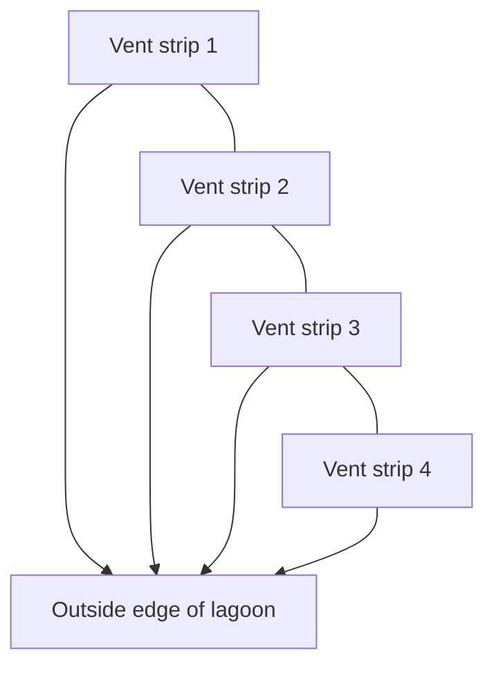
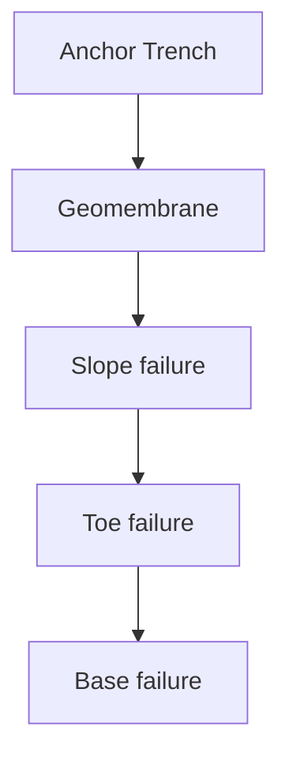
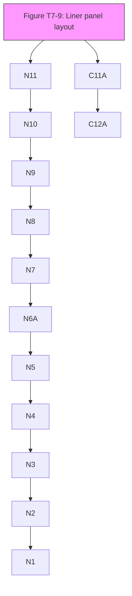

# DOE_T6_Criteria_Liners_Lagoons.pdf

# Lagoon and Liner Design Guidelines

Water Quality Program
Washington State Department of Ecology

**April 2023 | Publication 98-37**

[Image: Department of Ecology logo – stylized layered landscape with a sun, and the text "DEPARTMENT OF ECOLOGY State of Washington"]
\n---\n

# Table of Contents

- ADA Accessibility
- Abstract or Executive Summary
- T7 Lagoon and Liner Design Guidelines
  - T7-1 Guidance Purpose
  - T7-2 General Design Guidance
  - T7-3 Single versus Double Liners
  - T7-4 Lagoon Siting Criteria
  - T7-5 Retrofit of Existing Lagoon
    - T7-5.1 Lagoon Types
      - T7-5.1.1 Single Liner Systems
      - T7-5.1.2 Double Liner Systems
    - T7-5.2 Material Types
      - T7-5.2.2 Linear Low-Density Polyethylene (LLDPE)
        - A. Polyvinyl Chloride (PVC)
      - T7-5.2.3 Other Geomembrane Materials
      - T7-5.2.4 Geotextiles
      - T7-5.2.5 Geocomposite Drainage Nets
      - T7-5.2.6 Geosynthetic Clay Liner (GCL)
        - A. Material Properties
          - 1. Institutes
          - 2. Manufacturers
          - 3. Installers
    - T7-5.3 Lagoon Design Guidance
      - T7-5.3.1 Surface Water
        - A. Access
        - B. Freeboard
        - C. Overflow
        - D. Water Level Monitoring
        - E. Wind Uplift
\n---\n

# Lagoon and Liner Design Guidelines

- F. Example Wind Uplift Calculation
- G. Subsurface Vapor Venting
- H. Penetrations
- I. Buoyancy
- J. Cold Weather Considerations
- K. Stability
  - 1. Veneer
  - 2. Lagoon design for stable slopes
  - 3. Leakage
  - 4. Leak Detection Layer
- T7-5.4 Lagoon Sizing
  - T7-5.4.1 Sizing
  - T7-5.4.2 Other Design Criteria
- T7-5.5 Dam Safety
- T7-5.6 Liner Placement and Construction Standards
  - T7-5.6.1 Subgrade Preparation
  - T7-5.6.2 Liner
  - T7-5.6.3 Specifications
  - T7-5.6.4 Construction Quality Control (CQC)
  - T7-5.6.5 Groundwater and Surface Water
  - T7-5.6.6 Access
- T7-5.7 Leak Detection
  - T7-5.7.1 Definition of a Leak
  - T7-5.7.2 Leak Detection Methods
  - T7-5.7.3 Single Liner Leakage
  - T7-5.7.4 Double Liner Leak Location Complications
  - T7-5.7.5 Leak Detection Frequency
  - T7-5.7.6 Leak Response Thresholds and Response Planning
  - T7-5.7.7 Response Planning
- T7-5.8 Operations and Maintenance
  - T7-5.8.1 Sludge Management
\n---\n

# Lagoon and Liner Design Guidelines

## T7-5.8.2 Sludge Removal Methods

## T7-5.9 Inspection Methods
### T7-5.9.1 Single Liner
### T7-5.9.2 Double Liner

## T7-5.10 Construction Quality Assurance (CQA) and Construction Quality Control (CQC)
### T7-5.10.1 Definition of QA and QC
### T7-5.10.2 Appropriate CQA and CQC
### T7-5.10.3 Stress Cracking of HDPE Geomembranes
### T7-5.10.4 Best Management Practice
### T7-5.10.5 CQA Methods

## T7-5.11 Reporting and Approval

## T7-5.12 Closure Plans

## T7-6 References
\n---\n

# List of Tables and Figures

- Figure T7-1 Lagoon liner diagrams
- Figure T7-2 Typical leak detection sump and side slope pump
- Table T7-1 HDPE (smooth) material specification
- Table T7-2 HDPE (textured) material specification
- Table T7-3 Linear Low Density Polyethylene (LLDPE) (smooth) material specification
- Table T7-4 LLDPE (textured) material specification
- Table T7-5 PVC material specification
- Table T7-6 Geotextile pad material specification
- Table T7-7 Geocomposite drainage material specification
- Table T7-8 Geosynthetic Clay Liners (GCLs) material specifications
- Figure T7-3: Recommended values of the suction factor for design of any sloped based on critical leeward slope
- Table T7-9 Geomembrane normalized tension values
- Figure T7-4 Lagoon ballast schemes
- Figure T7-5 Subsurface vapor venting system
- Figure T7-6 Pipe Geomembrane Cover to Prevent Ice Encapsulation
- Figure T7-7 Various types of geomembrane covered slope stability failures
- Table T7-10 Rate of fluid flow in granular leachate collection layer resulting from a defect in the primary liner
- Table T7-11 Rate of leachate (in liters per day) migration through a defect in a geomembrane primary liner as a function of the defect diameter and the head of liquid on top of the primary liner
- Figure T7-8 Action leakage rate/Reservoir depth
- Table T7-12 Proposed values for Action Leakage Rates (ALRs)
- Table T7-13 Seam strength and related properties of thermally bonded smooth and textured high-density polyethylene (HDPE) geomembranes (English Units)
- Table T7-14 Seam strength and related properties of thermally bonded smooth and textured linear low-density polyethylene (LLDPE) geomembranes (English Units)
- Table T7-15 Seam shear and peel strength polyvinyl chloride (PVC) geomembranes
- Figure T7-9 Example liner panel layout, seam numbering, and repair types and locations
\n---\n

# ADA Accessibility

The Department of Ecology is committed to providing people with disabilities access to information and services by meeting or exceeding the requirements of the Americans with Disabilities Act (ADA), Section 504 and 508 of the Rehabilitation Act, and Washington State Policy #188.

To request ADA Accommodation, contact Water Quality Reception at 360-407-6600. For Washington Relay Service or TTY call 711 or 877-833-6341. Visit Ecology’s accessibility webpage for more information.

[For document](https://ecology.wa.gov/About-us/Accountability-transparency/Our-website/Accessibility) translation services, call Water Quality Reception at 360-407-6600. Por publicaciones en español, por favor llame Water Quality Reception al 360-407-6600.

[1]: [https://ecology.wa.gov/About-us/Accountability-transparency/Our-website/Accessibility](https://ecology.wa.gov/About-us/Accountability-transparency/Our-website/Accessibility)
\n---\n

# Abstract or Executive Summary
Stabilization ponds and aerated lagoons have been used extensively for wastewater treatment for many years. The treatment options represent a low-cost, low-technology approach for communities where land is plentiful and inexpensive and when lagoon effluent quality can comply with discharge limits. When properly designed with long detention times, they also provide a good alternative to consider when pathogen removal is a principle design criteria (e.g., where discharge is in the vicinity of shellfish harvest beds).

Ecology always requires geomembrane liners for newly constructed wastewater impoundments. Generally, existing unlined impoundments need not be retrofitted with a liner unless activities such as solids removal, operational modifications, or construction activities disrupt the integrity of the bottom or monitoring indicates unacceptable impacts to ground water.

Pond and lagoon systems have traditionally had difficulty with consistent suspended solids removal and are prone to short-circuiting without appropriate modification. Such modifications can include the use of multiple lagoons in series or use of baffles to create cells within a lagoon. These systems often cannot meet the effluent limits for ammonia required for many freshwater stream dischargers. Lagoons alone cannot adequately achieve the overall nitrogen reduction required for discharge to ground water.

Ecology will review proposals for new and upgraded pond and lagoon systems on a case-by-case basis. Treatment lagoons for surface water discharge, the use of non-overflow evaporative lagoons for effluent disposal, and lagoons used as part of a land treatment system or in conjunction with a constructed wetland wastewater treatment system require Ecology review.

Consult Section E1 for additional information about the use of ponds or lagoons for reclaimed water treatment
\n---\n

# T7 Lagoon and Liner Design Guidelines

This section provides technical specifications for implementing requirements for construction of lined lagoons, authorized through chapter 173-240 WAC. The permittee is ultimately responsible for its wastewater facilities and for the compliance of those facilities with local, state, and federal requirements.

## T7-1 Guidance Purpose

The purpose of this is section is to establish criteria for construction of lined lagoons used to treat and impound wastewater in order to permit them under Washington’s Wastewater Discharge Permit system.

Municipalities and industries have used stabilization ponds and aerated lagoons extensively for wastewater treatment for many years. The treatment options represent a low-cost, low-technology approach for communities where land is plentiful and inexpensive and when lagoon treatment generates effluent quality in compliance with discharge limits. When properly designed with long detention times, lagoons provide a good option for pathogen removal, and ammonia and Biochemical Oxygen Demand (BOD) reduction.

Engineering Design Reports must be submitted for permitting of new and upgraded wastewater pond and lagoon systems; which includes treatment lagoons for surface water discharge, non-overflow evaporative lagoons for effluent disposal, and lagoons used as part of a land treatment system or in conjunction with a constructed wetland wastewater treatment system. Ecology requires geomembrane liners for newly constructed domestic wastewater impoundments.

Consult Section E1-5 for additional information about the use of ponds or lagoons for reclaimed water treatment.

## T7-2 General Design Guidance

An Engineering Report must be submitted to Ecology and approved. Plans and specifications must also be approved by Ecology before the facility contracting documents can be issued for bids. The design standards in this guidance must be used in the Engineering Report. The Engineering Report needs to include a construction quality assurance (CQA) plan and an action leakage rate (ALR) plan.

Ecology will review and approve wastewater treatment system lagoon designs considering:

* Siting criteria
* Design criteria
* Operations
* CQA

The Engineering Report must identify specific design characteristics that will protect groundwater quality.
\n---\n

# Lagoon and Liner Design Guidelines

All lagoons must be designed, constructed and operated to protect groundwater quality using:
* A double liner with leak detection or
* A single geomembrane liner with groundwater monitoring.

In this guidance the following terminology is used for a double liner system; 1) the top geomembrane is the primary liner; and 2) the bottom geomembrane in contact with the subgrade is the secondary liner.

The leak detection layer between the primary and secondary liners (geomembranes) can be a geocomposite drainage net or aggregate drainage layer. Aggregate drainage layers require a geotextile between the aggregate and geomembranes.

The subgrade must be prepared to accept the overlying geomembrane and requires a finish that limits ruts, ridges, sharp and loose material.

For lagoons that can contain 10 acre-feet or more of fluid and/or have embankments more than 6 feet tall, will also need to meet Dam Safety requirements, chapter 173-175 WAC. The owner and engineer need to submit designs, plans, and operations and maintenance procedures to the Washington State Department of Ecology (Ecology) Water Quality Program and Dam Safety Office for approval prior to construction.

United States Environmental Protection Agency (EPA) Principles of Design and Operations of Wastewater Treatment Pond Systems for Plant Operators, Engineers, and Managers (2011) provides principals on wastewater lagoons systems. The EPA document provides information on siting, design, operations, maintenance and closure of wastewater lagoons.

Composite liners of a low permeable soil layer overlain by a geomembrane are used extensively in landfills. However, composite liners should be used with caution in lagoons. A composite liner should not be directly exposed to the impounded liquid. As pointed out by Giroud & Bonaparte (1989a):
> “Composite liners must be used with caution in liquid containment facilities. If the geomembrane component of the composite liner is directly in contact with the contained liquid (in other words, if the geomembrane is not covered with a heavy material such as a layer of earth or concrete slabs), and if there is leakage through the geomembrane, liquids will tend to accumulate between the low-permeability soil (which is the lower component of the composite liner) and the geomembrane, since the submerged portion of the geomembrane is easily uplifted. Then, if the impoundment is rapidly emptied, the geomembrane will be subjected to severe tensile stresses because the pressure of the entrapped liquids is no longer balanced by the pressure of the impounded liquid. Therefore, a composite liner should always be loaded, which is automatically the case in a landfill or in a waste pile, and which must be taken into account in the design of a liquid containment facility.”

Clearly, un-ballasted composite liners should not be used as primary (single) liners in lagoons.
\n---\n

## T7-3 Single versus Double Liners

Lagoons can be single or double lined. A single lined lagoon is composed of one geomembrane layer. A double lined lagoon is composed of two (2) layers of geomembrane with a leak detection system between the geomembranes. To reduce leakage, lagoons may be underlain by a low permeability soil or a geosynthetic clay liner (GCL). Ecology recommends the use of double lined lagoons.

Figure T7-1 provides generalized diagrams of various lagoon liner systems.

### Figure T7-1 Lagoon liner diagrams

- The figure shows four configurations:
  - Single Liner
  - Single Liner with GCL
  - Double Liner with Geocomposite Drainage Layer
  - Double Liner with Geocomposite and Granular Drainage Layer

  Key elements that appear across the diagrams include:
  - Termination / Anchor Trench
  - Vent
  - Geomembrane
  - Geotextile Cushion
  - GCL (geosynthetic clay liner)
  - Pregraded Subgrade
  - Geotextile Vent Layer
  - Primary Geomembrane
  - Geotextile Pad
  - Seal
  - Secondary Geomembrane
  - Geocomposite Drainage Layer
  - Granular Drainage Layer
  - Geocomposite Drainage Layer

> Note: See Figure T7-2 for leak detection sump schematic.

----

### T7-4 Lagoon Siting Criteria

The lagoon bottom must be constructed at an elevation at least 5 feet higher than the seasonal high groundwater level, and 10 feet above any bedrock surface. The maximum groundwater
\n---\n

Elevation is defined by the highest groundwater elevation measured over at least a one-year period of monthly groundwater elevation measurements at the lagoon site.

Groundwater means water in a saturated zone or stratum beneath the surface of the land. If the groundwater elevation data shows the groundwater surface is 20 feet or more below the bottom of the lagoon, then monthly groundwater elevation monitoring is not required to establish elevation for design. If groundwater is within 20 feet of the lowest component of the lagoon, monthly groundwater monitoring will be required for a minimum of one year to establish the maximum site groundwater elevation.

Ecology may consider alternatives to these requirements (including underdrain systems) on a site-specific basis if the hydrogeologic assessment demonstrates that groundwater elevations will not rise to within five feet of the lagoon bottom design under extreme high-water events, such as that caused by nearby flooding.

## T7-5 Retrofit of Existing Lagoon

Retrofits of existing impoundments pose special concerns. If the old liner developed a leak, Ecology will require over excavation of soils contaminated by organic matter. Excavation of at least 12 inches around the leak(s) will be required, with the final excavation depth to be determined based on conditions encountered during the excavation. Venting of vapors beneath the geomembrane will be required when retrofitting or replacing an existing lagoon liner (see T7-5.3.1.G Subsurface Vapor Venting).

### T7-5.1  Lagoon Types

#### T7-5.1.1  Single Liner Systems

A single lined lagoon can consist of a single geomembrane over a prepared subgrade or a soil barrier layer or GCL overlain by a geomembrane and soil/gravel overburden layer to provide a compressive load. The soil/gravel layer if used provides the weight necessary to prevent a GCL from swelling and increasing in thickness and holds the geomembrane in place to allow for effective performance of the barrier layer with the geomembrane.

Subgrade beneath the geomembrane needs to be well graded. Subgrade with a well graded sand and gravel with some silt, prevents punctures to the overlying geomembrane (Rowe et al., 2013). The use of coarse or highly permeable soils as a subgrade are not allowed. Leaks over highly permeable materials will percolate quickly and can cause movement of fines. Coarse soils also tend to have a significant quantity of large rocks that make subgrade preparation difficult and will increase the chances of geomembrane puncture or thinning. To limit potential leakage through the liner system, the use of a soil barrier layer or GCL is appropriate. Typically, a soil barrier layer or GCL would be used with a single liner system and requires a granular or concrete layer above the geomembrane to weigh it down. Additional information on

\n---\n

subgrade preparation is provided in T7-7.5.6 Liner Placement and Construction Standards.

The stability of the lagoon embankment and liner system needs to be addressed in the Engineering Report. The assessment of the lagoon liner embankment and liner system approach is provided in T7-5.3.1.K Stability. For lagoons storing over 10 acre-feet of fluid the lagoon design presented in the Engineering Report must be approved by Ecology’s Dam Safety Office prior to construction.

For systems with a single geomembrane liner, with or without a soil or GCL liner beneath, groundwater monitoring is required. The groundwater monitoring system must be designed to provide both background groundwater quality (up-gradient of the lagoon) and any impact to the groundwater down-gradient of the lagoon as well as groundwater elevation. A groundwater assessment and groundwater monitoring plan must be included in the Engineering Report.

In addition to groundwater monitoring a lagoon with a single geomembrane liner must conduct a leak detection survey once every five years.

## T7-5.1.2  Double Liner Systems

A double liner system’s bottom geomembrane or secondary geomembrane has the same construction and design requirements as the single liner system. The addition of the leak detection layer and primary geomembrane are the new components for the double lined system. The leak detection layer must have the hydraulic capacity to transmit primary liner leakage under the design loadings without becoming saturated. The design must account for reductions in transmissivity due to creep, blockage by soil particulates, or biological fouling.

The Engineering Report must specify:

* slope of the impoundment bottom
* placement of the collection sump, collection of fluids that leak
* thickness and composition of the drainage layer
* leakage monitoring access point and other engineered design criteria of the leak detection system
* action leakage rate (ALR) through the primary geomembrane that triggers actions to remedy or repair the primary liner, using the methods described in T7-5.3.1.K.4 Leak Detection
* interface friction of the layers (see T7-5.3.1.K Stability)
* additional venting
* any other items for permitting the double lined lagoon
\n---\n

# Lagoon and Liner Design Guidelines

A double liner system uses two geomembranes with a leak detection layer between. The use of a soil liner or GCL to replace a geomembrane is not acceptable.

The leak detection layer can be granular or a geocomposite drainage net. This layer needs to be sized to convey potential leakage through the primary geomembrane to a low point. Flow to the low point in the leak detection layer can be drained by gravity to a monitoring manhole or a sump that allows for collection and removal of fluid. The quantity of fluid collected will need to be quantified for volume, leakage rate and chemical characteristic to determine the source of such fluids whether they are from the lagoon or naturally occurring groundwater. Schematic of a typical leak detection sump and side slope pump are shown in Figure T7-2.

The pump system is to convey the ALR. The minimum pumping rate should be 10 gallons per minute (gpm) or a rate that allows unconfined flow in the leak detection layer when draining the lagoon.

The leak detection layer must be designed for unconfined flow. To ensure leakage is within the ALR, construction quality assurance and nondestructive testing of the primary geomembrane is necessary.

In addition to the above requirements, owner/operators of double lined lagoons must conduct a leak survey once every ten years.

### T7-5.2  Material Types

Geomembranes are impermeable membranes used for lagoon liners. Geotextiles are permeable fabrics and are typically used in lagoons to provide protection of the geomembranes from punctures, separate soil layers, and can be used for venting of vapors. Geotextiles are used in the manufacturing of products such as geocomposite drainage nets, strip drains, GCLs and reinforcing layers.

The selection of a geomembrane will be based on the fluid that is intended to be contained and the intended life of the lagoon. Exposed geomembrane surfaces, not covered with liquid, soil or aggregates, have been found to have a half-life of 59 to 97 years (Koerner et al., 2017) (Koerner et al., 2011). High Density Polyethylene (HDPE) has the longest half-life. Linear low-density polyethylene (LLDPE) and Flexible Polypropylene (fPP) having the shortest half-life. Polyvinyl Chloride (PVC) made in North America is not recommended for exposed application (Note: European manufacturers have produced a PVC better suited for ultra violet (UV) exposure that is used for dam facing). The same study found that nonwoven, needle punched geotextiles have an exposed half-life of approximately 6 months. To achieve the longevity noted above the choice of high-quality materials and good construction techniques is required.
\n---\n

# Lagoon and Liner Design Guidelines

Chemical and heat effects on geomembranes must also be considered (Ewais et al., 2018) in the engineering design of the lagoon impoundment. For typical municipal wastewater and similar strength industrial wastewater the Geosynthetic Research Institute (GRI) and Fabricated Geomembrane Institute (FGI) material standards are recommended for use in the lagoon design. For industrial wastewater and municipal wastewater, that has unusual characteristics or elevated temperatures, an assessment of the geomembrane materials chemical resistance in relation to the fluids to be contained must be included in the engineering design.

An additional consideration involves the long-term operation and maintenance of the lagoon liner. Permits will require leak testing at least once per permit cycle (every five years). So planning for testing is best done at this stage of lagoon design. Preplanning for electrical leak testing involves the placement of permanent electrodes beneath the primary liner but above the secondary liner and the drainage layer. Most lagoons will require a minimum of eight electrodes, one at each corner of the pond and midway down length of each axis of the pond, and in some cases out in the center of the pond. However, lagoon size and fluid conductivity will determine the exact number of electrodes installed. A larger lagoon will require more electrodes because of signal attenuation issues. Additionally, ponds containing highly conductive solutions can cause electrical signal attenuation resulting in very low amplitude responses, so by having permanent electrodes installed will ensure adequate coverage for locating leaks in the top liner. For the optimum number of electrodes, consult an electric leak detection provider so they can design a permanent electrode system. They can help with custom designs considering pond size and solution conductivity. Any leak detection surveys using these permanent electrodes must conform to the practices as described in ASTM D8265. There are several advantages to installing permanent electrodes in a double lined pond, such as:

* Saves having to make slits in the top liner if the pond ever leaks.
* Saves having to hire a repair company to fix temporary slits in the top liner after a leak detection survey is completed.
* Allows for quicker setup of a future leak detection survey.
* Up-front installation costs are offset by not having to pay a liner repair company to fix slits.
* Allows for better data quality by ensuring that all permanent electrodes.

Another preplanning consideration specific to double-lined lagoons is the use of a top liner with a conductive layer. Although this will increase liner cost the return in investment associated with this product in terms of being able to find holes before the lagoon is put into operation in comparison to the direct costs of draining the pond, fixing the pond and filling the pond back up is substantial. One critical issue when using a liner with a conductive layer is to ensure that every roll is placed with the
\n---\n

conductive side down. If any piece of liner is mis-installed with the conductive layer up (in contact with the lagoon fluid) electronic leak detection will not work.
To assess the suitability of a geosynthetic material, compare the existing fluid data to already completed chemical resistance testing provided by manufacturer to determine if the geomembrane is suitable to contain the intended fluids. For special cases where data does not exist, testing of the geomembrane with the fluid following American Society for Testing and Materials International (ASTM) D5747 Standard Practice for Tests to Evaluate Chemical Resistance of Geomembranes to Liquids is necessary.
A description of the manufactured materials typically used for lagoon lining is provided in the following sections.
\n---\n

# Figure T7-2 Typical leak detection sump and side slope pump

## Leak Detection Layer Sump

- Boot
- Primary Geomembrane
- Geotextile Pad
- Clean Stone
- Geocomposite Drainage Layer
- Remove Top Geotextile in Sump
- Leak Detection Layer Sump
- Leak Detection Pipe with Perforated End Section
- Secondary Geomembrane

- To Pump Controls
- Flow Sensor
- Hose Coupling
- Cables Are Shown Unstrapped From the Hose For Clarity
- Vent
- Level Sensor and Motor Lead
- Pipe Inside Diameter Sized to Allow Pump to Pass Level Sensor
- Level Sensor
- Return Flow to Lagoon

----

## Typical Wheeled Sump Pump

- To Pump Controls
- Flow Sensor
- Hose Coupling
- Cables Are Shown Unstrapped From the Hose For Clarity
- Vent
- Level Sensor and Motor Lead
- Pipe Inside Diameter Sized to Allow Pump to Pass Level Sensor
- Level Sensor
- Leak Detection Pipe
- Suspension Cable
- Hose
- Pump
- Hose Coupling

- Return Flow to Lagoon
- Hose
- <i>Figure caption: Typical Wheeled Sump Pump</i>

\n---\n

## T7-5.2.1 High Density Polyethylene (HDPE)

HDPE has the longest life of the commonly used geomembrane materials for wastewater lagoon liners with an exposed half-life of up to 97 years. HDPE has a variety of formulations and the half-life of each formulation will be different. HDPE is manufactured with an antioxidant package that makes it suitable for long-term subaerial exposure. HDPE is manufactured in rolls that are up to 22.5 feet wide and several hundred feet long. The material can be textured on one or both sides of the sheet to improve the sheets friction angle with the soil or geotextile that is in contact with the sheet.

Typically, HDPE is the first choice for lagoon liners. There are other geomembrane materials available that may be better for a specific application, as described below. The minimum thickness is 60-mil for primary and 40-mil for secondary geomembrane layers.

The GRI GM13 specification for smooth and textured HDPE geomembranes is listed in Table T7-1 and Table T7-2 below.
\n---\n

## Table T7-1 HDPE (smooth) material specification

<table>
    <thead>
    <tr>
        <th>Properties</th>
        <th>Test
Method</th>
        <th>40 mil Test
Values</th>
        <th>60 mil Test
Values</th>
        <th>Minimum Testing

Frequency</th>
    </tr>
    </thead>
    <tr>
        <td>Thickness (min. and
avg.)</td>
        <td>D5199</td>
        <td>nominal</td>
        <td>nominal</td>
        <td>Per Roll</td>
    </tr>
    <tr>
        <td>Lowest individual of 10
values</td>
        <td>N/A</td>
        <td>-10%</td>
        <td>-10%</td>
        <td>N/A</td>
    </tr>
    <tr>
        <td>Formulated Density mg/L

(min.)</td>
        <td>D1505 /
D792</td>
        <td>0.940 g/cc</td>
        <td>0.940 g/cc</td>
        <td>200,000 lb.</td>
    </tr>
    <tr>
        <td>Tensile Properties 1
(min. and avg.)</td>
        <td>D6693 Type
IV</td>
        <td>N/A</td>
        <td>N/A</td>
        <td>20,000 lb.</td>
    </tr>
    <tr>
        <td>Yield strength</td>
        <td>N/A</td>
        <td>84 lb./in.</td>
        <td>126 lb./in.</td>
        <td>N/A</td>
    </tr>
    <tr>
        <td>Break strength</td>
        <td>N/A</td>
        <td>152 lb./in.</td>
        <td>228 lb./in.</td>
        <td>N/A</td>
    </tr>
    <tr>
        <td>Yield elongation</td>
        <td>N/A</td>
        <td>12%</td>
        <td>12%</td>
        <td>N/A</td>
    </tr>
    <tr>
        <td>Break elongation</td>
        <td>N/A</td>
        <td>700%</td>
        <td>700%</td>
        <td>N/A</td>
    </tr>
    <tr>
        <td>Tear resistance (min. and
avg.)</td>
        <td>D1004</td>
        <td>28 lb.</td>
        <td>42 lb.</td>
        <td>45,000 lb.</td>
    </tr>
    <tr>
        <td>Puncture resistance

(min. and avg.)</td>
        <td>D4833</td>
        <td>72 lb.</td>
        <td>108 lb.</td>
        <td>45,000 lb.</td>
    </tr>
    <tr>
        <td>Stress crack resistance 2</td>
        <td>D5397</td>
        <td>500 hr.</td>
        <td>500 hr.</td>
        <td>Per GRI-GM10</td>
    </tr>
    <tr>
        <td>Carbon black content

(range)</td>
        <td>D4218 3</td>
        <td>2.0% - 3.0%</td>
        <td>2.0% - 3.0%</td>
        <td>20,000 lb.</td>
    </tr>
    <tr>
        <td>Carbon black dispersion</td>
        <td>D5596</td>
        <td>note 4</td>
        <td>note 4</td>
        <td>45,000 lb.</td>
    </tr>
    <tr>
        <td>Oxidative Induction Time
(OIT)
(min. and avg.) 5</td>
        <td>N/A</td>
        <td>N/A</td>
        <td>N/A</td>
        <td>N/A</td>
    </tr>
    <tr>
        <td>Standard OIT (min. and
avg.)</td>
        <td>D3895</td>
        <td>100 min.</td>
        <td>100 min</td>
        <td>200,000 lb.</td>
    </tr>
    <tr>
        <td>High-pressure OIT

(min. and avg.)</td>
        <td>D5885</td>
        <td>400 min.</td>
        <td>400 min</td>
        <td>200,000 lb.</td>
    </tr>
    <tr>
        <td>Oven aging (at 85ᵒC) 5, 6</td>
        <td>D5721</td>
        <td>N/A</td>
        <td>N/A</td>
        <td>N/A</td>
    </tr>
    <tr>
        <td>Standard OIT (min. and
avg.)
% retained after 90 days</td>
        <td>D3895</td>
        <td>55%</td>
        <td>55%</td>
        <td>Per each formulation</td>
    </tr>
    <tr>
        <td>High-pressure OIT
(min. and avg.)
% retained after 90 days</td>
        <td>D5885</td>
        <td>80%</td>
        <td>80%</td>
        <td>Per each formulation</td>
    </tr>
    <tr>
        <td>UV Resistance 7</td>
        <td>D7238</td>
        <td>N/A</td>
        <td>N/A</td>
        <td>N/A</td>
    </tr>
    <tr>
        <td>Standard OIT (min. and
avg.)</td>
        <td>D3895</td>
        <td>N.R. 8</td>
        <td>N.R. 8</td>
        <td>Per each formulation</td>
    </tr>
    <tr>
        <td>High-pressure OIT
(min. and avg.)
% retained after
1,600hrs.⁹</td>
        <td>D5885</td>
        <td>50%</td>
        <td>50%</td>
        <td>Per each formulation</td>
    </tr></table>

a. Test values for additional thicknesses can be found at (link to GRI GM13).

Notes:
\n---\n

# Lagoon and Liner Design Guidelines

1. Machine direction (MD) and cross machine direction (XMD) average values should be on the basis of 5 test specimens each direction.
   - Yield elongation is calculated using a gage length of 1.3 inches.
   - Break elongation is calculated using a gage length of 2.0 inches.

2. The yield strength used to calculate the applied load for the SP-NCTL test should be the manufacturer's mean value via MQC testing.

3. Other methods such as D1603 (tube furnace) or D6370 (TGA) are acceptable if an appropriate correlation to D4218 (muffle furnace) can be established.

4. Carbon black dispersion (only near spherical agglomerates) for 10 different views: 9 in categories 1 or 2, and 1 in Category 3.

5. The manufacturer has the option to select either one of OIT methods listed to evaluate the antioxidant content in the geomembrane.

6. It is also recommended to evaluate samples at 30 and 60 days to compare with the 90 day response.

7. The condition of the test should be 20 hr. UV cycle at 75oC followed by 4 hr. condensation at 60oC.

8. Not recommended since the high temperature of the Std-OIT test produces an unrealistic result for some of the antioxidants in the UV exposed samples.

9. UV resistance is based on percent retained value regardless of the original HP-OIT value.
\n---\n

## Table T7-2 HDPE (textured) material specification

<table>
    <thead>
    <tr>
        <th>Properties</th>
        <th>Test

Method</th>
        <th>40 mil Test

Values</th>
        <th>60 mil Test

Values</th>
        <th>Minimum Testing

Frequency</th>
    </tr>
    </thead>
    <tr>
        <td>Thickness (min. and
avg.)</td>
        <td>D5994</td>
        <td>nominal (-5%)</td>
        <td>nominal (-5%)</td>
        <td>Per Roll</td>
    </tr>
    <tr>
        <td>lowest individual for 8 out
fo 10 values</td>
        <td>N/A</td>
        <td>-1.0%</td>
        <td>-1.0%</td>
        <td>N/A</td>
    </tr>
    <tr>
        <td>lowest individual of 10
values</td>
        <td>N/A</td>
        <td>-15%</td>
        <td>-15%</td>
        <td>N/A</td>
    </tr>
    <tr>
        <td>Asperity Height mils
(min. and avg.)</td>
        <td>D7466</td>
        <td>16 mil</td>
        <td>16 mil</td>
        <td>Every 2ⁿᵈ roll 1</td>
    </tr>
    <tr>
        <td>Formulated Density

(min. and avg.)</td>
        <td>D1505 /
D792</td>
        <td>0.940 g/cc</td>
        <td>0.940 g/cc</td>
        <td>200,000 lb.</td>
    </tr>
    <tr>
        <td>Tensile Properties 2
(min. and avg.)</td>
        <td>D6693 Type
IV</td>
        <td>N/A</td>
        <td>N/A</td>
        <td>20,000 lb.</td>
    </tr>
    <tr>
        <td>Yield strength</td>
        <td>N/A</td>
        <td>84 lb./in.</td>
        <td>126 lb./in.</td>
        <td>N/A</td>
    </tr>
    <tr>
        <td>Break strength</td>
        <td>N/A</td>
        <td>60 lb./in.</td>
        <td>90 lb./in.</td>
        <td>N/A</td>
    </tr>
    <tr>
        <td>Yield elongation</td>
        <td>N/A</td>
        <td>12%</td>
        <td>12%</td>
        <td>N/A</td>
    </tr>
    <tr>
        <td>Break elongation</td>
        <td>N/A</td>
        <td>100%</td>
        <td>100%</td>
        <td>N/A</td>
    </tr>
    <tr>
        <td>Tear resistance (min. and
avg.)</td>
        <td>D1004</td>
        <td>28 lb.</td>
        <td>42 lb.</td>
        <td>45,000 lb.</td>
    </tr>
    <tr>
        <td>Puncture resistance

(min. and avg.)</td>
        <td>D4833</td>
        <td>60 lb.</td>
        <td>90 lb.</td>
        <td>45,000 lb.</td>
    </tr>
    <tr>
        <td>Stress crack resistance 3</td>
        <td>D5397</td>
        <td>500 hr.</td>
        <td>500 hr.</td>
        <td>Per GRI-GM10</td>
    </tr>
    <tr>
        <td>Carbon black content

(range)</td>
        <td>D4218 4</td>
        <td>2.0% - 3.0%</td>
        <td>2.0% - 3.0%</td>
        <td>20,000 lb.</td>
    </tr>
    <tr>
        <td>Carbon black dispersion</td>
        <td>D5596</td>
        <td>note 5</td>
        <td>note 5</td>
        <td>45,000 lb.</td>
    </tr>
    <tr>
        <td>Standard OIT6,7

(min. and avg.)</td>
        <td>D3895</td>
        <td>100 min.</td>
        <td>100 min</td>
        <td>200,000 lb.</td>
    </tr>
    <tr>
        <td>High-pressure OIT

(min. and avg.)</td>
        <td>D5885</td>
        <td>400 min.</td>
        <td>400 min</td>
        <td>200,000 lb.</td>
    </tr>
    <tr>
        <td>Oven aging (at 85ᵒC) 7, 8</td>
        <td>D5721</td>
        <td>N/A</td>
        <td>N/A</td>
        <td>N/A</td>
    </tr>
    <tr>
        <td>Standard OIT (min. and

avg.)

% retained after 90 days</td>
        <td>D3895</td>
        <td>55%</td>
        <td>55%</td>
        <td>Per each formulation</td>
    </tr>
    <tr>
        <td>High-pressure OIT

(min. and avg.)

% retained after 90 days</td>
        <td>D5885</td>
        <td>80%</td>
        <td>80%</td>
        <td>Per each formulation</td>
    </tr>
    <tr>
        <td>UV Resistance 9</td>
        <td>D7238</td>
        <td>N/A</td>
        <td>N/A</td>
        <td>N/A</td>
    </tr>
    <tr>
        <td>Standard OIT (min. and

avg.)</td>
        <td>D3895</td>
        <td>N.R. 10</td>
        <td>N.R. 10</td>
        <td>Per each formulation</td>
    </tr>
    <tr>
        <td>High-pressure OIT

(min. and avg.)

% retained after 1,600hrs.

11</td>
        <td>D5885</td>
        <td>50%</td>
        <td>50%</td>
        <td>Per each formulation</td>
    </tr></table>

- a. Test values for additional thicknesses can be found at (link to GRI GM13).
\n---\n

# Lagoon and Liner Design Guidelines

## Notes

1. Alternate the measurement side for double sided texture sheet.

2. Machine direction (MD) and cross machine direction (XMD) average values should be on the basis of 5 test specimens each direction.
   - Yield elongation is calculated using a gage length of 1.3 inches.
   - Break elongation is calculated using a gage length of 2.0 inches.

3. The yield strength used to calculate the applied load for the SP-NCTL test should be the manufacturer's mean value via MQC testing.

4. Other methods such as D1603 (tube furnace) or D6370 (TGA) are acceptable if an appropriate correlation to D4218 (muffle furnace) can be established.

5. Carbon black dispersion (only near spherical agglomerates) for 10 different views: 9 in categories 1 or 2, and 1 in Category 3.

6. Oxidative Induction Time (OIT) (min. and avg.)

7. The manufacturer has the option to select either one of OIT methods listed to evaluate the antioxidant content in the geomembrane.

8. It is also recommended to evaluate samples at 30 and 60 days to compare with the 90 day response.

9. The condition of the test should be 20 hr. UV cycle at 75oC followed by 4 hr. condensation at 60oC.

10. Not recommended since the high temperature of the Std-OIT test produces an unreal istic result for some of the antioxidants in the UV exposed samples.

11. UV resistance is based on percent retained value regardless of the original HP-OIT value.

## T7-5.2.2 Linear Low-Density Polyethylene (LLDPE)

LLDPE is a polyethylene with more flexibility and greater elongation than HDPE. The exposed half-life of LLPDE is up to 67 years. LLDPE is manufactured with an antioxidant package that makes it suitable for long-term exposure. LLDPE is manufactured in rolls that are up to 22.5 feet wide and several hundred feet long. The material can be textured on one or both sides of the sheet to improve the sheets friction angle with the soil or geotextile that is in contact with the sheet.

LLDPE can be reinforced with a scrim to improve tensile strength. A reinforced LLDPE geomembrane is not recommended for a lagoon liner. The minimum thickness is 60-mil for primary and 40-mil for secondary geomembrane layers.

The GRI GM17 specification for smooth and textured LLDPE geomembranes are listed in Table T7-3 and Table T7-4 below.
\n---\n

## Table T7-3 Linear Low Density Polyethylene (LLDPE) (smooth) material specification

<table>
    <thead>
    <tr>
        <th>Properties</th>
        <th>Test
Method</th>
        <th>40 mil Test
Values</th>
        <th>60 mil Test
Values</th>
        <th>Minimum Testing

Frequency</th>
    </tr>
    </thead>
    <tr>
        <td>Thickness - mils (min. and avg.)</td>
        <td>D5199</td>
        <td>nominal</td>
        <td>nominal</td>
        <td>Per Roll</td>
    </tr>
    <tr>
        <td>Lowest individual of 10 values</td>
        <td>N/A</td>
        <td>-10%</td>
        <td>-10%</td>
        <td>N/A</td>
    </tr>
    <tr>
        <td>Density g/mL (max.)</td>
        <td>D1505 / D792</td>
        <td>0.940 g/cc</td>
        <td>0.940 g/cc</td>
        <td>200,000 lb.</td>
    </tr>
    <tr>
        <td>Tensile Properties 1 (min. and avg.)</td>
        <td>D6693 Type
IV</td>
        <td>N/A</td>
        <td>N/A</td>
        <td>20,000 lb.</td>
    </tr>
    <tr>
        <td>Break strength</td>
        <td>N/A</td>
        <td>152 lb./in.</td>
        <td>228 lb./in.</td>
        <td>N/A</td>
    </tr>
    <tr>
        <td>Break elongation</td>
        <td>N/A</td>
        <td>700%</td>
        <td>700%</td>
        <td>N/A</td>
    </tr>
    <tr>
        <td>2% Modulus – lb./in. (max.)</td>
        <td>D5323</td>
        <td>2,400</td>
        <td>3,600</td>
        <td>Per formulation</td>
    </tr>
    <tr>
        <td>Tear resistance (min. and avg.)</td>
        <td>D1004</td>
        <td>28 lb.</td>
        <td>42 lb.</td>
        <td>45,000 lb.</td>
    </tr>
    <tr>
        <td>Puncture resistance (min. and avg.)</td>
        <td>D4833</td>
        <td>72 lb.</td>
        <td>108 lb.</td>
        <td>45,000 lb.</td>
    </tr>
    <tr>
        <td>Axi-symmetric break resistance
strain % (min.)</td>
        <td>D5617</td>
        <td>30</td>
        <td>30</td>
        <td>Per formulation</td>
    </tr>
    <tr>
        <td>Carbon black content (%)</td>
        <td>D4218 2</td>
        <td>2.0% - 3.0%</td>
        <td>2.0% - 3.0%</td>
        <td>20,000 lb.</td>
    </tr>
    <tr>
        <td>Carbon black dispersion</td>
        <td>D5596</td>
        <td>note 3</td>
        <td>note 3</td>
        <td>45,000 lb.</td>
    </tr>
    <tr>
        <td>Oxidative Induction Time (OIT)
(min. and avg.) 4</td>
        <td>N/A</td>
        <td>N/A</td>
        <td>N/A</td>
        <td>N/A</td>
    </tr>
    <tr>
        <td>Standard OIT (min. and avg.)</td>
        <td>D3895</td>
        <td>100 min.</td>
        <td>100 min</td>
        <td>200,000 lb.</td>
    </tr>
    <tr>
        <td>High-pressure OIT (min. and avg.)</td>
        <td>D5885</td>
        <td>400 min.</td>
        <td>400 min</td>
        <td>200,000 lb.</td>
    </tr>
    <tr>
        <td>Oven aging (at 85ᵒC) 5</td>
        <td>D5721</td>
        <td>N/A</td>
        <td>N/A</td>
        <td>N/A</td>
    </tr>
    <tr>
        <td>Standard OIT (min. and avg.)
% retained after 90 days</td>
        <td>D3895</td>
        <td>35%</td>
        <td>35%</td>
        <td>Per each formulation</td>
    </tr>
    <tr>
        <td>High-pressure OIT (min. and avg.)
% retained after 90 days</td>
        <td>D5885</td>
        <td>60%</td>
        <td>60%</td>
        <td>Per each formulation</td>
    </tr>
    <tr>
        <td>UV Resistance 6</td>
        <td>D7238</td>
        <td>N/A</td>
        <td>N/A</td>
        <td>N/A</td>
    </tr>
    <tr>
        <td>Standard OIT (min. and avg.)</td>
        <td>D3895</td>
        <td>N.R. 7</td>
        <td>N.R. 7</td>
        <td>Per each formulation</td>
    </tr>
    <tr>
        <td>High-pressure OIT (min. and avg.)
% retained after 1,600hrs. 8</td>
        <td>D5885</td>
        <td>35%</td>
        <td>35%</td>
        <td>Per each formulation</td>
    </tr></table>

a. Test values for additional thicknesses can be found at (link to GRI GM13).
\n---\n

## Notes:

1. Machine direction (MD) and cross machine direction (XMD) average values should be on the basis of 5 test specimens each direction.
   Break elongation is calculated using a gage length of 2.0 inches at 2.0 in/min.

2. Other methods such as D1603 (tube furnace) or D6370 (TGA) are acceptable if an appropriate correlation to D4218 (muffle furnace) can be established.

3. Carbon black dispersion (only near spherical agglomerates) for 10 different views: 9 in categories 1 or 2, and 1 in Category 3.

4. The manufacturer has the option to select either one of OIT methods listed to evaluate the antioxidant content in the geomembrane.

5. It is also recommended to evaluate samples at 30 and 60 days to compare with the 90 day response.

6. The condition of the test should be 20 hr. UV cycle at 75oC followed by 4 hr. condensation at 60oC.

7. Not recommended since the high temperature of the Std-OIT test produces an unrealistic result for some of the antioxidants in the UV exposed samples.

8. UV resistance is based on percent retained value regardless of the original HP-OIT value.
\n---\n

# Table T7-4 LLDPE (textured) material specification

<table>
    <thead>
    <tr>
        <th>Properties</th>
        <th>Test
Method</th>
        <th>40 mil Test
Values</th>
        <th>60 mil Test
Values</th>
        <th>Minimum Testing

Frequency</th>
    </tr>
    </thead>
    <tr>
        <td>Thickness (min. and avg.)</td>
        <td>D5994</td>
        <td>nominal (-5%)</td>
        <td>nominal (-5%)</td>
        <td>per roll</td>
    </tr>
    <tr>
        <td>lowest individual for 8 out of 10
values</td>
        <td>N/A</td>
        <td>-10%</td>
        <td>-10%</td>
        <td>N/A</td>
    </tr>
    <tr>
        <td>lowest individual of 10 values</td>
        <td>N/A</td>
        <td>-15%</td>
        <td>-15%</td>
        <td>N/A</td>
    </tr>
    <tr>
        <td>Asperity Height mils (min. and avg.)</td>
        <td>D7466</td>
        <td>16 mil</td>
        <td>16 mil</td>
        <td>Every 2ⁿᵈ roll 1</td>
    </tr>
    <tr>
        <td>Formulated Density (min. and avg.)</td>
        <td>D1505 / D792</td>
        <td>0.939 g/cc</td>
        <td>0.939 g/cc</td>
        <td>200,000 lb.</td>
    </tr>
    <tr>
        <td>Tensile Properties 2 (min. and avg.)</td>
        <td>D6693 Type
IV</td>
        <td>N/A</td>
        <td>N/A</td>
        <td>20,000 lb.</td>
    </tr>
    <tr>
        <td>Break strength</td>
        <td>N/A</td>
        <td>60 lb./in.</td>
        <td>90 lb./in.</td>
        <td>N/A</td>
    </tr>
    <tr>
        <td>Break elongation</td>
        <td>N/A</td>
        <td>100%</td>
        <td>100%</td>
        <td>N/A</td>
    </tr>
    <tr>
        <td>2% Modulus – lb./in. (max.)</td>
        <td>D5323</td>
        <td>2,400</td>
        <td>3,600</td>
        <td>per formulation</td>
    </tr>
    <tr>
        <td>Tear resistance – lb. (min. and avg.)</td>
        <td>D1004</td>
        <td>22 lb.</td>
        <td>33 lb.</td>
        <td>45,000 lb.</td>
    </tr>
    <tr>
        <td>Puncture resistance (min. and avg.)</td>
        <td>D4833</td>
        <td>44 lb.</td>
        <td>66 lb.</td>
        <td>45,000 lb.</td>
    </tr>
    <tr>
        <td>Axi-symmetric break resistance
strain - % (min.)</td>
        <td>D5617</td>
        <td>30</td>
        <td>30</td>
        <td>per formulation</td>
    </tr>
    <tr>
        <td>Carbon black content (range)</td>
        <td>D4218 3</td>
        <td>2.0% - 3.0%</td>
        <td>2.0% - 3.0%</td>
        <td>20,000 lb.</td>
    </tr>
    <tr>
        <td>Carbon black dispersion</td>
        <td>D5596</td>
        <td>note 4</td>
        <td>note 4</td>
        <td>45,000 lb.</td>
    </tr>
    <tr>
        <td>Oxidative Induction Time (OIT)
(min. and avg.) 5</td>
        <td>N/A</td>
        <td>N/A</td>
        <td>N/A</td>
        <td>N/A</td>
    </tr>
    <tr>
        <td>Standard OIT (min. and avg.)</td>
        <td>D3895</td>
        <td>100 min.</td>
        <td>100 min</td>
        <td>200,000 lb.</td>
    </tr>
    <tr>
        <td>High-pressure OIT (min. and avg.)</td>
        <td>D5885</td>
        <td>400 min.</td>
        <td>400 min</td>
        <td>200,000 lb.</td>
    </tr>
    <tr>
        <td>Oven aging (at 85ᵒC) 6</td>
        <td>D5721</td>
        <td>N/A</td>
        <td>N/A</td>
        <td>N/A</td>
    </tr>
    <tr>
        <td>Standard OIT (min. and avg.)
% retained after 90 days</td>
        <td>D3895</td>
        <td>55%</td>
        <td>55%</td>
        <td>Per each formulation</td>
    </tr>
    <tr>
        <td>High-pressure OIT (min. and avg.)
% retained after 90 days</td>
        <td>D5885</td>
        <td>80%</td>
        <td>80%</td>
        <td>Per each formulation</td>
    </tr>
    <tr>
        <td>UV Resistance 7</td>
        <td>D7238</td>
        <td>N/A</td>
        <td>N/A</td>
        <td>N/A</td>
    </tr>
    <tr>
        <td>Standard OIT (min. and avg.)</td>
        <td>D3895</td>
        <td>N.R. 8</td>
        <td>N.R. 8</td>
        <td>Per each formulation</td>
    </tr>
    <tr>
        <td>High-pressure OIT (min. and avg.)
% retained after 1,600hrs. 9</td>
        <td>D5885</td>
        <td>50%</td>
        <td>50%</td>
        <td>Per each formulation</td>
    </tr></table>

a.  Test values for additional thicknesses can be found at (link to GRI GM13).
\n---\n

# Lagoon and Liner Design Guidelines

## Notes:

1. Alternate the measurement side for double sided texture sheet.

2. Machine direction (MD) and cross machine direction (XMD) average values should be on the basis of 5 test specimens each direction.
   - Yield elongation is calculated using a gage length of 1.3 inches.
   - Break elongation is calculated using a gage length of 2.0 inches.

3. The yield strength used to calculate the applied load for the SP-NCTL test should be the manufacturer's mean value via MQC testing.

4. Other methods such as D1603 (tube furnace) or D6370 (TGA) are acceptable if an appropriate correlation to D4218 (muffle furnace) can be established.

5. Carbon black dispersion (only near spherical agglomerates) for 10 different views: 9 in categories 1 or 2, and 1 in Category 3.

6. The manufacturer has the option to select either one of OIT methods listed to evaluate the antioxidant content in the geomembrane.

7. It is also recommended to evaluate samples at 30 and 60 days to compare with the 90 day response.

8. The condition of the test should be 20 hr. UV cycle at 75oC followed by 4 hr. condensation at 60oC.

9. Not recommended since the high temperature of the Std-OIT test produces an unreal istic result for some of the antioxidants in the UV exposed samples.

10. UV resistance is based on percent retained value regardless of the original HP-OIT value.
\n---\n

## A. Polyvinyl Chloride (PVC)

PVC geomembranes must be covered with a minimum 12-inch-thick layer of soil or aggregate. PVC can be fabricated into panels depending on thickness up to 200 by 200 feet. For a small lagoon, a fabricated PVC geomembrane panel can be dropped in as a single piece reducing construction time. The minimum thickness is 40-mil for a PVC liner.

The FGI PVC geomembrane specification is provided in Table T7-5.
\n---\n

# Table T7-5 PVC material specification 1, ².

<table>
    <thead>
    <tr>
        <th>Certified Properties 3, 4</th>
        <th>ASTM</th>
        <th>PVC 20 5</th>
        <th>PVC 40</th>
        <th>PVC 60</th>
    </tr>
    </thead>
    <tr>
        <td>Average Thickness 6, 7</td>
        <td>D-5199</td>
        <td>20 +1 mil
0.51 + .03</td>
        <td>40 +2 mil
1.02 + .05</td>
        <td>60 + 3 mil
1.52 + .08</td>
    </tr>
    <tr>
        <td>Tensile Properties 3, 4, 5</td>
        <td>N/A</td>
        <td>N/A</td>
        <td>N/A</td>
        <td>N/A</td>
    </tr>
    <tr>
        <td>Tensile Force at Break</td>
        <td>D-882 4
Min (MD &</td>
        <td>48 lbs/in</td>
        <td>97 lbs/in</td>
        <td>137 lbs/in</td>
    </tr>
    <tr>
        <td>Elongation at Break</td>
        <td>N/A</td>
        <td>360%</td>
        <td>430%</td>
        <td>450%</td>
    </tr>
    <tr>
        <td>Tensile Force at 100% Elongation</td>
        <td>N/A</td>
        <td>20 lbs/in</td>
        <td>40 lbs/in</td>
        <td>60 lbs/in</td>
    </tr>
    <tr>
        <td>Average Modulus at Break</td>
        <td>N/A</td>
        <td>2,400lbs/sq</td>
        <td>2,400lbs/sq</td>
        <td>2,400lbs/sq</td>
    </tr>
    <tr>
        <td>Tear Strength</td>
        <td>D-1004 4
Min (MD &</td>
        <td>6 lbs</td>
        <td>10 lbs</td>
        <td>15 lbs</td>
    </tr>
    <tr>
        <td>Dimensional Stability</td>
        <td>D-1204 4
Max Chg
(MD & TD)</td>
        <td>4%</td>
        <td>3%</td>
        <td>3%</td>
    </tr>
    <tr>
        <td>Low Temperature Impact</td>
        <td>D-1790 4, 8

Pass</td>
        <td>-15o F
-26o C</td>
        <td>-20o F
-29o C</td>
        <td>-20o F
-29o C</td>
    </tr>
    <tr>
        <td>Index Properties 9</td>
        <td>N/A</td>
        <td>N/A</td>
        <td>N/A</td>
        <td>N/A</td>
    </tr>
    <tr>
        <td>Specific Gravity</td>
        <td>D-792

Typical</td>
        <td>1.2 g/cc</td>
        <td>1.2 g/cc</td>
        <td>1.2 g/cc</td>
    </tr>
    <tr>
        <td>Water Extraction Percent Loss

(max)</td>
        <td>D-1239 4, 6
Max Loss</td>
        <td>0.25%</td>
        <td>0.30%</td>
        <td>0.30%</td>
    </tr>
    <tr>
        <td>Average Plasticizer Molecular

Weight</td>
        <td>D-2124 4, 9, 10

Min</td>
        <td>400</td>
        <td>400</td>
        <td>400</td>
    </tr>
    <tr>
        <td>Volatile Loss Percent Loss (max)</td>
        <td>D-1203 4
Max Loss</td>
        <td>1.5%</td>
        <td>1.5%</td>
        <td>1.5%</td>
    </tr>
    <tr>
        <td>Soil Burial

(max change allowed in)</td>
        <td>G160 4, 11

Max values</td>
        <td>N/A</td>
        <td>N/A</td>
        <td>N/A</td>
    </tr>
    <tr>
        <td>Tensile Force at Break (95%)</td>
        <td>N/A</td>
        <td>45.6 lbs/in</td>
        <td>92.2 lbs/in</td>
        <td>130.2 lbs/in</td>
    </tr>
    <tr>
        <td>Elongation at Break (80%)</td>
        <td>N/A</td>
        <td>288</td>
        <td>344</td>
        <td>360</td>
    </tr>
    <tr>
        <td>Tensile Force at 100% Elongation</td>
        <td>N/A</td>
        <td>16.0 lbs/in</td>
        <td>32.0 lbs/in</td>
        <td>48.0 lbs/in</td>
    </tr>
    <tr>
        <td>Hydrostatic Resistance</td>
        <td>D-751 4
(Min)</td>
        <td>68 psi</td>
        <td>120 psi</td>
        <td>180 psi</td>
    </tr>
    <tr>
        <td>Seam Strengths</td>
        <td>N/A</td>
        <td>N/A</td>
        <td>N/A</td>
        <td>N/A</td>
    </tr>
    <tr>
        <td>Shear Strength 6, 9</td>
        <td>D-7408 4

(Min)</td>
        <td>38.4 lbs/in</td>
        <td>77.6 lbs/in</td>
        <td>109.6 lbs/in</td>
    </tr>
    <tr>
        <td>Peel Strength at 20 in./min. 6, 9</td>
        <td>D-7408 4

(Min)</td>
        <td>12.5 lbs/in</td>
        <td>15.0 lbs/in</td>
        <td>15.0 lbs/in</td>
    </tr>
    <tr>
        <td>Peel Strength at 20 in./min. 6, 9</td>
        <td>D-7408 4

(M)in</td>
        <td>15.0 lbs/in</td>
        <td>18.0 lbs/in</td>
        <td>18.0 lbs/in</td>
    </tr></table>

i    i    i
\n---\n

# Lagoon and Liner Design Guidelines

Notes:

1.      FGI PVC Specification revision effective 1/1/20.

2.      It is recommended that PVC geomembranes not be handled or installed at cold temperatures below
         40oF/5oC. If a PVC geomembrane will/must be installed at temperatures below 40oF/5oC, the installer must
         submit a cold weather work plan for approval by the geomembrane manufacturer and/or fabricator.

3.      Certified properties are tested by lot as specified in FGI PVC Appendix A of FGI PVC specification revision
         dated 1 September 2019.

4.      Modifications or further details of tests are described in FGI PVC Appendix B of FGI PVC Specification
         revision dated 1 September 2019.

5.      Number in the title refers to PVC sheet thickness. (PVC 20 means a 20-mil thick PVC sheet.)

6.      Metric values are converted from US values and are rounded to the available significant digits.

7.      Thickness under D5199 will not vary more than ±5%.

8.      For warm and arid climates (sheet temperature of greater than or equal to 120°F or 50°C and rainfall less
         than 10 inches annually) passing temperatures are -17°C for PVC 20 and -20° C for all other thicknesses.

9.      Index properties are tested once per formulation as specified in FGI PVC Appendix A of the FGI PVC
         Specification dated 1 September 2019.

10.     For arid climates (as defined in note 8 above) use average plasticizer molecular weight of 410 grams/mol.

11.     Soil burial minimum values for: (1) Tensile Force at Break corresponds to 95% of the non-buried Tensile
         Force at Break, (2) Elongation at Break corresponds to 80% of the non-buried Elongation at Break, and (3)
         Tensile Force at 100% Elongation corresponds to 80% of the non-buried Tensile Force at 100% Elongation.

12.     If adhesive or solvent seams are created, a 24-hour cure time is required before seam testing

           T7-5.2.3             Other Geomembrane Materials
           There are other geomembrane materials that can be suitable for lagoon
           liners. These materials are:

       •  Polypropylene (fPP) and reinforced PP (fPP-R) have been used primarily for floating
          covers and a few liners in lagoons and tanks. fPP is polypropylene sheet that does not
          have a scrim reinforcing layer. Reinforcing of geomembranes with a scrim is to provide
          the material with a higher tensile strength. The scrim layer reduces the thickness of
          the fPP-R to the thickness between the scrim and outside of the sheet. Also, scrim can
          wick water into the sheet. Prevention of water wicking must be accounted for in
          designing and constructing a lagoon using fPP-R.
       •  Reinforced Chlorosulfonated Polyethylene (CSPE-R) is primarily used for potable water
          and floating covers at the time of the writing of this guidance. CSPE is a suitable
          geomembrane for lagoon lining.
       •  Bitumen liners are used for installation where wrinkles must be avoided. Bitumen
          liners are heavy and are not as susceptible to wind uplift.
       •  Ethylene Interpolymer Alloy (EIA), industry shorthand XR-5, Ethylene propylene diene
          terpolymer (EDPM) and other materials are available and may be the best choice for a
          particular fluid.
\n---\n

# Lagoon and Liner Design Guidelines

Use of geomembranes other than HDPE, LLDPE and PVC for sanitary sewage wastewater lagoon liners needs to be demonstrated in the Engineering Report to Ecology as suitable for the application.

## T7-5.2.4 Geotextiles

Geotextiles are manufactured material made from yarns, strips and fibers. Yarns and strips are woven. Fibers are needle punched or heat bonded to create the fabric. Geotextile layers made with yarns are used for a soil reinforcing layer (typically installed above the geomembrane for veneer reinforcing). Needle punched and heat bonded geotextiles are used for cushioning (padding) to reduce punctures, as a layer to improve interface shear strength, or for soil separation.

Geotextiles have limited ability to withstand UV light exposure. Half-life of woven materials range from approximately 9 months to 10 years (Koerner et al., 2017). A nonwoven heat bonded geotextile can have a half-life of up to 5 years. Needle punched, nonwoven geotextiles have a half-life of approximately 6 months. Needle punched, nonwoven geotextiles exposure to UV light should be limited to less than 30 days to ensure that material properties are not reduced. If geotextiles are to be allowed to be exposed to UV light for more than 30 days, the Engineering Report should include an explanation of the measures that will ensure the integrity of the geotextile is preserved.

Geotextiles used to improve interface friction of a liner system must be needle punched, nonwoven. Testing for interface friction is described in T7-5.3.1.K Stability.

Geosynthetic Research Institute (GRI) recommended nonwoven geotextile specifications GT 12(a) are listed in Table T7-6 below.
\n---\n

# Table T7-6 Geotextile pad material specification

<table>
    <thead>
    <tr>
        <th>Property 1,2</th>
        <th>Test Method

ASTM</th>
        <th>Unit</th>
        <th>Mass/Unit

Area³</th>
        <th>Mass/Unit

Area³</th>
        <th>Mass/Unit

Area³</th>
        <th>Mass/Unit

Area³</th>
        <th>Mass/Unit

Area³</th>
        <th>Mass/Unit

Area³</th>
    </tr>
    </thead>
    <tr>
        <td>Mass per unit area</td>
        <td>D5261</td>
        <td>oz./sq. yd.</td>
        <td>10</td>
        <td>12</td>
        <td>16</td>
        <td>24</td>
        <td>32</td>
        <td>60</td>
    </tr>
    <tr>
        <td>Grab tensile strength</td>
        <td>D4632</td>
        <td>lb.</td>
        <td>230</td>
        <td>300</td>
        <td>370</td>
        <td>450</td>
        <td>500</td>
        <td>630</td>
    </tr>
    <tr>
        <td>Grab tensile elongation</td>
        <td>D4632</td>
        <td>%</td>
        <td>50</td>
        <td>50</td>
        <td>50</td>
        <td>50</td>
        <td>50</td>
        <td>50</td>
    </tr>
    <tr>
        <td>Trap. tear strength</td>
        <td>D4533</td>
        <td>lb.</td>
        <td>95</td>
        <td>115</td>
        <td>145</td>
        <td>200</td>
        <td>215</td>
        <td>290</td>
    </tr>
    <tr>
        <td>Puncture (CBR) strength</td>
        <td>D6241</td>
        <td>lb.</td>
        <td>700</td>
        <td>800</td>
        <td>900</td>
        <td>1100</td>
        <td>1700</td>
        <td>2400</td>
    </tr>
    <tr>
        <td>UV resistance 4</td>
        <td>D7238</td>
        <td>%</td>
        <td>70</td>
        <td>70</td>
        <td>70</td>
        <td>70</td>
        <td>70</td>
        <td>70</td>
    </tr></table>

## Notes:

1. All values are Minimum Average Roll Value (MARV) except UV resistance; it is a minimum value
2. GRI GT 12(a) Required Properties, Test Methods and Values for Geotextiles Used as Geomembrane Protection (or Cushioning) Materials
3. (ounces/square yard)
4. Evaluation to be on 2.0-inch strip tensile specimens per ASTM D 5035 light hours exposure.

## T7-5.2.5 Geocomposite Drainage Nets

Geocomposite drainage nets are commonly used between the two geomembrane liners of a double liner system as a leak detection system. A geocomposite drainage net is made from a composite material consisting of a geonet heat-bonded on one or both sides with a nonwoven, needle punched geotextile. The transmissivity of Geocomposite drainage nets is higher than aggregate drains taking up less volume to convey fluid and/or air. Geotextile layers also prevent soil fines and sludge movement into the geocomposite drainage path that could lead to clogging and drainage failure.

Geocomposite drainage nets are also suitable for air transmission beneath lagoon liners. The limitation on exposure of geotextiles to UV light of no more than 30 days also applies to geocomposite drainage nets.

GRI GN4 specification for geonets and geocomposite drainage nets are listed in Table T7-7. The table presents 3 different geonet core thicknesses. The thicker the geonet the higher the tensile strength and flow rate. The geotextiles presented are for 6- and 8-ounce material. Heavier geotextiles can be used but will reduce the flow rate and may require testing. Geotextiles can be laminated (bonded) to one or both sides of the geonet to create the geocomposite drainage layer. By adding the geotextile, the flow rate of the geocomposite is lower than just for the geonet alone.
\n---\n

## Geosynthetic Clay Liner (GCL) and Geocomposite Drainage

When using a geocomposite drainage net the engineer will need to have removed the geotextile from the surface of the geocomposite in contact with the drainage aggregate in the leak detection sump as shown in Figure T7-2. The laminate strength of the geocomposite drainage layer if high will make removal of the geotextile difficult. The engineer may want to consider using separate geonet and geotextiles in the leak detection sump to avoid having to remove laminated geotextile from the geonet.

The selection of the appropriate geotextile for a geocomposite must be considered in design. Thicker, heavier geotextiles generally create higher friction angles than thinner, lighter geotextiles. When considering the stability of the lagoon’s liner system (T7-5.3.1.K Stability) if a high friction angle is needed to produce a stable slope a heavier geotextile can be considered but note that the flow rate of the geocomposite drainage layer will be reduced.

## T7-5.2.6 Geosynthetic Clay Liner (GCL)

Geosynthetic Clay Liners consist of a thin layer, about ¼ inch, of sodium bentonite sealed between two layers of geotextile. The geotextiles are either sewn or needle punched together. The permeability of a GCL is \(1\times 10^{-9}\) centimeters per second (cm/s) which is hydraulically equivalent to a 2-foot thick soil layer with a permeability of \(1\times 10^{-7}\) cm/s.

Sodium bentonite is a high swelling clay. The swelling property of sodium bentonite can provide a seal around punctures that will limit leakage of fluids. GCLs will swell if they become wet from a leak or from absorbing moisture from the subgrade and are not confined by a minimum 12-inch thick soil layer. A GCL that swells without an overlying soil layer, needs to be removed and replaced. GCL seams must overlap by a minimum of 12 inches.

The fluid that hydrates a GCL can impact the permeability of the material. Municipal wastewater is suitable to hydrate a standard manufactured GCL. Fluids that contain metal salts or are high or low in pH need to be assessed to determine if there is an impact that increases the permeability of the GCL. Various polymers can be blended with the sodium bentonite that will counter the impact of metal salts and pH. To determine if there is an appropriate polymer for the fluid, testing will be required. ASTM D6142 Standard Guide for Screening Clay Portion and Index Flux of GCL for Chemical [Compatibility to](https://www.astm.org/Standards/D6141.htm) [Liquids](https://www.astm.org/Standards/D6141.htm)[^2] and ASTM D6766 “Standard Test Method for Evaluation of Hydraulic [Properties ](https://www.astm.org/Standards/D6141.htm)of Geosynthetic Clay Liners Permeated with Potentially Incompatible Aqueous Solutions” prescribe the testing procedures to verify

[^2]: https://www.astm.org/Standards/D6141.html

\n---\n

# Lagoon and Liner Design Guidelines

The performance and suitability of the polymer modified GCL. Manufacturers are a good source of information on GCLs and chemical compatibility.

The use of a GCL as part of a lagoon’s liner system needs careful consideration by the Engineer. A GCL having a low permeability can trap fluid between the GCL and geomembrane causing bulges in the geomembrane liner that apply stresses to the geomembrane with the potential to thin and rupture the geomembrane. Overburden must be placed to apply sufficient force to prevent fluid from being trapped between the geomembrane and GCL.

GRI GCL3 specifications are listed in Table T7-8. The two general categories of GCL covered in this specification are reinforced and nonreinforced. Within each category there are three types: geotextile (GT), polymer coated geotextile (GT-Polymer Coated), and geomembrane/geofilm (GM-GF).
\n---\n

## Table T7-7 Geocomposite drainage material specification

<table>
    <thead>
    <tr>
        <th>Property</th>
        <th>Test Method</th>
        <th colspan="2">Test Value Based
on Geonet
Thickness</th>
        <th colspan="2">Test Value Based
on Geonet
Thickness</th>
        <th colspan="2">Test Value Based
on Geonet
Thickness</th>
        <th>Test
Frequency</th>
    </tr>
    <tr>
        <th>(a) Geonet (before lamination)</th>
        <th>N/A</th>
        <th colspan="2">200 mil</th>
        <th colspan="2">250 mil</th>
        <th colspan="2">300 mil</th>
        <th></th>
    </tr>
    <tr>
        <th>Thickness</th>
        <th>D5199</th>
        <th colspan="2">200</th>
        <th colspan="2">250</th>
        <th colspan="2">300</th>
        <th>Per 50,000 lb.</th>
    </tr>
    <tr>
        <th>Density</th>
        <th>D1505/D792</th>
        <th colspan="2">0.95</th>
        <th colspan="2">0.95</th>
        <th colspan="2">0.95</th>
        <th>Per 50,000 lb.</th>
    </tr>
    <tr>
        <th>Carbon Black Content</th>
        <th>D1603/D421
8</th>
        <th colspan="2">1.5 to 3.0</th>
        <th colspan="2">1.5 to 3.0</th>
        <th colspan="2">1.5 to 3.0</th>
        <th>Per 100,000
lb.</th>
    </tr>
    <tr>
        <th>Tensile Strength</th>
        <th>D7179</th>
        <th colspan="2">180</th>
        <th colspan="2">240</th>
        <th colspan="2">300</th>
        <th>Per 50,000 lb.</th>
    </tr>
    <tr>
        <th>Compressive Strength</th>
        <th>D6364</th>
        <th colspan="2">120</th>
        <th colspan="2">120</th>
        <th colspan="2">120</th>
        <th>Per 100,000
lb.</th>
    </tr>
    </thead>
    <tr>
        <td>Flow Rate/Width</td>
        <td>D4716</td>
        <td colspan="2">5.0</td>
        <td colspan="2">7.2</td>
        <td colspan="2">9.0</td>
        <td>Per 200,000
lb.</td>
    </tr>
    <tr>
        <td>Geotextile (before lamination)</td>
        <td>N/A</td>
        <td colspan="2">N/A</td>
        <td colspan="2">N/A</td>
        <td colspan="2">N/A</td>
        <td>N/A</td>
    </tr>
    <tr>
        <td>Mass/Unit Area</td>
        <td>D5261</td>
        <td>6</td>
        <td>8</td>
        <td>6</td>
        <td>8</td>
        <td>6</td>
        <td>8</td>
        <td>Note 7</td>
    </tr>
    <tr>
        <td>Grab Strength</td>
        <td>D4632</td>
        <td>157</td>
        <td>200</td>
        <td>157</td>
        <td>200</td>
        <td>157</td>
        <td>200</td>
        <td>N/A</td>
    </tr>
    <tr>
        <td>Grab Elongation</td>
        <td>D4632</td>
        <td>50</td>
        <td>50</td>
        <td>50</td>
        <td>50</td>
        <td>50</td>
        <td>50</td>
        <td>N/A</td>
    </tr>
    <tr>
        <td>Tear Strength</td>
        <td>D4533</td>
        <td>55</td>
        <td>80</td>
        <td>55</td>
        <td>80</td>
        <td>55</td>
        <td>80</td>
        <td>N/A</td>
    </tr>
    <tr>
        <td>Puncture Strength</td>
        <td>D6241</td>
        <td>310</td>
        <td>430</td>
        <td>310</td>
        <td>430</td>
        <td>310</td>
        <td>430</td>
        <td>N/A</td>
    </tr>
    <tr>
        <td>Permittivity</td>
        <td>D4491</td>
        <td>0.2</td>
        <td>0.2</td>
        <td>0.2</td>
        <td>0.2</td>
        <td>0.2</td>
        <td>0.2</td>
        <td>N/A</td>
    </tr>
    <tr>
        <td>AOS</td>
        <td>D4751</td>
        <td>0.25</td>
        <td>0.25</td>
        <td>0.25</td>
        <td>0.25</td>
        <td>0.25</td>
        <td>0.25</td>
        <td>N/A</td>
    </tr>
    <tr>
        <td>UV Stability</td>
        <td>D4355</td>
        <td>50</td>
        <td>50</td>
        <td>50</td>
        <td>50</td>
        <td>50</td>
        <td>50</td>
        <td>N/A</td>
    </tr>
    <tr>
        <td>Single-Sided Laminated

Composite</td>
        <td>N/A</td>
        <td>N/A</td>
        <td>N/A</td>
        <td>N/A</td>
        <td>N/A</td>
        <td>N/A</td>
        <td>N/A</td>
        <td>N/A</td>
    </tr>
    <tr>
        <td>Flow Rate/Width</td>
        <td>D4716</td>
        <td>2.7</td>
        <td>2.2</td>
        <td>3.9</td>
        <td>3.2</td>
        <td>4.9</td>
        <td>4.0</td>
        <td>Per 200,000
lb.</td>
    </tr>
    <tr>
        <td>Ply Adhesion</td>
        <td>D7005</td>
        <td>1.0</td>
        <td>1.0</td>
        <td>1.0</td>
        <td>1.0</td>
        <td>1.0</td>
        <td>1.0</td>
        <td>Per 100,000
lb.</td>
    </tr>
    <tr>
        <td>Double-Sided Laminated

Composite</td>
        <td>N/A</td>
        <td>N/A</td>
        <td>N/A</td>
        <td>N/A</td>
        <td>N/A</td>
        <td>N/A</td>
        <td>N/A</td>
        <td>N/A</td>
    </tr>
    <tr>
        <td>Flow Rate/Width</td>
        <td>D4716</td>
        <td>2.0</td>
        <td>1.5</td>
        <td>2.9</td>
        <td>2.9</td>
        <td>3.6</td>
        <td>2.7</td>
        <td>Per 200,000
lb.</td>
    </tr>
    <tr>
        <td>Ply Adhesion</td>
        <td>D7005</td>
        <td>1.0</td>
        <td>1.0</td>
        <td>1.0</td>
        <td>1.0</td>
        <td>1.0</td>
        <td>1.0</td>
        <td>Per 100,000
lb.</td>
    </tr></table>

\n---\n

# Table T7-8 Geosynthetic Clay Liners (GCLs) material specifications

<table>
    <thead>
    <tr>
        <th>Property</th>
        <th>Test
Method</th>
        <th>GT-

Related1</th>
        <th>GT-Polymer

Coated1</th>
        <th>GM-GF

Related1</th>
        <th>GT-

Related2</th>
        <th>GT-Polymer

Coated2</th>
        <th>GM-GF

Related2</th>
        <th>Testing

Frequency</th>
    </tr>
    </thead>
    <tr>
        <td>Clay (as received)</td>
        <td>N/A</td>
        <td>N/A</td>
        <td>N/A</td>
        <td>N/A</td>
        <td>N/A</td>
        <td>N/A</td>
        <td>N/A</td>
        <td>N/A</td>
    </tr>
    <tr>
        <td>swell index (ml/2g)</td>
        <td>D5890</td>
        <td>24</td>
        <td>24</td>
        <td>24</td>
        <td>24</td>
        <td>24</td>
        <td>24</td>
        <td>50 tonnes</td>
    </tr>
    <tr>
        <td>fluid loss (ml)³</td>
        <td>D5891</td>
        <td>18</td>
        <td>18</td>
        <td>18</td>
        <td>18</td>
        <td>18</td>
        <td>18</td>
        <td>50 tonnes</td>
    </tr>
    <tr>
        <td>Geotextiles (as received)</td>
        <td>N/A</td>
        <td>N/A</td>
        <td>N/A</td>
        <td>N/A</td>
        <td>N/A</td>
        <td>N/A</td>
        <td>N/A</td>
        <td>25,000 sq. yd.</td>
    </tr>
    <tr>
        <td>cap fabric (non-woven)4,12</td>
        <td>D5261</td>
        <td>5.9</td>
        <td>5.9</td>
        <td>5.9</td>
        <td>3.0</td>
        <td>3.0</td>
        <td>n/a / 3.0</td>
        <td>25,000 sq. yd.</td>
    </tr>
    <tr>
        <td>cap fabric (woven)¹²</td>
        <td>D5261</td>
        <td>3.0</td>
        <td>3.0</td>
        <td>3.0</td>
        <td>3.0</td>
        <td>3.0</td>
        <td>3.0</td>
        <td>25,000 sq. yd.</td>
    </tr>
    <tr>
        <td>carrier fabric (non-woven

composite)4, 12</td>
        <td>D5261</td>
        <td>5.9</td>
        <td>5.9</td>
        <td>5.9</td>
        <td>3.0</td>
        <td>3.0</td>
        <td>n/a / 3.0</td>
        <td>25,000 sq. yd.</td>
    </tr>
    <tr>
        <td>carrier fabric (woven)¹²</td>
        <td>D5261</td>
        <td>3.0</td>
        <td>3.0</td>
        <td>3.0</td>
        <td>--</td>
        <td>--</td>
        <td>--</td>
        <td>25,000 sq. yd.</td>
    </tr>
    <tr>
        <td>coating – mass/unit area5, 12</td>
        <td>D5261</td>
        <td>n/a</td>
        <td>5.8</td>
        <td>n/a</td>
        <td>n/a</td>
        <td>5.8</td>
        <td>n/a</td>
        <td>5,000 sq. yd.</td>
    </tr>
    <tr>
        <td>Geomembrane/Geofilm (as

received)</td>
        <td>N/A</td>
        <td>N/A</td>
        <td>N/A</td>
        <td>N/A</td>
        <td>N/A</td>
        <td>N/A</td>
        <td>N/A</td>
        <td>N/A</td>
    </tr>
    <tr>
        <td>Thickness (mils)⁶</td>
        <td>D5199/D5994</td>
        <td>n/a</td>
        <td>n/a</td>
        <td>15/20/4</td>
        <td>n/a</td>
        <td>n/a</td>
        <td>15/30/4</td>
        <td>25,000 sq. yd.</td>
    </tr>
    <tr>
        <td>Density (g/cc)</td>
        <td>D1505/D792</td>
        <td>n/a</td>
        <td>n/a</td>
        <td>0.92</td>
        <td>n/a</td>
        <td>n/a</td>
        <td>0.92</td>
        <td>25,000 sq. yd.</td>
    </tr>
    <tr>
        <td>break tensile strength, MD & XMD
(lb/in.)</td>
        <td>D6693</td>
        <td>n/a</td>
        <td>n/a</td>
        <td>n/a</td>
        <td>n/a</td>
        <td>n/a</td>
        <td>34</td>
        <td>25,000 sq. yd.</td>
    </tr>
    <tr>
        <td>break tensile strength, MD & XMD
(lb/in.)</td>
        <td>D882</td>
        <td>n/a</td>
        <td>n/a</td>
        <td>14</td>
        <td>n/a</td>
        <td>n/a</td>
        <td>14</td>
        <td>25,000 sq. yd.</td>
    </tr>
    <tr>
        <td>GCL (as manufactured)</td>
        <td>N/A</td>
        <td>N/A</td>
        <td>N/A</td>
        <td>N/A</td>
        <td>N/A</td>
        <td>N/A</td>
        <td>N/A</td>
        <td>N/A</td>
    </tr>
    <tr>
        <td>mass of GCL (lb/ft²)⁷</td>
        <td>D5993</td>
        <td>0.81</td>
        <td>0.83</td>
        <td>0.84</td>
        <td>0.81</td>
        <td>0.83</td>
        <td>0.84</td>
        <td>5,000 sq. yd.</td>
    </tr>
    <tr>
        <td>mass of bentonite (lb/ft²)⁷</td>
        <td>D5993</td>
        <td>0.75</td>
        <td>0.75</td>
        <td>0.75</td>
        <td>0.75</td>
        <td>0.75</td>
        <td>0.75</td>
        <td>5,000 sq. yd.</td>
    </tr>
    <tr>
        <td>moisture content(%) 3</td>
        <td>D5993</td>
        <td>35</td>
        <td>35</td>
        <td>35</td>
        <td>35</td>
        <td>35</td>
        <td>35</td>
        <td>5,000 sq. yd.</td>
    </tr>
    <tr>
        <td>tensile strength, MD (lb/in.)</td>
        <td>D6768</td>
        <td>23</td>
        <td>23</td>
        <td>23</td>
        <td>23</td>
        <td>23</td>
        <td>23</td>
        <td>25,000 sq. yd.</td>
    </tr>
    <tr>
        <td>peel strength (lb/in.)</td>
        <td>D6496</td>
        <td>2.1</td>
        <td>2.1</td>
        <td>2.1</td>
        <td>1.0</td>
        <td>1.0</td>
        <td>1.0</td>
        <td>5,000 sq. yd.</td>
    </tr>
    <tr>
        <td>Permeability³ (cm/sec), “or”</td>
        <td>D5887</td>
        <td>5x10⁻⁹</td>
        <td>n/a</td>
        <td>n/a</td>
        <td>5x10⁻⁹</td>
        <td>n/a</td>
        <td>n/a</td>
        <td>30,000 sq. yd.</td>
    </tr>
    <tr>
        <td>Flux³ (cm³/sec-cm²)</td>
        <td>D5887</td>
        <td>1x10⁻⁶</td>
        <td>n/a</td>
        <td>n/a</td>
        <td>1x10⁻⁶</td>
        <td>n/a</td>
        <td>n/a</td>
        <td>30,000 sq. yd.</td>
    </tr>
    <tr>
        <td>GCL permeability3,8,9
(cm/sec) (max. at 5 lb/in.²)</td>
        <td>D6766</td>
        <td>1x10⁻⁶</td>
        <td>n/a</td>
        <td>n/a</td>
        <td>1x10⁻⁶</td>
        <td>n/a</td>
        <td>n/a</td>
        <td>yearly</td>
    </tr>
    <tr>
        <td>GCL permeability3,8,9
(cm/sec) (max. at 70 lb/in.²)</td>
        <td>D6766 mod.</td>
        <td>5x10⁻⁸</td>
        <td>n/a</td>
        <td>n/a</td>
        <td>5x10⁻⁸</td>
        <td>n/a</td>
        <td>n/a</td>
        <td>yearly</td>
    </tr>
    <tr>
        <td>Component Durability</td>
        <td>N/A</td>
        <td>N/A</td>
        <td>N/A</td>
        <td>N/A</td>
        <td>N/A</td>
        <td>N/A</td>
        <td>N/A</td>
        <td>N/A</td>
    </tr>
    <tr>
        <td>geotextile and reinforcing yarns

(% strength retained)¹⁰</td>
        <td>N/A</td>
        <td>65</td>
        <td>65</td>
        <td>n/a</td>
        <td>65</td>
        <td>65</td>
        <td>n/a</td>
        <td>yearly</td>
    </tr>
    <tr>
        <td>geomembrane</td>
        <td>N/A</td>
        <td>n/a</td>
        <td>n/a</td>
        <td>GM Spec 11</td>
        <td>n/a</td>
        <td>n/a</td>
        <td>GM Spec 11</td>
        <td>yearly</td>
    </tr>
    <tr>
        <td>geofilm/polymer treated (%

strength retained)¹⁰</td>
        <td>N/A</td>
        <td>n/a</td>
        <td>85</td>
        <td>80</td>
        <td>n/a</td>
        <td>85</td>
        <td>80</td>
        <td>yearly</td>
    </tr></table>

n/a = not applicable
\n---\n

# Lagoon and Liner Design Guidelines

1. Reinforced GCL

2. Non-reinforced GCL

3. These values are maximum (all others are minimum)

4. For both cap and carrier fabrics for nonwoven reinforced GCLs; one or the other must contain a scrim component of mass > 2.9 oz/sq. yd. for dimensional stability. This only applies to GM/GCL composites which are exposed to the atmosphere for several months or longer so as to mitigate panel separation.

5. Calculated value obtained from difference of coated fabric to as-received fabric.

6. First value is for smooth geomembrane, second value is for textured geomembrane, third is for geofilm.

7. Mass of the GCL and bentonite is measured after oven drying per the stated test method.

8. Value represents GCL permeability after permeation with 0.1 M calcium chloride solution (11.1 g CaCl2 in 1-Liter water); termination criterion see subsection 5.6.1 Subgrade Preparation.

9. Test should be run on pure bentonite. Not on polymer modified bentonite.

10. Value represents the minimum percent strength retained from the as-manufactured value after oven aging at 60°C for 50-days.

11. Durability criteria should follow the appropriate specification for the geomembrane used; i.e., GRI GM-13 for HDPE, GRI GM-17 for LLDPE or GRI GM-18 for fPP.

12. Units are in “mass/unit area (oz/yd²)”
\n---\n

# A. Material Properties

This section provides sources of industry specifications. Standard manufacturing and physical properties specifications developed by institutes are preferred over manufacturers and geosynthetic installer specifications for use in lagoon liner design and construction.

## 1. Institutes

Two institutes prepare and maintain manufacturing and materials specifications for geosynthetic materials used for lagoon liner design and construction; the Geosynthetic Institute [(][(](https://www.fabricatedgeomembrane.com/)http://geosynthetic-institute.org/specs.htm)GI) and the Fabricated Geomembrane Institute (FGI).

The GI (GI Specification Page)³ has prepared manufacture and material specifications* for the following materials:

- HDPE geomembrane
- LLDPE geomembrane
- GCL
- Needle punched, nonwoven geotextile
- fPP and fPP-R
- CSPE-R

*To find a specification, click on the material link.

The FGI (FGI Web Site)⁴ has prepared manufacture and material specifications** for the following materials:

- fPP-R
- PVC

**Click on Specifications and Guidelines, then click on FGI/FGI Material Specifications to locate the specifications.

Both these institutes add and take away materials and update their web sites regularly. The links and directions are good at the time of the writing of this guidance (May 2021).

Minimum material thickness required for geomembranes is 40-mil, except for HDPE and LLDPE geomembrane primary liners where the minimum thickness is 60-mil.

Warranties for materials is not required by Ecology. It is good practice for the owner/operator to obtain a warranty for geomembranes and should be considered when specifying materials.

3 http://geosynthetic-institute.org/specs.htm
4 https://www.fabricatedgeomembrane.com/

\n---\n

# Lagoon and Liner Design Guidelines

## 2. Manufacturers
Manufacturers of geosynthetic materials establish their own proprietary specifications. These specifications can be used as appropriate when designing a lagoon liner system.

## 3. Installers
Some geosynthetic installers have their own line of materials. These materials are repackaged manufacturer products or an integrated company that includes both manufacturing and installation. These specifications can be used as appropriate when designing a lagoon liner system.

### T7-5.3 Lagoon Design Guidance
This section deals with design standards generally used for geomembrane lined lagoons.

#### T7-5.3.1 Surface Water
Adequate provision will be made to prevent storm water from running into the lagoon. Storm water runoff must not erode lagoon embankments.

A. Access
The minimum width of the embankment around a lagoon shall be 10 feet to allow vehicle access.

Lagoons will be fenced for security and to prevent access to the lagoon by humans and animals. Fencing should not obstruct maintenance vehicle access on top of the embankment. Provide adequate gates for access by vehicles and people.

An escape method needs to be provided for within each lagoon. Examples of appropriate escape mechanisms are ropes, ladders, and roughened surfaces. The owner/operator shall install an escape system that is approved by their safety officer.

B. Freeboard
Lagoon embankments up to 15 feet in height require at least 2 vertical feet of freeboard. Embankments over 15 feet in height require at least 3.5 vertical feet of freeboard.

C. Overflow
An emergency overflow will be provided for each lagoon that will allow the contained fluid to flow from the lagoon without damage to the lagoon’s embankment and/or floating cover. For lagoons that can store over 10 acre-feet of fluid, the overflow must meet the requirements of Dam Safety chapter 173-175 WAC.
\n---\n

# Lagoon and Liner Design Guidelines

Lagoons shall be provided with an overflow which is brought down to an elevation 12 to 24 inches above ground surface and discharges over a drainage inlet structure or splash pad. No overflow shall be connected directly to a sanitary sewer or storm drain. Overflow discharge shall be visible. Any overflow discharge pipe or weir shall be sized to pass fluid out of at a rate equal to or exceed the maximum flow rate at which fluids enter the lagoon (including flows received from the 24-hour, 25-year rainfall event).

## D. Water Level Monitoring
A water level gauge will be installed in every lagoon. The gauge shall be placed on the bottom of the lagoon and be visible from the top of the embankment.

Double lined lagoons also require a second water level gauge in the sump. For sumps that are contained within the lagoon, the side slope riser pipe can allow access to the side slope pump with a transducer to measure the water level or a separate conduit with a transducer to allow water level measurement.

For double lined lagoons with sumps outside the lagoon, the sump shall allow measurement of flow from the leak detection layer.

Measurement of fluid volume from the lagoon’s leak detection layer is required. A measurement system developed to allow calculation of the leakage rate through the primary liner will be included in the Engineering Report.

The potential for explosive and hazardous emissions such as vapors containing methane with Lower Explosive Limit (LEL) of 5%, other explosive compounds, or hydrogen sulfide within the sump must be assessed. If there is a potential for explosive or hazardous vapors, the design Engineer needs to consider and include appropriate controls.

Lagoons with floating covers can be designed with a water level gauge that is internal or external to the lagoon. An example of an internal gauge is a transducer that measures pressure and converts pressure to fluid depth. An example of an external gauge is a contrasting colored geomembrane material calibrated in 0.5-foot increments welded to the lagoon cover.

## E. Wind Uplift
Geomembrane wind uplift during installation or after construction can damage or tear geomembranes, in addition, wind repositioning of a geomembrane introduces wrinkling and uneven tensions.
\n---\n

# Lagoon and Liner Design Guidelines

Expected wind loads for the project site can be determined using procedures for wind load on low rise buildings (ASCE 7-05), which includes guidance on wind speed maps and wind loads. Wind speed reference tools are also available online. The design for each lagoon liner must address wind uplift of the geomembrane for temporary conditions during construction and for permanent installation conditions for that portion of the geomembrane that is not covered with soil or filled with water. The design must withstand winds with a mean recurrence interval of 100 years, or 100 miles per hour (mph), whichever is greater. For special wind zones along the Pacific Ocean coast, Strait of Juan de Fuca, and along the Columbia River from the coast to near Longview, contact the local building department for required wind speed design specifications.

The equation for determining required mass per unit area to prevent wind uplift is described by (Giroud et al., 1995).

## Equation 1

$$
\mu_{GM} \ge \mu_{GM\,req} = 0.00508 \lambda V^2 e^{-(1.252\times 10^{-4}) z}
$$

Where:
- $\mu_{GM\,req} = $ required geomembrane mass per unit area (kg/m²)
- $\lambda = $ suction factor (unitless)
- $V = $ uplift wind velocity (mph or km/hr)

For unusual geometries, the engineer may choose to increase the values of the suction factor, $\lambda$, given in Figure T7-4 by up to 30%.

Figure T7-3: Recommended values of the suction factor for design of any sloped based on critical leeward slope

  <mermaid>
  graph TD
  A[0.40] --> B[0.55] --> C[0.70] --> D[0.70] --> E[0.85]
  </mermaid>

(source Giroud et al., 1995)

F.  Example Wind Uplift Calculation

A geomembrane of 60-mil (1.5 mm) HDPE material is proposed for a lagoon.
The wind uplift velocity of 100 mph (161 km/hr) was determined to be the
design threshold. The lagoon is located at 500 feet (150 m) above sea level.
\n---\n

The slope of the lagoon is 3H:1V and is 10 feet (3 m) high. Is the mass per unit area of the 60-mil HDPE geomembrane adequate to prevent uplift?

Physical properties for HDPE geomembranes can be found on Tables T7-1 and T7-2.

Example Wind Uplift Calculation

A 60-mil (1.5 mm) HDPE geomembrane material is proposed for a lagoon. The wind uplift velocity of 100 mph (161 km/hr) was determined to be the design threshold. The lagoon is located at 500 feet (150 m) above sea level. The slope of the lagoon is 3H:1V and is 10 feet (3 m) high. Is the mass per unit area of the 60-mil HDPE geomembrane adequate to prevent uplift?

Physical properties for HDPE geomembranes can be found on Tables T7-1 and T7-2.

$$\lambda = 0.7 \quad (\text{average})$$

$$V = 100\ \text{mph} \quad (161\ \text{km/hr})$$

$$z = 500\ \text{ft} \ (\sim 150\ \text{m}), \text{ gives}$$

$$\mu_{GMreq} = 0.00508(0.7)(161)^2\, e^{-(0.0001252)150}$$

$$\mu_{GM} \ge \mu_{GMreq} = 90\ \text{kg/m}^2$$

For a 60-mil (1.5 mm) thick HDPE geomembrane, \(\mu_{GM}\) is 1.41 kg/m^2. (Density from Table T7-1 or 2 divided by thickness (0.940 kg/m^3 × (1.5 mm ÷ 1,000 mm)). A different thickness of geomembrane will have a different \(\mu_{GM}\).)

Comparing the proposed material to the required mass per unit area;

Check \(\mu_{GM} \ge \mu_{GMreq}\)

1.41 kg/m^2 < 90 kg/m^2

The mass per unit area of the 60-mil HDPE geomembrane alone is not adequate to prevent uplift at the design threshold of 100 mph. Additional weight, in the form of a protective layer, anchor trench, ballast trench, ballast tubes or another system will be necessary to prevent uplift. Figure T7-4 below shows various schemes that can be used to prevent wind uplift including anchor trenches, slope trenches and ballasts, for single liner and double liner schemes.

To provide a ballast system that is adequate for this lagoon, what is the necessary depth of soil weight to prevent the bottom of the lagoon from being uplifted?
\n---\n

Density of the soil used for ballast is 106 lbs/cf (1,700 kg/m³).

$$D_{req} = \frac{1}{1700}\left(-1.41 + 0.00508\,\lambda\,V^{2}\,e^{-\left(1.252\times 10^{-4}\right)z}\right)$$

$$\lambda = 0.4 \quad \text{(floor of lagoon from Figure T7-3)}$$

$$D_{req} = \frac{1}{1700}\left(-1.41 + 0.00508(0.4)(161^{2})\,e^{-\left(0.0001252\right)150}\right)$$

$$D_{req} = \frac{1}{1700}\left(-1.41 + 51.69\right)$$

$$D_{req} = 0.03\,\text{m} \quad \text{or} \quad 1.2\,\text{in}$$

A thin layer of soil or fluid of 0.03 m (1.2 in) on the bottom of the lagoon will prevent wind uplift. The soil will need to be protected from wind removal and obviously a wedge of soil will need to be placed at the toe of the slope to prevent wind forces from uplifting the geomembrane at this location. Another approach to providing ballast would be to calculate the required quantity of soil necessary to prevent wind uplift for the entire bottom of the lagoon and provide in ballast trenches, tubes or with anchor trenches. A factor of safety of 2 is recommended when sizing ballast necessary to prevent wind uplift.

With the geomembrane restrained at the top in an anchor trench and bottom of the lagoon with ballast or a layer of soil or fluid, calculate the slope subjected to wind uplift.

$$L = \frac{10}{\sin\left(\tan^{-1}\frac{1}{3}\right)} = 31.6\,\text{ft} \, (9.6\,\text{m})$$

Determine the effective suction using one of the following equations.

At sea level:

$$S_e = 0.6465\,\lambda\,V^{2} \;-\; 9.81\,\mu_{Greq}$$

Above sea level:

$$S_e = 0.6465\,\lambda\,V^{2}\,e^{-\left(1.25\times 10^{-4}\right)z} \;-\; 9.81\,\mu_{Greq}$$

Where:
- S_e = effective suction (Pa)
- \λ = suction factor (dimensionless)
- V = wind velocity (m/s)
\n---\n

z = elevation above sea level (m)

Since our lagoon is at 150 m, we use the above sea level equation, effective suction is then calculated:

$$ S_e = (0.05)(0.7)(161^2)\left(e^{-(1.252\times 10^{-4})150}\right) = 886.27 \ \text{Pa} $$

The value of \( S_{eL} \) is

$$ S_{eL} = (800.36)(9.6) = 8,547 \ \text{N/m} \quad \text{or} \quad 8.55 \ \text{kN/m} $$

Find the yield strain (stress), ε, on Table T7-1 and 2 which is 12% (126 lbs/in x (0.1751 kN/m / lbs/in) = 22 kN/m) then calculate

$$ T'_{all} = \frac{T_{all}}{S_{eL}} $$

$$ T'_{all} = \frac{22}{8.51} = 2.6 $$

Table T7-9 shows that at ε = 12% has \( T'_{all} \) of 0.69. For the example \( T'_{all} = 2.6 \) is greater than 0.69 so the design with the floor ballasted and top anchored the side slope of the lagoon is adequate to resist wind uplift.

Suction vents located at the top of slopes are generally believed to be an effective way to prevent or reduce uplift of a geomembrane by the wind. These vents stabilize the geomembrane by sucking air from beneath the geomembrane when the wind blows, thereby decreasing the air pressure beneath the geomembrane. For the suction vents to work, air located beneath the geomembrane must flow toward the vent when the air vent is exposed to wind-generated suction. If the soil beneath the geomembrane has a low permeability, there is little air beneath the geomembrane. This air will flow toward the vent after the geomembrane has been slightly uplifted. If the soil beneath the geomembrane is permeable there is a significant amount of air entrapped beneath the geomembrane, and while this air is being sucked out by the suction vent, the geomembrane is uplifted. Therefore, in all cases the geomembrane may be uplifted for a short period of time before the suction vents are effective. In cases where the soil beneath the geomembrane has a low permeability, short strips of drainage geocomposites, radiating from the suction vent, have been recommended to help drain the air located beneath the geomembrane. However, the effectiveness of this method has not been evaluated (Giroud, et al., 1995). A method for the design of suction vents has not been developed.
\n---\n

The appropriate uplift prevention scheme will prescribe the associated length
and spacing of the chosen approach. These determinations will require
further investigation of the effective suction and depth of protective layer.
The resulting tension and strain on the geosynthetic membrane liner must
also be within the specifications established for the membrane material.
More example calculations may be found in (Giroud et al., 1995, 1999 &
2006), (Zornberg and Giroud, 1997), and (Giroud, 2009).
\n---\n

## Table T7-9 Geomembrane normalized tension values¹.

<table>
<thead>
<tr>
<th colspan="4">Left group</th>
<th colspan="4">Right group</th>
</tr>
<tr>
<th>Relative uplift u/L (-)^2</th>
<th>Geomembrane strain ε (%)</th>
<th>Normalized tension T/(Se L) (-)^2</th>
<th>Uplift angle θ (°)</th>
<th>Relative uplift u/L (-)^2</th>
<th>Geomembrane strain ε (%)</th>
<th>Normalized tension T/(Se L) (-)^2</th>
<th>Uplift angle θ (°)</th>
</tr>
</thead>
<tbody>
<tr><td>0.000</td><td>0.000</td><td>1</td><td>0</td><td>0.250</td><td>15.91</td><td>0.63</td><td>53.1</td></tr>
<tr><td>0.010</td><td>0.027</td><td>12.51</td><td>2.3</td><td>0.260</td><td>17.15</td><td>0.61</td><td>54.9</td></tr>
<tr><td>0.020</td><td>0.107</td><td>6.26</td><td>4.6</td><td>0.270</td><td>18.43</td><td>0.60</td><td>56.7</td></tr><tr>
<td>0.030</td>
<td>0.240</td>
<td>4.18</td>
<td>6.9</td>
<td>0.280</td>
<td>19.75</td>
<td>0.59</td>
<td>58.5</td>
</tr><tr>
<td>0.040</td>
<td>0.426</td>
<td>3.15</td>
<td>9.1</td>
<td>0.2819</td>
<td>20.00</td>
<td>0.58</td>
<td>58.8</td>
</tr><tr>
<td>0.050</td>
<td>0.665</td>
<td>2.53</td>
<td>11.4</td>
<td>0.2892</td>
<td>21.00</td>
<td>0.58</td>
<td>60.1</td>
</tr><tr>
<td>0.060</td>
<td>0.957</td>
<td>2.11</td>
<td>13.7</td>
<td>0.290</td>
<td>21.10</td>
<td>0.58</td>
<td>60.2</td>
</tr><tr>
<td>0.0613</td>
<td>1.000</td>
<td>2.07</td>
<td>14.0</td>
<td>0.2965</td>
<td>22.00</td>
<td>0.57</td>
<td>61.3</td>
</tr><tr>
<td>0.070</td>
<td>1.30</td>
<td>1.82</td>
<td>15.9</td>
<td>0.300</td>
<td>22.50</td>
<td>0.57</td>
<td>61.9</td>
</tr><tr>
<td>0.080</td>
<td>1.70</td>
<td>1.60</td>
<td>18.2</td>
<td>0.3035</td>
<td>23.00</td>
<td>0.56</td>
<td>62.5</td>
</tr><tr>
<td>0.0869</td>
<td>2.00</td>
<td>1.48</td>
<td>19.7</td>
<td>0.310</td>
<td>23.93</td>
<td>0.56</td>
<td>63.6</td>
</tr><tr>
<td>0.090</td>
<td>2.15</td>
<td>1.43</td>
<td>20.4</td>
<td>0.3105</td>
<td>24.00</td>
<td>0.56</td>
<td>63.7</td>
</tr><tr>
<td>0.100</td>
<td>2.65</td>
<td>1.30</td>
<td>22.6</td>
<td>0.3174</td>
<td>25.00</td>
<td>0.55</td>
<td>64.8</td>
</tr><tr>
<td>0.1065</td>
<td>3.00</td>
<td>1.23</td>
<td>24.0</td>
<td>0.320</td>
<td>25.39</td>
<td>0.55</td>
<td>65.2</td>
</tr><tr>
<td>0.110</td>
<td>3.20</td>
<td>1.19</td>
<td>24.8</td>
<td>0.3241</td>
<td>26.00</td>
<td>0.55</td>
<td>65.9</td>
</tr><tr>
<td>0.120</td>
<td>3.80</td>
<td>1.10</td>
<td>27.0</td>
<td>0.330</td>
<td>26.89</td>
<td>0.54</td>
<td>66.8</td>
</tr><tr>
<td>0.1232</td>
<td>4.00</td>
<td>1.08</td>
<td>27.7</td>
<td>0.3307</td>
<td>27.00</td>
<td>0.54</td>
<td>67.0</td>
</tr><tr>
<td>0.130</td>
<td>4.45</td>
<td>1.03</td>
<td>29.1</td>
<td>0.3373</td>
<td>28.00</td>
<td>0.54</td>
<td>68.0</td>
</tr><tr>
<td>0.138</td>
<td>5.00</td>
<td>0.97</td>
<td>30.9</td>
<td>0.340</td>
<td>28.43</td>
<td>0.54</td>
<td>68.4</td>
</tr><tr>
<td>0.140</td>
<td>5.15</td>
<td>0.96</td>
<td>31.3</td>
<td>0.3437</td>
<td>29.00</td>
<td>0.54</td>
<td>69.0</td>
</tr><tr>
<td>0.150</td>
<td>5.90</td>
<td>0.91</td>
<td>33.4</td>
<td>0.350</td>
<td>30.00</td>
<td>0.53</td>
<td>70.0</td>
</tr><tr>
<td>0.1513</td>
<td>6.00</td>
<td>0.90</td>
<td>33.7</td>
<td>0.360</td>
<td>31.60</td>
<td>0.53</td>
<td>71.5</td>
</tr><tr>
<td>0.160</td>
<td>6.69</td>
<td>0.86</td>
<td>35.5</td>
<td>0.370</td>
<td>33.23</td>
<td>0.52</td>
<td>73.0</td>
</tr><tr>
<td>0.1637</td>
<td>7.00</td>
<td>0.85</td>
<td>36.3</td>
<td>0.380</td>
<td>34.90</td>
<td>0.52</td>
<td>74.5</td>
</tr><tr>
<td>0.170</td>
<td>7.54</td>
<td>0.82</td>
<td>37.6</td>
<td>0.3806</td>
<td>35.00</td>
<td>0.52</td>
<td>74.6</td>
</tr><tr>
<td>0.1753</td>
<td>8.00</td>
<td>0.80</td>
<td>38.6</td>
<td>0.390</td>
<td>36.60</td>
<td>0.52</td>
<td>75.9</td>
</tr><tr>
<td>0.180</td>
<td>8.43</td>
<td>0.78</td>
<td>39.6</td>
<td>0.400</td>
<td>38.32</td>
<td>0.51</td>
<td>77.3</td>
</tr><tr>
<td>0.1862</td>
<td>9.00</td>
<td>0.76</td>
<td>40.9</td>
<td>0.4096</td>
<td>40.00</td>
<td>0.51</td>
<td>78.6</td>
</tr><tr>
<td>0.190</td>
<td>9.36</td>
<td>0.75</td>
<td>41.6</td>
<td>0.410</td>
<td>40.08</td>
<td>0.51</td>
<td>78.7</td>
</tr><tr>
<td>0.1965</td>
<td>10.00</td>
<td>0.73</td>
<td>42.9</td>
<td>0.420</td>
<td>41.86</td>
<td>0.51</td>
<td>80.1</td>
</tr><tr>
<td>0.200</td>
<td>10.35</td>
<td>0.73</td>
<td>43.6</td>
<td>0.430</td>
<td>43.67</td>
<td>0.51</td>
<td>81.4</td>
</tr><tr>
<td>0.2064</td>
<td>11.00</td>
<td>0.71</td>
<td>44.9</td>
<td>0.4372</td>
<td>45.00</td>
<td>0.50</td>
<td>82.3</td>
</tr><tr>
<td>0.210</td>
<td>11.37</td>
<td>0.70</td>
<td>45.6</td>
<td>0.440</td>
<td>45.51</td>
<td>0.50</td>
<td>82.7</td>
</tr><tr>
<td>0.2159</td>
<td>12.00</td>
<td>0.69</td>
<td>46.7</td>
<td>0.450</td>
<td>47.38</td>
<td>0.50</td>
<td>84.0</td>
</tr><tr>
<td>0.220</td>
<td>12.44</td>
<td>0.68</td>
<td>47.5</td>
<td>0.460</td>
<td>49.27</td>
<td>0.50</td>
<td>85.2</td>
</tr><tr>
<td>0.2250</td>
<td>13.00</td>
<td>0.67</td>
<td>48.5</td>
<td>0.4638</td>
<td>50.00</td>
<td>0.50</td>
<td>85.7</td>
</tr><tr>
<td>0.230</td>
<td>13.56</td>
<td>0.66</td>
<td>49.4</td>
<td>0.470</td>
<td>51.18</td>
<td>0.50</td>
<td>86.5</td>
</tr>
<tr><td>0.2339</td><td>14.00</td><td>0.65</td><td>50.1</td><td>0.480</td><td>53.13</td><td>0.50</td><td>87.7</td></tr>
<tr><td>0.240</td><td>14.71</td><td>0.64</td><td>51.3</td><td>0.490</td><td>55.09</td><td>0.50</td><td>88.8</td></tr>
<tr><td>0.2424</td><td>15.00</td><td>0.64</td><td>51.7</td><td>0.500</td><td>57.08</td><td>0.50</td><td>90.0</td></tr>
</tbody>
</table>

Notes:

<ol>
  <li>This table was established using the equations given in Table 3 (Giroud, et. al. 1995) and is a copy of Table 2 from the referenced paper.</li>
  <li>(-) indicates unitless.</li>
</ol>

\n---\n

## Figure T7-4 Lagoon ballast schemes

<table>
  <thead>
    <tr>
      <th>Single Liner with Buried Anchor Trench</th>
      <th>Single Liner with Ballast Trench</th>
    </tr>
  </thead>
  <tbody>
    <tr>
      <td>
        <ul>
          <li>Cap</li>
          <li>Extrusion Weld</li>
          <li>Geotextile</li>
          <li>Soil</li>
          <li>Buried Anchor Trench</li>
        </ul>
      </td>
      <td>
        <ul>
          <li>Cap</li>
          <li>Extrusion Weld</li>
          <li>Geotextile</li>
          <li>Soil</li>
          <li>Ballast Trench</li>
        </ul>
      </td>
    </tr>
<tr>
      <td>
        <strong>Double Liner with Slope Trench</strong>
        <ul>
          <li>Slope Trench</li>
          <li>Double Liner</li>
        </ul>
      </td>
      <td>
        <strong>Double Liner with Ballast Tube on Floor</strong>
        <ul>
          <li>Ballast Tube on Floor</li>
          <li>Ballast Tube filled with Sand</li>
        </ul>
      </td>
    </tr>
  </tbody>
</table>

\n---\n

## G. Subsurface Vapor Venting
Any chosen liner scheme will inevitably trap vapors contained in the subgrade. The Engineering Report must include a method to vent these vapors from the subgrade. Typical configurations for a single lined lagoon include a geotextile vent layer immediately below the primary geomembrane. A double lined lagoon normally includes a geotextile vent layer below the secondary geomembrane. The Engineering Report shall provide justification for hydraulic design slope of the geotextile vent layer, including calculations for the hydraulic transmissivity of the chosen geotextile material (Giroud et al., 2000).

The lagoon subgrade must have defined slopes that convey vapors from the low point of the lagoon to the vent release point. Vents release points shall be placed near the top of the lagoon. The vent layer design shall allow collection and venting of vapors from all potential vapor sources, including groundwater movement, decomposition/biodegradation, chemical reactions and any other potential vapor sources.

## H. Penetrations
Inlet and outlet piping and any other feature that penetrates through the geomembrane requires a watertight seal. Geomembrane boots, concrete aprons, and boxes have been successfully used. Features that have odd shapes may need to be modified to allow a good connection to the geomembrane liner that will prevent leakage. A design option for columns that penetrate the liner system and extend above the lagoon’s water surface is to extend the boot above the water table.

## I. Buoyancy
Most geomembranes have a specific gravity less than water, causing geomembranes to float if water or vapors apply upward forces greater than the weight of the overlying materials. Whales, hippos, and air bulging form under conditions where upward hydraulic or vapor pressures exceed the downward gravitational forces exerted by liquids and ballast in lagoons (Cao et al., 2015), (Wie et al., 2016), and (Gassner, 2017). Design approaches to reduce or eliminate lagoon liner uplift are described by Koerner & Koerner, (2014 & 2015).

In general, lagoons must be sited in locations where buoyancy related to groundwater is not a concern. If a lagoon is sited in a location where groundwater may be within 5 feet of the bottom of the lagoon, subsurface drains must be installed. Subsurface drains can be French drains, geocomposite drainage layers and/or other methods that will intercept and transmit groundwater from beneath the lagoon to a surface drain. The
\n---\n

# Lagoon and Liner Design Guidelines

The calculated groundwater interception rate must be used in the design of the drain system and presented in the Engineering Report.

In cases where the ability to intercept groundwater and convey the intercepted water to a surface drain is not practicable, like in a valley during a flood, a scheme that will prevent uplift of the lagoon’s geomembrane during high groundwater events must be included in the lagoon design and construction. The scheme will identify the potential high-water event, such as the 100-year flood event, ballast approach, operational considerations and other controls that will provide for a factor of safety greater than 1.1.

To repair whales in existing lagoons, the lagoon must be drained, if there is a soil, sludge and/or sediment layer it must be removed over portions of the liner to be repaired, the liner cut and a geocomposite placed with venting extended to the top of the lagoon. If the lagoon is not appropriately graded to allow vapors to flow to the surface, regrading of the soil subgrade may be necessary.

Figure T7-5 illustrates a good practice regarding installation of a venting system using geocomposite strips to capture subsurface vapors and direct to the outside edge of the lagoon. The design intent is to prevent the formation of whales and provide for stable sideslopes.

Figure T7-5 Subsurface vapor venting system

VENT STRIPS

\n---\n

## J. Cold Weather Considerations

Lagoons that will experience extended periods of freezing temperatures must be designed to accommodate the ice that can form. Any piping or other feature that is on the surface of the lagoon will become encapsulated in the ice sheet. To prevent ice from encapsulating a pipe or feature, the lagoon can be engineered to prevent freezing by aeration, covers, or another system that keep the water surface free from ice. Where the water surface will be allowed to freeze and form an ice layer, surface piping will need to be placed below the surface of the primary geomembrane and a cap strip welded over the ballast or pipe (see Figure T7-4: Lagoon ballast schemes), or a pipe geomembrane cover installed over the pipe that extends below the zone of ice into unfrozen water or the end sealed to enclose the pipe as shown in Figure T7-6.

Figure T7-6 Pipe Geomembrane Cover to Prevent Ice Encapsulation

## K. Stability

### 1. Veneer
The thin soil layer placed above the geomembrane is called a veneer soil cover. Veneer soil cover placed on side slopes tends to slide down
\n---\n

to the bottom of the lagoon with time (Koerner, 2016). These situations represent a major challenge for at least the following reasons:
* The underlying geomembrane barrier generally represent a low interface shear strength boundary with respect to the soil placed above them.
* The liner system is oriented precisely in the direction of potential sliding.
* The potential shear planes are usually linear and are essentially uninterrupted along the slope.
* Liquid (water) cannot continue to percolate downward through the soil owing to the presence of the geomembrane thus saturating the veneer soil layer.

When such slopes are relatively steep and uninterrupted in their length (which is the design goal for lagoons to maximize containment space and minimize land area), the situation is exacerbated (Koerner and Soong, 2005).

The interface shear strength of the veneer cover soil with respect to the underlying material (i.e. geomembrane) is critical to properly analyze the stability of the cover soil. The interface shear strength value is obtained by laboratory testing of the project-specific materials at the site-specific conditions. Project-specific materials mean sampling of the candidate geosynthetics to be used at the site, and the cover soil at its targeted density and moisture conditions. Site-specific conditions are defined by: 1) normal stresses, 2) strain rates, 3) peak or residual shear strengths, and 4) geomembrane temperature extremes (high and/or low). Note that it is completely inappropriate to use values of interface shear strengths from the literature for veneer cover soil design. The direct shear test must be performed on site specific materials and under proper simulation conditions (Koerner, 2016).

The direct shear test has been utilized in geotechnical engineering testing for many years. The test was adapted to evaluate geosynthetics in ASTM D5321/D5321M Standard Test Method for Determining the Shear Strength of Soil-Geosynthetic and Geosynthetic-Geosynthetic Interfaces by Direct Shear (Koerner and Soong, 2005). The test method is applicable for all geosynthetics, except for Geosynthetic Clay Liners, which are addressed in Test Method D6243/D6243M.
\n---\n

The equation to use for a slope of infinite length with gas pressure at the interface is the method described by Theil (1998)[5](http://rthiel.com/uploads/ngrey/062%201999%20Final%20gas%20paper%20to%20Geo%2099.pdf) (Benson et al., 2012). The equation for a factor of safety (FS) is:

$$
FS = \frac{ a + ( \sigma_v \cos^2 \beta - u ) \tan \delta }{ \sigma_v \cos \beta \sin \beta } \ge 1.5
$$

Where:
- a = effective adhesion parameter for the lower geomembrane interface adhesion in kPa
- σ_v = vertical overburden pressure from soil layers, height of soil times unit weight of soil in (m*kN)/m^3
- β = slope angle in degrees
- u = gas pressure in kPa
- δ = interface friction angle in degrees

Example Slope Stability of Cover Layer

A cover system on a 3H:1V slope (β = 18.4°) consists of the following elements, from top to bottom:

- Cover soils above a drainage layer of thickness 0.9 m (h) with an average unit weight of 15.7 kN/m3 (γ);
- Geomembrane to cover soil layer angle of 27° (δ);
- a = 0 kPa;
- σ_v = 15.7 kN/m3 × 0.9 m = 14.13 kPa; and
- u = 0.3 kPa, gives

$$
FS = \frac{0 + (14.13 \text{ kPa } \cos^2 18.4^\circ - 0.3 \text{ kPa}) \tan 27^\circ}{14.13 \text{ kPa } \cos 18.4^\circ \sin 18.4^\circ}
$$

FS = 1.45

This example shows that even for a relatively strong interface between the geomembrane and cover soil layer (δ = 27°), very little excess gas pressure (approximately 0.3 kPa) can be tolerated before the factor of safety drops below 1.5. In selecting a value for u, the designer needs

5 http://rthiel.com/uploads/ngrey/062%201999%20Final%20gas%20paper%20to%20Geo%2099.pdf
\n---\n

to use best professional judgment regarding an acceptable FS for this
condition. Also, the gas pressure is not uniform under the
geomembrane. A good design that appropriately vents subsurface
vapors should have very low to no gas pressure.
If the cover soil layer is saturated, as would be expected in an
operational lagoon, the friction angle will be less than when dry. If the
saturated interface friction between the geomembrane and cover soil
layer is δ = 20°, gas pressure is 0 kPa, and adhesion is 0 kPa the FS is
1.09. Just a little gas pressure or a slightly lower interface friction
angle will drop the FS below 1 which indicates an unstable slope.
Ecology requires a minimum factor of safety for veneer slope stability
of 1.5. When determining interface friction, the use of dry or saturated
conditions will need to be established by the designer. Gas pressure
will need to be included in the analysis. For a properly vented lagoon
the gas pressure should be very low to zero.
The use of buttresses and taper fills to improve the stability of a slope
is acceptable (Giroud et al., 1995 & 1995). Geogrids, high strength
geotextiles and geowebs can also be incorporated to improve slope
performance and meet the minimum factor of safety. The use of
inclusions to improve veneer slope stability can be considered
(Zornberg, et al., 2001).
The stability of a slope soil and granular top layer must also
incorporate seepage and rapid drawdown considerations to ensure
success (Iryo and Rowe, 2005) (Özer and Bromwell, 2011).

## 2. Lagoon design for stable slopes

Design of lagoon side slopes requires geotechnical assessment of
global stability, or rotational failure of the soil mass beneath the liner.

Assessment of global stability requires knowledge of:

* subsurface conditions, including soil properties, soil strength
parameters and soil pore water pressures
* slope geometry, including height (H) and slope angle (β)

Typical modes of global stability failure include shallow or surface
failure, failure through the toe of the slope, and base failure, as shown
on Figure T7-8 (adapted from Koerner 2016, Figure 5.16). Slope
stability is typically assessed following a limit equilibrium approach.
 Subsurface investigation of the proposed lagoon is required to define
the stratigraphy, soil characteristics, groundwater conditions, soil shear

\n---\n

# Lagoon and Liner Design Guidelines

strength and pore water pressures. This investigation is best
completed during the lagoon liner permitting and design period.
Global stability shall be assessed under static and seismic loading
conditions in accordance with statewide seismic design category
mapping published by Washington [State Department of Natural](https://www.dnr.wa.gov/programs-and-services/geology/geologic-hazards/geologic-hazard-maps#seismic-design-categories)
Resources. Stability under seismic loading should include an
assessment of the liquefaction potential of the base soils, where
subsurface conditions include relatively loose granular deposits below
the groundwater table.
Acceptable factors of safety are a function of the consequences of
slope failure and the uncertainty with respect to soil strength
measurements. These should be assessed and addressed in the
Engineering Report. Ecology expects the slope factor of safety to be 1.5
or higher.

Figure T7-7 Various types of geomembrane covered slope stability failures

### 3. Leakage

While the intent of lagoon design is to prevent leakage, experience has shown that lagoons do leak. Leaks result from construction related activities such as poor welds, damage from rock puncture, and tearing by equipment. While in operation, lagoon leaks can be caused from age related cracking and tears in the geomembrane, slippage of soil layers, impacts, whales, animals, and cleaning. The list of potential causes of leakage is numerous, and the above is not a complete list.

[6](https://www.dnr.wa.gov/programs-and-services/geology/geologic-hazards/geologic-hazard-maps#seismic-design-categories)https://www.dnr.wa.gov/programs-and-services/geology/geologic-hazards/geologic-hazard-maps#seismic-design-categories
\n---\n

Leak detection and calculating the appropriate Action Leakage Rate (ALR) is discussed in T7-5.7 Leak Detection.

## 4. Leak Detection Layer

The double-lined lagoon design shall accommodate unconfined flow in the leak detection layer. More specifically, the transmissivity of the geosynthetic material that makes up the leak detection layer shall exceed the fluid leakage rate into the leak detection layer (the Action Leakage Rate). Localized confined flow in a geocomposite near a leak can occur.

The geocomposite drainage layer must be designed and maintained to prevent whales. Slowly drawing down of the lagoon may be necessary to repair leaks detected in the leak detection layer. The use of a granular leak collection layer on the floor of a lagoon can be used to provide for unconfined flow.

The flow rate per unit width for a standard geocomposite liner is listed in Table T7-7. Flow rates provided are for a specific load of 10,000 pound per square foot and 2 different weights of geotextiles. If the specific design load and the geotextile selected for a lagoon’s geocomposite are different than the products shown in Table T7-7 testing at the anticipated load and geocomposite product following ASTM D4716 Test Method for Performing the (In-Plane) Flow Rate per Unit Width and Hydraulic Transmissivity of a Geosynthetic Using a Constant Head is recommended. Potential flow rates through the leak collection layer is listed in Table T7-10 and Table T7-11 (from Giroud et. al., 1997).

Table T7-10 Rate of fluid flow in granular leachate collection layer resulting from a defect in the primary liner.

<table>
<thead>
<tr><th>Fluid thickness Meter (m)</th><th>Fluid thickness Millimeter (mm)</th><th>Gravel, 300 mm (approx. 1 ft)a</th><th>Gravel, 300 mm (approx. 1 ft)a</th></tr>
<tr><th></th><th></th><th>m³/second</th><th>Liter/day (lpd)</th></tr>
</thead>
<tbody>
<tr><td>0.005</td><td>5</td><td>2.5x10^-6</td><td>216</td></tr>
<tr><td>0.01</td><td>10</td><td>1.0x10^-5</td><td>864</td></tr>
<tr><td>0.05</td><td>50</td><td>2.5x10^-4</td><td>21,600</td></tr>
<tr><td>0.1</td><td>100</td><td>1.0x10^-3</td><td>86,400</td></tr>
<tr><td>0.3</td><td>300</td><td>9.0x10^-3</td><td>777,600</td></tr>
</tbody>
</table>

a. k = 1 × 10^-1 m/s
\n---\n

# Lagoon and Liner Design Guidelines

Notes (see Table 1 Giroud et al, 1997): The leachate thickness, `t_o`, can be derived from the leachate head on top of the secondary liner using Equation 4 from Giroud et al’s paper. The leachate thickness, `t_o`, is the actual leachate thickness if `t_o` < `t_LCL` and a virtual leachate thickness if `t_o` > `t_LCL`. The tabulated values of the rate of leachate flow, `Q`, were calculated using Equation 9 from Giroud et al’s paper when `t_o` < `t_LCL` and Equation 16 when `t_o` > `t_LCL`. Units: 1 m3/s = 86,400,000 liters per day (lpd).

Maximum fluid thickness in the drainage layer in the above table is approximately 1 foot, which is unconfined flow in the gravel layer. The table illustrates that a single small hole in a lagoon liner beneath a shallow depth of fluid can produce over 750,000 liter per day (over 200,000 gallons per day).

The Action Leakage Flow rates listed in Table T7-11 can be compared with rates of leachate migration through defects of a single geomembrane used alone (i.e. not part of a composite liner) calculated using Bernoulli’s equation, which is expressed as follows:

$$
Q = 0.6\, a\, \sqrt{2\, g\, h_{\text{prim}}} 
= 0.6\, \pi \left(\frac{d^{2}}{4}\right) \sqrt{2\, g\, h_{\text{prim}}}
\approx \left(\frac{2}{3}\right) d^{2} \sqrt{g\, h_{\text{prim}}}
$$

Where:

- a = defect area;
- d = defect diameter;
- g = acceleration due to gravity (9.8 m/s²); and
- `h_{\text{prim}}` = head of leachate on top of the primary liner.
\n---\n

Table T7-11 Rate of leachate (in liters per day) migration through a defect in a geomembrane primary liner as a function of the defect diameter and the head of liquid on top of the primary liner.

<table>
  <thead>
    <tr>
      <th>Fluid head on top of the primary liner, hprim (mm)</th>
      <th colspan="8">Geomembrane primary liner defect diameter, d</th>
    </tr>
<tr>
      <th></th>
      <th>1</th><th>2</th><th>3</th><th>5</th><th>10</th><th>20</th><th>50</th><th>100</th>
    </tr>
  </thead>
  <tbody>
    <tr><td>5</td><td>13</td><td>51</td><td>115</td><td>319</td><td>1,275</td><td>5,101</td><td>31,881</td><td>127,52</td></tr>
<tr><td>10</td><td>18</td><td>72</td><td>162</td><td>451</td><td>1,803</td><td>7,214</td><td>45,086</td><td>180,34</td></tr>
<tr><td>50</td><td>40</td><td>161</td><td>363</td><td>1,008</td><td>4,033</td><td>16,131</td><td>100,816</td><td>403,26</td></tr>
<tr><td>100</td><td>57</td><td>228</td><td>513</td><td>1,426</td><td>5,703</td><td>22,812</td><td>142,575</td><td>570,30</td></tr>
<tr><td>300</td><td>99</td><td>395</td><td>889</td><td>2,469</td><td>9,878</td><td>39,512</td><td>246,948</td><td>987,79</td></tr>
  </tbody>
</table>

Note: The tabulated values of the rate of leachate migration, Q, through a geomembrane defect were calculated using Bernoulli’s equation and are expressed in liters per day (lpd).

Leakage flow estimation provides information that demonstrates that small defects and low fluid head results in significant flows. When selecting the action leakage rate (ALR) and developing an investigation plan note that a few small holes in the primary geomembrane can result in corrective action being required. Setting an ALR and corrective action plans are described in Section T7-5.7.7.

## T7-5.4  Lagoon Sizing

### T7-5.4.1 Sizing

The Engineering Report must provide engineering justification for the volume of the impoundment. The required volume will vary with the intended use of the facility.

- Non-Overflow (evaporative) Impoundments. Engineers must establish the required volume by developing a monthly hydraulic balance that accounts for wastewater discharges, precipitation, and local evaporation rates. The design case is a ‘wet’ year (1 year in 10 recurrence interval) with high precipitation.
- Waste Treatment Impoundments. Typically, the required volume to provide adequate treatment uses a complete mix hydraulic model with first order kinetics. The following equation models a single cell lagoon.

$$
\frac{S}{S_o} = \frac{1}{1 + k T t}
$$

Where:
- So = influent BOD₅ (mg/l)
- S = effluent BOD₅ (mg/l)
- k = reaction coefficient (day⁻¹)
- T = Temperature (°C)
- t = hydraulic residence time (days)
\n---\n

# Lagoon and Liner Design Guidelines

## Reaction Coefficient

Determine the reaction coefficient (k) using experimental or pilot data. In the absence of such data, a reaction coefficient of k20 = 0.2 day⁻¹ (at T = 20 °C) may be used. For lagoons operating at a temperature other than 20 °C, engineers may use the following equation to determine an appropriate reaction coefficient:

$$k_T = 0.2(1.047)^{(T-20)}$$

Design of the treatment component temperature is based on the 30-day average temperature for the coldest month of the year not the influent temperature.

Calculate the hydraulic residence time using the lagoon volume available for wastewater treatment excluding volume consumed by stored sludge.

The appropriate volume reserved for sludge depends on the operation of the lagoon system. The Engineering Report and the Operation and Maintenance Manual must provide justification and documentation for the design sludge volume. The owner/operator must remove solids from the lagoon if changes in the flow pattern or visible solids mounding occur.

Since effluent BOD5 determined by the above first-order equation will normally estimate only the soluble, carbonaceous BOD, this concentration should be augmented to include estimated particulate BOD and nitrogenous BOD in the total effluent BOD5 calculation. This calculation must include the estimated effects of algae, ammonia, and nitrites on total effluent BOD5.

Other design models are in use for design of wastewater stabilization lagoons. These models may increase the level of treatment if improvements such as increased mixing intensity, baffling, lagoons in series, mechanical aeration, and effluent filtration and polishing are used. Ecology will evaluate designs based on other models if the wastewater facilities plan provides justification for the model’s use and the selected coefficient’s value.

## Storage Lagoons

Lagoons that discharge to land treatment facilities often require storage for nitrogen removal. Crop systems cannot take up nutrients during the winter months. Consequently, design of lagoon storage capacity should provide for storage of wastewater generated through the winter. The design must include a required volume based on a monthly hydraulic balance that accounts for wastewater discharge volumes, precipitation, evaporation, and permitted discharge volumes for each month.
\n---\n

# Lagoon and Liner Design Guidelines

Evapotranspiration rates and precipitation data are available from the WSU AgWeatherNet Data center[7], the National Climate Data Center, or published [data in the Washington State](https://weather.wsu.edu/) Irrigation Guide Appendix B. Lagoon capacity design is based on a high precipitation, ‘wet’ year (1 year in 10 recurrence interval), and on influent wastewater rates and discharge volumes.

Lagoons for land treatment systems often incorporate both a ‘storage’ and ‘treatment’ component.

Storage lagoons must provide additional storage volume to accommodate any residual solids intended to be stored in the impoundment.

## T7-5.4.2 Other Design Criteria

Other design criteria for land treatment systems include:

- Guidelines for Preparation of Engineering Reports for Industrial Wastewater Land Application Systems – Washington State Department of Ecology publication no. 93-36, May 1993
- Implementation Guidance for the Ground Water Quality Standards – Washington State Department of Ecology publication no. 96-02, revised October 2005
- Guidance on Land Treatment of Nutrients in Wastewater, with Emphasis on Nitrogen - Washington State Department of Ecology publication no. 04-10-018, November 2004

All these design criteria guidance documents[8] are available online.

## T7-5.5  Dam Safety

If the storage capacity at the top of the embankment level is 10 acre-feet (equivalent to 435,600 cubic feet or 3.258 million gallons) or more, the law requires a dam safety permit. The Dam Safety Unit at Ecology[9] may grant an exemption if the embankment height is 6 feet [or less and the consequences](https://ecology.wa.gov/Water-Shorelines/Water-supply/Dams) of failure are minimal. Owner/operators must obtain this exemption in writing from the Dam Safety Unit at Ecology’s headquarters in Lacey as a condition of the lagoon permitting. Embankment design requires the embankment to withstand a 100-year flood event. In cases where a lagoon is divided into several cells, the total volume of water impounded by all the cells generally determines whether the embankment is subject to the dam safety regulations. See Chapter G1 for additional information on dam safety requirements.

[7]: [https://weather.wsu.edu/](https://weather.wsu.edu/)
[8]: [http://www.ecy.wa.gov/programs/wq/permits/guidance.html](http://www.ecy.wa.gov/programs/wq/permits/guidance.html)
[9]: https://ecology.wa.gov/Water-Shorelines/Water-supply/Dams
\n---\n

# T7-5.6 Liner Placement and Construction Standards

Section T7-5.10 on CQA and construction quality control (CQC) provides the specifics on managing the quality associated with construction of lagoon lining systems. Reference manuals regarding liner placement and construction standards are available from the EPA (1993)¹⁰, International Association of Geosynthetic Installers (IAGI) and FGI. FGI has [three standards](https://nepis.epa.gov/Exe/ZyNET.exe/30002ZO7.txt?ZyActionD=ZyDocument&Client=EPA&Index=1995%20Thru%201999%7C1991%20Thru%201994%7C1986%20Thru%201990%7CHardcopy%20Publications&Docs=&Query=EPA%2F600%2FR-93%2F182&Time=&EndTime=&SearchMethod=2&TocRestrict=n&Toc=&TocEntry=&QField=&QFieldYear=&QFieldMonth=&QFieldDay=&UseQField=&IntQFieldOp=0&ExtQFieldOp=0&XmlQuery=&File=D%3A%5CZYFILES%5CINDEX%20DATA%5C91THRU94%5CTXT%5C00000008%5C30002ZO7.txt&User=ANONYMOUS&Password=anonymous&SortMethod=h%7C-&MaximumDocuments=25&FuzzyDegree=0&ImageQuality=r75g8/r75g8/x150y150g16/i425&Display=p%7Cf&DefSeekPage=x&SearchBack=ZyActionL&Back=ZyActionS&BackDesc=Results%20page&MaximumPages=1&ZyEntry=1&SeekPage=x) prepared in 2013 and 2014. The IAGI and FGI standards are updated periodically and the latest versions of their guidelines can be found at FGI Web Site¹¹ and IAGI Web Site¹². Links to each paper are provided in the reference [section.](https://www.fabricatedgeomembrane.com/)

The following provides specifics that need to be addressed in the project CQA Plan and construction plans. Site specific design and CQA requirements need to be addressed and included in the CQA Plan and construction plans.

### T7-5.6.1 Subgrade Preparation

Subgrade, embankments, and side slopes for lagoons shall be constructed of relatively impervious soil and compacted to at least 95 percent Standard Proctor Density, ASTM D698 Standard Test Methods for Laboratory Compaction Characteristics of Soil Using Standard Effort (12,400 ft lb/ft³ (600 kN-m/m³)) to form a stable structure. Vegetation, wood debris, sharp objects, deleterious materials, and other unsuitable materials shall be removed from the area where the liner is to be placed.

The top surface of the prepared subgrade shall be smooth rolled. Any ruts or ridges greater than 1/2-inch shall be removed. Loose stones shall be removed. There is documented long-term impact that loose stones create thinning and even holes in the geomembrane (Brachman and Sabir, 2010).

Deployment of the geosynthetic material on the subgrade must not dislodge stones from the subgrade. Design needs to consider approaches that can limit stone dislodgement that can include rolling and not dragging the geotextile, slip sheets, and keeping the surface damp.

10https://nepis.epa.gov/Exe/ZyNET.exe/30002ZO7.txt?ZyActionD=ZyDocument&Client=EPA&Index=1995%20Thru%201999%7C1991%20Thru%201994%7C1986%20Thru%201990%7CHardcopy%20Publications&Docs=&Query=EPA%2F600%2FR-93%2F182&Time=&EndTime=&SearchMethod=2&TocRestrict=n&Toc=&TocEntry=&QField=&QFieldYear=&QFieldMonth=&QFieldDay=&UseQField=&IntQFieldOp=0&ExtQFieldOp=0&XmlQuery=&File=D%3A%5CZYFILES%5CINDEX%20DATA%5C91THRU94%5CTXT%5C00000008%5C30002ZO7.txt&User=ANONYMOUS&Password=anonymous&SortMethod=h%7C-&MaximumDocuments=25&FuzzyDegree=0&ImageQuality=r75g8/r75g8/x150y150g16/i425&Display=p%7Cf&SeekPage=x&SearchBack=ZyActionL&Back=ZyActionS&BackDesc=Results%20page&MaximumPages=1&ZyEntry=1&SeekPage=x

11 [https://www.fabricatedgeomembrane.com/](https://www.fabricatedgeomembrane.com/)

12 [https://www.iagi.org/](https://www.iagi.org/)
\n---\n

## T7-5.6.2 Liner

The installation of groundwater control systems and vapor venting systems are the first step in placement of a single or double lined lagoon. Drain and inlet piping need to be in place. The anchor or termination trench needs to be excavated.

The installation of the geomembrane needs to be done when the weather is appropriate for such installation. Appropriate weather conditions are low wind speed, no precipitation on subgrade, and geomembrane temperatures that are adequate for welding. Geomembrane temperatures above 120 °F and below 32 °F are the upper and lower limit the geomembrane should be deployed unless it is shown that satisfactory deployment and welding can be obtained to the satisfaction of the Engineer [(](https://nepis.epa.gov/Exe/ZyNET.exe/30002ZO7.txt?ZyActionD=ZyDocument&Client=EPA&Index=1995%20Thru%201999%7C1991%20Thru%201994%7C1986%20Thru%201990%7CHardcopy%20Publications&Docs=&Query=EPA%2F600%2FR-93%2F182&Time=&EndTime=&SearchMethod=2&TocRestrict=n&Toc=&TocEntry=&QField=&QFieldYear=&QFieldMonth=&QFieldDay=&UseQField=&IntQFieldOp=0&ExtQFieldOp=0&XmlQuery=&File=D%3A%5CZYFILES%5CINDEX%20DATA%5C91THRU94%5CTXT%5C00000008%5C30002ZO7.txt&User=ANONYMOUS&Password=anonymous&SortMethod=h%7C-&MaximumDocuments=25&FuzzyDegree=0&ImageQuality=r75g8/r75g8/x150y150g16/i425&Display=p%7Cf&DefSeekPage=x&SearchBack=ZyActionL&Back=ZyActionS&BackDesc=Results%20page&MaximumPages=1&ZyEntry=1&SeekPage=x)EPA, 1993¹³). The subgrade needs to be observed and accepted by the geomembrane installer daily before deployment of materials. Test strips made using the same equipment, personnel and materials need to be performed and be within project requirements before field welding begins.

Nondestructive testing of the liner system is required for single liners. Nondestructive testing of welded seams needs to be 100 percent. Nondestructive testing is described in T7-5.7 Leak Detection.

Destructive testing of seams, if any, should follow the recommendation in the CQA Plan.

Boots or other method to provide a watertight seal need to be installed. The anchor or termination trench needs to be backfilled and compacted in accordance with the Ecology approved specifications.

If used a granular leak detection layer will be at least 12 inches thick, measured perpendicular to the underlying secondary geomembrane. The granular or geocomposite leak detection layer will remain unsaturated by the minimum design leakage rate of 500 gallons per acre per day through a single hole (Giroud and Touze-Foltz, 2005; Touze-Foltz et al., 2001; and Giroud et al.,

13https://nepis.epa.gov/Exe/ZyNET.exe/30002ZO7.txt?ZyActionD=ZyDocument&Client=EPA&Index=1995%20Thru
%201999%7C1991%20Thru%201994%7C1986%20Thru%201990%7CHardcopy%20Publications&Docs=&Query=EPA
%2F600%2FR-93%2F182&Time=&EndTime=&SearchMethod=2&TocRestrict=n&Toc=&TocEntry=&QField=&QFieldYear=&QField
Month=&QFieldDay=&UseQFieldOp=0&ExtQFieldOp=0&XmlQuery=&File=D%3A%5CZYFILES%5CINDEX
%20DATA%5C91THRU94%5CTXT%5C00000008%5C30002ZO7.txt&User=ANONYMOUS&Password=anonymous&SortMethod=h%7C-&MaximumDocuments=25&FuzzyDegree=0&ImageQuality=r75g8/r75g8/x150y150g16/i425&Display=p%7Cf&DefS
eekPage=x&SearchBack=ZyActionL&Back=ZyActionS&BackDesc=Results%20page&MaximumPages=1&ZyEntry=1&
SeekPage=x
\n---\n

# Lagoon and Liner Design Guidelines

1997 and 2000 (multiple papers)). For deep lagoons, a higher design leakage rate may be appropriate.

A saturated leak detection layer can allow hydraulic pressure to build beneath the primary geomembrane that can create slope instability and whales.

The termination of the leak detection layer can allow water that becomes trapped in the anchor trench to percolate into the layer. There needs to be a seal between the primary and secondary geomembranes along the termination edge to prevent percolation.

Venting of the leak detection layer as well as the subgrade needs to be provided.

The leak detection layer must have a minimum slope of 2 percent towards the collection sump. Veneer stability of the leak detection layer must have a minimum factor of safety of 1.5.

The secondary geomembrane liner must include liner testing using an electrical leak location evaluation. The leak location evaluation must detect a 3-millimeter hole in its longest dimension. The design engineer may propose another equivalent post-construction test method for Ecology approval and prior to the lagoon/liner being placed in service.

The double liner primary geomembrane is more difficult to test the surface for leaks. The use of more rigorous CQA and CQC is warranted, and the use of conductive geomembrane sheets should be considered.

## T7-5.6.3 Specifications

Specifications can be a stand-alone document or provided on the drawings. The specifications will at a minimum identify liner materials, sub-grade and veneer soil placement and compaction, CQA and CQC activities, liner material weld testing frequencies, weather limitations, geosynthetic placement, water level measurement, piping and penetrations, lagoon/liner access and security. All plans and specifications must be consistent with the Ecology approved Engineering Report and submitted to Ecology for review and approval.

The general contractor and the liner installer must provide information that clearly shows their experience in impoundment construction and liner installation, construction management, and quality control. The general contractor and liner installer must submit the documentation verifying their experience and qualification with the bid proposal.

When constructed with a single geomembrane liner, the installation must include liner testing using an electrical leak location evaluation. The leak
\n---\n

# Lagoon and Liner Design Guidelines

location evaluation must detect a 3 millimeter hole in its longest dimension.
The design engineer may propose another equivalent post-construction test method for Ecology approval and prior to the lagoon being placed in service.
The impoundment general contractor and liner installer must submit to the facility owner/operator a certificate of quality installation within 45 days of substantial completion of the liner installation. A copy of the certificate of quality installation will be provided to Ecology with the CQA Report (see T7-5.11 Reporting and Approval).
When lagoon construction is complete and before the lagoon is put into service a declaration of construction in accordance with chapter 173-240-095 WAC shall be submitted to Ecology. As-built drawings and a final CQA Report are to be submitted to Ecology along with the declaration of construction.

## T7-5.6.4 Construction Quality Control (CQC)

CQC is part of the general contractor’s and geosynthetic installer’s work. Both destructive and nondestructive testing of field seams is required.
Soil testing as part of subgrade preparation, if part of the earthwork contractor’s requirement to provide, need to follow the requirements of the specifications.
If the lagoon requires permitting by the Dam Safety Unit at Ecology, additional requirements regarding CQC will be part of the permit.
The initial filling of the lagoon needs to occur at a rate determined by the engineer to allow monitoring of the leak detection sump and stoppage of filling if there is a leak that triggers implementation of the ALR plan.

## T7-5.6.5 Groundwater and Surface Water

Excavation into the earth runs the risk of encountering groundwater and entrapping surface water. The lagoon sub-grade needs to be excavated in dry soils. If groundwater is expected to be within 2 feet of the bottom of the lagoon, a method to measure groundwater during construction needs to be provided.
Surface water can be entrapped beneath the lagoon liner during rain events and from run-on. The contractor needs to address how surface water will be handled and prevented from damaging the liner system during construction.

## T7-5.6.6 Access

Access roads need to be a minimum of 3 feet thick over the geomembrane when the design is to drive into the lagoon with vehicles for cleaning or other maintenance. Concrete ramps can be used to reduce the thickness of access.
\n---\n

## T7-5.7 Leak Detection

### T7-5.7.1 Definition of a Leak

Evaluating the performance of a lagoon liner is a challenge. While zero leakage into the ground is a legitimate goal as the leaking liquid can pollute the subsurface environment primarily the groundwater, or the soil integrity can be impaired, achieving a zero-leakage rate may not be practically feasible and neither can a zero-leakage rate be realistically measured. In their paper Action Leakage Rate for Reservoir Geomembrane Liners, Peggs and Giroud (2014) show that the concept of action leakage rate, developed for landfills in the United States, can be adapted to lagoon liners. The action leakage rate provides a criterion to evaluate the performance of a lagoon liner that would trigger monitoring and remedial actions should the rate be exceeded. Peggs and Giroud’s paper provides a discussion of the parameters that have an influence on the selection of the action leakage rate for a given lagoon and suggests values of action leakage rates for lagoons. It is shown that it is possible to rationally select action leakage rates for lagoons and reservoirs. Recognizing that all liners may leak (Giroud & Bonaparte, 1989a) is the first step to the safe design of liquid containment systems. The second step is to evaluate whether leakage into the ground is acceptable or not. If leakage into the ground is not acceptable, it is possible to design a containment system to manage and control leakage. The safe design of a containment system would not be possible if the likelihood of leakage through an individual liner had not been recognized as a first step. Depending on the desired degree of leakage control, there is a variety of adequate containment systems that typically includes, a single or double geomembrane liner system or a composite liner system (i.e. geomembrane underlain by a compacted clay liner or a geosynthetic clay liner).

Adapting from several dictionaries, and restricting the discussion to liquids in the context of this chapter, it can be said that the word “leak” has two meanings:

* a passageway through which liquid can unintentionally escape; and
- the liquid that escapes through a passageway, such as liquid flowing unintentionally out of a lagoon.

To avoid possible confusion due to this dual meaning of the word “leak,” the word “hole” is used herein to mean a passageway through the liner such as a
\n---\n

puncture, tear or crack, or a passageway at the periphery of the liner such as a gap between the liner and appurtenances.
The word “leakage” designates the amount of liquid that flows through one or several holes. The term “leakage rate” designates the amount of leakage per unit of time.
The term “leakage rate” is also used to designate what is more accurately called “leakage rate per unit area.”

## T7-5.7.2 Leak Detection Methods

The modern technology for finding holes in geomembrane liners is designated by “electric leak location” or “electric liner integrity survey” or similar terms. This technology is essential in all geomembrene liner installations to ensure liner integrity. This technology can be used with a geomembrane exposed, under water or under a layer of soil. ASTM standards for liner integrity surveys include:

- D6747 Standard Guide for Selection of Techniques for Electrical Leak Location of Leaks in Geomembranes
- D7002 Standard Practice for Electrical Leak Location on Exposed Geomembranes Using the Water Puddle Method
- D7240 Standard Practice for Electrical Leak Location Using Geomembranes with an Insulating Layer in Intimate Contact with a Conductive Layer via Electrical Capacitance Technique (Conductive-Backed Geomembrane Spark Test)
- D7703 Standard Practice for Electrical Leak Location on Exposed Geomembranes Using the Water Lance Method
- D7953 Standard Practice for Electrical Leak Location on Exposed Geomembranes Using the Arc Testing Method
- D8265 Standard Practices for Electrical Methods for Mapping Leaks in Installed Geomembranes

ASTM is working on a procedure to determine the sensitivity of any lining system to holes of different sizes in different locations.

According to ASTM D 6747, an electric liner integrity survey should be able to find holes as small as 1.4 mm under water and 6.4 mm if the geomembrane is covered with up to 600 mm of soil. The diameter of 1.4 mm corresponds to a hole area of approximately 1.5 mm², and 6.4 mm to a hole area of approximately 30 mm². For comparison, a standard wooden pencil lead is 2 mm in diameter.
\n---\n

# Lagoon and Liner Design Guidelines

mm diameter. In fact, smaller holes can be found by experienced operators using modern equipment.

All methods require:

* An electrically conductive medium over and in contact with the liner;
* An electrically conductive medium under and in contact with the liner;
* These two mediums shall not be in electrical contact other than through the holes being sought.

## T7-5.7.3 Single Liner Leakage

A single liner can be inspected for leakage both visually or by conducting an electric leak location survey. To use an electric leak location survey the lagoon will need to be electrically isolated. This may require removal of wiring from in lagoon equipment such as aerators. Further the lagoon should not have a thick layer of sludge as it would not allow grounding with the subsoil.

Another method used to locate leaks is an acoustic method that uses a sensitive underwater microphone to locate the turbulent noise of water exiting a leak.

## T7-5.7.4 Double Liner Leak Location Complications

Double liner test methods are the same as for single liners. The only major difference is that there may not be a conductive layer under the primary geomembrane, e.g., in the case of a geonet/geotextile composite. Hence the development of conductive-backed geomembrane and conductive geotextiles. The liner design must consider whether electrical surveys will be required and to construct the liner accordingly. Once a double liner has been placed in service it is not possible to locate leaks in the secondary liner using electrical methods.

## T7-5.7.5 Leak Detection Frequency

Essentially an integrity survey can be done whenever a geomembrane layer is completed or whenever a soil layer has been placed over the geomembrane. The first will identify damage done by the liner installer, and the latter will find damage done by the earthwork contractor. By conducting both surveys there will be little argument about who is responsible for what.

In a single liner, a survey will be done on the installed liner before any soil layer is placed on top of it. Another survey may be done after the soil has been placed. With careful planning, the soil survey may be started before the soil layer placement has been completed. Once placed in operation an electric leak survey shall be conducted once every five years (once per permit cycle).
\n---\n

The secondary liner of a double liner will be treated the same way as a single liner, except that since there will be little hydraulic head on the secondary liner, there is little need to test the secondary liner except in the sump area where there will always be standing water. The primary liner will be surveyed after any cover soil has been placed. Note that once the primary liner has been installed holes in the secondary cannot be found electrically. It is recommended that at least an electrical survey of the secondary geomembrane in the sump be performed. Once placed in operation an electric leak detection survey for a double-lined lagoon shall be conducted once every ten years.

A negative electric leak detection survey (a survey that shows the liner is intact and not leaking) must be followed up by using the same electric leak detection method and equipment and an artificial leak. The procedure for creating and testing an artificial leak is covered in ASTM-D8265, referenced above in Section 5.7.2. If these steps are followed, then they will be sufficient proof that the pond is not in a leaking state.

## T7-5.7.6 Leak Response Thresholds and Response Planning

The fact that leakage, or at least potential leakage, is an essential consideration in the design of a lined facility (landfill, lagoon, tank or reservoir) implies that leakage can be quantified and controlled. Accordingly, there are specified allowable leakage rates in the United States for landfill primary liners in the case of double-lined landfills, and for liners in municipal wastewater treatment ponds. These allowable leakage rates are usually called “action leakage rates” because some action is required if the measured leakage rate is above the action leakage rate.

However, now in the United States, there is no well-established action leakage rate for liners in large lagoons. The need for action leakage rates for lagoons is being increasingly recognized. Among the issues being considered are the following: should the action leakage rate depend on the lagoon depth, the lagoon size, the type of liner, or some other criterion?

Therefore, the only relevant approach is, for each specific case, to determine the limit between acceptable and unacceptable leakage based on a rational analysis. As indicated by Giroud (1984a), and adding a fourth item, leakage can be acceptable if the following requirements are met:

- the leaking liquid does not cause unacceptable pollution of the ground or the groundwater;
- the leaking liquid does not cause a degradation of the soil supporting the geomembrane; and
\n---\n

* the leaking liquid does not uplift the geomembrane liner.

In other words, the types of detrimental effects of leakage are:
- environmental damage;
- geotechnical damage; and
- liner disturbance or damage.

If any of these situations is possible, a double liner system is a viable solution.
Recognizing that individual liners may leak has led to the development of the concept of the double liner system, which is a relatively safe way to contain liquids with negligible leakage into the ground. The concept was presented by Giroud (1973) and used for the first time with two geomembranes in 1974, as described by Giroud & Gourc (2014).

A double liner system consists of two liners and a leakage collection, detection and removal layer between the two liners. The leakage collection, detection, and removal layer are generally referred to as the leakage detection layer, the upper liner is called the primary liner and the lower liner is called the secondary liner.

The leakage detection layer has two functions:
- It makes it possible to measure the rate of leakage through the primary liner; and
- By removing the fluids collected in the leak detection system as quickly as possible, it maintains a very low head of liquid on top of the secondary liner, thereby minimizing significantly the rate of leakage further into the ground.

It should be noted that the leakage detection layer is not a leak location layer: it shows there is a leak (hole) in the liner, but not where that leak (hole) is.
The leakage detection layer material should be highly permeable to ensure rapid leakage detection so that the accumulated fluids can be promptly removed. Adequate leakage detection layer materials are gravel, geonets, and drainage geocomposites with a geonet core. Sand is not adequate because it is not sufficiently permeable, and it exhibits capillarity.

The secondary liner is not simply a back-up to the primary liner. It has an essential role for proper leakage collection and measurement. A typical leakage rate per unit area through a geomembrane-only primary liner is of the order of 10-10 m/s in a landfill and 10-9 m/s in a lagoon. These leakage rates per unit area are of the same order as the vertical flow rate through compacted clay with a hydraulic gradient of 1. Clearly, if the secondary liner is
\n---\n

made of clay only (rather than geomembrane or clay overlain by a
geomembrane), a large fraction of the collected leakage will infiltrate into the
clay and, therefore, will not be detected.
If the secondary liner is made of a bentonite GCL only, most of the leaking
liquid will be used to hydrate the bentonite. In other words, if the leakage
detection layer does not rest on a geomembrane, the true rate of leakage
through the primary liner will not be measured.
It is important to note that the measured leakage rate in the case of a double
liner system is not the rate of leakage into the ground. The measured leakage
is the leakage collected by the leakage detection layer. In other words, it is the
rate of leakage rate through the primary liner (if the leakage detection layer
functions properly and conveys all the collected leakage to an outlet where it
is measured; which implies that leakage through the secondary liner is
negligible).
In the case of a double liner, the determination of the rate of leakage into the
ground requires three steps:

 * determination of the rate of leakage through the primary liner;
 * analysis of the flow in the leakage detection layer and determination of
   the hydraulic head on the secondary liner; and
 * the information from 1 and 2 above will be used to determine the rate
   of leakage through the secondary liner, which is essentially the rate of
   leakage into the ground.
A composite liner is a liner that includes two components: a synthetic
component and a mineral component. Typically, a composite liner is a
geomembrane underlined by a layer of compacted clay or a GCL. Composite
liners are very effective in reducing leakage. As shown by Giroud & Bonaparte
(1989b), the rate of leakage through a composite liner is two to four orders of
magnitude less than the rate of leakage through a geomembrane alone with
the same hole size and frequency.
T7-5.7.7 Response Planning
GSI published a white paper on ALRs used in water, mining, and solid waste
facilities in all states in 2009. While the results range from “zero” to 68,000
liters per hectare per day (lphd) the mean is between 2,000 to 5,000 lphd,
which is close to the EPA recommendation of 2,000 lphd for a landfill liner
under a 300 mm hydraulic head and close to the Ten States specification of
5,000 lphd for a wastewater lagoon liner under a 2-meter (m) head.(see
subsection 93.422 Seal in Ten States specification). Peggs and Giroud
\n---\n

recommend target ALRs in large deep ponds as shown in Table T7-12 (Peggs and Giroud, 2014).
\n---\n

# Table T7-12 Action Leakage Rates (ALRs) for Permit Regulated Lined Lagoons

<table>
<thead>
<tr>
<th>Liquid Depth (m)</th>
<th>Liquid Depth (ft)</th>
<th>Action Leakage Rate (lphd) 1</th>
<th>Action Leakage Rate (gpad) 2</th>
</tr>
</thead>
<tbody>
<tr><td>1</td><td>3.3</td><td>1,200</td><td>120</td></tr>
<tr><td>2</td><td>6.6</td><td>1,600</td><td>170</td></tr>
<tr><td>3</td><td>10</td><td>2,000</td><td>210</td></tr><tr>
<td>4</td>
<td>13</td>
<td>2,300</td>
<td>250</td>
</tr><tr>
<td>5</td>
<td>16</td>
<td>2,600</td>
<td>270</td>
</tr><tr>
<td>10</td>
<td>33</td>
<td>3,600</td>
<td>380</td>
</tr><tr>
<td>15</td>
<td>50</td>
<td>4,500</td>
<td>480</td>
</tr>
<tr><td>20</td><td>66</td><td>5,200</td><td>550</td></tr>
<tr><td>25</td><td>80</td><td>5,800</td><td>600</td></tr>
<tr><td>30</td><td>100</td><td>6,300</td><td>670</td></tr>
</tbody>
</table>

 1. lphd = liters per hour per day.
 2. gpad = gallons per acre per day.
 3. lagoon size in acres

## Figure T7-8 Action Leakage Rate/Reservoir Depth

<table>
<thead>
<tr>
<th>Reservoir depth (m)</th>
<th>Action leakage rate (lphd)</th>
</tr>
</thead>
<tbody>
<tr><td>0</td><td>0</td></tr>
<tr><td>2</td><td>1700</td></tr>
<tr><td>5</td><td>2600</td></tr>
<tr><td>10</td><td>3600</td></tr>
<tr><td>15</td><td>4200</td></tr>
<tr><td>20</td><td>5200</td></tr>
<tr><td>25</td><td>6100</td></tr>
<tr><td>30</td><td>6600</td></tr>
</tbody>
</table>

In fact, the Ten States specified value of 5,000 lphd under 2 m of head (see subsection 93.422 Seal in Ten States specification) is too high on this scale and should be closer to 1,700 lphd.

The ALR is presented as a guide. It is not a specification, although it has often been used as such. Rather, it sets an investigative plan in motion. An example of one such plan from the mining industry is as follows:

- Up to 5,000 lphd: Acceptable for normal operation
- 5,000 to 10,000 lphd: Prepare to initiate written plan, inspect for likely leak location(s)

\n---\n

# Lagoon and Liner Design Guidelines

* 10,000 to 25,000 lphd: Operate at level below likely leak location and search for leak(s)
* Over 25,000 lphd: Stop operations and find/repair leak(s).

When developing the ALR, the capacity of the leak detection sump’s pump will need to be considered. If the flow into the sump is less than the pump capacity, the flow is unconfined, this is acceptable. If the flow into the sump is greater than the pump’s capacity, the leak detection layer will begin to fill, and confined flow will occur which is unacceptable. For example, the pump’s flow rate is 10 gpm (37.8 liters per minute), flow into the sump is 5 gpm, the pump can remove this flow and the leak detection layer has unconfined flow which is acceptable. If the flow is 15 gpm, fluid will build up in the leak detection layer at 15 gpm – 10 gpm = 5 gpm creating confined flow which in not acceptable.

When a leak is repaired, restart operations must check for and confirm no leak indications as the water level exceeds the repair level. Survey equipment shall be calibrated to demonstrate that appropriate hole(s) will be found, and the leakage rate shall be constantly monitored to ensure it is less than the ALR.

In summary the following activities shall be considered when developing the appropriate ALR for a lagoon:

* Establish an ALR for the primary liner.
* Perform a liner integrity survey on the secondary liner (geomembrane) in a lagoon’s sump.
  - It may not be necessary to do a liner integrity survey on the secondary geomembrane on the slope due to lower hydraulic head.
* Leakage through the primary geomembrane must be constantly removed to minimize head on the secondary geomembrane.
* Design must consider the need and type of conductive layer under the primary geomembrane.
* Define response actions if ALR is exceeded.

The selection of an ALR and the response actions must be included in the Engineering Report and approved by Ecology. Ecology is likely to set an ALR in the operating permit for a lagoon.

## T7-5.8  Operations and Maintenance
During the operational life of the lagoon, operators at the facility will routinely conduct inspection and maintenance activities as part of any discharge permit. Inspection methods often include operating boats or rafts to take samples at the
\n---\n

# Lagoon and Liner Design Guidelines

corner of lagoons, maintenance of in lagoon equipment such as aerators, and using staff gauges for depth measurements. The primary maintenance activity is sludge removal. Sludge is a solid to semi-solid residue remaining at end of the treatment process train and settles at the bottom of lagoons. The handling of [sewage ](https://www.ecfr.gov/cgi-bin/retrieveECFR?gp=2&SID=3ba5c96eb4bfc5bfdfa86764a30e9901&ty=HTML&h=L&n=pt40.30.503&r=PART)sludge for disposal has special requirements and must comply with Section S, Residual Solids Management¹⁴ of this guidance and the Code of Federal [Regulations ](https://fortress.wa.gov/ecy/publications/documents/9837.pdf)[CFR], Title 40: [Protection of the](https://fortress.wa.gov/ecy/publications/documents/9837.pdf) Environment, Section 503 [– Standards for the use of or disposal of](https://www.ecfr.gov/cgi-bin/retrieveECFR?gp=2&SID=3ba5c96eb4bfc5bfdfa86764a30e9901&ty=HTML&h=L&n=pt40.30.503&r=PART) sewage sludge¹⁵. The volume and consistency of a sludge will vary based on the [overall treatment](https://www.ecfr.gov/cgi-bin/retrieveECFR?gp=2&SID=3ba5c96eb4bfc5bfdfa86764a30e9901&ty=HTML&h=L&n=pt40.30.503&r=PART) process, but management is a universal need. The design engineer should be aware of these activities to provide a lagoon liner design that accommodates normal sludge removal operations. Proper liner termination schemes and the design of access roads will facilitate operation and maintenance.

Ecology has a standard checklist for the monthly observation of lagoons. The Ecology checklist includes sections on security, controls and equipment, leak detection (for double lined lagoons), embankment, liner condition, lagoon performance, water depth, freeboard and weather conditions. For double lined lagoons, the volume of fluid removed from the sump since the last inspection needs to be recorded along with the depth of fluid in the sump on the day of the inspection. The checklist is to be filled out monthly and submitted to Ecology annually.

## T7-5.8.1 Sludge Management

It is recommended for the Engineering Report to include a system for sludge removal in the design and construction of the lagoon. Sludge management, removal and disposal methods must comply with the facility Biosolids Permit. When it becomes necessary to remove sludge from a lagoon, the operator should coordinate with the Ecology Biosolids permit manager to ensure compliance with the permit conditions. In most cases the operator and/or consulting engineer are required to develop a plan outlining the method of sludge and solids removal, steps to be taken to ensure lagoon liner integrity. Testing of the sludge and solids to be removed for volatile compounds and metals, and ultimate disposal of the sludge must be compliant with the Biosolids Permit specifications.

## T7-5.8.2 Sludge Removal Methods

The most common method of sludge and solids removal is to employ some type of sludge pumping equipment. For a lagoon that has a concrete or other solid subgrade that allows equipment operation, then care needs to be taken to operate in a manner that does not damage the protective cover of the

14https://fortress.wa.gov/ecy/publications/documents/9837.pdf
15https://www.ecfr.gov/cgi-bin/retrieveECFR?gp=2&SID=3ba5c96eb4bfc5bfdfa86764a30e9901&ty=HTML&h=L&n=pt40.30.503&r=PART
\n---\n

geomembrane. Damage to a geomembrane liner will require repair or replacement. If the lagoon’s geomembrane liner is damaged interim measures must be taken to control leakage until repair or replacement of the liner occurs. Interim measures include increased monitoring of the leaking liner to document that the leak is not adversely affecting surface water, groundwater and/or public health.

## T7-5.9 Inspection Methods

### T7-5.9.1 Single Liner
A single liner can be inspected for leakage both visually, by reviewing groundwater monitoring reports, and conducting an electric leak location survey. To use an electric leak location survey the lagoon will need to be electrically isolated. This may require removal of wiring from in lagoon equipment such as aerators. Further the lagoon should not have a thick layer of sludge as it would not allow grounding with the subsoil.

### T7-5.9.2 Double Liner
Double liners should be inspected visually along with review of the data obtained from the leak detection sump and conducting an electric leak location survey. If a leak is observed or indicated by level data, slowly draining the lagoon and monitoring of the leak detection sump is recommended. This approach can limit the area to investigate to find the leak to the elevation where the leakage slowed.

## T7-5.10 Construction Quality Assurance (CQA) and Construction Quality Control (CQC)

The objective of CQA is not to ensure that a good and well-performing structure is built rather it is to confirm that what was designed is what was built. The involvement of a good “CQA” program should be able to identify problem events before construction starts. An overview of the contents of CQA programs is available in “Quality Assurance and Quality Control for Waste Containment Facilities” (USEPA, 1995) and justification for a quality management program is discussed in GRI White Paper #26, Need for and Justification of Quality Management Systems for Successful Geosynthetic Performance and GRI GM 29 Field Integrity of Geomembrane Seams (and Sheet) Using Destructive and/or Nondestructive Testing.

CQA provides records that can identify the location and extent of any non-conformance so that appropriate remedial actions can be taken.

Effective CQA decreases the number of penetrating defects in a geomembrane liner and its associated components (Forget, et.al. 2005).
\n---\n

## T7-5.10.1 Definition of QA and QC

Quality Assurance (QA): All those planned or systematic actions necessary to provide adequate confidence that a material, product, system, or service will satisfy given needs.

Quality Control (QC): The operational techniques and the activities which sustain a quality of material, product, system, or service that will satisfy given needs; also, the use of such techniques and activities.

Primary Liner: The upper geomembrane liner of a double liner containment system.

Secondary Liner: The lower geomembrane liner of a double liner containment system.

Composite Liner: A liner consisting of a geomembrane and a mineral layer, such as compacted clay or a geosynthetic clay liner.

Geocomposite: A geonet drainage layer with geotextile bonded on one or both sides.

Liner Integrity Survey (LIS): An electrically based quality control method for detecting liner leak locations.

QA is performed on a specific contractor’s own work by a third (independent) party to ensure that a conforming product is delivered. QC is work done by the specific contractors' personnel to ensure the conformance of a work product to your customer’s specifications. Thus, most parties will have their own Quality Plans that are integrated with the overarching project CQA/CQC plan.

* A practical geomembrane-based lining system project Quality Assurance process consists of:
  - Manufacturing QA (MQA) is done on incoming resin by the Manufacturer.
  - MQA (e.g., uniaxial tensile test) is also done by the installer on the as-manufactured sheet.
  - Density measurements on resin are delivered to the geomembrane manufacturer as part of the manufacturer’s QA program.
  - Resin density used by the manufacturer is specified as part of the manufacturer’s QC (MQC) program.
  - Any measurements made by the Quality Firm (QF) on resin and products prior to onsite delivery are part of the MQA program.
\n---\n

- Seam tests performed by the installer are part of the installer’s CQC program.
- Observations made by the QF are part of the CQA program.

Detailed contents of CQA programs and plans are presented by Koerner and Hsuan (1992) and in EPA/600/SR-93/182. They have primarily been written for HDPE as has this guidance but are also applicable to other materials as indicated later.

## T7-5.10.2 Appropriate CQA and CQC

A CQA monitor should be on site when work is performed on the liner.

Various efforts have been made to specify rejectable manufacturing surface flaw types, sizes, and distributions, but little headway is being made (Gassner, personal communication, 2018). Thus, each flaw should be considered separately by all parties at an Action Decision Meeting when a problem arises.

An independent third-party Quality Firm (QF) will observe that material is safely stored and that all material is delivered as ordered. The CQA observer will be employed by the QF.

The QF will observe the deployment, numbering, and welding of geomembrane panels so the liner is as flat as possible yet will be fully supported without wrinkles and bridging when first covered. Note, if wrinkling is not acceptable for a lagoon this may require a material other than HDPE such as a reinforced product (low expansion) or bituminous GMB (low expansion, heavy, low uplift). However, because high voltages (30 to 50 KV) are used, it is dangerous to do on wet geomembranes. Trial spark testing shall be done to confirm the applied voltage required to detect a 3 mm wide pathway through the weld.

Each seam sample for seam destructive peel and shear testing shall be a minimum of 3-feet-long. Each sample is typically divided into three equal parts with one part retained by each of the Engineer, the QF, and the Installer. Each weld will be labelled on the liner adjacent to the weld with time, date, welding machine number, operator ID, and weld machine details. Samples shall be sent to a Geosynthetic Accreditation Institute-Laboratory Accreditation Program (GAI-LAP) laboratory for peel and shear testing with results being available to all parties within 8 hours of receipt by the laboratory.

Seam strengths required for HDPE, LLDPE and PVC are provided Tables T7-13, T7-14 and T7-15 respectively. HDPE and LLDPE tables are from GRI GM19a
\n---\n

Seam strength and related properties of thermally bonded homogeneous polyolefin geomembrane/barriers (2017). PVC table is from FGI.
As part of the project CQA, the QF will observe all repairs, their numbers, when made and by whom. All repairs shall be nondestructively tested and recorded by the installer and the QF.
A geoelectric integrity survey will be performed on all primary liners and on the sump area of all secondary liners, prior to covering. A second integrity survey shall be performed when the primary liner has been covered with soil or rock. The QF shall observe the set up and calibration of the survey equipment. Sensitivities shall be set up to detect a minimum 5 mm hole. Prior to each day’s surveying the QF will arrange for a meeting of all concerned parties for the surveyor to identify the upcoming survey area and associated safety precautions.
A written CQA report identifying all equipment used, operator names, and test results obtained (including non-conforming test results) will be prepared by the QF, and a copy submitted to Ecology. However, the most important document is a drawing of the primary panel layout showing whether panels are smooth or textured/structured, the locations of any repair patches/welds, the nature of any damaged seam, and with each seam numbered, usually by the panel numbers on each side (Figure T7-8). A panel layout provides a good map that can help in identifying potential problem areas if a leak occurs in the future.
\n---\n

## Table T7-13 Seam strength and related properties of thermally bonded smooth and textured high-density polyethylene (HDPE) geomembranes (English Units)

<table>
    <thead>
    <tr>
        <th>Geomembrane Nominal Thickness</th>
        <th>30 mils</th>
        <th>40 mils</th>
        <th>50 mils</th>
        <th>60 mils</th>
        <th>80 mils</th>
        <th>100 mils</th>
        <th>120 mils</th>
    </tr>
    </thead>
    <tr>
        <td>Hot Wedge Seams¹ shear strength,</td>
        <td>57</td>
        <td>80</td>
        <td>100</td>
        <td>120</td>
        <td>160</td>
        <td>200</td>
        <td>240</td>
    </tr>
    <tr>
        <td>shear elongation at break²</td>
        <td>50</td>
        <td>50</td>
        <td>50</td>
        <td>50</td>
        <td>50</td>
        <td>50</td>
        <td>50</td>
    </tr>
    <tr>
        <td>% peel strength, lb/in.</td>
        <td>45</td>
        <td>60</td>
        <td>76</td>
        <td>91</td>
        <td>121</td>
        <td>151</td>
        <td>181</td>
    </tr>
    <tr>
        <td>peel separation, %</td>
        <td>25</td>
        <td>25</td>
        <td>25</td>
        <td>25</td>
        <td>25</td>
        <td>25</td>
        <td>25</td>
    </tr>
    <tr>
        <td>Extrusion Fillet Seams shear strength,</td>
        <td>57</td>
        <td>80</td>
        <td>100</td>
        <td>120</td>
        <td>160</td>
        <td>200</td>
        <td>240</td>
    </tr>
    <tr>
        <td>shear elongation at break²</td>
        <td>50</td>
        <td>50</td>
        <td>50</td>
        <td>50</td>
        <td>50</td>
        <td>50</td>
        <td>50</td>
    </tr>
    <tr>
        <td>% peel strength, lb/in.</td>
        <td>39</td>
        <td>52</td>
        <td>65</td>
        <td>78</td>
        <td>104</td>
        <td>130</td>
        <td>156</td>
    </tr>
    <tr>
        <td>peel separation, %</td>
        <td>25</td>
        <td>25</td>
        <td>25</td>
        <td>25</td>
        <td>25</td>
        <td>25</td>
        <td>25</td>
    </tr></table>

Notes for Table:
1. Also for hot air and ultrasonic seaming methods.
2. Elongation measurements should be omitted for field testing.
\n---\n

# Lagoon and Liner Design Guidelines

## Table T7-14 Seam strength and related properties of thermally bonded smooth and textured linear low-density polyethylene (LLDPE) geomembranes (English Units)

<table>
    <thead>
    <tr>
        <th>Geomembrane Nominal</th>
        <th>20 mils</th>
        <th>30 mils</th>
        <th>40 mils</th>
        <th>50 mils</th>
        <th>60 mils</th>
        <th>80 mils</th>
        <th>100 mils</th>
        <th>120 mils</th>
    </tr>
    </thead>
    <tr>
        <td>Hot Wedge Seams¹ shear

strength, lb/in.</td>
        <td>30</td>
        <td>45</td>
        <td>60</td>
        <td>75</td>
        <td>90</td>
        <td>120</td>
        <td>150</td>
        <td>180</td>
    </tr>
    <tr>
        <td>shear elongation²</td>
        <td>50</td>
        <td>50</td>
        <td>50</td>
        <td>50</td>
        <td>50</td>
        <td>50</td>
        <td>50</td>
        <td>50</td>
    </tr>
    <tr>
        <td>% peel strength, lb/in.</td>
        <td>25</td>
        <td>38</td>
        <td>50</td>
        <td>63</td>
        <td>75</td>
        <td>100</td>
        <td>125</td>
        <td>150</td>
    </tr>
    <tr>
        <td>peel separation, %</td>
        <td>25</td>
        <td>25</td>
        <td>25</td>
        <td>25</td>
        <td>25</td>
        <td>25</td>
        <td>25</td>
        <td>25</td>
    </tr>
    <tr>
        <td>Extrusion Fillet Seams shear

strength, lb/in.</td>
        <td>30</td>
        <td>45</td>
        <td>60</td>
        <td>75</td>
        <td>90</td>
        <td>120</td>
        <td>150</td>
        <td>180</td>
    </tr>
    <tr>
        <td>shear elongation², %</td>
        <td>50</td>
        <td>50</td>
        <td>50</td>
        <td>50</td>
        <td>50</td>
        <td>50</td>
        <td>50</td>
        <td>50</td>
    </tr>
    <tr>
        <td>peel strength, lb/in.</td>
        <td>22</td>
        <td>34</td>
        <td>44</td>
        <td>57</td>
        <td>66</td>
        <td>88</td>
        <td>114</td>
        <td>136</td>
    </tr>
    <tr>
        <td>peel separation, %</td>
        <td>25</td>
        <td>25</td>
        <td>25</td>
        <td>25</td>
        <td>25</td>
        <td>25</td>
        <td>25</td>
        <td>25</td>
    </tr></table>

Notes:
* Also for hot air and ultrasonic seaming methods
* Elongation measurements should be omitted for field testing
\n---\n

# Table T7-15 Seam shear and peel strength polyvinyl chloride (PVC) geomembranes¹

<table>
  <thead>
    <tr>
      <th>Seam Strengths</th>
      <th>ASTM</th>
      <th>PVC 10</th>
      <th>PVC 20</th>
      <th>PVC 30</th>
      <th>PVC 40</th>
      <th>PVC 50</th>
      <th>PVC 60</th>
    </tr>
  </thead>
  <tbody>
    <tr>
      <td>Shear Strength 2, 3</td>
      <td>D-74084</td>
      <td>20 lbs/in 3.47 kN/m</td>
      <td>38.4 lbs/in 6.7 kN/m</td>
      <td>58.4 lbs/in 10 kN/m</td>
      <td>77.6 lbs/in 14 kN/m</td>
      <td>92.8 lbs/in 16 kN/m</td>
      <td>109.6 lbs/in 20 kN/m</td>
    </tr>
<tr>
      <td>Peel Strength 2, 3</td>
      <td>D-74084 (Min)</td>
      <td>10 lbs/in 1.8 kN/m</td>
      <td>12.5 lbs/in 2.2 kN/m</td>
      <td>15 lbs/in 2.6 kN/m</td>
      <td>15 lbs/in 2.6 kN/m</td>
      <td>15 lbs/in 2.6 kN/m</td>
      <td>15 lbs/in 2.6 kN/m</td>
    </tr>
  </tbody>
</table>

Notes:
1. FGI PVC Specification revision effective 1/1/17.
2. Metric values are converted from US values and are rounded to the available significant digits.
3. If adhesive or solvent seams are created, a 24-hour cure time is required before seam testing
\n---\n

# Figure T7-9 Example liner panel layout, seam numbering, and repair types and locations

Nonh;  Eas: W-West;  Corer; FS Fiela Seam; BS Buit Seam; Patch Repaic

## T7-5.510.3 Stress Cracking of HDPE Geomembranes

HDPE geomembranes have a unique performance characteristic that effectively defines the need for, and contents of, a CQA Plan. HDPE geomembranes are susceptible to stress cracking (SC). SC is a brittle cracking that can occur at a constant stress lower than the yield stress and break stress of the material. Most SC is initiated at and propagates by slow crack growth (SCG), along the edges of extrusion welds. It is accelerated by cyclic stresses that occur by contraction/expansion over night and day cycles. Some HDPE geomembranes are more susceptible to SC than others.

In a few cases the SCG can transition to a rapid crack propagation (RCP) and a
shattering over large areas of exposed liner. Peggs (1997) believes that if
SCG can be avoided, RCP can be avoided.

It is emphasized that the HDPE geomembranes should function as a fluid
barrier only and not as a load bearing member of the lining system. Hence the
need for a CQA plan and observations by the onsite QF to be concerned about
folds, creases, wrinkling, overgrinding, lack of subgrade support, protruding
stones, and overheating during liner installation.

For more information on SC see Peggs (1997), Peggs et. al. (2014) and Lustiger
(1983).

\n---\n

## T7-5.10.4 Best Management Practice

The QF and the CQA Plan should be viewed as the mortar that holds the bricks together to avoid information and data from falling through any gaps or causing additional work due to overlaps and conflicting statements.

The CQA Plan shall be written by the project engineer and reviewed by the QF or shall be written by the QF after it has reviewed all project documents. The QF shall review all concerns and make suggested modifications for approval by the Project Engineer. The QF can be the design firm or an independent firm.

The QF shall be contracted by the owner or the project engineer. The QF shall not be contracted by the general contractor, the excavation contractor, or the liner installer, for these firms provide CQC, not CQA. The responsibility of the QF should be to the owner/engineer and not to any other party.

An on-site pre-construction meeting should be held after all project documents have been reviewed to ensure there are no gaps through which details will be lost and no overlaps, which can cause unexpected delays.

The QF shall not issue directions to the liner installer, rather the QF will discuss problems that arise with the installer. As appropriate the QF will discuss problems with the Project Engineer. The project engineer will make the final decision during or after an Action Decision Meeting with all involved parties. Pro and con positions of those attending that meeting will be recorded.

When non-conformance requires remediation, such activities shall be described in detail and all data quantified.

When performing calibration tests and any type of trial tests, all non-conforming test results will be recorded. Test specimens will be archived by the engineer and/or owner.

When trial tests are required, they shall be performed with the actual material proposed for production and in an orientation required for installation. Thus, if production welding will be done on slopes, the trial welding will be done on similar slopes and not on the flat floor of a trailer.

The only temperature of interest is that of the geomembrane itself. The installer needs to adjust their welding as temperature changes throughout the day. The air temperature 150 mm above the geomembrane, as often proposed, and elsewhere are of no consequence. Under cloud cover, the temperature of the geomembrane will be the same ambient temperature as the air but under a full summer sun the liner temperature may be much
\n---\n

# Lagoon and Liner Design Guidelines

higher than the ambient air. A white liner will be about 20°C cooler than a black liner so wrinkles, and bridging are of less concern when working under full sun conditions. In general terms, the UV resistance lost by not using carbon black to protect the HDPE is balanced by the lower operating temperature of the white geomembrane.

When performing seam peel and shear tests on the minimum of ten specimens all five peel and five shear specimens will be required to meet individual tests specifications. There shall be no outliers and no reduced value specimens.

## T7-5.10.5 CQA Methods

CQA methods shall include those that ensure the correct materials are received on-site and that there is enough material available. The material shall be safely stored where it will not be damaged or degraded by elevated temperatures or exposure to UV radiation. Prefabricated panels shall be labeled with arrows indicating their locations for proper deployment.

Materials shall be sampled at a given frequency and tested to ensure compliance with the specifications. Additional independent testing (approximately every 10,000 m², see GRI GM13 for HDPE) will be defined in the event the material is nonconforming. It is better to arrange testing before the material leaves the manufacturing plant and arrives on site. If there is any nonconformance, samples will be taken 10 rolls away on each side of the nonconforming roll and tested. Passing material will be considered all that between two passing locations. Small projects may not have 10 rolls, in this case tighten up the sampling to identify nonconforming material that is to be removed from the project site.

The samples will be subject to index testing to ensure the material meets project specifications and typically GRI GM13 specifications. An index test is a procedure which may contain a known bias, but which may be used to establish an order for a set of specimens with respect to the property of interest. GM13 specification shall be considered a minimum for HDPE.

Performance specifications (such as oxidation induction time (OIT) and SC will also be checked) and can be significantly higher than GM13 depending on service conditions. Thus, GRI GM13 SCR specifies >500 hours which could be applied to a non-critical golf course pond liner but could be >1,500 hours for a more critical pond liner and ≥2,500 hours for an even more critical wastewater treatment pond.

Again, while using HDPE, by far the most predominant liner material, for these guidelines, the same principles can be applied to other materials. However, it is necessary to know the vagaries in performance of the other materials. For
\n---\n

# Lagoon and Liner Design Guidelines

For instance, EPDM cannot be successfully electrically surveyed for leaks since its carbon content is too high so that the material itself is conductive. When ready for liner deployment the subgrade will be checked for smoothness, density, gradient, foreign matter, and standing water/snow, etc. Both geomembrane installer and project engineer will sign off on subgrade acceptance. The surface condition must also be acceptable to the QF. The Master Seamer on the installation team should be certified by the IAGI. The installation company may be certified as well. The installation company should identify a CQC Representative for the project, often the Master Seamer, or someone with extensive experience.

Should certified people and companies not be available, staff with the following experience could be considered:

* 5 projects totaling(?) > 5,000,000 ft2 (total square footage)
* Monitor – 2 projects > 200,000 ft2 (for each project)
* Letters of reference

If materials other than HDPE are used, and there are often reasons why HDPE should not be used, a similar procedure will be followed. The CQA plan should also include sections for subgrade preparation and for the other geosynthetics designed for the lining system.

Guidance for assembling a lagoon geomembrane lining system CQA plan has been presented. While centered on HDPE, the same principles can be used, with some adjustment, for other geomembrane materials. It is only necessary to know and understand the pros and cons of that material’s performance and to integrate appropriate oversight of the pros and cons in the overall CQA program. The CQA plan is the mortar that integrates the various contractors' quality programs to prevent things from falling through the cracks or resulting in overlaps and wasted resolution time.

The CQA guidance covers:

* Pre-construction document reviews
* Pre-construction problem resolution
* Geomembrane manufacturing and QC testing
* Shipping and storage
* Conformance testing
* Material deployment
* Welding
* Seam testing
* Repairing
\n---\n

# Lagoon and Liner Design Guidelines

* Electrical integrity surveys
* Record logs
* Panel layout records
* Final report submitted to Ecology with declaration of construction

It cannot be emphasized enough that unless CQA is performed by knowledgeable monitors, it will be a complete waste of time and money and may be additionally costly when leaks must be found and repaired.

## T7-5.11 Reporting and Approval

The Engineering Report and Plans and Specification documents for wastewater lagoons need to be organized and follow the outline of this guidance. The Engineering Report and Plans and Specs shall follow the reporting guidelines in Section G1. The Engineering Report for wastewater lagoons must include at least the following:

* Objective of project
* Location
* Geology and groundwater
* Design criteria
* Operations
* Action leakage rate (ALR)
* Require reports during operations
* Construction documents that include a CQA Plan
* Declaration of completion and submittal of documents to Ecology (173-240-095 WAC)

Review and approval of the wastewater lagoon Engineering Report is performed at Ecology’s regional offices. A Wastewater Lagoon Engineering Report can be a standalone document for construction of the lagoon only or lagoon construction can be combined with the Engineering Report for the new facility. One copy of a draft report must be submitted to the appropriate regional office for preliminary review. Two copies of the final report must be submitted for review and approval. One approved copy will be returned to the firm or municipality developing the plan. If the lagoon is also regulated by the Dam Safety Office, any specific reports and approvals must be coordinated with the Dam Safety Office before the lagoon is put into service.

## T7-5.12 Closure Plans.

The owner or operator of a lagoon for containing or treating wastewater must prepare a closure plan prior to decommissioning, removing, or abandoning the lagoon. At a minimum, the closure plan must describe the methods of removing solids from the lagoon and a plan for appropriate disposal. The closure plan must provide remediation/rehabilitation for the lagoon and surrounding area adequate to the
\n---\n

future intended use of the site. The owner/operator must submit the closure plan to Ecology for review and approval.

## References

- Architects and Engineers Legislative Council. Guidelines to Contracting for Architectural, Engineering, Land Surveying, and Landscape Architect Services. 1990. (Available from AELC, 508 Tower Building, 1807 7th Ave., Seattle, WA 98101, (206) 623-5936.)

- Benson, C.H., Edil, T.B, & Wang, X, Evaluation of a final cover slide at a landfill with recirculating leachate, Geotextiles and Geomembranes, 35, (2012) 100-106.

- Brachman, R.W.I. & Sabir, A, Geomembrane puncture and strains from stones in an underlying clay layer, Geotextiles and Geomembranes, 28, (2010) 335-343.

- Cao, X.S., Yuan, J.P., He, G.L., Liu, Y.H., & Yin, Z.Z, In situ test and analysis method of air bulging under geomembranes in a shallow-lined reservoir, Geotextiles and Geomembranes, 43 (2015) 24-34.

- Darilek, G.T., & Laine, D.L. Specifying allowable geomembrane leakage rates based on available technology. Proceedings of Geosynthetics, Long Beach, USA, pp. 180-185, 2013

- Ewais, A. M. R., Rowe, R. K., Rimal, S. and Sangam, H. P., 17-year elevated temperature study of HDPE geomembrane longevity in air, water and leachate, Geosynthetics International. (2018).

- [Fabricated ](https://uploads-ssl.webflow.com/5977726c80d12837b9592f29/5a6e158792eb9700011addda_Fabricated-Geomembrane-FGI_Packaging-6-16-12.pdf)Geomembrane Institute, Guide for identification, packaging, handling, storage and deployment of [fabricated geomembrane](https://uploads-ssl.webflow.com/5977726c80d12837b9592f29/5a6e15887bd20a000184da8f_FGI-Air-Lance-Testing-Guidelines-8-16-15.pdf) [panels]([https://uploads-ssl.webflow.com/5977726c80d12837b9592f29/5a6e158792eb9700011addda_Fabricated-Geomembrane-FGI_Packaging-6-16-12.pdf](https://uploads-ssl.webflow.com/5977726c80d12837b9592f29/5a6e158792eb9700011addda_Fabricated-Geomembrane-FGI_Packaging-6-16-12.pdf))¹⁶, 2012.

- [Fabricated Geomembrane Institute, Field Seam-Test](https://uploads-ssl.webflow.com/5977726c80d12837b9592f29/5a6e158792eb9700011addda_Fabricated-Geomembrane-FGI_Packaging-6-16-12.pdf) Frequency for Fabricated Geomembrane Panels¹⁷, 2016.

- Fabricated Geomembrane Institute, Guideline for Air Lance Testing of Fabricated Geomembrane Seams¹⁸, 2015.

- Fabricated Geomembrane Institute, Testing Frequency for Factory Seams¹⁹, 2010.

- Fabricated Geomembrane Institute, [Subgrade Requirements for Fabricated](https://uploads-ssl.webflow.com/5977726c80d12837b9592f29/59b85250003d840001e45fb9_19-Testing%20Frequency%20for%20Factory%20Seams.pdf) Geomembranes²⁰, 2010 link.

16https://uploads-ssl.webflow.com/5977726c80d12837b9592f29/5a6e158792eb9700011addda_Fabricated-Geomembrane-FGI_Packaging-6-16-12.pdf
17https://uploads-ssl.webflow.com/5977726c80d12837b9592f29/5a6e1588863f2000017898b3_FGI-Field-Seam-Testing-Guideline-4-18-16.pdf
18[https://uploads-ssl.webflow.com/5977726c80d12837b9592f29/5a6e15887bd20a000184da8f_FGI-Air-Lance-Testing-Guidelines-8-16-15.pdf](https://uploads-ssl.webflow.com/5977726c80d12837b9592f29/5a6e15887bd20a000184da8f_FGI-Air-Lance-Testing-Guidelines-8-16-15.pdf)
19https://uploads-ssl.webflow.com/5977726c80d12837b9592f29/59b85250003d840001e45fb9_19-Testing-Frequency-for-Factory-Seams.pdf
20[https://uploads-ssl.webflow.com/5977726c80d12837b9592f29/5a6e1589863f2000017898b5_FGI-Subgrade-Specification-7-14-10.pdf](https://uploads-ssl.webflow.com/5977726c80d12837b9592f29/5a6e1589863f2000017898b5_FGI-Subgrade-Specification-7-14-10.pdf)
\n---\n

# References

- Forget, B., Rollin, A.L., and Jacquelin, T., “Lessons Learned From 10 Years of Leak Detection Surveys on Geomembranes”, Tenth International Landfill Symposium, Sardinia (2005).
- Geosynthetic Research Institute, GSI White Paper #26, Need for and Justification of Quality Management System for Successful Geosynthetic Performance (2012).
- Gassner, F., (2018), Personal communication.
- Giroud, J.P., L'étanchéité des retenues d'eau par feuilles déroulées. Annales de l'ITBTP, Paris, Décembre,. (in French),1973, 312, TP 161, 94-112
- Giroud, J.P., Geomembrane Liners: Accidents and Preventive Measures. Proceedings of the Second International Symposium on Plastic and Rubber Waterproofing in Civil Engineering, Vol. 1, Session 4, Liege, Belgium, June 1984, 4.2.1-4.2.6.
- Giroud, J.P., & Bonaparte, R., Leakage through Liners Constructed with Geomembranes, Part I: Geomembrane Liners. Geotextiles & Geomembranes, 1989a ,Vol. 8, No. 1, 27-67.
- Giroud, J.P., & Bonaparte, R., Leakage through Liners Constructed with Geomembranes, Part II: Geomembrane Liners. Geotextiles & Geomembranes, 1989b Vol. 8, No. 2,71-111.
- Giroud, J.P., & Gourc, J.P., The first double geomembrane liner forty years later. Proceedings of the 10th International Conference on Geosynthetics, Berlin, 2014
- Gassner, F., Development and management of geomembrane liner hippos, Geotextiles and Geomembranes, 45, (2017), 702-706.
- Giroud, J.P., An explicit expression for strain in geomembrane uplifted by wind, Geosynthetics International, 2009, Vol. 16, No. 6, 500-502.
- Giroud, J.P., Gleason, M.H. & Zornberg, J.G., 1999, Vol. 6, No. 6, 481-507.
- Giroud, J.P., Plete, T. & Bathurst, R.J., Uplift of geomembranes by wind, Geosynthetics International, 1995, Volume 2, No. 6, 897-952.
- Giroud, J.P., Soderman, K.L. & Badu-Tweneboah, K., Optimal configuration of a double liner system including a geomembrane liner and a composite liner, Geosynthetics International, 1997, Vol. 4, Nos, 3-4, 373-389.
- Giroud, J.P. & Touze-Foltz, N., Equations for calculating the rate of liquid flow through geomembrane defects of uniform width and finite or infinite length, Geosynthetics International, 2005, Vol. 12, No. 4, 191-204.
- Giroud, J.P., Williams, N.D., Pelte, T., & Beech, J.F., Stability of geosynthetic-soil layered systems on slopes, Geosynthetics International, 1995, Vol. 2, No. 6, 1115-1148.
- Giroud, J.P., Williams, N.D., Pelte, T., & Beech, J.F., Influence of water flow on the stability of geosynthetic-soil layered systems on slopes, Geosynthetics International, 1995, Vol. 2, No. 6, 1149-1180.
\n---\n

# Lagoon and Liner Design Guidelines

* Giroud, J.P. & Zhao, A., Design of liquid collection layers with radial flows, Geosynthetic International, 2000, Special [Issue ](http://www.caee.utexas.edu/prof/zornberg/pdfs/AJ/Giroud_Zornberg_Beech_2000.pdf)on Liquid Collection Systems, Vol. 7, Nos. 4-6, 491-527.
* Giroud, J.P., Zhao, A. & Bonaparte, R., The myth of hydraulic transmissivity equivalency between geosynthetic and granular liquid collection layers, Geosynthetic International, 2000, Special Issue on Liquid Collection Systems, Vol. 7, Nos. 4-6, 481-401.
* Giroud, J.P., Zhao, A. & Richardson, G.N., Effect of thickness reduction on geosynthetic hydraulic transmissivity, Geosynthetic International, 2000, Special Issue on Liquid Collection Systems, Vol. 7, Nos. 4-6, 433-452.
* Giroud, J.P., Zornberg, J.G. & Beech, J.F., Hydraulic design of geosynthetic and granular liquid collection layers comprising two different [slopes](http://www.caee.utexas.edu/prof/zornberg/pdfs/AJ/Giroud_Zornberg_Beech_2000.pdf)²¹, Geosynthetic International, 2000, Special Issue on Liquid Collection Systems, Vol. 7, Nos. 4-6, 453-489.
* Giroud, J.P., Zornberg, J.G. & Zhao, A., 2000, Special Issue on Liquid Collection Systems, Vol. 7, Nos. 4-6, 285-380.
* Great Lakes-Upper Mississippi River Board of State and Provincial Public Health and Environmental Managers, Recommended standards for wastewater facilities, 2004 link²².
* GRI, White Paper #15 Survey of U.S. State Regulations on Allowable Leakage Rates [in Liquid](https://www.health.state.mn.us/communities/environment/water/docs/tenstates/tenstatestan2014.pdf) Impoundments and Wastewater Ponds, May 2009.
* GRI Test Method GM19, Seam Strength and Related Properties of Thermally Bonded Polyolefin Geomembranes, 2015.
* GRI Test Method 29, Field integrity evaluation of geomembrane seams (and sheet) using destructive and/or nondestructive testing, 2013.
* GRI GN4 Standard, Test Methods, Required properties and testing frequency for biplanar geonets and testing frequency of biplanar geonet composites, 2018.
* Hsuan, Y.G., Koerner, R.M., Lord, A.E., Jr., 1992, The Notched Constant Tensile Load (NCTL) Test to Evaluate Stress Cracking Resistance, 6th GRI Seminar, MQC/MQA and CQC/CQA of Geosynthetics, Folsom, PA, USA, pp 244-256.
* International Association of Geosynthetic Installers, Guidelines for Installation of: HDPE and LLDPE Geomembrane Installation Specification, 2015.
* International Association of Geosynthetic Installers, Guidelines for Installation of: Factory Fabricated Lightweight <0.64 mm (25 mil) Thickness [Fabric-Supported ]([https://www.iagi.org/assets/docs/InstallationDocs/lightweight%20fabricated%20geomembrane%20guidelines%202013.pdf](https://www.iagi.org/assets/docs/InstallationDocs/lightweight%20fabricated%20geomembrane%20guidelines%202013.pdf))Geomembranes²³, 2013.

21 http://www.caee.utexas.edu/prof/zornberg/pdfs/AJ/Giroud_Zornberg_Beech_2000.pdf
22 https://www.health.state.mn.us/communities/environment/water/docs/tenstates/tenstatestan2014.pdf
23 https://www.iagi.org/assets/docs/InstallationDocs/lightweight fabricated geomembrane guidelines 2013.pdf
\n---\n

# Lagoon and Liner Design Guidelines

- International Association of [Geosynthetic ](http://geosynthetic-institute.org/papers/paper6.pdf)Installers, Guidelines for Installation of: Factory Fabricated Heavyweight > 0.64 mm (25 [mil) ](https://www.iagi.org/assets/docs/InstallationDocs/compounded%20unreinforced%20fabricated%20geomembrane%20guidelines%202014.pdf)Thickness [Fabric-Supported ](https://www.iagi.org/assets/docs/InstallationDocs/heavyweight%20fabricated%20geomembrane%20guidelines%20[2014.](https://www.iagi.org/assets/docs/InstallationDocs/heavyweight%20fabricated%20geomembrane%20guidelines%202014.pdf)pdf)[Geomembranes](https://www.iagi.org/assets/docs/InstallationDocs/compounded%20unreinforced%20fabricated%20geomembrane%20guidelines%202014.pdf)²⁴, 2014.
- International Association of Geosynthetic Installers, Guidelines for Installation of: Factory Fabricated Compounded 0.25 to 1.52 mm (10 to 60 mil) Thickness Unsupported Geomembranes²⁵, 2014.
- [IFAI, GRI Conference](https://www.iagi.org/assets/docs/InstallationDocs/compounded%20unreinforced%20fabricated%20geomembrane%20guidelines%202014.pdf) Series “MQC/MQA and CQC/CQA of Geosynthetics”, edited by Koerner & Hsuan, 2002.
- Iryo, T & Rowe, R.K., Hydraulic behavior of soil-geocomposite layers in slopes, Geosynthetics International, 2005, Vol. 12, No. 3, 145-155.
- [Koerner, ](http://geosynthetic-institute.org/papers/paper6.pdf)R.M., Designing with Geosynthetics, Sixth Edition, Xlibris, August 11, 2016.
- Koerner, R.M., Hsuan Y.G. & Koerner, G.R., Lifetime predictions of exposed geotextiles and geomembranes, Geosynthetics International, 2017, 24, No. 2.
- Koerner, R.M., Hsuan Y.G. & Koerner, G.R., Geomembrane lifetime predictions: unexposed and exposed conditions²⁶, GRI White Paper #6, Geosynthetic [Institute, ](http://geosynthetic-institute.org/papers/paper33.pdf)2011.
- Koerner, R.M., & Koerner, G.R., Underdrain design for geomembrane lined surface impoundments to avoid whales/hippos [from ](http://geosynthetic-institute.org/papers/paper33.pdf)occurring²⁷, GSI White Paper #33, Geosynthetic [Institute, ](http://geosynthetic-institute.org/papers/paper30.pdf)2015 link.
- Koerner, R.M., & Koerner, G.R., In-situ repairs of geomembrane bubbles, whales and hippos²⁸, GSI White Paper #30, Geosynthetic Institute, 2014.
- Koerner, R.M.& Soong, T.Y., Analysis and design of veneer cover soils, Geosynthetics International, 2005, 12, No. 1, 28-49.
- Lustiger, A., 1983. The Molecular Mechanism of Slow Crack Growth in Polyethylene, Eighth Plastic Fuel Gas Pipe Symposium, American Gas Association, Arlington, VA, USA, pp 54-56.
- Metcalf & Eddy, Inc. Wastewater Engineering−Treatment, Disposal, and Reuse. Third Edition. New York: McGraw-Hill, Inc., 1991.
- Özer, A.T. & Bromwell, L.G., Use of geocomposite drain against rapid-drawdown loading for roller-compacted concrete (RCC) armored earth dam, Geosynthetics International, 2011, Vol. 18, No. 5, 207-220.

24https://www.iagi.org/assets/docs/InstallationDocs/heavyweight fabricated geomembrane guidelines 2014.pdf
25https://www.iagi.org/assets/docs/InstallationDocs/compounded unreinforced fabricated geomembrane guidelines 2014.pdf
26http://geosynthetic-institute.org/papers/paper6.pdf
27http://geosynthetic-institute.org/papers/paper33.pdf
28http://geosynthetic-institute.org/papers/paper30.pdf
\n---\n

# Lagoon and Liner Design Guidelines

- Peggs, I.D., “Stress Cracking in HDPE Geomembranes: What It Is and How to Avoid It”, Geosynthetics Asia ’97, Asian Society for Environmental Geotechnology, New Delhi, India, November 1997, pp 83-90.
- Peggs, I.D., et. al., “Is There a Resurgence of Stress Cracking in Exposed HDPE Liners?” 10th International Conference on Geosynthetics, Berlin, Germany, 21-25 [September ](https://nepis.epa.gov/Exe/ZyNET.exe/30002ZO7.txt?ZyActionD=ZyDocument&Client=EPA&Index=1995%20Thru%201999%7C1991%20Thru%201994%7C1986%20Thru%201990%7CHardcopy%20Publications&Docs=&Query=EPA%2F600%2FR-93%2F182&Time=&EndTime=&SearchMethod=2&TocRestrict=n&Toc=&TocEntry=&QField=&QFieldYear=&QFieldMonth=&QFieldDay=&UseQField=&IntQFieldOp=0&ExtQFieldOp=0&XmlQuery=&File=D%3A%5CZYFILES%5CINDEX%20DATA%5C91THRU94%5CTXT%5C00000008%5C30002ZO7.txt&User=ANONYMOUS&Password=anonymous&SortMethod=h%7C-&MaximumDocuments=25&FuzzyDegree=0&ImageQuality=r75g8/r75g8/x150y150g16/i425&Display=p%7Cf&DefSeekPage=x&SearchBack=ZyActionL&Back=ZyActionS&BackDesc=Results%20page&MaximumPages=1&ZyEntry=1&SeekPage=x)2014.
- Peggs, I.D., Giroud, J.P., “Liner Action Leakage Rates for Large Deep Ponds (LDPs)”, 10th International Conference on Geosynthetics, Berlin, Germany, 21-25 September 2014.
  (Significant sections of this paper have been used in this report)
- Rich, L.G, Nitrification in aerated lagoons and with intermittent sand filters²⁹, Technical Note Number 6, [2018.](http://www.lagoonsonline.com/technote6.htm)
- Rowe, R.K., Brachman, R.W.I., Irfan, H., Smith, M.E., & Theil, R., Effect of underliner on geomembrane strains in heap leach applications, Geotextiles and Geomembranes, 40 (2013) 37-47.
- State of Washington. Water Quality Standards for Ground Waters of the State of Washington. Chapter 173-200 WAC.
- Theil, R.S., Design methodology for a gas pressure relief layer below a geomembrane landfill cover to improve [slope ](http://rthiel.com/uploads/ngrey/062%201999%20Final%20gas%20paper%20to%20Geo%2099.pdf)stability³⁰, Geosynthetics International, 1998, Vol. 5, No. 6, 589-617.
- [Touze-Foltz, ](http://rthiel.com/uploads/ngrey/062%201999%20Final%20gas%20paper%20to%20Geo%2099.pdf)N., Rowe, R.K. & Navarro, N., Liquid flow through composite liner due to geomembrane defects: nonuniform hydraulic transmissivity at the liner interface, Geosynthetic International, Vol. 8, No. 1, 1-26.
- US Environmental Protection Agency. Guidelines for Water Reuse³¹. Publication No. EPA/625/R-92/004. September 1992.
- US Environmental Protection Agency. Technical Guidance Document: Quality Assurance and Quality Control for Waste Containment [Facilities](https://nepis.epa.gov/Exe/ZyNET.exe/30002ZO7.txt?ZyActionD=ZyDocument&Client=EPA&Index=1995%20Thru%201999%7C1991%20Thru%201994%7C1986%20Thru%201990%7CHardcopy%20Publications&Docs=&Query=EPA%2F600%2FR-93%2F182&Time=&EndTime=&SearchMethod=2&TocRestrict=n&Toc=&TocEntry=&QField=&QFieldYear=&QFieldMonth=&QFieldDay=&UseQField=&IntQFieldOp=0&ExtQFieldOp=0&XmlQuery=&File=D%3A%5CZYFILES%5CINDEX%20DATA%5C91THRU94%5CTXT%5C00000008%5C30002ZO7.txt&User=ANONYMOUS&Password=anonymous&SortMethod=h%7C-&MaximumDocuments=25&FuzzyDegree=0&ImageQuality=r75g8/r75g8/x150y150g16/i425&Display=p%7Cf&DefSeekPage=x&SearchBack=ZyActionL&Back=ZyActionS&BackDesc=Results%20page&MaximumPages=1&ZyEntry=1&SeekPage=x)³². Publication No. EPA/600/R·93/182. September 1993.

29http://www.lagoonsonline.com/technote6.htm
30http://rthiel.com/uploads/ngrey/062%201999%20Final%20gas%20paper%20to%20Geo%2099.pdf
31[https://nepis.epa.gov/Exe/ZyNET.exe/30004JK8.TXT?ZyActionD=ZyDocument&Client=EPA&Index=1991+Thru+1994&Docs=&Query=&Time=&EndTime=&SearchMethod=1&TocRestrict=n&Toc=&TocEntry=&QField=&QFieldYear=&QFieldMonth=&QFieldDay=&IntQFieldOp=0&ExtQFieldOp=0&XmlQuery=&File=D%3A%5Czyfiles%5CIndex%20Data%5C91thru94%5CTxt%5C00000005%5C30004JK8.txt&User=ANONYMOUS&Password=anonymous&SortMethod=h%7C-&MaximumDocuments=1&FuzzyDegree=0&ImageQuality=r75g8/r75g8/x150y150g16/i425&Display=hpfr&DefSeekPage=x&SearchBack=ZyActionL&Back=ZyActionS&BackDesc=Results%20page&MaximumPages=1&ZyEntry=1&SeekPage=x&ZyPURL](https://nepis.epa.gov/Exe/ZyNET.exe/30004JK8.TXT?ZyActionD=ZyDocument&Client=EPA&Index=1991+Thru+1994&Docs=&Query=&Time=&EndTime=&SearchMethod=1&TocRestrict=n&Toc=&TocEntry=&QField=&QFieldYear=&QFieldMonth=&QFieldDay=&IntQFieldOp=0&ExtQFieldOp=0&XmlQuery=&File=D%3A%5Czyfiles%5CIndex%20Data%5C91thru94%5CTxt%5C00000005%5C30004JK8.txt&User=ANONYMOUS&Password=anonymous&SortMethod=h%7C-&MaximumDocuments=1&FuzzyDegree=0&ImageQuality=r75g8/r75g8/x150y150g16/i425&Display=hpfr&DefSeekPage=x&SearchBack=ZyActionL&Back=ZyActionS&BackDesc=Results%20page&MaximumPages=1&ZyEntry=1&SeekPage=x&ZyPURL)
32https://nepis.epa.gov/Exe/ZyNET.exe/30002ZO7.txt?ZyActionD=ZyDocument&Client=EPA&Index=1995%20Thru%201999%7C1991%20Thru%201994%7C1986%20Thru%201990%7CHardcopy%20Publications&Docs=&Query=EPA
\n---\n

# Lago[on ](https://www.caee.utexas.edu/prof/zornberg/pdfs/CP/Zornberg_Somasundaram_LaFountain_2001.pdf)and Liner Design Guidelines

- US Environmental Protection Agency (EPA). Principles of design and operations of wastewater treatment ponds systems for plant operators, [engineers, ](https://nepis.epa.gov/Exe/ZyNET.exe/P100C8HC.TXT?ZyActionD=ZyDocument&Client=EPA&Index=2011+Thru+2015&Docs=&Query=&Time=&EndTime=&SearchMethod=1&TocRestrict=n&Toc=&TocEntry=&QField=&QFieldYear=&QFieldMonth=&QFieldDay=&IntQFieldOp=0&ExtQFieldOp=0&XmlQuery=&File=D%3A%5Czyfiles%5CIndex%20Data%5C11thru15%5CTxt%5C00000000%5CP100C8HC.txt&User=ANONYMOUS&Password=anonymous&SortMethod=h%7C-&MaximumDocuments=1&FuzzyDegree=0&ImageQuality=r75g8/r75g8/x150y150g16/i425&Display=hpfr&DefSeekPage=x&SearchBack=ZyActionL&Back=ZyActionS&BackDesc=Results%20page&MaximumPages=1&ZyEntry=1&SeekPage=x&ZyPURL)and managers [33], Publication No. [EPA/600/R-11/088. ](https://nepis.epa.gov/Exe/ZyNET.exe/P100C8HC.TXT?ZyActionD=ZyDocument&Client=EPA&Index=2011+Thru+2015&Docs=&Query=&Time=&EndTime=&SearchMethod=1&TocRestrict=n&Toc=&TocEntry=&QField=&QFieldYear=&QFieldMonth=&QFieldDay=&IntQFieldOp=0&ExtQFieldOp=0&XmlQuery=&File=D%3A%5Czyfiles%5CIndex%20Data%5C11thru15%5CTxt%5C00000000%5CP100C8HC.txt&User=ANONYMOUS&Password=anonymous&SortMethod=h%7C-&MaximumDocuments=1&FuzzyDegree=0&ImageQuality=r75g8/r75g8/x150y150g16/i425&Display=hpfr&DefSeekPage=x&SearchBack=ZyActionL&Back=ZyActionS&BackDesc=Results%20page&MaximumPages=1&ZyEntry=1&SeekPage=x&ZyPURL)August 2011, page 9-18.
- [Washington State](https://apps.ecology.wa.gov/publications/documents/9602.pdf) Department of Ecology and Washington State University. Irrigation Management Practices to Protect Ground Water and Surface Water Quality. State of Washington, 1995.
- Washington State Department of Ecology. Implementation Guidance for the Ground Water Quality Standards [34]. Publication No. 96-02. [2005.](https://apps.ecology.wa.gov/publications/documents/9602.pdf)
- Washington State Department of Health and Department of Ecology. Water Reclamation and Reuse Standards. 1997.
- Washington State Department of Health. Design Guidelines for Sand Filters.
- Wei, G., Jian, C., Bo, Z., & Liquiang, S, Analysis of geomembrane whale due to liquid flow through composite liner, Geotextiles and Geomembranes, 44 (2016) 247-253.
- Zornberg, J.G. & Giroud, J.P., 1995, Vol. 4, No. 2, 187-207.
- Zornberg, J.G., Somasundaram, S. & LaFountain, L, Design of geosynthetic-reinforced veneer slopes [35], 2001, Proceedings of the International Symposium on Earth Reinforcement (IS Kyushu [2001), ](https://www.caee.utexas.edu/prof/zornberg/pdfs/CP/Zornberg_Somasundaram_LaFountain_2001.pdf)Ochiai, H., Otani, J., Yasufuku, N., and Omine, K. (Editors), A.A. Balkema, Fukuoka, Japan, November 14-16, Vol. 1, pp. 305-310.

- [33] https://nepis.epa.gov/Exe/ZyNET.exe/P100C8HC.TXT?ZyActionD=ZyDocument&Client=EPA&Index=2011+Thru+2015&Docs=&Query=&Time=&EndTime=&SearchMethod=1&TocRestrict=n&Toc=&TocEntry=&QField=&QFieldYear=&QFieldMonth=&QFieldDay=&IntQFieldOp=0&ExtQFieldOp=0&XmlQuery=&File=D%3A%5CZYFILES%5CINDEX%20DATA%5C11thru15%5CTxt%5C00000000%5CP100C8HC.txt&User=ANONYMOUS&Password=anonymous&SortMethod=h%7C-&MaximumDocuments=1&FuzzyDegree=0&ImageQuality=r75g8/r75g8/x150y150g16/i425&Display=hpfr&DefSeekPage=x&SearchBack=ZyActionL&Back=ZyActionS&BackDesc=Results%20page&MaximumPages=1&ZyEntry=1&SeekPage=x
- [34] https://apps.ecology.wa.gov/publications/documents/9602.pdf
- [35] https://www.caee.utexas.edu/prof/zornberg/pdfs/CP/Zornberg_Somasundaram_LaFountain_2001.pdf
