# DOE_Orange_Book_Design_Standards.pdf

# Criteria for Sewage Works Design
Water Quality Program
August 2008

Publication # 98-37 WQ

Please recycle

<table>
  <thead>
    <tr><th>General</th><th>Collection</th><th>Treatment</th><th>Effluent</th><th>Solids</th></tr>
  </thead>
  <tbody>
    <tr>
      <td>G1<br/>G2<br/>G3</td>
      <td>C1<br/>C2<br/>C3</td>
      <td>T1<br/>T2<br/>T3<br/>T4<br/>T5<br/>T6</td>
      <td>E1<br/>E2<br/>E3</td>
      <td>S</td>
    </tr>
  </tbody>
</table>

DEPARTMENT OF ECOLOGY
State of Washington

\n---\n

Logo: Washington State Department of Ecology logo (stylized black graphic of layered land/water with a sun)

# Criteria for Sewage Works Design

## Water Quality Program

Revised August 2008
Publication No. 98-37 WQ

State of Washington
Department of Ecology
Olympia, Washington 98504
\n---\n

## Contact Information
You can print or download this document from our Web site at: [http://www.ecy.wa.gov/biblio/9837.html](http://www.ecy.wa.gov/biblio/9837.html)

For more information contact:

Department of Ecology
Water Quality Program
P.O. Box 47600
Olympia, WA 98504-7600

Telephone: 360-407-6401
(Refer to Publication No. 98-37 WQ)

If you need this publication in an alternate format, please call the Water Quality Program at 360-407-6401. Persons with hearing loss can call 711 for Washington Relay Service. Persons with a speech disability can call 877-833-6341.

## Publication History
Originally published 1978 (Pub. No. 78-5)
Revised October 1985
Reprinted 1992
Revised December 1998
Revised October 2006
Revised November 2007
Revised August 2008
Revised May 2023 (C1, G1, added T7)

> Dedicated in fond memory to
> 
> James D. Krull
> June 3, 1941 to October 15, 1997
> 
> for over two decades of service and friendship
> to the Department of Ecology
> Water Quality Program

The Department of Ecology is an equal opportunity agency and does not discriminate on the basis of race, creed, color, disability, age, religion, national origin, sex, marital status, disabled veteran's status, Vietnam era veteran’s status, or sexual orientation.
\n---\n

# Criteria for Sewage Works Design

## Contents
* Contact Information
* Publication History
* Contents
* Purpose of Manual
* Acknowledgements (1998)
* How to Use This Manual
* Abbreviations and Acronyms
* General
  - Chapter G1 General Engineering Requirements
  - [Chapter G2 General Considerations](http://www.ecy.wa.gov/pubs/9837/g2.pdf)
  - Chapter G3 Special Considerations for Small Community Systems
* Collection
  - Chapter C1 Sewers
  - Chapter C2 Sewage Pump Stations
  - Chapter C3 Combined Sewer Overflows
* Treatment
  - [Chapter T1 Preliminary Treatment/]([http://www.ecy.wa.gov/pubs/9837/t1.pdf](http://www.ecy.wa.gov/pubs/9837/t1.pdf)) Septage and Other Liquid Hauled Wastes
  - [Chapter T2 Primary Treatment](http://www.ecy.wa.gov/pubs/9837/t2.pdf)
  - Chapter T3 Biological Treatment
  - [Chapter T4 Chemical/Physical](http://www.ecy.wa.gov/pubs/9837/t4.pdf) Treatment
  - Chapter T5 Disinfection
  - Chapter T6 Membrane Bioreactor Treatment Systems
* Effluent
  - [Chapter E1 Water Reclamation](http://www.ecy.wa.gov/pubs/9837/e1.pdf) and Reuse
  - Chapter E2 Effluent Disposal to Surface Water
  - [Chapter E3 Effluent Disposal to Ground]([http://www.ecy.wa.gov/pubs/9837/e3.pdf](http://www.ecy.wa.gov/pubs/9837/e3.pdf)) Water
* Solids
  - Chapter S Residual Solids Management
\n---\n

# Criteria for Sewage Works Design

## Purpose of Manual

This manual, formally called the Criteria for Sewage Works Design (CSWD) and often referred to as the [“]([http://www.ecy.wa.gov/programs/wq/wastewater/10_state_standards.pdf](http://www.ecy.wa.gov/programs/wq/wastewater/10_state_standards.pdf))Orange Book,” serves as a guide for the design of sewage collection, treatment, and water reclamation systems. The goals of the manual are:

1. To ensure that the design of sewage collection and treatment systems is consistent with public health, water quality, and biosolids management objectives of Washington State.
2. To establish a basis for the design and review of plans and specifications for sewage treatment works and sewerage systems.
3. To establish the minimum requirements and limiting factors utilized by the Washington Department of Ecology and the Washington State Department of Health for review of sewage treatment works and sewerage system plans and specifications.
4. To assist the owner or the authorized engineer in the preparation of plans, specifications, reports, and other data.
5. To guide departments in their determination of whether an approval, permit, and/or a certificate for a sewage treatment works or sewerage system should be issued.

The CSWD provides guidance, prepared by Ecology, for the benefit of agency staff and the designers, owners, and operators of sewage treatment works and sewerage systems. The intent of the CSWD manual is to address requirements that will lead to approvable plans and specifications for sewage treatment works and sewerage systems. Although this manual is not regulation, state regulation (WAC 173-240-040) requires reasonable consistency with the CSWD requirements.

Ecology intends to revise sections of this manual as updated information becomes available. Ecology will make the revisions available electronically. A list of the revisions with dates is provided below.

## List of recent revisions

Ecology has made the following revisions to the 1998 publication:

### 2006 Updates and Revisions
* Purpose of Manual (Introduction)
* State Agencies (G1-1.4.1D)
* Environmental Review; SEPA, NEPA, SERP (G1-2.6)
* Operation and Maintenance Manual (G1-4.4)
* Design loading, treatment plants (G2-1.2)
* Ponds and Aerated Lagoons (G3-3.5)
* Sewer System Rehabilitation/Replacement Techniques (C1-8)
* Special Requirements (C1-9)
* MBR (New section in Treatment Chapter)
* Residual Solids Management (Chapter S)
* Treatment Technologies (E1-4)
* Distribution and Storage (E1-5)

Ecology appreciates contributions and reviews from the following firms and local government agencies:

<table>
<tr><td>King County</td><td>Lakehaven Utility District</td></tr>
<tr><td>Enviroquip.</td><td>Gray & Osborne</td></tr>
<tr><td>Kennedy Jenks</td><td>Brown & Caldwell</td></tr>
<tr><td>Zenon</td><td>HDR</td></tr>
</table>

### 2007 Updates and Revisions
\n---\n

# Criteria for Sewage Works Design

- General Engineering Requirements (Table G1‑2 Explanation of Engineering Report Requirements)
- General Engineering Requirements (Chapter G1 – Section G1‑5.4.2 Facility Rerating Procedures)
- Sewers (Chapter C1‑7 – Assessment of Structural Conditions and Infiltrations/Inflow)
- Biological Treatment (Chapter T3 – Section T3‑3.1.2 Batch Treatment [Sequencing Batch Reactor])
- Disinfection (Chapter T5 – Section T5‑2 Ultraviolet Light [Sub‑sections Tr‑2.2, T5‑2.3, T5‑2.4, T5‑2.5, and T5‑2.6])

2008 Updates and Revisions

- General Considerations (Chapter G2 – Sections 2 and 5)
- Sewers (Chapter C1 – Sections 5 and 10)
- Sewage Pump Stations (Chapter C2 – Section 3)
- Preliminary Treatment/Septage and Other Liquid Hauled Wastes (Chapter T1 – Section 1)
- Water Reclamation and Reuse (Chapter E1 – Added Section 5.2.7)
- Residual Solids Management (Chapter S – Sections 1 and 2)
\n---\n

# Acknowledgements (1998)

This manual was developed for the Washington State Department of Ecology with the generous assistance of many government agencies, sewer and water districts, consulting engineering firms, and wastewater treatment professionals.

## Editorial/Coordination Board members
* Louthain, Jerry (Project Manager)
* Berschauer, Doug
* Cole, Mark
* Foulk, Jamie
* Lowe, Susan
* Meriwether, Cam
* Nitz, Bill
* Olson, Karen
* Perry, Don
* Skillings, Tom
* Vivolo, Tony

## Chapter G3, Special Considerations for Small Community Systems
* Meriwether, Cam (Coordinator)
* Milton, Jim (Leader)
* Alexander, Ken
* Arts, Chris
* Bergstrom, Eric
* Berschauer, Doug
* Johnstone, Charles
* Nichols, Don
* Nunnallee, David
* Riegert, Larry
* Riley, Dick
* Sherwood, Kim
* Skillings, Tom
* Tom, Andy
* Vivolo, Tony

## Chapter C1, Sewers
## Chapter C2, Sewage Pump Stations
* Vivolo, Tony (Coordinator)
* Thetford, Tom (Leader)
* Bickel, Scott
* Brown, Lisa
* Browne, Roger
* Cardwell, Bruce
* Carlsen, Jim
* Chambers, Craig
* Davison, Eric
* Eliasson, John
* Gagnon, Richard
* Hammond, Bob
* Holland, Jon
* Houck, Doug
* Knott, Graham
* Koch, John
* Nickel, Ray
* Ollivant, Mike
* Ordonez, Robin
* Postma, Loren
* Rawls, Bruce
* Slifer, Scott
* Stiltz, Mark
* Sylvester, Bob
* VanDerAa, Bud
* Vigilia, Rudy

## Chapter G1, General Engineering Requirements
* Louthain, Jerry (Coordinator)
* Parry, Dave (Leader)
* Anderson, Darrel
* Cole, Mark
* Messman, Stew
* Moore, Bill
* Raysby, Lisa
* Strehler, Jennifer
* Vaughn, John

## Chapter G2, General Considerations
* Nitz, Bill (Coordinator)
* Bolinger, Al
* Bower, Bob
* Browne, Roger
* Faccone, Jim
* Finger, Dick
* Houck, Doug
* Kerker, Gary
* Morrice, Rob
* Serres, Bill
\n---\n

# Criteria for Sewage Works Design

## Chapter C3, Combined Sewer Overflows
- Figdore, Bryce
- Nitz, Bill (Coordinator)
- Giese, Tom
- Fricke, Laura (Leader)
- Neethling, JB
- Labib, Foroozan (Leader)
- Roe, Pat
- Browne, Roger
- Houck, Doug
- Huber, Karen
- Jackson, Diana
- Merrill, Steve
- Pecha, Dan
- Scott, Barry
- Threlkeld, Vern
- Wharton, Laura

## Chapter T4, Chemical/Physical Treatment
- Louthain, Jerry (Coordinator)
- Hufford, Dave (Leader)
- Voigt, Dave (Leader)
- Bolinger, Al
- Burwell, Bill
- Butler, Rick
- Byde, Doug
- Ezzy, Jeff
- Gilbert, Steve
- Labib, Foroozan
- Reilly Jr., Bill
- Thayer, Dale

## Chapter T1, Preliminary Treatment/Septage and Other Liquid Hauled Wastes
- Gilbert, Steve
- Labib, Foroozan
- Louthain, Jerry (Coordinator)
- McCoskey, Jim (Leader)
- Wilson, John (Leader)

## Chapter T2, Primary Treatment
- Reilly Jr., Bill
- Thayer, Dale
- Louthain, Jerry (Coordinator)
- McCoskey, Jim (Leader)
- Wilson, John (Leader)
- Ziebart, Ken (Leader)
- Baird, Carl
- Fernandes, Joe
- Hufford, Dave
- Labib, Foroozan
- Long, Tom
- Merchant, John
- Topolski, Brian

## Chapter T5, Disinfection
- Vivolo, Tony (Coordinator)
- Persich, Bill (Leader)
- Chambers, Craig
- Coleman, Tom
- Griffith, Art
- Hammond, Bob
- Houck, Doug
- Koch, John
- Pecha, Dan

## Chapter T3, Biological Treatment
- Swaim, Paul
- Perry, Don (Coordinator)
- Bolinger, Al (Leader)
- Vigilia, Rudy
- Burke, Pat
- Endersby, Jeff

## Chapter E1, Water Reclamation and Reuse
- Skillings, Tom (Coordinator)
- Lundt, Mary (Leader)
- Pieritz, Glenn (Leader)
- Guttormsen, Chris
- Hartz, Ken
- Howard, Jeff
- Koch, Richard
- Merrill, Steve
- Parry, Dave
- Samstag, Randal
- Appleton, Ron
- Clark, Dave
- Coleman, Tom
- Conklin, Anne
- Esvelt, Allison
- Evans, Eric
- Falk, Mike
\n---\n

# Criteria for Sewage Works Design

* Persich, Bill
* Poppe, John
* Riley, Craig
* Schlender, George
* Shields, Jon
* Sylvester, Bob
* Walther, Marty
* Wilbur, Shannon

## Peer review contributors
* Albertson, Orris
* Baird, Carl
* Barwin, Bob
* Berschauer, Doug
* Breithaupt, Steve
* Brown, Russ
* Chung, S.K.
* Cook, Kirk
* Custin, Alex
* Earle, George
* Fox, Tom
* Gleason, Dennis
* Harlan, Sue
* Hicks, Mark

## Chapter E2, Effluent Disposal to Surface Water
* Meriwether, Cam (Coordinator)
* Glenn, Norm (Leader)
* Cupps, Kathy
* Fox, Bill
* Graham, Gary
* McBride, David

## Chapter E3, Effluent Disposal to Ground Water
* Meriwether, Cam (Coordinator)
* Kimsey, Melanie (Leader)
* Garland, Dave
* Peterson, Wayne
* Raforth, Bob

## Chapter S, Residual Solids Management
* Perry, Don (Coordinator)
* Labib, Foroozan (Leader)
* Bateman, Larry
* Bullard, Daryl
* Dorsey, Kyle
* Finger, Dick
* Johnstone, Charles
* Thayer, Dale
* Wolstenholme, Philip
\n---\n

# Criteria for Sewage Works Design

- Hines, Michael
- Kmet, Nancy
- Larson, Brian
- Lin, Li-Yin
- Mann, David
- Messman, Stew
- Meyer, Chuck
- Moore, Bill
- Olivers, Clair
- Perry, Don
- Reid, Terry
- Shakhnovich, Boris
- Skaggs, Don
- Smyth, John
- Thompson, Randy
- Tom, Andy
- Vivolo, Tony
- Weaver, Brian
- Weber, Jim
- Whitby, Elliott

## Firms and organizations that provided support for this effort
\n---\n

# Criteria for Sewage Works Design

* Aqua‑Aerobics Systems, Inc.
* R W Beck
* Berryman & Henigar
* Brown & Caldwell
* CH2M Hill, Inc.
* City of Bellevue
* City of Bellingham
* City of Everett
* City of Kennewick
* City of Marysville
* City of Moses Lake
* City of Port Townsend
* City of Tacoma
* City of Vancouver
* City of Yakima
* Cosmopolitan Engineering
* CTE Engineers
* Department of Ecology
* Department of Health
* Duke Engineering & Services, Inc.
* Earth Tech
* ENSR
* Enviro Enterprises, Inc.
* Environment One Corporation
* Gray & Osborne, Inc.
* Hammond Collier Wade‑Livingston Associates
* HDR Engineering, Inc.
* Island County
* KCM International
* Kennedy/Jenks Consultants
* King County Wastewater Treatment Division
* Kitsap County
* Lakehaven Utility District
* Montgomery Watson
* Northshore Utility District
* Oregon DEQ
* Parametrix, Inc.
* Phillips Driscopipe
* Pierce County
* Reid Middleton
* Skillings Connolly, Inc.
* Southeast Environmental Engineering, L.L.C.
* Spokane County
* Techtrade International, Inc.
* Treatment Equipment Company
* URS Consultants, Inc.
* Westin Engineering, Inc.
* Wm. H. Reilly & Co.
\n---\n

# Publishing

Ecology extends appreciation to Technical Publications, King County Department of Natural Resources Wastewater Treatment Division, for publishing this manual.

Foulk, Jamie (Project Lead)  
Lowe, Susan (Editor)  
Olson, Karen (Illustrator)

# How to Use This Manual

This manual is intended for use as general design criteria for domestic sewage collection and treatment systems. Criteria contained in this manual will be used by the Department of Ecology, Water Quality Program, in the review of documents submitted pursuant to Chapter 173-240 WAC.

Additional design details are contained in the documents referenced in this manual.

## Disclaimer/Limits of Responsibility

This manual is not intended to cover every possible situation. It is aimed primarily at a sewage works treating domestic sewage of normal influent strength.

## Definition of Terms

The terms “sewage” and “sewerage” as used in this manual are considered synonymous with “municipal wastewater” and “domestic wastewater.”

Unless otherwise specified, terms used in this manual are defined in accordance with the latest definitions issued by the Water Environment Federation (WEF). The following reference should be consulted for specific definitions of terms.

* Glossary—Water and Wastewater Control Engineering. Published by the American Public Health Association (APHA), American Society of Civil Engineers (ASCE), American Water Works Association (AWWA), and the Water Pollution Control Federation (now WEF). Third Edition, 1981.
\n---\n

# Criteria for Sewage Works Design

## Abbreviations and Acronyms

The abbreviations and acronyms listed below appear in this manual. In addition to those listed below, explanations of some infrequently used acronyms and abbreviations are given in the text where they appear. See the Water Environment Federation’s Operation of Municipal Wastewater Treatment Plants, Fifth Edition, Manual of Practice No. 11, Volume 3, pg. 1,247 for a comprehensive list of acronyms and symbols commonly used in wastewater engineering.

- AKART All known, available, and reasonable methods of prevention, control, and treatment
- ANSI American National Standards Institute
- APHA American Public Health Association
- APWA American Public Works Association
- ASCE American Society of Civil Engineers
- ASTM American Society of Testing and Materials
- AWWA American Water Works Association
- BOD biochemical oxygen demand
- CAA Comprehensive Alternatives Analysis
- CCP Composite Correction Plan
- CCWF Centennial Clean Water Fund
- CDBG Community Development Block Grant
- CFR Code of Federal Regulations
- CSO combined sewer overflow
- CTED State Department of Community, Trade and Economic Development
- DAF dissolved air flotation
- DNR Washington State Department of Natural Resources
- DOH Washington State Department of Health
- EPA US Environmental Protection Agency
- FEMA Federal Emergency Management Agency
- GMA Growth Management Act
- HDPE high-density polyethylene pipe
- HPA Hydraulic Project Approval
- HVAC heating/ventilation/air conditioning
- I/I infiltration and inflow

- IAMPO International Association of Plumbing and Mechanical Officials
- ICS Instrumentation and Control Systems
- IEEE Institute of Electrical and Electronic Engineers
- IES Illuminating Engineering Society
- IPCEA Insulated Power Conductor Engineering Association
- ISA Instrument Society of America
- L&I Washington State Department of Labor and Industries
- MSDS Material Safety Data Sheets
- NEC National Electrical Code
- NEMA National Electrical Manufacturers Association
- NEPA National Environmental Policy Act
- NESC National Electric Safety Code
- NFIP National Flood Insurance Program
- NFPA National Fire Protection Association
- NIOSH National Institute of Occupational Safety and Health
- NOI Notice of Intent for Construction Activity
- NPDES National Pollutant Discharge Elimination System
- OSHA Occupational Safety and Health Act
- P&ID process and instrumentation diagram/drawing
- RCRA Resource Conservation and Recovery Act
- RCW Revised Code of Washington
- RGF/RSF recirculating gravel filter/recirculating sand filter
- RMP Risk Management Plan/Planning
- RO reverse osmosis
- SEPA State Environmental Policy Act
- SERP State Environmental Review Process
- SIZ Sediment Impact Zone
- SRF State Revolving Fund
- SS suspended solids
- SSO sanitary sewer overflow
- STEP Small Town Environment Program
- SWD State Waste Discharge
- TSS total suspended solids
\n---\n

# Abbreviations

* UBC Uniform Building Code
* UFC Uniform Fire Code
* UL Underwriters Laboratories
* USDA US Department of Agriculture
* USGS US Geological Survey
* VOC volatile organic compound
* WAC Washington Administrative Code
* WDFW Washington State Department of Fisheries and Wildlife
* WEF Water Environment Federation (formerly WPCF)
* WISHA Washington Industrial Safety and Health Act
* WPCF Water Pollution Control Federation (now WEF)
* WSDOT Washington State Department of Transportation
* WWTP wastewater treatment plant
\n---\n

# G1 General Engineering Requirements
*Chapter last revised 04/2023*

This chapter describes Ecology’s engineering approval requirements, permitting requirements and the agencies involved, and the process and steps involved from planning through completion of construction for a domestic wastewater collection and treatment facility. General and site-specific planning, design, construction, and operation and maintenance requirements are all addressed in Chapter G1. Exceptions and variations to the normal review and approval process are also discussed in this chapter. While this chapter may generally apply to projects that will produce and distribute reclaimed water, the reader must refer to and follow the guidance in Chapter 5 of Ecology’s [“](https://apps.ecology.wa.gov/publications/documents/1510024.pdf)Reclaimed Water Facilities Manual – The Purple Book¹” when planning and designing reclaimed water facilities.

[Except ](https://apps.ecology.wa.gov/publications/documents/1510024.pdf)as delegated to local units of government (see G1-5.2), Ecology will review general sewer plans, engineering reports, plans and specifications, and operation and maintenance manuals for domestic wastewater facilities. The purpose of Ecology’s review is to ascertain that the proposed facilities will be designed, constructed, operated, and maintained to meet the effluent limitations and other wastewater discharge permit terms and conditions necessary to protect public health and the environment. The policies for providing this protection are established in Chapters 90.48, 90.52, and 90.54 RCW pertaining to the prevention and control of pollution to state waters. Ecology also relies on requirements established in Chapter 90.46 RCW for projects producing and distributing reclaimed water. In addition, Ecology will review documents to ascertain that plans are consistent with the design standards and intentions established in this manual and with commonly accepted engineering practices.

1 https://apps.ecology.wa.gov/publications/documents/1510024.pdf
\n---\n

# Table of Contents

* G1 General Engineering Requirements
* ADA Accessibility
* G1-1 Agreements with Other Agencies and Applicable Permitting Requirements
  - G1-1.1 Objective
  - G1-1.2 General Information on Application and Permitting Activities
  - G1-1.3 Federal Agencies
    - G1-1.3.1 Environmental Protection Agency
    - G1-1.3.2 Federal Emergency Management Agency
    - G1-1.3.3 Corps of Engineers
    - G1-1.3.4 Federal Executive Orders
  - G1-1.4 State Agencies
    - G1-1.4.1 Department of Health
    - G1-1.4.2 Department of Fish and Wildlife
    - G1-1.4.3 Department of Natural Resources
    - G1-1.4.4 Department of Commerce
    - G1-1.4.5 Department of Ecology
    - G1-1.4.6 State Executive Orders
  - G1-1.5 Local Government Permits and Approvals
    - G1-1.5.1 On-site Sewage Systems
    - G1-1.5.2 Building Permits
    - G1-1.5.3 Shoreline Management Act Permit (Shoreline Permit)
    - G1-1.5.4 Flood Plain Development Permit
    - G1-1.5.5 Air Quality
  - G1-1.6 Tribal Governments
* G1-2 Overview of Applicable Planning Requirements
  - G1-2.1 Objective
  - G1-2.2 Sequence of Planning
  - G1-2.3 General Sewer Plans
\n---\n

# General Engineering Requirements – May 2023

* G1-2.4 Growth Management Act Comprehensive Plans
* G1-2.5 Project Specific Planning, Design, and Construction
  - G1-2.5.1 Engineering Reports
  - G1-2.5.2 Plans and Specifications
  - G1-2.5.3 Construction Quality Assurance Plans
* G1-2.6 Submission of Electronic Documents
* G1-2.7 Environmental Review (SEPA, NEPA, SERP)
* G1-2.8 Funding Eligibility
* G1-3 General Sewer Plan
  - G1-3.1 Objective
  - G1-3.2 Content of General Sewer Plan
  - G1-3.3 Review and Approval
* G1-4 Project Specific Planning, Design, and Construction
  - G1-4.1 Engineering Report
    - G1-4.1.1 Objective
    - G1-4.1.2 Projects Requiring Submittal
    - G1-4.1.3 Project Development, Review, and Approval Procedures
  - G1-4.2 Plans and Specifications
    - G1-4.2.1 Objective
    - G1-4.2.2 Contents of Plans
    - G1-4.2.3 Content of Specifications
    - G1-4.2.4 Plan of Interim Operation
    - G1-4.2.5 Review and Approval Procedure
    - G1-4.2.6 Approval of Construction Changes
  - G1-4.3 Construction
    - G1-4.3.1 Objective
    - G1-4.3.2 Minimum Requirements of a Construction Quality Assurance Plan
    - G1-4.3.3 Declaration of Construction Completion
  - G1-4.4 Operation and Maintenance Manual
    - G1-4.4.1 Objective
    - G1-4.4.2 Content of Operation and Maintenance Manual
\n---\n

# General Engineering Requirements – May 2023

## G1-4

- G1-4.3 Submission of Electronic Manuals
- G1-4.4.4 Review and Approval Procedure

## G1-5 Exceptions to Normal Requirements

- G1-5.1 Objective
- G1-5.2 Delegation of Engineering Approval Authority
- G1-5.3 Special Considerations
  - G1-5.3.1 New or Developmental Technology
  - G1-5.3.2 Facility Re-rating Procedures

## G1-6 References

## List of Tables

- Figure G1-1. Sequence of Planning, Design, and Construction
- Table G1-1. Explanation of Engineering Report Requirements
- Figure G1-2. Example of a Process Flow Diagram

## ADA Accessibility

The Department of Ecology is committed to providing people with disabilities access to information and services by meeting or exceeding the requirements of the Americans with Disabilities Act (ADA), Section 504 and 508 of the Rehabilitation Act, and Washington State Policy #188.
To request ADA Accommodation, contact Water Quality Reception at 360-407-6600. For Washington Relay Service or TTY call 711 or 877-833-6341. Visit Ecology’s accessibility webpage[^2] for more information.
[For document](https://ecology.wa.gov/About-us/Accountability-transparency/Our-website/Accessibility) translation services, call Water Quality Reception at 360-407-6600. Por publicaciones en espanol, por favor llame Water Quality Reception al 360-407-6600.

[^2]: [https://ecology.wa.gov/About-us/Accountability-transparency/Our-website/Accessibility](https://ecology.wa.gov/About-us/Accountability-transparency/Our-website/Accessibility)
\n---\n

# G1-1 Agreements with Other Agencies and Applicable Permitting Requirements

## G1-1.1 Objective
This section provides general information on the regulatory framework, common permitting requirements, and agreements with other federal, tribal, state, or local agencies that may relate to the construction of wastewater collection, treatment, and disposal facilities. It does not include all permits and Ecology does not intend for it to provide specific guidance related to obtaining or complying with the permits or agreements discussed. Please contact the appropriate federal, tribal, state, or local agencies with appropriate jurisdiction for detailed requirements on specific permits related to a proposed project.

## G1-1.2 General Information on Application and Permitting Activities
The Governor’s Office of Regulatory Innovation and Assistance (ORIA) manages an online Regulatory Handbook³ to help Washingtonians find information about local, state, and [federal permits that](https://apps.oria.wa.gov/permithandbook/) may apply to their project. The site provides in-depth information on most environmental permits that might be required for construction activities in Washington. The site also includes a web-based questionnaire tool developed by Ecology to help identify the various permits that most likely apply to particular projects. The permits discussed on this site will normally be applicable to construction of sewers, pump stations, and wastewater treatment facilities.

## G1-1.3 Federal Agencies
This section provides information on federal agency permitting potentially applicable for planning, design, and construction of a domestic wastewater collection and treatment facility.

### G1-1.3.1 Environmental Protection Agency
Prior to 1980, the Environmental Protection Agency (EPA) conducted engineering reviews of facility plans for wastewater treatment plant projects funded by the federal Clean Water Act Construction Grants Program. In the early 1980s, EPA delegated many of their construction grant administrative responsibilities, including engineering reviews, to the states. Federal engineering review of wastewater treatment plant projects was phased out as EPA transitioned from the Construction Grants Program to the Clean Water State Revolving Fund (CWSRF) Program after the 1987 Clean Water Act Amendments. EPA now relies solely on the states to conduct engineering reviews of projects. The EPA works with Ecology to ensure projects receiving CWSRF funding comply with appropriate federal environmental reviews as

3 https://apps.oria.wa.gov/permithandbook/
\n---\n

well as other federal laws and regulations required for federal fund recipients.
To streamline this process, EPA approved Ecology’s State Environmental
Review Process (SERP) and is responsible for approving how Ecology
completes environmental review on treatment facilities. EPA retains
responsibility for direct oversight of this compliance for entities that receive
funding assistance through the Water Infrastructure and Innovation Act
(WIFIA) and will work with those entities for completing a determination
under the National Environmental Policy Act (NEPA).

## G1-1.3.2  Federal Emergency Management Agency
The Federal Emergency Management Agency (FEMA) is responsible for
administering the National Flood Insurance Program (NFIP). The NFIP is a
voluntary program for local governments that allows property owners to
purchase flood insurance if the local government adopts an ordinance
containing certain minimum requirements for development in the identified
one-hundred-year-frequency flood plain.
Local governments participating in the NFIP are also required to administer a
permit program for all proposed development in the FEMA-mapped flood
plains within their jurisdiction. Any entity that plans for construction of
wastewater collection, treatment, or disposal facilities that are within the
mapped flood plain will be required to obtain a permit prior to construction
from the responsible local government subject to any conditions required
under the local government’s ordinance.

See G1-1.5 for additional information about the local permitting
requirements.

## G1-1.3.3  Corps of Engineers
US Army Corps of Engineers (Corps) is responsible for the issuance of Corps
Section 404 of the Clean Water Act Permits for the Discharge of Dredge and
Fill Material, and Corps Section 10 of the River and Harbor Act Permits for
Work in Navigable Waters. A Corps Permit is required when locating a
structure, excavating, or discharging dredged or fill material in US waters, or
transporting dredged material for the purpose of dumping it into ocean
waters.
US waters include all saltwater bodies, wetlands, and rivers classified as
navigable waters. Construction of wastewater treatment plants generally
would not take place in areas subject to the Corps Permit requirements.
However, construction of collection systems involving river crossings and
effluent discharge lines into navigable rivers or saltwater bodies will be
subject to the Corps Permit requirements.
\n---\n

## G1-1.3.4 Federal Executive Orders

The President has the authority to issue federal executive orders at any time that may contain certain requirements for federal agencies that are not included in current federal statutes or regulations. These Executive Orders remain in effect until they are specifically repealed.

Examples of a Federal Executive Orders that may apply to construction of wastewater collection, treatment, and disposal facilities in certain locations include:
- Executive Order 11593 (1971) related to historic preservation
- Executive Order 11988 (1977) related to floodplain management
- Executive Order 12898 (1994) related to environmental justice in minority and low-income populations.

The executive orders listed above may impact any wastewater facility project that receives federal funding or requires a federal license or permit.

## G1-1.4 State Agencies

This section provides information related to state agencies that is applicable for planning, design, and construction of a domestic wastewater collection and treatment facility. Please see each agency’s website for further detail on statutory authority and regulatory oversight.

### G1-1.4.1 Department of Health

Ecology and the Department of Health (DOH) have responsibilities for water quality and public health and share responsibilities for review and approval of documents related to water quality and public health. The agencies have developed agreements to clarify these working relationships as described below.

#### A. Review of Proposals for Wastewater Facilities

In 1972, the Department of Social and Health Services (now DOH) and Ecology signed a Memorandum of Agreement (MOA) concerning review and approval procedures for domestic wastewater collection, treatment, and disposal facilities. Under the MOA, DOH concluded its independent review of plans and specifications, and continued its review of preliminary plans and engineering reports with comments forwarded to Ecology.
\n---\n

In reviewing plans and specifications, Ecology agreed to use the most recent editions of the following DOH design criteria for public health concerns:
* Public Health Concerns in the Review of Plans for New Sewage Works Construction.
* Special Sewage Works Design Considerations for Protection of Waters Used for Shellfish Harvest, Water Supplies, or Other Areas of Special Health Concern.
* Approved Cross-Connection Control Devices.

Today relevant guidance documents include DOH and other publications:
* Water System Design Manual, Department of Health.
* Manual of Cross-Connection Control published by the University of Southern California (USC).

In 2016, DOH repealed chapter 246-271 WAC, Public Sewage. DOH no longer reviews engineering plans or other documents related to proposals for wastewater facilities and land treatment disposal systems regulated by Ecology unless Ecology specifically requests Health review.

## B. Wastewater Reclamation and Reuse
In May 1995, DOH and Ecology signed a MOU relating to wastewater reclamation and reuse that implements Chapter 90.46 RCW, the 1992 Reclaimed Water Act. The intent of the MOU is to clarify the roles of DOH and Ecology in the development of standards for water reclamation and in the processing of permits for land application of reclaimed water, commercial and industrial reclaimed water, existing permitted land application systems, and new land treatment systems.

The 2009 amended statute directs DOH to work with Ecology to develop a reclaimed water rule (chapter 173-219 WAC) to replace the 1997 Water Reclamation and Reuse Standards.

See the “Reclaimed Water Facilities Manual – The Purple Book” for complete information of Ecology and DOH’s joint responsibilities for reclaimed water project planning and permitting. Chapter E1 of the Orange Book includes technical guidance relevant to the design of reclaimed water treatment facilities.
\n---\n

## C. On-site Sewage Systems
Review and approval authority for domestic wastewater on-site sewage systems is divided between DOH and local health jurisdictions, based on the design flow capacities of these systems. Treatment can range from a simple septic tank-drain field system to advanced mechanical wastewater treatment systems, such as membrane bioreactors.

On-site sewage systems (OSS) are not subject to the provisions of this manual. However, DOH may refer to Ecology’s collection system provisions in chapters C1 and C2 of this manual as appropriate standards for collection systems connected to community large on-site sewage systems. Review and approval authority for these systems is described below.

Local health jurisdictions review and approve OSS with design (peak day) flows of less than 3,500 gpd, under chapter 246-272A WAC and locally adopted rules.

DOH reviews and approves Large On-site Sewage Systems (LOSS), defined as systems receiving domestic strength sewage with peak day flows between 3,500 and 100,000 gpd that use subsurface treatment or disposal under authority in chapter 70.118B RCW and chapter 246-272B WAC.

Domestic waste treatment systems followed by subsurface treatment or disposal exceeding a peak day design of 100,000 gpd are considered domestic wastewater facilities that are under Ecology’s jurisdiction.

### D. Separation between Water Lines and Sanitary Sewer Lines
Basic separation guidelines apply to sanitary sewer lines of 24-inch diameter or less. Larger sewer lines may create special hazards because of flow volumes and joint types. The minimum separation guidelines rely on the principles of protecting higher-quality water from contamination with lower quality water and providing trench stability for the neighboring utility. In general, 10 feet of horizontal separation and 18 inches of vertical separation measured from the outer diameter of the pipes may be sufficient in most cases. See Chapter C1 for additional and more specific information relating to separation requirements between water mains, reclaimed water lines, and sanitary sewer lines.

### G1-1.4.2  Department of Fish and Wildlife
The Department of Fish and Wildlife defines a hydraulic project as construction or other work activities conducted in or near state waters that will “use, divert, obstruct, or change the natural flow or bed of any of the salt or fresh waters of the state.” The state's Hydraulic Code Rules (Chapter 220-660 WAC) identify projects and activities that require an individual hydraulic
\n---\n

project approval (HPA). Sewer lines that involve crossing through or beneath freshwater or saltwater areas along with the construction of outfalls will require an HPA approval.

## G1-1.4.3  Department of Natural Resources

The Department of Natural Resources (DNR) manages and issues permits for activities that impact state-owned aquatic lands. These lands include tidelands, shorelands of navigable rivers and lakes, beds of marine and fresh waters, and lands in harbor areas and waterways. The most typical situations related to construction of wastewater collection, treatment, and disposal facilities where this approval would be required are underwater pipeline crossings and outfalls.

## G1-1.4.4  Department of Commerce

The Department of Commerce (Commerce), formerly the Department of Community, Trade, and Economic Development, is the lead state agency charged with enhancing and promoting sustainable community and economic vitality in Washington. Their mission includes implementation of the Growth Management Act (GMA). Commerce’s Growth Management Services provides guidance local jurisdictions may use, especially during the periodic review and update as required by chapter 36.70A.130 RCW.

State Legislature established the GMA in 1990 and codified it in Chapter 36.70A RCW. It requires that the fastest-growing cities and counties complete comprehensive plans and development regulations to guide future growth. All jurisdictions are required to protect critical environmental areas and conserve natural resource lands, such as farms and forests. The GMA calls for communities to review and, if necessary, revise their plans and regulations every eight years to ensure they remain up to date. The state law considers local jurisdictions as out of compliance with GMA if they fail to meet specific planning deadlines. Chapter 70.146.070 RCW prohibits any local government not in compliance with the GMA from receiving state grant or loan funding assistance for wastewater facilities, except in cases where a project to addresses a “public health need” and/or “substantial environmental degradation”, as defined in Chapters 173-95A and 173-98 WAC.

See G1-2.3 for additional information on GMA comprehensive planning and its relationship specifically to wastewater facility planning.
\n---\n

## G1-1.4.5 Department of Ecology
Ecology plays a significant role in the review of planning and design documents for new and modified wastewater treatment and collection facilities. Section G1-2 provides a detailed discussion of this topic. The following describe some of the other applicable regulations and commonly required permits or approvals from Ecology that relate to construction and operation of sewers, pump stations, or wastewater treatment facilities.

### E. Washington’s Water Pollution Control Act
In 1945, the Washington State Legislature created Chapter 90.48 RCW (as Chapter 216 of Session Laws of 1945) to establish as public policy for “the State of Washington to maintain the highest possible standards to insure the purity of all waters of the state consistent with the public health and public enjoyment”. The act created the “Pollution Control Commission” and empowered it with authority to make rules and regulations necessary to protect water quality. Amendments to this law transferred water quality protection authority to the “Water Pollution Control Commission” in 1967 and then to the newly-created “Department of Ecology” in 1973.

Chapter 90.48 RCW provides the fundamental basis for Ecology’s regulatory authority for water quality protection. This law establishes legal definitions for “waters of the state” and for “pollution” within the context of water quality. The law establishes Ecology’s authorities to establish water quality standards, issue permits, enforce water quality laws and regulations, and to review and approve engineering documents for sewage treatment and disposal systems.

### F. Water Quality Standards for Ground Waters of the State of Washington
Chapter 173-200 WAC implements the policies of chapters 90.48 RCW and 90.54 RCW (the Water Resources Act of 1971) to protect the quality of groundwater s of the state. The rule establishes groundwater quality standards with the intent to maintain the highest quality of the state’s groundwaters, protect human health, and protect existing and future beneficial uses. It uses three general mechanisms:

* A policy of “antidegradation,” to ensure the purity of the state’s groundwaters by not allowing actions that degrade groundwater quality and interfere with or significantly reduce beneficial uses.
* A requirement that contaminants receive all known, available, and reasonable methods of prevention, control and treatment (AKART) prior to release to groundwaters of the state.
\n---\n

# General Engineering Requirements – May 2023

- Numeric and narrative criteria that limit the levels of contaminants that may enter the state’s groundwaters.
  The groundwater standards include criteria for the maximum concentrations of various contaminants that groundwater may contain while remaining protective of beneficial uses. Ecology uses these criteria to set enforcement limits and early warning values in permits to ensure a proposed discharge will not adversely impact beneficial uses.
  For additional information about the requirements of Chapter 173-200 WAC, please refer to Chapter E3 as well as Ecology’s document Implementation Guidance for the Ground Water Quality Standards⁴, (Publication [No. ](http://partnerweb/sites/WQ/CAFO/Reference%20Library/ECY%202005%20Implementation%20of%20Groundwater%20Quality%20Standards.pdf#search=Implementation%20Guidance%20for%20the%20Ground%20Water%20Quality%20Standards)96-02).

## [G.](http://partnerweb/sites/WQ/CAFO/Reference%20Library/ECY%202005%20Implementation%20of%20Groundwater%20Quality%20Standards.pdf#search=Implementation%20Guidance%20for%20the%20Ground%20Water%20Quality%20Standards) Water Quality Standards for Surface Waters of the State of Washington
Chapter 173-201A WAC implements the policies of chapter 90.48 RCW by establishing water quality standards for surface waters of the state that are consistent with the policy of protecting public health, public enjoyment, and supporting beneficial uses. The rule designates beneficial uses based on a surface water body’s historical ability to support aquatic life, recreation, drinking water supply, and miscellaneous uses. It includes the following broad regulatory topics:
- Designation of beneficial uses for various freshwater and marine water bodies in the state and establishes numeric and narrative criteria that protect those uses.
- Definition of the state’s antidegradation policy for surface waters of the state.
- Provides tools Ecology can use in regulating discharges, such as allowances for mixing zones and intake credits.
- Establishes strategies Ecology may use to implement the standards.

The chapter designates freshwater uses based on the critical fish species historically found in the water body and the life stages that water body supports. Fish species include char, salmonids, non-anadromous redband trout and indigenous warm water species. The standards also include criteria established to protect human health from exposure to various pollutants when engaging in contact recreation, drinking water from the freshwater body, or when consuming fish from those water bodies.

[4] http://partnerweb/sites/WQ/CAFO/Reference%20Library/ECY%202005%20Implementation%20of%20Groundwater%20Quality%20Standards.pdf#search=Implementation%20Guidance%20for%20the%20Groundwater%20Quality%20Standards
\n---\n

The standards also establish four categories (extraordinary, excellent, good and fair) of marine water quality based on a water body’s historic ability to support spawning, rearing, and migration of salmonids and other indigenous marine fish and shellfish species. In addition, the standards include criteria to protect human health during contact recreation or when consuming fish or shellfish harvested from marine water.
The surface water quality standards allow Ecology to establish acute and chronic mixing zones around discharge points in certain situations. The mixing zone allows the discharge to exceed numeric standards in close proximity to the discharge where initial dispersion and dilution occur. The discharge must comply with applicable numeric water quality criteria at the edges of the authorized zones. To qualify for a mixing zone, a discharge must first receive treatment that complies with AKART. The discharger must also be able to provide supporting information necessary for Ecology to determine that granting the mixing zone would not have a reasonable potential to:
* Cause a loss of sensitive or important habitat;
* Substantially interfere with designated uses of the water body;
* Result in damage to the ecosystem;
* Or adversely affect public health.

### H. State Waste Discharge Permit

Chapter 173-216 WAC implements Washington’s state water quality permitting program, as authorized by chapter 90.48 RCW. State Waste Discharge (SWD) permits issued according to this chapter regulate the discharge or disposal of:
* Industrial, commercial, or municipal waste material into the state’s ground waters.
* The discharge of industrial or commercial wastes into municipal sanitary sewer systems.
* Industrial, commercial, or municipal waste material into the state’s surface waters that do not qualify as a navigable waters that are subject to federal NPDES permitting authority (this is rare).

Ecology issues SWD permits and an accompanying fact sheet for five-year effective periods. The permits specify discharge limits, monitoring schedules, and other general and special conditions necessary to protect waters of the state.
\n---\n

An Example of the most common situation where Ecology will issue a SWD permit to a wastewater treatment plant is where the facility discharges effluent into ground water for disposal.

## I. State Reclaimed Water Permit
Facilities producing reclaimed water in accordance with Chapter 90.46 RCW and 173-219 WAC must receive a permit to authorize the production, distribution and use of reclaimed water from the facility. Ecology issues reclaimed water permits to the owner of the facility as either an individual State Reclaimed Water Permit, or as a combined NPDES and State Reclaimed Water Permit. Please refer to the Reclaimed Water Facilities Manual – The Purple Book⁵ for a detailed overview [of the reclaimed water permitting](https://apps.ecology.wa.gov/publications/documents/1510024.pdf) [process.](https://apps.ecology.wa.gov/publications/documents/1510024.pdf)

## J. Discharge Standards and Effluent Limitations for Domestic Wastewater Facilities
Chapter 173-221 WAC establishes effluent standards for certain pollutants commonly discharged from domestic wastewater treatment facilities The standards in this rule are technology-based standards for domestic wastewater treatment and supplement the federal Secondary Treatment Standards found in 40 CFR 133. The chapter also provides for alternative discharge standards that Ecology may apply on a case-by-case basis for certain types of facilities.

While the standards listed in this chapter set a minimum level of treatment for all domestic wastewater treatment facilities, Ecology may require some facilities to achieve higher levels of treatment. On a case-by-case basis, Ecology may require new or expanded domestic wastewater facilities to comply with technology-based limits for pollutant parameters not listed in or are more stringent than those listed this regulation. Chapter’s 90.48 and 90.52 RCW require treatment facilities to use “all known, available, and reasonable methods of prevention, control, and treatment” (AKART), which may include technology-based limits that differ from conventional “secondary treatment standards”. In addition, State and federal regulations require Ecology to place limits in permits that ensure the discharge complies with applicable water quality standards. If the technology-based discharge standards or the alternative standards presented in Chapter 173-221 WAC are not sufficient to meet the water quality standards, then Ecology must apply more stringent discharge requirements.

5 https://apps.ecology.wa.gov/publications/documents/1510024.pdf
\n---\n

## K. National Pollutant Discharge Elimination System (NPDES) Permit

Discharges of pollutants into most of the state’s surface waters are regulated through NPDES permits. Section 402 of the federal Clean Water Act created the NPDES permit program in 1972 and EPA delegated authority for implementing the program to Washington State’s Department of Ecology in 1973. Chapter 173-220 WAC establishes the permitting program under which Ecology issues these federally-delegated permits. This rule incorporates federal requirements found in 40 CFR 122 and 40 CFR 123 and establishes specific terms and conditions that Ecology must include in NPDES permits.

NPDES permits are required for wastewater discharges to surface waters from a municipal sewage treatment plant.

Ecology issues NPDES permits and an accompanying fact sheet with five-year effective periods. The permits specify discharge limits, monitoring schedules, and other general and special conditions necessary to protect waters of the state. Nearly all municipal wastewater treatment plants that discharge to surface water must obtain an individual NPDES permit to authorize the discharge. The rare exception to this would be where a facility discharges to a surface water of the state that does not qualify as a navigable water that is subject to federal permitting authority. To date, no such situations currently exist in Washington.

In addition to individual NPDES permits to regulate treated sewage, some municipal wastewater treatment plants may require coverage under one or more general NPDES permits issued under the authority of Chapter 173-226 WAC. All wastewater treatment plants with design flows greater than 1.0 million gallons per day (MGD) may require coverage under the Industrial General Stormwater Permit. Also, Ecology issued the Puget Sound Nutrient General Permit in 2021 to regulate the discharge of nitrogen into Puget Sound from domestic wastewater facilities. This permit applies to 58 publicly-owned wastewater treatment plants that discharge to marine and estuarine waters of Puget Sound. Future versions of this permit may apply to other publicly-owned wastewater facilities in the Puget Sound basin. Finally, construction projects at wastewater treatment plants may require the facility or contractor to obtain a Construction Stormwater General Permit described below.

## L. Water Quality Certification (Section 401 Certification)

A Section 401 Certification is required when an applicant is seeking a federal license or permit to conduct any activity including, but not limited to, the construction or operation of facilities, which may result in any discharge into waters (including wetlands). The federal agency must have a Section 401 Certification prior to issuance of the federal license or permit and include any
\n---\n

Section 401 conditions within the license or permit. Ecology’s Section 401 certification certifies that the discharge from the project or activity complies with the state water quality standards and with any other appropriate state laws. Certifications are provided in the same timeframe and follow the same process as Corps Permits (G1-1.3.3).

Activities typically requiring a 401 Certification related to construction or wastewater facilities include underwater pipeline crossings and outfalls.

## M. Stormwater Discharges from Construction Sites
Stormwater runoff from construction sites can carry muddy water, debris, and chemicals to local waterways. This polluted runoff can harm aquatic life and lead to violations of the state’s water quality standards. Construction stormwater discharge must not cause or contribute to a violation of surface water quality standards (Chapter 173-201A WAC), groundwater quality standards (Chapter 173-200 WAC), or sediment management standards (Chapter 173-204 WAC).

Ecology requires operators of construction sites that disturb one or more acres, or disturb contaminated sites, to obtain coverage under the current “NPDES and State Waste Discharge General Permit for Stormwater Discharges Associated with Construction Activities” (Construction Stormwater General Permit). To obtain coverage, operators must file an electronic Notice of Intent form available [through](https://ecology.wa.gov/Regulations-Permits/Permits-certifications/Stormwater-general-permits/Construction-stormwater-permit) Ecology’s Construction Stormwater General Permit website6. Additional guidance [on implementing the permit is available](https://ecology.wa.gov/Regulations-Permits/Permits-certifications/Stormwater-general-permits/Construction-stormwater-permit) through Ecology’s eCoverage Packet website7.

## N. Dam [Safety Evaluation of Lagoon Embankments](https://ecology.wa.gov/Regulations-Permits/Permits-certifications/Stormwater-general-permits/Construction-stormwater-permit/eCoverage-packet)
State dam safety regulations (Chapter 173-175 WAC) apply to embankments that can impound a minimum volume of 10 acre-feet or more of water of any quality, including untreated or partially-treated wastewater, settled sludge, treated effluent, or reclaimed water. Projects likely to include embankments subject to dam safety regulations include wastewater treatment lagoons, as described in Chapter G3, and reclaimed water storage ponds or quarantine ponds, as described in Chapter E1.

### G1-1.4.6  State Executive Orders
Similar to federal executive orders, Washington’s governor may at any time issue an executive order to direct cabinet agencies statewide to take certain actions that are not included in current state laws or regulations. These
\n---\n

Executive Orders remain in effect until they are specifically repealed.
Governor Gregoire’s 2005 Executive Order 05-05 is an example of a state executive order that may impact a wastewater facility construction project.
This order requires a cultural resources review of any project receiving funding through the state’s capital budget, unless a review is already required by a federal action.

## G1-1.5 Local Government Permits and Approvals
Some of the more common permits and approvals from local governments that may be required for construction of sewers, pump stations, or wastewater treatment facilities are described below.

### G1-1.5.1 On-site Sewage Systems
Local health jurisdictions have responsibility for the review and approval of small on-site sewage systems with a maximum day design capacity of 3,499 gpd per chapter 246-272A WAC and locally-adopted rules. Per chapter 246-272B WAC, DOH reviews, approves, issues annual operating permits, and oversees compliance for large on-site sewage systems, which have a peak day design capacity of from 3,500 to 100,000 gpd.

### G1-1.5.2 Building Permits
Counties and cities require permits to construct permanent buildings or additions to existing buildings.

### G1-1.5.3 Shoreline Management Act Permit (Shoreline Permit)
A Shoreline Permit (also called a Substantial Development Permit) is required for any development or activity valued at $2,500 or more that is located on the water or shoreline area or any development which materially interferes with normal public use of the water. The area landward from the water where a shoreline permit is required varies, but in general means the area landward for 200 feet from the ordinary high-water mark and includes flood plains and wetlands.
Ecology has oversight authority and certain approval authorities for this program, in accordance with Chapter 90.58 RCW and the state regulations adopted pursuant to this statute.

### G1-1.5.4 Flood Plain Development Permit
Local governments participating in the National Flood Insurance Program (NFIP) must review proposed construction projects to determine if they reside in an identified flood plain shown on the NFIP maps. Projects located in a mapped flood plain require a development permit issued by the local government prior to construction.
\n---\n

## G1-1.5.5  Air Quality
The local air authority or Ecology has review and approval authority for the construction of new sources or modifications to existing sources of air pollution. If the proposal is in an area where an established local air authority has jurisdiction, then the local air authority has review and approval authority; otherwise, Ecology has this authority.

## G1-1.6  Tribal Governments
Any development activity, including construction of wastewater facilities, on tribal reservation land may prompt specific requirements from federally approved and non-federally approved tribal governments. This manual may not adequately cover those requirements. The project owner should coordinate with the appropriate tribal planning office prior to considering any construction, particularly for activities planned for tribal reservation land.
Projects on nontribal lands may affect treaty-reserved resources or areas of tribal significance. The Centennial Accord between the State of Washington and the Federally Recognized Indian Tribes in Washington requires the project proponent to consult with the appropriate tribal governments during the project review process. Other state and federal laws may also apply, depending upon the resources. Treaty rights apply if consultation takes place with a treaty tribe.

## G1-2  Overview of Applicable Planning Requirements

Chapter 90.48.110 RCW requires Ecology’s review and approval of all engineering reports, plans, and specifications for new construction, improvements, or extensions of existing sewerage systems, sewage treatment, or disposal plants or systems before construction may begin. This statute also requires Ecology to review and approve general sewer plans prepared by municipal agencies and special-purpose districts.
A 1994 revision to this statute allows Ecology may delegate portions of its engineering review authority, along with its industrial pretreatment system oversite authority, to local governments requesting such delegation and meeting criteria established by the department. See G1-5.2 for additional information on delegation of engineering approval authority.

### G1-2.1  Objective
This section briefly describes the various levels of planning required for wastewater collection and treatment facilities in the State of Washington under the state’s Water Pollution Control law (chapter 90.48 RCW), GMA’s comprehensive planning statute (chapter 365-196 WAC), and laws pertaining to general sewer planning by municipal agencies and special-purpose districts that provide sewer services. It explains the reasons for the different levels of planning, including the legal basis, as well as the relationships between the principal levels of planning required by Ecology.
\n---\n

This section also includes a brief discussion of the requirements of GMA related to the development of comprehensive plans along with explaining the differences in general planning requirements of Ecology’s statutes and GMA’s comprehensive planning element. Sections G1-3 and G1-4 contain detailed discussions of General Sewer Planning requirements and Project Specific Planning, Design, and Construction, respectively, as defined in Ecology’s statutes.

G1-2.2  Sequence of Planning
Planning for wastewater collection and treatment facilities begins with general planning to evaluate the long-term wastewater service needs of the identified planning area. Washington state law contains multiple requirements related to the development of “general sewer plans.” The references most relevant to this document are found in the Water Pollution Control Act (chapter 90.48.110 RCW) and in the Growth Management Act (chapter 36.70A.070 RCW). While both laws contain similar requirements for the development of general sewer planning documents, they have important differences with respect to the scope and timing of their respective planning efforts. The following sections discuss the general requirements of plans developed under these authorities.

The process for planning and constructing site-specific collection system and treatment facilities starts with the development and submission of a general sewer plan that conforms to the requirements of chapter 173-240-050 WAC. After Ecology’s approval of a general sewer plan, site or project specific planning begins with the development of an engineering report that includes more detailed evaluations of alternatives and provides the preliminary design basis for proposed facilities. Following Ecology’s approval of the engineering report, facility owners must submit construction plans and specifications that establish the detailed design of the facilities to Ecology for approval. See Figure G1-1 for a flow chart outlining this sequence.

----

> Flow chart (Figure G1-1) outlining the sequence:
> - Development of general sewer plan that conforms to chapter 173-240-050 WAC
> - Ecology approves general sewer plan
> - Site/project specific planning begins with engineering report (detailed evaluations of alternatives; preliminary design basis)
> - Ecology approves engineering report
> - Facility owners submit construction plans and specifications to Ecology for approval
> - Ecology approves construction plans and specifications

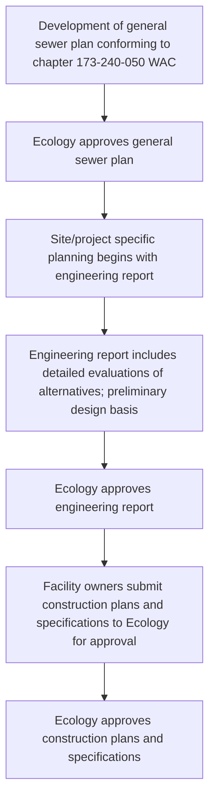
\n---\n

Figure G1-1. Sequence of Planning, Design, and Construction

```mermaid
graph TD
  A(All Counties, Cities, Sewer Districts, or Public Utility Districts) --> B(Is community in a GMA City or County?)

  %% Path for Non-GMA areas
  B -->|No| D1(Develop General Sewer Plan compliant with WAC 173-240-050)
  D1 --> E(Ecology review (90 days))
  E --> F(Ecology issues approval letter)

  %% Path for GMA areas
  B -->|Yes| D2(GMA Counties and Cities: Community must update Capital Facilities Plan under GMA)
  D2 --> D3(Develop General Sewer Plan compliant with WAC 173-240-050; Add elements required by WAC 365-196-415)
  D3 --> E

  %% Shared Ecology step for both paths
  E --> F

  %% Engineering report phase
  F --> G(Develop Engineering Report compliant with WAC 173-240-060)
  G --> H(Ecology review (60-90 days))
  H --> I(Ecology issues approval letter)

  %% Project-specific / Design phase
  I --> J(Develop Plans and Specifications compliant with WAC 173-240-070)
  J --> K(Facility owner submits to Ecology)
  K --> L(Ecology review (60-90 days))
  L --> M(Ecology issues approval letter)
  M --> N(Begin construction)

  %% Notes
  %% See references
  classDef note fill:#f9f9f9,stroke:#cccccc;
  class F note;
  %% End notes
```

\n---\n

# G1-2.3 General Sewer Plans

Chapter 173-240-020(7) WAC broadly defines a general sewer plan as “a comprehensive plan for a system of sewers adopted by a local government entity.” It specifically identifies plans developed by municipalities or special-purpose districts under the following state laws as general sewer plans:
* Sewerage general plan adopted by counties under chapter 36.94 RCW
* Plan for a system of sewerage adopted by cities under chapter 35.67 RCW
* Comprehensive plan for a system of sewers adopted by water-sewer districts under chapter 57.16 RCW
* Plan for sewer systems adopted by public utility districts under chapter 54.16 RCW and by port districts under chapter 53.08 RCW

Planning obligations associated with the above laws contain similar requirements for the governmental entities they authorize to develop and adopt plans that describe the general locations of facilities, the proposed treatment methods, service area boundaries, and include sufficient preliminary engineering to assure the plan’s feasibility. The laws also require development of the plans before the entity may provide sewer service. Chapter 90.48 RCW considers plans developed under the above laws as “plans” subject to Ecology’s review and approval under chapter 90.48.110 RCW. The above planning requirements predate the Growth Management Act and applies to all cities and counties regardless of size and growth potential.

Chapter 173-240-050 WAC describes the required content of a “General Sewer Plan” and section G1-3 provides a detailed description of the content requirements and the approval process.

General sewer plans must include the following:
* General location and description of treatment and disposal facilities, trunk and interceptor sewers, pumping stations, monitoring and control facilities,
* Description of the local service areas and a general description of the collection system to serve those areas.
* Preliminary engineering in sufficient detail to ensure technical feasibility,
* Discussion of costs of service, including debt service, operations, and maintenance, of all facilities during the planning period.

General Sewer Plans discussed in this section and Capital Facilities Plans required as an element of GMA planning may have similar content requirements and should rely on and be consistent with each other. However, the two planning requirements have distinct differences. General sewer plans typically include a greater level of technical detail necessary to demonstrate the feasibility of projects, along with justifying that
\n---\n

## G1-2.4 Growth Management Act Comprehensive Plans

proposals comply with applicable surface water or groundwater quality standards. A general sewer plan must be sufficiently complete so that any engineer can develop engineering reports for projects described in the plan without substantial alterations of concept and basic considerations. In addition, while the GMA requires updates of the Capital Facilities Plan on 6-year intervals, state law does not require updates to general sewer plans at specific intervals. Governmental entities must update or amend their general sewer plan as necessary to document the general planning basis for sewer projects. In an effort to reduce duplication, many entities revise their general sewer plan when they revise their GMA-required capital facility plan element. While Ecology encourages this streamlining effort, it will only approve the combined document as a “general sewer plan” if it complies with the content requirements of chapter 173-240-050 WAC.

G1-2.4  Growth Management Act Comprehensive Plans

The legislature originally enacted the GMA in 1990 and codified it in Chapter 36.70A RCW. The Department of Commerce revised administrative regulations related to GMA in 2010. Chapter 365-196 WAC contains the current requirements related to planning by certain cities and counties in Washington. The regulations require that counties with specified populations and rates of growth, the cities within those counties, and other counties and the cities within those counties which choose to, must meet all the requirements of the GMA, which includes the development of comprehensive plans. The GMA statute defines “comprehensive plans” as “a generalized coordinated land use policy statement of the governing body of a county or city that is adopted pursuant to [the GMA]”.

Comprehensive plans must consist of a map or maps along with descriptive text covering objectives, principles, and standards used in developing the plan. It must be internally consistent and contain certain elements that are consistent with a future land use map. Local governments must adopt the comprehensive plans, along with any amendments to it, using a process that includes public participation. Once adopted, cities and counties must perform activities and make capital budget decisions in conformity with the comprehensive plan. (RCW 36.70A.120)

While comprehensive plans developed under the GMA serve the primary purpose of supporting specific goals associated with establishing land use planning and development regulations, certain elements of the overall planning effort overlap with general sewer planning requirements that are subject to Ecology review and approval. A required comprehensive plan element that relates to the planning for and construction of wastewater collection and treatment facilities is the capital facilities plan element. RCW 36.70A.070 (3) and WAC 365-196-415 identify the following as required content of the capital facilities plan:

\n---\n

* An inventory of existing capital facilities (which includes sanitary sewer systems) owned by public entities, including the locations and capacities of these facilities.
* A forecast of the future needs for the capital facilities.
* The proposed locations and capacities of expanded or new capital facilities.
* At least a six-year plan that will finance the capital facilities.
* A requirement to reassess the land use element if the probable funding falls short.

The GMA requires counties and cities to jointly designate an Urban Growth Area.
Urban governmental services, including sanitary sewer systems may only be provided inside the urban growth area, subject to certain exceptions (RCW 36.70A.110).
The GMA regulation recommends that cities and counties “should consider existing state and regional regulatory and planning provisions affecting land use” when developing or amending their comprehensive plans. The regulation specifically identifies “comprehensive sewage drainage basin plans, approved by the department of ecology” as a plan cities and counties should consider. Because of this connection, many cities and counties required to complete comprehensive plans under the GMA must review the adequacy of their general sewer plans discussed in G1-2.3 and make appropriate revisions.

## G1-2.5 Project Specific Planning, Design, and Construction
This section summarizes the process for project-specific planning, design and construction of facility projects identified in an approved general sewer plan. See G1-4 for detailed information on project specific planning, design, and construction.

### G1-2.5.1 Engineering Reports
Chapter 173-240-020(6) WAC defines an engineering report as “a document which thoroughly examines the engineering and administrative aspects of a particular domestic or industrial wastewater facility.” Engineering reports provide detailed, project and site-specific evaluations of alternatives considered to implement the projects described in a general sewer plan. Engineering reports must be sufficiently complete and contain appropriate preliminary design detail so that any engineer may develop complete design documents (plans and specifications) without making substantial changes. Engineering reports must clearly establish the rationale for specific design criteria listed in the plans and specifications. Chapter 173-240-060 WAC provides a description of the requirements of the required contents of an engineering report and section G1-4.1 contains an overview of the required content and approval process.
\n---\n

Requirements in addition to those listed above may apply to engineering
reports for projects that may request funding from Ecology’s Water Quality
Financial Assistance Program. For funding eligibility, the environmental review
completed for the engineering report must comply with the State
Environmental Review Process (SERP) approved by EPA and discussed in
section G1-2.7. The engineering report must also include a cost effectiveness
analysis of the selected alternative. Governmental entities interested in
Ecology-administered funding for their project should refer to the most recent
funding guidelines for specific requirements.
A variety of planning documents for wastewater conveyance or treatment
facilities are sometimes generically referred to as “facility plans”. The term
Facility Plan has historically been used to refer to general sewer plans,
feasibility assessments, or site-specific engineering reports. When EPA
publications refer to a Facility Plan, they generally mean the same thing as an
Engineering Report. When the United States Department of Agriculture Rural
Development (USDA-RD) publications refer to a PER (Preliminary Engineering
Report), they generally mean the same thing as an Engineering Report.

## G1-2.5.2  Plans and Specifications
Chapter 173-240-020(11) WAC defines plans and specifications collectively as
“the detailed drawings and specifications used in the construction or
modification of domestic or industrial wastewater facilities.” The plans and
specifications are the detailed construction documents by which the owner or
appointed contractor bids and constructs the facility. Owners of proposed
wastewater facilities must submit plans and specifications for approval after
Ecology approves the engineering report that evaluated the project. Chapter
173-240-070 WAC describes the required content of plans and specifications.
In addition, section G1-4.2 includes a detailed description of the required
content and of the approval process.
\n---\n

## G1-2.5.3 Construction Quality Assurance Plans

Chapter 173-240-020(2) WAC defines a construction quality assurance plan as
“a plan describing the methods by which the professional engineer in
responsible charge of inspection of the project will determine that the
facilities were constructed without significant change from the department-
approved plans and specifications.”

Project owners must submit a construction quality assurance plan to for
approval Ecology prior to starting construction. The plan must demonstrate
that the owner or their representative has established adequate and
competent construction inspection for the project. Chapter 172-240-075 WAC
describes requirements for the content of these plans and section G1-4.3
includes a detailed discussion on this subject.

## G1-2.6 Submission of Electronic Documents

Ecology requires the preparation of general sewer plans, engineering reports, and
construction plans and specifications take place under the supervision of a
professional engineer licensed in Washington. All engineering documents submitted
to Ecology for approval must bear the seal of the professional engineer that
supervised their preparation. With the growing use of electronic documents and
records management, Ecology has adapted its practices for accepting electronic
engineering documents for review and approval. While the document submission
requirements in chapter 173-240 WAC are based on the use of paper documents,
Ecology can accept electronic versions of engineering documents in place of paper
documents. Please consult with the Ecology regional office staff responsible for
reviewing specific engineering documents to discuss preferences between paper and
electronic copies of documents and about the logistics of transmitting electronic
documents. Any engineering documents submitted based on conditions in a permit or
administrative order must comply with the submittal requirements specified in those
legal documents.

When submitting electronic engineering documents, the documents must conform to
the following standards in order to qualify as acceptable substitutes to paper
documents. Ecology based these standards on the Interpretive Guidelines for
Electronic Documents^[8] published by the state Board [of Registration for Professional](http://198.238.214.21/business/engineerslandsurveyors/docs/eDocsInterpretiveGuideline.pdf)
[Engineers and Land Surveyors](http://198.238.214.21/business/engineerslandsurveyors/docs/eDocsInterpretiveGuideline.pdf) (Board) in June 2015.

[^8]: http://198.238.214.21/business/engineerslandsurveyors/docs/eDocsInterpretiveGuideline.pdf

\n---\n

## Preliminary documents

Ecology accepts electronic versions of preliminary draft documents for initial review and comment prior to approval. These preliminary documents may contain an unsigned image of the engineer’s stamp, but Ecology does not require a stamp at this stage of review. Any electronic document containing the engineer’s stamp image must not be in a form that would allow for that stamp image to be easily copied or extracted. The Board recommends the use of flattened PDF or image files as a way to maintain control over the stamp image.

## Final documents

Ecology also accepts electronic versions of final documents for approval. Documents submitted for approval must be “signed and sealed” in accordance with chapter 196-23-070 WAC. Ecology prefers that the supervising engineer(s) digitally sign final electronic document in its native format and then convert that file into a flattened, searchable PDF document for submission. While the Board’s guidance allow for scanned copies of documents containing “wet” signatures as acceptable for compliance with the state rules for “stamping and sealing” documents, scanned documents typically are not searchable. Ecology may accept scanned copies of documents signed according to the Board’s guidelines on a case-by-case basis.

### G1-2.7 Environmental Review (SEPA, NEPA, SERP)

General and project-specific sewer facilities planning requires completion of environmental reviews consistent with the State Environmental Policy Act (SEPA). Depending on the project scope or the source of project funding, environmental reviews may also require consistency with the National Environmental Policy Act (NEPA) and the State Environmental Review Process (SERP). This section briefly describes each environmental review policy and provides guidance on how each applies to documents and specifications for wastewater facilities.

The state legislature enacted SEPA in 1971 (codified as Chapter 43.21C RCW). Administrative rules for the implementation of SEPA are contained in Chapter 197-11 WAC. SEPA seeks to ensure that state and local government officials consider environmental values along with technical and economic issues when making decisions. SEPA contains specific policies and goals that apply to actions by local agencies at all levels of government (including counties, cities, and sewer districts) in the state.

When a local agency proposes an action, the SEPA environmental review process is triggered. SEPA designates a “lead” agency for each action taken. When a local agency initiates an action such as planning, design, and construction of wastewater facilities, the local agency is considered the lead.
\n---\n

Adoption or amendment of a general sewer plan and development of an engineering report are considered “actions,” that require SEPA compliance by the local agency, prior to approval by Ecology. Applying for a biosolids permit (covered in Chapter S of this manual) is another example of an action that requires SEPA review.
SEPA allows a phased approach to environmental review in which the project proponent must address broader actions in a programmatic SEPA review and subsequently more specific, narrow actions in project specific SEPA review. An example of this is a local agency that address aspects of wastewater treatment as part of the SEPA processes for general sewer plans and engineering reports. This will allow the local agency to rely on programmatic “non-project” SEPA documents developed for the general sewer planning when addressing the project-specific SEPA requirements for facility projects evaluated in an engineering report.
Congress passed the NEPA legislation in December 1969 and President Nixon signed it into law on January 1, 1970. With similarities to SEPA at the state level, NEPA requires all federal agencies to consider and disclose the environmental impacts of activities they approve, fund, or carry out and encourages them to make environmentally responsible decisions. Any wastewater facility project carried out by a local agency that receives federal funding or approvals must comply with NEPA.
As a federal funding source, the CWSRF program requires that all funded projects undergo environmental reviews consistent with NEPA. The EPA’s implementing regulations for the CWSRF program (subpart K of 40 CFR Part 35) provide an allowance for states to use a “NEPA-like state environmental review process” to satisfy the environmental review requirements. The regulations require the following elements in a state’s SERP program:
* Documentation of the state’s legal authority to conduct environmental reviews.
* Use an interdisciplinary approach for identifying and mitigating adverse environmental effects.
* Full documentation of all information used to influence environmental review decisions.
* Provisions for public notice and public participation prior to making environmental review decisions.
* Ensure consideration of alternatives during the project development process.
\n---\n

# General Engineering Requirements – May 2023

The EPA approved Ecology’s SERP program in October 2016. Ecology’s program relies on existing SEPA review requirements to satisfy most of the SERP elements. The approved program also includes expanded public participation requirements to ensure consistency with NEPA public participation standards. Please visit Ecology’s website9 for more information on the SERP process and environmental reviews [required for](https://ecology.wa.gov/About-us/Payments-contracts-grants/Grants-loans/Find-a-grant-or-loan/Water-Quality-grants-and-loans/Environmental-review) projects funded by grants and loans administered by Ecology.

## G1-2.8 Funding Eligibility

Local entities considering requesting funding assistance from Ecology for the planning, design, or construction of domestic wastewater facilities should contact Ecology early in the project development phase for information on timelines for application submittals and current funding eligibility requirements. Specific funding opportunities, eligibility requirements, and funding levels may change each year. Please see Ecology’s website for the latest version of the Water Quality Combined Funding Program10 guidelines.

## G1-3 General Sewer Plan

This section describes the content of and approval process for general sewer plans. General sewer plans, also commonly referred to as “comprehensive sewer plans,” establish the “comprehensive plan for a system of sewers adopted by a local government entity.”

### G1-3.1 Objective

This section explains the requirements for a general sewer plan and the procedures involved in submitting plans to Ecology for review and approval. Approvable plans must discuss the following:

* The existing conditions of the sewer system, including the location and description of treatment and conveyance facilities, pumping stations, monitoring and control facilities, discharges, and overflow locations.
* The capacity and compliance status of the facilities, along with discussions of any known problems with the facilities or potential future problems pertaining to adequate operation. The facility analysis must consider the protection of human health and the water quality impacts of these facilities.

9 https://ecology.wa.gov/About-us/Payments-contracts-grants/Grants-loans/Find-a-grant-or-loan/Water-Quality-grants-and-loans/Environmental-review
10 [https://ecology.wa.gov/About-us/Payments-contracts-grants/Grants-loans/Find-a-grant-or-loan/Water-Quality-Combined-Funding-Program](https://ecology.wa.gov/About-us/Payments-contracts-grants/Grants-loans/Find-a-grant-or-loan/Water-Quality-Combined-Funding-Program)
\n---\n

* Anticipated needs for future facilities and services, including compliance with existing or new regulations, population growth, and foreseeable water quality problems. To maintain consistency between the general sewer plan and the comprehensive plan, the comprehensive plan, land use element should typically form the basis for anticipating the amount and location of future growth.
* The descriptions of future facilities, including the timeline for bringing facilities online, anticipated project costs, alternatives for financing, and discussion of how the entity will adjust its plans based on uncertainties at the time of plan adoption.

The general sewer plan must include preliminary engineering information in sufficient detail to demonstrate technical and financial feasibility for implementation. The level of detail must be sufficient to provide reviewers of subsequent engineering reports with enough information to assess whether or not projects identified in the plans fall within the scope of the approved general sewer plan. The general sewer plan must be sufficiently complete so that any engineer can develop engineering reports for projects described in the plan without substantial alterations of concept and basic considerations.

## G1-3.2 Content of General Sewer Plan

General sewer plans must include the following minimum information. Ecology requires that the preparation of general sewer plans take place under the supervision of a professional engineer licensed in Washington:

1) The purpose and need for the proposed plan.
2) Discussion of who will own, operate, and maintain the system.
3) The existing and proposed service boundaries.
4) Layout maps, including the following:
- Boundary lines of the municipality or district sewer service area, and the vicinity.
- Details of the existing sewer lines (location, size, slope, direction of flow, and capacity) along with areas served by each.
- Details of proposed sewers (as identified for existing sewers) and areas proposed to be served by each.
- Locations of existing and proposed pump stations and force mains.
- Topography and elevations of existing ground surface along with existing and proposed streets.
- Information about the locations of streams, lakes, other bodies of water, including flow directions for major streams, high and low water surface elevations near outfalls, and existing or proposed discharge locations.
\n---\n

# General Engineering Requirements – May 2023

* Information on water systems, including locations of wells or other water supply sources, treatment plants, storage reservoirs, and transmission facilities.

(5) Population trends over the planning period in the identified service area along with a discussion of the data sources, methods used to determine the trends, and concurrence with local or regional planning agencies.

(6) Information on existing domestic or industrial wastewater facilities within twenty miles of the planning area and within the same topographical drainage basin.

(7) Discussion of infiltration and inflow problems along with proposed actions to alleviate the problems in the future.

(8) Discussion about the provisions for and adequacy of treatment, including an assessment of the impacts water conservation measures may have on treatment capacity, as well as consideration of opportunities to produce reclaimed water.

(9) Information about facilities producing industrial wastewater, including a list of existing establishments that produce wastewater that may impact the collection or treatment systems along with the quantity and character of wastewater they produce. The plan must also include consideration for future industrial expansion.

(10) Discussion of the relationship between the location(s) of existing wells (public or private), other water supply sources, and water distribution structures, and the location of existing and proposed sewer system or treatment facilities.

(11) Discussion of alternatives evaluated to provide adequate sewer service and/or treatment during the planning period along with a discussion about the selected alternative for projects identified in the plan.

(12) Information on cost per service during the planning period in terms of both debt service and operations and maintenance of all existing and proposed facilities.

(13) Statement regarding compliance with water quality management plans.

(14) Statement regarding compliance with SEPA and, if applicable, NEPA.

## G1-3.3  Review and Approval

Responsibility for the review and approval of general sewer plans resides at Ecology’s regional offices. Ecology requires either one electronic or paper copy of draft documents for preliminary reviews. Chapter 90.48.110 RCW gives Ecology ninety days to either approve, conditionally approve, reject, or request amendment on general sewer plans. Ecology staff generally provide comments on preliminary review drafts within this ninety day timeframe, but may request additional time if necessary to adequately review the document. In general, Ecology’s review examines whether the
\n---\n

# General Engineering Requirements – May 2023

contents of the plan comply with the requirements in chapter 173-240-050 WAC and
whether the design, construction, operation, and maintenance of facilities identified in
the plan will meet the applicable state requirements to prevent and/or control
pollution of state waters.

Local jurisdictions should be prepared to submit at least one paper copy and one
electronic copy of their final general sewer plan document for approval. Final
electronic documents must follow the guidelines in section G1-2.6 for signing and
stamping electronic documents. Final documents should be adopted by the utility’s
governing body and receive consistency certification from relevant local land use
planning agencies prior to submission for approval. Documents that have not been
adopted or certified may require resubmittal if those agencies require changes after
Ecology’s approval.

## G1-4 Project Specific Planning, Design, and Construction

This section addresses the processes for site-specific project planning, design, and construction
of projects identified in the approved general sewer plan.

### G1-4.1 Engineering Report

This section describes the required content and approval process for engineering
report.

#### G1-4.1.1 Objective

This section provides a detailed explanation of Ecology’s requirements for
submitting engineering reports for review and approval per chapter 173-240-
060 WAC. The report must provide sufficient site-specific evaluations of
proposed projects, including adequate preliminary engineering detail, to allow
Ecology to determine whether the proposed project meets applicable
minimum guidelines and regulations. This includes providing Ecology with a
basis to evaluate whether it can issue a discharge permit for treatment plants
that the report may propose. Ecology considers the engineering report a
comprehensive analysis developed by the project proposer to document the
engineering alternatives and environmental impacts considered in making a
decision to implement the project.

Project proponents interested in pursuing funding from federal agencies may
face a requirement to submit a preliminary engineering report (PER) to the
funding agency for review and approval. USDA-RD, EPA, the U.S. Department
of Housing and Urban Development (HUD), and Indian Health Service (IHS)
cooperatively developed an interagency template outlining the contents of a
preliminary engineering report. Ecology recognizes the elements in this
\n---\n

template as a best practice for any project seeking funding through state or
federal sources.

## G1-4.1.2  Projects Requiring Submittal

State regulations consider the construction of all structures, equipment, or processes that collect, carry away, treat, reclaim, or dispose of domestic wastewater as projects subject to Ecology’s submittal regulations (WAC 173-240-020(5)). This includes all projects involving discharges to “waters of the state,” except for those projects regulated under chapter 70.118B RCW as a “Large On-site Sewage System.” Projects involving LOSS facilities must follow guidance and requirements developed by DOH.

In most situations, Ecology does not require submission of engineering reports for extensions of existing sewer systems, including the installation of pump stations, when an approved general sewer plan identifies the project as part of the capital improvement plan and the plan includes sewer system design criteria. Sewer agencies may either include design criteria as a component of the general sewer plan, or may reference standards established in local development codes or ordinances. Exceptions to the provision to waive engineering report submissions include proposals for sewers or pump stations that include the installation of overflows, bypasses, or discharges to an overloaded treatment plant or collection system. In addition, Ecology may require submission of engineering reports for projects receiving funding through Ecology’s grant and loan programs.

## G1-4.1.3  Project Development, Review, and Approval Procedures

Ecology highly recommends that project proponents and their consultants meet with Ecology’s regional office engineers as early as possible in the project development process. This conference is especially critical for projects that involve new or expanded treatment plants or for other complex projects. Discussions should cover critical factors important to the success of the project such as finance, reliability, communication strategy, timelines, permitting (including other federal and state agencies), and project objectives.

Responsibility for the review and approval of engineering reports resides at Ecology’s regional offices. Ecology requires either one electronic or paper copy of draft documents for preliminary reviews. Please contact the appropriate regional office staff to discuss preferences for draft submissions.

Chapter 173-240-030(2) WAC states that project owners must submit engineering reports “at least sixty days before the time approval is desired.” While Ecology staff generally attempt to complete preliminary reviews within this sixty-day timeframe, project complexity and other workload constraints can impact actual review times. Projects owners and their consultants must
\n---\n

coordinate with Ecology’s regional staff well in advance of submitting an engineering report to discuss review expectations. Project owners are also responsible for accounting for Ecology’s review time when developing project schedules.

Project owners and their consultants should be prepared to submit at least one paper copy and one electronic copy of their final engineering report for approval. Final electronic documents must follow the guidelines in section G1-2.6 for signing and stamping electronic documents. State regulations require that a professional engineer licensed in the state of Washington supervise the preparation of engineering reports and all final reports must bear the engineer’s seal and signature, as prescribed by the Board of Registration for Professional Engineers and Land Surveyors.
\n---\n

# Table G1-1. Explanation of Engineering Report Requirements

<table>
<thead>
<tr><th>Text from WAC 173-240-060</th><th>Explanation</th></tr>
</thead>
<tbody>

<tr>
<td>
<strong>060(1) Planning Requirements</strong><br><br>
The engineering report for a domestic wastewater facility shall include each appropriate (as determined by Ecology) item required in WAC 173-240-050 for general sewer plans unless an up-to-date general sewer plan is on file with Ecology. Normally, an engineering report is not required for sewer line extensions or pump stations. See WAC 173-240-020(13) and 173-240-030(5). The facility plan described in 40 CFR 35 is an “engineering report.”
</td>
<td>
The report must comply with an up-to-date general sewer plan (WAC 173-240-050) approved by and on file with Ecology. The community must certify that its general sewer plan adequately addresses the current conditions and service area. If the community lacks an adequate, up-to-date, general sewer plan, it must consult with Ecology to identify those portions of Section 050 it must include in the engineering report.

Ecology does not normally require an engineering report for sewer line extensions or pump stations that conform to an Ecology-approved general sewer plan.
</td>
</tr>
<tr>
<td>
<strong>060(2) Sufficiently Complete</strong><br><br>
The engineering report shall be sufficiently complete so that plans and specifications can be developed from it without substantial changes.
</td>
<td>
“Sufficiently complete,” as used in the regulations, means that the report must contain sufficient design information to allow an engineer not involved in writing the report to produce construction drawings for the facility without any need for reevaluation of the selected unit processes or more than minor unit-sizing modifications.

“Substantial change” means a change in the selected treatment process, facility size, design criteria, performance standards, or environmental impacts.. A substantial change requires an amendment to the approved engineering report.
</td>
</tr>
<tr>
<td>
<strong>060(3) Minimum Information Required</strong><br><br>
The engineering report shall include the following information, together with any other relevant data as requested by Ecology:

(a) The name, address, and telephone number of the owner of the proposed facilities, and their authorized representative.

(b) A project description including a location map and a map of the present and proposed service area.
</td>
<td>
The report must include the name, address, and telephone number of the owner and the owner's representative. The named person or position must have the authority to sign contracts relating to this project. Examples of the owner's representative include the mayor, chair of the city council sewer committee, city manager, public works director, or similar elected or appointed authority. Additionally, the entity may identify a specific project contact person other than the legal representative.

The project description includes the “where, what, and why” of the report and documents the need for the proposed project. It must reference planning information established in the approved general sewer plan and supplement or update that information as necessary to support the project-specific decisions presented in the engineering report. The report must include a location map of the project area, along with a map showing the current and proposed sewer service area. Scale the map(s) so that at least one map shows the complete, current, and proposed service areas along with the relationship of this service area to adjacent service areas. One map must show the existing collection system changes and the proposed locations of land applications of wastewater.
Provide Office of Financial Management (OFM) or other population data for the service area for at least the last two decades, if available. Include population projections for the project planning area and concentrated growth areas for the project design period. The project owner must base projections on historical records cited in the approved general sewer plan and remain consistent with data from appropriate local land use planning agencies.
</td>
</tr>

</tbody>
</table>

\n---\n

<table>
  <thead>
    <tr>
      <th>Text from WAC 173-240-060</th>
      <th>Explanation</th>
    </tr>
  </thead>
  <tbody>
    <tr>
      <td>(c)     A statement of the present and expected future quantity and quality of wastewater, including any industrial wastes which may be present or expected in the sewer system.</td>
      <td>The analysis of current conditions must include the following information, as appropriate:
        <ul>
          <li>Characterization of waste loading, including flow, 5-day biochemical oxygen demand (BOD5), and total suspended solids (TSS) received by the treatment plant. Wastewater characterization must also identify any constituents that may have a detrimental impact on any proposed unit process, such as chemicals toxic to microbes, constituents that may interfere with disinfection, and high seasonal or diurnal variability in peak flows and loading.</li>
          <li>Distribution of the wastewater sources, ideally expressed as percentages of domestic, commercial, and industrial dischargers.</li>
          <li>Characteristics of industrial discharges along with a discussion of any pretreatment requirements for those discharges.</li>
          <li>Current I/I flows, including flows received from combined sewers as defined in Chapter 173-245 WAC.</li>
          <li>Assessment of diurnal flow and loading variations along with seasonal load and flow variations.</li>
        </ul>
        The analysis must, at a minimum, include one full year of current wastewater flow and loading data to justify appropriate design parameters for the new system, However, Ecology recommends using more than one year of data.
        </td>
    </tr>
<tr>
      <td></td>
      <td>The analyzed data must include sufficient detail to demonstrate the degree of flow and loading variability experienced. It must also identify the location of influent and effluent sampling, the type of samples taken, and the locations of treatment process return streams. The report must rely on credible and accurate data, which requires the use of laboratory data obtained from an Ecology-accredited laboratory and flow data obtained from meters with a documented history of proper calibration</td>
    </tr>
<tr>
      <td></td>
      <td>The report must estimate the future (normally 20 years from the date of the report) waste load and sources of wastewater. Base the estimates on present conditions and expected future conditions that account for zoning patterns, council of government’s population forecasts, historical population trends, existing industrial users, and anticipated future industrial wastewater sources. RCW 90.48.495 specifically requires sewer plans to consider the anticipated impacts of existing or planned water conservation measures on future sewer service. Therefore, the estimated future conditions should, as best as possible, account for increasing waste load concentrations and per capita flow rates attributable to water conservation in the service area. Future estimates should also account for the impact climate change may have on unmitigated I/I flows. Facilities receiving flows from combined sewers must also assess how efforts to control CSOs impact anticipated future flows.</td>
    </tr>
  </tbody>
</table>

\n---\n

<table>
  <thead>
    <tr>
      <th>Text from WAC 173-240-060</th>
      <th>Explanation</th>
    </tr>
  </thead>
  <tbody>
    <tr>
      <td>(d)  The degree of treatment required based upon applicable permits and regulations, the receiving water, the amount and strength of wastewater to be treated, and other influencing factors.</td>
      <td>
        Include a copy of the current discharge permit and any compliance orders in the engineering report. For new discharges, include requirements reasonably anticipated in a draft permit. In addition, use the evaluation results of Sections 3(e), (h), and (l) to estimate the degree of treatment needed by the proposed facility to meet conditions of a current or anticipated future permit. In evaluating the required level of treatment, Ecology strongly recommends that communities consider the potential for regulatory changes that could require more stringent treatment requirements during the operating life of the facility.
        <br/><br/>
        At a minimum, the engineering report must evaluate whether the level of treatment produces a discharge that will comply with applicable water quality criteria in Chapter 173-201A WAC. For municipal WWTPs, this means an analysis of conventional pollutants (BOD5, TSS, pH, dissolved oxygen, and temperature), pathogens (Enterococci, E. Coli, or Fecal Coliform bacteria), and toxic pollutants commonly present in municipal discharges (ammonia and chlorine). In addition, the report must evaluate the effects of industrial discharges on the final effluent quality, including the potential for toxic materials to pass through the treatment facility to the final effluent or biosolids.
        <br/><br/>
        If the receiving water is listed on the 303(d) list as impaired, the analysis must include the parameters identified in the impairment listing. Design values must align with waste load allocations established in an approved TMDL. When Ecology has not established a waste load allocation, the analysis must demonstrate that the level of treatment will produce a discharge that imposes no reasonable potential to cause or contribute to a water quality standard violation for the parameter(s) with the documented impairment.
        <br/><br/>
        Finally, the engineering report must demonstrate whether the discharge from a proposed system will cause a measurable change in existing water quality, as measured at the boundary of any authorized chronic mixing zone. Ecology defines “measurable change” as follows:
        <br/>1) Temperature increase 0.3 C. or greater.
        <br/>2) Dissolved oxygen decrease of 0.2 mg/L or greater.
        <br/>3) Bacteria count increase of 2 cfu or greater.
        <br/>4) pH change of 0.1 units or greater.
        <br/>5) Turbidity increase of 0.5 NTU or greater or.
        <br/>6) Any detectable increase in the concentration of a toxic pollutant or radioactive substance. Ecology considers an increase “detectable” if the predicted concentration for a parameter exceeds the parameter’s detection limit concentration possible using the most sensitive test method listed in 40 CFR 136.
        <br/><br/>
        The proponent must consult with regional Ecology staff to determine the level of analysis needed to comply with the Antidegradation provisions of WAC 173-201A-300 to 330.
      </td>
    </tr>
  </tbody>
</table>

\n---\n

<table>
<[the](http://www.fda.gov/downloads/Food/GuidanceRegulation/FederalStateFoodPrograms/UCM505093.pdf)ad>
<tr><th>Text from WAC 173-240-060</th><th>Explanation</th></tr>
</thead>
<tbody>
<tr>
<td><em>(e) A description of the receiving water, applicable water quality standards, and how water quality standards will be met at the boundary of any applicable dilution zone. (173-201A-10Q WAC)</em></td>
<td>Give the name, location (river mile, latitude/longitude, waterway segment number, township/range, etc.), and water quality classification of the proposed receiving water. Summarize any existing receiving water data available from long term monitoring stations reporting to Ecology’s Environmental Information Management (EIM) database or EPA’s Water Quality Exchange (WQX). Other acceptable data source may include USGS reports, NOAA reports, FERC license reports, or site-specific monitoring data collected for this report. Include data collected for this report in an appendix to the report. For fresh water streams and rivers, determine and provide the 7Q10 (seven-day, ten-year recurrence low flow) flow in the report. Also describe the physical characteristics of the river or stream at the 7Q10 flow, such as channel width, slope, bed roughness (Manning’s coefficient), velocity, and presence of any features that may impact flow in the vicinity of the proposed outfall. Ecology will require this information to evaluate any proposed mixing zone.
For salt water and estuaries, determine and provide the depth of the outfall at mean lower low water (MLLW), the current direction and velocity profiles near the outfall (ebb and flood tides)and profiles for salinity, density, and temperature. The profiles should include variations throughout the water column from the discharge location to the water surface at MLLW. Ecology requires this information to evaluate the size and shape of allowable mixing zones.
Evaluate the potential impacts on designated uses of the receiving water of conventional and toxic pollutants reasonably expected in the effluent (toxic pollutant scan may be required). This includes an evaluation of the effects of toxic chemicals on migratory fish (i.e., barrier to fish migration). Evaluate the applicable numerical and narrative Water Quality Criteria found in chapter 173-201A WAC and determine which criteria are limiting for this discharge (see Ecology’s “Permit Writer’s Manual”). To account for synergistic effects of a mixture of pollutants in the discharge, the NPDES permit may also contain requirements for whole effluent toxicity testing and limits (WET rule, Chapter 173-205 WAC). Therefore, a discussion of the receiving water must identify the various chemicals that may be present in the discharge as well as the aquatic species present in the receiving water in order to assess the need or frequency of biomonitoring WET testing.
In salt water, evaluate not only the effects of chemical discharges, but also the impacts of microbial (bacteria & virus) discharges on shellfish beds (bed certification and decertification are determined by Department of Health). Refer to Guidance Document #19, Determining Appropriately Sized Prohibited Areas Associated with Wastewater Treatment Plants, in the 2015 [Edition ](http://www.fda.gov/downloads/Food/GuidanceRegulation/FederalStateFoodPrograms/UCM505093.pdf)of the National Shellfish Sanitation Program Model Ordinance¹¹.
For groundwater discharges, address the minimum requirements of the hydrogeologic study. These requirements are listed in E3-4 and are fully described in the “Implementation Guidance for Ground Water Quality Standards” (Ecology, 1996; Revised October 2005).</td>
</tr>
<tr><td colspan="2">11 http://www.fda.gov/downloads/Food/GuidanceRegulation/FederalStateFoodPrograms/UCM505093.pdf</td></tr>
</tbody>
</table>

\n---\n

# General Engineering Requirements – May 2023

<table>
<thead>
<tr><th>Text from WAC 173-240-060</th><th>Explanation</th></tr>
</thead>
<tbody>
<tr>
<td>(f) The type of treatment process proposed, based upon the character of the wastewater to be handled, the method of disposal, the degree of treatment required, and a discussion of the alternatives evaluated and the reasons they are unacceptable.</td>
<td>An engineering report must identify and evaluate a reasonable number of feasible alternatives for achieving the project goals. It must select and develop preliminary engineering details for a preferred alternative. Alternatives may include: conventional treatment technologies, advanced treatment systems, land treatment systems and lagoons (where appropriate), along with treatment at regional facilities. The alternatives evaluation may also include alternate facility siting, no discharge alternatives, options for reclaimed water production, and nonstructural alternatives such as operational changes. The report must include a no action alternative and discuss the consequences of taking no action. Where appropriate and applicable to the project, discuss any water, energy, and/or waste conservation measures considered in the proposed alternatives.
The alternatives analysis must evaluate the feasibility of alternatives based on: environmental impact, present worth cost effectiveness, technical complexity and the availability of certified operators, project risk, legal and regulatory barriers, and other criteria deemed important to the community. The report must also describe the efforts made to engage with the community on the development and evaluation of alternatives. Community engagement may include workshops, community meetings, surveys, or any other means that provide the community with opportunities to offer opinions either in person or in writing. Engagement efforts should include discussions of the project need, feasible technologies, environmental impacts, community impacts, environmental justice, rate impacts, and any other topic identified as important to the community. The analysis does not need to include all identified alternatives, but must discuss reasons for rejecting alternatives from consideration.
If the report does not select the alternative with the lowest estimated life cycle cost as the preferred alternative, it must discuss the rationale for the decision. This must include discussion about the community’s support for the selected alternative when it is not the alternative with the lowest life cycle cost. Provide a discussion to support the decision.</td>
</tr>
<tr>
<td>(g) The basic design data and sizing calculations of each unit of the treatment works. Expected efficiencies of each unit, the entire plant, and character of effluent anticipated.</td>
<td>Provide preliminary design data and sizing calculations for all of the final alternates as part of the ranking process. Use the data to estimate costs for construction as well as operation and maintenance for use in life cycle cost comparisons required in 3(p) below an as a factor in the alternatives analysis discussed in 3(f) above. The detailed sizing calculations and design criteria used for sizing the selected alternative treatment systems must agree with the appropriate chapters of this manual or other authoritative references.</td>
</tr>
</tbody>
</table>

\n---\n

<table>
  <thead>
    <tr>
      <th>Text from WAC 173-240-060</th>
      <th>Explanation</th>
    </tr>
  </thead>
  <tbody>
    <tr>
      <td>
        <p>(h)     Discussion of the various sites available and the advantages and disadvantages of the site(s) recommended. The proximity of residences or developed areas to any treatment works. The relationship of a 25-year and 100-year flood to the treatment plant site and the various plant units.</p>
      </td>
      <td>
        <p>Evaluate the suitability of potential facility locations as part of the alternatives evaluation process discussed in 3(f). When evaluating multiple potential treatment plant sites, assess their topography, flood potential, impacts to existing wetlands, soils suitability for construction, zoning, environmental justice, impacts to historical or archeologically sensitive areas, overall community impacts, and the proximity to residential areas.</p>
        <p>Do not limit flood analysis to determining whether or not FEMA Flood Insurance Rate Map (FIRM) maps include a particular site within a designated flood plain. Evaluate the flooding potential of any drainage way passing through or near the site for site flooding potential. Show the existence of wetlands on a proposed site on the site map. Mapping the extent of wetlands may require the use of a wetlands specialist. Compare wall and floor elevations to potential 100-yr flood elevations to ensure that basins are not over-topped or buildings flooded if major flooding occurs. Consider using a continuous hydrologic and hydraulic model with long term (20+ years) precipitation record to model the development and its contributing drainage area to evaluate the hydraulic capacity of the conveyance system and flooding potential.</p>
        <p>For facilities sited in coastal areas, consider future flooding risks associated with projected sea level rise. The risk assessment must cite the studies used in the evaluation along with a discussion of uncertainties. In addition, consider the site’s inundation risk due to tsunamis.</p>
        <p>The site assessments must also consider the potential impacts to historic properties or the risks of impacting archeological and culturally sensitive sites. The project proponent should consult with the state Department of Archaeology and Historical Preservation (DAHP), Tribal Historic Preservation Offices for federally recognized tribes in the project area, and local historical societies to assess the risk of impacts and the potential need for site investigations.</p>
        <p>During the site assessment stage, conduct adequate soils analyses at the final alternate sites to understand the ability of the soils to structurally support the proposed structures or to provide the wastewater treatment required (if evaluating a land treatment alternative). The assessment must include enough soils analyses to allow for facility design and construction while limiting the potential to encounter “changed site conditions” that would lead to project delays, redesign, or compromise the project altogether.</p>
      </td>
    </tr>
<tr>
      <td>
        <p>(i)     A flow diagram showing general layout of the various units, the location of the effluent discharge, and a hydraulic profile of the system that is the subject of the engineering report and any hydraulically related portions.</p>
      </td>
      <td>
        <p>Develop flow diagrams for each of the final alternates considered. Reports must include a schematic flow diagram showing all wastewater liquid and solids flow paths, including all return or recycle flows. Include proposed compliance sampling and flow monitoring locations to demonstrate that proposed locations will provide representative data that does not include influences from return or recycle flows and does not allow unmonitored flows to enter or leave the facility. Also include a scaled site layout (with the site topography) that shows how proposed treatment units fit on the land available.</p>
        <p>Develop hydraulic profile(s) in detail for the selected alternate. Include the hydraulic profile for at least the high plant flow and high receiving water flow/elevation and low plant flow conditions. Include hydraulic profiles for other critical flow conditions if necessary to justify unique design elements or operating conditions.</p>
      </td>
    </tr>
  </tbody>
</table>

\n---\n

<table>
<thead>
<tr><th>Text from WAC 173-240-060</th><th>Explanation</th></tr>
</thead>
<tbody>
<tr>
<td>(j) A discussion of infiltration and inflow problems, overflows and bypasses, and proposed corrections and controls.</td>
<td>Evaluate the existing treatment plant flows showing the degree of I/I in the collection system. The analysis must include a review of the age and characteristics of the existing sewerage system, flow monitoring in the system and location of sewer lines with high I/I. A complete evaluation of I/I in a system requires at least one year of testing to establish the baseline flows and conditions for further evaluations. Refer to section C1-7 for further guidance on conducting I/I investigations.
<br><br>
For wastewater treatment facility locations, describe how I/I impacts the overall facility design and performance. Describe and evaluate alternatives for minimizing or mitigating the existing and anticipated future I/I. Alternatives may include collection system rehabilitation, use of equalization basins, or otherwise accounting for hydraulic and waste strength variability in the facility design. The report must demonstrate that the proponent considered the impacts of high I/I when evaluating the appropriateness of alternative treatment technologies.
<br><br>
Identify discharge locations for anticipated sanitary sewer overflows (SSOs) and combined sewer overflows (CSOs) on a map and discuss their current frequency and impacts on receiving water. Discuss recommendations for eliminating SSOs and describe how the project relates to CSOs control efforts developed in accordance with chapter 173-245 WAC. Ecology will not approve plans that result in increased frequencies or impacts of SSO and/or CSO discharges or if the report proposes a project that is inconsistent with an approved CSO control plan.</td>
</tr>
<tr>
<td>(k) A discussion of any special provisions for treating industrial wastes, including any pretreatment requirements for significant industrial sources.</td>
<td>For industrial wastes identified in 3(c), discuss any required special handling by the treatment plant and proposed methods for handling those wastes. Reference appropriate treatability studies for existing industrial wastewaters to identify the potential to interfere with proposed treatment plant unit processes. Identify the extent of industrial pretreatment needed to ensure stable plant operation, the suitability of biosolids for beneficial use, and water quality protection.</td>
</tr>
<tr>
<td>(l) Detailed outfall analysis or other disposal method selected.</td>
<td>Identify the location of the existing or proposed outfall and diffuser design. Provide a preliminary analysis of the outfall necessary to assess impacts on the receiving water described in 3(e) above. The report must include a sufficiently-detailed outfall analysis to justify that the proposed discharge will comply with water quality standards at the point of discharge or at the boundaries of acute and chronic mixing zones defined by 173-201A-400 WAC, if allowed. The analysis must be consistent with Ecology’s “Guidance for Conducting Mixing Zone Analyses” (Publication 92-109, Appendix C) and EPA’s “Technical Support Document for Water Quality-based Toxics Control”. Ecology encourages the use of computer dilution models, such as Visual PLUMES or CORMIX, that are calibrated to actual conditions in the field to develop the outfall analysis. The analysis must include all critical flow and loading situations expected for the facility. For discharges to rivers and river-like estuaries, the low flow must represent the 7Q10 flow or otherregulated low flow. Marine discharges must use mean lower low water elevation and seasonal conditions that result in the greatest stratification in the water column.
<br><br>
The engineering report must identify whether the site of an outfall construction or reconstruction project is located on state owned aquatic land. Engineering reports discussing outfall projects located on state owned aquatic land must describe how the project complies with any DNR requirements and summarize any communication with DNR regarding the project.
<br><br>
Ecology considers the outfall and diffuser a basic unit of the treatment system. Proponents must include them in the data for 3(g) above. For discharge of wastewater land application, see (4) below.</td>
</tr>
</tbody>
</table>

\n---\n

<table>
<thead>
<tr><th>Text from WAC 173-240-060</th><th>Explanation</th></tr>
</thead>
<tbody>
<tr><td>(m)     A discussion of the method of final sludge disposal and any alternatives considered.</td><td>Include a residual solids management plan that evaluates the expected solids quantities and quality, and the potential beneficial use options, including regional biosolids options. The management plan includes evaluating sludge treatment options at the plant and relating these treatment options to the biosolids use options considered. The proponent must ensure compliance with applicable state and federal laws and regulations (40 CFR 503 and WAC 173-308), Ecology’s Minimal Functional Standards, and local permits. Any plan proposing disposal of sludge in a solid waste landfill must justify that no feasible beneficial use options exist and that disposal will comply with requirements of 40 CFR 258 and WAC 173-351. Guidance on the content of a residual solids management plan is available in Chapter S of this manual and from Ecology’s Regional Biosolids Coordinator.
Determine solids mass balance for the treatment plant as part of the process of developing and comparing both the sludge treatment and wastewater treatment alternatives discussed in 3(f). Present a ranking of the various residual solids handling alternatives considered and identify the preferred alternative and actions necessary for implementation. Also present the reasons for not selecting the other alternatives.</td></tr>
<tr><td>(n)     Provision for future needs.</td><td>The proponent must discuss the future wastewater needs of the community with an emphasis on identifying potential alternatives to accommodate for future growth. The discussion should include the potential to expand an existing treatment plant on a given site, constructing a new plant on an alternate site (including locations to construct a new facility), and the ability to extend the sewerage system. Identify the population, industrial, and commercial growth expectations of the service area. Growth expectations should consider high, medium, and low growth profiles.</td></tr>
<tr><td>(o)     Staffing and testing requirements for the facilities.</td><td>The comparison of alternatives must discuss the potential staffing needs of each final treatment alternative, including staffing levels and specialization needs of each. EPA’s 1973 document “Estimating Staffing for Municipal Wastewater Facilities” provides useful methodology for estimating staffing needs, as does the New England Interstate Water Pollution Control Commission’s 2008 document “The Northeast Guide for Estimating Staffing at Publicly and Privately Owned Wastewater Treatment Plants.” Regardless of estimation methods used, the proponent must provide justification that their plan includes a sufficient number of staff with appropriate experience to successfully operate the facility at all times. The plan must identify the proposed facility’s classification under Chapter 173-230 WAC and indicate that the staffing includes at least one operator matching the facility classification as the operator in responsible charge. Also discuss the number and responsibilities for individuals not considered certified operators, such as administrative staff, mechanics, technicians, electricians or laboratory staff not responsible for process control decisions.</td></tr>
</tbody>
</table>

\n---\n

<table>
  <thead>
    <tr>
      <th>Text from WAC 173-240-060</th>
      <th>Explanation</th>
    </tr>
  </thead>
  <tbody>
    <tr>
      <td>(p) An estimate of the costs and expenses of the proposed facilities and the method of assessing costs and expenses. The total amount shall include both capital costs and also operation and maintenance costs for the life of the project, and shall be presented in terms of total annual cost and present worth.</td>
      <td>The report must present the engineer's best opinion of probable final costs. Describe the methods used to develop the cost estimates and include an opinion of the expected accuracy. Ecology expects the level of accuracy at the engineering report stage to fall within the Class 3 to Class 4 ranges established by the Association for the Advancement of Cost Engineering International (range of no less than -30% to at least +50%). The cost estimate must account for all anticipated costs associated with the project, including construction, land acquisition, engineering (design and construction phases), permits, and all other foreseeable soft costs. Also describe any value engineering reviews completed prior to formulating the cost estimate and discuss whether further review may occur during the project design. Include a present worth analysis of O&M costs for each of the final alternates as part of the ranking process. O&M costs should include a rough breakdown by O&M category and not just a value for each alternative. Calculate the required user- charges to support the estimated design, construction, operation, and maintenance costs of the selected alternative. The estimate of user rates may include assumptions about potential grant funding, but must also present the user rate assuming no grant funding. For comparison purposes, provide information about current rate schedules, annual O&M cost (with a breakout of current energy costs), other capital improvement programs, and tabulations of users by monthly usage categories for the most recent typical fiscal year. Give status of existing debts and required reserve accounts.</td>
    </tr>
<tr>
      <td>(q) A statement regarding compliance with any applicable state or local water quality management plan or any such plan adopted pursuant to the federal Water Pollution Control Act as amended.</td>
      <td>Identify any applicable water quality management plan connected to the proposed project and discuss how the project is connected to that plan.</td>
    </tr>
<tr>
      <td>(r) A statement regarding compliance with SEPA and NEPA, if applicable.</td>
      <td>Prepare an environmental report that identifies the potential environmental impacts of the project. Include a copy of the completed SEPA checklist along with the appropriate adopted SEPA determination (Determination of Non-significance, mitigation plan, Environmental Impact Statement, etc.) in the engineering report. The action taken that requires SEPA is the adoption of the engineering report and its recommended project.
The SEPA process must ensure appropriate public participation in the project decision making. Public participation should extend well beyond the mandatory public review and comment period for the checklist and proposed determination. To demonstrate the level of public involvement in the project development, include in the report descriptions of the approach used to engage the community on need for the project, the utility operational service levels required, funding and revenue strategies to meet these requirements, along with other environmental and societal considerations.
The local government must make final SEPA determination prior to approval of the engineering report.
If the proponent determines that the proposed project may qualify for a categorical exemption from SEPA, as listed in chapter 197-11-800, the engineering report must clearly describe how the project aligns with the exemption allowance.
If the proponent anticipates federal funding for the facility or otherwise involve an action by a federal agency, the engineering report must discuss whether the project must comply with NEPA.</td>
    </tr>
<tr>
      <td>060(4) Land Application Discharges</td>
      <td></td>
    </tr>
  </tbody>
</table>

\n---\n

<table>
  <thead>
    <tr>
      <th>Text from WAC 173-240-060</th>
      <th>Explanation</th>
    </tr>
  </thead>
  <tbody>
    <tr>
      <td>
        The engineering report for projects utilizing land application, including seepage lagoons, irrigation, and subsurface disposal, shall include information on the following together with appropriate parts of subsection C(3) of this table, as determined by Ecology:
        <br/>(a) Soils and their permeability.
        <br/>(b) Geohydrologic evaluation of such factors as:
        <br/>    (i.) Depth to ground and ground water movement during different times of the year.
        <br/>    (ii.) Water balance analysis of the proposed discharge area.
        <br/>    (iii.) Overall effects of the proposed facility upon the ground water in conjunction with any other land application facilities that may be present.
        <br/>(c) Availability of public sewers.
        <br/>(d) Reserve areas for additional subsurface disposal.
      </td>
      <td>
        This section does not apply to systems classified as a Large On-site Sewage System under chapter 246-272B WAC and chapter 70.118B RCW. Please consult with DOH for appropriate guidance for these systems.
        <br/>Section (4)(c) refers to the availability of public sewers connected to a conventional treatment facility. The selection process is related to long-term reliability of the treatment and disposal process.
        <br/>Section (4)(d) requires adequate area for 100% replacement of the drain field if the entity selects subsurface disposal, consistent with the requirements of chapter 246-272B WAC.
        <br/>See Chapter E3 for determining the ground water quality criteria for land application process.
        <br/>NOTE: WAC 173-240-035 restricts the use of subsurface wastewater disposal systems if other methods are available.
        <br/>Satisfying the above requirements will satisfy the reasonability test (WAC 173-240-035).
      </td>
    </tr>
  </tbody>
</table>

## G1-4.2 Plans and Specifications
This section describes contents and approval requirements for plans and specifications.

### G1-4.2.1 Objective
This section provides an overview of the requirements for plans, specifications, and other materials incidental to design that adequately represent the intent of the design engineer and facilitate the construction of a wastewater facility project. Chapter 173-240-020(11) WAC define plans and specifications as “the detailed drawings and specifications used in the construction or modification of domestic or industrial wastewater facilities.” This section supplements the general requirements described in WAC 173-240-070.

### G1-4.2.2 Contents of Plans
A. General
Facility designs must maintain consistency with all applicable federal, state, and local requirements. The design plan, together with the specifications and other appropriate supplemental documents, constitute the project’s contract documents. They must include sufficient clarity and detail so that a third party can interpret and construct the facilities without excessive clarification from the design engineer. All plan sets must, in general, include a title sheet, location and vicinity maps, overall site plan sheets, plan and profile sheets, sheets listing design criteria for all unit processes, and others as may be
\n---\n

# General Engineering Requirements – May 2023

appropriate to sufficiently detail and outline the facility’s design. Include plan views, elevations, sections, profiles, general layouts, and supplemental views necessary to adequately represent the intended design. Number all plan sheets consecutively and ensure all sheets are clear, legible, and drawn to a scale that permits the viewer to plainly understand all necessary information. Express numerical units consistently throughout the plan set.

Develop plan sets based on common engineering drawing size (30 inches by 42 inches maximum). Plans must contain all relevant information, including, but not limited to:

1. Project title; owner’s name; date; seal and signature of design engineer with date of license expiration.
2. Index to sheets and vicinity map with project site location.
3. Master site plan and/or general layout map.
4. List of abbreviations, definitions, and symbols used within the plans.
5. List of key design criteria for the overall facility and for each major treatment unit. For projects constructed in phases, list criteria for each major construction phase and indicate the anticipated construction year for each phase. Also list anticipated design criteria for the ultimate build-out condition.
6. Each sheet must contain a general designation indicating the project title, an appropriate sheet title, date, north arrow, and a scale as well as a graphical bar.
7. Plans for sewers, sewage pump stations, sewage treatment plants, and their discharge facilities must include:
   - Plan views drawn at a horizontal scale no greater than 1 inch equaling 100 feet and profile views drawn at a vertical scale no greater than 1 inch equaling 10 feet, with the horizontal scale corresponding with the plan view.
   - Show existing and proposed topography with contours and/or spot elevations. Indicate all significant natural or manmade features such as streams, lakes, streets, buildings, etc. Also indicate the basis of all horizontal and vertical datum controls.
   - Indicate normal stream flow and 100-year flood elevations and/or high and low tidal elevations, where applicable.
   - Show ownership lines indicating properties, district, or municipal boundaries, and the proposed service area boundary for the project.
\n---\n

# General Engineering Requirements – May 2023

* Show locations of all known above ground and below ground structures or possible obstructions that potentially may interfere with proposed construction. In particular, identify utility lines such as gas, water, power, telephone, storm sewers. In addition, show locations identified for restricted construction activities to protect environmentally or culturally sensitive areas.
* (8) Any additional information that may help the viewer to understand the designer’s intent or to provide further project clarity.

The following sections include additional detail required in plan sets for sewers (part B), sewage pump stations (part C), sewage treatment plants (part D) and Plans for Sewage Treatment Plant Discharge Facilities (Part E).

## B. Plans for Sewers
In addition to the general requirements outlined in G1-4.2.2A, include the following in plan sets for sewers. Please refer to Chapter C1 for specific design information and requirements for gravity sewers and alternative sewer systems, or Chapter C2 for force mains.

1) Forms of land use (commercial, residential, agricultural, etc.), existing or proposed within 50 feet of either side of the center line of the pipeline.
2) Location of any public or private drinking water wells within the vicinity, including any wellhead or source water protection areas established pursuant to chapter 246-290-135 WAC.
3) Location, size, type, and flow direction of all existing and proposed sewer lines in the project area.
4) Location, size, and type of known underground utilities adjacent to or crossing the proposed sewer pipeline. List any special considerations needed to mitigate for conflicts with the nearby utilities.
5) Numbered and labeled all manholes in both the plan and profile views. Indicate a station, size, and type, as well as the invert and surface elevation of each.
6) Locations and details for all special details, such as inverted siphons, stream crossings, concrete encasements, elevated sewers, special joints or connections.
7) Details of all sewer appurtenances, such as manholes, cleanouts, etc.
8) Elevation and location of building basement floors. If basements are to be served, they should be plotted in profile in those areas where the sewer depth may be questionable, and/or the elevation of the lowest serviceable floor elevation should be indicated.
\n---\n

## C. Plans for Sewage Pump Stations
In addition to the general requirements outlined in G1-4.2.2A, include the following in plan sets for sewage pump station. Please refer to Chapter C2 for specific design information and requirements for pump stations and force mains.

* (1)  Details and elevation views of the completed pump station from suction pump (wet well) to discharge piping, including all isolation, check, and gate valves.
* (2)  Location and details of the existing (if any) and proposed pump station, including provisions for installation of future pumps or ejectors.
* (3)  Show elevations for all pump station alarm and control points. Show relationships between the alarm/control elevations and any known overflow points or diversion structures upstream of the facility.
* (4)  Elevation of high water at the site, maximum elevation of sewage in the collection system, and location where sewage may overflow if the pump station fails to operate.
* (5)  Maximum hydraulic gradient in a downstream gravity sewer when all installed pumps are in operation.
* (6)  Test borings and ground water elevations.
* (7)  Location of any public or private drinking water wells within the vicinity, including any wellhead or source water protection areas established pursuant to chapter 246-290-135 WAC.

## D. Plans for Sewage Treatment Plants
In addition to the general requirements outlined in G1-4.2.2A, include the following in plan sets for sewage treatment plants. Please refer to Chapters T1 through T6 for specific design information and requirements for individual sewage treatment plant unit processes.

* (1)  Show the treatment plant in relation to the remainder of the system. Include sufficient topographic features to indicate the plant’s location in relation to streams, the discharge point(s) of treated effluent, and existing buildings and their types within a reasonable proximity of the plant site property.
* (2)  Size and location of plant structures.
\n---\n

# General Engineering Requirements

(3) Schematic process flow diagrams showing the flow through various plant units, and showing utility systems serving the plant processes. Figure G1-2 provides an example of a process flow diagram that shows many of the possible treatment components. Please refer to Chapter T3 for additional details on the content of a process flow diagram.

(4) Hydraulic profiles for the complete treatment facility. The profiles must show water surface elevations under normal operations and anticipated critical conditions. Relevant profiles may include minimum, average, and maximum hydraulic conditions showing flow of sewage, supernatant liquor, and sludge. Also include elevations for critical control points, tops of basins, and high water levels for the receiving water. Indicate hydraulic grade line elevations for any areas in which the design relies on pumping to move wastewater through the plant.

(5) Piping, including any arrangements for bypassing individual units (materials handled and direction of flow through pipes shall be shown).

(6) Test borings and ground water elevations.

(7) Location, dimensions, and elevations of all existing and proposed plant facilities.

(8) Pertinent data concerning the rated capacity of all pumps, blowers, motors, and other mechanical devices. All or part of such data can be included in the specifications if the equipment is identified on the plans.

(9) Adequate description of any features not otherwise covered by the specifications or engineering report.
\n---\n

## Figure G1-2. Example of a Process Flow Diagram

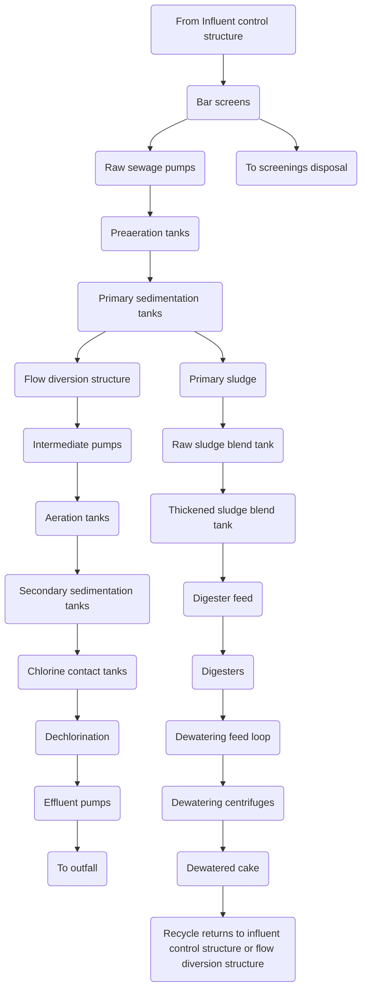

<table>
  <thead>
    <tr><th>Number</th><th>Liquid/Stream</th><th>Description</th></tr>
  </thead>
  <tbody>
    <tr><td>1</td><td>Raw sewage</td><td>Raw influent entering the primary treatment stream</td></tr>
<tr><td>2</td><td>Primary sludge</td><td>Sludge separated in primary treatment</td></tr>
<tr><td>3</td><td>Primary effluent</td><td>Effluent from primary treatment</td></tr>
<tr><td>4</td><td>Mixed liquor</td><td>Active biological treatment mixed liquor</td></tr>
<tr><td>5</td><td>Return activated sludge</td><td>RAS returning to aeration basin</td></tr>
<tr><td>6</td><td>Waste activated sludge</td><td>WAS diverted from aeration basin</td></tr>
<tr><td>7</td><td>Secondary effluent</td><td>Effluent after secondary treatment</td></tr>
<tr><td>8</td><td>Final effluent</td><td>TION final discharge/outfall</td></tr>
<tr><td>9</td><td>Gravity belt thickener feed</td><td>Feed to gravity belt thickener</td></tr>
<tr><td>10</td><td>Gravity belt thickener filtrate</td><td>Filtrate from thickening process</td></tr>
<tr><td>11</td><td>Gravity belt thickener sludge</td><td>Thickened sludge from belt thickener</td></tr>
<tr><td>12</td><td>Digester feed</td><td>Feed to anaerobic digester</td></tr>
<tr><td>13</td><td>Dewatering feed</td><td>Feed to dewatering equipment</td></tr>
<tr><td>14</td><td>Dewatering centrifuge concentrate</td><td>Concentrate from dewatering centrifuge</td></tr>
<tr><td>15</td><td>Dewatered cake</td><td>Solid phase product after dewatering</td></tr>
<tr><td>16</td><td>Recovered thickening centrifuge concentrate</td><td>Concentrate recovered from thickening centrifuge</td></tr>
<tr><td>17</td><td>Recovered thickening centrifuge sludge</td><td>Sludge from thickening centrifuge</td></tr>
<tr><td>18</td><td>Digester gas</td><td>Gas produced in digestion process</td></tr>
<tr><td>19</td><td>Digested sludge</td><td>Sludge post-digestion</td></tr>
  </tbody>
</table>

\n---\n

## E. Plans for Sewage Treatment Plant Discharge Facilities
In addition to the general requirements outlined in G1-4.2.2A, include the following in plan sets for sewage treatment plant discharge facilities. Please refer to Chapters E1 through E3 for specific information and requirements for effluent system designs.

* (1) Location, size, type, and flow direction of all existing and proposed outfall sewers.
* (2) Numbered and labeled all structures in both the plan and profile views. Indicate a station, size, and type, as well as the invert and surface elevation of each.
* (3) Location and details for all special piping, appurtenances, and structures, both onshore and within the receiving waters.

### G1-4.2.3  Content of Specifications
Specifications must include all construction information necessary to inform the contractor of the detailed design requirements. The specifications must supplement or provide details not shown on the drawings, including the quality and type of materials and equipment to install, requirements for all mechanical and electrical components, instructions for complete testing of materials and equipment, and for carrying out operational performance tests.

Each specification section must clearly identify the information required in the submittals for the construction manager to properly review the contractor’s proposal (such as equipment, pipe type, site work facilities, measures to mitigate construction activities regarding noise, traffic, stormwater, etc.).

### G1-4.2.4  Plan of Interim Operation
When the construction project involves an operating wastewater facility, the design engineer must develop a plan to ensure that the facility conveyance or treatment functions continue to operate during construction without negatively impacting public health or water quality. Ecology recommends developing this plan as a supplemental document to the plans and specifications. However, the design engineer may include this plan as components of the project specifications and in appropriate plan sets as long as they do so in a manner in which the viewer can easily understand the measures required to ensure continuing operations.
\n---\n

This plan should explain the roles and responsibilities of all persons or parties in the sewerage agency (or owner). Clearly state the contractual and other obligations of the construction contractor as related to continuing operations. Provide clear and detailed directions related to the process for approvals, coordinating equipment shutdowns and tie-ins along with expectations for reporting, and monitoring of any planned variance in the operating system. Include provisions for the development of emergency and standby plans and outline the procedures for reporting outages or spills.

G1-4.2.5  Review and Approval Procedure
Responsibility for the review and approval of plans and specifications resides at Ecology’s regional offices. Ecology requires either one electronic or paper copy of draft documents for preliminary reviews. Please contact the appropriate regional office staff to discuss preferences for draft submissions.
Chapter 173-240-030(2) WAC states that project owners must submit plans and specifications “at least sixty days before the time approval is desired.” While Ecology staff generally attempt to complete preliminary reviews within this sixty-day timeframe, project complexity and other workload constraints can impact actual review times. Project owners and their consultants must coordinate with Ecology’s regional staff well in advance of submitting documents to discuss review expectations. Project owners are also responsible for accounting for Ecology’s review time when developing project schedules.

Project owners and their consultants should be prepared to submit at least one paper copy and one electronic copy of their final plans and specifications for approval. Final electronic documents must follow the guidelines in section G1-2.6 for signing and stamping electronic documents. State regulations require that a professional engineer licensed in the state of Washington supervise the preparation of plans and specifications and all final documents must bear the engineer’s seal and signature, as prescribed by the Board of Registration for Professional Engineers and Land Surveyors.

G1-4.2.6  Approval of Construction Changes
Wastewater facility owners must construct facilities in accordance with the plans and specifications approved by Ecology. Any changes contemplated during construction that significantly deviate from the approved plans must first receive Ecology approval. Significant deviation means a change in the selected treatment process, facility size, design criteria, or performance standards that result in changes in expected facility performance or environmental impacts.
\n---\n

# G1-4.3 Construction
This section describes the requirements related to construction of a project.

## G1-4.3.1 Objective
Chapter 173-240-020 (2) WAC defines the construction quality assurance plan (CQAP) as “a plan describing the methods by which the professional engineer in responsible charge of inspection of the project will determine that the facilities were constructed without significant change from the department-approved plans and specifications.” This section describes the documentation needed in a CQAP to show how the project proponent plans to provide adequate construction management for the project. Ecology considers adequate quality assurance and control vital to the successful completion of any construction project. The CQAP helps to ensure that project construction proceeds according to the approved plans and specifications and that changes not occur unless appropriately approved through change orders. A well-developed CQAP requires a high level of performance from the project engineers and contractors during construction.

The project owner or representative must submit a detailed CQAP to Ecology for review and approval at least sixty days prior to the start of construction. Ecology considers the CQAP a “living document” that may change during the construction phase. While Ecology may not review all updates or modifications to the approved plan, the project owner must discuss proposed significant changes in construction management strategies with Ecology. On a case-by-case basis, Ecology may require submission of the changes for approval.

## G1-4.3.2 Minimum Requirements of a Construction Quality Assurance Plan
The CQAP must, at a minimum contain the following details.

### A. Construction Schedule
Ecology expects the construction schedule to change after the selected contractor fully examines the project constraints. The initial CQAP submission should include the general project schedule developed by the engineer prior to the project’s bid advertisement. This initial schedule and subsequent contractor schedules, must show identified construction elements and their sequencing interrelations and durations. If the project includes modifications to existing operating facilities, the schedule must show anticipated timeframes for work impacting existing operations, including potential dates for equipment or system shutdowns and tie-ins. The schedule must also show all construction contractual relationships and constraints.
\n---\n

The selected construction contractor must develop its own detailed schedule to replace the engineer’s projection, prior to beginning on-site activities. Ecology expects the contractor, engineer, construction manager, and owner to regularly review and update the schedule in the CQAP as the work progresses.

B. Policies and Procedures, Communication, and Duty and Responsibility Matrix
Provide a matrix outlining the following:
* (1) Construction management (CM) organization policies and procedures.
* (2) Lines of communications within the organization to the design engineer and to the construction contractor’s organization.
* (3) Duties and responsibilities of each member of the CM organization.

In addition, describe the authority level of each CM staff to carry out its responsibilities. Policy and procedures might also include document control/filing, submittal processing, schedule and cost control, change order processing, payment procedures, and emergency/contingency procedures.
See G1-4.3.2C to G1-4.3.2F and G1-4.3.3 for additional CM staff reporting requirements.

The CQAP should describe the administrative, contractual, and other relationships between various parties and persons involved in the project. This includes the owner, contractor, design engineer, and other consultants under contract, as well as federal, state, and local agencies that may control, regulate, or impact the project.

The plan should identify the responsible person(s) within each organization and their duties, authority, and responsibilities. The plan should clearly describe management and supervision responsibilities for all phases or elements of the construction project. Elements may include contract bidding and awards, construction planning, construction, design clarifications, submittal review, revisions to the design or contract, safety, inspection, startup and commissioning, acceptance, and warranty.
\n---\n

## C. Construction Quality Control Testing
Provide a complete description of all quality control testing required to
ensure that the construction conforms to the approved design. Include tests
required by contract as well as those required by policy, regulations, good
practice, or due to particular requirements of the specific project. Identify the
individuals or organizations responsible for performing the tests, their
qualifications, and procedures for ordering the testing. As discussed below for
technical records, describe the procedures for receiving, recording,
evaluating, and preserving the test data. Include a summary of procedures
outlined in the construction contract for resolving deficiencies revealed by the
testing.

## D. Change Order Process
The owner or their representative must document all revisions made to the
approved plans and specifications during construction. The CQAP must
describe the process and procedures for initiating, evaluating, and accepting
changes through change orders or other change directives. Include a
description of the change order process, and identify the individuals
authorized to initiate, review, and approve change orders along with those
responsible for negotiating cost and schedule impacts. The description should
include the level of documentation required, the role of Ecology as
appropriate, and the sequence or timing of their involvement.

## E. Construction Technical Records
Generally describe the management strategies and systems used for
construction technical records. Technical records include contract
documentation, clarifications issued, change order modifications, submittal
information, and as-built plans and contract specifications. The description
should identify the individuals responsible for various records, the process for
documentation, and the location of the working and final documentation.
Also include a description of any shared electronic filing systems used to
manage project documents along with general information about measures
used to ensure the integrity and security of electronically-stored files.
The technical records section of the CQAP must clearly describe the process
for obtaining as-built information during construction and for recording and
maintaining that information. Identify the individuals responsible for
obtaining the data and provide details on the format, timing for making field
notes of changes. Also identify the individuals responsible for permanently
recording the data, reviewing changes for accuracy, and for maintaining the
final as-built records.
\n---\n

## F. Construction Inspection
Identify all individuals involved in field inspections and observations during construction and describe their roles and responsibilities during the project. Also indicate their relationship to organizations involved in the project (owner, engineer, contractor, construction manager) along with the frequency and timing of their inspections. For on-call or as-needed inspections, describe the procedure for coordinating an inspection. For inspectors responsible for routine construction oversight, describe their procedures for documenting non-conforming work and for resolving identified issues. Clearly define the lines of communication between the inspector(s) and other parties involved in the project.

### G1-4.3.3    Declaration of Construction Completion
WAC 173-240-090 requires that, within 30 days following acceptance by the owner of the construction or modification of a domestic wastewater facility, the professional engineer in responsible charge of inspection must submit the following:
(1)  One complete set of record drawings or as-builts.
(2)  A declaration stating the facilities were completed in accordance with the CQAP and without significant change from the Ecology-approved plans and specifications.
Ecology does not require submission of this declaration for sewer line extensions performed under an approved general sewer plan and design criteria.
The declaration should be furnished to Ecology in the format specified in WAC 173-240-095. The CQAP should identify the responsible professional engineer for the project and for signing and submitting the form.

### G1-4.4      Operation and Maintenance Manual
State and federal regulations require submission of an operation and maintenance manual (O&M manual) when constructing new wastewater treatment and disposal facilities, or when substantially expanding or modifying existing facilities.

#### G1-4.4.1    Objective
The O&M manual presents regulatory requirements and technical guidance needed to operate and maintain a wastewater treatment facility or pump station under normal and emergency conditions. The O&M manual for each facility must contain precise and detailed information about the specific plant: design criteria, processes, equipment, and the interrelationship of each to achieve proper and intended operation of the facility. The manual should not
\n---\n

# General Engineering Requirements – May 2023

contain extensive background information on the history, methods, biology,
etc., of the plant or its processes.

The O&M manual is a guide and handbook operators use to insure
continuous, effective, efficient, and economical operation of the facilities
while meeting the goal of producing an effluent which meets or exceeds
waste discharge requirements and state water quality standards. The manual
will also provide guidance on responding to emergency situations within the
facility and should be considered a foundation for training new staff on plant
operations. Ecology relies on the instructions documented in the O&M
manual when evaluating whether permit violations may be attributable to
improper operation and maintenance of the facility.

O&M manuals are “living” documents. As such, Ecology expects them to be
modified or clarified by operators based on operational experience. Changes
in operational procedures and equipment require modification or amendment
of the manual; substantial manual changes require Ecology review and
approval. Facility owners should prepare and format the manual in a manner
that allows for easy revisions. The manual should also track the revision
history of the document.

G1-4.4.2  Content of Operation and Maintenance Manual

WAC 173-240-030 requires submission of an O&M manual with new
construction or expansion of municipal wastewater treatment facilities in the
state. Manuals submitted to Ecology for review and approval must conform to
specific requirements listed in WAC 173-240-080 and should address general
topics outlined in EPA’s publication, Considerations for Preparation of
Operation and Maintenance Manuals or in other relevant guidance
documents. General discussion topics, recommended by EPA, include:

*  Permits and Standards (limits, required procedures for non-compliance,
   water quality concerns).
*  Operation and control of wastewater treatment and solids handling
   facilities (general unit/process information and specific operating
   instructions).
*  Personnel requirements, qualifications and certifications.
*  Laboratory information (purpose, general procedures and data
   interpretation).
*  Records (what to keep, where to keep it and for how long).
*  Maintenance information (schedules, parts and tools needed, procedures,
   and vendor information).
\n---\n

## Organization of a Functional O&M Manual

### 1. Table of Contents
The table of contents contains specific detail to aid operators in rapidly locating topics and provides a useful outline for formulating instructional programs.

### 2. Introduction and Background
Provide concise information that gives operators a general understanding of the facility. Detailed history of the facility or information on the process theories and biology is NOT necessary. Provide only information necessary to understand the context of processes and procedures used at the facility. Topics covered in this section include:

- Purpose of the Project: A concise statement on the treatment plant’s expected accomplishments, as related to waste discharge requirements.
- Project Description: Identify general sources and amounts of wastewater, including layout of sewer mains, interceptors, and lift stations; briefly describe wastewater characteristics. The information in the O&M manual should be a brief adaptation of the more detailed background information found in General Sewer Plans and engineering reports.
- Design Criteria: Create a quick-reference summary of the design criteria by process unit and performance expectations.
- Flow Diagram: Develop a simplified schematic flow diagram of major pipelines, valves, and controls.
- Data Network Diagram: Provide a diagram of the plant’s SCADA system that identifies the locations of input sensors and access terminals. Include a listing of alarm set points, automated response actions and
\n---\n

* alarm priority as an appendix or supplemental document. Describe the ability of operators to use remote access to monitor and control the plant. Discuss security measures to prevent unauthorized access.
* Waste Discharge Permit Requirements: Provide a tabular summary of all current NPDES or state waste discharge limits and sampling requirements (frequency, location, and method).

## 3. Unit Processes

For each unit, (e.g., screening, comminution, grit removal, primary sedimentation, aeration, digestion, disinfection) describe in detail how to operate the unit to achieve intended results. Include auxiliary systems, such as the potable water system, nonportable water system, gas system, electrical system, and alarm system, as “a unit process.” Descriptions must include instructions for unit start-up, shutdown, varied flow states (from very low flow to design capacity) and operating during power outages or other unusual situations. Show the relationships between unit operation and overall plant process control with emphasis placed on design purpose of the plant. Use visual aids whenever possible.

Describe normal process operation of the unit first, followed by detailed shutdown and startup directions and instructions for adapting to process variations. Present units in flow sequence from the headworks to the discharge. Required information can be logically presented as follows:

* Purpose and Intent: Clearly state the purpose and intent of each unit; explain the functional relationship to other units and to the plant as a whole. Maximize use of schematics and other visual aids.
* Process Operating Parameters: Provide a table of the design process operating parameters for the unit with typical value ranges. Include a process flow and solids balance diagram for each applicable unit process.
* Achievement of Process Operating Parameters: For each unit, establish a systematic operating approach to provide detailed procedures for the following:
  1. Manual and automatic process operation and control for each operational mode.
  2. Unit process shutdown for each operational mode, including adjustment of other affected unit process to accommodate the shutdown.
\n---\n

3. Unit process start-up for each operational mode to bring the unit process back on-line, including adjustment of other affected units.
4. Detailed, step-by-step instructions for adjusting or changing the operational configuration of the unit based on physical/chemical process control tests. Integrate calculations that translate control data into step-by-step procedures for control actions. Specify application frequency of the control procedure with adequate consideration for system response or lag time.

* Process Monitoring: Include a complete summary of routine laboratory control tests and physical measurements required for unit process control, formatted as a quick reference of time, location, and type of sample required.

* Performance Evaluation: Identify process evaluations and calculations that are performed periodically and supplemental to routine process control. Include sample calculations and guidance on interpretation and evaluation of calculated values. When practical, use graphical short cuts to facilitate performance calculations. Use troubleshooting guides to assist in correcting performance problems, where possible.

* Emergency Operations and Response: Give detailed procedures to follow in case of power failure, structural damage by earthquakes or floods, equipment failure, operating short-handed, or other foreseeable problems. Develop emergency procedures that address steps to take in response to plant or treatment unit upset, including emergency notification procedures. Detail required operator responses to common emergency situations, including procedures for response to permit discharge violations and collection system overflows. Provide a procedure to maintain an accurate list of contact numbers required for response to common emergency situations (local police, fire, hospital, and health department; Washington Department of Health Shellfish Program or Drinking Water Program; Department of Ecology’s Emergency Reporting and Tracking System; NPDES permit manager; etc.). Format the contact list so that it can easily be posted near the telephones at the treatment plant. Include response protocols for telecommunications with lead or responsible operator if they are not on site during an emergency, and discuss the ability of the lead operator or other responsible official to provide oversight and control via remote access to the facility’s SCADA system.
\n---\n

* Safety: For each unit process, include a description of known or suspected hazards to operating personnel and the public and discuss appropriate warnings and safety precautions. Take safety into consideration in all procedures specified for routine and emergency operations and for maintenance procedures.

## 4. Laboratory Control

Ensuring compliance with discharge limitations and reporting requirements necessitates proper laboratory practices and proper process control. Documenting laboratory practices and procedures is an important component of daily plant operations and maintenance. The laboratory section should include information on the following topics:

* Sampling System and Locations: Include an illustrated plan identifying all sample locations. Discuss special sampling considerations, such as automatic sampling systems or devices and the requirement for representative sampling.
* Process Control Summary: This section should reinforce the goals of process monitoring and performance evaluation, as discussed in the unit processes section. Prepare a tabular summary of sampling frequency, time (if important), location, and type of sample for all required process control tests. Discuss sample graphs and special analysis equipment to be used.
* Laboratory Accreditation: Discuss monitoring parameters for which the on-site laboratory has received performance accreditation. Provide a list of analytical services and laboratories available for use in conducting analyses for which the on-site lab is not accredited or may be unable to perform due to temporary problems with the on-site lab.
* Laboratory Practices: Discuss generally acceptable laboratory practices including identification of the appropriate Standard Methods protocols used for analyses, sample bench sheets and sample calculations, QA/QC tolerances and guidelines, laboratory safety, and procedures for submitting monthly discharge monitoring reports. Place emphasis on the integrity of collected data and policies regarding proper ways to correct errors in recording data (i.e., prohibitions on the use of correcting fluids and altering numbers).
* Record Keeping System: Develop a record keeping system that organizes data collection for process control and any information
\n---\n

required by regulatory agencies. Show samples of records to be kept and reinforce the types of records to keep, such as calibration records, maintenance logs, and alarm logs. Clearly define that records must be kept at the treatment plant location unless special circumstances necessitate their storage at a different location.

## 5. Preventative Maintenance

A functional preventative maintenance program is essential for ensuring treatment is not disrupted due to component failure. The following key elements document the plant’s preventive maintenance program:

* Maintenance Schedules: Provide a complete listing of routine maintenance activities, including time intervals for lubrication, adjustments, etc. For treatment systems using ponds and aerated lagoons, the maintenance schedule must include intervals for periodic removal of accumulated sludge to ensure maintenance of adequate treatment volume. Whenever possible, cross reference the manual by page and model numbers to manufacturer’s maintenance schedules and manuals. On maintenance schedules, show frequency and type of maintenance to be performed, including special coating or lubricants and procedures and reference the manufacturer’s manuals for detailed information. Highlight special precautions or instructions for unusual maintenance. Discuss preventive maintenance schedules for the mechanical equipment included in each unit process. Include the entire preventive maintenance schedule, in tabular form, in the appendix. Use computerized maintenance management systems, where possible.

* Equipment Manuals: Furnish a list of equipment manuals containing parts lists and exploded views. Provide equipment manuals in a separate binder with the names and contact information of all subcontractors and equipment suppliers. Include any maintenance summaries provided by original equipment manufacturers or vendors.

* Equipment List: Include a list of all major equipment that contains the manufacturer/vendor name, the address and phone number of nearest representative, complete identification/specification tag data with serial number, a list of parts numbers and a list of spare parts in inventory. If a spare parts inventory is not maintained at the plant, provide appropriate information necessary for ordering parts. When
\n---\n

appropriate, identify each piece of equipment weighing over 45 Kg (100 pounds).

## 6. General

Other items important for successful plant operations include:

* Reference Materials: Under appropriate unit process headings, list any reference material that will provide relevant, detailed operating information that is not otherwise covered in the manual. Include as appendices or separate documents any special bulletins, brochures, shop manuals, or handbooks that may be of value to the operator and are not readily obtainable.

* Treatment Plant Process Flow and Solids Balance Diagram: Provide a process flow and solids balance diagram for the entire plant operation. These diagrams allow the operator to look systematically at the distribution of liquids and solids throughout the entire treatment system and more easily visualize unit interaction.

* Personnel: Include recommendations on the numbers, qualifications, duties, and grades of operators required to operate and maintain the plant. These recommendations should be made realistically on the basis of operating the plant at all times to produce effluent meeting waste discharge requirements. Provide detailed justification for each position to ensure adequate budgeting and fund allocation for personnel. Make a reasonable attempt to relate salary level(s) of operator(s) to other municipal employees with similar types and amounts of training, and with equivalent responsibilities. Devote a special section to operation of the plant when all necessary personnel are not available.

* Record Keeping: Compliance with self monitoring requirements mandates maintenance of accurate, complete records. Accurate records aid in regulating, adjusting, and modifying the plant facilities and treatment processes. They also provide a history of operating practices and document maintenance activities. Efficient record keeping requires an analysis of record data to define essential and useful information and to develop appropriate forms or databases that minimize the possibility of error or omission. The record keeping program must establish the protocols for timely recording of data by the person obtaining the measurements. Include sample or master data collection forms in the manual.
\n---\n

# General Engineering Requirements – May 2023

* Identification of Major Dischargers: Include a copy of each agreement that has been made with the municipality and a major discharger. Identify the discharge frequency, amounts, and constituents for each major discharger. Give particular attention to toxics or components which will affect the biological operation of the wastewater treatment plant. Provide details of any pretreatment programs, if required. If the municipality does not have delegated pretreatment regulatory authority, identify the applicable state waste discharge permits.

* Warranties: Append copies of warranties for each piece of equipment. Warranties may or may not be included in the equipment manufacturers’ parts lists, but for ease of location, a copy should be included here also.

* Sewer Ordinance: Include a copy of the sewer ordinance for the municipality for reference.

* General Safety and Security: Plant safety and security cannot be over emphasized. Several standard texts are available, which can be included as reference appendices. Thoroughly illustrate, discuss, and explain the particular safety and security problems associated with each individual wastewater facility. Include emergency response and notification procedures and discuss policies that ensure the safety and security of the plant’s equipment and personnel. If appropriate, include a safety and security risk assessment.

* Permits: Maintain a copy of the current NPDES or State Waste Discharge permit in the manual. Also include a copy of the Application for Coverage under the Statewide Biosolids permit with any appropriate attachments for land application of biosolids or plans for beneficial use. Include a copy of the Biosolids permit issued.

## G1-4.4.3  Submission of Electronic Manuals

The development of computer-based, electronic O&M manuals has several advantages. However, concerns may arise with regard to the accessibility of emergency response procedures for manuals that reside exclusively on computer hard drives or other storage media. When developing computer-based manuals, include a provision to develop a truncated hard copy of the O&M manual. This will ensure critical information is accessible in situations where computer use is not possible.
\n---\n

Electronic O&M manuals require close attention to document controls to
ensure that the manual’s content does change through inadvertent or
malicious actions. Store material for active use in formats that do not allow
editing, such as HTML-based document systems or individual pdf documents.
Include version tracking data on each page of web-based manuals or at the
beginning of each pdf document to allow readers to know when updates are
made and who makes them. Store all master, editable documents in a
password-protected location accessible to authorized editors.

## G1-4.4.4  Review and Approval Procedure

Ecology must review manuals for adequacy and completeness pursuant to
Chapter 173-240-080 WAC. Reviews focus on whether the manual’s
organization and content is reasonably consistent with the regulatory
requirements of an O&M manual in chapter 173-240-080 WAC. Ecology’s
review also relies on the guidance presented in this manual, relevant guidance
or standards in the references listed in chapter 173-240-040, as well as
guidance available in other relevant resources.

The O&M manual developer must contact regional Ecology staff to coordinate
reviews of O&M manuals. Facilitating Ecology’s review may require providing
temporary access to servers that house the content of the manual, or
submitting an archived copy of the material that makes up the manual. The
O&M manual developer must limit changes to the manual during periods of
Ecology’s review. Any changes made after the date of Ecology’s review and
approval date may invalidate an approval or may require additional review of
the changes. Also discuss the appropriate timing of draft reviews with regional
Ecology staff to ensure reviews proceed on an efficient and predictable path.

Review and approval requirements apply to all new manuals and substantial
revisions to existing manuals. Discharge permits generally require the
permittee to periodically review the O&M manual and to submit updates for
approval. Consult with your permit manager to discuss whether specific
revisions require review and approval.

## G1-5  Exceptions to Normal Requirements

This section describes general engineering requirements not specifically addressed in the
normal permitting or approval requirements. Topics covered in this section include:

* Delegation of engineering approval authority.
* New or developmental technology.
* Facility rerating procedures.
\n---\n

# G1-5.1 Objective
This section describes the general engineering requirements that fall outside of the normal permitting or approval requirements.

## G1-5.2 Delegation of Engineering Approval Authority
Chapter 90.48.110 (1) RCW requires “all engineering reports, plans and specifications for the construction of new sewerage systems, sewage treatment or disposal plants or systems, or for improvements or extensions to existing sewerage systems or sewage treatment or disposal plants, and the proposed method of future operation and maintenance of said facility or facilities, shall be submitted to and be approved by the department, before construction thereof may begin.” The legislature revised this law in 1994 to add chapter 90.48.110. (2), which allows Ecology to delegate portions of this engineering approval authority to local units of government that request the authority and meet criteria established by the department.

In response to this legislation, Ecology established a pilot program for the delegation of specific areas of engineering review and approval authority. Since this legislation impacted several regulations involving permitting, pretreatment, and engineering review, Ecology designed the pilot delegation program to test the delegation of engineering review and approval responsibilities before fully implementing the formal delegation program. In February 1995, a workgroup that included Ecology staff, representatives of local agencies and a consulting engineer completed formal recommendations for this pilot program. Ecology continues to rely on these recommendations when considering potential delegation requests.

In general, Ecology may delegate review and approval authority to local authorities that demonstrate the capacity to provide adequate and competent engineering oversight. A local entity seeking engineering delegation must commit to establishing a program staffed with engineers licensed in the state of Washington with experience in disciplines appropriate to the work they perform. The local authority must also identify the standards they will use to complete their reviews and establish an acceptable system for records management. Ecology and the local authority must negotiate and memorialize an agreement for delegation through a formal Memorandum of Understanding (MOU) signed by both parties. This MOU must describe the requirements of the local authority and specify the types of projects and documents covered by the delegation.

## G1-5.3 Special Considerations
New or developmental technology and rerating of existing facilities each require special considerations as described in this section.
\n---\n

# G1-5.3.1 New or Developmental Technology

Facility owners may include new or developmental technologies, as described below, as a component of a proposed wastewater facility project. Ecology relies on its normal review and approval authority described in this chapter for engineering reports and plans and specifications, when considering new or development technology. However, all proposals involving new or development technologies must include the additional requirements of this section.

## A. Definition

Ecology defines new or developmental technology as any method, process, or equipment proposed to treat or convey sewage that is not discussed in this manual. This definition of “new” or “developmental” does not include innovative technology as defined by EPA.

## B. Submission of Data

(1) Any new or developmental technology must undergo thorough testing in a full-scale or representative pilot installation (or similar installation) before Ecology may consider approval. The proponent must submit results of this testing to Ecology. They may submit existing data and test results from other facilities, or provide third-party certification to satisfy the data submission requirements if that data meets the objectives outlined here.

(2) A registered professional engineer with appropriate experience in wastewater facility design must supervise all procedures used in validating the proposed process. Data from testing done outside of the state of Washington does not require supervision by an engineer licensed in Washington, but the supervising engineer overseeing the testing must hold a valid license in the state where testing took place.

(3) The testing procedures must use sample collection and analysis methods appropriate to demonstrate treatment effectiveness and efficiency under minimum and maximum design conditions and over extended periods of time in the area of the proposed installation. Proponents must submit a sampling and analysis plan acceptable to Ecology prior to starting the pilot testing investigation.

(4) The submission must provide data from continuous operation of a full-scale or pilot installation that treats or conveys sewage of the type and strength expected at the proponent’s facility.

(5) The testing must use automatic indicating, recording, and totaling flow measuring equipment for flow monitoring. The monitoring protocol
\n---\n

(5) must record total flow and other process control measurements daily, or at an alternate frequency appropriate to verify the operation of the proposed technology.

(6) All analyses must conform to requirements in the latest version of the “Guidelines Establishing Test Procedures for the Analysis of Pollutants” contained in 40 CFR Part 136, or in “Standard Methods for the Examination of Water and Wastewater” (American Public Health Association), unless otherwise approved by Ecology. A laboratory registered or accredited under the provisions of Chapter 173-50 WAC must perform all analyses that provide the monitoring data for the study, except for flow, temperature, settleable solids, conductivity, and pH. Any study that relies on testing done outside of the state of Washington must provide documentation that the laboratory performing the testing holds comparable accreditation or certification.

## C. Plan Approval
After reviewing the plans and testing data, Ecology will approve the plans for construction if it is satisfied that the method, process, and equipment will efficiently and reliably operate and meet the sewage collection and treatment requirements established for the facility.

## D. Provisional Approval
Upon completion of construction or modification, Ecology will issue a provisional approval to operate the facility with new or developmental technology for a definite period of time. Ecology may grant provisional approval through explicit conditions in a wastewater discharge permit. The provisional approvals to operate require an evaluation period to demonstrate the efficacy of the new or development technology. The evaluation period should last a minimum of 12 months and not longer than 18 months, unless Ecology determines a longer period is necessary.

Ecology may also require additional monitoring and testing to ensure and demonstrate the performance of the developmental or new technology. The project proponent must submit reports during the evaluation period as required by the provisional approval. An engineer licensed in Washington must prepare the reports. The reports must include an evaluation of the technology’s impacts on the operation and maintenance of the facility. This evaluation should, at a minimum, include the impact on treatment plant operators, including level of certification needed, and the need for additional process control(s) and monitoring.
\n---\n

# E. Approval to Operate
Ecology will issue an approval to operate upon the conclusion of the provisional approval period if, on the basis of testing during the evaluation period, Ecology finds the developmental or new technology complies with provisions in this manual and/or the required treatment or performance standards. If the technology fails to meet required conditions, Ecology will require the owner to alter the sewage treatment works or sewage collection system to enable the system to comply with the standards contained in this manual. Alterations may include modifying the technology so that it meets required performance standards, or may require replacement of the new or developmental technology with conventional technology.

## G1-5.3.2 Facility Re-rating Procedures
The owner of an established facility may wish to re-evaluate the facility’s design parameters to validate original design assumptions. Owners often couple this re-evaluation with a request to change or “re-rate” the facility’s design capacities. This section discusses the process that Ecology expects owners to follow when developing a re-rating request. This section also establishes the level of data validation required to justify a change in rated capacities. In addition to the special requirements listed in this section, any re-rating request must meet the general requirements of an Engineering Report described in WAC 173-240-060.

### A. Definition
Ecology defines facility re-rating as the practice of evaluating a facility or treatment unit to assess whether the facility can operate at loading levels higher than those originally specified during design. Re-rating may take two forms:

* Standard Facility Re-rating: Standard re-rating assesses a facility’s loading based on currently acceptable design standards listed in this guidance manual or other recognized manuals of practice. The proponent evaluates the facility’s unit processes based on current design practices to establish up-to-date loading capabilities. Standard re-rating relies on the premise that improved knowledge and experience has changed the way designers model a particular class of components or processes in current designs. Ecology may allow a facility to change its rated capacity based on new information if the proponent can justify that the existing component/process is substantially similar to those currently being constructed.
\n---\n

- Nonstandard Facility Re-rating: Nonstandard re-rating challenges the design assumptions used in the original engineering report as well as plans and specifications. This challenge typically does not have the support of industry-wide acceptance of new design standards and places the burden of justification on the facility owner. The process often contests that the original designer used overly conservative assumptions. The proponent must demonstrate that the original design assumptions were overly conservative compared to accepted design practice and that the facility can reliably meet treatment goals at higher loading rates.
  Facility re-rating does NOT replace the planning required to meet the long-term treatment needs for a community. The re-rating process may refine the actual capacity of the existing facility based on documented performance capabilities, which can influence short-term treatment infrastructure needs. However, any evaluation of long-term treatment needs to accommodate community growth must include options for facility improvements.

## B. Project Development and Consultation
A successful re-rating request demonstrates conclusively that a facility can reliably operate at loading rates greater than those specified in the original design documents. Early project planning and consultation with Ecology enhances the potential for a re-rating plan approval. Entities wishing to explore facility re-rating should carefully draft a project scope that identifies the theoretical basis for the project and evaluates whether the request qualifies as a standard or nonstandard re-rating. A project scope for a standard re-rating request must identify the reasons the entity believes the process/component under review is substantially similar to units described in this manual or other recognized design guidance documents. The scope must also identify the testing methods the entity plans to use to validate the claim of similarity.

If the entity cannot justify that standard re-rating applies, the entity may request a variance from generally accepted engineering practice through a nonstandard re-rating process. Proponents of nonstandard re-rating projects must demonstrate to Ecology’s satisfaction that the facility or unit process will reliably and consistently operate at the new higher design capacity. Ecology only considers nonstandard facility re-rating requests for facilities that can provide full-scale performance data, including stress testing, for the unit processes proposed for re-rating. Stress testing must use safeguards to prevent effluent violations during the testing period.
\n---\n

# General Engineering Requirements – May 2023

Proponents of nonstandard re-rating projects must specifically evaluate the following elements:
* Impacts of the proposed change on the facility’s ability to reliably and consistently comply with wastewater permit terms and conditions.
* The potential for treatment system upset, bypass, or permit violations due to the increased loading.
* Impacts of re-rating the facility versus upgrading the facility on the capacity to accommodate new growth. The proponent must consider the community’s historical and anticipated rate of growth.
* The impact of re-rating the facility on operation and maintenance of the facility. This evaluation must, at a minimum, include the impact on treatment plant operators, including level of certification needed, and the need for additional process control(s) and monitoring.

Consult with Ecology’s regional facility engineers prior to starting any facility re-rating project. Ecology’s staff can aid in assessing the potential for a re-rating request being successful and will assist in identifying the data requirements for the final report. Early consultation is especially important with nonstandard re-rating projects because nonstandard re-rating requires a high level of process testing and validation. This consultation may include development of a sampling and analysis plan that identifies:
* The anticipated design flow to use in the test(s) and the planned testing duration.
- Frequency of flow, loading, and water quality testing.
- Impacts of the biological and hydraulic function of the units at anticipated design flow including recovery time.

### C. Data Quality
Ecology requires credible data to support a re-rating request. The data must justify that the proponent’s claim is valid and that a new rating will adequately protect water quality. To ensure valid results, sampling and analysis procedures must adhere to the following general guidelines:
* A professional engineer licensed in Washington and experienced in wastewater treatment plant design and process diagnostics must supervise all procedures used in validating the process.
* The proponent must collect data from continuous operation of a full-scale installation treating or conveying the type and strength of sewage expected at full operation.
\n---\n

* Use automatic indicating, recording, and totaling flow-measuring equipment. Take daily recordings of total flow and other process control measurements to verify operation of the facility or unit process under study. The proponent may use other measurement and recording frequencies as appropriate for the particular system under study.
* Collect and analyze samples to demonstrate effectiveness and efficiency under minimum and maximum design conditions and over extended periods of time. Use a sampling and analysis protocol acceptable to Ecology to test the process under investigation. Minimum testing must include 5-day biochemical oxygen demand (BOD5), total suspended solids (TSS), ammonia, alkalinity, and pH along with any parameters specifically regulated by water quality-based permit limits or total maximum daily limits (TMDLs).
* Ecology expects re-rating analyses to include stress testing to validate performance at the proposed peak flow and loading rates. The stress testing procedure must ensure that no effluent violation occurs during the testing period. Tests must include a ramp uploading period (current design to proposed high) and maintain influent pollutant concentrations at levels comparable to existing levels.
* All analyses must follow the latest version of the “Guidelines Establishing Test Procedures for the Analysis of Pollutants” contained in 40 CFR Part 136, or “Standard Methods for the Examination of Water and Wastewater” (APHA) unless otherwise approved by Ecology. A laboratory registered or accredited under the provisions of Chapter 173-50 WAC must prepare all monitoring data except flow, temperature, settleable solids, conductivity, and pH.
* Testing data analysis must include statistical validation at a 95% confidence level. Any new loading rates established using the data analysis must include an appropriate safety factor. Ecology will require larger safety factors for systems that have high peaking factors or for testing results with a high degree of variability.

## D. Plan Approval
The project proponent must submit to Ecology an engineering report that evaluates the technical feasibility of re-rating the facility. The engineering report must include:
* The technical basis for the proposed re-rating.
- An evaluation of the proposed re-rating on each treatment process in the facility’s treatment train.
\n---\n

* The evaluation and monitoring proposed to demonstrate performance and reliability of the facility at the re-rated capacity.
Chapter 173-201A-320 WAC requires a Tier-II Antidegradation Analysis for “new or expanded actions” by systems regulated under the authority of a NPDES permit, a state waste discharge permit to surface waters, Federal Clean Water Act Section 401 water quality certifications, or other water pollution control programs authorized, implemented, or administered by Ecology. A facility re-rating request qualifies as an action that triggers a Tier-II analysis. Ecology requires that all facility plans requesting a facility re-rating to include an assessment of whether the increased plant loading will result in a “measurable change” to receiving water quality. If the analysis predicts a measurable change, the proponent must provide justification that an overriding public interest makes the project necessary.
Ecology will review the engineering report for required content and technical merit. If, in Ecology’s opinion, the engineering report justifies that the facility will operate reliably at higher loading rates, Ecology will grant provisional approval of the capacity rating increase. However, plan approval does NOT automatically allow the entity to operate the facility under the new capacity rating. Ecology must change the permitted capacity through a permit modification or renewal.
## E. Provisional Approval
Upon approval of the engineering report and completion of any necessary construction or modifications, Ecology may grant provisional approval to operate for a specific period of time. This provisional approval allows the proponent to evaluate the facility performance at the re-rated capacity. Ecology will may include provisions of the approval in conditions of a modified or renewed wastewater discharge permit. The evaluation period will last a minimum of 12 months and must include an evaluation of both wet and dry weather performance.
Ecology may also require additional monitoring and testing to ensure and demonstrate the performance of the re-rated facility. The project proponent must submit reports during the evaluation period as required. A professional engineer licensed in Washington and experienced in treatment facility design and process diagnostics must prepare the reports.
\n---\n

## F. Approval to Operate
Ecology will approve a facility to operate at the re-rated capacity upon the conclusion of the provisional approval period if Ecology determines the facility is able to consistently and reliably operate in compliance with permitted requirements. Ecology will use the test results as the basis for this determination. On a case-by-case basis, Ecology may unconditionally approve the re-rating engineering report and not require a demonstration period.

## G1-6 References
- US Environmental Protection Agency. Considerations for Preparation of Operation and Maintenance Manuals. EPA-430/9-74-001.
- Washington State Department of Ecology. Report: Structure of the Pilot Process to Support HB 2320. Recommendation by the Engineering Delegation Criteria Workgroup. 1995.
- Washington State Department of Ecology. Implementation Guidance for the Ground Water Quality Standards. Publication No. 96-02. 2005.
- Washington State Department of Ecology. Permit Writer's Manual. Publication No. 92-109. 2018 update.
- Washington State Department of Ecology. Reclaimed Water Facilities Manual: The Purple Book. Publication No. 15-10-024. 2019 update.
- Washington State Governor’s Office of Regulatory Innovation and Assistance. Online Regulatory Handbook[^12]

[^12]: [https://apps.oria.wa.gov/permithandbook]([https://apps.oria.wa.gov/permithandbook](https://apps.oria.wa.gov/permithandbook))
\n---\n

# G2 General Considerations

This chapter describes general design considerations related to the construction, operation, and maintenance of municipal wastewater facilities. Topics covered in this chapter include general design criteria; flow measurement; odor control; mechanical, electrical, instrumentation, and control systems; safety; reliability classifications; and laboratory, personnel, and maintenance facilities.

- G2-1 Design Criteria
  - G2-1.1 Treatment Regulations
  - G2-1.2 Design loading, treatment plants
    - G2-1.2.1 Rationale for conservative design of secondary biological and other treatment units (Rev. 10/2006)
    - G2-1.2.2 Hydraulic and Organic Loading (Rev. 10/2006)
      - A. Definitions
      - B. Associated requirements
    - G2-1.2.3 Existing Systems
    - G2-1.2.4 New Systems
  - G2-1.3 In-Plant Piping and Channels
  - G2-1.4 Design Flows, Collection Systems
  - G2-1.5 Plant Location
    - G2-1.5.1 General
    - G2-1.5.2 Flood Protection
    - G2-1.5.3 Separation from Public Water Supplies
    - G2-1.5.4 Access and Transportation Considerations
- G2-2 Essential Components
  - G2-2.1 Multiple Units
  - G2-2.2 Water Supply (Rev. 08/2008)
    - G2-2.2.1 Potable Supply Connection
    - G2-2.2.2 Cross-connection Control Program
    - G2-2.2.3 Cross-connection Control Design
      - A. Scope
      - B. Purpose
      - C. References
      - D. Backflow Prevention Methods
      - E. Wastewater Facility Water Systems
      - F. Overview of Cross-connection Control for Sewage Facilities
  - G2-2.3 Utility and Other Support Systems
  - G2-2.4 Laboratory, Personnel, and Maintenance Facilities
  - G2-2.5 Sewage Flow Measurement
  - G2-2.6 Sampling
  - G2-2.7 Preliminary Treatment
  - G2-2.8 Plant Details
    - G2-2.8.1 Arrangement of Units and Access
    - G2-2.8.2 Provisions for Flushing, Cleaning, and Draining
    - G2-2.8.3 Pipe Identification
    - G2-2.8.4 Corrosion
    - G2-2.8.5 Grading and Landscaping
- G2-3 Siting Considerations and Impacts
  - G2-3.1 General
  - G2-3.2 Noise (Offsite Impacts)
  - G2-3.3 Visual Aesthetics
  - G2-3.4 Odor/Air Quality

- G. Cross‑connection Control for Reclaimed Water (RW)
  - H. Reclaimed Water (RW) Design and Installation Guidelines
    - 1. General
    - 2. Premise Isolation Backflow Preventer
    - 3. Air Gap
    - 4. Water Outlets and Usages
    - 5. Potable Water
    - 6. Hot Water
    - 7. Emergency Washing Facilities
    - 8. Irrigation Systems
    - 9. Automatic Fire Protection Systems
    - 10. Hazardous Chemicals and Substances
    - 11. Odor Control Equipment
\n---\n

# G2-2

## G2-3 Bird and Animal Control
- G2-3.5 Bird and Animal Control
- G2-3.6 Buffer Zones
  - G2-3.6.1 New Sewage Treatment Plants
  - G2-3.6.2 Existing Sewage Treatment Plants

## G2-4 Flow Measurement, Sampling, and Splitting
### G2-4.1 Treatment Plant Flow Measurement
- G2-4.1.1 Purpose
- G2-4.1.2 Flow Measurement
  - A. General
- G2-4.1.3 Flow Meter Selection
- G2-4.1.4 Sampling
  - A. Sample Devices
  - B. Sampler Design Considerations
  - C. Automatic Sampling Equipment
  - D. Manual Sampling

### G2-4.2 Collection System Flow Measurement

### G2-4.3 Flow Splitting
- G2-4.3.1 Purpose
- G2-4.3.2 Types of Flow Splitting Devices and Their Application
  - A. Flumes
  - B. Weirs
  - C. Control Valves
  - D. Symmetry
- G2-4.3.3 Problems with Flow Splitting
  - A. Upstream Conditions
  - B. Inadequate Head/Pressure
  - C. Approach Conditions
  - D. Downstream Conditions
  - E. Submerged Flow
  - F. 1. Improper Sizing of Primary Device
  - 2. Too Large
  - 3. Too Small

## G2-5 Odor Prevention and Treatment
### G2-5.1 General Design Considerations
- G2-5.1.1 Estimating/Modeling Potential Odors
- A. Hydrogen Sulfide Generation and Corrosion Potential
  - 1. Odor Dispersion
  - 2. Increasing Atmospheric Turbulence
  - 3. Increasing the Travel Distance
  - 4. Elevating the Emission Source
- G2-5.1.2 Collection System Design

### G2-5.2 Odor Prevention
- G2-5.2.1 Chemical Addition
  - A. Chemical Oxidation
    - 1. Chlorine
    - 2. Hydrogen Peroxide
    - 3. Potassium Permanganate
    - 4. Iron Salts
    - 5. Anthraquinone
    - 6. Caustic Slug Dosing
    - 7. Nitrate Addition
- G2-5.2.2 Reaeration/Oxidation
  - A. Oxygen Addition/Injection
  - B. Air Injection
  - C. Ozone
- G2-5.2.3 Operational Procedures
- G2-5.2.4 Containment

### G2-5.3 Odor Treatment
- G2-5.3.1 Containment and Ventilation
- G2-5.3.2 Ductwork
- G2-5.3.3 Fans
- G2-5.3.4 Biological Treatment Processes
  - A. Biofiltration Beds
- G2-5.3.5 Biotrickling Filters/Biotowers
  - A. Packed-Bed Wet Scrubbers
- G2-5.3.6 Carbon Adsorbers
- G2-5.3.7 Thermal Oxidation

## G2-6 Plant and Collection System Details
### G2-6.1 General
- G2-6.1.1 Arrangement of Units and Access
- G2-6.1.2 Provisions for Flushing, Cleaning, and Draining
- G2-6.1.3 Pipe Identification
- G2-6.1.4 Corrosion
- G2-6.1.5 Operating Equipment
\n---\n

# G2-6 Facility and Equipment

## G2-6.1.6 Facility and Equipment Size and Scale Issues
- A. Throttling Valves
- B. RAS Pumps for Small Plants
- C. Aeration Basin Length-to-Width Ratios

## G2-6.2 Mechanical Systems

## G2-6.3 Electrical Systems
### G2-6.3.1 General
- A. Governmental Codes and Regulations
- B. Manufacturer and Technical Society Recommendations
- C. Plan Requirements

### G2-6.3.2 Electric Power Sources
- A. Reliability
- B. Primary Power Source
  - 1. General
  - 2. Service Voltage

### G2-6.3.3 Power Distribution within the Plant

### G2-6.3.4 Coordination

### G2-6.3.5 Reliability and Maintenance Considerations
- A. General
- B. Lighting Systems
- C. Engine Generators
  - 1. Phase Alignment
  - 2. Muffling
  - 3. Louvers
  - 4. Fuel System
  - 5. Starting
  - 6. Switchgear
  - 7. System Expansion
- D. Starting Current
- E. Uninterruptible Power Supplies (UPS)
  - 1. Ground Fault Sensors
  - 2. Switching Equipment
  - 3. Grounding Circuits
  - 4. Grounding Dual‑Fed Services
- F. Parts
  - 1. Standard Parts
- G. Replacement Parts
- Flooding
  - 1. Equipment
  - 2. Conduits
- H. Miscellaneous
  - 1. Oil‑Insulated Equipment
  - 2. Equipment Protection
  - 3. Restart
  - 4. Temperature Detectors

## G2-6.4 Instrumentation and Control Systems
### G2-6.4.1 General Requirements
- A. Governmental Codes and Regulations
- B. Manufacturer and Technical Society Recommendations
- C. Plan Requirements

### G2-6.4.2 Instrument and Control System Reliability Requirements
- A. General
- B. Design Considerations

### G2-6.4.3 Coordination

### G2-6.4.4 Maintainability—Control Systems
- A. Section Summary
- B. Identifying the Required Documents
- C. Smart Instrumentation
- D. PLC Documentation Software
- E. Reliability and Maintenance Considerations

### G2-6.4.5 Flexibility—Control Systems
- A. Flexibility Issues
- B. Plant Expansion

### G2-6.4.6 Technologies—Control Systems (DCS/SCADA) Design
- A. Define the Functional Requirements
- B. Key Functional Requirements
- C. Coordinated and Integrated Software Functions
- D. Historical Database Management
- E. The Operator/Management Interface
- F. Moving Data to Other Systems

### G2-6.4.7 Coordination with Process Design
- A. Section Summary
- B. Design Coordination
- C. The Role of P&IDs
- D. Typical P&ID

## G2-7 Safety
### G2-7.1 Safety Regulations
- G2-7.1.1 Federal Regulations
- G2-7.1.2 Washington State Safety Regulations

### G2-7.2 Engineering, Design, and Construction Safety
- G2-7.2.1 Contracts
- G2-7.2.2 Prebid Specifications
- G2-7.2.3 Preconstruction Meetings
\n---\n

# G2-4 August 2008 Criteria for Sewage Works Design

## G2-7.3 General Wastewater Safety Hazards
- Hazards

## G2-7.4 Hazardous Materials and Chemical Handling

## G2-7.5 Walking and Working Surfaces

## G2-7.6 Working Spaces

## G2-7.7 Fall Protection and Prevention Systems

## G2-7.8 Confined Spaces

## G2-7.9 Fire Control and Protection Systems

## G2-7.10 Electrical Safety

## G2-7.11 Process Safety Management and Risk Management Planning
- G2-7.11.1 Process Safety Management
- G2-7.11.2 Risk Management Planning

## G2-8 Reliability Classification
- G2-8.1 Definitions
- G2-8.2 Reliability Components
- G2-8.3 Electrical Power Sources

## G2-9 Laboratory, Personnel, and Maintenance Facilities
- G2-9.1 General
- G2-9.2 Laboratory Facilities
  - G2-9.2.1 General
  - G2-9.2.2 Space Requirements
  - G2-9.2.3 Design
    - A. Location
    - B. Layout
      - 1. General
      - 2. Storage and Cabinets
      - 3. Sinks
      - 4. Benches and Tables
      - 5. Air Handling
      - 6. Safety
- G2-9.3 Personnel Facilities
- G2-9.4 Maintenance Facilities
  - G2-9.4.1 Maintenance Shop
  - G2-9.4.2 Vehicle Requirements
  - G2-9.4.3 Storage Requirements
  - G2-9.4.4 Yard Requirements

### Tables

<table>
  <thead>
    <tr>
      <th>Table</th>
      <th>Description</th>
    </tr>
  </thead>
  <tbody>
    <tr><td>Table G2-1</td><td>Design Condition Summary</td></tr>
<tr><td>Table G2-2</td><td>Design Basis for New Sewage Works</td></tr>
<tr><td>Table G2-3</td><td>Cross-connections Associated with</td></tr>
  </tbody>
</table>

\n---\n

# Wastewater
* Table G2-4. Impact of Wastewater Characteristics on H₂S Formation
* Table G2-5 Critical Biofilter Design Factors
* Table G2-6 Critical Biotower Design Factors
* Table G2-7. Carbon Adsorber Vessel Design Criteria
* Table G2-8. Guidelines for Classifying Sewerage Works
* Table G2-9. General Requirements for Each Reliability Classification
* Table G2-10. Minimum Capacity of the Backup Power Source for Each Reliability Classification

## Figures
* Figure G2-1 Cross Connection Control Overview
* Figure G2-2 Wastewater Facility Water Schematic (Sheet 1 of 2)
* Figure G2-3 Wastewater Facility Water Schematic (Sheet 2 of 2)
* Figure G2-4 Complex Cross-connection Control Overview
\n---\n

# G2-1 Design Criteria
This section contains general design criteria related to wastewater collection systems and treatment plants. Specific design criteria related to the collection, treatment, and disposal elements of the process are included in other chapters in this manual.

## G2-1.1 Treatment Regulations
The wastewater treatment system shall produce an effluent that complies with the requirements of Ecology, state water quality standards, and federal law. The minimum standard shall be secondary treatment as defined in EPA regulation 40 CFR 133, as amended.

The state water quality standards for ground waters are in Chapter 173-200 WAC and for surface waters in Chapter 173-201A WAC. The state wastewater discharge standards and effluent limitations are contained in Chapter 173-221A WAC.

## G2-1.2 Design loading, treatment plants

### G2-1.2.1 Rationale for conservative design of secondary biological and other treatment units (Rev. 10/2006)
This section defines wastewater treatment plant influent design loadings and how they are applied in designing wastewater treatment plant capacity. The section focuses on secondary biological treatment, which is considered the minimum level of acceptable treatment for discharge under the Clean Water Act.

USEPA and Canadian studies indicate that secondary biological treatment is significantly more effective in removing toxins and pathogens as compared to primary treatment. Secondary treatment removes about 85 percent of the organic matter in sewage. For some specific toxins, such as copper, phenol, and benzene, the gains for secondary treatment are much higher.¹ Secondary treatment also more effectively removes pathogens, including up to 99 percent of viruses, bacteria and parasites.² Two Canadian studies reported that primary wastewater treatment removes only 76 percent of Cryptosporidium and 27 percent of Giardia lambia. Secondary biological treatment is necessary to achieve 90 percent or greater reduction of these gastrointestinal parasites.³

Because of the benefits of secondary biological treatment, Ecology requires process component sizing to maximize hydraulic and biological treatment capacity. Ecology sets water quality‑based effluent limits for toxics

1 Fate of Priority Pollutants in Publicly Owned Treatment Works, Volume I (EPA 440/1-82/303), U.S. Environmental Protection Agency, Washington, D.C., September 1982, p. 61., and Volume II (EPA 440/1-82/303), pp. 3-55 to 3-58.

2 U.S. Environmental Protection Agency. Office of Research and Development. Design Manual: Municipal Wastewater Disinfection. EPA/625/1-86-021, 1986, Table 2-3, p. 6.

3 Katonak, Rachel and Joan B. Rose. Public Health Risks Associated with Wastewater Blending, Department of Fisheries and Wildlife, Michigan State University, Final report.
\n---\n

## G2-1.2.2  Hydraulic and Organic Loading (Rev. 10/2006)

(ammonia, metals, etc.) at the highest anticipated influent flows, which is defined in G2‑1.2.2 below as Maximum Day Design Flow (MDDF). Dischargers with toxics limits must treat the entire MDDF with biological secondary treatment at all times. Permit limits for dischargers with technology‑based secondary limits are based on the highest average weekly anticipated flow. The treatment plants with only secondary limits must be able to treat the wastewater 100 percent of the time with biological secondary treatment at flows up to the Maximum Weekly Design Flow (MWDF) as defined in G2‑1.2.2 below.

### A.  Definitions

Treatment plant design capacity must achieve full secondary biological treatment and meet all permit effluent limits throughout the design life (normally 20 years). The sizing of the process units should follow generally accepted engineering practices (see Table G2‑1 below) and equipment manufacturer’s recommendations. The hydraulic and biological treatment capacity of the treatment works must be designed for the following flows:

- Annual Average Design Flow (AADF): The average of the daily flow volumes anticipated to occur over a calendar year.
- Maximum Month Design Flow (MMDF): The largest volume of flow anticipated to occur during a continuous 30‑day period, expressed as a daily average.
- Maximum Week Design Flow (MWDF): The largest volume of flow anticipated to occur during a continuous 7‑day period, expressed as a daily average.
- Maximum Day Design Flow (MDDF): The largest volume of flow anticipated to occur during a one‑day period, expressed as a daily average.
- Peak Hour Design Flow (PHDF): The largest volume of flow anticipated to occur during a one‑hour period, expressed as a daily or hourly average.
- Peak Instantaneous Design Flow (PIDF): The maximum anticipated instantaneous flow.

### B.  Associated requirements

(1)  When necessary to cost effectively achieve biological treatment at flows between MMDF and MDDF as defined in this section, the design must consider the following measures:

* Controlling sludge volume index (SVI) to less than 150 mL/g (conventional activated sludge plants)
* Reducing infiltration and inflow (I/I)
* Adding contact‑stabilization units, flow equalization units
* Providing step feed
* Adequate sizing/design of secondary clarifiers
\n---\n

# General Considerations

(2) When the AADF is known, and PHDF and PIDF flows are not known (such as when the POTW has only a totalizing meter which is read daily), the AADF, in conjunction with standard peaking factors, may be used to estimate the PHDF and PIDF (see Figure C1‑1., Section C1).

(3) The secondary biological treatment process is expected to have the capability to hydraulically pass all PHDF and PIDF flows, but may not be able to biologically treat flows at these flow rates.
- All units must have the ability to hydraulically pass 100 percent of the PHDF flow without overtopping tank walls or causing backups in the tributary collection system.
- All units must have the ability to hydraulically pass 100 percent of the PIDF flow without overtopping tank walls or causing more than minor backups in the tributary collection system.

(4) The biological treatment plant must treat all of the flows up to MWDF for secondary treatment limits, and up to MDDF for treatment plants with toxics.

(5) In all cases, the engineer must justify that the wastewater treatment plant design proposal includes an appropriate safety factor that ensures compliance with permit limits and water quality standards at the maximum flow and loading conditions.

(6) If the peak hour treatment plant flow and solids loading values are at least three times the average dry weather flow and loading values, multiple parallel trains of unit processes must be included in the design of the treatment plant.
\n---\n

## Table G2-1. Design Condition Summary

<table>
  <thead>
    <tr>
      <th>Unit Processes</th>
      <th>Flow (F)</th>
      <th>Organic or Solids Loading (L)</th>
      <th>Effluent standards which determine the applicable design flows &amp; loadings</th>
    </tr>
  </thead>
  <tbody>
    <tr>
      <td>All plant pumping, conveyance channels, pipes, and flow structures</td>
      <td>PIDF</td>
      <td>N/A</td>
      <td>N/A</td>
    </tr>
<tr>
      <td>Primary and secondary clarifiers</td>
      <td>PHDF +<br>recirculation flow for overflow rate and weir loading rate.</td>
      <td>*PHDL (total suspended solids loading rate to clarifiers)</td>
      <td>N/A</td>
    </tr>
<tr>
      <td>Biological reactor</td>
      <td>MWDF</td>
      <td>*MWDL (BOD5 loading to reactor(s))</td>
      <td>Secondary treatment and/or nutrient removal and/or reuse</td>
    </tr>
<tr>
      <td>Biological reactor</td>
      <td>MDDF</td>
      <td>*MDDL (BOD5 loading to reactors)</td>
      <td>Toxics removal and/or reuse</td>
    </tr>
<tr>
      <td>Aeration equipment for substrate removal</td>
      <td>N/A</td>
      <td>*PHDL (BOD5 and for nitrifying systems, TKN loading rate to biological reactor(s))</td>
      <td>N/A</td>
    </tr>
<tr>
      <td>Plant liquid stream pumping equipment</td>
      <td>PIDF</td>
      <td>N/A</td>
      <td>N/A</td>
    </tr>
<tr>
      <td>Filters/screens used in the liquid stream for secondary clarification</td>
      <td>Pass all flows</td>
      <td>N/A</td>
      <td>N/A</td>
    </tr>
<tr>
      <td>Filters used for secondary effluent polishing</td>
      <td>Pass all flows requiring tertiary treatment</td>
      <td>N/A</td>
      <td>Secondary treatment and/or nutrient removal and/or toxics removal and/or reuse</td>
    </tr>
<tr>
      <td>Equalization basins/surge basins</td>
      <td>**Continuous flow routing analysis</td>
      <td>N/A</td>
      <td>N/A</td>
    </tr>
<tr>
      <td>Primary and secondary sludge wasting equipment</td>
      <td>N/A</td>
      <td>*MDDL (BOD5 and TSS loading to primary clarifiers and/or biological reactor(s))</td>
      <td>N/A</td>
    </tr>
<tr>
      <td>Sludge digestion and dewatering equipment</td>
      <td>N/A</td>
      <td>*MDDL (BOD5 loading to reactor(s))</td>
      <td>N/A</td>
    </tr>
<tr>
      <td>Disinfection (non-reuse &amp; non-reliability class I plants)</td>
      <td>N/A</td>
      <td>MDDF (for disinfection requirements, PHDF (for hydraulic considerations))</td>
      <td>N/A</td>
    </tr>
<tr>
      <td>Disinfection (reuse &amp; reliability class I plants)</td>
      <td>All flows</td>
      <td>N/A</td>
      <td>Reuse, shellfish harvest protection</td>
    </tr>
  </tbody>
</table>

<p><strong>*Organic or solids loading parameters are to be computed with the same time intervals as hydraulic loadings.</strong></p>
<p><strong>**Continuous flow routing analysis to insure the discharge from the equalization basin does not exceed the hydraulic design limit for the downstream unit processes.</strong></p>
\n---\n

# General Considerations

The hydraulic capacity of the treatment works should be based on the maximum expected flow. The process design of treatment units should be based on either the average design flow or the peak design flow, whichever is controlling. The following items should be determined from the observed rate of flow during the significant period of discharge. Items to be considered in determining design flows are as follows:
* Peak flow rates continuing over a length of time sufficient to adversely affect the detention time of treatment units or the flow characteristics in conduits.
* Applicable data from similar municipalities.
* Wet weather flows.
* Recirculation and inplant recycle flows.
The design organic loading should be computed in the same manner used in determining design flow.

## G2-1.2.3 Existing Systems

Treatment plants designed to serve existing sewerage systems should be designed on the basis of characteristics of sewage obtained from the operating records of the treatment works.
The design engineer or owner shall provide a plan acceptable to Ecology for eliminating or handling excessive inflow/infiltration (I/I) so that there will be no discharge of inadequately treated wastewaters or impairment of the treatment process.

## G2-1.2.4 New Systems

Sewage treatment plants to serve new sewerage systems should be designed on the basis of information in Table G2‑ 2. Numbers of persons per dwelling should be based on planning projections derived from an official source. Any deviations should be based on sound engineering judgment substantiated in the engineering report.

Table G2- 2. Design Basis for New Sewage Works

## Table G2- 2. Design Basis for New Sewage Works

<table>
    <thead>
    <tr>
        <th>Discharge Facility</th>
        <th>Design Units</th>
        <th>Flow*
(gpd)</th>
        <th>BOD
(lb/day)</th>
        <th>SS
(lb/day)</th>
        <th>Flow
Duration
(hr)</th>
    </tr>
    </thead>
    <tr>
        <td>Dwellings</td>
        <td>per person</td>
        <td>100</td>
        <td>0.2</td>
        <td>0.2</td>
        <td>24</td>
    </tr>
    <tr>
        <td>Schools with showers and cafeteria</td>
        <td>per person</td>
        <td>16</td>
        <td>.04</td>
        <td>.04</td>
        <td>8</td>
    </tr>
    <tr>
        <td>Schools without showers and with

cafeteria</td>
        <td>per person</td>
        <td>10</td>
        <td>.025</td>
        <td>.025</td>
        <td>8</td>
    </tr>
    <tr>
        <td>Boarding schools</td>
        <td>per person</td>
        <td>75</td>
        <td>0.2</td>
        <td>0.2</td>
        <td>16</td>
    </tr>
    <tr>
        <td>Motels at 65 gal/person (rooms

only)</td>
        <td>per room</td>
        <td>130</td>
        <td>0.26</td>
        <td>0.26</td>
        <td>24</td>
    </tr>
    <tr>
        <td>Trailer courts at 3 persons/trailer</td>
        <td>per trailer</td>
        <td>300</td>
        <td>0.6</td>
        <td>0.6</td>
        <td>24</td>
    </tr>
    <tr>
        <td>Restaurants</td>
        <td>per seat</td>
        <td>50</td>
        <td>0.2</td>
        <td>0.2</td>
        <td>16</td>
    </tr></table>

\n---\n

<table>
    <thead>
    <tr>
        <th>Discharge Facility</th>
        <th>Design Units</th>
        <th>Flow*
(gpd)</th>
        <th>BOD
(lb/day)</th>
        <th>SS
(lb/day)</th>
        <th>Flow
Duration
(hr)</th>
    </tr>
    </thead>
    <tr>
        <td>Interstate or through-highway

restaurants</td>
        <td>per seat</td>
        <td>180</td>
        <td>0.7</td>
        <td>0.7</td>
        <td>16</td>
    </tr>
    <tr>
        <td>Interstate rest areas</td>
        <td>per person</td>
        <td>5</td>
        <td>0.01</td>
        <td>0.01</td>
        <td>24</td>
    </tr>
    <tr>
        <td>Service stations</td>
        <td>per vehicle serviced</td>
        <td>10</td>
        <td>0.01</td>
        <td>0.01</td>
        <td>16</td>
    </tr>
    <tr>
        <td>Factories</td>
        <td>per person per 8-hr shift</td>
        <td>15-35</td>
        <td>0.03-0.07</td>
        <td>0.03-0.07</td>
        <td>Operating

period</td>
    </tr>
    <tr>
        <td>Shopping centers</td>
        <td>per 1,000 sq ft of ultimate

floor space</td>
        <td>200-300</td>
        <td>0.01</td>
        <td>0.01</td>
        <td>12</td>
    </tr>
    <tr>
        <td>Hospitals</td>
        <td>per bed</td>
        <td>300</td>
        <td>0.6</td>
        <td>0.6</td>
        <td>24</td>
    </tr>
    <tr>
        <td>Nursing homes</td>
        <td>per bed</td>
        <td>200</td>
        <td>0.3</td>
        <td>0.3</td>
        <td>24</td>
    </tr>
    <tr>
        <td>Homes for the aged</td>
        <td>per bed</td>
        <td>100</td>
        <td>0.2</td>
        <td>0.2</td>
        <td>24</td>
    </tr>
    <tr>
        <td>Doctor’s office in medical center</td>
        <td>per 1,000 sq ft</td>
        <td>500</td>
        <td>0.1</td>
        <td>0.1</td>
        <td>12</td>
    </tr>
    <tr>
        <td>Laundromats, 9 to 12 machines</td>
        <td>per machine</td>
        <td>500</td>
        <td>0.3</td>
        <td>0.3</td>
        <td>16</td>
    </tr>
    <tr>
        <td>Community colleges</td>
        <td>per student and faculty</td>
        <td>15</td>
        <td>0.03</td>
        <td>0.03</td>
        <td>12</td>
    </tr>
    <tr>
        <td>Swimming pools</td>
        <td>per swimmer</td>
        <td>10</td>
        <td>0.001</td>
        <td>0.001</td>
        <td>12</td>
    </tr>
    <tr>
        <td>Theaters, drive-in type</td>
        <td>per car</td>
        <td>5</td>
        <td>0.01</td>
        <td>0.01</td>
        <td>4</td>
    </tr>
    <tr>
        <td>Theaters, auditorium type</td>
        <td>per seat</td>
        <td>5</td>
        <td>0.01</td>
        <td>0.01</td>
        <td>12</td>
    </tr>
    <tr>
        <td>Picnic areas</td>
        <td>per person</td>
        <td>5</td>
        <td>0.01</td>
        <td>0.01</td>
        <td>12</td>
    </tr>
    <tr>
        <td>Resort camps, day and night, with

limited plumbing</td>
        <td>per campsite</td>
        <td>50</td>
        <td>0.05</td>
        <td>0.05</td>
        <td>24</td>
    </tr>
    <tr>
        <td>Luxury camps with flush toilets</td>
        <td>per campsite</td>
        <td>100</td>
        <td>0.1</td>
        <td>0.1</td>
        <td>24</td>
    </tr></table>

<p>*Includes normal infiltration</p>

## G2-1.3 In-Plant Piping and Channels
- All piping and channels should be designed to carry the maximum expected flows. The incoming sewer should be designed for free discharge. Bottom corners of the channels should be filleted and pockets and corners where solids can accumulate should be eliminated. Isolation gates should be placed in channels to seal off unused sections where sewage solids might accumulate.

## G2-1.4 Design Flows, Collection Systems
- See [C1](http://www.ecy.wa.gov/pubs/9837/c1.pdf)-3 and Table G2-2.

## G2-1.5 Plant Location
### G2-1.5.1 General
Treatment plant sites should be located as far as practicable from any existing commercial or residential area or any area that will probably be developed within the plant’s design life. The plant site should be separated from adjacent
\n---\n

# General Considerations

uses by a buffer zone and provided with ample area for any foreseeable future expansion.
Plant outfalls shall be placed so as to minimize impacts on commercial and
recreational shellfish harvesting, and public water supply intakes. See
Chapter E2 for surface water effluent criteria.

## G2-1.5.2 Flood Protection
The plant unit processes shall be located at an elevation which is not subject to
the 100-year flood/wave action, or shall otherwise be adequately protected
against 100-year flood/wave action damage. Newly constructed plants should
remain fully operational during a 100-year flood/wave action.

## G2-1.5.3 Separation from Public Water Supplies
Treatment plants, collection lines, and pump stations shall be a minimum of
100 feet away from wells providing public drinking water supplies. Greater
separation may be required for lagoons depending upon the liner design.

## G2-1.5.4 Access and Transportation Considerations
Year-round access to the plant shall be provided. Access to the plant site shall
be capable of being secured. Entrance and service roads shall have adequate
width and turning radii to permit bulk chemical deliveries if required by the
process. Loading docks or other means of accessing and unloading delivery
vehicles shall be provided. Adequate parking shall be provided.

## G2-2 Essential Components
This section describes the essential components of a domestic wastewater treatment plant.

### G2-2.1  Multiple Units
Multiple treatment units and properly located and arranged diversion piping should be
provided so that any unit of the plant can be removed from service independently for
inspection, maintenance, and repairs. Redundancy of critical conveyance equipment is
included in this category.

### G2-2.2  Water Supply (Rev. 08/2008)

#### G2-2.2.1 Potable Supply Connection
The facility owner must provide an adequate supply of potable water for use
around the plant. Designers must provide separate connections to the water
service mains for regular usage and for fire protection. Some jurisdictions may
also require an additional connection for landscape irrigation.

The owner must comply with all regulations and requirements imposed by the
water purveyor with respect to backflow prevention and cross-connection
\n---\n

control on the water service lines connecting the public water supply to the wastewater facility. The owner must also comply with all Washington Administrative Code and Washington Department of Health/Office of Drinking Water requirements for backflow prevention and cross‑connection control. When conflicts exit between requirements, the owner must meet the most restrictive. During the planning and design process for a new, rehabilitated, or upgraded facility, the owner must receive written concurrence from the water purveyor that the plans include appropriate backflow and cross‑connection strategies and equipment to ensure protection of the public water supply.

Facility designs must include a pressurized water system supplied through an air gap to facilitate cleaning or flushing of wetwells, drywells, tanks, basins, and equipment. Designers should provide water at these points by means of the pressurized water system with hydrants or hose bibbs having minimum outlets of 1 inch. Since water is a critical and often limited resource, Ecology encourages the use of non‑potable water or treated and disinfected effluent that generally meets the standard of “Class‑C Reclaimed Water” for the cleaning operations described above and for landscape irrigation in areas of minimal [public contact. See ](http://www.ecy.wa.gov/pubs/9837/e1.pdf)Chapter E1 for more information about water reclamation and reuse.

WAC 246‑290 classifies sewage as a Severe Health Cross‑connection Hazard (WAC 246‑290‑4904(b)(ii). Facility designs must not allow piping or other connections that might cause contamination of the potable water supply by the wastewater facility. Section G2‑2.2.2 and G2‑2.2.3 discusses design expectations related to cross connection control and backflow prevention within the facility. Designers must clearly identify all piping and outlets containing non‑potable water isolate non‑potable from potable water supplies using appropriate cross connection control designs.

Severe health hazard are associated with cross‑connections between potable water supplies and wastewater. Water purveyors usually have no control over maintenance of wastewater facilities in their service areas. Some purveyors may choose to do one or more of the following:

* Eliminate water service to the wastewater facility.
* Require that all water for facility maintenance and processes be supplied by tanker truck.
* Deny or discontinue water service if it discovers a cross connection within the facility or if the owner does not comply with the purveyor’s requirements.

G2-2.2.2  Cross‑connection Control Program
This section and the following section provide guidance for protecting both the purveyor’s and the facility’s potable water systems from contamination by sewage and partially treated wastewater, including reclaimed water.
A cross‑connection arises when by any physical arrangement, potable water connects directly or indirectly, with any nonpotable water. Non‑potable water may include unapproved water supply system, sewer, drain, conduit, pool,
\n---\n

# General Considerations

storage reservoir, or contact with plumbing fixture, or any other device which contains contaminated water. Liquid, gas, sewage, or other waste of unknown or unsafe quality may also contaminate a potable water supply as a result of backflow. Cross‑connections include bypass arrangements, jumper connections, removable sections, swivel or change‑over devices and other temporary, permanent, or potential connections that provide a potential for backflow to occur.

Backflow is flow in reverse of the normal direction. It occurs as a result of pressure or hydraulic head differential between two points in the system. Backflow may occur due to either back siphonage or back pressure conditions. Back siphonage is caused by negative pressures in the supply piping, including piping extensions such as hoses. Backpressure occurs when the protected system connects to another piping system with higher pressure that forces contaminated water or fluids back into the distribution system.

Wastewater, stormwater, CSO and reclaimed water facilities present many opportunities for cross‑connection. Table G2‑3 lists many common cross‑connections to assist engineers in recognizing these situations.

Table G2-3. Cross-connections Associated with Wastewater

<table>
<thead>
<tr>
<th>Facilities</th>
<th>Water Uses</th>
<th>Equipment</th>
</tr>
</thead>
<tbody>
<tr>
<td>Wastewater treatment</td>
<td>Pump seal water</td>
<td>Pumps</td>
</tr>
<tr>
<td>Stormwater treatment</td>
<td>Foam control</td>
<td>Water-operated sewage sump ejectors</td>
</tr>
<tr>
<td>Reclaimed water production</td>
<td>Flushing pipes and equipment</td>
<td>Water-cooled compressors</td>
</tr>
<tr>
<td>Lift (pumping) stations</td>
<td>Cleaning screens and racks</td>
<td>Aspirators (laboratory)</td>
</tr>
<tr>
<td>Combined sewage overflows</td>
<td>Washdown activities</td>
<td>Sterilizers (laboratory)</td>
</tr>
<tr>
<td>Regulator stations</td>
<td>Make-up water</td>
<td>Janitor sinks</td>
</tr>
<tr>
<td>Odor control</td>
<td>Pump primers</td>
<td>Trap primers</td>
</tr>
<tr>
<td>Air/vacuum relief</td>
<td>Chlorinators</td>
<td>Flush-O-Meter valves</td>
</tr>
<tr>
<td></td>
<td>Cooling</td>
<td>Condensers</td>
</tr>
<tr>
<td></td>
<td>Heating (boilers)</td>
<td>Samplers</td>
</tr>
<tr>
<td></td>
<td>Fire systems</td>
<td>Heat exchangers</td>
</tr>
<tr>
<td></td>
<td>Landscape irrigation</td>
<td>Hand tools</td>
</tr>
<tr>
<td></td>
<td></td>
<td>Odor scrubbers</td>
</tr>
</tbody>
</table>

G2-2.2.3                  Cross-connection Control Design

The following is adapted from Cross connection Control Design Standards developed by King County Department of Natural Resources, Wastewater Treatment Division. Ecology wishes to thank King County for their permission to use their guidance document in the Criteria for Sewage Works Design.

### A. Scope

This standard applies to sewage conveyance and treatment facilities that use city water for any purpose. By purposes of this standard, stormwater, CSO, and reclaimed water facilities are considered sewage facilities.
\n---\n

## B. Purpose
This standard serves as a guide for the design and installation of cross connection control systems in sewage facilities. The standard will:
* Ensure that the design and construction of the cross connection control systems safeguard both the public water supply and the in-plant potable water system through conservative interpretation and implementation of the latest laws, codes and good practices.
* Ensure the long term effectiveness of the cross connection control systems through designed-in ease of testing and maintenance of the systems and their components.
* Reduce the potential for inadvertent cross-connections through designed-in simplicity, uniformity and clarity of the facility water systems.

## C. References
The following contain the cross connection control requirements implemented by this design standard.
* Washington Administrative Code
* Washington Department of Health/Office of Drinking Water
* Uniform Plumbing Code
* Washington State Amendments to the Uniform Plumbing Code
* Local plumbing codes
* Regulations of local water purveyors
* Manual of Cross connection Control (University of Southern California)
* AWWA (American Water Works Association) Yellow Book

## D. Backflow Prevention Methods
Air Gap: Air gap means vertical physical separation (gap) between the free-flowing discharge end of the supply pipe and the overflow level (rim) of the receiving vessel. With an air gap no direct connection exists between the water supply and the equipment. Because line pressure is lost, a booster pump is needed downstream of the air gap, unless the gravity flow of the water is sufficient.

Reduced Pressure Backflow Assembly (RPBA): This device consists of two spring loaded check valves with a relief valve between them. The relief valve maintains a zone of reduced pressure between the two check valves at all times.

Reduced Pressure Detector Assembly (RPDA): RPDA means reduced pressure principle backflow preventer equipped with a water meter to
\n---\n

## E. Wastewater Facility Water Systems
The list below provides the water systems discussed in subsequent sections. Engineers must keep each water system separate from the other systems and prevent cross-connections with other systems. The designations, such as C1, are commonly used designations but not unique. For example, C1 may also be called W or CW (City Water).

* C1 represents domestic potable water provided by the local water purveyor. In a sewage facility, C1 designations indicate restrictions to uses such as drinking, hygiene, emergency eyewashes and emergency showers.
* C2 represents non-potable domestic water applications that require clean water.
* C3 represents treatment plant disinfected effluent treated to a level adequate for in-plant uses.
* C4 represents irrigation water. A special designation of non-potable water (C2) applied to water used for irrigation.
* FP represents domestic potable water for fire protection purposes.
* RW represents reclaimed water. Reclaimed water has been treated to meet Washington State Department of Ecology Class A, B, or C standards for water reuse.

## F. Overview of Cross-connection Control for Sewage Facilities
Cross-connection control at sewage facilities has two functions: protecting the public potable water system from contamination and protecting the on-site domestic potable water system from contamination.

Three concepts form the basis for cross-connection control at sewage facilities.
* The public water supply is protected by premise isolation RPBAs and RPDAs and in-plant air gaps.
* On-site domestic potable water is protected by RPBAs and in-plant air gaps.
* Actual or potential connections to sewage, process water or toxic chemicals are downstream of an air gap.

Figure G2-1 (below) illustrates the concepts. The General Facility Water Schematic drawings, Figures G2-2 and G2-3 (at the end of this section) show the preferred configuration of equipment, piping, and piping appurtenances that apply the concepts to equipment. The drawings cannot address all possible scenarios, so each facility design must adapt to specific facility needs. For scenarios that are not addressed in the drawings, the design engineer must use professional judgment in choosing configurations that adhere to the principles shown in the drawings.
\n---\n

## Figure G2-1 Cross Connection Control Overview

<table>
  <thead>
    <tr><th colspan="3">Figure G2-1 Cross Connection Control Overview</th></tr>
  </thead>
  <tbody>
    <tr>
      <td>CITY WATER MAIN</td>
      <td></td>
      <td>DISTRIBUTION SYSTEM</td>
    </tr>
<tr>
      <td>C1 TO TREATMENT PLANT</td>
      <td></td>
      <td>C1 TO TREATMENT PLANT</td>
    </tr>
<tr>
      <td>WATER SERVICE METER</td>
      <td>M</td>
      <td>M WATER SERVICE METER</td>
    </tr>
<tr>
      <td>PREMISE ISOLATION BACKFLOW PREVENTER</td>
      <td>(RPBA)</td>
      <td>PREMISE ISOLATION BACKFLOW PREVENTER</td>
    </tr>
<tr>
      <td></td>
      <td></td>
      <td></td>
    </tr>
<tr>
      <td>FIRE SUPPRESSION SYSTEM</td>
      <td>FW</td>
      <td></td>
    </tr>
<tr>
      <td>REDUCED PRESSURE BACKFLOW ASSEMBLY</td>
      <td></td>
      <td></td>
    </tr>
<tr>
      <td>C2</td>
      <td>NON-POTABLE WATER USES<br>NOT FOR HUMAN CONSUMPTION</td>
      <td></td>
    </tr>
<tr>
      <td>WATER CONNECTED DIRECTLY TO OR COULD COME IN CONTACT WITH RAW OR PARTIALLY TREATED WASTEWATER,<br>STORMWATER OR HAZARDOUS CHEMICALS</td>
      <td>NOT FOR HUMAN CONSUMPTION</td>
      <td></td>
    </tr>
<tr>
      <td>AIR GAP AND BOOSTER PUMP</td>
      <td></td>
      <td></td>
    </tr>
  </tbody>
</table>

G. Cross-connection Control for Reclaimed Water (RW)

Ecology and Department of Health (Office of Drinking Water) are developing cross-connection regulations and codes. In the absence of these regulations, the following principles apply:

- City must protect potable water from reclaimed water as if reclaimed water were sewage.
- Reclaimed water is protected as if reclaimed water were city water.

\n---\n

# H. Design and Installation Guidelines

## 1. General

The following standards present general guidelines for incorporating cross connection control into the designs of wastewater facilities. The facility owner and designer must at all times comply with any code, regulatory provisions, or design/installation standards that are more restrictive than these guidelines if stricter standards exist or arise in their area.

Designers must locate air gaps, RPBAs and RBDAs above ground level. Engineers must take care to prevent locating them in a wet well area, an odor control area, or in any area containing fumes or aerosols that are toxic, poisonous, infectious, or corrosive.

The standard prohibits maintenance bypass around any backflow preventer. If a system requires uninterrupted water service during maintenance, then the engineer must install parallel backflow preventers.

## 2. Premise Isolation Backflow Preventer

Engineers must equip all service connections to the city water main with an RPBA (RPDA for fire protection), unless the local water purveyor has more stringent requirements such as an air gap.

The designer must locate the premise isolation backflow preventer adjacent to the meter or the property line. The rules do not allow outlet, tee, tap or connection of any kind between the main backflow preventer and the city water main.

As with all backflow preventers, the designer should provide between a minimum of 12 inches and a maximum of 30 inches of clearance to floor. Designs must locate the device so that it is easily accessible for testing and maintenance.

## 3. Air Gap

Designers must provide twice the diameter of the supply piping measured vertically from the overflow rim of the receiving vessel and in no case less than one inch, when unaffected by vertical surfaces (sidewalls). For details on supply pipes less than one inch in diameter and for details on sidewall considerations, refer to Table 6.3 of the Uniform Plumbing Code and the accompanying notes.

While the air gap must be located above ground level, the engineer may locate the receiving vessel on a lower level. In such case, locate the air gap tank fill valve in the tank area (to facilitate maintenance and troubleshooting) with the fill piping looping up to the ground level air gap. Design the air gap at least two feet above the floor.

Testing has shown that the receiver opening beneath the air gap needs to be at least 18 inches in diameter to contain spray.
\n---\n

# Criteria for Sewage Works Design

If differing types of water supply the same tank or receiver, for example C2 (non-potable domestic water) and RW (reclaimed water), provide the open end of the supply pipes with no less than six inches of horizontal separation and no less than six inches of vertical separation. Locate the pipe in:
* The lowest position for the highest hazard water.
* The highest position for the lowest hazard water.

## 4. Water Outlets and Usages:
Except as listed below under Potable Water, design all water outlets and usages below ground level with an air gap. Without exception, supply all wet well water outlets and usages, whether above or below ground level, through an air gap. Supply all hose bibbs, wall hydrants and yard hydrants, whether above or below ground, interior or exterior, through an air gap.

## 5. Potable Water:
Do not use potable water for purposes other than drinking, personal hygiene and emergency washing facilities. Laboratory usage is permissible provided that the laboratory supply line is fitted with an RPBA and, where appropriate, there are in-lab air gaps.
Design potable water outlets and usages at ground level or higher, except for:
* Personal hygiene.
- Service sinks equipped with faucets that have no hose threads or have the threads removed.
- Emergency showers and eyewashes.

Ecology recommends that designers locate all potable water piping at ground level or above to prevent future inadvertent cross connection. Do not route city water/potable water piping through wet well areas to prevent future inadvertent cross-connection.

## 6. Hot Water:
Hot water is classified as potable water. Ensure the hot water heaters and hot water outlets and usages conform to all requirements for potable water.

## 7. Emergency Washing Facilities:
Designers must take care to not locate emergency washing facilities below ground level. The regulations and requirements for emergency washing facilities conflict with the regulations and requirements for cross connection control of the potable water supply to the emergency washing facilities. If designers cannot avoid locating emergency wash stations in below-ground areas, the responsible engineer, with consultation with the water purveyor’s cross connection control
\n---\n

# General Considerations

specialist and appropriate local authorities, must demonstrate that the installation will protect potable water supplies from accidental contamination.

## 8. Irrigation Systems:

Irrigations systems may use non-potable water taken downstream of a backflow preventer, disinfected plant effluent, reclaimed water or stormwater collected within the facility’s perimeter. Ecology discourages use of potable water for irrigation; such use must include an RPBA. Regulations prohibit connecting irrigation supply lines to the city water supply line between the street main and the premise isolation backflow preventer.

## 9. Automatic Fire Protection Systems:

Equip the city water supply to the fire protection system with an RPDA located and installed in accordance with the requirements for the premise isolation backflow preventer.

## 10. Hazardous Chemicals and Substances:

Facility designs must protect water systems from contamination by hazardous chemicals and substances. Properly equip water systems that are used with, connected to, or have the potential to come into contact with hazardous chemicals and substances. Proper equipment includes supplementary air gaps and backflow prevention devices appropriate to the degree of hazard that would result if those chemicals were to backflow into the facility piping systems. These supplementary air gaps and backflow prevention devices must conform to all the requirements listed above. Do not locate the supplementary air gap and backflow prevention devices in any area containing fumes, gaseous chemicals, aerosols or liquids that are toxic, poisonous, infectious or corrosive.

## 11. Odor Control Equipment:

Odor control involves sewage aerosols and particulates. Thus, water supplied to odor control equipment or to hose bibbs in the odor control area is considered to be in direct contact with sewage. Engineers must design water systems supplied to odor control areas and equipment through an air gap conforming to the requirements listed above.
\n---\n

NOTES
- 1 If local authority requires separate meter for irrigation water, install irrigation as shown.
- 2 A different configuration may be required by local administrative authority.

CITY WATER MAIN

ABBREVIATIONS
- C1 Domestic Potable Water
- FP Fire Protection
- C2 Non-Potable Domestic Water
- C4 Irrigation Water
- RPDA Reduced Pressure Detector Assembly
- RPBA Reduced Pressure Backflow Assembly
- WHA Water Hammer Arrestor
- AIR GAP TANK (CONTINUED ON G2-3)

Figure G2- 2 Wastewater Facility Water Schematic (Sheet 1 of 2)

\n---\n

# General Considerations

## Figure G2-3 Wastewater Facility Water Schematic (Sheet 2 of 2)

```mermaid
graph TD
  UW[Utility Water Pump] --> MAIN[Main Supply/Line]
  AIRGAP[Air Gap Tank (Top Connection)]
  HYD1[Hydropneumatic Tank 1]
  HYD2[Hydropneumatic Tank 2]
  DRAIN1[Drain 1/2" from HYD1]
  DRAIN2[Drain 1/2" from HYD2]
  OVERFLOW[4" Overflow to Drain System]
  ODOR[Odor Control System Requiring Water Supply]
  HOSE[Hose Bibbs]
  YARD[Yard Hydrants]
  WALL[Wall Hydrants]
  LEAD[Lead/Lag Selector]
  SEAL1[Seal Water Pump #1]
  SEAL2[Seal Water Pump #2]
  SEALCTRL[Seal Water Controls]

  UW --> AIRGAP
  UW --> HYD1
  UW --> HYD2
  AIRGAP --> OVERFLOW
  HYD1 --> DRAIN1
  HYD2 --> DRAIN2
  UW --> ODOR
  UW --> HOSE
  UW --> YARD
  UW --> WALL
  HYD1 --> LEAD
  HYD2 --> LEAD
  SEAL1 --> SEALCTRL
  SEAL2 --> SEALCTRL
```

### NOTES
- HYDROPNEUMATIC TANK SHOWN IS TOP CONNECTION TYPE.
- FOR ODOR CONTROL SYSTEMS REQUIRING A WATER SUPPLY.

Figure G2-3 Wastewater Facility Water Schematic (Sheet 2 of 2)
\n---\n

# Figure G2-4 Complex Cross-connection Control Overview
(This configuration is discouraged. See discussion.)

```mermaid
graph TD
  CW[City Water Main]

  %% Left branch
  L1[C1 TO TREATMENT PLANT] --> L2[WATER SERVICE METER]
  L2 --> L3[PREMISE ISOLATION BACKFLOW PREVENTER (RPDA)]
  L3 --> L4[FIRE SUPPRESSION SYSTEM]
  L4 --> L5[TO DRINKING FOUNTAIN]
  L5 --> L6[REDUCED PRESSURE BACKFLOW ASSEMBLY]
  L6 --> L7[COOLING WATER]
  L7 --> L8[TO JANITOR SINK]
  L8 --> L9[ATMOSPHERIC VACUUM BREAK]
  L9 --> L10[PUMP SEAL WATER]
  L10 --> L11[TO LABORATORY]
  L11 --> L12[REDUCED PRESSURE BACKFLOW ASSEMBLY]
  L12 --> L13[TO IRRIGATION]
  
  %% Right branch
  R1[C1 TO TREATMENT PLANT] --> R2[WATER SERVICE METER]
  R2 --> R3[PREMISE ISOLATION BACKFLOW PREVENTER (RPBA)]
  R3 --> R4[REDUCED PRESSURE BACKFLOW ASSEMBLY]
  R4 --> R5[TO BOILER]
  R5 --> R6[TO RESTROOM AND LOCKER ROOM]
  R6 --> R7[TO CHLORINATOR AND OTHER CHEMICALS]
  R7 --> R8[TO EYEWASH/ SHOWER]
  R8 --> R9[TO ODOR CONTROL]
  R9 --> R10[APPROVED AIR GAP AND BOOSTER PUMP]
  R10 --> R11[FOAM CONTROL SCREENINGS]

  %% Connections to common supply (implicit)
  CW --> L1
  CW --> R1
```

G2-2.3 Utility and Other Support Systems

- Reliable power is required for most treatment and nongravity conveyance of sewage.
- Failure of such systems generally implies overflow and exposure to the public. Dual-feed power is recommended for all such facilities, and required for treatment plants.
\n---\n

# General Considerations

G2-2.4  Laboratory, Personnel, and Maintenance Facilities
See G2‑9.

G2-2.5  Sewage Flow Measurement
Facilities for measuring sewage flows shall be provided at all treatment works.
Plants with a capacity equal to or less than 50,000 gallons per day (gpd) should be equipped, and plants having a capacity of greater than 50,000 gpd shall be equipped, with indicating, recording, and totalizing equipment. This equipment should use strip or circular charts with flow charts for periods of either one or seven days, or a comparable means of documenting flows. The chart size should be sufficient to accurately record and depict the flow measured.
Flows passed through the plant and flows bypassed shall be measured in a manner which will allow them to be distinguished and separately reported.
Measuring equipment shall be provided which accurately measures flow under all expected flow conditions (minimum initial flow and maximum expected flow).

G2-2.6  Sampling
All treatment plant designs shall provide sampling points sufficient for both process control and regulatory needs. Provision shall be made to sample influent, effluent, and internal recycle flows, and any samples as required to operate the plant and to meet testing requirements. G2‑4 contains more detailed requirements.

G2-2.7  Preliminary Treatment
The purpose of preliminary treatment is to protect the operation of the wastewater treatment plant by removing any constituents that can clog or damage pumps or interfere with subsequent treatment processes from the wastewater. For example, removal of inorganic nonbiodegradable materials is essential for proper operation of biological wastewater treatment systems. Preliminary treatment devices include bar racks, grit removal, and coarse [screens. See ](http://www.ecy.wa.gov/pubs/9837/t1.pdf)Chapter T1 for detailed information on preliminary treatment.

G2-2.8  Plant Details

G2-2.8.1  Arrangement of Units and Access
Plant components should be arranged for greatest operating flexibility, economy, and convenience in installing future units.
Adequate access and removal space should be provided around all components to permit easy maintenance and/or removal and replacement without interfering with the operation of other equipment. Consideration should be given to the need for lifting and handling equipment used in the maintenance and replacement of all components. In addition, the placement of structures
\n---\n

and devices such as eyes and hooks used to handle heavy and large components should be included in the design.
Lines feeding chemicals or process air to basins, wetwells, and tanks should be designed to enable repair or replacement without drainage of the basins,
wetwells, or tanks.

## G2-2.8.2 Provisions for Flushing, Cleaning, and Draining

Provisions should be made for flushing all scum lines, sludge lines, lime feed and lime sludge lines, and all other lines which are subject to clogging.
Flushing can be accomplished using cold water, hot water, steam, and/or air, as appropriate.
All piping subject to accumulation of compacted solids shall be arranged to facilitate mechanical cleaning and flushing without causing a violation of effluent limitations and without cross‑connecting to the potable water system.
Provisions shall be made for dewatering each unit. The dewatering system should be sized to permit removal of basin contents within 24 hours. Drain lines shall discharge to points within the system so that adequate treatment is provided for the contents of the drained unit. Consideration should be given to the possible need for hydrostatic pressure relief devices. Provision should be made to prevent tank flotation following dewatering. Dewatering pipes should not be less than 4 inches in diameter.
Piping should be sloped and/or have drains (drain plug or valve) at the low points to permit complete draining. Piping should not be installed with isolated pockets which cannot be drained.

## G2-2.8.3  Pipe Identification

To permit ready identification at any location, pipes should be color coded in the following standard convention:

<table>
  <thead>
    <tr><th>Color</th><th>Indicates</th></tr>
  </thead>
  <tbody>
    <tr><td>Orange</td><td>Dangerous parts of machines or energized equipment and flammable gas lines.</td></tr>
<tr><td>Blue</td><td>Potable water.</td></tr>
<tr><td>Yellow</td><td>Chlorine.</td></tr>
<tr><td>Black</td><td>Raw sludge.</td></tr>
<tr><td>Brown</td><td>Treated sludge.</td></tr>
<tr><td>Purple</td><td>Reclaimed water.</td></tr>
<tr><td>Green</td><td>Compressed air.</td></tr>
<tr><td>Jade green</td><td>Nonpotable process or flushing water.</td></tr>
<tr><td>Gray</td><td>Wastewater.</td></tr>
<tr><td>Orange with blue letters</td><td>Steam.</td></tr>
<tr><td>White</td><td>Traffic and housekeeping operations.</td></tr>
<tr><td>Red</td><td>Fire protection equipment.</td></tr>
  </tbody>
</table>

\n---\n

# General Considerations

## G2-2.8.4 Corrosion
Concrete, metals, control and operating equipment, and safety devices should be designed to withstand corrosion.

## G2-2.8.5 Grading and Landscaping
Concrete or gravel walkways should be provided for access to all units. Where possible, steep slopes should be avoided to prevent erosion. Surface water should not be permitted to drain into any treatment units or the sanitary sewer except for runoff from grit removal, screenings, and sludge hauling facilities.

## G2-3 Siting Considerations and Impacts
Most environmental impact mitigation will fall into the categories listed in this section. Effects on existing land use, or land character (such as wetlands and wildlife habitats), may require construction of mitigation measures that are not strictly required for treatment operation.

### G2-3.1 General
Sewage treatment plant siting is discussed in G2‑1. Care is required to select a site that minimizes impacts to the public and the environment. This section addresses likely adverse impacts which should be mitigated. An evaluation of the site for potential development is essential to selecting appropriate mitigation measures.

### G2-3.2 Noise (Offsite Impacts)
Mitigate noisy equipment, notably air handling, high speed pumps, compressors, engine-driven generators, and so on. Transportation of goods to, and end products from, treatment facilities may also be a target for mitigation.

### G2-3.3 Visual Aesthetics
Treatment facilities located near commercial and residential zones should consider screening and other techniques to blend the plant into its surroundings. See G2-3.6.

### G2-3.4 Odor/Air Quality
Emissions of any sort, but notably odors, should be controlled to avoid impacts. Onsite treatment is generally required, unless prevailing winds dilute and disperse odors over permanently nonpopulated areas.

### G2-3.5 Bird and Animal Control
Where bird or animal infestation of treatment plant equipment causes housekeeping and sanitation problems, consideration should be given to the installation of devices to discourage or control the infestations. Wires, screens, or other barriers should be installed to keep birds and animals away from the equipment. These barriers should not obstruct access to the unit for operation and maintenance.
\n---\n

# G2-3.6 Buffer Zones

## G2-3.6.1  New Sewage Treatment Plants
All new sewage treatment plants should be designed with buffer zones. Buffer zones are areas of controlled or limited use within which residential uses, high-density human activities, or activities involving food preparation are prohibited. Minimum buffer zone widths and site screens will be established on a case-by-case basis, considering the process topography, prevailing wind directions, provision of covered units, and use of effective windbreaks in the overall plant design.

The prevailing wind direction should be determined by on-site data. Local weather station records may be used if they are demonstrated to be applicable. Attention should be paid to both moderate and high-velocity winds because high-velocity winds often have a different prevailing direction than moderate winds.

## G2-3.6.2  Existing Sewage Treatment Plants
The upgrading of existing sewage treatment plants should include provisions for as large a buffer zone as possible under the specific existing conditions at each plant site. Wherever a demonstrated nuisance does exist, corrective action such as installation of windbreaks or odor control measures should be undertaken.

# G2-4 Flow Measurement, Sampling, and Splitting
Flow measurement and sampling at the treatment plant are discussed in this section in detail because of the importance of accurately measuring and sampling flows throughout the treatment plant. Some of these flow measurement and sampling methods are also applicable for flows in the collection system and are not addressed in detail in this section.

Critical tankage (such as digesters, influent wetwells, and points that may overflow) should have level measurement. Some tanks may just need a high-level alarm while others will need a level indicator to show how much space is left in the tank. All measurements should be relayed to the control center for monitoring by an operator.

Flow splitting in general is addressed in this section, and is also discussed in Chapters [T2 and](http://www.ecy.wa.gov/pubs/9837/t2.pdf) [T3](http://www.ecy.wa.gov/pubs/9837/t3.pdf) as it relates to topics in those chapters.

## G2-4.1 Treatment Plant Flow Measurement

### G2-4.1.1 Purpose
There are four reasons to measure plant flows and sample various waste streams in the treatment plant, as follows:

(1)  To assist in process control and operation of the treatment facility.
(2)  To help minimize the cost of operation and maintenance.
\n---\n

# General Considerations

(3) To provide a historical record of wastewater characteristics, flows, and process performance on which to base future plant expansions and modifications.
(4) To meet the monitoring requirements of regulatory agencies. These requirements are usually contained in the treatment plant discharge permit.

## G2-4.1.2 Flow Measurement

### A. General
Metering devices within a sewage works should be located so that recycle flow streams do not inadvertently affect the flow measurement. All plants, regardless of size, should provide measurement of flow. See G2‑2.

### B. Flow Meter Selection
Factors to be considered in selecting the method of flow measurement are as follows:
* Probable flow range.
* Acceptable head loss.
* Required accuracy.
* Fouling ability of wastewater.

## G2-4.1.3 Miscellaneous Design Considerations

### A. Parshall Flumes
Parshall flumes can be considered to measure raw sewage or primary effluent because of their freedom from clogging problems. Requirements to be observed when designing a Parshall flume installation are as follows:
* The crest shall have a smooth, definite edge. If a liner is used, all screws and bolts shall be countersunk.
* The pressure tap to the stilling well or float pipe should be made at a point two‑thirds of the wall length of the converging section upstream from the crest.
* The pressure tap should be at right angles to the wall of the converging section.
* The invert (i.e., inside bottom) of the pressure tap should be at the same elevation as the crest.
* The tap should be flush with the flume side wall and have square, sharp corners free from burrs or other projections.
* The tap pipe should be 2 inches in size and be horizontal or slope downward to the stilling well (never upward).
* Downstream elevations should be low enough to maintain free‑flow discharge conditions and prevent excessive “backing up” in the diverging section, or provisions must be made to correct the measurement for submergence.
\n---\n

# Criteria for Sewage Works Design

## A. Float Well

* The volume of the float well should be influenced by the conditions of flow. For rapidly varying rates of flow, the volume should be small so that the instrument float can respond quickly to changes in rate. For relatively steady flows, a large-volume, integral stilling chamber can be used.
* Suitable drain and shutoff valves should be provided to empty and flush out the float well.
* Means should be provided for accurately maintaining a level in the float well at the same elevation as the crest in the flume, to permit adjusting the instrument at zero flow conditions.
* Proper location of the flume is very important for accuracy. The flume should not be installed too close to turbulent flow, surging or unbalanced flow, or a poorly distributed velocity pattern. It should be located in a straight section of a channel without bends, immediately upstream of the flume. The flume should be readily accessible for both installation and maintenance purposes.

## B. Other Flumes

* Other types of flumes are also available for measuring plant flows.
* Manufacturers’ instructions should be followed.

## C. Measuring Weirs

Weirs are appropriate for measuring effluent flows. For installation of weirs, the following criteria should be met. (Weirs included in these guidelines are V‑notch, rectangular with end contractions, and Cipolletti.)

* The upstream face of the bulkhead should be smooth and in a vertical plane, perpendicular to the axis of the channel.
* The entire crest of a horizontal weir should be a level, plane surface which forms a sharp, right‑angled edge where it intersects with the upstream face.
* The upstream corners of the notch must be sharp. They should be machined or filed perpendicular to the upstream face, free of burrs or scratches.
* The distance of the crest from the bottom of the approach channel (weir pool) should be not less than twice the depth of water above the crest.
* The water overflowing the weir should touch only the upstream edges of the crest and sides.
* The measurement of head on the weir should be taken as the difference in elevation between the crest and the water surface, at a point upstream from the weir a distance of four times the maximum head on the crest.
* The cross-sectional area of the approach channel should be at least six times that of the crest for a distance upstream from 15 to 20 times the upstream head on the weir.
\n---\n

# General Considerations

* The head on the weir should have at least 3 inches of free fall at the maximum downstream water surface to ensure free fall and aeration of the nappe.

## D. Venturi and Modified Flow Tube Meters
Requirements to be observed for application of Venturi meters are as follows:
* The range of flows, hydraulic gradient, and space available for installation must be suitable for a Venturi meter and are very important in selecting the mode of transmission to the indicator, recorder, or totalizer.
* Venturi meters should not be used where the range of flows is too great or where the liquid may not be under a positive head at all times.
* Cleanouts or hand holes are desirable, particularly on units handling raw sewage or sludge.
* Units used to measure air delivered by positive‑displacement blowers should be located as far as possible from the blowers, or means should be provided to dampen blower pulsations.
* The velocity and direction of the flow in the pipe ahead of the meter can have a detrimental effect on accuracy. There should be no bends or other fittings for five pipe diameters upstream of the Venturi meter, unless treated effluent is being measured when straightening vanes are provided.
* Other design guidelines as provided by manufacturers of Venturi meters should also be considered.

## E. Magnetic Flow Meters
Magnetic flow meters are appropriate for measuring influent, effluent, and process flows. They must be installed in a straight run of pipe at least four pipe diameters away from the nearest bend or pipe appurtenance. They should also be installed away from pump vibration and according to manufacturers’ instructions. The pipe should flow full at all times.

## F. Sonic Flow Meters
Sonic flow meters can be used on sludge process lines. They are subject to the same installation requirements as noted in G2‑4.1.3C.

## G. Other Flow Metering Devices
Flow meters, such as propeller meters, orifice meters, pitot tubes, and other devices should only be used in accordance with the manufacturers’ recommendations and design guidelines. The plant design shall include a section of open channel flow where electronic flow meters can be verified.
\n---\n

# G2-4.1.4 Sampling

## A. Sample Devices

Sampling devices must meet the requirements of the utility’s NPDES permit, which generally cites Standard Methods for the Examination of Water and Wastewater and either an EPA (40 CFR Part 136) or Ecology regulation. The type of sampler and sample container used depends on what will be tested in the flow sample. Sample devices include dippers, vacuum lifts, and pumps (peristaltic, positive displacement, and centrifugal). The amount of lift should be a design consideration. Some wastewater plants may want to consider a discrete sampler to look at hourly loading over a 24-hour period. Some samplers have the capability of composite or discrete sampling.

## B. Sampler Design Considerations

Samplers must maintain a sampling velocity which will keep the solids in the sample from settling. Composite samplers should be flow proportional and capable of sampling flow over a 24-hour period. Sampling lines should be large enough to carry suspended matter. A sampler should have a purge cycle to exhaust any material left in the sample line from the previous sampling. To comply with sample preservation, most samplers will need a means of refrigeration for the sample. Do not pump sample flow a long distance, because the sample lines develop growths which contaminate the sample. All sample lines should be cleanable.

## C. Automatic Sampling Equipment

General guidelines to be used for automatic samplers include the following:
* Automatic samplers should be used where composite sampling is necessary.
* The sampling device should be located near the source being sampled, to prevent sample degradation in the line.
* Sampling transmission lines shall be avoided.
* If sampling transmission lines are used, they should be large enough to prevent plugging, yet have velocities sufficient to prevent sedimentation. Provisions shall be included to make sample lines removable and easily cleanable. Minimum velocities in sample lines should be 3 ft/sec under all operating conditions.
* Samples shall be refrigerated unless the samples will not be affected by biological degradation.
* Sampler inlet lines shall be located where the flow stream is well mixed and representative of the total flow.
* Sampling access points shall be provided for return and recycle lines, wastewater inflows, and waste sludge lines.

## D. Manual Sampling

Because grab samples are manually obtained, access to sampling sites should be provided in the design of treatment facilities.
\n---\n

# G2-4.2 Collection System Flow Measurement
Today, with many utilities facing inflow and infiltration problems in the collection system, meters are being installed in pump stations so a history of flow can be established. All meters should have a data output to a data-collecting apparatus (such as a computer).

There is a wide variety of devices to measure flows in pipes. These meters must be installed in a straight run of pipe at least four pipe diameters away from the nearest bend or pipe appurtenance. They should also be installed away from pump vibration and according to manufacturer’s instructions. The pipe must have full flow at all times.

Magnetic flow meters are used for measuring influent, effluent, and process flows. Sonic flow meters can be used on sludge process lines. Designers should contact manufacturers for proper applications.

Portable flow monitoring equipment can be used to provide flow data at many points in the collection system.

Fixed and portable flow meters need to be maintained, kept clean, and in proper operating condition to ensure that accurate readings are achieved at all times.

## G2-4.3 Flow Splitting

### G2-4.3.1 Purpose
Flow splitting refers to dividing a flow stream into two or more smaller streams of a predetermined proportional size. Flow splitting allows unit processes such as aeration basins or secondary clarifiers to be used in parallel fashion. The flow is typically divided equally, although there are circumstances where this is not the case. For example, if the parallel unit processes do not have equal capacity then the percentage of total flow feeding that unit might be equal to the capacity of that unit relative to the total capacity of all the parallel units. Flow splitting applies mainly to liquid streams but can also be an issue in sludge streams.

### G2-4.3.2 Types of Flow Splitting Devices and Their Application
See “Isco Open Channel Flow Measurement Handbook” (Grant, 1995) for additional details on open channel flow splitting devices.

- A. Flumes
  Flumes are open channel structures and/or devices that produce a headwater (upstream) elevation related mathematically to the flow going through the structure as long as the flumes are operating in a nonsubmerged condition. (the higher the flow, the higher the headwater elevation). Two or more identical flumes will pass the same flow with the same upstream head. If two or more identical flumes share the same headwater such as in a splitter box, they will effectively split the flow evenly among the flumes. One advantage in using flumes to split the flow is they can operate accurately with very little available head. Flumes are not recommended if the flow needs to be split unevenly because the flow is not linearly related to the throat width of the flume.
\n---\n

## B. Weirs
Weirs are flat plates set in a channel which, like the flumes, produce an upstream head proportional to the flow going over the weir. Their main advantage is that they are fairly compact and inexpensive. Their main disadvantage is that they need a lot of head to operate properly. If the flow is to be split unevenly, suppressed weirs, circular weirs (glory holes), or Cipolletti weirs need to be used.

## C. Control Valves
Control valves are used to split the flow when little or no head is available or space constraints prohibit the use of a splitter box. There are several valves suitable to control flow splitting. Butterfly valves can be used in large‑flow situations where the chance of plugging with stringy materials is low. Pinch valves are ideally suited for flow control since there is nothing in the fluid to catch debris. Plug valves, ball valves, and other valves which do not plug are appropriate for flow splitting control. It is best if the valves are automatic and controlled by a flow signal from all the individual flow paths. In this way, the flow can be instantaneously totaled and portioned out in a predetermined way.

## D. Symmetry
Symmetry has been relied on to split flows, with mixed results.
Symmetrical flow splitting relies on the symmetry of the inlet structures to the upstream flow that is being split. One problem with reliance on this type of flow scheme is maintaining complete dynamic symmetry throughout the actual design flow range. Small variations in approach velocity, channel and pipe roughness, and downstream head losses can have a major impact on the accuracy of the flow split.

### G2-4.3.3 Problems with Flow Splitting
#### A. Upstream Conditions
If the upstream flow velocity is above about 1 fps, significant velocity head can develop. If the flow is not perfectly symmetrical in relation to the splitting devices, the velocity head can develop uneven pressure head on the different flow splitting devices. This causes an uneven or unintended flow split.
A sufficient amount of head has to be available upstream of the splitting devices so as not to cause flooding of the upstream processes.

#### B. Inadequate Head/Pressure
If there is insufficient elevation difference between the upstream process and the downstream tanks, the flow splitting devices will not function properly. Submergence of the splitting device can occur. When a device is submerged, the tailwater depth prevents free fall and an aerated nappe from occurring through the device. The head on the device is no longer related in a consistent way with the flow going through the device. If one or more of the devices are submerged, but have the same headwater, the devices cannot reliably split the flow in a given proportion. The results are unpredictable and inconsistent.
\n---\n

# General Considerations

## C. Approach Conditions
The flow conditions approaching the splitting devices are critical to the
success of the flow splitting effort. The flow velocity in the headwater area
should be 1 fps or less to minimize any potential velocity head, which is
described by the equation $$V^2/2g$$. The additional velocity head could turn
into pressure head and/or head loss in an uneven fashion among the
splitting devices, destroying the flow split. An uneven approach velocity
distribution can also produce an unacceptable flow split.

## D. Downstream Conditions
Downstream conditions can seriously affect the flow splitting capability of
splitting weirs. Sufficient head must be available between process units to
allow the proper functioning of the splitting devices. In particular, the
splitting device needs sufficient free fall to the tailwater for it to work
properly. One method of determining the downstream conditions of a weir
to ensure an aerated nappe is given in “Open Channel Hydraulics” (Chow,
1959).

## E. Submerged Flow
Submerged flow occurs when the tailwater depth is too high to allow free
fall through the splitting device. Without free fall, the splitting device will
not work properly. Certain devices such as flumes can tolerate a degree of
submergence and still function. Weirs need at least 1 foot or so of free fall
to allow for an aerated nappe. If a device is overly submerged, the flow
through the device is affected by the tailwater depth, which destroys flow
splitting.

## F. Improper Sizing of Primary Device
For satisfactory results, the size of the primary flow splitting device needs
to match the amount of flow being divided.

### 1. Too Large
If the primary flow splitting device is too large, it will not function
properly. A minimum amount of head loss has to be generated through
the device. For small flows, at least one‑half foot of head loss needs to
be generated. For larger flows, more head loss is required to split the
flow.
If the flow over a weir is insufficient, it may result in the spillover
running down the face of the weir. Because the nappe is no longer
considered aerated, it acts as though it were a submerged flow. This
can result in a pulsing of the flow over the weir as the nappe hugs and
then releases from the weir. Results are unpredictable.

### 2. Too Small
If the primary splitting device is too small, it will generate too large of
head to be accurate. It will also generate excessive head loss which
may not be acceptable. Finally, the device would need a higher free
fall to function.
\n---\n

# G2-5 Odor Prevention and Treatment (Rev. 08/2008)

This section describes odor prevention and treatment in wastewater collection and treatment facilities. Ecology uses and recommends the Joint ASCE/WEF Manual “Odor Control for Wastewater Treatment Plants” (ASCE Manual No. 82/WEF Manual of Practice No. 22, 1995) as an appropriate reference for this topic.

## G2-5.1 General Design Considerations

Odors associated with wastewater collection and treatment facilities often lead to considerable public complaints. Anaerobic conditions in the transport and treatment processes typically generate offensive odors, although some industrial dischargers also contribute to odor problems. Even under the best conditions, wastewater can have odors that the public considers objectionable if they are released to the atmosphere. Research has produced predictive models that designers may use to estimate the production of odors in the collection system. Atmospheric dispersion models will also help predict odor release impacts to areas surrounding the treatment plant and critical points in the collection system.

General approaches to odor control include prevention of production through facility design, facility operation or chemical/biological inhibition, containment, and collection and treatment. When using containment, designers must also address hydrogen sulfide corrosion concerns. In addition, gases associated with odor often pose fire and health hazards. When planning for odor control, designers must also ensure full compliance with safety regulations. Refer to section G2‑7 for further information on safety planning.

### G2-5.1.1 Estimating/Modeling Potential Odors

Methods are available for estimating the rate of hydrogen sulfide production in a collection system. Once odor levels are known or estimated, dispersion models can be used to predict the potential range and magnitude of these odors.

#### A. Hydrogen Sulfide Generation and Corrosion Potential

The Joint ASCE/WEF manual contains a complete model for use in predicting sulfide generation in a force main and for sulfide generation and corrosion in gravity sewers. Specific wastewater data required to use this model include:

* Concentrations of organic material and nutrients (BOD).
* Dissolved oxygen and/or nitrate.
* pH.
* Temperature.
* Stream velocity.
* Surface area of the pipe.
* Detention time.

Table G2‑4 presents typical wastewater characteristics of force main flow and discusses how specific parameters affect H₂S formation.
\n---\n

# General Considerations

## Table G2-4. Impact of Wastewater Characteristics on H₂S Formation

<table>
  <thead>
    <tr>
      <th>Parameter</th>
      <th>Impact of H₂S Formation</th>
      <th>Anticipated Range in Force Main</th>
    </tr>
  </thead>
  <tbody>
    <tr>
      <td>BOD</td>
      <td>Increase in BOD increases the potential for H₂S formation.</td>
      <td>200 to 350 mg/L</td>
    </tr>
<tr>
      <td>pH</td>
      <td>Decrease in the pH increases the potential for release of H₂S gas.</td>
      <td>6.8 to 7.2</td>
    </tr>
<tr>
      <td>Temperature</td>
      <td>Increase in temperature increases the potential of H₂S formation.</td>
      <td>62 to 72 °F</td>
    </tr>
<tr>
      <td>Detention Time</td>
      <td>Increased detention time in the force main under anaerobic conditions increases the potential for H₂S formation.</td>
      <td>9 to 34 hours</td>
    </tr>
  </tbody>
</table>

## B. Odor Dispersion

Designers may use a variety of atmospheric dispersion models to predict odor concentrations surrounding a release point. The joint ASCE/WEF Manual presents one such model. Use of any dispersion model requires significant data collection. Specific information needs include:
* Plume height.
* Emission rate.
* Wind speed at point of emission.
* Height of receptor.
* Position of receptor with respect to wind direction.
* Downwind distance of receptor from source.
* Stability class, which affects vertical and horizontal dispersion.

While designers can use tables to obtain estimates of the odor dispersion, they may obtain information more efficiently by contracting with a firm having specific expertise in running odor dispersion models. When evaluating an overall odor control strategy, designers should consider the use of dispersion models in conjunction with hydrogen sulfide generation models to estimate concentrations at various locations. Designs of specific gas discharge stacks and vents can maximize dispersion of odor in the atmosphere. Also, layout and site vegetation can play an important role in minimizing odor.

Odor regulations generally seek to reduce the aesthetic impact of odors to nearby residents rather than to set numeric limits on the mass or concentration of specific odor-producing compounds. As a result, dispersion and dilution of odor emissions is generally considered an acceptable means of reducing odor impacts. Designers can achieve the dilution by increasing atmospheric turbulence, increasing distance between odor source and receptors, or elevating the emission source by means of a tall stack.

1. Increasing Atmospheric Turbulence
   Turbulence in the atmosphere helps disperse and dilute odors.
   Turbulence is generally a function of atmospheric conditions in the
\n---\n

# Criteria for Sewage Works Design

## 2. Increasing the Travel Distance
A buffer zone between the odor source and nearby receptors allows dispersion. If the engineer can increase the width of the buffer zone, then odor impacts outside the buffer zone will decrease. The designer must exercise care in siting plant facilities to ensure odor‑emitting structures are kept as far from the property boundary as possible. Selecting site locations near the site perimeter may necessitate the use of more active odor‑control measures.

## 3. Elevating the Emission Source
Increasing the elevation of the emission by means of adding a stack generally results in lower downwind impacts. The stack allows greater atmospheric dispersion and increased dilution before the plume reaches downwind ground‑level receptors. Stack effectiveness depends in large part on the temperature and moisture content of the gases being emitted. Warmer, drier gases stay aloft longer, allowing more dilution and dispersion. Elevation of atmospheric discharges may increase their visibility. For these reasons, an elevated stack alone may not provide a satisfactory means of resolving an odor emission problem.

### G2-5.1.2  Collection System Design
Design of gravity interceptors, tunnels, force mains, siphons, wetwells, and related facilities needs to include features to minimize the generation and release of sulfide and other odorous compounds formed by anaerobic biological activity. The designer should consider the following factors:
* Pipe slope.
- Transition structures.
- Manholes.
- Proximity to receptors.
- Inverted siphons and force mains.

### G2-5.2  Odor Prevention
Designers can prevent or reduce odors by chemically or biologically inhibiting their production. By modifying operating strategies an engineer can create conditions which are less conducive to odor generation or release. Finally, containing foul air beneath a cover or in an enclosed space, ventilating the enclosed space, and treating the foul air
\n---\n

with some kind of treatment system will reduce odor [impacts. See ](http://www.ecy.wa.gov/pubs/9837/c1.pdf)C1‑9.6 for additional information odor control related to collection systems.

## G2-5.2.1  Chemical Addition

Operators and design engineers can add chemicals to various points within the collection system to control odors. Control approaches include chemical oxidation, biological interference, precipitation of sulfides, and biological inhibition. Chemical addition to wastewater streams can control the concentration of contaminants, generally sulfides, in the liquid phase. Engineers should use chemical addition when liquid treatment costs less than allowing the contaminants to become airborne and employing gas‑phase treatment of the same contaminants. Liquid‑phase treatment rarely eliminates the need for gas‑phase treatment, but rather supplements gas‑phase treatment. Liquid‑phase treatment can reduce the level of gas‑phase treatment such that engineers can employ biofiltration or extend the life of gas‑phase carbon adsorbers. In practice, liquid‑stream chemical addition reduces relatively high liquid‑stream contaminant concentrations. In most cases, the techniques discussed below are most effective in force main situations, the most common site of sulfide generation. Engineers apply these techniques less commonly to gravity flow systems which have an air‑liquid interface since oxygen transfer tends to keep the flow aerobic. Engineers may find the techniques useful in situations with upstream sources of sulfide; however, users must take care to avoid turbulence and subsequent release of the H₂S to the gas phase.

### A. Chemical Oxidation

#### 1. Chlorine
Chlorine is a powerful and relatively cheap chemical oxidant. The hypochlorite ion represents the reactive component of any chlorine application in water (chlorine gas or sodium hypochlorite solution). Chlorine reacts with many compounds found in wastewater, including H₂S. This high reactivity may be a disadvantage because chlorine indiscriminately oxidizes any reduced compound in wastewater. The competing side reactions require an overfeeding of chlorine to ensure sulfide oxidation. One part sulfide requires between 5 and 15 parts by weight of chlorine for oxidization.

For applications requiring less than approximately 140 kg/d Cl₂, hypochlorite solution feed equipment is often the most economical. For applications requiring greater amounts of Cl₂, chlorine gas is required. Chlorine gas requires greater maintenance and has higher safety costs. The operator will achieve best results when the chlorine solution mixes rapidly and thoroughly with the entire wastewater flow. Engineers should consider direct injection of gas too dangerous because turbulent conditions within the pipe can cause downstream fuming potential and subsequent release of dangerous chlorine gas downstream of the injection point.

Chlorine also acts as a bactericide. Depending on the point of application and dose, it can kill or inactivate many odor‑causing
\n---\n

# Criteria for Sewage Works Design

## 2. Hydrogen Peroxide

Hydrogen peroxide oxidizes H2S to elemental sulfur or sulfate depending upon the pH of the wastewater. It is normally delivered as a 50-percent active solution. Typical applications require one to three parts hydrogen peroxide for one part sulfide. The reaction takes place quickly and consumed most of the hydrogen peroxide soon after dosing.

- Several advantages of hydrogen peroxide include:
  - reactions with sulfide and other odor causing compounds yield harmless byproducts;
  - decomposition of excess hydrogen peroxide into water and oxygen increases the dissolved oxygen concentration of the wastewater and produces no chemical residue; and
  - operators can easily operate and maintain feeding equipment if they follow safety procedures.

- Hydrogen peroxide can only control odors for a short time, thus a designer will achieve the best results by dosing just upstream of the source of odors. Under normal conditions, injection must occur at a point at least 15 minutes ahead of potential release points to ensure complete reaction.

- Because hydrogen peroxide reacts strongly with organic materials, the maintenance and operation of such a system requires special training, procedures, and safety practices.

## 3. Potassium Permanganate

Potassium permanganate oxidizes H2S to elemental sulfur or potassium sulfate. Each part of sulfide requires approximately six to seven parts potassium permanganate. Potassium permanganate is expensive. If contaminated with acids or organics, potassium permanganate can explode. For these reasons it is not widely used as an odor control oxidant in the United States. It also produces an insoluble chemical floc (manganese dioxide). Operators have used it successfully in dewatering operations where the permanganate helps to reduce odor and concurrently improves dewaterability.

## 4. Iron Salts

Aqueous salts of iron form a very insoluble precipitate, FeS, with H2S, in contrast to other odor control chemicals which oxidize the H2S gas. Engineers may use either ferrous or ferric salts. Some studies have found that a combination of both ferrous and ferric salts works better for H2S control than either alone, but such a blend is not commercially available. The oxidation/reduction status of the sewer plays a large role in determining which species will be more effective. In reduced conditions Fe(III) better reduces H2S levels than Fe(II). However, a little oxygen greatly improves the effectiveness of Fe(II). Thus, Fe(II) functions more effectively in a freely flowing sewer, where some oxygen is always present.
\n---\n

The iron sulfide precipitate is the size of talc particles and turns the sewage black. As a flocculant it increases the rate that other solids settle out. Whether or not the precipitate presents a problem at the treatment plant depends on the characteristics of the wastewater determine.
Operators commonly use iron addition in anaerobic digesters to reduce odors associated with dewatering and digester gas. In these anaerobic systems the less expensive, Fe(III), is commonly used. Operators must exercise care to avoid excessive alkalinity reduction in the digester, as the iron salts are acidic.

## 5. Anthraquinone
Anthraquinone blocks bacteria from using sulfate in their metabolic processes. It has very low solubility and must settle into the slime layer to become effective. When contacted by anthraquinone, the bacteria in the slime layer do not produce H₂S for a period of several days up to six weeks. After this time, the bacteria start sulfide production again if not retreated. Because of the low solubility, it is only partially effective in force main application and fast gravity main flows.

## 6. Caustic Slug Dosing
Sodium hydroxide is a strong caustic solution. It controls H₂S by shifting the sulfide equilibrium from the H₂S form to the dissolved hydrosulfide HS- forms. The continuous addition of sodium hydroxide prevents the release of H₂S, but is not a cost‑effective solution. Periodic slug dosing with sodium hydroxide, however, effectively reduces H₂S in a sewer system. It works not by shifting the chemical equilibrium, but by inactivating or killing the biological slime layer, which generates the H₂S. The slime layer will regrow, but it requires several days or weeks for it to resume full sulfide production.
Collection systems using caustic slug dosing for odor control require large quantities of caustic that can have adverse effects on downstream treatment plants. Treatment facilities must have equalization facilities to deal with the elevated pH levels or they must neutralize the wastewater with acid before treatment. These procedures add to the cost of a slug dosing operation and may be prohibitive. Normal operation requires that the pH in the line be raised to greater than 11 for at least 15 minutes. Operators may need higher dosages and/or longer dosage periods initially to remove the accumulated slime layer. Caustic slug dosing is most effective for force mains.

## 7. Nitrate Addition
Facultative and obligate anaerobic bacteria, which produce sulfides, prefer nitrate to sulfate as an oxygen source. This results in the production of nitrogen gas and other nitrogenous compounds rather than hydrogen sulfides. Nitrate can be obtained in a variety of liquid and dry forms, mostly as sodium or calcium nitrate, can shift the bacterial source of oxygen. It has several advantages over other control options. Bacteria consume nitrate more slowly than dissolved oxygen
\n---\n

in wastewater systems; nitrate is nonflammable and nonhazardous, requiring no special containment or safety devices; and it produces
only minor flocculants to increase solids production.
Nitrate functions as an alternate source of oxygen and thus inhibits the
production of H₂S. It effectively reduces the existing concentration of
H₂S in collection systems by enabling biological oxidation of the H₂S
back to sulfate. Dosage rates depend upon the length of time in the
conveyance system, with higher dosages required for longer detention
times and where H₂S is already present. Dosage has been
experimentally determined to be 2,400 g nitrate-oxygen per kilogram
sulfide (2.41 lb/lb). Bioxide is a commercially available form of
calcium nitrate sold for use in wastewater treatment.

G2-5.2.2 Reaeration/Oxidation

A. Oxygen Addition/Injection
Because anaerobic conditions produce most odors in the sewage system,
the addition of oxygen to the system can decrease odors from the sewage.
The addition of oxygen can either directly oxidize the odor-causing
compounds or create the aerobic conditions necessary for aerobic bacteria
to carry out this function through metabolic processes. The addition of
oxygen to the system can also prevent the formation of odorous
compounds by allowing aerobic bacteria to dominate and out-compete
anaerobic bacteria for available food in the sewage.
The addition of pure oxygen gas accomplishes the same thing as the
addition of air, but only one-fifth as much is needed to achieve the same
dissolved oxygen concentration. This means that a smaller volume of gas
will achieve the same oxygen transfer to the wastewater. Operators can
either generate the oxygen on-site or purchase it commercially. It has the
further advantage of not containing nitrogen and thus it significantly
reduces the potential for air binding. It also allows treatment of longer
detention-time force mains.

B. Air Injection
Air is a readily available source of oxygen. Air injection may also cause
turbulence since four-fifths of its composition represents other gasses. The
turbulence will result in the release of odoriferous gasses. It has been
successful when injected at the head of short- to moderate-length force
mains. Operators have encountered problems in force mains that have high
points since “air” binding may occur resulting in reduced flow capacity.

C. Ozone
Ozone is an extremely powerful oxidant and disinfectant. It can oxidize
H₂S to elemental sulfur. Due to its instability, it must be generated on-site.
It is also toxic to humans at concentrations over 1 ppm. Although it
reduces odors in air, its effectiveness in reducing odiferous compounds in
sewage has not been documented. Ozone injection presents similar
problems as those associated with air injection into sewage. It also requires
fairly sophisticated equipment, which is not practical at unstaffed sites.
\n---\n

# General Considerations

## G2-5.2.3 Operational Procedures

A number of operational procedures can limit the production or release of odors. Probably the most important is good housekeeping. Routine hosing and debris removal at pump station wetwells and within the treatment plant can significantly reduce odor production. Operation of wetwells is also an important factor. While facilities may realize greater energy efficiency operating at higher wetwell levels, this practice increases both detention time and the potential for the development of anaerobic conditions and H₂S production. Operators should consider more frequent pumping at fill and draw pump stations and lower level set points on variable speed pump stations where odor is an issue.
Section G2-5.2.4 discusses odor containment prior to treatment. Containment is only effective if it is not compromised, for example by leaving hatches or doors open. Because this needed discipline can inconvenience operations personnel, it requires an ongoing education program to ensure that odor control procedures and design intentions are maintained.

## G2-5.2.4 Containment

The first step in any foul air treatment system is containment of the odorous air. If fugitive emissions under normal operation are not eliminated, the whole odor control strategy is negated. This applies both to covered process tanks and channels and to occupied spaces.

Collection of foul air from covered tanks and channels has traditionally been based on air exchange rates. A moderate exchange rate may be required to reduce condensation and corrosion, or a higher exchange rate may be needed to allow utilization of the enclosed space above a clarifier or CSO tank, for example.

Collection of foul air for prevention of air leakage through cracks, leaks, and other penetrations in a cover primarily depends on establishing a negative pressure within the enclosed headspace. The negative pressure is established by exhausting air from the enclosed headspace, which draws air into the headspace through the various openings in the cover. The negative pressure is a function of the air velocity through those openings.

Factors to be considered in type and location of covers are:
* Permanency (fixed, removable).
* Ease of removal (by crane, manually).
* Accessibility/visibility (hatches, clear panels).
* Aesthetics (sun reflection, camouflage).
* Sealing (gasketed, permanently sealed).

As discussed above, containment will only be effective if it is not compromised. While containment will increase the difficulty associated with operating covered units, it is important that every effort be made to minimize the inconvenience and maximize worker safety. As an example, hatches which need to be opened to observe internal equipment should be readily accessible and easily opened (e.g., not blocked by railings or too heavy to lift).
\n---\n

## G2-5.3 Odor Treatment

Operators must treat odorous air removed from collection systems and treatment units to eliminate or minimize the concentration of odorous compounds before release. As indicated previously, planners can determine the level of treatment required using dispersion modeling.

Engineers can use the following equipment items for odor facilities.

### G2-5.3.1 Containment and Ventilation

An important part of odor treatment entails containment of the offending gases. Engineers often use tank covers made of concrete, aluminum, plastic, or fiberglass to prevent odors from escaping to the atmosphere. Locating unit processes with high odor-generating potential within a building also provides effective odor containment. Areas with turbulent fluid flow emit more odorous gasses than areas where wastewater surfaces are quiescent. Engineers can often achieve adequate containment by limiting covering to the weir areas, especially in primary treatment areas. When covers are used, the designer must ensure the overall design provides adequate worker safety with respect to confined space entry, the ability to safely remove covers and temporary handrails to prevent workers from falling into tanks that have had covers removed. Refer to section G2‑7 for more information on plant safety expectations.

Use of covers requires the area under the cover to be ventilated for corrosion protection, fire protection and worker safety. Ventilation requirements depend on the use of the area being ventilated, length of worker occupancy and the electrical rating of equipment located in the space. Ventilation must provide an environment suitable for human occupancy by purging the structure of odorous, toxic, and hazardous gases with outside fresh air. Ventilation must also manage flammable gases present in wastewater to a level appropriate for the desired electrical rating of equipment within the area, typically Class 1 Division 2 or lower, and extend the life of an enclosure and/or its equipment by purging the area of corrosive gases. Ventilation should also create a negative pressure within the structure or enclosure to prevent the escape of fugitive emissions.

The National Fire Protection Association’s Standard for Fire Protection in Wastewater Treatment and Collection Facilities prescribes minimum ventilation rates. The 2008 version of NFPA Standard 820 requires ventilation at a rate of 12 air-exchanges per hour to maintain a Class 1 Division 2 rating for most enclosed areas where odorous gases are prevalent (wet wells, headworks, primary treatment processes and enclosed secondary processes). Designers must note, however, that the rates listed in NFPA Standard 820 are intended only to minimize fire hazards and that they may not be sufficient to ensure worker safety. Proponents must evaluate the ventilation requirements necessary to maintain concentrations of hazardous gases at a level lower than 25% of the permissible exposure limit for any routinely occupied area. If the ventilation rate for worker safety is greater than the minimum rate for fire protection, the ventilation system design must provide ventilation at the higher rate. Ventilation rates must also maintain a negative pressure differential of negative 0.1 inches WC (water column) between the space in which odors are generated and adjoining spaces.
\n---\n

# General Considerations

## G2-5.3.2  Ductwork
Ductwork designers must pay careful attention to material choice due to the corrosive nature of the gas being transported. Designers should give preference to stainless steel, fiberglass or high-density polyethylene duct materials. Designers may use galvanized steel and aluminum duct work only when lined with corrosion-resistant material such as Teflon. Engineers should use the most cost-effective ductwork that meets the corrosion demands. Base duct sizing on velocity (to reduce noise) and air friction loss (to conserve fan energy).

## G2-5.3.3  Fans
Engineers should design fans used to transport foul air of material resistant to corrosion. Fan materials resistant to corrosion include coated carbon steel, stainless steel or fiberglass reinforced plastic. Designers should give preference to the most energy-efficient fan design available for the particular installation. For most applications, centrifugal fans with Backward Curved (typical mechanical efficiency of 85%), Backward Inclined (80% mechanical efficiency) or Radial Tip (70% efficiency) impeller blades generally offer the best compromise between durability and efficiency. Fans with Airfoil blades (typically greater than 90% mechanical efficiency) may provide an option if the fan can be located downstream (clean-air side) of the air treatment system or if the fan is made of corrosion resistant material. The centrifugal fans or blowers listed above are widely available in sizes up to 60,000 cfm and beyond. In areas where space is limited (particularly for transfer fans), designers may use in-line centrifugal duct fans, although not recommended because of their more difficult maintenance requirements, including removal from the ductwork.

Engineers should design the overall foul air system so that building space exhaust fans develop sufficient pressure to deliver the foul air stream into the ductwork exiting the building. From that point, the odor control treatment system fan would power the air stream. If the odor control system becomes non-operational, the building space exhaust fan should bypass and exhaust to the atmosphere. Engineers should select AMCA certified fans. Ecology does not recommend redundant fans.

## G2-5.3.4  Biological Treatment Processes
Biological treatment of gaseous emissions has had a successful track record in wastewater treatment plant applications. Systems have a solid track record of high removal efficiencies of volatile organic compounds (VOCs) and other compounds of concern in odor control. Capital and operation and maintenance (O&M) costs for biological treatment processes also tend to be less than other treatment methods.

Biological processes commonly used for odor control in wastewater treatment applications include biofiltration and biotrickling filters or biotowers. Both systems provide treatment by passing foul air through a stationary media that supports active microbial communities. Water addition to support the microbial communities is one of the distinguishing features between the two processes. Biotrickling filters provide a continuous stream of water through the media. In contrast, the biofilter media requires water addition at a rate
\n---\n

## A. Biofiltration Beds

Biofilters can provide a simple and inexpensive method of biological treatment for odor control. The main component of this system consists of a bed of compost, tree bark, peat, or soil, about 3 feet deep, through which the fouled air blows. The material in the bed of the filter provides an environment for a diverse culture of microorganisms. The organisms eat the gaseous pollutants as they pass through and are trapped within the filter bed. The microorganisms must be sustained so they can eat the pollutants by maintaining the right temperature and humidity in the filter bed. Without the microorganisms, the filter will perform like an adsorption filter which will quickly reach its maximum adsorption capacity. Such a filtering system can work very well if operators ensure proper operating conditions.

Cost effectiveness is the greatest advantage of this system. It requires a substantial amount of real estate to operate correctly. The system is also environmentally friendly as few if any chemicals are necessary for operation. The main disadvantage of a biofilter for control of H2S is that the acids generated by the degradation of H2S eventually destroy the organic media. They also require a fairly low surface velocity so dilution and dispersion of any remaining odors is limited.

Biofilters may be open or closed bed, depending on space constraints and aesthetics. Biofilter media would be an appropriate combination of organic and porous materials. Table G2-5 contains typical values for key factors in biofilter design.

Table G2-5. Critical Biofilter Design Factors

<table>
<thead>
<tr><th>Design Factor</th><th>Design Requirements</th></tr>
</thead>
<tbody>
<tr>
<td>Empty Bed Residence Time, EBRT, (contact time, defined as the ratio of bed volume to treated air flow).</td>
<td>Between 45 and 60 seconds. EBRT is dependent on available surface area for microbial growth. Densely-packed media with low available surface area will require greater residence time.</td>
</tr>
<tr>
<td>Moisture Control</td>
<td>Moisture control is one of the most critical factors in biofilter design. Too little moisture will lead to microbe death and diminished treatment. Too much moisture can lead to premature decay of the media, excess compaction and increased backpressure. Optimal operation requires maintaining media moisture at 40% to 60% for compost-media filters; soil media filters can operate in a range of 10% to 20% moisture. Humidify the inlet air stream to control moisture; however surface spray or sub-surface drip irrigation systems can also provide a means of moisture control.</td>
</tr>
<tr>
<td>Media Temperature</td>
<td>Systems operate best when media temperature is maintained between 15°C (59°F) and 30°C (86°F). Bed temperatures in excess of 40°C (104°F) can alter the microbial community and decrease odor control efficiency.</td>
</tr>
</tbody>
</table>

\n---\n

# General Considerations

<table>
  <tr>
    <td>Media pH</td>
    <td>Maintaining pH at near neutral levels is preferable for systems treating a broad spectrum of odor-causing chemicals. Systems that are primarily targeting H₂S can effectively operate within a pH range of 5.5 to 7.5.</td>
  </tr>
<tr>
    <td>Oxygen Content</td>
    <td>Biological odor control is dependant on the availability of oxygen for microbial respiration. Biofilter system designs must ensure a minimum of 100 parts of oxygen is available within the media for each part of oxidizable gas.</td>
  </tr>
<tr>
    <td>Leachate Control</td>
    <td>Systems must include measures to control leachate due to excess irrigation, condensation and precipitation. Filter systems must be contained within a tank (fiberglass or concrete) or the beds must be lined with a 60-mil HDPE liner. Drainage piping must be sized to handle the maximum expected drainage load, including worst-case rainfall. Leachate must be routed back to the liquid stream treatment process.</td>
  </tr>
<tr>
    <td>Filter Media Selection</td>
    <td>Biofilter medium will optimally provide the following:
      <ul>
        <li>Support a large diverse microbial population</li>
        <li>Provide pH buffering capabilities</li>
        <li>Have the ability to retain microbes</li>
        <li>Be physically stable</li>
        <li>Have a low pressure drop</li>
        <li>Produce clear leachate</li>
        <li>Drain freely</li>
        <li>Have high bearing strength</li>
      </ul>
    </td>
  </tr>
</table>

### B. Biotrickling Filters/Biotowers

Biotrickling filters or biotowers operate on principles similar to biofilters. Both systems treat foul air with microbial communities supported on a fixed media. However, biotowers systems contain the microbes and media within an enclosed vessel similar in design to chemical scrubbers. Biotowers also typically use inert media, such as rock or a synthetic packing media (plastic, polyurethane or polyethylene). Biotowers also require continuous irrigation to maintain proper moisture control. Table G2‑6 provides an overview of design factors that differ from those listed in Table G2‑5 above.

Table G2-6. Critical Biotower Design Factors

<table>
  <thead>
    <tr>
      <th>Design Factor</th>
      <th>Design Requirements</th>
    </tr>
  </thead>
  <tbody>
    <tr>
      <td>Empty Bed Residence Time, EBRT, (contact time, defined as the ratio of bed volume to treated air flow).</td>
      <td>Between 10 and 30 seconds. Lower EBRT is possible since the media will typically provide more available surface area due to the way the packing media is manufactured and oriented.</td>
    </tr>
<tr>
      <td>Moisture Control</td>
      <td>Biotowers use a continuous, counter-current flow of water to maintain moisture and to provide nutrients to the microbial community. Water for this application may be plant effluent or potable water supplemented with trace nutrient chemicals (carbon, nitrogen, potassium, and phosphorous).</td>
    </tr>
<tr>
      <td>Media Temperature</td>
      <td>Temperature requirements for biotowers are the same as those for biofilters.</td>
    </tr>
  </tbody>
</table>

\n---\n

## Design Factor

| Design Factor | Design Requirements |
|---|---|
| Media pH | Biotower systems can operate over a wider range of pH and are often operated with pH between 2 and 3 when H₂S is the primary target chemical. |
| Oxygen Content | Oxygen requirements for biotowers are similar to those for biofilters. |
| Media Selection | Biotower medium must provide the following: 
- Ability to support a large diverse microbial population
- Have the ability to retain microbes
- Have a low pressure drop
- Drain freely |

## G2-5.3.5 Chemical Scrubbers

Chemical scrubbers work on the principle of absorption of the contaminant from a gas stream by dissolving it in a selective liquid solvent. In addition, operators may add chemicals to the scrubbing liquid to oxidize the constituents after they have been absorbed.

Odor removal by gas scrubbers is limited in that components in odorous gas streams may be insoluble in water. Substituting a suitable, solvent-scrubbing liquid causes the physical transfer of the contaminants to the liquid phase.

Chemical scrubbers do not effectively remove extremely small quantities of odorous air contaminants. Low concentrations of organic vapors often require a long contact time and the use of large quantities of solvent. The economics do not favor for absorption of organic compounds unless the solvent can be regenerated or used as another process makeup stream.

Chemical scrubbers are available in two basic configurations—packed-bed towers and mist towers.

A. Packed-Bed Wet Scrubbers

The most common chemical scrubber is the packed-bed wet scrubber. Scrubbing liquid sprays over packing through which the odorous gases pass. The foul air passes through the gas-liquid contacting packed bed, then through a mist eliminator and exhausts to the atmosphere. The packing promotes turbulent mixing of liquid and gas and, hence, increases the gas-liquid mass transfer rate. The scrubbing liquid collects in the bottom of the vessel and recirculates.

Operators add fresh chemicals to the system, and bleed off a small amount of spent solution to drains. Generally, packed-bed scrubbers operate with relatively weak circulating solutions to avoid chemical loss in the scrubber blowdown. Packed-bed scrubbers can perform with reasonable efficiency when contaminants (such as hydrogen sulfide) absorb readily and are oxidized in aqueous solutions.

However, organic sulfur compounds that do not absorb efficiently at the elevated pH required for H₂S absorption usually are not controlled to a great extent in packed bed scrubbers. In addition, other odorous organic compounds, such as amines and aldehydes, may not absorb efficiently at elevated pH levels. As a result, exhaust gases can exhibit low hydrogen sulfide concentrations but have high odor levels. Designers can possibly customize the odor scrubber operation depending on the primary
\n---\n

# General Considerations

contaminant present. Scrubbers treating primarily H₂S operate at elevated pH levels. If ammonia and amines serve as the primary odor source, operation in an acidic range provides greater removal. Highly complex mixtures may require multi-stage units to effectively treat all odorous compounds present in the air stream.
The chief operating problem with packed-bed scrubbers is scaling. Dissolved constituents in the circulating solution concentrate so the potential for scaling always exists. Scaling results in high pressure drops and channeling of the liquid and gas streams. These problems can increase energy cost and decrease the rate of mass transfer. Alleviating scaling potential may require excessive solution blowdown, which significantly increases chemical costs. Softening the makeup water reduces the scaling problem. Packed-bed scrubbers, with their associated chemical startup systems, have a higher capital cost than carbon adsorbers or biofilters. They become cost effective at medium to high contaminant concentration levels and at high air-flow rates.

## B. Mist Scrubbers

An alternate chemical scrubber design, known as a “mist scrubber,” offers a significantly different approach to wet chemical scrubbing of odorous gases. In this design, an air-atomizing nozzle introduces a relatively strong chemical solution of sodium hypochlorite and caustic. This nozzle creates a fine mist consisting of millions of very fine droplets (typically about 20 microns or less in diameter) that are introduced into a relatively large vessel. The very high surface-area-to-volume ratio of the fine droplets, coupled with the high gas-liquid contact time and high chemical concentration, creates efficient hydrogen sulfide absorption and oxidation. Removal of organic sulfur compounds tends to be better in this type of scrubber because the higher oxidant concentration and the fine droplets promote greater direct contact of odorous compounds and scrubbing chemicals. The mist scrubber has the advantage of using a chemical solution that immediately drains from the scrubber as condensate that forms on the walls of the scrubber vessel after a single pass.
This design has three drawbacks: greater mechanical complexity (compressors and associated peripheral equipment); a tendency for some air-atomizing nozzle designs to plug frequently; and carry over of some mist into the treated air discharged from the scrubber.
Mist scrubbers should use fewer chemicals than packed-bed scrubbers. However, the reduction in chemical usage is not great, and the cost savings may be negligible when additional costs are considered for larger vessel sizes (or additional vessels), compressors, and nozzle maintenance required with mist scrubbers.

## G2-5.3.6 Carbon Adsorbers

Activated carbon has wide use as an adsorbent for odorous air treatment at wastewater treatment facilities. Because the main odor-causing agent at most facilities is H₂S, the carbon is often impregnated with sodium hydroxide to make it more effective at removing H₂S. The alkali-impregnated carbon not only adsorbs the H₂S, but chemically converts it to elemental sulfur. This
\n---\n

# Criteria for Sewage Works Design

allows the carbon to continue to adsorb and convert H₂S, greatly enhancing its
H₂S removal capacity over ordinary activated carbon. The improved H₂S
removal comes at the cost of reduced organic removal. If organics rather than
H₂S constitute the major source of odor, the design engineer should select
unimpregnated carbon. Where the air stream contains both, the design may
more appropriately utilize either a two‑stage system with both impregnated
and unimpregnated carbon or a single unit with both impregnated and
unimpregnated carbon. In either case, design the unimpregnated carbon as the
first product that the air stream contacts.

The quantity of compounds being removed limits the life of an activated
carbon bed. The more compounds that the carbon removes the shorter its
effective lifespan. Product manufacturers can reactivate unimpregnated carbon
with a high temperature steam treatment or thermal regeneration. In the case of
chemically impregnated carbon, regeneration requires rinsing and soaking with
a concentrated hydroxide solution. Operators should generally replace
impregnated carbon instead of regenerating it a third time.

Vessels containing the carbon may be concrete or fiberglass. Engineers should
select fiberglass unless space constraints dictate a concrete rectangular vessel.
Designers should provide a single stage of carbon treatment. The engineers
may provide either a single‑ or dual‑bed vessel, depending on space constraints
and cost.

Regardless of configuration, each carbon bed should have downflow air
direction to reduce blinding of the carbon support sheet and enable operators to
agitate the upper surface of the carbon. Hatches in the side walls and/or dome
provide access to the vessels. Designers should provide sufficient access to
enable loading by an inclined conveyor with simultaneous manual raking of
the carbon.

Engineers must design vessels structurally and mechanically to enable them to
be filled with water in case such carbon regeneration occurs in the vessel.
Table G2‑7 provides design criteria for carbon adsorber vessels.

## Table G2-7. Carbon Adsorber Vessel Design Criteria

<table>
<thead>
<tr><th>Item/Parameter</th><th>Criteria</th></tr>
</thead>
<tbody>
<tr><td>Carbon vessel material</td><td>Fiberglass reinforced plastic</td></tr>
<tr><td>Types of carbon</td>
<td rowspan="2">Virgin GAC (nonimpregnated)</td></tr>
<tr><td></td><td>Impregnated GAC</td></tr>
<tr>
  <td>Sulfide adsorptive capacity</td>
  <td>Virgin GAC : 0.02 g H₂S/cc<br>Impregnated: 0.14 g H₂S/cc</td>
</tr>
<tr><td>Carbon hardness (ball pan hardness)</td><td>90 percent (minimum)</td></tr>
<tr><td>Carbon pore volume (CCl₄/100 g)</td><td>60 percent (minimum)</td></tr>
<tr><td>Pressure drop across carbon bed</td><td>2.0 inches of water column/foot of bed (maximum)</td></tr>
<tr><td>Foul air volumetric loading time</td><td>Less than 50 cfm/sq ft (optimum)<br>60 cfm/sq ft (maximum)</td></tr>
<tr><td>Discharge H₂S concentration</td><td>1 ppm (maximum)</td></tr>
<tr><td>Air flow direction through carbon bed</td><td>Downflow</td></tr>
<tr><td>Empty bed contact time</td><td>3 to 4 seconds</td></tr>
</tbody>
</table>

\n---\n

Engineers have used carbon scrubbers in combination with wet scrubbers optimizing the wet scrubber for removal of H₂S while the carbon scrubber utilizes unimpregnated carbon to optimize organic removal. Since carbon’s effectiveness declines with increasing moisture, engineers need to dehumidify the air stream between the wet scrubber and the carbon unit.

## G2-5.3.7 Thermal Oxidation
Thermal oxidation can effectively control odors by destroying the target chemicals at high temperatures. However this method has limited application within the wastewater industry because operating costs are typically much higher than other treatment systems. In addition, thermal oxidation processes generate NOₓ and SOₓ byproducts, which can contribute to local smog problems. Engineers typically use thermal oxidation for odor control at installations where the foul air stream is more concentrated and intense than at a typical facility or where the foul air stream has high hydrocarbon concentrations. If a facility owner determines thermal oxidation is appropriate due to the unique nature of their foul air, the designer should consider the use of catalytic thermal oxidation systems to minimize fuel use. Catalytic systems typically use 40% less fuel than conventional oxidation systems. Designers can also add catalyst media to Regenerative Thermal Oxidizers as a fuel conservation measure.

> Additional Reference:
> Easter, C., Quigley, C and Witherspoon, J., “Biofilters and Biotowers for Treating Odors and Volatile Organic Compounds”, Water Practice 1(2), 2007.

## G2-6 Plant and Collection System Details
This section describes general information on plant and collection systems, including electrical systems and instrumentation and control systems.

### G2-6.1  General

#### G2-6.1.1 Arrangement of Units and Access
Plant components should be arranged for greatest operating convenience, flexibility, economy, and convenience in installing future units.
Adequate access and removal space should be provided around all components to permit easy maintenance and/or removal and replacement without interfering with the operation of other equipment. Consideration should be given to the need for lifting and handling equipment used in the maintenance and replacement of all components. In addition, the placement of structures and devices such as eyes and hooks used in handling heavy and large components shall be included in the design.
Lines feeding chemicals or process air to basins, wetwells, and tanks should be designed to enable repair or replacement without drainage of the basins, wetwells, or tanks.
\n---\n

## G2-6.1.2 Provisions for Flushing, Cleaning, and Draining
Provisions should be made for flushing all scum lines, sludge lines, lime feed and lime sludge lines, and all other lines which are subject to clogging.
Flushing can be accomplished using cold water, hot water, steam, and/or air, as appropriate. All piping subject to accumulation of compacted solids shall be arranged to facilitate mechanical cleaning and flushing without causing a violation of effluent limitations and without cross‑connecting to the potable water system.
Provisions shall be made for dewatering each unit. The dewatering system should be sized to permit removal of basin contents within 24 hours. Drain lines shall discharge to points within the system so that adequate treatment is provided for the contents of the drained unit. Consideration should be given to the possible need for hydrostatic pressure relief devices. Provision should be made to prevent tank flotation following dewatering. Dewatering pipes should not be less than 4 inches in diameter.
Piping should be sloped and/or have drains (drain plug or valve) at the low points to permit complete draining. Piping should not be installed with isolated pockets that cannot be drained.

## G2-6.1.3 Pipe Identification
Pipes should be color coded in a way that will permit ready identification at any location. See G2‑2.8.3 for color codes.

## G2-6.1.4 Corrosion
Concrete, metals, control and operating equipment, and safety devices should be designed to withstand corrosion.

## G2-6.1.5 Operating Equipment
The owner should provide a complete set of tools and accessories for use by plant operators, including squeegees, wrenches, valve keys, rakes, and shovels.
A portable pump is desirable. Readily accessible storage space and work bench facilities should be provided.

## G2-6.1.6 Facility and Equipment Size and Scale Issues
### A. Throttling Valves
The basic valves used for wastewater control are ball, pinch, cone, long radius elbow control valve (designed for sewage), eccentric, and lubricated or nonlubricated plug valves. When considering automatic throttling valves for small plant application, care must be taken not to create a situation that will cause plugging of the valve. Small plants use small lines because the flows are relatively small. The design engineer must ensure that a 3‑inch spherical solid can pass through the valve at the lowest desired flow, otherwise plugging can occur.

### B. RAS Pumps for Small Plants
When considering centrifugal pumps for RAS pumps in small plants, minimum practical size and revolutions per minute must be taken into
\n---\n

# General Considerations

In order to prevent plugging, the pump must be able to pass a 3-inch spherical solid.
If the pump speed required to produce the desired flow is too low, the pump will plug. The pump impeller then cannot generate enough force and pressure to keep the volute clear of debris and to move a variably viscous RAS along.
Diaphragm pumps should also be considered for RAS pumps for small plants.

## C. Aeration Basin Length-to-Width Ratios
The recommended length-to-width ratio for plug flow aeration basins is 40:1. Smaller ratios result in aeration basins which tend to operate more like a complete mix basin. To achieve the required length-to-width ratio in small plants, the basins would be too costly to construct and too narrow to clean. A better solution to achieve plug flow in small facilities is to construct basins in a series with a positive hydraulic grade line between them.

## G2-6.2 Mechanical Systems
Screening devices and grit removal facilities are discussed in [Chapter ](http://www.ecy.wa.gov/pubs/9837/t1.pdf)T1. Other mechanical system elements such as pumps, blowers, gates, valves, or other mechanical system elements are not addressed in this manual.

## G2-6.3 Electrical Systems

### G2-6.3.1 General

#### A. Governmental Codes and Regulations
Sewage treatment system reliability classifications are defined in EPA 430-99-74-001. Plant electrical service shall be as specified by this standard for each reliability class.
Codes and regulations exist at the federal, state, and local level, dictating minimum acceptable requirements for electrical systems. A partial list of codes and regulations to be used as a basis for design is as follows:
* National Electric Code (NEC).
* Occupational Safety and Health Act (OSHA).
* State and local building codes.
* National Electrical Safety Code (NESC).

#### B. Manufacturer and Technical Society Recommendations
Various manufacturers and technical societies publish standards and recommendations to be used as a basis for design and review whenever the project specifications have not made them mandatory. Those resources include the following:
* National Electrical Manufacturers Association (NEMA).
* Underwriters Laboratories (UL).
\n---\n

# Criteria for Sewage Works Design

* Illuminating Engineering Society (IES).
* Insulated Power Conductor Engineering Association (IPCEA).
* American National Standards Institute (ANSI).
* Institute of Electrical and Electronic Engineers (IEEE).

## C. Plan Requirements
Electrical system plans should thoroughly and completely depict the work required. To accomplish the desired results, the electrical plans should include at least the drawings listed here, as follows:
* Electrical legend and general notes.
* Site plan.
* Plant power distribution plan (can be included in site plan).
* Complete electrical one-line diagram.
* Building lighting plans.
* Building power plans.
* Motor control diagrams.
* Equipment and installation details, as required.

### G2-6.3.2 Electric Power Sources

#### A. Reliability
EPA 430-99-74-001 and other reliability criteria dictate whether one or
multiple electric supplies are required.

#### B. Primary Power Source

1. General
Generally, the local electric utility will be the primary source of
electrical power. When a second source of electrical power is required,
it may be on-site generation or a second connection to the electric
utility. If the second source is a connection to the electric utility, it
must be so arranged that a failure of one source does not directly affect
the other.

2. Service Voltage
The selection of the voltage at which the utility is to serve the plant
electrical system is a choice based on several factors, some of which
follow:
* The size and arrangement of the plant’s electrical distribution
  system.
* The availability of qualified maintenance personnel for high-
  or medium-voltage systems.
* Economic advantages that may be built into the electric utility
  rate schedule which favor taking electrical service at the
  utilities’ distribution voltage.
\n---\n

## C. Standby Power Source
The choice between on-site generation versus a second electric utility connection is generally based on cost. Costs to be considered include one-time and monthly electric utility charges, on-site generation-first cost, on-site generation fuel costs, and maintenance costs. In some special cases where the standby power consumption requirements are small enough, portable trailer-mounted engine generators can be used to good advantage by serving as the standby power source for several facilities. Where this option is available, provisions for ready connection to the building switchgear should be made.

### G2-6.3.3 Power Distribution within the Plant
The electrical power distribution system within the plant should be planned and designed on the following basis:
* Plant electrical loads (peak and average demand).
* Maximum fault currents available.
* Proper protective device coordination and device-fault current withstand and interrupt ratings.
* Plant physical size and distribution of electrical loads.
* Plant power factor correction requirements.
* Location of other plant utility systems and facilities.
* Reliability requirements.
* Voltage drop limitations.
* Planned future plant expansions.
* Ability to accommodate upgrades and modifications.
* Feasibility and possible economic justification for electrical demand control system.
* Life-cycle cost of major electrical equipment.
* All codes and regulations, and good engineering practice.

### G2-6.3.4 Coordination
Coordination between the electrical plans and the plans and specifications of other disciplines (such as mechanical and structural) must be complete and accurate. There must also be complete coordination between the electrical plans and specifications. The most frequently found conflicts include:
* Equipment requiring electrical circuits listed in specification sections other than electrical is not shown on the electrical plans.
- Specification requirements for electrical equipment characteristics such as horsepower, voltage, and number of phases differ from characteristics shown on the plans.
- Failure to adequately define and delineate the interface between the electrical system and other systems or contracts.
- Building design doors too small to permit equipment removal.
- Inadequate ventilation for heat generated by electrical equipment.
\n---\n

- Interference between electrical equipment installation and the installation of other equipment or utilities.

## G2-6.3.5 Reliability and Maintenance Considerations

### A. General
An electrical system must be designed both to be reliable and easily maintained if it is to properly serve its intended purpose. To assist in review of this vital requirement, the following list of frequent design oversights, errors, and omissions has been compiled. This list does not contain any solutions to problems. It is intended only as a reminder to electrical designers or checkers. Solutions to these problems depend on conditions or factors unique to specific projects.

<table>
<thead><tr><th>Item</th><th>Comment</th></tr></thead>
<tbody>
<tr><td>1. Chemical and electrolytic corrosion, corrosive gases</td><td>Chemical and electrolytic corrosion can be a serious problem with direct buried steel conduits and electrical equipment enclosures. Chlorine gas, salt air, and other elements attack exposed conduits.</td></tr>
<tr><td>2. Conduit</td><td>Aluminum conduit is incompatible with some types of concrete and earth, and as a general rule should not be embedded in concrete or directly buried in the ground. Consideration for PVC coated rigid steel conduit should be done for these and other corrosive areas.</td></tr>
<tr><td>3. Hazardous areas</td><td>Refer to NEC section 500 in toto.</td></tr>
<tr><td>4. Manholes, handholes, and pull boxes</td><td>Manholes, handholes, and pull boxes should be provided in raceway systems at close enough intervals to allow pulling cables and conductors without exceeding tension limits. Drainage, pumping, and lighting should be considered.</td></tr>
<tr><td>5. Earth settlement</td><td>Earth settlement can cause serious problems with underground raceways, damaging the integrity of the raceway and perhaps the conductors or, by changing the slope of the raceway, upsetting the planned drainage.</td></tr>
<tr><td>6. System capacity</td><td>Sufficient system capacity and space should be included in the design to accommodate planned system additions. Some allowance should be made for unplanned system expansion.</td></tr>
</tbody></table>

### B. Lighting Systems
Lighting systems are one of the most visible parts of an electrical system design and therefore one of the most criticized aspects of a design. Some of the more frequent lighting system design problems are as follows:
- Inadequate or too high light levels. (In general, lighting levels should be approximately as recommended in the IES standards.)
- Luminaires difficult or impossible to relamp.
- Improper choice of light source for various occupancies.
- Use of mercury vapor or similar lamps with long startup times in areas not continuously occupied.
- Exclusive use of mercury vapor or similar lamps with a long restrike time following a momentary power failure in rooms that are continuously occupied.
- Light switches trapped behind doors.
\n---\n

# General Considerations

* Inadequate emergency lighting.
* Failure to consider efficiency, power factors, noise level, and temperature when specifying ballasts.
* Failure to consider color rendition when specifying lamps.
* Failure to consider third harmonic currents.
* Improperly located luminaires.
* Inadequate light, glare, or shadows.

## C. Engine Generators

Engine generators are used with increasing frequency as a standby power source as the reliability requirements of sewage systems become more stringent.

### 1. Phase Alignment

Care must be taken in the electrical design to ensure that on retransfer from the standby source to the normal source, the motor branch circuit breakers and main circuit breakers are not opened because of out‑of‑phase relationships between the regenerative motor voltage and the normal supply voltage.

### 2. Muffling

The proper level of muffling must be specified. Also, the location of exhaust gas discharge must be coordinated with the location of ventilation system air‑in openings.

### 3. Louvers

Electrically operated louvers in engine generator spaces should be of the energized‑to‑close/deenergized spring‑loaded‑to‑open type.

### 4. Fuel System

A day tank with an electrical fuel pump should be specified for diesel‑fueled units. Control power must be on backup power circuits.

### 5. Starting

Sufficient delay should be provided in starting the engine generator to allow recloser operation of the utility system. Sufficient delay should be provided on retransfer to the normal source to ensure that the normal source has been firmly reestablished.

### 6. Switchgear

Whenever possible, plant electrical main switchgear and standby engine generators should be in separate building spaces.

### 7. System Expansion

Planned system expansion and required standby power requirements should be carefully considered when sizing engine generators.
\n---\n

## 8. Starting Current
The economics of all of the various methods of reducing the total electric motor starting current requirements should be carefully considered and compared with the costs associated with the different sizes of engine generators which could be utilized. In systems with variable-speed pumping connected to the standby power source, careful consideration of the size of the engine generator specified and the inrush current of the variable-speed system actually furnished on the project is essential.

### D. Uninterruptible Power Supplies (UPS)
Uninterruptible power supplies must be considered, sized, and distributed to support a variety of supervisory process controls and to maintain plant operations. Telephone systems, in-plant supervisory control (SCADA or SCS), a variety of plant and network computer systems, and just plain backup power systems require a degree of UPSs to stay on line or in restoration. Plan and appropriately allow for these.
UPSs require special provisions in location, ventilation, maintenance, and interconnection to building and other electrical power and equipment systems. The sizes and locations must be provided for upfront in the design in order to prevent costly provisions in remote siting.
Consideration of the type of UPS to be furnished in particular locations will greatly impact the configuration of the location. In addition, the type of switching options, on-line control operation, and battery backup will determine special needs.
Alarming off-line or trouble conditions of the UPSs should be incorporated into the design. A troubled UPS during a power failure can cause or compound the effects of an outage, and interfere with timely restoration of operations. Advance notice of problems can prevent such occurrences.

### E. Ground Fault

#### 1. Ground Fault Sensors
Ground fault sensors are required on services rated 1,000 amps or larger (refer to NEC 230-95). Special attention should be given to the advisory statement contained in the last paragraph of 230-95(b).

#### 2. Switching Equipment
Ensure that all electrical switching equipment is specified with adequate fault current to withstand and interrupt ratings.

#### 3. Grounding Circuits
In general, it is good engineering practice to install a separate equipment grounding conductor in the raceway with the circuit conductors for all circuits where the voltage exceeds 150 volts to ground, and on all circuits rated 60 amps or more, regardless of voltage.
\n---\n

## 4. Grounding Dual-Fed Services

Particular attention should be paid to the method of grounding dual‑fed or double‑ended services where ground fault sensors are used (refer to NEC 250‑23, exception four). It is good practice to require that connections to grounding electrodes are readily accessible to permit periodic inspection.

F. Parts
* 1. Standard Parts
  Wherever possible, the electrical system should be designed for standard parts and components available from several sources or manufacturers.
* 2. Replacement Parts
  An adequate inventory of spare or replacement parts on-site is vital where maximum operating continuity is important.

G. Flooding
* 1. Equipment
  Wherever possible, electrical equipment should be installed above the maximum flood level. Flooding from any source should be considered, including the possibility of piping or structural failure within the facility (such as a piping failure that could flood the dry pit of a pump station).
* 2. Conduits
  Conduits embedded in the concrete walls of water-holding basins should be above the water surface in the basin to prevent water from entering the raceway at construction joints where expansion joints will be required in the conduit.

H. Miscellaneous
* 1. Oil-Insulated Equipment
  Transformers, switches, and other oil-insulated equipment should be designed with adequate oil retention or containment facilities, in addition to other requirements in the applicable sections of the NEC.
* 2. Equipment Protection
  Generally, centrifuges, fixed-platform aerators, centrifugal compressors, and similar equipment should be provided with vibration detectors. High inertia drives, such as centrifuges, which have long accelerating times, may require special motors, circuit protective devices, and overload relays.
  Electrical equipment must be protected from moisture and dirt. In general, major electrical equipment such as switchboards and motor control centers should be installed in a room or space dedicated exclusively to electrical equipment.
\n---\n

## 3. Restart
Selection of momentary versus maintained contact switches, especially in motor control circuits, needs careful consideration if restart without operator action is desirable or required. If restart without operator action is part of the design, the effect of the total motor-starting current on main and feeder circuit protective devices should be considered.

## 4. Temperature Detectors
In general, providing temperature detectors embedded in the motor windings for (1) all manually started squirrel cage motors 220 hp and larger and less than 600 volts, and (2) all automatically started squirrel cage motors 100 hp and larger and less than 600 volts, is good engineering practice. Motors above 600 volts, DC motors, synchronous motors, and adjustable-speed drives are usually special cases, and running overload or over-temperature protective schemes should be considered on a case-by-case basis.

## 5. Aluminum Conductor Substitution
On projects where conductor amperage capacity is based on copper but substitution of aluminum is allowed, a careful review of any proposed substitution of aluminum conductor size and the size of the associated raceway is needed. For some but not all copper conductors, the next larger aluminum conductor will have an equivalent amperage capacity; however, for some copper conductor sizes the aluminum conductor with an equivalent amperage capacity is two sizes larger. Some engineers believe it is good practice to restrict the use of aluminum to conductors size N-2 AWG and larger.

## 6. Space Requirements
Designers should consider headroom and working space requirements around equipment to meet codes, facilitate maintenance, and permit equipment removal or replacement. Also, variations in dimensions among equipment made by different manufacturers should be considered.

## 7. Utility Outlets
The design should ensure that sufficient power outlets of the proper type are provided in the vicinity of process equipment to permit operation of power tools for maintenance.

## G2-6.4 Instrumentation and Control Systems
### G2-6.4.1 General Requirements
#### A. Governmental Codes and Regulations
Sewage treatment systems are classified by reliability as required in EPA publication 430-99-74-001. Plant instrumentation and control systems should be designed to comply with the applicable requirements of this standard.
\n---\n

# General Considerations

Codes and regulations exist at the federal, state, and local level that dictate minimum acceptable system requirements. The applicable portions of the following partial list of codes and regulations should be used as a basis for design and/or review:
* National Electric Code (NEC).
* State and local building codes.
* Occupational Safety and Health Act (OSHA).

## B.  Manufacturer and Technical Society Recommendations
Various manufacturers and technical societies also publish standards and recommendations. The following partial list of standards and recommendations should be used as a basis for design or review whenever the project specifications have not made them mandatory:
* Instrument Society of America (ISA).
* Institute of Electrical and Electronic Engineers (IEEE).
* Underwriters Laboratories (UL).

## C.  Plan Requirements
Instrument and control system plans should thoroughly and completely depict that work. The plans, in conjunction with the specifications, must define the type of control system, the type of components in the system, process variables, scale ranges and set points, process flow rates, and the interface between the instrumentation and control system and the remainder of the plant. To accomplish this, the instrument and control plans should include, as a minimum, the following drawings:
* Instrumentation and control system legend and general notes.
* Process and instrumentation diagram (P&ID).
* Process flow diagram (may be combined in P&ID).
* Plans showing location of all instrument and control system equipment and components and signal circuits, both electrical and pneumatic.
* Switching logic or schematic drawings.
* Equipment and installation details as required.

## G2-6.4.2 Instrument and Control System Reliability Requirements

### A.  General
The size, complexity, and operating requirements of the treatment process are important, but are not the only factors in establishing the instrument and control system type. Compatibility of diverse components has been a consistent problem, so a single manufacturer should be specified whenever possible. Other factors may be cost, required operator skill level, and owner preference. The reliability requirements of the instrument and control system are dictated by the treatment process and the reliability classification, as defined by EPA-430-99-74-001.
The operating reliability of instrument and control systems in sewage plants is determined by the reliability classification and the treatment
\n---\n

process. The information necessary to make control decisions should be
available from two sources, a primary element and a secondary element; or
by inference from one or more process monitors in different but related
process areas or zones. Operator intervention/override should be provided
for all automated process controls. Effective intervention by an operator
requires that process information, such as flow, pressure, levels, and so on
be available in a form and location usable by the operator.

## B. Design Considerations
The instrumentation and control system within the plant should be planned
and designed on the following basis:
* Process operational requirements.
* Control system maintainability.
* Control system stability.
* Planned future plant or process expansion.
* Economic justification of automatic versus manual control.
* Use of standard products wherever possible.
* Need for uninterruptible power supplies to instrumentation and
  control system.
* Local and/or remote manual controls.
* Process or equipment “fail safe” requirements.
* All applicable codes and regulations, and good engineering
  practice.

### G2-6.4.3  Coordination
Coordination between the instrumentation and control drawings and
specifications and the drawings and specifications of the other disciplines
(such as electrical, mechanical, and structural) must be complete and accurate.
There must also be complete and accurate coordination between the
instrumentation and control system drawings and specifications. A list of the
most common conflicts follows:
* Equipment requiring electrical power is not coordinated with electrical
  drawings.
* Specification requirements for equipment characteristics are different
  from characteristics shown or implied in drawings.
* Failure to adequately define and delineate the interface between the
  instrumentation and control system and other systems or contracts.
* Failure to properly coordinate instrumentation and control equipment
  requirements with building or process equipment design.
* Failure to properly coordinate control strategies and field
  instrumentation required to support the strategies.

### G2-6.4.4 Maintainability—Control Systems
#### A. Section Summary
Wastewater treatment plants are becoming more dependent on control
systems of all types and complexities. Treatment plants are becoming
\n---\n

more dependent on the one common feature of control systems: software.
Without proper documentation and maintenance of the software, proper operation of the plant is at risk. The operation of a plant relies on proper application programs, which could be lost without adequate system documentation.
System backup programs may also be at risk if system activities such as changes to program logic, changes to the tuning parameters, and changes to the plant (instrument installation) are not properly documented.
Maintenance of the control system is difficult if not impossible to accomplish without proper documentation.

## B. Identifying the Required Documents
The operation and maintenance of a wastewater treatment plant that uses any type of programmable device for process control requires the following types of documents:
* System description in narrative format.
* System block‑diagram drawing that identifies location and node names of the connected PLCs, PCs, operator interfaces, servers, modems, etc.
* Software used for system configuration is always updated and ready to load.
* Drawings showing I/O wiring connections and address assignments.
* Address assignments identifying all of the variables within the control system, such as register and address assignments, variables, and I/O tables (if required).
* Control system programs for each PLC or programmable process control device in a state that is updated and ready to load, as well as a printout of the program.
* Narrative description of each part of the program and the software used to enter the description.

## C. Smart Instrumentation
Instruments that provide the control system with both the measurement of the process and diagnostic information about the instrument are referred to as “smart instruments.” Both pieces of information are critical in today’s control systems due to the way data is moved and used. It is common to move analytical data from the control system to a server where many people can view the data and use it in reports. If the instrument is malfunctioning the data may be in error, but it will be used in reports generated from the server. Smart instruments can provide an indication that the quality of the data is in question and therefore reports may not be accurate.

## D. PLC Documentation Software
Specifications for wastewater treatment plants using PLCs should include comprehensive requirements for PLC documentation software.
\n---\n

Documentation systems, either from the PLC manufacturer or third‑party
software vendors, should provide functions important to maintaining a
plant such as uploading, verifying, and storing the application programs.

## E. Reliability and Maintenance Considerations

An instrumentation and control system must be designed with both
operational reliability and maintainability if it is to properly serve its
purpose. To assist in review of this vital requirement, the following list of
frequent design oversights, errors, and omissions has been compiled. (The
list does not contain any solution to problems. It is intended only as a
reminder to designers or checkers. Solutions depend on conditions or
factors unique to specific projects.)

* Millivolt-level signals inadequately separated or shielded from parallel runs of heavy power circuits.
* Millivolt-level signals not in twisted shielded pair or triad construction.
* Electric and pneumatic signal conductors not in conduit or otherwise protected from physical/mechanical damage.
* 120 vac control circuits too long, allowing distributed capacitance to keep the circuit energized after the primary control element is opened.
* Hazardous area (refer to NEC section 500 in toto).
* Failure to use oil-free air in pneumatic control systems.
* Failure to indicate when single-point grounding is required.
* Failure to indicate or specify required voltage regulation or over-voltage protection.
* Failure to specify adequate equipment enclosures for adverse, hostile, or hazardous environments.
* Failure to consider possible or probable clogging of sensor lines by grease or solids in the process stream.
* Failure to specify or provide isolation valves on instruments connected to process piping.
* Failure to specify snubbers on pressure switches.
* Failure to provide needle valves for control of operating air or hydraulics to control valves.
* Float switches in very turbulent areas.
* Flow meters too close to bends in process pipes.
* Installation of equipment in areas difficult or impossible to reach for maintenance.
* Failure to consider operator convenience in layout or design of control system.
* Failure to provide operator with sufficient process data.
\n---\n

## G2-6.4.5 Flexibility—Control Systems

### A. Flexibility Issues
The control system should be designed for future growth and expansion.

### B. Plant Expansion
As equipment is added to the treatment plant, additional connections to the control system will be required. The future requirements can usually be identified since the mechanical plans normally show future equipment.

## G2-6.4.6 Technologies—Control Systems (DCS/SCADA) Design

### A. Define the Functional Requirements
The functional requirements should be developed in response to operational requirements identified in meetings and workshops with operations staff.

### B. Key Functional Requirements
The DCS/SCADA system should be designed using the control system functional requirements defined in the workshops with the operational staff. Some of the key functions required for a DCS/SCADA system include:
* Redundancy of the DPU/PLC hardware configurations and failover sequences of the process control software and operator interfaces.
* Coordination of the PLC and DCS/SCADA programs.
* Global database management.
* Ability to manage the total number of I/O tags.
* Data integrity and scanning processes used to acquire data.
* Historical database management.
* Control system response time.
* Data highway topologies including redundancy and self-healing capabilities.

### C. Coordinated and Integrated Software Functions
The software that will provide the operator interface and data management, including trending and historical functions, must have a high level of continuity between the DCS/SCADA functions and field hardware.

### D. Historical Database Management
Wastewater treatment plants require data to be gathered, stored, trended, and archived.
DCS/SCADA system hardware should provide historical information processing and trending.
\n---\n

## E. The Operator/Management Interface
Avoid using graphics as the main factor in selecting control system software; all software vendors have great graphics. Wastewater treatment plants operate on trends and history more than immediate existing conditions.
How trends, reports, or historical information is presented to the operators and plant management is one of the key elements that defines the control system’s computer platform.
How displays are developed for the graphic user interface is an important design consideration. Operator input should be solicited during the design.

## F. Moving Data to Other Systems
It is common to find process control data moving to/from other computer systems. This may include laboratory information management systems and maintenance management systems. The data that moves between the systems must be in a standard format that can be used by both the control system and these information management systems.

### G2-6.4.7 Coordination with Process Design
#### A. Section Summary
The coordination between the control systems, instrumentation, and control systems is imperative for proper process control.

#### B. Design Coordination
If a control system is used the coordination must extend to the development of the control system. Data bases must be coordinated to ensure installed instruments are connected to the control system and the signals are properly noted and stored. Graphic images must be developed for the operator’s workstation or PC and must utilize the instrumentation data and the processes piping at the plant. The graphics must tightly link to all instrumentation data and control actuators within the plan. The combination of information and control must provide the operators with the controls to run the plant.

#### C. The Role of P&IDs
Process and instrumentation drawings (P&IDs) are the single most important part of any drawing package for defining and organizing a project, and understanding how the plant is controlled after the project is completed. Standard ISA conventions should be used.

#### D. Typical P&ID
The instrumentation and I/O point identification system should follow ISA standards S5.1 Table 1 as much as possible.
\n---\n

# G2-7 Safety

This manual is not intended to serve as a safety manual. Material provided in this section is provided as general information intended to be helpful in achieving a safe workplace for construction of wastewater collection and treatment facilities. Compliance with all federal and state safety regulations referenced in G2-7.1 is required as described in that section.

## G2-7.1  Safety Regulations

### G2-7.1.1  Federal Regulations
The US Department of Labor’s Occupational Safety and Health Act (OSHA) federal safety regulations cover all wastewater collection, conveyance, and treatment activities. OSHA enforces these regulations through CFR 29 1910. Individual states with federally approved industrial safety programs (such as Washington State) may also enforce these standards.

### G2-7.1.2  Washington State Safety Regulations
State safety regulations specifically require compliance for all wastewater collection, conveyance, and treatment plant operation, maintenance, and construction activities conducted in the State of Washington. WISHA enforces these regulations through the following codes:
* Chapter 296‑24 WAC, General Safety and Health Standards.
* Chapter 296‑62 WAC, Occupational Health and Safety.
* Chapter 296‑67 WAC, Process Safety Management.

Other regulations enforced by WISHA that may directly apply to the design and construction of wastewater collection, conveyance, and treatment industry structures and facilities are as follows:
* Chapter 296‑37 WAC, Commercial Diving Operations Safety.
* Chapter 296‑44 WAC, Electrical Construction Safety Code.
* Chapter 296‑45 WAC, Electrical Workers Safety Rules.
* Chapter 296‑65 WAC, Asbestos Removal and Encapsulation Safety.
* Chapter 296‑155 WAC, Safety Standards for Construction Work.
* Chapter 296‑306 WAC, Agricultural Safety Code (Biosolids Application).

## G2-7.2  Engineering, Design, and Construction Safety
Engineering, design, and construction safety should not be considered as an option or an add‑on feature applied after construction begins or an employee accident has occurred. Construction safety requirements and considerations should be included in the contract documents, including providing for construction safety communication, training,
\n---\n

# Criteria for Sewage Works Design

inspection, and monitoring. A clear line of communication and coordination with the
construction contractors and subcontractors is a critically important part of ensuring that
proper safety considerations are addressed. Safety considerations should be specifically
emphasized during all phases of a project: engineering, design, bid specifications, prebid
meetings, preconstruction meetings, and project safety coordination and monitoring.

## G2-7.2.1 Contracts

Construction contracts for wastewater collection, conveyance, and treatment
structures should identify specific requirements for safety program
requirements, submittals, and project-specific safety planning detail.

## G2-7.2.2 Prebid Specifications

Prebid specifications should specifically include relevant safety requirements
and considerations. Therefore, specifications require the contractor to comply
with all applicable federal, state, and local safety regulations as well as site-
specific detail and instruction about project safety requirements. In addition,
copies of the contractor’s safety program should be reviewed by the owner as
part of the required project submittals.

Prebid safety and hazardous material compliance specifications are effectively
used to inform the contractor of safety hazards and/or priority safety
requirements. These might include, but are not limited to, the following:

* Control of physical hazards associated with the project site and construction activities.
* Coordination of vehicle traffic and heavy equipment operations.
* Hazards communication: chemicals used (such as chlorine, sulfur
  dioxide, lime, ferric chloride, and polymers), biological hazards, and
  so on.
* Hazardous energy control procedures (lockout-tagout procedures).
* Emergency response procedures and requirements.
* Permit-required confined-space entry procedures.
* Process safety management program requirements.
* Unusual process operations, such as the use of pure oxygen, or
  advanced technology pilot projects.
* Biosolids handling facilities.
* Availability of fire or rescue personnel.
* Other hazards as appropriate.

Informing the general contractor and subcontractors of these exposures is
specifically required under various safety regulations and offers many
advantages toward ensuring safety and environmental compliance. Such
information enables the contractor to protect employees, construction
inspectors, and the public.

## G2-7.2.3 Preconstruction Meetings

Preconstruction meetings offer an opportunity to reemphasize safety
requirements and considerations necessary during the project. Emphasizing
\n---\n

## G2-7.3 General Wastewater Safety Hazards

The environment of a wastewater collection, conveyance, and treatment system may present many potential hazards as a result of the nature of wastewater and its byproducts as well as the treatment processes, chemicals, and equipment. A composite list of potential hazards and hazardous areas that should be considered by engineers, designers, and the project manager follows. (The following safety considerations are intended to stimulate thinking rather than serve as a comprehensive checklist. Many items may not directly apply to all wastewater facilities.)

* Abnormal atmospheres (ammonia, carbon dioxide, carbon monoxide, chlorine, ethane, gasoline, hydrogen chloride, hydrogen sulfide, methane, mixture of gases, natural gas, nitrogen, oxygen-deficient environments, oxygen-rich environments, ozone, polymers, sewer gas, sludge gas, sulfur dioxide, and temperature extremes).
* Airborne hazards (bioaerosols, biological agents, chemical dust, dust, mists, fumes, toxic or explosive gases, and volatile solids).
* Backflow prevention.
* Burns (chemical and thermal).
* Chemicals (corrosives, oxidizers, flammable, toxic, reactives, unstable, etc.).
* Confined spaces.
* Drowning.
* Earthquakes.
* Electrical bonding and grounding.
* Electrical shock.
* Elevated work spaces or working platforms.
* Explosive gases or liquids.
* Falls.
* Overhead fixtures.
* Overflow drainage.
* Pinning and crushing.
* Slips, trips, and falls.
* Spillage.

* Fires.
* Flooding.
* Food contamination.
* Housekeeping (internal and external).
* Impact.
* Infections and diseases.
* Ingress and egress (entrances and exits).
* Laboratory.
* Ladders, stairs, and ramps.
* Landscaping and landscape maintenance.
* Lifting (ergonomics).
* Lightning protection grounding.
* Materials handling and material movement.
* Moving machinery and machine guarding.
* Natural hazards (lighting and flood protection).
* Night operations and essential lighting.
* Noise.
* Noxious gases and vapors.
* Openings.
* Open tanks.
* Vapors and dust (gasoline, solvents, dried sludge, activated carbon, etc.).
* Vehicles and traffic control.
* Ventilation.
* Walkways.
* Weather (heat, cold, ice, and snow).

## G2-7.4 Hazardous Materials and Chemical Handling

The many types of hazardous materials, chemicals, solvents, and fuels stored at wastewater facilities for a variety of uses may pose a potential health hazard in normal use or accidents.

Common uses of hazardous materials and chemicals at wastewater facilities include wastewater facility processes, process control, housekeeping, landscaping, laboratory, maintenance, fuels, and odor control. In addition, material safety data sheets provided by chemical manufacturers describe proper handling of chemicals.
\n---\n

Hazardous materials that become wastes are considered hazardous wastes and need to be
handled and disposed of properly.

Commonly used hazardous materials in wastewater facilities include, but are not limited
to, the following items.

<table>
<thead>
<tr><th>Treatment Chemicals</th><th>Combustible, Flammables and Explosive Hazards</th></tr>
</thead>
<tbody>
<tr><td>Alum</td><td>Activated carbon</td></tr>
<tr><td>Ammonia</td><td>Acetylene</td></tr>
<tr><td>Caustic</td><td>Diesel fuel</td></tr>
<tr><td>Chlorine</td><td>Digester gas</td></tr>
<tr><td>Chlorine dioxide</td><td>Fuel oil</td></tr>
<tr><td>Defoamers</td><td>Gasoline</td></tr>
<tr><td>Ferric chloride</td><td>LP gas</td></tr>
<tr><td>Ferric sulfate</td><td>Lubricating oils</td></tr>
<tr><td>Hydrochloric acid</td><td>Welding gases</td></tr>
<tr><td>Hydrogen peroxide</td><td>Methanol LP gas</td></tr>
<tr><td>Lime</td><td>Paints and thinners</td></tr>
<tr><td>Odor-masking agents</td><td>Solvents</td></tr>
<tr><td>Oxygen</td><td></td></tr>
<tr><td>Ozone</td><td></td></tr>
<tr><td>Pesticides</td><td></td></tr>
<tr><td>Polymers</td><td></td></tr>
<tr><td>Sodium bisulfate</td><td></td></tr>
<tr><td>Sodium hypochlorite</td><td></td></tr>
<tr><td>Sodium thiosulfate</td><td></td></tr>
<tr><td>Sulfuric acid</td><td></td></tr>
<tr><td>Sulfur dioxide</td><td></td></tr>
</tbody>
</table>

These additional safety considerations should also be thoroughly reviewed prior to the
design and construction of wastewater facilities that will house hazardous materials.

(The following safety considerations are intended to stimulate thought and consideration—
rather than serve as a comprehensive regulatory compliance checklist. Many items may
not directly apply to all wastewater facilities.)

- Compliance with storage and handling requirements per local fire codes and the UFC.
- Well lighted unloading facilities that are easily accessible by emergency response crews.
- Unloading station clearly marked.
- Unloading facilities well ventilated for delivery vehicle exhaust emissions.
- Separate receiving and storage areas for chemicals that react violently if mixed together.
- Temperature controlled storage.
- Ventilation provided.
- Containers shielded from heat sources.
- Leak detection provided.
- Leak repair kits provided.
- Vacuum relief devices on tanks.
- Tank liquid-level measuring devices and alarms provided.
- Additional storage space for peak storage demands.
- Dikes or curbs capable of holding the stored volume, plus a safety allowance in each liquid chemical storage area (designed to allow chemicals to be recovered and reused).
- Health risks associated with chemicals considered (refer to chemical material safety data sheets).
- Piping minimized.
- Pumping and piping systems permanently installed for delivering liquid ferric chloride, sulfuric acid, and other corrosive liquid chemicals to the application point.
- Chemical pressure piping systems provided with pressure relief to storage areas.
- Chemical storage areas sited to eliminate the need to reach beyond safe handling limits.
\n---\n

G2-0 General Considerations

- Pull-chain or pedal-operated deluge showers with pedal-operated, chest-level-high wash spouts and a floor drain adjacent to areas where hazardous chemicals are being handled or stored (alarm when used).
- Guard posts for equipment and storage tanks, including underground tanks to prevent damage by vehicles (fire codes often include specific requirements for post type and location).
- Seismic restraints on gas cylinders.
- Fuel gas cylinders separated from oxygen cylinders.
- Ventilation exhaust ports adequately dispersed and located such that discharges will not contaminate air inlets in other areas.
- Treatment systems for hazardous gas releases.
- Repair and containment kits for cylinders and tanks.
- Light and ventilation switches located outside.
- Self-contained breathing apparatus provided.
- An automatic control to actuate forced ventilation and lighting when chemical rooms are occupied.
- Approved storage for flammables, thinners, solvents, etc.

- Nonslip floor surfaces in areas where polymers may be spilled.
- Dust collectors provided on chemical elevators.
- Materials and devices used for storing, transporting, or mixing hazardous chemicals compatible with the chemicals involved.
- Tanks, bins, and other containers labeled.
- Chemical material safety data sheets provided.
- Separate chlorinator/chlorine evaporator and chlorine storage rooms, each with aboveground ventilation only to outside air.
- Chlorination facilities with concrete floors and adequate but separate drainage from other facilities.
- View windows to the chlorinator/chlorine evaporator room and chlorine storage room for outside observation.
- Chlorine leak detection devices provided.
- Chlorine leak containment system to capture and neutralize released chlorine (for large systems).
- Liquid chlorine containers stored in well-ventilated, fireproof structures with protection against direct exposure to the sun.
- Spill Response and Leak test kit.
- Dry hypochlorite stored in a cool, dry area.

G2-7.5 Walking and Working Surfaces

The many types of potential hazards associated with walking and working spaces may pose a potential risk to the health and safety of employees during the course of routine work activities.

Consideration of safe walking and working surfaces should be thoroughly reviewed prior to the design and construction of wastewater facilities. (The safety considerations in the tables below are intended to stimulate thinking rather than serve as a comprehensive checklist. Some items may not directly apply to all wastewater facilities.)

<table>
<thead>
<tr><th>General Work Area Considerations</th><th></th></tr>
</thead>
<tbody>
<tr><td></td><td>- An open channel immediately ahead of the point where wastewater enters the influent structure to vent explosive gases and vapors.</td></tr>
<tr><td></td><td>- Wetwells located in a separate structure or accessible only from the outside, and properly ventilated.</td></tr>
<tr><td></td><td>- Monitored and alarmed screen room or shredder room, separated from other facilities, with clear access to the outside.</td></tr>
<tr><td></td><td>- Protection against flooding, including alarms as appropriate.</td></tr>
<tr><td></td><td>- Equipment, piping, valves, and other appurtenances within structures arranged for ease of access and ample space, including headroom and walk aisles.</td></tr>
<tr><td></td><td>- Work platforms for elevated equipment that may require adjustments, observations, or preventive maintenance.</td></tr>
<tr><td></td><td>- Access to windows, lights, HVAC, odor control filters, and ceiling-mounted items that must be operated or maintained.</td></tr>
<tr><td></td><td>- Adequate space and access for equipment repair or removal.</td></tr>
<tr><td></td><td>- Adequate space for equipment storage.</td></tr>
</tbody>
</table>

\n---\n

# G2-71 August 2008 Criteria for Sewage Works Design

* Dual entrances or accesses to potentially hazardous areas with tight-fitting, self-closing doors that open outward and are equipped with panic hardware.
* Panic hardware on exit doors and fusible links on doors in high fire-risk areas, as appropriate.
* Potentially explosive areas provided with explosion venting, protective devices, suppression systems, or barricades.
* Equipment maintenance shops with appropriate safety provisions for hazards associated with maintenance activities.
* Nonslip surfaces (such as broom-finished concrete or nonslip covering) for floors and ramps.
* Dust accumulation spots minimized (open truss members, ledges, light fixtures, etc.).
* Laboratories with two easily accessible exits that are reasonably remote from each other.
* Designed to withstand earthquake forces.
* Basement areas with two easily accessible exits that are remote from each other.
* Light interior colors in dim areas.
* Provisions for the safe collection of samples.
* Interior doors, where appropriate, that swing both ways and have see-through panels.
* Lightning protection.
* Adequate climate control (humidity, temperature, and so on) for comfort in offices, laboratories, eating areas, work stations, and selected work areas.
* Walking aisles and machine areas identified.
* Allowable floor loadings posted.

## Walkways, Ladders, Stairways, and Ramps

* In nonhazardous areas, manhole steps or permanently attached ladders inside tanks, basins, or wetwells for entry or exit in case of emergency.
* Fixed ladder systems must have 36-inch minimum walkthroughs at the top of the ladders to allow continuous employee fall protection support.
* Fall protection anchorage points provided for potential work spaces with fall hazards greater than 10 feet.
* Nonslip stair treads on landings and stairs.
* Stair risers of equal height and proper slope per regulatory specifications.
* Standard handrails (36- to 42-inch minimum) and midrails (18 to 21 inches) of type and cross-section such that they can be fully gripped with fingers and thumb.
* Separate handrail to provide a handhold where entrance is provided by ship’s ladders or entrance level.
* Fixed ladders more than 20 feet long equipped with safety cages, ladder safety devices, or fall protection systems.
* Fixed ladder systems greater than 30 feet must be provided with rest or offset landings.
* Rest landings on stairways.
* No manhole steps or fixed ladders to provide access to hazardous areas.
* Ramps with slopes commensurate with intended use and provisions to prevent slips, trips, and falls.
* In climates with ice and snow, gratings on outside stairs and walkways on tanks wherever possible.
* Lift-rings and grating locks flush-mounted to prevent tripping.
\n---\n

- Openings and Hatchways
  - Railings designed to withstand 200 pounds loading with kickplates around openings and stairwells.
  - Hatchway covers with springs or positive locking devices to hold the covers open (unless they swing free of opening and lie flat).
  - Double handrails, fencing, or guards of proper height at floor and wall openings, pump wells, influent structures, open tanks, and aboveground ramps.
- Fall Protection
  - Designs for new or renovated facilities should consider and eliminate potential fall hazards for operations, maintenance, and contractor personnel.
  - Work performed on unprotected walking/working surfaces more than 10 feet from a lower level requires use of fall protection systems.
  - Walkways greater than 4 feet in elevation above an adjacent exposed level require standard handrail protection.
  - Fall protection anchorage points are secure structures that can withstand forces exerted by fall arrest and rescue equipment. This can include a beam, girder, column, or floor. The minimum strength requirement is 5,000 pounds. Improvised anchorages must be unquestionably strong and used with certified anchorage connectors.
\n---\n

## G2-7.6 Working Spaces

Design, engineering, and construction of wastewater facilities that will provide working spaces for employees should incorporate appropriate considerations of HVAC systems, potable water supply, personal hygiene facilities, adequate lighting, first aid, housekeeping, and noise control. The following considerations should be reviewed and considered for design, engineering, and construction of these facilities. (The following safety considerations are intended to stimulate thinking rather than serve as a comprehensive checklist. Many items may not directly apply to all wastewater facilities.)

<table>
  <tr>
    <td>Ventilation Considerations</td>
    <td>
      * Separate, mechanical, forced ventilation for spaces such as influent channels, influent rooms, wetwells, dry wells, screen rooms, shredder rooms, grit chambers, disinfection areas, manholes, sumps, pits, sludge pump areas, sludge storage areas, sludge digestion areas, gas control rooms, sludge storage and conditioning tanks, centrifuges, sludge-processing areas, digester buildings, boiler rooms, engine rooms, incinerator rooms, laboratories, garages, maintenance shops, laundry rooms, and shower rooms (even belowground structures without a cover are hazardous; natural ventilation that is inadequate under some conditions has caused fatalities).
      <br>* Ventilation to force fresh air into wetwells so that the exhaust ventilator does not pull sewer gases from the influent sewer into the wetwell.
      <br>* Forced mechanical ventilation automatically actuated when chlorination rooms, chemical handling rooms, and laboratories are occupied.
      <br>* Critical ventilation sustained during emergencies such as floods, fires, storms, or power failures (fire code may require break-glass-type emergency shutoff for hazardous materials locations).
      <br>* Ventilation exhaust ports adequately dispersed and located to discharge where there will be no contamination of air intakes.
      <br>* Adequate provision for makeup air for ventilators.
      <br>* Treatment of hazardous materials in ventilation exhaust (required by some fire codes).
      <br>(Note that ventilation which is adequate for control of fire and explosion might be insufficient for health protection.)
    </td>
  </tr>
<tr>
    <td>Water Supply</td>
    <td>
      * Potable water (when used for plant processes or other purposes such as washdown of equipment) must be protected by backflow preventers, vacuum breakers, or airbreak. Includes all washdown hoses, pump seals, and so on (backflow preventer provided in the plant supply).
      <br>* Warning signs near each nonpotable water outlet; color coded, nonpotable water lines.
      <br>* Adequate supply for fire protection.
      <br>* Adequate pressure to hoses for cleanup (excessive pressure can be a hazard).
      <br>* See G2-2.2 and [C2](http://www.ecy.wa.gov/pubs/9837/c2.pdf)-2.1.2 for additional information on water supply.
    </td>
  </tr>
<tr>
    <td>Personal Hygiene Facility</td>
    <td>
      * Walk-through shower facilities with hot and cold running water.
      <br>* Two lockers for each employee, one for work clothes and another for street clothes.
      <br>* Washing machine and dryer for work clothes.
      <br>* Pedal-operated laboratory sinks, toilets, and wash sinks.
      <br>* Disinfectant dispensers, liquid soap dispensers, and towel dispensers.
    </td>
  </tr>
</table>

\n---\n

# General Considerations

## Lighting and Work Space Illumination
* Adequate exterior and interior lighting throughout the plant, particularly in areas of activities such as repair and servicing of equipment, valves, and controls.
* Lights that promptly illuminate hazardous and interior areas.
* Emergency lighting (battery-operated lights) and exit lights for interior areas, particularly in the vicinity of stairways.
* Portable, explosion-proof lighting system.
* Emergency generator set.
* Lighting of warning signs.

## First Aid
* First aid supplies or kits. (Under some conditions, OSHA requires approval by a consulting physician.)
* Posted instructions for calling 911 and/or emergency medical services.

## Housekeeping
* Ample storage areas for equipment.
* Hose bibs, hoses, nozzles, and hose racks in spillage areas.
* Water-repellent wall surfaces for cleanup purposes.
* Sludge pumps with quick-closing sampling valves.
* Floors sloped and drained to facilitate cleaning.
* Cleaning equipment, including industrial vacuum cleaners, brooms, mops, high-pressure washer, steam cleaners, etc.
* Splash guards and drip pans.
* Airtight, metal receptacles for solvent soaked and combustible wastes.
* Seal water discharged to hub drains adjacent to or integral to the equipment.

## Noise Control Considerations
* Equipment designed for noise reduction below 85 decibels.
* Provisions for reducing noise from multiple equipment units (enclosures).
* A maximum permissible noise level during operation, expressed in decibels of sound under standard test conditions.
* Air compressors, vacuum pumps for filter units, centrifuges, blowers, standby power units, and other similar equipment producing high noise levels located either within isolated buildings or rooms or within acoustically sound-proofed structures for maximum sound reduction.

## Odor Control Systems
Odor control systems, increasingly common in treatment facilities, may present several hazards. Major elements of these systems are typically a collection structure, a cover over basins of wastewater or sludge, ducts, contact vessels, chemical makeup and feed systems, chemical piping, chemical solution recycle, blowers, and discharge stacks. Because these systems collect gases that could be explosive or toxic, they need to be carefully designed to avoid release of the collected gases into an operating space. The design of these systems should include monitoring for combustible or toxic gases.
Individual elements within odor control systems, such as covered channels or basins, large ducts, contact vessels, etc., may be considered as “confined spaces” as described in G2-7.8.
\n---\n

## G2-7.7 Fall Protection and Prevention Systems

Industrial safety controls that are designed, engineered, and constructed for wastewater treatment facilities include the following:

<table>
  <tr>
    <th>Piping and Valve Installation Considerations</th>
    <td>
      <ul>
        <li>Valves are accessible and easily operated.</li>
        <li>Large, frequently operated valves are power operated.</li>
        <li>Head clearance is provided.</li>
        <li>Valves located above reach are chain or power operated.</li>
        <li>Influent and discharge pipes to pumps and other equipment are valved so that dismantling them will not result in wastewater, sludge, gas, or chemicals entering the work area.</li>
        <li>Piping will not block or restrict access for routine operation or maintenance.</li>
        <li>Selected valves are provided with lock devices.</li>
        <li>Freeze protection is ensured.</li>
        <li>Supports are required when systems are dismantled for maintenance.</li>
        <li>Sludge pumps are equipped with pressure gauges to indicate gas buildup when pumps are out of service.</li>
        <li>Safety and relief devices are provided on heat exchangers.</li>
        <li>Cages or guards around accessible hot piping.</li>
        <li>Stubouts for future construction are designed so they are not a hazard.</li>
        <li>Safety guards located around check valve exterior levers.</li>
        <li>Standard color-coded process piping and emergency equipment. See G2-2.8.3.</li>
      </ul>
    </td>
  </tr>
<tr>
    <th>Gas Monitoring Device and Alarm Installation</th>
    <td>
      <ul>
        <li>Alarm systems, both visual and audible, to detect explosive or combustible gases and vapors in screenings of shredder rooms, digester areas, flammables storage, tunnels, galleries, and elsewhere, as needed.</li>
        <li>Sensing devices equipped with visual and audible alarms both nearby and at a central location, placed in all hazardous areas for combustible or explosive gases and vapors.</li>
        <li>Oxygen leakage detectors at appropriate points on oxygen supply tanks.</li>
        <li>Chlorine leak-detection devices to signal equipment failure in larger installations.</li>
        <li>Visual and audible alarms.</li>
      </ul>
    </td>
  </tr>
<tr>
    <th>Incinerator Installation</th>
    <td>
      <ul>
        <li>Dry sludge handling methods to preclude dust accumulation that results in potential dust explosion.</li>
        <li>Automatic signal for incinerator flame-out.</li>
        <li>Automatic shutdown controls in the event of incinerator flame-outs.</li>
        <li>Fully automatic ignition start controls.</li>
        <li>A proper safety train on the incoming fuel supply of the auxiliary fuel system.</li>
        <li>Burner system controls to ensure adequate purge time, including interrupted pilot, flame scanner, and safety controls to prevent the possible lighting or relighting of a burner in a potentially hazardous atmosphere.</li>
        <li>Adequate temperature controls.</li>
        <li>Adequate ventilation.</li>
      </ul>
    </td>
  </tr>
</table>

\n---\n

# General Considerations

## Laboratory Safety
* Durable, nonslip floor material.
* Ventilation with adequate makeup air, explosion-proof motors, and laboratory hoods in special test areas.
* Eye wash and deluge shower.
* Clearly identified gas outlets equipped with substantial handles.
* Lips on storage shelves for earthquake protection.

## Maintenance Shop Safety
* Provisions for protection against infrared radiation from combustion units, ultraviolet radiation from arc welding, etc.
* Exhaust facilities for welding and grinding.
* Enclosure and ventilation for sand blasting, solvent cleaning, and spray painting areas.
* Adequate materials handling equipment, including cranes and hoists.

## Materials Handling and Storage Safety
* Chemical storage areas located so personnel do not have to stretch beyond safe handling limits.
* Provisions for keeping manual lifting to a minimum.
* Provisions for using hand trucks.
* Access to storage shelves for power lifting equipment.
* Well planned, safe operations associated with railroad cars, including provision of derailers and wheel chocks.
* Fixed or portable electrical hoists with ceiling lifting devices for lifting heavy loads, including chemicals, pumps, motors, and equipment for repair or replacement.
* Hoists to remove and lower equipment into pit areas.
* Dust collectors on chemical elevators at loading points.
* Drum handling equipment.
* Rigging materials (ropes, chains, hooks, devices, pins, etc.) rated for intended service.
* Restraints on gas cylinders.
* Provisions for earthquake forces, as necessary.
* Safety equipment, including portable ventilation equipment such as air blowers and adequate lengths of noncollapsible ducting, indicators for hydrogen sulfide, combustible gases, methane, chlorine, carbon monoxide, and oxygen deficiency; proper self-contained air breathing apparatus; inhalators; resuscitators; decibel meter noise analyzers; explosion-proof flashlights; portable lifting equipment; first aid kits; safety tools (nonsparking); and nonconducting ladders with nonskid feet.
* Safety harnesses, ropes, tripods, and hoists for entering vaults or pits containing potentially harmful or explosive gases.
* Safety poles, life preservers, life jackets, or combinations of these at needed locations.
* Fire extinguishers.
* Barricades, traffic cones, warning signs, flashers, and reflective vests.
* Telephones, intercom systems, and two-way radios for communication.
* Safety libraries.
* Training rooms and training equipment.
\n---\n

# Criteria for Sewage Works Design

<table>
<tr><td><strong>Site Layout and Security</strong></td><td>
<ul>
<li>Fencing around plant structures, railing, walls, locked doors, etc. where unauthorized entry could result in personal mishap or disruption of plant operations (avoid trapping personnel with these security measures).</li>
<li>Secured entrance gates.</li>
<li>Provisions for emergency vehicles (work closely with the local fire department).</li>
<li>Traffic control signs or signals.</li>
<li>Sidewalks located for natural access routes.</li>
<li>Delineated crosswalks and walkways visible to vehicle occupants and pedestrians.</li>
<li>Landscaping that minimizes the need to use hand-operated mowers, hedge clippers, etc.</li>
<li>Safe landscaping maintenance equipment and associated personal safety equipment.</li>
<li>Landscaping that avoids steep slopes which must be mowed.</li>
<li>Landscaping that does not attract bees and dangerous pests.</li>
<li>Layout that allows sun or heat ducts to melt ice and snow from walks and driveways.</li>
<li>Areas for snow storage.</li>
<li>Containers for storage of sand, salt, or other ice-melting chemicals.</li>
<li>Signs to direct visitors to parking and reception areas to limit wandering by visitors.</li>
<li>Designated parking for visitors and staff.</li>
<li>Provisions for safe transport of chemicals, fuel supplies, sludge, etc.</li>
</ul>
</td></tr>
<tr><td><strong>Safety Signage and Markings</strong></td><td>
<ul>
<li>Directive signs, such as “No Smoking,” “Safety Glasses Required,” “Wear Life Vest,” “Hard Hat Required,” “Hearing Protection Required,” “Danger—Confined Space,” “Safety Glasses Required,” etc.</li>
<li>Hazard identification signs indicating dangers such as explosive gases, noise, chemicals, flammables, ice, slippery floors, high pressure vessels, high pressure pipes, overhead utilities, and underground utilities.</li>
<li>Instructional signs to indicate correct procedures in critical locations and for critical operations or emergencies.</li>
<li>Signs to limit or restrict access.</li>
<li>Special equipment bracing where required.</li>
<li>Analysis of items such as piping and storage tanks for seismic loads.</li>
<li>Wind socks and/or wind vanes.</li>
</ul>
</td></tr>
<tr><td><strong>Rotating/Reciprocating Machinery and Machine Guarding</strong></td><td>
<ul>
<li>Caps or guards around exposed rotating shafts and all other moving parts (open-mesh type allows equipment viewing without removing guards).</li>
<li>Guards that are easily replaced and fastened.</li>
<li>Guards around long, exposed shafts to safeguard the worker from contact or injury from whipping if the shaft breaks.</li>
<li>Shafts with painted spirals or other markings to indicate running conditions.</li>
<li>Positive displacement pumps with an air chamber and a pressure switch that will stop the pump at a preset pressure.</li>
<li>Nonsparking pulleys, belts, and fan wheels used in explosive areas.</li>
<li>Warning signs on equipment that starts automatically or from a remote location.</li>
<li>Provisions for local disconnects and lockout-tagout receptacles.</li>
</ul>
</td></tr>
</table>

\n---\n

## G2-7.8 Confined Spaces

Confined spaces are a major cause of death and serious injury in the workplace. The National Institute of Occupational Safety and Health (NIOSH) publishes guides and criteria for working in confined spaces. Confined spaces are defined by OSHA & WISHA regulatory codes and NIOSH publications as “any space which by design, (1) is large enough for an employee to enter, (2) has limited means for entry and exit, and (3) is not designed for continuous employee occupancy.” Permit-required confined spaces are those confined spaces that contain or have the potential to contain one or more of the following hazards:

* Contains or has the potential to contain a hazardous atmosphere.
* Contains a material that has the potential for engulfing an entrant.
* Has an internal configuration such that an entrant could be trapped or asphyxiated by inwardly converging walls or by a floor which slopes downward and tapers to a smaller cross-section.
* Contains any other recognized serious safety hazard.

Specific examples of confined spaces in wastewater facilities are as follows:

<table>
<thead>
<tr><th>Left</th><th>Right</th></tr>
</thead>
<tbody>
<tr><td>Manholes (wastewater, stormwater, etc.).</td><td>Screening pits.</td></tr>
<tr><td>Large pipes and conduits.</td><td>Storage tanks and hoppers (chemicals, screenings, water, fuel, sludge, etc.).</td></tr>
<tr><td>Channels.</td><td>Septic tanks.</td></tr>
<tr><td>Tunnels.</td><td>Septage receiving tanks and pits.</td></tr>
<tr><td>Digesters.</td><td>Sumps.</td></tr>
<tr><td>Scum pits.</td><td>Gas holders.</td></tr>
<tr><td>Wetwells.</td><td>Excavated holes.</td></tr>
<tr><td>Dry wells.</td><td>Covered basins and channels.</td></tr>
<tr><td>Vaults (electrical, valve vaults, and so on).</td><td>Odor control systems.</td></tr>
<tr><td>Grit chambers.</td><td></td></tr>
</tbody>
</table>

## G2-7.9 Fire Control and Protection Systems

Specific examples of fire control and protection systems include the following:

<table>
<thead>
<tr><th>General</th><th></th></tr>
</thead>
<tbody>
<tr>
<td>General</td>
<td>
* Fire hydrants that meet local fire codes for type and location.
* Landscaping that will not result in large quantities of combustible vegetation, particularly near structures.
* Smoke and fire alarms.
* External fire alarms as required by local fire code.
* Automatic fire suppression systems.
* Firefighting devices located in each separate structure at accessible points near the entrance to areas of likely conflagration.
* Fire extinguishers suitable for the area and the equipment to be protected.
* Laboratory wall surfaces, ceilings, and furniture made of nonflammable or fire-resistant materials.
* Critical drains sized for fire flows.
* Containment for hazardous materials, fire flow, and precipitation.
</td>
</tr>
</tbody>
</table>

\n---\n

## General (continued)
* Provisions to allow use of adequately treated wastewater as a backup firefighting supply.
* Equipment, buildings, and fire alarm systems in compliance with local, state, and national fire codes and OSHA and insurance company requirements.

## Fuel Storage
* Separate storage for gasoline, diesel fuel, digester gas, liquid fuels, and propane.
* Containment for spills and overflows.
* Floor drain traps for fuel spills.

## Gas Collection, Piping, and Appurtenances
* Gas protective devices in accordance with manufacturers’ recommendations.
* Gas piping and pressure-vacuum relief valves on digesters with adequate flame traps.
* Drip traps designed to prevent release of gas.
* Waste burners and vents located a safe distance from buildings.
* Bypasses and valves to allow maintenance of gas equipment.
* Ventilated rooms for gas-burning equipment such as boilers and engines.
* Automatic shutdown of gas systems at preset pressures.

### G2-7.10  Electrical Safety
Specific examples of electrical safety include the following:
* Medium and high voltage cables completely enclosed in either conduit or covered trays and adequately marked to warn personnel of contents.
* Switchboards with “dead front” and “dead rear.”
* Moisture-proof enclosures for switches, equipment, and lights in moist areas where there is no possibility of flammable gas accumulation.
* Ground fault circuit interrupters where required.
* Electrical equipment adequately grounded.
* Ground equipment to avoid static electricity sparks in explosive areas.
* Ground straps for portable equipment.
* Wiring properly insulated, grounded, and nonexposed.
* Required clearances provided around electrical equipment.
* Electrical “lockout” facilities with padlocks and tags to prevent accidental starts when machinery and equipment are being worked on or otherwise taken out of service.
* Emergency shutoff switch, clearly labeled, at all machinery units.
* Oil-filled submersible motors equipped with thermal detectors to deenergize the motor before the ignition temperature of the oil is reached.
* Alternative power supply for critical lighting, ventilation, and sensory devices and alarms.
* Two separate power sources to the plant, or standby power to keep critical systems operational.
* Exterior floodlighting to provide for nighttime operation, maintenance, and inspection.
* Safe access for lamp replacement.
* Insulating floor mats at control centers and panels.
* Maintenance tools with insulated handles and flashlights with nonconductive cases.
* Electrical tools (drills, saws, etc.) grounded or double-insulated.
* Grounded extension cords.
* For future construction, stub-outs designed so they are not a hazard.
\n---\n

# G2-7.11 Process Safety Management and Risk Management Planning

## G2-7.11.1 Process Safety Management

Employees have been and continue to be exposed to the hazards of toxicity, fires, and explosions from catastrophic releases of highly hazardous chemicals in their workplaces. The OSHA/ WISHA Process Safety Management (PSM) of Highly Hazardous Chemicals regulation contains requirements for the management of hazards associated with processes using highly hazardous chemicals such as chlorine and sulfur dioxide. It establishes procedures for process safety management that will protect employees by preventing or minimizing the consequences of chemical accidents involving highly hazardous chemicals.

PSM program development specifically includes components required by OSHA’s Process Safety Management regulation, as follows:

<table>
<tr><td>A</td><td>Employee Participation</td><td>I</td><td>Mechanical Integrity Review</td></tr>
<tr><td>B</td><td>Process Safety Information</td><td>J</td><td>Quality Assurance</td></tr>
<tr><td>C</td><td>Process Hazard Analysis</td><td>K</td><td>Hot Work Permit</td></tr>
<tr><td>D</td><td>Operating Procedures</td><td>L</td><td>Management of Change</td></tr>
<tr><td>E</td><td>Emergency Operations</td><td>M</td><td>Incident investigation</td></tr>
<tr><td>F</td><td>Employee Training</td><td>N</td><td>Emergency Planning and Response</td></tr>
<tr><td>G</td><td>Contractors</td><td>O</td><td>Compliance Audits</td></tr>
<tr><td>H</td><td>Prestartup Safety Review</td><td>P</td><td>Trade Secrets</td></tr>
</table>

### G2-7.11.2 Risk Management Planning

The Clean Air Act (CAA) section 112 (r) requires publicly owned treatment plants to implement Risk Management Planning programs to prevent accidental releases of regulated substances (such as chlorine, sulfur dioxide, methane, propane, etc.) and reduce the severity of those releases that do occur. EPA has promulgated regulations that apply to all stationary sources with processes that contain threshold quantities of regulated substances. Processes are divided into three categories based on the potential for offsite consequences associated with: a worst‑case accidental release; accident history; or compliance with the prevention requirements under the OSHA/ WISHA Process Safety Management (PSM) Standard. Processes that have no potential impact on the public in the case of an accidental release will have minimal requirements. For other processes, sources are required to implement formal hazard assessments of chemical systems and implement a comprehensive risk management program to prevent a chemical release that would impact the surrounding communities.

Processes in industry categories with a history of accidental releases and processes already complying with the OSHA/WISHA Process Safety Management Standard are subject to a prevention program that is identical to parallel elements of the OSHA/ WISHA standard. All other processes will be subject to streamlined prevention requirements. All regulated facilities must prepare a risk management plan based on the risk management programs established at the source. The source must submit the plan to EPA, and the plan will be available to state and local governments and the public. These
\n---\n

regulations will encourage sources to reduce the probability of accidental releases of substances that have the potential to cause immediate harm to public health and the environment and will stimulate the dialogue between industry and the public to improve accident prevention and emergency response practices.
The requirements for a covered process include:
* (1) Prepare and submit a single risk management plan (RMP) (Program 1, 2, or 3), including registration that covers all affected processes and chemicals.
* (2) Conduct a worst-case release scenario analysis; review accident history; ensure emergency response procedures are coordinated with community response organizations to determine eligibility for Program 1; and, if eligible, document the worst case and complete a Program 1 certification for the RMP.
* (3) Conduct a hazard assessment, document a management system, implement a more extensive, but still streamlined prevention program, and implement an emergency response program for Program 2 processes.
* (4) Conduct a hazard assessment, document a management system, implement a prevention program that is fundamentally identical to the OSHA PSM Standard, and implement an emergency response program for Program 3 processes.
* (5) Measures taken by sources to comply with OSHA PSM for any process that meets OSHA’s PSM standard are sufficient to comply with the prevention program requirements of all three programs. EPA will retain its authority to enforce the prevention program requirements and the general duty requirements of CAA Section 112(r)(1). EPA and OSHA are working closely to coordinate interpretation and enforcement of PSM and accident prevention programs. EPA will also work with state and local agencies to coordinate oversight of worker, public safety, and environmental protection programs.

G2-8 Reliability Classification
This section describes the three reliability classifications established by EPA for sewerage works.

G2-8.1  Definitions
Reliability standards establish minimum levels of reliability for three classes of sewerage works. The reliability classification shall be established by the owner and approved by Ecology and will be a major consideration for discussion at the preconstruction meeting described in G2‑7.2.3.
Pump stations associated with, but physically removed from, the actual treatment works may have a different classification than the treatment works itself. The reliability classification will be based on the water quality and public health consequences of a component or system failure. Specific requirements pertaining to treatment plant unit
\n---\n

# General Considerations

processes for each reliability class are described in EPA’s technical bulletin, “Design Criteria for Mechanical, Electric, and Fluid System and Component Reliability,” EPA 430‑99‑74‑001.

Guidelines for classifying sewerage works are listed in Table G2‑8.

Table G2-8. Guidelines for Classifying Sewerage Works

<table>
<thead>
<tr><th>Reliability Class</th><th>Guideline</th></tr>
</thead>
<tbody>
<tr>
<td>I</td>
<td>
<p>These are works whose discharge, or potential discharge, (1) is into public water supply, shellfish, or primary contact recreation waters, or (2) as a result of its volume and/or character, could permanently or unacceptably damage or affect the receiving waters or public health if normal operations were interrupted.</p>
<p>Examples of Reliability Class I works are those with a discharge or potential discharge near drinking water intakes, into shellfish waters, near areas used for water contact sports, or in dense residential areas.</p>
</td>
</tr>
<tr>
<td>II</td>
<td>
<p>These are works whose discharge, or potential discharge, as a result of its volume and/or character, would not permanently or unacceptably damage or affect the receiving waters or public health during periods of short-term operations interruptions, but could be damaging if continued interruption of normal operations were to occur (on the order of several days).</p>
<p>Examples of a Reliability Class II works are works with a discharge or potential discharge moderately distant from shellfish areas, drinking water intakes, areas used for water contact sports, and residential areas.</p>
</td>
</tr>
<tr>
<td>III</td>
<td>
<p>These are works not otherwise classified as Reliability Class I or Class II.</p>
</td>
</tr>
</tbody>
</table>

## G2-8.2 Reliability Components

In accordance with the requirements of the appropriate reliability class, capabilities shall be provided for satisfactory operation during power failures, flooding, peak loads, equipment failure, and maintenance shutdown.

Except as modified below, unit operations in the main wastewater treatment system shall be designed so that, with the largest‑flow‑capacity unit out of service, the hydraulic capacity (not necessarily the design‑rated capacity) of the remaining units shall be sufficient to handle the peak wastewater flow. There shall be system flexibility to enable the wastewater flow to any unit out of service to be routed to the remaining units in service.

Equalization basins or tanks will not be considered a substitute for component backup requirements.

General requirements for each reliability classification are summarized in Table G2‑9. Specific requirements are described in EPA’s technical bulletin, “Design Criteria for Mechanical, Electrical, and Fluid System Component Reliability,” EPA 430‑99‑74‑001.

\n---\n

## Table G2-9. General Requirements for Each Reliability Classification

<table>
  <thead>
    <tr>
      <th>Reliability Class</th>
      <th>General Requirements</th>
    </tr>
  </thead>
  <tbody>
    <tr>
      <td>I</td>
      <td>
        For components included in the design of Reliability Class I works, the following backup requirements apply:
        <ol type="A">
          <li>Mechanically Cleaned Bar Screens. A backup bar screen, designed for mechanical or manual cleaning, shall be provided. Facilities with only two bar screens shall have at least one bar screen designed to permit manual cleaning.</li>
          <li>Pumps. A backup pump shall be provided for each set of pumps performing the same function. The capacity of the pumps shall be such that, with any one pump out of service, the remaining pumps will have the capacity to handle the peak flow.</li>
          <li>Comminution Facility. If comminution of the total wastewater flow is provided, an overflow bypass with a manually-installed or mechanically-cleaned bar screen shall be provided. The hydraulic capacity of the comminutor overflow bypass should be sufficient to pass the peak flow with all comminution units out of service.</li>
          <li>Primary Sedimentation Basins. The units should be sufficient in number and size so that, with the largest-flow-capacity unit out of service, the remaining units should have a design flow capacity of at least 50 percent of the total design flow.</li>
          <li>Final Sedimentation Basins and Trickling Filters. The units shall be sufficient in number and size so that, with the largest-flow-capacity unit out of service, the remaining units shall have a design flow capacity of at least 75 percent of the total design flow.</li>
          <li>Activated Sludge Process Components.
            <ol type="1">
              <li>Aeration Basin. A backup basin will not be required; however, at least two equal-volume basins shall be provided. (For the purpose of this criterion, the two zones of a contact stabilization process are considered as only one basin.)</li>
              <li>Aeration Blowers or Mechanical Aerators. There shall be a sufficient number of blowers or mechanical aerators to enable the design oxygen transfer to be maintained with the largest-capacity-unit out of service. It is permissible for the backup unit to be an uninstalled unit, provided that the installed units can be easily removed and replaced. However, at least two units shall be installed.</li>
              <li>Air Diffusers. The air diffusion system for each aeration basin shall be designed so that the largest section of diffusers can be isolated without measurably impairing the oxygen transfer capability of the system.</li>
            </ol>
          </li>
          <li>Disinfectant Contact Basins. The units shall be sufficient in number and size so that, with the largest-flow-capacity unit out of service, the remaining units shall have a design flow capacity of at least 50 percent of the total design flow.</li>
        </ol>
      </td>
    </tr>
<tr>
      <td>II</td>
      <td>The Reliability Class I requirements shall apply except as modified below:
        <br>D/E. Primary and Final Sedimentation Basins and Trickling Filters. The units shall be sufficient in number and size so that, with the largest-flow-capacity unit out of service, the remaining units shall have a design flow capacity of at least 50 percent of the design basin flow.</br>
      </td>
    </tr>
<tr>
      <td>III</td>
      <td>The Reliability Class I requirements shall apply except as modified below:
        <br>D/E. Primary and Final Sedimentation Basins. There shall be at least two sedimentation basins.
        <br>F. Activated Sludge Process Components.
        <br>1. Aeration Basin. A single basin is permissible.
        <br>2. Aeration Blowers/Mechanical Aerators or Rotors. There shall be at least two blowers, mechanical aerators, or rotors available for service. It is permissible for one of the units to be uninstalled, provided that the installed unit can be easily removed and replaced. Aeration must be provided to maintain sufficient DO in the tanks to maintain the biota.
      </td>
    </tr>
  </tbody>
</table>

### G2-8.3  Electrical Power Sources

Two separate and independent sources of electric power shall be provided to the plant either from two separate utility substations or from a single substation and a works‑based generator located at the plant. If available from the electric utility, at least one of the power sources shall be a preferred source (that is, a utility source which is one of the last to lose power from the utility grid because of loss of power‑generating capacity). In geographical areas where it is projected that, sometime during the design period, the

\n---\n

## General Considerations

An electric utility might reduce the rated line voltage (i.e., brown-out) during peak utility system load demands; a generator shall be provided as an alternate power source where practicable. As a minimum, the capacity of the backup power source for each class of treatment plant shall be as listed in Table G2-10.

<table>
<caption>Table G2-10. Minimum Capacity of the Backup Power Source for Each Reliability Classification</caption>
<thead>
<tr><th>Reliability Class</th><th>Minimum Capacity</th></tr>
</thead>
<tbody>
<tr><td>I</td><td>Sufficient to operate all vital components and critical lighting and ventilation during peak wastewater flow conditions.</td></tr>
<tr><td>II</td><td>The same as Reliability Class I, except that vital components used to support the secondary processes (i.e., mechanical aerators or aeration basin air compressors) need not be operable to full levels of treatment, but shall be sufficient to maintain the biota.</td></tr>
<tr><td>III</td><td>Sufficient to operate the screening or comminution facilities, the main wastewater pumps, the primary sedimentation basins, the disinfection facility, and critical lighting and ventilation during peak wastewater flows.</td></tr>
</tbody>
</table>

## G2-9 Laboratory, Personnel, and Maintenance Facilities

This section describes requirements for laboratory, personnel, and maintenance facilities.

### G2-9.1 General

Minimum standards are presented in this section for laboratory, personnel, and maintenance facilities.

### G2-9.2 Laboratory Facilities

#### G2-9.2.1 General

See the EPA publication, “Estimating Laboratory Needs for Municipal Wastewater Treatment Facilities” (1973) for guidelines on laboratory facilities.

#### G2-9.2.2 Space Requirements

A method for determining bench space is to provide 12 to 25 lineal feet of bench space per analyst working in the lab at any given time. An analyst doing very limited testing (e.g., pH, TSS, residual chlorine) may need only 12 lineal feet, while an analyst doing more extensive testing (e.g., BOD and fecal coliforms, in addition to those mentioned above) may need closer to 25. Likewise, floor space should vary from 150 to 300 square feet per analyst depending on the number and type of tests performed.

#### G2-9.2.3 Design

The following factors should be key considerations in designing plant laboratories:

* Flexibility, to help plant management adapt to changes in use requirements.
\n---\n

* Adaptability, to allow for changes in occupancy requirements.
* Expandability, to provide for changes in space requirements.

## A. Location
The laboratory should be located at ground level, easily accessible to all sampling points. To ensure sufficient environmental control, the laboratory shall be located away from vibrating machinery or equipment that might have adverse effects on the performance of laboratory instruments or the analyst.

## B. Layout
Efficient laboratory operation depends largely on the physical layout of the laboratory. The physical layout includes items such as working area arrangement, the number and location of sinks and electrical outlets, the arrangement of laboratory equipment, materials of construction, and lighting. The details of the layout can affect the accuracy of the laboratory tests. For example, tests that include identification of some colorimetric end points can be drastically affected by the type of lighting and the finishes on laboratory facilities.
The factors listed in the following subsections should be considered when laying out a laboratory.

### 1. General
- Adequate lighting should be provided. Fluorescent lighting is recommended.
- Wall and floor finishes should be nonglare-type and light in color. Flat-finish wall paint is recommended. Floor finishes should be a single color for ease in locating small items that have been dropped.
- Floor covering, in addition to being nonglare and slip resistant, should be easy to clean and comfortable.
- Doors should have large glass windows for visibility into and out of the laboratory. There should be no obstructions near the doors.
- Aisle width between work benches should be at least 4 feet. Adequate spacing should be provided around free-standing equipment, workbenches, and file cabinets to facilitate cleaning.
- Electrical receptacles should be provided at strategic points for convenient and efficient operation of the laboratory. Duplex-type receptacles should be spaced at 3-foot intervals along benches used for laboratory tests. Strip molding receptacles may be used.
- If needed, gas and vacuum fixtures should be provided at convenient locations for every 15-foot length of bench used for laboratory tests.
\n---\n

# General Considerations

* The use of an automatic dishwasher should be considered. Where dishwashers are provided, some sinks can be replaced by cup sinks.
* Give special consideration to equipment when laying out the laboratory facility. Pieces of equipment used for performing common tests should be nearby. For example, the drying oven used in making total, suspended, and dissolved solids tests should be close to the muffle furnace for use in determining total volatile solids and volatile suspended solids from the samples dried in the drying oven. The drying oven and the muffle furnace should be near the balance table because the balance is used in the weight determinations for the various solids tests.

## 2. Storage and Cabinets

* Storage space for reagent stock should be under workbenches. Reagent containers removed from storage areas under workbenches are less likely to be dropped than reagent containers removed from storage in the inconvenient and hard-to-reach areas above the workbenches. Only items that are infrequently used or chemicals of a nonhazardous nature should be stored above workbenches. Strong acids or bases should be stored within convenient reach of the laboratory personnel, preferably beneath or adjacent to the fume hood.
* Sufficient cabinet and drawer space should be provided for the storage of equipment and supplies. Wall cabinets should be no more than 30 inches above the workbench top so that the contents of the top shelving can be reached. The base cabinets under the workbenches should contain a combination of drawers and storage spaces for large items. All cabinets and drawers should be acid-resistant.

## 3. Sinks

* One sink with a large gooseneck faucet, large enough to wash laboratory equipment, should be provided for every 25 to 30 feet of bench length. One sink should be sufficient when total bench length is less than 25 feet. The minimum size of this sink should be 21 1/2 inches by 15 1/2 inches by 8 inches, and it should be made of chemical-resistant material.
* Cup sinks, also of chemical-resistant material, should be provided at strategic locations on the bench surface to facilitate laboratory testing. The number of cup sinks depends largely on the type of tests that will be run; the general rule is one cup sink for every 25 to 30 feet of bench length. Cup sinks should be alternated with the wash sinks at 12- to 15-foot intervals.
* Where workbench assemblies are provided in the center of the laboratory, a trough-type sink down the center of the workbench may be provided in lieu of cup sinks. A hot and
\n---\n

cold water tap should be placed about every 5 to 10 feet along the trough.

## 4. Benches and Tables

* Bench tops should be suitable for heavy‑duty work and resistant to chemical attack. Resin‑impregnated natural stone and other manmade materials provide such a surface and should be used.
* Bench surfaces should be 36 inches high for work done from a standing position and 30 inches high for work done while sitting.
* Bench surfaces should be at least 30 inches wide.
* A separate table is desirable for microscopes. This table should be about 30 inches long, 24 inches deep, and 27 inches high.
* The analytical balance should be located on a separate table of the type sold specifically for the use of analytical balances. The table should not transmit vibrations that would adversely affect the operation of the balance. Using a slab of dense material (such as 4‑inch thick granite, concrete, or slate) is sufficient to dampen vibrations.

## 5. Air Handling

* Fume hoods should be near the area where most laboratory tests are made. Hoods should provide an airflow between 50 and 125 cfm/sf of face area.
* Where air conditioning is desirable, laboratories should be separately air conditioned, with external air supply for 100‑percent makeup volume. Separate exhaust ventilation should be provided.

## 6. Safety

* Safety is a prime consideration of a laboratory. The first aid kit, fire extinguisher, eye wash, and emergency shower should be near the main working area of the laboratory. If the safety shower is not provided in a separate shower stall, a floor drain should be nearby.
* Sources of startling noises, such as alarms or composite sampling equipment, should be located at sites remote or otherwise isolated from the laboratory.

## G2-9.3 Personnel Facilities

Personnel facilities are generally located in the administration building. This building serves the needs of the supervisory staff, the operation and maintenance personnel, and often the laboratory staff. Sewer maintenance personnel may also share the administration building. However, facilities for the laboratory and operations and maintenance staff need not be provided in the administration building, even though this is customary.
\n---\n

# General Considerations
A wastewater treatment plant staffed for 8 hours or more each day should contain support facilities for the staff. Toilets shall be provided in conformance with applicable building codes. The following should also be provided:
* Washing and changing facilities. These should include showers, lockers, sinks, and toilets sufficient for the entire staff at design conditions. A heated and ventilated mudroom is desirable for changing and storing boots, jackets, gloves, and other outdoor garments worn on the job. Each staff member should have separate lockers for street clothes and plant clothes. Separate washing and changing facilities should be available for men and women, with the exception of the mudroom.
* Eating facilities. Provide a clean, quiet area with facilities for storage and eating light meals.
* Meeting facilities. Provide a place to assemble the plant staff and visitors. In most cases, the meeting facilities and the eating facilities will be the same.
* Supervisors’ facilities. Provide a place where discussion and writing can be carried out in private.

Small treatment plants that are not staffed 8 hours a day need not contain all of the personnel facilities required for larger plants, but shall have a room with a door capable of being locked and contain at a minimum a toilet and lavatory.

## G2-9.4 Maintenance Facilities
To ensure adequate maintenance of equipment, convenient maintenance facilities should be available. Such facilities generally include a maintenance shop, a garage, storage space, and yard maintenance facilities.

Access to nearby municipal garages and other maintenance centers should be considered. Duplication of facilities should be avoided where possible.

### G2-9.4.1 Maintenance Shop
A separate maintenance shop should be designated where treatment plant equipment and vehicles can be repaired. The maintenance shop should be provided with the following facilities:
* Work space with adequate area and lighting, including a workbench with vise.
* Conveyance to move heavy items from the point of delivery to the appropriate work space.
* Storage for small tools and commonly used spare parts.
* Adequate power outlets and ratings for the equipment.
The shop should be laid out such that it is readily accessible to maintenance vehicles and personnel. Adequate space for present maintenance operations and a reasonable allowance for the future are important. The shop may be part of the administration building or the garage.

### G2-9.4.2 Vehicle Requirements
Maintenance and transportation vehicles should be provided for the treatment plant staff. Sludge hauling trucks are also required for many treatment plants.
\n---\n

## G2-9.4.3 Storage Requirements

Storage space should be provided for plants, fuels, oils and lubricants, grounds maintenance equipment, spare parts, and collection system equipment.

In larger facilities it may be desirable to have a separate storage building for paints, fuel, oils and lubricants, spare parts, yard supplies, and so on. For storing flammable materials, the requirements of the Uniform Building Code shall be met. In smaller facilities it might be desirable to combine storage with the shop or garage so that the stored material can be protected against unauthorized use.

## G2-9.4.4 Yard Requirements

A landscaped yard helps soften the visual impact of a treatment facility. Shrubs and trees judiciously located can screen unsightly areas from public view. Care must be taken that the plantings do not become a hindrance to operation. Deciduous leaves falling in clarifiers can hinder skimming and add unnecessarily to the digester loading. Roots from trees too close to pipes can cause clogging.

Sidewalks and roadways through the yard should provide convenient access to the facility’s equipment. Lighting shall be adequate for safe nighttime operation. Handrails should be placed along side stairs and around open basins.

A basin washdown system should have enough hose bibbs, with a sufficient length of hose and hose racks, to expedite the washdown of the basins. The irrigation system should allow convenient watering of the lawn, shrubs, and trees. Both systems often are supplied from treatment plant effluent, and care must be taken to prevent cross‑connections with the potable water source.

Yard maintenance requires its own complement of equipment and tools for irrigation, lawn mowing, fertilizing and weed control, shrub and tree care, and sidewalk and roadway cleaning. Provisions should be made for storage of such equipment. Yard maintenance equipment may be stored in the garage or the facility storage building.

## G2-10 References

* American Society of Civil Engineering. Sulfide in Wastewater Collection and Treatment Systems.
ASCE Manuals and Reports on Engineering Practice, No. 69. 1989.
* Chow, Ven Te. Open Channel Hydraulics. McGraw-Hill, Inc., 1959.
* Grant, Douglas M. Isco Open Channel Flow Measurement Handbook. Fourth Edition (Revised). 1995.
* Instrument Society of America. Standards and Practices for Instrumentation. Volume 1, Eleventh Edition, Standard No. S5.1. 1991.
* Sanks, Robert L., et al. Pumping Station Design. Butterworth Publishers, 1989.
\n---\n

# General Considerations

- US Environmental Protection Agency. *Design Criteria for Mechanical, Electrical, and Fluid System Component Reliability*. Publication No. EPA 430-99-74-001. 1974.
- US Environmental Protection Agency. *Estimating Laboratory Needs for Municipal Wastewater Treatment Facilities*. Publication No. EPA 430-9-74-002. 1973.
- Water Environment Federation. *Odor Control in Wastewater Treatment Plants*. Manual of Practice No. 22. 1995.
\n---\n

# G3 Special Considerations for Small Community Systems

This chapter provides supplemental information that specifically applies to small communities for planning, designing, and constructing a domestic wastewater collection and treatment facility. An overall description of the regulatory framework, guidance on selecting an engineering consultant, rate setting, and financing the project are all discussed in general terms. Information and design criteria are also presented for several treatment technologies that have been demonstrated to be particularly appropriate for small community applications.

## G3-1 Regulatory Framework

### G3-1.1 Ecology Regulations
- G3-1.1.1 Chapter 173-221 WAC: Discharge Standards and Effluent Limitations for Domestic Wastewater Facilities
- G3-1.1.2 Chapter 173-201A WAC: Water Quality Standards for Surface Waters of the State of Washington
- G3-1.1.3 Chapter 173-220 WAC: National Pollutant Discharge Elimination System Permit Program
- G3-1.1.4 Chapter 173-200 WAC: Water Quality Standards for Ground Waters of the State of Washington
- G3-1.1.5 Chapter 173-216 WAC: State Waste Discharge Permit Program
- G3-1.1.6 Chapter 173-240 WAC: Submission of Plans and Reports for Construction of Wastewater Facilities
- G3-1.1.7 Chapter 173-802 WAC: State Environmental Policy Act

### G3-1.2 Requirements of Other State Agencies
- G3-1.2.1 Washington Department of Fish and Wildlife
- G3-1.2.2 Washington Department of Natural Resources
- G3-1.2.3 Washington Department of Health

### G3-1.3 Other Considerations
- G3-1.3.1 Local Requirements
- G3-1.3.2 Tribal Requirements
- G3-1.3.3 Discharge and Disposal Requirements

## G3-2 Identifying and Securing Resources

- G3-2.1 Hiring a Consultant
- G3-2.2 Identifying Available Financial Resources
  - G3-2.2.1 Evaluating and Setting User Rates, Connection Fees
    - A. User Rates
      - 1. Flat Rates
      - 2. Consumption Rates
      - 3. Combination of Flat and Consumption Rates
    - B. Connection Fees
      - 1. Physical Connection Charge
      - 2. General Facilities Charge
  - G3-2.2.2 Grant and Loan Programs
    - A. Department of Ecology
    - B. Department of Community, Trade, and Economic Development (CTED)
    - C. United States Department of Agriculture/Rural Development (USDA/RD)
- G3-2.3 Small Town Environment Program

## G3-3 Wastewater Treatment Technologies

- G3-3.1 General
- G3-3.2 New Technology
- G3-3.3 Package Treatment Systems
  - G3-3.3.1 Design Flows
  - G3-3.3.2 Organic Loadings
\n---\n

# Criteria for Sewage Works Design

* G3-3.3.3 Settling Tanks
* G3-3.3.4 Activated Sludge
* G3-3.3.5 Aeration System
* G3-3.3.6 Solids Handling and Disposal
* G3-3.3.7 Alternative Construction Materials
* G3-3.3.8 Expansion Capability
* G3-3.3.9 Operation and Maintenance
* G3-3.3.10 Performance
* G3-3.4 Recirculating Gravel Filter
  - G3-3.4.1 General Information
  - G3-3.4.2 Design Considerations
    - A. Filter
    - B. Organic Loading
    - C. Recirculation Tank
    - D. Flow Diversion Device
    - E. Dosing System
* G3-3.5 Ponds and Aerated Lagoons (Rev. 10/2006)
  - G3-3.5.1 General
  - G3-3.5.2 Design Criteria
    - A. Lagoon Sizing
    - B. Design Criteria for Land Treatment Systems
  - G3-3.5.3 Dam Safety
  - G3-3.5.4 Construction Requirements
  - G3-3.5.5 Construction records
  - G3-3.5.6 Closure Plans
* G3-3.6 Land Treatment Systems
* G3-3.7 Constructed Wetlands
* G3-4 References
\n---\n

# G3-1 Regulatory Framework
While this discussion is not intended to be comprehensive, it is an attempt to provide a framework for understanding the regulations that can affect a wastewater facilities project while it is being developed and after it has been completed. Regardless of its size, the community is ultimately responsible for its wastewater facilities and for the compliance of those facilities with [local, state, and federal requirements. ](http://www.ecy.wa.gov/pubs/9837/g1.pdf)Chapter G1 contains more general information on local, state, and federal permitting and approval [requirements and ](http://www.ecy.wa.gov/pubs/9837/e2.pdf)Chapter E2 contains additional information on surface water effluent requirements. References to other chapters are also made in the following sections.

## G3-1.1 Ecology Regulations
Some of the more common applicable regulations administered by Ecology are described below.

### G3-1.1.1 Chapter 173-221 WAC: Discharge Standards and Effluent Limitations for Domestic Wastewater Facilities
Chapter 173-221 WAC establishes surface water discharge standards which represent “all known, available, and reasonable methods of prevention, control, and treatment” (AKART) for domestic wastewater treatment facilities, as required by Chapter 90.48 RCW. These are often referred to as technology-based standards. The chapter also provides for alternative discharge standards in some situations where specific criteria have been met.
The water quality standards, as established in Chapter 173-201A WAC, may supersede the standards cited in this chapter. That is, if the technology-based discharge standards or the alternative standards presented in Chapter 173-221 WAC are not sufficient to meet the water quality standards, then more stringent discharge requirements will apply.

### G3-1.1.2 Chapter 173-201A WAC: Water Quality Standards for Surface Waters of the State of Washington
Chapter 173-201A WAC establishes water quality standards for surface waters of the state which are meant to protect public health and beneficial uses such as drinking water, fish, shellfish, wildlife habitat, recreation, etc. The chapter classifies fresh and marine surface waters based on present and potential beneficial uses; each surface water body is designated as Class AA (extraordinary), Class A (excellent), Class B (good), Class C (fair), or Lakes. These classifications have specific water quality criteria for dissolved oxygen, fecal coliform, total dissolved gas, temperature, pH, turbidity and several toxic substances, including ammonia and chlorine. The water quality criteria for toxic substances include acute and chronic criteria to address both short and longer term impacts.
This chapter provides for acute and chronic mixing zones to be established at the point of discharge if public health and beneficial uses are not adversely affected. The mixing zone allows opportunity for initial dispersion and dilution of the discharge; water quality standards must then be met at the boundary of the mixing zone. A discharge must receive AKART in order to be authorized as a mixing zone. AKART represents the most current methodology that can be reasonably required for preventing, reducing, or eliminating the pollutants associated with a discharge.
\n---\n

For domestic wastewater, AKART is considered to be secondary treatment, as presented in Chapter 173‑221 WAC. However, if secondary treatment is not sufficient to meet water quality standards, additional treatment may be required.

# G3-1.1.3 Chapter 173-220 WAC: National Pollutant Discharge Elimination System Permit Program
Chapter 173‑220 WAC establishes the state permit program for implementation of the NPDES Permit Program created by the federal Clean Water Act. The program requires a discharge permit for any point source discharge of pollutants to surface waters of the state.
As outlined in this chapter, permits and an accompanying fact sheet are issued on a five‑year cycle and include information such as discharge limits, monitoring schedule, and general and special conditions. This chapter also includes the requirements for permit applications and renewal and for public notice.

# G3-1.1.4 Chapter 173-200 WAC: Water Quality Standards for Ground Waters of the State of Washington
Chapter 173‑200 WAC establishes ground water quality standards with the intent to maintain the highest quality of the state’s ground waters, protect human health, and protect existing and future beneficial uses of the ground water. This intent is implemented through three mechanisms:
* A policy of “antidegradation,” i.e., the degradation of ground water quality that will interfere with or significantly reduce beneficial uses will not be allowed.
* The requirement for all known, available, and reasonable methods of prevention, control and treatment (AKART).
* Numeric and narrative contaminant criteria.
This chapter includes criteria for the maximum concentration level of various contaminants, which are not to be exceeded in ground water. These criteria are used in the determination of enforcement limits and early warning values for the proposed discharge.
For more discussion on the requirements of Chapter 173‑200 WAC, see Chapter E3. In addition, see a guidance document for Chapter 173‑200 WAC, [“Implementation ](http://www.ecy.wa.gov/pubs/9837/e3.pdf)Guidance for the Ground Water Quality Standards,” available from Ecology.

# G3-1.1.5 Chapter 173-216 WAC: State Waste Discharge Permit Program
Chapter 173‑216 WAC establishes the state permit program for the discharge of pollutants to ground waters of the state and to municipal sewerage systems.
The use of reclaimed water is also permitted under the State Waste Discharge Permit Program. The program excludes domestic wastewater discharges from septic tank/drainfield systems with a design capacity not exceeding 14,500 gpd and mechanical treatment and lagoon systems with a design capacity not exceeding 3,500 gpd. DOH regulates these systems under Chapter 248‑96 WAC. The program also excludes the injection of fluids through injection wells, which is regulated under Chapter 173‑218 WAC.
\n---\n

# Special Considerations for Small Community Systems

As outlined in the chapter, permits are issued on a five-year cycle and include information such as discharge limits, monitoring schedule, and general and special conditions. The chapter also includes the requirements for permit applications and renewal and for public notification.

## G3-1.1.6 Chapter 173-240 WAC: Submission of Plans and Reports for Construction of Wastewater Facilities

Chapter 173-240 WAC outlines the requirements for the submittal of planning, design, and construction documents for both domestic and industrial wastewater collection and treatment systems. Prior to the construction or modification of wastewater facilities, an engineering report and plans and specifications for the project must be prepared under the supervision of a professional engineer and approved by Ecology.
It also includes requirements for the general sewer plan, construction quality assurance plan, and operation and maintenance manual, as well as for a certified operator and public ownership of the facilities.

The requirements of Chapter 173-240 WAC and procedures to follow for compliance with this chapter are discussed in greater detail in Chapter G1.

## G3-1.1.7 Chapter 173-802 WAC: State Environmental Policy Act

The State Environmental Policy Act (SEPA) was implemented to ensure that environmental issues and concerns are given adequate consideration by state and local governments in their decision-making processes. The impacts of a proposal on the physical environment must be evaluated and addressed with the same diligence as the technical and economic issues.

SEPA provides an opportunity for the public to be informed about project proposals and to make their concerns heard. If a community anticipates that significant concerns may be raised about a wastewater facilities project, the SEPA checklist should be issued as early as possible during the planning process. Other means of informing the public and soliciting comments, such as public meetings, mailings, etc., should also be used.

## G3-1.2 Requirements of Other State Agencies

### G3-1.2.1 Washington Department of Fish and Wildlife

The Washington Department of Fish and Wildlife (WDFW) is responsible for the oversight and management of the state’s fish and wildlife resources. If a wastewater facilities project has the potential to impact these resources, the WDFW should be contacted.

The role of the WDFW is very significant when the existing or potential discharge is to surface water. If work is to be conducted in surface waters of the state, such as with an outfall pipe, a Hydraulic Project Approval (HPA) must be obtained from the WDFW. The HPA will usually include conditions that address potential impacts to fish and wildlife resources. If the impacts of the proposal are deemed to be unacceptable to WDFW, the HPA could be denied.

When a wastewater facility discharges effluent to marine water, there is generally a decertification or closure area established around the discharge
\n---\n

point for the purposes of shellfish harvesting. Within this closure area, commercial harvesting is prohibited and recreational harvesting is strongly discouraged. The WDFW can deny the HPA for construction or repair of an effluent outfall if the impacts and loss of resources are deemed significant. The WDFW can also assess the owner of an existing outfall for the financial damages associated with the loss of the shellfish resources.

## G3-1.2.2 Washington Department of Natural Resources

The Washington Department of Natural Resources (DNR) manages many of the state’s forest and aquatic lands. Many outfalls in marine waters are constructed in tidelands and aquatic lands managed by the DNR. A lease is required from the DNR for new and existing outfalls located on these lands; some existing outfalls do not have leases, but may be required to obtain one in the future.
Frequently, forestland identified as a potential land application site is under the management of the DNR. A lease or purchase agreement would have to be developed with the DNR before the project could be approved for construction.

## G3-1.2.3 Washington Department of Health

The Washington Department of Health (DOH) is responsible for determining the decertification or closure area for shellfish harvesting associated with a particular effluent outfall to marine or estuarine waters. The size of the closure area is determined by a number of factors including flow, treatment efficiency, reliability, and mixing potential.
The DOH also is working in coordination with Ecology to develop and manage the Water Reclamation and Reuse Program. A project proposal to reclaim and reuse wastewater effluent must be reviewed and approved by Ecology, which is concerned primarily with water quality issues, and the DOH, which is concerned with the public health [issues. See ](http://www.ecy.wa.gov/pubs/9837/e1.pdf)Chapter E1 for more information about water reclamation and reuse.

## G3-1.3 Other Considerations

### G3-1.3.1 Local Requirements

A wastewater facilities project must conform to local plans such as growth management comprehensive plans, general sewer plans, county sewerage plans, etc. This conformance should be confirmed early in the planning process to avoid delays and setbacks in the proposed project.
Local permits or approvals will also be required for construction of collection [systems and treatment plants. See ](http://www.ecy.wa.gov/pubs/9837/g1.pdf)Chapter G1 for information on local permitting and approval requirements.

### G3-1.3.2 Tribal Requirements

Wastewater facilities can impact tribal nation interests, such as fish and shellfish resources. If a proposal has potential to impact tribal interests, either directly or indirectly, the project proponent should inform the tribe as soon as possible.
\n---\n

# G3-1.3.3 Discharge and Disposal Requirements

If a project involves a discharge to surface water, several federal, state, and local permits or approvals will [be required. See ](http://www.ecy.wa.gov/pubs/9837/e2.pdf)Chapter E2 for additional information.

If a project involves a discharge to a surface water associated with any part of an irrigation system (canal, wasteway, ditch, etc.), the community will need to communicate with, and obtain any approvals from, the appropriate irrigation district or federal agency.

If a project involves a discharge to ground water, see [Chapter E3 for](http://www.ecy.wa.gov/pubs/9837/e3.pdf) information.

If the project involves the disposal or reuse of biosolids, the community will need a permit from the [local health department. See ](http://www.ecy.wa.gov/pubs/9837/s.pdf)Chapter S for information on biosolids.

## G3-2 Identifying and Securing Resources

### G3-2.1 Hiring a Consultant

For the small community, hiring an engineering consultant for a wastewater facilities project is one of the most important decisions that will be made. The consultant will play a critical role in providing technical advice, developing project alternatives, designing the project, and directing the implementation of the project. Therefore, it is vital that the community hires an engineer who understands and supports its goals, as well as possesses the technical competence and experience to perform the job.

There are also legal requirements that must be followed when a community hires a consultant. In general, the selection must be a competitive process, and the selection must be determined on the basis of technical competence and experience. Cost is not a prime consideration in the selection process.

Chapter 39.80 RCW describes standard procedures for the procurement of architectural and engineering services in the State of Washington. These procedures must be followed by all state and local governmental agencies and special districts. It allows for a fair and open competitive selection process where a qualified consultant can be selected. The purpose of this process is to provide for the competitive procurement of professional services based solely on qualifications and competence of the consultant related to the scope and complexity of the project.

The publication “Guidelines to Contracting for Architectural, Engineering, Land Surveying, and Landscape Architect Services” describes the purpose of the law, analyzes it in detail, and suggests methods for compliance.

### G3-2.2 Identifying Available Financial Resources

The construction and operation of a wastewater treatment facility represents a significant long-term financial commitment for any municipal entity, but particularly for the small community. Even if the community is able to secure grants and low-interest loans, the expense of financing such a project often requires assuming long-term debt. Connection
\n---\n

fees and user rates must be established to adequately cover the resulting debt payment as well as ongoing operation and maintenance costs.

## G3-2.2.1 Evaluating and Setting User Rates, Connection Fees

One of the greatest difficulties that small utilities face is how to finance capital projects and ongoing operation and maintenance. Many wastewater systems constructed during the 1970s and 1980s with federal and state grant funding are now in need of upgrading or replacement. More stringent water quality standards and regulations have also necessitated upgrading wastewater systems. This availability of grant funding which has helped small communities construct capital projects, has also allowed small communities to keep user rates and connection fees relatively low.

The availability of grant funding is becoming much more limited. Small communities must find means to fund system improvements as well as adequate operation and maintenance while keeping costs affordable for their users. This section will outline some of the important factors and concepts that should be part of a sound financial plan for small community sewer utilities.

There are two main types of income for sewer utilities:
* User rates: the rate assessed on a regular basis to users connected to the system.
* Connection fees: a one-time assessment normally collected prior to providing service.

### A. User Rates
User rates are used to pay for the operation and maintenance of the wastewater utility, as well as capital debt repayment. Typical operation and maintenance expenses include the following:
* Labor costs (salary, benefits, and taxes paid) for all persons involved in the utility, including administration.
* Materials, including chemicals, replacement parts and equipment, and laboratory supplies.
* Power and other utilities.

User rates should adequately fund repair and replacement of the system, as well as ongoing operation and maintenance. Many small communities do not make sufficient allowance in their rate structure for repair and replacement and get caught short when major repairs are required. All facilities in the utility will eventually have to be replaced. Sewers may last as long as 50 years or more, if installed properly. Mechanical equipment, such as pumps, should have a 10- to 20-year life. It is difficult to determine just how long the facilities will last, but life will generally be extended with proper operation and maintenance.

Small communities must plan for eventual replacement. For example, to replace 10 miles of sewer with an estimated 50-year life, the sewer utility should plan for approximately 1,000 feet of pipe replacement each year. At $50 per foot, this represents $50,000 per year of needed income just for pipe replacement.
\n---\n

# Special Considerations for Small Community Systems

Rates can be set a number of different ways:
* Flat rates.
* Consumption rates.
* Combination of flat and consumption rates.

1. Flat Rates
Flat rates are just that: sewer users pay a flat monthly fee for sewer service regardless of volume or organic loading. For small communities with no significant commercial or industrial loads, a simple flat rate may be an appropriate approach. If some businesses contribute a higher volume of wastewater, communities may charge those users a higher flat rate.

2. Consumption Rates
Larger users may be more appropriately charged using a consumption rate. This rate, based on water meter usage, is a reflection of how much wastewater is being discharged by that user. It is a fair method provided that separate irrigation meters are used or that irrigation uses are taken into account in the development of the rate structure.

3. Combination of Flat and Consumption Rates
Often, the best method for developing a rate structure is a combination of flat and consumption rates. In this method the community collects a set amount per payment period, usually monthly, plus an additional charge for consumption beyond a base amount. The reasons for establishing this type of rate structure are as follows:
* Some utility costs are a function of number of users.
- Some costs are directly related to the amount of flow or organic strength of the wastewater, such as chemicals, pump maintenance and replacement, and power.

A cost‑of‑service analysis will identify the utility’s costs as well as one or more proposed rate structures to pay for the costs. For a community with significant commercial or industrial loads, a multi‑tiered rate structure may be recommended. The multi‑tiered system can take into account waste loads from different types of businesses. For example, restaurants may represent a significant load on the system, especially fast food establishments, and therefore should pay for the additional discharge into the system. Rates for industries will depend on the type of process and may require a special agreement with the sewer utility. Some types of industries, such as food processing, may require both flow measurement and sampling to adequately quantify the impacts on the system and determine appropriate user rates.

B. Connection Fees
Connection fees can generally be placed in two categories, a physical connection charge (PCC) and a general facilities charge (GFC). A PCC is assessed only if the community has to bear the cost of actually hooking up the new user to the sewer system. A GFC is assessed on new connections to the sewer system.
\n---\n

# 1. Physical Connection Charge
Determining the amount of a PCC will depend on the amount of materials, time, and effort it takes to connect an average user in the community. Sometimes this charge reflects only the equipment and materials if the labor is paid with user rates. A PCC would apply only to cases where the utility performs the actual connection of the new user to the sewer. In new developments, side sewers are normally provided and this charge would not be applicable.

# 2. General Facilities Charge
A GFC is assessed to the new user prior to connection to the system. The GFC does not necessarily have to reflect the actual impact of the new connection on the system. As the name implies, the charges are for “general facilities” or those facilities that have benefit for a cross‑section of the system users.
As the utility adds more customers, the utility must provide additional collection capacity and possibly treatment capacity. Charges like the GFC help the utility fund the cost of providing additional capacity. One method for establishing the amount of the GFC is to examine the actual incremental cost of adding new users over a given planning period. This cost should reflect the need for financing and construction of new facilities and upgrades to both the treatment and conveyance portions of the system. The community must determine the amount of improvements that will be funded through new connection fees based on the number of connections anticipated. The amount of the GFC is determined accordingly. While this is simplistic, it does provide for a rational method of developing the GFC. However, it may not allow the utility to secure financing and construct new facilities in a timely manner to accommodate growth.
Communities must consider inflation when developing a GFC amount. It is suggested that communities regularly adjust these charges to reflect inflation, in particular increases in construction costs. There are several indexes that can be used to modify the charges, such as the Engineering News Record Construction Cost Index (CCI) for Seattle.
In addition to GFCs, other means of financing improvement projects in order to provide additional capacity include:
* Developer financing. If the capacity needed for development is significant, the developer may be required or be willing to provide some or all upfront financing in order to receive assurance of service.
* Local Improvement District (LID). The LID method assesses property based on the benefit provided to the property by the improvements.
* Bond financing backed by user rates. This may be done without existing user rate increases if the utility is not in significant debt and sufficient dollars are being set aside for replacement. In this scenario a portion of the revenue from user rates is used to finance a revenue bond to pay for system
\n---\n

* expansion. As growth occurs, GFCs are used to replenish the replacement fund.
* State and federal loans. See G3-2.2.2.

## G3-2.2.2 Grant and Loan Programs

A number of state and federal funding programs are available to help communities fund wastewater facilities projects. The programs vary according to application requirements, project priority, eligibility criteria, and so on. Sponsoring agencies should be contacted to receive current information on program criteria and requirements. The most common funding programs for wastewater facilities projects are discussed below.

### A. Department of Ecology

The Centennial Clean Water Fund (Centennial) provides state grant and loan funds to public entities for the planning, design, and construction of wastewater facilities projects. Eligible facilities include, but are not limited to, sewers, pump stations, wastewater treatment, and stormwater treatment.

The State Revolving Fund (SRF), through a combination of state and federal funds, provides low-interest loans to public entities for the same types of projects funded under Centennial. SRF loans can be used in conjunction with Centennial grant funds on a facilities project.

A single application can be made to Ecology for both the Centennial and the SRF programs.

See [G1](http://www.ecy.wa.gov/pubs/9837/g1.pdf)-2.7 for additional information on Ecology funding assistance. For further current information on program guidelines, contact Ecology headquarters in Olympia or the nearest Ecology regional office.

### B. Department of Community, Trade, and Economic Development (CTED)

The Public Works Trust Fund (PWTF) provides low-interest state loans to public entities for various types of infrastructure projects, including wastewater and stormwater facilities. Funds are available for planning, design, and construction of the projects.

The Community Development Block Grant (CDBG) program provides federal grants for infrastructure projects to benefit low and moderate-income persons. Often, the block grant is used to supplement other funds in order to make a project more affordable for lower-income residents.

For additional information, contact the Department of Community, Trade and Economic Development in Olympia.

### C. United States Department of Agriculture/Rural Development (USDA/RD)

The USDA/RD, through the Rural Utilities Service (RUS), provides federal grants and loans for wastewater and drinking water infrastructure projects. Eligibility for grant assistance is based primarily on financial need.

For additional information, contact USDA/RD in Olympia.
\n---\n

## G3-2.3 Small Town Environment Program
The Small Town Environment Program (STEP) is a program administered by Ecology that seeks to develop water quality projects in small communities based on the concepts of community self-help, volunteerism, and alternative approaches to reduce project costs. Communities selected for the program partner with Ecology to evaluate the water quality problem, organize local support and resources, secure technical support and funding, and potentially construct some or the entire project with local resources. Communities interested in STEP should contact Ecology headquarters or the nearest Ecology regional office.

## G3-3 Wastewater Treatment Technologies
Chapters [T1](http://www.ecy.wa.gov/pubs/9837/t1.pdf), [T2](http://www.ecy.wa.gov/pubs/9837/t1.pdf), [T3, T4]([http://www.ecy.wa.gov/pubs/9837/t3.pdf](http://www.ecy.wa.gov/pubs/9837/t3.pdf)), and [T5](http://www.ecy.wa.gov/pubs/9837/t5.pdf) contain design criteria for conventional wastewater treatment technologies. This section will present some additional design information that should be considered for small community systems. This discussion should not be viewed as comprehensive; other design approaches may be considered.

### G3-3.1 General
Important goals for any proposed small community treatment system should be simplicity and reasonable cost. Many treatment systems may not be appropriate for a small community because of their cost or complexity. Conversely, some technologies are only applicable to a smaller community. Making a determination of appropriateness is an important responsibility for the community and its consultant.
Regardless of the technology being proposed, the system will generally include unit processes in some form, as follows:
* Removal of large debris and grit; removal of inert and biodegradable solids.
* Reduction of soluble organic matter (such as BOD).
* Reduction of pathogenic organisms (such as fecal bacteria).
* Adequate stabilization of residual solids to permit legal disposal or beneficial use.

Additional treatment steps may be required, depending on the method of disposal or reuse and local conditions. These can include the following:
* Removal of nutrients (such as nitrogen and phosphorous).
* Removal of toxic substances (such as ammonia and residual chlorine).
* Dewatering of liquid sludge to permit economic removal and transport for ultimate disposal or use (that is, land application).

Prior to developing a treatment system proposal, it is critical to determine what the regulatory requirements will be for the treatment and disposal or beneficial reuse of both the liquid effluent and the residual solids produced in the process.
\n---\n

# Special Considerations for Small Community Systems

## G3-3.2  New Technology
New or developmental technology requires special consideration as described in [G1](http://www.ecy.wa.gov/pubs/9837/g1.pdf)‑5.4.1

## G3-3.3  Package Treatment Systems
Package treatment plants are often used for small communities because they are generally less expensive than built‑in‑place facilities of the same type and size. Sometimes package treatment systems are marketed as innovative technology, an alternative to conventional wastewater treatment systems. In reality, however, most package plants are based, or are variations on, conventional treatment technology, such as activated sludge, oxidation ditch, sequencing batch reactor, rotating biological contactors, and so on. Therefore, the treatment design criteria for these plants should be comparable to conventional treatment systems.

Package treatment designs often use features that reduce construction and operating costs and result in a smaller site footprint. For example, there may be common‑wall construction between the aeration and clarification systems, the same blower may be used to provide aeration and sludge pumping, etc. However, these benefits must be weighed against the potential for loss of process control, reduced operational flexibility and reliability, and long‑term performance.

### G3-3.3.1  Design Flows
As with conventional treatment systems, careful consideration must be given to whether the package system can properly handle the full range of design flows. The plant must have hydraulic capacity to handle the design peak flows. If the small community experiences high I/I flows, an I/I study should be conducted.

### G3-3.3.2  Organic Loadings
The biological process calculations of the system must be based on recognized design standards. The system must be capable of treating the full range of design loadings and consistently meet regulatory requirements.

### G3-3.3.3  Settling Tanks
Surface overflow rates should be consistent with design criteria for the particular biological process being used (such as extended aeration, fixed film, and so on).

### G3-3.3.4  Activated Sludge
The food/microorganisms (F/M) ratios and process kinetics must be comparable to recognized design standards. Control of the sludge transfer system must be adequate to achieve the necessary solids retention time (SRT) in the aeration basin. For example, air lift pumping systems reduce operation and maintenance costs and equipment requirements, but the level of SRT control is less than conventional sludge pumping systems that can use variable speed drive sludge pumps and flow meters.

### G3-3.3.5  Aeration System
The aeration system must be adequately sized to account for the gas transfer efficiencies expected for the type of diffuser system and aeration basin
\n---\n

geometry being used. Where flexible materials are used in the diffuser construction, consideration should be given to loss of efficiency that can occur as diffuser materials wear with age.

### G3-3.3.6  Solids Handling and Disposal
The design must include provisions for sludge stabilization necessary to meet the proposed disposal or reuse objective. Accurate estimates of solids generation are necessary for treatment design, but also for making determinations about dewatering, offsite transport, and final disposal or reuse options.

### G3-3.3.7  Alternative Construction Materials
Alternative construction materials must provide the necessary structural strength and durability required for the life of the system. For buried tanks, consideration should be given to the use of reinforced concrete for construction of the outer tank wall. Tanks should be designed so than any or all compartments can be dewatered without damage to the tank walls.

### G3-3.3.8  Expansion Capability
Consideration should be given to the potential for expanding or modifying the plant to handle higher flows and loadings. Frequently, expansion involves adding additional package plants, which means operating multiple, independent plants.

### G3-3.3.9  Operation and Maintenance
Consideration should be given to providing a control building with sufficient space for an office, laboratory, restroom and shower, aeration blowers, and materials and supplies. Operation and maintenance needs must be provided comparable to a similar size and type built‑in‑place facility.

### G3-3.3.10  Performance
Statements about process performance should be verified using data from actual operating plants, as well as the design calculations. The data should be for similar‑size systems treating similar types of wastewater. Evaluating data from an underloaded plant (that is, a plant not yet operating at its design capacity) will not give a true representation of what the system can do at full capacity. Performance can decrease significantly at higher loadings. Consideration should be given to requiring a vendor guarantee from the manufacturer for package treatment systems.

## G3-3.4  Recirculating Gravel Filter

### G3-3.4.1  General Information
A recirculating gravel filter (RGF) consists of a recirculation tank and a gravel filter. The recirculation tank typically provides one‑day detention of design flow. The filter consists of 2 to 3 feet of fine gravel (filter media) over a coarse gravel underdrain system. A layer of coarse gravel with pressure‑dosing laterals is placed over the filter media and allows mixing of the design flow with the filter effluent prior to dosing the filter.
\n---\n

# Special Considerations for Small Community Systems

A RGF, also known as a recirculating sand filter (RSF), is an emerging secondary wastewater treatment process suitable for small communities. The filter receives septic tank effluent from either individual or community septic tanks. This process may be a viable option for flows up to 100,000 gallons per day. The process can produce effluent with seasonal BOD5 and TSS concentrations of less than 10 mg/l each. Almost complete nitrification can be achieved provided there is not an alkalinity limitation in the influent wastewater. The RGF also has features that encourage denitrification.
There are a number of advantages to RGFs, including extremely easy construction and operation. The process is resistant to shock loads because of dilution in the recirculation tank. A RGF also takes less space than a lagoon. The performance of a RGF is not affected if the actual loading or flow is less than design loading.

The land area required to construct a RGF may be a disadvantage if land costs are expensive or if there is a concern for aesthetics. For a small community with a design flow of 25,000 gpd, the filter would be about the size of a tennis court.

RGFs can be extremely easy to operate and maintain. The key factors that affect the operation costs include the design features of the facility and the level of monitoring required by the regulatory agency with jurisdiction over the facility.

## G3-3.4.2  Design Considerations

Since most of the applications of RGFs are small (less than 50,000 gpd) and the actual flows and loadings are less predicable, overdesigning the system is recommended, especially the filter. Increasing the filter size will increase the volume of filter media and dosing system piping. Overdesigning the facility will probably not significantly impact the construction cost.

There are several published design guidelines for RGFs, including DOH’s Design Guidelines for Sand Filters and Metcalf & Eddy’s Wastewater Engineering–Treatment, Disposal, and Reuse. Some of the more common design features are summarized below.

A.  Filter
    The filter is typically sized for 3 to 5 gpd/sf based on forward flow. The filter is constructed within a plastic or concrete liner and consists of 2 to 3 feet of filter media sandwiched between an underdrain layer of gravel and surface layer of course gravel. Filter media is washed pea gravel or coarse sand with an effective size of 2 to 3 millimeters.

B.  Organic Loading
    The organic loading of the filter is 0.01 pounds of BOD per square foot based on an influent concentration of 200 mg/l. Most design guidelines do not have criteria for solids loading.

C.  Recirculation Tank
    Typical sizing for the recirculation tank volume has been one day of design flow.
\n---\n

## D. Flow Diversion Device
A fraction of the filter underdrain flow must be diverted to disposal.
Buoyant ball check valves, weirs, and other devices have been used for
this function.

## E. Dosing System
A pressure dosing system is usually provided to intermittently dose the
filter. The dosing piping, located in the coarse layer of gravel on the top of
the filter, is typically small diameter (one-half to one and one-half inch)
plastic piping with orifices ranging in size from one-eighth to five-
sixteenths inch. The pumps are sized for the design flow and to provide a
residual head at the orifice of 1 to 5 feet.

### G3-3.5 Ponds and Aerated Lagoons (Rev. 10/2006)

#### G3-3.5.1 General
Small communities have used stabilization ponds and aerated lagoons
extensively for wastewater treatment for many years. The treatment options
represent a low-cost, low-technology approach for communities where land is
plentiful and inexpensive and when lagoon effluent quality can comply with
discharge limits. When properly designed with long detention times, they also
provide a good alternative to consider when pathogen removal is a principle
design criteria (e.g., where discharge is in the vicinity of shellfish harvest
beds).
Ecology always requires geomembrane liners for newly constructed
wastewater impoundments. Generally, existing unlined impoundments need
not be retrofitted with a liner unless activities such as solids removal,
operational modifications, or construction activities disrupt the integrity of the
bottom or monitoring indicates unacceptable impacts to ground water.
Pond and lagoon systems have traditionally had difficulty with consistent
suspended solids removal and are prone to short-circuiting without appropriate
modification. Such modifications can include the use of multiple lagoons in
series or use of baffles to create cells within a lagoon. These systems often
cannot meet the effluent limits for ammonia required for many freshwater
stream dischargers. Lagoons alone cannot adequately achieve the overall
nitrogen reduction required for discharge to ground water.
Ecology will review proposals for new and upgraded pond and lagoon systems
on a case-by-case basis. Treatment lagoons for surface water discharge, the use
of non-overflow evaporative lagoons for effluent disposal, and lagoons used as
part of a land treatment system or in conjunction with a constructed wetland
wastewater treatment system require Ecology review.
Ecology is currently developing additional prescriptive requirements for
lagoon designs to address structural stability and ventilation requirements.

Consult Section E1 for additional information about the use of ponds or
lagoons for reclaimed water treatment.
\n---\n

# G3-3.5.2 Design Criteria

For any new wastewater treatment lagoon or modification of an existing lagoon, the owner or operator of the lagoon must prepare an engineering report and plans and specifications. The required engineering report also includes a construction quality assurance plan, to address the design standards of this section. Construction quality assurance plans for liner systems must conform to accepted waste containment industry practice and Quality Assurance and Quality Control for Waste Containment Facilities, David E. Daniel and Robert M. Keorner, 1993, EPA/600/R-93/182.

Engineers must design and construct all surface impoundments to meet the following requirements. Ecology will consider alternative designs on a case-by-case basis provided that the project proponent can demonstrate through an engineering report that the alternative systems will meet all project objectives and be at least as protective of ground water as the requirements or criteria described below.

Ecology requires geomembrane liners for all new lagoons. The geomembrane liner must be constructed with either a minimum of a 40-mil thick polyvinyl chloride (PVC), or a 60-mil thick high-density polyethylene (HDPE).

Industrial wastewater and wastewaters that present greater risk to ground water than typical strength domestic sewage may require greater material thicknesses or the use of double liner systems. The site-specific engineering report must identify specific design characteristics that will protect the water resources from these types of wastewater.

Designs of all surface impoundment containing wastewater or residuals must demonstrate the impoundment’s ability to comply with Chapter 173-200 WAC, Washington’s Ground Water Quality Standards. Engineers can make this demonstration in one of two ways – a double liner with leak detection or a single geomembrane liner with ground water monitoring. These alternatives are described below.

(1) Double liner with leak detection: The liner system must consist of a primary geomembrane liner, and an appropriate drainage layer underlain by a second geomembrane liner. The owner or operator must demonstrate that the slope of the impoundment bottom, placement of the collection sump, thickness and composition of the drainage layer, and other engineered details provide an effective leak detection system. The owner or operator must also define a leakage rate through the primary geomembrane that constitutes failure of the liner system.

The leak detection layer must have the hydraulic capacity to transmit primary liner leakage under the design loadings without becoming saturated. The design must consider reductions in transmissivity due to creep, blockage by soil particulates, or biological fouling. The design engineer must submit the design details of the leak detection system to Ecology for approval. Generally, Ecology will not require ground water monitoring if a double liner with leak detection system is installed.

(2) Geomembrane single liner with ground water monitoring: For systems with a single geomembrane liner, Ecology will require a system of ground water monitoring wells. The ground water monitoring system must be able to detect both up-gradient and down-gradient ground water contaminant levels.
\n---\n

# Criteria for Sewage Works Design

The owner/operator must submit the proposed system and must obtain Ecology approval prior to installation. The owner/operators must demonstrate continued compliance with the ground water standards. Compliance must be demonstrated by ensuring ground water contaminant levels do not exceed the enforcement limits. Ecology will establish enforcement limits during the permitting process as described in Chapter 173-200 WAC.
PVC liners require a 12-inch thick soil cover. Designs may require rip rap armoring in high wind areas. Design engineers must follow the manufacturer’s recommendations for service life and susceptibility to UV degradation.
Retrofits of existing impoundments pose special concerns. When retrofitting an existing lagoon, the owner/operator must remove all remaining solids to prevent gas generation. If the old liner developed a leak, Ecology will require over excavation of soils contaminated by organic mater to 24 inches below the liner base. Eighteen inches of soil must cover the liner to prevent liner uplift.
In designing and installing liners, engineers should:
* Place the geomembrane liner on a foundation or base capable of supporting the liner and resisting stresses above or below the liner and lateral stresses. An adequate foundation design will prevent liner slump and failure of the liner due to settlement, compression, or uplift.
  - Prepare the subgrade in accordance with the manufacturer’s recommendations.
All surface impoundments must have embankments and slopes designed to maintain structural integrity under conditions of a leaking liner. Embankment and slope design must demonstrate that they are capable of withstanding erosion from wave action, overfilling, or precipitation. Engineers should pay particular attention to material interfaces and uplift forces by ground water which may reduce interface friction. Where saturated soil conditions may be present, design should ensure any susceptibility to liquefaction of the foundation soils is considered.
Ecology requires gas venting for all exposed lagoons. Ecology also requires gas vent systems and liner ballast in high wind areas or areas where gas generation beneath the liner system is possible. Ecology will consider alternative designs for gas vent systems and/or liner ballast when the engineering report adequately demonstrates design alternatives will not result in failure.
The design of the venting system must address the collection and venting of gases including complete removal of organic matter prior to liner installation — sloping the lagoon bottom and placement of gas vents, as necessary. The design must consider soil conditions and soil chemistry including organic content, inorganic minerals (largely Fe+3 and Mn+4), and moisture content. These properties tend to have a probability of generating gas. Engineers should pay special attention to the potential for damage to the liner system by ground water uplift forces under various fill depths, and seasonal ground water fluctuations.
Adequately anchor the top edge of the liner, typically in a trench with soil backfill, to maintain the liner in place during lagoon operation.
\n---\n

Lagoons embankments up to 15 feet in height require at least 2 vertical feet of freeboard; embankments over 15 feet in height require 3.5 vertical feet of freeboard.
For all single‑lined surface impoundments, engineers should ensure that the bottom of the lowest component is at least five feet above the seasonal high ground water level. Ecology will require a double‑liner with leak detection system for any lagoon that cannot meet the minimum requirement five‑foot separation between the seasonal high ground water level and the lowest lagoon system component. Ground water means water in a saturated zone or stratum beneath the surface of the land or a surface water body. Ecology may consider alternatives to these requirements (including under drain systems) on a site specific basis if the engineering report can demonstrate that the proposed design will not be affected by contact with ground water.

## A. Lagoon Sizing

The engineering report must provide engineering justification for the volume of the impoundment. The required volume will vary with the intended use of the facility.

* Non Overflow (evaporative) Impoundments. Engineers must establish the required volume by developing a month by month hydraulic balance that accounts for wastewater discharges, precipitation, and local evaporation rates. The design case is a ‘wet’ year (1 year in 10 recurrence interval) with high precipitation.

* Waste Treatment Impoundments. Typically, engineers determine the required volume to provide adequate treatment using a complete mix hydraulic model with first order kinetics. The following equation models a single treatment cell.

$$
\frac{S}{S_0} = \frac{1}{1 + k t}
$$

<table>
  <thead>
    <tr><th>Symbol</th><th>Definition</th></tr>
  </thead>
  <tbody>
    <tr><td>S<sub>0</sub></td><td>influent BOD<sub>5</sub> (mg/l)</td></tr>
<tr><td>S</td><td>effluent BOD<sub>5</sub> (mg/l)</td></tr>
<tr><td>k</td><td>reaction coefficient (day<sup>−1</sup>)</td></tr>
<tr><td>t</td><td>hydraulic residence time (days)</td></tr>
  </tbody>
</table>

Determine the reaction coefficient using experimental or pilot data. In the absence of such data, a reaction coefficient of k<sub>20</sub> = 0.2 day<sup>−1</sup> (at T = 20 °C) may be used. For lagoons operating at a temperature other than 20 °C, engineers may use the following equation to determine an appropriate reaction coefficient:

$$
k_T = 0.2\,(1.047)^{(T-20)}
$$

Design of the treatment component is typically based on the 30‑day average temperature for the coldest month of the year. Designers must use the average temperature in the lagoon rather than the influent temperature.

Calculate the hydraulic residence time using the lagoon volume available for wastewater treatment not including volume consumed by stored sludge.

The appropriate volume reserved for sludge depends on the operation of the lagoon system. The engineering report and the Operation and Maintenance Manual must provide justification and documentation for the
\n---\n

# Criteria for Sewage Works Design

design volume. The owner/operator must remove solids from the lagoon if changes in the flow pattern or visible solids mounding occur.
Since the effluent BOD5 determined by the above first‑order equation will normally estimate only the soluble, carbonaceous BOD, engineers must increase this concentration to include estimated particulate BOD and nitrogenous BOD in the total effluent BOD5 calculation. This calculation must include the estimated effects of algae, ammonia, and nitrites on total effluent BOD5.
Other design models are in use for design of wastewater stabilization lagoons. These models may increase the level of treatment if improvements such as increased mixing intensity, baffling, lagoons in series, mechanical aeration, and effluent filtration and polishing are used. Ecology will consider designs based on other models if the wastewater facilities plan provides justification for the model’s use and the selected coefficient’s value.
Storage Impoundments. Impoundment systems that discharge to land treatment facilities often require storage for nitrogen removal. Crop systems cannot take up nutrients during the winter months. Consequently, engineers should typically provide storage of wastewater through the winter. The design must include a required volume based on a month by month hydraulic balance that accounts for wastewater discharge volumes, precipitation, evaporation, and permitted discharge volumes for each month.
Designers can obtain month by month evapo-transpiration rates and precipitation data from meteorological data and other sources such as the Washington State Irrigation Guide Appendix B. Typically, engineers base design on a high precipitation, ‘wet’ year (1 year in 10 recurrence interval). Engineers should also base specific impoundment design on influent wastewater rates and permitted discharge volumes.
Impoundments for land treatment systems often incorporate both a ‘storage’ and ‘treatment’ component.
Storage lagoons must provide additional storage volume to accommodate any residual solids intended to be stored in the impoundment.
For municipal wastewaters applied to land treatment systems, the Department of Health requires at least seven days of quiescent settling storage prior to irrigation (to ensure that ova and cysts or parasites have been removed). (Design Criteria For Municipal Wastewater Land Treatment Systems For Public Health Protection - Washington State Department of Health, February 1994)

## B. Design Criteria for Land Treatment Systems
* Other design guidance for land treatment systems include:
- Design Criteria for Municipal Wastewater Land Treatment Systems for Public Health Protection - Washington State Department Of Health, February 1994
- Guidelines for Preparation of Engineering Reports for Industrial Wastewater Land Application Systems – Washington State Department of Ecology, May 1993
\n---\n

## G3-3.5.3  Dam Safety
If the storage capacity at the top of embankment level is 10 acre‑feet (equivalent to 435,600 cubic feet or 3.258 million gallons) or more, the law requires a dam safety permit. The Dam Safety Unit at Ecology may grant an exemption if the embankment height is 6 feet or less and the consequences of failure are minimal. Owner/operators must obtain this exemption in writing from the Dam Safety Unit at Ecology’s headquarters in Olympia.
Embankment design requires the embankment to withstand a 100‑year flood event. In cases where a lagoon is divided into several cells, the total volume of water impounded by all the cells generally determines whether the embankment is subject to the dam safety regulations. [See ](http://www.ecy.wa.gov/pubs/9837/g1.pdf)Chapter G1 for additional information on dam safety requirements.

## G3-3.5.4  Construction Requirements
When constructed with a single geomembrane liner, the installation must include liner testing with using an electrical leak location evaluation. The leak location evaluation must be capable of detecting a hole 3 millimeters in its longest dimension. The design engineer may propose another equivalent post‑construction test method prior to being placed in service.
The engineer must plan considering soil type, depth to ground water, and seasonal conditions (i.e., temperature) when preparing the site for liner installation.
The impoundment general contractor and liner installer must provide information that clearly shows their experience in impoundment construction and liner installation, construction management, and quality control. The general contractor and liner installer must submit the documentation verifying their experience and qualification with the bid proposal.
The impoundment general contractor and liner installer must submit to the facility owner/operator a certificate of quality installation with in 45 days of substantial completion of the facility.

## G3-3.5.5  Construction records
The owner or operator of a surface impoundment must provide copies of the construction record drawings for engineered facilities at the site and a report documenting facility construction, including:
* The results of observations and testing carried out as part of the construction quality assurance plan.
* Final quantities.
* Construction and material placement log.
* The certificate of completion.
\n---\n

Submit these documents to the appropriate regional office of the Water Quality Program of the Department of Ecology and to the Dam Safety Office.

## G3-3.5.6 Closure Plans
The owner or operator of a surface impoundment for containing or treating wastewater must prepare a closure plan prior to decommissioning, removing, or abandoning an impoundment. At a minimum, the closure plan must describe the methods of removing solids from the impoundment and a plan for appropriate disposal. The closure plan must provide remediation for the impoundment and surrounding area adequate to the future intended use of the site. The owner/operator must submit the closure plan to Ecology for review and approval.

## G3-3.6 Land Treatment Systems
Land treatment systems apply domestic wastewater to crop fields via spray irrigation for the purpose of soil and crop treatment. These systems differ from land application systems which must meet the requirements for reclaimed water as outlined in Chapter 90.46 RCW and the “Water Reclamation and Reuse Standards” (DOH and Ecology, 1997).

In principle, the sprayfield treatment of wastewater uses the physical, chemical, and microbial properties of the soil and vegetation to remove contaminants from the applied wastewater. The upper soil‑plant zone (root zone) is used to stabilize, transform, or immobilize wastewater constituents and support crop growth, leading to an environmentally acceptable assimilation of the waste. As a result, selection of an appropriate land treatment site is vital to the success of the system.

The topography of the area, whether natural or finished grade, must minimize the potential for runoff from the site and must minimize the potential for surface water to enter the site. Water, snowmelt, or rain runoff or run‑on at the site should be minimized.

Engineering reports for land treatment systems must comply with WAC 173‑240‑060 and the most recent versions of the following guidance documents: “Design Criteria for Municipal Wastewater Land Treatment Systems for Public Health Protection” (DOH, 1994) and “Implementation Guidance for the Ground Water Quality Standards” (Ecology, 1996).

Supplemental design strategies can be found in the most recent versions of “Water Reclamation and Reuse Standards” (DOH and Ecology, 1997) and “Irrigation Management Practices to Protect Ground Water and Surface Water Quality, State of Washington” (Ecology and WSU, 1995).

## G3-3.7 Constructed Wetlands
Constructed wetlands are a low‑technology treatment system that has been used in small communities in other states but very little in this state. Due to this lack of operational history, specific design criteria will not be presented here. Ecology will review proposals for wetlands treatment systems for municipal wastewater on a case‑by‑case basis.

Operational data from other states suggests that wetlands systems, if properly designed, can meet requirements for BOD5 and TSS removal. However, there is not sufficient operational evidence available that wetlands systems can consistently achieve nutrient removal, particularly ammonia reduction. Many communities are now being required to
\n---\n

achieve ammonia removal for freshwater discharges or overall nitrogen reduction for
ground water discharges. Wetlands systems will not be encouraged as a treatment
technology option when nitrogen removal is required, unless additional measures, such as
additional treatments, are implemented to address this inadequacy.

## G3-4 References

- Architects and Engineers Legislative Council. Guidelines to Contracting for Architectural,
  Engineering, Land Surveying, and Landscape Architect Services. 1990. (Available from AELC,
  508 Tower Building, 1807 7th Ave., Seattle, WA 98101, (206) 623-5936.)
- Metcalf & Eddy, Inc. Wastewater Engineering—Treatment, Disposal, and Reuse. Third Edition.
  New York: McGraw-Hill, Inc., 1991.
- State of Washington. Water Quality Standards for Ground Waters of the State of
  Washington. Chapter 173-200 WAC.
- US Environmental Protection Agency. Guidelines for Water Reuse. Publication No. EPA/625/R-
  92/004. September 1992.
- Washington State Department of Ecology and Washington State University. Irrigation
  Management Practices to Protect Ground Water and Surface Water Quality. State of
  Washington, 1995.
- Washington State Department of Ecology. Implementation Guidance for the Ground Water
  Quality Standards. Publication No. 96-02. 1996.
- Washington State Department of Health and Department of Ecology. Water Reclamation and
  Reuse Standards. 1997.
- Washington State Department of Health. Design Criteria for Municipal Wastewater Land
  Treatment Systems for Public Health Protection. 1994.
- Washington State Department of Health. Design Guidelines for Sand Filters.
\n---\n

# C1 Sewers

[image: round orange badge with blue border, containing a grid-like pattern and the label "C1" in the corner.]

This chapter covers the design, construction, operation, and maintenance of gravity and low-pressure sewers and manholes. The requirements apply equally to sewer systems that are privately owned as well as publicly owned sewer systems. Also included in this chapter is a section on various types of alternative systems for conveyance of wastewater to a centralized location or wastewater facility. Force main design and construction is covered in Chapter C2. Design criteria for side sewers are not addressed in this manual.
\n---\n

# Table of Contents
* List of Figures/Tables
* ADA Accessibility
* C1-1 GENERAL REQUIREMENTS
  - C1-1.1 APPROVALS
  - C1-1.2 OWNERSHIP (CERTIFICATION BY THE ENGINEER OR THE OWNER)
  - C1-1.3 DESIGN
  - C1-1.4 OPERATIONS AND MAINTENANCE
  - C1-1.5 SITING CONSIDERATIONS
* C1-2 INDUSTRIAL AND COMMERCIAL PRETREATMENT
* C1-3 GRAVITY SYSTEMS DESIGN CONSIDERATIONS
  - C1-3.1 DEFINITIONS
  - C1-3.2 DESIGN PERIOD
    - C1-3.2.1 SERVICE LATERALS
    - C1-3.2.2 COLLECTION SEWERS
    - C1-3.2.3 TRUNK AND INTERCEPTOR SEWERS
  - C1-3.3 DESIGN BASIS
    - C1-3.3.1 DESIGN FOR AVERAGE DAILY FLOW
    - C1-3.3.2 PEAK FLOW
    - C1-3.3.3 INFILTRATION/INFLOW
  - C1-3.4 DESIGN FACTORS
* C1-4 GRAVITY SEWER DESIGN AND CONSTRUCTION DETAILS
  - C1-4.1 MINIMUM SIZE
  - C1-4.2 DEPTH
  - C1-4.3 ROUGHNESS CO-EFFICIENT
  - C1-4.4 SLOPE (MINIMUM VELOCITY)
  - C1-4.5 ALIGNMENT
  - C1-4.6 INCREASING SIZE
  - C1-4.7 HIGH-VELOCITY PROTECTION
  - C1-4.8 MATERIAL
  - C1-4.9 JOINTS
\n---\n

# C1-3 May 2023 - Sewers

## C1-4.10 FLUSHING

## C1-5 TESTING (REV. 08/2008)

### C1-5.1 LEAKAGE TESTING
### C1-5.2 TELEVISION INSPECTION
### C1-5.3 MANDREL TESTING
### C1-5.4 PRESSURE LINE TESTING

## C1-6 MANHOLES DESIGN AND CONSTRUCTION DETAILS

### C1-6.1 LOCATION
### C1-6.2 CONNECTIONS
### C1-6.3 DIAMETER
### C1-6.4 FLOW CHANNELS
### C1-6.5 WATERTIGHTNESS
### C1-6.6 VENTILATION
### C1-6.7 FRAMES, COVERS, AND STEPS
### C1-6.8 LINERS
### C1-6.9 MANHOLE TESTING

## C1-7 ASSESSMENT OF STRUCTURAL CONDITION AND INFILTRATION/INFLOW (REV. 11/2007)

### C1-7.1 GENERAL
### C1-7.2 DETERMINING I/I CONDITION WITH FLOW MONITORING
### C1-7.3 FLOW MODELING
### C1-7.4 PHYSICAL INSPECTION METHODS
#### C1-7.4.1 SMOKE TESTING
#### C1-7.4.2 MANHOLE INSPECTION
#### C1-7.4.3 TV INSPECTION
#### C1-7.4.4 DYE TESTING
#### C1-7.4.5 OTHER TESTING METHODS
### C1-7.5 FLOW MONITORING AND MODELING
#### C1-7.5.1 FLOW MONITORING
#### C1-7.5.2 FLOW MODELING

## C1-8 SEWER SYSTEM REHABILITATION/REPLACEMENT TECHNIQUES

### C1-8.1 SEWER MAINS
\n---\n

# C1-8

## SIDE SEWER REPAIRS

## MANHOLE REHABILITATION

## TRENCH EXCAVATION FOR SYSTEM REPAIRS AND RETROFITS (ADDED 10/2006)

# C1-9 SPECIAL REQUIREMENTS

## C1-9.1 REQUIRED SEPARATION BETWEEN POTABLE WATER LINES, RECLAIMED WATER LINES, AND /OR SANITARY SEWERS (REV. 10/2006)

### C1-9.1.1 HORIZONTAL AND VERTICAL SEPARATION (PARALLEL)

### C1-9.1.2 UNUSUAL CONDITIONS (PARALLEL)

### C1-9.1.3 VERTICAL SEPARATION (PERPENDICULAR)

### C1-9.1.4 UNUSUAL CONDITIONS (PERPENDICULAR)

- A. GRAVITY SEWERS PASSING UNDER WATER LINES
- B. GRAVITY SEWERS PASSING OVER WATER LINES
- C. PRESSURE SEWERS UNDER WATER LINES

### C1-9.1.5 PUMPOUT FACILITIES AT MARINAS

### C1-9.1.6 STREAM CROSSING

### C1-9.1.7 INVERTED SIPHONS

### C1-9.1.8 REQUIRED SEPARATION FROM WATER SUPPLY WELLS

### C1-9.1.9 ODOR CONTROL

### C1-9.1.10 CORROSION CONTROL

### C1-9.1.11 TRENCHLESS TECHNOLOGIES

### C1-9.1.12 PIPE CASING

# C1-10 ALTERNATIVE SYSTEMS (REV. 08/2008)

## C1-10.1 GRINDER PUMP, SEPTIC TANK EFFLUENT PUMP, AND SEPTIC TANK EFFLUENT FILTER/SMALL DIAMETER GRAVITY SYSTEMS

### C1-10.1.1 APPLICATION

### C1-10.1.2 DESIGN CONSIDERATIONS

- A. PEAK DESIGN FLOWS
- B. INFILTRATION AND INFLOW CONSIDERATIONS

### C1-10.1.3 HYDRAULIC GRADELINE/PIPELINE SIZING

- A. SDG HYDRAULIC GRADELINE
- B. STEP/GP HYDRAULIC GRADELINE

### C1-10.1.4 MINIMUM VELOCITY
\n---\n

## C1-10.1.5 TANK/VESSEL TYPE AND SIZING
* A. TANK CONFIGURATION STEP/SDG
* B. DETENTION VOLUME STEP/SDG
* C. WORKING VOLUME STEP/GP
* D. STORAGE VOLUME
* E. POWER OUTAGES

## C1-10.2 SYSTEM COMPONENTS
### C1-10.2.1 PIPELINE
* A. SERVICE LINE/CHECK VALVES
* B. CLEANOUTS/PIG PORTS
* C. VALVES
* D. AIR RELEASE ASSEMBLIES
* E. PIPELINE MATERIAL AND PRESSURE TESTING
* F. DISCHARGE TO A GRAVITY COLLECTION SYSTEM
* G. DISCHARGE TO A CONVENTIONAL FORCE MAIN

### C1-10.2.2 PUMP OR SDG ASSEMBLY
* A. PUMPS
* B. PUMP/EFFLUENT VAULT (SCREEN) STEP/SDG
* C. CONTROL PANEL/LEVEL CONTROL
* D. ELECTRICAL REQUIREMENTS
* E. VENTILATION

### C1-10.2.3 VACUUM SEWER SYSTEM
* A. INTRODUCTION
* B. PRINCIPLES OF OPERATION
* C. SYSTEM DESIGN CRITERIA

### C1-10.2.4 LONG-TERM SYSTEM MANAGEMENT
* A. OWNERSHIP, OPERATION AND MAINTENANCE
* B. MAINTENANCE PROGRAM
* C. PERSONNEL QUALIFICATIONS
* D. SYSTEM MONITORING
* E. EASEMENTS FOR MUNICIPALITIES
* F. REPLACEMENT PARTS
\n---\n

# References
\n---\n

## List of Figures/Tables
* FIGURE C1-1. RATIO OF PEAK HOURLY FLOW TO DESIGN AVERAGE FLOW................................. 11
* TABLE C1-1. MINIMUM SLOPE OF SEWERS, BY SIZE (ASSUMING FULL FLOW)............................ 13
* TABLE C1- 2. FACTORS TO CONSIDER WHEN PLANNING A TV INSPECTION PROJECT ................. 26
* TABLE C1-3. REHABILITATION/REPLACEMENT TECHNIQUES FOR SEWER MAINS ....................... 29
* FIGURE C1-2 REQUIRED SEPARATION BETWEEN POTABLE WATER LINES, RECLAIMED WATER LINES, AND SANITARY SEWERS, PARALLEL CONSTRUCTION ................................... 32
* FIGURE C1-3 REQUIRED SEPARATION BETWEEN WATER LINES AND SANITARY SEWERS, UNUSUAL CONDITIONS PARALLEL CONSTRUCTION................................................ 33
* TABLE C1- 4 RECOMMENDED PIPE MATERIAL FOR UNUSUAL CONDITIONS ............................... 34

## ADA Accessibility
The Department of Ecology is committed to providing people with disabilities access to information and services by meeting or exceeding the requirements of the Americans with Disabilities Act (ADA), Section 504 and 508 of the Rehabilitation Act, and Washington State Policy #188.
To request ADA Accommodation, contact Water Quality Reception at 360-407-6600. For Washington Relay Service or TTY call 711 or 877-833-6341. Visit Ecology's accessibility webpage[1] for more information.
[For document](https://ecology.wa.gov/About-us/Accountability-transparency/Our-website/Accessibility) translation services, call Water Quality Reception at 360-407-6600. Por publicaciones en espanol, por favor llame Water Quality Reception al 360-407-6600.

[1]: [https://ecology.wa.gov/About-us/Accountability-transparency/Our-website/Accessibility](https://ecology.wa.gov/About-us/Accountability-transparency/Our-website/Accessibility)
\n---\n

# C1-1 GENERAL REQUIREMENTS

## C1-1.1 APPROVALS
Designs of new sewer systems or extensions of existing systems must provide for:
* Adequately processing the added hydraulic and organic load; or
* Adequately providing treatment facilities on a time schedule acceptable to Ecology.
See Chapter G1 for additional information on approvals.

## C1-1.2 OWNERSHIP (CERTIFICATION BY THE ENGINEER OR THE OWNER)
Sewer systems shall be owned and operated by a public entity demonstrating the capability to operate and maintain the sewer system.

## C1-1.3 DESIGN
Sewer systems shall be designed and constructed to achieve total containment of sanitary wastes and maximum exclusion of infiltration and inflow (I/I). No new combined sewers will be approved.

## C1-1.4 OPERATIONS AND MAINTENANCE
Agencies that own and operate sewage collection systems shall implement an operation and maintenance program outlined in the system design documents. The program should contain information as follows:
* General description of the system, including any drawings, plans, or schematics.
* Normal operations plan.
* Emergency operations.
* Parts of the system that require maintenance.
* General maintenance requirements.
* Specific component maintenance, including references to equipment O&M manuals.
* Spare/replacement parts per Section C1-10.2.4.F
\n---\n

The operation and maintenance program should include an emergency response plan for emergency actions. This plan, which is intended to maintain reasonable system integrity in the event of natural or other types of disasters, life-threatening situations, or other unplanned activities of an emergency nature that affect the sewage collection system, shall be supplied by the owner. This response plan should include the following activities:

* Inspect and evaluate the facility’s condition.
* Remove debris and clear blocked drainage caused by flooding or other reasons.
* Repair leaks, eliminate overflows, and clear blocked or collapsed pipes, sewers, or pump stations.
* Clean up overflow areas.
* Provide temporary or emergency systems as needed.

C1-1.5   SITING CONSIDERATIONS

Siting of public sanitary sewer mains and manholes shall be restricted to the public right-of-way and/or easement dedicated for this utility. Due to the depth of this type of utility, the pipe is normally located in the center of the right-of-way. Preliminary layouts can be accomplished largely from a topographical map. Gravity flow should be a primary factor in siting considerations.

The system layout process begins by selecting an outlet, delineating service area boundaries, and locating the trunk and main sewers.

Sewer systems will need to be accessed by maintenance staff for periodic inspection, cleaning, and repair. Access to the system components should be provided by all-weather roadways.

Sewer systems should not be located near public water supplies. If this cannot be avoided, use of pressure pipe or pipe encasements should be considered. See Section C1-9.1 on special requirements for separating sewers from water lines and water supplies.

C1-2    INDUSTRIAL AND COMMERCIAL PRETREATMENT

Pretreatment of sanitary sewer discharges may be required for those users who do not conform to the standards established by the federal, state, and local authorities as required by the Clean Water Act and the General Pretreatment Regulations. No user shall introduce or cause to be introduced into the waste stream any pollutant or wastewater which causes pass-through or interference problems.

C1-3    GRAVITY SYSTEMS DESIGN CONSIDERATIONS

All gravity system sewers must be designed to be consistent with the approved general sewer plan, described in Chapter G1.
\n---\n

# C1-3.1 DEFINITIONS
* Lateral. A sewer that has no other common sewers discharging into it.
* Submain. A sewer that receives flow from one or more lateral sewers.
* Main or trunk. A sewer that receives flow from one or more submains.
* Interceptor. A sewer that receives flow from a number of main or trunk sewers, force mains, etc.

## C1-3.2 DESIGN PERIOD

### C1-3.2.1 SERVICE LATERALS
Service laterals shall be designed for the ultimate development of the parcel being served.

### C1-3.2.2 COLLECTION SEWERS
Collection sewers (that is, laterals and submains) shall be designed for the ultimate development of the tributary areas.

### C1-3.2.3 TRUNK AND INTERCEPTOR SEWERS
Selection of the design period for trunk and interceptor sewers should be based on an evaluation of economic, functional, and other considerations. Some of the factors that should be considered in the evaluation are:
* Possible solids deposition, odor, and pipe corrosion that might occur at initial flows.
* Population and economic growth projections and the accuracy of the projections.
* Comparative costs of staged construction alternatives.
* Effect of sewer sizing on land use and development.

## C1-3.3 DESIGN BASIS
Sewer systems shall be designed on the basis of per capita flows for the design period in conjunction with a peaking factor or approved alternative methods. Design calculations for trunk and interceptor sewers shall be submitted to the local jurisdiction for approval. Larger systems should have hydraulic modeling performed. Replacement mains or rehabilitation of existing mains shall be designed on the basis of measured flows with projections for the design period as applicable. Documentation shall be submitted for approval of the authorized entity and/or Ecology. Documentation of the alternative method shall be provided upon request.

### C1-3.3.1 DESIGN FOR AVERAGE DAILY FLOW
Designing for average daily wastewater flows for new systems should be based on per capita flows in Table G2-1. These figures are assumed to cover normal infiltration, but an additional allowance should be made where conditions are unfavorable. If there is an existing water system in the area, water
\n---\n

consumption figures can be used to help substantiate the selected per capita flow.

New sewer systems may be designed by methods other than on the basis of per capita flow rates. Alternative methods may include the use of per capita flow rates based on water consumption records, actual measured flows for the agency, or other methods. Documentation of the alternative method used shall be provided to Ecology for review and approval.

C1-3.3.2  PEAK FLOW
Generally, the sewers shall be designed to carry at least the peak hourly flow when operating at capacity. Peak hourly flow should be the design average daily flow in conjunction with a peaking factor in Figure C1-1, Ratio of Peak Hourly Flow to Design Average Flow, which is extracted from “Recommended Standards for Wastewater Facilities, 1990 Edition (10 States Standards).” The peaking factor shall not be less than 2.5. An agency may use a local peaking factor curve, which is based upon actual local flow data.

FIGURE C1-1. RATIO OF PEAK HOURLY FLOW TO DESIGN AVERAGE FLOW

<table>
<thead>
<tr><th>Population in thousands</th><th>Ratio of Q Peak Hourly Flow to Design Ave</th></tr>
</thead>
<tbody>
<tr><td>0.1</td><td>≈4.0</td></tr>
<tr><td>0.2</td><td>≈3.9</td></tr>
<tr><td>0.3</td><td>≈3.8</td></tr>
<tr><td>0.5</td><td>≈3.6</td></tr>
<tr><td>1</td><td>≈3.4</td></tr>
<tr><td>2</td><td>≈3.1</td></tr>
<tr><td>5</td><td>≈2.7</td></tr>
<tr><td>10</td><td>≈2.5</td></tr>
<tr><td>20</td><td>≈2.3</td></tr>
<tr><td>50</td><td>≈2.1</td></tr>
<tr><td>100</td><td>≈2.0</td></tr>
</tbody>
</table>

\n---\n

# C1-3.3.3 INFILTRATION/INFLOW
Use of the per capita flows (see Table G2-1) and the peaking factor (see C1-3.3.2) is intended to cover normal I/I for systems built with modern construction techniques. However, an additional allowance should be made for I/I with existing conditions such as high ground water, older systems, or a number of illicit connections. I/I allowance for existing systems should be made from actual flow data to the greatest extent possible.

## C1-3.4 DESIGN FACTORS
The design engineer shall utilize current design criteria. At a minimum, the design of gravity sanitary sewers will include the following:
* Peak sewage flows from residential, commercial, institutional, and industrial sources.
* I/I.
* Topography and depth of excavation.
* Treatment plant location.
* Soils conditions.
* Flow impacts from upstream pump stations, if applicable.
* Maintenance.
* Existing sewers.
* Existing and future surface improvements.
* Controlling service connection elevations.
* Flow from existing combined systems, if applicable.
* Potential surcharge in downstream sewers.

### C1-4 GRAVITY SEWER DESIGN AND CONSTRUCTION DETAILS

#### C1-4.1 MINIMUM SIZE
No sewer shall be less than 8 inches in diameter except that, in special cases, 6-inch diameter sewer lines may be approved by Ecology if the 6-inch lines meet the following criteria:
* The probable maximum number of services will not exceed 30 persons. (For this purpose, compute on the basis of not less than three persons per residence.)
* Running lengths of 6-inch pipe in excess of 150 feet will be allowed only at the discretion of Ecology.
* A manhole shall be provided where the 6-inch pipe connects to an 8-inch or larger line. Manholes shall be provided at a maximum of 300-foot intervals and at changes in direction or grade. Cleanouts are not acceptable as substitutes for
\n---\n

manholes. This does not include a 6-inch side sewer to serve one or two single-family dwellings.
* A manhole or cleanout shall be provided at the end of the 6-inch line. If a cleanout is provided, the first manhole will be placed within 150 feet of the end of the line.
* No extension of the 6-inch line will be possible at a later date.
* The minimum slope allowable for 6-inch lines will be 1.0 feet per 100 feet.
* Six-inch pipe used in collection systems shall be PVC conforming to ASTM D 3034, SDR 35, ABS conforming to ASTM D 2680, HDPE, PE3408 conforming to ASTM 714, or Ductile Iron Class 50 conforming to ASTM A 21.51.
* The design is subject to all other design requirements as noted in this chapter.

## C1-4.2  DEPTH
Generally, sewers should not be less than 3 feet deep, be sufficiently deep to prevent freezing and physical damage, and should receive sewage from existing dwellings by gravity.

## C1-4.3  ROUGHNESS CO-EFFICIENT
An “n” value of 0.013 shall be used in Manning’s formula for the design of all sewer facilities (regardless of pipe material) except inverted siphons, where an “n” value of up to 0.015 can be used.

## C1-4.4  SLOPE (MINIMUM VELOCITY)
All sewers shall be designed and constructed to give mean velocities, when flowing full, of not less than 2.0 fps. Self-cleaning velocity shall be provided and demonstrated by the engineer to the public entity to accept the problem caused by a lack of sufficient flow. Table C1-1 lists the minimum slopes that should be provided; however, slopes greater than those listed in this table are desirable under low-flow conditions.

TABLE C1-1. MINIMUM SLOPE OF SEWERS, BY SIZE (ASSUMING FULL FLOW)

Sewer Size (inches)              Minimum Slope (feet per 100 feet)

8                                0.40

10                               0.28

12                               0.22

14                               0.17

15                               0.15

16                               0.14
\n---\n

<table>
<thead>
<tr><th>Sewer Size (inches)</th><th>Minimum Slope (feet per 100 feet)</th></tr>
</thead>
<tbody>
<tr><td>18</td><td>0.12</td></tr>
<tr><td>21</td><td>0.10</td></tr>
<tr><td>24</td><td>0.08</td></tr>
<tr><td>27</td><td>0.07</td></tr>
<tr><td>30</td><td>0.06</td></tr>
<tr><td>36</td><td>0.05</td></tr>
</tbody>
</table>

Sewers shall be laid with uniform slope between manholes.

Sewers on a 20-percent slope or greater shall be anchored securely with concrete anchors or their equal. Suggested minimum anchorage spacing is as follows:
* Not over 36 feet center-to-center on grades of 20 percent and up to 35 percent.
* Not over 24 feet center-to-center on grades of 35 percent and up to 50 percent.
* Not over 16 feet center-to-center on grades of 50 percent and more.

## C1-4.5  ALIGNMENT
Generally, gravity sewers shall be designed with straight alignment between manholes. However, curved sewers may be approved where circumstances warrant.

## C1-4.6  INCREASING SIZE
Where a smaller sewer joins a larger one, the invert of the larger sewer should be lowered sufficiently to maintain the same energy gradient. A method for approximating these results is to place the 0.8 depth point of both sewers at the same elevation. Pipeline sizes should only be increased at manholes.

## C1-4.7  HIGH-VELOCITY PROTECTION
Where velocities greater than 15 fps are expected, special provision shall be made to protect against internal erosion or displacement by shock.

## C1-4.8  MATERIAL
Any generally accepted material for sewers, such as polyethylene, ductile iron, PVC, or concrete, will be given consideration, but the material selected should be adapted to local conditions, such as characteristics of industrial wastes, possibility of septicity, soil characteristics, exceptionally heavy external loadings, abrasion, and similar problems.

Material and installation specifications shall contain appropriate requirements established by the industry in its technical publications, such as ASTM, AWWA, WEF, and APWA standards. Requirements shall be set forth in the specifications for the pipe

\n---\n

and methods of bedding and backfilling so as not to damage the pipe or its joints, impede cleaning operations and future tapping, create excessive side fill pressure or undulation of the pipe, or seriously impair flow capacity.

All sewers shall be designed to prevent damage from superimposed loads. Proper allowance for loads on the sewer because of the width and depth of a trench should be made. When standard-strength sewer pipe is not sufficient, the additional strength needed may be obtained by using extra-strength pipe or by special construction, such as improving bedding conditions or encasing the pipe in concrete.

## C1-4.9 JOINTS

The method of making joints and the materials used shall be included in the specifications. Joint specifications shall meet the requirements that have been established by appropriate technical organizations such as ASTM, AWWA, WEF, and APWA.
\n---\n

# C1-4.10 FLUSHING
Complete sewer main flushing between each manhole section should be considered before other testing is accomplished. Provisions should be made to ensure debris does not penetrate beyond each manhole. Flap gates are desirable in manholes at the upstream end of laterals which are at minimum grades and not to be extended at an early date.

## C1-5 TESTING (REV. 08/2008)

### C1-5.1 LEAKAGE TESTING
All elements of the sewer system require leak tests. Engineers may specify either air or water testing. The minimum standard for testing must meet Section 7-17.3(2) of the most recent edition of the WSDOT’s Standard Specifications for Road, Bridge, and Municipal Construction². The [inspecting engineer must certify the integrity of the](https://wsdot.wa.gov/engineering-standards/all-manuals-and-standards/manuals/standard-specifications-road-bridge-and-municipal-construction) [system. ](https://wsdot.wa.gov/engineering-standards/all-manuals-and-standards/manuals/standard-specifications-road-bridge-and-municipal-construction)The facility must conduct both infiltration and exfiltration tests to determine if allowable leakage limits are maintained.

The local permitting authority may specify one or more of the following test mechanisms (in C1-5.2, C1-5.3, and C1-5.4, below) in its sewer system approval process.

### C1-5.2 TELEVISION INSPECTION
Ecology recommends the use of a television camera for a recorded inspection prior to placing the sewer in service. Ecology also recommends spot re-inspection of 50 percent of the pipe after 10 months of service.

### C1-5.3 MANDREL TESTING
For sanitary sewers constructed of flexible pipe, engineers should test for deflection not less than 30 days after the trench backfill and compaction has been completed. The engineer must conduct the test by pulling a properly sized “go/no-go” mandrel through the completed pipeline. On a manhole-to-manhole basis, the engineer will conduct the testing after the line has been completely flushed out with water.

### C1-5.4 PRESSURE LINE TESTING
Engineers must test all pipelines and appurtenances subject to hydraulic pressure in accordance with C2-3.7 of this manual.

2 https://wsdot.wa.gov/engineering-standards/all-manuals-and-standards/manuals/standard-specifications-road-bridge-and-municipal-construction
\n---\n

# C1-6 MANHOLES DESIGN AND CONSTRUCTION DETAILS

## C1-6.1 LOCATION

Manholes shall be installed at the end of each line with 8-inch diameter or greater unless the 8-inch line is not expected to be extended in the foreseeable future, in which case a cleanout can be installed at the end of the line. Manholes shall also be installed at all changes in grade, size of pipe, or pipe alignment. Manholes shall be installed at all intersections and at distances not greater than 400 feet for sewers 15 inches in diameter or less, and 500 feet for sewers with diameters of 18 inches to 30 inches. Greater distances may be acceptable in cases where adequate cleaning equipment is provided. Greater spacing may be permitted in larger sewers and in those carrying a settled effluent. Cleanouts may be used instead of manholes at the end of lines 6 inches or 8 inches in diameter and not more than 150 feet long.

## C1-6.2 CONNECTIONS

The ends of all pipes shall be trimmed flush with the inside walls of the manhole. Flexible pipes connecting to sanitary sewer manholes shall be provided with an entry coupling or gasket. No pipe joint in flexible pipe shall be placed within 10 feet of the manhole. Rigid pipes connected to the sanitary sewer manhole shall be provided with a flexible joint at a distance from the face of the manhole of not more than 1.5 times the nominal pipe diameter or 18 inches, whichever is greater. For precast concrete manholes, the cut through the manhole wall and steel mesh shall be such that the cut is flush with the face of the concrete. Also, it shall be cut so that it will not loosen the reinforcement in the manhole wall. All openings cut through the wall shall be grouted and watertight.

An outside drop connection should be provided for a sewer entering a manhole at an elevation of 24 inches or more above the manhole invert. The drop connection pipe diameter and fitting shall be equal to or greater than the diameter of the sewer line it serves. If an inside drop connection is used, interior clearances must be maintained at the standards set forth for minimum inner diameters of the manhole.

## C1-6.3 DIAMETER

The minimum inner diameter of manholes shall be 48 inches. For incoming pipe larger than 24 inches in diameter, the manhole diameter should be 54 inches or greater. Manholes are mandatory when connecting significant industries to the system and should be of adequate size to provide for monitoring and sampling equipment.
\n---\n

## C1-6.4 FLOW CHANNELS
Flow channels in manholes shall be shaped and sloped to provide a smooth transition between the inlet and outlet sewer lines and minimize turbulence. The channels and manholes shall conform accurately to the sewer grade. Channeling height shall be to the springline of the sewer or above. Benches shall be sloped from the manhole wall toward the channel to prevent accumulation of solids.

## C1-6.5 WATERTIGHTNESS
Watertight manhole covers shall be used wherever the manhole tops may be flooded. Joints between precast manhole units shall have rubber gaskets or be provided with a positive self-sealing mastic. Care should be exercised during the handling of the precast units to avoid disturbing or damaging the gasket and to attain proper alignment of the joints.

## C1-6.6 VENTILATION
Ventilation of gravity sewer systems should be considered in systems with continuous watertight sections greater than 1,000 feet in length.

## C1-6.7 FRAMES, COVERS, AND STEPS
Frames and covers shall be cast or ductile iron or other suitable material for specialized site conditions. All covers located in an easement or constructed of aluminum material should be the locking type. Manhole steps shall be constructed to meet all requirements of ASTM C-478, be rated for a minimum 300-foot-pound concentrated load, and meet the latest OSHA requirements. Co-polymer polypropylene steel-reinforced steps are recommended, with the steel core specified as a minimum half-inch-steel bar fully enclosed in the co-polymer polypropylene.

## C1-6.8 LINERS
Corrosion resistant coatings should be considered for adverse environmental conditions. Structural linings should be considered for manhole rehabilitation and for reduction of I/I.

## C1-6.9 MANHOLE TESTING
Manholes should be tested for leakage by measurement of exfiltration or infiltration for a period of not less than three hours. Manholes shall be filled to the rim at the start of the test. No visible leakage will be permitted.

The vacuum method may be used to test watertightness of a manhole in lieu of the water method. Manholes shall not be tested until after final assembly and backfilling is completed. Final assembly shall include paving and adjustment to grade.

The contractor shall plug all openings in the sides of the manhole and all pipes entering the manhole, taking care to securely brace the plugs from being drawn into the manhole. Openings shall be plugged with a nonshrinking grout acceptable to the engineer.

\n---\n

The test head shall be placed at the inside of the top of the manhole rim or casting and the seal inflated in accordance with the manufacturer’s recommendations.

A vacuum of 10 inches of mercury shall be drawn and the vacuum pump shut off. With the valves closed, the time shall be measured for the vacuum to drop to 9 inches. Use WSDOT Standard Specifications3 or ASTM-C1244 for testing criteria.

## C1-7 [ASSESSMENT OF STRUCTURAL](https://wsdot.wa.gov/engineering-standards/all-manuals-and-standards/manuals/standard-specifications-road-bridge-and-municipal-construction) CONDITION AND INFILTRATION/INFLOW (REV. 11/2007)

### C1-7.1  GENERAL
Initial construction and emergency replacement of sewage collection system infrastructure requires considerable public investment. Appropriate preventive maintenance, beyond routine cleaning maximizes collection system life. Establishing a system-wide management plan ensures critical areas are addressed in a timely manner.

A sewer utility’s primary goal for preventive maintenance, particularly in older systems should focus on restoring or preserving the structural integrity of a system. If frequent sanitary sewer overflows, basement backups, manhole surcharging, or other capacity-related problems exist, sewer utilities should consider infiltration and inflow (I/I) reduction an equally high priority. Often considered a symptom of deteriorated collection systems, I/I can also cause further deterioration and eventual pipe failure as bedding and backfill materials are eroded into leaky systems.

Utilities should prioritize preventative maintenance work to focus on critical areas first since budget constraints often limit the ability to complete system-wide projects in a short period of time. Critical portions of a system include those where failure is most likely and where the consequence of that failure is highest. Interviews with field staff, reviews of maintenance records and reviews of past capacity studies often will aid in prioritizing problem areas and in establishing optimal flow monitoring locations.

Several case studies have shown that utilities maximize the benefits of evaluation and rehabilitation efforts when projects include side sewers and service laterals.

3 https://wsdot.wa.gov/engineering-standards/all-manuals-and-standards/manuals/standard-specifications-road-bridge-and-municipal-construction
\n---\n

# WEF’s Manual of Practice FD-6, Existing Sewer Evaluation and Rehabilitation

WEF’s Manual of Practice FD-6, Existing Sewer Evaluation and Rehabilitation, recommends an integrated approach to managing sewer system maintenance and rehabilitation projects. The approach includes the following steps:

* Planning and Investigation: Review records such as accurate sewer maps and data on pipe age, material, size, depth, surface cover (such as major arterial street, gravel alley, under buildings, etc.), and maintenance history to identify critical areas and to prioritize areas that need further investigation. Consider using a computerized collection system inventory program in combination with a geographic information system (GIS).
* Assess Conditions: Determine I/I condition through flow monitoring, evaluate structural integrity through physical inspection (including smoke testing) and assess hydraulic performance with computer modeling and field measurements.
* Develop System Plan: Prioritize problems based on available data and develop cost effective solutions.
* Implement System Plan: Design and construct preferred rehabilitation projects, continuously monitor the system and re-prioritize projects as needed.

This section focuses on methods for assessing the condition of existing collection systems.

## C1-7.2  DETERMINING I/I CONDITION WITH FLOW MONITORING

Excessive inflow and infiltration can lead to serious problems within a collection system, ranging from system backups and overflows to accelerating structural instability of collection pipes. Excessive I/I can also inflate capacity needs when planning for future collection and treatment infrastructure. Early identification of areas with significant I/I, helps sewer utilities prioritize rehabilitation needs.

A basic water-balance comparison of wastewater flow with water system sales in a sub-basin can help in assessing if there is a reasonable potential for significant I/I problems in the basin. However this comparison does not typically produce results sufficiently accurate for determining volume of I/I, nor does it provide much information to determine whether excess flows are due to groundwater infiltration or rain-dependent I/I. To differentiate the types of I/I that impact the system, sewer utilities need an evaluation of flow data during dry and wet seasons along with rainfall data.

Three categories traditionally define I/I: direct inflow, rapid infiltration and slow or base infiltration. While all forms of I/I have the same effect of decreasing system capacity, different categories of I/I can lead to different restoration efforts. Systems in which slow groundwater infiltration dominates may suffer from significant pipe defects that require invasive underground repair.
\n---\n

Sewers

Systems dominated by rapid inflow during rain events may have significant surface defects, such as leaking manholes, storm sewer cross connections, missing or damaged cleanout caps or illicit connections of roof drains or foundation drains. Systems with rapid infiltration may have a combination of surface and subsurface defects. Proper flow monitoring will aid in identifying the type of I/I in the system, which, in turn, will aid sewer agencies in determining the optimum approach for rehabilitation.

Flow monitoring serves a valuable and relatively inexpensive tool used in evaluating collection system I/I. Long-term flow monitoring can also provide a means for evaluating the success of rehabilitation projects and identify new problems as they arise. At a minimum, sewer agencies should establish monitoring locations with the intent of leaving them in place for a full wet season. This will provide a better understanding of the amount of influence groundwater infiltration and rainfall-dependent I/I have on the system and can help determine which sub-basins need further structural inspection and/or rehabilitation.

Baseline monitoring should precede sewer system rehabilitation/replacement work. Sewer agencies should evaluate the effectiveness of I/I reduction efforts by comparing accurate baseline monitoring data to long-term follow up monitoring data. Agencies must use caution, however, to ensure that compared data are based on similar rainfall (including antecedent rainfall for days, weeks, and months in advance of a given date) and ground water conditions. Comparing data that do not include similar rain and groundwater conditions can lead to invalid conclusions.

Section G2-4.2 discussed collection system flow measurement in more detail. Sewer agencies can find additional information in King County’s 2001/2002 Wet Weather Flow Monitoring Technical Memorandum⁴, [King County Department of Natural](https://kingcounty.gov/%7E/media/services/environment/wastewater/i-i/docs/Reports/0206_II_WWFlowMonitoring2001-2002.ashx?la=en) [Resources – Regional Inflow and Infiltration](https://kingcounty.gov/%7E/media/services/environment/wastewater/i-i/docs/Reports/0206_II_WWFlowMonitoring2001-2002.ashx?la=en) [Program](https://kingcounty.gov/services/environment/wastewater/ii.aspx)⁵.

## [C1](https://kingcounty.gov/services/environment/wastewater/ii.aspx)-7.3 FLOW MODELING

Use of flow modeling computer software tools can help in predicting sewer system response to a variety of conditions and scenarios. Typically, models can predict a system-wide response to rainfall events and future population growth patterns. Models can also serve to evaluate a localized response to new flows from potential high-flow sources (such as certain high water use industries, adjoining jurisdictions, or large developments).

4https://kingcounty.gov/~/media/services/environment/wastewater/i-i/docs/Reports/0206_II_WWFlowMonitoring2001-2002.ashx?la=en
5 https://kingcounty.gov/services/environment/wastewater/ii.aspx
\n---\n

Development of a reliable, well-calibrated model requires good as-built plans and sewer maps, long-term flow monitoring data, and engineering services. The decision process for using modeling must realistically weigh the potential benefits of the model against the costs associated with gathering necessary information and constructing the model. Use of predictive modeling with small collection systems may be cost prohibitive and impractical, while large and complex systems may realize significant benefits.

Predictive modeling must evaluate both hydrologic and hydraulic functions of the system. The hydrologic function evaluation should focus on the impact of rainfall and snowmelt on pervious and impervious surfaces in a basin, converting that rainfall or snowmelt into surface runoff and potential inflow. The model must also account for sub-surface infiltration in response to rainfall and seasonal changes in groundwater elevation. Models should use either a mass balance approach for groundwater or a functional relationship between rainfall and infiltration to estimate groundwater inputs. The hydrologic function must predict the amount of water that will enter the collection system under given seasonal conditions.

The hydraulic function should evaluate the collection system’s response to changing I/I conditions. The model must mathematically route variable flow through the system over time. Available software may use either simplified kinematic wave approximations or dynamic equations of motion to estimate flow response. The simplified equations are limited in that they are not capable of estimating the degree of surcharge resulting from a given storm input, nor do they account for the potential for backups due to downstream restrictions. While dynamic models require complex and detailed information about the system, they predict a system’s behavior in response to seasonal I/I change more accurately. Utilities should weigh the added expense required for building the dynamic model against the need for detailed information on system surcharge in determining the most appropriate type of model for a system.

## C1-7.4 PHYSICAL INSPECTION METHODS

In addition to flow monitoring and modeling, the following methods for physically inspecting the structural integrity of the collection system, including service laterals, will aid in refining the rehabilitation priority list. Utilities should gather the site-specific information during physical inspection to identify appropriate corrective measures (see C1-8 for further information on corrective measures).

### C1-7.4.1 SMOKE TESTING

Smoke testing delivers a nontoxic smoke made from mineral oil at low pressure into the sewer system to identify inflow sources such as cross connections, catch basins, uncapped cleanouts, area drains, roof drains, etc. In some areas with porous soils, smoke testing may also reveal large pipe defects. Sewer utilities can conduct smoke testing relatively quickly and inexpensively
\n---\n

# Smoke Testing

and can correct inflow sources, which is typically the most cost-effective I/I reduction measure available. For these reasons, utilities should perform smoke testing as one of the first steps in an I/I reduction program. Issues to consider when planning a smoke testing inspection effort include the following:

* Notification. Provide advanced notification to all occupants of buildings adjacent to the test area as well as to the local fire department. Advanced public notification will help avoid confusion and panic since smoke will come out of plumbing vents on building roofs and can enter buildings that have defective floor drains (without traps or with dry traps) or broken vent pipes. Smoke may also seep from cracks in streets or holes in yards. Some residents may wish to be present at the time of the test if they suspect they have faulty vents or traps in their plumbing. In some cases, persons with serious medical conditions may want to be away from home at the time of testing in case smoke enters their building.

* Equipment. Blowers to deliver the smoke should have a minimum capacity of 1,650 to 8,000 cfm. The equipment generates smoke from liquid mineral oil fed slowly into the exhaust system of the blower where it is vaporized. Utilities can purchase mineral oil in aerosol cans for a small-scale testing program. For testing continuously over a period of months, sewer utilities can purchase mineral oil in bulk much more economically. If purchased in bulk, various delivery systems are available.

* Methodology. Entities can generally test small diameter, low flow lines using a single blower setup. Larger lines with higher flows may need blower setups at both upstream and downstream manholes. Smoke testing in large trunk lines may require effort to minimize the vacuum effect of the flowing water, which can suck the smoke downstream. Testing in trunk lines may require temporary plugs and/or bypass pumping to avoid difficulties. Successful testing requires smoke and blowers to operate for a sufficient length of time to ensure identification of all defects within the test section. Testing mainlines and private service laterals during dry summer months often provides more complete identification of defects (smoke evident through cracks in streets or smoke from holes in yards or around foundations). Dry season testing provides less potential for interference from water within the soil around the lines.

* Documentation. Utilities should document results using photographs and/or videotapes and include suitable landmarks for reference for all defects identified. Documentation should also include written logs entered into a database to allow future corrective work to be organized.

* Limitations. Smoke testing is limited by the ability of smoke to penetrate to the atmosphere and by the presence of strong vacuum pressures within
\n---\n

the collection system. Smoke testing does not always reveal defects in mainlines and service laterals since soils (particularly when wet) may not always allow the smoke to penetrate to the surface. Water sags or traps within lines may also block free flow of the smoke. Finally, flowing water in the sewer may produce a stronger vacuum effect than the low pressure applied to the system by the blower(s), which may keep smoke from filling the system being tested. Therefore, a mainline or lateral may still contribute to I/I problems even if it does not emit smoke through the ground or street during testing.

## C1-7.4.2  MANHOLE INSPECTION
Manhole inspection can provide important information about the following:

* Debris. Buildup of debris can indicate potential upstream defects which allow backfill and bedding materials to enter the line.
* Flow conditions. Utilities may observe evidence of poor hydraulic conditions, high flows, and manhole surcharging.
* Corrosive atmosphere. Evidence such as hydrogen sulfide odors or exposed aggregate in the manhole can indicate corrosion potential not only for the manhole but also for any concrete pipe in the vicinity.
* Fats, oil, and greases (FOG) buildup. Grease buildup in manholes can indicate a problem with grease interceptors or traps on upstream connections that may also affect the sewer mains.
* I/I. Utilities should consider manhole inspections in conjunction with smoke testing or dye testing. Areas of manholes that often contribute significantly to I/I include: pick holes in the cover, areas around the frame, joints or cracks in the manhole or base, and the annular space of connecting lines. High I/I through the frame and cover can result from manholes located in gutters, in roadways with inadequate storm drainage, near surface water subject to flooding, or in any low spot. Inspections conducted at any time of the year can reveal problems relating to the frame and cover. However, inspections may only detect infiltration through subsurface defects during winter rain events and/or periods with high groundwater levels. In some cases, inspectors may observe staining from past infiltration during dry season inspections.
\n---\n

# C1-7.4.3 TV INSPECTION

TV inspection identifies certain types of collection system defects. These include: longitudinal and circumferential cracks, sags, offset joints, broken or deformed pipe, defective connections, and root intrusion. Use of TV inspection during severe rainfall events or periods of high groundwater provides the best potential to visually detect I/I.

Factors to consider when planning a TV inspection project are listed in Table C1-2.
\n---\n

<table>
<thead>
<tr><th>Factor</th><th>Comment</th></tr>
</thead>
<tbody>
<tr>
<td>Sewer cleaning</td>
<td>Prior to inspection, clean the sewer of sediment, debris, grease, and roots using equipment such as high-velocity jets, hydraulically propelled movable dams, and/or mechanically powered rods or buckets. Select the equipment that is compatible with the material and condition of the line to be cleaned.</td>
</tr>
<tr>
<td>Sewer flow control</td>
<td>Inspection should occur when flow through the pipe is low to allow for a clear view of the majority of the pipe’s inner surface. In general, inspect when the depth of flow is 20 percent of the pipe diameter or less. Use methods such as bypass pumping, temporary plugging, or working during low-flow times to reduce the water level in the pipes.</td>
</tr>
<tr>
<td>Camera system</td>
<td>Use camera systems specifically designed and constructed for sewer inspection with sufficient lighting to provide a clear picture of the pipe. Move the camera through the line at no more than 30 feet per minute, with appropriate pauses to document any defects or unusual conditions observed. Linear measurement of the distances from the beginning of an inspection run to various defects should have an accuracy of 1 percent. Consider requiring pan-and-tilt capabilities to allow defects and service lateral connections to be more clearly viewed. As the equipment becomes available, TV inspection of service laterals from the mainline will assist in determining which laterals are “live” and will help determine how best to reconnect these laterals during any subsequent mainline rehabilitation efforts.</td>
</tr>
<tr>
<td>Documentation</td>
<td>Include records of the TV inspection using videotapes or digital media, printed reports and photographs. Always clearly identify the location of the line, the date and time of the inspection, the direction of camera travel (upstream or downstream), the size, depth, and material of the pipe, and the surface cover. Records should document locations of service lateral connections and any defects or unusual conditions in the pipe. Consider integrating with a computerized collection system inventory program.</td>
</tr>
</tbody>
</table>

\n---\n

# C1-7.4.4 DYE TESTING
Dye testing can be effective during conditions where smoke testing is not.
Utilities conduct dye testing with diluted fluorescent dye primarily to:
* Confirm connections to sanitary sewers and storm drains of catch basins, roof drains, plumbing fixtures, service laterals, and
* Identify rainfall-induced infiltration sources by flooding areas over main lines or service laterals and around manholes.

# C1-7.4.5 OTHER TESTING METHODS
Other testing methods include the following:
* Sonar. Utilities may use high resolution scanning sonar to give a color-enhanced image of the surface of the sewer. This method may be appropriate when TV inspection is not possible (due to high flows and prohibitive costs for bypass pumping) and can provide similar information about the internal condition of the pipes and locations of connections.
* Radar. Specialists can use radar pulses emitted from aboveground or within the pipe to identify pipe locations and condition as well as to provide information on soil strata and possible voids around sewers.
* Thermography. Specialists can conduct infrared radiation scanning from aboveground or within the sewer with thermography equipment to identify potential voids surrounding the pipe.

# C1-7.5 FLOW MONITORING AND MODELING
## C1-7.5.1 FLOW MONITORING
Flow monitoring can be a valuable tool in assessing the amount of I/I in a collection system. This information can be used to help determine which sub-basins in a collection system allow the most I/I. This allows I/I to be one of the factors considered in prioritizing future rehabilitation/replacement work.
Flow data is typically evaluated for wet and dry days (i.e., with and without rainfall-induced I/I) during wet and dry seasons (i.e., during high and low ground water conditions). Along with rainfall and metered winter water usage records, this allows estimation of the quantities of sewage, base I/I (year-round, full-time I/I), wet season infiltration, and wet season rainfall-induced I/I.
Baseline monitoring information followed by sewer system rehabilitation/replacement work, followed by additional monitoring can, if done properly, provide valuable information about the effectiveness of I/I reduction efforts. However, evaluations such as this can lead to erroneous conclusions if care is not taken to ensure that comparisons are based on similar rainfall (including antecedent rainfall for days, weeks, and months in advance of a given date) and ground water conditions.
\n---\n

Another limitation to this approach is that measured flow reduction during moderate storms may not scale up to the same percent reduction at higher storms. For this reason, longer term monitoring is more beneficial to ensure severe storms are evaluated both before and after sewer system work. See G2-4.2 for additional information on collection system flow measurement.

## C1-7.5.2 FLOW MODELING
Use of flow modeling computer software tools can be helpful in predicting sewer system response to a variety of conditions and scenarios. Models are typically used to predict a system wide response to rainfall events and future population growth patterns. Models can also be used to evaluate a localized response to new flows from potential high-flow sources (such as certain high-water-use industries, adjoining jurisdictions, or large developments).
Development of a reliable, well-calibrated model requires good as-built plans and sewer maps, long-term flow monitoring data, and engineering services. Careful consideration should be given to the benefits that can be realistically expected relative to the costs.

## C1-8 SEWER SYSTEM REHABILITATION/REPLACEMENT TECHNIQUES
The objectives of sewer system rehabilitation/replacement are principally to preserve structural integrity and reduce I/I. There are a number of products available from a variety of manufacturers and contractors to help meet these objectives. Sewer system owners should take care to verify that a certain class of product is suited for its proposed application and that a specific product and its installer meet appropriate standards, including successful performance history. The purpose of this section is to highlight the advantages, disadvantages, and other issues for the various classes of sewer rehabilitation/replacement products.

### C1-8.1 SEWER MAINS
The rehabilitation/replacement techniques for sewer mains are discussed in Table C1-3.
\n---\n

# TABLE C1-3. REHABILITATION/REPLACEMENT TECHNIQUES FOR SEWER MAINS

<table>
  <thead>
    <tr>
      <th>Technique</th>
      <th>Advantages</th>
      <th>Disadvantages</th>
      <th>Issues</th>
    </tr>
  </thead>
  <tbody>
    <tr>
      <td>Slip lining</td>
      <td>
        Economical.<br>
        Strong.<br>
        Bypass pumping of sewage may not be needed (for segmented slipliner pipe).
      </td>
      <td>
        Hydraulic capacity reduced.<br>
        Entry pits usually required.<br>
        Service lateral connections must be excavated.
      </td>
      <td>
        Flotation of liner must be prevented during grouting of annular space.<br>
        Condition of existing pipe may limit length of slipliner runs between pits, diameter of slipliner pipe, and/or lengths of segmented pipe pieces.
      </td>
    </tr>
<tr>
      <td>Cured-In-Place Pipe (CIPP)</td>
      <td>
        No access pits.<br>
        Service laterals can be internally reopened.<br>
        Minimal annular space.<br>
        Suitable for various cross-sectional shapes.<br>
        Strength can be selected as a function of liner thickness and resin formula.<br>
        Manholes can be rehabilitated rather than replaced.
      </td>
      <td>
        Bypass pumping of sewage required.<br>
        Limited local competition.
      </td>
      <td>
        Liner wet-out with resin must be ensured.<br>
        Resin pot life must not be exceeded.<br>
        Proper curing temperatures and times must be maintained.<br>
        I/I must be controlled during installation.<br>
        Expertise and performance of manufacturer and installer must be ensured.
      </td>
    </tr>
<tr>
      <td>Fold-and-Form Lining</td>
      <td>
        No access pits.<br>
        Service laterals can be internally reopened.<br>
        Manholes can be rehabilitated rather than replaced.
      </td>
      <td>
        Annular space allows migration of I/I unless service lateral connections are sealed.<br>
        Bypass pumping of sewage required.<br>
        Limited local competition.
      </td>
      <td>
        Liner contraction during cooling induces stresses; consider use of materials with lower coefficients of thermal expansion/contraction and minimize installation tension.<br>
        I/I must be controlled during installation.<br>
        Expertise and performance of manufacturer and installer must be ensured.
      </td>
    </tr>
<tr>
      <td>Pipe Bursting</td>
      <td>
        Creates a new, strong pipeline, not just rehabilitation of existing pipes.<br>
        Capacity can be increased.<br>
        Preparation of existing line is not critical.
      </td>
      <td>
        Entry pits are required.<br>
        Service lateral connections must be excavated.<br>
        Bypass pumping of sewage required.<br>
        Manholes must usually be replaced.<br>
        Dense or rocky soil may limit suitability of this method.
      </td>
      <td>
        Condition and location of adjacent buried utilities and foundations as well as surface improvements should be considered.<br>
        Dense or rocky soil may limit suitability of this method.
      </td>
    </tr>
  </tbody>
</table>

\n---\n

<table>
  <thead>
    <tr>
      <th>Technique</th>
      <th>Advantages</th>
      <th>Disadvantages</th>
      <th>Issues</th>
    </tr>
  </thead>
  <tbody>
    <tr>
      <td>Point Repairs</td>
      <td>Economical.<br>Repairs only what is needed.</td>
      <td>May not be appropriate for old lines if many more repairs may be needed in near future.</td>
      <td>Goals of project must be considered, along with cost estimates, to ensure manhole-to-manhole rehabilitation and replacement is not warranted.</td>
    </tr>
  </tbody>
</table>

## C1-8.2 SIDE SEWER REPAIRS
Side sewers (also referred to as private service laterals) are sewer lines that connect building drains on private property to the public sewer main in the public right-of-way or easements.
Research studies by EPA and others indicate that a significant percentage of system wide I/I is caused by private property sources. These include sump pumps, foundation drains, roof drains, and defects in service laterals. Service lateral defects include cracked, broken, or open-jointed laterals. In addition, infiltration frequently occurs at a leaky connection of the lateral to the sewer main.
Repair of service lateral defects can be accomplished using many of the same methods listed above for sewer mains. Currently, chemical grouting, CIPP lining, and pipe bursting, in addition to open-cut excavation and replacement, are most widely used.
Removal of other private property I/I sources requires an effective public awareness and disconnection program.
In cases where sewage backups have occurred through service laterals and into buildings, installation of backwater valves provides an immediate solution until the longer term sewer system rehabilitation/replacement program shows results. Backwater valves are typically installed beneath basement floor slabs on that portion of the building drain serving the basement only. This allows plumbing fixtures on the main floor and above to drain even during times when the sewer main is surcharged.
\n---\n

## C1-8.3 MANHOLE REHABILITATION
Manhole rehabilitation can be performed to correct structural deficiencies, address
maintenance concerns, and/or eliminate I/I. Some of the manhole rehabilitation
options include lining, sealing, grouting, or replacing various components or the entire
manhole. The rehabilitation method selected depends on whether inflow or
infiltration, or both, is to be eliminated and whether structural integrity is an issue.

Inflow typically occurs through holes in the manhole cover or around the manhole
frame and cover. Manhole covers can be sealed by replacing them entirely with new
watertight covers, or by sealing existing covers with rubber-covered gaskets, rubber
vents, and pick-hole plugs, or by installing watertight inserts under the existing
manhole covers (inflow protectors). Inflow protectors should contain vacuum and gas
release valves.

Chemical grouting is commonly used to eliminate infiltration.

## C1-8.4 TRENCH EXCAVATION FOR SYSTEM REPAIRS AND RETROFITS
(ADDED 10/2006)
Pipeline separation is a necessity for protection of public health and safety, property,
and the quality of the product in the pipeline. Pipeline failure or leaks result in
contamination of the pipeline product that leads to a public health and safety risk. The
process of excavating one pipeline to repair a leak increases the risk of complete
failure of adjacent pipelines. This can also be a concern when excavating trenches for
reclaimed water retrofit projects. The Pipeline Separation Design and Installation
Reference Guide (2006) can be used to address these concerns.

## C1-9 SPECIAL REQUIREMENTS

### C1-9.1 REQUIRED SEPARATION BETWEEN POTABLE WATER LINES,
RECLAIMED WATER LINES, AND /OR SANITARY SEWERS (REV.
10/2006)
The minimum separation requirements established in this section apply to all gravity
and pressure sewers of 24-inch diameter or less. Larger sewers may create special
hazards because of flow volumes and joint types, and generally require additional
separation. The special construction requirements given below are for the normal
conditions found with sewage and water systems. See Section E1- 5.1 for more
information on construction of reclaimed water lines. Requirements that are more
stringent may also be necessary in areas of high ground water, unstable soil
conditions, or other geotechnical constraints. Any site conditions not conforming to
conditions described in this section will require assessment and approval of the
appropriate state and local agencies.
\n---\n

# C1-9.1.1  HORIZONTAL AND VERTICAL SEPARATION (PARALLEL)

A minimum horizontal separation of 10 feet between sanitary sewers, reclaimed water lines, and any existing potable water lines, and a minimum vertical separation of 18 inches between the bottom of the drinking water line and the crown of the sewer shall be maintained. The distance shall be measured edge to edge (i.e., from the outer diameter of the pipes.) See Figure C1-2.

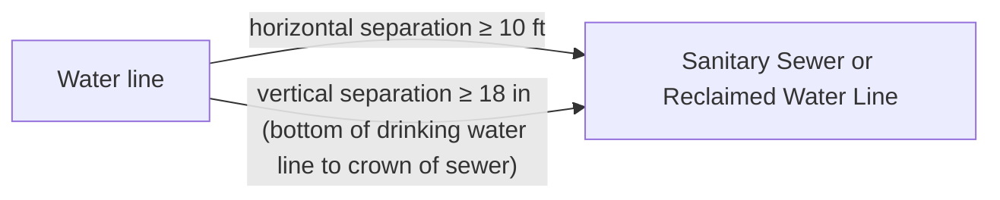

FIGURE C1-2 REQUIRED SEPARATION BETWEEN POTABLE WATER LINES, RECLAIMED WATER LINES, AND SANITARY SEWERS, PARALLEL CONSTRUCTION
\n---\n

### FIGURE C1-3 REQUIRED SEPARATION BETWEEN WATER LINES AND SANITARY SEWERS, UNUSUAL CONDITIONS PARALLEL CONSTRUCTION

> Diagram (not to scale): typical cross-section of a trench showing parallel utilities—potable water line, reclaimed water line, and sewer line. Distances shown illustrate horizontal and vertical separations between lines as described in the text (e.g., at least 18 inches vertical separation and at least 5 feet horizontal separation where applicable; additional staging or barriers may be required). See Figure C1-3.

## C1-9.1.2 UNUSUAL CONDITIONS (PARALLEL)

When local conditions prevent the separations described above, a sewer may be laid closer than 10 feet horizontally or 18 inches vertically to a water line or reclaimed water line, provided the guidelines below are followed:

* It is laid in a separate trench from the water line.
* When this vertical separation cannot be obtained, the sewer shall be constructed of materials and joints that are equivalent to water main standards of construction and shall be pressure tested to ensure water tightness (see `C2-3.6`) prior to backfilling. Adequate restraint should be provided to allow testing to occur.
* If sewers must be located in the same trench as a potable water line, special construction and mitigation is required. Both water lines and sewer lines shall be constructed with a casing pipe of pressure-rated pipe material designed to withstand a minimum static pressure of 150 psi.
* The water line shall be placed on a bench of undisturbed earth with the bottom of the water pipe at least 18 inches above the crown of the sewer and shall have at least 5 feet of horizontal separation at all times. Additional mitigation efforts, such as impermeable barriers, may be required by the appropriate state and local agencies. See Figure C1-3.

## C1-9.1.3 VERTICAL SEPARATION (PERPENDICULAR)

Sewer lines crossing water lines at angles including perpendicular shall be laid below the water lines to provide a separation of at least 18 inches between the invert of the water line and the crown of the sewer.

## C1-9.1.4 UNUSUAL CONDITIONS (PERPENDICULAR)

When local conditions prevent a vertical separation as described above, construction shall be used for crossing pipes as follows:

\n---\n

# A. GRAVITY SEWERS PASSING UNDER WATER LINES

All of the following shall apply to gravity sewers:

- Constructed of material described in Table C1-4. The one segment of the maximum standard length of pipe (but not less than 18 feet long) shall be used with the pipes centered to maximize joint separation.
- Standard gravity-sewer material encased in concrete or in a one quarter-inch thick continuous steel, ductile iron, or pressure rated PVC pipe with a dimension ratio (DR) (the ratio of the outside diameter to the pipe wall thickness) of 18 or less, with all voids pressure-grouted with sand-cement grout or bentonite. Commercially available pipe skids and end seals are acceptable. When using steel or ductile iron casing, design consideration for corrosion protection should be considered.
- The length of sewer pipe shall be centered at the point of crossing so that the joints will be equidistant and as far as possible from the water line. The sewer pipe shall be the longest standard length available from the manufacturer.

TABLE C1-4 RECOMMENDED PIPE MATERIAL FOR UNUSUAL CONDITIONS

<table>
<thead>
<tr>
<th>Type of Pipe</th>
<th>AWWA (ASTM) Standard- Pipe</th>
<th>AWWA (ASTM) Standard- Joint</th>
<th>AWWA (ASTM) Standard- Fittings</th>
</tr>
</thead>
<tbody>
<tr>
<td>Ductile Iron</td>
<td>C 151 and C 104</td>
<td>C 111</td>
<td>C 110</td>
</tr>
<tr>
<td>Polyvinyl-Chloride</td>
<td>C 900*</td>
<td>(D 3139 and F 477)</td>
<td>C 110</td>
</tr>
<tr>
<td>Concrete Cylinder</td>
<td>C 303</td>
<td></td>
<td></td>
</tr>
<tr>
<td>HDPE 3408</td>
<td>C906</td>
<td>Fused per C 906</td>
<td>C 906</td>
</tr>
</tbody>
</table>

* Pipe spec C900 for pipe up to about 12 inches in diameter; C905 for pipe more than 12 inches in diameter.
\n---\n

# Sewers

## B. GRAVITY SEWERS PASSING OVER WATER LINES
Water lines shall be protected by providing:
* A vertical separation of at least 18 inches between the invert of the sewer and the crown of the water line.
* Adequate structural support for the sewers to prevent excessive deflection of joints and settling on and breaking of the water lines.
* The length of sewer pipe shall be centered at the point of crossing so that the joints will be equidistant and as far as possible from the water line. The sewer pipe shall be the longest standard length available from the manufacturer.
* A water line casing equivalent to that specified in C1-9.1.4A.

## C. PRESSURE SEWERS UNDER WATER LINES
These pressure sewers shall be constructed only under water lines with ductile iron pipe or standard sewer pipe in a casing equivalent to that specified above in C1-9.1.4A for a distance of at least 10 feet on each side of the crossing.

### C1-9.1.5  PUMPOUT FACILITIES AT MARINAS
Washington’s “Vessel Sewage No Discharge Zones” regulation (NDZ), Chapter 173-228 WAC, prohibits the discharge of treated or untreated sewage from vessels into the Puget Sound No Discharge Zone as follows:

> Washington’s “Vessel Sewage No Discharge Zones” regulation (NDZ), Chapter 173-228 WAC, prohibits the discharge of treated or untreated sewage from vessels into the Puget Sound No Discharge Zone as follows:
> 
> “All marine waters of Washington State inward from the line between New Dungeness Lighthouse (N 48°10'54.454", 123°06'37.004" W) and the Discovery Island Lighthouse (N 48°25'26.456", 123°13'29.554" W) to the Canadian border (intersecting at: N 48°20'05.782", 123°11'58.636" W), and fresh waters of Lake Washington, Lake Union, and connecting waters between and to Puget Sound”.

Marina and pumpout facilities play an important role in managing sewage from vessels operating in the NDZ area, as well as in other inland waters of Washington, by providing the ability for the vessel operator to discharge sewage to a municipal wastewater treatment plant or other appropriate treatment facility. Ecology recommends that newly constructed or expanded marinas designed to serve boats 17 feet or larger in overall length include vessel sewage pumpout facilities as part of their design.

The 1994 “Clean Vessel Act: Pumpout Station and Dump Station Technical guidelines” published by the US Fish and Wildlife Service (59 FR. 11290) provides general design considerations for pumpout facilities and shoreside dump stations. Ecology recommends that designs for new and expanded pumpout facilities use the following criteria that it considers consistent the federal guidelines.
\n---\n

## General
The pumpout facility design must provide an efficient and reliable means of transferring wastewater from vessel holding tanks for treatment at a local municipal treatment facility or at a permitted on-site treatment system. Facilities must be installed in convenient locations accessible to all vessels that may use the marina. Marina operators may install pumpout facilities at fixed locations, or may use portable facilities, such as mobile carts or vessels.

## Pumps
Use macerating or solids handling pumps capable of passing 2-inch spherical solids. Pumps must provide sufficient discharge head to overcome elevation changes and friction losses from the pumpout facility to a shoreside holding tank or gravity connection to a sanitary collection system. Designers should size pumps with a minimum capacity of 10 gpm at the maximum operating head, and must not exceed 45 gpm to avoid the potential to damage vessel holding tanks.

## Suction hose connections
Suction connections to vessels must be tight fitting and adjustable to allow connection from various angles. Hoses must connect to vessels through a threaded connection, either through a direct threaded hose fitting or by use of an adapter. Suction hose must include a check valve or full port ball valve at the connection to prevent discharge of sewage after pumping. Designers should consider also providing wand-type attachments to allow for direct insertion into vessel holding tanks.

Suction hose diameter must be a minimum of 2-inches and capable of adapting to connections as small as 1.25-inches in diameter. Use flexible, heavy-duty material that is noncollapsing and nonkinking. Fixed pumpout facilities must be equipped with sufficient continuous length of hose to connect to vessels within a reasonable proximity to pump.

## Discharge lines
Fixed pumpout facilities must connect to the site’s sanitary collection system or shoreside holding tank through a permanent, watertight pipeline. Pipe installations must be in a location that ensures protection from impact damage by vessels or other vehicles and equipment expected in the facility location and must be protected from damage by freezing temperatures. The discharge line from the pump must include a full port valve to allow the pump to be isolated when not in use.

Use of discharge hoses may be considered on a case-by-case basis when their use is in a manner that ensure water tight operation. Installations with discharge hoses must use similar noncollapsing and nonkinking hose material used for the suction hose. All hose connections must use positive locking type fittings.

## Water supply
Pumpout facilities must include a nonpotable freshwater supply to allow for rinsing of holding tanks associated with marine sanitation devices.
\n---\n

# Sewers

Designs must provide for a water line dedicated to the facility and must ensure that the line is isolated from potable water supplies though an approved backflow prevention device. Water supply lines for the pumpout facility must be marked with signs stating “NOT FIT FOR HUMAN CONSUMPTION” or other with other cautionary wording required under local regulations.

Additional design and permitting requirements may apply for pumpout facilities constructed using funding from the Clean Vessel Act Grant Program administered by Washington State Parks or from grant programs administered by the Washington State Recreation and Conservation Office.

## C1-9.1.6  STREAM CROSSING

The pipe and joints shall be tested in place, exhibit zero infiltration, and be designed, constructed, and protected against anticipated hydraulic and physical, longitudinal, vertical, and horizontal loads, erosion, and impact. Sewers laid on piers across ravines or streams shall be allowed only when it can be demonstrated that no other practical alternative exists. Such sewers on piers shall be constructed in accordance with the requirements for sewers entering or crossing under streams. Construction methods and materials of construction shall be such that sewers will remain watertight and free from change in alignment or grade. A minimum cover of 5 feet for stabilized channels and 7 feet for shifting channels should be provided.

Permits from other agencies or departments are required for work in or adjacent to waterways, and are described in Chapter G1.

## C1-9.1.7  INVERTED SIPHONS

Inverted siphons shall have not less than two barrels, with a minimum pipe size of 6 inches, and shall be provided with necessary appurtenances for convenient flushing and maintenance. The manholes shall be designed to facilitate cleaning and, in general, sufficient head shall be provided and pipe sizes selected to secure velocities of at least

3 fps for average flows. A rock catcher and coarse screen should be provided to prevent plugging of the siphons. The inlet and outlet details shall be arranged so that normal flow is diverted to one barrel and so that either barrel may be removed from service for cleaning or other maintenance.

## C1-9.1.8  REQUIRED SEPARATION FROM WATER SUPPLY WELLS

Sewer lines shall be placed no closer than 100 feet to any public water supply well. When constructing sewer lines in the vicinity of any water supply, contact the local Health Department for local requirements, including the use of alternative construction materials.
\n---\n

## C1-9.1.9 ODOR CONTROL

Odor problems are typically related to the presence of hydrogen sulfide.
Therefore, the alternatives for control of odor are usually aimed at preventing
sulfide generation or at removing sulfides through chemical or biological
action. Regular inspection and cleaning of existing collection systems can
reduce sulfide buildup, significantly minimizing odor problems. Sealing
manhole lids and their openings can be used as a temporary solution for
reducing odor complaints.

Slope is the key criterion in designing a new wastewater collection system to
avoid sulfide problems. Sewers designed with long runs at minimum slope are
prone to sulfide generation due to long residence times, poor oxygen transfer,
and deposition of solids. Sulfide generation can be a problem in new sewers
where actual flows are much less than design flows during the early lifetime of
the system, and velocities are inadequate to maintain solids in suspension.

Current conventional design practice recommends that a minimum velocity of
2 fps be achieved regardless of pipe size to maintain a self-cleaning action in
sewers. It should be noted that this is a minimum velocity and that it is
desirable to have a velocity of 3 fps or more whenever practical.

If sulfide generation is anticipated to be a problem, larger pipe sizes may be
selected to improve the rate of reaeration. However, adequate scouring
velocities must still be maintained if larger pipe is used.

The use of drops and falls in manholes can be used as a method of adding
substantial amounts of oxygen to the wastewater. However, drops or falls are
not recommended when appreciable amounts of dissolved sulfide are present,
as the turbulence will release sulfide from the stream, generating odors and
potentially deteriorating the structure.

Sewer line junctions and transitions at manholes require special consideration
because they offer an opportunity for both solids deposition and the release of
dissolved sulfide. For aerobic wastewater, the major goal of junction design is
to provide smooth transitions with minimum turbulence between incoming
and outgoing lines in order to prevent eddy currents or low velocity points that
will permit deposition of solids. See G2-5 for additional information on odor
prevention and treatment.
\n---\n

## C1-9.1.10 CORROSION CONTROL
Hydrogen sulfide may result in severe corrosion of unprotected sewer pipes made from cementitious materials and metals. The corrosion occurs when sulfuric acid is derived through the oxidation of hydrogen sulfide by bacterial action on the exposed sewer pipe wall. Various pipe materials exhibit resistance to corrosive attack from sulfuric acid but other forms of chemical corrosion should also be considered. Certain concentrated organic solvents can soften the polymeric materials in plastic pipes and in plastic joints on nonplastic pipe, but this type of damage is rare. Galvanic action is the cause of most corrosion in buried iron and steel pipe.

Where corrosion problems are the result of hydrogen sulfide action, similar actions to those taken to control odor will also have the beneficial effect of reducing corrosion. Various linings and coatings are available to protect concrete, ductile iron, steel, and ABS composite pipes. External polyethylene film encasements are often used on metal pipes to impede external corrosion from galvanic action. Manholes can also be protected from corrosion by the use of lining systems.

## C1-9.1.11 TRENCHLESS TECHNOLOGIES
Trenchless techniques for new construction include: microtunnelling, auguring or boring, pipe jacking, and other mining-type operations. Costs, topography, or other issues that may preclude traditional open-cut-and-excavation methods will most often direct the use of these techniques. See C1-8 for descriptions of techniques involving trenchless technologies applicable to sewer system rehabilitation or replacement. Some of these techniques may also be applicable for new construction.

## C1-9.1.12 PIPE CASING
Often when a sanitary sewer is installed by boring methods, a casing pipe is inserted and the sanitary sewer pipe is placed inside. When installing pipe in a casing, the pipe must be uniformly supported. Generally, the annular space between the pipe and the casing is filled with grout or controlled density fill.

## C1-10 ALTERNATIVE SYSTEMS (REV. 08/2008)
Alternative systems are systems that may be used as alternatives to gravity sewers when special conditions warrant the usage of these nonstandard systems.

Alternative systems for conveyance of wastewater to a centralized location or wastewater treatment facility include grinder pump (GP), septic tank effluent pump (STEP), small diameter gravity (SDG), and vacuum systems.
\n---\n

Grinder pump systems use a macerating type pump to convey sewage through small diameter pipelines to a centralized location. Grinder pumps are also commonly used in conjunction with gravity systems where a particular structure is located below the invert of a gravity collection pipe or there is insufficient vertical drop between the structure and the gravity pipe.

Septic tank effluent pump systems use an effluent-type pump to convey the relatively clear liquid from the center of a vessel (STEP tank) that is similar in nature to a septic tank. Similar to a grinder system, a STEP system conveys liquid to a common location through small diameter pipelines. The major difference is that most of the solids remain in the STEP tank and must be removed periodically (similar to pumping a septic tank) and that the liquid conveyed in a STEP system is septic.

SDG systems, sometimes referred to as septic tank effluent filter (STEF) systems or septic tank effluent gravity systems, use gravity to convey liquid to a common location. An SDG system conveys the relatively clear liquid from the center of a vessel, similar to a septic tank. The liquid flows by gravity through a system of small diameter pipelines that are designed and sized to ensure that the hydraulic gradeline is below the liquid level of the SDG tanks during peak flow. Similar to a STEP system, much of the solids remain in the tank or vessel and are periodically removed. Commonly, engineers combine STEP and SDG on a single system with the SDG units above the hydraulic gradeline and the STEP units in areas that are below the peak hydraulic gradeline.

C1-10.1 GRINDER PUMP, SEPTIC TANK EFFLUENT PUMP, AND SEPTIC TANK EFFLUENT FILTER/SMALL DIAMETER GRAVITY SYSTEMS
C1-10.1.1       APPLICATION
The designer may consider alternative collection methods for a variety of different applications. An alternative method of conveyance can be used in any application but is usually selected due to the circumstances surrounding the installation. Examples of such circumstances follow:
* Difficult construction conditions, such as high ground water, subsurface rock removal, large amounts of street reconstruction to implement the system, undulating terrain requiring multiple pump stations for a gravity collection system, and difficult topography requiring the structures to pump to the collection line.
* Low- to moderate-density structures along the collection system route or high-density structures separated from the remainder of the collection system by long distances.
* Limited treatment plant capacity requiring minimization of infiltration and inflow.
* Low system costs for certain installations.
\n---\n

## C1-10.1.2  DESIGN CONSIDERATIONS
Design of a septic tank effluent pump (STEP), septic tank effluent filter/small diameter gravity (STEF/SDG), or grinder pump (GP) system must, at a minimum, incorporate certain system design considerations. These include determining the peak-hydraulic gradeline, matching the peak-hydraulic gradeline to the individual pump curve or elevation of the SDG units, sizing the holding vessel based on estimated or actual wastewater flows, and designing system appurtenances required to provide a reliable municipal system.

## A.  PEAK DESIGN FLOWS
The minimum peak flow used in the pipeline design for alternative systems must equal or be greater than the following:

$$Q = 15 + .5D \quad \text{or} \quad Q = 15 + .15P$$

Where:
* Q = Design peak flow, gpm
* D = Number of equivalent dwellings
* P = Population

Peak flow is defined as an event that lasts about 15 minutes. If a dead-end reach of pipe has single or minimal users with high individual flows, the designer must use the estimated discharge from two vessels or the combined discharge from two pumps as the minimum design flow.

## B.  INFILTRATION AND INFLOW CONSIDERATIONS
Alternative forms of collection are not meant to receive high amounts of I/I from ground water or surface water. The designer must incorporate methods and materials in the design to eliminate sources of I/I from the system.

## C1-10.1.3  HYDRAULIC GRADELINE/PIPELINE SIZING
Size pipelines for STEP, SDG, and GP systems to keep the peak hydraulic gradeline below the critical operating elevations of the individual system. Compute the hydraulic gradeline using common engineering fluid mechanics calculations using the Hazen Williams or Manning equation with an appropriate roughness co-efficient.

If the design cannot avoid downhill pumping, size the downhill pipeline for two-phase flows (water and air). Size the pipeline to allow air to transfer to properly located and sized air release assemblies.
\n---\n

## A. SDG HYDRAULIC GRADELINE

Engineers must design the maximum hydraulic gradeline based on peak flow (C1-10.1.2) below the outlet of the SDG/STEF tank minus 2 percent fall along the service line between the tank and the collection main. The service line will include, at a minimum, a check valve to prevent surcharge of the vessel from the collection line.

## B. STEP/GP HYDRAULIC GRADELINE

The maximum hydraulic gradeline of the mainline, service line, and minor friction losses based on peak flow (C1-10.1.2) must not exceed the installed elevation of a STEP/GP pump plus 85 percent of the total available head of the pump. The designer must also consult the manufacturer of the pump equipment to be used to determine if the individual pump criteria allows continued use at that position on the head curve. The designer must use whichever criteria are more stringent. The service line will include a minimum of two check valves to prevent surcharge of the vessel from the collection line.

### C1-10.1.4  MINIMUM VELOCITY

Minimum velocities for STEP and/or SDG pipelines are not required. Install STEP and/or SDG pipelines with cleanouts (pig ports) at the end of each line and at critical line size changes to necessitate cleaning.

Minimum velocities for GP pipelines shall be 2 fps. GP pipelines will be installed with cleanouts (pig ports) at the end of each line and at critical line size changes to necessitate cleaning.

#### Pump Selection STEP/GP

Pumps installed on a STEP or GP system must meet the criteria for the maximum hydraulic gradeline and be able to meet the pumping requirements of the structure where it is installed.

The designer must review the system as a whole and select a type or characteristic of a pump for the entire system that has sufficient head to operate at the maximum hydraulic gradeline (see C1-10.1.3). The designer may opt to include design zones within the system with different maximum hydraulic gradelines.

The engineer must select a pump able to discharge influent peak flow (volume) without exceeding the working volume within the pump holding vessel (see C1-10.1.6). The engineer will determine the influent peak flow (volume) by reviewing the number of fixtures within a structure or by applying a peaking factor to average daily volumes. The designer must use a minimum of 400 percent of average daily flow for estimating peak influent volumes.
\n---\n

# C1-10.1.5 TANK/VESSEL TYPE AND SIZING

Any vessel used for construction of a STEP, SDG, or GP system must conform to general guidelines, as follows:

- Construct vessels of a material that does not degrade from corrosion caused by the surrounding soil or the wastewater being held in the vessel. Common materials include reinforced cement concrete, reinforced fiberglass, and polyethylene.

- Design vessels to withstand the external soil loading based upon the type of soil, lateral loading due to hydrostatic water pressure, and wheel loading. For vessels to be located in a traffic-bearing area, design the vessels to withstand HS-20 truck loading with appropriate impact factors.

- All vessel designs must bear the stamp of an engineer licensed in the state of Washington with specific expertise in design of similar vessels certifying that the tanks will meet the loading conditions specified herein.

- The vessel, appurtenances (risers, lids, cleanouts, inspection ports, inlet and outlet piping, etc.), and the connection between the vessel and appurtenances must be watertight. Once fully assembled and installed, test each vessel and appurtenance for leakage by filling with water or low-pressure air. The agency operating the system or its duly authorized representatives must witness the testing. No vessel will be accepted if there is any noticeable leakage during the testing period.

## A. TANK CONFIGURATION STEP/SDG

Configure vessel (tank) up to 1,500 gallons in size in accordance with the intent of the International Association of Plumbing and Mechanical Officials (IAPMO) SPS 1-87 with the following recommendations:

- Ecology recommends but does not require a baffle wall or compartment wall for 1,000- and 1,500-gallon tanks.

- Construct the baffle wall with a hole or knockout at the top of the baffle wall for ventilation and multiple holes or knockouts located in the clear zone of the tank (approximately 70 percent of the liquid level of the tank). Size the holes or knockouts sufficient to prevent plugging from raw sewage.

- Configure vessel (tank) over 1,500 gallons in size to allow solids to deposit in the tank. Ecology recommends that the tanks conform to the following approximate configurations:

- An approximate tank size of 3,000 gallons shall have an equivalent diameter of 6 feet.
\n---\n

## A. TANK REQUIREMENTS

* An approximate tank size of 6,000 gallons shall have an equivalent diameter of 8 feet. Ecology recommends that tank volume over 6,000 gallons be accomplished with tanks in series to facilitate tank pumping. If tanks are placed in series, a baffle wall will not be required.
* Tanks must have a baffle wall that divides the volume as follows: two-thirds volume in the first chamber and one-third volume in the second chamber. Ecology recommends that the baffle wall must be constructed as outlined above.
* Tanks that are over 2,500 gallons of total volume shall have three access ports with a minimum diameter of 18 inches, two in the first chamber and one in the second chamber.
* All tanks must include an inlet tee. The bottom of the tee must extend 18 inches below the liquid level.
* A STEP/SDG tank shall contain detention volume, working volume, and storage volume.

## B. DETENTION VOLUME STEP/SDG

The detention volume or liquid volume of a STEP or SDG tank that serves a single-family home or small business must equal at least 950 gallons. Detention volume is defined as the volume of liquid below the “OFF” switch (STEP) or the outlet pipe (SDG). Size tanks that serve structures with higher wastewater discharge volumes in accordance with the following equation:

$$V = 1.5Q \quad (\text{residential strength waste})$$
$$V = 2.0Q \quad (\text{nonresidential strength waste})$$

Where:
- V = Liquid volume
- Q = Peak day flow for the structure being served

The equation provides the minimum liquid volume within the STEP/SDG tank. The tank must also contain sufficient working volume and storage volume. Liquid volume must not exceed approximately 65 to 75 percent of the total tank volume.

## C. WORKING VOLUME STEP/GP

The working volume must exceed the difference between the peak influent flow and the discharge of the STEP or grinder pump over a period of time estimated to be the peak duration. Working volume is defined as the volume between the “ON” and the “OFF” switch.
\n---\n

## D. STORAGE VOLUME
STEP, SDG, and GP vessels (tanks) must have a minimum of 24 hours of storage within the tank except as allowed (see C1-10.1.6E.2 ). Install tanks without 24 hours of storage with a power transfer switch with an emergency generator plug or other device to allow emergency power connection.
Alternatively, provide reserve volume with a separate vessel. Storage volume is defined as the volume between the “OFF” switch and the top of the tank. Tank designs must ensure that most of the storage volume exists between the “ON” and “OFF” switches and limit storage volume below the “OFF” switch.
Allowing large volume of storage below the “OFF” switch can promote septic conditions within the tank, which can cause corrosion and odor problems for the entire system.

## E. POWER OUTAGES
1. APPLICABILITY
STEP, SDG, and GP systems installed in areas with a history of prolonged power outages may require additional storage volumes. The designer must review historical records of the local power purveyor to determine the advisability of adding more storage.

2. POWER TRANSFER SWITCH/EG PLUG
For vessels without 24 hours of storage, provide a power transfer switch with an emergency generator plug. Limit the number of tanks installed with power transfer switches to the number of tanks or vessels that can be serviced by the local agency during a power outage. The agency must also keep power generators with the proper connection to the generator plug on hand and in good working order.

## C1-10.2 SYSTEM COMPONENTS
### C1-10.2.1 PIPELINE
Generally, construct pipeline of material that is not readily subject to corrosion by raw or septic wastewater.

#### A. SERVICE LINE/CHECK VALVES
Each service line between the SDG vessel, STEP, or GP pump and the collection line must have a gate or ball valve installed at the main. In addition, install a minimum of two check valves on the STEP and GP service lines, and install a minimum of one check valve on the SDG service line. The check valve attached to either the STEP or GP pump counts as one of the check valves. Service lines must be a minimum of 1 inch in diameter.
\n---\n

## B. CLEANOUTS/PIG PORTS
Install cleanouts (pig ports) at the ends of all pipelines. Design cleanouts to launch a 2 lb./cu/ft. polyfoam pig for scouring the pipelines. A cleanout can accept a pig that is 2 inches larger in diameter than the pipe that it is being inserted (for example, a 4-inch pig can be launched into a 2-inch pipeline). Install an additional pig port when the pipeline diameter exceeds the size of pig that can be launched in a cleanout (such as the transition between a 4- and 6-inch-diameter pipeline).

## C. VALVES
Install sufficient mainline valves at locations to isolate portions of the system and to ensure continuous operation for maintenance and repair. On straight runs of pipeline, Ecology recommends that valves be installed every one-quarter mile.

## D. AIR RELEASE ASSEMBLIES
In conformance with good engineering practices, install air release and combination air release assemblies in the system. Give special attention to the release of air from STEP/SDG pipelines. Strip air evacuated in these pipelines of odor using activated carbon, soil filters, or other odor control mechanism. The designer should take extra precaution in reducing or eliminating the amount of air being exhausted by keeping the pipeline full of liquid wherever possible.

## E. PIPELINE MATERIAL AND PRESSURE TESTING
Ensure pipeline material has a pressure rating equal to working pressure of the system. Use material that is resistant to the corrosive nature of wastewater. Common materials include PVC, polyethylene, stainless steel, and epoxy-coated or lined ductile iron.

Complete pressure testing of service lines with the ball valve at the mainline in the closed position. Complete pressure testing of the mainline with the service line ball valves in the open position. Pressure testing must comply with pressure testing for water mains using either APWA or AWWA standards.

## F. DISCHARGE TO A GRAVITY COLLECTION SYSTEM
### 1. GRINDER PUMP SYSTEM
Accomplish discharge to a gravity system from a GP system by either installing a saddle on the gravity main or at a manhole. Achieve discharge in a manhole by producing a laminar flow in the manhole channel. Both types of installations assume that the GP system has sufficient internal velocity and that the raw sewage has not turned septic. If the raw sewage within the GP pipeline has turned septic, make provisions to reduce or eliminate the effects of hydrogen sulfide release.
\n---\n

## 2. CORROSION CONTROL IN STEP/SDG SYSTEMS
Achieve discharge to a gravity system from a STEP or SDG system by either installing a saddle on the gravity main or at a manhole. Achieve discharge in a manhole producing a laminar flow in the manhole channel. Laminar flow shall not be accomplished using a drop manhole. Prior to discharge, condition the STEP/SDG effluent to reduce or eliminate the effects of hydrogen sulfide release. Conditioning may include aeration or chemical addition.

## 3. ODOR CONTROL
Release of air at the discharge point will require odor control, which may include the use of carbon filters, soil filters, or other mechanisms.

## G. DISCHARGE TO A CONVENTIONAL FORCE MAIN
A STEP, SDG, or GP system may be connected to a conventional force main. The designer must review the following issues to ensure that there will not be a negative effect on the existing system:
- Ensure that the hydraulics or performance of either the system being connected or the existing force main pump station is not appreciably altered beyond the design parameters.
- Ensure that the downstream facilities are protected from release of hydrogen sulfide. Protection shall consider, when applicable, impacts to treatment, corrosion, and odor.

## C1-10.2.2  PUMP OR SDG ASSEMBLY
### A. PUMPS
Grinder or effluent pumps installed in a municipal system must be UL listed for the intended application. Affix each pump with a UL tag denoting its use and provide a UL card available for review showing the intended application.

### B. PUMP/EFFLUENT VAULT (SCREEN) STEP/SDG
Protect effluent pumps installed in STEP systems that are not rated to pump solids with a screening or filtering mechanism to prevent the impeller from plugging. Design the screening or filtering mechanism to provide sufficient effective screen area to prevent plugging. Reduce solids entering the pump impeller to one-eighth-inch in size.

Install small diameter gravity tanks with a screening or filtering mechanism at the discharge of the tank to prevent solids over one-eighth-inch in size from entering the service line and mainline. Design the screening or filtering mechanism to provide sufficient effective screen area to prevent plugging.

\n---\n

# C. CONTROL PANEL/LEVEL CONTROL
- Equip each STEP and GP pump assembly with a pump control panel and level-sensing mechanism that is UL listed for the application. The control panel must include an audio and visual alarm that is activated when a high liquid level occurs within the vessel. High water level and pump failure alarms must also connect to an auto-dialer system that will alert the service organization (utility staff or contracted service personnel). Ensure that the audio alarm is capable of being silenced until repair or corrections can be made. If the system is owned and operated by a single agency, affix each panel with a permanent placard with the name of the agency operating the system, the phone number of the agency, and instructions for silencing the audio alarm. Ecology recommends that the control panel audio and visual alarm also be activated by low liquid levels occurring within the vessel.
- Ecology recommends that each SDG tank be equipped with an alarm panel and a level-sensing mechanism that is UL listed for the application. The alarm panel must include an audio and visual alarm that is activated when a high liquid level occurs within the vessel. The panel must have the same alarm and placard features as listed for the STEP and GP control panel.

## D. ELECTRICAL REQUIREMENTS
- All electrical components of a STEP, SDG, or GP system must comply with the latest version of the NEC and latest requirements of the state Labor and Industries Electrical Inspection Division.

## E. VENTILATION
- Each vessel for a STEP, SDG, or GP system shall either be vented through the structure plumbing or provided with a separate ventilation system.

### C1-10.2.3  VACUUM SEWER SYSTEM
#### A. INTRODUCTION
- The vacuum sewer system requires a main vacuum collection station similar to that of a pump station. Unlike pump stations, vacuum stations also require vacuum pumps to maintain a vacuum on the collection lines feeding the station. The 3-inch, 4-inch, 6-inch, 8-inch, or 10-inch diameter PVC collection lines are laid in a saw tooth profile. The system requires a normally closed valve at each sewage input point to seal the vacuum lines so that a vacuum can be maintained throughout the system. This valve opens automatically when a given quantity of sewage has accumulated in the collecting sump, admitting the sewage and the correct volume of air, then closing and sealing the system. This valve is entirely pneumatically controlled and operated. The differential pressure between the local atmospheric pressure and the vacuum pressure on the immediate downstream side of the valve operates the valve automatically and provides the thrust needed for liquid transportation.
\n---\n

A vacuum sewer collection system closely resembles a water distribution system, but the flow is in reverse. The analogy would be complete if the sewage valve was manually operated by the homeowner the way a water faucet would normally be opened and closed in the home.

The vacuum sewer system is not to be confused with vacuum toilets commonly used on commercial trains and airlines. The vacuum system described here utilizes the building sewers that flow by gravity to a sump generally located at the property line. The interface valve is located in this sump and provides the transition between the gravity and vacuum systems.

B. PRINCIPLES OF OPERATION

A vacuum system consists of four major components, as follows:

* The gravity sewers from the house to the sump.
* The vacuum valve and service line.
* The collection mains.
* The vacuum station.

1. GRAVITY SEWER FROM THE BUILDING

Building sewers that are commonly installed as part of a conventional gravity sewer system are adequate for use as part of a vacuum sewer system. Building (side) sewers, typically 4- or 6-inch, are usually installed with a 2-percent slope from the building to the collector line. If the sewer system is a new installation, then side sewers similar to “conventional” side sewers would be installed for use with the vacuum system. If an existing gravity system exists, then the gravity side sewers would be intercepted and redirected to the valve sump. The only exception to this is the need to add a supplemental vent to the gravity side sewer. When the interface valve opens it evacuates the sewage and a significant volume of air from the sump. As that volume of sewage and air is removed from the sump, an equal volume of air needs to be drawn in to replace the evacuated volume of sewage and air. Since this is accomplished quickly the vents, which are an integral part of the building plumbing are inadequate to supply the makeup air. As a result, the fixture in the building may be sucked dry. By providing a supplemental 4- or 6-inch vent between the valve sump and the actual building, the makeup air can be supplied without any impacts on the fixtures.

2. VACUUM VALVE AND VACUUM SERVICE

The vacuum valve provides the interface between the gravity building sewers and the vacuum mains. The interface valves operate without electricity. Sewage enters the sump by gravity. As the liquid level rises in the sump, it pressurizes the air in the sensor pipe. This air pressure is
\n---\n

transmitted through a tube to the controller/sensor unit mounted on top of the valve housing. The air pressure operates the controller/sensor unit through a three-way valve that applies vacuum from the sewer to the valve operator. This opens the valve and activates a field-adjustable timer in the controller. After a set time period has expired, the valve closes. Once the sewage has been evacuated, a set amount of atmospheric air is admitted through the vacuum valve to provide the propulsion for the sewage. The source of the makeup air is through the supplemental air vent (see C1-10.3.2A) located between the valve sump and the building sewer connection. Local code may dictate the location of the vent, but it is recommended that the vent be located at least 20 feet from the valve sump.

The valve sump is a two-compartment vault. The interface valve in the upper portion of the vault and the lower segment provide the storage for the influent sewage. Typically, the valve structure is made of fiberglass with a cast iron ring and lid capable of withstanding traffic loadings. In deeper settings a concrete manhole section may be used by mounting the valve within the manhole. Where more than one valve is necessary, a buffer tank capable of housing multiple valves should be used. An interface valve is capable of 30 gpm of peak sewage flow. This is based on residential connections that contribute peak flows for short periods of time. If peak flows are expected to occur for a prolonged period or on a continuous basis, then the peak capacity of the valve should be reduced to 15 gpm.

## 3. VACUUM MAINS

The collection mains connect the individual valve pits to the collection tankage and vacuum station. Schedule 40 SDR 21 and SDR 26 PVC have commonly been used, with SDR 21 being the most common and appropriate. Both solvent-weld and gasketed types have been used. Experience has shown that there are fewer problems with gasketed type pipe. Where gasketed pipe is used, the designer must verify that the pipe and the gasket are rated for vacuum use. A double Reiber-type gasket is generally recommended. HDPE pipe has also been used in some installations. The collection mains are laid in a saw tooth pattern. Each lift consists of two 45-degree fittings connected with a short piece of pipe. The lifts are installed to maintain a minimum depth installation and to allow for uphill transmission.

The transport of sewage occurs in slugs. Each time a valve is opened a volume of sewage is introduced into the system, but more important is the volume of air that causes the sewage to be lifted up and over the lifts. Since the concept of transport relies on a repeated input of air into the
\n---\n

system, pipe movement is possible if proper installation is not done.
Some designers have elected to use concrete thrust blocking; however,
more recent installations have reasoned that, since the pressure is negative, the outward pressures and thrusts are offset by the vacuum pressures. In either event extreme care should be used when backfilling and compacting.

Division valves are typically installed on the main line at an interval of 1,500 feet. The purpose of the division valves is to isolate portions of the line for troubleshooting and maintenance. Valves should be either the plug or resilient wedge variety using mechanical joint connections with transition to PVC gaskets.

## 4. VACUUM STATION

The vacuum station is the heart of the vacuum collection system. Major components include the following:
* Vacuum pumps.
* Wastewater pumps.
* Generator.
* Collection tank.
* Reservoir tank.
* Controls.
* Motor control center.
* Chart recorder.

Vacuum pumps provide the vacuum pressure to the collection system. Historically, vacuum sewers operate at 16 to 20 inches Hg. Vacuum pumps may be either liquid ring or sliding-vane type.

Wastewater pumps are required to transfer the wastewater that is pulled into the collection tank by the vacuum pumps to the ultimate disposal point. Submersible pumps have been installed in the collection tank. However, a more common installation uses horizontal, non-clogging centrifugal pumps. The wastewater pumps are typically located below the collection tank to minimize the net positive suction head requirement. It is critical that the selection of the wastewater pumps accounts for the vacuum in the collection tank (approximately 18 to 23 feet of additional head).

As with any pump station, an emergency generator is generally a prudent addition to a vacuum station.
\n---\n

A collection tank is a sealed vessel made either of fiberglass or steel.
Though fiberglass is generally more expensive, it has the advantage of
smaller maintenance costs. The vacuum pumps maintain a negative
pressure in the top portion of the tank and transfer that pressure
throughout the collection system. The portion of the tank below the
invert of the incoming pipes acts as a wet well.

A vacuum reservoir is an intermediate tank between the collection
system and the collection tank. This tank serves as an emergency
reservoir and moisture reducer; and reduces the number of start-stop
cycles for the vacuum pumps.

The motor control center houses all the motor starters, control circuitry,
and run-time meters.

C. SYSTEM DESIGN CRITERIA
1. HOUSE CONNECTION AND VALVE SUMP
The gravity sewer line from the dwelling to the valve sump shall be
SDR 21-rated PVC pipe.

The minimum valve size shall be 3 inches. Valves shall be actuated by
pneumatic controllers; an electronically controlled valve system is not
acceptable except where supplemental air injection is necessary, in which
case electronically controlled air-injected valving is allowable.

All valve sumps are to be located outside the dwelling unit. A permanent
easement should be secured for the valve sump, allowing for adequate
space around the sump for maintenance activities. Consideration should
be given to providing a supplemental storage tank between the dwelling
and the valve in the event of vacuum loss to the system.

The valve sump shall be a corrosion resistant material, have a solid
bottom, and be counterweighted to prevent floatation when located in
an area of potential flooding or high ground water. The cover and sump
material shall be of adequate strength to withstand the expected
maximum dynamic and static loading conditions. Valve sumps shall be
well vented to reduce condensation and constructed of corrosion
resistant material.

The vent system for the dwelling shall have a 4-inch or larger vent to
prevent the evacuation of the traps during vacuum valve operation. The
vent pipe shall be removed from the valve sump by at least 20 feet and
protected from accidental damage. The vent shall be goose necked to
prevent rainfall entry and equipped with an insect screen.
\n---\n

The sensors for the control of the valve must also be vented. Any portion of the controller venting assembly shall be vented either to the atmosphere or in certain cases vented within the sump itself.
All materials of the valve, sensor, and controller shall be chemically resistant to sewage and sewage gases.
The valve shall be manufactured such that small objects may be removed from the valve seat area by means other than complete valve removal and disassembly.
The controller shall be capable of maintaining the valve fully open for a fixed period of time, adjustable over a range of 3 to 10 seconds. The controller shall be designed to allow its removal from the valve body for service without complete removal of the valve. No special tools shall be necessary to remove the controller. Sufficient valves shall be installed to isolate individual residences.

2. VACUUM COLLECTION MAINLINES
All buried vacuum mainlines, branch lines, and service laterals shall be SDR 21 rated PVC pipe. The use of identification tape to aid in locating this nonmetallic pipe is optional. The vacuum pipe shall meet the performance as specified in ASTM D-2241 and ASTM D-1784 Cell Classification 12454-B. The minimum pipe size for mainlines and branches shall be 4 inches. The service lines from the valve sump to the mainline or branch line shall be 3 inches.
Joints shall be solvent welded, “O”-ring, or heat fusion joints that have been specifically designed to seal against vacuum. Solvent welded joints shall meet ASTM D-2672. Elastomeric seals shall meet ASTM D-3139. This material must be certified by the manufacturer that the pipe and seal will operate at 24 inches of mercury vacuum and withstand a vacuum test at 24 inches of mercury vacuum with a maximum leak rate of 1 percent per hour for a four-hour period. Fittings shall be as specified in Schedule 40 Solvent Weld Drain, Waste and Vent, and shall conform with ASTM-D2665.
Wye fittings and 45-degree elbows shall be used throughout the installation. Long radius 3-inch, 90-degree elbows may be used at the entering side of the vacuum valve and at the wye connection to the vacuum main. Tee fittings and short radius elbows should not be used.
Cleanouts are to be provided at the end of each branch and mainline sewer.
\n---\n

# Sewers

Main sewer lines shall be buried as deeply as dictated by frost depth or load conditions but in no instance less than 3 feet deep unless otherwise and specifically approved by Ecology.

All vacuum system designs shall be certified, in writing, by the system manufacturer.

The manufacturer’s recommendation for lifts shall be utilized.

The total available head loss from any input point shall not exceed 18 feet of water. Five feet of water shall be reserved for valve operation.

During installation, the collection system shall be vacuumed to 24 inches of mercury vacuum pressure, allowed 15 minutes to stabilize, and thereafter not lose more than 1 percent vacuum pressure per hour over a minimum of a four-hour period. This testing shall be conducted prior to the installation of the vacuum valves.

Isolation valving is recommended at an interval of no more than 1,500 feet. This inline valve is provided to help isolate any valve that has malfunctioned or has not closed completely and is therefore allowing air to enter the system for a prolonged period of time. Isolation valves should also be provided at each branch and mainline connection. It is also advisable to provide a wye and valve for future extensions.

## 3. SEWAGE COLLECTION TANK AT THE VACUUM STATION

Sewage collection tanks shall be either epoxy-coated anodically protected welded steel or fiberglass, and vacuum tight.

Each inlet to the tank shall have its own isolation valve.

Liquid level sensors shall be installed to operate the discharge sewage pumps and high level alarm and to interrupt the electrical power to the vacuum pumps.

The collection tank shall be sized to hold a minimum of 10 minutes of average flow or three times the operating volume, whichever is greater.

It is advisable to consult with the manufacturer of the system to verify collection tank sizing.

## 4. VACUUM PUMPS AT THE VACUUM STATION

Either liquid ring or sliding vane vacuum pumps shall be used as long as they are compatible with pumping moist air containing some sewer gases.

A check valve shall be installed between the vacuum tank and the vacuum pumps.
\n---\n

# C1-10.2.4 LONG-TERM SYSTEM MANAGEMENT
## 5. SEWAGE PUMPS AT THE VACUUM STATION
Dual pumps, each capable of handling the peak flows, shall be provided.
Emergency power backup shall be provided to operate the sewage pumps and all pumping station equipment under the maximum load.
The sewage pumps shall be capable of meeting the positive suction head requirements and of pumping the sewage flow at the desired rate.
Shutoff valves shall be provided so that each pump may be isolated for repairs.
The discharge piping shall incorporate check valves and gate valves consistent with requirements.

## A. OWNERSHIP, OPERATION AND MAINTENANCE
Utilities proposing to use alternative collection systems - specifically GP, STEP and SDG systems - must clearly define in the Comprehensive Sewer Plan who will own the systems and who will be responsible for operation and maintenance. Utilities must also develop by ordinance or through local code a set of uniform standards for system design, installation, operation, maintenance and emergency response measures. Regardless of ownership responsibilities, utilities must maintain a library of operation and maintenance manuals for the type of system(s) installed within their service territory and they must maintain a list of contacts for service personnel who are qualified to maintain the systems. Ecology recommends that the utility maintain an inventory of critical spare parts for alternative systems used in their area.

## B. MAINTENANCE PROGRAM
Agencies operating alternative forms of wastewater collection systems (Grinder Pumps) must implement a maintenance program as outlined by an Operations and Maintenance manual. A properly maintained grinder pump should be able to handle wastewater from the kitchen, bathroom, laundry, etc. However, some chemicals and substances can adversely impact a grinder pump and can cause safety hazards. Always check labels on all chemicals
\n---\n

before using or disposing these items to a sewer system. Never pour the
following items down drains or flush down toilets:
* Grease (a byproduct of cooking that comes from meat fats, oil shortening, butter. Margarine, food scraps, sauces and dairy products);
* Explosive or flammable materials;
* Kitty litter;
* Aquarium gravel;
* Strong chemicals or toxic, caustic or poisonous substances;
* Degreasing solvents;
* Diapers, feminine products, or cloth of any kind;
* Fuel or lubricating oil, paint thinner or antifreeze;
* Plastic objects; and
* Seafood shells.
* Expired pharmaceuticals

These items can damage grinder pumps and their controls, causing blockages
and backups which may lead to unsafe conditions in grinder pump lines and
tank or adversely affect the quality of the effluent. Ecology strongly
recommends not connecting unauthorized pumping devises to sewer lines.
Such connections will decrease sewer main’s flow capacity while increasing
wastewater treatment cost. In case of a grinder pump, an authorized sump
pump connected to the sewer system can increase electricity rates and
shorten the life of a grinder pump.

We do recommend sump pump connection to sanitary sewers when cars are
washed outside to prevent discharge from getting to storm drain (with
permission of the sewer authority). This usually happens during fund raising
activities at supermarkets which most likely don’t have grinder pumps.

Most grinder pumps require some maintenance and periodic operational
inspections. One critical periodic operational inspection for grinder pumps
that use floats to sense the level in the holding tank are prone to grease
buildup. Grease buildup has resulted unnecessary pump operation or failure
to operate, causing the tank to fill and raw sewage to backup into the home. A
partnership between the city utility and homeowner must be formed with a
shared understanding of how important it is to maintain a good operational
and maintenance grinder pump system. To accomplish this task, the
jurisdiction should develop and follow a good Operations and Maintenance
manual.
\n---\n

# C. PERSONNEL QUALIFICATIONS
Agencies operating alternative forms of wastewater collection must employ staff members who are qualified in maintenance of alternative forms of wastewater collection, unless the agency enters into a comprehensive service contract with the vendor supplying the system. Ecology encourages agencies to provide continuing education and training to its employees in the operation and maintenance characteristics of alternative forms of wastewater collection.

## D. SYSTEM MONITORING
Facility operators must monitor each STEP, SDG, or GP unit at least once every three years or more frequently if recommended by the system supplier or service contractor. Monitoring must include equipment checks and scum and sludge levels for STEP and SDG tanks. Operators must pump the STEP or SDG tank when the liquid level between the scum and sludge level is reduced to one-third of the total liquid volume.

## E. EASEMENTS FOR MUNICIPALITIES
Agencies or municipalities that operate alternative forms of collection on private property must secure an easement from the property owner that allows, at a minimum, access onto the property to:
* Monitor and provide routine maintenance.
* Repair or replace defective components.
* Remove and replace all on-site components, if necessary.

The minimum duration of the easement must be for the life of the system as long as it is being maintained by the responsible agency.

## F. REPLACEMENT PARTS
The agencies responsible for operation and maintenance of the system shall keep on hand sufficient replacement parts to ensure that corrections to the system can be made in an expeditious manner. As a guideline, Ecology recommends the following:
* Small systems should have 5 percent parts on hand for critical components.
* Large systems should have 3 percent parts on hand for critical components.
\n---\n

# References

* Recommended Standards for Wastewater Facilities. (10 States Standards.) 1990 Edition.
* US Environmental Protection Agency. Handbook for Sewer System Infrastructure Analysis and Rehabilitation. EPA/625/6-91/030. 1991.
* Washington State Parks and Recreation Commission. Design Criteria for Pumpout Facilities at New or Expanded Marinas. from Financial Assistance Application for Clean Vessel Funding Program.
* WSSC. Washington Suburban Sanitary Commission. 14501 Sweitzer Lane, Laurel, Maryland 20707.
* Water Environment Federation and American Society of Civil Engineers. Existing Sewer Evaluation and Rehabilitation. WEF Manual of Practice FD-6 and ASCE Manual and Report on Engineering Practice No. 62, Second Edition. 1994.
* Water Pollution Control Federation. Alternative Sewer Systems. 1986.
* WRC, Inc. Waves Multimedia CD. Contact: 2655 Philmont Ave., Huntingdon Valley, PA 19006, (215) 938-8444). 1995.
* Washington State Departments of Health and Ecology. Pipeline Separation Design and Installation Reference Guide. Publication Number 06-10-029. 2006. [https://apps.ecology.wa.gov/publications/documents/0610029.pdf](https://apps.ecology.wa.gov/publications/documents/0610029.pdf)
\n---\n

# C2 Sewage Pump Stations

This chapter covers the design and construction of sewage pump stations and force mains. General requirements such as location, flows, reliability, and other special design details for pump stations are included.

## C2-1 General Requirements

- C2-1.1 Location, Site Selection, and Site Layout
  - C2-1.1.1 Location and Site Selection
  - C2-1.1.2 Flood Protection
  - C2-1.3 Access for Maintenance Vehicles
  - C2-1.4 Fire Protection
  - C2-1.5 Site Piping Layout
  - C2-1.6 Other Site Design Factors
- C2-1.2 Design Flow Rates, Hydraulics, and Number of Pump Units
  - C2-1.2.1 Design Flow Rates
  - C2-1.2.2 System Hydraulics
  - C2-1.2.3 Number of Pumps
  - C2-1.2.4 Pump Selection
  - C2-1.2.5 Wetwells
- C2-1.3 Grit, Grease, and Clogging Protection
- C2-1.4 Flow Measurement
- C2-1.5 Surge Analysis
  - C2-1.5.1 General
  - C2-1.5.2 Surge Modeling
  - C2-1.5.3 Surge Protection Facilities
- C2-1.6 Odor and Noise Control
  - C2-1.6.1 Odor Control
  - C2-1.6.2 Noise Control
- C2-1.7 Operations and Maintenance
- C2-1.8 Reliability
  - C2-1.8.1 Objective
  - C2-1.8.2 Equipment Redundancy
  - C2-1.8.3 Emergency Power
    - A. Portable Engine Generators
    - B. Permanent Engine Generators
    - C. Fuel Storage
    - D. Secondary Power Grid
  - C2-1.8.4 Bypass Capability
  - C2-1.8.5 Overflow Storage Capability
  - C2-1.8.6 Alarms and Telemetry

## C2-2 Special Design Details

- C2-2.1 General
  - C2-2.1.1 Electrical Design
    - A. Instrumentation
    - B. Alarms
    - C. Lighting
  - C2-2.1.2 Water Supply
  - C2-2.1.3 Corrosion Control
  - C2-2.1.4 Temperature and Ventilation
  - C2-2.1.5 Equipment Removal and Replacement
  - C2-2.1.6 Accessibility
  - C2-2.1.7 Valves and Piping
- C2-2.2 Wetwell/Drywell Pump Stations
- C2-2.3 Suction Lift Pump Stations
- C2-2.4 Submersible Pump Stations
- C2-2.5 Vertical Solids Handling Line Shaft Pumps

## C2-3 Force Mains

- C2-3.1 Size
- C2-3.2 Velocity
- C2-3.3 Air Relief Valve
- C2-3.4 Blow-Offs
- C2-3.5 Termination
- C2-3.6 Construction Materials
- C2-3.7 Hydrostatic Pressure Tests (Rev. August 2008)
- C2-3.8 Connections
- C2-3.9 Surge Control
- C2-3.10 Thrust Restraint
- C2-3.11 Pig Launching/Retrieval Facilities
\n---\n

## C2-4 References
\n---\n

# C2-1 General Requirements

## C2-1.1 Location, Site Selection, and Site Layout

### C2-1.1.1 Location and Site Selection

Sewage pump stations are usually located at the low point of the service area.  
The pump discharges to the treatment works or to a high point in the sewer system for continued conveyance by gravity. Generally, sewage pump stations should only be used when gravity flow is not possible.  

There is often little choice in siting sewage pump stations. Locations should be sited as far as practical from present or proposed built‑up residential areas to reduce community impacts. The amount of land area required is a direct function of the station’s size and type and of the need or desire for ancillary facilities such as a maintenance building. The station should be sited to accommodate reasonable pumping head, force main length, and depth of the gravity influent sewer(s). Other considerations are:

* Local land use and zoning regulations.
* Location on public right‑of‑ways versus private easements or site acquisition by the sewer purveyor.
* Permits (or variances) which might be required, such as grading, building, and so on.
* Availability of needed utilities, such as water, electricity, and natural gas.
* Applicable noise ordinances, especially when an emergency backup generator will be present.
* Space for future expansion, especially if population growth or development in the drainage area may increase substantially.

### C2-1.1.2 Flood Protection

The station shall be designed to remain fully operational during the 100-year flood/wave action.

### C2-1.1.3 Access for Maintenance Vehicles

* Adequate access to the site is required for maintenance personnel and equipment and for visitors after construction. Adequate access during construction is required for construction equipment.
* Access road grade should not be excessively steep. The road and parking configuration should be adequate for vehicle turnaround or allow for one-way access.
* Adequate parking spaces for maintenance equipment and visitors should be provided.
* Additional easement or site acquisition may be required for the access road.
* Ingress/egress to the site near busy public right-of-ways may be affected by traffic.
\n---\n

## C2-1.1.4 Fire Protection
* Contact the local fire jurisdiction for its requirements.
* Contact the local water purveyor to determine fire flow availability.
* Conform to the requirements of Standards for Fire Protection in Wastewater Treatment and Collection Facilities (NFPA) 820.

## C2-1.1.5 Site Piping Layout
* Avoid installing buried pipes directly underneath each other, and minimize pipes crossing one another.
* Maintain appropriate minimum and/or maximum velocities in pipes.
* Provide appropriate restraint or thrust blocking for pressure pipe bends, etc.
* Conform to water purveyor’s requirements for meter service, backflow prevention, etc.
* Provide potable water cross-connection protection in accordance with State DOH regulations.
* Provide flexible pipe connections to pipe penetrations through vaults and other underground structures.
* Consider a pig launch facility for the force main.

## C2-1.1.6 Other Site Design Factors
* Landscaping may be required for aesthetic reasons or by local land-use agency codes. Use low-maintenance landscaping wherever possible.
* Provide exterior lighting, easily accessible for manual operation, in case maintenance at night is required.
* Provide appropriate security against vandalism.
* Consider intrusion telemetry alarms.

## C2-1.2 Design Flow Rates, Hydraulics, and Number of Pump Units

### C2-1.2.1 Design Flow Rates
The firm capacity of a pump station shall be equal to or greater than the peak hourly design flow. This peak design flow should be based on projected growth in the tributary area, future improvements anticipated in the collection system, and any phased improvements planned for the pump station and force main. It should also allow for a reasonable amount of wear to pump equipment, particularly in a tributary area that is at or near buildout. Because mechanical and electrical equipment is typically designed for a 20-year life, it is recommended that the peak design flow be based on a 20-year forecast or greater.
In addition to establishing the peak design flow, it is also necessary to review minimum flows and determine how the station will operate under low flow conditions.
\n---\n

# Sewage Pump Stations

## C2-1.2.2 System Hydraulics
System hydraulics should provide an optimum balance for the project’s force main characteristics, pump selection, and minimum and maximum flows. The force main should be small enough in diameter to minimize solids deposition yet large enough that the total head permits a good pump selection and minimizes the requirements for surge protection facilities. Recommended sizing considerations for force mains are covered under the force main section (see C2-3). A cost-benefit analysis is often useful in selecting the best alternative.

Pump stations shall be designed to operate under the full range of projected system hydraulic conditions. Both new and old pipe conditions should be evaluated, along with the various combinations of operating pumps and minimum and maximum flows, to determine the highest head and lowest head pumping conditions. The system should be designed to prevent a pump from operating for long periods of time beyond the pump manufacturer’s recommended normal operating range.

Selection of head loss coefficients for pipes and valves should be conservative to allow for installation and equipment variations and normal aging of the pumping system.

## C2-1.2.3 Number of Pumps
The number of pumps selected shall allow the station to provide the peak design flow with the largest pump out of order. Also, the number of pumps should correlate to the wetwell size and prevent excessively short periods between pump starts. On constant speed pump stations, the number of pumps is often based on the pumping capacity required to provide a minimum scour velocity in the force main.

## C2-1.2.4 Pump Selection
Pumps should be designed for pumping sewage and capable of passing solids at least 3 inches in diameter. Pump suction and discharge should be 4 inches or greater. Exceptions to these criteria are discussed in the sections on grinder pumps and septic tank effluent [pumps (see ](http://www.ecy.wa.gov/pubs/9837/c1.pdf)C1-10).

## C2-1.2.5 Wetwells
Sewage pump station wetwells should be designed to provide acceptable pump intake conditions, adequate volume to prevent excessive pump cycling, and sufficient depth for pump control, while minimizing solids deposition.

For constant speed pumps, the minimum volume between pump on and off levels can be calculated using the following general formula:
V = tQ/4, where
 V = minimum volume (gallons)
 t = minimum time between pump starts
 Q = pump capacity (gallons/minute)

Recommendations for various pump intake designs can be found in the references included at the end of this chapter. At normal operating levels, the designer should consider the following recommendations:
\n---\n

# Criteria for Sewage Works Design

* Reduce or eliminate the free fall of sewage into the wetwell.
* Minimize prerotation of water at the pump intake.
* Provide adequate submergence to minimize surface vortices.
* Locate the pump intakes to minimize the forming of subsurface vortices from the walls or floor.

There are exceptions, however, to these criteria. For example, a prerotation chamber can be used to swirl the water in the same direction as the pump is turning in order to reduce flow through the pump at low wetwell levels. This provides turndown ability for the pump without requiring a variable speed drive. Another exception is drawing down the water level to flush out solids buildup in the wetwell.

Wetwells should be designed to minimize solids buildup. The wetwell should be either trench or hopper style with side slopes of 45 degrees or steeper or (60 degrees is preferred). Maintenance procedures should be developed to remove any solids that do build up in the wetwell. A recycle pipe can be provided to temporarily route pumpage to the bottom of the wetwell to dislodge solids. Another method is to periodically operate the wetwell below its normal level, increasing velocities and allowing the pumps to pull in deposited solids.

In most cases, all electrical equipment in a raw sewage wetwell should meet the requirements of the NEC Area Classification as listed in NFPA 820.

Personnel entering the wetwell shall meet the requirements of current State Department of Labor and Industry confined space regulations, contained in Chapter 296-62M WAC.

## C2-1.3 Grit, Grease, and Clogging Protection

If it is necessary to pump sewage prior to grit removal, the design of the wetwell should receive special attention. In particular, the discharge piping should be designed to prevent grit settling in discharge lines of pumps when not operating.

- At some pump stations it may be beneficial to use bar screens, grinders, or comminutor devices. Design of bar screen facilities should include odor control and a method for handling the screening.

Grease in the flow entering sewage pump stations can present problems, both for the sewage collection pipelines (from the source to the station) and in handling or removal after flow is present in the wetwell. Grease floats on the surface of the liquid in the wetwell, and tends to cake on the walls and accumulate at the high pump start or upper level control setting. That can interfere with the pump control systems, including float switches, air bubbler controls, pressure bells (either static or encapsulated in a bulb or containment bag), and a variety of other mechanical or electrical control styles. (One control virtually free from grease‑related problems is the ultrasonic level controller.)

Grease can also contribute to odor in the pump station. Allowed to build up to the point of collapse from the wall or other surface, chunks of grease can clog the pump suction, restrict flow through other features such as vortex breakers and flow‑directing vanes, or just increase operation or maintenance problems in the station or the force main downstream from it. Provisions to limit grease from entering the system, such as regulating the allowable fats, oils and grease by sewer ordinances, pretreatment
\n---\n

## C2-1.4 Flow Measurement
Suitable devices for measuring sewage flow shall be provided at pump stations. Run timers should be provided on all pumps.

A wide variety of pump station level and flow control devices and instrumentation exists. Consider strategies that use instrumentation, monitoring, control, or process-driven concepts to integrate flow measurement into the overall perspective of the pump station design. With complete information at hand, or data available for computer analysis, great gains can be made in operating efficiency, maintenance prediction, budgeting, coordination of treatment processes, and other useful productivity steps.

## C2-1.5 Surge Analysis

### C2-1.5.1 General
Hydraulic surges and transients (water hammer) should be considered during design of pump stations and force mains. All systems should be at least conceptually reviewed for the possibility of damaging hydraulic transients. The transients can cause vapor cavities, pipe rupture or collapse, joint weakening or separation, deterioration of pipe lining, excessive vibration, noise, deformation, or displacement, and otherwise unacceptable pressures for the system.
Possible sources of damaging conditions include closing or opening a valve, pump starts and stops, sudden power loss, rapid changes in demand, closure of an air release valve, pipe rupture, and failure of surge protection facilities. Particular care should be taken in design if the expected change occurs in less than two wave periods, velocities are high (greater than 4 feet per second), the force main is long, the piping system has dead ends, or significant grade changes occur along the force main.

### C2-1.5.2 Surge Modeling
If it is not possible in conceptual design or with simple manual calculations to ensure that the system is safe from excessive water hammer conditions, the system should be computer modeled. It is important that a computer modeling program is selected that suits the complexity of the project and has proven accuracy when compared to field-test results. The design methodology should include some method of checking the model results before construction.
During facility startup, modeled results should be verified by gradually generating increasingly severe conditions. In this way it can be shown that the system will work as predicted prior to generating the worst-case design conditions.
\n---\n

## C2-1.5.3 Surge Protection Facilities
There are many methods to provide surge protection, including the following:
* Open surge tanks.
* Pressurized surge tanks.
* One-way surge tanks.
* Appropriate check valve attachments.
* Pump control valves.
* Surge relief valves.
* Surge anticipator valves.
* Vacuum relief valves.
* Regulated air release valves.
* Optimizing the force main size and alignment.
* Electric soft start/stop and variable speed drives for pumps.
* Electric interlocks to prevent more than one pump from starting at the same time.
* Slow opening and closing valves.
* Increasing the polar moment of inertia of the rotating pump/motor assembly.
* Different pipe material to reduce surge forces.

Some of these techniques are not suitable for raw sewage. A combination of methods may be necessary to provide a safe operating system. Care must be taken in design so that adding a protection device does not precipitate a secondary water hammer equal to or worse than the original water hammer.

Reliability of the surge protection facilities is critical. Routine inspection and maintenance must be incorporated into the design. Where appropriate, redundancy should be provided for essential pieces of equipment, such as vacuum relief valves. Adequate alarms should be provided on surge tanks and similar equipment to give operators early warnings. Consideration should be given to preventing the pumping system from operating if the surge protection facilities are not operable.

## C2-1.6 Odor and Noise Control
The design of both sewage pump stations and related pipelines should incorporate planning and construction techniques that consider odor and noise-producing conditions and solutions. Gravity and pressure mains carrying wastewater to and from the station present separate problems. The physical layout of the pump station should allow a variety of accessory systems to be applied that meet whatever odor concern is indicated, either before construction, in the planning/design phase, or after starting operation. Both the expected waste load, with associated chemical or unusual physical parameters, and the detention time and hydraulic characteristics of pipes and wetwell should be considered.
\n---\n

# Sewage Pump Stations

## C2-1.6.1 Odor Control
Odor control is discussed in general terms in [Chapter](http://www.ecy.wa.gov/pubs/9837/g2.pdf) G2.

## C2-1.6.2 Noise Control
Noise control for sewage pump station design depends on location, type, and layout of the station components, and local conditions, such as zoning, property use, or other ordinances (see C2‑1.1.1). The regulations usually are set by local government, development covenants, or simply a cooperative understanding between the station owners and adjoining properties. The WISHA standards also speak to noise and safety considerations, specifically Chapter 296‑62 WAC of the General Occupational Health Standards.
The most significant sources of noise are emergency generators, ventilation equipment, and, in some cases, motor or pump operations. Of these, the emergency generator is most significant. The generator may be powered by a piston internal‑combustion engine, fueled by gasoline, diesel, propane, or natural gas, or powered by a rotary‑power source, such as gas or steam turbine.
These kinds of engines can produce mechanical, intake air, or exhaust stack noise, which may result in racking, pulsating, whining, humming, or other noises. A variety of sound insulation schemes are used to reduce the effects of these noises, and are rated by the degree of sound reduction they can achieve. Hospital‑grade silencing is recommended as the design standard. Consider manufacturers’ recommendations and careful study of the rated noise production values assigned to each component of a pump station in implementing a successful noise‑reduction strategy.

## C2-1.7 Operations and Maintenance
During the design of sewer pump stations, consideration must be given to operations and maintenance (O&M) needs. This is typically documented in an O&M manual (see G1‑4.4) which conforms to the operating agency’s O&M plan for the wastewater utility. [The O&M manual](http://www.ecy.wa.gov/pubs/9837/g1.pdf) should include provisions for:

* Detailed descriptions of all operating processes.
* Design data for pumps, motors, force main, standby power, overflow point and elevation, telemetry, and sulfide control system, as applicable.
* Pump curve with computed system curve showing design operating point.
* Startup and shutdown procedures.
* Analysis of critical safety issues.
* Inventory of critical components, including nameplate data for pumps and motors, etc.
* Description of the maintenance management system, including preventive and predictive maintenance.
* Vulnerability analysis.
* Contingency plan, including redundancy considerations.
* List of affected agencies and utilities, including after‑hour contacts.
* List of local contractors for emergency repairs, including after‑hours contacts.
\n---\n

* List of vendors and manufacturers of critical system components, including after‑hour contacts.
* Staff training plan.

# C2-1.8 Reliability

## C2-1.8.1 Objective
Sewage pump stations should be designed to provide enough reliability that accidental spills of wastewater into the environment or backups of sewage into structures do not occur, except under the most extreme circumstances. All pump stations should be designed to EPA Class 1 reliability standards, unless [otherwise approved by Ecology. Refer to ](http://www.ecy.wa.gov/pubs/9837/g2.pdf)G2‑8 for additional information on reliability.

Reliability is achieved by:
* Specification of quality components.
* Good design.
* Redundancy of key equipment items.

## C2-1.8.2 Equipment Redundancy
Components of the sewage pump station that should be designed with redundancy in equipment to provide capacity for peak design flows include:
* Pumps and motors.
* Motor control center components.
* Instrumentation and control for pumps and motors.
* Power supply.
* Emergency storage in lieu of permanent standby power.

Sewage pumps and motors should be selected to provide one redundant unit that matches the largest pump and motor unit in the pump station, and should handle peak design flows with one of the largest units out of service.

Each pump and motor unit should have a separate electrical supply, motor starter, motor sensor and alarm, electrical components, and instrumentation and control components. Each wetwell bay should have an instrumentation and control module for operation of the pumps and alarm conditions as designed.

Power supply to most sewage pump stations should include the primary electrical feed as well as standby power. Standby power can include permanent generators, portable generators, or secondary electrical feeds from an independent power grid.

Emergency storage should be included for all sewage pump stations that rely on portable engine generators for standby power, and should be considered for remote sewage pump stations where emergency response times may be long.

At locations where severe property damage could result from sewage backups caused by a pump station failure, it is recommended that the design include a manhole with a low elevation lid or an overflow pipe in the influent gravity sewage system.
\n---\n

# Sewage Pump Stations

## C2-1.8.3 Emergency Power

All sewage pump stations should be designed with capability for emergency power in case the primary electrical feed is out of service. A portable engine generator unit that is plugged into a pigtail at the pump station commonly provides emergency power for small pump stations. Larger pump stations should have permanent engine generator units with automatic transfer switches to transfer the electrical feed from the primary to the standby unit when a power failure is detected by the instrumentation and control system. Determining the engine generator’s size should depend upon the requirements of starting and operating the pumps at peak possible load, and all ancillary equipment in the sewage pump station that could operate during a power outage.

A. Portable Engine Generators
- Portable engine generators can be used at sewage pump stations where the total electrical demand is provided for in the wetwell; however, larger portable generators can be used if an adequate transport vehicle is routinely available during a power failure. Portable engine generators should be trailer-mounted and include adequate fuel storage. A suitable towing vehicle should be available at all times. A pump station that relies on portable engine generators needs a pigtail or proper electrical connection point for the generator.
- Portable engine generators most commonly use gasoline engines, but are also available with diesel engines.
- If portable engine generators are used, the wastewater utility needs to carefully evaluate its sewage pump stations to determine the number and size of portable engine generators needed during a major regional power failure, such as an ice storm or brownout.

B. Permanent Engine Generators
- Permanent engine generators are recommended for larger pump stations and permanent facilities. Automatic transfer switches provide for quick transitions to standby power when the primary power fails. Permanent engine generators commonly use gasoline, diesel, or natural gas engines, depending on size.
- Permanent engine generators should be located inside a building, or other weather-tight enclosure. Block heaters are recommended to ensure reliable startup in cold weather.

C. Fuel Storage
- Fuel storage for both portable and permanent engine generators should be adequate to operate the pump station for a minimum of 12 and preferably 24 continuous hours without refueling. However, the decision on storage volume should also address access to a refueling vendor, accessibility of pump station during extreme weather, and fuel storage location.
- Aboveground fuel storage is required to have liquid containment capability equal to the volume in the tank, and should be covered to prevent accumulation of precipitation. The fuel fill tube should be equipped to prevent overfilling of the tank.
\n---\n

Belowground fuel storage tanks and buried piping shall have double-wall containment and a leak detection system to prevent contamination of soils and ground water.
A fuel gauge can be incorporated into the instrumentation system for remote readings of the fuel supply status.

D.    Secondary Power Grid
At some sewage pump stations, using a permanent engine generator may be undesirable because of noise impacts, exhaust emissions, concerns about fuel storage, or remote locations. In these cases, consider using a secondary power grid. A secondary power grid should only be considered if certain factors are present, as follows:
* Historical records from the power company demonstrating reliability of the secondary power grid exist.
* There is a completely separate power feeder line to the pump station from a substation or transformer that is independent from the primary feeder.
* There are independent regional transmission lines to the substation or transformer.
* A mutual understanding with the power company for priority maintenance and repair of the primary and secondary power feeds exists.

If adequate historical records are unavailable, Ecology recommends that a tertiary connection be provided for connection of a portable engine generator. Also, it is recommended that a Supervisory Control and Data Acquisition (SCADA) system be installed along with telemetry to alarm all power failures and record power failures at the pump station for both primary and secondary power feeds.

C2-1.8.4  Bypass Capability
Pump stations shall be designed to eliminate any bypass due to power outage, mechanical failure, or unusual flow regime. This is typically accomplished by some combination of the following:
* Flow storage.
- Standby electric generator.
- Portable electric generator.
- Power from two different electrical substations.
- Extra fitting on force main to allow quick connection for a portable pump.
- Design surcharge of gravity lines.

In extremely unusual circumstances Ecology may consider construction of a bypass to avoid excessive damage to adjacent properties. A manually operated valve that has a mechanical locking system shall control the bypass. The valve shall always be kept in the closed position. The keys to the lock shall be under the control of the responsible operator of the sewerage system.
\n---\n

# Sewage Pump Stations

## C2-1.8.5 Overflow Storage Capability
The design of remote sewage pump stations using portable engine generators should include overflow storage. It is recommended that a minimum of 1 hour of storage be provided for peak flow conditions, and perhaps longer if the pump station is extremely remote. Ease of access during extreme weather conditions should be considered in the design of overflow storage capacity. The sewage flows should automatically go to the overflow storage when the wetwell reaches a predetermined elevation above the normal pump operating level. Storage outlets can be automatic or controlled with valves for manual discharge into the pump station. The design should include access covers to the storage tank so the storage can be hosed and cleaned to minimize odors after a backup event.

## C2-1.8.6 Alarms and Telemetry
All sewage pump stations should be equipped with sensors for key operational conditions and the alarm signals should be connected to telemetry. The telemetry should send alarm signals to a location that is continuously monitored, such as a fire department, police department, answering service, security office, or continuously staffed treatment facility. See C2‑2.1.1B for recommended alarm conditions.
The telemetry units generally include the following alternatives:
* Dedicated telephone lines.
* Dial‑up telephone lines.
* Cellular telephones.
* Radio.

Any agency with more than five sewage pump stations should have a formalized standby and callout program to ensure that an emergency response can be provided when alarm signals occur during nonworking hours.

## C2-2 Special Design Details

### C2-2.1 General
This section describes special design details to be addressed for pump stations.

#### C2-2.1.1 Electrical Design
Electrical design for sewage pump stations shall conform to the National Electrical Code (NEC), National Electrical Safety Code (ANSI), and all federal, state, and local codes. Particular attention should be given during design to classifying the various enclosed spaces in the sewage pump station to ensure adequate ventilation, and using explosion‑proof electrical equipment where necessary.

##### A. Instrumentation
Instrumentation at sewage pump stations should, at a minimum, include pump run times, pressure gauges, and voltage/ampere meters for the
\n---\n

motors. In addition, flow meters and recorders should be considered for larger pump stations. Agencies with multiple sewage pump stations should consider installing a SCADA system to monitor and control sewage pump stations from a central location, reducing the staffing needed to visit each location each day.

## B. Alarms
Alarms at sewage pump stations should include, in generally decreasing order of importance, the following:
* High water.
* Low water.
* Power failure.
* Pump failure.
* Surge control system failure.
* Engine generator failure.
* Fire alarm.
* Pump station intrusion.

## C. Lighting
Sewage pump stations should include adequate lighting in all equipment areas to allow for repair and maintenance during non‑daylight hours.
Automatic lights should be carefully placed to avoid annoying neighbors.

### C2-2.1.2  Water Supply
Water supply for sewage pump stations should be provided and include a reduced pressure backflow preventer with double‑check valves, with an independent relief between the valves. Cross‑connection control shall meet the [requirements of DOH. Refer to ](http://www.ecy.wa.gov/pubs/9837/g2.pdf)G2‑2.2.1 for information on potable water supply connection.

### C2-2.1.3  Corrosion Control
The design of the wetwell should evaluate the potential for hydrogen sulfide in the wetwell from sewage. If low initial flows, long travel times, or high sewage temperatures could cause significant concentrations of hydrogen sulfide, it is recommended that the concrete and steel structure in the wetwell be protected from corrosion. Protection can be provided with a plastic liner or other means, such as high‑rate ventilation at 30 air changes per hour with scrubbing of the exhaust through carbon canisters, or equivalent. Plastic liners can be formed into the concrete or adhered to the concrete walls after they have cured.

### C2-2.1.4  Temperature and Ventilation
Design of the sewage pump station should also ensure that the temperature of the room that encloses the electrical and instrumentation equipment is within the equipment manufacturer’s specifications. Generally, the electrical and instrumentation room’s maximum temperature should be 104° F on the hottest summer day; design of ventilation equipment should be adequate to maintain a
\n---\n

# Sewage Pump Stations

temperature at or below this maximum. The life of solid-state-based
equipment, such as programmable logic controllers, variable frequency drives,
telemetry equipment, and computers, will be increased if a lower maximum
design temperature is used. Design of louvers for ventilating rooms that
enclose engine generators should follow similar guidelines.
Design of all sewage pump stations shall conform to the Washington State
Energy Code as defined in Chapter 51-11 WAC and codified in Chapter 19.27
WAC.

## C2-2.1.5 Equipment Removal and Replacement
The sewage pump station design, including doors, vaults, and roof access
panels, should include the capability to remove or replace all major equipment
items, including the following:
* Pumps and motors.
* Electrical panels.
* Valves.
* Surge control components.
* Engine generators.

For sewage pump stations with larger pumps and motors, Ecology
recommends that permanent monorails and hoists be included with a lift rating
at least equal to the largest piece of equipment. For smaller sewage pump
stations, portable gantry-style hoists or truck-mounted hoists may be sufficient.

## C2-2.1.6 Accessibility
The sewage pump station site layout should provide for easy access by
maintenance vehicles to key equipment for removal and replacement,
including access to each piece of equipment listed in C2-2.1.5.

## C2-2.1.7 Valves and Piping
It is necessary in all pump stations to provide a valve chamber for valves,
piping, air and vacuum relief valves, and surge control components. Each
pump discharge should include a check valve, an isolation valve, and pressure
gauge.

Sewage pump stations that discharge into long force mains in which there is
high likelihood of grease buildup or where the force main will have low
velocities should be equipped with valves, piping, and end cap for launching of
a pig to remove buildups of undesirable materials in the force main. Pig
launchers typically include three valves so that a pig launcher can be isolated
from the force main. After the pig is inserted into the line, the valves are
adjusted to drive the pig through the force main using the force of the pumps.
Additional water may be added to the wetwell to decrease the travel time in the
force main.

If a pig launcher is included in a sewage pump station design, special care
needs to be given to designing the force main terminus to include a pig catcher
and the ability to remove materials driven out of the force main by the pig. See
C2-3.11 for additional information about pig launching and retrieval.
\n---\n

## C2-2.2 Wetwell/Drywell Pump Stations
Wetwell/drywell pump stations site the pumps below grade in a drywell immediately adjacent to the wetwell. Design should incorporate the latest standards from NFPA 820, the NEC, and L&I confined space regulations (Chapter 296-62 WAC, Part M). To provide an unclassified space, the facility should provide complete separation between the wetwell and drywell, meeting requirements in NFPA 820. Continuous positive pressure air ventilation from a source of clean air, with effective safeguards against failure, should be provided in the drywell, in accordance with the NEC and NFPA 820. No transfer of air should occur between classified and unclassified spaces. Air quality in the drywell space should be tested and recorded on a regular basis, in accordance with Chapter 296-62 WAC, Part M.
The drywell should be provided with at least one sump pump and a float switch alarm. Discharge should be into the wetwell or sewer pipe.

## C2-2.3 Suction Lift Pump Stations
Suction lift pump stations incorporate self-priming pumps in order to locate the pumps above the water level and either eliminate or decrease the depth of the drywell. Priming tanks or vacuum priming systems are not recommended for raw, unscreened sewage on new installations. Maximum suction lift should not exceed the pump manufacturer’s recommendations and should be based on a net positive suction calculation with a generous factor of safety. Typically suction lift should not exceed 15 feet.
An air release valve should be provided at the high point in the discharge piping and should vent into the wetwell above maximum water level.
Any structure housing the pumps or the motor control center should be physically separated from the wetwell and meet the requirements of NFPA 820 and NEC.

## C2-2.4 Submersible Pump Stations
Submersible pump stations provide submersible pumps in the wetwell with the motor control center mounted above grade. Pumps should be readily removable and replaceable without dewatering the wetwell or requiring personnel to enter the wetwell. Check valves and isolation valves should be mounted outside the wetwell to facilitate access and contained in a structure suitable for protection against vandalism.
Control panels shall be physically separated from the wetwell, meet the requirements of the NEC, and be suitably protected from the weather, humidity, and vandalism. The pumps should be explosion-proof unless the control system can provide adequate assurance that pump motors in operation are submerged at all times. Electrical junction boxes should be easily accessible without entering the wetwell.

## C2-2.5  Vertical Solids Handling Line Shaft Pumps
Vertical solids handling line shaft pumps (also referred to as vertical turbine solids handling pumps) hang into the wetwell with the motor and discharge connection above the wetwell in a dry room or outdoors. Generally, no drywell is needed. Like other types of pump stations, the design is subject to the requirements of NFPA 820 and the NEC.
\n---\n

# C2-3 Force Mains

## C2-3.1 Size
Except for small grinder and effluent pump installations, piping for force mains should not be less than 4 inches in diameter. As a general rule, whenever the velocity exceeds 8 fps, a larger pipe should be used.

## C2-3.2 Velocity
At pumping capacity, a minimum self-scouring velocity of 2 fps should be maintained unless flushing facilities are provided. Velocity should not exceed 8 fps. Optimum velocities for reducing maintenance costs and preventing accumulation of solids range between 3.5 and 5 fps.

## C2-3.3 Air Relief Valve
An air relief or air/vacuum valve should be placed at high points in the force main to relieve air locking. The surge effect on the system should be considered when sizing these valves.
Air relief and air/vacuum valves should be designed with cleanout or flushing attachments to facilitate maintenance. These valves should be protected from freezing and from damage by heavy equipment. Since they are subject to grease and scum accumulations, these valves should be inspected periodically to determine the need for flushing.

## C2-3.4 Blow-Offs
A blow-off should be installed at low points of force mains where gritty material can accumulate and restrict flow. Blow-off valves also allow for removing raw wastewater before maintenance operations that involve opening the force main.

## C2-3.5 Termination
The force main should enter the receiving manhole with its centerline horizontal and an inverted elevation that will ensure a smooth transition of flow to the gravity flow section.
In no case, however, should the force main enter the gravity system at a point more than 1 foot above the flow line of the receiving manhole. The design should minimize turbulence at the point of discharge.
Consideration should be given to the use of inert materials or protective coatings for the receiving manhole to prevent deterioration from hydrogen sulfide or other chemicals.
Such chemicals are especially likely to be present because of industrial discharges or long force mains.

## C2-3.6 Construction Materials
Materials used for force mains include ductile iron, steel, polyethylene, polyvinyl chloride (PVC), fiberglass or reinforced plastics, and prestressed and reinforced concrete.
The pipe material and interior lining should be selected to adapt to local conditions, including industrial waste and soil characteristics, exceptionally heavy external loading, internal erosion, corrosion, and similar problems. The system design and surge allowances may preclude the use of some materials.
\n---\n

## C2-3.7 Hydrostatic Pressure Tests (Rev. August 2008)

Facilities must hydrostatistically test all sewer force main pipe. Prior to the hydrostatic test, flush all mains. Flushing must entail launching and flushing polyurethane pigs through the mains, or an equivalent method. An inspector must witness all flushing prior to the installation of air release valves, pressure sustaining valves, and other appurtenances.

Entities must test all force mains in sections of convenient length under a hydrostatic pressure equal to 150-psi in excess of that under which they will operate. In no case must the test pressure be less than 225-psi. The method of testing should comply with Section 7-09.3(23) of the latest edition of WSDOT’s Standard Specifications for Road, Bridge, and Municipal Construction, “Pipe Installation for Water Mains-Hydrostatic Pressure Test”.

Test sections should not normally exceed 1,500-feet. The engineer may require that the first section of pipe, not less than 1,000-feet in length, installed by each of the contractor’s crews, be tested to qualify the crew and the materials. The engineer should not allow pipe laying to continue more than an additional 1,000-feet until the first section has been tested successfully.

Backfill the pipeline sufficiently to prevent movement of the pipe under pressure. Place thrust blocks to prevent pipeline movement and allow time for the concrete to cure before testing. Where permanent blocking is not required, the contractor must furnish and install temporary blocking and remove it after testing. Fill the mains with water and allow them to stand under pressure a sufficient length of time to allow the escape of air and allow the lining of the pipe to absorb water.

Accomplish the test by pumping the main up to the required pressure, stopping the pump for 15-minutes, and then pumping the main up to the test pressure again. During the test, observe the section being tested to detect any visible leakage. Use a clean container for holding water to pump up pressure on the tested main.

Accurately determine the quantity of water required to restore the pressure by pumping through a positive displacement water meter. Determine the acceptability of the test as follows:

The quantity of water lost from the main must not exceed the number of gallons per hour as determined by the formula below:

$$
L = \frac{SD}{P} \quad 266{,}400
$$
\n---\n

> Where,
> L = allowable leakage, gallons per hour
> S = gross length of pipe tested, feet
> D = nominal diameter of the pipe in inches
> P = average test pressure during the leakage test (psi)

### C2-3.8 No appreciable or abrupt loss in pressure must occur during the 15-minute test period.
Pressure gauges used in the test must have certifications of accuracy from a testing laboratory approved by the engineer. Correct any visible leakage detected regardless of the allowable leakage specified above. Should the tested section fail to meet the pressure test successfully as specified, the testing entity must locate the leakage, repair the defect, and re-test the pipeline until satisfactory results for allowable leakage are achieved.

### C2-3.8  Connections
In order to avoid shearing force main pipes because of differential settlement, flex couplings should be used on force main pipes between the pump station structures, such as the pump station and the valve box. Flex couplings should also be used between the final pump station structure and the force main.

### C2-3.9  Surge Control
Hydraulic surges and transients (water hammer) are dependent on a force main’s size, length, profile, and construction materials. Surge analysis, possible causes, and types of protection facilities for transient conditions are discussed in C2‑1.5. Pipe pressure tests and thrust restraint should be based on maximum transient conditions, including an appropriate margin for safety.

### C2-3.10  Thrust Restraint
Thrust forces in pressurized pipelines shall be restrained or anchored to prevent excessive movement and joint separation under all projected conditions. Common methods include thrust blocking and various types of restrained joints.

### C2-3.11  Pig Launching/Retrieval Facilities
Provisions for launching and retrieving cleaning pigs should be considered in the design of a force main. See C2‑2.1.7 for a discussion of when pig-launching capability is advised. Pig launching facilities may be as simple as a pipe wye or more elaborate, with a special launch chamber, bypass piping, and valves. In either case, provisions should be made for attaching gauges to monitor pressure.
Retrieval facilities may also be elaborate or simple. Elaborate retrieval devices are usually mirror images of the launch device; baskets, traps, or screens placed in the receiving manhole are among the simpler retrieval methods.
\n---\n

## C2-4 References
* American National Standard Institute/Hydraulic Institute (ANSI/HI). Centrifugal Pumps—Nomenclature, Definitions, Application and Operation. 1994.
* ANSI/HI. Centrifugal and Vertical Pumps—Definitions, Application and Operation. 1998.
* ANSI/HI. Vertical Pumps—Nomenclature, Definitions, Application and Operation. 1994.
* Metcalf & Eddy, Inc. Wastewater Engineering—Collection and Pumping of Wastewater. Third Edition, New York, NY: McGraw-Hill, Inc., 1991.
* National Fire Protection Agency (NFPA) Standard 820. Standard for Fire Protection in Wastewater Treatment and Collection Facilities. 1995.
* Prosser, M.J. The Hydraulic Design of Pump Sumps and Intakes. BHRA. 1977.
* Sanks, Robert L., et al. Pumping Station Design. Second Edition. Butterworth-Heinemann Publishers. 1998.
* Sanks, Robert L., et al. Improvements in Pump Intake Basin Design. EPA/600/R-95/041. 1995.
* Underwriters Laboratories 1207. Sewage Pumps for Use in Hazardous (Classified) Locations. 1996.
* Water Environment Federation. Design of Wastewater and Stormwater Pump Stations. Manual of Practice FD-4. 1993.
\n---\n

Image: blue square logo with "C3" text.

# C3 Combined Sewer Overflows

This chapter primarily deals with combined sewer overflows (CSOs). Information is included on the CSO requirements of Ecology and the federal government. Planning, design, construction, operation and maintenance, and reporting considerations and requirements are also included. Other wet weather flow control issues include sanitary sewer overflows (SSOs) and stormwater. These are defined in C3‑1.1 but are not discussed further in this chapter.

## C3-1 General

### C3-1.1 Definitions and General
Description of the Various Wet Weather Related Flows

### C3-1.2 Background
#### C3‑1.2.1 Washington State CSO Program
#### C3‑1.2.2 National CSO Control Effort
#### C3‑1.2.3 CSO Discharges and Water Quality Standards

----

## C3-2 CSO Reduction Plans

### C3-2.1 Problem Assessment
#### C3-2.1.1 System Mapping/Inventory
#### C3-2.1.2 Flow Monitoring and Sampling for CSO Reduction Plans
  - A. Combined Sewer Overflow Discharge (Whole Effluent)
    - 1. Basins with Commercial/Industrial Zoned Areas
    - 2. Basins with Residential Zoning
  - B. Receiving Water Sediments
    - 1. Basins with Commercial/Industrial Zoned Areas
    - 2. Basins with Residential Zoning
  - C. Access
  - D. Data Analyses
    - 1. Discharge
    - 2. Receiving Water Sediments
  - E. Exemption as Allowed by WAC 173‑245‑040(2)(a)(iv)
  - F. Additional Characterization
#### C3‑2.1.3 Baseline Annual CSO Volume and Frequency
  - A. Modeling
  - B. Calibration
  - C. Data Analysis
#### C3‑2.1.4 Receiving Water
#### C3‑2.1.5 Sensitive Areas
#### C3‑2.1.6 Site Ranking and Prioritization

### C3-2.2 Development of CSO Control Alternatives
### C3-2.3 Evaluation of CSO Control Alternatives
### C3-2.4 Use of Models

----

## C3-3 Design Guidelines

### C3-3.1 System Characterization

### C3-3.2 Structural Controls
#### C3-3.2.1 Sewer System Controls
#### C3-3.2.2 Reduction of Inflow Volume or Peak Rate
#### C3-3.2.3 Storage
  - A. Sizing
  - B. Impact on Downstream Treatment Facilities
  - C. Soil conditions
  - D. Cleaning
  - E. Circular tanks
  - F. Rectangular tanks
#### C3-3.2.4 Floatable Materials Control

### C3-3.3 CSO Treatment
#### C3-3.3.1 Permitting Issues
#### C3-3.3.2 Primary Sedimentation
#### C3-3.3.3 Vortex Separation
#### C3-3.3.4 High Rate Filtration
#### C3-3.3.5 Microscreening
#### C3-3.3.6 Inclined Plate Separators
#### C3-3.3.7 Chemical Treatment
#### C3-3.3.8 Disinfection

### C3-3.4 Operations and Maintenance Considerations
#### C3-3.4.1 Frequency and Timing
#### C3-3.4.2 Access
#### C3-3.4.3 Cleaning and Maintenance Considerations
#### C3-3.4.4 Monitoring

### C3-3.5 Redundancy

\n---\n

# C3-4 Submittal Requirements
- C3-4.1 CSO Reduction Plan
- C3-4.2 Engineering and Construction Submittals
  - C3-4.2.1 Engineering Reports for CSO Projects
  - C3-4.2.2 Source Control and BMP Requirements
  - C3-4.2.3 Environmental Assessment
- C3-4.3 Annual CSO Report
- C3-4.4 CSO Plan Update/Amendment
- C3-5 References

## Figures
- C3-1. Rectangular Storage Tank Configuration
- C3-2. Schematic of the Swirl Concentrator

## Tables
- C3-1. Comparison of EPA and Ecology CSO Requirements
- C3-2. Issues to Consider When Developing CSO Control Alternatives
- C3-3. Issues Affecting Evaluation of Final CSO Control Alternatives
\n---\n

# C3-1 General

This chapter addresses primarily combined sewer overflows (CSOs). [See ](http://www.ecy.wa.gov/pubs/9837/g2.pdf)C3-1.1 for definitions of terms used in this chapter and elsewhere in this manual to describe wet weather flow concerns.

## C3-1.1 Definitions and General Description of the Various Wet Weather Related Flows

Combined sewer systems (CSS) are wastewater collection systems designed to carry sanitary sewage (consisting of domestic, commercial, and industrial wastewater) and stormwater in a single pipe to a treatment facility. In periods of rainfall or snowmelt, total wastewater flows can exceed the capacity of the sewer collection systems and/or treatment facilities. When this occurs, the combined sewer system is designed to overflow directly to nearby streams, lakes, and harbors, discharging untreated sewage and stormwater. These overflows are called combined sewer overflows (CSOs). No new combined sewers may be built.

Sanitary sewer overflows (SSOs) occur when the capacity of a separate sanitary sewer is exceeded, normally during storm events due to inflow and infiltration. There are several factors that may contribute to SSOs from a sewerage system, including pipe capacity, operations and maintenance effectiveness, sewer design, age of system, pipe materials, geology, and building codes. SSOs are considered unauthorized discharges not covered by NPDES permits, and must be reported to Ecology as spills. For a discussion of hydraulic design issues for collection systems, see Chapter G2.

Separate storm sewer systems collect and convey runoffs from rainfall or snowmelt to a stormwater outfall. Ecology has prepared a technical manual titled “Stormwater Management Manual for the Puget Sound Basin (SWMM),” 1992. This manual contains descriptions of and design criteria for best management practices to prevent, control, and treat pollutants in stormwater. Therefore, SWMM may be used for guidance on separate storm sewer systems.

## C3-1.2 Background

Because CSOs contain untreated domestic sewage, commercial and industrial wastewater, as well as surface runoff, many different contaminants may be present. Contaminants may include pathogens, oxygen consuming pollutants, solids, nutrients, toxics, and floatable materials. Because of these contaminants and the volume of the flows, CSOs can cause a variety of adverse impacts on the receiving waters, such as shellfish harvesting restrictions, impairment of the aquatic habitat, and aesthetic degradation due to unsightly floating materials associated with raw sewage.

### C3-1.2.1 Washington State CSO Program

Due to their intermittent nature and variable pollutant and flow characteristics, CSOs are very difficult to control. In 1987, the state legislature amended its Water Pollution Control Act (Chapter 90.48 RCW) requiring Ecology and local governments to develop reasonable plans and compliance schedules for the greatest reasonable reduction of CSOs at the earliest possible date. To implement this legislation, Ecology adopted a regulation (Chapter 173‑245 WAC) which defines the greatest reasonable reduction as “control of each CSO such that an average of one untreated discharge may occur per year.” This regulation also defines performance standards for the primary treatment of CSOs as “the removal of at least 50 percent of TSS (total suspended solids)
\n---\n

# C3-4 August 2008 Criteria for Sewage Works Design

from the waste stream and less than 0.3 mL/L/hr of settleable solids in the discharge.” No new combined sewer overflows are allowed.

## C3-1.2.2 National CSO Control Effort

In 1994, the US EPA published its CSO control policy (59 Federal Register, 18688). The policy establishes guidelines for CSO communities to develop CSO controls. It requires CSO communities to implement, as appropriate, the nine minimum controls specified in the policy, and develop comprehensive long-term control plans tailored to their site-specific conditions. The long-term CSO control plans must achieve a level of CSO discharge control such that the state water quality standards will not be violated. Table C3-1 presents a summary of the EPA CSO Control policy requirements and compares them with requirements under Ecology’s CSO regulations.

Table C3-1. Comparison of EPA and Ecology CSO Requirements

<table>
<thead>
<tr><th>Category</th><th>EPA CSO Control Policy Requirements</th><th>Ecology Requirements</th></tr>
</thead>
<tbody>
<tr>
<td>Immediate CSO Control Measures</td>
<td>
<ol>
<li>Proper operation and regular maintenance programs for the sewer system and CSOs;</li>
<li>Maximum use of the collection system for storage;</li>
<li>Review and modification of pretreatment requirements to assure CSO impacts are minimized;</li>
<li>Maximization of flow to the treatment plant for treatment;</li>
<li>Prohibition of CSOs during dry weather;</li>
<li>Control of solid and floatable materials in CSOs;</li>
<li>Pollution prevention (programs that focus on contaminant reduction activities);</li>
<li>Public notification to ensure that the public receives adequate notification of CSO occurrences and CSO impacts; and</li>
<li>Monitoring to effectively characterize CSO impacts and the efficacy of CSO controls.</li>
</ol>
</td>
<td>
<ul>
<li>Chapter 173-245 WAC explicitly requires NMC Nos.1-4.</li>
<li>Chapter 173-245 WAC also requires the monitoring of CSO frequency and volume.</li>
<li>To comply with the EPA CSO policy, the appropriate NMC requirements are added to the municipalities’ NPDES permit when reissued.</li>
</ul>
</td>
</tr>
<tr>
<td>Final Standard</td>
<td>The policy provides several options:
<ul>
<li>One of the options under the “Presumption Approach” is to reduce the average number of untreated CSOs to 4-6 events per year, and</li>
<li>CSOs shall not violate water quality standards. (The policy recommends adopting appropriate standards that will be protective of the water body’s beneficial uses.)</li>
</ul></td>
<td>
<ul>
<li>One untreated CSO/year;</li>
<li>CSOs shall not violate water quality standards (numeric standards or the beneficial uses).</li>
</ul>
</td>
</tr>
</tbody>
</table>

\n---\n

<table>
<thead>
<tr>
<th>Category</th>
<th>EPA CSO Control Policy Requirements</th>
<th>Ecology Requirements</th>
</tr>
</thead>
<tbody>
<tr>
<td>Long-Term Control Plan</td>
<td>
<ol>
<li>Characterization, monitoring, and modeling of the combined sewer system;</li>
<li>Public participation. (See Note A.) The permittee must employ a public participation process that actively involves the affected public in decision making to select the long-term CSO controls;</li>
<li>Consideration of sensitive areas. (See Note A.) Controlling overflows to sensitive areas must be given the highest priority;</li>
<li>Evaluation of alternatives;</li>
<li>Cost/performance considerations;</li>
<li>Operational plan;</li>
<li>Maximizing treatment at the existing treatment plant;</li>
<li>Implementation schedule. The Long-Term Control Plan must include pertinent information to develop the construction and financing schedule for implementation of CSO controls; and</li>
<li>Post-construction compliance monitoring program. (See Note A.) The monitoring program should be adequate to verify compliance with water quality standards and protection of designated uses as well as to ascertain the effectiveness of CSO controls.</li>
</ol>
</td>
<td>
<ul>
<li>The state CSO reduction plan requirements include all except 2 and 9.</li>
<li>The CSO communities in the state have already developed CSO reduction plans. However, public participation as envisioned by the EPA’s CSO policy was not a requirement for the development of the CSO reduction plans.</li>
<li>Also, the CSO reduction plans were not required to propose a program for post-construction receiving water quality monitoring.</li>
</ul>
</td>
</tr>
</tbody>
</table>

<p><strong>Note A:</strong> States are given discretion not to require these steps for small CSO jurisdictions with populations under 75,000.</p>

## C3-1.2.3  CSO Discharges and Water Quality Standards
Compliance with the state water quality standards is a requirement that must always be achieved under both the state CSO regulation and EPA national CSO control policy. Compliance with the state water quality standards regulation, Chapter 173‑201A WAC, is achieved by meeting the quantifiable standards as well as protecting the designated use of a water body.

## C3-2 CSO Reduction Plans
To fulfill the requirements of Chapter 173‑245 WAC, municipalities have to develop and receive Ecology approval for CSO reduction plans and for engineering reports. The regulation outlines the ultimate goal of the regulation, the data collection requirements, the acceptable types of control alternatives, the required comparative analyses of alternatives, and requirements for ranking and scheduling CSO reduction projects.

Municipalities with CSOs should have approved CSO reduction plans. If they do not, they should have an administrative order from Ecology which stipulates a deadline to submit such a plan. Once a CSO reduction plan is approved, any projects or actions which are scheduled for construction or implementation within the five‑year life of the existing sewage treatment plant permit must be incorporated into the NPDES permit or an administrative order. CSO plans are to be amended every five years in conjunction with the municipality’s NPDES permit.

Reduction schedules in CSO reduction plans should incorporate the time necessary to prepare and receive approval for project‑specific engineering reports before design.

### C3-2.1 Problem Assessment
Existing information must be assessed and data needs identified before ranking sites in priority order. Prioritization will determine the order and timing of CSO control projects. Where significant data voids exist, ranking and prioritization will need to be iterative.

\n---\n

# Criteria for Sewage Works Design

Plans and schedules can be modified in the CSO Control Plan Update for each NPDES permit renewal (see C3-4.4). Information requirements to support ranking, prioritization, and project alternative development include the following:

## C3-2.1.1  System Mapping/Inventory
* Map of receiving waters and collection system.
* Natural resources.
* Recreational areas.
* Special fish, shellfish, and habitat areas.
* Beneficial uses.
* Public water supply intakes.
* Existing discharge structures.

## C3-2.1.2  Flow Monitoring and Sampling for CSO Reduction Plans
To comply with WAC 173-245-040(2)(a) municipalities should have accomplished at least the following programs.

### A.  Combined Sewer Overflow Discharge (Whole Effluent)

#### 1.  Basins with Commercial/Industrial Zoned Areas
* Sample each site at least twice, using a flow-paced composite sample.
* Analyze for: heavy metals (total, or dissolved and particulate) (As, Cd, Cr, Cu, Pb, Hg, Ni, Ag, Zn); total suspended solids; settleable solids; base/acid and neutrals (BAN) (US EPA method 624); organo-chlorine pesticides and PCBs (US EPA method 625); and polycyclic aromatic hydrocarbons (US EPA method 625).
* Record all discharge volumes and frequency.

#### 2.  Basins with Residential Zoning
* No quality sampling required if strictly residential basin.
* If a small commercial and/or industrial area is included, consider whether the businesses could generate discharge other than sanitary sewage and normal storm runoff. If so, see sampling requirements in C3-2.1.2A.1. Also consider whether past practices within the basin could contaminate stormwater runoff.
* Record all discharge volumes and frequency.

### B.  Receiving Water Sediments

#### 1.  Basins with Commercial/Industrial Zoned Areas
* Establish extent of sludge deposit by visually observing sediment samples or by diver inspection.
* Analyze at least one sample of the deposit for percent solids, total organic carbon, grain size distribution, and heavy metals
\n---\n

(for totals, see C3‑2.1.2A.2.). Also run BAN, volatiles, pesticides, and PCBs (use Puget Sound Estuary Program (PSEP) Protocols Manual). Be sure to report the total concentration of polycyclic aromatic hydrocarbons (PAH).

## B. Basins with Residential Zoning
Establish extent of sludge deposit by visually observing sediment samples or by diver inspection. This information may be used for qualitatively assessing the relative environmental impacts of CSOs from residential zones.

### C. Access
Sampling and flow recording the actual discharge is preferable. If the discharge is not accessible, establish a relationship between flow in the sewer trunk and flow in the discharge pipe to which the trunk overflows. A sampler in the trunk could initiate when depth of flow in the trunk reaches overflow level.

### D. Data Analyses
Sampling and laboratory analysis should conform to techniques in the PSEP Protocols Manual.

#### 1. Discharge
Note that C3‑2.1.2A about discharge sampling indicates total metals, or dissolved and particulate metals. Analyses for dissolved and particulate metals would provide a clearer picture of potential sediment impacts and water quality impacts.
If only total metals is available, compare the total metals data against water quality standards, sediment values, and criteria identified below. Because the medium (water or solids) in which the metals are carried is not known, compare the data against the regulatory standards for both. This gives a worst case comparison. Note that both the total metals concentration and the total suspended solids data are necessary to derive the maximum estimate of the metals concentration (mg/Kg) in the particulate fraction.
The organics analyses should be done on whole effluent samples or separately on the dissolved and particulate fractions. Note that because typical concentrations in wastewater are relatively low the laboratory may need a large sample. This is necessary to provide results in the parts‑per‑billion range for whole effluent samples and in the 100‑ and 1,000‑microgram‑per‑kilogram range for particulates.
For estimating water quality impacts, compare the discharge’s dissolved (or total) heavy metals and organics concentrations to water quality standards (Chapter 173‑201A WAC).
For estimating sediment impact, compare the discharge’s particulate (or total) metals concentrations to the sediment management standards (Chapter 173‑204 WAC).

\n---\n

## 2. Receiving Water Sediments

The receiving water sediments’ heavy metals and organics concentrations should also be compared to the sediment management standards.

If sediments show a high level of contamination, compare the sediment data against the hazardous waste regulations and the dredged material management standards. Locations exceeding the hazardous waste standards should be reported to the Superfund staff in the Ecology regional office.

If the samples exceed Ecology’s sediment management standards but not any other standards, additional sampling should be done to determine the extent of sediments which exceed those criteria. The additional sampling should occur no later than the next five-year CSO reduction plan update if the overflow has not yet been completely eliminated. It can be assumed that the sample results reflect the relative contamination of each site. These data are being used not only for determining environmental impacts, but for prioritizing CSO sites for correction, and evaluating the appropriateness of different control measures.

### E. Exemption as Allowed by WAC 173-245-040(2)(a)(iv)
This paragraph in the WAC allows suspension of the requirement to analyze receiving water sediments. The exemption can apply if other nearby sediment sources or activities (such as dredging) obscure or have disrupted CSO sediment deposition. The decision whether to require sediment analysis is the responsibility of Ecology’s regional office.

### F. Additional Characterization
Water quality sampling of overflows for characterization and estimate of receiving water impact should cover a range of overflow volumes, seasonal periods, and tidal conditions.

More sophisticated characterizations such as biological characterization, fate and transport modeling, and source comparisons may be useful for later refinement of project alternatives.

### C3-2.1.3 Baseline Annual CSO Volume and Frequency
WAC 173-245-040 requires identification of the baseline annual volume and frequency of each discharge. The regulation defines baseline annual CSO volume and frequency as “the annual CSO volume and frequency which is estimated to occur based upon the existing sewer system and the historical rainfall record.” Section 090 requires that any CSO not increase above this baseline annual condition.
C3‑2.1.3A to C3‑2.1.3C describe how the baseline annual condition is established, and how to determine whether that level is being exceeded.

### A. Modeling
The baseline annual condition is established by correlating rainfall with overflow volume and frequency. The literature contains many examples of mathematical models that correlate rainfall with runoff. Some models
\n---\n

# Combined Sewer Overflows

## A. Modeling
include programs that simulate routing the storm runoff and sewage flows
through the sewer system. From these models, we can estimate overflow
occurrence and volumes for storm events.
Large communities with numerous overflow sites should use more
sophisticated models. These models use hourly rainfall data to generate
unit hydrographs, and routing models to lag and combine hydrographs and
simulate flow backups. For small communities with only one or two
discharge points, correlation of rainfall and overflow occurrence and
volume may be demonstrated with simpler models or by graphical
correlation of observed rainfall amounts and overflow quantity.
The sophistication of the model chosen to analyze the system must be
matched to the requirements. In a complex system, preliminary screening
can be conducted with simplified models, but final alternative testing and
design will require use of sophisticated dynamic models (such as EPA’s
Stormwater Management Model EXTRAN block). In outlying tributary
basins far upstream in the network, simplified models (such as EPA’s
Stormwater Management Model RUNOFF and TRANSPORT blocks)
may be used. In larger diameter sewers and in cases where the depth of
flow is important (critical overflow weirs, pump stations, storage within
the sewer network), a fully dynamic model must be used.

## B. Calibration
Flow and rainfall monitoring should be conducted to collect data for
calibration of runoff and infiltration/inflow models. Generally, a minimum
of four to six months of continuous monitoring during the wet weather
period is needed to collect sufficient information. The number of monitor
locations will depend on the layout of the sewer system. Monitors should
be placed at key manholes where it is most important to have calibration
information, or where it is necessary to define the characteristics of
differing basins.
Model calibration is the critical step. For a particular storm event, you can
compare the model‑simulated overflow volumes and frequency to
observed volumes and frequency observed in the field. The model’s input
co‑efficients can be adjusted until the predicted overflows reasonably
agree with the overflows of at least a few storms of varying size.

## C. Data Analysis
The next step is to use the calibrated model to estimate total system and
individual annual overflow frequency and volume for each year of rainfall
record. The longer the reliable rainfall records, the better. (Note that the
model uses the existing sewer system and the historical rainfall. So the
results estimate the annual volumes which would have occurred for each
year had the sewer system been as it is today.)
Plot the annual estimated overflow volume versus annual rainfall.
One graph could display the model’s estimated correlation between
rainfall and total CSO volume. Other graphs could address each individual
CSO.
The next step is to draw confidence limits lines on the graph; for example,
a 95‑percent confidence limit line. (The overflow volume for any
\n---\n

### C3-2.1.3 Establishing Baseline Condition

particular rainfall amount should not exceed a certain value 95 percent of the time.) This is used to compare future CSO volumes to that which the graph predicts based upon a particular annual rainfall total. The regulation requires municipalities to measure and report their annual CSO volume. If the actual annual CSO volume for a few years exceeds a high confidence limit line, that should indicate that the CSO has increased above its baseline condition. Ecology would have a basis for requiring a municipality to accomplish a project to reduce the offending CSO to below its baseline condition.

For communities which (1) have little or no growth, and (2) are not scheduled to accomplish any significant sewer rehabilitation, construction, or CSO projects in the next few years, there is a simpler way to establish the baseline condition. Just monitor the overflow volumes and the rainfall. Draw the graph of rainfall versus overflow volume from the data. Draw the “baseline condition” line just above the data points.

The drawbacks of this latter approach are (1) it will have a limited number of data points from which to determine the baseline condition; and (2) it will not have the benefit of a model to help find cost effective reduction alternatives.

### C3-2.1.4 Receiving Water

The objectives of receiving water monitoring generally include the following:
* Assess the attainment of water quality standards, including designated uses.
* Establish the baseline conditions in the receiving water.
* Evaluate the impacts of CSOs.
* Gain sufficient understanding of the receiving water to support evaluation of proposed CSO control alternatives, including any receiving water modeling that may be needed.
* Support the review and revision of water quality standards.

Identification and use of existing receiving water data can reduce the cost and effort of developing the CSO reduction plan. Often, pollutant source discharge, hydraulic, chemical, sediment, and biological data will exist because of past studies conducted in the watershed.

### C3-2.1.5 Sensitive Areas

In developing CSO reduction plans, CSO communities are expected to give the highest priority to controlling overflows in sensitive areas, including:
* Designated outstanding national resource waters.
* National marine sanctuaries.
* Waters with threatened or endangered species and their habitats.
* Waters used for contact recreation, such as swimming and diving.
* Public drinking water intakes or their designated protected areas.
* Shellfish beds.
\n---\n

When physically and economically possible, eliminate or relocate those overflows that discharge to sensitive areas, treated or untreated.

## C3-2.1.6 Site Ranking and Prioritization
Using the above information, a site ranking procedure should be developed that complies with WAC 173-245-040(d) and reflects the technical considerations discussed in this chapter and the larger needs of the community. Example approaches are given in EPA’s document, “Combined Sewer Overflows—Screening and Ranking Guidance,” 1995.

## C3-2.2 Development of CSO Control Alternatives

       Issues to consider when developing CSO control alternatives are listed in Table C3-2.

<table>
  <thead>
    <tr><th>Issue</th><th>Additional Comments</th></tr>
  </thead>
  <tbody>
    <tr>
      <td>Identify ways to structure the alternatives, given the geographic layout of the CSO, as well as hydraulic and other constraints.</td>
      <td>
        <ul>
          <li>Opportunities for consolidation of projects and regional solutions.</li>
          <li>Projects common to all alternatives.</li>
          <li>Projects requiring outfall-specific alternatives.</li>
          <li>Opportunities to utilize treatment plant capacity—full secondary or CSO-treatment only using excess primary treatment capacity.</li>
          <li>Sensitive receiving water areas: Outstanding National Resource Waters, National Marine Sanctuaries, waters with threatened or endangered species and their habitat, waters supporting primary contact recreation (e.g., bathing beaches), public drinking water intakes or their designated protection areas, and shellfish beds.</li>
        </ul>
      </td>
    </tr>
<tr>
      <td>Institutional controls: consideration must be given to strengthening institutional controls over sources.</td>
      <td>
        <ul>
          <li>Sewer use ordinances.</li>
          <li>Industrial/commercial pretreatment programs.</li>
        </ul>
      </td>
    </tr>
<tr>
      <td>Source controls: consideration must be given to methods to control the sources of volume and pollutants.</td>
      <td>
        <ul>
          <li>Porous pavements.</li>
          <li>Flow detention.</li>
          <li>Area drain and roof leader disconnection.</li>
          <li>Use of pervious areas for infiltration.</li>
          <li>Air pollution reduction.</li>
          <li>Solid waste management.</li>
          <li>Street sweeping.</li>
          <li>Fertilizer and pesticide control.</li>
          <li>Snow removal and de-icing control.</li>
          <li>Soil erosion control.</li>
          <li>Commercial/industrial runoff control.</li>
          <li>Animal waste removal.</li>
          <li>Catch basin cleaning.</li>
        </ul>
      </td>
    </tr>
  </tbody>
</table>

\n---\n

<table>
<thead>
<tr><th>Issue</th><th>Additional Comments</th></tr>
</thead>
<tbody>
<tr>
<td>Collection system controls: consideration must be given to methods to control the sources of volume and pollutants.</td>
<td>
<ul>
<li>Sewer line flushing and maintenance programs.</li>
<li>Maximizing use of existing system.</li>
<li>Sewer separation.</li>
<li>Infiltration/inflow control.</li>
<li>Polymer injection.</li>
<li>Regulating devices and backwater gates.</li>
<li>Inflatable dams.</li>
<li>Motor or hydraulically operated sluice gates.</li>
<li>Elastomeric tidegates.</li>
<li>Real-time control.</li>
<li>Flow diversion.</li>
</ul>
</td>
</tr>
<tr>
<td>Storage technologies: consideration must be given to methods to store flows.</td>
<td>
<ul>
<li>Inline storage.</li>
<li>Offline near surface storage.</li>
<li>Deep tunnel storage.</li>
<li>Other (proven innovative or pilot-tested technologies).</li>
</ul>
</td>
</tr>
<tr>
<td>Treatment technologies: consideration must be given to methods of treatment of overflows.</td>
<td>
<ul>
<li>Centralized treatment</li>
<li>Maximization of transfer of flows to the central treatment plant.</li>
<li>Use of excess primary treatment capacity.</li>
<li>Addition of primary or secondary capacity.</li>
<li>On-site treatment</li>
<li>Offline near surface storage/sedimentation.</li>
<li>Coarse screening.</li>
<li>Swirl/vortex technologies.</li>
<li>Disinfection.</li>
<li>Dechlorination.</li>
<li>Dissolved air floatation.</li>
<li>High-rate filtration.</li>
<li>Fine screens and microstrainers.</li>
<li>Submerged discharge.</li>
<li>Other (proven innovative or pilot-tested technologies).</li>
</ul>
</td>
</tr>
<tr>
<td>Preliminary sizing considerations must be included in alternative development.</td>
<td>
<ul>
<li>Predicted CSO flow rates, volumes, and pollutant loads under selected hydraulic conditions.</li>
<li>Level of abatement of predicted CSO volumes and pollutant loads necessary to meet CSO control goals.</li>
</ul>
</td>
</tr>
<tr>
<td>Cost/performance considerations must be included in alternative development.</td>
<td>
<ul>
<li>Comparing performance versus cost and identifying the point of diminishing returns, or “knee” of the curve.</li>
<li>Optimal combinations of storage, separation, and treatment facilities.</li>
</ul>
</td>
</tr>
<tr>
<td>Preliminary siting issues must be included in alternative development.</td>
<td>
<ul>
<li>Availability of sufficient space for the facility on the site.</li>
<li>Distance of the site from CSO regulator(s) or outfall(s) that will be controlled.</li>
<li>Environmental, political, or institutional issues related to locating the facility on the site.</li>
</ul>
</td>
</tr>
</tbody>
</table>

\n---\n

## C3-2.3 Evaluation of CSO Control Alternatives

Final decisions on CSO control alternatives should take into account items listed in Table C3-3.

<table>
  <thead>
    <tr><th>Issue</th><th>Additional Comments</th></tr>
  </thead>
  <tbody>
    <tr>
      <td>Project Costs</td>
      <td>
        <ul>
          <li>Capital</li>
          <li>Annual operations and maintenance</li>
          <li>Life-cycle costs</li>
        </ul>
      </td>
    </tr>
<tr>
      <td>Performance</td>
      <td>
        <ul>
          <li>CSO control project performance</li>
          <li>Impact on central plant performance</li>
        </ul>
      </td>
    </tr>
<tr>
      <td>Cost/Performance Evaluations</td>
      <td>
        <strong>Technical Issues</strong>
        <ul>
          <li>Constructibility</li>
          <li>Reliability</li>
          <li>Operability</li>
        </ul>
        <strong>Implementation Issues</strong>
        <ul>
          <li>Adaptability to phased implementation</li>
          <li>Institutional constraints</li>
          <li>Multiple use considerations</li>
        </ul>
      </td>
    </tr>
<tr>
      <td>Public Review and Comment</td>
      <td>
        <strong>Rating and Ranking of Alternatives</strong><br/>
        A system of rating and ranking project alternatives, based on consistent criteria such as described above should be developed as an evaluation tool. Examples are provided by EPA in section 3.4.5 of “Combined Sewer Overflows—Guidance for Long-Term Control Plan,” 1995.
      </td>
    </tr>
  </tbody>
</table>

## C3-2.4  Use of Models

Narrowing of alternatives should include detailed simulation of performance under a
variety of actual storm conditions. Storms representing various return intervals should be
selected from the record, with concentration on a storm selected to predict peak flows and
volumes associated with approximately a once-per-year return period. The storms of
interest can be selected from long-term monitoring records if available, or can be selected
from a simulation of a long-term rainfall record using a simplified model. The use of
synthetic design storms developed from intensity-duration-frequency curves should be
avoided because they will over-predict the peak flow and under-predict the volume of
runoff.

Confirmation of the expected performance of final alternatives should include detailed
dynamic simulation of the system over several years of rainfall record. To ensure that an
\n---\n

adequate once-per-year statistic is determined, the record should span at least five to six years with average annual rainfall approximately equal to the long-term average. (The rainfall during the late 1980s and early 1990s was below average while including several significant events with return periods on the order of 25 years or more. This period should be used with caution in long-term simulations.)

## C3-3 Design Guidelines

The purpose of this section is to provide guidelines for the functional design of CSO control facilities.

### C3-3.1 System Characterization

Functional design of CSO control facilities requires extensive understanding of the behavior of the system. Accurate assessment of overflow volumes and frequencies at all points in a complex system may require extensive monitoring of flows and rainfall, and use of a sophisticated mathematical model to analyze the data. In addition, data on the expected quality of combined sewer overflows is required to define the necessary reduction levels to meet water quality objectives and in design of quality control features.

### C3-3.2 Structural Controls

#### C3-3.2.1 Sewer System Controls

Sewer system controls refer to utilization of the volume inherent in the sewer system to reduce overflows. For the majority of rainfall events, only a fraction of the depth in large diameter systems is occupied by the flow. Various devices have been used to take advantage of this “in-line” storage volume, including vortex throttle valves, inflatable dams, mechanical regulating gates, float operated gates, and static and bending weirs. This approach is the most cost-effective method to reduce overflow volumes.

Vortex throttle valves utilize flow resistance from a vortex action to effectively reduce the co-efficient of discharge in the standard orifice equation by a factor of approximately four. At heads up to about 150 percent of the valve diameter, the device behaves as a pipe with a diameter approximately twice that of the valve itself. Storage in upstream sewers, tanks, or on the streets (if installed in catch basins), is achieved with a significantly lower tendency for clogging than a standard orifice.

Design considerations for sewer system controls include the following:
* For static systems (weirs, throttle valves), consider optimal placement or sizing to minimize overflow volumes or frequency. This will require multiple analyses with continuous simulation models. With vortex throttle valves, consider the need for air venting and slide gates for clearing clogs and facilitating maintenance. Consideration should also be given to potentially serious plugging problems that could occur with the use of vortex valves.
* Installing a centralized computer control system with predictive models to adjust set points and flows within the system will optimize mechanical systems and maximize use of existing facilities.
\n---\n

* Emergency overflows must be provided to prevent backups in the system. This can include weirs upstream of control devices to bypass flow around the device when the storage reaches a maximum acceptable level.
* All overflows should be designed to retain solids and floatable materials within the sewer system.

### C3-3.2.2 Reduction of Inflow Volume or Peak Rate
Inflow reduction includes stormwater separation that may include redirection of rooftop drainage to percolation areas or surface drainage systems. Reduction of peak flow rates can be accomplished by restricting flow at catch basin inlets, forcing storage in the streets or in small offline tanks associated with the catch basins, and utilizing available volume in the sewers.
* Partial separation for interception of street drainage only may be combined with programs for removal of rooftop drainage or additional storage for the remaining CSO. The total cost of separation with additional activities can be optimized. Consideration must be given to the regulatory requirements for stormwater discharge and the operational and maintenance costs associated with the new sewers.
* Removal of rooftop drainage design considerations includes the soil and drainage conditions at individual sites (avoid in landslide prone areas, or where drainage will collect in yards).
* Restricting or eliminating catch basin inlets can be used to store runoff on the streets or offline storage tanks. The streets and curb and gutter system can be used to direct surface drainage downstream to existing or new drainage systems. This technique, known as flow slipping, can reduce the total cost of stormwater separation. Design considerations include the additional depth of flow in gutter systems, and flooding of intersections (modifications may be required to allow flow to proceed downstream) and private property. These techniques are most effective when applied high in the tributary system.

### C3-3.2.3 Storage
Storage (detention) of a large fraction of the CSOs for transfer to the central treatment plant may provide the greatest overall system pollutant reduction. Storage of combined sewage takes place in either inline or offline tanks. Inline systems have the storage tank as a part of the normal sewage flow path (tanks, enlarged sewer sections) with a flow control device at the downstream end. Offline systems require that excess flows enter the tank over a weir. A disadvantage of inline systems is that grit in the flow must pass through the system and may collect in the enlarged low velocity storage zone. Because the flow usually enters an offline system over a weir, grit is preferentially retained in the normal flow path, which may reduce operational cleanup efforts. Principal design considerations for storage are described in the following paragraphs.

#### A. Sizing
The volume of storage provided must be sufficient to result in overflows on an average of once per year. Since it may be difficult to provide additional storage in the future, the flow characterization of the network
\n---\n

## A. Sizing and Modeling
must be extensive enough to ensure selection of the proper sizing. Continuous simulation with several years of rainfall should be conducted to confirm sizing. The modeling should include the impacts of any upstream storage, which may affect the downstream units during tank drainage. The simulation should incorporate various drainage scenarios in order to optimize the overall system operation.

## B. Impact on Downstream Treatment Facilities
Networks dominated by storage for CSO control will result in prolonged periods of higher-than-normal flow at downstream treatment plants. The impact of this operation must be assessed. It may be that this impact will necessitate holding stored flows until treatment plant flows have subsided significantly, which could result in large storage volumes to achieve overflow objectives.

## C. Soil conditions
In poor soils, piling may be required to support the structures. In cases of high ground water, offline tanks will need provisions to prevent uplift. This may require that they be constructed near the ground surface, which may require that influent flows be pumped.

## D. Cleaning
Storage facilities must be cleaned at various intervals ranging from immediately following each filling event to one time per year or longer.

## E. Circular tanks
Introducing influent flows in a tangential manner facilitates cleanup of circular storage tanks. This sets up secondary currents that move solids to the center of the tank. The system may include recirculation pumps that maintain the vortex motion after flow subsides to further facilitate cleanup.

## F. Rectangular tanks
Rectangular tanks should be constructed with multiple cells that are filled sequentially as the overflow event progresses. This minimizes the volume that must be cleaned up in smaller events, and concentrates heavier materials in the first cell. The arrangement is shown in Figure C3-1.
\n---\n

## Figure C3-1. Rectangular Storage Tank Configuration

## C3-3.2.4 Floatable Materials Control
Removing floatable materials is accomplished by using screens, fabric nets, rotary sieves, systems operating on the vortex principle, traps in catch basins, [and ](http://www.ecy.wa.gov/pubs/9837/t4.pdf)simple underflow baffles in the overflow path. Floatable materials captures of up to 70 percent are expected.

Some example rotary sieve (similar to drum screens) specifications are as follows: sieve openings of 20 to 30 mm by 2 to 4 mm. Hydraulic loading rates of 100 L/m² are typical.

## C3-3.3 CSO Treatment
Ecology permits the “equivalent” of primary treatment to achieve control of CSOs. Primary treatment is defined by Ecology as 50 percent suspended solids removal and an effluent settleable solids concentration less than 0.3 ml/L. Treatment of CSOs to remove suspended solids and associated pollutants is typically accomplished using plain (or primary) sedimentation, combinations of storage and treatment, vortex separation, inclined plate separation, high rate filtration, and microscreening. These methods can be supplemented by chemical addition (including ballast agents) and dissolved air floatation. (See C3-3.7 and Chapter T4.) CSO treatment facilities may operate only a few times each year. This intermittent operation must be considered in the design and measurement of performance.

\n---\n

# C3-3.3.1 Permitting Issues
Ecology’s policy is to interpret an annual mass balance approach for suspended solids. In this approach, suspended solids in CSOs stored in the treatment facility and pumped to a downstream secondary treatment plant after storm flows subside are credited as being removed according to the removal that occurs at the secondary plant. Removal is then calculated as the sum of suspended solids discharged from the CSO treatment facility and the mass of suspended solids discharged from the secondary facility in the transferred volume, divided by the mass of solids entering the CSO treatment facility, all on an annual basis.

## C3-3.3.2 Primary Sedimentation
Design of primary sedimentation tanks is discussed in [Chapter ](http://www.ecy.wa.gov/pubs/9837/t2.pdf)T2. In addition to those guidelines, information specifically for designing CSO treatment facilities is given below.
* The liquid depth in tanks for CSO treatment should be at least 9 feet, and consideration should be given to 15 feet to provide for storage of solids accumulated during a treatment event. Continuous sludge removal is not warranted due to the intermittent nature of operation and the short duration of discharge events. Continuous removal equipment would also interfere with cleanup after events.
* The removal of suspended solids by plain sedimentation is strongly dependent on the influent solids concentration and only moderately dependent on surface overflow rate. Experience with full-scale primary sedimentation plants and intermittent wet weather treatment plants indicates that the effluent TSS concentration remains essentially constant over a wide range of surface overflow rates. Ideally, the settling properties of solids in the specific CSO would be measured to select a peak overflow rate. In the absence of such data, a peak hourly overflow rate of 4,000 gpd/sf for the once-per-year design storm is recommended.
* The removal of suspended solids in any specific event depends mostly on the influent concentration and the portion of influent solids that are nonsettleable. Plain sedimentation is expected to achieve 50 percent suspended solids removal when averaged over an annual period.
* Settleable solids values resulting from primary treatment vary widely from day to day almost regardless of the flow and solids loading. Values have been observed ranging from nondetectable (less than 0.1 ml/L/hr) to over 5.0 ml/L/hr, but with a long-term average less than 0.3 ml/L/hr.

### C3-3.3.3 Vortex Separation
Vortex solids separators use the vortex principle to move settleable solids to the bottom center of a circular chamber (see Figure C3-2). Flow is introduced on the tangent to induce the vortex motion. Solids-laden underflow is removed constantly at a rate of 5 to 15 percent of the influent flow. The relatively small diameter (40-foot maximum) and the steeply sloping sides provide an advantage in cleanup after treatment events. Enhancement of performance by addition of dissolved air floatation is also facilitated by the configuration.
\n---\n

## Figure C3-2. Schematic of the Swirl Concentrator

A cutaway schematic of the Swirl Concentrator showing a large cylindrical chamber with internal flow passages and baffles to create a swirling flow. The diagram includes an inlet and outlet arrangement, a central rotating core, floatables at the top, and a downflow/solids collection region at the bottom. The figure is sourced from Sillman et al., 1982.

There are two commercially available vortex separators and the US EPA Swirl Concentrator. The vendors furnish design considerations. Additional design issues are as follows:
* Suspended solids removal above 50 percent on the basis of influent and effluent concentration has been reported for surface overflow rates less than about 7,500 gpd/sf (5 gpm/sf). Performance reported in the literature ranges from 5 to 80 percent. Most data from the literature is taken from tests at influent suspended solids concentrations greater than 200 mg/L. In the absence of site specific testing or enhancements
\n---\n

(e.g., dissolved air floatation), a peak surface overflow rate of 4,000 gpd/sf during the one-year design event is recommended.
* Vortex separators require a constant removal of settled solids from the bottom of the unit. This flow stream is usually 10 to 15 percent of the influent flow rate. This stream can be returned to the sewer system if there is sufficient capacity. Otherwise, it must be stored in offline tanks until capacity exits.

### C3-3.3.4  High Rate Filtration
Filtration, using deep bed dual media, shallow bed sand, and compressed synthetic media filters, has been used to treat CSOs. Shallow bed filters have been tested extensively on primary effluent and found to generally reduce suspended solids by 50 [percent. See ]([http://www.ecy.wa.gov/pubs/9837/t4.pdf](http://www.ecy.wa.gov/pubs/9837/t4.pdf))Chapter T4 for further information.

### C3-3.3.5  Microscreening
Microscreens with 23-mesh screen materials have exhibited effluent suspended solids concentrations in the range of 40 to 60 mg/L with influent CSO concentrations of 50 to 300 mg/L. Thus, the performance of the screen is dependent on the influent concentration, and, like primary sedimentation, 50-percent removals will not occur if the influent concentration drops much below 100 mg/L. See Chapter T4 for further information.

### C3-3.3.6  Inclined Plate Separators
The use of inclined plate separators increases the effective settling area of a sedimentation unit. Inclined plates can be used to increase the allowable surface overflow rate on a sedimentation unit. A significant increase in suspended solids removal should not be expected, however, unless this technique is combined with chemical [treatment. See ](http://www.ecy.wa.gov/pubs/9837/t2.pdf)Chapter T2 for further information.

### C3-3.3.7  Chemical Treatment
Chemical treatment is the addition of coagulants to enhance sedimentation, filtration, and dissolved air flotation. Coagulants normally used include aluminum, iron salts, and/or polymers. The precipitates formed are coagulated together with CSO particulates into larger, rapidly settling floc. Coagulating otherwise nonsettleable solids increases suspended solids removal. In addition, ballast agents (fine sands) can be added to enhance the settling velocity of the flocs, increasing the allowable surface overflow rates needed in sedimentation processes. Chemical treatment is often combined with inclined plate separation to further reduce unit sizes. Chemical treatment with metals salts will achieve a high degree of removal of heavy metals, high molecular weight organic pollutants, and coliform bacteria.

Adding microsands to enhance the settling velocity of chemical flocs is a recent advancement. When combined with ferric chloride, polymer, and inclined plate separation, suspended solids removals from stormwater of 80 to 90 percent have been reported at surface overflow rates up to 60,000 gpd/sf. The disadvantage of these processes is the chemical usage (up to 100 mg/L ferric chloride) and loss of fine sand. The sand is recycled, but losses up to 2 mg/L of treated CSO are reported.
\n---\n

## C3-3.3.8 Disinfection

On-site treatment of CSOs may include a disinfection requirement at CSO sites that are near or that impact water supply intakes, potentially harvestable shellfish areas, and primary contact recreation areas. Disinfection of CSOs is accomplished with oxidizing chemicals (chlorine, calcium, or sodium hypochlorite), chlorine dioxide, bromine based compounds, ozone, or ultraviolet light. Contact time may be provided in CSO treatment or storage facilities by dosing ahead of the tanks.

The following criteria are appropriate for performance:
* End-of-pipe fecal coliform concentration of 400 counts/100 ml.
* Receiving water quality requirements met by ensuring that bacterial counts at the boundary of the chronic mixing zone are within water quality criteria.
* Regulatory flows for dilution calculations are as follows:
  - Maximum day: average discharge rate during the one-per-year design event.
  - Maximum month: compute average monthly discharge as the sum of discharge volumes during each month divided by the number of discharges in that month. Select the 95th percentile value from long-term simulations as the maximum monthly flow.
* Unless initial dilution is sufficient, dechlorination will be required to meet water quality standards for chlorine.

See [Chapter T5 for](http://www.ecy.wa.gov/pubs/9837/t5.pdf) further information.

## C3-3.4 Operations and Maintenance Considerations

The purpose of this section is to provide considerations for operations and maintenance for CSO control, including the following:
* Frequency and timing.
* Access.
* Cleaning and maintenance considerations.
* Monitoring.

Operation and maintenance considerations of CSO facilities will be largely dependent on site-specific factors. A program should be developed that clearly establishes operation, maintenance, and inspection procedures to ensure the specific system will function to maximize treatment of combined sewage and comply with NPDES permit limitations.
Proper design of CSO facilities necessitates consideration of operation and maintenance requirements.

### C3-3.4.1 Frequency and Timing

It can be anticipated that maintenance of CSO facilities will include inspections after each wet weather event. Additionally, inspection on an established schedule (weekly, monthly, etc.) between events is advisable. Frequency of inspection will depend on the type of facilities, historic records.

\n---\n

## C3-3.4.1 Operation and Maintenance

of performance and reliability, sensitivity of nearby surface waters to CSOs, adequacy of maintenance program, and other items.
Detention-type facilities may only require an inspection at the beginning of each wet season and after each wet weather event. However, if the facilities have not been designed to provide some level of self-cleaning, it will be necessary to provide for settled solids removal after each event to control odors and corrosive gases.
Facilities incorporating processes beyond detention, such as intermittently operated CSO treatment plants and regulator structures, should have routine scheduled visits and equipment checks by maintenance personnel or operators. Maintenance of the facilities would be as established by the equipment requirements. An operator may be assigned to the facility when the plant becomes active. The operator generally is not required to activate the plant but is required to monitor the operation to assure continuous operation in the event of a device malfunction. Plants using reliable equipment and which are totally automatic may not require inspection during operation unless equipment malfunction alarms a central location whereby maintenance personnel could be notified. Following a wet weather event it would be typical for maintenance personnel to dewater and wash down the facility to prepare for the next event unless provisions in the facility design accommodate these functions (such as automatic washdown).
A properly developed operation and maintenance program should be integral to the overall operation of the system. While some operational problems may be mitigated by appropriate design, regular inspection and maintenance must be provided if the system is to function satisfactorily.

## C3-3.4.2 Access

Normal inspection and maintenance of CSO facilities requires that adequate access be provided. Access openings are required for:
* Personnel entry.
* Transportation of equipment and materials.
* Ventilation.
* Light shafts.
Personnel access at larger detention-type facilities may be provided by incorporation of a permanent stairway in the design. For smaller detention-type facilities a permanently installed ladder may adequately serve the purpose.
Applicable fall protection considerations should be incorporated. If possible, access from an aboveground building which might also house electrical controls and valving might provide the most convenient option. Larger facilities may be also be provided with inspection walkways inside the basin. These walkways provide a convenient method of inspection and will promote more frequent visits and better maintenance. Intrusion alarms on access openings should be considered if a high level of protection and security is desired.
Access openings may be required above basin inlets and outlets and at other locations where settled solids may necessitate cleaning. These openings should provide capability to unplug the outlet when the basin is full. Consideration
\n---\n

should be given to locating these openings to provide ventilation and light shafts.

## C3-3.4.3 Cleaning and Maintenance Considerations
When a CSO facility is designed, consideration must be given to cleaning. If the facility remains full of solids or overflow for long periods of time due to lack of automated controls or personnel, septic conditions and odor problems will occur. The following design factors should be considered:
* Manual or automated washdown.
* Potable or nonpotable water available.
* Use of decant water off storage tank for rinsing and cleaning.
* Tank bottom sloped for ease of cleaning and solids removal.
* Floatable materials:
  - Reta[in ](http://www.ecy.wa.gov/pubs/9837/g2.pdf)in storage/treatment tank.
  - Remove, dewater, and haul to landfill.
  - Dewater and transport to wastewater treatment plant.
* Assess whether solids can be pumped to the wastewater treatment plant for processing.
* Degrit solids at CSO facility and transport grit to landfill.
* Use permanent or portable pumps to dewater facility.
* Transport all floatable materials, solids, and liquid to wastewater treatment plant after CSO event.

## C3-3.4.4 Monitoring
Monitoring CSO occurrences is used to assess the extent of and changes in pollutant loading or receiving water characteristics. Visual inspections and other simple methods may be used to determine the occurrence and apparent impacts of CSOs.
Recording of overflow volume and frequency for each outfall is required by Ecology (Chapter 173-245 WAC) and EPA (59 FR 18688). At a minimum, the date, time, and duration of each overflow event should be recorded by visual observation or flow or level sensor. Total daily rainfall for that event should also be measured and recorded. Magnitude of the overflow event ideally should be measured and characterized by flowmeter.

## C3-3.5 Redundancy
The purpose of this section is to clarify application in a wet weather intermittent flow system. Redundancy and reliability are generally covered in Chapter G2.
Redundancy in the CSO context refers to mission-critical facilities necessary to protect equipment, human life, and public health. This would include systems necessary to ensure that excessive pressures do not occur in sewers; for example, emergency overflows, backup power systems to operate flow regulating valves, etc. In addition, systems for drainage of tanks should also have redundancy in the form of multiple units.
\n---\n

CSO control systems should be designed for operation of all associated equipment at the once-per-year frequency level. This means that under most operating conditions, not all the equipment (pumps, tanks, valves, etc.) will be in use. In addition, the frequency of operation is intermittent. As a result, the treatment equipment will not normally require redundant units because there will be units not in operation during the majority of events (for example, a spare pump or primary sedimentation unit). Spare influent or effluent pumps are not required unless flow conditions are such that all the pumps are required to operate several times per year.

## C3-4 Submittal Requirements
Ecology’s CSO reduction program requirements are included in Chapter 173‑245 WAC, “Submission of Plans and Reports for Construction and Operation of Combined Sewer Overflow Reduction Facilities.” The following paragraphs summarize the submittals which are unique to CSO projects.

### C3-4.1 CSO Reduction Plan
Municipalities were mandated to obtain Ecology’s approval for CSO reduction plans by Jan. 1, 1988. This deadline was extended in many cases.
The CSO reduction plan should be sufficiently complete so that plans and specifications can be developed from it for projects that may proceed into design within two years of plan submittal. Sufficient detail of any remaining projects should be provided such that detailed engineering reports can be prepared. Further requirements for the contents of a CSO reduction plan may be found in WAC 173‑245‑040.

### C3-4.2 Engineering and Construction Submittals
The following requirements are the same as the general engineering requirements. See Chapter G1.
- Engineering reports.
- Plans and specifications.
- Construction quality assurance plan.
- Operation and maintenance manual.
- Declaration of construction completion.
- Requirements for certified operator(s).
- Ownership and operation and maintenance.

#### C3-4.2.1 Engineering Reports for CSO Projects
In adopting a CSO Reduction Plan, a municipality should identify a schedule for its projects. Before implementing any of those projects, a municipality must submit a project‑specific engineering report or facility plan. The facility plan is a prerequisite to applying for a grant or loan for design and construction.
\n---\n

The engineering report or facility plan should be at a level of detail equivalent to that outlined in WAC 173-240-060. For instance, it should include an identification of the site, a general site layout, and the design criteria for any on-site CSO treatment project. For a sewer separation project, it should include a plan view of the new storm or sanitary sewer layout for the basin, and the sizes and preliminary elevations of the sewers. In addition, the report should include an assessment of the environmental impacts of the proposed projects.

C3-4.2.2 Source Control and BMP Requirements
Engineering reports for sewer separation projects should also include a scope of work to accomplish a drainage basin survey and source control effort for all direct and indirect (such as an industrial storage yard runoff into the street) industrial and commercial stormwater contributions. The purpose of the survey and source control efforts is to reduce the pollutant load into the new storm sewer.
The municipality should substantially complete its initial source control effort before submitting plans and specifications for the separation project to Ecology for approval. A source control report should accompany the plans and specifications submittal. These source control efforts should be integrated with the municipality’s stormwater NPDES permit and/or comprehensive stormwater program.

C3-4.2.3 Environmental Assessment
The engineering report for a CSO project should document the extent of the sediment impacts of the existing CSO discharge. These studies will establish an environmental baseline against which to monitor the extent of water quality improvements gained by the project. The municipality may have reported sediment quality analyses as part of their CSO reduction plan. As allowed by the rule and guidance, residential basins may have had only a qualitative assessment of sediment impacts in the CSO reduction planning stage.
The report should also include a discussion of the estimated environmental impacts of the project (i.e. new storm sewer outfall, on-site treatment, or reduced CSO frequency because of storage). Those portions of the environmental assessment done for the CSO reduction plan could be referenced. If an environmental assessment of the proposed project was not done for the CSO reduction plan, it should certainly be done now. The municipality should give at least a qualitative discussion of the stormwater quality improvements expected as a result of implementing source control measures and BMPs.

C3-4.3 Annual CSO Report
Municipalities with approved CSO reduction plans are required to submit annual CSO reports to Ecology. This report must include the past year’s frequency and volume of combined sewage discharged from each CSO site, or group of CSO sites in close proximity. Field monitoring will be necessary to estimate these parameters. If there is a statistically significant increase in the CSO volumes above the baseline over a few years, the municipality must propose a project and schedule to reduce the CSO site or group of sites to or below its baseline condition.
\n---\n

For CSO on-site treatment and discharge, monitoring and reporting requirements will be included in the appropriate sewage treatment plant NPDES permit or in a separate permit for that discharge. The total treated and untreated annual discharge from an on-site treatment plant may not increase above the baseline annual level.

The annual report should explain the previous year’s CSO reduction accomplishments and list the projects planned for the next year.

## C3-4.4 CSO Plan Update/Amendment
In conjunction with its application for renewing its NPDES permit, a municipality with CSOs must submit an amendment which updates its CSO reduction plan. The amendment should include:
* An assessment of the effectiveness of the CSO reduction plan to date.
* A reevaluation of the CSO site’s project priority ranking.
* A listing of projects to be accomplished in the next five years based on priorities and estimated revenues.

## C3-5 References
Al-Layla, M. Anis, Shamin Ahmad, and E. Joe Middlebrooks. Handbook of Wastewater Collection and Treatment—Principles and Practice. New York: Garland STPM Press, 1980.
Clark, John W., Warren Viessman, Jr. and Mark J. Hammer. Water Supply and Pollution Control. Third Edition. New York: Harper & Row Publishers Inc., 1977.
Culp, Wesner, Culp Consulting Engineers. Estimating Construction Costs and Operating and Maintenance Requirements for Combined Sewer Overflow Storage and Treatment Facilities. Cincinnati, Ohio: US EPA, Office of Research and Development, May 1976.
Metcalf & Eddy, Inc. Wastewater Engineering—Treatment, Disposal, and Reuse. Third Edition. New York, NY: McGraw‑Hill, Inc., 1991.
Sullivan, R.H., et al. Swirl and Helical Bend Pollution Control Devices. EPA‑600/8‑82‑013. NTIS No. PB82‑266172. 1982.
Urbonas, Ben, and Peter Stahre. Stormwater—Best Management Practices and Detention for Water Quality, Drainage, and CSO Management. New Jersey: PTR Prentice Hall, 1993.
US Environmental Protection Agency. 1995c. Combined Sewer Overflow—Guidance for Long‑Term Control Plan. EPA/832‑B‑95‑002. Washington D.C., May 1995.
US Environmental Protection Agency. 1995d. Combined Sewer Overflow—Screening and Ranking Guidance. EPA/832‑B‑95‑004. Washington D.C., August 1995.
US Environmental Protection Agency. Combined Sewer Overflow Control Policy. 59 Fed. Reg. 18688. April 19, 1994.
US Environmental Protection Agency. Combined Sewer Overflow—Guidance for Monitoring and Modeling. EPA/832‑B‑95‑003. Washington D.C., May 1995.
US Environmental Protection Agency. Combined Sewer Overflow—Guidance for Permit Writers. EPA 832‑B‑95‑008. Washington D.C., September, 1995.
\n---\n

# Combined Sewer Overflows

- US Environmental Protection Agency. Combined Sewer Overflows—Guidance for Nine Minimum Controls. EPA/832‑B‑95‑003. Washington D.C., May 1995.
- Washington State Department of Ecology. Technical Manual: Stormwater Management Manual for the Puget Sound Basin (SWMM). Publication No. 91‑75, 1992.
\n---\n

# T1 Preliminary Treatment/ Septage and Other Liquid Hauled Wastes

This chapter describes those processes, generally at the head end of the wastewater treatment plant, that are designed to remove material from the wastewater to protect equipment and processes downstream. The preliminary treatment processes described in this chapter are screening, comminution, grinding, and grit removal. A section is also included on design and handling considerations for preliminary treatment of septage and other hauled wastes delivered to wastewater treatment plants for treatment and disposal.

## T1-1 Preliminary Treatment

(Rev. 08/2008)

### T1-1.1 Scope and Objectives

### T1-1.2 Screening
- T1-1.2.1 Introduction
- T1-1.2.2 Coarse Screens Including Bar Racks
  - A. Manually Cleaned
  - B. Mechanically Cleaned
- T1-1.2.3 Fine Screens
  - A. Mechanical Bar
  - B. Rotary Drum
  - C. Static
- T1-1.2.4 Screen Design Criteria
- T1-1.2.5 Screenings Handling Equipment
  - A. Belts and Dumpsters
  - B. Washers
  - C. Compactors
  - D. Design Considerations
- T1-1.2.6 Screenings Disposal
- T1-1.2.7 Safety Considerations

### T1-1.3 Grinders and Comminutors
- T1-1.3.1 Grinders
- T1-1.3.2 Comminutors
- T1-1.3.3 Safety Considerations

### T1-1.4 Sampling and Flow Measurement
- T1-1.4.1 Introduction
- T1-1.4.2 Flow Measurement Location
- T1-1.4.3 Flow Measurement Methods
- T1-1.4.4 Flow Sampling Design Considerations

### T1-1.5 Grit Removal
- T1-1.5.1 Introduction
- T1-1.5.2 Aerated
- T1-1.5.3 Vortex
- T1-1.5.4 Horizontal Flow
- T1-1.5.5 Hydrocyclone
- T1-1.5.6 Grit Removal Design Criteria
  - A. Location
  - B. Number of Units
  - C. Inlet
  - D. Drains
  - E. Flow and Internal Effects on Grit Removal Efficiency
  - F. Grit Removal Control Systems
- T1-1.5.7 Grit Handling
  - A. Inclined Screw Conveyors
  - B. Chain and Buckets
  - C. In Deep Pits
  - D. Pumping
- T1-1.5.8 Grit Washing/Dewatering

### T1-1.6 Odor Control

### T1-1.7 Flow Equalization
- T1-1.7.1 Introduction
- T1-1.7.2 Types
- T1-1.7.3 Design Considerations
  - A. Basin Volume
  - B. Mixing Requirements
  - C. Flow Control
  - D. Basin Dewatering and Cleaning

## T1-2 Septage and Other Liquid Hauled Wastes

- T1-2.1 Scope
- T1-2.2 Characterization of Waste
  - T1-2.2.1 Septage
    - A. BOD5
\n---\n

# Criteria for Sewage Works Design

* B. TSS .......................................................... 14
* C. Fats, Oils, and Grease ..............................14
* D. Grit...........................................................14
* E. Odor.........................................................15
* F. Nutrients .................................................. 15
* G. Heavy Metals ...........................................15
* T1-2.2.2 Chemical Toilet Waste.................... 15
- T1-2.2.3 Recreational Vehicle (RV) Waste ...15
- T1-2.2.4 Marine Holding Tank Waste ...........15
- T1-2.2.5 Vactor Waste...................................15
- T1-2.2.6 Waste from Other Wastewater Treatment Works .......................................... 16
- T1-2.2.7 Marine Bilge Water .........................16
- T1-2.2.8 Water from Soil Remediation .........16
* T1-2.3 Waste Design Criteria................. 16
- T1-2.3.1 BOD₅ ......................................................................16
- T1-2.3.2 TSS.................................................. 17
- T1-2.3.3 Fats, Oils, and Grease...................... 17
* T1-2.4 Receiving Facility Design Criteria......................................... 17
- T1-2.4.1 Storage Volume...............................17
- T1-2.4.2 Flow Control ...................................17
- T1-2.4.3 Washwater.......................................18
- T1-2.4.4 Odor Control ...................................18
- T1-2.4.5 Preliminary Screening and Grit Removal........................................................ 18
- T1-2.4.6 Sampling and Flow Recording........18
- T1-2.4.7 Location of Receiving Station .........18
* T1-3 References ......................... 19

## Tables
- T1-1. Requirements for Aerated Grit Removal Chambers and Typical Results..........................8
\n---\n

# T1-1 Preliminary Treatment (Rev. 08/2008)

## T1-1.1 Scope and Objectives©
Preliminary treatment processes include screening, comminution, grinding, and grit removal. These processes remove or change those materials that may foul or wear out pumps and plug piping and process units. This chapter also includes flow equalization, flow measurement, flow sampling, chlorine addition, and odor control because these are generally located at the head end of the plant.

## T1-1.2 Screening
Place screens in the influent flow at the head end of the plant to remove debris that may harm other process units. Ecology requires removal of this material, and a screening device that meets this requirement.

### T1-1.2.1 Introduction
Screen size openings vary from 2 to 3 inches in coarse screens to 0.008 inches in very fine screens. The screen selection depends on the downstream processes and the management of plant’s biosolids. The main advantage of screens over grinders is that the screens remove incompatible objects from the wastewater stream.
Generally, wider openings function to protect plant equipment and smaller screen openings actually treat wastewater, sometimes eliminating the need for primary treatment. Wider, coarse screens are always used ahead of plant process units such as influent pumping and grit removal. Smaller, finer screens can be used before or after influent pumping. Some screens cannot handle rocks, so designers should consider rock removal separately. Designers must also consider handling and disposing of the screened material. Disposal availability and costs may influence screen size.
The state biosolids rule ([Chapter 173](http://www.ecy.wa.gov/pubs/0807006.pdf)‑308 WAC) requires that by July 1, 2012, all biosolids be screened prior to final use. The rule establishes a minimum standard of three‑eight inch (3/8”) bar screens or a screen that is equally effective. The rule allows the screening to occur at any point in the treatment or manufacturing process –at the headworks or elsewhere in the process. The rule also establishes a final product standard for recognizable materials in biosolids that are land applied (see T1‑1.3).

### T1-1.2.2 Coarse Screens Including Bar Racks
Coarse screens are at the head of process equipment to protect the equipment from being damaged by debris found in sewage flows, or are used in bypass channels. Openings in the screens generally range from 0.5 to 3 inches.

- A.  Manually Cleaned
  - Manually cleaned bar racks or screens have larger openings (one and one‑half to 3 inches) to protect equipment or are placed in bypass channels. The larger openings reduce head loss but require more labor. Design screens to ensure sewage overflow if the screen becomes plugged when no operator is available. A high‑water alarm in front of the screen will alert operators that the screen needs raking. The bars are typically set at 30 to
\n---\n

# Criteria for Sewage Works Design

45 degrees from vertical to facilitate cleaning. The top of the screen should have a perforated plate or continuous bars to drain the debris after removal and before being placed in a dumpster. Design the bars to be removable so they can be cleaned when rags build up behind them.

## B. Mechanically Cleaned
Mechanically cleaned coarse screens have smaller openings (0.5 to 1.5 inches) to remove unwanted solids from sewage. These smaller openings create head loss that the engineer must account for in the channel design. There are many ways that mechanical screen bars can be cleaned. Generally, the more moving parts that contact the sewage the more maintenance the unit will require because of the abrasive grit in sewage. Some screens may also remove rocks as well as debris, depending on design.

## T1-1.2.3  Fine Screens
Fine screens to remove very fine materials such as plastics and cigarette filters from sewage, or they may replace primary clarification. These screens have a large head loss, which the engineer must account for in the design. The designer must consider the volume of material removed by these screens, including fecal material during design.

### A. Mechanical Bar
Some bar screens have openings as small as 0.25 inch. The bars are set from 0 to 30 degrees from vertical. These smaller-opening screens are susceptible to rock damage so the designer should place rock removal ahead of the screens.

### B. Rotary Drum
Rotary drums very efficiently remove small debris from the wastewater. However, the engineer must consider the amount of grease in the wastewater because rotary drums are prone to grease plugging.

### C. Static
Static screens have no moving parts and must have flow pumped to the top of the screen. The material left on top of the screen as the flow passes through is removed from the screen by gravity. These screens have the smallest openings and designers sometimes use them instead of primary treatment. Operators have also used them to remove solids when cleaning digesters.

## T1-1.2.4  Screen Design Criteria
If the screens are placed in a building or a deep channel, engineers must design the area for adequate explosion-proof equipment and ventilation to control odors. Designers should separate screenings building from other plant processes. All screening devices must have a backup screen or bypass channel. Designers should enable each screen channel to be isolated and have provisions for dewatering for maintenance. Channel design for bar rakes should take into consideration whether the rake will remove rocks or is susceptible to rocks.
\n---\n

In designing room, the engineer must provide adequate clearance and water for cleaning the equipment. Motors on mechanically cleaned screens must be waterproof if they have a chance of being submerged during a high flow condition or electrical loss. To reduce maintenance on bar screens, design the rake to activate only when the screen becomes blinded. Generally, screens have a timed sequence and a channel head differential to activate the rakes. All screen devices must have a local control switch to remove them from automatic mode to allow manual operation lock out for maintenance.

Manufacturers of screens recommend flow velocities for their equipment. Velocities generally range 1 to 3 fps at the average flow rate. Velocities are calculated from a vertical projection of the screen openings on the cross-sectional area between the invert of the channel and the flow line.

## T1-1.2.5 Screenings Handling Equipment

Disposal practices will somewhat dictate the design of screenings handling equipment. Landfill practices change, and some landfills do not accept material containing free water or fecal material. Screenings disposed of through a transfer station may require additional considerations.

- A. Belts and Dumpsters
  - Belts can move screenings to a dumpster. Designers should include a nearby wash station to clean the belts. Because screenings in the dumpster will generate odors and attract insects, design should consider enclosing the dumpster.

- B. Washers
  - Screenings from screens with half-inch or smaller openings will contain fecal material. Several washers on the market will remove fecal material from the screenings. Most washers function in combination with compactors that remove excess water from the rags.

- C. Compactors
  - Compactors, when used with screenings, remove excess water so landfills will accept the waste. If the compactor is placed outside, heat-tape and insulate the discharge tube. Large amounts of rock in screenings will cause binding problems in the discharge tube. Under these circumstances engineers should consider flushing or an alternative means of dewatering.

- D. Design Considerations
  - Most screenings storage produces odors, insect problems, and drainage. Engineers should address odor control and proper ventilation in all storage container siting decisions. Dumpsters that receive screenings should have a dewatering mechanism with a floor drain to the sanitary sewer, as close as possible to the dumpster. Drainage from dumpsters may damage concrete floors because of acidity, so the floor should have a protective coating. The design should include cleanup station in the immediate area for cleaning when the dumpster is picked up. Engineers should design redundancy or another method of screenings handling in case of equipment failure. Because screenings and storage rooms have corrosive atmospheres, design should require only non-corrosive equipment .
\n---\n

## T1-1.2.6 Screenings Disposal
Most landfills cannot accept waste that contains free water. Some will not accept waste with visible fecal material. Landfill requirements will often dictate the design of the dumpster box and the type of screen handling. Engineers must confirm the estimated screenings quantities and landfill acceptance prior to design.

## T1-1.2.7 Safety Considerations
If any equipment used in the screening process has a tendency to spill water or product on the floor, the engineer must decide whether to design the floor with a smooth surface for ease of cleaning or a rough surface so employees do not slip. A designer should consider a smooth surface under machinery sloping to drains and nonskid surfaces in traffic areas. All areas need adequate ventilation to keep odors and moisture at a minimum. The building design should address the explosive atmosphere surrounding screens and related equipment inside buildings.

## T1-1.3 Grinders and Comminutors
Grinders and comminutors reduce the size of particles or debris in wastewater to three-quarter-inch or smaller, but do not remove this material from the flow.
The state biosolids rule requires that any land applied biosolids products meet a standard of less than one percent (<1%) of “recognizable manufactured inerts.” Manufactured inerts includes things such as plastic, metals, ceramics and other manufactured items that remain relatively unchanged during wastewater or biosolids treatment processes. The “recognizable” standard requires any such item be able to pass through a four-millimeter (4-mm) sieve. The state biosolids rule allows the use of grinders or comminutors as a means of reaching this standard, but grinding or comminution may only occur after screening has taken place (see T1‑1.2.1).
Channel units must have a way to isolate the channel for maintenance. The channel should also have a means of dewatering for worker entry. Design of the drain must take the amount of grit in the wastewater into consideration. Velocity in the channel should be a minimum of 2 fps to keep grit moving. If the grinders or comminutors are installed in a room, they should receive the same considerations given to bar screen design.

### T1-1.3.1  Grinders
Slow-speed wastewater grinding equipment typically has two sets of counter-rotating blades, which trap and shear the solids into quarter-inch particles. These grinders can usually handle small rocks and, if jammed, reverse to clear. Grinders generally do not cause roping and rag balls to form. If combining grinders with a pump, it is better to put the grinder on the suction side of the pump. Grinders have also been used in sludge lines to grind up plastics so the biosolids will not contain any noticeable debris. A bypass line will need to be installed for each unit. These units contribute some head loss, which must be accounted for in the hydraulic design. Manufacturers can provide appropriate design data.
\n---\n

## T1-1.3.2  Comminutors

Comminutors are susceptible to rock damage, so rock sumps or screens should be installed upstream. These units need redundancy or a bypass channel with screening. Improperly maintained cutters on the comminutors cause string-like material to pass to other process units, which may form ropes or balls of material that can clog equipment. It is not advisable to place comminutors ahead of biotowers or trickling filters because of plugging problems. Grinders generally do not cause these problems because most are designed to grip and tear up the material.

## T1-1.3.3  Safety Considerations

Comminutors and grinders should have a local, manual, and lockout switch for jamming or maintenance of the equipment. Open channel design must consider odor and explosive atmosphere if the units are installed inside buildings.

## T1-1.4  Sampling and Flow Measurement

Ecology requires that flow from a wastewater plant be accurately measured and sampled. Design of the headworks must include provisions for the accurate measurement of flows and the ability to collect a representative sample of a treatment plant’s influent. It is recommended that a continuous recording of flows be maintained.

### T1-1.4.1  Introduction

Flow components must be measured and sampled at wastewater plants throughout the process units for compliance, operational control, and future expansion data. Designers need to look closely at sampling locations to make sure samples are representative. It is best to place samplers close to what is being sampled because sample lines tend to develop growths that may alter the sample.

### T1-1.4.2  Flow Measurement Location

Measurement devices must be placed where recycle flow streams will not affect the measurement, if possible. In open channel measurement, consider the unit processes before and after the measuring device. A backup from a downstream process unit may cause a high reading at the flow-measuring meter. Likewise, equipment upstream that causes surges or uneven flow across the channel will be difficult to measure.

### T1-1.4.3  Flow Measurement Methods

Provisions need to be made for flow measurement in open channels, enclosed pipes, and levels in tanks. [See ](http://www.ecy.wa.gov/pubs/9837/g2.pdf)Chapter G2 for additional information on flow and level measurement.

### T1-1.4.4  Flow Sampling Design Considerations

Flow samplers must meet certain requirements and sampling must be done in such a manner that accurate flows and levels [are measured. See ](http://www.ecy.wa.gov/pubs/9837/g2.pdf)Chapter G2 for additional information on flow sampling.
\n---\n

## T1-1.5 Grit Removal

### T1-1.5.1 Introduction

Grit chambers are provided to remove coarse inorganic solids such as sand, cinders, rocks, cigarette filter tips, and heavy, inert, organic solids such as coffee grounds and fruit seeds from flow. Grit may be removed by settling in square, rectangular, or circular chambers or by centrifugal force. Grit removal protects equipment by:

- Reducing clogging in pipes;
- Protecting moving mechanical equipment and pumps from abrasion and accompanying abnormal wear;
- Preventing accumulations of material in aeration tanks and digesters or other solids-handling processes that result in loss of usable volume; and
- Reducing accumulations at the bases of mechanical screens.

Grit chambers should be generally designed to remove grit of 65-mesh size and larger.

Grit removal facilities should be provided for all sewage treatment works unless there is evidence to indicate the grit in the wastewater will not cause an operation and maintenance problem or the sewage will flow directly to a lagoon.

Grit removal may be accomplished by primary settling tanks when grit removal is not provided in preliminary treatment. Refer to the requirements in T2-2.2.5 and T2-3.2.6.

See [G2](http://www.ecy.wa.gov/pubs/9837/g2.pdf)-7 for safety considerations.

### T1-1.5.2 Aerated

Aerated grit chambers provide a period of wastewater detention to trap grit through air-induced rotation of the wastewater at approximately 1 fps. Aerated grit chambers should be sized to provide a detention time of 3 to 5 minutes at the peak-design flow. Air requirements vary, depending on the basin geometry and wastewater characteristics. Typically 1 to 5 scfm of air per foot of length is required for proper aerated grit operation. Skimming equipment must be provided in aerated grit chambers if the outlet is below the water surface. For typical operating requirements and results, see Table T1-1.

Table T1-1. Requirements for Aerated Grit Removal Chambers and Typical Results

<table>
<thead>
<tr><th>Parameter</th><th>Typical Operating Ranges</th></tr>
</thead>
<tbody>
<tr><td>Transverse velocity at surface</td><td>2 to 2.5 fps</td></tr>
<tr><td>Depth-to-width ratio</td><td>1.5:1 to 2:1</td></tr>
<tr><td>Air supply</td><td>3 to 5 cf per min/ft<br>0.04 to 0.06 cf/gal</td></tr>
<tr><td>Detention time</td><td>3 to 5 min peak</td></tr>
<tr><td>Quantity of grit</td><td>1 to 10 cf/mil gal</td></tr>
<tr><td>Quantity of scum (skimmings)</td><td>1 to 6 cf/mil gal</td></tr>
</tbody>
</table>

\n---\n

## T1-1.5.3  Vortex
Vortex grit chambers are gravity-type chambers that swirl the raw wastewater
in the chamber. The inorganic matter settles to the tank hopper section and the
organic matter remains in suspension where it is carried out by the tank
effluent. Some vortex tank designs rely on natural hydraulics to achieve the
proper rotational rate. Other designs use natural hydraulics and a slow, rotating
paddle-type mixer to achieve the proper separation. The grit that settles in
these tanks can be removed by an airlift pump or a nonclogging, recessed
propeller-type pump. The grit removed from these tanks can be transferred to a
grit dewatering channel, cyclone degritter, grit classifier, or other grit-handling
equipment.

## T1-1.5.4  Horizontal Flow
Horizontal-type chambers should be designed to control the flow-through
velocity to approximately 1 fps over the entire flow range. A Sutro weir or
other proportional weir is normally used to control velocities for rectangular
channels. Parshall flumes are used to provide uniform velocity distribution
with parabolic-shaped channels. Length of the channels depends on the size of
grit to be removed and the maximum depth for flow. On the basis of a grit
specific gravity of 2.65, settling velocities would be 3.7 fpm for 65-mesh and
2.5 fpm for 100-mesh grit.
Grit can be removed mechanically or manually. Mechanically cleaned grit
chambers are recommended for plants with greater than 2.0 mgd average
design flow. Two grit chambers should be provided, each designed for peak
design flow.

## T1-1.5.5  Hydrocyclone
Cyclone degritters use centrifugal force in a cone-shaped unit to separate grit
from the wastewater. A pump discharges a slurry of grit and organics into the
degritter at a controlled rate. The slurry enters the degritter tangentially near its
upper perimeter. This feed velocity creates a vortex that produces a grit slurry
at the lower, narrower opening and a larger volume of slurry containing mostly
volatile material at the upper port. The grit stream falls into a rake screen
washer. The degritted flow leaves the cyclone through the opening near the top
of the unit, moving downstream for further treatment. In some systems, a
mechanical mixer induces the centrifugal effect.
The cyclone degritting process includes a pump as an integral part of the
process because the cyclone has no moving parts and depends on a steady
supply of liquid. The volume of pumped slurry and the resultant pressure at the
degritter are critical requirements specified by the cyclone manufacturers. The
temperature, solids concentration, and other characteristics of the slurry may
require changes in the sizes of the upper and lower orifices after installation
and some initial operating experience. In some designs, the orifices are
manually adjustable. The grit flow stream from the cyclones should be washed
before final disposal.
\n---\n

# T1-1.5.6 Grit Removal Design Criteria
## A. Location
Grit chambers may be located ahead of or after comminution. Rock traps must be provided ahead of comminutors if the grit chambers follow comminution. Grit chambers located upstream of comminutors should have coarse bar racks preceding them. Grit removal should be installed downstream of the screening devices to prevent clogging of grit aeration diffusers and other problems associated with rags and other trash in the wastewater. Whenever possible, grit removal facilities should be located in open areas with easy access.

## B. Number of Units
For large treatment plants, at least two units should be provided for grit removal facilities. However, for small facilities (less than 2 mgd average design flow), only one unit may be installed, with provisions for bypassing.

## C. Inlet
The inlet should be carefully designed to minimize turbulence so the flow is evenly distributed among channels and does not promote "dead spots."

## D. Drains
Provisions are required for dewatering each unit. Drain lines should discharge to points within the system such that the contents of the drained units received maximum treatment.

## E. Flow and Internal Effects on Grit Removal Efficiency
Flow rates and short-circuiting are two factors that may affect the performance of grit removal systems. When designing a grit removal system, it is important to consider these factors and provide control devices to regulate the wastewater velocity at approximately 1 fps and baffling as a way to control short-circuiting.

## F. Grit Removal Control Systems
Either a computer system or the operators at the facility may provide control of the grit removal system. Both require an operator to determine the proper grit removal for the facility to achieve peak performance of the grit removal system.

## T1-1.5.7 Grit Handling
- Impervious surfaces with drains should be provided for all grit-handling areas.
- If grit is to be transported, conveying equipment should be designed to avoid accidental leakage or loss of material.
- Grit storage facilities are often the source of odor and grease accumulation.
- Clean grit can help minimize odor and extra-large drains can prevent grease from clogging floor drains. Drain flows shall be routed back into the plant for treatment.
\n---\n

# Preliminary Treatment/Septage and Other Liquid Hauled Wastes

When unwashed grit must be transported, the utility may have to provide odor control during transportation. Grit disposal by landfill or burial with capacity for disposing of 1 cu yd/day/mgd shall be provided. Grit should not be introduced into the treatment or digester units.

## A. Inclined Screw Conveyors
Inclined screw conveyors remove the grit from the sump and drop it into a classifier or washer that removes most of the organic matter collected with the grit. In larger plants with wider channels, screw conveyors move grit to a central sump.

## B. Chain and Buckets
Most rectangular grit tanks have a chain‑and‑flight mechanism to move the grit to a sump. A bucket elevator removes the grit from the sump and drops it into a classifier or washer that removes most of the organic matter collected with the grit.

## C. In Deep Pits
Grit removal facilities located in deep pits should be provided with mechanical equipment for pumping or hoisting grit to ground level. Such pits should have a stairway, elevator, or lift and shall have adequate ventilation and lighting. Mechanical and electrical equipment in deep pits should be submersible and explosion‑proof.

## D. Pumping
Air lift pumps are preferred to pump the grit to a classifier or washer that removes most of the organic matter collected with the grit.

### T1-1.5.8  Grit Washing/Dewatering
Grit washing effectively removes organics from the grit. Screw and rake grit washers have proved to be reliable and usually produce a material low in organics. To ensure a low volatile content, however, ample dilution water may be required. Pumps normally provide sufficient dilution water, but bucket elevators may not, especially during periods of peak grit capture. Consequently, they may require supplementary liquid to function properly.

### T1-1.6  Odor Control
Odors are released at the headworks of a plant, particularly at points of turbulence. Preventing or controlling these odors is important in preventing complaints from neighbors, providing a reasonable working environment, and avoiding corrosion of the equipment. See Chapter G2 for detailed information on odor prevention and treatment.

### T1-1.7  Flow Equalization
Flow equalization is an optional process used to accommodate wide variations in flow rates and organic mass loadings.

#### T1-1.7.1  Introduction
Flow equalization’s primary objective is to dampen the diurnal flow variations and as a result achieve a nearly constant flow through the series of treatment
\n---\n

Flow equalization should be provided for treatment plants that may experience unusual flow variations that affect process efficiency, such as large commercial or industrial facilities.

In addition, flow equalization should be a consideration for many advanced wastewater treatment operations, such as filtration and chemical clarification, which are adversely affected by flow variations and solids loading.

Equalization basins are typically placed after the screening and grit facilities and before the primary tanks; however, they can be placed at other locations within the treatment process. In some instances, the large interceptors entering the treatment facility can be used as an effective storage basin to dampen the diurnal flows. See Chapter C3 for additional information.

### T1-1.7.2  Types

Equalization basins are designed either in-line or side-line. For an in-line design, all flow passes through the basin and results in significant flow and concentration dampening. In the side-line design, only flow exceeding the average daily flow is diverted into the basin. This type of design will dampen flow but not necessarily dampen the pollutant concentrations.

### T1-1.7.3  Design Considerations

Design of an equalization basin should incorporate the evaluation and selection of a number of features, as follows:

* In-line versus side-line basins.
* Basin volume.
* Degree of compartmentalization.
* Type of construction (earthen, concrete, or steel).
* Aeration or mixing equipment.
* Pumping and control concept.
* Degree of flow modulation desired.

The design decision should be based on the nature and extent of the treatment processes used, the benefits desired, and local site conditions and constraints.

#### A. Basin Volume

Sufficient basin volume should be provided to allow those parts of the treatment process that follow storage to operate equal to or less than their rated design capacity. The first step in determining the amount of volume required is to determine the diurnal variation of the wastewater flow. This should be determined from actual flow data when available. Diurnal flow variations will vary from day to day, depending on many factors such as seasonal residences, commercial and industrial sources, etc. Additional equalization basin volume should be provided to accommodate the continuous operation of the aeration and mixing equipment, and unforeseen changes in the diurnal flow. Where data are not available, an evaluation of the infiltration/inflow should be conducted with a basin

\n---\n

# Preliminary Treatment/Septage and Other Liquid Hauled Wastes

volume equal to 8 hours of the estimated daily maximum flow being provided.

## B. Mixing Requirements

Proper mixing and aeration in an equalization basin will prevent the solids deposition and the contents from becoming septic. Mixing requirements for preventing solids deposition should range from 0.02 to 0.04 horsepower per 1,000 gallons of storage volume. To maintain aerobic conditions in the basin, air should be supplied at a rate of 1.25 to 2.0 cf/min per 1,000 gallons of storage.

Mechanical aerators are a typical method of providing mixing and aeration to a basin. Provisions such as low level shutoff and supports for the unit when the basin is dewatered should be provided.

Mixing requirements often exceed the requirements for oxygen and in such cases it may be advantageous to provide both a mixing and a diffused aeration system. The diffused aeration system can be either a fine or coarse bubble type system. Ceramic diffusers are not recommended because of possible biological slime growth and inorganic deposits that can cause clogging.

## C. Flow Control

The design shall provide for multiple pumping units capable of delivering the desired flow rate from the equalization basin with the largest unit out of service. Gravity discharge from equalization basins shall be regulated by an automatically controlled flow-regulating device.

A flow-measuring device shall be provided downstream of the basin to monitor and control the equalization basin discharge. Instrumentation should be provided to control the discharge rate by automatic adjustment of the basin effluent pumps or flow-regulating device.

Basins used for waste strength equalization generally require constant volume and may require pumping into the basin with a variable outflow equal to the influent flow.

## D. Basin Dewatering and Cleaning

All equalization basins should have provisions for dewatering. Facilities shall be equipped to flush solids and grease accumulations from the basin walls as well as withdraw floating material and foam. Bottoms of basins should be sloped to facilitate dewatering and cleaning. A sump could also be installed to facilitate these processes.

## T1-2  Septage and Other Liquid Hauled Wastes

This section provides guidelines for the design and handling of septage and other hauled waste at wastewater treatment plants. Introducing these wastes into treatment works places demands on the processes that are disproportionate to typical hydraulic and organic loadings. Smaller systems need to be aware, before they accept septage, that a single load of septage may overload their
\n---\n

# Criteria for Sewage Works Design

processes and cause permit violations. Treatment system operators are encouraged to calculate the BOD and TSS loading for each anticipated load of hauled waste before accepting the waste.

## T1-2.1  Scope
The term “septage” is used here to mean wastewater that is hauled to the treatment plant by trucks and discharged at a receiving station ahead of primary treatment. Although this wastewater is assumed to consist primarily of domestic septage, other types of waste are also possible. Some of the more common types are described below.

## T1-2.2  Characterization of Waste
The general characteristics for the more typical wastes that may be hauled to a treatment plant are discussed below. Treatment plant officials should carefully evaluate the potential impacts of these characteristics on the capacities of their system.

### T1-2.2.1  Septage
In many respects, septage is similar to domestic sewage, except that septage is significantly more concentrated.

* A.   BOD5
  - The BOD5 of septage can be as much as 30 to 50 times or more concentrated than normal domestic sewage. Although literature values for BOD5 concentrations are available, the basis for design must be an assessment of the actual waste that is expected locally.

* B.   TSS
  - Compared to domestic sewage, septage can be very high in suspended solids (e.g., 10 to 50 times typical influent). Evaluation of solids characteristics of local septage waste is recommended and should include total solids (TS), total suspended solids (TSS), total volatile solids (TVS), and settleable solids.

* C.   Fats, Oils, and Grease
  - Almost no decomposition of grease occurs at a wastewater treatment works, and the expense of handling and disposing grease can be considerable. If possible, avoid allowing haulers to bring the contents of grease traps for discharge to a publicly owned treatment works. Rendering and other recycling options are often available and preferable to handling at a wastewater treatment works.

* D.   Grit
  - A household septic tank will accumulate grit, rocks, and other dense material in its sediment layer over the years. After cleaning many septic tanks, the accumulation of this sediment load in the septage hauling tank can be several hundred pounds. Because of this concern for downstream sedimentation, discharge into a wastewater collection system should be avoided.
  - The septage receiving station should have provisions for an adequate rock sump. Even with an adequate rock sump, dense grit can form a compacted

\n---\n

# T1-2.2 Septage and Other Liquid Hauled Wastes

layer in a sewer main after several years of routine septage discharge into the collection system.

## E. Odor
Due to the anaerobic nature of a septic tank system and the mixture of organic materials, septage is probably one of the most offensive smelling domestic wastes. Design should include means to control these potential sources of offensive odor.

## F. Nutrients
The concentration of nitrogen and phosphorus in septage is high compared to typical domestic wastewater.

## G. Heavy Metals
Metals in septage may come from household chemicals, leaching of plumbing pipes and fixtures, and possible contamination from previous industrial loads hauled in the septage hauling truck. Because metals do not decompose and the interval between septic tank pumpings can be several years, metals tend to accumulate in septage.

### T1-2.2.2  Chemical Toilet Waste
Materials from portable toilet facilities are commonly called chemical toilet waste. Portable toilets are pumped similarly to septic tanks and transported to a treatment works for discharge. Commonly a chemical is added to the portable toilet’s holding tank to control odors. Because chemical toilet waste is similar to aerobic sanitary waste, it should contain less BOD5, TSS, grease, grit, rocks, and odor than domestic wastewater. However, since there is little time for digestion and little turbulence in the holding tank, the amount of undigested paper may exceed that found in normal sanitary wastewater.

### T1-2.2.3  Recreational Vehicle (RV) Waste
The characteristics of RV waste are similar to chemical toilet waste (see T1-2.2.2).

### T1-2.2.4  Marine Holding Tank Waste
The characteristics of marine holding tank waste are similar to chemical toilet waste (see T1-2.2.2).

### T1-2.2.5  Vactor Waste
Many sanitary sewer collection systems use vacuum maintenance equipment to clean sewer lines, catch basins, manholes, and pump station wetwells.
Depending upon the source, the resulting composition of the vactor load can vary widely. A full vactor truck may contain materials from several different types of cleaning assignments. Any vactor spoils contaminated with wastewater should be properly treated and disposed.
If vactor wastes are received from sources other than sanitary sewers, these wastes need to be characterized before being accepted.
\n---\n

## T1-2.2.6 Waste from Other Wastewater Treatment Works
Waste received from other wastewater treatment facilities must be assessed on a case-by-case basis.

## T1-2.2.7 Marine Bilge Water
Bilge is water that has accumulated in the hulls of marine vessels. Depending on the location of the vessel, the bilge volume may be either fresh water or salt water. Contamination of the water can come from deteriorating or rusting hulls and spills aboard the vessel, and is difficult to reliably typify from ship to ship. Individual characterization of bilge water is necessary for each reception.

## T1-2.2.8 Water from Soil Remediation
A requirement to clean contaminated soil is becoming an increasingly frequent practice in restoring industrial and commercial properties. Water that is the byproduct of the soil remediation process (mostly ground water) is often discharged to a treatment works by a tank truck. The regulatory mechanism for receiving this hauled waste is often a discharge authorization issued by the industrial pretreatment program.

## T1-2.3 Waste Design Criteria
The decision to treat septage flows as a part of the conventional municipal treatment process has several significant effects.
* Treating septage flows increases the load on both the liquid and solids stream treatment systems with resulting increases in operating costs, solids production, solids handling, and utilization costs.
* Accepting this loading consumes a greater proportion of the capacity than similar volumes of normal sanitary flow.
* Treating septage flows can affect the ongoing operation and, ultimately, the quality of effluent and biosolids produced at a given facility.

WEF Manual Of Practice No. 24 and other references provide ranges of design values. Although literature values for BOD₅ and other waste constituent concentrations are available, assessment of the actual waste that is expected locally must be the basis for design.

Design of the treatment plant process must account for septage loading as a part of the complete design. The design criteria used to provide for septage receipt shall be listed on the plans, as required by WAC 173‑240‑070. Loading assumptions and design criteria for septage receiving should be indicated separately, under a septage heading, in addition to the agglomerate loading assumptions. Minimum waste criteria which need to be addressed are as follows:

### T1-2.3.1  BOD₅
Strength of BOD₅ from septage ranges from 500 mg/L to more than 75,000 mg/L. The designer is responsible for determining anticipated loadings. Loading values must be supported by calculations and assumptions. The design criteria should indicate what rate in pounds per day will be assumed from septage, and what period during the day this will be applied. This
\n---\n

## T1-2.3.2  TSS

Strength of TSS from septage ranges from 1,100 mg/L to more than 90,000 mg/L. The designer is responsible for determining anticipated loadings. Loading values must be supported by calculations and assumptions. The design criteria should indicate what rate in pounds per day will be assumed from septage, and what period during the day this will be applied. This calculation will need to be added to the other TSS contributions addressed in the plant process design.

## T1-2.3.3  Fats, Oils, and Grease

The amount of fats, oils, and grease in septage ranges from 200 mg/L to more than 20,000 mg/L. The designer is responsible for determining anticipated loadings. Loading values must be supported by calculations and assumptions. The design criteria should indicate what rate in pounds per day will be assumed from septage. This calculation will need to be added to the other fats, oils, and grease contributions addressed in the plant process design.

## T1-2.4  Receiving Facility Design Criteria

Design of the receiving station requires addressing several areas of concern. These include how the odors will be controlled; how preliminary treatment will remove rocks, rags, and plastics; and how equalization of the flow will be achieved. In addition, designers should address how to control access, identify septage dischargers, and measure septage discharge volumes. When answering these questions the cost impacts specifically attributable to the septage operation should ultimately be reflected in the septage treatment charge. See EPA’s “Technology Transfer Handbook—Septage Treatment and Disposal,” Chapter 4, 1984 (or latest revision) and WEF’s “Manual of Practice No. 24,” 1997 (or latest revision), for additional design concerns.

### T1-2.4.1  Storage Volume

Septage holding tanks are used for storage, equalization, mixing, and aeration of the septage prior to further treatment. Such holding facilities allow a controlled outflow of septage to downstream treatment processes to prevent hydraulic and organic shock loading. Holding tanks function to equalize flows and attenuate variations in septage characteristics among loads. A holding facility is necessary to allow proper metering of septage as a proportion of plant flow.

Provide volumetric holding as necessary to avoid adverse impacts. Holding tanks, if used, should have provisions for interior washdown with chlorinated water or chlorinated secondary effluent after transfer of the septage to the treatment plant is complete.

### T1-2.4.2  Flow Control

Flow from the receiving facility to the treatment plant should be controlled. Smaller capacity treatment plants may need variable frequency drive or variable flow pumps, pinch valves or throttling valves, or other devices. These devices can be programmed or manually operated to deliver waste to the

\n---\n

# Criteria for Sewage Works Design

## T1-2.4.3  Washwater
Provide a pressurized water supply for adequate washdown of spillage in the unloading area, and for dilution if needed. Water supply may be clean water with appropriate backflow prevention devices or disinfected secondary effluent. Water supply should be capable of providing disinfection. Operators must be able to vary the disinfectant applied to adequately provide for disinfection and odor control.

## T1-2.4.4  Odor Control
The design should provide capability to add odor‑reducing chemicals to the holding tank, or provide other odor‑reducing measures such as activated carbon filters, compost filters, or other odor‑scrubbing devices. Odors from septage handling operations should be limited to the same acceptable detection level allowed for [the wastewater treatment plant. See ](http://www.ecy.wa.gov/pubs/9837/g2.pdf)Chapter G2 for odor prevention and treatment.

## T1-2.4.5  Preliminary Screening and Grit Removal
The receiving facility should be able to screen and recover stones and other nontreatable objects so they do not damage the pumps or grinders. At a minimum, the design should include a provision for sedimentation of rocks and other heavy objects, and access by a vactor truck for periodically recovering those objects.
An additional approach is to provide a separate rock and grit dump facility for haulers to use to purge their vehicles of rock and grit after discharging their waste loads.

## T1-2.4.6  Sampling and Flow Recording
The facility should allow access for sampling. Volumetric delivery rates and totals should be recorded by log entries or appropriate flow monitoring devices whenever the facility operates.

## T1-2.4.7  Location of Receiving Station
The septage receiving facility should be located in a secure area at or near the treatment area. A water supply and hose bibb must be available so the facility can be hosed down following a delivery. The facility should be under the control of the treatment plant operator and be subject to the same fencing and siting restrictions as the wastewater treatment plant if the facility is not within the plant boundaries. See EPA’s “Technology Transfer Handbook—Septage Treatment and Disposal,” Chapter 4, 1984 (or latest revision) and WEF’s “Manual of Practice No. 24,” 1997 (or latest revision), for additional design considerations.
\n---\n

# T1-3 References

* US Environmental Protection Agency. EPA Technology Transfer. Handbook—Septage Treatment and Disposal. Chapter 4, EPA-625/6-84-009. 1984.
* Water Environment Federation. Manual of Practice No. 24. 1997.
\n---\n

[Image: small blue icon depicting a circular settling tank with a green circular basin and a blue background; includes a T2 label]

# T2 Primary Treatment

This chapter describes the primary sedimentation process that typically follows preliminary treatment of influent wastewater. Primary sedimentation is the quiescent detention of wastewater in specially designed settling tanks to remove settleable and floating solids. Settling tanks remove solids from liquid by sedimentation and flotation, and thicken solids for removal and subsequent processing. Design considerations and descriptions of the different types of settling tanks as well as primary sludge and scum collection and removal systems are all included in this chapter.

- T2-1 General
  - T2-1.1 Objectives
  - T2-1.2 Types of Settling Tanks
    - T2-1.2.1 Circular Primary Settling Tanks
    - T2-1.2.2 Rectangular Primary Settling Tanks
    - T2-1.2.3 Square Primary Settling Tanks
    - T2-1.2.4 Stacked Primary Settling Tanks
- T2-2 Primary Settling Tanks
  - T2-2.1 Design Loading
    - T2-2.1.1 Surface Overflow Rates
    - T2-2.1.2 Weir Loading Rates
    - T2-2.1.3 Detention Time
  - T2-2.2 Design Considerations
    - T2-2.2.1 Depth and Dimensions
    - T2-2.2.2 Flow-Splitting and Inlets
    - T2-2.2.3 Baffling and Short-Circuiting
    - T2-2.2.4 Outlets
    - T2-2.2.5 Grit Removal
    - T2-2.2.6 Scum Removal
    - T2-2.2.7 Co-Thickening
    - T2-2.2.8 Submerged Surfaces
    - T2-2.2.9 Multiple Units
    - T2-2.2.10 Protective and Servicing Facilities
    - T2-2.2.11 Sludge Removal
    - T2-2.2.12 Tank Dewatering
    - T2-2.2.13 Odor Control
    - T2-2.14 Chemical Addition
- T2-3 Primary Sludge Collection and Removal
  - T2-3.1 Disposition of Primary Sludge
  - T2-3.2 Design Considerations
    - T2-3.2.1 Collectors
    - T2-3.2.2 Sumps
    - T2-3.2.3 Sludge Depths
    - T2-3.2.4 Removal Rates
- T2-4 Scum Collection and Removal
  - T2-4.1 Disposition of Scum
  - T2-4.2 Design Considerations
    - T2-4.2.1 Collectors
    - T2-4.2.2 Sumps
    - T2-4.2.3 Removal Rates
    - T2-4.2.4 Conveyance
- T2-5 References
  - Figures
    - T2-1. Typical Circular Primary Settling Tank
    - T2-2. Typical Rectangular Primary Settling Tank
  - Tables
    - T2-1 Special Treatment Functions Provided by Primary Settling Tanks
    - T2-2 Surface Overflow Rate for Primary Clarifiers

\n---\n

## T2-1 General

This chapter applies to primary sedimentation, which typically follows preliminary treatment of influent wastewater. Primary sedimentation refers to the quiescent detention of wastewater [in ](http://www.ecy.wa.gov/pubs/9837/t3.pdf)a specially designed settling tank to remove settleable and floating solids.

“Settling tanks,” “sedimentation basins,” and “clarifiers” are considered equivalent terms and can be used interchangeably. Information on secondary settling tanks that follow biological treatment processes is provided in Chapter T3.

### T2-1.1 Objectives

The objective of primary settling tanks is to perform three main functions, as follows:
* Remove solids (sludge) from liquid by sedimentation;
* Remove solids (scum, grease, and floating debris) from liquid by flotation; and
* Thicken solids for removal and subsequent processing.

By removing solids from the raw wastewater, primary settling tanks also remove a portion of the suspended solids and BOD5, thereby reducing organic loading on downstream biological secondary treatment processes. This reduction of organic loading decreases the energy required in the secondary process to supply oxygen for biological oxidation of the remaining biodegradable matter. Also, reduced organic loading to the secondary treatment process decreases the amount of waste activated sludge that is produced. By removing scum from the raw wastewater, primary settling tanks decrease the amount of foam and Nocardia generation in downstream aeration basins and secondary clarifiers.

In addition, primary settling tanks can be used to provide special treatment, as listed in Table T2-1.

Table T2-1. Special Treatment Functions Provided by Primary Settling Tanks

<table>
<thead>
<tr><th>Function</th><th>Effects</th></tr>
</thead>
<tbody>
<tr><td>Equalize raw wastewater quality and flow</td><td>Improves the performance of downstream secondary treatment processes by producing a more constant loading.</td></tr>
<tr><td>Remove grit</td><td>Combines sludge and grit removal when grit removal is not included in an upstream preliminary treatment process.</td></tr>
<tr><td>Chemically treat raw wastewater to enhance BOD5 and suspended solids removal and remove nutrients</td><td>Uses chemical addition to the primary settling tank influent to increase BOD5 and suspended solids removal and to precipitate and separate certain nutrients, usually phosphorus, from the liquid.</td></tr>
</tbody>
</table>

Primary settling tanks are normally installed at larger capacity wastewater treatment plants (greater than 1 mgd) to provide the objectives and effects listed in Table T2-1. Smaller plants may not include primary treatment if the secondary treatment process can adequately treat the additional loading and if the scum, grease, and floating debris in the raw wastewater will not produce operational problems. Primary settling tanks or fine screens should always precede secondary treatment using fixed-film processes (trickling filters, rotating biological contactors (RBCs), and submerged biological contactors (SBCs) to remove solids and scum that can plug the equipment media.
\n---\n

## T2-1.2 Types of Settling Tanks
Settling tanks are typically either circular or rectangular. Less common configurations of settling tanks include square and stacked types. Selecting a particular type for use in a treatment facility depends on a number of factors, including the size of the plant, local site conditions, existing primary treatment equipment, judgment of the engineer, preference of the owner, and economics of construction and operation. All these types of settling tanks, when properly designed and operated, should be capable of providing acceptable performance.

### T2-1.2.1 Circular Primary Settling Tanks
Circular primary settling tanks normally have a center feed well with raw wastewater traveling from the center inlet toward the outer wall and discharging over peripheral overflow weirs into the effluent collection trough (see Figure T2‑1). Settled sludge is transported to a center collection sump by means of rotating scraper arms moving across the tank floor, driven by a central platform-mounted motor and gear assembly. A surface skimmer mechanism attached to the submerged sludge scraper arm rotates around the tank water surface and conveys floating material to a collection box.

Figure T2-1. Typical Circular Primary Settling Tank

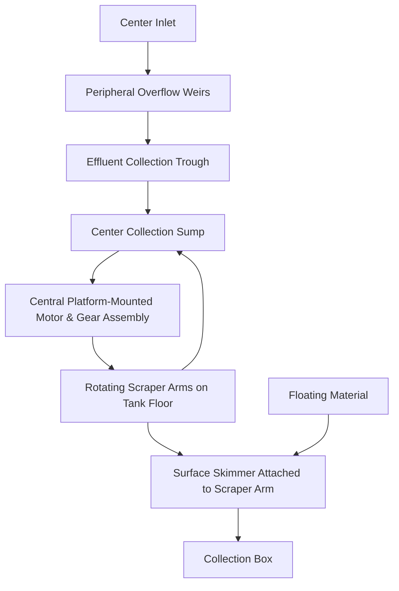

\n---\n

# T2-1.2.2 Rectangular Primary Settling Tanks

Rectangular primary settling tanks normally have feed ports at one end, with raw wastewater traveling along the length of the tank to the overflow weirs and collection troughs located at the far end of the tank (see Figure T2-2). Settled sludge is transported to a collection sump at one end of the tank by means of board‑like scrapers (flights) moving across the floor perpendicular to the wastewater flow path, from one end of the tank to the other. The scrapers are connected at each end to a chain that travels in an endless loop across the bottom and water surface of the tank as guided and supported by a number of rotating shafts and drive sprockets. Top‑mounted drives are usually provided for both the chain/flight assembly and for a separate scraper or screw located in the sludge sump. The flights perform as skimmers when traveling along the water surface and convey floating material to a collection trough near the overflow weirs.

<Mermaid diagram>
```mermaid
graph TD
  IN(Inlet channel)
  WASTE(Wastewater travels along the length of the tank)
  OVERFLOW(Overflow weirs)
  TROUGH(Collection troughs at far end)
  FLIGHTS(Board-like scrapers (flights))
  CHAIN(Chain that travels in an endless loop)
  BOTTOM(Bottom and water surface)
  SHAFTS(Rotating shafts)
  DRIVES(Drive sprockets and top-mounted drives)
  SUMP(Sludge sump)
  SKIM(Skimmers - flights travel along water surface)
  
  IN --> WASTE --> OVERFLOW --> TROUGH
  WASTE --> FLIGHTS
  FLIGHTS --> CHAIN
  CHAIN --> BOTTOM
  CHAIN --> SHAFTS
  SHAFTS --> DRIVES
  DRIVES --> FLIGHTS
  FLIGHTS --> SKIM
  SKIM --> TROUGH
  TROUGH --> SUMP
```
</Mermaid>
Figure T2-2. Typical Rectangular Primary Settling Tank
\n---\n

# T2-1.2.3 Square Primary Settling Tanks
These tanks are square in configuration but equipped with circular sludge removal mechanisms and operate similar to a circular settling tank. Special sludge scraper arm extensions are required to remove sludge that settles in the tank corners.

## T2-1.2.4 Stacked Primary Settling Tanks
Stacked rectangular tanks are constructed with one tank above another in a vertical arrangement. This configuration results in significant space savings but usually costs more to construct and restricts access to the lower tank for maintenance.

## T2-2 Primary Settling Tanks

### T2-2.1 Design Loading
Primary settling tanks shall be sized mainly on the basis of surface overflow rate, though other design factors, such as tank depth, detention time, and sludge scraper conveyance capacity, should also be considered to ensure the clarifier design provides acceptable process performance. Surface overflow rate is the clarifier influent flow rate, including any plant recycle streams, divided by the total tank area within the outer walls, including the area of the effluent collection troughs within the outer walls.

#### T2-2.1.1 Surface Overflow Rates
The surface overflow rate for primary clarifiers will depend on the function of the settling tank (Table T2‑2).

Table T2-2. Surface Overflow Rate for Primary Clarifiers

<table>
  <thead>
    <tr>
      <th>Type of Settling</th>
      <th colspan="2">Surface Overflow Rate</th>
    </tr>
<tr>
      <th></th>
      <th>Average Design Flow<br>(gpd/sf)</th>
      <th>Peak Design Flow<br>(gpd/sf)</th>
    </tr>
  </thead>
  <tbody>
    <tr>
      <td>Primary solids settling only</td>
      <td>800 to 1,200</td>
      <td>2,000 to 3,000</td>
    </tr>
<tr>
      <td>Primary and waste activated sludge settling (co-thickening)</td>
      <td>400 to 600</td>
      <td>1,200 to 1,500</td>
    </tr>
<tr>
      <td>Chemical sludge settling</td>
      <td>See Note A</td>
      <td>See Note A</td>
    </tr>
  </tbody>
</table>

> <strong>Note A:</strong> Acceptable surface overflow rates will depend on the particular chemical treatment and should be determined by pilot plant testing or the results of similar applications.

At these loading rates, a well designed and properly operated primary clarifier, providing primary solids removal or co-settling, should remove 30 to 35 percent of the BOD5 and 50 to 60 percent of the suspended solids from raw domestic wastewater. Removal rates for nondomestic wastewater, which may have a different fraction of soluble BOD5 than normal domestic wastewater, may differ from these typical rates. Removal rates for chemically enhanced primary treatment will also vary from these typical rates, with the removal of
\n---\n

# T2-2 Design Considerations

### T2-2.1.1 BOD5 and Suspended Solids
BOD5 and suspended solids usually greater than for primary treatment without chemicals. Other operational factors, such as settling tank hydraulic short‑circuiting, highly fluctuating influent flow rates, extreme high or low water temperatures, and large plant recycle flow proportions can decrease BOD5 and suspended solids removal rates below typical values.

The effect of a poorly performing or overloaded primary clarifier is the resultant increase in BOD5 and suspended solids loading on the downstream secondary treatment process. This additional loading on the secondary treatment process may be acceptable if that process is adequately designed to handle the greater load. Surface overflow rates higher than those recommended above for primary settling tanks may be acceptable if the secondary treatment process, including the waste activated sludge system, is able to satisfactorily treat the greater amount of organic loading that passes through the primary treatment process.

### T2-2.1.2 Weir Loading Rates
Although weir hydraulic loading rates have little effect on the performance of primary settling tanks, these rates should range from 10,000 to 40,000 gpd/lf. Adequate tank depth and spacing between effluent troughs should be provided to prevent excessive water velocities that can entrain solids from the tank floor and produce solids carryover in the effluent.

### T2-2.1.3 Detention Time
Liquid detention times should not be greater than 2.5 hours at average design flow since septic conditions with associated poor clarifier performance and odor generation may occur. Excessive sludge detention time can result in solubilization of settled organic solids, resulting in higher BOD5 loading on downstream processes. Properly designed sludge collectors with adequate conveyance capacity should be provided to prevent sludge buildup on the tank floor. Sludge blanket depth should be minimized to avoid septic conditions and long sludge detention times. Prevention of excessive sludge detention times may allow liquid detention times greater than the recommended maximum value without causing operating and performance problems.

### T2-2.2 Design Considerations

#### T2-2.2.1 Depth and Dimensions
Primary settling tanks should have a side water depth of 8 to 14 feet. Depths at the tank inlet will be greater than at the outlet due to the floor slope. This depth range should provide adequate space for solids flocculation, mechanical sludge removal equipment, inlet feed well or baffle depth, and settled solids storage. Deeper tanks prevent scour and resuspension of settled solids and avoid washout or carryover of solids with the effluent.

Rectangular tanks should be designed with a minimum length from inlet to outlet of 10 feet, with additional tank length required to provide space for the effluent trough area. Rectangular tank widths are typically limited to the maximum length of manufactured flights, or 24 feet, although multiple, parallel chain and flight assemblies can be installed in a wider tank.
\n---\n

# T2-2.2.2 Flow-Splitting and Inlets

Inlets should be designed to dissipate the inlet velocity, to distribute the flow equally, and to prevent short‑circuiting.
Flow to multiple, parallel primary settling tanks should be split in a way that equalizes design loadings to the tanks and avoids hydraulic short‑circuiting and velocity currents at the clarifier inlet. Typically, the flow‑splitting device should be adjusted to produce the desired flow distribution at peak design flow, since lower flow rates will not degrade clarifier performance if the flow‑split is not ideal. Proper balancing of hydraulic loading among the tanks is necessary. Flow‑splitting structures should have surface discharge to prevent the accumulation of floating material.
Inlet channels or pipes should be designed to maintain a velocity of at least 2 fps at one‑half design flow to prevent solids deposition. Aeration of the inlet channel to prevent solids deposition may be used where off‑gassing of odors or VOCs (volatile organic compounds) will not be a problem. Corner pockets and dead ends should be eliminated and corner fillets or channeling used where necessary. Provisions shall be made for eliminating or removing floating materials in inlet structures that have submerged ports.
For rectangular tanks, inlet channels and pipes should convey the raw wastewater to the tank to allow the flow to enter the tank parallel and symmetrical with the tank center line. For a common inlet channel that provides right‑angle entries to parallel rectangular tanks, flow control devices should be provided in the channel to prevent a greater proportion of the flow from entering the end tanks. Multiple inlet ports should be provided for rectangular tanks to distribute the flow across the tank width, with open surface flow provided to allow floating material to enter the clarifier. Inlet port openings should be sized large enough to decrease channel velocities and prevent jetting action of flow into the tank.
For circular tanks, influent feed wells should be designed to also flocculate solids to increase settling efficiency. This performance can be achieved by baffling the inlet ports to bring the wastewater into the tank feed well in a manner that produces a spiral flow pattern, promoting contact between suspended solids.

# T2-2.2.3 Baffling and Short-Circuiting

Short‑circuiting of flow from the inlet to the outlet results in poor performance since the available hydraulic detention time of the clarifier is not fully used to capture and separate solids from the liquid. Short‑circuiting should be prevented by internal tank baffling that distributes the flow equally across the tank’s cross‑sectional area, dissipates water velocity currents, and directs the flow parallel to the tank center line. In a circular primary settling tank, this function should be provided by the center, circular feed well. In rectangular tanks, submerged baffle walls should be provided downstream of inlet ports to minimize short‑circuiting. The bottom edge of baffle walls and feed wells should not be deep enough to cause acceleration of liquid velocity under the baffle or to result in entrainment of settled solids in the sludge blanket. Baffle walls and feed wells should also allow floating material to pass over them or through openings to prevent accumulation.
\n---\n

# T2-2.2.4  Outlets

Effluent should be uniformly withdrawn at the outlets to prevent short‑ circuiting and localized, high‑velocity currents than can scour settled solids and cause solids carryover. The overflow weir at the effluent trough (launder) or channel should be level, and may be either V‑notched or straight‑edged. (Weir loading rate is discussed in T2‑2.1.2.) For circular clarifiers, effluent troughs and overflow weirs should normally be located along the circumference of the outer wall, with submerged, horizontal baffling extending outward from the wall to prevent carryover of solids in wall currents. Consider use of weir squeegees to reduce maintenance. In‑board launders may also be used to avoid these wall effects. For rectangular clarifiers, effluent launders should be arranged at the outlet area of the tank to cover 33 to 50 percent of the basin length, and spaced to minimize velocity currents between troughs. Effluent trough depths shall be adequate to carry peak flow without submerging the launders.

Where problem odors or VOCs are produced by the off‑gassing from the effluent drop into the outlet trough, covered launders or submerged launders with orifices should be considered. All effluent launder design shall accommodate the collection and removal of scum by the clarifier skimmer system.

## T2-2.2.5  Grit Removal

Primary settling tanks may be used to collect and remove grit from influent wastewater when grit removal is not provided in preliminary treatment. Tanks used to remove grit shall have sludge collector equipment materials that can withstand the abrasive effects of grit handling. Grit removal in the primary settling tank requires a downstream sludge treatment system to separate the grit from the primary sludge. A hydrocyclone or other vortex‑inducing equipment shall be used to separate the grit from sludge, with the hydrocyclone grit discharge further washed and dewatered by a rake or screw classifier device. Grit‑removal system designs should minimize the amount of organic solids that remain in the separated grit that requires disposal. Refer also to the requirements in T2‑3.2.6.

## T2-2.2.6  Scum Removal

Effective scum collection and removal facilities, including baffling, shall be provided ahead of the outlet weirs on all primary settling tanks. Refer to the requirements in T2‑4.

## T2-2.2.7  Co‑Thickening

Biological sludge from the downstream secondary treatment process may be discharged to the primary settling tank for co‑thickening with the primary sludge. Sludge collector equipment for these tanks shall be designed for more rapid sludge removal than for conventional primary settling tanks to prevent septic conditions and to avoid solubilization of BOD₅ due to the decomposition of the biological waste solids. The lower specific gravity of the biological solids, as compared to primary settleable solids, requires the use of lower surface overflow rates (see T2‑2.1.1). Sludge pumping and treatment systems shall be sized to handle the larger volumes and reduced thickness of primary sludge due to the additional biological sludge.
\n---\n

# Primary Treatment

## T2-2.2.8 Submerged Surfaces
The tops of beams and similar construction features that are submerged shall have a minimum slope of 1.75 vertical:1 horizontal. The underside of such features should have a slope of 1:1 to prevent the accumulation of scum and solids.

## T2-2.2.9 Multiple Units
Multiple units capable of independent operation should be provided at all plants. The number of units required shall satisfy Ecology requirements for [reliability (see ](http://www.ecy.wa.gov/pubs/9837/g2.pdf)G2‑8) and shall provide for economical construction and operation and maintenance. With tanks out of service, the remaining in‑service settling tanks shall be capable of passing the peak design flow without exceeding the allowable surface overflow rate, causing tank wall overflow, or producing hydraulic backup that would impair the proper operation of upstream facilities.

## T2-2.2.10 Protective and Servicing Facilities
All settling tanks shall have features providing easy access for maintenance and protection of operators (such as stairways, walkways, and handrails). If side walls are extended some distance above the liquid level to provide flood protection or for other purposes, convenient walkways shall be provided to facilitate housekeeping and maintenance. Provision shall be made to provide easy, safe access for cleaning and maintenance of weirs. Adequate area lighting shall be provided around access paths and at the clarifier drive mechanism.

## T2-2.2.11 Sludge Removal
Provisions shall be made to permit continuous sludge removal from primary settling tanks using positive scraping mechanisms. Refer to other requirements in T2‑3.

## T2-2.2.12 Tank Dewatering
All clarifiers shall be provided with means for tank dewatering. The capacity of dewatering pumps or gravity drainage systems should be such that the tank can be dewatered in 24 hours. The contents of the basin should be discharged to the closest process upstream from the unit being dewatered that can accept the flow. Draining the clarifier shall not cause tank buoyancy because of high ground water levels. Tank internal components (troughs, pipes, etc.) shall also drain when the basin is dewatered, or these components shall be designed to support the weight of any contained water.

## T2-2.2.13 Odor Control
Primary settling tanks and associated structures should be designed to minimize the generation of odors and volatile organic compounds (VOCs). Turbulence at tank inlets, effluent launders, and weirs should be minimized to prevent the release of noxious gases. Where excessive turbulence cannot be avoided, such as at a water drop of over 8 inches, covers should be placed over the turbulent area and positive ventilation to an odor control system should be considered. Settled sludge should be prevented from becoming septic by providing adequate sludge collection and removal equipment capacity to avoid
\n---\n

## T2-2.2.14 Chemical Addition
Chemical coagulants (such as iron salts, aluminum salts, lime, and polymers)
may be added to raw wastewater entering primary clarifiers to increase
removal of BOD$_5$, suspended solids, and phosphorus above levels normally
achieved in standard settling tanks without chemical addition. Removal
efficiencies and design surface overflow rates should be based on jar tests,
pilot plant testing, and/or results from similar plants treating wastewater with
similar characteristics. Positive control of chemical feed rate shall be provided.
Clarifier sludge handling equipment and downstream sludge pumping and
processing facilities shall be capable of handling the increased mass and
composition (density, dewaterability, abrasiveness, scaling, pH, corrosivity,
inert concentration) of primary sludge produced due to the chemical addition.
Additional requirements of chemical addition systems are described in
Chapter T4.

## T2-3  Primary Sludge Collection and Removal

### T2-3.1 Disposition of Primary Sludge
Clarifier sludge collectors, sumps, and pumps shall be designed to remove primary sludge
from settling tanks and transport it to sludge processing facilities for further treatment
[and disposal or reuse. (See ](http://www.ecy.wa.gov/pubs/9837/s.pdf)Chapter S for requirements of sludge processing facilities.)
Settling tanks shall not be designed to store primary sludge longer than the time required
to transport settled solids to the tank sump.

### T2-3.2 Design Considerations

#### T2-3.2.1 Collectors
Primary settling tanks shall be provided with mechanical sludge collectors to
transport settled solids along the basin floor to the withdrawal sump or hopper.
Rectangular clarifiers shall be equipped with chain and flight or traveling
bridge-type sludge collectors. Circular clarifiers shall be equipped with plow
or spiral scraper-type sludge collectors. For all tanks, the scraper size, quantity,
configuration, and travel speed shall be adequate to convey the maximum
expected amount of settled solids accumulation to the sludge removal sump.
The required sludge conveyance capacity of the collector system shall exceed
the maximum settled solids flux loading rate on the tank floor. Collectors shall
be designed to provide continuous sludge supply to the primary sludge pump
to prevent short-circuiting of water directly to the pump. Suction-type
\n---\n

# Primary Treatment

## T2-3.2.2 Sumps
For rectangular tanks, the sump should be located at the inlet end of the basin to minimize travel time to the sump, though very long tanks may require intermediate sumps. Intermediate sumps in rectangular tanks should be spaced to allow removal of transported sludge prior to overloading of the collector scraper. For circular tanks, the sump should be located at the center of the tank. Sumps shall have steep sides with a minimum slope of 1.7:1 and smooth wall surfaces to prevent solids accumulation. Each sump shall be equipped with a single sludge withdrawal pipe to the primary sludge pump. Sumps shall be sized to avoid plugging by solids and shall provide enough storage volume to maintain continuous sludge supply to the pump between collector scraper passes. Sumps for larger rectangular clarifiers (20 feet in width or greater) should have separate mechanical collector mechanisms to convey sludge to the withdrawal pipe entrance. The conveyance capacity of the sump collector shall be adequate to continuously supply sludge to the pump to prevent short‑circuiting of water directly into the withdrawal pipe entrance.

## T2-3.2.3 Sludge Depths
Sludge collector and withdrawal systems shall have adequate capacity to prevent the accumulation of primary sludge above a 2‑foot depth and avoid septic conditions.

## T2-3.2.4 Removal Rates
Sludge removal equipment shall be designed to prevent accumulation of primary sludge and avoid septic conditions in the tank. Design of removal equipment (collectors and pump) shall consider the maximum rate of settled solids flux on the floor of the tank. Removal rates shall not exceed the ability of downstream sludge processing facilities to accept the sludge loading.

## T2-3.2.5 Pumping and Conveyance
Primary sludge pumps and withdrawal equipment shall be designed to transport the maximum sludge density and flow expected. Withdrawal systems may be designed for either continuous or intermittent operation but shall operate frequently enough to prevent excessive sludge accumulation in the tank. Sludge withdrawal and conveyance piping shall be at least 4 inches in diameter and should include adequate cleanouts, flush connections, and pigging ports to allow access for clearing obstructions. Sludge lines should also include a sight glass on the suction side of the pump, sampling port, and flowmeter. Minimum velocity in sludge lines shall be 2 fps to prevent solids deposition. Where grease in the primary sludge lines may accumulate and cause flow restrictions, consideration should be given to the use of epoxy or glass‑lined pipe. Use of long‑radius elbows in piping systems is also recommended to prevent plugging and to reduce head loss.
Primary sludge shall be removed from clarifiers and discharged to sludge processing facilities by pumping. Primary sludge pumps shall be a type and size capable of pumping primary solids without plugging and should be equipped with both suction and discharge isolation valves. Pumps should be
\n---\n

located to maintain a net positive suction head and suction lines should be
short and straight to minimize friction losses and plugging. A 100‑percent
capacity standby pump should be provided. Pump selection should consider
the effect of pumped flow characteristics on downstream sludge processing
facilities.

T2-3.2.6  Grit
Sludge collector and conveyance systems for primary clarifiers providing grit
removal shall be constructed of materials that resist abrasion. Sludge collection
and removal capacity shall be adequate to handle high loadings of grit
associated with peak wet weather flows to the plant. Primary sludge pumps
shall have adequate capacity and controls to remove and pump sludge at a
constant rate that feeds downstream grit‑removal equipment at a flow and
sludge concentration that maximizes grit separation.

T2-4  Scum Collection and Removal

      T2-4.1  Disposition of Scum
       Clarifier scum collectors, sumps, pumps, and withdrawal systems shall be designed to
       remove floating materials from settling tanks and transport it to scum processing facilities
       for [further treatment and disposal. (See ](http://www.ecy.wa.gov/pubs/9837/s.pdf)Chapter S for requirements of scum processing
       facilities.)

     T2-4.2  Design Considerations

       T2-4.2.1  Collectors
                   Primary clarifiers shall be provided with scum collection equipment to
                   concentrate and transport floating material to the withdrawal system.
                   Collection equipment may be either automatic or manually operated. For
                   rectangular primary settling tanks, sludge collector flights should be designed
                   to convey floating material along the water surface to the scum removal
                   device. The scum withdrawal device for rectangular tanks should be either a
                   trough or slotted pipe which should extend the full width of the tank to prevent
                   the overflow of the floating material into the liquid effluent launder. For
                   circular tanks, a radial skimmer arm rotating around the tank at the water
                   surface should be provided to convey floating material to a withdrawal hopper.
                   For all tanks, water sprays should be provided to direct the scum to the
                   removal location. Baffles should be provided between the scum collection area
                   and the effluent weirs to prevent overflow into the troughs. Withdrawal
                   devices should be designed to allow sufficient water to overflow with the scum
                   to convey the scum to the collection sump or conveyance system.

       T2-4.2.2    Sumps
                   Sumps may be provided to collect scum and provide a surge volume for
                   removal pumps. Sumps shall provide adequate storage capacity to avoid too‑
                   frequent pump operation. Sump walls shall be steep and smooth to prevent
                   scum accumulation that creates septic conditions. Covers or grating should be
\n---\n

installed over the sump to control odors and prevent access for insects and
birds. Mixing, water sprays, or withdrawal ports should be provided to prevent
surface crusting or coning of scum in the sump.

## T2-4.2.3 Removal Rates
Scum removal equipment shall be designed to prevent accumulation of
floating material, avoid septic conditions, and prevent attraction of insects and
birds in the tank. Removal rates shall not exceed the ability of downstream
scum-processing facilities to accept the scum loading.

## T2-4.2.4 Conveyance
Scum pumps and withdrawal equipment shall be designed to transport the
anticipated maximum scum density and flow. Withdrawal systems may be
designed for either continuous or intermittent operation, but shall operate
frequently enough to prevent excessive accumulation of scum in the sump or
backup in the clarifier. Scum withdrawal and conveyance piping shall be at
least 4 inches in diameter and should include adequate cleanouts and flush
connections to allow access for clearing obstructions. Minimum velocity in
scum lines shall be 2 fps to prevent solids deposition. Pipes should be epoxy or
glass-lined to prevent grease accumulation. Heat tracing of exposed lines
should be considered in cold temperature locations.

Scum shall be removed from clarifiers and discharged to scum processing
facilities by gravity flow or pumping. Gravity removal systems shall have
sufficient slope to convey the maximum scum flow. Scum pumps shall be a
type and size capable of pumping scum solids without plugging. Pumps should
be located to maintain a net positive suction head and suction lines should be
short and straight to minimize friction losses and plugging. Pump selection
should consider the effect of pumped flow characteristics on downstream scum
processing facilities. Larger plants should have a flow meter on the scum pipe
leading to these processing facilities.

## T2-5 References
- Metcalf & Eddy, Inc. _Wastewater Engineering – Treatment, Disposal, and Reuse_. Third Edition. New York, NY: McGraw‑Hill, Inc., 1991.
- Water Environment Federation and American Society of Civil Engineers. _Design of Municipal Wastewater Treatment Plants_. Manual of Practice No. 8, Chapter 10. 1991.
- Water Environment Federation. _Operation of Municipal Wastewater Treatment Plants_. Manual of Practice No. 11, Chapter 19. 1996.
\n---\n

An icon on the left depicts a water treatment tank with blue water and green surroundings.

# T3 Biological Treatment

This chapter describes biological treatment processes and includes
design, construction, and operational considerations for these treatment
processes. Suspended growth [(](http://www.ecy.wa.gov/pubs/9837/t6.pdf)continuous flow) using the activated
sludge process, batch treatment (sequencing batch reactor) modification
of the activated sludge process, and biological nutrient removal are the
principal processes described in this chapter. The 2006 revision of this
manual includes design information on membrane bioreactors (MBR) in a
separate chapter (T6).
\n---\n

# Table of Contents

- T3-1 Objective
- T3-2 General Process Design
  - T3-2.1 Mass Balances
    - T3-2.1.1 General Description and Objectives
    - T3-2.1.2 Application of Mass Balance
    - T3-2.1.3 Setup of Process Configurations
    - T3-2.1.4 Model Inputs
  - T3-2.2 Process Flow Diagram
  - T3-2.3 Process and Instrumentation Diagrams
  - T3-2.4 Hydraulic Profile
  - T3-2.5 Design Criteria
- T3-3 Design Guidelines (Rev. 11/2007)
  - T3-3.1 Activated Sludge
    - T3-3.1.1 Continuous Flow
      - A. Carbonaceous BOD Removal
        - 1. Overview
        - 2. General Design Considerations
        - 3. Process Design
        - 4.
    - T3-3.1.2 Batch Treatment (Sequencing Batch Reactor)
      - A. Overview: Process Description and Applicability
      - B. General Advantages and Disadvantages of SBRs
      - C. Systems Available
        - 1. System Types
        - 2. Control Systems
      - D. General Design Standards for SBRs
        - 1. Basis of Design
        - 2. Required Number of Basins
        - 3. Sizing Aeration Tanks
        - 4. Sizing the Air Delivery System
        - 5. Flow Equalization Basins
        - 6. Screens
        - 7. Scum Control
        - 8. Foam Control
        - 9. Mixing Equipment
  - T3-3.1.2 Batch Treatment (Sequencing Batch Reactor)
\n---\n

# Biological Treatment

## T3-3

- 9. Alarm and Backup Features
- 10. Diffuser Anti-Clogging Features
- 11. Alkalinity Addition Systems
- 12. Tank Maintenance
- 13. Decanting Equipment
- 14. Disinfection Equipment
- 15. Valve Positioning
- 16. Blower Turndown Features
- 17. Sampling Equipment
- 18. Freeze Thaw Protection
- E. Reliability Requirements for SBR Systems
  - 1. Diffuser Features
  - 2. Motor Operated Valve Features
  - 3. Blowers
  - 4. Backup Power Systems
  - 5. Sensitive Discharge Area Protection
- F. Control System Requirements for SBR Systems
  - 1. General Control Functions
  - 2. Load Equalization
  - 3. Control System Redundancy
  - 4. Process Optimization and Efficiency Features
  - 5. Alternative Operation for High Flows
  - 6. Manual Override Features
  - 7.
- T3-3.1.3 Extended Aeration
  - A. Application for Municipal and Industrial Treatment Systems
  - B. Design Considerations
    - 1. General Design Considerations
    - 2. Consideration of Oxygen Transfer
    - 3. Consideration of Secondary Clarification
- T3-3.2 Biological Nutrient Removal
  - T3-3.2.1 Objectives
  - T3-3.2.2 Biological Nitrogen Removal
  - T3-3.2.3 Biological Nitrogen Removal Processes – Suspended Growth
  - A. Suspended Growth Design Considerations
    - 1. SRT
    - 2. Specific Growth Rate
    - 3. Specific Denitrification Rate
    - 4. MLSS Concentrations
    - 5. Temperature
\n---\n

* 6. Recycle Flows ................... 44
* 7. Alkalinity 44
* 8. Dissolved Oxygen.............. 45
* 9. Mixing     46
* 10. Aerobic (Nitrification) Basin Design Approach46
* 11. Anoxic Basin Design Approach........ 48

* B.                Suspended Growth                                Process
  Configurations ......... 51
  - 1.  Modified Ludzak-Ettinger . 51
  - 2.  Four Stage Bardenpho ...... 52
  - 3.  Step Feed Process ............ 53
  - 4.  Oxidation Ditch .................. 54
  - 5.  Simultaneous Nitrification Denitrification (SNDN) .......... 55
  - 6.  Sequencing Batch Reactor 56
  - 7.  Summary Design Criteria for Nitrogen Removal
     Processes ........... 57

* T3-3.2.4 Biological Nitrogen Removal Processes – Attached Growth
  Processes .......... 58
  - A.  Non-submerged  Processes ........... 58
     - 1.  Trickling Filters ................. 59
     - 2.  Rotating Biological Contactors (RBC)59
  - B.  Submerged Attached Growth ........ 59
     - 1.  Denitrification Filter............ 60
     - 2. 

* C. Integrated Fixed Film Activated Sludge ...... 61
* D. Moving Bed Biofilm Reactor ........ 62
* E. Membrane Aerated Biofilm Reactor ........ 63

* T3-3.2.5 Biological Nitrogen Removal Processes – Sidestream
  Processes ........ 63
  - A.  SHARON Process ...... 64
  - B.  ANITA™ Shunt Process ..................... 64
  - C.  Deammonification Processes ................. 64

* T3-3.2.6 Biological Phosphorous Removal ........ 64
  - A.  Design Considerations ......... 65
     - 1.  Influent Wastewater Characteristics ...65
     - 2.  Aerobic Solids Retention Time .............. 66
     - 3.  Anaerobic Contact Time and Basin Sizing ....... 66
     - 4.  Mixing Requirements ......... 66
     - 5.  Aerobic Basin Sizing .......... 67
     - 6.  Secondary Release and Recycle Load Management...... 67
  - B.  Process Configurations.......... 67
     - 1.  Anaerobic/Oxic Process..... 67
     - 2.  
\n---\n

# Biological Treatment

- 2. Anaerobic/Anoxic/Oxic Process
  - Health and Safety
- 3. Five-Stage Bardenpho
- 4. University of Cape Town/Modified University of Cape Town Town
- 5. Virginia Initiative Process
- 6. Johannesburg Process
- 7. Sequencing Batch Reactor
- 8. Summary Bio-P Process
  - Design
  - Parameters
- T3-3.2.7 Emerging Technologies – Aerobic Granular Sludge
- T3-3.2.8 Carbon Augmentation for Biological Nutrient Removal
  - A. Carbon Sources
    - 1. Methanol
    - 2. Ethanol
    - 3. Glycerol or Glycerin
    - 4. MicroC
    - 5. Acetate
    - 6. Fermentate
    - 7. Industrial Wastes
    - 8. Summary
  - B. Safety Considerations
    - 1. Storage, Handling and Transport
    - 2.
- T3-4 Construction Considerations
  - T3-4.1 Objective
  - T3-4.2 Settling and Uplift
  - T3-4.3 Secondary Clarifier Slab
  - T3-4.4 Aeration Piping
  - T3-4.5 Control Strategy
- T3-5 Operational Considerations
  - T3-5.1 Objective
  - T3-5.2 Plant Hydraulics
  - T3-5.2.1 Flow Splitting
  - T3-5.2.2 Activated Sludge Pumping/Conveyance
  - A. Purpose
  - B. Types and Their Application
    - 1. Centrifugal Pumps
    - 2. Gravity Flow
    - 3. Combination
  - C. Problems
    - 1. Inadequate Suction Head
    - 2. Inadequate Head
\n---\n

# Criteria for Sewage Works Design (January 2022)

- 3. RAS Lines Not Hydraulically Independent (Common Header and Line)
- 4. Plugging of Gravity Systems
- 5. Lack of Turndown Capability
- 6. Flow Range
- T3-5.3 Reactor Issues
  - T3-5.3.1 Feed/Recycle Flexibility
  - T3-5.3.2 Tank Dewatering/Cleaning
  - T3-5.3.3 Multiple Tanks for Seasonal Load Variation
  - T3-5.3.4 Suspended Growth Back Mixing
  - T3-5.3.5 Fixed Film Prescreening
- T3-5.4 Secondary Clarifier Issues
- T3-6 Reliability
  - T3-6.1 General
  - T3-6.2 Secondary Process Components
    - T3-6.2.1 Aeration Basins
      - A. Reliability Class I and Class II
      - B. Reliability Class III
    - T3-6.2.2 Aeration Blower and Mechanical Aerators
      - A. Reliability Class I and Class II
      - B. Reliability Class III
    - T3-6.2.3 Air Diffusers
    - T3-6.2.4 Sequencing Batch Reactors
- T3-7 References
\n---\n

## List of Figures
- T3-1. Hydraulic Profile for a Major Mechanical Treatment Plant .. Error! Bookmark not defined.

## List of Tables
- T3-1. Sample Worksheet Showing Input Data Requirements for Biological Systems ........................ 14
- T3-2. Typical Process Design Values for Sedimentation Overflow Rate ........................ 20
- T3-3. Basic Process Steps and Typical Pattern for Three Tank SBR System ......................................... 23
- T3-4. Typical Advantages and Disadvantages of SBRs ............... 24
\n---\n

# T3-1 OBJECTIVE

This chapter is intended to help engineers, operators, and local wastewater officials understand and efficiently implement biological treatment requirements. Because various professional societies and the US EPA develop and routinely update design manuals for wastewater treatment, this chapter will not address general design criteria contained in other design manuals, but will instead reference those manuals. It is the intention of this chapter to:

- Provide additional information pertinent to Washington State regulatory and environmental requirements.
- Illustrate and/or elaborate specific information.
- When appropriate, highlight items needing additional considerations applicable to smaller communities.
- Excerpt selected material to facilitate discussions and illustrate principles to assist local decision-makers.

## T3-2 GENERAL PROCESS DESIGN

The general process design will provide the design considerations that should be reviewed when designing any biological treatment facilities.

### T3-2.1 MASS BALANCES

#### T3-2.1.1 GENERAL DESCRIPTION AND OBJECTIVES

A mass balance is a set of calculations used to account for the mass flows of various parameters among the different process units in a system. A mass balance model can be used to track such parameters as chemical oxygen demand (COD), total suspended solids (TSS), and total Kjeldahl nitrogen (TKN) in the liquid and solids stream treatment processes in a wastewater treatment plant. Mass balances may be developed to assess equipment performance based on existing plant data or to project future solids loadings throughout an expanded facility.

#### T3-2.1.2 APPLICATION OF MASS BALANCE

Mass balance calculations are typically applied based on steady-state plant operations. Although a treatment plant is never truly operating at steady state, pseudo-steady-state conditions can be assumed by using data averaged over a certain time period. The appropriate averaging time period for mass balances is plant-specific and may vary from year to year, even for the same plant. Annual or monthly average plant data are often used. The model is not suitable for assessing plant performance and predicting solids loads under short-term, highly variable conditions, such as during shock loading conditions or storm events. Therefore, plant data such as peak-day or peak-hour flow and loadings should not be used.
\n---\n

The mass balance for each process unit is written by equating the input minus the
output to the conversion (removal or addition due to physical, chemical, or biological
processes). The plant is assumed to be in equilibrium, so that there is no net
accumulation or loss in each process unit.
Results of the mass balance calculations can only be as accurate as the values of the
input variables. Because parameters such as TKN and total phosphorus are often not
measured on a regular basis, especially in the solids handling area, developing the
proper mass balances for these parameters may become difficult.

## T3-2.1.3 SETUP OF PROCESS CONFIGURATIONS
In order to accurately account for the mass flows of the tracked parameters, all unit
processes that may either add to or reduce the mass flow should be incorporated.
These may include primary sedimentation, secondary treatment (including biological
treatment and secondary sedimentation), sludge thickening, sludge digestion, and
sludge dewatering. Recycle streams such as thickener overflow, dewatering
centrate/filtrate, and digester supernatant should be included. The routing of the
recycle streams should be accurately represented in the mass balance model.

## T3-2.1.4 MODEL INPUTS
Inputs to the mass balance model generally consist of plant influent flow, influent
loadings (i.e., BOD, TSS, and VSS), and effluent concentrations. Influent concentrations
may also be used but should be converted first to mass loading rates in the model,
since mass is a conserved property and is more appropriately tracked in mass balance
calculations. The solids measurement method should be clarified to determine if a
difference between total (TS, VS) and suspended solids (TSS, VSS) exists in the given
data. In this text, it is assumed that TSS and VSS refer to the sum of the suspended and
settleable solids. Sometimes the plant flow is measured just upstream of the primary
clarifiers. In that case, the flow input to the model will be the primary influent flow,
while the plant raw influent flow will be back-calculated from the primary influent flow
and possibly any recycle flows. Mass balance models do not predict the effluent
quality, which must be provided to calculate the waste sludge production rate or yield
ratio.

## T3-2.2 PROCESS FLOW DIAGRAM
A process flow diagram shall be prepared to show the general, schematic interrelationship
between major liquid and solids handling processes, beginning with influent wastewater
conveyance and concluding with the final treated effluent.
The level of detail for the process flow diagram will vary with the complexity of the treatment
facility. The following guidelines shall apply to all process flow diagrams:
* The process flow diagram should be presented on a single sheet whenever possible. The
diagram need not be drawn to scale.
\n---\n

# T3-10 January 2022 Criteria for Sewage Works Design

* Treatment units and major equipment should be shown by schematic outline shapes and symbols. All major process units and flow streams shall be identified. Symbols and abbreviations used in the process flow diagram shall be defined in the drawings.

* The process flow diagram shall show the routine or normal routing of flows and solids streams along with important bypass routings. Arrowheads shall be used to indicate the normal direction of flow.

* The process flow diagram shall show a schematic representation of major interconnecting piping between treatment units. Varying line weights and styles shall be used to distinguish between liquid and solids process stream piping, gas piping, and other ancillary systems. Valves, gates, and similar flow controls need not be shown.

* Where provisions are made for the addition of future treatment units, the future process trains should be considered, and future tie-in points identified.

## T3-2.3 PROCESS AND INSTRUMENTATION DIAGRAMS

Plans for wastewater treatment facilities that involve automated controls, instrumentation systems, telemetry, and/or other remote monitoring or control shall include process and instrumentation diagrams (P&IDs). P&IDs shall show the interrelationships between mechanical equipment, local and remote controls, alarms, and instrumentation systems.
The level of detail for P&IDs will vary with the complexity of the treatment facility, controls, and instrumentation systems. The following guidelines shall apply to all P&IDs:

* Unlike process flow diagrams, P&IDs for a typical mechanical treatment plant may require multiple sheets. The diagrams need not be drawn to scale.

* Symbols and abbreviations shall comply with standards of ISA.

* Numbering conventions for equipment, alarms, instrumentation, and appurtenances shall utilize a system acceptable to the owner of the treatment facility.

* Treatment units and major equipment shall be shown by schematic outline shapes and symbols. All major process units and flow streams shall be identified. Piping shall be labeled with respect to diameter and type of conveyed fluid. Arrowheads shall be used to indicate the normal direction of flow.

* Valves (including any automated controls) should be shown schematically, and indicate normal positions.

* Symbols and abbreviations used in P&IDs shall be defined in the drawings.

* P&IDs shall show local and remote controls and protective devices/alarms for all mechanical equipment items, including interconnecting control signals and logic.

* The sampling locations and metering should allow for routine verification of the plant operating mass balance.
\n---\n

## T3-2.4 HYDRAULIC PROFILE

A hydraulic profile drawing shall be prepared to show the water surface profile in cross-section view through the liquid treatment facilities. The hydraulic profile shall be calculated and shown for both peak hourly (or instantaneous) flow and design flow (maximum month) conditions. The peak hourly and average dry weather flow rates shall be clearly stated on the drawing, along with any critical assumptions used in developing the hydraulic profile.

Hydraulic profile drawings shall be developed in accordance with the following criteria:
* The hydraulic profile should be presented on a single sheet if possible. An exaggerated vertical scale shall be used to emphasize water surface elevations. The hydraulic profile need not be drawn to accurate horizontal scale.
- For small or simple facilities, the hydraulic profile may be combined with other sheets, such as the listing of design criteria.
- Treatment units and flow control structures shall be shown schematically in cross-section views and labeled.
- Water surface elevations shall be calculated (and shown) to the nearest 0.01 foot. The hydraulic profile shall present water surface elevations at all major treatment units, flow control structures, weirs and gates, and the point of effluent discharge.
- Top of wall elevations for hydraulic structures shall be drawn to scale and labeled showing elevations.
- Where a treatment plant has multiple parallel process trains with similar hydraulics, the hydraulic profile need only show one typical train.

## T3-2.5 DESIGN CRITERIA

A complete detailed listing of design criteria shall be provided for the entire plant during wet-weather and dry-weather flow conditions, including the following:
* Flows (peak hour, maximum month, average daily).
- Loadings.
- Anticipated effluent quality.
- Treatment units, size, depth, detention, overflow, etc.
- Equipment HP, rated capacity, size, RPM, etc.
- Outfall length, material, diameter.
- Diffuser ports, depth, minimum dilution.
- Solids handling process units, equipment, metering, etc.
- Reliability class.
\n---\n

# Criteria for Sewage Works Design

* Standby power type, capacity, fuel consumption and storage, etc.
\n---\n

# T3-3 DESIGN GUIDELINES (REV. 11/2007)

This section is intended to provide guidance for a designer when designing biological treatment facilities.

## T3-3.1 ACTIVATED SLUDGE

### T3-3.1.1 CONTINUOUS FLOW

A. Carbonaceous BOD Removal

1. Overview
This section provides design guidelines for carbonaceous BOD removal using the activated sludge process.

2. General Design Considerations
a. Specific Process Selection
The activated sludge process and its many modifications may be used to accomplish various degrees of removal of suspended solids and reduction of carbonaceous and/or nitrogenous oxygen demand.
Choosing the most applicable process will be influenced by the degree and consistency of treatment required, type of waste to be treated, proposed plant size, anticipated degree of operation and maintenance, and operating and capital costs. All designs shall provide for flexibility in operation and should provide for operation in various modes, if feasible.
For a discussion of characteristics and features of process modifications, refer to WEF Manual of Practice No. 8 or other textbooks.

b. Submittal of Calculations
Calculations shall be submitted, upon request, to justify the basis of design for the activated sludge process. The calculations shall show the basis for sizing the aeration tanks, aeration equipment, secondary clarifiers, return sludge equipment, and waste sludge equipment.

c. Primary Treatment
Where primary settling tanks are not used, effective removal or exclusion of grit, debris, excessive oil or grease (greater than 100 mg/l), and screening of solids shall be accomplished prior to the activated sludge process. Fine screens (6 mm or less) should always be used if primary clarifiers are not provided.
\n---\n

## d. Winter Protection
In severe climates, consideration should be given to minimizing heat loss and protecting against freezing.

## 3. Process Design
Table T3-1 is a sample worksheet showing the data requirements typically necessary for designing biological systems processes.

### Table T3-1. Sample Worksheet Showing Input Data Requirements for Biological Systems

<table>
    <thead>
    <tr>
        <th>Parameter</th>
        <th>Units</th>
        <th>Average
Annual</th>
        <th>Maximum
Month</th>
        <th>Maximum
Day</th>
        <th>Peak Hour</th>
    </tr>
    </thead>
    <tr>
        <td>Flow</td>
        <td>MGD</td>
        <td></td>
        <td></td>
        <td></td>
        <td></td>
    </tr>
    <tr>
        <td>BOD₅</td>
        <td>lb/day</td>
        <td></td>
        <td></td>
        <td></td>
        <td></td>
    </tr>
    <tr>
        <td>COD (1)</td>
        <td>lb/day</td>
        <td></td>
        <td></td>
        <td></td>
        <td></td>
    </tr>
    <tr>
        <td>TSS</td>
        <td>lb/day</td>
        <td></td>
        <td></td>
        <td></td>
        <td></td>
    </tr>
    <tr>
        <td>VSS</td>
        <td>lb/day</td>
        <td></td>
        <td></td>
        <td></td>
        <td></td>
    </tr>
    <tr>
        <td>TKN (2)</td>
        <td>lb/day</td>
        <td></td>
        <td></td>
        <td></td>
        <td></td>
    </tr>
    <tr>
        <td>TP (2)</td>
        <td>lb/day</td>
        <td></td>
        <td></td>
        <td></td>
        <td></td>
    </tr>
    <tr>
        <td>Minimum Temperature</td>
        <td>°F</td>
        <td></td>
        <td></td>
        <td></td>
        <td></td>
    </tr></table>

(1) If COD:BOD5 ratio is not 1.9-2.2:1.0, the conventional design equation can be in error. See WEF MOP No. 8, pgs. 11-20, notes on graphs 11.7a and 11.7b.
(2) If nutrient removal is required, TKN and/or TP will be needed.

### a. Volume of Aeration Tanks
The volume of the aeration tanks for any adaptation of the activated sludge process shall be determined based on full scale experience, pilot plant studies, or rational calculations. Design equations based on mean-cell residence time (sludge age) can be found in WEF Manual of Practice No. 8, Chapter 11.
When aeration tanks are sized for carbonaceous BOD removal using rational calculations, the ability to maintain a flocculent, well settling mixed liquor must be considered. The use of selectors, as described in this chapter, may be desirable or necessary.
For carbonaceous BOD removal, sludge age values in the range of 5 to 15 days are typical, with the lower values used for high temperatures and the higher values used for low temperatures.
Significant levels of nitrification will generally occur at 5-day SRT and temperatures of 61° F or greater.
Mixed liquor suspended solids (MLSS) concentrations in the range of 1,500 to 3,500 mg/L are often used. Because the mixed liquor concentration affects the solids loading on the secondary clarifiers, selection of the MLSS concentration must be coordinated with the secondary clarifier design.

\n---\n

## b. Oxygen Requirements

Oxygen requirements for carbonaceous BOD removal include oxygen to satisfy the BOD of the wastewater plus the endogenous respiration of the microorganisms. Additional oxygen is required if nitrification occurs.

Oxygen requirements depend on the influent loading to the aeration tank as well as the process design and should be determined using rational calculations. Calculations should be based on the peak hourly BOD loading to the aeration tanks.

Recycle flows from solids processing operations must be considered since these streams often have high BOD concentrations. Refer to WEF Manual of Practice No. 8, Chapter 11, for equations.

Oxygen requirements for carbonaceous BOD removal are dependent on the SRT and are typically 0.9 to 1.3 pounds of O₂ per pound of BOD removed. Provisions for nitrogenous oxygen demand should be considered separately and are typically 4.6 pounds of O₂ per pound of TKN applied.

## c. Sludge Recycling Requirements

Sludge recycle rates can be calculated using the rational equations referenced above. The recycle rate deserves careful consideration since it affects the size of the secondary clarifiers without influencing the size of the aeration tanks. Because the recycle requirements also depend on the sludge settling and thickening characteristics, which may change, the rate of sludge recycle should be variable. The range is typically from 25 to 100 percent of the average design flow, though peak hourly flow needs must be accommodated.

## d. Sludge Production and Wasting

When full scale or pilot plant data is not available, net sludge production can be estimated using the rational calculation procedures referenced above.

In order to obtain a reasonable estimate of the total sludge production, it is important to include solids present in the influent to the plant. Refer to WEF Manual of Practice No. 8 for more details.

Net sludge production increases with decreasing temperature and sludge age. In plants with primary sedimentation and operating at a sludge age of 15 days, net sludge production can be expected to be approximately 0.60 pounds of TSS per pound of BOD removed (0.48 lb VSS/lb BOD) at temperatures near 68 F. If the sludge age is decreased to 5 days, the net sludge production can be expected to increase slightly, to about 0.75 lbs/lb BOD removed (0.60 lb VSS/lb BOD).
\n---\n

# Criteria for Sewage Works Design

In plants without primary sedimentation, net sludge production can be expected to range from 1.2 lbs TSS/lb BOD removed (0.92 lb VSS/lb BOD) to 1.0 lbs TSS/lb BOD removed (0.75 lb VSS/lb BOD) at sludge ages from 5 to 15 days at 68 °F.

The net yields given in WEF Manual of Practice No. 8 are based on VSS. This value must be divided by the percent VSS/TSS in the mixed liquor to generate net yields of lb TSS/lb BOD. The values given in WEF Manual of Practice No. 8 are conservative and 85 to 90 percent of the facilities are expected to have lower yields. Net yields at existing facilities should be developed when plants are expanded.

## 4. Equipment Selection

### a. Aeration Equipment

Aeration equipment must be selected to satisfy the maximum oxygen requirements and provide adequate mixing. In processes designed for carbonaceous BOD removal, oxygen requirements normally control aeration equipment design and selection. Consideration for aeration and mixing requirements should always be reviewed independently.

Aeration equipment should be designed to maintain a minimum dissolved oxygen concentration of 2 mg/L at maximum monthly design loadings and 0.5 mg/L at peak hourly loadings.

Because aeration consumes significant energy, careful consideration should be given to maximizing oxygen utilization and matching the output of the aeration system to the diurnal oxygen requirements.

### b. Diffused Air Systems

Air requirements for diffused air systems should be determined based on the oxygen requirements and the following factors, using industry-accepted equations:

* Tank depth.
* Alpha value.
* Beta value of waste.
* Aeration-device standard oxygen-transfer efficiency.
* Minimum aeration tank dissolved oxygen concentration.
* Critical wastewater temperature.
* Altitude of plant.

Values for alpha and the transfer efficiency of the diffusers should be selected carefully to ensure an adequate air supply.
\n---\n

For all the various modifications of the activated sludge process, except extended aeration, the aeration system should be able to supply 1,500 cf of air (at standard conditions) per pound of BOD applied to the aeration tank. This aeration rate assumes the use of equipment capable of transferring at least 1.0 pound of oxygen per pound of BOD loading to the mixed liquor.

Air required for other purposes, such as aerobic digestion, channel mixing, or pumping, must be added to the air quantities calculated for the aeration tanks.

Multiple blowers must be provided. The number of blowers and their capacities must be such that the maximum air requirements can be met with the largest blower out of service. Because blowers consume considerable energy, the design should provide for varying the volume of air delivered in proportion to the demand.

Flow meters and throttling valves, where applicable, should be provided for air flow distribution and process control.

## c. Mechanical Aeration Systems

In the absence of specific performance data, mechanical aeration equipment should be sized based on a transfer efficiency of 2.0 lbs of oxygen per hp/per hr in clean water under standard conditions.

Mechanical aeration devices must be capable of maintaining biological solids in suspension. In a horizontally mixed aeration tank, an average velocity of not less than 1 fps must be maintained.

Provisions to vary the oxygen transferred in proportion to the demand should be considered in order to conserve energy.

Protection from sprays and provisions for ease of maintenance should be included with any mechanical aeration system. Where extended cold weather conditions occur, the aeration device and associated structure should be protected from freezing due to splashing. Freezing in subsequent treatment units must also be considered due to the high heat loss resulting from mechanical aeration equipment agitation, i.e., splash and wave action.

## d. Sludge Recycle Equipment

The sludge recycle rate should be variable over the range recommended in T3-3.1.1A.3.c. When establishing the flow range, initial operating conditions should be considered.

Sludge is normally recycled using pumps, and the most common method of controlling the sludge recycle rate is with variable speed pump motors. When pumps are used, the maximum sludge recycle flow shall be obtained with the largest pump out of service.
\n---\n

# Criteria for Sewage Works Design

Sludge return pumps should operate with positive suction head and should have suction and discharge connections at least 3 inches in diameter. One pump should not be connected to two clarifiers for continuous withdrawal.

Air-lift pumps may also be used to return sludge. When air-lift pumps are used to pump sludge from the hopper in each clarifier, it is not practical to install standby units. Therefore, the design should provide for rapid and easy cleaning. Air-lift pumps should be at least 3 inches in diameter.

Flow meters should be provided for process control.

### e. Waste Sludge Equipment
The sludge wasting rate will depend on the quantity of sludge produced and the process which receives the waste sludge.

Sludge is most commonly wasted using pumps. Waste sludge pumps could have capacity of up to 25 percent of the average daily flow. Minimum capacities in most smaller plants are governed by the practical turndown capabilities of the pumps. Variable speed drives and/or timers should be considered to control the wasting rate. Careful pump selection is also key in small flow-wasting applications (such as positive displacement vs. centrifugal).

Means should be provided for observing and sampling waste activated sludge. Flow meters with totalizers and recorders should be provided for process control and mass balance determinations.

## B. Sedimentation

### 1. Overview

#### a. General
This section provides design guidelines for secondary sedimentation as a part of the activated sludge process.

#### b. Applicability
The activated sludge process requires separation of treatment organisms from the treated mixed liquor. In almost all activated sludge processes currently in use, this separation takes place in a gravity sedimentation tank or in a gravity sedimentation phase of a cyclic feed process. Since the effluent from the sedimentation process is the final step, sedimentation determines effluent quality for every activated sludge process.
\n---\n

## 2. Process Design Considerations
Design of sedimentation for activated sludge processes requires consideration of the overall process. Process loading parameters that determine the efficiency of the activated sludge sedimentation include overflow rate, solids loading rate, sludge settleability, underflow or return sludge pumping rate, and tank hydraulic characteristics. Design values should be identified for each of these process parameters.

### a. Overflow Rate
The overflow rate is the rate of effluent flow from the sedimentation tank divided by the tank surface area. The overflow rate is the average upward velocity of process effluent from the sedimentation tank. Early researchers in sedimentation identified overflow rate as the critical factor in sedimentation tank design. By this early theory, a given size particle will be captured in the sedimentation tank if its settling velocity is more than the average tank overflow rate. Current design practice recognizes the hindering effect of high influent solids concentrations on settling in the activated sludge clarifier and includes overflow rate as only one of the factors used to determine sedimentation tank size. If, in overall activated sludge process design, the aeration tank size is determined to maintain MLSS concentration and settleability less than critical values for performance of the sedimentation tank, then the overflow rate may be the primary design parameter for the sedimentation tank. Table T3-2 gives values for design tank overflow rate during the peak sustained flow period that have proven effective under three different process configurations for the activated sludge process. Typical values for process variables—MLSS, sludge volume index (SVI), and RAS rate—are shown with corresponding values for design peak overflow rate. Overflow rate is given in units of gallons per day of effluent flow per square foot of total clarifier area. Some engineers subtract the influent area of the feed zone of the clarifier from the total sedimentation area. This practice may be considered as an additional safety factor in design and is not necessary as long as adequate safety factors are provided in the overall process design.
\n---\n

# Table T3-2. Typical Process Design Values for Sedimentation Overflow Rate

<table>
<thead>
<tr>
<th>Process Configuration</th>
<th>Typical MLSS, mg/L(1)</th>
<th>Typical SVI, mL/g</th>
<th>RAS rate, %</th>
<th>Peak Overflow Rate, gpd/sf(2)</th>
</tr>
</thead>
<tbody>
<tr>
<td>Conventional Activated Sludge</td>
<td>1,500-3,500</td>
<td>150</td>
<td>50-75</td>
<td>1,200</td>
</tr>
<tr>
<td>Extended Aeration</td>
<td>2,500-3,500</td>
<td>200</td>
<td>100</td>
<td>500</td>
</tr>
<tr>
<td>Oxidation Ditch</td>
<td>2,500-3,500</td>
<td>150</td>
<td>100</td>
<td>700</td>
</tr>
</tbody>
</table>

<p>(1) Not true if bioselectors are used.</p>
<p>(2) Depends on process parameters and tank design.</p>

## b. Solids Loading Rate

The solids loading rate is as important as overflow rate in determining the capacity of an activated sludge clarifier. The solids loading rate is the total mass rate of suspended solids into the clarifier divided by the tank cross-sectional area. The total mass rate to the clarifier is the sum of the tank effluent flow rate and the tank underflow or RAS pumping rate times the MLSS concentration. The limiting solids loading rate to an activated sludge clarifier should be no greater than the limiting solids flux in the clarifier. A factor of safety should also be applied that takes into consideration reasonably foreseen variations in design loading, settleability, and other variables.

SF = GL/SLR, where
SF = Safety factor
GL = Limiting solids flux, ppd
SLR = Solids loading rate, ppd

The limiting solids flux to an activated sludge clarifier is the limiting rate of solids loading to the clarifier that will reach the tank bottom. The limiting solids flux is a function of MLSS concentration, RAS rate, and sludge settleability. It can be calculated for given design conditions in a number of ways. Riddell, et al., in “Method for Estimating the Capacity of an Activated Sludge Plant” (1983), provides a procedure for direct calculation of limiting solids flux. Graphical procedures are provided in numerous references (see WEF Manual of Practice No. 8). Rational designs should demonstrate that design assumptions for MLSS concentration, RAS rate, and sludge settleability have been taken into account in determining the size of activated sludge aeration tanks and clarifiers. The overflow rate values in Table T3-2 each yield a safety factor of approximately 1.5 when applied at the indicated values for MLSS, SVI, and RAS rate using the method of Riddell, et al.
\n---\n

# Biological Treatment

For circular clarifiers, the SLR should not exceed 80 percent of the loading as a function of SVI (or DSVI) and return sludge concentration. See Daigger, "Development of Refined Clarifier Operating Diagrams Using an Updated Settling Characteristics Database" (1995).

## c. Sludge Settleability

Sludge settleability determines the everyday capacity of an activated sludge clarifier since it partly determines the sludge settling rate against which the effluent overflow rate acts. The common measure of settleability in the activated sludge process is the SVI. Several models have been developed to relate SVI to sludge settling velocity. However, SVI is a poor procedure for MLSS of 3,000-4,000 mg/l and DSVI and SSVI tests should be used. Where possible, designs for activated sludge clarifiers should be based on field measurement of sludge settling velocity using batch settling tests at varying initial suspended solids concentration.

In order to eliminate high SVI conditions, bioselectors should be used in activated sludge plants.

## d. Return Sludge Pumping Rate

Return sludge pumping is required to maintain a mass balance of solids in the secondary clarifier. The rate of sludge pumping as a ratio of the effluent flow from the clarifier is called the return sludge ratio. Values for this ratio have an inversely proportional effect on RAS concentration.

## C. Bioselector

Bioselectors (also referred to as selective reactors) are biological reactor processes that are placed just ahead of the principal biological reactor (activated sludge, etc.). The selector process involves reacting the influent wastewater with return activated sludge from the secondary clarifiers. Section T3-3.2 provides an extensive discussion on the use of bioselectors and other process configurations for enhanced nutrient removal.

In addition to playing a role in enhanced biological nutrient removal, the use of anoxic selectors can provide a means for controlling SVI in the biological treatment of wastewater. In particular, selectors may be used in the treatment train of wastewater treatment plants using a suspended growth process as the principal biological treatment method.

Anoxic selectors can be used in an industrial wastewater treatment plant in which foaming or bulking problems may be expected. Industrial wastewaters, which are expected to produce a severe foaming problem during the main aeration step, may employ selectors just ahead of the aeration. Many industrial and some municipal treatment processes with short to long sludge ages, including extended aeration, experience bulking
\n---\n

# Criteria for Sewage Works Design

(nonsettling sludge) problems. Again, application of an anoxic selector just ahead of the main aeration step may be applied for the attenuation of potential bulking problems. Foaming and bulking conditions can be expected to exist for industrial wastewaters that consist of relatively simple sugars and other soluble substrates. These kinds of wastewaters are produced by pulp and paper mills, food processing facilities (fruit processing in particular), breweries with high alcohol content in the wastewater, and so on. Wastewater with elevated temperatures will exacerbate the problem of bulking and foaming. Temperatures to the bioreactor should not exceed 104°F, with temperatures below 100°F being more desirable.

The design criteria may be different depending on the primary objective for the application. Selector design for bulking and foam control may use a somewhat different set of criteria than a selector with the principal objective of nutrient removal.

The purpose of including a selector in the treatment train for the reduction of foaming or bulking potential is to change the competitive environment among the various types of microorganisms that are present in the wastewater. In particular, the objective is to selectively remove the BOD₅ through absorption under conditions that are the least advantageous to filamentous types of microorganisms. Two phenomena have been reported as having an impact. The first is reduction in available BOD for the growth of filamentous microorganisms; the second is reduction in residual soluble BOD that remains towards the end of the aeration step. Both of these actions reduce the concentration of filamentous microbes in the activated sludge. In turn, these microbes, which are more likely to partition into the foam or float in the activated sludge, are reduced in concentration.

Design for this type of condition typically involves return of a portion of the RAS to the influent to the selector. Hydraulic detention times for this type of selector may be as short as 10 minutes and as long as 45 minutes.

Typical sizing of a selector for this application involves hydraulic sizing for 30 minutes at the design flow, with detention times to be no less than 10 minutes under peak flow conditions. In addition, the selector should be compartmentalized into three or more equal volume tanks, each with a mixer capable of maintaining complete mix conditions. A high food-to-micro-organism ratio (F/M) ratio should be designed for the first stage selector tank. F/M values of 6 to over 30 have been reported as being successful designs. The designer should make provision for returning only a portion of the RAS to the influent of the selector process. The return flow to the selector should be selected by the operator from about 30 percent to 100 percent of the total RAS flow. In the absence of any pilot plant data, a design F/M value of 10 to 15 should be used initially. It should be anticipated that the operator will need to make adjustments to this value once the treatment plant is in operation.
\n---\n

# Biological Treatment

Bioselectors control bulking, and can reduce capacity requirements by 30 to 50 percent.

## T3-3.1.2 Batch Treatment (Sequencing Batch Reactor)

### A. Overview: Process Description and Applicability

Sequencing Batch Reactors (SBRs) and continuous flow activated sludge systems use similar biological treatment principles. The primary difference is that SBRs alternately fill and draw from a common tank. This sequencing may occur with fixed cycle times (time-based), or depend on the time needed to completely refill each tank (level-based). The basic process steps, and typical pattern for a three tank SBR system are shown below. With level based controls, there is also typically an idle period after decanting since the time it takes to fill the prior tank is variable.

<table>
  <thead>
    <tr>
      <th>First third of Cycle</th>
      <th>Second third of Cycle</th>
      <th>Last third of Cycle</th>
    </tr>
  </thead>
  <tbody>
    <tr>
      <td>Tank 1<br>Fill (mixed and/or aerated)</td>
      <td>React</td>
      <td>Settle, Decant/Waste</td>
    </tr>
<tr>
      <td>Tank 2<br>---&rarr; Settle, Decant/Waste</td>
      <td>Fill (mixed and/or aerated)</td>
      <td>React</td>
    </tr>
<tr>
      <td>Tank 3<br>React</td>
      <td>Settle, Decant/Waste</td>
      <td>Fill (mixed and/or aerated)</td>
    </tr>
  </tbody>
</table>

Smaller municipalities with fewer technical resources to operate a complex system comprise the largest market for SBR systems. While the inherent complexity of SBRs has sometimes led to problems because of this, newer systems provide better control features and are more reliable.

Engineers can design SBR systems for carbonaceous BOD removal, nitrification-denitrification, and biological phosphorus removal. Managing sludge age with the care needed to only remove carbonaceous BOD has proven an unrealistic expectation for most SBRs to date. Accordingly, SBR design guidance in this section is based on operating the systems for complete nitrification. The mixed fill step generally serves as a bioselector step that helps regulate filamentous bacteria growth. Section T3-3.2 includes further discussion on strategies for designing a SBR system to achieve biological nutrient removal of nitrogen and/or phosphorous.

Other References: Sequencing Batch Reactor Design and Operational Considerations, September 2005, New England Interstate Water Pollution Control Commission, www.neiwpcc.org contains recommended process
\n---\n

control monitoring and a troubleshooting guide. These topics are not elsewhere covered in this section.

## B. General Advantages and Disadvantages of SBRs:

While not all systems realize these advantages, and most of the disadvantages can be overcome, some of the typical advantages and disadvantages of the SBR process are:

Table T3-4. Typical Advantages and Disadvantages of SBRs

<table>
  <thead>
    <tr>
      <th>TYPICAL ADVANTAGES</th>
      <th>TYPICAL DISADVANTAGES:</th>
    </tr>
  </thead>
  <tbody>
    <tr>
      <td>
        <ul>
          <li>Eliminates primary and secondary clarifiers and return sludge pumps.</li>
          <li>Lowers the overall tank volume required per gallon treated.</li>
          <li>Reduces costs by using rectangular tank and common wall construction techniques.</li>
          <li>Facilitates future expansion through modular construction.</li>
          <li>Reduces labor costs through highly automated process controls.</li>
          <li>Provides perfectly quiescent settling.</li>
          <li>Maximizes use of small sites.</li>
        </ul>
      </td>
      <td>
        <ul>
          <li>Needs three or more reactor tanks to meet redundancy requirements.</li>
          <li>Needs larger disinfection and downstream components because of batch discharges.</li>
          <li>Has a more difficult review and purchase process due to proprietary parts &amp; systems.</li>
          <li>Has poorer settling floc because there are no selector zones.</li>
          <li>Increases initial and maintenance costs by using complex control systems and valves.</li>
          <li>Needs a larger peak air supply.</li>
          <li>Performs poorly at high peak flows.</li>
        </ul>
      </td>
    </tr>
  </tbody>
</table>

C.  Systems Available

### 1.  System Types

Several manufacturers offer proprietary SBR systems. General SBR systems types include:

- Batch systems using jet aerators and mixers. These use a number of water “jets” with forced air, or venturi effect air injection spaced around each tank’s perimeter. Operators may inspect and replace such jets without taking tanks offline, and without interfering with tank cleaning, inspection or maintenance. Sloped tank bottoms provide for easy maintenance. Jet aerators can mix to a distance of 30 to 40 feet. The same jets, without air, can provide mixing for denitrification.

\n---\n

# Biological Treatment

* Batch systems using independent mixers and diffused air. These use diffuser arrays similar to other conventional secondary treatment systems, lowering costs and improving the availability of spare parts. Designers frequently array diffusers in banks so operators can isolate, retrieve, and service them without taking a tank off-line. Designs typically use separate mixers for the mixed fill cycle. These designs usually use less slope on the floor which helps with operator maintenance, but can make wasting sludge less efficient.
* Continuous influent, batch discharge systems. Engineers design these systems to continuously accept influent at one end while intermittently “batch” discharging from the other. These designs use influent baffles and a greater length to width ratio to make this possible. As with other designs, the aeration and mixing are turned off to allow settling prior to decanting. Designers may also use a partition and an internal sludge recycle loop to obtain some selector effect. These systems have redundancy with two tanks instead of three, but designers must evaluate the potential for short circuiting and solids washout during high flow periods.

## 2. Control Systems

Engineers could theoretically design SBR components such as decanters, aerators, valves, meters, and control logic to be interchangeable. However, most SBR systems come packaged together with proprietary controls designed to interface with their specific meters, valves, motors, and blowers. Control system technology is advancing rapidly, presenting an opportunity to economically retrofit existing SBR facilities with better controls and telemetry. This can improve economy and performance.

## D. General Design Standards for SBRs

### 1. Basis of Design

#### a. General Design Basis

All designs must clearly identify the design loadings and appropriate flow and loading criteria based on peaking factors described in section G2-1.2. Designs must identify the following parameters: SVI, F:M ratio, MLVSS:MLSS ratio, decanter depth, high and low water levels, mean cell residence time, cycle times at various flow conditions, decant volume, and tank dimensions (see T3-3.1.2.D.3 for tank design guidance) . Project proponents must evaluate proprietary system designs and document how they meet the criteria of this section (T3-3.1.2). This analysis must include the calculations needed to support any performance claims.
\n---\n

# Criteria for Sewage Works Design

## b. Guarantees
Major SBR equipment manufacturers sometimes provide design calculations along with performance “guarantees”. While guarantees may provide some important insurance to a community, Ecology’s obligation to safeguard the environment prohibits accepting manufacturer guarantees in lieu of the engineering basis for the design.

## c. General Reliability
Designs for SBR systems must provide the same reliability of treatment required for continuous flow through designs (see Chapter G2 sections 6, 7, and 8). Since each SBR reactor serves several functions, it must meet the most stringent of the reliability criteria for the various components it replaces (e.g., primary clarifier, aeration basin, aerators, backup power, control logic, etc.).

## d. Comparison of Alternatives
Designers comparing the SBR option to other alternatives should do so on the basis of their comparative life cycle costs. The analysis must use a common cost basis comparison to determine which system most reliably and economically provides an effluent that will meet all anticipated requirements for discharge, disposal, or reuse over the useful service life of the project.

## e. Solicitation Methods
Individual SBR equipment manufacturers often provide proprietary control system and process components. They will also specify optimum tank configurations that are unique for their process. As a result, early identification of a preferred SBR system may be necessary for efficient plant design. Proponents must ensure that any pre-selection or prequalification of a SBR system follows the current federal and state procurement laws. Section G1-2.7 provides information regarding Ecology grant and loan eligibility for components identified in plans and specifications based on a pre-selection process.

## 2. Required Number of Basins
- Designers must provide for more than two reactor vessels (basins) unless Ecology approves the system as a continuous flow-through system.
- Designers may request Ecology approve a two basin system if all other requirements for sizing are met and if design features ensure uninterrupted treatment with a malfunction in one tank. Designs for such systems must show how the operator can isolate, replace, or service a malfunctioning component with little or no reduction in treatment capacity. Such functionality typically requires an
\n---\n

# Biological Treatment

equalization basin(s) or removable components (diffuser grids, mixers, etc.). The design must provide a backup for all major assemblies, including motors, pumps, valves, blowers, and control logic. Plans for any two basin system must also show the location of a future third SBR basin. Plans should also provide for “stub outs” for a third basin if growth projections predict the need within twenty years.

## 3. Sizing Aeration Tanks
### a. Basis for sizing
Engineers must size aeration tanks based on rational calculations which ensure compliance with anticipated permit limits.

### b. Oxic Sludge Age
Designs must provide sufficient tank volume to operate at an “oxic” sludge age of 8 to 15 days (minimum). The oxic sludge age equals the mean cell residence time (MCRT) multiplied by the proportion of time the tank is in the react phase. The “oxic sludge age” for an SBR is the corollary to “sludge age” in a conventional activated sludge system. Designs must assess the need for longer sludge ages if reactors will operate below 15ºC.

### c. Separation at end of Decant Cycle
Designs must provide an adequate zone of separation between the sludge blanket and the decanter(s) throughout the decant phase. Designers must estimate the clear water depth at the end of the decant cycle based upon a reasonable worst case Sludge Volume Index (SVI). Designers should use operating data from an existing SBR system with loading characteristics and operating goals similar to the proposed facility to estimate the facility’s design SVI. If comparable site specific data is not available, designers should use a default SVI of 250 ml/g.

### d. Minimum Decantable Volume
Designs must have a decantable volume (Vd) and decanter capacity that, with the largest basin out of service, will pass 75% or more of the design maximum day flow (Qd) without altering cycle time (ct, hours). Formula: Vd > (.75*Qd*(ct/24))/(n-1) where ‘n’ is the total number of SBR tanks. Designs also may not specify a decantable volume of more than 1/3 of the total tank volume (Vt) per cycle (Vt > Vd * 3).
\n---\n

# e. Maximum F:M Ratio
Designs must provide adequate tank volume to meet a nutrient loading rate limit. This limit is a food to micro-organism (F/M) ratio of 0.10 lb BOD5/day/lb MLVSS at the design maximum monthly average loading rate. The ratio of volatile suspended solids to total suspended solids within the mixed liquor (MLVSS:MLSS) should be based on rational calculations or data from similar facilities. Designers must provide operating examples to support design MLSS concentrations above 4,000 mg/l at full tank volume.

# f. Mass Loading Rate
Designs must provide adequate tank volume to limit the mass loading rate to 15 lb BOD5/d/1000 ft3 [0.24 kg BOD5/d/m3]. Designers should evaluate this criteria using the tank volume at the normal low-water level and using the maximum monthly average loading for BOD5.

# 4. Sizing the Air Delivery System
## a. General Process
Designs must supply the air needed for biological treatment under the range of anticipated conditions to maintain the proper mix of healthy biota. Designers must incorporate the following factors in their analysis:
* Peak loadings rates (carbonaceous and nitrogenous) at critical conditions (lower water depth, higher temperature)
* Diffuser specific oxygen transfer rates
* Specific motor and blower efficiency and pressure (head) losses through the air delivery system
* Optimization of the diffuser grid layout

Designers can find examples of aeration system design methods in:
* Design Manual - Fine Port Aeration Systems, USEPA, 1989, publication EPA/625/1-89/023.
* Design of Municipal Wastewater Treatment Plants, 4ed, MOP #8, WEF, 1998 (Ch.11)
* Wastewater Engineering Treatment and Reuse, Metcalf and Eddy, Fourth Edition, 2003 (Ch.5,8)

## b. Standard Oxygen Transfer Efficiency
Designers must provide the diffuser manufacturer’s estimated oxygen transfer efficiencies. Ecology encourages designers to verify such claims with an oxygen transfer test conducted in accordance with ASCE Procedures (ANSI/ASCE 2-19, Measurement of Oxygen Transfer Efficiency).
\n---\n

# Biological Treatment

## c. Adjustment Factors
Designers must typically multiply the standard oxygen transfer values (for clean water) for a diffuser by three separate factors to obtain oxygen transfer rates for a specific site. The factors include the alpha (oxygen mass transfer coefficient ratio from clean to wastewater), beta (salinity-surface tension correction factor), and fouling factors (diffuser specific decrease in efficiency over a specified period). Designers must provide the basis for selected factors, ideally using site specific data. Absent better data, designers should use alpha values of 0.5 for fine bubble diffusers, 0.75 for jet aerators, and 0.85 for coarse bubble diffusers.

## E. Equipment Design Features Required for SBR Systems:

1. Flow Equalization Basins
   Designs must include an evaluation of the cost and benefits of an influent flow equalization basin to equalize diurnal flow and facilitate operation while one SBR basin is off-line for necessary repairs and maintenance.

2. Screens
   Designs must include an appropriate method of removing grit, rags, floatables, and other solid waste. Designers should give preference to screens over comminutors. Designs not incorporating preliminary treatment must include an acceptable justification.

3. Scum Control
   Designs must provide scum removal features. Where designs employ scum troughs, they may either be fixed or floating (such as attached to the decant boom). Designs may specify manual scum removal if it is not needed more than every third day.

4. Foam Control
   Designs should include spray bars supplied with chlorinated non-potable water for foam suppression and to facilitate scum collection.

5. Mixing Equipment
   Designs for mixing equipment must include the capacity for anoxic mixing (without supplying air). Designs must provide for complete mixing of the contents of the basin so that solids concentrations vary less than 10% after the first five minutes.
\n---\n

# Criteria for Sewage Works Design

## 6. Diffuser Anti-Clogging Features
- Designs must specify whether the aerators chosen require continuous positive pressure to avoid clogging, and if so, how the system will meet this requirement.

## 7. Alkalinity Addition Systems
- Designs must include an evaluation of the potential need to add alkalinity to maintain a neutral effluent pH and residual alkalinity of 50 mg/l. The analysis must presume that the SBR system will achieve complete nitrification (whether required or not). Designs must show an accessible location for an alkalinity addition system. Where alkalinity addition is anticipated, designers should give preference to an alkalinity source or mix of chemicals which supplies carbonate ions.

## 8. Tank Maintenance
- Designs must include provisions for cleaning such as a sloped bottoms and sumps, ladders, and features to facilitate the removal of waste activated sludge. Designers should give preference to systems which use pumps to positively control the rate of removal of waste solids rather than decanting waste solids by gravity. Designs must provide a means for the operator to transfer activated sludge from one SBR to the other(s) to bring a tank online after cleaning or to recover after an upset.

## 9. Decanting Equipment
- Designs for decanters must include an evaluation of their ability to pass the peak-day flow in the allocated decant time without re-suspending settled mixed liquor or decanting scum. Decant mechanisms should draw the treated effluent along a horizontal plane below the scum level. Designs for decanting equipment should also keep solids from accumulating in the decanting mechanisms during the react phase. Decanting equipment must require at least two independent control signals or valves to open for decanting to occur (one may be a manual valve).

## 10. Disinfection Equipment
- Designs must ensure disinfection systems will meet permit limits and meet the disinfection criteria of Chapter T-5 at the flow rates and conditions which occur at the start of a decant cycle. Follow-on processes (pipes, filters, or effluent pumps and diffusers) must not cause a backup at these rates. Designs should include a comparative life cycle cost analysis of post treatment equalization basins, their amortized cost weighed against the higher power and larger disinfection system needed without it.
\n---\n

# Biological Treatment

## 11. Valve Positioning
- Designs must show valves are positioned in easily serviceable locations, avoiding areas subject to flooding or freezing (unless protected).
- Designs must protect electronics from electrical power surges. Plans and O&M manuals must reinforce the need to maintain spare valve actuators for each size of automatic valve used.

## 12. Blower Turndown Features
- Designs must show that blowers can meet air demands at the anticipated range of flows and loadings without significant loss of efficiency.

## 13. Sampling Equipment
- Designs must specify flow-paced composite samplers for the effluent because effluent flows are not continuous. Samplers must draw sample aliquots at the beginning and end of decant cycles on a representative basis. Designs must show sampling ports at the locations relevant for process control.

## 14. Freeze-Thaw Protection
- Designs must include features to protect exposed components and pipes from freezing in areas where freezing might be reasonably anticipated. Designs must anticipate that exposed pipes of SBR systems are at greater risk of freezing than flow through systems.

## F. Reliability Requirements for SBR Systems

### 1. Diffuser Features
- Designs must provide for retrievable aeration equipment, or an alternate method of cleaning or backflushing the diffusers. In systems with only two reactor tanks, designers must configure diffusers in multiple banks that can be independently isolated and repaired. Reactor basins must provide sufficient aeration with a diffuser section or jet aerator out of service.

### 2. Motor Operated Valve Features
- Designs must include automatically controlled, motor-operated (or hydraulic cylinder-operated) valves for influent, decant, and air control valves. All motor-operated valves should have the ability to be manually operated should the electronics fail, or the design must include a manual backup valve. Influent valves must pass solids.

### 3. Blowers
- Engineers must size air blowers for SBR systems, as with other conventional secondary treatment systems, to supply the design oxygen requirements with the largest unit out of service. Where this
\n---\n

requires valves to divert air from one tank to another, the valves must be electronically switchable.

## 4. Backup Power Systems
Designs must supply an uninterruptible power supply with electrical surge protection for each Programmable Logic Controller (PLC) or computer in computer controlled systems. The system must retain program memory in event of a power loss or fluctuation (e.g. the process control program, last-known set points, valve positions, cycle state, and equipment run hours and status.).

## 5. Sensitive Discharge Area Protection
Where the facility must meet category 1 reliability standards, or where discharges to shellfish beds, designs must provide online TSS meters on the decant lines from each SBR tank. Designs must integrate these meters into the plant’s control system. Excessive TSS values must cause an alarm that triggers prompt operator attention or halts the discharge until the operator corrects the problem.

### G. Control System Requirements for SBR Systems:

#### 1. General Control Functions
The control system must monitor key information and control routine operations of the SBR process. Key information includes system status, valve positions, tank levels, monitoring probe values, and equipment status. Routine operations include valve operation, aeration, mixing, decanting, sludge wasting, and disinfection. Designs may base operation on the tank’s fill level (flow-based) or a fixed schedule (time-based) with level overrides. Both must allow operator adjustment of the cycle structure.

#### 2. Load Equalization
Designs should give flow-based operation priority over time-based schemes to give more consistent loadings and better use capacity. When time based cycles are used, the cycle times must be staggered so alternating basins accept peak daily loads.

#### 3. Control System Redundancy
Designs must provide both an automatic programmable logic controller (PLC) or computer-based control system and a manual interface in case the automated system is inoperable. Designs must provide a redundant control system, and incorporate reasonable redundant control features (e.g., having computer based control systems loaded on multiple computers).
\n---\n

## 4. Process Optimization and Efficiency Features
Designs should employ telemetry from probes continuously monitoring levels of dissolved oxygen, oxidation reduction potential, pH, and alkalinity (when alkalinity addition is needed). Control logic should use this information to control aerator output and cycle times. Systems should vary blower run time, output, or the number of blowers operating to keep oxygen levels within a range determined by control logic or the operator.

## 5. Alternative Operation for High Flows
Designs must address the operational strategy for high flow situations. For time-based operation, the control system should automatically and progressively adjust cycle times when influent flows exceed what “normal” cycle times can handle. The control strategy for flow-based operation should adjust to faster fill rates with shorter cycles, greater decant volumes, and/or higher high-water levels, with control settings adjusted in turn. Designs must include a level-based high water alarm and cycle structure override. Control logic must always provide at least 20 minutes between react and decant phases.

## 6. Manual Override Features
Designs must include both automatic and manual controls to allow independent operation of each tank. Manual controls should also prevent decant with less than 20 minutes of settling unless emergency bypass procedures are employed.

## 7. Sludge Wasting Features
Designs must use waste activated sludge pumps rather than wasting by gravity unless the flow of waste sludge is metered. The volume of sludge flowing by gravity in a given time is otherwise too great for good process control. Designs must describe how to determine the volume and frequency of settled sludge to waste to ensure the stability of the system. Designs should automate sludge wasting as needed for stable performance considering weekend staffing levels.

## 8. Valve Telemetry
Electronic controls must include feedback to ensure confirmation of proper valve operation. Critical valve failures must cause an alarm traceable to the specific valve. The control logic should make a record of each valve’s operating history.

## 9. Alarm and Backup Features
Alarm features must provide audible alarms to immediately alert the operator to any critical fault, and provide a visual signal until the fault is corrected. After hours alarms must trigger an auto-dialer to call a sequential list of staff with an alarm message. The control system must
\n---\n

- - -

display the status of the process and equipment (ideally both numerically and graphically). The control system should maintain an operational history of the facility and regularly and automatically store this in non-volatile format. This information should allow restoring the system, estimating when services are due, and allow for warranty claims.

## EXTENDED AERATION

Extended aeration is one form of the various forms of suspended growth or “activated sludge” type treatment. The process is so named because the wastewater is held under aeration for an extended period of time. The extended aeration process is characterized by having long hydraulic detention times and very long mixed liquor (MLSS) detention times (longer sludge age than necessary to meet effluent criteria). The process is designed to operate in the “endogenous” phase of the microbial growth-death curve.

The extended aeration treatment process may be found in a number of different physical configurations that may include smaller (hydraulically) mechanical “package” treatment systems, “race track” or oxidation ditch systems for treatment of municipal wastewater, sequencing batch reactors (SBR), and large industrial treatment systems. Generally, when the extended aeration process is used for wastewater treatment, the treatment objective is to produce low residual BOD in the treated effluent, minimize the amount of sludge solids which must ultimately be disposed, and/or provide a more stable process that is easier to perform.

The objective of the extended aeration process in this case is to minimize costs. This is accomplished by retaining the solids in the treatment system as long as possible to allow the organic solids to oxidize in the aeration step. The BOD to MLSS ratio, typically referred to as the F/M ratio, is on the order of 0.1 or less. This means that the influent BOD to the treatment process is barely able to keep the existing microbes alive, and therefore a portion of the microbes die. For this application, the hydraulic detention time of the aeration chamber should be no less than 24 hours under peak hour flow conditions, with a design maximum monthly flow detention time of no less than 48 hours.

### A. Application for Municipal and Industrial Treatment Systems

For small to moderate sized municipal treatment systems, the oxidation ditch or “race track” treatment process has been commonly applied to the treatment of wastewater. Depending upon the specific design and operation conditions, this type of system should be classified as an extended aeration system. The objectives in this application are generally somewhat more complex and include the following:

- Minimize operator attention and effort.
- Minimize waste sludge sent to the ultimate disposal process.
- Maximize the probability that effluent standards will be met.
\n---\n

To meet these combined objectives, the hydraulic detention time may not be as long as indicated above. Sludge age may be in the range of 30 days or longer, provided that such a long sludge age does not cause additional operating problems (e.g., foaming, bulking, high effluent TSS, etc.).
Industrial applications of the extended aeration process generally have the same objectives as municipal treatment systems. Such treatment plants tend to have serious operational problems such as frequent bulking, foaming, etc., even when safeguards are designed and built into the system.

## B. Design Considerations

### 1. General Design Considerations
As indicated above, the extended aeration system is characterized by a long hydraulic detention time, typically 24 hours or longer, and a long solids retention time. The F/M is around 0.1 or less. This parameter is inversely related to the sludge retention time. See also textbooks or WEF manuals of practice on the subject for the quantitative relationship between F/M ratio and sludge age (sludge retention time).
A significant operational problem associated with extended aeration is that of sludge “bulking” or high-suspended solids in the effluent. The designer should include a selector system before the aeration basin, for suppression of microbes that cause a “bulking” condition in the secondary clarifiers. Depending upon wastewater characteristics, some form of chemical addition could be included in the sludge return system. Depending upon specific site conditions and which chemicals are readily available, chlorine, hydrogen peroxide, or a similar oxidant may be used to suppress “bulking” organisms, but this approach results in lower effluent quality.

### 2. Consideration of Oxygen Transfer
Sizing the oxygen transfer system involves multiple considerations. Oxygen must be supplied to satisfy the change in BOD between the influent and effluent from the aeration basin. This portion of the oxygen demand is standard for all biological treatment processes. In addition to this demand, oxygen for the demand created by the oxidation of biological solids will also need to be supplied to the system. Finally, due to the long detention times, some nitrification of the wastewater is likely to occur and requires evaluation to determine oxygen requirements. The reader is again referred to textbooks and the WEF manuals of practice for the methods of sizing oxygen transfer devices. Also, determining oxygen requirements for BOD and nitrogen are described in the same references. Determining oxygen requirements for biological solids is not well described. The following
\n---\n

# Criteria for Sewage Works Design

guidelines are recommended for determining oxygen requirements for
an extended aeration system:
* Determine total BOD to be oxidized.
* Assume that the yield for conversion of BOD to solids is at least
0.5.
* Biological solids will typically have a 12- to 25-percent inert
fraction.
* Of the remaining 75 to 88 percent, about 20 percent will be
refractory and impose a very slow oxygen demand rate.
* The remaining solids, on the order of 60 to 70 percent, will impose
an oxygen demand at the same rate as the BOD and at a ratio of
one pound of decomposed solids per one pound of oxygen
demand.

For this type of system, special consideration of the selected alpha
should be made. Due to higher solids in the wastewater, the “fouled
alpha” is somewhat lowered. Values as low as 0.25 have been observed
at municipal plants, which include an industrial contribution to the
wastewater. Sizing the oxygen transfer system for an extended aeration
system will probably require significant additional aeration capacity
compared to other types of biological treatment process. The above
recommended guideline does not include consideration of the wasted
solids, and therefore is slightly conservative in the estimation of oxygen
demand. The degree of conservatism in the application of the above
guideline will be a function of the sludge age and the influent BOD
concentration. The lower the sludge age and more dilute the influent
BOD, the more conservative the above calculation result will be.

## 3. Consideration of Secondary Clarification
Extended aeration will likely produce an effluent with a higher
suspended solids concentration compared to other suspended growth
(activated sludge) type processes. Loading rates for secondary clarifiers
applied to an extended aeration plant should be on the lower end of
the recommend range for both hydraulic loading rates and solids
loading rates. If SVI is controlled, higher loading rates are possible.
Sludge “bulking” and high solids loss in the secondary effluent can be
problematic with an extended aeration plant. Once the treatment plant
is operational, the plant operator should consider continuous
measurement of the activated sludge VSS and TSS in the mixed liquor.
The VSS/TSS ratio should be observed on a frequent basis, as this
parameter may provide a clue to an impending or virtual upset
condition. Provided the plant has been designed with methods for
\n---\n

adding chemicals to “kill off” the “bulking” organisms, the operator can take corrective action prior to an actual noncompliance condition.

## T3-3.2  BIOLOGICAL NUTRIENT REMOVAL

Nutrient removal from domestic wastewater effluent has become a national priority for EPA as many surface waters in the United States have documented negative effects of nutrient pollution. While healthy aquatic systems need nutrients like nitrogen and phosphorus, discharges of anthropogenic nitrogen and phosphorus from wastewater treatment [plants](https://[www.waterrf.org/nutrient](http://www.waterrf.org/nutrient-removal-challenge)-removal-challenge) can contribute to water quality impairments in the water bodies receiving the effluent. The excess nutrients stimulate algal growth, which in turn can cause dissolved oxygen (DO) depletion or hypoxia when the excess algae dies and decays. Facility designs submitted to Ecology may need to include nutrient reduction strategies when necessary to meet specific water quality goals. As was documented in Ecology’s 2011 study Technical and Economic Evaluation of Nitrogen and Phosphorous Removal at Municipal Wastewater Treatment Facilities (Publication No, 11-10-060) various process configurations, including biological nutrient removal (BNR), can reduce nutrient concentrations in wastewater effluent to varying degrees. While BNR strategies can often achieve substantial reductions in effluent nutrients, meeting very low effluent nutrient limits may require the use of additional treatment technologies discussed in other chapters of this manual. Please refer to Chapter T-4 (Chemical/Physical Treatment) for information about tertiary treatment systems that include chemical precipitation or filtration.

Since 2007, the Water Research Foundation (WRF) has partnered with EPA, consultants, and other state regulatory agencies to develop scientific studies as part of their Nutrient Challenge [program](https://www.waterrf.org/nutrient-removal-challenge) addressing nutrient treatment and removal designs, treatment optimization approaches, nutrient recovery, permitting frameworks, nutrient characterization, bioavailability, and water quality modeling. Designers may find several reports from WRF’s Nutrient Challenge Program¹ relevant when faced with upgrading secondary treatment plants [to more advanced nutrient removal](https://www.waterrf.org/nutrient-removal-challenge) processes. In particular, many reports developed as part of this program address the selection of cost effective treatment processes that take into account sustainability, reliability, and other environmental impacts associated with nutrient reduction. As used in this document, Ecology defines “BNR” as any domestic wastewater treatment process that relies strictly on microbial communities to remove nitrogen and/or phosphorous. This also includes “enhanced” BNR processes that rely on the addition of supplemental carbon to improve the efficiency of the underlying biological processes. Typical BNR processes can generally produce an effluent with total nitrogen (TN) concentrations in the range of 10-15 mg/L (as N) and/or total phosphorous (TP) concentrations of 1.0-2.0 mg/L (as P) or lower. The addition of supplemental carbon to enhance treatment efficiencies can achieve lower effluent concentrations of total nitrogen and/or total phosphorous to the ranges of 3-5 mg/L (as N) and 0.5-1.0 mg/L (as P), respectively. It should be noted, however, that treatment efficiencies rely heavily on several external factors, such as process temperatures, internal recycle flow rates, and influent concentrations and soluble versus refractory species of carbon, nitrogen, and phosphorous. Therefore, designers must rely on site-specific and wastewater-specific modeling to establish treatment capabilities on a case-by-case basis. In addition, designers need to verify

1 https://www.waterrf.org/nutrient-removal-challenge
\n---\n

The speciation of effluent limits prior to starting design. Typically, Ecology develops point source wasteload allocations in Total Maximum Daily Loads (TMDLs) to address DO impairments in terms of TN or TP load limits. However, in some cases, Ecology may identify total inorganic nitrogen (TIN) or orthophosphate (soluble reactive phosphorous) as the nutrient species driving algal productivity and eutrophication.

Design approaches for BNR facilities differ based on whether the primary treatment goal is to remove nitrogen, phosphorous, or both. While facilities designed for biological phosphorous removal (Bio-P) may simultaneously remove nitrogen, the two treatment strategies rely on different microbial communities. Because of this, Ecology will discuss biological nitrogen removal and biological phosphorous removal separately. The following sections provide an overview of BNR fundamentals. Please see the reference list at the end of this section for resources that provide more detailed information on design considerations and about microbial kinetics important to biological nutrient removal.

## T3-3.2.1 OBJECTIVES
This section provides an overview of common BNR process configurations and design considerations. It discusses key microbial kinetic parameters that influence the design of critical process components along with general modeling methods useful for preliminary process design efforts. Ecology presents values in this document for equation constants and parameter variables based on generally accepted literature values. The reader should consider these values as general guidelines, only. They do not represent firm design criteria that process engineers must use. Facility designers must base their final designs on site-specific wastewater characteristics (e.g., influent BOD₅, CBOD₅ and/or COD fractions) or demonstrate that the design has sufficient flexibility to adapt to a wide variety of wastewater quality and effluent goals.
Design decisions for BNR processes commonly require the use of commercially available process simulation software, such as BioWin from EnvironSim Associates, GPS-X from Hydromantis ESS (now Hatch), SUMO from Dynamita, SIMBA from InCTRL, or similar software packages. The general modeling approaches discussed here are not intended to replace these process simulation packages and Ecology does not recommend or require the use of any specific design approach. However, when basing design decisions on process modeling simulations, facility designers must include a summary of results from the modeling simulations along with detailed explanations of all model inputs and output as part of the engineering report submitted to Ecology for review. Modeled scenarios must evaluate the design’s performance during any critical season(s) identified by Ecology along with any other operational scenarios the plant operators or engineers believe may limit treatment efficiency. Ecology will accept both dynamic and steady state models and recognizes that dynamic modeling requires more robust characterization of internal process streams as compared to steady state simulations. Designers must clearly identify the source for all values used in the model’s development and justify that the values are appropriate. When possible, designers should also calibrate models to existing conditions for purposes of showing model accuracy before modeling specific treatment improvements. While Ecology does not require the use of treatment simulations, their use may benefit designers by
\n---\n

## T3-3.2.2 BIOLOGICAL NITROGEN REMOVAL

In general, biological nitrogen removal processes sequentially expose the activated sludge to aerobic and anoxic conditions to promote nitrification and denitrification. Designs accomplish this by routing or recycling flow through basins operated to maintain aerobic or anoxic conditions, or by creating separate zones with suitable conditions within the same basin. Designers may also use a single-basin configuration operating at low DO concentrations to achieve simultaneous nitrification/denitrification (SNDN). Regardless of the configuration, the process design must achieve sufficient nitrification and denitrification to comply with a permit requirement for either total nitrogen or total inorganic nitrogen.

Nitrification relies on two groups of autotrophic bacteria to oxidize ammonia (NH₃-N) in a two-step process to nitrite (NO₂-N) and then to nitrate (NO₃-N). Ammonia oxidizing bacteria (AOB), most commonly Nitrosomonas, carry out the first step of oxidation while nitrite oxidizers (NOB), commonly bacteria from the Nitrobacter genus, complete the oxidation process. Nitrifying bacteria are obligate aerobes with slow specific growth rates. The relatively slow growth rates relative to heterotrophic bacteria means that nitrifying bacteria are not always present in sufficient quantities for effective nitrification under conditions sufficient for carbonaceous BOD removal only. This is especially the case at low process temperatures when the activity of nitrifying bacteria drops to very low levels. This disadvantage, means that high levels of nitrification can require aerobic solids retention times (SRTs) as high as 6 to 15 days or more, depending on wastewater temperature.

Denitrification is the biological reduction of nitrite and/or nitrate to nitrogen gas under anoxic conditions. A number of heterotrophic bacteria in activated sludge, such as Pseudomonas and Bacillus, are facultative aerobes that can use nitrate and nitrite for respiration when dissolved molecular oxygen is limited. In this process, denitrifying microorganisms use nitrogen contained in the nitrite and nitrate as an electron acceptor to metabolize organic carbon. Complete denitrification is a four-step process in which the microbes reduce nitrate first to nitrite, then to nitric oxide, nitrous oxide, and finally nitrogen gas. To support this biological process, denitrification designs typically must evaluate whether the wastewater contains a sufficient quantity of readily biodegradable carbon as an electron donor for the microbes. Complete denitrification to meet low-level effluent nitrogen limits (< 5 mg/L TN) may require a supplementary source of carbon in the absence of highly soluble COD in the influent or insufficient anoxic selector volume. When evaluating process configurations for biological nitrogen reduction, designers must ensure that the denitrification step progresses completely to the formation of nitrogen gas to ensure that the effluent meets the water quality objective.

The availability of readily biodegradable carbon often becomes a limiting factor in efficient denitrification. While suspended growth biological nitrogen removal processes generally rely on biodegradable organic carbon in the wastewater influent or carbon
\n---\n

## BIOLOGICAL NITROGEN REMOVAL PROCESSES – SUSPENDED GROWTH

dioxide in the influent or aeration air to support the complete conversion of ammonia to nitrogen gas, some facilities may not receive wastewater with adequate amounts of carbon to achieve specific water quality objectives. As a result, the process configurations discussed below may require the designer to include provisions for supplemental carbon in the form of methanol or another readily biodegradable compound in the absence of a step feed configuration and variable internal recycle rates to maximize use of available carbon.

## COMMON PROCESS CONFIGURATIONS (Biological nitrogen removal – suspended growth)

Common process configurations for biological nitrogen removal generally fall into two categories: mainstream and sidestream, where both categories include process configurations using suspended growth and/or fixed-film biomass. Sidestream returns from anaerobic digestion have higher ambient ammonia concentrations than raw domestic wastewater and can account for over 15% of the nitrogen load on the treatment process. This significant loading makes sidestream treatment a viable solution to reducing nitrogen loads in lieu of a full process upgrade for some treatment plants.

Suspended growth systems rely on an activated sludge consisting of dense microbial communities cultured to achieve specific treatment objectives by selectively exposing the sludge to anoxic and aerobic environments. Sizing of the anoxic bioreactor and the activated sludge and internal recycle rates of return impact are important considerations in addition to the nitrification and denitrification kinetics discussed later in this section. For nitrification systems safety factors may be applied based on designer judgment and the process type. In general, designers should consider effluent limit averaging periods when selecting a factor. Shorter averaging periods may require a higher safety factor to improve the ability to consistently achieve an effluent limit. Traditionally a safety factor of 2 was used, but that has been reduced in recent years as better process control, more robust process design simulations, improved design configurations, and applied research, pilot, and full scale experience have shown stable nitrification at lower SRTs. This section provides detailed discussion of the process design considerations and common process configurations for suspended growth systems. Later sections provide overviews of attached growth and sidestream systems.

> A. Suspended Growth Design Considerations
> The following section summarizes key parameters for the design of suspended growth biological nitrogen removal processes.

> 1. SRT
>    The design of nitrogen removal systems must ensure adequate aerobic SRT for nitrification. Sizing of the aeration basins must account for the time required to remove BOD, to oxidize ammonia and to form well-settling MLSS that can be easily removed in the secondary clarifier or filtered through a membrane separation process (WEF, 2010). The following equation approximates the minimum theoretical aerobic SRT required for nitrification. Designers are must apply an appropriate
\n---\n

# Biological Treatment

factor of safety to establish the design SRT that ensures nitrification occurs under varying conditions. :

$$
\mathrm{SRT} = \frac{1}{\mu_n - k_{dn}}
$$

where,

- μ_n = Nitrifier specific growth rate described below
- k_{dn} = Temperature-corrected endogenous decay coefficient for nitrifying bacteria

## 2. Specific Growth Rate

Nitrifying bacteria grow relatively slowly compared to aerobic heterotrophs responsible for carbon oxidation. Their slow growth rate requires a longer SRT and, in turn, increase the aeration basin volume necessary to ensure efficient nitrification. Both aeration basin temperature and DO concentrations impact the net specific growth rate (μ_n) of the nitrifying bacteria, which influence microbial kinetics as shown in the following kinetic equations:

$$
\mu_n = \mu_{mn} \times \frac{N}{K_N + N} \times \frac{DO}{K_O + DO}
$$

where,

- μ_mn = Maximum nitrifier specific growth rate, corrected for design temperature
- K_N = Temperature-corrected half-velocity constant for ammonia
- K_O = Temperature-corrected half-velocity constant for oxygen
- DO = Dissolved oxygen concentration in the aeration basin, typically 2 mg/L
- N = Design effluent NH4-N concentration

Table T3-5 lists common values generally taken from WEF’s 2010 edition of MOP 8. While designers may consider establishing site-specific values, use of the values from this table or from other literature sources is generally adequate for establishing the design constraints for most wastewater treatment plants. Process simulations using a calibrated and validated model are also adequate for most designs. However, site-specific evaluations may be necessary when a facility receives significant amounts of wastewater from industrial operations. In all situation, though, engineering reports for proposed facilities must identify the source of all kinetic values used and justify their appropriateness.
\n---\n

# Criteria for Sewage Works Design

## Table T3-5. Select Kinetic Coefficients for Nitrification at 20°C

<table>
  <thead>
    <tr>
      <th>Coefficient</th>
      <th>Unit</th>
      <th>Range</th>
      <th>Typical</th>
    </tr>
  </thead>
  <tbody>
    <tr>
      <td>Maximum nitrifier specific growth rate, μ<sub>m n</sub></td>
      <td>Day⁻¹</td>
      <td>0.2 – 0.9</td>
      <td>0.75 (general)</td>
    </tr>
<tr>
      <td></td>
      <td>Day⁻¹</td>
      <td></td>
      <td>0.76 (AOBs)²</td>
    </tr>
<tr>
      <td></td>
      <td>Day⁻¹</td>
      <td></td>
      <td>0.81 (NOBs)²</td>
    </tr>
<tr>
      <td>Endogenous decay coefficient of nitrifying bacteria, K<sub>dn</sub></td>
      <td>Day⁻¹</td>
      <td>0.05 – 0.15</td>
      <td>0.08</td>
    </tr>
<tr>
      <td>Half-velocity constant for ammonia, K<sub>N</sub></td>
      <td>g NH₄-N/m³</td>
      <td>0.5 – 1.0</td>
      <td>0.74</td>
    </tr>
<tr>
      <td>Half-velocity constant for oxygen, K<sub>o</sub></td>
      <td>g/m³</td>
      <td>0.4 – 0.6</td>
      <td>0.50</td>
    </tr>
  </tbody>
</table>

<p>1 Values presented in the WEF’s 2010 edition of MOP 8, originally adapted from Henze et al., 1987, Barker and Dold, 1997, and Grady et al., 1999.</p>
<p>2 Typical theoretical maximum specific growth rates for AOBs and NOBs from Rittmann-McCarty 2001.</p>

<p>3. <strong>Specific Denitrification Rate</strong></p>

<p>The specific denitrification rate (SDNR) provides a general estimate of the amount of nitrate removed in the anoxic basins per unit time, normalized to the MLVSS concentration. Since SDNR inherently accounts for the biochemical rate kinetics of denitrifying bacteria in the anoxic basin, the parameter value is influenced by the quality and quantity of readily biodegradable carbon source available, the temperature and the concentration of residual DO. However, the F/M ratio in the anoxic basin (F/M<sub>DEN</sub>) has the greatest influence on the rate (Gavasci et al., 2021).</p>

<p>Designers may consider establishing site-specific rates through pilot testing. However, use of the empirical values presented in Table T3-6 along with applying an appropriate safety factor will produce acceptable information for the process design. Alternatively, coupling the use of calibrated and validated process models with a safety factor will also provide an acceptable design. Table T3-6 lists the range of observed SDNR values for different process configurations.</p>
\n---\n

# Biological Treatment

## Table T3-6. Observed Specific Denitrification Rates, at 20°C¹

<table>
  <thead>
    <tr><th>Process</th><th>SDNR ( g/g-d )</th></tr>
  </thead>
  <tbody>
    <tr><td>Pre-anoxic</td><td>0.05 – 0.15</td></tr>
<tr><td>Post-anoxic</td><td>0.01 – 0.04</td></tr>
<tr><td>With methanol addition</td><td>0.1 – 0.25</td></tr>
  </tbody>
</table>

1Source: EPA Nutrient Control Design Manual, 2010

## 4. MLSS Concentrations

MLSS concentrations can range from 2,000 mg/L to 6,000 mg/L among
different treatment configurations. The appropriate maximum MLSS
concentration will depend on available secondary clarifier area, MLSS
settleability and secondary clarifier solids loading rates. A state point
analysis is typically done to establish the site-specific maximum MLSS
concentration Designers should select MLSS concentrations based on
seasonal treatment performance goals, the type of treatment system,
tank volume restrictions, the range of pollutant loadings over the
design life the treatment process, and the solids loading rate of
secondary clarifiers.

## 5. Temperature

Temperature affects both nitrification and denitrification rates along
with the stoichiometry of the overall biochemical reactions and oxygen-
transfer rates. As discussed above, temperature affects the specific
growth rate of nitrifying bacteria, which in turn affects the aerobic SRT
required for nitrification. A system operating with wastewater at 10°C
will require a significantly longer SRT than a system operating at 20°C
or higher. It’s also worth noting that, while systems can be designed to
achieve stable nitrification at temperatures as low as 5°C or lower, the
low specific growth rate of nitrifying bacteria means that recovery of
nitrification after a washout or upset when operating at low
temperatures is slow (Rittmann-McCarty, 2001). . Therefore, process
designs must account for changes in temperature to ensure that the
process achieves adequate treatment at all times the facility is required
to reduce nitrogen.
Both the aerobic and anoxic basin design should use the lowest
environmental temperature expected with kinetic rate constants
adjusted to the design temperature using the conversion:

.  $$K_T2 = K_T1 \times \theta^{(T2 - T1)}$$

where,
\n---\n

# Criteria for Sewage Works Design

KT1 and KT2 are the rate coefficients at temperatures T1 and T2 (in Celsius) and θ is the temperature correction factor for the specific kinetic coefficient.

Table T3-7 shows suggested correction factors for kinetic coefficients used in kinetic equations for nitrification process designs, although designers may use alternate values based on site-specific studies or where they can demonstrate that an alternate value is more appropriate.

<table>
<thead>
<tr><th>Kinetic Variable</th><th>Range</th><th>Typical Value</th></tr>
</thead>
<tbody>
<tr><td>Maximum nitrifier specific growth rate, μmn</td><td>1.06 – 1.123</td><td>1.07</td></tr>
<tr><td>Endogenous decay coefficient of nitrifying bacteria, kdn</td><td>1.03 – 1.08</td><td>1.04</td></tr>
<tr><td>Half-velocity constant for ammonia, KN</td><td>1.03 – 1.123</td><td>1.053</td></tr>
</tbody>
</table>

1 Values presented in the WEF’s 2010 edition of MOP 8, originally adapted from Henze et al., 1987, Barker and Dold, 1997, and Grady et al., 1999.

## 6. Recycle Flows

Biological nitrogen removal processes strongly rely on the routing of sufficient nitrate to the denitrification zones. Designs accomplish this by recycling RAS from the secondary clarifiers and/or mixed liquor from the aerobic basins to the anoxic basins. Typical RAS rates range between 30 – 100 percent of the influent flow, and the mixed liquor recirculation (MLR) rates range from 100 to 400 percent of the influent flow (WEF, 2008). The extent of both rates depends on the nitrogen discharge limits and overall process design goals.

## 7. Alkalinity

As autotrophs, nitrifying bacteria must fix and reduce inorganic carbon to support cell growth as they nitrify ammonia. This process ultimately consumes alkalinity in the aeration basin. Based on a stoichiometric balance, the complete conversion of ammonia-N to nitrate-N requires approximately 7.14 grams of alkalinity (as CaCO₃) per gram of ammonia converted. The consumption of alkalinity in the influent wastewater can cause pH in the aeration basin to fall below the range of 6.8 to 7.4 considered as the optimal range for nitrification.

While nitrification consumes alkalinity, denitrification creates alkalinity. Each gram of nitrate-N removed through denitrification produces approximately 3.57 grams of alkalinity (as CaCO₃). This production does not fully compensate for the alkalinity lost through nitrification, so
\n---\n

# Biological Treatment

biological nitrogen removal processes will still result in a net loss of alkalinity. Therefore, designers must carefully evaluate the need for supplemental alkalinity through the addition of lime, NaOH, Mg(OH)2 or other bases in order to support stable biochemical reactions if minimum alkalinity concentrations fall around or below 80 mg/L. In the absence of influent alkalinity data, designers should investigate the availability of source water data from the local drinking water purveyor.

## 8. Dissolved Oxygen
Dissolved oxygen required for biological nitrogen removal is typically 30% - 50% higher than for conventional activated sludge systems. The required additional DO demand depends on the concentration of ammonia and biodegradable organic nitrogen in the influent and recycle flows from solids handling. For comparison, the amount of oxygen required for BOD removal only varies between approximately 0.90 to 1.3 mg O2 per mg BOD removed for SRTs between 5 to 20 days, respectively (WEF MOP8, 2010). However, oxidizing 1 mg of ammonia-N to nitrate-N requires approximately 4.57 mg of oxygen (Tchobanoglous et al., 2014).
Designers must also ensure appropriate concentrations of DO in the aeration basins. Conventional activated sludge systems often operate with a minimum dissolved oxygen concentration of 0.5 mg/L (or less) under peak loading conditions and a concentration of 2.0 mg/L under average conditions. In nitrification processes, however, designs generally require a minimum dissolved oxygen concentration of 2.0 mg/L under all influent conditions. For purposes of sizing the aeration system and blowers, the design should ensure that the system is able to maintain 2 mg/L throughout the diurnal variations of a day under the maximum month design flow (MMDF) condition. Designers may also establish their design based on a target range between 1 – 3 mg/L at the exit of the aeration basin, prior to sedimentation and should include the use of dissolved oxygen sensors in the aeration basins to control aerator operations in order to optimize the oxygen supply via preprogrammed set points.
Considerations for dissolved oxygen in biological nitrogen removal extend beyond the aerobic system design for nitrification. The denitrification process provides an oxygen credit of 2.86 grams of oxygen per gram of nitrate-N denitrified. Aeration designs should account for this credit to reduce blower requirements, but should also ensure adequate backup aeration to meet the oxygen demand should the system lose denitrification.
Designs must also closely control dissolved oxygen to ensure complete anoxic conditions for proper denitrification. Internal recycle flows along with primary effluent or plant influent flows (if primary treatment is not included) must not contain excess dissolved oxygen if those flows are
\n---\n

# Criteria for Sewage Works Design

routed to the anoxic basin(s). Facilities with high dissolved oxygen in influent or recycle flow streams will need to use flow configurations that allow dissolved oxygen levels to reduce before routing to anoxic basins. Designs need to avoid introducing air to the extent practical by avoiding the use of aeration for mixing within anoxic zones and any preceding channels.

## 9. Mixing
Basin designs must ensure adequate mixing to keep the active biomass in suspension. While the aeration system generally can provide adequate mixing for the aerobic basins, anoxic basins require mechanical mixing. The total basin mixing energy requirements typically can range from 8 kW/m³ - 13 kW/m³. However, basin geometry, mixer placement and the number of mixers influences the overall energy requirements. The design must also ensure that placement of mixers do not promote eddies or current patterns that promote short-circuiting or entrain air (specifically for anoxic basins). Engineering documents must demonstrate that the proposed design includes adequate mixing without adversely affecting the overall process goals.

## 10. Aerobic (Nitrification) Basin Design Approach
The volume of the aeration basin for nitrification purposes must provide for sufficient time to remove BOD and oxidize ammonia. The volume must also allow for the development of a well-settling MLSS that efficiently separates in the secondary clarifier or through membrane separation. In addition, the aeration basin’s physical configuration can influence the overall performance. Basins with larger length-to-width ratios or with baffled zones will behave like several completely mixed tanks in series and will achieve lower effluent ammonia concentrations for a given SRT.
The design approach for the nitrification process generally uses the steps summarized below (adapted from Tchobanoglous et al., 2014). Engineers must identify in engineering reports and design documents the basis for establishing the design criteria discussed below.
a. Analyze influent wastewater characteristics data from monitoring conducted over the most recent 2 – 5 years. Data collection should adequately capture seasonal variability in critical constituents, such as BOD5, TSS, VSS, readily biodegradable BOD, COD, filterable COD, ammonia, TKN, pH, alkalinity, temperature, TDS, and flow. Designers may need to initiate supplemental sampling and testing to sufficiently characterize the influent and recycle streams to adequately model the proposed system and accurately predict performance.
\n---\n

# Biological Treatment

* b. Evaluate effluent requirements.
* c. Establish a nitrification safety factor (SF) for the design SRT based on the peak-to-average TKN loadings ratio. A typical SF can vary from 1.3 – 2.0.
* d. Determine the maximum specific growth rate (μm) based on the aeration basin temperature and the design operating DO concentration (typically 2.0 mg DO/L). Designers must consider the variability in the maximum specific growth rate resulting from seasonal temperature changes. If utilizing a process model, this step is not required; however, a calibrated process model may assist in verifying whether default parameters need adjustment.
* e. Determine the minimum SRT required for nitrification using the kinetic equation discussed earlier after and apply the desired nitrification safety factor to establish the design SRT.
* f. Determine biomass production using process modeling or kinetic equations from literature. Designers must identify the source of equations and coefficient values used in this determination.
* g. Determine the amount of nitrate produced using process modeling or kinetic equations from literature. Designers must identify the source of equations and coefficient values used in this determination.
* h. Calculate aeration basin VSS and TSS mass using process modeling or kinetic equations from literature. Designers must identify the source of equations and coefficient values used in this determination.
* i. Determine the maximum allowable MLSS concentration based on the available clarifier area and MLSS settleability; assess secondary clarifier solids loading based on anticipated SVI.
* j. Determine the aeration basin volume based on the TSS mass production, MLSS, and SRT determined above using the following relationship:

$$ V_W = \frac{P_{x,TSS} \cdot \text{SRT}}{MLSS} $$

where,
- P_x,TSS = The calculated activated sludge production expressed as TSS, kg/d
- SRT = Solids Retention Time in the aeration basin, d
- MLSS = Mixed liquor concentration, mg/L
\n---\n

# Criteria for Sewage Works Design

Ecology encourages designers to approach the aeration basin design iteratively in conjunction with evaluating clarifier sizing as the combination of higher MLSS and smaller aeration basis will require larger secondary clarifiers.

a. Determine Oxygen Requirements using process modeling or kinetic equations from literature. If electing to use a process model, ensure specific diffuser parameters and standard oxygen transfer efficiency matches the installation condition. Also take into account appropriate credits for dissolved oxygen resulting from denitrification. Designers must identify the source of equations and coefficient values used in this determination. Designers must base aeration equipment requirements, including diffuser specifications, on field conditions and not on laboratory or standard conditions.

## 11. Anoxic Basin Design Approach

The general desktop design approach to determine the anoxic basin design for single-stage denitrification processes uses the following iterative procedure (adapted from Tchobanoglous et al.2014). While the approach also applies for multi-stage configurations, designers must evaluate each stage independently to adjust for differences in the F/M ratio and, therefore, specific denitrification rate in each stage. In place of this iterative technique, a calibrated process model can be used to determine the required size of the anoxic zone along with the sizing of the internal recycle system.

- a. Similar to the aeration basin design approach discussed above, designers should evaluate at least 3 – 5 years of plant operating data to determine the wastewater flows and characteristics. Designers must also consider effluent requirements based on permit constraints or anticipated pollutant reduction targets established through basin-wide water quality studies.

- b. The following steps rely on the results of the aerobic basin design steps discussed above as baseline process inputs for the anoxic basin design. In particular, modeled or calculated results for biomass production and nitrate production from the aerobic design become necessary process inputs for the anoxic basin design.

- c. Using the nitrate generation rate from the nitrification process design along with the design flow rate and desired effluent concentration, determine the daily amount of nitrate reduction required for the denitrification process.
\n---\n

d. Calculate the required design internal recycle ratio (IRR) using the calculated amount of nitrate produced in the nitrification design (step g of aerobic design approach) and the desired effluent nitrate concentration. The internal recycle ratio is the flow rate of the internal recycle flow relative to the plant’s influent flow and is calculated as:
$$ IRR = \frac{NO_x}{N_e} - 1 - R $$

where,
- NOx = Nitrate produced in the aeration basin as a concentration relative to the influent flow
- Ne = Design effluent nitrate concentration
- R = RAS ratio relative to the plant’s influent flow rate (typically 0.5-1.0)

For facility design purposes, Ecology suggests specifying internal recycle pumps that allow for adjustable flow ranges that can be optimized to operate under a variety of conditions.

- a. Use the influent flow rate (in m³/day), the design RAS ratio, IRR, and concentration of nitrate produced in the aeration basin (in g/day) to calculate the daily mass loading rate of nitrate-rich water fed to the anoxic basin. This assumes negligible nitrate in the influent flow to the plant.
- Nitrate Mass = NOx × [(IRR × Q_influent) + (R × Q_influent)]

- b. Estimate the anoxic basin volume necessary to accommodate the mass of nitrate calculated above by assuming a hydraulic detention time that is 10% to 30% of the aerobic detention time. This initial calculation step does not consider specific dimensional details for the anoxic basin, but instead only examines the total anoxic volume needed to achieve the design goal. When establishing the details for the final process configuration, designers may want to consider using swing zones that allow a specific tank to provide nitrification or denitrification as necessary based on a variety of operating conditions.

- c. Calculate the F/M ratio for denitrification using the estimated anoxic volume, the biomass concentration for the mixed liquor from the nitrification process design discussed above, along with the influent flow rate and BOD concentration. Since the overall denitrification rate is influenced primarily by the F/M ratio in the anoxic basin, designs should target a F/M range of 0.3-0.4 g BOD/g MLVSS * d maximize this ratio while maintaining the anoxic SRT
\n---\n

# Criteria for Sewage Works Design

c. Determine the specific denitrification rate (SDNR) for the proposed denitrification process using the F/M ratio calculated above and the following:

$$
SDNR_{20} = 0.03 \left( \frac{F}{M_{DEN}} \right) + 0.029
$$

$$
SDNR_{T} = SDNR_{20} \times 1.026^{(T-20)}
$$

where,

$$
SDNR_{20} = \text{Calculated specific denitrification rate at 20^\circ C, g NO_3-N / g MLVSS \cdot d}
$$

$$
SDNR_{T} = \text{Specific denitrification rate adjusted for design temperature (T)}
$$

$$
F/M_{DEN} = \text{g BOD applied / g MLVSS} \cdot d \text{ in the anoxic tank}
$$

Designers may consider calculating SDNR20 using alternate equations that account for the influence residual dissolved oxygen has on denitrification kinetics. However, the used of more complex calculations is generally unnecessary. A comparison of SDNR calculation methods by Gavasci et al. (2021) determined that more complex equations that include DO effects differ by approximately 5% compared to the above equation that relies only on the design F/M ratio. The comparison also found that both methods produce comparable results when residual DO is in the range of 0.25-0.35 mg/L.

When the denitrification process uses a pre-anoxic basin configuration, the design specific denitrification rate may require adjustment to account for the diluting effect the internal recycle flow has on the concentration of readily biodegradable carbon when the IRR is greater than 2.0. The following equations from Tchobanoglous et al., 2014 provide reasonable adjustments:

<table>
  <thead>
    <tr><th>When IRR = 2</th><th>When IRR = 3 to 4</th></tr>
  </thead>
  <tbody>
    <tr><td>SDNRadj = SDNRT – 0.0166 ln (F/M) – 0.0078</td><td>SDNRadj = SDNRT – 0.029 ln (F/M) – 0.012</td></tr>
  </tbody>
</table>

a. Determine the nitrate reduction (NO_r) rate based on the initial basin volume (Vanoxic) assumption along with the adjusted specific denitrification rate and mixed liquor biomass concentration using the following equation:

$$
NO_r = V_{\text{anoxic}} \times SDNR_{\text{adj}} \times MLVSS
$$
\n---\n

Compare the predicted nitrate removal rate calculated in step i to the required rate established in step c. The predicted removal rate should be higher than the required rate, based on a suitable safety factor. If the predicted removal is lower than or significantly greater than the required removal, repeat steps f-i using different anoxic detention times and basin volumes until the design identifies a volume appropriate for the desired treatment outcome.

## B. Suspended Growth Process Configurations
The following discusses common process basin configurations for single-sludge systems. In this context, single-sludge refers to processes that use only one solids separation device (secondary clarifier) following the nitrification and denitrification steps. While designers may consider a “two-sludge” process that uses separate clarifiers after each biological treatment phase, we have not included them here since they are not common in Washington.

### 1. Modified Ludzack-Ettinger
The Modified Ludzack-Ettinger (MLE) process takes advantage of the carbonaceous organic matter available in the influent wastewater to increase the denitrification rate and overall nitrogen removal. Typically, this process configuration results in 85-90% TN removal. Use of the MLE configuration may not achieve significant reduction with strong influent TN concentrations. The process consists of a bioreactor with two distinct zones: an anoxic zone and an aerobic zone. Some design configurations may elect to use multiple zones within each anoxic selector or aerobic basin to improve plug flow characteristics and the efficiency of the initial anoxic selector by promoting a high F/M ratio. The design places the anoxic zone upstream of the aerobic zone and adds an internal recycle flow of nitrate-rich mixed liquor (Figure T3-2). Influent wastewater, return activated sludge (RAS), and recycled mixed liquor combine in the anoxic zone. The influent wastewater contains the carbon source necessary to support growth of denitrifying bacteria while the nitrate in the recycle flow provides the oxygen the bacteria need for respiration in the anoxic environment. Nitrification of ammonia to nitrite and nitrate mainly occurs in the aerobic zone along with treatment to remove soluble BOD, although some nitrification also occurs in the anoxic zone as heterotrophic bacteria are capable of oxidizing carbon in the bioselector. The process finally splits the nitrate-rich mixed liquor at the end of the aerobic zone between two flow paths. One path recycles the mixed liquor to the anoxic zone while the other sends flow to the secondary clarifiers for solids separation and ultimate discharge.
\n---\n

A disadvantage of the traditional MLE process is that the internal mixed liquor recycle flow generally returns DO to the anoxic zone. Designers can mitigate this by diverting the mixed liquor return to a separate deoxygenation zone located ahead of the anoxic basin,

### Figure T3-2 MLE Schematic Process Flow Diagram

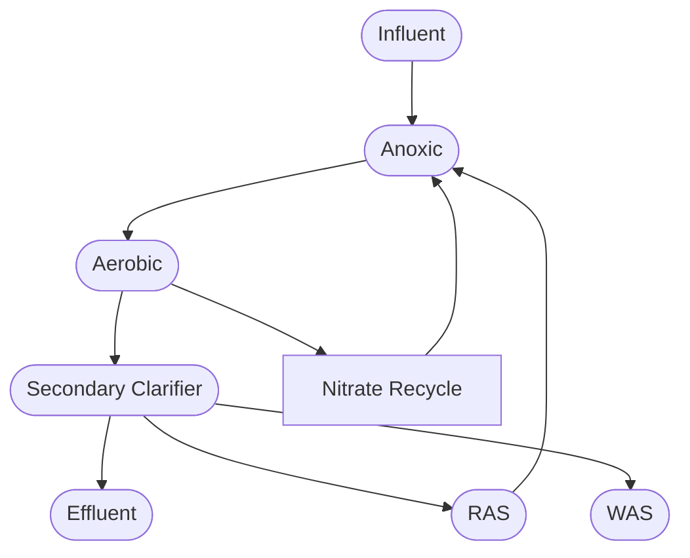

2.        Four Stage Bardenpho
The Four Stage Bardenpho process consists of two sets of alternating anoxic and aerobic zones in series (Figure T3-3). The first two zones function similarly to the MLE process in which a nitrate-rich mixed liquor recycles from the first aerobic zone to the first anoxic zone at a rate of at least four times the influent flow rate. Most of the conversion of nitrate to gaseous nitrogen forms occurs in the first anoxic zone. The second anoxic zone (third bioreactor) denitrifies the portion of the flow that does not recycle back to the first anoxic zone. Since microbes in the first two zones consume most of the available carbon from the influent, this secondary denitrification process requires a supplemental carbon source addition (i.e., methanol) to support biological activity in this zone. A larger second anoxic zone may prevent the need for a supplemental carbon source in some situations as typically seen in South Africa where this process originated. Aeration in the final aerobic zone strips nitrogen gas bubbles generated in the second anoxic zone, increases dissolved oxygen concentration before discharge and enhances solids settleability.
\n---\n

## Figure T3-3 Four Stage Bardenpho Schematic Process Flow Diagram

<table>
<thead>
<tr><th colspan="7">Figure T3-3 Four Stage Bardenpho Schematic Process Flow Diagram</th></tr>
<tr>
<th>Influent</th><th>Anoxic</th><th>Aerobic</th><th>Anoxic</th><th>Aerobic</th><th>Secondary Clarifier</th><th>Effluent</th>
</tr>
</thead>
<tbody>
<tr><td>Influent</td><td>Anoxic</td><td>Aerobic</td><td>Anoxic</td><td>Aerobic</td><td> </td><td> </td></tr>
<tr><td></td><td>RAS</td><td></td><td></td><td></td><td></td><td></td></tr>
<tr><td></td><td></td><td></td><td></td><td></td><td></td><td>WAS</td></tr>
</tbody>
</table>

> Nitrate Recycle, Carbon Source (as depicted in the diagram)

### 3. Step Feed Process
The Step Feed process uses a plug-flow configuration with multiple alternating anoxic and aerobic basins in series and distribution of influent wastewater to each anoxic basin. (Figure T3-4). This configuration design distributes influent among the anoxic zones making readily biodegradable organic carbon available for the denitrifying bacteria. However, minimizing the amount of ammonia in the final effluent generally requires controlling the flow to the last anoxic zone (EPA, 1992; EPA, 2007).

This process can increase mixed liquor concentration in the early stages, and consequently, increase the solids retention time (SRT) by approximately 30 – 40%. Other benefits of a step feed configuration include better handling of high organic loads and flexibility of operation. Designs must include influent controls for each anoxic-aerobic combination and may require the addition of supplemental carbon to the last anoxic zone to enhance denitrification and overall nitrogen removal.
\n---\n

# Figure T3-4 – Step Feed Schematic Process Flow Diagram

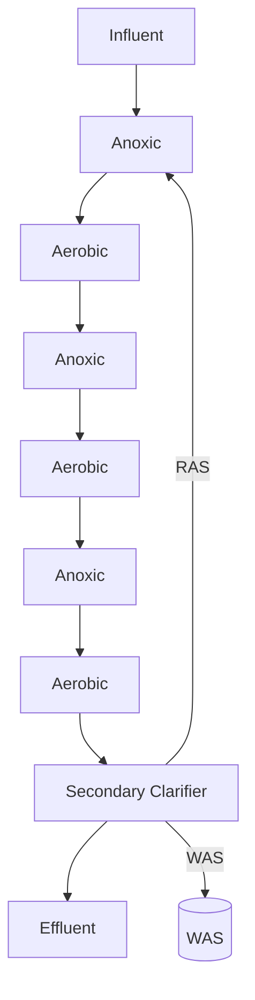

4. Oxidation Ditch
Oxidation Ditches exhibit characteristics of extended aeration (see section T3-2.1.3) by using long channels with looped or oval configurations to provide continuous wastewater circulation (Figure 4). Systems may use horizontal brush aerators, vertical shaft aerators or diffused aerators with submersible mixers. The basic extended aeration design provides lengthy aeration periods that convert substantial amounts of ammonia to nitrite and then to nitrate.

By carefully controlling aeration, oxidation ditch designs can typically support both nitrification and denitrification. Incorporating denitrification requires creation of anoxic zones within the loop and a means of controlling mixing and aeration to maintain desirable dissolved oxygen and mixed liquor concentrations (WEF, 2011). Some designs may also promote simultaneous nitrification and denitrification, as discussed below.

Oxidation ditch designs can use two strategies to promote denitrification. One strategy creates swing zones by turning off aerators in one or more areas of the ditch and turning on submersible mixers. This allows anoxic conditions to prevail in the area with no aeration.
The second strategy relies on careful control of the aerators to limit dissolved oxygen concentrations in the aerated sections. This configuration can establish anoxic conditions in regions between the aerated zones.
\n---\n

# Figure T3-5 – Oxidation Ditch Schematic Process Flow Diagram

<Mermaid diagram representing the oxidation ditch flow>
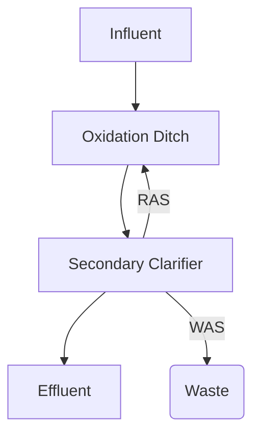
</Mermaid diagram>

## 5. Simultaneous Nitrification Denitrification (SNDN)

The previous process configurations alternately expose wastewater to anoxic and aerobic environments by using separate basins or isolated zones within the treatment flow path. An alternative strategy uses careful control of dissolved oxygen concentrations in a single bioreactor to promote the growth of ammonia oxidizing bacteria, such as **Nitrosomonas europaea** and **Nitrosospira-like** organisms. The microbial communities established in this configuration promotes simultaneous nitrification and denitrification (SNDN) in one single bioreactor (Figure T3-6).

The SNDN design concept relies on keeping dissolved oxygen concentrations low enough so that oxygen molecules cannot penetrate the inner portions of the activated sludge floc (Waltz, 2009; Zajzon, 2012; WEF, 2015). As a result, nitrification takes place in the exterior portion of the activated sludge floc and denitrification occurs in the interior portions. In order to maintain both anoxic and oxic conditions, the design generally requires a much larger bioreactor volume than that of a conventional activated sludge system (nitrification only). The design should also include the use of ammonia and nitrate/nitrite specific sensors to control dissolved oxygen levels in the reactor. Designers may consider a preceding anoxic selector or operational controls allowing a low MLSS concentration so that the secondary clarifier can handle higher SVIs to avoid forming low DO filaments which can affect settleability.

The single reactor design can result in a need for minimal or no supplemental carbon source addition (EPA, 2010). However, designers should rely on pilot testing or full-scale testing to determine the amount of supplemental carbon source needed.
\n---\n

## Figure T3-6 – SNDN Schematic Process Flow Diagram

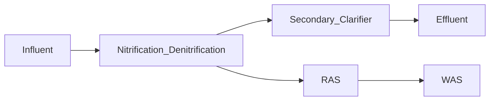

### 6. Sequencing Batch Reactor

The sequencing batch reactor (SBR) design described in section T3-3.1.2 can support biological nitrogen reduction through adjustments to reaction phase parameters. The changes generally involve providing periods of anoxic conditions within the cycle phases. A standard treatment cycle for nitrogen removal consists of fill, react, settle, decant and idle phases that include periods with no aeration. Table T3-8 lists the general modifications necessary to support biological nitrogen removal. While this description is based on modifying how the SBR described in section T3-3.2.1 operated so that it can provide nitrogen reduction, Ecology does not recommend using this as the basis to modify an existing SBR facility since altering the cycle times will reduce the capacity of the existing SBR. Existing SBR facilities will need to construct additional basins in order to maintain existing treatment capacity.

### Table T3-8 – Typical SBR Cycle for Biological Nitrogen Removal

<table>
  <caption>Table T3-8 – Typical SBR Cycle for Biological Nitrogen Removal</caption>
  <thead>
    <tr>
      <th>Cycle Phase</th>
      <th>Purpose</th>
      <th>Operational Conditions</th>
    </tr>
  </thead>
  <tbody>
    <tr>
      <td>Unaerated Fill</td>
      <td>Denitrification</td>
      <td>Wastewater added to the SBR basin with mixing, but no aeration.</td>
    </tr>
<tr>
      <td>Aerated Fill</td>
      <td>BOD removal and nitrification</td>
      <td>Wastewater added to the SBR basin with aeration and generally no mechanical mixing.</td>
    </tr>
<tr>
      <td></td>
      <td></td>
      <td>Influent flow to the SBR basin stops.</td>
    </tr>
<tr>
      <td>React</td>
      <td>BOD removal and nitrification</td>
      <td>Aeration continues to maintain aerobic conditions in the basin (generally DO &gt; 2 mg/L)</td>
    </tr>
  </tbody>
</table>

\n---\n

# Biological Treatment

<table>
<thead>
<tr><th>Cycle Phase</th><th>Purpose</th><th>Operational Conditions</th></tr>
</thead>
<tbody>
<tr><td>Settle</td><td>Solids separation and sludge waste</td><td>Influent flow, mechanical mixing, and aeration turned off to allow quiescent condition in the basin.</td></tr>
<tr><td>Decant</td><td>Effluent discharged from basin</td><td>Influent flow, mechanical mixing, and aeration remains off in the basin as supernatant decants from the surface.</td></tr>
<tr><td>Idle</td><td>DO concentration decreases to initiate denitrification</td><td>Influent flow, mechanical mixing, and aeration remains off in the basin.</td></tr>
</tbody>
</table>

<p>Source: Modified from EPA, 1992 and WEF, 2005</p>

<div>Figure T3-7 – SBR Schematic Process Flow Diagram</div>

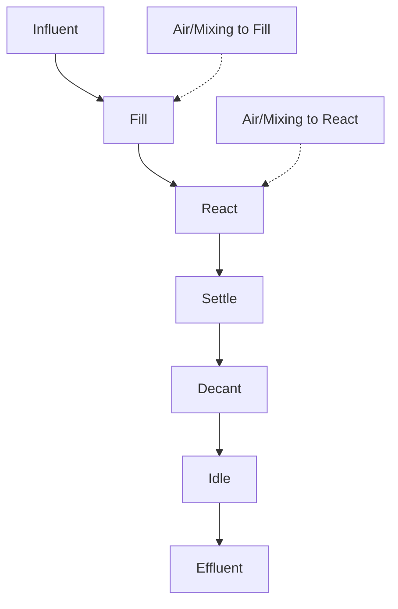

## 7. Summary Design Criteria for Nitrogen Removal Processes
Table T3-9 summarizes typical design criteria for the suspended growth processes described above.
\n---\n

## Table T3-9 – Typical Design Criteria for Nitrogen Removal Processes

<table>
<thead>
<tr><th>Process</th><th>SRT, days</th><th>MLSS, mg/L</th><th>HRT, hours</th><th>RAS, % of Flow</th><th>MLR, % of Flow</th><th>Achievable TN Limits, mg/L</th></tr>
</thead>
<tbody>
<tr><td>MLE</td><td>7 - 20</td><td>2,000 - 4,000</td><td>5 - 15</td><td>30 - 100</td><td>100 - 400</td><td>5 – 8</td></tr>
<tr><td>4-Stage Bardenpho + Carbon Addition</td><td>10 - 20</td><td>3,000 - 4,000</td><td>8 - 20</td><td>50 - 100</td><td>200 - 400</td><td>&lt; 3</td></tr>
<tr><td>Step Feed</td><td>7 - 20</td><td>2,000 - 6,000</td><td>4 - 12</td><td>30 - 75</td><td>-</td><td>5 – 8<br>&lt; 5 possible</td></tr>
<tr><td>Oxidation Ditch</td><td>20 - 30</td><td>2,000 - 4,000</td><td>18 - 30</td><td>50 - 100</td><td>-</td><td>10</td></tr>
<tr><td>SNDN</td><td>20 - 30</td><td>2,000 - 4,000</td><td>18 - 30</td><td>50 - 100</td><td>-</td><td>5 – 8<br>&lt; 5 possible</td></tr>
<tr><td>SBR</td><td>10 - 30</td><td>3,000 - 5,000</td><td>20 - 30</td><td>50 - 100</td><td>30</td><td>5 – 8</td></tr>
</tbody>
</table>

## T3-3.2.4 BIOLOGICAL NITROGEN REMOVAL PROCESSES – ATTACHED GROWTH PROCESSES

Attached growth processes rely on biofilm growing on inert media to treat wastewater.
System designs may use three general configurations: non-submerged processes,
submerged processes, and attached growth combined with suspended growth. Given
the complexities inherent in the mass transfer of pollutants through biofilms, attached
growth process designs generally rely on empirical relationships, process modeling, and
pilot testing. Engineering documents for attached growth processes must identify the
sources used to establish the size and configuration of the proposed design. Engineers
must also demonstrate that the design relies on site-specific process modeling, pilot
testing or use testing that appropriately represents the characteristics of the
wastewater and environmental conditions for the proposed project location.

A.     Non-submerged Processes
      Non-submerged processes, such as trickling filters and rotating biological
      contactors (RBC) generally provide aerobic treatment for BOD reduction
      and may also provide some nitrification (generally seasonal with increased
      temperatures). While these processes have a long history as relatively
\n---\n

# Biological Treatment

simple, low energy alternatives for secondary treatment, they provide
minimal, if any, denitrification. This makes these systems less attractive
when a facility must achieve full biological nitrogen reduction. Any system
using non-submerged processes must evaluate the inclusion of a separate
denitrification processes when the facility must meet even moderate total
nitrogen limits. This evaluation may consider supplementing existing
processes with strategies that enhance denitrification rather than
completely constructing a new treatment facility.

## 1. Trickling Filters
Trickling filters circulate wastewater through beds of media generally
composed of rock or rigid plastic material specifically designed to maximize
the surface area for biofilm growth and contact with the wastewater.
Typical process configurations and loading rates vary depending on
whether the filter’s treatment goal requires combined BOD and ammonia
reduction, or if the filter will provide tertiary nitrification only. Processes
designed for combined carbon and nitrogen treatment can generally
achieve effluent BOD5 concentrations of <10 mg/L and ammonia
concentrations of <3 mg/L (as N) when operated with daily mass loading
rates of 0.1-0.3 kg BOD/m3 filter volume and 0.2-1.0 g TKN/m2 of media
effective surface area. When designed for tertiary nitrification, trickling
filters can achieve ammonia concentrations in the range of 0.5-3.0 mg/L (as
N) when operated with a loading rate of 0.5-2.5 g NH4-N/m2 of media
effective surface area.

## 2. Rotating Biological Contactors (RBC)
RBC facilities use closely spaced circular rigid plastic (generally polystyrene
or PVC) discs that provide surfaces for biofilm growth. Mounted on
horizontal shafts and partially suspended in wastewater, the rotating discs
alternately move the biomass between open air and wastewater to
support aerobic treatment. Installations may also use submerged air
headers to supplement aeration. As with trickling filters, RBC designs can
support combined BOD and ammonia removal or can provide tertiary
nitrification. Facilities designed for combined BOD and ammonia removal
can generally achieve BOD5 concentrations of 7-15 mg/L and ammonia
concentrations of <2 mg/L (as N) at a hydraulic retention time of 1.5-4
hours and loading rates of 5-16 g/day BOD and 0.75-1.5 g/day Nitrogen per
square meter of effective disc area. When configured for nitrification only,
RBC systems can reduce ammonia to 1-2 mg/L (as N) at hydraulic retention
times from 1.2-3 hours.

### B. Submerged Attached Growth
Submerged systems pass wastewater through reactors filled with media
that supports biofilm growth. Reactor system designs vary based on the
type of media packing (fixed packed beds or fluidized beds), direction of
vertical flow through the bed (upflow or downflow), and the specific
\n---\n

# Criteria for Sewage Works Design

treatment goals (combined BOD removal and nitrification, nitrification
only, or denitrification). The following describes two general process
configurations – Denitrification Filters for conversion of nitrate and
Biological Aerated Filters for oxidation of BOD and ammonia.

## 1. Denitrification Filter

Denitrification filters usually follow a nitrification process and combine
filtration and biological denitrification. Bacteria attach to a granular media
and oxidizes readily biodegradable organic matter for cell synthesis and
growth. The process requires a supplemental carbon source added to the
filter’s influent since carbon in the influent wastewater likely has been
depleted in the preceding process. Supplemental carbon feeds must be
carefully controlled to avoid overdosing which will result in excess growth
that can plug the filters. Additionally, a sufficient number of filters must be
used to avoid overloading filters in the event of biofilm growth which
reduces capacity. Media depth varies from 4-feet to 6-feet and can use a
combination of sand and anthracite ranging in size from 1.8 mm to 3.65
mm (Tchobanoglous et al., 2014). Systems may use other types of inert
media.
Denitrification filter designs can use either upflow or downflow
configurations. The downflow configuration consists of granular media
supported by an underdrain. As the wastewater flows down through the
media, bacteria converts nitrite and nitrate to nitrogen gas. The filter
design includes periodic backwashing to release the nitrogen bubbles from
the filter and to minimize head loss from the accumulation of solids. In the
upflow configuration, the water moves up through the filter media and
effluent (filtrate) discharges from the upper portion of the filter. The
upflow configuration commonly uses continuous backwash to enhance
operation.

## 2. Biological Aerated Filter

The design of Biological Aerated Filters (BAF) resemble upflow or downflow
denitrification filters with wastewater flowing either upwards or
downwards through a tightly packed filter media. However, the BAF
process includes a header at the bottom of the filter that introduces air
that continuously provides oxygen for the bacteria. BAF process generally
uses multiple filter cells that provide both redundancy and capacity for
maintenance or repair purposes.
The BAF process requires periodic backwash to restore filter hydraulic
capacity and keep a thin active biofilm. Backwashing generally uses
increases in both wastewater and air flow to loosen the media and allow
solids to escape. The waste stream from backwashing recycles to the head
of the plant for treatment.
\n---\n

## C. Integrated Fixed Film Activated Sludge

Integrated Fixed-Film Activated Sludge (IFAS) combines suspended growth and attached growth treatment concepts. While the IFAS concept generally functions as a retrofit solution for conventional activated sludge systems that require greater biological treatment capacity, the combination of suspended and attached growth treatment can provide benefits to new treatment facilities. This concept allows facilities to increase the biomass in their treatment system without the need for more tanks or larger clarifiers due to the fixed biomass in the aeration basin which reduces the solids loading. Under proper operating conditions, IFAS systems can also promote denitrification in the aeration basin as anoxic environments can form in deeper layers of the biofilm.

Design configurations may use an inert media mounted to a rigid submersible structure (submerged fixed-film or SFF) or places free-floating media in activated sludge basins. In both cases, the IFAS design adds the media to the anoxic or aerobic basins to provide surfaces for biofilm growth.

Fixed media applications may use rope made from synthetic materials woven into web patterns or plastic structures. The various systems contain the media in submerged rigid structures or attach the media to cables that keep the biofilm in specific locations in the basins. These structures often include dedicated air supply headers to provide aeration to the biofilm along with turbulence to scour excess biofilm. Scouring prevents the biofilm from becoming too thick so that kinetic rates remain high and growth of predatory organisms (e.g., redworms) does not occur.

Free-floating media often takes the form of sponge cuboids or engineered plastic in a variety of shapes. The free-floating media generally has a specific gravity close to that of water and under good mixing conditions remain well distributed throughout the mixed liquor. Mechanical mixers and course or medium bubble diffusers within an aerobic basin can generally provide adequate mixing energy. Designers must consider which mechanical mixers will work with the overall treatment design as some free-floating media may not work with all mixers.

Designers must consider a number of physical requirements in the design of systems using free-floating media. Considerations include:
* compatibility of the media with the facility’s aeration systems,
- the facility may require effluent screens in each zone and basin covers to contain media within the basins, and
- the process may require higher dissolved oxygen levels to maintain aerobic conditions for the biofilm.

Table T3-10 compares general design considerations related to the amount of media and target mixed liquor concentrations for various types of IFAS
\n---\n

media. The table also includes information for Moving Bed Biofilm Reactor systems discussed in section D below.

## Table T3-10 – Design Considerations for IFAS and MBBR Systems

<table>
  <thead>
    <tr>
      <th>Process</th>
      <th>Media Fill Volume, %</th>
      <th>Media Specific Surface Area (m²/m³)</th>
      <th>MLSS, mg/L</th>
      <th>Minimum Aerobic HRT at 12°C, h</th>
    </tr>
  </thead>
  <tbody>
    <tr>
      <td>Activated Sludge</td>
      <td>0</td>
      <td>0</td>
      <td>3,000</td>
      <td>7</td>
    </tr>
<tr>
      <td>IFAS-Fixed Bed</td>
      <td>70 – 80</td>
      <td>50 – 100</td>
      <td>3,000</td>
      <td>5</td>
    </tr>
<tr>
      <td>IFAS-Moving Bed-sponge</td>
      <td>20 – 40</td>
      <td>100 – 150</td>
      <td>2,500</td>
      <td>4</td>
    </tr>
<tr>
      <td>IFAS-Moving Bed-plastic</td>
      <td>20 – 60</td>
      <td>150 – 300</td>
      <td>2,500</td>
      <td>4</td>
    </tr>
  </tbody>
</table>

<em>WEF, 2010</em>

### D. Moving Bed Biofilm Reactor

As described above, IFAS systems augment the performance of
conventional activated sludge process and, therefore, must incorporate
adequate activated sludge return to achieve desired treatment goals.
Moving Bed Biofilm Reactor (MBBR) process provides an alternative
configuration that does not require RAS flows. Similar to free-floating IFAS
systems, MBBR technology uses plastic media to increase biomass growth
and treatment capacity (EPA, 2010). However, MBBRs rely on a single pass
of wastewater through the basin without the RAS recycling associated with
IFAS. The technology generally uses plastic media as biofilm carriers
operating in completely mixed anoxic or aerobic basins. This media
provides a high surface area that protects the biofilm from shear forces and
minimizes biofilm losses. Like free-floating IFAS, MBBR systems require
adequate mixing to ensure uniform distribution of the media and screening
to retain the media in each zone. Submersible mixers provide this mixing in
the anoxic basins and coarse bubble diffusers generally provide adequate
mixing in aerobic basins. Again, selection of mixing equipment will depend
on the type of media selected for the attached growth process. When used
in a post-anoxic configuration to denitrify secondary effluent, the MBBR
design must include the ability to add supplemental carbon to support
microbial growth. A filtration and/or clarification step may be necessary to
remove growth that sloughs off the media so that effluent TSS
concentrations do not exceed permit limits.
\n---\n

## E. Membrane Aerated Biofilm Reactor
Similar to fixed media IFAS systems, Membrane aerated biofilm reactors (MABR) allow for a combination of attached growth and suspended growth treatment in a common basin. This relatively recent innovation uses structures containing permeable membranes connected to an air distribution system to support biofilm growth. Oxygen permeates through the membranes (inside-out) to support aerobic biofilm growth on the membrane surface. The targeted application of air allows for the rest of the tank to establish an anoxic environment to support denitrification. At present, Ecology considers MABR a “new or developmental technology”. Engineers proposing to use this technology at a new or existing facility must follow the protocols for new or developmental technologies described in section G1-5.3.1.

## T3-3.2.5 BIOLOGICAL NITROGEN REMOVAL PROCESSES – SIDESTREAM PROCESSES
In addition to the conventional biological nitrogen removal processes discussed above, sidestream treatment methods can successfully minimize the adverse impacts experienced when flows of centrate or filtrate return to a conventional treatment process from anaerobically digested sludge (WEF, 2015). These flows generally contain low alkalinity, low organic carbon concentration, and high ammonia content that can increase the bioreactor influent nitrogen loadings by up to 25 percent or more when organic substrate is imported to anaerobic digesters for additional gas production. Sidestream treatment processes use a variety of reactor configurations to reduce the nitrogen load that returns to the conventional treatment system. The reactors may include strategies using nitrification and denitrification to reduce the load, or may use specialized anaerobic ammonium oxidizing (anammox) bacteria that directly convert ammonia to nitrogen gas.

The following sections briefly describe three common sidestream treatment processes that use proprietary designs. Given the proprietary nature of the systems, Ecology cannot offer general design guidance for these systems. However, the engineering documents for any facility proposing to use a proprietary sidestream system must include detailed design information generated by the vendor sufficient to validate the design treatment efficiency. In lieu of proprietary treatment systems, designers should consider equalization of filtrate or centrate to even out return flows for more efficient treatment and avoid nitrogen breakthrough.
\n---\n

## A. SHARON Process
An early sidestream treatment system known as the Single reactor for High activity Ammonia Removal Over Nitrite (SHARON) process, provided biological nitrification/denitrification in a system operating with a low sludge retention time (1 to 1.5 days) and higher sludge temperature (30–40°C). This process functioned as a chemostat reactor especially suited for treatment of high strength wastewater. The reactor configuration limited the oxidation of ammonia to the formation of nitrite instead of allowing complete nitrification to nitrate. Denitrifying bacteria then converted the nitrite to nitrogen gas by either cycling the reactor between aerobic and anoxic environments, or using a separate anoxic reactor. An alternate configuration added anammox bacteria to the process to oxidize ammonia to nitrogen gas using nitrite as an electron acceptor. Due to the low carbon content of the digester flow, the process designs required a supplemental carbon source. While this process has generally been phased out, The ANITA process described below uses a similar concept.

## B. ANITA™ Shunt Process
Similar in concept to the SHARON process, the ANITA Shunt Process limits ammonia oxidation to nitrite formation. However, the ANITA Shunt process relies on a sequencing bioreactor process configuration and lower operating temperatures to treat wastes containing high concentrations of ammonia (up to 100 mg/L).

## C. Deammonification Processes
The deammonification processes combine partial aerobic nitrification with anaerobic ammonium oxidation using different bioreactor configurations (e.g. SBR, upflow granular reactor and attached-growth biofilm reactors). These processes can achieve approximately 75 percent reduction of inorganic nitrogen and 80 percent ammonia oxidation using two groups of bacteria: AOBs and Annamox. The AOBs convert approximately 50 percent of the influent ammonia into nitrite and the anammox bacteria convert the nitrite and the rest of the ammonia into nitrogen gas (Remy et al., 2016). Several proprietary systems using the Deammonification process are currently available.

### T3-3.2.6 BIOLOGICAL PHOSPHOROUS REMOVAL
Enhanced biological phosphorus removal (EBPR) also referred to as Bio-P processes rely on a specific group of bacteria known as polyphosphate accumulating organisms (PAOs) that store phosphorus beyond their needs for cell growth when exposed to sequential cycles of anaerobic and aerobic conditions. All Bio-P processes consist of an anaerobic phase, an aerobic phase and solids separation. In the anaerobic phase, PAOs uptake volatile fatty acids (VFAs) and store them as intracellular carbon polymers using energy from the hydrolysis of intracellular polyphosphate. Under aerobic conditions, the PAOs use their internally stored carbon reserves for cell synthesis and uptake of phosphorus
\n---\n

# Biological Treatment

from the wastewater and store it as intracellular polyphosphate. The final solids separation step removes the PAOs and the phosphorous they accumulated from the waste stream.

Properly designed and operated Bio-P processes generally achieve total phosphorous concentrations of less than 2 mg/L. When coupled with careful management of phosphorous loading in recycle flows, Bio-P process can achieve concentrations of less than 1 mg/L. Since the environmental conditions necessary to promote PAO growth also supports growth of denitrifying bacteria, competition between the organisms can take place in the anaerobic zones, thus inhibiting overall phosphorous removal efficiency. To overcome this challenge, most Bio-P processes incorporate biological nitrogen removal strategies to improve phosphorous removal efficiency.

## A. Design Considerations

The following describes common design considerations for Bio-P systems.

### 1. Influent Wastewater Characteristics

Influent wastewater characteristics significantly influence the overall Bio-P design. To ensure system designs can meet the desired treatment goals, engineers should carefully analyze influent wastewater characteristics data from monitoring conducted over the most recent 2 – 5 years. The data collection should adequately capture seasonal variability in critical constituents, such as COD, BOD5, readily biodegradable volatile fatty acids, COD (rbCOD), dissolved oxygen, total phosphorous, orthophosphorus, pH, alkalinity, temperature, and flow. The analysis must pay particular attention to the concentration of incoming rbCOD.

Fermentation of biodegradable carbon by facultative organisms in the anaerobic basin produces the short chain VFAs (generally acetic and propionic acids) that the PAOs store in the first step of phosphorous removal. The amount of rbCOD available in a treatment plant’s influent influences VFA production and ultimately phosphorous uptake in the aerobic zones. Examining the ratio of rbCOD to total phosphorous (rbCOD:TP) in the influent provide a good indication of whether the influent has enough fermentable carbon to produce adequate levels of VFAs. To ensure efficient phosphorous removal, the rbCOD:TP ratio in the influent must be greater than 18 to achieve an effluent soluble P concentration of less than 0.5 mg/L.

When influent wastewater contains limited amounts of fermentable carbon to generate sufficient VFA production and support PAO selection, designs must include the addition of supplemental carbon in the form of VFAs, such as acetic acid. Designs may also incorporate primary solids fermentation to serve as a VFA source. Fermenting mixed liquor through periodic elimination of mixing in the anaerobic zone can also increase VFA generation in the absence of primary solids fermentation. In general, influent containing less than 200 mg/L of BOD
\n---\n

# Criteria for Sewage Works Design

will require supplemental carbon to support efficient phosphorus removal.

## 2. Aerobic Solids Retention Time

Aerobic SRT directly affects the performance of Bio-P processes. Process designs must provide sufficient SRT to allow desired phosphorus uptake, typically in the range of 2 to 3 days at 20 °C. Lower operating temperatures require longer retention times with SRTs greater than 4 days required at 10 °C. However, aerobic SRTs that are too long may reduce Bio-P efficiency due to endogenous respiration of the PAO biomass.

## 3. Anaerobic Contact Time and Basin Sizing

Anaerobic contact time also plays a critical role in the design ofBio-P systems. The anaerobic basin must provide adequate volume to grow PAOs, generate VFAs and accommodate RAS flows. As discussed above, the composition of influent wastewater significantly influences the anaerobic basin design, specifically with respect to the concentration of rbCOD. The basin must provide sufficient time to produce enough VFAs to achieve a VFA:TP ratio in the range of 3 to 16. To achieve an effluent soluble P concentration of less than 0.5 mg/L, a VFA:TP ratio of 8 is required.

The anaerobic basin design should achieve the shortest possible detention time necessary to allow for VFA accumulation by the PAOs, especially in warmer temperatures. At longer detention times, PAOs can eventually deplete the VFAs in the basin. When this occurs, they begin to release excess phosphorous. The basin design should achieve a contact time in the range of 0.5-1.5 hours under most flow conditions. Designs should also consider the use of multiple anaerobic cells that operators can bring online to maintain a consistent contact time under various flow conditions. Multiple treatment trains also provide operational flexibility allowing some units to remain offline during periods of lower flows and warmer temperatures.

## 4. Mixing Requirements

Mixing in the anaerobic zone must achieve two primary objectives. It must maintain the mixed liquor in suspension and it must minimize undesired aeration. Therefore, mixing designs must ensure minimum power input to keep the solids in suspension is sufficient while avoiding vortex formation. Recent case studies examining optimizing EPBR facilities point towards mixing power of less than 0.0025 kW/m³ (0.1 hp/kcf) as being adequate to keep anaerobic zones mixed. In addition, intermittent operation of mixers has also shown effective results.
\n---\n

## 5. Aerobic Basin Sizing
The sizing of the aerobic basin is designed to achieve multiple functions, including phosphorus uptake kinetics, nitrification, SRT and oxygen requirements. Therefore, determining the required aerobic basin volume without the support of a process simulator becomes challenging. The simplified approach outlined in T3-3.2.4.10 can provide an estimate of the aerobic basin volume required based on the assumption that the basin must also nitrify. The approach should include modifications to account for kinetics related to P removal.

## 6. Secondary Release and Recycle Load Management
The overall efficiency of Bio-P processes rely on ensuring that the phosphorous taken up by PAOs remain bound in the organisms’ cells. As discussed earlier, excessive anaerobic contact time promotes the release of excessive phosphorous in a post aerobic zone once the PAOs deplete available VFAs. Additionally, excessive secondary clarifier sludge blankets can cause phosphorus release. Waste solids handling practices can also affect phosphorous removal significantly. The cells of PAOs lyse and release the bound phosphorous during anaerobic and aerobic digestion. Typical dewatering operations then return this phosphorous to the treatment system through centrate return flows. Recycle streams from anaerobic and aerobic digestion, and dewatering can account for up to 20 to 30 % of the plant influent phosphorus loading and more.

To maximize phosphorous removal, designs should evaluate recycle load (sidestream) equalization and treatment opportunities. These strategies generally rely on chemical precipitation and phosphorous resource recovery to treat the highly concentrated recycle streams. Proprietary systems currently available use magnesium or calcium salts to promote the formation of struvite or calcium phosphate crystals suitable for recovery and beneficial use. When not electing to phosphorus recovery, the addition of ferric sulfate or alum to the concentration recycle stream works to prevent struvite formation inside process piping.

### B. Process Configurations
The following sections describe common process configurations for Bio-P.

#### 1. Anaerobic/Oxic Process
Primarily designed for BOD and biological phosphorus removal, the Anaerobic/Oxic Process (A/O) consists of an anaerobic zone followed by an aerobic zone and a clarifier (Figure T3-8). The anaerobic zone provides the environmental conditions necessary for PAO selection and VFA storage while the aerobic zone promotes phosphorus uptake by the PAOs. Phosphorous removal occurs as solids containing the PAOs settle in the secondary clarifier.
\n---\n

# Criteria for Sewage Works Design

The presence of nitrate in the RAS presents a significant challenge for the A/O system as denitrification within the anaerobic zone inhibits phosphorus removal. Under these conditions, PAOs and denitrifying bacteria coexist in one single bioreactor and compete for organic carbon substrate (VFAs).

## Figure T3-8 – A/O Schematic Process Flow Diagram

<table>
<thead>
<tr><th>Stage</th><th>Flow path</th></tr>
</thead>
<tbody>
<tr><td>Influent</td><td>Anaerobic → Aerobic → Secondary Clarifier → Effluent</td></tr>
<tr><td>Return Activated Sludge (RAS)</td><td>From Secondary Clarifier back to anaerobic/aerobic zone</td></tr>
<tr><td>Waste Activated Sludge (WAS)</td><td>Outlet from Secondary Clarifier</td></tr>
</tbody>
</table>

## 2. Anaerobic/Anoxic/Oxic Process

A modification of the A/O process, Anaerobic/Anoxic/Oxic Process (A²/O) overcomes the competition between PAOs and denitrifying bacteria by targeting phosphorus and nitrogen removal in separate basins. This process inserts an anoxic zone between the anaerobic and aerobic zones. The process also includes an internal recycle of nitrate-rich mixed liquor from the end of the aeration zone to the beginning of the anoxic zone. This configuration allows phosphorus removal and denitrification to occur in separate zones (Figure T3-9), which reduces the impact nitrate has on phosphorus removal in the anaerobic zone.

## Figure T3-9 – A²/O Schematic Process Flow Diagram

<mermaid>
graph LR
  Influent --> Anoxic
  Anoxic --> Aerobic
  Aerobic --> SecondaryClarifier
  SecondaryClarifier --> Effluent
  Aerobic -- Nitrate Recycle --> Anoxic
</mermaid>

## 3. Five-Stage Bardenpho

The Five-Stage Bardenpho Process, also known as Modified Bardenpho Process, achieves low levels of phosphorus and nitrogen by using multiple alternating environmental zones. With the aid of a supplemental carbon source, this process can achieve total phosphorous concentrations of 1 mg/L and total nitrogen
\n---\n

# Biological Treatment

January 2022

concentrations of 3 mg/L. The process consists of one anaerobic zone, two stages of anoxic-aerobic basins in series and then a clarifier (Figure T3-10). Common to all Bio-P processes, PAO selection and VFA storage occurs in the anaerobic zone. Denitrification and phosphorous uptake primarily occur in the first anoxic-aerobic stage. The second anoxic-aerobic stage denitrifies nitrates that did not recycle back to the first anoxic zone and strips residual nitrogen gas before clarification.

Figure T3-10 – Five Stage Bardenpho Schematic Process Flow Diagram

<table>
<thead>
<tr>
<th>Stage</th>
<th>Flow</th>
<th>Notes</th>
</tr>
</thead>
<tbody>
<tr><td>Influent</td><td>→ Anaerobic</td><td>First stage</td></tr>
<tr><td>Anaerobic</td><td>→ Anoxic</td><td></td></tr>
<tr><td>Anoxic</td><td>→ Aerobic</td><td></td></tr>
<tr><td>Aerobic</td><td>→ Anoxic</td><td>Second anoxic–aerobic stage</td></tr>
<tr><td>Anoxic</td><td>→ Aerobic</td><td>Second anoxic–aerobic stage continues</td></tr>
<tr><td>Aerobic</td><td>→ Secondary Clarifier</td><td></td></tr>
<tr><td>Secondary Clarifier</td><td>→ Effluent</td><td></td></tr>
</tbody>
</table>

Nitrate Recycle | Carbon Source

Influent  Anaerobic                         Aerobic      Secondary  Effluent
                        Anoxic              Aerobic    Anoxic    Clarifier

                                            RAS
                                                                 WAS

----

4. University of Cape Town/Modified University of Cape Town

Similar to the A²/O process, the design of the original University of Cape Town (UCT) process minimizes the impact of nitrate on phosphorus removal. Unlike the A²/O process, the UCT process sends the RAS flow to the anoxic zone and the internal mixed-liquor recycle flows from the anoxic zone to the anaerobic zone (Figure T3-11). Directing the RAS and the nitrate-rich mixed liquor flows to the anoxic zone decreases the risk of nitrate inhibiting PAO formation in the anaerobic zone. The internal mixed liquor from the anoxic zone to the anaerobic zone supplies organic substrate and mixed liquor to support PAO growth.

Figure T3-11 – University of Cape Town Schematic Process Flow Diagram

<table>
<thead>
<tr>
<th>Stage</th>
<th>Flow</th>
<th>Notes</th>
</tr>
</thead>
<tbody>
<tr><td>Influent</td><td>→ Anaerobic</td><td>First stage</td></tr>
<tr><td>Anoxic</td><td>→ Aerobic</td><td>Mid-stage</td></tr>
<tr><td>Aerobic</td><td>→ Secondary Clarifier</td><td>Final biological stage</td></tr>
<tr><td>Secondary Clarifier</td><td>→ Effluent</td><td>Discharge</td></tr>
</tbody>
</table>

Nitrate recycle: [arrow to Anoxic]
Mixed-liquor recycle: [arrow to Anaerobic]

Influent  Anaerobic               Anoxic               Aerobic    Secondary  Effluent
                                                                  Clarifier

RAS
   WAS
\n---\n

The Modified UCT process adds a second anoxic zone that further minimizes the impact of nitrate recycle back to the anaerobic zone. The first anoxic zone functions as another source of mixed-liquor and readily biodegradable carbon to support PAO selection in the anaerobic zone. Designers should note that nitrates in the RAS may create an anaerobic environment in the first anoxic zone. The second anoxic zone receives the nitrate-rich mixed liquor flow and provides the environmental conditions necessary for nitrogen removal (Figure T3-12).

Figure T3-12 – Modified UCT Schematic Process Flow Diagram

<table>
  <thead>
    <tr>
      <th colspan="7">Figure T3-12 – Modified UCT Schematic Process Flow Diagram</th>
    </tr>
<tr>
      <th colspan="3">Mixed-liquor recycle</th>
      <th colspan="4">Nitrate recycle</th>
    </tr>
<tr>
      <th>Influent</th><th>Anaerobic</th><th>Anoxic</th><th>Anoxic</th><th>Aerobic</th><th>Secondary Clarifier</th><th>Effluent</th>
    </tr>
  </thead>
  <tbody>
    <tr>
      <td></td><td></td><td></td><td></td><td></td><td></td><td></td>
    </tr>
<tr>
      <td colspan="7">RAS</td>
    </tr>
<tr>
      <td colspan="7">WAS</td>
    </tr>
  </tbody>
</table>

### 5. Virginia Initiative Process

The Virginia Initiative Process (VIP) mimics the Modified UCT process, but changes the routing of the internal recycle flows (Figure T3-13). Mixed liquor recycling to the anaerobic basin routes from the second anoxic basin instead of the first as in the Modified UCT process. In addition, the nitrate recycle routes to the first anoxic basin rather than the second. The VIP process operates as a high-rate system that maximizes nitrogen removal while allowing additional anaerobic time for VFA storage and improve phosphorus removal efficiency.

\n---\n

### Figure T3-13 – VIP Schematic Process Flow Diagram
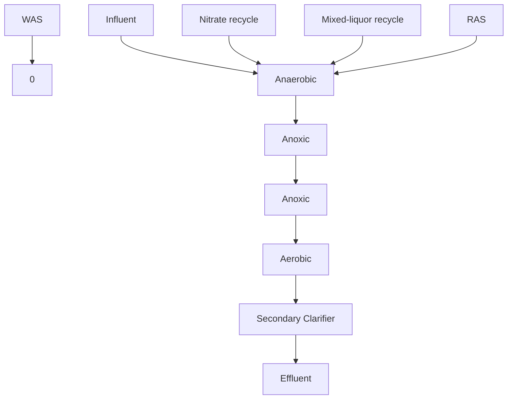

### Figure T3-14 – Johannesburg Schematic Process Flow Diagram
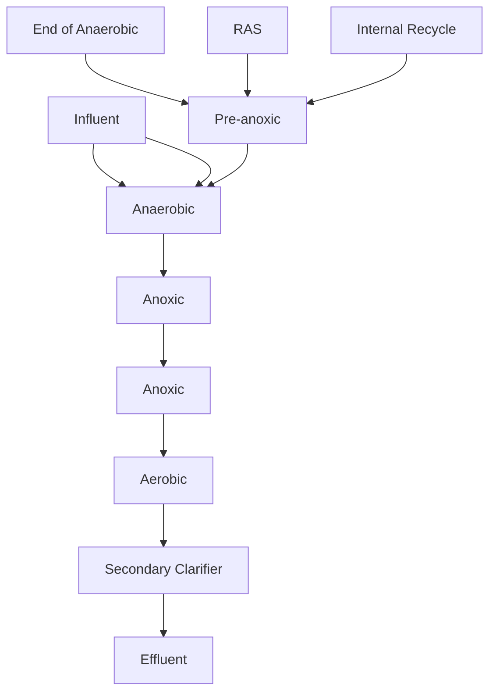

## 6. Johannesburg Process
As a variant of the Modified UCT and A²O processes, the Johannesburg Process design minimizes nitrate feeding to the anaerobic zone and optimizes phosphorus removal. This process routes RAS flow to a dedicated pre-anoxic zone located upstream of the anaerobic zone. The process also directs influent to the anaerobic zone where it mixes with flow from the pre-anoxic zone. While smaller than the anoxic zones of the modified UCT the separate pre-anoxic zone of the Johannesburg process provides sufficient capacity to reduce nitrate in the mixed-liquor before it enters the anaerobic zone (Figure T3-14). A modification of the Johannesburg process includes a recycle stream from the end of the anaerobic zone to the pre-anoxic zone to provide residual readily biodegradable carbon to support denitrification.

### Figure T3-14 – Johannesburg Schematic Process Flow Diagram

## 7. Sequencing Batch Reactor
The sequencing batch reactor (SBR) concepts described in sections T3-3.1.2 (for BOD only treatment) and T3-3.2.3.B.6 (for nitrification/denitrification) can also be configured support EBPR. The configuration commonly used in the United States converts the fill phase to an anaerobic fill and reaction phase where fermentation of rbCOD and VFA uptake occurs by PAOs. Systems may then either

\n---\n

proceed to a single aerobic reaction period followed by an anoxic reaction period, or cycle between several short aerobic and anoxic reaction phases. As with other concepts, the batch treatment ends with a settling phase and a decant phase. An alternate concept that has gained popularity in Europe and is emerging in Washington relies on dense granules of activated sludge (typically >0.20 mm in diameter) that support diverse communities of PAOs, nitrifiers, and aerobic bacteria. Systems that have been adapted to promote granule formation are capable of EBPR without using specific anaerobic or anoxic reaction periods. At present, Ecology considers Granular activated sludge-based SBR systems as an emerging technology. However, the City of Peshastin has demonstrated successful operation of a granular-based SBR.

8.  Summary Bio-P Process Design Parameters
    Table T3-11 summarizes typical design criteria for the Bio-P processes described above. Given the similarities in the process configurations, the values cited below for the A2/O and VIP processes can also be used for the Johannesburg process.

Table T3-11 – Typical Design Parameters for Bio-P Processes

<table>
  <thead>
    <tr>
      <th>Process</th>
      <th>SRT, days</th>
      <th>MLSS, mg/L</th>
      <th>Anaerobic HRT, h</th>
      <th>Anoxic HRT, h</th>
      <th>Aerobic HRT, h</th>
      <th>RAS, % Influent flow</th>
      <th>Internal Recycle, % Influent flow</th>
    </tr>
  </thead>
  <tbody>
    <tr>
      <td>A/O</td>
      <td>2 - 5</td>
      <td>3,000 – 4,000</td>
      <td>0.5 – 1.5</td>
      <td>-</td>
      <td>1.0 – 3.0</td>
      <td>25 - 100</td>
      <td>-</td>
    </tr>
<tr>
      <td>A2/O</td>
      <td>5 – 25</td>
      <td>3,000 – 4,000</td>
      <td>0.5 – 1.5</td>
      <td>0.5 – 1.0</td>
      <td>4.0 – 8.0</td>
      <td>25 - 100</td>
      <td>100 – 400</td>
    </tr>
<tr>
      <td>UCT</td>
      <td>10 – 25</td>
      <td>3,000 – 4,000</td>
      <td>1.0 – 2.0</td>
      <td>2.0 – 4.0</td>
      <td>4.0 – 12.0</td>
      <td>80 – 100</td>
      <td>100 – 300 (aerobic)</td>
    </tr>
<tr>
      <td>VIP</td>
      <td>5 – 10</td>
      <td>2,000 – 4,000</td>
      <td>1.0 – 2.0</td>
      <td>1.0 – 2.0</td>
      <td>4.0 – 6.0</td>
      <td>80 – 100</td>
      <td>100 – 200 (anoxic)</td>
    </tr>
  </tbody>
</table>

\n---\n

# Biological Treatment

## Table: Activated Sludge Configurations

<table>
  <thead>
    <tr>
      <th>Process</th>
      <th>SRT, days</th>
      <th>MLSS, mg/L</th>
      <th>Anaerobic HRT, h</th>
      <th>Anoxic HRT, h</th>
      <th>Aerobic HRT, h</th>
      <th>RAS, Influent flow</th>
      <th>Internal Recycle, % Influent flow</th>
    </tr>
  </thead>
  <tbody>
    <tr>
      <td>5-Stage Bardenpho</td>
      <td>10 – 20</td>
      <td>3,000 – 4,000</td>
      <td>0.5 – 1.5</td>
      <td>1.0 – 3.0 (1st stage); 2.0 – 4.0 (2nd stage)</td>
      <td>4.0 – 12.0 (1st stage); 0.5 – 1.0 (2nd stage)</td>
      <td>50 - 100</td>
      <td>200 - 400</td>
    </tr>
<tr>
      <td>SBR</td>
      <td>20 - 40</td>
      <td>3,000 – 4,000</td>
      <td>1.5 – 3.0</td>
      <td>1.0 – 3.0</td>
      <td>2.0 – 4.0</td>
      <td>-</td>
      <td>-</td>
    </tr>
  </tbody>
</table>

WEF, 2008; 2015; and Tchobanoglous et al, 2014

### T3-3.2.7 Emerging Technologies – Aerobic Granular Sludge

Technologies for removing nitrogen and phosphorus discussed in previous sections represent long-standing, traditional treatment solutions for nutrient removal. More recent nutrient removal advancements have started focusing on aerobic granular sludge (AGS) where the microbial communities contained in the aeration basin self-assemble to form a granule which has capability to effectively remove both nitrogen and phosphorus. As AGS becomes more widely accepted and applied, the use of conventional activated sludge treatment strategies for nutrient removal will become less common. Figure T3-15, below, shows a side by side representation and magnification that shows the diversity of microbes present in a conventional activated sludge floc and AGS granule.

Figure T3-15 – Flocculate Activated Sludge and Aerobic Granular Sludge
\n---\n

# Criteria for Sewage Works Design

Use of AGS provides significant advantages in comparison to conventional flocculant activated sludge. First, AGS settles and thickens faster than flocculant sludge. This provides densification and intensification that allows for higher MLSS concentrations within a small reactor volume. Table T3-12, below, provides a comparison of the physical properties between flocculant activated sludge and AGS.

<table>
  <thead>
    <tr>
      <th>Parameter</th>
      <th>Flocs</th>
      <th>Granules</th>
    </tr>
  </thead>
  <tbody>
    <tr>
      <td>Morphology</td>
      <td>Loose, irregular</td>
      <td>Regular, compact, smooth</td>
    </tr>
<tr>
      <td>Particle size</td>
      <td>Small (&lt;400 um)</td>
      <td>Large (0.5 - 3 mm typical)</td>
    </tr>
<tr>
      <td>Sludge Vol. Index (SVI)</td>
      <td>~120 mL/g</td>
      <td>20-40 mL/g</td>
    </tr>
<tr>
      <td>Settling velocity</td>
      <td>Slow (~1 m/hr)</td>
      <td>Fast (>10 m/hr)</td>
    </tr>
<tr>
      <td>SVI5min / SVI30min</td>
      <td>~2.0 (slow thickening)</td>
      <td>1.0 - 1.1 (rapid thickening)</td>
    </tr>
<tr>
      <td>MLSS, mg/L</td>
      <td>2,000 – 3,500</td>
      <td>6,000 – 10,000</td>
    </tr>
  </tbody>
</table>

\n---\n

# Biological Treatment

The second advantage of AGS is that it allows for both EBPR and true simultaneous nitrification/denitrification (SND) under anaerobic-aerobic operating conditions. Figure T3-16 below depicts how AGS removes both phosphorus and nitrogen under anaerobic and aerobic conditions.

**Figure T3-16 – Anaerobic Feed and Aeration and SND Diagrams**

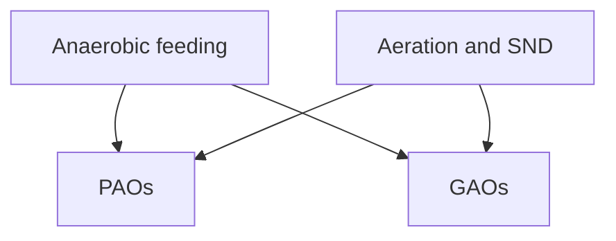

PAOs = phosphorus-accumulating organisms
GAOs = glycogen-accumulating organisms

> - Same carbon used for PAO/GAO growth and denitrification
> - DO controlled to provide simultaneous nitrification/denitrification
> - Denitrification provides alkalinity for pH control

Over the past 15 years, researchers have studied AGS in laboratory scale and pilot scale reactors. More recently, progressive jurisdictions around the world have installed several full-scale AGS treatment systems. The majority of all lab, pilot and full scale treatment systems currently in operation utilize sequencing batch reactors (SBRs). SBRs have limitations in their ability to handle high flow conditions common during wet weather periods in Western Washington and other locations across the country. Traditionally, existing WWTPs, especially the largest ones, use continuous flow reactor (CFR) designs. Development of treatment concepts and design strategies of AGS in CFRs has grown amongst researchers and design professionals as the benefit of AGS becomes more widely known. A few full scale continuous flow treatment plants in Washington have shown some capabilities of granular formation in their activated sludge mixed liquor along with the additional benefit of excellent settling and increased removal rates of both nitrogen and phosphorus. However, no widely available industry design standards have emerged for achieving the consistent conditions that reliability produce high AGS percentages in the mixed liquor.

The AGS may occur more commonly in existing EBPR systems than originally thought. The observations of granules in the Cashmere, WA EBPR plant in 2015 led to a field survey study by the University of Washington Civil and Environmental Engineering Department. This study investigated the observation of varying percentages of AGS formation in 16 other activated sludge plants. Understanding the factors that support the development of AGS in these and other similar CFR plants may lead to findings that support cost effective design and operation modifications capable of achieving the benefits of AGS in terms of capacity and nutrient removal.
\n---\n

# T3-3.2.8 CARBON AUGMENTATION FOR BIOLOGICAL NUTRIENT REMOVAL

During the denitrification process, readily biodegradable organic carbon acts as the electron donor in the biochemical reaction. Therefore, the availability of carbon often limits the treatment efficiency of wastewater treatment plants required to remove total nitrogen. While plants required to achieve low total nitrogen limits (5 mg/L or less) must typically add carbon to support the biological denitrification necessary to comply with their limits, some plants with moderate limits may also require supplemental carbon when their influent lacks adequate carbon.

Carbon also may limit the efficiency of biological phosphorous removal. Facilities with insufficient carbon in their influent may not produce sufficient volatile fatty acids to support phosphorous uptake. Therefore, facilities may require supplemental carbon, specifically in the form of acetate or other small chain volatile fatty acids, to ensure adequate phosphorous reduction.

A.  Carbon Sources

The following lists general information about common organic compounds used as supplemental carbon for BNR.

1.  Methanol
The most common and well-documented supplemental carbon source for biological nitrogen removal (Hallin et al., 2006), methanol yields a high denitrification rate suitable for meeting stricter nitrogen permit requirements and remains stable under normal storage conditions.
However, the use of methanol as an organic substrate for denitrification has certain limitations. Heterotrophic bacteria normally found in activated sludge, including typical denitrifying and phosphorus-accumulating organisms cannot directly use methanol. As a result, the use of methanol requires an acclimation period to allow methylotroph bacteria to grow. Methanol may yield low growth rates, particularly under cold weather conditions Disadvantages also include high flammability that requires special handling and storage facilities.

2.  Ethanol
Ethanol has a proven record of successful use as a supplemental carbon source in a variety of BNR processes, including MLE, 4-Stage Bardenpho, and IFAS. It yields high denitrification rates and remains stable when stored. Ethanol can immediately increase denitrification rates without a need for biomass acclimation. Disadvantages of ethanol include high cost compared to methanol and high flammability that present challenges for safe storage, handling, and transportation.

3.  Glycerol or Glycerin
A byproduct from the manufacture of biodiesel, glycerol can provide a high level of readily biodegradable organic carbon. Although glycerol may prove suitable as a source of supplemental carbon, it requires
\n---\n

# Biological Treatment

additional study to determine its effectiveness as a carbon source for biological denitrification. Known disadvantages include high viscosity of the liquid and often a high salt content. This may necessitate pretreatment methods to decrease viscosity and salt content.

## 4. MicroC ™
MicroC ™ is a proprietary and commercially available carbon source comprised of a mixture of agriculturally derived compounds with approximately 5 percent methanol. Bench scale studies conducted by the product vendor indicates that denitrifying bacteria commonly found in activated sludge can metabolize MicroC with no acclimation required. However, other full-scale and laboratory-scale studies show different acclimation requirements with a minimum acclimation period of between 25 and 45 days typically required. Generally, MicroC results in better denitrification rates at lower temperatures when compared to either methanol or acetate.

## 5. Acetate
Well-known as a volatile fatty acid (VFA) commonly used in Bio-P processes, acetate can also act as an efficient carbon source to support denitrification. Acetate yields the highest denitrification rates among all commercially available carbon sources. The compound is chemically stable, and does not required acclimation. Disadvantages include high cost, lower denitrification rates at lower temperatures, and a high freezing point of 62 o F.

## 6. Fermentate
As a potential alternative to using commercially available carbon sources, fermentation of complex organic matter present in the wastewater to volatile fatty acids (VFAs) has a proven ability to provide facilities with readily biodegradable carbon necessary to support BNR. Several factors affect on-site VFA generation including wastewater characteristics, hydraulic retention time (HRT), BOD or COD concentration, temperature, elutriation process, and plant staff experience. Periodic elimination of mixing in the anaerobic zones during low diurnal flows can allow MLSS to ferment thereby increasing VFAs in the absence of a dedicated fermenter. Given the site-specific and waste-specific nature of fermentation processes, successful designs may require full-scale testing to determine the extent of potential VFA production. Other disadvantages of fermentation include a susceptibility of fermenters to release ammonia, which can limit the fermentate’s utility in BNR applications. Temperature also affects the production of VFAs, which can lead to an insufficient supply of carbon during cold periods.
\n---\n

## 7. Industrial Wastes
Certain industrial wastes, such as, brewery waste, sugar water, corn steep liquor, and soluble potato solids, can provide suitable sources of carbon because they contain substantial amounts of readily biodegradable organics. Facilities with local industries that can reliably provide waste material as a carbon source should carefully evaluate the waste as an option. However, this evaluation should include a contingency of using an alternate carbon source as a backup. Treatment designs based on influent with significant industrial contributions must consider how the process will function in the event the industry goes out of business or leaves the sewer service area.

## 8. Summary
Table T3-12 identifies commonly available organic compounds that function efficiently as supplemental carbon sources for denitrification.

Table T3-12 – Supplemental Carbon Sources

<table>
  <thead>
    <tr><th>Carbon Sources</th><th>Chemical Formula</th><th>Estimated COD, mg/L</th></tr>
  </thead>
  <tbody>
    <tr><td>Methanol</td><td>CH₃OH</td><td>1,190,000</td></tr>
<tr><td>Ethanol</td><td>CH₃CH₂OH</td><td>1,650,000</td></tr>
<tr><td>Glycerol</td><td>HOCH₂CH(OH)CH₂OH</td><td>1,000,000</td></tr>
<tr><td>MicroC</td><td>Proprietary chemical with 5% methanol</td><td>1,060,000<br>(for MicroC 2000)</td></tr>
<tr><td>Acetate</td><td>CH₃COOH (100% solution)</td><td>1,121,000</td></tr>
<tr><td>Fermentate</td><td>Acetate (CH₃COOH) and propionate (C₃H₆O₂)</td><td>400 - 800</td></tr>
  </tbody>
</table>

Source: Modified from deBarbadillo et al, 2008.

### B. Safety Considerations
Incorporating carbon addition into the BNR process design requires special consideration of a variety of safety measures when electing to use hazardous chemicals. The following discusses common considerations engineers should address in the engineering report and design documents for new or expanded facilities.
\n---\n

# Biological Treatment

## 1. Storage, Handling and Transport

Storage tanks must meet all applicable design standards for the material they contain, such as the ANSI/UL 142, Standard for Steel Aboveground Tanks for Flammable and Combustible Liquids and UL 2080 Standard for Fire-Resistant Tanks for Flammable and Combustible Liquids. Additional performance standards related to piping systems for flammable liquids in the U.S. include, NFPA (2012), OSHA 1910.106, and the American Society of Mechanical Engineers (ASME) B31 Code for Pressure Piping. Storage piping designs must also address requirements for venting, corrosion protection, linings, and thermal insulation. Facilities proposing to use drums or totes for storage must ensure that they keep the drums or totes in areas with appropriate secondary containment.

Facilities receiving flammable materials, such as methanol and ethanol, via tanker truck transport must include grounding in the storage facility design to protect against static discharge.

## 2. Health and Safety

Some compounds used as supplemental carbon are toxic to humans and the environment. Facility designs must include all health and safety devices required by federal, state, and local regulations. This includes engineered controls as well as adequate fixed protective equipment (ie, sensors monitoring for airborne chemicals and eyewash/emergency shower stations).

## 3. Fire Detection and Protection

Fire detection and protection may require special design consideration, especially when a facility plans to use methanol. With low flash points of 54 F and 55 F, both methanol and ethanol, respectively, can easily ignite at most ambient temperatures in Washington. Both materials burn with flames that are often difficult to see in sunlight. Prior to designing methanol or ethanol storage facilities, engineers must consult with local fire authorities to ensure the site-specific design includes vapor and flame detection devices along with any specialized fire suppression systems. Designs may also require the use of floating lids to minimize vapor formation and flame arresters on vent pipes. All electrical equipment in proximity to the storage area must also comply with appropriate National Electric Code requirements for equipment operating in explosive environments.

## C. Primary Sludge Fermentation

Facilities designed for Bio-P may consider primary sludge fermentation as an alternative to purchasing supplemental carbon to increase VFA concentrations. The fermentation of primary solids converts complex organic matter present in the wastewater to short-chain VFAs under anaerobic conditions. Once constructed, operation of the fermenter for
\n---\n

# Criteria for Sewage Works Design

VFA production generally costs less than purchasing a supplemental carbon source. However, existing facilities that do not already use primary treatment may require added capital expense to build appropriate treatment units.

Primary sludge fermenters can use a variety of design configurations. The simplest configuration allows for the formation of a thick sludge blanket in the primary clarifier where fermentation takes place. This configuration returns a portion of the primary sludge underflow to the primary influent to transfer VFAs back to the liquid stream. Variations may also include pumping of primary sludge to complete-mixed fermenter tanks located ahead of the primary clarifier. Another process configuration routes primary sludge to an oversized gravity thickening tank that allow for 4-8 days of anaerobic sludge digestion. VFA-rich Supe rn t atant from this process then routes to the anaerobic zone in the Bio-P process. Finally, fermentation processes may use sidestream complete mixed sludge fermenters coupled with gravity thickeners to produce a VFA-rich liquid that flows into the anaerobic zone of the Bio-P process. Table T3-13 summarizes typical design criteria for common primary solids fermentation configurations.

Table T3-13 – Design Criteria for Primary Sludge Fermentation

<table>
  <thead>
    <tr>
      <th>Fermenter Configuration</th>
      <th>SRT, days</th>
      <th>Elutriation ratio – raw Influent</th>
      <th>Elutriation ratio – thickened influent</th>
      <th>Thickener feed – raw influent flow fraction</th>
      <th>Thickener loading, kg/m².d</th>
    </tr>
  </thead>
  <tbody>
    <tr>
      <td>Primary Sedimentation Fermenter</td>
      <td>2 – 4</td>
      <td>0.05-0.10</td>
      <td>-</td>
      <td>-</td>
      <td>-</td>
    </tr>
<tr>
      <td>Complete-Mix Fermenter</td>
      <td>4 – 6</td>
      <td>0.05-0.10</td>
      <td>-</td>
      <td>-</td>
      <td>-</td>
    </tr>
<tr>
      <td>Gravity Thickener Fermenter</td>
      <td>4 – 6</td>
      <td>-</td>
      <td>0.1 – 0.2</td>
      <td>0.04 – 0.08</td>
      <td>20 – 40</td>
    </tr>
<tr>
      <td>2-Stage Fermenter/Thickener</td>
      <td>4 – 6</td>
      <td>-</td>
      <td>0.3 – 0.5</td>
      <td>0.02 – 0.04</td>
      <td>100 - 150</td>
    </tr>
  </tbody>
</table>

Modified from Tchobanoglous et al, 2014
\n---\n

# T3-4 CONSTRUCTION CONSIDERATIONS

## T3-4.1  OBJECTIVE

This section identifies some construction considerations related to secondary treatment.
Problems related to items mentioned below can become a source of trouble for wastewater
treatment plant operation and maintenance. Construction deficiencies are at the root of many
common operational problems, which with appropriate attention can be avoided. The engineer
is generally encouraged to recognize the integral link between design, construction, and
operation and provide a prudent level of control to safeguard against these and other common
problems. Possible measures include specific mention in the plans and specifications, submittal
requirements, general oversight during construction, special inspection, and inclusion as
specific topics for construction meetings.
By being aware of common problem areas, the engineer can apply the appropriate level of
precaution to help ensure operational characteristics consistent with the design intent. Several
common problem areas are discussed in the remainder of T3-4.

## T3-4.2  SETTLING AND UPLIFT

This section discusses some considerations associated with the construction, initial filling, and
dewatering of large process tanks. These considerations include settling and uplift, which are a
concern during both initial construction and subsequent plant expansion or maintenance.
Even with aggressive measures taken to reduce settling, such as dynamic compaction and
preloading, some settling at the time of initial tank filling may occur as a result of immense
loads associated with large tanks. Loads resulting from initial tank filling will be particularly
large when tanks are constructed in banks or connected through a mat foundation. In this case
settling can be sufficient to cause cracking in architectural features such as masonry. In those
cases, particularly when it is unlikely that once placed into service all tanks will be
simultaneously empty again, it may be appropriate to postpone application of architectural
features until after the initial tanks fill in order to avoid this type of cracking.
Settling is a familiar concern and most obvious during initial tank filling. However, settling can
also occur to existing facilities as a result of construction dewatering. The reduced hydraulic
static pressure may affect neighboring process facilities causing them to settle. The effect on
existing structures of dewatering for new construction must be carefully considered.
Any settling, either immediate or long term, will place stress on rigid connections to the
structure. To reduce stress as a result of settling on piping at connections, two flexible joints,
connected by a short spool piece, should be located just outside the wall face. The flexible
joints provide points of rotation and allow the spool piece to provide for vertical displacement.
Uplift is an equally important concern for buried tanks and other subterranean structures.
Uplift occurs when the buoyant forces caused by hydraulic static pressure are greater than the
downward gravitational forces. This is a concern whenever a buried structure is at, or below,
ground water elevation, particularly if a normally full tank is empty. Schemes to mitigate uplift
include locating pressure relief valves in the tank floor to relieve excess hydraulic pressure and
\n---\n

placing subterranean wings on the structure to balance uplift forces with the weight of backfill soil. The pressure relief valves are designed to relieve upward buoyant forces by letting water pass through the floor and into the tank. If this system is used the valves should be immediately and closely inspected to ensure they are properly installed and operational. If the wing system is used the structure is at risk until backfill is placed. Consequently, any change in ground water elevation, such as the halting of construction dewatering, may affect the structure. Factors that can quickly affect ground water elevation include heavy rain, mechanical or electrical failure of the dewatering system, and environmental factors that overwhelm the capacity of the dewatering system installed.

Uplift is a concern any time a buried tank is emptied. The potential for uplift is greater with deeper structures and in areas of high ground water.

T3-4.3   SECONDARY CLARIFIER SLAB

Since the primary function of a secondary clarifier is to provide separation of solids from the effluent, an effective solids-removal process is essential. Typically, solids are allowed to settle and then are removed from the clarifier floor with a sweeping collector. To ensure effective solids removal, it is important that the collector maintain a minimum separation or even contact with the floor slab. This helps ensure that solids are consistently removed from the tank.

It is important that the secondary clarifier slab be finished straight, without depressions or high spots. Warps in the floor slab can impair the solids removal process by creating pockets where the settled solids are not removed. These solids are retained in the tank until they denitrify. Contrary to the desired removal process, denitrification causes the solids to become buoyant and float. These solids come to the surface and carry over the weirs, degrading effluent quality. Since a true surface is essential for consistent solids removal, often topping grout will be used as the final surface to improve ability to meet close tolerances. The topping grout surface can be better controlled than the initial slab pour. If no topping grout pour is called for and the structural slab is to remain the collector contact surface, it is essential that the slab itself be finished true, free of depressions or high spots.

T3-4.4   AERATION PIPING

Piping used to convey compressed gas to aeration tanks may be either buried or exposed, and can be located outside, in a gallery, or in a pipe chase. The cost effectiveness and hidden nature of buried piping can be attractive; however, the reduced accessibility of such a configuration may become problematic for aeration piping. With time, aeration piping can develop leaks as a result of either settling, construction defects, or deterioration. Buried piping is particularly subject to these problems and the reduced accessibility makes repair more difficult. Air expelled from the piping will exfiltrate through cover soil and cracks in paving to the surface, becoming a nuisance.

Consequently, it is recommended that aeration piping receive special attention during construction, especially if buried. The engineer should encourage or provide aggressive construction inspection in conjunction with leak testing to help ensure proper installation, soil
\n---\n

## T3-4.5 CONTROL STRATEGY

This section discusses problems with a common secondary-treatment process control strategy. This strategy relies on flow metering downstream of the primary tanks to control secondary process variables. The strategy uses primary effluent flow to flow pace secondary process variables. Typically, the flow signal is sent to a programmable logic controller (PLC) or other controller, which processes the flow information and returns a control signal to secondary process elements. Since the secondary process is relatively sensitive, accurate flow information is required to maintain proper process parameters. However, relying on a flow meter for accurate information can be problematic.

Flow meters inherently have limited accuracy, which can further be reduced by poor field hydraulics, improper installation, poor calibration, flows at the extreme ends of the meter’s accuracy, flows outside the range of calibration, etc. Problems with flow meter accuracy are compounded during startup and initial operation when flows are much less than design flows. Inaccurate readings cause operation of the secondary system to be problematic. It is essential that a flow meter not only be selected that can accurately measure the range of flows anticipated, but also that it be properly installed, tested, and calibrated. Initial calibration should strive for accuracy over the lower range of flows initially experienced, rather than the entire design range anticipated. Understanding the sensitivity of this control strategy on the secondary process and providing the appropriate care will help to ensure a more accurate and less problematic secondary control system.

## T3-5 OPERATIONAL CONSIDERATIONS

### T3-5.1 OBJECTIVE

The objective of this section is to discuss practical process design issues that are vital to the proper performance of the facility.

### T3-5.2 PLANT HYDRAULICS

#### T3-5.2.1 FLOW SPLITTING
Flow splitting refers to dividing a flow stream into two or more smaller streams of a predetermined proportional size. Flow splitting allows unit processes such as aeration basins or secondary clarifiers to be used in parallel fashion. The flow is typically divided equally, although there are circumstances where this is not the case. For example, if the parallel unit processes do not have equal capacity, then the percentage of total flow feeding that unit might be equal to the capacity of that unit relative to the total
\n---\n

capacity of all the parallel units. Flow splitting applies mainly to liquid streams but can also be an issue in sludge streams. See Chapters G2 and T2 for additional information.

## T3-5.2.2 Activated Sludge Pumping/Conveyance

This section describes return activated sludge (RAS) pumping and conveyance; however, many of the issues addressed in this section also apply to waste activated sludge (WAS).

### A. Purpose

RAS pumping/conveyance is designed to withdraw settled activated sludge from the secondary clarifier and return it to the aeration basin(s) at a controlled rate. The RAS rate maintains a mass balance between the aeration basin(s) and the secondary clarifier(s). This is done to keep the total solids inventory distributed in a certain proportion between the aeration basin(s) where sorption takes place and the secondary clarifier(s) where maintaining quiescent conditions allows flocculation, clarification, zone settling, and thickening to occur. To allow all of the above to occur requires special care in designing the RAS pumping/conveyance system.

### B. Types and Their Application

#### 1. Centrifugal Pumps

Centrifugal pumps are used most often to convey RAS. The pumps can be designed to handle the debris and stringy material typically found in activated sludge. One of the most common kinds of pump for this purpose is called a vortex pump. Raised vanes on a flat plate rotate in a recess adjacent to the volute case. The rotating vanes indirectly stir the fluid in the volute, generating a centrifugal pumping action. The advantage of this type of pump is that the volute remains fully open to pass RAS debris. Since the pump has large clearances between the impeller and the volute case, it requires a significant (10 feet is recommended) positive suction head to achieve a prime.

#### 2. Gravity Flow

Gravity flow to convey RAS relies on available head pressure to “push” the flow along. A typical design would consist of a withdrawal pipe situated in a sludge hopper at the bottom of the clarifier. The pipe would convey the RAS back to either (1) a lift station that would lift it back to the aeration basin(s), or (2) flow directly back to the aeration basin(s) if lower than the secondary clarifier. The latter situation requires that the mixed liquor is pumped from the aeration basin(s) to the secondary clarifier(s) since the clarifiers would be higher than the aeration basin(s). The RAS flow from each sludge hopper can be controlled by a manual or automatic valve.
\n---\n

# Biological Treatment

## 3. Combination
A combination system uses elements of a gravity conveyance system with a pumped system. The gravity portion of the system contains an adjustable weir, adequate head upstream, a wetwell, and pump. The adjustable weir can be a flat plate or circular (telescoping valve). The flow quantity is controlled by the gravity device.

## C. Problems

1. Inadequate Suction Head
If not enough suction head is available for the RAS pump, it will not prime or will lose its prime, and therefore will not pump the RAS. To ensure adequate suction head, generally speaking allow the full tank depth as suction head. Also, keep the length of the suction lines to the pump at a minimum to reduce head loss.

2. Inadequate Head
For gravity RAS conveyance systems, available head is crucial for proper operation. Minimal head can result in plugging of the RAS lines and channels. Even if the RAS is flowing initially, thixotropic property of the sludge can cause the sludge to slow and eventually stop.

3. RAS Lines Not Hydraulically Independent (Common Header and Line)
If the RAS lines from two or more clarifiers are manifolded together, it creates a more difficult control problem because the lines are not pressure-flow independent. Increasing the flow in one of the lines feeding the common line can create more back pressure on the other lines, reducing their flow. The dynamics are further complicated when the concentration of the sludge changes, changing the viscosity of the fluid. Under these circumstances, the only control system that will work is to have flow meters on each separate feeder line. The flow-generated signals from these meters then provide input to a controller regulating the speed of each RAS pump to match the flow target for each RAS line. If proper response times and delays are not preset, the system flows can vary in an oscillating pattern among the various RAS lines. If the RAS lines are kept separate and pressure/flow independent, that is, discharge to a tank, box, or channel open to the atmosphere (zero gauge pressure), the control scheme can be simpler and more reliable. The latter system could be simplified to manual speed control on the RAS pumps and either a visual check or flow measurement on each RAS line.
\n---\n

## 4. Plugging of Gravity Systems
Plugging of gravity RAS conveyance systems is primarily a function of the thixotropic properties of the RAS sludge. Unlike a positive pumped system, the driving force does not increase with increasing resistance to flow, but remains the same. The increased resistance caused by thickening sludge settling out in lines and channels slows the flow, which in turn causes more thickening and more slowing until the flow eventually stops. This can cause extensive problems for an activated sludge system. Sludge can pile up in the secondary clarifiers overnight, causing an upset and degraded effluent for several days.

## 5. Lack of Turndown Capability
RAS conveyance systems need turndown capability in order for activated sludge systems to run optimally. For many plants, the secondary clarifier is a crucial sludge thickening device prior to aerobic digestion. Without prethickening to 1 percent solids or so, the waste sludge flow rate would be too high. The digester would fill with too much water or the required volume would be uneconomical. The problem this presents to the operator is that the required decant volume for the next days’ wasting overloads the plant hydraulically. To slowly decant over a longer period would reduce the amount of aeration below the minimum required between decant cycles. Also, for small plants that have day shifts only, it becomes a staffing and budget issue.

## 6. Flow Range
In municipal plants, diurnal flows with low nighttime flows should be incorporated into the design by reviewing the design flows and control strategy for handling low flows.

### T3-5.3  REACTOR ISSUES

#### T3-5.3.1 FEED/RECYCLE FLEXIBILITY
For varying loading and flow conditions, it is advantageous to add feed/recycle flexibility to activated sludge systems. Aeration basins can be constructed either long and narrow to promote plug flow conditions or in a series as separate compartments. The raw or primary effluent and/or RAS can be introduced into the aeration basin flow path at various strategic points to promote more efficient treatment and/or resistance to storm flow washout. In step feeding, the raw or primary effluent flow is routed to one or more regions or compartments of the aeration basin flow path. In this way the F/M ratio can be controlled along the basin to maximize treatment efficiency. If the F/M is kept the same in all regions/compartments, the system approximates a complete mix basin. Because the load is distributed evenly, complete mix systems can handle shock loads well. However, because the sewage is diluted over the entire contents of the aeration basin, this mode of operation can promote low F/M filaments
\n---\n

# Biological Treatment

to predominate. By introducing the feed at the head of the basin or in the first compartment, plug flow can be achieved. This mode can inhibit the growth of filaments by providing a high F/M environment at the front of the aeration train which selects faster growing, better settling floc forms over the slower metabolizing filaments. If the RAS is introduced to various points along the aeration train, the aerator sludge detention time can be manipulated to control and enhance settling characteristics to respond to changes in flows and loading. The advantage of this scheme is that aeration basins do not have to be dewatered to reduce the oxidation pressure on the microorganisms to respond to a drop in the organic load and/or flow.

## T3-5.3.2 TANK DEWATERING/CLEANING
 To greatly reduce manpower and time required to dewater and clean aeration basins, dewatering lines should be provided for each compartment. The drawoff point(s) should come off recesses in the floor to ensure that as much mixed liquor as possible can be pumped out. The floors should be sloped to the drain hopper(s).

## T3-5.3.3 MULTIPLE TANKS FOR SEASONAL LOAD VARIATION
 Two or more process tanks/units should be constructed if the influent load and flow vary seasonally or periodically. In this way the process can run optimally without process failure. For example, an extended aeration basin may be adequately sized for summer operation. During winter flows, however, the detention time of the basin may be cut in half. Continuing to run the basin in extended aeration mode at a short detention time results in massive quantities of sludge particles rising in the secondary clarifiers. The sludge can form a brown foam on the surface that can cover the secondary clarifier, chlorine contact chamber, and any other downstream tankage. The result is a severe maintenance and odor problem for the operator.

## T3-5.3.4 SUSPENDED GROWTH BACK MIXING
 For aeration basins in activated sludge systems that are intended as plug flow basins, back mixing must be minimized. For large plants, constructing the basins with a length to width ratio of 40:1 mitigates the impact of back mixing. For small plants, the basins would be too narrow and difficult to maintain if the 40:1 standard were used. A better approach with small facilities is to construct separate compartments in a series to achieve plug flow benefits and characteristics. This latter option is the surest way to prevent back mixing in any activated sludge aeration basin. The compartments should be constructed with submerged (overflow) baffle walls with an allowance for bottom drains to prevent scum accumulation. The head loss of maximum flow should be about one-half inch (water) per baffle.

## T3-5.3.5 FIXED FILM PRESCREENING
 For fixed film systems it is critical that adequate prescreening of the wastewater is provided to prevent plugging of the media.
\n---\n

## T3-5.4 SECONDARY CLARIFIER ISSUES

Better performance is achieved if the clarifier capacity online can be matched with the flow, settleability, and solids loading. To do this, at least two clarifiers should be constructed. It is harder to control the thickening process in underloaded clarifiers because the sludge blanket is so thin that water can be sucked into the RAS along with the sludge. Also, the RAS cannot be turned down as low because at least two RAS pumps must be in operation. Not enough capacity online for the given conditions can result in a solids washout, producing a degraded effluent lasting from several days to several weeks.

## T3-6 RELIABILITY

Reliability related to this chapter is addressed here; see Chapter G2 for additional general information on reliability.

### T3-6.1 GENERAL

In accordance with the requirements of the appropriate reliability class, capabilities shall be provided for satisfactory operation during power failures, flooding, peak loads, equipment failure, and maintenance shutdown. As defined in EPA’s publication, “Design Criteria for Mechanical, Electrical, and Fluid System Component Reliability,” reliability is “a measurement of the ability of a component or system to perform its designated function without failure... Reliability pertains to mechanical, electrical, and fluid systems and components. Reliability of biological processes, operator training, process design, or structural design is not addressed here.”
Except as modified below, unit operations in the main wastewater treatment system shall be designed so that, with the largest-flow-capacity unit out of service, the hydraulic capacity (not necessarily the design-rated capacity) of the remaining units shall be sufficient to handle the peak wastewater flow. There shall be system flexibility to enable the wastewater flow to any unit out of service to be routed to the remaining units in service.
Equalization basins or tanks will not be considered a substitute for process component backup requirements.
Below are requirements for each reliability classification for the common components of biological treatment. Reliability requirements for the other wastewater treatment plant components and general site considerations are elsewhere in this manual. Requirements are also described in EPA’s technical bulletin cited above.
Definitions of the three reliability classes are given in Chapter G2.
\n---\n

# T3-6.2 Secondary Process Components

## T3-6.2.1 Aeration Basins

* A. Reliability Class I and Class II
  - A backup basin will not be required; however, at least two equal-volume basins shall be provided. (For the purpose of this criterion, the two zones of a contact stabilization process are considered only one basin.)
* B. Reliability Class III
  - A single basin is permissible.

## T3-6.2.2 Aeration Blower and Mechanical Aerators

* A. Reliability Class I and Class II
  - There shall be a sufficient number of blowers or mechanical aerators to enable the design oxygen transfer to be maintained with the largest-capacity-unit out of service. It is permissible for the backup unit to be an uninstalled unit, provided the installed units can be easily removed and replaced. However, at least two units shall be installed.
* B. Reliability Class III
  - There shall be at least two blowers, mechanical aerators, or rotors available for service. It is permissible for one of the units to be uninstalled, provided that the installed unit can be easily removed and replaced. Aeration must be provided to maintain sufficient DO in the tanks to maintain the biota.

## T3-6.2.3 Air Diffusers
* Reliability Class I, Class II, and Class III. The air diffusion system for each aeration basin shall be designed so that the largest section of diffusers can be isolated without measurably impairing the oxygen transfer capability of the system.

## T3-6.2.4 Sequencing Batch Reactors
* Sequencing batch reactors serve as both aeration basin and clarifier. The standard reliability requirements for both aeration basins and final sedimentation shall be used unless justification can be provided to Ecology of alternative means of providing reliability through design and/or operation of mechanical components.
\n---\n

# T3-7 REFERENCES

- Albertson, O.E. Bulking Sludge Control—Progress, Practices and Problems. WaterScience and Technology, 23(4/5):835-846. 1991.
- ASCE/EWRI Manuals and Reports on Engineering Practice No. 76. 5th Edition, McGraw Hill.
- ASCE Procedures. Measurement of Oxygen Transfer in Clean Water. ANSI/ASCE2-19.
- ASTM (2008). D 2035 Standard Practice for Coagulation-Flocculation Jar Test of Water, WestConshohocken, PA.
- Barnard, J.L. (1974). Cut P and N without Chemicals—Parts 1 and 2. Water Wastes Eng., 11,33/41.
- Barnard, J.L. (1976). A Review of Biological Phosphorus Removal in the Activated SludgeProcess. Water SA., 2, 136.
- Barnard, J.L. (1983a). Background to Biological Phosphorus Removal. Water Science Technology,15, 1.
- Bilanovic, D.; Battistoni, P.; Cecchi, F.; Pavan, P.; Alvarez, J. 1999. Denitrification under high nitrate concentration and alternating anoxic conditions. Water Research, 33 (15), 3311 –3320.
- Bilyk, K., Cubbage, L., Stone, A., Pitt, P., Dano, J., Balzer, B. (2008) Unlocking the Mystery of Biological Phosphorus Removal Upsets and Inhibited Nitrification at a 30 mgd BNR Facility, WE FTEC 2008 Proceedings.
- Christensson, M., Lie, E., Welander, T. (1994). A comparison between ethanol and methanol ascarbon source for denitrification. Water Science and Technology, 30 (6) 83-90.
- Constantin, H and Fick, M. (1997). Influence of C-sources on the denitrification rate of high-nitrate concentrated industrial wastewater. Water Res. 31 (3) 583-589.
- Daigger, Grant T. “Development of Refined Clarifier Operating Diagrams Using an Updated Settling Characteristics Database.” Water Environment Research Foundation (WERF). 67(1); 95-100, 1995.
- Fillos, J., Ramalingam, K., Bowden, G., Deur, A., Beckmann, K. (2007). Specific denitrification rates with ethanol and methanol as sources of organic carbon. Proceedings of the Water Environmental Federation, Nutrient Removal, 2007, pp. 251-279 (29).
- Hallin, S., Throback, I. N.; Dicksved, J.; Pell, M. (2006). Metabolic profiles and
\n---\n

- genetic diversity of denitrifying communities in activated sludge after addition of methanol or ethanol. *Applied and Environmental Microbiology*, 72 (8), pp. 5445 – 5452.
- Gavasci, R., Lombardi, F., Raboni, M. (2021). The role of food/microorganism ratio in denitrification reactors: how it affects the sizing and operation of the denitrification process. *Rev. Ambient. Água*, vol. 16 n. 1.
- Jeyanayagam, S. (2005). True confessions of the Biological Nutrient Removal Process. *Florida Water Resources Journal*, 37 – 46.
- Kennedy/Jenks Consultants (2010). Technical Memorandum – City of Snohomish Summary of WWTP Compliance Improvements Considerations. *Federal Way*, March 2010.
- Kennedy/Jenks Consultants (2014). Submerged Fixed-Film Media Performance Assessment Report. *Federal Way*, August 2014.
- Lackner, S., Gilbert, M. E., Vlaeminck, E. S., Joss, A., Horn, H., van Loosdrecht, M. C. M. (2014). Full-Scale Partial nitrification/anammox experiences – An application Survey. *Water Research*, 55, 292 – 303.
- Ledwell, S. A. (2007). Comparison of commercially available electron donors and a non-flammable proprietary carbon source Micro C™ for biological nitrogen removal by denitrification in the onsite and decentralized industries.
- Levin, G.V., and Shapiro, J. (1965) Metabolic Uptake of Phosphorus Removal Process. *J. WaterPollut. Control Fed.*, 37, 800.
- Melcer, H., Dold, L. P., Jones, M. R., Bye, M. C., Takacs, I., Stensel, H. D., Wilson, W. A., Sun, P., Bury, S. (2003). Methods for Wastewater Characterization in Activated Sludge Modeling. *WERF*, 2003.
- Metcalf & Eddy, Inc. Wastewater Engineering—Treatment, Disposal, and Reuse. ThirdEdition. NewYork, NY: McGraw Hill, Inc., 1991.
- Methanol Institute (2012). Methanol Use in Wastewater Denitrification. Exponent, Inc. and University of Illinois, July 2012.
- Methanol Institute (2011). Methanol Safe Handling Manual. Alexandria, VA; 2011.
- Nyberg, U., Andersson, B., Aspegren, H. (1996). Long-term experiences with external carbon sources for nitrogen removal. *Water Science and Technology*, 33 (12) 109-116.
- Randall, C. W., Barnard, J. L., Stensel, H. D. (1992). Design and Retrofit of
\n---\n

# Criteria for Sewage Works Design

- Wastewater Treatment Plants for Biological Nutrient Removal. Water Quality Management Library, Vol.5, Technomic Publishing Company, Inc.

- Remy, M., Hendrickx, T., Haarhuis, R. (2016). Over a Decade of Experience with the Anammox Reactor Start-up and Long-Term Performance. WEFTEC 2016, New Orleans, September 24-29, 2016, 4404 – 4416.

- Riddell, M.D.R., J.S. Lee, and T.E. Wilson. “Method for Estimating the Capacity of an Activated Sludge Plant.” Journal of the Water Pollution Federation. 55 (4); 360-368, 1993.

- Rieger, L., Gillot, S., Langergraber, G., Ohtsuki, T., Shaw, A., Takacs, I., Winkler, S. (2013). Guidelines for Using Activated Sludge Models, Scientific and Technical Report No.22, IWAPublishing, pg.1-281.

- Rittmann, B. E., McCarty, P. L. (2001). Environmental Biotechnology: Principles andApplications. 1st Edition, McGraw-Hill.

- Schauer, P., Maher, C. (2016). Operation and Understanding of the Unified Fermentation and Thickening (UFAT) Process. WEFTEC 2016, New Orleans, September 24-29, 2016, 4777 – 4787.

- Smith, S., A. Szabó, I. Takács, S. Murthy, I. Licskó and G. Daigger (2007). The Significance of Chemical Phosphorus Removal Theory for Engineering Practice. Proceedings of WEF/IWANutrient Removal Conference, Baltimore.

- Szabó, A., Takács, I., Murthy, S., Daigger, G., Licskó, I., and Smith, S. (2008). Significance ofDesign Variables in Chemical Phosphorus Removal. Water Environ. Res. 80, 407-416.

- Tchobanoglous, G., Stensel, H. D., Tsuchihashi, R., Burton, F. (2014). Wastewater Engineering – Treatment and Resource Recovery. 5ᵗʰ Edition Metcalf & Eddy/AECOM. McGraw Hill, New York, NY.

- U.S. Environmental Protection Agency (2010). Nutrient Control Design Manual. EPA/600/R-10/100, August 2010.

- U.S. Environmental Protection Agency (1987). Design Manual – Phosphorus Removal. EPA/625/1-87/001, September 1987.

- U.S. Environmental Protection Agency (1976). Process Design Manual for Phosphorus Removal. EPA 625/1-76-001a, April 1976.

- U.S. Environmental Protection Agency (1992). Sequencing Batch Reactors for Nitrification and Nutrient Removal. EPA 832/R-92-002, September 1992.

\n---\n

# Biological Treatment

- U.S. Environmental Protection Agency (2007). Biological Nutrient Removal
  Processes and Costs.EPA 823-R-07-002, June 2007.
- US Environmental Protection Agency. Design Criteria for Mechanical, Electrical,
  and Fluid System Component Reliability. EPA 430-99-74-001. 1974.
- Xu, Yatong (1996). Volatile fatty acids carbon source for biological
  denitrification. Journal of Environmental Sciences (China) 8:33, 257-268, 1996.
- Waltz, H. K. (2009). Simultaneous nitrification and denitrification of
  wastewater using a silicone-membrane aerated bioreactor. Master Thesis
  of Science in Civil and Environmental Engineering. California Polytechnic
  State University, San Luis Obispo.
- Wanner, Jiri. Activated Sludge Bulking and Foaming Control. Lancaster, PA:
  Technomic Publishing Company, 1994.
- Water Environment Federation. Design of Municipal Wastewater Treatment
  Plants. Volume II. WEF Manual of Practice No. 8. 1998.
- WEF (2011). Nutrient Removal. WEF Manual of Practice No. 34. 1st Edition,
  McGraw Hill, 628.
- WEF (2008). Operation of Municipal Wastewater Treatment Plants. WEF
  Manual of Practice No.11. 6th Edition, McGraw Hill.
- WEF (2005). Biological Nutrient Removal (BNR) Operation in Wastewater
  Treatment Plants.
  WEF Manual of Practice No. 29. ASCE/EWRI Manual and Reports on
  Engineering Practice No.
  109. 1st Edition, McGraw Hill.
- WEF (2010). Design of Municipal Wastewater Treatment Plants. WEF Manual
  of Practice No. 8.
- WEF & WERF (2015). Shortcut Nitrogen Removal – Nitrite Shunt and
  Deammonification.
- WEF/WERF 2015, Virginia, 200.
- Water Research Foundation (2021). The Nutrient
  Challenge Program.
  [https://]([http://www.waterrf.org/nutrient-removal-challenge](http://www.waterrf.org/nutrient-removal-challenge))www.waterrf.org/nutrient-removal-
  challenge
- Zajzon, G. (2012). Simultaneous nitrification and denitrification process in the
  municipal wastewater treatment. Proceedings of the Conference of Junior
\n---\n

# T3-94 January 2022 Criteria for Sewage Works Design

*Researchers in Civil Engineering, Budapest Hungry, June 2012.*
\n---\n

# T4 Chemical/Physical Treatment

This chapter describes chemical and physical treatment processes that can be added to the normal primary and secondary treatment process units. These chemical and physical treatment processes can aid, replace, or add to the removal of pollutants or adjustment of water chemistry in the wastewater stream.

Chemical selection and handling and types of applications are described in T4‑1. The various filtration technologies, including granular media and fine screens, are addressed in T4‑2.

## T4-1 Chemical Treatment (Rev. 10/2006)

* T4-1.1 Chemical Selection and Handling
  - T4-1.1.1 Chemical Selection
  - T4-1.1.2 Chemical Storage
  - T4-1.1.3 Chemical Handling Design
* T4-1.2 Chemical Applications in Unit Processes
  - T4-1.2.1 Chemically Enhanced Primary Sedimentation (CEP)
    - A. Design Considerations
    - B. Operational Considerations
  - T4-1.2.2 Nitrogen Removal
  - T4-1.2.3 Phosphorous Removal
  - T4-1.2.4 pH Adjustment

## T4-2 Physical Treatment (Filtration)

* T4-2.1 General (Rev. 10/2006)
* T4-2.2 Applications (Rev. 10/2006)
  - T4-2.2.1 Solids Removal
  - T4-2.2.2 Nutrient/Metals Removal
  - T4-2.2.3 BOD Removal
  - T4-2.2.4 Reclamation/Reuse
* T4-2.3 Media Considerations
  - T4-2.3.1 Separation of Solids from Water
  - T4-2.3.2 Filter Media
  - T4-2.3.3 Characterizing Solids and Feed Water
  - T4-2.3.4 Filtration Mechanisms
  - T4-2.3.5 Solids Capture
  - T4-2.3.6 Backwashing
* T4-2.4 Granular Media Filters
  - T4-2.4.1 Gravity Filters
    - A. General
    - B. Coordination with Plant Hydraulic Profile
    - C. Production Rate and Head Loss Considerations
    - D. Backwashing
    - E. Control Considerations
  - T4-2.4.2 Pressure Filtration
    - A. General
    - B. Coordination with Plant Hydraulic Profile
    - C. Production Rate and Head Loss Considerations
    - D. Backwashing
    - E. Control Considerations
  - T4-2.4.3 Slow Sand Filters
    - A. General
    - B. Coordination With Plant Hydraulic Profile
    - C. Production Rate and Head Loss Considerations
    - D. Considerations
    - E. Media Cleaning
* T4-2.5 Control Considerations
* T4-2.5 Other Types of Filtration
  - T4-2.5.1 Fine Screens
  - T4-2.5.2 Synthetic Media
* T4-2.6 Other Types of Physical Treatment
  - T4-2.6.1 Membranes
    - A. Applications for Membranes
    - B. Design Considerations When Evaluating the Use of Membranes
  - T4-2.6.2 Ballasted Flocculation
    - A. Applications for Ballasted Flocculation
    - B. Design Considerations for Ballasted Flocculation
\n---\n

# T4-2
## Criteria for Sewage Works Design

### T4-2.7 Design Considerations
- T4-2.7.1 Number and Size of Filters
- T4-2.7.2 Filter Type
- T4-2.7.3 Bed Configuration Depth
- T4-2.7.4 Media Characteristics
- T4-2.7.5 Backwash System
- T4-2.7.6 Appurtenances
- T4-2.7.7 Reliability
- T4-2.7.8 Controls Systems and Instrumentation
- T4-2.7.9 Chemical Addition Systems

### T4-2.8 Recommended Design Features

### T4-2.9 Operational Considerations

### T4-2.10 Reliability Criteria

## T4-3 References
\n---\n

# T4-1 Chemical Treatment (Rev. 10/2006)

Wastewater treatment uses chemicals in various forms to aid in sedimentation, nutrient removal, pH adjustment, corrosion and odor control, disinfection, and sludge conditioning. This section addresses: (1) chemical selection and handling and (2) the general design of chemical treatment units for uses including enhanced sedimentation, nitrogen and phosphorous removal, and pH adjustment. Chapter E‑1, Section 4.3 addresses chemical treatment to meet coagulation requirements for Class A reclaimed water.

## T4-1.1 Chemical Selection and Handling

Chemicals added to the process work quickly and do not increase treatment time requirements. Some chemicals, however, are extremely dangerous and need special handling procedures and equipment.

This section focuses on design considerations for the selection, storage, handling, and use of chemicals for the physical/chemical treatment of wastewater.

### T4-1.1.1 Chemical Selection

Chemical dosage and use requires evaluation for each specific treatment process. Design must not rely on theoretical stoichiometric relationships as they tend to underestimate actual dosage requirements. When selecting treatment chemicals, the engineer must consider the following:

* Compatibility with other liquids, solids, and air treatment processes.
* Avoiding adverse impacts to effluent, receiving waters, biosolids, or air quality.
* Compliance with applicable local, state, and federal codes and regulations such as the Uniform Fire Code (UFC), Resource Conservation and Recovery Act (RCRA), OSHA, and International Building Code (IBC).
* Appropriate design dosage ranges. Provide laboratory tests (jar tests or pilot-scale studies) on actual process wastewater or operational data from similar facilities.

### T4-1.1.2 Chemical Storage

Chemical storage design must provide adequate storage capacity as well as efficient and safe chemical handing. Important factors in determining storage capacity include reliability of the supply, quantity of shipment, the range of chemical use rates, and chemical decomposition during storage.

Storage design must include:

(1) Sufficient chemical storage for the maximum 30-day demand period.
    Note: a facility may propose a shorter storage period with supporting justification on chemical availability and use.

(2) Unopened shipping containers, or covered storage

(3) Compatibility with the chemical type and form (dry, liquid, or gas).

(4) Conformance to all applicable local, state, and federal codes and regulations for the handling and storage of chemicals.
\n---\n

(5) 24-hour solution storage capacity in day tanks feeding directly to a process. Note: Calculate capacity for 24-hour operation at the maximum design flow or loading using conventional design requirements for bulk storage tanks.

(6) Additional dry chemical storage provisions:
* Temperature and moisture controls (cool, dry location).
* Safe and easy operator access.
* Dust control.
* Above floor level for cleanup.
* High and low level indicators in tanks and bins.
* Trouble‑free, continuous feed provisions such as angle of repose and vibrators.

(7) Additional liquid chemical storage tanks provisions:
* Avoid underground tanks when possible.
* Temperature controls. Note: Avoiding crystallization or solidification at available solution strengths is particularly important for solutions of aluminum sulfate and sodium hydroxide.
* Air vents. Note: Avoid vent exhaust near heating/ventilating/air conditioning (HVAC) intake structures or into other tanks. For hazardous chemicals, treat vented air in accordance with the UFC and IBC.
* Spill and overflow containment.
  - Sufficient volume to hold the contents of the largest tank in the containment area.
  - Leak‑detection indicator and alarm.
  - Spill response and management must be addressed in the facility’s O&M manual.
* High liquid level indicator.
* Alarm for hazardous chemicals.
* Adequate washing, flushing, and cleanout connections and equipment in chemical storage areas.
* Consider installing additional pressure/vacuum relief valve on enclosed tanks to protect the tank from excessive pressure or vacuum.
* Safety provisions including eyewash stations, emergency showers and appropriate emergency communication documents.
* Ability to access mud valves safely without entering containment area.

T4-1.1.3 Chemical Handling Design
Chemical handling design must provide safe and efficient transfer, storage and use of chemicals. Important factors in designing for chemical handling include types of chemicals, compatibility, and the amount of handling required.
Design must include the following:
\n---\n

# T4-1 Provisions for structures, rooms, and spaces to unload, transfer, store, or feed chemicals

(1) Provisions for structures, rooms, and spaces to unload, transfer, store, or feed chemicals with convenient access for cleanup, equipment repairs and removal, and observation of operations and monitoring.

(2) Compliance with all applicable local, state and federal building, chemical handling, and safety codes and regulations.

(3) Compatibility of all tanks, pipelines, valves, gaskets, pumps, and other chemical handling appurtenances with the specific chemical(s) to be handled.

(4) Separate feeding, storage, and handling of incompatible chemicals.

(5) Equipment to measure quantities of chemicals fed from bulk storage and day storage tanks over the range of design application rates.

(6) Controlling transfer and feeding of bulk and diluted chemicals by positive actuating devices.

(7) Seismic protection features in earthquake prone areas.

(8) Provisions for controlling the release of dust from dry chemicals:

- Use pneumatic equipment or closed conveyor systems.
- Empty shipping containers into special enclosures.
- Provide exhaust fans and dust filters that put hoppers and bins under negative pressure.

(9) Provisions for handling acids and bases:

- Transfer in an undiluted state by gravity, air compressors, or pumps from the original container or vessel.
- Do not haul in open vessels.
- Minimize the risk of serious leaks or spills.
- Contain piping systems with double‑walled pipe or placement of single‑walled pipe in a containment trough or trench.

(10) Equipment for the safe and efficient unloading and transfer of chemicals, such as carts, dollies, conveyors, and fork lifts.

(11) Personal protection equipment such as gloves, coveralls, respirators/dust masks, and eye/face shields.

(12) Minimizing the potential for slips, especially with polymers. Also see G2‑7 for a more detailed discussion of safety considerations.

(13) Provisions for the storage, containment, and disposal of empty containers and drums to minimize exposures and comply with all applicable codes and regulations.

## T4-1.2  Chemical Applications in Unit Processes
Common applications of chemicals include chemically enhanced primary sedimentation, nutrient removal, pH adjustment, and reclaimed water use. This section addresses the first three considerations. Chapter E‑1 addresses chemical treatment for producing reclaimed water
\n---\n

# T4-1.2.1 Chemically Enhanced Primary Sedimentation (CEP)

Settling aids used during primary clarification enhance solids removal in the primary treatment process. Coagulants and flocculants increase the amount of solids a primary tank can remove, creating the opportunity for a smaller plant footprint and reduced construction costs.

## A. Design Considerations

For CEP, the best clarifier design is circular. The clarifier’s center feed well should be a flocculating type (larger than the standard secondary feed well) to allow for the slow mixing of the flocculent after injection. Rectangular tanks tend to have more currents, which may cause poor settling or short‑circuiting. When retrofitting CEP to existing clarifiers, perform pilot testing to determine the [impacts. See ](http://www.ecy.wa.gov/pubs/9837/t2.pdf)T2‑1.2 for a discussion of circular and rectangular settling tanks.

CEP design must address the following:
* Clarifier inlets to distribute the wastewater equally at uniform velocities.
* Low velocities, generally 0.5 fps, to avoid sheering the floc.
* Increased sludge volume in the tanks, piping and sludge handling equipment. CEP typically increases sludge volume by 80 percent.
* Chemical addition:
  - Provide multiple coagulant injection points in piping or channel before the sedimentation process. Note: Typically, locate injection points in the line or channel flowing to a mixing chamber or the grit units. If using grit tanks, velocities must not shear the floc.
  - Add flocculants after the coagulant into the line feeding the clarifier or in the clarifier center well. Provide several injection points to give process personnel the opportunity to adjust polymer addition for optimum performance.
* Sizing chemical feed pumps for the expected range of flows.
* Sludge digestion.
  - Increase digester volume to accommodate chemical sludges that take longer to digest.
  - Design all gas piping to accommodate corrosive hydrogen sulfide gas or sulfuric acid condensation.

## B. Operational Considerations

Coagulant doses do not proportionally follow flow as it increases but rather tend to taper off during high flows. The following should be considered in coagulant system designs:
* Computerized control of coagulant and flocculant addition with dosing parameters based on plant flow.
* Automated chemical dosing for pH adjustment of effluent to compensate for the potential pH reduction caused by some coagulants and flocculants.
\n---\n

# Chemical/Physical Treatment

Chemical sludge will pump more easily than primary sludge.
* Sludge density will be between 4 and 7 percent.
* Sludge compaction will depend on the size of floc. Smaller floc will compact more and settle faster.
* Some chemical sludge with low pH will take longer to digest as it inhibits the digestion process.
* Chemicals containing sulfur will also generate more hydrogen sulfide in the digester gas.

## C. Reliability Criteria

All chemical feed equipment must have a backup system.
* Some chemicals are very aggressive (high or low pH) so design all equipment and the room housing the equipment for pH. Polymers are extremely slippery when wet. The design should isolate this area by use of containment walls or elevated walkways, which operators can hose down. See G2‑7 for a more thorough discussion of safety considerations.
* Sludge lines should be glass lined and capable of back flushing with the opposite pump. For operational ease with thick sludge or line cleaning, consider attaching a process water line to the sludge line.
* Clarifiers should have one backup drive unit on hand for reliability.

### T4-1.2.2 Nitrogen Removal

Although physical and chemical processes are technically feasible ways of removing nitrogen, Ecology does not anticipate widespread use of any of these processes for nitrogen removal in the state of Washington. This is due primarily to high costs and environmental concerns. The three major chemical processes for nitrogen reduction are:
* Breakpoint chlorination.
* Selective ion exchange.
* Air stripping.
Biological treatment is generally the preferred method to reduce nitrogen concentrations.

### T4-1.2.3 Phosphorous Removal

Both biological and chemical processes reduce phosphorus concentrations and are often used in combination.
Chemical phosphorus removal involves adding multivalent metal salts to wastewater to form insoluble phosphate precipitates. Metal salts most commonly added are alum, lime, sodium aluminate, ferric chloride, and ferrous sulfate. Polymers are frequently useful as a coagulant aid to improve settling of precipitated phosphate complexes.
Design includes:
* Selecting chemicals.
* Estimating dosage requirements.
* Selecting the point of chemical addition.
\n---\n

* Removing the precipitates through settling or filtration.
* Disposing the precipitate.

## T4-1.2.4 pH Adjustment
Chemical treatment methods often result in significant changes in effluent pH
and will make pH adjustment necessary prior to discharge. Typical methods
used to neutralize or adjust acidic (low pH) municipal wastewater include:
- Mixing acid wastes with lime slurries or dolomitic lime slurries.
- Adding the proper amounts of concentrated caustic soda (NaOH) or
  soda ash (Na2CO3) to acid wastewater.

Other methods of pH adjustment have drawbacks that limit use at municipal facilities. These include:
- Mixing separate acidic and alkaline waste streams so that the net mixture has a nearly neutral pH.
- Passing acid wastewater through beds of limestone.
  - The waste stream must not contain metal salts or sulfuric or
    hydrofluoric acids that coat the limestone.
  - Limestone beds require replacement – a major drawback.

## T4-2 Physical Treatment (Filtration)
In contrast to chemical or biological treatment that removes contaminants by converting them
into different substances, physical treatment removes material by creating a barrier that does not
allow particulate solids to move with the bulk liquid stream. Physical treatment also can remove
some soluble contaminants through adsorption processes. [See ](http://www.ecy.wa.gov/pubs/9837/t2.pdf)Chapter T2 for additional
information on sedimentation.

## T4-2.1 General (Rev. 10/2006)
This section describes the general considerations for using filtration technologies for
liquid stream wastewater treatment, including granular media and fine screens (micro
screens). Although the most common application of filtration is for advanced wastewater
treatment suspended solids removal (algae and biological floc), filter uses include
removal of BOD, nutrients, metals, inorganic ions, and complex synthetic organic
compounds.
Primary or secondary treatment processes may include filtration for removal of
[particulate BOD (](http://www.ecy.wa.gov/pubs/9837/t3.pdf)Chapter T3). The designer should evaluate the possibility of filtration
systems to achieve more than one principal removal function or to augment or replace
other treatment process units.
Filtration is normally associated with advanced wastewater treatment. T4-1 and T4‑2.7.9
provide guidance on chemical addition before filtration. Chapter S provides guidance on
handling the removed solids from filtration processes. Chapter E[‑1 provides guidance to](http://www.ecy.wa.gov/pubs/9837/s.pdf)
meet filtration requirements for reclaimed water use.
\n---\n

## T4-2.2 Applications (Rev. 10/2006)

Design must carefully evaluate the treatment goals, characteristics of the waste stream, and the potential filtration technologies for the application. In many cases, several filter technologies may perform adequately and final selection criteria are cost, O&M requirements, or site space limitations.

### T4-2.2.1  Solids Removal

Filtration reduces effluent solids to meet water quality requirements beyond secondary treatment requirements. The following are three typical applications:
* Lagoon effluent filtration for enhanced solids removal.
  - Lagoon effluent generally requires the addition of a coagulant (alum, ferric chloride, ferrous sulfate, etc.) and a coagulant aid (polymer) before filtration.
* Filtration for enhanced solids removal following secondary treatment prior to discharge.
* Filtration for in-plant nonpotable water reuse.

### T4-2.2.2  Nutrient/Metals Removal

Filtration processes remove chemically precipitated phosphorus and, in some cases, chemically precipitated metals. T4‑1 provides guidance on chemical coagulants and coagulant aids upstream of the filtration process. Metals such as copper, nickel, chromium, and lead may also be precipitated ahead of filters and removed in the filters. This is an unusual practice for municipal wastewater treatment plants; however, it may be appropriate where industrial wastewater is treated separately from municipal wastewater.

Metal removal typically requires adjusting the wastewater’s pH up to the minimum solubility point for the metal of concern. At the minimum solubility point, a metal hydroxide precipitate is formed (such as Cu(OH)₂). The metal hydroxide precipitate is then normally filtered following sedimentation. Lime or sodium hydroxide (caustic) is added for pH adjustment.

### T4-2.2.3  BOD Removal

Filtration may also increase BOD removal. The applications for BOD removal are similar to those for solids removal. However, it is important to emphasize that filtration does not reliably remove soluble BOD. Only nonsoluble, and in some cases colloidal, BOD can be removed.

Typical applications for BOD removal by filtration include:
* Primary effluent filtration. (See T4‑2.2.1.)
* Tertiary BOD removal following secondary treatment for enhanced removal of colloidal and nonsoluble BOD. (See T4‑2.2.1.)
* Lagoon effluent filtration. (See T4‑2.2.1.)

\n---\n

## T4-2.2.4 Reclamation/Reuse
See [Chapter ](http://www.ecy.wa.gov/pubs/9837/e1.pdf)E1.

## T4-2.3 Media Considerations
The following discussions outline the main design issues to be considered.

### T4-2.3.1 Separation of Solids from Water
The fundamental purpose of filtration media (granular and fine screens) is to
separate solids from the liquid stream flow and also to be cleaned
(backwashed) efficiently. Selecting the proper filtration media with reliable
backwash abilities is the most important step in the design of a filter. Often
several possible filter types may be suitable for a given filtration application. A
thorough evaluation of the specific project constraints and cost comparisons
may help to determine the best filter system choice. The engineer’s role in
determining the filter media will be governed largely by whether a
manufactured package unit or a specially engineered (custom) filter plant
design is selected.

### T4-2.3.2 Filter Media
A wide variety of media is used for filters, as follows:
* Granular media. Sand, anthracite, granular activated carbon, garnet,
  ilmenite, gravel. These media are usually chosen for their particular
  grain size and specific density and are contained in a vessel or tank
  that creates a bed depth ranging from 11 to 72 inches. Monomedia is
  the use of one kind, density, and size of granular media. Dual or
  multimedia is the use of two or more kinds, densities, and sizes of
  granular media.
* Microscreens. Metal screens, wire cloth, metal fiber, natural fiber or
  fabric, synthetic fiber or fabric, paper, plastic, fiberglass. These media
  are chosen for their specific opening size and are two‑dimensional (flat
  surfaces).
* Other. Diatomaceous earth, synthetic (fuzzy balls), resin beads
  (charged and uncharged).

Selecting the appropriate media (and filter type) depends on the treatment
objectives and consideration of the other factors presented in this section.

### T4-2.3.3 Characterizing Solids and Feed Water
The solids contained in wastewater and wastewater effluents typically have
widely varying physical characteristics and concentrations. The filter media
must be capable of functioning efficiently and reliably at all anticipated
loading rates and for all different types of solids that need to be removed.
Solids typically include biological floc, algae, chemical floc, and untreated
wastewater solids. Usually upstream processes (primary and/or secondary
treatment) provide feed water to the filter. The engineer should carefully
evaluate and have a good understanding of the performance and reliability of
those upstream processes when selecting the filter type and media.
The design engineer should define the water and solids characteristics for the
entire range of possible feed water conditions. Seasonal changes in water
\n---\n

# Chemical/Physical Treatment

temperature, solid loadings, and water chemistry (pH, alkalinity, hardness, conductivity, etc.) can have a significant affect on filter performance. Solids characteristics such as floc size and strength may also change seasonally and should be defined during design. It is recommended that the water and solids characteristics (rate, concentration, composition, etc.) of the flow stream be defined on a monthly basis (or as otherwise necessary) and that possible peak loading conditions be identified.
Other feed water characteristics that may be detrimental to specific filter media should also be identified. Chemicals, inorganic precipitates, or particles (for example ozone, calcium carbonate, or clay, respectively) may damage or clog certain media and should be identified and considered in media selection. Industrial wastewater may have specific characteristics (such as chemical reactions with filter aids) that pose problems for filtration systems.

### T4-2.3.4  Filtration Mechanisms
After defining the full range of filter feed water characteristics as outlined above, the filtration mechanism(s) that would be suitable for a specific filter application can be identified. Filter media (granular and microscreens) may remove solids from the liquid stream by one or more of the following:
* Straining. Based on the mechanical and chance contact of the media with the solids and that the solid (particle or floc) size is larger than openings in the media. Particles smaller than the pore size may also be strained if multiple particles bridge the pore opening. This is the principal mechanism for microscreen (surface) filtration.
* Nonstraining. Based on other forces that act upon the solid particles; includes interception, adhesion, attachment, adsorption, electrostatic, sedimentation, and flocculation. These mechanisms are predominantly in granular media filters.

### T4-2.3.5  Solids Capture
Utilizing one or more of the solids removal mechanisms described above, filtration media will accumulate the solid particles either on a surface layer (microscreens or slow sand filters) or within the depth of the bed (conventional or rapid sand filters). Some filters (such as a pulsed bed) may actually use both methods of solids capture. Most filters have a limitation for the rate at which solids can be applied. That rate may be expressed in terms of TSS (mg/l), turbidity (Ntu), BOD‑particulate (mg/l), or other constituent concentration. The filter media will also have a maximum capacity for holding a given volume (or mass) of solids.
The design engineer should utilize the information known about the feed water solids characteristics and loading rates in determining if the appropriate filter media may utilize surface straining or deep bed solids capture or both (such as a pulsed bed). Proper assessment of this factor is important in order to have reasonable backwash operations. Misapplication of this factor would likely result in excessive backwash frequency, excessive backwash water use, reduced plant capacity, and high operating costs. Usually historical data, pilot tests, or manufacturer’s recommendations can confirm which type of filter media would be appropriate.
\n---\n

## T4-2.3.6 Backwashing

A filter can function efficiently only if the backwashing system cleans the media thoroughly and takes full advantage of the solids storage capacity. A properly designed and operated filter should reach the backwash stage when the captured solids just begin to emerge in the effluent and simultaneously an upper limit of head loss across the media is reached. There are many methodologies and kinds of equipment for controlling and backwashing filter media, and they are typically designed to be compatible with the particular media type and solids storage location.

Backwash methods are generally divided into two categories: batch and continuous.

Batch backwashing of a granular media filter requires a filter cell (either a discrete portion or a unit of several in service) be removed from duty, stopping the feed water flow, initiating a washwater stream (with or without air agitation) to expand the granular media bed, dislodging the solids from the media, carrying them away, and then restoring the filter cell back to service. The design engineer must oversize the filter design capacity to account for this backwash operation (at least one cell or unit is always offline for backwashing). Some surface media (microscreens) may also have similar batch backwash methods. Batch backwashed filters generally depend on control and instrumentation systems that monitor solids breakthrough and terminal head loss.

Continuous backwashing systems for granular media filters utilize mechanisms that constantly remove a small portion of the dirty media, process it through a cleaning device, carry away the solids, and return the clean media to the filter bed. Because the feed water flow is not interrupted and backwashing is occurring constantly, there is no need to “oversize” the total filter design capacity. Continuous backwashed filters typically do not have solids breakthrough or terminal head loss. Most surface media (microscreens) use a continuous backwash method.

The design engineer should consider the following factors when selecting a filter system:

* Appurtenant support equipment. Support system components needed for bed expansion, surface washing, and/or air scour systems typically include water pumps, air compressors, and tanks. Space for such equipment with related piping and controls may occupy a significant amount of site area and usually requires a building for protection from weather. Equipment capacity and standby units must be selected for proper backwashing performance.

* Automated equipment and controls. Motor-operated valves, solenoids, traveling bridge motors, and drives and other electro-mechanical devices must be reliable and located for easy inspection and service.

* In-bed piping and nozzles. All piping and nozzles associated with surface washing or subsurface agitation devices should be made of corrosion-resistant materials and securely mounted. It is difficult to inspect and repair such items once they are placed into service.
\n---\n

## Water quality monitoring
* Water quality monitoring. Turbidimeters should be located for reliable operation, easy inspection, and cleaning. This is especially important if they are part of an automatic control function used to pace chemical feed rates, or automatically trigger backwash cycles, alarms, or system shutdowns.
* Flow meters. Flow meters should be included on the backwash system to measure backwash water and air scour flow rates. Flow meters should be selected for reliable operation and located for easy inspection and service.

## T4-2.4 Granular Media Filters
Granular media (sand, anthracite, gravel, etc.) generally offers the greatest potential for reliably and efficiently meeting solids removal needs because it offers the following:
* A wide variety of media sizes and densities to choose from; and
* The varieties may be used individually (monomedia), mixed, or arranged in specially layered combinations (multimedia).

### T4-2.4.1 Gravity Filters
#### A. General
Gravity filters are open to atmospheric pressure and rely only on hydrostatic pressure (due to feed water depth) to produce the driving force to move the water through the media. The optimum design should seek to achieve an economic combination of filter size, head loss, and run length.
* The direction of flow through the media may be up, down, or radial.
* Backwash methods can be batch or continuous.
* Gravity granular media filters are normally used for large installations.
* The granular media may be mono-, dual- or multimedia.
* Terminal head loss is usually limited to 8 or 9 feet and may be much less for automatic backwash filters.

#### B. Coordination with Plant Hydraulic Profile
* A gravity filter must be carefully integrated with the hydraulic profile of the total plant to avoid interference with other upstream and downstream process units.
* It is recommended that filtrate bypass channels or piping (with valves as necessary) be provided in order to waste or recirculate inferior filtrate during initial startup, upsets, or other unusual operating periods.
* Feed water for the gravity filters is usually pumped from the preceding process unit. Variable speed pumps can provide the necessary flexibility to coordinate with variations in other plant flow rates.
\n---\n

## C. Production Rate and Head Loss Considerations
* Rate of flow through gravity filters can be variable or continuous.
* Gravity granular media filters typically require from 12 to 48 inches of hydraulic head to produce the driving force necessary for economic operation. Some filters may operate with more head, perhaps up to 10 feet, depending on the control scheme, type of solids, and specific media characteristics.
* Flow equalization should be considered to minimize the adverse impacts of peak flows on filter hydraulics.
* Most microscreen filters use gravity for the feed water driving force.
* Production (loading) rate is generally defined as the flow rate over the bed surface area: gpm/sf. Normally this ranges from 2 to 5 gpm/sf, however higher loading rates are possible (up to 10 or 12 gpm/sf) given sufficient study to verify proper performance.
* Filters are often assessed in terms of their production efficiency or effective filtration rate. In simplified terms, this is the ratio of the volume of filtered water divided by the volume of backwash water for a given run period or through a unit area of filter. If the time to breakthrough and the time to terminal head loss are maximized, and occur simultaneously, the filter would achieve maximum production efficiency.
* Manufacturers of filter equipment usually have good knowledge about the general capabilities of their equipment and have attempted to provide systems that are efficient. However every process stream is different and the designer must conduct pilot tests to establish pretreatment needs, chemical application considerations, and to know if the filter performance can be optimized at the full range of expected loading situations.

### D. Backwashing
* The method of backwashing must be appropriate for the media.
* Backwash methods should attempt to minimize the amount of washwater used.
* Air scour or air agitation should be used for wastewater effluent filters.
* Surface washers may be necessary with certain media and filter types.

### E. Control Considerations
> There are two basic types of filter control schemes that vary primarily in the manner in which the flow and driving force (influent head) is applied across the media:
> (1) Constant rate filtration uses a flow meter and modulating valve or
> flow control valve to maintain a constant flow rate to any given
> filter. This results in a variable water level above the filter media
> which rises as the filter begins to retain solids. When a filter
> reaches a maximum influent head, the backwash cycle is initiated.
\n---\n

# Chemical/Physical Treatment

Disadvantages of constant rate filtration are (1) higher capital costs due to needed structural configurations between the influent and effluent, and (2) higher maintenance costs due to complexity of the flow rate control devices.

(2) Variable declining rate filtration uses a common influent header or channel, operating at nearly constant head to all filters so that the cleaner filters receive more flow than the dirtier filters. The advantages of this system are that the head needed for operation is less and the adverse effects of removing a unit for backwashing are minimal. Each filter has a flow restricting device (usually an orifice plate) on the effluent conduit to limit maximum flow. The designer is cautioned that this type of operation could conceivably result in an event in which all filters need to backwash simultaneously. Controls should be provided to preclude this.

In addition, manufacturers of filter equipment have developed some similar variations on the above control systems that provide improved performance, flexibility, and reliability.

## T4-2.4.2  Pressure Filtration

### A. General
Pressure filters utilize enclosed vessels that contain the filter media and force feed water through the media with pumps. The direction of flow through the media bed may be up, down, or radial. Backwash methods can be batch or continuous. Pressure filters are normally used for small installations, have higher energy requirements, and are mechanically somewhat complex.

### B. Coordination with Plant Hydraulic Profile
Because pressure filters utilize enclosed vessels and pumps, the systems offer great flexibility within a plant hydraulic profile and can be placed at virtually any convenient location or elevation. The designer may be able to take advantage of the filtrate residual pressure to convey it to remote clearwells or reservoirs.

### C. Production Rate and Head Loss Considerations
* Production (loading) rate is generally defined as the flow rate over the bed surface area: gpm/sf. Normally this ranges from 5 to 12 gpm/sf; however, higher loading rates are possible given sufficient study to verify proper performance.
- Head loss is generally not a controlling factor in operation of pressure filters. Instead, backwash is usually initiated based upon solids breakthrough, which means the full depth of the bed has been filled with accumulated solids. The designer must therefore select filter feed pumps with ample head and capacity to fully utilize the solids storage capacity of the media.
- Manufacturers of filter equipment usually have good knowledge about the general capabilities of their equipment and have attempted to provide systems that are efficient. However, every process stream is different and the designer must conduct pilot
\n---\n

tests to establish pretreatment needs and to know if the filter performance can be optimized at the full range of expected loading situations.

## D. Backwashing
* Backwashing of pressure filters is usually initiated based upon solids breakthrough, which means the full depth of the bed has been filled with accumulated solids. However, it is recommended that each online filter unit undergo at least one backwash cycle per day in order to prevent mudball formation and to purge grease and biological growths.
* During the backwashing cycle, that filter unit is offline and the other online units must handle all of the plant flow.

## E. Control Considerations
* Pressure filters are almost always a “packaged” system that has a pre-engineered control system. Such systems may have some optional operating modes, but generally lack potential for optimization and flexibility.
* Pressure filters typically utilize many motor-operated valves, instruments, and control devices to accomplish automatic operation of production and backwash cycles.

### T4-2.4.3 Slow Sand Filters
#### A. General
Slow sand filters are a low-cost, noncomplex technology that has been used successfully for many years. This may be a particularly good system for small wastewater plants. A slow sand filter consists of a large flat sand bed that is intermittently flooded and drained. Multiple beds are needed to maintain constant processing. As filtrate is collected in an underdrain system, solids accumulate on the surface and must be physically removed. In most cases slow sand filters may be expected to produce effluent quality equivalent to gravity or pressure filters, and may operate efficiently without chemical filter aids for most secondary wastewater effluents. Color, algae, and turbidity removal will likely require preceding chemical coagulation.
Media depth is normally about 36 to 42 inches supported on about 10 to 12 inches of gravel.

#### B. Coordination With Plant Hydraulic Profile
* Feed water is usually pumped to the filter bed(s) although gravity feed is also suitable if sufficient hydraulic grade is available.
* Filtrate water should be able to flow by gravity to the next process stage.

#### C. Production Rate and Head Loss Considerations
* Design loading rates may range from 3 to 16 mgd per acre.
\n---\n

# Chemical/Physical Treatment

* High loading rates may be applied if the media is relatively coarse and/or solids loadings are low.
* Low loading rates are needed if the media is fine and/or solids loadings are high.
* Head loss buildup to maximum is predictable and very slow, ranging from a few days to many weeks.

## D.  Media Cleaning
* Cleaning of filter media is performed by scraping about 2 to 3 inches of the surface, thus exposing a relatively clean layer for the next operating cycle.
* The dirty sand may be cleaned and reused in the filter or it may be landfilled, incorporated with compost (or precompost), or other appropriate and environmentally sound method of reuse or disposal.
* The process of scraping off layers may continue until the effective media depth is 16 to 20 inches. The sand bed must then be refilled to the maximum media depth, leveled, and returned to service.

## E.  Control Considerations
* The filtered water outlet structure should be designed to maintain submergence of the media under all conditions so that air binding is prevented.
* The filter should be operated under submerged conditions of 4 to 5 feet of head, with the maximum head loss across the media not exceeding the submergence depth.
* Effluent flow from each filter bed should be controllable with a valve or adjustable weir.
* Special care should be taken to apply flow to the filter bed without disturbing the surface of the media. Gradual filling of the filter may be necessary until sufficient water depth is achieved to allow maximum water rates.
* Manual monitoring and controls are usually adequate.

## T4-2.5 Other Types of Filtration
In addition to granular media filters, fine screens and synthetic media can be applied to wastewater for physical treatment by filtration. The application of these technologies has not been widespread; however, with careful application and design they can be used successfully.

### T4-2.5.1  Fine Screens
Fine screens, or microscreens, for solids removal are not to be confused with fine screens for preliminary treatment in a headworks. While fine screen media is generally available in openings ranging from 6 micron up to 6 mm, fine screening for application in physical removal of solids in wastewater treatment typically ranges between 6 and 100 micron.
\n---\n

# Criteria for Sewage Works Design

In general, fine screens are not capable of achieving the same effluent quality as granular media filters because they comprise a single, thin, synthetic or metallic layer in which to trap the solids. Thirty to 60 percent removal of solids by fine screens is not uncommon.

Fine screens for solids removal are generally drum screens with fine media attached to the drum. The media is normally a synthetic cloth-type media such as polypropylene, perforated stainless steel, wedgewire stainless steel, or stainless steel mat. The screens are usually internally fed with the filtrate passing through the drum to the outside. Backwash for the screens is normally pumped to a header to wash the media. The backwash is then collected in a trough for return to an upstream process.

Fine screens can often offer significantly higher loading rates (10 to 25 gpd/ft^2) than granular media. This can result in space savings over granular media filters.

Fine screens can be appropriate if the effluent requirements are somewhat less stringent than granular filters could easily achieve. In addition, fine screens may be appropriate if space constraints are a concern.

Design considerations for fine screens include the following:
* Hydraulic and solids loading rates. The designer is cautioned to evaluate loading rates in terms of net submerged media. In a rotating drum screen only a portion of the media is available for filtration at any given time. Media support structures also deplete effective filtration areas.
* Backwash requirements and efficiency of backwash method. Backwash should be positive, high-pressure sprays. Doctor blades may be adequate on pretreatment screens but are not recommended for solids removal applications. In addition, if grease is a concern, it may be necessary to wash or backwash the screen occasionally with hot water and/or chemicals.
* Head loss capability and requirements of the fine screen.
* Ease and frequency required for media replacement and repair.
* Tank and seal design to prevent contamination of treated water with untreated water.

## T4-2.5.2 Synthetic Media

There are various manufacturers of synthetic media. Contact manufacturers for further information.

## T4-2.6 Other Types of Physical Treatment

Recent developments in applying new technology to physical treatment of wastewater include the application of membrane technology and various forms of ballasted flocculation. Both of these technologies are relatively new, with minimal design criteria available. It is strongly recommended that a designer considering applying these technologies carefully investigate the technology and conduct pilot trial testing to verify feasibility, operational characteristics, design parameters, and sidestream characteristics. A brief discussion of these technologies follows.
\n---\n

## T4-2.6.1 Membranes
Membranes for treatment of wastewater are available in a variety of pore sizes and material types. Membranes typically are available in the micron range (microfiltration), less than micron range (ultrafiltration), nano range (nanofiltration), and molecular range (reverse osmosis, or RO). Many times a combination of sizes may be necessary to achieve the effluent quality with the most economical process sizing. In other words, it may be necessary or more economical to use microfiltration ahead of RO to prevent fouling of the RO membrane or maximize the loading rate and thus minimize the size of the RO unit.

### A. Applications for Membranes
* Tertiary treatment to achieve high quality effluent.
* High quality reuse applications.
* Ground water recharge.
* Expansion of treatment capacity on limited footprint sites.

### B. Design Considerations When Evaluating the Use of Membranes
* Flux rate (hydraulic loading/area of media).
* Reject rate or recovery rate (i.e., how much water is rejected for each unit of water produced).
* Transmembrane operating pressure (i.e., the amount of pressure required to operate the membrane and the amount of pressure the membrane can handle).
* Fouling rate of the membranes.
* Backwashing capability or chemical clean-in-place (CIP) capability and the success of either.
* Overall operating costs including membrane replacement, power, chemicals for cleaning, and labor for membrane maintenance and replacement.

In addition to providing high quality effluent, membranes can offer potential for small footprints and reduced or even eliminated downstream disinfection.

## T4-2.6.2 Ballasted Flocculation
Ballasted flocculation comprises the addition of particles (microsand) in a clarifier or flocculation basin ahead of a clarifier to enhance the settleability of the solids in a wastewater stream. The technology has been applied in water treatment on a limited but very successful basis, and is becoming increasingly popular. The main advantages of ballasted flocculation include significantly reduced footprints compared to conventional settling processes and the potential for reduced chemical dosages when chemicals are required for flocculation and coagulation.

### A. Applications for Ballasted Flocculation
* CSO treatment.
* Primary treatment.
\n---\n

# Criteria for Sewage Works Design

- Tertiary treatment.
- Phosphorus removal.
- Expansion of treatment capacity on limited footprint sites.

### B. Design Considerations for Ballasted Flocculation
Design considerations are similar to those for conventional settling and tertiary clarification, including:
- Loading rates. Ballasted flocculation can achieve very high loading rates on a unit process basis. Rates of 10,000 to 40,000 gpd/sf have been reported.
- Solids removal efficiency. Removals of up to 80 percent or more on CSO and primary treatment applications have been reported.
- Chemical requirements. Ballasted flocculation requires the addition of a coagulant (alum, ferric chloride, ferrous sulfate, etc.) and coagulant aid (polymer) in addition to the particle introduced to enhance settling.

## T4-2.7 Design Considerations
The design engineer should consider, evaluate, and provide justification for filter designs or specified package filter systems for the following factors.

### T4-2.7.1  Number and Size of Filters
- Filters are normally sized for flow capacity based on media surface area (gpm/sf).
- The minimum required filter surface area should be based on the peak flow rate.
- Proprietary and pressure filters are normally sized by the manufacturer.
- The filter system should be comprised of multiple units so that at least one unit can be backwashed or removed from service without overloading the remaining units.
- Where flow cannot be interrupted, at least two filter units should be provided. For small systems where flow can be temporarily interrupted (such as lagoon systems or flow equalization tankage), a single filter unit may be satisfactory.

### T4-2.7.2  Filter Type
- For large installations there are few alternatives for filter type; most are individual custom designs of the gravity, batch-backwashing type.
- For medium and small installations there may be several possible options because of the availability of small package systems (i.e., gravity, pressure, batch backwash, continuous backwash, slow sand, etc.).
- The design engineer should select a filter system (with appurtenances) appropriate for the skill level of the operator(s).
\n---\n

# Chemical/Physical Treatment

* The design engineer should select a filter system that is appropriate for the available site area and geotechnical foundation and ground water conditions.

## T4-2.7.3 Bed Configuration Depth

* Depth and size of media should consider needed solids storage capacity (length of filter run) and head loss limitations.
- If chemical filter aids are used without a flocculation basin, some of the filter beds may need to be used for flocculation and would therefore be unavailable for solids storage.

## T4-2.7.4 Media Characteristics

* Selection of granular media shall be based on pilot testing of the particular water or researching comparable installations.

## T4-2.7.5 Backwash System

* The filter system should be comprised of multiple units so that at least one unit can be backwashed without adverse effects on the remaining online units.
- The source of backwash water should be disinfected filtered water. This is normally drawn from the filtrate clearwell or a backwash storage tank.
- Adequate clearwell volume or backwash supply storage must be provided for consecutive backwashing of 50 percent of the filters.
- A standby washwater pump must be provided.
- Washwater flow meter(s) and control or throttling valves must be provided to obtain the proper rate of filter washwater flow.
- A means of observing the washwater flow should be provided.

## T4-2.7.6 Appurtenances

* Mechanical equipment for supporting the filter operations may include feed pumps, backwash pumps, air compressors, and automatic valves.

## T4-2.7.7 Reliability

* If pumped backwash is used, at least one standby washwater pump must be provided.

## T4-2.7.8 Controls Systems and Instrumentation

* There are three basic methods of filter operation: constant rate, constant pressure, and variable declining rate. It is sometimes advantageous to have the operational flexibility to use more than one method.

## T4-2.7.9 Chemical Addition Systems

* Almost all filtration systems require chemicals be added to the process stream to modify the water chemistry and/or solids and make the filter function efficiently. Coagulation and flocculation are the processes of blending or mixing chemicals into the process stream to cause a chemical reaction with the
\n---\n

# Criteria for Sewage Works Design

water and solids (colloidal or dissolved), thus creating a floc particle that can be efficiently captured by the filter media. The following are some general guidelines:

* Chemical coagulants must be applied to the process stream in the proper concentration, and in a manner that promotes thorough contact (flash mixing). Adding too much chemical will cause poor coagulation.
* Sometimes it is advantageous to adjust the water chemistry (pH, alkalinity, etc.) prior to application of coagulants. Adding lime is a common practice.
* Various chemical and physicochemical reactions may occur that are able to create floc particles or precipitates. The most important function of a chemical coagulant is to destabilize the surface electrical charge of the colloidal solid particles so that they will attract and form an agglomeration (floc).
* Floc particles must have the proper characteristics for effective filtration and backwashing to be accomplished. The floc characteristics must be compatible with the filter media and loading rates in order to optimize filter performance. Such characteristics of the floc include size, density, strength, electrical charge, stickiness, etc.
* The designer’s role in chemical selection and application is to know the desired characteristics for the floc as they relate to the specific process water and filter media and how the operator can manipulate the system to create those characteristics. The only way to provide a definitive design for a filter’s chemical application system is to conduct pilot tests on the actual process water using as many chemicals as practical, then make provisions within the full-scale system for some additional flexibility.
* Design features that provide flexibility for adjusting and optimizing the chemical application systems include the ability to apply multiple chemicals to the process stream (such as gaseous or liquid chlorine, liquid alum, emulsion polymer, lime slurry, etc.) together with many application and sampling points in the process stream.
* The hydraulic flow conduits must be designed to prevent turbulence, which would sheer floc as it is conveyed to the filter bed.
* All chemical systems should be designed with provisions for easily measuring the bulk quantity on hand by means of scales, level gauges, etc.
* All chemical systems should be designed with provisions for easily measuring instantaneous dosage or application rate by means of calibrated cylinders or low flow meters.
* All chemical systems should be designed with provisions for thorough mixing with the process stream at all points of application by means of diffusers, nozzles, mechanical mixers, hydraulic turbulence, etc.
* All chemical systems should be designed with sufficient bulk storage to accommodate economical purchase and shipping costs. Bulk chemical storage should be designed to prevent undesirable conditions
\n---\n

# Chemical/Physical Treatment

* (moisture, freezing temperatures, excessive heat, sunlight, etc.) which would accelerate deterioration of the chemical.
* Bulk chemical storage and feeding areas must be designed for safe and convenient handling of chemical containers.

## T4-2.8  Recommended Design Features

- The filter shall be covered if necessary to prevent freezing, block sunlight (algae growth), promote safety, etc.
- Access shall be provided for operator inspections and servicing.
- Sufficient freeboard shall be provided on channels, flumes, and tanks to preclude flooding caused by overflows.
- Adequate drains should be provided on tanks, pipes, and channels to facilitate dewatering for servicing.
- Shutoff valves and piping or channels shall provide sufficient flexibility for operation/isolation of portions of the facility.
- The filtrate piping or channels shall provide for filter-to-waste or recirculation.
- Each filter unit shall have a head loss gauge device.
- Each filter unit shall have a means of measuring flow rate.
- Turbidimeter(s) should be installed as necessary to match control methods, or at a minimum, to ensure adequate effluent quality.
- Each filter unit shall have a means of manually initiating the backwash cycle.
- Piping and channels should be equipped with numerous (extra) fixtures for applying chemicals.

## T4-2.9  Operational Considerations

Efficient operation of a filter system requires that the operator(s) understands the fundamental mechanisms that a particular filter system uses for removing solids from the water stream. The operator(s) should receive complete training from the manufacturer or engineer and have a detailed O&M manual written specifically for that facility. In addition:

- The filter system should be inspected daily to verify that all mechanical equipment is functioning properly, and to identify leaks or other items needing service or repair.
- Filter plant data should be recorded daily. Data may include volume of water treated, volume of backwash produced, filtrate turbidity, current chemical dose, quantity of chemical used, quantity of chemical remaining in storage, run hours on auxiliary equipment, etc. The design engineer should develop an appropriate checklist.
- Periodically (monthly and annually), the operator should accumulate the filter plant’s operational and cost data and prepare a summary of the filter performance in terms of cost-per-volume treated or cost-per-pound of solids removed. The operator should look for trends that may indicate inefficient, expensive, or inferior performance and investigate any problems.
\n---\n

- The filter plant should be given an annual (or other appropriate frequency) in-depth inspection and servicing. In particular, the media should be inspected for proper depth, mud balls, encrustations, or other physical degradation that would adversely affect performance. All deficiencies should be corrected to restore optimum performance.

## T4-2.10 Reliability Criteria

All filtration unit processes shall be provided with at least one reliability feature, as follows:
- Alarm and multiple filter units capable of treating the entire flow with at least one unit not in operation.
- Alarm, short-term storage or disposal provisions, and standby replacement equipment.
- Alarm and long-term storage or disposal provisions.
- Automatically actuated long-term storage or disposal provisions.
- Alarm and standby filtration units.

## T4-3 References

Metcalf & Eddy, Inc. Wastewater Engineering—Treatment, Disposal, and Reuse. Third Edition, Chapter 6, Granular Medium Filtration; and Chapter 11, Advanced Wastewater Treatment. New York, NY: McGraw Hill, Inc., 1991.

Montgomery, James M. Water Treatment Principles and Design. Chapter 8, Filtration; and Chapter 21, Facilities Design. John Wiley and Sons, 1985.

Sanks, Robert L. Water Treatment Plant Design for the Practicing Engineer. Chapter 12, Granular-Media Deep-Bed Filtration; and Chapter 28, Design of Granular-Media Filter Units. 1979.

Water Environment Federation. Design of Municipal Wastewater Treatment Plants. WEF Manual of Practice No. 8; ASCE Manual and Report on Engineering Practice No. 76, Chapter 16, Add-on Processes for Advanced Wastewater Treatment. New York, NY: WEF and ASCE. 1992.

Weber, Walter J. Physicochemical Processes for Water Quality Control. Chapter 4, Filtration. John Wiley and Sons, 1972.
\n---\n

# T5 Disinfection

This chapter describes the design and safety considerations for the most common types of disinfection practices used in treating wastewater effluent. Using ultraviolet light, ozonation (both air and oxygen-generated ozone), dechlorination, and chlorine in two forms (dry and sodium hypochlorite) are all addressed in this chapter.

Image: a small square icon with a blue background and yellow/green stripes containing the label "T5".

- T5-1 General
- T5-2 Ultraviolet Light (Rev. 11/2007)
  - T5-2.1 General
    - T5-2.1.1 UV Terminology
      - A. Fraction Survival
      - B. Intensity
      - C. Time
      - D. Dose
      - E. UV Absorbance
      - F. Percent Ultraviolet Transmittance
        - (UVT)
      - G. UV Absorbance Co-Efficient
      - H. Hydraulics, Flow Rate
      - I. Suspended Solids
      - J. Design Units
  - T5-2.2 General Design Considerations
    - T5-2.2.1 UV Transmittance or Absorbance
    - T5-2.2.2 Suspended Solids
    - T5-2.2.3 Flow Rate or Hydraulics
    - T5-2.2.4 Iron
    - T5-2.2.5 Hardness
    - T5-2.2.6 Wastewater Source
    - T5-2.2.7 Disinfection Requirements
    - T5-2.2.8 Wastewater Effluent Characterization
  - T5-2.3 Flow and Hydraulic Design
    - T5-2.3.1 General Design Factors
    - T5-2.3.2 Submergence
    - T5-2.3.3 Plug Flow
    - T5-2.3.4 Head Loss
    - T5-2.3.5 Flow Variations
    - T5-2.3.6 Multiple Reactor Trains
    - T5-2.3.7 Temperature Variations
    - T5-2.3.8 Flow Control Devices
  - T5-2.4 Design Details
    - T5-2.4.1 Lamp Life
  - T5-2.4.2 UV Lamps
    - A. Low Pressure-Low Intensity Mercury Lamps
    - B. Low Pressure-High Output Mercury Lamps
    - C. Medium-Pressure Mercury Lamps
  - T5-2.4.3 Ballasts
    - A. General Description
    - B. Core/Coil Ballast Construction
    - C. Electronic Ballast
  - T5-2.4.4 Types of Ultraviolet Systems
    - A. Open Channel UV Systems Using Low-Pressure UV Lamps
      - 1. Horizontal
      - 2. Vertical
    - B. Open Channel UV Systems Using Medium-Pressure UV Lamps
    - C. Closed Chamber System Using Medium-Pressure UV Lamps
  - T5-2.4.5 Sizing Criteria
  - T5-2.5 Electrical and Power Supply
    - T5-2.5.1 Power Supply
    - T5-2.5.2 Lamp Sensitivity and Power Supply Quality and Interruptions
  - T5-2.6 UV System Operational Control, Monitoring, and Automation
    - T5-2.6.1 UV Intensity
    - T5-2.6.2 UV Transmittance
    - T5-2.6.3 Temperature
    - T5-2.6.4 Flow Rate Measurement
    - T5-2.6.5 Operational Setpoints
    - T5-2.6.6 Lamp Age
    - T5-2.6.7 Lamp Power, Lamp Status, and Reactor Status
    - T5-2.6.8 UV Reactor Sleeve Cleaning
    - T5-2.6.9 Alarms
  - T5-2.7 Safety
- T5-3 Ozonation
  - T5-3.1 General
\n---\n

# T5-3.2 Application

- T5-3.3 Ozone Generation Equipment
  - T5-3.3.1 Air Feed
  - T5-3.3.2 Oxygen Feed
- T5-3.4 Design Considerations
  - T5-3.4.1 Ozone Dosage
  - T5-3.4.2 Capacity
  - T5-3.4.3 Mixing and Diffusion
  - T5-3.4.4 Contact Period
  - T5-3.4.5 Contact Chambers
  - T5-3.4.6 Ozone Off-Gas Destruction
  - T5-3.4.7 Sampling, Instrumentation, and Control
- T5-3.5 Design Details
  - T5-3.5.1 Housing
  - T5-3.5.2 Piping and Connections
  - T5-3.5.3 Electrical Supply
  - T5-3.5.4 Standby Equipment and Spare Parts
- T5-3.6 Safety

# T5-4 Chlorination

- T5-4.1 General
  - T5-4.1.1 Forms of Chlorine
  - T5-4.1.2 Chlorine Feed Equipment
  - T5-4.1.3 Chlorine Supply
  - T5-4.1.4 Chlorine Gas Withdrawal Rates
- T5-4.2 Design Considerations
  - T5-4.2.1 General
  - T5-4.2.2 Capacity
  - T5-4.2.3 Reliability
  - T5-4.2.4 Mixing
    - A. Pipe Flow
    - B. Open Channel Flow
    - C. Mechanical Mixing
- T5-4.3 Design Details
  - T5-4.3.1 Housing (Enclosures)
    - A. General
    - B. Heat
    - C. Ventilation
    - D. Electrical
    - E. Plumbing
    - F. Fire Detection
  - T5-4.3.2 Piping and Connections
    - A. Vents
- T5-4.4 Safety
  - T5-4.4.1 Leak Detection and Controls
  - T5-4.4.2 Breathing Apparatus
  - T5-4.4.3 Container Repair Kits
  - T5-4.4.4 Piping Color Codes
  - T5-4.4.5 Other Requirements
  - A. UBC
  - B. UFC

# T5-5 Sodium Hypochlorite

- T5-5.1 General
- T5-5.2 Hypochlorite Supply
  - T5-5.2.1 On-Site Generation
  - T5-5.2.2 Bulk Liquid Purchase
  - T5-5.2.3 Drums
- T5-5.3 Hypochlorite Feed Equipment

# T5-6 Dechlorination

- T5-6.1 General
  - T5-6.1.1 Dechlorinating Agents
    - A. Sulfur Dioxide
    - B. Sodium Bisulfite
    - C. Sodium Metabisulfite
- T5-6.2 Design Considerations for Liquid Feed Systems
  - T5-6.2.1 General
  - T5-6.2.2 Uniform Fire and Building Codes
  - T5-6.3 Mixing
  - T5-6.4 Contact Period
  - T5-6.5 Sampling, Instrumentation, and Control

# T5-7 References
\n---\n

# Disinfection

## Figures
- T5-1. Relative Intensity of the Wavelengths Produced by the Low-Pressure Mercury Lamp ...............................................................17
- T5-2. Relative Intensity of the Wavelengths Produced by the Medium-Pressure Mercury Lamp ..........................................................17

## Tables
- T5-1. Classification of Water Hardness ..............................9
- T5-2. Inorganic and Organic Compounds that Absorb UV Radiation in Solution .................10
- T5-3. Typical Start-up and Restart Times for Low-Pressure-High Output (LPHO) and Medium Pressure (MP) Lamps......................................25
\n---\n

## T5-1 General
Disinfection practices provide substantial public health benefits by reducing discharges of many waterborne pathogenic organisms to water supplies, recreational waters, shellfish waters, and other waters that can potentially transmit disease to humans. Concerns to be considered as a minimum for requiring disinfection are as follows:
* Protection of public water supplies.
* Protection of fisheries and shellfish.
* Protection of irrigation and agricultural waters.
* Protection of water where human contact is likely.

Various methods to effectively disinfect wastewater effluent are technically feasible and have been proven to be reliable alternatives. The best method will depend primarily upon the quality of the effluent and the residual disinfectant necessary. Also of concern are the potential adverse effects of residual chlorine or its byproducts on aquatic life and humans. Historically, chlorination has been almost exclusively used to disinfect municipal wastewater because of its relatively low cost, availability, and general effectiveness. Over the years, increasing concern about public safety and toxicity to fisheries has led to other disinfection alternatives, such as ultraviolet light, ozonation, and hypochlorite.
* Ultraviolet light (UV) applied to low‑turbidity water is a highly effective means of disinfection. UV has no residual disinfection capacity and thus cannot prevent organism regrowth in downstream facilities. However, this same characteristic also means that UV is not harmful to aquatic organisms in the receiving water. Some constituents in the wastewater that originate with industrial dischargers may inhibit the effectiveness of UV disinfection.
* Ozonation using air‑ or oxygen‑generated ozone is a highly effective disinfectant. Typically generated on‑site by electrical discharge, it is energy intensive. Ozone has no residual disinfection capacity and thus cannot prevent organism regrowth in downstream facilities. However, this same characteristic also means that ozone is not harmful to aquatic organisms in the receiving water.
* Chlorine can be used in either a gaseous form or in other common forms such as liquid chlorine, chlorine dioxide, or bromine chlorine. Chlorine residual in the effluent may be toxic to aquatic organisms in the receiving waters and may require the use of dechlorination chemicals.

For both environmental and safety reasons, UV is rapidly becoming the disinfection method of choice in the State of Washington, with most new facilities choosing to use UV.

## T5-2 Ultraviolet Light (Rev. 11/2007)

### T5-2.1 General
The reason for using any form of disinfection for wastewater effluent is to render the effluent microbiologically safe for any recipient of the effluent. Chlorine and its related compounds were once considered the most effective disinfectant for this purpose. As more emphasis was put on protecting and cleaning up our environment, however, it was shown that halogen‑based disinfectants reacted with dissolved organic compounds to
\n---\n

# Disinfection

form possible carcinogens. These halogenated organics have been called trihalomethanes (THMs). It has also been shown that the residuals of halogen disinfectants have a deleterious effect on the aquatic biota in the receiving body of water. These two problems prompted the use of UV.

UV has the following advantages and disadvantages:

<table>
<thead>
<tr><th>Advantages</th><th>Disadvantages</th></tr>
</thead>
<tbody>
<tr>
<td>
<ul>
<li>UV light kills viruses, vegetative- and spore-forming bacteria, algae, and yeasts.</li>
<li>No chemicals are added to the wastewater to change the pH, conductivity, odor, or taste, or to create possible toxic compounds.</li>
<li>It is impossible to irradiate the water with too much UV light.</li>
<li>UV provides freedom from handling and storing dangerous toxic chemicals, such as chlorine or other related compounds.</li>
<li>UV offers a shorter retention time for disinfection, and eliminates the need for large contact chambers.</li>
<li>UV treatment has few moving parts to adjust or wear out.</li>
<li>Using UV offers possible capital and operating cost savings.</li>
</ul>
</td>
<td>
<ul>
<li>Regrowth.</li>
<li>No residual.</li>
<li>Potential damage to eyes.</li>
<li>Higher power cost than chlorine.</li>
<li>Potential increased labor cost due to bulb replacement.</li>
<li>Need for standby power.</li>
<li>Potential for additional head loss.</li>
</ul>
</td>
</tr>
</tbody>
</table>

For additional information about how UV light works, refer to Ecology's document Frequently Asked Questions about Ultraviolet Disinfection.

## T5-2.1.1 UV Terminology

### A.  Fraction Survival
When microorganisms are subjected to UV light, a constant fraction of the number present dies in each time interval. The fraction of the initial number of microorganisms present at a given time is called the fraction survival. Each microorganism has its own particular fraction survival curve. For each microorganism and UV wavelength the fraction killed depends upon the product of the UV light intensity and time.

### B.  Intensity
The intensity or energy density of the radiation is expressed in terms of energy incident upon a unit area. The unit used in the wastewater industry is the microwatt per square centimeter (mW/cm2). The intensity of a UV lamp can be calculated by dividing the output in watts by the surface area of the lamp.

### C.  Time
The time is usually taken as the average residence time within the reaction vessel. In a poorly designed system, the calculated average residence time may be completely different from the actual residence time. This is very important since any short‑circuiting of fluid will result in a greater survival of microorganisms. The time is usually given in seconds.
\n---\n

## D. Dose
Dose (D) is the product of intensity (I) and time (t) in units of milli-watt.seconds (or milli-joules) per square centimeter (mw.sec/cm2 or mJ/cm2).

$$D = It$$

## E. UV Absorbance
The Bouguer-Lambert-Beer Law describes the absorption of UV light.
When a parallel beam of monochromatic radiation (e.g., 254 nm) passes through a nondiffusing absorbing medium (e.g., water), a constant fraction of the radiation is absorbed in each unit distance of the medium traversed.
The intensity in the medium falls off with increasing thickness according to an exponential relation. For example, if one centimeter of a material absorbs 50 percent of the radiation, then the next centimeter will absorb 50 percent of the remaining radiation, and so forth. At the end of 1 centimeter, the initial energy will be down to 50 percent, after 2 centimeters to 25 percent, after 3 centimeters to 12 percent and so on. Theoretically, the radiation would never be totally absorbed.
UV absorbency is normally measured in a spectrophotometer at a wavelength of 254 nm. Distilled water or some other form of pure water in a quartz cell with a thickness of 1 centimeter is taken as zero absorbency.
The UV absorbance is to the base 10.

## F. Percent Ultraviolet Transmittance (UVT)
Percent ultraviolet transmittance is the ratio of the UV light passing through 1 centimeter of sample divided by the UV light which passes through a sample of distilled water times 100. This value can be measured in a spectrophotometer or it can be calculated from the UV absorbance by the following equation:
$$
\% \text{Transmittance} = 100 \times 10^{-\text{Absorbance}}
$$
$$
\% \text{Transmittance} = 100 \times e^{-\text{Absorbance Co-Efficient}}
$$

Since peak emission from low pressure mercury lamps is a wavelength of 254 nanometers (nm) and peak germicidal efficiency is near this wavelength, UVT is usually measured at 254 nm.

## G. UV Absorbance Co-Efficient
This parameter is most often used for design purposes and is expressed in base e:
UV Absorbance Co-Efficient, A = (2.303) (UV absorbance, base 10)

A fluid with a low UV transmission (high absorbance) may require more UV lamps, higher intensity lamps, or a slower flow rate to increase the intensity or time to provide the proper dose for disinfection.

## H. Hydraulics, Flow Rate
The hydraulics and flow rate through the UV system will determine the average dose and hence the microbial kill since the dose is equal to the
\n---\n

# Disinfection

intensity times the residence time. Short-circuiting of water or very little turbulence due to poor hydraulics will lower the kill of microorganisms.

The ideal situation is plug flow with a high degree of movement perpendicular to the UV lamps and very little forward mixing. This ensures that all microorganisms are subjected to all of the intensity gradients within the reactor.

The flow rate determines the average residence time. The higher the flow rates the lower the UV dose and vice versa for the same piece of UV equipment. The residence time is measured in seconds.

## I. Suspended Solids

Suspended solids are the particles in water that can be removed by filtration. Suspended solids protect microorganisms from UV light by absorbing or reflecting the light. If the UV light cannot reach the genetic material, the microorganism will not be inactivated. The microorganisms that are protected by suspended matter usually limit the microbial inactivation in wastewater. If a wastewater contains high levels of suspended solids, more UV power will be required.

## J. Design Units

The following terms describe the standard design units of a UV disinfection system.
* Module — The basic unit comprised of one or more UV lamps with a common electrical feed.
* Bank — One or more modules passing the entire flow for a given reactor train.
* Reactor — An independent combination of banks in series with common operational, electrical, cooling, cleaning systems, and like components.
* Reactor train — A combination of reactors in series including inlet, outlet, and level controlling mechanisms (if applicable).
* UV disinfection system — The combination of reactor trains with associated controls and instrumentation.

### T5-2.2 General Design Considerations

This section discusses the major factors to include in a UV disinfection system design. The customer or the consultant must provide this information to the UV manufacturer because each UV system is designed on an individual basis.

### T5-2.2.1 UV Transmittance or Absorbance

The ultraviolet transmittance (UVT) and absorbance are functions of all the factors that absorb or reflect UV light. As the percent transmittance gets lower (higher absorbance), the ability of the UV light to penetrate the wastewater and reach the target organisms decreases.

The designer should apply professional judgment in selecting the appropriate design UVT.  Because it is not possible to estimate an accurate UVT by sight,
\n---\n

# Criteria for Sewage Works Design

the designer must measure the UVT by sampling the wastewater during the worst conditions.

If it is not possible to measure the UVT, the designer should conservatively estimate the expected UVT by testing wastewaters from similar treatment facilities. Choose facilities that have both a similar influent and similar treatment processes. Note that some industries discharge UV-absorbing compounds that may not fully degrade during secondary treatment and may decrease effluent UVT.
See [Chapter E‑1 for additional](http://www.ecy.wa.gov/pubs/9837/e1.pdf) information on minimum UVT requirements for reclaimed water systems.

## T5-2.2.2 Suspended Solids

Some of the suspended solids in wastewater will absorb or reflect the UV light before it can penetrate the solids to kill any occluded microorganisms. UV light can penetrate into suspended solids by using longer contact times and higher intensities but there is still a limit to the killing of indicator organisms. Increasing the retention time increases the probability that enough photons will penetrate the solids to kill more microorganisms.

Obtaining the proper information about the level and nature of suspended solids is very important for the sizing of the UV system. If a wastewater treatment plant producing high levels of suspended solids is already in operation, a pilot study will show the frequency of cleaning the quartz sleeves as a result of being scaled by precipitation of dissolved constituents or fouled by the suspended solids.

The type of biological treatment process affects the type(s) of solids produced in the wastewater treatment process and consequently, the efficacy of UV disinfection. Pilot testing will also determine whether the system can attain the required disinfection limits.

The UV system must be designed for the maximum level of suspended solids observed in the wastewater treatment plant or the maximum level stated in the permit.

## T5-2.2.3 Flow Rate or Hydraulics

The number of microorganisms inactivated within a UV reactor is a function of the UV dose. Correct hydraulic design is necessary, but not always sufficient, to ensure that every microorganism is exposed to an adequate dose[^1] of UV light to meet disinfection requirements.

As the flow rate increases, the number or power of the UV lamps must also proportionately increase to maintain the same disinfection requirements. Thus the UV system must be designed for the maximum flow (peak hour) rate at the end of lamp life. Section T5‑2.3 provides detail on flow rate and hydraulic design considerations.

[^1]: Average UV dose (D), or average fluence as termed in emerging vernacular adopted by the International Ultraviolet Association (IUVA), is defined as the average UV intensity (I) times the residence time (t); however, in UV reactors, there is a distribution of doses delivered to the various particles.
\n---\n

# T5-2.2.4 Iron

Iron affects UV disinfection by absorbing UV light. It does this in three ways. If the concentration of dissolved iron is high enough in the wastewater the UV light will be adsorbed before it can kill any microorganisms. Iron will precipitate out on the quartz sleeves and absorb the UV light before it enters the wastewater. The third mechanism that is just being investigated is the adsorption of iron onto suspended solids, clumps of bacteria, and other organic compounds. This adsorbed iron will prevent UV light from piercing the suspended solids, etc. and killing the entrapped microbes. The UV industry has adopted a level of 0.3 ppm as the maximum allowable level of iron but there is no data to substantiate this limit. The level of iron should be measured in the wastewater. If it approaches 0.3 ppm, a pilot study should be instituted to determine whether the disinfection level can be attained and what the cleaning frequency should be. An in‑place cleaning system can be incorporated in the UV design. If possible, a wastewater treatment plant should be designed with a non‑iron method of removing phosphate. Examples of non‑iron methods for removing phosphates are biological phosphorous removal and alum.

----

## T5-2.2.5 Hardness

Calcium and magnesium salts, generally present in water as bicarbonates or sulfates, cause water hardness.

One problem with hard water is the formation of mineral deposits. For example, when water containing calcium and bicarbonate ions is heated, insoluble calcium carbonate is formed:

Ca^{2+} + 2 HCO_3^- → CaCO_3 (precipitate) + CO_2 + H_2O

This product coats any warm or hot surface.

The optimum temperature of the low‑pressure mercury lamp is 104 °F. The medium‑pressure lamp operates at 1,112 °F. At the surface of the protective quartz sleeve there will be a molecular layer of warm water where calcium and magnesium salts will be precipitated. These precipitates will prevent the UV light from entering the wastewater.

Unfortunately no rule exists for determining when hardness will become a problem. Table T5‑1 shows the classification of water hardness. Waters that approach or are above 300 mg/L of hardness may require pilot testing of a UV system. This is especially important if very low or no‑flow situations are experienced because the water will warm up around the quartz sleeves and produce excessive coating.

Table T5-1. Classification of Water Hardness

<table>
<thead>
<tr><th>Hardness Range<br />(mg/L as CaCO₃)</th><th>Hardness Description</th></tr>
</thead>
<tbody>
<tr><td>0 to 75</td><td>Soft</td></tr>
<tr><td>75 to 150</td><td>Moderately Hard</td></tr>
<tr><td>150 to 300</td><td>Hard</td></tr>
<tr><td>More than 300</td><td>Very Hard</td></tr>
</tbody>
</table>

The chemical balance for hardness formation is illustrated by:

$$Ca^{2+} + 2\,HCO_3^{-} \rightarrow CaCO_3 \ (\text{precipitate}) + CO_2 + H_2O$$

This precipitate coats any warm or hot surface.

\n---\n

# T5-2.2.6 Wastewater Source

It should be determined if the wastewater treatment plant receives periodic influxes of industrial wastewater that may contain UV absorbing organic compounds, iron, or hardness that may affect UV performance. These industries may be required to pretreat their wastewater.

For example, a textile mill may periodically discharge low concentrations of dye into the municipal wastewater system. By the time this dye reaches the treatment plant it may be too diluted to detect without using a spectrophotometer. Dye can readily absorb ultraviolet light, thereby preventing UV disinfection. It is impossible to look at a wastewater and determine the UV transmission. Table 5-2 lists some UV absorbing compounds in solution.

Table T5-2. Inorganic and Organic Compounds that Absorb UV Radiation in Solution

<table>
  <thead>
    <tr>
      <th>Inorganic Compounds</th>
      <th>Organic Compounds</th>
    </tr>
  </thead>
  <tbody>
    <tr><td>Bromine</td><td>Coloring Agents</td></tr>
<tr><td>Chromium</td><td>Organic dyes</td></tr>
<tr><td>Cobalt</td><td>Extract of Leaves</td></tr>
<tr><td>Copper</td><td>Humic acids</td></tr>
<tr><td>Iodides</td><td>Lignin sulfonates</td></tr>
<tr><td>Iron</td><td>Orzan S</td></tr>
<tr><td>Manganese</td><td>Phenolic compounds</td></tr>
<tr><td>Nickel</td><td>Tea</td></tr>
<tr><td>Sulfates</td><td>Conjugated Ring</td></tr>
<tr><td>Stannous Chloride</td><td>Anisol</td></tr>
<tr><td></td><td>Benzene</td></tr>
<tr><td></td><td>Chlorobenzene</td></tr>
<tr><td></td><td>O,m,p-cresol</td></tr>
<tr><td></td><td>Cyanoanthracene</td></tr>
<tr><td></td><td>O-cyclohexyl phenol</td></tr>
<tr><td></td><td>Cyclohexyl phenyl ketone</td></tr>
<tr><td></td><td>Hexatine</td></tr>
<tr><td></td><td>1-methyl-3,4-dihydronaphthalene</td></tr>
<tr><td></td><td>O-methylstyrene</td></tr>
<tr><td></td><td>Octahydrophenanthrene</td></tr>
<tr><td></td><td>Phenyl propane</td></tr>
<tr><td></td><td>Phenol</td></tr>
<tr><td></td><td>1-tetralone</td></tr>
<tr><td></td><td>Toluene</td></tr>
<tr><td></td><td>Triolein</td></tr>
  </tbody>
</table>

\n---\n

* Adapted in part from Huff et al. (1965), Yip and Konasewich (1972), and Sung (1974). Studies were performed with these compounds in a variety of solution types, including, but not limited to, wastewater.
* Strong absorbers

Source: Comparison of UV irradiation to chlorine: Guidance for achieving optimal UV performance, 1995, WERF.

The wastewater may also change during storm events, and it may be necessary to characterize the final effluent during storm events.

## T5-2.2.7 Disinfection Requirements

The number of indicator organisms after disinfection will determine the size of the UV system and whether UV irradiation can attain the level of disinfection that is required.

There is a minimum level of indicator organisms that is characteristic for each wastewater and increasing the UV dose has no appreciable effect beyond that minimum plateau. A laboratory or pilot scale study may be required if the wastewater has a high level of suspended solids or a low UV transmission because these affect the minimum level of the indicator organisms.
\n---\n

# T5-12 August 2008 Criteria for Sewage Works Design

A primary effluent will also require a laboratory and pilot scale study, even if the limit for the fecal coliforms is increased from 200 to 1,000 or more per 100 milliliters.

## T5-2.2.8 Wastewater Effluent Characterization
Influent water quality greatly affects the ability of UV disinfection to remove pathogens. Sampling is required for the designer to obtain reliable data on the following characteristics of the wastewater effluent sent to the UV system:
* UV transmittance
* Suspended solids concentration
* Concentrations of pathogen indicator organisms
* Dissolved metals.

Design of the UV lamp cleaning system must also consider the wastewater effluent quality. Effluent with high concentrations of iron, calcium, aluminum, manganese, and magnesium may foul the quartz sleeves.

The amount of sampling needed to characterize water quality is project specific. All facilities should assure that sampling includes seasonal and other expected water quality variations. UV manufacturers may be willing to analyze samples or set up a pilot study. A UV pilot plant is recommended to:
* Determine UV disinfection effectiveness.
* Develop additional data along with the sampling and analysis for determining UV disinfection design criteria.
* Assess operational and maintenance requirements for the UV disinfection system.

When a pilot plant is not feasible, gather and assess data from other treatment facilities with similar influent and treatment processes.

## T5-2.3 Flow and Hydraulic Design
Proper hydraulic design (adequate submergence of the UV lamps, plug flow characteristics, and minimum head loss) are essential for UV disinfection
The US EPA provides an in-depth analysis of the effect of hydraulics on the UV disinfection of wastewater in its publication, “Design Manual—Municipal Wastewater Disinfection” (1986).

Hydraulics are particularly important when the water has a low UV transmittance, has high suspended solids, or must meet higher disinfection requirements for discharge to sensitive environments or for reclaimed water use.

### T5-2.3.1 General Design Factors
The design of any UV disinfection system must consider the following hydraulic factors:
* Provisions to achieve relatively uniform flow velocities at all flows, including both maximum and minimum expected flows.
\n---\n

# Disinfection

- Required approach length and other inlet conditions necessary to establish a relatively uniform velocity field upstream of the first reactor in series.
- Required downstream length following the last reactor before the fluid‑leveling device (if applicable) or other piping elements such as valves and bends. Outlet conditions should ensure that any outlet fluid‑level control device or pipefitting does not adversely influence the last reactor.
- Spacing between multiple reactors to allow for maintenance as well as adequate hydraulic performance.
- The presence and operation of any cleaning mechanisms.
- Control of the water level above the top row of UV lamps through counter‑balanced flap gates or weirs.
- Any other device, component, or feature that promotes minimal forward (longitudinal) mixing and provide as much sideways motion (lateral mixing) as possible within the zone of irradiation.
- “Flow‑pacing” and/or “dose‑pacing” including the ability to turn lamps on or off in relation to flow and/or light dimming capabilities to respond to changes to flow or UVT.

## T5-2.3.2 Submergence
To assure adequate UV irradiation and avoid short‑circuiting, the maximum water surface elevation within the UV reactor basin must not be any greater than the manufacturer’s recommendations or 1‑2 inches above the UV lamps. The design must rigidly control the depth of the water above the top row of UV lamps at all of the flow rates. In general, the depth above the top row of lamps and spacing between the side row of lamps and the reactor walls should be ½ of normal spacing of the UV lamp configuration in a bank of lamps. The minimum water surface elevation must not expose the UV lamps to air or there will be potential for burning the lamps or leaving dried deposits on the quartz sleeves.

Because of water surface limitations, the maximum fluctuation of surface elevation should be limited to 2 inches over the range of flow conditions. The device typically used to maintain the water surface elevations is a counterbalanced flap gate or weir.

## T5-2.3.3 Plug Flow
Plug flow is defined such that each element of fluid passing through the UV reactor resides for the same period of time within the array of UV lamps. UV systems need a maximum amount of motion perpendicular to the lamps with a minimum amount of forward mixing so that each microorganism is subjected to approximately the same amount of UV light. For plug flow to occur, uniform velocity profiles are required at the entrance to the UV reactor basin. Typically, the designer includes stilling plates (steel plates with holes) upstream of the first UV bank or module. In some instances, the designer may consider installing removal screens ahead of the stilling plates to capture floatables, algae streamers, and similar debris.
\n---\n

Flows through the reactor should be at least 90 percent plug flow with no short-circuiting. Dye tests should be considered for verification. Generally, optimum characteristics in open channels are approached at an effluent depth/channel width ratio of 1:1.

## T5-2.3.4 Head Loss

Head loss within the UV reactor basin occurs as fluid passes through each UV bank or module. As mentioned above, submergence and water surface elevation within the UV reactor basin are important. Therefore, the head loss must be accounted for when determining the submergence and water surface elevation.

Head loss per UV bank or module can be estimated using the following equation:

$$ h_L = 3.6 \frac{V^2}{2g} $$

Where:
- h_L = head loss per UV bank or module (feet)
- V = approach velocity to UV bank or module (feet/second)
- g = gravitational acceleration (32.2 ft/second²)

Most UV manufacturers can provide actual head loss measurements for their UV equipment that have been performed by an independent laboratory.

## T5-2.3.5 Flow Variations

Design must accommodate the full range of projected flow rates, including both peak and minimum flows. This is critical for small facilities with large diurnal flow variations, facilities currently operating at a small fraction of their ultimate capacity, and facilities with large amounts of infiltration and inflow.
* When flows are very low, the effluent has a greater chance to warm up around the quartz sleeves and produce deposits on the sleeves.
* There is also the possibility, with low flows, of exposing the quartz sleeves to the air so that water splashing onto these exposed sleeves leaves additional UV absorbing deposits.
* Because the lamps are warm, any compounds left on the sleeves will bake onto them. When the flow returns to normal levels, this may result in a layer of water passing through the UV unit without sufficient disinfection.

## T5-2.3.6 Multiple Reactor Trains

Multiple reactor trains may be necessary to accommodate large flow variations. To determine the number of reactor trains to be included, consider the hydraulic limitations and turndown ratios of the UV disinfection systems. Critical design elements include the following:
* Reactor walls must be consistent with manufacturer’s recommendations.
* Ability to isolate reactor trains for maintenance.
* Linings or coatings for concrete channels as necessary to meet disinfection objectives.
\n---\n

# Disinfection

- UV resistant materials for all components exposed to radiation.
- Upstream and downstream components must be water and light tight (covered) and prevent external runoff or other materials from entering the UV reactor train.

## T5-2.3.7 Temperature Variations
Installation design, particularly for vertical UV lamps, must also account for temperature effects along the length of the lamp and the potential for significant temperature differences resulting in different disinfection efficiencies along the length of the lamps. This is critical in outdoor installations and cold climates.

## T5-2.3.8 Flow Control Devices.
Selection of flow control devices should consider the following:
- A counter-balanced flap gate has a normal flow range of 1:5, and typically leaks at low flow rates. If the wastewater treatment plant experiences very low flow rates, it is important to assess the gate’s ability to maintain the proper level of water.
- A weir that keeps the lamps fully submerged at zero flow may be a better choice for facilities where flows may be very low or reach zero on a regular basis.
- For some facilities, the designer should consider adding the ability to recirculate flow through the UV unit to accommodate very low flow periods.
- A closed vessel system should be installed in a “trap” in order to make sure the UV lamps are always submerged.

## T5-2.4 Design Details
This section describes design details for a UV disinfection system for wastewater.

### T5-2.4.1 Lamp Life
The manufacturers of low‑pressure mercury lamps rate their UV lamps for approximately 8,000 hours of continuous use, and these ratings should be evaluated for each system. Rated average useful life is defined by the UV disinfection industry as the elapsed operating time under essentially continuous operation for the output to decline to 50 to 55 percent of the output the lamp had at 100 hours. The UV system must be designed so that the minimum required dose or intensity is at the end of lamp life.

Power and lamp replacement costs are the two main factors affecting UV maintenance expenditures. The UV lamps should only be replaced if no other cause for not meeting the disinfection requirements can be found. These other causes may be quartz sleeve fouling or changes in the UV transmission or suspended solids of the wastewater.

Until the development of a reliable UV sensor, the operator should plot the number of indicator organisms versus time on a graph. If the number of indicator organisms shows a continual increase, then the quartz sleeves should be cleaned. If the population of indicator organisms continues to increase after
\n---\n

cleaning the quartz sleeves and if there are no changes in the quality of the effluent, then the UV lamps should be replaced.

## T5-2.4.2 UV Lamps

UV lamps serve as the disinfecting agents, the most important element of UV systems. DNA and RNA molecules in living organisms exhibit maximum absorbance of UV‑C light between 250 – 260 nm. Once absorbed, the UV energy can break chemical bonds and promote new bonds within the molecules, leaving them damaged. Light sources emitting in this wavelength range will be most efficient for wastewater disinfection. Three types of UV lamps commercially available include: low pressure-low intensity; low pressure-high intensity; and medium pressure-high intensity lamps. The term pressure refers to the pressure of gasses inside the lamp. Intensity refers to the energy output. Figure T5‑1 and Figure T5‑2 depict the spectrums of a low‑ and medium‑pressure mercury lamp. The medium‑pressure mercury lamp produces most of its light in the visible range. The subsequent section provides descriptions of each type of lamps.

<table>
<thead>
<tr><th>Figure</th><th>Description</th></tr>
</thead>
<tbody>
<tr><td>Figure T5-1</td><td>Spectrum of a low-pressure mercury lamp</td></tr>
<tr><td>Figure T5-2</td><td>Spectrum of a medium-pressure mercury lamp</td></tr>
</tbody>
</table>

\n---\n

### Figure T5-1. Relative Intensity of the Wavelengths Produced by the Low-Pressure Mercury Lamp

<table>
<thead>
<tr><th>Wavelength (nm)</th><th>Relative intensity</th></tr>
</thead>
<tbody>
<tr><td>254</td><td>100</td></tr>
</tbody>
</table>

### Figure T5-2. Relative Intensity of the Wavelengths Produced by the Medium-Pressure Mercury Lamp

<table>
<thead>
<tr><th>Wavelength (nm)</th><th>Relative intensity</th></tr>
</thead>
<tbody>
<tr><td>404</td><td>100</td></tr>
<tr><td>435</td><td>90</td></tr>
<tr><td>546</td><td>80</td></tr>
<tr><td>577</td><td>60</td></tr>
<tr><td>579</td><td>50</td></tr>
<tr><td>589</td><td>40</td></tr>
<tr><td>611</td><td>70</td></tr>
<tr><td>614</td><td>60</td></tr>
<tr><td>645</td><td>40</td></tr>
<tr><td>690</td><td>20</td></tr>
<tr><td>705</td><td>15</td></tr>
</tbody>
</table>

\n---\n

## A. Low Pressure-Low Intensity Mercury Lamps

The low‑pressure UV radiating mercury lamp consists of a transparent tube with an electrode at each end. Tubes constructed of pure transparent vitreous silica maximize transmission of UV radiation more than those constructed of a UV‑transmitting glass. The filling consists of a mixture of mercury and an inert gas, usually argon, at a pressure of a few torr. Each lamp contains 5 to 50 mg of mercury. The manufacturers introduce mercury as a single drop, and most of the mercury remains in liquid form during the operation of the lamp. At the operating temperature of 40-50 °C (104-122 °F), the mercury vapor pressure ranges between 10^-3 - 10^-2 torr (0.2 x 10^-4 - 2 x 10^-4 psi). The inert gas has a much higher pressure than the mercury, but contributes almost nothing to the spectral output.

The lamp draws power between 65-90 watts (W) of which 35-40 percent produces germicidal effects. The power consumption of the lamps and ballasts (T5-2.4.3) depends on the UV manufacturer. The low pressure-low intensity UV lamps emit approximately 0.2 germicidal watts per centimeter of arc length (W/cm) of radiation energy. About 85 percent of the total radiant intensity emits at 254 nm wavelengths (Figure T5‑1) and about 1 percent at other germicidal wavelengths. UV lamps with high quality quartz also produce UV light at a wavelength of 185 nm. This wavelength produces ozone that corrodes the UV equipment and the ends of the lamp. The UV lamps in UV equipment should not produce ozone.

Typically, the number of low pressure-low intensity lamps needed in a wastewater treatment plant ranges between 8 and 15 lamps per mgd. As such, their use in large wastewater treatment plants requires a large number of lamps with a large footprint. Additionally, since they lack automatic cleaning mechanisms, a large number of staff must clean and maintain the system. While technically possible for these large systems, automatic cleaning mechanisms could be cost prohibitive due to the large number of lamps.

Temperature and usage time affects the UV lamp intensity. The lamp intensity gradually declines with age and may reduce to about 75% of its original intensity in about one and half years. The system operates optimally at 40 °C. Temperatures higher or lower than the optimum can reduce the lamp’s intensity by 1% to 3% per degree. Lamps can typically last about 8000 – 18000 hours.
\n---\n

# Disinfection

## B. Low Pressure-High Output Mercury Lamps

Low pressure-high output lamp is a modification of the low pressure-low intensity lamp and operates at the same pressure. However, the operating temperature ranges from 50 to 110 ⁰C. In comparison to low pressure low intensity lamp, the high output lamp draws more power, between 150 ‑ 1100 watts. However, the germicidal power efficiency diminishes to about 25‑35 percent, due to more energy loss as heat. The low pressure‑high output UV lamps emit from 0.5 to 3.5 germicidal watts per centimeter of arc length of radiation energy (i.e., 2.5 to 17.5 times higher energy than low pressure‑low intensity lamps). Typical lamp life ranges between 8000 and 12000 hours.

The higher output lamps allow for smaller number of lamps to achieve disinfection, about 4‑8 per mgd, and a relatively smaller footprint. The cleaning method can be manual or automatic. The higher intensity of these lamps provides greater suitability for lower quality wastewaters. Notably, TSS and other chemical constituents in wastewater will interfere with the UV transmittance and, therefore, reduce the efficacy of the disinfection system. The design engineer must always evaluate and verify the suitability of the UV system for a particular application.

## C. Medium-Pressure Mercury Lamps

The medium‑pressure lamp contains more mercury, 150 – 250 mg and operates at much higher temperature of 600 to 900 ⁰C. The operating pressure ranges between 10² and 10⁴ torr (2 ‑ 200 psi). The relatively high operating temperature and pressures create UV emissions at a much higher intensity and over a wider range of wavelengths in the ultraviolet and visible light spectral range (Figure T5‑2). The power draw required by the lamp ranges from 2800 to 4000 watts. The germicidal power efficiency of the medium lamp is about 10%. However, one lamp using 3,000 watts of electricity can replace up to 10 low pressure‑low intensity lamps using 1,000 watts of electricity. The medium pressure UV lamps emit from 5 to 30 germicidal watts per centimeter of arc length of radiation energy (i.e., 25 to 150 times higher energy than low pressure‑low intensity lamps). Typical lamp life can range from 4000 – 8000 hours. The medium‑pressure UV systems use fewer lamps to achieve disinfection, about 1‑4 per mgd. They occupy a relatively smaller footprint compared to the low pressure UV systems. The cleaning method is automatic. As with the low pressure-high output UV system, the medium-pressure systems can provide better disinfection for lower quality wastewaters. TSS and other chemical constituents in wastewater will interfere with the UV transmittance and, therefore, reduce the efficacy of the disinfection system. The design engineer must always evaluate and verify the suitability of the UV system for a particular application.

### T5-2.4.3 Ballasts

#### A. General Description

The principal function of a ballast is to limit the current to a lamp. A ballast also supplies sufficient voltage to start and operate the lamp.
\n---\n

## A. UV lamp and ballast

* A UV lamp is an arc-discharge device. The more current in the arc, the lower the resistance becomes. Without a ballast to limit current, the lamp would draw so much current that it would destroy itself.
* The most practical solution to limiting current is an inductive ballast. The simplest inductive ballast is a coil inserted into the circuit to limit current. This works satisfactorily for low-wattage lamps. For most lamps the line voltage must be increased to develop sufficient starting voltage.

### B. Core/Coil Ballast Construction

* A simple standard ballast is a core and coil assembly. The coil consists of copper or aluminum wire that is wound around the core. The core/coil assembly is impregnated with a nonconductor to provide electrical insulation and aid in heat dissipation. Capacitors may be included in the ballast circuit to assist in providing sufficient voltage to start the lamp and/or correct the power factor. A thermal switch turns the power off above a maximum temperature of approximately 22 F.

### C. Electronic Ballast

* Electronic or solid-state ballasts are readily available now for standard fluorescent lights because of the need to conserve power.
* The UV lamp, G64T5L, which accounts for almost all UV sales, does not completely match any commercially available fluorescent lamp. The closest fluorescent lamp is the F96T12. A ballast and a lamp must be matched. Therefore various firms have developed or attempted to produce the proper ballast.
* A solid-state ballast has many advantages over the coil/core construction. The main advantages are its energy efficiency, weight, and low heat production.

## T5-2.4.4 Types of Ultraviolet Systems

UV systems can be divided into two main categories depending upon whether they have low- or medium-pressure UV lamps:
* The low-pressure systems can be subdivided into a group that uses the most common UV lamp (G64T5L or G36T6L) and a group that uses low-pressure lamps with enhanced UV output over the G64T5L. These systems are available in pressurized and nonpressurized versions, but the only applicable one for wastewater is the open channel configuration.
* The systems using medium-pressure UV lamps are available in both open channel and closed chamber.

### A. Open Channel UV Systems Using Low-Pressure UV Lamps

* Open channel UV systems use low-pressure UV lamps that are immersed in the effluent in a channel so that the water flows parallel to them or they are vertical in a channel so that the water flows perpendicular to them. The UV system is not under pressure. Most UV systems for open channels are made up of three major building blocks. The first one is the lamp rack. The lamp rack is the waterproof frame that contains the UV lamps that are protected from the effluent by the quartz sleeves. Besides protecting the
\n---\n

# Disinfection

electrical integrity of the lamps, the quartz sleeves also maintain the UV lamps at the proper operating temperature. The second major building block is a group of lamp racks, called either banks (horizontal lamps) or modules (vertical lamps). Each bank (for horizontal systems) or module (for vertical systems) should have separate power feeds to ensure that each bank operates independent of one another. The third major building block is the power control center or the system control center. This can be adjacent or remote to the channel containing the UV banks.

The most common center‑line spacing of the lamps is 3 inch. Banks or modules are typically placed alone or in series within one or more gravity flow channels. Adequate space should be provided for installation of future banks or modules in case increased UV dosage is required or higher flows are expected in the future. The entire area containing the UV lamps is called the UV reactor basin. Each channel requires isolation capabilities (slide gates) at the influent end, whereas isolation at the effluent end is typically not required due to a free discharge. By having a multi‑channel installation, flexibility of control over the anticipated range of flows is provided. The water level within each channel is controlled to within 2 inches between the minimum and maximum flows via a counterbalanced flap gate or weir downstream of the last bank or module. A scum skimmer may be required upstream of the first bank or module to remove floating material that may foul the quartz sleeves.

Either configuration requires the UV lamps to be cleaned. For smaller installations each UV rack can be removed from the channel and hand cleaned with an acid and/or detergent. For large installations, a dedicated cleaning tank complete with air scrubbing capabilities should be provided. A means (jib crane, monorail, or bridge crane) to remove the UV lamps from within the channel and transport them to the cleaning tank may be required. For larger installations, the UV bank is held inside a frame that can be lifted out of the channel and lowered into a cleaning tank. The cleaning tank will use air or some other means to mix the cleaning solution and scrub the quartz sleeves. A 10‑ to 20‑percent solution of phosphoric acid is used because it can be stored for repeated cleanings. Citric acid is very rarely used because it will not keep in solution without promoting microbial growth and it is not a strong acid.

When a low‑pressure UV lamp is operating it must not be viewed without adequate protection. No parts of the human body should be exposed to ultraviolet light. The eyes and skin are especially susceptible.

## 1. Horizontal

Horizontal banks typically consist of individual, 3‑inch‑wide racks stacked side by side. Any channel width not in increments of 3 inches may be accommodated by use of a filler piece. A spacing of 48 inches is required between banks in series. Each rack contains UV lamps arranged one on top of the other. Channel depths from two lamps to 16 lamps are normal. To replace a UV lamp, the active channel must be taken out of service prior to removing individual racks if only one bank in a channel is operating. Failure to do so increases the potential of inadequate disinfection due to short‑circuiting.
\n---\n

# Criteria for Sewage Works Design

The most important consideration is to have a constant velocity over the cross section of the water entering the first UV bank. There is no hard and fast rule about the distance that is required to equalize the velocity over the cross section of the channel.

## 2. Vertical

Vertical modules typically consist of 40 UV lamps (five rows of 8 UV lamps per row). Overall dimensions are usually 24 inches wide by 30 inches long. As with the horizontal configuration, any required channel width may be accommodated by use of a filler piece. A spacing of 12 inches is required between modules in series. Unlike the horizontal configuration, the active channel does not necessarily need to be removed from service prior to replacing UV lamps. A feature available with the vertical configuration is air scrubbing within the active channel that may increase the interval between cleaning.

The most important consideration is to have a constant velocity over the cross section of the water entering the first UV bank. There is no hard and fast rule about the distance that is required to equalize the velocity over the cross section of the channel.

### B. Open Channel UV Systems Using Medium-Pressure UV Lamps

Medium‑pressure mercury lamps have significantly higher UV intensities and a broader spectrum of output than the low‑pressure UV lamps. Although this results in savings in capital costs and maintenance costs for larger systems, the power costs to operate a medium‑pressure system may be higher. Typically, a medium‑pressure UV lamp draws power in the range of 2 to 5 kilowatts.

Because of their very high intensity and potential harm to the human body, high‑intensity lamps must be shielded to ensure that direct contact is always avoided. The open channel use of medium‑pressure lamps is somewhat misleading in that the channel is not “open” in the same sense that the system using low‑pressure UV lamps is open channel. This system incorporates a mechanism that allows the lamps to swing into and out of a confined flow path. When maintenance is necessary, the UV module is disconnected from the power source and it swings up out of the flow channel.

The medium‑pressure lamps are positioned within the UV channel in an array that provides a controlled water layer geometry that prevents short‑circuiting. The quartz sleeves, which protect the UV lamps, are automatically cleaned using a self‑cleaning wiper mechanism. The complete cleaning cycle takes place with the UV modules in their normal operating position without interrupting the normal operation. Cleaning cycles are on an adjustable timer or linked with UV light sensors. The medium‑pressure UV lamps must be submerged at all times because they operate at 600 to 800°C (1,112 to 1,472°F). The equipment must have safety devices that turn the UV lamps off in the event of a loss of flow or if the water drops below the top row of lamps.
\n---\n

## C. Closed Chamber System Using Medium-Pressure UV Lamps
The closed channel/chamber or pressurized systems use the same medium‑pressure lamps as described in the open channel systems. These systems use lamps from 2 to 5 kilowatts. The closed channel systems are well suited for belowground installations where the effluent is under pressure and must be confined in a closed vessel. The medium‑pressure UV lamps must be submerged at all times because they operate at 600 to 800⁰ C (1,112 to 1,472⁰ F). The equipment must have safety devices that turn the UV lamps off in the event of loss of flow.

The closed channel/chamber module generally includes one or two sets of UV lamps. The orientation of the lamps can be either parallel or perpendicular to the flow. The number of modules is a function of the peak flow condition. Access to the lamps and wiper mechanism is accomplished by stopping the flow to the module and removing the cover plate that seals the lamp mechanism. The closed chamber should be provided with access hatches to allow full accessibility to the lamps and wiper mechanism without removing the sealed cover plate.

The closed chamber/channel systems also have automatic wiper mechanisms but do not incorporate a chemical cleaning mechanism, thus a separate acid cleaning system should be included. Occasionally floating material may find its way into the UV equipment. This floating material, such as plastics or scum, may foul the quartz sleeves or jam the wiper. Consequently, a baffle or strainer should be provided to trap or capture any floating material that may be present.

### T5-2.4.5 Sizing Criteria
Sizing UV disinfection systems is conservative in that it is assumed that there will be a simultaneous occurrence of the worst case conditions for the input variables. Input variables required include maximum, minimum, and average flow; minimum UV transmission; maximum SS concentration; maximum indicator organism log reduction, maximum quartz sleeve fouling; minimum UV lamp output; and allowances for photoreactivation if this is a requirement.

The US EPA has developed a sizing program described in its publication, “Design Manual—Municipal Wastewater Disinfection” (1986). HydroQual of Mawah, New Jersey has also developed a computer program based on the EPA manual called UVDIS3.1, available from the authors or most UV companies. The Water Environment Research Foundation has also developed a sizing method called “Comparison of UV Irradiation to Chlorination: Guidance for Achieving Optimal UV Performance.” These books describe in very good detail how to size a UV system for a wastewater treatment plant. These two sizing methods use radically different approaches and each must be carefully used. These models can be used along with the collimated beam or pilot studies to check the sizing information from the UV manufacturer. Pilot testing is always preferable to the collimated beam testing because it looks at the hydraulics of the potential UV system and coating of the quartz sleeves. A chemical/mechanical wiper may not work under all circumstances.

“UV Disinfection Technology Assessment, Contract 68‑08‑0023,” a study for the US EPA, showed that the average wastewater treatment plant uses one low‑pressure UV lamp (G64T5L) to treat 18.5 US gpm. This can be used as a
\n---\n

rule of thumb for an average effluent and a disinfection criterion of 200 fecal coliforms per 100 mL.

## T5-2.5 Electrical and Power Supply

The UV disinfection system must operate uninterrupted during periods of power outages by using dual power feeds or placing it on essential circuitry powered by an emergency generator.

### T5-2.5.1 Power Supply

The following factors determine UV disinfection power supply needs:
* Wastewater characteristics, transmittance, and flow rate;
* Disinfection reactor hydraulics;
* UV lamp and ballast technology used in the reactor; and
* Disinfection limits.

Each low‑pressure UV lamp requires approximately 100 watts of incoming power. Each medium‑pressure UV lamp requires approximately 3,000 to 5,000 watts of incoming power. Designers should be careful when powering the UV disinfection system from the same motor control center (MCC) that powers variable frequency drives (VFDs). UV disinfection systems produce harmonic distortion that may require mitigation; for example, through active harmonic filters for the VFDs or upgraded transformers to reduce distortion.

To prevent regulatory non‑compliance, UV disinfection systems must operate continuously without any interruption. In case of a power interruption episode, depending on the type of the system, the UV lamps require from 2 to 10 minutes to warm‑up and regain full power (see section B below). Alternatively, if sufficient storage exists, wastewater treatment plants may shut down flow during a power interruption until the UV system regains full power.

### T5-2.5.2 Lamp Sensitivity and Power Supply Quality and Interruptions

If a voltage fluctuation, power quality anomaly, or power interruption occurs, a UV lamp can lose its arc. For example, voltage sags that vary more than 10 – 30 percent from the nominal voltage for as few as 0.5 – 3 cycles (0.01 – 0.05 seconds) may cause a UV lamp to lose its arc. The most common sources of power quality problems that may cause UV lamps to lose their arcs include:
* Faulty wiring and grounding
* Off‑site accidents (e.g., transformer damaged by a car accident)
* Weather‑related damage
* Animal‑related damage
* Facility and equipment modifications
* Starting or stopping equipment with large electrical needs on the same circuit at the wastewater plant
* Power transfer to emergency generator or alternate feeders

Low pressure-low intensity lamps generally can return to full operating status within 15 seconds of power restoration. Low pressure-high output and medium‑pressure lamps, however, require significant restart times following
\n---\n

Power interruption. Design engineers should consider the start-up time for lamps in the design of UV disinfection systems. Table T5‑3 summarizes the start-up and restart behaviors for low pressure-high output and medium‑pressure lamps.

### Table T5-3. Typical Start-up and Restart Times for Low Pressure-High Output (LPHO) and Medium Pressure (MP) Lamps¹
(Source: Ultraviolet Disinfection Guidance Manual for the Final Long Term 2 Enhanced Surface Water Treatment Rule, EPA 815‑R‑06‑007, Nov 2006)

<table>
<thead>
<tr><th>Lamp Type</th><th>Cold Start</th><th>Warm Start</th></tr>
</thead>
<tbody>
<tr><td>LPHO</td><td>total time: 4 – 7 minutes (min) (0 – 2 min warm-up) plus 4 – 5 min to full power</td><td>total time: 2 – 7 min (0 – 2 min warm-up) plus 2 – 5 min to full power</td></tr>
<tr><td>MP</td><td>total time: 1 – 5 min (No warm-up or cool down) plus 1 – 5 min to full power</td><td>total time: 4 – 10 min (2 – 5 min cool down) plus 2 – 5 min to full power</td></tr>
</tbody>
</table>

Notes:
- 1 Information shown in table is compiled from Calgon Carbon Corporation, Severn Trent, Trojan, and WEDECO. Contact the manufacturer to determine the start-up and restart times for specific equipment models.
- 2 A cold start occurs when UV lamps have not been operating for a significant period of time.
- 3 A warm start occurs when UV lamps have just lost their arcs (e.g., due to voltage sag).
- 4 60 percent intensity is reached after 3 min.

The effects of temperature can increase or decrease the times listed in Table T5‑3 and designers should discuss temperature impacts with the UV manufacturer. Individual manufacturers report that colder water temperatures (below 10 ºC) can result in slower start-ups for low pressure-high output lamps than those listed in Table T5-3. Conversely, medium-pressure manufacturers report shorter restart times with colder temperatures because the cold water accelerates the condensation of mercury (i.e., cool down), which is necessary for re-striking the arc.

### T5-2.6 UV System Operational Control, Monitoring, and Automation

Depending on the UV system size and complexity, its operation can range from manual to fully automatic. Manual operation includes manually initiating lamp start-up and shut-down, and activating the appropriate valves. Typically, the internal UV equipment controls include various levels and types of automation, which can be added to the manual sequence. A first level of automation includes the sequencing of lamp start-up and valve actuation to bring individual UV reactors on-line after manual initiation. Further levels of automation include starting UV reactors, activating rows of lamps, or adjusting lamp intensity based on UV intensity, UVT, or flow rate. Designers must provide automatic UV reactor shut-down under critical alarm conditions (e.g., high temperature, lamp or sleeve failure, loss of flow) for all operating approaches, including manual operation.

The design engineer must coordinate with the UV manufacturer to determine those elements of the control system integral to the UV reactor and those elements that can be addressed with supplemental controls and equipment (i.e., supervisory control and data acquisition or SCADA). For installations with multiple UV reactors, engineers should consider the necessity of a common master control panel. The plant’s SCADA system
\n---\n

# Criteria for Sewage Works Design

receives control signals from each control panel to maintain control of the entire UV facility. The SCADA system should also monitor and record the process parameters. The subsections below describes examples of the control signals that could be displayed and monitored on each reactor’s control panel or transferred to the SCADA system.

## T5-2.6.1 UV Intensity

UV sensors measure the UV intensity at a point within the UV reactor and coupled with measurements of flow rate and UVT indicate UV dose delivery. The measurement responds to changes in lamp output due to lamp power setting, lamp aging, lamp sleeve aging, and lamp sleeve fouling. Depending on sensor position, UV sensors may also respond to changes in UVT of the water being treated. UV sensors comprise optical components, a photodetector, an amplifier, its housing, and an electrical connector. The optical components may include monitoring windows, light pipes, diffusers, apertures, and filters. Monitoring windows and light pipes deliver light to the photodetector. Diffusers and apertures reduce the amount of UV light reaching the photodetector, thereby reducing the sensor degradation that UV light causes. Optical filters modify the spectral response such that the sensor responds only to germicidal wavelengths (i.e., 200 – 300 nm). Plant operators can use the information generated by the UV sensors to determine UV dose, adjust lamp output, and schedule maintenance work such as sleeve cleaning and lamp and sleeve replacement. Intensity sensors underpin the performance of UV disinfection system. Thus, operators must ensure that UV systems are properly calibrated and provide reliable signals for monitoring the system.

## T5-2.6.2 UV Transmittance

Design engineers must understand importance of UVT parameter in determining UV dose delivery. Designers may use an on‑line UVT analyzer or a bench‑top spectrophotometer to monitor UVT. Output from an on‑line UVT analyzer can feed directly into a control loop for most UV reactors, a SCADA system, or both. Results from a bench‑top spectrophotometer can feed manually input into a SCADA system or UV reactor control panel(s). If the dose‑monitoring strategy requires UVT, engineers must use UVT analyzers. If the dose‑monitoring strategy does not include UVT, UVT analyzers may serve to monitor water quality and help to diagnose operational problems. Some commercial UV reactors use the measurement of UVT to calculate UV dose in the reactor and change lamp output or the number of energized lamps, if necessary, to maintain appropriate UV dose delivery.

## T5-2.6.3 Temperature

The energy input to UV reactors that is not converted to light (approximately 60 – 90 percent, depending on lamp and ballast assembly) becomes waste heat. Water can absorb the heat as it passes through a reactor keeping the reactor from overheating. Nevertheless, temperatures can increase when either of the following events occurs:

* Water level in the reactor drops and lamps are exposed to air.
* Water stops flowing in the reactor.
\n---\n

# Disinfection

Designers can equip UV reactors with temperature sensors that monitor the water temperature within the reactor. If the temperature rises above the recommended operating range, the reactor will shut off to minimize the potential for the lamps to overheat. Because medium‑pressure lamps operate at temperature, engineers must ensure proper heat dissipation. This presents greater difficulty for medium‑pressure lamps than in reactors that use low‑pressure or low pressure‑high output lamps. As such, UV reactors with medium pressure lamps typically have temperature sensors; however, reactors with low‑pressure or low pressure-high output lamps may not because of the lower lamp operating temperature.

## T5-2.6.4 Flow Rate Measurement
Engineers should select the method of flow rate measurement based on the variability in plant flow rate and the type of flow split used. The design engineer should base the selection of flow rate measurement method on experience and professional judgment. Generally, each UV reactor should have a dedicated flow meter to confirm that the reactor is operating within the design flow rate to achieve the necessary UV dose. The design should include flow rate signal displayed locally or input directly into a control loop for the UV reactor, a SCADA system, or both. When selecting a flow meter, the engineer must consider the flow meter’s effect on the inlet/outlet hydraulics of the UV reactor. Magnetic or other types of flow meters (such as Doppler) that do not protrude into the flow path exert the least effect on the velocity profile, which minimizes the potential effect on reactor inlet or outlet hydraulics.

## T5-2.6.5 Operational Setpoints
The operational setpoints depend on the specific dose‑monitoring strategy and operating approach and may include UV intensity, UVT, flow rate, calculated dose, etc. Designers should display these setpoints locally and remotely such as in the SCADA system.

## T5-2.6.6 Lamp Age
As UV lamps age their output degrades as a function of the number of hours in operation, number of on/off cycles, power applied per unit (lamp) length, water temperature, and heat transfer from lamps. The rate of decrease in lamp output often slows as the lamp ages. Engineers should include the operating time of each lamp as a part of the UV system operational control and monitoring. Design should display the monitored time locally and remotely (to the SCADA system) to facilitate O&M and lamp replacement,

## T5-2.6.7 Lamp Power, Lamp Status, and Reactor Status
The wastewater facility operators must monitor lamp status to verify that UV reactors are operating as expected. Lamp status refers to whether the lamp is “on” or “off.” Design engineers should enable operators to monitor the operating power level and include displays at the control panel and remotely in the SCADA system. Design engineers should provide for monitoring of each reactor’s on‑line or off‑line status both locally and remotely, which can be accomplished by monitoring power and valve status.
\n---\n

### T5-2.6.8 UV Reactor Sleeve Cleaning
Designers should display sleeve cleaning information locally and ensure communication between the local control panels and the SCADA system. This information should include the date and time of the last cleaning for off-line chemical cleaning systems and the wiping frequency for on-line mechanical cleaning or on-line mechanical-chemical cleaning (OMCC) systems.

### T5-2.6.9 Alarms
At a minimum, designers should position alarms to be displayed locally. Ecology recommends the use of visual or audible alarms. If the UV facility will frequently be unstaffed or a SCADA system is already in place, engineers should include provisions in the design to allow remote monitoring and display through the SCADA system.

### T5-2.7 Safety
Most of the related safety issues revolve around electrical hazards or exposure to UV irradiation when the lamps are not submerged. Equipment should be provided with safety interlocks that shut down the UV banks or modules if moved out of their position or the water level drops below the top row of lamps in a horizontal system or exposes the top portion of the UV lamps in a vertical system. The vertical system may include light shields that allow a small portion of the tops of the lamps to be exposed to air without being a hazard. Ground fault interruption circuitry should be provided. Whenever low-pressure UV lamps are to be handled, personnel should be equipped with face safety shields rated to absorb light with wavelengths ranging from 200 to 400 nanometers (nm) and all exposed skin should be covered. Safety shields for medium-pressure UV lamps should be rated to absorb light with wavelengths ranging from 100 to 900 nm and all exposed skin should be covered. An arc welder’s mask should be used with medium-pressure UV lamps because the intensity of the light will bleach the eyes. Without the safety shields, viewing UV irradiation can cause the same effects as “welder’s flash” and in the long term can cause cancer. If possible no UV lamp should be burned in air without special precautions.

### T5-3 Ozonation
#### T5-3.1 General
Ozonation is not as commonly used as UV and chlorination to disinfect wastewater. Ozone is one of the strongest oxidizing agents, weaker than only fluorine, and is a very effective disinfectant.
The main components of an ozone disinfection system are gas pretreatment (for air and recycle-oxygen feed systems), ozone generation, ozone dissolution, and off-gas destruction.
The main advantages of ozonation over chlorination include its capability to increase the dissolved oxygen of the effluent and the absence or lack of potentially carcinogenic disinfection byproducts. Also, ozone is capable of destroying a wide spectrum of viruses and bacteria and is not as susceptible to the effects of ammonia and pH as chlorine.
\n---\n

# Disinfection

Problems associated with transportation of toxic chemicals are eliminated since ozone is normally generated on-site.
The main disadvantages of ozonation compared to chlorination are higher capital costs and greater operational complexity. Ozone demand is high for effluent with a high iron content; if the treatment plant influent has a large industrial contribution, ozone disinfection is less cost effective.

## T5-3.2 Application

Generally, ozone disinfection is applied when a high quality effluent is needed, the residual environmental effects of chlorine are undesirable, and/or it is desirable to raise the dissolved oxygen of the effluent prior to discharge from the plant. Ozone disinfection is most effective when applied to filtered and/or nitrified secondary effluent. It is unfavorable for plants with large industrial inputs because the high secondary effluent COD would result in high ozone dosage requirements. Ozonation also becomes less cost effective for wastewater that is not fully nitrified and contains a significant concentration of nitrite.

## T5-3.3 Ozone Generation Equipment

Ozone is generated by passing a particle-free gas containing dry oxygen through an electrical discharge, commonly referred to as a corona or silent discharge. The components of an ozone generation system include alternating-current electrical power supply, electrodes, dielectric material, and a heat removal mechanism. The three types of generators are the plate-type, the vertical tube-type, and the horizontal tube-type. The dielectric is either glass or ceramic, while ceramic is the more energy-efficient material (Coste and Fiessinger, 1986). Because 85 to 95 percent of the electrical energy supplied to the ozone generator is converted into heat, removal of the heat is required (US EPA, 1986). Heat removal minimizes the temperature of the ozonized gas, which optimizes ozone production (the half-life of ozone decreases as the temperature increases) and increases the life expectancy of the dielectric. Cooling is achieved with water, oil, or freon plus water or air.

The amount of ozone produced is affected by the physical characteristics of the equipment (including applied voltage, frequency, and number of dielectrics), the moisture and particle content of the feed gas, the temperature of the ozonized gas, and the feed gas oxygen content. Excessive moisture in the feed gas results in reduced ozone production rate and increased equipment maintenance requirements due to contamination of the dielectrics and corrosion of metal surfaces. Moisture content, expressed in terms of the dew point temperature, should be maintained such that the dew point temperature does not exceed -76.8 °F (US EPA, 1986).

Feed-gas to an ozone generator may be air or high-purity oxygen. In addition, oxygen recycle may be incorporated in an oxygen-feed system.

### T5-3.3.1 Air Feed

An air-feed system is most commonly used in small treatment plants where oxygen is not available. The air must be pretreated to remove moisture, particulates, and oil, if present. There are three types of gas treatment systems: low or nominal pressure, medium pressure, and high pressure. The nominal-pressure system is a proprietary process used in conjunction with the Kerag ozone generator and aspirating turbine mixer ozone contactor (US EPA, 1986).
\n---\n

# Criteria for Sewage Works Design

Components of the treatment system include filters, compressors/blowers/fans, aftercoolers, and desiccant dryers.
The typical design ozone concentration for an air-feed generator is about 1.5 percent by weight. The average specific energy consumption is 8 kWh/lb (US EPA, 1986).

## T5-3.3.2 Oxygen Feed

Once-through oxygen-feed systems are applied in large treatment plants where oxygen-activated sludge is used for secondary treatment. High-purity oxygen contains negligible levels of oil and moisture, so that only particulate removal may be required. The ozone generation equipment and power requirement are about 50 percent lower for an oxygen-feed system than for an air-feed system. The unused oxygen from the ozone disinfection system is used in the biological treatment process.

For treatment plants with a large ozone requirement for disinfection but no oxygen-activated sludge treatment, oxygen recycle may be cost effective. In this case, the recycled oxygen, routed from the off-gas destruction units, must be pretreated to remove moisture and particulates before entering the ozone generators.

For an oxygen-feed generator, the typical design for oxygen concentration is 3 percent by weight, with an average specific energy consumption of about 4 kWh/lb, which is half of that for an air-feed system (US EPA, 1986).

## T5-3.4 Design Considerations

Design of an ozone disinfection process involves sizing the ozone generation equipment and contact basins to meet the disinfection requirements over the anticipated range of operating conditions. The design requirements for ozonation systems should be based on pilot testing or similar full-scale installations. As a minimum, the following design factors should be considered.

### T5-3.4.1 Ozone Dosage

Ozone dosage is described as either the applied dosage or transferred dosage, the two being related by the ozone transfer efficiency. The applied ozone dosage is a function of the ozone production rate and the wastewater flow rate. The transferred dosage requirement is determined by the applicable effluent standard and the COD content of the wastewater. For filtered secondary effluent, about 12 to 15 mg/L of transferred ozone dosage is typically used to meet an effluent fecal coliform standard of 200 per 100 ml, while for filtered nitrified secondary effluent, the dosage used ranges from 3 to 5 mg/L (WEF Manual of Practice No. 8, 1991). If the wastewater COD concentration is high, as may be the case if the plant influent has a large industrial input, greater dosages would be required. To meet a fecal coliform standard of 2.2 per 100 ml, ozone dosages in the range of 35 to 40 mg/L and 15 to 20 mg/L are used for filtered secondary effluent and filtered nitrified secondary effluent, respectively (WEF Manual of Practice No. 8, 1991).

Ozone transfer efficiency is influenced by the physical characteristics of the contactor and the quality of the wastewater. In general, the transfer efficiency increases as the wastewater quality deteriorates and decreases as the applied ozone dosage increases. The transfer efficiency is also related to the bubble
\n---\n

# Disinfection

size (for bubble diffuser contactor), ozone gas to wastewater liquid (G/L) ratio, and diffuser depth. The optimal bubble size is between 2 and 3 millimeters in diameter. The transfer efficiency decreases as the G/L ratio increases and as the depth of the diffusers decreases. Typical diffuser depth ranges from 16 to 20 feet. About 80 to 95 percent efficiency can be achieved in contactors with diffusers at a depth in this range when treating a high quality secondary effluent at an applied ozone dosage equal to or less than 6 mg/L (US EPA, 1986). Deep diffusers, however, will result in higher capital costs.

## T5-3.4.2 Capacity
Sizing of the ozone generation equipment and contact basins is determined by the wastewater flow rates and ozone dosage requirement. The ozone disinfection system design flow rate is typically two to three times the average daily flow (US EPA, 1986). The ozone generation capacity must be provided to achieve the desirable ozone dosage at the peak design flow rate.

## T5-3.4.3 Mixing and Diffusion
Effective mixing of the ozonized gas and wastewater is needed in the ozone contactor to achieve efficient ozone transfer. Mixing allows the ozone residuals to come into contact with the microorganisms. Back mixing should be prevented as it may increase the potential for short‑circuiting. To prevent back mixing, for example, the multiple stages of a bubble diffuser contactor should be positively isolated from each other. The contactor should have a minimum of three stages.

## T5-3.4.4 Contact Period
The contact time required to achieve a specified effluent standard depends on the wastewater quality and applied ozone dosages. Contact times ranging from 2 to 10 minutes have been reported (US EPA, 1986).

## T5-3.4.5 Contact Chambers
The various types of contactors used for ozone disinfection include positive pressure injectors (Otto contactor), packed columns, spray towers, turbine mixers, and bubble diffusers. Spray towers are generally not used due to poor transfer efficiency. Bubble diffusers, the most common type of contactor, generally allow more efficient ozone transfer than positive pressure injectors and packed columns. Bubble diffuser contactors are commonly designed with the countercurrent configuration, in which the wastewater flows through multiple chambers in series with the gas bubbles flowing in the opposite direction. The turbine mixer contactor, usually used in conjunction with the nominal pressure ozone generation system, can achieve similar transfer efficiency and disinfection performance as the bubble diffuser contactor. The contactor should be designed to have sufficient headspace to minimize the amount of froth, float, or foam carried out of the contactor into the off‑gas treatment system.

## T5-3.4.6 Ozone Off-Gas Destruction
Because ozone is a toxic gas, excess ozone must be removed from the contact basin off‑gas stream prior to venting, recycle, or reuse of the off‑gas. Off‑gas ozone disposal could be accomplished through reinjection, chemical reduction,
\n---\n

# Criteria for Sewage Works Design

dilution, thermal destruction, catalytic destruction, and activated carbon adsorption. Reinjection involves the use of two contact basins in series, with the introduction of fresh ozone gas in the downstream basin and recycle of the ozone off-gas to the upstream basin. The chemical reduction method utilizes an ozone-specific reducing agent to remove ozone in a scrubber. Dilution involves mixing of the off-gas with large volumes of clean air and discharging the gas mixture from a stack at a rate designed to maximize dispersion. Reinjection, chemical reduction, and dilution are generally not used as the sole disposal method since the excess ozone is not effectively removed and additional treatment may be required.

Thermal destruction involves heating the off-gas stream to a high temperature and maintaining this temperature for a period of time. This method is typically not used with an oxygen-feed system since the high oxygen concentration increases the potential for uncontrollable fires. About 50 to 100 percent destruction has been reported with temperatures in the range of 480 to 6,608 F for a period of 1 to 3 seconds (US EPA, 1986). Because of the high temperature used, heat recovery by preheating the off-gas from the contact basin with the treated off-gas is often provided. The equipment and piping should be insulated to minimize heat loss. Foam sprays and de-misters should be provided upstream of the ozone destruction unit to reduce foam accumulation on the heating elements.

The most common types of catalysts used in catalytic destruction of ozone are metals and metal oxides. Metal catalysts, such as platinum and palladium, can operate at temperatures as low as 858 F, while a metal oxide catalyst operates in the range of 120 to 1,608 F (US EPA, 1986). The advantage of catalytic destruction is the low operating temperature, while the disadvantages include the potential for poisoning by hydrogen sulfide and other organic sulfides, moisture condensation on the catalyst, and the high cost of catalyst replacement.

Adsorption and decomposition of ozone by granular activated carbon may also be used. This method may be associated with a high installation cost for the stainless-steel-activated carbon contactors and a high operating cost to pump the off-gas through the carbon bed, as well as for the periodic replacement of the carbon.

### T5-3.4.7 Sampling, Instrumentation, and Control

For the ozone generation system, parameters which should be monitored to maintain system performance include the inlet feed-gas flow rate, inlet feed-gas temperature, inlet feed-gas dew point, inlet pressure, discharge ozone concentration, and discharge ozonized gas temperature. Alarms and shutdown devices should be provided and connected to specified temperature and dew-point set points. For the off-gas ozone destruction units, instrumentation should be provided to monitor and control the inlet and outlet gas temperature, the inlet gas flow rate, and the inlet and outlet ozone concentration. Pressure-vacuum relief valves should be provided on the contact basin to protect the basin from structural damage due to excessive pressure or vacuum.

Disinfection process control could be either manual operation with manual or automatic sampling or automatic closed loop control. The control variable could be the applied ozone dosage, the wastewater ozone residual, or the off-gas ozone concentration. Treated effluent characteristics such as turbidity and
\n---\n

# Disinfection

color may also be used. The applied voltage, frequency, and/or feed-gas flow rate for ozone generation is adjusted to maintain the desirable ozone dosage or ozone concentration in the wastewater or off-gas. Process control based on the applied ozone dosage is relatively simple, but unresponsive to water quality changes. Control based on the wastewater ozone residual may be unreliable because of the difficulty in maintaining accurate calibration of the dissolved ozone analyzer as the liquid characteristics change. Control based on the off‑gas ozone concentration is becoming the mode of choice, due to the availability of more well proven instrumentation and the method’s effectiveness to respond to changes in water quality and wastewater flow rate.

Wastewater entering and exiting the ozone contactor should be regularly tested for total or fecal coliform count in order to determine disinfection process effectiveness. Long‑term disinfection performance data can be used to develop a dose‑response relationship between transferred ozone dosage and the level of coliform reduction.

## T5-3.5 Design Details

This section describes design details for an ozone disinfection process.

### T5-3.5.1 Housing

The selection of the materials of construction for the housing, piping, and connections in an ozonation system is important, as ozone is a strong oxidizing agent. All underwater metal parts in the ozone contact chambers should be made from stainless steel (ASCE/AWWA, 1990). The chambers should be covered and sealed as much as possible and have the capability to operate under negative pressure. It may be desirable to isolate gas pressurization equipment in specially treated rooms to reduce noise levels.

### T5-3.5.2 Piping and Connections

Dry ozonated gas piping should be made of flanged or screwed 304 and 316 stainless steel or welded 304L and 316L stainless steel (Robson, 1986). Wet ozonated gas piping should be made of 316 and 316L stainless steel. All valves should have stainless steel face and body. Gaskets should be made of Viton, Teflon, or Hypalon in compression. The use of PVC, unplasticized PVC, or rubber for the piping system is not recommended.

### T5-3.5.3 Electrical Supply

Electrical power supply for ozone generation can be categorized as low or line frequency (50 or 60 Hz), medium frequency (600 Hz), or high frequency (2,000 Hz) (Robson, 1986). The low‑frequency, variable‑voltage system is most commonly applied in ozone generation. A fixed voltage, variable frequency system is sometimes also used by certain manufacturers. The ozonation system must operate during periods of power outages using dual power feeds or placing it on essential circuitry powered by an emergency generator.

### T5-3.5.4 Standby Equipment and Spare Parts

Standby ozonation capabilities should be provided which will ensure adequate disinfection with any unit out of operation for maintenance or repairs. An
\n---\n

adequate inventory of parts subject to wear and breakage, such as the dielectric
in the ozone generators, should be maintained at all times.

## T5-3.6 Safety

The recommended ambient ozone exposure limit, as proposed by OSHA, is a time-weighted average of 0.2 mg/cu m (0.1 ppm by volume) for 8 hours or more per workday, with a 10-minute ceiling level of 0.6 mg/cu m (0.3 ppm by volume) (US EPA, 1986). Ambient ozone monitors should be installed to measure ozone concentrations at potential ozone-contaminated locations within the facility. An effective ventilation system should be provided.

## T5-4 Chlorination

### T5-4.1 General

Chlorine is used in various ways for odor control. See [Chapter G2 for design](http://www.ecy.wa.gov/pubs/9837/g2.pdf) requirements for odor control.

Dechlorination of chlorinated effluent should be provided when water quality requirements dictate the need. Capability to add dechlorination systems should be considered in all new treatment plants that will use chlorine for disinfection. The design of all disinfection facilities utilizing chlorine as the disinfectant agent should ensure that the dechlorination requirements are met.

Two problems are associated with chlorination as disinfection: effluent toxicity (chlorine residual) and safety. A dechlorination facility would address the toxicity issue and a containment and scrubbing facility would address the safety issue. The dechlorination and containment and scrubbing facilities increase the cost of chlorine-based disinfection.

#### T5-4.1.1 Forms of Chlorine

Dry chlorine is defined as elemental chlorine existing in the liquid or gaseous phase, containing less than 150 mg/L water. Unless otherwise stated, the word “chlorine” wherever used in this section refers to dry chlorine. Liquid chlorine in the form of sodium hypochlorite or other types is discussed in T5-5.

#### T5-4.1.2 Chlorine Feed Equipment

Chlorinators are used to convert the gaseous chlorine from a positive pressure to a vacuum and to regulate or meter the flow rate of the gas. The principal components of a conventional chlorinator are as follows:

<table>
<thead>
<tr><th>Component</th><th>Description</th></tr>
</thead>
<tbody>
<tr><td>Inlet chlorine pressure-reducing valve</td><td></td></tr>
<tr><td>Indicating meter such as a rotameter</td><td></td></tr>
<tr><td>Chlorine metering orifice, changeable for various ranges of flow</td><td></td></tr>
<tr><td>Manual feed rate adjuster</td><td></td></tr>
<tr><td>Vacuum differential-regulating valve</td><td></td></tr>
</tbody>
</table>

A few other variations also exist, such as sonic flow and remote vacuum chlorinators. Conventional vacuum-type chlorinators are most commonly
\n---\n

# Disinfection

utilized for dry chlorine. Liquid chlorine evaporators should be considered
where manifolding multiple one-ton containers would otherwise be required to
evaporate sufficient chlorine.

## T5-4.1

### T5-4.1.3 Chlorine Supply
Cylinders should be considered where the average daily chlorine use is
150 pounds or less. Cylinders are available in 100- or 150-pound sizes.
One-ton containers of chlorine should be considered where the average daily
chlorine consumption is more than 150 pounds.
Large-volume shipments of chlorine should be considered where the average
daily chlorine consumption is more than two tons. Large volumes of chlorine
can be secured by tank truck, rail car, or barge.

### T5-4.1.4 Chlorine Gas Withdrawal Rates
The maximum withdrawal rate for 100 or 150-pound cylinders should be
limited to 40 pounds per day per cylinder. The maximum withdrawal rate for
one-ton containers should be limited to 400 pounds per day per cylinder.

## T5-4.2 Design Considerations
Effective disinfection using chlorine depends upon properly sized chemical handling
equipment, a reliable dosage control system, and adequate mixing and contact time with
the effluent. In addition, many design considerations relate to safety; see T5-4.4.

### T5-4.2.1 General
Chlorination system design should consider the following design factors:
* Contact time.
* Level of disinfection required.
* Volume of wastewater being treated.
* Concentration and type of residual.
* Mixing with the effluent.
* pH.
* Suspended solids.
* Industrial wastes.
* Temperature.
* Concentration of organisms.
* Type and age of organisms.
* Ammonia and nitrogen compounds concentration.

Design of facilities for effluent disinfection must consider the above factors
such that reliable disinfection is achieved at all times.
Modifications to disinfection system designs and criteria may be considered by
Ecology on a case-by-case basis. Some examples include the following:
* Applying chlorine in staged dosing, such as more than one injection
point.
\n---\n

* Using more than one type of disinfection method, such as UV for base flows with chlorine for peaks.
* Using the effluent outfall pipe as a contact chamber.
* Batching disinfection, such as using the chlorine contact chamber as a mixed tank operated as fill‑and‑draw.
* Waiving redundant tankage if plant effluent flow can be stopped, such as by using lagoon systems.
* Using storage basins for intermittent or seasonal discharge of effluent.

## T5-4.2.2 Capacity

Required chlorinator capacity varies depending on the use and point of application of the chlorine. Engineers should establish chlorine dosage established for each individual situation, taken into account those variables affecting the chlorine reaction ., The dosing capacity listed in Table 5‑4 provides a guide for normal wastewater at peak design flow rates.

Table T5-4. Chlorine Dosing Capacity Guidelines

<table>
<thead>
<tr><th>Type of Treatment</th><th>Dosage range, mg/L</th></tr>
</thead>
<tbody>
<tr><td>Prechlorination for odor control</td><td>1.5 to 10</td></tr>
<tr><td>Primary effluent</td><td>5 to 10</td></tr>
<tr><td>Trickling filter effluent</td><td>3 to 10</td></tr>
<tr><td>Activated sludge effluent</td><td>2 to 8</td></tr>
<tr><td>Sand filter effluent</td><td>1 to 5</td></tr>
</tbody>
</table>

The design should provide adequate flexibility in the chlorination equipment and control system to allow controlled chlorination doses at both minimum and peak demands. The system should be easily expandable to increase capacity over the entire life of the treatment plant. Special consideration should be given to the operation to ensure the chlorination system is readily operable at minimum flows and low chlorine demand without overchlorination of the effluent. Several sizes of rotameters must be supplied if necessary to ensure proper dosage throughout the life of the plant. Other inplant uses of chlorine such as odor control, spray water disinfection, sludge bulking control, and scum disinfection should be added to the chlorine use and demand calculations if they are also served by the system.

## T5-4.2.3 Reliability

For reliability it is necessary to have redundant chlorine feed equipment (such as a minimum of two chlorinators and two evaporators). Generally the chlorine demands should be divided into disinfection and nondisinfection uses, and separate equipment provided for each group. Appropriate piping and controls shall be provided so that the equipment used for nondisinfection purposes may also serve as backup for the disinfection equipment.
Five criteria must be met to ensure reliable chlorine supply at all times:
(1)   Adequate reserve supply to meet demands and delays in delivery.
\n---\n

# Disinfection

* (2) Scales to accurately weigh chlorine inventory and monitor use rate.
* (3) Manifolded system to handle high demands and to utilize backup equipment.
* (4) Automatic switchover from empty containers to full ones.
* (5) Alarms to alert operators of an imminent loss of supply.

Additional reliability criteria relating to other parts of the chlorine system include:
* (1) Standby power to keep the evaporators, pumps, and controls functioning normally.
* (2) Standby equipment available to be put into service promptly.
* (3) Spare parts on hand for repairs.
* (4) Water supply for injector(s).
* (5) Backup residual analyzer.
* (6) A means of operating the system manually if necessary.

## T5-4.2.4 Mixing
All chlorination systems shall include a way to thoroughly mix the chlorine solution with the effluent water stream. Mixing will significantly influence coliform destruction and achieve viral and pathogen kills. Mixing will also help minimize chlorine use. The mixing may be accomplished in almost any type of hydraulic vessel (such as open channel, closed pipe, tank, or baffled chamber).

The mixing of chlorine (in water solution) and wastewater effluent can be accomplished by hydraulic or mechanical mixing. Hydraulic mixing should be done according to the following criteria:

A. Pipe Flow
* A Reynolds number of greater than or equal to 1.9 x 10^4 is required. Hydraulic jumps for baffles may be used to create turbulence.
* A diffuser with orifice velocities of 15 ft/sec (minimum) to 26 ft/sec at peak flows must be used.
* The diffuser must be set as deep as possible and at least two feet below minimum wastewater level at low flows.
* Turbulent flow after mixing must be prevented in order to avoid chlorine volatilization.

B. Open Channel Flow
* A hydraulic jump with a minimum Froude number of 4.5 is necessary to provide adequate hydraulic mixing. The point of chlorine injection should be just upstream of the hydraulic jump because the location of the jump itself will change with variations in flow rate. A Parshall flume is not a satisfactory location for hydraulic chlorine mixing.
\n---\n

# C. Mechanical Mixing
Mechanical mixing should be done according to the following criteria:
* A mixer-reactor tank is necessary that provides 0.1 to 0.3 minutes contact time.
* Inject chlorine just upstream from the mixer with a diffuser.
* Mixer speed should be a minimum speed of 50 revolutions per minute (rpm).
* The diffuser should be set at least 2 feet below the minimum water flow level at low flow rate.
* Turbulent flow after complete chlorine mixing must be prevented in order to avoid chlorine stripping.

# D. Mixing Reactor
Design of the mixing reactor requires a completely mixed tank(s) with the hydraulic retention and mixing energy values shown in Table T5-5

Table T5-5. Mixing Energy Values

<table>
<thead>
<tr><th>Retention Time, sec.</th><th>Mixing Energy, G (Mechanical)</th></tr>
</thead>
<tbody>
<tr><td>1</td><td>3,000</td></tr>
<tr><td>2</td><td>2,500</td></tr>
<tr><td>3</td><td>2,000</td></tr>
<tr><td>4</td><td>1,500</td></tr>
</tbody>
</table>

Design features should be provided as follows:
* All of the effluent flow shall pass through the mixing reactor.
* The mixing energy may vary as flow rate (hydraulic retention time) varies in accordance with Table T5-4. Ecology recommends a maximum time in the mixing reactor of 4 seconds at average annual flow rate.
* A combination of mixing devices may be employed.
* The mixing reactor tank shall contain inlet and outlet baffles to prevent short-circuiting and high axial velocities.
* Tank geometry shall be as near to 1:1:1 (L:W:D) as possible.
* If a closed pipe is used as a mixing reactor, a sampling point (manhole) shall be provided prior to the flow entering the chamber.
* Multiple mixing reactor tanks in parallel may be used if necessary to minimize hydraulic head losses, accommodate specific mechanical mixing equipment, or to allow for shutdown/maintenance of a unit.
* Chlorine solution shall be introduced with a diffuser or by means of a flash mixer.
\n---\n

## T5-4.2.5 Contact Period

Contact chambers shall be sized to provide a minimum of 1-hour detention at average daily design flow or 20 minutes detention at peak daily design flow, whichever is greater. Contact chambers should be designed so detention times are less than 2 hours for initial flows.

The size of the contact chamber may be determined by any of the following four methods:

(1) If breakpoint chlorination will be practiced, the contact chamber shall be sized to provide a minimum of 15 minutes of detention time at peak design flow and at least 60 minutes at average design flow, whichever is more stringent.

(2) If breakpoint chlorination is not practiced, the contact chamber shall be sized to provide a minimum combined contact time and chlorine dose.

(3) The contact chamber shall be designed to minimize short‑circuiting and to maximize plug flow characteristics.

(4) Other design approaches to be considered on a case-by-case basis include:
* Field testing of existing or similar contact chambers to demonstrate the hydraulic characteristics. This may include tracer studies.
* Computer modeling using appropriate analytical methods and supported by calibration data.

## T5-4.2.6 Contact Chambers

Contact chambers should be designed to minimize short‑circuiting and back mixing of the chlorinated water to such an extent that plug flow is approached. It is recommended that baffles be constructed parallel to the longitudinal axis of the chamber with a minimum length‑to‑width ratio of 40:1. For a serpentine baffled tank, the total length of the channel created by the baffles should be at least 40 times the distance between the baffles. Side water depths should be between 6 and 15 feet. Shallow channels should not be used. Velocities at minimum flow should be at least 0.2 fps. Alternate baffle arrangements will be considered, based on tracer tests indicating a modal value greater than 0.6. The modal time occurs at the highest point of the tracer residence time distribution curve. The modal value is the number derived when the modal time is divided by the theoretical time.

Provision shall be made for removal of floating and settleable solids from chlorine contact tanks or basins without discharging inadequately disinfected effluent. To accomplish continuous disinfection, the chlorine contact tank should be designed with duplicate compartments to permit draining and cleaning of individual compartments. A sump or drain within each compartment, going to a plant inlet, should be provided for dewatering, sludge removal, and maintenance. Flushing hydrants should be located nearby for washdown use. Tank drains shall not discharge into the effluent disposal pipeline. A scum skimmer should be provided to prevent the discharge of floating material.
\n---\n

Unless otherwise approved by Ecology, all wastewater disinfection shall be accomplished with two reactor/contactor tanks in series. The first tank shall be designed to introduce the chlorine into the effluent stream, mix it thoroughly, and accomplish the initial chlorine demand reactions. The second tank shall be a plug-flow-type contact chamber in which the disinfectant accomplishes germicidal action. The designs for these tanks must be conservative enough to ensure that adequate disinfection is achieved during most normal fluctuations in the plant processes without relying on operator intervention or exceptionally high chlorine doses. Seasonal process variations or other short-term extreme conditions (e.g., peak wet weather flow, plant upsets, or industrial wastes) must be manageable by simple operator adjustments to the system.
A readily accessible sampling point shall be provided at the outlet end of the contact chamber. If automated feed dosage controls are used, chlorine residual monitoring points shall be provided at other appropriate locations in the tank.
In some instances, the effluent line may be included as part of the chlorine contact tankage provided that the conditions set forth above are met. The effluent pipe may be used to provide contact time during extraordinarily high peak flows. In addition, pipe design and construction must preclude infiltration and exfiltration and must be a full-pipe flow under all conditions.

### T5-4.2.7 Dechlorination

The design of dechlorination facilities should be coordinated with the chlorination facilities so that thorough effluent disinfection is accomplished prior to adding sulfur dioxide, a dechlorinating agent. See T5-6 for requirements for dechlorination.

### T5-4.2.8 Sampling, Instrumentation, and Control

- An automated dosage control system shall be used for all treatment facilities. The controls should adjust the chlorine dosage rate within an appropriate lag time to accommodate fluctuations in effluent chlorine demand and residual due to changes in flow and water characteristics. This may be accomplished using either closed-loop or feedback control methods. These facilities should also utilize continuous chlorine residual monitoring.
- All sample lines should be designed so that they can be easily purged of sediments, attached growths, and other debris.
- Alarms and monitoring equipment are required to promptly alert the operator in the event of any malfunction, hazardous situation, or inadequately disinfected effluent relating to the chlorine supply, metering equipment, leaks, or other problems.
- Design of instrumentation and control equipment should allow operation at initial and design flows.
- Technology-based maximum chlorine levels should not be exceeded if more stringent water-quality-based standards are not applicable.
- Technology-based standards for total residual chlorine in the effluent are 0.5 mg/l average monthly value and 0.75 mg/l weekly average value.
\n---\n

# Disinfection

- Monitoring equipment should be capable of measuring total residual chlorine within the necessary range required by permit limits.

## T5-4.2.9 Residual Chlorine Testing

Equipment should be provided for automatically measuring chlorine residual.
The ability to easily take grab samples is required. Where the effluent discharge occurs in environmentally sensitive areas, the installation of facilities for continuous automatic chlorine residual analysis and recording devices shall be required. Where dechlorination is used, additional testing requirements may apply as defined in T5‑6.

## T5-4.3 Design Details

Effective disinfection using chlorine depends on properly sized chemical handling equipment, a reliable dosage control system, and adequate mixing and contact time with the effluent. In addition, there are many design considerations that relate to safety. See T5‑4.4.

### T5-4.3.1 Housing (Enclosures)

A. General

- An enclosed structure should be provided for the chlorination equipment.
- Chlorine cylinders or ton-container storage areas should be shaded from direct sunlight. Any building to house chlorine equipment or containers should be designed and constructed to protect all elements of the chlorine system from fire hazards. If flammable materials are stored or processed in the same building with chlorination equipment, a firewall should be erected to separate the two areas.
- If gas chlorination equipment and chlorine cylinders or containers are to be located in a building used for other purposes, a gas-tight partition should separate this room from any other portion of the building. Doors to this room should open only to the outside of the building, shall be at or above ground, and should permit easy access to all equipment. Storage areas should be separated from the feed area.
- At least two means of exiting should be provided from each separate room or building in which chlorine is stored, handled, or used. All exit doors should open outward with panic hardware.
- A clear glass, gas-tight window should be installed in an exterior door or interior wall of the chlorinator room to permit the chlorinator unit to be viewed without entering the room.
- Adequate space must be provided for easy access to all equipment for maintenance and repair. The minimum acceptable clearance around equipment is 2.5 feet, except for equipment designed for wall or cylinder mounting.

B. Heat

- Chlorinator rooms should have a means of heating and controlling the room air temperature above a minimum of 55 °F. A temperature of 65 °F is recommended. The room housing chlorine cylinders or containers in use should be maintained at a temperature less than the chlorinator room, but the
\n---\n

# Criteria for Sewage Works Design

## C. Ventilation
All chlorine feed rooms and rooms where chlorine is stored should be force-ventilated, providing one air change per minute. However, lesser ventilation rates are allowed by the UFC. Exceptions to this rule include “package” buildings with less than 16 square feet of floor space, in which an entire side opens as a door, the operator does not actually step into the building, and sufficient cross-ventilation is provided by a window. The entrance to the air exhaust duct from the room should be near the floor and the point of discharge should be located so as not to contaminate the air inlet to any building or inhabited areas. The air inlet should be located to provide cross-ventilation by air at a temperature that will not adversely affect the chlorination equipment functions.

Chlorinators and some accessories require individual vents to a safe outside area. The vent should terminate not more than 25 feet above the chlorinator or accessory and have a slight downward slope from the highest point. The outside end of the vent should bend down and have a screen to exclude water and insects from entering.

## D. Electrical
Electrical controls for lights and ventilation systems should operate automatically when entrance doors are opened. Manually controlled override switches should be located adjacent to and outside of all entrance doors, with an indicator light at each entrance. Electrical controls should be excluded from rooms containing pressurized chlorine cylinders or containers, piping, evaporators, or chlorinators. If electrical controls must be in the room, they should be housed in gas-tight enclosures and connecting conduits should be sealed.

## E. Plumbing
All room drains must have wet traps to preclude chlorine leaks from moving to other occupied areas of the same building through the drainage system.

## F. Fire Detection
Most automatic sensing devices used in fire detection and suppression systems are vulnerable to damage by the trace quantities of chlorine gas in the atmosphere of the room. It is recommended that fire suppression systems should only be initiated manually. Fire detection devices should be limited only to rate-of-rise-type thermal detectors. Avoid using ionization chamber-type detectors.

## T5-4.3.2 Piping and Connections
Proper design of chlorine piping is essential for ensuring the safe and efficient function of the system.
\n---\n

# Disinfection

## A. Vents
Vents from pressure relief valves and valve diaphragms should not extend outdoors. If they are terminated inside a chlorine containment building, the room should be considered a confined space. Alternatively, the vent(s) may terminate in a separate enclosure that is ventilated sufficiently to satisfy code requirements and is nearly at atmospheric pressure. Provide a chlorine gas detector in the vent enclosure for alarm and treatment control purposes.

## B. Piping Systems
Piping systems should be as simple as possible, with a minimum number of joints. Piping should be well supported, adequately sloped to allow drainage, protected from mechanical damage, and insulated from temperature extremes.

### 1. Liquid or Gas
The piping system to handle liquid or gas under pressure should be constructed of Schedule 80 black seamless steel pipe with 2,000-pound forged steel fittings. Unions should be ammonia-type with lead gaskets. All valves should be of a type approved by the Chlorine Institute. Gauges should be equipped with a silver protector diaphragm.

Piping can be assembled by either welded or threaded connections. All threaded pipe must be cleaned with solvent, preferably trichloroethylene, and dried with nitrogen gas or dry air. Teflon tape should be used for thread lubricant in lieu of pipe dope.

Recommendations for liquid chlorine dispensing systems where multiple containers are manifolded together include the following:

### Valves and manifold
- The gas valves, as well as the liquid valves, on all ton containers must be connected to a common, separate, manifold. The manifold can be optionally connected to the evaporator gas outlet with a manually operated valve to permit complete removal of chlorine from the containers before replacing them with full containers. If this feature is incorporated into the system, then:
  - The gas manifold must slope to drain toward the cylinders.
  - The gas outlet from the evaporator must be at a higher elevation than the containers.
- Auxiliary valves are recommended for all pigtail connections (not just one end of the pigtail).

### Containers
- All containers must be at the same elevation.
- Container weighing scales are recommended.

### Connection to evaporator chamber
- The liquid discharge into the evaporator chamber must be at or near the bottom of the chamber.
\n---\n

## Valve operation
* All gas valves should be opened first.
* Liquid valves should be closed before gas valves are closed.
* All containers must be at the same temperature before liquid is withdrawn from the manifold.

## Multiple container manifolding
* Multiple container manifolding should follow instructions from the Chlorine Institute and manufacturers’ literature.

### 2. Injector Vacuum
The injector vacuum line between the chlorinator and the injector should be Schedule 80 PVC or FRP pipe approved for moist chlorine use.

### 3. Chlorine Solution
Chlorine solution pipes can be Schedule 80 PVC, rubber-lined steel, glass-lined steel, or FRP pipe approved for moist chlorine use. Valves should be PVC, PVC-lined steel, or rubber-lined steel.

### T5-4.3.3  Water Supply
An ample supply of water should be available for operating the chlorinator or injector. Where a booster pump is required, duplicate equipment should be provided for reliability and, where necessary, standby electric power as well. When connection is made from domestic water supplies, equipment for backflow prevention should be provided. Pressure gauges should be provided on chlorinator water supply lines.
The supply water should not contain excessive nitrogen or ammonia compounds (treated effluent). When effluent is used for dilution, the solution pipeline should be as short as possible.

### T5-4.3.4  Standby Equipment and Spare Parts
Standby chlorination capability should be provided which will ensure adequate disinfection with any unit out of operation for maintenance or repair. An adequate inventory of parts subject to wear and breakage should be maintained at all times.

### T5-4.3.5  Scales
Weight scales shall be provided at all plants using chlorine gas. At large plants, scales of indicating and recording type are recommended. Scales should be provided for each cylinder or container in service. One scale is adequate for a group of cylinders or containers connected to a common manifold. Scales should be constructed of, or coated with, corrosion-resistant material.
\n---\n

## T5-4.3.6 Handling Equipment
Handling equipment for 100- and 150-pound cylinders shall be provided as follows:
* A hand truck specifically designed for cylinders.
* A method of securing cylinders to prevent them from falling over.
Handling equipment for ton containers shall be provided as follows:
* Hoist with at least a 2-ton capacity.
* A cylinder lifting bar.
* Monorail or bridge beam with sufficient lifting height to pass one unit over another.
* Cylinder trunnions to allow rotating the cylinders for proper connection of piping.

## T5-4.3.7 Container Space
Sufficient space should be provided in the supply area for at least one spare cylinder or container for each one in service.

## T5-4.3.8 Automatic Switchover of Cylinders and Containers
Automatic switchover of chlorine cylinders and containers is recommended at any plants that are periodically unattended.

## T5-4.4 Safety
Since chlorine is inherently a very dangerous chemical, a number of important safety measures must be incorporated into the design.

### T5-4.4.1 Leak Detection and Controls
A bottle of ammonium hydroxide solution should be readily available for detecting leaks. All installations utilizing ton containers that are periodically unattended shall have suitable continuous operating chlorine leak detectors. Whenever chlorine leak detectors are installed, they shall be connected to an alarm system (autodialer) and shall automatically start the exhaust fan in the room.

### T5-4.4.2 Breathing Apparatus
At least one gas mask in good operating condition and of a type approved by the US Bureau of Mines as suitable for high concentrations of chlorine gas shall be available at all installations where chlorine gas is handled and shall be stored nearby but at a safe distance from the chlorine systems. Instructions for using, testing, and replacing mask parts, including canisters, shall be posted. At large installations, where ton containers are used, self-contained oxygen supplying equipment (SCBA) shall be provided.
Recommended safety practices include ensuring personnel never work alone and that each person has a personal emergency escape mask in their possession while inside the chlorine building. By never working alone, an injured or incapacitated worker could be rescued after another worker(s) was able to exit the building, get help, and obtain SCBA equipment to safely re-enter. The use
\n---\n

of individual emergency escape masks would ensure workers’ safe escape (unless incapacitated or injured) without depending on the building ventilation system.

### T5-4.4.3  Container Repair Kits
All installations utilizing ton containers shall have emergency container repair kits as approved by the Chlorine Institute stored nearby but at a safe distance from the chlorine systems. Other plants using cylinders shall have repair kits on-site and readily accessible.

### T5-4.4.4  Piping Color Codes
It is recommended that all piping related to the chlorine system be painted with a distinctive color and labeled to clearly differentiate it from other plant piping.

### T5-4.4.5  Other Requirements
Comply with all WISHA and OSHA requirements pertaining to disinfection and chemical handling.

- A.  UBC
  The Uniform Building Code (UBC) establishes a building’s occupancy type (group, class, division, etc.). The storage, production, and use of hazardous materials (including chlorine gas) are limited to certain quantities in specific building control area types.

- B.  UFC
  The Uniform Fire Code (UFC) Article 80 prohibits any release of toxic or hazardous materials (chlorine) to the environment. To achieve this general goal, the UFC regulations include provisions for containment and neutralization of hazardous chemical spills and toxic gas releases. Specific requirements are detailed and numerous, but only a few significantly affect construction or operation of conventional gas chlorination facilities. Code requirements that impact wastewater treatment plants include containment and neutralization, confined space issues, fire hazards, and emergency response. The UFC classification of chlorine as a toxic, oxidizing, and corrosive compressed gas exempts it from more stringent requirements for smoke detection and explosion-resistant storage structures applied to highly toxic and flammable gases. The guidelines and recommendations of this section are for informational purposes only and not intended to supersede the UFC and its requirements. The local fire authority will make the ultimate determination of compliance with the code.
  Storage room exhaust air contaminated with chlorine must be contained and treated prior to discharge to the atmosphere. The treatment system must have sufficient capacity to treat the maximum rate of release and neutralize the contents of the largest storage container in the facility. The UFC classifies ton containers as portable tanks (ICBO, 1991), with a specified maximum release rate of the total container contents within four hours. Although the code does not address manifolded containers, a conservative interpretation recognizes that interconnected pressure vessels are functionally equivalent to a single vessel of volume equivalent to the total connected tankage. Systems with automatic switchover devices must
\n---\n

# Disinfection

include the connected standby containers because these vessels will be emptied as soon as the supply in the online manifold is drained.
To ensure containment of gas leaks, the UFC requires that storage buildings be maintained with negative internal pressure relative to the surrounding area. When chlorine vaporizes under ambient conditions, each liter of liquid evaporated generates approximately 450 liters of gas (60 cfg). To maintain the storage building under negative pressure the air exhaust rate must exceed the vapor generation rate. Exhaust air must be discharged to a scrubber system to neutralize the gas prior to venting to the atmosphere. For a system with manifolded containers, the required exhaust volume would be several times higher than the single vessel rate.
To ensure safety and welfare of operations personnel, ventilation rates of 30 to 60 air changes per hour are usually recommended; however, UFC stipulates ventilation rates of only 1 cfm/sf. The appropriate ventilation rate is largely dependent upon the training and safety measures practiced by the operations personnel and the specific design of the chlorine building. New designs should coordinate the facility design with the desired (mandatory) safety procedures that the operations personnel will use and with the local fire authority’s input and approval.
There are many different scenarios possible for the containment and scrubbing of a gas leak, together with the related ventilation controls for accommodating workers’ escape from the building. Some typical scenarios are as follows:

(1)  A common safety practice in private industry is to require that personnel never work alone and that each person has a personal emergency escape mask in their possession while inside the building. See T5-4.2.

(2)  If the chlorine building is ventilated at a high rate (30 to 60 air changes per hour), and workers do not carry personal emergency escape masks, the following scenario is likely. For a typical containment structure, gas detectors would signal the high‑rate ventilation system to shut down when a chemical leak occurs, and contaminated air would be directed through a caustic scrubber system at a low rate. Because the automatic initiation of the gas containment sequences would close all exits, workers would need to have a brief escape period. Audible and visual alarms would activate to clear workers from the building before starting the leak containment sequence. A time delay of several seconds allows personnel to escape prior to shutdown of the high rate ventilation system. Due to the high ventilation rate maintained between initial leak detection and caustic scrubber system startup, this control strategy allows some of the leaked chemical to be discharged outside the containment building.

(3)  If the chlorine building is ventilated at a high rate, and workers do not carry personal emergency escape masks, the following scenario is also a possibility. Initiate alarms upon detection of 1 ppm of gas, but delay the containment and scrubbing sequence until the chlorine concentration increases to 30 ppm, the level defined as an Immediate Danger to Life and Health (IDLH) inside the enclosure. Due to the high ventilation rate maintained between
\n---\n

# Criteria for Sewage Works Design

initial leak detection and caustic scrubber system startup, this control strategy allows some of the leaked chemical to be discharged outside the containment building.

(4)   The manual actuation of the containment system from a location outside the storage building may be considered if an automatic system is not feasible.

(5)   For scenarios (2), (3), and (4) above, there is an additional issue relating to the exhausted air/gas. Depending on the size of the leak, exhausted chlorine concentrations could exceed the maximum allowable discharge limit of one-half the IDLH or 15 ppm for chlorine. If an intentional, short-duration release of toxic gas is considered unacceptable, the gas storage area must be considered a confined space under all conditions. In this case, operations personnel must wear portable air packs with full-face masks and protective clothing whenever they enter the containment building.

UFC Article 80 requires automatic sprinkler systems for fire suppression in all toxic gas storage facilities. Exposure of pressurized gases to excessive heat or fire increases the pressure within the storage tank. A pressure rise beyond the bursting strength of the vessel creates a physical hazard that may threaten emergency response personnel or compromise the integrity of the containment structure. Alternate types of extinguishing systems, such as carbon dioxide or halon, are prohibited. In accordance with the UFC, the following issues should be considered in the design of the facility fire protection system:

* Drainage control and secondary containment of contaminated fire suppression water.
* Handling corrosive mixtures of wet chlorine in the event of a leak simultaneous with sprinkler operation.
* Reliable fire detector equipment and automatic alarms.

To ensure containment and scrubbing of leaked gas, the UFC requires a dedicated emergency power generator or dual power sources. The generator must be of sufficient capacity to run all gas detection and alarm systems, exhaust ventilation and scrubber equipment, and emergency lighting. The generator must accelerate to full power within 10 seconds and have a minimum 2-hour fuel supply. The code also requires an independent emergency lighting system and around-the-clock supervision of the storage facility alarm system.

The use of scrubbers designed to neutralize the contents of the largest container in the storage building suggests that the toxic hazard could be eliminated without direct intervention by emergency response teams. For storage facilities with manifolded tanks, the neutralization capacity of the scrubber should be at least as much as the capacity of all connected containers. Alternatively, a lesser capacity may be reasonable if automatic isolation valves or flow control valves can limit the leak rate. For very large volume storage (trucks or rail cars), the scrubber capacity may be reduced to a rational size based on the realistic response time for personnel to repair the leak. In any case, it is necessary for the room to be held at a negative pressure relative to atmosphere at all times.
\n---\n

* Caustic scrubbers for neutralizing chlorine cylinder releases should be designed with performance features such as the following:
  - Test results demonstrating the scrubber exhaust has a chlorine concentration less than 1 ppm for 80 percent of the test period and never exceeds 2 ppm.
  - The caustic system pressure should not exceed safe levels for Venturi-based scrubbers.
  - Limited temperature rise in the caustic system.
  - Caustic pumps designed for chemical systems.
  - Piping must be corrosion resistant and appropriate for caustic.
  - Piping connections that are flexible where necessary to accommodate movement.
  - Piping connections that remain tight even after long periods of not being used.

T5-5 Sodium Hypochlorite

## T5-5.1 General
For wastewater disinfection with chlorine, sodium hypochlorite provides an alternative to
dry chlorine. As noted in the discussion in T5‑4, chlorine gas is mixed with water and
injected into the effluent stream. Between 6.0 and 9.0 pH, hypochlorite in an aqueous
solution exists as a mixture of hypochlorous acid and hypochlorite ion. Dry chlorine
reacts with water to form the same mixture of hypochlorous acid and hypochlorite ion.
Since hypochlorite and dry chlorine behave the same after injection into the wastewater
stream, the information presented in T5‑4 related to design considerations, design details,
and safety is also applicable to this section on sodium hypochlorite.

## T5-5.2 Hypochlorite Supply
### T5-5.2.1 On-Site Generation
Sodium hypochlorite can be generated on-site by the electrolysis of a salt
solution. Several commercially available processes exist.

### T5-5.2.2 Bulk Liquid Purchase
Bulk delivery of sodium hypochlorite is available from several suppliers in
Washington State. Typical bulk delivery trucks can carry 4,000 to
4,500 gallons per truckload. Many suppliers will require a minimum of 1,500-
to 2,000-gallon-delivery volume. Delivery trucks are typically 55 to 60 feet
long, and adequate space must be provided for delivery truck access.

### T5-5.2.3 Drums
Sodium hypochlorite is also available in smaller drums and carboys. Typical
sizes include 1- and 5-gallon jugs, 5- and 15-gallon carboys, and 30- and 50-gallon drums.
\n---\n

55-gallon drums. Larger, 300-gallon totes, which would be transported by forklift, are also available.

## T5-5.3 Hypochlorite Feed Equipment

Components of a sodium hypochlorite feed system can include the following:
* Storage tank. (Where barrels or carboys are used, the shipping container could be used as the storage tank.)
* Bulk delivery facilities.
* On-site generation equipment, if applicable.
* Day tank and transfer pump, for bulk systems.
* Chemical feed pump compatible for use with 12.5 percent sodium hypochlorite.
* Pressure relief valve.
* Pulsation dampener for use with diaphragm pumps.
* Calibration cylinder for chemical feed pump.
* Process water for purging of feed lines and pump prior to maintenance and for possible dilution of sodium hypochlorite feed.
* Injection tubing.
* Process controls to regulate the sodium hypochlorite dose, including the ability to manually adjust sodium hypochlorite feed rate.

## T5-6 Dechlorination

### T5-6.1 General
Dechlorination of chlorinated effluent should be provided when water quality requirements dictate the need. Capability to add dechlorination systems should be considered in all new treatment plants that will use chlorine for disinfection.

#### T5-6.1.1 Dechlorinating Agents

A. Sulfur Dioxide

Sulfur dioxide feed systems are nearly similar to chlorine feed systems. Both chemicals have similar physical properties and are stored as liquefied gases under pressure at ambient temperature conditions. At ambient temperature conditions chlorine exerts approximately 70 psig pressure, whereas sulfur dioxide exerts approximately 30 psig pressure. Sulfur dioxide storage cylinders and containers are identical to those for chlorine storage with the exception that sulfur dioxide containers are generally coded with red paint and chlorine containers are coded with yellow paint. Generally all design considerations for chlorine feed systems also apply to sulfur dioxide feed systems. Sulfur dioxide evaporators and sulfonators are built of the same materials as their chlorine counterparts, with the exception that flow control and measurement devices (orifices, v-notch)
\n---\n

# T5-6.2 Design Considerations for Liquid Feed Systems

This section discusses design considerations for liquid feed systems for dechlorinating agents.

## T5-6.2.1 General

Liquid feed systems for dechlorinating agents are similar to those used for hypochlorite feed. Generally, they are composed of storage tanks or day tanks, chemical feed pumps, associated piping and valves, and an injection unit.

### A. Sulfur Dioxide

weirs, rotameters, etc.) are modified to reflect the slightly different fluid behavior properties of these two chemicals.

Although sulfur dioxide is intensely irritating to the respiratory tract, eyes, and mucous membranes, it is not as toxic as chlorine gas. Consideration should be given to the need for gas containment and scrubbing as is required for chlorine in accordance with Article 80 of the UFC. The UFC is very specific about chlorine systems, but is not specific with regards to sulfur dioxide. Local fire marshal interpretation is suggested.

For dechlorination usage, generally one part of sulfur dioxide is needed to reduce one part of chlorine. Unlike chlorine disinfection, the reduction reaction between sulfur dioxide and chlorine is very rapid. Control systems for sulfur dioxide feed are similar to control systems for the feed of liquid dechlorination agents (such as sodium bisulfite, sodium metabisulfite, etc.).

### B. Sodium Bisulfite

Sodium bisulfite is commercially available in liquid solutions and can be fed in a similar fashion to sodium hypochlorite or other liquid chemical solutions. For dechlorination, a 1:1 molar ratio of bisulfite is needed to reduce chlorine. Similar to sulfur dioxide, the dechlorination reaction rate is relatively rapid.

Both sodium bisulfite and sulfur dioxide gas dechlorinate in a similar fashion. When sulfur dioxide is dissolved in water, it forms sulfurous acid. The sulfite ion from the sulfurous acid reacts with chlorine to form chloride and sulfate. Sodium bisulfite in solution also provides sulfite ions for the reaction. Consequently, many of the design considerations for sulfur dioxide are the same for sodium bisulfite.

Sodium bisulfite solution can produce sulfur dioxide vapor that, as mentioned above, can be irritating to sensitive tissue. Some individuals are extremely allergic to sulfites and can have adverse reactions to contact with them. Proper ventilation and appropriate safety equipment should be used at all times.

### C. Sodium Metabisulfite

Sodium metabisulfite, also called pyrosulfite, is available as a granular solid. When hydrated, sodium metabisulfite forms a sodium bisulfite solution. Sodium bisulfite is described in T5‑6.1.1B.

\n---\n

## T5-6.2.2 Uniform Fire and Building Codes
Commercial sodium bisulfite solutions are acidic. Consult the manufacturer’s product specification for the pH of the commercial solution.
The UBC and Appendix VI-D of the UFC, as revised or amended, define requirements for buildings containing corrosives and define exempt amounts of materials.

## T5-6.2.3 Mixing
See T5-4.2.4.

## T5-6.2.4 Contact Period
Dechlorination reactions have faster reaction times than chlorination, usually on the order of seconds. Long contact times, like those required for chlorination, are not required for dechlorination.

## T5-6.2.5 Sampling, Instrumentation, and Control
- An automated dosage control system should be used for all dechlorination facilities. The controls should adjust the dechlorinating agent feed rate, based on continuous chlorine monitoring after dechlorination, within an appropriate lag time to accommodate fluctuations in effluent flow and chlorine residual.
- A compound loop or equivalent should be used for any system that includes dechlorination or has a maximum chlorine residual limit for effluent discharge.
- All sample lines should be designed so that they can easily be purged of sediments, attached growths, and other debris.
- Alarms and monitoring equipment are required to promptly alert the operator in the event of any malfunction, hazardous situation, or inadvertently dechlorinated effluent related to the dechlorination equipment, leaks, or other problems.
- The dechlorination system should also operate during periods of power outages. Redundancy should be provided.
- Design of instrumentation and control equipment should allow operation at initial and design flows.
\n---\n

## T5-7 References
- American Society of Civil Engineers/American Water Works Association. Water Treatment Plant Design. Second Edition. McGraw Hill, Inc., 1990.
- Coste, C., and F. Fiessinger. “Recent Advances in Ozone Generation”. In Proceedings of the AWWA Conference: Ozonation—Recent Advances and Research Needs. 1986.
- NWRI/ AWWARF, Ultraviolet Disinfection Guidelines for Drinking Water and Water Reuse, Second Edition, May 2003.
- Robson, C.M. “Engineering Aspects of Ozonation”. In Proceedings of the AWWA Conference: Ozonation—Recent Advances and Research Needs. 1986.
- US Environmental Protection Agency. Design Manual—Municipal Wastewater Disinfection. US EPA/625/1‑86/021. 1986.
- Water Environment Federation. Design of Municipal Wastewater Treatment Plants. Manual of Practice No. 8, Volume II. 1991.
- Water Environment Federation. Wastewater Disinfection. Manual of Practice No. FD‑10. 1996.
\n---\n

# T6 Membrane Bioreactor Treatment Systems
(New chapter 10/2006)

[Image: small icon depicting T6 Membrane Bioreactor equipment]

This chapter provides an overview of membrane bioreactor (MBR) treatment systems. It describes typical facility design considerations including process configuration, biological treatment components, and membrane design factors.

- T6-1 Objective
  - T6-5 Operations and Maintenance
- T6-2 Background
  - T6-2.1 Application
  - T6-2.2 Performance
- T6-3 General Process Overview
  - T6-3.1 General process theory
  - T6-3.2 Typical process configuration
  - T6-3.3 General types of membranes
- T6-4 Facility Design
  - T6-4.1 Pretreatment
  - T6-4.2 Biological Treatment Component
    - T6-4.2.1 Design range for mixed liquor concentrations/sludge age
    - T6-4.2.2 Aeration requirements
    - T6-4.2.3 Blower Requirements
      - A. Aeration Blowers
      - B. Membrane Scour Blowers
    - T6-4.2.4 Sludge Recycling
    - T6-4.2.5 Activated Sludge Wasting
  - T6-4.3 Membrane Design Factors
    - T6-4.3.1 Flux rate and design flow rate
    - T6-4.3.2 Flux Management
    - T6-4.3.3 Membrane Cleaning
      - A. Relax
      - B. Backpulse/Backwash
      - C. Chemical Backwash/Maintenance Cleaning
      - D. Recovery Cleaning
  - T6-4.4 Overall Design Considerations
  - T6-4.5 Pumping Requirements
  - T6-4.6 Other Support Components
  - T6-4.7 Disinfection
- T6-5 Operations and Maintenance
  - T6-5.1 Alarms and Monitoring
  - T6-5.2 Automation
  - T6-5.3 Flow Control
  - T6-5.4 Power Reliability
  - T6-5.5 Membrane Maintenance
  - T6-5.6 Staffing
- T6-6 References

## Figures

<table>
  <thead>
    <tr><th>Figure</th><th>Description</th><th>Page</th></tr>
  </thead>
  <tbody>
    <tr><td>T6-1</td><td>Aeration Efficiency versus MLSS</td><td>9</td></tr>
  </tbody>
</table>

## Tables

<table>
  <thead>
    <tr><th>Table</th><th>Description</th><th>Page</th></tr>
  </thead>
  <tbody>
    <tr><td>T6-1</td><td>Expected MBR Treated Effluent Characteristics</td><td>3</td></tr>
  </tbody>
</table>

\n---\n

# T6-1 Objective

Membrane bioreactor (MBR) treatment systems have gained acceptance as a viable alternative for municipal wastewater treatment. With advances in membrane technology and increased manufacturer competition and experience, there is an increased potential for MBR treatment systems to be an effective technical option and a cost effective alternative treatment option for communities. This chapter will provide engineers, wastewater officials, and operators with a common understanding of the key factors influencing the design of MBR treatment systems.

Ecology obtained the information presented in this chapter from Water Environment Federation’s Membrane Systems for Wastewater Treatment (WEF Press/McGraw-Hill 2006) as well as from other references listed at the end of this chapter. Ecology based the design values presented in this chapter on the best information available at the time of this writing. These values may change as this technology continues to develop. Ecology intends that inclusion of design values is for general reference only and should not be considered as absolute target values. Requirements for each proposed MBR project will be specific to the local conditions, influent characteristics, system size, membrane type chosen, the complete treatment train configuration, the target effluent quality and other criteria. Designers must present justification of all design values used in a treatment plant design based on site-specific characteristics.

## T6-2 Background

Development of membrane bioreactor wastewater treatment dates to the mid-1960’s with the emergence of systems using external, tubular, pressure-driven microfiltration membranes in combination with aerobic biological treatment to treat high strength or difficult to treat wastewaters. In the early 1990s, submerged or immersed, vacuum-driven microfiltration and ultrafiltration membranes were developed and applied in membrane bioreactors, greatly reducing the energy requirements for MBRs, while maintaining the advantages of the previous pressure-driven systems. With further improvements in membrane manufacturing techniques, decreases in energy consumption, and increasing regulatory pressure for advanced wastewater treatment, MBR technology has found greater application. This chapter will provide a review of current general design practices for wastewater treatment facilities proposing to use MBR technology. The latest MBR systems combine activated sludge biological treatment with submerged membrane filtration for solids separation. Membranes used in MBRs are generally categorized as low-pressure microfiltration or ultrafiltration membranes. The nominal pore sizes for MF/UF membranes currently used in MBR applications range between 0.01‑0.4 μm.

### T6-2.1 Application

MBR systems are well suited for treatment applications needing high quality effluent and/or where available space is limited. General benefits include:
* Exceptional effluent quality (BOD₅ and TSS < 5 mg/L, turbidity < 0.1 NTU).
* Small footprint with the potential for modular construction.
* Reliable operation.
* Reduced downstream disinfection requirements.
* More robust nitrification/denitrification process due to the relatively high liquor concentration.

\n---\n

## Potential drawbacks of MBR systems include:
- Membranes physically limit a plant’s ability to accommodate high peaking factors, which will require the proponent to develop strategies to ensure treatment of excess flow.
- Limited amount of long‑term system reliability data.
- Systems are manufacturer specific, which present challenges for system comparison and design efficiency.
- Higher capital and operation and maintenance costs when compared to conventional activated sludge (CAS) processes designed to meet standard secondary treatment requirements. (Note: MBR processes can be cost effective when comparing with secondary and tertiary treatment systems designed to meet high quality effluent requirements to meet strict water quality standards or water reuse standards)
- Reliance on air scouring of membranes results [in ](http://www.ecy.wa.gov/pubs/9837/e1.pdf)higher energy consumption compared to CAS facilities.
- Increased potential for foam due to preferred operating conditions.
- Strict operations and maintenance requirements to prevent membrane fouling and failure.

## T6-2.2 Performance

Under proper conditions, systems can reliably reduce turbidity to less than 0.1 NTU, BOD5 to less than 2 mg/L, ammonia‑nitrogen to less than 1 mg/L and can provide a 4‑6 log removal of fecal coliform bacteria. Engineers and wastewater treatment plant operators can expect MBR installations to achieve the following concentrations of conventional pollutants and nutrients in MBR treated effluents:

Table T6-1 Expected MBR Treated Effluent Characteristics

<table>
<thead>
<tr><th>Parameter</th><th>Units</th><th>Typical Value</th></tr>
</thead>
<tbody>
<tr><td>CBOD5</td><td>mg/L</td><td>&lt;5</td></tr>
<tr><td>TSS</td><td>mg/L</td><td>&lt;1</td></tr>
<tr><td>Ammonia</td><td>mg/L as N</td><td>&lt;1</td></tr>
<tr><td>Total Nitrogen (with pre‑anoxic zone)</td><td>mg/L</td><td>&lt;10</td></tr>
<tr><td>Total Nitrogen (with pre‑anoxic and post‑anoxic zones)</td><td>mg/L</td><td>&lt;3</td></tr>
<tr><td>Total Phosphorus (with chemical addition)</td><td>mg/L</td>
<td>&lt;0.2 (typical) <br> &lt;0.05 (achievable)</td></tr>
<tr><td>Total Phosphorus (with Bio‑P removal)</td><td>mg/L</td><td>&lt;0.5</td></tr>
<tr><td>Turbidity</td><td>NTU</td><td>&lt;0.2</td></tr>
<tr><td>Bacteria</td><td>log removal</td><td>up to 6 log (99.9999%)</td></tr>
</tbody>
</table>

From Membrane Systems for Wastewater Treatment, Water Environment Federation, WEF Press/McGraw‑Hill, 2005
\n---\n

# T6-3 General Process Overview

## T6-3.1 General process theory
MBR systems essentially combine conventional biological wastewater treatment with membrane filtration. Unlike CAS processes, MBR processes require upstream fine screening to remove potentially damaging solids from the influent sewage and, typically, they operate at substantially higher mixed liquor concentrations. Soluble organic matter, some particulate organics, nutrients (based on configuration) and some metals are removed through biological processes within the aeration basin, similar to CAS processes. MBR processes, however, separate solids through membrane filtration rather than by sedimentation in secondary clarifiers. As with CAS, the biological treatment configuration of MBR facilities depends on the degree of nutrient removal required for the facility. MBR systems can incorporate anoxic and/or anaerobic basins for nutrient removal (nitrogen and phosphorus) into the designs.

## T6-3.2 Typical process configuration
MBR‑based treatment facilities can include fine screening, grit removal, oil/grease separators (for systems with problems with influent fats, oils and grease), activated sludge biological treatment, submerged membrane filtration, and disinfection. As a space saving measure, early MBR system designs located the membranes within the aeration basins. Although this design philosophy may continue to be used, especially in small‑scale package installations, the current trend locates the membranes in separate tanks that the operator can more easily take membranes out of service. Market pressures have encouraged this practice to allow for membranes to be cleaned and maintained with minimal need to remove them from the basin. Designs may also incorporate anoxic and/or anaerobic regions in baffled zones or separate tanks. MBR system manufacturers commonly incorporate anoxic zone requirements primarily to conserve alkalinity and secondarily to enhance nitrogen removal. MBR system manufacturers often use nitrification as a surrogate to demonstrate complete oxidation of soluble BOD, which has been identified as a contributor to membrane microbial fouling. Anoxic and anaerobic regions may also serve as a biological nutrient (nitrogen and phosphorus) removal (BNR) strategy. Additional information on [BNR in activated sludge processes can be found in ]([http://www.ecy.wa.gov/pubs/9837/t3.pdf](http://www.ecy.wa.gov/pubs/9837/t3.pdf))section T.3‑3.2.

## T6-3.3 General types of membranes
Although a number of MBR system manufacturers have emerged in recent years, available immersed systems generally consist of one of two basic membrane shape types:
* Hollow Fiber: Hollow fiber systems are composed of bundles of fine membrane fibers (approximately 0.5‑2 mm diameter range) that are arranged and supported on a stainless steel frame. The outer surface of each fiber is exposed to the mixed liquor; filtrate flows from outside to inside through membrane pores by applying a vacuum or creating a siphon on the inside of the membranes. Depending on manufacturer‑specific configurations, the effective membrane surface area of each module ranges between 250‑600 ft².
\n---\n

* Flat Plate: Flat plate systems arrange membranes [in ](http://www.ecy.wa.gov/pubs/9837/t1.pdf)rectangular cartridges with
  a porous backing material sandwiched between two membranes for structural
  support. Individual cartridges are arranged into stainless steel racks designed to
  house 25 to 200 cartridges with effective surface areas between 8.5‑13.5 ft² per
  cartridge.

## T6-4 Facility Design

### T6-4.1 Pretreatment

Pretreatment is critical in MBR plant design to ensure adequate protection of membranes
from physical damage. All systems require fine screening and grit removal to prevent
membrane damage from abrasive particles common in influent sewage. Removal of
fibrous or stringy material is also important. This material can become entangled and
wrap around the hollow fibers or stuck within the gaps between membrane flat plates.
This can plug the membrane scour aeration systems leading to problems with operation
of and potential damage to the system. If historic problems with fats, oils and grease
(FOG) exist within the community, oil and grease removal may also be necessary to
prevent membranes from being coated.

Early installations were designed with fine screens in the 3‑6 mm range. With increased
operational experience, manufacturers have decreased the preferred screening size to
limit overall operation and maintenance concerns. Independent evaluation of various
MBR systems has shown that 1‑2 mm screens appear to be optimal for MBR
performance without greatly increasing the required operation and maintenance of the
pretreatment headworks. There is also added protection of the biological equipment in
the system with the improved pretreatment. Large-scale facilities should consider dual
screen installations with coarse (6‑9 mm) screens followed by fine screens. This
configuration provides sufficient screening while minimizing complications inherent in
managing fine screening (high flow restrictions and increased solid waste handling).
Designers must consult the MBR manufacturer’s for screening recommendations.

Fine screening requirements for MBR applications require designers to pay special
attention to headworks design criteria. Due to increased flow resistance and solids
collection, headworks designs with fine screens require modification away from
traditional designs with coarse screens. Fine screens must be:
* Inclined 60 to 80 degrees from the channel floor (in contrast to 90 degrees for
  many coarse screens) with a minimum of 2 screens per installation.
* Limited to a channel depth of 25 feet or less to minimize equipment cost,
* Able to accommodate an additional 1 to 2 feet of head loss versus traditional
  coarse screens (Keller 2005).

Due to the increased presence of fecal material in fine screenings, washing and
compaction equipment are recommended. Fine screens can be expected to remove
approximately 0.33 cubic yards of waste solids per million gallons of flow per day.
Additional information on fine screening can be found in Chapter T1.
\n---\n

# Primary clarifiers in MBR plant designs

In addition to fine screening, engineers should consider inclusion of primary clarifiers in MBR plant designs. Use of primary clarification in large-scale systems will generally lead to the following benefits:
* Reduction in down-stream MBR treatment component sizes
* Some flow equalization capacity
* A redundant layer of protection from small grit particles

Proposals that do not include primary clarification must justify why primary clarifiers are not practical due to facility size constraints or limited benefit in comparison to the cost of handling primary solids. Engineers are more likely to design small-scale, package installations without primary clarification.

## T6-4.2 Biological Treatment Component

Biological treatment within an MBR facility is analogous to conventional activated sludge treatment with some major differences. These differences are discussed in detail below.

### T6-4.2.1  Design range for mixed liquor concentrations/sludge age

MBR systems operate at increased mixed liquor suspended solids (MLSS) concentrations and longer sludge ages, thereby minimizing reactor volumes and waste sludge handling requirements. Historically, MBR designs specified very high MLSS concentrations of 15,000 mg/L to 30,000 mg/L and sludge ages between 30-70 days. Current practice has reduced both values in consideration of aeration requirements and membrane performance. Hollow fiber manufacturers typically specify MLSS concentrations between 8,000-15,000 mg/L based on a need to ensure aeration efficiency. Flat plate manufacturers often specify MLSS concentrations between 8,000-20,000 mg/L based on a desire to form a biofilm/biosolids layer on the surface to aid in treatment and filtration.

Depending on treatment goals, recommended sludge age for both types of systems range between 10-60 days. The currently recommended combinations of solids concentrations and sludge age provide sufficient biological treatment activity while considering aeration, flux rates, and cleaning frequency. A long Solids Retention Time (SRT) allows slower growing microbial populations, such as nitrifiers, the opportunity to establish viable populations. A diverse consortium of microbes allows for increased resistance to toxic upsets and better degradation of complex organics.

### T6-4.2.2  Aeration requirements

As with any biological treatment system, aeration maintains biomass stability. Engineers should base aeration system designs for MBR applications on criteria similar to conventional activated [sludge (see ](http://www.ecy.wa.gov/pubs/9837/t3.pdf)Chapter T3 for conventional activated sludge design). The exceptions, however, are that oxygen transfer efficiencies in MBR systems will be lower due to higher MLSS concentrations. Further, shallow depths and use of coarse bubble diffusers in membrane basins will also affect the performance of this part of the system. Engineers must design to ensure sufficient aeration will be available at all times.
\n---\n

# Membrane Bioreactor Treatment Systems

Operational planning for proposed MBR systems must ensure the system can supply air sufficient to meet biological needs. The combination of high design MLSS concentrations and small tank volumes makes it possible for biological oxygen requirements to exceed volumetric air capacity. Engineers must balance tank volumes and aeration capacity with the elevated oxygen uptake rates (OUR) typically seen in MBR applications. Designers must justify that:

* The predicted OUR for a proposed project is reasonable and achievable with the selected aeration system.
* The tank volume‑aeration system design balance will serve the system’s needs.
* The aeration system incorporates sufficient turndown to handle changing process conditions

Research in this area is ongoing, and the available information is insufficient to form meaningful design guidance. Ecology will revise this document as more data on appropriate oxygen uptake rates become available.

High MLSS concentrations typical in MBR systems greatly affect oxygen transfer within aeration basins. The decreased transfer rate within the activated sludge matrix can be attributed to increased bubble coalescence due to the high viscosity of the fluid along with increased production of extracellular polymeric substances (EPS) (Krampe 2003). Increasing MLSS concentrations and mixed liquor viscosity result in decreases in α-values. An evaluation of two full‑scale municipal MBR plants in Germany determined an average α-value of 0.6±0.1 when the plants operated at 12,000 mg/L MLSS. The authors reported an α-value of 0.8 for conventional activated sludge plants operating at 3,000‑5,000 mg/L MLSS (Cornel 2003). Krampe’s study on oxygen transfer in concentrated MLSS suggests the following equation to estimate α-values based on observed performance in MBR applications using fine bubble diffusers:

$$
\alpha = e^{-0.08788 \cdot \mathrm{MLSS}}
$$

where MLSS is expressed in g/L

This equation predicts much lower α-values than values suggested by Cornel. Given the disparity of observed values, the designer must provide a clear rationale to support the choice of α-value used for a proposed project. At no time will Ecology accept the application of an α-value for a conventional activated sludge process to an MBR design because this will under‑predict air needs.

As with CAS systems, diffuser choice affects oxygen transfer efficiency. With MBRs, the need for aeration and membrane scouring often leads to conflicting diffuser requirements. Fine bubble diffusers supply the best oxygen transfer efficiency with respect to applied blower energy, while coarse bubble diffusers are required to provide sufficient scouring energy and are normally included in the membrane system. The air volume required to clean the membrane surface is independent of the aeration requirements and can not be adjusted for various influent loadings. A common compromise of the competing needs for efficient oxygen transfer and scour energy is to use a combination of coarse bubble diffusers supplied with the membranes and controlling any additional aeration requirements with separate fine bubble diffusers. In systems designed with separate aeration and membrane tanks, engineers typically design fine bubble diffusers
\n---\n

diffusers in the aeration tank and coarse bubble diffusers in the membrane tanks. If the system uses a single tank design, diffusers must be arranged to provide sufficient scouring at the membranes and sufficient aeration in other regions of the tank.

Coarse bubble diffusers in the MBR provide some aeration capacity, which engineers may consider as part of the overall aeration design. Unlike conventional systems that have little or no dissolved oxygen in the return activated sludge (RAS) from secondary clarifiers, RAS from the membrane tanks contains oxygen levels between 1–6 mg/L. Engineers may use this oxygen credit in the RAS to offset air needs in the aeration tanks. In claiming this credit, designers must provide a reasonable accounting of the oxygen balance within the system and justify that sufficient aeration capacity will exist. This credit can be counted when RAS is directed into the aerobic tank(s) only. In cases where the recycle stream is directed to the anoxic or anaerobic zone, the oxygen credit cannot be counted and designs must incorporate features to remove oxygen from the RAS.

## T6-4.2.3 Blower Requirements

Process air requirements for MBR systems are divided into three areas based on end‑uses. Aeration of the activated sludge and air scouring within the membrane basin represent the two largest air demands. Clean, dry compressed air, necessary to actuate pneumatic valves and to operate pneumatic pumps, represents the third air requirement.

### A. Aeration Blowers

Designers must size blowers to deliver sufficient air to ensure biological activity at design loading and must justify the optimal air needs with biological process modeling. Designers may use either positive displacement or centrifugal blowers for larger systems and regenerative blowers for smaller plants. Designers typically install them as a common group of duty plus standby units. Blowers should discharge to a common header that delivers to individual diffuser grids in the aerobic zones. Installation typically separates aeration blowers from membrane scour blowers.

The higher MLSS concentrations in MBRs decrease the aeration efficiencies of diffusers with respect to applied blower energy. Figure T6‑1 shows the declining aeration efficiency for a variety of aeration strategies at MLSS concentrations up to 18,000 mg/L. Designers must account for this decrease in efficiency when sizing aeration blowers. This is generally accomplished in the selection of appropriate α-values.
\n---\n

# Membrane Bioreactor Treatment Systems

### Figure T6-1 Aeration Efficiency versus MLSS
Source: Krampe 2003

> The figure shows aeration efficiency versus MLSS. The legend includes several aeration configurations, illustrating how different methods and oxygen sources affect efficiency across the MLSS range.

#### Legend (as inferred from the figure)
- fine-bubble aeration - compressed air
- injector - compressed air
- fine-bubble aeration - agitator - compressed air
- injector - pure oxygen
- fine-bubble diffuser - agitator - pure oxygen
- Drausry - pure oxygen

B. Membrane Scour Blowers
MBR systems require separate blowers to supply the air demand for membrane scouring. Air demand for membrane scouring typically ranges between 0.01‑0.04 cfm per square foot of membrane within the treatment basin. Operation of this system is slightly different than the aeration blowers as the volume of air required is dependent on the amount of membranes in operation as opposed to biological aeration requirements. Membrane manufacturers specify the actual air flow requirements necessary to provide adequate scouring for each individual cassette or rack in a given installation. Designers must size the system of blowers to provide the air needs for the total number of racks/cassettes installed in a basin. The blower system must provide air at the maximum attainable fluid height of the basin. As with the aeration blowers, designers may use either positive displacement or centrifugal/regenerative type blowers for membrane scour. These blowers are typically installed as a common group of duty plus standby units. Blowers should discharge to a common header. Systems designed for phased expansion should install oversize blowers with flow controlled by variable frequency drives, inlet control vanes or resheaving. This provides flexibility to add membranes for future needs without adding blower capacity. For blowers operating in systems with cyclic air scouring, engineers should design fixed speed blowers with air routing determined by pneumatically operated valves.

T6-4.2.4 Sludge Recycling
As with conventional activated sludge systems, activated sludge recycle maintains system biological activity. With MBR systems, however, recycle from the membrane section also maintains sludge inventory distribution and system sustainability. Without maintaining a minimum recycle rate from the

\n---\n

## T6-4.2.5 Activated Sludge Wasting
Activated sludge wasting maintains MLSS concentrations or SRT within a predetermined range. Engineers may design either automated or manually‑ initiated wasting. Designs may incorporate solids withdrawal from a variety of locations. Designers may choose to waste sludge from either the membrane basin or aeration basin or from both and to withdraw sludge from the recirculation lines, a separate drain line, or from basin surfaces. Design specifications for maximum target MLSS concentrations must identify the location for measurement as concentrations in aeration basins and membrane basins will be significantly different. Due to the removal of treated effluent through the membranes, the membrane basin will always have a proportionally higher MLSS concentration than the biological system. Sludge wasting may be continuous or intermittent, depending on membrane manufacturer preference and site constraints.

## T6-4.3 Membrane Design Factors
Individual MBR manufacturers differ with respect to the type of membrane material and initial pore size. Typical effective pore sizes for microfiltration membranes used in MBRs range between 0.1‑0.4 microns, while ultrafiltration membranes used in MBRs are in the 0.02 to 0.1 micron range. Flat sheet vendors typically offer pore sizes at the higher end of the microfiltration range, while hollow fiber systems vary across the range. While individual manufacturers use different membrane materials and filtration strategies, the basic design approach for the overall proposed systems is similar, and achievable effluent quality is comparable. The ability for MBR systems to efficiently pass flow influences much of the total system design needs. Membrane flux rate and system flux management are two of the most important parameters for any MBR system design.

### T6-4.3.1 Flux rate and design flow rate
Flux rate through the membrane is expressed in gallons per day per square‑foot of membrane area (gpd/ft², also commonly expressed as gfd). The amount of
\n---\n

# Membrane Bioreactor Treatment Systems

flow that can pass through the membrane dictates the total surface area and, therefore, overall plant infrastructure necessary to accommodate anticipated influent flow rates. Consideration must be given to the total instantaneous flux of the entire system along with the net flux of the system with some membrane modules off‑line for routine maintenance/recovery cleaning (see T6‑4.3.3 for further discussion on membrane cleaning). To ensure adequate system design, engineers must identify the following anticipated plant flows:
* Maximum monthly flow with corresponding minimum water temperature.
* Peak daily flow with corresponding minimum water temperature; number of consecutive days that this peak day flow can occur, the frequency of the event and the time in between such events.
* Peak hourly flow with corresponding minimum water temperature; number of consecutive hours that this peak hourly flow can occur during typical diurnal profile and during peak daily flow event.
* Peak instantaneous flow with corresponding minimum water temperature; number of consecutive minutes that this peak instantaneous flow can occur in each 24‑hr cycle of operation during both average and peak day flow conditions.

The need to provide treatment for the preceding flow rates influences membrane surface area requirements. Membrane manufacturers specify operating flux rates at design minimum water temperatures. Operational flux rates vary depending on temperature, solids concentration, and solids retention time. Designers must specify the operating environment in which stated flux rates are valid. Rates must be compared with predicted operating environments during periods when peak flows will be expected. To ensure adequate design, plans must identify the sustained average daily flux, peak flux rate, and duration and maximum daily flux. Definitions for average and peak flux rates follow:
* Average daily flux is the sustained average daily flow through the membranes. Engineers must design systems to provide sufficient membrane surface area to pass the daily average influent design flow.
* Peak flux rate is the highest flow rate though the membranes that can be sustained for a short period of time (engineers must specify length of peak flow, frequency of occurrence, and time required for the membrane recovery when appropriate). Peak flux rate functions as the limiting factor in the plant’s ability to pass the peak hourly influent expected for the facility. Ecology expects facilities to accommodate peak hour design flows through either treatment or flow equalization storage. Depending on the technology, membrane systems can economically treat flows with a peaking factor between 2.0‑2.5 greater than the average daily flow. Facilities that expect a peaking factor greater than 2.5 must accommodate higher flows with equalization volume, off‑line storage or reserve membrane capacity (excess surface area) if equalization or storage is not available.
Flux rates used in proposed designs vary depending on specific wastewater characteristics and membrane design and require justification on a case‑by‑case basis. Typical MBR flux rates found in literature suggest a reasonable
\n---\n

# Criteria for Sewage Works Design

range for average sustained flux to be between 12-17 gpd/ft² at 20°C. Peak flux can reach as high as 23 gpd/ft² at 20°C for up to 6 hours. While literature suggests higher peak flux rates may be possible, Ecology questions whether higher peak rates are practical. Proponents of any design must provide sufficient justification that the flux rates used are practical and reasonable for the proposed installation.
 
Designers assess the overall permeability of a membrane using the rate of flow passing through the membrane (flux) and the differential pressure across the membrane and boundary layer filter cake (transmembrane pressure or TMP). Maintenance of fluid transport through the membranes requires application of a driving force to overcome the net TMP of the membrane and boundary layer. In systems where site conditions allow for an appropriate hydraulic profile, gravity can produce sufficient driving force to cause adequate flow through the membranes. In most installations, however, flow requires application of a slight negative pressure on the permeate side of the membrane. Typical TMP for hollow fiber membranes designed with an average flux of 15 gpd/ft² ranges between 2.0-10.0 psi; the preferred maximum TMP is 7.0-8.0 psi. Flat plate membrane systems with the same design flux operate at lower TMPs, averaging between 0.4-1.5 psi and operate at less than 3 psi as the maximum. Design proposals must identify anticipated TMP for critical flux rates.

### T6-4.3.2 Flux Management

Efficient MBR operation requires maintaining a balance between flux rate and TMP. This is achieved on multiple levels, including operational membrane air scouring, flow modification, maintenance cleaning, and recovery cleaning. Application of the various flux management strategies depends on the source of decreased permeability and the ability of less disruptive strategies to restore performance.

MBR system designs must prevent solids that cake onto membrane surfaces due to high MLSS concentrations. This build-up can quickly increase TMP and significantly decrease flux to unacceptable levels. Most systems use coarse bubble air diffusion in either constant or intermittent operation. The coarse bubble air diffusion provides shear velocity at the membrane surface and moves solids back into the bulk liquid. Systems are also available that use jet aeration pumping system to provide a constant air-water scouring stream. Membrane manufacturers will specify the preferred scour method for their designs.

In addition to surface caking of solids, chemical and biological fouling of the membrane surface reduces performance and increases energy consumption. Fouling results from the build-up of inorganic and organic substances on the membrane surface. Although the deposition of minerals and other inorganic compounds will play some role in the decline of membrane permeability, biofouling is the predominate cause of flux decay. Biofouling results from a buildup of a biofilm layer consisting of biomass and extracellular polymeric substances (EPS). EPS is generally composed of humic acids, carbohydrates, and proteins.

Controlling the constituents of fouling is as important to flux management as membrane cleaning. Studies indicate that EPS concentrations per unit of biomass are inversely related to the mean cell residence time. Shorter MCRT
\n---\n

## T6-4.3.3 Membrane Cleaning

promoted more EPS production (Ng 2006). System designs should include methods for controlling biofouling by decreasing EPS (Frechen 2005). While research continues to provide an understanding of the factors involved in EPS production and biofouling, designers continue to test operational strategies for controlling biofouling. General strategies include close monitoring of the biological processes to ensure a healthy, stable environment for the biomass. Important monitoring parameters include F/M ratio, carbon-nitrogen ratio, and SRT. Manufacturers have identified coagulant use as a potential means to reduce biofouling by agglomerating free EPS. Design proposals need to assess the potential for biofouling on a case-by-case basis and must identify appropriate control strategies. As this area of MBR design evolves, alternative control measures are acceptable.

Operators may restore membrane permeability in several ways. Air scouring, which is used by all MBR system designs, aids in maintaining permeability by disrupting the cake of biosolids that builds up at the membrane surface. However scouring does not reverse the decrease in permeability due to fouling (biological or chemical). Designers may consider the following on-line and off-line strategies to improve operational permeability during design. The proponent must identify and justify an appropriate combination of cleaning strategies to be used on a case-by-case basis. Designers may also consider alternative strategies not listed here.

### A. Relax
Permeate flow for a membrane train is suspended and the air scour is left on, typically in cycles of 30 seconds to 1 minute out of every 10 to 15 minutes. Reducing the forces associated with permeate forward flow allows small particles that are loosely bound to the surface to slough. All MBR designs include this method of operation.

### B. Backpulse/Backwash
Reversal of permeate flow through the membranes flushes particles from membrane pores and cavities. This strategy, which can be used with relax or as an alternative to the relax strategy, applies primarily to hollow fiber systems. Flat plate manufacturers do not generally adopt this cleaning method because the construction of the plates does not allow for adequate backflow pressure without damaging the cassettes. Some hollow fiber suppliers are moving away from this method because it can derate plant capacity and may damage membranes over time.

### C. Chemical Backwash/Maintenance Cleaning
Backwashing membranes with permeate containing low concentrations of hypochlorite or citric acid aids in removing some of the organic and inorganic buildup that the above cleaning methods alone will not address. This option attempts to prevent the build up of fouling compounds and reduce the potential for irreversible fouling. This strategy applies only to hollow fiber systems as it requires the membrane to be capable of allowing backpressure.              Operators typically perform maintenance cleaning on a
\n---\n

# Criteria for Sewage Works Design

semi-weekly to weekly frequency, depending on manufacture requirements and wastewater constituents.

## D. Recovery Cleaning
Recovery cleaning requires individual membrane units to be taken off-line for more intense chemical cleaning. During recovery cleaning of flat plate systems, the operator will fill individual membrane cartridges with cleaning chemicals (hypochlorite, oxalic acid, or hydrochloric acid) and will allow them to soak for 6-24 hours. This deep cleaning can restore permeability to approximately 80 percent of the permeability observed after the initial break-in period. For hollow fiber systems with backpulse included in the design, chemicals (sodium hypochlorite or citric acid solutions) are generally automatically introduced to an entire membrane unit when initiated by the operator. Without automated cleaning, the membrane unit basin is generally drained and filled with a chemical solution to soak the membrane unit or a membrane cartridge is moved to a cleaning solution basin. These systems are allowed to soak for 6-24 hours. Depending on wastewater characteristics and/or manufacture preferences, operators should schedule recovery cleaning on 3-month to 1-year frequencies. During cleaning, wastewater flow needs to be routed to other treatment trains or stored in equalization basins. Designs can provide for recovery cleaning within an isolated [section ](http://www.ecy.wa.gov/pubs/9837/g2.pdf)of the membrane basin or with membrane removal to a dedicated recovery cleaning tank. Designers must address disposal of cleaning chemicals for systems designed to clean in the membrane tank because the chemicals may disturb biological processes.

## T6-4.4 Overall Design Considerations
Tank requirements differ between membrane designs and MBR systems. Early identification of the preferred MBR manufacturer provides for efficient plant design. Proponents must ensure that any preselection or prequalification of MBR components follows the current federal and state procurement laws. Section G1‑2.7 provides information regarding Ecology grant and loan eligibility for components identified in plans and specifications based on a preselection process.

To ensure reliability and adequate treatment at all times, engineers must design biological treatment and membrane tanks with sufficient redundancy and flexibility. Such redundancy must follow the general reliability guidelines established in section G.2‑8, as well as the reliability guidelines for secondary [treatment components (](http://www.ecy.wa.gov/pubs/9837/t3.pdf)Section T.3‑6). Ecology encourages early discussions between project proponents and Ecology engineering staff to assess whether specific design proposals satisfy reliability requirements. In larger systems, engineers must design membrane and biological tanks with flow routing flexibility so that any biological or membrane tank can be removed from service without affecting adjacent processes.

Due to the ability of MBR systems to operate at high MLSS concentrations, hydraulic capacity needs predominantly dictate tank volumes. Specialized needs for advanced nutrient (phosphorus and/or nitrogen) removal also factor into tank volume design. Engineers should design basin volumes based on wastewater characteristics, biological treatment efficiency, treatment flow capacity, and flow variability. Designers must justify that adequate safety factors are used in basin designs to accommodate site-specific flow and organic loading fluctuations. Sludge handling and disposal requirements and
\n---\n

local site topography also influence basin designs. Engineers should determine reactor
volumes for biological treatment zones in a manner similar to determining basin sizes for
conventional activated sludge processes.
 
Although hydraulic capacity serves as the primary factor for MBR basin sizing,
dimension requirements may vary depending on particular MBR system chosen. Where
separate membrane tanks are included, membrane tank side wall depths typically range
between 8 and 14 feet depending on membrane style and cassette arrangement.
Submerged depth for air scour diffusers range between 7 and 10 feet, but may be as deep
as 19 feet.

## T6-4.5 Pumping Requirements

MBR treatment systems require a variety of pumps for primary fluid flow, recirculation,
chemical dispensing and cleaning. Engineers should base decisions for major pumps on
the following recommendations. Specific manufacturer or operator requirements may
specify additional ancillary pumps.

* Membrane Feed Pumps: In applications where the aeration basins are
  separated from the membrane basins, designs may need to include membrane
  feed pumps to lift the mixed liquor effluent to the membrane basins. This
  requirement may result from either membrane manufacturer preference or site
  conditions that do not allow gravity transfer.

* Mixed Liquor Recirculation Pumps: MBR plant designs commonly use
  submersible or high-capacity end-suction pumps for mixed liquor recirculation.
  Axial flow pumps are also well suited due to high-flow, low-head requirements.
  The design engineer will determine specific pump styles for a proposed
  installation based on site-specific needs. Engineers must size pumps to provide
  full flow of the recirculation volume and avoid buildup of mixed liquor solids in
  the membrane tanks. Based on general sludge recirculation requirements,
  engineers need to size recirculation pumps for flow rates 3 to 6 times the plant
  flow (3Q-6Q, where Q is design influent flow). Pump designs should consider
  the use of variable frequency drives (VFD) and incorporation of spare or
  redundant pumps. Depending on the system design, this function may be
  accomplished with the Membrane Feed Pumps.

* Permeate and Back Pulse Pumps: Engineers may consider permeate pumps
  dedicated to a single membrane train for simplicity in design and operations.
  When possible, design should connect pumps to a common permeate header that
  collects from all of the membranes in a single train. Engineers may either
  consider end-suction-centrifugal or positive-displacement-rotary-lobe pumps.
  End-suction-centrifugal pumps may require a means of releasing entrained air,
  such as a vacuum air separator or a venturi system. Air release is not necessary
  with self-priming rotary-lobe pumps. Hollow fiber system designs should
  consider using reversible rotary-lobe pumps to serve the dual options of permeate
  forward flow and backpulse reverse flow. Designers typically install permeate
  pumps with variable frequency drives, when economical, and dedicated magnetic
  flow meters and turbidimeters.

* Membrane Basin Scum Pumps: Removal of scum and foam from the
  membrane tank surface requires scum pumps. Typically, these pumps discharge
  to the waste activated sludge (WAS) line for further processing.
\n---\n

# Criteria for Sewage Works Design

- Drain Pumps: Membrane basins must drain periodically to allow for cleaning and inspection of the tanks and membrane support structures. Ecology recommends that engineers size drain pumps to drain the tanks in 30 minutes or less, minimizing the time membranes are exposed to air to prevent them from drying out.

## T6-4.6 Other Support Components

- Mixers: Un-aerated (deoxygenation, pre/post anoxic, anaerobic) zones require mixing to ensure solids remain in suspension and to prevent short circuiting through the zone. Some designs may include mechanical mixing in the aeration basins.  MBR systems most commonly use submersible mixers.

- Scum and Foam Handling: Scum and foam, similar to conventional systems, can present operational problems in MBR systems due to operation at high SRTs. Designers may control scum and foam through surface wasting of excess mixed liquor from either the aeration basin, membrane basin, or both. Engineers may also consider using skimmers for scum and foam control. Residual solids processing strategies determine the preferred scum and foam management design option.

- Cranes/Hoists: Individual designs must evaluate the need for periodic removal of membrane cartridges and, if necessary, identify cartridge removal procedure. Periodic cleaning and maintenance of membrane systems may require lifting individual cartridges from the basin. This may occur as frequently as every six months, especially if the modules are located within the aeration basin. To assist this activity, engineers need to design facilities with bridge crane/hoist systems above the basins. The crane/hoist lifting power needs to be designed for the membrane cassette wet weight plus additional weight of the solids accumulated on the membranes. Crane/hoist lifting power needs to incorporate weight of the new generation of the upcoming membrane cassettes which may be heavier than the currently designed cassettes. Engineers may consider other options on a case‑by‑case basis.

- Compressed Instrument Air: Most systems use pneumatically actuated valves and diaphragm pumps for a variety of purposes. A common compressed air system can meet these needs. A common compressed air system consists of a compressor, air dryer, and a dedicated receiver. Typically, instrument air systems operate at 80 psig.

## T6-4.7  Disinfection

MBR systems have the capability of removing most bacteria and some viruses. However Ecology requires effluent disinfection because membranes are not an absolute barrier to pathogens. Higher MBR effluent clarity may decrease UV or chlorine dosing requirements. Typically, UV transmissivity for MBR effluents can be approximately 75 percent. This transmissivity is significantly better than filtered conventional activated sludge effluent. Similarly, low particulate concentrations increase the effectiveness of chlorine disinfection. Chapter T‑5 provides general requirements for disinfection system design. Chapter E‑1 discusses specific disinfection requirements for reclaimed water applications.
\n---\n

# T6-5 Operations and Maintenance

## T6-5.1 Alarms and Monitoring
Manufacturers typically assemble MBR systems with a variety of integrated sensors and control valves that are tied to a common Programmable Logic Control Center (PLC). The integrated PLC controls critical MBR functions based on alarms and monitoring set points. Typical trend data monitored for automated process control include Transmembrane Pressure (TMP) (with automated shutdown to respond to failure situations), turbidity, dissolved oxygen, filtrate flow/flux rate, temperature, and permeability. Larger systems with separate monitoring of other unit processes must have the PLC system for the MBRs tied into the facility’s Supervisory Control and Data Acquisition (SCADA) system. Operators must understand the operation and actions of the PLC even during unusual events, such as power failures, maintenance of electrical control panels and high flow events.

Proposed designs must include appropriate oxygen monitoring and alarm notification to alert operators to potential oxygen deprivation issues. Typical ranges of oxygen concentrations for treatment zones are:

* Anoxic: 0.0-0.5 mg/L
- Aerobic: 1.5-3.0 mg/L
- Membranes: 1.0-6.0 mg/L

(Note: Oxygen concentration in membrane basins should be monitored to aid in managing oxygen transfer in recycle flows. However, scouring needs rather than DO concentration drive air flow in the basin.)

## T6-5.2 Automation
The vendor’s PLC unit automatically controls much of the routine operation of MBR facilities. Typical automated functions include all cleaning cycles except for recovery cleaning (large facilities may choose to include automated recovery cleaning), blower operations, recirculation and permeate pumping, and flow routing in some systems. Plant operators must be trained in all of the normal plant functions in order to identify abnormalities, even though PLC units automatically handle most operations based on pre-programmed variables. Design must provide operators with the ability to alter set-points as treatment goals change or if operator experience indicates a need for process changes.
It is critical that any system have the ability to run in a full manual mode with reasonable effort. Fault tolerance should be reviewed for each system type based on required level of operator oversight to keep a system functional at loss of PLC or communications.

## T6-5.3 Flow Control
Engineers should design facility flow to maintain liquid level within a specific range. Designers may set plant automation to place individual membrane trains into standby when influent flow is low. Conversely, when influent flow increases, design should include automatic controls to remove individual trains from standby as needed and, if necessary, to abort cleaning operations. Design may also use automated controls to divert excess influent flow to equalization basins. If the designer provides automated
\n---\n

# Criteria for Sewage Works Design

controls with the ability to abort cleaning operations, the design must have appropriate safeguards to ensure proper disposal of cleaning chemicals.

## T6-5.4 Power Reliability

All MBR facilities must have sufficient standby power generating capabilities to support all of the plant’s critical electrical needs during a power outage. Standby power must be available to serve the needs of all process equipment and critical support equipment. Consult with Ecology’s regional engineers and section G.2-8.3 for specific power reliability requirements.

## T6-5.5  Membrane Maintenance

In-line turbidity metering of each membrane train provides the primary means of determining major membrane failure and is generally sufficient for all applications. However this method may not identify minor membrane failures. In hollow fiber systems, pressure decay/leak testing using back pressure of 3-9 psi aids in identifying minor defects in individual fibers. Operators must inspect membrane integrity periodically to identify units in need of repair or replacement. No equivalent method has been identified for flat plate systems at this time due to the restriction of backpressure on the membrane design.

Manufacturers specify the nominal frequency of MBR component inspection and maintenance along with the need for specialized tools. Facilities must identify the recommended system maintenance frequency and all specialized tools in their O&M manual. Operators and/or maintenance personnel must have immediate access to any necessary specialized tools.

Current data suggest useful membrane life extends from 5-10 years or more. With proper maintenance by a well-trained operator, the membranes maintain their integrity for many years. However membranes require periodic repair or replacement due to irreversible fouling or physical damage. Due to the delicate construction of most membranes and the potential for damage by operators during routine maintenance, plants must maintain a generous reserve stock of membrane cassettes or modules/plates on hand if the bundles cannot be simply quickly repaired. Approximately 60 percent of membrane replacement over the last 15 years has been associated with mechanical damage during physical cleaning or inspection (Jalla 2005). Inadequate influent screening also contributed to past membrane failure.

## T6-5.6  Staffing

The increase in operational and technical complexity of MBR systems requires advanced operator certification, even though most standard MBR processes can be automated. Most installations require at least one operator certified as a group III operator. For large facilities (greater than 10 MGD), Ecology requires operator certification at group IV. Operation by a group II operator is possible with sufficient justification that plant O&M requirements warrant lower certification, and a group III operator or an MBR expert available on-call when needed. Plants must provide sufficient staffing levels to ensure all plant systems receive adequate monitoring and maintenance during normal and unusual operating conditions. Key staff must understand the sequencing and set points of all operations and actions typically controlled by automated systems in order to identify and respond to irregularities.
\n---\n

## T6-6 References

* Adham, S., et al., “Membrane Performance: Pilot‑Scale Tests Show Membrane Bioreactors can Treat Raw Wastewater or Advanced Primary System Effluent,” WE&T, 17(3): 33‑35, 2005
* Cornel, P., Wagner, M., Krause, S., “Investigation of Oxygen Transfer Rates in Full Scale Membrane Bioreactors,” Water Science and Technology, 47(11), 313‑319, 2003
* Frechen, F‑B, Wett, M., Schier, W., “Organic and Inorganic Membrane Fouling in the Non‑Conventional Low MLSS MBR Technology,” Proceedings: WEFTEC 2005, Session 51: Municipal Wastewater Treatment Processes: Membrane Bioreactors for Wastewater Treatment: 4125‑4133, 2005
* Germain, E., Stephenson, T., “Biomass Characteristics, Aeration and Oxygen Transfer in Membrane Bioreactors: Their Interrelations Explained by a Review of Aerobic Biological Processes,” Reviews in Environmental Science and Biotechnology, 4(4), 223 – 233, 2005
* Hagstrom, J., et al., “A Modified Design and Operational Approach for Membrane Bioreactors,” Proceedings: WEFTEC 2003, Session 4 Municipal Wastewater Treatment Processes: Membrane Treatment Applications, 2003
* Jalla, S., Daily, J., Fry, D, “Comparison of MBR Facility Design Processes,” Proceedings: WEFTEC 2005, Session 51: Municipal Wastewater Treatment Processes: Membrane Bioreactors for Wastewater Treatment: 4211‑4224, 2005
* Keller, J. A., “Critical Factors in Designing Fine Screens,” Proceedings: WEFTEC 2005, Session 53: Municipal Wastewater Treatment Processes: Current and Practical Fine Screen Design: North American and European Approaches: 4357‑4367, 2005
* Kimura, K., Yamato, N., Yamamura, H., Watanabe, Y., “Membrane Fouling in Pilot‑Scale Membrane Bioreactors (MBRs) Treating Municipal Wastewater,” Kimura, Environmental Science & Technology, 39(16): 6293‑6299, 2005
* Krampe, J., Krauth, K., “Oxygen Transfer into Activated Sludge with High MLSS Concentrations,” Water Science and Technology, 47(11), 297‑303, 2003
* Ng, H. Y., Tan, T. W, Ong, S. L., “Membrane Fouling of Submerged Membrane Bioreactors: Impact of Mean Cell Residence Time and the Contributing Factors.” Environmental Science & Technology, 40(8): 2706‑2713, 2006
* Wallis‑Lage, C., “MBR Systems: Similarities and Differences Between Manufacturers,” Proceedings: WEFTEC 2003, Session 4 Municipal Wastewater Treatment Processes: Membrane Treatment Applications, 2003
* Wallis‑Lage, C., Hemken, B., Steichen, M., deBardillo, C., “MBR Plants: Larger and More Complicated,” Proceedings: WEFTEC 2005, Session 51: Municipal Wastewater Treatment Processes: Membrane Bioreactors for Wastewater Treatment: 4165‑4182, 2005
* Water Environment Federation, Membrane Systems for Wastewater Treatment, Chapter 3, 2005
\n---\n

# E1 Reclaimed Water

Image: blue square icon with water ripple and an "E1" label.

This chapter covers the concept of using adequately and reliably treated sewage treatment plant effluent (reclaimed water) for beneficial purposes. WAC 173-219 codifies use of Reclaimed Water. This chapter describes regulations and other requirements related to reclaimed water, as well as design and construction considerations for development of a reclaimed water project. This chapter discusses the level of treatment and allowable uses for Class A and Class B reclaimed water. Also included in this chapter is a discussion of the various options for reclaimed water such as on-site applications, wetlands restoration or enhancement, groundwater recharge, indirect potable reuse, and streamflow augmentation. Orange Book, Chapter E1 includes reclaimed water treatment process design guidelines. Chapters T3 and T5 of this manual contain additional information regarding oxidation and disinfection of wastewater, respectively. Facilities downstream of the treatment plant involved in the transmission and storage of reclaimed water are described in 2019 Reclaimed Water Facilities Manual here on referred to as the “Purple Book.” Technology-based treatment requirements are also discussed in the Purple Book.

## E1-1 Introduction
- E1-1 Overview
- E1-1.2 Definitions
- E1-1.3 Applicability
- E1-1.4 Specific Requirements for O&M Manuals
  - E1-1.4.1 Operator Certifications
  - E1-1.4.2 Reclamation Treatment Processes
- E1-1.5 Cross Connection Control Program

## E1-2 Treatment Technologies (Rev. 10/2006)
- E1-2.1 Source Water Treatment
  - E1-2.1.1 Source Water Reliability
  - E1-2.1.2 Emergency Storage or Disposal
- E1-2.2 Regulatory Requirements
- E1-2.3 Coagulation, Flocculation and Sedimentation (5/2018)
  - E1-2.3.1 Coagulation
    - A. Coagulant Dosing and Storage
      - 1. Charge Neutralization
      - 2. Sweep Coagulation
    - B. Jar Testing
    - C. Rapid Chemical Mixing
      - 1. Mechanical Mixing
      - 2. In-line Mixers
  - E1-2.3.2 Flocculation
\n---\n

# Reclaimed Water

## E1-2.3.3 Sedimentation

## E1-2.4 Filtration

### E1‑2.4.1 Media Filtration
- A. Media Filtration Methods
- B. Filter Backwashing
  - 1. High‑Rate Rapid Sand Filter Backwashing
  - 2. Continuous Backwashing Counter‑Current Upflow Filters
  - 3. Rotating Filter Disk Type
  - 4. Compressible Fiber Filters

### E1‑2.4.2 Membrane Filtration

## E1-2.5 Disinfection Requirements

### E1‑2.5.1 Introduction

### E1‑2.5.2 Virus Removal and Membranes

### E1‑2.5.3 Chemical Disinfection
- A. Definitions
- B. Design Criteria

### E1‑2.5.4 Ultraviolet Disinfection (UV)
- A. Design Dose
- B. Reactor Design Validation and Field Commissioning Test
- C. Design Reliability
- D. Post‑filtration UV Performance Design Criteria

## E1-2.6 Virus Validation Protocols
- A. UV Disinfection
- B. Chemical Disinfection
  - 1. Tracer Study Overview
  - 2. Tracer Addition
  - 3. Data Collection
  - 4. Tracer Study Quality Assurance Project Plan
  - 5. Tracer Study Data Analysis
  - 6. Data Verification
  - 7. Virus Inactivation Validation monitoring
- C. Ozone
- D. Peracetic Acid

## E1-3 References

### FIGURES
- Figure E1- 1 Slug Dose Tracer Test Parameters  Error! Bookmark not defined.

### TABLES
- Table E1-1. Representative Coagulating Dosing Rates
- Table E1-2. Representative Filter Hydraulic Loading Rates
- Table E1-3. Hydraulic Efficiencies
\n---\n

# Reclaimed Water

## E1-1 Introduction

This section introduces the concept of reclaimed water and outlines planning considerations for a reclaimed water system.

### E1-1.1 Overview

The legislature approved the Reclaimed Water Use Act in 1992 and codified it as chapter 90.46 Revised Code of Washington (RCW). This act initially envisioned treated sanitary wastewater as the source of supply for reclaimed water, and encouraged using reclaimed water for land application and industrial and commercial uses. The legislature amended chapter 90.46 RCW in 1995 to provide for nonconsumptive uses of reclaimed water. This legislation extended the use of reclaimed water for groundwater recharge through surface percolation (infiltration) or direct injection, wetland restoration or enhancement, and for streamflow augmentation. The state authorized use of reclaimed water for nonpotable uses.

The legislature directs that "reclaimed water" means water derived in any part from wastewater with a domestic wastewater component that has been adequately and reliably treated, so that citizens can use it for beneficial purposes. Ecology and DOH do not consider reclaimed water a wastewater (RCW 90.46.010). The legislature instructed DOH and Ecology to undertake necessary steps to encourage the development of reclaimed water facilities so that reclaimed water may be made available to help meet the growing water needs of the state.

Chapter 90.46 RCW establishes a joint role for Ecology and DOH in the reclaimed water program. Ecology and DOH have worked cooperatively to review and permit wastewater facility projects since their first interagency memorandum of understanding in 1972. Subsequent MOUs continued to have the same intent to avoid or minimize duplication of effort and to use each other’s expertise in project review, including reclaimed water proposals. The Rule builds those goals into the lead and nonlead agency roles.

Amendments to chapter 90.46 RCW in 2006 required the development of a new rule for reclaimed water – chapter 173-219 WAC, Reclaimed Water. Ecology and DOH developed The Reclaimed Water Rule with significant input from stakeholders.

The Rule defines two classes of reclaimed water: A and B. Class A requires the highest level of treatment and has the most use potential and the least restrictions on its use. The major difference between Class A and Class B reclaimed water is the addition of filtration and coagulation for Class A water. To ensure the product is safe for the designated uses, the Rule requires the source water be adequately and reliably treated. To assure reliable treatment, redundant facilities are required in the treatment process. Without redundant facilities, Generators and Distributors could deliver inadequately treated reclaimed water to the users. This is one of the primary differences between a wastewater treatment facility and a reclaimed water facility.

For every unit treatment process, a reclaimed water treatment facility must have an operational and functional backup component, or by-pass to avoid delivery to Users for when a component fails to provide adequate treatment. Even though Class A reclaimed water may meet drinking water quality standards for potable water, the Act and the Rule do not permit direct human consumption. Class A reclaimed water is approved, however, for human contact (the public, employees).

The Rule describes specific allowable beneficial uses of reclaimed water, and the required level of treatment appropriate for each use. The Rule requires treatment, disinfection, and redundancy that is over and above what most conventional wastewater treatment facilities must provide. The Rule also requires automated alarms, treatment reliability, and stringent operator training and certification.

ECY Publication 98-37
\n---\n

# Reclaimed Water

Ecology produced a guidance document (Purple Book) to act along with this document to aid reclaimed water purveyors in their work with the new rule. Facilities located within the wastewater treatment/reclaimed water plant area are typically described in this document. Facilities downstream of the treatment facility for transmission and storage of reclaimed water are described in the Purple Book.

## Definitions

Section 173-219-010 WAC contains a list of definitions pertaining to reclaimed water. The following list includes definitions from the Rule pertaining to reclaimed water treatment.

- Reclaimed water means water derived in any part from a wastewater with a domestic wastewater component that has been adequately and reliably treated to meet the requirements of Chapter 173-219 WAC, so that it can be used for beneficial purposes. Reclaimed water is not considered a wastewater.

- Class A reclaimed water means a water resource that meets the treatment requirements of Chapter 173-219 WAC, including, at a minimum, oxidation, coagulation, filtration, and disinfection.

- Class B reclaimed water means a water resource that meets the treatment requirements of Chapter 173-219 WAC, including, at a minimum, oxidation and disinfection.

## Applicability

In order to meet the requirements for all classes of reclaimed water, the wastewater must be fully oxidized. Fully oxidized wastewater is a wastewater in which organic matter has been stabilized such that the biochemical oxygen demand (BOD) does not exceed 30 mg/L and the total suspended solids (TSS) do not exceed 30 mg/L, is nonputrescible, and contains dissolved oxygen. Biological treatment to produce oxidized wastewater is discussed in Chapter T3.

What differentiates a water reclamation facility from a wastewater treatment facility is the reclamation facility is required to have additional reliability and redundancy features. These features ensure that the water is being adequately and reliably treated so that, as a result of that treatment, it is suitable for a direct beneficial use. E1-2 provides guidelines for treatment and disinfection technologies that will meet the requirements to produce reclaimed water.

## Specific Requirements for O&M Manuals

This section describes the requirements for operations and maintenance (O&M) manuals and operator certification specific to reclaimed water. Additional requirements for O&M Manuals are contained in Section 7.7 of the Purple Book.

### Operator Certifications

- Rate the treatment plant (including reclaimed water facilities) according to the wastewater treatment plant criteria in Chapter 173-230 WAC to arrive at a plant rating commensurate with the complexity of the treatment processes used at that facility.

- Operators at a given facility must hold wastewater certification at a grade commensurate with the complexity of the combined wastewater treatment and water reclamation process at that facility.

- Since some of the treatment unit processes (coagulation and filtration, for example) are traditionally associated with potable water, Ecology recommends that plant operators receive
\n---\n

## E1-1.4.2 Reclamation Treatment Processes
Some treatment unit processes (coagulation and filtration, for example) are traditionally associated with potable water, so those sections of the O&M manual will need to consult references for water treatment O&M as well as for wastewater treatment O&M.

## E1-1.5 Cross Connection Control Program
See Section G2-2.2.2 for information on cross connections within the treatment plant boundary. See the Section 7.6 of the Purple Book for information on cross connection control within the [Reclaimed ](https://apps.leg.wa.gov/WAC/default.aspx?cite=173-219)Water distribution system.

## E1-2 Treatment Technologies (Rev. 10/2006)
This section summarizes the source water characteristics and treatment requirements from the state’s [Reclaimed ](http://apps.leg.wa.gov/wac/default.aspx?cite=173-219)Water Rule (WAC 173-219) and provides additional design criteria guidance for reclaimed water production. All reclaimed water must receive adequate and reliable treatment and the permittee must meet these requirements at all times. The designer should use this section to supplement the wastewater treatment criteria in Chapter T3 of this manual.

### E1-2-1 Source Water Treatment
The minimum state treatment standards (WAC 173-219-320) for reclaimed water require a fully oxidized and disinfected effluent. The oxidized effluent must stabilize organic matter and contain measurable dissolved oxygen. The actual process design depends on nutrient removal criteria or on subsequent advanced treatment processes. The goal is to produce a wastewater that has been stabilized to the point that the biochemical oxygen demand (BOD5) and the total suspended solids (TSS) measured in the effluent from the biological oxidation process (prior to filtration) do not exceed 30 mg/L on a monthly average or 45 mg/L on a weekly average. Some uses require additional treatment to remove more pathogens, nutrients, metals, dissolved gases, or other substances that may adversely affect the suitability of the water for the intended use. The designer must determine if secondary treatment processes will remove excess amounts of these substances or if removal must take place in advanced treatment processes.
The Rule also requires dissolved oxygen to be present following the oxidation step. The dissolved oxygen concentration is considered necessary to assure that biological oxygen demand remaining after treatment will not cause the water to go anoxic or anaerobic. Lack of dissolved oxygen could result in operational problems or disinfection (usually chlorine) demand that might reduce the final water quality. Although the presence of dissolved oxygen is required for all levels of reclaimed water, the biological stabilization it represents is particularly important prior to filtration when nitrogen has not been removed to low levels. If the water becomes anoxic, denitrification can begin leading to gas bubble formation and clogging or formation of preferential flow paths leading to short circuiting in the filter beds.

#### E1-2-1.1 Source Water Reliability
Reclaimed water requires the highest level of reliability to minimize the potential for release of inadequately treated water that would threaten public health or the environment. At all times, the water must meet the water quality standards for the intended use before distribution.
\n---\n

# Reclaimed Water

## E1-2.1.2 Emergency Storage or Disposal
Design must include provisions for emergency storage or alternative disposal of water not meeting the requirements for use. Any release to the environment must also meet the applicable water quality standards for the receiving water. Emergency storage ponds storing wastewater requiring additional treatment must meet the liner requirements in Chapter G3-3.5.

* Emergency storage and disposal measures must also comply with the reliability requirements in the WAC 173-219.

Many facilities and use areas must also store their reclaimed water or have provision for the emergency discharge when weather restrictions, insufficient demand, or produced water quality prevents reclaimed water use. See Purple Book Chapter 7, Section 7.1.4.

## E1-2.2 Regulatory Requirements
There are two classes of reclaimed water, differentiated by the degree of additional treatment provided following initial treatment. The two reclaimed water classes are defined in E1-1.2.

## E1-2.3 Coagulation, Flocculation and Sedimentation (5/2018)
EPA’s 2012 [Guidelines ](https://www3.epa.gov/region9/water/recycling/pdf/water-reuse-guidelines-fact-sheet-2012.pdf)for Water Reuse notes that in order to achieve efficient virus removal or inactivation in tertiary treatment, two major criteria must be met:

(1) The effluent must be low in suspended solids and turbidity prior to disinfection to prevent shielding of viruses and chlorine demand.

(2) Sufficient disinfectant must be applied.

The Reclaimed Water Rule requires chemical coagulation following biological oxidation and prior to filtration to meet Class A reclaimed water standards (WAC 173-219-320(2). Coagulation is not required when membrane filtration or membrane bioreactor (MBR) processes are used. Membrane filtration is discussed below in Section E1-2.4.2, and the remainder of this section refers to coagulation, flocculation and sedimentation ahead of filtration.

The biological oxidation processes in a reclaimed water facility must produce an effluent with a monthly average total suspended solids concentration of 30 mg/L or lower (WAC 173-219-330
Class A reclaimed water undergoes additional coagulation and filtration to achieve further reductions in secondary effluent particles to achieve a monthly average turbidity of 2 nephelometric turbidity units (NTU), without exceeding 5 NTU at any time, prior to disinfection (WAC 173-219-330).

A properly designed and operated municipal wastewater filtration process can normally achieve turbidity levels required for Class A reclaimed water without the use of chemical coagulants (Water Reuse, Issues, Technologies and Applications, Metcalf & Eddy/AECOM, 2007). The coagulation step is a required process for some filtration processes. Adin et al (Wastewater Reclamation and Reuse, CRC Press, 1998) noted that removal of virus sized particles in municipal wastewater can be significantly improved with the use of chemical coagulants in conjunction with the filtration process. The use of iron and aluminum salts has been shown to achieve up to 90 percent greater reductions in enteric viruses. Using lime as a coagulant to produce high pH conditions has also been shown to achieve up to 90 percent removal of enteric viruses.

Adin et al noted that suspended particulate in municipal wastewater differs in character from what is typically found in raw water used as a potable water source, stating that “particulate matter is present in substantially greater concentrations in wastewater; the average particle size is also greater. The particulates to be removed include a much greater proportion of organic material than
\n---\n

# Reclaimed Water

in the case of water treatment. The more hydrophilic surfaces of these particles may react differently to a coagulant”. Adin et al also indicated “these factors are likely to affect both coagulant demand and flocculation behavior”.

Straining is identified as the principal mechanism involved in the removal of the larger residual suspended solids in secondary effluent (Metcalf & Eddy/AECOM, 2007). Manufacturers of filtration equipment for secondary effluent in municipal wastewater treatment processes confirm this and thus recommend caution with the use of coagulants when filtering secondary effluent due to the risks of filter blinding, media clogging and increased frequency of backwash cycles that may be introduced with the use of chemical coagulants. These risks generally increase as the filter media depth/thickness decreases and become particularly significant with surface filtration systems using cloth, polyester weave or stainless steel mesh media.

Filtering municipal secondary effluent for reclaimed water production has challenges that are unique to wastewater treatment that are not present with a drinking water filtration facility. These differences pertain primarily to fluctuations in flow and water quality. Flow to a wastewater treatment facility typically fluctuates diurnally and is continuous, so coagulation and filtration processes must be designed and operated to ensure treatment standards can be met at all times in spite of a fluctuating supply of raw wastewater that cannot be easily interrupted. Fluctuations in influent water quality can include upsets in the upstream biological process; variations in raw wastewater quality due to commercial or industrial wastewater discharges; and variations in the weather (e.g. rain increases flow and dilutes raw wastewater entering the treatment facility, temperature impacts biological process kinetics).

Operators should be aware of how water quantity and quality variations with the filter influent can occur at their location and anticipate the impacts operationally. Reclaimed water facilities that have continuous long term disposal alternatives for treated wastewater not meeting reclaimed water standards (e.g. an outfall) have greater flexibility in the operation of a coagulation and filtration system than reclaimed water facilities that must treat wastewater to reclaimed water standards at all times and may only have short term storage facilities to divert and manage inadequately treated wastewater.

When considering filtration in conjunction with the use of chemical coagulants for production of Class A reclaimed water, coagulation-filtration systems are placed into one of three categories:
- (1) Conventional filtration refers to sequential coagulation, flocculation and sedimentation units before filtration. This level of coagulation-filtration is required to enhance virus removal for Class A reclaimed water under the Reclaimed Water Rule (WAC 173-219-320).
- (2) Direct filtration refers to coagulation/flocculation units directly upstream of filtration units when flocculation occurs before the water reaches filtering media. This level of coagulation-filtration is typically what is needed to achieve reliable treatment of secondary effluent with a high variability of water quality where turbidities greater than 10 NTU are possible.
- (3) In-line filtration, sometimes considered as a version of the direct filtration, is a treatment process that includes coagulant addition, rapid mixing and filtration, with flocculation occurring within the filter, and requires a turbidity filter influent consistently below 5 NTU to achieve the 2 NTU requirement.

The Reclaimed Water Rule does not require coagulation or filtration for reclaimed water uses with restricted public access (Class B uses) (WAC 173-219-320(1)). However, the designer may consider
\n---\n

including these processes to improve the water quality, particularly if the disinfection process demands a consistently high quality influent

This section provides criteria for the most common types of chemical coagulation, flocculation, and sedimentation processes. Section E1-2.4 includes criteria for filtration and section E1-2.5 for disinfection.

## E1-2.3.1 Coagulation

Coagulation, the destabilization and agglomeration of colloidal particles brought about by the addition of a chemical reagent or coagulant, must occur for effective particle removal. The engineer must determine the type of coagulation and mixing processes to use early in the design, based on water chemistry, pilot studies and experience. Chapter T-4 provides additional information on chemical addition.

### A. Coagulant Dosing and Storage

Coagulation design must include the following:
* Provisions for multiple coagulants with separate injection points for each coagulant.
* Provisions for chemical pH control.
* Identification of the injection point for magnesium hydroxide, caustic soda or lime.
* Contact times and the order of introduction of multiple chemicals
* Pilot studies or jar tests.

Coagulant storage systems should be designed to minimize the potential for coagulant chemical degradation due to exposure to air, heat or light. Consequently, design engineers should consider the use of day tanks for feeding coagulant chemicals and keeping coagulant storage barrels sealed tightly in rooms that are environmentally controlled and not exposed to direct sunlight. The design should also carefully consider worker safety during operations and maintenance of this treatment process.

Coagulation generally occurs either by:

1. Charge Neutralization

Most colloidal particles in water have negative surface charges (zeta potential). Highly charged colloids will remain discrete, dispersed, and in suspension. Reducing or eliminating the charge has the opposite effect — the particles collide and form larger, easier to remove particles. Charge neutralization typically:
* Works at low chemical dosages producing small, destabilized pinpoint floc.
* Is ideal for treating low turbidity, low alkalinity effluent.
* Is followed by direct filtration or in-line filtration.

Charge neutralization reactions happen in fractions of a second. Design must disperse the chemical quickly and use rapid, high intensity mixing to allow achieving maximum contact between coagulant and particles in the water within the minimum time.

Charge neutralization depends on the water chemistry, type of coagulant, water temperature, and particles size and concentration in the water. As an example, with alum, charge neutralization typically occurs in a pH range of 3 to 5 standard units and chemical dosages less than 20 mg/L.
\n---\n

For very low turbidity water, organic polymers are not effective as primary coagulants.
Although coagulation by organic polymers occurs by charge neutralization, chemical
reactions are slower (between 2 and 10 seconds) than with inorganic salts and dependent
on the water temperature and alkalinity. Successful use of organic polymers as the
primary coagulant may require a conventional filtration process train or extended contact
time for the flocculation to occur.

2. Sweep Coagulation
For sweep coagulation, design sufficiently high coagulant concentrations to cause
precipitation of a metal hydroxide. Since reactions take between 1 and 10 seconds,
instantaneous chemical dispersion and high intensity mixing are not as critical for this
type of coagulation.

Sweep coagulation is typically:
- Suitable for treating low or high turbidity, high alkalinity waters.
- Followed by conventional filtration process trains.

As an example, for alum, sweep coagulation occurs with chemical dosages > 20mg/L and
a pH range of 6-9 standard units.
Table E1-1 lists the most common coagulants and representative dosing rates.

Table E1-1. Representative Coagulant Dosing Rate

<table>
<thead>
<tr><th>Coagulant</th><th>Representative Dosing Rate, ppm</th></tr>
</thead>
<tbody>
<tr><td>Alum(1)(2)</td><td>30 to 150</td></tr>
<tr><td>Polyaluminum chloride (PaCl) (2)</td><td>15 to 75</td></tr>
<tr><td>Ferric Chloride (2)</td><td>15 to 75</td></tr>
<tr><td>Polymers (3)</td><td>0.05 to 2</td></tr>
</tbody>
</table>

1. High alum doses will severely depress pH and may require the addition of pH adjusting
chemicals following the coagulation process to meet regulatory or operational limits for pH
in the product water.
2. Dosages shown are typical for that needed to achieve sweep coagulation.
3. Polymers are typically not used to achieve sweep coagulation as their use is best suited for
non‑depth filtration systems where low coagulant doses are generally recommended.

B. Jar Testing
Operators use jar testing as a process control and operation optimization tool for determining
the optimal dosage of chemicals. Correct chemical dosing is particularly important in
reaching the 2 NTU or less turbidity levels required for Class A reclaimed water.
Underdosing will not remove sufficient particles. Chemical overdosing wastes products and
may cause charge reversal and restabilization of the suspended colloids. Overdosing of
anionic polymers may also cause settling problems since they are less dense than water.
Another issue with overdosing is the presence of residual coagulant chemical in the filtered
effluent, which can interfere with disinfection processes (iron compounds reduce ultraviolet
light transmission) and cause scaling on downstream treatment and use facilities (Sakamoto,
Trojan Technologies, 1999). When reclaimed water is used for groundwater recharge the
presence of residual coagulant chemicals increases the risk of soil clogging in groundwater
infiltration systems.
The optimal dose and order of chemical use depends upon factors such as:
- Variation in water quality

\n---\n

# Reclaimed Water

* Concentration of metals
* Chelants and complexing agents in solution
* Turbidity
* Alkalinity
* pH
* Temperature
* Viscosity (which is temperature dependent)
* Residual oxidizers present
* Other properties of the effluent as necessary.

Jar testing should follow the manufacturer’s protocols and test a range of doses and pH values. A series of several replicates usually provides enough data to determine which coagulant and at what dose, contact time, and pH value produces optimal removal of colloids. Most jar testing devices test 6 jars at once. This allows simultaneous comparison either visually or by turbidimeter.

Although some facilities require infrequent adjustments, this manual recommends weekly jar testing for most Class A reclaimed water facilities. Facilities with wide variations in influent quality, operating near design limits or experiencing operational difficulties may benefit from daily or more frequent testing. Factors to consider in determining jar-testing frequency or adding other process control tests such as a particle counter include:

* Factors to consider in determining jar-testing frequency or adding other process control tests such as a particle counter include:
  - How well the jar test simulates the treatment process.
  - The range of water quality conditions occurring in the treatment system.
  - Coagulants available.
  - The usable range of coagulant concentration.
  - The pH range of the source water
  - Whether the coagulants used alter the pH of the solution.
  - Duration of the rapid mix?
  - Whether a facility uses an inline mixer or a mixing tank.
  - Evidence of flocs breaking up.
  - If there a minimum or maximum floc size required.
  - Settling time in relation to the existing plant design.
  - Evidence of hindered settling.

A more complete laboratory analysis may use particle counters to identify particles in specific size bands and produce “before” and “after” data showing the size and percentage removal of the particles.

Particle counters extend the sensitivity of particle detection beyond that achievable with turbidimeters. The sensitivity of the particle counter can detect the effects on effluent quality due to operational procedures, chemical dosage and type, and parametric changes. As a result, simple and affordable means of filtration enhancement can often be evaluated for their effectiveness before considering more complicated and expensive ones.
\n---\n

# C. Rapid Chemical Mixing

Proper chemical mixing (also called flash or rapid mixing) is fundamental to satisfactory coagulation. The physical process of dispersing chemical additives into the effluent stream typically takes place either in a mechanical mixing tank or with an in-line mixing device. Additional design information on these units follows below. Engineers should provide justification including pilot testing results when recommending other types of mixing devices.

Asano, (1998) lists hydraulic detention time at peak hour flow as the controlling design criteria for rapid mixing units. Hydraulic detention time is typically 1.0 second with a range of 0.5-5 seconds.

## 1. Mechanical Mixing

Mechanical rapid mixing units are effective for the addition of coagulants prior to flocculation. Design criteria include the following:

* Average rapid mix detention periods not exceeding 30 seconds.
* A spare motor when only a single mechanical mixer is used.
* Cleaning and draining of the rapid mix basin.

According to Metcalf and Eddy, (Tchobanoglous et al., 2003) applied mixing energy should generally achieve an average velocity gradient (G) value in the range of 1500 sec⁻¹ to 6000 sec⁻¹ for rapid mixing prior to flocculation. The design engineer should submit the design basis for the G selected, considering the chemicals, water temperature, color and other related parameters.

In design calculations, G is the square root of the power input (P) divided by the product of dynamic viscosity (μ) and the effective volume (V).

$$ G = \sqrt{\frac{P}{\mu V}} $$

(1) Effective volume (V) indicates the contact time provided in the process. This is not the physical dimensions of the vessel. Effective volume depends on tank inlet and outlet locations and conditions, internal baffling, and the type of mixing.

(a) Rectangular, unbaffled contact tanks often provide effective volumes of 10 percent to 15 percent of the physical volume.

(b) The effective volume, often identified as a baffling factor, is expressed as a proportion [i.e., 0.1 to 0.15] or hydraulic efficiency of the tank expressed as a percentage of the physical volume [i.e., 10 percent to 15 percent].

(2) The dynamic viscosity (μ) varies with temperature and calculations should address the expected range.

## 2. In-line Mixers

Static in-line mixers use a circuitous path through fixed blades or chambers to achieve rapid mixing. Dynamic in-line mixers use powered impellers. Mixing generally occurs
\n---\n

## E1-2.3.2 Flocculation

Flocculation is a process of gentle stirring and mixing to enhance contact of destabilized particles
and to build floc particles of optimum size, density, and strength for removal through settling or
filtration.
Polymeric flocculant aids may improve floc size and settling rates. Floc particles remain fragile
and the shear force of mixing can break them easily. For this reason, flocculation requires
adequate detention time (t) at low velocity gradients (G), making Gt the basic design parameter.
Flocculation units vary widely and design may provide for flocculation:
* Within plant piping followed by sedimentation or filtration units.
* Directly within the filtration process units.
* In separate flocculation basins.
Flocculation basin design must include baffling to minimize short-circuiting. Typical design
values for flocculation basins include:
* Hydraulic detention time (t) of 20 minutes with a range from 10-30 minutes.
* Velocity gradient (G) of 40 sec-1 with a range from 20 to 100 sec-1.
* Typical mixing energy-detention time (Gt) of 50,000 with a range of 20,000 to 150,000.

## E1-2.3.3 Sedimentation

Reclaimed [water ](http://www.ecy.wa.gov/pubs/9837/t4.pdf)process design may include sedimentation units following coagulation or
flocculation unit processes. This is standard practice in conventional potable water treatment.
Critical sedimentation design parameters include depth, detention times, surface area, and
overflow rates. Units may operate in a variety of configurations including horizontal flow, upflow,
or upflow solids-contact. Upflow solids-contact units combine chemical mixing, flocculation, and
up-flow sedimentation in a single unit. Hydraulic loading rate during peak hour flow average 800
gal/ft²-d for conventional settling. High-rate clarification units followed by tube or plate settlers
may have much higher overflow rates. The engineer must be able to justify solids removal at high
overflow rates using pilot studies and settling column analyses.
Reclaimed water facility design may consider using chemical coagulation prior to secondary
clarifiers designed similarly to CEP units (see T-4-1.2). This may reduce chemical costs and aid
in sludge dewatering. However, Class A reclaimed water design must still include design
provisions for coagulant addition after secondary clarification. In general, coagulants are
necessary after secondary clarification when the filter influent turbidity exceeds 5 NTU for more
than 15 minutes. Class A water reclamation facilities using this design, must install continuous
on-line turbidimeters prior to filtration units.

## E1-2.4 Filtration

The unit treatment processes in this section include media and membrane filtration. State standards
require filtration for Class A or higher reclaimed water uses. Filtration minimizes virus and
pathogen carryover to the disinfection process. Turbidity indicates filtration effectiveness. When
filtration is required for reclamation or reuse of wastewater, state standards also require the addition
of coagulants before filtration.
\n---\n

# Reclaimed Water

Filtration has been demonstrated as an effective means of virus removal, especially MBRs. See Section E1-2.5.2 for more discussion.  
Although filtration is not required for reclaimed water uses restricting public access, design should consider the potential for filtration to improve the quality of Class B reclaimed water. The 2004 Ten State Standards recommend filters to reliably obtain effluent concentrations less than [20 mg/L](https://www.broward.org/WaterServices/Documents/states_standards_wastewater.pdf) [of suspended solids or](https://www.broward.org/WaterServices/Documents/states_standards_wastewater.pdf) phosphorus concentrations below 1 mg/L. Section E1-2.4.1, below, includes criteria for filtration. See section E1-2.5 for disinfection.

## E1-2.4.1 Media Filtration

Upstream [treatment ](http://www.cdph.ca.gov/certlic/drinkingwater/Documents/DWdocuments/treatmenttechnology.pdf)processes influence the ability of media filtration to produce an effluent meeting an average turbidity below 2 NTU and a maximum turbidity of 5 NTU prior to disinfection. Class A reclaimed water must meet this requirement at all times. Section E1-2.3 explains the differences in the upstream treatment processes for conventional, direct and in-line filtration treatment methods.

To demonstrate meeting the turbidity requirement, Ecology requires, at a minimum, a single continuous in-line effluent turbidimeter installed prior to the disinfection units
- Preferred design equips each filter with an individual in-line continuous monitoring turbidimeter. Individual setpoints allow for better operational controls to meet overall plant reliability.
- When using upstream processes other than conventional filtration Ecology also requires monitoring the filter influent turbidity. Although facilities may use grab samples, preferred design provides continuous in-line monitoring. The facility recovers costs of the in-line equipment with reduced operator and laboratory time.
- Ecology may require additional turbidity monitoring at facilities that do not consistently achieve the turbidity standards.

### A. Media Filtration Methods

To achieve Class A reclaimed water standards, facilities generally use one of four basic types of media filters: rapid sand filters, continuous backwash filters, cloth media filters, and compressible media filters. Filter design should follow guidelines in Chapter T4-2 and manufacturer’s recommendations. Critical parameters generally include [porosity and](https://fortress.wa.gov/ecy/publications/documents/9837.pdf) filter depth. Table E1-2 provides representative hydraulic loading rates for different filter types.

<Table>
<caption>Table E1-2. Representative Filter Hydraulic Loading Rates</caption>
<thead>
<tr><th>Filter Type</th><th>Hydraulic Loading, gpm/sf</th></tr>
</thead>
<tbody>
<tr><td>Rapid sand — Single medium</td><td>3</td></tr>
<tr><td>Rapid sand — Multimedia</td><td>6</td></tr>
<tr><td>Slow sand</td><td>0.1</td></tr>
<tr><td>Automatic backwash</td><td>3</td></tr>
<tr><td>Moving bed, continuous backwash (all media)</td><td>Dependent on demonstrated or justified manufacturer’s values</td></tr>
</tbody>
</table>

The California Department of Public Health’s (CDPH) Treatment Technology Report for Recycled Water contains typical design specifications for commonly used filters. For other [types of filters, the](http://www.cdph.ca.gov/certlic/drinkingwater/Documents/DWdocuments/treatmenttechnology.pdf) proponent should provide pilot testing data demonstrating the reliability of the filter in meeting the turbidity standard prior to Ecology acceptance of the technology. Pilot testing should include or closely approximate the range of water quality and upstream
\n---\n

## B. Filter Backwashing

Backwashing is used to clean filter media and restore its initial capacity to remove particulate matter from water. As particles collect on the surface or within the filter media, pressure increases to maintain filtration capacity. These higher pressures push more accumulated particles through the filter resulting in degraded filtrate quality. Some filters backwash continuously. Other filters backwash at pre-determined set-points. Design must assure removal of all inadequately filtered water from the reclaimed water process stream.

### 1. High-Rate Rapid Sand Filter Backwashing

Rapid sand filters initiate backwashing at predetermined setpoints for high effluent turbidity, high head loss, time, throughput (produced volume of the water), or operator preference. Typical cycles begin with an initial surface wash for 5 to 10 minutes. The standard hydraulic backwash cycle design provides water flowing in an up-flow mode at a rate of 15 to 25 gpm/sf (30-percent bed expansion). Typically, the filter operates in backwash mode for 10 to 15 minutes and uses 3 to 5 percent of the total filter throughput. The backwash flow rate depends on the water temperature and may need adjustment in response to temperature restrictions on bed expansion.

There are a wide variety of air-water backwash processes and combinations designed to maximize removal of the accumulated filter particles while using the minimum backwash water volume. In a typical design using air scour to supplement hydraulic washing, air is injected at a rate of 2 to 5 scfm/sf for 2 to 5 minutes, followed by hydraulic backwashing at rates of approximately 10 gpm/sf (to achieve a bed expansion of 10 percent). This sequence will generally consume less water (approximately 2 to 3 percent of the filter throughput) than conventional hydraulic backwashing. When the backwashed filter returns to service, an increased number of particles and pathogens pass through a filter until completion of a filter “ripening” or maturation period. The removal capacity of the filter then returns to normal levels. Filtration units must include a filter-to-waste cycle to allow the removal of lower quality water produced in the first 10 to 30 minutes of a filter run from entering the reclaimed water distribution system.

Design must provide control elements and piping to divert the initial filter production to a waste stream. Design may tie the duration of the filter-to-waste cycle to the actual turbidity of the wasted water or to a pre-determined time.

Design must include precautions to prevent backflow from the filter-to-waste stream to any component of the potable water supply system.

### 2. Continuous Backwashing Counter-Current Upflow Filters

This filter operates with continuous backwash using an airlift tube located in the center of the filter. Unfiltered water enters near the bottom of the filter and flows to the top of the filter. The airlift tube also continuously pumps a small portion of the dirty filter media from the bottom of the filter to the top of the filter.

During passage up the airlift tube, air and water scrub the dirty media separating the lighter debris from the heavier media. The cleaned media returns to the top of the filter and the backwash waste stream carries off the debris.

\n---\n

The backwash waste stream is 3 to 5 percent of the total filter throughput. The backwashing process usually operates at a rate of 0.1 to 0.5 gpm of water per square foot of filter media surface area and 0.4 to 0.1 scfm air flow per square foot of media surface area.

### 3. Rotating Filter Disk Type
A rotating filter disk device consists of a series of disks covered in a fabric media. This type of unit is backwashed intermittently (depending on raw water quality) with two of the filter disks under backwashing while the remainder of the filter remains in filtration mode. As the disks rotate, they expose a small portion of the disk to an automatic backwash stream. The process uses approximately 1 percent of the filter throughput for backwashing. This backwashing procedure reverses the flow of water across the filter media by conveying clean water through the filter fabric to the inlet side of the backwash pump.

### 4. Compressible Fiber Filters
These filters, consisting of compressible fiber sphere media, are backwashed with an air scour/hydraulic backwash regimen. Since the media is very light, compressible, and filtration is done in an upflow mode, an upper plate (movable) is used to retain media in the filter. This filter retaining plate is moved upwards during the backwash cycle to permit media expansion. Air is applied at a rate of up to 15 scfm/sf and backwash water is applied at values of 10 gpm/sf. Backwashing typically utilizes approximately 2 to 4 percent of the filtered water throughput. After the backwashing cycle in which the media is allowed to expand, a flush cycle is used to complete the backwashing procedure while the media retaining plate is lowered to its “filtration” position.

### Membrane Filtration
See [Chapter ](http://www.ecy.wa.gov/pubs/9837/t6.pdf)T6 for a discussion of membrane bioreactors and T4-2.6 for other types of membrane filtration. Wastewater treatment plants use membrane filters primarily to remove particulates and achieve low TSS and turbidity in the plant effluent. The capability of the various membrane filtration systems to achieve virus removal have not been fully evaluated. See Section E1-2.5.2 for detailed information regarding virus removal and inactivation.

### Disinfection Requirements

#### Introduction
Disinfection is one of the most important steps in the production of reclaimed water. Chapter 172-219 WAC differentiates the different classes of reclaimed water (Classes A or B) including through the respective levels of disinfection required. See later sections in E1-2.5 for disinfection design criteria. Different total coliform performance standards listed in WAC 173-219-330 must also be met for both Class A and Class B reclaimed water. Chapter T5 provides basic information on disinfection design requirements. Class A reclaimed water [also has a](https://fortress.wa.gov/ecy/publications/documents/9837.pdf) virus removal and inactivation requirement.

As one of the most common causes of gastroenteritis, removal and inactivation of enteric viruses from reclaimed water is necessary when the beneficial use involves direct human contact. WAC 173-219-340 requires Class A reclaimed water achieve a minimum of 4-log virus removal or inactivation through disinfection in combination with other treatment processes following biological oxidation.
\n---\n

# Reclaimed Water

All Class A reclaimed water facilities must demonstrate compliance with this virus removal requirement through a validation process (See E1-2.6). Reclaimed water facilities permitted and operating prior to the adoption of WAC 173-219 also have a duty to comply with the new rule. The demonstration of compliance timeframe for existing facilities will likely vary. Virus removal validation must occur as part of a disinfection upgrade, replacement, modification or expansion. Alternatively, the validation study can be submitted with the permit renewal application. Existing facilities may request an extension of this permit renewal application validation requirement. This extension, subject to approval by the lead agency, provides additional time for the facility to evaluate upgrade alternatives and address virus validation through design in a proactive rather than reactive manner.

**Figure E1-1 Slug Dose Tracer Test Parameters**

### Virus Removal and Membranes

The requirement for the 4-log virus removal/inactivation follows the biological oxidation in the secondary treatment process. Scientific research is still being developed for identifying log removal values (LRVs) for different types of filtration processes. Overall, LRVs for reclaimed water disinfection depend on the overall design, treatment efficiency, and operation of each upstream process component.

Peer-reviewed scientific studies have shown that membrane bioreactor filtration is an effective tool for removing viruses from reclaimed water. However, no instantaneous direct integrity tests exist to provide an accurate measure of membrane removal efficiency. Turbidity is often used as a surrogate for membrane performance; however, use of turbidity or a suspended solids count to evaluate membrane function does not provide a useful measure when considering viral breakthrough. These surrogates should only be used for evaluation of a gross membrane failure and overall performance.

However, recent studies have shown that membrane bioreactors (MBRs) consistently meet high LRVs. Size exclusion, entrainment within activated sludge flocs, membrane fouling layers, and biological predation contribute to the ability of an MBR to remove pathogens (Hai, 2014). Size exclusion is not enough for removal of a virus through a membrane given the variability in both membrane nominal pore size and the different types of viruses that may be present in secondary effluent. Given recent peer-reviewed literature on virus removal performance and MBRs, a 1 LRV will be credited to MBR facilities utilizing membranes with a nominal pore size of 0.04 μm and smaller (Chaudhry et al., 2015). While there are studies available that show MBRs have LRVs larger than 1, there are no direct integrity testing methods available to detect real-time breaches in the membranes. For protection of public health, only 1 LRV will be given to MBR facilities meeting the aforementioned criteria. In the event that direct integrity testing methods are refined in the near future, Permittees may petition the lead agency to review and revise this determination.

ECY Publication 98-37
\n---\n

# Reclaimed Water

At this time, Ecology and Health have not determined an appropriate LRV for reverse osmosis (RO) membranes. Project proponents must work with the lead agency to determine an appropriate RO LRV during project planning phase if seeking a virus removal/inactivation credit. At this time, no LRV credits will be provided for other methods of filtration such as dual media and unsubmerged membranes.

## Chemical Disinfection

Commonly used disinfectants include chlorine, chloramines (in various combined chlorine and ammonia forms), and ozone. Peracetic acid (PAA) has not been used on a wide enough scale to verify its performance at this time for reclaimed water disinfection. Proposals to use PAA as a primary disinfectant must include a validation procedure and be approved on a case by case basis by the lead agency.

### A. Definitions

* CT is the product of disinfectant residual concentration in mg/L and effective contact time in minutes (mg*min/L).
* Free available chlorine is the quantity of dissolved gas Cl₂, hypochlorous acid HOCl and hypochlorite ions OCl⁻ present in the water.
* Combined available chlorine is the quantity of chlorine combined with ammonia to form one of three types of chloramines. Chloramines provide much lower inactivation rates than free chlorine in the same concentration.
* Total chlorine is the sum of both free and combined chlorine.
* $$t_{10}$$ is the amount of time required for 10 percent of the volume of a slug of tracer material introduced at the entrance to a basin to reach the basin exit. In other words, the basin retains 90 percent of the fluid entering the basin for this length of time.
* $$t_{modal}$$ is the amount of time for the peak concentration of a tracer slug to reach the basin exit.

### B. Design Criteria

* Design of all chlorination systems should generally follow the criteria listed in [Sections T5-4]([http://www.ecy.wa.gov/pubs/9837/t5.pdf](http://www.ecy.wa.gov/pubs/9837/t5.pdf)) and T5-5.
* When using chlorine as the disinfectant, state reclaimed water standards require a minimum CT of 30 mg*min/L, based on a minimum total chlorine residual of 1.0 mg/L after a $$t_{10}$$ contact time of at least 30 minutes. The basis for using this method is disinfection requirements developed for the Safe Drinking Water Act. See Section E1-2.6.B for discussion of tracer study procedures for existing facility CT verification. Unlike drinking water, there are no CT tables for reclaimed water. These must be developed on a site specific basis requiring on site verification and validation.
* An alternative approach is to provide a CT of 450 mg*min/L based on a total chlorine residual of at least 5 mg/L after a $$t_{modal}$$ contact time of at least 90 minutes. This approach, used in the state of California, presumes a level of disinfection to provide essentially pathogen free water. If this method is used, the facility does not need to conduct site specific verification and validation.
* In addition, the conveyance system to the use areas must maintain a minimum residual chlorine concentration of 0.5 mg/L total chlorine or 0.2 mg/L free chlorine at all locations within the distribution system unless a waiver is granted by Department of Health (DOH) or Ecology (ECY). State standards do not require maintaining a chlorine residual in reclaimed water.
\n---\n

# Reclaimed Water

water impoundments or storage ponds. However, DOH or ECY may require a chlorine residual when distributing reclaimed water from storage. DOH and ECY may waive the minimum chlorine residual requirement under certain conditions. For approval, proponents must demonstrate that their alternative provides an equal degree of reliability and document their distribution system maintenance procedures.

Where the operation of a secondary wastewater treatment facility does not include full nitrification, the treated effluent (i.e., reclaimed water source water) can contain in excess of 10-15 mg/L of nitrogen in the form of ammonia (NH3 – N). This results in a substantial increase in the chlorine demand which oxidizes the ammonia in addition to providing disinfection. The larger chlorine dose often results in the creation of disinfection byproducts which can impact human health. UV disinfection may be a better alternative to chlorine disinfection in these instances.

## Ultraviolet Disinfection (UV)

[Chapter ](https://fortress.wa.gov/ecy/publications/documents/9837.pdf)[T5](https://fortress.wa.gov/ecy/publications/documents/9837.pdf)-2 describes UV disinfection. UV is a highly effective means of disinfection when applied to water with relatively low TSS, high transmittance, and small particles. The design of UV disinfection systems depends on the effectiveness of the upstream unit processes in removing solids and reducing effluent turbidity. For reliable performance, filtration units should precede ultraviolet disinfection.

Although UV disinfection without pre-filtration may be sufficient for water reuse activities requiring less stringent pathogen removal, most secondary effluents contain particles that shade microorganisms making UV disinfection less effective. Since the type of biological treatment affects the type of solid generated during treatment, treatment processes have a significant effect on the effectiveness of disinfection provided by UV. Proponents of UV disinfection systems without pre-filtration must demonstrate consistently reliable performance based on the type of secondary treatment before DOH and ECY will approve these systems for reclaimed water uses. The 2012 Guidelines published by the National Water Research Institute (NWRI) in collaboration with the American Water Works Association Research Foundation (AWWARF) provides the basis for the following minimum criteria

### A. Design Dose

Section T5-2.1.1 defines basic UV terminology including the UV dose as the product of intensity (milliwatts per square centimeter) and the exposure time of the fluid or particle treated (seconds). The units of UV dose are mW.s/cm² or mJ/ cm².

Non-ideal hydraulics and non-uniform intensity profiles result in a distribution of dose applied in continuous-flow UV reactors. Given the high levels of disinfection required for reclaimed water, the following subcategories further define UV dose for the reliability of performance required in reclaimed water.

- Design dose – The dose required for specific log inactivation of the target pathogens – the dose used to size the disinfection units.
- Delivered dose – The measured dose assigned to a reactor based on reactor validation testing by collimated-beam apparatus.
- Operational dose – the dose established for a reactor based on equipment validation testing. Operational dose allows the most efficient use of the disinfection system while maintaining the required design dose.
\n---\n

# Reclaimed Water

## A. UV System Design Conditions
The UV system must be designed for the maximum flow (peak hour) rate at the end of the lamp life. The following design conditions apply to the design UV dose for reclaimed water use:

* UV lamp output at 50 percent of new (nominal) UV lamp output after an appropriate burn-in period, unless the manufacturer establishes the lamp age factor for another time period corresponding to the lamp change-out intervals specified in the Operations and Maintenance Manual.
* 80 percent UV transmittance through the quartz sleeve excluding the transmittance characteristics of the quartz sleeve. For automatic cleaning systems, the designer may provide test data to substantiate a higher value based on the manufacturer’s cleaning frequency.
* The designer may use a 10-percentile UV transmittance value based on actual UV transmittance data collected for a period of at least six months, including wet weather periods. Data must include a minimum of three samples per day spaced equally over the operating period.
* Shelf life of the replacement lamps are in accordance with the manufacturer’s recommendations.

## B. Reactor Design Validation and Field Commissioning Test
Section [T5](https://fortress.wa.gov/ecy/publications/documents/9837.pdf)-2.2 discusses the major parameters considered in UV designed for wastewater effluent. Much of the same information applies to reclaimed water. Because of the numerous system configurations, UV systems will have different scale-up, layout, and mechanical redundancy requirements. For reclaimed water applications, DOH and ECY will not allow scale-up of pilot data for full-scale design unless the designer adequately quantifies the systems velocity profiles of both the validation testing equipment and the full-scale reactor.

DOH and ECY require validation testing of UV equipment performance. Design must specify a validation protocol such as the NWRI/AWWRF 2012 Guidelines, EPA Guidelines or other standard engineering practice. Field validation is required if the UV unit has not been validated under accepted third party protocols such as NWRI./AWWARF 2012 Guidelines, the EPA ETV Guidance, or the German DVGW or Austrian ONORM validation protocols for prefabricated UV reactors. For previously validated UV equipment, the UV installation shall be field commissioned in conformance with acceptable protocols such as those in Part 2, Section 6 of the NWRI/AWWARF 2012 Guidelines.

## C. Design Reliability
For reclaimed water uses, the reliability of any proposed UV disinfection system is critical. Reclaimed water must meet all performance standards prior to distribution. Engineering design must provide for all of the following:
* A minimum of two UV reactors must operate simultaneously in any on-line reactor train. This ensures that disinfection occurs while operators bring the standby reactor on-line.
* Standby equipment must provide either a standby reactor for each reactor train, a standby reactor train, alternative disinfection such as chlorine, or adequate storage.
* A contingency plan when feed water quality is not suitable for UV disinfection due to excessive turbidity, low transmittance, a high number of particles or the like.
* A contingency plan to contain any released mercury due to lamp breakage.
\n---\n

# Reclaimed Water

* Operation and maintenance procedures and training.
* Provisions for power supply reliability must include short-term power interruptions, ambient temperature, and system harmonics.
* Continuous monitoring of the following parameters per reactor: flow, UV intensity, UV transmittance, turbidity, and operational UV dose.
* Monitoring of the following components: individual UV reactor status, individual lamp status, lamp age in hours, cumulative number of reactor on/off cycles, cumulative power consumption, reactor power set point, liquid level in reactor train for all free water surfaces and other installation where lamps may be exposed to air.
* Protocols for verification and calibration of all monitoring equipment.
* Minimum alarms and protocols for predetermined set points.
* Lamp failure alarms – individual, adjacent lamps, more than 5 percent total.
* UV intensity – low and low-low set points.
* UV transmittance – low and low-low set points.
* High and high – high turbidity set points.
* Low and low – low operational dose.
* High and low water levels.
* Ground fault interrupter (GFI)

## D. Post-filtration UV Performance Design Criteria

The 2012 Guidelines published by the NWRI in collaboration with AWWARF provides the basis for the following minimum criteria. Criteria listed below apply to the disinfection of a Class A (oxidized, coagulated, filtered) reclaimed water that is essentially pathogen free. Pre-disinfection TSS concentrations below 5 mg/L are usually necessary to consistently achieve Class A quality. Chapter 173-219-330 WAC requires a single sample pre-disinfection turbidity of less than 5 NTU for conventional filters and less than 0.5 NTU for membrane filtration. Post disinfection Class A presumes that the combined virus removal through filtration and disinfection processes will be a minimum of 4-log inactivation. See Section E1-2.5 for a discussion of the virus inactivation requirement and an allowable virus reduction credit for qualifying MBRs.

The following guidelines establish separate performance criteria for disinfection following media filtration, membrane filtration and reverse osmosis filtration systems:

(a) Media Filtration (Granular, Cloth or Other Synthetic Media listed under T4-2)
- Design (and delivered) dose of at least 100 mJ/cm² under maximum day flow.
- Filtered UV transmittance at least 55 percent at 254 nm.
- 24-hour average turbidity no greater than 2 NTU and not exceeding 5 NTU at any time.
- 7-day median total coliform equal or less than 2.2 MPN/100 mL and no sample above 23 MPN/100 mL.

(b) Micro- or Ultra- Membrane Filtration
- Design (and delivered) dose of at least 80 mJ/cm² under maximum day flow.
- Filtered permeate UV transmittance of at least 65 percent at 254 nm.

\n---\n

# Reclaimed Water

* 24-hour average turbidity no greater than 0.2 NTU and not exceeding 0.5 NTU at any time.
* 7-day median total coliform equal or less than 2.2 MPN/100 mL and no sample above 23 MPN/100 mL.

### (c) Reverse Osmosis Filtration (RO)
* Design (and delivered) dose of at least 50 mJ/ cm2 under maximum day flow.
* RO permeate UV transmittance of at least 90 percent at 254 nm.
* 24-hour average turbidity no greater than 0.2 NTU and not exceeding 0.5 NTU at any time.
* 7-day median total coliform equal or less than 2.2 MPN/100 mL and no sample above 23 MPN/100 mL.

## Virus Validation Protocols

Virus inactivation is a function of kinetics and dose which generate a dose-response behavior.
The 2012 NWRI Guidelines recommend MS2 coliphage for equipment performance validation of UV disinfection systems due to its resistance to UV radiation. Another benefit to selecting MS2 as a challenge organism is that there is no risk of infection when working with the virus and that it closely follows first order inactivation kinetics over the dose range expected for reclaimed water disinfection.  Other reclaimed water disinfection processes use MS2 coliphage as a challenge organism for LRV validation, including chlorination and ozone. At this time, no other surrogate may be used for validation of virus removal and inactivation. In the context of virus removal and virus inactivation, virus removal relates to physical removal of the virus while virus inactivation is the process in which the virus remains in the sample but is no longer viable as a means for infection. Chapter 173-219-340(2)(c) WAC details how existing reclaimed water facilities must demonstrate compliance with validation requirements. Note that the facility may pursue a waiver for virus validation requirements under Chapter 173-219-040 WAC until such a time that the facility undergoes a process modification or expansion. This waiver is subject to approval by the lead agency.

### A. UV Disinfection

Selection of a UV disinfection module from California’s State Water Resources Control Board’s September 2014 (or later) Alternative Treatment Technology Report for Recycled Water complies with validation requirements listed in WAC 173-219-340(2)(b). No further proof of validation is required when using one of these previously vetted technologies. See Section E1-2.6 for validation of existing UV disinfection processes.

### B. Chemical Disinfection

Disinfection efficiency is a function of temperature, pH, contact time, and the residual chlorine concentration. High levels of suspended solids or spikes in turbidity can also reduce the effectiveness of chlorine disinfection. Short circuiting and disinfectant demand may also interfere. Chlorine demand varies based on physiochemical characteristics in the undisinfected reclaimed water stream. This requires direct measurement to show the disinfectant concentration at the end of the contact period. Often these demands are not linear. For existing systems a tracer study may be necessary to determine compliance with the t10 and CT requirements within Chapter 173-219-340-1(a) WAC in addition to other sampling/testing requirements showing attainment of the 4-log virus inactivation requirement.
\n---\n

## 1. Tracer Study Overview

Unless disinfection takes place in a long pipe where the length to width ratio is 40:1 for plug flow characteristics, a tracer study is required to determine the minimum contact time. Two common methods exist for contact time evaluations: step-dose and slug dose methods. Both of these procedures require adding a known chemical dose to a reactor and evaluating the final concentration as a function of time. The result of these methods provides an actual T10 for that contact basin. Often, due to short circuiting, detention times can be underestimated resulting in insufficient disinfectant contact time. Both methods have advantages and challenges in the execution and subsequent analysis of results. They are both viable alternatives for T10 determination. This section contains excerpts from The Disinfection Profiling and Benchmarking Guidance Manual, Appendix D (EPA, 1999). See the full document text for additional details.

### STEP DOSE TRACING

In step-dose tracing, a chemical at a uniform dosage is injected until a steady state concentration is reached. This results in a normalized concentration vs. time profile to develop the T10 thereby enabling the calculation of the site-specific CT. Chemical metering pumps with appropriate turndown ratios should be used to deliver a constant dose during the study. A benefit to using a step-dose tracing method is the built-in verification process. Results can be substantiated when plotting the concentration vs. time change in time based on the samples taken at the t=0 to the time at which the concentration reaches steady state.

### SLUG DOSE TRACING

As opposed to a continuous metering of a uniform dosage, slug dose tracing requires a large instantaneous delivery of the selected tracer at the inlet to the contact chamber. Samples should be taken at regular intervals at the exit of the contact chamber to quantify the tracer concentration as it moves through the basin. The difficulty in this method relates to the high concentration of the tracer necessary to develop the concentration vs. time profile. Ensuring complete mixing is essential for a uniform distribution of the slug dose within the contact chamber. Due to back currents/eddys, this is often a difficult condition to obtain.

Other difficulties as noted in the 1999 EPA [Guidance Manual for Disinfection Profiling]([https://nepis.epa.gov/Exe/ZyNET.exe/20002249.TXT?ZyActionD=ZyDocument&Client=EPA&Index=1995+Thru+1999&Docs=&Query=&Time=&EndTime=&SearchMethod=1&TocRestrict=n&Toc=&TocEntry=&QField=&QFieldYear=&QFieldMonth=&QFieldDay=&IntQFieldOp=0&ExtQFieldOp=0&XmlQuery=&File=D%3A%5Czyfiles%5CIndex%20Data%5C95thru99%5CTxt%5C00000015%5C20002249.txt&User=ANONYMOUS&Password=anonymous&SortMethod=h%7C-&MaximumDocuments=1&FuzzyDegree=0&ImageQuality=r75g8/r75g8/x150y150g16/i425&Display=hpfr&DefSeekPage=x&SearchBack=ZyActionL&Back=ZyActionS&BackDesc=Results%20page&MaximumPages=1&ZyEntry=1&SeekPage=x&ZyPURL](https://nepis.epa.gov/Exe/ZyNET.exe/20002249.TXT?ZyActionD=ZyDocument&Client=EPA&Index=1995+Thru+1999&Docs=&Query=&Time=&EndTime=&SearchMethod=1&TocRestrict=n&Toc=&TocEntry=&QField=&QFieldYear=&QFieldMonth=&QFieldDay=&IntQFieldOp=0&ExtQFieldOp=0&XmlQuery=&File=D%3A%5Czyfiles%5CIndex%20Data%5C95thru99%5CTxt%5C00000015%5C20002249.txt&User=ANONYMOUS&Password=anonymous&SortMethod=h%7C-&MaximumDocuments=1&FuzzyDegree=0&ImageQuality=r75g8/r75g8/x150y150g16/i425&Display=hpfr&DefSeekPage=x&SearchBack=ZyActionL&Back=ZyActionS&BackDesc=Results%20page&MaximumPages=1&ZyEntry=1&SeekPage=x&ZyPURL)) and Benchmarking include:
* Computing the concentration and volume of the tracer so that the profile at the basin exit is representative of the conditions.
* The T10 determination cannot be taken directly from the concentration vs. time profile generated in the study.
* Complete tracer recovery requires verification via a treatment unit mass balance.

With these drawbacks, however, there is an advantage to this procedure when chemical dosing equipment cannot be used at the basin inlet. This method is also the most viable if available chemical feed pumps do not have the capacity to deliver the tracer concentration necessary to complete the study.

### 2. Tracer Addition

For both methods, the tracer addition should be added at the existing location used for chemical addition. Selection of the tracer should be site specific as some tracers may
\n---\n

have interactions with constituents found in the disinfection source water. As humans may have contact with Class A reclaimed water, the selected tracer must be non-toxic and meet American National Standard Institute/National Sanitation Foundation Standard 60 (ANSI/NSF, 1995). Several options are available for use in a tracer study: fluoride, rhodamine WT, lithium, sodium, chloride, and calcium are a few. Selection of the tracer should be identified in a quality assurance project plan and approved by the lead agency.

STEP DOSE METHOD

Theoretical detention time and volume drive the duration of the tracer addition. It is recommended that the duration should exceed the theoretical detention time by 2 or 3 times. For purposes for finding a reliable T10, a 90% tracer recovery is necessary. This also helps to find any problems associated with unanticipated hydraulic characteristics (e.g., short circuiting).

Overall, the concentration used should result in a detectable residual at the basin outlet for the study duration. The following provides an example calculation for use of a fluoride tracer (EPA, 1999):

$$
T = \frac{50{,}000 \text{ gal}}{5{,}000{,}000 \text{ gpd}} \times 1{,}440 \text{ min}
$$

$$
T = 15 \text{ min}
$$

Test duration = 3 × 15 = 45 min

Background Fluoride Concentration: 0.5 mg/L

Target Feed Rate = 0.5 mg/L × 3 = 1.5 mg/L

Amount of Tracer = 1.5 mg/L × 5 mg/d × 45 min × 1 day × 3.8 L × 1 g × 1 kg ÷ 1,000 mg × 1,000 g × 2.2 lb

Amount of Tracer = 2.0 lbs fluoride

Fluoride Tracer = 23% H2SiF6 (79% F) at Specific Gravity = 1.1

Volume needed = (2.0 lbs) ÷ (0.23 × 0.79) = 1.2 gal of solution

Slug Dose Method

Calculating the tracer volume for a slug dose tracer study can be more difficult. The amount of tracer necessary will depend on the type of contact basin at the facility. Those that are not well baffled will likely need a larger injection volume vs well baffled basins with a high hydraulic efficiency. Method detection limits and expected background concentrations will be important when determining the necessary dose. Aim to have the target peak concentration be roughly 20x the background. Tracer Studies in Water Treatment Facilities (AWWA, 1996) recommends the following calculation:
\n---\n

# Mass of tracer needed and dosing factors

Mass of tracer needed = V * 20 * C_bkgnd * Dosing Factor  
Where:  
- V = volume of basin to be tested  
- C_bkgnd = background tracer concentration  
- Dosing factors depend on the expected hydraulic efficiency of the basin. Table E1-3, below, excerpted from Tracer Studies in Water Treatment Facilities (AWWA, 1996), details these dosing factors.

<table>
  <thead>
    <tr><th>Hydraulic Efficiency</th><th>Expected T<sub>10</sub>/T</th><th>Dosing Factor</th></tr>
  </thead>
  <tbody>
    <tr><td>Poor</td><td>0.3</td><td>1</td></tr>
<tr><td>Average</td><td>0.5</td><td>0.6</td></tr>
<tr><td>Superior</td><td>0.7</td><td>0.2</td></tr>
  </tbody>
</table>

Process unit to be tested: finished water clearwell  
Volume = 15 MG  
Expected hydraulic efficiency = poor  
Dosing Factor = 1.0  
Tracer: lithium chloride solution  
Background lithium concentration = 4 μg/L  
Amount of lithium to be added =  
= 20 x background x volume x dosing factor

= 20 × 0.004 mg × (15 × 10<sup>6</sup> gal) × 3.785 L/gal × 1 g / 1,000 mg × 1 kg / 1,000 g = 4.5 kg

= 4.5 kg / 12% LiCl Soln = 37.5 kg

----

## 3. Data Collection

Development of a tracer curve requires a sufficient amount of data points for depiction of the curve. More data is always preferred. AWWA (1996), recommends at least 30 data points. Consider analytical costs when selecting the study tracer. Feed water to the contact basin should always be sampled to establish the tracer background concentration. This sample should be taken at the location identified for sampling of the tracer residual. Regular sample intervals are recommended for a slug dose test. Make sure to record the time and tracer residual at every sampling event. Other metrics should also be recorded. These include water level, flow and temperature.

----

### STEP DOSE SAMPLING

More frequent sampling intervals are recommended prior to reaching T<sub>10</sub> during the early stages of the tracer study. Below is an example testing procedure to help determine sample frequency when conducting a sampling over variable intervals (AWWA, 1996).

i. Calculate $$T = \frac{\text{volume}}{\text{flow rate}}$$, the theoretical detention time.

\n---\n

## 3. Sampling Period and Segments

- ii. Choose a test duration three to four times the T.
- iii. Divide the sampling period into segments as follows:

<table>
  <thead>
    <tr><th>SEGMENT</th><th>START</th><th>END</th></tr>
  </thead>
  <tbody>
    <tr><td>1</td><td>Zero</td><td>0.25T</td></tr>
<tr><td>2</td><td>0.25T</td><td>1.5T</td></tr>
<tr><td>3</td><td>1.5T</td><td>2T</td></tr>
<tr><td>4</td><td>2T</td><td>3T</td></tr>
<tr><td>5</td><td>3T</td><td>4T</td></tr>
  </tbody>
</table>

- iv. Determine the number of samples and frequency of samples in each period.

<table>
  <thead>
    <tr><th>SEGMENT</th><th>NUMBER OF SAMPLES</th><th>TIME BETWEEN SAMPLES</th></tr>
  </thead>
  <tbody>
    <tr><td>1</td><td>10</td><td>0.025T</td></tr>
<tr><td>2</td><td>30</td><td>0.042T</td></tr>
<tr><td>3</td><td>10</td><td>0.050T</td></tr>
<tr><td>4</td><td>10</td><td>0.100T</td></tr>
<tr><td>5</td><td>5</td><td>0.200T</td></tr>
  </tbody>
</table>

## 4. Tracer Study Quality Assurance Project Plan

A quality assurance project plan (QAPP) must be submitted to Ecology for approval prior to conducting a tracer study. Development of the QAPP will ensure that the data collected during the tracer study will provide the information needed to find the T₁₀ and thereby the CT for the existing contact chamber. It is recommended that the operations staff be consulted during QAPP development for purposes of correctly defining the site specific test requirements. At a minimum, include the following in the QAPP:

- i. Study purpose and overview
- ii. Plan view of disinfection treatment process that depicts the current disinfection sampling and injection points. If new locations will be proposed, include this in the plan view.
- iii. Identify both the tracer injection and sampling locations.
- iv. Provide the method of sample collection (on line analyzer, grab via sample pump, etc.).
- v. Flow rate monitoring procedure.
- vi. Tracer selection
- vii. Tracer volume and concentration.
- viii. Sampling schedule and overall tracer test duration.
- ix. Sample bottle types.
\n---\n

- x. Tracer injection procedure.
- xi. Analytical methods
- xii. QA/QC laboratory requirements, including plans for blanks, split samples, preservation techniques, and duplicates.
- xiii. Example data collection documentation template
- xiv. Detention time calculations for variable flow rates.
- xv. Feed rate and background concentration verification methods
- xvi. Any other necessary calculation information
- xvii. Data analysis methods
- xviii. Roles and responsibilities during testing
- xix. Any special plant operating instructions during tracer testing.
5. Tracer Study Data Analysis
Track elapsed time and tracer concentration for development of the tracer curve. With Step input tests, keep track of the sample ID number, the elapsed time from the start of the test till the sample was taken, and the measured tracer concentration based on laboratory analyses. The concentration needs to be adjusted based on the background concentration, where:
$$C_{\text{adj}} = C_{\text{measured}} - C_{\text{bkgnd}}$$
Finally, normalize the concentration for purposes of plotting against the elapsed time. $$C_0$$ is the adjusted feed concentration calculated by finding the concentration and feed rate of the tracer in addition to the basin flow rate.
$$C_{\text{norm}} = \frac{C_{\text{adj}}}{C_0}$$
C_0 may also be found analyzing a sample taken from a point after the addition of the tracer but upstream of the contact basin being evaluated. Review the final measured concentration. Select either the measured C0 or the calculated C0 for generation of the F curve. Guidance suggests that if the final measured value falls below the calculated feed rate, use the measured C0 instead of the calculated C0 in F curve development.
Plot test time (x-axis) versus the normalized concentration (y-axis) to generate the F curve. The shape of the curve should indicate steady state attainment by flattening out towards the end of the test time period. From the F curve, find the time it takes to recover 10% of the tracer, T10. Compare T10 to make sure that it is not larger than the theoretical time, T. In the event that the test's T10 exceeds the theoretical time, review the test procedure and calculations.
For slug dose tests, it’s important to track the elapsed overall testing time as well as the difference in time between two consecutive samples, the sample concentration from lab analysis, and the actual concentration which is the measured concentration minus the background concentration. Plotting actual concentration vs time provided an opportunity to review the data to ensure if the peak concentration was recorded.
The mass of recovered tracer needs to be calculated for each sampling period using the plant flow rate and the measured tracer concentration for each time step. To determine the mass of tracer recovered, sum the calculated recovery mass for each testing time step. Compare this to the known mass of tracer used in the test to calculate the recovery rate.
\n---\n

F curve generation for the slug dose tracer study is a plot of time (x-axis) vs cumulative
recovery fractions. Find T₁₀ and compare it to the theoretical time to determine if the
T₁₀/T is reasonable for that baffle configuration.

## 6. Data Verification

After developing the tracer curve, review its shape. The resulting curve should be
somewhat smooth indicating the change in concentration over a period of time. For a
step dose, the check to verify that the final measured concentration comes within five
percent (5%) of the calculated feed concentration. The shape of the curve should flatten
at the end of the test. This indicates that a steady state condition was met and that the test
duration was appropriate. Lastly, verify that the specified flow rate did not vary during
the test and that the T₁₀ reasonably correlates to a portion of the theoretical detention
time.

Slug dose testing should also result in a T₁₀ that reasonably correlates to a portion of the
theoretical detention time. The test should result in approximately 90 percent (90%)
recovery of the tracer mass. Recoveries less than 90 percent may indicate poor mixing,
inadequate sampling frequency, analytical error, or inadequate test time. Recovery rates
of less than 75 percent (75%) are not acceptable and require additional testing.

## 7. Virus Inactivation Validation Monitoring

After demonstrating the contact time through the tracer study procedure in E1-2.6.B, the
log reduction value must be validated for the chemical disinfection process. Ecology has
elected not to prescribe a mandatory process for validating virus inactivation for chemical
disinfection. Virus inactivation validation is not required for new facilities or existing
facilities engaged in process modifications if using a CT of 450 mg*min/L as part of the
design criteria.

One approach for virus inactivation validation monitoring is outlined in the peer reviewed
journal article, Adelman, Et. al, 2016. This procedure is not the only possibility for virus
inactivation validation. Permittees may elect to propose their own procedures for
validation, subject to approval of the lead agency.

The following is offered as guidance for development of the virus inactivation validation
procedure. The steps follow procedures used in the Adelman, et.al, (2016) study.

* Identify appropriate sample points based on theoretical residence times.
* Conduct tracer tests to determine the actual modal contact time at each sample
  point.
* Conduct a chlorine decay study using concentrations representative of the
  existing dose range.
* Using a laboratory procured MS2 coliphage seed stock solution, meter the
  solution into the contact basin to achieve an initial, constant concentration.
  Sample the contact basin at the beginning and end of each test to ensure the
  concentration remained constant.
* Sample the background concentration of coliform and MS2 prior to the test.
* Inject chlorine at a pre-determined dose to provide up to 2 mg/L free chlorine
  residual at the end of the contact basin. Collect multiple samples at each of the
  previously identified sample points at least 20 minutes after the measured modal
  contact time for that location.

\n---\n

# Reclaimed Water

- Analyze a 1-L sample onsite for free chlorine, pH, temperature, and UV absorbance. Collect and preserve at least 3 samples for microbial analysis.
- Repeat test for different flow rates representing low flow, average day and high flow (e.g., peak hourly capacity of the chlorine contact basin). Select flow ranges based on actual facility flow data.
- A Quality Assurance Project Plan detailing the sampling and analysis must be provided to the lead agency for approval in advance of conducting the virus inactivation validation testing.

## C. Ozone

LRV determination when disinfecting with ozone is a site specific process. Limited information exists in peer reviewed scientific literature on ozone CT values for reclaimed water. Most of the information available correlates to drinking water disinfection which contains less matrix interferences as compared to reclaimed water. While ozone may be more effective than chlorine, the complexity of use in reclaimed water stems from the additional reactions that take place after dosing. These reactions have variable effects on different pathogens including indicator viruses. A site specific investigation to develop a correlation between ozone dose and virus inactivation will be required. Ecology will work with individual facilities to develop a site specific validation protocol on a case by case basis.

## D. Peracetic Acid

Use of peracetic acid may be approved for reclaimed water disinfection on a case-by-case basis. Protocols for virus inactivation validation should be developed in conjunction with Ecology if selecting this disinfection method.

## E1-3 References

### 1998 Manual - References

Camp, Dresser and McKee, Inc. *Guidelines for Water Reuse*. January 1996.

Pacific Northwest Section—American Water Works Association, Cross Connection Control Committee. *Cross connection Control Manual*, “Accepted Procedure and Practice. Sixth Edition, Chapter 1.” December 1995.

Washington State Department of Ecology. *Washington State Wetlands Identification and Delineation Manual*. Publication 96-94. March 1997 or latest edition.

Washington State Departments of Health and Ecology. *No Longer Wastewater: Water Reclamation and Reuse Implementation. Final Report to Washington State Legislature*. Publication 97-29. December 1997.

Washington State Departments of Health and Ecology. *Water Reclamation and Reuse Standards*. Publication 97-23. September 1997 or latest edition.

### 2006 Update - References

Asano, T.; Tchobanoglous, G.; and Cooper, R.C (1984), "*Significance of Coagulation-Flocculation and Filtration Operations in Wastewater Reclamation and reuse*", in Symposium Proceedings, The Future of Water Reuse, Water Reuse Symposium III, San Diego, California, August 26-31, 1984. American Water Works Association Research Foundation, 1984.
\n---\n

## References

* Asano, Takashi et al., *Wastewater Reclamation and Reuse*, Volume 10, Water Quality Management Library, Technomic Publishing Company, 1998.
* Blatchley, Ernest R III et al., *Effects of Wastewater Disinfection on Human Health*, WERF Final Report, 2005.
* Crites, Ronald, et al., *Land Treatment Systems for Municipal and Industrial Wastes*, McGraw Hill, 2000.
* NWRI/AWWARF, *Ultraviolet Disinfection Guidelines for Drinking Water and Water Reuse*, Third Edition, August 2012.
* State of California, Department of Health Services, *Treatment Technology Report for Recycled Water*, March 2006.
* Tchobanoglous, G. and Stensel, D., *Metcalf and Eddy, Wastewater Treatment and Reuse*, 4th Edition, McGraw-Hill, 2003.
* USEPA, *2004 Guidelines for Water Reuse*, August 2004. EPA 625/R-04/108. www.epa.gov.

## 2018 Update - References

* Adelman, M.J., et al., *Required C x T Value for 5-log Virus Inactivation at Full Scale*, American Water Works Association Journal, January 2016.
* AWWA Research Foundation, *Tracer Studies in Water Treatment Facilities: A Protocol and Case Studies*, 1996.
* Chaudhry, Rabia, et al., *Mechanisms of Pathogenic Virus Removal in a Full Scale MBR*, ES&T, 49: 2815-2822, 2015.
* Hai, F.I, et al., *Removal of Pathogens by Membrane Bioreactors: A review of the Mechanisms, Influencing Factors and Reduction in Chemical Disinfectant Dosing*, Water 6: 3603-3630, 2014.
* State of Victoria, Department of Health, *Guidelines for Validating Treatment Processes for Pathogen Reduction: Supporting Class A Recycled Water Schemes in Victoria*, February 2013.
* Tree, J.A., et al., *Virus Inactivation During Disinfection of Wastewater by Chlorination and UV Irradiation and the Efficacy of F+ Bacteriophage as a “Viral Indicator”*, Water Science and Technology, 35: 11-12:227, 1997.
* USEPA, *Disinfection Profiling and Benchmarking Guidance Manual*, August 1999. EPA 815/R/99/013.
* Washington State Department of Ecology and the Department of Health, *Reclaimed Water Facilities Manual “The Purple Book”*, February 2019. Publication Number 15-10-024.
\n---\n

# E2 Effluent Disposal to Surface Water

This chapter contains information on the requirements, criteria, and guidance for achieving a functioning surface water outfall. Types of outfalls, types of surface receiving waters, and siting objectives are described. Environmental and design considerations are provided by receiving water type, including marine and ocean water, estuaries, rivers, lakes, and intermittent streams.

## E2-1 Overview of Applicable Requirements of Department of Ecology

- **E2-1.1 Surface Water Quality Standards**
  - E2-1.1.1 Classes of Surface Waters
  - E2-1.1.2 Numerical and Narrative Criteria
  - E2-1.1.3 Mixing Zones
  - E2-1.1.4 Antidegradation

- **E2-1.2 Sediment Management Standards**
  - E2-1.2.1 Numerical Criteria
  - E2-1.2.2 Screening-Level Evaluation
  - E2-1.2.3 Sediment Impact Zone (SIZ)

- **E2-1.3 NPDES Permit**
  - E2-1.3.1 Receiving Water and Effluent Data
  - E2-1.3.2 Effluent Mixing Study/TMDL
  - E2-1.3.3 Effluent Limits
  - E2-1.3.4 Outfall Evaluation

- **E2-1.4 Determination**

## E2-2 Overview of Applicable Requirements of Other Agencies

- **E2-2.1 Federal Agencies**
  - E2-2.1.1 Environmental Protection Agency
  - E2-2.1.2 Corps of Engineers

- **E2-2.2 Other State Agencies**
  - E2-2.2.1 Department of Health
  - E2-2.2.2 Department of Natural Resources
  - E2-2.2.3 Department of Fish and Wildlife

- **E2-2.3 Local Agencies**

## E2-3 General Guidance

- **E2-3.1 Objective**
- **E2-3.2 Outfalls**
- **E2-3.3 Types of Surface Receiving Waters**
  - E2-3.3.1 Marine and Ocean
  - E2-3.3.2 Salt-Wedge Estuary and Tidally Reversing River
    - A. Salt-Wedge Estuary
    - B. Tidally Reversing River
  - E2-3.3.3 River and Run-of-the-Reach Reservoir
  - E2-3.3.4 Intermittent Stream
  - E2-3.3.5 Natural and Constructed Wetlands
- **E2-3.4 Siting Objectives**
- **E2-3.5 Effluent Characteristics**
  - E2-3.5.1 Effluent Quality
  - E2-3.5.2 Seasonal Discharges
  - E2-3.5.3 Seasonal Effluent Limitations
  - E2-3.5.4 Intermittent Discharges
    - A. Combined Sewer/Sanitary Sewer Overflows
    - B. Sequencing Batch Reactor (SBR)
    - C. Tidally Influenced Lagoon
    - D. Equalization and Holding Basin

## E2-4 Guidance by Receiving Water Type

- **E2-4.1 Objective**
- **E2-4.2 Marine and Ocean Outfalls**
  - E2-4.2.1 Environmental Considerations
    - A. Ambient Data
    - B. Effluent Mixing
    - C. Siting
  - E2-4.2.2 Design Considerations
    - A. System Hydraulics
    - B. Diffuser Hydraulics
\n---\n

# Criteria for Sewage Works Design

E2-2 August 2008

C. Geomorphology Studies .............................16
D. Geomorphology Design .............................17
E. Siting Hazards ............................................ 17
F. Pipe Design.................................................17

### E2-4.3 Salt-Wedge Estuary and Tidally Reversing River Outfalls................................ 18
E2-4.3.1 Environmental Considerations .............. 18
A. Ambient Data.............................................18
B. Effluent Mixing .......................................... 19
C. Siting .......................................................... 19

E2-4.3.2 Design Considerations...........................19
A. System Hydraulics .....................................19
B. Geomorphology .........................................20
C. Siting Hazards ............................................ 20
D. Pipe Design ................................................ 20

### E2-4.4 River and Run-of-the-Reach Reservoir Outfalls.......................21
E2-4.4.1 Environmental Considerations .............. 21
A. Ambient Data.............................................21
B. Effluent Mixing .......................................... 22
C. Siting .......................................................... 22

E2-4.4.2 Design Considerations...........................22
A. System Hydraulics .....................................22
B. Geomorphology .........................................23
C. Siting Hazards ............................................ 23
D. Pipe Design ................................................ 23

### E2-4.5 Lake and Reservoir Outfalls....... 24

### E2-4.6 Intermittent Stream Outfalls....... 25
E2-4.6.1 Environmental Considerations .............. 25
E2-4.6.2 Design Considerations...........................25

### E2-4.7  Natural and Constructed
Wetlands Outfalls .......................25

### E2-5 References .......................... 25

Tables
\n---\n

# E2-1 Overview of Applicable Requirements of Department of Ecology

This section includes the applicable requirements of the Department of Ecology for surface water effluent disposal. See Chapter G1 for additional information on Ecology requirements.

## E2-1.1 Surface Water Quality Standards

Water quality standards ensure that the chemical, physical, and biological integrity of Washington’s surface waters are maintained. Wetlands are included in these water quality standards. Treated effluent must be discharged to a receiving wetland in a way that preserves the existing wetland functions and meets the antidegradation requirements.

These standards are codified in Chapter 173-201A WAC, Water Quality Standards for Surface Waters of the State of Washington (aquatic life-based) and in 40 CFR Part 131, the National Toxics Rule (human-health based). (See Chapter VI in Ecology’s “Permit Writer’s Manual” for more overview.) Several key parts of the standards relative to outfall design development are as follows:

### E2-1.1.1 Classes of Surface Waters

The first part of the standards is a categorization of water bodies based on the expected beneficial uses of those water bodies. Washington’s highest classification is Class AA (extraordinary) and the lowest is Class C (fair). All characteristic uses assigned to a water body must be fully protected by any approved discharge activity.

### E2-1.1.2 Numerical and Narrative Criteria

The second part of the standards is the water quality criteria deemed necessary to support the uses described for each class. Conventional parameters and some toxicants are assigned numeric criteria; aesthetics and deleterious “nontoxic” materials have narrative requirements; and toxic substances are assigned both numerical and narrative criteria.

### E2-1.1.3 Mixing Zones

A third part of the standards allows the use of mixing zones for discharges that would otherwise exceed the water quality criteria for aquatic life or human health. Mixing zones are areas surrounding permitted outfalls where the water quality standards may be exceeded, but the area is insignificant enough so as not to interfere with beneficial uses of the receiving water. Mixing zones are a regulatory recognition that the concentrations and effects of most pollutants diminish rapidly after discharge due to dilution.

### E2-1.1.4 Antidegradation

A fourth part of the standards is the antidegradation plan which is designed to ensure discharges are only allowed where they are technically necessary and in the overriding public interest.

## E2-1.2 Sediment Management Standards

Sediment management standards ensure that there are no acute or chronic adverse effects on biological resources and no significant health risk to humans caused by aquatic sediment contamination. These standards are codified in Chapter 173-204 WAC.
\n---\n

# E2-4 August 2008 Criteria for Sewage Works Design

Additional information on this is contained in Ecology’s “Permit Writer’s Manual.” Several key parts of the standards relative to outfall design are as follows:

## E2-1.2.1  Numerical Criteria
Chemical, biological, and other criteria are established as standards for the quality of sediments to protect beneficial uses and human health. These are called sediment quality standards and are equivalent to the numerical criteria in the surface water quality standards.

## E2-1.2.2  Screening-Level Evaluation
A screening-level evaluation of the potential for a discharge to cause sediment impacts is conducted when a permit application is submitted for a new or existing discharge. If the evaluation indicates that it is likely the discharge would adversely impact the receiving sediments, the permit is issued or renewed with sediment monitoring requirements, a Sediment Impact Zone (SIZ) authorization, and/or sediment quality-based effluent limits.

## E2-1.2.3  Sediment Impact Zone (SIZ)
The standards allow the use of SIZs for discharges that have the potential to impact sediments. Ecology can require any information needed to simulate sediment contamination using its SIZ models. The models project contamination over a 10-year period to determine whether a SIZ is necessary and to determine the area, extent, and location of the SIZ.

## E2-1.3  NPDES Permit
A NPDES permit is a legal document that allows an entity to discharge wastewater, but limits the concentration and/or loading of particular pollutants that can be discharged. All outfalls to surface waters require NPDES permits. These permits are authorized by Section 402 of the federal Clean Water Act and administered by states. Model permits and fact sheets (shells) are available on Ecology’s web page, or refer to Chapters I and II in Ecology’s “Permit Writer’s Manual” for more details. Several important components of NPDES permits are as follows:

### E2-1.3.1  Receiving Water and Effluent Data
Sufficient receiving water and effluent information must be collected to determine if there is a reasonable potential that any pollutant(s) might cause a violation of the water quality standards. If reasonable potential exists (100-percent certainty is not required by law), then this information will be used to calculate effluent limits.

### E2-1.3.2  Effluent Mixing Study/TMDL Determination
If, after completing an antidegradation determination, it is determined that a discharge can be authorized but cannot meet water quality criteria without dilution, then a mixing study will be necessary.
The degree of effluent and receiving water mixing which occurs within the mixing zone must be determined before effluent limits can be calculated. The key outcome from studying the mixing zone’s characteristics is a set of dilution factors. The study should be undertaken in accordance with “Guidance”
\n---\n

# Effluent Disposal to Surface Water

for Conducting Mixing Zone Analyses,” which is included as Appendix 6.1 to Ecology’s “Permit Writer’s Manual.”
Dischargers to stressed receiving waters (as identified in Ecology’s 303(d) list) may have to defer to the results of a TMDL determination. TMDLs determine the loading capacity (assimilative capacity) of a receiving water. This is the maximum load a segment of water can receive from various sources for a particular pollutant without violating a water quality criterion for that pollutant.

## E2-1.3.3  Effluent Limits
A NPDES permit contains discharge limitations for a list of pollutants and the allowable concentration or loading of each. The effluent limits can be based on water quality or sediment quality.

## E2-1.3.4  Outfall Evaluation
All permittees are required to inspect the outfall line and diffuser to document its integrity and continued functioning.

## E2-2  Overview of Applicable Requirements of Other Agencies
This section includes the applicable requirements specifically relating to surface water quality effluent disposal. See Chapter G1 for additional information on other agency requirements.

### E2-2.1  Federal Agencies

#### E2-2.1.1  Environmental Protection Agency
Many federal programs administered by the EPA can be managed by state government through delegation. In Washington, Ecology’s applicable requirements are strongly influenced by the federal Clean Water Act. Appendix 1.1 to Chapter I of Ecology’s “Permit Writer’s Manual” is an index of all federal NPDES regulations.
Section 401 of the federal Clean Water Act requires that EPA be provided a water quality certification from the state that a discharge complies with federal discharge regulations and state aquatic protection regulations. Timing of certification is tied to the Corps of Engineers permit processes.

#### E2-2.1.2  Corps of Engineers
The Corps of Engineers (Corps) requires all work in US navigable waters to undergo the Corps Section 10 permit process. Work in wetlands or the discharge of dredge and fill material into water or wetlands is subject to Section 404 of the federal Clean Water Act permit process. Not every activity requires a separate, individual permit application. However, many of the state and local permit processes mentioned in this chapter are triggered in conjunction with one of these two permit processes.
\n---\n

## E2-2.2 Other State Agencies

In 1995, directors of the Departments of Ecology, Fish and Wildlife, Health, and Natural Resources signed the Inter‑Agency Permit Streamlining Document. This document is an agreement for use in siting and expanding outfalls in marine waters. Relevant requirements of the Departments of Health and Natural Resources are applicable only for discharges in marine waters and are thoroughly discussed in the implementation guidance completed in 1996.

A Comprehensive Alternatives Analysis (CAA) is required to determine if a “reasonable and feasible” alternative for siting or expanding an outfall exists. If the agencies determine that a proposed outfall project will have potentially significant adverse impacts on shellfish resources and that mitigation proposed in the CAA is not sufficient to prevent a net loss of harvestable shellfish resources, a Shellfish Mitigation Plan should be prepared by the project proponent. A hydraulic permit approval (HPA) required by Fish and Wildlife is applicable to projects in both fresh and marine receiving waters.

### E2-2.2.1  Department of Health
The state Department of Health (DOH) has the principal responsibility for protecting human health and has specific duties for commercial and recreational shellfish harvesting. It sets shellfish closure zones, including zones in the area of outfalls.

### E2-2.2.2  Department of Natural Resources
The Department of Natural Resources (DNR) is the steward of publicly-owned aquatic lands and is responsible for their maintenance. Any outfall project located in aquatic lands managed by DNR must have a valid lease from the DNR.

### E2-2.2.3  Department of Fish and Wildlife
The Department of Fish and Wildlife administers hydraulic project approvals (HPA) under the Hydraulics Act for in-water construction (see Chapter 75.20 RCW). Any outfall project will necessarily include in-water construction, and so is required to have an HPA.

### E2-2.3  Local Agencies
Local county or city government is responsible for regulating development. Their requirements pertain to local zoning and building codes, comprehensive land use and shoreline plans, and local [development policies. See ](http://www.ecy.wa.gov/pubs/9837/g1.pdf)Chapter G1 for information on local permit requirements.

## E2-3 General Guidance

### E2-3.1 Objective
This section categorizes outfalls based upon configuration, type of receiving water, and discharge characteristics. For each category of outfall, general criteria are provided for

\n---\n

successful siting, design, and construction, and smooth operation and maintenance. E2-4 expands upon the general criteria by addressing specific criteria for receiving waters.

## E2-3.2 Outfalls

### E2-3.2.1 General Design Considerations
The primary functions of an outfall are to discharge effluent with maximum hydraulic efficiency, maximize dispersion of effluent into receiving waters, and minimize environmental impacts of the discharge. To achieve these goals, an iterative process is required using these criteria concurrently:
* Engineering alternatives and criteria are defined.
* Functional performance is assessed.
* Water quality and beneficial use impacts are evaluated.

### E2-3.2.2 Types of Outfalls
Outfalls may be functionally categorized as single-port submerged, multiple-port diffusers, and side-bank exposed. Types of outfalls and their uses are described in Table E2-1.
\n---\n

## Table E2-1. Types of Outfalls and Their Uses

<table>
  <thead>
    <tr>
      <th>Types</th>
      <th>Uses</th>
      <th>Comments</th>
    </tr>
  </thead>
  <tbody>
    <tr>
      <td>Single-Port Submerged</td>
      <td>A single-port submerged outfall is typically applied in situations where:
        <ul>
          <li>Ambient conditions favor rapid dilution</li>
          <li>There is a very large bulk mixing ratio</li>
          <li>Bathymetry or bottom stability precludes a diffuser</li>
        </ul>
      </td>
      <td>Port scour velocities should exceed 2 fps. The port is normally oriented to inject effluent away from the shoreline and sensitive (beneficial use) areas.</td>
    </tr>
<tr>
      <td>Multi-Port Diffuser</td>
      <td>A multi-port diffuser is typically applied in situations where:
        <ul>
          <li>Maximizing dispersion is imperative</li>
          <li>Effluent flow rates are greater than 1 mgd</li>
          <li>Bathymetry is not extreme</li>
          <li>Underwater slope stability is good</li>
        </ul>
      </td>
      <td>
        General design criteria for multi-port diffusers include the following:
        <ul>
          <li>There should be adequate flow velocities in the diffuser to prevent deposition of solids carried with the flow. Practically speaking, this is very difficult to achieve for low flows. Minimum flow speeds in the 2 to 3 fps range should be achieved for peak flows in order to scour any material that has settled during low flows. An end structure or cleanout port is normally placed at the terminus of the diffuser for blowing out accumulated material.</li>
          <li>Overall head losses should be kept as low as possible to minimize pumping costs.</li>
          <li>Individual port velocities should exceed 2 fps at average dry weather flows, if adequate head is available. Maximum port velocity should rarely exceed 15 fps. Across-port flow variations should be no more than 20 percent under the normal diffuser operating flow range.</li>
          <li>All ports should be fully occupied by discharging wastewater, that is, no seawater intrusion should occur while the diffuser is in operation. This can be assured, for all ports, with a Froude number greater than 1. The Froude number is defined as the ratio of port velocity to the square root of relative density difference (ambient less discharge) times port diameter.</li>
          <li>The total area of ports downstream of a diffuser section, with few exceptions, should not exceed one-half to two-thirds of the area of that section.</li>
          <li>Hydraulic analysis of multi-port diffusers may be performed on a spreadsheet or computer using the iterative process developed in “Diffusers for Disposal of Sewage in Sea Water” (Rawn, A.M., et al., ASCE, March 1960).</li>
          <li>To ensure design criteria are met under startup flow, blind flanges may be placed on a portion of the ports. These ports are placed in service as annual flow increases.</li>
          <li>Other general design criteria for multi-port diffusers may be found in “Marine Outfall Systems” (Grace, R.A., 1978).</li>
        </ul>
      </td>
    </tr>
  </tbody>
</table>

\n---\n

<table>
  <thead>
    <tr>
      <th>Types</th>
      <th>Uses</th>
      <th>Comments</th>
    </tr>
  </thead>
  <tbody>
    <tr>
      <td>Side-Bank Exposed</td>
      <td>
        Side-bank exposed outfalls are typically applied in riverine situations where:
        <ul>
          <li>River stability (geomorphology) precludes a submerged outfall</li>
          <li>Near-shore plume attachment is not a critical concern (that is, shoreline beneficial uses are minimal or would not be affected)</li>
          <li>The outfall is not visible to the public</li>
          <li>The potential for human contact is low</li>
        </ul>
        Side-bank exposed outfalls include single open-ended pipes discharging on riprap or energy dissipation structures and perforated pipe buried in shore river gravel (that is, an exfiltration gallery).
      </td>
      <td>
        Special provisions for side-bank exposed outfalls include trash racks and barrier screens to prevent animal entry, careful posting of potential hazards to passersby, energy dissipation structures, tide gates (if applicable), and bank erosion control.
      </td>
    </tr>
  </tbody>
</table>

<h2>E2-3.2.3  Reliability</h2>
Reliability, or the uninterrupted discharge of effluent, can be incorporated into an outfall design as follows:
<ul>
  <li>Use construction materials suitable for the receiving water corrosiveness, including cathodic protection where appropriate.</li>
  <li>Provide a cleanout and access manhole on the shore where the offshore portion of the outfall begins.</li>
  <li>Provide equalization storage and holding or a safe emergency bypass in the event of outfall malfunction and to facilitate outfall cleaning and maintenance.</li>
  <li>Provide easily removed orifice plates on diffusers.</li>
  <li>Avoid siting outfalls in hard‑to‑reach places, such as adjacent to heavily used docks and navigation channels.</li>
  <li>Choose suitable armoring for the outfall.</li>
  <li>Provide check devices and cleanouts to eliminate accumulation of sediment and objects in the diffuser.</li>
  <li>Provide air and vacuum release facilities where feasible.</li>
  <li>Consider risk of damage from boat anchors in navigable waters.</li>
  <li>Consider the impact of changing river channels on outfall design and siting.</li>
</ul>

<h2>E2-3.2.4  Operations and Maintenance</h2>
Proper siting, design, construction, and reliability provisions will minimize operations and maintenance of the outfall. Outfalls should be visually inspected by divers every two to five years for corrosion, plugging, uneven port discharge, and other signs of deterioration. Anodes should also be checked on systems with cathodic protection. Injecting a tracer, such as Rhodamine WT, into the outfall during inspection will aid in identifying leaks and uneven flow distributions. In extremely turbid waters, visual inspection may not be possible. Performance testing may include tracking long‑term changes in pump or gravity driving head.
\n---\n

## E2-3.3 Types of Surface Receiving Waters

Surface waters of the state of Washington are classified in the Water Quality Standards (Chapters 173-201A-120, -130, and -140 WAC). These classifications are for the purposes of applying water quality standards and defining beneficial uses.

Surface waters are also typed in the Water Quality Standards (Chapter 173-201A-100) as follows:
- Marine.
- Estuarine.
- Rivers, streams, and lakes and reservoirs with a mean detention time of less than 15 days.
- Lakes and reservoirs with a mean detention time greater than 15 days.

This typing is for the purpose of defining mixing zone dimensions, which differ with each type.

The following receiving water types are loosely aligned with the above classifications and types. These types are more useful for the purpose of developing guidance in E2-4.

### E2-3.3.1  Marine and Ocean
For the purposes of this section and E2-4, marine and ocean waters may generally be classified as those waters of Puget Sound, the Strait of Juan de Fuca, and the Pacific Ocean where bottom salinities and diurnal tidal currents are not significantly altered by riverine effects.

### E2-3.3.2  Salt-Wedge Estuary and Tidally Reversing River

#### A. Salt-Wedge Estuary
A salt-wedge estuary may be classified as the lower reaches of a tidally influenced river in which upstream intrusion of marine waters occurs. A salt-wedge estuary is characterized by a well-defined pycnocline (density gradient), at least during high tides. In a salt-wedge estuary, water composition at a fixed location may vary by season, river flow, and tidal exchange.

#### B. Tidally Reversing River
A tidally reversing river is the tidal portion of the river (as evidenced by river current changes as a result of tide or tidal exchange) upstream of the maximum extent of sea water intrusion. Effluent and receiving water mixing in a salt-wedge estuary and tidally-reversing river is heavily influenced by both riverine and tidal effects. The transition from a salt-wedge estuary to tidally-influenced river is in accordance with WAC 173-201A-060(2). Tidally influenced rivers may be further classified into those in which the river reverses direction under certain combinations of river flow and tide, and those in which the river slows but does not reverse direction under any combination of river flow and tide. The period in which the river reverses direction, or in which currents diminish to near zero, is critical to effluent mixing. This period, which may vary in duration depending on river flow and tide, causes short-term effluent “pooling.”
\n---\n

# E2-3.3.3 River and Run-of-the-Reach Reservoir
A river is a free-flowing freshwater body without tidal effects. A run-of-the-reach reservoir is a manmade water impoundment with a mean detention time of less than 15 days. Mean detention time is obtained by dividing a reservoir’s mean annual minimum total storage by the 30-day, 10-year low-flow from the reservoir.

## E2-3.3.4 Intermittent Stream
An intermittent stream is a river in which flow ceases seasonally or periodically because net water losses are greater than net water supply. Losses may be due to irrigation and other surface water withdrawals, a lowered water table, evaporation, and/or plant transpiration. Historical flow records should be evaluated prior to considering an intermittent stream as a receiving water. Effluent may be discharged to intermittent streams on a seasonal basis or ambient flow basis if water quality standards can be met.

## E2-3.3.5 Natural and Constructed Wetlands
Discharges of wastewater to natural and constructed wetlands are discouraged in the State of Washington. For more information about using reclaimed water [in wetlands, see ](http://www.ecy.wa.gov/pubs/9837/e1.pdf)Chapter E1. For more information about using constructed wetlands in the treatment [process, see ](http://www.ecy.wa.gov/pubs/9837/g3.pdf)Chapter G3.

## E2-4 Siting Objectives
The primary objective of siting is to balance economic efficiency with environmental impact. Furthermore, both treatment costs and outfall costs must be considered within the context of economic efficiency. In general, the closest suitable water body in which water quality standards can be met with AKART treatment should first be evaluated. Once a suitable water body has been found, a location is chosen that meets the following criteria:
* Optimizes far-field dilution (near-field dilution can be optimized with outfall configuration).
* Minimizes the potential for effluent reflux.
* Minimizes contact with humans.
* Minimizes contact with fisheries and other aquatic habitat (such as spawning beds, shellfish beds, and eelgrass beds).
* Minimizes contact with the shoreline.
* Minimizes potential of net sediment deposition.
* Minimizes potential for effluent pooling.
* Minimizes surfacing of effluent plume.
* Minimizes navigational hazards.
* Facilitates ease of access.

In general, a deep discharge in a marine water body is preferable to a shallow riverine or estuarine discharge. Generally, the screening evaluation should yield a chronic dilution of 100:1 or greater and an acute dilution of 30:1 or greater. Specific siting objectives for receiving waters are discussed in E2-4.
\n---\n

## E2-3.5 Effluent Characteristics

### E2-3.5.1 Effluent Quality
Effluent quality should be assessed prior to outfall planning as part of the iterative solution process described in E2‑4.2.1. Effluent should be of the highest quality to meet all of the following:
- AKART for the plant type under consideration.
- TMDL wasteload allocations for the water body of interest, if any.
- Water quality standards, including antidegradation requirements.

Effluent toxicants with the highest reasonable potential for exceeding water quality standards for municipal discharges are chlorine, ammonia, copper, mercury, and zinc. Nontoxic parameters of concern which must be evaluated for any receiving water are dissolved oxygen, temperature, pH, fecal coliforms, turbidity, and floatables.

### E2-3.5.2 Seasonal Discharges
Seasonal discharges are described in Table E2‑2.

Table E2-2. Types of Seasonal Discharges

<table>
<thead>
<tr><th>Type</th><th>Description</th></tr>
</thead>
<tbody>
<tr>
<td>1. Discharge to two separate water bodies depending on season and/or receiving water conditions.</td>
<td>The first type of seasonal discharge is encouraged in water bodies with an extreme critical period (such as intermittent stream). An example of seasonal discharge is a riverine discharge during wet weather and spray field irrigation in the dry season.</td>
</tr>
<tr>
<td>2. Large seasonal effluent flow variations.</td>
<td>The second type of seasonal discharge is exhibited in seasonal industries (such as fruit processing). Both high and low effluent flow in conjunction with receiving water conditions apparent during the seasonal discharge must be evaluated.</td>
</tr>
<tr>
<td>3. Large seasonal effluent quality variations.</td>
<td>The third type of seasonal discharge may be exhibited in conjunction with the second, or exhibited due to seasonal treatment process changes (such as nitrification due to temperature effects). Seasonal effluent quality in conjunction with receiving water conditions apparent during the seasonal discharge must be evaluated.</td>
</tr>
</tbody>
</table>

Seasonal discharge outfalls should be equipped with back‑check devices to prevent sediment accumulation in the outfall during periods of little or no effluent flow.

### E2-3.5.3 Seasonal Effluent Limitations
The NPDES permit writer may elect to develop seasonal or flow‑based effluent limitations for a discharger.

### E2-3.5.4 Intermittent Discharges
Intermittent refers to a discharge of limited frequency and duration. Section 1.3 of Appendix 6.1 in Ecology’s “Permit Writer’s Manual” provides guidance on how to treat the time‑varying nature of intermittent discharges when evaluating compliance with water quality standards. Four types of intermittent discharges are identified here, as follows:

\n---\n

# A. Combined Sewer/Sanitary Sewer Overflows
During rainfall events, sewage treatment facilities that serve combined sewers or receive high infiltration and inflow can exhibit widely fluctuating effluent flow rates and effluent pollutant concentrations.
Guidance on CSO/SSOs is provided [in ](http://www.ecy.wa.gov/pubs/9837/c3.pdf)Section 3.4 of the “Permit Writer’s Manual” and in Chapter C3.

# B. Sequencing Batch Reactor (SBR)
The fill/treat/decant cycle causes the discharge to be periodic. Evaluation of compliance with four-day average chronic water quality criteria is the same as with a continuous discharge. Evaluation of compliance with one-hour average acute water quality criteria is based on the procedures given in the “Permit Writer’s Manual.” See Chapter T3 for more information on SBRs.

# C. Tidally Influenced Lagoon
A tidally influenced lagoon exhibits periodic discharge as a function of tide stage. Evaluation of compliance with four-day average chronic water quality criteria is the same as with a continuous discharge. Evaluation of compliance with one-hour average acute water quality criteria is based on acute mixing ratios evaluated at highest periodic flow. The maximum one-hour periodic flow may be determined by hydraulic routing analysis with the lagoon at maximum level and downstream outlet control. A tide-check valve is normally used for tidally influenced lagoons where there is potential for backflow.

# D. Equalization and Holding Basin
Equalization and holding basins may be used to:
* Modulate discharge from SBRs to achieve a more uniform flow.
* Retain effluent during an incoming tide when discharging to a tidally influenced river or estuary, and release the effluent on the outgoing tide to minimize reflux and enhance flushing. (Depending on the estuarine flushing rate, this may not be effective.)
* Store effluent under low river-flow conditions and release effluent when river flow (and hence mixing) is higher. (Depending on the increase in effluent flow rate, this may not be effective.)
* Provide emergency storage in the event of outfall malfunction and for outfall maintenance.
Equalization and holding basins are analyzed using routing analysis, similar to tidally influenced lagoons.
\n---\n

# E2-4 Guidance by Receiving Water Type

## E2-4.1 Objective
This section provides receiving water specific guidance for successful siting, design, and construction of an outfall. It discusses data requirements and data gathering techniques for outfall analysis, water quality analysis, outfall siting, and outfall design.

## E2-4.2  Marine and Ocean Outfalls
Siting and design of a marine or ocean outfall and diffuser includes the following:
- Defining engineering alternatives and criteria.
- Assessing functional performance and environmental impacts.

These criteria are considered concurrently, and developed iteratively, until a balance between engineering feasibility and environmental acceptability is met.

### E2-4.2.1  Environmental Considerations

#### A. Ambient Data
Oceanographic field studies provide ambient data to assess the functional performance and environmental impacts of wastewater discharges. These data are often found in literature from previous oceanographic studies. Principal data sources include the University of Washington Oceanographic Library, National Oceanic and Atmospheric Association (NOAA), Ecology, and previous outfall studies. Table E2‑3 lists the types of oceanographic data that are required, and the typical field methods. If not found in the literature, then it becomes the responsibility of the discharger to generate these data.
\n---\n

# Effluent Disposal to Surface Water

<table>
<caption>Table E2-3. Required Oceanographic Data for Siting and Designing Marine and Ocean Outfalls</caption>
<thead>
<tr>
  <th>Types of Oceanographic Data</th>
  <th>Typical Field Methods</th>
</tr>
</thead>
<tbody>
<tr>
  <td>Currents</td>
  <td>
    <p>Currents are measured with drogues and/or current meters.</p>
    <ol>
      <li><strong>Drogues.</strong> Drogues measure current speed and trajectory of water parcels at selected depths. They are used to simulate the rate of transport and the locations that would be contacted by effluent. They can determine the presence of eddies in the effluent flow field. Drogues are typically released at the trapping depth from potential outfall locations, at various tide stages (e.g., flood, high slack, ebb, and low slack). Drogue trajectories are tracked for several hours or up to several tide cycles.</li>
      <li><strong>Current meters.</strong> Current meters measure speed and direction at a fixed location over time. Minimum requirement is a profile of several depths over at least one tide cycle. Commonly, a fixed array of current meters will be deployed for one tidal month (29 days). The data produced include current speed and direction frequency tables at a series of depths. NOAA is the principal source of existing current meter data.</li>
    </ol>
  </td>
</tr>
<tr>
  <td>Density profiles</td>
  <td>
    <p>Density profiles are measured from salinity and temperature profiles. These are determined from conductivity, temperature, and depth (CTD) profiles. Continuously logging profilers with an accuracy of 0.01 C are required for modeling dilution. Profiles should be taken at regular intervals (such as hourly) over a tide cycle. In shallow areas and near significant fresh water sources, seasonal profiles may be required. The critical period is maximum density stratification. Ecology’s Ambient Monitoring Program and University of Washington Oceanography are the principal sources of existing density profile measurements.</p>
  </td>
</tr>
<tr>
  <td>Ambient water quality parameters</td>
  <td>
    <p>Ambient water quality parameters typically include fecal coliform, dissolved oxygen, ammonia, and trace metals. These data are used to assess the need for effluent treatment requirements. Ecology, NOAA, and the discharger are the principal data sources.</p>
  </td>
</tr>
<tr>
  <td>Sediment chemistry testing</td>
  <td>
    <p>Sediment chemistry testing should be conducted at a proposed diffuser site and along the outfall alignment. This data is used for baseline assessment for future impacts, assessment of existing impacts, or for handling dredged material during construction.</p>
  </td>
</tr>
<tr>
  <td>Biological studies</td>
  <td>
    <p>Biological studies are commonly required near new or modified wastewater outfalls, including shellfish abundance and fishery habitat studies. These studies are determined on a case-by-case basis after scoping with federal, state, and tribal agencies.</p>
  </td>
</tr>
</tbody>
</table>

## B. Effluent Mixing
<p>Models are generally used to determine dilution factors at acute and chronic mixing zone boundaries around outfalls and diffusers under critical conditions. Dye studies using Rhodamine WT as a tracer are also used occasionally on major projects. Guidance for conducting effluent mixing studies is provided in Appendix 6.1 of the “Permit Writer’s Manual.”</p>

## C. Siting
<p>As much as possible, wastewater outfalls and diffusers should minimize the potential for effluent to contact or build up in sensitive locations. Effluent contact and plume concentration must be carefully evaluated, particularly in the following areas:</p>
<ul>
  <li>Recreational and commercial shellfish harvesting areas.</li>
  <li>Eelgrass, kelp, and other rearing and spawning habitats.</li>
  <li>Eddies that may trap the effluent plume.</li>
  <li>Public beaches or other areas primarily used for recreation with direct contact.</li>
</ul>
\n---\n

# E2-4.2.2  Design Considerations

## A. System Hydraulics
The system’s hydraulics and diffuser hydraulics must be properly designed for the system to perform as planned, including analysis for dilution characteristics. An excellent reference for system hydraulic analysis is “Diffusers for Disposal of Sewage in Sea Water,” Journal of Sanitary Engineering, Div. ASCE, March 1960.

In considering total head requirements for an outfall, two important factors must not be overlooked:
* Extreme high and low tide.
* The difference in density between the receiving water and the effluent.

To be assured of sufficient head, extreme high-tidal elevation must be used with the head loss at peak flow.

Discharging to marine waters also means that the difference in density between the receiving water and the effluent must be multiplied by the depth of the diffuser ports to determine the head required to overcome the difference in density. Care should be taken in the selection of pipe diameter to keep the velocity in a reasonable range, usually not more than 8 fps.

## B. Diffuser Hydraulics
The minimum port size in a diffuser should not be less than 3 inches in diameter to minimize fouling. The total port area should not exceed 75 percent of the area of the pipe barrel, otherwise unbalanced flows will occur. The diffuser section must be evaluated hydraulically as a manifold (as demonstrated in the publication referenced in E2‑4.2.2A). The main purpose of the manifold approach is to determine the variation of port discharges along the diffuser at the full range of flows, from peak to minimum. A well‑designed diffuser will maintain balanced port flows along the diffuser at all flows. All ports should continuously discharge at all flows to prevent intruding of sediments in the pipe as well as biofouling of the port or pipe. For intermittent discharges, it may be necessary to provide check valves on the ports to prevent salt water intrusion.

## C. Geomorphology Studies
In most cases it is appropriate to conduct field and literature studies to provide a basis for evaluating the geomorphology and environmental characteristics of the site. These studies may include some or all of the following:
* Bathymetric survey.
* Sub-bottom profiling.
* Side scan sonar.
* Drill test holes.
* Jet test holes.
* Sediment sampling.
\n---\n

* Cone penetrometer.
* Torvane shear tests.
* Construction diver survey (bottom floor, full length of alignment).

Determining which of these tasks needs to be done, and to what extent, will depend on the location and also the size of the outfall. From a geotechnical standpoint, the critical concerns are the bearing capacity of the sea floor to determine the need for a pile foundation, seismic stability, areas of sea floor irregularity including bedrocks, outcroppings and depressions, and buried debris such as logs. The nature of the sediments must also be evaluated for the presence of hazardous wastes. The presence of littoral drift in the sea floor surface must also be evaluated to avoid interruption if pipe burial is needed.

## D. Geomorphology Design

Whether to put pipe in a trench is determined by examining the issues discussed above, but also by considering wave forces and potential uplift of the pipe. These activities will determine the need for armor rock. The cross section of the pipeline will then be determined and the required width of the construction corridor established.

## E. Siting Hazards

An outfall and diffuser must be sited with hazards taken into consideration, as follows:
* Channels maintained by dredging.
* Designated navigation channels in shallow waterways.
* Anchoring areas.

In all of these cases, the pipe is subject to serious damage or difficulties during construction.

## F. Pipe Design

The following types of pipe material have been used in outfall construction:
* Steel.
* Mortar coated steel.
* Ductile iron.
* Concrete cylinder.
* Reinforced concrete.
* High density polyethylene.
* Polyvinyl chloride.

Corrugate steel pipe has been used in the past on numerous marine outfalls in Puget Sound. Many of these lines have failed through leaky joint couplings and galvanic corrosion, and should be avoided in new construction.

A variety of pipe joints have been used successfully, including welded, flanged, o-ring bell and spigot with thrust ties, o-ring bell and spigot,
\n---\n

# E2-18: Criteria for Sewage Works Design

vanstone flange, restrained joint, and ball joint. Regardless of the joint type it is preferable to incorporate provision for axial restraint to provide for better closure of the joint during construction and maintain integrity of the pipeline when it is subjected to unusual forces.
Corrosion can be a serious problem, and all outfalls should be provided with appropriate corrosion protection. This may include protective coatings on the interior and exterior of the pipe, sacrificial anodes, and/or an impressed current system.
Many construction methods have been used successfully, including the following:

(1) One piece at a time with joints made by divers.
(2) Multiple sections assembled on a barge and placed with a strong back using a crane or derrick.
(3) Assemble offsite, float to site, then sink into place.
(4) Assemble on shore and bottom-pull into place.
(5) Slipline HDPE (high-density polyethylene pipe) through existing lines.
(6) Directional drilling.

Alternatives (1) and (2) are the most commonly used methods. The construction methods should be determined before the design is advanced as the construction method will usually dictate the type of pipe, joint, and laying lengths used.
Development of a detailed outfall alignment plan and profile drawings is best done at a natural scale, not an expanded scale. The natural scale will best show how to place the pipe to follow the bottom.

## E2-4.3 Salt-Wedge Estuary and Tidally Reversing River Outfalls

Evaluation and design of an outfall in a tidally reversing river and the lower salt-wedge estuary of a river system differ significantly from a marine outfall in several ways. Principally, the freshwater flow (and its seasonality) plays a much larger role in the environmental design criteria, while navigation concerns and stability of the channel critically influence engineering design criteria.

### E2-4.3.1 Environmental Considerations

#### A. Ambient Data

* Current velocity is normally measured from a moored vessel with a current meter. Current speed and direction must be measured at several depths over at least one complete tide cycle during the period of annual low river flow. Both large and small tides should be considered.
* Density profiles are required at the same time as current velocity measurements to establish the formation and movement of a salt wedge in the estuary and its relation to the tide. Because stratification is normally much higher in estuaries, the conductivity/temperature/depth (CTD) instrument does not need to be as precise as for marine and ocean outfalls.
\n---\n

# Effluent Disposal to Surface Water

A. Tracer Studies
* Tracer studies consist of releasing fluorescent dye or another tracer into effluent, or at a potential outfall location, and tracking its trajectory and concentration over several hours or tide cycles. This provides a direct measurement of plume dilution, contact with sensitive areas, and reflux. Guidance for tracer studies is provided in Appendix 6.1 of the "Permit Writer's Manual."
* Water quality data are required to assess compliance with water quality standards. The parameters are the same as described for marine outfalls (see E2-4.2). Ecology, USGS, and the discharger are the principal sources of existing data.

B.  Effluent Mixing
* Reflux, the steady-state buildup of effluent in an estuary after several tide cycles, is commonly the principal concern in assessing effluent concentrations and effects in estuaries and tidal rivers. Reflux may be determined from tracer studies conducted during critical low river flows in late summer.
* Dilution factors at mixing zone boundaries in estuaries may be directly measured through tracer studies, or modeled. High, low, and intermediate tidal conditions should be evaluated. The critical acute condition is the average time of tidal variations. Effluent reflux must be included in the calculated dilution factors.

C.  Siting
Guidance for conducting effluent mixing studies is provided in Appendix 6.1 of the "Permit Writer's Manual."
* Contact with sensitive areas. To the maximum extent practicable, wastewater outfalls and diffusers should minimize the potential for effluent to contact or build up in sensitive locations. Effluent contact and plume concentrations must be carefully evaluated, particularly in the following areas:
- Recreational and commercial shellfish harvesting areas.
- Eelgrass, kelp, and other rearing or spawning habitats.
- Eddies that may trap the effluent plume.
- Public beaches or other areas primarily used for recreation with direct public contact.
* Flushing time. There are no set criteria for minimum flushing time, but an outfall should be sited to minimize residence time in the estuary. "Mixing in Inland and Coastal Waters" (Fischer, et al., 1979) should be consulted for methods of assessing flushing time in estuaries.

## E2-4.3.2  Design Considerations

A.  System Hydraulics
The hydraulic considerations for diffuser design and system head losses in marine and ocean outfall systems also apply in estuaries. System capacity at the peak 100-year flood elevation must also be considered in conjunction with peak tides.
\n---\n

# Criteria for Sewage Works Design

Diffusers are subject to plugging by mobile sediments and damage from river debris, and should be avoided except where needed to meet dilution criteria. Check valves on the ports are often needed to avoid plugging during low effluent flows.

Many outfalls have floated to the surface due to air trapped in the line. The profile of the pipe must consider the potential to trap air in the line, particularly where crossing tide flats. Air entrapment must be avoided, or adequate head and anchors included to offset the trapped air.

## B. Geomorphology

It is usually necessary to conduct field and literature studies to provide necessary information on the geomorphology along the proposed outfall route and diffuser site. Cross-sections should be obtained before and after floods to assess the stability of the bottom. Geotechnical borings or test pits are necessary to establish pipeline foundation requirements (i.e., bedding or pilings). Maximum velocities occurring during flood conditions are needed to assess hydrodynamic forces acting on the pipe.

The bottom in salt-wedge estuaries and tidally-reversing rivers is often soft and mobile. Soils shift and move downstream during flood conditions, which can cause cyclic scour and deposition around outfall pipes and diffusers. The mobility of the bedload should be investigated. In areas of high bedload movement, it has been common to excavate sediment traps upstream of diffusers, and conduct maintenance dredging around the diffuser. The quantity of ambient bedload, rate of siltation around the diffuser, required dredging schedule, and disposal sites must be considered during the design of outfalls in high siltation areas.

Existing data on historic cross-sections and bottom elevations should be obtained from USGS and local governments. Useful information on bed and channel stability is often provided from historical aerial photos. Contact the Corps if a site is in or near a navigable waterway. If a proposed outfall site is near a bridge or other structure, WSDOT or the local county may have useful morphology data. Outside bends in rivers are often good locations for outfalls because the deepest part of the river channel is usually near the shoreline.

## C. Siting Hazards

An outfall and diffuser must be sited with hazards taken into consideration as follows:
* Channels maintained by dredging.
* Designated navigation and anchorage areas.
* Commercial uses and traffic in the vicinity.
* Debris load in the river and forces acting on the pipe or pilings.

## D. Pipe Design

The following types of pipe material have been used in outfall construction:
* Steel.
* Mortar coated steel.
\n---\n

* Ductile iron.
* Concrete cylinder.
* Reinforced concrete.
* High density polyethylene.

If pipes are to be exposed to scour, debris, and high currents during floods, they must be properly anchored or armored. Armoring consists of encasing the pipe/diffusers in a blanket of crushed stone sized to resist displacement or undermining at peak flood conditions. Anchoring may consist of attachment to wood, steel, or concrete pilings, concrete anchor blocks, or attachment to the shoreline. High density polyethylene may be designed to shift with the bottom if proper anchorage is provided at the shoreline, and negative buoyancy is provided through additional weighting. In areas with eroding shorelines, riprapped or bulkheaded shorelines and bridge piers provide desirable stability.

Corrosion control should be provided through coatings, pipe bonding, sacrificial anodes, or an impressed current system. Sea water and soil electrolytic conditions should be tested for each application wherever metallic pipe materials are used.

Many construction methods have been used successfully, including the following:

(1) One piece at a time with joints made by divers.
(2) Multiple sections assembled on a barge and placed with a strong back or horse using a crane or derrick.
(3) Assemble offsite, float to site, then sink into place.
(4) Assemble on shore and bottom pull into place.

In areas with significant bedload movement or very soft soils, sheet piling may be necessary to maintain the trench during construction. Excavation and vibration can also cause slope failures during construction.

Development of detailed outfall alignment and profile drawings is best done at a natural scale, not an expanded scale. The natural scale will best show how to place the pipe and joints to follow the bottom.

Permit conditions, particularly with an HPA permit, may impose significant restrictions on the methods of construction and mitigation requirements. Outfall designers should consult with permitting agencies in the early stages of design development.

## E2-4.4 River and Run-of-the-Reach Reservoir Outfalls

This category includes rivers upstream of significant tidal influence, and reservoirs with a mean detention time of less than 15 days.

### E2-4.4.1 Environmental Considerations

A. Ambient Data

* River Discharge. The critical river flow rate for water quality evaluations is typically the seven‑day low flow, with a 10‑year
\n---\n

# Criteria for Sewage Works Design

* Recurrence interval (7Q10). These statistics are published by USGS for most Washington rivers.
* Velocity must be measured directly during 7Q10 low-flow conditions, or estimated based on the river cross-section and profile. Cross-section data may be surveyed, or obtained from the county, USGS, or other sources. Profile data are typically available from counties and FEMA flood insurance studies. 7Q10 velocity can be determined from the cross-section and profile data from hydraulic manuals or the Corps’ HEC-2 model.
* Water quality data for rivers are frequently available from Ecology and USGS. Water quality parameters required to assess treatment limitations include, but are not limited to, fecal coliform, dissolved oxygen, ammonia, and trace metals.
* Temperature profiles are necessary in run-of-the-reach reservoirs where stratification can be significant. Profiles should also be measured in deep, slow-moving rivers (such as the Columbia River) where there is potential stratification. The critical period for maximum stratification is in the late afternoon on sunny days during 7Q10 low flows.

## B. Effluent Mixing

Dilution at mixing zone boundaries in rivers may be directly measured through tracer studies, or modeled. 7Q10 current speed and water depth and other reasonable worst-case parameters must be used. Guidance for conducting effluent mixing studies is provided in Appendix 6.1 of the “Permit Writer’s Manual.”

## C. Siting

Cross-sectional data may either be surveyed or obtained from the county, USGS, or other sources. Profile data are typically available from counties and FEMA flood insurance studies. Flood velocities and peak water surface elevations can be determined from the cross-section and profile data from the FEMA studies or the Corps HEC-2 model.

As much as possible, wastewater outfalls and diffusers should minimize the potential for effluent to contact or build up in sensitive locations. Effluent contact and plume concentration must be carefully evaluated, particularly in the following areas:
- Eddies that may trap the effluent plume.
- Important biological habitat.
- Public beaches or other areas used for recreation with direct public contact.

## E2-4.4.2  Design Considerations

### A. System Hydraulics

The hydraulic considerations for diffuser design and system head losses in marine and ocean outfall systems (see E2‑4.2.2A and E2‑4.2.2B) also apply in rivers and run‑of‑the‑reach reservoirs. System capacity at the peak 100‑year flood elevation must also be considered instead of peak tides.
\n---\n

# Effluent Disposal to Surface Water

## A. Diffusers
Diffusers are subject to plugging by mobile sediments and damage from river debris, and should be avoided except where needed to meet dilution criteria. Check valves on the ports are often needed to avoid plugging during low effluent flows.
Many outfalls have floated to the surface due to air trapped in the line. The profile of the pipe must consider the potential to trap air in the line, particularly where crossing flat grades. Air entrapment must be avoided, or adequate head and anchors included to offset the trapped air.

## B. Geomorphology
It is usually necessary to conduct field and literature studies to provide necessary information on the geomorphology along the proposed outfall route and diffuser site. Cross sections should be obtained before and after floods to assess the stability of the bottom. Geotechnical borings or test pits are necessary to establish pipeline foundation requirements (i.e., bedding or pilings). Maximum velocities occurring during flood conditions are needed to assess hydrodynamic forces acting on the pipe.
River and reservoir bottoms are often soft and mobile. Silts, gravels, cobbles, and even boulders shift and move downstream during flood conditions, which can cause cyclic scour and deposition around and/or damage to outfall pipes and diffusers. The mobility and size of the bedload should be investigated. In areas of high bedload movement, it has been common to excavate sediment traps upstream of diffusers, and conduct maintenance dredging around the diffuser. The quantity of ambient bedload, rate of siltation around the diffuser, required dredging schedule, and disposal sites must be considered during the design of outfalls with high bedload movement.
Existing data on historic cross sections and bottom elevations should be obtained from USGS and local governments. Useful information on bed and channel stability is often provided from historical aerial photos. Contact the Corps if a site is in or near a navigable waterway. If a proposed outfall site is near a bridge or other structure, WSDOT or the local county may have useful morphology data. Outside bends in rivers are often good locations for outfalls because the deepest part of the river channel is usually near the shoreline.

## C. Siting Hazards
An outfall and diffuser must be sited with hazards taken into consideration as follows:
* Channels maintained by dredging.
* Designated navigation and anchorage areas.
* Commercial uses and traffic in the vicinity.
* Debris load in the river and forces acting on the pipe or pilings.

## D. Pipe Design
The following types of pipe material have been used in outfall construction:
* Steel.
* Mortar coated steel.
\n---\n

# Criteria for Sewage Works Design

* Ductile iron.
* Concrete cylinder.
* Reinforced concrete.
* High density polyethylene.

If pipes are to be exposed to scour, debris and high currents during floods, they must be properly anchored or armored. Armoring consists of encasing the pipe/diffusers in a blanket of crushed stone sized to resist displacement or undermining at peak flood conditions. Anchoring may consist of attachment to wood, steel, or concrete pilings, concrete anchor blocks, or attachment to the shoreline. High density polyethylene may be designed to shift with the bottom if proper anchorage is provided at the shoreline, and negative buoyancy is provided through additional weighting. In areas with eroding shorelines, riprapped or bulkheaded shorelines or bridge piers provide desirable stability.

Corrosion control should be provided through coatings, pipe bonding, sacrificial anodes, or an impressed current system. Sea water and soil electrolytic conditions should be tested for each application wherever metallic pipe materials are used.

Many construction methods have been used successfully, including the following:

* (1) One piece at a time with joints made by divers.
* (2) Multiple sections assembled on a barge and placed with a strong back or horse using a crane or derrick.
* (3) Assemble offsite, float to site, then sink into place.
* (4) Assemble on shore and bottom pull into place.
* (5) Slipline polyethylene pipe through existing lines (replacement).
* (6) Directional drilling.

In areas with significant bedload movement or very soft soils, sheet piling may be necessary to maintain the trench during construction. Excavation and vibration can also cause slope failures during construction.

Development of detailed outfall alignment and profile drawings is best done at a natural scale, not an expanded scale. The natural scale will best show how to place the pipe and joints to follow the bottom.

Permit conditions, particularly with an HPA permit, may impose significant restrictions on the methods of construction and mitigation requirements. Outfall designers should consult with permitting agencies in the early stages of design development.

## E2-4.5 Lake and Reservoir Outfalls

Discharges of wastewater to lakes and reservoirs are discouraged in the state of Washington.

\n---\n

## E2-4.6 Intermittent Stream Outfalls

### E2-4.6.1 Environmental Considerations
Cross-sectional data may either be surveyed or obtained from the counties, USGS, or other sources. Profile data are typically available from counties and FEMA flood insurance studies. Flood velocities and peak water surface elevations can be determined from the cross-section and profile data from the FEMA studies or the Corps HEC-2 model.

### E2-4.6.2 Design Considerations
If outfalls discharge to dry or very low-flow streambeds, the design must consider channel erosion protection from the outfall. Other design considerations are similar to those described for rivers in E2-4.4.2, except that construction may be conducted in dry conditions, thus negating the need for any floating equipment or underwater work.

### E2-4.7 Natural and Constructed Wetlands Outfalls
See [G3](http://www.ecy.wa.gov/pubs/9837/g3.pdf)-3.7 for information related to constructed wetlands.

## E2-5 References
* Fischer, et al. Mixing in Inland and Coastal Waters. Chapter 7. New York, NY: Academic Press, Inc., 1979.
* Grace, Robert A. Marine Outfall Systems: Planning, Design, and Construction. New Jersey: Prentice-Hall, 1978.
* Rawn, A.M., et al. “Diffusers for Disposal of Sewage in Sea Water.” Journal of Sanitary Engineering, Division of ASCE. March 1960.
* Washington State Department of Ecology, et al. Inter-Agency Permit Streamlining Document/Shellfish and Domestic Wastewater Discharge Outfall Projects. October 1995.
* Washington State Department of Ecology. Guidance for Conducting Mixing Zone Analyses. Publication No. 92-109, Appendix 6.1. July 1998.
* Washington State Department of Ecology. Permit Writer’s Manual. Publication No. 92-109. 1998 update.
\n---\n

# E3 Effluent Disposal to Ground Water

This chapter describes the regulations, standards, policies, and guidance related to discharge of treated municipal wastewater to ground water. References are made to the “Implementation Guidance for the Ground Water Quality Standards” (guidance document) which was developed to explain and interpret the means to implement the state Water Quality Standards for Ground Water.

## E3-1 Regulatory Framework
* E3-1.1 Chapter 173-216 WAC, State Waste Discharge Permit Program
* E3-1.2 Chapter 173-200 WAC, Water Quality Standards for Ground Waters of the State of Washington
* E3-1.3 Implementation Guidance for the Ground Water Quality Standards

## E3-2 Regulated Ground Water Discharge Activities
* E3-2.1 Land Treatment of Wastewater
* E3-2.2 Drainfield Disposal
* E3-2.3 Water Reuse Through Ground Water Recharge
* E3-2.4 Impoundments

## E3-3 Antidegradation Policy

## E3-4 Ground Water Quality Standards Checklist

## E3-5 References
\n---\n

## E3-1 Regulatory Framework
The two follow[in](http://www.ecy.wa.gov/pubs/9837/g1.pdf)g state regulations and Ecology’s publication, “Implementation Guidance for the Ground Water Quality Standards,” are the primary sources of information related to discharge of municipal wastewater effluent to ground waters. Additional information on applicable laws and regulations relating to approval and permitting requirements is contained in Chapter G1.

### E3-1.1 Chapter 173-216 WAC, State Waste Discharge Permit Program
This regulation outlines the process for obtaining a permit for wastewater effluent discharges to ground water. A permit is required for discharges from industrial and commercial facilities, as well as from municipal facilities. Water reclamation projects that discharge to ground water for the purpose of recharge are described in Chapter E1.

### E3-1.2 Chapter 173-200 WAC, Water Quality Standards for Ground Waters of the State of Washington
This regulation establishes the numerical criteria and other requirements for the protection of ground waters in the state. The regulation is intended to be preventive in nature. The goal is to maintain a high quality of ground water and to protect existing and future beneficial uses of the water. This is achieved through three mechanisms, as follows:
(1) AKART. AKART is the requirement for “all known, available and reasonable methods of prevention, control and treatment.” That means a wastewater must be provided with the best known methods of prevention, control, and treatment that are reasonably practical. All wastes must be provided with AKART prior to entry into the state’s waters, regardless of the quality of the receiving water.
(2) Antidegradation policy. This policy mandates the protection of background water quality and prevents the degradation of ground water quality that would harm a beneficial use or violate the Ground Water Quality Standards.
(3) Human health and welfare based standards. These include numeric and narrative standards.
The standards protect all ground water in the saturated zone, statewide. Water in the vadose zone (unsaturated zone) is not specifically protected by the standards. It is not necessary for ground water to be defined as an aquifer (ground water that produces a significant yield) in order to be protected. The standards cover ground water that is perched, seasonal, or artificial.

Since ground water in the state has not been fully characterized, particularly interconnections between aquifers, the regulation protects all ground water equally. All ground water is classified as a potential source of drinking water for the purposes of the standards.

### E3-1.3 Implementation Guidance for the Ground Water Quality Standards
This guidance document develops the framework for implementation of Chapter 173‑200 WAC and provides clarification of the intent of certain policies set forth in the regulation. The document outlines specific requirements necessary for a waste discharge to achieve compliance with the standards. Ecology uses the guidance document as the primary mechanism to apply the standards to ground water discharges regulated by the agency and to evaluate the issuance of State Waste Discharge Permits. Requirements for specific
\n---\n

# Implementation Guidance for the Ground Water Quality Standards

- Activities regulated by Chapter 173-200 WAC.
- The antidegradation policy.
- Mechanisms for protecting ground water quality.
- Requirements for the hydrogeologic study and the monitoring plan.
- Implementation of the antidegradation policy through the establishment of enforcement limits and early warning values.
- Response to violations of the standards.
- Process and implications for designating a special protection area.

## E3-2 Regulated Ground Water Discharge Activities
The Ground Water Quality Standards apply to any activity that has potential to impact ground water quality, including both point source and nonpoint source activities. [See](http://www.ecy.wa.gov/pubs/9837/g1.pdf) the guidance document for activities for which these standards apply.
Wastewater management activities that are considered discharges to ground water include:
- Land treatment of wastewater.
- Drainfield disposal.
- Water reuse through ground water recharge.
- Impoundments.

An engineering report based on Chapter 173-240 WAC is required in support of a State Waste Discharge Permit application for a new system or the modification of an existing system discharging to ground water. See Chapter G1 for engineering report requirements.

### E3-2.1 Land Treatment of Wastewater
Land treatment systems apply wastewater either below the land surface or by surface spreading to provide effluent treatment prior to its contact with the saturated ground water zone. The wastewater generally receives some level of preliminary treatment prior to application to the soil. The systems then utilize surface soils, cover crops, and/or soils in the vadose zone to provide additional [treatment. See ](http://www.ecy.wa.gov/pubs/9837/g3.pdf)Chapter G3 for discussions of wastewater treatment technologies, including land treatment, which are particularly applicable to small communities.
Land treatment is different from land application of reclaimed water described below in E3-2.3 [and in ](http://www.ecy.wa.gov/pubs/9837/e1.pdf)Chapter E1.
“Guidelines for Preparation of Engineering Reports for Industrial Wastewater Land Application Systems” are used to identify critical elements in the design of land treatment systems for soil treatment and protection of ground water quality. The guidelines were prepared to implement engineering report requirements of Chapter 173-240 WAC.
Although the guidelines were prepared for treatment of industrial wastewater, the
\n---\n

## E3-2.2 Drainfield Disposal

Ecology's “Permit Writer's Manual” contains a model for assessing the impacts of on-site
sewage systems on ground water quality. This model should be applied to projects
proposing drainfield disposal as a wastewater management technique. The following
criteria must be achieved to utilize a drainfield as the disposal option.

* Proposals for large community on-site sewage systems (greater than 14,500 gpd)
  must demonstrate that it is not possible to connect to an existing sewage
  treatment facility.
* Proposals must also demonstrate consistency with the Growth Management Act,
  local service area requirements, and compliance with SEPA.
* Impacts to ground water quality should be assessed using the methodology
  outlined [in ](http://www.ecy.wa.gov/pubs/9837/e1.pdf)Ecology's “Permit Writer's Manual.” If the assessment indicates that
  an increase of 2 mg/l nitrate nitrogen above background water quality is likely to
  occur, or if the ground water quality criteria will be exceeded, then treatment and
  disposal options must be evaluated using the methodology described in the
  “Permit Writer's Manual.” This model will be used to derive effluent limitations
  and density requirements.

## E3-2.3  Water Reuse Through Ground Water Recharge

Ground water recharge with reclaimed water can be managed in two ways: by land
application, either on the land surface or just below the surface, and by direct injection of
the reclaimed water into the subsurface or aquifer. Systems designed for the recharge of
water are not dependent on soil treatment in order to meet ground water standards,
therefore the water is highly treated prior to application or injection. These systems are
required to meet the Water Reclamation and Reuse Standards and must also receive a
State Waste Discharge Permit. The requirements for water reclamation and reuse are
addressed in Chapter E1.

## E3-2.4 Impoundments

Requirements for municipal wastewater discharge to impoundments are discussed in the
“Implementation Guidance for the Ground Water Quality Standards.”

## E3-3  Antidegradation Policy

The antidegradation policy, along with AKART, forms the primary mechanism for protecting
ground water quality. The policy is intended to preserve existing and future beneficial uses by
minimizing pollutant increases over background water quality. Antidegradation is differentiated
from “nondegradation,” which prohibits any increase in contaminant concentrations in ground
\n---\n

# Effluent Disposal to Ground Water

water. Antidegradation allows some increase in pollutant levels but not to the extent that beneficial uses are impacted. The intent is not to allow degradation of ground water up to or beyond the ground water criteria, but rather to protect background water quality to the extent practical.

Overriding public interest is applied when existing high-quality ground water cannot be maintained. Existing high-quality ground water is defined as background water quality that does not exceed the criterion.

The antidegradation policy, nondegradation, and overriding public interest are described in the Ground Water Quality Standards and the guidance document.

## E3-4 Ground Water Quality Standards Checklist

“Implementation Guidance for the Ground Water Quality Standards” contains a checklist of elements that should be considered in order to implement the Ground Water Quality Standards through a State Waste Discharge Permit. The hydrogeologic study and the monitoring plan are tools used to assess the current and future conditions of the ground water environment. A ground water discharge that is determined to represent a “potential to contaminate” requires a hydrogeological study, unless the discharge is covered by a general permit, a policy, guideline, regulation, or best management practice (BMP) that has Ecology-approved ground water protection provisions. Potential to contaminate is determined to be present if both of the following conditions exist:

(1) There is a discharge of a regulated substance to the subsurface or the land surface, and

(2) The discharge rates are either greater than agronomic rates or the wastewater is stored in an impoundment (whether lined or unlined).

If a discharge is covered by a general permit or by ground water protection provisions, but is considered to have potential to contaminate, Ecology is not prohibited from requesting a ground water evaluation or additional hydrogeologic characterization. If the discharge is considered to have limited potential to contaminate, the hydrogeologic study can be waived.

The level of effort required to complete each element is dependent upon the nature of the discharge and discharge site characteristics. Factors that influence the level of effort include the wastewater quantity and quality and site characteristics such as depth to ground water, geology, treatment capacity of the soils, etc. For example, a discharge that has a limited potential to contaminate is not required to undergo the hydrogeologic study but must undergo a monitoring plan. However, the plan may propose only effluent monitoring, and then monitoring of ground water as a contingency if a problem is observed. The monitoring plan should address where the effluent will be sampled, constituents to be monitored, frequency, and how the data will be analyzed.
\n---\n

# E3-5 References

* Washington State Department of Ecology. Guidelines for Preparation of Engineering Reports for Industrial Wastewater Land Application Systems. Water Quality Program, Publication No. 93‑36. 1993.
* Washington State Department of Ecology. Implementation Guidance for the Ground Water Quality Standards. Publication No. 96‑02. 1996.
* Washington State Department of Ecology. Permit Writer’s Manual. Publication No. 92‑109. 1998 update.
* Washington State Department of Health. Design Criteria for Municipal Wastewater Land Treatment Systems for Public Health Protection. 1994.
* Washington State Departments of Ecology and Health. Water Reclamation and Reuse Standards. Publication No. 97‑23. September 1997 or latest edition.
\n---\n

# S Residual Solids Management
*Rev. 08/2008*

This chapter deals with the treatment and handling of residual solids (including biosolids and sludge) from wastewater treatment plants. The chapter includes information on solids concentration, stabilization, composting, and storage. In addition, limited information about the potential options for recycling and disposal of residual solids is presented. The terms “biosolids,” “sludge,” and “residual solids” are clarified in S‑1.1 and used throughout this chapter.

- S-1 General
- S-1.1 Residual Solids, Solids, Biosolids, Sludge, and Sewage Sludge Definitions
  - S-1.1.1 Residual Solids or Solids
  - S-1.1.2 Biosolids
  - S-1.1.3 Sludge or Sewage Sludge
- S-1.2 Biosolids Regulations, Permitting Requirements and Facility Plan Review
  - S-1.2.1 Federal
  - S-1.2.2 State (Rev. 08/2008)
  - S-1.2.3 Plan Review
- S-2 Solids Treatment (Rev. 08/2008)
  - S-2.1 Solids Concentration
    - S-2.1.1 Gravity Thickening/Settling
      - A. Purpose
      - B. Design Considerations
        - 1. Hydraulic Loading
        - 2. Total Tank Depth
          - a. Freeboard
          - b. Settling Zone
          - c. Compression and Storage Zone
        - 3. Circular Tanks—Drive Torque
        - 4. Compression and Storage Zone
        - 5. Circular Thickener—Floor Slope
        - 6. Skimmers
        - 7. Polymer Addition
        - 8. Thickener Underflow Pump and Piping
        - 9. Rectangular Tanks
    - S-2.1.2 Dissolved Air Floatation
      - A. Purpose
      - B. General Description
      - C. Design Considerations
        - 1. Hydraulic Loading Rate
    - S-2.1.3 Gravity Belt Filtration (Thickeners)
      - A. Purpose
      - B. Design Considerations
        - 1. General
        - 2. Mixing and Chemical Feeding
        - 3. Air Handling and Odor Control
        - 4. Operation and Maintenance
      - C. Advantages and Disadvantages
        - 1. Advantages
        - 2. Disadvantages
    - S-2.1.4 Belt Filter Presses
      - A. Purpose
      - B. Design Considerations
        - 1. General
        - 2. Upstream of Belt Filter Presses
          - a. Gravity belt thickeners See S-2.1.3
          - b. Circular drum screens (RSTs) with filter cloth on the exterior of the drum
        - 3. Belt Filter Presses
          - a. General
          - b. Mixing and chemical feeding
          - c. Air handling and odor control
          - 4. Operation and maintenance
      - C. Advantages and Disadvantages
        - 1. Advantages
        - 2. Disadvantages
\n---\n

# S-2

## S-2.1.5 Centrifuges
- A. Purpose
- B. Design Considerations
  - 1. General
  - 2. Chemical Feeding
  - 3. Air Handling and Odor Control
  - 4. Operation and Maintenance
- C. Advantages and Disadvantages
  - 1. Advantages
  - 2. Disadvantages

## S-2.1.6 Drying Beds
- A. Purpose
- B. General Description
- C. Design Considerations
  - 1. General
  - 2. Percolation Type
    - a. Gravel
    - b. Sand
    - c. Underdrains
  - 3. Impervious Types
  - 4. Walls
  - 5. Sludge Influent
  - 6. Return Flows
  - 7. Chemicals
  - 8. Climatic Impacts
  - 9. Sludge Removal
- D. Operation and Maintenance
  - 1. Preparation for Filling
  - 2. Filling
  - 3. Sampling and Testing
  - 4. Sludge Removal
  - 5. Chemicals
  - 6. Odors
- E. Meeting Biosolids Pathogen and Vector Attraction Reduction Standards
  - 1. Pathogen Reduction
  - 2. Vector Attraction Reduction
- F. Advantages and Disadvantages
  - 1. Advantages
  - 2. Disadvantages

## S-2.1.7 Bag Dewatering/Air Drying
- A. Purpose
- B. General Description
- C. Meeting Biosolids Pathogen and Vector Attraction Reduction Standards
  - 1. Pathogen Reduction
  - 2. Vector Attraction Reduction
- D. Advantages and Disadvantages
  - 1. Advantages
  - 2. Disadvantages

## S-2.2 Solids Stabilization
### S-2.2.1 Digestion

### S-2.2.2 Thermal Drying
- A. Purpose
- B. Design Considerations
  - 1. General
  - 2. Upstream Processes
  - 3. Odors
  - 4. Storage and Conveyance
  - 5. Safety
- C. Meeting the Biosolids Pathogen and Vector Attraction Reduction Standards
  - 1. Pathogen Reduction
  - 2. Vector Attraction Reduction
- D. Advantages and Disadvantages
  - 1. Advantages
  - 2. Disadvantages

### S-2.2.3 Composting
- A. Purpose
- B. General Description
- C. Types of Composting Systems
  - 1. Windrow System
  - 2. Aerated Static Pile
  - 3. Invessel System
- D. Design Considerations
  - 1. Moisture Content
  - 2. Temperature
  - 3. Detention Time
  - 4. Carbon to Nitrogen Ratio
  - 5. Bulking Agents and Amendments
  - 6. Aeration System
  - 7. Odor Control
  - 8. Screening, Curing, and Storage
  - 9. Drainage Management
- E. Operation and Maintenance
  - 1. Odor Control
  - 2. Monitoring and Sampling
- F. Meeting the Biosolids Pathogen and Vector Attraction Reduction Standards
  - 1. Pathogen Reduction
  - 2. Vector Attraction Reduction
\n---\n

# Residual Solids Management

## G. Advantages and Disadvantages
- 1. Advantages
- 2. Disadvantages

### S-2.3 Incineration
- S-2.3.1 Multihearth
  - A. General Description
  - B. Design Considerations
- S-2.3.2 Fluidized Bed
  - A. General Description
  - B. Design Considerations
  - C. Advantages and Disadvantages
    - 1. Advantages
    - 2. Disadvantages

### S-2.4 Storage
- S-2.4.1 Lagoons
  - A. Purpose
  - B. General Description
  - C. Design Considerations
  - D. Advantages and Disadvantages
    - 1. Advantages
    - 2. Disadvantages
- E. Management of Biosolids or Sewage Sludge in Closed Lagoons
  - 1. Option #1: Closure In-place (Surface Disposal)
    - a. General
    - b. Minimum Requirements When a Facility Chooses Option #1
  - 2. Option #2: Removal From the Site
    - a. General
    - b. Minimum Requirements When a Facility Chooses Option #2
  - 3. Option #3: Management On-site for Beneficial Use
    - a. General
    - b. Minimum Requirements When a Facility Chooses Option #3
    - c. Typical Steps Required Under Option #3
- S-2.4.2 Tanks and Basins
  - A. Purpose
  - B. Design Considerations
    - 1. Construction Materials
    - 2. Mixing
    - 3. Sizing
    - 4. Inspection and Maintenance Access
    - 5. Odor Control
- S-2.4.3 Bulk Storage
  - A. Purpose
  - B. Design Considerations
    - 1. Sizing
    - 2. Regulatory Requirements

### Tables

<table>
  <thead>
    <tr><th>Table</th><th>Title</th></tr>
  </thead>
  <tbody>
    <tr><td>Table S-1</td><td>Rough Design Guidelines to Determine Solids Mass Loading</td></tr>
<tr><td>Table S-2</td><td>Typical Dissolved Air Floatation Solids Loading Rates for Thickened Solids of 4 Percent or Higher</td></tr>
<tr><td>Table S-3</td><td>Drying Bed Design Criteria</td></tr>
<tr><td>Table S-4</td><td>Summary of Wastewater Sludge Digestion Systems Design Criteria</td></tr>
  </tbody>
</table>

### S-3 Residual Solids Management: End-Use Options
- Options

### S-4 References
\n---\n

# S-1 General

## S-1.1.1 Residual Solids or Solids
The term “residual solids” or “solids” describes a broad range of materials that might be encountered in the management of a sewage treatment plant, including biosolids, sludge, and sewage sludge. Residual solids or solids also includes things such as screenings, grit, and scum which generally must be managed under the state solid waste [rule (][(](http://www.ecy.wa.gov/pubs/0807006.pdf)http://www.ecy.wa.gov/pubs/wac173350.pdf)Chapter 173-350 WAC).

## S-1.1.2 Biosolids
The term, “biosolids” refers to sewage sludge or septage that meets the quality criteria in the Washington State biosolids rule (Chapter 173-308 WAC) allowing the material to be classified as biosolids and beneficially used. Biosolids also refers to sewage sludge or septage being treated to meet the biosolids standards.

## S-1.1.3 Sludge or Sewage Sludge
“Sludge” or “sewage sludge” refers to materials removed from the wastewater treatment process that are being further processed to meet the requirements necessary for the planned final disposition, for example to meet the biosolids standards necessary for beneficial use.

## S-1.2 Biosolids Regulations, Permitting Requirements and Facility Plan Review
This subsection provides a brief explanation of federal and state requirements, which primarily consist of 40 CFR Part 503 and Chapter 173-308 WAC.

### S-1.2.1 Federal
40 CFR Part 503 contains the requirements for land application of biosolids. Class A or Class B designations for biosolids relate to pathogen density. The rule also contains requirements for meeting a standard for vector attraction reduction. Class A biosolids must achieve the pathogen reduction requirements before or at the same time as most of the vector-attraction reduction requirements. To produce Class A biosolids, an operator must use one of six alternative processes. Enhanced digestion processes such as thermophilic anaerobic digestion, dual digestion, and autothermal aerobic digestion can produce Class A biosolids.

Currently the US EPA enforces compliance with the provisions of 40 CFR Part 503. Treatment works treating domestic sewage that have NPDES permits must submit complete permit applications to EPA for the final use or disposal of sewage sludge produced. Other treatment works treating domestic sewage
\n---\n

# Criteria for Sewage Works Design

(such as sewage treatment plants with state waste discharge permits) must submit Part 1 of the federal permit application to EPA.

### S-1.2.2  State (Rev. 08/2008)
Ecology adopted a revised rule on biosolids management (Chapter 173‑308 WAC), which became effective on June 24, 2007. The rule establishes standards, management practices, permitting requirements, and permit fee schedules for facilities that produce, store, treat, recycle, dispose, transfer, and transport municipal or domestic sewage sludge or biosolids. The rule also establishes standards for land application at sites receiving biosolids. The state rule is more stringent than the federal rule in several ways.

Ecology’s Solid Waste and Financial Assistance Program implements a permitting program for producers and managers of biosolids or sewage sludge. Permitting requirements extend to all treatment works treating domestic sewage regardless of what they do with their biosolids or sewage sludge. This includes lagoons, those who dispose of sewage sludge, and those who send their solids to an incinerator.

Ecology developed a statewide General Permit for Biosolids Management (biosolids general permit). The biosolids general permit is a 5‑year permit. The biosolids permitting process can be time‑consuming. Facilities should contact the applicable regional biosolids coordinator if they have any questions.

### S-1.2.3  Plan Review
Solids management is an integral part of any wastewater treatment plant project. Most facility plans for new or renovated wastewater treatment plants must address process components for managing and treating solids. Ecology’s Water Quality Program will review solids management components as part of a comprehensive review of overall treatment facility plans. The Water Quality Program will consult with the Solid Waste and Financial Assistance Program to ensure biosolids management goals are properly addressed.

Ecology’s Solid Waste and Financial Assistance Program reviews plans for stand‑alone biosolids treatment facilities such as composting facilities. Consult Ecology’s Regional Biosolids Coordinator early in the planning process for any new or renovated wastewater treatment systems or for any stand‑alone biosolids treatment facilities.

## S-2  Solids Treatment (Rev. 08/2008)
Treatment of solids generally involves reduction in water content and stabilization of the sludge. Additionally, biosolids must have some level of preliminary treatment to remove garbage. The state biosolids rule establishes a minimum screening standard and a final product quality standard for recognizable garbage in biosolids. A discussion of these standards is found in Chapter T1.
\n---\n

## S-2.1 Solids Concentration

Solids concentration processes increase the solids content of the sludge by reducing the water in the sludge. Thickening provides control on the hydraulic and solids loading of downstream processes. Thickening also reduces transportation costs when the solids are removed from the treatment facility.

Each manufacturer's equipment differs, and designers should research the performance of the various types of thickening units described below should be researched at existing treatment facilities. Ecology recommends bench‑scale tests to evaluate systems when possible. Leasing a unit that represents the recommended system for pilot testing will ideally give a more realistic evaluation of design considerations and operating parameters.

In addition, costs for the various systems differ substantially. Engineers should perform a cost comparison between all potentially acceptable thickening systems during the planning process.

Methods of solids concentration include:
* Gravity thickening/settling.
* Dissolved air floatation.
* Gravity belt filtration.
* Belt filter press.
* Centrifuges.
* Drying beds.
* Bag dewatering/air drying.

### S-2.1.1 Gravity Thickening/Settling

Gravity thickening provides a low‑cost method of thickening primary or secondary solids. Gravity thickeners function identically to clarifiers (refer to Chapter T2).

A.  Purpose
* Thickening lowers the liquid content of the residual solids, thus reducing equipment capacity needs. Thickening settled solids from a secondary clarifier from 1 to 3 percent solids using a gravity thickener is an example. In that example, the volume of the product is effectively reduced to one‑third of its original volume. Therefore, the sizes of storage and blending tanks, as well as pumping and piping capacity, can be reduced by two‑thirds.

B.  Design Considerations
Table S‑1 provides rough design guidelines when operators have no test data or when pilot plant tests are not practical.
\n---\n

# Table S-1. Rough Design Guidelines to Determine Solids Mass Loading

<table>
<thead>
<tr>
<th>Solids Source</th>
<th>Incoming Solids Concentration (percent solids)</th>
<th>Expected Product Concentration (percent solids)</th>
<th>Mass Loading (lbs/sq-ft/hr)</th>
</tr>
</thead>
<tbody>
<tr><td>Primary (PRI)</td><td>2 - 7</td><td>5 - 10</td><td>0.8 - 1.2</td></tr>
<tr><td>Trickling Filter (TRI)</td><td>1 - 4</td><td>3 - 6</td><td>0.3 - 0.4</td></tr>
<tr><td>Rotating Biological Contactor (RBC)</td><td>1 - 3.5</td><td>2 - 5</td><td>0.3 - 0.4</td></tr>
<tr><td>MBRs (Membrane Bioreactors)</td><td>1-1.5</td><td>Information unavailable</td><td>Information unavailable</td></tr>
<tr><td>Waste Activated Sludge (WAS)</td><td></td><td></td><td></td></tr>
<tr><td>Air</td><td>0.5 - 1.5</td><td>2 - 3</td><td>0.1 - 0.3</td></tr>
<tr><td>Oxygen</td><td>0.5 - 1.5</td><td>2 - 3</td><td>0.1 - 0.3</td></tr>
<tr><td>Extended aeration</td><td>0.2 - 1.0</td><td>2 - 3</td><td>0.2 - 0.3</td></tr>
<tr><td>Aerobically Digested Solids from Primary Digester</td><td>8</td><td>12</td><td>1.0</td></tr>
<tr><td>Thermally Conditioned Solids</td><td></td><td></td><td></td></tr>
<tr><td>PRI only</td><td>3 - 6</td><td>12 - 15</td><td>0.6 - 2.1</td></tr>
<tr><td>PRI + WAS</td><td>3 - 6</td><td>8 - 15</td><td>1.2 - 1.8</td></tr>
<tr><td>WAS only</td><td>0.5 - 1.5</td><td>6 - 10</td><td>0.9 - 1.2</td></tr>
<tr><td>Tertiary Solids</td><td></td><td></td><td></td></tr>
<tr><td>High Lime</td><td>3 - 4.5</td><td>12 - 15</td><td>1.0 - 2.5</td></tr>
<tr><td>Low Lime</td><td>3 - 4.5</td><td>10 - 12</td><td>0.4 - 1.25</td></tr>
<tr><td>Iron</td><td>0.5 - 1.5</td><td>3 - 4</td><td>0.1 - 0.4</td></tr>
<tr><td>Other Solids</td><td></td><td></td><td></td></tr>
<tr><td>PRI + WAS</td><td>0.5 - 4.0</td><td>4 - 7</td><td>0.2 - 0.7</td></tr>
<tr><td>PRI + TF</td><td>2 - 6</td><td>5 - 9</td><td>0.5 - 0.8</td></tr>
<tr><td>PRI + RBC</td><td>2 - 6</td><td>5 - 8</td><td>0.4 - 0.7</td></tr>
<tr><td>PRI + iron</td><td>2</td><td>4</td><td>0.25</td></tr>
<tr><td>PRI + low lime</td><td>5</td><td>7</td><td>0.8</td></tr>
<tr><td>PRI + high lime</td><td>7.5</td><td>12</td><td>1.0</td></tr>
<tr><td>PRI + (WAS + iron)</td><td>1.5</td><td>3</td><td>0.25</td></tr>
<tr><td>PRI + (WAS + alum)</td><td>0.2 - 0.4</td><td>4.5 - 6.5</td><td>0.5 - 0.7</td></tr>
<tr><td>(PRI + iron) + TF</td><td>0.4 - 0.6</td><td>6.5 - 8.5</td><td>0.6 - 0.8</td></tr>
<tr><td>(PRI + iron) + WAS</td><td>1.8</td><td>3.6</td><td>0.25</td></tr>
<tr><td>WAS + TF</td><td>0.5 - 2.5</td><td>2 - 4</td><td>0.1 - 0.3</td></tr>
<tr><td>Aerobically digested (PRI + WAS)</td><td>4</td><td>8</td><td>0.6</td></tr>
<tr><td>Aerobically digested PRI + (WAS + iron)</td><td>4</td><td>6</td><td>0.6</td></tr>
</tbody>
</table>

## 1. Hydraulic Loading

- Hydraulic loading is related to mass loading and controls the amount of solids carryover into the supernate. The quantity of solids entering the thickener equals the product of the flow rate and solids concentration. Similar to the upper limits for mass loading, limits also apply to hydraulic loading.
- Typical successful primary solids maximum hydraulic loading rates range from 25 to 33 gsfh.
- Solids from activated sludge and similar processes generally require a much lower hydraulic loading rate of 4 to 8 gsfh,
- Using the typical maximum hydraulic loading rates mentioned produces maximum upward tank velocities of 3.3 to 4.4 fph for primary solids, and 0.5 to 1.0 fph for activated sludge solids.
\n---\n

# Residual Solids Management

## 2. Total Tank Depth
The total vertical depth of a gravity thickener depends on three considerations: tank free board, settling zone (zone of clear liquid and sedimentation zone), and compression and storage zone (thickening zone).

* a. Freeboard
  - Tank free board represents the vertical distance between the tank liquid surface and the top of the vertical tank wall. Designers usually set free board at a minimum of 2 to 3 feet.

* b. Settling Zone
  - This zone encompasses the theoretical zone of clear liquid and sedimentation zone (just above the thickening zone).
  - Typically settling zones range from 4 to 6 feet. The larger measurement applies to more difficult solids from activated sludge processes or nitrification processes.

* c. Compression and Storage Zone
  - Designers must provide sufficient tank volume to retain the solids for the period of time required to thick en the slurry to the desired concentration. Design must account for fluctuations in the solids loading rate, allowing additional storage.

## 3. Circular Tanks—Drive Torque
* Thickened solids on the floor of a circular tank resist the movement of the solids rake and produce torque. The torque can range from 20 to up to 80 lb/ft, depending on the type of solids.

## 4. Compression and Storage Zone
* Anaerobic conditions or denitrification may produce gas. Gas production depends on the type of solids, liquid temperature, and length of time the solids are kept in the thickener.
* A general guideline based on operational data recommends that the total volume in this zone not exceed 24 hours of maximum solids wasting.

## 5. Circular Thickener—Floor Slope
* The floor slopes of circular thickeners are normally greater than 2 inches of vertical distance per foot of tank radius, steeper than the floor slope for standard clarifiers.
* The steeper slope maximizes the depth of solids over the solids hopper, allowing the thickest solids to be moved.
* The steeper slope also reduces solids raking problems by allowing gravity to do a greater part of the work in moving the settled solids to the center of the thickener.
\n---\n

# Criteria for Sewage Works Design

## 6. Skimmers
* Ecology recommends skimmers for thickeners that process solids from secondary biological wastewater treatment processes. The skimmers remove the floating scum layer associated with solids from such treatment processes.

## 7. Polymer Addition
* The addition of polymers for gravity thickening improves solids capture but has little or no effect on increasing the solids concentration of the thickened product.

## 8. Thickener Underflow Pump and Piping
* For variable head conditions and abrasiveness typical of many types of solids, Ecology recommends using a positive displacement pump with variable speed drive. The pump can be operated manually or controlled by some type of solids sensor.

  Designs should provide:
  - A positive or pressure head on the suction side of the pump.
  - A minimum head of 10 feet for primary solids and a minimum head of 6 feet for all other solids.
  - An adequate cleanout and flushing connections on both the pressure and suction sides of the pump.
  - Cleanouts with an elevation greater than that of the liquid surface of the thickener to allow cleaning without emptying the thickener.

## 9. Rectangular Tanks
* Design engineers must pay particular attention to flow distribution in rectangular tanks. Possible approaches to inlet design include:
  - Full width inlet channels with inlet weirs — inlet weirs, although effective in spreading flows across the tank width, introduce a vertical velocity component into the solids hopper that may resuspend the solids.
  - Inlet channels with submerged ports or orifices — inlet ports can provide good distribution across the tank width if the velocities are maintained in the 10- to 30-foot minimum range.
  - Inlet channels with wide gates and slotted baffles — inlet baffles effectively reduce the high initial velocities and distribute flow over the widest possible cross-sectional area. Full-width baffles should be extended from 6 inches below the surface to 12 inches below the entrance opening.

## S-2.1.2  Dissolved Air Floatation
### A. Purpose
- Dissolved air floatation (DAF) thickeners can be utilized either to thicken wastewater solids prior to dewatering or stabilization or to
\n---\n

Residual Solids Management

thicken aerobically digested or other solids prior to recycling, disposal or dewatering.

## B.  General Description

* The DAF thickening process adds air at pressures in excess of atmospheric pressure, usually to a liquid stream separate from the residual solids stream. The two streams mix at atmospheric pressure, and the resultant pressure change for the liquid stream causes the release of very fine bubbles in the mixed stream. The bubbles adhere to the suspended particles or become enmeshed in the residual solids matrix. Since the average density of the solids‑air aggregate is less than that of water, the product floats to the surface. The floating solids build to a depth of several inches at the water surface. Water drains from the float and affects solids concentration. Skimmers continuously remove the float.
* With the use of polymers, most DAFs operate at a design capacity of 2 pounds of solids per square foot of skimming area per hour. Thickened solids concentrations from typical systems using polymers range from 5 to 6 percent solids. However, empirical data from bench‑scale or pilot‑scale tests provide a more accurate measure of solids achievable.

## C.  Design Considerations

### 1.     Hydraulic Loading Rate

* The hydraulic loading rate is generally expressed as gallons per square foot of skimmer water surface per minute. This translates to the equivalent of the average downward velocity of water as it flows through the thickening tank.
* The maximum hydraulic rate must always remain less than the minimum rise of the solids-air particle to ensure that all of the particles will float to the water surface before the particle reaches the effluent end of the tank.
* Base the hydraulic loading rate on the total flow, including the recycle flow, because the total flow through the thickener affects the thickening process. Typical peak hydraulic loading rates should not exceed 2.5 gallons per minute per square foot, based on the use of polymers for coagulant purposes.

### 2.     Pressure System

* DAF for solids thickening applications should always use tank effluent pressurization. Feed solids pressurization could result in excessive wear in feed solids pumping systems.
* Float will contain numerous air bubbles that can cause air binding in thickened solids pumping systems downstream of a DAF. Provide a solids equalization tank with 6 to 12 hours of thickened solids capacity downstream of the float beach to permit offgassing of the bubbles. Engineers should completely enclose and ventilate the equalization tank to an appropriate odor control system.
\n---\n

# Criteria for Sewage Works Design

## 2. Pressure and Recirculation
* Provide sufficient effluent recirculation and pressure tank pressure to produce a minimum air-to-solids ratio of 3 percent under all operating conditions.
* Depending on the design of the pressure equipment, efficiencies can range from 50 to 90 percent. Ecology recommends maintaining the efficiency of the pressure system in a range of 80 to 90 percent.

## 3. Odor Control
* Provide odor control by complete enclosure directly over the float removal equipment and ventilation of the air space under the cover to an appropriate odor control system for all but the most remote installations.

## 4. Pumps
* Design feed pumps to deliver a relatively continuous flow.
  - Centrifugal feed pumps or non-pulsating positive displacement pumps should be used, rather than reciprocating or pulsed pumping systems.
* DAF float solids concentration can vary from 2 to 6 percent.
  - Appropriate pumps for thickened solids include progressive cavity, rotary lobe, and piston or diaphragm reciprocating positive displacement pumps.
* Where pressure and grit concentrations in the thickened solids are high, progressive cavity and rotary lobe pumps may not be appropriate because of excessive wear. In these cases, consider piston or diaphragm pumps for thickened product pumping.

## 5. Polymer
* Relatively light molecular-weight polymers have been effectively used in DAF solids thickening.
* Consider providing capability for mixing and feeding of polymers in either dry, liquid, or emulsion form in every installation.
* Using polymers as a floatation aid can achieve solids capture rates of 90 to 95 percent. Capture rates of 75 to 85 percent are more typical without polymer. Design liquid processes to accommodate this inefficiency in capture. Proportionally increase the size of an activated sludge aeration tank, for example, to accommodate the inefficiency. This effect further enhances the cost-effectiveness of a higher-pressure, higher-loading DAF system designed for use with polymer as compared to a lower-pressure, lower-loading rate system without polymer.

## 6. Thickening
* Operation with a combined solids feed (primary and secondary solids) results in higher cake solids at higher loading rates than with a feed of secondary waste solids only.
\n---\n

# Residual Solids Management

Given this experience, design every DAF installation with the capability to mix and feed combined solids if feasible.

* Manufacturers’ recommended loading rates differ widely, ranging from 12 to 48 pounds per day per square foot. The lower loading rates typically have lower-pressure recirculation systems (40 psi), while the higher loading rates have higher-pressure recirculation systems (65 psi).
* Since a modest amount of polymer is usually required to get adequate capture, the higher-loaded systems with higher pressure recirculation are usually more cost-effective.

## 7. Shape—Rectangular or Circular?

* There are several advantages of rectangular units over circular units:
  - Rectangular skimmers can fit more closely together and use the space most efficiently.
  - These units can be designed to use the entire water surface for skimming.
  - The physical shape of the rectangular units permits solids flights that settle on the bottom to be driven independently of the skimmer flights.
  - The water level in the rectangular tank can be easily changed by adjusting the end weir. This allows changing the depth of water and skimmer flight submergence to accommodate changes in float weight and displacement, which affect the skimming function.
  - Circular units have lower structural and mechanical equipment costs. Equivalent rectangular units require more structural material, drives, and controls, which also increase maintenance needs.

## 8. Concrete or Steel Tanks

* Steel tanks generally arrive completely assembled and need only a concrete foundation pad, piping, and wiring hookups.
* Generally steel tanks cost more, but eliminate the need for field labor and expensive equipment installation.
* Practical structural and shipping limits dictate the maximum size of steel tanks: maximum size is approximately 450 square feet for rectangular units and 100 square feet for circular units.
* Concrete tanks become more economical than steel for larger installations that require multiple or larger tanks.

## 9. Feed Characteristics

* Evaluate the characteristics of the residual solids to be thickened under various treatment plant loadings and modes of operation.
\n---\n

# Criteria for Sewage Works Design

- For waste residual solids from a secondary treatment process, establish the solids age range, because the age of the solids can significantly affect DAF performance.
- Evaluate combined waste solids from primary and secondary treatment processes for DAF thickening for the typical range of primary-to-secondary waste solids ratios.
- Consider parameters such as dissolved salts and the range of liquid temperature affecting the air solubility of the process.

## 10. Solids Loading Rate
- Table S-2 provides the typical range of solids loading rates for common solids sources. These loading rates typically produce thickened solids of 4 percent or higher.
- In general, increasing the solids loading rate decreases the float concentration. The use of coagulant increases the solids loading rate.

<p>Table S-2. Typical Dissolved Air Floatation Solids Loading Rates for Thickened Solids of 4 Percent or Higher</p>

<table>
<thead>
<tr><th>Type of Solids</th><th colspan="2">Solids Loading Rate (lb/sq-ft/hr)</th></tr>
<tr><th></th><th>No Coagulant Use</th><th>Optimal Coagulant Use</th></tr>
</thead>
<tbody>
<tr><td>Primary Only</td><td>0.83-1.25</td><td>Up to 2.5</td></tr>
<tr><td>Waste Activated Sludge (WAS) Air System</td><td>0.42</td><td>Up to 2.5</td></tr>
<tr><td>Oxygen</td><td>0.6-0.8</td><td>Up to 2.2</td></tr>
<tr><td>Trickling Filter</td><td>0.6-0.8</td><td>Up to 2.0</td></tr>
<tr><td>Primary + WAS</td><td>0.6-1.25</td><td>Up to 2.0</td></tr>
<tr><td>Primary + Trickling Filter</td><td>0.83-1.25</td><td>Up to 2.5</td></tr>
</tbody>
</table>

## 11. Air to Solids Ratio
- The air to solids ratio represents the quantity of air required to achieve satisfactory floatation. This design parameter is directly related to the proportion of solids entering the thickener.
- Parameters that affect the air to solids ratio include sludge volume index, the pressurization system’s air dissolving efficiency, and the distribution of the gas-liquid mixture into the thickening tank.
- Typical ratios range from 0.01 to 0.4 pounds of air per pound of solids.

## 12. Polymer Usage
- The use of polymer as a flocculant increases the performance of the DAF thickener.
- Rarely can the thickened solids reach a concentration of 5 to 6 percent solids under normal operating conditions without the aid of polymers.
\n---\n

## S-2.1.3 Gravity Belt Filtration (Thickeners)

### A. Purpose
* Gravity belt filtration reduces the volume of liquid on downstream systems, thickens solids for further treatment, thickens waste-activated solids to 5 to 8 percent solids with the use of coagulants, and potentially thickens primary raw sludge to 6 to 12 percent and more.

### B. Design Considerations

#### 1. General
* Size equipment to meet the needs of the wastewater facility.
* Identify critical spare parts.
* The success of the equipment depends on upstream conditions of the plant. The better the settling of solids in the plant, the better the gravity belt thickeners function.
* Consider the means of transporting the solids after thickening has occurred and any pumping equipment and downstream piping.
* Consider glass-lined piping and valves. Take care calculating the friction loss in a glass-lined pipe.
* Pumps must be capable of pumping the maximum solids content expected without excessive maintenance and operations downtime.
* If digesters received the thickened solids, ensure the mixing equipment in the digester will be able to mix the thickened solids properly.
* With all high solids pumping and piping facilities, Ecology recommends minimizing direction changes to reduce head loss in the piping. Consider designing wide sweeping turns if room allows.
* Take care in selecting the proper pressure equipment downstream of the pumps.

#### 2. Mixing and Chemical Feeding
* Plows on the gravity belt must turn the thickened solids to allow water to drain through the belt fabric. The number and location should be adjustable for each solid.
* Carefully design chemical addition and mixing equipment and use multiple injection points.
* Ensure sizing of chemical feeding equipment meets the demand. Consider the chemical storage mixing and makeup needs for the chemicals used.
\n---\n

## 3. Air Handling and Odor Control

* Gravity belt filters must have an air handling system to maintain a safe working environment in the gravity belt filter room.
* Air-handling equipment directing the exhaust from the equipment and out of the room should have appropriate odor-control facilities.

## 4. Operation and Maintenance

* Operators must have training and understand the operation and maintenance of the equipment.
* Maintain a clear line of communication between the manufacturer and operator.
* Gravity belt filters must have a curb around them and floors sloped to drains so that operators can properly clean the equipment quickly and safely.
* Carefully meter solids into and out of the equipment.
* Provide bypass pipes and valves to allow the proper cleaning of the metering equipment. This will allow the gravity belt thickener equipment to be kept online.
* Maintain vigilance over the screw conveyor or conveyor belt because the thickened sludge can build up in piles and then fall onto the conveyor (sometimes right over it) in slug loads.
* Use stainless steel for the equipment because of the high potential for rust.
* Because of the height of the equipment, design an elevated walkway to properly operate and maintain the equipment.
* Size the drainage system properly so that easy cleanouts can occur, as high solids are likely to be discharged to them during washdown by the operators.
* Ensure easy access to pumps and equipment that handle thickened solids.
* Locate equipment in close proximity to laboratory facilities to ensure quick turnarounds on testing when making operational changes.
* Do not place scum (grease) on the gravity belt thickener because it blinds the fabric. Cleanup normally needed after the thickening can create problems.

## C. Advantages and Disadvantages

### 1. Advantages

* The gravity belt filtration process requires a smaller footprint than other processes.
* The process can be less expensive than other mechanical thickening processes.
* The process uses less energy than other mechanical processes.
\n---\n

## 2. Disadvantages

- The gravity belt thickener filtration process requires the use of chemicals to aid in thickening.
- It is a somewhat complex mechanical process.
- The quality of the sludge being thickened can affect the process.
- The gravity belt filtration process can thicken the solids too much, which may lead to handling problems in the downstream facilities.
- High pressure spray water is required for belt cleaning.
- Odors and aerosols are difficult to contain compared to other processes.
- If polymers are used on a blended WAS and raw primary sludge, reweaving of paper may occur on rollers.

### S-2.1.4 Belt Filter Press

#### A. Purpose
* The belt filter press reduces the volume of solids that must be handled. In addition, it dewaters waste solids to 15 to 25 percent solids content (depending on the pretreatment of the solids before being fed to the belt filter press).

#### B. Design Considerations

1. General
* Size equipment to meet the needs of the wastewater facility.
* Identify critical spare parts.

2. Upstream of Belt Filter Presses
a. Gravity belt thickeners See S-2.1.3.
b. Circular drum screens (RSTs) with filter cloth on the exterior of the drum
- Carefully design chemical addition and mixing equipment and use multiple injection points.
- Ensure sizing of chemical feeding equipment meets the demand. Consider also the chemical storage mixing and makeup needs for the chemical used.
- The success of the equipment is subject to upstream conditions of the plant. The better the settling of solids in the plant, the better the RSTs generally function.
- Do not place scum into the RST because it blinds the fabric. Cleanup normally needed after thickening can create problems.
\n---\n

## 3. Belt Filter Presses

### a. General

* Line all piping to the belt filter press with glass. Use pumps capable of pumping the maximum solids content expected without excessive maintenance and operations downtime.
* Take care in calculating the friction loss in the glass-lined pipe.
* With all high solids pumping and piping facilities, Ecology recommends minimizing directional changes to reduce the head loss in the piping. Consider designing wide sweeping turns if room allows.
* Take care to select the proper pressure measuring equipment downstream of the pumps.

### b. Mixing and chemical feeding

* Ensure sizing of chemical feeding equipment meets the demand.
* Consider also the chemical storage mixing and makeup needs for the chemical used.
* Carefully design chemical addition and mixing equipment and use multiple injection points upstream of the belt filter press.
* Plan for inline mixing equipment and chemical injection equipment. Allow for multiple points of chemical injection and for inline mixing equipment to allow operators to minimize chemical use.

### c. Air handling and odor control

* Design an air handling system to maintain a safe working environment in the belt filter press room.
* Design air handling equipment to direct the exhaust from the equipment and out of the belt press room to appropriate odor-control facilities.

### 4. Operation and maintenance

* Train operators to understand the operation and maintenance of the equipment.
* Create and maintain a clear line of communication between the manufacturer and operators.
* Equipment must have a curb around it, with floors sloped toward drains so that operators can properly clean the equipment quickly and safely.
* Design accurate flow measurement of solids to the equipment.
* Use stainless steel construction materials for the belt press because of the high potential for rust.
\n---\n

# Residual Solids Management

- Because of the height of the equipment, design an elevated walkway to properly operate and maintain the equipment.
- Properly size the drainage system and plan for easy cleanouts, as high solids are likely to be discharged to them during washdown by operators.
- Ensure all the pumps and equipment that will handle solids can be properly accessed for easy operations and maintenance.
- Locate equipment in close proximity to laboratory facilities to ensure quick turnarounds on testing when making operational changes.

## C.  Advantages and Disadvantages

### 1.  Advantages
* The belt filter process can be less expensive than other mechanical thickening processes.
* It uses less energy than other mechanical processes.

### 2.  Disadvantages
* The belt filter process requires the use of chemicals to aid in thickening.
* It is a somewhat complex mechanical process.
* The process is sensitive to the quality of the sludge being dewatered.
* High pressure spray water is required for belt cleaning.
* Odors and aerosols are difficult to contain compared to other processes.

## S-2.1.5  Centrifuges

### A.  Purpose
* Centrifuges remove water from solids to reduce the mass of solids that must be transported from the treatment facility.

### B.  Design Considerations

#### 1.  General
* Size centrifuges and ancillary equipment, such as feed pumps and polymer feed pumps, to meet peak design loading and anticipated minimum loading at startup. Where appropriate, use multiple units to ensure adequate redundancy, adequate turndown, and peak loading capacity.
* Sludge pretreatment will affect the performance of the units.
* Combined collection systems tend to contain more abrasive materials, which will affect unit life.
* Since centrifuges have a high wear rate, identify all such components and provide adequate spare parts.
\n---\n

# Criteria for Sewage Works Design

1. Flow metering
* Provide flow metering and controllable flow rates for both feed and polymer.

## 2. Chemical Feeding
* Provide the polymer system with enough flexibility to allow trials of multiple products.
* Polymer conditioning is required. Provide the ability to utilize dry, emulsion, and solution products on all but the smallest systems.

## 3. Air Handling and Odor Control
* Contain and treat odors, especially for nonstabilized solids.
* Design HVAC to ensure adequate air exchanges meet worker safety requirements and discharge through appropriate odor-control equipment.

## 4. Operation and Maintenance
* Provide adequate access to allow easy equipment maintenance and operation.
* Design centrate lines to allow easy disassembly and cleaning because of the potential for struvite formation.
* Carefully design cake conveyance from the centrifuge to the haul vehicle to avoid spillage or other problems.
* Provide facilities for hosedown of the area. Protect controls and other water-sensitive equipment from exposure to cleanup spray.
* Slope floors to a drain to facilitate cleanup.
* Size drains to accommodate thick sludge and debris.
* Provide a system to weigh dewatered solids.
* Provide adequate bench space to allow onsite testing for solids content and bench testing of polymers.
* Provide facilities and piping bypasses to allow units to be cleaned without compromising cake quality.

### C. Advantages and Disadvantages

#### 1. Advantages
* Centrifuges generally dewater sludges to a greater degree than belt filter presses—achieving solids in excess of 30 percent in many cases.

#### 2. Disadvantages
* Equipment can be more expensive than other dewatering equipment.
* Components have a high wear rate.
* The belt filter process requires the use of chemicals to aid in thickening.
\n---\n

# S-2.1.6 Drying Beds

## A. Purpose
* Drying beds are confined, underdrained, and shallow layers of sand over gravel, or in some cases impervious surfaces, on which wet sludge is distributed to drain and air dry.

## B. General Description
* Digested and conditioned biosolids are discharged onto a drying bed to dewater and dry under natural conditions.
* Drying bed dewatering is primarily a two-step process: moisture separation and gravity drainage of free water followed by evaporation. After application of digested sludge to the sand bed, moisture separation occurs when dissolved gases in the sludge release and rise to the surface. The gas movement floats the solids and leaves a layer of liquid at the bottom. The liquid drains through the sand, collects in the underdrain system, and usually returns to a plant unit for further treatment. After solids reach maximum drainage, the dewatering rate slows down and evaporation continues until the moisture content permits solids removal.
* Weather, biosolids characteristics, system design and condition, depth of fill, chemical conditioning, and drying time affect drying bed performance.

## C. Design Considerations

### 1. General
* In general, construct multiple small beds rather than a few large beds to allow for greater operating flexibility.
* Base drying bed design on square feet per capita or pounds of solids per square foot per year (see Table S‑3).
* Wetter biosolids require additional space. Wetter biosolids may result from aerobic digestion, use of impermeable drying beds, and location in areas of low net evaporation (particularly in western Washington).
* Sludges containing grit dry rapidly, while sludges containing grease dry more slowly.
* Primary sludge dries faster than secondary sludge, but not as fast as digested biosolids.
* In well‑digested biosolids, gases tend to float the solids and leave a clear liquid layer, which drains through the sand when the drain valve is opened.
\n---\n

## Table S-3. Drying Bed Design Criteria

<table>
<thead>
<tr><th>Type of Sludge</th><th>Open Beds<br>Per Capita (sq ft/capita)</th><th>Open Beds<br>Solids (lb/sq ft/yr)</th><th>Covered Beds<br>Per Capita (sq ft/capita)</th></tr>
</thead>
<tbody>
<tr><td>Primary</td><td>1.0 to 1.5</td><td>27.5</td><td>0.75 to 1.0</td></tr>
<tr><td>Primary and trickling filter</td><td>1.25 to 1.75</td><td>22.0</td><td>1.0 to 1.25</td></tr>
<tr><td>Primary and activated sludge</td><td>1.75 to 2.50</td><td>15.0</td><td>1.25 to 1.5</td></tr>
</tbody>
</table>

## 2. Percolation Type

### a. Gravel
- Properly grade the lower course of gravel around the underdrains.
- Place gravel to a depth of 12 inches, extending at least 6 inches above the top of the underdrains.
- Ideally, place gravel in two or more layers.
- Design the top layer to be at least 3 inches deep using 1/8 to 1/4-inch gravel.

### b. Sand
- Design the top course to consist of at least 12 inches of sand with a uniformity coefficient of less than 4.0 and an effective grain size between 0.3 and 0.75 millimeter.

### c. Underdrains
- Use underdrain pipes constructed of clay, concrete drain tile, or other underdrain material acceptable to Ecology.
- Design underdrain pipes to be at least 4 inches in diameter and sloped not less than 1 percent to drain.
- Space underdrain pipes less than 20 feet apart.
- Consider supernatant withdrawal pipes for aerobically digested sludges and for drying beds located in western Washington.

## 3. Impervious Types
- Use paved surface beds only if supporting data justify such usage and Ecology concurs.
- Ecology does not generally recommend the use of paved beds for aerobically digested sludge

## 4. Walls
- Design watertight walls and extend 15 to 18 inches above and at least 6 inches below the surface.
- Curb outer walls to prevent soil from washing onto the beds.

\n---\n

## 5. Sludge Influent
- Terminate the sludge pipe to the beds at least 12 inches above the surface. Design the pipe to drain.
- Provide concrete splash plates at sludge discharge points.

## 6. Return Flows
- Return drainage from drying beds to the treatment process at appropriate points preceding the secondary process.
- Return flows downstream of the influent sample point, and provide a means to sample return flows. Consider these organic loads in plant design.

## 7. Chemicals
- Chemicals can condition sludges that are hard to dewater or when drying beds are overloaded. The chemicals most commonly used include alum, ferric chloride, chlorinated coppers, and organic polyelectrolytes.
- If using chlorinated coppers, the potential impact on the final product should be considered. Copper is a regulated pollutant in biosolids.

## 8. Climatic Impacts
- Consider climatic conditions and the character and volume of the biosolids to be dewatered.
- Winter weather and rainfall heavily influence the drying efficiency of drying beds.
- Consider use of covered beds for western Washington locations.
- Freezing and occasional moistening by rain may not be detrimental to drying sludge on uncovered beds.
- Thawed sludge releases moisture more rapidly than sludge that has not been frozen.
- Sludge slightly moistened during the drying process will dry as rapidly as unmoistened sludge; that is, some rain may not delay drying of sludge on the bed, although too much rain will.

## 9. Sludge Removal
- Provide at least two beds to facilitate sludge removal.
- Provide concrete truck tracks for all percolation-type sludge beds. Design pairs of tracks for percolation-type beds on 20-foot centers.

\n---\n

# D. Operation and Maintenance

## 1. Preparation for Filling
* Before filling the drying bed with digested or conditioned biosolids, scarify the sand layer to break up any crust that may have formed.
* Before adding biosolids/sludge to drying beds, remove trash, weeds and other vegetation present in the beds.
* Rake and level sand to make sure that the biosolids/sludge can drain properly. Add replacement sand as necessary.
* Close the drain valve before adding water to the drying bed to cover the sand. The water over the sand keeps the biosolids from matting over the sand and preventing drainage.

## 2. Filling
* Do not add biosolids/sludge to a drying bed that contains partially dried solids.
* Initially, fill the drying bed to a depth of about 8 inches. Measure the depth of solids after three days. The amount of decrease in the bed represents the drawdown of the bed.
* Normal filling depth should be equal to twice the three-day drawdown.

## 3. Sampling and Testing
* While filling the drying bed with well-digested solids, grab a 2 liter or greater sample to test for percent solids and to conduct a separation test.
* After removing the solids sample amount, place the remainder of the sample in a wide container to allow the sample to separate.
* When the sample separates, or after 24 hours, open the drying bed drain valve to allow the separated water to return to the plant for further treatment.

## 4. Sludge Removal
* Reduce drying time by disturbing the solids in the drying bed after they begin to dry. As the solids dry, a crust forms on top of the solids. If the solids are mixed, turned, or otherwise disturbed, the crust breaks up, allowing for more rapid evaporation.
* Maximize the useful capacity of the drying beds by removing the biosolids as soon as they reach the desired dryness.
* Dried solids may be removed from the beds manually, by special conveyors, or with other loading equipment.
* A small tractor with a front-loading bucket can be used to remove the solids, but the front-end loader cannot completely remove all of the solids. Manually remove solids left on the bed with a shovel or scoop. If using a percolation-type of
\n---\n

# Residual Solids Management

## 4.
* drying bed, avoid operating vehicles and equipment directly on the sand; instead lay planks or plywood on top of the bed if permanent vehicle treadways are not provided.
* After solids removal, inspect the bed, remove any debris, and, if necessary, rake the surface of the sand and add any makeup sand.

## 5. Chemicals
* Add lime or alum to the sludge as it is placed on the beds.
* Add alum at the rate of about 1 pound per 100 gallons of sludge.
* Lime reduces odor and insect problems.

## 6. Odors
* Odors indicate poor sludge digestion.
* Control odors first by correcting the efficiency of the digestion process.
* As a temporary solution, add lime to the sludge. Lime may help control odors; however, it may also clog sand and interfere with dewatering.

## E. Meeting Biosolids Pathogen and Vector Attraction Reduction Standards

### 1. Pathogen Reduction
* Drying beds can be used to meet the Class B pathogen reduction standards in WAC 173‑308‑170(3)(b)(ii).
* To achieve Class B standards, the solids must dry for 3 months, and the ambient air temperature during 2 of the 3 months must be above freezing.
* Pile solids no higher than 12 inches.
* Routinely turn solids to provide for ample drying throughout.
* Do not add new material during the 3‑month drying period.

### 2. Vector Attraction Reduction
* For solids that do not contain unstabilized solids generated in a primary wastewater treatment process, vector attraction reduction can be achieved if at least 75 percent solids is attained in accordance with WAC 173‑308‑180(6).
* For solids that do contain unstabilized solids, vector attraction reduction can be achieved if at least 90 percent solids is attained in accordance with WAC 173‑308‑180(7).

## F. Advantages and Disadvantages

### 1. Advantages
* Drying beds offer ease and flexibility. Highly skilled operators are not needed.
\n---\n

# Drying Beds

* Drying beds generally have low maintenance costs.
* Drying beds have proven satisfactory at most small and medium-size sewage treatment plants located in warm, dry climates.

## 2. Disadvantages

* Drying beds have large land requirements.
- Drying beds can result in odor and vector problems, especially when drying poorly digested solids.

## S-2.1.7 Bag Dewatering/Air Drying

### A. Purpose

* This process utilizes bags made of fabric that allow water to leave the sludge and seep out while keeping the solids inside the bags.

### B. General Description

* Generally, as bags are filled they are piled on pallets placed on pads with drains that return the drainage water to the plant.
* The process can be used in wet or dry climates.
* The process can dewater and air-dry the solids to 50 percent.

### C. Meeting Biosolids Pathogen and Vector Attraction Reduction Standards

#### 1. Pathogen Reduction

* Bag dewatering/air drying requires an approved sampling protocol to meet the Class B biosolids pathogen reduction standards.

#### 2. Vector Attraction Reduction

* The percent solids achieved by bag dewatering/air is usually insufficient to meet the vector attraction reduction requirements for biosolids. However, emerging technologies that can achieve percent solids of 75-90 percent may help some facilities meet the standards.

### D. Advantages and Disadvantages

#### 1. Advantages

* This process is generally cost-effective for small facilities with flows under 0.5 mgd or solids production between 10 and 300 pounds per day.

#### 2. Disadvantages

* Bag dewatering/air drying is generally not cost-effective for larger facilities.
- Meeting the biosolids standards for pathogen and vector attraction reduction is not readily achievable with this process.

\n---\n

# S-2.2 Solids Stabilization

Solids stabilization reduces “the odors and bacteria levels in the sludge feed, leaving the stabilized sludge relatively inert” (WEF, 1996). The primary purpose of solids stabilization is to produce a final product that meets the pathogen and vector attraction reduction standards for biosolids so that the product can be beneficially used. Methods of stabilization of sludge include:
* Digestion—anaerobic and aerobic.
* Thermal drying.
* Composting.
* Chemical addition (e.g., liming)—not covered in this manual.

### S-2.2.1 Digestion

Digestion is the most commonly used method of wastewater sludge stabilization in the US. The two main categories of sludge digestion are anaerobic digestion and aerobic digestion. See Table S‑4 for a summary of the general features and design criteria of different sludge digestion systems.

<table>
    <thead>
    <tr>
        <th>Design Feature</th>
        <th>Psychrophilic

Anaerobic</th>
        <th>Mesophilic

Anaerobic</th>
        <th>Thermophilic

Anaerobic</th>
        <th>Aerobic

(Mesophilic or

Thermophilic)</th>
    </tr>
    </thead>
    <tr>
        <td>Aeration</td>
        <td>None</td>
        <td>None</td>
        <td>None</td>
        <td>Yes (Additional O₂

demand for nitrification

in mesophilic systems)</td>
    </tr>
    <tr>
        <td>Temperature

(degrees F)</td>
        <td>41-68</td>
        <td>85-104</td>
        <td>122-140</td>
        <td>50-104 (mesophilic)

122-140 (thermophilic)</td>
    </tr>
    <tr>
        <td>Solids Loading Rate
(lb VS/cu ft-d)</td>
        <td>Variable</td>
        <td>0.03-0.30</td>
        <td>0.08-0.20</td>
        <td>0.10-0.30</td>
    </tr>
    <tr>
        <td>Solids retention time

(day)</td>
        <td>>180</td>
        <td>30-60 (low-rate)
10-20 (high-rate)</td>
        <td>potentially less

than 10</td>
        <td>10-15</td>
    </tr>
    <tr>
        <td>pH</td>
        <td>6.5-7.2</td>
        <td>6.8-7.2</td>
        <td>6.8-7.2</td>
        <td>around 7</td>
    </tr>
    <tr>
        <td>Class A/B biosolids</td>
        <td>Possibly Class B</td>
        <td>Typically Class B</td>
        <td>Typically Class A</td>
        <td>Typically Class A if

thermophilic or Class B

if mesophilic</td>
    </tr></table>

#### A. Anaerobic Digestion

1.  General Description
* Anaerobic digestion occurs in the absence of oxygen and generates methane gas.
* Plants with average wastewater flows of more than 5 mgd widely use anaerobic digestion.
* Anaerobic digestion is most commonly accomplished at mesophilic temperatures, but thermophilic anaerobic digestion is used at some treatment facilities.
* Mesophilic anaerobic digestion occurs at temperatures in the range between 85 and 104° F.
</^END^>
\n---\n

# Criteria for Sewage Works Design

## A. Thermophilic Digestion

- Thermophilic anaerobic digestion occurs at temperatures between 122 and 140°F.

## 2. Design Considerations

Design engineers should consider the following variables in the design of anaerobic digestion systems:
* Solids loading rate.
* Solids retention time.
* Temperatures. The higher sensitivity of thermophilic bacteria to temperature changes requires special attention to temperature control.
* pH.
* Digester shape (cylindrical vs. rectangular).
* Digester cover and bottom.
* Mixing system.
* Heating system.
* Gas collection, storage, and use.
* Feeding and withdrawal.
* Scum and foam control. Thermophilic digesters tend to suppress scum and foam formation due to higher temperatures.
* Scale control.
* Odor control.

### B. Aerobic Digestion

#### 1. General Description

* Aerobic digestion occurs in the presence of oxygen.
* Aerobic digestion is primarily used in plants with design flows of less than 5 mgd. Extended aeration activated sludge facilities and many package-type treatment facilities have successfully used this process.
* Mesophilic aerobic digestion occurs at temperatures in the range between 85 and 104°F.
* Thermophilic aerobic digestion occurs at temperatures between 122 and 140°F.

#### 2. Design Considerations

Design engineers should consider the following variables in the design of aerobic digestion systems:
* Solids loading rate.
* Solids retention time.
* Temperatures. The higher sensitivity of thermophilic bacteria to temperature changes requires special attention to temperature control.
\n---\n

## B. Digestion System Characteristics
* pH and alkalinity.
* Oxygen consumption.
* Aeration system requirements.
* Digester shape (cylindrical vs. rectangular).
* Digester cover and bottom (normally uncovered except in colder climates).
* Feeding and withdrawal.
* Aeration control.
* Scum and foam control. Thermophilic digesters tend to suppress scum and foam formation due to higher temperatures.
* Odor control.

## C. Meeting Biosolids Pathogen and Vector Attraction Reduction Standards
* Either anaerobic or aerobic digestion can be used to meet the pathogen and vector attraction reduction requirements for biosolids.
* Thermophilic digestion can produce a biosolids product that meets the Class A standards.
* Thermophilic digestion can reduce volatile solids to meet the vector attraction reduction standards more quickly than lower temperature digestion.
* Designers and operators should see Table S‑4 for a summary of the general features and design criteria and WAC 173‑308‑170 and WAC 173‑308‑180 for specific requirements.

## D. Advantages and Disadvantages

### 1. Advantages of Aerobic Digestion vs. Anaerobic Digestion
* Aerobic digestion generally has a lower odor potential.
* Aerobic digestion does not produce methane, thus no digester gas collection or storage system is required.
* The supernatant from aerobic digestion is generally lower in BOD.
* Aerobic digestion generally has lower capital costs.
* Aerobic digestion does not necessarily require covers.
* Aerobic digestion does not usually require heating.

### 2. Disadvantages of Aerobic Digestion vs. Anaerobic Digestion
* Aerobic digestion typically has higher energy costs due to the aeration system.
* Aerobic digestion typically has less cold weather efficiency.
* Aerobic digestion does not produce methane gas that can be used for energy recovery.
\n---\n

- The digested solids from aerobic digestion can exhibit poor mechanical dewatering characteristics.

## S-2.2.2 Thermal Drying

### A. Purpose
- Thermal drying involves the removal of water by evaporation.
- Thermal drying can also occur through indirect contact with re-circulating hot oil.

### B. Design Considerations

#### 1. General
- Provide adequate fire suppression equipment.
- Consider the impact of recycle loads on the liquid stream.

#### 2. Upstream Processes
- Because this process utilizes heat energy, costs can be minimized by delivering the driest possible solids to the drier. Thus, upstream physical dewatering should be considered.
- Startup may require an external source of dried material to raise feed solids content above concentrations at which a “sticky phase” occurs.

#### 3. Odors
- Pay significant attention to odor control.
- Design all drying facilities’ HVAC systems to ensure worker safety while addressing odor control issues.

#### 4. Storage and Conveyance
- Consider product storage and conveyance to haul vehicles.
- Provide adequate on-site storage to address weather-related haul limitations.

#### 5. Safety
- Depending on the specific process equipment utilized, consider dust control to protect worker safety.
- Design and operate the facility to minimize the potential for spontaneous combustion of the dried product.
- Provide redundancy for equipment maintenance. Poor housekeeping and equipment maintenance can cause product fires and explosions.

### C. Meeting the Biosolids Pathogen and Vector Attraction Reduction Standards

#### 1. Pathogen Reduction
- Meeting the Class A pathogen reduction standards can be accomplished by maintaining a temperature of the biosolids
\n---\n

particles at 80°C or more or by ensuring that the wet bulb temperature of the gas in contact with the biosolids as the biosolids leaves the dryer exceeds 80°C as required in WAC 173‑308‑170(e)(ii)(B)

## 2. Vector Attraction Reduction
* Vector attraction reduction can be achieved by creating a product with a percent solids of at least 75 percent or 90 percent as described in WAC 173-308-180(6) or WAC 173-308-180(7), as applicable.

### D. Advantages and Disadvantages
#### 1. Advantages
* The mass of solids that must be transported from the treatment facility can be significantly reduced compared to other stabilization processes.
* Thermal drying can be used to meet the Class A pathogen reduction requirements and the vector attraction reduction requirements of the federal and state biosolids regulations.

#### 2. Disadvantages
* Thermal drying units can have high capital costs and high energy costs.
* Improper design and maintenance can lead to combustion of stored product.
* Special licensing of plant personnel may be required, such as boiler licenses.
* Odors associated with thermal decomposition and volatilization of organics can be problematic.

## S-2.2.3 Composting
### A. Purpose
* Composting biologically converts putrescible organics into a stabilized form while destroying pathogens and producing a dry product for beneficial reuse.

### B. General Description
* Most composting processes occur under aerobic conditions.
* Composting can provide a stand-alone sludge stabilization process for treatment of raw sludge or a post-stabilization process for treatment of digested sludge.

### C. Types of Composting Systems
There are three types of commonly used composting systems: windrow, aerated static pile, and invessel.
\n---\n

# 1. Windrow System
* A windrow system consists of mixtures of biosolids and bulking agents placed in long rows (called windrows) that are turned periodically using mobile equipment.
* A conventional windrow system relies on natural ventilation for the supply of oxygen.
* An aerated windrow system uses forced aeration to supplement the aeration provided by turning the windrows.

## 2. Aerated Static Pile
* The aerated static pile method is the most commonly used composting process in North America.
* This type of system consists of a grid of aeration or exhaust piping placed beneath the compost pile.
* The aerated static pile method differs from the windrow process in that composting material is not turned.
* Aerated static pile composting requires a cover. Operators frequently use a 12-inch cover consisting of finished compost.

## 3. In-vessel System
* In-vessel systems, also called reactor or enclosed mechanical systems, process feed materials within the confines of a vessel.
* In-vessel systems often have automatic oxygen and temperature monitoring.

## D. Design Considerations

### 1. Moisture Content
* Design the system to maintain a moisture content ranging from 50 to 60 percent during the compost process.
* Provide adequate space or equipment to allow drying of the finished product to a moisture content ranging from 40 to 45 percent to provide for ease of screening and a reduction in hauling costs.

### 2. Temperature
* Design the system to ensure that temperatures meet any regulatory requirements and that the most efficient temperatures for composting (104 to 140 F [WEF, 1992]) are maintained as long as possible.

### 3. Detention Time
* Consider the total detention time needed given the type of system, available storage area, and characteristics of the sludge.
\n---\n

# 4. Carbon to Nitrogen Ratio
* Consider the proper starting carbon-to-nitrogen ratio given the feedstocks. The optimal starting range is from 25:1 to 35:1 (by weight) (Brown and Caldwell, 1994).

# 5. Bulking Agents and Amendments
* Bulking agents and amendments absorb excess moisture from dewatered biosolids (which are usually too wet for optimal composting), provide structural support, condition the feed sludge, and help maintain porosity. Plan for access to reasonably inexpensive, easy to handle bulking agents and/or amendments, as appropriate, that have a low moisture content and that supply carbon to the process if the carbon-to-nitrogen ratio of the feed sludge is low.

# 6. Aeration System
* Design the aeration system to maintain an oxygen concentration range of 5 to 15 percent.
* Ensure that the system provides approximately 0.6 cu m/min/dry metric ton of air to provide adequate oxygen for biological activity.
* Design the system to achieve a range of between 0.6 and 2.8 cu m/min/dry metric ton of air for moisture removal and heat removal.
* Consider combining temperature control with oxygen control to achieve heat and moisture balance.
* Construct blowers, fans, and appurtenances such as aeration ducts with materials that will withstand corrosive, moisture- and dust-laden air.
* Ecology recommends that aeration systems be designed for interchangeable negative and positive modes. Usually a negative mode is maintained during the first half of the compost sequence when the potential for odors is greatest. The mode is then changed to positive to accelerate drying during the final stages of composting.

# 7. Odor Control
* Plan for odor control. Typical odor treatment systems include biofilters, packed bed scrubbers, and activated carbon adsorbers.
* Consider placing windrows or static piles within enclosures or buildings with proper ventilation and collection and treatment of off-gases to control the release of odors.

# 8. Screening, Curing, and Storage
* Screening removes bulking agents for recycling, improves product quality, and allows for variation in product texture. Provide for screening equipment capable of meeting the demands of the intended compost market.
\n---\n

* Provide enough space for curing until the compost stability meets the intended market needs.
* Ensure adequate space is available for storage of final product.

### 9. Drainage Management
* To protect the environment from runoff that may contain fecal coliform and other contaminants, Ecology requires an effective drainage management system. Requirements depend on operation specific conditions.

## E. Operation and Maintenance

### 1. Odor Control
* Frequently, turning operations release odor. Plan to conduct turning operations during periods when the potential for odor complaints is minimal.
* Maintain aerobic conditions within the pile to reduce odor potential.
* Control excess water in pore spaces, which can create anaerobic conditions leading to odor problems and slower decomposition.
* Use of amendments such as lime and wood ash in the compost mixture may help control odor emissions.

### 2. Monitoring and Sampling
* Monitoring and sampling provide data to ensure process efficiency, quality control, and regulatory compliance.
* Sample at several points within the piles. Ecology recommends at least one in the front, one in the middle, and one at the back toe of each pile.

## F. Meeting the Biosolids Pathogen and Vector Attraction Reduction Standards

### 1. Pathogen Reduction
* Composting can be used to meet the Class A pathogen reduction standards described in WAC 173‑308‑170‑(e)(ii)(A). Biosolids compost must reach and maintain a temperature of 131°F for the time specified in order to meet the Class A standards

### 2. Vector Attraction Reduction
* Composting can be used to meet the vector attraction reduction standard described in WAC 173‑308‑180(4). Following pathogen reduction, the compost must be held for an additional 14 days and maintained at a temperature of at least 104°F with an average temperature of at least 113°F during the entire period.
\n---\n

# G. Advantages and Disadvantages

## 1. Advantages
* Composting can produce a high quality, saleable end product.
* Well‑composted material is generally free of any offensive odors.
* Composts have a high level of public acceptance.

## 2. Disadvantages
* Capital and energy costs for composting systems can be high.
* Composting using some technologies requires a high level of operator skill and knowledge.
* Composting can generates significant odors, particularly when composting raw sludge.

## Incineration
Incineration reduces and stabilizes residual solids and produces ash. There are two types of incinerators: multihearth and fluidized bed.

### S-2.3.1 Multihearth
#### A. General Description
* Multihearth incinerators are cylindrical refractory‑lined vessels containing a number of hearths, with rabble arms for moving the solids through the unit.
* Sludge enters through the top of the incinerator and moves downward to the ash removal equipment at the bottom. Sludge is dried in the top hearths and burned in the middle hearths. The ash is cooled in the bottom hearths.
* Multihearth incinerators operate at temperatures ranging from 1,400 to 1,700 F.

#### B. Design Considerations
* Design the system to feed solids at an even flow rate and to shred them as they enter the incinerator.
* Design loading ranges from 6 to 12 lbs/hr/sf of hearth depending on the type and moisture content of the solids.
* Design feed‑air ports to provide an even air supply below the burning hearth.
* Provide power generation equipment sufficient to at least support shaft cooling fans.
* Plan for downtime. Relining of the incinerator is required periodically (typically every 5 to 10 years).
* Design adequate ash handling and ash storage based upon the ultimate disposal method.
\n---\n

## S-2.3.2 Fluidized Bed

### A. General Description
* Fluidized bed incinerators are cylindrical refractory‑lined vessels with a grid in the lower section to support a sand bed. Preheated combustion air is supplied under the sand to float the bed.
* Ash moves out the top of the incinerator and is removed from the off‑gas stream.
* Solids enter through nozzles into the sand bed for drying and combustion.
* Supplemental heat is added to the fluidized bed to bring internal temperatures to between 1,400 and 1,800 °F.
* The sand bed acts as a heat sink and can be operated on partial days without substantial heat loss.

### B. Design Considerations
* Design loading ranges from 6 to 14 lbs/hr/sf depending on the type and the moisture content of the solids.
* Design the incinerator to be large enough to meet the residual solids needs of the wastewater facility. Consider the needs of short‑term storage for maintenance as well as future plant growth.
* Design transfer equipment to have the ability to increase solids concentration above 20 percent for feed into the incineration process. The higher the solids or volatile content of the cake feed, the higher the feed rate to the incinerator.
* Design adequate ash handling and ash storage based upon the ultimate disposal method.

### C. Advantages and Disadvantages

#### 1. Advantages
* Incineration substantially reduces the quantity of solids to a mostly inert end product.
* Processing and disposal of the residual solids does not depend on outside conditions. This can be an advantage where there is opposition or restrictions to reuse.
* The energy value of the feed sludge can be utilized for incineration.

#### 2. Disadvantages
* Current regulation trends favor beneficial reuse of biosolids.
* Ash must be disposed only at a permitted landfill.
* Transportation to regional landfills can greatly increase the cost of disposal.
* The monitoring requirements in 40 CFR Part 503 for the feed solids, process variables, and emissions must be met.
\n---\n

# Residual Solids Management

* In the state of Washington, incinerator operator certification is required for operators.
* Incineration demands constant monitoring.
* Energy costs for incineration are extensive.
* Sludge incineration depends on the functioning of other treatment processes.
* Power interruption or equipment malfunction make incineration susceptible to downtime. Extended incineration downtime requires substantial storage capacity or sludge hauling to a separate facility.
* Maintenance inside an incinerator requires a cool-down period to achieve ambient temperature and a gradual heat-up period to complete operations.
* Generally dewatering of sludge upstream is required prior to incineration.

## Storage

The state biosolids rule prohibits storage of solids removed from the wastewater treatment process for more than two years without approval from the Solid Waste and Financial Assistance Program. Facilities wishing to store treated solids for more than two years (for example, lagoon storage of the solids) must obtain approval for extended storage. In reviewing an extended storage request, Ecology’s Solid Waste and Financial Assistance Program expects the facility to have a long-term plan for utilization. Ecology also expects that the storage conditions will meet all regulatory requirements.

Exceeding the two-year storage period without approval may result in a requirement for a permit from the EPA for the “placing of sewage sludge in a surface disposal unit” (see 40 CFR Part 503, Subpart C, Surface Disposal).

Among the options available for solids storage are lagoons, tanks and basins, and in bulk.

### S-2.4.1 Lagoons

#### A. Purpose
* Lagoon storage accumulates solids pending further processing or disposition.

#### B. General Description
* Lagoons may store raw, partially, or fully treated solids.

#### C. Design Considerations
* Ensure that any planned storage in excess of two years is approved by Ecology’s Solid Waste and Financial Assistance Program.
* Design storage lagoons to meet the standards in WAC 173-308-180, at a minimum.
* Good planning and design address elements such as appropriate dike engineering and liners and long-term planning.
\n---\n

## D. Advantages and Disadvantages

### 1. Advantages
- Lagoon storage can allow for the accumulation of solids for extensive periods of time.
- Lagoon storage systems generally have low capital costs.
- Lagoon storage requires low levels of maintenance and operator oversight.

### 2. Disadvantages
- Lagoon storage can lead to “out‑of sight, out‑of‑mind” thinking that decreases the likelihood for proper financial planning for the final management of the stored material.
- Storage is limited to 2 years unless the Solid Waste and Financial Assistance Program approves a longer period of time.
- Lagoons require a large land area.

## E. Management of Biosolids or Sewage Sludge in Closed Lagoons
When a wastewater treatment lagoon stops accepting influent, the material in the lagoon becomes classified as stored biosolids or stored sewage sludge, depending on the quality of the material. When treated solids are removed from the wastewater treatment process and placed in a lagoon, Ecology considers them stored biosolids or sewage sludge. In both cases, the lagoons and the contents of the lagoons must meet the requirements in the state biosolids rule.

Ecology considers a lagoon “closed” when it no longer receives any new material. When a lagoon is closed, a facility generally has three options for handling the remaining solids: 1) leave them in‑place; 2) remove them from the site; and 3) manage them at the site. The regulatory requirements for each of these options differ. The paragraphs below provide a brief description of the minimum regulatory and management requirements that a facility manager must consider when a facility closes a lagoon.

### 1. Option #1: Closure In-place (Surface Disposal)

#### a. General
Leaving biosolids or sewage sludge in a closed lagoon for more than two years without approval is considered to be surface disposal. Ecology does not recognize surface disposal as a biosolids management option because disposed material is considered a “solid waste,” not biosolids. When a facility engages in surface disposal, EPA Region 10 requires management in accordance with the federal biosolids rule (40 CFR Part 503). In addition, a facility that chooses this option may need a solid waste handling permit issued under the state solid waste rule (Chapter 173-350 WAC).
\n---\n

## b. Minimum Requirements When a Facility Chooses Option #1
* Submit an application to EPA Region 10 (NPDES Form 2S) at least 180 days prior to beginning the surface disposal operations (i.e., no more than 1½ years after the lagoon has stopped receiving new materials).
* Meet the 40 CFR Part 503 Subpart C, surface disposal requirements.
* Receive a WAC 173-350 permit from the local health jurisdiction unless EPA Region 10 has issued a permit for surface disposal and the local health jurisdiction allows deferral to the EPA permit.

## 2. Option #2: Removal From the Site
### a. General
A facility manager may remove the solids from the lagoon and take them elsewhere for the purposes of direct beneficial use, further treatment, incineration, or disposal. When selecting this option, managers must comply with the state biosolids rule and the *General Permit for Biosolids Management*. Ecology strongly encourages beneficial use over incineration or disposal. Specific testing and management requirements depend on the ultimate disposition of the solids. In general, fewer requirements apply and the process is simpler when a facility manages solids under Option #2.

### b. Minimum Requirements When a Facility Chooses Option #2
* Submit an application to EPA Region 10 (NPDES Form 2S) at least 180 days prior to beginning removal.
* Receive a WAC 173-308 permit from Ecology. This includes meeting all of the following requirements:
  - Submit an Application for Coverage to Ecology.
  - Fulfill any SEPA requirements.
  - Fulfill any Public Notice requirements, including newspaper posting.

## 3. Option #3: Management On-site for Beneficial Use
### a. General
A facility may manage the solids for beneficial use within the lagoon. When selecting this option, the facility must comply with the state biosolids rule and the *General Permit for Biosolids Management*. This option often provides the most cost-efficient means of handling the materials, and it can have several environmental benefits as well.

### b. Minimum Requirements When a Facility Chooses Option #3
* Submit an application to EPA Region 10 (NPDES Form 2S) at least 180 days prior to initiating activities.
\n---\n

# Criteria for Sewage Works Design

- Receive a WAC 173-308 permit from Ecology. This includes meeting all of the following requirements:
  - Submit an Application for Coverage to Ecology that includes a *Site Specific Land Application Plan* addressing plans for management of the solids.
  - Fulfill any SEPA requirements.
  - Fulfill any Public Notice requirements, including site posting and newspaper posting.
  - Test the solids for metals and nitrogen.
  - Meet one of the pathogen reduction alternatives.
  - Meet one of the vector attraction reduction alternatives.
  - Meet the screening and final product standards for manufactured inerts.
- c. Typical Steps Required Under Option #3
  - Remove as much of the biosolids as possible and pile them up away from the lagoon.
  - If the lagoon has a clay liner, break it up as well as possible to allow proper drainage.
  - If the lagoon has a plastic or other manufactured material liner, remove and properly dispose to the extent possible.
  - Push in the dikes.
  - Apply the biosolids and mix them into the dike soils within 6 hours following application (note: if the biosolids have met a vector attraction reduction standard, mixing is not mandatory).
  - Seed and/or plant the site with the vegetation approved in the *Site Specific Land Application Plan*.

## S-2.4.2 Tanks and Basins

### A. Purpose
- Holding tanks and basins form an integral part of most conditioning processes and many stabilization processes.
- Use tanks and basins for blending materials, such as wastewater solids from primary and secondary clarifiers.

### B. Design Considerations

#### 1. Construction Materials
- Engineers generally design large storage tanks to be built with concrete.
- Smaller tanks are often constructed of carbon steel with a suitable coating system.
\n---\n

# Residual Solids Management

## 1. Construction
* Construct all equipment within the tank of a corrosion-resistant material such as PVC, PE, or stainless steel.

## 2. Mixing
* Consider an aeration system, mechanical mixers, or a recycling system for mixing.

## 3. Sizing
* Size storage tanks and basins to retain wastewater solids for the time necessary for process requirements.

## 4. Inspection and Maintenance Access
* Provide access portholes for inspection and maintenance in closed vessel tanks or basins.
* All access portholes must meet current OSHA requirements.

## 5. Odor Control
* Consider all odor control options, as even short storage periods of unstabilized primary and secondary wastewater solids can produce nuisance odors.

## S-2.4.3 Bulk Storage

### A. Purpose
* Bulk storage can occur at a treatment facility or at a land application site prior to land application.

### B. Design Considerations

#### 1. Sizing
* The size of the biosolids storage area depends on the quantity of biosolids produced, timing of use, and moisture content. Generally, drier solids can be stacked higher.
* Provide additional space for scheduled process cleaning (e.g., lagoon dewatering or digester cleaning) and emergency situations.

#### 2. Regulatory Requirements
* Storage must comply with the biosolids regulations and any local health department requirements. Designers need to ensure that materials are not stored in a manner that results in (or would likely result in) contamination of ground or surface waters, air, or land.

#### 3. Drainage Management
* Construct and site the storage area to prevent run-on and runoff of liquids.
* Provide solids storage areas with a water collection system and a mechanism to treat leachate.
\n---\n

4. Odors
* Design bulk storage to minimize the potential for odor complaints. Odors can be a problem depending on the population density of the area, the stability of the solids, and the prevailing winds.

5. Public Access
* Provide for a storage area that is secure to prevent access by the public, domestic animals, or wildlife.

S-3 Residual Solids Management: End-Use Options
This section briefly discusses various biosolids recycling and disposal options. Possibilities include land application options (both direct application to the land and as a component of compost or topsoil products), disposal in landfills, and incineration.
Chapter 70.95 RCW favors recycling over disposal in landfills or incineration. Chapter 70.95J RCW further directs Ecology to pursue the maximum beneficial use of biosolids. Ecology adopted Chapter 173‑308 WAC to implement a statewide biosolids management program that encourages the maximum beneficial use of biosolids.
Ecology discourages incineration and long‑term reliance on landfill disposal as end uses. Disposal in a landfill—whether on an emergency, short‑term, or long‑term basis—requires approval from the landfill, one or more jurisdictional health departments, and Ecology’s Solid Waste and Financial Assistance Program. Certain standards must be met prior to disposal.
Refer to Ecology’s Solid Waste and Financial Assistance Program requirements, Washington State rules on biosolids management (Chapter 173‑308 WAC), Chapter 70.95J RCW, and 40 CFR Part 503 for guidance. In addition, the Biosolids Management Guidelines for Washington State provides guidance on biosolids management options. Ecology’s biosolids website serves as a resource for information and links to other sources. This website can be found at:
[http://www.ecy.wa.gov/programs/swfa/biosolids/index.html](http://www.ecy.wa.gov/programs/swfa/biosolids/index.html).

\n---\n

# S-4 References

- Brown and Caldwell. “Draft Report for the Pierce County Utilities Chambers Creek Wastewater Treatment Plant Master Site Plan.” Task 3.1, Biosolids Compost Facility Conceptual Plan. 1994.
- Brown and Caldwell. “Pierce County Department of Public Works and Utilities Soil Manufacturing Facilities.” Plan of Operations Report. 1996.
- Burke, D.A., R. Butler, R. Finger, and S. Hummel. “Improved Biosolids Digestion Utilizing Anoxic Gas Flotation.” In Proceedings of the 70th Annual Conference and Exposition of the Water Environment Federation. 1997.
- Ghosh, S. and K. Buoy. “Two-Phase Fermentation: An Innovative Approach to Gasification of Biosolids Resources.” In Proceedings of the 10th Annual Residuals and Biosolids Management Conference, Water Environment Federation, 1996.
- Haug, R.T. The Practical Handbook of Compost Engineering. Boca Raton: Lewis Publishers, 1993.
- Hay, J.C., et al. “Windrow Composting in Los Angeles County.” Biocycle Magazine, Part 1 & 2, 26(7), 24, 1985.
- Kerri, Kenneth D., et al. Operation of Wastewater Treatment Plants. Volumes I and II. California State University. 1988.
- Mavinic, D.S. and D.S. Koers. “Performance and Kinetics of Low Temperature, Aerobic Sludge Digestion.” Journal of the Water Pollution Control Federation, 51, 2088, 1979.
- Metcalf & Eddy, Inc. Wastewater Engineering—Treatment, Disposal, and Reuse. Third Edition. New York, NY: McGraw‑Hill, Inc., 1991.
- Peddie. C.C., J. Tailford, and D. Hoffman. “Thermophilic Anaerobic Sludge Digestion—Taking a New Look at an Old Process.” In Proceedings of the 10th Annual Residuals and Biosolids Management Conference, Water Environment Federation, 1996.
- Stukenberg. J.R., J.H. Clark, J. Sandino, and W.R. Naydo. “Egg-Shaped Digesters: From Germany to the US.” Water Environment and Technology, 4(4), 42-51, 1992.
- US Environmental Protection Agency. Process Design Manual for Sludge Treatment and Disposal. EPA 625/1-79-011, 1979.
- US Environmental Protection Agency. “Standards for the Use or Disposal of Sewage Sludge.” US EPA 40 CFR Part 503, 1993.
- Viessman, W. and M.J. Hammer. Water Supply and Pollution Control. Fourth Edition. New York: Harper & Row Publishers, Inc., 1985.
- Walker, J., et al. US Environmental Protection Agency Office of Wastewater Management. A Plain English Guide to the EPA Part 503 Biosolids Rule. EPA/832/R-93/003, 1994.
- Washington State Department of Ecology. Biosolids Management Guidelines for Washington State, Publication No. 93-80. Revised July 2000.
- Water Environment Federation. Biosolids Composting. 1995.
- Water Environment Federation. “Design of Municipal Wastewater Treatment Plants.” WEF and ASCE. Manual of Practice No. 8. 1992.
\n---\n

# Criteria for Sewage Works Design

- Water Environment Federation. “Operation of Municipal Wastewater Treatment Plants”. Manual of Practice No. 11. Fifth Edition. 1996.
- Water Pollution Control Federation. “Sludge Stabilization”. Manual of Practice FD-9. 1995.
- Williams, T., R.A. Boyette, E. Epstein, and S. Plett. Proceedings of the Water Environment Federation 69th Annual Conference & Exposition. “Volume 2, Residuals and Biosolids Management.” From the Biosolids Composting Conference in Davenport, Iowa, 1996.
- Zickefoose, C. and J. Hayes (for the US EPA Office of Water Programs). Operations Manual for Stabilization Ponds. Environmental Protection Agency. 1977.
- Zinder, S.H. “Thermophiles: General Molecular and Applied Microbiology.” In Thermophilic Waste Treatment Systems, T.D. Brock, editor. New York: Wiley-Interscience. 257‑277, 1986.
