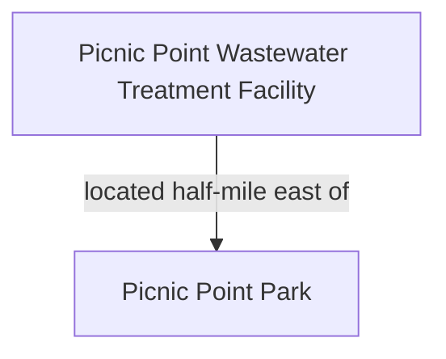
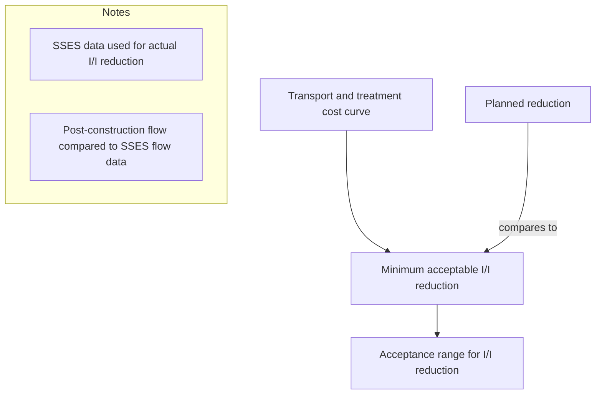

# AWWA_PPWTF_Infiltration_Inflow_Analysis.pdf

[HDR logo]

# Infiltration and Inflow Analysis Report

Picnic Point Wastewater Treatment Facility
Alderwood Water & Wastewater District

Edmonds, Washington
May 26, 2023

[Cover image on the left side shows the Picnic Point Wastewater Treatment Facility entrance with brick buildings and a surrounding road; the page design includes a large red rectangular block at the lower left and a dark gray rectangular bar extending from the bottom right.]
\n---\n

*This page intentionally left blank*
\n---\n

# Alderwood Water & Wastewater District

## Picnic Point Wastewater Treatment Facility
Infiltration and Inflow Analysis Report

----

Alderwood Water & Wastewater District
3626 156th Street SW
Lynnwood, WA 98087
(425) 787-0220

John McClellan
General Manager
\n---\n

This page intentionally left blank
\n---\n

# Alderwood Water & Wastewater District

## Picnic Point Wastewater Treatment Facility
### Infiltration and Inflow Analysis Report

----

**Prepared by:**

Patrick C. Roe, Jr., PE  
HDR Engineering, Inc.  
(425) 450-6280

[Seal image: circular professional engineer stamp]

I hereby certify that the Picnic Point Wastewater Treatment Facility Infiltration and Inflow Analysis Report was prepared by me or under my direct supervision and that I am a duly registered Engineer under the laws of the State of Washington.
\n---\n

This page intentionally left blank
\n---\n

# Contents

- Executive Summary
  - Compliance with Ecology Infiltration and Inflow Criteria
- 1 Introduction
  - 1.2 Wastewater Treatment Capacity
  - 1.3 Wastewater Flow Terms
- 2 Treatment Facility Description and Background
  - 2.1 Facility Background
  - 2.2 Service Area
    - Service Area Population
- 3 Infiltration and Inflow Assessment Using Ecology Criteria
  - 3.1 Infiltration and Inflow Assessment
  - 3.2 Conclusions
- 4 References

## Tables

- Table ES-1. Summary infiltration and inflow assessment
- Table 2-1. Service area population
- Table 3-1. Assessment using Ecology infiltration and inflow criteria
- Table 3-2. Summary infiltration and inflow assessment

## Figures

- Figure 2-1. PPWTF location map
- Figure 2-2. PPWTF service area

## Abbreviations

<table>
<thead>
<tr><th>Abbreviation</th><th>Meaning</th></tr>
</thead>
<tbody>
<tr><td>AWWD</td><td>Alderwood Water & Wastewater District</td></tr>
<tr><td>BOD</td><td>biochemical oxygen demand</td></tr>
<tr><td>District</td><td>Alderwood Water & Wastewater District</td></tr>
<tr><td>Ecology</td><td>Washington State Department of Ecology</td></tr>
<tr><td>EPA</td><td>U.S. Environmental Protection Agency</td></tr>
<tr><td>gpad</td><td>gallon(s) per acre per day</td></tr>
<tr><td>gpcd</td><td>gallon(s) per capita per day</td></tr>
<tr><td>I/I</td><td>infiltration and inflow</td></tr>
<tr><td>in.</td><td>inch(es)</td></tr>
<tr><td>LS</td><td>lift station</td></tr>
<tr><td>MBR</td><td>membrane bioreactor</td></tr>
<tr><td>mgd</td><td>million gallons per day</td></tr>
<tr><td>NPDES</td><td>National Pollutant Discharge Elimination System</td></tr>
<tr><td>Orange Book</td><td>Criteria for Sewage Works Design</td></tr>
<tr><td>PPWTF</td><td>Picnic Point Wastewater Treatment Facility</td></tr>
</tbody>
</table>

\n---\n

# Appendices

Appendix A. Ecology I/I Analysis and Project Certification ........................................................................A-1
\n---\n

# Executive Summary

A portion of the Alderwood Water & Wastewater District (District) is served by the Picnic Point Wastewater Treatment Facility (PPWTF). As a discharge permit condition, the District is required to conduct an infiltration and inflow (I/I) assessment of the service area tributary to PPWTF. This document summarizes the I/I analysis.

## Compliance with Ecology Infiltration and Inflow Criteria

The Washington State Department of Ecology (Ecology) has adopted U.S. Environmental Protection Agency (EPA) criteria for determining whether I/I is excessive (Washington State Department of Ecology, 1997). The criteria, and a comparison with PPWTF data, are shown in Table ES-1. The information shows that I/I in the PPWTF collection system are below Ecology criteria and that rates appear not to have increased between the previous permit cycle and the current permit cycle. Therefore, a plan to identify sources of I/I and correct the situation is not required.

<p>Table ES-1. Summary infiltration and inflow assessment</p>

<table>
<thead>
<tr>
  <th>Wastewater parameter</th>
  <th>Average for previous discharge permit cycle<br>(2014–2018)</th>
  <th>Average for current discharge permit cycle<br>(2019–2022)</th>
  <th>Apparent change between permit cycles</th>
</tr>
</thead>
<tbody>
<tr>
  <td colspan="4"><strong>Infiltration criterion assessment, based on maximum month flow</strong></td>
</tr>
<tr>
  <td>Adjusted flow, gallons per capita flow</td>
  <td>96.5</td>
  <td>87.3</td>
  <td>-9.5%</td>
</tr>
<tr>
  <td>Exceeds infiltration criterion 120 gpcd during wet weather?</td>
  <td>No</td>
  <td>No</td>
  <td></td>
</tr>
<tr>
  <td colspan="4"> </td>
</tr>
<tr>
  <td colspan="4"><strong>Inflow criterion assessment, based on peak day flow</strong></td>
</tr>
<tr>
  <td>Adjusted flow, gpcd a</td>
  <td>128</td>
  <td>136</td>
  <td>6.3%</td>
</tr>
<tr>
  <td>Exceeds inflow criterion of 275 gpcd during peak flow day?</td>
  <td>No</td>
  <td>No</td>
  <td></td>
</tr>
</tbody>
</table>

\n---\n

- A blue vertical rectangle is located along the left edge of the page.
- *This page intentionally left blank*
\n---\n

# 1 Introduction

This Infiltration and Inflow (I/I) Assessment has been prepared for the Alderwood Water & Wastewater District (District) to fulfill discharge permit requirements for the Picnic Point Wastewater Treatment Facility (PPWTF). National Pollutant Discharge Elimination System (NPDES) Permit WA0020826 for PPWTF became effective on December 1, 2018, and expires on November 30, 2023. The permit requires that a sewer collection system I/I analysis evaluation be performed to address each of the following specific elements:
1. The Permittee must conduct an I/I evaluation. Refer to the U.S. Environmental Protection Agency (EPA) publication, I/I Analysis and Project Certification, available as Publication 97-03 at:
https://fortress.wa.gov/ecy/publications/SummaryPages/9703.html (Washington State Department of Ecology, 1997)
2. The Permittee may use monitoring records to assess measurable I/I.
3. The Permittee must prepare a report summarizing any measurable I/I. If I/I has increased by more than 15 percent from that found in the previous report based on equivalent rainfall, the report must contain a plan and a schedule to locate the sources of I/I and to correct the problem.
4. The Permittee must submit a report summarizing the results of the evaluation and any recommendations for corrective actions by June 1, 2023.

The purpose of this report is to address the discharge permit requirements for an I/I evaluation.

## 1.2 Wastewater Treatment Capacity

Wastewater from sanitary activities is diluted by extraneous flow, consisting of I/I, which consumes useful conveyance and treatment capacity. To manage PPWTF operations and plan for future wastewater capacity needs, it is necessary to assess quantities of I/I present in the collection system.

## 1.3 Wastewater Flow Terms

As a preface to the assessment of I/I, it is useful to define the key terms employed.
Base sanitary flow: Includes water-carried wastes from residences, businesses, and institutions. It consists of the following components:
* Domestic wastewater, which is derived principally from the sanitary conveniences of residences or produced by normal residential activities.
* Industrial wastewater, which is produced by food processing, manufacturing, or other industrial activities. Industrial wastewater typically has characteristics that vary from domestic wastewater.
* Commercial wastewater, which is generated predominantly in business or commercial districts, as well as schools, including not only sanitary wastes but also wastes from the commercial activities themselves. Typically, commercial wastewater includes wastes from restaurants, laundromats, schools, and service stations.
Extraneous flow: Consists of groundwater or stormwater that enters the collection system. This overall flow classification is divided into the following components:

\n---\n

# Infiltration and Inflow Analysis Report
## Picnic Point Wastewater Treatment Facility

* Infiltration results from the unintentional entry of water into the wastewater collection system from the surrounding soil. Common points of entry include broken pipes and defective joints in the pipe or in manhole walls. Infiltration may result from sewers being located below the groundwater table or from saturation of the soil by rain or irrigation water. Infiltration usually varies seasonally depending upon precipitation or irrigation trends and is triggered by high groundwater level. Infiltration typically varies minimally from day to day.
* Direct stormwater inflow consists of rainwater that enters the collection system through roof and patio drain connections, catch-basin connections, and holes in the tops of manhole covers in flooded streets. Direct stormwater inflow occurs when the wastewater flow increases immediately in response to precipitation or snowmelt.
* Interflow, or rapid infiltration, is the entry of infiltrated precipitation into building laterals and French drains. It occurs as the recent precipitation percolates into the ground. Interflow may respond to precipitation quickly and may extend for several days after precipitation ends.

The following lists other common terms:
* Average annual flow is the total daily flow that occurs on average for a 12-month period. The period may be based on a calendar year (January to December) or a water year (November to October), but a calendar basis is more typical for wastewater applications. This flow parameter is often used to estimate annual operations and maintenance costs for treatment and pump station facilities.
* Average dry weather flow, a term used by Ecology in the document Criteria for Sewage Works Design (Orange Book) (Washington State Department of Ecology, 2008), is wastewater flow during periods when the groundwater table is low, and precipitation is at its lowest of the year. The dry weather flow period in western Washington normally occurs during July through September. During this time, the wastewater strength is highest because of the lack of dilution with groundwater and surface water components of I/I. For this report, average flow for the period from May through September is used to identify the dry weather period. A small amount of infiltration may be present, even during dry weather.
* Wet weather flow is the total wastewater flow during periods of moderate to heavy rainfall. Stormwater inflow may increase the wet weather flow to a rate many times greater than the dry weather flow and, unless provided for in sewerage design, can produce hydraulic overloading resulting in a wastewater overflow. For this report the period for wet weather flow is defined as the months October through April.
* Maximum month flow is the highest 30-day average flow that occurs in a 1-year period. In an extended data set of average day flow values, the maximum month value is equal to the 91.67 percentile (11 months divided by 12 months). This flow parameter is often used to size treatment components and is incorporated as a limit in NPDES permits. In western Washington, the maximum month flow typically occurs during late fall or winter. This flow is composed of the normal domestic, commercial, and public use flows with contributions from I/I.
* Maximum day flow is the highest 24-hour average flow that occurred in a 1-year period. In an extended data set of average day flow values, the maximum month value is equal to the 99.72 percentile (364 days divided by 365 days).
* Peak hour flow is the highest 1-hour average flow that occurred in a 1-year period.
\n---\n

## 2 Treatment Facility Description and Background

This section describes PPWTF and its service area, and estimated population.

### 2.1 Facility Background

The District owns and operates PPWTF, a membrane bioreactor (MBR) treatment plant that commenced operation in 2011, which has a current capacity of 6.0 million gallons per day (mgd) monthly average flow. PPWTF is located a half-mile east of Picnic Point Park, at the location shown in Figure 2-1.



Figure 2-1. PPWTF location map

### 2.2 Service Area

The District’s wastewater service area is shown in Figure 2-2. Wastewater generated within the District is routed in one of three directions for treatment and disposal: (1) south to King County, (2) north to the City of Everett, or (3) west to the District’s PPWTF.

In March 2019, the District commenced operation of Lift Station (LS) 23. This station transferred wastewater from three basins previously served by King County (previously identified as SC-3, SC-7, and SC-9, and now identified as PP-14, PP-15, and PP-16 respectively) to PPWTF. Therefore, wastewater from these three basins is considered in the PPWTF flow analysis described below.

After LS 23 commissioning, influent flow, influent biochemical oxygen demand (BOD) loading, and influent total nitrogen loading increased in response to the diverted wastewater.
\n---\n

# Infiltration and Inflow Analysis Report
## Picnic Point Wastewater Treatment Facility

### Figure 2-2. PPWTF service area
The PPWTF service area map includes the following elements and legend:

<table>
<thead>
<tr><th>Legend</th><th>Description</th></tr>
</thead>
<tbody>
<tr><td>Picnic Point Service Area</td><td>Boundary area shown on map</td></tr>
<tr><td>Alderwood Water & Wastewater District</td><td>District boundary shown on map</td></tr>
<tr><td>AWWD Sewer Basins</td><td>Sewer basins indicated</td></tr>
<tr><td>Parks</td><td>Park areas shaded on map</td></tr>
<tr><td>City Boundaries</td><td>City limits shown on map</td></tr>
<tr><td>Scale</td><td>0.5 Miles</td></tr>
</tbody>
</table>

## 2.2.1 Service Area Population
> Service area population for the year 2012 was estimated in the document 2009 Comprehensive Sewer Plan (Alderwood Water & Wastewater District, 2009). Snohomish County determined service

929 108th Avenue NE, Suite 1300, Bellevue, WA 98004-4361 hdrinc.com
(425) 450-6200
\n---\n

# Infiltration and Inflow Analysis Report
## Picnic Point Wastewater Treatment Facility

area residential population for April 2022 using service area geographical information provided by the District. In addition to residential population, partial population equivalents from commercial employment and schools contribute wastewater. A current ongoing industrial user survey revealed that there are no significant industrial users within the service area and minor industrial sources were included as an element of commercial use. Partial population equivalents were assumed to increase linearly at the same annual rate that residential population increased. Population estimates for the period from 2012 to 2022 are summarized in Table 2-1.

Table 2-1. Service area population

<table>
<thead>
<tr><th>Item</th><th>2012</th><th>2013</th><th>2014</th><th>2015</th><th>2016</th><th>2017</th><th>2018</th><th>2019</th><th>2020</th><th>2021</th><th>2022</th></tr>
</thead>
<tbody>
<tr><td colspan="12"><strong>Base PPWTF service area</strong></td></tr>
<tr><td>Area, acres</td><td>3,877</td><td>3,877</td><td>3,877</td><td>3,877</td><td>3,877</td><td>3,877</td><td>3,877</td><td>3,877</td><td>3,877</td><td>3,877</td><td>3,877</td></tr>
<tr><td>Service area population</td><td>25,512</td><td>25,617</td><td>25,722</td><td>25,827</td><td>25,931</td><td>26,036</td><td>26,141</td><td>26,246</td><td>26,351</td><td>26,456</td><td>26,561</td></tr>
<tr><td>Additional population equivalents for employment and students, number</td><td>3,277</td><td>3,291</td><td>3,304</td><td>3,318</td><td>3,331</td><td>3,345</td><td>3,358</td><td>3,372</td><td>3,385</td><td>3,399</td><td>3,412</td></tr>
<tr><td>Subtotal</td><td>28,789</td><td>28,908</td><td>29,026</td><td>29,144</td><td>29,263</td><td>29,381</td><td>29,499</td><td>29,618</td><td>29,736</td><td>29,854</td><td>29,973</td></tr>
<tr><td colspan="12"><strong>LS 23 service area</strong></td></tr>
<tr><td>Area, acres</td><td>418</td><td>418</td><td>418</td><td>418</td><td>418</td><td>418</td><td>418</td><td>418</td><td>418</td><td>418</td><td>418</td></tr>
<tr><td>Service area population</td><td>6,117</td><td>6,142</td><td>6,167</td><td>6,192</td><td>6,218</td><td>6,243</td><td>6,268</td><td>6,293</td><td>6,318</td><td>6,343</td><td>6,368</td></tr>
<tr><td>Population equivalents for employment and students, number</td><td>477</td><td>478</td><td>480</td><td>482</td><td>484</td><td>486</td><td>488</td><td>490</td><td>492</td><td>494</td><td>496</td></tr>
<tr><td>Subtotal</td><td>6,594</td><td>6,621</td><td>6,648</td><td>6,675</td><td>6,702</td><td>6,729</td><td>6,756</td><td>6,783</td><td>6,810</td><td>6,837</td><td>6,865</td></tr>
<tr><td colspan="12"><strong>Total service area</strong></td></tr>
<tr><td>Area, acres</td><td>3,877</td><td>3,877</td><td>3,877</td><td>3,877</td><td>3,877</td><td>3,877</td><td>3,877</td><td>4,191</td><td>4,295</td><td>4,295</td><td>4,295</td></tr>
<tr><td>Population, number</td><td>31,629</td><td>31,759</td><td>31,889</td><td>32,019</td><td>32,149</td><td>32,279</td><td>32,409</td><td>32,539</td><td>32,669</td><td>32,799</td><td>32,929</td></tr>
<tr><td>Additional population equivalents for employment and students, number</td><td>3,277</td><td>3,291</td><td>3,304</td><td>3,318</td><td>3,331</td><td>3,345</td><td>3,358</td><td>3,739</td><td>3,877</td><td>3,893</td><td>3,908</td></tr>
<tr><td>Total</td><td>34,906</td><td>35,050</td><td>35,193</td><td>35,337</td><td>35,480</td><td>35,624</td><td>35,767</td><td>36,278</td><td>36,546</td><td>36,692</td><td>36,837</td></tr>
<tr><td>Total served by PPWTF by year</td><td>28,789</td><td>28,908</td><td>29,026</td><td>29,144</td><td>29,263</td><td>29,381</td><td>29,499</td><td>34,705</td><td>36,546</td><td>36,692</td><td>36,837</td></tr>

</tbody>
</table>

<p><em>Note: LS 23 service area was connected to PPWTF approximately 3/31/2019. For 2019, area and population were assumed to be applicable for 3/4 of the year.</em></p>

\n---\n

As noted in the footnote to Table 2-1, the PPWTF collection system was expanded in 2019 through the commissioning of LS 23. For the year 2019, this population was assumed to be connected on March 31, 2019, and the annual average service area population was assumed to be equal to the original service area population plus three-fourths of the added service area.
\n---\n

# 3 Infiltration and Inflow Assessment Using Ecology Criteria

This report section describes I/I assessment using Ecology criteria.

## 3.1 Infiltration and Inflow Assessment

An assessment was conducted as to whether I/I rates are excessive. Ecology Publication 97-03 (adopted from EPA I/I Analysis and Project Certification, dated May 1985) has established rates that define excessive infiltration and excessive inflow. If rates exceed the excessive values, the utility is required to take action.

Daily wastewater flow data were assembled for the period from 2014 through 2022 and were segregated into the previous permit cycle (2014 through 2018) and the current permit cycle (2019 through 2022). The data were further categorized into wet period (October through April) and dry period (May through September). Service population is from Table 2-1. The analysis presented in Table 3-1 shows annual values for the infiltration criterion (maximum month average wet weather flow divided by the service population) and the inflow criterion (peak day flow divided by the service population). Table 3-1 also shows the average annual I/I, which is the average annual flow minus the minimum month flow.

The I/I information from Table 3-1 was categorized into the previous and current permit cycles and is summarized in Table 3-2. Table 3-2 shows that average precipitation during the current permit cycle (2019 to 2022) is slightly less (7 percent) than the previous permit cycle (2014–2018). Because precipitation for the current permit cycle is less than that for the previous cycle, the apparent infiltration rate for the current cycle was multiplied by the precipitation ratio to adjust the rate. The apparent infiltration rate in both permit cycles is less than the excessive Ecology criterion (120 gallons per capita per day [gpcd]). There has been an apparent decrease of 9.5 percent from the previous to the current permit cycle.

The summary in Table 3-2 also shows the apparent inflow rate for the two periods. Because precipitation for the current permit cycle is less than that for the previous cycle, the apparent inflow rate for the current cycle was multiplied by the precipitation ratio to adjust the rate. The adjusted inflow rates in both cycles are less than the allowable Ecology criterion (275 gpcd at the maximum day flow) and appears to have increased by 6.3 percent between the two permit cycles.

## 3.2 Conclusions

The information shows that both infiltration and inflow are below the Ecology criteria, and that neither has exceeded the 15 percent increase threshold that would trigger a need to locate sources of I/I. Therefore, the PPWTF service area complies with Ecology criteria, and no source identification is required.
\n---\n

# Table 3-1. Assessment using Ecology infiltration and inflow criteria

<table>
<thead>
<tr>
<th>Wastewater parameter</th>
<th colspan="4">Previous discharge permit</th>
<th colspan="5">Current discharge permit</th>
</tr>
<tr>
<th></th>
<th>2014</th><th>2015</th><th>2016</th><th>2017</th><th>2018</th><th>2019</th><th>2020</th><th>2021</th><th>2022</th>
</tr>
</thead>
<tbody>
<tr><td colspan="10">Service area characteristics</td></tr>
<tr><td>Estimated service area population, no.</td><td>29,026</td><td>29,144</td><td>29,263</td><td>29,381</td><td>29,499</td><td>34,705</td><td>36,546</td><td>36,692</td><td>36,837</td></tr>
<tr><td>Estimated service area, acres</td><td>3,877</td><td>3,877</td><td>3,877</td><td>3,877</td><td>3,877</td><td>4,191</td><td>4,295</td><td>4,295</td><td>4,295</td></tr>
<tr><td>Annual precipitation, in.</td><td>53.72</td><td>42.70</td><td>52.69</td><td>48.70</td><td>45.75</td><td>35.55</td><td>50.61</td><td>48.41</td><td>46.38</td></tr>
<tr><td colspan="10">Wastewater flow</td></tr>
<tr><td>Average dry weather flow, mgd</td><td>1.99</td><td>1.92</td><td>2.32</td><td>1.97</td><td>1.94</td><td>2.26</td><td>2.38</td><td>2.27</td><td>2.40</td></tr>
<tr><td>Minimum month average flow, mgd</td><td>1.91</td><td>1.87</td><td>2.27</td><td>1.86</td><td>1.86</td><td>2.19</td><td>2.27</td><td>2.23</td><td>2.20</td></tr>
<tr><td>Average annual flow, mgd</td><td>2.19</td><td>2.19</td><td>2.60</td><td>2.23</td><td>2.15</td><td>2.32</td><td>2.52</td><td>2.50</td><td>2.53</td></tr>
<tr><td>Average annual I/I, mgd</td><td>0.28</td><td>0.32</td><td>0.33</td><td>0.37</td><td>0.28</td><td>0.13</td><td>0.25</td><td>0.27</td><td>0.33</td></tr>
<tr><td>Average I/I, gpad</td><td>71.9</td><td>82.9</td><td>84.5</td><td>96.0</td><td>72.8</td><td>31.1</td><td>57.3</td><td>62.6</td><td>77.3</td></tr>
<tr><td>Average wet weather flow, mgd</td><td>2.40</td><td>2.47</td><td>2.83</td><td>2.35</td><td>2.35</td><td>2.37</td><td>2.66</td><td>2.69</td><td>2.70</td></tr>
<tr><td>Maximum month average flow, mgd</td><td>2.70</td><td>3.00</td><td>3.01</td><td>2.81</td><td>2.59</td><td>2.61</td><td>2.95</td><td>3.10</td><td>3.08</td></tr>
<tr><td>Peak day flow, mgd</td><td>3.82</td><td>3.81</td><td>4.23</td><td>3.55</td><td>3.27</td><td>4.58</td><td>4.82</td><td>4.14</td><td>4.70</td></tr>
<tr><td>Average flow during dry weather, gpcd</td><td>68.5</td><td>65.5</td><td>80.8</td><td>66.5</td><td>65.8</td><td>65.3</td><td>64.9</td><td>62.7</td><td>64.2</td></tr>
<tr><td colspan="10">Infiltration criterion (based on average wet weather flow)</td></tr>
<tr><td>Per capita flow, gpcd</td><td>93.0</td><td>103.1</td><td>102.8</td><td>95.6</td><td>87.9</td><td>75.3</td><td>80.7</td><td>84.5</td><td>83.7</td></tr>
<tr><td colspan="10">Inflow criterion (based on peak day flow)</td></tr>
<tr><td>Per capita flow, gpcd</td><td>132</td><td>131</td><td>145</td><td>121</td><td>111</td><td>132</td><td>132</td><td>113</td><td>128</td></tr>
</tbody>
</table>

\n---\n

# Table 3-2. Summary infiltration and inflow assessment

<table>
  <thead>
    <tr>
      <th>Wastewater parameter</th>
      <th>Average for previous discharge permit cycle<br>(2014–2018)</th>
      <th>Average for current discharge permit cycle<br>(2019–2022)</th>
      <th>Apparent Change between permit cycles</th>
    </tr>
  </thead>
  <tbody>
    <tr>
      <td>Annual precipitation, in.</td>
      <td>48.71</td>
      <td>45.24</td>
      <td>-7.1%</td>
    </tr>
<tr>
      <td>Average annual infiltration and inflow, mgd</td>
      <td>0.32</td>
      <td>0.24</td>
      <td>-22.8%</td>
    </tr>
<tr>
      <td>Average annual infiltration and inflow, gpcd</td>
      <td>81.6</td>
      <td>57.1</td>
      <td>-30.1%</td>
    </tr>
<tr>
      <td colspan="4" style="background-color:#e6f0f5;font-weight:600;">Infiltration criterion assessment, based on maximum month flow</td>
    </tr>
<tr>
      <td>Actual flow, gpcd</td>
      <td>96.5</td>
      <td>81.1</td>
      <td>-16.0%</td>
    </tr>
<tr>
      <td>Adjusted flow, gallons per capita flow a</td>
      <td>96.5</td>
      <td>87.3</td>
      <td>-9.5%</td>
    </tr>
<tr>
      <td>Exceeds infiltration criterion 120 gpcd during wet weather?</td>
      <td>No</td>
      <td>No</td>
      <td></td>
    </tr>
<tr>
      <td colspan="4" style="background-color:#e6f0f5;font-weight:600;">Inflow criterion assessment, based on peak day flow</td>
    </tr>
<tr>
      <td>Actual flow, gpcd</td>
      <td>128</td>
      <td>126</td>
      <td>-1.3%</td>
    </tr>
<tr>
      <td>Adjusted flow, gpcd a</td>
      <td>128</td>
      <td>136</td>
      <td>6.3%</td>
    </tr>
<tr>
      <td>Exceeds inflow criterion of 275 gpcd during peak flow day?</td>
      <td>No</td>
      <td>No</td>
      <td></td>
    </tr>
  </tbody>
</table>

<p><em>a</em> To adjust I/I, values were multiplied by the ratio of average precipitation values for the two discharge permit cycles.</p>
\n---\n

# Infiltration and Inflow Analysis Report
## Picnic Point Wastewater Treatment Facility

[Blue vertical bar on the left side of the page.]

> This page intentionally left blank
\n---\n

# 4 References

- Alderwood Water & Wastewater District. (2009). 2009 Comprehensive Sewer Plan.
- Washington State Department of Ecology. (1997). I/I Analysis and Project Certification, Ecology Publication 97-03.
- Washington State Department of Ecology. (2008). Criteria for Sewage Works Design, Ecology Publication 98-37.
\n---\n

# Infiltration and Inflow Analysis Report
## Picnic Point Wastewater Treatment Facility

This page intentionally left blank.
\n---\n

# Appendix A. Ecology I/I Analysis and Project Certification
\n---\n

This page intentionally left blank.
\n---\n

# Infiltration/Inflow

I/I Analysis and
Project Certification

Graphic: large stylized "I/I" symbol.

Ecology Publication No. 97-03
\n---\n

# Infiltration/Inflow

## Introduction
As part of facilities planning for municipal wastewater treatment facilities, the grantee must demonstrate that contributing sewer systems are not, and will not be, subject to excessive infiltration or inflow. This brochure informs grantees and facility planners on how to determine whether excessive I/I exists, and how to certify that excessive I/I has been sufficiently reduced through sewer rehabilitation.

“Infiltration” occurs when groundwater enters a sewer system through broken pipes, defective pipe joints, or illegal connections of foundation drains. “Inflow” is surface runoff that enters a sewer system through manhole covers, exposed broken pipe and defective pipe joints, cross connections between storm sewers and sanitary sewers, and illegal connection of roof leaders, cellar drains, yard drains, or catch basins.

Virtually every sewer system will have some infiltration or inflow. Guidelines have been developed to help determine what amount of infiltration and inflow is considered “excessive." To make this determination, infiltration and inflow must be evaluated separately as discussed below.

## Determination of Non-Excessive Infiltration
Based on Needs Survey data from 270 Standard Metropolitan Statistical Area Cities, the national average for dry weather flow is 120 gallons per capita per day (gpcd). This includes domestic wastewater flow, infiltration and nominal industrial and commercial flows. This average dry weather flow should be used as an indicator to determine the limit of non‑excessive infiltration. If the average daily flow per capita (excluding major industrial and commercial flows greater than 50,000 gpd each) is less than 120 gpcd (i.e., a 7‑14 day average measured during periods of seasonal high groundwater), the amount of infiltration is considered non‑excessive.

The 120 gpcd flow rate guideline has been incorporated into EPA’s final Construction Grant Regulations. These regulations provide that no further infiltration analysis work is required if the 120 gpcd guideline is not exceeded. If the average daily dry weather flow (DWF) exceeds 120 gpcd, the grantee may request special approval from the EPA Regional Administrator to proceed with project design without further infiltration studies. To receive such approval, the grantee must demonstrate that the increased flows due to infiltration can be cost‑effectively treated, and that sufficient funding is available to pay for the local share of project construction and operating costs. In such cases, the incremental cost of treatment capacity over and above 120 gpcd is not eligible for EPA construction grant funding.

\n---\n

# Infiltration/Inflow

The grantee’s basic options regarding determination of non‑excessive infiltration are listed below:

## If Average DWF* <120 gpcd:

* Grantee may proceed with project design and construction without further infiltration study.
* Grantee may investigate rehabilitation alternatives for specific sections of sewer system where excessive infiltration has been documented.

## If Average DWF* marginally exceeds 120 gpcd:

* Grantee may request special approval from EPA Regional Administrator to proceed with the project without further study of infiltration correction alternatives.
* Grantee must demonstrate that project is cost‑effective (i.e., that treating increased flows due to infiltration is less costly than sewer rehabilitation).
* Grantee must demonstrate that sufficient funds are available for the local share of project cost, including capital and operating costs.
* The treatment facility must be sized to treat the total flow including infiltration; however, the incremental cost of treatment capacity above 120 gpcd is not eligible for EPA construction grant funding.

## If Average DWF* >120 gpcd, and Special RA Approval is not granted:

* Further studies must be conducted to quantify excessive infiltration and evaluate alternative corrective measures.
* Based on results of these studies, the most cost‑effective sewer rehabilitation program is selected, and the treatment plant is sized to handle the infiltration that cannot be cost‑effectively removed.
* Upon approval of the proposed rehabilitation program by EPA, grantee may proceed with project design and construction. Total project cost (including sewer rehabilitation costs) is eligible for construction grant funding.

*Highest average daily flow recorded over a 7‑14 period during a period of seasonal high groundwater.
\n---\n

# Infiltration/Inflow
## Determination of Non-Excessive Inflow

A statistical analysis of data from Sewer System Evaluation Survey (SSES) studies representing more than 45 different sewer systems (i.e., separate sanitary sewer system) indicated a strong correlation between inflow rate and service area population. Based on these data, the average wet weather flow (WWF) after removal of excessive inflow (i.e., that which can be cost-effectively removed) is 275 gpcd. This flow rate should be used as an indicator of non-excessive inflow.

If the average daily flow during periods of significant rainfall (i.e., any storm event that creates surface ponding and surface runoff; this can be related to a minimum rainfall amount for a particular geographic area) does not exceed 275 gpcd, the amount of inflow is considered non-excessive. This calculation should exclude major commercial and industrial flows (greater than 50,000 gpd each). If wet weather flows do not exceed 275 gpcd, the grantee may proceed with project design and construction without further study of inflow correction alternatives. However, if the treatment plant experiences hydraulic overloads during storm events, further study is required regardless of the wet weather flow (i.e., even in cases where WWF is less than 275 gpcd).

The determination of non-excessive inflow is made as follows:

If WWF* <275 gpcd, and the treatment plant does not experience hydraulic overloads during storm events:
* Grantee may proceed with project design and construction without further inflow studies.
* Grantee may investigate rehabilitation alternatives for specific sections of the sewer system where excessive inflow has been documented.

If WWF*>275 gpcd, or the treatment plant experiences hydraulic overloads during storm events:
* Further studies must be conducted to quantify excessive inflow and evaluate alternative corrective measures.
* Based on results of these studies, the most cost-effective sewer rehabilitation program is selected, and the treatment plant is sized to handle the inflow that cannot be cost-effectively removed.
* Upon approval of the proposed rehabilitation program by EPA, the grantee may proceed with project design and construction. Total project cost (including sewer rehabilitation cost) is eligible for construction grant funding.
*Highest daily flow recorded during a storm event.
\n---\n

# I/I Cost-Effectiveness Analysis
> Infiltration/Inflow

Before obtaining a grant for sewer system rehabilitation, the grantee must determine the amount of infiltration and inflow that can be cost-effectively removed. This is essentially an estimate of the point at which the cost savings (i.e., reduction in transport and treatment cost less the cost of the rehabilitation program) is maximized. Generally, the planned I/I reduction (i.e., the target sought in a sewer rehabilitation project) is determined on the basis of a cost-effectiveness analysis. Figure 1 illustrates how the planned I/I reduction target is established from cost curves developed in the cost-effectiveness analysis. A separate cost-effectiveness analysis should be done for infiltration alternatives and for inflow alternatives.

Figure 1 Cost-Effectiveness Analysis

```mermaid
graph TD
  A[Infiltration/Inflow Reduction (%) 0-100]
  TT[Transport and treatment cost curve]
  RC[Rehabilitation cost curve]
  TC[Total cost curve]
  PR[Planned reduction]
  MPTC[Minimum planned total cost]

  A --> TT
  A --> RC
  TT --> TC
  RC --> TC
  PR --> TC
  TC --> MPTC
```
\n---\n

# Certification of I/I Rehabilitation Performance

At the end of the one-year performance period (i.e., one year after initiation of sewer system operation), the grantee must certify that the rehabilitation project has achieved an acceptable level of I/I reduction. Ideally, this means that the planned I/I reduction target is achieved at a cost not exceeding that projected in the cost-effectiveness analysis. However, past experience has shown that it is difficult to measure the effectiveness of an I/I rehabilitation program simply by comparing flow data before and after sewer rehabilitation.

A sewer rehabilitation project will be considered certifiable as long as the project is cost-effective (i.e. transport and treatment cost savings exceed rehabilitation costs). Figure 2 illustrates how to determine the minimum acceptable I/I reduction using the transport and treatment cost curve from the cost-effectiveness analysis. A separate determination should be made for infiltration and for inflow, consistent with the original cost-effectiveness analysis.

The actual cost of the rehabilitation program (i.e., the "sunk cost") should include design costs and the cost of the SSES study, as well as the cost of the sewer rehabilitation itself. The actual I/I reduction is determined by comparing post-construction flow to the flow data collected during the SSES study. The post-construction flow data should be based on plant flow records. Monitoring flows at multiple points throughout the sewer system is not recommended.

Figure 2 Determining Acceptable Range of I/I Reduction


\n---\n

# Infiltration/Inflow

If the actual I/I reduction is greater than the minimum acceptable I/I reduction derived from
Figure 2, the rehabilitation project can be certified as meeting performance objectives. However,
it should be noted that treatment plant design capacity is based on the planned I/I reduction
projected in the SSES study. If the actual I/I reduction is significantly less than planned, redesign
may be required to increase treatment capacity. Therefore, every effort should be made to
develop realistic estimates of the amount of I/I that can be cost‑effectively removed. As an I/I
project proceeds from initial planning through design and construction, certain assumptions
made during the cost-effectiveness analysis may prove to be invalid. This could affect the cost-
effectiveness of the project and the determination of minimum acceptable I/I reduction. For
example, if the actual rehabilitation cost is greater than projected, the range of acceptable I/I
reduction is reduced (see Figure 3). If the reduction in transport and treatment costs is not as
great as expected, this will also reduce the acceptable range.

Figure 3 Effect of Underestimating Project Costs

Therefore, it is important to recalculate the acceptable range of I/I reduction at different stages of
the project (e.g., after approval of SSES study; after completion of design and preparation of
detailed cost estimates; after receipt of construction bids; and at completion of various
construction phases) using updated cost estimates or actual cost data.

As the minimum acceptable I/I reduction limit approaches the planned I/I reduction target, the

6
\n---\n

# Infiltration/Inflow

cost‑effectiveness of the project should be reevaluated. The risk of the project not achieving the minimum acceptable I/I reduction increases as the acceptable range derived from Figure 2 diminishes. If there is evidence that actual rehabilitation costs will be much higher than projected, it may be advisable to reassess the objectives of the rehabilitation program, and modify the scope of work accordingly.

## Summary

This brochure presents an overview on how to approach the implementation of an infiltration/inflow correction program. A schematic of the process is presented in Figure 4. The basic steps are as follows:
1. Determine if excessive infiltration exists using 120 gpcd guidelines.
2. Determine if excessive inflow exists using 275 gpcd guideline.
3. If infiltration and inflow are non-excessive, proceed with project design based on measured flow data.
4. If either excessive infiltration or excessive inflow exists, conduct sewer system evaluation survey (SSES) study.
5. Select most cost-effective sewer rehabilitation alternative.
6. Implement sewer system rehabilitation; verify project cost-effectiveness as updated cost data become available.
7. Upon completion of project (i.e., at end of one-year performance period), certify that I/I reduction is within acceptable range.

Figure 4 I/I Project Flow Chart

```mermaid
graph TD
  A(Start) --> B{Excessive infiltration exists using 120 gpcd?}
  B -- Yes --> C{Excessive inflow exists using 275 gpcd?}
  B -- No --> D[Proceed with project design based on measured flow data]
  C -- Yes --> E[SSES study]
  C -- No --> D
  E --> F[Select most cost-effective sewer rehabilitation alternative]
  F --> G[Implement sewer system rehabilitation; verify project cost-effectiveness as updated cost data become available]
  G --> H[Upon completion of project (end of one-year performance period), certify that I/I reduction is within acceptable range]
  D --> F
```

\n---\n

# Infiltration/Inflow

To achieve affirmative project certification, the estimates of rehabilitation cost and I/I reduction must be realistic. Underestimating project cost can invalidate the conclusions of the cost‑effectiveness analysis conducted as part of the SSES study. It is important to include all cost items in the cost estimates (the cost of service line rehabilitation should be included even though it is not grant eligible).

Sewer rehabilitation programs can significantly reduce transport and treatment costs, and therefore should be given serious consideration. However, the cost‑effectiveness of such projects must be carefully evaluated to assure that rehabilitation is justified. The requirements for project certification now mandate that project cost‑effectiveness be confirmed at the completion of the project. Grantees and their engineers should carefully assess their I/I correction plans to be sure that project certification requirements can be satisfied.

Further guidance on this subject is available from U.S. EPA Regional Offices and delegated State agencies.
\n---\n

The page is blank.
