# MOP8_Combined_part01.pdf

# Manuals and Reports on Engineering Practice

(As developed by the ASCE Technical Procedures Committee, July 1930, and revised March 1935, February 1962, and April 1982)

A manual or report in this series consists of an orderly presentation of facts on a particular subject; supplemented by an analysis of limitations and applications of these facts. It contains information useful to the average engineer in his or her everyday work, rather than findings that may be useful only occasionally or rarely: It is not in any sense a "standard," however; nor is it so elementary or so conclusive as to provide a "rule of thumb" for nonengineers.

Furthermore, material in this series, in distinction from a paper (which expresses only one person's observations or opinions), is the work of a committee or group selected to assemble and express information on a specific topic. As often as practicable, the committee is under the direction of one or more of the Technical Divisions and Councils, and the product evolved has been subjected to review by the Executive Committee of the Division or Council. As a step in the process of this review, proposed manuscripts are often brought before the members of the Technical Divisions and Councils for comment, which may serve as the basis for improvement: When published, each work shows the names of the committees by which it was compiled and indicates clearly the several processes through which it has passed in review, in order that its merit may be definitely understood.

In February 1962 (and revised in April 1982) the Board of Direction voted to establish a series entitled "Manuals and Reports on Engineering Practice," to include the Manuals published and authorized to date, future Manuals of Professional Practice, and Reports on Engineering Practice.

All such Manual or Report material of the Society would have been refereed in a manner approved by the Board Committee on Publications and would be bound, with applicable discussion, in books similar to past Manuals. Numbering would be consecutive and would be a continuation of present Manual numbers. In some cases of reports of joint committees, bypassing of Journal publications may be authorized.
\n---\n

# Contents

-  Preface
- 1 Introduction Marie S. Burbano, Ph.D., P.E., BCEE; Andres F. Onate Calderon; Manny Moncholi
- 2 Principles of Integrated Design Maureen D. Neville, P.E.; Misti Burkman; Alexandra Doody, P.E.; William Dana Green, P.E.; William Hotz; Anna Mehrotra, Ph.D., P.E.; Don Vandertulip, P.E., BCEE
- 3 Site Selection and Facility Layout Timothy H. Sullivan, P.E.; Drew Hansen
- 4 Modeling for Design and Operation of Biological Water Resource Recovery Processes Jose Jimenez; Chris Bye; Ing. Daniel Nolasco; Leiv Rieger; Tanush Wadhawan, Ph.D.
- 5 Facility Hydraulics and Pumping Bently Green, P.E.; John P. Brito, P.E.
- 6 Odor and Air Emissions Management Charles M. McGinley, P.E.; Michael A. McGinley, P.E.
- 7 Support Systems Hannah T. Wilner, P.E.; PMP; Daniel Freedman, P.E.; Matthew Goss, P.E.; CEM, CEA, CDSM, LEED AP (BD+C); Steve Mustard, P.E.; CAP GICSP; Kenneth Schnaars, P.E.; David Ubert; Ales Volcansek, P.E.; Curt Wendt, P.E., CAP
- 8 Materials of Construction and Corrosion Control Robert A. (Randy) Nixon; Douglas Sherman, P.E.; Jim Joyce; Christopher Hunniford, P.E.; Brian Huang
- 9 Preliminary Treatment Lucas Botero, P.E., BCEE, ENV SP; Joel C. Rife, P.E.; Kendra D. Sveum, P.E.; Alex Szerwinski, P.E.
- 10 Primary Treatment Akram Botrous, Ph.D., P.E., BCEE; Onder Caliskaner, Ph.D., P.E.; Jeff Hauser; Mark W. Miller, Ph.D.
- 11 Biofilm Reactor Technology and Design Pushker Regmi, Ph.D., P.E.; Chris deBarbadillo, P.E.; David G. Weissbrodt, Asst. Prof., Ph.D., M.Sc., Dipl.-Ing.
- 12 Suspended-Growth Treatment Processes Timur Deniz, Ph.D., P.E., BCEE; John R. Bratby, Ph.D., P.E.; Eric L. Staunton, Ph.D.; Claes Westring; Andrea Turriciano White, P.E.
- 13 Integrated Biological Treatment William C. McConnell; Leon Downing; Satej Kulkarni; Laura Marcolini, P.E.; Coenraad Pretorius, P.E.
\n---\n

# Preface
This manual, updated from the 5th edition, continues its goal to be one of the principal references of contemporary practice for the design of municipal water resource recovery facilities (WRRFs). The manual was written for design professionals familiar with wastewater treatment concepts, the design process, and the regulatory basis of water pollution control. It is not intended to be a primer for the inexperienced or the generalist. The manual is intended to reflect current facility design practices of wastewater engineering professionals, augmented by performance information from operating facilities. The design approaches and practices presented in the manual reflect the experiences of more than 175 authors and reviewers.

This manual consists of 25 chapters, with each chapter focusing on a particular subject or treatment objective. The successful design of a municipal WRRF is based on consideration of each unit process and the upstream and downstream effects of that unit’s place and performance in the overall scheme of the treatment works. Chapters 1 to 8 generally cover design concepts and principles that apply to the overall WRRF. Chapters 9 to 17 discuss liquid-train-treatment operations or processes. Finally, Chapters 18 to 25 address the management of solids generated during wastewater treatment. Since the publication of the 5th edition of this manual, key technical advances in wastewater treatment have included the following:

* Trend toward resource recovery and hence the revised name for the manual;
* Increasing goals toward energy neutrality and driving net zero;
* Use and application of modeling wastewater treatment processes for the basis of design and evaluations of alternatives, which resulted in incorporation of a new chapter summarizing Manual of Practice No. 31, Wastewater Treatment Process Modeling;
* Further advances with membrane bioreactors applications;
* Advancements within integrated fixed-film activated sludge (IFAS) systems and moving-bed biological-reactors systems;
* Sidestream nutrient removal to reduce the loading on the main nutrient-removal process;
* and
* Advances in biosolids handling, including energy recovery and thermal hydrolysis.
\n---\n

- Denver, Colorado; Bogota, Colombia; Maitland, Florida; Miami, Florida; Orlando, Florida; Boston, Massachusetts; Manchester, New Hampshire; Albany, New York; Raleigh, North Carolina; Providence, Rhode Island; Houston, Texas; Austin, Texas; Dallas, Texas; Fairfax, Virginia; Leesburg, Virginia; Bellevue, Washington
- CH2M, Tampa, Florida; Chicago, Illinois; Albuquerque, New Mexico; Herndon, Virginia; Toronto, Ontario, Canada
- Corrosion Probe, Inc., Centerbrook, Connecticut
- DC Water, Washington, D.C.
- Donohue & Associates, Inc., Chicago, Illinois
- Dynamita, Toronto, Canada
- Dynamita S.A.R.L., Nyons, France
- EnviroSim Associates Ltd., Hamilton, Ontario, Canada
- Evoqua Water Technologies LLC, Bradenton, Florida
- Garver, Dallas, Texas; Frisco, Texas
- Gray and Osborne, Seattle, Washington
- GREELEY and HANSEN, Chicago, Illinois; San Francisco, California
- Hazen and Sawyer, Raleigh, North Carolina
- HDR Engineering, Inc.; Walnut Creek, California; Calverton, Maryland; Cleveland, Ohio; Nashville, Tennessee
- Hubbell, Roth & Clark, Inc., Detroit, Michigan
- inCTRL Solutions Inc., Oakville, Ontario, Canada
- Intera, Richland, Washington
- Johnson County Wastewater, Olathe, Kansas
- Kennedy Jenks Consultants, San Francisco, California
\n---\n

* Vandertulip WateReusEngineers, San Antonio, Texas
* Varec Biogas, Stafford, Texas
* Veolia North America, Chicago, Illinois
* Washington State Department of Ecology, Bellevue, Washington
* WesTech Engineering, Salt Lake City, Utah
* Xylem Inc., White Plains, New York
\n---\n

# CHAPTER 1: Introduction
Marie S. Burbano, Ph.D., P.E., BCEE; Andres F. Onate Calderon; and Manny Moncholi

- 1.0 Background
- 1.1 Overview
- 1.2 Evolution of Municipal Water Resource Recovery Facilities
- 2.0 The Designer’s Role
- 2.1 Role
- 2.2 Water Resource Recovery Facility Advances
- 3.0 Scope and Organization of Manual
- 3.1 Modifications in the Latest Edition
- 3.2 Organization
- 4.0 References
- 5.0 Suggested Readings

## 1.0 Background
### 1.1 Overview
This manual is the Design of Municipal Water Resource Recovery Facilities, MOP 8, 6th edition, included as WEF Manual of Practice 8 and ASCE Manuals and Reports on Engineering Practice, No. 76. This 6th edition continues its goal to be one of the principal references of contemporary practice for the design of water resource recovery facilities (WRRFs). The 6th edition is an update to the 5th edition, published in 2010. This manual was written for design professionals familiar with WRRFs, the design process, treatment technologies, and the regulatory basis of water pollution control. It is not intended to be a primer for the inexperienced or the generalist: The term WRRF is an evolution in the industry to consider wastewater as a resource with the potential to obtain valuable products (i.e., phosphorus and biogas) using treatment technologies. WRRFs as described in this MOP are used to treat municipal wastewater;
\n---\n

receiving treatment; about 10% of the wastewater is reused for some purpose (agricultural, industrial, etc.). For the most part, water reuse is based on water scarcity, where 90% of the countries reusing wastewater have less than the average amount of renewable water resources per capita. The general trends for growth in expenditures for global water infrastructure show the largest percent increases in Asia, with more than a 12% increase by 2019 (Global Water Intelligence, 2015). Latin America and Africa are each expected to see about a 5% to 6% increase in investment, with the remaining areas of the globe at 1% to 4% increase.

Water conservation has become more common in water-limited areas. Water conservation needs result in beneficial recycling of treated wastewater for cooling, irrigation, agriculture, drinking water, and certain classes of industrial use. As water becomes scarce, intentional recycling of wastewater into drinking water supplies is becoming more prevalent. Increased efforts to control the discharge of toxins to the nation’s waterways will continue in the future. Additionally, advanced wastewater treatment practices become more prevalent.

While more WRRFs have secondary or advanced treatment processes than ever, the need for these processes is also higher than ever. Drivers of advanced treatment include the desire to recover resources from the wastewater and potential human health or habitat concerns especially with contaminants of emerging concern (CECs). As the industry shifts to recovering resources, including water, energy, and nutrients, from wastewater; treatment technology and WRRFs are advancing to meet these needs. In addition, water quality instruments are able to measure constituents at lower concentrations, thereby detecting CECs, such as pharmaceuticals and personal care products (PPCPs). The industry is still determining the human health and ecological effects of these CECs, and negative effects may result in more stringent effluent requirements.

As climate-change issues increase, municipalities will consider sustainability and carbon footprint as important criteria in evaluating alternative technologies. Changes in funding available to municipalities and wastewater management philosophy often drive the evolution and improvement of certain technologies. Along with water reuse, decentralized wastewater treatment and wet-weather flow management will play a role in future technology development and innovations (Burian et al., 2000).
\n---\n

# Table 1.1 Comparison of Treatment Needs for the 2000 to 2012 Clean Watershed Needs Survey (CWNS) (U.S. EPA, 2016) (January 2012 dollars, in billions)

<table>
  <thead>
    <tr>
      <th>Needs Category</th>
      <th>2000</th>
      <th>2004</th>
      <th>2008</th>
      <th>2012</th>
      <th colspan="2">2008 to 2012 Change</th>
    </tr>
<tr>
      <th></th>
      <th></th>
      <th></th>
      <th></th>
      <th></th>
      <th>Change (billions)</th>
      <th>Change (%)</th>
    </tr>
  </thead>
  <tbody>
    <tr>
      <td>Secondary wastewater treatment</td>
      <td>55.0</td>
      <td>59.8</td>
      <td>68.0</td>
      <td>52.4</td>
      <td>-15.6</td>
      <td>-23</td>
    </tr>
<tr>
      <td>Advanced wastewater treatment</td>
      <td>30.5</td>
      <td>32.9</td>
      <td>51.4</td>
      <td>49.6</td>
      <td>-1.8</td>
      <td>-3.5</td>
    </tr>
<tr>
      <td><strong>Total needs</strong></td>
      <td>85.5</td>
      <td>92.7</td>
      <td>119.4</td>
      <td>102</td>
      <td>-17.4</td>
      <td>-14.6</td>
    </tr>
  </tbody>
</table>

TABLE 1.1 Comparison of Treatment Needs for the 2000 to 2012 Clean Watershed Needs Survey (CWNS) (U.S. EPA, 2016) (January 2012 dollars, in billions)

### Category breakdown (Pie chart data)

<table>
  <thead>
    <tr>
      <th>Category</th>
      <th>Name</th>
      <th>Value</th>
      <th>Share</th>
    </tr>
  </thead>
  <tbody>
    <tr>
      <td>I</td>
      <td>Secondary Wastewater Treatment</td>
      <td>$52.4B</td>
      <td>19.3%</td>
    </tr>
<tr>
      <td>II</td>
      <td>Advanced Wastewater Treatment</td>
      <td>$49.6B</td>
      <td>18.3%</td>
    </tr>
<tr>
      <td>III</td>
      <td>Conveyance System Repair</td>
      <td>$51.2B</td>
      <td>18.9%</td>
    </tr>
<tr>
      <td>IV</td>
      <td>New Conveyance Systems</td>
      <td>$44.5B</td>
      <td>16.4%</td>
    </tr>
<tr>
      <td>V</td>
      <td>Combined Sewer Overflow Correction</td>
      <td>$48.0B</td>
      <td>17.7%</td>
    </tr>
<tr>
      <td>VI</td>
      <td>Stormwater Management Program</td>
      <td>$19.2B</td>
      <td>7.1%</td>
    </tr>
<tr>
      <td>X</td>
      <td>Recycled Water Distribution</td>
      <td>$6.1B</td>
      <td>2.2%</td>
    </tr>
  </tbody>
</table>

\n---\n

There are few hard-and-fast rules that will result in successful designs. Recognizing that experience is critical to developing an appropriate design, both regulators and owners should apply common sense and remain open to change and innovation. Arriving at the most economical and functional design for an integrated facility is critical to the development of a WRRF. In addition, the design must meet all regulatory guidelines and standards. Successful design also takes into account operability, maintainability, and safety.

Published standards for specific design and loading criteria are referenced throughout this manual. Caution should be exercised when using such standards and references for specific design or loading criteria. The original time and conditions on which the guidance was developed should be considered. Some standards may remain applicable universally, and some may not. For example, the Recommended Standards for Wastewater Facilities (Great Lakes–Upper Mississippi River Board of State and Provincial Public Health and Environment Managers, 2014), commonly called the “Ten States Standards,” has served as a useful reference for regulators and designers. These guidelines were first developed in 1951 and are revised at 5- to 10-year intervals, in an attempt to maintain their applicability and reflect changes in technology. Although guidelines such as these continue to be a commonly used reference, they should not be viewed as containing absolute design values that cannot be varied. Rather, these standards offer parameters that have proved successful in typical municipal facilities with a wide range of operator capability:

* For example, the Recommended Standards for Wastewater Facilities (Great Lakes–Upper Mississippi River Board of State and Provincial Public Health and Environment Managers, 2014), commonly called the “Ten States Standards,” has served as a useful reference for regulators and designers. These guidelines were first developed in 1951 and are revised at 5- to 10-year intervals, in an attempt to maintain their applicability and reflect changes in technology.
  - Although guidelines such as these continue to be a commonly used reference, they should not be viewed as containing absolute design values that cannot be varied. Rather; these standards offer parameters that have proved successful in typical municipal facilities with a wide range of operator capability:

## 2.2 Water Resource Recovery Facility Advances

Designers aware of past experiences, but amenable to change, can meet future challenges of new standards and goals, as defined by the public’s changing perception of need and national priorities. Water pollution abatement, resulting in unbalanced atmospheric deterioration, energy consumption, and land degradation, is not a viable solution. Additionally; there currently is a push for utility owners to consider sustainability and carbon footprint size when evaluating project alternatives. To control the cost of treatment and address environmental effects, the designer should explore opportunities in the service area and its collection system. In designing a municipal WRRF, the designer walks a careful line between providing facilities that can respond to uncertainties of the future and excessive overdesign, the latter of which may result in the misuse of public
\n---\n

The WEF manual is intended to reflect current facility design practices of wastewater engineering professionals, augmented by performance information from operating facilities. The design approaches and practices presented in the manual reflect the experiences of 182 authors and reviewers from around the world.

This edition also includes some significant changes from the 5th edition. As with prior editions, technologies that are no longer considered current industry practice have been deleted, such as vacuum filters for sludge dewatering. While not intended to be all-inclusive, the following list describes some of the other pertinent processes and newer processes or concepts:

* Concept of sustainability;
* Energy management;
* Odor control and air emissions;
* Chemically assisted/ballast flocculation clarification;
* IFAS processes;
* Enhanced nutrient-control systems;
* Sidestream treatment;
* Process design and disinfection practices to minimize generation of total trihalomethanes and other organics monitored for potable water quality; and
* Approaches to minimizing biosolids production.

Additionally, the focus of the manual has been sharpened. Like earlier editions, this manual presents current design guidelines and practices of municipal wastewater engineering professionals. Design examples also are provided;, in some instances, to show how the guidelines and practice can be applied. However; information on process fundamentals, case histories, operations, and other related topics is covered to a lesser extent than in the previous edition. Readers are referred to other publications for information on those topics:

## 3.2 Organization
This manual consists of 25 chapters, with each chapter focusing on a particular subject or treatment objective. The successful design of a municipal WRRF is based on

\n---\n

# Overview of major topics covered under each chapter

Following is a brief overview of some of the major topics covered under each chapter of the manual:

* Chapter 1 presents the purpose and scope of the manual. It also presents a brief discussion of the needs for municipal wastewater treatment and has been updated for the Clean Watershed Needs Survey 2012: Report to Congress (U.S. EPA).
* Chapter 2 focuses on the overall design considerations, site selection, and configuration for a municipal WRRF and the principles of integrated facility design.
* Chapter 3 covers the site selection process for new or relocated WRRFs. The process includes the multitude of environmental, technical, and institutional variables to consider and their cost implications. The chapter then describes how area requirements are determined, candidate site identification, and the selection process. Once a site is selected, the chapter then describes how WRRF arrangement and process layout should progress. The chapter is more streamlined from the prior chapter, reorganizes some of the prior subsections, and includes a new subchapter on stakeholders and public involvement:
* Chapter 4 covers process modeling. This is an abbreviated version of MOP 31, Wastewater Treatment Process Modeling, 2nd edition, which was published in 2013.
* Chapter 5 covers facility hydraulics and pumping, including hydraulic considerations, unit process and other hydraulic elements, wastewater pumping, and hydraulic modeling:
* Chapter 6 brings together the topic of managing odor and air emissions, including with odor-control systems, odor regulations and community effects, odor measurement; assessing odors and air emissions, odor-dispersion modeling, odor containment and ventilation, and odor and air-emissions control.
* Chapter 7 focuses on a facility's support systems, such as general reliability criteria; electrical systems; instrumentation and control systems; heating, ventilating, and air-conditioning systems; chemical systems; and other support systems.
\n---\n

water treatment. This chapter's topics include process selection considerations, secondary effluent filtration, activated carbon adsorption, chemical treatment, membrane processes, air stripping and breakpoint chlorination for ammonia removal, and effluent reoxygenation.

* Chapter 15 covers evolving sidestream treatment approaches, including an introduction to sidestream treatment, with a focus on sidestream nitrogen and phosphorus removal and nutrient recovery design considerations. Integration of nutrient removal and recovery is presented in the form of a design example:

* Chapter 16 focuses on design and management of natural systems for wastewater treatment, including their history, conventional and alternative soil-absorption systems, pond systems, the varieties of land treatment systems, and constructed wetland treatment systems.

* Chapter 17 covers the topic of wastewater disinfection, including a discussion of technologies and regulatory considerations, impacts of upstream processes on disinfection design considerations, design considerations for chlorination, dechlorination, UV, peracetic acid (PAA), ozone, and other disinfection methods.

* Chapter 18 is an introduction to solids management. Topics covered in this chapter include residuals, applicable regulations, solids quantities and characteristics, and pretreatment methods.

* Chapter 19 discusses biosolids storage and transport approaches, including liquid biosolids, thickened biosolids, and dewatered biosolids.

* Chapter 20 covers the topic of chemical conditioning: The chapter includes theory and design of chemical conditioning systems for use in thickening or dewatering. This chapter includes discussion on chemicals used for conditioning, the feed equipment, and methods for dosage optimization.

* Chapter 21 covers the various thickening approaches, including a general overview, gravity thickening, dissolved air flotation thickening, membrane thickening, disk volute thickening, centrifugal thickening, gravity belt thickening, rotary drum thickening, and a comparison of the thickening methods and automation considerations.

* Chapter 22 presents the dewatering operations, including effect of sludge quality and the source of material to be dewatered, centrifugal dewatering, belt-filter-press dewatering,
\n---\n

## 4.0 References

- Burian, S. J.; Durrans, S.; Rocky, S. (2000) Urban Wastewater Management in the United States: Past, Present, and Future. J. Urban Technol., 7(3), 33–62.
- Food and Agriculture Organization of the United Nations. AQUASTAT Main Database. http://www.fao.org/nr/water/aquastat/main/index.stm (accessed September 2016).
- Global Water Intelligence (2015) Analysts’ Report: The Global Water Market in 2016, Capital Expenditure Trends in Municipal and Industrial Water to 2019.
- Great Lakes–Upper Mississippi River Board of State and Provincial Public Health and Environment Managers (2014) Recommended Standards for Wastewater Facilities; Health Education Services: Albany, New York.
- U.S. Environmental Protection Agency (2016) Clean Watershed Needs Survey 2012: Report to Congress, EPA-830-R-15005; U.S. Environmental Protection Agency, Office of Water: Washington, D.C.
- Water Environment Federation; American Society of Civil Engineers; Environmental and Water Resources Institute (2018) Sustainability and Energy Management for Water Resource Recovery Facilities; WEF Manual of Practice No. 38/ASCE Manuals and Reports on Engineering Practice No. 137; Water Environment Federation: Alexandria, Virginia.

## 5.0 Suggested Readings

- Metcalf and Eddy Inc./AECOM (2013) Wastewater Engineering: Treatment and Resource Recovery, 5th ed.; McGraw-Hill: New York.
- Viessman, W., Jr.; Hammer, M. J.; Perez, E. M.; Chadik, P. A. (2008) Water Supply and Pollution Control, 8th ed.; Pearson Education, Inc., Pearson Prentice Hall: Upper Saddle River, New Jersey.
\n---\n

# CHAPTER 2: Principles of Integrated Design

Maureen D. Neville, P.E.; Misti Burkman; Alexandra Doody, P.E.; William Dana Green, P.E.; William Hotz; Anna Mehrotra, Ph.D., P.E.; and Don Vandertulip, P.E., BCEE

* 1.0 Introduction
* 2.0 Project Planning Considerations
  - 2.1 Performance Goals
  - 2.2 Integrated Design
  - 2.3 Design Standards
  - 2.4 Planning Horizon
  - 2.5 Land Requirements
  - 2.6 Cost and Funding
  - 2.7 Asset Management
* 3.0 Regulatory Requirements and Water Quality Objectives
  - 3.1 Overview of United States Wastewater Discharge Standards
  - 3.2 Overview of International Wastewater Discharge Standards
  - 3.3 Water Reuse
  - 3.4 Reclaimed Water Storage and Distribution
  - 3.5 Air Quality Regulations
  - 3.6 Risk Management Plans
  - 3.7 Regulation of Hazardous Substances
  - 3.8 Summary of Regulatory Requirements
* 4.0 Municipal Wastewater Flow and Loading Projections
  - 4.1 Wastewater Sources
  - 4.2 Estimating Flows and Loadings
\n---\n

# 4.3 Analysis of Flow and Loading Data
\n---\n

# 5.3 Process Modeling
- 5.4 Redundancy Requirements
- 5.5 Turndown Requirements
# 6.0 Project Execution
- 6.1 Sequence
- 6.2 Procurement
# 7.0 Cost Estimating
- 7.1 Introduction
- 7.2 Types of Estimates
- 7.3 Direct and Indirect Costs
- 7.4 Levels of Accuracy
- 7.5 Quantification
- 7.6 Cost Resources
- 7.7 Application of Markups and Contingencies
- 7.8 Estimate Documentation
- 7.9 Alternative Delivery Cost Development
# 8.0 Guidelines for Life-Cycle Cost Evaluations
- 8.1 Procedures for Present Value
- 8.2 Discount Rate
- 8.3 Salvage Value
- 8.4 Life Expectancies
- 8.5 Capital Costs
- 8.6 Annual Operation and Maintenance Costs
- 8.7 Interest during Construction
- 8.8 Land Costs
- 8.9 Sunk Costs
# 9.0 Evaluations Utilizing Multiple-Criteria Decision Analysis
\n---\n

* 9.1 Objectives and Applicable Criteria
* 9.2 Evaluation Methodology
* 10.0 Evaluations Using Special Investigations
  - 10.1 Study Scale and Duration
  - 10.2 Interpretation of Study Results
  - 10.3 Mechanical Design Considerations
  - 10.4 Assessing the Treatability of Hazardous Substances
* 11.0 Final Design Considerations
  - 11.1 Operation and Maintenance
  - 11.2 Community Effects
  - 11.3 Maintenance of Facility Operation during Construction
* 12.0 References
* 13.0 Suggested Readings

## What is thickening?

The goal of integrated water resource recovery facility (WRRF) design is to produce a facility that achieves its defined performance goals and interfaces well with the local surroundings and other municipal systems of which the WRRF is a part. An integrated design process encourages all project stakeholders to communicate and collaborate from the planning stage through construction and startup. Integrated design places a high priority on the planning phase because upfront critical thinking and analysis with the entire project team engaged can result in fewer conflicts during final design; minimize problems during construction, operations, and maintenance; and cultivate a better long-term relationship and create more opportunities for resource recovery collaboration with the community:

This chapter provides an overview of the planning stage of integrated design, which sets the goals for the WRRF, identifies critical success factors, establishes the project team, and defines design criteria for the project. This chapter also discusses individual components of integrated WRRF design including the definition of influent flows and loadings;
\n---\n

# Water Resource Recovery Facilities (WRRFs) – Regulatory Requirements and Community Goals

The overarching goal common to all WRRFs is to protect human health and the environment. Some beneficial uses that often apply for the water environment include domestic and industrial water supply; recreational uses such as swimming, boating, and fishing; wildlife and aquatic life; agriculture and aquaculture; navigation; and transportation. Environmental regulations and permits define the WRRF water quality and treatment objectives, depending on whether the WRRF will be discharging to receiving waters or will be conveying treated effluent for water reuse. The permits for WRRFs discharging to receiving waters are written to protect the intended beneficial uses of those receiving waters. In some areas, there are restrictions on new discharge flows to impaired water bodies or outright bans on discharge to promote water reuse and groundwater replenishment; as is the case with Florida legislation passed in 2008 banning six ocean outfalls. WRRFs that land apply effluent (such as for irrigation or to groundwater infiltration basins) have quality requirements that protect human health. Section 3 provides an overview of common regulatory requirements and water quality objectives for WRRFs.

A variety of other community-specific performance goals may also influence WRRF design: Many areas have policies regarding work occurring within or near wetlands, waterways; floodplain, other environmentally sensitive areas, and areas that may be contaminated with hazardous waste. Additional examples of locally adopted policies that influence WRRF design include but are not limited to:

* Limitations in coverage of the service area;
* Constraints concerning the type and/or level of service provided;
* Intergovernmental agreements for shared treatment capacity;
* Targeted economic development plans;
* Adopted growth rates;
* Industrial pretreatment programs;
* Biosolids management programs;
* Energy management policy and plans;
* Sustainability plans or goals;
* Water reuse programs;
\n---\n

## 2.2 Integrated Design

- Land use requirements, such as property line setbacks, height restrictions, and noise and odor restrictions; and
- Building, fire, and electrical codes.

Many communities have adopted standards for sustainability and environmental stewardship (such as targets for incorporating sustainability principles from the Envision Sustainable Infrastructure Rating System) or goals for energy efficiency and on-site energy production (including Leadership in Energy and Environmental Design (LEED)-compliant designs). Using established rating frameworks during project planning can help define sustainability performance goals, which can minimize operating cost by maximizing energy production and recovering value through nutrient recovery and water reuse.

Some regions have also adopted goals for flood protection at WRRFs to make infrastructure more resilient to the effects of climate change. For example, the New England Interstate Water Pollution Control Commission (NEIWPCC) recently published revisions to the TR-16 Guides for the Design of Wastewater Treatment Works to state that critical equipment should be protected against damage up to a water surface elevation that is 3 ft above the 100-year flood elevation (NEIWPCC, 2016).

### 2.2 Integrated Design

Successful WRRF facilities require sound design, responsible administration, and operator commitment. Shortcomings in any of these functions can result in process upsets and failure to meet performance goals. Employing an integrated design approach encourages the owner, operation and maintenance (O&M) personnel, and designers to communicate and collaborate from the start of WRRF planning and design through construction and startup. The goal of integrated WRRF design is to produce a facility that achieves the defined performance goals and interfaces well with the local surroundings and other municipal systems of which the WRRF is a part. Including community stakeholders in WRRF planning and design is also becoming more prevalent, not only because WRRFs must consider odor, noise, visual, and traffic impacts to neighbors, but also because more municipalities are focusing on recovery of resources (water, energy, and nutrients) from wastewater.

### 2.2.1 Integrated Design Process
\n---\n

# Stakeholders and Responsibilities

<table>
  <thead>
    <tr>
      <th>Stakeholder</th>
      <th>Responsibilities</th>
    </tr>
  </thead>
  <tbody>
    <tr>
      <td>Contractor</td>
      <td>Typically selected through a public bidding process. Role varies depending on the procurement approach; but the contractor is always responsible for construction of the facilities in accordance with contract documents. May also have design and/or operational responsibilities.</td>
    </tr>
<tr>
      <td>Regulator</td>
      <td>Approves planning and design documents and performs reviews during construction; reviews grant and revolving fund applications, payment requests, and project closeout documentation. Involved in outfall siting, effluent dispersion, and residual disposal planning. Involvement continues after project completion with receipt/review of discharge compliance reports, operator training, and periodic inspection of the operating facilities.</td>
    </tr>
<tr>
      <td>Legal Counsel</td>
      <td>Required for projects under court order or consent agreement. Legal assistance continues until all terms of the orders are complied with and the owner is released from the terms of the order or consent agreement. Status reports are filed throughout planning, design, construction, and startup phases.</td>
    </tr>
<tr>
      <td>Financier</td>
      <td>Required at the time of bonding. Many public owners use short-term construction borrowing; with final bonds acquired at the end of construction. Larger projects may benefit from financial advice during planning or early in design. Public/private partnerships are also becoming more prevalent.</td>
    </tr>
<tr>
      <td>Process/Equipment Vendors</td>
      <td>Consulted for advice on functionality of their equipment, to verify that equipment will work as designed by the design professional, and that they can bid on the specifications. For specialized applications, equipment may be selected or procured early during design phase so that the key facility components are customized specifically for the particular equipment.</td>
    </tr>
<tr>
      <td>Community</td>
      <td>Involvement is beneficial during all phases, particularly for owners concerned with meeting good neighbor relations, sustainability, or resource recovery performance goals. Community input can be facilitated in many ways, including advisory committees, public meetings, or social media.</td>
    </tr>
<tr>
      <td>State and Local Agencies</td>
      <td>Involvement by any of the following might be necessary depending on project:
        <ul>
          <li>Local building inspectors to determine building codes/interpretations</li>
          <li>Fire department for rulings on chemical storage, routing of alarms, etc.</li>
        </ul>
      </td>
    </tr>
  </tbody>
</table>

\n---\n

## 2.2.1.1 Project Team

The project team will include designers from a range of disciplines, including process/mechanical and civil engineers, structural engineers and architects, building mechanical and plumbing engineers, electrical engineers, site design and landscape architects, and instrumentation and controls specialists. Depending on the level of automation desired, a supervisory control and data acquisition (SCADA) system integrator may also be needed. Fluid communication between team members is crucial to ensure the design documents are thorough, and communication between the design team and the owner and O&M personnel is important to ensure the design meets the owner's requirements. Chapter 7 discusses the support systems designed by other disciplines.

### 2.2.1.2 Community Engagement

The level of engagement with community stakeholders during WRRF planning and design varies depending on the project. At a minimum, proactive engagement with the immediate neighbors is recommended because they are often affected by high traffic volumes, limited parking, as well as dirt, dust, and noise related to construction of the facility. These issues can be even more problematic if construction must be done outside of normal working hours or during normal periods of peak traffic. Community input is particularly valuable for topics such as facility siting and aesthetics, siting final effluent discharge locations, defining necessary level of odor mitigation, and residuals management planning. Addressing these topics during the planning process allows the design team to address concerns in a cost-effective manner: Section 11.2 provides examples of design measures to mitigate negative impacts on the community.

Community input for these "good-neighbor" considerations can be solicited using a neighborhood advisory committee that the owner and designers consult for input: Federal and state requirements largely will dictate effluent quality targets, but good-neighbor considerations are critical in finding an effluent discharge site and configuration that wins public support, or at least public acceptance. Advocacy groups also can be stakeholders in a project and can have a similar role as neighborhood advisory committees. Public meetings should have two objectives: (1) to explain the specific steps that will be taken and (2) to understand public concerns. To be effective, neighborhood meetings are not solitary events in advance of a public hearing, but regular events during the design and as construction progresses. These meetings provide an opportunity to identify and respond to public concerns.
\n---\n

# CHAPTER 3: Site Selection and Facility Layout

Timothy H. Sullivan, P.E., and Drew Hansen

* 1.0 Introduction
* 2.0 The Site Selection Process
  - 2.1 General
  - 2.2 Variables That Influence Site Selection
  - 2.3 Steps in the Site Selection Process
* 3.0 Developing and Implementing a Site Selection Work Plan
* 4.0 Developing Evaluation Criteria
  - 4.1 General
  - 4.2 Environmental Considerations in Site Selection
  - 4.3 Technical Considerations in Site Selection
  - 4.4 Institutional Considerations in Site Selection
  - 4.5 Cost Considerations in Site Selection
* 5.0 Determining Water Resource Recovery Facility Site Area Requirements
  - 5.1 Identifying Process and Project Components
  - 5.2 Liquid Stream Area Requirements
  - 5.3 Solids Process Area Requirements
  - 5.4 Water Resource Recovery Facility Minimum and Maximum Area Requirements
  - 5.5 Satellite Campus
* 6.0 Candidate Sites and Site Selection
  - 6.1 Identifying Initial Candidate Sites
  - 6.2 Site Evaluation Phases
  - 6.3 Evaluating the Sites and Site Selection
* 7.0 Facility Arrangement and Layout
\n---\n

> 7.4 Other Layout Considerations
> 7.5 Layout Examples
> 8.0 References

# 1.0 Introduction

Selecting a site for a new water resource recovery facility (WRRF), while not a common endeavor, has become more complicated in recent years as public awareness has increased and regulatory requirements governing siting have become more stringent. Selecting a site for a WRRF typically involves evaluating multiple variables affecting multiple sites to varying degrees, ultimately to justify the selection of a preferred site. The process also involves input from the public and regulatory agencies throughout the process. Because all project circumstances are different and there is no single defined approach to conducting a site selection study, these guidelines can be used to evaluate and select sites for new WRRFs, satellite campuses for expanded WRRFs, or perhaps relocating an existing WRRF, or possibly for combined sewer overflow (CSO) facilities or even potable water treatment facilities.

The overall purpose of this chapter is to provide a framework for conducting site selection studies involving WRRFs as well as general facilities layout on a given site. In some instances, site selection efforts can affect the success of the entire project; well-planned and well-documented projects could avoid lengthy studies of site alternatives and/or lawsuits. At a minimum, such studies or lawsuits could increase project costs and create unnecessary delays and, in the extreme, halt the project. Therefore, having a defensible, logical, and consistent methodology to evaluate site alternatives and recommend the preferred site and process layout is critical to the success of any WRRF project. This chapter provides the tools to develop and implement a site selection and layout methodology to fit a particular project.

## 2.0 The Site Selection Process

### 2.1 General

### 2.2 Variables That Influence Site Selection

### 2.3 Steps in the Site Selection Process
\n---\n

4. Identify available candidate sites;
5. Perform preliminary site assessments (and site eliminations);
6. Perform details assessment (including process layout for each site, cost assessment, etc.); and
7. Site selection and public notification.

Parallel steps to the above process involve public outreach and participation: As presented herein, the public must be involved in each step along the way. In addition to public involvement, there may also be legal, financial, and public relations work groups also proceeding parallel to this process. While we believe that legal, financial, and public relations work groups are important; the process for these is beyond the scope of this chapter: A summary list of the above steps is presented in Table 3.1.

## 3.0 Developing and Implementing a Site Selection Work Plan

The first step in the site selection process is to develop a Site Selection Work Plan, which includes a consistent, technically sound methodology to site selection. The work plan should cover the following:

* Evaluation Criteria:
  - Environmental,
  - Technical,
  - Institutional, and
  - Costs;
* Area Requirements;
* Selection Process:
  - Candidate Site Identification,
  - Qualitative Assessment (and site elimination),
  - Quantitative Assessment (and site elimination), and
  - Costs Comparisons and Final Selection; and
* Public Participation.
\n---\n

Wastewater treatment facilities are almost universally perceived by the public to be unacceptable neighbors. Public opposition may be strong; however; with early involvement of the public in the planning process and a sincere desire to listen and mitigate their concerns, much of the opposition can be minimized: Therefore, public involvement; or participation, is one of the most important elements in selecting and evaluating alternative sites. (Planners, engineers, and owners are cautioned that regardless of the transparency and technically defensible methodology, expect that the final site will always have opposition:) This is discussed in more detail later in Section 4.4.5, Stakeholder and Public Involvement:

4.0 Developing Evaluation Criteria

4.1 General

The four categories of site selection criteria—environmental, technical, institutional, and cost considerations—are detailed below.

Environmental criteria are issues that would likely be examined in an environmental impact assessment for the project, including natural and manmade resources. They also may include regulatory constraints or aspects of the project that would require environmental permits. Adverse environmental impacts can render a site not acceptable for WRRF use.

Technical criteria are constraints or objectives of project design and implementation. They include specific engineering requirements and site-specific conditions that may affect the technical feasibility of a project (and thus costs) on a particular site. Adverse technical impacts are generally overcome by more complex designs and higher costs.

Institutional criteria are a "none-of-the-above" category for issues important to, or under the control of, other stakeholders. Site acquisition, conflict with public policy goals, and permits are some examples of this category of criteria.

Cost considerations include the purchase price for the site, costs to mitigate unfavorable site conditions, capital costs for technologies or construction practices that are required for the sites, and 20-year (or more) operating costs of project implementation on a site.
\n---\n

## 4.2.3 Surrounding Land Use

A determination of the effects of a WRRF on the surrounding land in the area should consider zoning regulations (including odor regulations), effects on adjacent property values, and compatibility with activities on neighboring properties. Constructing a facility in an industrial neighborhood rather than a residential area (particularly an affluent area) is generally more acceptable and less expensive. Wastewater treatment facilities located near airports may require U.S. Federal Aviation Administration (Washington, D.C.) approval, because airplane glide slopes may control the height of some structures. Lagoons and ponds attract birds, which also affect air-traffic operations.

If the selected site is surrounded by residences or zoned residential for future development, measures must be taken to ensure that the facility is a good neighbor during both construction and operation. Such measures include minimizing noise, odors, aerosols, air particulates, chemical hazards, insects, intrusive lighting, and traffic effects, and incorporating aesthetically pleasing architectural and landscaping features. However, all of these affect costs, which should be planned:

## 4.2.4 Natural Resources

In general, sites within specially designated natural areas should be avoided. The development of areas designated as wild, scenic, or recreational, under the Wild and Scenic Rivers Act (1968), or habitats of rare, threatened, or endangered species may be
\n---\n

## 4.2 Noise and Buffer Zones

selection process. Communities may have noise ordinances that need to be incorporated into the comparative process. When comparing possible facility layouts, the difference in sound pressure can be quantified with the corresponding differences in distance. The equation below can be used to approximate variation in noise with distance, and to help establish buffer zones.

$$ P_2 - P_1 = 10 \times \log \left( \left( \frac{R_2}{R_1} \right)^2 \right) $$

where
- P₂ = sound pressure at Location 2
- P₁ = sound pressure at Location 1
- R₂ = distance from source to Location 2
- R₁ = distance from source to Location 1

A survey to determine ambient levels of noise is recommended at any proposed WRRF site. A 3-dBA increase above ambient levels of noise by the WRRF has little or no effect on surroundings; noise level increases of 3 to 15 dBA have a moderate effect; and noise level increases of more than 15 dBA severely affect the surroundings (NCEES, 2005).

### 4.2.9 Hazardous Chemicals

There is always a potential for chemical spills and leaks. However, the wastewater industry has an exemplary record in chemical handling, primarily because of the training that operating personnel receive and strict adherence to procedures. Despite this record, sites that are far removed from sensitive receptors, such as schools, hospitals, daycare centers, and convalescent homes, are preferable. If there are sensitive receptors near a proposed site, the use of chemicals and chemical safety must be addressed during the design process, leading to higher costs. These additional costs should be factored into the site evaluation process.

## 4.3 Technical Considerations in Site Selection

### 4.3.1 Proximity

An ideal site should be close to the raw wastewater collection system, treated effluent disposal point (or reuse application points), and biosolids disposal locations. It may be
\n---\n

## 4.3.5 Seismic Activity

Seismic activity is generally not a differentiator and will not influence site selection when all potential sites are within the same seismic zone. However, if sites are within different seismic zones, additional design and construction costs to accommodate the seismic activity need to be factored into the evaluation. Generally, the building department for each community will confirm the seismic zone that must be accommodated.

## 4.3.6 Transportation and Site Access

WRRFs should be located close to all-weather roads for delivery of equipment and chemicals and off-site disposal of grit, screenings, and solids. Access roads that have reasonable gradients and curves of adequate radius allow the movement of large vehicles and heavy equipment. Service from a railroad spur offers the facility the option of accepting deliveries by rail; thus lowering the unit cost of bulk deliveries (i.e., chlorine and other chemicals). Costs for nonexisting or inadequate roads or bridges need to be included in the cost analysis. Access to public transportation supports worker satisfaction and reduces parking needs.

## 4.3.7 Utility Services

A WRRF should have potable water, redundant electrical power, and natural gas service, all of which can be expensive. (Telephone and Internet service are also important but easily supplied.) If a site has strong potential but lacks nearby utility service, the design engineer should meet with representatives of utility companies to discuss utility sizing, extensions, and potential costs. Planning for utility extensions and capacity increases may take several years; and this process should be started early when planning and for site selection of a WRRF.

## 4.4 Institutional Considerations in Site Selection

\n---\n

Land acquisition also applies to off-site infrastructure (i.e., easements for collection mains). Ideally, pipelines can be installed within existing easements and rights-of-way; however, if extensive new easements are required, this consideration also should be factored into the site selection process.

## 4.4.3 Environmental Justice

Environmental justice also referred to as environmental or social equity represents the confluence of social and environmental movements and deals with the inequitable environmental burden borne by minority groups. The importance of environmental justice in the site selection of wastewater facilities has increased significantly in recent years. Today, the site selection of a WRRF is likely subject to federal, state, or regional environmental justice procedures, requiring documentation of the population characteristics of the host community, in terms of minorities and other less-represented groups, such as seniors, and evaluation of the effects of the proposed project on the well-being of those groups. Thus, evaluation and ultimate selection of a WRRF site should include evaluation of the relevant environmental justice factors.

## 4.4.4 Permit Requirements

The regulatory process(es) driving the site selection can influence site selection. If there are specific regulations that pertain to site selection of the project, the criteria should reflect these regulatory requirements. For example, if there are wetlands on a site, the site selection decision may be dependent, in part, on obtaining a U.S. Army Corps of Engineers (Washington, D.C.) permit to allow wetland filling. Local zoning ordinances are another example of an approval requirement that could heavily influence a site selection decision: It is imperative that all of the permits be identified during the planning process and a determination be made as to their relevance to a site selection decision.

The regulatory process(es) driving the site selection will strongly influence the choice of site selection criteria. If there are specific site selection regulations that pertain to the project, the criteria should reflect the regulatory requirements. For example, some states have, as part of their solid waste, hazardous waste, or groundwater protection regulations, specific criteria for evaluating sites for waste-handling facilities. Appropriate regulations should be reviewed when the list of criteria is compiled:
\n---\n

entgranted to the public. Straightforward projects may only include a public meeting to
present the justification and results of a siting study for those community members
interested in the project. For more complex projects, public contribution may include a
more direct role in the siting process. In this case, the public may provide input regarding
siting criteria, evaluation methods, and results. Such input generally comes from citizens'
groups that are specifically formed for the purpose of providing public opinion regarding
the project:
There are four aspects to consider in developing a public participation program: public
education, relations, information, and involvement: The purpose of public education is to
create a more informed public body: Methods of promoting public education include
regular neighborhood meetings, press releases, project flyers, eRooms, and websites.
Public relations refer to any type of direct interaction with the public, which can help create
positive image for the proposed project or organization. Informing the public about the
site selection process (and the ramifications of such) builds awareness and generates
interest. Public information does not typically involve or foster feedback: Finally, when
public involvement is exercised, the public will be part of, or otherwise involved, in the
decision-making process. A successful and thorough public participation program will
encompass all of these forms of public engagement (WEF, 2002).
Several benefits result from actively involving and investigating the public's opinions and
concerns regarding site selection of a WWRF, including building support, helping
communities understand the value of the procedure, diminishing opposition, and building
a morepositive image: This results in a more informed, understood, and acknowledged
individual (WEF; 2002). Involving the public will also lead to a more streamlined method of
communication, which will enhance future interactions with the surrounding communities:
Building rapport with affected persons is key to successfully involving the public and their
concerns regarding the site selection process
Public outreach is now incorporating different methods and types of communication due to
advances in technology such as social media outlets. Online information streams and
social media outlets, such as Facebook and Twitter; foster information delivery and uptake
for the affected communities and the municipality: Diversifying the methods and types of
public outreach will aid in educating and understanding how communities are affected by
\n---\n

Assuring the regulatory and public acceptability of projects. Compensatory or incentive measures are sometimes required to gain political and public acceptance of a project, and to make a whole project and its effects more acceptable to abutters and communities. Compensatory incentives generally are not legally required, unless they are included in a contract developed between the project proponent and the host community specifically for the proposed project (i.e. a memorandum of agreement):

## 4.5.2 Capital Costs
Capital cost considerations for sites can include the cost difference for the following:
* Land purchase;
* Building and infrastructure demolition or relocation;
* Brownfield/site/building remediation;
* Wastewater conveyance (to the new site or discharge point);
* Mitigation of wetlands, endangered species, archaeological or historical concerns;
* Additional effluent treatment (for differing National Pollutant Discharge Elimination System [NPDES] permit limitations);
* Geotechnical and/or topography hardship;
* Electrical power, water, and gas utilities services;
* Access road and/or bridge;
* Flood protection;
* Good neighbor measures:
  - Aesthetically pleasing architectural features, and additional landscaping, and
  - Additional odor control, noise abatement measures

The costs associated with most of these issues will be very difficult to predict early on. Where estimates can be reasonably predicted, they should be developed. However, where the planning budget is constrained or where not enough information is known, contingency factors can be applied to the overall cost estimate for each site.

## 4.5.3 Operations and Maintenance Cost Considerations
\n---\n

# 5.1 Solids Treatment Area Requirements

Solids treatment area requirements are greatly affected by the ultimate treatment and disposal process selected. Thickening, dewatering, and landfilling will require lower area requirements, whereas digestion and/or land application (and liquid sludge storage) will require more land. Project managers are cautioned to be conservative in assuming solids treatment processes, and be mindful of the concept of WRRF of the Future, which in part is energy neutral, recovering energy via digestion and natural gas production.

Ancillary facilities include administration, maintenance, laboratory buildings, and parking areas for each. The need for each of these facilities is likely, but potable water and clean water laboratory facilities might be combined. Likewise, maintenance facilities might be downsized in anticipation of more off-site/private maintenance operations, or possibly combined with an adjacent Department of Public Services yard. Area requirement will also include flow equalization, roads and greenbelts for yard piping, splitter boxes, septage or vactor receiving station, substations and generators, and other utilities, space for buffer zones, setbacks, environmental controls, and spill containment areas. Additional area requirements may include off-site sewer maintenance and/or industrial pretreatment program equipment and staff, an adjacent DPW yard, recycle program drop-off, composting facility, and the like. Project managers will need to communicate with the owner on these potential area needs.

Once the approximate processes and facilities are selected, area requirements for each can be approximated. A simple approach is to determine areas of local WRRFs similar in size and treatment and plot flow versus area: Google Earth or Google Earth Pro can be used to assist if the actual area is unknown: Figure 3.1 can be used to approximate the area requirements based on WRRF capacity. A more exacting approach is to size the various circles and boxes for each process area as described below:

5.2 Liquid Stream Area Requirements

The traditional processes to size include headwork (bar racks, influent pump station, fine screenings, and grit facilities), primary clarifiers, aeration tanks, secondary clarifiers, tertiary filters (if required), and disinfection. Hydraulic Institutes ANSI/HI 9.8 can be used to determine geometry and pump placement to determine overall pump station size. Grit and screening facilities can be sized using Chapter 9: Preliminary sedimentation overflow
\n---\n

The traditional processes to size include headwork (bar racks, influent pump station, fine screenings, and grit facilities), primary clarifiers, aeration tanks, secondary clarifiers, tertiary filters (if required), and disinfection. Hydraulic Institute's ANSI/HI 9.8 can be used to determine geometry and pump placement to determine overall pump station size. Grit and screening facilities can be sized using Chapter 9. Preliminary sedimentation overflow rates can be selected from Chapter 10 herein or from Ten States Standards for primary and secondary clarifier sizing. Biological treatment can be sized using Chapters 11 to 13. Design filtration rates can vary greatly (80 to 120 L/m2/min [2 to 3 gpm/sq. ft] to 1200 to 1600 L/m2/min [30 to 40 gpm/sq. ft] per Chapter 14) and it would be wise to use a conservative design rate to size a tertiary filtration facility. And finally, disinfection facilities can be sized using Chapter 12. Redundancy needs to be factored into the area needs for each equipment and process.

Considerable area needs to be added to the footprint of any building for process equipment, means of equipment removal, pipe galleries, electrical substations and MCC equipment, control room, hallways, lavatories, etc. Yard piping does not need to be sized, but adequate room for pipe and splitter boxes need to be accounted for. An additional lift station may be necessary, depending upon site topography:
\n---\n

## 5.4 Water Resource Recovery Facility Minimum and Maximum Area Requirements

Once the above assumptions and area requirements are made for each process and facility, tentative WRRF layouts can be made using the process and building circular, square, or rectangular shapes. Again, ample room should be made for yard piping, utilities, roads, parking, landscaping, buffer zones, and other considerations. The shapes should be organized into an overall square and a rectangle or irregular shape, for the minimum and maximum site area requirements. At this point, minimum and maximum acres for the planned WRRF should be known.

Chapters 19, 21, 22, and 23 can be used for preliminary design and area requirements for solids treatment processes.

## 5.5 Satellite Campus

If area needs are large, it may be difficult to find suitable sites and it may be necessary to split up the treatment processes. The majority of the area needs will be for the liquid stream and associated buildings, and a separate area can be sized for the solids treatment facilities. Unfortunately, the total area needs (and costs) will be higher. One possible upside to a satellite campus could be that a rural solids treatment campus will likely have less odor complaints and will be located closer to the solids application point, lowering biosolids hauling costs.

## 6.0 Candidate Sites and Site Selection

### 6.1 Identifying Initial Candidate Sites
\n---\n

## 6.2.1 Phase 1 Evaluation Criteria

For information on alternative sites is provided to the client or to the public. This is particularly important when current GIS information is unavailable, resulting in data that could be outdated and/or inaccurate. A quick "windshield survey" of surrounding land use, for example, could help verify whether the location of sensitive receptors, as interpreted from aerial photos, is accurate.

Phase evaluation criteria generally are of two types: critical constraints (including "fatal flaws" and mandatory regulatory constraints) and technical deficiencies. Fatal flaws are issues that have a high probability of prohibiting development of the project at a specific site. Mandatory regulatory constraints are nonnegotiable conditions that the facility is required to satisfy, or protected areas that would be off-limits to the facility. Technical deficiencies are site obstacles that require significant engineering and design solutions for the project to function properly.

Examples of Phase 1 critical constraints include the following:
* Land use compatibility (examples include avoiding developed residential areas and federal, state, and local parks);
* State or federally designated wetlands and/or other officially protected areas;
* Historic sites listed, pending, or recommended for inclusion in the National Register of Historic Places (state- and locally listed historic and archaeological sites also could be included here);
* State-catalogued endangered species habitat;
* State- or federally designated inactive hazardous waste disposal sites or corrective action sites or other sites known to be contaminated with hazardous wastes (depending on the severity of the contamination, this could be simply a cost issue. In addition, some of these sites designated as "brownfields" may be preferred areas for WRRF development); and
* Groundwater recharge areas.

Sites with known environmental conditions or irregular shapes need to be reevaluated to see ifthey meet the minimum area requirements: Wetlands, floodplains, setbacks, buffer zones, and extreme topography areas should be eliminated from each site as
\n---\n

## 6.3 Evaluating the Sites and Site Selection

At this point, costs for quantified criteria for each site are presumably established. Once the project team (including stakeholders) has selected the nonquantified criteria and defined them, the criteria must be applied objectively to each site. Inevitably, each site will have its own merits and faults in each of the criteria categories, ideally each resulting in a quantifiable cost-based assessment and a nonquantifiable ranking or level of impact:
\n---\n

# 7.2 Facility Layout Concepts

The liquid stream facilities layout should progress sequentially from the influent sewer and lift station to the disinfection facility and outfall. This layout can follow a linear progression, or can progress out the back; particularly when the influent sewer and effluent discharge locations are nearby. Locating raw wastewater pumping stations near the point at which sanitary sewers enter the facility site minimizes the cost of building additional lengths of deep gravity sewers. Where possible, a designer should group together similar unit processes to facilitate operation, minimize piping, and allow for expansion.

It will be helpful for the designer to prepare a preliminary hydraulic profile to establish the profiles of principal structures. Arranging treatment processes to follow site contours helps maximize the use of natural topography and reduces both pumping requirements and excavation costs for new structures. Flow splitting is another aspect that needs due consideration:

## 7.2.2 Perimeter versus Internal Facilities

Many facilities should be located on the facility perimeter; within the WRRF, or for some facilities, cases can be made for both.

Administration building and laboratories (if not within the administration building), should be located on the site perimeter; to facilitate visitors, sample deliveries, and the like: Facilities unlikely to cause odors, including tertiary treatment and/or UV disinfection facilities, can also be located on the perimeter. As previously stated, solids treatment facilities, particularly those where odors are likely to occur, should be located within the facility or to an area where odor complaints are less likely to occur. A significant exception is the biosolids disposal loading area; truck traffic should be kept to a minimum within the facility, so biosolids loading facilities should be located near the perimeter or near a major roadway. Consideration of a separate access road for biosolids haulers should be considered. Chemical feed facilities have competing interests; they should be located near the application point, but minimizing internal truck traffic should be considered. A maintenance facility should be centrally located within the WRRF since that will promote efficient logistics of personnel and parts. However, access for spare parts delivery needs to be considered. Chemical bulk storage facilities and chlorine storage areas should be located along the main service road to make deliveries more convenient: A separate set of
\n---\n

Should be in the same room where the computer terminal for controlling the facility is kept. A large facility may have administrative office complexes, including office areas, lobby and reception areas, and training and conference facilities.

Where administrative offices are provided and the public has access to them, they should be located near the front entrance of the facility, so that visitors may find them easily. A private office with meeting space provides a facility manager with the privacy needed to handle personnel issues, space to hold staff meetings, and easy access to facility operating records, personnel files, cost records, and O&M manuals.

If a facility has distinct organizational groups or departments, each manager may need a private office. Grouping the individual offices of a management team promotes communication among the various groups. In larger facilities, an assembly room large enough to accommodate facility personnel meetings, on-site training, visitors, and public meetings is desirable.

## 7.3.3 Maintenance and Storage Facilities

Maintenance and storage room facilities are dependent on the WRRF, and how much of the work is expected to be contracted out. The size and type (complexity) of the WRRF generally determines the size of the maintenance staff, the services to be performed in-house, and the tools to be provided. As previously stated, maintenance facilities are best located near the center of a facility or in the most equipment-intensive area of the facility. Facilities with a high degree of instrumentation may require a separate instrumentation shop and maintenance staff. A designer should size the area that will house maintenance equipment manuals and shop drawings in addition to equipment records. In addition, facilities for personnel to review documentation and for computerization of maintenance records, inventory, and maintenance scheduling should be provided.

The storage area for the facility's spare part and maintenance supply inventory is best located near the shop area and should be large enough to accommodate an array of shelves, bins, and drawers. Paints, lubricants, pesticides, herbicides, and similar toxic, flammable, and hazardous materials should be stored in an isolated, secure area with adequate ventilation. To facilitate deliveries, the storage area, which typically is secured, should be located adjacent to the roadway of the main facility: The building should be fully
\n---\n

# CHAPTER 4: Modeling for Design and Operation of Biological Water Resource Recovery Processes
Jose Jimenez; Chris Bye; Ing. Daniel Nolasco; Leiv Rieger; and Tanush Wadhawan, Ph.D.

* 1.0 Applications of Process Models for the Design and Operation of Water Resource Recovery Facilities
  - 1.1 Steady-State Conditions
  - 1.2 Dynamic Conditions
* 2.0 Development of Commercial Simulators
* 3.0 Overview of Available Modeling and Simulation Protocols
  - 3.1 Available Process Modeling Simulation Protocols
  - 3.2 The Good Modeling Practices Unified Protocol
* 4.0 Guidelines for Use of Activated Sludge Models Using the Good Modeling Practices Unified Protocol
  - 4.1 Step 1—Project Definition
  - 4.2 Step 2—Data Collection and Reconciliation
  - 4.3 Step 3—Facility Model Setup
  - 4.4 Step 4—Calibration and Validation
  - 4.5 Step 5—Simulation and Result Interpretation
* 5.0 Application of Whole-Facility Model
  - 5.1 Structured Approach for Model Application—Case Example
* 6.0 Conclusion
* 7.0 References

Modeling is important to the planning, design, operation, and optimization of modern water resource recovery facilities (WRRFs). A wastewater process model consists of a number of mathematical equations that describe reactions and reaction rates of biological,
\n---\n

RFs, as large safety factors accounted for unknowns. These tools were developed when the cost of construction was lower and often federal grants were available to subsidize local utility costs. In the current economic environment, designing WRRFs with large safety factors because of limited information is not a solution. Safety factors are often justified as the application of engineering judgment; when in fact the safety factor incorporates judgments about both design criteria as well as the levels of unknowns. Some of those unknowns are created by the tools that are employed in design and could be removed by using more advanced tools and information gathering methods.

Two common uses of steady-state scenarios are:

* Overall mass balancing. Steady-state simulations are very efficient at identifying potential data sampling or analytical errors. The model always maintains mass balances, so steady-state simulation results enable errors from laboratory or monitored data to be identified.

* Long-term performance checks. Steady state can be used to estimate facility performance under various loading conditions, for example, under current or future design load conditions.

Steady-state simulations normally should NOT be used for sizing equipment that operates under dynamic conditions (such as blowers) or equipment for which design and reliable operation is dependent on peak and minimum flow or loads.

Time periods shorter than a month may not be represented well in steady state. A facility’s behavior is a function of the operating conditions and the sludge retention time. Even if the operating conditions of a facility are held constant, it could take upward of a month (or three to four sludge retention times) for a typical facility to reach equilibrium after a change. This defines how much data are required.

## 1.2 Dynamic Conditions

The development of models of dynamic conditions was made possible by the advent of the digital computer and software to solve simulations involving simultaneous differential equations. Storer and Gaudy (1969) discussed computational analysis of transient responses to shock loading of heterogeneous populations of bacteria. Smith and Eilers
\n---\n

## 2. Long-term dynamic simulations are frequently performed to investigate weekly, monthly, or even seasonal effects. Typical tasks for this type of simulation involve:
* a. The investigation of operational differences due to weekday and weekend loading conditions and operational control changes (e.g., no sludge wasting at weekends, or sludge liquors returned during certain shifts)
* b. A monthly dynamic run can be compared to the steady-state monthly average conditions to investigate the impact of facility dynamics on the results
* c. The investigation of seasonal variation of the process. The length of the simulation in this case could be several months, a year, or longer
* d. It is important to highlight the importance of complete data sets, especially when modeling long-term conditions. For example, if a year-long simulation is being modeled, but operators only collect samples three times per week, the results may not contain certain events or a specific behavior of the facility

## 3. Dynamic simulation provides a unique opportunity for investigating and planning for optimal management of short-term events. These can include:
* a. Wet-weather periods or specific storms, for example, bypass planning or preparation for, and proper timing of, step-feed operation
* b. Taking equipment or reactor volume offline for maintenance or construction activities; and
* c. Planning for equipment (e.g., pump, blower) failure

## 4. Equipment modeling, controller design, and control parameter tuning are special cases of dynamic simulation. Both the facility model and relevant parts of the facility control system need to be implemented in the dynamic model. This may also be accompanied by more details such as equipment curves (i.e., blowers and pumps), sensor models, noise filtering, and actuator response curves (Amaral et al., 2016; Schraa et al., 2016). Dynamic simulations add another dimension (time) to the analysis and therefore require more details for their setup. Influent generators can be used to generate diurnal profiles based on few diurnal data or on correlations to typical patterns or facility sizes (Langergraber et al., 2008). Dynamic runs are slower to implement and take longer to run. In accordance with the principle of "keep it as simple as possible to answer a specific"
\n---\n

produced by Envirosim Associates Ltd. (Barker and Dold, 1997), SIMBA (Alex et al., 1994), a product of the "Institut f. Automation und Kommunikation" (ifak), and SUMO, a product of Dynamita, which provide a platform for full-scale facility simulation. Software is commonly used by consulting engineers and researchers in the wastewater field but also more and more directly at the facility level for operation support. The steps to build a model have been streamlined and facilitated by graphical user interfaces. A user first produces a process diagram of the modeled WRRF as a graphical function block diagram, establishes physical parameters and operating parameters, runs the model, and analyzes the results. These easy-to-use simulators enable users to optimize the wastewater process on their own personal computers by modeling different scenarios. However, understanding the theory behind the models is essential to properly setting up a model and interpreting the model results (Shaw et al., 2007).

## 3.0 Overview of Available Modeling and Simulation Protocols

Although mathematical modeling and simulation of activated sludge systems is used widely in our industry, the quality of simulation studies vary strongly depending on the project objectives, resources spent, and expertise available. Simulation protocols aim at standardizing the process of modeling and simulation and can improve the quality of the results and may reduce the required effort: In addition to a direct positive impact on the simulation study, there are several additional benefits like improved data quality for operation and design. Some of the main benefits from using simulation protocols are listed below:

* As a standardization process, protocols lead to better comparable, reproducible, and transferable results; comparison of simulation projects is indeed facilitated by use of standard procedures;
* Protocols give guidance to clearly define requirements and limitations of the obtained model and what can be reached at the beginning of the project and therefore help prevent misconceptions;
* Checking the quality of a project against standard procedures should lead to improved quality assurance/quality control (Shaw et al., 2011); and
* Inexperienced modelers and stakeholders are guided throughout the project.
\n---\n

with activated sludge systems (Rieger et al., 2012). The WEF adopted the steps of the GMP Unified Protocol in its Manual of Practice No. 31 (WEF, 2013), which provides additional examples and focuses on details of the GMP Unified Protocol steps:

## 3.1 Available Process Modeling Simulation Protocols

Several groups working on wastewater treatment have proposed activated sludge simulation protocols. The following section highlights the main features of selected protocols to identify their specific strengths. More information can be found in the GMP guidelines (Rieger et al., 2012).

- STOWA (Hulsbeek et al., 2002; Roeleveld and van Loosdrecht, 2002): STOWA’s main emphasis was to help end users to model their nitrogen removal facilities with the ASM1 model in a systematic and standardized way. An essential part of this protocol was the development of an easy-to-use wastewater characterization procedure. As part of the development, user groups were set up and the outcome was the result of an extensive consensus-building process. The STOWA guideline can be seen as an international standard due to its ease of use and wide application. Unfortunately, only a summary is available in English language in the form of two journal publications (Hulsbeek et al., 2002; Roeleveld and van Loosdrecht, 2002).

- The WERF (Water Environment Research Foundation) guidelines (Melcer et al., 2003) are based on experiences from a large market (mainly North America) with authors from consulting companies, software developers, and universities. Targeted users are municipalities and consulting engineering companies including junior and intermediate modelers. The development consisted of research on wastewater characterization methods and a consensus-building process involving a large international reviewer group. The final report of 575 pages includes an extensive overview of knowledge, experience, and data and became a standard reference for wastewater characterization and simulation procedures:

- BIOMATH at Ghent University (Belgium) proposed a generic calibration procedure (Vanrolleghem et al., 2003), using state-of-the-art parameter estimation methods for stepwise calibration/validation of models with a focus on the biokinetic model and sections on settling, hydraulics, and aeration. The protocol requires a high level of experimental results and takes advantage of systems analysis tools. The protocol summarizes the work
\n---\n

# CHAPTER 5: Facility Hydraulics and Pumping
Bently Green, P.E., and John P. Brito, P.E.

## 1.0 Introduction

## 2.0 Hydraulic Considerations
* 2.1 Hydraulic Profile
* 2.2 Overview of Calculation Procedure
* 2.3 Initial Water Surface Elevations and Hydraulic Controls
* 2.4 Flowrates
* 2.5 Hydraulic Effect of Out-of-Service Processes
* 2.6 Unit Process Liquid Levels and Freeboard
* 2.7 Facility Headloss Guidelines
* 2.8 Conduit Sizing and Velocity Guidelines

## 3.0 Hydraulic Elements
* 3.1 Basic Equations
* 3.2 Hydraulic Losses
* 3.3 Hydraulic Elements
* 3.4 Launders and Troughs
* 3.5 Valves and Flow- and Pressure-Control Valves
* 3.6 Baffles
* 3.7 Junctions and Confluences
* 3.8 Aerated Channels
* 3.9 Flumes and Meters
* 3.10 Outfalls
* 3.11 Telescoping Valves
\n---\n

# 4.0 Unit Process Hydraulics
\n---\n

# Contents

- 4.5 Aeration Basins
- 4.6 Biotowers and Trickling Filters
- 4.7 Secondary Sedimentation
- 4.8 Disinfection Systems
- 4.9 Post-Aeration
- 4.10 Batch Reactors
- 4.11 Moving-Bed Bioreactors and Membrane Bioreactor Systems
- 4.12 Tertiary Processes
- 4.13 Chemical Feed Systems
- 5.0 Pumping
- 5.1 System Curve, Pump Curve, and Pump Operation
- 5.2 Pump Types and Applications
- 5.3 Station Configuration
- 5.4 Wet-Well Types and Sizing
- 5.5 Pump Construction
- 5.6 Pump Control Systems
- 5.7 Pump-Monitoring Guidelines
- 5.8 Specification Requirements for Testing and Acceptance
- 6.0 Design Examples
- 6.1 Design Example—Partial Hydraulic Profile in SI Units
- 6.2 Design Example—Partial Hydraulic Profile in United States Customary Units
- 7.0 References
- 8.0 Suggested Readings
- 1.0 Introduction
\n---\n

# 2.0 Hydraulic Considerations

## 2.1 Hydraulic Profile
The hydraulic profile is based on sound hydraulic principles that determine the water level required at each treatment process for wastewater to flow through the facility. The resulting water surface profile elevations typically are presented graphically on a drawing sheet in the WRRF construction drawings. A hydraulic profile typically is prepared for the main liquid flow path extending from the facility inlet sewer to the receiving water; but one can also be prepared for ancillary flow trains, such as solids treatment and disposal facilities. The latter are particularly useful when there is gravity flow between process units. The hydraulic profile is determined for the peak flow the facility will experience (i.e., the peak wet-weather flow). However, the profile also may be determined for average and initial minimum flowrates. The hydraulic profile should present water surface elevations; hydraulic control devices, such as control valves and weirs; and critical elevations of process structures, channels, and pipelines, and the top and bottom of structures. The profile also may include ground surface elevations, pipeline sizes, and other special features that will enhance understanding of the system (see Figures 5.1 to 5.3).

## 2.2 Overview of Calculation Procedure
If designing modifications to an existing facility, the first step in developing the hydraulic profile is to obtain all of the as-built drawings for the facility—particularly, the civil, process, mechanical, and structural drawings. Key elevations, such as the top of structures, weirs, and outlet pipe inverts, should be surveyed to verify actual vs. plan elevations: Structure settlement over time and differences in survey datum (as well as potential changes to weir adjustments over time) are common in older WRRFs, which require reconciliation before starting on the calculations. For new facility construction, detailed drawings are not available initially, so preliminary sketches of process tank configurations, including rough dimensions and water level control concepts, and a preliminary site layout showing connecting conduits will need to be developed to provide a good starting point:

Hydraulic calculations begin at a control point—which is typically the most downstream location where the water surface elevation is known. This typically is where the facility discharges to a receiving body of water and specific regulatory criteria (such as the 100-
\n---\n

## 2.3 Initial Water Surface Elevations and Hydraulic Controls

### FIGURE 5.2 Typical hydraulic profile for an activated sludge facility
Water surface elevations in feet above mean sea level represent flow of 160 000 m3/d (42 mgd).

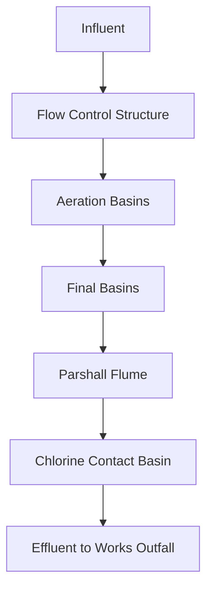

### FIGURE 5.3 Typical hydraulic profile for a trickling filter facility
Water surface elevations represent flow of 85 000 m3/d (22 mgd).

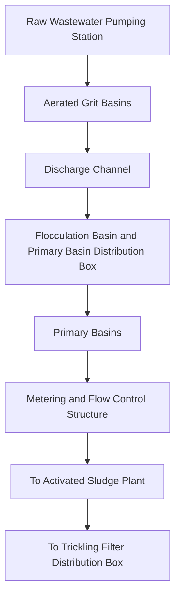

2.3 Initial Water Surface Elevations and Hydraulic Controls
If the receiving water body is a river or stream, the controlling elevation is typically the required flood elevation (i.e., the 100-year flood level), as calculated by accepted hydrological methods or as obtained from governmental entities such as the U.S. Army Corps of Engineers (Washington, D.C.) or the Federal Emergency Management Agency (Washington, D.C.). The level of flood protection is established by the regulatory agency.
\n---\n

## 2.6 Unit Process Liquid Levels and Freeboard

Process design typically includes unit process redundancy, which means that each of the unit processes, depending on the mechanical equipment, can have one or more units out of service: The hydraulic calculations must consider the effects of taking parallel unit processes out of service, as this will change and affect the water surface elevation, and potentially exceed the capacity of the flow conduit, weir, or overtop structural walls, etc.

### 1. Overview

Each unit process should be designed hydraulically to prevent liquid from overtopping the walls of structures under all conditions. The top of structure elevation is set so that freeboard is maintained above the high-water elevation. Depending on the expected surface disturbance and relative frequency of the condition, freeboard can range from an extreme low of 150 mm (6 in.) to 1 m (3.3 ft) or more. The former may be acceptable in settling tanks, where the water surface is quiescent; the latter is appropriate in aeration tanks, where there is air bulking of the liquid (with potential foaming) and around flow conduit bends and confluences (where surface waves and splashing can occur). The typical minimum freeboard under maximum water level conditions is approximately 0.3 m (12 in). Regulatory agencies may have established minimum freeboard requirements. Additional freeboard (or windscreens) may be necessary for locations where high winds would cause surface waves and inhibit scum removal or where seismic conditions dictate. As a rule, there should be no submergence of control weirs under peak flow conditions. However, some submergence often is permitted when the peak flow condition is judged to be an infrequent occurrence (i.e., extreme peak wet weather), and extraordinary measures would be required to correct the condition. However, in any case, the effect on flow distribution and process performance should be considered when submergence occurs.

### 2. Design philosophies

Many different design philosophies exist concerning the freefall allowance at weirs. A designer with a conservative approach may design to allow 80 to 150 mm (3 to 6 in.) of freefall between the weir elevation and the receiving weir trough water surface elevation. Another designer may establish a profile with no freeboard at the weirs or even allow the weirs to flood at peak flow. These philosophies are established based on the available head in the facility and the cost to pump the liquid. If sufficient head exists, without having to pump or construct excessively deep or high structures, a drop of at least 50 mm (2 in.) below the top of the weir (or the bottom of the V on a V-notch weir) is recommended: It
\n---\n

## TABLE 5. Typical Headloss through Unit Processes for Planning

<table>
<tr><td>Conduits between unit processes, including entrance and exit losses</td><td>150 to 1050 (0.5 to 3.5)</td></tr>
<tr><td>Flow distribution boxes</td><td>300 to 750 (1 to 2.5)</td></tr>
</table>

<p><sup>a</sup> Allows for partial clogging.</p>
<p><sup>b</sup> Depends on whether low head type or conventional filter is used.</p>

## 2.8 Conduit Sizing and Velocity Guidelines

Generally, a minimum velocity of 0.6 to 0.76 m/s (2 to 2.5 ft/s) at the design average flow for raw wastewater is required to prevent solids deposition in channels and pipelines. At minimum flows, velocities of 0.3 to 0.45 m/s (1 to 1.5 ft/s) are needed to transport organic matter. Achieving a particle resuspension velocity of 0.9 to 1.1 m/s (3 to 3.5 ft/s) on a daily basis can be considered in situations where it is not feasible to attain minimum flow velocity of 0.3 to 0.46 m/s (1 to 1.5 ft/s) during low-flow periods. In some cases, the minimum velocity cannot be maintained because of specific process requirements, and considerations should be given to provide access for flushing and solids removal. The velocity in conduits carrying degritted wastewater typically is at least 0.45 m/s (1.5 ft/s); the velocity in conduits conveying primary effluent typically is at least 0.3 m/s (1 ft/s). If possible, the velocity should be approximately 0.6 to 0.9 m/s (2 to 3 ft/s). Typically, conduits between process units are sized on the basis of 1 to 2 m/s (3 to 6 ft/s). Higher velocities are acceptable to minimize conduit size and cost; but headlosses can become significant. Maximum velocities typically are not a consideration at WRRFs, because conduit and channel slopes are flat, and headlosses are minimized. Velocities rarely are high enough to be a concern. For pumping systems, the maximum velocity in suction piping should not exceed 2.4 m/s (8 ft/s), and keeping velocities below 1.5 to 2 m/s (5 to 6.5 ft/s) is more typical. The maximum recommended velocity in force mains and pump discharge piping is 3.7 m/s (12 ft/s) (Jones, 2008). However, to minimize the effects of water hammer and excessive headloss, velocities in discharge piping should be kept below 2 m/s (6.5 ft/s).
\n---\n

## 5.1 Equations (Energy) and Definitions

$$ Z_1 + y_1 + \frac{V_1^2}{2g} + H_L = Z_2 + y_2 + \frac{V_2^2}{2g} \quad (5.1) $$

where Location “1” = downstream;  
Location “2” = upstream;

- \(Z_1, Z_2\) = invert elevation of the channel bottom downstream and upstream, respectively, m (ft);
- \(y_1, y_2\) = depth of water in the channel or height of the piezometric surface above the invert of the conduit downstream and upstream, respectively, m (ft);
- \(V_1, V_2\) = velocity of flow in the channel downstream and upstream, respectively, m/s (ft/s);
- \(H_L\) = headloss between 1 and 2, m (ft); and
- \(g\) = acceleration caused by gravity, 9.8 m/s² (32.2 ft/s²).

----

## 3.1.2 Volumetric Flowrate

The relationship between flowrate, velocity, and the cross-sectional area of flow can be expressed as follows:

$$ Q = A V \quad (5.2) $$

where
- \(V\) = velocity of flow in the channel, m/s (ft/s);
- \(Q\) = flow in the channel, m³/s (ft³/s);
- \(A\) = cross-sectional area of flow, m² (ft²).

The equation for circular pipes flowing full can be expressed as follows:

$$ Q = \frac{V D^2}{C} \quad (5.3) $$

where
- \(Q\) = flow in the pipe, m³/s (gal/min);
- presumably \(D\) = pipe diameter, and \(C\) = constant depending on units (as given in the text).
\n---\n

# The orifice equation and Weir Loss

The orifice equation, as defined in eq 5.4, is applicable only when the gate or opening is completely submerged. Note that when the gate or opening is submerged on the upstream side and the gate discharges free on the downstream side, H is measured vertically from the centerline of the opening to upstream water surface. If the opening is not fully submerged, as frequently occurs at tank inlets, the water surface upstream should be calculated as a submerged weir. See King and Brater (1963) and the discussion to follow.

## 3.2.2 Weir Loss

Although weirs sometimes are used for flow measurement in WRRF, they more commonly serve as control devices to maintain a required water level in a unit process. Weirs are classified in accordance with the shape of the notch— rectangular, v-notch, trapezoidal, and proportional. Trapezoidal weirs are sometimes called Cipoletti weirs. Proportional weirs, sometimes called Sutro weirs, have the discharge head varying linearly with flow; they are used in grit channels to maintain constant velocity with depth. The upper edge of the weir plate (in the case of a rectangular weir) and the bottom of the notch in a v-notch or trapezoidal weir is the crest of the weir: The depth of the water over the crest is the head or H measured some distance upstream of the weir (see Figure 5.4a). This distance can be as much as 4 to 5 times H upstream (Ackers et al., 1978).

Rectangular weirs are classified as either sharp-crested or broad-crested, as shown in Figures 5.4a and 5.4b. Weirs also can be submerged or unsubmerged. Weirs typically are designed to be unsubmerged (i.e., not affected by downstream conditions).

V-notch weir angles range from 22.5° to 120°, with the 90° v-notch being the most common. Under free-flow (unsubmerged) conditions, as shown in Figure 5.5a, the head over a sharp-crested v-notch weir can be calculated using the following equation:

$$ H = \left[ \frac{Q}{C \tan \left( \frac{\varphi}{2} \right)} \right]^{\frac{2}{5}} $$

where Q = flow, m^3/s (cu ft/s);
φ = angle of the notch, degrees;
H = head over the crest, m (ft); and
\n---\n

## Figure 5.5 Weir flow conditions

Weir flow conditions: (a) free flow and (b) submerged flow.

Head over a sharp-crested rectangular weir under free-flow conditions can be calculated using the following equation:

$$ H = \left[\frac{Q}{C_w\,L}\right]^{2/3} \quad (5.6) $$

where Q = flow, m^3/s (cu ft/s);

- L = length of weir, m (ft);

- H = head over the crest, m (ft); and

- C_w = coefficient that accounts for the approach velocity, in terms of the ratio of the weir plate depth to the head over the crest. The values range widely, depending on the approach velocity. The most commonly used value, 1.82 for
\n---\n

# Darcy-Weisbach equation and Manning equation

Darcy-Weisbach equation:

$$ h = \frac{f\,L}{D} \left( \frac{V^{2}}{2g} \right) \quad (5.7a) $$

where h = headloss, m (ft);

- f = friction factor, which is based the conduit material and Reynolds number;
- L = conduit length, m (ft);
- D = conduit diameter, m (ft);
- V = velocity of flow, m/s (ft/s); and
- g = acceleration caused by gravity, 9.8 m/s^2 (32.2 ft/s^2).

The value for f is determined from the “Moody diagram,” found in the above-referenced texts, and depends on the relative roughness of the conduit wall, e/D, and Reynolds’ number, where e = roughness of the conduit wall, m (ft).

- R_N = Reynolds number (dimensionless) and
- ν = kinematic viscosity of the fluid, m^2/s (ft^2/s).

R_N = V D / ν (5.7b)

R_N = Reynolds number (dimensionless) and ν = kinematic viscosity of the fluid, m^2/s (ft^2/s).

Values of e can be found in the above-referenced texts. For noncircular conduits, the equivalent D can be determined as follows:

- D_equivalent = 4R (5.7c)

where R = hydraulic radius = area of flow / wetted perimeter.

Manning equation:

$$ Q = \frac{k}{n} A R^{2/3} S^{1/2} \quad (5.8) $$

\n---\n

## Hazen-Williams equation

- Q = K C A R^(0.63) S^(0.54)  (5.9)

where K = 0.849 (1.318 for U.S. customary units); and

- C = Hazen-Williams roughness coefficient. Note that “C” can vary widely depending on the type of pipe material; and a value of “100” is often a default for concrete or ductile iron pipe. However, the value depends on the age and condition of the pipe. Also, a “C” value as high as 140 to 150 is common for new smooth-wall PVC pipes.

Other parameters are as defined above.

Minor losses are those headlosses that occur as a result of valves, bends, and other types of fittings. Minor losses can be accommodated in the hydraulic calculations using either the “K-factor” method or the “equivalent length” method. In the former, the headloss is a function of the velocity head, as shown in eq 5.7a:

$$ H = \frac{K V^2}{2g} \quad (5.10) $$

where

- H = headloss resulting from the fitting, etc., m (ft);
- K = headloss factor, dimensionless;
- V = velocity in the conduit, m/s (ft/s); and
- g = acceleration caused by gravity, 9.8 m/s^2 (32.2 ft/s^2).

The equivalent length method converts the headloss to an equivalent length of pipe of the same diameter as the fitting or valve: Values for K and equivalent pipe length can be found in hydraulics texts cited above: The K-value method is most common in practice.

In addition to fitting losses, headloss occurs where fluids enter a pipe and exit the pipe, (i.e., entrance and exit losses). These are determined using eq 5.7a, with the entrance K

\n---\n

## eq_5.1 In eq-5.1, H_L is as follows:

$$H_L = S_{\mathrm{Fave}} \times L \quad (5.11)$$

where \(H_L\) = headloss between downstream and upstream locations, m (ft);

- \(S_{F1}, S_{F2}\) = friction slope in the channel downstream and upstream, respectively, m/m (ft/ft);

- \(S_{\mathrm{Fave}} = (S_{F1} + S_{F2})/2\) = average friction slope between downstream and upstream, m/m (ft/ft);

- and \(L\) = distance between downstream and upstream sections, m (ft).

The parameters \(S_{F1}\) and \(S_{F2}\) typically are determined using the Manning equation (eq 5.8) based on the depth of flow downstream and upstream, respectively. For open-channel flow in WRRFs, typically the downstream values are known and the upstream values are unknown and are to be determined. This is an iterative process in nonuniform flow, as the value for \(S_{F1}\) depends on the upstream depth. If there are any minor losses, they should be included. Minor losses can be determined using a K-value approach similar to pipes:

When beginning to calculate the water depth in an open channel, it is very important to calculate the critical depth. The critical depth becomes important at flow constrictions. The critical depth, \(D_c\) for rectangular channels is determined using eq 5.12:

$$D_c = \left( \frac{Q^2}{g\, b^2} \right)^{1/3} \tag{5.12}$$

where \(D_c\) = critical depth, m; \(Q\) = flowrate, m^3/s (cu ft/s); \(b\) = channel width, m (ft); and \(g\) = acceleration caused by gravity, 9.8 m/s^2 (32.2 ft/s^2).

Critical depth for nonrectangular channels can be determined using methods in King and Brater (1963) and others. If the depth of water downstream is greater than the critical depth, the water depth in the channel will be the downstream depth. If the depth of water

\n---\n

Flow-splitting structures can become large and complex. Often a number of weir troughs, similar to those found in rectangular clarifiers, are used to achieve sufficient weir length.

A flow-splitting structure containing weirs is constructed at a location where the flows are to be split. Figure 5.6a illustrates this type of layout for two clarifiers. Figure 5.6b illustrates an example of flow control structures for facilities with asymmetrical layouts.

In the design of the splitting structure, the water surface upstream of the splitting weirs should be as quiescent as possible. One way to achieve this is to construct the influent pipe to enter vertically in the bottom. The velocity should be low; otherwise, an impact baffle should be considered. The “rise rate” or vertical velocity in the chamber upstream of the splitting weirs should be 0.3 m/s (1 ft/s) or less, if possible. If heavy solids are being transported in the liquid (i.e., raw wastewater or raw or digested sludge), higher velocities may be required to prevent deposition, but this will create more turbulence, and flow splits may not be optimum.
\n---\n

**FIGURE 5.6** Typical design examples of equal flow distribution among clarifiers: (a) symmetrical layout and (b) asymmetrical layout (in. × 25.4 = mm)

The top of the conduits leaving the splitting structure must be placed well below the water surface in the downstream chamber of the splitting box, to ensure submergence at all times and avoid vortexing, which will entrain air. This air will accumulate in the pipe and cause violent back flushes or be carried into the downstream process unit and cause surging.

Sizing the splitting weirs is based on eq. 5.6, assuming rectangular weirs are used. If there is a desire to have an equal split, all weir lengths must be the same; if the downstream process units all do not have identical capacities, then the weir lengths are proportionately adjusted. Ideally, there should be a freefall of approximately 75 to 150 mm (3 to 6 in.) between the weir crest and the downstream water surface elevation.

For large or complex flow distribution structures, the use of three-dimensional computational fluid dynamics (CFD) modeling can be used to optimize the design.

### 3.3.3 Distribution Manifolds and Channels

An inlet pipe header or distribution channel also can be used to distribute flow to a unit process. However, in such cases, the inlet ports or gates to each basin should be designed with adequate headloss to ensure good distribution. As with flow distribution, equal distribution of solids to the treatment processes also should be maintained. Unless provided for in the design, the equal distribution of solids to the treatment units may not occur coincidentally with the equal distribution of flow. This is especially common where flow is distributed by use of channels. Where channels are used, such as upstream of grit basins, the wastewater flow should be mixed well, to ensure that the solids distribute evenly with the flow. For such purposes, channel aeration is often used.

Ports or gates in the distribution channel or pipe header are sometimes used to equally distribute flow from or to unit processes. To split flow equally, the headloss through inlet openings must be much larger than the total headloss in the distribution channel or header pipe. Equation 5.13 (Camp and Graber, 1968; Fair et al., 1968) presents the hydraulic relationship between the friction loss in the header pipe or distributing channel.

\n---\n

# CHAPTER 6: Odor and Air Emissions Management

Charles M. McGinley, P.E., and Michael A. McGinley, P.E.

> 1.0 Design Basis for Managing Air Emissions
> - 1.1 Air Flowrate
> - 1.2 Pollutant and Odorant Loading
> - 1.3 Emission-Management Objective
> - 1.4 Odor Parameters
> 
> 2.0 Odor Regulation and Community Effects
> - 2.1 Odor Regulations and Policies
> - 2.2 Criteria and Hazardous Air-Pollutant Regulations
> - 2.3 Communicating with the Public
> - 2.4 Public Health versus Public Nuisance
> 
> 3.0 Odor Sampling and Measurement
> - 3.1 Field-Sampling Approaches
> - 3.2 Field-Sampling Methods
> - 3.3 Olfactometry Standards
> - 3.4 Analyzing for Specific Odorants
> - 3.5 Air- and Odor-Sampling Plans
> - 3.6 Sampling Procedures
> 
> 4.0 Assessing Odor and Air Emissions—Searching for "Root Cause" and Odor Management Strategies
> - 4.1 Odor Emissions from Wastewater Systems
> - 4.2 Air Emissions from Combustion Sources
> - 4.3 Emission Estimation Methods—General Fate Models
\n---\n

# 4.4 Odor-Control Strategies
\n---\n

> 5.4 Presentation of Results
> 6.0 Emissions Containment and Ventilation
> 6.1 Odor Containment
> 6.2 Materials Used for Odor Containment
> 6.3 Access
> 6.4 Ventilation Rates
> 6.5 Ductwork and Fans
> 7.0 Odor and Air Emissions Control
> 7.1 Liquid-Phase Treatment
> 7.2 Biological Treatment
> 7.3 Chemical and Physical Treatment
> 7.4 Combustion Emissions Control
> 8.0 References
#
> 1.0 Design Basis for Managing Air Emissions
This chapter is based substantially on the information contained in the Water Environment Federation’s Manual of Practice 25, Control of Odors and Emissions from Wastewater Treatment Plants (WEF, 2004). For further information, this should be the first point of reference. This chapter focuses on the characterization, assessment, management, capture, and treatment of odors and air emissions from the various processes at a water resource recovery facility (WRRF). The design engineer needs to consider methods of managing emissions from the various wastewater process units. These emission-management strategies are described in chapters specific to the individual process unit.
Before an emissions-management strategy can be planned and implemented, the design engineer must define each processes’ potential and actual emissions by defining the root causes of the emissions, measuring air flowrate (AFR) of air or exhaust-gas stream, the loading rate for the pollutant(s) or odorant(s) of concern, and the performance criteria required:
\n---\n

# 1.4 Odor Parameters

A person's sense of smell—the olfactory sense—is the ability to detect the presence of odorant chemicals in the ambient air. A person may be able to detect odorants at extremely low concentrations, serving as an early warning or simply a marker for the presence of air emissions from a WRRF. The sense of smell has the ability to trigger emotions and memories. Odorant concentrations at detection can be an annoyance or cause a physiological response, which may lead to a complaint.

When wastewater treatment air emissions affect air quality and cause citizen complaints, investigation of those emissions may require specific odorants be measured and the odorous air be evaluated using standardized methods. Odor can be quantified and qualified using objective, scientific methods. Odor terminology is linked to standard methods. Four objective parameters of odor are concentration, intensity, persistence, and character descriptors. These are discussed in the following sections.

## 1.4.1 Odor Concentration

Odor concentrations, as detection and recognition thresholds, are determined using an instrument called an olfactometer. The laboratory olfactometer simulates the dilution of odor in the ambient air. Odor concentration, as detection threshold, is an estimate of the number of dilutions needed to make the actual odor emission non-detectable. Recognition threshold represents the number of dilutions needed to make the odor sample faintly recognizable. A large value for odor concentration represents a strong odor. A small value for odor concentration represents a weak odor. The standard methods used in the USA for evaluating air samples for odor concentrations are ASTM E679 and EN 13725.

## 1.4.2 Odor Intensity

Perceived odor intensity is the relative strength of the odor above the recognition threshold (suprathreshold). The Standard Practice for Suprathreshold Odor Intensity Measurement (ASTM E544) presents two methods for referencing intensity of ambient odors—the dynamic-scale method (procedure A) and the static-scale method (procedure B) (ASTM, 1999).

The odor intensity evaluation result are expressed in parts per million on a volumetric or molar basis (mol/1 000 000 mol [ppm_v]) for a standard reference compound. The common
\n---\n

## 1.4.3 Odor Persistence
Odor persistence is a term used to describe the rate at which an odor’s perceived intensity decreases as the odor is diluted (i.e., in the atmosphere downwind from the odor source). Figure 6.1 illustrates how odor intensity decreases as the odor is diluted. Odor intensities decrease with dilution at different rates for different odors. Odor intensity is related to the odor concentration by the power law (Stevens’ law). Odor persistence derived from the dose-response relationship of odor concentration (dose) and odor intensity (response).

## 1.4.4 Odor Character and Odor Descriptors
Odor character is a nominal (categorical) scale of odor measurement. Odors can be characterized using referencing vocabulary for taste, sensation, and odor descriptors.

Numerous standard odor descriptor lists are available to use as a referencing vocabulary by odor assessors (panelists). In 1986, the International Association on Water Pollution Research and Control proposed the eight major odor descriptor categories: vegetable, fruity, floral, medicinal, chemical, fishy, offensive, and earthy (IAWPRC, 1986). Each of the eight major categories can have specific descriptors, which can be presented in training using exemplars. For example, the major category “vegetable” consists of a vocabulary of words that are illustrated with real-life items (exemplars), such as celery, cucumber, garlic, onion, and tomato.

- vegetable
  - exemplars: celery, cucumber, garlic, onion, and tomato
- fruity
- floral
- medicinal
- chemical
- fishy
- offensive
- earthy
\n---\n

## 2.1 Odor Regulations and Policies

Wastewater has the potential to cause odor-nuisance complaints in the surrounding community. These odor complaints may arise from a community because of unintended emissions from sewer systems, WRRFs, or solids-processing and disposal operations:

Which levels of odors create nuisance conditions? If the goal is to avoid an odor-nuisance situation, efforts typically are made to define what constitutes an odor annoyance. The types of human responses evaluated depend on the particular sensory property measured. These properties include odor intensity, detectability, character, and hedonic tone (pleasantness/unpleasantness). The combined effect of these properties is related to the annoyance that may be caused by an odor:

### 2.1.1 State and Local Responsibility

The U.S. Environmental Protection Agency (Washington, D.C.) (U.S. EPA) determined that, because odors are not caused by a single pollutant, it is difficult to associate any specific health or welfare effect to a given odor concentration. Accordingly, the U.S. EPA decided to leave the establishment of odor regulations to state and local governments, particularly because the U.S. EPA is responsible for regulating public welfare and not public nuisance. A U.S. EPA report (Wahl, 1980) confirms this approach by stating that federal regulatory involvement in odor control does not seem warranted and that local and state governments are better suited.
\n---\n

<table>
  <tr><td>No specific odor regulation</td><td>14 states</td></tr>
<tr><td>Field olfactometer or D/T</td><td>6 states</td></tr>
<tr><td>Compound-specific limits (not including total reduced sulfur)</td><td>2 states</td></tr>
<tr><td>No response to survey</td><td>3 states</td></tr>
</table>

<p>TABLE 6.1 Summary of Status of Odor Regulations in the United States as of 1995 (Adapted from Leonardos, 1997)</p>

<table>
  <thead>
    <tr><th>Location</th><th>Off-Site Standard or Guideline</th><th>Averaging Times</th></tr>
  </thead>
  <tbody>
    <tr>
      <td rowspan="3">New South Wales (Australia)</td>
      <td>2 OU/m3 (urban point source)</td>
      <td>1 second (99.5% compliance)</td>
    </tr>
<tr>
      <td></td>
      <td>1 second (99.5% compliance)</td>
    </tr>
<tr>
      <td></td>
      <td>1 hour (99.5% compliance)</td>
    </tr>
<tr>
      <td>Queensland (Australia)</td>
      <td>10 OU/m3</td>
      <td>hour (99.5% compliance)</td>
    </tr>
<tr>
      <td>Western Australia</td>
      <td>2 OU/m3</td>
      <td>hour (99.9% compliance)</td>
    </tr>
<tr>
      <td>Tasmania (Australia)</td>
      <td>7 OU/m3 (poultry guideline)</td>
      <td>hour (99.9% compliance)</td>
    </tr>
<tr>
      <td></td>
      <td></td>
      <td>3 minutes (99.9% compliance)</td>
    </tr>
<tr>
      <td>Ontario (Canada)</td>
      <td>1 OU/m3</td>
      <td>10 minutes</td>
    </tr>
<tr>
      <td>Denmark</td>
      <td>0.6 to 1.2 OU/m3</td>
      <td>1 minute</td>
    </tr>
<tr>
      <td>Siu Ho Wan WRRF (Hong Kong)</td>
      <td>5 OU</td>
      <td>5 seconds</td>
    </tr>
<tr>
      <td>The Netherlands</td>
      <td>1 OU/m3 (new sources)</td>
      <td>99.5% compliance</td>
    </tr>
  </tbody>
</table>

\n---\n

Although hydrogen sulfide is considered the most prevalent odorous compound present in wastewater, it should not be presumed, in every case, that an odor problem is caused exclusively by hydrogen sulfide. Wastewater odors typically are sulfur or nitrogen compounds, organic acids, aldehydes, or ketones (Gostelow et al., 2001). The odors most associated with WRRFs are hydrogen sulfide and reduced-sulfur organic compounds (mercaptans, dimethyl disulfide, and dimethyl sulfide).

<table>
<thead>
<tr><th>What model is specified for odor-dispersion analysis?</th><th>AERMOD, ASMS version 3, CALPUFF, SCREEN3, etc.</th></tr>
</thead>
<tbody>
<tr><td>What averaging time is specified for the odor-dispersion model?</td><td>60 minutes, 15 minutes, 10 minutes, 5 minutes, 3 minutes, etc.</td></tr>
<tr><td>What laboratory AFR is specified as part of olfactometry sample analysis?</td><td>3 L/min, 20 L/min, etc.</td></tr>
<tr><td>Does the standard have to be met all of the time as predicted by the model?</td><td>100%, 99.50%, 99%, 98%, etc.</td></tr>
<tr><td>What method is used for odor sample collection?</td><td>Flux chamber, wind tunnel, etc.</td></tr>
</tbody>
</table>

TABLE 6.3 Factors to Consider When Comparing Different D/T Odor Standards

Table 6.4 lists some of the odorous compounds found in wastewater and their odor detection and recognition thresholds. Most of the odorous substances are gaseous under normal atmospheric conditions or at least have a significant volatility. The volatility is shown in the table as parts per million (ppm) and is equal to the vapor pressure. The molecular weights of these substances typically range from 30 to 150. Typically, the lower the molecular weight of a compound, the higher its vapor pressure and potential for emission to the atmosphere. Substances of high molecular weight generally are less volatile and, thus, typically have less effect for causing odor complaints:

Data in the literature on odor threshold concentrations for any particular compound may differ significantly in many cases, by tenfold or more: This is particularly true of earlier values because of inadequate equipment or methods, small panels, or large stepwise changes in odorant concentration. The existence of many different odorous compounds associated with WRRFs creates problems when using individual compounds as the basis
\n---\n

# 2.1.1.3 Odor-Intensity Approaches

Odor intensity is a measure of the strength of the odor sensation and is related to the odorant concentration, which is a different category of measurement. The intensity of an odor is perceived directly without any knowledge of the odorant concentration or degree of air dilution of the odorous sample needed to eliminate the odor.

A category scale consists of a series of numbers that refers to verbal descriptors. For example, the series numbers 0, 1, 2, 3, 4, and 5 could correspond to no odor; barely perceptible, slight; moderate, strong, and very strong: Category scales are simple to use but have certain issues that must be considered. First; the numbers are not necessarily proportional to the perceived intensities of the odors. Second, people interpret a given category scale differently; this necessitates specialized training of the panelists. Third, odor sensitivity varies considerablyfromperson to person. Despite these issues, several municipalities use seven- or nine-point intensity scales to monitor downwind odor emissions from WRRFs.

The n-butanol odor-intensity reference scale E544-88 from the American Society for Testing and Materials (Conshohocken, Pennsylvania) (ASTM; 1988) can be used to measure odor intensity in ambient air. Panelists match the perceived intensity of an ambient odor by comparing it with the n-butanol reference scale. Panelists' judgment should be reinforced by referring to n-butanol standards between odor-intensity measurements of the ambient air. An example of an n-butanol odor-intensity scale is provided in Table 6.6.

<table>
<thead><tr><th>Table 6.5</th></tr></thead>
<tbody>
<tr><td>Examples of ambient odorous compounds standard approaches are summarized in Table 6.5.</td></tr>
</tbody>
</table>

<table>
<thead><tr><th>Table 6.6</th></tr></thead>
<tbody>
<tr><td>An example of an n-butanol odor-intensity scale is provided in Table 6.6.</td></tr>
</tbody>
</table>

\n---\n

# Table of Compounds – Odor Thresholds and Descriptions

<table>
<thead>
<tr>
<th>Compound Name</th>
<th>Formula</th>
<th>Molecular Weight</th>
<th>Volatility at 25°C, ppm (v/v)</th>
<th>Detection Threshold, ppm (v/v)</th>
<th>Recognition Threshold, ppm (v/v)</th>
<th>Odor Description</th>
</tr>
</thead>
<tbody>
<tr>
<td>Acetaldehyde</td>
<td>CH3CHO</td>
<td>44</td>
<td>Gas</td>
<td>0.067</td>
<td>0.21</td>
<td>Pungent, fruity</td>
</tr>
<tr>
<td>Allyl mercaptan</td>
<td>CH2=CHCH2SH</td>
<td>74</td>
<td></td>
<td>0.0001</td>
<td>0.0015</td>
<td>Disagreeable, garlic</td>
</tr>
<tr>
<td>Ammonia</td>
<td>NH3</td>
<td>17</td>
<td>Gas</td>
<td>17</td>
<td>37</td>
<td>Pungent, irritating</td>
</tr>
<tr>
<td>Amyl mercaptan</td>
<td>CH3(CH2)4SH</td>
<td>104</td>
<td></td>
<td>0.0003</td>
<td>—</td>
<td>Unpleasant, putrid</td>
</tr>
<tr>
<td>Benzyl mercaptan</td>
<td>C6H5CH2SH</td>
<td>124</td>
<td></td>
<td>0.0002</td>
<td>0.0026</td>
<td>Unpleasant, strong</td>
</tr>
<tr>
<td>n-Butyl amine</td>
<td>CH3(CH2)3NH2</td>
<td>73</td>
<td>93,000</td>
<td>0.080</td>
<td>1.8</td>
<td>Sour, ammonia</td>
</tr>
<tr>
<td>Chlorine</td>
<td>Cl2</td>
<td>71</td>
<td>Gas</td>
<td>0.080</td>
<td>0.31</td>
<td>Pungent, suffocating</td>
</tr>
<tr>
<td>Dibutyl amine</td>
<td>(C4H9)2NH</td>
<td>129</td>
<td>8,000</td>
<td>0.016</td>
<td>—</td>
<td>Fishy</td>
</tr>
<tr>
<td>Diisopropyl amine</td>
<td>(C3H7)2NH</td>
<td>101</td>
<td></td>
<td>0.13</td>
<td>0.38</td>
<td>Fishy</td>
</tr>
<tr>
<td>Dimethyl amine</td>
<td>(CH3)2NH</td>
<td>45</td>
<td>Gas</td>
<td>0.34</td>
<td>—</td>
<td>Putrid, fishy</td>
</tr>
<tr>
<td>Dimethyl sulfide</td>
<td>(CH3)2S</td>
<td>62</td>
<td>830,000</td>
<td>0.001</td>
<td>0.001</td>
<td>Decayed cabbage</td>
</tr>
<tr>
<td>Diphenyl sulfide</td>
<td>(C6H5)2S</td>
<td>186</td>
<td>100</td>
<td>0.0001</td>
<td>0.0021</td>
<td>Unpleasant</td>
</tr>
<tr>
<td>Ethyl amine</td>
<td>C2H5NH2</td>
<td>45</td>
<td>Gas</td>
<td>0.27</td>
<td>1.7</td>
<td>Ammonia-like</td>
</tr>
</tbody>
</table>

\n---\n

# Odor thresholds for decayed cabbage and related compounds

<table>
  <tr><td colspan="7">Decayed cabbage</td></tr>
  <thead>
    <tr>
      <th>Compound</th>
      <th>Formula</th>
      <th>MW</th>
      <th>State</th>
      <th>Threshold 1</th>
      <th>Threshold 2</th>
      <th>Odor (descriptor)</th>
    </tr>
  </thead>
  <tbody>
    <tr>
      <td>Hydrogen sulfide</td>
      <td>H2S</td>
      <td>34</td>
      <td>Gas</td>
      <td>0.0005</td>
      <td>0.0047</td>
      <td>Rotten eggs</td>
    </tr>
<tr>
      <td>Indole</td>
      <td>C8H4(CH)2NH</td>
      <td>117</td>
      <td>360</td>
      <td>0.0001</td>
      <td>—</td>
      <td>Fecal, nauseating</td>
    </tr>
<tr>
      <td>Methyl amine</td>
      <td>CH3NH2</td>
      <td>31</td>
      <td>Gas</td>
      <td>4.7</td>
      <td>—</td>
      <td>Putrid, fishy</td>
    </tr>
<tr>
      <td>Methyl mercaptan</td>
      <td>CH3SH</td>
      <td>48</td>
      <td>Gas</td>
      <td>0.0005</td>
      <td>0.0010</td>
      <td>Rotten cabbage</td>
    </tr>
<tr>
      <td>Ozone</td>
      <td>O3</td>
      <td>48</td>
      <td>Gas</td>
      <td>0.5</td>
      <td>—</td>
      <td>Pungent; irritating</td>
    </tr>
<tr>
      <td>Phenyl mercaptan</td>
      <td>C6H5SH</td>
      <td>110</td>
      <td>2000</td>
      <td>0.0003</td>
      <td>0.0015</td>
      <td>Putrid, garlic</td>
    </tr>
<tr>
      <td>Propyl mercaptan</td>
      <td>C3H7SH</td>
      <td>76</td>
      <td>220000</td>
      <td>0.0005</td>
      <td>0.020</td>
      <td>Unpleasant</td>
    </tr>
<tr>
      <td>Pyridine</td>
      <td>C5H5N</td>
      <td>79</td>
      <td>27000</td>
      <td>0.66</td>
      <td>0.74</td>
      <td>Pungent; irritating</td>
    </tr>
<tr>
      <td>Skatole</td>
      <td>C9H9N</td>
      <td>131</td>
      <td>200</td>
      <td>0.001</td>
      <td>0.050</td>
      <td>Fecal; nauseating</td>
    </tr>
<tr>
      <td>Sulfur dioxide</td>
      <td>SO2</td>
      <td>64</td>
      <td>Gas</td>
      <td>2.7</td>
      <td>4.4</td>
      <td>Pungent; irritating</td>
    </tr>
<tr>
      <td>Thiocresol</td>
      <td>CH3C6H4SH</td>
      <td>124</td>
      <td></td>
      <td>0.0001</td>
      <td>—</td>
      <td>Skunky, irritating</td>
    </tr>
<tr>
      <td>Trimethyl amine</td>
      <td>(CH3)3N</td>
      <td>59</td>
      <td>Gas</td>
      <td>0.0004</td>
      <td>—</td>
      <td>Pungent; fishy</td>
    </tr>
  </tbody>
</table>

<p>*Different sources report a range of values for odor-detection or recognition thresholds, particularly for compounds such as hydrogen sulfide or ammonia. The range of values used for hydrogen sulfide generally is 0.47 to 9 ppb. Odor thresholds mentioned in this manual may vary and are not intended to be definitive because of differences in</p>

\n---\n

<table>
<tr><td>0.42 ppbv (0.84 μg/m3)</td><td>830 ppbv (600 μg/m3)</td><td>33 ppbv (100 μg/m3)</td></tr>
</table>

<table>
<tr><th>Region</th><th>Substance</th><th>Guideline</th></tr>
<tr><td>Alberta (Canada)</td><td>Hydrogen sulfide</td><td>10 ppbv (1 hour) ambient-air-quality guideline</td></tr>
<tr><td></td><td></td><td>2000 ppbv (1 hour) ambient-air-quality guideline</td></tr>
<tr><td>Quebec (Canada)</td><td>Hydrogen sulfide</td><td>10 ppbv (1 hour average)</td></tr>
<tr><td>WHO (Europe)</td><td>Hydrogen sulfide</td><td>0.13 to 1.3 ppbv (0.2 to 2 μg/m3) 30-minute average (guideline)</td></tr>
<tr><td>Japan</td><td>Hydrogen sulfide</td><td>20 to 200 ppbv (standards depend on location)</td></tr>
<tr><td></td><td>Hydrogen sulfide</td><td>9 to 100 ppbv</td></tr>
<tr><td></td><td>Hydrogen sulfide</td><td>2 to 10 ppbv</td></tr>
<tr><td></td><td>Hydrogen sulfide</td><td>1 to 6 ppbv</td></tr>
<tr><td></td><td>Hydrogen sulfide</td><td>1000 to 5000 ppbv</td></tr>
<tr><td>New Zealand</td><td>Hydrogen sulfide</td><td>7 μg/m3 (5 ppbv) 30-minute average but proposed to change to 1-hour average</td></tr>
<tr><td>California (USA)</td><td>Hydrogen sulfide</td><td>30 ppbv (1-hour average) ambient-air standard. At least one air-pollution-control district in California defines an odor nuisance as being a Jerome reading of 5 ppb H2S at the property line</td></tr>
<tr><td>Connecticut (USA)</td><td>Hydrogen sulfide</td><td>6.3 μg/m3</td></tr>
</table>

\n---\n

## TABLE 6.5 Examples of Regulatory Agencies with Ambient Standards for Odor-Causing Compoundsa

(Reproduced from T. D. Mahin 2001 Comparison of different approaches used to regulate odours around the world Water Science & Technology 44(9) 87–102, with permission from the copyright holders, IWA Publishing)

<table>
  <thead>
    <tr>
      <th>Location</th>
      <th>Pollutant</th>
      <th>Ambient Standard</th>
    </tr>
  </thead>
  <tbody>
    <tr>
      <td>Nebraska (USA)</td>
      <td>Total reduced sulfur</td>
      <td>100 ppb (30-minute average)</td>
    </tr>
<tr>
      <td>New Mexico (USA)</td>
      <td>Hydrogen sulfide</td>
      <td>10 ppbv (1-hour average) or 30 ppbv (30-minute average) or 100 ppbv (30-minute average) depending on air-quality region</td>
    </tr>
<tr>
      <td>New York State (USA)</td>
      <td>Hydrogen sulfide</td>
      <td>10 ppbv (14 µg/m³) 1-hour average</td>
    </tr>
<tr>
      <td>New York City</td>
      <td>Hydrogen sulfide</td>
      <td>1 ppbv</td>
    </tr>
<tr>
      <td>North Dakota (USA)</td>
      <td>Hydrogen sulfide</td>
      <td>50 ppbv (instantaneous, two readings 15 minutes apart)</td>
    </tr>
<tr>
      <td>Pennsylvania (USA)</td>
      <td>Hydrogen sulfide</td>
      <td>100 ppbv (1-hour average)</td>
    </tr>
<tr>
      <td>Texas (USA)</td>
      <td>Hydrogen sulfide</td>
      <td>80 ppbv (30-minute average) — residential/commercial 120 ppbv — industrial or vacant or range lands</td>
    </tr>
  </tbody>
</table>

<p>a Parts per billion by volume.</p>
<p>b Not to be exceeded more than 2 days in a 5-day period.</p>
<p>c Not to be exceeded more than two times per year:</p>

<p>TABLE 6.5 Examples of Regulatory Agencies with Ambient Standards for Odor-Causing Compoundsa (Reproduced from T. D. Mahin 2001 Comparison of different approaches used to regulate odours around the world Water Science & Technology 44(9) 87–102, with permission from the copyright holders, IWA Publishing)</p>

<h3>2.1.1.4 Control-Technology Approaches to Odor</h3>

\n---\n

# CHAPTER 6: Odor and Air Emissions Management

Charles M. McGinley, P.E., and Michael A. McGinley, P.E.

- 1.0 Design Basis for Managing Air Emissions
  - 1.1 Air Flowrate
  - 1.2 Pollutant and Odorant Loading
  - 1.3 Emission-Management Objective
  - 1.4 Odor Parameters
- 2.0 Odor Regulation and Community Effects
  - 2.1 Odor Regulations and Policies
  - 2.2 Criteria and Hazardous Air-Pollutant Regulations
  - 2.3 Communicating with the Public
  - 2.4 Public Health versus Public Nuisance
- 3.0 Odor Sampling and Measurement
  - 3.1 Field-Sampling Approaches
  - 3.2 Field-Sampling Methods
  - 3.3 Olfactometry Standards
  - 3.4 Analyzing for Specific Odorants
  - 3.5 Air- and Odor-Sampling Plans
  - 3.6 Sampling Procedures
- 4.0 Assessing Odor and Air Emissions—Searching for "Root Cause" and Odor Management Strategies
  - 4.1 Odor Emissions from Wastewater Systems
  - 4.2 Air Emissions from Combustion Sources
  - 4.3 Emission Estimation Methods—General Fate Models
  - 4.4 Odor-Control Strategies
- 5.0 Dispersion Modeling of Odors and Air Emissions
\n---\n

# 1.0 Design Basis for Managing Air Emissions

This chapter is based substantially on the information contained in the Water Environment Federation's Manual of Practice 25, Control of Odors and Emissions from Wastewater Treatment Plants (WEF, 2004). For further information, this should be the first point of reference. This chapter focuses on the characterization, assessment, management, capture, and treatment of odors and air emissions from the various processes at a water resource recovery facility (WRRF). The design engineer needs to consider methods of managing emissions from the various wastewater process units. These emission-management strategies are described in chapters specific to the individual process unit. 

Before an emissions-management strategy can be planned and implemented, the design engineer must define each processes' potential and actual emissions by defining the root causes of the emissions, measuring air flowrate (AFR) of air or exhaust-gas stream, the loading rate for the pollutant(s) or odorant(s) of concern, and the performance criteria required:
\n---\n

# 1.4 Odor Parameters
A person's sense of smell—the olfactory sense—is the ability to detect the presence of odorant chemicals in the ambient air. A person may be able to detect odorants at extremely low concentrations, serving as an early warning or simply a marker for the presence of air emissions from a WRRF. The sense of smell has the ability to trigger emotions and memories. Odorant concentrations at detection can be an annoyance or cause a physiological response, which may lead to a complaint.

When wastewater treatment air emissions affect air quality and cause citizen complaints, investigation of those emissions may require specific odorants be measured and the odorous air be evaluated using standardized methods. Odor can be quantified and qualified using objective, scientific methods. Odor terminology is linked to standard methods. Four objective parameters of odor are concentration, intensity, persistence, and character descriptors. These are discussed in the following sections.

## 1.4.1 Odor Concentration
Odor concentrations, as detection and recognition thresholds, are determined using an instrument called an olfactometer. The laboratory olfactometer simulates the dilution of odor in the ambient air. Odor concentration, as detection threshold, is an estimate of the number of dilutions needed to make the actual odor emission non-detectable. Recognition threshold represents the number of dilutions needed to make the odor sample faintly recognizable. A large value for odor concentration represents a strong odor. A small value for odor concentration represents a weak odor. The standard methods used in the USA for evaluating air samples for odor concentrations are ASTM E679 and EN 13725.

## 1.4.2 Odor Intensity
Perceived odor intensity is the relative strength of the odor above the recognition threshold (suprathreshold). The Standard Practice for Suprathreshold Odor Intensity Measurement (ASTM E544) presents two methods for referencing intensity of ambient odors—the dynamic-scale method (procedure A) and the static-scale method (procedure B) (ASTM, 1999).

The odor intensity evaluation result are expressed in parts per million on a volumetric or molar basis (mol/1 000 000 mol [ppm_v]) for a standard reference compound. The common
\n---\n

## 1.4 Odor Persistence and Descriptors

A larger value of n-butanol means a stronger odor. A small value of n-butanol means a weaker odor intensity.

## 1.4.3 Odor Persistence
Odor persistence is a term used to describe the rate at which an odor’s perceived intensity decreases as the odor is diluted (i.e., in the atmosphere downwind from the odor source). Figure 6.1 illustrates how odor intensity decreases as the odor is diluted. Odor intensities decrease with dilution at different rates for different odors. Odor intensity is related to the odor concentration by the power law (Stevens’ power law). Odor persistence is derived from the dose–response relationship of odor concentration (dose) and odor intensity (response).

<figure: Figure 6.1 illustration of odor intensity vs. dilution>

```mermaid
graph TD
    Dose((Dose / Concentration)) -->|affects| Intensity[Odor intensity (response)]
    Dilution((Dilution downwind)) -->|reduces| Intensity
```

## 1.4.4 Odor Character and Odor Descriptors
Odor character is a nominal (categorical) scale of odor measurement. Odors can be characterized using referencing vocabulary for taste, sensation, and odor descriptors.

Numerous standard odor descriptor lists are available to use as a referencing vocabulary by odor assessors (panelists). In 1986, the International Association on Water Pollution Research and Control proposed the eight major odor descriptor categories: 
- vegetable
- fruity
- floral
- medicinal
- chemical
- fishy
- offensive
- earthy (IAWPRC, 1986)

Each of the eight major categories can have specific descriptors, which can be presented in training using exemplars. For example, the major category “vegetable” consists of a vocabulary of words that are illustrated with real-life items (exemplars), such as celery, cucumber, garlic, onion, and tomato.
\n---\n

## 2.1 Odor Regulations and Policies

Odors, which clearly define the pollutant; primary or secondary concentration limit; corresponding averaging period, and basis for determining compliance. Emission limits for combustion sources are established through the permit-review process.

When setting performance limits for odor-control systems, preexisting ambient-air limits or performance standards are not established uniformly. Efforts to come up with a quantitative odor standard typically start with discussions of which odor levels are detectable to the affected population. Detectability or threshold refers to the minimum concentration of an odorant that produces an olfactory response or sensation. This threshold typically is determined by an odor panel consisting of a specified number of people, and the numerical result typically is expressed as occurring when approximately 50% of the panel correctly detects the odor (i.e.; the geometric mean of the panel responses).

### 2.1.1 State and Local Responsibility

The U.S. Environmental Protection Agency (Washington, D.C.) (U.S. EPA) determined that, because odors are not caused by a single pollutant, it is difficult to associate any specific health or welfare effect to a given odor concentration. Accordingly, the U.S. EPA decided to leave the establishment of odor regulations to state and local governments, particularly because the U.S. EPA is responsible for regulating public welfare and not public nuisance. A U.S. EPA report (Wahl, 1980) confirms this approach by stating that federal regulatory involvement in odor control does not seem warranted and that local and
\n---\n

# Table 6.1 Summary of Status of Odor Regulations in the United States as of 1995 (Adapted from Leonardos, 1997)

<table>
  <tr><td>No specific odor regulation</td><td>14 states</td></tr>
<tr><td>Field olfactometer or D/T</td><td>6 states</td></tr>
<tr><td>Compound-specific limits (not including total reduced sulfur)</td><td>2 states</td></tr>
<tr><td>No response to survey</td><td>3 states</td></tr>
</table>

<table>
  <thead>
    <tr>
      <th>Location</th>
      <th>Off-Site Standard or Guideline</th>
      <th>Averaging Times</th>
    </tr>
  </thead>
  <tbody>
    <tr>
      <td>New South Wales (Australia)</td>
      <td>2 OU/m3 (urban point source)</td>
      <td>1 second (99.5% compliance)</td>
    </tr>
<tr>
      <td>New South Wales (Australia)</td>
      <td></td>
      <td>1 second (99.5% compliance)</td>
    </tr>
<tr>
      <td>New South Wales (Australia)</td>
      <td></td>
      <td>1 hour (99.5% compliance)</td>
    </tr>
<tr>
      <td>Queensland (Australia)</td>
      <td>10 OU/m3</td>
      <td>hour (99.5% compliance)</td>
    </tr>
<tr>
      <td>Western Australia</td>
      <td>2 OU/m3</td>
      <td>hour (99.9% compliance)</td>
    </tr>
<tr>
      <td>Tasmania (Australia)</td>
      <td>7 OU/m3 (poultry guideline)</td>
      <td>hour (99.9% compliance)</td>
    </tr>
<tr>
      <td>Tasmania (Australia)</td>
      <td></td>
      <td>3 minutes (99.9% compliance)</td>
    </tr>
<tr>
      <td>Ontario (Canada)</td>
      <td>1 OU/m3</td>
      <td>10 minutes</td>
    </tr>
<tr>
      <td>Denmark</td>
      <td>0.6 to 1.2 OU/m3</td>
      <td>1 minute</td>
    </tr>
<tr>
      <td>Siu Ho Wan WRRF (Hong Kong)</td>
      <td>5 OU</td>
      <td>5 seconds</td>
    </tr>
<tr>
      <td>The Netherlands</td>
      <td>1 OU/m3 (new sources)</td>
      <td>99.5% compliance</td>
    </tr>
  </tbody>
</table>

\n---\n

# Odor-Dispersion Analysis and Odor Standards

Although hydrogen sulfide is considered the most prevalent odorous compound present in wastewater; it should not be presumed, in every case, that an odor problem is caused exclusively by hydrogen sulfide. Wastewater odors typically are sulfur or nitrogen compounds, organic acids, aldehydes, or ketones (Gostelow et al., 2001). The odors most associated with WRRFs are hydrogen sulfide and reduced-sulfur organic compounds (mercaptans, dimethyl disulfide, and dimethyl sulfide).

<table>
<tr><td>What model is specified for odor-dispersion analysis?</td><td>AERMOD, ASMS version 3, CALPUFF, SCREEN3, etc.</td></tr>
<tr><td>What averaging time is specified for the odor-dispersion model?</td><td>60 minutes, 15 minutes, 10 minutes, 5 minutes, 3 minutes, etc.</td></tr>
<tr><td>What laboratory AFR is specified as part of olfactometry sample analysis?</td><td>3 L/min, 20 L/min, etc.</td></tr>
<tr><td>Does the standard have to be met all of the time as predicted by the model?</td><td>100%, 99.50%, 99%, 98%, etc.</td></tr>
<tr><td>What method is used for odor sample collection?</td><td>Flux chamber, wind tunnel, etc.</td></tr>
</table>

TABLE 6.3 Factors to Consider When Comparing Different D/T Odor Standards

Table 6.4 lists some of the odorous compounds found in wastewater and their odor detection and recognition thresholds. Most of the odorous substances are gaseous under normal atmospheric conditions or at least have a significant volatility. The volatility is shown in the table as parts per million (ppm) and is equal to the vapor pressure. The molecular weights of these substances typically range from 30 to 150. Typically, the lower the molecular weight of a compound, the higher its vapor pressure and potential for emission to the atmosphere. Substances of high molecular weight generally are less volatile and, thus, typically have less effect for causing odor complaints:

Data in the literature on odor threshold concentrations for any particular compound may differ significantly in many cases, by tenfold or more: This is particularly true of earlier values because of inadequate equipment or methods, small panels, or large stepwise changes in odorant concentration. The existence of many different odorous compounds associated with WRRFs creates problems when using individual compounds as the basis
\n---\n

## 2.1.1.3 Odor-Intensity Approaches

Data in the literature on odor threshold concentrations for any particular compound may differ significantly in many cases, by tenfold or more. This is particularly true of earlier values because of inadequate equipment or methods, small panels, or large stepwise changes in odorant concentration. The existence of many different odorous compounds associated with WRRFs creates problems when using individual compounds as the basis for assessing odors. In addition, detection and odor-annoyance thresholds cited in literature and regulations vary widely for compounds such as hydrogen sulfide. Examples of ambient odorous compounds standard approaches are summarized in Table 6.5:

Odor intensity is a measure of the strength of the odor sensation and is related to the odorant concentration, which is a different category of measurement. The intensity of an odor is perceived directly without any knowledge of the odorant concentration or degree of air dilution of the odorous sample needed to eliminate the odor:

A category scale consists of a series of numbers that refers to verbal descriptors. For example, the series numbers 0, 1, 2, 3, 4, and 5 could correspond to no odor; barely perceptible, slight; moderate, strong, and very strong: Category scales are simple to use but have certain issues that must be considered. First; the numbers are not necessarily proportional to the perceived intensities of the odors. Second, people interpret a given category scale differently; this necessitates specialized training of the panelists. Third, odor sensitivity varies considerably from person to person. Despite these issues, several municipalities use seven- or nine-point intensity scales to monitor downwind odor emissions from WRRFs

The n-butanol odor-intensity reference scale E544-88 from the American Society for Testing and Materials (Conshohocken, Pennsylvania) (ASTM; 1988) can be used to measure odor intensity in ambient air. Panelists match the perceived intensity of an ambient odor by comparing it with the n-butanol reference scale. Panelists' judgment should be reinforced by referring to n-butanol standards between odor-intensity measurements of the ambient air. An example of an n-butanol odor-intensity scale is provided in Table 6.6.
\n---\n

<table>
  <thead>
    <tr>
      <th>Compound Name</th>
      <th>Formula</th>
      <th>Molecular Weight</th>
      <th>Volatility at 25°C, ppm (v/v)</th>
      <th>Detection Threshold, ppm (v/v)</th>
      <th>Recognition Threshold, ppm (v/v)</th>
      <th>Odor Description</th>
    </tr>
  </thead>
  <tbody>
    <tr>
      <td>Acetaldehyde</td>
      <td>CH3CHO</td>
      <td>44</td>
      <td>Gas</td>
      <td>0.067</td>
      <td>0.21</td>
      <td>Pungent; fruity</td>
    </tr>
<tr>
      <td>Allyl mercaptan</td>
      <td>CH2=CH-CH2SH</td>
      <td>74</td>
      <td></td>
      <td>0.0001</td>
      <td>0.0015</td>
      <td>Disagreeable, garlic</td>
    </tr>
<tr>
      <td>Ammonia</td>
      <td>NH3</td>
      <td>17</td>
      <td>Gas</td>
      <td>17</td>
      <td>37</td>
      <td>Pungent; irritating</td>
    </tr>
<tr>
      <td>Amyl mercaptan</td>
      <td>C5H12S</td>
      <td>104</td>
      <td></td>
      <td>0.0003</td>
      <td>—</td>
      <td>Unpleasant; putrid</td>
    </tr>
<tr>
      <td>Benzyl mercaptan</td>
      <td>C7H8S</td>
      <td>124</td>
      <td></td>
      <td>0.0002</td>
      <td>0.0026</td>
      <td>Unpleasant; strong</td>
    </tr>
<tr>
      <td>n-Butyl amine</td>
      <td>C4H11N</td>
      <td>73</td>
      <td>93 000</td>
      <td>0.080</td>
      <td>1.8</td>
      <td>Sour; ammonia</td>
    </tr>
<tr>
      <td>Chlorine</td>
      <td>Cl2</td>
      <td>71</td>
      <td>Gas</td>
      <td>0.080</td>
      <td>0.31</td>
      <td>Pungent; suffocating</td>
    </tr>
<tr>
      <td>Dibutyl amine</td>
      <td>(C4H9)2NH</td>
      <td>129</td>
      <td>8000</td>
      <td>0.016</td>
      <td>—</td>
      <td>Fishy</td>
    </tr>
<tr>
      <td>Diisopropyl amine</td>
      <td>(C3H7)2NH</td>
      <td>101</td>
      <td></td>
      <td>0.13</td>
      <td>0.38</td>
      <td>Fishy</td>
    </tr>
<tr>
      <td>Dimethyl amine</td>
      <td>(CH3)2NH</td>
      <td>45</td>
      <td>Gas</td>
      <td>0.34</td>
      <td>—</td>
      <td>Putrid, fishy</td>
    </tr>
<tr>
      <td>Dimethyl sulfide</td>
      <td>(CH3)2S</td>
      <td>62</td>
      <td>830 000</td>
      <td>0.001</td>
      <td>0.001</td>
      <td>Decayed cabbage</td>
    </tr>
<tr>
      <td>Diphenyl sulfide</td>
      <td>(C6H5)2S</td>
      <td>186</td>
      <td>100</td>
      <td>0.0001</td>
      <td>0.0021</td>
      <td>Unpleasant</td>
    </tr>
<tr>
      <td>Ethyl amine</td>
      <td>C2H5NH2</td>
      <td>45</td>
      <td>Gas</td>
      <td>0.27</td>
      <td>1.7</td>
      <td>Ammonia-like</td>
    </tr>
  </tbody>
</table>

\n---\n

### Decayed cabbage

<table>
  <thead>
    <tr>
      <th>Compound</th>
      <th>Formula</th>
      <th>MW</th>
      <th>State</th>
      <th>Odor-detection (ppm)</th>
      <th>Odor-recognition (ppm)</th>
      <th>Odor description</th>
    </tr>
  </thead>
  <tbody>
    <tr>
      <td>Hydrogen sulfide</td>
      <td>H2S</td>
      <td>34</td>
      <td>Gas</td>
      <td>0.0005</td>
      <td>0.0047</td>
      <td>Rotten eggs</td>
    </tr>
<tr>
      <td>Indole</td>
      <td>C6H4(CH)2NH</td>
      <td>117</td>
      <td>360</td>
      <td>0.0001</td>
      <td>—</td>
      <td>Fecal, nauseating</td>
    </tr>
<tr>
      <td>Methyl amine</td>
      <td>CH3NH2</td>
      <td>31</td>
      <td>Gas</td>
      <td>4.7</td>
      <td>—</td>
      <td>Putrid, fishy</td>
    </tr>
<tr>
      <td>Methyl mercaptan</td>
      <td>CH3SH</td>
      <td>48</td>
      <td>Gas</td>
      <td>0.0005</td>
      <td>0.0010</td>
      <td>Rotten cabbage</td>
    </tr>
<tr>
      <td>Ozone</td>
      <td>O3</td>
      <td>48</td>
      <td>Gas</td>
      <td>0.5</td>
      <td>—</td>
      <td>Pungent; irritating</td>
    </tr>
<tr>
      <td>Phenyl mercaptan</td>
      <td>C6H5SH</td>
      <td>110</td>
      <td>2000</td>
      <td>0.0003</td>
      <td>0.0015</td>
      <td>Putrid, garlic</td>
    </tr>
<tr>
      <td>Propyl mercaptan</td>
      <td>C3H7SH</td>
      <td>76</td>
      <td>220 000</td>
      <td>0.0005</td>
      <td>0.020</td>
      <td>Unpleasant</td>
    </tr>
<tr>
      <td>Pyridine</td>
      <td>C5H5N</td>
      <td>79</td>
      <td>27 000</td>
      <td>0.66</td>
      <td>0.74</td>
      <td>Pungent; irritating</td>
    </tr>
<tr>
      <td>Skatole</td>
      <td>C9H9N</td>
      <td>131</td>
      <td>200</td>
      <td>0.001</td>
      <td>0.050</td>
      <td>Fecal; nauseating</td>
    </tr>
<tr>
      <td>Sulfur dioxide</td>
      <td>SO2</td>
      <td>64</td>
      <td>Gas</td>
      <td>2.7</td>
      <td>4.4</td>
      <td>Pungent; irritating</td>
    </tr>
<tr>
      <td>Thiocresol</td>
      <td>CH3C6H4SH</td>
      <td>124</td>
      <td>—</td>
      <td>0.0001</td>
      <td>—</td>
      <td>Skunky, irritating</td>
    </tr>
<tr>
      <td>Trimethyl amine</td>
      <td>(CH3)3N</td>
      <td>59</td>
      <td>Gas</td>
      <td>0.0004</td>
      <td>—</td>
      <td>Pungent, fishy</td>
    </tr>
  </tbody>
</table>

<p>*Different sources report a range of values for odor-detection or recognition thresholds, particularly for compounds such as hydrogen sulfide or ammonia. The range of values used for hydrogen sulfide generally is 0.47 to 9 ppb. Odor thresholds mentioned in this manual may vary and are not intended to be definitive because of differences in</p>
\n---\n

# Hydrogen sulfide ambient-air-quality guidelines by region

- 0.42 ppbv (0.84 μg/m3)
- 830 ppbv (600 μg/m3)
- 33 ppbv (100 μg/m3)

<table>
<thead>
<tr><th>Location</th><th>Contaminant</th><th>Guideline</th></tr>
</thead>
<tbody>
<tr><td>Alberta (Canada)</td><td>Hydrogen sulfide</td><td>10 ppbv (1 hour) ambient-air-quality guideline</td></tr>
<tr><td>Alberta (Canada)</td><td>Hydrogen sulfide</td><td>2000 ppbv (1 hour) ambient-air-quality guideline</td></tr>
<tr><td>Quebec (Canada)</td><td>Hydrogen sulfide</td><td>10 ppbv (1 hour average)</td></tr>
<tr><td>WHO (Europe)</td><td>Hydrogen sulfide</td><td>0.13 to 1.3 ppbv (0.2 to 2 μg/m3) 30-minute average (guideline)</td></tr>
<tr><td>Japan</td><td>Hydrogen sulfide</td><td>20 to 200 ppbv (standards depend on location)</td></tr>
<tr><td>Japan</td><td>Hydrogen sulfide</td><td>9 to 100 ppbv</td></tr>
<tr><td>Japan</td><td>Hydrogen sulfide</td><td>2 to 10 ppbv</td></tr>
<tr><td>Japan</td><td>Hydrogen sulfide</td><td>1 to 6 ppbv</td></tr>
<tr><td>Japan</td><td>Hydrogen sulfide</td><td>1000 to 5000 ppbv</td></tr>
<tr><td>New Zealand</td><td>Hydrogen sulfide</td><td>7 μg/m3 (5 ppbv) 30-minute average but proposed to change to 1-hour average</td></tr>
<tr><td>California (USA)</td><td>Hydrogen sulfide</td><td>30 ppbv (1-hour average) ambient-air standard. At least one air-pollution-control district in California defines an odor nuisance as being a Jerome reading of 5 ppb H2S at the property line</td></tr>
<tr><td>Connecticut (USA)</td><td>Hydrogen sulfide</td><td>6.3 μg/m3</td></tr>
</tbody>
</table>

\n---\n

<table>
<thead>
<tr><th>Location</th><th>Substance</th><th>Standard</th></tr>
</thead>
<tbody>
<tr><td>Nebraska (USA)</td><td>Total reduced sulfur</td><td>100 ppb (30-minute average)</td></tr>
<tr><td>New Mexico (USA)</td><td>Hydrogen sulfide</td><td>10 ppbv (1-hour average) or 30 ppbv (30-minute average) or 100 ppbv (30-minute average) depending on air-quality region</td></tr>
<tr><td>New York State (USA)</td><td>Hydrogen sulfide</td><td>10 ppbv (14 μg/m3) 1-hour average</td></tr>
<tr><td>New York City</td><td>Hydrogen sulfide</td><td>1 ppbv</td></tr>
<tr><td>North Dakota (USA)</td><td>Hydrogen sulfide</td><td>50 ppbv (instantaneous, two readings 15 minutes apart)</td></tr>
<tr><td>Pennsylvania (USA)</td><td>Hydrogen sulfide</td><td>100 ppbv (1-hour average)</td></tr>
<tr><td>Texas (USA)</td><td>Hydrogen sulfide</td><td>80 ppbv (30-minute average)— residential/commercial 120 ppbv— industrial or vacant or range lands</td></tr>
</tbody>
</table>

<a> aParts per billion by volume:</a>
<br/>
<a> bNot to be exceeded more than 2 days in a 5-day period.</a>
<br/>
<a> cNot to be exceeded more than two times per year:</a>

<p>TABLE 6.5 Examples of Regulatory Agencies with Ambient Standards for Odor-Causing Compoundsa (Reproduced from T. D. Mahin 2001 Comparison of different approaches used to regulate odours around the world Water Science & Technology 44(9) 87–102, with permission from the copyright holders, IWA Publishing)</p>

<p>2.1.1.4 Control-Technology Approaches to Odor</p>
\n---\n

# CHAPTER 8: Materials of Construction and Corrosion Control

Robert A. (Randy) Nixon; Douglas Sherman, P.E.; Jim Joyce; Christopher Hunniford, P.E.; and Brian Huang

* 1.0 Common Corrosion Mechanisms
  - 1.1 Introduction
  - 1.2 Corrosion due to Biogenic H2S Related Acid Generation
  - 1.3 Electrolytic Oxygen-Driven Corrosion of Ferrous Metals
  - 1.4 Galvanic Corrosion
  - 1.5 Soil-Related Corrosion
  - 1.6 Graphitic Corrosion of Cast and Ductile Iron
  - 1.7 Under-Deposit Corrosion
  - 1.8 Erosion-Corrosion
  - 1.9 Microbiologically Influenced Corrosion
  - 1.10 Localized Corrosion of Stainless Steels
  - 1.11 Corrosion of Aluminum Alloys
  - 1.12 Corrosion of Copper and Copper Alloys
  - 1.13 Atmospheric Corrosion
  - 1.14 Other Concrete Deterioration Mechanisms
  - 1.15 Failure of Prestressed Concrete Cylinder Pipe and Reinforced Concrete Pipe
  - 1.16 Chemical-Treatment-Related Corrosion

* 2.0 Major Corrosion Control Methods
  - 2.1 Process Control
  - 2.2 Material Selection: Natural Corrosion Resistance
  - 2.3 Protective Coatings
\n---\n

# 1.0 Common Corrosion Mechanisms
## 1.1 Introduction
The objectives of this Chapter are to acquaint the reader with the types of corrosion common to water resource recovery facilities (WRRFs) and with the primary means of preventing or controlling the associated corrosive damage to metal and non-metal materials of construction.

Section 1 describes the major corrosion mechanisms that cause damage to metals and non-metals in these facilities.
Section 2 explains the primary methods of corrosion control including process control, the use of alternate materials of construction, the application of barrier protection with coatings and liners, and electrochemical control of corrosion by cathodic protection.

> 3.3 Preliminary Treatment
> 3.4 Primary Treatment
> 3.5 Secondary Treatment
> 3.6 Biological Nutrient Removal
> 3.7 Tertiary or Advanced Wastewater Treatment
> 3.8 Chemical Treatment in the Facility
> 3.9 Biosolids Treatment
> 4.0 Corrosion Control Design for Facility Support Systems
> 4.1 HVAC Systems
> 4.2 Electrical and Instrumentation Systems
> 4.3 Odor Control Facilities
> 4.4 Chemical Feed and Distribution Facilities
> 4.5 Buried Piping and Structures
> 5.0 Suggested Readings
\n---\n

There are two fundamental concepts. First, metals are made from natural ores taken from the ground, and their manufacture involves adding a great deal of energy to them. Generally, that energy involves the addition of heat to bring about a fundamental change in their molecular structure. Thereafter, that energy is locked up in those metals, and each metal has the natural tendency to return to its original oxide or raw ore form. When this natural force of nature is manifested via metallic corrosion, that pent-up energy is released back as the electrochemical energy of corrosion. All metals have a particular energy level or electrochemical potential (voltage) relative to one another: When a given metal returns to its original oxide or ore form through corrosion, that potential energy, or voltage, is released causing electrical current (electrons) to flow. Differences between the electrical potential or energy levels of metals are what drive corrosion rates in both singular metal corrosion and in galvanic, or dissimilar metals, corrosion.

Second, metals can sometimes avoid corrosion by forming a natural protective barrier of oxide film or other passive film that isolates the metal from the corrosive environment or helps it resist corrosion. This tendency for a protective, passive film formation is critical to the understanding of metals corrosion. As long as the environments in which metals are exposed permit protective or passive film formation, and the stability of the film can be maintained, metals will not corrode or will corrode lightly. However, when the environment includes conditions that breakdown or destabilize the passive or protective films, the metals will actively corrode. Understanding the conditions that create, maintain, or breakdown a passive or protective film is one of the keys to making sound materials selection decisions in WRRFs:

Metals-related corrosion mechanisms are found in all municipal WRRFs and will be further identified and discussed in the following subsections of this chapter:

## 1.2 Corrosion due to Biogenic H2S Related Acid Generation

Strong mineral acids, such as sulfuric acid (H2SO4), corrode and destroy concrete, mortar, and most metals used in the construction of WRRFs. Under certain conditions, biological activity can generate concentrated sulfuric acid on surfaces above the waterline, which are exposed to hydrogen sulfide gas (H2S). Typically produced in the collection system by a submerged anaerobic biofilm, hydrogen sulfide gas is converted to sulfuric acid by a second aerobic biofilm living on surfaces above the water. Figure 8.1

```mermaid
flowchart TD
  A[Submerged anaerobic biofilm] --> B[H2S gas generated]
  B --> C[H2S diffuses to surfaces above water]
  D[Aerobic biofilm on surfaces above water] --> E[Sulfuric acid (H2SO4) formed]
  E --> F[Corrosion of concrete, mortar and metals]
```
\n---\n

e to cause corrosion. If wastewater sulfate concentrations are high (>100 mg/l), increased hydrogen sulfide generation will result. The rate at which hydrogen sulfide is produced by the anaerobic biofilm depends upon a variety of other environmental conditions, including the concentration of organic food source (biological oxygen demand or BOD), dissolved oxygen concentration, temperature, and other factors. Because sulfide generation in wastewater is a biological process, warmer wastewater temperatures cause an increase in metabolic activity, resulting in an increase in hydrogen sulfide production.

The anaerobic biofilm releases sulfide back into the water where it immediately establishes a chemical equilibrium between four forms of sulfide: the dissolved sulfide ion (S^2-), the dissolved bisulfide ion (HS^-), dissolved (aqueous) hydrogen sulfide gas (H2S(aq)), and hydrogen sulfide gas (H2S(g)). Only the H2S(g) can exist in the air above the water as a gas, where it can be recognized by its characteristic “rotten egg” odor. It is important to note that this equilibrium is dynamic and reversible. This means that whenever H2S(g) is released, dispersed, or removed by odor control the remaining dissolved forms of sulfide automatically shift to maintain the equilibrium. When this happens, H2S(aq) shifts to replace the lost H2S(g) and more HS^- shifts to replace the H2S(aq) as shown in the equilibrium (eq. 8.1)

<table>
<thead>
<tr>
<th>H<sub>2</sub>S(g) gas</th><th>H<sub>2</sub>S(aq)</th><th>HS^-</th><th>S<sup>2-</sup></th>
</tr>
</thead>
<tbody>
<tr>
<td>hydrogen sulfide</td><td>hydrogen sulfide gas (dissolved)</td><td>bisulfide ion</td><td>sulfide ion</td>
</tr>
</tbody>
</table>

The release of H<sub>2</sub>S(aq) to the airspace as H<sub>2</sub>S(g) is a function of the pH of the wastewater, the concentration of dissolved H<sub>2</sub>S(aq) and turbulence of the wastewater: Figure 8.2 illustrates the relationship between H<sub>2</sub>S(aq) concentration, HS^- concentration, and pH of the wastewater:

Figure 8.2 shows that approximately half of all the dissolved sulfide in wastewater exists in the H<sub>2</sub>S(aq)</sub> form and the other half exists as HS^- at a neutral pH of 7.1. As the pH of the water decreases, the fraction of the releasable H<sub>2</sub>S(aq)</sub> form of sulfide dominates the equilibrium and increases the release of H<sub>2</sub>S(g)</td>. Turbulence of the wastewater dramatically increases the release of H<sub>2</sub>S(g)</td>. When the area of the wastewater/air interface is increased by splashing (such as a spraying force main) or aeration (such as in an aerated grit
\n---\n

## 1.3 Electrolytic Oxygen-Driven Corrosion of Ferrous Metals

This form of metallic corrosion occurs in immersion service or cyclical wetting and drying conditions. In near-neutral solutions, like most municipal wastewater, the factors that influence the corrosion of ferrous metals in immersion service include oxygen activity, pH, temperature, flow rate, and numerous other contributors. The most important of these factors is aeration: the amount of oxygen that reaches the surface of the ferrous metal has the primary influence on the corrosion rate. After oxygen content; the relative acidity or pH of the water has the most influence on corrosion rate. At lower pH, the evolution of hydrogen tends to prevent the possibility of protective film formation so carbon steel or ductile iron will continue to corrode. In alkaline solutions, the formation of protective films is typically enhanced such that the corrosion rates are greatly reduced for carbon steels and ductile iron. This corrosion mechanism is typically identified on coated carbon steel primary and secondary clarifier rake mechanisms and in screening applications, among many other unit processes in the WRRF.

Electrolytic corrosion of ferrous metals is also very prevalent throughout WRRFs in the form of environmental exposure and weathering-related conditions. Electrical cabinets , structural steel, exposed piping, piping and equipment supports, building doors and door
\n---\n

# Table 8.1 presents a galvanic series for metals exposed to a certain electrolyte (in this case, seawater)

The pure metals and alloys are arranged in order of their corrosion potentials relative to a reference half-cell, starting with the most electronegative (or “active”) and progressing to the most electropositive (or “noble”). Note that each electrolyte (seawater, fresh water, soil) has a specific galvanic series, and the relative positions of the metals and alloys may vary from environment to environment. Galvanic series for groundwater and wastewater exposures will be close to that for seawater:

In a galvanic corrosion situation, the less noble metal (less corrosion-resistant or anodic metal) corrodes or becomes anodic to the more noble (more corrosion-resistant or cathodic) metal. The driving force for the corrosion current becomes the electrochemical potential difference that has developed between the metals. The most influential factors in galvanic corrosion rates are the potential difference between the two metals; the environmental conditions such as pH, conductivity, and chemistry of the electrolyte (water); the proximity of the two metals to one another; the relationship between the size of the exposed anodic and cathodic metal surface areas; and the polarization behavior of the metals. In water resource recovery applications, some common examples are:

1. The preferential corrosion of the zinc in galvanized steel relative to exposed and active carbon steel surfaces;
2. The corrosion of immersed aluminum gates and gate frames when electrically coupled to the carbon steel reinforcing bars in concrete via anchor bolts; or
3. The active pitting corrosion of coated carbon steel relative to nearby and electrically connected stainless steel surfaces.
\n---\n

# 1.4 Galvanic Corrosion

There are a few essential factors that are critical to understanding galvanic corrosion.

- First, the two dissimilar metals must be electrically continuous via welds or bolted connections.
- Second, the two metals must have a relatively significant difference in electromotive energy, or potential, to drive the corrosion voltage. As an example, the two metals aluminum and carbon steel, and the two metals ductile iron and stainless steel have substantial electromotive potential differences when in contact with each other (refer to Table 8.1). Therefore, galvanic corrosion between these metals can be expected under most wastewater immersion conditions. Also, the two electrically connected metals must be immersed in, or continuously wetted by, a common electrolyte (liquid). If the metals are not fully immersed, constant splash and spillage can create an immersion-like condition conducive to galvanic corrosion:

- The last, and perhaps the most important, factor involves the relationship between the two dissimilar metal surfaces and the exposure environment: Corrosion is an electrochemical process in which there are cathodic and anodic reactions. If either of these reactions is suppressed or missing, then corrosion is limited or does not occur. An example is when stainless steel is used in conjunction with carbon steel in an anaerobic digester; an environment that lacks reducible chemical species (e.g., oxygen or sulfur). Even though the two metals are electrically continuous, are immersed in a common electrolyte, and have a substantial electromotive potential difference, no cathodic reactions occur on the carbon steel or stainless steel surfaces. Therefore, galvanic acceleration of carbon steel is not a problem in that application. Another way to look at this is that galvanic corrosion is not a problem in that corrosion is a mechanism wherein the factors discussed above accelerate (rather than create) corrosion when dissimilar metals are coupled together in a corrosive electrolyte. Thus, the corroding condition of the anode is important: Even when a significant potential difference exists between the anode and cathode, if the anode (electrically uncoupled from the cathode) does not corrode in the electrolyte, galvanic corrosion in the electrically coupled system is not a concern.

## 1.5 Soil-Related Corrosion

Soil-related corrosion of buried ductile iron and carbon steel piping is also common in WRRFs. In these situations, microstructural composition differences in the ferrous metal surfaces produce both anodic and cathodic sites on the same pipeline. The resulting potential differences between these sites cause the flow of electrons (an electrical
\n---\n

## 1.6 Graphitic and Related Corrosion (excerpt)

(causing of leaks) typically takes many years. Ductile iron, with its different graphite structure, is much less susceptible than cast iron to this mechanism, but is not immune. Graphitic corrosion is sometimes, incorrectly, referred to as “graphitization,” which is actually a metallurgical phenomenon that occurs in carbon and low alloy steels at high temperatures.

## 1.7 Under-Deposit Corrosion

Localized pitting corrosion of carbon steel and ductile iron can occur in WRRF applications where bioactive sludge and organic materials collect and persist for long periods. This is very common in headworks, grit facilities, and clarifier structures. Localized deposits of these bioactive materials collect on bare metal surfaces or over breaches in protective coating systems where tubercules form from the combination of weak organic acids and the iron corrosion products. These tubercules or deposits create low-oxygen conditions at the metal surface (or in surface pits) and oxygen concentration cells form. The slow biological production of organic acids on the surface causes acidification within the pit, promoting more aggressive corrosion. This under-deposit corrosion is exacerbated if the anaerobic bacteria metabolize various sulfur species to form dilute sulfur acids, rather than strong sulfuric acid. The ever-present SRB in wastewater; which thrive in anaerobic conditions beneath biofilms and deposits, contribute to this form of microbiologically influenced corrosion (MIC). What is also important to note is that SRB-related MIC also occurs under nominally aerated environments where anaerobic microenvironments exist under biodeposits of aerobic organisms, especially in crevices built into structures. Such crevices are commonplace in coated steel clarifier rake mechanisms and in other WRRF structures. MIC is discussed further below with specific reference to stainless and carbon steels.

## 1.8 Erosion-Corrosion

Erosion-corrosion is the combined action of corrosion and erosion, most commonly identified in WRRFs in the presence of a moving fluid containing solid particles, which leads to rapid corrosion and accelerated loss of material. Fluid flow by itself; or most commonly flowing fluids in combination with suspended solids, can cause this form of corrosion, and carbon steel and ductile iron pipelines are most susceptible: Erosion-corrosion is most common in grit piping and in sludge-handling piping, particularly ductile
\n---\n

## 1.10 Localized Corrosion of Stainless Steels

Stainless steels due to manganese-oxidizing bacteria and corrosion of iron and steel by iron-depositing bacteria: These mechanisms occur in biologically active natural waters. Manganese-oxidizing bacteria form complex deposits of microbial cells and other organic and inorganic debris that accelerate corrosion by changing the electrochemical behavior of stainless steels. Iron-depositing bacteria produce oxygen concentration cells that divide the metal surface into small anodic sites and large surrounding cathodic zones, which leads to localized corrosion at the anodic sites.

Stainless steels resist corrosion differently than carbon steels and many other metals because stainless steels do not form surface protective films that are true oxide barriers that separate the metal from the environment. Stainless steels form a passive film that is dependent upon the presence of oxygen. Stainless steels resist corrosion best when they are exposed to an environment with ample oxygen present and when the surfaces are free of deposits, roughened areas, and crevices. If a portion of the metal surface is covered by coatings, biofilm buildup, gasketed connections, or other fabrication conditions that create oxygen-depleted zones, the oxygen-depleted areas become anodic relative to the well-aerated surfaces exposed to flowing conditions. These anodic areas actively corrode under such conditions if they are allowed to persist over time.

Passive film formation for any specific type of stainless steel is immediate provided oxygen is present and there are no aggressive chemicals that might disrupt or break down the passive film. It is for these reasons that the most common form of stainless steel corrosion involves localized corrosion in the form of pitting or crevice corrosion. General thinning or uniform corrosion of stainless steels is very rare and typically involves exposing the metal to a severe reducing environment where passive film formation is prevented altogether: This generally does not occur in a WRRF.

Pitting and crevice corrosion are the most common forms of stainless steel corrosion expected in municipal wastewater environments. Pitting corrosion is associated with a local discontinuity in the passive film: It can be caused by a mechanical discontinuity such as rough weld, a covered area, or grinding damage to the metal surface. It can also be promoted by local chemical breakdown of the passive film. Chloride ion is the most common chemical agent that promotes the pitting corrosion of stainless steels. Once a pit
\n---\n

# CHAPTER 9: Preliminary Treatment

Lucas Botero, P.E., BCEE, ENV SP; Joel C. Rife, P.E.; Kendra D. Sveum, P.E.; and Alex Szerwinski, P.E.

## 1.0 Introduction

## 2.0 Screening
- 2.1 Benefits of Screening
- 2.2 Screening Categories
- 2.3 Screenings Characterization
- 2.4 Types of Screening Media
- 2.5 Screen Types
- 2.6 Screenings Processing
- 2.7 Design Considerations
- 2.8 Screening Sustainability and Resource Recovery

## 3.0 Coarse Solids Reduction

## 4.0 Grit Removal
- 4.1 Benefits of Grit Removal
- 4.2 Grit Characterization
- 4.3 Grit Removal Processes
- 4.4 Grit Slurry Pumping
- 4.5 Grit Slurry Processing
- 4.6 Transport, Storage, and Disposal
- 4.7 Design Considerations
- 4.8 Grit Sustainability and Resource Recovery

## 5.0 Grease Removal
- 5.1 Application and Benefits
- 5.2 Grease Removal Processes
\n---\n

# 1.0 Introduction
The purpose of preliminary treatment is to remove, reduce, or modify wastewater constituents in the raw influent that can cause operational problems with downstream processes or increased maintenance of downstream equipment. These constituents primarily consist of large solids and rags (screenings), abrasive inert material (grit), floating debris, and grease. This chapter presents descriptions of and design considerations for preliminary treatment processes. Industrial pretreatment can also be considered preliminary treatment, but it is outside the scope of this chapter.

This chapter includes separate sections addressing the handling of hauled-in septic tank waste (septage) and attenuation of high flows and pollutant loading that can disrupt the performance of downstream processes (equalization). Receiving and handling high-strength waste and fats, oils, and grease (FOG) is covered in Chapter 25:

## 2.0 Screening
### 2.1 Benefits of Screening
The main goal of screening wastewater flow is to protect downstream equipment and processes. Screening can be used to remove large objects that could damage influent pumps or block flow in raw sewage channels and piping systems, or it can remove fine objects such as human hair, which protects sensitive downstream equipment including membrane systems, fabric filters, or suspended media used in integrated fixed-film activated sludge and moving bed biofilm reactor systems. The passage of rags and debris into downstream processes is one of the largest causes of equipment maintenance and failure.
\n---\n

Market in the last decade. These newer personal hygiene products predominantly consisted of non-woven wipes that, because of their size and use, are frequently disposed of in toilets. Water utilities quickly learned that most of these products do not break up in the sewer system, leading to problems in the collection system pump stations and headworks of water resource recovery facilities (WRRFs). According to INDA (Association of the Non-Woven Fabrics Industry) and EDANA (international association serving the non-wovens and related industries) flushable products shall clear toilets and properly maintained drainage pipe systems under expected product usage conditions, be compatible with existing wastewater and compatible with existing wastewater conveyance, treatment, reuse, and disposal systems, and become unrecognizable in a reasonable period of time and be safe in the natural receiving environments. However, some WRRFs have seen an increase of these products in their screening systems, particularly those that rely on gravity collection systems.

Non-dispersible products have the potential to increase the screenable material carried to the facility due to non-dispersion in the wastewater, increase the instantaneous blinding of fine screens due to slug loads containing non-flushable material, and increase the wear and tear on screening equipment because more screenable material processing is required: They also render certain types of screens inadequate to deal with the increased load of screenable material, which causes ragging issues in processes downstream of the screens when there is an inadequate capture of screenable material, and renders screening conditioning equipment (conveyance and conditioning) inadequate due to the higher peak load of screenable material, which reduces the facility's ability to deal with slugs screening loads. Therefore, designers of headworks systems in WRRFs must take all of these factors into consideration for the proper selection and design of screening equipment that may be subjected to non-dispersible materials.

## 2.2 Screening Categories

Screening of wastewater can be categorized according to screen opening size as follows:

* Trash racks and bypass screens with openings greater than 36 mm (1.5 in.).
  - Coarse screens with openings greater than 6 and less than or equal to 36 mm (0.25 to 1.5 in.)
  - Fine screens with openings greater than 0.5 and less than or equal to 6 mm (0.25 in.)
\n---\n

WEF performed two surveys of utility members (2008 and 2016b), obtaining data from 358 WRRFs across the United States. Figures 9.1 and 9.2 show the normalized data from the survey and differentiate between coarse and fine screens. Based on the survey data, some general screenings generation conclusions emerged:

* The quantity of wet screenings collected proportional to influent flow seems to be higher in smaller WRRFs.
* A wide range of wet screenings is generated. Designers should study all factors affecting the possible wet screenings collection amount before making a final judgment. Adequate safety factors should be included for instantaneous peak loadings.
* Extreme variations in screening quantities were reported, from less than 0.74 to 148 L/1000 m3 (0.1 to 20 cu ft/mil gal).
* Screenings quantity generation in the United States apparently is higher than in Europe. Recent vendor studies in Europe have found an average screenings production rate of 2.4 kg/person/d compared to 4.5 kg/person/d in the United States. This is based on U.S. screenings production of 40.7 L/1000 m3 (5.5 cu ft/mil gal); 378 L/person/d (100 gal/person/d) wastewater generation rate; and 800 kg/m3 (50 lb/ft3) screenings density. Some of this difference could be attributable to more widespread use of washer/compactors in Europe.
* The survey data indicates 60% of the facilities are using fine screening; the rest use coarse screens. This is an increase of over 20% since 2008.
* A total of 60% of the wastewater facilities reported having washer/compactors for conditioning of the screenings; 40% of facilities with coarse screens reported using washer/compactors compared to 70% of facilities with fine screens.

\n---\n

### FIGURE 9.2 Screenings quantities from fine screens

<table>
  <thead>
    <tr><th>Screen opening (mm)</th><th>Average wet screenings collected</th><th>Upper limit</th><th>Lower limit</th></tr>
  </thead>
  <tbody>
    <tr><td>1</td><td>≈12</td><td>≈14</td><td>≈6</td></tr>
<tr><td>2</td><td>≈11.5</td><td>≈13</td><td>≈5</td></tr>
<tr><td>3</td><td>≈11</td><td>≈12.5</td><td>≈4.5</td></tr>
<tr><td>4</td><td>≈10</td><td>≈11.5</td><td>≈4</td></tr>
<tr><td>5</td><td>≈9.5</td><td>≈10</td><td>≈4</td></tr>
<tr><td>6</td><td>≈9</td><td>≈9.5</td><td>≈4</td></tr>
<tr><td>7</td><td>≈8.5</td><td>≈9</td><td>≈4</td></tr>
  </tbody>
</table>

- 1. 95% confidence interval
- 2. Majority of data from facilities with washer/compactors and 60% volume reduction assumed to convert to wet screenings
- 3. Capture rate assumes no coarser screen before the fine screen

Adequate safety factors for determining peak screening quantities must be carefully considered in the design of screening and compactors. Typically, mechanically-cleaned screens withstand instantaneous peak screening loads without special provisions. Flow-paced variable frequency drives can be used to minimize wear on the collection equipment while preventing excessive headloss during instantaneous peaks. Screenings washer/compactors must be sized to adequately handle instantaneous peak loadings to process the screenings. Previous studies have suggested peaking factors from 4 to 6 up to 15 (Wodrich et al., 2005).

----

2.3.2 Physical Properties

\n---\n

# 2.4 Bar Screen and Media

referred for coarse screens and trash racks. Bars are available in a variety of shapes including rounded, rectangular, trapezoidal, and teardrop. Rounded bars have low capture efficiency and are only used on large opening bar racks. Trapezoidal bars have increasingly wide openings, allowing solids that pass through the narrowest opening at the front of the screen to pass through without getting trapped between the bars. Teardrop bars combine the benefits of the trapezoidal bars with better hydrodynamic flow characteristics, which minimize the headloss through the screen. Long vertical or horizontal gaps between bars can allow the passage of long, thin objects.

## 2.4.2 Wedge Wire
Wedge wire is a refinement of the trapezoidal bar screen used in much finer screening applications. The same narrow-to-wide opening profile is used to prevent trapping solids between the openings. The narrower openings of wedge-wire screens result in much thinner media, which is why they are called "wires" instead of "bars". Wedge-wire screens also have long, vertical gaps and are not allowed by some manufacturers of membrane bioreactor facilities because of the need to keep long, thin objects such as hair from accumulating on the membranes. A close up view of wedge-wire bars is shown in Figure 9.3.

## 2.4.3 Perforated Plate
Perforated-plate media (Figure 9.4) is more effective at capturing solids than bars or wedge wire when fine screening (such as hair removal) is required. The technology for perforated-plate media is constantly advancing with the size lower limit currently at 1 mm. Perforated-plate media has higher headloss because the effective open area is decreased, there are orifice losses, and the increased blinding compared to bar or wedge-wire media.

## 2.4.4 Mesh
Mesh (Figure 9.5) is used for fine screens 1 mm and smaller because of manufacturing limitations of perforated-plate media. Mesh media is more fragile and can result in “stapling” of solids within the media, which interferes with release of captured solids by the removal mechanism. To avoid clogging the mesh, high-pressure, water-jet cleaning is recommended. Openings in the mesh media can also be a source of confusion because
\n---\n

FIGURE 9.5 Mesh media in drum screen (courtesy of Baycor Fibre Tech, Inc.)

## 2.5 Screen Types

There are several screen designs and styles in the wastewater industry. The following sections summarize the various screen types based on their screening categories as listed below, however, some screens can be used in multiple categories: Table 9.1 summarizes advantages and disadvantages of various screen types.

### 2.5.1 Trash Racks and Bypass Screens

Trash racks are used in older facilities and in facilities receiving wastewater from combined sewer systems that can contain large objects. These are bar screens with large openings of 36 to 144 mm (1.5 to 6 in) designed to prevent logs, timbers, stumps, bricks, and other large, heavy debris from entering treatment processes. Trash racks typically are followed by screens with smaller openings. Where space is limited, facilities sometimes have basket-type trash screens that are manually hoisted and cleaned:
\n---\n

<table>
  <tr>
    <td>Coarse Screens</td>
    <td>Chain or cable driven<br>screens</td>
    <td>Design in the market for many years Simple channel construction High screenings loading rate Insensitive to fat; oil, and grease (FOG)</td>
    <td>Submerged components</td>
  </tr>
<tr>
    <td></td>
    <td>No critical submerged components Widely used<br>Allows a pivot design for servicing the unit above the channel</td>
    <td>Low screening loading rate<br>High overhead clearance, particularly at deep channels</td>
    <td></td>
  </tr>
<tr>
    <td></td>
    <td>Medium to low headroom required: Allows a pivot design for servicing the unit above the channel</td>
    <td>Several moving components. Components subject to wear and tear</td>
    <td></td>
  </tr>
<tr>
    <td></td>
    <td>Simple design Lower capital and operational cost No drive parts under water Utilizes 100% of channel width</td>
    <td>Limited to small to medium flow plants Not suited for deep channels</td>
    <td></td>
  </tr>
<tr>
    <td>Fine Screens and Microscreens</td>
    <td>Continuous element screens</td>
    <td>Proven technology High screenings capture rate</td>
    <td>Numerous moving parts Some designs have components subject to wear and tear High headloss requirements High potential for grease blinding Additional motor andlor spray bars for cleaning Potential carryover of screenings</td>
  </tr>
<tr>
    <td></td>
    <td>Widely used</td>
    <td>Some designs have submerged components subject to wear and tear</td>
    <td></td>
  </tr>
<tr>
    <td></td>
    <td>High screenings loading rate</td>
    <td>Medium headloss requirements</td>
    <td>High potential for grease blinding</td>
  </tr>
<tr>
    <td></td>
    <td>Low headroom requirements</td>
    <td></td>
    <td></td>
  </tr>
<tr>
    <td>Stair screens</td>
    <td>Low headloss requirements</td>
    <td>Allows a pivot design for servicing the unit above the channel</td>
    <td>Stringy solids can pass through the screen Not recommended when rocks or excessive grit loads are expected Requires considerable footprint for</td>
  </tr>
</table>

\n---\n

## 2.5.2.1 Multi-Rake Screens

Multi-rake screens have become increasingly popular because the multiple rakes quickly clear accumulated material from the screen, allowing it to handle high screening volumes during peak flows. Damage by obstructions is prevented by mechanical or electrical torque sensing and repeated reversal of the rake movement. Currently multiple-rake screens are available for coarse and fine screening applications. (Figure 9.6)

## 2.5.2.2 Single-Rake Screens

The single reciprocating rake screen can be equipped with a back clean/back return mechanism or with a front clean/front return mechanism that minimizes solids carryover (Figure 9.7). Although the front-clean design minimizes carryover, back-clean is less vulnerable to jamming. Because of the limited beam strength of the long teeth of a back-clean screen, its use is limited to larger opening screens. The up-and-down reciprocating motion of the rake, similar to that of a person raking a manual bar screen, minimizes the possibility of jamming. The single biggest advantage of single-rake screens is that all moving parts are located out of the water.
\n---\n

# Bar screen operational sequence

The diagram shows the bar screen with its drive and guiding components and the sequence of its cleaning operation.

- Drive shaft
- Guide shaft
- Pin rack
- Side frame
- Bar rack
- Bar screen
- Rake arm
- Rake head
- Wiper blade assembly
- Discharge chute
- Flow (as indicated in the figure)

<table>
  <thead>
    <tr>
      <th>Panel</th>
      <th>Description / Key components</th>
    </tr>
  </thead>
  <tbody>
    <tr>
      <td>1</td>
      <td>The bar screen shows the initial position with components such as Pin rack, Side frame, Drive shaft, Guide shaft, and Bar rack. Flow indicators are shown at the base; Discharge chute is depicted on the left side of the panel.</td>
    </tr>
<tr>
      <td>2</td>
      <td>The rake arm and rake head begin to engage the bar rack as the rake assembly travels downward. The lower end of the pin rack is involved in the motion; Flow indicators accompany the movement.</td>
    </tr>
<tr>
      <td>3</td>
      <td>The rake assembly travels up the pin rack, cleaning debris from the bar rack and delivering the screenings to the point of discharge. Discharge chute is shown.</td>
    </tr>
<tr>
      <td>4</td>
      <td>The rake engages the wiper blade to clean the rake head. The rake assembly then returns to the "park" position, with flow continuing as shown in the panel.</td>
    </tr>
  </tbody>
</table>

> Bar screen operational sequence
> 1 The bar screen cleaning cycle begins when the rake assembly travels downward after it is activated from the “park” position.
> 2 As the rake assembly rotates around the lower end of the pin rack, the rake head teeth engage the bar rack.
> 3 The rake assembly travels up the pin rack, cleaning debris from the bar rack and delivering the screenings to the point of discharge
> 4 The rake engages the wiper blade to clean the rake head. The rake assembly then returns to the “park” position.
\n---\n

## 2.5.2.4 Arc Screens

Arc screens are similar to single-rake screens except that the bar rack is curved, and the rake mechanism has a pivoting point in front of the screen, which allows an arc motion during cleaning: These screens can be installed on the side of the channel and can be as long as necessary to provide a large surface area suited for overflow applications like combined sewer overflow (CSO) or sanitary sewer overflow (SSO). Arc screens are also used for influent screening in small WRRFs where channel depth does not exceed 3.5 m (7 ft). Arc screens can be provided with single or multi-rake mechanisms, allowing either full or partial rake rotation depending on the headroom constraints of each site. A new pin-joint design avoids the need for large headspace. An advantage of arc screens is high hydraulic capacity and simple design. Perforated plate arc screens using a swinging brush instead of a rake have recently been introduced for fine-screening applications:

## 2.5.3 Fine Screens

Mechanical cleaning of these screens is essential and the smaller the opening the more critical cleaning performance is for proper operation. Water sprays or brushes are typically
\n---\n

## FIGURE 9.8 Perforated-plate screen (courtesy of Huber Technology, Inc.)

The following diagram illustrates a perforated-plate screen setup.

```mermaid
graph TD
A[Feed enters screen] --> B[Perforated-plate screen (inclined 60°–75° from horizontal)]
B --> C[Screen media travels downward along back of screen]
C --> D[Screened flow]
D --> E[Downstream processes]
```

Perforated-plate screens in a through-flow configuration typically require an inclination angle between 60° and 75° from horizontal. Because the screening media travels downwards on the back of the screen over the screened flow, if the cleaning mechanism is not functioning properly screenings carryover can occur with this type of screen. Continuous-element screens have one of the best screenings retentions in the industry and are often used where minimizing the screenings for downstream processes is important. Because the flow travels through the screen media twice, these screens have greater clean screen headloss than other screens and require a significant amount of flushing water:
\n---\n

# CHAPTER 10: Primary Treatment

Akram Botrous, Ph.D., P.E., BCEE; Onder Caliskaner, Ph.D., P.E.; Jeff Hauser; and Mark W. Miller, Ph.D.

> 1.0 Introduction
> 2.0 Conventional Sedimentation
>  - 2.1 Types of Clarifiers
>  - 2.2 Design Considerations
> 3.0 Enhanced Sedimentation
>  - 3.1 Preaeration
>  - 3.2 Chemically Enhanced Primary Treatment
> 4.0 High-Rate Clarification
>  - 4.1 Plate or Tube Settlers
>  - 4.2 Ballasted Flocculation
>  - 4.3 Solids Contact/Sludge Recirculation
> 5.0 Emerging Primary Treatment Technologies
>  - 5.1 Introduction
>  - 5.2 Primary Effluent Filtration
>  - 5.3 Primary Filtration
>  - 5.4 Rotating Belt Filters/Microscreens
>  - 5.5 Primary Dissolved Air Flotation Clarification Integrated with Biological Treatment
> 6.0 Primary Sludge Collection and Removal
>  - 6.1 Description
>  - 6.2 Quantities and Characteristics
>  - 6.3 Thickening
>  - 6.4 Transport and Handling
\n---\n

- 7.4 Transport and Handling
- 7.5 Concentration, Treatment, and Disposal
- 8.0 Downstream Process Considerations
- 8.1 Generation of Volatile Fatty Acids
- 8.2 Preservation of Available Carbon
- 8.3 Co-thickening of Primary and Secondary Solids
- 8.4 Digester Hydrogen Sulfide Control
- 8.5 Toxicity Considerations
- 8.6 Sludge Disposal
- 9.0 Design Example
- 10.0 References

# 1.0 Introduction
Primary treatment involves the separation and removal of suspended solids and floatables (fats, grease, oils, plastics, etc.) from wastewater by physical-chemical methods. Much of the solids removed are organic and comprise a significant portion of the influent chemical oxygen demand (COD) and biochemical oxygen demand (BOD). Therefore, primary treatment results in reduced total suspended solids (TSS), COD, and BOD loadings to downstream biological treatment processes. Nutrients, such as nitrogen and phosphorus, and other constituents are also partly removed to the extent they are contained in the removed solids. The TSS, COD, and BOD reductions result in smaller reactor volume requirements and lower aeration demands for biological treatment. Removal of floatables minimizes operational problems from the buildup of scum in downstream treatment processes and improves the facility's overall aesthetics by reducing visual blights and odors.

The selection and design of the primary treatment process should assess the economic effect of primary treatment on other processes throughout the water resource recovery facility (WRRF). For example, primary treatment can reduce the costs (capital and operational) for biological treatment but increase the costs for solids handling facilities that
\n---\n

10.4), and plate-and-tube settlers (Figure 10.5) are four types of clarifiers. Although square tanks with circular sludge collection equipment ("squircles") are also seen occasionally, this configuration is prone to poor hydraulics and biological activity and should be avoided [Water Environment Federation (WEF), 2005]. Rectangular and circular clarifiers are typically used for wastewater treatment. The selection of clarifier type for a given application can be governed by facility size, local regulatory authorities, site conditions, reliability and maintenance considerations, owner preference, and economics

<table>
<thead>
<tr>
<th>Primary Treatment Process</th>
<th>TSS Removal (%)</th>
<th>COD or BOD5 Removal (%)</th>
<th>Phosphorus Removal (%)</th>
<th>Reference</th>
</tr>
</thead>
<tbody>
<tr>
<td>Conventional primary clarifier</td>
<td>25–70</td>
<td>25–40</td>
<td>5–10</td>
<td>Metcalf and Eddy, 2014; Steel 1979; U.S. EPA, 1987</td>
</tr>
<tr>
<td>Chemically enhanced primary treatment (CEPT)</td>
<td>60–90</td>
<td>40–70</td>
<td>70–90</td>
<td>Metcalf and Eddy, 2014; Ødegaard, 2005</td>
</tr>
<tr>
<td>High-rate clarification</td>
<td>30–95</td>
<td>35–70</td>
<td>70–95</td>
<td>Metcalf and Eddy, 2014; Stevenson et al., 2008</td>
</tr>
<tr>
<td>Primary effluent filtration<a></td>
<td>60–80b</td>
<td>40–60b</td>
<td>5–10b</td>
<td>Caliskaner et al., 2015</td>
</tr>
<tr>
<td>Primary filtration</td>
<td>60–80b</td>
<td>40–60b</td>
<td>NA</td>
<td>Caliskaner et al., 2016</td>
</tr>
<tr>
<td>Rotating belt filtration/Microscreens</td>
<td>30–60b</td>
<td>25–40b</td>
<td>NA</td>
<td>Sutton et al., 2008</td>
</tr>
<tr>
<td>Dissolved air floatation clarifier (with integrated biological treatment)</td>
<td>50–80</td>
<td>40–60</td>
<td>NA</td>
<td>Ding et al., 2015; Johnson et al., 2014</td>
</tr>
</tbody>
</table>

<a>Footnotes</a>
<p>aCombined performance of the primary clarifier and the primary effluent filtration systems.</p>
<p>bWithout chemical addition.</p>
\n---\n

# FIGURE 10.1 Typical rectangular primary sedimentation tank: (a) plan and (b) section

## (a) Plan

- Cross Collector
  - Scum Well
  - Effluent Channel
- Scum
  - Skimmer
- Baffle
- Influent Channel
- Influent Pipe
- Primary Sludge
- Effluent Trough

> Note: The diagram includes additional labels and connections such as the layout of the influent and effluent paths, skimmer alignment, and baffle placements, as shown in the plan view.

## (b) Section

- Collector Drive
- Cross Collector Drive
- Cross Collector
- Headshaft Sprocket (Adjustable)
- Weir Crest
- Influent Weir
- Recess to Suit Equipment
- Skimmer
- Walkway
- Equipment
- Influent Channel
- Flight Travel
- Shear Gate
- Effluent Troughs
- Primary Sludge
- Inlet/Influent Pipe
- Baffle
- (Additional label: Skimmer near the central area)
- (Additional label: Effluent Weir (Adjustable))

----

FIGURE 10.1 Typical rectangular primary sedimentation tank: (a) plan and (b) section (from Metcalf and Eddy, Inc.; Wastewater Engineering: Treatment, Disposal, Reuse. 5th ed., Copyright © 2014, The McGraw-Hill Companies:)
\n---\n

# A

- Scum Pit
- Spray Nozzles
- Scum Box
- Primary Sludge Pipe
- Anti Rotation Baffle
- Influent Pipe
- Outlet Box
- Effluent Pipe
- Flocculating Well
- Rotation
- (a)

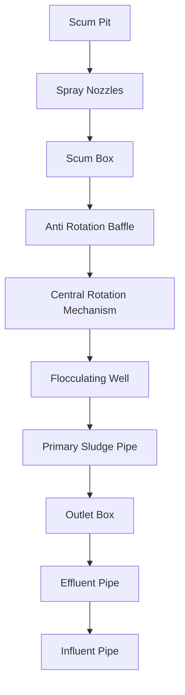

## (b) Cross-section

- V-Notch Weir and Scum Baffle
- Flocculating Well
- Scum Skimmer
- Clarifier Mechanism and Bridge
- Scum Box
- Scum Pit
- Outlet Box
- V-Notch Weir 12
- Scum Pit
- Effluent Pipe
- Influent Pipe (out of section)
- Primary Sludge
- Concentrator

```mermaid
graph TD
  B1[V-Notch Weir and Scum Baffle] --> B2[Flocculating Well]
  B2 --> B3[Scum Skimmer]
  B4[Clarifier Mechanism and Bridge] --> B5[Scum Box]
  B5 --> B1
  B6[Outlet Box] --> B7[V-Notch Weir 12] --> B3
  B8[Effluent Pipe] --> B9[Primary Sludge] --> B10[Concentrator]
  B11[Scum Pit] --> B12[Influent Pipe (out of section)]
```

\n---\n

## Figure 10.4 Stacked sedimentation tank: parallel-flow type

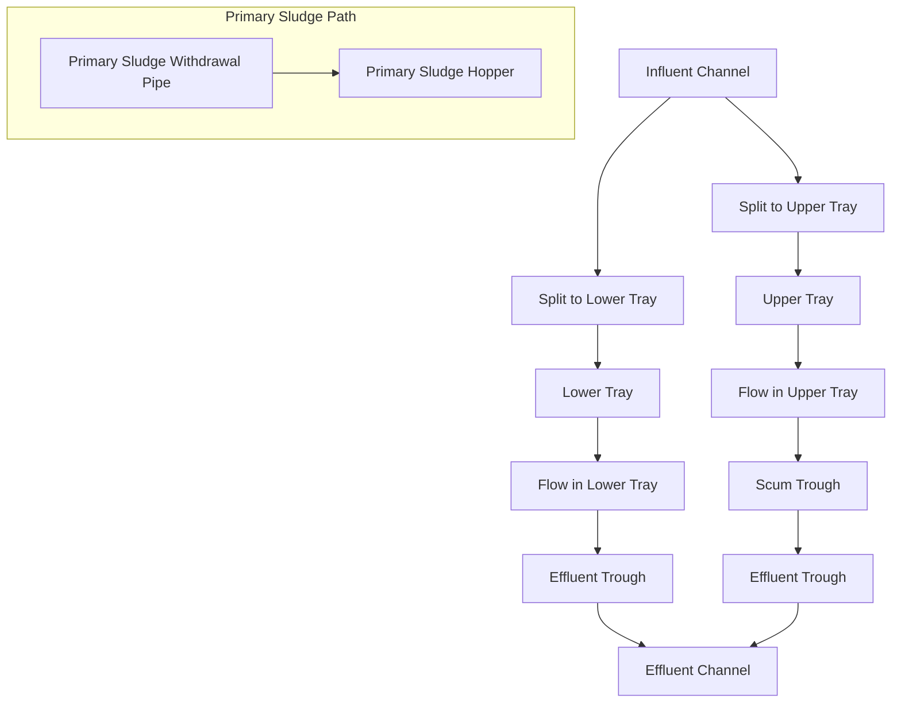

FIGURE 10.4 Stacked sedimentation tank: parallel-flow type (from Kelly, K. [1988] New Clarifiers Help Save History: Civ. Eng., 58, 10, with permission from the American Society of Civil Engineers)

In the parallel-flow unit, pipes convey wastewater from the influent channel to both the upper and lower trays as shown in Figure 10.4 (Kelly, 1988). Influent baffles in each tray straighten the flow path and minimize turbulence. The parallel-tray unit is the most common stacked configuration used for primary sedimentation:
\n---\n

Plate and tube settlers (or clarifiers), bundles of parallel plates or tubes inclined at an angle of 45° to 60° to the water surface (Figure 10.5) are used to increase the effective settling surface area of the tank. The spacing between plates is typically 40 to 120 mm (1.6–4.7 in.). The increase in settling surface area is equal to the total projected horizontal area for all plates or tubes installed. Depending on the height of the plates or tubes, the angle of inclination, and the spacing between adjacent plates or tubes, the effective settling surface area can be 6 to 12 times the plan area occupied by the plates or tubes (based on 100 mm [4 in.] spacing). The performance in this case of plate or tube settlers is similar to conventional primary clarifiers operating at the same overflow rate based on total projected horizontal area of the plates or tubes. Plate and tube settlers have been widely used in Europe, especially France, but have seen limited use in the United States. The main reason for this is the increased operational and maintenance requirements resulting from rags, debris, grease, and other solids that collect on the settlers, requiring frequent cleaning. Preliminary treatment measures such as fine screens and enhanced grease removal could minimize cleaning requirements. However, even with preliminary treatment, relatively frequent cleaning of the settlers (approximately weekly) may be required. Plate and tube clarifiers are being used more frequently for high-rate and wet-weather clarifier applications because the intermittent nature of wet-weather influent and its characteristics tend to mitigate problems with settler cleaning:

## 2.2 Design Considerations

Historically, primary sedimentation basin design has relied on criteria such as surface overflow rate, hydraulic detention time, depth, surface geometry, and weir loading rate. These criteria are helpful for design but are not accurate enough to permit prediction of actual sedimentation performance, which will depend on the wastewater characteristics (mainly settleability of suspended solids)

### 2.2.1 Surface Overflow Rate

The surface overflow rate (SOR) of the clarifier can be expressed by the following equation:

$$
SOR = \frac{Q}{A} \quad (10.1)
$$

where SOR = surface overflow rate, m3/m2/d (gpd/ft2);
\n---\n

# Figure 10.6 Primary clarifier suspended solids removals versus overflow rates

- The figure shows suspended solids removals (percent) versus overflow rate (gal/sq ft/day). Data points are scattered across the plot, with an “Idealized curve” line drawn downward from higher removals at lower overflow rates to lower removals at higher overflow rates. The x-axis ranges from 0 to 2000 gal/sq ft/day and the y-axis from 0 to 100%. The caption notes the idealized curve with data and provides a conversion reference: gpd/ft² = 0.04075 m³/m²·d.

- Equation (as denoted in the caption):
  $$ \text{gpd/ft}^2 = 0.04075 \, \frac{\text{m}^3}{\text{m}^2 \, \text{d}} $$

----

TABLE 10.2 Primary Clarifier Surface Overflow Rate Requirements (Great Lakes—Upper Mississippi Board of State and Provincial Public Health and Environmental Managers, 2014). Reprinted with permission from Health Research, Inc.

<table>
  <thead>
    <tr>
      <th>Type of Primary Settling Tank</th>
      <th>Surface Overflow Rates at:</th>
      <th>Design Peak Hourly Flow, m3/m2 d<br/>(gpd/sq ft)</th>
    </tr>
  </thead>
  <tbody>
    <tr>
      <td>Tanks not receiving waste activated sludge</td>
      <td>41 (1000)</td>
      <td>61-81 (1500-2000)</td>
    </tr>
<tr>
      <td>Tanks receiving waste activated sludge</td>
      <td>29 (700)</td>
      <td>49 (1200)</td>
    </tr>
  </tbody>
</table>

\n---\n

# Equations for TSS, COD, and BOD Removal

- E_TSSmax = maximum TSS removal efficiency;
- λ = settling parameter, m^3/m^2 d;
- SOR = surface overflow rate, m^3/m^2 d;
- TSS_non = non-settleable influent TSS concentration, mg/L;
- TSS_PI = primary influent TSS concentration, mg/L;
- E_COD = COD removal efficiency (often reported as a percentage);
- E_CODmax = maximum COD removal efficiency;
- E_BOD = BOD removal efficiency (often reported as a percentage); and
- E_BODmax = maximum BOD removal efficiency.

The TSS, COD, and BOD of the primary effluent can be estimated with the following equations (WEF, 2005; WERF, 2006):

$$TSS_{PE} = TSS_{non} + \bigl(TSS_{PI} - TSS_{non}\bigr) e^{-\lambda / SOR} \quad (10.8)$$

$$COD_{PE} = COD_{non} + \bigl(COD_{PI} - COD_{non}\bigr) e^{-\lambda / SOR} \quad (10.9)$$

$$BOD_{PE} = BOD_{non} + \bigl(BOD_{PI} - BOD_{non}\bigr) e^{-\lambda / SOR} \quad (10.10)$$

where TSS_PE = primary effluent TSS concentration, mg/L;
COD_PE = primary effluent COD concentration, mg/L; and
BOD_PE = primary effluent BOD concentration, mg/L.

Wastewater characteristics are affected by physical and biological processes occurring in
the collection system, which depend on the size and slope of the collection system, flow
rates, temperatures, and other factors. Where existing clarifiers can be sampled to
determine the wastewater characteristics at various flows and mass loadings, the settling
parameter (λ) can be estimated from historical data from a best-fit curve to

\n---\n

eqs 10.8, 10.9, or 10.10. Although settling velocity distribution tests have been used to help quantify the settling parameter ($$\lambda$$), more research is required (WEF, 2005).

Figure 10.7 shows the effect of settling parameter ($$\lambda$$) on primary clarifier performance with increasing SOR when TSSpi and TSSnon are 280 and 60 mg/L, respectively:

Although the preceding method represents an advancement in primary clarifier design, an in-depth review of the underlying assumptions and mathematical techniques in the WERF study is suggested before using such data alone to design a primary clarifier (Kinnear, 2004).

## 2.2.3 Depth

The opportunity for contact between particles and flocculation increases with depth. Hence, removal efficiency should theoretically increase with depth. In actual practice, it is uncertain whether better removals can be obtained or higher overflow rates can be applied to deeper tanks. Clarifiers must be deep enough to accommodate mechanical primary sludge removal equipment, store settled solids, prevent scour and resuspension of settled solids, and avoid washout or carryover of solids with the effluent. Shallower depths may be acceptable with continuous primary sludge removal. Typical depths range from 3 to 4.9 m (10–16 ft) (Metcalf and Eddy, 2014).
\n---\n

where M = detention time multiplier (SOR divisor), and
T = temperature of wastewater, °C.

## 2.2.5 Flow Distribution and Inlet Conditions

In facilities with multiple sedimentation tanks, practice has provided for equal distribution of flow and solids between the tanks. Splitter boxes and common channels sometimes are used for this purpose. Automatically controlled valves or gates, together with flow measuring devices, can also be used to split the flow equally to each tank. Manually controlled valves or gates are generally not effective for flow splitting because the fraction of flow directed to each tank can vary substantially with changing head losses over the range of flows to be handled.

Inlet channel velocities should be high enough to prevent solids deposition: The inlet channel design typically allows a minimum velocity of 0.3 m/s (1 ft/s) at 50% of design flow. Other alternatives to minimum velocities for prevention of solids deposition are inlet channel aeration or water jet nozzles (Yee and Babb, 1985). Provisions for scum removal from the inlet channel should also be included in the design:

Sedimentation tank inlets should be designed to dissipate inlet port velocities, distribute flow and solids equally across the cross-sectional area of a rectangular tank or equally in all directions from the center-feed area of a circular tank, prevent short-circuiting, and promote flocculation before quiescent settling:

The importance of flocculation toward optimizing primary clarifier performance is now more widely recognized than in the past. A basic assumption inherent in the derivation of the performance equations in Section 2.1.2.2 was that the solids in raw wastewaters are flocculent (WERF, 2006). Accordingly; primary clarifier designs should incorporate the same care in providing for flocculation and ideal flow as is typical for secondary clarifier designs. Examples of this care would be the use of preaeration closely coupled to rectangular primary clarifiers and the use of inlet dissipation structures and baffling in rectangular and circular primary clarifiers (WERF, 2006):

Influent flow to rectangular clarifiers can be distributed by inlet weirs or by submerged ports or orifices: Practical considerations typically govern the size of openings, but principles of jet diffusion may serve as a design guide (Hamlin, 1972). The primary causes
\n---\n

to 25% of the tank diameter. Manufacturers' recommendations for submergence vary significantly. In practice, the feed well typically has been extended at least half of the tank depth. An energy dissipating inlet should be provided to dissipate inlet pipe and port velocities and promote flocculation as the influent flow enters the feed well area. Various configurations for energy dissipating inlets have been developed by clarifier manufacturers (e.g., Figure 10.14).
\n---\n

## 2.2.6 Outlet Conditions

Proper clarifier operation also depends on outlet conditions. Effluent should be uniformly withdrawn to prevent localized, high-velocity gradients and short-circuiting: Figure 10.15 illustrates prevailing velocity gradients (drift) in a rectangular clarifier. If these velocity gradients reach the scour velocity, then settled particles can be swept into the tank effluent: Density currents, rather than a high approach velocity, often cause primary sludge carryover of the effluent weirs. Therefore, effluent should be withdrawn from the
\n---\n

# FIGURE 10.10 Inlet configuration of primary sedimentation tanks at Encina plant in Carlsbad, California (ft = 0.30485 m)

```mermaid
graph TB
  ChainTightener[Chain Tightener]
  InletDiffuser[Inlet Diffuser]
  FingerBaffle[Finger Baffle]
  GearValve[Gear Operated Plug Valve]
  PrimarySludgeHopper[Primary Sludge Hopper]
  CollectorSpeed[Collector Speed = 2 fpm]

  ChainTightener --> InletDiffuser
  InletDiffuser --> FingerBaffle
  FingerBaffle --> GearValve : 6 ft
  GearValve --> PrimarySludgeHopper
```

- Chain Tightener
- Inlet Diffuser
- 6 ft
- Finger Baffle
- Gear Operated Plug Valve
- Primary Sludge Hopper
- Collector Speed = 2 fpm
\n---\n

# FIGURE 10.12 Inlet configuration of primary sedimentation tanks at Sunnyvale, California.

<Mermaid diagram for Figure 10.12>

```mermaid
graph TD
  A[Sluice gate operator] --> B[Finger baffle]
  A --> C[Drive unit]
  D[Support] --> E[Grating]
  F[Pipe chase (Piping not shown)]
  G[Target baffle] --> A
  H[30 in x 30 in flush bottom sluice gate]
  I[Wearing channel (typical)]
  J[Longitudinal collector]
  K[3 ft x 8 ft wood flights]
```

- Sluice gate operator
- Finger baffle
- Drive unit
- Support
- Grating
- Pipe chase (Piping not shown)
- Target baffle
- 30 in x 30 in: flush bottom sluice gate
- Wearing channel (typical)
- Longitudinal collector
- 3 ft x 8 ft wood flights

----

# FIGURE 10.13 Inlet configuration of primary sedimentation tanks at Renton plant in Seattle, Washington (ft = 0.3048 m; in. = 25.405 mm):

\n---\n

## Figure (a): Top View

<table>
  <thead>
    <tr><th>Component</th><th>Location</th><th>Notes</th></tr>
  </thead>
  <tbody>
    <tr><td>Energy Dissipating Inlet (EDI)</td><td>On the outer circular housing, right side</td><td></td></tr>
<tr><td>Dual-Gate Port</td><td>Lower-left region of the circular housing</td><td></td></tr>
<tr><td>Flocculation Well</td><td>Outer ring / periphery (near lower-right area)</td><td></td></tr>
  </tbody>
</table>

----

## Figure (b): Side View

<table>
  <thead>
    <tr><th>Component</th><th>Location</th><th>Notes</th></tr>
  </thead>
  <tbody>
    <tr><td>Energy Dissipating Inlet (EDI)</td><td>Top of the vertical central column</td><td></td></tr>
<tr><td>Dual-Gate Port</td><td>Horizontal arms extending from the central column</td><td></td></tr>
<tr><td>Flocculation Well</td><td>Left and right sides along the horizontal arms</td><td></td></tr>
  </tbody>
</table>

\n---\n

# FIGURE 10.14 Energy dissipating inlet and flocculation well: (a) plan and (b) section (courtesy of WesTech Engineering, Inc.)

- Influent on the left; Effluent on the right.
- Surface Drift: path along the top of the basin.
- Bottom Drift: path along the bottom of the basin.

<table>
<tr><td>Influent</td><td>Energy dissipating inlet</td><td>Effluent</td></tr>
<tr><td></td><td>Surface Drift</td><td></td></tr>
<tr><td></td><td>Bottom Drift</td><td></td></tr>
</table>

# FIGURE 10.15 Displacement vectors in a real basin showing prevailing drifts

- Sliding cover
- Channel
- Weir plate
- Idler
- Sprocket
- Flights at 10 ft
- Return rail
- Scum removal equipment
- 12-in. flange end with 16-ga. screen mesh size 1 × 1 in.
- Screeding
- Gallery
- Slope
- Inlet diffusers
- 60 ft
- Gallery

# FIGURE 10.16 Typical cross section of primary sedimentation tanks at Valencia, California (ft = 0.30485 m; in: = 25.405 mm).
\n---\n

launder approach assumes weir placement and length to be as important as that for secondary clarifier design. Using this approach, weirs and launders for rectangular clarifiers would be designed to cover from 33% to 50% of the basin length (AWWA and ASCE, 2012; Kawamura and Lang, 1986). Long launders control the water elevation in the sedimentation basin within a narrow range. However, they are ineffective when bottom-flowing density currents exist in the basin (Kawamura and Lang, 1986). In cold regions, long launders might not be best because fluctuating water levels with short launders would minimize ice attachment to launders and basin walls (Kawamura and Lang, 1986). The short-launder approach assumes weir length to be unimportant. A simple tank-width weir is used at the end of the tank for outlet control at Valencia, California (Figure 10.16).

Designers’ opinions regarding launder spacing also differ. Some designers believe that launders should be spaced 5 to 6 m (16–20 ft) apart (AWWA and ASCE, 2012). A launder spacing of only 2.4 m (8 ft) exists at the San Jose Creek facility in Whittier, California. Launders typically are arranged transversely across the basin with chain-and-flight primary sludge collection equipment. With traveling-bridge primary sludge collection equipment, launders must be arranged longitudinally as parallel finger weirs supported on piers. Parallel finger weirs are used at Sunnyvale, California, with chain-and-flight collection equipment.

Weirs and launders for circular clarifiers typically are mounted on the peripheral wall of the tank. Experience at some facilities has demonstrated that weirs and launders should be placed at least 15% of the basin radius inboard from the periphery of the tank (AWWA and ASCE, 2012). Such placement minimizes wall flow disturbance and draws effluent from a broader area.

Launder stability is an important design consideration. Launders should be designed with provisions to relieve loadings during tank draining and prevent buoyancy uplift during tank filling:

Wave harmonics from the wind, earthquakes, or fluid flow may cause launders to oscillate or vibrate, thereby possibly deflecting or deforming the launders and damage the structural support system. New light materials and long launders aggravate this problem. Launders and weirs should be anchored to resist seismic forces because of wastewater
\n---\n

Typical k values are about 0.04 for rounded granular material and about 0.06 for non-uniform sticky and flocculent material. Typically, f values range between 0.02 and 0.03. Values for f are a function of the Reynolds number and characteristics of the settled solids surface.

## 2.2.9 Surface Geometry

Surface geometry has been used to control scouring of solids from high linear flow-through velocities or wind. Although the length-to-width ratio of rectangular tanks has historically been used as such a design tool, it is not considered to be reliable. Width is often controlled by the availability of primary sludge collection and removal equipment. For wider tanks, multiple sludge collection mechanisms can be used.

## 2.2.10 Weather Conditions

Weather conditions can affect the performance of sedimentation tanks and must be considered in their design (Wells, 1998). Wind may cause the water surface on the leeward side to be higher than on the windward side. Wind-caused turbulence may lead to unbalanced weir rates and short-circuiting (U.S. EPA, 1975). Surface skimmers should be oriented so that prevailing winds will push scum towards the collector: Design considerations for wind mitigation include orientation of tanks, installation of windbreaks or covers, increase of tank freeboard, and reduction of circular tank diameters to 37 m (120 ft) or less. Walls with a height of 1 to 1.2 m (3–4 feet) at the perimeter sometimes are used to provide wind protection for primary sedimentation tanks (Wall and Petersen, 1986).

Cold weather may also require freeze protection of surface sprays, insulation of piping, installation of underground piping at greater depths (below the freeze line), and provisions for auto draining piping that conveys intermittent flow. Because scum-collection equipment is prone to freezing, it needs adequate protection. Occasionally, these steps are insufficient in areas of severe cold and freezing; in which case, sedimentation tank covers may be required to avoid operational problems.

## 2.2.11 Maintenance Provisions

Two or more clarifiers will allow the process to remain in operation while a tank is out of service for maintenance or repair: The U.S. EPA Design Criteria for Reliability states that
\n---\n

Distribution boxes or channels must be designed to be able to remove scum and prevent floating material from affecting flow distribution devices. Sluice gates should be downward opening wherever possible to avoid buildup of scum on the water surface and prevent deposition of solids in the track, which impedes full closure of the gate. Corner pockets and dead ends should be eliminated when possible to minimize the potential for septic conditions; corner fillets and channeling should be used where necessary. In practice, the tops of submerged troughs, beams, and other construction features often have been sloped 1.4:1 and their bottoms have been sloped 1:1; this reduces or prevents accumulation of solids and scum (Great Lakes–Upper Mississippi River Board of State and Provincial Public Health and Environmental Managers, 2014). Provisions should be made for cleanup after maintenance such as, for example, frequent use of hose bibs and sump pumps. Hose bibs should be provided at an approximate spacing of 15 meters (50 feet) at each tank, scum trough, sump, and pumping station:

## 2.2.12 Extreme Flow (Wet-Weather) Considerations

The effect and anticipated frequency and duration of extreme conditions—high and low flows, such as peak storm flows with recycle flows and tanks out of service—on sedimentation tank performance should be evaluated during design to verify that operating parameters are acceptable. The design of primary clarifiers should be flexible enough to allow successful operation during low-flow start-up conditions and high-flow conditions.

Wet-weather flows depend on the location, intensity, and duration of rainfall and characteristics of the sewer system. Therefore, wet-weather flows are more difficult to predict than dry weather flows. Substantial infiltration or inflow from sanitary sewers or the existence of combined storm and sanitary sewers might result in wet-weather flows that are several times higher than normal dry weather flows. As communities implement aggressive programs to control combined sewer overflows (CSOs) and sanitary sewer overflows (SSOs), such wet-weather flows, now routed to the treatment facility, may result in very high peak flow to average flow ratios for treatment processes. In some cases, additional or enhanced sedimentation facilities have been used to treat excessive wet weather flows at peak flow to average flow ratios greater than 5:1 (Fitzpatrick et al., 2008). Provisions for emptying and flushing tanks after storm events should be considered for facilities with additional tanks (Leffler and Harrington, 2001).
\n---\n

use wastewater flow patterns might intersect with those of the primary sludge (Lager and
Locke, 1990). The lower trays of stacked clarifiers are confined spaces subject to confined
space entry requirements.

Facilities with stacked clarifiers range in size from 95 to 400 ML/d (25–100 mgd), with
average overflow rates between 15 and 43 m3/m2 d (370–1100 gpd/sq ft) and weir loading
rates between 84 and 170 m3/m d (6800–14 000 gpd/ft) (Kelly, 1988).

In Mamaroneck, New York, stacked primary clarifiers are designed for peak influent flows
of 350 ML/d (92 mgd) (Kelly, 1988). The design overflow rates are 22 m3/m2 d (550 gpd/sq ft) at average flow and 45 m3/m2 d (1100 gpd/sq ft) at peak flow (Kelly, 1988).

## 3.0 Enhanced Sedimentation

Primary sedimentation can be enhanced by preaeration or chemical coagulation and
flocculation, each of which is discussed in the following subsections.

### 3.1 Preaeration

#### 3.1.1 Description

Preaeration of raw wastewater before primary clarification increases the settling
parameter (λ) of the wastewater by promoting flocculation of finely divided solids into
more readily settleable flocs, thereby increasing suspended solids and BOD removal
efficiencies. Other benefits of preaeration include scum flotation improvement, scrubbing
of volatile organic chemical (VOC) odor components, and prevention or mitigation of
septicity.

#### 3.1.2 Design Considerations

Detention times of 20 to 30 minutes are necessary for floc formation and improved TSS,
COD, and BOD removals. This range exceeds the range of 10 to 15 minutes suggested
for odor control. The exact quantity of air required is a function of wastewater
characteristics and tank geometry. The minimum air supply is typically 0.82 m3/m3 (0.11 cu
ft/gal).

### 3.2 Chemically Enhanced Primary Treatment

#### 3.2.1 Description

\n---\n

Removal efficiencies and coagulant doses for various CEPT facilities are listed in Tables 10.3 and 10.4. Research in Sarnia and Windsor, Ontario, indicated that with CEPT, SORs up to 98 m3/m2 d (2400 gpd/ sq ft) did not significantly affect effluent quality (Heinke et al., 1980). Full-scale trials in King County, Washington, demonstrated that CEPT may provide satisfactory results to support a split treatment strategy (i.e., wet-weather blending) at SORs up to 204 m3/m2 d (5000 gpd/ sq ft) (Krugel et al., 2005). However, a design SOR of 147 m3/m2 d (3600 gpd/ sq ft) was selected for this facility (Melcer et al., 2014).

3.2.2 Design Considerations
3.2.2.1 Chemical Coagulants

The characteristics of wastewater including turbidity, TSS, COD or BOD, and particle weight distribution can have a significant effect on the non-settleable TSS (TSS_non) concentration (Narayanan et al., 2000; Neupane et al., 2006, 2008). Coagulant addition was found to lower the TSS_non concentration of wastewater, thereby improving overall removal efficiencies (see eqs 10.2 and 10.3) (Neupane et al., 2006, 2008).

Historically, iron salts, aluminum salts, and lime are the chemical coagulants used for wastewater treatment. Iron salts typically are the most common coagulant used for primary treatment: A potential advantage when using iron salts is a reduction in anaerobic digester gas hydrogen sulfide level and a reduction in hydrogen sulfide release at the primary clarifiers. Only a few facilities use lime as a coagulant because it is pH dependent and requires significant dosages to achieve the required pH. Lime also produces more primary sludge than metals salts and is more difficult to store, handle, and feed. To enhance sedimentation, some facilities use aluminum salts (alum). However; aluminum as coagulant inhibits the specific methanogenic activity of bacteria needed for anaerobic digestion by approximately 50% to 70% (Noyola and Tinajero, 2005).
\n---\n

<table>
  <tr><th>Location</th><th>Details</th></tr>
<tr><td>Point Loma</td><td>FeCl3 35 Continuous</td></tr>
<tr><td>City of San Diego</td><td>191 276 119 56.9 305 60 80.3 Anionic Polymer 0.26 Continuous</td></tr>
<tr><td>Orange County</td><td>FeCl3 20 8 hours</td></tr>
<tr><td>Plant No. 1b</td><td>60 263 162 38.4 229 81 64.6 Anionic Polymer 0.25 peak flow</td></tr>
<tr><td>Orange County</td><td>FeCl3 30 12 hours</td></tr>
<tr><td>Plant No. 2b</td><td>184 248 134 46.0 232 71 69.4 Anionic Polymer 0.14 peak flow</td></tr>
<tr><td>JWPCP</td><td></td></tr>
<tr><td>Los Angeles County</td><td>380 365 210 42.5 475 105 77.9 Anionic Polymer 0.15 Continuous</td></tr>
<tr><td>Hyperion</td><td>FeCl3 20</td></tr>
<tr><td>City of Los Angeles</td><td>370 300 145 51.7 270 45 83.3 Anionic Polymer 0.25 Continuous</td></tr>
<tr><td>Sarnia</td><td>FeCl3 17</td></tr>
</table>

\n---\n

# TABLE 10.3 Performance and Coagulant Dosages for Enhanced Sedimentation (Harleman and Morrissey, 1990)

(with permission from the American Society of Civil Engineers)

0.3 Continuous

<table>
  <thead>
    <tr>
      <th>Pollutant</th>
      <th>In (mg/L)</th>
      <th>Out (mg/L)</th>
      <th>Reduction (%)</th>
    </tr>
  </thead>
  <tbody>
    <tr>
      <td>SS</td>
      <td>233 ± 186</td>
      <td>16.6 ± 9.6</td>
      <td>92.9</td>
    </tr>
<tr>
      <td>BOD7</td>
      <td>167 ± 95</td>
      <td>27.2 ± 12.7</td>
      <td>83.7</td>
    </tr>
<tr>
      <td>Phosphorus</td>
      <td>5.24 ± 2.53</td>
      <td>0.26 ± 0.16</td>
      <td>95.0</td>
    </tr>
  </tbody>
</table>

<p>Note: SS = suspended solids; BOD7 = seven-day biochemical oxygen demand.</p>

<p>a Advanced primary treatment has since been replaced by full secondary treatment.</p>
<p>b Full secondary treatment is scheduled to replace advanced primary treatment in 2012.</p>

----

<p>Note: TSS = total suspended solids; BOD = biochemical oxygen demand.</p>

<h2>TABLE 10.4 Results of Direct Precipitation Representing the Average of 87 Norwegian Water Resource Recovery Facilities in 1985 (Ødegaard, 1992; Reprinted from Water Science and Technology, with permission from the Copyright Holders, IWA)</h2>

<p>Coagulant selection for CEPT should be based on performance, reliability, and cost:</p>

<p>Performance evaluation should use jar tests of the actual wastewater to determine
dosages and effectiveness (Hetherington et al., 1999; Jordão and Fioguiredo, 2005; Mills
et al., 2006; Wahlberg et al., 1999). Full-scale testing should also be considered to verify
bench-scale jar tests (Carter et al., 2003; Gerges et al., 2006). Coagulant dosages should
be assessed under low surface-overflow rates (Perić et al., 2006). Operating experience,
cost, and other relevant information drawn from other facilities should be considered
during selection.</p>

\n---\n

# The velocity gradient, G, is a measure of mixing intensity

The velocity gradient, G, is a measure of mixing intensity. Velocity gradients of 300 s-1 typically are sufficient for rapid mix, but some designers have recommended velocity gradients as high as 1000 s-1 (Hudson, 1981; Kawamura, 1976; Sanks, 1981). Formulae for calculating the velocity gradient for various mixer configurations are presented in other references (Camp, 1955; U.S. EPA, 1975, 1987). Rapid mix intensity had no appreciable effect on TSSnon concentration in one study (Neupane et al., 2006; 2008).

The optimal point for coagulant addition is as far upstream as possible from primary sedimentation tanks. If possible, several different feed points should be considered for additional flexibility. Dispersing the coagulant throughout the wastewater is essential to minimize coagulant dosage and concrete and metal corrosion (Soap and Detergent Association, 1989). To promote dispersion, multiple injection points or a chemical solution header (Figure 10.19) can be used. Flow metering devices should be installed on chemical feed lines for dosage control
\n---\n

Pumps, baffled compartments, baffled pipes, or air mixers (Klute, 1985). The mixing intensity of mechanical mixers and inline blenders is independent of flow rate, but these mixers cost considerably more than others and might become clogged or entangled with debris. Air mixing eliminates the problem of debris and can offer advantages for primary sedimentation, especially if aerated channels or grit chambers already exist. Pumps, Parshall flumes, flow distribution structures, baffled compartments, or baffled pipes are methods often used to upgrade existing facilities. They offer a lower-cost but less-efficient alternative to separate mixers for new construction: These methods are less efficient than separate mixers because, unlike separate mixing, mixing intensity depends on flow rate: For wet weather applications, however; these lower-cost methods may be the most suitable because CEPT will be used under high flow conditions when hydraulic turbulence is high. Chapter 14 contains additional information on the design of rapid mix facilities.

### 3.2.2.4 Flocculation

During the flocculation step of the coagulation and flocculation process, destabilized particles grow and agglomerate to form large, settleable flocs. Through gentle prolonged mixing, chemical bridging or physical enmeshment of particles, or both, occur. Flocculation is slower and more dependent on time and agitation than the rapid mix step. The benefits of flocculation are dependent on the percentage of organic matter in the wastewater that is colloidal: Typically, 40% of the soluble COD is colloidal (Foess et al., 2003). Typical detention times for flocculation range between 20 and 30 minutes. Increasing the detention time beyond this range offers only marginal benefits (Andreu-Villegas and Letterman, 1976; Neupane et al., 2006; 2008). Detention times as short as five minutes have been reported. One study found that flocculation significantly reduces the TSS_non concentration of the wastewater, thereby improving CEPT performance (Neupane et al., 2006; 2008).

 Flocculation can occur in separate structures or in baffled areas of channels, tanks, or existing structures serving other purposes. Flow distribution structures, influent wells, and inlet zones of primary sedimentation tanks are areas that promote flocculation and avoid floc breakup (Parker et al., 2000). Advantages and disadvantages of different configurations resemble those for rapid mix facilities.
\n---\n

# Plate settler flow patterns

Plate or tube settlers increase the capacity of existing clarifiers by increasing the available settling area. Figure 10.20 shows the various settler flow patterns that have been used. Chemical coagulation with recycled sludge (dense sludge process) or floc-weighting agents (ballasted flocculation) and tubes or plates allow greater SORs. Although decreasing angle and spacing of the plate or tube will increase the projected total area, flattening the tube or plate too much or restricting the space between tubes or plates will hinder the movement of settled solids. Fine screening before plate and tube settlers allows a closer spacing without plugging, but the spacing should not be so close as to cause high velocities. Effective grit and grease removal is required before the plates (Reardon, 2005). Fischerstrom (1955) recommended a minimum spacing such that flow between plates or in tubes has a Reynolds number less than 2000, a Froude number greater than 0.25, and a detention time greater than three to five minutes.

Parallel-flow  Counter-flow  Semi-cross-flow    Cross-flow

<div>Influent</div> <div>Solids/sludge</div> <div>Effluent</div>

<div>FIGURE 10.20 Plate settler flow patterns (Baur et al., 2000)</div>

<table>
<thead>
<tr><th>Pattern</th><th>Description</th></tr>
</thead>
<tbody>
<tr><td>Parallel-flow</td><td>Pattern where influent flows parallel to the plates/tubes, with solids moving downward along the same path as the liquid.</td></tr>
<tr><td>Counter-flow</td><td>Pattern where influent and solids move in opposite directions relative to the plates/tubes.</td></tr>
<tr><td>Semi-cross-flow</td><td>Pattern combining elements of cross-flow and parallel/vertical flow; flow enters at an angle to the plates/tubes.</td></tr>
<tr><td>Cross-flow</td><td>Pattern where flow moves across the plates/tubes, with effluent leaving laterally.</td></tr>
</tbody>
</table>

<div>FIGURE 10.20 Plate settler flow patterns (Baur et al., 2000).</div>

<table>
<thead>
<tr><th>Parameter</th><th>Equation</th></tr>
</thead>
<tbody>
<tr><td>Lamella velocity:</td><td>$$ V_1 = \frac{Q}{A_{tp}} $$</td></tr>
<tr><td>Total projected area:</td><td>$$ A_{tp} = n \cdot a \cdot b \cdot \cos \theta $$</td></tr>
</tbody>
</table>

\n---\n

viscosity, settling velocity, and the settling parameter (λ). Ballasted flocculation allows clarifier SORs between 700 and 1200 m3/m2/d (12–20 gpm/ft^2) at average flows and as high as 2300 to 3500 m3/m2/d (40–60 gpm/ft^2) at peak flows (Leng et al., 2002). Young and Edwards (2000) showed that there is an optimum combination of ballasting agent and chemical precipitation for a given settling time and SOR. Ballasted flocculation can achieve TSS removal rates of 75% to 90% and organic removal rates of 58% to 78% (Jolis and Ahmad, 2004; Leng et al., 2002).

Ballasted flocculation units are advantageous for wet-weather treatment because they can be offline, placed into operation, and meet performance requirements in 10 to 15 minutes (Leng et al., 2002). The units can be maintained full of effluent with a small flow of effluent continuously passing through the units to minimize the required start-up time (Constantine et al., 2003). Pilot-scale testing shows that activated sludge may be routed to a contact basin upstream of ballasted flocculation to achieve rapid uptake of soluble organic matter into the biomass (Siczka et al., 2007; Sun et al., 2008). This configuration was successfully implemented in a full-scale wet-weather treatment application (Katehis, 2011). This treatment concept is a variation of the contact-stabilization activated sludge process with ballasted flocculation acting as a high-rate secondary clarifier and the main facility’s aeration basin acting as the stabilization basin: Chapter 12 provides further information regarding the contact-stabilization activated sludge process.
\n---\n

screening, rapid mix, and flocculation followed by clarification (Figure 10.22). Sludge is thickened and recirculated to the influent end of the process where it is combined with a coagulant before the rapid mix zone. The polymer is added in the flocculation zone. The recirculation of the sludge increases the number of particles in the water, which increases particle density, settling velocity, and settling parameter (λ). Fine screening is required to minimize plugging of the tubes in the settling zone (WEF, 2005). Dense sludge units are advantageous for wet-weather treatment because they can be offline, placed into operation, and meet performance requirements in 20 to 30 minutes (WEF, 2005). Removal rates between 70% and 95% for TSS, 55% and 70% for carbonaceous BOD, and 70% and 95% for total phosphorus have been achieved at the Bay View WRRF in Toledo, Ohio, with the dense sludge process at SORs up to 2750 m3/m2 d (47 gpm/sq ft) (Stevenson et al., 2008).

<Mermaid diagram>
```mermaid
graph TD
  RawWater[Raw water] --> GritChamber[Aerated grit chamber or rapid mix]
  GritChamber --> Coagulant[Coagulant]
  Coagulant --> RapidMix[Rapid mix zone]
  RapidMix --> Flocculation[Complete-mix flocculation]
  Flocculation --> Polymer[Polymer (added in flocculation zone)]
  Flocculation --> LamellaSettler[Lamella settling zone]
  LamellaSettler --> TreatedWater[Treated water]
  LamellaSettler --> GreaseScum[Grease and scum draw-off]
  Subsystem[Sludge recirculation] --> RawWater
  SludgeRecirc[Sludge recirculation] --> RapidMix
  PlFlow[Plug-flow flocculation] --> ThickenedSludge[Thickened sludge]
  ThickenedSludge --> SludgeRecirc
```
FIGURE 10.22 Dense sludge process schematic (WEF, 2005).
</Mermaid diagram>

## 5.0 Emerging Primary Treatment Technologies

### 5.1 Introduction
Several technologies have recently emerged to provide a higher degree of primary treatment, reduced footprint, and decreased operational and maintenance requirements compared to conventional primary clarifiers. These emerging primary treatment
\n---\n

## 5.2.1 Cloth Depth Filtration Design Considerations in Primary Effluent Filtration

Reducing the primary clarifier effluent organic load will result in increased secondary treatment capacity (or decreased secondary treatment facilities requirements) and decreased aeration energy requirements. The filter BRW containing the solids captured from the primary effluent is diverted to the anaerobic digester after thickening. The high energy content of the captured volatile suspended solids (VSS) in filter BRW will increase biogas production in the anaerobic digester. A two-year demonstration project conducted at the Linda County WRRF (Olivehurst, CA) using both the CDF and CMF technologies proved primary effluent filtration to be reliable and efficient in reducing organic and TSS loads on the downstream process (Caliskaner et al., 2015), as compared to primary clarification alone. Primary clarifier and filtered effluent TSS values are shown in Figure 10.23. As seen in Figure 10.23, the load to the secondary treatment process was reduced and stabilized with primary effluent filtration.

Overall removal performance results for a number of constituents are presented in Table 10.5. The hydraulic performance of both filter technologies was reliable and appropriate considering the TSS loading rates were significantly higher compared to those typically seen in the filtration of secondary effluent (e.g., by a factor of 5–50). Both CMF and CDF operated at 70% to 100% of the filtration rates typically used in tertiary filtration applications. The average BRW ratio was observed to be only 5% to 10% (i.e., filtered water production rate between 90% and 95% of filter influent flow):

Although filtration mechanisms and operational principles are similar, deployment of CDF for primary treatment requires certain design and manufacturing modifications, compared to systems used in tertiary treatment applications. The main system modifications are for handling higher influent TSS loading rates and floatable material. Tertiary CDF systems design can still be used for primary effluent filtration (as in the two-year Linda County demonstration project discussed above), but it is recommended to utilize the modified system configuration designed for primary filtration (described in Section 5.3).
\n---\n

TABLE 10.5 Primary Effluent Filtration System Concentration Ranges and Average Removal Performances for CDF and CMF Technologies (Caliskaner et al., 2015)

<table>
  <thead>
    <tr>
      <th>Constituent</th>
      <th>Primary Effluent (mg/L) Range</th>
      <th>Primary Effluent (mg/L) Average</th>
      <th>Removal (mg/L) Range</th>
      <th>Removal (mg/L) Average</th>
    </tr>
  </thead>
  <tbody>
    <tr>
      <td>TSS</td>
      <td>60-240</td>
      <td>120</td>
      <td>40-170</td>
      <td>60</td>
    </tr>
<tr>
      <td>45VSS</td>
      <td>60-230</td>
      <td>110</td>
      <td>40-150</td>
      <td>50</td>
    </tr>
<tr>
      <td>45COD</td>
      <td>260-580</td>
      <td>390</td>
      <td>180-400</td>
      <td>260</td>
    </tr>
<tr>
      <td>30Soluble COD</td>
      <td>110-150</td>
      <td>130</td>
      <td>110-180</td>
      <td>130</td>
    </tr>
<tr>
      <td>OBOD</td>
      <td>120-260</td>
      <td>180</td>
      <td>80-180</td>
      <td>130</td>
    </tr>
<tr>
      <td>30Soluble BOD</td>
      <td>70-95</td>
      <td>75</td>
      <td>55-95</td>
      <td>70</td>
    </tr>
<tr>
      <td>0SCBOD</td>
      <td>140-190</td>
      <td>160</td>
      <td>100-130</td>
      <td>120</td>
    </tr>
<tr>
      <td>25Nitrate</td>
      <td>&lt; 1</td>
      <td>&lt; 1</td>
      <td></td>
      <td></td>
    </tr>
<tr>
      <td>0Nitrite</td>
      <td>&lt; 1</td>
      <td>&lt; 1</td>
      <td></td>
      <td></td>
    </tr>
<tr>
      <td>0Ammonia</td>
      <td>25-35</td>
      <td>32</td>
      <td>25-30</td>
      <td>30</td>
    </tr>
<tr>
      <td>0Fats, Oil, Grease</td>
      <td>ND</td>
      <td>ND</td>
      <td>ND</td>
      <td>ND</td>
    </tr>
  </tbody>
</table>

The CDF uses OptiFiber pile cloth medium on disks that are oriented vertically to reduce
the required footprint. The influent wastewater enters through the influent channel, with
each cloth media disk completely submerged in the tank. The filtrate is collected inside the
disks and then discharged to the effluent channel. As a solids layer builds on the surface
of the cloth depth medium, the tank's water level increases. When the liquid level reaches
a set point of approximately 300 mm (12 in:) above the clean filter level, the CDF system
automatically backwashes and removes the solids layer to restore the water level to its

\n---\n

# Figures

- (a) A large rectangular industrial unit mounted on a frame, featuring a ribbed inner housing and multiple valves/piping at the bottom; appears to be a process vessel or heat-exchanger assembly.
- (b) A close-up of a large cylindrical drum composed of segmented perforated discs around a central axis, typical of a filtration or separation drum.
- (c) A side-mounted valve manifold with multiple pipes, fittings, and control valves connected to a frame.
- (d) Interior view showing a chain-driven mechanism adjacent to a row of vertical, evenly spaced plates or blades forming a rack or separator assembly.
\n---\n

<table>
  <thead>
    <tr><th colspan="2">FIGURE 10.25 Operational cycles of Fuzzy Filter (Courtesy of Schreiber, LLC).</th></tr>
<tr>
      <th>Filtration cycle</th>
      <th>Wash cycle</th>
    </tr>
  </thead>
  <tbody>
    <tr>
      <td>
        

<table>
          <tr><td>Actuator for upper plate</td></tr>
<tr><td>Perforated upper plate</td></tr>
<tr><td>Perforated lower plate</td></tr>
<tr><td>Influent</td></tr>
<tr><td>Perforated lower plate</td></tr>
<tr><td>Effluent</td></tr>
        </table>

      </td>
      <td>
        

<table>
          <tr><td>Actuator for upper plate</td></tr>
<tr><td>Diffused air wash bubbles</td></tr>
<tr><td>Fuzzy media</td></tr>
<tr><td>Washing air</td></tr>
<tr><td>Influent (washing water)</td></tr>
<tr><td>Perforated upper plate</td></tr>
<tr><td>Perforated lower plate</td></tr>
        </table>

      </td>
    </tr>
  </tbody>
</table>

Main design considerations include medium depth and compression ratio, filtration hydraulic rate, and backwash handling. Typical uncompressed medium depth is 760 to 915 mm (30–36 in.). The medium compression ratio is calculated as the compression depth (i.e., change in media depth caused by compression) divided by the uncompressed medium depth. Feasible/optimum medium compression ratios range between approximately 10% and 30%, depending on specific primary effluent characteristics (e.g., particle size distribution [PSD] and TSS). For primary effluent filtration, like tertiary treatment, the Fuzzy Filter is able to operate at high filtration rates (e.g., 400–1000 L/m^2 min (10–25 gpm/sq ft)) because of the low head losses resulting from the high porosity of the medium. The BRW ratio for primary effluent filtration is typically less than 10% (Caliskaner et al., 2014, Caliskaner et al., 2015).

Another prominent type of emerging CMF technology in primary treatment, known as “FlexFilterTM”, is configured based on down-flow filtration. FlexFilterTM uses an engineered bladder coupled with the hydraulic pressure of the influent water to laterally compress the media. Influent water fills the area behind the bladder causing the bladder to compress
\n---\n

# 5.3 Primary Filtration

<table>
  <thead>
    <tr><th colspan="2">FIGURE 10.26 Operational cycles of FlexFilter™ (Courtesy of WesTech, Inc.)</th></tr>
  </thead>
  <tbody>
    <tr>
      <td>
        <strong>Filtration</strong><br/>
        <ul>
          <li>Media</li>
          <li>Influent</li>
          <li>Effluent</li>
          <li>Flexible compression fitting</li>
        </ul>
      </td>
      <td>
        <strong>Backwash</strong><br/>
        <ul>
          <li>BRW</li>
          <li>Media</li>
          <li>Air scour</li>
          <li>Flexible compression fitting</li>
        </ul>
      </td>
    </tr>
  </tbody>
</table>

Main design considerations for FlexFilter™ include medium depth, hydraulic and solids loading rates, and backwash management. Typical medium depth is 760 mm (30 in.) for TSS removal (higher medium depths may be used for primary treatment applications). Design filtration rates depend on solids and hydraulic loading and head loss development:
- Hydraulic loading rates up to 600 L/m^2 min (15 gpm/sq ft) are used for primary effluent filtration and up to 400 L/m^2 min (10 gpm/sq ft) for primary applications for CSO treatment.
- Lower filtration rates (e.g., 120–200 L/m^2 min; 3–5 gpm/sq ft) are more typical for biofiltration applications.

For both CMF technologies, design ranges for medium depth, medium compression ratio, and filtration rates depend on specific wastewater characteristics such as filter influent TSS loads/concentrations. The BRW is thickened before being conveyed to the digestion facilities. An average BRW ratio of less than 10% to 15% should be targeted at the average flow and TSS load conditions. The design criteria for the main filtration parameters (e.g., medium depth, compression ratio, and filtration rate) should be determined considering BRW flow rates and ratios in conjunction with the target TSS removal rates.
\n---\n

### 5.3.1 Design Considerations for Cloth Depth Filters in Primary Filtration

Although basic filtration principles and operating cycles are similar, CDF systems used in primary filtration applications include several design and manufacturing changes compared to CDF systems used in tertiary treatment applications, as illustrated in Figure

<p>FIGURE 10.27 BOD and TSS reductions achieved by CDF for primary filtration: (a) BOD and (b) TSS (Caliskaner et al., 2016).</p>

<table>
  <thead>
    <tr>
      <th>Month</th>
      <th>Raw Wastewater BOD (mg/L)</th>
      <th>Primary Filter Effluent BOD (mg/L)</th>
    </tr>
  </thead>
  <tbody>
    <tr>
      <td>Apr-14</td>
      <td>400</td>
      <td>100</td>
    </tr>
<tr>
      <td>May-14</td>
      <td>240</td>
      <td>60</td>
    </tr>
<tr>
      <td>Jun-14</td>
      <td>210</td>
      <td>60</td>
    </tr>
<tr>
      <td>Jul-14</td>
      <td>260</td>
      <td>70</td>
    </tr>
<tr>
      <td>Aug-14</td>
      <td>150</td>
      <td>80</td>
    </tr>
  </tbody>
</table>

<table>
  <thead>
    <tr>
      <th>Month</th>
      <th>Raw Wastewater TSS (mg/L)</th>
      <th>Primary Filter Effluent TSS (mg/L)</th>
    </tr>
  </thead>
  <tbody>
    <tr>
      <td>Apr-14</td>
      <td>600</td>
      <td>60</td>
    </tr>
<tr>
      <td>May-14</td>
      <td>450</td>
      <td>40</td>
    </tr>
<tr>
      <td>Jun-14</td>
      <td>500</td>
      <td>45</td>
    </tr>
<tr>
      <td>Jul-14</td>
      <td>700</td>
      <td>50</td>
    </tr>
<tr>
      <td>Aug-14</td>
      <td>600</td>
      <td>50</td>
    </tr>
  </tbody>
</table>

<p><em>FIGURE 10.27 BOD and TSS reductions achieved by CDF for primary filtration: (a) BOD and (b) TSS (Caliskaner et al., 2016).</em></p>

----

5.3.1 Design Considerations for Cloth Depth Filters in Primary Filtration

Although basic filtration principles and operational cycles are similar; CDF systems used in primary filtration applications include several design and manufacturing changes compared to CDF systems used in tertiary treatment applications, as illustrated in Figure
\n---\n

## 5.5 Primary Dissolved Air Floatation Clarification Integrated with Biological Treatment

The primary dissolved air floatation (DAF) clarification integrated with biological treatment system combines enhanced primary treatment and sludge thickening in one unit, resulting in footprint reduction as compared to conventional technologies. This system (also known as CaptivatorTM) is a unique carbon diversion technology that uses biosorption principles to achieve high BOD and TSS removal, as well as sludge thickening without the need for chemicals. The system blends secondary WAS with raw wastewater in a mildly aerated contact tank to promote rapid biosorption of soluble organics. The CaptivatorTM includes a small aerated contact tank upstream of a DAF unit to capture BOD from influent.

Important design parameters for CDF primary filtration applications are the same as those for primary effluent filtration with some variations in the criteria due to higher influent TSS concentrations and floatable material. These systems can be designed and operated at hydraulic filtration rates ranging between 60 and approximately 160 to 240 L/m2 min (1.5–6 gpm/ft^2). Typical average design filtration rates are 60 to 160 L/m2 min (1.5–3 gpm/ft^2). Average and peak design solids loading rates are between 24 and 37 and between 49 and 73 kg/d m^2 (5 and 7.5 and between 10 and 15 lb/d ft^2), respectively. Solids loading usually governs the primary effluent filtration and primary filtration designs, but the engineer should consider both the hydraulic and solids loading criteria for final design and proper sizing of the filtration system.

As in primary effluent filtration, another important design consideration is the selection of the filter medium: There are several types of cloth media with different filtration characteristics (e.g., nominal pore sizes ranging between 5 and 10 μm) and the hydraulic and TSS removal performances differ between different media. Selection of the medium should be made considering the design target hydraulic loading rates and TSS removal rates in conjunction with the filter influent characteristics.

Proper handling of BRW is an essential design component: The BRW is thickened before being conveyed to digestion facilities. For primary filtration applications, average BRW ratios less than 15% to 20% should be targeted for average flow and TSS load conditions. Final design criteria for filter hydraulic and solids loading rates should be determined considering BRW flow rates and ratios in conjunction with the target TSS removal rates.

\n---\n

Figure 10.29. The belted screens move linearly and as the screen moves, it acts as a conveyor and carries captured solids out of the incoming wastewater. As wastewater enters the inlet chamber and flows through the mesh screen, the effluent is collected behind the mesh screen and discharged into the outlet chamber. Sludge that has accumulated on the belt is conveyed to the upper portion of the belt and then dropped into a hopper. High-pressure water spray and/or compressed air is used to dislodge the remaining solids off the belt. The mesh screen is also backwashed twice a day with hot water to remove any oil and grease buildup.

Similar to the primary effluent and primary filtration technologies, removal is a dynamic process in RBFs, depending on the buildup of a filter mat. A pressure transmitter is typically used to measure the level of incoming water. The rotational speed of the belt filter is adjusted based on the water level to achieve optimum performance at variable flow rates and variable influent TSS concentrations. The belt filter is stationary if the water level is less than a preset value. As particles accumulate on the surface and build a filter mat; the water level increases triggering the rotation of the belt filter. If the water level keeps increasing while the belt filter is rotating, the speed will automatically increase. If the water level drops below a preset limit, the motor will stop until the level increases again.

Operating with a proper filter mat is crucial for optimum RBF performance. After a backwash cycle (i.e., when the belt is clean) solids are removed by simple sieving mechanisms. As more solids are accumulated on the rotating belt, the filter mat is formed, enhancing removal performance over time (i.e., by removing particles smaller than the belt mesh size but larger than the effective pore size of the formed filter mat). All areas of the rotating belt filter are cleaned once during each rotation cycle.
\n---\n

min (60–100 gpm/sq ft): Design solids loading rates range between 0.3 and 0.5 kg/m^2 min (0.06 and 0.1 lb/sq ft min). Proper sizing of the systems requires an evaluation of the head loss as a function of hydraulic and solids loading rates, subject to the flow and load design ranges. The impact of loading rates on the TSS removal performance is summarized in Figure 10.30 based on several RBF pilot tests conducted at different WRRFs (Sutton et al., 2008). Removal performance is impacted by the loading rates (i.e., both hydraulic and solids), pore size, and influent characteristics. Therefore, pilot studies are recommended before the design of full-scale installations.

FIGURE 10.30 Effect of hydraulic loading rate on microscreen performance.

<table>
  <thead>
    <tr><th>Plant</th><th>Microns</th></tr>
  </thead>
  <tbody>
    <tr><td>Post Falls</td><td>350 Microns<br>250 Microns</td></tr>
<tr><td>Salsnes Pilot</td><td>350 Microns</td></tr>
<tr><td>CRD</td><td>350 Microns<br>250 Microns</td></tr>
<tr><td>Ladysmith</td><td>300 Microns</td></tr>
<tr><td>Foley</td><td>350 Microns</td></tr>
<tr><td>San Rafael</td><td>350 Microns</td></tr>
  </tbody>
</table>

<div>Screen Surface Hydraulic Loading Rate , m^3/m^2 screen area/h</div>

6.0 Primary Sludge Collection and Removal

6.1 Description
Settled primary sludge is typically scraped into a hopper where it is removed by gravity or pumping. The hopper for rectangular tanks is typically located at the inlet end of the tank to minimize travel time of particles to the hopper. For circular tanks, the hopper is typically located in the center of the tank. Common withdrawal pipes from two or more hoppers often result in unequal primary sludge removal from the hoppers. Therefore, multiple tanks and hoppers need separate pipes and pumps or valves on each outlet.

6.1.1 Rectangular Clarifiers
\n---\n

# Rectangular primary sedimentation tanks

Chain and flight collectors (Figure 10.16) consist of two loops of chains with cross scrapers (flights) attached at approximately 3-m (10-ft) intervals. Revolving flights push the settled primary sludge to the hopper at the end of the tank. Most chain and flight collectors are within a 20- to 30-foot width range (Green et al., 2007). Some installations, however, use side-by-side collectors without common walls in tanks as wide as 24 m (80 ft) or more (Metcalf and Eddy, 2014). Historically, cast iron chains and wood flights were used. Designers now select stainless steel or nonmetallic (plastic) chains and fiberglass flights almost exclusively. Typically, chain and flights for a pair of tanks move approximately 0.6 m/min (2 ft/min), driven by a single-drive unit located on the wall between the two tanks (AWWA and ASCE, 2012). Some facilities use a higher flight speed of 0.9 m/min (3 ft/min). Flights travel along the long axis of the tank and, as the upper flights move away from the primary sludge hopper, they can skim the surface, pushing floating material toward the scum removal mechanism. At the end of the tank opposite from the sludge hopper, the flights drop to the floor and drag heavy, settled material to the primary sludge hopper for removal. Single tanks can have either a single or double hopper: Multiple tanks or tanks with more than one primary sludge collection assembly (widths more than 6 m [20 ft] typically require more than one assembly) often use a cross collector in a transverse trough. The cross collector, typically 1.2 m (4 ft) wide and 0.9 to 1.2 m (3 to 4 ft) deep, runs the width of one or more tanks as it conveys primary sludge to a hopper (AWWA and ASCE, 2012). Cross collectors are typically chain and flight with flights on 1.5-m (5-ft) centers, which travel along the transverse trough between 0.6 and 1.2 m/min (2 and 4 ft/min). Screw-type cross collectors, sometimes used, rotate at approximately 10 r/min (Figure 10.32) (AWWA and ASCE, 2012).
\n---\n

# Circular clarifiers and traveling bridge primary sludge collection

Circular clarifiers typically have segmented rake or plow-type primary sludge collection equipment. The conventional plow-type consists of scrapers that drag the tank floor at a tip speed of approximately 1.8 to 3.7 m/min (6–12 ft/min) (AWWA and ASCE, 2012). Plows are located at an angle to the radial axis to force primary sludge towards the hopper, which is typically located at the center of the tank, as the device rotates. The center hopper is typically a vertical-sided sump where the primary sludge is removed by pumping. The rotating element of the device can be driven from either the center or the outside tank wall. Torque must be sufficient to move the densest primary sludge expected. The sludge blanket at the perimeter can become resuspended by the plow because of the high tip speed, especially with large diameter clarifiers. Several revolutions are required to move the solids to the center hopper. Alberston and Okey (1992) found that conventional plow-type scrapers typically were undersized and showed that the sludge-scraper capacity was greatly reduced by the slower speed of the plows near the center of the clarifier.

FIGURE 10.33 Typical section of a traveling bridge primary sludge collector (Courtesy of Ovivo).

----

\n---\n

## 6.3 Thickening

- where S_M = mass of primary sludge, kg/d (lb/d);
- Q = primary influent flow, m^3/d (mgd);
- TSS = primary influent total suspended solids, mg/L;
- E = removal efficiency, fraction;
- 1000 = units conversion factor ([1000 mg/L]/[kg/m^3]); and
- 8.34 = units conversion factor ([8.34 lb/gal]/[mg/L]).

TSS removal efficiencies in primary sedimentation tanks typically range between 50% and 70%. If actual removal data are unavailable, a removal efficiency of 60% can be assumed for estimating purposes.

CEPT can increase primary sludge mass by 50% to 100% (Soap and Detergent Association, 1989). The addition of approximately 20 mg/L of ferric chloride and 0.2 mg/L of polymer to the headworks before primary sedimentation increased primary sludge production by approximately 45% (Chaudhary et al., 1989). Approximately 30% of this increase results from improved suspended solids removal and the remaining 15% stems from chemical precipitation and removal of colloidal material (Chaudhary et al., 1989).

Chemical-sludge quantities can be estimated by the stoichiometric relationship between the raw wastewater constituents and coagulants. The stoichiometric quantity should be increased by approximately 35% for aluminum and iron salts to account for increased BOD, COD, and TSS removal (Mertsch, 1985; U.S. EPA, 1987).

The composition of primary sludge is variable and depends on the nature and degree of industrial development in the collection area. Table 10.7 lists typical characteristics. Some chemical sludges (particularly from lime and aluminum salts) are gelatinous, with a high water content, low suspended solids content, and high resistance to mechanical or gravitational dewatering. Feed solids composition merits careful consideration in the design of solids-handling and processing units. For further discussion of sludge characteristics, refer to Chapters 5 and 19.

\n---\n

Soluble BOD and sludge thickening considerations are discussed in the following sections. Rising sludge blankets can cause poor removal of solids and generate odorous compounds. BOD removal efficiencies for raw wastewater with a large fraction of soluble BOD will be considerably lower than those for wastewater with a smaller fraction of soluble BOD. Solubilization and septicity are especially troublesome in hot climates (Southwest United States and Hawaii) and where collection systems have long detention times.

Soluble BOD accumulated in the sedimentation tank during attempts to thicken primary sludge at the Renton Plant in Seattle, Washington (Uhte, 1990). This was attributed to the development of septic conditions in the tank and scouring of the primary sludge blanket at peak flows, which resulted in soluble BOD release from the sludge blanket. The BOD loading to the aeration tanks was increased by approximately 20% (Uhte, 1990). Typically, primary sludge thickening should not be attempted with overflow rates greater than 100 m3/m2 d (2500 gpd/sq ft) (Uhte, 1990). Such rates call for separate thickener facilities. The Water Environment Federation (2005) advises separation of thickening and clarification into separate unit processes. Additional information on sludge thickening can be found in Chapter 21.

<table>
  <thead>
    <tr>
      <th>Characteristic</th>
      <th>Range of Values</th>
      <th>Typical Value</th>
      <th>Comments</th>
    </tr>
  </thead>
  <tbody>
    <tr>
      <td>pH</td>
      <td>5–8</td>
      <td>—</td>
      <td>—</td>
    </tr>
<tr>
      <td>Volatile acids, mg/L as acetic acid</td>
      <td>200–2000</td>
      <td>500</td>
      <td>—</td>
    </tr>
<tr>
      <td>Heating value, kJ/kg Btu/lb</td>
      <td>16 000–23 000<br/>6800–10 000</td>
      <td>—</td>
      <td>Depends on volatile content and primary sludge composition; reported values are on a dry basis</td>
    </tr>
<tr>
      <td>Specific gravity of individual solid particles</td>
      <td>—</td>
      <td>1.4</td>
      <td>Increases with increased grit and silt</td>
    </tr>
  </tbody>
</table>

\n---\n

## Table 10.7 Primary Sludge Characteristics (U.S. EPA, 1979)

<table>
  <thead>
    <tr><th>Parameter</th><th>Value 1</th><th>Value 2</th><th>Notes</th></tr>
  </thead>
  <tbody>
    <tr><td>Protein, percent by weight of dry solids</td><td>20–30</td><td>25</td><td>—</td></tr>
<tr><td>22–28</td><td>—</td><td>—</td><td>—</td></tr>
<tr><td>Nitrogen, percent by weight of dry solids</td><td>1.5–4</td><td>2.5</td><td>Expressed as N</td></tr>
<tr><td>Phosphorus, percent by weight of dry solids</td><td>0.8–2.8</td><td>1.6</td><td>Expressed as P<sub>2</sub>O<sub>5</sub>; divide values as P<sub>2</sub>O<sub>5</sub> by 2.29 to obtain values as P</td></tr>
<tr><td>Potash, percent by weight of dry solids</td><td>0–1</td><td>0.4</td><td>Expressed as K<sub>2</sub>O; divide K<sub>2</sub>O by 1.20 to obtain values as K</td></tr>
<tr><td colspan="4">Note: BOD = biochemical oxygen demand; COD = chemical oxygen demand; and VSS = volatile suspended solids</td></tr>
  </tbody>
</table>

## 6.4 Transport and Handling

The primary sludge drawoff system should be designed with the capacity to allow either continuous withdrawal or intermittent withdrawal at a rate that will control the primary sludge blanket depth. If sedimentation tanks are to be operated to achieve additional primary sludge thickening, drawoff piping and pumps must be designed to handle the more concentrated sludge: Withdrawal lines should be at least 100 mm (4 in.) in diameter: As the solids concentration increases to more than 6%, the risk of plugging increases because of the greater viscosity of the thickened primary sludge and its tendency to clog the piping: For this reason, suction piping should be as straight as possible and accessible for rodding, pigging, or flushing to clear obstructions. A sight glass or solids-density meter is necessary on the suction side of the primary sludge pump to monitor the solids level. Sova et al. (2008) demonstrated that automated sludge withdrawal using a solids-density meter and controller was dependable and increased primary solids from 4.5 to 5.2%. The primary sludge line should include a sampling port and flow meter: Pumps should be positioned with the pumping element below the water surface elevation (flooded suction). When timers are used to control pump cycles, they should be capable
\n---\n

## 7.0 Floatable Solids Management

### 7.1 Description
Removal of floating materials, or scum, is an important function of primary treatment.  
Fats, oil, grease, and other floating material increases the organic load to downstream treatment processes and might cause various operational troubles, including visual blights, odors, and scum buildup in downstream treatment processes.

### 7.2 Collection
Scum collection typically has been located at the effluent end of the rectangular primary sedimentation tank (Figure 10.16). Some facilities, however, have located scum collection on the influent end of the sedimentation tank to decrease travel distance to the collection point and ensure rapid removal of all floatables (Kemp and MacBride, 1990). Manual scum collection is used at some facilities. The primary sludge collection mechanism or a separate device may operate the automated scum removal mechanisms: The scum
\n---\n

# Tilting trough scum collector

In circular clarifiers, the rotating device acts as a collector for material floating on the surface, which is pushed to either a sloping beach or a tilting trough skimmer. A spring-loaded section of the rotating arm rides up the beach, wipes the floatable material into a trough, and drops back into the water on the far side. The tilting trough typically extends into the tank just short of the rotating arm. As the arm or surface collector passes, it physically tilts (rotates) the trough, allowing it to skim the surface.

<table>
<thead>
<tr><th>60°</th><th>V-Notch Weir</th><th>Rotation</th><th>Rotation</th></tr>
</thead>
<tbody>
<tr><td>Max WL</td><td></td><td></td><td>Min WL</td></tr>
</tbody>
</table>

<table>
<thead>
<tr><th colspan="4">(b) Position</th></tr>
</thead>
<tbody>
<tr><td>Scum Trough Neutral Position</td><td> </td><td> </td><td> </td></tr>
<tr><td>Scum Trough Front Dip</td><td>Rotation</td><td> </td><td> </td></tr>
<tr><td>Scum Trough Back Dip</td><td>Rotation</td><td> </td><td> </td></tr>
</tbody>
</table>

<p>FIGURE 10.35 Tilting trough scum collector (a) picture, (b) operation positions (Courtesy of Brentwood Industries Inc. Reading, PA.).</p>

\n---\n

chopper; and recessed impeller centrifugal pumps, both with and without cutting-bar
attachments, have been used to pump scum. The design of scum removal equipment
includes measures to keep the scum tank or hopper contents mixed during pumping to
prevent scum from building up and crusting at the surface. A recirculation line from the
pump discharge can be used for mixing. The scum hopper should be relatively small in
size to minimize the scum holding time and the bottom of the scum tank should be sloped
(Gelderloss et al., 2004). Adequate safety provisions should be included to prevent
workers from inadvertently falling into a scum tank. Large infrared heaters should be
provided in cold climates to keep the scum from congealing and to improve conveyance
(Gelderloss et al., 2004). Some designers use glass-lined pipe, which is kept reasonably
warm (15°C [59°F] or higher) to minimize blockages (U.S. EPA, 1979). Flushing
connections, pigging stations, and cleanouts should be provided where blockage could
occur.

<table>
  <thead>
    <tr>
      <th>Treatment Plants</th>
      <th>Quantity (Dry Weight), mg/L</th>
      <th>Percent Volatile</th>
      <th>Percent Oil and Grease</th>
      <th>Fuel Value</th>
      <th>Notes</th>
    </tr>
  </thead>
  <tbody>
    <tr>
      <td>Northwest Berge County; New Jersey</td>
      <td>2.3</td>
      <td></td>
      <td></td>
      <td></td>
      <td></td>
    </tr>
<tr>
      <td>Minneapolis-St. Paul; Minnesota</td>
      <td></td>
      <td>98</td>
      <td></td>
      <td>5600</td>
      <td>13 000</td>
    </tr>
<tr>
      <td>East Bay, Oakland; California</td>
      <td>9.8</td>
      <td>96</td>
      <td>91</td>
      <td>6000</td>
      <td>14 000</td>
    </tr>
<tr>
      <td>West Point, Seattle; Washington</td>
      <td>2.9</td>
      <td></td>
      <td></td>
      <td></td>
      <td></td>
    </tr>
<tr>
      <td>Not Stated</td>
      <td></td>
      <td>89</td>
      <td></td>
      <td>7200</td>
      <td>16 800</td>
    </tr>
<tr>
      <td>Three New York City Plants, New York</td>
      <td>0.1–2.0</td>
      <td></td>
      <td></td>
      <td>80</td>
      <td></td>
    </tr>
  </tbody>
</table>

\n---\n

<table>
  <thead>
    <tr>
      <th>Location</th>
      <th>Col 1</th>
      <th>Col 2</th>
      <th>Col 3</th>
      <th>Col 4</th>
      <th>Col 5</th>
    </tr>
  </thead>
  <tbody>
    <tr>
      <td>Albany, Georgia</td>
      <td>17</td>
      <td></td>
      <td></td>
      <td></td>
      <td></td>
    </tr>
<tr>
      <td>Milwaukee, Wisconsin</td>
      <td>3.1</td>
      <td></td>
      <td></td>
      <td></td>
      <td></td>
    </tr>
<tr>
      <td>Contra Costa County, California</td>
      <td>5.6</td>
      <td></td>
      <td></td>
      <td></td>
      <td></td>
    </tr>
<tr>
      <td>Sacramento, California</td>
      <td>14.4</td>
      <td></td>
      <td></td>
      <td></td>
      <td></td>
    </tr>
<tr>
      <td>Passaic Valley Sewerage Commissioners, New Jersey</td>
      <td>6</td>
      <td></td>
      <td></td>
      <td></td>
      <td></td>
    </tr>
<tr>
      <td>Detroit, Michigan</td>
      <td>3</td>
      <td></td>
      <td></td>
      <td></td>
      <td></td>
    </tr>
<tr>
      <td>Wards Island, New City, New York</td>
      <td>4.8</td>
      <td></td>
      <td></td>
      <td></td>
      <td></td>
    </tr>
<tr>
      <td>Bissell Pt, St. Louis, Missouri</td>
      <td>10.5</td>
      <td></td>
      <td></td>
      <td></td>
      <td></td>
    </tr>
<tr>
      <td>Calumet, Metropolitan Water Reclamation District of Greater Chicago, Illinois</td>
      <td>1.8</td>
      <td>Average</td>
      <td>Average</td>
      <td>Average</td>
      <td>Average</td>
    </tr>
<tr>
      <td>Southwest, Metropolitan Water Reclamation District of Greater Chicago, Illinois</td>
      <td>5.3</td>
      <td>Of all</td>
      <td>Of all</td>
      <td>Of all</td>
      <td>Of all</td>
    </tr>
<tr>
      <td>Westside, Metropolitan Water Reclamation</td>
      <td>4.8</td>
      <td>Four is</td>
      <td>Four is</td>
      <td>Four is</td>
      <td>Four is</td>
    </tr>
  </tbody>
</table>

\n---\n

15 300

<table>
<thead>
<tr>
<th></th>
<th>Col 1</th><th>Col 2</th><th>Col 3</th><th>Col 4</th><th>Col 5</th>
</tr>
</thead>
<tbody>
<tr><td>Number of plants</td><td>19</td><td>8</td><td>7</td><td>8</td><td>8</td></tr>
<tr><td>Maximum</td><td>17</td><td>98</td><td>91*</td><td>7200</td><td>16800</td></tr>
<tr><td>Median</td><td>4.8</td><td></td><td></td><td></td><td></td></tr>
<tr><td>Average</td><td>5.3</td><td>93</td><td>77*</td><td>6500</td><td>15000</td></tr>
<tr><td>Minimum</td><td>0.1</td><td>89</td><td>73*</td><td>5600</td><td>13000</td></tr>
<tr><td colspan="6"><em>*Likely saponifiable (biodegradeable) content is 60% to 70%.</em></td></tr>
</tbody>
</table>

TABLE 10.8 Raw Wastewater Scum Characterizations (From Primary Sedimentation Facilities) (Mulbarger et al., 1989; U.S. EPA, 1979)

## 7.5 Concentration, Treatment, and Disposal

Methods that have been used for scum concentration, treatment, and disposal are listed in Table 10.9. Historically, scum has been landfilled, co-processed with wastewater treatment sludges, digested, or incinerated: The designer should make sure that the scum disposal issues are not just deferred or shifted to another process. Addition of scum to anaerobic digesters can result in increased digester biogas production; however, adequate digester mixing must be provided when scum is discharged to a digester to ensure complete digestion and to minimize scum blanket formation. Scum and sludge grinding should be considered to eliminate aesthetically offensive floating plastic and rubber articles. Scum may be concentrated by flotation and self-cleaning, rotating screens. Chemically fixed scum facilitates handling and disposal and offers possible beneficial reuse as a structural fill or interim or final landfill cover. In Boston, Massachusetts, chemical fixation of scum with lime, Portland cement, soluble silicates, and cement kiln dust yields an easily handled product with low permeability and no indicator organisms (Mulbarger et al., 1989).

## 8.0 Downstream Process Considerations
\n---\n

may be operated to generate volatile fatty acids (VFAs) by fermenting primary sludge to
enhance biological phosphorus removal (EBPR) (Barajas et al., 2002; Christensson,
1997; Christensson et al., 1998; Skalsky and Daigger, 1995). Online pre-fermenters are
known as activated primary clarifiers (APCs). In addition, fermentation of primary sludge
enhances its suitability as an electron donor and increases the quantity of soluble
substrate (carbon) available to support denitrification in the downstream BNR processes
(Baur et al., 2002; Lee et al., 1995; Millard, 2006). A primary clarifier can be operated as
a pre-fermenter by increasing the sludge blanket depth and solids retention time (SRT) to
create anaerobic conditions for hydrolysis and fermentation. Fermented sludge is
recirculated from the bottom hopper to the top (inlet) of the clarifier where the influent
wastewater flow elutriates generated VFAs. The APCs must have sufficient depth;
otherwise, increasing the operating sludge blanket will be difficult and increase the risk of
sludge washout; particularly during wet-weather conditions. Sludge collection equipment
must also be designed to withstand the additional torque resulting from higher and
thicker sludge blanket: Activated primary clarifiers are often plagued with erratic
performance, are difficult to control, emit odors, and create less than optimal conditions for
settling of suspended solids. Operation in a sequential cluster arrangement, where the feed is
cycled between different primary clarifiers, provides better control but is limited by
the number of available clarifiers. For example, if four clarifiers are available, each clarifier
receives wastewater for three days and on the fourth day receives no wastewater and is
allowed to continue fermentation. At the end of the fourth day the fermented sludge is
pumped to the downstream BNR process and the cycle is repeated. A small amount of
fermented primary sludge is retained to seed the next batch. This provides an effective
SRT of four days (Latimer et al., 2007). Typically, sidestream pre-fermentation in a
separate covered reactor is preferable as it is more efficient; less prone to upsets and
odors, produces more VFAs, and provides better SRT control (McCue et al., 2006). For a
more thorough discussion of BNR systems including EBPR and sidestream pre-
fermentation, see Chapter 12.
 Table: Method, Advantages, Disadvantages

<table>
<thead>
<tr><th>Method</th><th>Advantages</th><th>Disadvantages</th></tr>
</thead>
<tbody>
<tr><td>Co-processing with wastewater treatment solids and biological stabilization</td><td></td><td></td></tr>
</tbody>
</table>

\n---\n

TABLE 10.9 Methods of Handling Raw Wastewater Treatment Scum (Mulbarger et al., 1989; U.S.EPA, 1979)

## 8.2 Preservation of Available Carbon

A primary treatment system upstream of biological nutrient removal processes designed for nitrification and denitrification might be specifically designed or operated for less than optimal removals of suspended solids and BOD to preserve available carbon needed for denitrification (Tang et al., 2004; Parker et al., 2001). The designer should carefully compare the benefits and disadvantages of such changes. For a more thorough discussion of BNR systems, see Chapter 12.

## 8.3 Co-thickening of Primary and Secondary Solids

Waste biological sludge is sometimes discharged to the influent end of primary sedimentation tanks for co-thickening (settlement and consolidation). In several fixed-film facilities (i.e., trickling filters, biologically aerated filters [BAF], and solids contact), co-thickening of waste solids with raw wastewater has not adversely affected primary sludge settling or thickening (Kemp and MacBride, 1990). These facilities, which exist in areas with moderate climates, do not have excessive SORs, and are equipped with rapid sludge withdrawal systems to prevent increases in soluble BOD as a result of biological activity in the sludge blanket. Typical average SORs for co-thickening clarifiers range from 24 to 32 m3/m2 d (600–800 gpd/sq ft) with co-thickened sludge concentrations ranging from 3% to 5% (Metcalf and Eddy, 2014). Several benefits of co-thickening include enhanced primary sedimentation because of increased flocculation with secondary solids and elimination and simplification of separate secondary thickening facilities and solids-handling processes (WEF, 2005). Co-settling raw sewage with backwash from BAF appears to enhance primary treatment by 10% to 20% regardless of ferric salt addition (Rogalla et al., 2007). It should be noted that the nature of biological sludge from an activated sludge process (waste activated sludge [WAS]) is significantly different than that from fixed-film processes: Separate WAS thickening has replaced the practice of WAS co-thickening for most activated-sludge facilities:

## 8.4 Digester Hydrogen Sulfide Control

The primary treatment system might be designed to add ferric chloride, ferrous chloride, ferric or ferrous sulfate, or chlorine to control the content of hydrogen sulfide in digesters
\n---\n

TABLE 10.10 Influent Characteristics for Design Plant

<table>
  <thead>
    <tr>
      <th></th>
      <th>TSSPI</th>
      <th>TSSnon</th>
      <th>CODpi</th>
      <th>CODnon</th>
      <th>BODPI</th>
      <th>BODnon</th>
      <th>Temperature (°C)</th>
      <th>Primary influent (m3/d)</th>
    </tr>
  </thead>
  <tbody>
    <tr>
      <td>Average</td>
      <td>290</td>
      <td>90</td>
      <td>580</td>
      <td>290</td>
      <td>250</td>
      <td>125</td>
      <td>24</td>
      <td>80 000*</td>
    </tr>
  </tbody>
</table>

*21 mgd; peak sanitary flow factor = 1.7; peak storm flow factor = 2.6.

Note: TSS = total suspended solids; COD = chemical oxygen demand; BOD = biochemical oxygen demand; PI = primary influent; non = nonsettleable.

\n---\n

Vtank = Atank × depth = 420 m^2 × 3.65 m = 1530 m^3

Design flow per tank = Qtank = Q/N = (80 000 m^3/d)/(5 tanks) = 16 000 m^3/d per tank

Hydraulic detention time = Vtank / Qtank = [1530 m^3/(16 000 m^3/d)] × 24 hr/d = 2.3 hrs (2.5 hrs is acceptable)

Optionally, using a depth of 3 m (10 ft), the volume of each tank can be calculated:

Vtank = Atank × depth = 420 m^2 × 3 m = 1260 m^3

Hydraulic detention time = Vtank / Qtank = [1260 m^3/(16 000 m^3/d)] × 24 hr/d = 1.9 hrs

From eq. 10.17:

S_M = Q * TSS * E / 1000  (kg d^-1)

S_M = [80 000 m3/d × 290 mg/L × 0.63] [(1000 mg/L)/(kg/m^3)] = 14 600 kg/d

Assuming typical primary sludge solids concentration = 4% and bulk specific gravity = 1.02 (from Table 10.7), the sludge volume is calculated as follows:

Sludge volume = [14 600 kg/d] / [1.02(1000 kg/m^3)(0.04)] = 358 m^3/d

10.0 References

- Albertson, O. E. (2005) Clarifier Scum Removal Can Be Both Simple and Efficient: J. Environ. Eng. 131 (2), 225–231.

- Albertson, O. E.; Okey, R. W. (1992) Evaluating Scraper Designs. Water Environ. Technol. 4(1), 52–58.

- American Water Works Association; American Society of Civil Engineers (2012) Water Treatment Plant Design, 5th ed.; McGraw-Hill: New York.

- Andreu-Villegas, R.; Letterman, R.D. (1976) Optimizing Flocculation Power Input: J. Environ. Eng., 102, 251.
\n---\n

# CHAPTER 11: Biofilm Reactor Technology and Design

Pusker Regmi, Ph.D., P.E.; Chris deBarbadillo, P.E.; and David G. Weissbrodt, Asst. Prof., Ph.D., M.Sc., Dipl.-Ing.

> 1.0 Introduction: Biofilms and Biofilm Reactors in Municipal Wastewater Treatment
> 1.1 Biofilm Reactor Compartments
> 1.2 Biofilm Processes, Structure, and Function
> 1.3 Bulk-Liquid Hydrodynamics
> 1.4 Biofilm Development and Detachment
> 2.0 Biofilm Reactor Design Approaches and Considerations
> 2.1 Simplified Biofilm Reactor Design Approaches
> 2.2 Mathematical Biofilm Models for the Practitioner
> 3.0 Moving Bed Biofilm Reactors
> 3.1 General Description
> 3.2 Process Flow Sheets and Bioreactor Configurations
> 3.3 Design Considerations
> 4.0 Biologically Active Filters
> 4.1 Biologically Active Filter Configurations
> 4.2 Media for Use in Biologically Active Filter Reactors
> 4.3 Backwashing and Air Scouring
> 4.4 Biologically Active Filter Process Design
> 4.5 Facility Design Considerations for Biologically Activated Filter Facilities
> 5.0 Expanded and Fluidized Bed Biofilm Reactors
> 5.1 Fluidized Bed Biofilm Reactor Advantages and Disadvantages
\n---\n

# 5.2 Fluidized Bed Biofilm Reactor Technology Status
\n---\n

## 5.9 Process Performance
- 6.0 Rotating Biological Contactors
  - 6.1 Introduction
- 7.0 Trickling Filters
  - 7.1 General Description
  - 7.2 Process Flow Sheets and Bioreactor Configuration
  - 7.3 Oxygen Requirements and Air Supply Alternatives
  - 7.4 Trickling Filter Design Models
  - 7.5 Combined Carbon Oxidation and Nitrification
  - 7.6 Nitrifying Trickling Filters
  - 7.7 Design Considerations
  - 7.8 Design Examples
- 8.0 Emerging Biofilm Reactors
  - 8.1 Membrane Biofilm Reactors
  - 8.2 Suspended-Biofilm Reactors
- 9.0 References

# 1.0 Introduction: Biofilms and Biofilm Reactors in Municipal Wastewater Treatment

Biofilm reactors retain microbial cells in a biofilm attached to fixed or movable carriers.
The biofilm matrix consists of microorganisms, water, and a variety of soluble and
particulate components that include soluble microbial products, inert material, and
extracellular polymeric substances (EPS) (Boltz et al., 2017).

Active biomass concentrations inside the biofilm are large at 10 to 60 g of volatile
suspended solids (VSS)/L of biofilm compared to suspended growth reactors at 3 to 8 g
VSS/L of reactor volume. Biomass in suspended growth reactors is removed from the
system through sludge wastage, resulting in an average solids residence time (SRT): If
the suspended biomass SRT is insufficient, the system is incapable of maintaining a
\n---\n

1. Three-phase system—fixed biofilm-laden carrier material, bulk water, and air. Water trickles over the biofilm surface and air moves upward or downward in the third phase (e.g., trickling filter) (Figure 11.1a).

2. Three-phase system—fixed (or semifixed) biofilm-laden carrier material, bulk water, and air. Water flows through the biofilm reactor with gas bubbles (e.g., aerobic biologically active filters [BAFs]). Gravel is a fixed media and polystyrene beads are semifixed (Figures 11.1b and 11.1c).

3. Three-phase system—moving biofilm-laden carrier material, bulk water, and air. Water flows through the biofilm reactor. Air is introduced with gas bubbles (e.g., aerobic moving bed biofilm reactors [MBBRs]) (Figure 11.1g).

4. Two-phase system—moving biofilm-laden carrier material and bulk water. Water flows through the biofilm reactor with the electron donor and electron acceptor (e.g., denitrification fluidized bed biofilm reactor [FBBR]) (Figure 11.1g).

5. Two-phase system—fixed biofilm-laden carrier material and bulk water. Water flows through the biofilm reactor with the electron donor and electron acceptor (e.g., denitrification filter).

6. Three-phase membrane system—a microporous hollow-fiber membrane with biofilm and water on one side and gas on the other diffusing through the membrane to the biofilm (e.g., membrane biofilm reactor) (Figure 11.1h).

7. Two-phase membrane system—a proton exchange membrane separating a compartmentalized biofilm-laden anode from a compartmentalized cathode with water on both sides, but with the electron donor on one side and electron acceptor on the other (e.g., biofilm-based microbial fuel cell [MFC]).

Detailed design criteria, physical features, benefits, and drawbacks for MBBR, BAF, FBBR, trickling filter (TF), and rotating biological contactor (RBC) processes are presented in this chapter. This chapter also presents a cursory review of new and emerging biofilm reactor processes.
\n---\n

## 2. Particulate compounds, including electron donors (e.g., slowly biodegradable COD); active biomass fractions (e.g., heterotrophic bacteria and autotrophic bacteria); inert biomass; and EPS.

### 1.1 Biofilm Reactor Compartments
Biofilm reactors have five primary compartments: (1) influent wastewater (distribution) system; (2) containment structure; (3) carrier with biofilm; (4) effluent water collection system; and (5) an aeration system (for aerobic processes and scour) or mixing system (for anoxic processes that require bulk-liquid agitation and biofilm carrier distribution). Because design is system specific, each is discussed relative to specific biofilm reactor types in subsequent sections. Five components determine the local environment of the biofilm: (1) carrier surface (i.e., substratum); (2) biofilm (including both particulate and liquid fractions); (3) mass-transfer boundary layer (MTBL); (4) bulk liquid; and (5) gas phase (when significant). These components are illustrated in Figure 11.2.

### 1.2 Biofilm Processes, Structure, and Function
Two processes—mass transfer and biochemical conversion—are characteristic of all biofilm reactors and influence biofilm structure and function. Mass transport inside the biofilm is controlled by molecular diffusion. If mass transfer to the biofilm is slow compared to biochemical conversion, the result is strong concentration gradients for substrates within the mass-transfer boundary layer and inside the biofilm. These mass-transport limitations result in inactive zones deep inside the biofilm and have implications for the design and operation of biofilm reactors and microbial ecology. Mass transport is the primary mechanistic difference between biofilm and suspended growth reactors. Typically, full-scale operating suspended growth systems are kinetically (i.e., biomass) limited, whereas biofilm reactors are diffusion (i.e., surface-area) limited. Therefore, it is necessary to understand the interactions between mass-transport and substrate transformation processes to completely evaluate biofilm systems.
\n---\n

# Biofilm Thickness and Control in Biofilm Reactors

Given the mass-transfer-limited, depleted substrate. Therefore, biofilm reactor performance is surface-area-dependent and not dependent on the total amount of biomass in the system. In some cases, biofilm penetration can be increased by increasing bulk-phase concentrations (e.g., by increasing bulk phase O2 concentrations in aerobic biofilm reactors). Boltz et al. (2006) and Boltz and La Motta (2007) demonstrated that the removal of organic and inorganic particles is also a function of biofilm surface area. Organics in municipal wastewater are mostly in the particulate form.

A balance between microbial growth and detachment will result in biofilms with a range of thicknesses. Biofilm thickness that exceeds the rate-limiting substrate penetration depth typically hinders system performance. Excessive biofilm thickness can have two detrimental effects on full-scale reactors that rely on either passive or dedicated biofilm thickness control mechanisms. First, it can reduce biofilm surface area. Second, it can deprive biomass near the carrier of electron donor, electron acceptor, or macronutrients. As a result, the interior biofilm is likely to become anaerobic, may produce odors and result in uncontrolled detachment of biofilm segments that are equivalent in size to its thickness. The latter is known as sloughing.

Passive biofilm thickness control mechanisms are inherent to normal biofilm reactor operating conditions, including, for example, mixing resulting in continuous carrier collisions in an MBBR. Dedicated biofilm thickness control mechanisms require function-specific operating cycles such as backwashing a submerged biologically active filter or flushing a trickling filter. A majority of the biofilm thickness control mechanisms are mechanically induced and hydrodynamically mediated. Table 11.1 lists, for relative comparison, the controlled biofilm thickness range typical of the reactor types described in this chapter:

<table>
  <thead>
    <tr>
      <th>Type of Biofilm Reactor</th>
      <th colspan="2">Typical Biofilm Thickness (mm)</th>
    </tr>
<tr>
      <th></th>
      <th>Lower Estimate</th>
      <th>Upper Estimate</th>
    </tr>
  </thead>
  <tbody>
    <tr>
      <td>Moving bed biofilm reactor</td>
      <td>50</td>
      <td>500</td>
    </tr>
<tr>
      <td>Biologically active filters</td>
      <td>20</td>
      <td>300</td>
    </tr>
<tr>
      <td>Fluidized bed biofilm reactors</td>
      <td>20</td>
      <td>400</td>
    </tr>
  </tbody>
</table>

\n---\n

# Biofilm-scale hydrodynamics

whereas quiescent, low-shear stress environments result in rough, less-dense biofilms (van Loosdrecht et al., 1995). Boessmann et al. (2004) suggested that the planar, denser biofilms may have improved diffusivity compared with rough, less-dense biofilms. As suggested in Table 11.1, different biofilm reactor types designed to achieve identical treatment objectives may have varying characteristics because of reactor qualities. This chapter focuses on biofilm reactor scale hydrodynamics. Biofilm-scale hydrodynamics is discussed in more detail in other publications (Wanner et al., 2006).

Mass-transfer resistance external to the biofilm results in reduced flux into the biofilm. In some cases, this can be the rate-controlling process, such as in nitrification MBBR (Hem et al., 1994). The extent of external mass-transfer resistance can vary among biofilm reactor types and operating conditions and are conceptualized with the hypothetical mass-transfer boundary layer. This diffusion layer mechanistically links biofilm (micro) and bioreactor (macro) scales. Figure 11.3 illustrates the cross-sectional view of a completely mixed bulk liquid, mass-transfer boundary layer; biofilm, and carrier element (or growth substratum). Mass-transfer boundary layer thickness (L_L) is a function of bulk-liquid hydrodynamics and substrate concentration.
\n---\n

In Figure 11.4, oxygen profiles both external and internal to the biofilm are shown (Zhang and Bishop, 1994). Lines are conceptual profiles based on observed mass-transfer boundary layer thickness. Although the photograph shows that biofilms are nonplanar, porous, and heterogeneous biostructures, the simplified fundamental concepts discussed here are useful for capturing the mechanisms that govern substrate transformation in reactors. Increasing turbulence in the bulk liquids helps to reduce the effect of external mass-transfer resistance, or the mass-transfer boundary layer thickness. Even with vigorous mixing, however; there will be some degree of external mass-transfer resistance that must be considered when designing a biofilm reactor:

* LL3
* LL2
* LL1
10
* V = 0.17 cm/s
* V = 0.59 cm/s
* V = 2.05 cm/s

0 CLF1
1 CLF2
CLF3

200  400  600  800  1,000  1,200  1,400  1,600  1,800
Distance from the surface, x
 Biofilm; LF                Bulk liquid
 Distance from the substratum; z

FIGURE 11.4 Photograph of a biofilm grown on a commercially available carrier and comparison of measured oxygen concentrations (circles/squares) and calculated (lines) mass-transfer boundary layer thickness (Zhang and Bishop, 1994).
\n---\n

# Figure 11.5 Seasonal biomass growth in a nitrification moving bed biofilm reactor

As the temperature increases, biofilm mass decreases (Daigger and Boltz, 2010).

Developing biofilms accumulate microbial cells, but all biofilms eventually lose particulate components. The loss of particulate components and their introduction to bulk liquid is called detachment. Bryers (1984) described four biofilm detachment processes: (1) abrasion, (2) erosion, (3) sloughing, and (4) predator grazing. Abrasion and erosion are illustrated in Figure 11.6. Abrasion, which is initiated by particle collision, and erosion, initiated by hydrodynamic shear near the biofilm surface, are the removal of small groups of cells. Predatory higher life forms such as macro- and micro-fauna graze biofilms (Boltz et al., 2008). Abrasion, erosion, and, to a certain extent, fauna grazing are associated with well-operating biofilm reactors. Sloughing and excessive predation is detrimental to biofilm reactor performance. Avoiding excess predatory fauna accumulation and promoting continuous detachment of small biofilm fragments results from proper thickness control, which occurs in a stable environment not subject to excessive mass-transfer resistances.

<Mermaid diagram for Figure 11.6>

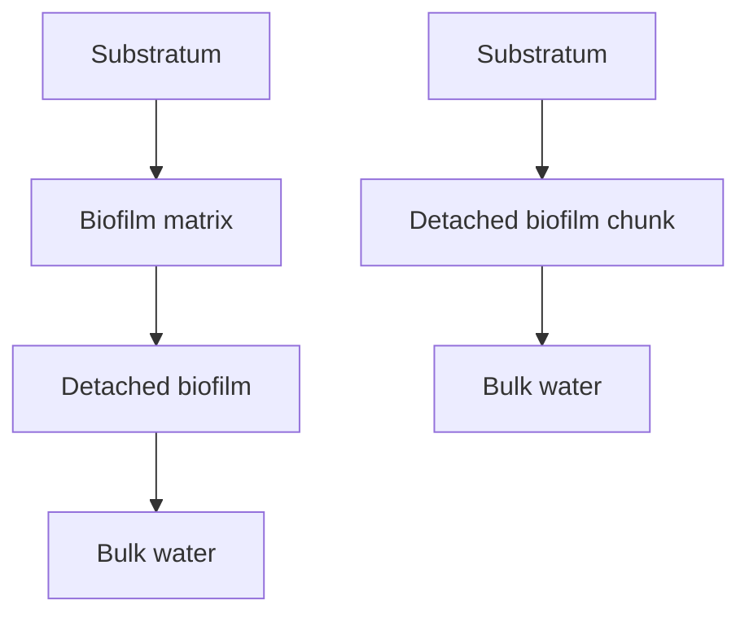

### FIGURE 11.6 (a) Erosion and abrasion and (b) sloughing biofilm detachment processes (Morgenroth, 2003)
\n---\n

3-N) for three detachment modes: (1) constant detachment resulting in constant biofilm thickness, (2) daily backwashing, and (3) a 7-day backwashing interval (meant to capture biofilm sloughing) in a BAF. Analysis by Morgenroth and Wilderer (2000) suggests that an increase in the average mass of heterotrophic organisms does not produce a higher COD flux. This, in turn, suggests that the biofilm was partially penetrated and the system was diffusion rather than biomass limited. Average ammonia-nitrogen flux and autotrophic nitrifier biomass were reduced significantly after seven-day backwashing: The rapid loss of both fast- (nonmethanol degrading heterotrophic biomass) and slow-growing (autotrophic nitrifier biomass) bacterial species is advantageous to the former. Biofilm formation and detachment has a significant influence on bacterial competition for substrate in mixed-culture biofilms (Morgenroth, 2003).
\n---\n

## 2.1 Simplified Biofilm Reactor Design Approaches

Several design approaches, biofilm reactor model, and biofilm model types typically are used in engineering practice. The primary objective of biofilm or biofilm reactor models is to predict soluble substrate flux (J) into the biofilm: This flux information can be used to obtain an estimate of the (1) overall biofilm reactor performance; (2) required active biofilm surface area; (3) electron acceptor (e.g., dissolved oxygen); (4) external electron donor (e.g., methanol or hydrogen); and (5) biosolids management requirements. This section discusses the relative benefits and limitations of general biofilm reactor design approaches. It is common practice to use more than one biofilm reactor design approach and base the final process design on a comparison of results. The design approaches and biofilm reactor models discussed here include a graphical procedure, empirical models, semiempirical models, and mechanistic mathematical models. Examples are used to demonstrate applicability of the described design approaches, facilitates the comparison of results produced by each method, and provides a basis for discussion of relative benefits and drawbacks. Because mathematical biofilm models are so widely used, this approach is discussed on more detail later in this chapter:

### 2.1 Simplified Biofilm Reactor Design Approaches

Improvement to a hypothetical water resource recovery facility (WRRF) was evaluated using each of the design procedures outlined above based on meeting the more stringent total nitrogen limitation of 3 mg/L on an annual average basis. Two single-stage or one two-stage MBBRs are evaluated to denitrify secondary wastewater effluent. The system must produce a NO3-N concentration in the effluent stream of less than 1 mg/L to meet the effluent total nitrogen goal of 3 mg/L. Detailed design criteria for MBBRs are presented later in this chapter. Several assumptions were applied to each example:

* Annual average day flow rate influent to the denitrification MBBR is 34 000 (m3/d).
* The annual average wastewater temperature is 24°C.
* The following annual average secondary (clarifier) effluent wastewater characteristics have been recorded by operation staff:
  - NO3-N: 8 mg/L
  - dissolved oxygen = 0 mg/L
\n---\n

# function of bulk-liquid substrate concentration

This relationship between flux and bulk-liquid substrate concentration can be obtained from numerical simulations or full-scale or pilot-scale observations. In practice, this graphical procedure typically is used to extend pilot-scale observations to full-scale biofilm reactor design criteria. The process designer should recognize that the relationship between flux and bulk-liquid substrate concentration is based on the system and location. Therefore, the flux curve required to implement the graphical procedure may not be obtained from or correlate well with values reported in the literature or from different systems. As a result, the process designer should consider carefully the conditions under which the flux curve was developed before applying results. A flux curve representing mass transfer and environmental conditions characteristic of a specific system and operating mode may not be representative of different biofilm reactor types designed to meet the same treatment objectives. A flux curve generated for the same biofilm reactor type under similar operating conditions, however, may offer some direction in the absence of system-specific numerical simulation or pilot/full-scale observations.

When using the graphical procedure to evaluate pilot-plant observations, fluxes should be compared to rates in full-scale systems. Any flux that deviates significantly from those reported in published studies should be used only after careful consideration. Pilot or experimental systems may promote a greater flux than expected.

At steady-state conditions, the basis for the graphical procedure is a material balance on a biofilm-based CFSTR:

$$
0 = Q S_{in,i} - Q S_{B,i} - J_{L,i} A \quad (11.1)
$$

where
- Q = flow rate through the system (m3/d);

- S_{in,i} = influent concentration of soluble substrate i (g/m3);

- S_{B,i} = effluent, or bulk-liquid, concentration of soluble substrate i (g/m3);

- J_{L,i} = flux of soluble substrate i across the biofilm surface (g/m2/d);

- A = biofilm surface area (m2);
\n---\n

3/d);
VB   = bulk-liquid volume (m3).

Assuming that transformation occurring in the bulk liquid is negligible, the “suspended
growth transformation rate” (eq_11.1) can be neglected. Rearranging eq 11.1 provides the
rationale for the graphical procedure:

$$ J_{UF} = \frac{Q}{A} \cdot S_{in} - \frac{Q}{A} \cdot S_{out} \quad (11.2) $$

The slope, or  (Q/A), is referred to as the operating line and represents the total hydraulic
load on each stage [= 34 000 m3/d/(250 m2/m3 × 650 m3 × 0.5) = 0.4 m/d for the example
conditions]: Figure 11.8 illustrates the graphical method for the denitrification MBBR
example. It is assumed that the flux curves have been created based on observations in
both the first and second stage of a pilot-scale denitrification MBBR treating secondary
effluent similar to the example. There is a 50% empty-bed media fill fraction and
supplemental methanol (MeOH) dosing based on 3:1 (g MeOH:g NO3-N) and 1.5:1 (g
MeOH:g O2) nitrate-nitrogen and oxygen mass ratios, respectively. The graphical solution
indicates that the first-stage denitrification MBBR effluent NO3-N concentration is
approximately 3.9 mg/L. The second stage effluent NO3-N concentration is approximately
1.1 mg/L with flux rates of approximately 1.6 g/m2 d and 1.1 g/m2 d in the first and second
stage, respectively:

## 2.1.2 Empirical and Semiempirical Models

Empirical models can be implemented easily either by hand or using a spreadsheet but
have limited applicability because of their simplistic, “black-box” consideration of system
parameters. Because environmental conditions and bioreactor configuration affect biofilm
reactor performance, a system can respond differently from the description provided by an
empirical model. The limited descriptive capacity of empirical models typically results from
parameter values and model features based on data that was obtained from few system
installations or operating conditions. Therefore, the process designer should be aware of
conditions under which system-specific model parameters have been defined. Significant
\n---\n

An indicator of system viability for meeting treatment objectives with respect to the
specific process governing transformation. Empirical models are, however, inadequate for
describing complex processes such as explicit evaluation of two-step nitrification of
ammonia to nitrite and then to nitrate. Therefore, empirical models have limited application
in defining the conditions that either promote or deter complex processes in biological
systems.

Historically, biofilm reactors have been designed using empirical criteria and models.
Although this trend is changing, a majority of the design formulations presented in this
chapter are empirical in nature even for newer biofilm reactor types such as the MBBR
and BAF. In practice, biofilm models typically are applied to process design. Bioreactor-
specific empirical models are described in the relative reactor-specific section of this
chapter. Equation (11.3), however, presents a simple empirical model applicable to the
denitrification MBBR example.

$$
J_i = J_{i,\max,T} \left( \frac{S_{B,i,EA}}{S_{B,i,EA} + K_{i,EA}} \right)
\left( \frac{S_{B,i,ED}}{S_{B,i,ED} + K_{i,ED}} \right) \quad (11.3)
$$

where Ji = flux of soluble substrate i (g/m^2/d);

$$
J_{i,\max,T} = \text{reaction rate constant, for this empirical model the global maximum}
\text{ flux of soluble substrate i at temperature } T \ (g/m^2/d);
$$

S_{B,i} = soluble substrate i concentration remaining in the effluent stream (g/m^3);

K_i = system-specific half-saturation coefficient incorporating mass-transfer
resistances and other local environmental conditions (g/m^3);

EA = electron acceptor;

ED = electron donor.

Temperature correction often is introduced with an Arrhenius function, which in this case is
applied to the global maximum flux (J_i,max,T):

$$
\frac{J_{i,\max,T}}{J_{i,\max,298}} = \exp \left( -\frac{E_A}{R} \left( \frac{1}{T} - \frac{1}{298} \right) \right) \quad (11.4)
$$
\n---\n

# Denitrification MBBR Flux Calculations (Stage 1)

- J_i,max,T) of 5.2 g/m2 d, methanol half-saturation coefficient (K_i,ED) of 18 mg/L as COD, and a NO3-N half-saturation (K_i,EA) of 1.5 mg/L as N that were obtained from a nonlinear regression analysis. The methanol concentration influent to the first stage was 23 mg/L. These values were obtained from a pilot-scale denitrification MBBR and were applied to eq_11.3 to create the flux curves illustrated in Figure 11.8. Consistent with the illustrative application of the graphical procedure, supplemental carbon is assumed to have been consumed at 3:1 (g MeOH:g NO3-N) and 1.5:1 (g MeOH:g O2) nitrate-nitrogen and oxygen mass ratios, respectively. Equation 11.3 can be applied to calculate flux, but eq 11.1 must be rearranged, neglecting bulk-phase conversion processes, to calculate the material concentration remaining in the effluent:

```
SB, = Su LA                            (11.5)
```

- Applying eqs 11.3 and 11.5 to the denitrification MBBR example requires an iterative procedure that can be implemented easily by hand or using an optimization tool such as the Excel Solver: The following equations were applied:

## STAGE 1

```
          1oF"! =5.2-  SSACES                          SSTAGE !
                   d ' m                         SEXTE + KM

                            SSA
          ~STA GE 1 2250m      20.5 ?(650m             2 650m  20 0725 _
          STA GE 1 = 8 9 403*
          S m                                    m
                               34,000- d
```

```
s5,A  9_  9  STAGE 1  9n
GE 1=23m 2 8 2 S3,o,# 23
           m          gNo, #
                A8k03*
```

- [The page also includes a schematic diagram labeled “STAGE 1” illustrating the flux calculation flow and the relationships among the states S_A, S_B, and related terms. The exact numerical details in the diagram are partially garbled in the text extraction.]

\n---\n

2/d and 1.2 g/m^2/d, respectively. These values are comparable with results obtained from the graphical procedure.

If sufficient data exists to allow for development of parameter values and mathematical relationships capable of describing a complete range of conditions expected when treating municipal wastewater; then empirical models can be used: The addition of model components to account for specific phenomenon encroaches on the premise of mechanistic mathematical model development. For this reason, a distinction is made between empirical and semiempirical models. Gujer and Boller (1986) and Sen and Randall (2008a; 2008c) provide an example of the latter describing nitrifying trickling filters (describing MBBRs and BAFs). The literature and biofilm reactor-specific sections of this chapter provide additional information on these semiempirical approaches. Some system manufacturers develop and use proprietary semiempirical models that are based on sufficient data collected from a variety of installations for a specific biofilm reactor type. Therefore, process designers typically cross-reference design criteria with manufacturer recommendations and seek to reconcile discrepancies.

## 2.2 Mathematical Biofilm Models for the Practitioner

The mass transport and biochemical transformation processes previously described are common to all biofilms; therefore, biofilms can be described by a unifying mathematical expression. Wanner et al. (2006) describe the general biofilm model. Uncertainty and complexity because of wastewater composition, differences in biofilm reactor configuration, appurtenances, operation, and bulk-liquid hydrodynamics renders the general biofilm reactor model for engineering design impractical. Therefore, a variety of simplifications, primarily in the assumed biofilm structure and spatial complexity, to overcome these factors has resulted in the several mathematical biofilm models. Biofilm models, however; are complex despite these simplifications. Furthermore, little documentation exists to aid practitioners in selection and application of biofilm models for meeting specific modeling objectives. Because of their complexity and limited application guidance, biofilm models are not widely used in engineering design, although this is changing:

### 2.2.1 Why Should We Use Biofilm Models as a Design Tool?
\n---\n

esign. For example, MBBRs do not present the hydrodynamic or operational complexities that historically have hindered use of mathematical biofilm model-based process design. This is because they are comprised of zones that are essentially completely mixed and are continuous flowing systems, respectively. Submerged completely mixed biofilm reactors allow for the application of modern biofilm knowledge and are conducive to simulation with existing biofilm models. As a result, most of the existing whole-WRRF modeling programs have been expanded to include a submerged completely mixed biofilm reactor module that consists of a mathematical biofilm model. The process designer should understand the basis for the mathematical biofilm model, its supporting assumptions, and limitations before using these models in design.

Unfortunately, choosing a modeling approach that offers an appropriate level of complexity to meet the modeling objective can be difficult. An overview of different model approaches that are suitable for biofilm reactor design are as follows:

* One-dimensional homogeneous biofilm (single limiting substrate): This approach takes into account mass-transfer limitations and the corresponding effects on concentration profiles and substrate flux into the biofilm. It is assumed that active microbes are homogeneously distributed across the biofilm thickness. The approach is valid only if calculations are performed for the limiting substrate, which has to be determined a priori.
* One-dimensional homogeneous biofilm (multiple substrates and multiple biomass components): One key aspect of modeling biofilms is to evaluate the competition and coexistence of different bacterial groups (e.g., carbon-oxidizing heterotrophic bacteria, nitrifying autotrophic bacteria) and local process conditions (e.g., aerobic, anoxic, or anaerobic). Local process conditions can be determined by calculating biofilm penetration depths for different soluble substrates (e.g., COD, ammonia-nitrogen, oxygen, and nitrate-nitrogen). Growth of individual bacterial groups can be determined based on fluxes. To simplify calculations, it can be assumed that all bacterial groups are homogenously distributed over the thickness of the biofilm (Rauch et al., 1999; Boltz et al., 2009a; 2009b; 2009c).
* One-dimensional heterogeneous biofilm: Different groups of bacteria are competing in a biofilm for substrate and space. One-dimensional heterogeneous biofilm models must
\n---\n

## TABLE 11.2 Biofilm Models Used in Practice (adapted from Boltz et al., 2009b)

<table>
  <thead>
    <tr>
      <th>Model</th>
      <th>Company / Origin</th>
      <th>1-D, DY, N, heterogeneous</th>
      <th>References</th>
    </tr>
  </thead>
  <tbody>
    <tr>
      <td>BioWin™</td>
      <td>EnviroSim Associates Ltd., Flamborough, Canada<br>(www.envirosim.com)</td>
      <td>1-D, DY, N, heterogeneous</td>
      <td>Wanner and Reichert (1996) (modified); Takács et al. (2007)</td>
    </tr>
<tr>
      <td>GPS-X™</td>
      <td>Hydromantis Inc., Hamilton, Canada<br>(www.hydromantis.com)</td>
      <td>1-D, DY, N, heterogeneous</td>
      <td>Hydromantis (2002)</td>
    </tr>
<tr>
      <td>Pro2D™</td>
      <td>CH2M HILL Inc., Englewood, Colorado<br>(www.ch2m.com/corporate)</td>
      <td>1-D, SS, N(A), homogeneous (constant Lf)</td>
      <td>Boltz et al. (2009a,b,c)</td>
    </tr>
<tr>
      <td>Simba™</td>
      <td>ifak GmbH, Magdeburg, Germany<br>(www.ifak-system.com)</td>
      <td>1-D, DY, N, heterogeneous</td>
      <td>Wanner and Reichert (1996) (modified)</td>
    </tr>
<tr>
      <td>STOAT™</td>
      <td>WRc, Wiltshire, England<br>(www.wateronline.com/stor efronts/wrcgroup.html)</td>
      <td>1-D, DY, N, heterogeneous</td>
      <td>Wanner and Reichert (1996) (modified)</td>
    </tr>
<tr>
      <td>WEST™</td>
      <td>MOST for WATER, Kortrijk, Belgium<br>(www.mostforwater.com)</td>
      <td>1-D, DY, N(A)a, Nb, homogeneousa, heterogeneousb</td>
      <td>Rauch et al. (1999)a, Wanner and Reichert (1996) (modified)b</td>
    </tr>
<tr>
      <td>SUMO</td>
      <td>DYNAMITA<br>(http://www.dynamita.com/)</td>
      <td>1-D, DY, N; heterogeneous</td>
      <td>Wanner and Reichert (1996) (modified), Takács et al. (2007), Dynamita, 2016</td>
    </tr>
  </tbody>
</table>

<p><strong>Note:</strong></p>
<ul>
  <li>1-D = one-dimensional</li>
  <li>DY = dynamic</li>
  <li>N = numerical</li>
  <li>N(A) = numerical solution using analytical flux expressions</li>
</ul>

TABLE 11.2 Biofilm Models Used in Practice (adapted from Boltz et al., 2009b)

## 2.2.4 Limitations of Biofilm Models for the Practitioner
\n---\n

The MBBR is a two (anoxic) or three (aerobic) phase system with a buoyant free-moving
plastic biofilm carrier that requires energy (i.e., mechanical mixing or aeration) to ensure
uniform distribution throughout the tank. These systems can be used for municipal and
industrial wastewater treatment. The process includes a submerged biofilm reactor and
liquid-solids separation unit. The installations include several process configurations and
effluent water quality standards for carbon oxidation, nitrification, and denitrification. The
MBBR process is capable of processing wastewater to meet effluent water quality
standards ranging, for example, from the U.S. Environmental Protection Agency definition
of secondary treatment (30 mg/L total suspended solids [TSS] and 30 mg/L BOD5 monthly
average) to more stringent nitrogen limits (advanced wastewater treatment standard total
nitrogen less than 3 mg/L). According to Rusten et al. (2006), the first MBBR installed in
Norway (see European Patent No. 0.575,314 and U.S. Patent No. 5,458,779) has been
routinely inspected and no plastic biofilm carrier wear had been observed after 15 years of
continuous operation. Benefits of MBBR include:
* It can meet similar treatment objectives as activated sludge systems for carbon-oxidation, nitrification, and denitrification, but requires a smaller tank volume than a clarifier-coupled activated sludge system.
* Biomass retention is clarifier independent. Therefore, solids loading to the liquid-solids separation unit is reduced significantly compared to activated sludge systems.
* Because it is a continuous flow process, it does not require a special operational cycle for biofilm thickness control. Hydraulic headloss and operational complexity is minimized.
* It offers much of the same flexibility to manipulate system flowsheet (to meet a specific treatment objective) as the activated sludge process. Multiple reactors can be configured in series without the need for intermediate pumping or return activated sludge pumping (to accumulate mixed liquor).
* It can be coupled with a variety of different liquid-solids separation processes including sedimentation basins, dissolved air flotation, ballasted flocculation, and membranes.
* It is well-suited for retrofit installation into existing municipal WRRF such as those based on activated sludge (McQuarrie and Boltz, 2011).
* Research and development supporting MBBR-process commercialization resulted from a political agreement among North European countries to make a substantial reduction of
\n---\n

FIGURE 11.9 Moving bed biofilm reactor at the Williams-Monaco water resource recovery facility, Colorado. This installation consists of two parallel trains each with four moving bed biofilm reactor in series.

## 3.1.1 Plastic Biofilm Carriers

The biofilm carriers described here typically are extruded or molded from either virgin or recycled high-density polyethylene. Table 11.3 summarizes characteristics and manufacturers of several commercially available plastic biofilm carriers. The carriers are slightly buoyant and have a specific gravity between 0.94 and 0.96 g/cm^3. Both native and biofilm-covered plastic biofilm carriers have a propensity to float in quiescent water: In operating MBBRs, they are uniformly distributed throughout the bulk of the liquid by the aeration system, liquid recirculation, or mechanical mixing. Biofilms primarily develop on the protected surface inside of the plastic biofilm carrier: For this reason, the specific surface areas of plastic biofilm carriers listed in Table 11.3 exclude areas that are not inside plastic carrier. Plastic biofilm carriers have a bulk specific surface area, net specific surface area, bulk liquid volume displacement, and net liquid volume displacement. These terms are defined as follows:

- Bulk specific surface area: biofilm area per unit volume of plastic biofilm carriers, or

- Net specific surface area: biofilm area per unit bioreactor volume, or

- Bulk liquid volume displacement: liquid volume displaced per unit volume of plastic biofilm carriers, or

- Net liquid volume displacement: liquid volume displaced per unit bioreactor volume, or

<table>
<thead>
<tr>
<th>Manufacturer</th>
<th>Name</th>
<th>Bulk Specific Surface Area, Weight, Gravity</th>
<th>Nominal Carrier Dimensions (Depth; Diameter)</th>
<th>Carrier Photo</th>
</tr>
</thead>
</table>

\n---\n

# TABLE 11.3 Plastic Biofilm Carrier Characteristics as Reported by Manufacturer (adapted from McQuarrie and Boltz, 2011)

<table>
  <thead>
    <tr>
      <th>Manufacturer</th>
      <th>Carrier</th>
      <th>Bulk specific surface area (m2/m3)</th>
      <th>Dimensions (mm)</th>
      <th>Image (description)</th>
    </tr>
  </thead>
  <tbody>
    <tr>
      <td rowspan="2">Siemens Water Technologies Corp.</td>
      <td>ABC4™</td>
      <td>600 m2/m3</td>
      <td>14 mm; 14 mm</td>
      <td>image: small grayscale photo of a white plastic carrier</td>
    </tr>
<tr>
      <td></td>
      <td>660 m2/m3</td>
      <td>12 mm; 12 mm</td>
      <td>image: small grayscale photo of a white plastic carrier</td>
    </tr>
<tr>
      <td>Entex Technologies Inc.</td>
      <td>BioPortz™</td>
      <td>589 m2/m3</td>
      <td>14 mm; 18 mm</td>
      <td>image: cylindrical or cluster-like carrier (gray scale)</td>
    </tr>
  </tbody>
</table>

TABLE 11.3 Plastic Biofilm Carrier Characteristics as Reported by Manufacturer (adapted from McQuarrie and Boltz, 2011)

Bulk specific surface area, based on 100% carrier fill, is characteristic of a specific plastic biofilm carrier and is reduced proportionately. Hence, the net specific surface area is characteristic of a specific plastic biofilm carrier and carrier fill. For example, if a plastic biofilm carrier has a 500-m2/m3 bulk specific surface area, then the net specific surface area at 50% carrier fill is 250 m2/m3. Similarly, the net liquid volume displacement at 50% carrier fill is 0.0725 for a plastic biofilm carrier having a characteristic 0.15-bulk liquid volume displacement.

Figure 11.10 illustrates how biofilm thickness on plastic carriers varies depending on reactor conditions. Biofilm thickness does not become excessive because of the turbulent motion of the carriers in the reactor. Therefore, effective surface area reduction resulting from increasing biofilm thickness is not a critical factor for the design engineer. The rate of soluble substrate transformation in biofilm systems is defined in terms of mass flux (J), which has the units of g/m2/d. Therefore, it is convenient to quantify loading rate in similar terms. The net specific surface area of a plastic biofilm carrier is directly related to the calculation of MBBR pollutant loading. The volumetric load can be multiplied by the net specific surface area.
\n---\n

for additional discussion). Larger plastic biofilm carriers allow for sieves to be constructed with larger openings. As a result, hydraulic headloss is reduced per unit sieve area. Other factors affecting MBBR plastic biofilm carrier properties include cost of manufacturing and transportation.

<figure>
FIGURE 11.10 Photograph of biofilm carriers taken from MBBRs in series and illustrative renderings of how biofilm thickness on the carriers can vary from reactor to reactor based on electron acceptor and donor conditions (Boltz et al., 2009b).
</figure>

Mermaid diagram illustrating the Biofilm Carrier sequence and labeled distances:
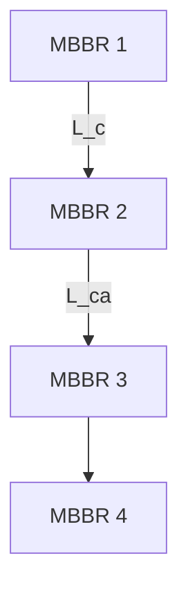

3.1.2 Media Retention Sieves

Plastic biofilm carriers are retained in an MBBR by horizontally configured cylindrical sieves or vertically configured flat sieves (Figure 11.11). Aerobic zones typically contain cylindrical sieves; anoxic zones contain flat-wall sieves. The cylindrical sieves extend horizontally into the upward-flowing air bubbles imparted by the diffuser grid. As a result, the air scours accumulated debris from the sieve surface. Energy imparted by the mechanical mixers is insufficient to dislodge debris accumulated on the wall sieve. Therefore, flat-sieve scour is accomplished in a denitrification MBBR with a sparging air-header. Removing the debris retained on a sieve aids in maintaining hydraulic throughput.
\n---\n

# FIGURES

<table>
<thead>
<tr><th>Figure</th><th>Caption</th></tr>
</thead>
<tbody>
<tr><td>FIGURE 11.11</td><td>Horizontal cylindrical sieves over coarse-bubble diffuser grid (left) and vertical flat-panel wall sieves with sparging air-header (right).</td></tr>
<tr><td>FIGURE 11.12</td><td>Rolling-water circulation pattern induced by a diffused aeration system (left) and mechanical mixers (right) (Ødegaard et al., 1994).</td></tr>
<tr><td>FIGURE 11.13</td><td>Coarse-bubble diffusers in an MBBR (left) and fine-bubble tube diffusers in an MBBR (right).</td></tr>
</tbody>
</table>

<div>
Two grayscale photographs accompany Figure 11.12 and Figure 11.13:
</div>
<div>
<br>
[Description of images:]
- The left photograph (in Figure 11.13) shows coarse-bubble diffusers installed in an MBBR (moving bed biofilm reactor) setup.
- The right photograph shows fine-bubble tube diffusers in an MBBR configuration.
</div>

----

## 3.1.4 Mechanical Mixing Devices

Denitrification MBBRs use mechanical mixers to agitate the bulk of the liquid and to
distribute uniformly plastic biofilm carriers. The mechanical mixers may be platform (dry
\n---\n

## 3. State-of-the art submersible mechanical mixers

3. State-of-the art submersible mechanical mixers typically have a maximum 120-rpm impeller speed and a minimum of three blades per impeller. These features are designed to meet process objectives and minimize potential for impeller damage resulting from abrasion induced by the plastic biofilm carriers. Figure 11.14 shows a denitrification MBBR and submersible mechanical mixers in a MBBR.

<table>
<thead><tr><th>Figure 11.14</th><th>Caption</th></tr></thead>
<tr><td>Anoxic MBBR (left)</td><td>Basin internals of a swing-anoxic MBBR (right). The molded fiberglass impellers were among the first generation of denitrification MBBRs. Many of these impellers were damaged by the free-moving plastic biofilm carriers.</td></tr>
</table>

### 3.2 Process Flow Sheets and Bioreactor Configurations

Relevant considerations when selecting a MBBR configuration include site-specific treatment objectives, wastewater characteristics, site layout, existing basin configuration (if a retrofit), system hydraulics, existing treatment scheme (if applicable), and the potential to retrofit existing tanks. Figure 11.15 illustrates carbon oxidation, nitrification, and denitrification MBBR flow sheets. Although the process mechanical features of a MBBR are typically consistent; biofilms grown in carbon oxidation, nitrification, denitrification, and combined carbon oxidation and nitrification MBBRs are variable and depend on local environmental conditions (see Section 11.1 for additional information). For example, the MBBRs pictured in Figure 11.9 were designed to achieve carbon oxidation, nitrification, and partial denitrification with a process configuration similar to the modified Ludzack–Ettringer process. Table 11.4 demonstrates variability in the system’s biofilm characteristics from the first reactor (R1) to the fourth reactor (R4): Plastic biofilm carriers in the first denitrification MBBR (R1) have a brownish color and contain 150% more biomass than the dark biofilm in the second denitrification MBBR
\n---\n

\n---\n

# BOD/COD removal
- (a) MBBR followed by biomass separation, with chemical addition and flocculation required when P removal is required
- (b) High rate MBBR followed by flocculation and biomass separation.
- (c) MBBR pretreatment to AS. Used to upgrade existing AS plants.

## Nitrification
- (d) Number of MBBR's depending on pretreatment and water characteristics
- (e) Tertiary nitrification. MBBR placed after conventional AS plant: In plants with stringent effluent standard, direct filtration may be used:
- (f) Combination of AS and MBBR where bio-carrier is added to the last part of the AS reactor:

## Nitrogen removal
- (g) MBBR predenitrification process. Chemical addition and flocculation if P-removal is required:
- (h) MBBR post-denitrification process. Chemical addition and flocculation if P-removal is required:
- (i) Combined denitrification process: Chemical addition and flocculation if P-removal is required:
- (j) Post denitrifying MBBR placed after a conventional AS plant:
\n---\n

# FIGURE 11.15 Typical process flowsheets for carbon oxidation, nitrification, combined carbon oxidation and nitrification, and denitrification in an MBBR treating municipal wastewater (Ødegaard, 2006)

Rectangular tanks with crosses are MBBRs and rectangular tanks with mixers are anoxic (COD = chemical oxygen demand; BOD = biochemical oxygen demand; P = phosphorus; and AS = activated sludge)

<table>
  <thead>
    <tr>
      <th>Parameter/Reactor<br>(R)</th>
      <th>R1–Anoxic</th>
      <th>R2–Anoxic</th>
      <th>R3–Aerobic</th>
      <th>R4–Aerobic</th>
    </tr>
  </thead>
  <tbody>
    <tr>
      <td>Function</td>
      <td>Denitrification</td>
      <td>Denitrification</td>
      <td>Carbon oxidation</td>
      <td>Combined carbon oxidation and high-rate nitrification</td>
    </tr>
<tr>
      <td>Biomass per net<br>specific surface area</td>
      <td>9.4 g SS/m<sup>2</sup></td>
      <td>6.1 g SS/m<sup>2</sup></td>
      <td>28 g SS/m<sup>2</sup></td>
      <td>12.9 g SS/m<sup>2</sup></td>
    </tr>
<tr>
      <td>Carrier fill</td>
      <td>57%</td>
      <td>57%</td>
      <td>60%</td>
      <td>60%</td>
    </tr>
<tr>
      <td>Solids per unit tank<br>volume</td>
      <td>2680 g SS/m<sup>3</sup></td>
      <td>1740 g SS/m<sup>3</sup></td>
      <td>8400 g SS/m<sup>3</sup></td>
      <td>3870 g SS/m<sup>3</sup></td>
    </tr>
<tr>
      <td>Photograph of media<br>taken from tank</td>
      <td>[Image 1]</td>
      <td>[Image 2]</td>
      <td>[Image 3]</td>
      <td>[Image 4]</td>
    </tr>
  </tbody>
</table>

TABLE 11.4 Example of the Variation of Biofilm Across Four Moving Bed Biofilm Reactor (MBBR) in Series (SS = Suspended Solids) (McQuarrie and Boltz, 2011)

Based on this premise, Ødegaard et al. (2000) used the “obtainable” COD removal rate, which is defined as the influent total-COD concentration less the soluble-COD concentration remaining in the effluent stream. This “obtainable” removal rate of COD at 100% biomass separation suggests that high removal efficiencies were obtained in the pilot-scale carbon-oxidizing MBBR at high organic loading and provided good liquid-solids separation. For the pilot-scale MBBR evaluated, these graphs demonstrate that approximately 30 g/m<sup>2</sup>/d filtered COD flux was attainable for filtered COD loading greater than 60 g/m<sup>2</sup>/d. They also show that a total COD load up to a 60 g/m<sup>2</sup>/d resulted in
\n---\n

FIGURE 11.17 Total chemical oxygen demand (COD) flux for two types of plastic biofilm carriers with different specific surface areas as a function of bulk-liquid COD concentration (Ødegaard, 2000).

The plot shows obtainable removal rate (COD or SCOD) (g COD m^-2 d^-1) on the vertical axis and Total COD loading rate (g COD m^-2 d^-1) on the horizontal axis. Data points for two carrier types are shown:
- K1  (filled circles)
- K2  (open circles)

A line labeled 100% is drawn indicating a proportional relationship between the COD loading rate and the COD flux for the carriers.

FIGURE 11.17 Total chemical oxygen demand (COD) flux for two types of plastic biofilm carriers with different specific surface areas as a function of bulk-liquid COD concentration (Ødegaard, 2000).

Carbon-oxidizing MBBRs are classified as low-rate, normal-rate, or high-rate bioreactors. Low-rate carbon oxidizing MBBRs promote conditions for nitrification in downstream reactors. The effect of organic matter on nitrification is discussed in a subsequent section. High- and normal-rate MBBRs are strictly carbon-oxidizing bioreactors. In the absence of site-specific pilot-scale observations or a calibrated mathematical model, high-rate MBBRs typically are designed to receive a filtered BOD5 load in the range 15 to 20 g/m^2/d at 15°C. This corresponds to total-BOD5 loads as high as 45 to 60 g/m^2/d at 15°C (Ødegaard, 2006). Such high surface area loadings, however; result in short hydraulic residence time (HRT). The designer should attempt to achieve a plug-flow reactor regime so that higher loads may be allowed. Therefore, at least two reactors in series should be used, even at high loads. To reach secondary treatment effluent standards HRT, less than 30 minutes is not recommended. Equation 11.4 can be applied to adjust these rates and describe MBBR performance at different wastewater temperatures. Ødegaard (2006)

\n---\n

5 TKN ≤ 1.0 and soluble BOD5 ≤ 12 g/m3. A combined carbon oxidation and nitrification MBBR (Figure 11.15d) is defined as a unit that receives an organic load exceeding these conditions. Sufficient bulk-liquid total-BOD5 and ammonia-nitrogen concentrations result in competition between heterotrophic and autotrophic nitrifying organisms growing inside a mixed-culture biofilm. When competing for dissolved oxygen in a combined carbon oxidation and nitrification MBBR, the faster growing heterotrophic organisms may overgrow the slower developing autotrophic nitrifiers at high bulk-liquid soluble BOD5 concentrations (Wanner and Gujer, 1984). If a high bulk-liquid soluble BOD5 concentration exists and the bulk-liquid dissolved-oxygen concentration is insufficient to penetrate the faster growing heterotrophic bacteria that have overgrown the autotrophic nitrifiers, then the slower growing (autotrophic) bacteria will washout of the biofilm. Therefore, as biofilm reactor BOD5 loading increases, the bulk-liquid dissolved oxygen concentration must be increased to maintain a constant ammonia-nitrogen flux

<table>
<thead>
<tr>
<th>WRRF</th>
<th>OUT (g/m3)</th>
<th>IN (g/m3)</th>
<th>OUT (g/m3)</th>
<th>IN (g/m3)</th>
<th>OUT (g/m3)</th>
<th>IN (g/m3)</th>
</tr>
</thead>
<tbody>
<tr><td>Steinsholtb<sup>b</sup></td><td>398</td><td>10</td><td>833</td><td>46</td><td>7.1</td><td>0.3</td></tr>
<tr><td>Trettenc<sup>c</sup></td><td>361</td><td>4</td><td>—</td><td>—</td><td>7.3</td><td>0.1</td></tr>
<tr><td>Svarstadc<sup>c</sup></td><td>—</td><td>—</td><td>403</td><td>44</td><td>5.1</td><td>0.25</td></tr>
<tr><td>Fryac<sup>c</sup></td><td>181</td><td>5</td><td>—</td><td>—</td><td>8.6</td><td>0.21</td></tr>
</tbody>
</table>

Notes: BOD7 = seven-day biochemical oxygen demand; COD = chemical oxygen demand; WRRF = water resource recovery facility.

a BOD5/BOD7 = ~0.86.
b 1996–1997.
c Data from 2000–2002.
\n---\n

# Ammonium flux in MBBR systems

loads and bulk-liquid dissolved-oxygen concentrations. While studying a pilot-scale combined carbon oxidation and nitrification MBBR receiving primary effluent, a (tertiary) nitrification MBBR receiving secondary effluent and maintaining a 4- to 6-g/m3 bulk-liquid dissolved-oxygen concentration in both units, Hem et al. (1994) observed:

- Total-BOD5 load of 1 to 2 g/m2/d resulted in nitrification rates from 0.7 to 1.2 g/m2/d,
- Total-BOD5 load of 2 to 3 g/m2/d resulted in nitrification rates from 0.3 to 0.8 g/m2/d, and
- Total-BOD5 load greater than 5 g/m2/d resulted in virtually no nitrification.

Rusten et al. (1995a) described ammonia-nitrogen flux as a function of bulk-liquid ammonia-nitrogen concentration in an MBBR as a first-order process when bulk-liquid ammonia-nitrogen is the rate-limiting substrate. They described it as a zero-order process when bulk-liquid dissolved oxygen is the rate-limiting substrate. The researchers used eq 11.7 to describe ammonia-nitrogen flux in a MBBR.

```mermaid
graph TD
  O2[Oxygen concentration (mg O2/L)]
  TAN[TAN removal rate (g/m^2/d)]
  OL1[Organic load 1.0 g/m^2/d]
  OL2[Organic load 2.0 g/m^2/d]
  OL3[Organic load 3.0 g/m^2/d]
  OL4[Organic load 4.0 g/m^2/d]
  OL5[Organic load 5.0 g/m^2/d]
  OL6[Organic load 6.0 g/m^2/d]
  O2 --> TAN
  OL1 -->|increase with O2| TAN
  OL2 -->|increase with O2| TAN
  OL3 -->|increase with O2| TAN
  OL4 -->|increase with O2| TAN
  OL5 -->|increase with O2| TAN
  OL6 -->|increase with O2| TAN
```

FIGURE 11.18 Effect of organic load and bulk-liquid dissolved oxygen concentration on ammonium (or ammonium-nitrogen) flux (Rusten et al., 2006)
\n---\n

## k-values at 10°C and respective conditions for MBBR design

- k = 0.40 m/d with no primary clarifier
- k = 0.47 m/d with primary clarification or pre-denitrification
- k = 0.50 m/d with primary clarification and pre-denitrification
- k = 0.53 m/d with chemically enhanced primary clarification
- The rate constant of 0.6 to 0.7 m/d at 15°C can be used in tertiary nitrification MBBR applications following secondary treatment.

## Transition ratio and description of nitrification in an MBBR

When applying eq. 11.7 to describe nitrification in an MBBR, the ratio

- S_B,O2 / S_B,NH3-N

is used to identify the transition whereby ammonia-nitrogen flux transforms from being ammonia-nitrogen limited to oxygen limited as a function of bulk-liquid ammonia-nitrogen concentration in the reactor effluent. The ratio has been assigned the value 3.2 (dimensionless) by Rusten et al. (1995b; 2006). The calculated ammonia-nitrogen flux is adjusted to reflect the influence of site-specific wastewater temperature with eq. 11.4.

In practice, a designer may assume a constant transition ratio

- S_B,O2 / S_B,NH3-N = 3.2

However, the transition point is influenced by stoichiometric coefficient for the electron donor and acceptor and, to a lesser extent, the material diffusivity influenced by liquid temperature. The diffusivity of a material i is characterized by the aqueous-phase diffusion coefficient

- D_aq,i

and

- D_F,i is the diffusion coefficient of substrate i inside the biofilm (m^2/d) (Stewart, 2003; Horn and Morgenroth, 2006). The temperature dependence of D_aq,i is calculated using the following relationship:

$$
D_{aq,i} = \frac{D_{F,i}}{0.8} \quad \text{or} \quad
D_{aq,i} = 0.8 \cdot D_{F,i} \quad \text{(Stewart, 2003; Horn and Morgenroth, 2006)}
$$

where

- T = temperature (°C), and
- viscosity = kinematic (m^2/d).

Figure 11.19 illustrates nitrification rates observed at a pilot-scale tertiary nitrification MBBR (Kaldate et al., 2008). The data is identified as being in the ammonia-nitrogen rate.

\n---\n

# 3 the following is calculated:

- left figure: Ammonia-Nitrogen flux J_NH3-N (g m^-2 d^-1) versus Ammonia-Nitrogen; SNH3-N (g m^-3). Two data groupings are shown:
  - Ammonia-nitrogen limited (solid points)
  - Oxygen limited (open circles)

- right figure: Ammonia-Nitrogen; SNH3-N (g m^-3) versus Ammonia-Nitrogen flux J_NH3-N (g m^-2 d^-1) with lines representing different DO concentrations:
  - DO = 8 g m^-3
  - DO = 6 g m^-3
  - DO = 4 g m^-3
  - DO = 2 g m^-3

  Example: S_O2/S_B,NH3-N = 4.5
  - Ammonia-nitrogen limited
  - Oxygen limited

  (Note: This description preserves the axis labels and general layout from the figure captions.)

FIGURE 11.19 Observed ammonia-nitrogen concentrations in a second-stage nitrification MBBR grouped according to the rate-limiting substrate as defined by eq. 11.14 (left) (Kaldate et al., 2008). Empirical nitrification MBBR model for various bulk-liquid dissolved oxygen concentrations (model: J_NH-N = K · θ(T-20) · (S_B,NH3-N)^n, n = 0.7, q = 1.10, k = 0.7, and T = 18°C). Nonlinear regression analysis performed using DataFit v9.0.59 (Oakdale Engineering, California; www.curve fitting.com). The average bulk-liquid dissolved oxygen concentration for observations in the oxygen-limiting region is 6.8 g/m^3 (Hem et al., 1994; McQuarrie and Boltz, 2011).

Se N H , N 5         Deez           S8 0 2
                          Vgp EA  DeNu,# ?

                                                           189€             0 077m
                                                m                                     4

                       5  1              0 000200 d        25°C             0 081 d    29o2
                          4,57 9o 2             m          189€             0.077 m `  m
                                  gN     0 000197- d       25PC                       4
                                                                                      m
                                                                            0 081 d

                       5 044 9w
                                 m
\n---\n

2/d reduced the dissolved oxygen concentration available for nitrification by 0.5 g/m3.
Rusten et al. (2006) estimated that a 1.5-g/m2/d soluble-BOD5 load reduces the dissolved
oxygen concentration available for nitrification by 2.5 g/m3. Ammonia-nitrogen flux values
calculated using eq 11.7 should be applied to combined carbon oxidation and nitrification
MBBR design only if (1) the k-value is representative of site-specific environmental
conditions, or (2) the flux has been verified by a calibrated mathematical model that
considers competition in mixed culture biofilms (see Table 11.2).

Siegrist and Gujer (1987) and Rusten et al. (1995a) recommend a minimum alkalinity of
75 mg/L as CaCO3 (1.5 meq/L). Szwerinski et al. (1986) and Zhang and Bishop (1996)
state that the ratio bulk-liquid bicarbonate-to-dissolved oxygen (as mgCaCO3: mgO2)
should be greater than 6.25 to avoid nitrification being alkalinity-limited in a nitrifying
biofilm reactor. Nordeidet et al. (1994) reported that (tertiary) nitrifying biofilm reactors
may become orthophosphate (PO4-P) limited at bulk-liquid concentrations less than
approximately 0.15 g P/m3. Phosphorus limitation in tertiary biofilm reactors is discussed
at greater depth in the post-denitrification MBBR section:

Given the following assumptions and treatment objectives, ammonia-nitrogen flux can be
estimated and the volume of a single-stage nitrification MBBR receiving settled effluent
from secondary treatment calculated.

* Wastewater temperature = 10°C;
* Targeted effluent ammonia-nitrogen concentration = 2 g/m3;
* Bulk-liquid dissolved oxygen concentration is kept constant at 6 g/m3;
* Soluble BOD5 load is less than 0.5 g/m2/d;
* Nitrification MBBR receives 3785 m3/d of partially nitrified secondary effluent;
* A 16 g/m3 ammonia-nitrogen concentration in the influent stream;
* Plastic biofilm carrier bulk-specific surface area is 500 m2/m3 at a 50% carrier fill.

Solution:

1. Given a bulk-liquid oxygen concentration of 6 g/m3, estimate the ammonia-nitrogen
concentration corresponding to the point whereby flux transitions from being oxygen-
\n---\n

## 4. The nitrification MBBR volume is calculated.

- An inline equation (garbled in the source):
  $$A_5 \; Q \cdot (\text{S}_{\mathrm{NH_3N}} \;-\; 2\,\text{S}_{\mathrm{BNH_3N}}) \big/ J_{\mathrm{NH_3N}}$$

- Numerical values (as they appear in the OCR, reproduced with units):
  - \(3{,}785 \; \text{m}^3/\text{d}\)
  - \(16 \; \text{g}/\text{m}^3\)
  - \(2 \; \text{g}/\text{m}^3\)
  - \(5{,}059 \; \text{m}^2 \cdot \text{d}\)
  - \(0.5 \; \text{g}/(\text{m}^2 \cdot \text{d})\)
  - \(5{,}105{,}980 \; \text{m}^2\)
  - \(5{,}424 \; \text{m}^2\)

An alternate method for sizing a nitrification MBBR when pilot-plant data is available is the graphical biofilm reactor design approach described in Section 11.2. Figure 11.20 presents ammonia-nitrogen flux curves obtained from pilot data collected from a pilot-scale system consisting of two reactors in series (Kaldate et al., 2008). Using the pilot-scale nitrification MBBR data and assuming a design dissolved oxygen of 6 g/m^3, a first-stage MBBR operating line intersects the ammonia-nitrogen flux curve at 1.04 g/m^2/d. For the second reactor, an ammonia nitrogen flux curve is determined assuming a dissolved oxygen of 4 g/m^3, and the second-stage MBBR operating line intersects the ammonia-nitrogen flux curve at 0.36 g/m^2/d. For this graphical design example, the reactor volume determined above for a single reactor (424 m^3) is subdivided into two equal-volume reactors in series.
\n---\n

# R1 design loading rate

R1design bading rte5 SaNH3 # 2 Sp NH,N
                                                    SiNH , #

                    104 gv
5                                                   m2'd
                    169v_2 4 9w
                    m                               m
                                                    16gv
                                                    M

5 139-mgvd

2. Determine the carrier area required in R1 given the influent ammonia loading, and the
design surface area loading rate (SALR) from Step 1.

A 5 0 SnNH,#
SA LR

3785m               16 9
5  d                M
   139 gN
      m 'd

5 43 568m

3. Determine the fill fraction given the volume of R1 and amount of carrier area required
based on a mediaspecific surface area (SSA) of 500 m2/m:.
\n---\n

# Q_R

Q_R is typically in the range 2 to 4, but may be as high as 6. There is a practical upper limit on the effective recirculation ratio, but this must be evaluated on a site-specific basis. Additional increase in the recirculation flow rate beyond the effective limit has been found to reduce overall denitrification effectiveness (Ødegaard, 2006).

Pre-denitrification MBBR performance is primarily dependent on the availability of soluble BOD5 in the influent wastewater stream. When ample soluble-BOD5 concentration exists, pre-denitrification MBBRs can achieve 50% to 70% nitrogen removal. Dissolved oxygen inhibits anoxic biochemical transformation processes. Combined carbon oxidation and nitrification MBBRs operate at a relatively high bulk-liquid dissolved oxygen concentration (i.e., 3 to 6 mg/L). Therefore, the internal recirculation stream may also have a high dissolved oxygen concentration. Aerobic reactions have an energetic advantage over denitrification, and will take precedence resulting in reduced soluble-BOD5 for denitrification. Therefore, the presence of dissolved oxygen in the internal recirculation stream must be considered when assigning a pre-denitrification MBBR volume and assessing the availability of soluble-BOD5 for denitrification. Dissolved oxygen is converted to its nitrate equivalence with the dissolved oxygen-to-nitrate-nitrogen mass ratio (g-O2:g-NO3-N) of 2.86:1. Table 11.6 lists ranges of denitrification rates that a designer could expect to observe in a pre-denitrification MBBR. Nitrate/nitrite-nitrogen transformation rates in a pre-denitrification MBBR are typically in the range 0.3 to 0.6 g NO3-N_eq/m2/d (at 10°C): Variation in the observed nitrate-nitrogen transformation rates is a result of different wastewater characteristics and environmental conditions.

Post-denitrification MBBRs require the addition of a supplemental electron donor (i.e., an external carbon source), but do not require recirculation of a nitrified effluent stream to receive the electron acceptor nitrate/nitrite-nitrogen. These MBBRs are beneficial when the stream influent to pre-denitrification MBBR has insufficient soluble-BOD5 concentration to promote the desired nitrate/nitrite-nitrogen conversion. Bill et al. (2008) demonstrated that some commercially available, readily biodegradable electron donors result in higher nitrate/nitrite-nitrogen flux than previously described for pre-denitrification MBBRs. They use readily biodegradable, low-molecular-weight compounds that typically are measured as soluble-BOD5 in raw sewage. Therefore, a post-denitrification MBBR is
\n---\n

## TABLE 11.6 Comparison of Pre-Denitrification MBBR Performance

<table>
  <thead>
    <tr>
      <th>WRRF</th>
      <th>Performance range</th>
    </tr>
  </thead>
  <tbody>
    <tr>
      <td>Gardermoen WRRF (Rusten et al., 2007)</td>
      <td>0.40–1.10</td>
    </tr>
<tr>
      <td>FREVAR WRRF (Rusen et al., 2000)</td>
      <td>0.15–0.50</td>
    </tr>
<tr>
      <td>Crow Creek WRRF (McQarrie and Maxwell, 2003)</td>
      <td>0.25–0.80</td>
    </tr>
<tr>
      <td>NRA WRRF</td>
      <td>0.20–0.40</td>
    </tr>
  </tbody>
</table>

<table>
  <tr>
    <td colspan="2">
      <h3>MeOH</h3>
    </td>
    <td colspan="2">
      <h3>EtOH</h3>
    </td>
  </tr>
<tr>
    <td>Loading rate (gNOx-N/m2/day)</td>
    <td>0.0 – 4.0</td>
    <td>Loading rate (gNOx-N/m2/day)</td>
    <td>0.0 – 4.0</td>
  </tr>
<tr>
    <td>Removal rate (gNOx-N/day)</td>
    <td>0.0 – 2.5</td>
    <td>Removal rate (gNOx-N/day)</td>
    <td>0.0 – 2.5</td>
  </tr>
<tr>
    <td>Notes: data points with a positive trend; linear fit shown.</td>
    <td>Notes: data points with a positive trend; linear fit shown.</td>
  </tr>
<tr>
    <td colspan="2"></td>
    <td colspan="2" style="text-align:left"></td>
  </tr>
<tr>
    <td colspan="4">
      <h3>Glyc</h3>
    </td>
  </tr>
<tr>
    <td>Loading rate (gNOx-N/m2/day)</td>
    <td>0.0 – 4.0</td>
    <td>Loading rate (gNOx-N/m2/day)</td>
    <td>0.0 – 4.0</td>
  </tr>
<tr>
    <td>Removal rate (gNOx-N/day)</td>
    <td>0.0 – 2.5</td>
    <td>Removal rate (gNOx-N/day)</td>
    <td>0.0 – 2.5</td>
  </tr>
<tr>
    <td>Notes: data points show a positive correlation with loading rate.</td>
    <td>Notes: data points show a positive correlation with loading rate.</td>
  </tr>
<tr>
    <td colspan="4">
      <h3>Sulfide</h3>
    </td>
  </tr>
<tr>
    <td>Loading rate (gNOx-N/m2/day)</td>
    <td>0.0 – 4.0</td>
    <td>Loading rate (gNOx-N/m2/day)</td>
    <td>0.0 – 4.0</td>
  </tr>
<tr>
    <td>Removal rate (gNOx-N/day)</td>
    <td>0.0 – 2.5</td>
    <td>Removal rate (gNOx-N/day)</td>
    <td>0.0 – 2.5</td>
  </tr>
<tr>
    <td>Notes: data points indicate varying responses with loading rate; a trend line is shown.</td>
    <td>Notes: data points indicate varying responses with loading rate; a trend line is shown.</td>
  </tr>
</table>

<p>FIGURE 11.21 Nitrate/Nitrite removal rates as a function of bench-scale MBBR loading rate for electron donors methanol (MeOH); ethanol (EtOH), glycerol (Glyc), and sulfide at 20°C (Bill et al., 2008).</p>

\n---\n

## FIGURE 11.22

Nitrate/nitrite removal rates as a function of bench-scale moving bed biofilm reactor loading rate for electron donors methanol (MeOH), ethanol (EtOH), glycerol (Glyc), and sulfide at 20°C (Bill et al., 2008).

> The image shows four circular beads with hexagonal pore structures. Labels indicate Methanol (top-left), Ethanol (top-right), Pure Glycerol (bottom-left), and Sulfide (bottom-right).

<table>
  <thead>
    <tr><th>Methanol</th><th>Ethanol</th></tr>
  </thead>
  <tbody>
    <tr><td>Pure Glycerol</td><td>Sulfide</td></tr>
  </tbody>
</table>

FIGURE 11.22 Nitrate/nitrite removal rates as a function of bench-scale moving bed biofilm reactor loading rate for electron donors methanol (MeOH), ethanol (EtOH), glycerol (Glyc), and sulfide at 20°C (Bill et al., 2008).
\n---\n

the final anoxic tank effluent stream. The acceptable soluble-COD concentration is dependent on external carbon source cost, effect on downstream processes, and effluent water-quality standards. A postaeration zone containing media may be required to oxidize the remaining COD. Post-denitrification MBBRs typically have two equally sized anoxic zones and, sometimes, a postaeration zone.

Aspegren et al. (1998) reported an observed biomass yield resulting from nitrate-nitrogen removal in apost-denitrification MBBR using ethanol or methanol as the external carbon source in the range 0.2 to 0.3 g suspended solids per gram of COD transformed. Little information exists describing the startup period required to achieve a quasi steady-state with respect to nitrate/nitrite-nitrogen concentration remaining in the effluent stream of a post-denitrification MBBR. Rusten et al. (1995c) reported that the Lillehammer WRRF required approximately 4 to 6 weeks to obtain complete nitrate-nitrogen conversion.

The Sjölunda and Klagshamn WRRFs, Malmö, Sweden, operate full-scale post-denitrification MBBRs. Table 11.7 summarizes relevant design features and operational observations reported by Taljemark et al. (2004). See the cited work for study overview data. These post-denitrification MBBRs typically operate with a wastewater temperature of 10 to 20°C. The performance of the reactors typically exceeds 90% nitrate/nitrite-nitrogen reduction when load is 0.8 to 1.2 g/m2/d. Neither of these post-denitrification MBBRs are followed by postaeration reactors to oxidize any soluble-COD remaining in the effluent stream. Periodically, nitrate/nitrite-nitrogen removal at both of these post-denitrification MBBRs have been rate limited by phosphorus availability:

<table>
<thead>
<tr>
<th>WRRF Parameter</th>
<th>Sjölunda WRRF (in operation since 1997)</th>
<th>Klagshamn (in operation since 1999)</th>
</tr>
</thead>
<tbody>
<tr>
<td>Flow rate (m3/d)</td>
<td>126 000</td>
<td>23 800</td>
</tr>
<tr>
<td>Nitrate-nitrogen load (kg/d)</td>
<td>1960</td>
<td>310</td>
</tr>
<tr>
<td>Effluent total nitrogen (g/m3)</td>
<td>6.8</td>
<td>5.8</td>
</tr>
<tr>
<td>Nitrate-nitrogen removal rate (g/m2/d)</td>
<td>1.05</td>
<td>1.05</td>
</tr>
</tbody>
</table>

\n---\n

Macronutrients, such as phosphorus, are required to complete biochemical transformation processes including nitrification and denitrification. The electron acceptor (i.e., nitrate-nitrogen or nitrite-nitrogen), external carbon source (e.g., methanol or ethanol), or macronutrients (primarily phosphorus) may be rate-limiting in a post-denitrification biofilm reactor. The soluble material orthophosphate is an indicator of phosphorus that is readily available for use in biofilm reactors. Particulate phosphorus assimilation and endogenous respiration are other phosphorus sources. There is a paucity of information describing both practical and applied aspects of simultaneous phosphorus and nitrogen reduction to low concentrations. Design engineers must be aware, however, of the potential effect of low orthophosphate concentrations in the influent to a post-denitrification MBBR. They must fully evaluate the need for additional process components required to ensure that the system is capable of meeting treatment objectives over the range of expected operating conditions:

deBarbadillo et al. (2006) report that the nitrate/nitrite-nitrogen concentration remaining in the effluent stream of a pilot-scale denitrification filter (using methanol as the external carbon source) increased when the influent orthophosphate concentration-to-influent nitrate/nitrite-nitrogen concentration ratio, S_in PO4-P / S_in NO3-N, was less than 0.02 g P/g N. These findings are illustrated in Figure 11.24.

When incorporated into a WRRF that produces effluent water with low nitrate-nitrogen and total-phosphorus concentrations, upstream unit processes may require optimization to meet phosphorus requirements in the post-denitrification biofilm reactor (Boltz et al., 2012). In some cases, it may be necessary to provide a supplemental phosphorus source (e.g., commercially available phosphoric acid). Andersson et al. (1998) reported that the ability to inject commercially available phosphoric acid into the influent stream of a full-scale post-denitrification MBBR improved the rate of denitrification: Researchers observed that an influent 1-g/m3 orthophosphate concentration resulted in a nitrate-nitrogen removal of about 70% with the effluent orthophosphate concentration of 0.1 g/m3. Although the mechanism is not clearly understood, it typically is accepted that denitrification may proceed when the phosphorus availability is less than the stoichiometric requirement. Callieri et al. (1984) suggested that bacteria may reduce their biomass yield and alter their
\n---\n

Biofilm reactors, including the MBBR, require proper preliminary treatment. Robust screening and grit removal is recommended to prevent sieve blinding and long-term accumulation of inert material such as rags, plastics, and sand in the tank. Once accumulated, these materials are difficult to remove. Manufacturers typically recommend no larger than a 6- to 12-mm screen spacing if primary treatment is also provided. Fine-screens (3 mm) are recommended for secondary installations without primary treatment. Scum must be removed from the system because of its potential to blind the media-retention sieves. Tertiary or add-on MBBR processes receiving wastewater that received significant upstream treatment do not require additional screening. Table 11.8 provides a list of screen spacing for installations at selected full-scale WRRFs incorporating the MBBR process:

<table>
  <thead>
    <tr>
      <th>Facility</th>
      <th>Pretreatment</th>
      <th>Details</th>
    </tr>
  </thead>
  <tbody>
    <tr>
      <td>Lillehammer WRRF a (Lillehammer, Norway)</td>
      <td>Step screens/grit removal</td>
      <td>15-mm (coarse screens) followed by 3-mm (fine screens)</td>
    </tr>
<tr>
      <td>Gardemoen WRRF a (Oslo, Norway)</td>
      <td>Step screen/grit removal</td>
      <td>6 mm</td>
    </tr>
<tr>
      <td>Crow Creek WRRF a (Cheyenne, Wyoming)</td>
      <td>Self-cleaning filter screen</td>
      <td>10-mm × 15-mm</td>
    </tr>
<tr>
      <td>Yavne Municipal WRRF c (Yavne, Israel)</td>
      <td>Medium screen, sedimentation lagoon, fine screen</td>
      <td>15-mm (coarse screens) followed by 6-mm (screens)</td>
    </tr>
<tr>
      <td>Western WRRF b (Perth, Australia)</td>
      <td>Step screen/grit removal</td>
      <td>3-mm (fines screens)</td>
    </tr>
<tr>
      <td>Mao Point WRRF a (Wellington, New Zealand)</td>
      <td>Step screen/grit removal</td>
      <td>3-mm (fine screens)</td>
    </tr>
  </tbody>
</table>

<a>Footnotes</a>
<p>aFacility includes primary treatment.</p>
<p>bFacility does not have primary treatment.</p>
<p>cTertiary MBBR process.</p>
\n---\n

p and while mature biofilm is developing: If necessary, a defoaming agent may be used: It is important; however; to ensure that the defoaming agent is compatible with the plastic carriers by consulting with the manufacturer: Even when agitated, plastic biofilm carriers have a propensity to float when introduced to the water-filled tank, but will disappear within a few days. Carbon-oxidation likely will be observed after 2 to 15days; ammonia-nitrogen oxidation will proceed after approximately four weeks but may take 60 to 120 days to reach a quasi steady-state for biofilm thickness, mass, and ammonia-nitrogen flux. Approximately four to six weeks may be required before nitrate/nitrite-nitrogen removal occurs because the denitrifying biofilms will not develop until sufficient nitrate-nitrogen is present.

## 3.3.3 Aeration System

The MBBRs are not compatible with all commercially available diffused aeration systems that typically are used for aerobic (biological) municipal wastewater treatment. The piping network and air diffusers must (1) provide air that meets process oxygen requirements; (2) have a reasonable oxygen-transfer efficiency; (3) promote rolling-water circulation pattern that uniformly distributes plastic biofilm carriers; (4) structurally withstand the weight of biofilm-covered plastic carriers (unit weight of a biofilm is approximately equal to unit weight of water) when the tank is drained; (5) be robust with infrequent maintenance requirements.

Coarse-bubble diffusers produce bubbles with a diameter of 6 to 12 mm (compared to 2-mm diameter typical of fine-bubble diffusers). These bubbles rise rapidly through the plastic biofilm carrier laden water column. Therefore, a rolling-water circulation pattern can be generated with a coarse-bubble diffuser grid that covers a majority of the tank bottom, although complete floor coverage is not recommended. Multiple drop pipes with individual valves for modulation provide added flexibility to induce a rolling pattern. Coarse-bubble diffusers typically used in MBBRs are 25-mm diameter stainless-steel pipes with 4- to 5-mm diameter orifices that are spaced approximately 50-mm apart along the underside of the diffuser pipe (see Figure 11.26, top). The air diffuser typically is anchored approximately 0.25 m above the tank bottom. The coarse-bubble diffuser orifice must be smaller than the plastic biofilm carrier to avoid air-pipe and orifice plugging. Pham et al. (2008) reported that a 2-m deep tank (with a length-to-width ratio equal to 1) produced 2.1%, 3.1%, and 2.5% clean-water oxygen transfer efficiency per meter of water
\n---\n

## FIGURE 11.26

Photograph of the underside of a coarse-bubble air diffuser commonly used in MBBRs showing the structural support (top). Disc-type, fine-bubble air diffuser network configured in a T-pattern promotes the rolling water circulation pattern and uniformly distributes plastic biofilm carriers.

Description of images:
- Top image: underside view of a coarse-bubble diffuser with a vertical support member and a horizontal pipe; visible fixtures suggest structural support.
- Bottom image: interior view of a tank floor covered with a grid of small circular plastic biofilm carriers arranged in rows.
\n---\n

the MBBR wall. However, typical sieve design allows for a maximum 50- to 100-mm headloss (at the peak hydraulic flow, which is typically measured as the peak hour flow) across each sieve-containing wall. Proper sieve design is primarily related to system hydraulics. Critical design parameters include sieve loading rate, approach velocity, and the MBBR length-to-width ratio. These terms are defined as follows:
- Sieve loading rate: wastewater flow rate (including recirculation streams) applied per unit screen area
- Approach velocity: wastewater flow rate (including recirculation streams) in an MBBR divided by the reactor cross-sectional area
- Length-to-width ratio: 0.5:1 to 1.5:1; MBBR L:W > 1.5 may be possible, but also may result in plastic biofilm carrier migration. The designer must ensure that the approach velocity is below the recommended limit.

Based on the design hydraulic headloss across each MBBR sieve-containing wall, the corresponding sieve loading rate is selected by the MBBR manufacturer using empirical criteria that accounts for sieve material and the influence of plastic biofilm carrier fill. Sieve loadings are typically 50 to 60 m/hr; but values up to 85 m/hr have been applied with sufficiently low approach velocity. Once determined, the total sieve area is divided by the area of a sieve fabricated with a standard wedge-wire (or perforated plate) panel length. Typically, cylindrical sieves have a 16- to 24-inch diameter: Their length varies but is typically 12 feet. Under peak flow conditions, the approach velocity should be less than 30 to 35 m/h. Higher approach velocities will cause the media to migrate with the flow and accumulate on the sieves. The result is reduced sieve hydraulic throughput, increased hydraulic headloss, poor oxygen transfer in the zone where media accumulates, and likely an oxygen deficiency because of incomplete use of the MBBR volume. When an approach velocity greater than 30 m/hr cannot be avoided, it may be prudent to reduce the sieve loading rate (Leaf et al., 2011).

Provisions for filling and draining an MBBR train are necessary. Small wall openings with screens typically are installed near the floor of the reactor to allow for equalization of
\n---\n

3. However, the references listed in Table 11.9 provide the designer with a full-scale operating basis for estimating the mixing energy requirement per unit MBBR volume.

<table>
<thead>
<tr><th>Water Resource Recovery Facility</th><th>Operating Mode, Mixing Energy (Media Fill Fraction)</th></tr>
</thead>
<tbody>
<tr><td>NRA WRRF (Oslo, Norway)<sup>a</sup></td><td>Pre-denitrification, 10 W/m<sup>3</sup> (54%)</td></tr>
<tr><td></td><td>Post-denitrification, 8 W/m<sup>3</sup> (52%)</td></tr>
<tr><td></td><td>Post-denitrification, 5 W/m<sup>3</sup> (14%)</td></tr>
<tr><td>Sjolunda WRRF (Malmo, Sweden)</td><td>Post-denitrification, 23 W/m<sup>3</sup> (50%)</td></tr>
<tr><td>Klagshamn WRRF<sup>b</sup> (Malmo, Sweden)</td><td>Post-denitrification, 31 W/m<sup>3</sup> (50%)</td></tr>
<tr><td>South Adams County<sup>b</sup> (Colorado)</td><td>Pre-denitrification, 19 W/m<sup>3</sup> (57%)</td></tr>
<tr><td>Norman M. Cole Jr., Pollution Control Plant (Virginia)</td><td>Post-denitrification, 31 W/m<sup>3</sup> (45%)</td></tr>
</tbody>
</table>

<a> aMeasured consumption.</a>
<b> bMotor label.</b>

TABLE 11.9 Observed Mixing Energy Required per Unit Moving Bed Biofilm Reactor Volume (adapted from McQuarrie and Boltz, 2011)

### 3.3.6 Solids Separation

The MBBR process performance is dependent of a liquid-solids separation unit. Biomass accumulation in an MBBR is, however; independent of the settler. Therefore, the MBBR process offers considerable flexibility in terms of the type of process that can be used for liquid-solids separation. Typically, the suspended solids concentration in the MBBR effluent stream is at least an order of magnitude lower than typical of activated-sludge bioreactors. As a result; a variety of different solids separation processes have been paired with MBBRs. Representative examples of solids separation following MBBRs are summarized in Table 11.10. The MBBR can be combined with compact, high-rate solids
\n---\n

<table>
  <thead>
    <tr>
      <th>Plant</th>
      <th>Solids separation type</th>
      <th>Range</th>
    </tr>
  </thead>
  <tbody>
    <tr>
      <td>Yavne Municipal WRRFb</td>
      <td>Rectangular clarifiers</td>
      <td>1</td>
    </tr>
<tr>
      <td>South Adams WRRFa</td>
      <td>Reuse existing clarifiers</td>
      <td>1.0-1.8</td>
    </tr>
<tr>
      <td>Crow Creek WRRF(1)</td>
      <td>Reuse existing clarifiers</td>
      <td>1.1-2.2</td>
    </tr>
<tr>
      <td>Lillehammer WRRF(1)</td>
      <td>Flocculation/settling</td>
      <td>1.3-2.2</td>
    </tr>
<tr>
      <td>Gardemoen WRRF(1)</td>
      <td>Flocculation/flotation</td>
      <td>3.1-6.4</td>
    </tr>
<tr>
      <td>Nordre Follo WRRFa</td>
      <td>Flocculation/flotation</td>
      <td>5-7.5</td>
    </tr>
<tr>
      <td>Sjolunda WRRFb</td>
      <td>Dissolved air flotation</td>
      <td>—</td>
    </tr>
<tr>
      <td>Skreia WRRFa</td>
      <td>Ballasted flocculation</td>
      <td>45-70</td>
    </tr>
  </tbody>
</table>

<p>aMulti-stage MBBRs.</p>
<p>bTertiary MBBR.</p>

<p>TABLE 11.10 Solids Separation Examples at Moving Bed Biofilm Reactor (MBBR) Installations (adapted from McQuarrie and Boltz, 2011)</p>
\n---\n

# FIGURE 11.29 Dissolved air flotation influent and effluent suspended solids concentration following an MBBR process

<table>
  <thead>
    <tr>
      <th>Series</th>
      <th>Mean (mg/L)</th>
      <th>90th Percentile (mg/L)</th>
    </tr>
  </thead>
  <tbody>
    <tr>
      <td>Unsettled MBBR Effluent</td>
      <td>182</td>
      <td>260</td>
    </tr>
<tr>
      <td>DAF Effluent</td>
      <td>8</td>
      <td>13</td>
    </tr>
  </tbody>
</table>

- 20-Nov-00
- 9-Jan-01
- 28-Feb-01
- 19-Apr-01
- 8-Jun-01
- 28-Jul-01
- 16-Sep-01
- 5-Nov-01
- 25-Dec-01

The mechanical components are designed with similar design standards for both MBBR and IFAS systems. Each of these process mechanical components influences the hydraulic throughput of MBBR and IFAS systems. The instances of hydraulic failures and media loss are greater with IFAS systems compared to MBBR. There are six IFAS systems that have been subjected to a hydraulic failure, which resulted in plastic biofilm carrier loss. These failures were public and under the scrutiny of news media. The anecdotal evidence suggests that the hydraulic failures have mostly occurred during construction. Therefore, under these circumstances, limited information exists to describe the conditions that ultimately resulted in the hydraulic failure and biofilm carrier loss.

Leaf et al. (2011) gives account of five case studies that illustrate hydraulic failures, which resulted in plastic biofilm carrier loss from IFAS processes. These case studies were primarily based on press records, and a limited technological evaluation of the respective
\n---\n

### 3.3.7.4 Design of Retention Screen

* Typical headloss of 50 to 150 mm across each screen-containing wall at the peak hydraulic flow (McQuarrie and Boltz, 2011)
* The hydraulic loading rate is typically less than 60 m3/m2 hr under all flow conditions
* Cylindrical screen submergence of 35% to 65% of the reactor side water depth
* Cylindrical screen with structural support to resist forces exerted by plastic biofilm carrier.

## 4.0 Biologically Active Filters

Biological wastewater treatment and suspended-solids removal are carried out in BAFs under either aerobic or anoxic conditions. In a BAF, the media acts simultaneously to support the growth of biomass and as a filtration medium to retain filtered solids. Accumulated solids are removed from the BAF through backwashing. There is a direct interaction between the media characteristics and the process, because the configuration (sunken media or floating media), and flow and backwash regimes depend on media density. Media may be natural mineral, structured plastic, or random plastic.

The BAF reactor can be used for carbon oxidation or BOD removal, only, combined BOD removal and nitrification, combined nitrification and denitrification, tertiary nitrification, and tertiary denitrification. Once the raw wastewater has undergone screening, grit removal, and primary treatment, the BAF process can include full secondary treatment for a facility or can be constructed for operation in parallel to an existing secondary treatment process: Using BAF as a tertiary treatment process for nitrification and/or denitrification as an
\n---\n

# BAF Reactors: Types and Backwash Regimes

* Upflow BAF with media heavier than water. This includes BAF reactors for secondary and tertiary treatment that use expanded clay and other mineral media, such as the Degremont Biofor. These BAFs are backwashed using an intermittent counter-current flow regime.

* BAF with floating media. This includes BAF with polystyrene, polypropylene, or polyethylene media, such as the Kruger Biostyre. These BAFs are backwashed using an intermittent counter-current flow regime.

* Continuous backwashing filters. These filters operate in an upflow mode and consist of media heavier than water that continuously moves downward, countercurrent to the wastewater flow. Media is directed continuously to a center air lift where it is scoured, rinsed, and returned to the top of the media bed.

* Non-backwashing, submerged filters. These processes consist of submerged, static media and are often referred to as submerged aerated filters (SAF) although there has been recent work in applying this technology with anoxic conditions for denitrification. Solids are intended to be carried through the reactor and removed through a dedicated solids separation process.

This section provides a detailed description of each type of BAF reactor, followed by practical design considerations and guidance:
\n---\n

# A

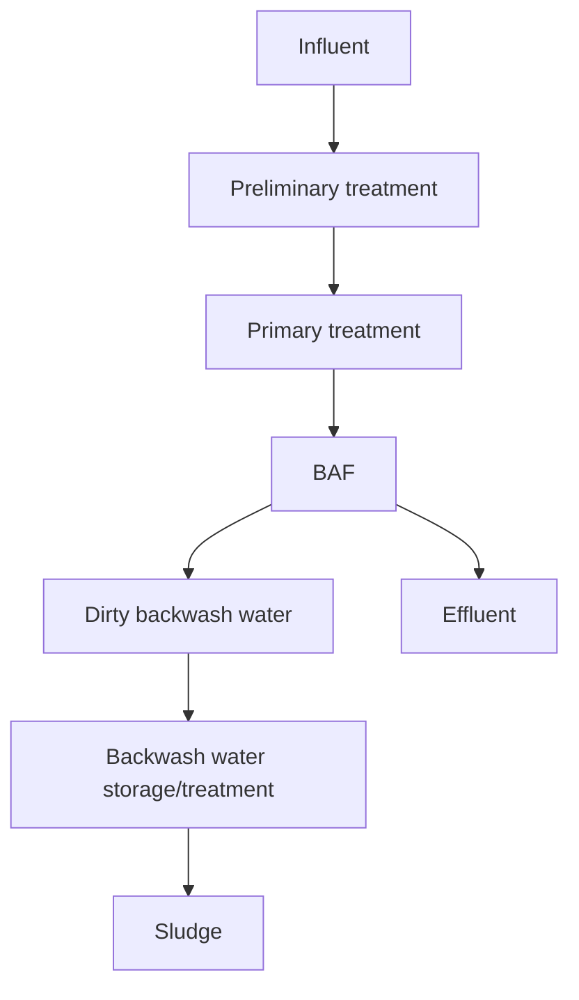

# B

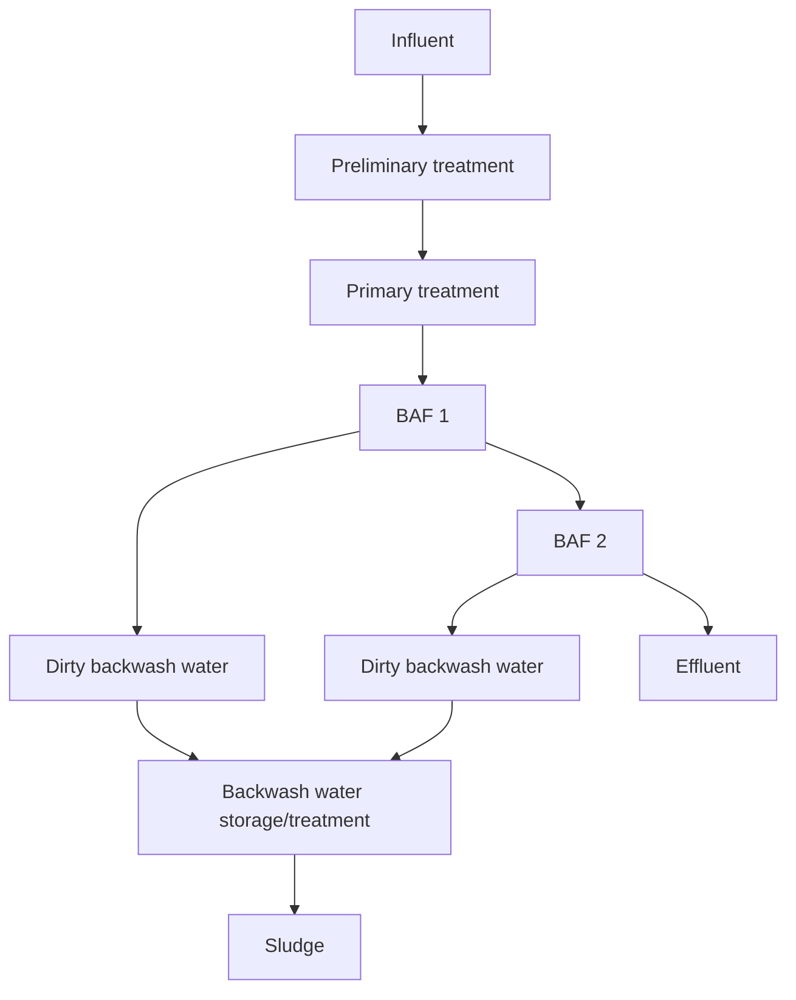

# C

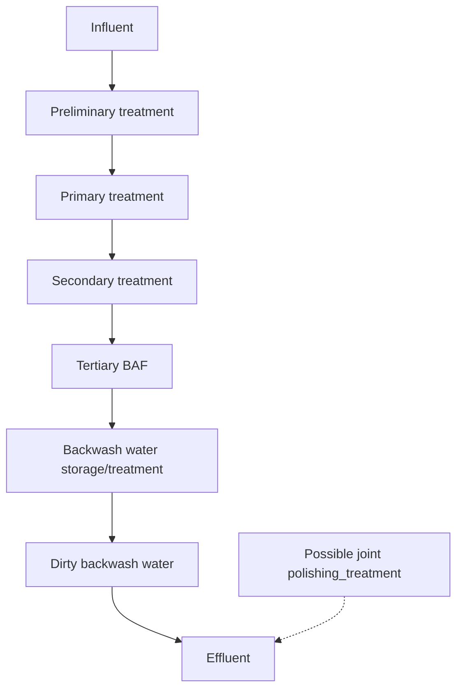

# D

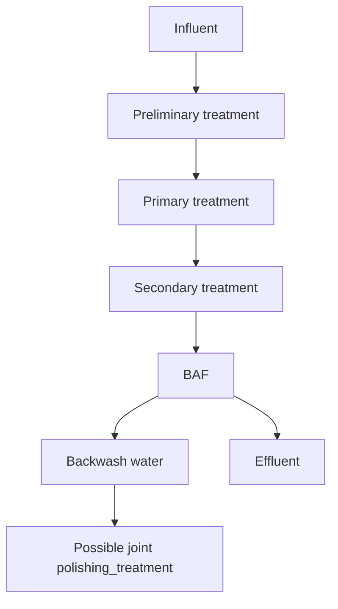
\n---\n

### FIGURE 11.30 Typical process flow diagram for four different biologically active filter options.

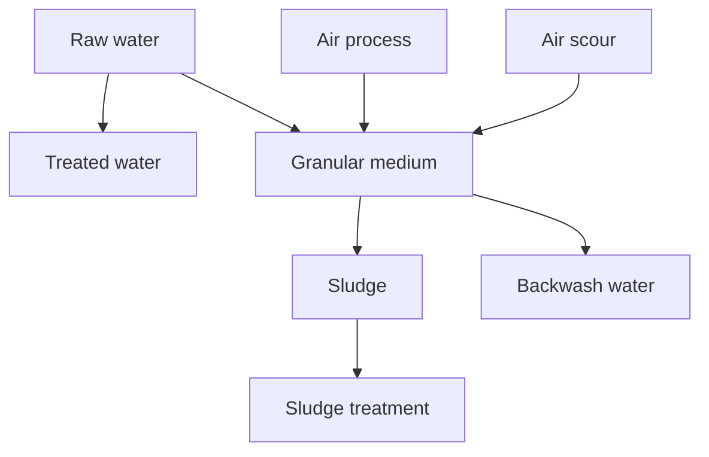

#### FIGURE 11.31 Biocarbone downflow.

```mermaid
flowchart TD
    subgraph BiocarboneDownflow
        direction TB
        A[Air sparged into the lower zone of the downflow submerged granular bed of expanded shale]
        B[Counter-current gas-liquid flow created by the media]
        C[Oxygen-transfer efficiency increased]
        D[Counter-current backwashing of the filter removes accumulated solids and excess biofilm growth]
        E[This technology was commercially available downflow BAF installed in >100 facilities worldwide (early 1980s)]
        A --> B --> C --> D
        D --> E
    end
```

## 4.1.1 Downflow with Sunken Media

The general process arrangement of a downflow BAF is shown in Figure 11.31. Air is sparged into the lower zone of the downflow submerged granular bed of expanded shale to produce good oxygen-transfer efficiency by counter-current gas-liquid flow and a circuitous flow path caused by the media. Counter-current backwashing of the filter removes accumulated solids and excess biofilm growth. This technology was a commercially available downflow BAF that was installed in more than 100 facilities throughout the world beginning in the early 1980s.

While the process performance of this type of BAF reactor was improved over previous practice, the counter-current air and water-flow limited its application for BOD removal and nitrification. Air would become entrapped in the accumulated solids on the surface and at the top of the media: Headloss could then increase unpredictably and backwashing would be necessary: Some remedies were applied, such as intermittent aeration at higher rates to expand the bed, or mini-backwashes to expel the excess solids from the surface. For secondary treatment applications, the downflow BAF was replaced by upflow configurations, which could operate at higher hydraulic rates and handle wider hydraulic variations.

\n---\n

# Biofor Upflow (BAF) Operation

The upflow mode of BAF operation through a sunken granular bed has been used in more than 185 installations worldwide for BOD removal, nitrification, and denitrification. Its general process arrangement is shown in Figure 11.33. Solids are trapped mostly in the lower part of the media bed during normal operation and are backwashed as required by increasing the hydraulic rate and applying scour air. As the backwash consists of concurrent scour air and backwash water; the accumulated solids travel up through the media bed before being released at the top.

Three types of media can be used depending on the application. The media consists of expanded clay or expanded shale either in the form of spherical grains (with an effective size of 3.5 or 4.5 mm) or as angular grains (with an effective size of 2.7 mm). The media form a submerged, fixed bed in the bottom of the reactor; typically a height of 3 to 4 m (9.8 to 13.1 ft), with approximately 1 m (3.3 ft) of freeboard zone above the bed. The clean surface area of grains is approximately 1640 m^2/m^3 (500 sq ft/cu ft). Influent water is introduced to the bed through a filter plenum and nozzle air/water distribution system. The nozzles are installed in a false floor located approximately 1 m (3.3 ft) above the filter floor. The influent flow must be fine screened to prevent blockage of the nozzles. Backwash water and scour air are introduced through the same plenum/nozzle system. Process air is introduced through separate air diffusers located in the media bed above the inlet nozzles.

```mermaid
graph TD
  Raw[Raw water] --> Bed[Media bed (submerged fixed bed)]
  Inlet[Influent water] --> Bed
  ProcessAir[Process air or C-source] --> Bed
  ScourAir[Air scour] --> Bed
  Bed --> Treated[Treated water]
  Bed --> Backwash[Backwash water / Scour air]
  Bed --> Sludge[Sludge]
  Sludge --> SludgeTreat[Sludge treatment]
```

FIGURE 11.33 Biofor upflow.
\n---\n

## Biostyr filter (Figure 11.34)

with a specific gravity slightly lower than 1, the Biobead® (Brightwater F.L.I.), also has found large application in the United Kingdom.

The Veolia unit (see Figure 11.34) is partially filled with small (2- to 6-mm) polystyrene beads. Process objectives determine selection of the bead size; larger beads can be more heavily loaded and smaller beads typically achieve higher process performance. The beads, which are lighter than wastewater, form a floating bed in the upper portion of the reactor, typically a height of 3 to 4 m (9.8 to 13.1 ft), with approximately 1.5 m (4.9 ft) of free zone below the bed. The top of the bed is restrained by a ceiling fitted with filtration nozzles to evenly collect the treated wastewater. The clean surface area of spherical beads is 1000 to 1400 m2/m3.

### Figure 11.34 Biostyr filter

```mermaid
graph TD
A[Feed channel] --> B[Bead bed (polystyrene media)]
B --> C[Anoxic zone]
B --> D[Diffusers / aeration grid]
C --> E[Treated wastewater exits via nozzles]
D --> E
```

In the bottom of the reactor, influent is distributed by troughs formed in the base of the cells. The troughs are covered with plates, which have gaps at intervals to allow the flow to enter the cells and backwash wastewater to be collected. There is no need for a filter underdrain because the media does not require support. Process air is distributed through diffusers located along the bottom of the reactor or within an aeration grid in the media bed; the latter being used if an anoxic zone is required for nitrogen removal. Only treated wastewater comes in contact with nozzles. Backwashing consists of counter-current air scour and backwash water flow. Solids are removed through the shortest pathway at the sludge removal.
\n---\n

### 4.1.4 Moving Bed, Continuous Backwash Filters

Moving bed, continuous backwash filters operate in an upflow mode and consist of media heavier than water that continuously moves downward, countercurrent to the wastewater flow. These filters are used widely for tertiary solids and turbidity removal but also have been applied to separate stage nitrification and denitrification: For nitrifying systems, air or pure oxygen is added; for denitrifying systems, a source of readily biodegradable carbon substrate such as methanol is added. Two commercially offered systems using this technology supply filter cells as 4.65 m2 modules with center airlift assembly. The effective media depth is typically 2 m, and sand media size typically ranges from approximately 1 to 1.6 mm.

Moving bed filters backwash continuously at a low rate. A typical unit is shown in Figure 11.35. Influent wastewater enters the filter bed through radials located at the bottom of the filter; moves up through the downward-moving sand bed, and the effluent flows over a weir at the top of the filter: The media, with the accumulated solids, is drawn downwards to the bottom cone of the filter. Compressed air is introduced through an airlift tube extending to the conical bottom of the filter and rises upward with a velocity of greater than 3 m/s (10 ft/s) creating an airlift pump that lifts the sand at the bottom of the filter up the center column. The turbulent upward flow in the airlift provides scrubbing action that effectively separates solids from the media before discharging to the filter wash box.

Moving bed filter manufacturers typically set the reject weir to provide a continuous wash water flow rate of about 10 to 12 gpm per filter module. This is the equivalent to a wash water rate of approximately 10% of the forward flow at an average filter loading rate of 4.9 m/h (2 gpm/cu ft).

The backwash frequency is quantified by the bed turnover rate. If used for solids removal only; moving bed filters media turnover rates range from 305 to 460 m/h or four to six bed turnovers per day. To maintain sufficient biomass in the filter for denitrification, the bed turnover rate must be reduced to approximately one to three turnovers per day or 100 to 250 m/h.

### 4.1.5 Non-Backwashing, Open-Structure Media Filters

These processes consist of submerged, static media to support the growth of biofilm for BOD removal, nitrification, or denitrification, but solids are intended to be carried through the reactor: This type of BAF typically is referred to as a SAF. If suspended solids removal

\n---\n

# Airlift Filtration Cross-Section Diagram

The image shows a vertical cross-section of an airlift filtration assembly with labeled components. The labeled parts are:

<table>
<thead>
<tr><th>Part</th><th>Label</th></tr>
</thead>
<tbody>
<tr><td>Reject compartment</td><td>H</td></tr>
<tr><td>Reject pipe</td><td>L</td></tr>
<tr><td>Influent pipe</td><td>A</td></tr>
<tr><td>Top of airlift pipe</td><td>G</td></tr>
<tr><td>Filtrate weir</td><td>J</td></tr>
<tr><td>Reject weir</td><td>K</td></tr>
<tr><td>Sand washer</td><td>I</td></tr>
<tr><td>Effluent pipe</td><td>E</td></tr>
<tr><td>Upward flowing filtrate</td><td>M</td></tr>
<tr><td>Downward moving sand bed</td><td>D</td></tr>
<tr><td>Airlift housing</td><td>N</td></tr>
<tr><td>Influent annulars</td><td>B</td></tr>
<tr><td>Feed radials</td><td>C</td></tr>
<tr><td>Bottom of airlift pipe</td><td>F</td></tr>
</tbody>
</table>

\n---\n

# Figure 11.37 Mineral media upflow submerged activated filter with block under drain (courtesy of Severn Trent)

```mermaid
graph TD
  subgraph Cross-Section of SAF with Mineral Media
    CC[Central channel in base of reactor]
    PL[Plates covering the base]
    BD[Concrete underdrain blocks with interlocking plastic jackets]
    UP[Upflow SAF cell / media bed]
    WR[Weir or trough at top of the cell (outlet for upflow)]
    CP[Bottom piping/channels (outlet for downflow SAF)]
    AIR[Air distribution: grid of perforated pipes or diffusers at the bottom]
  end

  CC --> PL
  PL --> BD
  BD --> WR
  WR --> UP
  WR --> CP
  AIR --> WR
```

For SAFs using mineral media, the air and influent distribution systems are combined with a floor system designed to support the heavier media. This system configuration is shown in Figure 11.37. Influent wastewater enters via a central channel in the base of the reactor, which is covered by plates. The plates are covered by rows of specially designed concrete underdrain blocks that are fitted with interlocking plastic jackets. For upflow SAF, treated effluent is discharged over a weir or trough at the top of the cell. For downflow SAF, piping or channels in the bottom collect the treated effluent:

In addition to process needs, aeration is required to prevent media blockage. The air can be supplied by either a grid consisting of perforated distribution pipes or diffusers installed at the bottom of the SAF. Though improved air distribution may be achieved by using diffusers, some studies have shown that in packed beds, air bubble coalescence results in

\n---\n

# Production and frequency of backwashing

For wastewaters with high suspended solids concentrations, a significant portion of solids is removed by filtration. Inert solids will be retained within the media until removed by backwashing, but biological solids may be degraded depending upon retention time. Inorganic salts of iron or aluminum, which may be added to the influent for phosphorus removal, will form precipitates within the media bed and increase backwash frequency. Solids growth for tertiary BAF systems is typically low, so backwashing is relatively infrequent (one backwash per 36–48 hours). When solids content is low, foam caused by detergent in the wastewater may be a problem because the scour aeration is concentrated in a small surface. Foam also can be an issue during process startup. Netting is recommended across the surface of the cells to keep the foam from blowing about the site.

Reactor characteristics and media type influence backwash frequency. More openly structured media capture fewer solids. This reduces backwash frequency, but effluent wastewater may contain higher suspended solids concentrations. Fine mineral media typically have the best solids retention characteristics but tend to require more frequent backwashing:

<table>
<thead>
<tr>
<th>Process</th>
<th>Supplier</th>
<th>Flow Regime</th>
<th>Media</th>
<th>Specific Gravity</th>
<th>Size (mm)</th>
<th>Specific Surface Area (m2/m3)</th>
</tr>
</thead>
<tbody>
<tr>
<td>Astrasand®</td>
<td>Paques/Siemens</td>
<td>Upflow, moving bed</td>
<td>Sand</td>
<td>&gt;2.5</td>
<td>1–1.6</td>
<td></td>
</tr>
<tr>
<td>Biobead®</td>
<td>Brightwater F.L.I.</td>
<td>Upflow</td>
<td>Polyethylene</td>
<td>0.95</td>
<td></td>
<td></td>
</tr>
<tr>
<td>Biocarbone®</td>
<td>OTV/Veolia</td>
<td>Downflow</td>
<td>Expanded shale</td>
<td>1.6</td>
<td>2–6</td>
<td></td>
</tr>
<tr>
<td>Biofor®</td>
<td>Degremont</td>
<td>Upflow</td>
<td>Expanded clay</td>
<td>1.5–1.6</td>
<td>2.7, 3.5 and 4.5</td>
<td>1400–1600</td>
</tr>
<tr>
<td>Biolest</td>
<td>Stereau</td>
<td>Upflow</td>
<td>Pumice/pouzzolane</td>
<td>1.2</td>
<td></td>
<td></td>
</tr>
</tbody>
</table>

\n---\n

<table>
<caption>TABLE 11.11 Commercially Available Biologically Activated Filter Reactor Systems and Media (Debarbadillo et al., 2010)</caption>
<thead>
<tr>
<th>Media</th>
<th>Manufacturer</th>
<th>Configuration</th>
<th>Media Type</th>
<th>Grain Size (mm)</th>
<th>Range</th>
<th>Capacity</th>
</tr>
</thead>
<tbody>
<tr>
<td>Biostyr®</td>
<td>Kruger/Veolia</td>
<td>Upflow</td>
<td>Polystyrene</td>
<td>0.04–0.05</td>
<td>3.3–5</td>
<td>1000</td>
</tr>
<tr>
<td>Colox™</td>
<td>Severn Trent</td>
<td>Upflow</td>
<td>Sand</td>
<td>2.6</td>
<td>2–3</td>
<td>656</td>
</tr>
<tr>
<td>Denite®</td>
<td>Severn Trent</td>
<td>Downflow</td>
<td>Sand</td>
<td>2.6</td>
<td>2–3</td>
<td>656</td>
</tr>
<tr>
<td>Dynasand®</td>
<td>Parkson</td>
<td>Upflow, moving bed</td>
<td>Sand</td>
<td>2.6</td>
<td>1–1.6</td>
<td></td>
</tr>
<tr>
<td>Eliminite®</td>
<td>FB Leopold</td>
<td>Downflow</td>
<td>Sand</td>
<td>2.6</td>
<td></td>
<td>2</td>
</tr>
<tr>
<td>Submerged activated filter</td>
<td>Severn Trent</td>
<td>Up/down</td>
<td>Slag</td>
<td>2–2.5</td>
<td>28–40</td>
<td>240</td>
</tr>
</tbody>
</table>

Intense backwashing regimes have been developed to clean rapid gravity filters used in potable water treatment (Fitzpatrick, 2001). The bed typically is fluidized to allow the grains to separate and move freely and to remove as much accumulated material as possible. However, fluidization is avoided in BAFs; instead, the removal of excess biomass and accumulated solids is achieved during backwash by intense media contact and air scouring in a slightly expanded media bed:

Table 11.12 provides a comparison of typical BAF backwashing requirements and Section 4.1 described backwashing for each type of BAF configuration. Final backwashing requirements and duration typically are developed in collaboration with the BAF manufacturer. For example, the backwash sequence for an upflow sunken media BAF typically includes drain down, air scour; air and water scour (may include cycling between air only and air/water scour), a water-only rinse, and filter-to-waste when the backwashed cell initially is placed back in operation. Thus, backwash water is delivered only to the BAF cell for a portion of the total duration. Media, hydraulic and organic loading rates, and

\n---\n

# Backwash Design Data

<table>
  <thead>
    <tr>
      <th>Process</th>
      <th>Backwash Water Rate, m/h (gpm/ft²)</th>
      <th>Air Scour Rate, m/h (scfm/ft²)</th>
      <th>Total Duration, (min)</th>
      <th>Total Backwash Water Volume Per Cell^c</th>
      <th>Total Backwash Wastewater Volume Per Cell^d</th>
    </tr>
  </thead>
  <tbody>
    <tr>
      <td>Upflow, sunken media normal BW^a</td>
      <td>20 (8.2)</td>
      <td>97 (5.3)</td>
      <td>50</td>
      <td>9.2 m³/m² (225 gal/sq ft)</td>
      <td>12 m³/m² (293 gal/sq ft)</td>
    </tr>
<tr>
      <td></td>
      <td>30 (12.3)</td>
      <td>97 (5.3)</td>
      <td>25</td>
      <td>9.2 m³/m² (225 gal/sq ft)</td>
      <td>10 m³/m² (245 gal/sq ft)</td>
    </tr>
<tr>
      <td>Upflow, floating media normal BW^a</td>
      <td>55 (22.5)</td>
      <td>12 (0.65)</td>
      <td>16</td>
      <td>2.5 m³/m³ media^e (18.7 gal/cu ft media)</td>
      <td>2.5 m³/m³ media^e (18.7 gal/cu ft media)</td>
    </tr>
<tr>
      <td>Mini-BW^b</td>
      <td>55 (22.5)</td>
      <td>12 (0.65)</td>
      <td>5</td>
      <td>1.5 m³/m³ media^e (11.2 gal/cu ft media)</td>
      <td>1.5 m³/m³ media^e (11.2 gal/cu ft media)</td>
    </tr>
<tr>
      <td>Downflow; sunken media</td>
      <td>15 (6)</td>
      <td>90 (5)</td>
      <td>20–25</td>
      <td>3.75–5 m³/m² (90–120 gal/sq ft)</td>
      <td>3.75–5 m³/m² (90–120 gal/sq ft)</td>
    </tr>
<tr>
      <td>Upflow; moving bed^f</td>
      <td>0.5–0.6 (0.2–0.24)</td>
      <td>Continuous through air lift</td>
      <td>Continuous</td>
      <td>55–67 m³/d (14 400–17 300 gpd)</td>
      <td>55–67 m³/d (14 400–17 300 gpd)</td>
    </tr>
  </tbody>
</table>

<p>^a Energetic backwash once every one to two months depending on trend in "clean bed" headloss following normal backwash.</p>
<p>^b Mini-backwash applied as interim measure when pollutant load exceeds design load.</p>
<p>^c Backwash duration reflects total duration of the typical backwash cycle, which includes valve cycle time and pumping and nonpumping steps. The duration of each step is adjustable via programmable logic controller and supervisory control and data acquisition control systems.</p>
<p>^d The total backwash wastewater volume includes drain and filter to waste steps where applicable.</p>
<p>^e Backwash volume requirements for upflow floating media BAF typically are based on media volume rather than cell area because depths vary.</p>
<p>^f Continuous backwash filter backwashing is based on a standard 4.65 m² cell and a typical weir setting for reject flow of approximately 2.3–2.8 m³/h/cell (10–12 gpm/cu ft cell).</p>
\n---\n

## 4.4.1 Secondary Treatment

This section reviews criteria for BAFs designed for carbon oxidation and suspended solids removal in secondary treatment.

Volumetric BOD loading rates vary widely in the literature for upflow BAFs designed for secondary treatment, ranging from 1.5 to 6 kg BOD/m^3/d. Table 11.13 provides COD and BOD applied loading rates and removal efficiencies for several pilot- and full-scale references.

Average and peak hydraulic loading rates for secondary treatment systems typically range from 4 to 7 m/h and 10 to 20 m/h, respectively: Because BAFs for secondary treatment typically are placed immediately downstream of primary clarification, the applied volumetric mass loading rate is almost always the limiting design parameter (see Table 11.14).

For simultaneous secondary treatment and nitrification, the carbon loading at lower temperatures needs to be limited to less than 2.5 kg BOD/m^3/d (Rogalla et al., 1990). Simultaneously, a total Kjeldahl nitrogen (TKN) loading removal rate of 0.4 kg N/m^3/d can be obtained:

The backwash frequency for BAFs designed for secondary treatment is related to the applied organic and TSS load, degree of particle hydrolysis taking place within the media, biomass yield, and solids retention capacity of the media. Because of the higher biomass yield of heterotrophic bacteria and higher applied TSS loadings, BAFs for secondary treatment (BOD removal) need to be backwashed at least once per day: More frequent

* Filtration rate, or total volume of wastewater applied per area of media per unit time (m^3/m^2/d), also is used to determine filter surface area. Filtration velocity affects system headloss, solids capture, and air and water distribution within the media, diffusion, and detention time.
* Solids holding capacity, which will determine backwash frequency.
\n---\n

# TABLE 11.14 Typical Biologically Active Filter (BAF) Loading Rates for Secondary Treatment (Debarbadillo et al., 2010)

<table>
  <thead>
    <tr>
      <th>Type of BAF</th>
      <th>Applied Volumetric Loading<br>(kg/m³ · d) (lb/d/1000 cu ft)</th>
      <th>Hydraulic Loading<br>(m³/m² · h) (gpm/cu ft)</th>
      <th>Removal Efficiency (%)</th>
    </tr>
  </thead>
  <tbody>
    <tr>
      <td>Upflow sunken or floating media, backwashing</td>
      <td>BOD: 1.5–6 (94–370)<br>TSS: 0.8–3.5 (50–220)</td>
      <td>3–16 (1.2–6.6)</td>
      <td>BOD: 65–90<br>TSS: 65–90</td>
    </tr>
<tr>
      <td>Upflow, sunken media</td>
      <td>10</td>
      <td></td>
      <td></td>
    </tr>
<tr>
      <td>Upflow, floating media</td>
      <td>8</td>
      <td></td>
      <td></td>
    </tr>
<tr>
      <td>Submerged, non-backwashing</td>
      <td>BOD: 0.8–1.5 (50–94) @ 20°C</td>
      <td>2–12 (0.8–5) @ 20°C</td>
      <td>BOD: 85–95</td>
    </tr>
  </tbody>
</table>

<p>Notes: Design loading rates depend on specific wastewater characteristics and level of treatment required.</p>

<p>a Degremont, 2007.</p>
<p>b Kruger, 2008.</p>
<p>c German Association for Water, Wastewater and Waste, 1997.</p>
<p>d Severn Trent, 2008.</p>

<p>TABLE 11.14 Typical Biologically Active Filter (BAF) Loading Rates for Secondary Treatment (Debarbadillo et al., 2010)</p>

<p>Backwash water typically contains 500 to 1500 mg/L suspended solids, but this varies with the type of treatment; cycle time, and water used. The BOD removal produces biomass from growth of the microorganisms, which convert degradable material into new cells, carbon dioxide, and water, similar to that of activated sludge. Sludge production is typically 0.7 to 1 kg solids per kg BOD removed. In a two-stage SAF/BAF in Aberdeen, the German ATV Standard equation to predict solids from activated sludge was successfully applied (Jolly, 2004; German Association for Water, Wastewater and Waste [ATV-DVWK], 2000).</p>

\n---\n

# BAF backwash wastewater volume and solids concentration

Removal efficiency of at least 90% when treating domestic wastewater: Determine BAF backwash wastewater volume and solids concentration. Assume the following conditions apply for this example:

* Influent (including returns) maximum month flow rate: Q0 = 94 800 m3/d;
* Influent (including returns) flow peaking factor: PF = 2.8;
* BOD5 after primary settling: C_BOD5 = 220 mg/L;
* TSS after primary settling: C_TSS = 150 mg/L;
* BAF media height: H_M = 4 m;
* BAF effluent used as backwash water;
* BAF backwash return flow equalized and combined with other return flows at head of facility:

1. Calculate BOD5 and TSS load to the BAF system:

* BOD5 load = (Q0)(BOD5)/1000 = (94 800)(220)/1000 = 20 856 kg/d;
* TSS load = (Q0)(TSS)/1000 = (94 800)(150)/1000 = 14 220 kg/d (31 284 lbs/d).

2. Assume maximum volumetric applied loading rates (Table 11.14):

* BOD5 = 3 kg/m3/d for 90% removal efficiency;
* TSS = 1.6 kg/m3/d for 90% removal efficiency.

3. Calculate total BAF media volume Vm_required:

* V_BOD5 = 20866/3 = 6955 m3;
* V_TSS = 14220/1.6 = 8888 m3;
- TSS load is limiting:

4. Calculate total BAF filtration area (A) required based on volumetric loading and filter depth:

* A_vol = Vm/H_M = 8888/4 = 2222 m2 (23 909 cu ft):

5. Calculate total BAF filtration area based on maximum hydraulic loading rate of 20 m/h:
\n---\n

Backwash wastewater solids concentration, C_BW;

C_BW = (Y)(BOD5 load)(E_BOD)/(N)(V_BW);

C_BW = (1.0)(20 856)(0.9)(1/16)(1/1728) = 679 kg/m^3 = 679 mg/L.

This set of calculations represents an initial estimate of the BAF facility sizing.

Development of the final design is typically an iterative process between the design engineer and the process equipment manufacturers being considered. Refinements typically are made by incorporating a combination of the manufacturer’s experience and more detailed process modeling results:

## 4.4.2 Nitrification

Temperature, effluent requirements, fluid velocities (air and water), and loading influence nitrification capacity. As discussed in Section 2.0, biochemical transformation processes occurring in the biofilm are dependent on substrates diffusing in and out of the biofilm. Reaction rates or level of treatment achieved are defined by the rate limited substrate. Bulk phase ammonia, alkalinity, oxygen, and COD concentrations affect nitrification. As COD loadings increase, oxygen tends to become the rate limited substrate. Competition for oxygen intensifies, and the heterotrophic respiration at the outer layers of the biofilm will reduce availability of oxygen for nitrification in the deeper layers (Wanner and Gujer, 1985). Rogalla et al. (1990) found that nitrification tends to decrease when biodegradable COD loadings approach 4 kg/m^3/d. The influence of the CIN ratio on nitrification is illustrated in Figure 11.38 (Rother, 2005).
\n---\n

3-Nat loadings up to 2.3 kg/ma/d was observed (Pujol et al., 1994). A summary of typical loading rates for nitrification applications is provided in Table 11.15.

Similar to water velocity, the increase of process air velocity improves nitrification rates as higher process air velocities increase turbulence and external mass transfer (Figure 11.39) (Tschui et al., 1993; Tschui et al., 1994).

When BAFs are operated for significant periods under reduced ammonia loading conditions, the inventory of biomass also will decrease. An example of this was shown in testing by Tschui et al. (1994) where volumetric ammonia removal rates decreased by 30% after a transition from operation under non-NH3-N limiting conditions to lower volumetric NH3-N loading rates. This is an important consideration for separate-stage nitrification BAF applications in which some nitrification can occur in the main secondary facility during summer months. The BAF will need to be able to treat higher ammonia loads when temperature drops and upstream nitrification decreases.

<table>
<thead>
<tr>
<th>Type of BAF</th>
<th>Applied Volumetric Loading<br>(kg/m<sup>3</sup> · d) (lb/d/1000 cu ft)</th>
<th>Hydraulic Loading (m<sup>3</sup>/m<sup>2</sup> · h) (gpm/cu ft)</th>
<th>Removal Efficiency (%)</th>
</tr>
</thead>
<tbody>
<tr>
<td>Upflow; sunken or floating media, backwashing, following primary treatment</td>
<td>BOD: &lt;1.5-3 (&lt;94-188) <br> TSS: &lt;1.0-1.6 (&lt;62-100) <br> NH3-N: &lt;0.4-0.6 (&lt;31-62) @ 10°C <br> &lt;1.0-1.6 (&lt;62-100) @ 20°C</td>
<td>3-12 (1.2-5)</td>
<td>BOD: 70-90 <br> TSS: 65-85 <br> NH3-N: 65-75</td>
</tr>
<tr>
<td>Upflow, sunken or floating media, backwashing, following secondary treatment</td>
<td>BOD: &lt;1-2 (&lt;62-125) <br> TSS: &lt;1.0-1.6 (&lt;62-100) <br> NH3-N: &lt;0.5-1.0 (&lt;31-62) @ 10°C <br> &lt;1.0-1.6 (&lt;62-100) @ 20°C</td>
<td>3-20 (1.2-8.2)</td>
<td>BOD: 40-75 <br> TSS: 40-75 <br> NH3-N: 75-95</td>
</tr>
<tr>
<td>Upflow; floating media, backwashing following secondary treatment</td>
<td>NH3-N: 1.5 (94)</td>
<td></td>
<td></td>
</tr>
<tr>
<td>Upflow; sunken media, backwashing following secondary treatment</td>
<td>NH3-N: 1.2 (75)</td>
<td></td>
<td></td>
</tr>
</tbody>
</table>

\n---\n

# Effect of process air loading on nitrification

Ammonia removal g/cum.d

Air loading M/h

<table>
  <thead>
    <tr>
      <th>Air loading M/h</th>
      <th>10</th>
      <th>15</th>
      <th>20</th>
      <th>25</th>
      <th>30</th>
    </tr>
  </thead>
  <tbody>
    <tr>
      <td>Upflow system with floating media</td>
      <td>1450</td>
      <td>1550</td>
      <td>1650</td>
      <td>1800</td>
      <td>1900</td>
    </tr>
<tr>
      <td>Downflow system sunken medium</td>
      <td>600</td>
      <td>700</td>
      <td>800</td>
      <td>900</td>
      <td>1000</td>
    </tr>
<tr>
      <td>Upflow system modular medium</td>
      <td>180</td>
      <td>260</td>
      <td>340</td>
      <td>450</td>
      <td>550</td>
    </tr>
  </tbody>
</table>

- Legend:
  - Upflow system with floating media (diamond)
  - Downflow system sunken medium (square)
  - Upflow system modular medium (circle)

FIGURE 11.39 Effects of air velocity on nitrification (Tschui et al., 1993).
\n---\n

Net sludge production is about 0.5 to 0.8 kg per kg of solids removed.

## 4.4.3 Combined Nitrification and Denitrification

Nitrogen removal can be accomplished by either oxidizing the ammonia in a first stage followed by reducing the nitrate in a second stage where an external carbon source is added (referred to as post-denitrification), or by recycling the nitrified effluent to a denitrification stage before nitrification (pre-denitrification). In pre-denitrification, the nitrified effluent is recycled to a separate anoxic BAF reactor located upstream of the reactor. In some upflow, floating media BAF configurations, a portion of the nitrified effluent may be recycled to an anoxic zone in the bottom of the media (U.S. Patent No. 6632365).

If sufficient carbon is available and the anoxic zone is large enough, then nitrogen removal is proportional to the recycle but with a diminishing return. Recycle typically is limited to ratios of 3 or total nitrogen removals of 75% because of the excessive hydraulic load and oxygen recycle. The minimum nitrate concentration achievable assuming complete nitrification and denitrification and ignoring nitrogen uptake because of cell synthesis is given by:

$$NO_3\text{-}N_{EFF} = \frac{NH_3\text{-}N_{INF}}{R+1}$$

where NH3-N_INF = ammonia concentration in influent;
NO3-N_EFF = nitrate concentrations in effluent respectively;
R(Q_R / Q_in) = recirculation ratio.

Recycling treated wastewater has the advantage of increasing upflow velocity in both pre-denitrification and nitrification reactors, which increases the reaction rate.

Ryhiner et al. (1993) tested a pre-denitrification configuration using submerged structured media BAFs with a final polishing filter to ensure low nitrogen and suspended solids.
\n---\n

3–N/m3/d) with typical wastewater feed to the pre-denitrification BAF and up to 90% removal when additional substrate (methanol) was added. A range of recycle rates (150%–350%) and corresponding filtration velocities (9.4 to 16.9 m3/m2/h) also were tested. Design guidance for pre-denitrification BAF systems is provided in Table 11.16.

<table>
  <thead>
    <tr>
      <th>Type of BAF</th>
      <th>Applied Volumetric Loading<br>(kg/m3·d) (lb/d/1000 cu ft)</th>
      <th>Hydraulic Loading<br>(m3/m2·h) (gpm/cu ft)</th>
      <th>Removal Efficiency (%)</th>
    </tr>
  </thead>
  <tbody>
    <tr>
      <td>Upflow; sunken mediaa separate BAF stages (pre-denitrification + nitrification)</td>
      <td>N-NO3: 1–1.2 (62–75)</td>
      <td>10–30 (4–12)</td>
      <td>NO3-N: 75–85</td>
    </tr>
<tr>
      <td>Upflow; floating mediab<br/>combined anoxic/aerated BAF stage</td>
      <td>1–1.2 (62–75)</td>
      <td>12–21.5 (4.9–8.8)</td>
      <td>NO3-N: 70 without supplemental carbon; 85% with supplemental carbon</td>
    </tr>
  </tbody>
</table>

Notes: Design and performance are dependent on wastewater characteristics, upstream treatment processes, effluent goals, and readily biodegradable carbon substrate:

a Degremont; 2007

b Ninassi et al., 1998

TABLE 11.16 Typical Biologically Active Filter Loading Rates (BAF) for Pre-Denitrification (Debarbadillo et al., 2010)

4.4.4 Tertiary Denitrification

This section focuses on process design criteria for post-denitrification BAF including half-order nitrogen removal kinetics, temperature, supplemental carbon and nitrogen release cycle requirements, and hydraulic, volumetric mass, and solids loading.

Volumetric loading (and removal) rates vary widely, with citations ranging from 0.2 to 4.8 kg/m3·d (15–300 lbs/1000 cu ft) (U.S. Environmental Protection Agency [U.S. EPA], 1993; WEF, 2013; Metcalf and Eddy, Inc./AECOM, 2013; Degremont, 2007). Many post-denitrification filters are preceded by an activated sludge biological nutrient removal process. Because some denitrification is achieved upstream, filter influent NOx-N concentrations are typically less than 10 mg/L. In these cases, hydraulic considerations govern post-denitrification design and many installations are operating at mass loading

\n---\n

## TABLE 11.17 Typical Biologically Active Filters (BAF) Loading Rates for Post-Denitrification

<table>
<tr><td>Upflow, sunken media</td><td>NO₃-N: 0.8–5 (50–300)</td><td>10–35 (4–14)</td><td>NO₃-N: 75–95</td></tr>
<tr><td>Upflow, sunken media</td><td>2 (125)</td><td></td><td></td></tr>
<tr><td>Upflow, floating media</td><td>1.2–1.5 (75–94)</td><td></td><td></td></tr>
<tr><td>Moving bed, continuous backwash</td><td>NO₃-N: 0.3–2 (20–120)</td><td>4.8–5.6 (2–4) average</td><td>13.4 (6) peak</td></tr>
</table>

<p>Notes: Selected loading rates are dependent on treatment objectives, upstream processes, wastewater characteristics, and carbon source.</p>

<p>a Severn Trent, 2004; U.S. Environmental Protection Agency, 1993.</p>
<p>b Degremont, 2007.</p>
<p>c German Association for Water, Wastewater and Waste, 1997</p>
<p>d deBarbadillo et al., 2005.</p>

## Substituting \(S_T = 0.87\) dissolved oxygen, mg/L + 2.47 NO₃-N, mg/L + 1.53 NO₂-N mg/L for \(S_p\) and \(S_{in}\) (McCarty et al., 1969):

$$
\sqrt{S_{B,T}} - \sqrt{S_{m,T}} = -\frac{1}{2} k_1 \frac{h}{q_A} \quad (11.11)
$$

or

$$
\frac{\sqrt{S_{B,T}}}{\sqrt{S_{in,T}}} = 1 - \frac{a}{\sqrt{S_{in,T}}} \quad (11.12)
$$

where,

$$
a = \frac{k}{2 \cdot q_A}
$$
\n---\n

# TABLE 11.18 Half-Order Kinetic Constants for Tertiary Denitrification Filters

<table>
  <thead>
    <tr>
      <th>Location</th>
      <th>Period</th>
      <th>Coeff. a</th>
      <th>Coeff. b</th>
      <th>Notes</th>
    </tr>
  </thead>
  <tbody>
    <tr>
      <td>Hagerstown, Maryland (pilot)d</td>
      <td>14–15</td>
      <td>0.23</td>
      <td>0.38</td>
      <td>Based on inlet and outlet concentrations. Average loading conditions, full denitrification</td>
    </tr>
<tr>
      <td>Hagerstown, Maryland (pilot)d</td>
      <td>14–15</td>
      <td>0.36</td>
      <td>0.64</td>
      <td>Based on inlet and outlet concentrations Peak loading conditions</td>
    </tr>
  </tbody>
</table>

<p>a Half-order reaction coefficients are reported per unit volume.</p>
<p>b Harremoes, 1976.</p>
<p>c Janning et al., 1995.</p>
<p>d deBarbadillo et al., 2005.</p>

<p>Hydraulic loading rates also affect contact time within the filter: Original denitrification filter design curves related percent NO3-N removal to empty-bed detention time (EBDT) (Savage, 1983). Data from pilot and full-scale systems superimposed onto existing curves suggested that NOx-N removals of 90% could be achieved at hydraulic residence time of 10 minutes at temperatures ranging from 13 to 21°C (deBarbadillo et al., 2005).</p>

<p>In addition to removal of solids from influent wastewater, biomass is produced within the filter. Typically, a biomass yield coefficient of 0.4 g biomass COD produced/g methanol COD consumed (approximately 0.4 g VSS/g methanol consumed) is adequate for post-denitrification systems using methanol as the carbon source. When estimating solids quantities, it is assumed that approximately 10% of the biodegradable solids removed and produced undergo hydrolysis.</p>
\n---\n

# 11. Denitrification and Supplemental Carbon Source

2 or less on average to maintain an average effluent TSS concentration of 5 mg/L or lower
(Schauer et al., 2006). This limitation is specific to denitrification mode under the conditions tested and at a media recirculation rate. Other BAF configurations, including upflow with sunken and floating media, have installations that achieve final effluent TSS as low as 5 mg/L; with larger media sizes, however, overall solids filtration is not as robust and the effluent may be comparable to high quality secondary clarifier effluent:

For tertiary denitrification systems, such as filters, BAFs, and MBBRs with a post-anoxic fixed-film zone, the supplemental carbon source is vital to system operation. Methanol feed requirements can be estimated using eq 11.13, as follows (McCarty et al., 1969):

$$ S_M = 2.47 \, (NO_3\text{-}N \text{ removed}) + 1.53 \, (NO_2\text{-}N \text{ removed}) + 0.87 \, (\text{Dissolved oxygen removed}) $$

(11.13)

Equation (11.13) applies specifically to methanol. The COD requirement for denitrification varies depending on the carbon substrate used. The amount of substrate COD stabilized by 1 mg of oxygen is (Copp and Dold, 1998; Melcer et al., 2003):

$$ COD/NO_3\text{-}N = \frac{1}{(1 - Y)} $$

where Y = heterotrophic yield coefficient (mg biomass COD formed per unit substrate COD used).

A value of 0.66 is typically used for aerobic respiration. For denitrification, a 2.86 conversion factor is incorporated into the equation to account for the amount of nitrate required to accept the same number of electrons. This yields the following expression for COD requirements for anoxic growth:

$$ COD/NO_3\text{-}N = \frac{2.86}{(1 - Y)} \quad (11.15) $$

An estimate of supplemental carbon substrate requirements can be made by factoring the appropriate anoxic yield coefficient into the calculation. Determination of anoxic yield coefficients for different substrates has been a topic of recent research (Mokhayeri et al., 2006; Nichols et al., 2007; Cherchi et al., 2008). For example, incorporating a methanol anoxic yield coefficient of 0.38 into eq 11.15 results in a requirement of 4.6 mg COD/mg NO3-N.
\n---\n

while operating a tertiary nitrification or denitrification process is difficult. Adequate
phosphorus is needed for microbial growth and insufficient phosphorus will limit the ability
of tertiary BAF to achieve treatment goals. An evaluation of pilot and full-scale post-
denitrification BAF performance data suggests that nitrate removal goals can be achieved
in practice at orthophosphate to nitrate/nitrite-nitrogen ratios of 0.02 (deBarbadillo et al., 2006). This subject is covered in more detail in Section 3.2.4 of this chapter:
4.5 Facility Design Considerations for Biologically Activated Filter Facilities
Several issues must be considered in the design of the BAF reactors, supporting facilities, and upstream and downstream processes.

### 4.5.1 Preliminary and Primary Treatment

Fine screening should be implemented, if possible, at multiple locations in the facility depending on the type of BAF used. Though the BAF influent may have been screened several times, it is imperative to include a screen immediately upstream of the inlet for upflow BAFs with nozzled bottom floors. A simple bag screen or manual flat screen with less than 2.5-mm openings will protect the BAF if an automatic fine screen is provided upfront. Dedicated automatic screens are needed, however; if influent wastewater screening is poor, some inlets are not screened (e.g., septage, imported sludges), the facility is surrounded by trees, or channels are not covered.

For a facility with a smaller footprint, high-rate primary treatment often is used. This may be achieved by chemically enhanced primary treatment (CEPT), high-rate lamella settlers, or ballasted (sand or dense sludge) flocculation and settling.

### 4.5.2 Backwash Handling Facilities

The BAF backwash facilities and equipment typically include effluent clearwell, backwash water pumps (for concurrent systems only), air scour blowers, backwash waste equalization tank and return pumps, and all automatic valves, instruments, and controls required for automatic initiation and sequencing. Equipment and facilities must be sized adequately to handle air and water rates and volumes necessary for effective backwashing. During backwashing, the effluent flow from the BAF may stop or decrease, which must be accounted for in design and operation of any downstream treatment process, such as UV disinfection.
\n---\n

All aeration studies on BAF facilities have observed higher oxygen uptake rates than typically found in the activated sludge process, which is consistent with reduced volume and hydraulic retention time. Stensel et al. (1984) measured oxygen uptake rates (OUR) from 121 to 250 mg/L/h in a 1.7-m tall reactor, which was 3.0 to 3.2 times greater than the observed rates in clean water tests performed on the same equipment. This was attributed to transfer of dissolved oxygen in water to the biomass and sparged air bubble area being in direct contact with the biofilm, allowing a second mechanism of direct transfer of oxygen from air bubbles to the biofilm. Lee and Stensel (1986) and Canziani (1988) had similar findings.

In field demonstrations, oxygen transfer test of BAFs at full-depth of 3.6 m using the off-gas method showed process water oxygen transfer efficiencies (OTE) of 1.6% to 5.8% per meter (0.5%–1.8% per foot) for floating media (average 4-mm diameter) and 3.9% to 7.9% per meter (1.2%–2.4% per foot) for mineral media (3–5 mm) at nominal design conditions (Redmon et al., 1983).

Additional studies yielded the following results:
- Rogalla and Sibony (1992) measured oxygen transfer rates of 7% to 15%.
- Pearce (1996) measured clean water oxygen transfer efficiencies of 10% to 17% in a downflow BAF pilot with 2-m depth and 3.3-mm angular media.
- Shepherd et al. (1997) measured oxygen transfer efficiencies of 7.9% to 10.3% in upflow BAF with 4-m depth of 2- to 3-mm silica sand.
- Laurence et al. (2003) reported oxygen transfer efficiencies of approximately 20% from off-gas testing of a 3-m depth upflow BAF with floating media and a 4-m depth upflow BAF with sunken media during side-by-side pilot testing in New York City.
- Stenstrom et al. (2008) measured oxygen transfer efficiencies of 5.8% to 21.1% for 3.6 m of 3- to 5-mm rock media and 13.1% to 29% for 3.6 m of 4-mm Styrofoam spheres in pilot reactors.

Process air distribution systems in BAFs include (Rundle, 2009):

1. Simple pipes with sparge holes drilled at intervals positioned in media or near the floor of the filter. Coarse bubble aeration through sparging pipes is used widely:
\n---\n

```mermaid
graph TD
    M[Medium]
    N1[Nozzle]
    N2[Nozzle]
    N3[Nozzle]
    PF[Plenum floor]
    AH[Air holes]
    WP[Wastewater flow]
    AP[Air pocket under plenum floor low at low air flow]

    M --> N1
    M --> N2
    M --> N3
    N1 --> PF
    N2 --> PF
    N3 --> PF
    PF --> AH
    AH --> WP
    AP -.-> PF
```

FIGURE 11.41 Operation of combined nozzles at low airflow (Rundle, 2009). Reprinted with permission from the Chartered Institution of Water and Environmental Management.
```

Blower selection is important for efficient facility operation. As solids accumulate in the media, filter headloss increases, which can affect the air flow. When several BAF cells receive air from a common main, backwashed cells will have the lowest headloss and will take more air flow. This balancing issue can be mitigated by providing individual blowers for each BAF cell For larger facilities a centralized blower station with a common air main, air pipes feeding each cell are fitted with a mass flow meter (measuring velocity, pressure, and temperature). The meter is used to control a modulating valve, which balances air flow to the cells.

## 4.5.4 Supplemental Carbon Feed Facilities

In tertiary denitrification BAF, and in some pre-denitrification systems, an external carbon substrate (electron donor) must be dosed. Methanol typically has been used for this purpose. Increasingly, alternative carbon sources are being considered including ethanol, acetic acid, and sugar solutions. The chemical properties for the selected carbon source must be evaluated and accounted for in design. Carbon dosage control is important for

\n---\n

Flow overcomes gravity. Suspension of the media maximizes the contact surface between microorganisms and wastewater. It also increases treatment efficiency by improving mass transfer because there is significant relative motion between the solid (biofilm) phase and the flowing wastewater. Because media tend to be naturally occurring materials, they are relatively inexpensive. Because of the balance of forces involved in particle fluidization and bed expansion, the smallest particles are found at the top and the largest at the bottom. Therefore, the media particles should be graded to a relatively tight size range.

The degree of bed expansion determines whether a bed is deemed expanded or fluidized. The transition lies between 50% to 100% expansion over the static bed height. This discussion assumes the upper limit: beds less than double static bed height (100% expanded) are considered expanded; those more than double the static bed height (100% expanded) are fluidized. A lower degree of bed expansion is advantageous, because it requires a lower flow velocity, less energy, and increases effective biomass concentration, which reduces the footprint. In aerobic processes, however, it increases volumetric oxygen demand because of increased biomass concentration.

Starting with a static bed that partially fills the column, the vertical flow velocity is chosen to expand the bed to its initial design height, typically 50% of available height.

Microorganisms attach to the media particles and grow to form a biofilm. This results in an increase in particle size but a decrease in composite particle (bioparticle) density. Thus, despite their initial differences, all media tend towards a similar specific gravity (approximately 1.1) as the biofilm thickness increases (Figure 11.42). Because of the size increase and density decrease, the bed continues to expand until it reaches full design height at which point biofilm thickness must be controlled:

Because biofilm thickness control is necessary to constrain the expanded bed within the confines of the reactor to better control the bioreactor performance. For example, biofilm thickness can be controlled to maintain optimum thickness and maximum reaction rate by choosing bioparticle concentration based on volume of support media added and degree of bed expansion.
\n---\n

Whether this generic technology is used for aerobic, anoxic, or anaerobic processes, all are based on a similar basic design (Figure 11.43). This design consists of a column in which the particles are fluidized and the bed expanded and a recycle line that is used to maintain a fixed, vertical hydraulic flow. In this way, bed expansion is kept constant and bioparticles are retained irrespective of influent flowrate.

Anoxic and anaerobic designs are the simplest; aerobic designs require a system to supply oxygen. Aeration typically is achieved during recycle, during which influent wastewater mixes with recycled effluent from the top of the bed. If aeration is conducted within the fluidized bed, then a significant volume of gas disturbs the fluidized state by causing turbulence and increased force of interparticle collisions. This can dislodge biofilm. Nevertheless, this approach is used sometimes: The advantage of adding air to the recycle stream is that biomass is not stripped from the media by turbulence of rising gas bubbles and, therefore, the treated effluent typically has a lower concentration of suspended solids Jeris et al., 1981; Oppelt and Smith, 1981).

Process flow enters at the bottom of the reactor and flows through a distribution system to ensure even dispersion and uniform fluidization. Silica sand (0.3-0.7 mm diameter) and granular activated carbon (GAC; 0.6 to 1.4 mm) typically are used. Other materials, however, have been used at pilot scale, such as 0.7 to 1.0 mm glassy coke (McQuarrie et al., 2007). Small carrier particles (1 mm) provide a large specific surface area for biofilm growth (up to 2400 m2 m-3 when expanded 50%), which is one of the key advantages of this processtechnology (Figure 11.44).

## 5.1 Fluidized Bed Biofilm Reactor Advantages and Disadvantages

The key advantage of the FBBR configuration is the large specific surface area for biofilm growth. This area results in a high concentration of active biomass (Table 11.19), a high rate of reaction, and a small footprint. However, owing to high biomass concentration, aerobic processes can be oxygen limited. Another disadvantage can be the degree of recycle required to maintain upward velocity for bed expansion and bioparticle fluidization, which can increase pumping costs. The recycle pump, however, only has to overcome the sum of frictional resistances and density difference between the fluid in the recycle line (aeration gas and wastewater) and the expanded bed (wastewater and biofilm-coated media). Pressure drop across the recirculation (fluidizing) pump is significantly less than
\n---\n

which is higher than for other systems (Table 11.20). This large surface area allows
biomass concentrations of 15 000 to 40 000 mg/L VSS to be maintained in the FBBR
(Grady et al., 1999). Thus, the volumetric efficiency of an FBBR can be as much as 10
times that of an activated sludge system (Rabah and Dahab, 2004b). Because of its high
biomass concentration, the FBBR can operate efficiently at short retention times (less
than three minutes) for a denitrification process, even with high nitrate loading rates
(greater than 70 kg NO3N/m3d) (Green et al., 1994).

Clogging and the resulting high headloss can be avoided in FBBRs compared to the use
of small media in packed beds (Shieh and Keenan, 1986). Another advantage is that the
fluidized bed retains a thin active biofilm around the entire particle; whereas in fixed beds,
only the parts of the media that are not in contact with other particles can develop biofilm.
Thus, the surface area provided in FBBRs is 10 times greater than the surface area
provided in equivalent downflow fixed beds (U.S. Filter/Envirex, 1997).

<table>
<thead>
<tr><th>Feature</th><th>Advantage</th><th>Disadvantage</th><th>Compare to</th></tr>
</thead>
<tbody>
<tr><td>Specific surface area (m2/m3)</td><td>1000-3000</td><td></td><td>BAF: 1200</td></tr>
<tr><td>Biomass concentration (mg/L)</td><td>40 000</td><td>High oxygen consumption</td><td>Activated sludge: 3000</td></tr>
<tr><td>Biofilm specific surface area (m2/m3)</td><td>3000</td><td></td><td>Trickling filter: 300</td></tr>
<tr><td>Biomass age</td><td>Several weeks</td><td></td><td>Activated sludge: 10 days</td></tr>
<tr><td>F:M ratio</td><td>0.001 for tertiary nitrification</td><td></td><td>Activated sludge: 0.2-0.4</td></tr>
<tr><td>Wastewater recirculation</td><td></td><td>Required for dry weather flows or elevated concentrations of pollutant</td><td>BAF and MBBR: normally, no recirculation required</td></tr>
<tr><td>Backflushing</td><td>Not required</td><td></td><td>BAF requires 10% of treated effluent to be used</td></tr>
<tr><td>Aeration</td><td>Highly efficient counter- current systems can be</td><td>Nitrogen-depleted air, oxygen-enriched air or pure</td><td>Aeration in upflow BAF is inefficient co-current; MBBR</td></tr>
</tbody>
</table>

\n---\n

A variety of wastewaters has been investigated at both the laboratory and pilot-scale, which may allow expansion or upgrading of facilities to meet more stringent future standards, especially for ammonia, nitrate, carbonaceous biochemical oxygen demand (CBOD), and TSS. In particular, anaerobic FBBRs have found a market for the treatment of high-strength industrial wastewaters with COD concentration greater than 1000 mg/L because the high costs of oxygenation can be avoided and valuable biogas can be recovered. The compact nature of FBBRs may allow upgrading within existing structures because complete skid-mounted systems can be directly shipped to site, requiring only piping and electrical connections to make them fully operational. In addition, modules can be added to either augment current processes or to add new ones (Shieh and Keenan, 1986).

# 5.3 Process Design
## 5.3.1 Typical Design Parameters
Vertical flow velocity; recirculation, and flow distribution are key FBBR process design parameters discussed in this section.

### 5.3.1.1 Vertical Flow Velocity
The U.S. EPA recommends an upward velocity range for 0.5 mm silica sand of 36 to 60 m/h; others recommend a range of 30 to 36 m/h (U.S. EPA, 1993; Metcalf and Eddy, Inc./AECOM, 2013). Although the acceptable range of upflow velocities appears to be 30 to 60 m/h, many pilot-scale reactors have operated at 30 to 36 m/h (Shieh and Keenan, 1986). The upflow velocity is chosen according to the size and specific gravity of the support media particles (Table 11.21). Basically, vertical drag force must exceed the downward force of gravity, so that particles are fluidized and the bed expands. Once this state is achieved, further increasing the flow velocity increases the degree of bed expansion: As biofilm develops, the size of the particles increases (Figure 11.42). These two changes in the physical characteristics of the particles result in continuous bed expansion until it reaches design height, at which point biofilm thickness control must be initiated.

<table>
  <thead>
    <tr><th>Media</th><th>Size (mm)</th><th>U_mf (m/h)</th><th>U_50% (m/h)</th><th>Reference</th></tr>
  </thead>
  <tbody>
  </tbody>
</table>

\n---\n

## 5.3.1.2 Recirculation

gas because of its effect on fluid density. Most facilities will have a control system for varying gas flow according to the dissolved oxygen concentration, which inevitably affects the degree of bed expansion. For systems with in-bed aeration, the higher the gas flow rate, the lower the bed expansion, owing to the decrease in fluid (gas and liquid) density. For systems with external aeration, the same effect occurs because of increased upward drag of the rising gas bubbles reducing inlet pressure to the pump. Therefore, best practice is to install a flow meter between the fluidizing (recirculation) pump and bed so that it can be controlled at the correct value (e.g., using an inverter to vary the pump speed). This approach will also minimize the energy consumed for bed expansion.

> To maintain a constant degree of bed expansion, the vertical flow velocity is fixed and differences in influent flow rates are addressed by recycling a fraction of process effluent:

For tertiary nitrification, the basic design rule is to size the reactor so that it can take the full influent flow rate without recirculation during extreme wet weather; when wastewater is at its most dilute.

Although experimental reactors used for denitrification often are used without recirculation, this mode is unsuitable for WRRFs, where recycle flows of 2 to 5 times influent are used to maintain constant upflow velocity during diurnal variations and to protect against shock loading by diluting the influent: For example, the denitrification FBBR at Himmerfjarden WRRF (Figure 11.45) employs recirculation to compensate for diurnal flow variations and ensure constant upward velocity (Bosander and Westlund, 2000). In aerobic processes, recirculation also is required for re-aeration, because of low solubility of oxygen in wastewater:

----

## 5.3.1.3 Flow Distribution

The influent distribution manifold is a critical design feature in the FBBR. This distribution system must be balanced to

- Disperse influent kinetic energy by achieving uniform distribution of flow across the entire reactor cross section;
- Support media and prevent it from falling through the manifold;
- Avoid plugging;

\n---\n

Most pilot-scale FBBRs introduce wastewater upward into the reactor through a perforated plate. Some pilot-scale reactors include a layer of gravel above the plate to improve distribution and prevent media from clogging the plate (Jeris et al., 1981). However, clogging of the static gravel bed by materials entrained in the wastewater flow through biofilm growth or chemical precipitation or crystallization (e.g., struvite formation) is likely. In contrast, downward-facing nozzles have been used by Sigmund (1982) and Dempsey et al. (2006). At full scale, wastewater is introduced through wide-bore pipework with downward-facing nozzles. Wastewater delivered into the reactor makes a 180° turn, with much of its kinetic energy dissipated. Sigmund (1982) describes two, full-scale distribution systems and states that headloss through the manifold should be at least as much as that through the fluidized bed.

Most problems with distribution manifolds can be attributed to plugging. However, this can be prevented by removing solids from the influent stream and designing a distribution manifold that prevents media backflow (U.S. EPA, 1993). Nevertheless, in processes where struvite formation is possible, systems must be designed so that they can be dismantled for maintenance.

Because successful inlet design must not allow clogging of openings by solids, use of porous plates and small-diameter distribution systems is precluded. The designer must achieve uniform flow distribution with the smallest possible headloss through the distributor: Sigmund (1982) compared headlosses for three manifold orifice areas (2, 0.5, and 0.1%). When upflow velocity was 30 m/h, and orifice area was 2%, headloss was 0.02 m of water across the manifold: The 0.5% area resulted in 0.32 m of headloss; 0.1% resulted in 8 m of headloss.

An innovative distributor using fractal geometry (Figure 11.46) has been developed to fluidize ion exchange beads in chemical absorption systems (Kearney, 2000). In addition to excellent flow distribution, this design has a relatively low pressure drop (0.7 to 1.4 m water): Processes have been built up to 6-m (20-ft) diameter and a diameter-to-height ratio of 2:1 is possible if a matching collector is used at the top of the bed to ensure vertical flow streaming. Furthermore, lower iteration of the fractal pattern compared to that used for ion exchange beads is needed to produce sufficiently wide-bore flow channels
\n---\n

Jeris; Oppelt and Smith (1981) reported that anthracite coal (1 mm) and cinders (0.5, 1.2, and 2.0 mm) were unsuitable for CBOD oxidation because of “frequent separation of the fluid bed, plugging of the columns and interconnecting piping and excessive media loss in the effluent.” Nevertheless, some of these problems may have been caused by the scale of operation (column diameter was only 10 cm) and the method of aeration, which involved injecting oxygen at the base of the bed, which may have caused churn turbulence within the bed. However, they achieved more success when they used fine (0.5 mm) silica sand, which is inexpensive and readily available. Jeris et al. (1974) found that activated carbon was more suitable than silica sand.

Silica sand used in FBBRs typically has a diameter of 0.3 to 0.7 mm and GAC is 0.6 to 1.4 mm. Shieh and Keenan (1986) found that 0.3 mm GAC resulted in the highest biomass concentration. The GAC has some properties that make it more desirable than silica sand, for example lower density, macro-porosity, good adsorptive characteristics, homogeneous biofilm thickness along the reactor, and easy startup or restart. In response to variations in superficial upflow velocity, the bed height stability increases with increased media size and density (Figures 11.47 and 11.48) (Shieh and Keenan, 1986). The Y-axis in both of these figures represents bed expansion, while the X-axis represents upflow velocity. Figure 11.48 includes three curves with varying media size (t_m). Figure 11.49 includes three curves with varying media density (r_m). Although smaller media particles reduce the energy required for fluidization and provide a larger specific surface area for biofilm formation, if the media is too small (0.3–0.9 mm silica sand) and the biofilm is too thick (greater than 200 μm), bioparticles may aggregate into “golf balls” and operation may become unstable (Grady et al., 1999; Cooper, 1986).

Coelhoso et al. (1992) showed that differences occurred in biofilm thickness, mass-transfer resistance, and solids production with GAC compared to silica sand. When thick biofilms (800 μm) were allowed to develop on GAC, the reactor operated under a diffusion-controlled regime. In contrast, biofilms were much thinner when silica sand was used and the reactor functioned in a kinetic-controlled regime. Easier startup was observed with GAC, when grey biofilm formed within three days. Although many differences were observed, N removal rates were not significantly different: GAC at 5.3 to 8.6 kg NO3–N/m^3/d; silica sand at 5.4 to 10.4 kg NO3–N/m^3/d.
\n---\n

# FIGURE 11.49 Effect of media density on fluidized bed biofilm reactor bed expansion

The y axis represents bed expansion and the x axis represents vertical flow velocity. Three curves show the effect of changing media density (ρ_m) (Shieh and Keenan, 1986).

<table>
  <thead>
    <tr>
      <th>U (cm s^-1)</th>
      <th>ρ_m = 1.4 g/mL</th>
      <th>ρ_m = 2.4 g/mL</th>
      <th>ρ_m = 4.5 g/mL</th>
    </tr>
  </thead>
  <tbody>
    <tr><td>0.0</td><td>0</td><td>0</td><td>0</td></tr>
<tr><td>0.5</td><td>10</td><td>6</td><td>4</td></tr>
<tr><td>1.0</td><td>25</td><td>15</td><td>9</td></tr>
<tr><td>1.5</td><td>60</td><td>28</td><td>12</td></tr>
<tr><td>2.0</td><td>95</td><td>50</td><td>25</td></tr>
<tr><td>2.5</td><td>140</td><td>70</td><td>35</td></tr>
<tr><td>3.0</td><td>160</td><td>90</td><td>40</td></tr>
  </tbody>
</table>

The most important advantage reported for GAC compared to silica sand, was the rapid startup period. This is probably because of its adsorptive capacity, irregular shape, and porosity (microbes in pores are sheltered from shear forces). In one study, initial biofilm development occurred in a few days on GAC media, while biofilm did not develop on silica sand media for several weeks (Jeris and Owens, 1975). In a later study, initial biofilm development also was found to occur more rapidly on GAC than on silica sand. Coelhoso et al. (1992) reported that a bed of GAC showed homogeneous biofilm thickness (800 mm) throughout the reactor; because of the more similar specific gravity of biofilm and media. However, when silica sand was used, the difference in specific gravity caused stratification—particles with thicker biofilms moved to the top of the bed and thinner biofilms moved to the bottom. For this reason, GAC or media with a similar porosity and specific gravity to GAC, such as glassy coke, are typically better than silica sand:

\n---\n

981) states that “either an impeller has to be added at the top of the bed to provide increased attrition, or particles which elutriate from the bed have to be recycled through a shear field, or the flow through the bed has to be increased by recycle to further expand and agitate the bed.” An alternative approach is to deliberately remove bioparticles from near the top of the bed, strip the biofilm and return the cleaned particles. A variety of systems have been developed to control biofilm thickness, using either internal control as advocated by Atkinson (1981), or external control. An example of internal control involves a rotating perforated disc at the top of the bed that strips excess biomass and allows the cleaned particles to sink back into the bed; treated effluent then carries off the stripped biofilm (Bosman and Hendricks, 1981).

Historically, a common approach involved removal of bioparticles for external control. For example, in their FBBR for CBOD oxidation of primary effluent, Jeris et al. (1981) used a pump to transport bioparticles from the top of the bed onto a vibrating screen, which removed excess biofilm. A variation of this system was used for an anthracite-based fluidized bed to denitrify nuclear industry wastewater. In that case, particles with thick biofilms that elutriated from the bed were captured on a vibrating screen before being pumped back to the base of the bed; a sedimentation tank captured stripped biofilm (Francis and Hancher, 1981). In the Dorr-Oliver oxitron process, the fluidized sand bed height was controlled within a band of 0.6 to 0.7 m by intermittently pumping bioparticles from the upper region of the bed using a “a rubber-lined centrifugal pump operating in conjunction with a hydrocyclone and media washer” (Sutton et al., 1981).

To avoid operational problems of mechanical pumps and screens, Basin Water/Envirogen’s fluidized bed reactor uses an airlift system for biofilm control (Frisch, 1998a; 1998b). A newer method is to recycle bioparticles from the top of the bed to the bottom via an eductor pump, where excess biofilm is stripped off during passage through the turbulent regions in the eductor and the base of the bed (McQuarrie et al., 2007). Advantages of this system include its simplicity, as it requires no sensor, actuator or moving parts; and the fact that, in a tertiary nitrification process, stripped biofilm is consumed by protozoa and metazoa during its passage up through the bed (Dempsey et al., 2006).

\n---\n

32-N consumed. In the Himmerfjarden FBBR, biomass is sheared from media using a pump inside a central cone at the top of the bed, producing sludge of 2000 to 4000 mg/L VSS. In contrast, the U.S. Filter/Envirex proprietary FBBR growth control system produces wasted solids concentrations of 5000 to 15 000 mg/L TSS (U.S. Filter/Envirex, 1997). At Himmerfjarden, the excess biomass is removed at the top of the bed, where a sand trap captures any escaping particles and the cleaned silica sand is dropped back into the bed. In contrast, the Rancho, California denitrification FBBR uses periodic backwashing to control biofilm thickness (MacDonald, 1990).

## 5.3.4 Aeration
There are two approaches to supplying oxygen, either in the bed or in the recirculation loop. Oxygen typically is supplied using air, nitrogen-depleted air, oxygen-rich air, or pure oxygen. Using air to supply oxygen may not be the least expensive solution. Because oxygen is sparingly soluble, the high concentration of active biomass that characterizes EBBR and FBBR processes typically means that the dissolved oxygen concentration at the bed inlet achieved using air is insufficient to keep the entire bed aerobic. By increasing the oxygen content of the aeration gas, the dissolved oxygen concentration can be increased by the same proportion. For example, if oxygen saturation using air (20.9% O2) is 10 mg/L then that using pure oxygen (100% O2) is almost 48 mg/L. Nitrogen can be removed from air using vacuum or pressure swing molecular sieve technology, which has been considerably improved and costs lowered recently. An alternative is to add oxygen to air from a cryogenic source, which has also become cheaper recently. Although it is also possible to raise the dissolved oxygen concentration by pressurization, pressure vessels are expensive and are not typically considered practical for wastewater treatment. Key factors affecting the rate of oxygen transfer from the gas phase to the wastewater include the surface area of gas bubbles and the relative velocity between the gas and liquid phases.

## 5.4 Pilot Testing
The advantage of in-bed aeration is that oxygen can dissolve from rising gas bubbles to replace dissolved oxygen consumed by the microorganisms. However, achieving an oxygen transfer rate (OTR) to at least match the oxygen consumption rate (OCR) of the microorganisms is difficult: If OTR is less than OCR, then the dissolved oxygen
\n---\n

## 5.5 Fluidized Bed Biofilm Reactor Design Models

Because of the complex nature of mathematically modeling the biological activity of fluidized bed biofilm reactors, the reader is referred to existing literature on this topic. Shieh and Keenan (1986) provide an extensive discussion of FBBR modeling theory, whilst Grady et al. (1999) provide a more recent review of this topic:

Table 11.22 presents typical design criteria for denitrifying FBBRs that used silica sand media.

\n---\n

3-N) using 1-mm particles of glassy coke as the support medium, 1 m3 of expanded bed is required to remove each kg NH3-N per day. Whereas for nitrification of sludge filtrate (1000 mg/L NH3-N) or centrate, only 0.5 m3 expanded bed is required because this process produces so much acid that alkali is added and, therefore, it can be operated at the optimum pH (7.8 to 8.0). However; it would probably be too expensive to use pH control for tertiary nitrification because of the large volume of wastewater needing treatment, which is typically the entire works flow:

Because of the high rate of oxygen consumption by nitrifying bacteria, the maximum bed depth is typically between 5 to 6 m. All oxygen has been consumed by then, even when using nitrogen-depleted or oxygen-rich air: Under these conditions, each meter of bed depth can oxidize up to 2 mg/L NH3-N. Thus, a 5-m deep bed can oxidize up to 10 mg/L NH3-N per recycle (Dempsey and Boltz, 2010).

Although the stoichiometric amount of oxygen for nitrification is 4.6 kg O2/kg N, the oxygen supply needs to exceed this (e.g., 5 kg O2/kg N) to allow for organic matter consumed by heterotrophs. However; the actual oxygen supply will depend on the amount of organic matter (CBOD plus TSS) that needs to be removed from the influent: Nevertheless, it may not always be possible to control the degree of CBOD and TSS removal and, therefore, more or less oxygen than 5 kg/kg may be needed: Because of competition for oxygen, the hydraulic loading rate should be less than 40 m3 secondary effluent per m3 of expanded bed per day to achieve less than 5 mg/L NH3-N; and less than 25 m3/m3/d to achieve less than 0.5 mg/L NH3-N (Dempsey et al., 2006).

At technical-scale, it has been found that rate-limiting concentrations of dissolved oxygen (dissolved oxygen) and NH3-N at the top of the bed were both 1 mg/L (Dempsey et al., 2005). This finding means that if the effluent concentration of NH3-N has to be less than 1 mg/L, then the loading rate must be reduced. It also means that if the dissolved oxygen concentration falls below 1 mg/L, then the NH3-N effluent concentration will rise. Therefore, if the process is to be used at maximum efficiency; then the bioreactor must be designed to supply oxygen fast enough to meet the metabolic requirements of nitrifying bacteria. This includes control of oxygen supply based on the dissolved oxygen
\n---\n

32-Nlms/d (400 Ib/d/1000 cu ft) at 10°C, which is the U.S. EPA (1993) design recommendation. This removal rate assumes methanol as the carbon source and sand media (0.3–0.6 mm). The U.S. EPA (1993) also gives a loading rate in terms of surface area of 0.8 to 3.4 kg NO3--N/1000 m2/d, with an average of 1.84 kg NO3--N/1000 m2/d. However, Metcalf and Eddy, Inc./AECOM (2013) recommend design loading rates in the range of 2 to 6 kg NO3--N/m3/d. All of these rates are based on unexpanded bed volumes. For denitrification FBBRs, loading and removal rates are calculated for unexpanded bed volumes, although using expanded bed volume would make it easier to compare to other processes and technologies, which typically are based on bioreactor volume:
The concept of hydraulic loading rate (HLR) can be confusing for FBBRs, where the diameter of the reactor and required upflow velocity dictate the flow rate (HLR) through the bed. Thus, HLR equals the influent plus recirculation flow rates. For single-pass operation (e.g., extreme wet weather) influent HLR equals bed HLR and there is no recycle. During normal operation, however, influent flow rate is less than bed HLR and, therefore, there is a degree of recycle. The recycle flow rate is variable and equal to the bed HLR minus the influent flow rate. It varies automatically, without need for electronic monitoring and control. The required nitrogen-removal rate, the expected biomass concentration, and its specific treatment rate dictate the nitrogen-loading rate for a given process. The U.S. EPA (1993) recommends a bed hydraulic loading range of 880 to 1470 m3/m2/d (36–61 m/h) and Grady et al. (1999) recommend a bed hydraulic loading rate of 576 to 864 m3/m2/d (24–36 m/h):
## 5.7 Design Example for Denitrification
This design example (Table 11.23) was adapted from U.S. EPA (1993). It uses a nitrate loading rate of 6.4 kg NO3--N/m3/d, which was derived empirically. Assuming a media specific surface area of 2000 m2/m3 results in a loading rate of 3.2 kg NO3--N/1000 m2/d. However, other sources recommend lower loading rates. Metcalf and Eddy, Inc./AECOM (2013) suggest 2.0 to 6.0 kg/m3/d as an appropriate range for nitrogen loading rate, depending on temperature. Pilot testing is recommended to confirm the effectiveness of the fluidized bed process with the site-specific wastewater and to determine an appropriate nitrate loading rate for use in facility design.
\n---\n

# 2. Calculate bed height

* Volume = $$ \frac{311\ \text{kg NOx-N/d}}{6.42\ \text{kg NOx-N/m}^3/\text{d}} = 48.4\ \text{m}^3 $$

* Assume two reactors in service and one standby; 3.65-m (12-ft) diameter reactor (area = 10.5 m^2 (113 sq ft)).

* Calculate bed height:
  - $$ \text{Bed height} = \frac{48.4\ \text{m}^3}{(10.5\ \text{m}^2)(2\ \text{reactors})} = 2.3\ \text{m} $$

* Use 3-m high bed with 1.8 m of freeboard for solids separation for a 4.9-m high reactor; based on manufacturer's standard.

* Total volume of in-service reactors = 2(10.5 m^2)(3 m) = 63 m^3

## 3. Calculate HRT at peak week flow

* $$ \text{HRT}_{\text{peak}} = \frac{(63\ \text{m}^3)(1440\ \text{min/d})}{28{,}396\ \text{m}^3/\text{d}} = 3.2\ \text{min} $$

## 4. Check total hydraulic load

* Total hydraulic load = influent flow / area

* Average flow:
  - $$ \frac{18{,}930\ \text{m}^3/\text{d}}{2\times 10.5\ \text{m}^2} = 901\ \text{m}^3/\text{m}^2/\text{d} $$

* Peak week flow:
  - $$ \frac{28{,}396\ \text{m}^3/\text{d}}{2\times 10.5\ \text{m}^2} = 1{,}352\ \text{m}^3/\text{m}^2/\text{d} $$

## 5. Calculate actual nitrogen loading rate based on selected reactor

* NOx-N loading:
  - $$ \frac{311\ \text{kg NOx-N/d}}{63\ \text{m}^3} = 4.94\ \text{kg N/m}^3/\text{d} $$

* Calculate recycle rate:
  - Maintain reactor flow rate equal to peak flow rate of 20 m3/min because the peak flow rate provides adequate fluidization for the media in this example.

* Total hydraulic load should be between 880 and 1470 m3/m^2/d.

## 6. Calculate methanol required

* Calculate nitrate removed: 311 kg/d;

* Assume 3 kg methanol/kg N removed;
\n---\n

# 5.8 Performance of Fluidized Bed Biofilm Reactor Fauna

- where Q = flow (m³/s),
- r = density of water,
- a = acceleration of gravity,
- TDH = 12.2 m (assumed), and
- Pump efficiency = 75% (assumed).

- (Note that hp = kw/0.746.)

$$
\text{kW} = \frac{(9860 \,\text{L/min})}{(1000 \,\text{L/m}^3)(60 \,\text{s/min})(1000 \,\text{kg/m}^3)(9.81 \,\text{m/s}^2)(12.2 \,\text{m})} \big/ (0.75 \times 0.9) = 29\,\text{kW}
$$

$$
\text{hp} = \frac{29\,\text{kW}}{0.746} \approx 39\,\text{hp}
$$

Calculate horsepower of growth control pump:

Base flow rate on biomass flowrate of 11.5 L/min for each pump.

$$
\text{kW} = \frac{(11.5 \,\text{L/min})}{(1000 \,\text{L/m}^3)(60 \,\text{s/min})(1000 \,\text{kg/m}^3)(9.81 \,\text{m/s}^2)(12.2 \,\text{m})} \big/ (0.75 \times 0.9) = 0.03\,\text{kW}
$$

$$
\text{hp} = \frac{0.03\,\text{kW}}{0.746} \approx 0.04\,\text{hp}
$$

5.8 Performance of Fluidized Bed Biofilm Reactor Fauna

In a study of tertiary nitrification of activated sludge settled effluent using a pilot-scale EBBR, Dempsey et al. (2006) found that the process also removed up to 56% CBOD and 62% TSS from the influent. Removal of these materials was attributed to the activities of protozoa (free-living and stalked) and metazoa (rotifers, nematodes, and oligochaetes), as shown in Figure 11.51. Soluble organic matter probably was metabolized by heterotrophic bacteria, which were in turn consumed by protozoa and rotifers. Activated sludge flocs carried over from the preceding process and sloughed biofilm from the EBBR were probably consumed primarily by the worms. In this way, approximately 90% of the incoming organic matter (soluble or suspended) was mineralized to carbon-dioxide, water, and ammonia, thus increasing the actual rate of nitrification above the apparent one, which is measured using the difference between inlet and outlet ammonia-nitrogen.
\n---\n

### 5.9.2 Temperature

Green et al. (1994) reported that nitrate removal efficiency always was greater than 97% with nitrate concentrations in the effluent less than 3 mg/L and nitrite concentrations less than 1 mg/L when the nitrate loading rate was 10.8 kg NO3--N/m3/d and the retention time was 3 minutes. These authors also showed that the FBBR can operate efficiently at retention times shorter than 3 minutes and at nitrate loading rates higher than 15.8 kg NO3--N/m3/d. In fact, when this FBBR was operated at a loading rate of 21.7 kg NO3--N/m3/d and a hydraulic retention time of 1.5 minutes, it removed nearly 100% of the influent NO3--N. However, this system required careful control of the biofilm thickness to achieve reliable performance. The maximum nitrate removal rate achieved by the pilot-scale FBBR was 30.5 kg NO3--N/m3/d. Although based on groundwater treatment, the results of this study are likely to be applicable to secondary effluent if the organic matter (CBOD) content is not too high.

Table 11.24 displays some nitrogen removal rates observed in various pilot- and full-scale studies. All removal rates are calculated using the unexpanded bed volume.

Observed denitrification rate in an FBBR is likely to be mass-transfer limited for nitrate levels typically found in nitrified municipal wastewaters (Shieh and Keenan, 1986). Some FBBR studies have cited empirically derived N removal rates as high as 15 to 30 kg NO3--N/m3/d. However, it should be noted that some of these studies are not representative of full-scale operations as they operated at optimal temperatures (20–30°C), high nitrate loading rates, high effluent nitrate concentrations and nonlimiting orthophosphate concentrations (P > 1 mg/L). Nitrogen removal rates in full-scale facilities are substantially less than those observed in these studies due to lower temperatures, lower bulk liquid nitrate concentration, and lower nitrate loading rates.

The denitrification rate at the Rancho California WRRF was 3.5 kg NO3--N/m3/d at 20°C (MacDonald, 1990). The denitrification rate in the Himmerfjarden FBBR was 1.7 kg NO3--N/m3/d. The facility received an influent of 18 mg/L NO3--N at temperatures as low as 10°C and produced an average effluent concentration of 1.9 mg/L NO3--N.

### 5.9.2 Temperature (continued)

At temperatures between 15 and 25°C, the nitrogen removal rate doubles with each 5°C increase in temperature (Figure 11.50). Shieh and Keenan (1986) reported that the
\n---\n

# 6.0 Rotating Biological Contactors
## 6.1 Introduction

<table>
<thead>
<tr>
<th>Scale</th>
<th>Temperature (°C)</th>
<th>S<sub>in</sub> (mg N/L)</th>
<th>N Removal Rate<br/>(g N/g VSS · d)</th>
<th>N Removal Rate<br/>(kg N/m<sup>3</sup> · d)</th>
<th>Reference</th>
</tr>
</thead>
<tbody>
<tr>
<td>Pilot</td>
<td>18–23</td>
<td>5–100</td>
<td>N/A</td>
<td>5.4–20.7</td>
<td>Jeris and Owens, 1975</td>
</tr>
<tr>
<td>Pilot</td>
<td>N/A</td>
<td>6.6–30</td>
<td>0.033–0.243</td>
<td>0.69–3.28</td>
<td>Hermanowicz and Cheng, 1990</td>
</tr>
<tr>
<td>Pilot</td>
<td>30</td>
<td>15–300</td>
<td>0.141–2.575</td>
<td>3.23–18.7</td>
<td>Hirata and Meutia, 1996</td>
</tr>
<tr>
<td>Pilot</td>
<td>N/A</td>
<td>676–1500</td>
<td>N/A</td>
<td>11.8–17.7</td>
<td>Chen et al., 1996</td>
</tr>
<tr>
<td>Pilot</td>
<td>23</td>
<td>1000</td>
<td>0.41</td>
<td>12</td>
<td>Rabah and Dahab, 2004b</td>
</tr>
<tr>
<td>Pilot</td>
<td>N/A</td>
<td>N/A</td>
<td>N/A</td>
<td>5.3–8.6</td>
<td>Coelhoso et al., 1992</td>
</tr>
<tr>
<td>Full</td>
<td>10–20</td>
<td>18</td>
<td>N/A</td>
<td>1.7</td>
<td>Bosander and Westlund, 2000</td>
</tr>
<tr>
<td>Full</td>
<td>20</td>
<td>20</td>
<td>0.1</td>
<td>3.5</td>
<td>MacDonald, 1990</td>
</tr>
</tbody>
</table>

<p><em>*N/A = not available.</em></p>

<p>TABLE 11.24 Nitrogen Removal Rates Reported in Literature</p>

<p>It is likely, from the standpoint of microbial ecology, that operation within any particular temperature range will select for microorganisms with temperature optima in that range
(e.g., psychrophiles have optimum temperatures less than 15°C). Therefore, pilot-plant studies under laboratory conditions may be misleading and should be conducted at WRRFs to ensure design criteria are obtained at typical process temperatures:</p>

<h2>6.0 Rotating Biological Contactors</h2>
<h3>6.1 Introduction</h3>

\n---\n

## 7.0 Trickling Filters

5 and TSS. Nitrification RBCs can produce effluent having less than 1-mg/L ammonia-nitrogen remaining in the effluent stream. The RBC employs a cylindrical, synthetic media bundle that is mounted on a horizontal shaft. Figure 11.52 illustrates the shaft-mounted media. The media is partially submerged (typically 40%) and slowly (1–1.6 rpm) rotates to expose the biofilm to substrate in the bulk of the liquid (when submerged), and to air (when not submerged). Detached biofilm fragments suspended in the RBC effluent stream are removed by solids separation units. The RBC process typically is configured with several stages operating in series. Each reactor-in-series may have one or more shafts. Parallel trains are implemented to provide additional surface area for biofilm development:

<table>
  <thead>
    <tr><th>Left</th><th>Right</th></tr>
  </thead>
  <tbody>
    <tr>
      <td>Photograph of rotating biological contactor cylindrical synthetic media bundle mounted on a horizontal shaft (left)</td>
      <td>rotating biological contactor covers (right)</td>
    </tr>
  </tbody>
</table>

FIGURE 11.52 Photograph of rotating biological contactor cylindrical synthetic media bundle mounted on a horizontal shaft (left) and rotating biological contactor covers (right).

Media-supporting shafts typically are rotated by mechanical-drives. Diffused air-drive systems and an array of air-entraining cups that are fixed to the periphery of the media (to capture diffused air) have been used to rotate the shafts. The RBC process has the following advantages: operational simplicity, low energy costs, and rapid recovery from shock loadings. The literature has documented several examples of RBC failure resulting from shaft, media, or media support system structural failure; poor treatment performance; accumulation of nuisance macro fauna; poor biofilm thickness control; inadequate performance of air-drive systems for shaft rotation. State-of-the-art biofilm reactors such as the MBBR and BAF can provide equivalent or improved effluent water quality with reduced susceptibility to macrofauna infestation and reduced physical footprint:

\n---\n

# Primary effluent distribution in trickling filter systems

Primary effluent (fine-screened and degritted wastewater) is either pumped or flows by gravity to a trickling filter distribution system. The distribution system uniformly distributes wastewater over the trickling filter biofilm carriers in intermittent doses. The distributors may be hydraulically or electrically driven. Intermittent application allows for resting, or aeration, periods. Efficient influent wastewater distribution results in proper media wetting. Poor media wetting may lead to dry media pockets, ineffective treatment zones, and odor. There are two types of systems: fixed-nozzle and rotary distributors. Because their efficiency is poor, distribution with fixed-nozzles should not be used (Harrison and Timpany, 1988).

<table>
<thead>
<tr><th>Component</th><th>Description</th></tr>
</thead>
<tbody>
<tr><td>Influent</td><td>Inlet to the trickling filter system (left side of the cross-section).</td></tr>
<tr><td>Rotary distributor</td><td>Top-mounted distributor that provides intermittent dosing of wastewater.</td></tr>
<tr><td>Distributor arm</td><td>Arms extending over the biofilm to distribute effluent.</td></tr>
<tr><td>Containment structure</td><td>Outer housing enclosing the trickling filter bed.</td></tr>
<tr><td>Biofilm support medium</td><td>Media on which the biofilm forms and grows.</td></tr>
<tr><td>FRP grating / Underdrain</td><td>FRP grating and underdrain assembly for drainage and support.</td></tr>
<tr><td>Air distribution header</td><td>Header that distributes air within the bed for operation and aeration.</td></tr>
<tr><td>Effluent</td><td>Outlet of the treated wastewater from the system.</td></tr>
</tbody>
</table>

Figure caption: FIGURE 11.53 Typical trickling filter components and cross section (Daigger and Boltz, 2010).
\n---\n

area, low cost, high durability, and high enough porosity to avoid clogging and promote ventilation (Metcalf and Eddy, Inc./AECOM, 2013). Trickling filter biofilm carriers include rock, random (synthetic), vertical flow (synthetic), and 60° crossflow (synthetic) media. Both vertical-flow and crossflow media are constructed with corrugated plastic sheets. Some vertical-flow media is manufactured with corrugated sheets only while others have the makeup of smooth plastic panels. Figure 11.55 illustrates trickling filter media. Another synthetic media that is commercially available, although not typically installed, is vertically hanging plastic strips. Horizontal redwood or treated wooden slats also have been used as trickling filter media, but are no longer considered because of high cost and limited supply:

Modular plastic trickling filter media (i.e., self-supporting vertical flow or crossflow modules) is used almost exclusively for new trickling-filter-based WRRFs. Several trickling filters using rock-media exist provide good service when properly designed and operated: Figure 11.56 compares filter media; Table 11.25 presents physical properties of various media types. Figure 11.57 illustrates self-supporting crossflow modular plastic trickling filter media. Synthetic media allows for higher hydraulic loadings and enhanced oxygen transfer compared to rock-media because of the higher specific surface area and void space. Rock media has, ideally, a 50-mm diameter, but may range in size. Rounded rock trickling filter media helps mitigate issues associated with rigid, rock (slag) media. The slag-type rock contains numerous crevices that can retain water and accumulate biomass. Because of structural requirements associated with the large unit weight of the rock media, the trickling filters are shallow in comparison to synthetic media towers and are susceptible to excessive cooling: The water retained inside crevices in the slag-type rock media may then expand and sever rock fragments. This can result in the production and accumulation of fine material. The accumulation of both fine material and retained biomass is a primary contributor to rock-media trickling filter plugging (Grady et al., 1999). Typically, rock media has low specific surface area, void space, and high unit weight: Although recirculation is common; the low void ratio in rock-media trickling filters limits hydraulic application rates. Excessive hydraulic application can result in ponding, which results in limited oxygen transfer and poor bioreactor performance. Existing rock-media trickling filters may sometimes be improved by providing forced ventilation, solids contact channels, or deepened secondary clarifiers that include energy dissipating inlets (EDIs).
\n---\n

# Relative comparison of trickling filter media

Aryan and Johnson, 1987). Research shows, however, that different synthetic media
provide different treatment efficiencies despite being manufactured with virtually identical
specific surface areas. The designer should carefully consider effects of media type and
configuration on tr ickling filter effluent water quality.

> FIGURE 11.56 Relative comparison of trickling filter media (CH2M HILL, 1984) (courtesy of CH2M).

<table>
<thead>
<tr><th>Media Type</th><th>General Recommendations</th></tr>
</thead>
<tbody>
<tr><td>Horizontal</td><td>Surface area low; not recommended for trickling filter use. Best used with sludge recycle to optimize media.</td></tr>
<tr><td>Vertical</td><td>Optimum use is at high loading to the filter especially where plugging might be a problem with other media.</td></tr>
<tr><td>60&quot; Crossflow</td><td>Best available media for use with filters at low to moderate loading or where nitrification is required.</td></tr>
<tr><td>45&quot; Crossflow</td><td>Not recommended in lieu of available 60&quot; crossflow media.</td></tr>
<tr><td>Random</td><td>Best used with rotary distributors and at low to moderate loading.</td></tr>
<tr><td>Rock (river)</td><td>Replacement of existing rock media with high rate types usually not justified. Best used at low to moderate loading.</td></tr>
</tbody>
</table>

<table>
<thead>
<tr><th>Notes</th></tr>
</thead>
<tbody>
<tr><td>All operated in the trickling filter process with 20 foot media depth except rock at 8 feet</td></tr>
<tr><td>Important: Costs must be considered on a site specific basis</td></tr>
</tbody>
</table>

<table>
<thead>
<tr>
<th>Media Type</th>
<th>Material</th>
<th>Nominal Size, m (feet)</th>
<th>Bulk Density, kg/m3 (lb/ft3)</th>
<th>Specific Surface Area, m2/m3 (sq ft/ft3)</th>
<th>Void space (%)</th>
</tr>
</thead>
<tbody>
<tr>
<td>Rock (river)</td>
<td></td>
<td>0.024–0.076 (0.08–0.25)</td>
<td>1442 (90)</td>
<td>62.3 (19)</td>
<td>50</td>
</tr>
<tr>
<td>Rock (slag)</td>
<td></td>
<td>0.076–0.128 (0.25–0.42)</td>
<td>1601 (100)</td>
<td>45.9 (14)</td>
<td>60</td>
</tr>
<tr>
<td>Corrugated plastic modulesa</td>
<td></td>
<td></td>
<td></td>
<td></td>
<td></td>
</tr>
</tbody>
</table>

\n---\n

# TABLE 11.25 Physical Properties of Commonly Used Trickling Filter Media

<table>
  <thead>
    <tr>
      <th>Media</th>
      <th>Material</th>
      <th>Dimensions</th>
      <th>Property 1</th>
      <th>Property 2</th>
      <th>Remarks</th>
    </tr>
  </thead>
  <tbody>
    <tr>
      <td>Vertical flow</td>
      <td>PVC</td>
      <td>0.61 × 0.61 × 1.22 (2 × 2 × 4)</td>
      <td>24.0–44.9 (1.5–2.8)</td>
      <td>101.7 and 131.2 (31 and 40)</td>
      <td>95</td>
    </tr>
<tr>
      <td>Random pack</td>
      <td>PP</td>
      <td>0.185 × 0.051 × 7.3" Ø × 2" H</td>
      <td>27.2 (1.7)</td>
      <td>98.4 (30)</td>
      <td>95</td>
    </tr>
  </tbody>
</table>

<a> aManufacturers of corrugated plastic modules are (formerly) BF Goodrich, American Surf-Pac, NSW, Munters, (currently) Brentwood Industries, Jaeger, and Marley (SPX Cooling).</a>

<a> bManufactures of random media are (formerly) NSW Corp. and (currently) Jaeger.</a>

<a> cManufacturers of plastic strips are (formerly) NSW corp. and (currently) Jaeger.</a>

TABLE 11.25 Physical Properties of Commonly Used Trickling Filter Media (lb/cu ft × 16.02 = kg/m^3; ft^2/ft^3 × 3.281 = m^2/m^3)

Plastic modules with a specific surface area of 89 to 102 m2/m3 are well suited for carbon
oxidation and combined carbon oxidation and nitrification. Parker et al. (1989)
recommended a medium-density crossflow media and were against the use of high-
density crossflow media in tertiary nitrification applications. This argument is supported by
the pilot application data and conclusions of Gujer and Boller (1983, 1986) and Boller and
Gujer (1986), which show lower nitrification rates for lower-density media. Researchers
claim that lower rates occur with high-density media because of the development of dry
spots below the interruption points in the media. Higher density media has more
interruptions and, therefore, is wet less effectively. Using medium-density media will
reduce plugging. Vertically oriented modular plastic media is suited for high-strength
wastewater (perhaps industrial) or high organic loadings such as with a roughing filter.
Other advantages of vertical flow include more effective biomass flushing and less
complicated geometry, which enhances air movement. In some cases, crossflow media
has been placed in the top layer to enhance wastewater distribution.

\n---\n

# The Trickling Filter Underdrain System

The trickling filter underdrain system is designed to meet two objectives: collect treated wastewater for conveyance to downstream unit processes and create a plenum that allows for the transfer of air throughout the media (Grady et al., 1999). Clay or concrete underdrain blocks typically are used for rock media because of the required structural support. A variety of support systems, including concrete piers and reinforced fiberglass grating, are used for other media types. Figure 11.58 illustrates field-adjustable plastic stanchions and fiberglass-reinforced plastic grating on the concrete floor of a trickling filter containment structure. The volume created between concrete and media bottom creates the underdrain:

```mermaid
flowchart TD
    A[Concrete floor] --> B[Field-adjustable plastic stanchions]
    B --> C[Fiberglass-reinforced plastic grating]
    C --> D[Media bed]
    D --> E[Volume between concrete and media bottom]
    E --> F[Underdrain]
```

FIGURE 11.58 Field-adjustable plastic stanchions and fiberglass-reinforced plastic grating on the concrete floor of a trickling filter containment structure. The volume created between concrete and media bottom creates the underdrain (courtesy of Brentwood Industries, Inc., Reading, PA):

The vertical flow of air through the media can be induced by either mechanical means (forced or fan ventilation) or natural air draft. Natural air ventilation results from a difference in ambient air temperature outside and inside the trickling filter: The temperature causes air to expand when warmed and contract when cooled: The net result is an air-density gradient throughout the trickling filter: Depending on the differential
\n---\n

SI = influent BOD concentration, g/m3.

Nitrifying trickling filter data is expressed in terms of surface-based ammonia-nitrogen loading rate. Trickling filter hydraulic loading rate is calculated without and with recirculation. The wastewater hydraulic load (WHL) excludes recirculation and can be calculated using the following equation (m3/d per m2).

$$WHL = \frac{Q_m}{A}$$

where A = biofilm area in reactor (m^2); and

Q_i = influent flowing from upstream unit processes.

The THL is used to gauge media wetting and biofilm thickness control, and considers trickling filter influent flowing from upstream unit processes, Q_i, and the recirculation stream, Q_R. The total hydraulic load can be expressed mathematically by eq 11.18

$$THL = \frac{Q_i + Q_R}{A}$$

where Q_R = recirculation stream.

Current practice, and the standard for this section, is to reference hydraulic loading in units of cubic meter per day per square meter of plan trickling filter area (m3/m2/d) rather than referencing the required hydraulic application per unit biofilm growth area.

7.2 Process Flow Sheets and Bioreactor Configuration

7.2.1 Process Flow Diagrams

The trickling filter process typically consists of preliminary treatment (including screening and grit removal), primary clarification, bioreactor, secondary clarification, and disinfection unit processes Recirculation methods influence the process flow. There are two types of recirculation. The first allows for direct recirculation to the trickling filter, and the second passes flow through a primary clarifier before entering the trickling filter Four trickling filter process flow diagrams, including both single- and two-stage trickling filters, are shown schematically in Figure 11.59. Recirculation dilutes influent wastewater and dampens
\n---\n

# Figure 11.59 Typical flow diagrams for the trickling filter process

- (a and b) Single-stage trickling filter process; (c) two-stage trickling filter process; (d) two-stage trickling filter process with intermediate clarification

RS = raw wastewater; PC = primary clarifier; PS = primary sludge; PE = primary effluent; TFINF = trickling filter influent; TF = trickling filter; TFEFF = trickling filter effluent; TFRCY = trickling filter recycle; SC = secondary clarifier; WS = waste

(a)
RS  PC  PE  TF  TFeFF  SC  SE    (a)

    IPS     TFacY      WS

(b)
RS  PC  PE  TF  TFEFF  SC  SE    (b)

    TPs  TFRCY         WS

(c)
RS  PC   PE       TF  TF   TFeff  SC    (c)

    TPS               TFACY       WS

(d)
RS  PC     PE     TF         TFeFF  TC  ICF  TF  TFeff  SC

    PS            TFACY-'           WS       TFacY:1    WS

FIGURE 11.59 Typical flow diagrams for the trickling filter process: (a and b) Single-stage trickling filter process; (c) two-stage trickling filter process; (d) two-stage trickling filter process with intermediate clarification (RS = raw wastewater; PC = primary clarifier; PS = primary sludge; PE = primary effluent; TFINF = trickling filter influent; TF = trickling filter; TFEFF = trickling filter effluent; TFRCY = trickling filter recycle; SC = secondary clarifier; WS = waste)
\n---\n

(g) can become entrained in the sludge blanket and float clumps of biomass to the sedimentation basin surface. This biomass may float over weirs and degrade secondary effluent water quality. Improper maintenance of a primary clarifier sludge blanket is also a consideration. When combined with waste biological sludge, sbBOD5, that exists in primary sludge may generate odor. The mechanism for odor control strategies are discussed later. Alternatively, sbBOD5 may hydrolyze and reenter the bulk liquid as rbBOD5. This can result in an increased trickling filter TOL and diminish bioreactor performance.

7.2.2 Bioreactor Classification

Trickling filters are often categorized as roughing, super-high rate, high-rate, and low-rate. Within this section, trickling filters are discussed based on mode of operation or process application: (1) roughing, (2) carbon oxidation, (3) carbon oxidation and nitrification, and (4) nitrification (Daigger and Boltz, 2010). Table 11.26 summarizes typically accepted defining criteria for each operational mode. Roughing filters receive high-hydraulic and high-organic loadings and require the use of vertical-flow media to minimize plugging. Although they may provide a high-quantity organic load removal per unit volume, their settled effluent still contains substantial BOD5. Roughing filters provide approximately 50% to 75% soluble BOD5 conversion and may receive total loadings of 1.5 to 3.5 kg BOD5/dm3. Carbon-oxidizing trickling filters provide settled effluent of 15 to 30 mg/L for both BOD5 and TSS, and may receive BOD5 loadings of 0.7 to 1.5 kg/dm3. Combined carbon oxidation and nitrification trickling filters provide effluent BOD5 less than 10 mg/L and NH3-N less than or equal to 0.5 to 3 mg/L (after solids separation): These trickling filters may receive BOD5 loadings less than 0.2 kg/dm3, and TKN loadings of 0.2 to 1.0 g/dm2. Tertiary nitrifying trickling filters provide 0.5 to 3 mg/L effluent NH3-N when receiving a clarified secondary effluent and NH3-N loadings of 0.5 to 2.5 g N/dm2. Combined carbon oxidation and nitrification trickling filters provide effluent BOD5 less than 10 mg/L and NH3-N less than or equal to 0.5 to 3 mg/L after solids separation. These trickling filters may receive BOD5 loadings less than 0.2 kg/dm3, and TKN loadings of 0.2 to 1.0 g/dm2. Tertiary nitrifying trickling filters provide 0.5 to 3 mg/L effluent NH3-N when receiving a clarified secondary effluent and NH3-N loadings of 0.5 to 2.5 g N/dm2.

Table: Design Parameter, Roughing, Carbon Oxidizing (cBOD), cBOD and Nitrification, Nitrifying

<table>
  <thead>
    <tr>
      <th>Design Parameter</th>
      <th>Roughing</th>
      <th>Carbon Oxidizing (cBOD)</th>
      <th>cBOD and Nitrification</th>
      <th>Nitrifying</th>
    </tr>
  </thead>
  <tbody>
    <tr>
      <td>Media used</td>
      <td>VF</td>
      <td>RA, RO, XF, or VF</td>
      <td>RA, RO, or XF</td>
      <td>RA or XF</td>
    </tr>
<tr>
      <td>Wastewater source</td>
      <td>Primary effluent</td>
      <td>Primary effluent</td>
      <td>Primary effluent</td>
      <td>Secondary effluent</td>
    </tr>
  </tbody>
</table>

\n---\n

# CHAPTER 12 Suspended-Growth Treatment Processes

Timur Deniz, Ph.D., P.E., BCEE; John R. Bratby, Ph.D., P.E.; Eric T. Staunton, Ph.D.; Claes Westring; and Andrea Turriciano White, P.E.
\n---\n

# 1.0 Introduction
## 1.1 Process Description
## 1.2 Historic Overview
## 1.3 Activated Sludge Environment
## 1.4 System Components

# 2.0 Process Configurations and Types
## 2.1 Reactor Types
## 2.2 Loading Rates
## 2.3 Feeding and Aeration Patterns
## 2.4 Selectors
## 2.5 Other Variations
## 2.6 Solids Separation

# 3.0 Process Design for Carbon Oxidation and Nitrification
## 3.1 Carbon Oxidation
## 3.2 Nitrification
## 3.3 Design Considerations
## 3.4 Design Approach

# 4.0 Process Design for Nutrient Control
## 4.1 Nitrogen Removal Processes
## 4.2 Enhanced Biological Phosphorus Removal Processes
## 4.3 Adding External Carbon to Suspended-Growth Nutrient Removal
## 4.4 Other Design Considerations

# 5.0 Anaerobic Treatment of Wastewater
## 5.1 Introduction
## 5.2 Microbiology
\n---\n

# 1.0 Introduction

Suspended-growth systems are biological treatment processes based on the growth and retention of a suspension of microorganisms. These microorganisms convert biodegradable, organic wastewater constituents and certain inorganic fractions into new cell mass and by-products, both of which then can be removed by settling, gaseous stripping, and other physical means. Suspended-growth systems for wastewater treatment are predominantly aerobic processes, typically referred to as activated sludge, with a variety of reactor configurations and flow patterns. Strictly anaerobic suspended-growth processes for liquid-phase treatment are also in use.

This chapter presents fundamentals of aerobic activated sludge treatment and the process configurations that can be used. It covers process design for carbon oxidation and nitrification of ammonia, process configurations for nitrogen and phosphorus removal, anaerobic processes, membrane bioreactors (MBRs), design considerations for wet-weather conditions, oxygen-transfer systems, and secondary clarification design. The chapter concludes with a comprehensive process design example that illustrates several aerobic suspended-growth systems for different applications and performance requirements:

## 1.1 Process Description

Figure 12.1 presents a typical flow-through suspended-growth activated sludge process.

Wastewater is combined with biomass and other solids in the reactor where mixing and aeration are provided. Typically, the process operates in a continuous-flow mode, but can also be operated as a batch process. Contents of the reactor, referred to as mixed liquor, consist of wastewater; microorganisms; microbial cell debris; and inert, biodegradable, and nonbiodegradable suspended and colloidal matter. The particulate fraction of the mixed liquor is termed mixed-liquor suspended solids (MLSS). Suspended-growth anaerobic processes are similar in concept but without aeration or mixing of the solids, resulting in a stratified sludge blanket of microorganisms:
\n---\n

## FIGURE 12.1 A typical activated sludge process

<figure>

<table>
  <thead>
    <tr>
      <th>Influent</th>
      <th>Reactor<br>basin</th>
      <th>Clarifier</th>
      <th>Effluent</th>
    </tr>
  </thead>
  <tbody>
    <tr>
      <td></td>
      <td>Oxygen<br>or air</td>
      <td></td>
      <td></td>
    </tr>
<tr>
      <td></td>
      <td></td>
      <td>Return activated<br>sludge (RAS)</td>
      <td></td>
    </tr>
<tr>
      <td></td>
      <td></td>
      <td></td>
      <td>Waste activated<br>sludge (WAS)</td>
    </tr>
  </tbody>
</table>

<figcaption>FIGURE 12.1 A typical activated sludge process.</figcaption>
</figure>

After sufficient time for biological reactions, mixed liquor is conveyed to a separate settling basin (clarifier) or other solids-liquid separation step that separates MLSS from treated wastewater and produces clarified effluent: Settled MLSS are then recycled as return activated sludge (RAS) to the aeration basin to maintain a concentrated microbial population for efficient degradation of influent wastewater constituents in an economically sized reactor: Microorganisms and cell debris are generated continuously, which must be removed from the system through wasting. Wasting can be continuous or periodic and typically is from the clarifier or return sludge line, although removal from the aeration basin is an alternative: Retention of MLSS and effluent clarification also can be accomplished with synthetic, microfiltration membranes. The MLSS recirculation and wasting requirements remain with this alternative.

## 1.2 Historic Overview

The activated sludge process received its name from and was developed based on a series of experiments conducted in Manchester, England. Widespread use of the process did not begin until the 1940s. Aeration-basin hydraulic retention time (HRT) was one of the first design parameters used; short HRTs were chosen for what was considered to be weak wastewater and long HRTs for strong wastewater: Loading criteria eventually were
\n---\n

developed, typically relating to the mass of biochemical oxygen demand (BOD) applied per day per mass of microbial solids present in the aeration basin.

Design equations were developed based on the concepts of microbial growth kinetics and mass balances back in the 1960s and 1970s. Eckenfelder (1966), McKinney (1962), Lawrence and McCarty (1970), and Ramanathan and Gaudy (1971) developed design approaches that yield similar results (Gaudy and Kincannon, 1977): These design approaches were based on behavior and performance of microorganisms of the activated sludge process as characterized by measures such as BOD, total suspended solids (TSS), and kinetic parameters and coefficients representing a diverse biological population. More complex process simulation models that are based on detailed influent characterization and a variety of microorganisms were developed in the 1990s (Water Environment Federation [WEF], 2013b).

Although pilot- and full-scale studies can be used to determine reaction rates and parameters for a particular wastewater and process configuration, such studies typically are not conducted for municipal wastewater applications unless a new process or other special circumstance is involved. Alternatives to such studies are (1) to assume certain wastewater characteristics and embark on a semiempirical design, (2) to use an entirely empirical approach relying on state or other guidelines, or (3) to develop a process model based on detailed wastewater characterization and calibrated or assumed constants and coefficients. This chapter explores the first alternative. This design approach is based on mass of organisms and solids retention time (SRT): Wastewater with a significant industrial fraction (more than 10% of the organic load) warrants special attention to establish values of coefficients.

Capabilities of the activated sludge process, through its ability to enrich biological populations to achieve specific objectives, have increased since the 1990s. The addition of unaerated zones to a nitrifying activated sludge process can result in effective removal of inorganic nitrogen through biological denitrification and enhanced biological phosphorus removal (EBPR): Over the last decade; the use of membranes with pore sizes of 0.1 μm allowed for higher reactor MLSS concentrations resulting in smaller reactor volumes and effluent of exceptional clarity:
\n---\n

# 1.3 Activated Sludge Environment
In the wide variety of activated sludge process configurations and applications in use today, the fundamental biological processes at work are the same.

An activated sludge process uses a suspension of diverse microorganisms to treat wastewater. The dry weight of these microorganisms is 95% or more organic in composition. Suspension of microorganisms in an activated sludge process is typically 70% to 90% organic and 10% to 30% inorganic substances because of inert materials in the wastewater. Composition of the organic fraction of biomass is approximated by the empirical formula C5H7O2NPO2 (Grady et al., 2011). Successful facility performance depends on a microbial community that will oxidize the waste materials and form a flocculent biomass that is readily removed by gravity separation.

Heterotrophic organisms that require biodegradable organic matter for energy and new cell synthesis typically dominate the microbial population. Autotrophic bacteria that oxidize ammonia to nitrite and nitrate use inorganic materials for energy and cell synthesis. Such autotrophs typically are present in varying concentrations. A well-designed activated sludge system provides an environment that promotes growth of desired microorganisms and inhibits those that contribute to poor sludge settleability and foaming; it also can control nuisance organisms that may appear:

Most bulking microorganisms are filamentous bacteria. An excess of filaments protruding from flocs are believed to prevent biomass compaction. Some researchers contend that an ideal floc contains just the right mixture of filamentous microorganisms and floc formers, with the filaments forming the backbone of the floc (Jenkins et al., 2003; Sezgin et al., 1978).

Detailed discussions of the microbiology of biological treatment systems is presented elsewhere (Jenkins et al., 2003; Grady et al., 2011; Metcalf & Eddy, Inc./AECOM, 2014; U.S. Environmental Protection Agency [U.S. EPA], 1987).

Biological nitrogen removal is achieved through ammonia oxidation followed by denitrification, which is the use of nitrate by biomass as an electron acceptor to oxidize carbon substrate. The end result of this process is the conversion of nitrate to nitrogen gas that is released to the atmosphere.
\n---\n

Excess biomass that must be wasted will remove the portion of the influent phosphorus that is incorporated into the biomass. Biological phosphorus removal can be enhanced by enriching the bacterial culture, which results in organisms that can retain greater amounts of phosphorus than a typical aerobic biomass. Given the expected phosphorus content of the biomass to be wasted, removal can be estimated from a mass balance across the system.

Aeration is an essential component of activated sludge process for two purposes. Oxygen serves as terminal electron acceptor for the aerobic organic matter degradation by the heterotrophic bacteria and ammonia oxidation to nitrate by nitrifiers. Aeration also provides mixing to keep the activated sludge solids in suspension.

## 1.4 System Components

A basic suspended-growth system consists of several interrelated components:

* Single or multiple reactors designed as completely mixed flow, plug flow, or intermediate patterns and sized to provide adequate SRT, organic loading, or other criteria resulting in an HRT of 2 to 3 hours minimum up to 24 hours or more
* An oxygen source and equipment to disperse atmospheric, pressurized, or oxygen-enriched air to the aeration basin at a rate sufficient to keep the system aerobic
* A means of mixing the aeration basin to keep solids in suspension
* A clarifier, membranes, or period of settling to separate the suspended solids from treated wastewater
* A method of collecting and returning sludge from the clarifier or recycling concentrated solids from membrane zones back to the aeration basin. Since all the treatment and solids settling is accomplished in single reactors, sludge return is not required with a sequencing batch reactor (SBR) system
* A means of wasting excess biomass and accumulated nonbiodegradable influent solids from the system

## 2.0 Process Configurations and Types

Suspended-growth reactors, used in activated sludge and biological nutrient removal (BNR) facilities, have been designed in many different configurations. They have to be
\n---\n

## 2.1 Reactor Types

Categorization of reactor types leads to the definitions of complete mix, plugflow, and SBR:

* Completely mix;
* Plug flow;
* Sequencing batch reactor; and
* Combination (capable of being operated in more than one configuration).

For smaller facilities, low-load processes (such as oxidation ditches and SBRs) are common in part because of simplicity of operation and reliable performance. For larger facilities, conventional plug flow (some with configuration flexibility) is favored. Plug flow often is favored because completely mixed activated sludge (CMAS) reactors can promote growth of filamentous bacteria that hinder sludge compaction. This growth, however, is a site-specific issue related to dissolved-oxygen concentration and other factors such as the rate at which substrate is applied and total available biomass. Plug-flow reactors generally offer more flexibility if they need to be converted for BNR; Specifically, anaerobic and anoxic zones can be created. Compartmentalization by using baffles or walls within a tank can provide flexibility for intermediate zones that can be used for more than one reactor.

The SBRs also are used widely, especially for smaller facilities. More than several thousand SBR facilities are in operation in the world. Designs incorporating operational flexibility can remove nutrients to low levels (Young et al., 2008).

## 2.1.1 Complete Mix

By definition, a CMAS reactor has uniform characteristics throughout the contents of the entire reactor: In this configuration, shown in Figure 12.2, the CMAS influent wastewater is distributed rapidly throughout the basin, and operating characteristics of MLSS, respiration rate, and BOD are uniform throughout: Because the total body of basin liquid
\n---\n

# CMAS: Completely Mixed Activated Sludge

has the same quality as the basin effluent; only a low level of food is available at any time for the large mass of microorganisms present. This characteristic is cited as the primary reason why CMAS can handle surges in organic loading and toxic shocks (to a limited extent) without producing a change in effluent quality. As mentioned above, CMAS systems can promote the growth of filamentous bacteria that settle poorly. Nevertheless, many CMAS facilities produce excellent results if properly operated. Design of a selector tank before CMAS can help limit the growth of filamentous bacteria. Control of dissolved oxygen is simpler with CMAS geometry because of the approximately uniform oxygen demand throughout the reactor:

Influent     Completely           Clarifier  Effluent
             Mixed Reactor

              Return Activated               Waste Activated
              Sludge (RAS)                   Sludge (WAS)

              FIGURE 12.2 Completely mixed reactor_

The CMAS basins are typically square, round, or rectangular: Tank dimensions may be controlled by the size and mixing pattern of the aeration equipment and local site considerations. Surface turbine units were popular for providing aeration for CMAS tanks although diffused air became the preferred technology today: Factors that influence mechanical aeration mixing effectiveness include length-to-width ratio, mixing power per unit of volume, and the locations of feed points and outlet structures. Achieving complete mixing in a real-world basin is difficult but can be attempted: Any square or circular basin with a reasonable detention time and level of mixing intensity can be considered a completely mixed reactor; regardless of the type of aeration system used. The length-to-width ratio of a basin typically should be maintained at less than 3:1 to remain primarily complete mix using mechanical aeration and no baffles. Multiple mechanical aeration units in long, narrow basins—for example, length-to-width greater than 5:1—create a mixing pattern that starts to resemble plug flow. If diffused air is used, then full tank width
\n---\n

influent feed and effluent removal weir structures typically are provided as good practice. Multiple feed points and withdrawal weirs along opposite sides of a rectangular aeration basin also could be used for this purpose. Oxidation ditches may be viewed as a completely mixed reactor even though they have some plug-flow characteristics. Some consider it to be completely mixed because the influent concentration of substrate is immediately diluted by the large mixed-liquor flow to a value nearly equal to that of the aeration-basin effluent: To accurately model such closed-loop flow, 10 or more CMAS cells in series need to be used with at-large rate of recirculation from the last to the first.

## 2.1.2 Plug Flow

Plug flow and basins in series are discussed together because a plug-flow reactor can be viewed as several small, completely mixed basins in series. Plug-flow basins used for municipal activated sludge facilities are 5 to 9 m (15 to 30 ft) wide and up to 120 m (400 ft) long (length-to-width ratio more than 10:1). Long basins may be constructed as single-pass tanks, side by side, or in a folded arrangement.

The ideal plug-flow configuration has a relatively high organic loading at the influent end of the basin. The food-to-microorganism (F:M) ratio is reduced over the length of the basin as organic matter in wastewater is assimilated. At the downstream end of the basin, oxygen consumption shifts increasingly toward endogenous respiration. The high organic loading at the head end of this process (i.e., high F:M) discourages most types of filamentous bacteria growth and results in better sludge settling compared to a completely mixed reactor if sufficient dissolved-oxygen concentrations are maintained. Keeping a low dissolved-oxygen level too long, however, may encourage filamentous growth. As discussed elsewhere in this chapter, polysaccharide formation may result from high loading and low dissolved-oxygen concentrations at the inlet end:

Whereas a completely mixed reactor is able to handle surges in loading, plug-flow configurations have a superior ability to avoid “bleed-through” or passage of untreated substrate during peak flows. Plug-flow reactors also have an advantage where high-effluent dissolved-oxygen concentrations are desirable. In a completely mixed reactor configuration, the entire tank contents would have to be maintained at the elevated dissolved-oxygen level to achieve that objective. Control of dissolved-oxygen
\n---\n

## 2.1.3 Sequencing Batch Reactors

concentrations in a plug-flow system can be complicated if a wide range of oxygen demands and at multiple locations are expected.

The SBR process involves a fill-and-draw, completely mixed reactor in which both aeration and clarification occur in a single reactor. Settling is initiated when aeration is turned off. When settling time is up, a decanter device is used to withdraw supernatant. The sequential phases comprise a cycle with defined time intervals to achieve certain objectives. The bulk of MLSS remains in the reactor during the cycle with periodic wasting. Specific treatment phases are illustrated as a percentage of reactor volume in Figure 12.3 as an example. The phases of each cycle include:

* Fill (raw or settled wastewater fed to the reactor);
* React (aeration/mixing of the reactor contents);
* Settle (quiescent settling and separation of MLSS from the treated wastewater);
* Draw/decant (withdrawal of treated wastewater from the reactor); and
* Idle (delay period before beginning the next cycle and might include removal of waste sludge from the reactor bottom).
\n---\n

# Figure 12.3 Typical sequencing batch reactor operation for one cycle.

<table>
<thead>
<tr>
<th>Stage</th>
<th>Percent of maximum/cycle volume/time</th>
<th>Time</th>
<th>Purpose / operation</th>
</tr>
</thead>
<tbody>
<tr>
<td>Fill</td>
<td>25 to 100</td>
<td>25</td>
<td>Add substrate; Air on-off (optional)</td>
</tr>
<tr>
<td>React</td>
<td>100</td>
<td>35</td>
<td>Reaction time; Air on-cycle</td>
</tr>
<tr>
<td>Settle</td>
<td>100</td>
<td>20</td>
<td>Clarify; Air off</td>
</tr>
<tr>
<td>Draw</td>
<td>100 to 35</td>
<td>15</td>
<td>Effluent; Remove effluent; Air off</td>
</tr>
<tr>
<td>Idle</td>
<td>35 to 25</td>
<td>5</td>
<td>Waste sludge; Air on-off (optional)</td>
</tr>
</tbody>
</table>

<p>The idle phase may be omitted and sludge wasted at the end of the reactor draw phase.</p>
<p>Cycles and phases may vary with each reactor: Because of the batch nature of the process, flow equalization or multiple reactors are required to accommodate the continuous and varying inflow of wastewater to the facility.</p>
<p>Advantages of SBR include elimination of a secondary clarifier and RAS pumping systems, high tolerance for short-duration peak flows and shock loadings, operational flexibility, and clarification that occurs under nearly ideal quiescent conditions.</p>
\n---\n

Disadvantages include the potential for sludge bulking at low F:M ratios, the inability to effectively chlorinate RAS for filament control, and the need for multiple reactors for reliability, for adequate equalization, or to accommodate long-duration peak flows. Equalization of effluent decant also might be required for subsequent downstream treatment; conveyance, or discharge to small, hydraulically limited receiving waters. The intermittent cycle extended aeration system (ICEAS) was developed in Australia as a modification to the typical SBR (Goronszy, 1979). Influent feeds continuously to the reactor during all cycles as in a continuous-flow system; but withdrawal is intermittent, similar to the SBR system. Continuous influent feed addresses some of the disadvantages of SBRs cited above. The pre-react zone of the ICEAS provides a higher F:M selector to limit the growth of filaments, and also allows operation with a single reactor so that only two reactors are required for redundancy:

Another SBR concept is the patented cyclic activated sludge system (CASS). It features plug-flow initial reaction conditions and a complete-mix reactor basin. Each reactor basin is divided by baffle walls into three sections (zone 1: selector; zone 2: secondary aeration; zone 3: main aeration). For municipal applications, these sections are in the approximate proportions of 5%, 10%, and 85%. The MLSS are continuously recycled from zone 3 to the zone selector to remove the readily biodegradable soluble substrate and favor the growth of the floc-forming microorganisms. The sludge return rate causes an approximate daily cycling of biomass in the main aeration zone through the selector zone. Proponents contend that the selector is self-regulating for any load condition and operates under anoxic conditions during aerobic periods and anaerobic reaction conditions during nonaerated periods. The system can be operated such that EBPR is also achieved. The completely mixed nature of the main reactor provides flow and load balancing and a tolerance to shock or toxic loading.

More than 1000 SBR-type facilities are operating in the United States. Approximately 80% of the facilities have flows of 4000 m3/d (1 mgd) or lower; 70% have flows of 1900 m3/d (0.5 mgd) or lower. Few, if any, are as large as 40 000 m3/d (10 mgd). Larger facilities that have been constructed include the Kung Ming, China (190 000 m3/d or 50 mgd); Cardiff, Wales (300 000 m3/d or 80 mgd); and Quakers Hill, Australia (57 000 m3/d or 15 mgd); and the Ringsend facility in Dublin, Ireland (490 000 m3/d or 130 mgd).
\n---\n

SBRs can be modified to provide carbonaceous oxidation, nitrification, and BNR:
Nitrification takes place at the highest rates during the react phase and portions of the fill period when aeration is practiced. Because SBRs typically are designed and operated at long SRTs and low F:M, partial or complete nitrification is observed in nearly all facilities treating municipal wastewater: Denitrification can be achieved when aeration is reduced or stopped so that anoxic conditions form but reaction rates will be depressed if the reactor is not thoroughly mixed; mechanical mixing might be warranted. Continuous-feed intermittent withdrawal SBR systems achieve higher denitrification rates compared to a batch feed process, including in the sludge blanket during the settle and decant phases, because carbon (BOD) is supplied continuously throughout the cycle. Conditions for EBPR can be created by incorporating a phase without aeration with readily available carbon substrate and low nitrate concentrations, such as at the beginning of a cycle. The flexibility of SBR allows for upgrades from regular carbon oxidation to BNR without costly construction.

## 2.2 Loading Rates
Activated sludge processes also can be classified by loading or organic-feed rate. Common terms are conventional; low rate, and high rate. Table 12.1 provides a summary of general characteristics for various processes. Table 12.2 presents typical ranges for relevant design parameters:

### 2.2.1 Conventional
Conventional loading rates apply to plug-flow or CMAS systems with an F:M loading of approximately 0.2 to 0.5 kg BOD/d-kg mixed-liquor volatile suspended solids (MLVSS). These systems can obtain BOD removal efficiencies in the range of 85% to 95%. Conventional rate system MLSS design concentrations often range from 1500 to 3000 mg/L. Design MLSS concentrations increased considerably over the years because of improvements in the oxygen-transfer capability of aeration devices, clarifier performance, and understanding of system concepts.

An important consideration in the design of conventional systems is that nitrification might occur; this often happens with low-loading conditions during summer months or high SRTs because of wasting practices. When nitrification occurs, denitrification may occur in the final clarifiers resulting in "rising sludge" problems when
\n---\n

## 2.2.2 Low Rate

nitrogen gas buoys and floats the biomass floc. Approaches used to limit nitrification and
unwanted denitrification include reducing the SRT and the dissolved-oxygen concentration
to reduce nitrification or increasing the dissolved oxygen before clarification. In warm
climates, SRT reduction to prevent nitrification might adversely affect floc formation and
secondary clarifier performance.

Low-rate (also called extended aeration) facilities are characterized by the introduction of
pretreated (e.g., screened and degritted) wastewater directly to an aeration basin with a
long HRT, high MLSS concentration, high RAS rate, and low sludge wastage. This
system, initially used in the United States for flows of approximately 4000 m^3/d (1 mgd) or
lower, often incorporated complete-mix reactors. During the past few decades, low-rate
systems have been applied to larger sizes in the shapes of oxidation ditches and similar
shapes:

particular advantage of using long HRTs (typically 16 to 36 hours) is that they allow the
facility to operate effectively over widely varying flow and waste loadings and lower overall
solids production. Stable solids are often advantageous for subsequent solids-handling
processes. Secondary clarifiers must be designed to handle variations in hydraulic
loadings and high MLSS concentrations associated with this process.

One of the process goals is to maintain the biomass in a highly endogenous respiration
phase. Because microorganisms are undergoing aerobic digestion in the aeration basin,
more oxygen is required than for other single-stage systems. Many low-cost, low-rate
facilities experience a dissolved-oxygen deficiency when waste load is high because the
design may not include automation to increase aeration in proportion to load or the
operations staff fails to maintain such provisions. In some cases, the long SRT and
excess dissolved oxygen at night will allow some nitrification, causing a daily, but
noncoincidental, nitrification/denitrification cycle.

<table>
<thead>
<tr>
<th>Process Modification</th>
<th>Flow Model</th>
<th>Aeration System</th>
<th>BOD Removal Efficiency (%)</th>
<th>Remarks</th>
</tr>
</thead>
<tbody>
<tr>
<td>Conventional</td>
<td>Plug flow</td>
<td>Diffused-air; mechanical aerators</td>
<td>85–95</td>
<td>Use for low-strength domestic wastes; process is</td>
</tr>
</tbody>
</table>

\n---\n

<table>
<thead>
<tr>
<th>Process</th>
<th>Reactor type</th>
<th>Aeration</th>
<th>Range</th>
<th>Use / Notes</th>
</tr>
</thead>
<tbody>
<tr>
<td>Complete-mix</td>
<td>Continuous-flow stirred-tank reactor</td>
<td>Diffused-air; mechanical aerators</td>
<td>85–95</td>
<td>Use for general application; process is resistant to shock loads but is susceptible to filamentous growths</td>
</tr>
<tr>
<td>Step feed</td>
<td>Plug flow</td>
<td>Diffused-air</td>
<td>85–95</td>
<td>Use for general application for a wide range of wastes</td>
</tr>
<tr>
<td>Modified aeration</td>
<td>Plug flow</td>
<td>Diffused-air</td>
<td>60–75</td>
<td>Use for intermediate degree of treatment where cell tissue in the effluent is not objectionable</td>
</tr>
<tr>
<td>Contact stabilization</td>
<td>Plug flow</td>
<td>Diffused-air; mechanical aerators</td>
<td>80–90</td>
<td>Use for expansion of existing systems and package facilities</td>
</tr>
<tr>
<td>Extended aeration</td>
<td>Plug flow</td>
<td>Diffused-air; mechanical aerators</td>
<td>75–95</td>
<td>Use for small communities, package facilities, and where nitrified element is required; process is flexible</td>
</tr>
<tr>
<td>High-rate aeration</td>
<td>Continuous-flow stirred-tank reactor</td>
<td>Mechanical aerators</td>
<td>75–90</td>
<td>Use for general applications with turbine aerators to transfer oxygen and control floc size</td>
</tr>
<tr>
<td>Kraus process</td>
<td>Plug flow</td>
<td>Diffused-air</td>
<td>85–95</td>
<td>Use for low-nitrogen, high-strength waste</td>
</tr>
</tbody>
</table>

\n---\n

# TABLE 12.1 Operational Characteristics of Activated Sludge Process

<table>
<tr><td>High purity oxygen</td><td>Continuous-flow stirred-tank reactors in series</td><td>Mechanical aerators (sparger turbines)</td><td>85–95</td><td>Use for general application with high-strength waste and where limited space is available at site; process is resistant to slug loads area of land is available; process is flexible</td></tr>
<tr><td>Oxidation ditch</td><td>Plug flow</td><td>Mechanical aerators (horizontal axis type)</td><td>75–95</td><td>Use for small communities or where large area of land is available; process is flexible</td></tr>
<tr><td>Sequencing batch reactor</td><td>Intermittent-flow stirred-tank reactor</td><td>Diffused-air</td><td>85–95</td><td>Use for small communities where land area is limited; process is flexible and can remove nitrogen and phosphorus</td></tr>
<tr><td>Deep shaft reactor</td><td>Plug flow</td><td>Diffused-air</td><td>85–95</td><td>Use for general application with high-strength waste; process is resistant to slug loads</td></tr>
<tr><td>Single-stage nitrification</td><td>Continuous-flow stirred-tank reactors or plug flow</td><td>Mechanical aerators, diffused-air</td><td>85–95</td><td>Use for general application for nitrogen control where inhibitory industrial waste is not present</td></tr>
<tr><td>Separate stage nitrification</td><td>Continuous-flow stirred-tank reactors or plug flow</td><td>Mechanical aerators, diffused-air</td><td>85–95</td><td>Use for upgrading existing systems, where nitrogen standards are stringent, or where inhibitory industrial waste is present and can be removed in earlier stages</td></tr>
</table>

TABLE 12.1 Operational Characteristics of Activated Sludge Process (from Metcalf & Eddy, Inc., 2014, with permission from the McGraw-Hill Companies)
\n---\n

# Process Modifications

<table>
  <thead>
    <tr>
      <th>Process Modification</th>
      <th>pc, d</th>
      <th>F:M, lb BOD5 Applied/d/lb MLVSS a</th>
      <th>Volumetric Loading (lb BOD5/d/103 cu ft)</th>
      <th>MLSS (mg/L)</th>
      <th>V/Q h</th>
      <th>Qr / Q</th>
    </tr>
  </thead>
  <tbody>
    <tr>
      <td>Conventional</td>
      <td>5–15</td>
      <td>0.2–0.4</td>
      <td>20–40</td>
      <td>1500–3000</td>
      <td>4–8</td>
      <td>0.25–0.75</td>
    </tr>
<tr>
      <td>Complete-mix</td>
      <td>5–15</td>
      <td>0.2–0.6</td>
      <td>50–120</td>
      <td>2500–4000</td>
      <td>3–5</td>
      <td>0.25–1.0</td>
    </tr>
<tr>
      <td>Step feed</td>
      <td>5–15</td>
      <td>0.2–0.4</td>
      <td>40–60</td>
      <td>2000–3500</td>
      <td>3–5</td>
      <td>0.25–0.75</td>
    </tr>
<tr>
      <td>Modified aeration</td>
      <td>0.2–0.5</td>
      <td>1.5–5.0</td>
      <td>75–150</td>
      <td>200–1000</td>
      <td>1.5–3</td>
      <td>0.05–0.25</td>
    </tr>
<tr>
      <td>Contact stabilization</td>
      <td>5–15</td>
      <td>0.2–0.6</td>
      <td>60–75</td>
      <td>(1000–3000)b (4000–10 000)c</td>
      <td>(0.5–1.0)b (3–6)e</td>
      <td>0.5–1.50</td>
    </tr>
<tr>
      <td>Extended aeration</td>
      <td>20–30</td>
      <td>0.05–0.15</td>
      <td>10–25</td>
      <td>3000–6000</td>
      <td>18–36</td>
      <td>0.5–1.50</td>
    </tr>
<tr>
      <td>High-rate aeration</td>
      <td>5–10</td>
      <td>0.4–1.5</td>
      <td>100–1000</td>
      <td>4000–10 000</td>
      <td>2–4</td>
      <td>1.0–5.0</td>
    </tr>
<tr>
      <td>Kraus process</td>
      <td>5–15</td>
      <td>0.3–0.8</td>
      <td>40–100</td>
      <td>2000–3000</td>
      <td>4–8</td>
      <td>0.5–1.0</td>
    </tr>
<tr>
      <td>High-purity oxygen</td>
      <td>3–10</td>
      <td>0.25–1.0</td>
      <td>100–200</td>
      <td>2000–5000</td>
      <td>1–3</td>
      <td>0.25–0.5</td>
    </tr>
<tr>
      <td>Oxidation ditch</td>
      <td>10–30</td>
      <td>0.05–0.30</td>
      <td>5–30</td>
      <td>3000–6000</td>
      <td>8–36</td>
      <td>0.75–1.50</td>
    </tr>
<tr>
      <td>Sequencing batch reactor</td>
      <td>NA</td>
      <td>0.05–0.30</td>
      <td>5–15</td>
      <td>1500–5000e</td>
      <td>12–50</td>
      <td>NA</td>
    </tr>
<tr>
      <td>Deep shaft reactor</td>
      <td>NI</td>
      <td>0.5–5.0</td>
      <td>NI</td>
      <td>NI</td>
      <td>0.5–5</td>
      <td>NI</td>
    </tr>
<tr>
      <td>Single-stage nitrification</td>
      <td>8–20</td>
      <td>0.10–0.25 (0.02–0.15)d</td>
      <td>5–20</td>
      <td>2000–3500</td>
      <td>6–15</td>
      <td>0.50–1.50</td>
    </tr>
  </tbody>
</table>

\n---\n

# TABLE 12.2 Design Parameters for Activated Sludge Processes (from Metcalf & Eddy, Inc., 2014, with permission from the McGraw-Hill Companies)

<table>
<thead>
<tr>
<th>Separate stage nitrification</th>
<th>15–100</th>
<th>0.050–0.20<br>(0.04–0.15)d</th>
<th>3–9</th>
<th>2000–3500</th>
<th>3–6</th>
<th>0.50–2.00</th>
</tr>
</thead>
</table>

<p>aMLVSS = mixed liquor volatile suspended solids.</p>

<p>bContact unit.</p>

<p>cSolids stabilization unit.</p>

<p>dTotal Kjeldahl nitrogen/MLVSS.</p>

<p>eMLSS varies depending on the portion of the operating cycle.</p>

<p>Note: lb/103 cu ft × 0.0160 = kg/m³·d.</p>

<p>lb/dlb = kg/kg·d.</p>

<p>NA = not applicable.</p>

<p>NI = no information.</p>

<p>TABLE 12.2 Design Parameters for Activated Sludge Processes (from Metcalf & Eddy, Inc., 2014, with permission from the McGraw-Hill Companies)</p>

<p>Some common problems with long extended aeration systems include continuous loss of pinpoint floc and the tendency to lose MLSS following short-term periods of low influent loading intensity such as on weekends. Long HRTs combined with a long clarification time also can result in denitrification, leading to rising sludge in secondary clarifiers. This condition, combined with the lack of primary sedimentation to remove floatables, requires use of effective skimming devices in final clarifiers. Guo et al. (1981) suggest that the average MLSS concentration should not fall below 2000 mg/L. In cold climates, low temperatures likely will impair performance of the extended aeration process unless heat loss is controlled. Use of open surface aerators would be at a disadvantage to covered aerators or diffused air and mechanical velocity control mixers.</p>

\n---\n

The patented Cannibal solids reduction process is similar to extended aeration activated sludge with the addition of physical and biological solids processing of sidestreams. Although systems have been in operation for several years, knowledge of the process is still evolving (Johnson et al., 2008; Novak et al., 2006; Roxburgh et al., 2006). Physical treatment of the MLSS in a sidestream consists of fine-screening to remove fibrous materials and periodic removal of heavy particulates by a hydro-cyclone. The screenings are primarily volatile and fibrous, and represent 20% to 30% of the MLSS that might be expected in a conventional process. The main reactor is operated at a moderate SRT of 8 to 10 days, and MLSS are wasted to a second reactor that is operated as an SBR with intermittent aeration. The net result is low observed yield of biomass from the system. Labelle et al. (2015) evaluated the Cannibal process at a full-scale facility operated at an SRT of 400 days. The estimated sludge yield was 0.14 g TSS/g COD removed, including a trash and grit yield of 0.06 g TSS/g COD. Under similar influent and operating conditions, conventional activated sludge (CAS) process would have a sludge yield of 0.23 g TSS/g COD, which leads to an estimated sludge reduction of 0.09 g TSS/g COD removed attributable to the slow degradation of unbiodegradable influent particulate organics. However, to achieve this additional sludge yield reduction, more electricity must be used.

## 2.2.3 High Rate
High rate is the term applied to an activated sludge system characterized by a short HRT and a high organic loading rate (OLR). MLSS concentrations may vary from 800 to as high as 10,000 mg/L; F:M ratios are higher than those used in conventional systems. Process integrity depends on maintaining the biomass in a relatively high rate of growth. Although high-rate systems can produce an effluent quality approaching that of a conventional system, they encourage a higher fraction of dispersed organisms than in higher SRT systems. This can result in turbid clarifier effluent. Therefore, high-rate systems must be operated with special care. For example, inadequate RAS flowrates, insufficient wasting, and high sludge flux rates make the clarifiers of these systems more sensitive to washout.

## 2.3 Feeding and Aeration Patterns
\n---\n

Changing the number and location of feed points of an activated sludge aeration basin can appreciably alter acceptable loading rates and quality of clarifier effluent.

## 2.3.1 Conventional

Conventional activated sludge design typically would introduce influent to the head end of a rectangular basin. The RAS could be mixed with the influent before the tank or be added separately. Keeping the RAS separate facilitates subsequent conversion to other feed patterns (e.g., step feed or contact stabilization), if such flexibility is important. If RAS is blended with the influent ahead of multiple aeration basins operating in parallel, then care must be taken to ensure that the influent is well mixed before flow splitting occurs:

## 2.3.2 Contact Stabilization

Contact stabilization is a modification of the activated sludge process in which the feed point is moved downstream in the aeration tank (or into a separate tank). This provides a relatively short detention time for the MLSS to be in contact with the feed stream before mixed liquor leaves the reactor for solids separation. The RAS is added to the tank inlet separately and aerated before being blended with the mainstream influent. Because the upstream end of the aeration basin contains liquid at the RAS concentration instead of the MLSS concentration, a given volume of aeration tank would contain a larger mass of mixed-liquor solids and, therefore, longer SRT. The longer SRT increases the time that the microorganisms are under aeration and allows for the metabolization of substrate that would otherwise not be removed because of the shortened HRT of the process. The reduced HRT results in less opportunity to oxidize ammonia and remove organic nitrogen. The process originally was developed to remove readily absorbed, soluble BOD, although particulate BOD is removed as well. Soluble organics absorbed and suspended organics adsorbed or enmeshed by the microorganisms in the short HRT zone subsequently are stabilized when returned to the reaeration zone. An existing aeration basin's capacity might; therefore, be readily increased by conversion to contact stabilization, if there is flexibility in feed-point location, separate RAS return, and sufficient aeration capacity and distribution.

## 2.3.3 Step Feed

The step-feed process, a modification of a plug-flow reactor; allows entry of influent wastewater at two or more points along the length of the aeration basin. With this
\n---\n

## Step-feed process

arrangement; the oxygen uptake rate (OUR) becomes more uniform throughout the basin. Other operating parameters are similar to those of the conventional process. RAS typically would be added to the aeration basin in a separate conduit at the inlet end of the basin. Step-feed configurations typically have diffused aeration. An existing plug-flow reactor can be modified for step feed by simply dividing the basin into compartments and redirecting the flow so that each compartment receives wastewater input. A step-feed tank configuration is shown in Figure 12.4_.

```mermaid
graph TD
    Influent[Influent] --> Comp1[Compartment 1]
    Comp1 --> Comp2[Compartment 2]
    Comp2 --> Comp3[Compartment 3]
    Comp3 --> Clarifier[Clarifier]
    Clarifier --> Effluent[Effluent]
    Clarifier --> WAS[WAS]
    RAS[Return Activated Sludge (RAS)] --> Comp1
```

Figure 12.4 Step-feed process.

One of the main advantages of step-feed process is decreased solids loading to secondary clarifiers. Because RAS enters separately at the head of the aeration basin, mixed-liquor concentration decreases downstream as a function of the number and location of influent feed points, each of which further dilutes the mixed liquor. On the other hand, feeding influent near the head of the aeration basin increases the loading on the secondary clarifiers and, consequently, increases the RAS concentration. Shifting influent to downstream feed points lowers the solids loading rate and RAS concentration, thereby allowing higher hydraulic loading rates with less danger of clarifier solids overload.

2.4 Selectors

A variety of microorganisms affect settleability of MLSS, and environmental conditions can be altered to favor or select one type of bacteria over others (Jenkins et al., 2003). Mixed liquors that are low in nutrients, dissolved oxygen, or F:M tend to favor growth of
\n---\n

## 12.5 Selector system configuration

filamentous bacteria that have high surface area-to-volume ratios. Many of these filamentous bacteria, which hinder settling, can be placed at a growth-rate disadvantage if mixed liquor is subjected to periods of high F:M. Organisms with the greatest ability to rapidly uptake soluble substrate and store it internally for use later during low concentration conditions tend to be those that are more flocculent and settle better:

Selector basins at the head end of main aeration basin can take advantage of these dynamics. A schematic drawing showing three selectors in series is shown in Figure 12.5. Selectors may or may not be compartmentalized like this. A single basin or even the head end of a long, narrow plug-flow aeration basin may be adequate to obtain improved results. To help reduce longitudinal mixing and overcome variations in waste flow and strength, it is recommended that three or more compartments be used to take full advantage. Albertson (2007) and the Water Environment Research Foundation (WERF) (2006a) present case studies and general guidelines for selector implementation and design.

<Mermaid diagram>

```mermaid
graph LR
Influent[Influent wastewater]
Selectors[Selectors]
Main[Main aeration basin]
Clarifier[Clarifier]
Effluent[Effluent]
RAS[RAS]
WAS[WAS]

Influent --> Selectors --> Main --> Clarifier --> Effluent
RAS --> Influent
WAS --> Clarifier
```

FIGURE 12.5 Selector system configuration.

Selectors may be aerobic, anoxic, or anaerobic. Jenkins et al. (2003) suggest that selectors have at least three zones. For aerobic selectors, the first compartment F:M should be 10 to 12 kg COD/kg MLSS·d with an overall selector F:M of 3 to 6 kg COD/kg MLSS·d. For anoxic selectors, the first compartment F:M should be 6 kg COD/kg MLSS·d with an overall selector F:M of 1.5 kg COD/kg MLSS·d. For anaerobic selectors, the HRT

\n---\n

## 2.5 Other Variations
### 2.5.1 Pure Oxygen

is typically in the range of 0.75 to 2.0 hours. In each case, the first two compartments should be equal in size and one-half the total selector volume when combined.

The design of aerobic selectors should allow for dissolved-oxygen concentrations of 1 to 2 mg/L.

Anoxic selectors can be mechanical or air mixed, with dissolved oxygen limited to low levels for the latter. If nitrate concentrations might interfere with anoxic selector performance, then denitrification might be required:

Operating at high F:M and low dissolved oxygen can lead to formation of polysaccharides, an intermediate product formed by microbes in an attempt to metabolize BOD.

Polysaccharides are not readily biodegradable in digestion and can detrimentally affect solids dewatering by reducing throughput and dewatering cake solids concentrations:

Pilot-scale or facility performance data may be used to further improve selector design and define expected performance for a given situation.

Table 12.3 summarizes advantages and disadvantages of the three types of biological selectors.

Pure Oxygen

Primary advantages claimed by manufacturers of the pure oxygen process include reduced power for dissolving oxygen into mixed liquor, improved biokinetics, ability to treat high-strength soluble wastewater, reduction in bulking problems from dissolved-oxygen-deficit stress, and, with covered reactors, off-gas emissions and odors are contained:

Pure-oxygen systems in the past were characterized by high MLSS concentrations (3000 to 8000 mg/L) and relatively short HRTs (1 to 3 hours). Many of these systems for municipal wastewater are operated at MLSS concentrations of 1000 to 3000 mg/L while maintaining relatively short HRTs. This may be due, in part, to Nocardia foam accumulations in the reactors of some municipal facilities operating at high MLSS concentrations. Operation of older facilities at lower MLSS might also be a result of solids loading limitations of secondary clarifiers that were sized based on overflow rate or without consideration of the effect of sludge volume index (SVI) on solids-handling capacity:
\n---\n

For enclosed reactors, enriched oxygen gas is fed to the headspace concurrent with the wastewater flow. Mechanical mixers entrain the enriched atmosphere into the mixed liquor, and maintaining a constant gas pressure within the tanks maintains the oxygen feed (Figure 12.6). A dissolved-oxygen concentration of 4 to 10 mg/L typically is maintained in the mixed liquor: Less than 10% of the inlet oxygen vents off from the last stage of the system.

For open-reactor systems, oxygen is injected or entrained into a liquid stream entering the reactor (U.S. EPA, 1979). Many open-reactor systems are online worldwide, but most are small and used for municipal applications, although there are many large, open-tank systems for industrial wastewater treatment. An open-tank pure-oxygen system can be used in combination with surface aeration to eliminate pH depletion due to carbonic acid formation. Typically, the open tank that receives the pure oxygen is the first aerobic cell that is 25% to 40% of the total aeration volume. In systems where all cells include surface or diffused aeration to accommodate average and lower facility loading, pure oxygen can be injected to satisfy peak-loading aeration demands. Covered-tank pure-oxygen systems reduce pH values because of high partial pressure of carbon dioxide, which is not stripped out by the nitrogen gas in air leaving the liquid surface as in conventional aeration basins.

<table>
  <thead>
    <tr>
      <th>Selector Type</th>
      <th>Advantages</th>
      <th>Disadvantages</th>
    </tr>
  </thead>
  <tbody>
    <tr>
      <td>Aerobic</td>
      <td>
        Simple process, no additional internal recycle streams*, other than RAS<br>
        Tends to buffer nitrification (recovers approximately 3.5 lb alkalinity as CaCO3 per lb NO3–N denitrified)
      </td>
      <td>
        Does not reduce oxygen requirements<br>
        Cannot be used with a process that does not nitrify; uses an additional recycle stream
      </td>
    </tr>
<tr>
      <td>Simple design, no internal recycle other than RAS</td>
      <td>
        Does not reduce oxygen requirements
      </td>
      <td>
        May not be compatible with long SRTs
      </td>
    </tr>
  </tbody>
</table>

<p>*Recycle stream may not be needed for selector but to extend denitrification (lb/lb = kg/kg).</p>

TABLE 12.3 Comparison of Biological Selectors (Sykes, 1993)
\n---\n

## FIGURE 12.6 Closed-tank, high-purity oxygen system schematic

<table>
<thead>
<tr><th>Component</th><th>Location</th><th>Notes</th></tr>
</thead>
<tbody>
<tr><td>Pure oxygen feed</td><td>left side</td><td>to tanks via mechanical mixers</td></tr>
<tr><td>Vent gas</td><td>top right</td><td>vent to atmosphere</td></tr>
<tr><td>Influent</td><td>left inlet</td><td>entering system</td></tr>
<tr><td>Mechanical mixers</td><td>along top of tanks</td><td>mixing in each tank</td></tr>
<tr><td>Wet flow meter</td><td>right of tanks</td><td></td></tr>
<tr><td>Clarifier</td><td>right end</td><td>final clarification stage</td></tr>
<tr><td>Effluent</td><td>outlet of clarifier</td><td></td></tr>
<tr><td>Return activated sludge (RAS)</td><td>bottom of tanks</td><td>returned to influent line</td></tr>
<tr><td>Waste activated sludge (WAS)</td><td>bottom right</td><td>sustoage waste stream</td></tr>
<tr><td>RAS pump</td><td>near bottom center</td><td>feeds return sludge</td></tr>
</tbody>
</table>

When the pH is depressed below 6.5 to 7.0, nitrification will attenuate, and the system can require a longer SRT, greater aeration tank volume, and, perhaps, additional final clarifier capacity: These effects have led to consideration of separating the carbonaceous BOD (cBOD) removal and nitrification stages when using oxygen: Some design engineers suggest that the first stage of a two-stage system receive oxygen and the second stage receive air: Another option is to open up the last cell of the train to air rather than pure oxygen:

Covered tanks using oxygen have provisions for warning of potential explosions that could result from the presence of combustible, volatile hydrocarbons in influent wastewater. A detector system is used to purge the tanks automatically with air if the volatile hydrocarbon level becomes excessive. Covered tanks capture volatile organic chemical (VOC) emissions; therefore, off-gas volume from pure-oxygen systems is approximately 1% of that leaving a typical air system.

An atmosphere of high-purity oxygen and carbon dioxide in the reactor basin requires careful selection of construction materials. Compared with air; this atmosphere is more

\n---\n

corrosive and reactive with organic compounds such as oils and greases. Some facilities have experienced corrosion of materials used in downstream conveyance channels and secondary clarifiers. Suppliers of high-purity oxygen systems have evaluated materials suitable for safe and reliable construction.

Mechanical surface turbines keep the reactor mixed. For deep tanks, submerged turbines or surface turbines with extended shafts are used to provide additional mixing blades closer to the bottom:

## 2.5.2 Oxidation Ditch

In a classical oxidation ditch system, wastewater and mixed liquor are pumped around an oval pathway (racetrack) by brushes, rotors, or other mechanical aeration devices and/or pumping equipment located at one or more points along the flow circuit. Figure 12.7 shows oxidation ditches with alternative horizontal- or vertical-shaft aerators to maintain tank motion and aerate ditch contents. As mixed liquor passes the aerator, the dissolved-oxygen concentration increases sharply and then declines as the flow traverses the circuit. Oxidation ditches typically operate in an extended aeration mode with long HRTs (12 to 24 hours) and SRTs (10 to 30 days). However, oxidation ditches can be designed for shorter HRTs and SRTs in warmer climates. Depending on the relative location(s) of wastewater inlet, mixed-liquor outlet, sludge return, and aeration equipment and control, oxidation ditches also can achieve nitrification and denitrification. For BOD removal or nitrification, the influent typically enters the reactor near the aerator and the effluent exits the tank upstream of the entrance. To enhance denitrification, influent should enter the ditch where dissolved-oxygen level is lower so that influent readily biodegradable organic matter can be used for denitrification.
\n---\n

```mermaid
graph TD
I[Influent] --> L[Oxidation ditch loop with brush-type aerators]
L --> C[Clarifier]
C --> E[Effluent]
C -- Return sludge --> I
```

<figure caption>

FIGURE 12.7 Oxidation ditch reactors: (a) simple loop and (b) folded loop.

</figure caption>

```mermaid
graph TD
I[Influent] --> P1[Channel 1 with brush-type aerators]
I --> P2[Channel 2 with brush-type aerators]
I --> P3[Channel 3 with brush-type aerators]
P1 --> C[Clarifier]
P2 --> C
P3 --> C
C --> E[Effluent]
```

<caption>

Figure continues: (b) folded loop.

</caption>

Oxidation ditches have depths ranging from approximately 0.9 to 5.5 m (3 to 18 ft) and
channel velocities from 0.24 to 0.37 m/s (0.8 to 1.2 ft/s). Oxygen ditch depths can be as
much as 7 m (24 ft) when surface turbines and draft tubes are utilized. Ditch geometry
must be compatible with aeration and mixing equipment and should be coordinated with
the manufacturers. Mechanical brushes, surface turbines, and jet devices are used to
aerate and move the liquid flow. Combinations of diffused aeration and submersible
mixers also have been employed (Christopher and Titus, 1983). Several alternative
designs of intrachannel clarifiers have been developed to provide for separation and
return of MLSS to the ditch. The inability to readily modify the RAS rate and the reduced
flexibility of taking a reactor or clarifier out of service independently have led to the demise
of the intrachannel clarifier concept:

\n---\n

Since 1973, approximately 10 000 oxidation ditch facilities have been constructed in the United States. They are widely used in small- to medium-sized communities (5000 to 50 000 population) and with flows of 1900 to 19 000 m3/d (0.5 to 5.0 mgd), although some are much larger. Advantages include simple operation, reliable performance, and cost-effectiveness.

The vertical loop reactor (VLR) shown in Figure 12.8 is an aerobic activated sludge biological treatment process similar to an oxidation ditch. Wastewater in a VLR circulates in a vertical loop around a horizontal divider baffle. Proponents assert that overall oxygen-transfer efficiency (OTE) for a VLR is higher than that of an equivalent conventional oxidation ditch.

Another variation of the oxidation ditch concept is the concentric loop. There are more than 500 of these systems in the United States. In this process, mixed liquor is aerated and propelled around a series of concentric loops or a single loop by partially submerged disks that have honeycomb lattice surfaces. They carry air into the mixed liquor; which keeps moving because of drag. An opening in each of the interior walls allows flow to pass from one channel to the next in series. Different dissolved-oxygen concentrations can be maintained in each loop, allowing for biological nitrogen removal:

<figure_diagram mermaid>

Horizontal divider baffle    Orbal aeration disc  Air release mode
Air release
Flow pattern
Effluent                                                                             Influent

to 15 ft/s                 Upper zone

                                Bottom zone
                                Coarse bubble diffusers

                                FIGURE 12.8 Vertical loop reactor:

The folded oxidation ditch concept uses vertical turbine aerators at the end of baffle walls at which point flow reverses direction. This allows a smaller number of larger aerators than possible with brush aerators for large facilities, increases the power-to-volume ratio
\n---\n

in the aeration zone, and operates with low dissolved-oxygen concentrations entering this zone, thereby increasing OTE:

Some designers choose to combine diffused aeration for OTE and independent mechanical mixing to control velocity in the ditch. Submerged mixers of different configurations have included jets, horizontal propellers, paddles on a vertical shaft at divider wall ends, and others. Aspirating propellers on hollow shafts with and without blowers for air supply also have been used:

A combination of oxidation ditch and SBR technologies resulted in the phased isolation ditch. They have been used principally in Denmark, although facilities have been constructed in the United States in Ocoee, Florida, and Lewisburg, North Carolina, and in Germany, Greece, China, and Australia (Tetreault et al., 1987).

## 2.5.3 Aerated Lagoon

Aerated lagoons are partially mixed, aerated reactors with long HRTs and without clarifiers or sludge return. Aerated, lagoon-style reactors consisting of lined earthen basins with HRTs of one or more days and with clarifiers and sludge return can be used to create activated sludge processes. Reactor shapes historically were square or rectangular, which is mixing limited, leading to development of oxidation ditches. Horizontal flow in a ditch keeps particles in suspension at lower energy input than mechanical or diffused aeration in lagoon reactors.

Another concept is to aerate and mix lagoon-style reactors with less energy by installing rows of diffused aerators near the bottom and then sequencing them on and off or suspending them from floating aeration piping. This extended aeration system was first introduced to the United States in 1986. Typically, these systems have lower capital costs and potentially lower operations and maintenance costs compared to conventional extended aeration basins with lower HRTs. The latter might be more cost-effective to construct where soil conditions are not favorable for a lined earthen basin. Design flows for facilities using aerated lagoon reactors are typically 400 to 190 000 m3/d (0.1 to 50 mgd): The sequencing of aeration also can create conditions allowing for denitrification.

## 2.5.4 Integrated Systems

\n---\n

## 2.5.5 Emerging Processes

### 2.5.5.1 Granular Sludge

Integrated fixed-film activated sludge (IFAS) systems incorporate inert support media into the activated sludge reactors. This allows fixed-film biomass to grow on the media and augment the microbial population of the mixed liquor. Integrated systems are presented in Chapter 13.

Granular sludge formation has been well studied under anaerobic conditions and used in anaerobic treatment processes since the 1980s; however, the first “full-scale” facility utilizing granule formation under aerobic conditions was installed in 2005 and is patented as the Nereda process. There are currently over 20 installations of the Nereda process for the treatment of municipal and industrial wastewater in the world, but there has yet to be a full-scale installation in the United States. Granular sludge processes reduce, on average, capital costs by 25%, operation and maintenance costs by 25%, and facility footprint by 75% in comparison to CAS treatment processes (Giesen et al., 2015). These savings are accomplished because the granules form distinct layers: the outer layer is the aerobic layer for heterotrophic growth and nitrification, an anoxic layer for denitrification below the aerobic layer, and an anaerobic layer at the core of the granule. This enables simultaneous COD, nitrogen, and phosphorus removal in a single aerobic tank and granule formation also improves sludge settling ability (Welling et al., 2015). Sturm et al. also found that granule formation is possible under aerobic conditions treating low-strength municipal wastewater similar to typical COD concentrations of municipal wastewater in the United States (Sturm et al., 2015). See Chapter 11 for more information regarding granular sludge.

### 2.5.5.2 Absorption/Bio-Oxidation Process

The absorption/bio-oxidation (AB) process for carbonaceous COD removal is an emerging process used for carbon redirection and energy recovery. In the A-stage, a high-rate activated sludge system is used to absorb particulate and colloidal organic matter and sludge is wasted to anaerobic digestion for increased biogas production. In the B-stage, nonabsorbed organic matter and influent ammonium is oxidized in a similar manner to CAS. Due to the emerging nature of this process, typical SRTs, loading rates, and removal rates for the A- and B-stages are not well established.
\n---\n

# 2.6 Solids Separation

All suspended-growth systems count on successful separation of the MLSS from the process effluent. Since the development of the activated sludge process nearly a century ago, clarification has been used for this purpose. Membrane filtration for MLSS retention has been developed and widely applied in recent years. In special cases, flotation and centrifugation have been used.

## 2.6.1 Clarifiers

There are many aspects of clarifier design that pertain to making the process effective for separating suspended solids in the activated sludge process. The technology has evolved to the point that nearly all such clarifiers are either circular or rectangular, and equipped with energy-dissipation inlets, surface skimming, and scraper or hydraulic suction sludge-removal mechanisms.

## 2.6.2 Membranes

Adding membrane separation technology to the activated sludge process and the resulting MBR configuration now can compete with mainstream processes. This is particularly true when filtration or further membrane treatment would be required for a high-quality effluent, or where a compact footprint is needed.

Advantages of MBR process configuration include:
* nearly solids-free effluent
* modular configuration with small footprint
* reduced downstream disinfection requirements
* ability to retrofit existing reactors
* elimination of adverse sludge settling properties

Disadvantages include:
* capital costs
* increased power requirements for aeration
* ongoing membrane replacement requirements
* constrained ability to accommodate peak flows

# 3.0 Process Design for Carbon Oxidation and Nitrification

Eckenfelder (1966), Lawrence and McCarty (1970), McKinney (1962), and McKinney and Ooten (1969) led the way in developing a quantitative understanding of the activated sludge process. The work of Lawrence and McCarty (1970) was particularly significant in providing a more unified approach emphasizing the importance of SRT. This approach is the basis for carbon oxidation and nitrification process design and led to more sophisticated software models (WEF, 2013b).

\n---\n

# 3.1 Carbon Oxidation

Figure 12.9 illustrates a typical suspended-growth system flow diagram. Presentation of the fundamental relationships and development of design equations for carbon oxidation can be found in the references (Grady et al., 2011; Lawrence and McCarty, 1970; Metcalf & Eddy, Inc./AECOM, 2014; Ritmann and McCarty, 2001). A set of design equations for sizing systems based on completely mixed reactors is presented below:

$$ \text{HRT} = \frac{V}{Q} \quad (12.1) $$

$$ \frac{1}{\text{SRT}} = \frac{\mu_{\max} S_e}{K_s + S_e} - b \quad (12.2) $$

$$ X = \text{SRT} \cdot Y_{\text{net}} \cdot (S_o - S_e) \quad (12.3) $$

$$ Y_{\text{net}} = \frac{Y}{1 + b\,\text{SRT}} \quad (12.4) $$
\n---\n

# Figure 12.9 Nomenclature for activated sludge flowsheet (volatile and nonvolatile represent organic and inorganic solids, respectively)

Influent
- Q = Flow
- So = Soluble, biodegradable substrate
- Xo = Cells, active biomass
- Zie = Inert solids, inorganic
- Se = Soluble, biodegradable substrate
- Zio = Nonvolatile solids
- Zno = Volatile, nonbiodegradable solids
- Zbo = Biodegradable solids
- Mo = Total suspended solids

Effluent
- Qe = Flow
- Xe = Total cells, active biomass
- Zie = Inert solids, inorganic
- Se = Soluble, biodegradable substrate
- Me = Total suspended solids

Aeration tank (completely mixed)
- V = Volume
- M = Mixed liquor suspended solids
- X = Biological solids, active biomass

Recycle
- Qt = Recycle flow
- St = Soluble, biodegradable substrate
- Zir = Inert solids, inorganic
- Xr = Biological solids, active biomass
- Mr = Total suspended solids (also Yr)

Waste
- Qw = Waste flow
- Xw = Total cells, active biomass
- Ziw = Inert solids, inorganic
- Sw = Soluble, biodegradable substrate
- Mw = Total suspended solids

> FIGURE 12.9 Nomenclature for activated sludge flowsheet (volatile and nonvolatile represent organic and inorganic solids, respectively)

$$
XMLSS \; SRT \; (Yo \; (S_o - S_e)) \; Yac \; (S - 5) \; Zo \; + \; Zno \quad (12.5)
$$
$$
FRT
$$

$$
SRT = \frac{V X_{IL}}{V X_{IS}} \quad (12.6)
$$
$$
MI, TSS
$$

$$
8 \; X \; X_{IS} \quad (12.7)
$$
$$
0I = \frac{TT \; X_{rtss} \; CX_{tss}}{X_{tss}}
$$
\n---\n

$$R_z = Q(S_o - S_e) - BQnet(S_o - S_e)\left(1 + f_d \, x \, b \, SRT\right) \quad (12.8)$$

where V = aeration tank volume, length^3;

- Q = wastewater inflow, length^3/time;
- Q_r = sludge recycle flow, length^3/time;
- X = reactor biological solids, mass/length^3;
- X_r = sludge recycle flow biological solids, mass/length^3;
- Y = true cell yield, mass/mass;
- S_o = influent biodegradable substrate, mass/length^3;
- S_e = effluent soluble biodegradable substrate, mass/length^3;
- Q_w = sludge waste flow, length^3/time;
- K_s = half-velocity coefficient, mass/length^3;
- μ_max = maximum specific growth rate, 1/time;
- b = endogenous decay coefficient, 1/time;
- f_d = cell debris coefficient, mass/mass;
- f_v = biomass volatile solids content, typically 0.85, mass/mass;
- Y_net = net cell yield accounting for decay, mass/mass;
- X_vss = mixed-liquor total suspended solids, mass/length^3;
- X_rTss = sludge recycle flow total suspended solids, mass/length^3;
- X_wTSS = waste sludge flow total suspended solids, mass/length^3;
- Z_io = influent nonvolatile suspended solids, mass/length^3;
- Z_no = influent volatile nonbiodegradable solids, mass/length^3;

\n---\n

ar = return sludge recycle ratio, dimensionless;

R_c = mass of oxygen required per unit time to satisfy carbonaceous oxidation, mass/time;

M_wTSS = mass of total solids generated or removed as effluent TSS and waste activated sludge (WAS) per day, mass/time; and

B = oxygen equivalent of cell mass, often calculated as 1.42 mass O2/mass
VSS (volatile suspended solids), mass/mass

In the above definitions, the units for each variable are expressed in terms of the fundamental dimensions of mass, length, and time. Table 12.4 presents ranges and typical values for the coefficients. The units for substrate can be either COD or BOD as long as the coefficients selected are the appropriate units. Carbonaceous oxygen demand determined by eq. 12.9 requires the use of biodegradable COD or ultimate BOD for the influent substrate concentration S_o. The reader is cautioned that the units of mass for reported coefficients can be in terms of total or volatile solids and be based upon active biomass, total biomass that includes cell debris, or total mass.

<table>
<thead>
<tr><th>Coefficient</th><th>Unit</th><th>Range</th><th>Typical Values</th></tr>
</thead>
<tbody>
<tr><td>Z_vm</td><td>g VSS/g VSS·d</td><td>3.0–13.2</td><td>6.0</td></tr>
<tr><td>K_s</td><td>g bCOD/m^3</td><td>5.0–40.0</td><td>20.0</td></tr>
<tr><td>y</td><td>g VSS/g bCOD</td><td>0.30–0.50</td><td>0.40</td></tr>
<tr><td>b_n</td><td>g VSS/g VSS·d</td><td>0.06–0.20</td><td>0.12</td></tr>
<tr><td>f_d</td><td>Unitless</td><td>0.08–0.20</td><td>0.15</td></tr>
<tr><td>θ values</td><td>Unitless</td><td></td><td></td></tr>
<tr><td>μ_m</td><td>Unitless</td><td>1.03–10.08</td><td>1.07</td></tr>
</tbody>
</table>

\n---\n

# TABLE 12.4 Activated Sludge Kinetic Coefficients for Heterotrophic Bacteria at 20°C (from Metcalf & Eddy, Inc., 2014, with permission from the McGraw-Hill Companies)*

<table>
<thead>
<tr><th>Parameter</th><th>Unit</th><th>Value 1</th><th>Value 2</th></tr>
</thead>
<tbody>
<tr><td>k_d</td><td>Unitless</td><td>1.03–1.08</td><td>1.04</td></tr>
<tr><td>K_s</td><td>Unitless</td><td>1.00</td><td>1.00</td></tr>
</tbody>
</table>

*Adapted from Henze et al., 1987; Barker and Dold, 1997 (provided in the original reference); and Grady et al., 2011.

More recent computer simulations often divide influent COD into multiple fractions including:

- rbCOD—readily biodegradable COD;
- nbCOD—nonbiodegradable COD; and
- sbCOD—slowly biodegradable COD.

Each fraction is further divided into soluble, colloidal, and particulate components with each fraction having different responses to the variable conditions in the treatment process. A detailed waste fractionation study can be performed to generate influent data for modern computer models although these studies can be costly. The reader is referred to Chapter 4 for more detailed discussion of the benefits of calibrating models and the data required for the proper fractionation of the influent wastewater:

In design, it is important to account for all components of incoming wastewater that will influence solids production and oxygen demand. Influent microorganisms are assumed to be negligible relative to those in the reactor but can influence oxygen demand patterns in a system's aeration tank (Grady et al., 2011). Nonvolatile suspended solids can be estimated as the difference between influent TSS and VSS. Nonbiodegradable VSS (organic) are approximately 40% of influent organic or VSS (Dague, 1983). Nonbiodegradable volatile solids cannot be directly measured but must be estimated.
\n---\n

Biodegradable VSS are presumed to be rapidly adsorbed into the biomass and subsequently hydrolyzed (solubilized) and are reflected in the BOD or COD of the influent and ignored as a specific component of suspended solids. Slowly hydrolysable biodegradable volatile solids, however; can significantly affect system kinetics and mass balances.

The above equations allow for estimation of process volume, waste sludge production, RAS ratio, and oxygen required for an activated sludge system for cBOD removal: Design of a system requires determination of several items:

* Volume of the aeration basins, V;
* Quantity of sludge to be wasted, Mwtss;
* Total oxygen demand, Rc;
* Sludge recycle requirements; and
* Size of clarifiers.

By convention, the stated HRT of suspended-growth reactors typically excludes the RAS flow and is based only on the flow influent to the process. Alternative definitions of HRT or other parameters can be used but their basis needs to be indicated. The actual flow through the reactor; including recycle flow, often is reported as a design or operations parameter. In that case the basis for the flow should be indicated:

The SRT of eq12.2 represents the theoretical SRT required to achieve a required effluent soluble substrate concentration. Typical designs are based on higher SRT values to provide for biological solids that have desired settling properties. For carbonaceous substrate removal by heterotrophic organisms, the theoretical SRT is used rarely: Rather; an SRT is selected based on experience. A safety factor can also be applied to establish a value for design (Rittmann and McCarty, 2001).

SRT is the total mass of solids in a system divided by the rate at which solids are wasted: It is based on reactor volume only: Including secondary clarifier solids in the total would be a morefundamentally correct approach but would require an estimate of solids in the clarifier, which is an operational variable and beyond the designer’s control. Additionally, sludge in clarifiers is often anoxic or anaerobic and including it in an SRT definition could result in undersizing the system. For systems with low SRT and short HRT;ˢᵘᶜʰ as pure-
\n---\n

Oxygen-activated sludge systems, the difference between the two methods of SRT calculation can be significant: clear representation of the basis of the calculation is recommended in any case.

The true and net yield coefficients in the above equations characterize the production of biomass. An additional term, observed yield, Y_obs, is calculated from data gathered at operating activated sludge facilities and is equal to the sum of effluent (M_e,TSS) and waste solids (M_w,TSS) divided by the mass of substrate removed over the same period of time.

Oxygen requirements determined from eq. 12.8 consider only carbonaceous oxygen demand: in that equation, the second term is the oxygen equivalent of the biomass plus cell debris. An activated sludge system intended to remove cBOD that has a design or operating SRT equal to or greater than the theoretical minimum SRT for nitrification will nitrify to some degree, and therefore will experience additional oxygen demand, and Y_obs will include nitrifier biomass. In that case, the oxygen equivalent of the nitrifier biomass and cell debris produced should be subtracted from the additional oxygen demand resulting from nitrification: nitrification oxygen demand and biomass production are discussed in the next section.

It is important that in-facility recycle streams from solids processing be accounted for in the concentration and variability of influent. Although expected to be low in soluble BOD, return flows from dewatering of aerobically or anaerobically digested WAS could have significant particulate BOD and nonbiodegradable solids. Consideration also should be given to different potential modes of process failure, including an underloaded facility failing to perform when subjected to design conditions without adequate time for the system to acclimate (see Chapter 4).

The equations above are for a single, completely mixed reactor. Plug-flow reactors are more efficient for first-order reactions that occur in the activated sludge process but are mathematically too complex to solve directly with a simplified model. Process modeling, as presented by the WEF (2013b) and discussed in Chapter 4, is required to assess plug-flow and other reactor configurations. The equations for cBOD removal in a complete-mix reactor might be a reasonable approximation of a plug-flow system for typical wastewaters because the slower rate of particulate substrate removal (Metcalf & Eddy,
\n---\n

## 3.2 Nitrification

 Nitrogen contained in municipal raw wastewater occurs predominantly in organic and ammonia nitrogen forms. Typical concentrations of total nitrogen (TN) in domestic wastewaters range from 20 to 85 mg/L, with a medium strength of 40 mg/L (Metcalf & Eddy, Inc./AECOM, 2014). Approximately 40% of the total occurs as organic and 60% as ammonia. Typically, less than 1% is present as nitrate or nitrite unless influenced by industrial waste contributions. Influent nitrogen concentrations, as with other constituents, have trended upward in areas with increasing water conservation efforts or reduced infiltration and inflow. Additional information on influent quality characteristics is presented in Chapter 3. Please note that nitrogen concentrations in this chapter will be expressed in mg as N/L unless noted otherwise.

 The growth of new cells will remove some of the influent nitrogen. This nitrogen removal will be approximately 12% of the net biomass generated: An additional fraction of the influent TN is nonbiodegradable or removed as particulates (1% to 2% of influent TKN, can be higher with novel solids processing such as thermal hydrolysis). As a result, approximately 80% to 85% of the influent nitrogen may be available for oxidation. For given conditions of SRT and CBOD removal, nitrogen removal by assimilation can be estimated as a percentage of the net biomass plus cell debris produced. Nitrogen assimilation depends on the ratio of BOD to nitrogen in the influent, and thus can be significant in systems treating wastewater with high concentrations of organic carbon.

 Nitrification is the aerobic oxidation of ammonium to nitrate often through a nitrite intermediate. The reaction is often carried out by two distinct groups of autotrophic bacteria where nitroso- species (e.g., Nitrosomonas) oxidize ammonium to nitrite (ammonium oxidizing bacteria; AOB) and nitro- species (e.g., Nitrobacter) oxidize nitrite to nitrate (nitrite oxidizing bacteria, NOB). Recently, a member of the Nitrospira was observed to perform complete oxidation of ammonium to nitrate in single cell (Daims et al. 2015) though this pathway is not described extensively in this text. Some members of the Domain Archaea are known to oxidize ammonium aerobically (e.g., Nitrosoarchaeum
\n---\n

limnia) but the stoichiometry is the same as the Bacteria nitrifiers. The net reaction is shown below:

$$ NH_4^+ + \tfrac{3}{2} O_2 \rightarrow NO_2^- + 2 H^+ + H_2O $$

$$ NO_2^- + \tfrac{1}{2} O_2 \rightarrow NO_3^- $$

$$ NH_4^+ + 2 O_2 \rightarrow NO_3^- + 2 H^+ + H_2O $$

Each gram of ammonia oxidized to nitrate (both expressed as N) will result in:
* 4.57 g of oxygen consumed;
* 7.14 g of alkalinity (as calcium carbonate) destroyed; and
* 0.15 g of new cells (nitrifiers) produced.

The synthesis of new nitrifying biomass results in oxygen and alkalinity consumption slightly less than that predicted by stoichiometry:

The degree of biological nitrification will depend on the mass of nitrifying organisms allowed to remain in the system. Their presence depends on relative growth rates of the autotrophic populations involved, system SRT, and other conditions such as temperature, ammonia, organic substrate, and dissolved-oxygen concentrations. For a given maximum MLSS concentration, the fraction of autotrophic biomass will be limited based on the heterotrophic biomass that is present. Denitrification, whether intended as part of the process or incidental—such as that which occurs in clarifiers or low dissolved-oxygen zones of aerobic reactors—can recover some of the consumed alkalinity and reduce consumption of oxygen due to anoxic heterotrophic growth.

Biological oxidation of ammonia to nitrate can be achieved in combined cBOD removal and nitrification (single-stage) systems or in separate nitrification (two-stage) systems.

The degree of nitrification in a combined, single-stage process depends on system SRT, provided that a population of nitrifying autotrophs can be maintained. The degree of nitrification, therefore, is governed to a large extent by design parameters (HRT and SRT for a nitrification system): Two-stage systems allow some separation of carbonaceous and
\n---\n

In nitrogenous oxidation processes. In the first stage (aeration basin with clarification and sludge recycle), most of the cBOD removal occurs and nitrification is limited. The second stage (separate aeration basin and clarifier with sludge recycle) maintains more favorable conditions for nitrification. Two-stage systems have been found to be more costly: Presentation of the fundamental relationships and development of design equations for nitrification can be found in the references (Grady et al., 2011; Metcalf & Eddy, Inc./AECOM, 2014; Rittman and McCarty, 2001; U.S. EPA, 1993). A set of design equations for nitrification in complete-mixed, suspended-growth systems is presented below.

$$
SRT_{N,min} = \frac{1}{\mu_N - b_N} \quad (12.9)
$$

$$
\mu_N = \mu_{N,max} \left( \frac{N_E}{K_N + N_E} \right) \left( \frac{DO}{K_{DO} + DO} \right) \quad (12.10)
$$

$$
SRT_{design} = SRT_{N,max} (SF) \quad (12.11)
$$

$$
N_{net} = \frac{Y_N}{1 + b_N \, SRT_{design}} \quad (12.12)
$$

$$
M_{NTSS} = Q \left\{ \left[ \frac{Y_N}{f_0} (N_0 - N_e) \right] - \left[ f_\alpha \times b_N \times SRT_{design} \times \frac{Y_{net}}{f_0} (N_0 - N_e) \right] \right\} \quad (12.13)
$$

$$
R_n = 4.57 Q (N_0 - N_e) - 2.86 (N_0 - N_e - NO_3^-) - B \times f_x \times M_{NTSS} \quad (12.14)
$$

where SRT_N,min = minimum SRT for nitrification, time;

μ_N = nitrifier specific growth rate, 1/time;

μ_N,max = maximum nitrifier specific growth rate, 1/time;

N_0, N_e = influent and effluent oxidizable nitrogen concentrations, respectively, mass/length^3;
\n---\n

# Nitrification design parameters and coefficients

* K_N, K_O = half-velocity constants for ammonia and oxygen, respectively; mass/length^3
* Y_N = nitrification yield coefficient; mass/mass
* Y_Net = net nitrification yield coefficient; mass/mass
* DO = reactor dissolved-oxygen concentration; mass/length^3
* SRT_design = design SRT, time
* SF = safety or design factor, dimensionless (SRT_design = SF × SRT_min)
* b_N = endogenous decay coefficient for autotrophs based on biomass in aerated zone, 1/time
* f_d = cell debris coefficient; mass/mass
* f_v = biomass volatile solids content, typically 0.85, mass/mass
* M_NTSS = mass of total autotrophic solids generated or removed as effluent TSS or wasted, per day, mass/time
* R_N = mass of oxygen required per unit time to satisfy nitrification oxygen demand, mass/time
* NO_3e = effluent nitrate nitrogen, mass/length^3

The basic approach to design of a suspended-growth nitrification process is the same as for carbon oxidation and begins with determining an appropriate design SRT. Table 12.5 presents ranges and typical values for the kinetic coefficients. The relatively slow growth rate of AOB causes nitrifying systems to be slow to recover following process upsets (e.g: low dissolved oxygen, depressed pH, and toxic inhibition) or to large changes in influent oxidizable nitrogen concentrations. A factor of safety is applied to the minimum necessary SRT for increased performance reliability based on consideration of variations in nitrogen loading, process performance requirements, and environmental factors. Equating the peak safety factor to the ratio of peak-to-average influent TN concentrations or to a
\n---\n

# In-facility sidestream treatment and load equalization

Equation 12.13 estimates the mass of total autotrophic solids generated or wasted. For combined carbon oxidation and nitrification, this quantity is added to carbonaceous waste mass for total mass generated.

It is important that in-facility recycle streams from solids processing be accounted for in the concentration and variability of influent nitrogen. Sidestreams are often generated from mechanical thickening and dewatering processes, which frequently occur during the day shift. This is the same diurnal period that corresponds to typically high loading to the water resource recovery facility (WRRF) and can cause a “double peak” of loading to the WRRF. By providing sidestream storage, the high load in recycle streams can be bled back to the system overnight when flows and loads are typically lower. This “load equalization” can significantly improve biological performance and stability and aid in facilities needing to meet very low discharge permits (e.g., 0.1 mg/L ammonium-N). Alternatively, the sidestream nitrogen load could be treated separately. The reader is referred to Chapter 15 for additional detail on sidestream treatment.

<table>
  <thead>
    <tr>
      <th>Coefficient</th>
      <th>Unit</th>
      <th>Range</th>
      <th>Typical Values</th>
    </tr>
  </thead>
  <tbody>
    <tr>
      <td>μ<sub>mn</sub></td>
      <td>g VSS/g VSS·d</td>
      <td>0.20–0.90</td>
      <td>0.75</td>
    </tr>
<tr>
      <td>K<sub>N</sub></td>
      <td>g NH<sub>4</sub>–N/m³</td>
      <td>0.5–1.0</td>
      <td>0.74</td>
    </tr>
<tr>
      <td>Y<sub>N</sub></td>
      <td>g VSS/g NH<sub>4</sub>–N</td>
      <td>0.10–0.15</td>
      <td>0.12</td>
    </tr>
<tr>
      <td><span style="white-space:nowrap">β</span></td>
      <td>g VSS/g VSS·d</td>
      <td>0.05–0.15</td>
      <td>0.08</td>
    </tr>
<tr>
      <td>K<sub>O</sub></td>
      <td>g/m³</td>
      <td>0.40–0.60</td>
      <td>0.50</td>
    </tr>
<tr>
      <td>θ values</td>
      <td></td>
      <td></td>
      <td></td>
    </tr>
<tr>
      <td>μ<sub>n</sub></td>
      <td>Unitless</td>
      <td>1.06–1.123</td>
      <td>1.07</td>
    </tr>
  </tbody>
</table>

\n---\n

<table>
  <thead>
    <tr>
      <th>K_N</th>
      <th>Unitless</th>
      <th>1.03–1.123</th>
      <th>1.053</th>
    </tr>
  </thead>
  <tbody>
    <tr>
      <td>K_dn</td>
      <td>Unitless</td>
      <td>1.03–1.08</td>
      <td>1.04</td>
    </tr>
  </tbody>
</table>

<p><em>*Adapted from Henze et al., 1987; Barker and Dold, 1997 (provided in the original reference); and Grady et al., 2011.</em></p>

<p><strong>TABLE 12.5 Activated Sludge Nitrification Kinetic Coefficients 20°C</strong> (from Metcalf & Eddy, Inc., 2014, with permission from the McGraw-Hill Companies)</p>

<p>Consideration also should be given to potential modes of process failure that can include
an underloaded facility failing to perform when subjected to design conditions without
adequate time for the system to acclimate to higher nitrogen loads (WERF, 2006b).</p>

<p>For eq. 12.11, the dissolved-oxygen concentration is considered to be a system average. It
is recognized that some nitrification can occur in portions of an aeration basin where
dissolved oxygen may be low (Albertson and Coughenour, 1995; Applegate et al., 1980;
Smith, 1996). Conversely, the mechanism of dissolved-oxygen penetration into biological
floc will limit the dissolved oxygen available to entrained autotrophic organisms, which
could result in the average reactor dissolved oxygen overpredicting nitrification
performance particularly when a relatively high amount of organic carbon leads to large
biological flocs (Metcalf & Eddy, Inc./AECOM; 2014).</p>

### 3.3 Design Considerations

Temperature, dissolved oxygen, nutrients, toxic and inhibitory wastes, pH, and the
inherent variability of wastewater affect performance of activated sludge systems.

#### 3.3.1 Temperature

Temperature will affect reaction rate, stoichiometric constants, and oxygen-transfer rates
(OTRs). Most temperature corrections used in biological treatment designs follow the
modified van’t Hoff-Arrhenius equation:

$$
K_T = K_{T1} \,\theta^{\,T_2 - T_1}
$$
(12.15)

\n---\n

where $$K_{T1} = \text{a specific kinetic, stoichiometric, or mass-transfer coefficient at temperature } T_1;$$
$$K_{T2} = \text{a specific kinetic, stoichiometric, or mass-transfer coefficient at temperature } T_2;$$
$$\theta = \text{temperature correction factor, dimensionless.}$$

Tables 12.4 and 12.5 include θ values for heterotrophic and autotrophic bacterial kinetics. The range of θ values for k in aerated lagoons ranges from 1.06 to 1.12. Note that temperature correction factors are approximate and should be reviewed for appropriateness. Also, nitrification kinetic coefficients are presented routinely as either 15°C or 20°C; the basis should be confirmed.

## 3.3.2 Dissolved Oxygen
In systems designed for cBOD removal, a minimum average tank dissolved-oxygen concentration of 0.5 mg/L is acceptable under peak loading conditions and 2.0 mg/L under average conditions. Using low values increases OTE but can lead to filament formation and poor settleability. In nitrifying systems, a minimum average tank dissolved-oxygen concentration of 2.0 mg/L under all conditions is reasonable.

## 3.3.3 Nutrients
An adequate nutrient balance is necessary to ensure an active biomass that settles well. Nutrients refer to nitrogen, phosphorus, and trace metals that are necessary for biological growth (Metcalf & Eddy, Inc./AECOM, 2014). Systems with higher SRT are expected to require fewer nutrients in the influent because nutrients released during endogenous respiration become available for growth of active biomass. Because nutrient requirements depend on SRT, they can be based on excess biomass and cell debris produced. The minimum nitrogen requirement should be 12% and the phosphorus requirement should be 2% of the excess biomass and cell debris generated. Normal domestic wastewater typically contains ample nutrients. Wastes with substantial industrial contributions might require nutrient addition:

## 3.3.4 Toxic and Inhibitory Wastes
\n---\n

## 3.3.5 pH

The pH of mixed liquor should range from 6.5 to 7.5 for optimum cell growth in cBOD removal systems. Nitrifying systems are more sensitive to system pH because the rate of growth of these organisms is a function of pH over the range of 6.5 to 7.5 (U.S. EPA, 1993). Pure oxygen systems often depress pH more than air systems because the former lacks nitrogen gas flow to help strip dissolved carbon dioxide (formed in respiration) from the mixed liquor. Unless stripped out by downstream channel aeration or a similar process, at least some carbon dioxide is recirculated through clarifiers and back to reactors.

To avoid pH reduction, a residual alkalinity of at least 60 mg/L (as calcium carbonate) for either pure oxygen or conventional aeration systems should be provided. Operating at 50 mg/L level is minimal, and a value of 80 to 100 mg/L would better maintain a stable pH under varying conditions.

## 3.4 Design Approach

### 3.4.1 Influent Characteristics

Municipal loads and wastewater characteristics typically vary with season, day of the week, and hour of the day. Influent characterization is discussed in Chapter 3. Unless these variations are addressed in the design of a facility, process performance can be affected significantly: The aeration basin/secondary clarifier combination is vulnerable to high levels of such change. Excessive hydraulic peaks shift aeration basin solids inventory to the clarifiers, which may not be able to contain them. Temperature changes may adversely affect the settling of solids in the clarifier, resulting in a loss of solids to the effluent and affecting the rates of reactions. Increases in organic load may lead to deterioration of mixed-liquor settling and turbid effluent high in suspended solids. Periodically, toxic compounds in the influent may reduce significantly biological activity in the aeration basin and result in poor process performance. In some areas, long-term trends of increasing wastewater strength resulting from efforts to reduce infiltration and
\n---\n

inflow into the collection system or from water conservation significantly can reduce nominal hydraulic capacity of a facility. Such trends of increasing influent concentrations might become apparent only through examination of data spanning many years.
Activated sludge facilities can include features to account for influent variations. Such features include flow equalization, larger clarifiers, alternative aeration basin feed patterns, and greater RAS capacities.
Process models can be used to evaluate flow and load patterns to quantify the effects of peak flows, such as solids inventory shifting; and effluent quality variations. Furthermore, higher levels of in-facility sensing and automation facilitate flow diversion strategies that allow process units to be reduced in size from those with less sophistication.

### 3.4.2 Volume of Aerobic Reactor Basins

Sizing of aeration basins is based on two important factors. The first is sufficient time to remove soluble and particulate substrates (and oxidize ammonia nitrogen, if required) and to allow biomass activity to return to a declining growth or endogenous level. The second is maintenance of flocculent, well-settling MLSS that can be removed effectively by gravity settling.
For municipal systems, it is recommended that process design be based on S_e = 0. Experience has shown its exact value to be somewhat unpredictable. It is inadvisable to reduce aeration tank volume by assuming a higher S_e value because discharge permits typically are based on total BOD or COD, which includes the contribution of effluent organic solids consisting of biomass and microbial products:
 Equation 12.2 is based on the Monod kinetic relationship and is not well supported by data derived from full-scale activated sludge systems. For this reason, the relationship between S_e and SRT given by eq_12.2 typically is not used for design. When it is used, the value of SRT is predicted to be unrealistically low and is scaled upward by a safety factor (Dague, 1983; Grady et al., 2011; Lawrence and McCarty, 1970; Metcalf & Eddy, Inc./AECOM; 2014; U.S. EPA, 1993; Water Research Commission, 1984). Alternatively, information from the literature, similar facilities, or pilot-facility studies may be useful for estimating SRT and other kinetic parameters
\n---\n

# SRT Selection for cBOD Removal Systems

From a practical point of view, selection of SRT for cBOD removal systems is not based on kinetic considerations but rather on experience. Typically, design is based on providing a high-enough value of SRT for the system to yield a flocculent sludge that settles well and produces a clear effluent: Figure 12.10, which represents a nonfilamentous sludge grown on a soluble waste (glucose plus yeast extract), shows that a minimum SRT value of approximately 3 days is required (Bisogni and Lawrence, 1971). In practice, an SRT of 1 to 5 days typically is used during warm weather and up to 15 days during cold weather: nitrification may well occur in these ranges and should be taken into account during design. Values of SRT outside this range are selected in situations where environmental or performance conditions warrant lower or higher values.

In warm climates where nitrification is not desirable, SRT values of 1 to 2 days are used. Also, long SRT values are often used in extended aeration systems where secondary goals require minimization and stabilization of the excess sludge solids generated. A later chapter discusses the challenges of meeting federal regulations (Section 503) for stabilization by providing long SRTs. Figure 12.11 presents suggested ranges of SRT for BOD removal and nitrification at various temperatures (Bisogni and Lawrence, 1971). Once a design value of SRT has been selected, eq_12Z can be used to estimate the required aeration tank volume.

Selection of MLSS may be determined by trial and error in the design process. Optimizing the aeration tank and clarifiers design should be based on the SRT required for wastewater treatment, oxygen-transfer limitations, solids settling characteristics, and the allowable solids loading rate to the secondary clarifiers. Conventional air activated sludge system MLSS concentrations ranging from 1500 to 3000 mg/L often are used. It is possible; however; for these systems to accommodate higher concentrations. Extended aeration systems are frequently designed for up to 4000 mg/L MLSS. Pure-oxygen and membrane systems can be operated at MLSS concentrations of more than 10 000 mg/L, but foaming problems may be observed at values greater than 2000 mg/L for systems with mechanical surface aerators.
\n---\n

# FIGURE 12.10 Effects of mean cell residence time (MCRT) on the amount of dispersed growth in activated sludge effluent and the settling velocity (ft/hr × 0.3604 = m/h) of activated sludge mixed liquor (Bisogni and Lawrence,)

----

<table>
  <thead>
    <tr><th>MCRT, θx (days)</th><th>Dispersion, %</th></tr>
  </thead>
  <tbody>
    <tr><td>0.5</td><td>≈32</td></tr>
<tr><td>1</td><td>≈11</td></tr>
<tr><td>2</td><td>≈4</td></tr>
<tr><td>3</td><td>≈2</td></tr>
<tr><td>4</td><td>≈1</td></tr>
<tr><td>6</td><td>≈0.5</td></tr>
<tr><td>8</td><td>≈0.3</td></tr>
<tr><td>10</td><td>≈0.3</td></tr>
<tr><td>12</td><td>≈0.2</td></tr>
  </tbody>
</table>

----

<table>
  <thead>
    <tr>
      <th>MCRT, θx (days)</th>
      <th>Stirred (ft/hr)</th>
      <th>Unstirred (ft/hr)</th>
    </tr>
  </thead>
  <tbody>
    <tr><td>2</td><td>≈0.8</td><td>≈0.8</td></tr>
<tr><td>3</td><td>≈1.0</td><td>≈1.0</td></tr>
<tr><td>4</td><td>≈2.5</td><td>≈2.5</td></tr>
<tr><td>6</td><td>≈4.5</td><td>≈4.2</td></tr>
<tr><td>8</td><td>≈7.0</td><td>≈6.8</td></tr>
<tr><td>10</td><td>≈12.0</td><td>≈11.5</td></tr>
<tr><td>12</td><td>≈17.5</td><td>≈17.0</td></tr>
<tr><td>14</td><td>≈19.5</td><td>≈19.0</td></tr>
  </tbody>
</table>

----

Note:
- The top figure shows dispersion percentage declining sharply as MCRT increases, leveling near zero dispersion at higher MCRT values.
- The bottom figure shows zone settling velocity (ft/hr) increasing with MCRT for both stirred and unstirred conditions, with data points representing 2000 mg/L MLSS; stirred and unstirred data are plotted as two series (solid for stirred, open for unstirred).

\n---\n

1971).

Solids settling and thickening properties often dictate final selection of MLSS
concentration for systems with secondary clarification. For air activated sludge systems,
design for concentrations more than approximately 5000 mg/L is seldom economical
(Eckenfelder, 1967). Figures 12.12 and 12.13 show suggested values as functions of SVI
and temperature. Approaches for evaluations based on settling and thickening
characteristics of the MLSS are discussed later in this chapter. In pure-oxygen systems,
the upper boundary of the figures may be higher because better-settling sludges can be
generated; however, most facilities in the United States do not exceed 5000 mg/L MLSS.
Operating MLSS levels for some of these facilities are 1500 mg/L or less in warm
climates. The MBRs are designed for much higher MLSS concentrations as discussed in
a subsequent section.
\n---\n

\n---\n

# Design Ranges for Reactor Basins

## (a) Top plot: Solids retention time vs design reactor basin temperature

- Y-axis: Solids retention time (SRT), days
- X-axis: Design reactor basin temperature, °C
- Design range indicated by shaded region
- Annotations:
  - 96% Soluble BOD, removal
  - Zone where nitrification may be initiated

<table>
  <thead>
    <tr>
      <th>SRT (days)</th>
      <th>0</th>
      <th>5</th>
      <th>10</th>
      <th>15</th>
      <th>20</th>
      <th>25</th>
      <th>30</th>
    </tr>
  </thead>
  <tbody>
    <tr><td>0</td><td></td><td></td><td></td><td></td><td></td><td></td><td></td></tr>
<tr><td>5</td><td></td><td></td><td></td><td></td><td></td><td></td><td></td></tr>
<tr><td>10</td><td></td><td></td><td></td><td></td><td> D </td><td></td><td></td></tr>
<tr><td>15</td><td></td><td></td><td></td><td> D </td><td> D </td><td></td><td></td></tr>
<tr><td>20</td><td></td><td></td><td> D </td><td> D </td><td> D </td><td> D </td><td></td></tr>
<tr><td>25</td><td></td><td> D </td><td> D </td><td> D </td><td> D </td><td> D </td><td></td></tr>
<tr><td>30</td><td> D </td><td> D </td><td> D </td><td> D </td><td> D </td><td> D </td><td> D </td></tr>
<tr><td>35</td><td> D </td><td> D </td><td> D </td><td> D </td><td> D </td><td> D </td><td> D </td></tr>
<tr><td>40</td><td> D </td><td> D </td><td> D </td><td> D </td><td> D </td><td> D </td><td> D </td></tr>
  </tbody>
</table>

<div>Legend: D = Design range</div>

----

## (b) Bottom plot: Design range for solids retention time vs design reactor basin temperature

- Y-axis: Solids retention time (SRT), days
- X-axis: Design reactor basin temperature, °C
- Design range indicated by diagonal striped region

<table>
  <thead>
    <tr>
      <th>SRT (days)</th>
      <th>0</th>
      <th>5</th>
      <th>10</th>
      <th>15</th>
      <th>20</th>
      <th>25</th>
      <th>30</th>
    </tr>
  </thead>
  <tbody>
    <tr><td>2</td><td></td><td></td><td></td><td></td><td></td><td></td><td></td></tr>
<tr><td>4</td><td></td><td> X </td><td> X </td><td> X </td><td> X </td><td> X </td><td> X </td></tr>
<tr><td>6</td><td></td><td> X </td><td> X </td><td> X </td><td> X </td><td> X </td><td> X </td></tr>
<tr><td>8</td><td></td><td> X </td><td> X </td><td> X </td><td> X </td><td> X </td><td> X </td></tr>
<tr><td>10</td><td></td><td></td><td> X </td><td> X </td><td> X </td><td> X </td><td> X </td></tr>
<tr><td>12</td><td></td><td></td><td> X </td><td> X </td><td> X </td><td> X </td><td> X </td></tr>
<tr><td>14</td><td></td><td></td><td></td><td> X </td><td> X </td><td> X </td><td> X </td></tr>
<tr><td>16</td><td></td><td></td><td></td><td> X </td><td> X </td><td> X </td><td> X </td></tr>
<tr><td>18</td><td></td><td></td><td></td><td></td><td> X </td><td> X </td><td> X </td></tr>
<tr><td>20</td><td></td><td></td><td></td><td></td><td> X </td><td> X </td><td> X </td></tr>
<tr><td>22</td><td></td><td></td><td></td><td></td><td></td><td> X </td><td> X </td></tr>
<tr><td>24</td><td></td><td></td><td></td><td></td><td></td><td> X </td><td> X </td></tr>
<tr><td>26</td><td></td><td></td><td></td><td></td><td></td><td> X </td><td> X </td></tr>
<tr><td>28</td><td></td><td></td><td></td><td></td><td></td><td> X </td><td> X </td></tr>
<tr><td>30</td><td></td><td></td><td></td><td></td><td></td><td></td><td> X </td></tr>
  </tbody>
</table>

<div>Legend: X marks indicate the approximate Design range region diagonally extending from higher SRT at lower temperatures toward lower SRT at higher temperatures.</div>

\n---\n

## FIGURE 12.11 Design solids retention time for (a) carbonaceous biochemical oxygen demand removal and (b) single stage nitrification

(toxicity not present, mixed-liquor suspended solids washout controlled at pH 7.5 to 9.0)

- Y-axis: MLSS concentration, mg/L
- X-axis: Return sludge ratio, R:Q

The plot includes multiple curves labeled by SVI values:
- SVI = 50
- SVI = 100
- SVI = 150
- SVI = 200
- SVI = 400

Other features:
- A horizontal dashed line labeled “Suggested maximum”
- A vertical line at approximately R:Q = 1
- A shaded area between the curves to the left of the vertical line, labeled “Common operating range”

The numeric axis details visible:
- Y-axis scale: 0 up to 6000 mg/L, with tick marks at 1000, 2000, 3000, 4000, 5000, 6000
- X-axis scale: 0 to about 3 (R:Q), with tick marks at 1, 2, and 3

> Caption (as in the page): FIGURE 12.11 Design solids retention time for (a) carbonaceous biochemical oxygen demand removal and (b) single stage nitrification (toxicity not present, mixed-liquor suspended solids washout controlled at pH 7.5 to 9.0).

----

## FIGURE 12.12 Design mixed-liquor suspended solids (MLSS) vs sludge volume index (SVI) and return sludge ratio (high-rate sludge removal mechanism) at a reactor basin temperature of 20°C

- This figure plots MLSS concentration (mg/L) against the return sludge ratio (R:Q) for various SVI values (e.g., SVIs of 50, 100, 150, 200, 400) and shows how MLSS responds to changes in sludge return at a fixed basin temperature of 20°C.
- The caption indicates the relationship between MLSS, SVI, and return sludge ratio under the stated temperature condition.

\n---\n

## 3.4.3 Aerated Lagoons

Design of aerated lagoon-style reactors with subsequent clarification and sludge recycle can be based on the design equations presented previously if the system is completely mixed. Although aerated lagoons are similar to an extended aeration system, deposition of solids and partially mixed character result in a complex reactor configuration. As a result; equations presented previously cannot be applied directly. A common approach to designing aerated lagoons without secondary clarification and sludge recycle is to assume that the observed BOD removal (either total or soluble BOD) can be described by first-

> FIGURE 12.13 Suggested maximum mixed-liquor suspended solids (MLSS) design vs temperature and sludge volume index (SVI) at aerator temperature, not ambient temperature (e.g:, at 20°C and SVI = 150 mL/g, MLSS should not exceed 3300 mg/L)

- The figure shows a graph with:
  - Y-axis: MLSS concentration, mg/L, scale from 1000 up to 5000 (top labeled 5000)
  - X-axis: Design reactor basin temperature, °C, scale from 0 to 30
  - A dashed horizontal line at the level labeled “Suggested maximum MLSS concentration” (approximately 5000 mg/L)
  - Several inclined lines labeled with SVI values: SVI = 100, 125, 150, 200
  - A vertical dashed line at about 20°C
  - Notations near the lines such as R = Q and R ≤ Q
  - The caption notes that at aerator temperature (not ambient) and a given SVI (e.g., 150 mL/g), MLSS should not exceed around 3300 mg/L

----

3.4.3 Aerated Lagoons (continued)

Design of aerated lagoon-style reactors with subsequent clarification and sludge recycle can be based on the design equations presented previously if the system is completely mixed. Although aerated lagoons are similar to an extended aeration system, deposition of solids and partially mixed character result in a complex reactor configuration. As a result; equations presented previously cannot be applied directly. A common approach to designing aerated lagoons without secondary clarification and sludge recycle is to assume that the observed BOD removal (either total or soluble BOD) can be described by first-
\n---\n

First-order kinetics. For a single, completely mixed lagoon, the first-order equation is (Metcalf & Eddy, Inc./AECOM, 2014):

$$
\frac{S_e}{S_0} = \frac{1}{1 + k_1 \,\text{HRT}}
$$

(12.16)

where \(k_1\) = observed BOD removal rate constant (1/t).

Temperature affects reported values of \(k_1\), which have ranged from 0.25 to 1.0 d\(^{-1}\) for overall BOD removal (Metcalf & Eddy, Inc./AECOM; 2014). Additional details on aerated lagoon design are presented elsewhere (Reed et al., 1998).

### 3.4.4 Waste Sludge Generation

The amount of sludge generated can be estimated using eq_12.6 and includes nonvolatile, volatile biodegradable, and nonbiodegradable VSS. Any precipitates that form from the addition of iron or aluminum salts to the activated sludge process for phosphorus removal or other purpose also should be included in this calculation: Figure 12.14 illustrates net secondary treatment system sludge production (to be removed as WAS and secondary effluent suspended solids) for the stated waste characteristics, both with and without primary sedimentation.

### 3.4.5 Oxygen Demand

The oxygen demand of an activated sludge process can be estimated using eqs 12.9 and 12.14. Additional oxygen demand also can result from the presence of readily oxidizable compounds in the influent such as sulfide that has an approximate demand of 2 mg/L oxygen per mg-L sulfide (as S). Oxygen demand typically varies both spatially and temporally in a suspended-growth system. Temporal variations can be estimated from statistical analyses of data collected for influent loadings (cbod and nitrogenous oxygen demand): Spatial variations depend on kinetic relationships between growth rates of the biomass and substrate removal rates and dissolved-oxygen concentrations. They also depend on the flow regime and HRT of the process. Estimates of variation can be obtained from process computer models described by the WEF (2013b) or literature data: Table 12.6 presents data collected in the United Kingdom for long, narrow (plug flow) aeration tanks (L/W is greater than 20) (Boon and Chambers, 1985). Estimates of
\n---\n

nitrogenous demand assumed that nitrification progressed uniformly along the entire tank length.
\n---\n

\n---\n

## Figure (a)

### Sludge production, y; BOD5 removed

- Domestic wastewater
- COD/BOD5 = 1.9 – 2.2
- TSS/BOD5 = 1.5 – 0.7
- 60% TSS removal
- 30% inerts in primary effluent TSS

- Axes:
  - Vertical axis: Sludge production, y; BOD5 removed
  - Horizontal axis: Solids retention time, SRT, days
- Scale (horizontal): 0.4, 0.6, 1, 1.5, 2, 3, 4, 5, 6, 7, 8, 9, 10, 15, 20, 30, 40, 50
- Curves (temperature labels shown on curves):
  - 10°C
  - 20°C
  - 30°C

- Caption: (a)

----

## Figure (b)

### Sludge production, y, lb VSS per lb BOD5 removed

- Domestic wastewater
- TSS/total BOD5 = 0.9 – 1.1
- inert TSS = 50%
- COD/BOD5 = 1.9 – 2.2

- Axes:
  - Vertical axis: Sludge production, y, lb VSS per lb BOD5 removed
  - Horizontal axis: Solids retention time, SRT, days
- Scale (horizontal): 0.4, 0.6, 0.8, 1, 1.5, 2, 3, 4, 5, 6, 7, 8, 9, 10, 15, 20, 30, 40, 50
- Curves (temperature labels shown on curves):
  - 10°C
  - 20°C
  - 30°C

- Caption: (b)

\n---\n

## FIGURE 12.14 Net sludge production vs solids retention time and temperature (a) with primary treatment and (b) without primary treatment (lb/lb = kg/kg)

<table>
<thead>
<tr><th>Proportion of Aeration Tank Volume (%)</th><th>Carbonaceous Demand</th><th>Carbonaceous + Nitrogenous Demand</th><th>Proportion of Demand (%)</th><th>Diurnal Range (%)</th></tr>
</thead>
<tbody>
<tr><td>60</td><td></td><td>40-85</td><td>46</td><td>33-62</td></tr>
<tr><td>20</td><td>15</td><td>5-20</td><td>17</td><td>10-20</td></tr>
<tr><td>20</td><td>10</td><td>5-15</td><td>14</td><td>10-17</td></tr>
<tr><td>20</td><td>10</td><td>5-15</td><td>13</td><td>10-16</td></tr>
<tr><td>20</td><td>5</td><td>&lt;1-10</td><td>10</td><td>7-13</td></tr>
</tbody>
</table>

TABLE 12.6 Variation in Proportion of Oxygen Demand the Length of a Plug Flow Aeration Tank (LIW > 20) (Boon and Chambers, 1985)

Total oxygen demand for design should be based on peak loadings anticipated. As a minimum, requirements for a conventional system should be based on the 24-hour demand of the average day of the peak month. Some designers prefer to use the peak day or the peak 4-hour demand of the average day of the peak month. Basing the requirement on the peak day demand plus 50% of the peak 4-hour rate for the peak day has been suggested (Young et al., 2008). While the blowers must be sized to handle peak loads, multiple blowers should be provided to allow the airflow rate to be turned down to treat loads at or below average conditions:

### 3.4.6 Return Activated Sludge Requirements

Requirements for RAS pumping capacity can be estimated from eq12.8 for an assumed clarifier underflow concentration in the absence of site-specific solids settling characteristics. The ratio of RAS flow to influent flow (a_r) affects the size of secondary clarifiers without influencing the size of aeration tanks. As a guide, the design value of a_r should range from 20% to 100% of the average facility design flow for conventional
\n---\n

## 3.4.7 Solids-Liquid Separation

Design of solids separation systems, whether membranes or secondary clarifiers, is an important function that is integral with the design of other components of a suspended-growth system. Details of membrane system design and clarifier sizing appear later in this chapter.

## 4.0 Process Design for Nutrient Control

### 4.1 Nitrogen Removal Processes

#### 4.1.1 Nitrification/Denitrification Process Principles

Biological nitrogen removal is a two-step process that requires nitrification in an aerobic environment followed by denitrification in an anoxic environment. An anoxic environment is defined as one with low oxygen levels but adequate electron acceptor present (e.g., nitrate). The oxidation reduction potential (ORP) in anoxic zones typically ranges from −50 to 50 mV. As with all biological activity, these reactions are affected by the specific environmental conditions in the reactor including pH, wastewater temperature, dissolved-oxygen concentration, substrate type and concentration, and the presence or absence of toxic substances.

Nitrification is the sequential oxidation of ammonium-nitrogen to nitrite-nitrogen and then to nitrate-nitrogen. Biological denitrification reduces nitrate-nitrogen (or nitrite-N; see Section 4.1.3) to nitrogen gas, which is sparingly soluble and can be released to the atmosphere. Denitrifying organisms are primarily facultative heterotrophs that reduce nitrate in the absence of molecular oxygen. A relatively broad range of heterotrophic bacteria can denitrify.

Autotrophic denitrification has been reported using alternate electron donors (e.g., molecular hydrogen or elemental sulfur) (Tang et al., 2012; Sun et al., 2012). This process frequently consumes alkalinity as opposed to heterotrophic denitrification, which produces alkalinity. Because heterotrophic mechanisms predominate wastewater treatment, this discussion is restricted to pathways using organic compounds as an energy source.
\n---\n

# Nitrate reduction and denitrification reactions

1. Reduction sequence

$$ \text{NO}_3^- \rightarrow \text{NO}_2^- \rightarrow \text{NO} \rightarrow \text{N}_2\text{O} \rightarrow \text{N}_2 $$

2. Overall reduction using a methanol carbon source

$$ \text{NO}_3^- + \frac{5}{6}\,\text{CH}_3\text{OH} \rightarrow \frac{1}{2}\,\text{N}_2 + \frac{5}{6}\,\text{CO}_2 + 7\,\text{H}_2\text{O} + \text{OH}^- $$

3. Overall reaction, including cell synthesis (C5H7O2N): CH3OH carbon source, and nitrate nitrogen source

$$ \text{NO}_3^- + 1.08\,\text{CH}_3\text{OH} + 0.24\,\text{H}_2\text{CO}_3 \rightarrow 0.056\,\text{C}_5\text{H}_7\text{O}_2\text{N} + 0.47\,\text{N}_2 + 1.68\,\text{H}_2\text{O} + \text{HCO}_3^- $$

4. Overall reaction, including synthesis: CH3OH, carbon source, and ammonia nitrogen source

$$ \text{NO}_3^- + 2.5\,\text{CH}_3\text{OH} + 0.5\,\text{NH}_4^+ + 0.5\,\text{H}_2\text{CO}_3 \rightarrow 0.5\,\text{C}_5\text{H}_7\text{O}_2\text{N} + 0.5\,\text{N}_2 + 1.45\,\text{H}_2\text{O} + 0.5\,\text{HCO}_3^- $$

5. Overall reaction, including synthesis: municipal wastewater carbon source and ammonia nitrogen source

$$ \text{NO}_3^- + 0.345\,\text{C}_{10}\text{H}_{19}\text{O}_3\text{N} + \text{H}^+ + 0.267\,\text{HCO}_3^- + 0.267\,\text{NH}_4^+ \rightarrow 0.655\,\text{CO}_2 + 0.5\,\text{N}_2 + 0.612\,\text{C}_5\text{H}_7\text{O}_2\text{N} + 2.3\,\text{H}_2\text{O}
\n---\n

There are many texts and references for more information (Barnes and Bliss, 1983; Ekama et al., 1984; Grady et al., 2011; McCarty et al., 1969; Parker et al., 1975; Pitter and Chudoba, 1990; Sharma and Ahlert, 1977; Stensel et al., 1973; Tchobanoglous et al., 2003; U.S. EPA, 1993).

Overall denitrification results that interest the design engineer can be summarized as follows:

- Nitrate is converted to nitrogen gas in a step-wise manner; NO and N2O are also gaseous and can be released from solution as alternate end products (Section 4.1.5).

- Oxygen equivalency is 2.856 mg O2/mg NO3-N reduced to N2. For the other steps, the oxygen equivalency is:
  1. NO3-N reduced to NO2-N = 1.142 mg O2/mg NO3-N reduced to NO2-N;
  2. NO2-N reduced to N2 = 1.713 mg O2/mg NO2-N reduced to N2;
  3. NO2-N reduced to NO-N = 0.571 mg O2/mg NO2-N reduced to NO-N;
  4. NO-N reduced to N2O-N = 0.571 mg O2/mg NO-N reduced to N2O-N; and
  5. N2O-N reduced to N2 = 0.571 mg O2/mg N2O-N reduced to N2.

- Alkalinity equivalency is 3.57 mg CaCO3/mg NO3-N.

- Heterotrophic biomass production is approximately 0.4 mg VSS/mg COD removed.

- Because nitrification only oxidizes ammonium to nitrate and nitrite, denitrification must be used if TN removal is required. This step requires the presence of both a degradable carbon source and nitrate. This can be achieved in three ways:
  1. Supplying an exogenous carbon source such as methanol or acetate to the denitrification zone or reactor;
  2. Using cBOD in the wastewater as a degradable carbon source by either
     - Recycling a large amount of nitrified mixed liquor back to an anoxic reactor or
     - Diverting a portion of the raw influent or primary effluent flow to a zone containing nitrate; and
  3. Using endogenous carbon present in cell mass as the degradable carbon source.
\n---\n

The amount of nitrification removed by secondary treatment systems is limited by the amount of refractory dissolved organic nitrogen (rDON) present in the facility influent and created in the biological treatment processes (WERF, 2008). The rDON is the organic nitrogen in soluble compounds that is not easily removed by biological treatment. Typical levels of rDON in WRRF effluent range between 0.5 and 1.2 mg N/L with most values in the 1 to 2 mg N/L (Pagilla, 2007). Figure 12.15 summarizes facility effluent DON (dissolved organic nitrogen) from several facilities. Even if the system is designed to remove all the ammonia and nitrate, significant soluble residual TN will remain under the best of circumstances.

Biological denitrification rates have been evaluated and studied by researchers, both in laboratory and full-scale operations. A wide range of rates have been reported, as shown in Figure 12.16 (Christensen and Harremoes, 1972; Parker et al., 1975). Several variables have been shown to significantly affect biological denitrification kinetics, including:

* Carbon substrate type and concentration;
* Dissolved-oxygen concentration;
* Alkalinity and pH; and
* Temperature.
\n---\n

# Figure 12.15 Summary of effluent dissolved organic nitrogen (DON) concentration (0.45 μm filtration) from 188 Maryland and Virginia WRRFs (Pagilla, 2007)

<table>
<thead>
<tr><th>DON concentration (mg/L)</th><th>Percentage of WRRFs</th></tr>
</thead>
<tbody>
<tr><td>0.5</td><td>38</td></tr>
<tr><td>1.0</td><td>30</td></tr>
<tr><td>1.5</td><td>14</td></tr>
<tr><td>2.0</td><td>9</td></tr>
<tr><td>2.5</td><td>7</td></tr>
</tbody>
</table>

FIGURE 12.15 Summary of effluent dissolved organic nitrogen (DON) concentration (0.45 μm filtration) from 188 Maryland and Virginia WRRFs (Pagilla, 2007)

The most critical variables are the type and concentration of carbonaceous substrate available in the mixed liquor: Two primary substrate conditions have been identified for suspended-growth denitrification (Grau, 1982):
- 1. Denitrification under noncarbon-limiting conditions; and
- 2. Denitrification under carbon limiting conditions.

In sBNR systems, the first set of conditions typically corresponds to those found in preaeration anoxic tanks (first anoxic or preanoxic tanks); the second set corresponds to conditions in postaeration anoxic tanks (second anoxic tanks) when external carbon is not added or RAS endogenous denitrification tanks.
\n---\n

Of the several mathematical models for predicting denitrification rates, the most common are:

* Monod-type relationships; and
* Zero-order equations (with respect to nitrate).

The following equations (based on 20°C temperature) list kinetic expressions in common use (Grau, 1982). Table 12.7 summarizes typical values for the Monod kinetic coefficients.

1. Monod denitrification rate expression:

$$ r_{v,NO} = \frac{1 - Y_l}{2.86\, Y_H} \; \mu_{\max,h} \; \eta_g \left( \frac{S_S}{K_S + S_S} \right) \left( \frac{S_{NO}}{K_{NO} + S_{NO}} \right) X_{B,h} $$

\n---\n

# FIGURE 12.16 Specific denitrification rates on suspended-growth systems

The figure presents three sets of denitrification rates measured on suspended-growth systems under different carbon sources. The panels are labeled and show denitrification rates as a function of temperature for various locations.

<table>
  <thead>
    <tr><th colspan="2">Denitrification rates using supplemental methanol carbon</th></tr>
  </thead>
  <tbody>
    <tr>
      <td>Sites</td>
      <td>Notes</td>
    </tr>
<tr><td>Manassas, Va.</td><td></td></tr>
<tr><td>Blue Plains, D.C.</td><td></td></tr>
<tr><td>Burlington, Can.</td><td></td></tr>
  </tbody>
</table>

<table>
  <thead>
    <tr><th colspan="2">Denitrification rates using influent wastewater</th></tr>
  </thead>
  <tbody>
    <tr><td>Austin, Tex.</td><td></td></tr>
<tr><td>Pretoria, S.A.</td><td></td></tr>
<tr><td>Denmark</td><td></td></tr>
<tr><td>Switzerland</td><td></td></tr>
  </tbody>
</table>

<table>
  <thead>
    <tr><th colspan="2">Denitrification rates using endogenous carbon</th></tr>
  </thead>
  <tbody>
    <tr><td>Germany</td><td></td></tr>
<tr><td>Germany</td><td></td></tr>
<tr><td>Seafair, Wash.</td><td></td></tr>
  </tbody>
</table>

<p>Temperature, °C axis tick marks shown: 6, 12, 18, 24, 30 (and 0–30 range as indicated by the figure).</p>

<table>
  <thead>
    <tr><th colspan="2">Panel axis labels</th></tr>
  </thead>
  <tbody>
    <tr><td>Y-axis</td><td>Oxidized N removed, g MLVSS/d</td></tr>
<tr><td>X-axis</td><td>Temperature, °C</td></tr>
  </tbody>
</table>

<p>Caption</p>
<p>FIGURE 12.16 Specific denitrification rates on suspended-growth systems:</p>

<p>where rv, NO = reaction rate per unit volume nitrate and nitrite nitrogen, mg nitrate/nitrite N/L·d; </p>
<p>Y_H = biomass yield coefficient, mass/mass;</p>

$$
r_{v,\mathrm{NO}} \;=\; \text{reaction rate per unit volume nitrate and nitrite nitrogen, mg nitrate/nitrite N L}^{-1}\text{ d}^{-1}
$$

$$
Y_H = \text{biomass yield coefficient, mass/mass}
$$
\n---\n

# TABLE 12.7 Monod Kinetic Coefficients (Baillod et al., 1990; Henze et al., 1987)

- μmax,H = maximum specific growth rate of heterotrophs, 1/time;
- ηg = correction factor for μH under anoxic conditions, dimensionless;
- Ss = soluble biodegradable COD substrate, mass/length^3;
- Ks = half-saturation coefficient organic substrate, mass/length^3;
- SNO = soluble material concentration nitrate and nitrite nitrogen, mass/length^3;
- KNO = half-saturation coefficient nitrate-nitrite, mass/length^3; and
- Xb,h = particulate heterotrophic biomass, mass/length^3.

<table>
<thead>
<tr><th>Coefficient</th><th>Symbol</th><th>Typical Range</th><th>Suggested</th></tr>
</thead>
<tbody>
<tr><td>Maximum specific growth rate of heterotrophs</td><td>μmax,H</td><td>3–13</td><td>4.0–6.0</td></tr>
<tr><td>Heterotrophic biomass yield</td><td>YH</td><td>0.46–0.69</td><td>0.67</td></tr>
<tr><td>Half-saturation coefficient organic substrate</td><td>KCOD</td><td>10–180</td><td>10–120</td></tr>
<tr><td>Half-saturation coefficient nitrate-nitrite</td><td>KNO</td><td>0.06–0.5</td><td>0.02–0.5</td></tr>
<tr><td>Correction factor for μH under anoxic conditions</td><td>ηg</td><td>0.5–1.0</td><td>0.8</td></tr>
<tr><td>Half-saturation coefficient for dissolved oxygen for heterotrophic biomass</td><td>K_O</td><td>0.10–0.28</td><td>0.1–0.2</td></tr>
<tr><td>Mass nitrogen per mass of COD in biomass</td><td>Cx,B</td><td>0.06–0.12</td><td>0.06–0.086</td></tr>
<tr><td>Decay coefficient for heterotrophic biomass</td><td>bH</td><td></td><td>0.05</td></tr>
</tbody>
</table>

TABLE 12.7 Monod Kinetic Coefficients (Baillod et al., 1990; Henze et al., 1987)
\n---\n

# 2. Zero-order denitrification rate expression:

- $$ T_{NO} = k \quad (12.19) $$

- where k = reaction rate coefficient; mass/length^3·time.

- Selected zero-order rate coefficients, as reported in the literature, are tabulated in Table 12.8.

- The correction factor (η_g) applied to the specific growth rate of heterotrophs was proposed to account for observed reductions in the growth of heterotrophs under anoxic conditions (Batchelor, 1982; Henze et al., 1987). This reduction is a composite number that accounts for (1) the part of the heterotrophic biomass that cannot use nitrate as an electron acceptor and (2) the slower growth of microorganisms in the presence of nitrate compared to oxygen.

- Optimal pH for denitrification ranges from 6.5 to 8.5. The following equation has been used to model pH effects on specific growth rates. The effect of pH on denitrification rates is illustrated in Figure 12.17.

- $$ r_{NO} = r_{NO,\max} \frac{1}{1 + 10^{5 - pH} + 10^{pH - 9}} \quad (12.20) $$

- Denitrification rates are influenced significantly by temperature; therefore, temperature correction factors must be selected carefully: The effect of temperature on denitrification rates has historically been modeled using different equations and is currently modeled using commercially available modeling packages (e.g.: BioWin or GPS-X). The reader is referred to Chapter 4 for additional information on process modeling:

- Unit process configurations for biological nitrogen removal can be simulated through use of process modeling techniques using International Water Association (IWA)-type activated sludge models (ASM). Process modeling is described in detail elsewhere (WEF, 2013b). However, there are several considerations specific to nitrogen removal modeling that are noted here.
\n---\n

# Key design criteria for nitrogen removal common to biological treatment configurations

Key design criteria for nitrogen removal common to biological treatment configurations include SRT, temperature, recycle rates, and dissolved-oxygen concentrations throughout the process. These criteria should be established before use of a process simulator, but can be refined throughout the modeling task as design details are optimized.

<table>
  <thead>
    <tr>
      <th>k</th>
      <th>Units*</th>
      <th>Temperature Range, °C</th>
      <th>Substrate</th>
      <th>Type system</th>
      <th>Reference</th>
    </tr>
  </thead>
  <tbody>
    <tr>
      <td>0.720</td>
      <td>mg NO3-N/mg VSS-d</td>
      <td>12–24</td>
      <td>Raw and settled wastewater</td>
      <td>Modified Ludzack–Ettering plug flow (k1)</td>
      <td>Ekama et al. (1984)</td>
    </tr>
<tr>
      <td>0.100</td>
      <td>mg NO3-N/mg VSS-d</td>
      <td>12–24</td>
      <td>Raw and settled wastewater</td>
      <td>Modified Ludzack–Ettering plug flow (k2)</td>
      <td>Ekama et al. (1984)</td>
    </tr>
<tr>
      <td>0.072</td>
      <td>mg NO3-N/mg VSS-d</td>
      <td>—</td>
      <td>Endogenous</td>
      <td>Wuhrmann plug flow (k3)</td>
      <td>Ekama et al. (1984)</td>
    </tr>
<tr>
      <td>0.086</td>
      <td>mg NO3-N/mg TSS-d</td>
      <td>17–25</td>
      <td>Wastewater (first anoxic)</td>
      <td>Bardenpho™</td>
      <td Barnard (1975)</td>
    </tr>
<tr>
      <td>0.062</td>
      <td>mg NO3-N/mg VSS-d</td>
      <td>22</td>
      <td>Primary effluent</td>
      <td>Acclimated plug flow</td>
      <td>Kang et al. (1990)</td>
    </tr>
<tr>
      <td>0.031</td>
      <td>mg NO3-N/mg TSS-d</td>
      <td>17–25</td>
      <td>Endogenous (second anoxic)</td>
      <td>Bardenpho™</td>
      <td Barnard (1975)</td>
    </tr>
<tr>
      <td>0.68</td>
      <td>mg NO3-N/mg VSS-d</td>
      <td>20</td>
      <td>Sodium citrate</td>
      <td>Laboratory batch</td>
      <td>Dawson and Murphy (1972)</td>
    </tr>
<tr>
      <td>0.03–0.11</td>
      <td>mg NO3-N/mg VSS-d</td>
      <td>15–27</td>
      <td>Wastewater</td>
      <td>Various</td>
      <td>Parker et al. (1975)</td>
    </tr>
<tr>
      <td>0.21–0.32</td>
      <td>mg NO3-N/mg VSS-d</td>
      <td>25</td>
      <td>Methanol</td>
      <td>Laboratory complete mix</td>
      <td>Becarri et al. (1983)</td>
    </tr>
<tr>
      <td>0.12–0.60</td>
      <td>mg NO3-N/mg VSS-d</td>
      <td>20</td>
      <td>Methanol</td>
      <td>Various</td>
      <td>Parker et al. (1975)</td>
    </tr>
  </tbody>
</table>

\n---\n

# TABLE 12.8 Zero-Order Denitrification Coefficients

<table>
  <thead>
    <tr>
      <th>k0</th>
      <th>Unit</th>
      <th>Temp (°C)</th>
      <th>Electron donor / substrate</th>
      <th>System</th>
      <th>Reference</th>
    </tr>
  </thead>
  <tbody>
    <tr>
      <td>0.192</td>
      <td>mg NO3-N/mg MLVSS·d</td>
      <td>9</td>
      <td>Activated sludge</td>
      <td>Pilot facility</td>
      <td>Mulbarger et al. (1970)</td>
    </tr>
<tr>
      <td>0.593</td>
      <td>mg NO3-N/mg MLVSS·d</td>
      <td>22.5</td>
      <td>Activated sludge</td>
      <td>Pilot facility</td>
      <td>Mulbarger et al. (1970)</td>
    </tr>
<tr>
      <td>0.062</td>
      <td>mg NO3-N/mg VSS·d</td>
      <td>22</td>
      <td>Methanol</td>
      <td>Acclimated plug flow</td>
      <td>Kang et al., (1990)</td>
    </tr>
<tr>
      <td>0.15</td>
      <td>mg NO3-N/mg VSS·d</td>
      <td>20</td>
      <td>Methanol</td>
      <td>Laboratory complete mix</td>
      <td>Sutton et al. (1975)</td>
    </tr>
<tr>
      <td>0.062-0.070</td>
      <td>mg NO3-N/mg TSS·d</td>
      <td>—</td>
      <td>Glucose</td>
      <td></td>
      <td>Paskins et al. (1978)</td>
    </tr>
  </tbody>
</table>

<p>*MLVSS = mixed liquor volatile suspended solids; TSS = total suspended solids; and VSS = volatile suspended solids.</p>

TABLE 12.8 Zero-Order Denitrification Coefficients
\n---\n

### FIGURE 12.17 Effect of pH on kinetic coefficient for maximum specific rate of denitrification.

<table>
  <thead>
    <tr><th>pH</th><th>Maximum denitrification rate (%)</th></tr>
  </thead>
  <tbody>
    <tr><td>5</td><td>0</td></tr>
<tr><td>6</td><td>~20–60</td></tr>
<tr><td>7</td><td>~60–100</td></tr>
<tr><td>8</td><td>~70–100</td></tr>
<tr><td>9</td><td>~40–100</td></tr>
<tr><td>10</td><td>0</td></tr>
  </tbody>
</table>

> Recommended operating range: pH 6–9; maximum dentification rate 60–100%.

For a biological nutrient treatment system, an initial screening for typical process configurations (e.g., modified Ludzack-Ettinger or Bardenpho™) should be completed before using a process simulator. The screening process may refine the number of configurations to be modeled. The benefit of using a process simulator is that any number of different configurations can be simulated in a reasonably short period of time, but an initial screening may result in a more efficient modeling effort. The process simulator can

\n---\n

then be used to optimize the design and help the designer select the appropriate configuration for the treatment system.

Initial sizing should be based on industry standard criteria (SRT for each reactor, mixed liquor recycle (MLR), etc.). This provides a base model for the selected configuration, again improving the overall efficiency of the modeling task. From the base model, various iterations and configuration modifications can be evaluated to come up with the optimized design.

Several key wastewater parameters that should be monitored during the design and evaluation process (presented in terms common to the ASM models):

*So, dissolved oxygen—essential in establishing the anoxic or aerobic environments required for TN removal. The So profile through the reactor can be developed and limitations to the configuration can be addressed. Issues such as high So levels within the mixed-liquor recycle, which can be detrimental to an anoxic environment, can be quantified and accounted for in design:

*Ss, soluble biodegradable products—represents the associated readily biodegradable COD and VFA (volatile fatty acid) concentration available. Most simulators further fractionate Ss into SF and SA to better simulate biological phosphorus removal. With any biological nutrient system, the availability of Ss is essential to the performance of the system. By tracking the concentration of Ss, the size of individual zones (or reactors) included in the model can be optimized along with the internal recycle streams. If Ss is not available in the quantities required to meet the treatment goals, then supplemental carbon sources may be warranted. Carbon-limited conditions can be seen when Ss is less than the half saturation value for the substrate in a particular anoxic zone. If this occurs, then process simulation can be used to identify system deficiencies and optimize supplemental carbon addition.

*SNH, soluble ammonia—concentrations in each zone can be monitored and adjusted to optimize removal. An SNH profile through the basin will provide valuable information on how it responds to the selected process configuration.

*SNO, soluble nitrate/nitrite N—removal of SNO is essential in a biological nitrogen removal system, and a process simulator allows design to quantify the level of removal throughout
\n---\n

## 4.1.2 Process Configurations

Suspended-growth processes for nitrogen removal can be grouped into three categories: single, dual, and triple sludge.

### 4.1.2.1 Single-Sludge Processes

#### 4.1.2.1.1 Wuhrmann and Ludzack-Ettinger

The anoxic and aerobic reactor will then be sized accordingly, along with internal recycle rates, to meet treatment goals. Similar to the approach described for S_S, availability of S_NO in an anoxic zone provides valuable information on how to design the nutrient removal system. For example, if the S_NO levels in an anoxic zone are low (i.e., less than K_NO values), and there is still adequate S_S in the system, then further S_NO removal can be achieved by increasing the mixed-liquor recycle rates (to supply more S_NO to the anoxic zones). Conversely, if the anoxic zones are showing higher levels of S_NO, then it may be possible to reduce mixed-liquor recycle rates and save power:

* S_ALK, alkalinity—available alkalinity (or higher pH) is a key requirement for ammonia removal. A process simulator allows a designer to identify any alkalinity deficiencies within the process and adjust the configuration accordingly. Biological nitrogen removal replenishes system alkalinity as described previously:
* X_TSS, mixed liquor suspended solids (MLSS)—solids inventory within the process can be tracked, providing the designer with information on the appropriate size and associated capacity of the treatment system. Impacts of basin sizing to the X_TSS are easily quantified, and adjustments made to meet treatment goals.
* A significant advantage of using a process simulator for the design of a treatment system is the efficiency with which optimization of the treatment configuration can be achieved. 
  - Multiple treatment scenarios and configuration alternatives can be evaluated. Completing a sensitivity analysis on a basin configuration is a common practice to help determine the final basin layout. Ideally, one parameter is adjusted at a time allowing the designer to see the resulting impacts. The sensitivity analysis, however, can be completed for any number of variables. An example for this would be to quantify performance based on range of mixed-liquor recycle flowrates. Most commercial process simulators can provide a dynamic simulation, which can aid in sensitivity analysis.

----

4.1.2 Process Configurations
Suspended-growth processes for nitrogen removal can be grouped into three categories: single, dual, and triple sludge.

4.1.2.1 Single-Sludge Processes

4.1.2.1.1 Wuhrmann and Ludzack-Ettinger
\n---\n

# Wuhrmann and related nitrogen removal configurations

Wuhrmann (1954) proposed the single-sludge configuration for nitrogen removal shown in Figure 12.18. The Wuhrmann approach typically is referred to as post-denitrification.

Without addition of an exogenous electron donor (i.e., carbon source), the design relies on residual organic matter passing through the first stage or the endogenous respiration of biomass to provide the energy sources for denitrification. If complete nitrification (thus, complete carbon oxidation) is achieved, then endogenous respiration would provide the principal energy source. Nitrogen removals of 29% to 89% have been achieved in bench- and pilot-scale studies (Christensen and Harremøes, 1972; Christensen et al., 1977; Gundelach and Castillo, 1976; Horstkotte et al., 1974; Johnson and Schroepfer, 1964; Timmermans and Van Haute, 1982; Wuhrmann, 1954, 1964).

Variations of the Wuhrmann design have been developed to supply an exogenous electron donor to the anoxic stage. These consist of either bypassing the first stage with a portion (e.g., 15%) of the influent flow or supplying a suitable carbon supplement, such as methanol, directly to the anoxic zone.

The Ludzack-Ettinger configuration shown in Figure 12.19 reverses the sequence of anoxic and aerobic stages in the Wuhrmann design (Ludzack and Ettinger, 1962). The advantage of this design is the provision of influent BOD to the anoxic stage as an exogenous electron donor:

Barnard (1973a) proposed the modified Ludzack-Ettinger (MLE) configuration that incorporates an internal recycle (Q_IR) of mixed liquor from the aeration stage to the anoxic stage (Figure 12.20). This modification increases both the denitrification rate and overall nitrogen removal efficiency and provides control over the fraction of nitrate removed through variation of the internal recycle ratio. In addition, higher denitrification rates are attained because the anoxic reactor receives a source of readily biodegradable COD. This allows smaller anoxic volumes for a given nitrate removal requirement compared to the Wuhrmann and Ludzack-Ettinger processes.
\n---\n

### Figure 12.18 Wuhrmann process for nitrogen removal

- RAS = return activated sludge and WAS = waste activated sludge

```mermaid
graph TD
    Influent --> Aerobic
    Aerobic --> Anoxic
    Anoxic --> Clarifier
    Clarifier --> Effluent
    Clarifier -.-> Aerobic
    Q_RAS((Q_RAS)) -.-> Aerobic
    WAS((WAS)) -.-> Clarifier
```

FIGURE 12.18 Wuhrmann process for nitrogen removal (RAS = return activated sludge and WAS = waste activated sludge)

### Figure 12.19 Ludzack-Ettinger process for nitrogen removal

- RAS = return activated sludge; WAS = waste activated sludge

```mermaid
graph TD
    Influent --> Anoxic
    Anoxic --> Aerobic
    Aerobic --> Clarifier
    Clarifier --> Effluent
    Clarifier -.-> Anoxic
    Q_RAS((Q_RAS)) -.-> Anoxic
    Q_WAS((Q_WAS)) -.-> Clarifier
```

FIGURE 12.19 Ludzack-Ettinger process for nitrogen removal (RAS = return activated sludge; WAS = waste activated sludge)

This process can be used when nitrification is occurring, and denitrification is required to recover alkalinity, lower overall oxygen demand, and provide a better settling sludge. The process effluent typically will contain between 6 and 10 mg/L of nitrate nitrogen and is the most common method of achieving nitrogen removal.

### 4.1.2.1.2 Four-Stage Bardenpho

The four-stage Bardenpho process consists of a series of four anoxic and aerobic zones with recycling of mixed liquor from the first aerobic zone to the first anoxic zone at a rate as high as four to six times the influent flowrate (Barnard, 1973a, 1973b, 1974, 1976,

\n---\n

1983; Ekama et al., 1984; Irvine et al., 1982; Kang et al., 1990). This process (Figure 12.21) is intended to achieve more complete nitrogen removal than is possible with a two- or three-stage process. Complete denitrification cannot be attained with preaeration anoxic zones because part of the aerobic-stage effluent is not recycled through the anoxic zone. The second anoxic zone provides for additional denitrification using nitrate produced in the aerobic stage as the electron acceptor and endogenous or supplemental organic carbon as the electron donor.

The second anoxic zone is capable of almost completely removing the nitrate in the aeration tank effluent, provided the size is adequate and supplemental carbon is added. The final aeration stage strips residual gaseous nitrogen (N2) from solution and minimizes phosphorus release in the final clarifier by increasing the oxygen concentration.

FIGURE 12.20 Modified Ludzak-Ettinger process for nitrogen removal (IR = internal recycle; RAS = return activated sludge; WAS = waste activated sludge).

```mermaid
graph TD
Influent --> Anoxic
Anoxic --> Aerobic
Aerobic --> Clarifier
Clarifier --> Effluent
Clarifier -->|RAS| Aerobic
Aerobic -.->|Q_IR| Anoxic
WAS[(WAS = waste activated sludge)]
Clarifier -->|WAS| WAS
```

\n---\n

### FIGURE 12.21 Four-stage Bardenpho™ process for nitrogen removal (IR = internal recycle; RAS = return activated sludge; WAS = waste activated sludge):

```mermaid
graph TD
    Influent --> Anoxic1[Anoxic]
    Anoxic1 --> Aerobic1[Aerobic]
    Aerobic1 --> Anoxic2[Anoxic]
    Anoxic2 --> Aerobic2[Aerobic]
    Aerobic2 --> Clarifier[Clarifier]
    Clarifier --> Effluent[Effluent]
    Clarifier --> RAS[RAS]
    RAS --> Anoxic1
    Clarifier --> QWAS[Q_WAS]
    QWAS --> WAS(WAS)
```

The ability to successfully use the Bardenpho process to achieve an effluent concentration of TN as low as 2 to 4 mg/L depends on the ratio of oxidizable nitrogen to carbon in the influent to the activated sludge process and on the use of supplemental carbon addition. Ekama et al. (1984) report that the TKN:COD ratio must be less than 0.08 to obtain complete denitrification:

### 4.1.2.1.3 Denitrification with methane/biogas

Methane is the most reduced form of carbon available and theoretically offers greater nitrate/nitrite reduction potential on a mole basis than any other carbon source. Facilities that utilize anaerobic digestion have a source of this compound on-site, which could eliminate or minimize the need for purchase of supplemental carbon. At the time of this writing, this technology is still at lab scale with significant decline in performance after operating for 1 to 2 years (Kampman et al., 2014). At full scale, care will need to be exercised to prevent incomplete mass transfer and the release of methane, a potent greenhouse gas.

### 4.1.2.1.4 Step Feed

This process is essentially the same as conventional step feed where a portion of the influent to the process is fed to one or more points downstream of the head of the reactor:
\n---\n

# 4.1.2.1.5 Simultaneous Nitrification and Denitrification

The difference in step-feed nitrogen removal is that each of the feed points has an anoxic zone for nitrogen removal. Step-feed nitrogen removal has been implemented at several full-scale facilities in a variety of configurations and number of feed points. Figure 12.22 shows a schematic of a three-pass step-feed system with an additional zone (similar to the Bardenpho process) (Johnson et al., 2003).

Influent

Anoxic  Aerobic  Anoxic  Aerobic  Anoxic     Aerobic  Anoxic  Aerobic   Clarifier      Effluent

                                  Q_IR                                  Q_RAS                                  Q_WAS

FIGURE 12.22 Three-pass step-feed nitrogen removal system with secondary anoxic zone (IR = internal recycle;
RAS = return activated sludge; WAS = waste activated sludge)

The primary benefits of the step-feed configuration include, as in conventional treatment, capacity improvement for a given volume or reduced reactor volumes for a specific capacity due to the higher MLSS at upstream portions of the reactors. In addition, for nitrogen removal, the step-feed process reduces or eliminates the need to recycle nitrate back to the anoxic zones. Nitrate is supplied to the anoxic zones from the upstream aerobic reactor directly, except for the first pass. In the first pass, the only nitrate supply is from the RAS stream. For this reason, nitrified recycle from the end of the first pass to the head of the first pass is sometimes provided to make best use of the available carbon.

#### 4.1.2.1.5 Simultaneous Nitrification and Denitrification

In this process, the dissolved-oxygen level in an aeration tank is reduced to allow heterotrophs to denitrify and autotrophs to convert ammonia to nitrate/nitrite in a single basin. Typically, dissolved-oxygen levels in these basins are less than 1 mg/L. This process has the advantage of eliminating the need for recirculation streams in the aeration basin and reduces aeration requirements due to increased OTR. It does not, however, use influent carbon as efficiently as does the MLE or Bardenpho process. Also there is some risk of reduced sludge settleability as a result of the low oxygen levels present simultaneously with elevated levels of soluble COD. Research has shown that
\n---\n

these conditions can result in filamentous bulking (Jenkins et al., 2003). For more information, see Shortcut Nitrogen Removal—Nitrite Shunt and Deammonification (WEF, 2015).

## 4.1.2.1.6 Oxidation Ditch

Extended aeration oxidation ditch systems are readily adaptable for carbon oxidation, nitrification, and denitrification as described above (Barnes and Bliss, 1983; Barnes et al., 1983; Stensel, 1978; Van der Geest and Witvoet, 1977). Oxidation ditches are reactors that induce significant velocity and recirculation flows in basins with a race-track or other type configurations. Horizontal rotors, slow-speed mechanical aerators or rotating disks, or draft tube aerators provide aeration and force to move the mixed liquor at one or more locations in the ditch. Also, submerged mixers and conventional diffused aeration can be combined to provide aeration and mixing power independently of each other: Dissolved-oxygen concentration will be highest at points of aeration and will subsequently decrease because of oxygen uptake by the biomass as the mixed liquor moves around the looped reactor. After sufficient travel time, zones of simultaneous nitrification and denitrification will form and may go to truly anoxic conditions upstream from aeration devices, as illustrated in Figure 12.23. Feed points typically are located in the anoxic zones to provide carbon for denitrification: The location and size of these anoxic zones will vary with time because oxygen uptake and transfer rates will vary with wastewater quality andflow: Therefore, reliance on this mechanism for denitrification requires a comprehensive control system to monitor and control dissolved oxygen throughout the basin.
The energy input for mixing and aeration must be controlled to maintain the mixed liquor in suspension: This system must afford sufficient operational flexibility with adjustable weirs, variable speed, or two-speed aerators for varying the oxygen input to match diurnal and seasonal changes in oxygen demand: Otherwise, during periods of low loading, necessary anoxic zones will not develop.
The variable levels of dissolved oxygen that are present in oxidation ditches can be used to promote simultaneous nitrification and denitrification or true anoxic zones within a single ditch. Additionally; oxidation ditches can be configured in series of concentric reactors with different oxygen levels in each, or simply as an aerobic reactor as described previously in nitrogen removal processes.
\n---\n

## FIGURE 12.23 Oxidation ditch process for denitrification

```mermaid
graph TD
  In[Influent] --> An[Anoxic zone]
  An --> Od[Oxidation ditch (aerobic zone)]
  Od --> Ef[Effluent]
```

In typical oxidation ditch reactors used for nitrogen removal, rates of both nitrification and
denitrification will be low because of the relatively long SRTs required for nitrification, low
concentration of readily biodegradable COD, and marginal dissolved-oxygen
concentrations for either nitrification or denitrification: Oxidation ditch systems have the
same limitations in removing nitrogen as other suspended-growth processes and can be
designed to remove all but the lowest levels of nitrate/nitrite, subject to carbon availability:
Large masses of mixed liquor in the system can compensate for low reaction rates As
 with other nitrogen removal processes, highly variable influent flows pose a challenge to
achieving a consistently low effluent nitrogen concentration. Nitrogen removals greater
than 90% have been reported with oxidation ditch processes but most operate at 5 to 10
 mg/L effluent nitrate levels (Rittmann and Langeland, 1985).
 An anoxic zone can precede the oxidation ditch as in a typical MLE configuration using
the ditch as the aerobic zone. The forward momentum of the moving mixed liquor is often
\n---\n

sufficient that a small fraction can be diverted for the internal recycle without the use of an internal recycle pump as is required in a traditional MLE system.

## 4.1.2.2 Time-Cyclic Processes

### 4.1.2.2.1 Sequencing Batch Reactor

Biological nitrogen removal can be accomplished in SBRs by creating, in one reactor, the proper cycle of aerobic and anoxic conditions in time sequence (Abufayed and Schroeder, 1986; Alleman and Irvine, 1980; Arora et al., 1985; Irvine et al., 1983; Palis and Irvine, 1985; Silverstein and Schroeder, 1983). Control strategies for BNR take into account reaction time, tank water level, and mixed-liquor dissolved-oxygen concentrations. The SBRs appear well suited for relatively small systems with highly variable wastewater flow and strength. Similar to conventional processes, successful operation depends on efficient clarification, which is accomplished in the same reactor. For nitrogen removal, fill and react phases are subdivided into mixed fill, mixed react, and aerobic react. In this configuration, carbon oxidation and nitrification will occur in the aerobic react phase and denitrification will take place in anoxic conditions present during mixed fill and mixed react. A carbon source to support denitrification, needed in the anoxic react phase, is present in the beginning of each cycle from the feed. Nitrate is supplied from the previous aerobic cycle. Nitrification is attained in SBRs, as in any suspended-growth biological treatment system, by designing for the appropriate aerobic SRT as discussed earlier in this chapter: Denitrification results from selecting mixed fill and mixed react periods that are long enough to allow use of all dissolved oxygen, thus creating anoxic conditions. A survey was done of 10 SBR systems in the Northeast using nitrogen removal (Young et al., 2008). It was found that facility effluent TN levels varied between 2.5 and 9.5 mg/L. None of these facilities was adding supplemental carbon, but all were operating at well below their design loads. This shows that time-cyclic processes can achieve low levels of nitrogen: Typically, for a given COD/TN ratio, conventional flow through activated sludge systems will achieve lower TN levels because of their increased ability to change the amount of nitrogen brought back to the anoxic zones through recycle systems. Time-cyclic processes are limited in nitrogen removal capacity by the amount of nitrogen present at the beginning of their anoxic periods.

### 4.1.2.2.2 Continuous-Feed Intermittent Decant Systems
\n---\n

## 4.1.2.2.3 Alternating Aeration

In these systems, feed continuously enters to the reactor, to help improve overall nitrogen removal (Peters et al., 2004). These systems typically are segregated into a first stage that continuously feeds downstream SBR tanks. Some variations do continuous feed within a single tank. Sludge from the SBR tanks is recycled back to the upstream tank continuously (from the SBR that is currently under aerate mode). In this way, these systems approach the carbon usage efficiency of conventional flow-through activated sludge systems.

Nitrogen removal in a single-reactor activated sludge process using intermittent aeration is feasible (Barth and Stensel, 1981; Schwinn and Hotaling, 1988). Required equipment and operational requirements include:

* Timers on blower or aerators to provide aerobic/anoxic cycling; and
* Proper tankage and solids inventory for nitrification and denitrification.

Phased isolation ditch processes alternate aeration within multiple oxidation ditch reactors to create aerobic/anoxic cycling. The feed is also cycled between reactors so that the anoxic period coincides with the introduction of carbon for denitrification. Alternating aeration has been proposed as a method to selectively inhibit NOB (Kornar os et al., 2010) and promote shortcut nitrogen removal (Section 4.1.3).

## 4.1.2.2.4 Dual Sludge and Integrated Systems

Separate sludge systems, by definition, house various process stages in physically separate tanks, each with their own clarifier and return-sludge systems. Because EBPR depends on exposure of a single biomass population to various environmental conditions in different process stages, multiple-sludge systems typically are best suited for nitrogen removal only.
\n---\n

# Supplemental BOD5

The page shows three schematic configurations of a wastewater treatment sequence for supplemental BOD5 removal, labeled (a), (b), and (c). Each configuration includes the sequence of treatment units and the associated flow streams (Q_RAS and Q_WAS) as well as a partial bypass option in (b). The key components present across the figures are:
- Aerobic
- Clarifier (two clarifiers in each flow path)
- Anoxic
- Short-term aeration
- Waste (Q_WAS) and Return Activated Sludge (Q_RAS)

The OCR content indicates the following labeled elements and flow descriptors:
- Short-term aeration appears in the path between the Anoxic stage and the final Clarifier in (a) and (b).
- Q_RAS denotes Return Activated Sludge flow.
- Q_WAS denotes Waste Activated Sludge flow.
- (b) includes the label “Partial bypass.”
- (c) shows a different arrangement where the sequence begins with Anoxic, followed by Clarifier, then Aerobic, and a final Clarifier.
- Each diagram is labeled (a), (b), and (c) respectively.

(a)
Flow sequence:
- Aerobic -> Clarifier -> Anoxic -> Short-term aeration -> Clarifier
- Return sludge (Q_RAS) is indicated from the Clarifier back to the Aerobic stage
- Waste sludge (Q_WAS) is drawn from Clarifier(s) to Waste

(b) Partial bypass
- Flow sequence same as (a) but with a bypass path labeled “Partial bypass”
- Return sludge (Q_RAS) path is present
- Waste sludge (Q_WAS) paths from Clarifier(s) to Waste

(c)
Alternative sequence
- Anoxic -> Clarifier -> Aerobic -> Clarifier
- Return sludge (Q_RAS) and Waste sludge (Q_WAS) paths indicated as in the other diagrams
- A bypass path is present (as suggested by the figure’s outline)

Note: The header and footer information have been omitted. The page content has been preserved in terms of structure and labels as shown in the diagrams.

\n---\n

Figure 12.24 Dual-sludge processes for nitrogen removal (RAS = return activated sludge; WAS = waste activated sludge) (Grady et al., 2011).

Figure 12.24a–c shows dual-sludge configurations. In Figure 12.24a, the aerobic system first performs carbon oxidation and nitrification. Then, an external carbon source supplements the nitrate-laden stream before contacting the denitrifying biomass in the anoxic system. The system in Figure 12.24b uses the same configuration, except that a portion of influent wastewater fed to the second stage supplies the organic carbon to the anoxic system. Although this system eliminates the need for a carbon supplement, some TKN will pass through because ammonia in the feed will not be oxidized in the anoxic zone. A third configuration, shown in Figure 12.24c, also eliminates the need for supplemental carbon. In this configuration, the anoxic system precedes the aerobic system, thus providing sufficient BOD for denitrification. An additional recycle stream supplies nitrate. This flow scheme offers the possibility of reducing aeration needs because a substantial portion of the BOD can be oxidized in the anoxic system. Although some oxidized nitrogen will be discharged, its magnitude will be related to the recycle flow used.

Biofilm processes, discussed in detail in Chapters 11 and 13, also can be used for nitrogen removal. This group of processes includes IFAS, moving-bed biofilm reactors (MBBRs), denitrification filters, fluidized bed denitrification, and submerged rotating biological contactors. The IFAS and MBBR processes use the same principles for nitrogen removal as suspended-growth systems.

The IFAS media addition to anoxic zones will increase biomass available in a denitrification zone. The additional biomass will improve net denitrification rates within the zone. Suspended-growth SRT is maintained in the IFAS system through the recycle of RAS from the secondary clarifier system:

In contrast to IFAS, MBBR systems do not have recycled activated sludge and do not necessarily include clarification. MBBR systems sometimes are used as the primary secondary treatment process with nitrate recycle from a downstream aerobic zone.

4.1.3 Nitritation and Denitritation
\n---\n

### 4.1.4 Anaerobic Ammonium Oxidation

Nitritation, or the conversion of ammonia to nitrite (NO₂⁻) rather than to nitrate, reduces the amount of oxygen required to remove ammonia. For nitrogen removal, nitrite is reduced in anoxic zones to nitrogen gas but requires less carbon than the conversion of nitrate because of the lower oxidation state of nitrite.

NH₄⁺ + NO₂⁻ → N₂

This process is used primarily to treat nitrogen-rich and carbon-poor liquors from the dewatering of anaerobically digested sludge prior to recycle to the main treatment trains. The reaction to nitrite is controlled by operating at lower dissolved-oxygen levels, and denitritation is done using the endogenous decay of the biomass. Because dissolved-oxygen levels are low, this process is a version of the simultaneous nitrification-denitrification process discussed earlier.

#### 4.1.4 Anaerobic Ammonium Oxidation

Anaerobic ammonium oxidation (anammox) is the anoxic oxidation of ammonium to nitrogen gas carried out by members of the Planctomycetes, which utilizes nitrite as the terminal electron acceptor. The energy-yielding reaction is shown in eq. 12.21.

$$ NH_4^+ + NO_2^- \rightarrow N_2 + 2H_2O \quad (12.21) $$

In this process, nitrite is concurrently oxidized to nitrate to yield reducing equivalents for carbon dioxide fixation and cell growth. The net reaction (including cell synthesis) increases the stoichiometry from 1:1 ammonium:nitrite. The stoichiometry of anammox metabolism has been found to vary from 1.11 to 2.00 nitrite-N reduced per ammonium-N oxidized (Dapena-Mora et al., 2004; Staunton and Aitken, 2015; Strous et al., 1999; van de Graaf et al., 1996) and the variation is thought to be due to the effect of SRT; with a longer SRT, the stoichiometry approaches 1:1 (Lee et al., 2013). The generally accepted reaction that includes cell synthesis is shown in eq. 12.22 (Strous et al., 1998).

$$ NH_4^+ + 1.32 NO_2^- + 0.066 HCO_3^- + 0.13 H^+ \rightarrow 1.02 N_2 + 0.26 NO_3^- + 0.066 CH_2O_{0.5}N_{0.15} + 2.03 H_2O \quad (12.22) $$

The low energy yield (357 kJ/mol) of eq. 12.21 coupled with the autotrophic nature of the bacteria involved leads to a very slow growth rate with an estimated doubling time of 11 to
\n---\n

14 days under warm sidestream conditions. Although not well established, the doubling time at the reduced temperature found in mainstream treatment has been estimated to be 35 days (Lotti et al., 2014). Achieving anammox in the mainstream treatment process requires a feed with the proper stoichiometry of ammonium to nitrite (alternatively, produce nitrite in situ; see Section 4.1.4), a low BOD-to-N ratio to prevent out competition of anammox bacteria by denitrifying bacteria for nitrite via shortcut denitrification (Section 4.1.3), and efficient biomass retention in order to maintain an adequate SRT for the slow growing biomass.

## 4.1.5 Nitritation/Anammox
The dominant form of influent nitrogen to most influent wastewater treatment facilities is ammonium-N, and a fraction of the influent N must be selectively oxidized to nitrite prior to further treatment by anammox bacteria: In addition to the above requirements for anammox, NOB must be selectively inhibited. Similar control techniques for shortcut nitrogen removal can be used for nitritation/anammox systems. Nitritation and anammox can be designed to occur in the same reactor or in separate reactors.

Nitrogen removal by nitritation/anammox lends itself to a two-sludge AB-type system (see Section 2.5.5.2). In the A-stage, BOD is removed and is either oxidized or redirected to anaerobic digestion for biogas production; in the B-stage, nitrogen is removed by nitritation/anammox. It is important to note that anammox produces nitrate as a side product and a tertiary polish step may be necessary to reach very low nitrogen discharge permits. At the time of this writing, very few mainstream nitritation/anammox systems had been developed and all mainstream systems require an operational sidestream system.

## 4.1.6 Nitric and Nitrous Oxide Emissions
Nitrification and denitrification produce nitric oxide (NO) and nitrous oxide (N2O) as by-products and intermediates, respectively. NO reacts in the atmosphere to form ground-level ozone (Chatfield et al., 2010), and N2O is a potent greenhouse gas with a global warming potential approximately 300 times greater than CO2 (IPCC, 2007).

The mechanism of by-product formation is unknown, but several factors have been associated with increased NO and N2O production. Nitrifying systems have been shown to produce nitrous oxide when operated under low dissolved oxygen, with a high nitrite or
\n---\n

## 4.2 Enhanced Biological Phosphorus Removal Processes

Nitrogen and phosphorus removal systems can achieve low levels of nutrients in facility effluents. Depending on the effluent quality required, treatment could be by biological means alone, by chemical means, or by a combination. This section deals only with biological removal of phosphorus. Chemical treatment for phosphorus removal is presented in Chapter 14.

Phosphorus is essential for metabolism during biological growth. Therefore, all biological processes remove phosphorus from wastewater to varying degrees. The VSS in CAS processes contain 1.5% to 2.5% phosphorus. Assuming a phosphorus content of 2% (0.02 mg P/mg VSS), and 0.5 mg of VSS produced per milligram of BOD removed, then about 1.0 mg/L of phosphorus is converted to cell mass per 100 mg/L of BOD removed: Therefore, a CAS process reduces the influent phosphorus by 1 to 2 mg/L.

Phosphorus removal in excess of metabolic requirements can be achieved by using EBPR. This process relies on the selection and proliferation of a specialized heterotrophic microbial population capable of storing soluble phosphorus in excess of their minimum growth requirements. These organisms, collectively called phosphate-accumulating organisms (PAOs), can sequester up to 0.38 mg P/mg VSS and, as a result, mixed liquor from an EBPR system can contain 0.06 to 0.15 mg P/mg VSS (Wentzel et al., 2008). The higher the mixed-liquor PAO fraction, the greater are the phosphorus content of the waste sludge and the amount of phosphorus removed.

### 4.2.1 Process Principles

The EBPR processes consist of anaerobic and aerobic zones and, in combined nitrogen and phosphorus removal configurations, anoxic zones. The anaerobic zone provides a competitive advantage to PAOs and is defined as not intentionally containing usable
\n---\n

dissolved oxygen or nitrate: The ordinary heterotrophic organisms (OHO) cannot compete
for the same substrate in the anaerobic zone because of the absence of an electron
acceptor (oxygen or nitrate).

The PAOs do not grow in the anaerobic zone, but consume and convert readily available
organic material (i.e. VFAs) to energy-rich carbon polymers called poly-β-hydroxyalkanoates (PHAs): The energy required for this reaction is generated through
breakdown of stored polyphosphate (poly-P) molecules, which results in phosphorus
release and an increase in the bulk liquid-soluble phosphorus concentration in the
anaerobic stage. Magnesium and potassium ions are concurrently released to the
anaerobic medium together with phosphate, in the molar ratio P:Mg2+:K+ ≈ 1.0:0.33:0.33.

PAOs also break down glycogen, which is stored within the cells, to provide substantial
reducing power for PHA production (Erdal et al., 2004; Filipe et al., 2001b; Mino et al.,
1987).

The PAOs metabolize the internally stored PHA in the anoxic and aerobic zones and use
the energy to take up all of the soluble orthophosphates released in the anaerobic zone
and additional phosphorus present in the influent to renew the stored polyphosphate pool.
Phosphorus uptake in excess of metabolic requirement is possible because the energy
released by PHA oxidation is significantly greater than the energy required for PHA
storage. The PAOs also use PHAs as a carbon source for growth.

Effluent from the EBPR reactors is low in phosphorus because the removed soluble
phosphorus is stored in the biomass that is removed from the system with the WAS. RAS
containing stored polyphosphate is recirculated to the head of the anaerobic zone to seed
the incoming flow. Some of the energy and carbon is used to restore the glycogen pool for
reactions to continue when mixed liquor is recirculated to the head of the anaerobic
zones. The events that take place in the anaerobic and aerobic stages are illustrated in
Figure 12.25.

\n---\n

## FIGURE 12.25 Typical concentration patterns occurring in enhanced biological phosphorus removal (EBPR) systems (WEF, 2013a)

```
mermaid
graph TD
IN[Influent] --> AN[Anaerobic]
AN --> AX[(Anoxic) aerobic]
AX --> CL[Clarifier / Reactor]
CL --> WAS[Waste activated sludge (WAS)]
WAS --> RAS[Return activated sludge (RAS)]
RAS --> AN
```

There are two basic guidelines designers should follow when designing phosphorus, or combined nitrogen and phosphorus removal systems:

1. Minimize oxygen and nitrate/nitrite to anaerobic zones. The anaerobic environment is most beneficial to developing biological phosphorus removal populations when there are no or low levels of electron acceptors present in the anaerobic zone.

2. Minimize oxygen to anoxic zones. High dissolved oxygen or entrained air in the nitrified recycle stream or reactor feed will reduce the carbon available for denitrification.

Internal facility sidestreams can contribute a significant nutrient load to secondary treatment system influent. The recycle load depends on both the nutrient and the solids-handling system at the facility. Typically, those facilities without solids digestion systems have low levels of nutrient return. Facilities with aerobic digestion may have low levels of ammonia return but higher nitrate returns that need to be considered in design. Higher levels of phosphorus in the dewatering liquor are also common, but typically not at high
\n---\n

Levels. Anaerobic digestion facilities typically have the highest levels of ammonia and phosphorus in the return stream although nitrate is not present: All nutrient removal facilities with digestion must consider the effects of the recycle system on the design of the mainstream nutrient removal process.

Because of the inherent complexity of phosphorus, and combined nitrogen and phosphorus removal systems, the use of commercial process simulators that incorporate sophisticated stoichiometric and kinetic models has become standard practice for process design. Process models are discussed in Chapter 4.

4.2.2 Factors Affecting Performance

4.2.2.1 Influent Characteristics

A portion of the influent organic matter is readily biodegradable, typically measured as a fraction of the influent COD. A portion of this readily biodegradable COD is VFAs, which are the specific organic carbon taken up by PAOs: However, the remainder of the readily biodegradable COD can be converted to VFAs by fermentation reactions in the anaerobic zone.

In general, more than 25 mg/L as VFA is required in the anaerobic zone to accomplish significant EBPR. In practice, the VFA requirement ranges from 5 to 10 mg/L VFA per mg/L phosphorus removed (Ekama et al., 1984).

Table 12.9 summarizes the minimum substrate-to-phosphorus ratios typically used to estimate the potential extent of EBPR. The ratios refer to reactor influent and should account for recycle loads and removals in primary clarifiers. To reliably produce 1.0 mg/L total phosphorus (TP) or less, the readily biodegradable COD:TP ratio should be at least 15:1. These ratios do serve as a rough guide, but they do not provide definitive information about actual performance or which process configurations provide the most efficient use of the available substrate (Bratby et al., 2012a).

The salinity of the influent wastewater can affect EBPR performance. This has significance in some applications where seawater or brackish water is used for secondary flushing, or in cases of seawater intrusion into sewerage systems, or in some industrial wastewaters. Short-term increases in salinity can be detrimental with complete inhibition exhibited at 0.2% salinity (Welles et al., 2016). However; long-term
\n---\n

tests on acclimated cultures show that EBPR organisms successfully adapt and sustained
salinities up to 5.2% can be treated. Anaerobic kinetic rates increase up to 3.5% salinity
but decrease markedly as salinities increase further: Aerobic kinetic rates gradually
decrease as salinities are increased from freshwater levels, and at 6.9%, the phosphate
uptake is negligible (Welles et al., 2016). At salinities higher than approximately 5.2%,
chemical phosphorus removal would likely be necessary:

<table>
<thead>
<tr><th>Substrate Measure</th><th>Substrate:Pa</th><th>Remarks</th></tr>
</thead>
<tbody>
<tr><td>cBOD5</td><td>20:1</td><td>Provides a rough/initial estimate. Based on typically available facility data.</td></tr>
<tr><td>sBOD5</td><td>15:1</td><td>Better indicator than cBOD5.</td></tr>
<tr><td>COD</td><td>45:1</td><td>More accurate than cBOD. Not measured by all facilities.</td></tr>
<tr><td>VFA</td><td>7:1 to 10:1</td><td>More accurate than COD. Involves specialized lab analysis.</td></tr>
<tr><td>rbCODc</td><td>15:1</td><td>Most accurate. Measures VFA formation potential. Accounts for VFA formation in the anaerobic zone. Specialized laboratory analysis.</td></tr>
</tbody>
</table>

aMinimum requirements.

bSoluble BOD.

cReadily biodegradable COD.

TABLE 12.9 Minimum Substrate to Phosphorus Requirements for EBPR

4.2.2.2 Integrity of the Anaerobic Zone

The most important function of the anaerobic zone of an EBPR process is PAO selection,
which is a rapid reaction if adequate, rapidly biodegradable substrate is available. In some
\n---\n

## 4.2.2.2 Anaerobic Zone Impacts

In practice, the anaerobic zone is also required to generate VFAs through fermentation. This is a slower reaction.

Although the definition of anaerobic condition is zero dissolved oxygen, in practice such conditions are established at levels of less than 0.2 mg/L. For optimal EBPR the PAOs need to pass through an anaerobic zone in which the required ORP appears to be −300 mV, or less (Barnard et al., 2016).

There are often insufficient VFAs in wastewater influent for substantial EBPR. Therefore, in such cases the anaerobic zone assumes particular importance in fermenting readily biodegradable COD. It is for this reason that the exclusion of dissolved oxygen and nitrates from the anaerobic zone is important (Ekama et al., 1986; Barnard et al., 2016).

Sources of dissolved oxygen and nitrates that threaten the integrity of the anaerobic zone are listed in Table 12.10. The presence of these two oxygen sources causes a reduction of the effective anaerobic volume. Consequently, this will decrease anaerobic contact time between the PAOs and the substrate (VFAs), which could potentially compromise phosphorus removal. In addition, the presence of nitrate and dissolved oxygen will provide competing organisms access to the substrate. For example, 1.0 mg of nitrate-N will steal readily biodegradable organics needed for the removal of 0.7 mg of phosphorus by supporting denitrification. Likewise, the presence of 1.0 mg of dissolved oxygen will deprive the substrate needed for the removal of 0.3 mg phosphorus by facilitating normal heterotrophic activity (BOD oxidation). In addition, dissolved oxygen in the anaerobic zone can trigger filamentous growth. Design engineers and operators must take steps to minimize the introduction of dissolved oxygen and nitrate to the anaerobic zone as far as possible.

## 4.2.2.3 Aerobic Zone Impacts

In EBPR systems, the PAOs are enriched with stored PHA in the anaerobic zone, and the mixed liquor has high levels of soluble phosphorus. In the anoxic and aerobic zones, phosphorus is then taken up by the PAOs. In general, approximately 75% of soluble phosphorus removal occurs in the first 20% of aeration volume, as shown in Figure 12.26 (Jeyanayagam, 2007). Organism growth only occurs under aerobic conditions (Wentzel et al., 2008).
\n---\n

<table>
  <thead>
    <tr><th>Source</th><th>Introduces</th></tr>
  </thead>
  <tbody>
    <tr><td>Pre-aeration</td><td>Dissolved oxygen</td></tr>
<tr><td>Influent screw pumps</td><td>Dissolved oxygen</td></tr>
<tr><td>Free-fall over weirs<sup>a</sup></td><td>Dissolved oxygen</td></tr>
<tr><td>Excessive turbulence<sup>a</sup></td><td>Dissolved oxygen</td></tr>
<tr><td>Aggressive mixing in the anaerobic zone<sup>a</sup></td><td>Dissolved oxygen</td></tr>
<tr><td>RAS flow</td><td>Nitrates, dissolved oxygen</td></tr>
<tr><td>Backflow from aerobic to anaerobic zone</td><td>Dissolved oxygen</td></tr>
<tr><td>Internal mixed liquor recycle<sup>b</sup></td><td>Nitrates and dissolved oxygen</td></tr>
  </tbody>
</table>

<p>a Upstream of the anaerobic zone</p>
<p>b In nitrogen removal systems:</p>

<p><strong>TABLE 12.10</strong> Common Sources of Dissolved Oxygen and Nitrates</p>

<p>100%             Aeration zone #1         Aeration zone #2                  10-Sep-07</p>
<p>1        80%                                                                        11-Sep-07</p>
<p>     J 2 60%                                 Internal balfle                        12-Sep-07</p>
<p>       5 40%                                 separating zones</p>
<p> 88</p>
<p>       8 20%</p>

<table>
  <caption>Aeration volume (% of total aeration vol.)</caption>
  <thead>
    <tr>
      <th></th>
      <th>Aeration zone #1</th>
      <th>Aeration zone #2</th>
    </tr>
  </thead>
  <tbody>
    <tr>
      <td>0%</td>
      <td>~75%</td>
      <td>~80%</td>
    </tr>
<tr>
      <td>20%</td>
      <td>~25%</td>
      <td>~28%</td>
    </tr>
<tr>
      <td>40%</td>
      <td>~10%</td>
      <td>~12%</td>
    </tr>
<tr>
      <td>60%</td>
      <td>~6%</td>
      <td>~7%</td>
    </tr>
<tr>
      <td>80%</td>
      <td>~3%</td>
      <td>~4%</td>
    </tr>
<tr>
      <td>100%</td>
      <td>~0%</td>
      <td>~1%</td>
    </tr>
  </tbody>
</table>

<table>
  <thead>
    <tr><th>Date</th><th>Line description</th></tr>
  </thead>
  <tbody>
    <tr><td>10-Sep-07</td><td>Line for Aeration zone #1</td></tr>
<tr><td>11-Sep-07</td><td>Line for Aeration zone #2</td></tr>
<tr><td>12-Sep-07</td><td>Internal baffle separating zones</td></tr>
  </tbody>
</table>

<p>Orthophosphate uptake (as % of total uptake)</p>
<p>Aeration volume (% of total aeration vol.)</p>

\n---\n

# FIGURE 12.26

Figure demonstrates the rapid uptake of orth o-P in the initial stages of the aerated zones (adapted from Jeyanayagam, 2007)

Both the dissolved-oxygen level and the aerobic SRT affect the competition between PAOs and glycogen-accumulating organisms (GAOs). Carvalheira et al. (2014) showed that PAOs possess a higher affinity for oxygen and have a kinetic advantage over GAOs at low dissolved-oxygen concentrations. Further, extensive aerobic HRTs can be detrimental to EBPR with secondary release occurring toward the end of the aerobic phase, likely used as an energy source for cell maintenance when PHA degradation is complete. This can result in lower poly-P available for VFA uptake in the anaerobic zone, resulting in more VFAs available for the GAOs.

Despite the evident advantage of lower dissolved-oxygen levels that favor PAOs over GAOs, there is often a practicable limit to the dissolved-oxygen concentration. For example, in nitrogen and phosphorus removal facilities, both the lower dissolved-oxygen limit and the aerobic SRT are dictated by the needs for nitrification. There are also sludge settleability issues that may dictate the lower dissolved-oxygen limit: In such cases, compromise in design is needed. However, the effect of dissolved-oxygen concentration is not completely clear: Jimenez et al. (2014) showed that at one facility operated as an anaerobic/aerobic (A/O) process with simultaneous nitrification-denitrification, very good biological phosphorus removal performance was obtained with significant phosphate release occurring in the anaerobic zone, and phosphorus uptake in the aerobic zone, despite the low operating dissolved-oxygen concentrations between 0.1 and 0.4 mg/L. Effluent phosphate concentrations are approximately 0.1 mg P/L, which does not support prior understanding that dissolved-oxygen levels should exceed approximately 1.5 mg/L for effective phosphorus uptake. Confirmatory laboratory tests demonstrated that phosphorus uptake did not occur with nitrite as electron acceptor: Nitrates were used as electron acceptors by denitrifying PAOs, although lower phosphorus uptake rates were obtained under anoxic conditions. The low operating dissolved oxygen and the low effluent NOx-N concentrations (less than 1 mg/L) at this facility likely contributed to very low dissolved oxygen and NOx-N returned to the anaerobic zone by the RAS, allowing significant fermentation in the anaerobic zone and generation of VFAs that enhanced P release.
\n---\n

## 4.2.2.4 pH
In the anaerobic zone of EBPR processes, there is evidence that GAOs take up VFAs faster than PAOs when the pH of the anaerobic zone is less than 7.25. PAOs take up VFAs faster than GAOs when the pH is greater than 7.25. In the aerobic zone, the rates of phosphorus uptake, PHA consumption, and biomass growth are highest when the pH is increased to above 7.0. At lower pH, PAO growth rates are inhibited, whereas the GAOs are largely unaffected by pH (Filipe et al., 2001a, 2001b). From these studies, it appears that adjustment of pH to at least 7.0 would be beneficial to maximize EBPR performance. Other workers have found that adjustment of pH to near-neutral values is beneficial to EBPR, with minimal EBPR activity at pH values below approximately 5.2 (Tracy and Flammino, 1985; Chapin, 1993) as presented in Figure 12.27

## 4.2.2.5 Solids and Hydraulic Retention Times
The effect of SRT on EBPR performance is complex. An increase in SRT is accompanied by
* (1) an increase in non-PAO (heterotrophic) activity leading to increased VFA production and enhanced phosphorus removal;
* (2) a reduction in the wasting rate of phosphorus-rich PAOs leading to reduced phosphorus removal;
* (3) an increase in the MLVSS phosphorus content due to an increase in PAO fraction.

These phenomena are attributed to the low endogenous decay rate of PAOs: 0.05 day-1 on a COD basis compared to 0.24 day-1 for aerobic heterotrophs (Wentzel et al., 2008).
\n---\n

# Figure 12.27

Effect of pH on the phosphate uptake rate constant

The figure shows a plot of the uptake rate constant vs pH. The y-axis is labeled "Uptake rate constant, mgP/gVSS·min" and the x-axis is labeled "pH". The data form a rising curve that increases from low values at acidic pH, peaks around neutral to mildly basic pH, and then gently declines at higher pH.

<table>
<thead>
<tr><th>pH</th><th>Uptake rate constant (mgP/gVSS·min)</th></tr>
</thead>
<tbody>
<tr><td>5.2</td><td>0.10</td></tr>
<tr><td>5.4</td><td>0.25</td></tr>
<tr><td>5.6</td><td>0.40</td></tr>
<tr><td>5.8</td><td>0.50</td></tr>
<tr><td>6.0</td><td>0.57</td></tr>
<tr><td>6.2</td><td>0.64</td></tr>
<tr><td>6.4</td><td>0.70</td></tr>
<tr><td>6.6</td><td>0.75</td></tr>
<tr><td>6.8</td><td>0.74</td></tr>
<tr><td>7.0</td><td>0.72</td></tr>
<tr><td>7.2</td><td>0.70</td></tr>
<tr><td>7.4</td><td>0.72</td></tr>
<tr><td>7.6</td><td>0.69</td></tr>
</tbody>
</table>

FIGURE 12.27 Effect of pH on the phosphate uptake rate constant (Tracy and Flammino, 1985).

\n---\n

## Figure 12.28: Predicted phosphorus removal versus sludge age for various anaerobic mass fractions (f_AN)

Description of the figure:
- It shows a single anaerobic reactor: COD = 250 mg COD/L.
- Curves represent various anaerobic mass fractions (f_AN) labeled along the left side: 0.25, 0.20, 0.15, 0.10, 0.05, and 0.0.
- Left y-axis: P removal (mg P/L), scale 0 to 10.
- Right y-axis: P removal/influent COD (mg P per mg COD), scale 0.0 to 0.04.
- x-axis: Sludge Age (days), scale 0 to 30 (with ticks at 5, 10, 15, 20, 25, 30).

Figure caption:
FIGURE 12.28 Predicted phosphorus removal versus sludge age for various anaerobic mass fractions (f_AN) for a single anaerobic reactor system treating unsettled wastewater with a total COD of 250 mg/L, with characteristics as shown: f_SS = influent readily biodegradable fraction of influent biodegradable COD; f_SL CODi = influent unbiodegradable soluble COD fraction; f_XI CODi = influent unbiodegradable particulate COD fraction (adapted from Wentzel et al., 2008)

Figure text (caption continuation):
Figure 12.28 exemplifies the combined effects of the various phenomena. At low SRTs (less than 3 days), an increase in SRT results in increased P removal and increased utilization of influent carbon for P removal (P removal/influent COD): However; as the SRT is increased further (beyond about 3 days), P removal decreases with increasing SRT. This behavior is because of the increased OHO (non-PAO) mass in the system at higher SRT, the lower PAO active mass and, therefore, the lower mass of P removed from the system via the wasted sludge. At given SRTs, the figure also shows increased phosphorus removal with increased anaerobic volume fractions (f_AN), due to enhanced VFA production from increased conversion of fermentable COD.
\n---\n

## Figure 12.28 also illustrates that to achieve the same degree of phosphorus removal, a system with longer SRTs will require more substrate than a system operated at a shorter SRT: This was also pointed out by Stensel (1991) and Fukase et al. (1982).

Anaerobic phosphorus release and aerobic uptake must be considered in selecting the overall system and individual-zone SRT and HRT values. VFA uptake is a relatively rapid process, requiring an anaerobic zone SRT of 0.3 to 0.5 days. Most of the time, this corresponds to a nominal anaerobic zone HRT of 0.75 hour or less. However, when influent VFAs are insufficient to sustain substantial EBPR, the fermentation of biodegradable organic matter is a slower process, generally requiring anaerobic zone SRTs of 1.5 to 2 days, which corresponds to anaerobic zone HRTs of 1 to 2 hours or more. Hence, if the influent wastewater contains significant concentrations of VFAs, then a relatively short anaerobic zone SRT and HRT can be used. If, on the other hand, fermentation is required in the anaerobic zone to generate VFAs, then a longer anaerobic zone SRT and HRT should be considered. In applying these guidelines, it should be noted that, depending on the mixed-liquor biomass concentration, the required HRT would vary for different systems (see, for example, the University of Cape Town [UCT] system, later).

At SRT values greater than 4 days and at temperatures greater than 15°C, nitrification will tend to occur; and process configurations that include anoxic zones for denitrification of nitrate in the recycle flows must be used. In nitrifying systems, the RAS can be a significant source of nitrate, and this should be adequately addressed in the design of the system configuration (see discussion in the following sections).

## 4.2.2.6 Temperature

There have been inconsistencies in the effects of temperature on EBPR performance reported from various investigations, principally attributed to the use of different substrates, process configurations, and measurement methods (Wentzel et al., 2008). Temperature influences EBPR systems in a variety of ways, including fermentation, lysis, and nitrification.

McClintock et al. (1991) showed that, at a temperature of 10°C and an SRT of 5 days, the EBPR function would “wash out” before other heterotrophic functions. Mamais and Jenkins (1992) also showed that EBPR ceases when the SRT temperature combination is below a critical value. Erdal et al. (2002, 2003) investigated this phenomenon and showed
\n---\n

that in EBPR systems, the main effect of SRT is on PHA and glycogen polymerization reactions. While PAOs washed out of the system, ordinary heterotrophs (non-PAOs), which do not exhibit glycogen metabolism, continued to grow in the aerobic zone down to shorter SRTs.

Early researchers reported that from 5°C to 24°C, EBPR efficiency is unchanged at lower temperatures compared to higher temperatures (Barnard et al., 1985; Daigger et al., 1987; Ekama et al., 1984; Kang et al., 1985; Sell, 1981). Mamais and Jenkins (1992) found the optimum temperature for aerobic phosphorus uptake was between 28°C and 33°C. Jones and Stephenson (1996) suggested that the optimum temperature was 30°C for anaerobic release and aerobic uptake of phosphate. Brdjanovic et al. (1997), using laboratory-scale SBRs, found the optimum temperature for anaerobic phosphorus release and acetate uptake was 20°C. For aerobic phosphorus uptake, however; a continuous increase was obtained for temperature values up to 30°C. The stoichiometry of EBPR was found to be insensitive to temperature changes:

Panswad et al. (2003) reported lower EBPR performance at higher temperatures, which may be attributed to decreases in phosphorus content and PHA storage caused by longer anaerobic contact times. Similar findings were reported by Wang and Park, (1998). Based on full-scale facility data and laboratory-scale investigation, Rabinowitz et al. (2004) reported decreased rate of EBPR at temperatures above approximately 30°C. This was attributed to reduced rates of phosphorus release and uptake. The researchers also concluded that loss of EBPR can lead to sludge bulking because the anaerobic zone does not function as a selector (no soluble COD uptake). At the microbial level, the reason for lower EBPR performance at warmer temperatures is likely related to increased GAO competition for substrates in the anaerobic zone. The colder temperatures provide selective advantage to PAOs although higher temperatures cause a population shift from PAOs to GAOs.

Improved cold-weather EBPR performance has been reported by several investigators. Helmer and Kuntz (1997) and Erdal et al. (2003) reported that; despite slowing reaction rates, EBPR performance can be significantly greater at 5°C compared to 20°C. Citing work reported by other investigators, Stensel (1991) attributed better cold-weather EBPR performance to a population shift to slower growing psychrophilic organisms with higher
\n---\n

## The figures and text

The findings of Erdal et al. (2002) presented in Figure 12.29 show the importance of cold-weather acclimation and the resulting improved EBPR performance.

<figure>

<table>
  <thead>
    <tr>
      <th>Days of data collection</th>
      <th>40</th>
      <th>48</th>
      <th>56</th>
      <th>64</th>
      <th>72</th>
      <th>80</th>
      <th>88</th>
      <th>96</th>
      <th>104</th>
      <th>112</th>
    </tr>
  </thead>
  <tbody>
    <tr>
      <td>PO4-P removed, mg/day</td>
      <td>~800</td>
      <td>~900</td>
      <td>~1000</td>
      <td>~500</td>
      <td>~-1000</td>
      <td>~0 to 500</td>
      <td>~1500</td>
      <td>~2100</td>
      <td>~2300</td>
      <td>~1900</td>
    </tr>
  </tbody>
</table>

<figcaption>Figure 12.29 Effect of acclimation on cold-temperature performance of enriched enhanced biological phosphorus removal populations (Erdal et al., 2002).</figcaption>
</figure>

Brdjanovic et al. (1998b) showed the link between temperature and aerobic SRT required for EBPR. At low temperatures, the biomass fails to grow fast enough and PAOs are washed out of the system, as shown in Figure 12.30. In EBPR systems the aerobic SRT should be long enough to oxidize the PHA stored within the cells during the anaerobic phase. Therefore, the minimum aerobic SRT depends on the PHA conversion kinetics and the maximum achievable PHA storage capacity in the cells. Also superimposed on Figure 12.30 are the minimum aerobic SRTs typically assigned to BNR facilities for stable nitrification at different temperatures. From this chart it appears that in facilities that practice both nitrification and EBPR, the operating aerobic SRT will likely be greater than the minimum required for stable EBPR.

4.2.2.7 Solids Capture

Effluent TP consists of two components: soluble phosphorus and particulate phosphorus. Efficient EBPR can reduce the effluent soluble phosphorus to approximately 0.1 mg/L.
\n---\n

Particulate phosphorus represents solids-associated phosphorus. Hence effluent total
solids and the phosphorus content of the solids dictate its value. The effect of effluent
solids on effluent TP is illustrated Figure 12.31 (WEF, 2013a). For example, if the effluent
TSS is 10 mg/L with a VSS content of 75% and the phosphorus content of the mixed
liquor is 0.06 mg/mg VSS (6%), then the effluent particulate phosphorus concentration
would be 0.45 mg/L. Hence, controlling the effluent solids through design and operation of
final clarifiers and effluent filters is important in achieving low effluent TP:

<table>
  <thead>
    <tr>
      <th>Figure</th>
      <th>Description</th>
    </tr>
  </thead>
  <tbody>
    <tr>
      <td>Figure 12.31</td>
      <td>Illustrates the effect of effluent solids on effluent TP (WEF, 2013a)</td>
    </tr>
  </tbody>
</table>

<figure>
  <figcaption>FIGURE 12.30 Minimum required aerobic SRT as function of temperature and the storage capacity of the cell (0.4 to 0.7 g PHA-COD/g COD-active biomass), based on laboratory SBR systems, showing regions (above) where stable EBPR occurs and (below) where washout and unstable EBPR occurs (adapted from Brdjanovic et al., 1998b).</figcaption>
</figure>

<div>
<pre>
  0.4 gCOD-PHA/gCOD-active biomass
  0.5
  0.6
  0.7
</pre>
</div>

<MermaidDiagram>

```mermaid
graph TD
  T[Temperature (°C)]
  SRT[Minimum required aerobic SRT (days)]
  D4[0.4 g COD-PHA/g COD-active biomass]
  D5[0.5 g COD-PHA/g COD-active biomass]
  D6[0.6 g COD-PHA/g COD-active biomass]
  D7[0.7 g COD-PHA/g COD-active biomass]

  T --> SRT
  SRT --> D4
  SRT --> D5
  SRT --> D6
  SRT --> D7

  subgraph Regions
    EBPR_Stable[Region of Stable EBPR Process]
    EBPR_Unstable[Region of PAO Washout and Unstable EBPR Process]
  end

  EBPR_Stable --> D4
  EBPR_Stable --> D5
  EBPR_Stable --> D6
  EBPR_Stable --> D7
  EBPR_Unstable --> SRT
```

</MermaidDiagram>
\n---\n

## 4.2.2.8 Secondary Release and Recycle Load Management

Biological sludge generated by the EBPR process contains two types of phosphorus: metabolically bound phosphorus and stored polyphosphate granules called volutin. The former results from normal microbial synthesis, although the polyphosphate is an unstable storage product that is depleted (phosphorus release) in the anaerobic zone and restored (phosphorus uptake) in the aerobic zone as part of the EBPR mechanism. This "primary" anaerobic release is associated with the uptake of VFAs and storage of PHAs and is desired and necessary for PAO selection. In contrast, "secondary" phosphorus release occurs without carbon storage. Hence, this phosphorus release is not linked to PAO selection and will not be taken up in the aerobic zone. Therefore, if significant secondary release occurs, then elevated effluent phosphorus will result: While the stored polyphosphate, being unstable, typically is associated with secondary phosphorus release, conditions that cause cell lysis will result in the release of metabolic phosphorus as well: Table 12.11 lists the location and potential causes of secondary release in EBPR processes:

<table>
  <thead>
    <tr>
      <th>Effluent TSS (mg/L)</th>
      <th>0</th>
      <th>10</th>
      <th>20</th>
      <th>30</th>
    </tr>
  </thead>
  <tbody>
    <tr>
      <td>0.02 mg-P/mg-VSS</td>
      <td>0.00</td>
      <td>0.15</td>
      <td>0.30</td>
      <td>0.50</td>
    </tr>
<tr>
      <td>0.06 mg-P/mg-VSS</td>
      <td>0.00</td>
      <td>0.40</td>
      <td>0.90</td>
      <td>1.25</td>
    </tr>
<tr>
      <td>0.08 mg-P/mg-VSS</td>
      <td>0.00</td>
      <td>0.55</td>
      <td>1.30</td>
      <td>2.00</td>
    </tr>
<tr>
      <td>0.12 mg-P/mg-VSS</td>
      <td>0.00</td>
      <td>0.85</td>
      <td>1.70</td>
      <td>2.70</td>
    </tr>
  </tbody>
</table>

FIGURE 12.31 Contribution of effluent TSS to effluent total phosphorus for different mixed liquor solids phosphorus contents, assuming MLVSS:MLSS ratio = 0.75 (WEF, 2013a)
\n---\n

While Table 12.11 lists all potential locations of secondary release, the return streams from sludge operations, such as dewatering, are of particular concern. Total recycle streams can amount to 20% to 30% of the facility influent phosphorus loading:

<table>
<caption>TABLE 12.11 Location and Potential Causes of Secondary Phosphorus Release</caption>
<thead>
<tr><th>Location</th><th>Cause of Phosphorus Release</th></tr>
</thead>
<tbody>
<tr><td>Primary clarifier</td><td>Co-settling of primary and EBPR sludges. Poor solids capture during thickening and dewatering operations may return phosphorus rich solids to the primary clarifier where secondary release could occur</td></tr>
<tr><td>Anaerobic zone</td><td>VFA depletion due to oversized anaerobic zone</td></tr>
<tr><td>Anoxic zone</td><td>Nitrate depletion due to oversized anoxic zone</td></tr>
<tr><td>Aerobic zone</td><td>Long SRT leading to cell lysis</td></tr>
<tr><td>Final clarifier</td><td>Septic conditions caused by deep sludge blanket</td></tr>
<tr><td>Primary sludge gravity thickener</td><td>Septic conditions caused by deep sludge blanket</td></tr>
<tr><td>Sludge storage</td><td>Septic conditions due to poorly or unaerated sludge storage. Due to cell lysis in long aerated storage</td></tr>
<tr><td>Anaerobic digestion</td><td>An anaerobic conditions and cell lysis</td></tr>
<tr><td>Aerobic digestion</td><td>Mostly due to cell lysis</td></tr>
<tr><td>Dewatering</td><td>No significant release. However, phosphorus released in upstream processing will be in filtrate/centrate. Poor solids capture may return phosphorus rich solids to the primary clarifier where secondary release could occur</td></tr>
</tbody>
</table>

Return streams often occur intermittently in many facilities causing significant variation in nutrient loadings and short-term peak loads that could overwhelm the EBPR process. For example, if dewatering operations occur over one shift, 5 days per week, then recycle loading could potentially be 4 times the loading generated by a 24/7 operation: The
\n---\n

## 4.2.2.9 Key Design Considerations

The complex microbial consortium in a single-sludge system has limited ability to respond quickly to influent variations by self-adjusting. The period of acclimation is directly influenced by SRT, MLSS, and the magnitude and duration of peak loads. Within limits, higher SRT and MLSS enhance microbial diversity and system robustness although extremely high and persistent loadings can overwhelm EBPR capability potentially resulting in regulatory noncompliance.

The quantity and the quality of these streams vary based on the technology used in the solids processing operations. For example, sludge thickening using belt-filter dewatering generally generates two times more recycle flow (filtrate) compared to centrifuge dewatering because of the amount of washwater used in the dewatering operation. This will affect the recycle hydraulic load although returned phosphorus mass load will remain unchanged: Equalization of the return streams should be designed to allow for the volumes and intermittent nature of the streams:

Use of anaerobic digesters is of particular concern at EBPR facilities. The recycle stream from anaerobically digested sludge dewatering can contain up to 900 to 1100 mg/L of ammonia and 100 to 800 mg/L of phosphorus. Actual recycle loads will depend on how much of the released nitrogen and phosphorus are chemically precipitated as struvite (MgNH4PO4), brushite (CaHPO4·2H2O), and vivianite [Fe3(PO4)2·8H2O]. The precipitated phosphorus is discharged with the dewatered sludge and the amount of phosphorus in the return streams is thereby reduced:

Recycled phosphorus will reduce process influent BOD:TP ratios, which could potentially convert a typically phosphorus-limited (excess substrate) EBPR system to a substrate-limited condition with a likelihood of elevated effluent phosphorus.

The complex nature of the EBPR process demands careful design considerations. Adequate flexibility should be incorporated in designs to allow facility operators to respond to changing operating conditions. Below is a summary of key design considerations for reliable EBPR performance.

- The EBPR process is sensitive to influent characteristics. A minimum of two years of facility data (preferably more) should be used for the purpose of characterizing the influent.
\n---\n

# EBPR Design Considerations

for adequate process modeling and design. Recycle loads from sludge operations can modify the process influent characteristics significantly and should be characterized as well as the influent EBPR performance is sensitive to influent loads, particularly following periods of low loads (e.g., after weekends and in the mornings after nighttime lows). This phenomenon has been termed *Monday phosphate peaks*. The reason is that PHA accumulation becomes exhausted during low loads. When influent loads suddenly increase, the depleted PHA reserves prevent phosphorus uptake to the extent required to match the increased influent phosphorus loads (Brdjanovic et al., 1998a). One approach to mitigate this delayed response to the low load-high load transition is to provide influent equalization (Filipe et al., 2001c). If this is implemented, care should be taken in the design to avoid appreciable depletion of VFAs in the contents of the equalization tank. Depending on the effluent phosphorus and the effluent ammonia requirements, influent equalization could be beneficial.

* Most EBPR systems also are required to achieve nitrification, which must be optimized first because it is the controlling process. Next, the EBPR capability can be maximized by removing process and operational bottlenecks and considering chemical addition, if required. This approach will reduce chemical use although enhancing phosphorus removal reliability.

* The anaerobic zone should be adequately sized to accommodate PAO selection, VFA production, and RAS denitrification (in nitrifying EBPR systems). When ORP levels in the anaerobic zone are not low enough, extensive HRTs in this zone can be detrimental with secondary release occurring in some cases. However, longer HRTs are beneficial when ORPs can be maintained below −300 mV (Barnard et al., 2016). Excessive secondary influent flows should be allowed to bypass the anaerobic zone, to the anoxic zone, to avoid diluting the anaerobic zone with higher ORP flow; particularly at times of low influent VFAs. By the same token, splitting the RAS return flow so that only part of it is returned to the anoxic zone, with the rest to the oxic zone, increases the HRT of the anaerobic zone and reduces the mass rate of nitrate returned with the RAS (Barnard et al., 2016).

* These concepts, influenced by James L. Barnard, were implemented in the Brasilia South and North facilities in 1992 in Brazil. Figure 12.32 shows a schematic of the EBPR reactors. RAS flow is divided between the anaerobic and anoxic zones. Primary effluent flow is divided between the anaerobic, anoxic, and final aeration zones. In general, flows
\n---\n

# EBPR Reactor with Split Flows

higher than the maximum month are diverted away from the anaerobic zone, mostly to the anoxic zone. During storm events, excessive flows are diverted to the final aeration zone for contact treatment thereby alleviating the solids loading to the secondary clarifiers. In the main, diversion of flows is passive, using rectangular (cutthroat) flumes or side weirs. Measuring devices at the flumes and a number of gates allow monitoring and adjustments, if required (Bratby 1984).

<figure>
FIGURE 12.32 Example schematic of EBPR reactor incorporating split flows to maintain integrity of anaerobic
zones and encourage VFA production (Bratby, 1984)
</figure>

<table>
<thead>
<tr><th></th><th>AN</th><th>AN</th><th>AX</th></tr>
</thead>
<tbody>
<tr><td>RAS</td><td></td><td></td><td></td></tr>
<tr><td></td><td>IMLR</td><td>Aer</td><td></td></tr>
<tr><td>Final aer</td><td></td><td></td><td></td></tr>
</tbody>
</table>

Structures should be designed to achieve even flow split: Uneven flow distribution can cause operational challenges and lead to inefficiencies. For example, the improved performance of underloaded clarifiers typically cannot compensate for reduced performance of overloaded units.

Design conditions that entrain air upstream of the reactor (e.g., unflooded screw pumps, free-fall weirs, turbulence, etc.) should be avoided.

The different densities of process influent and return sludge requires careful design of the intimate blending/mixing of these two streams. Poor mixing will reduce contact duration between organisms and substrate. This could potentially lead to reduced VFA production in the anaerobic zone and lower EBPR efficiency.

Strategically placed and properly designed baffles can enhance EBPR performance while minimizing surface oxygenation.
\n---\n

* While primary clarifiers remove solids and increase the active biomass fraction of the MLSS, excessive BOD removal in these units can deprive EBPR of biodegradable substrate.

* The A/O swing cells can be considered if significant influent load fluctuations are anticipated:
  - Access to waste sludge from the end of the aeration zone needs to be provided. The phosphorus content of the biomass would be highest at this point. In addition, this will keep the sludge fresh and prevent/minimize secondary phosphorus release. This wasting strategy will also allow tighter SRT control. However, since this will result in greater volumes of waste sludge, dissolved-air flotation (DAF) thickening of WAS would be advantageous in this case. Mixed-liquor wasting also greatly facilitates SRT control.
  - Strategies to enhance settleability and minimize foaming also can be incorporated. The causes and control of filamentous growth are provided elsewhere in this chapter.

* The following conditions that favor phosphorus release should be avoided if possible:
  - Mixing and storing primary and secondarysludges;
  - Co-settling EBPR sludge in the primary clarifier;
  - Septic conditions in final clarifiers due to deep sludge blanket;
  - Anaerobic or aerobic digestion of primary and EBPR waste sludge; and
  - Unaerated storage or long aerated storage of EBPR sludge.

* Recycle streams from sludge processing operations could impose significant additional nutrient loadings, overwhelming the EBPR process. The magnitude of the problem is dependent on the type of sludge processing and handling operations. The effect of recycle streams could be minimized by:
  - Equalizing recycle flows;
  - Scheduling sludge processing/conditioning operations;
  - Treating the sidestreams with chemicals to precipitate phosphorus; and
  - Recovering phosphorus through struvite precipitation.
\n---\n

## 4.2.3 Process Configurations for Enhanced Biological Phosphorus Removal

<table>
<thead>
<tr><th>Configuration</th><th>SecEff TN (mg/L)</th><th>SecEff TP (mg/L)</th></tr>
</thead>
<tbody>
<tr><td>4-Stage Bardenpho</td><td>—</td><td>—</td></tr>
<tr><td>SND and MLE</td><td>—</td><td>—</td></tr>
<tr><td>MLE+ExtAer</td><td>—</td><td>—</td></tr>
<tr><td>Step feed</td><td>—</td><td>—</td></tr>
<tr><td>Plug flow MLE</td><td>—</td><td>—</td></tr>
<tr><td>MLE</td><td>—</td><td>—</td></tr>
<tr><td>MLE+CEPT</td><td>—</td><td>—</td></tr>
<tr><td>Phased operation</td><td>—</td><td>—</td></tr>
<tr><td>Wuhrman</td><td>—</td><td>—</td></tr>
<tr><td>Phoredox-AO</td><td>—</td><td>—</td></tr>
<tr><td>Modified UCT (MUCT)</td><td>—</td><td>—</td></tr>
<tr><td>Johannesburg (JHB)</td><td>—</td><td>—</td></tr>
<tr><td>3-Stage Mod Bardenpho</td><td>—</td><td>—</td></tr>
</tbody>
</table>

FIGURE 12.33 Summary of relative performances of alternative BNR configurations (Bratby et al., 2012a).

4.2.3 Process Configurations for Enhanced Biological Phosphorus Removal

Figure 12.33 compares the nitrogen and phosphorus removal performances of a number of configurations, based on one set of actual wastewater characteristics, generally characterized as carbon limited (Bratby et al., 2012a). The results shown were obtained using a proprietary process simulator. The secondary effluent values are specific to the wastewater and should not be taken as general; however, the relative performances are probably characteristic of the respective process configurations.

All of the configurations included primary clarifiers, except the (MLE+ExtAer) configuration, which modeled an MLE process without primary clarifiers. The excellent results achieved are explained by the reduction in the mass of biodegradable COD.
\n---\n

## 4.2.3.1 Anaerobic/Oxic (Phoredox and A/O) System

through primary clarifiers, which reduces the fermentable COD. In this case, despite the
absence of an anaerobic zone in the MLE process, the retention time was sufficient to
cause fermentation of readily biodegradable COD. Although the overall P removal per unit
secondary influent COD is higher for settled wastewater; the overall P removal is generally
higher per unit influent COD for unsettled wastewater:

The following sections describe selected EBPR process configurations. Most variations of
nitrogen and phosphorus removal systems are designed to minimize the return of oxygen
and nitrate/nitrite to the anaerobic zone.

### 4.2.3.1 Anaerobic/Oxic (Phoredox and A/O) System

The AO process was first developed in the 1970s as the “Phoredox” system (Barnard,
1976) and later patented in the United States in the early 1980s as the AO process. It
entails a simple process configuration consisting of an anaerobic zone followed by an
aerobic zone, shown schematically in Figure 12.34. Typically, the anaerobic zone HRT is
between 30 and 45 minutes to select for PAOs: Longer anaerobic HRTs often are required
to promote fermentation in the zone to improve performance: The A/O configuration can
be used with any type aerobic reactor and over the full range of aerobic SRTs.

<pre>
FIGURE 12.34 Schematic of Phoredox (A/O) process
</pre>

Primary                                                                     Secondary
clarifier                                                                    clarifier

Anaerobic                                Aerobic     RAS
                                                                              WAS

\n---\n

# PhoStrip Process

influent flow to an anaerobic stripper where sludge settles and phosphorus is released. The phosphorus-rich stripper supernatant is then precipitated with lime, while the biomass, stripped of phosphorus, returns to the aeration tank: The PhoStrip process combines biological and chemical phosphorus removal and is the first patented commercial system. It is not, however, typically used in modern EBPR facilities although it is capable of achieving low effluent phosphorus concentrations.

FIGURE 12.35 Schematic of PhoStrip process

<table>
  <thead>
    <tr>
      <th>Component</th>
      <th>Role / Notes</th>
    </tr>
  </thead>
  <tbody>
    <tr>
      <td>Primary clarifier</td>
      <td>Initial solids separation stage in the flow path</td>
    </tr>
<tr>
      <td>Secondary clarifier</td>
      <td>Final solids separation; WAS is drawn off from this unit</td>
    </tr>
<tr>
      <td>Aerobic</td>
      <td>Biological treatment stage for oxidation and phosphorus removal</td>
    </tr>
<tr>
      <td>Return Activated Sludge (RAS)</td>
      <td>Returned to the aeration tank to maintain biomass</td>
    </tr>
<tr>
      <td>Waste Activated Sludge (WAS)</td>
      <td>Removed from the system for sludge handling</td>
    </tr>
<tr>
      <td>Reaction tank</td>
      <td>Reaction step in PhoStrip; receives inputs such as acetic acid and lime</td>
    </tr>
<tr>
      <td>Stripper tank</td>
      <td>Phosphorus stripping stage; phosphorus-rich material directed here</td>
    </tr>
<tr>
      <td>Thickener</td>
      <td>Concentrates solids; outputs P-rich sludge</td>
    </tr>
<tr>
      <td>P-rich sludge</td>
      <td>Sludge enriched in phosphorus produced by thickener</td>
    </tr>
<tr>
      <td>iLime</td>
      <td>Lime dosing point used to precipitate phosphorus from stripper streams</td>
    </tr>
<tr>
      <td>Acetic acid</td>
      <td>Chemical input (carbon source) associated with the reaction/stripper process</td>
    </tr>
  </tbody>
</table>

There have been some modifications to the original concept, including diverting a portion of primary effluent to the stripper tank to enhance P release; including a pre-stripper tank ahead of the anaerobic stripper, increasing the overall detention time for stripping; providing series anaerobic strippers; elutriation of the stripped P by recycling settled sludge around the stripper tank; and incorporating anoxic zones for denitrification upstream of the aerobic reactors. When nitrification occurs, without a formal denitrification zone, the pre-stripper tank would accept underflow from the secondary clarifier containing nitrates. Stripper underflow typically has high concentrations of soluble BOD and would provide the carbon source for denitrification. The pre-stripper tank hydraulic detention time

\n---\n

## 4.2.3.3 Three-Stage Modified Bardenpho and Anaerobic-Anoxic-Oxic System

Figure 12.36 shows the flow schematic of a typical three-stage anaerobic-anoxic-oxic (A2/O) process. Mixed liquor is recycled from the end of the aerobic stage to the anoxic stage for denitrification at an internal recycle rate typically ranging from 100% to 400% of the influent flow. Clarifier underflow returns to the first stage of the anaerobic reactor with the reactor feed. This process was implemented in the Bushkoppies WWTP in Johannesburg, commissioned in 1985 (Pitman et al., 1982, 1988). Table 12.12 shows operating data with typical influent sewage, and with the discharge of a yeast factory incoming sewer: This waste likely fermented in the sewer and in the effluent to the anaerobic zone to form VFAs: The results demonstrate the importance of influent wastewater characteristics. The impact of nitrates recycled back to the anaerobic zone is also apparent from the results since relative nitrate concentrations in the RAS are reflected by secondary effluent nitrate concentrations.

## 4.2.3.4 Five-Stage Modified Bardenpho

The five-stage modified Bardenpho process (Figure 12.37) provides anaerobic-anoxic-aerobic-anoxic-aerobic stages for removal of phosphorus, nitrogen, and carbon. The early BNR facilities in South Africa (Goudkoppies and Northern BNR facilities, commissioned in the 1970s) were designed with this configuration (Barnard, 1976; Wentzel et al., 2008).

> FIGURE 12.36 Schematic of three-stage modified Bardenpho (A2/O) process:

<Mermaid diagram>
flowchart TD
  PC[Primary clarifier] --> ANA[Anaerobic]
  ANA --> ANOX[Anoxic]
  ANOX --> AER[Aerobic]
  AER --> RAS[Return Activated Sludge (RAS)]
  RAS --> ANA
  AER -. Denitrification recycle .-> ANA
  AER --> WAS[Waste Activated Sludge (WAS)]
</Mermaid>

\n---\n

## Table 12.12 Performance of the Bushkoppie Facility Under Different Conditions (Pitman et al., 1988)

<table>
<thead>
<tr>
  <th>Operating Condition</th>
  <th>Location</th>
  <th>Temp (°C)</th>
  <th>COD (mg/L)</th>
  <th>Total P (mg/L)</th>
  <th>PO4-P (mg/L)</th>
  <th>Nitrate (mg/L)</th>
  <th>TKN (mg/L)</th>
  <th>Ammonia (mg/L)</th>
  <th>TSS (mg/L)</th>
</tr>
</thead>
<tbody>
<tr>
  <td>No primaries</td>
  <td>Secondary influent</td>
  <td>22</td>
  <td>500</td>
  <td>9.0</td>
  <td>5.4</td>
  <td>0</td>
  <td>42</td>
  <td>26</td>
  <td>230</td>
</tr>
<tr>
  <td>No primaries</td>
  <td>Secondary influent</td>
  <td>23</td>
  <td>38</td>
  <td>2.0</td>
  <td>1.6</td>
  <td>12</td>
  <td>1.5</td>
  <td>0.4</td>
  <td>8</td>
</tr>
<tr>
  <td>Secondary influent</td>
  <td></td>
  <td>22</td>
  <td>640</td>
  <td>8.0</td>
  <td>4.2</td>
  <td>0</td>
  <td>36</td>
  <td>23</td>
  <td>330</td>
</tr>
<tr>
  <td>Yeast factory effluent to sewer</td>
  <td>Secondary effluent</td>
  <td>23</td>
  <td>53</td>
  <td>0.7</td>
  <td>0.3</td>
  <td>8.6</td>
  <td>1.4</td>
  <td>0.5</td>
  <td>7</td>
</tr>
</tbody>
</table>

TABLE 12.12. Note: Values are in mg/L unless indicated otherwise. The table shows the performance under different operating conditions for the Bushkoppie facility.

----

### Figure 12.37 Schematic of five-stage modified Bardenpho process

<MermaidDiagram>
<pre>
graph TD
    A[Primary clarifier] --> B(Anaerobic)
    B --> C(Anoxic)
    C --> D(Aerobic)
    D --> E(Anoxic)
    E --> F(Aerobic)
    F --> G[Secondary clarifier]
    G --> H[WAS (Waste Activated Sludge)]
    RAS([Denitrification recycle]) --> C
    RAS --> B
</pre>
</MermaidDiagram>

Figure 12.37: Schematic of five-stage modified Bardenpho process.

----

Table 12.13 summarizes the basic design and performance information for several five-stage facilities that have been in operation for several years. The Palmetto, Florida, WRRF; which began operation in October 1979, was the first in the United States to use this process (Burdick and Moss, 1980; Stensel, 1980). Most of these facilities have required supplemental chemical addition (metal salts and/or carbon) to meet effluent TP limits of less than 1.0 mg/L. Facilities using this process use a variety of aeration methods, tank configurations, pumping equipment, and methods of solids handling:

----

### 4.2.3.5 University of Cape Town and Virginia Initiative Plant Processes

\n---\n

## 4.2.3.6 Johannesburg and Westbank Processes

The Johannesburg (JHB) process, shown in Figure 12.40, also was developed in South Africa (Nicholls et al., 1987). The distinguishing feature of this process is the RAS denitrification zone before the anaerobic zone. The concept behind this process is that endogenous respiration within the RAS provides the carbon needed to denitrify the RAS before it enters the anaerobic zone. This process has three primary benefits when compared to other combined removal systems: (1) anaerobic zone mixed liquor is at full concentration; (2) using endogenous respiration for nitrogen removal does not require

\n---\n

<table>
  <thead>
    <tr>
      <th>Parameter</th>
      <th>Palmetto, Florida</th>
      <th>Kelowna, British Columbia, Canada</th>
      <th>Orange County, Florida (phase III)</th>
      <th>Fort Myers, Central Florida</th>
      <th>City of Cocoa, Florida</th>
      <th>Tarpon Springs, Florida</th>
      <th>Johannesburg, South Africa (Goudkopies)</th>
    </tr>
  </thead>
  <tbody>
    <tr>
      <td>Design flow, m3/d</td>
      <td>5300</td>
      <td>22 500</td>
      <td>28 400</td>
      <td>41 600</td>
      <td>17 000</td>
      <td>15 100</td>
      <td>150 000</td>
    </tr>
<tr>
      <td>Final effluent standards Total nitrogen, mg N/L</td>
      <td>3</td>
      <td>6</td>
      <td>3</td>
      <td>3</td>
      <td>7.3</td>
      <td>6.3</td>
      <td>3</td>
    </tr>
<tr>
      <td>Total phosphorus, mg P/L</td>
      <td>1</td>
      <td>2</td>
      <td>1</td>
      <td>0.5</td>
      <td>0.7</td>
      <td>3.1</td>
      <td>1</td>
    </tr>
<tr>
      <td>Aeration mode</td>
      <td>Submerged turbine</td>
      <td>Submerged turbines</td>
      <td>Carrousel™ mechanical surface aerators</td>
      <td>Carrousel™ mechanical surface aerators</td>
      <td>Fine-bubble</td>
      <td>Carrousel™ mechanical surface aerators</td>
      <td>Mechanical surface aerators</td>
    </tr>
<tr>
      <td>Primary settling</td>
      <td>Yes</td>
      <td>Yes</td>
      <td>No</td>
      <td>No</td>
      <td>No</td>
      <td>No</td>
      <td>Yes</td>
    </tr>
<tr>
      <td>Sludge handling</td>
      <td>Anaerobic digestion for primary sludge</td>
      <td>DAF thickened WAS — land application; gravity thickener primary</td>
      <td>Belt press dewatering — landfill</td>
      <td>Belt press dewatering — landfill</td>
      <td>Belt press dewatering — landfill</td>
      <td>Belt press dewatering — landfill</td>
      <td>Anaerobic digestion of primary sludge</td>
    </tr>
<tr>
      <td>Anaerobic volume, m3</td>
      <td>228</td>
      <td>1760</td>
      <td>2271</td>
      <td>3680</td>
      <td>1440</td>
      <td>1500</td>
      <td>6240</td>
    </tr>
<tr>
      <td>First anoxic volume, m3</td>
      <td>614</td>
      <td>3520</td>
      <td>4013</td>
      <td>3500</td>
      <td>1500</td>
      <td>2300</td>
      <td>14 400</td>
    </tr>
  </tbody>
</table>

\n---\n

<table>
  <caption>TABLE 12.13 Basic Design Information for Existing Modified Bardenpho Systems</caption>
  <thead>
    <tr>
      <th></th>
      <th>System 1</th>
      <th>System 2</th>
      <th>System 3</th>
      <th>System 4</th>
      <th>System 5</th>
      <th>System 6</th>
      <th>System 7</th>
    </tr>
  </thead>
  <tbody>
    <tr>
      <td>Aeration volume, m3</td>
      <td>1060</td>
      <td>7920</td>
      <td>12643</td>
      <td>18900</td>
      <td>6000</td>
      <td>5800</td>
      <td>44100</td>
    </tr>
<tr>
      <td>Second anoxic volume, m3</td>
      <td>496</td>
      <td>1760</td>
      <td>2196</td>
      <td>4100</td>
      <td>1300</td>
      <td>2600</td>
      <td>14400</td>
    </tr>
<tr>
      <td>Second aeration volume, m3</td>
      <td>228</td>
      <td>2640</td>
      <td>379</td>
      <td>1000</td>
      <td>260</td>
      <td>200</td>
      <td>8100</td>
    </tr>
<tr>
      <td>Total volume, m3</td>
      <td>2626</td>
      <td>17600</td>
      <td>21501</td>
      <td>31200</td>
      <td>10500</td>
      <td>12300</td>
      <td>87240</td>
    </tr>
<tr>
      <td>Clarification surface area, m2</td>
      <td>230</td>
      <td>1960</td>
      <td>2100</td>
      <td>3220</td>
      <td>2100</td>
      <td>930</td>
      <td>12350</td>
    </tr>
<tr>
      <td>Filtration</td>
      <td>Yes</td>
      <td>Yes</td>
      <td>Yes</td>
      <td>No</td>
      <td>Yes</td>
      <td>Yes</td>
      <td>Yes</td>
    </tr>
<tr>
      <td>Chemical addition Type Dose</td>
      <td>Yes Alum 90 gpd</td>
      <td>Yes Alum</td>
      <td>Yes Alum</td>
      <td>Yes Alum 20–40 mg/L</td>
      <td>Yes Alum mg/L</td>
      <td>Yes Alum</td>
      <td>Yes Alum</td>
    </tr>
<tr>
      <td>Internal recycle Type</td>
      <td>Vertical axial flow</td>
      <td>Vertical axial flow</td>
      <td>Horizontal axial flow</td>
      <td>Vertical turbine</td>
      <td>Horizontal axial flow</td>
      <td>Vertical turbine</td>
      <td>Archimedes screw</td>
    </tr>
<tr>
      <td>Ratio</td>
      <td>4:1</td>
      <td>4–6:1</td>
      <td>4–6:1</td>
      <td>4:1</td>
      <td>4–6:1</td>
      <td>4:1</td>
      <td>4.5:1 to 18:1</td>
    </tr>
  </tbody>
</table>

<p>agpd = 3.785 L/d = 0.0038 m3/d.</p>
<p>bDAF = dissolved air flotation.</p>
<p>cWAS = waste activated sludge.</p>
\n---\n

# Schematic Figures and Westbank Process

## FIGURE 12.38 Schematic of UCT (VIP) process

<table>
  <thead>
    <tr>
      <th></th>
      <th>Anaerobic</th>
      <th>Anoxic</th>
      <th>Aerobic</th>
      <th>RAS</th>
      <th>WAS</th>
      <th>Secondary clarifier</th>
    </tr>
  </thead>
  <tbody>
    <tr>
      <td>Primary clarifier</td>
      <td>Anaerobic</td>
      <td>Anoxic</td>
      <td>Aerobic</td>
      <td>RAS</td>
      <td>WAS</td>
      <td>Secondary clarifier</td>
    </tr>
  </tbody>
</table>

> Bio-P recycle
>
> Denitrification recycle

FIGURE 12.38 Schematic of UCT (VIP) process.

----

## FIGURE 12.39 Schematic of modified UCT process

<table>
  <thead>
    <tr>
      <th></th>
      <th>Anaerobic</th>
      <th>Anoxic</th>
      <th>Aerobic</th>
      <th>RAS</th>
      <th>WAS</th>
      <th>Secondary clarifier</th>
    </tr>
  </thead>
  <tbody>
    <tr>
      <td>Primary clarifier</td>
      <td>Anaerobic</td>
      <td>Anoxic</td>
      <td>Anoxic</td>
      <td>Aerobic</td>
      <td>RAS</td>
      <td>WAS</td>
    </tr>
  </tbody>
</table>

> Bio-P recycle
>
> Denitrification recycle

FIGURE 12.39 Schematic of modified UCT process.

----

## FIGURE 12.40 Schematic of Johannesburg process

<table>
  <thead>
    <tr>
      <th></th>
      <th>Anoxic</th>
      <th>Anaerobic</th>
      <th>Anoxic</th>
      <th>Aerobic</th>
      <th>RAS</th>
      <th>WAS</th>
    </tr>
  </thead>
  <tbody>
    <tr>
      <td>Primary clarifier</td>
      <td>Anoxic</td>
      <td>Anaerobic</td>
      <td>Anoxic</td>
      <td>Aerobic</td>
      <td>RAS</td>
      <td>WAS</td>
    </tr>
  </tbody>
</table>

FIGURE 12.40 Schematic of Johannesburg process. Dotted line signifies the modification for the Westbank process.

\n---\n

## 4.2.3.7 Time-Cyclic Processes

FIGURE 12.41 Schematic of sequencing batch reactor type processes

<table>
<thead>
<tr><th>Stage</th><th>Description</th></tr>
</thead>
<tbody>
<tr><td>Static fill</td><td></td></tr>
<tr><td>Mixed fill</td><td></td></tr>
<tr><td>Anaerobic react</td><td></td></tr>
<tr><td>Aerobic react</td><td></td></tr>
<tr><td>Anoxic react</td><td></td></tr>
<tr><td>Settle</td><td></td></tr>
<tr><td>Decant</td><td></td></tr>
</tbody>
</table>

The SBRs can be operated to achieve combined carbon and nitrogen oxidation, nitrogen removal, and phosphorus removal by controlling the sequence and duration of cycles as shown in Figure 12.41 (Ketchum and Liao, 1979). Phosphorus removal is achieved by depleting the nitrate produced during the aerobic phase. Two ways in which this can be accomplished are (1) adding an anoxic period following the aerobic period and (2) cycling air on and off during the react phase to create several short aerobic-anoxic sequences. Either method will reduce the nitrates at the beginning of the fill cycle. This will allow anaerobic conditions to develop during initial react phases when readily biodegradable substrate (VFAs) is available (Metcalf & Eddy, Inc./AECOM; 2014). These modifications typically reduce SBR cycles to three or four per day. If the SBR process is optimized for nutrient removal, then it can achieve less than 0.7 mg/L TP on a consistent basis depending on influent characteristics:

The time-cyclic, phased isolation ditch process configuration developed in Denmark uses a pair of oxidation ditches operated in an alternating mode to achieve EBPR. Phased isolation ditches and alternating aeration processes can be configured for combined nitrogen and phosphorus removal by adding an initial anaerobic zone for EBPR. While it

\n---\n

may be possible to maintain informal but localized A/O zones within an oxidation ditch or a similar looped reactor by carefully controlling dissolved-oxygen levels, the most typically implemented EBPR configuration includes an external anaerobic basin for PAO selection followed by the oxidation ditch where phosphorus uptake occurs (WEF, 2013).

## 4.3 Adding External Carbon to Suspended-Growth Nutrient Removal

Carbon availability for BNR is a significant issue when facilities are tasked with meeting stringent nutrient limits. Readily biodegradable carbon sources such as VFAs are crucial for the EBPR process. Wastewater-derived VFA sources include:

* Collection system. If collection systems have long detention times and relatively warm conditions, then fermentation occurs resulting in the conversion of readily biodegradable organics to VFAs. This is one of the most common sources of VFAs.
* Anaerobic zone of the EBPR tank. Often, the anaerobic zone is sized to facilitate fermentation and enhance the VFA pool.
* Off-line sludge fermentation. It is possible to generate VFAs by fermenting primary and/or WAS solids in an off-line tank.
* Primary clarifiers. Dedicated primary clarifiers operating at long SRTs (active primaries) can generate VFAs. Primary sludge fermentation occurs within the accumulated sludge blanket releasing VFAs into the supernatant.
* Facility recycle. Supernatant from primary sludge gravity thickening is also a potential source of VFAs.

If the wastewater-derived VFA content is insufficient, a supplemental carbon source could be added. Supplemental carbon can be added to the main feed stream or as a separate stream directed to a specific zone. The external carbon source can be a separate stream imported into the treatment facility, such as methanol for denitrification and acetic acid to the anaerobic zone to sustain EBPR, or industrial waste products could be used. The carbon source could also be internally generated within the facility, such as fermentation of primary sludge, or of mixed liquor. Some external carbon types, such as methanol and ethanol, are highly inflammable. Facilities for handling these chemicals must be designed according to appropriate fire and safety codes.
\n---\n

# Acetic acid storage and carbon sources for EBPR

Acetic acid (CH3COOH) typically is available as 100% (glacial), 56%, or 20% solutions:
- Unless dilute solutions significantly less than 84% (nearing the properties of water) are used, the design of acetic acid storage facility must include freeze-protection measures.
- Glacial acetic acid storage would most likely require provisions for heating and, in warm climates, it may be necessary to consider an inert gas blanket or floating cover because of the low flash point: Storage tanks, piping, and appurtenances must be corrosion resistant and the facilities must meet all applicable code requirements.

While research on pure substrate has shown that acetic acid is associated with the highest phosphorus release, continued use of this carbon source can lead to the proliferation of GAOs that compete with PAOs and reduce EBPR efficiency: For this reason, a mix of acetic and propionic acid often is recommended. Additional discussion of the effects, sources, and generation of carbon are presented later:

Because of the expense of adding pure chemicals such as acetic acid, some facilities have considered industrial wastes as supplementary carbon sources. These could be used directly, typically for denitrification, or after some fermentation to produce VFAs for EBPR:
These sources include manufacturing waste streams from sugar, molasses, brewery, dairy (typically whey), and acetic acid solutions from some pharmaceutical manufacturers.
When using such sources, it is important to ensure they are free of contaminants and the supply is reliable. Published data provide typical characteristics as well as kinetic and stoichiometric coefficients for different carbon sources (deBarbadillo et al., 2008; Onnis-Hayden and Gu, 2008; Sigmon et al., 2014). Abu-garrah and Randall (1991) researched the effect of several organic substrates on biological phosphorus removal. Ratios of phosphorus uptake per COD used and COD used per milligram per liter of phosphorus removed are summarized in Table 12.14. This work suggests that acetic acid is the most effective chemical substrate for biological phosphorus removal enhancement:

<table>
  <thead>
    <tr>
      <th>Substrate</th>
      <th>mg/L Phosphorus Uptake Used</th>
      <th>mg/L COD Used</th>
      <th>COD Used per mg P Removed</th>
    </tr>
  </thead>
  <tbody>
    <tr>
      <td>Formic acid</td>
      <td></td>
      <td></td>
      <td>Infinity</td>
    </tr>
<tr>
      <td>Acetic acid</td>
      <td>0.37</td>
      <td></td>
      <td>16.8</td>
    </tr>
  </tbody>
</table>

\n---\n

## TABLE 12.14 Effect of Organic Substrate on Enhanced Biological Phosphorus Removal (Abu-garrah and Randall, 1991)a

<table>
  <thead>
    <tr>
      <th>Substrate</th>
      <th>COD used</th>
      <th>Total phosphorus uptake in aerobic zone</th>
    </tr>
  </thead>
  <tbody>
    <tr><td>Propionic acid</td><td>0.10</td><td>24.4</td></tr>
<tr><td>Butyric acid</td><td>0.12</td><td>27.5</td></tr>
<tr><td>Isobutyric acid</td><td>0.14</td><td>29.1</td></tr>
<tr><td>Valeric acid</td><td>0.15</td><td>66.1</td></tr>
<tr><td>Isovaleric acid</td><td>0.24</td><td>18.8</td></tr>
<tr><td>Municipal wastewater</td><td>0.05</td><td>102d</td></tr>
  </tbody>
</table>

<p>a An SRT of 13 days was used for all experiments</p>
<p>b Total phosphorus uptake in aerobic zone.</p>
<p>c COD used and phosphorus removed in total system.</p>
<p>d Value obtained with highly aerobic wastewater.</p>

----

Adding external carbon benefits nutrient removal when there is inadequate carbon in the native process feed to serve either as an electron donor for nitrogen removal or as a source of VFAs to drive biological release, and subsequent uptake, of soluble phosphorus.</p>

<p>In nitrogen removal, when there is limited carbon, external carbon addition improves denitrification by serving directly as the electron donor for the reaction. In many cases, carbon can be dosed based on stoichiometric relationships. In contrast;, the effects of external carbon on phosphorus removal, as discussed earlier, are not as direct. There are two pathways by which external carbon addition enhances biological phosphorus removal:</p>

<ol>
  <li>If the external carbon feed contains VFAs and it is added to a zone with anaerobic conditions, then external carbon will act as a carbon source for PAOs, thus improving</li>
</ol>
\n---\n

Overall biological phosphorus removal.

## 4.3.1 Dosage Locations

2. If the external carbon source does not contain VFAs or is added to an anoxic zone, then primary use is likely for denitrification, reducing nitrate/nitrite levels within the reactor and the amount that will be returned to the anaerobic zone by internal recycle streams.

In addition, if the carbon source contains fewer nutrients than are required by biological growth, as is the case for methanol, additional nutrient removal will be achieved through microbiological growth incorporating the nutrient into the biomass (assimilatory pathway).

There are two other, potentially negative effects. The first effect is increased energy usage because of increased aeration demands. In nitrogen removal, most carbon will be used up in the anoxic zones. However, it is not uncommon to have some bleed-through of carbon into the aerobic zones, thus increasing aeration demands. Endogenous respiration of additional biomass grown on the external carbon also increases aeration demands. In phosphorus removal, addition of VFAs directly increases demands. This is a result of storage of VFAs as poly-β-hydroxyalkanoates (PHAs) in the anaerobic zones and its subsequent metabolism in the aerobic zones. Thus, while VFAs are added in the anaerobic zones, their oxygen demand is expressed in the downstream aerobic zones.

The second effect is that adding carbon will increase the amount of biomass, which decreases secondary treatment capacity and puts additional load on the solids-handling system:

### 4.3.1.1 Process Feed

External carbon can be added directly to the wastewater stream feeding the process. This can occur either directly before the reactor or in one of the upstream processes. However, if the goal of supplemental carbon addition is to reduce the amount of nitrate from a biological nitrogen and phosphorus removal process, then it would be most beneficial to add the external carbon directly to the anoxic zone and ensure there is adequate mixing.
\n---\n

Since primary sludge fermentate is typically odoriferous, adding it at the headworks or the primary clarifiers could increase odors to be treated at the facility.

## 4.3.1.2 Anoxic Zone Feed

Feeding external carbon directly to anoxic zones can be beneficial to both nitrogen and phosphorus removal, when the zones have inadequate carbon. By reducing the nitrate levels recycled to the anaerobic zones, overall biological phosphorus removal is improved.

The external carbon addition system needs to be designed to maximize distribution of the external carbon source within the anoxic zone and minimize any short-circuiting to the inlet of the downstream aerobic zone. These goals can be achieved by a combination of locating the external carbon discharge point near the inlet to the anoxic zone mixer or by distributing the carbon across the anoxic zone inlet, and by designing multiple anoxic zones in series, with the carbon added to the first anoxic zone. The use of “chimney baffles” is an ideal feature for carbon addition.

## 4.3.1.3 Anaerobic Zone Feed

If process influent does not contain adequate VFAs to support the needed biological phosphorus removal levels, then the addition of VFAs to the anaerobic zones typically will improve biological phosphorus removal. Similar to external carbon addition to anoxic zones, good mixing is important:

Most VFA streams added to anaerobic zones include either pure acetic acid or a mixture of acetic and propionic acids. An external carbon feed of pure acetic acid could eventually promote the growth of GAOs, which compete directly with PAOs and disrupt the EBPR process. A mixture of acetic and propionic acids, typically found in the fermentate from primary sludge fermenters, provides the best results for EBPR:

It is possible for too much VFA to be added to anaerobic zones (Johnson et al., 2006; Neethling et al., 2005). The GAOs will use any VFA in excess of what is needed to achieve required effluent phosphorus levels, thus improving their competitive position in the mixed liquor. Dosing of VFA to anaerobic zones should, therefore, be carefully controlled to the minimum needed to reliably achieve effluent phosphorus goals.
\n---\n

# 4.3.2 Primary Sludge Fermentation

Anaerobic fermentation of primary sludge results in conversion of organic particulate material into soluble VFAs, including acetic, propionic, and butyric acids. The amount of VFAs formed depends on influent (and primary sludge) characteristics, temperature, and the design of the fermenter, particularly the hydraulic and SRTs provided in the fermenter. The benefit of using fermentate is that, once the capital investment is made, fermentation has a low operating cost compared to purchasing an external carbon source.

A characteristic of many primary sludge fermenters is the return of considerable suspended solids with the fermentate. This represents a significant and unwanted burden for BNR activated sludge reactors and for secondary clarifiers. The high suspended solids in the fermentate returned to liquid stream processes are often due to the general preference of using gravity thickening for solids-liquid separation of the fermented primary sludge. However, settling of the fermented primary sludge is hampered by the colloidal nature of the fermented solids and the inevitable gases produced during the fermentation process.

An added benefit of controlling the fermentate TSS to low levels is that more precise control of the fermenter SRT is possible. This is particularly important when operating SRTs are lower; at around 1.5 days for example.

Another design issue is water-temperature sensitivity of the fermentation process. Colder water typically will reduce the amount of VFAs created in the fermentation process. Therefore, the operating SRT of the fermenter needs to be adjusted depending on the temperature within the fermenter:

Different primary sludge fermentation configurations are described below:

## 4.3.2.1 Activated Primary Sedimentation

Activated primary sedimentation uses primary clarifiers to accumulate and ferment primary sludge (Figure 12.42). Primary sludge is allowed to accumulate in the primary tanks with a residence time in the blanket of 1 to 3 days. Approximately 50% of the underflow sludge is recycled back to the inlet to the clarifiers to elutriate the VFAs, thereby passing them to the primary effluent and downstream biological processes (Pitman et al., 1988). Although no additional unit processes are required for this approach, it can result in
\n---\n

## 4.3.2.1 (Activated primary sedimentation tank) [Note: Figure caption included for context]

High solids loading rates to the primary clarifiers. It also can be difficult to control the SRT and HRT of the fermenting sludge with an increased potential for methane and sulfide formation, which reduces the net VFA production. As with all fermenters and sludge thickeners, fibrous materials can accumulate and the sludge collection mechanism and tank depth must accommodate a deep and thicker sludge blanket. Primary effluent TSS will generally deteriorate when primary clarifiers serve the dual purposes of clarification and fermentation, which would increase the solids load to secondary processes.

<figure>
  

<table>
    <thead>
      <tr><th>Mixing/elutriation tank</th><th>Primary clarifier</th><th>VFA-rich primary effluent</th><th>to bioreactor</th></tr>
    </thead>
    <tbody>
      <tr><td>Influent wastewater</td><td></td><td></td><td></td></tr>
<tr><td></td><td></td><td></td><td></td></tr>
    </tbody>
  </table>

  <p>Primary sludge recycle</p>
  <p>Waste sludge to solids handling</p>
</figure>

Figure 12.42 Activated primary sedimentation tank (Rabinowitz et al., 2011).

----

## 4.3.2.2 Static Fermenter

Instead of operating primary clarifiers as fermenters, an alternative is to operate the primary clarifier normally, but concentrate the primary sludge in a gravity thickener. The sludge age within the blanket of the gravity thickener is controlled to provide fermentation of the thickened sludge (Oldham and Stevens, 1984). Primary sludge pumped to the fermenter displaces supernatant that is returned to the main process. Elutriation water also can be added. Thickened sludge is transferred for subsequent processing, and the SRT is controlled by blanket depth in relation to the primary sludge withdrawal rate. The thickener depth and sludge-removal mechanism need to accommodate the thicker and deeper sludge blanket required for the necessary SRT. A disadvantage of this system is that a significant part of the VFAs that develop within the blanket are passed to sludge processing and are not used in the BNR process. Recycling of part of the thickened sludge to the inlet of the thickener could improve capture of the VFAs.

\n---\n

## 4.3.2.2 Unified Fermentation and Thickening (UFAT)

A more efficient approach utilizing static fermenters is the unified fermentation and thickening (UFAT) process developed at the Durham Advanced Wastewater Treatment Plant (AWWTP) owned by Clean Water Services in Oregon, described by Baur et al. (2002) and shown schematically in Figure 12.43. The process consists of two thickeners in series. The first gravity thickener receives primary sludge. An appreciable sludge blanket is developed in this first gravity thickener; and it is here that the majority of fermentation takes place. The fermenter SRT is controlled by varying the solids pumping rate. Supernatant and thickened/fermented sludge are both then passed to a second gravity thickener for solid-liquid separation. The supernatant from this second thickener comprises the fermentate that is returned to the liquid stream process. The thickened fermented sludge is pumped to the anaerobic digesters for further processing:

Data reported at the Durham AWWTP for the UFAT fermentation process during pilot trials measured specific VFA generation rates that ranged from 0.05 to 0.11 kg VFA/kg VSS for SRTs of 1.6 to 5.5 days and temperatures approximately 20°C (Baur et al., 2002). The specific VFA generation rate is dependent on the temperature and the effective SRT of the fermenting solids, but from operating data at the Durham AWWTP, the average appears to be approximately 0.025 kg VFA/kg VSS. Operating data show that the suspended solids content in the fermentate returned to the BNR reactors varies from approximately 420 to 900 mg/L, with an average of 560 mg/L. This relatively wide variation in fermentate suspended solids demonstrates the difficulty of efficiently settling fermented solids. Despite avoiding methane formation during acid fermentation, some gas is evolved within solids floc particles that retard settling velocities and exacerbate high effluent suspended solids levels (Bratby et al., 2012b).

### 4.3.2.3 Complete-Mix Fermenter

In complete-mix fermentation, sludge is fed to a completely mixed tank that overflows to the inlet of primary clarifiers, or to gravity thickeners, or to some other means of solid-liquid separation. In the case of using primary clarifiers, sludge is wasted directly from the fermenter. A disadvantage is possible overloading of primary clarifiers. In this regard the use of gravity thickeners is an advantage. The first large full-scale application of using complete-mix fermenters with gravity thickeners was at the Bonnybrook WWTP in Calgary, Canada (Fries et al., 1994).
\n---\n

# Figure 12.43 Schematic example of the UFAT static fermenter

The diagram shows a schematic flow from a Primary clarifier through two gravity thickeners, with outputs labeled as VFA rich liquor to process and sludge to digester.

<pre>
mermaid
graph TD
A[Primary clarifier] --> B[Gravity thickener]
B --> C[Gravity thickener]
C --> D[VFA rich liquor to process]
C --> E[Sludge to digester]
</pre>

Another example of using complete-mix fermenters is at the Mason Farm WWTP owned by the Orange Water and Sewer Authority (OWASA) in Carrboro (Chapel Hill), North Carolina. The facility has operated a primary sludge fermenter for many years. Originally the fermenter was constructed within the shell of an old digester: An internal wall was constructed 6 feet from the old digester wall to form an annular space and an inner gravity thickener tank. Primary sludge was pumped from the primary clarifiers into the annular space of the fermenter. The annular space was completely mixed 20 hours per day using jet mixing pumps. This well-mixed suspension of fermenting sludge flowed from the
\n---\n

annular space to the inner tank as fermentate was drawn out of the central gravity thickener:

An undesirable characteristic of the original fermenter design was high fermentate solids from the gravity thickener: Fermentate TSS concentrations returned to the activated sludge BNR process ranged widely from 500 mg/L to 5000 mg/L, with an average of approximately 2500 mg/L. Subsequent upgrades eliminated gravity separation of fermented solids and converted the whole volume within the fermenter to a complete-mix fermenter, using a jet mixing system. Solid-liquid separation of the fermented sludge is achieved using a gravity belt thickener (GBT). The fermenter HRT and SRT are directly based on the primary sludge feed rate, which lessens the potential for methane and sulfide production (Bratby et al., 2005).

Filtrate from the GBT is pumped to the anaerobic zones of the BNR activated sludge system, and thickened sludge is pumped to the anaerobic digesters. Although the design did not provide for separation of the GBT filtrate and washwater streams, typical TSS concentrations of the fermentate are approximately 280 mg/L. By separating the cleaner GBT filtrate from more heavily solids-laden belt washwater; TSS in the fermentate stream returned to the mainstream process could be reduced further; probably to less than 100 mg/L, thereby reducing even further the impacts of fermentate TSS on the mainstream process. A schematic of the fermenter configuration at the OWASA facility is shown in Figure 12.44a. Specific VFA generation values for the OWASA fermenter have been recorded at about 0.16 kg VFA/kg VSS (Bratby et al., 2012b).

An alternative to the OWASA configuration is to include a gravity thickener to thicken the feed to the fermenter, as shown schematically in Figure 12.44b. The advantage of this configuration is that primary sludge withdrawal can be independent of the fermenter operation, thereby maximizing primary clarifier performance: The HRT/SRT in the fermenter is dependent on the rate of sludge withdrawal from the gravity thickener: Therefore, the control system logic can be quite simple: depending on the temperature, the operator assigns a fermenter SRT that directly controls the gravity thickener underflow pump rate. Level detection in the fermenter then governs the rate of sludge withdrawal from the fermenter, to maintain a constant level. Methane detectors in the headspace
\n---\n

# 4.3.2.4 Evaluation of the Feasibility of Primary Sludge Fermenters

In a given BNR facility (without altering the BNR configuration) the use of primary sludge fermentation to enhance EBPR is likely to be more cost-effective on a life-cycle cost basis than the use of coagulant chemicals to remove phosphorus, despite the higher capital costs of the fermenter (Rabinowitz and Fries, 2010).

<div>
<figure>
  FIGURE 12.44 Complete mix fermenter concept (a) at the OWASA facility (Bratby et al., 2012b), and (b) with pre-thickening before the fermenter: In both cases clarification of the fermentate could be by gravity belt thickener (GBT) or rotating drum thickener (RDT) or similar:
</figure>
</div>

```mermaid
%% Figure 12.44 - (a) and (b) complete mix fermenter concepts
graph TD
  subgraph (a)
    A1[Primary clarifier] --> B1[Complete-mix fermenter]
    B1 --> C1[GBT (or similar)]
    C1 --> D1[VFA rich liquor to process]
    C1 --> E1[Sludge to digester]
  end
  subgraph (b)
    A2[Primary clarifier] --> F2[Gravity thickener]
    F2 --> B2[Complete-mix fermenter]
    B2 --> C2[GBT (or similar)]
    C2 --> D2[VFA rich liquor to process]
    C2 --> E2[Sludge to digester]
  end
```

----

## Content (text)

4.3.2.4 Evaluation of the Feasibility of Primary Sludge Fermenters

In a given BNR facility (without altering the BNR configuration) the use of primary sludge fermentation to enhance EBPR is likely to be more cost-effective on a life-cycle cost basis than the use of coagulant chemicals to remove phosphorus, despite the higher capital costs of the fermenter (Rabinowitz and Fries, 2010).

\n---\n

Comparisons between various fermenter configurations, including the expected specific
VFA production and the impacts of fermentate TSS on the size of facility processes are
shown in Table 12.15. The underlying assumption is that facility capacity must be
maintained equal to that without the return of gravity thickener and/or fermentate solids. If
gravity thickeners already exist at a given facility where fermenters are to be installed,
then the impacts of TSS return from fermenters may represent a lower impact than
suggested by the results. The impacts of fermentate solids should be evaluated on a
case-by-case basis. The results ignore differences in sludge production yields using
fermentate, acetic acid, or methanol. From deBarbadillo et al. (2008) and Onnis-Hayden
and Gu (2008) this appears to be a reasonable approach and the error is likely to be
small:

For comparison purposes, the results also include corresponding costs for two
supplemental carbon chemicals: acetic acid and methanol. A 20-year present worth
analysis was used assuming a 7% interest rate and 4% inflation. From the results it
appears to be cost-effective to install primary sludge fermenters when compared with the
corresponding cost for acetic acid. However; this is only true when the fermenter is
designed to maximize the specific VFA generation rate. It is evidently not cost-effective to
install fermenter and limit the specific VFA production by limiting the SRT in the
fermenter: In this case, it is probably more cost-effective to use chemicals, even in the
case of using acetic acid to enhance denitrification.

In many cases, for supplementing the carbon required to meet low nitrogen limits,
methanol would be used instead of acetic acid to supplement denitrification, given the
high cost of the latter: In this case, based on current costs for methanol, it would simply be
less expensive to use methanol. However; if there is already sufficient reactor volume and
including the cost for additional reactor volume required to accommodate fermentate TSS
is not appropriate, then the cost for primary sludge fermentation would be equivalent to
the cost of methanol, if the specific VFA generation rate is relatively high.

Figure 12.45 shows a compilation of results relating the solids recovery in the primary
sludge fermenter process with the total unit cost of one particular fermenter system
(based on the OWASA system without prior gravity thickening) , in terms of dollars per
pound per day of VFA generated, expressed as COD. The importance of the specific VFA
\n---\n

generation is evident in this chart. On a cost basis, the fermenter only becomes competitive with supplemental carbon, particularly when compared with current methanol costs, when the specific VFA generation rate is at least 0.16 lb COD per lb feed VSS to the fermenter. At this specific VFA generation rate, the impact of fermentate TSS actually diminishes in importance.

<table>
<thead>
<tr>
<th>Process</th>
<th>Primary Sludge</th>
<th>Assumed SR Tg Day s</th>
<th>Capital Cost of Additional Aeration Basin Volume</th>
<th>Operating Cost</th>
</tr>
<tr>
<th></th>
<th>Rec ov ery (%)</th>
<th>(lb/d)</th>
<th>Rec ov ery (%)</th>
<th>(lb VFA/d)</th>
<th>($M)</th>
<th>($M)</th>
</tr>
</thead>
<tbody>
<tr>
<td>OW AS Aa</td>
<td>21</td>
<td>18</td>
<td>—</td>
<td>0</td>
<td>90.0</td>
<td>215</td>
</tr>
<tr>
<td></td>
<td>549</td>
<td>317</td>
<td>—</td>
<td>—</td>
<td>296</td>
<td>296</td>
</tr>
<tr>
<td>OW AS Ab</td>
<td>21</td>
<td>18</td>
<td>85.0</td>
<td>323</td>
<td>90.0</td>
<td>323</td>
</tr>
<tr>
<td></td>
<td>549</td>
<td>317</td>
<td>—</td>
<td>—</td>
<td>263</td>
<td>263</td>
</tr>
<tr>
<td>UF ATc</td>
<td>21</td>
<td>18</td>
<td>—</td>
<td>82.0</td>
<td>387</td>
<td>0.0</td>
</tr>
<tr>
<td></td>
<td>549</td>
<td>317</td>
<td>—</td>
<td>—</td>
<td>458</td>
<td>458</td>
</tr>
<tr>
<td>UF AT</td>
<td>21</td>
<td>18</td>
<td>—</td>
<td>82.0</td>
<td>387</td>
<td>0.0</td>
</tr>
<tr>
<td></td>
<td>549</td>
<td>317</td>
<td>—</td>
<td>—</td>
<td>412</td>
<td>412</td>
</tr>
<tr>
<td>Acetic acid</td>
<td>—</td>
<td>—</td>
<td>—</td>
<td>—</td>
<td>100</td>
<td>292</td>
</tr>
<tr>
<td></td>
<td>—</td>
<td>—</td>
<td>—</td>
<td>—</td>
<td>438</td>
<td>538</td>
</tr>
<tr>
<td>Methanol</td>
<td>—</td>
<td>—</td>
<td>—</td>
<td>—</td>
<td>100</td>
<td>58</td>
</tr>
<tr>
<td></td>
<td>—</td>
<td>—</td>
<td>—</td>
<td>—</td>
<td>876</td>
<td>187</td>
</tr>
</tbody>
</table>

<a> aPrimary sludge without gravity thickening.</a>

\n---\n

# TABLE 12.15 Analysis of Alternative Fermenters for a Specific Primary Sludge Quantity and Specific BNR Facility

## Assumptions of Additional Reactor Volume Required to Maintain a Baseline MLSS of 3000 mg/L (Bratby et al., 2012b)

- Gravity thickened primary sludge.
- Utilizing existing gravity thickeners.
- Assumes VS of primary sludge = 85%.
- Acetic acid cost assumed $0.80/lb COD ($6.00 per gal 80% acetic acid at 896,000 mg COD/L).
- Methanol cost assumed $0.16/lb COD ($1.59 per gal methanol at 1,188,000 mg COD/L).
- Assumed 4-stage Bardenpho for nitrogen removal and maximum 30-day average winter SRT.
- Assumes that a MLSS of 3000 mg/L is maintained. Also ignores differences between sludge production from the soluble COD in fermentate, acetic acid, and methanol.
\n---\n

# FIGURE 12.45 Impacts of solids recovery in one particular fermenter system on the unit cost of carbon generation

<table>
  <thead>
    <tr>
      <th>Fermentate TSS recovery (%)</th>
      <th>74</th><th>76</th><th>78</th><th>80</th><th>82</th><th>84</th><th>86</th><th>88</th><th>90</th><th>92</th><th>94</th><th>96</th>
    </tr>
  </thead>
  <tbody>
    <tr><td>0.025 kg COD/kg VSS</td>
        <td>28,000</td><td>25,500</td><td>24,000</td><td>23,000</td><td>21,500</td><td>20,000</td><td>18,500</td><td>17,500</td><td>16,000</td><td>15,000</td><td>15,000</td><td>16,000</td></tr>
<tr><td>0.040 kg COD/kg VSS</td>
        <td>18,000</td><td>17,000</td><td>16,000</td><td>15,000</td><td>14,000</td><td>13,000</td><td>12,000</td><td>11,500</td><td>11,000</td><td>10,000</td><td>9,500</td><td>9,000</td></tr>
<tr><td>0.065 kg COD/kg VSS</td>
        <td>11,000</td><td>10,200</td><td>9,500</td><td>9,000</td><td>8,000</td><td>7,500</td><td>7,000</td><td>6,500</td><td>6,000</td><td>5,500</td><td>5,000</td><td>4,500</td></tr>
<tr><td>Acetic acid</td>
        <td>5,000</td><td>5,000</td><td>5,000</td><td>5,000</td><td>5,000</td><td>5,000</td><td>5,000</td><td>5,000</td><td>5,000</td><td>5,000</td><td>5,000</td><td>5,000</td></tr>
<tr><td>Methanol</td>
        <td>3,000</td><td>3,000</td><td>3,000</td><td>3,000</td><td>3,000</td><td>2,900</td><td>2,900</td><td>2,800</td><td>2,800</td><td>2,800</td><td>3,000</td><td>3,000</td></tr>
  </tbody>
</table>

Acetic acid and methanol cost estimates included for comparison (Bratby et al., 2012b).

When comparing the benefits of fermenters with supplemental carbon chemical addition, the concept of sustainability or greenhouse gas (GHG) emissions, particularly from methanol and acetic acid production, should also be considered. This would likely be a positive factor when deciding for implementation of a primary sludge fermentation system.

It is clear from Figure 12.45 that a fundamental parameter governing the feasibility of installing primary sludge fermenters is the specific VFA generation potential of the particular primary sludge. Therefore, prior to design, it is highly desirable to measure this parameter: Figure 12.46 shows a simple apparatus devised for use in most laboratories to conduct bench tests. It essentially comprises the following:
- Two-liter Erlenmeyer filtering flasks;
\n---\n

* Magnetic stirrers;
* Stirring bars;
* Rubber bungs and “bung-borer” to allow pipe inserts; and
* Balloon (loosely) filled with nitrogen gas to safely accommodate any gas formation and
  allow variations in volume during feeding and sample extraction.

> Nitrogen balloon to seal and manage any gas formation

```
```mermaid
graph TB
NB[Nitrogen balloon to seal and manage any gas formation]
IN["Pipe insert into 2-L filtering flask"]
LV["2-L level"]
FF["2-L filtering flask"]
HC[Hose clamp]
SB[Stirring bar]

NB --> IN
IN --> LV
LV --> FF
HC --- FF
SB --- FF
```
```

FIGURE 12.46 Laboratory batch apparatus for determining specific VFA generation potential of primary sludge:

The procedure used with this apparatus is as follows:

1. Set up three such sets of apparatus, each one at a different HRT: the first at 3 days HRT; the second at 4.25 days; the third at 6 days:
2. The experiment should continue uninterrupted for 3 weeks (21 days).
3. The corresponding daily feed volumes are 670, 470, and 330 mL, respectively.

\n---\n

# 4. Arrangements should be made to also feed sludge on the weekend.

## 5. To avoid fermentation of the primary sludge sample, a sample of primary sludge should be taken every day toward the end of the day, sufficient for feeding all three of the flasks, and left in the laboratory alongside the flasks (to come to the same room temperature), ready for feeding the next morning.

## 6. The experiments should be conducted at ambient (laboratory) temperature. Immediately after a sample is withdrawn from the flask, the pH and temperature should be measured.

## 7. Before adding the daily feed volume to the flask, an equal volume of fermented sludge should first be withdrawn from the flask for analysis. After the daily volume of feed, the volume within the flask would return to 2-L.

## 8. Analyses that should be done on the fermented sludge are:
- a. On whole sludge sample: pH; temperature; TSS; VSS.
- b. On filtered sample: COD; ffCOD; ammonia-N; and VFA, where ffCOD = floc-filtered COD (Mamais et al., 1993).

## 9. Before adding the primary sludge sample to each flask, a sample should be taken for the following analyses:
- a. On whole sludge sample: pH; temperature; TSS; VSS; TKN;
- b. On filtered sample: COD; ffCOD; ammonia-N; VFA

Simplified VFA determinations (e.g., the Hach method, that can be done in most laboratories) are usually sufficient in most cases.

Figures 12.47 through 12.49 show typical results obtained with one particular primary sludge. Figure 12.47 shows that at the end of the experimental period, the pH is steady at approximately 5.1 at an SRT of 6 days and steady-state conditions were achieved. Figure 12.48 shows that volatile acid concentrations at an SRT of 6 days and at steady state reached approximately 1350 mg/L. Figure 12.49 shows that the specific VFA generation value increased from 0.20 lb VFA/lb VSS at 3 days SRT/HRT to 0.28 lb VFA/lb VSS at 6 days SRT/HRT. Therefore, for this particular sludge, the full-scale fermenter was designed to allow up to 6 days HRT but controlled to allow varying HRTs (achieved by variable sludge feed flows) depending on sludge temperatures and on methane monitoring in the
\n---\n

headspace of the fermenter: The results also show that pH is a useful control parameter during full-scale operation.

```mermaid
graph TB
A[Time 0 h – pH ≈ 6.7] --> B[Decreases steadily to ≈ 5.5 by ~250 h]
B --> C[Plateau at pH ≈ 5.0–5.2 from ~250 h to 500 h]
```

FIGURE 12.47 pH of fermenting sludge with time in laboratory apparatus.
\n---\n

# Figure 12.48 Fermented sludge VFAs with time in laboratory apparatus

The plot shows volatile acids measured in the laboratory with speciated VFAs analyzed in a specialized laboratory.

<h2>VA - Hach method</h2>

<table>
<thead>
<tr><th>Time from start (hours)</th><th>Concentration (mg/L)</th></tr>
</thead>
<tbody>
<tr><td>50</td><td>500</td></tr>
<tr><td>100</td><td>800</td></tr>
<tr><td>200</td><td>1200</td></tr>
<tr><td>250</td><td>1500</td></tr>
<tr><td>450</td><td>1500</td></tr>
</tbody>
</table>

<h2>Speciated - MVTL labs (total)</h2>

<table>
<thead>
<tr><th>Time from start (hours)</th><th>Concentration (mg/L)</th></tr>
</thead>
<tbody>
<tr><td>350</td><td>1200</td></tr>
<tr><td>400</td><td>1300</td></tr>
<tr><td>420</td><td>1250</td></tr>
<tr><td>450</td><td>1400</td></tr>
</tbody>
</table>

FIGURE 12.48 Fermented sludge VFAs with time in laboratory apparatus: Results show volatile acids measured in the laboratory with speciated VFAs analyzed in a specialized laboratory:
\n---\n

## FIGURE 12.49 VFA formation potential results determined at each SRT at steady state in laboratory apparatus:

<table>
  <thead>
    <tr>
      <th>HRT (days)</th>
      <th>VFA formation (lb VFA/lb VSS)</th>
    </tr>
  </thead>
  <tbody>
    <tr><td>2.0</td><td>0.15</td></tr>
<tr><td>2.5</td><td>0.17</td></tr>
<tr><td>3.0</td><td>0.19</td></tr>
<tr><td>3.5</td><td>0.21</td></tr>
<tr><td>4.0</td><td>0.23</td></tr>
<tr><td>4.5</td><td>0.24</td></tr>
<tr><td>5.0</td><td>0.26</td></tr>
<tr><td>5.5</td><td>0.27</td></tr>
<tr><td>6.0</td><td>0.28</td></tr>
<tr><td>6.5</td><td>0.29</td></tr>
<tr><td>7.0</td><td>0.31</td></tr>
  </tbody>
</table>

## 4.3.2.5 Recommended Monitoring of Existing Fermenters

It is important for utilities that already have primary sludge fermenters to adequately monitor performance. The following parameters related both to the primary clarifiers and to the fermenters are appropriate:

- Primary clarifier influent flow, TSS, VSS, and COD;
- Primary clarifier effluent TSS, VSS, and COD;
- Primary sludge flow, TSS, and VSS;
- (In the case of gravity thickening prior to the fermenter): thickened sludge flow, TSS, and VSS;
- Fermentate flow, TSS, VSS, COD, soluble COD, pH, and VFAs; and
- Fermenter headspace methane and hydrogen sulfide monitoring.
\n---\n

# 4.3.2.6 RAS Fermentation

There is evidence that the phosphorus removal performance of some earlier BNR facilities was influenced by fermentation of activated sludge within the biological reactors (Barnard et al., 2016). Vollertsen et al. (2006) showed that by allowing RAS to undergo hydrolysis, readily and slowly biodegradable organic matter in the activated sludge is converted by fermentation into substrate usable for the EBPR process. Some of the readily biodegradable COD produced by this process, but not stored by the organisms, was available for subsequent denitrification reactions.

In Denmark, nearly 30 WRRFs implemented fermentation of the RAS between 1996 and 2006 because of the relatively fresh sewage with low VFA contents. In general, the approach is to pass 4% to 7% of the RAS flow to a sidestream fermentation tank with a retention time of 30 to 40 hours. Process rates in the fermentation tank can be boosted by small amounts of primary sludge or other organic loads (Vollertsen et al., 2006). The enhancement of RAS fermentation reactions specifically by adding the fermentate from primary sludge fermenters was pointed out by Barnard et al. (2016), who also suggested that an added benefit is to provide inoculation to encourage RAS fermentation:

The required SRT for VFA production by fermentation is dependent on temperature. Yuan et al. (2011) found that the reaction rates slowed, but were not inhibited down to temperatures of 14°C, but at 4°C, fermentation was largely inhibited:

A consequence of RAS fermentation is the simultaneous release of phosphorus and ammonia together with VFA generation. Yuan et al. (2009) demonstrated a VFA yield (expressed as COD) of 0.14 g VFA-COD/g total COD (TCOD) when fermenting WAS from an EBPR process. The nutrient release that accompanied VFA generation was 17.3 mg PO4-P/g TCOD and 25.8 mg NH4-N/g TCOD (or approximately 0.12 g PO4-P/g VFA-COD produced and 0.18 g NH4-N/g VFA produced).

Acetic acid was the dominant fermentation product at approximately 50% to 66% of the total VFAs produced. The percentage of acetic acid decreased at higher SRTs. The percentage of propionic acid was fairly constant at 16% to 18% of the total. The percentages of long-chain VFAs increased as the SRT increased. In terms of total VFA
\n---\n

production, higher SRTs (up to 10 days at 20°C to 22°C) produced higher concentrations of VFAs. SRT did not have a significant impact on the amount of nutrients released:

By fermenting WAS from an EBPR lab-scale SBR reactor with AO cycles, with a synthetic wastewater feed, Yuan and Oleskiewicz (2010) found a VFA production of approximately 155 mg VFA-COD/g VSS and nutrient release of approximately 25 mg PO4-P/g VSS and 31 mg NH4-N/g VSS, or approximately 0.16 g PO4-P/g VFA-COD produced and 0.20 g NH4-N/g VFA produced:

Using a metric for potential phosphorus removal by EBPR of 0.10 g P/g VFA-COD, the amount of VFA produced in the experiments of Yuan and Oleskiewicz (2010) was evidently insufficient to remove the additional load of phosphorus released. However, by applying struvite precipitation and recovery to the fermentate, the liquor after struvite precipitation was rich in VFAs, but low in nutrients. This was the approach suggested by Yuan et al. (2010, 2011).

However, Barnard et al. (2011) pointed out that mixed-liquor/RAS fermentation is still possible by appropriate design of the EBPR configuration. By inducing the anaerobic zone to function as a mixed-liquor/RAS fermenter (referred to as unmixed in-line fermenter, UMIF, by Barnard et al., 2011) and situating this zone at the front end of the liquid train, a significant portion of biodegradable particulates (including slowly biodegradable COD) is accumulated and then fermented given sufficient SRT of the biomass. This could be achieved by allowing the sludge to stratify in this zone, thereby further promoting fermentation, and lifting the biomass periodically with intermittent mixing. The UMIF approaches the function of a primary sludge fermenter. It was suggested that this approach could provide a more cost-effective and operationally effective alternative to primary sludge fermenters. If primary sludge fermentation is practiced, the addition of this fermentate to the mixed-liquor fermenting zone would enhance even further fermentation of absorbed sbCOD by inoculation (Barnard et al., 2016).

To maximize the effect of UMIF, only a portion of the RAS should be introduced to this zone. From Vollertson et al. (2006) and Barnard et al. (2011) 5% to 10% appears to be appropriate with a retention time of the solids of 40 to 50 hours. If the full RAS flow is directed toward the fermenting anaerobic zone, extensive secondary release of
\n---\n

# 4.4 Other Design Considerations
## 4.4.1 Baffles
The purpose of baffles is to alter hydraulic characteristics within the reactor. There are several types of baffles used in reactors:

- Interzone baffles to separate unaerated and aerated zones within a reactor to prevent back-mixing between the aerated and unaerated zones;
- Intrazone baffles to create "plug-flow" characteristics in a reactor;
- Intrazone baffles in an aerated zone to prevent short-circuiting in a pass with two different diffuser densities;
- Intrazone baffle to create a "racetrack" zone;
- Mixing chimney to mix two flows before they enter a zone;
- Nitrified mixed-liquor recycle pump baffle to reduce the amount of oxygen recycled to the anoxic zone; and
- Foam trapping baffles to direct foam to waste.

Baffles can be constructed from a variety of materials suitable for the intended service in mixed liquor including wood, fiber-reinforced plastic with appropriate frames, fasteners, and anchorage and, most commonly, concrete (cast-in-place or precast): The variable flow patterns and currents within a mixed or aerated reactor can cause fatigue-related failure of flexible materials such as woven metal or synthetic fabrics.

Baffles tend not to be water-retaining walls but do need to be designed to resist differential pressure resulting from headloss. The design should provide an opening at the bottom of the baffle to prevent excessive forces when draining: The opening should allow the operator to wash the contents from one zone into another for cleaning: Low openings in overflow baffles should be sized to promote sufficient headloss to achieve the desired overflow and water surface profile at most flows.

### 4.4.1.1 Interzone Baffles
\n---\n

The interzone baffle between an anaerobic and an anoxic zone should be an overflow baffle. There should be positive headloss between the anaerobic zone and anoxic zones to prevent nitrified mixed liquor that is recycled to the front of the anoxic zone from bleeding into the anaerobic zone.

An interzone baffle to separate an unaerated zone from a subsequent aerated zone prevents aerated mixed liquor from being recycled into the unaerated zone. Failure to do this can inhibit phosphorus release or denitrification or encourage low dissolved-oxygen bulking. The bulk of the flow should pass over the top of the baffle. When the air is turned on in the aerobic zone, the water level will rise (approximately 1%). The headloss across this baffle must account for this rise to prevent backflow from the aerated zone. An example of this concept is shown in Figure 12.50.

> Submerged weir creates surface head loss to induce foam transport from unaerated to aerated zone
\n---\n

## FIGURE 12.50
Example of submerged weir to allow foam transport across zones, especially from unaerated to aerated zones. Note the slight drop in head that prevents foam trapping.

The interzone baffle between a "swing zone" and a subsequent aerated zone is similar to a baffle between an unaerated and an aerated zone.

The interzone baffle to separate an aerated zone from an unaerated zone prevents aerated mixed liquor from the aerated zone overwhelming the unaerated zone. In deep aeration tanks, this baffle may consist of two baffles forming a chimney to allow for some deoxygenation of the mixed liquor to take place.

### 4.4.1.2 Intrazone Baffles to Create Plug-Flow Characteristics

The intrazone baffle often is used to create plug-flow characteristics within a zone. Headloss across these baffles is minimal. Design depends on the type of mixer or type of aeration being used:

- When a submerged horizontal propeller mixer is used, the flow pattern tends to be predominantly under the first baffle and then predominantly over the second baffle. The flow division at average flow should not be less than 50% to 75% of the desired path. For example, at least 75% of the flow entering the zone would pass under the upstream baffle and 75% of the flow leaving the zone would pass under the downstream baffle.
- This type of arrangement often is used in zones where the biological kinetics are second order (e.g., phosphorus release) or a "selector" effect is desired. These are also common in deep aeration tanks (more than 8 m deep) to create plug-flow characteristics in an aerated zone.

Intrazone baffles to prevent aeration-induced short-circuiting are different from a baffle to create plug-flow characteristics. These baffles tend to start 0.6 m above the floor and terminate 0.6 m below the water surface. These baffles are often installed between a zone with a high diffuser density and one with a lower density. This baffle reduces longitudinal short-circuiting down an aeration pass with two different diffuser densities.

### 4.4.1.3 Intrazone Baffles to Create a "Racetrack" Zone

\n---\n

It is easier to mix a long, narrow anoxic zone by creating a racetrack anoxic zone. Staff at Thames Water in the United Kingdom developed this approach. The zone is mixed by big blade mixers that maintain the average linear velocity above 0.3 m/s. This baffle should be at least 50 mm below the water surface because foam will tend to be trapped upstream of the submerged horizontal propeller mixers.

## 4.4.1.4 Mixing Chimney
The purpose of a mixing chimney is either (1) to direct the flow below the water surface or (2) to blend two streams (e.g., RAS and primary effluent). A chimney can act as a preanoxic zone in a biological phosphorus configuration. The chimney also can be used to mix a volatile acids stream or a methanol feed into the mixed liquor before it is dispersed. An example of a chimney baffle is shown in Figure 12.51.

If the flow is being split between different reactors, then hydraulics should be checked to ensure that the momentum results in solids that split equally:

## 4.4.1.5 Nitrified Mixed-Liquor Pump Baffle
When the intake of the nitrified mixed-liquor pumps is within a fine-bubble aerated zone, the intake should be boxed in by a baffle. The height of the baffle is a couple of meters off the floor. The net flow into the baffle should be less than the rise rate of an air bubble (e.g., 0.25 to 0.30 m/s). In one case where this was not done, the dissolved oxygen in the anoxic zone was 0.5 mg/L, stimulating sludge bulking:
\n---\n

Figure 12.51: Example of chimney baffle (blends influent flow, RAS and IMLR recycles). Outlet at bottom. Slot allows foam to pass.

4.4.2 Mixing

The purpose of mixing is to maintain solids in suspension and to blend different incoming streams within the tank. The type and the size of mixers depend on the size and the shape of the tank that they are required to mix. When baffles are installed to separate different zones in a larger tank, the mixers should be positioned so that they do not induce localized backflow into the preceding zones. The size, speed, and format of the mixers should be such as to minimize surface turbulence and should not entrain oxygen into the mixed liquor if mixing is within unaerated zones.

4.4.2.1 Blending Streams

If two or more separate streams such as primary effluent, mixed-liquor recycle, and RAS enter the tank, the mixing energy required for effective blending of the separate streams could be considerably more than required to keep solids in suspension (Pretorius et al., 2015; Samstag and Wicklein, 2014). In this case a far superior approach is to provide a mixing chimney, described previously, prior to entering the full volume of the tank. Without
