# MOP8_Combined_part04.pdf

# 6.8 Dewatered Solids

Dewatering solids is generally intended to remove as much water as possible to prepare solids for the most economical means of disposal. In some instances, downstream processes require some degree of water to remain in the solids (incineration, drying, soil amendment, etc.), however in most cases the more water removed results in the least water transported and thus more economical disposal. Dewatering is typically done by mechanically enhancing type III and IV settling. For this reason, dewatering processes typically require some level of thickening upstream. Otherwise, most dewatering systems’ throughput becomes hydraulically limited by the excessive flow and lack of solids. For example, most belt filter presses have a thickening section where solids are spread across a porous belt and water is allowed to drain from the solids by gravity. Next there is a dewatering section where solids are squeezed between two porous belts that pass through a set of rollers placing pressure on the belts, thus squeezing the free water from the solids. Similarly, a centrifuge uses centrifugal force to squeeze water from the solids. While the slope of the beach and dimensions of the scroll and bowl are designed in such a way to provide optimal dewatering, polymer is typically added to aid dewatering and capture. Similar to other solids handling processes, dewatering is highly dependent on the upstream treatment systems and characteristics of the solids. High ratios of primary to secondary sludge can typically achieve higher percent solids, while solids from phosphorus removal processes are generally more difficult to dewater. One could expect to see 18%-28% total solids from traditional processes, but in some instances facility have been able to achieve 30%-40% total solids.

<table>
  <thead>
    <tr><th>Parameter</th><th>Value</th></tr>
  </thead>
  <tbody>
    <tr><td>Total Solids, %</td><td>2.0-5.0</td></tr>
<tr><td>Volatile Solids Reduced, %</td><td>55-65</td></tr>
<tr><td>Total volatile solids, % of TS</td><td>30-58</td></tr>
<tr><td>Grease, %</td><td>0-5</td></tr>
  </tbody>
</table>

\n---\n

<table>
<tr><td>pH</td><td>6.8–7.2</td></tr>
</table>

TABLE 18.12 Mesophilic Anaerobically Digested Sludge

<table>
<thead>
<tr><th>Parameter</th><th>Value</th></tr>
</thead>
<tbody>
<tr><td>Total Solids, %</td><td>2.0–5.0</td></tr>
<tr><td>Volatile Solids Reduced, %</td><td>38–50</td></tr>
<tr><td>Total volatile solids, % of TS</td><td>38–67</td></tr>
<tr><td>Grease, %</td><td>0–5</td></tr>
<tr><td>pH</td><td>6.0–7.2</td></tr>
</tbody>
</table>

TABLE 18.13 Aerobically Digested Sludge

6.9 Thermally Dried Solids

Thermal drying is the process in which heat is applied to solids to promote the evaporation of water, increase the total solids content, and further reducing pathogens in the solids. Methods of thermal drying include convection (direct drying), conduction (indirect drying) , radiation, or a combination therein.

Convection, or direct dryers, include technologies like rotary drum dryers, flash dryers, or fluidized bed dryers where the heating medium is in direct contact with the solids.

Conduction dryers, or indirect dryers, include technologies that utilize a barrier between the heating media (steam, oil, or other) and the sludge. These systems typically employ paddles, hollow flights, or disks mounted on rotating shaft(s) that move solids through the unit while transferring heat to the solids:

7.0 Pretreatment Options

Solids are removed from primary and sedimentation tanks after being pretreated to facilitate pumping and subsequent handling. The most common pretreatment processes
\n---\n

## 7.1 Degritting

Grit typically can be removed more easily and efficiently from raw wastewater rather than from the primary sludge stream. So, current design practice favors installing grit-removal and processing facilities at the headworks, where raw wastewater first enters WRRF. This practice reduces wear on influent pumping systems (if grit removal is upstream of the wet well) and primary solids pumping, piping, thickening, and digestion systems. Efficiently removing grit from raw wastewater also reduces grit accumulation in thickening and digestion tanks.

However, some WRRF operators have found it more convenient to capture grit and primary solids together, rather than separately. These facilities typically use hydrocyclones (or other induced tangential-flow devices) to remove grit from primary solids. To remove 100- to 150-mesh grit particles effectively via hydrocyclones, the solids concentration should be less than 1% (preferably closer to 0.5%). Some of the grit-removal devices discussed in Chapter 9 can also be used to remove grit from primary sludge:

## 7.2 Grinding

Grinding processes cut or shear large solids into smaller particles to prevent operating problems in downstream processes. To accomplish this, several types of systems are used: One style is by means of a grinder pump, where the impeller of a pump reduces the particle size passing through it, while pumping it. Another style similarly reduces particle sizes as it passes through the unit, but it does not add any head to the system. These systems are referred to as grinders, macerators, and/or comminutors. These systems can be inline on a pressurized piping system, or open to the atmosphere on an in-channel system. Styles of each vary depending on the application and manufacturer, but in all instances the purpose is to protect downstream equipment and reduce particle sizes.

Today, more WRRFs are using inline grinders to try to reduce equipment maintenance downtime. They can shear solids into 6- to 13-mm (0.25- to 0.5-in.) particles, depending on design requirements, and can handle either dilute or thickened solids. However;
\n---\n

## Macerator-grinder

grinder operators are finding that rags have a tendency to pass through some styles of grinder and accumulate (“re-rag”) in downstream processes.

A solids macerator–grinder works like a meat grinder (see Figure 18.6). Its multiple-blade cutter rotates rapidly over a perforated plate through which solids are forced. The size of the holes and the speed of the blade determine how small the particles will become. Holes range from 11 mm (0.44 in.) in diameter to slots 26 to 38 mm (0.6 to 1.5 in.) wide.

Some styles of grinder can produce nominal pressure increases, however most have head losses associated with them that should be accounted for during design. They typically are installed on the suction side of solids pumps to prevent pump clogging: If the grinder must be located on the discharge side of the pump, the discharge pressure must be low (consult the manufacturer for installation guidelines). A high-pressure pump discharge will shorten the lives of grinder seals and shafts.

FIGURE 18.6 Macerator-grinder: (1) carbide impeller tips, (2) discharge and suction flanges, (3) discharge port, (4) canopy construction, (5) lifting holes, (6) deflection surface, (7) mounting pedestal (horizontal or vertical), (8) seal-flushing connection, and (9) seal.

Although grinders will handle large organic particles readily, rocks and metal objects can cause damage and/or excess wear. So, they must be protected from tools or rocks dropped into the open tanks in upstream processes. One grinder design uses a sump, formed by a standard cross in the solids line ahead of the grinder. The bottom of the sump has a basket that periodically can be lifted out through the top section of the cross. Heavy
\n---\n

# Macerator/Inline Solids Grinder

Objects flow along the bottom of the pipe and drop into the basket, thereby protecting the grinder.

More recently, vendors have developed slow-speed hydraulic or electric grinders that sense blockages. The macerator/inline solids grinder has two sets of counter-rotating, intermeshing cutters that trap and shear solids; producing a consistent particle size (see Figure 18.7). The cutters are stacked on two steel or stainless-steel drive shafts with intermediate spacers between successive cutters. The spacers are made of the same material as the cutters which are commonly hardened steel or tungsten. The drive shafts counter-rotate at different speeds, producing a self-cleaning action in the cutters.

Image: A tall, vertical grinder assembly. The motor housing is at the top, followed by a long drive shaft with stacked cutters and spacers, and ending in a bottom section with a large circular flange opening.
\n---\n

FIGURE 18.7 Sludge grinder.

## 7.3 Screening

Screening the raw wastewater, or influent flow, has the benefit of removing particles and inert material from the influent that may damage downstream equipment and/or cannot be broken down in the liquid and solids handling processes. The smaller the screen size openings, the less material passes through (discussed in more detail in Chapter 9).

Dedicated inline sludge screens are also available for situations that require a higher level of screening in the sludge than headworks or influent screens allow. These screens are pressurized vessels that pump sludge through a perforated plate or wire mesh to remove inert material. This creates two separate outlets, one of presumably inert screenings that can be disposed of in a landfill, and a separate stream of clean sludge for downstream processing. The clean sludge reduces the downtime and maintenance required to remove rags and other inert materials that typically accumulate in downstream processes like digestion and mixing. It also allows for more advanced processes that may have otherwise clogged without screening upstream. Inline screens are available with capacities up to about 32 L/s (68 cu ft/min). Screen openings are typically 5 mm to 10 mm. Screenings can contain up to 30% to 40% dry solids; solids throughput decreases as solids concentration increases (See Figure 18.8). So, for example, if a WRRF was screening primary sludge with a dry solids concentration of about 5%, the compacted screenings would be produced at a rate of about 0.3 to 1.0 kg of dry solids per cubic meter of solids flow. Maximum inlet pressure is about 100 kPa (14.5 psi). Although the pressure drop across the screen depends on the feed rate, solids concentration, and screen openings, it typically ranges from about 15 to 50 kPa (2–7 psi). If the pressure drops too much, causing solids to blind the inlet side of the screen, design engineers can add an inline booster pump downstream of the screen.

## 7.4 Lysis

Cell lysis processes paired with digestion have become popular at European WRRFs. The successes have attracted the attention of municipalities within the United States, and as a result many facilities are choosing to install lysis systems.
\n---\n

# Lysis as it relates to wastewater treatment solids

Lysis, as it relates to wastewater treatment solids, is the process by which bacterial cells are stressed to a point where the cell walls rupture. The lysed cells have proven to be more digestible and increase the volatile solids reduction in a digester; and many of these lysis processes also inherently pasteurize the solids. The lysed solids have also been found to pump, thickened, and dewater more effectively than traditional solids.

FIGURE 18.8 Inline sludge screen.

Several companies have developed their own methods and systems to lyse wastewater solids. Cell lysis treatment systems consist of mechanical, thermal, chemical processes, or some combination thereof to efficiently disintegrate the bacteria cell walls. Each offers its own advantages and disadvantages that need to be considered for a specific installation:

<Mermaid diagram>

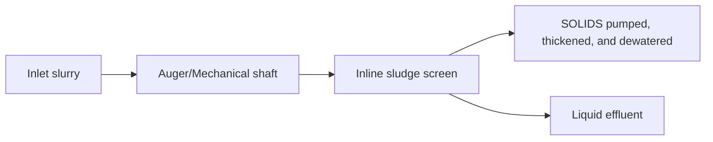
</Mermaid diagram>

## 8.0 References

- Chaudhary, R.; et al. (1989) Evaluation of Chemical Addition in the Primary Plant at Los Angeles 11 Hyperion Treatment Plant: Proceedings of the 62nd Annual Water Pollution Control Federation Technical Exposition and Conference; San Francisco, California, Oct 15–19; Water Pollution Control Federation: Washington, D.C.
- Criteria for Municipal Solid Waste Landfills, 40 C.F.R. pt 258 (1991).
- Daigger, G. T.; Butzz, J. A. (1992) Upgrading Wastewater Treatment Plants, 2nd ed.; Water Quality Management Library, Vol. 2; CRC Press: Boca Raton, Florida.
- Great Lakes–Upper Mississippi River Board of State and Provincial Public Health and Environmental Managers (2014) Recommended Standards for Wastewater
\n---\n

# References

- Facilities; Health Research Inc.; Health Education Services Division: Albany, New York.
- Identification and Listing of Hazardous Waste, 40 C.FR. pt 261 (1980).
- Koch, C.; et al. (1990) Spreadsheets for Estimating Sludge Production. Water Environ. Technol., 2 (11), 65.
- Koch, C.; et al. (1997) A Critical Evaluation of Procedures for Estimating Biosolids Production. Proceedings of the Joint Water Environment Federation and American Water Works Association Specialty Conference; Residuals and Biosolids Management: Approaching 2000; Philadelphia, Pennsylvania; Water Environment Federation: Alexandria, Virginia; American Water Works Association: Denver, Colorado.
- Monod, J. (1949) The Growth of Bacterial Cultures. Annu. Rev. Microbiol., 3, 371.
- Newberg, J. W.; et al. (1988) Unit Process Trade-Offs for Combined Trickling Filters and Activated Sludge Processes. J. Water Pollut. Control Fed., 60, 1863.
- Schultz, J.; et al. (1982) Realistic Sludge Production for Activated Sludge Plants without Primary Clarifiers. J. Water Pollut. Control Fed., 54, 1355.
- Standards for New Source Performance for New Stationary Sources, 40 C.FR. pt. 60 (1971).
- Standards for the Use and Disposal of Sewage Sludge, 58 Fed Reg. 9248 (February 19, 1993) (codified as 40 C.F.R. pt. 503).
- U.S. Environmental Protection Agency (1979) Process Design Manual: Sludge Treatment and Disposal; EPA-625/1-79-011; U.S. Environmental Protection Agency: Washington, D.C.
- U.S. Environmental Protection Agency (1987) Design Manual: Dewatering Municipal Wastewater Sludges; EPA-625/1-87-014; U.S. Environmental Protection Agency: Washington, D.C.
- U.S. Environmental Protection Agency (1994) A Plain English Guide to the EPA Part 503 Biosolids Rule; EPA/832-R-93-003; U.S. Environmental Protection Agency: Washington, D.C.
\n---\n

# References

- Wilson, T.; et al. (1984) Operating Experiences at Low Solids Retention Time. Water Sci. Technol. (G.B.), 16, 661.
- Zabinski, A.; et al. (1984) Low SRT: An Operator's Tool for Better Operation and Cost Savings. Proceedings of the 57th Annual Water Pollution Control Federation Technical Exposition and Conference; New Orleans, Louisiana, Sep 30–Oct 5; Water Pollution Control Federation: Washington, D.C.
\n---\n

# CHAPTER 19: Storage and Transport

Bruce DiFrancisco, P.E.
\n---\n

# 1.0 Introduction
## 1.1 Flow Characteristics
## 1.2 Flow and Solids Monitoring
## 1.3 Energy Usage and Sustainability Review

# 2.0 Sludge and Biosolids Storage
## 2.1 Storage Requirements
## 2.2 Storage Tanks
## 2.3 Storage Lagoons

# 3.0 Liquid Sludge and Biosolids Transport
## 3.1 Trucking
## 3.2 Pumping
## 3.3 Example 19.1
## 3.4 Kinetic Pumps
## 3.5 Positive-Displacement Pumps
## 3.6 Other Pumps
## 3.7 Long-Distance Pipelines
## 3.8 Common Design Deficiencies in Pumps and Piping
## 3.9 Standby Capacity

# 4.0 Dewatered Biosolids Cake Storage
## 4.1 Storage Requirements
## 4.2 Odor-Control Issues

# 5.0 Dewatered Biosolids Cake Transport
## 5.1 Pumping/Conveyors
## 5.2 Hydraulics
## 5.3 Flow and Headloss Characteristics
\n---\n

# 1.0 Introduction
This chapter discusses methods for storing and transporting sludge and biosolids through water resource recovery facilities (WRRFs) and to the disposal location. Headworks solids—screenings and dewatered grit—are covered in Chapters 9 and 10. Chapters 20, 21, 22, and 23 discuss methods for thickening, dewatering, and treating biosolids.

This chapter includes storage and transport of mechanically thickened or dewatered biosolids; it does not discuss thermally conditioned biosolids or ash generated during incineration. Chapter 24 discusses methods for thermal drying of dewatered solids and biosolids. Chapter 25 discusses use and disposal of residuals and biosolids, including ash.

The sludge and biosolids transport methods discussed here are currently prevalent in the United States. When designing solids transportation systems, engineers should consider service life and favor equipment that is flexible enough to remain useful despite changing technology, regulations, economics, and solids characteristics. They should also investigate full-scale working systems whenever possible to determine actual operating conditions and costs, and then make allowances for uncertainties that are specific to the project.

It is noted that raw and thickened residuals are referred to in MOP 8 as “sludges” and that stabilized solids are referred to as “biosolids.” The term “residuals” is used in this chapter when the text refers to information applicable to both nonstabilized sludge and stabilized biosolids.

## 1.1 Flow Characteristics
The flow characteristics (rheology) of sludge and biosolids (residuals) cannot be defined simply. They vary widely from process to process and from facility to facility: (Wagner, 1990; Levine, 1986; 1987; Borrowman, 1985; Carthew et al., 1983; Mulbarger et al., 1981; and U.S. EPA, 1979). As a result, the characteristics and resulting headloss are difficult to predict:

Solids content is an important rheological parameter: Generally, the higher a fluid’s solids concentration, the higher its shear stress, density, and viscosity. Viscosity increases exponentially as solids concentration increases (Brar et al., 2005, and references therein):
\n---\n

A residual's rheological characteristics are strongly affected by the kind of treatment the material has undergone (Guibaud et al., 2004; Brar et al., 2005). For example, a raw, fresh, nonhydrolyzed solids stream at 3% solids has a higher apparent viscosity than a 4% material that has been thermally alkaline hydrolyzed (Brar et al., 2005). Similarly, digested biosolids can be pumped more easily than raw or undigested sludge with the same moisture content (see Figure 19.1) (U.S. EPA, 1979). To derive approximate headlosses for residuals, design engineers should calculate the headloss for water and then multiply the result by the factor in Figure 19.1 corresponding to the residual's solids concentration. This will provide a rough estimate when velocities are between 0.76 and 2.4 m/s (2.5 and 8 ft/s) and no thixotropic behavior or serious obstructions, such as grease, are anticipated:


For the case where an existing water resource reclamation facility wants or needs more precise control of the transport process but is not changing the biosolids treatment method, field testing can be performed to determine the headloss in the existing system. Once this is known, the controls system can be designed around this value.

For design purposes, residuals can be divided into several distinct categories based on solids concentration as presented in Table 19.1. For more detailed information on solids concentrations and residuals behavior; see Conveyance of Residuals from Water and Wastewater Treatment (ASCE, 2000). Dilute residuals contain less than 5% solids. Such residuals typically include waste activated sludge (WAS), which typically contain less than 2% solids, and primary sludge, which contains less than 5% solids.
\n---\n

## FIGURE 19.1

Approximate multiplication factors (based on solids concentration) to be applied to headlosses calculated for water in laminar flow (taken from U.S. EPA, 1979).

- Axes:
  - Y-axis: MULTIPLICATION FACTOR, K
  - X-axis: SLUDGE CONCENTRATION, % solids by weight

- Curves:
  - UNTREATED PRIMARY AND CONCENTRATED SLUDGES
  - DIGESTED SLUDGE

```
Y: MULTIPLICATION FACTOR, K
14 |                                                              
13 |                                                              
12 |                                                      *
11 |                                                     /
10 |                                                    /
 9 |                                                  /
 8 |                                                / 
 7 |                                              /    UNTREATED PRIMARY AND CONCENTRATED SLUDGES
 6 |                                            /
 5 |                                          / 
 4 |                                       /       
 3 |                                    /          
 2 |                                 /             
 1 |                              /                
 0 +------------------------------+---------------------------> X
      0        2        4        6        8       10
       SLUDGE CONCENTRATION, % solids by weight
```

FIGURE 19.1 Approximate multiplication factors (based on solids concentration) to be applied to headlosses calculated for water in laminar flow (taken from U.S. EPA, 1979).

\n---\n

## TABLE 19.1 Classification of Water and Wastewater Thixotropic Residuals by Type and Solids Content

<table>
  <thead>
    <tr>
      <th>Solids Typea</th>
      <th>Temperature (°C)</th>
      <th>Thickened Solids, % TS</th>
      <th colspan="4">Thixotropic Solids</th>
    </tr>
<tr>
      <th></th>
      <th></th>
      <th></th>
      <th>Dry Solids</th>
      <th>Dry Solids</th>
      <th>Dry Solids</th>
      <th>Dry Solids</th>
    </tr>
  </thead>
  <tbody>
    <tr><td>RPS</td><td>10–20</td><td>5–10</td><td>20–26</td><td>24–40</td><td>35–65</td><td>65+</td></tr>
<tr><td>RWAS</td><td>10–25</td><td>3–7</td><td>10–16</td><td>14–15</td><td>22–65</td><td>65</td></tr>
<tr><td>R (PS + WAS)b</td><td>10–25</td><td>4–8</td><td>13–20</td><td>18–31</td><td>28–65</td><td>65+</td></tr>
<tr><td>DPS</td><td>20–30</td><td>5–10</td><td>20–28</td><td>24–40</td><td>35–65</td><td>65+</td></tr>
<tr><td>SWAS</td><td>20–30</td><td>3–7</td><td>10–16</td><td>14–25</td><td>22–65</td><td>65+</td></tr>
<tr><td>D (PS + WAS)b</td><td>20–30</td><td>4–8</td><td>13–20</td><td>18–31</td><td>28–65</td><td>65+</td></tr>
<tr><td>Alum [Al(OH)3]2</td><td>5–25</td><td>3–7</td><td>8–15</td><td>13–30</td><td>25–60</td><td>65</td></tr>
<tr><td>Iron [Fe(OH)3] (2)</td><td>5–25</td><td>3–7</td><td>8–15</td><td>15–35</td><td>30–60</td><td>65</td></tr>
<tr><td>Lime (CaCO3)</td><td>5–25</td><td>15–30</td><td>8–15</td><td>25–50</td><td>70–80</td><td>80+</td></tr>
  </tbody>
</table>

<p>aR = raw; D = digested, PS = Primary sludge, and WAS = waste activated sludge.</p>
<p>b50 : 50 mixture of PS and WAS.</p>

<p>TABLE 19.1 Classification of Water and Wastewater Thixotropic Residuals by Type and Solids Content</p>

<p>Thickened residuals, which are typically produced via a mechanical thickening process, have higher solids concentrations than gravity settled solids. Such residuals range from WAS with a 3% total solids content to primary sludge with up to 10% total solids content: Thickened residuals typically have a much higher viscosity and cannot be handled reliably by centrifugal pumps:</p>
\n---\n

Dewatering processes typically used at water resource reclamation facilities tend to make residuals thixotropic, and their rheology is dependent on both time and applied stress.
While engineers can design pumping systems that handle thixotropic materials, the limited availability of related data makes site-specific studies important:

Further dewatering, such as processes used to make pelletized fertilizer, makes residuals granular: Such residuals cannot be pumped; instead, they must be transported via conveyors or similar devices:

Fluids may be Newtonian (water, for example) or non-Newtonian. Residuals containing more than 3% total solids typically do not follow Newtonian behavior:

The Herschel–Bulkley model is an equation that models the rheological behavior of both Newtonian and non-Newtonian fluids:

$$ S = S_y + K \left( \frac{dv}{dy} \right)^n \quad (19.1) $$

where
- S = shear stress (in Pa, N/m^2, or kg/m-s^2),
- S_y = yield stress (in Pa),
- dv/dy = shear rate (velocity gradient in s^-1),
- K and n = fluid constants.

When S_y = 0 and n = 1, the model describes a Newtonian fluid and eq 19.1 becomes:

$$ S = \mu \left( \frac{dv}{dy} \right) \quad (19.2) $$

where μ = absolute viscosity (in Pa-s).

When S_y ≠ 0 and n = 1, the model describes a Bingham plastic fluid:

$$ S = S_y + R_c \left( \frac{dv}{dy} \right) \quad (19.3) $$

where R_c = coefficient of rigidity (Pa-s)
\n---\n

## 1.2 Flow and Solids Monitoring

When S_y = 0 and n ≠ 0, the model describes a pseudoplastic, Ostwald de Vaele, or shear-thinning fluid, and the equation becomes:

$$ S = K \left(\frac{dv}{dy}\right)^n \quad (19.4) $$

where K = fluid consistency index, and n = flow behavior index.

Researchers are almost equally divided on whether the Bingham plastic model or the pseudoplastic model describes the rheological behavior of thickened and dewatered residuals more appropriately.

When designing solids transport systems with kinetic pumps (e.g., centrifugal), engineers need to be accurate rather than conservative. Such systems are most efficient when the system curve matches the pump curve. However, engineers should be conservative when designing transport systems for thicker residuals, either liquid or dewatered, that rely on positive-displacement pumps:

The flow rate of residuals with total solids concentrations of 7% to 8% can be measured using electromagnetic meters, but it is recommended that for concentrations above 5% that the manufacturer provide a history of successful operation. Optical sensors can be used to measure mass flow rates for residuals containing up to 4% total solids.

Except for the equipment listed above, flow rates for thickened or dewatered residuals transported in a pipe cannot be reliably measured, but efforts continue to develop this technology. If designers are presented with flow measuring equipment, a history of successful use should be reviewed and verified prior to specifying such equipment. It is recommended that engineers estimate solids quantities by performing a mass balance around a particular process. In a dewatering process, for example, they can calculate the quantity of biosolids cake produced based on influent loading, removal efficiency and solids concentrations. Suspended solids meters can register air bubbles as solids (Radney, 2008), so to avoid interference, designers should include degassing tanks to release entrapped air:
\n---\n

# 1.3 Energy Usage and Sustainability Review

Design engineers can also indirectly measure the flow rate of thickened residuals based on positive-displacement pump operations. For example, if designers know the rotational speed and volumetric discharge per rotation of a progressing cavity pump, they can calculate the fluid flow rate, anticipating that the pump cavity fill rate is 100%. Manufacturers of hydraulically driven reciprocating piston pumps offer an internal flow measuring system that is accurate within 5%.

The storage and transport of thickened residuals dewatered cake and dried biosolids is an energy intensive process, potentially involving such equipment as screw pumps, piston pumps, diaphragm pumps, conveyors, augers and others described in this manual. Design engineers are encouraged to perform a life cycle power consumption analysis, including a cost review, as part of any storage and transport system design. This analysis will give the owner and operator the information they need to make an informed decision as to how power consumption will impact their biosolids processing facility over the life of the proposed improvement.

In addition, many facilities are adding sustainability practices into their operating guidelines. LEED and Envision evaluations are becoming popular in the industry and energy consumption is a key component of these evaluations. Please refer to Sustainability and Energy Management for Water Resource Recovery Facilities (WEF et al., 2018) for detailed information on this emerging field.

# 2.0 Sludge and Biosolids Storage

## 2.1 Storage Requirements

The storage needs for liquid residuals depend on where and why they are being stored. Storage can be used to equalize flows and provide operational flexibility. For example, if dewatering equipment is operated only periodically, solids need to be stored between operating periods. The volume of storage required is process-specific. If biosolids are stored between stabilization and land application, the storage volume required will depend on agricultural schedules and climatic issues.

If sludge or biosolids will be land-applied or surface disposed, the reclamation facility must have enough storage available to allow for periods when the material cannot be used. The
\n---\n

# Great Lakes—Upper Mississippi River Board, in its 2014 Recommended Standards document (GLUMRB, 2014) offers the following items for design consideration:

* Inclement weather effects on access to the application land
* Temperatures including frozen ground and stored biosolids cake conditions
* Haul road restrictions including spring thawing conditions
* Area seasonal rainfall patterns
* Cropping practices on available land
* Potential for increased sludge volumes from industrial sources during the design life of the facility
* Available area for expanding sludge storage
* Appropriate pathogen reduction and vector attraction reduction requirements
* A 120- to 180-day storage capacity is recommended, but this can be reduced if the facility has an available alternate disposal option:

Design engineers need to take these situations into account when designing the storage systems. For example, Figure 19.2 indicates the approximate number of days per year when climatic conditions do not allow effluent application (U.S. EPA, 1995). Anticipating that effluent and biosolids applications would be affected by the same climatic conditions, designers can use the information in this figure as a basis for estimating storage requirements and to assist with determining alternate management requirements.

Likewise, Table 19.2 shows the months in which biosolids can be applied in the north central United States (data that can be extrapolated to other areas). Designers can also obtain climatic data for US sites from the National Oceanic and Atmospheric Administration's National Climatic Data Center in Asheville, North Carolina (http://ncdc.noaa.gov/oa/ncdc.html).

Chapter 23 identifies storage requirements specific to certain stabilization processes. For example, many autothermal thermophilic aerobic digestion systems have a pre-digestion holding tank, so the digester(s) can be batch-fed. In addition, they often have a post-digestion tank where the biosolids can cool and further stabilize. Sizing requirements for such tanks are process-specific. This information is often included in the design guidelines for stabilization processes.
\n---\n

## 2.2 Storage Tanks
### 2.2.1 Typical Design Criteria

Regulations may also affect process storage systems. Some regulations require storage volumes ranging from 3 to 60 days of biosolids storage (FDEP, 2008). Such storage may simply be excess capacity in the digesters or other process tanks, or it may be separate storage tanks:

Although more costly per unit volume than earthen basins, storage tanks can be a good choice when residuals volumes are small, land costs are high, or other restrictions make earthen basins infeasible. These tanks typically are cylindrical with either a flat or sloped bottom (see Figure 19.3) (U.S. EPA, 1979). The U.S. Army Corps of Engineers recommends a 4:1 floor slope and a minimum depth of 4.5 m (15 ft) (U.S. Army Corps, 1984). Cylindrical tanks are preferred because they do not have corners, which may become "dead spots." The tanks can be constructed of either concrete or steel. Steel tanks are susceptible to corrosion, however, which design engineers should consider when designing a sludge storage system.
\n---\n

# Figure 19.2 Storage days required as estimated from the use of the EPA-1 computer program for wastewater-to-land programs. Estimated storage based only on climatic factors (U.S. EPA, 1979)

Description of the figure
- A map of the United States with contour lines and shading. The contour lines are labeled with numbers (examples include 20, 40, 60, 80, 100, 120, 140, 160). A scale at the lower-left indicates distance in kilometers with marks at 0, 500, and 1000.
- Shading denotes regions where the principal climatic constraint to application of wastewater is prolonged wet spells.
- Based on a legend on the map:
  - Based on 0°C (32°F) mean temperature
  - 1.25 cm/d precipitation
  - 2.5 cm of snowcover

  (Figure caption and legend are included below for reference.)

FIGURE 19.2 Storage days required as estimated from the use of the EPA-1 computer program for wastewater-to-land programs. Estimated storage based only on climatic factors (U.S. EPA, 1979)

Storage tanks should be mixed to ensure that the discharged solids are homogeneous
- Spinosa and Vesilind, 2001
- Mixer manufacturers recommend mixing energies ranging from 10 to 12 kW/mL (40–50 hp/mg) (Lottman, 2008)
- The key is to keep solids suspended without inducing excessive air into the sludge
- The tank(s) may also require aeration, especially if the solids are unstabilized or aerobically digested (U.S. EPA, 1979)
- If so, the tank's oxygen requirements should be similar to those for aerobic digesters
- Information regarding the sizing aerobic-digestion mixing equipment is provided in Chapter 23
- If the material was stabilized before storage, however; the tank’s oxygen requirements to maintain aerobic conditions will be
\n---\n

significantly less. Maintaining a minimum dissolved oxygen level of about 0.5 mg/L should
prevent anaerobic activity as long as the basin has adequate mixing. Otherwise, nuisance
odors may be generated and more odor control may be required:

<table>
<thead>
<tr>
<th>Month</th>
<th>Corn</th>
<th>Soybeans</th>
<th>Cottons<sup>c</sup></th>
<th>Forages<sup>d</sup></th>
<th>Small grains<sup>b</sup></th>
</tr>
</thead>
<tbody>
<tr>
<td>January</td>
<td>Se</td>
<td></td>
<td>S/I</td>
<td>S</td>
<td>SII</td>
</tr>
<tr>
<td>February</td>
<td></td>
<td></td>
<td></td>
<td></td>
<td>Sll</td>
</tr>
<tr>
<td>March</td>
<td>SIl</td>
<td>Sll</td>
<td>SIl</td>
<td></td>
<td>SIl</td>
</tr>
<tr>
<td>April</td>
<td>SII</td>
<td>SIl</td>
<td>P; SII</td>
<td></td>
<td>P; SIl</td>
</tr>
<tr>
<td>May</td>
<td>P; SII</td>
<td>P; SIl</td>
<td></td>
<td></td>
<td></td>
</tr>
<tr>
<td>June</td>
<td></td>
<td>P; Sil</td>
<td></td>
<td>H,S</td>
<td></td>
</tr>
<tr>
<td>July</td>
<td></td>
<td></td>
<td>H,S</td>
<td>H, SII</td>
<td>H, SII</td>
</tr>
<tr>
<td>August</td>
<td></td>
<td></td>
<td>H, S</td>
<td>SII</td>
<td>SIl</td>
</tr>
<tr>
<td>September</td>
<td></td>
<td>H, SII</td>
<td></td>
<td>SII</td>
<td>SII</td>
</tr>
<tr>
<td>October</td>
<td>H, S/l</td>
<td>Sll</td>
<td>S/l</td>
<td>H, S</td>
<td>P; SII</td>
</tr>
<tr>
<td>November</td>
<td>Sil</td>
<td>Sll</td>
<td>S/l</td>
<td></td>
<td>S/l</td>
</tr>
<tr>
<td>December</td>
<td></td>
<td></td>
<td></td>
<td></td>
<td>SIl</td>
</tr>
</tbody>
</table>

<p>aApplication may not be allowed due to frozen, flooded, and snow-covered soils</p>
<p>bWheat, barley, oats, or rye</p>
<p>cCotton, only grown south of southern Missouri</p>

\n---\n

### TABLE 19.2 General Guide to Months Available for Applying Biosolids to Various Crops in the North Central United States (U.S. EPA, 1979)a

- dEstablished legumes (alfalfa, clover, trefoil, etc.), grass (orchard grass, timothy, brome, reed canary grass, etc.), or legume-grass mixture.
- eS surface application
- Note: S/I = surface/incorporation application
- C = growing crop present; application would damage crop
- P = crop planted; land not available until after harvest
- H = after crop harvested, land is available again: for forages (e.g., legumes and grass), availability is limited and application must be light so regrowth is not suffocated_

### 2.2.2 Spill Prevention

Where residuals pumps, piping, and valves are above ground, spills can occur. Failed gaskets, poor installation, failed valves, and high pressure relief valve activation are just some of the possible spill sources. When the piping penetrates the tank below the maximum water level in the tank, this possibility increases because there will always be water in the pipe under head pressure. Designers should, at a minimum, consider the following when designing above-ground residuals systems:

- Design the above ground portion of the system as a containment area and install drains to collect any spilled fluids:
- Design the inflow and outflow pipes to enter and exit the tank at a level higher than maximum tank level. Include appropriate air-release and freeze protection, if needed.
- Add emergency shutoff and automatic flow cutoff controls in the design, designed to minimize any spillage.
\n---\n

# FIGURE 19.3 A 98-m^3 (26 000-gal) solids equalization tank (taken from U.S. EPA, 1979)

- Ultrasonic Level Transmitter
- 6" Pressure-Vacuum Relief and Flame Trap
- 6" Flame Trap
- 6" Dia Low Pressure Sludge Gas Connection to Digesters
- 24" Dia M.H.
- 42" Dia Access M.H.
- MAX W.L. ELEV 214.3
- 8" DIA OVERFLOW
- EQUIPMENT PIT
- ELEV 209.5
- GROUND ELEV 207.5
- ELEV 194.3
- 15' 0" (horizontal dimension)
- EQUIPMENT PIT
- EQUALIZING CIRCULATING PUMP
- PUMP
- 6" DIA CIRC PUMP
- DISCHARGE NOZZLE TO ASSURE MIXING
- DISCHARGE
- MIN W.L. ELEV 106.0
- 6" DIA RAW SLUDGE SUPPLY
- ELEV 184.3
- 6" DIA
- RAW SLUDGE SUPPLY
- ELEV 198.0
- 6" DIA SUCTION TO OTHER
- DIGESTER SUPPLY PUMP (TYP OF 5 FOR TWO TANKS)
- TO DIGESTERS
- ELEV 198.0
- 6" DIA DIGESTER SUPPLY SUCTION
- 6" DIA DIGESTER SUPPLY SUCTION
- DIGESTER PUMPS AND DRAIN SUMP
- INV ELEV 101.5
- PUMPS
- AND DRAIN SUMP
- 6" DIA SUCTION TO OTHER
- DIGESTER SUPPLY PUMP
- DIGESTER SUPPLY SUCTION
- 1 ft = 0.305 m
- 1 in = 2.56 cm

FIGURE 19.3 A 98-m^3 (26 000-gal) solids equalization tank (taken from U.S. EPA, 1979)

If storage facilities are near surface waters or other sensitive areas, a containment wall or berm may be advisable. The berm should be designed to retain or retard the movement of spilled residuals. A structural wall may not be necessary; an earthen berm may be
\n---\n

sufficient. The containment berm should contain a spill long enough for it to be cleaned up but also include some means of removing excess water from rainfall or other sources.

## 2.2.3 Odor Control

Odors may be an issue, depending on the type of residuals and the storage time. Well-stabilized biosolids may be stored for several days without odor control. However; residuals characteristics may change over time, so it is preferable to cover storage tanks to contain and minimize offsite odors. Covers provide the additional benefit of improved control over external environmental elements, such as excessive rainfall and high winds that could impact tank operation:

The air in the tank can be vented to an odor-control system. The air will be adversely affected by such compounds as dimethyl sulfide, dimethyl disulfide, and longer-chain mercaptans. Odorous volatile fatty acid compounds may also increase, yielding a sour odor (WEF, 2004).

Storing WAS and raw primary sludge separately reduced odors significantly, while chemical addition had little effect (Hentz et al., 2000). Holding-tank operations can also affect the character and intensity of odor emissions from downstream processes. The design engineer should take all of this into consideration when designing odor-control systems for residuals storage tanks.

A design consideration at an existing facility that is being improved is to characterize the air above the existing tank to determine if odor causing compounds are being generated in sufficient quantities to mandate an odor control system. This data would provide justification for any engineering decision that is made, but the designer must have buy-in from the client prior to performing any such testing:

## 2.3 Storage Lagoons

A number of small water reclamation facilities use lagoons to store and stabilize solids. These treatment lagoons typically have the volume to store 2 years of solids production. These systems are not covered in detail in this section; for more information on designing biosolids stabilization lagoons, see Chapter 16.

This sections focuses on earthen basins designed to store sludge and biosolids for shorter periods (e.g., winter). These systems are not treatment lagoons and should not be
\n---\n

# 2.3 Storage Lagoons

There are three types of solids storage basins: aerobic, facultative, and anaerobic (Lue-Hing et al., 1998).

## 2.3.1 Aerobic Storage Lagoons

Aerobic storage basins are designed to provide aeration and maintain a minimum dissolved oxygen concentration throughout the basin. Their aeration requirements should be similar to those for aerobic digesters, except that they take into account prior solids stabilization. (For information on calculating aeration requirements for aerobic digesters, see Chapter 23.) Because of their size and earthen construction, a piped aeration system is typically not used; subsurface or surface free-standing mechanical aerators are most often used.

## 2.3.2 Facultative Storage Lagoons

Facultative basins are unmixed and typically consist of three layers: a 0.3 to 1.0 m (1–3.3 ft) deep aerobic surface layer, a deeper anaerobic zone, and a sludge storage zone at the bottom. Both the aerobic and anaerobic zones are biologically active; anaerobic stabilization substantially reduces solids volume. The aerobic zone receives oxygen via surface transfer from the atmosphere, algal photosynthesis, and (if provided) surface-mix aerators which are operated periodically to break up scum on the pond surface and optimize oxygen transfer. Most of the satisfactory installations use brush-type surface mixers, according to U.S. Environmental Protection Agency (U.S. EPA, 1979). The oxygenation rate is low, however; so the U.S. EPA recommends that these basins only be used for anaerobically digested solids.

These basins are typically designed based on a volatile solids loading rate of 0.097 kg/m2/d (0.023 lb/sf/d) (Lue-Hing et al., 1998). They are typically 5 m (16 ft) deep to provide enough space for aerobic and anaerobic layers: Because facultative solids lagoons' “sour” odor can be a major issue, when designing such storage basins, engineers should consider prevailing wind patterns, and minimize odor potential via proper loading and surface mixing:

## 2.3.3 Anaerobic Basins
\n---\n

# 3.0 Liquid Sludge and Biosolids Transport
Anaerobic storage basins are similar to earthen basins but differ in that oxygen transfer from the surface is not considered in design. Therefore, earthen basins can be deeper than facultative ponds. Also, because maintaining an aerobic zone is not a key parameter, solids loading to earthen basins can be higher than with facultative ponds. Anaerobic ponds have essentially the same advantages and disadvantages as facultative ponds (Lue-Hing et al., 1998).

## 3.1 Trucking
There are two basic methods for transporting liquid residuals at water reclamation facilities: trucking and pumping. Residuals are typically trucked offsite and pumped onsite.

Although not typically part of the design process, trucking is often used to transport liquid biosolids, especially to land-application sites. Liquid sludge and biosolids may also be trucked to another site for further treatment. Trucking liquids can be a larger challenge than transporting dewatered or dried biosolids, and there is some basic information designers should know.

Liquid sludge and biosolids are typically transported via tanker trailer trucks. Such trucks typically have nominal capacities ranging from 22 680 to 34 020 L (6,000–9,000 gal). However, depending on weight restrictions, a tanker trailer may not be filled completely: In the United States, the maximum overall weight of a tractor-trailer is limited to 36 288 kg (80 000 lb). So, if a tractor weighs between 5 443 and 6 804 kg (12 000 and 15 000 lb), and an empty trailer weighs between 4 990 and 7 711 kg (11 000 and 17 000 lb), the contents cannot weigh more than approximately 21 773 to 25 855 kg (48 000–57 000 lb). This is equivalent to 21 000 to 25 500 L (5 700 to 6 800 gal) of dilute residuals.

Also, a 5 850-kg (12 900-lb), 26 460-L (7 000-gal) trailer typically is 13.1 m (40 ft) long and 2.4 m (8 ft) wide. Some are equipped with baffles to control movement and resulting surges of the liquid.

## 3.2 Pumping
Pumping systems are an intrinsic part of solids management at water reclamation facilities. They typically transport solids from
\n---\n

* primary and secondary clarifiers to thickening, conditioning, or digestion systems;
* thickening and digestion systems to dewatering operations;
* biological processes to further treatment units; and
* gritting facilities to temporary storage areas.

<table>
  <thead>
    <tr>
      <th>Principle</th>
      <th>Common Types</th>
      <th>Typical Applications</th>
    </tr>
  </thead>
  <tbody>
    <tr>
      <td>Kinetic (rotodynamic) pumps</td>
      <td>
        Nonclog mixed-flow pump<br>
        Recessed-impeller pump (vortex pump, torque flow pump)<br>
        Screw centrifugal pump<br>
        Grinder pump
      </td>
      <td>
        Grit slurry; incinerator ash slurry<br>
        Unthickened primary sludge<br>
        Return activated sludge<br>
        Waste activated sludges from attached-growth biological processes; Circulation of anaerobic digester; Drainage, filtrate, and centrate; Dredges on sludge lagoons
      </td>
    </tr>
<tr>
      <td>Positive- displacement pumps</td>
      <td>
        Plunger pumps<br>
        Progressing cavity pump<br>
        Air-operated diaphragm pump<br>
        Rotary lobe pump<br>
        Pneumatic ejector<br>
        Peristaltic pump<br>
        Reciprocating piston
      </td>
      <td>
        Waste activated sludge<br>
        Thickened sludges (all types)<br>
        Unthickened primary sludge<br>
        Feed to dewatering machines<br>
        Unthickened secondary sludges<br>
        Dewatered cakes
      </td>
    </tr>
<tr>
      <td>Other</td>
      <td>
        Air lift pump<br>
        Archimedes screw pump
      </td>
      <td>Return activated sludge</td>
    </tr>
  </tbody>
</table>

TABLE 19.3 Sludge Pump Applications by Principle

<a>a</a>Limited solids capability; useful in larger sizes for return activated sludges. In most other applications, recessed-impeller pumps are more common.

<a>b</a>Abrasion is moderate to severe. Abrasion-resisting alloy cast iron is usually specified.

<a>c</a>May contain precipitates from aluminum or iron salts added for phosphorus removal.

<a>d</a>Particular need for reliable flow meters, for process control, in this application.

<a>e</a>Reciprocating piston pumps and progressing cavity pumps only.
\n---\n

## 3.2.1 Design Approach

While specifying only one type of pump for all of a facility's solids-transport systems might seem advantageous, the wide range of conditions involved typically exceeds the capabilities of any given pump. Fortunately, many types of pumps are available (see Table 19.3).

When designing pumping systems, design engineers should begin by asking: What sort of residuals will be pumped? Kinetic pumps—especially recessed-impeller pumps—can handle some types of residuals, but other types may require positive-displacement pumps.

Kinetic pumps have lower capital costs (especially in large sizes), lower maintenance costs, and smaller footprints. They are also available in submersible form (although conventional dry-well pumps are preferred for most applications).

Positive-displacement pumps have better process control because the pumping rate is less affected by fluid viscosity. They function better over the entire head range from zero to maximum without damaging the pump or motor, or changing drive speed. They work better under high pressure and at low flows. They are also less sensitive to non-ideal suction conditions (e.g., entrained air and gas) and less likely to disrupt fragile floc particles in flocculated solids.

The traditional approach to designing residuals transport systems is to minimize the pumping distance and apply a conservative multiplier to headlosses calculated for equivalent flows of water. However, this approach can be inaccurate, especially at higher solids concentrations with non-Newtonian characteristics. Such inaccuracies may not matter for short pumping distances, but they can be problematic for longer distances or critical applications.

The need to pump residuals long distances has increased in the last 20 years, so researchers have been developing methods to predict site-specific friction losses in pumping systems more accurately (Mulbarger et al., 1981; Carthew et al., 1983; Wagner, 1990; Honey and Pretorius 2000; Murakami et al., 2001). Study results have shown that, once rheological properties have been determined, the Bingham plastic model (Carthew et al., 1983; Mulbarger et al., 1981) or the pseudoplastic model (Honey and Pretorius,
\n---\n

## 3.2.1.1 Dilute Sludge
Clarifiers often produce a relatively dilute settled solids (maximum concentrations of 1.2% to 1.5% are typical for activated sludge). At velocities greater than 0.3 to 0.6 m/s (1–2 ft/s), such solids are in the turbulent flow regime and have a headloss essentially equal to that of water (Mulbarger, 1997). At lower velocities, the flow becomes laminar; and headlosses increase sharply. So, engineers should design dilute solids pumping systems to maintain a minimum velocity of 0.6 to 0.75 m/s (2–2.5 ft/s) whenever possible to ensure turbulent flow.

## 3.2.1.2 Thickened Residuals
The concentration at which sludge and liquid biosolids can be defined as "thickened" depends on the type of solids and the preceding treatment processes (see Table 19.1) (ASCE, 2000).

When designing pumping systems for thickened solids, design engineers can use the Darcy–Weisbach and Manning equations for water to determine headloss regardless of the solids' flow regime (laminar; transition, or turbulent) and apply a solids correction factor to the final calculation. The correction factor for residuals with up to 10% solids may be found in Figures 19.4 and 19.5 [taken from Sanks et al. (1998) and Metcalf and Eddy (2003), respectively]. As a simplified alternative, designers can use Figures 19.6 and 19.7 which indicate the headloss multiplier for worst-case design conditions in 150- and 200-mm (6- and 8-in.) forc emissions, respectively:
If design engineers use the curves in Figures 19.6 and 19.7, they should choose pumps and motors that will operate satisfactorily over the entire headloss range from "water" to "worst-case". Head changes affect centrifugal pumps much more than positive-
\n---\n

displacement pumps, so if centrifugal pumps (e.g., recessed-impeller) are used,
engineers should also check the motors to avoid overloading if operating head drops
significantly below design head. Motors may be overloaded if a pump becomes “runaway”
(operates beyond the right terminus of its characteristic curve). Also, residuals
occasionally can exceed the worst-case headloss curve. So in some instances, oversized
motors and variable-frequency drives should be specified to provide the operational
flexibility needed:

<table>
<thead>
<tr><th colspan="2">FIGURE 19.4 Multiplication factor for residuals headloss: (a) routine design and (b) worst-case design (Sanks et al., 1998).</th></tr>
</thead>
<tbody>
<tr>
<td valign="top" colspan="2">
- Velocity (m/s) on top axis: 0.1 0.2 0.3 0.5 1.0 2.0
- Velocity (m/s) on top axis (right panel): 0.1 0.2 0.3 0.5 1.0 2.0
- Velocity (ft/s) on bottom axis: 0.1 0.5 1 2 5 10
- Velocity (ft/s) on bottom axis (right panel): 0.1 0.5 1 2 5 10
</td>
</tr>
<tr>
<td valign="top">
- 1000
- 500
- 100
- 1 50
- 889 1 8 0
- 2 7 Fo 0
- 1 10 Typical critical velocity at intercept
- 8 Typical turbulent flow head losses
- 1
</td>
<td valign="top">
- 1000
- 500
- 100
- 1 50
- 889 1 8 0
- 2 7 Fo 0
- 1 10 Typical critical velocity at intercept
- 3 intercept
- 1 (Typical turbulent head losses)
</td>
</tr>
<tr>
<td colspan="2" style="vertical-align: top;">
- 0.1       0.5                   10       0.1     0.5                               10
Velocity (m/s)   Velocity (m/s)
</td>
</tr>
</tbody>
</table>

In addition to headloss, design engineers should consider the nature of the process that
will receive the solids. Many positive-displacement pumps suitable for thickened solids
\n---\n

Laminar flow

$$
H_f(m) = 1.90 \times 10^{-3} \, k^{0.88} \left(\frac{L}{V}\right)^{0.20} \, D^{-1.20} \quad (19.5)
$$

where k = 0.059 C^{2.74} for digested biosolids,
- k = 0.052 C^{2.91} for thickened solids,
- k = 0.050 C^{3.06} for waste activated sludge.

\n---\n

# Turbulent flow

1.93 × (1 - C/100)                                         (19.6)

$$H_f(m) = 9.06 \left(\frac{1}{C_H}\right) \frac{L\,V^{1.82}}{D^{1.18}} \quad (19.7)$$

where \(C_H\) = 110 for mortar-lining, cast iron pipe, and

> FIGURE 19.5 Multiplication factor for residuals headloss (from Metcalf & Eddy, Wastewater Engineering: Treatment and Reuse, 4th ed. Copyright © 2003, The McGraw-Hill Companies, New York, N.Y., with permission).

----

<div>
<em>Figure 19.5</em> shows the multiplication factor for residuals headloss as a function of velocity (ft/s) for various solids contents. The curves peak at low velocities (approximately 1–2 ft/s) with very high multiplication factors (up to around 70 for some solids concentrations) and then fall off as velocity increases. The curves are labeled with solids content values (e.g., 2%, 4%, 6%, 8.5%, 10%, 12%, etc.), illustrating how sludge and solids affect headloss through turbulence and deposition in conduits.
</div>

----

```mermaid
graph TD
A[Figure 19.5: Residual headloss factors] --> B[Velocity (ft/s): 0 to 8]
B --> C[Curves for solids contents (e.g., 2%, 4%, 6%, 8.5%, 10%, 12%, ...)]
C --> D[Observation: k (headloss factor) rises sharply near ~1–2 ft/s, peaks around 30–70, then declines with increasing velocity]
```

\n---\n

# Critical velocity and Hazen-Williams data for carbon steel pipe

- CH = 95 for carbon steel pipe.
- Solids concentration is approximately 5% or less. The designer must also account for pipe age in this equation and make an engineering judgment to determine an appropriate c value for a specific project.

## Critical velocity c

$$V_C (m/s) = 1.20 \left(\frac{CH}{100}\right) k^{0.52} \quad (19.7.5)$$

### Figure: Worst Case Design

<Mermaid diagram>
graph TD
  subgraph Head Loss vs Velocity
    HL0[Head Loss (ft/100 ft)]
    V0[Velocity (ft/sec)]
  end

  %% Example curves for solids concentrations (typical levels shown in figure)
  S1[Solids Concentration, % (Typical) = 1%]
  S2[Solids Concentration, % (Typical) = 2%]
  S3[Solids Concentration, % (Typical) = 3%]
  S4[Solids Concentration, % (Typical) = 4%]
  S5[Solids Concentration, % (Typical) = 5%]
  S10[Solids Concentration, % (Typical) = 10%]

  %% Relationships (qualitative representation)
  S1 --> V0
  S2 --> V0
  S3 --> V0
  S4 --> V0
  S5 --> V0
  S10 --> V0
  HL0 --> V0
</Mermaid>
\n---\n

# Figure 19.6 Predicted frictional headlosses for worst-case design of a 150-mm-diameter (6-in.-diameter) solids forcemain
(in: × 25.4 = mm; ft × 0.3048 = m) (Mulbarger et al., 1981)

where H = Headloss (m);
V = Velocity (m/s),
C = percent solids concentration,
L = pipe length (m), and
D = pipe diameter (m).

Another design approach is based on the assumption that the flow of thickened sludge and biosolids follows the Bingham plastic model. To use this model, design engineers need to know solids’ yield stress (Sy) and coefficient of rigidity (Rc), which may be determined experimentally. If solids-specific data are not available, then designers can use Figures 19.8 and 19.9 (ASCE, 2000) to estimate these values. [Similar graphs have been created by Battistoni (1997); Guibaud et al. (2004); Laera et al. (2007); and Mori et al. (2007).]
\n---\n

## Worst Case Design

- The page shows a graph labeled "Worst Case Design."
- Figure 19.7: Predicted frictional headlosses for worst-case design of a 203-mm-diameter (8-in.-diameter) solids forcemain (in. × 25.4 = mm; ft × 0.3048 = m) (Mulbarger et al., 1981).

- Caption under the figure:
  FIGURE 19.7 Predicted frictional headlosses for worst-case design of a 203-mm-diameter (8-in.-diameter) solids forcemain (in. × 25.4 = mm; ft × 0.3048 = m) (Mulbarger et al., 1981)

- Axis and annotations (as visible in the figure):
  - Head Loss (ft/100 ft) [y-axis]
  - Velocity (ft/sec) [x-axis]
  - Velocity scale on x-axis ranges roughly from 0.1 to 10
  - Head Loss scale on y-axis includes marks such as 0.01, 0.1, 0.5, 1.0, 5, 10
  - Solids Concentration, % (Typical) indicator with a value around 0.05
  - Hazen and Williams Coefficient: 112.4
  - A set of curves labeled 1, 2, 3, 4, 5, 10 representing different solid concentrations or scenarios
  - A note on Hazen and Williams Coefficient near the bottom of the graph:
    Hazen and Williams Coefficient
  - The figure also includes a small legend area indicating "Solids Concentration, % (Typical)" and "112.4 Hazen and Williams Coefficient"

- Additional textual content near the bottom of the page:
  Once the rigidity coefficient and yield stress are known, designers can use the following two equations to calculate the upper and lower critical velocities:

  $$ V_{uc} = 1500 \frac{R}{\rho D} \sqrt{ R^2 + \frac{S_y\, \rho D^2}{4500} } \qquad (19.8) $$

  $$ V_{lc} = 1000 \frac{R}{\rho D} \sqrt{ R^2 + \frac{S_y\, \rho D^2}{3000} } \qquad (19.9) $$

  where:
  - \(V_{uc}\) = upper critical velocity
  - \(V_{lc}\) = lower (critical) velocity
  - \(R\) = rigidity coefficient
  - \(\rho\) = density
  - \(D\) = diameter
  - \(S_y\) = yield stress

\n---\n

# Coefficient of Rigidity vs Solids Concentration

where $V_{uc}$ = upper critical velocity (m/s),
$V_{lc}$ = lower critical velocity (m/s),
$\rho$ = fluid density (kg/m^3),
$D$ = pipe diameter (m),
$S_y$ = yield stress, and
$R_c$ = rigidity coefficient (N-s/m^2).

We present the figure:

<table>
  <thead>
    <tr><th>Solids concentration (%)</th><th>Coefficient of rigidity</th></tr>
  </thead>
  <tbody>
    <tr><td>0.0</td><td>0.01</td></tr>
<tr><td>5.0</td><td>0.07</td></tr>
<tr><td>10.0</td><td>0.10</td></tr>
<tr><td>15.0</td><td>0.11</td></tr>
  </tbody>
</table>

FIGURE 19.8 Coefficient of rigidity versus solids concentration (ASCE, 2000).
\n---\n

## 3.2.1.2.1 Laminar Flow

Alternatively, designers can calculate the Reynolds number as follows:

$$ Re = \frac{\rho V D}{\mu} \quad (19.10) $$

If Re < 2000, the flow is laminar. If Re > 3000, the flow is turbulent:
- Laminar Flow

At velocities less than the lower critical velocity, or when Re < 2000, the material's flow will be in the laminar range and designers can calculate headloss using the Buckingham equation:

$$ \frac{H}{L} = 32 \left( \frac{S_y}{6 \rho g D} + \frac{R_v V}{\rho g D^2} \right) \quad (19.11) $$

where H/L = headloss per unit length (m/m);

> FIGURE 19.9 Yield stress versus solids concentration (ASCE, 2000)

----

<Mermaid>

graph TD
A[Solids concentration 0%] --> B[Yield stress ~1 N/m^2]
B --> C[Solids concentration ~5%]
C --> D[Yield stress increases toward ~10 N/m^2]
D --> E[Solids concentration ~15%]
E --> F[Yield stress ~10–12 N/m^2]

</Mermaid>
\n---\n

## Definitions

- \(S_y = \) yield stress (Pa or N/m²),
- \(r = \) fluid density (kg/m³),
- \(g = \) gravitational acceleration (m/s²),
- \(D = \) pipe diameter (m),
- \(R_c = \) rigidity coefficient (Pa·s or N·s/m²),
- \(V = \) velocity (m/s).

Honey and Pretorius (2000) experimentally determined the rheological parameters of settled waste activated sludge. They measured solids concentration, particle density, and torque, and then derived shear stress and shear rate from the torque data. They then determined the fluid consistency coefficient (\(K\)) and the pseudoplastic model’s flow-behavior index (\(n\)). (They suggest that the pseudoplastic model more accurately indicates the behavior of 5% settled activated sludge in laminar flow.) From there, they compared the following generalized Reynolds number with a critical Reynolds number for pseudoplastic fluids to determine the flow regime.

$$
\text{Re}(g) = \frac{\rho\, V\, D}{(8V/D)^{\,n-1}\, K\left[\frac{3n+1}{4n}\right]^{n}}
$$
(19.12)

$$
\text{Re}(\text{critical}) = 6464 \frac{n}{(1+3n)^2} \left[\frac{1}{(2+n)}\right]^{\frac{2+n}{1+n}}
$$
(19.13)

They then used the Darcy–Weisbach equation:

$$
H_f = \frac{4 f L V^{2}}{2 g D}
$$
(19.14)

where \(f\) = the dimensionless Fanning friction factor, which is \(16/\text{Re}(g)\) for pseudoplastic fluids in laminar flow.

In their study, Honey and Pretorius assumed that residuals behaved as a thixotropic fluid. The fluid exerted a maximum headloss when the pump was turned on, and dropped to a lower, constant headloss after a certain time or travel distance in the pipeline. Then the thixotropic behavior disappeared.

\n---\n

# 3.2.1.2.2 Transition and Turbulent Flow

At velocities greater than the upper critical velocity, or when Re > 3000, solids flow will be turbulent.

When designing pumping systems for turbulent conditions, engineers can solve the Hazen–Williams equation for turbulent water and apply the solids correction factor to the result (Sanks et al., 1998; Metcalf & Eddy 2003). When using this equation, design engineers should assume that C equals 140 under normal conditions and 112.4 under worst-case design conditions.

> 1.0

> 104  105         106  107  108     109                  He; HEDSTROM NUMBER

> 1        0.1                                   Fiow
> 1                                      LAMINAR FLOW
>      0.01       NEWTONIAN              Turbulent
>                 CURVE

>      0,001                   103       104            105           106    107
>          102
>                                      Re, REYNOLDS NUMBER (DVp/n)

FIGURE 19.10 Friction factor (f) for solids, assuming Bingham plastic behavior (U.S. EPA, 1979)

Designers can also use Reynolds and Hedstrom numbers to calculate headlosses. To find the Reynolds number, see eq. 19.10. The Hedstrom number is calculated as follows:

$$ He = DpS \; JR \; ? \quad (19.15) $$

After calculating the Hedstrom and Reynolds numbers, the friction factor (also called the Fanning friction factor) is then calculated using Figure 19.10. Design engineers then
\n---\n

should use the Darcy–Weisbach equation to calculate headloss:
$$\Delta P = \frac{2\, f\, \rho\, L\, V^{2}}{D} \quad (19.16)$$

where DP = pressure headloss (Pa).

Design engineers should make sure they use the correct friction factor for residuals, because the friction factor for water taken from a Moody diagram is often quoted as four times that of residuals (Figure 19.10).

Chilton and Stainsby (1998) used both analytical methods and numerical techniques to determine headlosses of residuals at four different total solids concentrations flowing through a 150-mm (6-in.) pipe. They used the rheological parameters noted in a 1980 paper by Ackers and Allen. The materials were characterized only by their density, not by type or solids concentration:

Recently, Bechtel (2003; 2005) used computational fluid dynamic (CFD) methods to analyze pipeline flow and then compared his results with
- an analytical solution and an early work of Mulbarger to determine pipeline headlosses in the laminar-flow range, and
- the same analytical solution, the early work of Mulbarger, a graphical approach from Metcalf and Eddy (1981), the equations proposed by Chilton and Stainsby (1998), and Steffe’s 1996 work to determine pipeline headlosses in the turbulent-flow range.

The analytical solution involved calculating the Reynolds and Hedstrom numbers and then determining the Fanning friction factor as follows:
$$ f^4 + f^3 \left(-\frac{16}{Re} - \frac{8\, He}{3\, Re^2}\right) + \frac{16\, He}{3\, Re^8} = 0 \quad (19.17) $$

Bechtel found that that the Mulbarger curves overpredicted headlosses for solids at laminar flows. When solids were at turbulent flows, all of the models — except Mulbarger curves — predicted similar results. One conclusion to be drawn from this information is that designers must exercise caution when using the Mulbarger data and curves.

### 3.3 Example 19.1

\n---\n

# Calculate the friction-related headloss associated with pumping 5% thickened WAS 150 m at a laminar flow rate. The pump’s design flow rate is 400 L/min. The inside diameter of a mortar-lined ductile iron pipe is 155 mm (0.155 m) (D). So, the fluid velocity (V) is

V = Q / A
  = 400 L/min / (π D^2 / 4)
  ≈ 0.353 m/s

## 3.3.1 Option 1: Using the Darcy–Weisbach Equation

Design engineers could use the Darcy–Weisbach equation and the Moody Diagram for water and then multiply the result by the appropriate solids multiplication factor:

The Darcy–Weisbach equation is

$$H_f = f \frac{L V^2}{D 2 g}$$

where f = the friction factor for water as derived from a Moody Diagram.

Unlike the = 140 used in the Hazen–Williams equation for ductile iron, the Moody Diagram for ductile iron pipe lacks an explicit e coefficient. This coefficient may range from 0.13 to 0.33 mm.

In this case, the median of the range is selected, so:

e = 0.23 mm

D = 155 mm

e/D = 0.001484, relative roughness

The Reynolds number for water is:

$$Re = \frac{V D}{\nu}$$

where ν = 1.14 × 10^-6 m^2/s, kinematic viscosity of water at 15°C

so, Re = 47 996 and from the Moody Diagram

f = 0.026
\n---\n

## 3.3.1 Substituting all the values from above

Substituting all the values from above, we get:

$$H_f = 0.026 \times 150 \, \text{m} \times \left(0.353 \, \text{m/s}\right)^2 \bigg/ \left(0.155 \, \text{m} \times 2 \times 9.81 \, \text{m/s}^2\right)$$

$$H_f = 0.1598 \, \text{m} \quad\text{(for water flows)}$$

From Figure 19.4b (Sanks et al., 1998; Figure 19-4), for worst-case design, a sludge multiplication factor equal to 35 is derived, so the final headloss for sludges containing 5% solids is:

$$H_f = 0.1598 \times 35 = 5.59 \, \text{m of water column}$$

----

## 3.3.2 Option 2: Using the Buckingham Equation

The Reynolds number (Re) for sludge is:

$$\text{Re} = \frac{\rho \, V \, D}{\mu}$$

where
- ρ = 1020 kg/m^3, solids density
- μ = 0.035 kg/(m·s), coefficient of rigidity determined using Figure 19.8
- Re = 1595, which is less than 2000, so the flow regime is laminar and eq_19.11 may be used.

Substituting all the values from above gives

$$H_{L} = 0.034 \, \text{m of head per meter of pipe}$$

Because the pipe is 150-m long, total headloss is

$$H = 5.10 \, \text{m of water column}$$

----

## 3.3.3 Option 3: Using Figure 19.6 (155 mm pipe, worst case)

V = 0.353 m/s, so Figure 19.6 indicates that headloss is 3.5 m per 100 m. Because the total length is 150 m, the total headloss is

[text cut off in the screenshot]
\n---\n

## 3.4 Kinetic Pumps

Kinetic (dynamic) pumps continuously add energy to the pumped fluid to make the velocity in the pump higher than the velocity at the discharge point and, therefore, increase pressure. Several types of these pumps and their common applications are discussed in the following subsections.

$$H_f = 3.5 \times 1.5 = 5.25 \, \text{m of water column}$$

In addition to friction-related headloss, design engineers should calculate static head and “minor” headlosses from valves and fittings. The sum of all these headlosses is the total dynamic head that the pump must provide. Design engineers also need to ensure that the available net positive suction head is sufficiently more than is needed, should consider changes in thickened solids characteristics, and evaluate multiple duty points, if needed.

### 3.4.1 Solids-Handling Centrifugal Pumps

A wide variety of centrifugal pumps are available. Except for special designs (e.g., recessed impeller), however, these pumps should only be used with relatively dilute (less than 1% solids), trash-free residuals. They typically are used to transport return activated sludge (RAS) because of the pump's high volumetric flow rate and excellent efficiency: The minimal debris in RAS typically does not clog the pumps.

Centrifugal pumps are not recommended for primary solids, primary scum, or thickened residuals for two reasons. First, there is no means to ensure that the pump’s suction will positively draw thickened material to the pump impeller. Second, the system head curve depends on solids concentration that is often inconsistent, leading to significant variations in liquid flow rate and pump power requirements. GLUMRB recommends that, if these pumps are used for these applications, positive displacement pumps be provided in parallel to be used when the solids concentration increases past the capabilities of the centrifugal pumps (GLUMRB, 2014).

### 3.4.2 Recessed-Impeller Pumps

The recessed-impeller pump (also called a torque-flow, vortex, or shear-lift pump) has a standard concentric casing with an axial suction opening and a tangential discharge.
\n---\n

opening. The impeller, which is recessed into the pump casing, can be open or semi-open with either straight radial blades or ones tapered to the shaft.

In solids pumping applications, design engineers typically choose pumps with fully recessed, open impellers. When it rotates, the impeller creates a spiraling vortex field in the fluid within the casing. This vortex moves residuals through the pump, allowing large solids to pass easily. Most of the solids do not pass through the impeller vanes, thereby minimizing abrasion.

Recessed-impeller pumps work well on untreated sludge containing no more than 2.5% solids or on digested biosolids with total solids as high as 4%. Although they can pump thicker residuals, varying friction losses cause erratic flow rates and heavy radial thrusts on the pump shaft: Positive-displacement pumps perform better in such applications. If design engineers use recessed-impeller pumps to transport thickened solids or biosolids, they should provide flow meters and variable-speed drives to maintain a relatively constant flow. They should also specify the heaviest possible shafts and bearings. In addition, the pumps should be horizontally mounted to simplify maintenance, and include adequate clean-outs and flushing connections.

Although contact between solids and impeller vanes is minimal, design engineers should consider specifying abrasion-resistant, cast-iron (ASTM A532) volutes and impellers, especially if the grit and abrasives content is high or unknown. However, such impellers cannot be trimmed, so if using them, designers must size the pump(s) accurately:

Recessed-impeller pumps are available in both vertical (close-coupled or extended-shaft) and horizontal configurations that are suitable for either wet or dry wells: Wet-well pumps are available with hydraulic drives or submersible electric motors. They typically are available in sizes from 50 to 200 mm (2–8 in.), with capacities from 180 to 1800 L/min (50–500 gpm) at up to 64 m (210 ft) total dynamic head.

The primary drawback of recessed-impeller pumps (compared to other nonclog centrifugal units) is their significantly lower efficiency. A recessed-impeller pump’s efficiency typically is between 5% and 20% lower than that of other nonclog centrifugal pumps.

## 3.4.3 Screw/Combination Centrifugal Pumps
\n---\n

Screw/Combination centrifugal pumps combine a screw-type impeller with a normal centrifugal impeller. They typically have a relatively high efficiency and relatively low net positive suction head (NPSH) requirements. In addition, the corkscrew action of screw impellers may provide more positive feed to the suction, so the pump handles thicker sludge better. These pumps are commonly used for primary sludge pumping and are capable of handling higher total solids concentrations up to 8%.

## 3.4.4 Disc Pumps

Disc pumps operate on the principles of boundary layer and viscous drag. Their impellers are basically parallel discs installed at a certain distance apart. Fluid flows through the gap between the rotating discs, which transfer energy to the fluid and generate velocity and pressure gradients that force the fluid to flow through the pump. Pump wear is minimized because the fluid moves parallel to the discs and does not touch other pump parts.

Disc pumps traditionally are specified for residuals with total solids concentrations up to 6% including slurries, viscous materials, and solids with high entrained-air content (e.g., from DAF units). They can run dry and handle abrasive materials, which makes them excellent candidates for pumping grit.

## 3.4.5 Grinder/Chopper Pumps

Special combination centrifugal pump grinders are also available (see Figure 19.11). These pumps combine a hardened steel cutting bar with a relatively typical centrifugal vortex-type pump. They can be used as digester recirculation pumps and are gaining popularity for use in pumping thickened residuals to dewatering processes. These pumps are beneficial in existing water reclamation facilities that do not have proper screening facilities to remove rags and stringy substances. These substances find their way into the thickening process and form rag balls that can clog other pump types. These pumps will act as a grinder would to cut the rag balls and allow the residuals to pass to the dewatering process in a form that is typically not detrimental to the process. However, operating experience indicates that such pumps require as much maintenance as grinders. Depending on the site-specific severity of the ragging, grinders and grinder/chopper pumps can be used in series:
\n---\n

# 3.5 Positive-Displacement Pumps

There are several types of positive-displacement pumps that can be used to transport sludges.

## 3.5.1 Plunger Pumps

FIGURE 19.11 Chopper-grinder pump (Courtesy of Vaughan Company, Inc.).

<diagram>
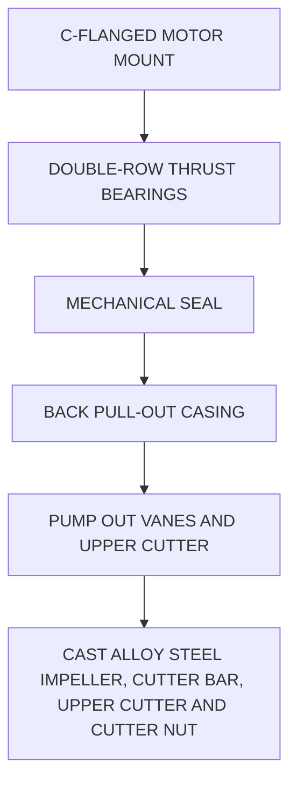
</diagram>

\n---\n

Plunger pumps use pistons driven by either an exposed eccentric crank shaft or a walking beam to pump residues. They are available in simplex, duplex, triplex, and quadplex configurations. Plunger pumps have an output of 150 to 225 L/min (40–60 gpm) per plunger and can develop up to 70 m (230 ft) of discharge head. These pumps typically are designed for an efficiency of 40% to 50%, which leaves a power reserve to overcome changes in pumping head (Sanks et al., 1998).

Plunger pumps have several advantages:
* They can transport residuals containing up to 15% total solids if the equipment is designed for load conditions;
* They are available in cost-effective options up to 30 L/s (500 gpm) and 60 m (200 ft) of discharge head;
* Units with large port openings can operate at low pumping rates;
* They provide positive delivery unless some object prevents the ball check valves from seating;
* They provide constant-but-adjustable capacity in spite of large variations in pumping head;
* They can operate for short periods of time under "no-flow" conditions (e.g., a plugged suction line) without damage (designer should confirm with specified manufacturers concerning guaranteed operating time under this condition);
* The pulsating action of low-velocity simplex and duplex pumps sometimes helps concentrate residuals in feed hoppers and re-suspend solids in pipelines; and
* They have relatively low operations and maintenance (O&M) costs.

Changing the stroke length changes the pump output. However, the pumps typically operate most efficiently at or near full stroke, so designers typically provide a variable-pitch V-belt drive or a variable-speed drive to control pumping capacity.

Plunger pumps have paired ball or flap check valves on the suction and discharge sides. A connecting rod joins the throw of the crankshaft to the piston. The piston is housed in an oil-filled crankcase (for lubrication) and sealed in a stuffing box gland and packing, which is kept moist by an annular pool of water directly above it. Unless the pool receives a constant supply of water, the packing will dry and fail rapidly, which can cause sludge to
\n---\n

## 3.5.2 Progressing Cavity Pumps

spray throughout the immediate area. As such, a seal water monitoring and control system with interlocking alarm and shutoff capability is recommended:

Plunger pumps can operate with up to 3 m (10 ft) of suction lift; but this can reduce the solids concentration they can handle. Using a pump whose suction pressure is higher than its discharge pressure is impractical because flow would be forced past the check valves. Using special intake and discharge air chambers reduces noise and vibration and dampens pulsations of intermittent flow:

If designers use pulsation-dampening air chambers, they should be glass-lined to avoid destruction via hydrogen sulfide corrosion. If the pump operates while the discharge pipeline is obstructed, the pump, motor, or pipeline can be damaged; a simple shear pin arrangement can prevent this problem:

The number of pistons directly influences the variation in downstream flow rates. If an application requires a relatively constant flow rate, design engineers should consider using triplex or quadplex pumps:

Compared to plunger pumps, progressing cavity pumps provide a more consistent flow rate, even with changes in discharge head. Design engineers should guard against pump operation in no-flow conditions because it can quickly damage the stator. Monitoring of the pump influent line, with shutoff control if a no-flow condition occurs in the line (high-pressure switch, for example), is one method to protect the pump:

A progressing cavity pump uses a worm-shaped metal rotor that turns eccentrically inside a pliable elastomeric stator. The stator’s axial pitch is about 50% that of the rotor. The rotor seals against the stator, forming a sealing line or lines that move down the pump as the rotor turns. Cavities progress axially between these lines, moving residues from the suction end of the pump to the discharge end. As the stator wears, some “slippage” flow occurs at the sealing lines; this slippage causes further wear. To minimize slippage, design engineers should use enough cavities (multistage construction) to limit the pressure difference across the sealing lines.

The elastomeric stator is relatively soft and subject to abrasion, so progressing cavity pumps should be used in facilities with good grit-removal facilities. They should not be

\n---\n

# Progressing Cavity Pumps: Design and Maintenance Guidelines

In some applications (particularly with variable-speed drives), designers should consider selecting a pump with greater than design flow capacity to ensure that the pump still can meet design flow requirements after the stator has begun to wear.

One advantage of a progressing cavity pump is that the stator acts as a check valve, preventing backflow under most conditions. An actual check valve or anti-reverse ratchet is only required if the pump's static backpressure is more than 50 m (165 ft) or stator wear is expected due to significant grit concentrations. However, design engineers should always include isolation valves on both suction and discharge sides so the pump can be removed from service for routine maintenance.

Most progressing cavity pumps are tested with water. When used to transport residuals, the pumps may need more motor horsepower. Design engineers should consult with pump manufacturers on each application to ensure that adequately sized motors are specified.

Solids capacity depends on pump size. Pumps sized for at least 3 L/s (50 gpm) at suitably low rotating speeds typically pass solids of about 20 mm (0.8 in.), so grinders are unnecessary. Smaller pumps, however, typically need grinders. If grinders are not included, then design engineers should specify protective covers on any required universal joints.

To minimize pump maintenance costs,
- make sure prior processes remove grit effectively;
- limit rotating speeds to approximately 250 rpm;
- make suction lines as short as possible and use open-throat, hopper-type suction ports (Jones, 1993);
- limit the pressure per stage to about 170 kPa (25 psi) (if higher pressures are needed, most manufacturers offer multistage pumps);
- carefully specify rotor material, stator material, and design of universal joints (where applicable);
- provide room to dismantle the pump efficiently;
\n---\n

* consider including reversing starters, which allow the pump to reverse flow direction and possibly clear minor blockages in suction piping; and
* reverse the pump’s flow direction in high suction lift applications.

Progressing cavity pumps can continue to operate as discharge pressure increases above the rated point, as in the case of a blocked discharge line. As such, the pump discharge must have pressure safety switches to prevent blocked discharge lines from rupturing. Also, design engineers should use flow indicator switches or proprietary devices to prevent the pumps from running dry. Designers should also consider using pressure-relief assemblies or rupture disks to protect downstream piping.

### 3.5.3 Diaphragm Pumps

Diaphragm pumps typically transport solids from primary sedimentation tanks and gravity thickeners. These pumps are a relatively simple means of pumping thickened solids and can handle grit with minimum wear. Manufacturers claim that the pump’s pulsating action increases solids concentrations when transporting gravity-thickened solids, but designers are cautioned about trying to use this as a design parameter in thickening systems. Also, pulsating flow may not be acceptable for some downstream treatment processes, so designers must consider this when considering diaphragm pumps.

An air-operated diaphragm pump typically consists of a single-chambered, spring-return diaphragm, an air-pressure regulator, a solenoid valve, a gauge, a muffler, and suction and discharge isolation valves (see Figure 19.12). Compressed air flexes a membrane that is pushed or pulled to contract or enlarge an enclosed cavity. Unless the water resource recovery facility already uses compressed air, providing this service can significantly increase pumping costs. Also, the air exhausted from the pump valves creates significant noise, which can be detrimental to operations staff.

Hydraulically or electric-motor driven diaphragm pumps are also available, and should be considered. Key considerations would include the availability of compressed air, power consumption of the various systems, and operator familiarity with air-operated and hydraulically operated equipment.
\n---\n

# 3.5.4 Rotary Lobe Pumps

#### Figure 19.12 Air-operated diaphragm pump

Top diagram components (cross-section of the diaphragm pump):
- Cylinder
- Piston Assembly
- Cylinder Exhaust Muffler
- Cylinder Tube
- Cylinder Head
- Mounting Flange
- Upper Retention Plate
- Lower Retention Plate
- Diaphragm
- Pump Body

Bottom diagram components (piping and drive arrangement):
- Air Cylinder
- Pump Body
- Base Tee
- Check Valve

FIGURE 19.12 Air-operated diaphragm pump.
\n---\n

## 3.5.4 Rotary Lobe Pumps

A rotary lobe pump uses multilobed, intermeshed rotating impellers to transfer residuals containing up to 10% total solids. Like progressing cavity pumps, rotary lobe pumps offer a relatively smooth flow and do not require check valves in many applications with low-to-moderate discharge static heads. However, both suction and discharge isolation valves are needed so the pump can be removed from service for maintenance.

Pumping efficiency depends on maintaining relatively close tolerances between rotating lobes, so all large or abrasive material should be removed from residuals before they enter the pumps. Rotary lobe pumps are more suitable for applications with efficient grit removal and should not be used to transport grit. Engineers should also design the pumps to rotate at the lowest possible speed to minimize abrasion. Both rotary lobe and progressing cavity pumps react similarly to abrasion, so engineers can apply many of a progressing cavity's design considerations to a rotary lobe pump. Designers should also select appropriate lobe material for the residuals to be transported; otherwise, the lobes may fail prematurely. An advantage of these pumps over progressing cavity pumps is their ability to handle short periods of no flow without significant damage (designers should confirm this attribute with specified pump manufacturers to confirm that this operating feature is warranted).

## 3.5.5 Pneumatic Ejectors

Rather than rotating elements and electric motors, a pneumatic ejector has a receiving container, inlet and outlet check valve and isolation valve, air supply, and liquid level detector: When liquid reaches a preset level, air is forced into the container and the stored volume is ejected. Then, the air supply cuts off and liquid flows through the inlet into the receiver:

Pneumatic ejectors can be used to convey residuals and scum. They have also been used in some facilities to transport grit and screenings. They are available in capacities from 110 to 570 L/min (30–150 gpm) and heads up to 30 m (100 ft).

## 3.5.6 Peristaltic Hose Pumps

Although more widely applied in the industrial sector, peristaltic hose pumps have been used to transport municipal wastewater solids. These self-priming pumps are available in capacities of 36 to 1250 L/min (9–330 gpm) and heads up to 152 m (500 ft). They can be

\n---\n

## 3.5.7 Reciprocating Piston Pumps

Peristaltic hose pumps are suitable for suction lift applications [up to 44.7 kPa (15 ft of water)] and can pump abrasive fluids. These devices are relatively simple, requiring only common tools and basic mechanical skills for assembly, servicing, and repair:

- A peristaltic hose pump has no seals, valves, or bearings; it moves sludge by alternately compressing and relaxing a specially designed resilient hose. The hose is compressed between the inner wall of the pump housing and the compression shoes on the rotor. A liquid lubricant may be used to minimize sliding friction. The residuals only touch the hose’s thick inner wall, which cushions entrained abrasives during compression; abrasives are released after compression. Replacement hoses can be expensive, however; so to maximize hose life, the pump’s maximum rotational speed should be limited to 25 rpm.
- The primary disadvantage of this pump is its pulsed flow (because the rotor typically only has two compression shoes). Depending on the rotational speed required to obtain the design pumping rate, the pulsing flow may not be suitable for downstream processes. This can be offset, however, by using pulsation dampeners on the discharge.

### 3.5.7 Reciprocating Piston Pumps

Reciprocating piston pumps are useful and cost-effective when dewatered biosolids must be transported to cake storage or loading facilities. They typically are not used ahead of the dewatering process. However, because these pumps can achieve discharge pressures up to 1.5 × 10^4 kPa (2200 psi), they are the primary choice for pumping thickened solids long distances. Given these pumps’ high potential discharge pressures, however, engineers must design downstream piping systems properly.

## 3.6 Other Pumps

Other types of pumps used to transport residuals are discussed in the following subsections.

### 3.6.1 Air-Lift Pumps

An air-lift pump has an open riser pipe, the lower end of which is submerged in the liquid to be pumped. When an air-supply tube introduces compressed air at the bottom of the pipe, air bubbles form and mix with the residuals in the pipe. As the density of the air—

\n---\n

## 3.6.1 Air-Lift Pumps (previous section excerpt)

residuals mixture decreases, denser material outside the pipe pushes the mixture up and out of the riser pipe.

Air-lift pumps are often used to transport WAS, RAS and similar solids in smaller facilities, where high efficiency and a precisely controlled flow rate are not required. Air-lift pumps typically are used in high-volume, low-head applications, those with lifts less than 1.5 m (5 ft). Their capacity can be varied by optimizing the air-supply rate. Increasing the air supply beyond its optimum level, however, only decreases the volume of liquid discharged. The main advantages of air-lift pumps are the absence of moving parts and their simple construction and use.

The primary disadvantages of air-lift pumps are their inefficiency (approximately 30%), which leads to higher energy costs to operate, and their head limitations (often limited to 5 ft due to compressed air limitations) (Metcalf and Eddy, 1981).

The air-supply arrangement governs the solids-handling capability. Air-lift pumps with an external air supply and circumferential diffuser can pass solid particles as large as the riser pipe’s internal diameter without clogging. Those with air supplied by a separately inserted pipe lack this nonclog feature.

----

### 3.6.2 Archimedes Screw Pumps

Archimedes screw pumps occasionally are used to transport RAS (see Figure 19.13). This pump has an open design for lifts up to 9 m (30 ft) and an enclosed design for lifts up to 12 m (40 ft) or more. It automatically adjusts its discharge rates in proportion to the depth of liquid in the inlet chamber until the water gets to the “fill point,” and then becomes constant. In other words, the pump has an inherent variable-flow capacity and does not need motor-speed controllers.

An Archimedes screw pump has a fairly constant efficiency (70%–75%) within 30% to 100% of its rated design capacity. The screw spirals’ peripheral tip speeds are typically less than 229 m/min (750 ft/min); those for centrifugal or recessed-impeller pumps are 1070 to 1220 m/min (3500–4000 ft/min). Also, the screw pumps are not pressurized. These characteristics are advantageous in RAS applications because they make the screw pump less likely to shear the activated sludge floc.
\n---\n

The pump's principal disadvantage is its space requirements. If exposed to the sun and left idle for extended periods or unequipped with cooling water sprays, the pump can warp due to thermal expansion. Off-line units may also freeze in cold weather. Another potential disadvantage is that RAS often aerates in these systems. In some RAS applications, Archimedean screw pumps were no longer used because the RAS high dissolved oxygen content was interfering with biological nutrient removal. Designers should account for this aeration potential and its impact on downstream systems when considering the use of these pumps for RAS/WAS pumping.

FIGURE 19.13 Archimedes screw pump (Courtesy of Evoqua).

## 3.7 Long-Distance Pipelines

Many facilities successfully pump solids long distances. The work of Carthew et al. (1983) was driven by the design of a 29-km (17.7 mi) pipeline. Honey and Pretorius (2000) solved their example using a 2-km (1.2 mi) pipeline, and Murakami et al. (2001) quote a
\n---\n

distance of 1 km (0.6 mi) in their manuscript. However, engineers must develop special design criteria to minimize potential operating problems. They should carefully determine sludge characteristics (e.g., viscosity, solids percentage, and type), study the effects of flow velocity on fluid viscosity and pipe-friction losses (Mulbarger et al., 1981), and minimize friction losses wherever possible. Minimizing bends and fittings in piping design and using PVC or glass-lined pipe are two friction-reducing possibilities.

When designing long-distance systems, actual field data are critical. Several studies provide detailed information on the analysis and design of long-distance solids transport systems (Carthew et al., 1983; Mulbarger et al., 1981; Setterwall, 1972; Spaar, 1972; U.S. EPA, 1979). Figure 19.14 shows the test systems used in the field by Carthew et al (1983) and Murakami et al. (2001).

Long-distance pumping typically creates high-pressure losses, so design engineers should choose pumps that can generate the high pressures needed. In the United Kingdom, for example, a vertical, positive-displacement, hydraulically driven ram pump transfers primary and waste activated sludge over a 2.2-km (1.3 mi) long pipeline, working against pressures of up to 2600 Pa (377 psi) (Ram Pumps, 1999).
\n---\n

\n---\n

# Storage/blend tank system and associated measurement network

- Thickened primary sludge (TPS)
- Thickened secondary sludge (TSS)
- Non-potable water (NW)

- Pressure sensing station (5)

- Storage/blend tank
- Sludge grinder (2)
- 63.8 m (208 ft) line

- Progressing cavity pump (2)

- FE
- PE1
- PE2
- PE3

- Ultrasonic flow meter

- Return line
- Sample tap
- Throttling valves

- Point A
- 20 m
- Point B
- Transparent pipe

- High range
- Low range
- (MFL

- Tank
- No.1
- Pumps
- Electromagnetic flow meter
- Pipes
- No.2
- Diaphragm transmitter
- 4P
- Pressure-transmitting pipe

\n---\n

## 3.8 Common Design Deficiencies in Pumps and Piping

FIGURE 19.14 Experimental setups used by (top) Carthew et al. (1983) and (bottom) Murakami et al. (2001)

Several design errors in pumping and piping systems are particularly noteworthy:

* Incorrectly calculating friction head and not providing enough allowance for variations that occur during operation: Calculating friction using non-Newtonian formulae, calculating for multiple friction conditions (multiple flow rates, in other words) and obtaining historical records to predict headloss are three methods to improve accuracy.
* Not providing adequate flushing and cleaning lines. Many residues form grease deposits or scale in pipe, and flushing water connections and cleanout ports become more critical as the material becomes thicker.
* Not providing enough suction to handle thickened solids. Thixotropy and plasticity can greatly affect friction, so a good design includes a straight, short suction pipe to a pump set low enough to allow for substantial positive suction pressure.
* Operating progressing cavity pumps at excessive speed or pressure per stage will increase maintenance costs. Designer is encouraged to take the effort to accurately predict the flow and pressure requirements of the system.
* Burying or encasing pipe elbows. Grit slurries and residual streams with poor upstream degritting processes can wear out elbows. If this is necessary, specify extra thickness of pipe material to increase the life of the fitting.
* Using one pump to withdraw solids from two or more tanks simultaneously; this is not recommended. Ideally, each tank should have a dedicated pump, with interconnections that allow another pump to be used when the dedicated pump is out of service. Otherwise, the system should be valved so one pump can draw from multiple tanks sequentially.
* Creating a pipeline route with high spots, which trap air or gas. Designers should avoid high spots wherever possible because air-relief valves have often been shown to be an unreliable long-term mechanism for this application. When the valves are not properly maintained, as is often the case, valves do not operate properly when needed.
\n---\n

* Using the wrong valves. In residuals pumping applications, design engineers should use `full port` plug valves. Pinch valves may also be applicable, but the designer should carefully weigh their advantages against their disadvantages.
* Lack of rupture disks or other pressure-relief devices between isolation valves. These devices should be installed on all residuals pumping systems.
* Other errors are cited in publications by Sanks et al. (1998) and U.S. EPA (1982).
* The following are general design guidelines for any sludge pumping system:
  - The minimum desirable size for residuals piping is 150-mm (6-in.), although some designers prefer 200-mm (8-in.) piping:
  - For smaller facilities, the designer should consider intermittent pumping to ensure that velocities are maintained:
  - In any pipe size, using a smooth lining minimizes the formation of struvite crystals in pumping anaerobically digested biosolids. Typically, ductile iron piping can be lined with cement, glass, or polyethylene. While other materials, such as polyvinyl chloride (PVC), may not require lining, operating pressures should be carefully considered.
  - Determine the solids concentration to be pumped and calculate pumping requirements based on whether the fluid is Newtonian or non-Newtonian.
  - Consider power consumption as part of the analysis of pumping alternatives.
  - Consider existing facility equipment and operator experience with equipment types in the analysis. A well-designed pump may not perform in the field if the operations staff is not familiar with equipment operation and has difficulty learning how to operate it properly:
  - When designing a transport system for thickened solids, engineers should also consider both the process it is coming from and the one that will receive it: As an example, dissolved air flotation units produce sludge that contains a lot of entrained air, which can be problematic for many pumps. Another example is if a mechanical thickening process will be discharging solids directly into an open-throat progressing cavity pump, then design engineers must choose a pumping rate that exceeds the thickening unit's maximum discharge rate
## 3.9 Standby Capacity
\n---\n

Design engineers should consider the facility size, system's function, arrangement of
units, anticipated service period, and time required for repair to determine the level of
standby capacity to provide. For example, standby capacity for RAS pumping is important
because a service interruption could quickly impair effluent quality: Primary and secondary
 solids pumping are also critical functions, so designers typically either provide dual units
or use units that can perform dual duty. For example , primary sludge pumps also typically
serve as standbys for scum pumps:
The designer should always propose standby capacity in all residuals pumping systems. If
an owner has to make the decision to remove standby capacity from the design, the
pumps used should be heavy duty, have readily available spare parts, and be easy to
repair quickly (preferably in place): Design engineers should ensure that the pump comes
with adequate spare parts.

4.0 Dewatered Biosolids Cake Storage
                          4.1 Storage Requirements
Dewatered biosolids cake (biosolids) typically is stored somewhere before receiving more
treatment (e.g , heat drying) or being transported offsite for use or disposal. The NFPA
Report on Comments A2007—NFPA 820 notes that there appears to be only minimal
hazard potential when storing dewatered biosolids. Most flammable liquids appear to be
removed during dewatering, and methane-generating microorganisms do not thrive indry
aerobic environments, so special safety precautions are not required. However; the
dewatered cake's viscous, sticky nature can complicate storage designs:
For short-term disposal operations (further offsite treatment or direct to landfill hauling, for
example) biosolids will only be held for a few days or weeks. In this case, storage
alternatives include large roll-off containers, 18-wheel dump trailers, concrete bunkers
with push walls, or bins with augurs.

If the biosolids will be land-applied or surface disposed, however; long-term storage may
be required: Weather-related application impacts, regulatory limits on land-applied nutrient
loading, and landfill restrictions are three instances that may dictate long-term storage
need: In these cases, biosolids are often stockpiled on concrete slabs or other impervious
pads. When designing long-term storage facilities, engineers need to consider facility
\n---\n

## 4.2 Odor-Control Issues

Odor control can be an issue with dewatered biosolids—especially when larger quantities are stored or the solids storage area is relatively close to neighboring businesses or residences. The odors that dewatered, anaerobically digested solids produce are primarily organo-sulfur compounds.

Storing the cake for 20 to 30 days at 25°C significantly cuts odor generation (Novak et al., 2004; WERF, 2008). Adding alum after digestion also reduced storage-related odors (Novak et al., 2004). However, the best way to minimize dewatered biosolids odors is to optimize the solids treatment processes before dewatering, according to the Water Environment Research Foundation 2008 study.

The decision to provide odor control at any given biosolids storage facility can be made after the facility is placed into service and actual operating conditions are determined: A viable design approach, if approved by a facility owner, is to delay design of odor control systems until after operation starts and the need becomes apparent. If this design path is chosen, the designer should design the system to allow for the ability to "add on" an odor control system without the need to reconstruct a newly-designed facility:

## 5.0 Dewatered Biosolids Cake Transport

Modern dewatering operations can produce biosolids containing 15% to 40% total solids or more, depending on theconditioning chemicals and dewatering equipment used. The consistency of such biosolids ranges from pudding to damp cardboard, so they will not exit the dewatering equipment by flowing via gravity into a pipe or channel. Instead, they
\n---\n

Biosolids must be transported via mechanical devices, such as positive displacement pumps or belt or screw conveyors. Where there are receiving containers directly below dewatering equipment, the biosolids can be dropped by gravity into the containers.

Before choosing a cake transportation method, design engineers should analyze various options based on solids-management requirements (i.e., end use of the biosolids product), site or building constraints, reliability, O&M, and life-cycle costs.

## 5.1 Pumping/Conveyors

Both progressing cavity pumps and hydraulically driven reciprocating piston pumps can handle dewatered biosolids. Compared to belt or screw conveyors, these pumps better control odors (because the biosolids travel in an enclosed pipe), eliminate spills, and have fewer maintenance requirements. The pumps also have much smaller footprints and, therefore, are suitable in buildings with space constraints. They can even reduce noise levels in some cases. However, pumps often need more electricity than conveyors to move a given volume of biosolids.

Choosing which pump to use depends on the application. Progressing cavity pumps provide a steady flow, while hydraulically driven reciprocating piston pumps pulsate (List et al., 1998). Progressing cavity pumps typically are preferred in applications where the biosolids are thinner and transport distances are short. Hydraulically driven reciprocating piston pumps are more expensive, but may handle greater pressures and thicker cake. (Biosolids process discharge piping can be a high-pressure environment.)

## 5.2 Hydraulics

The hydraulic characteristics of dewatered biosolids (with more than 15% solids) have not been extensively studied or widely reported. Likewise, headloss-calculation methods for pumping such solids are limited. However, researchers have shown that dewatered biosolids may exhibit both plastic and pseudoplastic (thixotropic) behavior (List et al., 1998; Barbachem and Pyne, 1995; Bassett et al., 1991). For a Bingham plastic, a minimum shearing stress is required to initiate flow. For thixotropic materials, the apparent viscosity and headloss gradient ($$\\frac{dH}{dL}$$) decrease as the rate of shear increases or as the fluid travels a certain distance inside a pipe until time-independent behavior is reached (Honey and Pretorius, 2000). These two behaviors complicate hydraulic design:
\n---\n

Nonetheless, dewatered biosolids can be pumped—even though experts only recommend it for relatively short distances. There are many successful pumping installations in North America and Europe, and many others are being designed or constructed.

## 5.3 Flow and Headloss Characteristics

In most dewatered biosolids applications, headlosses are high—up to 6900 kPa (1000 psi). It depends on the length, diameter, and configuration of the discharge piping. Headloss also depends on biosolids type and solids concentration, as well as the conditioning and dewatering methods that produced the biosolids. Current experience indicates that headlosses typically are sensitive to velocity and piping constrictions, particularly if the dewatered biosolids concentration exceeds 30%.

Typical piping headlosses in biosolids pumping applications can be as high as 79.1 kPa/m (3.5 psi/ft); design engineers often use these values as a general guideline during preliminary design. Ideally, the final design would keep headlosses below 45.2 kPa/m (2 psi/ft).

## 5.4 Design Approach

Engineers should avoid constrictions (e.g., smaller-than-line-size valves, valves that do not have full-port openings, and short radius bends) and minimize any type of fitting when designing discharge piping; the focus should be on maximizing straight run of pipe to minimize head loss. The piping should be large enough that theoretical biosolids flow velocities never exceed 0.15 m/s (0.5 ft/s)—although maximum velocities of 0.08 m/s (0.26 ft/s) are preferred, especially if dewatered biosolids concentrations exceed 30%. The pipe should be designed to allow flushing and pigging.

Unlike liquid solids, where pumping design equations are available for solids concentrations up to 12%, design approaches for pumping dewatered biosolids are more site-specific. Field testing is highly recommended, especially in relatively long-distance applications. For existing facilities that are being upgraded, using the existing system to determine flow characteristics can be a valuable design tool if the project upgrades are not impacting the biosolids characteristics. A pipe pumping biosolids containing more than 30% total solids should not be more than 150 m (500 ft) long, and line lubrication using high-pressure fluid delivery systems is highly recommended.
\n---\n

Four peer-reviewed case studies with actual field data were published in the 1990s. These studies explored pipeline headlosses for the following types of cake:

- Anaerobically digested, centrifugally dewatered biosolids containing 20% total solids (Bassett et al., 1991);
- Anaerobically digested, centrifugally dewatered biosolids containing 22% total solids (Barbachem and Pyne, 1995);
- Unspecified dewatered biosolids containing 28% total solids with and without polymer injection for line lubrication (List et al., 1998);
- Undigested, plate and frame pressed biosolids containing 34% total solids (Barbachem and Pyne, 1995).

Comparing actual field data, researchers developed a simple headloss equation for biosolids with 20% total solids concentration based on the pseudoplastic model, warning that it might only apply to the specific case (Bassett et al., 1991). Equation 19.18 may be valid for all pipe sizes from 100 to 300 mm (4–12 in.) with velocities ranging from 0.015 to 0.43 m/s (0.05–1.4 ft/s):

$$
\Delta P = \frac{15.68}{D^{1.28}} + \frac{0.245\,Q}{D^{2}}
$$

where DP = pressure drop (psi/ft),
D = inside diameter of the pipe (in.),
and Q = biosolids flow (gpm).

Table 19.4 illustrates the effect of pipe size on pipeline headloss (based on eq19.18). It shows that headloss increases almost 50% for each decrease in nominal pipe size. It also shows that pumping thicker biosolids (from 20%–28% total solids) causes a minimal increase in headloss (approximately 10%) when a large enough pipe (e.g., 300-mm or 12 inches) is used. (NOTE: The previous statement is based on a comparison of the results from two investigations.)

Barbachem and Pyne (1995) used the Re, He, and f-number methodology described in eqs 19.10, 19.15, 19.17, and 19.14 to model their actual field data. Figure 19.15 combines headloss data reported from Bassett et al. (1991) and Barbachem and Pyne (1995) for
\n---\n

flow in a 150-mm (6-in.) pipe. Although the data come from two investigations and so
differences in data may be due to different experimental procedures, certain trends and
results may be derived. Table 19.5, which one data point from each curve in Figure 19.15,
leads to two significant conclusions. First (as expected), friction headlosses through a
150-mm (6-in.) pipe increase dramatically as solids concentrations increase. Second, the
150-mm (6-in.) pipe is too small and inappropriate for pumping dewatered biosolids
containing more than 20% total solids; excessive headlosses are created.

<table>
  <caption>TABLE 19.4 Headloss Data for Pumping Cake at Near-Maximum Recommended Fluid Velocities</caption>
  <thead>
    <tr>
      <th>Pipe Size</th>
      <th>Percent solids Concentration</th>
      <th>Velocity (m/s)</th>
      <th>Hf (m of water/10 m)</th>
      <th>Hf (psi/ft)</th>
      <th>Change in Hf from One Size Smaller</th>
    </tr>
  </thead>
  <tbody>
    <tr>
      <td>100 mm (4 in.)</td>
      <td>20 (Bassett, 1991)</td>
      <td>0.08</td>
      <td>64.0</td>
      <td>2.77</td>
      <td>57%</td>
    </tr>
<tr>
      <td>150 mm (6 in.)</td>
      <td>20 (Bassett, 1991)</td>
      <td>0.08</td>
      <td>41.0</td>
      <td>1.77</td>
      <td>46%</td>
    </tr>
<tr>
      <td>200 mm (8 in.)</td>
      <td>20 (Bassett, 1991)</td>
      <td>0.08</td>
      <td>28.0</td>
      <td>1.21</td>
      <td>55%</td>
    </tr>
<tr>
      <td>300 mm (12 in.)</td>
      <td>20 (Bassett, 1991)</td>
      <td>0.08</td>
      <td>18.0</td>
      <td>0.78</td>
      <td>Baseline</td>
    </tr>
<tr>
      <td>300 mm (12 in.)</td>
      <td>28 (List et al., 1998)</td>
      <td>0.10</td>
      <td>19.5</td>
      <td>0.86</td>
      <td>10%</td>
    </tr>
  </tbody>
</table>

\n---\n

## FIGURE 19.15 Headloss in a 150-mm-diameter (6-in.-diameter) pipe for three types of residuals at various velocities below the recommended maximum

(created based on Bassett et al. (1991) and Barbachem & Pyne (1995))

<table>
  <thead>
    <tr>
      <th>Velocity (m/s)</th>
      <th>34% solids</th>
      <th>22% solids</th>
      <th>20% solids</th>
    </tr>
  </thead>
  <tbody>
    <tr><td>0.01</td><td>≈110</td><td>≈70</td><td>≈40</td></tr>
<tr><td>0.02</td><td>≈140</td><td>≈95</td><td>≈40</td></tr>
<tr><td>0.03</td><td>≈165</td><td>≈120</td><td>≈40</td></tr>
<tr><td>0.04</td><td>≈185</td><td>≈135</td><td>≈40</td></tr>
<tr><td>0.05</td><td>≈190</td><td>≈150</td><td>≈40</td></tr>
<tr><td>0.06</td><td>≈190</td><td>≈170</td><td>≈40</td></tr>
<tr><td>0.07</td><td>≈195</td><td>≈180</td><td>≈40</td></tr>
<tr><td>0.08</td><td>≈190</td><td>≈190</td><td>≈40</td></tr>
<tr><td>0.09</td><td>≈185</td><td>≈200</td><td>≈40</td></tr>
<tr><td>0.10</td><td>≈180</td><td>≈210</td><td>≈40</td></tr>
  </tbody>
</table>

In addition to actual field data and considering the high compressibility of biosolids, List et al. (1998) offered a specific method for determining headlosses created in biosolids pumping applications. Assuming steady, nonaccelerating pumping applications and a Bingham plastic behavior, the method is as follows:

| Type of Residuals | Velocity (m/s) | Hf (m of water/10 m) | Hf (psi/ft) | Change in Hf |
| - | - | - | - | - |
| 20% anaerobically digested, centrifuged | 0.08 | 41 | 1.77 | Baseline |
| 22% anaerobically digested, centrifuged | 0.05 | 120 | 5.19 | 293% |

\n---\n

## TABLE 19.5 Headloss Data for Pumping Cake Through a 150-mm (6-in.) Pipe at Near Maximum Recommended Velocity

<table>
  <tr>
    <td>34% undigested, plate and frame pressed</td><td>0.05</td><td>180</td><td>7.79</td><td>50.0%</td>
  </tr>
</table>

1. Collect field data to determine a pumping pressure for a given flow:
2. Construct a graph depicting (DP/L)/(D/4) on the y-axis and 8V/D on the x-axis [where
   DP = pressure loss (Pa), L = pipe length (m), D = pipe diameter (m), and V = fluid velocity
   (m/s)]:
3. The intercept (V = 0) determines the critical shear stress {stress at the pipe wall [τw (Pa
   or N/m²)]}.
4. The slope of the graph is the fluid’s dynamic viscosity [μ (Pa·s or kg/(m·s))].
5. Calculate a dimensionless factor Z as follows:
   
   $$
   Z = \frac{8\,\mu\,Q_m}{\rho_a\,A\,D\,\tau_w} \quad (19.19)
   $$

   where Qm = mass flow rate (kg/s),
   ρa = cake density at atmospheric pressure (kg/m³), and
   A = pipe cross-sectional area (m²).

Engineers then solve the following equation by trial and error until the left side equals the
right side:
$$
\rho^* - 1 + Z \ln\left(\frac{Z + 1}{Z + p^*}\right) = \frac{4\,\tau_w\,L}{K\,D} \quad (19.20)
$$

where p^* = density ratio equal to r/ρa, and
K = bulk modulus of biosolids (N/m²) determined from a graph of bulk density
versus consolidating pressure and assumed constant.

They then calculate the pressure drop:
\n---\n

**Δp = K(p* − 1) (19.21)**

Assuming a pseudoplastic fluid behavior under the same conditions involved solving a differential equation, but the results were less than 4% different than those derived from the Bingham plastic method above

As reported in List’s article, the results obtained for pumping biosolids with a total solids concentration of 28% through a 305-mm-diameter (12 in.-diameter), 150-m (500 ft) long pipe using eq. 19.21, using a differential equation assuming Bingham plastic fluid (not shown) and one for a pseudoplastic fluid (not shown) were all very similar:

If the compressibility effect is disregarded, the following two equations may be solved for a Bingham plastic and a pseudoplastic material, respectively:

$$
\frac{\Delta P}{L} = \frac{4 \tau_w}{D} - \frac{32 \mu V}{D^2} \quad (19.22)
$$

$$
\frac{\Delta P}{L} = -\frac{4 \tau_w}{D} - \frac{4 k}{D} \left(\frac{8}{D}\right)^m \quad (19.23)
$$

where \(k\) and \(m\) are empirical parameters describing the material’s properties.

The actual application involved accelerating flow generated by a reciprocating piston pump. The actual field tests of pumping 28% total solids biosolids through a 250-mm (10-in.) pipe showed that maximum pressure near the pump was 3100 kPa (450 psi), which was not very far from the calculated values for steady flow.

Table 19.6 is a compilation of data from a progressing cavity pump manufacturer on transporting biosolids with different solids percentages (Bourke, 1997). Headlosses ranged from 6 to 68 kPa/m (0.25–3.0 psi per foot) of straight 150-mm (6-in.) pipe (Bourke, 1999). The table shows that centrifugally dewatered biosolids is pumped more easily than rotary-drum dewatered cake. Centrifugally dewatered biosolids is also pumped more easily than belt-pressed dewatered biosolids. That said, the headlosses reported in Table 19.6 seem somewhat underrated; designers probably should use more conservative values or require performance warranties from the pumping-system supplier:

\n---\n

A progressing cavity pump may put significant shear stress on biosolids, resulting in a thixotropic, shear-thinning behavior that decreases the fluid's apparent viscosity, when compared to biosolids transported by a hydraulically driven reciprocating piston pump. Progressing cavity pumps can handle biosolids with low solids contents, while hydraulically driven reciprocating piston pumps handle thicker biosolids more reliably. However, a progressing cavity pump may achieve near 100% cavity fill, so it pumps more efficiently than a hydraulically driven reciprocating piston pump. It is noted that progressing cavity pump manufacturers typically quote headlosses in the neighborhood of 22.6 kPa/m (1 psi/ft), while hydraulically driven reciprocating piston pump manufacturers typically use 45.2 kPa/m (2 psi/ft) in their designs.

<table>
  <thead>
    <tr>
      <th>Method</th>
      <th>Percent solids</th>
      <th>100 mm (4 in.)</th>
      <th>150 mm (6 in.)</th>
      <th>200 mm (8 in.)</th>
    </tr>
  </thead>
  <tbody>
    <tr>
      <td>Rotary drum</td>
      <td>20–30</td>
      <td>Slightly more than double of 150 mm</td>
      <td>7.62–11.5 (0.33–0.50)</td>
      <td>About half of 150 mm</td>
    </tr>
<tr>
      <td>Centrifuge</td>
      <td>20–30</td>
      <td>Slightly more than double of 150 mm</td>
      <td>50% less than rotary drum</td>
      <td>About half of 150 mm</td>
    </tr>
<tr>
      <td>Rotary drum and then heat treated</td>
      <td>45</td>
      <td>Slightly more than double of 150 mm</td>
      <td>23.0–35.0 (1.00–1.50)</td>
      <td>About half of 150 mm</td>
    </tr>
<tr>
      <td>Filter press</td>
      <td>65</td>
      <td>Slightly more than double of 150 mm</td>
      <td>35.0–46.0 (1.50–2.00)</td>
      <td>About half of 150 mm</td>
    </tr>
  </tbody>
</table>

TABLE 19.6 Headloss Data [in m of Water/10 m (psi/ft)] as Reported in Bourke (1997) for Fluid Velocities Less Than 0.06 M/S

<table>
  <thead>
    <tr>
      <th>Type of Residuals</th>
      <th>Percent Solids</th>
      <th>Density (kg/m3)</th>
      <th>Reference</th>
    </tr>
  </thead>
  <tbody>
    <tr>
      <td>Diluted dewatered solids</td>
      <td>3.51</td>
      <td>1015</td>
      <td>Spinosa and Lotito, 2003</td>
    </tr>
<tr>
      <td>Settled activated sludge</td>
      <td>5.00</td>
      <td>1015</td>
      <td>Honey and Pretorius, 2000</td>
    </tr>
<tr>
      <td>Diluted dewatered solids</td>
      <td>5.15</td>
      <td>1020</td>
      <td>Spinosa and Lotito, 2003</td>
    </tr>
  </tbody>
</table>

\n---\n

## TABLE 19.7 Residuals Density at Various Solids Concentrations

<table>
<thead>
<tr><th>Solids</th><th>% solids</th><th>Density (kg/m^3)</th><th>Reference</th></tr>
</thead>
<tbody>
<tr><td>Diluted dewatered solids</td><td>6.81</td><td>1026</td><td>Spinosa and Lotito, 2003</td></tr>
<tr><td>Diluted dewatered solids</td><td>8.40</td><td>1031</td><td>Spinosa and Lotito, 2003</td></tr>
<tr><td>Manure</td><td>9.10</td><td>1037</td><td>El-Mashad et al., 2005</td></tr>
<tr><td>Diluted dewatered solids</td><td>9.49</td><td>1034</td><td>Spinosa and Lotito, 2003</td></tr>
<tr><td>Diluted dewatered residuals</td><td>10.5</td><td>1038</td><td>Spinosa and Lotito, 2003</td></tr>
<tr><td>Manure 2</td><td>10.7</td><td>1044</td><td>El-Mashad et al., 2005</td></tr>
<tr><td>Dewatered solids</td><td>28.3</td><td>1062</td><td>List et al., 1998</td></tr>
</tbody>
</table>

Density is an important parameter in all biosolids calculations. Biosolids density at a
certain temperature may be correlated with solids concentration; this is often helpful in
design. Table 19.7 lists data correlating density with solids concentration at unspecified
temperatures (presumably near room temperature). The designer should consider the
temperature variations and ranges in the design of their facility and determine if there is
an impact to pumping operation:

### 5.4.1 Example 19.2: Pumping Biosolids with 28% Total Solids

Determine the friction headloss when pumping Biosolids with 28% total solids concentration solids through a 300-mm-diameter, 150-m-long pipeline. This example was adapted from List et al. (1998). Other experimentally determined input parameters include:

* Bulk modulus of biosolids (K) = 2550 kN/m^2,
* Biosolids density at atmospheric pressure (r_a) = 1060 kg/m^3,
- Biosolids mass flow rate (Q_m) = 8.012 kg/s,
- Wall shear stress (t_w) = 1468 N/m^2,
- Biosolids’s dynamic viscosity (m) = 12 kg/m·s,
\n---\n

* Fluid velocity (V) = 0.1036 m/s.

## 5.4.1.1 Solution Option 1

Following the methodology described previously in Section 5.4, engineers should use eq 19.19 to calculate the following dimensionless factor:

- $Z = 0.222$

They then solve eq 19.20 by trial and error:

- $p^* = 2.15$

Engineers then use eq 19.21 to calculate the pressure drop:

- $\Delta P = 2933\ \text{kPa}$ (299 m of water column).

## 5.4.1.2 Solution Option 2

Anticipating that the biosolids are behaving like a Bingham plastic fluid and disregarding the compressibility effect, engineers could use eq 19.22 to get the following result:

- $\Delta P = 2826\ \text{kPa}$ (288 m of water column)

## 5.4.1.3 Solution Option 3

If the biosolid’s rheological parameters are difficult to determine, an estimated conservative headloss value may be sufficient for design. This practice is valid because biosolids are transported by positive-displacement pumps that can deliver the same flow rate over a wide range of pressures; it is even more valid when pumping biosolids short distances through sufficiently large pipelines:

- Typical headlosses in biosolids pumping systems can be as high as 79.1 kPa/m (3.5 psi/ft). Their headlosses are larger (in the high end of the range) when pipe diameter is small (e.g., 155 mm or 6 in.) and fluid velocity is near the maximum recommended (0.08 m/s or 0.25 ft/s). In this example, the pipe diameter is sufficiently large (300 mm or 12 in.) and fluid velocity is not much higher than the recommended maximum, so system headlosses should be in the low end of the range. On the other hand, the biosolids
\n---\n

Solids content is 28%, and engineers should be careful not to select a design whose values would be too small. A headloss value of 45.2 kPa/m (2.00 psi/ft) may be safely assumed. Also, engineers could take Table 19.4's value for pumping biosolids with 20% solids through the 300-mm (12-in.) line and double it (to approximate the value for a biosolids with 28% total solids concentration). The estimated headloss for design then becomes 35.2 kPa/m (1.56 psi/ft).

Another approach is to extend the 34% and 22% curves of Figure 19.15 to a velocity of 0.1 m/s (0.33 ft/s) and record the headloss for each case at that particular velocity (300 m/10 m and 190 m/10 m, respectively). Pumping biosolids with 28% total solids would fall somewhere between the two values. If the median value is selected, the headloss is 24.5 m/10 m of 6-in.-diameter (0.4 m) pipe. The headlosses calculated from Options 1 and 2 are 0.86 and 0.83 psi/ft (19.4 to 18.7 kPa), respectively: These are well below the estimated values in Option 3.

## 5.5 Line Lubrication for Long-Distance Pumping

A method for reducing pipe-friction losses (mainly for long-distance pumping applications), called boundary layer injection, involves injecting a liquid lubricant into the discharge pipe via an annular ring, which distributes the liquid equally around the pipe’s perimeter to create a “boundary layer.” The lubricant could be water-, polymer-, or oil-based. The designer should research the impact of adding this fluid on the end use of the dewatered biosolids as part of the design process. Field tests indicate that such lubrication can cut discharge pressure up to 80% (List et al., 1998). For a detailed description of this process, see Conveyance of Wastewater Treatment Plant Residuals (ASCE, 2000).

Consider the experience of a water reclamation facility in Georgia, which was pumping biosolids with 25% total solids through a glass-lined pipe. The original pressure drop was 67.8 kPa/m (3 psi/ft). After adding a small amount of water (0.5% of total solids flow) via boundary layer injection, the pressure drop lowered to 22.5 kPa/m, according to a study by a manufacturer of hydraulically driven reciprocating piston pumps (Crow and Cortopassi, 1994).

There are two types of boundary layer injection rings: the original configuration, which has individual injection points, and a newer design, in which lubricating media is injected
\n---\n

through an annular groove around the pipe perimeter. Typically, the annular groove design is preferred because it requires less lubricant and has minimal effect on the biosolids' percent solids content (Wanstrom, 2008).

## 5.6 Controls
Controls typically are used to match the pumping and biosolids production rates. For example, a progressing cavity pump’s speed may be controlled by a variable-frequency drive, while a piston pump’s speed is controlled by fluid flow in the hydraulic power unit: Meanwhile, ultrasonic or radar level sensors monitor the level in the biosolids collection hopper and send high and low-level signals to the pump controls, which automatically adjust pump speed to maintain a preset hopper level.

Note that sensor placement in a dewatered biosolids storage tank is very important. Dewatered biosolids typically form pyramidal shapes when deposited by gravity into storage bins, so obtaining an accurate level reading is difficult to achieve. Storage hoppers often have leveling devices in the hoppers, but historical operation indicates that these devices do not always provide adequate leveling because dewatered biosolids have varying angles of repose based on solids concentration. Knowing the angle of repose of the dewatered biosolids is a key to sensor placement: Field testing of the in-place system should be performed, and storage tank design should allow for moving the sensor based on the field test results.

Most facility operators report stable biosolids production from belt presses or spot checks are used to prevent bridging or clogging. Little operator time is required to adjust the system to match biosolids production rates.

Automatic pump controls involving capacitance probes, pressure switches, and no-flow sensors typically have proved unreliable. If the control fails to shut off the pump when the feed hopper holds little biosolids, the pump can run dry. If it fails to start the pump, biosolids can spill over the hopper or push back and pack centrifuges or other dewatering units. Either condition can result in expensive repairs and production loss:

## 5.7 Progressing Cavity Pumps
Progressing cavity pumps have low capital costs and can consistently transport thinner dewatered biosolids over short distances. To ensure effective operations, pump
\n---\n

manufacturers and WRRF personnel recommend that design engineers

* use progressing cavity pumps to transport biosolids containing about 20% total solids or less. About 20% to 25% biosolids applications can be researched by the design engineer, but it is recommended that the design engineer get references from facilities that are successfully pumping this more dense biosolids and speak directly to the facility operators to gain as much data as possible.

* use a large-diameter pipe to reduce friction loss to more suitable levels.

* limit the pumping distance to 50 m (164 ft) or less. Further distances (up to 90 m or 295 ft) can be researched by the design engineer; but it is recommended that the design engineer get references from facilities that are successfully pumping solids through this length of pipe and speak directly to the facility operators to gain as much data as possible.

* minimize suction piping length or eliminate this pipe.

* restrict pump rotational speeds to 200 rpm or less (Bourke, 1997).

* limit the pressure per stage to 52 kPa (7.5 psi).

* after determining final design criteria, ask pump manufacturers for specific recommendations on pump materials, number of stages, and models.

* use either adjustable-frequency or adjustable-hydraulic motor drives.

The expected service life of the pump's stator and rotor assembly is facility-specific, and drops markedly as the biosolids' solids concentration increases. Other factors that affect equipment wear include pump speed, grit content, running time, and operating pressure.

Parts are expensive and labor-intensive to replace (compared to servicing kinetic pumps).

When progressing cavity pumps transport biosolids containing more than 20% total solids, the biosolids can bridge over the screw auger in the feed hopper. It can also clog the throat section (interface of auger feed screw and rotor and stator assembly of pump). If uncorrected, the problems can cause the pump to run dry quickly, ruining the stator and rotor: To avoid this, designers can put temperature sensors in the stator to monitor for the high temperatures that indicate the pump is running dry.

Depending on the pumping system configuration, bridging could pack a centrifuge bowl or overflow a supply hopper. Some manufacturers use paddle-type bridge breakers to combat this problem (with moderate success). However, they may require intensive
\n---\n

## 5.8 Hydraulically Driven Reciprocating Piston Pumps

maintenance. A bridge breaker can be powered by the pump motor via gears or chains, or by a dedicated motor. Using a dedicated motor lets operators adjust paddle speed independent of the pump. A newer design uses a ribbon auger attached to a plate fixed either to the pump drive shaft or to a separate variable speed drive; it allows the pump to transport biosolids with higher solids concentrations (Dillon, 2007). Another design uses a twin screw feeder also powered by a dedicated variable-speed drive (Doty, 2005). Both designs address biosolids bridging problems and maximize the pump cavity’s fill rate.

In the United States and Canada, hydraulically driven reciprocating piston pumps are the standard for transporting high solids and dewatered biosolids long distances. Municipal water resource recovery facilities have used them for this purpose for more nearly 30 years, and many of the units are still operating. Several manufacturers sell them in the United States.

Developed from concrete pumping technology, a hydraulically driven reciprocating piston pump consists of a twin screw auger feeder, a pumping assembly, and a hydraulic power unit (see Figure 19.16). It can handle both screenings and biosolids containing 5% to more than 40% dry solids that were dewatered via belt presses, centrifuges, plate and frame presses, screw presses, or rotary presses.

The pump’s principal advantage is that it can move high solids materials. Hydraulically driven reciprocating piston pumps have higher capital costs than other pumps, but can move very thick dewatered biosolids that other types of pumps cannot:

The pump has two product-delivery cylinders with pistons powered by two isolated hydraulic-drive cylinders (rams). The delivery cylinders are synchronized so while one is being filled with dewatered biosolids, the other is delivering biosolids to the discharge line. This reduces the pulsing effect of one cylinder and piston, maintaining essentially uninterrupted flow.
\n---\n

# 5.8.1 Operating Experience and Design Considerations

FIGURE 19.16 A hydraulically driven reciprocating piston pump moving a centrifugally dewatered cake (containing 31% solids) at the Norman Cole Jr. facility in Lorton, Virginia (Courtesy of Schwing Bioset, Inc.).

Nearly all the hydraulically driven reciprocating piston pumps used at U.S. sites have twin screw auger feeders. These feeders develop 35 to 205 kPa (5–30 psi) of pressure in the pump assembly's charging unit. This pressure helps push biosolids into the emptying cylinder while the piston returns to its starting position. The feeders typically are driven by a hydraulic motor but can also be used with electric motor drives.

The pumping assembly's charging unit typically has either a poppet valve or a transfer tube. Each delivery cylinder has a suction intake and discharge exhaust poppet valve. The valves or tubes are hydraulically driven and synchronized to the piston strokes; they permit one cylinder to fill while the other discharges. Poppet valves provide a positive shutoff to prevent backflow, cost less, and need less maintenance than transfer tubes. The poppet valve can also be equipped with an internal flow monitor that will measure the volume of pumped biosolids, but reported accuracy is only about 65% (Wanstrom, 2008).

Hydraulically driven reciprocating piston pumps can run dry for indefinite intervals at slightly faster wear rates but without catastrophic damage. So if bridging or clogging occurs, facility operators have time to react before severe problems develop. A water-filled isolation box (e.g., water box) between the hydraulic and delivery halves of each cylinder allows this capability: The water cools the connecting rods, flows into the delivery cylinder, and lubricates it as the delivery piston moves forward on its discharge stroke.

\n---\n

Based on nearly 30 years of operating experience with hydraulically driven reciprocating piston pumps at U.S. and Canadian water resource recovery facilities, design engineers should
* minimize line pressure in the piping system when pumping material containing more than 25% total solids (either through minimizing fittings, lining the pipe, using boundary layer fluid injection, or a combination of any or all of these methods),
* use a boundary layer injection system in long-distance or high-solids applications,
* maximize volumetric efficiency (see Section 6.8.3), and
* minimize stroke rate (see Section 6.8.2):

Hydraulically driven reciprocating piston pumps are available with capacities up to 1500 L/min (400 gpm) and discharge-pressure capabilities up to 13 800 kPa (2000 psi). There are also a wide range of suction feed hopper-to-pump configurations. In addition, hydraulic power units are available in broad output ranges, depending on the discharge-line pressure required:

When designing such pump systems, engineers should discuss suitable equipment sizing, features, and options with manufacturers and staff at installations with similar requirements. They should ensure that the piping design and components (valves, etc.) are suitable for high-pressure service. When sizing the pump(s), they should
* determine the biosolids production rate;
* estimate the pump's volumetric efficiency given the biosolids characteristics;
* reduce stroke speed in accordance with the type of pump service (e.g., intermittent or continuous) expected;
* examine the pump curves and check the stroke speed turndown ratio; and
* choose a pump based on the volumetric-efficiency and service factors needed.

## 5.8.2 Biosolids Production Rate

Biosolids production rate depends on installation-specific requirements, including the following:
* The volume of solids the facility generates for thickening and dewatering;
\n---\n

* Number of hydraulically driven reciprocating piston pumps and dewatering machines installed to dewater the thickened sludge;
* Operating schedule of both dewatering equipment and pumps (e.g, 24-hour service or single shift);
* Constraints downstream of piping (e.g., furnace capacity, storage capacity, or trucking schedules);
* Variable capacity requirements imposed on the pumps by dewatering processes; and
* Standby considerations during maintenance or emergencies.

## 5.8.3 Volumetric Efficiency

Volumetric efficiency is the ratio of solids volume pumped per piston stroke to the total volume displaced per piston stroke. If a hydraulically driven reciprocating piston pump were pumping water or residuals containing 1% to 4% total solids, its volumetric efficiency would be essentially 100% because wastewater is nearly incompressible. This behavior is typical of a true Newtonian fluid.

Dewatered biosolids, however; neither physically resembles nor behaves like a true Newtonian fluid. It typically contains air, other entrained or dissolved gases, and concentrated organic material, all of which are compressible. So, when the piston begins applying pressure, the biosolids tend to compress: Until squeezed against the downstream resistance, the biosolids do not move forward with the pumping cylinder: When the biosolids finally move forward, the piston already has displaced a certain volume of the cylinder: This displaced volume is part of the "lost" volumetric efficiency; the rest is due to the inability to completely fill the cylinder as the piston returns to its starting position. Even with the slight pressure provided by a twin screw auger or conical plow feeder [35 to 205 kPa (5–30 psi)] and the partial vacuum in the cylinder; dewatered biosolids resist moving into the cylinder bore. Such resistance typically increases as biosolids dryness increases, further lowering volumetric efficiency:

Using a pressure sensor in the transition between the twin screw auger and poppet housing can ensure cylinder-filling efficiency: This sensor will monitor pressure in the transition and, via a programmable logic controller, automatically increase or decrease auger speed to maintain a preset pressure: So, regardless of pump speed or fluctuations
\n---\n

in solids concentration, optimum pressure is maintained on the suction poppet to promote the highest filling efficiency possible for a given material (Wanstrom, 2008).

Meanwhile, designers must account for volumetric-efficiency loss when sizing a hydraulically driven reciprocating piston pump. There is no theoretical model for predicting volumetric efficiency, but it typically ranges from 60% to 90%. Once design engineers know or can estimate biosolids characteristics, they should ask manufacturers to recommend an appropriate volumetric efficiency. As a rough, conservative estimate, a volumetric efficiency of 70% can be used for pumping dewatered biosolids containing 20% to 30% solids.

## 5.8.4 Service Factor
As with most recovered water treatment equipment in continuous service, operating hydraulically driven reciprocating piston pumps at lower speeds makes them more reliable and extends equipment life. So, design engineers should limit the pump-stroking speed (strokes per minute) to 50% of the maximum recommended for intermittent operation or 75% of the maximum recommended for continuous service, whichever is less.

## 5.8.5 Hydraulic Power Unit Sizing
Power unit sizing is principally a function of the pump’s discharge pressure and the hydraulic fluid flow needed to achieve the desired solids pumping rate. If pumping tests cannot be made and data are not available from other sources, design engineers should ask manufacturers for specific recommendations and rate the power unit conservatively:

## 5.9 Conveyors
Conveyors typically move wet or dry solids (e.g., primary grit, screenings, and dewatered biosolids) that are not easily pumped. Municipal-recovered water facilities typically use either belt or screw conveyors.

### 5.9.1 Belt Conveyors
Belt conveyors move material on top of a moving, flexible belt (see Figure 19.17). Such belts typically are supported by rollers spaced 0.9 to 1.5 m (3–5 ft) apart on the carrying side and about 3 m (10 ft) apart on the return side of the conveyor. The rollers on the carrying side are called load-side rollers; those on the return side are called idlers. To
\n---\n

# 5.9.1.1 Belt Conveyor Applications

increase capacity; load-side rollers are often angled so the belt will form a concave carrying surface.

FIGURE 19.17 Belt conveyor (troughed with idlers) transporting screw press dewatered, anaerobically digested solids at the City of Tallahassee's T. P. Smith facility in Florida.

The belt is driven by one or more drive drums or pulleys connected to a motor via a belt or chain drive. In simple conveyor systems, the drive pulley is located at the discharge (head) end of the belt and the tail pulley is at the loading end.
The belt must maintain a minimum tension to reduce sag between carrying idlers, provide contact force, and prevent slippage at the drive pulley. This tension can be maintained by several take-up devices, including a weighted pulley (called a gravity take-up), a spring-loaded pulley, or a screw adjustment for pulley position. The least costly option is a screw take-up on the tail pulley; it is typically used in conveyors less than 90 m (300 ft) long:

5.9.1.1 Belt Conveyor Applications
\n---\n

# Conventional belt conveyors

Conventional belt conveyors move biosolids via a continuous loop of reinforced rubber belt. They typically transport relatively dry material (15% or more total solids). For this method to be economical, biosolids must be dry enough not to flow freely or seek a constant level (like a liquid does). Biosolids with a high angle of repose (i.e., the slope of the solids pile when measured from the horizontal) are suitable for transport via belt conveyors. Digested and belt-pressed primary and secondary biosolids can have an angle of repose of 40° or more. Because belt movement vibrates the material, design engineers must consider the biosolids’ flow tendencies when deciding whether a belt conveyor is suitable. The angle that a pile of material retains while moving is called the surcharge angle. Belt-pressed biosolids may have a surcharge angle of more than 30%. The designer should determine a material’s characteristics before deciding which conveyor to use.

The transport distance and elevation change also influence the choice of conveyor: Belt conveyors have been used to move mining ores and construction spoil solids more than 14 km (8 mi), but in typical recovered water facilities, the distance could be less than 200 m (660 ft). If the distance is less than 6 m (20 ft), other conveyors may be more suitable.

Conventional belt conveyors are limited by both the rate of elevation change and horizontal direction changes that require multiple belts. The conveyor’s maximum incline depends on the material involved and belt speed required: Faster speeds allow for higher angles so long as the speed exceeds the rate at which material flows or rolls back down the incline. However, faster speeds also increase O&M costs because they increase friction and shorten belt life. When moving dewatered biosolids, a belt conveyor’s maximum incline angle is limited to about 15° to 20° above horizontal. The maximum incline is much less for biosolids that are watery or tend to flow easily.

Elevation gains can also be limited by curvature radius as a horizontal belt becomes an inclined one. The radius must be long enough so the belt will not lift from the idlers under any operating condition. Depending on the specific design, this radius could be 15 to 75 m (50–250 ft) or more. So, engineers need to consider an existing facility’s physical dimensions when deciding what type of conveyor to use.

 Belt conveyors have a low cost per linear meter (foot) of transport distance, but they may require significant space and be maintenance intensive. They can also be a source of
\n---\n

## 5.9.1.2 Belt Conveyor Design and Operation Considerations

When considering a belt conveyor for a new or existing facility, design engineers should begin by establishing the following criteria:

* Biosolids characteristics (e.g., angle of repose and surcharge, degree of matting or stickiness, average density, and range of variation of these characteristics);
* Biosolids volumes and transport rates (i.e., daily or weekly variations in solids rate and hours of operation) so they can determine conveyor capacity;
* Belt construction material (acid, oil, and abrasion resistance); and
* Conveyor layout and power requirements so they can determine belt width and speed (conveyor activity); loading arrangement (chutes or conveyor skirtboards); curve radius, incline angles, and total elevation gain (multiple conveyors may be warranted if these factors are limiting); idler type, spacing, and pulley and take-up arrangements (which influence belt friction and power requirements); and motor horsepower and belt tension.

The Conveyor Equipment Manufacturers Association (CEMA) publishes a handbook that includes procedures for establishing such criteria and sizing belts (CEMA, 1979). First, however, engineers must know the characteristics of the material to be conveyed. Some recovered water facility biosolids are sticky, for example, so the belt should be cleaned to prevent spillage on return runs and the consequent loss of drive-pulley friction: Other facilities may have site-specific problems, such as water breakout, odors, or spillage.

The U.S. Environmental Protection Agency offers the following guidelines for problems unique to WRRF biosolids (U.S. EPA, 1979):

* Belt transfer points should have both minimum drop heights and skirtboards with wipers to minimize splashing and spillage.
* Belt cleaning is potentially troublesome. Counterweighted rubber scrapers below the head pulley have been ineffective and require intensive maintenance. Scrapers with multiple “fingers” and adjustable tensions are suggested. Another option is a water spray followed by a rubber scraper (if the water can be collected and disposed easily).
\n---\n

# 5.9.1.3 Special Belt Conveyors

* Design engineers should avoid accessories (e.g., snubber or counterweight pulleys) that touch the dirty side of the belt. Snubbers are pulleys positioned to increase the angle of contact between the belt and the drive pulley, thereby increasing friction and reducing drive slippage. Instead of snubbers or gravity take-ups, designers should use manual screw take-ups and, if necessary, multiple shorter belts.

* When designing conveyors, design engineers should include housekeeping facilities (e.g., frequent hose stations); oversized floor or paving drains with exaggerated grades below the conveyor; and nonskid tread plates rather than grates.

Because a water resource recovery facility is a humid or wet environment and biosolids typically are corrosive and abrasive, engineers need to design belt conveyors carefully:
  - Conveyor framing should be made from corrosion-resistant materials (e.g., 6061-T6 aluminum alloy);
  - Idlers can be made of neoprene or PVC, and cable-supported neoprene rollers can be used for troughed sections;
  - Roller bearings should be sealed with external grease fittings;
  - Drive chains and motors require removable splash guards to protect them from spillage;
  - Belt materials should include abrasion- and oil-resistant covers.

To prolong belt life, designers should set the belt’s actual running tension conservatively below its rated tension and check the loaded conveyor’s initial tension to avoid overstressing the belt: A vulcanized belt splice provides longer life than mechanical joints. Slower belt speeds also typically lengthen belt life, so about 30 m/min (100 ft/min)—approximately 50% of CEMA’s maximum speed guideline is suggested.

When designing conveyor sections that are outside buildings, engineers should provide for weather and wind protection. At a minimum, they should provide a half-diameter rain cover; however, a three-quarter cover with open access on the downwind side prevents wind-induced spillage and belt-training problems while allowing access to parts for maintenance. If odors must be controlled, designers can completely enclose the conveyor and provide ventilation. The enclosure must include hinged or easily removable partial cover plates to allow access for maintenance, cleaning, and periodic observation of the conveyor:
\n---\n

Manufacturers have developed belt conveyors that overcome some of the limitations previously mentioned. For example, conveyors with cleats (See Figure 19.18), buckets, or sidewalls attached to the belt can move material up steeper inclines. One patented conveyor allows both horizontal and vertical curves. Another uses two flat, converging belts to completely enclose the material and to permit steady inclined or vertical lifts. Design engineers considering one of these conveyors should discuss the application with various manufacturers and check similar installations to compare operating costs and avoid potential design problems.

<table>
<thead>
<tr><th>Figure</th><th>Description</th></tr>
</thead>
<tbody>
<tr><td>FIGURE 19.18</td><td>Cleated belt conveyor.</td></tr>
</tbody>
</table>

## 5.9.2 Screw Conveyors

Screw conveyors push material via a helical blade (flight) mounted in a U-shaped trough or enclosed in a tube. The flights may be attached to a center shaft; or the screw may be shaftless. In shafted conveyors, a drive mechanism turns the center shaft, which is supported by the end bearings and intermediate hanger bearings needed to reduce shaft deflection. Both shafts and flights can be tapered.

Flights are manufactured in a wide variety of designs and can have full or partial cross-sections (or both). Two flights that are cut, folded, or otherwise shaped can mix or fold the

\n---\n

material during transport: The pitch—the horizontal distance between flight blades—can vary along the shaft length.

## 5.9.2.1 Screw Conveyor Applications

Screw conveyors (augers) can be used to move biosolids horizontally, vertically, or along an incline. When properly designed and used, they are an economical and reliable transport method. Before selecting a screw conveyor, design engineers must evaluate the material to be moved. Its water content and flowability are particularly important for inclined and vertical conveyors.

Standard screw conveyors work best when moving material horizontally over a relatively short distance. Although some operating screw conveyors are more than 150 m (500 ft) long, most of the ones in WRRFs are 9 to 12 m (30–40 ft) long. The conveyors are available in sections that are about 3 to 4 m (10–12 ft) long, depending on shaft and flight size. Longer sections are either custom made or formed by joining standard lengths. They typically need intermediate hanger bearings to reduce shaft deflection.

Inclined screw conveyors are less efficient than horizontal ones and have different design criteria. For every degree of elevation beyond 10°, a screw conveyor's capacity declines about 2% and its speed must increase significantly to compensate. Inclined and vertical conveyor speeds typically are 200 rpm or more, while a horizontal conveyor's velocity is 20 to 40 rpm in an abrasive application. Inclined conveyors also use different flight designs than horizontal ones:

Vertical screw conveyors are designed for uniform flight loading to avoid packing or binding the material. Like inclined conveyors, vertical units have faster shaft speeds and the screw's centrifugal action helps provide lift. These systems typically include special horizontal feeders. Engineers should consult with manufacturers when designing lifts taller than 6 m (20 ft). Although at least one manufacturer allows vertical lifts up to 21 m (70 ft) high, another recommends a practical limit of 7.5 m (25 ft).

Screw conveyors typically move grit or biosolids horizontally: Inclined conveyors are sometimes used for dewatered biosolids. Screws are also used as truck-loading hopper dischargers to spread a load across the entire truck trailer. Manual or automatic knife gates on the conveyor bottom function as multiple discharge points. Screws can control
\n---\n

# 5.9.2.2 Screw Conveyor Design and Operation Considerations

When designing screw conveyors, engineers first must define material properties, volume, and variability. Conveyor capacity is a direct function of screw speed, flight size or diameter (assuming shaft size remains fixed), and amount of trough loading. Conveyor flight pitch and any folding, cutting, or other special flight designs also affect capacity: Some manufacturer catalogs include tables and charts that help design engineers determine preliminary conveyor size based on a range of these variables. Designers should consult with manufacturers when developing a design for a specific application.

Some design criteria specific to water resource recovery facilities deserve consideration. For example, designers should avoid screw conveyors if the biosolids contain sticks, large objects, or rope-type materials. Enclosed screw conveyors can reduce or eliminate spillage and housekeeping problems but are slightly more susceptible to jamming and are difficult to access for maintenance. For sticky solids like dewatered biosolids, a designer should avoid intermediate support or hanger bearings because they could cause plugging as material packs against them. Larger shafts, heavier shaft-wall thicknesses, or both allow greater screw lengths between support bearings; typically, enlarging the shaft is more effective than increasing the shaft wall thickness. If intermediate bearings are unavoidable, the flight design near the hanger can be modified to minimize the packing problem.

Other design criteria include construction materials and drive configuration. For example, a conveyor that will transport abrasive and corrosive materials (e.g., dewatered biosolids and grit) should have a flight facing made of hardened materials. Steel flights with hot-dipped galvanized troughs have been used successfully for dewatered cake. Where exposed to biosolids, outlet knife gates should have stainless steel parts because any free water released from the solids will collect on the parts.

Ideally, the conveyor drive will be mounted at the unloading end so the shaft is in tension during operation and will not buckle during a jam. The motor can be connected directly or via belt or drive chain. If the conveyor's daily capacity varies significantly, designers can use variable-speed drives to match capacity to transport requirements. End bearings
\n---\n

should be heavy-duty roller bearings located outside the conveyor. Design engineers also
typically specify shaft seals with a compression-type packing gland to prevent abrasive
material or corrosive liquids from migrating to the outside of the conveyor or to the shaft
bearing:
If the material packs, sticks, and has a high angle of repose (e.g., dewatered biosolids) ,
the feed portion of the conveyor deserves special consideration. If the screw is fed from a
hopper above, the hopper's sides must be steep enough and its opening large enough to
prevent material from bridging across it. Exact figures depend on the cake, but as
general guideline, the hopper wall should be no more than 30° to 35° from the vertical and
the bottom opening area be approximately 1 m^2 (11 sq ft), with the smallest dimension
about 0.6 m (2 ft) long. To help remove material evenly across the hopper bottom, the
flight diameter should gradually shrink as it travels across the screw feed area or the flight
pitch should increase.

When used properly, screw conveyors have fewer O&M requirements than a belt
conveyor: Because they can be completely enclosed, screw conveyors have substantially
fewer housekeeping and odor-control requirements. Any intermediate hangers should
have a hinged or other easily removed cover for bearing inspection or replacement: If
odor control is a significant problem, the screw conveyor can be connected to a vent
system at a point just past the discharge end:

Access to the screw conveyor for inspection, maintenance, or replacement can be from
above or below; depending on installation requirements. Typically, the screw conveyor
cover is attached in bolted sections that can be removed as required: For more frequent
access to certain areas, such as intermediate hangers, the cover can be hinged on one
side. A variety of easily removable cover arrangements are available. Access from below
can be provided by removing trough sections or by installing special hinged trough
sections available from most manufacturers.

Designers should provide hose stations and oversized drains so staff can clean up the
conveyor when parts must be replaced. Inclined or vertical conveyors should have a low-
point drain so any backflow liquid can be drained manually:

# 5.10 Standby Capacity
\n---\n

## 6.0 Dried Biosolids Storage

Dried biosolids described in this chapter are defined as post-dewatering process dried solids. Thermally dried solids are discussed in Chapter 24. Dried ash solids are discussed in Chapter 25.

### 6.1 Design Considerations

Dried biosolids typically are stored either onsite or at a land-application site before disposal or beneficial use. They may be stored in stockpiles or silos.

Because dried biosolids contain a significant amount of combustible organic material that can be released as dust, temperature control is important. If silos are used, engineers should design them to promote cooling and maximize heat dissipation. Tall, narrow silos are more effective at heat dissipation than wide ones. Narrow silos also make fires easier to control. However, if the silo is too narrow, it will make relief venting problematic. If multiple silos are used, there should be procedures to ensure that they are emptied cyclically to avoid exceeding safe residence times. Also, designers need to consider the stored product's thermal stability in case a prolonged facility shutdown or silo blockage occurs.

### 6.2 Safety Issues

It is critical that dried biosolids be stored safely. Dried biosolids have the ability to self-ignite and have done so on several occasions. It has been reported that one of these
\n---\n

Ignition events resulted in the discharge of biosolids to a surface waterbody. Explosions have also occurred in dried biosolids storage silos.

If the storage area’s temperature rises above a critical point, dried biosolids can begin to self-heat. Design engineers can calculate the critical temperature using isothermal basket tests and considering the effects of storage volume and residence time. In England, water recovery professionals performed a series of tests on 1 m³ (35 cu ft) of biosolids and found that the self-heating temperature was typically above 60°C (HSE, 2005). When they extrapolated the data to 27 m³ (950 cu ft) of biosolids, however, the critical temperature range dropped to between 50°C and 60°C. Results depend on the actual product and contaminants (e.g., oil), which can lower the critical temperature. Therefore, Health and Safety Executive recommends that biosolids should be cooled to no more than 40°C before being sent to a silo. (If the silo is particularly large, the critical temperature may be even lower.) Controlling biosolids temperature not only prevents silo fires but also avoids self-heating further along in the biosolids use or disposal process. Biosolids that are hotter than the critical temperature must not be removed from the water resource recovery facility until they are so cool that there is no risk of a fire either in transit or at the use or disposal site. There are cooling devices manufactured specifically for biosolids, and design engineers may want to consider using them in larger installations.

Dust generation is another issue, because biosolids dust can be an explosion hazard. Biosolids may generate little dust if the material is within specifications and the transport method minimizes attrition. However, if the storage silos could contain significant levels of dust, design engineers should try to minimize any potential for explosion. The Occupational Safety and Health Administration (OSHA) requires that silos be designed to either contain the maximum explosion pressure or include passive explosion-relief vents (1995 Hazard Information Bulletin). If explosion-relief vents are used, it is important that they discharge to a safe area—preferably to an outdoor location away from normal working areas.

If biosolids are not stabilized before drying, water condensation may lead to bacterial decomposition inside the silo. Bacterial activity produces heat, which could cause a silo fire. Also, wet pellets may become sticky and difficult to handle. To minimize
\n---\n

condensation, designers should ventilate the silo via small volumes of dehumidified air or larger volumes of atmospheric air.

Because fires can be a concern in storage silos, design engineers should include systems to identify and contain them. Multipoint temperature probes can monitor stored material, but they provide only localized measurements and so may miss a hot area. A biosolids fire will produce carbon monoxide and consume atmospheric oxygen, so engineers should include carbon monoxide monitoring in their silo designs. At first, the burning material will only produce small quantities of carbon monoxide, which may be further diluted by aspirated air, so engineers must set the detector to identify low carbon monoxide levels. The slow initial exothermic reaction will be followed by a rapid exothermic reaction producing large quantities of carbon monoxide; so engineers should determine the alarm set point for carbon monoxide detection (this typically is on the order of 100 mg/L):

Spraying water into a burning silo may only produce a surface cake that bars further water penetration. Designers should also consider using an inert gas to contain a fire. The Occupational Safety and Health Administration specifically requires that all dried, hot biosolids be transported and stored in a nitrogen inert atmosphere that contains less than 5% oxygen. While this will help prevent fires, injecting an inert gas into a burning silo will not necessarily extinguish one. Such injections may have limited effect; it will prevent further propagation but thermal currents may divert the gas away from the hottest parts of the stored material. The temperature will drop right after the cold gas enters the silo, but this does not mean the fire has been extinguished. So, design engineers should include provisions for monitoring temperatures over time to determine whether a fire has been brought under control. Such “worst case” scenarios need to be considered in both design and operations:

## 7.0 Dried Solids Transport

### 7.1 Belt Conveyors

Belt conveyors are one of the most widely used and efficient means of transporting bulk materials. A chute deposits material onto the top of the belt at one end, and the belt transports it to the other end, where the material is discharged into another chute.
\n---\n

## 7.1 Belt Conveyors

Belt conveyors range from 0.35 to 1.5 m (1.15–5 ft) wide and can accommodate a broad range of capacities, speeds, and distances. The smallest belt conveyors can handle up to 76 kg/s (30 ton/hr) and operate at speeds up to 100 m/min (325 ft/min). The largest ones can handle up to 1134 kg/s (4500 ton/hr) and operate at speeds up to 200 m/min (650 ft/min). They work well transporting material 6 to 200 m (20–660 ft); if the material needs to move less than 6 m (20 ft), other conveying devices are preferred:

### 7.1.1 Belt Conveyor Applications

Belt conveyors are appropriate for transporting dried biosolids because they are gentle, efficient, and durable. They also prevent material degradation. When installing a belt conveyor, the belt should be angled to form a trough to prevent material from rolling off the belt. Belts used to transport dried biosolids typically are no more than 1 m (3.3 ft) wide.

While belt conveyors are preferred when transporting dried biosolids horizontally, other conveyors should be considered when moving them vertically. Typically, a belt conveyor should not be inclined more than 20° when transporting dried biosolids—especially dried biosolids pellets, which tend to be free flowing. If dried materials must be moved at steeper angles, consider using sidewalls, cleats, and/or cover belts.

Although belt conveyors may have higher capital costs, they can outlast most other conveyors. In addition, they typically need less energy to move material than augering or dragging it.

### 7.1.2 Belt Conveyor Design and Operation Considerations

Several important material characteristics and design criteria should be considered when designing belt conveyors. Engineers can find procedures for establishing design and other criteria and belt sizing in the Conveyor Equipment Manufacturers Association’s Belt Conveyors for Bulk Materials (1979). But first, they should determine the following:

- The material’s bulk density, lump size, temperature, and moisture content;
- The conveyor’s peak capacity (metric tons per hour);
- Conveyor layout, length, and elevation gain; and
- Loading and unloading requirements.
\n---\n

# Conveyor Belts and Components

This information will enable design engineers to calculate the conveyor’s size (width) and belt speed. They can also determine the energy required to move material on the conveyor, taking into account the transport distance, any elevation gain, and any friction loads induced by required belt accessories and cleaners.

There are several types of conveyor belts:
* Solid-woven cotton (layers of woven threads that may be used with or without treatment);
* Solid-woven PVC (a single-ply made from nylon and polyester and impregnated or coated with PVC);
* Stitched canvas [separate plies of fabric (usually cotton) stitched together and treated];
* Multiple ply (made from three or more plies of fabric bonded together by elastomeric material);
* Rubber;
* Reduced ply (one or two plies of nylon or polyester); and
* Metal (wire or steel band).

Multiple-ply belts convey dried biosolids effectively. Three to five plies typically are sufficient for narrow belts, while wide belts require anywhere from 6 to 16 plies. The belts may be hot-vulcanized or mechanically spliced in the field. Engineers should ask equipment manufacturers about standard design features:

Carrying idlers typically consist of three sealed cylinders made of painted steel. The center cylinder (roller) is horizontal, while the two side rollers are inclined to force the belt into a trough shape. Return idlers typically consist of six to eight equally spaced neoprene or PVC disks mounted on painted steel rods beneath the conveyor’s deck pans. Idlers are spaced to minimize belt sag but are closer together at loading points to minimize the related impact on the belt: Typically, they are about 0.9 to 1.5 m (3–5 ft) apart on the carrying side of the conveyor and about 3.1 m (10 ft) apart on the return run.

A take-up device is an adjustable pulley or roller arrangement that compensates for belt-length changes caused by wear, stretching, and varying loads. Adjustments may be manual or automatic via counterweights, springs, pneumatics, or hydraulics. Tail pulleys
\n---\n

are often used; these devices are on the end of the conveyor opposite the drive pulley:
Designers should avoid counterweight pulley take-ups because they require roller contact on the carrying side of the belt, thereby increasing housekeeping requirements:
There are many drive arrangement options. In most belt conveyor systems, the drive is at the discharge (head) end of the belt to limit the tension required and enhance belt service life. The most common drive is a gear motor; a system in which one or more drive pulleys or drums is connected to the motor via a chain, belt, or direct drive:

When transporting dried biosolids, belt speed typically should be no more than 40 m/min (125 ft/min) to keep material stationary, minimize belt wear, and increase belt life. Moving dried materials more rapidly can generate excessive fugitive dust and associated housekeeping demands:

Belt conveyors have options that allow for design flexibility: If the material must be weighed, for example, a scale can be mounted on the conveyor so operators can monitor material flow or control chemical addition. A single conveyor can have multiple loading chutes. Plow stations may be installed to divert material off the belt at intermediate points: Also, the conveyors may be designed with reversible motors.

Odors are a significant disadvantage of using a belt conveyor to transport dried biosolids. Enclosing the conveyor can keep dust and odors in and weather out. Also, proper and regular housekeeping is essential in reducing the buildup of dust and other materials.

A clean discharge is vital to the O&M of a belt conveyor: If the belt does not discharge cleanly, then when the carrying side of the belt contacts the return idlers, it may deposit material on them, causing excessive wear and extensive cleanup requirements. So, design engineers should provide a belt-cleaning system. Several cleaning systems are commonly available, including urethane cleaning blades (also available in tungsten carbide, ceramic, stainless steel, or rubber); brush cleaners; scrapers; and spray-wash systems. If using scrapers, designers should avoid the counterweighted rubber type mounted below the head pulley; they are ineffective. Scrapers with multiple "fingers" and adjustable tensioners are preferred.

All conveyors must include emergency stop switches and pull cables. They should also have speed switches, especially when system control is highly automated. Misalignment

\n---\n

switches may also be desirable to indicate potential problems promptly.

Design engineers should make provisions for oiling and greasing all pulley and sheave axles or shafts. Facilities using belt conveyors should also include hose stations and drains to permit frequent washdowns of the area.

## 7.2 Screw Conveyors

Screw conveyors are one of the most economical options for moving dried biosolids. Ranging from 150 to 600 mm (6–24 in.) in diameter, these conveyors use a shaft-mounted spiral helix or a self-supporting helix to move material in a covered trough. They typically are installed horizontally or at inclines less than 45°. Inlet and discharge openings may be located where needed; the system typically is supported at the ends, loading points, and intermediate points by either feet or saddles.

Shafted screw conveyors typically are available in 3- to 4-m (10–13 ft) long sections that are bolted together. Internal intermediate hangers provide support, maintain alignment, and serve as bearing surfaces.

Shaftless screw spirals typically are furnished in one piece (either fabricated or welded) that can be up to 50-m (165-ft) long, depending on the ability to ship to the site. They rely on polyethylene liners or steel wear bars for intermediate support.

Conveyor length is limited by the center shaft’s torsional capacity, as well as the couplings (shafted screws) or spiral (shaftless screws). As a result, screw conveyors typically are no more than 14-m long, unless exceptional design considerations are addressed:

### 7.2.1 Screw Conveyor Applications

Screw conveyors can be used to feed, distribute, collect, or mix dried materials. They also can heat or cool the material while transferring it.

If material degradation is a concern (e.g., dried biosolids slated for beneficial reuse), shaftless screw conveyors are better than shafted screw conveyors because their slow turning spiral and continuous support along the trough generates less dust:

### 7.2.2 Screw Conveyor Design

\n---\n

When designing screw conveyors, engineers should begin by identifying capacity requirements, origination and terminus points, and conclude with determining components and final layouts. Following are brief summaries of each design step.

## 7.2.2.1 Known Factors

Design engineers should identify the material's characteristics, such as type, incidence, and lump size, as well as the conveyor's capacity requirements (cubic meters (cubic feet) per hour), transport distance, and elevation change. They should also note whether any other operation, such as mixing or cooling, is required during transfer and choose an appropriate conveyor (e.g., one with a ribbon flight or jacketed trough).

## 7.2.2.2 Materials Classification

Conveyed material should be classified according to CEMA standards (see Tables 19.8 and 19.9). The dewatered grit, dried biosolids, and other dried granular solids typically encountered at wastewater facilities would be classified as C1/235 [C1/2 = 13 mm (0.5 in.) and under granules; 35 average flowability; 55 mildly abrasive]. Designers also should identify other miscellaneous properties that may affect conveyor design, such as whether the sludge is especially corrosive.

## 7.2.2.3 Determine Conveyor Diameter and Speed

Conveyor manufacturers publish charts and tables listing the capacities of various screw conveyors based on trough loadings and conveyor speeds [revolutions per minute (rpm)]. Shafted screw conveyors transporting dried biosolids are typically lightly loaded (trough loads less than 30% total solids), while shaftless ones can handle loads up to 70% to 80% total solids. Also, the area of a shafted screw conveyor's trough is equal to the area of the screw spiral minus the shaft area. The area of a shaftless screw conveyor's trough is equal to that of the screw spiral. In other words, a shaftless screw conveyor has more capacity at slower rotational speeds than an identically sized one with a shaft (see Table 19.10). If the application involves inclination, design engineers should consult with the manufacturer.
\n---\n

## 7.2.2.4 Compare Conveyor Diameter to Lump Size

Typically, a conveyor's screw diameter is equal to the pitch of its spiral (helix), so a 300-mm (12 in.) diameter screw would have a 300-mm (12 in.) pitch. In theory, one rotation of the screw will transport the material one pitch (minus some inefficiency), meaning a conveyor operating at 30 rpm would move material 30 pitch lengths in 1 minute.

Conveyor diameters typically are at least four to six times the diameter of 75% of the lumps encountered at the WRRF. Design engineers should confirm that the conveyor diameter can move the maximum lump size safely:

<table>
<thead>
<tr><th>Major Class</th><th>Material Characteristics Included</th></tr>
</thead>
<tbody>
<tr><td></td><td>Bulk Density, Loose</td></tr>
<tr><td>Size</td><td>Very fine<br>No. 200 sieve (0.074 mm) and under<br>No. 100 sieve (0.15 mm) and under<br>No. 40 sieve (0.41 mm) and under</td></tr>
<tr><td></td><td>Fine<br>No. 6 sieve (3.35 mm) and under</td></tr>
<tr><td>Granular</td><td>No. 6 sieve to 13 mm 13 to 80 mm 80 to 180 mm</td></tr>
<tr><td>Lumpy</td><td>0 to 410 mm Over 410 mm to be specified X actual maximum size</td></tr>
<tr><td>Irregular</td><td>Stringy; fibrous, cylindrical, slabs, etc</td></tr>
<tr><td>Flowability</td><td>Very free flowing Free flowing Average flowability Sluggish</td></tr>
<tr><td>Abrasiveness</td><td>Mildly abrasive Moderate abrasive Extremely abrasive</td></tr>
<tr><td>Miscellaneous properties or hazards</td><td>Builds up and hardens<br>Generates static electricity<br>Decomposes- deteriorates in storage<br>Becomes plastic or tends to soften<br>Very dusty<br>Aerates and becomes fluid<br>Explosiveness<br>Stickiness-</td></tr>
</tbody>
</table>

\n---\n

# TABLE 19.8 Material Classification Code Chart

- Adhesion contaminable, affecting use
- Degradable, affecting use
- Gives off harmful or toxic gas or fumes
- Highly corrosive
- Mildly corrosive
- Hygroscopic
- Interlocks, mats or agglomerates
- Oil present
- Packs under pressure
- Very light and fluffy — may be windswept
- Elevated temperature

<table>
  <thead>
    <tr>
      <th>Material</th>
      <th>Size</th>
      <th>Material Code</th>
      <th>Trough Loading (%)</th>
    </tr>
  </thead>
  <tbody>
    <tr>
      <td>Dewatered cake (compactable)</td>
      <td>800–960</td>
      <td>E-450V</td>
      <td>15</td>
    </tr>
<tr>
      <td>Grit</td>
      <td>1600–2 180</td>
      <td>B6-47</td>
      <td>15</td>
    </tr>
<tr>
      <td>Solids, dried</td>
      <td>640–800</td>
      <td>E-47TW</td>
      <td>15</td>
    </tr>
<tr>
      <td>Solids, dry ground</td>
      <td>720–880</td>
      <td>B-46S</td>
      <td>30</td>
    </tr>
<tr>
      <td>Material: dried sludge solids</td>
      <td>C1/2 3 5 G</td>
      <td></td>
      <td></td>
    </tr>
  </tbody>
</table>

----

### Diagram: Material: dried sludge solids (Size, Flowability, Abrasiveness, Other characteristics)

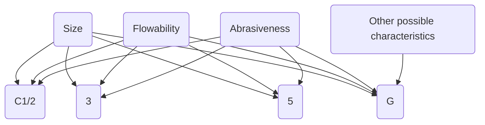
\n---\n

# TABLE 19.9 Material Classification Codes for Typical Wastewater Residuals

<table>
<thead>
<tr><th>Type</th><th>Size (mm)</th><th>Speed (r/min)</th><th>Trough area (cm²)</th><th>Loading (%)</th><th>Capacity (m³/h)</th></tr>
</thead>
<tbody>
<tr><td>Shafted</td><td>300 mm</td><td>30</td><td>650</td><td>30%</td><td>35</td></tr>
<tr><td>Shaftless</td><td>300 mm</td><td>30</td><td>700</td><td>70%</td><td>88</td></tr>
</tbody>
</table>

## TABLE 19.10 Capacity Differences Between Shafted and Shaftless Screw Conveyors

### 7.2.2.5 Determine Conveyor Horsepower

Drive horsepower is calculated as a function of capacity (cubic meters (cubic feet) per hour), density [kilograms per cubic meter (pounds per cubic foot)], transport length [meters (feet)], diameter [meters (feet)], flighting design, elevation change, and friction losses.

### 7.2.2.6 Select Components for Torsional and Horsepower Requirements

Once design engineers determine the horsepower needed, they should select components (e.g., pipe shafts, drive shafts, and bearings) that resist or transmit loads induced by the conveyors. The torsional limits of conveyor shafts and flighting may require designers to divide long transport distances among two or more short conveyors.

### 7.2.3 Other Considerations

Screw conveyors are used to transport dried biosolids because they can be sealed to completely contain odors and dust. Carbon steel components typically are suitable, but galvanized steel also may be considered. Although the dried biosolids eventually will wear away most of the galvanizing or paint in the interior, the areas not continuously in contact with the conveyed material should be protected against corrosion.

The conveyors should not be operated with exposed shafting or flighting; all covers and lids should be kept closed. The covers may provide significant structural integrity.

Screw conveyors should include speed switches at the tail or nondrive ends to verify auger movement. Running a conveyor into nonoperating equipment can cause severe damage.
\n---\n

damage.

These conveyors require relatively little maintenance or housekeeping, compared to other biosolids transport options. Routine maintenance typically consists of checking and adjusting the drive unit, and greasing hanger bearings (shafted screw conveyors) or replacing polyethylene liners (shaftless screw conveyors):

## 7.3 Drag Conveyors

Drag (en masse) conveyors have a wide range of uses in numerous industries. They have a long history of conveying such materials as biosolids, coal, grit, logs, rock salt, sawdust, and wood chips. These conveyors are highly adaptable and can be customized to transport most, if not all, recovered water facility solids.

Drag conveyors have a slow moving chain-and-flight assembly that typically pushes material along a steel pan or trough, which may be rectangular or U-shaped. The troughs typically are constructed from structural "C" channels or bent plate. The chain typically is made of cast forged or fabricated steel. The flights, which typically are flat plates, "C" channels, or tubes, are shaped to match the trough and are bolted directly to chain links. Wider chains [up to 600 mm (24 in.) wide] can act as both chain and flight.

### 7.3.1 Drag Conveyor Applications

Most drag conveyors are designed to transport material horizontally. Special designs, however; can move material vertically or in "Z" lifts. A "Z" lift conveyor system is designed to transport material horizontally, then vertically, and then horizontally again.

Drag conveyors are used in many recovered water facility processes, such as primary clarification, grit removal, and solids treatment. They may also be used as live bottom feeders in hoppers.

Drag conveyors are exceptionally strong and robust. Their lengths typically are only limited by the chain's strength and the weight of the material being transported. In practical terms, drag conveyors typically are not designed to move material more than about 40 m (130 ft) horizontally or 10 to 15 m (33–50 ft) vertically:

### 7.3.2 Drag Conveyor Design
\n---\n

# 7.3.2 Drag Conveyor Major Components

Drag conveyor design primarily depends on the chain and the pulling loads encountered when pushing material the length of the conveyor. Following are design issues to consider for a drag conveyor’s major components.

## 7.3.2.1 Chain Type

Chain designs and material characteristics vary greatly. Rollerless chains typically are suitable for most WRRF applications. However, “Z” lift applications sometimes require roller chains to reduce overall chain load and kilowatt requirements. Also, drag chains— whose links can be up to 600 mm (24 in.) wide and can serve as both chain and flight— are suitable for horizontal and slightly inclined installations.

## 7.3.2.2 Chain Material

Malleable cast-iron chains are suitable for most drag conveyors used in water resource recovery facilities. However, steel chains with hardened components are more wear resistant than most cast chains.

## 7.3.2.3 Chain Pitch

Chain pitch is the distance between two successive rollers on a conveying chain. This distance typically depends on the desired size or spacing of cross rods or flights. Short conveyors can have 100-mm (4-in.) pitches, while long or heavily loaded conveyors often have 150- to 300-mm (6- to 12-in.) pitches.

## 7.3.2.4 Sprocket Size

Head and tail sprockets should be designed with as many teeth as practical because the number of teeth greatly influences chain and sprocket wear; as well as how smoothly the conveyor operates. As a general rule for optimum results, sprockets for pitch chains up to 150 mm (6 in.) should have between 12 and 21 teeth; those for larger pitch chains should have between 6 and 14 teeth (Link-Belt Industrial Chain Division, 1983).

## 7.3.2.5 Drive

The drive typically is installed at the head (discharge) end of the conveyor so only the chain’s carrying run is under maximum tension.

## 7.3.2.6 Take-Ups
\n---\n

Take-up devices are used to maintain proper chain tension. Screw take-ups typically are acceptable for most drag conveyors used at water resource recovery facilities. Spring take-ups are useful if shock loads are anticipated. Gravity and catenary take-ups are also available.

## 7.3.2.7 Head and Tail Sections

Head and tail sections are custom made from steel plate to match the conveyor and installation requirements. They should be designed to support the loads induced by chain tension, which may be substantial. The tail section typically includes the take-up mechanism unless a catenary take-up method is used, in which case the take-up is in the head section. The end without the take-up should have shaft bearing mounts with slotted holes and jack screws or other mechanisms so operators can align conveyor sprockets accurately:

## 7.3.2.8 Troughs

Most drag conveyor troughs are fabricated of steel plate and angle iron sections. They can also be constructed of concrete. All troughs should be equipped with replaceable wear bars for the chain or flights to rest on and slide along:

## 7.3.3 Other Considerations

Drag conveyors typically cost more to install than other conveyors used for dried biosolids, but they allow for more flexibility in layouts and configurations than belt or screw conveyors and can handle a much larger spectrum of materials. They also have more capacity per cross-sectional area and can handle higher-impact loads, but are less energy efficient because of the high frictional forces of the biosolids, flights, and chain against the trough.

For safety reasons, drag conveyors only should be operated when all covers, enclosures, and other safety appurtenances are in place. Inspection ports and access doors should have a metal screen or welded wire fabric that prohibits operators from inserting arms, legs, or other appendages into moving conveyors.

Most drag conveyors are designed with top covers that are bolted every 100 to 200 mm (4–8 in.) down the length of the conveyor: While this may complicate maintenance efforts,
\n---\n

## O&M content (earlier sections)

O&M personnel should be aware that such covers significantly increase the conveyor’s structural strength. Tightening only one or two bolts per section when replacing covers may result in conveyor buckling and catastrophic failure.

Dried biosolids are so abrasive that it may be best to avoid chain lubrication. Using conventional lubrication on the drag chain actually may accelerate wear by adhering abrasive particles to the chain, where they then act as a lapping or grinding compound:

For drag conveyors, the most important maintenance consideration is routinely checking and adjusting chain tension. Improper chain tension, whether too much or too little, significantly shortens the lives of the chain, sprockets, and bearings. Other maintenance checks include bearing lubrication, wear bar thicknesses, chain lubrication (if applicable), bolt torques, and alignment of head and tail shafts.

----

## 7.4 Bucket Elevators

A bucket elevator is a simple, dependable device for vertically transporting dry materials. It consists of a series of buckets mounted on a belt or chain within a housing. The buckets are filled with material at the base of the unit and discharge it at the top. They are available in a wide range of capacities [10–350 kg/s (4–140 ton/hr)] and are totally enclosed to prevent dust and odors from escaping.

There are three types of bucket elevators: centrifugal-discharge, positive-discharge, and continuous. Centrifugal-discharge elevators are the most common and are best suited for handling fine, free-flowing materials that can be dug from the elevator boot at the base of the unit. These units have the fewest buckets, which are mounted on either a chain or belt. The buckets are easily loaded and travel rapidly enough [up to 90 m/min (300 ft/min)] to discharge material via centrifugal force as they pass around the head pulley or sprocket.

Positive-discharge elevators are designed for sticky materials that tend to pack. They are similar to centrifugal-discharge units, except that their buckets are mounted on two strands of chain, are large and closely spaced, and are snubbed back under the head sprocket to invert them for positive discharge: (As the snub sprockets engage the chain, the slight impact helps free materials from the buckets.) The buckets also move slower [35 m/min (120 ft/min)] than those in centrifugal-discharge units.
\n---\n

Continuous elevators are recommended for sluggish, aerated, and friable materials—applications in which product degradation is a concern. They have closely spaced buckets mounted on either belts or chains that travel at 38 m/min (125 ft/min). The buckets are often direct-loaded and are designed so the fronts and extended sides form a chute as they pass around the head pulley or sprocket. Gravity allows the material to flow gently out of the buckets and down the chute (formed by the preceding bucket) into the discharge spout.

## 7.4.1 Bucket Elevator Applications

At water resource recovery facilities, bucket elevators are used to transport dried materials vertically within solids-processing units and to load dried biosolids products into trucks or railcars.

For most dried materials, centrifugal-discharge elevators are generally acceptable and the most cost-effective option. However, if the dried biosolids are intended for beneficial reuse, then dust content and degradation are concerns, so designers should consider continuous bucket elevators.

## 7.4.2 Bucket Elevator Design and Operation Considerations

Before selecting a bucket elevator, designers should determine the material’s characteristics (abrasiveness, flowability, etc.), its maximum lump sizes, density of the bulk material, capacity needed, and transport height.

Manufacturers sell standard-sized units, and tables are available to help designers size bucket elevators that will convey materials vertically up to 30 m (100 ft). The tables provide elevator dimensions, bucket sizes, and energy requirements.

Bucket elevators vary in casing thickness, bucket type and thickness, belt or chain quality, and drive equipment.

The casing is constructed of either heavy-gauge steel sections or steel plate and angle iron that are continuously welded for the full length of the unit. The steel is either mild or galvanized. Galvanizing may be preferred over painted casings because it provides corrosion protection for the casing interior. (Most bucket elevator casings are too small for the interior to be painted properly.) Casings can be up to 7 mm (0.25 in.) thick. A heavier casing may be recommended if the elevator will be outside and exposed to harsh weather.
\n---\n

conditions. Casings can also be made dust tight. A split, removable hood is recommended for ease of service and maintenance at the top end of the unit.

Buckets are available in a variety of styles, and designers should ask manufacturers for recommendations. Centrifugal elevators typically have malleable iron buckets, which are appropriate for heavy-duty abrasive applications (e.g., dried biosolids). Ductile iron or steel buckets can also be used if desired. Continuous elevators typically have steel buckets. Polymer and nylon buckets are also available; they resist corrosion and promote discharge of sticky materials. In addition, buckets can be perforated to handle dusty materials. The perforations allow air to be released from the buckets during loading and improve material discharge by eliminating blowing.

Buckets can be mounted on single or dual strands of chains. Class "C" combination chains, which have alternating cast-iron black links, are sufficient for normal applications, according to CEMA. Class "S" chains are stronger and wear less quickly; they are recommended for great heights [up to 45 m (150 ft)] or when transporting abrasive materials. Rubber-covered belts are acceptable for most applications involving belt-mounted buckets. Such belts can be made of impregnated canvas or fabric.

Bucket elevators typically are driven from the head shaft and have take-up bearings in the boot. A shaft-mounted gear reducer with a V-belt drive is recommended for economy and versatility. Another option is a gear motor connected to the elevator head shaft via a chain drive; it is supported on a bracket mounted to the elevator casing. Backstops prevent backward rotation when the elevator stops under load; they may be added to either the head shaft or countershaft. The tail shaft should include a zero-speed switch to indicate motor or conveyor problems, or an overloaded elevator. Drive guards are also required for safety reasons.

Bucket elevators typically use less energy than other types of vertical conveyors. As a general guideline, design engineers can estimate an elevator's electricity requirements as follows:

$$Power needed (kW) = Capacity (tonne/h) \times Conveyance height (m) / 103$$

If the bucket elevator is more than 10 m (33 ft) tall, engineers should include guy wires or structural steel members to provide lateral bracing. Also, designers should include a
\n---\n

The service platform so operators can inspect and maintain the head terminal and drive more easily. The platform should be accessed by a ladder with a safety cage. Likewise, design engineers should provide a clean-out door in the boot—especially in continuous elevators—so operators can periodically remove any material that has accumulated in the base. In centrifugal units, the casing corners may fill with material that should be removed regularly.

In applications involving dust, designers should ventilate bucket elevators. The ventilation system should be designed in accordance with guidelines established by the American Conference of Governmental Industrial Hygienists in Industrial Ventilation (1982). These guidelines require an exhaust point at the top of the elevator and a second one at the bottom if the elevator is more than 10-m (33 ft) high. They also recommend a flow of 30 m3/m2/min (100 ft3/ft2/min) of casing, with a minimum duct velocity of 18 m/s (60 ft/s). Bucket elevators should be designed with explosion relief or suppression mechanisms because organic dusts—including the fine material generated during biosolids drying—could explode under certain conditions. Explosion relief directs such forces through expendable panels (rupture plates) in the elevator casing and then into the room or outside the facility. Engineers should be extremely careful when designing explosion vents because the force of these explosions could hurt or kill operators who are next to the equipment when an explosion occurs.

## 7.5 Pneumatic Conveyors

Pneumatic conveyors use air to move material through a pipeline. There are two types of these conveyors: dilute-phase and dense-phase.

Dilute-phase conveyors have low material-to-air ratios [less than 5:1 (5 kg material/kg air)]; they use a large volume of air to move a small amount of material. Rotary airlocks feed material into the pipeline, and positive-displacement blowers or fans supply low-pressure air [less than 100 kPa (14.5 psi)]. The air velocity typically ranges from 20 to 40 m/s (65–130 ft/s)—high enough to suspend the material in the air stream. The systems then use either positive or negative pressure to push or pull the material through the pipeline.
\n---\n

Dense-phase conveyors have high material-to-air ratios (up to 100 kg material/kg air). A pressure tank and a high-pressure air compressor can provide 350 to 700 kPa (50–100 psig) of air, which typically moves at velocities less than 2.5 m/s (8 ft/s). In these systems, material enters the pressure tank or transporter via gravity and settles in the pipeline. Once a certain volume has settled, the transporter inlet valve closes, the vessel is pressurized using compressed air, and the material flows out of the vessel into the pipeline. As the pressure increases, the material forms a plug that the air pushes to its destination.

There are two types of dense-phase systems: conventional batch and full-line. In a conventional batch system, air is introduced at the pressure vessel with enough force to transport a batch of material in the pressure vessel to the final receiving bin. The pipe is completely purged before the next cycle begins.

A full-line system introduces air in both the pressure vessel and via low-pressure air-booster fittings spaced along the length of the pipeline. The air is introduced at the lowest possible velocity. Once the pressure vessel is emptied, any material left in the pipeline remains there until the next batch is conveyed. The booster fittings serve to move that material when the next batch begins.

## 7.5.1 Pneumatic Conveyor Applications

Pneumatic conveyors have been used to transport dried biosolids and grit in continuous processes, load railcars or trucks, and help collect and remove fugitive dust.

* Dilute-phase conveyors may be used to transport lime, sawdust, and other chemicals typically used at water resource recovery facilities. They are ideal for transporting nonabrasive, powdered materials over short distances. Although successfully used to convey a wide variety of bulk solids, dilute-phase conveyors may not be suitable for dried biosolids meant for beneficial reuse because they can be abrasive and degrade when exposed to high-velocity air. Also, dilute-phase conveyors have low capital costs, but their energy costs can be quite high because of the large air requirements.

* Both conventional-batch and full-line, dense-phase conveyors are appropriate for transporting dried biosolids. Conventional batch conveyors are preferred for short
\n---\n

distances [less than 35 m (115 ft)]: Full-line conveyors are preferred for longer distances and easily degraded material, such as dried biosolids pellets intended for beneficial reuse.

# 7.5.2 Pneumatic Conveyor Design and Operation Considerations

Pneumatic conveyor design depends on such parameters as material bulk density, capacity or flow rate, and equivalent pipeline length.

When designing dilute-phase pneumatic conveyors, engineers should be aware that much information is available in manufacturer’s brochures, data sheets, and monographs. They can use these resources to determine the optimum pipeline diameter and air volume based on recommended solids ratios and system pressure drop [less than 70 kPa (10 psi)]. Then they can determine the blower or fan size needed based on the calculated conveying air volume.

Pressure systems typically are used when flow rates exceed 9000 kg/h (20 000 lb/h). Vacuum systems are used when flow rates are less than 7000 kg/h (15 500 Ib/h) and the equivalent length is less than 300 m (1000 ft).

The rotary airlock is sized based on desired flow rate: Carbon steel construction is acceptable for most materials encountered in a WRRF.

The system will need a dust-collection device to clean the conveying air before it is exhausted. This device, which may be a cyclone separator or fabric filter, should be sized to handle the air flows determined in accordance with manufacturer’s recommendations.

When designing dense-phase pneumatic conveyors, engineers will need more input from manufacturers because there are no readily available monographs and such designs are often considered more an art than a science. Given a set of design parameters, the system manufacturer should be able to provide the optimum pipeline diameter for the conveying air volume and pressure required. The manufacturer should also recommend a standard transporter size (typically corresponding to 5-15 cycles per hour) and spacing requirements for air-booster fittings (typically every 1.5–6 m (5–20 ft)):

Transporter size depends on conveying distance; transport-cycle frequency lessens as conveying distances exceed 150 m (500 ft). Also, the transporter should include a 60 L hopper at the bottom to encourage dried solids to flow out of the vessel.
\n---\n

## 8.0 References

If continuous conveying is required (e.g., in solids treatment processes), design engineers should provide a dedicated air compressor, an air receiver, and a compressed air dryer.

The pressure vessel typically is made of carbon steel. The pipeline should be constructed of either Schedule 40 carbon steel or galvanized steel.

When designing dense-phase conveyors, engineers should place vertical runs as early as possible and avoid using back-to-back bends. Flat-back elbows may also be considered when transporting heavy-duty, abrasive material. Designers should also be aware that full-line dense-phase conveyors have less pipeline wear because they function at the lowest velocity.

Because dried biosolids are abrasive, all pipeline bends in dilute-phase or dense-phase systems should be long-radius, sweeping bends. Also, status lights and pressure indicators should be included to help facility staff monitor operations.

The pneumatic conveyor’s blower, fan, or air compressor typically only requires routine maintenance. However, the exhaust air is odiferous and may require further treatment before discharge. The air will also contain some dust that must be removed before discharge. So, design engineers should equip the pressure vessel with a vent line connected to a dust-collection device and provide for odor control.

Because of the energy requirements, pneumatic conveyors are one of the least efficient methods to transport dried biosolids and other dry granular materials. However, a properly designed and operated pneumatic conveyor will have fewer O&M requirements than mechanical conveyors. Because the conveyor is totally enclosed, housekeeping and odor control are simpler, but problems are more difficult to identify. The conveyor’s operating costs are high, but it has a small footprint, easily retrofits into existing facilities, and can handle long distances and multiple discharge points.

8.0 References
American Conference of Governmental Industrial Hygienists (1982) Industrial Ventilation,
  17th Ed.; American Conference of Governmental Industrial Hygienists: Lansing,
  Michigan.

\n---\n

# References

- American Society of Civil Engineers (2000) Conveyance of Wastewater Treatment Plant Residuals; American Society of Civil Engineers: Reston, Virginia.
- Barbachem, M. J.; Pyne, J. C. (1995) Pipeline Hydraulics of Dewatered Non-Newtonian Cakes. Proceedings of the 68th Annual Water Environment Federation Technical Exposition and Conference, Miami Beach, Florida, Oct 21–25; Water Environment Federation: Alexandria, Virginia; pp. 41–49.
- Bassett, D. J.; Howell, R. D.; Haug, R. T. (1991) Hydraulic Properties Evaluation for Sludge Cake Pumping. Proceedings of the 64th Annual Water Environment Federation Technical Exposition and Conference; Toronto, Ontario, Oct 7–10; Water Environment Federation: Alexandria, Virginia.
- Battistoni, P. (1997) Pretreatment, Measurement Execution Procedure and Waste Characteristics in the Rheology of Sewage Sludges and the Digested Organic Fraction of Municipal Solid Wastes. Wat. Sci. Tech., 36, 33.
- Bechtel, T. B. (2003) Laminar Pipeline Flow of Wastewater Sludge: Computational Fluid Dynamics Approach. J. Hydr. Eng., 129 (2), 153.
- Bechtel, T. B. (2005) A Computational Technique for Turbulent Flow of Wastewater Sludge. Water Environ. Res., 77, 417.
- Borrowman, D. (1985) Wastewater Sludge Characteristics and Pumping Application Guide; WEMCO Pump Co.: Sacramento, California.
- Bourke, J. D. (1992) Pumping Abrasive Slurries with Progressing Cavity Pumps; Moyno Industrial Products: Springfield, Ohio.
- Bourke, J. D. (1997) Handling High Solids Content Non-Newtonian Fluids; Moyno Industrial Products: Springfield, Ohio.
- Brar, S. K.; Verma, M.; Tyagi, R. D.; Valero, J. R.; Surampalli, R. Y. (2005) Sludge Based Bacillus thuringiensis Biopesticides: Viscosity Impacts. Water Res., 39, 3001.
- Carthew, G. A.; Goehring, C. A.; Van Teylingen, J. E. (1983) Development of Dynamic Head Loss Criteria of Raw Sludge Pumping. J. Water Pollut. Control Fed., 55, 472.
- Chilton, R. A.; Stainsby, R. (1998) Pressure Loss Equations for Laminar and Turbulent Non-Newtonian Pipe Flow. J. Hydr. Eng., 124 (5), 522.
\n---\n

# References

- Conveyor Equipment Manufacturers Association (1979) Belt Conveyors for Bulk Materials, 2nd ed.; CBI Publishing Co.: Boston, Massachusetts.
- Crow, H.; Cortopassi, R. (1994) Schwing KSP 17V(K) Pump Demonstration from July, 1994 through August 3, 1994; Schwing America Inc., Environ. Div.: Danbury, Connecticut.
- Dillon, M. L. (2007) Comparing PD Pump Designs for Transferring Dewatered Sludge Cake. Pumps & Systems, September, 84.
- Doty, D. (2005) New Progressing Cavity Pump Developments in Sludge Transfer. World Pumps, October, 24.
- El-Mashad, H. M.; van Loon, W. K. P.; Zeeman, G.; Bot, G. P. A. (2005) Rheological Properties of Dairy Cattle Manure. Bioresource Technol., 96, 531.
- Florida Department of Environmental Protection (2008), Chapter 62-640: Biosolids, Draft Version; Florida Department of Environmental Protection: Tallahassee, Florida:
- Great Lakes—Upper Mississippi River Board of State and Provincial Public Health and Environmental Managers (2014) Chapter 80, Sections 87-13 and 89-12, Recommended Standards for Wastewater Facilities; Health Research Inc, Albany, NY:
- Guibaud, G.; Dollet, P.; Tixier, N.; Dagot, C.; Baudu, M. (2004) Characterisation of the Evolution of Activated Sludges Using Rheological Measurements. Process Biochem., 39, 1803.
- Health and Safety Executive (2005) Control of Health and Safety Risks at Sewage Sludge Drying Plants; HSE 847/9; Health and Safety Executive: London, United Kingdom:
- Hentz, L.; Cassel, A.; Conley, S. (2000) The Effects of Liquid Sludge Storage on Biosolids Odor Emissions. Proceedings of 14th Annual Residuals and Biosolids Management Conference; Boston, Massachusetts, Feb 27–29; Water Environment Federation: Alexandria, Virginia:
- Honey, H. C.; Pretorius, W. A. (2000) Laminar Flow Pipe Hydraulics of Pseudoplastic-Thixotropic Sewage Sludges. Water SA, 26, 19.
- Jones, H. (1993) Solving Sludge Handling Problems with Progressive Cavity Pumps. Robbins & Myers Inc., Fluid Handling Group: Springfield, Ohio.
\n---\n

# References

- Laera, G.; Giordano, C.; Pollice, A.; Saturno, D.; Mininni, G. (2007) Membrane Bioreactor Sludge Rheology at Different Solid Retention Times. Water Res., 41, 4197.
- Levine, L. (1986) Coming to Grips with Rheology; Viscous Products.
- Levine, L. (1987) An Introduction to the Measurements of Viscosity; Viscous Products.
- Link-Belt Industrial Chain Division (1983) Link-Belt Chains and Sprockets for Drives, Conveyors and Elevators; Link-Belt Industrial Chain Division: Homer City, Pa.
- List, E. J.; Hannoun, I. A.; Chiang, W.-L. (1998) Simulation of Sludge Pumping. Water Environ. Res., 70, 197.
- Lue-Hing, C.; Zenz, D.; Tata, P.; Kuchenrither, R.; Malina, J.; Sawyer, B. (1998) Municipal Sewage Sludge Management: A Reference Text on Processing, Utilization and Disposal; Technomic Publishing Co. Inc.; Lancaster, Pennsylvania.
- Lottman, S. (2008) Personal communication; Siemens: Berlin, Germany.
- Metcalf and Eddy, Inc. (1981) Wastewater Engineering: Collection and Pumping of Wastewater; Tchobanoglous, G.; McGraw-Hill, Inc.: New York, New York.
- Metcalf and Eddy, Inc. (2003) Wastewater Engineering: Treatment and Reuse; Tchobanoglous, G.; Burton, F. L.; Stensel, H. D., Eds.; 4th ed.; McGraw-Hill Inc.: New York, New York.
- Mori, M.; Isaac, J.; Seyssiecq, I.; Roche, N. (2008) Effect of Measuring Geometries and of Exocellular Polymeric Substances on the Rheological Behaviour of Sewage Sludge. Chem. Environ. Eng. Res. Des., 86, 554.
- Mulbarger, M. C.; Copas, S. R.; Kordic, J. R.; Cash, F. M. (1981) Pipeline Friction Losses for Wastewater Sludges. J. Water Pollut. Control Fed., 53, 1303.
- Mulbarger, M. C. (1997) Selected Notions about Sludges in Motion, and Movers. Paper presented at Central States Water Environment Association Education Seminar, Madison, Wisconsin.
- Murakami, H.; Katayama, H.; Matsuura, H. (2001) Pipe Friction Head Loss in Transportation of High-Concentration Sludge for Centralized Solids Treatment. Water Environ. Res., 73, 558.
- National Fire Protection Association (1995) Report on Comments A2007—NFPA 820 Standard for Fire Protection in Wastewater Treatment and Collection Facilities;
\n---\n

# National Fire Protection Association: Quincy, Massachusetts

- Novak, J.; Adams, G.; Chen, Y.-C.; Erdal, Z.; Forbes, R. H., Jr.; Glindemann, D.; Hargreaves, J. R.; Hentz, L.; Higgins, M. J.; Murthy, S. N.; Witherspoon, J.; Card, T. (2004) Odor Generation Patterns from Anaerobically Digested Biosolids. Proceedings of the Joint WEF/A&WMA Odors and Air Emissions Conference; Bellevue, Washington, Apr 18–24; Water Environment Federation: Alexandria, Virginia.

- Pilehvari, A. A.; Serth, R. W. (2005) Generalized Hydraulic Calculation Method Using Rational Polynomial Model. J. Energy. Res. Technol., 127, 15.

- Radney J. (2008) Personal communication; Cerlic USA: Atlanta, Georgia.

- Ram Pumps Take the Drudgery out of Sludge Transfer (1999). World Pumps, Feb, 18–19.

- Sanks, R. L.; Tchobanoglous, G.; Bosserman, B. E., II; Jones, G. M., Eds. (1998) Pumping Station Design; 2nd ed.; Butterworth-Heinemann: Boston, Massachusetts:

- Setterwall, F. (1972) Discussion/Communication on Pumping Sludge Long Distances: J. Water Pollut. Control Fed., 44 (1), 648.

- Spaar, A. (1972) Pumping Sludge Long Distances. J. Water Pollut. Control Fed., 43 (1), 702.

- Spinosa, L.; Lotito V. (2003) A Simple Method for Evaluating Sludge Yield Stress. Adv. Environ. Res., 7, 655.

- Spinosa, L.; Vesilind, P. A. (2001, reprinted 2007) Sludge into Biosolids—Processing, Disposal, Utilization; IWA Publishing: London, United Kingdom.

- U.S. Army Corps of Engineers (1984) Engineering and Design—Domestic Wastewater Treatment Mobilization Construction; EM-1110-3-172; U.S. Army Corps of Engineers: Washington, D.C.

- U.S. Environmental Protection Agency (1979) Process Design Manual, Sludge Treatment and Disposal; EPA-625/-79-011; U.S. Environmental Protection Agency; Munic: Environ. Res. Lab.: Cincinnati, Ohio.

- U.S. Environmental Protection Agency (1982) Handbook: Identification and Correction of Typical Design Deficiencies at Municipal Wastewater Treatment Facilities; EPA-
\n---\n

# References

- 625/6-82-007; U.S. Environmental Protection Agency; Munic. Environ. Res: Lab.: Cincinnati, Ohio.
- U.S. Environmental Protection Agency (1983) Process Design Manual—Land Application of Municipal Sludge; EPA-625/1-83-016; U.S. Environmental Protection Agency: Washington, D.C.
- U.S. Environmental Protection Agency (1995) Process Design Manual—Land Application of Sewage Sludge and Domestic Septage; EPA-625/R-95/001; U.S. Environmental Protection Agency: Washington, D.C.
- U.S. Environmental Protection Agency (2000) Guide to Field Storage of Biosolids and Other Organic By-Products Used in Agriculture and for Soil Resource Management; EPA/832-B-00-007; U.S. Environmental Protection Agency: Washington, D.C.
- Wagner, R. L. (1990) Sludge Digester Heating; Alfa-Laval Thermal Co.: Ventura, California.
- Wanstrom, C. (2008) Personal communication. Schwing Bioset: Somerset, Wisconsin.
- Water Environment Federation (2004) Control of Odors and Emissions from Wastewater Treatment Plants; WEF Manual of Practice No. 25; McGraw-Hill: New York.
- Water Environment Federation; American Society of Civil Engineers; Environmental and Water Resources Institute (2018) Sustainability and Energy Management for Water Resource Recovery Facilities, WEF Manual of Practice No. 38; Water Environment Federation: Alexandria, Virginia.
- Water Environment Research Foundation (2008) Identifying and Controlling Odor in Municipal Wastewater Environment Phase 3: Biosolids Processing Modifications for Cake Odor Reduction; Water Environment Research Foundation: Alexandria, Virginia.
\n---\n

# CHAPTER 20: Chemical Conditioning

Peter Loomis, P.E.; Samir Mathur, P.E., BCEE; Eric Spargimino, P.E., LEED AP; Anthony Tartaglione, P.E., BCEE; and Tanush Wadhawan, Ph.D.
\n---\n

# 1.0 Introduction

## 2.0 Factors Affecting Conditioning
* 2.1 Residuals Characteristics
* 2.2 Handling and Processing Conditions Before Conditioning
* 2.3 Purpose of Conditioning: Thickening and Dewatering

## 3.0 Ultimate Disposal or Use of Biosolids

## 4.0 Types of Chemical Conditioning
* 4.1 Inorganic Chemicals
* 4.2 Organic Polymers
* 4.3 Process Design Considerations for Thickening and Dewatering

## 5.0 Chemical Storage and Feed Equipment
* 5.1 Inorganic Chemicals
* 5.2 Organic Polymers
* 5.3 Safety

## 6.0 Dose Optimization for Organic Conditioners
* 6.1 Cost-Effectiveness of Chemical Conditioner and Dosage
* 6.2 Tests for Selecting Conditioning Agents and Dosages

## 7.0 Design Example
* 7.1 Step 1: Calculate the Peak Weekly Solids to Be Dewatered
* 7.2 Step 2: Determine Whether Solids Loading and Hydraulic Loading Rates Are Within Operating Parameters
* 7.3 Step 3: Calculate the Polymer Dosage

## 8.0 References
\n---\n

Conditioning does not reduce the water content of solids; it alters the physical properties of solids to facilitate the release of water during thickening and dewatering. Mechanical thickening and dewatering techniques are rarely economical for a utility without chemical conditioning upstream.

For purposes of this chapter, chemical conditioning is a treatment used to improve the efficiency of downstream processes (e.g., thickening or dewatering). Chemical conditioning processes use inorganic chemicals, organic polymers, or both to improve solids’ thickening and dewatering characteristics. Physical conditioning techniques (e.g., thermal conditioning) use heat to condition and stabilize solids. (For more information on thermal conditioning, see Chapters 23 and 24.)

This chapter discusses chemical conditioning, and includes theory and design considerations. Some thickening and most dewatering of wastewater residuals particularly those containing solids from biological treatment processes (e.g., fixed-film and suspended growth activated solids treatment systems) typically are not practical without some type of conditioning:

Conditioning can significantly alter the characteristics of the incoming solids, and the effectiveness of thickening or dewatering processes. Typically, chemical conditioning paired with the appropriate thickening and dewatering process can increase the total solids content from approximately 0.4% to between 18% and 40%.

In the United States, most water resource recovery facilities (WRRFs) use polymers for thickening and dewatering optimization, and no longer use inorganic chemicals like lime or metal salts (e.g., ferric chloride, Alum, etc.). These chemicals are now more frequently used for other types of treatment like stabilization or phosphorus treatment, respectively:

The use of organic polyelectrolytes (polymers) in municipal WRRFs was introduced during the 1960s and was rapidly adopted for both thickening and dewatering processes. The primary advantage of polymers is that they do not significantly increase solids production. Alternatively, every kilogram of inorganic chemicals added during conditioning creates an additional kilogram or more of solids that must be managed, in addition to the solids added by enhancing the capture efficiency.
\n---\n

## 2.0 Factors Affecting Conditioning

All polymers are intended to increase the capture rate, reducing the total solids in the filtrate/centrate/supernatant sent back to the liquid process. Additionally, polymers have less of an impact on the water chemistry than lime or metal salts. Metal salts and inorganic chemicals such as lime have a significant impact on the overall alkalinity, pH, and hardness of the liquid fraction of the solids:

The conditioning method must be compatible with the proposed thickening or dewatering method. For example, centrifuges use centrifugal force to compact the solids, whereas belt filter presses permit the water to pass through the void spaces utilizing gravity and pressure; therefore, a single type of conditioning agent cannot be expected to be useful for all applications (WEF, 2014). Furthermore, varying types of organic and synthetic polymers are developed for use with solids of varying characteristics and water chemistry:

Cross-linked polymers and varying charges and molecular weights of cationic and anionic polymers exist to suit the needs of the respective solid and thickening or dewatering process.

For final disposal of solids after dewatering, inorganic chemicals such as lime can be added to stabilize solids and increase the final product total solids to 20% to 30% (dry solids). Fly ash or other bulking agents can also be added to increase the final product total solids to 50% to 100% (dry solids) and create a product more suitable for certain end uses.

## 2.0 Factors Affecting Conditioning

The type and dosage of conditioning agent needed depends on the residuals’ characteristics, solids handling and processing before and after conditioning, and the mixing process after agent addition.

### 2.1 Residuals Characteristics

Several residuals’ characteristics that affect conditioning requirements (adapted from U.S. EPA, 1979d) include:

* The source of residuals,
* Solids concentration,
* Alkalinity and pH,

\n---\n

* Biocolloids and biopolymer production,
* Particle size and distribution,
* Degree of hydration,
* Particle surface charge,
* Volatile suspended solids (VSS) content, and
* Phosphate content:

Also reference To (2015).

### 2.1.1 Source of Residuals

To some extent, the conditioning method depends on the type of solids that must be treated. For example, cationic polymers typically work best on primary, secondary, and digested solids, while anionic polymers may be effective with inorganic solids.

An examination of published data for a variety of thickening and dewatering devices suggests that primary solids require lower doses than secondary solids do, and that fixed-film secondary solids require lower doses than suspended growth secondary solids do (U.S. EPA, 1979d). Depending on the thickening or dewatering method used, aerobically and anaerobically digested solids typically require conditioning doses comparable to those for secondary solids. Similarly, combined solids (primary and secondary solids) have properties that are closer to those of secondary solids, although they are affected by the respective composition of each type. More importantly, characteristics of solids vary from facility to facility and can also vary seasonally, so the conditioner dose depends on the specific conditioning agent used and the goal (thickening or dewatering solids):
Constituents like sodium or phosphate can also inhibit the dewaterability of sludge, such that adding more polymer or different types of polymers has negligible benefit. Also, some sludges cannot be dewatered beyond a certain point due to their cellular structure For example, typical waste activated sludge by itself limited to 20% total solids due to the bacteria's cellular structure's inherent ability to bind water at 4 or 5 to 1.

Chemical solids are solids that have been mixed with an inorganic conditioning agent (e.g-, the addition of aluminum, iron salts, or lime). These types of solids can be more variable than traditional primary and secondary solids, and so are hard to categorize with respect to dose, and their conditioning requirements are often qualitatively different from
\n---\n

those for primary and secondary solids. For example, adding lime to mixed-liquor
suspended solids before secondary clarification may improve suspended solids removal;
however; the resulting solids may require an anionic polymer; not the cationic one typically
used for primary or secondary solids, because the positively charged calcium has
neutralized some of the negative surface charge. While charge neutralization is a
fundamental part of the process, an equally significant piece is the interconnection of
solids particles via the polymer chain.

## 2.1.2 Solids Concentration

In many applications, conditioning neutralizes the colloidal surface charge by adsorbing
oppositely charged organic polymers or inorganic complexes. The residuals' solids
concentration will affect the dosage and dispersal of the conditioning agent. Therefore, for
a given particle size distribution , increasing the suspended solids concentration increases
the required coagulant dose for effective surface coverage (on a volumetric basis). For
this reason, polymer dosing and performance is typically discussed on a dry weight basis,
for example, X Ibs of active polymer per Y dry pounds or dry tons of solids.

The suspended solids concentration also affects two additional aspects of conditioning
agents. First; the process is less susceptible to overdosing at higher solids
concentrations. Second, the solids and the conditioning agent are more difficult to mix at
higher solids concentrations_

## 2.1.3 Alkalinity and pH

When inorganic conditioning agents are used, alkalinity and pH are the most important
chemical parameters affecting conditioning. Coagulation occurs when coagulent interacts
with the surface of solids' colloids, and nature of the charged surface and the coagulant
charge are both pH-dependent: When inorganic conditioners are used, the solids' pH
determines which chemical species are present:

Iron and aluminum salts behave like acids when added to water (i.e., these conditioners
reduce pH); so the pH of the conditioning process will depend on the solids' alkalinity and
the dosage of iron or aluminum salts. This pH, in turn, determines the predominant
coagulant species and the nature of the charged colloidal surface. The high alkalinity
typically associated with anaerobically digested solids is one reason for the higher
\n---\n

coagulant doses required. Low-molecular-weight coagulants tend to be more effective over a broader pH range than inorganic conditioning agents.

## 2.1.4 Biocolloids and Biopolymers

Although more commonly measured by researchers than by design engineers, these fundamental parameters provide some insight into the conditioning process. The biopolymers in activated solids flocs seem to affect the physico-chemical properties of flocs (e.g., floc density, floc particle size, specific surface area, charge density, bound water content, and hydrophobicity).

Other studies have shown that cations can affect bioflocculation and change the settling and dewatering properties of activated sludge flocs (Eriksson and Alm, 1991; Bruus et al., 1992; Higgins and Novak, 1997a, b). Divalent cations bridge across negatively charged biopolymers to form a dense, compact floc structure. Monovalent cations tend to prevent proper flocculation by forming a much weaker structure. As a result, divalent cations promote bioflocculation and produce subsequent improvements in settling and dewatering properties. Monovalent cations tend to degrade settling and dewatering properties. It seems that settling and dewatering properties are further improved when the two divalent cations are added to the feed rather than superficially added to the settling tank (Higgins and Novak, 1997a).

A series of laboratory-scale studies were conducted using waste activated sludge (WAS) to gain insight into the floc-destruction mechanisms that account for changes in solids conditioning and dewatering properties after anaerobic or aerobic digestion. The data indicated that biopolymer was released from solids under both anaerobic and aerobic conditions, but much more was released under anaerobic conditions. In particular, four to five times more protein was released into solution under anaerobic conditions than under aerobic conditions (Novak et al., 2003). Both the dewatering rate (as characterized by the specific resistance to filtration) and the polymer dose depend directly on the amount of biopolymer (protein polysaccharide) in solution.

## 2.1.5 Particle Size and Distribution

Particle size distributions affect the total particle surface area and the porosity of cakes formed from these particles. These properties affect required coagulant doses and
\n---\n

# 2.1 Dewaterability
dewaterability: Several researchers (Karr and Keinath, 1978; Novak et al., 1988; Sorensen and Sorensen, 1997) studied the effect of particle size on dewaterability and concluded that particle size was one of the most important parameters in determining dewaterability: Smaller particles (colloidal and supracolloidal) can blind filters and solids cakes (Novak et al., 1988; Sorensen and Sorensen, 1997) and deter the release of water from the solids cake. Also, another study has suggested that an increase in floc density improves dewatering properties via a decrease in bound water associated with the flocs (Kolda, 1995). These studies concluded that dewaterability improvements often associated with other factors (e.g., pH, mixing, biological degradation, and conditioning) all could be explained by the effects of these factors on particle size distributions.

## 2.1.6 Degree of Hydration
Excessive bound water has been suggested as the cause of dewatering difficulties. The percent of bound water associated with the floc also indicates the maximum dryness that can be achieved in the solids cake by mechanical means (Robinson, 1989). Additionally, Vesilind (1979) reviewed the work of several investigators on water distribution in activated sludge. This water was described as free water, floc water, capillary water, and bound (particle) water: These categories are defined based on the amount of centrifugal acceleration required to release a given portion of water. Vesilind suggested that the water distribution in a given solids could determine the applicability of a specific thickening or dewatering operation:

## 2.1.7 Particle Surface Charge
Solids particles (e.g., subcolloidal and macromolecular constituents) typically have a negative surface charge, so they tend to repulse each other. The resulting spaces between these constituents are occupied by cations and water. If the charge can be eliminated, thickening or dewatering improves. This is why chemical conditioners are positively charged, or become positively charged when added to water:

In most cases, polymer conditioning is optimal when the charge is neutralized, so measuring charge can be useful in laboratory comparisons of polymers and doses. A streaming current detector (zeta meter) can be used to measure this charge. It also can be used to monitor or control polymer dose real-time in dewatering processes (Dentel et al., 1995).
\n---\n

Shear during mixing or dewatering tends to open up new negative surfaces in the biocolloids, thereby undoing the charge effects of cationic polymers. So, increases in mixing shear increase the required polymer dose (Dentel, 2001).

## 2.1.8 Wastewater Cations

Numerous studies have suggested that cations interact with the negatively charged biopolymers in activated solids to change the structure of the floc (Higgins, 1995; Bruus et al., 1992; Eriksson and Alm, 1991; Novak and Haugan, 1979; Tezuka, 1969). One study indicated that monovalent cations tend to deteriorate settling and dewatering characteristics, while divalent cations tend to improve them (Higgins, 1995). The effects of charge density on activated sludge properties could decrease the polymer dose needed to condition secondary solids.

Researchers have studied influent concentrations of cations (e.g., aluminum, ammonium, calcium, iron, magnesium, potassium, and sodium) extensively. They postulated that cations play a critical role in bioflocculation. Cations have been found to influence the thickening and dewatering characteristics of biological solids. For example, high concentrations of sodium typically resulted in poor dewatering; however, if the floc contained enough aluminum and iron concentrations, it typically offset the deleterious effects of sodium (Park et al., 2006). The data associated with aluminum further revealed that WAS with low aluminum levels contained high concentrations of soluble and colloidal biopolymer (proteins and polysaccharides), resulting in a high effluent COD concentrations, a need for larger doses of conditioning chemical, and poor solids dewatering properties (Park et al., 2006). Studies have shown that iron may contribute to floc strength, and it seems that the reduction and solubilization of iron during anaerobic digestion may be a reason why digested solids dewater poorly. Also, the presence of proteins in solution contributes to poor dewatering and larger conditioning chemical doses (Novak et al., 2001).

## 2.1.9 Rheology

Many studies have focused on the rheological properties of wastewater solids in an attempt to correlate solids properties with chemical conditioning requirements (Ormeci et al., 2004). For example, yield strength and viscosity have been used to optimize chemical conditioning: Another study demonstrated that mixing considerably affected the
\n---\n

## 2.2 Handling and Processing Conditions Before Conditioning

rheological characteristics of conditioned solids (Abu-Orf and Dentel, 1999). Another study showed that solids conditioning could be improved by monitoring centrate or filtrate viscosity (Bache and Dentel, 2000). In another study, both laboratory- and full-scale testing showed that the network strength of the sludge could be used to optimize chemical conditioning and achieve drier solids (Abu-Orf and Ormeci, 2005). In general, the type of conditioner (e.g., polymers or fly ash) and wastewater solids (e.g., chemical, WAS, or biosolids) involved will determine which rheological parameters should be used.

2.2 Handling and Processing Conditions Before Conditioning
The efficiency of any conditioning process depends to a large degree on the solids’ chemical and physical characteristics (e.g., origin, solids concentration, inorganic content, chemistry, storage time, and mixing) before conditioning. The solids’ physical characteristics are a function of the physical stresses they were exposed to before conditioning. For example, any process that damages the flocculant nature of solids particles typically either increases chemical conditioning demand or reduces performance in the final treatment stage. The extent of mixing and shear stress before and after conditioning can significantly affect conditioning efficiency and, ultimately, solids treatment performance.

### 2.2.1 Storage

There are two types of storage for liquid residuals: long-term and short-term. Long-term storage may occur in stabilization processes with long detention times (e.g., aerobic and anaerobic digestion; see Chapter 23) or in specially designed tanks (see Chapter 19). Short-term storage may occur in wastewater treatment process (e.g., increasing solids inventory) or in smaller, specially designed tanks. Storage helps smooth out fluctuations in solids production, make the solids feed rate more uniform. It also provides a place to keep solids during equipment downtime. However, long-term storage has been reported to negatively affect the dewaterability of solids.

Unstabilized solids that have been stored for long periods typically require more conditioning chemicals than fresh solids because the degree of hydration and percentage of fine particles increased. Also, storing activated sludge increased sludge's specific resistance to filtration and, subsequently, conditioning requirements (Karr and Keinath, 1978). Storing aerobically or anaerobically stabilized solids for extended periods typically
\n---\n

lowers temperature significantly and can change pH and alkalinity. Temperature drops typically increase conditioning requirements. However; if the temperature decrease is small, the negative effect on conditioning may be more than offset by an increase in solids concentration:

## 2.2.2 Pumping
Pumping subjects solids to shear forces; the level of shear depends on the type of pump and the flow rate. Solids particles are fragile, and pumping typically causes some of them to fragment: Researchers have shown that the major demand for chemical conditioning is associated with the fraction of particles in the colloidal and supracolloidal range (Karr and Keinath, 1978; Roberts and Olsson, 1975) , so any process that reduces particle size will increase conditioning chemical requirements.

Conditioned solids should not be pumped, because pumping introduces shear forces that tend to break down flocs. If required, however; then the pump should be designed to minimize shear:

## 2.2.3 Mixing
During conditioning, the solids and added chemicals must be mixed enough to ensure that the chemical is evenly dispersed throughout the solids. However; the mixer must not break the floc once it has formed. Design engineers should optimize the mixing time with these two goals in mind. Mixing requirements depend on the thickening or dewatering method used. In-line mixers typically are used with most modernthickening and dewatering units_ Aseparate mixing and flocculation tank is provided with some older thickening and dewatering devices.

For many municipal solids, intense mixing (a mean velocity gradient in the range of 1 200 to 1500 s-1) should be followed by much gentler agitation (a mean velocity gradient less than 200 s-1), so fine particles can flocculate into particle aggregates that settle or can be readily filtered. Anaerobically digested solids need mean velocity gradients up to 12 000 s-1. Once the solids and conditioning chemical have been mixed thoroughly, a hydraulic retention time (HRT) of 15 to 45 seconds in the pipeline or flocculation tank will complete the flocculation process before solids enter the thickening or dewatering system.

## 2.2.4 Solids Concentration
\n---\n

## 2.2.5 Stabilized and Unstabilized Solids

The residuals’ solids concentration can significantly affect conditioning system performance and cost. In most cases, as the influent solids concentration increases, the conditioning cost decreases to a certain level. However, it becomes increasingly difficult to evenly mix coagulant in residuals containing 4% solids (or more) before further dewatering:

Polymer requirements also are affected by the type of solids to be conditioned. In fact, this may have the most effect on the quantity of chemical needed. Solids that are difficult to dewater require the largest doses of chemicals, typically yield a wetter cake, and result in poorer-quality sidestreams (filtrate, centrate , etc:). The following types of solids are listed in increasing order (approximately) of conditioning chemical requirements (Metcalf and Eddy, Inc./AECOM, 2013):

* Untreated (raw) primary solids,
* Untreated mixed primary and trickling filter solids,
* Untreated mixed primary solids and WAS,
* Anaerobically digested primary solids,
* Anaerobically digested mixed primary solids and WAS,
* Untreated WAS, and
* Aerobically digested primary solids.

Digestion changes solids’ chemical and physical characteristics, increasing alkalinity while reducing mass. However, stabilized solids typically are more difficult to dewater than unstabilized solids. Anaerobically digested solids contain considerably more colloidal and supracolloidal solids than primary solids or activated sludge does (Karr and Keinath, 1978). Aerobic digestion detains solids for 30 days or more, greatly reducing the dewatering characteristics of the resulting biosolids. Digested solids typically have higher specific resistance values (Karr and Keinath, 1978), which, in turn, mean higher chemical conditioner doses to achieve a specified dewatered solids concentration.

Solids with inorganic contents in the range of 15% to 35% (e.g:, biological solids) typically have cationic charge-neutralization requirements. Digestion also produces solids with cationic charge-neutralization requirements, although the inorganic solids content may
\n---\n

increase to between 30% and 50%. Occasionally, lime-stabilized or chemically treated solids contain higher levels of inorganic solids, which respond better to an anionic or non-ionic polymer: As a general rule, residuals containing less than 50% inorganic solids have a cationic charge demand, while those containing more than 50% inorganic solids have an anionic or non-ionic charge demand (regardless of whether they are accompanied by a pH shift).
Whenever possible, raw, undigested, or unprocessed solids should remain separate from biological or chemically treated solids until just before dewatering: This is especially true if biological solids are generated at a facility that practices biological nutrient removal. Septic conditions cause bacteria to release their bound phosphorus to the filtrate, which then is recycled back to the influent: If such biological solids will be dewatered with primary solids, they should not be mixed until just before they enter the thickening and dewatering device.

## 2.3 Purpose of Conditioning: Thickening and Dewatering

The fundamental objective of conditioning is to cause fine solids to aggregate via coagulation with inorganic or organic coagulants, flocculation with organic polymer, or both (IWPC , 1981). It should improve the efficiency of thickening, dewatering, and other subsequent treatment processes Also, conditioning is a significant item in a solids-management O&M budget, so it is desirable to select the most cost-effective method that produces acceptable liquid and solid output streams.

To be effective, the conditioning method must be compatible with the proposed methods of solids thickening, dewatering, and ultimate use or disposal: For example, belt filter presses, gravity belt thickeners, and rotary drum thickeners perform better when the solids are a uniform floc size that increases the voids between particles, thus allowing free water to filter more rapidly through the porous belt or drum. Polymer conditioning is the easiest way to produce such a floc. Other dewatering methods (e.g:, pressure filtration and sand bed filtration) performed well when the solids were conditioned via the addition of chemical solids (organic and inorganic) or bulking materials.

Design engineers should take all of the subsequent solids treatment processes into account. For example, if the dewatered solids will be sent to a composting system or thermal dryer, then the conditioning and dewatering systems must produce a cake with
\n---\n

maximum solids content. However, in concept, the conditioning and dewatering systems should not reduce the fraction of volatile solids; use an exotic, expensive polymer; or add inorganic chemicals that dramatically increase the volume of material to be dried or composted:

# 3.0 Ultimate Disposal or Use of Biosolids

Chapter 40 of the Code of Federal Regulations Part 503 addresses the use and disposal of sewage sludge (solids) generated during the treatment of domestic wastewater:

Wastewater solids disposed in municipal landfills or used as landfill cover material must comply with the requirements of 40 CFR 257 and 258 as well as state and local requirements. For example, it is becoming increasingly common for local or state authorities to require that residuals contain 35% to 40% solids before they can be codisposed with municipal solid waste. Landfilled solids may have to meet certain levels of biological stability, soil engineering properties, or both. A sufficiently high dose of lime can both stabilize and condition solids, while a dose of lime, fly ash, or other bulking materials can improve a cake's mechanical properties. The solids' mechanical strength can be measured by a slump test (similar to that used for concrete):

Due to continuing public pressure regarding land application of biosolids use, many farmers will only accept Class A EQ (Exceptional Quality; see Chapter 25) solids, which in turn affects overall conditioning and treatment options. Also, some farmers only accept solids that were treated with specific conditioners. In addition, biosolids characteristics and site conditions (e.g., groundwater and soils) may limit the use of certain conditioners and treatment methods. For example, certain crops are better cultivated in acidic soils, and land-applying lime-treated biosolids to such fields would not help the overall agricultural operation. This is discussed in further detail in Chapter 25.

Disposal alternatives must also factor in the cost of each alternative, which can be significantly impacted by the hauling distance from the generating facility. In addition to hauling distance, the total mass of solids can impact costs, so it may be advantageous to utilize different dewatering methods and dewater to a higher solids content since less water will be hauled.

# 4.0 Types of Chemical Conditioning
\n---\n

## 4.1 Inorganic Chemicals

Solids can be conditioned via a number of methods (e.g., chemical, heat, pressure, electrolysis, freeze–thaw, etc.). Historically, the most popular has been chemical conditioning (e.g., polymers, inorganic chemicals, or both). Other conditioning methods have been used and have grown in popularity for a variety of purposes (e.g., thermal hydrolysis paired with digestion), discussed further in Chapter 23.

In the mid-20th century, wastewater treatment professionals used various inorganic chemicals and natural organics to condition solids. The most common inorganic chemicals used were lime and metal salts. When synthetic organic polymers were introduced in the late 1960s, they were quickly adopted for solids conditioning because they did not significantly increase the amount of solids to be thickened and dewatered, and were able to achieve better capture with less side effects (e.g., fluctuations in alkalinity and pH).

## 4.1 Inorganic Chemicals

Inorganic chemical conditioning is principally associated with recessed-chamber plate- and-frame filter presses, although they have also been used for belt filter presses. Lime and liquid ferric chloride are the two most widely used inorganic conditioning agents. These conditioning agents are readily available and can condition a wide range of solids. In addition, the resulting biosolids are suitable for land-application or composting:

Compared to polymers, larger doses of inorganic chemicals are required to condition solids, and this affects the volume of solids to be managed. For example, adding iron salts and lime can increase the solids mass (and volume) by as much as 20% to 40% (WEF, 2014).

Less commonly used inorganic coagulants include liquid ferrous sulfate, anhydrous ferric chloride, aluminum sulfate, and aluminum chloride. Other inorganic materials (e.g., fly ash, power plant ash, cement kiln dust, pulverized coal, diatomaceous earth, bentonite clay, and sawdust) have been used to improve dewatering, increase cake solids, and in some cases, reduce the required dosage of other conditioning agents.

In addition to increasing the volume of solids to be managed, inorganic chemical conditioners reduce the solids’ heat value. However, cake combustibility depends on the ratio of water to dry volatile solids, not the level of chemical precipitates, in the cake:

### 4.1.1 Lime and its Characteristics
\n---\n

Lime is often used to control pH and improve settling in wastewater treatment processes, as well as condition and stabilize solids. Lime is commercially available in two main dry forms:
* Pebble quicklime (CaO) and
* Powdered hydrated lime [Ca(OH)2]

In either form, lime is caustic, tends to produce dust, and tends to precipitate when slurried, forming a calcium carbonate scale on conveyance equipment.

As a conditioner, lime is typically used to raise the pH, which was lowered by ferric chloride addition. It also forms calcium carbonate and calcium hydroxide precipitates, which improve dewatering by acting like a bulking agent, increasing porosity while resisting compression. Some dissolved calcium hydroxide also is available at high pH levels.

Quicklime is typically 85% to 95% pure; it is typically called calcined lime because it is manufactured by burning crushed limestone (calcium carbonate) in high-temperature kilns to drive off carbon dioxide, leaving calcium oxide (quicklime). It is typically purchased in pebble form to minimize dust problems during handling. However, it rarely is applied in dry form, except to stabilize solids. Instead, it is typically mixed with water and converted to the more reactive hydrated form (calcium hydroxide) before application. This hydration reaction (typically called slaking) emits heat as part of the reaction:
$$CaO + H_2O \rightarrow Ca(OH)_2 + Heat$$

The quicklime pebbles rupture during slaking, splitting into microparticles of hydrated lime, which have a large total surface area and are highly reactive. A high-grade quicklime produces a quick-slaking, highly reactive, calcium hydroxide slurry, while a low-grade quicklime produces a slow-slaking, less reactive slurry (see Table 20.1). Low-grade quicklime requires critical water control to maximize slaking efficiency and minimize calcium hydroxide particle size.

Quicklime must be stored under controlled conditions, because prolonged contact with carbon dioxide in moist air causes quicklime to air slake, cake, and become less reactive. Likewise, air or excessively hard water (alkalinity more than 180 mg/L as calcium
\n---\n

# Hydrated lime and quicklime characteristics

carbonate) in a hydrate slurry encourages carbonate scaling, which can eventually lead to plugging problems in conveyance pumps and piping:

From a quality control standpoint; quicklime should be highly reactive, quick-slaking, and able to disintegrate without producing objectionable amounts of dissolved or unslaked products. Medium-slaking limes are not preferred. Low-slaking and run-of-kiln quicklimes are unacceptable.

Hydrated lime is a powdered form of calcium hydroxide; its composition and characteristics depend on the quality of its parent quicklime (see Table 20.2). Hydrated lime typically costs 30% more than quicklime with the same calcium oxide content because of its higher production and transportation costs. However; at small facilities where daily requirements for lime are intermittent or minimal, hydrated lime often is preferred because it does not require slaking: The storage and mixing operations are relatively simple (e.g., typically a dedicated storage area and minimal manual labor): Hydrated lime is more stable than quicklime, so storage precautions are satisfied more easily: However; because of its dusting characteristics, handling is more difficult.

<table>
<thead>
<tr><th>CaO Content (%)</th><th>Degree of Burn</th><th>Slaking Ability</th></tr>
</thead>
<tbody>
<tr><td>High</td><td>Soft</td><td>Very quick</td></tr>
<tr><td></td><td>Medium</td><td></td></tr>
<tr><td></td><td>Medium to slow</td><td></td></tr>
<tr><td>Medium</td><td>Soft</td><td>Quick to medium</td></tr>
<tr><td></td><td>Medium</td><td></td></tr>
<tr><td></td><td>Slow</td><td></td></tr>
<tr><td>Low</td><td>Soft</td><td>Quick to medium</td></tr>
<tr><td></td><td>Medium</td><td></td></tr>
</tbody>
</table>

\n---\n

## TABLE 20.1 Relative Slaking Ability of Quicklimes (NLA, 1982)

<table>
  <tr><td>Low</td><td>Slow to very slow</td></tr>
</table>

<p><strong>TABLE 20.1 Relative Slaking Ability of Quicklimes (NLA, 1982)</strong></p>

<table>
  <thead>
    <tr>
      <th>Material</th>
      <th>Available Forms</th>
      <th>Containers and Requirements</th>
      <th>Appearances and Properties</th>
      <th>Weight</th>
      <th>Commercial Strength</th>
      <th>Solubility in Water</th>
    </tr>
  </thead>
  <tbody>
    <tr>
      <td>Quicklime</td>
      <td>Pebble, 6–19 mm</td>
      <td>80–100 lb moisture-proof bags, barrels, and container cars. Store dry; maximum 60 days in tight container and 3 months in moisture-proof bag.</td>
      <td>White (light grey to tan). Lumps to powder. Unstable caustic irritant slakes to hydroxide slurry evolving heat. Saturated volume pH approximately 12.5.</td>
      <td>3.4–4.7 kg/m³; sp gr: 3.2–3.4</td>
      <td>70%–96% CaO</td>
      <td>Reacts to form Ca(OH)2; 1 lb of quicklime will form 1.16 to 1.32 lb of Ca(OH)2 with 2–12% grit, depending on the purity.</td>
    </tr>
<tr>
      <td>Hydrated lime</td>
      <td>Powder, <200 mesh</td>
      <td>50-lb bags, 100-lb barrels, and container cars. Store dry; maximum 1 year</td>
      <td>White. Powder free of lumps. Caustic dust irritant absorbs H2O and CO2 to form Ca(HCO3)2. Saturated volume pH approximately 12.4.</td>
      <td>1.6–2.5 kg/m³; sp gr: 2.3–2.4</td>
      <td>82%–98% Ca(OH)2; 62%–74% CaO</td>
      <td>10 lb/1000 gal at 70°F; 5.6 lb/1000 gal at 175°F</td>
    </tr>
  </tbody>
</table>

<p>*gal × 3.785 = L and lb × 0.4536 = kg.</p>

<p><strong>TABLE 20.2 Characteristics of Quicklime and Hydrated Lime (Wang et al., 2007)*</strong></p>

<h3>4.1.2 Ferric Salts</h3>

<p>Both ferric chloride and ferric sulfate react with the bicarbonate alkalinity in solids to form ferric hydroxide precipitates. The precipitate can lead to both charge neutralization and flocculation. The chemical reaction may be written as follows:</p>

<p>$$Fe^{3+} + 3H_2O \rightarrow Fe(OH)_3 + 3H^+ \quad (20.2)$$</p>

\n---\n

# Ferric-chloride coagulation and lime addition

$$ 2FeCl_3 + 3Ca(HCO_3)_2 \rightarrow 2Fe(OH)_3 + 3CaCl_2 + 6CO_2 \quad (20.3) $$

Ferric-chloride coagulation is pH-sensitive; it works best above pH 6. Below pH 6, floc formation is weak and dewaterability is sometimes poor. So, lime is used to adjust the pH to optimize ferric chloride use and solids dewatering.

The acid formed during the reaction causes the pH to drop to 6.0. Adding lime raises the pH as high as pH 8.5, thus allowing the ferric chloride reaction to be more efficient in forming hydroxides. Lime also reacts with bicarbonate to form calcium carbonate, a granular structure that provides the porosity needed to increase the water-removal rate during pressure filtration. This chemical reaction is as follows:

$$ Ca(OH)_2 + Ca(HCO_3)_2 \rightarrow 2CaCO_3 + 2H_2O \quad (20.4) $$

Depending on the type of solids involved, the ferric chloride dosage ranges from 2% to 10% (dry solids basis), and lime dosages range from 5% to 40% (dry solids basis): Activated sludge requires high ferric chloride dosages, anaerobically digested solids require mid-range dosages, and fresh raw primary solids require low dosages (see Table 20.3).

Typically used to flocculate solids, ferric chloride is sold as an orange-brown liquid—containing between 30% and 40% (by weight) ferric chloride. At 30°C (86°F) and a specific gravity of 1.39, a 30% ferric chloride solution typically contains 1.46 kg (3.24 lb) of ferric chloride. Liquid ferric chloride is corrosive, so it must be handled and stored properly: In colder climates, for example, the shipping strength is reduced to prevent a crystalline hydrate from forming on cold rail cars.

Liquid ferric sulfate typically is sold as a reddish-brown liquid—water containing 50% to 60% ferric sulfate. It is a cationic coagulant and flocculant typically used with another conditioning agent (e.g., lime or polymers). It has been reported that using ferric sulfate before solids thickening or dewatering will reduce the amount of polymer needed and improve the filtrate or centrate quality. However, its use as a solids conditioner is limited; it is primarily used in water and wastewater treatment to remove turbidity, color, suspended solids, and phosphorus:
\n---\n

Ferrous sulfate (FeSO4·H2O, also called copperas) is similar to ferric chloride in terms of handling, storage, and stoichiometry. Ferrous sulfate is available in granular form in bags, barrels, and bulk. The product has a bulk density of about 1000 to 1100 kg/m^3 (62–66 lb/cu ft). Dry ferrous sulfate will begin to cake when stored at temperatures above 20°C (68°F) and will further oxidize and hydrate in moist and humid conditions. Ferrous sulfate should be stored in a dry area, and care should be taken to control dust, which can stain and also irritate skin, eyes, and the respiratory tract. Ferrous sulfate forms an acidic solution, so manufacturer precautions should be followed when storing, feeding, and transporting the material. Ferrous sulfate in granular (dry) form may be fed using gravimetric or volumetric feeding equipment; it also may be fed as a solution.

<table>
<thead>
<tr><th>Application</th><th>Sludge Type</th><th>Ferric Chloride (g/kg)a</th><th>Lime (g/kg)a</th></tr>
</thead>
<tbody>
<tr><td>Vacuum filter</td><td>Raw primary</td><td>20–40</td><td>70–90</td></tr>
<tr><td>Vacuum filter</td><td>60–90</td><td>0–140</td><td></td></tr>
<tr><td>Vacuum filter</td><td>20–40</td><td>80–110</td><td></td></tr>
<tr><td>Vacuum filter</td><td>22–60</td><td>80–140</td><td></td></tr>
<tr><td>Vacuum filter</td><td>25–40</td><td>110–140</td><td></td></tr>
<tr><td>Vacuum filter</td><td>15–25</td><td>None</td><td></td></tr>
<tr><td>Vacuum filter</td><td>30–45</td><td>90–120</td><td></td></tr>
<tr><td>Vacuum filter</td><td>40–60</td><td>110–160</td><td></td></tr>
<tr><td>Vacuum filter</td><td>30–60</td><td>140–190</td><td></td></tr>
<tr><td>Recessed-chamber filter press</td><td>Raw primary</td><td>40–60</td><td>100–130</td></tr>
<tr><td>Recessed-chamber filter press</td><td>60–90</td><td>180–230</td><td></td></tr>
</tbody>
</table>

\n---\n

# TABLE 20.3 Typical Dosages of Ferric Chloride and Lime for Dewatering Wastewater Solids (U.S. EPA, 1979)

<table>
<tr><td>Recessed-chamber filter press</td><td>40–90</td><td>100–270</td></tr>
<tr><td></td><td>40–60</td><td>270–360</td></tr>
<tr><td></td><td>70</td><td>360</td></tr>
<tr><td></td><td>75</td><td>180</td></tr>
</table>

<p>a All values shown are mass of either FeCl3 or CaO per unit mass of dry solids pumped to the dewatering unit.</p>

<p>b Trickling filter.</p>

The effectiveness of ferric coagulation depends on pH and alkalinity. A lower pH favors the formation of positively charged hydroxoiron (III) complexes; a higher pH favors the solid species Fe(OH)3(s) (see Figure 20.1). Because hydroxoiron (III) complexes are effective coagulants, a lower pH should produce better results (see Figure 20.1). In a study conducted by Tenney et al. (1970), ferric iron was most effective between pH 5 and 8, which is near the pH of maximum precipitation (shown in Figure 20.2). Alkalinity is important in ferric solids conditioning because it controls solids’ pH during conditioning: The ferric ion functions as an acid, lowering pH, while alkalinity maintains the existing pH. For a given solid, the pH decreases as ferric doses increase.

\n---\n

# 4.1.3 Ferric Salts with Lime

Precipitation of Fe(OH)3 can neutralize charge and lead to effective aggregation and filtration in the pH range 6 to 8. Practically, however, the majority of wastewater solids cannot be adequately conditioned unless lime is added after the ferric salt (Christensen and Stulc, 1979). The iron neutralizes and precipitates organic constituents, but the lime creates a much more rigid framework of calcium carbonate, which provides a rigid shell around the organic material (Denneux-Mustin et al., 2001). Full-scale filtration involves

----

FIGURE 20.1 Equilibrium concentrations of hydroxyiron (III) complexes in a solution in contact with freshly precipitated Fe(OH)3(s) at 25°C (Snoeyink and Jenkins, 1980; reprinted with permission from Wiley & Sons, Inc.).

```mermaid
flowchart TD
  Fe3+([Fe3+])
  FeOH2+([Fe(OH)2+])
  Fe2OH2+([Fe2(OH)2]4+)
  FeOH4-([Fe(OH)4-])
  FeOH3s([FeOH3(s)])
  FeOH2plus([FeOH2+])
  Fe3plus([Fe3+])
  FeOHplus([Fe(OH)2+])
  FeOH4minus([Fe(OH)4-])

  Fe3+ -->|pH-dependent complexation| FeOH2+
  FeOH2+ -->|precipitates| FeOH3s
  Fe3+ -->|forms complex at higher pH| FeOH4-
  FeOH4- -->|dominates at high pH| FeOH4-
  Fe2OH2+ -->|related hydroxy complex| FeOH3s
  FeOH2+ -->|transition to other species| FeOH4-
  FeOH3s -->|precipitation potential| FeOH4-
  classDef base fill:#eef,stroke:#333;
  class Fe3+,FeOH2+,Fe2OH2+,FeOH4-,FeOH3s base;
```

\n---\n

# FIGURE 20.2 Effectiveness of ferric iron as a function of pH (Tenney et al., 1970)

much more pressure than that typically applied in laboratory tests (e.g., Figure 20.2), which is why lime is required at full scale. The key ingredients are a pH of 11 to 12, a high calcium ion concentration (10^-2 M), and the presence of solid ferric species (Christensen and Stulc, 1979). Conditioning with ferric salts and lime is not practiced in centrifugation because the solids cannot resist the imposed shear stresses but corrode and abrade metallic surfaces. Ferric should be added before lime at a separate addition point because adding ferric and lime to thickened solids together in the same tank (or in close proximity) adversely affects ferric conditioning (Christensen and Stulc, 1979; Webb, 1974). When conditioning with both ferric and lime, it typically takes two to four times more quicklime than ferric chloride to reach a pH between 11 and 12.

<table>
<thead>
<tr><th>pH</th><th>Time to filter 100 mL, sec</th></tr>
</thead>
<tbody>
<tr><td>1</td><td>~395</td></tr>
<tr><td>2</td><td>~350</td></tr>
<tr><td>3</td><td>~320</td></tr>
<tr><td>4</td><td>~300</td></tr>
<tr><td>5</td><td>~250</td></tr>
<tr><td>6</td><td>~190</td></tr>
<tr><td>7</td><td>0</td></tr>
<tr><td>8</td><td>~180</td></tr>
<tr><td>9</td><td>~230</td></tr>
</tbody>
</table>

FIGURE 20.2 Effectiveness of ferric iron as a function of pH (Tenney et al., 1970).

Fe(III) = 52.0 mg/L
Solids = 15,260 mg/L
\n---\n

## 4.1.4 Aluminum Salts

The choice of ferric salt forconditioning is more significant when the ferric salt is followed by lime (see Table 20.4). Ferric sulfate followed by lime deteriorates more rapidly and produces a poorer result than ferric chloride followed by lime: The deterioration of solids dewaterability seems to be associated with the formation of insoluble calcium sulfate.

Aluminum salts
Aluminum salts typically are not used for solids conditioning in the United States, although they have been used at some facilities with limited degrees of success. Coagulants such aspolymerized aluminum chloride (PACI) and aluminum chlorydrate (ACH) that are widely used in the water treatment industry are also being used in the wastewater treatment industry for phosphorus removal and, to a limited degree, solids conditioning: While aluminum salts are not widely used as a solids conditioner in the United States, aluminum chlorohydrates have been a popular conditioner in Great Britain for some time_

The primary differences between aluminum and ferric chemistry are the relative solubility of aluminum above pH 7 and the relative insolubility of ferric above pH 7 . The practical significance is that ferric hydroxide is relatively insoluble at the highest pH values used in ferric and limeconditioning (i.e., pH 12–12.5), while aluminum hydroxide is quite soluble above pH 10. Aluminum salts, therefore, are unlikely to be effective with the same lime doses often used with iron salts.

<table>
<thead>
<tr>
<th>Sludge Total Solids (%)</th>
<th>Iron Conditioner</th>
<th>Iron Dose (% Fe)</th>
<th>CST<sub>b</sub> after Iron (Seconds)</th>
<th>Lime Dose (CaO)</th>
<th>Specific Resistance after Line (Tm/kg)</th>
</tr>
</thead>
<tbody>
<tr>
<td>5.5</td>
<td>FeSO4 ·7H2O</td>
<td>1.72</td>
<td>208</td>
<td>15</td>
<td>1.40</td>
</tr>
<tr>
<td>5.5</td>
<td>FeCl2 ·4H2O</td>
<td>1.72</td>
<td>157</td>
<td>15</td>
<td>0.79</td>
</tr>
<tr>
<td>5.5</td>
<td>Fe2(SO4)3 ·6H2O</td>
<td>1.72</td>
<td>41</td>
<td>15</td>
<td>0.50</td>
</tr>
<tr>
<td>5.5</td>
<td>FeCl3 ·6H2O</td>
<td>1.72</td>
<td>26</td>
<td>15</td>
<td>0.26</td>
</tr>
<tr>
<td>5.5</td>
<td>FeSO4 ·7H2O</td>
<td>3.44</td>
<td>180</td>
<td>30</td>
<td>0.60</td>
</tr>
<tr>
<td>5.5</td>
<td>FeCl2 ·4H2O</td>
<td>3.44</td>
<td>139</td>
<td>30</td>
<td>0.29</td>
</tr>
</tbody>
</table>

\n---\n

### TABLE 20.4 Comparison of Iron Conditioners Used with and without Lime (Lewis and Gutschick, 1988; Reprinted with permission)

<table>
  <thead>
    <tr>
      <th>pH</th>
      <th>Iron conditioner</th>
      <th>Parameter</th>
      <th>Value 1</th>
      <th>Value 2</th>
      <th>Value 3</th>
    </tr>
  </thead>
  <tbody>
    <tr>
      <td>5.5</td>
      <td>Fe2Cl4·6H2O</td>
      <td>3.44</td>
      <td>27</td>
      <td>30</td>
      <td>0.23</td>
    </tr>
<tr>
      <td>5.5</td>
      <td>FeCl2·6H2O</td>
      <td>3.44</td>
      <td>19</td>
      <td>30</td>
      <td>0.12</td>
    </tr>
<tr>
      <td>7.0</td>
      <td>FeSO4·7H2O</td>
      <td>3.44</td>
      <td>480</td>
      <td>20</td>
      <td>1.1</td>
    </tr>
<tr>
      <td>7.0</td>
      <td>FeCl2·4H2O</td>
      <td>3.44</td>
      <td>—</td>
      <td>20</td>
      <td>0.56</td>
    </tr>
<tr>
      <td>7.0</td>
      <td>Fe2(SO4)3·6H2O</td>
      <td>3.44</td>
      <td>117</td>
      <td>20</td>
      <td>0.53</td>
    </tr>
<tr>
      <td>7.0</td>
      <td>FeCl3·6H2O</td>
      <td>3.44</td>
      <td>58</td>
      <td>20</td>
      <td>0.18</td>
    </tr>
  </tbody>
</table>

<p><em>a</em> Mixture of raw primary sludge and WAS.</p>
<p><em>b</em> Capillary suction time.</p>
<p><em>c</em> Terameters/kg (Tm/kg) = 10^12 m/kg.</p>

####  TABLE 20.4 (continued)
The caption above is repeated here for consistency with surrounding text.

----

## 4.1.5 Process Design Considerations for Thickening and Dewatering

The following subsections describe the use of inorganic coagulants for thickening and dewatering. However, because the inorganic conditioners discussed in this chapter increase the total solids to be managed by about 20% to 40%, their use in thickening and dewatering applications is limited. Therefore, only one thickening and one dewatering application that may use inorganic chemicals are discussed:

### 4.1.5.1 Conditioning for Gravity Thickening

Gravity thickening characteristics depend on the concentration and flocculant nature of the solids being thickened. In many cases, conditioning agents are not used; it depends on the type of solids being thickened. While polymers are the first choice if chemical conditioning is required, alum and ferric salts—with or without lime—could also be used (see Table 20.5).

\n---\n

## 4.1.5.2 Conditioning for Belt Filter Press Dewatering

The primary mechanism when using these inorganic chemicals is coagulation and flocculation. Efficient flocculation increases solids loading rates, improves solids capture, improves supernatant clarity, and may increase underflow concentrations from conventional gravity solids thickeners. When designing any thickener, engineers should determine, whenever possible, the appropriate coagulants and their dosage rates by using bench-scale tests to evaluate the effectiveness of the conditioning agents during thickening operations.

Inorganic chemicals typically are not used to condition solids before dewatering in a belt filter press, nor is it recommended because of chemical deposits that can "blind" the belt, as well as excessive wear on the rollers and belt (reducing the equipment's overall life expectancy): So, the amount of information available on using inorganic conditioners with belt filter presses is limited. Alum is sometimes used, and other inorganic chemicals (e.g., lime) may be important for chemical stabilization before land application.

<table>
  <thead>
    <tr>
      <th>Solids</th>
      <th colspan="4">Nature of Solids/Dosage of Chemical</th>
    </tr>
<tr>
      <th></th>
      <th>CaO (mg/L)</th>
      <th>FeCl3 (mg/L)</th>
      <th>CaO (mg/L)</th>
      <th>FeCl3 (mg/L)</th>
    </tr>
  </thead>
  <tbody>
    <tr>
      <td>Primary</td>
      <td>1–2</td>
      <td>6–8</td>
      <td>1.5–3.5</td>
      <td>6–10</td>
    </tr>
<tr>
      <td>Primary + trickling filter</td>
      <td>2–3</td>
      <td>6–8</td>
      <td>1.5–3.5</td>
      <td>6–10</td>
    </tr>
<tr>
      <td>Primary + WAS*</td>
      <td>1.5–2.5</td>
      <td>7–9</td>
      <td>1.5–4</td>
      <td>6–12</td>
    </tr>
<tr>
      <td>WAS</td>
      <td>4–6</td>
      <td>No data</td>
      <td>No data</td>
      <td>No data</td>
    </tr>
  </tbody>
</table>

<p>*WAS = waste activated sludge:</p>

TABLE 20.5 Typical Chemical Dosages for Gravity Sludge Thickening (WEF, 1996)

\n---\n

## 4.2 Organic Polymers

As with other dewatering processes, the optimal dose depends on feed solids concentration and type, mixing intensity, and mixing time. The limited information available indicates that the chemical dosage required varies directly with the ratio of secondary to primary solids. At a secondary-to-primary ratio of 1:1, an approximate dosage of 5% for ferric chloride and 15% for lime can be expected. Doubling the secondary-to-primary ratio to 2:1 could double the required lime and ferric chloride dosages:

While using inorganic coagulants may be advantageous when routinely dewatering a widely varying solid, there will be a significant increase in solids to be disposed of and, therefore, increased hauling, handling, and use or disposal costs to consider. Also, design engineers should consider ventilating the belt filter press rooms because of the strong ammonia odor that may result from lime addition:

The organic chemicals used to condition solids are primarily long-chain, water-soluble, synthetic organic polymers. Polyacrylamide, the most widely used polymer, is formed by the polymerization of a monomer acrylamide. Polyacrylamide is non-ionic. To carry a negative or positive electrical charge in aqueous solution, the polyacrylamide must be combined with anionic or cationic monomers. Because most solids carry a negative charge, cationic polyacrylamide copolymers typically are the polymers most used to condition biological solids. Polymers are further categorized by the following characteristics: molecular weight (varies from 0.5–18 million), charge density (varies from 0%–100%), active solids levels (varies from 2–100), and form (e.g., dry, liquid or solution, emulsion, or gel):

High-molecular-weight, long-chain polymers are highly viscous in liquid form, extremely fragile, and difficult to mix into aqueous solution. Unmixed polymers in a diluted solution look like fish eyes. As the polymer’s molecular weight increases, so does the difficulty in mixing and diluting it.

Unlike the inorganic chemicals discussed earlier, polymers have become attractive because they do not appreciably add to the volume of solids to be used or disposed of. Nor do they lower the fuel value of thickened or dewatered solids. Also, polymers are safer and easier to handle, and result in easier maintenance than inorganic chemicals, which require frequent cleaning of equipment, typically via acid baths. However, polymers

\n---\n

## 4.2.1 Properties of Organic Polymers

Polymers are classified by the polymer compound's charge (e.g., anionic, non-ionic, or cationic), molecular weight, and form (when received). A combination of the polymer molecule's charge and molecular weight is useful in product identification.

### 4.2.1.1 Polymer Charge

To some extent, the chemical reactions for polymers and inorganic chemicals are similar (e.g., they neutralize surface charges and bridge particles). Neutralizing a particle's negative electrical charge via the polymer's positive charge reduces the electrostatic repulsion between particles and, therefore, encourages aggregation. In polymer bridging, a long-chain polymer molecule attaches itself, via adsorption, to two or more particles at once. Flocs formed by particle bridging tend to resist shear more than flocs formed by charge neutralization.

Charge is developed by ionizable organic constituents distributed throughout the polymer molecule. Measuring the charge of a specific polymer under field conditions is nearly impossible, so its relative charge (sometimes called the application charge) can be used to measure its charge capability:

application charge does not change significantly

For anionic and non-ionic polymers, the application charge does not change significantly because the usual levels of dissolved materials present do not overcome the ionic equilibrium among anionic-charged particles in the solids. For cationic polymers, charge neutralization brought about by the influence of water alkalinity counter-ions depletes the cationic-charged species of the polymer: This effect typically causes deteriorating charge levels over time. Some polymers seem to be more charge-stable than others; however, polymer-charge stability typically is a manufacturer trade secret:

Most polymer manufacturers use the phrase relative charge to describe the measured titratable charge level of their products under specified test conditions. So, comparative charge levels among different manufacturers may be practically meaningless, and users should be wary of claims relating to charge in applications without onsite testing under
\n---\n

## 4.2.1.2 Polymer Molecular Weight

Conditioners typically can be categorized as low, intermediate, and high molecular weight. A polymer's molecular weight is a rough indication of the length of polymer chain that holds the charged sites apart. It also affects other product attributes (e.g., solubility, viscosity, and charge density in aqueous solution).

Although there are exceptions, lower-molecular-weight products tend to be more soluble, less viscous, and have higher charge density in water. Low-molecular-weight polymers are often called primary coagulants, a term typically reserved for products ranging from 2.0 × 10^4 to 1.0 × 10^5 (Kemmer and McCallion, 1979). These water-soluble products typically are marketed in concentrations of 30 to 50%. They have low viscosities (close to the viscosity of water) and can be easily diluted and mixed with water at the application point. These polymers are useful for clarification applications where there are many small dispersed particles to be destabilized and settled. They are typically in oily waste and biological waste treatment applications where low concentrations of solids are being treated. They also are sometimes used as the first part of a two-polymer program in which high-charge density is required to break the suspension:

Intermediate-molecular-weight products are available as solutions and in dry and liquid-emulsion forms. It is difficult to generalize about the entire class of intermediate-molecular-weight products; however, most require wetting (e.g., mixing activation to disperse the polymer) and aging to develop full-product activity in application. Solutions of intermediate-molecular-weight products are typically more viscous than lower-molecular-weight products. In fact, product handling of feeding characteristics typically limits commercial solutions of these products to 1% (dry solids basis) or less. Consequently, supplemental dilution water is typically needed to improve polymer disbursement in the solids being conditioned.

Intermediate-molecular-weight products are common in thickening and dewatering systems treating wastewater solids, especially those with high concentrations of solids.
\n---\n

secondary solids. Virtually all charge variations are available in the intermediate molecular weight range.

High-molecular-weight polymers can be cationic, anionic, and non-ionic, and are available as liquid viscous solutions, emulsions, or dry powder. Their molecular weights vary from 2 × 10^6 to more than 12 × 10^6. Solubility and viscosity considerations typically dictate the solution concentrations available. Product solutions are made up at 0.25% to 1.0% solids concentration and allowed to age for several hours before further dilution at the application point.

## 4.2.2 Polymer Cross-Linkage

A relatively recent development in polymer formulation is the use of controlled degrees of cross-linkage. Such polymers can be highly branched, rather than linear, and are called structured polymers. Larger doses of structured polymers may be needed to reach an optimum performance, but the resulting floc is stronger (Dentel, 2001). High-shear dewatering applications (e.g., centrifuges and some recessed-plate filter presses) can benefit from such flocculants. Some suppliers use such terms as XL, FS, FL, and FLX to indicate the cross-linked forms (Dentel et al., 2000a).

## 4.2.3 Polymer Forms and Structure

Polymers are available in two physical forms: dry and liquid. Dry polymers can be delivered in a microbead or gel powder form, while liquid polymers can be delivered as a solution or emulsion. All dry and liquid polymers can be prepared with three charge types — cationic, anionic, and non-ionic — and can be purchased in a wide array of molecular weights, charge densities, and active solids levels. The form, charge, and activity level of the polymer can greatly affect their reactivity with solids.

A polymer's "activity" relates to the percent of the molecular weight that is available to react with and flocculate solids particles; it can greatly vary with the form of the polymer: The polymer dosing criteria are stated in grams of active polymer per kilograms of dry solids. This method allows polymer types with different activity levels to be compared on an equivalent basis. For example, a polymer with an activity of 9% will require 10 times more grams of bulk polymer than a similar polymer with an activity of 90%.

### 4.2.3.1 Dry Polymers
\n---\n

Dry polymers can have an active solids level as high as 94% to 100%. The shelf life of dry polymers is typically 2 years. Storage areas that are susceptible to wet and humid conditions should be avoided, because dry polymers will tend to cake and deteriorate.

Most dry polymers are difficult to dissolve. To make up a working solution, an eductor is used as a pre-wetting device to disperse polymers in water. The solution is slowly mixed in a mixing tank until the dry polymer particles are dissolved, and then aged in accordance with manufacturer recommendations. Aging time typically ranges from 30 minutes to 2 hours. Aging allows polymer particles to "unfold" into long chains. However, once the dry polymer is diluted and converted into a solution, it is only stable for about 24 hours.

The quality of the water used to dissolve dry polymer particles is important: Hard water (greater than 120 mg/L as calcium carbonate) or water containing more than 0.5 mg/L of free chlorine can cause the solution to deteriorate within a few hours.

4.2.3.2 Emulsion Polymers

Emulsions are dispersions of polymer particles in a hydrocarbon oil or light mineral oil. Surface active agents typically are applied to prevent the polymer–oil phase from separating from the water phase. Provisions must be made to mix the bulk storage tank regularly to prevent the oil and water from separating. With emulsions, it is possible to achieve a high molecular weight and maintain an active solids level of 30% to 50% without producing a solution that has a high viscosity. The approximate viscosity of emulsion polymer in its as-delivered state ranges from 300 to 5000 cP. The shelf life of emulsion polymers is typically 6 months to 1 year. The initial breaking of the emulsion and aging are critical for optimum performance, which can be accomplished with a static mixer, high-speed mixer, or wet dispersal unit.

Emulsion polymers can have higher molecular weights and higher charges than dry polymers without the operating problems. The primary disadvantages of emulsion polymers are the potential for oil and water separation and the higher cost per volume of active material.

One concern about these types of polymers is the adverse environmental impacts of the surfactants used in them. Such surfactants include alkylphenoethoxylates, which decompose to nonylphenol, a known endocrine disruptor: Recent developments in
\n---\n

## 4.2.3.3 Mannich Polymers

emulsion polymer manufacturing have been to abandon the use of mineral oils and surfactants for a new class of water-soluble emulsions. The process essentially involves dissolving the polymers in an aqueous salt of ammonium sulfate. A low-molecular-weight dispersant polymer is added to prevent aggregation of polymer chains.

Additionally, some of the typically used copolymers are susceptible to chemical hydrolysis at high pHs. If dewatered solids will be stabilized using an alkaline chemical (e.g., kiln dust, lime, etc.), odor problems could occur from the generation of trimethylamine, which has a "fishy" odor (Chang et al., 2005).

### 4.2.3.3 Mannich Polymers

Mannich polymer typically contains 3% to 8% active polymer; it is produced by using a formaldehyde catalyst to promote the chemical reaction to create the organic compound. Because vapors from formaldehyde pose a safety hazard and can be carcinogenic, Mannich polymers should be stored carefully and only used in well-ventilated areas. Mannich polymers are viscous (from 50 000 to more than 150 000 centipoise), difficult to pump, and have a relatively short shelf life. However, they can be effective and economical for large WRRFs, depending on the shipment cost:

## 4.2.4 Polymer Dosage

Various polymers can enhance the performance of thickening or dewatering processes. The dose needed depends on the specific process used and the solids or biosolids to be thickened (see Table 20.6).

<table>
<thead>
<tr><th>Application</th><th>Sludge Type</th><th>Polymer Dosage (g/kg)</th></tr>
</thead>
<tbody>
<tr><td>Gravity thickening</td><td>Raw primary</td><td>2–4</td></tr>
<tr><td></td><td></td><td>0.8</td></tr>
<tr><td></td><td></td><td>4.3–5.6</td></tr>
<tr><td>Dissolved air flotation</td><td>WAS (oxygen)</td><td>5.4</td></tr>
<tr><td></td><td></td><td>0–14</td></tr>
</tbody>
</table>

\n---\n

<table>
<caption>TABLE 20.6 Typical Dosages of Polymer for Thickening Wastewater Solids (U.S. EPA, 1979)</caption>
<tr><td>Dissolved air flotation</td><td>0-3</td><td></td></tr>
<tr><td></td><td>0-14</td><td></td></tr>
<tr><td>Solid-bowl centrifuge</td><td>Raw WAS</td><td>0-3.6</td></tr>
<tr><td></td><td>2-7.2</td><td></td></tr>
<tr><td>Rotary drum</td><td>WAS</td><td>6.8</td></tr>
<tr><td>Gravity belt</td><td>Digested secondary</td><td>5</td></tr>
</table>

<p>*Trickling filter.</p>

<h3>4.2.5 Application of Polymers</h3>

<p>Most dewatering processes (except recessed-chamber filter presses) require polymer
addition (see Table 20.7). (Recessed-chamber filter presses typically use ferric chloride
and lime as solids conditioners, either alone or with fly ash or polymers, and typically
produce a slightly thinner cake with polymer conditioning than with ferric chloride and lime
conditioning:) Centrifuges and belt filter presses cannot achieve optimum dewatering
performance without polymer addition. Both applications require polymers with high
positive charge and high molecular weight to produce a strong and durable floc_</p>

<p>Because of the wide range of polymers now available, the performance of almost any
conditioning or dewatering process can be enhanced by their use. Depending on the
application, polymers may improve unit throughput, solids capture, filtrate quality,
thickened or dewatered solids, or a combination of these parameters.</p>

<p>As with inorganic chemical conditioning, proper organic-chemical conditioning centers on
four basic requirements:</p>

<p>* Correct dosage of polymer,</p>
<p>* Proper wetting, mixing, and aging of raw polymer,</p>

\n---\n

* Correct solids and polymer mixing procedures, and
* Continuous observation of results and response to those observations.

Adhering to these requirements is more critical to conditioning performance when using polymers than when using inorganic chemicals. The polymers perform under a narrower range of operating conditions than inorganic agents do, so they are more sensitive to dosage and mixing. Although this sensitivity requires more operator attention, it can promote efficiency because the dewatering process will not work if conditioning is not closely controlled.

<table>
<thead>
<tr><th>Application</th><th>Sludge Type</th><th>Polymer Dosage (g/kg)</th></tr>
</thead>
<tbody>
<tr><td>Belt filter press</td><td>Raw (primary + WAS)</td><td>2–5</td></tr>
<tr><td>Belt filter press</td><td>4–9</td><td></td></tr>
<tr><td>Belt filter press</td><td>6–10</td><td></td></tr>
<tr><td>Belt filter press</td><td>4–7</td><td></td></tr>
<tr><td>Belt filter press</td><td>2–3</td><td></td></tr>
<tr><td>Belt filter press</td><td>3–6</td><td></td></tr>
<tr><td>Solid-bowl centrifuge</td><td>Raw primary</td><td>0.5–2.3</td></tr>
<tr><td>Solid-bowl centrifuge</td><td>2.7–5</td><td></td></tr>
<tr><td>Solid-bowl centrifuge</td><td>5–10</td><td></td></tr>
<tr><td>Solid-bowl centrifuge</td><td>1.4–2.7</td><td></td></tr>
<tr><td>Solid-bowl centrifuge</td><td>2–7</td><td></td></tr>
<tr><td>Solid-bowl centrifuge</td><td>5.4–6.8</td><td></td></tr>
</tbody>
</table>

\n---\n

<table>
  <thead>
    <tr><th>Vacuum filter</th><th>Raw primary</th><th>1–5</th></tr>
  </thead>
  <tbody>
    <tr><td></td><td>6.8–14</td><td></td></tr>
<tr><td></td><td>5–8.6</td><td></td></tr>
<tr><td></td><td>6–13</td><td></td></tr>
<tr><td></td><td>1.4–7.7</td><td></td></tr>
<tr><td>Recessed chamber filter press</td><td>Raw (primary + WAS)</td><td>2–2.7</td></tr>
  </tbody>
</table>

<p><i>*Trickling filter.</i></p>

<p><b>TABLE 20.7 Typical Dosages of Polymer for Dewatering Solids (U.S. EPA, 1979; WPCF, 1983)</b></p>

<h3>4.2.5.1 Dosage</h3>

<p>The correct chemical dosage is critical to proper operation. Chemical conditioning tests [e.g., Buchner funnel or capillary suction time (CST)] should be conducted frequently to determine conditioning requirements. Maintaining the correct dosage requires knowledge and control of the solids stream and chemical feed(s). Continuous metering equipment should be used and the solids content monitored to determine the mass flow. Chemical mass feed rates also should be continuously monitored and controlled to maintain desired dosages. Flow-measuring devices should be used to determine the chemical volume being fed: The consistency of chemical concentration also should be monitored and maintained throughout the process. Although feed-solution concentrations can be measured using total solids or viscosity measurements, an accurate flow-metering system on the feed solution makeup system is the preferred option.</p>

<p>Polymers should be used at specific solution strengths based on the manufacturer's recommendation and the results of any laboratory tests performed: Dilute solutions may be required because of the polymer's chemical activity or to allow good contact of relatively small chemical quantities with large solids volumes. In some cases, poor quality dilution water (e.g., secondary effluent) affects polymer solution activity. Although this is</p>
\n---\n

## 4.2.5.2 Mixing Procedure

not a common concern, high-quality water typically should be used to prepare feed solutions:

Proper mixing is critical to conditioning. It has two primary components: intensity and duration. Getting a viscous material thoroughly dispersed in the solids is of utmost importance when using polymers. Supplemental dilution water is used to reduce the polymer’s viscosity, and high-intensity, short-duration mixing is needed to disperse the polymer. This high-intensity mixing is often accomplished with a polymer-injection ring and an adjustable check-valve device that delivers a high shearing action. Some facilities have also had success injecting polymer immediately upstream of the sludge feed pumps to achieve high energy mixing; however, this can result in other complications if not done properly. The flocculation phase requires 15 to 45 seconds of gentle agitation to allow the chemical reaction between the polymer and solids to occur.

Mixing duration typically is on the order of 15 to 60 seconds, and can be accomplished a number of ways (e.g., in the pipeline to the equipment or in a separate flocculation tank). For example, multiple addition points located at HRTs of 15, 30, and 45 seconds from the inlet to the thickening or dewatering equipment: At each addition point in the solids feed pipe, a flexible coupling and a polymer pipe drawoff point should be provided to allow the insertion of a polymer-injection ring and an in-line, high-intensity mixing unit (see Figure 20.3). This arrangement provides the most flexibility in allowing operators to fine-tune the process feed rate.

Another method of providing HRT is to provide a flocculating tank directly upstream of the dewatering unit. This tank provides 15 to 30 seconds of flocculating time based on the design loading rate. A disadvantage of the flocculant tank is that it can create dead zones, which could result in improper conditioning:

## 4.2.5.3 Process Monitoring and Control

To ensure that thickening or dewatering performance is optimal, both processes should be monitored and frequently tested. The thickened or dewatered cake’s total solids and released water should be analyzed at least once per shift to monitor solids loading and polymer performance. Although one sample per shift is sufficient; taking composite
\n---\n

samples each shift would allow an operator to detect any operational changes and potential equipment problems.

FIGURE 20.3 Polymer injection ring and inline high-intensity mixing unit (courtesy of the City of Orlando, Florida).

<pre>
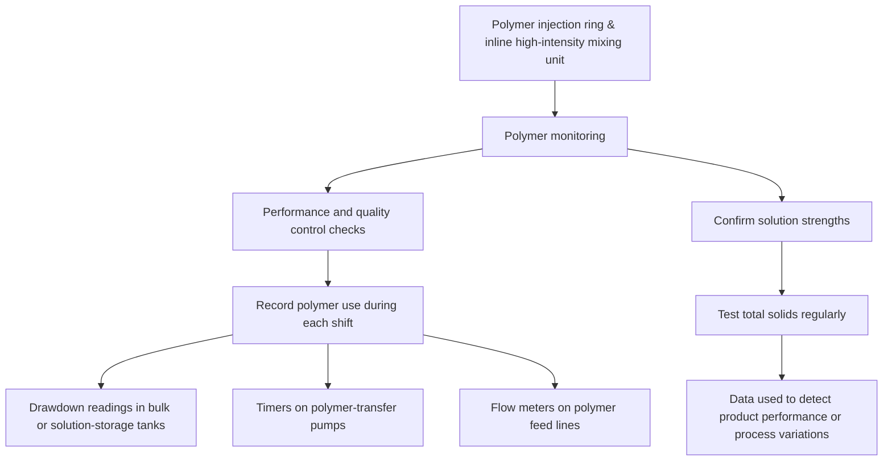
</pre>

Polymer monitoring includes performance and quality control checks. Polymer use should be recorded during each shift via drawdown readings in bulk or solution-storage tanks, timers on polymer-transfer pumps, or flow meters on polymer feed lines. To confirm solution strengths, total solids tests should be conducted regularly. From these data, product performance or process variations may be detected.

There has been much technological development on a variety of automated process sensors, controllers, and related software for managing thickening and dewatering operations to optimize performance and polymer use. These systems typically include a solids probe in the drain line from the dewatering unit's filtrate line and a controller on the solids feed pump and polymer feed equipment. Typically, when the solids probe detects a sudden increase in filtrate solids concentration, the controller first tries to increase the polymer flow rate. If this does not clear the filtrate after a specific time period, the controller sends a signal to decrease the solids feed rate. These alternate steps are repeated until the filtrate clears. Other control systems monitor the viscosity or particle charge in filtrate. The particle charge measurement informs the control system whether to increase or decrease the polymer dose (Dentel et al., 2000a). The primary benefit of such automated systems is that they tend to smooth out variations in unit operations and
\n---\n

## 4.3 Process Design Considerations for Thickening and Dewatering

Below are summaries of design considerations for several types of thickening and dewatering processes. Typical polymer dosages for thickening and dewatering applications are provided in Tables 20.8 and 20.9, respectively.

### 4.3.1 Conditioning for Gravity Thickening

Conventional gravity thickening typically does not require the use of organic polymers. That said, using these chemicals increases solids and hydraulic loading rates by a factor of two to four and improves solids capture. However, they have minimal effect on the resultant underflow solids concentration. Also, using polymer increases the overall cost of gravity thickening, so it only should be used to prevent operating problems caused by solids carryover.

Bench tests and other laboratory or field investigations should be performed to test the relative effectiveness of flocculating aids (either alone or in combinations). Also, care should be taken during feeding and mixing to prevent the overfeeding or poor mixing that causes "islands" to form:

Using about 2 to 4.5 g of active polymer/kg of dry solids (4–9 lb/ton) can produce a solids-loading rate of about 22 to 34 kg/m^2 d (4.5–7.0 lb/d sq ft) when thickening primary solids.
\n---\n

# Thickener Polymer Data for WAS

Adding about 4.5 to 6.0 g/kg (9.5–12.5 lb/ton) of polymer can increase the thickener's loading rate to 12 to 16 kg/m^2 d (2.4–3.2 lb/d/sq ft) when treating WAS (Ettlich et al., 1978; U.S. EPA, 1978c, 1979d).

<table>
  <thead>
    <tr>
      <th>Facility Name</th>
      <th>Type of Sludge</th>
      <th>Influent Feed Solids (%)</th>
      <th>Method of Thickening</th>
      <th>Polymer Dosage (lb/ton)</th>
      <th>Thickened Solids (%)</th>
      <th>Method of Stabilization</th>
    </tr>
  </thead>
  <tbody>
    <tr>
      <td>Water Reclamation Facility, Bend, Oregon</td>
      <td>Secondary (100%)</td>
      <td>0.4–0.6</td>
      <td>Gravity belt thickening</td>
      <td>8–10</td>
      <td>4–5</td>
      <td>Anaerobic digestion</td>
    </tr>
<tr>
      <td>Irwin Creek WRRF, Charlotte, North Carolina</td>
      <td>Primary (60%) Secondary (40%)</td>
      <td>3.2–0.5–1.0</td>
      <td>Conventional gravity thickening</td>
      <td>0</td>
      <td>4–5</td>
      <td>Anaerobic digestion</td>
    </tr>
<tr>
      <td>City of Greeley WPCF, Greeley, Colorado</td>
      <td>Secondary (100%)</td>
      <td>0.6–0.8</td>
      <td>Centrifuge</td>
      <td>1.7–2.5</td>
      <td>4.5–6.5</td>
      <td>Anaerobic digestion</td>
    </tr>
<tr>
      <td>JEA Buckman Street WRRF, Jacksonville, Florida</td>
      <td>Primary (60%) Secondary (40%)</td>
      <td>1–3</td>
      <td>Gravity belt thickening</td>
      <td>9–12</td>
      <td>3–5</td>
      <td>Anaerobic digestion</td>
    </tr>
<tr>
      <td>Greenfield Road WRP Mesa, Gilbert and Queen Creek, Arizona</td>
      <td>Primary and secondary</td>
      <td>1–1.25</td>
      <td>Centrifuge</td>
      <td>0.5</td>
      <td>5</td>
      <td>Anaerobic digestion</td>
    </tr>
<tr>
      <td>Iron Bridge Water Reclamation Facility, Orlando, Florida</td>
      <td>Secondary (100%)</td>
      <td>0.4–0.6</td>
      <td>Gravity belt thickening</td>
      <td>7–9</td>
      <td>2–3</td>
      <td>Lime stabilization</td>
    </tr>
  </tbody>
</table>

\n---\n

# Wastewater Treatment Facilities - Thickening and Digestion Data

<table>
  <thead>
    <tr>
      <th>Facility / Location</th>
      <th>Treatment Type</th>
      <th>Solids / Percent</th>
      <th>Thickening Method</th>
      <th>Range 1</th>
      <th>Range 2</th>
      <th>Notes</th>
    </tr>
  </thead>
  <tbody>
    <tr>
      <td>Utilities, Orlando, Florida</td>
      <td>Secondary (100%)</td>
      <td>0.7–0.8</td>
      <td>Conventional gravity thickening</td>
      <td>0</td>
      <td>1–2</td>
      <td>Stabilization</td>
    </tr>
<tr>
      <td>Water Conserv I, Orlando, Florida</td>
      <td>Secondary (100%)</td>
      <td>0.7–1.2</td>
      <td>Gravity belt thickening</td>
      <td>10–12</td>
      <td>4–5</td>
      <td>Transported to larger facility for further stabilization</td>
    </tr>
<tr>
      <td>Water Conserv II, Orlando, Florida</td>
      <td>Secondary (100%)</td>
      <td>0.4–0.8</td>
      <td>Gravity belt thickening</td>
      <td>10–12</td>
      <td>2–4</td>
      <td>Anaerobic digestion</td>
    </tr>
<tr>
      <td>Orange County Utilities, South Water Reclamation Facility, Orlando, Florida</td>
      <td>Secondary (100%)</td>
      <td>0.4–1.25</td>
      <td>Gravity belt thickening</td>
      <td>2.4–6.5</td>
      <td>3.1–6.4</td>
      <td>Anaerobic digestion</td>
    </tr>
<tr>
      <td>91st Avenue Wastewater Treatment Plant, Phoenix, Arizona</td>
      <td>Secondary (100%)</td>
      <td>1.0–1.5</td>
      <td>Centrifuge</td>
      <td>2.0–3.0</td>
      <td>5.7–6.2</td>
      <td>Anaerobic digestion</td>
    </tr>
<tr>
      <td>McAlpine Creek WRRF; Pineville, North Carolina</td>
      <td>Primary (50%) Secondary (50%)</td>
      <td>1.0</td>
      <td>Conventional gravity thickening</td>
      <td>0</td>
      <td>3–5</td>
      <td>Anaerobic digestion</td>
    </tr>
<tr>
      <td>McAlpine Creek WRRF; Pineville, North Carolina</td>
      <td></td>
      <td></td>
      <td>Centrifuge</td>
      <td>3–5</td>
      <td>0.9–1</td>
      <td></td>
    </tr>
<tr>
      <td>Roger Road Wastewater Reclamation Facility</td>
      <td>Secondary</td>
      <td>0.2–0.4</td>
      <td>Gravity belt thickening</td>
      <td>9–10</td>
      <td>5–6</td>
      <td>Anaerobic digestion</td>
    </tr>
<tr>
      <td>Pima County; Tucson, Arizona</td>
      <td>Primary</td>
      <td>0.4–0.6</td>
      <td>Conventional gravity thickening</td>
      <td>0</td>
      <td>4–5</td>
      <td>Anaerobic digestion</td>
    </tr>
  </tbody>
</table>

\n---\n

# TABLE 20.8 Polymer Dosages Associated With Various Solids Thickening Processes

WRRF = Water resource recovery facility.

<table>
<tr>
  <td>Portland, Oregon</td>
  <td>Secondary (100%)</td>
  <td>0.5–1.0</td>
  <td>Gravity belt thickening</td>
  <td>5–9</td>
  <td>4–6</td>
  <td>Anaerobic digestion</td>
</tr>
</table>

TABLE 20.8 Polymer Dosages Associated With Various Solids Thickening Processes

<table>
  <thead>
    <tr>
      <th>Facility Name/Location</th>
      <th>Type of Sludge</th>
      <th>Type of Stabilization</th>
      <th>Influent Feed Solids (%)</th>
      <th>Method of Dewatering</th>
      <th>Polymer Dosage (g/kg)</th>
      <th>Dewatered Cake Solids (%)</th>
    </tr>
  </thead>
  <tbody>
    <tr>
      <td>Water Reclamation Facility Bend, Oregon</td>
      <td>Primary (55%) Secondary (45%)</td>
      <td>Anaerobic digestion</td>
      <td>1.8–2.1</td>
      <td>Belt filter press</td>
      <td>3.75–6</td>
      <td>12–15</td>
    </tr>
<tr>
      <td>Irwin Creek WRRF, Charlotte, North Carolina</td>
      <td>Primary (60%) Secondary (40%)</td>
      <td>Anaerobic digestion</td>
      <td>1.4</td>
      <td>Belt press</td>
      <td>3.5–4</td>
      <td>18.75</td>
    </tr>
<tr>
      <td>City of Greeley WPCF, Greeley, Colorado</td>
      <td>Primary (60%) Secondary (40%)</td>
      <td>Anaerobic digestion</td>
      <td>1.5–2.0</td>
      <td>Centrifuge</td>
      <td>5–8</td>
      <td>19–22</td>
    </tr>
<tr>
      <td>Buckman Street WRRF, Jacksonville, Florida</td>
      <td>Primary (60%) Secondary (40%)</td>
      <td>Anaerobic digestion</td>
      <td>2–4</td>
      <td>Centrifuge</td>
      <td>3.75–6.25</td>
      <td>19–22</td>
    </tr>
<tr>
      <td>Greenfield Road WRP, Mesa, Gilbert and Queen Creek, Arizona</td>
      <td>Primary and Secondary</td>
      <td>Anaerobic digestion</td>
      <td>2.75–3.0</td>
      <td>Centrifuge</td>
      <td>5.75</td>
      <td>22–23</td>
    </tr>
<tr>
      <td>Water Conserv II, Orlando, Florida</td>
      <td>Secondary</td>
      <td>Anaerobic digestion</td>
      <td>2.0–2.5</td>
      <td>Belt filter presses</td>
      <td>3.5–4</td>
      <td>12</td>
    </tr>
<tr>
      <td>Eastern Water Reclamation Facility</td>
      <td></td>
      <td></td>
      <td></td>
      <td></td>
      <td></td>
      <td></td>
    </tr>
  </tbody>
</table>

\n---\n

# Reclamation Facilities Data

<table>
<thead>
<tr>
<th>Facility</th>
<th>Treatment Type</th>
<th>Stabilization/Process</th>
<th>Value</th>
<th>Dewatering Equipment</th>
<th>Range</th>
<th>Final Range</th>
</tr>
</thead>
<tbody>
<tr>
<td>Orange County Utilities<br>Orlando, Florida</td>
<td>Secondary (100%)</td>
<td>Contract lime stabilization</td>
<td>&lt;1</td>
<td>Belt filter presses (three belt)</td>
<td>3-3.5</td>
<td>16-17</td>
</tr>
<tr>
<td>Iron Bridge Water Reclamation Facility<br>Orlando, Florida</td>
<td>Secondary</td>
<td>Lime stabilization</td>
<td>2.0-3.0</td>
<td>Belt filter presses</td>
<td>3.5-4</td>
<td>17</td>
</tr>
<tr>
<td>Iron Bridge Water Reclamation Facility<br>Orlando, Florida</td>
<td>Secondary</td>
<td>Lime stabilization</td>
<td>0.4-0.6</td>
<td>Belt filter presses (three belt)</td>
<td>3.5-4</td>
<td>17</td>
</tr>
<tr>
<td>Northwest Water Reclamation Facility<br>Orange County Utilities<br>Orlando, Florida</td>
<td>Secondary (100%)</td>
<td>Contract lime stabilization</td>
<td>1-2</td>
<td>Belt filter presses</td>
<td>3.75-6.25</td>
<td>14-16</td>
</tr>
<tr>
<td>South Water Reclamation Facility<br>Orange County Utilities<br>Orlando, Florida</td>
<td>Secondary</td>
<td>Anaerobic digestion</td>
<td>2.3-3.7</td>
<td>Belt filter presses</td>
<td>0.5-1.1</td>
<td>9.3-19.7</td>
</tr>
<tr>
<td>McAlpine Creek WRRF<br>Pineville, North Carolina</td>
<td>ORC reported a 1:1 ratio of primary to secondary solids</td>
<td>Anaerobic digestion</td>
<td>2.4</td>
<td>Centrifuge</td>
<td>3.75</td>
<td>20</td>
</tr>
</tbody>
</table>

\n---\n

## TABLE 20.9 Polymer Dosages Associated With Various Solids Dewatering Processes

<table>
  <tr>
    <td>digested, lagoon stabilized thickened WAS (25–35%)</td>
    <td>Anaerobic digestion</td>
    <td>1.5–2.0</td>
    <td>Belt filter presses</td>
    <td>3.75–5</td>
    <td>19–22</td>
    <td></td>
  </tr>
<tr>
    <td>Thomas P. Smith Water Reclamation Facility Tallahassee, Florida</td>
    <td>Secondary (100%)</td>
    <td>Anaerobic digestion</td>
    <td>2.81–4.39</td>
    <td>Screw presses</td>
    <td>3.75–6.75</td>
    <td>13–20</td>
  </tr>
</table>

Notes:
* WAS = waste activated sludge;
* WPCF = water pollution control facility;
* WRP = water reclamation plant;
* WRRF = water resource recovery facility:

### 4.3.2 Conditioning for Dissolved Air Flotation Thickening

Chemical conditioning is unnecessary for dissolved air flotation (DAF) thickening if low hydraulic and solids-loading rates are used. However; if high loading rates are required, or compaction is poor and the sludge volume index is high, chemical conditioning improves solids capture and can increase the float solids concentration. Although the increase in float solids is typically small (in the range of 0.5%), polymers may be required for WAS if a 4% float solids concentration is to be achieved. Float solids can routinely be 6% or higher when co-thickening mixtures of primary solids and WAS. Unless problems exist; solids capture without polymers is typically about 95%. With polymers, solids capture can increase to 97 or 98%, thereby improving subnatant quality and lessening the effect of recycle solids on facility performance. Also, with polymer addition, it is possible to as much as double the solids loading rate. [A typical rate is 10 kg/m2/h (2 lb/sq ft/hr).]
\n---\n

## 4.3.3 Conditioning for Centrifugal Thickening

A solid-bowl conveyor centrifuge has been used to thicken a wide variety of solids. Centrifugal thickening typically does not require polymer addition when treating biological and aerobically stabilized solids. Well-digested solids, however, have little natural flocculating tendency, and require polymer additions to achieve acceptable solids recovery levels. So, engineers should make provisions for polymer addition in the initial design, even if chemical conditioning is not planned. The design should be flexible enough to allow conditioning chemical to be added at one of several points in the influent piping.

Dry or liquid high-molecular-weight cationic polymers are effective thickeners. When dry polymers are used, a 0.05% to 0.1% feed solution is used, while liquid polymers can range in concentration up to 0.5% on an active basis. It is important that a solids capture of at least 95% is obtained to prevent recycling filamentous bacteria and fines to the wastewater treatment process: Waste activated sludge produces a weak floc that tends to shear inside the centrifuge; a dose of up to 4 g/kg (8 lb/ton) of polymer can be used to formulate a tougher floc. Aerobically and anaerobically digested solids have little natural floc and, therefore, require about 4 to 8 g/kg (8–16 lb/ton) of polymer:

## 4.3.4 Conditioning for Gravity Belt Thickening

Gravity belt thickening works well with many types of solids. Difficult-to-thicken solids only require minor modifications of polymer dosages and solids loading rates to keep the effluent solids concentration and percent solids capture high. Gravity belt thickeners have been used to treat solids containing as little as 0.4% solids or as much as 10% solids with polymer addition. Polymer dosages range from between 1.5 and 3 g/kg (3 and 6 lb/ton)
\n---\n

(dry weight basis) for raw primary solids up to between 4 and 6 g/kg (8 and 12 lb/ton) for anaerobically stabilized solids. In all cases, solids capture remained above 95%.

## 4.3.5 Conditioning for Rotary Drum Thickening

Rotary drum thickeners work much like gravity belt thickeners: in both systems, a moving, porous media retains conditioned solids while allowing free water to drain through. A polymer is injected into the feed line and mixed with incoming solids before entering the flocculation tank.

Drum speed, mixer speed, and spray water cycling is adjustable to ensure maximum performance with minimal polymer and water use. Polymer requirements are about 10% to 20% greater than those associated with gravity belt thickeners. Rotary drum thickeners are suited for high-fiber solids, as well as raw and digested solids with a significant fraction of primary solids. Their success with municipal WAS is variable and depends on solids characteristics. Residuals typically can be thickened to 5% to 7% total solids (in some cases, more than 10% total solids) with up to 99% capture of feed solids at polymer dosages ranging from 4 to 6 g/kg (8-12 lb/ton) (dry weight basis).

## 4.3.6 Conditioning for Centrifugal Dewatering

Polymers have been used with solid-bowl conveyor centrifuges to increase machine throughput without lowering cake dryness, to improve solids recovery, or both. Typically, a moderate-to-high charge, high-molecular-weight cationic polymer is used. Pilot studies are needed to determine the correct conditioning agent and dosage: Designs should include facilities for feeding both dry and liquid polymers. Polymer use typically increases solids capture; however; too much polymer can lead to a wetter cake because more fines are captured: Therefore, the relationship between recycled solids and cake dryness determines the dosage of polymer to be used.

## 4.3.7 Conditioning for Belt Filter Press Dewatering

The performance of belt filter presses depends on proper conditioning, and organic polymers traditionally are used. A properly conditioned product has a 95% to 98% solids recovery rate. However; the quantity of polymer required for proper conditioning varies widely; it depends on solids type, solids concentration, and ash content (typically, less polymer is needed when the ash content is high). For example, primary solids require a
\n---\n

polymer dose of 3.5 to 5 g/kg (7–10 lb/ton), anaerobically digested solids require a dose of 7 g/kg (14 lb/ton on a dry weight basis), and autothermal thermophilic aerobically digested solids require a dose between 18 to 23 g/kg (37–47 lb/ton):

Insufficient conditioning causes inadequate dewatering in the initial sections of the press, which, in turn, can cause solids to extrude from the press section, overflow in the drainage section, or blind the belt. Over-conditioning can cause belt blinding and over-flocculation, which causes solids to drain too fast and mound on the belt, resulting in poor dewatering. The goal is to remove as much water as possible in the gravity section of the press. Over-flocculation may be mitigated by using deflection plates to even out the mounds before pressing begins, or by selecting a belt filter press with an extended gravity table.

Because of the shearing action between belts, Novak and Haugan (1980) have suggested using turbulent mixing when adding polymers for conditioning before dewatering: The best dosage and overall system performance depend on solids concentration, mixing intensity, and mixing time.

## 4.3.8 Conditioning for Screw Press Dewatering
The screw press is a simple, slow-moving mechanical device that gradually compresses conditioned, thickened solids as they move through the unit. Dewatering is continuous; it begins with gravity drainage at the inlet end of the screw and then dewatered the result of increasing pressure at the end of the unit. Proper screw design is critical, because different solids require different polymer dosages, screw speeds, and configurations to maintain a desired dewatered cake concentration and solids capture rate.

Proper solids conditioning is essential to produce a consistent dewatered cake: Slower operations will produce a dryer cake but also will reduce solids throughput. Therefore, it is important that a relationship between polymer dosage, solids throughput, and cake dryness be established. Depending on the influent solids characteristics, the polymer dosage may range from 8 to 12 g/kg (16–24 lb/ton) to produce a cake containing between 12% and 25% dry solids and a solids capture rate of 90% to 95%.

## 4.3.9 Conditioning for Rotary Press Dewatering
The polymer dosage for a rotary press depends on the type of solids to be dewatered. Work performed at the Daniels and Plum Island facilities in Charleston, South Carolina,
\n---\n

## 4.3.10 Conditioning for Drying Beds

indicated that 4.5 to 6 g/kg (9–12 lb/ton) of polymer was needed for a mixture of raw primary and secondary solids, resulting in an average dewatered cake concentration of 25%. However, in St. Petersburg, Florida, polymer dosages ranging from 15 to 18 g/kg (31–37 lb/ton) were required to dewater aerobically digested secondary solids to an average of 15% solids. In both cases, solids capture was more than 95%.

Conditioning solids before sending them to drying beds is not widely practiced. In fact, the "Ten State Standards" (Great Lakes, 2004) and other design guidelines do not consider using conditioning chemicals in this application, even though they may significantly reduce drying time and, therefore, the bed area required: Relatively small polymer doses (as little as 50 mg/L) can considerably improve the drainage capabilities of properly digested solids by flocculating smaller particles. Flocculation speeds up the drainage period of the dewatering cycle and maintains a porous cake that is more readily susceptible to evaporation.

Studies have indicated that conditioning significantly increases the loading rate for digested primary solids and WAS; the unconditioned solids-loading rate was 73 kg/m^2/yr (15 lb/ft^2-yr), while the conditioned solids-loading rate was 270 kg/m^2/yr (55 lb/ft^2-yr). A well-conditioned product will dry in about one-third the time (approximately 10 to 15 days) required for unconditioned solids. Such performance improvements typically result from a dosage of about 15 to 23 g/kg (31–46 lb/ton) of a cationic polymer with a moderately high or high charge and a high molecular weight.

The conditioning system must be designed to avoid rupturing the conditioned floc during transport to the drying beds. Rupturing typically occurs during pumping; it can be overcome by locating the flocculation tank close to the drying beds, and allowing conditioned solids to flow by gravity from the flocculating chamber. Excessive holding increases the percentage of fines, which will impair flocculation and dewatering:

Both wedge-wire and vacuum-assisted drying beds use polymers to coagulate fines and promote rapid cake formation. The polymer is injected into the solids in the inlet line or in a flocculation tank next to the bed. Typical doses are between 1.5 and 3 g/kg (3 and 6 lb/ton).
\n---\n

# 5.0 Chemical Storage and Feed Equipment

Critical to any thickening or dewatering design is the decision of what chemicals are to be used, how they are shipped and stored, and what type of feed equipment should be used. For details on designing chemical conditioner-handling facilities, see Chapter 7, which includes a discussion on sizing the various unit operations and processes, as well as the necessary appurtenances. Because many of the chemicals are corrosive and available in various forms (e.g., liquid, dry, and gel), design engineers need to pay special attention to the design of chemical storage, feeding, piping, and control systems. For example, dry conditioners are typically converted to solution or slurry form before being introduced to solids. Liquid chemicals typically are delivered in a concentrated form and must be diluted before being mixed with solids. Other issues that must be considered when designing these systems are local building codes and the need to maintain operations during natural disasters (e.g., earthquakes, floods, hurricanes, and tornadoes).

As noted in Chapter 7, the sizing of storage facilities begins with an investigation of the chemicals to be used and their dosage requirements. Many conditions must be evaluated to determine the appropriate range of feed rates, which determine the feed-equipment capacities for each chemical. However, most facilities are limited by subsequent thickening or dewatering equipment capabilities, number of shifts (operating times), and desired final product:

## 5.1 Inorganic Chemicals

Because ferric chloride and lime have different chemical characteristics, they require different storage, pumping, piping, and handling procedures. The most important consideration when designing facilities for both chemicals is providing enough flexibility to accommodate variations in solids characteristics.

### 5.1.1 Ferric Chloride

Ferric chloride is corrosive and can be delivered in either liquid or dry form. Liquid ferric chloride is dark brown and has a shipping weight of 1.3 to 1.5 kg/L (11.2 to 12.4 lb/gal) for a 35% to 45% solution. Dry ferric chloride shipments should be stored in a dry room. Once opened, the chemical immediately should be used or mixed with water and stored in solution.
\n---\n

Storage tanks for ferric chloride typically are made of fiberglass, rubber- or plastic-lined steel, polypropylene, or spiral-wound extruded high-density polyethylene. Storage tanks must be insulated and, if holding a 45% solution, heated when the ambient temperature is expected to fall below 16°C (60°F).

Liquid ferric chloride feed equipment includes transfer pumps, day tanks, and metering pumps (see Figure 20.4). Rubber- or plastic-lined, self-priming centrifugal transfer pumps are used to convey bulk solution from storage tanks to day tanks. Double-diaphragm metering pumps or peristaltic pumps are used to control the chemical feed rate at the application points. Chemical feed rates typically are paced according to solids feed rates. Dilution water should not be added because of the potential for hydrolysis. Aboveground piping and valves typically are made of polyvinyl chloride (PVC), and rubber- or plastic-lined steel is used for buried applications.

Overtlow                          Pressure Mixer    Calibratlon
Level  Vent  and                  Gauge             Column      Pressure
Sensor       Draln  Transter                                                 Rellef
Diaphragm             Pump                 Day                  Solutlon     Valve
  Valve                                    Tank                 Metering     Back Pressure
Delivery Truck                                                  Pumpe              Valve
  Fill Line    Bulk                                                                Flowmeter
          Solutlon
          Tank

                       Process                                                          To Point
                       Drain                                                       Application

Maximum                Chemical
 Liquid                Containment
 Level

FIGURE 20.4 Simplified polymer-solution feed system (provide pressure relief on the discharge side of all positive-
                                  displacement polymer pumps)_

The choice of feed bulk solution (30%-45%) or diluted solution (20%) typically depends
on total ferric chloride use and the expected ambient temperature. If this temperature is
below the bulk solution’s freezing temperature, feed facilities should be insulated and heat
traced. Diluting a bulk solution may lower its freezing temperature below the lowest
expected ambient temperature (thereby avoiding insulation and heat tracing), but it
increases the size ofday -tanks, piping, valves, and feed pumps.

                                  5.1.2 Lime
\n---\n

# 5.1 Lime Storage and Handling

## 5.1.2.1 Lime Silos
Large facilities use pebble quicklime, while small ones use hydrated lime. For lime application rates in excess of 1800 to 2700 kg/d (2–3 ton/d), bulk quicklime is typically more economical than hydrated lime. Bagged lime requires a waterproof, well-ventilated storage building; bulk lime requires watertight and airtight storage bins. Bagged lime should be stored on pallets in a dry place for no longer than 60 days. Bulk lime can be pneumatically transferred in bins or conveyed to the bins via conventional bucket elevators or screw conveyors.

Quicklime bins typically have a 55° to 60° slope to the bin outlet; hydrated lime bins have a 60° to 66° slope. Tall, slender structures with a height-to-diameter ratio (H:D) ratio of 4:2.5 are preferred. The design volume should be based on the average bulk density of the chemical, with an allowance for 50% to 100% extra capacity beyond that required to accommodate a typical delivery. Quicklime and hydrated limes are abrasive, but not corrosive, so steel or concrete bins can be used. It is imperative that the storage bins be airtight and watertight to prevent the effect of air slaking:

Hydrated lime bins should be equipped with bin agitation and a non-flooding rotary feeder at the bin outlet:

Other required appurtenances include air-relief valves, access hatches, and a dust-collector mechanism:

## 5.1.2.2 Lime Feed System
\n---\n

# FIGURE 20.5 Typical lime feed system (vapor remover not shown)

```mermaid
graph TD
    DustCollector(Dust collector)
    FillPipe(Fill pipe (pneumatic))
    BulkBin(Bulk storage bin)
    BinGate(Bin gate)
    FlexConn(Flexible connection)
    ScaleChute(Scale or sample chute)
    Feeder(Feeder)
    Rotodip(Rotodip-type feeder)
    LimeSlaker(Lime slaker)
    SlakingWater(Rotameters slaking water)
    DilutionWater(Dilution water)
    Solenoid(Solenoid valve)
    FlowRecorder(Flow recorder with pacing transmitter)
    PHRecorder(PH recorder controller)
    Mixer(Mixer)
    HoldingTank(Holding tank)
    Recirc(Recirculation)
    TransferPump(Transfer pump)
    GravityFeed(Gravity feed)
    MeteringPump(Metering pump)
    LevelProbes(Level probes)
    BackPressureValve(Back pressure valve)
    ReliefValve(Relief Pressure valve)

    DustCollector --> FillPipe
    FillPipe --> BulkBin
    BulkBin --> BinGate
    BinGate --> FlexConn
    FlexConn --> Feeder
    ScaleChute --> Feeder
    Feeder --> LimeSlaker
    Rotodip --> Mixer
    LimeSlaker --> DilutionWater
    LimeSlaker --> SlakingWater
    SlakingWater --> Solenoid
    Solenoid --> FlowRecorder
    FlowRecorder --> PHRecorder
    Mixer --> HoldingTank
    HoldingTank --> Recirc
    HoldingTank --> TransferPump
    TransferPump --> MeteringPump
    MeteringPump --> BackPressureValve
    BackPressureValve --> ReliefValve
    ReliefValve -->  ApplicationLine(Application line)
    PHRecorder -->  ApplicationLine
```

FIGURE 20.5 Typical lime feed system (vapor remover not shown)

A typical lime storage and feed system is illustrated in Figure 20.5. Bulk quicklime typically is fed to a slaking device, where oxides are converted to hydroxides, producing a paste or slurry that is further diluted before being piped or pumped to the application points. There
\n---\n

There are several manufacturers of suitable dry feeders; the choice depends on facility capacity and the degree of accuracy desired. For example, if a gravimetric-type feeder and slaker combination is indicated, larger facilities can use pebble lime because gravimetric feeders are the most accurate (0.5%–1% of set rate). This translates into cost reductions in large operations. Large, medium, and small facilities also will find volumetric feeders satisfactory, with their accuracy range of 1% to 5%.

A reasonably pure lime slurry is not corrosive and is relatively easy to keep in suspension, provided that it has been stabilized once all chemical reactions between the water and quicklime were completed. The suggested method for transferring slurry is via gravity and open trough, as long as the slurry is stabilized. If piping and transfer pumping cannot be avoided, the feed loop should be designed with a minimum velocity of 0.9 to 1.5 m/s (3–5 ft/s). Pinch valves are preferable to ball-and-plug valves. For a short transfer distance with a velocity less than 0.9 m/s (3 ft/s), a flexible fire hose can be used. In general, feed piping should be at least 50 mm (2 in.) in diameter and have minimal turns and bends:

Slurry pumps typically fall within two categories: centrifugal and positive-displacement: Centrifugal pumps are typically used for low-head transfer or recirculation. Replaceable liners and semi-open impellers are desired. The pump layout should provide for easy dismantling for cleanout and repairs, and should not include water-flushed seals because they tend to scale.

Positive-displacement pumps should be used when the slurry flow must be metered or positively controlled: However, because of the abrasive nature of lime slurry, these pumps are subject to excessive wear and replacement (e.g., pistons and tubing): Turbine pumps and eductors should be avoided because of scaling problems that occur in the pipelines. The lime feed rate can be either controlled by pH or paced with the incoming solids flow:

## 5.2 Organic Polymers

The feed system needed to mix, store, and feed polymers depends on the type of polymer to be delivered (e.g., dry or liquid). Many facilities feed commercial-strength liquid polymer directly from shipping containers or storage tanks, or else manually prepared dry polymer solutions from batch mixing tanks. The relatively high cost of chemical conditioning requires maximum activation with minimum waste; pre-engineered feed systems can accomplish both goals. Ideally, the system should be able to handle both dry/emulsion
\n---\n

# 5.2.1 Dry Polymer Feeders

In the United States, dry polymers are supplied in bags that should be stored in a dry, cool, low-humidity area and used in proper rotation. A bulk storage time of 15 to 30 days is adequate for dry polymers. Some dust is produced when bags of dry polymer are emptied, so polymer-makeup areas should be well ventilated.

Batch-mixing and solution feed equipment consists of a dry storage hopper, dispenser and conveyor (pneumatic or hydraulic), dust collector, mix tank and agitator, aging tank, flow control valves and polymer metering feed pumps. A typical batch mixing for dry polymer is presented in Figure 20.6. Figure 20.7 presents the dry polymer mixing system at the City of Knoxville WRRF. The system can be semiautomatic or fully automatic. The dry polymer can be dispensed either by hand or via a volumetric dry feeder (e.g., screw or vibrator) to a wetting jet (eductor). The polymer then is sent to a mixing (aging) tank that produces a working solution (stock solution) in 30 minutes to 2 hours. Metering pumps dispense the polymer to the solids stream: In most cases, the solution is further diluted with secondary dilution water and mixed in a static mixer to produce polymer concentrations as low as 0.01%.

Polymer feeders should be flexible enough to accommodate any type and grade of polymer. The aging tank's mixer should be variable-speed, with a maximum speed exceeding 500 rpm. The metering pump should be positive-displacement with a variable-speed controller: In general, diaphragm pumps are used for applications of about 380 L/h (100 gal/h) and less. Progressing-cavity or gear pumps are used in applications greater than 380 L/h. The speed controller can be adjusted manually or set to automatically change in response to solids flow variations. The dilution water should have a flow meter and control valve for adjustment:
\n---\n

FIGURE 20.6 Typical dry polymer batch system (provide pressure relief on the discharge side of all positive-displacement polymer pumps).

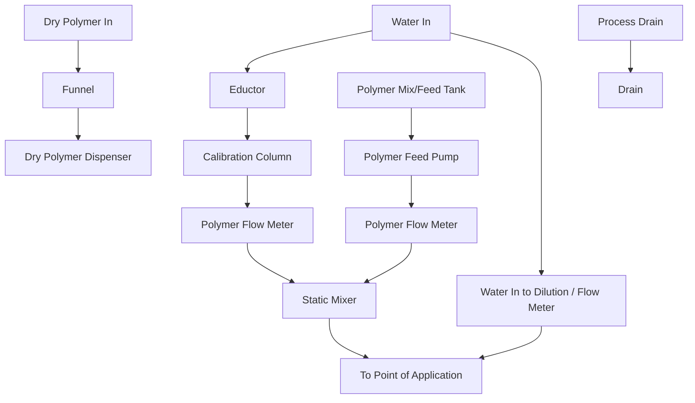

Tanks, piping, and valves should be constructed of PVC or fiberglass. Any metal parts that contact polymer solution should be constructed of stainless steel. Floors, platforms, and steps should be provided with anti-slip patterns to prevent hazardous working conditions.

## 5.2.2 Liquid Polymer Feeders

Liquid polymers should be stored in a heated building or in heat-traced tanks. If it is stored in a building, harmful fumes and unpleasant odors can occur, so the building should be well ventilated.
\n---\n

## FIGURE 20.7 Dry polymer feed system (City of Knoxville Water Resource Recovery Facility; courtesy of VeloDyne– Velocity Dynamics, Inc.).

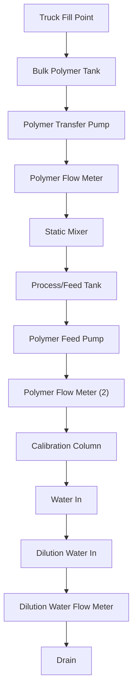

FIGURE 20.8 Typical liquid polymer batch system (provide pressure relief on the discharge side of all positive-displacement polymer pumps)

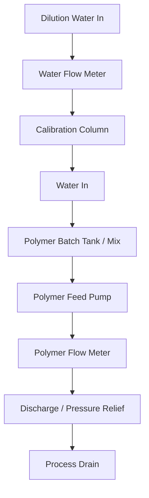

The primary difference between liquid anddry polymer-feed systems is the equipment
used to blend polymers with water to prepare a working solution (see Figure 20.8) when
using dry polymer. Dry polymer storage, polymer transfer, the use of a preparation and
polymer maturing tank are additionally used with dry polymer: Typically, powder polymer is
transferred by a vacuum conveyor or blower to the point where it is mixed with water:
Solution preparation typically is a hand-batching operation in which the mixing and aging

\n---\n

## 5.2.3 Emulsion Polymers

Emulsion polymers consist of a high-molecular-weight polymer concentrated in a hydrocarbon solvent (oil) dispersed in water. This form allows a manufacturer to provide a high-solids organic polymer in liquid form without high-solution viscosity or limited solubility. Anionic, non-ionic, and cationic polymers are available in this form.

The storage and handling facilities for emulsion polymers are similar to those for liquid polymers. Except for the solution-preparation area, the feed system is also similar. The critical issues are aging and the initial breaking of the emulsion: Emulsion polymers must be activated—dispersed in water—before they are used. Activation is a two-step process. The first step, called inversion, involves a brief period of strong mixing to disperse the oil (continuous phase) in water (dissolving phase). The second step is a quiescent aging period, which allows the flocculant to become fully active. Anionic latex polymers require 3 to 15 minutes of aging to be completely active. Non-ionic latex polymers typically require up to 20 to 30 minutes (even longer in colder water). Some cationic latex polymers only need a few minutes to be fully active, while others need as much as 30 minutes.
\n---\n

# FIGURE 20.9 Compact blending system for liquid polymers

- POINT OF APPLICATION
- MIXING CHAMBER
- COMPACT LIQUID POLYMER BLEND UNIT
- METERING PUMP
- ROTOMETER
- PRESSURE REGULATOR
- SOLENOID VALVE
- DILUTION WATER
- LIQUID POLYMER DRUM

The diagram represents a compact blending system for liquid polymers, with the flow paths indicated by the labeled components.

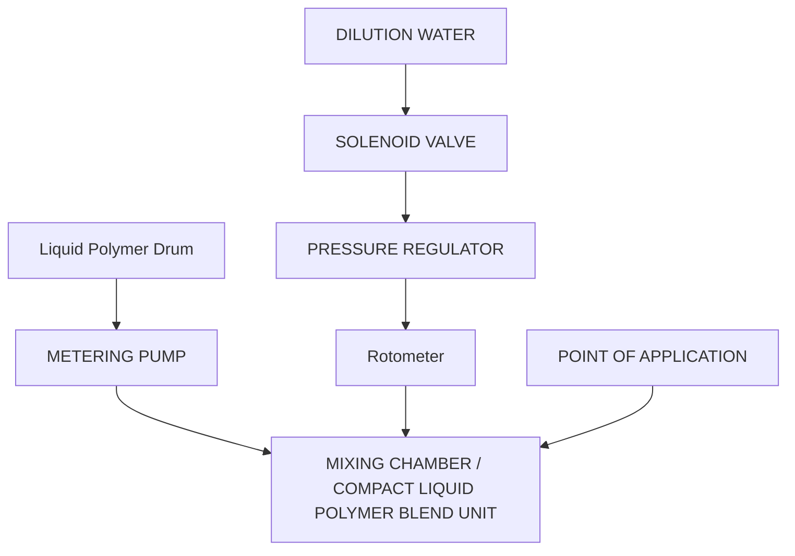

FIGURE 20.9 Compact blending system for liquid polymers.
\n---\n

# Inversion of latex emulsion flocculants in a batch makeup system

It is possible to invert latex emulsion flocculants in a batch makeup system. A measured amount of neat polymer (about 20 kg (40 lb)) is dissolved in makeup water (about 1800 L (480 gal)) in the vortex of an agitated tank. Inversion by this method takes 30 to 60 minutes to complete, so a separate aging tank is recommended. Typical makeup concentrations for anionic, non-ionic, and cationic polymers are 0.5%, 1.0%, and 0.5% to 2.0% (as neat product), respectively:

- Neat emulsion-polymer piping can "cake up" with dried polymer when not in use. To minimize this problem, piping should be at least 30 mm (1.25 in.) in diameter, sloped away from the polymer feed system, and include appropriately placed diaphragm or ball valves to isolate sections, as well as appropriately placed unions and blanked-off tees. In addition, a light-to-moderate machine oil (e.g., Society of Automotive Engineers (SAE) 10W-30) should be used to flush the polymer makeup system and piping whenever the system is taken out of service for more than a week. The oil can be fed via the system's calibration cylinder:

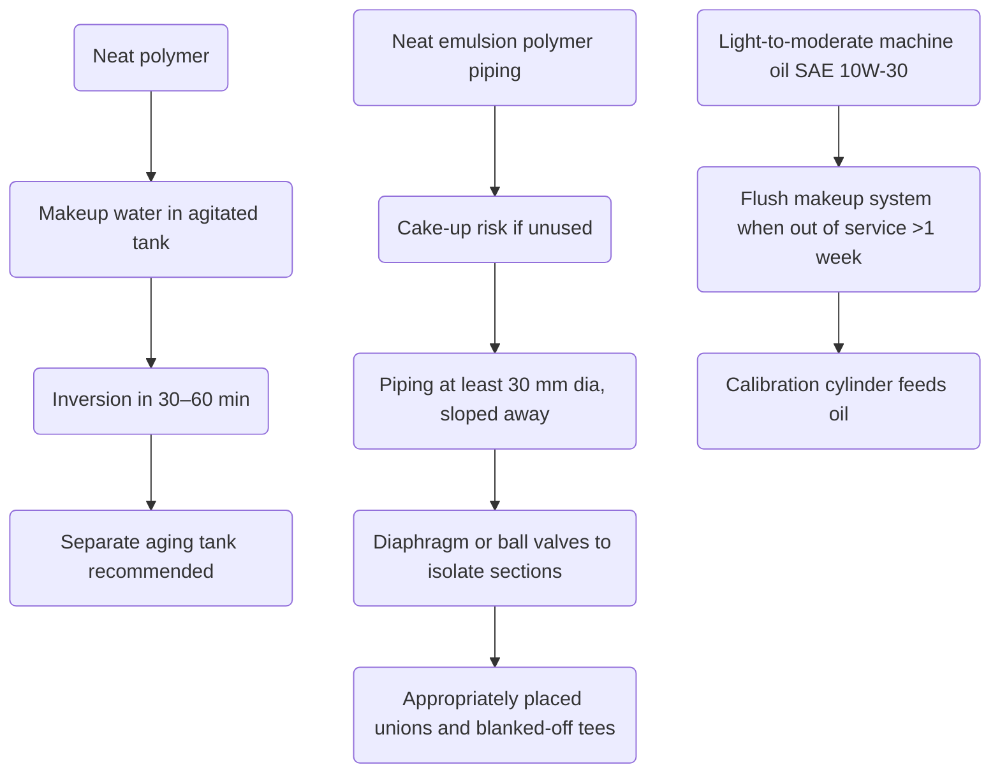

FIGURE 20.10 Compact polymer feed unit (City of Winter Haven Water Resource Recovery Facility No. 3; courtesy of PolyBlend).
\n---\n

Storage tanks for emulsion flocculants should be designed with vents and breather tubes outdoors to keep fumes and vapors from being vented inside. A dehydration cell is recommended in humid environments. Some means of agitation (e.g., mechanical mixers or recirculation pumps) to maintain product homogeneity is also advisable, because emulsion flocculants tend to separate into oil and water:

Design engineers should avoid components made of most natural and synthetic rubber elastomers, brass, mild steel, aluminum, and plastics that soften in petroleum solvents. Positive-displacement; rotary gear; or progressing-cavity pumps typically are used to feed emulsion flocculant solutions (see Figure 20.11). Positive-displacement pumps should have low-level alarm and shutoff controls to avoid running dry and damaging feed equipment:

FIGURE 20.11 Polymer feed pumps (courtesy of the City of Orlando, Florida, Conserv II).

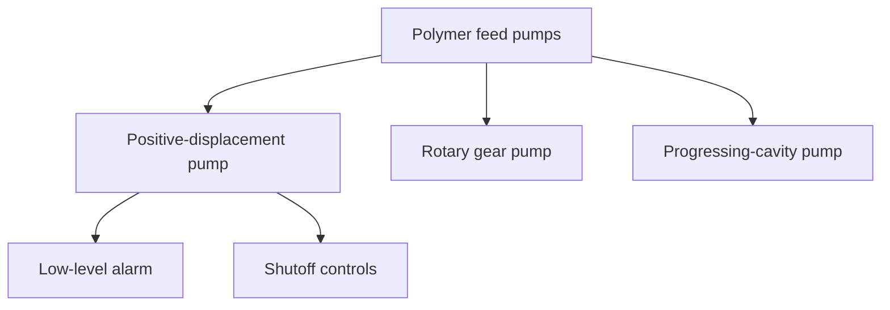

5 FIGURE 20.11 Polymer feed pumps (courtesy of the City of Orlando, Florida, Conserv II).

## 5.3 Safety

Most of the chemicals used as conditioning agents can cause eye burns, skin irritation, and possibly serious burns. Appropriate safety equipment [e.g., personal protective equipment (safety glasses, filter mask, rubber gloves, boots, aprons, etc.); safety showers; water hoses; and eyewash stations] should be clearly marked and easily accessible in the unloading, storage, and feeding locations. Other safety provisions
\n---\n

include a dust-collection system at dry-chemical handling points (e.g., a dry pickup vacuum around feeders and slakers).

Dry chemical bags should be stored in clean, dry places to avoid picking up moisture. (The intense heat generated if quicklime accidentally contacts water could ignite flammable materials nearby.)

A vital slaker safety measure is a thermostatic valve to prevent overheating and possible explosion. This danger can occur if the controlled water supply fails while the lime feed continues, thereby allowing lime to overheat and produce excessive steam. A safety valve delivers a supply of cold water as soon as the maximum safe temperature is exceeded.

Design engineers should avoid using one conveyor or bin to handle both quicklime and other coagulants containing water of crystallization (e.g., copperas, alum, and ferric sulfate). Quicklime could withdraw the crystallization water and generate enough heat to cause a fire. When lime mixes with alum in an enclosed bin, the intense heat (greater than 590°C) generated during the reaction may release enough hydrogen to cause an explosion: Any facilities that must be alternately used should be cleaned thoroughly between applications.

## 6.0 Dose Optimization for Organic Conditioners

Selecting the right dosage of a chemical conditioner is critical to optimum performance. Dosage affects not only cake dryness but also the solids capture rate and solids disposal costs. Dosage is determined based on pilot-plant tests, bench tests, and on-line tests. The dosage should be re-evaluated periodically because solids characteristics can change.

### 6.1 Cost-Effectiveness of Chemical Conditioner and Dosage

Economic factors often are a consideration when selecting a chemical conditioner and dosage. Vendors typically are willing to conduct the testing and using their expertise to set up the tests (e.g., chemicals tested, dosage ranges, and injection locations) could significantly reduce facility personnel's workload. Once testing conditions are established, however; the vendor's involvement should end; all actual performance testing should be done by facility personnel.
\n---\n

When analyzing the cost-effectiveness of a polymer-enhanced dewatering technology, for example, investigators should begin by establishing minimum performance standards (e.g., a specified cake solids, feed rate, and solids capture rate) for the dewatering unit involved. Polymers that cannot meet these standards should be eliminated from further consideration.

Then investigators should calculate a recycle-reduction credit for polymers whose solids capture rates exceed the minimum standard, because it can cost as much to reprocess recycled solids as it does to process influent solids the first time through the liquid treatment process. This reduction credit is the product of the recycled solids volume multiplied by the reprocessing cost:

Naturally, investigators need to estimate the costs associated with re-processing recycled solids, as well as the anticipated biosolids use or disposal method (hauling, landfilling, incineration, land-application, etc.). Such costs typically depend on the percentage of solids in residuals, and investigators can develop a cost curve illustrating this relationship (i.e., solids management cost per kilogram of dry solids as a function of solids percentage). A good record of the O&M and energy costs for solids management is critical for this step.

Investigators then should conduct onsite prequalification tests, using identical operating conditions and solids feed characteristics for all polymers. First, they should adjust the operating conditions, polymer application rate, and dilution water feed rate to obtain the best performance for each polymer: Because it is difficult to maintain constant solids feed conditions from day-to-day, each polymer should be tested against a “standard” polymer. If the performance of the standard polymer changes during the test, a ratio can be developed to correct the performance of the polymer being tested. Second, investigators should analyze how various doses of each polymer affect cake solids, throughput, and filtrate quality. These tests should range from smallest dose that has any effect to those that clearly overdose the solids (i.e., produce a complete dosage curve). Third, investigators should determine the minimum polymer dosage that produces acceptable conditions (e.g., the driest cake with the best filtrate quality).

Investigators then should analyze test results to determine the lowest net operating condition for each polymer: Any dosage that results in an acceptable solids recovery rate
\n---\n

and cake dryness should be used for the cost-effectiveness analysis:

Next, investigators should give each vendor the performance data for their specific products to obtain unit prices for the polymers meeting the minimum standards. The WRRF's polymer cost is the product of polymer dosage multiplied by polymer unit price. Also, any special equipment needed to apply a particular polymer should be added to the polymer cost.

The net cost of the optimum dosage is calculated as follows:

$$Net cost = CP \cdot DC \cdot RC$$$

where CP = cost of polymer;
DC = disposal costs, and
RC = reduction credit.

When the annual net cost and polymer dosage are tabulated for all of the tested polymers, the one with the lowest annual net cost is the most cost-effective polymer type and dosage.

This procedure can be modified to fit any thickening or dewatering process or any condition.

## 6.2 Tests for Selecting Conditioning Agents and Dosages

Conditioning agents are critical to the optimum performance of any thickening and dewatering processes. The choice of conditioning agent and dosage affects solids capture, product dryness, and use or disposal costs. Bench-, pilot-, or full-scale conditioning tests typically are used to determine the best method for conditioning solids. Also, the dosage should be re-evaluated periodically because changes in other wastewater treatment processes may influence conditioning requirements.

Numerous laboratory tests are available to determine the effectiveness of conditioning agents in thickening and dewatering processes. Test objectives include

- evaluating various conditioning and dewatering chemicals to determine which provides the best dewaterability;
\n---\n

# 7.0 Design Example

A belt filter press system used to dewater anaerobically digested solids operates under the following conditions:

* Two belt filter presses with an effective belt width of 2 m (one unit as a standby);
* Operation is 5 d/week, 7 h/d;
* Peak weekly solids production is 110 m^3/d (0.00127 m^3/s);
* Total solids concentration of the belt filter press feed is 35,000 mg/L;
* Specific gravity of the solids feed is 1.03; and
* Polymer solution is 0.2% and is added before the belt filter press at a rate of 25 L/min.

Calculate the polymer dosage requirements.

## 7.1 Step 1: Calculate the Peak Weekly Solids to Be Dewatered

Wet solids = 110 m^3/d × 7 d/week × 1000 kg/m^3 × 1.03

= 793,100 kg/week

Dry solids = 793,100 kg/week × 0.035

= 27,760 kg/week
\n---\n

## 7.2 Step 2: Determine Whether Solids Loading and Hydraulic Loading Rates Are Within Operating Parameters

- Solids loading = (795 kg/h)/2 m

$$\text{Solids loading} = \frac{795\ \text{kg/h}}{2\ \text{m}} = 398\ \text{kg/h·m} \quad (\text{determined to be within acceptable range of } 230 \text{ to } 455\ \text{kg/h·m})$$

- Hydraulic loading = 110 m³/d × (1 d/1440 min) × 1000 L/m³

$$\text{Hydraulic loading} = 110\ \frac{\text{m}^3}{\text{d}} \times \frac{1\ \text{d}}{1440\ \text{min}} \times 1000\ \frac{\text{L}}{\text{m}^3} = 76\ \frac{\text{L}}{\text{min}}$$

$$\text{Hydraulic loading} = 76\ \frac{\text{L}}{\text{min}} \times \frac{7\ \text{d}}{5\ \text{d}} \times \frac{24\ \text{h}}{7\ \text{h}} \div 2\ \text{m} \approx 183\ \frac{\text{L}}{\text{min}\cdot\text{m}}$$

\quad (\text{determined to be within acceptable range of } 150 \text{ to } 190\ \frac{\text{L}}{\min\cdot\text{m}})

----

## 7.3 Step 3: Calculate the Polymer Dosage

- Dosage = 25 L/min × 60 min/h

$$\text{Dosage} = 25\ \frac{\text{L}}{\text{min}} \times 60\ \frac{\text{min}}{\text{h}} = 1500\ \frac{\text{L}}{h}$$

- = (1500 L/h × 0.002 × 1 kg/L)/(2 m × 398 kg/h·m) × (1 tonne/1000 kg)

$$\text{Dosage} = \frac{1500\ \frac{\text{L}}{\text{h}} \times 0.002 \times 1\ \frac{\text{kg}}{\text{L}}}{2\ \text{m} \times 398\ \frac{\text{kg}}{\text{h}\cdot \text{m}}} \times \frac{1\ \text{tonne}}{1000\ \text{kg}} = 3.77\ \frac{\text{kg}}{\text{tonne}}$$

----

## 8.0 References

- Abu-Orf, M. M.; Dentel, S. K. (1997) Polymer Dose Assessment Using the Streaming Current Detector. J. Water Environ. Res., 69 (6), 1075–1084.
- Abu-Orf, M. M.; Dentel, S. K. (1999) Rheology as Tool for Polymer Dose Assessment and Control. J. Environ. Eng., 125 (12), 1133–1141.
- Abu-Orf, M. M.; Ormeci, B. (2005) Measuring Sludge Network Strength Using Rheology and Relation to Dewaterability, Filtration, and Thickening—31 Laboratory and Full-
\n---\n

Scale Experiments. J. Environ. Eng., 131 (8), 1139–1146.

* Aichinger, P.; Wadhawan, T.; Kuprian, M.; Higgins, M.; Ebner, C.; Fimmi, C.; Murthy, S.; Bernhard, W. (2015). Synergistic Co-Digestion of Solid-Organic-Waste and Municipal-Sewage-Sludge: 1 Plus 1 Equals More Than 2 in Terms of Biogas Production and Solids Reduction. Water Res., 87, 416–423.
* Bache, D. H.; Dentel, S. K. (2000) Viscous Behaviour of Sludge Centrate in Response to Chemical Conditioning. Water Res., 34 (1), 354–358.
* Bruus, J. H.; Nielsen, P. H.; Keiding, K. (1992) On the Stability of Activated Sludge Flocs with Implication to Dewatering. Water Res., 26 (3), 1597–1604.
* Cassel, A. F.; Johnson, B. P. (1978) Evaluation of Filter Presses to Produce High-Solids Solids Cake. J. New Eng. Water Pollut. Control Assoc., 12, 137.
* Chang, J. S.; Abu-Orf, M. M.; Dentel, S. K. (2005) Alkylamine Odors from Degradation of Flocculant Polymers in Sludges. Water Res., 39, 3369–3375.
* Christensen, G. L.; Stulc, D. A. (1979) Chemical Reactions Affecting Filterability in Iron–Lime Sludge Conditioning. J. Water Pollut. Control Fed., 51, 2499.
* Dentel, S. K.; Abu-Orf, M. M.; Griskowitz, N. J. (1995) Polymer Characterization and Control in Biosolids Management; Publication 11 D43007; Water Environment Research Foundation: Alexandria, Virginia.
* Dentel, S. K.; Gucciardi, B. M.; Griskowitz, N. J.; Chang, L.; Raudenbush, D. L.; Arican, B. (2000a) Chemistry, Function, and Fate of 14 Acrylamide-Based Polymers. In Chemical Water and Wastewater Treatment VI; Hahn, H. H.; Odegaard, H.; Hoffmann, E., Eds.; Springer Verlag: Berlin, Germany: pp. 35–44.
* Dentel, S. K.; Abu-Orf, M. M.; Walker, C. A. (2000b) Optimization of Slurry Flocculation and Dewatering Based on Electrokinetic and Rheological Phenomena. Chem. Eng. J., 80 (1–3), 65–72.
* Dentel, S. K. (2001) Conditioning. In Sludge into Biosolids; Spinosa, L.; P.A. Vesilind, P.A., Eds.; IWA Publishing: London.
* Eriksson, L.; Alm, B. (1991) Study of Bioflocculation Mechanisms by Observing Effects of a Complexing Agent on Activated Sludge Properties. Water Sci. Technol., 24, 21–28.
\n---\n

# References

- Ettlich, W. F.; Hinrichs, D. J.; Lineck, T. S. (1978). Operations Manual: Sludge Handling and Conditioning; EPA-68/01-4424; U.S. Environmental Protection Agency: Washington, D.C.
- Gillette, R. A.; Scott, J. D. (2001). Dewatering System Automation: Dream or Reality? Water Environ. Technol., 13 (5), 44–50.
- Higgins, M. J. (1995). The Roles and Interactions of Metal Salts, Proteins, and Polysaccharides in the Settling and Dewatering of Activated Sludge. Ph.D. dissertation, Virginia Polytechnic Institute and State University, Blacksburg, Virginia.
- Higgins, M. J.; Novak, J. T. (1997a). The Effect of Cations on the Settling and Dewatering of Activated Sludge: Laboratory Results. J. Water Environ. Res., 69, 215–224.
- Higgins, M. J.; Novak, J. T. (1997b). Dewatering and Settling of Activated Sludges: The Case for Using Cation Analysis. J. Water Environ. Res., 69, 225–232.
- IWPC (1981). Sewage Sludge II: Conditioning, Dewatering and Thermal Drying; Manual of British Practice in Water Pollution Control; IWPC: Maidstone, Kent, Great Britain.
- Karr, P. R.; Keinath, T. M. (1978). Influence of Particle Size on Sludge Dewaterability. J. Water Pollut. Control Fed., 50, 1911.
- Kemmer, F. N.; McCallion, J. (1979). The NALCO Water Handbook; McGraw-Hill: New York.
- Kemp, J. S. (1997). Just the Facts on Dewatering Systems: A Review of the Features of Three Mechanical Dewatering Technologies. Water Environ. Technol., 9 (12), 47–55.
- Kolda, B. C. (1995). Impact of Polymer Type, Dosage, and Mixing Regime and Sludge Type on Sludge Floc Properties. Master’s thesis, Virginia Polytechnic Institute and State University, Blacksburg, Virginia.
- Lewis, C. J.; Gutschick, K. A. (1988). Lime in Municipal Sludge Processing; National Lime Association: Washington, D.C.
- Metcalf and Eddy, Inc./AECOM (2013). Wastewater Engineering: Treatment and Resource Recovery, 5th ed.; McGraw-Hill: New York.
- Mysels, K. J. (1951). Introduction to Colloid Chemistry; Interscience Publishers: New York.
\n---\n

# References

- National Lime Association (1982) Lime Handling, Application, and Storage in Treatment Processes, 4th ed.; Bulletin 213; National Lime Association: Arlington, Virginia.
- Novak, J. T.; Haugan, B. E. (1979) Chemical Conditioning of Activated Sludge. J. Environ. Eng., 105, EE5, 993.
- Novak, J. T.; Haugan, B. E. (1980) Mechanisms and Methods for Polymer Conditioning of Activated Sludge. J. Water Pollut. Control Fed., 52, 2571.
- Novak, J. T.; Goodman G. L.; Pariroo, A.; Huang, J. C. (1988) The Blinding of Sludges during Filtration. J. Water Pollut. Control Fed., 60, 206–214.
- Novak, J. T.; Miller, C. D.; Murthy, S. N. (2001) Floc Structure and the Role of Cations. Water Sci. Technol., 44(10), 209–213.
- Novak, J. T.; Sadler, M. E.; Murthy, S. N. (2003) Mechanisms of Floc Destruction During Anaerobic and Aerobic Digestion and the Effect on Conditioning and Dewatering of Biosolids. Water Res., 37, 3236.
- Ormeci, B.; Cho, K.; Abu-Orf, M. M. (2004) Development of a Laboratory Protocol to Measure Network Strength of Sludges Using Torque Rheometry. J. Residuals Sci. Technol., 1(1), 35–44.
- Park, C.; Muller, C. D.; Abu-Orf, M. M.; Novak, J. T. (2006) The Effect of Wastewater Cations on Activated Sludge Characteristics: Effects of Aluminum and Iron in Floc. Water Environ. Res., 78, 31–40.
- Pitman, A. R.; Deacon, S. L.; Alexander, W. V. (1991) The Thickening and Treatment of Sewage Sludges to Minimize Phosphorus Release. Water Res., 25(10), 1285–1294.
- Pramanik, A.; LaMontagne, P.; Brady, P. (2002) Automation Improvements: Installing an Integrated Control System Can Improve Sludge Dewatering Performance and Cut Costs. Water Environ. Technol., 14(10), 46–50.
- Roberts, K.; Olsson, O. (1975) The Influence of Colloidal Particles on the Dewatering of Activated Sludge with Polyelectrolyte. Environ. Sci. Technol., 9, 945.
- Robinson, J. K. (1989) The Role of Bound Water Content in Designing Sludge Dewatering Characteristics. Master’s thesis, Virginia Polytechnic Institute and State University, Blacksburg, Virginia.
\n---\n

* Saveyn, H.; Curvers, D.; Thas, O.; der Meeren, P.V. (2008). Optimization of Sewage Sludge Conditioning and Pressure Dewatering by Statistical Modelling. Water Res., 42 (4-5), 1061–1074.
* Snoeyink, V. L.; Jenkins, D. (1980) Water Chemistry; Wiley and Sons: New York.
* Sorensen, B. L.; Sorensen, P. B. (1997) Applying Cake Filtration Theory to Membrane Filtration Data. Water Res., 31 (3), 665–670.
* Tenney, M. W.; Echelberger, W. F., Jr.; Coffey, J. J.; McAloon, T. J. (1970) Chemical Conditioning of Biological Sludges for Vacuum Filtration. J. Water Pollut. Control Fed., 42, R1.
* To, V.H.P. (2015) Improved Conditioning for Biosolids Dewatering in Wastewater Treatment Plants. University of Technology, Sydney.
* Tezuka, Y. (1969) Cation-Dependent Flocculation in Flavobacterium Species Predominant in Activated Sludge. Appl. Microbiol., 17, 222.
* Trung, Le.; Al-Omari, A.; Wadhawan, T.; Salij, K.; Higgins, M.; Novak, J.; Murthy, J. (2015) The Use of Free Chlorine and PolyDADMAC Coagulants to Improve Filtrate Quality and Reduce Dose in Thermally Hydrolyzed Anaerobically Digested Biosolids: Proceedings of the 88th Annual Water Environment Federation Technical Exposition and Conference [CD-ROM]; Chicago, Illinois, Sep 24–30; Water Environment Federation: Alexandria, Virginia.
* U.S. Environmental Protection Agency (1978a) Innovative and Alternative Technology Assessment Manual; EPA-430/9-78-009; U.S. Environmental Protection Agency, Office of Water Program Operations: Washington, D.C.
* U.S. Environmental Protection Agency (1978b) Operations Manual for Sludge Handling and Conditioning; EPA-430/9-78-002; U.S. Environmental Protection Agency: Washington, D.C.
* U.S. Environmental Protection Agency (1978c) Sludge Treatment and Disposal, Sludge Treatment; Vol. 1; EPA-625/4-78-012; U.S. Environmental Protection Agency: Cincinnati, Ohio.
* U.S. Environmental Protection Agency (1979a) Chemical Aids Manual for Wastewater Treatment Facilities; EPA-430/9-79-018; U.S. Environmental Protection Agency:
\n---\n

# Washington, D.C.

* U.S. Environmental Protection Agency (1979b) Chemical Primary Sludge Thickening and Dewatering; EPA-600/20-79-055; U.S. Environmental Protection Agency; Municipal Environmental Research Laboratory, Office 36 of Research and Development: Cincinnati, Ohio.
* U.S. Environmental Protection Agency (1979c) Evaluation of Dewatering Devices for Producing High-Solids Sludge Cake; EPA-600/2-79-123; U.S. Environmental Protection Agency, Water Resources Management Administration, Municipal Environmental Research Laboratory: Cincinnati, Ohio.
* U.S. Environmental Protection Agency (1979d) Process Design Manual for Sludge Treatment and Disposal; EPA-625/1-79-011; U.S. Environmental Protection Agency; Municipal Environmental Research Laboratory, Office of Research and Development: Cincinnati, Ohio.
* U.S. Environmental Protection Agency (1979e) Review of Techniques for Treatment and Disposal of Phosphorus-Laden Chemical Sludges; EPA-600/2-6 79-083; U.S. Environmental Protection Agency, Municipal Environmental Research Laboratory, Office of Research and Development: Cincinnati, Ohio.
* U.S. Environmental Protection Agency (2000) Biosolids Technology Fact Sheet Recessed-Plate Filter Press; EPA-832/F-00-058; U.S. Environmental Protection Agency, Office of Water: Washington, D.C., Sep.
* Vesilind, P. A. (1979) Treatment and Disposal of Wastewater Sludges; Ann Arbor Science Publishers: Ann Arbor, Michigan.
* Wang, L. K.; Pereira, N. C.; Hung, Y. T. (2007) Handbook of Environmental Engineering Biosolids Treatment Processes, 6th ed.; Humana Press: Totowa, New Jersey.
* Water Environment Federation (2014) Introduction to Water Resource Recovery Facility Design, 2nd ed.; Water Environment Federation: Alexandria, Virginia.
* Water Environment Federation (2016) Operation of Water Resource Recovery Facilities, 7th ed.; Manual of Practice No. 11; Water Environment Federation: Alexandria, Virginia.
\n---\n

# References

- Webb, L. J. (1974) A Study of Conditioning Sewage Sludges with Lime. J. Water Pollut. Control Fed., 73, 192.
- Yan, Ze.; Ormeci, B.; Zhang, J. (2016) Effect of Sludge Conditioning Temperature on the Thickening and Dewatering Performance of Polymers. J. Residuals Sci. Technol. 13 (3), 215–224.
\n---\n

# CHAPTER 21: Solids Thickening

Steven Swanback; Hany Gerges, Ph.D., P.E., P.Eng; Rashi Gupta, P.E.; Anthony Tartaglione, P.E., BCEE; and Adam Evans, P.E.
\n---\n

# 1.0 Introduction

## 2.0 Gravity Thickener
### 2.1 Operating Principle
### 2.2 Physical and Mechanical Features
### 2.3 Process Design Conditions and Criteria
### 2.4 Operational Considerations Related to Design
### 2.5 Ancillary Equipment
### 2.6 Process Control
### 2.7 Performance Assessment and Optimization
### 2.8 Evaluation and Scale-Up Procedures
### 2.9 Design Example

## 3.0 Dissolved Air Flotation Thickener
### 3.1 Operating Principle
### 3.2 Physical and Mechanical Features
### 3.3 Process Design Conditions and Criteria
### 3.4 Ancillary Equipment
### 3.5 Process Control
### 3.6 Performance Assessment and Optimization
### 3.7 Evaluation and Scale-Up Procedures
### 3.8 Design Example

## 4.0 Centrifuge
### 4.1 Operating Principle
### 4.2 Physical and Mechanical Features
### 4.3 Process Design Conditions and Criteria
### 4.4 Operational Considerations Related to Design
\n---\n

# 1.0 Introduction
Water resource recovery facilities (WRRFs) typically use solids thickening processes to concentrate primary solids, secondary solids, or a combination of primary and secondary solids (typically waste activated solids). The reason for solids thickening is generally to increase the solids concentration of waste solids and reduce the hydraulic loading (total volume) to subsequent solids treatment processes such as anaerobic or aerobic digestion.

There are a number of widely accepted solids thickening technologies including: gravity thickeners, solids-flotation (DAFTs), centrifuges, gravity-belt thickeners, and rotary drum thickeners. These processes differ significantly in process configuration; size/footprint; degree of thickening provided; and chemical, energy, and labor requirements. Newer technologies such as disk thickeners, volute thickeners, membrane thickening systems, and recuperative thickening process are also gaining more attention as their use increases in the United States and abroad.

This chapter primarily describes the solids thickening technologies and presents process design criteria, operational considerations related to design, process control, performance assessment and optimization, a design example and a general comparison of these technologies. It also includes a discussion, where pertinent, of the liquid side streams from thickening processes that are often recycled back to the WRRF upstream (usually a process upstream of the primary clarifiers) and their impact on the water resource recovery process. There is also a brief discussion of co-thickening (primary and secondary solids) and its advantages and disadvantages where appropriate.

For additional information, see other references [e.g:, Process Design Manual for Sludge Treatment and Disposal (U.S. EPA, 2013) and Solids Process Design and Management (WEF et al., 2012)].

## 2.0 Gravity Thickener
### 2.1 Operating Principle
Gravity thickeners function much like settling tanks: solids settle via gravity and compact on the bottom, while water or supernatant flows up over weirs. They also provide some solids equalization and storage, which may be beneficial to downstream processes.
\n---\n

## 2.2 Physical and Mechanical Features

Gravity thickeners work best on primary and lime-conditioned solids, but are also effective on primary solids combined with trickling filter secondary solids, primary and activated sludge, anaerobically digested solids, and to a lesser degree, waste activated sludge (WAS) and chemically enhanced primary solids. Primary and lime solids typically settle quickly and achieve a high underflow concentration without chemical conditioning: Biological solids—particularly WAS—typically have lower capture rates and underflow solids concentrations. Chemically enhanced primary solids settle fast but don’t compact very well (fluffier than conventional primary solids), and occupy larger volumes leading to lower underflow concentrations and/or higher overflow concentrations.

The most common gravity thickener configuration is a circular tank with a side water depth designed at 3 to 4 m (10–13 ft). Such tanks typically range from 21 to 24 m (70–80 ft) in diameter. Larger-diameter tanks increase solids detention time, which can cause anoxic and anaerobic activity, leading to problems with gasification and solids flotation. The tank floor typically has a slope between 2:12 and 3:12, steeper than that of a standard settling tank. The steep slope allows for minimized solids detention and maximized solids depth over the withdrawal pipe in the center of the floor for efficient removal of settled solids. This configuration also reduces raking transport problems.

Combination clarifier–gravity thickener units are typically circular tanks with a deeper center section that functions as a gravity thickener. Combined units are seldom rectangular because of difficulties associated with sludge removal:

A basic gravity thickener typically has the following main components: center cage and column, center feed well, rake arm with squeegees and scraper blades, pickets, drive unit; weir plate and overflow launder. Each gravity thickener has unique physical and mechanical features that can affect throughput, capture efficiency, polymer dose, and solids concentration (see Figure 21.1).

### 2.2.1 Center Cage and Column

Circular gravity thickeners are configured with a center cage and column, which comprise the structural components of the gravity thickener; supporting the walkway, feed well, rake arms with squeegees and scraper blades, pickets, and the drive unit:
\n---\n

### FIGURE 21.1 Example of a gravity thickener.

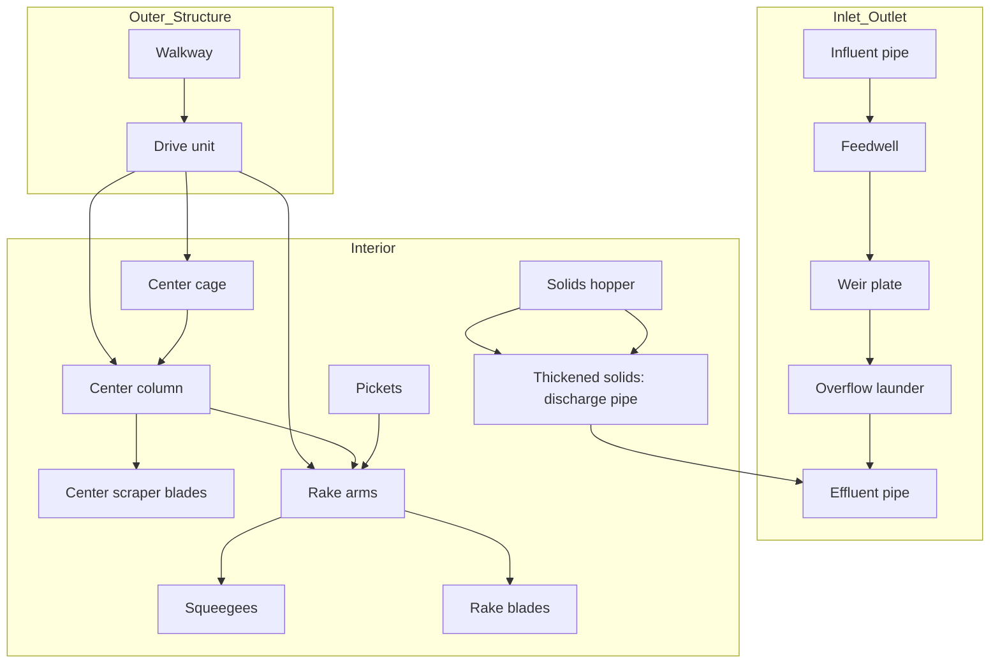

2.2.2 Feed Well
The center feed well is supported off of the center cage and column. It is circular, can be up to 40% of the diameter of the gravity thickener and is intended to act as a stilling well for the influent feed solids.

2.2.3 Rake Arm with Squeegees and Scraper Blades
Rake arms extend across the radius of the gravity thickener, and are typically provided as a pair on opposite sides of the feed well. Scraper blades with squeegees are attached to the bottom of the rake arms that rotate on the bottom of the gravity thickener in order to move thickened solids to the center of the gravity thickener for removal.

2.2.4 Pickets
Some gravity thickeners have pickets attached to the top of the rake arm and are intended to help release water from the settling solids and improve the thickening process.

2.2.5 Drive Unit
Each gravity thickener has a drive unit to rotate the center cage, column, and rake arms. The drive unit includes a motor and a gear reducer that is attached to the drive gear for

\n---\n

the center cage and column. Because the solids are typically denser or heavier than in a
primary settling process, torque control is critical.

## 2.2.6 Weir Plate and Overflow Launder
As the solids settle and thicken, the overflow or supernatant flows over a perimeter weir
plate at the periphery of the gravity thickener: The weir plate is typically a V-notch weir.
The supernatant then flows into the overflow launder for conveyance and additional
treatment. Some gravity thickeners are also equipped with scum baffles if scum treatment
is provided:

## 2.3 Process Design Conditions and Criteria
When designing gravity thickeners, important design considerations include:

* Solids' source and characteristics,
* Nature and extent of flocculation (including flocculation induced by chemical additives
  such as polymer or lime),
* Concentration of suspended solids in the supernatant overflow and effect of recycling
  lines on facility performance,
* Solids loading,
* Solids retention time in thickening zone or blanket,
* Blanket depth,
* Hydraulic retention time and surface loading rate,
* Solids withdrawal rate,
* Tank shape (including bottom slope),
* Physical arrangement of feed well and inlet pipe, and
* Arrangement of withdrawal pipe and local velocities around the piping:

### 2.3.1 Loading Rate
The critical design parameter for gravity thickening is the loading rate in terms of weight of
total solids per unit area per unit time. Design loadings are determined via one of the
methods given in Section 2.8. A thickener's capacity (allowable solids loading rate)
typically is expressed in kilograms per square meter per day or pounds per square foot
\n---\n

The capacity per day for specific feed solids is primarily a function of removal rate and desired underflow solids concentration. To increase the underflow concentration, the solids removal and loading rates both must be reduced. For any given feed solids, engineers can establish an operating range, with capacity expressed as a function of underflow solids concentration.

## 2.3.2 Overflow Rate

The second most important parameter when designing gravity thickeners is the thickener overflow rate. The maximum overflow rate for primary solids is typically 15.5 to 31.0 m3/m2/d (380–760 gal/d sq ft); the maximum for secondary solids is typically 4 to 8 m3/m2/d (100–200 gal/d/sq ft). If the hydraulic loading is too high, solids carryover can be excessive. If hydraulic loading is too low, detention times lengthen and anaerobic (septic) conditions (floating solids and odors) can occur. When thickening primary solids, design engineers often select a feed pumping rate that will maintain a desired overflow rate. They also add a dilution-water supply (e.g., facility effluent) also called elutriation to maintain aerobic conditions and may add chlorine, potassium permanganate, or hydrogen peroxide (typically via the dilution-water supply) to control odor and septicity: See Table 21.1 for typical operating results for gravity thickeners at various overflow rates.

## 2.3.3 Inlet

The thickener inlet should be designed to minimize turbulence in the feed well. Most circular gravity thickeners at non-industrial WRRFs use bottom-feed inlets to a center feed well; the feed flows vertically and then laterally with low turbulence. Most industrial and some non-industrial WRRFs use other configurations such as an overhead feed. Tangential entries or opposing tangential feed entries via a T-connection are preferred to a system that directs feed solids straight down. A horizontal solids feed entry just under the liquid surface that is directed toward the center of the feed well typically will produce satisfactory results. Air entrainment should be avoided in the feed entry to reduce froth formation on the gravity thickener surface. In general provisions for achieving good mixing without entraining air in the center well feed well should be provided.
\n---\n

# Table: Gravity Thickening and Overflow Data (Excerpt)

<table>
  <thead>
    <tr>
      <th>Location</th>
      <th>Type of Solidsb</th>
      <th>Influent Solids Concentration<br>(Percent Solids)</th>
      <th>Hydraulic Loading Rate<br>(L/m²·h)</th>
      <th>Mass Loading Rate<br>(kg/m²·h)</th>
      <th>Thickened Solids Concentration<br>(Percent Solids)</th>
      <th>Overflow Suspended Solids<br>(mg/L)</th>
    </tr>
  </thead>
  <tbody>
    <tr>
      <td>Port Huron, Michigan</td>
      <td>P + WAS</td>
      <td>0.6</td>
      <td>330</td>
      <td>1.67</td>
      <td>4.7</td>
      <td>2500</td>
    </tr>
<tr>
      <td>Sheboygan, Wisconsin</td>
      <td>P + TF</td>
      <td>0.3</td>
      <td>760</td>
      <td>2.35</td>
      <td>8.6</td>
      <td>400</td>
    </tr>
<tr>
      <td> </td>
      <td> </td>
      <td>0.5</td>
      <td>780</td>
      <td>3.58</td>
      <td>7.8</td>
      <td>2000</td>
    </tr>
<tr>
      <td>Grand Rapids, Michigan</td>
      <td>WAS</td>
      <td>1.2</td>
      <td>180</td>
      <td>2.06</td>
      <td>5.6</td>
      <td>140</td>
    </tr>
<tr>
      <td>Lakewood, Ohio</td>
      <td>P + (WAS + AI)</td>
      <td>0.3</td>
      <td>1050</td>
      <td>2.94</td>
      <td>5.6</td>
      <td>1400</td>
    </tr>
  </tbody>
</table>

<p>a Values shown are average values only: For example, at Port Huron, Michigan, the hydraulic loading varies between 300 and 400 L/m²·h, the thickened solids in the underflow varies between 4.0% and 6.0% solids, and the suspended solids in the overflow ranges from 100 to 10 000 mg/L</p>

<p>bAI = alum solids; P = primary solids; TF = trickling filter solids; and WAS = waste activated sludge</p>

<p><strong>TABLE 21.1</strong> Reported Operating Results for Gravity Thickeners at Various Overflow Rates (U.S. EPA, 1979)a</p>

<h2>2.3.4 Pickets</h2>

<p>Gravity thickening mechanisms often include pickets to help release water from solids. Pickets are typically constructed of 0.6- to 2-m high (2- to 6-ft high) angle irons or pipes spaced 150 to 460 mm (6–18 in.) apart, and are designed based upon the type of solids being handled. The pickets are attached to the rake arms to provide the necessary agitation in the lower part of the tank: If the rake only consists of one pipe arm (or similar construction), pickets can improve thickening performance.</p>

<p>For maximum benefit, pickets should be operated in dense solids zones. They should not be used in gravity thickeners treating WAS from pulp and paper facilities or fibrous wastes from other systems. Fibrous material tends to collect on pickets, eventually causing the</p>
\n---\n

entire mass to rotate in the gravity thickener. Nor should pickets be used when thickening thermally conditioned solids because they will increase torque unnecessarily.

Note that reports of the effectiveness of pickets have been varied, and studies have produced contradictory results_ Ettelt and Kennedy (1966) , Voshel (1966), Sparr and Grippi (1969), and Dick and Ewing (1967) all indicate that using devices like pickets to stir the solids blanket improves thickening performance. Additionally, Dick and Ewing (1967) found that pickets seemed to help destroy the solids’ macrostructure in static areas of the gravity thickener; thereby permitting subsidence and consolidation to continue. On the other hand, Vesilind (1968) and Jordan and Scherer (1970) reported that mixing was not beneficial; and in fact, pickets actually could hinder thickening. Likewise, if the thickener mechanism provided enough agitation on its own, pickets may have been redundant:
Therefore, application of pickets on gravity thickening mechanisms should be determined on a case-by-case basis. Bench and pilot testing and more extensive research on similar applications are recommended:

## 2.3.5 Rake Arms and Drive Units

Lifting devices on rake arms have been typically unnecessary when treating non-industrial solids, but in certain instances—particularly when handling lime or heat-treated solids—hinged lift mechanisms are used so the rake arms lift when the torque exceeds a preset limit. The machine continues to operate with the rakes lifted [up to 0.3–1 m (1–3 ft) above the bottom] until torque drops. However; most of a gravity thickener's severe loads (e.g.: those caused by islands of highly viscous sludge blankets) actually prevent the self-lifting raking arm from functioning properly, making them unreliable in this application. Cables and other lifting mechanisms have also been used to prevent high torque conditions:

Because high solids loadings lead to high torque on the rake arm, the drive units for gravity thickeners are often larger than those for primary settling processes (primary clarifiers). In some cases, it may be more desirable to simply provide an oversized drive unit to handle the torque created by intermittent, extraordinary solids loads.

Operating continuously at torques greater than the drive unit's rated capacity greatly shortens the operating life of gears and bearings. So, a gravity thickener's normal operating torque should not exceed 10% of the rated (maximum) torque value.

\n---\n

## Torque for a typical gravity thickener (Boyle, 1978)

$$ T = K r^2 $$ (21.1)

where
- T = torque (kg·m) (lb·ft),
- K = constant (kg/m) (lb/ft),
- d = radius of the thickener (m) (ft).

K is a function of the material being thickened and is application-specific (see Table 21.2).

### 2.3.6 Skimmers and Scrapers

Gravity thickeners typically utilize skimmers, scrapers, and baffling to remove scum and other floating material. However, some installations don’t have provisions to remove scum but let scum escape with the overflow. Skimmer and scraper speeds depend on the gravity thickener’s diameter. Peripheral velocities typically are kept between 4.6 and 6 m/min (15 and 20 ft/min), which is substantially greater than the velocities in clarifiers. Scum drainage pipe should be sized to allow proper flow of scum with minimum size of 7.5 cm (3 inches).

In seismic zones, baffles, skimmers, and scrapers are vulnerable to additional forces—particularly forces associated with liquid sloshing. To overcome these forces, engineers should design the rake arms, center wells, and the gearing and motor in the drive unit to prevent equipment failure during seismic events.

<table>
  <thead>
    <tr>
      <th>Type of Sludge</th>
      <th>Diameter (m)</th>
      <th>K (kg/m)</th>
      <th>Pickets</th>
      <th>Overflow Rate<br/>(m3/m2*d)</th>
    </tr>
  </thead>
  <tbody>
    <tr>
      <td>Primary sludge—no to little grit</td>
      <td>3–24</td>
      <td>45</td>
      <td>No</td>
      <td>15–31</td>
    </tr>
<tr>
      <td>Primary sludge—with grit</td>
      <td>3–24</td>
      <td>60</td>
      <td>No</td>
      <td>15–31</td>
    </tr>
<tr>
      <td>Primary sludge with lime</td>
      <td>3–30</td>
      <td>60–90</td>
      <td>No</td>
      <td>40</td>
    </tr>
  </tbody>
</table>

\n---\n

<table>
<tr><td>WAS</td><td>3-15</td><td>30</td><td>Yes</td><td>4-8</td></tr>
<tr><td>Trickling filter sludge</td><td>3-15</td><td>30</td><td>Yes</td><td>15-25</td></tr>
<tr><td>Thermal conditioned sludge</td><td>3-18</td><td>120</td><td>No</td><td>10-16</td></tr>
<tr><td>Primary sludge and WAS</td><td>3-18</td><td>30-45</td><td>Yes</td><td>8-20</td></tr>
<tr><td>Primary sludge and trickling filter sludge</td><td>3-18</td><td>30-45</td><td>Yes</td><td>15-25</td></tr>
</table>

<p><em>Note:</em> 1 lb/ft = 1.49 kg/m</p>

<h2>2.3.7 Underflow Piping</h2>
<p>Underflow piping is a critical design element for gravity thickeners. Headlosses get higher as solids concentrations increase, so the thickened solids discharge pipe should be designed as short as possible with a diameter large enough [minimum diameter of 15 cm (6 in:)] to avoid clogging, keep the headloss low, while maintaining a minimum velocity of 0.6 m/s (2 ft/s). For operation and maintenance O&M purposes, the underflow pump should be located close to the gravity thickener and below the gravity thickener's water surface level to provide a flooded suction condition.</p>

<p>In addition to being as short as possible, the thickened solids discharge pipe between the sludge hopper and pump suction should have adequate access points for cleanout:</p>
<p>Design engineers should include access for cleaning the thickened solids discharge pipe from the solids hopper to the underflow pumps. If excessive plugging is anticipated, especially with lime solids, parallel thickened solids discharge pipes may be necessary so normal operations can continue while the plugged pipe is being cleaned:</p>

<h2>2.3.8 Rectangular Gravity Thickener Considerations</h2>
<p>The most common problems with rectangular gravity thickeners are rat-holes and mechanical equipment failure. (A rat-hole is a conical hole in the solids that is as deep as</p>
\n---\n

The thickened solids layer:) For these reasons, circular gravity thickener designs are preferable. However; rat holing may be prevented by covering the hopper with a solids canopy, a concept that has been widely used in settling tanks. Deep solids hoppers can also be used to prevent rat holing but they increase the potential for anaerobic conditions: When sizing rectangular units, design engineers should use many of the same principles and criteria as for circular units. However; two additional factors should be considered: mechanism strength and the potential for increased solids inventory and load at the sludge hopper: The design should include a mechanism to move solids laterally or transversely to the sludge hopper(s). This equipment should be strong enough to handle the added load that results from solids buildup and concentration near the sludge hopper(s):

## 2.4 Operational Considerations Related to Design

### 2.4.1 Feed Solids Source and Characteristics

The source and characteristics of feed solids greatly influence gravity thickener design and applicability. Depending on temperature, primary solids can be retained in the gravity thickener for 2 to 4 days before upset conditions develop. However, a solids retention time (SRT) of 1 to 2 days is best.

Waste activated sludge (WAS) settles slowly and resists compaction, significantly reducing mass loading rates. Waste activated sludge also tends to stratify because the continued biological activity produces gas, which creates a flotation effect.

The following precautionary measures apply when considering using a gravity thickener to thicken waste activated sludge:

- In climates where wastewater temperatures exceed 20°C (68°F), gravity thickening should be avoided unless the SRT of the activated sludge in the upstream aeration basins exceed 20 days;
- Solids retention time should be less than 18 hours to reduce the undesirable effects of continued biological activity;
- Gravity thickener diameter should be 10.7 to 13.7 m (35–45 ft) or less; and
- Solids should be wasted directly from the aeration basin to the thickener.

\n---\n

## 2.4.2 Polymer

A polymer can be added to gravity thickeners to improve solids capture. Synthetic polyelectrolytes work better than inorganic coagulants (e.g., alum and ferric chloride) in this application because they do not yield metal hydroxides that add to the solids volume. While adding chemicals improves the overflow concentrations, it may not lead to higher underflow concentrations but rather increase the solids inventory in the gravity thickener. Jar testing or pilot testing of polymers is recommended prior to design or implementation to determine removal efficiency and cost effectiveness.

## 2.4.3 Underflow Withdrawal

Gravity thickener operations are most effective if underflow is withdrawn continuously. If intermittent withdrawal is necessary, a time-controlled system will allow operators to achieve efficient thickening performance. Pumping should be frequent and brief rather than for longer periods only once or twice per shift. Frequent pumping minimizes the solids blanket variation required to maintain a suitable average underflow concentration.

The effect of compacting solids depth can be significant. A certain minimum depth [typically about 1–2 m (3–6 ft)] is required to achieve a desired thickened solids underflow. A deeper solids blanket can increase the underflow concentration and, to a lesser extent, the capacity of a given thickening area.

## 2.5 Ancillary Equipment

The ancillary equipment associated with gravity thickeners includes feed and underflow pumps, chemical conditioning equipment, odor control and ventilation, and process control monitoring equipment such as blanket-depth indicators, flow meters, and solids-density monitors.

### 2.5.1 Feed System

The preferable feed system design utilizes a positive displacement-type pump, such as a progressing cavity pump, diaphragm pump, or disc pump for primary solids and some type of centrifugal pump (usually with an open impeller design to prevent clogging) for waste activated sludge solids.
\n---\n

It is a good design practice to use flow meters with either type of pump, particularly when other measurement controls (e.g., density sensors) will be used to maintain a relatively constant solids load to the gravity thickener:

## 2.5.2 Chemical Conditioning

Chemical conditioning can be utilized to increase solids capture and can consist of either a polymer or inorganic coagulants. Their characteristics vary widely, so design engineers should consult manufacturers about their properties, as well as chemical preparation and delivery techniques. For detailed information on chemical mixing and feeding systems, see Chapters 7 and 20.

The chemical conditioning system should be designed to allow operators to easily test new chemicals, chemical solution characteristics, and feed points on a regular basis. Because chemical conditioning represents a significant operating cost, optimization is necessary to minimize overall costs. For example, aging is required for dry polymers and sometimes recommended for emulsion polymers to maximize effectiveness and reduce operating costs. If emulsion polymer is used, the costs of an aging system and downstream pumps should be balanced against the expected savings from maximum polymer activation. In some instances, an aging system may not be economical compared to expected savings.

Chemicals other than polymers are delivered in trucks on regular intervals and stored in bulk tanks. Polymer storage can be provided with bulk tanks or polymer totes, depending on system size and acceptable frequency of truck deliveries. If exposed to moisture or water, polymer becomes slippery and difficult to deal with. Hence, systems should be designed to minimize such exposure and equipment areas should be provided with non-skid surfaces.

## 2.5.3 Underflow Pumps

Gravity thickened solids are typically between 3% and 6% solids (by weight), depending on the application. This cake can be viscous and thixotropic. It is directly discharged from the solids hopper to a collection well or directly to a pump suction for subsequent pumping. It is common to use some type of positive displacement pump such as a progressing cavity pump, diaphragm pump, or disc pump to convey thickened solids.
\n---\n

## 2.5.4 Odor Control and Ventilation

By their design gravity thickeners have a large exposed surface that will generate odors. The most common odors are related to reduced sulfur compounds but ammonia compounds can also occur.

If odor treatment is provided, it will be necessary to enclose the gravity thickener, ventilate the air space in the enclosure, and treat the exhausted air. The odorous air exhausted from the enclosure should be treated before atmospheric discharge if the area adjacent or near the WRRF is expected to be impacted by odors. Odor-treatment options (see Chapter 6) include packed-tower scrubbers and mist scrubbers (chemical scrubbers), activated-carbon beds, and biofilters. In chemical scrubbers, hypochlorite and sodium hydroxide are typically used to scrub sulfur-related odors and sulfuric acid solutions can be used to scrub ammonia-related odors. Another option is adding an odor-control compound (e.g., hydrogen peroxide) to the feed solids, but the compound first should be tested to determine whether it interferes with polymer efficiency and thickening:

If the gravity thickener is enclosed, close attention must be paid to materials of construction of all components to provide long life, limit maintenance requirements, and prevent excessive corrosion of the components. Typical cover materials include aluminum and fiber-glass-reinforced plastic (FRP). The cover consists of multiple panels that could be easily removed for quick inspection and/or maintenance. For rectangular gravity thickeners, sliding dome FRP covers have been used that provide fast and easy access to facility staff:

## 2.6 Process Control

### 2.6.1 Overview

Given the simplicity of a gravity thickener system there is little opportunity for significant process control. The components of the system that can be adjusted to affect process performance are the rake arm, the chemical conditioning system, and the sludge feed and withdrawal pump system. The rake arms are typically of constant speed but could be designed with variable speed control to improve the ability to match the solids withdrawal rate to the pumping capacity of the underflow pumps. Process control of the chemical conditioning system is key to solids separation and this involves selecting the best performing polymer (or other chemical conditioning aid) and the optimum flocculation
\n---\n

## 2.6.2 Process Control Monitoring

The sludge feed should be at a rate that does not disturb the existing solids blanket or prevent process upset. The underflow should also be withdrawn at a constant rate to prevent process upset. Controls should be provided to allow the ability to change the sludge feed rate and the solids underflow rate.

Maximizing cake solids, maintaining reasonable capture efficiency, and minimizing polymer requirements are difficult tasks to accomplish without proper instrumentation and controls. Equipment such as solids flow meters designed for a high-solids application are necessary to adequately gauge the hydraulic feed rate and the underflow rate. Solids blanket-depth indicators are used to monitor the effectiveness of thickening, measure solids inventory, and control the number and speed of the underflow pumps. Suspended solids monitors on the overflow may be used to monitor solids capture in the gravity thickener:

## 2.7 Performance Assessment and Optimization

### 2.7.1 Performance Parameters

The process performance of a gravity thickener is primarily assessed through thickened sludge concentration, polymer consumption, and overflow quality. Other parameters of importance are operational consistency, equipment longevity, ease of operation, and ease of maintenance.

The expected process performance for a specific feed sludge and a gravity thickener are difficult to estimate through pilot-testing as discussed above. Expected operational performance assessment and optimization will largely come through operational testing or learning from others to determine how gravity thickeners have performed elsewhere on similar feed solids.

### 2.7.2 Optimization Measures

System optimization focuses on maintaining consistent thickened sludge concentration, minimizing polymer consumption, and improving overflow quality. The control system features discussed previously such as chemical conditioning, use of pickets, rotational arm speed, and torque control should be tested to optimize performance. Specifically, chemical conditioning systems should be tested on a regular basis to identify those that

\n---\n

## 2.8 Evaluation and Scale-Up Procedures

Experience has shown that thickening characteristics vary considerably—not only among various types of solids, but also among samples at a single facility taken at different locations. These variations can be caused by a wide range of factors (e.g., physical properties of solids particles, type, and volume of industrial wastes treated, processes used and their operating conditions, and solids-handling practices before thickening). So, engineers should design a thickening process based on criteria developed via a specific test program.

The two main parameters in gravity-thickener tank design are depth and area. Engineers can calculate depth based on solids volume and storage requirements; it is not controlled by the type of sludge being thickened. Tank area on the other hand, depends greatly on solids type and is typically determined via one of four methods: existing data, batch-settling tests, bench-scale testing, or pilot-scale testing. (For information on depth requirements, clarification function, and other design considerations, see Section 2.3.)

### 2.8.1 Determining Area Based on Existing Data

Engineers can use empirical data from similar applications to determine the area of a gravity thickener. However, two facilities using the same upstream processes can produce solids with very different characteristics, so using empirical data may not always provide the desired results.

Table 21.3 presents typical surface-area design criteria for various types of solids. The mass loading rate is the quantity of solids allowable per unit area of gravity thickener per unit time (kg/m^2 h) (lb/sq ft/hr) to achieve the indicated underflow solids concentration. This table can be used to determine the gravity thickener area by dividing the actual solids loading rate by the mass loading rate associated with the type of solids and desired underflow concentration. That said, design engineers should carefully evaluate site-specific conditions, particularly with respect to the quantity of wastes treated.

\n---\n

<table>
  <thead>
    <tr>
      <th>Type of Solids</th>
      <th>Influent Solids Concentration (% solids)</th>
      <th>Expected Under Concentration Flow (% solids)a</th>
      <th>Mass Loading Rate (kg/m2-hr)b</th>
    </tr>
  </thead>
  <tbody>
    <tr><td colspan="4">Separate solids</td></tr>
<tr>
      <td>Primary (PRI)</td>
      <td>2-7</td>
      <td>5-10</td>
      <td>4-6</td>
    </tr>
<tr>
      <td>Trickling filter (TF)</td>
      <td>1-4</td>
      <td>3-6</td>
      <td>1.5-2</td>
    </tr>
<tr>
      <td>Rotating biological contractor (RBC)</td>
      <td>1-3.5</td>
      <td>2-5</td>
      <td>1.5-2</td>
    </tr>
<tr><td colspan="4">Waste activated sludge (WAS)</td></tr>
<tr>
      <td>WAS-air</td>
      <td>0.5-1.5</td>
      <td>2-3</td>
      <td>0.5-1.5</td>
    </tr>
<tr>
      <td>WAS-oxygen</td>
      <td>0.5-1.5</td>
      <td>2-3</td>
      <td>0.5-1.5</td>
    </tr>
<tr>
      <td>WAS-extended aeration</td>
      <td>0.2-1.0</td>
      <td>2-3</td>
      <td>1.0-1.5</td>
    </tr>
<tr>
      <td>Anaerobically digested sludge from primary</td>
      <td>8</td>
      <td>12</td>
      <td>5</td>
    </tr>
<tr><td colspan="4">Thermally conditioned solids</td></tr>
<tr>
      <td>PRI only</td>
      <td>3-6</td>
      <td>12-15</td>
      <td>8-10.5</td>
    </tr>
<tr>
      <td>PRI+WAS</td>
      <td>3-6</td>
      <td>8-15</td>
      <td>6-9</td>
    </tr>
<tr>
      <td>WAS only</td>
      <td>0.5-1.5</td>
      <td>6-10</td>
      <td>5-6</td>
    </tr>
<tr><td colspan="4">Tertiary solids</td></tr>
<tr>
      <td>High lime</td>
      <td>3-4.5</td>
      <td>12-15</td>
      <td>5-12.5</td>
    </tr>
  </tbody>
</table>

\n---\n

<table>
<tr><td>Low lime</td><td>3-4.5</td><td>10-12</td><td>2-6.5</td></tr>
<tr><td>Alum</td><td></td><td></td><td></td></tr>
<tr><td>Iron</td><td>0.5-1.5</td><td>3-4</td><td>0.5-2</td></tr>
<tr><td>Mixed solids</td><td></td><td></td><td></td></tr>
<tr><td rowspan="2">PRI+WAS</td><td>0.5-1.5</td><td>4-6</td><td>1-3</td></tr>
<tr><td>4-7</td><td></td><td>1.5-3.5</td></tr>
<tr><td>PRI+TF</td><td>2-6</td><td>5-9</td><td>2.5-4</td></tr>
<tr><td>PRI+RBC</td><td>2-6</td><td>5-9</td><td>2-3.5</td></tr>
<tr><td>PRI+iron</td><td>2</td><td>4</td><td>1.5</td></tr>
<tr><td>PRI+low lime</td><td>5</td><td>7</td><td>4</td></tr>
<tr><td>PRI+high lime</td><td>7.5</td><td>12</td><td>5</td></tr>
<tr><td>PRI+(WAS+iron)</td><td>1.5</td><td>3</td><td>1.5</td></tr>
<tr><td>PRI+(WAS+alum)</td><td>0.2-0.4</td><td>4.5-6.5</td><td>2.5-3.5</td></tr>
<tr><td>(PRI+iron)+TF</td><td>0.4-0.6</td><td>6.5-8.5</td><td>3-4</td></tr>
<tr><td>PRI+(alum)+WAS</td><td>1.8</td><td>3.6</td><td>1.5</td></tr>
<tr><td>WAS+TF</td><td>0.5-2.5</td><td>2-4</td><td>0.5-1.5</td></tr>
<tr><td>Anaerobically digested PRI+WAS</td><td>4</td><td>8</td><td>3</td></tr>
<tr><td>Anaerobically digested PRI+(WAS+iron)</td><td>4</td><td>6</td><td>3</td></tr>
</table>

\n---\n

# 2.8.2 Determining Area Based on Batch Settling Tests

Another method for determining the area of a gravity thickener is the solids flux theory. It requires that design engineers determine the relationship between settling flux and solids concentration. This relationship is based on batch-settling test results and the premise that a suspension's settling rate is solely a function of solids concentration. Because this premise is not true for wastewater solids with high solids concentrations, the method is not completely valid, but it may give satisfactory results if batch-settling conditions resemble those in a full-scale continuous gravity thickener.

To develop the relationship between settling flux and solids concentration, batch-settling tests at various solids concentrations should be conducted. For each concentration, plot the depth of the solids–liquid interface and the time required for it to develop. Once enough data have been collected, engineers can plot a subsidence curve (see Figure 21.2).

Engineers may use the graphical method of Yoshioka et al. (1957) to determine the area needed to accomplish a desired degree of thickening (see Figure 21.3), but plotting an operating line as a tangent to the settling flux curve. The intercept on this line's abscissa is the underflow solids concentration, and the intercept on the ordinate is the limiting solids flux (G_t)—the maximum solids flux that can be transported to the bottom of the gravity thickener. The required thickener area is then calculated as follows:

$$ A = \frac{Q_0}{G_t} \quad (21.2) $$

where A = thickener area (m^2),
Q_0 = influent flow (m^3/d),
G_t = limiting solids flux (the maximum solids flux that can be transported to the bottom of the gravity thickener).
\n---\n

## c0 and Gt definitions

- c0 = influent solids concentration (kg/m3), and
- Gt = limiting solids flux (kg/m2 d).

### Figure 21.2 Example of a subsidence curve for a liquid–solids interface.

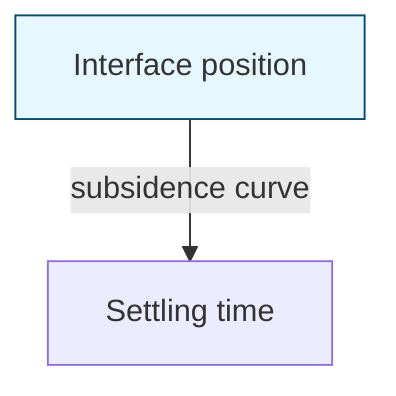
FIGURE 21.2 Example of a subsidence curve for a liquid–solids interface.
\n---\n

## FIGURE 21.3 An example of the graphical method of Yoshioka et al. (1957).

```mermaid
graph TB
    subgraph Figure_21_3
        A[SOLIDS FLUX (vertical axis)]
        B[Solids concentration (horizontal axis)]
        C[Operating line] --> D[Settling flux curve]
        E[Intersection region U]
    end
    A --- B
    B --> C
    B --> D
    C --> E
    D --> E
```

In this procedure, gravity thickener operation is assumed to be strictly one-dimensional
(i.e., solids are distributed uniformly and horizontally at the feed level, and thickened-
underflow removal produces equal downward velocities throughout the tank): However;
full-scale gravity thickeners typically cannot meet these conditions, because of the
relatively small feed-well and central withdrawal of thickened solids. No data are available
on the effects of non-uniform solids distribution and removal, although these factors
should be considered when sizing a gravity thickener: Design methods based on a single-
batch settling test are available in the literature (Talmage and Fitch, 1955; Wilhelm and
Naide , 1979; Purchas, 1977).

### 2.8.3 Determining Area Based on Bench-Scale Testing

William and Naide (1979) developed a useful method when using bench-scale studies to
help design a gravity thickener. It has three basic steps:

- Compute the settling velocity based on settling curves taken at several feed solids
  concentrations (at least three).

- Obtain the constants a and b using the following equation:

\n---\n

# V = a C^b  (21.3)

where V = settling velocity (m/d),
C = solids concentration (kg/m^3), and
a, b = constants.

The constant is a measure of the relative ease of settling; it is a function of particle size and shape, liquid and solid densities, liquid viscosity, and attractive or repulsive forces between particles. The exponent b is calculated from the slope of the line. It is typically constant over a certain range of concentrations, but gradually increases as particle-to-particle contact increases.

* For each straight line on a log–log plot of velocity versus concentration, calculate the unit area as follows:

$$UA = \left[\frac{(b-1)}{b}\right]^{b-1} (C_u)^{?} \quad (21.44)$$

where UA = unit area (m^2/kg d) and

C_u = the underflow’s solids concentration (kg/m^3).

Also, bench tests have been developed to evaluate the significance of flocculating agents during thickening: Coagulants (e.g., alum, ferric salts, or organic polyelectrolytes) can enhance flocculating characteristics and reduce the required settling area. Polymers may double the solids concentration in a given unit area.

Once suitable flocculants have been selected, engineers can conduct additional testing in a 1- to 2-L cylinder to determine the underflow concentration that can be achieved. In this test, they should add a relatively dilute concentration of polymer (less than 1000 mg/L) to solids. Then they should insert picket rakes in the cylinder and continue thickening for a standard time (1–24 hours, depending on the flocculant’s effectiveness). The ultimate density achieved will be a fair but conservative measure of what to expect in a full-scale unit. For more accuracy during scale-up, engineers should use a test cylinder with a depth closer to that of the full-scale unit.
\n---\n

## 2.8.4 Determining Area Based on Pilot-Scale Testing

If a WRRF can provide enough solids for pilot-testing, reliable design data for a gravity thickener can be obtained by operating a continuous pilot unit. When sizing the pilot unit, engineers should consider the availability of test solids and the means for withdrawing thickened solids at the low flowrates required. If at all practicable, the unit should be at least 2 m (6 ft) in diameter, have a side water depth of at least 2 m (6 ft), and a bottom slope ratio of 70 mm to 3010 mm (2.75:12 in.) (vertical distance to tank radius). It should also be equipped with a feed well and a mechanism for directing solids to the withdrawal point on the tank bottom.

Engineers should conduct pilot-scale tests at several solids loading rates to determine the effect on required solids-withdrawal rates and resulting underflow solids concentrations. During each test run, ensure that the gravity thickener is operated under steady state, fully loaded conditions. A gravity thickener is operating at steady state when the solids feed and withdrawal rates are equal and do not change the unit's solids inventory. It is fully loaded when it has a solids blanket but does not lose solids in the overflow. Attaining such conditions is difficult and time consuming. One approach is to start with a slightly overloaded gravity thickener; gradually increase the solids-withdrawal rate until the overflow is solids-free, and then maintain these conditions to stabilize the blanket level. Ideally, the blanket level should be constant under all solids loading conditions. (Engineers can conduct a separate study at a convenient solids loading rate to identify any effects blanket depth may have on thickener performance.)

Once steady state, fully loaded conditions have been maintained for a certain period of time as determined by site conditions (typically 0.5–2 hours of hydraulic retention time), gravity thickener performance should be monitored by measuring the following parameters at convenient intervals:

* Solids feed rate (as determined from feed flowrate and solids concentration),
* Volumetric underflow rate and solids concentration,
* Volumetric overflow rate and suspended solids concentration, and
* Concentration profile of thickener at the end of the run.

## 2.9 Design Example

\n---\n

Design engineers need to size a circular gravity thickener for a WRRF with a primary sludge solids loading rate of 22 680 kg/d. Using Table 21.3, designers should select the higher solids loading rate to allow for operation with one unit out of service: Design engineers typically use a side water depth of 3 to 4 m.

Using Table 21.3, however; recent designs have favored deeper side water depths:

Design engineers typically select a loading rate of 6 kg/m^2 · h.

- Solids loading of primary sludge (dry weight) = 22 680 kg/d
- Number of operating units = 1 unit
- Design loading rate (6 kg/m^2 · h) = 147 kg/m^2/d

Equation used:

$$\text{Surface area} = \frac{\text{Solid Loading}}{\text{Design Loading Rate}} \quad (21.5)$$

$$\text{Radius} = \sqrt{\frac{\text{Surface area}}{\pi}} \quad (21.6)$$

$$\text{Surface area} = \frac{22\,680\ \text{kg/d}}{147\ \text{kg/m}^2\cdot\text{d}} = 155\ \text{m}^2 \quad (\text{use eq 21.5})$$

$$\text{Radius} = \sqrt{\frac{155\ \text{m}^2}{\pi}} \approx 7\ \text{m} \quad (\text{use eq 21.6})$$

$$\text{Diameter} = 14\ \text{m}$$

Assumption:

(1) Thickening facility operates continuously.

(2) Typically, two tanks operate simultaneously; however, this calculation allows for operations with one out-of-service.

Note: Gravity thickener diameter is based on solids loading per unit from manufacturer.

3.0 Dissolved Air Flotation Thickener

Dissolved air flotation (DAF) can be used to either clarify liquids or concentrate solids. The quality of the liquid effluent (subnatant) is the primary performance factor in clarification applications (e.g., refinery, meat-packing, meat-rendering, and other oily wastewaters).

\n---\n

The concentration of floating solids is the main performance criteria in concentration applications (e.g., waste solids of biological, mining, and metallurgical processes). This section focuses on concentrating solids or sludge thickening. Particular advantages of dissolved air flotation thickener (DAFT) include the following:
* Ability to successfully co-thicken primary and secondary sludges
* Amenability of thickening scum from both the primary and secondary scum collection systems
* Allowing scum and sludge to be transported to the thickening process with maximum hydraulic flow
* Allowing the separation and capture of grit from a continuous bottom sludge removal system when co-thickening primary and secondary sludges
* Continuously producing a homogeneously mixed thickened sludge product that is of ideal quality for feeding digesters
* Allowing all solids processing recycle loads to be concentrated into one stream
* Achieving a significant soluble BOD reduction in the DAFT subnatant stream

## 3.1 Operating Principle

In contrast with gravity thickeners, the solids are floated in the DAFT process by using air bubbles to alter their specific gravity. A DAFT, which essentially consists of a DAFT tank (or flotation unit) and a pressurization system (or saturation system), uses a solids/liquid separation process to achieve a thickened product. The purpose of the process is to provide a source of air for the flotation process by pressurizing a stream of liquid, saturating the liquid with air; and depressing the liquid at a location where the bubbles that form upon release of pressure will come in contact with the solids entering the DAFT. One can observe the depressurization effect by removing the cap from a bottle of soda water: The bubbles that form in the liquid when the cap is removed represent the excess gas that can no longer remain in solution at atmospheric pressure: The DAFT tank serves to separate the solid phase from the liquid phase. The pressurization system dissolves air into the liquid stream, typically recycled subnatant; under pressure As the pressure saturated recycled subnatant is introduced into the DAFT tank, its pressure is reduced causing the air to precipitate out of solution in the form of very small bubbles, which are
\n---\n

# DAFT Tank Operation and Thickening

Blended with the DAFT feed. The precipitated bubbles are blended with the DAFT feed and become attached to the feed solids forming bubble-particle agglomerates with a density lower than water.

The buoyant bubble-particle agglomerates rise to the liquid surface and accumulate as a float while the heavier particles settle out as bottom sludge. The difference in density between the float and the liquid causes the top of the float to rise above the liquid surface. The float and bottom sludge are removed from the DAFT tank by a surface skimmer and a bottom collector, respectively. Drainage of interstitial water from the float above the liquid surface increases the solids concentration. This process is termed as thickening. Introducing primary sludge during co-thickening promotes more porous float structure, thereby enhancing thickening. The advantages and disadvantages of co-thickening are discussed later in this section.

A DAFT is typically used to thicken WAS, aerobically digested solids, and contact-stabilized, modified activated, or extended aeration solids without primary settling. It is typically not used for primary solids because gravity thickening is more economical. However, it can effectively co-thicken primary sludge with WAS or trickling filter solids. The main components of a DAFT are the pressurization system and DAFT tank (see Figure 21.4). The pressurization system has a recycle pressurization pump, an air compressor, an air saturation tank, and a pressure-release valve. The DAFT tank has a surface skimmer for float blanket depth control and float removal from the DAFT tank to a float collection box. The settled heavier solids are removed by a bottom collector. Most DAFT tanks are baffled and equipped with an overflow weir. Clarified effluent passes under an end baffle (rectangular units) or peripheral baffle (circular units) and then flows over the weir to an effluent launder. The weir controls the liquid level within the DAFT tank with respect to the float collection box and helps regulate the capacity and performance of the DAFT.
\n---\n

## 3.2 Physical and Mechanical Features

### 3.2.1 DAFT Tanks

The number and configuration of DAFTs tanks to be installed at a WRRF depends on the facility size, method of operation, the quantity of solids to be thickened under average and peak loading conditions, and the requisite operating flexibility.

DAFT tanks can be rectangular or circular. Both rectangular and circular units have been used in WRRFs ranging from 38 to more than 380 000 ML/d (1 to more than 100 mgd):

The typical surface area for rectangular DAFTs varies from 9 to 167 m2 (100–1800 sq ft). Length-to-width ratios typically are between 3:1 and 4:1. Their float skimmers can be closely spaced and designed to skim the entire surface. The bottom sludge collector typically has a separate drive, so it can be operated independently of the skimmer. The liquid surface can be adjusted more easily because of the straight-end weir configuration.

The typical surface area for circular DAFTs varies from 29 to 130 m2 (300–1400 sq ft). They are often used when land availability is not a constraint:

DAFT tanks can be constructed of concrete or steel. Typically, larger tanks are made of concrete, while rectangular tanks up to 41.8 m2 (450 sq ft) [2.4–3 m (8–10 ft) wide] and circular tanks up to 9 m2 (100 sq ft) are made of steel. The size of steel DAFT tanks is

FIGURE 21.4 Schematic of a dissolved air flotation thickener.

<div style="page-break-after: always;"></div>

<pre><code class="mermaid">
graph TD
Saturation_tank[Saturation tank] --> DAF_thickner[DAF thickner]
Feed_sludge[Feed sludge] --> DAF_thickner
Air[Air] --> DAF_thickner
Polymer[Polymer] --> DAF_thickner
DAF_thickner --> Subnatant[Subnatant]
Subnatant --> Recycled_subnatant[Recycled subnatant]
</code></pre>

\n---\n

## 3.2.2 Skimmers and Rakes

limited by structural and shipping considerations; they are typically completely assembled and only require a concrete foundation pad, piping, and wiring hookups. Steel tank systems have higher equipment costs but avoid field-installation costs (e.g., structural, labor, and equipment components). Concrete tanks are typically more economical for a large installation requiring multiple or large tanks (U.S. EPA, 1979).

DAFTs are equipped with float skimmers and bottom sludge collectors. Float skimmers remove float from the DAFT tank to maintain a constant float-blanket depth. They can be controlled manually or automatically. The most common method is manual control of skimmer speed based on site-specific operating conditions. A more preferable arrangement is the use of automatic timers to control skimmer operation so the solids blanket remains 300 to 500 mm (12–18 in.) deep. This approach maximizes both float-solids concentration and float drainage before removal. Design engineers can use skimmer on–off cycles of variable durations to maximize float-solids detention time while maintaining a stable blanket. They should also use variable-speed skimmers [up to about 7.6 m/min (25 ft/min)] to maximize operating flexibility and should time the skimmer cycle so the skimmer’s maximum speed is 300 mm/min (1 ft/min).

The bottom sludge collector removes solids that have settled. Engineers should design the bottom sludge collectors and float skimmers as separate systems. Bottom sludge collectors that are operated at excess speeds for the application may adversely affect DAFT performance. Providing a separate drive system for the bottom rake collector allows operators to operate them only as required.

## 3.2.3 Overflow Weir

DAFTs are baffled and equipped with an overflow weir: The weir controls the liquid level in the DAFT tank with respect to the float collection box, thereby regulating the DAFT’s capacity and performance. To maximize capacity and performance under widely fluctuating conditions, the overflow weir should be adjustable and/or the float skimmer should be on a variable speed drive.

## 3.2.4 Pressurization System
\n---\n

# Pressurization systems for DAF

Pressurization systems dissolve gas (typically air) into the liquid used during DAF. The theoretical principles of pressurization systems are well known and have been discussed by several researchers (e.g., Vesilind, 1974b; Bratby and Marais, 1975a, 1975b, and 1976; Speece et al., 1975).

Historically, three methods have been used to provide gas bubbles for a DAFT system: total, partial, and recycle pressurization flow schemes (see Figures 21.5, 21.6, and 21.7). The total-pressurization flow scheme pressurizes the entire waste stream entering the DAFT; it is only practical for small flowrates, oily liquids, or other situations where turbulence in the pressurization systems will not degrade solids enough to impair DAFT performance. This approach should not be used when the influent contains flocculated solids because the turbulence in the tank and pressure-relief valve would destroy flocs. This approach should also not be used when the influent contains abrasive or large solids, which can wear eductors and clog pumps; rather, recycle pressurization should be used instead.

Partial pressurization systems pressurize a fraction of influent; how much depends on the air-to-solids ratio needed for optimal performance. This flow scheme is typically only practical for small rates of non-flocculated oily wastewaters. Its limitations are the same as those for total pressurization:

Most DAFT units thickening WAS use recycle pressurization systems, in which some of the subnatant is pressurized. Influent solids do not pass through the pressurization system but are mixed with the pressurized recycle stream before entering the DAFT unit:

<table>
  <thead>
    <tr>
      <th>Compressed</th>
      <th>Air</th>
    </tr>
  </thead>
  <tbody>
    <tr>
      <td>Unthickened</td>
      <td>Solids</td>
    </tr>
  </tbody>
</table>

Compressed Air</img>
  
\n---\n

## FIGURE 21.5 A dissolved air flotation thickener using a total-pressurization-of-solids flow scheme to produce gas bubbles

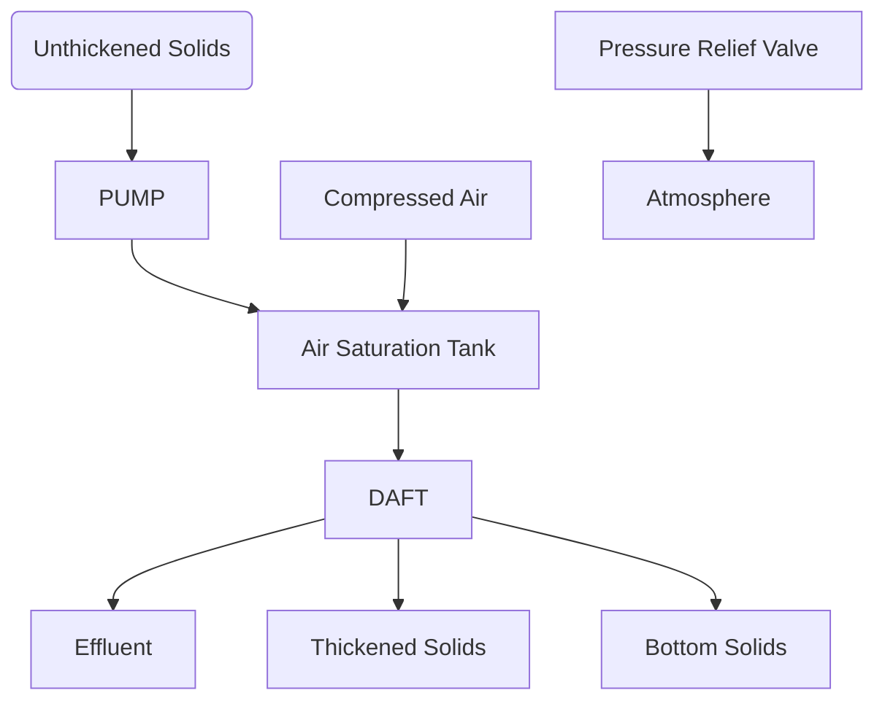

----

## FIGURE 21.6 A dissolved air flotation thickener using partial-pressurization-of-solids flow scheme to produce gas bubbles

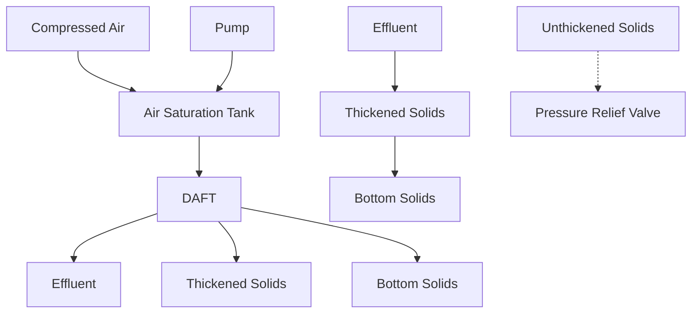

----

## FIGURE 21.7 A dissolved air flotation thickener using a recycle-pressurization-of-solids flow scheme to produce gas bubbles

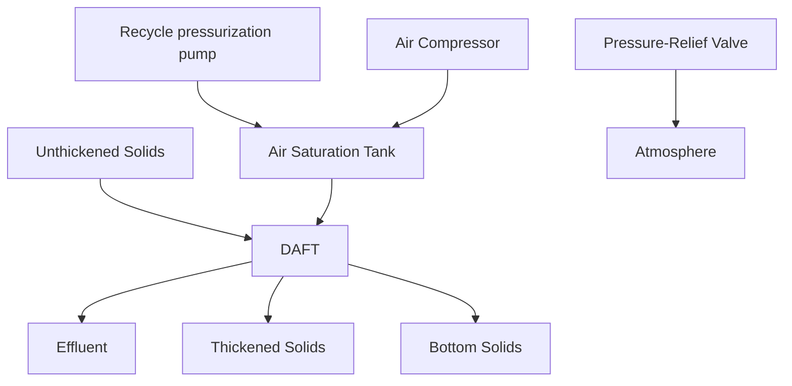

> The pressurization system consists of a recycle pressurization pump, an air compressor, an air-saturation tank, and a pressure-relief valve. Most systems operate at 380 to 520 kPa (55–75 psi). About 40% to 90% (depending on system design) of the oxygen and

\n---\n

## 3.2.5 Pressurization Tanks

nitrogen in the air entering the tank is dissolved in the liquid. As dissolved air is released from solution, operators use the pressure-relief valve to control pressure loss and evenly distribute flow:

Recycle pressurization systems are used in large DAFT applications and when the influent contains flocculated (typically biological) solids. Most systems include auxiliary recirculation flow (e.g., facility effluent) to start up the process. Because the system is complex and consists of numerous valves and fittings, staff training programs are essential to ensure proper operation.

Each pressurization system includes one or more of the following: a pressurization pump, pressurization tank, air compressor; airflow control panel, recycle-flow indicator, pressure-release valve, other valves, piping, and pressure gauges. The primary component is the pressurization tank:

This tank is designed to dissolve air efficiently into the pressurized recycle liquid. It provides the liquid residence time and the mass-transfer surface (in some cases, internal structures) necessary to permit air to dissolve in liquid. If the air is injected upstream of the pressurization tank, the tank may also be designed to separate undissolved air from the recycle stream. If the tank has internal structures designed to create liquid mass-transfer surface (e.g., trays, packing, and nozzles), they must be designed to be nonclogging. The recycle stream typically contains 100 to 200 mg/L of biological solids; it can contain 3000 mg/L or more during upsets. These solids will clog most traditional mass-transfer packing surfaces:

The pressurization tank should be next to the DAFT and pressurization pump(s) to minimize piping requirements and headloss via interconnecting piping. Any pressure loss downstream of the pressurization tank tends to release dissolved air from solution. Released air can enter the DAFT as entrained air bubbles and create disruptive turbulence in the inlet section.

Pressurization tanks are typically constructed in accordance with the American Society of Mechanical Engineers (ASME) code for unfired pressure vessels with a working pressure of 700 kPa (100 psi); however, they are typically tested hydrostatically to 1300 kPa (150 psi).
\n---\n

## 3.3 Process Design Conditions and Criteria

ps i). The ASME's design code includes a corrosion allowance whose magnitude depends on the specific constituents anticipated in the recycle stream. If more corrosion protection is required, a layer of epoxy coating is applied to the tank's internal surfaces. Stainless steel vessels can also be used.

The pressurization tank typically has steel legs or other support systems, a drainage opening, an access manhole for inspection and maintenance, a liquid-level sight glass, a pressure gauge protected by a diaphragm element, and a pressure-relief safety valve. It may also have one or more air-inlet connections, an air-release valve, and a liquid-level control valve.

The capacity of DAFT units is an order of magnitude greater than that of gravity thickeners, so their space requirements are typically low. At large WRRFs with an influent 5-day biochemical oxygen demand (BOD5) of 150 to 200 mg/L, a DAFT process with polymer addition needs 0.37 to 0.0005 m2 d/m3 (15–20 sq ft/mgd); without polymer addition, the process needs 0.7 to 0.001 m2 d/m3 (30–40 sq ft/mgd). At small WRRFs with the same BOD5, a DAFT process with polymer addition needs 0.5 to 0.0007 m2 d/m3 (20–30 sq ft/mgd); without polymer addition, the process needs 1.0 to 0.0015 m2 d/m3 (40–60 sq ft/mgd). Because they do not need much space, DAFT thickeners can be located inside buildings. This is especially desirable in locales where odor control is required, or cold or wet climates could adversely affect a DAFT unit's mechanical performance.

Before feed solids enter a DAFT tank, they typically are mixed with a recycled flow. The recycled flow is pressurized up to 520 kPa (75 psi) and added at a rate that depends on feed-solids concentration and the air-to-solids ratio. The intent of the pressurization system is to deliver air to the system under pressure: When the pressure is released into the DAFT tank fine bubbles attach to the incoming solids. This recycle flow that is pressurized is typically DAFT subnatant. Recycled flow first is pumped to an air-saturation tank, where compressed air dissolves into the flow. When returned to the DAFT tank (whose surface is at atmospheric pressure), the pressure release creates the air bubbles used for flotation. These bubbles typically range from 10 to 100 micrometers in diameter, which is approximately the diameter of human hair, pollen, plant spores, and fog.
\n---\n

The air combines with solids particles and floats, forming a blanket on the DAFT tank surface. Meanwhile, clarified effluent flows under the tank baffle and over the effluent weir: properly designed and operated DAFT typically captures between 94% and 99% of suspended solids.

Other DAFT pressurization systems do not use recycled flow; instead, they pump all or part of feed solids through an air-saturation tank and then into the DAFT tank: Such systems are inadvisable for water resource recovery applications because they subject solids to high-shear conditions and the solids can clog various pressurization-system components.

Polymers can enhance DAFT performance by significantly increasing applicable solids-loading rates and solids capture; and they can also increase the concentration of floating-solids concentrations to some degree. If used, a polymer is typically introduced at the point where feed solids and recycle flow are mixed: For the best results, design engineers should introduce polymer to the recycle flow just as the bubbles are being formed (before it is mixed with feed solids). Good mixing, enough to ensure chemical dispersion while minimizing shearing forces, will provide the best solids–air bubble aggregates.

Table 21.4 presents operating data from selected DAFT thickener installations. Numerous factors affect DAFT process performance, including

* Type and characteristics of feed solids,
* Mixed liquor sludge volume index,
* Hydraulic loading rate,
* Solids loading rate,
* Feed-solids concentration,
* Air-to-solids ratio,
* Float-blanket depth,
* Chemical conditioning,
* Float-solids concentration,
* Solids capture,
* Solubilization efficiency, and
\n---\n

* Co-thickening primary and secondary solids.

<table>
<thead>
<tr>
<th>Location</th>
<th>Activated-Sludge Type</th>
<th>Feed Solids Concentration (mg/L)</th>
<th>Solids Loading Rate (kg/m2-h)</th>
<th>Float Concentration (%)</th>
<th>Polymer Dosage, g Active Polymer/kg of Solids</th>
<th>Solids Capture (%)</th>
</tr>
</thead>
<tbody>
<tr>
<td>Green Bay, Wisconsin</td>
<td>Contact stabilization</td>
<td>4000</td>
<td>1.5</td>
<td>3–4</td>
<td>None</td>
<td>80–85</td>
</tr>
<tr>
<td>San Francisco, California Southeast Plant</td>
<td>High-purity oxygen</td>
<td>6000</td>
<td>3.4</td>
<td>3.7</td>
<td>1.6</td>
<td>98.5</td>
</tr>
<tr>
<td>Salem, Oregon</td>
<td>High-purity oxygen</td>
<td>14,800–20,300</td>
<td>19.5</td>
<td>5</td>
<td>48–59</td>
<td>95+</td>
</tr>
<tr>
<td>Milwaukee, Wisconsin South Shore Plant</td>
<td>Conventional</td>
<td>5000</td>
<td>4.9</td>
<td>3.2</td>
<td>1.5–2.5</td>
<td>90–95</td>
</tr>
<tr>
<td>Tri-Cities, Oregon</td>
<td>Conventional</td>
<td>11,300</td>
<td>—</td>
<td>3.9</td>
<td>1.5–2.5</td>
<td>98</td>
</tr>
<tr>
<td>Arlington, Virginia</td>
<td>Conventional</td>
<td>10,000</td>
<td>8.5</td>
<td>2.6</td>
<td>1.5–2</td>
<td>95+</td>
</tr>
<tr>
<td>Kenosha, Wisconsin</td>
<td>Conventional</td>
<td>8600</td>
<td>5.4</td>
<td>4.3</td>
<td>None</td>
<td>99+</td>
</tr>
</tbody>
</table>

TABLE 21.4 Typical Operating Data for Dissolved Air Flotation Thickners

These factors often act synergistically to produce a net positive or negative effect on DAFT performance. Isolating each factor's effect is often difficult; but Bratby and Marais (1975a) have proposed a model to predict DAFT performance as a function of various conditions.

### 3.3.1 Type of Solids
\n---\n

DAFTs can thicken a variety of solids, including conventional WAS, solids from extended aeration and aerobic digestion, pure-oxygen activated sludge, and solids from dual biological processes (trickling filter plus activated-sludge): The performance characteristics of each type of solids are difficult to document because site-specific conditions [e.g., type of process, SRT, and sludge volume index (SVI) in the aeration basin] affect DAFT performance more than flotation-equipment adjustments (e.g., air-to-solids ratio). Gulas et al. (1978) and Wood and Dick (1975) discuss the effects of some facility operating parameters on DAFT performance in considerable detail.

### 3.3.2 Mixed-Liquor Sludge Volume Index
One of the solids characteristics affecting DAFT performance is activated sludge mixed-liquor SVI: The floating-solids concentration typically decreases as SVI increases. To produce a 4% floating solids concentration with nominal polymer doses, SVI should be less than 200 mL/g. If SVI is low, solids are compacting well, and a broad band of floating solids exists, then other factors are likely influencing DAFT performance. At higher values, SVI has a deleterious effect on floating solids. Large doses of polymer are typically required when thickening WAS from systems with excessively high SVI.

### 3.3.3 Hydraulic Loading Rate
The hydraulic loading rate is the sum of the feed and recycle flowrates divided by the net available flotation area. Engineers typically design DAFTs for hydraulic loading rates of 30 to 120 m3/m2 d (0.5–2 gpm/sq ft), with a suggested maximum daily hydraulic loading of 120 m3/m2 d (2 gpm/sq ft) if no conditioning chemicals are used. If the hourly hydraulic loading rate exceeds 5 m3/m2 h (2 gpm/sq ft), the added turbulence may prevent a stable float blanket from forming and reduce the attainable floating-solids concentration. Also, fewer solids may be captured because increased turbulence forces the flow regime to convert from plug flow to mixed flow. A polymer flotation aid is typically required to maintain satisfactory performance when hourly hydraulic loading rates are greater than 5 m3/m2 h (2 gpm/ sq ft).

### 3.3.4 Solids Loading Rate
The solids loading rate for a DAFT denoted in terms of solids weight per hour per effective flotation area (see Table 21.5). Without chemical conditioning, the loading rates for DAFT
\n---\n

## Table 21.5 Percent Suspended Solids Captured When Using Dissolved Air Flotation to Thicken WAS (U.S. EPA, 1974; Komline, 1976)

The text preceding the table describes the thickening of Waste Activated Sludge (WAS) and how polymer addition can increase the solids loading rate, producing a thicker underflow with more solids.

| Type of Solids | Optimal with Chemical Addition | Up to |
|---|---|---|
| Primary only | 4–6 | up to 12 |
| WAS |  |  |
| Air | 2 | up to 10 |
| Oxygen | 3–4 | up to 11 |
| Trickling filter | 3–4 | up to 10 |
| Primary + WAS (air) | 3–6 | up to 10 |
| Primary + trickling filter | 4–6 | up to 12 |

TABLE 21.5 Percent Suspended Solids Captured When Using Dissolved Air Flotation to Thicken WAS (U.S. EPA, 1974; Komline, 1976)

Operating difficulties may arise when the solids loading rate exceeds approximately 10 kg/m2-h (2.0 lb/hr sq ft). These difficulties typically are caused by coincidental operation at excessive hydraulic loading rates and by float-removal difficulties. Even when the hydraulic loading rate can be kept below 120 m3/m2-d (2 gpm/sq ft), operating at solids loading rates more than 10 kg/m2-h (2.0 lb/hr sq ft) can cause float-removal difficulties. The extra floating material created at high solids loading rates necessitates continuous, often rapid, skimming.

\n---\n

Faster skimming, however, can disturb the float blanket and lead to a supernatant with unacceptable solids levels. In these circumstances, a polymer aid can increase the solids’ rise rate and float-blanket consolidation rate, thereby alleviating some of the operating difficulties. Although stressed conditions (e.g., mechanical breakdown, excessive solids wastage, or adverse solids characteristics) may make it necessary to operate in this manner periodically, the flotation system should not be designed on this basis.

## 3.3.5 Feed-Solids Concentration

Feed-solids concentration affects DAFT processes in two ways. As in sedimentation processes, feed-solids concentration directly affects the floating solids’ characteristics in terms of initial and, to a lesser extent, hindered rise rate. Within the normal range of feed-solids concentration between 0.5% and 1% (5000–10,000 mg/L), more dilute feed solids results in more rapid initial and hindered rise rates. However, this phenomenon only has a minor effect on DAFT sizing and performance because the solids blanket’s hindered rise rate and compression rate govern design and performance for most thickening applications.

Feed-solids concentration also indirectly affects DAFT performance via resulting changes in operating conditions. For example, if the feed flowrate, recycle flow, pressure, and skimmer operations remain constant; then increasing feed-solids concentration decreases the air-to-solids ratio. Changes in feed-solids concentration also change float-blanket inventory and depth. Float skimmer speed may need adjustments when the operating strategy involves maintaining a specific float blanket depth or range of depths.

## 3.3.6 Air-to-Solids Ratio

The air-to-solids ratio—the ratio by weight of air available for flotation to the floatable solids in the feed stream—is the most important factor affecting DAFT performance. Reported ratios range from 0.01:1 to 0.4:1 (U.S. EPA, 1979) at most municipal WRRFs; adequate flotation occurs at ratios of 0.015:1 to 0.03:1. Design engineers size pressurization systems based on many variables (e.g., design solids loading, pressurization-system efficiency, system pressure, liquid temperature, and dissolved solids concentration). Pressurization-system efficiencies vary among manufacturers and system configurations; they can range from as low as 50% up to more than 90%. The U.S.
\n---\n

### 3.3.7 Float-Blanket Depth

EPA (1979) provides detailed information on designing, specifying, and testing pressurization systems:

Because the solids blanket in a DAFT thickener contains a considerable amount of entrained air, design engineers should use positive-displacement or centrifugal pumps that do not air bind, and consider suction conditions. Initially, the density of skimmed solids is about 700 kg/m^3 (6 lb/gal). After they are held for a few hours, the air escapes and solids return to normal densities.

Up to a point, solids blankets increase as air-to-solids ratios increase; then, further increases in air-to-solids ratios result in little or no increase in floating solids (Gehr and Henry, 1978; Gulas et al., 1978; Maddock, 1976; Mulbarger and Huffman, 1970; Turner, 1975). The solids blanket is typically maximized when air-to-solids ratios are in the range of 0.1:1.

There are several explanations for this wide range. First, the optimum air-to-solids ratio is related to the type of feed solids and its characteristics. For example, activated sludge with low SVIs require lower air-to-solids ratios than those with high SVIs:

Second, evaluating the effects of air-to-solids ratios is difficult because other DAFT operating conditions (e.g., blanket depth) can vary as the air-to-solids ratio changes. So, the effect of a change in air-to-solids ratio is often masked by other changes.

Finally, differences among the DAFT systems researched (e.g., the pressurization system's air-dissolving efficiency, gas-bubble size distribution, and feed-recycle mixing methods) undoubtedly are responsible for some of the differences in optimum air-to-solids ratios.

Although the optimum air-to-solids ratio is probably related to solids type and characteristics, lower air-to-solids ratios seem to be required to maximize the performance of systems that operate at a high air-dissolving efficiency, produce optimum air-bubble size distribution, and correctly contact the feed solids and minute air bubbles at the proper time.
\n---\n

The floating solids produced during DAFT operation must be removed from the tank. This solids-removal system typically consists of a variable-speed float skimmer and a beach arrangement. The volume of floating solids that must be removed during each skimmer pass depends on the solids loading rate, the chemical dose rate, and the consistency of floating solids.

A blanket of waste biological solids consists of two sections: one above the nominal water level and one below it. When evaluating a DAFT system, Bratby and Marais (1975b) found that its ratio of float depth above the surface to float depth below the surface was 0.2:1 when the air-to-solids ratio was 0.02:1. They stated that the optimal ratio of above-surface and below-surface solids will differ according to the type of feed solids involved.

The concentration of solids on the surface of the solids blanket is always greater than the average concentration of solids within the blanket. Bratby and Marais (1975b) also suggested that DAFT thickening occurs as water drains from the section above water to that below it. Maddock (1976) found that the solids concentration at the blanket surface was nearly twice that at the blanket-subnatant interface.

Blanket skimmers are designed and operated to maximize float drainage time by incrementally removing only the top (driest) portion of the blanket and preventing the blanket from expanding to the point where solids exit the system in the subnatant. The optimal float depth varies from installation to installation. A float depth of 300 to 600 mm (1–2 ft) is almost always sufficient to maximize floating-solids content:

## 3.3.8 Chemical Conditioning

Chemical conditioning can enhance DAFT performance. Conditioning agents can improve clarification or increase the floating solids concentration. Design engineers should determine the amount of conditioning agent required, the point of addition (in the feed stream or recycle stream), and the intermixing method for each installation. Bench- or pilot-scale tests are the most effective methods of determining the optimal chemical-conditioning scheme for a particular installation.

Typical polymer doses range from 2 to 5 g dry polymer/kg dry feed solids (4–10 lb/ton) as active content. Adding polymer typically affects solids capture more than floating-solids
\n---\n

content. For example, adding dry polymer at a dose of 2 to 5 g/kg dry feed solids typically increases floating solids content by no more than 1%.

If design engineers use the lower ranges of hydraulic and solids loadings, properly designed and operated DAFTs typically do not need polymer. Maintaining proper design and operating conditions results in stable operations and satisfactory solids capture and floating-solids concentration. Routine additions of polymer should only be considered for designs with extreme loading conditions or when solids are expected to have poor compaction characteristics such as high SVI.

Without polymer addition, a properly sized DAFT unit will typically recover more than 90% of solids. High loadings or adverse solids conditions can cut solids recovery to 75% to 90%. Polymer-aided recovery can exceed 95%.

Under normal operations, solids recycled from the DAFT unit will not damage the treatment system but rather increase WAS. However, if solids or hydraulic loading are already excessive, recycled solids pose an additional burden on the system. Under these conditions, polymers should be used to maximize solids capture from the DAFT unit:

3.3.9 Floating Solids Concentration
As with any thickening process, flotation performance strongly depends on the type and characteristics of the solids being thickened. Although municipal WRRFs typically use DAFT to thickEN WAS, they also have used it to thickEN raw primary solids, trickling filter humus, and various combinations of these.
The floating solids concentration that a DAFT treating WAS can obtain is influenced by various factors, the most important of which are innate solids characteristics (i.e., SVI), solids loading rate, air-to-solids ratio, and polymer application: Test results demonstrate that the floating solids concentration typically decreases as solids loading rates increase (see Figure 21.8). They also indicate (with few exceptions) that polymers must be used to achieve the higher loading rates. Although high loadings of 15 to 29 kg/m^2 h (3–6 lb/hr sq ft) can be achieved, these results are neither typical of the average facility nor a relevant basis for new designs. In some cases, a lot of expensive chemicals are necessary to achieve a loading level in excess of 10 kg/m^2 h (2 lb/hr sq ft).
\n---\n

The curve in Figure 21.8 does not indicate the effect of polymers on floating solids concentration. Polymers can improve poor float concentration up to 1% (2%–3% TSS), but their effect lessens as the concentration of untreated floating solids increases.

DAFTs are typically designed for floating-solids concentrations of 3.5% to 4.0% total solids — a reasonable goal based on the data presented (see Table 21.4) and other published information (U.S. EPA, 1974; Wanielista and Eckenfelder, 1978). However, DAFT performance, like other solids processing equipment performance, is influenced by factors beyond the design engineers’ control. Therefore, designers should anticipate variations in float-solids concentration when sizing downstream unit operations:

### 3.3.10 Solids Capture

Overall solids capture measures how efficiently a DAFT unit recovers solids at a fixed set of operating conditions. The solids-capture calculation is based on a material balance about the DAFT unit (Mulbarger and Huffman, 1970). The flows of interest include feed solids, subnatant, and floating solids. Overall solids capture is defined as:

$$
R = \frac{TS_s (TSS_f - TSS_s)}{TS_f (TSS_f - TSS_s)} \times 100 \quad (21.7)
$$

<table>
  <thead>
    <tr>
      <th>Solids loading, kg/m<sup>2</sup>·h</th>
      <th>With polymer (float concentration, % by wt.)</th>
      <th>Without polymer (float concentration, % by wt.)</th>
    </tr>
  </thead>
  <tbody>
    <tr><td>0</td><td>~4.6</td><td>~5.0</td></tr>
<tr><td>5</td><td>~4.2</td><td>~4.8</td></tr>
<tr><td>10</td><td>~3.9</td><td>~4.4</td></tr>
<tr><td>15</td><td>~3.7</td><td>~4.2</td></tr>
<tr><td>20</td><td>~3.5</td><td>~3.9</td></tr>
<tr><td>25</td><td>~3.2</td><td>~3.6</td></tr>
<tr><td>30</td><td>~3.0</td><td>~3.3</td></tr>
  </tbody>
</table>

Figure 21.8 shows float concentration as a function of solids loading for two conditions (with and without polymer). The data indicate that float concentration generally decreases as solids loading increases, and that polymer addition tends to lower float concentrations at a given loading.

\n---\n

FIGURE 21.8 Floating-solids concentration versus solids loading rates (Noland and Dickerson, 1978).

where R = percentage recovery;
TSP = thickened sludge total solids concentration (% by weight);
TSF = feed sludge total solids concentration (% by weight); and
TSSs = suspended solids concentration in subnatant (% by weight)

Published results of suspended solids capture at numerous DAFT facilities indicate that they can capture at least 95% of solids without using polymer (see Table 21.5). With polymer, they typically capture at least 97% to 98%. When recycling subnatant, most thickening operations need to capture at least 95% of solids to minimize adverse effects on other treatment processes.

## 3.3.11 Solubilization Efficiency

The most cumbersome procedure associated with DAFT equipment is determining the solubilization efficiency of the dissolving tank in the pressurization system. Solubilization efficiency is the ratio of the amount of air (oxygen and nitrogen) actually dissolved in the tank to the amount that theoretically could be dissolved in the tank under existing conditions. Data collection and calculation procedures have been developed and published (APHA et al., 2012; Leininger and Wall, 1974; U.S. EPA and ASCE, 1979).

The pressure/saturation curve for liquids follows Henry's Law and is easily computed from information available in standard references. The most important consideration is that saturation concentration varies inversely with liquid temperature. Therefore, it is important to establish the maximum operating temperature for the pressurization system (or saturation system). In addition, it is important to note that the saturation constant in water for nitrogen is substantially less than that for oxygen: Unless the pressurization tank gas space is vented, the gas above the liquid will become rich in nitrogen. The result will be a significant reduction in the quantity of gas absorbed in a unit volume of water, and available for floating solids thereby reducing the dissolving efficiency:

A variety of pressurization systems are available from DAFT manufacturers, and their air-dissolving efficiency ranges from 65% to 85%, according to Leininger and Wall (1974).

\n---\n

Dissolving efficiency is important because the air-to-solids ratio is critical to DAFT performance: Design engineers must use rigorous test procedures to accurately determine the amount of air available for flotation. For example, procedures that do not distinguish between dissolved and undissolved (free) air (e.g., those based on conventional air mass-balance calculations) will not provide accurate results.
Solids loadings to DAFT systems for various facility sizes are shown in Table 21.6. DAFT operations and performance averages over a 2-year period at a specific WRRF are shown in Table 21.7.

## 3.3.12 Co-thickening Primary and Secondary Solids

In co-thickening processes, settled solids from primary and secondary clarifiers are mixed together then thickened. Co-thickening used to be rare; however, recent pilot testing and full-scale operations have indicated benefits of co-thickening over thickening primary and secondary solids separately (Butler et al., 1997). Some of these include:
* Ability to increase DAFT solids loading rate (could double the solids loading rate per surface area compared to separate thickening);
* Ability to reduce soluble BOD and chemical oxygen demand (COD) as much as 80% and 60%, respectively;
* Lower present-worth and operating costs; and
* Significantly reduced secondary BOD loading while reducing grit because of thickened solids recycling.

A float total solids content of 6% approximates a typical minimum for DAFTs handling a 50:50 mixture of secondary and primary sludge compared to 4% for DAFTs handling solids without primary solids. Under optimum conditions, minimum solids contents ranging from 6% to 8% can be expected from thickening such mixtures (Bratby et al., 2004). Co-thickening can be used at small or large WRRFs but must include polymer to improve clarification and thickening (see Table 21.7). Design engineers should ensure that primary solids and WAS are mixed thoroughly because variable concentrations of mixed solids can cause operating problems and result in poor thickening performance. Mixing is important to maintain consistent polymer doses in the thickening process.
\n---\n

# Solids Loading and DAF Systems

## Solids Loading—Winter Operation

<table>
  <thead>
    <tr>
      <th>Plant Size (m3/d)</th>
      <th>kg/Operating Day (5 day/wk)</th>
      <th>kg/Operating Hour</th>
      <th>Area (m2)</th>
      <th>DAF loading (kg/m2·h)</th>
    </tr>
  </thead>
  <tbody>
    <tr>
      <td>4000</td>
      <td>2130</td>
      <td>430</td>
      <td>108</td>
      <td>12.5</td>
    </tr>
<tr>
      <td>20 000</td>
      <td>10 640</td>
      <td>2130</td>
      <td>532</td>
      <td>62.0</td>
    </tr>
<tr>
      <td>40 000</td>
      <td>21 280</td>
      <td>4300</td>
      <td>716</td>
      <td>84.0</td>
    </tr>
<tr>
      <td>200 000</td>
      <td>106 400</td>
      <td>21 280</td>
      <td>1480</td>
      <td>173.0</td>
    </tr>
  </tbody>
</table>

<p>*Summer operation at 0.65 to 0.8 of winter conditions; DAF loading at 8.6 kg/m2·h.</p>

<p>TABLE 21.6 Design Solids Loading Rate for Dissolved Air Flotation (DAF) Systems*</p>

----

<table>
  <thead>
    <tr>
      <th>Location</th>
      <th>Loading</th>
      <th>% Suspended Solids</th>
      <th></th>
    </tr>
  </thead>
  <tbody>
    <tr>
      <td>Kenosha, Wis.</td>
      <td>53</td>
      <td>No</td>
      <td>99+</td>
    </tr>
<tr>
      <td>Chicago, Ill.</td>
      <td>28.3</td>
      <td>No</td>
      <td>99+</td>
    </tr>
<tr>
      <td>Amarillo, Texas</td>
      <td>14.2</td>
      <td>No</td>
      <td>92+</td>
    </tr>
<tr>
      <td>East Fitchburg, Mass.</td>
      <td>42.5–85.0</td>
      <td>No</td>
      <td>99.5</td>
    </tr>
<tr>
      <td>Xenia, Ohio</td>
      <td>42.5</td>
      <td>No</td>
      <td>99.5</td>
    </tr>
<tr>
      <td>Eugene, Ore.</td>
      <td>35.4</td>
      <td>No</td>
      <td>90+</td>
    </tr>
<tr>
      <td>Bernardsville, N.J.</td>
      <td>62.3</td>
      <td>2.9</td>
      <td>No</td>
      <td>94.5</td>
    </tr>
  </tbody>
</table>

\n---\n

<table>
<thead>
<tr><th>Location</th><th>Col1</th><th>Col2</th><th>Col3</th><th>Col4</th></tr>
</thead>
<tbody>
<tr><td>Morristown, N.J.</td><td>48.1</td><td>1.1</td><td>No</td><td>97.0</td></tr>
<tr><td>Bay Park, N.Y.</td><td>36.8</td><td>0.7</td><td>No</td><td>94.0</td></tr>
<tr><td>East Wenatchee, Wash.</td><td>42.5-0.8</td><td>2.9</td><td>No</td><td>97.3</td></tr>
<tr><td>Incline Vill., Nev.</td><td>31.2</td><td>2.5</td><td>No</td><td>96.4</td></tr>
<tr><td>Fairfax, Va.</td><td>3.2</td><td></td><td>No</td><td>93.0</td></tr>
<tr><tdPlano, Texas</td><td>36.8</td><td>5.8</td><td>No</td><td>95.0</td></tr>
<tr><td>San Pablo, Calif</td><td>17</td><td>2.9</td><td>No</td><td>99.0</td></tr>
<tr><td>Richmond, Calif.</td><td>42.5</td><td>3.6</td><td>No</td><td>98.9</td></tr>
<tr><td>Tenneco, Texas</td><td>5.7</td><td>2.2</td><td>No</td><td>98.8</td></tr>
<tr><td>Adolf Coors, Golden, Colo.</td><td>104.8</td><td>—</td><td>Yes</td><td>99.4</td></tr>
<tr><td>Springdale, Ark.</td><td>70.8</td><td>—</td><td>Yes</td><td>99+</td></tr>
<tr><td>Biddeford, Maine</td><td>90.6</td><td>—</td><td>Yes</td><td>99+</td></tr>
<tr><td>East Fitchburg, Mass.</td><td>85</td><td>—</td><td>Yes</td><td>98.3</td></tr>
<tr><td>Athol, Mass.</td><td>90.6</td><td>—</td><td>Yes</td><td>99.4</td></tr>
<tr><td>Somerset, Mass.</td><td>99.1</td><td>—</td><td>Yes</td><td>99+</td></tr>
<tr><td>Dartmouth, Mass.</td><td>90.6</td><td>—</td><td>Yes</td><td>98</td></tr>
<tr><td>The Dalles, Ore.</td><td>68</td><td>—</td><td>Yes</td><td>99.3</td></tr>
<tr><td>Denver, Colo.</td><td>104.8</td><td>—</td><td>Yes</td><td>99</td></tr>
</tbody>
</table>

\n---\n

# Cities and Values

<table>
  <thead>
    <tr>
      <th>Location</th>
      <th>Value 1</th>
      <th>Value 2</th>
      <th>Status</th>
      <th>Final Score</th>
    </tr>
  </thead>
  <tbody>
    <tr><td>Amarillo, Texas</td><td>65.1</td><td>—</td><td>Yes</td><td>99.2</td></tr>
<tr><td>Warren, Mich.</td><td>59.5</td><td>—</td><td>Yes</td><td>99+</td></tr>
<tr><td>Atlanta, Ga.</td><td>135.9</td><td>—</td><td>Yes</td><td>99.7</td></tr>
<tr><td>Chicago, Ill.</td><td>70.8</td><td>—</td><td>Yes</td><td>99+</td></tr>
<tr><td>Abington, Pa.</td><td>82</td><td>2.9</td><td>Yes</td><td>96.2</td></tr>
<tr><td>Hatboro, Pa.</td><td>83.5</td><td>1.8</td><td>Yes</td><td>96.0</td></tr>
<tr><td>Omaha, Neb.</td><td>87.8</td><td>1.8</td><td>Yes</td><td>99.4</td></tr>
<tr><td>Bellview, Ill.</td><td>107.6</td><td>1.1</td><td>Yes</td><td>98.7</td></tr>
<tr><td>Indianapolis, Ind.</td><td>59.5</td><td>3.6</td><td>Yes</td><td>95.0</td></tr>
<tr><td>Frankenmuth, Mich.</td><td>184.1</td><td>3.2</td><td>Yes</td><td>99.1</td></tr>
<tr><td>Oakmont, Pa.</td><td>85</td><td>2.5</td><td>Yes</td><td>98.7</td></tr>
<tr><td>Columbus, Ohio</td><td>93.5</td><td>2.5</td><td>Yes</td><td>99.5</td></tr>
<tr><td>Levittown, Pa.</td><td>82</td><td>2.5</td><td>Yes</td><td>99.4</td></tr>
<tr><td>Bay Park, N.Y.</td><td>138.8</td><td>2.9</td><td>Yes</td><td>99.6</td></tr>
<tr><td>Nashville, Tenn.</td><td>144.4</td><td>1.4</td><td>Yes</td><td>99.6</td></tr>
<tr><td>East Wenatchee, Wash.</td><td>45.3</td><td>3.2</td><td>Yes</td><td>98.6</td></tr>
<tr><td>Plano, Texas</td><td>53.8</td><td>5</td><td>Yes</td><td>98.8</td></tr>
<tr><td>Richmond, Calif.</td><td>42.5</td><td>3.6</td><td>Yes</td><td>98.0</td></tr>
  </tbody>
</table>

\n---\n

<table>
<tr><td>San Pablo, Calif.</td><td>31.2</td><td>2.9</td><td>Yes</td><td>98.6</td></tr>
</table>

TABLE 21.7 Performance Averages When Using a Dissolved Air Flotation Thickener to Co-thicken Solids (1994–1995) (Butler et al., 1997)

## 3.4 Ancillary Equipment

In addition to the thickening tank, a complete DAFT system includes a number of appurtenances (e.g. pressurization-system; chemical conditioning; and various control elements):

### 3.4.1 Pressurization System

#### 3.4.1.1 Pipes, Valves, and Instruments

Typical recycle-flow DAFT systems have numerous valves and fittings (e.g., interconnecting pipe and pipe fittings, liquid and gas flow-control valves, gas and liquid flowrate indicators, and a level-control valve). All must be properly designed to ensure proper DAFT operations.

Pressurization system components must be spaced as closely as possible to reduce costs and minimize pressure loss and air release in the pipes. Liquid recirculation piping is typically sized to produce a liquid velocity of 0.9 to 1.5 m/s (3–5 ft/s) and manufactured with Schedule 40 or 80 carbon steel or coal-tar, epoxy-coated, carbon steel materials.

Designers should utilize traditional piping practice, including the installation of eccentric reducers and expanders on the suction and discharge sides of the recirculation pump: Isolation valves (e.g., ball, plug or gate valves) with a maximum open passage and minimum pressure drop in the full-open position, should be installed on the influent and effluent side of the flotation vessel (feed, float discharge, and subnatant); recirculation pump; and pressurization tank:

Air supply piping should include oil and moisture traps, a pressure-regulating valve, a rotameter with appropriate temperature and pressure gauges as well as isolation valves and bypass lines, and a check valve next to the air-injection port in the pressurization tank or recirculation piping. Isolation valves should be either ball or gate valves. The

\n---\n

# Pressurization System and Piping Notes

Pressurization tank's air-supply piping should include a solenoid valve that is wired to shut off process air when the pressurization pump is off.

The air supply line should also include a pressure-regulating valve, which is typically set to discharge air at 70 kPa (10 psi) above the air absorption tank's pressure to ensure a constant airflow despite small fluctuations in tank pressure. The airflow rotameter should read in standard volumetric units and equipped with a stainless steel float and a safety shield. The design should include a needle valve downstream of the rotameter to control the airflow rate. All valves in the air-supply system and interconnecting air piping should be made of stainless steel.

If the pressurization system is designed to accommodate a variety of flowrates, a recycle-liquid flow indicator, and control valve can be useful. The flow indicators should be able to handle solids laden streams. Venturi and vortex shedding indicators work well in this application. The flow indicator and control valve should be installed in the pump discharge piping upstream of the pressurization tank: Ball, eccentric-plug, and diaphragm valves are effective flow-control valves that can also serve as isolation valves for pump discharge.

All pressurization systems use a pressure relief valve, which is typically located next to the DAFT tank in the pressurization tank's discharge line. The valve reduces recycle-liquid pressure to atmospheric conditions; the air dissolved under pressure is precipitated at the valve in the form of microscopic air bubbles: These air bubbles contact the solids to be floated. Sometimes the pressure relief valve can be used to control recycle liquid flows. Design engineers should consult pressurization system manufacturers in each instance.

Operators can use a float-controlled air bleed off valve to maintain the liquid level in the pressurization tank: It typically bleeds off a small amount of excess air: If the water level rises, the float closes the bleed port so the air will force the liquid level back down, after which the air bleed resumes. If an alarm circuit is used to indicate a high water level, a float switch can be wired to an air-bleed solenoid valve that bleeds off excess air:

The DAFT tank feed line and subnatant recirculation piping should include provisions for feed and subnatant sampling: Polymer addition taps should be installed in both feed and subnatant lines and should be far enough upstream of the discharge point to allow for thorough mixing: The proper location of these taps is site-specific and should be tailored
\n---\n

### 3.4.1.2 Pumps and Compressors

to the design. Drain plugs should be installed in all low points in feed and subnatant piping. Tee joints should be used for cleanouts rather than elbows so that operators can remove any debris that becomes lodged in process piping:

Design engineers can use positive-displacement, diaphragm, piston, or progressing cavity pumps to feed solids to the DAFT, although centrifugal pumps have been preferred. The pumps should possess variable capacity and an operating range wide enough to accommodate expected variations in solids-production and thickening requirements, as well as variations in feed solids characteristics. They should also be equipped with a flow totalizer or monitor so operators can maintain records of the amount of solids thickened and control DAFT operations. Each DAFT should have its own dedicated pump:

A key element of any DAFT system is the pressurization pump, which feeds enough liquid into the pressurization tank to ensure that the flotation tank will receive the desired amount of dissolved air: Open-impeller, centrifugal pumps typically are used for this purpose: Single- and two-stage pressurization pumps have also been used. Most currently operating DAFT thickeners use single-stage pressurization systems. Two-stage pumps reportedly provide more air-dissolving efficiency than single-stage ones. If using two-stage pumps, compressed air is delivered to the suction end of the second stage.

For system flexibility, design engineers should use pressurization pumps with a relatively steep head-capacity curve. This allows operators to adjust pump flow by throttling the pump isolation valve between the pressurization pump and air-dissolving tank: Throttling provides controlled discharge from pumps with steep head-capacity curves. This is not true for centrifugal pumps with a flat curve; in this case, using a throttling valve could induce pump surging:

Pressurization pumps typically use single-speed motors. The use of two-speed motors or adjustable sheaves for variable head and flow capability depends on several factors (e.g., number of DAFT tanks, operating method, quantity of solids to be thickened under both average and peak conditions, and degree of flexibility desired). Although initial costs are higher, variable-speed pressurization pumps can lower power costs and enhance flexibility:
\n---\n

# 3.4 Dissolved Air Flotation Thickener (DAFT) Systems

## 3.4.1 Air Supply for DAFT

A variety of air compressors (e.g., reciprocating piston, rotary vane, and screw) can be used to provide air for the DAFT process. Some WRRFs use central compressors to meet DAFT air requirements as well as other needs in the facility:

Most flotation systems have their own air compressors. Reciprocating piston-type units are the most common and are typically sized to deliver at least twice the maximum air theoretically required for saturation so the compressor can operate in an unloaded condition about 50% of the time.

In addition to the compressor, a pressure reservoir, air filter, oil trap, pressure regulator, and airflow meter are required.

## 3.4.2 Chemical Conditioning

Dissolved air flotation processes often have polymer systems, which include mixing and storage tanks and chemical feed pumps. The systems can be purchased as a unit from polymer suppliers or designed by engineers. Either way, they should use variable-capacity, positive-displacement pumps so operators can accurately control the amount of polymer used. Each flotation thickener should have its own chemical pump (see Chapter 20).

## 3.4.3 Thickened Sludge Conveyance

DAFT float and underflow can be between 3% and 8% solids (by weight), depending on the application. This cake is highly viscous and often thixotropic. When skimmed as float or scraped as underflow it is typically

- directly discharged to a collection well for subsequent pumping, or
- directly discharged to an open-throat progressing cavity pump.

It is common to use some type of positive displacement pump such as a progressive cavity pump, diaphragm pump or disc pump to convey thickened solids.

## 3.4.4 Odor Control and Ventilation

By design DAFTs have a large liquid/solids exposed surface, which will generate odors. The most common odors are related to reduced sulfur compounds but ammonia compounds can also occur.
\n---\n

If odor treatment is provided it will be necessary to enclose the DAFT, ventilate the air space in the enclosure, and treat the exhausted air. Required ventilation rates may be as high as 20 air changes per hour to prevent corrosion and maintain evacuation of all odors. The odorous air exhausted from the enclosure should be treated before atmospheric discharge if the area adjacent or near the WRRF is expected to be impacted by odors. Odor-treatment options (see Chapter 6) include packed-tower scrubbers and mist scrubbers (chemical scrubbers), activated-carbon beds, and biofilters. In chemical scrubbers, hypochlorite and sodium hydroxide are typically used to scrub sulfur-related odors and sulfuric acid solutions can be used to scrub ammonia-related odors. Another option is adding an odor-control compound (e.g., hydrogen peroxide) to the feed solids, but the compound first should be tested to determine whether it interferes with polymer efficiency and solids thickening:

If the DAFT is enclosed, close attention must be paid to materials of construction of all components to assure long life and prevent excessive corrosion of the components

## 3.5 Process Control
### 3.5.1 Overview
A DAFT system typically includes sludge feed pumps, the chemical conditioning system, the DAFTs, the pressurization system, and the thickened solids conveyance system. The criteria that can be monitored for process control are the hydraulic feed rate, the solids loading rate, and the air-to-solids ratio. These criteria should be checked against the original design criteria if there are process control issues. The DAFT systems that can be adjusted for process control include the chemical conditioning system, the pressurization system, and the skimmers and rake arms.

If using chemical conditioning the chemical effectiveness should be monitored to determine if thickened sludge and solids capture goals are being met. The control valve and the air compressors are critical to control of the pressurization system and ensure there is an air cushion inside the pressurization tank. The speed of the skimmer arms can be changed and the height of squeegees above the ramp adjusted depending on factors such as polymer dose, hydraulic feed rate, solids loading rate, and air-to-solids ratio to improve solids thickening performance:

## 3.5.2 Process Control Monitoring
\n---\n

# 3.6 Performance Assessment and Optimization

## 3.6.1 Performance Parameters
The process performance of a DAFT is primarily assessed through thickened sludge concentration, polymer consumption, and overflow quality. Other parameters of importance are operational consistency, equipment longevity, ease of operation, and ease of maintenance.

The expected process performance for a specific feed sludge and a DAFT are difficult to estimate through pilot-testing as discussed in Section 3.7. Expected operational performance assessment and optimization will largely come through operational testing or learning from others to determine how DAFTs have performed elsewhere on similar feed solids.

## 3.6.2 Optimization Measures
System optimization focuses on maintaining consistent thickened sludge concentration, minimizing polymer consumption, and improving overflow quality. The DAFT systems or components that can be adjusted and should be periodically tested to optimize performance include: the chemical conditioning system, the skimmers and rakes, the pressurization systems, and the thickened sludge conveyance pumps. The chemical conditioning systems should be tested on a regular basis to identify the polymer (or other chemical aid) that provides the best value (cost versus performance) throughout the year: Many facilities' sludge characteristics change in winter versus summer and different chemicals or chemical doses may perform differently during each of those seasons. The elevation of the skimmer arms should be periodically compared to the elevation of the beach to optimize float removal and prevent subnatant carryover: The pressurization
\n---\n

# 3.7 Evaluation and Scale-Up Procedures
System air pressure and the recycle stream flow rate can affect the amount of dissolved air. This should be checked/tested periodically to ensure optimal performance (i.e., float solids thickness and solids capture). The thickened sludge conveyance pumps such as a progressing cavity pump naturally wear over time affecting the ability to maintain a constant, required withdrawal rate.

DAFTs have been widely used to thicken WAS since the mid-1960s. Engineers can typically size DAFT equipment based on design experience at comparably sized facilities. However, bench- or pilot-scale performance investigations can provide valuable information, such as
* Thickened solids concentration, solids recovery rates, and chemical needs;
* DAFT designs that can satisfy performance requirements;
* Acceptable loading rates with polymer addition; and
* The causes of poor or suboptimum DAFT performance.

Before conducting any bench- or pilot-scale tests, however, engineers should collect a representative sample of the solids to be thickened. Then they should determine its suspended solids content, volatile solids content, and SVI for WAS.

## 3.7.1 Bench-Scale Evaluations
Bench-scale tests provide insight into the thickening characteristics of specific solids. Manufacturers have designed and built bench-scale units that are available for such evaluations. They also have scale-up criteria for their own equipment that enable engineers to predict full-scale operations with reasonable accuracy:
* A typical bench-scale unit consists of a pressurization chamber, a flotation chamber, a pressure-release valve, and ancillary equipment. The test is typically conducted as follows:
  - Introduce a sample of the fluid (typically clarified liquid) to the pressurization chamber (a full-scale unit typically uses subnatant).
  - Adjust an air-bleed valve to allow compressed air to bubble through the liquid. After a suitable pressurization period (typically 10 minutes), close the air-bleed valve.
\n---\n

- Place a measured sample of the material to be floated (e.g., WAS) in the flotation chamber.

- Open a pressure-relief valve, allowing pressurized fluid to enter the flotation chamber and be distributed about the space. Close the pressure-relief valve when the total volume in this chamber reaches a predetermined level. The material is permitted to float in the chamber for a suitable period (typically 10 minutes).

- Collect samples of subnatant and floating material.

To identify the optimum value, engineers should perform enough tests to determine system performance at several air-to-solids ratios. Air-to-solids ratios can be varied by changing the solids concentration or volume of sample to be floated. Further tests may be required to assess the efficacy of chemical conditioning and the effects of feed-solids concentration.

Bench-scale tests are especially useful for predicting float-solids content and solids capture, as well as for evaluating the effects of chemical flotation aids on float-solids and solids capture. However, they are seldom used to establish design loading rates because of uncertainties in scale-up.

One option for using bench-scale test data to size full-scale DAFT units involves applying batch or limiting flux methods to the interface height-versus-time data obtained during flotation (Wood, 1970). Engineers must develop separate flux curves for each air-to-solids level of interest. As with gravity thickening, scale-up uncertainties have limited application of this procedure. Also, engineers have accumulated experience in designing DAFT systems to thicken WAS and developed other means to thick en the solids.

## 3.7.2 Pilot Flotation Units

The flotation performance at a given installation depends on the interaction of many factors. In most situations, pilot-scale flotation units are the best way to identify this performance. Results obtained from pilot and field equipment are analogous when the devices are geometrically, kinematically, and dynamically similar. However, complete similarity is seldom achieved because of innate physical differences between pilot- and full-scale equipment; so the goal is to be as similar as practical.
\n---\n

Two different-sized systems are geometrically similar if they are proportional in all corresponding dimensions (e.g., the length, width, and depth of the flotation unit). They are dynamically similar when the ratios of all corresponding forces are equal. They are kinetically similar if velocities at corresponding points have the same ratio. Kinematic similarity is approached when geometrically similar pilot- and full-scale equipment have identical hydraulic loading rates, and when the pilot-scale unit's pressure-relief valve is a properly scaled-down version of the valve on the full-scale unit:
Ideally, both units should treat the same feed material, create the same size gas bubbles, and operate at the same pressure. Also, the loading rate and air-to-solids ratio used during pilot-scale tests must be applicable to full-size equipment.
When scaled-up, pilot-testing data can only reveal the full-scale unit's probable performance because pilot units are not completely similar to full-scale units. Equipment manufacturers have scale-up information specific to their own equipment.

## 3.8 Design Example

A municipal WRRF is planning on using DAFTs to co-thicken PS and WAS. The facility has primary clarification and complete-mix aeration basins.

Given:
- 1 kg = 1 L of water (8.34 lb = 1 gal water)
- Primary sludge, at 0.5% solids
  - Average = 2000 kg/h (4409 lb/hr)
  - Peak = 3450 kg/h (7606 lb/hr)
- WAS, at 0.5% solids
  - Average = 1400 kg/h (3088 lb/hr)
  - Peak = 2400 kg/h (5292 lb/hr)
- Operation is continuous; 24 hours per day; 7 days per week
- Wastewater temperature
\n---\n

### Environmental conditions
- Minimum: 22°C (72°F)
- Maximum: 35°C (95°F)

### Determine
The number of DAFTs, size DAFTs and pressurization system components

### Assumed
1. Initial guess of the combined solids loading rate of 6 kg/m² h (1.23 lb/hr sq ft) for sizing of the DAFT tanks.
2. Maximum solids loading rate 10 kg/m² h (2 lb/hr sq ft)
3. DAFTs to operate without polymer with all units in service
4. Use 448 kPa (65 psig) pressurization system
5. Use air to solids ratio of 0.03
6. Circular cast-in-place concrete DAFT tanks will be constructed

### Calculations

**Maximum rate:**
- 3450 kg/h + 2400 kg/h = 5850 kg/h (12,898 lb/hr)

**Average rate:**
- 2000 kg/h + 1400 kg/h = 3400 kg/h (7,497 lb/hr)

**Gross thickener area required:**
- 5850 kg/h ÷ 6 kg/m² = 975 m² (10,495 ft²)

- 2 DAFT tanks at 25-m diameter (82-ft diameter)
- 3 DAFT tanks at 20-m diameter (65.6-ft diameter)
- DAFT tanks at 17.5-m diameter (57.4-ft diameter)
- Use 3 DAFT tanks at 20-m diameter (65.6-ft diameter)
\n---\n

# Maximum loading rates and hydraulic calculations

- Maximum loading rate = 6.21 kg/m² h (1.27 lb/hr per sq ft)
- With one out of service
- Maximum loading rate = 9.31 kg/m² h (1.91 lb/hr per sq ft)
- Size all system components on the basis of one unit out of service.

## Maximum rate to one unit:
- 5850 kg/h / 2 units in service = 2925 kg/h (6449 lb/hr)

## Average rate to one unit:
- 3400 kg/h / 2 units in service = 1700 kg/h (3749 lb/hr)

### Hydraulic load to each unit with one out of service:
- [(5850 kg/h) / (2 units in service * 0.5% / 100)] / [(60 min/h) * (kg/L)] = 9750 L/min (2578 gpm)

### Hydraulic loading rate to each unit with one out of service:
- [9750 L/min * 1.44 m³/d / (L/min)] / [(3.142 * 20 m * 20 m) / 4] = 44.7 m³/m² d (0.76 gpm/sq ft)

### Pressurization system:
- Design for two (2) pressurization systems per DAFT tank
- Two (2) in service for maximum load
- One (1) in service for average load
- By inspection the average load rate governs. Therefore, size each of the two (2) pressurization systems per unit (per DAFT tank) for the average load to each DAFT tank with one of the three (3) DAFT tanks out of service
- Required air at an air to solids ratio of 0.03

$$
(3400 \text{ kg/h} / 2 \text{ units in service}) \times 0.03 = 51 \text{ kg/h} \; (113 \text{ lb/hr})
$$
\n---\n

# DAFT Tank Hydraulic Calculations

- Select 448 kPa (65 psig) system pressure
- Assume 85% air saturation efficiency in the pressurization system
- Assume 95% release pressure efficiency at the DAFT tank
- 51 kg/h / (0.85 * 0.95) = 63 kg/h (139 lb/hr)
- Saturation constant (Cs) based upon Henry's Law at 35°C (95°F) system pressures
  - Cs 448 kPa (5.42 atm) = 105 mg/L
  - Cs 101 kPa (1 atm) = 19.5 mg/L
- Delta Cs = 85 mg/L
- Pressurized flow required to saturate 63 kg/h (139 lb/hr) at 35°C (95°F)
  - $$ (63 \text{ kg/h} \times 1000 \frac{\text{g}}{\text{kg}}) / (0.085 \frac{\text{g}}{\text{L}} \times 60 \frac{\text{min}}{\text{h}}) = 12{,}353 \text{ L/min} \; (3263 \text{ gpm}) $$
- Total hydraulic load at maximum flow with one unit out of service
  - 9750 L/min + 2 × 12{,}353 L/min = 34{,}456 L/min (9102 gpm)
- Total overflow rate
  - $$ [34{,}456 \text{ L/min} \times 1.44 \text{ m}^3/\text{d} / (\text{L/min})] / (3.142 \times 20 \text{ m} \times 20 \text{ m} / 4) = 158 \text{ m}^3/\text{m}^2 \text{d} $$
  - (2.69 gpm/ft²)
- Since this is above the suggested maximum daily hydraulic loading of 120 m³/m²·d (2 gpm/sq ft) if no conditioning chemicals are used per Section 3.3.3, it is recommended to either:
  - (1) increase the DAFT tank diameter; or
  - (2) provide a polymer flotation aid to maintain satisfactory performance.
- For this design example it is recommended to increase the DAFT tank diameter. By increasing the DAFT tank diameter from 20 m (65.7 ft) to 23 m (75.5 ft) reduces the total overflow rate from 158 m³/m²·d (2.69 gpm/ft²) to 119 m³/m²·d (2.0 gpm/ft²). The maximum loading rate with all units in service and one out of service.
\n---\n

# 4.0 Centrifuge

- The service is reduced from 6.21 kg/m^2 h (1.27 lb/hr sq ft) to 4.69 kg/m^2 h (0.96 lb/hr sq ft) and 9.31 kg/m^2 h (1.91 lb/hr sq ft) to 7.04 kg/m^2 h (1.44 lb/hr sq ft), respectively.
- Air flow; density of dry air at 20°C (68°F) and 101.325 kPa (14.7 psi) is 1.2041 kg/m^3
- 63 kg/h / (1.2041 kg/m^3 × 60 min/h) = 0.87 m^3/min (31 SCFM)

## 4.0 Centrifuge

Centrifugal thickening is analogous to gravity thickening except that centrifuges can apply a force 500 to 3000 times that of gravity. The centrifugal force causes suspended solids particles to migrate through the liquid toward or away from the centrifuge’s rotation axis, depending on the difference between the liquid’s and solids’ densities. The increased settling velocity and short particle-settling distance accounts for a centrifuge’s comparatively high capacity:

Centrifuges have been used to thicken waste solids since the early 1920s, with solid-bowl conveyor centrifuges being the most widely used in this application. Variables affecting centrifuge thickening are grouped into three basic categories: performance, process, and design. Performance is measured by the thickened solids concentration, polymer and power consumption, and the suspended solids recovery in the centrate. The recovery is calculated from the thickened dry solids as a percentage of feed dry solids. Using the commonly measured solids concentrations, recovery is calculated as follows in eq 21.8:

$$
\text{Percent Recovery} = \left( \frac{T}{F} \right) \times \left( \frac{F - C}{T - C} \right) \times 100
$$

where
- \(T\) = Thickened sludge total solids (mg/L),
- \(F\) = Feed total solids (mg/L),
- \(C\) = Filtrate TSS (mg/L)

Process variables that affect thickening include feed flowrate, the centrifuge’s rotational speed, differential speed of the conveyor relative to the bowl, pond depth, chemical use, and the physicochemical properties of the liquid and suspended solids (e.g., solids
\n---\n

concentration, variability in feed solids concentration, particle size and shape, particle density, temperature, and liquid viscosity). These variables are the tools that WRRF operators have to optimize centrifuge performance.

## 4.1 Operating Principle

A centrifuge's main components are the bowl and the scroll. The bowl is mounted horizontally and turns rapidly to create the centrifugal force. The scroll is mounted inside the bowl and conveys solids from one end of the bowl to the other. Other important features of a centrifuge are identified in Figure 21.9.

The bowl consists of a cylindrical section and a conical section (see Figure 21.10). Both are typically cast stainless steel but can also be made of rolled stainless steel plate. The sections are assembled in the factory, machined, and balanced at a high speed: Figure 21.10 shows the primary components that comprise the centrifuge's rotating assembly:

The scroll consists of a stainless steel screw conveyor mounted on a hollow shaft (see Figure 21.11). It can either be an open design mounted to the shaft via spokes or a closed design mounted directly to the shaft. The entire scroll is mounted inside the bowl and can turn independently:

To thicken solids, the bowl and scroll typically operate at more than 1500 rpm; the scroll rotates just a few rpm faster (or slower) than the bowl to create a differential speed. Feed solids are injected into the scroll's hollow shaft and discharged into the spinning bowl: A conditioning agent, typically polymer, is added either at the centrifuge feed nozzle or further upstream within the feed solids piping depending on solids characteristics and need for mixing. Injection at the feed nozzle is typically sufficient but should be evaluated and determined on a case-by-case basis. The bowl's centrifugal force causes solids to migrate toward the bowl wall: The scroll's screw conveyor moves the solids up the conical section of the bowl and discharges them: Meanwhile, the liquid is discharged at the opposite end of the bowl via openings in the end plate (see Figure 21.12).
\n---\n

# FIGURE 21.9 Main components of centrifuge (courtesy of Andritz Separation)

- Drive
- Cover
- Cyclo gearbox
- Rotating assembly
- Reducer bearing block
- Frame
- Solids discharge
- Centrate discharge
- Vibration pads
- Feed bearing block
- Feed tube

----

FIGURE 21.10 Centrifuge rotating assembly, showing cylindrical and conical sections of bowl, discharge ports, and pillow block bearings (courtesy of Andritz Separation)

- Bowl
- Centrate discharge ports
- Solids discharge ports
- Pillow block

\n---\n

## 4.2 Physical and Mechanical Features

A basic solid-bowl conveyor centrifuge has the following main components: base, case, bowl, conveyor, feed pipe, main bearings, gear unit, and back drive. Each centrifuge has unique physical and mechanical features that can affect throughput, capture efficiency, polymer dose, cake solids concentration, power consumption, and system longevity.

### 4.2.1 Base

The base provides a solid foundation on which to mount and support the centrifuge's main components. Vibration isolators between the base and the machine foundation reduce the transmission of vibrations from the unit to the structural foundation. Vibration is discussed further below.

### 4.2.2 Case

The case completely encloses the rotating assembly, acting as a safety guard for personnel and a noise dampener: [A solid-bowl centrifuge's noise typically ranges from 80 to 90 dbA at 0.9 m (3 ft)]. The case also contains and directs cake solids and centrate as they are discharged from the rotating assembly:

<table>
  <thead>
    <tr>
      <th>FIGURE 21.11</th>
      <th>An example of a centrifuge scroll (courtesy of GEA Westfalia Separator, Inc.)</th>
    </tr>
  </thead>
  <tbody>
    <tr>
      <td>Centrate</td>
      <td>Dewatered sludge</td>
    </tr>
  </tbody>
</table>

<table>
  <thead>
    <tr>
      <th>FIGURE 21.12</th>
      <th>An example of a centrifuge thickening solids (courtesy of GEA Westfalia Separator, Inc.)</th>
    </tr>
  </thead>
  <tbody>
    <tr>
      <td colspan="2"></td>
    </tr>
  </tbody>
</table>

\n---\n

## 4.2.3 Bowl
A solid-bowl centrifuge's bowl typically resembles a cylinder or cone. Proportions vary, depending on manufacturer. Bowl diameters range from 0.23 to 1.38 m (9–54 in.), and the bowl length-to-diameter ratio ranges from 2.5:1 to 4.0:1. Thickening centrifuge capacity typically ranges from 40 to 3000 L/min (10–800 gpm).

Bowls used for wastewater treatment applications are typically made of carbon steel, duplex, or 300 series stainless steel with strips or grooves on the inside that retain a protective layer of solids. Sometimes the bowl has a stainless steel or ceramic liner:

## 4.2.4 Bowl Geometry
The bowl is one of the centrifuge's most critical features. Bowl geometry significantly affects throughput, capture efficiency, and cake solids concentration.

The bowl consists of two major sections: the cylinder and the cone (see Figure 21.13). The critical dimensions that manufacturers use to describe a particular centrifuge are bowl diameter (d_cyl), cylindrical bowl length (L_cyl), overall bowl length (L_cyl + L_co), discharge diameter (d_dis) and beach angle (β).

These dimensions affect centrifuge performance as follows:
- Together, bowl diameter and bowl speed dictate the centrifugal force at the bowl wall. At a given bowl speed, centrifugal force at the bowl wall increases as bowl diameter increases.
- The discharge diameter dictates the pond depth of solids in the centrifuge. This is associated with the maximum volume of solids that the centrifuge can hold. At a given bowl diameter, pond depth and maximum solids volume decrease as discharge diameter increases.
- Thickened solids are conveyed up the beach (conical section of the centrifuge) and then discharged. Manufacturers have found that a 15- to 20-degree beach angle is optimum for thickening centrifuges:
\n---\n

### 4.2.4.1 Bowl Volume

FIGURE 21.13 Important dimensions within centrifuges (courtesy of Centrisys Centrifuge Systems):

disdd  pond    dicyl  dch  dildd

 ext    Ico                              cyl
               hh

Table 21.8 presents the data used to calculate the total volume of a centrifuge bowl. However, the centrifuge’s usable volume—total volume minus the air space associated with the discharge diameter (the space that the scroll occupies)—is the actual volume of solids that a centrifuge can hold (see Figure 21.14).

### 4.2.4.2 Cylinder Volume

Thickening centrifuges use the conical section of the bowl to convey solids to the discharge point. So, the only part of the bowl separating solids from liquids is the cylindrical portion. The capacity of a centrifuge can be determined by G-volume: G-volume is a function of the solids acted on by G-force while inside the cylindrical section of the centrifuge and is proportional to the speed. G-volume can be calculated per eq.21.9 with parameters defined per Figure 21.13.

G-volume = k N d_cyl  (21.9)

where k = 4.83 × 10^-8

N = operating bowl speed
\n---\n

# 4.2.5 Scroll/Conveyor

- d_cyl = bowl diameter, mm (in.)
- l_cyl = bowl cylindrical length, mm (in.)
- d_isdd = solids discharge diameter, mm (in.)

G-volume can be used to compare capacity of different manufacturers’ proposed units for a specific operating condition. If this is done, it is important to assess G-volume at the units’ operating speed, which may not be the same as the units’ nameplate speed:

A helix or screw-conveyor (scroll) conveys solids along the bowl and up the beach, where they are discharged. The scroll assembly consists of a central core or hub, a feed compartment, and feed ports lined with abrasion-resistant ceramic or tungsten carbide. The helical flights leading surfaces and blade tips are coated with abrasion-resistant materials. Modern solid-bowl centrifuges use replaceable tiles that are made of ceramic or tungsten carbide. Some manufacturers use flame-sprayed tungsten carbide coatings rather than tiles. The entire assembly fits concentrically into the centrifuge bowl. Conveyor speed is controlled by the gear unit and back-drive assembly. Flocculent aids are added to the feed compartment, into a separate injection port in the machine, or in upstream sludge feed piping.

The scroll may be open or closed.

### 4.2.5.1 Open Scroll

An open scroll consists of a steel ribbon flight attached to a scroll shaft by spokes. Manufacturers that use this type of scroll claim that it reduces turbulence in the bowl because the centrate does not have to travel around the flight and agitate solids along the bowl wall. This could reduce polymer use and improve capture efficiency, according to the manufacturers.
\n---\n

# TABLE 21.8 Characteristics of Various Centrifuge Bowls

<table>
  <thead>
    <tr>
      <th>Manufacturer</th>
      <th>Bowl Diameter (mm)</th>
      <th>Bowl Circumference (m)</th>
      <th>Bowl Length (m)</th>
      <th>Cone Length (m)</th>
      <th>Cone Angle (deg)</th>
      <th>Cylinder Length (m)</th>
      <th>Discharge Volume (m<sup>3</sup>)</th>
      <th>Usable Volume (m<sup>3</sup>)</th>
      <th>Unusable Volume (m<sup>3</sup>)</th>
      <th>Bowl Speed (rpm)</th>
      <th>Normal Operating Speed (rpm)</th>
      <th>G-Forces at Bowl Wall</th>
      <th>Wall Volume (gal)</th>
      <th>Wall Volume (m<sup>3</sup>)</th>
      <th>Other Volume (gal)</th>
      <th>Other Volume (m<sup>3</sup>)</th>
      <th>Notes</th>
    </tr>
  </thead>
  <tbody>
    <tr>
      <td>A</td>
      <td>740</td>
      <td>2.3</td>
      <td>3.0</td>
      <td>450</td>
      <td>20</td>
      <td>2.6</td>
      <td>1.1</td>
      <td>410</td>
      <td>0.8</td>
      <td>0.3</td>
      <td>0.0</td>
      <td>250</td>
      <td>97</td>
      <td>25</td>
      <td>260</td>
      <td>600</td>
      <td>24</td>
      <td>500</td>
      <td>000</td>
    </tr>
<tr>
      <td>B</td>
      <td>690</td>
      <td>2.1</td>
      <td>2.9</td>
      <td>470</td>
      <td>15</td>
      <td>2.5</td>
      <td>0.9</td>
      <td>430</td>
      <td>0.5</td>
      <td>0.4</td>
      <td>0.0</td>
      <td>260</td>
      <td>93</td>
      <td>25</td>
      <td>260</td>
      <td>380</td>
      <td>000</td>
      <td>000</td>
      <td></td>
    </tr>
<tr>
      <td>C</td>
      <td>740</td>
      <td>2.3</td>
      <td>3.1</td>
      <td>490</td>
      <td>20</td>
      <td>2.6</td>
      <td>1.1</td>
      <td>380</td>
      <td>0.8</td>
      <td>0.3</td>
      <td>0.0</td>
      <td>230</td>
      <td>89</td>
      <td>22</td>
      <td>220</td>
      <td>500</td>
      <td>000</td>
      <td>000</td>
      <td></td>
    </tr>
<tr>
      <td>D</td>
      <td>760</td>
      <td>2.3</td>
      <td>3.0</td>
      <td>380</td>
      <td>20</td>
      <td>2.8</td>
      <td>1.3</td>
      <td>480</td>
      <td>0.8</td>
      <td>0.5</td>
      <td>0.0</td>
      <td>220</td>
      <td>89</td>
      <td>21</td>
      <td>210</td>
      <td>500</td>
      <td>000</td>
      <td>000</td>
      <td></td>
    </tr>
  </tbody>
</table>

> FIGURE 21.14 The usable volume in a centrifuge bowl:

```
Mermaid diagram (schematic representation)
graph TD
    Bowl[Centrifuge Bowl]
    Usable[Usable Volume]
    Bowl --> Usable
```

4.2.5.2 Closed Scroll

A closed scroll consists of a flight directly attached to the scroll shaft. Manufacturers that
use this type of scroll claim that it allows solids inventory to be built up higher than the
open scroll does. (The open scroll permits more cake compression, potentially producing
higher solids.) One manufacturer has used closed scrolls successfully in several
dewatering applications.

4.2.6 Scroll Configuration
\n---\n

The scroll can be configured to lead or lag (see Figure 21.15). A leading scroll runs slightly faster than the bowl, while a lagging one runs slightly slower:

4.2.7 Scroll Drive/Back-drive
The gear unit and back-drive assembly allow the bowl and the conveyor to maintain different speeds. The drive typically consists of a planetary or cyclo gear and a mechanical, hydraulic, or electrical back-drive. The gear unit is typically lubricated by either an oil-bath or grease-lubrication system.

4.2.8 Differential Speed Adjustment
The scroll drive (back drive) system turns the scroll relative to the bowl creating a differential speed that can range from 1 to 15 rpm. At higher differential speeds, thickened solids are removed from the centrifuge more rapidly and have lower solids concentrations. At lower differential speeds, thickened solids are removed from the centrifuge more slowly and have higher solids concentrations.

Thickening centrifuges operate at low differential speeds to keep solids in the bowl as long as possible. Differential speed is a fine adjustment that operators use to achieve a desired thickened solids concentration while providing the required throughput and capture efficiency, and minimizing polymer dose. They make fine adjustments via a separate scroll drive operating system that converts a high motor speed to a slow scroll speed. The finer the scroll speed adjustment, the more control operators have to optimize the centrifuge.

<table>
  <thead>
    <tr>
      <th>Leading scroll</th>
      <th>Lagging scroll</th>
    </tr>
  </thead>
  <tbody>
    <tr>
      <td>Leading scroll: the scroll configuration where the scroll moves faster than the bowl</td>
      <td>Lagging scroll: the scroll configuration where the scroll moves slower than the bowl</td>
    </tr>
  </tbody>
</table>

FIGURE 21.15 Possible scroll configurations (courtesy of GEA Westfalia Separator, Inc.).
\n---\n

## 4.2.9 Motor Type and Size
Most centrifuge manufacturers provide two motors and two VFDs with their systems: a scroll drive motor and VFD, and a main drive motor and VFD. The AC motors receive current directly from the VFDs. The scroll drive motor speeds up or slows down the scroll; it does not seem to affect the total connected horsepower of either VFD. However, when the scroll drive motor is used to speed up the scroll, the size requirement is typically larger than when it is used to slow down the scroll. Conversely, when the scroll drive motor is used to speed up the scroll, the main drive motor size requirement is typically smaller than when the scroll drive motor is used to slow down the scroll.

### 4.2.10 Feed Pipe
The feed pipe is removable, and design engineers should determine the length of the pipe to ensure there is sufficient space to remove the feed pipe if necessary. Several polymer-feed locations can be used and should be provided to allow for polymer optimization: into the feed pipe, directly into the centrifuge, or into the feed piping upstream of the centrifuge. Engineers should make sure the feed pipe has a flexible inlet connection (rather than a valve or fitting) to protect against damage due to vibration:

### 4.2.11 Bearings
Depending on machine size and speed, three types of main bearings—ball, spherical, and cylindrical—support the entire rotating assembly. The bearings are lubricated by grease, a static oil bath, an oil/air mist system, or an external circulating-oil system and typically have an L10 life of 100 000 hours. External oil lubrication systems consist of an oil pump, oil reservoir, heat exchanger, cooling water (typically potable), and various oil filters, valves and instruments. Appropriate lubrication is critical to centrifuge operation and equipment life. Lubrication minimizes friction and associated temperature increases at the bearings. Improper lubrication can quickly damage the main bearings, resulting in costly repairs, potential rebuilds, and system rebalancing. Bearings can also be damaged by excessive vibration.

### 4.2.12 Abrasion Protection
Centrifuges have a number of areas susceptible to abrasion (e.g., the bowl’s interior wall, the conveyor blades, the feed compartment, the feed ports, and the solids discharge).
\n---\n

area). Such areas are typically protected by various hard-facing materials (e.g., sintered tungsten carbide or ceramic). Abrasion protection can include tiles on conveyor tips, flame-sprayed tungsten carbide coatings, and replaceable inserts. Modern techniques have increased conveyor lives to between 10,000 and 20,000 hours. Tiles are tack-welded to the conveyor and require replacement when worn. Experienced maintenance personnel can replace tiles onsite if equipped to do so. Otherwise, the rotating assembly is shipped to the manufacturer’s service center for replacement. Flame-sprayed coatings, when worn, should be reapplied at the manufacturer’s facilities:

### 4.2.13 Vibration

The high-speed revolution of a centrifuge creates significant vibration that must be addressed: To dampen vibrations transmitted to the foundation or piping, the centrifuge base should be supported on vibration isolators and directly connected piping and conduit should have flexible connectors. Designers can also consider an isolated foundation for the centrifuges that is independent of the surrounding structure. Centrifuge vibration is a significant parameter that must be considered in the structural design of the thickening facility: Excessive vibration can damage the centrifuge itself, the surrounding structure, and equipment. While vibration isolators reduce the vibration imparted on the surrounding structure, they do not eliminate vibration completely. Equipment resonance, especially during centrifuge startup and shutdown, can result in substantial vibration and movement. Oil-filled isolators may reduce vibration more than isolators that rely only on elastomeric or spring dampening characteristics. It is critical to properly address the vibration created by a centrifuge in the design of the support systems and connected equipment: Failure to do so can lead to major damage and a dangerous operating area.

### 4.3 Process Design Conditions and Criteria

#### 4.3.1 Overview

Centrifuge manufacturers offer designs with substantially different features. Table 21.9 lists the major design and operating variables that influence the operation of a horizontal solid-bowl centrifuge. These variables are discussed at length in the literature (U.S. EPA, 1979; WEF et al., 2012). A desirable characteristic of the centrifuge is that its performance — as measured by thickened solids, polymer consumption, power demand, and solids capture — can be adjusted to desired values by modifying control variables [e.g., feed
\n---\n

flowrate, bowl and conveyor differential speed, conditioning-chemical (polymer) dose, and pond depth].

Table 21.10 indicates how a horizontal solid-bowl centrifuge's capabilities relate to basic rotating assembly size and operating speed. (Specific design recommendations are omitted because anticipated performance ranges vary widely due to design differences and solids characteristics.)

Sometimes polymer addition can increase a centrifuge's hydraulic loading while maintaining its solids-capture and thickening characteristics. Polymer use typically can improve solids-capture efficiencies to between 90% and more than 95%.

<table>
<thead>
<tr><th>Basic Machine Design Parameters</th><th>Adjustable Machine and Operational Features</th><th>Solids Characteristics</th></tr>
</thead>
<tbody>
<tr><td>Flow geometry</td><td>Bowl speed</td><td>Particle and floc size</td></tr>
<tr><td>Countercurrent</td><td>Bowl and conveyor differential speed</td><td>Particle density</td></tr>
<tr><td>Cocurrent</td><td></td><td></td></tr>
<tr><td>Internal baffling</td><td>Pool depthandvolume</td><td>Viscosity</td></tr>
<tr><td>Bowl/Conveyor geometry</td><td>Feed rate</td><td>Temperature</td></tr>
<tr><td>Diameter</td><td>Hydraulic loading</td><td>SVI</td></tr>
<tr><td>Length</td><td>Solids loading</td><td>Volatile solids</td></tr>
<tr><td>Conical Angle</td><td>Flocculant use</td><td>Solids retention time</td></tr>
<tr><td>Pitch and lead</td><td></td><td>Septicity</td></tr>
<tr><td>Maximum pool depth</td><td></td><td>Floc deterioration</td></tr>
<tr><td>Solids and flocculant feed points</td><td></td><td></td></tr>
</tbody>
</table>

\n---\n

# TABLE 21.9 Factors Affecting Centrifugal Thickening

Maximum operating speed

<table>
<thead>
<tr>
  <th>Location</th>
  <th>Activate Sludge Type</th>
  <th>Feed Solids Concentration (mg/L)</th>
  <th>SVI (% VSS)</th>
  <th>Feed Flow Rate (L/min)</th>
  <th>Thickened Solids Concentration (%)</th>
  <th>Solids Capture (%)</th>
  <th>Polymer Use, Active Polymer</th>
  <th>Bowl Size (Bowl Diameter × Length) (mm)</th>
  <th>Machine Speed (r/min)</th>
  <th>Centrifuge Configuration</th>
</tr>
</thead>
<tbody>
<tr>
  <td Atlantic City</td>
  <td>Conventional</td>
  <td>3000</td>
  <td>100</td>
  <td>1230</td>
  <td>10</td>
  <td>95</td>
  <td>2.5</td>
  <td>740 × 2340</td>
  <td>2600</td>
  <td>Counter current</td>
</tr>
<tr>
  <td>New Jersey</td>
  <td></td>
  <td></td>
  <td>60</td>
  <td></td>
  <td></td>
  <td></td>
  <td></td>
  <td></td>
  <td></td>
  <td></td>
</tr>
<tr>
  <td>Los Angeles</td>
  <td>Conventional</td>
  <td>4800–6000</td>
  <td>110–190</td>
  <td>2300–3000</td>
  <td>3.7–5.7</td>
  <td>88–91</td>
  <td>None</td>
  <td>1100 × 4190</td>
  <td>1600</td>
  <td>Concurrent</td>
</tr>
<tr>
  <td>California</td>
  <td></td>
  <td></td>
  <td>3.6–6.0</td>
  <td>77–96</td>
  <td>0.2–2.2</td>
  <td></td>
  <td>None</td>
  <td>1100 × 4190</td>
  <td>1600</td>
  <td>Concurrent</td>
</tr>
<tr>
  <td>Hyperion</td>
  <td>Conventional</td>
  <td>4800–6000</td>
  <td>110–190</td>
  <td>2300–3000</td>
  <td>1.9–7.9</td>
  <td>47–89</td>
  <td>None</td>
  <td>1100 × 3600</td>
  <td>1995</td>
  <td>Counter current</td>
</tr>
<tr>
  <td></td>
  <td></td>
  <td></td>
  <td>1.7–8.2</td>
  <td>57–97</td>
  <td>0.4–1.4</td>
  <td></td>
  <td></td>
  <td>1100 × 3600</td>
  <td>1995</td>
  <td>Counter current</td>
</tr>
<tr>
  <td>Oakland, California</td>
  <td>High-purity</td>
  <td>5000</td>
  <td>250–400</td>
  <td>4200</td>
  <td>7</td>
  <td>66</td>
  <td>6</td>
  <td>1000 × 3600</td>
  <td>1995</td>
  <td>Counter current</td>
</tr>
<tr>
  <td East Bay MUD</td>
  <td>oxygen</td>
  <td></td>
  <td></td>
  <td></td>
  <td></td>
  <td></td>
  <td></td>
  <td></td>
  <td></td>
  <td></td>
</tr>
<tr>
  <td>Naples, Florida</td>
  <td>Conventional</td>
  <td>10 000–15 000</td>
  <td>70–80</td>
  <td>380</td>
  <td>6</td>
  <td>90–92</td>
  <td>None</td>
  <td>740 × 3050</td>
  <td>2000</td>
  <td>Counter current</td>
</tr>
</tbody>
</table>

\n---\n

<table>
  <thead>
    <tr>
      <th>Location</th>
      <th>Conventional</th>
      <th>6000–8000</th>
      <th>80–150</th>
      <th>1100–1900</th>
      <th>3–5.5</th>
      <th>92–93</th>
      <th>—</th>
      <th>—</th>
      <th>1000</th>
      <th>Counter current</th>
    </tr>
  </thead>
  <tbody>
    <tr>
      <td>Milwaukee, Wisconsin</td>
      <td>Conventional</td>
      <td>6000–8000</td>
      <td>80–150</td>
      <td>1100–1900</td>
      <td>3–5.5</td>
      <td>92–93</td>
      <td>—</td>
      <td>—</td>
      <td>1000</td>
      <td>Counter current</td>
    </tr>
<tr>
      <td>Wisconsin, (75)</td>
      <td></td>
      <td></td>
      <td></td>
      <td></td>
      <td></td>
      <td></td>
      <td></td>
      <td></td>
      <td></td>
      <td></td>
    </tr>
<tr>
      <td>Jones Island</td>
      <td></td>
      <td></td>
      <td></td>
      <td></td>
      <td></td>
      <td></td>
      <td></td>
      <td></td>
      <td></td>
      <td></td>
    </tr>
<tr>
      <td>Littleton, Colorado</td>
      <td>Conventional</td>
      <td>6000–8000</td>
      <td>100–300</td>
      <td>570–1100</td>
      <td>6–9</td>
      <td>88–95</td>
      <td>3–3.5</td>
      <td>740 × 2340</td>
      <td>2300</td>
      <td>Counter current</td>
    </tr>
<tr>
      <td>Lakeview, Ontario</td>
      <td>Conventional</td>
      <td>7560</td>
      <td>80–120</td>
      <td>840</td>
      <td>4.7</td>
      <td>77</td>
      <td>None</td>
      <td>740 × 2340</td>
      <td>2300</td>
      <td>Counter current</td>
    </tr>
<tr>
      <td>(Canada)</td>
      <td></td>
      <td></td>
      <td></td>
      <td></td>
      <td></td>
      <td></td>
      <td></td>
      <td></td>
      <td></td>
      <td></td>
    </tr>
<tr>
      <td>(PM 75 000)</td>
      <td></td>
      <td></td>
      <td></td>
      <td></td>
      <td></td>
      <td></td>
      <td></td>
      <td></td>
      <td></td>
      <td></td>
    </tr>
<tr>
      <td>Lakeview, Ontario</td>
      <td>Conventional</td>
      <td>7120</td>
      <td>80–120</td>
      <td>1350</td>
      <td>6.1</td>
      <td>65</td>
      <td>None</td>
      <td>740 × 3050</td>
      <td>2600</td>
      <td>Counter current</td>
    </tr>
<tr>
      <td>(Canada)</td>
      <td></td>
      <td></td>
      <td></td>
      <td></td>
      <td></td>
      <td></td>
      <td></td>
      <td></td>
      <td></td>
      <td></td>
    </tr>
<tr>
      <td>(XM-706)</td>
      <td></td>
      <td></td>
      <td></td>
      <td></td>
      <td></td>
      <td></td>
      <td></td>
      <td></td>
      <td></td>
      <td></td>
    </tr>
  </tbody>
</table>

TABLE 21.10 Operating Results Reported For Horizontal Solid-Bowl Centrifuges

Following are significant design considerations for centrifuge thickening applications:
- Provide effective wastewater degritting and screening upstream of the centrifuge. If wastewater screening or grinding is inadequate, feed solids should be sent through grinders before entering the centrifuge to avoid plugging problems:

\n---\n

- Use a feed source with a relatively uniform consistency (a mixed storage or blend tank is often appropriate) and feed it to the centrifuge via an adjustable-rate pump with positive flowrate control and consistent flow.

- Consider handling thickened solids via one of the following methods: direct discharge to a collection well followed by transport using a positive-displacement pump, direct discharge to an open-throat progressing cavity pump, or discharge to a screw conveyor.

- Consider recycling centrate to either primary or secondary treatment processes and providing the ability to vent and/or suppress foam in the centrate piping. Direct connecting centrate piping to a drain system may limit the formation of foam and the emission of odors.

- Consider structural aspects (e.g., static and dynamic loadings from the centrifuge, resonance, vibration isolation, and provision of an overhead hoist for equipment maintenance): Provide snubbers (to isolate vibrations), piping flexibility, and flexible connections to auxiliary equipment. In seismic regions or sites with poor soils, consider foundation design that mitigates these issues.

- Provide water to flush the centrifuge during equipment shutdowns, reduce foaming in the concentrate chute, and cool lubrication oil in forced oil bearing lubrication systems.

- Consider whether a heated water supply will be needed to periodically flush grease buildup.

- Ensure that the centrifuge is vented properly and consider whether odor controls are needed. Improper venting can allow solids to accumulate around the bowl and cause wear damage.

- When thickening anaerobically digested solids, consider the potential for struvite (ammonium magnesium phosphate) to form.

- Pay attention to polymer feed-system design. Refer to chemical conditioning for additional information on polymer systems:

## 4.3.2 Process Design Criteria

Engineers typically define process design criteria by establishing which solids characteristics are significant in a given application and determining how they affect process performance. Unfortunately, specific design criteria are not possible for centrifugal
\n---\n

## 4.3.3 Impacts of Different Feed Sludge Types

Solid-bowl conveyor centrifuges are versatile; they can be used to thicken a variety of waste streams. Most municipal WRRFs use them to thicken WAS; however, they can also be used to thicken primary solids, and to co-thicken primary solids and WAS. The type of solids to be thickened impacts some of the equipment design and performance parameters because of solids characteristics.
\n---\n

Primary solids settle rapidly and require lower bowl speed than WAS to thicken. It also requires more wear protection and screening/grinding due to the grit and debris typically present in primary sludge. Primary solids feed can be highly variable due to diurnal flows and primary sludge pump cycling. Substantial variation in feed solids can result in wide shifts in thickened sludge concentration and sub-optimal polymer and power consumption. The variability in concentration can be accommodated through upstream sludge blending tanks or automated pond depth adjustment systems. If provided, solids blending tanks can be used to mix primary solids with WAS for co-thickening. These tanks should be mixed to maintain homogeneity of centrifuge feed. Automated pond depth adjustment can be provided by certain manufacturers to maintain thickened solids concentration at setpoint values.

Some of the differences in thickening primary solids, WAS, or co-thickening both are indicated in Table 21.11.

## 4.4 Operational Considerations Related to Design

When determining the required size and number of units required for an application, the designer must consider operating conditions and redundancy requirements. Units that operate continuously (24 hours/day; 7 days/week) will be smaller than equipment required to operate only during staffed hours (e.g., 8 hours/day; 7 days/week). Whereas larger centrifuges have high capacities, they tend to cost substantially more than smaller units and they represent a significant loss in capacity upon failure. In addition, spare parts for very large centrifuges may have long lead times. For these reasons, some situations may be better served with more small units or provision of critical spare parts during initial equipment purchase.

<table>
<thead>
<tr><th>Primary Sludge</th><th>WAS</th><th>Co-Thickening Primary Sludge and WAS</th><th>Comments</th></tr>
</thead>
<tbody>
<tr><td>Feed concentration</td><td>0.2 to 4% TSS</td><td>0.4–1.5% TSS</td><td>0.2–5% TSS; Thin feed should be measured in TSS due to effect of dissolved solids; thick feed (>1.5% TS) can be measured in TS</td></tr>
</tbody>
</table>

\n---\n

# TABLE 21.11 Differences in Thickening Primary Solids, WAS, Or Co-Thickening With Centrifuges

<table>
<thead>
<tr>
<th></th>
<th>Col 1</th>
<th>Col 2</th>
<th>Col 3</th>
<th>Col 4</th>
</tr>
</thead>
<tbody>
<tr>
<td>Target thickened sludge solids concentration</td>
<td>5 to 6% TS, but can easily increase to 12% TS with excessive polymer</td>
<td>5 to 6% TS</td>
<td>5 to 6% TS, but can easily increase to 12% TS with excessive polymer</td>
<td>Cake will overthicken if bowl speed and polymer dose are too high</td>
</tr>
<tr>
<td>Polymer dose</td>
<td>0–2.2 kg active/tonne (0–5 active lb/dry ton)</td>
<td>0–2.7 kg active/tonne (0–6 active lb/dry ton)</td>
<td>0–4.5 kg active/tonne (0–10 active lb/dry ton)</td>
<td>For co-thickening, the polymer use may increase due to ineffectiveness with either the primary sludge or the WAS</td>
</tr>
<tr>
<td>Target centrate quality</td>
<td>Less than 500 mg/L TSS</td>
<td>Less than 500 mg/L TSS</td>
<td>Less than 500 mg/L TSS</td>
<td></td>
</tr>
<tr>
<td>Abrasion protection</td>
<td>Robust abrasion projection (scroll tiles) required due to grit</td>
<td>100% WAS should have very little grit; tiles are beneficial but other types of abrasion protection may suffice</td>
<td>Robust abrasion projection (scroll tiles) required due to grit</td>
<td></td>
</tr>
<tr>
<td>Torque</td>
<td>0–5, but may increase if slugs of sand/rags enter bowl</td>
<td>Typically consistent and near 0</td>
<td>0–5 with variation due to blend ratios</td>
<td>Gearboxes can be smaller than for dewatering, but must still have enough torque to clear a bowl if a plug should occur</td>
</tr>
<tr>
<td>Differential speed variation</td>
<td>10–20 rpm</td>
<td>1–15 rpm</td>
<td>1–15 rpm</td>
<td>For systems with automated pond depth adjustment, differential speed is not typically a control variable</td>
</tr>
</tbody>
</table>

TABLE 21.11 Differences in Thickening Primary Solids, WAS, Or Co-Thickening With Centrifuges

Many thickening systems include a thickening centrifuge located on an upper level, discharging to the thickened solids system below: Proper access to the equipment below the centrifuge should be provided. When laying out such a system, the designer should consider all of the piping, ductwork, and electrical conduit that are connected to the centrifuge and ensure that sufficient workspace, headroom, and lighting are provided around and below the centrifuge. Accessible sample ports for solids feed, centrate, and
\n---\n

thickened solids are important for system operations. Rapid solids analyzers (e.g.: microwave moisture/solids analyzers) are useful tools for quick sample analysis.

Centrifuges produce a high-pitched noise that typically requires ear protection within the centrifuge room. Provision of noise attenuation panels along the walls and roof of the centrifuge room can reduce noise levels. Rooms with concrete floors and walls to separate the centrifuges from other system equipment can also reduce noise. Operating floors with metal grating allow noise to travel to other areas within the building.

If facility operations staff members are unfamiliar with centrifuge operations, robust training before system handover to the facility is a necessity. This training should cover centrifuge components and operation, ancillary system components, preventative maintenance, rebuilds, electrical and mechanical maintenance, optimization, and troubleshooting. Staff presence during performance testing allows operators to understand proper startup, shutdown, and clean-in-place procedures and sequences. Hands-on training, in addition to classroom training, is most beneficial. Maintenance service agreements with centrifuge manufacturers can alleviate some of the burden on staff and provide time for staff to become familiar with maintenance tasks.

## 4.5 Ancillary Equipment

### 4.5.1 Feed System

Design engineers typically prefer to use progressive cavity pumps for small-to-medium centrifuges because the positive displacement and steady pumping rate allow for both effective metering and close control of the solids-feeding rate. Progressive-cavity drives should be variable speed with at least a five-fold range [e.g., 80–400 L/min (20–100 gpm)] so that operators can meet solids-loading goals regardless of variations in feed solids concentrations. Rotary lobe pumps have also been used in some facilities for centrifuge feed.

If centrifugal pumps are selected, design engineers should be aware that changes in solids consistency will affect the pumping rate. Therefore, it is important to choose appropriate flow meters and controllers to maintain centrifuge loadings.

It is a good design practice to use flow meters with either type of pump, particularly when other measurement controls (e.g., density sensors) will be used to maintain a relatively stable loadings.
\n---\n

constant solids load to the centrifuge.

## 4.5.2 Chemical Conditioning

Polymers characteristics vary widely, so design engineers should consult manufacturers about their properties, as well as preparation and hauling techniques. For detailed information on polymer mixing and feeding systems, see Chapter 20.

The polymer system should be designed to allow operators to easily test new polymers, polymer solution characteristics, and feed points on a regular basis. Because polymer represents a significant operating cost for thickening centrifuges, optimization is necessary to minimize overall costs. Aging is required for dry polymers and sometimes recommended for emulsion polymers to maximize effectiveness and reduce operating costs. If emulsion polymer is used, the costs of an aging system and downstream pumps should be balanced against the expected savings from maximum polymer activation. In some instances, an aging system may not be economical compared to expected savings.

Polymer storage can be provided with bulk tanks or polymer totes, depending on system size and acceptable frequency of truck deliveries. If exposed to moisture or water, polymer becomes slippery and difficult to deal with. Hence, systems should be designed to minimize such exposure and equipment areas should be provided with non-skid surfaces.

## 4.5.3 Thickened Solids Conveyance

Centrifuges discharge a thickened cake containing between 3% and 15% solids (by weight), depending on the application. This cake is highly viscous and often thixotropic. When discharged from the centrifuge’s directional chute, the cake can be
* directly discharged to a collection well for subsequent pumping,
* directly discharged to an open-throat progressing cavity pump, or
* discharged to a horizontal screw conveyor, which carries it to a sump or open-throat pump.

The last alternative could work well when the centrifuge is used for both thickening and dewatering: A reversing screw conveyor can direct thickened solids in one direction while operating in thickening mode and dewatered cake in the opposite direction when
\n---\n

### 4.5.4 Odor Control and Ventilation

Odor control, especially if thickening or co-thickening primary sludge, may be required. Refer to Chapter 6 for additional information on odor control. The designer should connect the centrate and conveyance system to the odor control system. Foul air withdrawal rates must be coordinated with centrifuge venting requirements. Ductwork should be aligned to avoid entrainment of centrate foam in the odor control duct.

The centrifuge room must be ventilated as required for electrical classification standards per NFPA 820. The electrical and controls rooms housing the centrifuge power and control panels should be air conditioned.

### 4.6 Process Control

#### 4.6.1 Overview

A thickening system typically includes sludge feed pumps, the polymer system, the thickeners, and the thickened solids conveyance system. The thickening centrifuge is usually provided with a programmable logic controller (PLC) that can control and/or communicate with the system components during automated startup, shutdown, and cleaning sequences. At various points of these cycles, the centrifuge PLC controls starting, stopping, and speed of the bowl and scroll. The PLC typically also controls the unit's clean-in-place cycle to flush the bowl out during normal shutdown and most alarm conditions that require the centrifuge to stop.

Maximizing cake solids, maintaining reasonable capture efficiency, and minimizing polymer requirements are difficult tasks to accomplish without instrumentation and controls. During operation, the centrifuge is usually operated by its PLC to maintain a specific torque or differential speed setpoints. This helps maintain consistent cake solids but does not directly address capture efficiency and polymer dose. Capture efficiency is maintained by manually changing the polymer dose or torque setpoint until the centrate is clear. This system works well, but requires significant operator attention. The current
\n---\n

state-of-the-art control systems offer a combination of sensors and software to control differential speed, bowl speed, pond depth, and polymer dose.

## 4.6.2 Feed-Forward System

A feed-forward system uses a sensor to track the feed solids concentration and a flow monitor to track the flowrate. This information is used to determine the solids loading rate. Then, the system automatically adjusts the polymer dose to match an operator-specified dose per unit mass of solids processed. It also automatically adjusts the torque (differential speed) based on historical information to produce the desired cake solids concentration.

## 4.6.3 Feed-Backward System

The feed-backward system uses a sensor to measure the centrate’s solids concentration and uses this information to adjust the polymer dose until the desired centrate solids concentration is achieved. It also automatically adjusts the torque to produce a consistent cake solids concentration. If the desired centrate quality cannot be achieved regardless of polymer dose, the system automatically reduces the torque until the centrate clears. Measuring solids in centrate can be difficult due to air entrainment in the process. Deaerators may be required for sensors to work accurately and consistently:

## 4.6.4 Variable-Speed Bowl and Scroll

Most centrifuge manufacturers offer variable-frequency drives on both the main and scroll drives. The drives can be changed while the centrifuges are operating (i.e., both differential and bowl speed can be adjusted). This allows operators to reduce bowl speed and differential speed simultaneously until the desired solids concentration is obtained. Also,, operating at lower bowl speeds can reduce power consumption and may reduce both wear and polymer requirements.

## 4.6.5 Pond-Depth Adjustments

The characteristics of primary sludge or co-mingled primary solids and WAS tend to change throughout the day. Solids concentration, for example, could change from 1.0% to as high as 4.5%. Such significant changes in solids concentration may require changes in centrifuge pond depth to maintain the desired solids-capture efficiency and thickened-solids concentrations at a minimum polymer dose.
\n---\n

Manually changing pond depth is a trial-and-error process that involves shutting the unit
down, unbolting and adjusting the centrate weirs, starting the centrifuge back up,
collecting and analyzing thickened-solids and centrate samples, and repeating as
necessary until the desired results are obtained. Some manufacturers now offer
automated pond depth adjustment systems that change pond depth while the centrifuge is
operating to maintain a set point thickened sludge concentration:
- These systems include an automated disk located near the centrate weirs that can move
  axially to increase or reduce the gap through which the centrate discharges.
- Gap adjustments subsequently change pond depth within the centrifuge.
- The automated pond depth adjustment system includes the throttling disk and a sensor to measure solids
  concentration of the thickened sludge.
- To maintain a thickened sludge concentration, the disk is throttled to change pond depth and the bowl speed is modulated.
- When used to minimize bowl speed while maintaining required concentration of thickened sludge, power
  consumption can be reduced and the equipment sees less wear.
- One automated pond depth system is shown in Figure 21.16

```mermaid
graph TD
  W[Weir (rotating)]
  G[Gap]
  TD[Throttle disc]
  PD[Pond depth change]
  BS[Bowl speed modulation]
  C[Centrifuge bowl]
  S[Sensor: measure solids concentration]

  W --> G
  G --> TD
  TD --> PD
  PD --> BS
  S --> BS
  BS --> C
```

FIGURE 21.16 Automated pond depth adjustment system components (courtesy of GEA Westfalia Separator Inc.).

## 4.6.6 Monitoring and Alarms

A solid-bowl centrifuge’s control circuitry and programming is typically designed to protect
thecentrifuge from malfunctions (e.g;, torque overload, loss of bearing lubrication,
\n---\n

excessive vibration, high bearing temperature, and motor overload). Modern centrifuges are programmed with monitoring and interlocks to prevent equipment damage and to pause or stop the equipment upon specific alarm conditions. Design engineers should provide interlocks that shut down ancillary systems and initiate a water-flush sequence during centrifuge shutdowns. Because centrifuge startup and shutdown can take up to 30 minutes, all alarm conditions do not typically result in complete shutdown. Rather, the centrifuge can go into a "pause" mode where the bowl continues to spin for a specific time during which the alarm condition may be cleared. Upon clearing of the alarm, the centrifuge can quickly return to solids processing:

# 4.7 Performance Assessment and Optimization
## 4.7.1 Performance Parameters
The process performance of a thickening centrifuge is primarily assessed through thickened sludge concentration, polymer consumption, power consumption, and percent capture. Other parameters of importance are operational consistency, equipment longevity, ease of operation, and ease of maintenance.

The expected process performance for a specific feed sludge and centrifuge can be estimated through pilot-testing in the field. Most manufacturers maintain trailer-mounted centrifuge systems that include ancillary pumps, polymer, and thickened sludge conveyance equipment. In addition to projecting potential performance, such tests also provide O&M staff an opportunity to become familiar with the system and ask questions.

Expected operational performance is harder to project. Requiring the provision of references and checking with those references offers an opportunity to determine how the equipment has performed elsewhere:

## 4.7.2 Optimization Measures
System optimization focuses on maintaining consistent thickened sludge concentration, minimizing polymer consumption, minimizing power consumption, and maximizing percent capture. Many of the control system features discussed previously seek to automatically optimize centrifuge performance. Additional optimization beyond automated control includes selection of the polymer that provides the best value and determining the optimal polymer solution concentration and injection point. Polymers should be tested on a regular
\n---\n

## 4.8 Evaluation and Scale-Up Procedures

basis to identify those that provide the best value (cost versus performance) throughout the year: Many facilities’ sludge characteristics change in winter versus summer and different polymers often work best during each of those seasons.

There are relatively few centrifuge manufacturers and they typically guard their evaluation and scale-up technologies, so basic, widely accepted design criteria for centrifugal thickeners do not exist. Instead, design engineers typically rely on experience, laboratory testing, and pilot tests to estimate centrifuge performance. Feed solids are sometimes not available for experimentation, so designers must make judgments based on past experiences with similar solids under identical conditions. If solids are readily available, however, designers should make every effort to base their designs on pilot-test results.

Design engineers typically use bench-scale tests to determine whether centrifugation is feasible, choose a chemical conditioner, and select an appropriate dose of that chemical. They use pilot tests to generate centrifugal design data because equipment manufacturers are reluctant to guarantee performance without such data.

Pilot tests should be conducted on a full-scale centrifuge whose design and proportions are similar to the commercial unit being considered. Many manufacturers have test units available on a rental or trial basis; several of them have portable units that can move readily from site to site. Operating a pilot unit through a broad range of machine and process variables allows design engineers to assess the effects of normal variations in feed-solids flow and quality. In particular, they should evaluate how the following parameters affect centrifuge performance:

* Mass-based and hydraulic feed rate, including polymer solution flow;
* Thickened solids (cake) discharge rate;
* Polymer dose rate;
* Clarification area;
* Pool depth and volume;
* Solids retention time;
* Conveyor differential speeds;
\n---\n

* Centrifugal force (bowl speeds);
* Percentage solids recovery; and
* Cake concentration.

Testing results typically provide enough accurate information for designers to select and size the most economical full-scale equipment. That said, the final selection of a solid-bowl, scroll-type centrifuge is typically a compromise between two operations that are intrinsic to successful centrifuge operations: solids separation (which is a function of clarification area) and solids consolidation and removal (via the screw conveyor). If these cannot be balanced, then centrate clarity and/or solids concentration will deteriorate.

## 4.8.1 Theoretical Capacity Factors

Researchers have developed certain theoretical equations for use in scaling up pilot data to the full-scale commercial unit. [Complete derivations of these scale-up factors can be found in literature by Perry and Chilton (1963), Vesilind (1974a, 1974b), and Purchas (1977).]

The two most important criteria for successful centrifuge operations are solids separation (hydraulic or clarification capacity) and solids removal (cake-conveying capacity). A solid-bowl centrifuge’s hydraulic capacity (Σ) is determined as follows:

$$
\Sigma = 2\pi l \frac{\omega^2}{100g} \left(0.75 r_3^2 + 0.25 r_1^2\right)
$$
(21.10)

where Σ = theoretical hydraulic capacity (cm²);

l = centrifuge bowl’s effective clarifying length (cm);

ω = centrifuge bowl’s angular velocity (rad/s);

g = acceleration from gravity (m/s²);

r1 = radius from centrifuge centerline to the liquid surface in the centrifuge bowl (cm); and

r2 = radius from centrifuge centerline to the inside wall of the centrifuge bowl (cm).

\n---\n

# Below is a simpler way to calculate Σ (applicable only to solid-bowl centrifuges) (Vesilind, 1974b):

$$ \Sigma = \frac{V \,\omega^2}{g \,\ln\left(\frac{r_2}{r_1}\right)} \quad (21.11) $$

where V = centrifuge pool volume (cm³).

When scaling up solids-handling (cake-conveying) capacity, the assumption is that if two geometrically similar (but different-sized) machines have the same ratio of solids discharge rate to theoretical solids-handling capacity, then their performance will be similar for a given solids feed (Vesilind, 1974a). The scale-up relationship is as follows:

$$ \frac{Q_{sp}}{\beta_p} = \frac{Q_{sf}}{\beta_f} \quad (21.12) $$

where Q_sp = the pilot-scale unit's solids discharge rate (m³/h);

Q_sf = the full-scale unit's solids discharge rate (m³/h);

β_p = the pilot-scale unit's solids-handling capacity factor (m³/h); and

β_f = the full-scale unit's solids-handling capacity factor (m³/h).

The best approach is to develop full-scale requirements based on both capacity and solids-loading considerations. The limiting criterion would govern machine selection.

There are limitations with the theoretical relationships just cited. Neither S nor β takes into consideration interactions between the clarification and cake-storage zones. Certain wastewater solids (e.g., WAS) are thixotropic and may have difficulty moving up the conical section of the bowl before discharge. Also, the full-scale unit may not be able to achieve the theoretical solids depth (cake pile) because of the theoretical nature of cake solids.

Design engineers should consult with centrifuge manufacturers to properly identify limiting design factors and develop full-scale requirements based on both hydraulic and solids-loading considerations. Some limitations may be overcome by altering the centrifuge.
\n---\n

## 4.9 Design Example

design (e.g., bowl or conveyor speed, conveyor pitch, number of conveyor leads, or pool depth) to provide a more conducive environment for solids separation and removal.

Suppose design engineers have calculated that a maximum of 10 883 kg/d (23 900 lb/d) of WAS (dry weight) must be thickened. The following operating criteria applies:

* Thickening facility operates 7.5 h/d
* WAS solids concentration is 0.5% solids
* New facility with no pilot testing
* Design for three operating units and one standby unit

Maximum daily WAS production = 10 883 kg/d

No. of operating units = 3 units

Hours operating per day = 7.5 hours

WAS minimum solids concentration = 0.5%

WAS specific gravity = 1

Equations used:

* (21.13) Maximum net hourly load = Maximum Daily WAS Load / No. of Operating hours per day
* (21.14) Maximum net hourly load per unit = Maximum Net Hourly Load / No. of Units
* (21.14) Unusable Cylinder Volume (m^3) = π × (Discharge Diameter (m) / 2)^2 × Cylinder Length (m)
* (21.15) Volume per operating minute per unit = Net Hourly Load per unit / [WAS Solids Conc. × Specific Gravity (WAS) × No. of Units]
* (21.16) Bowl Circumference (m) = [bowl diameter (m)] × π
\n---\n

# Bowl Cylinder Calculations

## (21.17) Bowl Speed
Bowl Speed (sec/rev) = No. of seconds / min ÷ Bowl Speed (rev/min)

## (21.18) Angular Velocity
Angular Velocity (m/sec) = Bowl Circumference (m) / Bowl Speed (sec/rev)

## (21.19) Centripetal Acceleration
Centripital Acceleration (m/sec^2) = (Angular Velocity (m/sec))^2 / Bowl Radius (m)

## (21.20) G- Force at Bowl Wall
G- Force at Bowl Wall = Centrifugal Acceleration (m/sec^2) / Acceleration due to Gravity (m/sec^2)

## (21.21) Cylinder Length
Cylinder Length (m) = Bowl Length (m) - Cone Length (m)

## (21.22) Cylinder Volume
Cylinder Volume (m^3) = π × (Bowl Diameter (m) / 2)^2 × Cylinder Length (m)

## (21.23) Unusable Cylinder Volume
Unusable Cylinder Volume (m^3) = π × (Discharge Diameter (m) / 2)^2 × Cylinder Length (m)

## (21.24) Usable Volume of Bowl Cylinder
Usable Volume of Bowl Cylinder (m^3) = Cylinder Volume (m^3) - Unusable Cylinder Volume (m^3)

## (21.25) Usable Volume of Bowl Cylinder (gal)
Usable Volume of Bowl Cylinder (gal) = Usable Volume of Bowl Cylinder (m^3) × 264.172

## (21.26) G-volume
G-volume = G-force at Bowl Wall × Usable Volume of Bowl Cylinder (gal)

- Maximum net hourly load = 1451 kg/h (3200 lb/h); use eq 21.13
- Maximum hourly load per unit = 483 kg/h/unit (1066 lb/h/unit); use eq 21.14

\n---\n

Volume per operating minute = 97 m^3/h/unit (427 gal/min/unit); use eq. 21.15

Contact several manufacturers, give them information about the application, along with the desired mass and flow rate criteria for each unit and request specific references for the size unit recommended. For further information, refer to Table 21.8.

## 5.0 Gravity Belt Thickener

Introduced in 1980, a gravity belt thickener has a gravity drainage zone much like the upper gravity drainage zone of a belt filter press that allows water to drain through a moving, fabric-mesh belt while coagulating and flocculating solids (see Figure 21.17). It originally was designed to be a dewatering pretreatment method, but subsequent improvements have made it suitable for solids thickening. Gravity belt thickeners are currently used to treat aerobically or anaerobically digested solids, alum and lime solids, primary solids, WAS, and blended solids that initially contain between 0.4% and 8% solids. However; in most applications the feed solids concentrations are less than 1.5%.

Gravity belt thickeners are often selected because of their relatively small footprint, low power use, and moderate capital costs. Experience has shown that gravity belt thickeners work well with many types of wastewater solids and are less affected by facility operating problems than other thickening processes. They typically handle even difficult-to-thicken solids with minor modifications to polymer dose, hydraulic loading rates, and solids loading rates.

Gravity belt thickeners are less commonly used for thickening primary sludge. Two reasons for this are odor control and the possibility of belt blinding due to amount of grease, oils, and other debris in primary sludge. If design engineers intend to use a gravity belt thickener as part of a co-thickening process, they should ensure that primary solids and WAS are mixed properly before the material is loaded onto the belts. This will help to control belt blinding caused by grease and debris in the primary solids.

### 5.1 Operating Principle

A gravity belt thickener consists of a flocculation/retention tank with a slow-speed mixer, a discharge chute, a gravity belt, chicanes or plows, a ramp, a spray-wash system, and a variable- or constant-speed belt drive (see Figure 21.18). A conditioning agent (typically polymer) is injected into the feed sludge and the mixture is sent to a flocculation/retention tank.
\n---\n

# Gravity Belt Thickener

The tank is mixed slowly to allow sludge to flocculate, and the conditioned sludge flows over the discharge chute for an even distribution across the width of the gravity belt. The gravity belt is driven by a variable- or constant-speed belt drive and as the sludge moves along the belt the plows spread the sludge and facilitate the separation of free water from the solids. As the free water releases from the sludge it passes through the porous gravity belt to a filtrate drain. Near the end of the gravity belt discharge there is typically a ramp or plate that is used to slow the solids discharge to allow build-up of solids and further pressing free water from the thickened solids.

FIGURE 21.17 An example of a gravity belt thickener (courtesy of Alfa-Laval, Inc.).

```mermaid
graph TD
AP[Activated polymer] --> RT[Retention tank]
BIOS[Biosolids/residuals flow (0.4-2%)] --> RT
RT --> GZ[Gravity zone]
GZ --> GF[Gravity filtrate]
GF --> FD[Filtrate drain]
GZ --> CZ[Compression zone]
CZ --> BWS[Belt wash station]
BWS --> TS[Thickened sludge (4-8%)]
Wash[Washwater recycle] --> RT
```
\n---\n

FIGURE 21.18 Gravity belt thickener schematic (courtesy of Alfa-Laval, Inc):

```mermaid
graph TD
  Frame(Frame)
  Belt(Belt)
  Inj[Polymer-injection ring]
  Mix[Polymer–solids mixer]
  Tank[Flocculation/retention tank]
  Power[Tracking and tensioning power unit]

  Frame --> Belt
  Inj -.-> Frame
  Mix -.-> Frame
  Tank -.-> Frame
  Power -.-> Frame
  Belt --> Tank
  Tank --> Belt
```

The most commonly sized gravity belt thickener has a belt width of 2 to 3 m. A gravity belt thickener typically captures more than 95% of solids when 1.5 to 5 g/kg (3 to 10 lb/ton) dry weight of active polymer dose is used to concentrate the material and avoid excessive solids losses. When treating municipal WAS and biosolids, gravity belt thickeners can thicken the feed solids up to 6%–8% solids:

5.2 Physical and Mechanical Features

5.2.1 Frame

A gravity belt thickener has a frame that supports and holds its components, except for the polymer-injection ring, polymer–solids mixer, flocculation/retention tank, and tracking and tensioning power unit. The frame is typically galvanized or otherwise coated with a durable corrosion-resistant surface; it can also be constructed of stainless steel if required. Some manufacturers offer gravity belt thickeners constructed of stainless steel plate that encloses the typically open areas in order to provide for better odor control.

5.2.2 Flocculation/Retention Tank and Feed Distribution

Unless the feed line offers proper flocculation conditions, a flocculationlretention tank is required. Polymer-conditioned solids flow into the bottom of this tank so enough time is provided to flocculate before overflowing onto the belt. As the solids leave the feed tank, they should be distributed across the entire working width of the belt for optimal operation and thickening. Some manufacturers use a feed chute with wedges for this purpose. The tank should be equipped with a drain valve so it can be emptied when feed is discontinued to the gravity belt thickener.

5.2.3 Gravity Drainage Area

The feed chute distributes solids onto the continuously moving, horizontal filter belt;, which retains solids but allows free water pass through. The belt is made of a porous, woven mesh and is seamed to form a continuous loop between the feed chute and discharge point. A series of adjustable plows along the belt ensure that solids are distributed evenly across the mesh, turn solids over to promote water separation, and create solids-free areas that enable free water to drain through the belt. Adjustable retention plates with
\n---\n

# 5.2.4 Discharge Area
Seals prevent solids from spilling off the sides of the belt. A drainage grid underneath the belt supports it and enables filtrate to drain into collection trays below.

The back end of the unit often has a ramp or wedge, depending on the manufacturer. If the unit has a ramp, its leading edge contacts the top of the belt allowing solids to roll as they move onto the ramp, further squeezing out free water. The angle of the ramp also acts as a dam, increasing product depth and retention time on the belt, further thickening the solids before discharge. The ramp angle is usually adjustable to optimize thickening and can be rotated out of the way if it hinders thickening operations.

If the unit has a wedge, its leading edge has a wide clearance from the belt that decreases as the belt progresses toward the end of the table. Solids pass under the wedge and are squeezed as the clearance between the wedge and belt decreases. This removes a little more water just before discharge.

Thickened solids may be discharged to a wet well, open-top pump, or another conveyor. Once the belt clears the ramp or wedge, it moves past a scraper blade, which separates remaining solids from the belt. These solids are discharged to the same location as the rest of the thickened material.

## 5.2.5 Belt Washing
After being scraped, the belt passes through a wash station that removes embedded particles from that portion of the belt before it begins another thickening cycle. The wash station consists of a washwater supply pipe, spray nozzles, and a housing to contain spray. The station typically is constructed of stainless steel.

## 5.2.6 Filtrate and Washwater
Filtrate is the free water that passes through the belt. It collects in trays below the belt and then discharges to drain pipes, which return the filtrate to the liquids treatment process.

Used washwater (from the wash station) also discharges to the sump. Another option is to collect washwater and recycle it to the thickener feed tank. This reduces the load on downstream treatment processes and improves solids capture because the solids in washwater are combined with the incoming floc.
\n---\n

## 5.2.7 Gravity Belt Thickener Drive, Tracking, and Tensioning

Gravity belt thickeners require multiple rollers to drive, steer, adjust the tension, and guide the belt. The drive roller pulls the belt through the machine. The roller-drive motor typically has either mechanically or electrically adjustable speed controls to vary belt speed. The steering roller maintains proper alignment of the belt in response to sensing devices on the gravity belt thickener. The tensioning roller pulls on the belt to create the belt tension required for traction between the belt and belt-drive roller. The guide roller directs the belt through the wash station.

A gravity belt thickener requires a power unit that provides pressure to the belt-tracking and -tensioning systems. Some manufacturers use recirculating hydraulic fluid for this purpose; while others use compressed air. Unlike the belt-drive motor, which is connected to the gravity belt thickener, the power units may be remotely located:

## 5.2.8 Solids Polymer Injection and Mixer

Good polymer distribution optimizes polymer use and improves thickening, so immediately after being added, polymer should be well mixed with the feed solids. Manufacturers of gravity belt thickeners often provide polymer-injection and -mixing devices. A device with multiple injection points around the solids feed pipe probably will provide better distribution. One option is a polymer manifold; it connects to the end of the polymer-feed pipe and has feed tubes that connect to an injection ring on the solids feed pipe. Design engineers should avoid injection points that extend into the solids path, because they may cause fibrous or stringy material to entangle and plug the pipe. Some manufacturers provide manifolds with clear, flexible feed tubes that make installation easier and let operators see whether polymer is flowing to each point on the injection ring: If one of the tubes is plugged, operators sometimes can clear it by using tubing clamps on one or more open lines, which increases the pressure and scouring velocity in the plugged line. To keep the tubing transparent, it occasionally must be removed and cleaned or replaced.

The polymer mixer should be immediately downstream of the injection point: Design engineers should select adjustable mixers that allow mixing optimization both during initial operations and whenever solids feed rates or characteristics change: Adjustable orifice
\n---\n

## 5.3 Process Design Considerations and Criteria

The primary design components of a gravity belt thickener are
- feed solids pumps and feed flow control,
- polymer system and feed control,
- gravity belt thickener,
- belt washwater supply,
- thickened-solids pumps, and
- odor control.

Before designing these components, engineers need to determine potential operating modes. For example, the process may need to thick en 7 days’ worth of solids in a shorter timeframe. Common operating modes include continuous thickening 7 days per week, continuous thickening 5 days per week, one-shift thickening 7 days per week, and one-shift thickening 5 days per week.

All components must be sized to handle both minimum and maximum potential solids-feed rates. Other important design considerations and criteria are noted in the following subsections. (For design information related to ancillary equipment and controls, see Section 5.5.)

<table>
<thead>
<tr><th>Belt Size (Effective Dewatering Width) (m)</th><th>Hydraulic Loading Range* (L/min)</th></tr>
</thead>
<tbody>
<tr><td>1.0</td><td>400–950</td></tr>
<tr><td>1.5</td><td>570–1420</td></tr>
<tr><td>2.0</td><td>760–1900</td></tr>
<tr><td>3.0</td><td>1100–2800</td></tr>
</tbody>
</table>

\n---\n

> *Assumes 0.5 to 1.0% feed solids for municipal sludges. Variations in sludge density, belt porosity, polymer reaction rate, and belt speed will act to increase or decrease the rates of flow for any given size belt.*

**TABLE 21.12 Typical Hydraulic Loading Ranges for Gravity Belt Thickeners (MacConnell et al., 1989)**

## 5.3.1 Unit Sizing

Engineers can design gravity belt thickeners based on pilot-test results and manufacturers' flow and solids loading capacity criteria (see Tables 21.12 and 21.13). They can rely on manufacturer criteria for most municipal WAS, anaerobically digested solids, aerobically digested solids, drinking water solids, and pulp and paper (recycled paper) solids because of the abundance of historical operating data available. However, some testing is recommended to verify that a given solids can be thickened at typical polymer doses:

In lieu of pilot-test data, engineers could use a conservative design value of 800 L/m·min (200 gpm/m) for the hydraulic loading rate. As feed flowrates increase, more operator attention is needed to maintain stable operations.

Operating experience demonstrates that some gravity belt thickeners can treat WAS with 0.6% to 1.5% solids at a hydraulic loading rate of up to 1,500 L/m·min (400 gpm/m) and a solids loading rate of up to 500 kg/m·h (1,100 lb/hr m). They also can treat digested solids with 2% to 4% solids at a hydraulic loading rate of up to 1,100 L/m·min (300 gpm/m) and a solids loading rate of up to 770 kg/m·h (1,700 lb/hr m). In both cases, they can produce a thickened material containing 4% to 7% solids. Solids capture typically ranges from 90% to 98%.

Optimizing operations and increasing the polymer dose sometimes can produce a thickened material containing 10% solids; however, it can be difficult to pump and treat in downstream processes, so gravity belt thickeners typically are designed for a maximum of 5 to 7% thickened solids. Also, engineers must design thickened-solids and filtrate-conveyance systems to handle a range of possible conditions.

<table>
<thead>
<tr><th>Primary Sludge</th><th>WAS</th><th>Co-thickening Primary Sludge and WAS</th></tr>
</thead>
<tbody>
</tbody>
</table>

\n---\n

<table>
  <caption>TABLE 21.13 Performance Differences in Thickening Primary Sludge, WAS, or Co-Thickening with Gravity Belt Thickeners</caption>
  <thead>
    <tr>
      <th>Typical feed solids concentration</th>
      <th>1%–4% TS</th>
      <th>0.5%–1% TS</th>
      <th>1.5%–3% TS</th>
    </tr>
  </thead>
  <tbody>
    <tr>
      <td>Typical thickened sludge solids concentration</td>
      <td>7%–10% TS</td>
      <td>4%–8% TS</td>
      <td>5%–9% TS</td>
    </tr>
<tr>
      <td>Typical polymer dose</td>
      <td>2.2–4.4 kg/tonne (5–10 active lbs/dry ton)</td>
      <td>2.2–4.4 kg/tonne (5–10 active lbs/dry ton)</td>
      <td>2.2–4.4 kg/tonne (5–10 active lbs/dry ton)</td>
    </tr>
<tr>
      <td>Typical percent capture</td>
      <td>95%–99%</td>
      <td>95%–99%</td>
      <td>95%–99%</td>
    </tr>
  </tbody>
</table>

Pilot testing is recommended for atypical solids or facilities receiving atypical industrial contributions. Such tests allow engineers to determine flow and solids-loading capabilities, solids capture, and required polymer dose. Typically, the only difference between pilot- and full-scale models is belt width, so testing results are determined on a per-meter belt-width basis to allow for a directly proportional scale up.

As part of pilot testing, design engineers should select a suitable polymer. Polymers are typically screened via bench-scale tests and selected based on pilot-test performance:

### 5.3.2 Other Design Considerations

When designing gravity belt thickeners, engineers also need to consider mixing, flocculation, belt speed, plow, and discharge design. This information relates to items often supplied with the thickener and so affects the choice of manufacturer and equipment model.

Other details to consider include mechanical durability, corrosion resistance, availability and cost of replacement parts, and service assistance provided by the manufacturer. To determine mechanical durability and corrosion resistance, engineers should evaluate a manufacturer's engineering drawings and specifications, as well as interview O&M staff at other installations. To evaluate service-assistance and parts issues, they should survey O&M staff at other installations.

### 5.3.3 Mixing Design
\n---\n

The process design should provide for adequate mixing of polymer and solids followed by enough flocculation time before solids are discharged onto the belt. Poorly flocculated particles will blind the belt, hinder thickening, and result in poor solids capture. The polymer must be injected immediately upstream of the mixing device. Mixing must be intense enough to provide good contact without breaking the floc apart or shearing the polymer. Adjustable mixers (e.g., an adjustable orifice mixer) are recommended so mixing conditions can be optimized. The mixer should be installed next to a feed tank so operators can visually evaluate the floc immediately after adjustments. The feed tank typically provides enough time for flocculation before solids enter the gravity belt thickener.

Once the mixer is properly adjusted, it typically will not require adjustments to react to small changes in solids characteristics or feed rates. Larger changes, however, will require mixer adjustments to minimize polymer use and improve thickening and solids capture.

## 5.3.4 Flocculation Design

After mixing, the polymer-conditioned solids need time to agglomerate into larger floc. Operating experience has shown that the conditioned solids need at least 30 seconds to flocculate before entering the gravity belt thickener: So, design engineers should provide for 30 seconds of contact time under peak-flow conditions.

Flocculation time can occur in the piping or in a feed tank, and turbulence should be avoided. One manufacturer suggests that the piping downstream of the mixing point include no more than three 90-degree elbows or similar fittings. Although the significance of such fittings is not well documented, design engineers may need to adhere to such manufacturer recommendations to enforce performance guarantees. It typically is difficult to detain flow in the feed piping for 30 seconds without using more than three elbows, so manufacturers offer a feed tank for this purpose. Design engineers should size this feed tank to provide about 30 seconds of detention time at the peak feed rate.

Whenever the gravity belt thickener will be shut down for more than a few hours, the feed tank should be drained to avoid excessive odors. If the drain valve is inaccessible, it should be automated:
\n---\n

## 5.3.5 Belt Speed Design

Operators need to be able to adjust belt speed so they can control thickening and maximize solids capture. Gravity belt thickeners typically perform well within a certain range of belt speeds, depending on manufacturer’s specification. Below this range, the solids feed rate must be limited to avoid flooding the belt. Above this range (without other performance improvements), solids capture degrades because more residuals are being washed off the belt in the wash station. With proper polymer conditioning, however, a faster-moving belt can accommodate higher mass loadings that can offset the solids loss due to higher speed. Design engineers should perform a mass balance to confirm this. They should also survey O&M staff at existing installations about the performance records of the manufacturers being considered.

If operators can adjust the belt speed, they can maintain operations at the slowest speed that will accommodate the feed rate without the possibility of flooding. Belt speed can be changed mechanically or electrically; manufacturers often provide a mechanical adjustment mechanism as standard equipment and offer a variable-frequency drive as an option. If solids characteristics and feed rates are expected to be fairly constant, the mechanical adjustment mechanism may be sufficient. If frequent belt-speed adjustments are anticipated, adjustable-frequency drives can be used. Also, the thickener's control panel should include a potentiometer so that operators can adjust belt speed and monitor the result more easily:

## 5.3.6 Plow Design

The clearance between the plows and the belt must be large enough for the belt seam, which typically protrudes above the rest of the belt; and yet small enough for the plows to clear drainage pathways right down to the belt. It should be adjustable to allow for proper installation, plow wear over its lifetime, and manufacturing variations among replacement belts. If the plows press too hard on the belt, excessive wear will reduce belt life.

## 5.3.7 Discharge Design

Some gravity belt thickeners have an adjustable ramp over which solids must flow before discharging from the belt. The ramp can act as a quasi-dam, causing the solids to thicken further as they roll up and over it. A steeper ramp typically results in thicker solids. Some
\n---\n

installations, however, may require the exit ramp to have little or no angle to avoid flooding the belt.

Rather than a ramp, some manufacturers use a wedge under which solids must squeeze before discharging from the belt: Side-by-side pilot tests have indicated that, under identical operating conditions, the ramp design can produce slightly thicker solids. Put another way, the ramp design would need less polymer to produce a thickened material with the same solids content as that produced by the wedge design. Design engineers would need to conduct side-by-side pilot tests of the two systems to quantify differences in polymer use and solids thickening for a given solids stream and compare them to differences in capital costs.

## 5.3.8 Impacts of Different Feed Sludge Types

Gravity belt thickeners can be used to thick en a variety of sludge types. Most municipal WRRFs use them to thick en WAS. However, the units can also be used to thick en primary sludge, and to co-thicken primary sludge and WAS. The type of sludge to be thickened impacts some of the equipment design and performance parameters because of sludge characteristics.

Primary sludge thickens readily and requires different types of polymer, lower polymer doses, and lower polymer solution concentrations than WAS. Grease often found in primary sludge can blind gravity belt thickener belts, necessitating higher pressure water sprays or hot water sprays to clean the belts. The added effort to clean the belts might reduce belt life and increase operating costs. Primary sludge usually has higher solids content than biological sludge so it may require better mixing or longer mixing time with the polymer to optimize results. However, because there is less bound water in primary sludge solids the performance should be better: Odor control is also a bigger issue when thickening primary sludge on a gravity belt thickener: The presence of primary sludge in a co-thickening application has similar impacts to thickening primary sludge.

Because the solids content impacts unit capacity this must be discussed with the manufacturers during system sizing:

Some of the performance differences in thickening primary sludge, WAS, or co-thickening both are indicated in Table 21.13
\n---\n

## 5.4 Operational Considerations Related to Design

Gravity belt thickeners provide the flexibility of operating at variable loading rates (gpm/meter or # TSS/meter) but at some point a higher loading rate will reduce solids capture and solids thickening and/or increase polymer consumption. When determining the required size and number of units required for an application, the designer must consider operating conditions, redundancy requirements, and capacity of downstream processes to receive a variable solids stream. Units that operate continuously (24 hours/day; 7 days/week) will be smaller (1-m vs., 2-m or 3-m gravity belt thickeners) than equipment required to operate only during staffed hours (e.g., 8 hours/day; 7 days/week).

Fewer or larger units can be selected provided there is the understanding that loss of a redundant unit may decrease performance: Whereas larger gravity belt thickeners (3 m) have higher capacities and therefore do represent a significant loss in capacity upon failure, given the similarity in design configuration spare parts for very larger gravity belt thickeners do not have any longer lead times. For these reasons, the designer needs to consider if the added reliability of a larger number of smaller units is more important than the potential cost savings of fewer larger units.

Critical to a good layout is proper access to the gravity belt thickener both from the top and bottom. One common layout is to elevate the gravity belt thickener above a drainage sump to provide access to bottom bearings, wash boxes, etc. The height above the drain should be sufficient for access without increasing building height or making it difficult for operator access: When laying out such a system, the designer should consider all of the piping, ductwork, and electrical conduit that are connected to the gravity belt thickener and ensure that sufficient workspace, headroom, and lighting are provided near and below the gravity belt thickener: The width of the grating around the GBT should be sufficient for an operator to perform all necessary O&M tasks:

Locations should be provided to allow easy access for sampling sludge feed, filtrate, and thickened sludge streams. Rapid solids analyzers (e.g., microwave moisture/solids analyzers) are useful tools for quick sample analysis.

Typically, the gravity belt thickener is open, and not enclosed for odor control. This creates an opportunity of significant aerosols and/or spray in the area of the gravity belt thickener belt; wash box, etc. It is important to provide a significant number of hose bibs at
\n---\n

convenient locations for operator wash downs. If the plan is to locate a control panel or control equipment near the gravity belt thickener, pay close attention to materials of construction such as stainless steel, FRP, or other material to avoid excessive corrosion. If performance testing is required, staff should be present to understand proper startup, shutdown, and clean-in-place procedures and sequences. Hands-on training, in addition to classroom training, is of significant value.

## 5.5 Ancillary Equipment

A gravity belt thickener's ancillary components primarily include the following:
* Feed pumps and feed flow control
* Polymer system and feed control
* Belt washwater supply
* Thickened-solids pumps, and
* Odor control.

All components must be sized to handle both maximum and minimum potential feed rates. Ideally, all controls should be near the thickener in a place where operators can see the top of the gravity belt while making process adjustments. See Figure 21.19 for a typical process and instrumentation diagram (P&ID)/flow schematic showing a gravity belt thickener and major ancillary components. Also, design engineers should include an emergency stop cord along the unit so operators can stop the thickener, solids feed pump, and polymer feed pump for safety reasons.

### 5.5.1 Feed Systems

A gravity belt thickener can operate over a large range of feed rates, but each feed rate requires its own polymer dose and belt speed. Feed-rate changes may also require adjustments in discharge-ramp angle, polymer dilution water, and the position of the solids–polymer mixer. So, design engineers should provide a flow meter (e.g., an electromagnetic flow meter) and an adjustable speed pump or a flow-control valve so operators can maintain a constant solids flowrate.

Screw-induced centrifugal pumps work well when enough suction head is available and the discharge head is not too high: These pumps require less maintenance than positive-
\n---\n

# Gravity belt thickener process flow and feed-control strategies

displacement pumps because of the low contact between the slurry and screw impeller. Recessed-impeller centrifugal pumps are used when the slurry is abrasive but enough suction head is available and discharge head is not too high. Positive-displacement pumps (e.g., progressing cavity pumps) and certain rotary lobe pumps are good choices when pumping slurries with higher friction losses. They provide good suction draw and can pump against higher heads. Design engineers can set up a control loop that uses a flow meter to track solids feed and adjusts pump speed to maintain a setpoint feed rate. This arrangement requires that each gravity belt thickener has a dedicated pump.

FIGURE 21.19 Gravity belt thickener process flow diagram (BDP Industries, Inc.).

Another feed-control strategy involves flow-control valves and centrifugal pumps. It can be used to split flow among multiple thickeners. Design engineers can set up a control loop in which feed-pump speed is adjusted to maintain a setpoint pressure in header, which serves as a manifold with branches to each thickener. Each branch requires a flow-control valve and flow meter. Alternatively, design engineers can set up a control loop in which the flow-control valve is adjusted to maintain a setpoint feed rate (as monitored by the flow meter). This alternative does not require each thickener to have a dedicated pump, so
\n---\n

design engineers can reduce the number of pumps involved. They also may put a flow-control valve downstream of a dedicated constant-speed pump, cutting costs by eliminating the need for an adjustable-speed drive. However, this option requires a pump that can operate at the intended thickener-feed rates and restrict the range of acceptable feed rates. Also, the variable-orifice mixer may have wide swings in pressure drops (depending on the type of solids involved), making stable thickener operations problematic:

## 5.5.2 Chemical Conditioning

Adding polymer to the feed solids is essential to successful thickening when using a gravity belt thickener. It promotes flocculation of solids and release of free water. Without polymer, the belt would blind (because of fine solids filling belt pores) and flood (because of poor water release). Design engineers should test various polymers to determine which is the most effective. Cationic (positively charged) polymers typically are chosen because wastewater solids often are negatively charged. However, if the solids contain significant amounts of aluminum or ferric salts (which impart a positive charge), then an anionic (negatively charged) polymer may be better:

Design engineers also need to determine the appropriate polymer dose—the minimum and maximum amounts that can be added to get good results. Typically, solids capture and concentration increase as polymer doses rise above the minimum effective level. They eventually level off until the polymer dose exceeds the maximum effective level, when solids capture and concentration can be reduced. Excess polymer can blind belt pores and create a floc more susceptible to breakup:

If gravity belt thickeners will be used to thicken both WAS and digested solids, then design engineers typically select one polymer that is suitable for both feed solids because this is more cost-effective than adding two chemical-feed systems: They typically can find a polymer that is effective for both solids, although it may not be the optimal choice for either material:

Adding higher doses of a less expensive polymer can be cheaper than using lower doses of a polymer with a high charge strength or molecular weight. So, design engineers should specify performance requirements based on dollars of polymer per thousand kilograms of solids rather than on grams of polymer per kilogram of solids. During
\n---\n

### 5.5.3 Belt Washwater Supply

equipment performance tests, manufacturers should choose the polymer so they have full control of and responsibility for test results. Afterward, however, design engineers can invite chemical companies to test other polymers. It is important to consider the effect of increasing polymer dose on downstream solids handling processes and balance this with potential cost savings of a high-dose, inexpensive polymer.

Polymer is made in batches; it often is made at higher concentrations (up to 1%) to reduce the size and number of batches required. The appropriate concentration depends on use (to avoid excessive storage and keep up with demand). The batch should be diluted downstream of the polymer feed tank before being added to solids, and this dilution rate depends on polymer feed rate and concentration. The polymer’s concentration can affect both solids thickening and polymer efficiency, so design engineers should make both the polymer-batching and -dilution systems flexible so operators can adapt them as needed:

#### 5.5.3 Belt Washwater Supply

Before each portion of the belt begins another thickening cycle, it should be washed to remove embedded solids and excess polymer. Belt wash stations are typically installed on the belt’s return loop and use about 80 L/min (20 gpm) of water per meter of belt. Washwater flow and pressure recommendations depend on the manufacturer. Pressure recommendations typically range from 517 to 586 kPa (75–85 psi), although some manufacturers recommend pressures of 760 to 830 kPa (110–120 psi). This pressure is created by nozzle losses, minor losses caused by fittings, pipe-friction losses, and any elevation differences between the nozzles and the water source. The actual pressure at the wash station typically depends on nozzle losses (i.e., nozzles create the backpressure). So, design engineers need an accurate curve of nozzle losses versus flow (typically available from the nozzle manufacturer) to design the washwater-supply system properly:

Washwater use depends on thickener size (typically defined by belt width), number of thickener units in operation, and time of operation. If water use is insignificant, a facility’s potable water supply can be used. Manufacturers typically provide the control valve, and a booster pump can compensate for inadequate facility water pressure. If water use is significant, facility effluent should be considered: Design engineers will have to add pumps
\n---\n

and automatic strainers to remove larger suspended solids if the facility effluent's suspended solids concentration is less than 50 mg/L. Alternatively, some manufacturers offer the option of using the gravity belt thickener's filtrate (which also requires pumps and automatic strainers). The controls for washwater pumps should be interfaced with those for the gravity belt thickener and water-supply valve. Design engineers should also select automatic strainers for uninterrupted operation during cleaning. The strainers are typically either cleaned continuously or based on a timer and/or pressure loss.

5.5.4 Thickened Sludge Conveyance

Headlosses are high when thickened solids flow through a pipe. The amount of headloss depends on pipe size and type, flow velocity, type of solids, and solids concentration: Engineers have used various curves, models, and "general rule" multipliers to estimate headlosses. The estimating procedures developed for certain solids (e.g., paper-stock solids) are fairly reliable, but those for municipal solids are less standardized. Headloss can become more difficult to estimate as piping distance and solids concentration increase. So, unless available data indicate otherwise, design engineers should use conservative models and worst-case assumptions.

Because of the high headlosses, design engineers should use positive-displacement pumps (e.g., progressing cavity pumps, certain rotary lobe pumps, and air-operated diaphragm pumps) to transport gravity belt-thickened solids: These pumps provide good suction draw and can pump against higher heads. Engineers should also design suction pipes to be straight and as short as possible. If thickened solids must be pumped long distances, then special provisions (e.g., multiple-stage progressing cavity pumps) probably will be necessary.

5.5.5 Odor Control and Ventilation

Whether odor treatment is provided or not, high ventilation rates are necessary to provide an acceptable working environment. A minimum of 12 to 15 fresh air changes per hour are common if the gravity belt thickeners are housed in a building and even higher ventilation rates may be necessary near the gravity zone of the gravity belt thickener. The exhaust rate should be slightly faster than the fresh air supply rate to maintain a slight vacuum in the room, which will prevent odor problems in adjacent areas.
\n---\n

The odorous air exhausted from the building should be treated before atmospheric discharge if the area adjacent or near the WRRF is expected to be impacted by odors. Odor-treatment options (see Chapter 6) include packed-tower scrubbers and mist scrubbers (chemical scrubbers), activated-carbon beds, and biofilters. In chemical scrubbers, hypochlorite and sodium hydroxide typically are used to scrub sulfur-related odors and sulfuric acid solutions can be used to scrub ammonia-related odors. Another option is adding an odor-control compound (e.g., hydrogen peroxide) to the feed solids, but the compound first should be tested to determine whether it interferes with polymer efficiency and solids thickening:

As an alternative to odor control some manufacturers can provide an enclosed gravity belt thickener (see Figure 21.20). The enclosed gravity belt thickener will reduce the amount of ventilation required and potentially reduce the capacity of any odor control equipment:

However, if an enclosed gravity belt thickener is selected close attention must be paid to materials of construction of all components (frame, enclosure, belt, etc.) to assure long life and prevent excessive corrosion of the components.

> 5.6 Process Control

> 5.6.1 Overview

A thickening system typically includes sludge feed pumps, the polymer system, the thickeners, and the thickened sludge conveyance system. The gravity belt thickener is usually provided with a PLC that can control and/or communicate with the system components during automated startup, shutdown, and cleaning sequences. At various points of these cycles, the gravity belt thickener PLC controls starting, stopping, and speed of the gravity belt thickener belt. The PLC typically also controls the normal shutdown including run time without sludge feed, belt wash, and most alarm conditions that require the gravity belt thickener to stop.

\n---\n

FIGURE 21.20 An example of an enclosed gravity belt thickener (courtesy of Alfa-Laval, Inc.).

Maximizing cake solids, maintaining reasonable capture efficiency, and minimizing polymer requirements are difficult tasks to accomplish without instrumentation and controls. During operation, the gravity belt thickener is usually operated by its PLC to maintain a specific belt speed. This helps maintain consistent cake solids but does not directly address capture efficiency and polymer dose. Capture efficiency is maintained by manually changing the polymer dose until the filtrate is relatively clear. But unlike other solids thickening processes the operator observation of process startup and operation are a key factor in process control. Over time, an operator can learn through observation of sludge separation to be key to optimizing polymer dose, sludge feed rate, and belt speed.

## 5.7 Performance Assessment and Optimization

### 5.7.1 Performance Parameters

The process performance of a gravity belt thickener is primarily assessed through thickened sludge concentration, polymer consumption, and percent capture. Other parameters of importance are operational consistency, equipment longevity, ease of operation, and ease of maintenance.

The expected process performance for a specific feed sludge and gravity belt thickener can be estimated through pilot-testing in the field. Most manufacturers maintain trailer-mounted gravity belt thickener systems that include ancillary pumps, polymer, and thickened sludge conveyance equipment. In addition to projecting potential performance, such tests also provide O&M staff an opportunity to gain first-hand operational experience and ask questions. However, given the known range of capabilities of gravity belt thickeners on most sludge, pilot testing is not typically done.

### 5.7.2 Optimization Measures

System optimization focuses on maintaining consistent thickened sludge concentration, minimizing polymer consumption and maximizing percent capture. Many of the control system features discussed previously seek to automatically optimize gravity belt thickener performance. Additional optimization beyond automated control includes selection of the polymer that provides the best value and determining the optimal polymer solution concentration and injection point. Polymers should be tested on a regular basis to identify
\n---\n

those that provide the best value (cost versus performance) throughout the year. Many facilities’ sludge characteristics change in winter versus summer and different polymers often work best during each of those seasons.

## 5.8 Evaluation and Scale-Up Procedures

In the past, engineers have tested gravity belt thickener performance to verify design parameters before installation. Over the years, they tested this process on many types of solids (e.g., WAS, anaerobically digested solids, primary solids, trickling filter solids, aerobically digested solids, and pure-oxygen activated sludge) using a trailer-mounted, 1-meter gravity belt thickener that came with all necessary ancillary equipment. Results showed a good correlation between pilot- and full-scale operations.

The process’s flexibility and overall good performance have made pilot testing unnecessary for most wastewater solids applications. Design engineers now primarily use pilot tests to compare the cost-effectiveness of various manufacturers’ machines, to evaluate an unusual thickening application, or to demonstrate the machine’s performance to gain acceptance. Laboratory testing typically consists of sending a solids sample to the manufacturer for jar and free-drainage tests to determine polymer type and dose.

As with other wastewater thickening processes, performance is solids-specific. However, performance and design criteria can be predicted based on similar full-scale installations (see Table 21.14).

## 5.9 Design Example

Suppose a WRRF plans to install a gravity belt thickener to treat a mix of primary solids and WAS. Design engineers have calculated that the facility produces 1150 L/min of combined solids on a continuous basis. The following operating criteria apply:

- thickening facility operates 8 hr/d, 5 days/week,
- WAS solids concentrations = 0.5% to 1.0% solids,
- the gravity belt thickeners have an effective thickening width of 2 m, and
- the design should allow for one standby unit.

Using the criteria in Table 21.12 to select a hydraulic loading rate based on one unit out of service and one unit undergoing maintenance, choose a rate of 800 L/min.
\n---\n

* Hydraulic loading rate = 1145 L/min
* Effective gravity belt thickening width = 2 m
* Design loading rate = 800 L/min

TABLE 21.14 Typical Performance of Gravity Belt Thickeners (Reprinted with permission from Alfa Laval)

<table>
<thead>
<tr>
<th>Type of Biosolids</th>
<th>Initial Concentration (%)</th>
<th>Solids Loading (kg/m·h)</th>
<th>Polymer Dosage (g/kg)</th>
<th>Final Concentration (%)</th>
</tr>
</thead>
<tbody>
<tr>
<td>Primary</td>
<td>2–5</td>
<td>900–1400</td>
<td>1.5–3</td>
<td>8–12</td>
</tr>
<tr>
<td>Secondary (50% P) (50% S)</td>
<td>0.4–1.5; 1–2.5</td>
<td>300–540; 700–1100</td>
<td>3–5; 2–4</td>
<td>4–6; 6–8</td>
</tr>
<tr>
<td>Anaerobic (50% P)/(50% S)</td>
<td>2–5</td>
<td>600–790</td>
<td>3–5</td>
<td>5–7</td>
</tr>
<tr>
<td>Anaerobic (100% S)</td>
<td>1.5–3.5</td>
<td>500–700</td>
<td>4–6</td>
<td>5–7</td>
</tr>
<tr>
<td>Aerobic (100% S)</td>
<td>1–2.5</td>
<td>500–700</td>
<td>3–5</td>
<td>5–6</td>
</tr>
</tbody>
</table>

TABLE 21.14 Typical Performance of Gravity Belt Thickeners (continued)

Equations used:

$$
\text{Equivalent hydraulic loading per week (L/min)} \;=\; \text{Hydraulic loading rate (L/min)} \times \text{Total No. of min/week}
$$

$$
\text{Loading capacity per GBT (L/min)} \;=\; \text{Design loading rate (L/min)} \times \text{Belt width (m)}
$$

$$
\text{No. of GBTs to meet hydraulic requirement} \;=\; \frac{\text{Equivalent hydraulic loading rate (L/min)}}{\text{Loading capacity per GBT (L/min)}}
$$

$$
\text{Equivalent hydraulic loading rate per min (L/min)} \;=\; \frac{\text{Equivalent hydraulic loading rate per week (L/min)}}{\text{Total min per week}}
$$

Equivalent hydraulic loading rate per min (L/min)
$$
= 1145 \text{ L/min} \times \frac{24 \text{ hours/day} \times 7 \text{ days/week} \times 60 \text{ min/h}}{8 \text{ hours/day} \times 5 \text{ days/week} \times 60 \text{ min/h}}
\approx 4800 \text{ L/min}
$$

Loading capacity per GBT = 800 L/min · 2 m = 1600 L/min
No. of GBTs to meet hydraulic limit = 4800 L/min / 1600 L/min = 3 GBTs (2 m); Use eq 21.29

\n---\n

Three gravity belt thickeners must be in service during operational hours. Therefore, the system will need four gravity belt thickeners if one will be on standby:

# 6.0 Rotary Drum Thickener
## 6.1 Operating Principle

A rotary drum thickener (also called a rotary screen thickener) consists of a flocculation tank with slow-speed mixer, an internally fed rotary drum, an integral internal screw or conveying flights, spray-wash system, filtrate collection tank, and a variable- or constant-speed drum drive (see Figure 21.21). A conditioning agent (typically polymer) is injected into the feed sludge and the mixture is sent to a flocculation tank. The tank is mixed slowly to allow sludge to flocculate and the conditioned sludge flows into the drum. As the drum rotates, the sludge moves up the side of the drum and falls to the bottom. This movement releases free water, which flows through the drum covering material into the filtrate tank. Both gravity belt and rotary drum thickeners allow free water to drain through a moving, porous media while retaining flocculated solids. In rotary drum thickeners, the rotating drum can consist of a filter cloth stretched over a frame or can be constructed as a metal wedge wire, wire mesh, or perforated plate screen itself. The internal screw/flights transport thickened solids out of the drum. An enclosure or chute at the end of the drum directs the thickened sludge into a wet well or pump.

The most established rotary drum thickener manufacturers to date produce units with a nominal maximum capacity of 90 m3/hr (400 gpm) (for a 1% solids WAS feed). However, as the technology becomes more popular, other manufacturers have started producing units with larger capacities up to 180 m3/hr (800 gpm). These larger capacity units often include two drums configured in parallel within one unit. Advantages of rotary drum thickeners include relatively low power use and ease of enclosure, which improves housekeeping and odor control.
\n---\n

```mermaid
graph TD
Polyelectrolyte_inlet[Polyelectrolyte inlet] --> Sludge_inlet[Sludge inlet]
Sludge_inlet --> Flocculation_Tank[Flocculation Tank]
Washwater_inlet[Washwater inlet] --> Drum[Drum / Rotating drum]
Flocculation_Tank --> Drum
Drum --> Filtrate_discharge[Filtrate discharge]
Drum --> Thickened_sludge_outlet[Thickened sludge outlet]
Drum --> Washwater_outlet[Washwater outlet]
```

FIGURE 21.21 Schematic of a rotary drum thickener (courtesy of Siemens Water Technologies).

6.2 Physical and Mechanical Features
The primary mechanical components of a rotary drum thickener are the flocculation tank, drum, filtrate collection tank, spray wash system, enclosure, and discharge chute.

6.2.1 Flocculation Tank
Sludge that has been injected with polymer upstream is fed into the flocculation tank. A slow speed mixer circulates the tank contents, allowing the sludge to flocculate and then discharge into the rotating drum: The flocculation tank includes a hinged cover that can be opened to view floc structure.

Polymer injection upstream of the flocculation tank often consists of a polymer injection ring, manifold, and venturi-style mixing valve. Polymer is injected into the sludge line via the injection ring; and this mixture then flows through the mixing valve: The opening of the valve and subsequent mixing energy is adjusted with a lever arm and counterweight. Some manufacturers use static mixers for sludge/polymer mixing rather than this valve assembly:

6.2.2 Drum

\n---\n

## 6.2 Drum and Accessories

The drum consists of a support structure fitted with either filter fabric (polyester) or a metal screen (stainless steel). Different manufacturers produce metal screens with woven-wire, wedge-wire, or perforated plate. The pore openings may change in size along the drum, but this is specific to certain manufacturers. Within the drum, radial flights move the solids toward the end of the drum while released water flows through the screen into the filtrate collection tank. Some manufacturers include additional features such as roll bars, split augers, and varying mesh size along the drum to improve thickening performance. The drum is supported on lubricated trunnion wheels at specific locations or, for some manufacturers, a full-length drive shaft. Lubrication of the trunnion wheels is an essential maintenance task to maximize equipment life. The drum is typically driven directly or by a chain/belt connected to an adjustable speed drive.

### 6.2.3 Filtrate Collection Tank

The water released from the sludge is collected in the filtrate collection tank below the drum. A pipe stub off the collection tank provides a connection point for the filtrate piping. Sloping the tank floor to the stub assists staff during equipment cleaning.

### 6.2.4 Spray Wash System

Drum screens require washing to avoid clogging and maintain process performance. Manufacturers fit the thickeners with spray bars for this purpose. Each spray bar includes nozzles that direct high pressure spray onto the drum. The angle of the spray bar and associated nozzles is sometimes adjustable through a hand wheel mounted outside the drum. Some rotary drum thickeners utilize continuous spray while others require only intermittent washing. Some units require higher pressure water than can be provided with the facility's utility water system. Booster pumps can be provided by the manufacturers for these situations. Treated effluent is often used as a source for spray water.

### 6.2.5 Enclosure

Rotary drum thickeners are typically enclosed with stainless steel plate. Sections of the plate are removable to allow maintenance and inspection. The enclosures prevent escape of odors, filtrate, solids, and mist. An odor control nozzle on the enclosure allows connection to the facility's odor control system, if necessary.

### 6.2.6 Discharge Chute
\n---\n

## 6.3 Process Design Conditions and Criteria

The thickened sludge drops from the end of the drum into a discharge chute. The chute conveys thickened sludge to a wet well or pump. This chute can be specified as a small hopper connected to an open-throat progressive cavity pump. The hopper volume should be sufficient to allow pump control and prevent run dry situations. Level sensors used in the hopper should be carefully selected and situated to mitigate impacts of splashing and inaccurate readings while allowing the entire length of the hopper to be measured.

## 6.3.1 Impacts of Different Feed Sludge Types

Rotary drum thickeners can be used to thicken a variety of sludge types. Most municipal WRRFs use them to thick en WAS. However, the units can also be used to thick en primary sludge, and to co-thicken primary sludge and WAS. The type of sludge to be thickened impacts some of the equipment design and performance parameters because of sludge characteristics.

Primary sludge thickens readily and requires different types of polymer, lower polymer doses, and lower polymer solution concentrations than WAS. Grease often found in primary sludge can blind drum screens, necessitating hot water spray water systems or the ability to periodically wash the screens with hot water. The presence of primary sludge in a co-thickening application has similar impacts. Primary sludge usually has higher solids content than biological sludge so it requires longer residence time in the drum, which is provided through lower drum speeds. The solids content also impacts unit capacity so this must be discussed with the manufacturers during system sizing:

Some of the performance differences in thickening primary sludge, WAS or co-thickening both are indicated in Table 21.15.
\n---\n

## 6.4 Operational Considerations Related to Design

Rotary drum thickeners are relatively simple machines, but require consideration of several items during design. When determining the required size and number of units required for an application, the designer must consider operating conditions and redundancy requirements. Units that operate continuously (24 hours/day; 7 days/week) will be smaller than equipment required to operate only during staffed hours (e.g., 8 hours/day; 7 days/week).

The units can be tall, so platforms near the flocculation tank and at the hopper allow staff to safely observe sludge quality. Frequent maintenance tasks include lubrication of trunnion wheels/bearings and periodic power washing of the drum. Sufficient access and utility connections should be provided to allow for easy completion of these tasks:

The extent to which sludge moves within a rotary drum thickener necessarily impacts floc structure and requires cross-linked polymers. Operating experience has indicated that rotary drum thickeners require more polymer than gravity belt thickeners, so this must be considered in O&M cost analyses.

Many thickening systems include a thickener located on an upper level, discharging to the thickened sludge system below. Proper access to the equipment below the thickener should be provided. When laying such a system out, the designer should consider all of the piping, ductwork, and electrical conduit that are connected to the thickener and ensure that sufficient workspace, headroom, and lighting are provided near and below the unit. Accessible sample ports for sludge feed, filtrate, and thickened sludge are important for system operations. Rapid solids analyzers (e.g., microwave moisture/solids analyzers) are useful tools for quick sample analysis:

<table>
  <thead>
    <tr>
      <th></th>
      <th>Primary Sludge</th>
      <th>WAS</th>
      <th>Co-thickening Primary Sludge and WAS</th>
    </tr>
  </thead>
  <tbody>
    <tr>
      <td>Typical feed solids concentration</td>
      <td>1%-4% TS</td>
      <td>0.5%-1% TS</td>
      <td>1.5%-3% TS</td>
    </tr>
<tr>
      <td>Typical thickened sludge solids concentration</td>
      <td>7%-12% TS</td>
      <td>4%-7% TS</td>
      <td>5%-9% TS</td>
    </tr>
  </tbody>
</table>

\n---\n

## 6.5 Ancillary Equipment

Odor control may be required, especially if the thickeners are used for primary sludge or for co-thickening. Materials of construction should be suitable for exposure to moisture, hydrogen sulfide, and chlorides if treated effluent is used for spray water.

<table>
<thead>
<tr>
<th>Typical polymer dose</th>
<th>2.2–6.7 kg/tonne (5–15 active lbs/dry ton)</th>
<th>2.2–6.7 kg/tonne (5–15 active lbs/dry ton)</th>
<th>2.2–6.7 kg/tonne (5–15 active lbs/dry ton)</th>
</tr>
</thead>
<tbody>
<tr>
<td>Typical percent capture</td>
<td>93%–98%</td>
<td>93%–98%</td>
<td>93%–98%</td>
</tr>
</tbody>
</table>

TABLE 21.15 Performance Differences in Thickening Primary Sludge, WAS, or Co-Thickening with RDTs

Besides the rotary drum thickener itself, the primary components to be designed in a rotary drum thickening system are

- solids feed pumps and feed flow control,
- polymer system and feed control,
- spray wash system,
- thickened-solids pumps, and
- odor control.

### 6.5.1 Feed System

The feed pumps, flow meters, and control valves are similar to those described for gravity belt thickeners and thickening centrifuges. Positive displacement pumps (e.g., rotary lobe) and centrifugal pumps (e.g., nonclog or chopper) have both been used for thickener feed: Whereas WAS can be pumped easily by centrifugal pumps, thicker primary sludge may necessitate progressing cavity or rotary lobe pumps. If primary sludge is thin and expected to contain significant amounts of grit, hardened recessed impeller pumps often used for grit pumping can also be used to pump primary sludge.

Before deciding on thickening system capacity, design engineers should consider the WRRF's solids production rate and determine whether it would be more cost-effective for the thickener to run continuously or intermittently: Many operators prefer continuous wasting so this operational need must also be considered. Design engineers must size all

\n---\n

components, including feed pumps, to handle both maximum and minimum potential solids feed rates.

## 6.5.2 Chemical Conditioning

The polymer systems and associated considerations are similar to those described for gravity belt thickeners and thickening centrifuges. For detailed information on polymer mixing and feeding systems, see Chapter 20.

The polymer feed system must be sized to handle both maximum and minimum feed rates, and it must be flexible enough to allow operators to vary the dose to meet flocculation requirements. Both under- and overdosing can degrade thickener performance. It is good practice to provide several locations for polymer injection upstream of the flocculation tank. While the injection assembly (polymer injection ring, manifold, and mixing valve or static mixer) can be installed in one location, other locations can be provided with spool pieces that match the length of the polymer injection assembly. If locations need to be switched for optimization, the assembly and spool are simply swapped.

## 6.5.3 Spray Wash System

The spray water supply can usually be WRRF effluent, but strainers may be required to avoid clogging of spray nozzles. Manufacturers require significantly different volumes [5–23 m3/hr (20–100 gpm)] and pressures [2.8–6.7 bar (40–100 psi)] for their spray water systems. If necessary for pressure requirements, centrifugal booster pumps can be included in system supply. The spray water piping is connected to the spray bar with an automated valve that opens and closes as required.

## 6.5.4 Thickened Sludge Conveyance

The thickened sludge conveyance systems are similar to those described for gravity belt thickeners and thickening centrifuges. If thickened sludge is discharged to a wet well and then pumped, careful consideration is required for suction piping design. This type of sludge can be viscous and exhibit thixotropic characteristics. As such, flooding pump suctions can be difficult without sufficient suction pipe slopes and head.

## 6.5.5 Odor Control and Ventilation

\n---\n

Odor control is greatly simplified by the enclosures that rotary drum manufacturers provide. Odors can be drawn off these enclosures for treatment in appropriate odor-control units. Refer to Chapter 6 for details on odor control systems:

## 6.6 Process Control

Rotary drum thickeners offer the flexibility of varying processing performance with solids and polymer feed rate control and speed adjustment for the drum and flocculation tank mixer. Most rotary drum thickeners are not provided with PLCs. Control panels are wired to allow communication and monitoring through the facility’s control system, which sends signals to the thickening system components. Thickener control panels do include start/stop/emergency stop push buttons and speed knobs that provide local control of the drum and mixer speeds.

### 6.6.1 Sludge Feed Rate

Sludge feed pump speed modulates to maintain setpoint feed rates to the rotary drum thickener: The feed rate to each thickener should be maintained between a minimum and maximum value as indicated by the manufacturer. Feed rates outside of this range can impair performance.

### 6.6.2 Polymer Feed Rate

Polymer feed pump speed modulates to maintain setpoint polymer dose to the feed sludge. Programming is normally required to combine sludge flow, sludge concentration, and polymer characteristics into a required dose and associated pump speed. Sludge concentration can be measured with inline sensors or input by operators based on solids testing. Polymer characteristics such as percent active and specific weight should not change often and are typically entered manually into the facility control system.

<table>
  <thead>
    <tr>
      <th>Type of Solids</th>
      <th>Feed (% TS)</th>
      <th>Water Removed (%)</th>
      <th>Thickened Solids (%)</th>
      <th>Solids Recovery (%)</th>
    </tr>
  </thead>
  <tbody>
    <tr>
      <td>Primary</td>
      <td>3.0-6.0</td>
      <td>40-75</td>
      <td>7-9</td>
      <td>93-98</td>
    </tr>
<tr>
      <td>WAS</td>
      <td>0.5-1.0</td>
      <td>70-90</td>
      <td>4-9</td>
      <td>93-99</td>
    </tr>
<tr>
      <td>Primary and WAS</td>
      <td>2.0-4.0</td>
      <td>50</td>
      <td>5-9</td>
      <td>93-98</td>
    </tr>
  </tbody>
</table>

\n---\n

## 6.6 Drum Speed

Operators can change drum speed in response to changes in feed solids concentrations and flowrate to maintain the desired thickened-solids concentration. When treating WAS, rotary drum thickeners capture between 90% and 99% solids and produce a thickened material containing between 4% to 9% total solids. Typical performance ranges for other types of solids are shown in Table 21.16.

<table>
<caption>TABLE 21.16 Typical Performance Ranges for Rotary Drum Thickeners</caption>
<thead>
<tr><th>Material</th><th>Col 1</th><th>Col 2</th><th>Col 3</th><th>Col 4</th></tr>
</thead>
<tbody>
<tr><td>Aerobically digested</td><td>0.8–2.0</td><td>70–80</td><td>4–6</td><td>90–98</td></tr>
<tr><td>Anaerobically digested</td><td>2.5–5.0</td><td>50</td><td>5–9</td><td>90–98</td></tr>
<tr><td>Paper fibers</td><td>4.0–8.0</td><td>50–60</td><td>9–15</td><td>87–99</td></tr>
</tbody>
</table>

### 6.6.4 Flocculation Tank Mixer Speed

Operators can change flocculation tank mixer speed in response to changes in feed solids concentrations and flowrate to maintain the desired thickened-solids concentration and floc characteristics.

## 6.7 Performance Parameters and Optimization

### 6.7.1 Performance Parameters

The process performance of a rotary drum thickener is primarily assessed through thickened sludge concentration, polymer consumption, power consumption, and percent capture. Other parameters of importance are operational consistency, equipment longevity, ease of operation, and ease of maintenance.

The expected process performance for a specific feed sludge and rotary drum thickener can be estimated through pilot-testing in the field. Most manufacturers maintain trailer-mounted units that include ancillary pumps, polymer, and thickened sludge conveyance equipment. In addition to projecting potential performance, such tests also provide O&M staff an opportunity to become familiar with the equipment and ask questions.
\n---\n

## 6.7.2 Optimization Measures

Expected operational performance is harder to project. Requiring the provision of references and checking with those references offers an opportunity to determine how the equipment has performed elsewhere.

System optimization focuses on maintaining consistent thickened sludge concentration, minimizing polymer consumption, minimizing power consumption, and maximizing percent capture. Tracking impacts of changing feed flow can illustrate operational “sweet spots.” Additional optimization includes selection of the polymer that provides the best value and determining the optimal polymer solution concentration and injection point. Polymers should be tested on a regular basis to identify those that provide the best value (cost versus performance) throughout the year. Many facilities’ sludge characteristics change in winter versus summer and different polymers often work best during each of those seasons.

<table>
  <thead>
    <tr>
      <th>Drum Size (m)</th>
      <th>Influent Flow Rate (L/min)</th>
      <th>Influent Solids Concentration (%)</th>
      <th>Effluent Solids Concentration (%)</th>
    </tr>
  </thead>
  <tbody>
    <tr>
      <td>0.6</td>
      <td>Average = 160; Range = na</td>
      <td>Average = 1; Range = 1–2</td>
      <td>Average = 6; Range = 5.5–6</td>
    </tr>
<tr>
      <td>1.5</td>
      <td>Average = 900; Range = 490–1100</td>
      <td>Average = 0.9; Range = 0.001–1.5</td>
      <td>Average = 5.5; Range = 4–9</td>
    </tr>
  </tbody>
</table>

TABLE 21.17 Performance Data for Rotary Drum Thickeners

## 6.8 Evaluation and Scale-Up Procedures

Rotary drum thickeners work well on many types of wastewater solids. As with other thickening processes, performance is solids-specific. Projected performance can be estimated by manufacturers at their factories through testing of feed sludge. Performance can also be determined through pilot testing at the WRRF or by using data from similar full-scale installations (see Table 21.17). Design engineers often conduct pilot tests to compare units from various manufacturers or to compare rotary drum thickeners to other thickening devices (e.g., gravity belt thickeners). They also perform pilot tests to select an appropriate polymer and dose. Because of floc sensitivity and potential for shearing, adding relatively large amounts of polymer can be required in rotary drum thickening:
\n---\n

# 6.9 Design Example

Suppose a WRRF is installing a rotary drum thickener to treat its primary solids and WAS. Design engineers calculated that the WRRF produces 2200 L/min (580 gpm) of combined solids on a continuous basis. The following operating criteria apply:

* Thickening facility operates 8 hours per day, 5 days per week, (2400 min/week)
* WAS solids concentrations is 0.5% to 1% solids,
* Rotary drum thickeners have an effective drum size of 1.5 m (60 in.), and
* The design should allow for one unit undergoing maintenance and one unit in standby.

Using the criteria in Table 21.17 to select a higher hydraulic loading rate based on one unit out of service and one undergoing maintenance, design engineers select a design loading rate of 1100 L/min/unit (290 gpm/unit).

Facility’s hydraulic loading rate = 2200 L/min (580 gpm)  
Effective drum size = 1.5 m (60 inches)  
Design loading rate per unit = 1100 L/min/unit (290 gpm/unit)

Equations used:

$$ \text{Facility’s hydraulic loading per week} \;=\; \text{Hydraulic Loading} \times \text{No. of min per week} \quad (21.30) $$

$$ \text{Weekly loading capacity} \;=\; \text{No. of operating min per week} \quad (21.31) $$

$$ \text{Drums needed to meet hydraulic requirement} \;=\; \frac{\text{Hydraulic Loading per Week}}{\text{Weekly Loading Capacity}} \quad (21.32) $$

$$ \text{Thickening system loading rate per min} \;=\; \frac{\text{Facility’s hydraulic loading per week}}{\text{Number operating minutes per week}} $$

$$ \text{Drums needed to meet hydraulic requirement} \;=\; \frac{\text{Thickening system loading rate per min}}{\text{Design loading rate per unit}} \; \text{; Use eq. 21.32} $$

Thickening system loading rate per min = Facility’s hydraulic loading per week / Number operating minutes per week

Drums needed to meet hydraulic requirement = Thickening system loading rate per min / Design loading rate per unit; Use eq. 21.32
\n---\n

- Facility's hydraulic loading per week = 22 176 000 L/week (5 846 400 gal/week); Use eq 21.30
- Thickening system loading rate per min = 9240 L/min (2436 gpm); Use eq 21.31
- Drums needed to meet hydraulic requirement = 9 screen drums requirement; Use eq 21.32

To meet the design loading rate, nine drums must be operational at all times. So, the final system must have eleven drums in case one is on standby and one is undergoing maintenance.

# 7.0 Emerging Technologies
Several technologies other than those described above have been used in the United States or abroad for a number of years. The number of installations for these technologies in the United States is limited so they are described here as “emerging.” As more facilities use them, performance and design criteria for these systems will become better defined. They are described briefly here to provide a fuller picture of thickening options.

## 7.1 Disk Thickeners
### 7.1.1 Operating Principle
The disc thickener shown in Figure 21.22 is an inclined, slowly rotating filter disc construction: The filter bottom consists of a perforated carrier disc covered with a micro filter that has a constant mesh size. The filter disc is installed into a closed stainless steel tank and divides the tank into a thickening zone (working area) and a filtrate collection zone.

As with gravity belt thickeners and rotary drum thickeners, polymer is injected into the sludge upstream of the thickener: The pre-flocculated sludge flows from the reaction tank onto the filter disc surface. The flocculated sludge settles on the filter surface while the filtrate flows to the collection zone and leaves the tank through the outlet. The residual solids on the micro filter thicken statically and are transported by disc rotation from the
\n---\n

inlet section to a discharge opening. A simple schematic of the disk thickener is included in Figure 21.23.

## FIGURE 21.22 Major disk thickener components (courtesy of Huber)

```mermaid
graph TD
A[Reaction tank] --> B[Thickener]
```

FIGURE 21.22 Major disk thickener components (courtesy of Huber).

The rotational speed and inclination of the disc thickener is adjustable to produce the required thickened sludge quality: Chicanes are installed in the thickening zone to increase the thickening efficiency. A scraping device is fitted on the disc surface to promote discharge of the thickened material. The scraper allows for continuous removal of solids from the filter disc. Cleaning of the filter disc is continuous by means of a spray nozzle bar, which is installed under the filter disc. The units are enclosed and can be connected to odor control systems if required:
\n---\n

<table>
<thead>
<tr><th>Number</th><th>Component</th></tr>
</thead>
<tbody>
<tr><td>1</td><td>Sludge inlet</td></tr>
<tr><td>2</td><td>Sludge liquor</td></tr>
<tr><td>3</td><td>Sludge discharge</td></tr>
<tr><td>4</td><td>Drive</td></tr>
<tr><td>5</td><td>Spray bar</td></tr>
<tr><td>6</td><td>Filtrate outlet</td></tr>
</tbody>
</table>

FIGURE 21.23 Disk thickener schematic (courtesy of Huber)

## 7.1.2 Design Criteria

Disc thickeners can treat WAS with 0.5% to 1.5% solids at a hydraulic loading rate of up to 680 L/min (180 gpm) and a solids loading rate of up to 400 kg/hr (880 lb/hr). Disc thickeners may also be used to thick en primary sludge. For a typical primary sludge with 2% to 3% solids, a disc thickener can process a hydraulic loading rate of up to 355 L/min (94 gpm) and a solids loading rate of up to 465 kg/hr (1025 lb/hr).

The primary components for a disc thickener system are

- solids feed pumps
- inlet solids flow meters
- polymer feed systems
- polymer injection device
- flocculation tank
- disc thickeners
- thickened solids pumps
- washwater supply
\n---\n

The solids feed pumps, flow meters, polymer feed systems, polymer injection device, flocculation tank, and thickened solids pumps are similar in design to what has been described for gravity belt thickeners. The disc thickener washwater requirement is a continuous 29 to 35 L/min (7.7–9.2 gpm) at 300 kPa (43.5 psi).

## 7.1.3 Performance Characteristics
For thickening of both WAS and primary sludge, a thickened product material containing 5% to 7% solids is typical and may be optimized by the angle of disc inclination. Solids capture typically exceeds 95% in municipal applications.

## 7.1.4 Ancillary Systems
The ancillary systems for the disk thickener are similar to those required for gravity belt thickeners and rotary drum thickeners.

## 7.2 Volute/Screw Thickeners
### 7.2.1 Operating Principle
The volute thickener is a mechanical screw thickener. Following flocculation, the sludge enters the thickener that consists of a cylindrical casing with openings, and a screw or auger that rotates. As the material is moved through the cylindrical casing by the rotating auger; the free water drains through the openings in the casing until the thickened product is discharged at the end of the cylinder. The volute thickener differs from a regular screw thickener in that the casing is made of a series of rings with fine gaps between them rather than a fixed material such as perforated plate or wedge wire. These rings continually move and prevent the fine gaps from plugging with the solids being thickened: Because these gaps and moving plates are designed to eliminate plugging, the unit does not require backwashing. The auger is the only mechanical moving part; rotating at a speed less than 25 RPM. The unit uses relatively little power. In addition, the thickening mechanism can be completely enclosed to allow connection to odor control. The volute thickener is shown in Figure 21.24 and the cutaway in Figure 21.25 identifies equipment components.

<table>
<thead>
<tr><th>Feature</th><th>Description</th></tr>
</thead>
<tbody>
<tr><td>Casing</td><td>Cylindrical with openings; water drains through the openings</td></tr>
<tr><td>Construction</td><td>Casing made of a series of rings with fine gaps between them; moving rings prevent plugging</td></tr>
<tr><td>Plugging reduction</td><td>Gaps and moving plates designed to eliminate plugging; no backwashing required</td></tr>
<tr><td>Auger</td><td>Rotating screw as the only mechanical moving part; rotates at < 25 RPM</td></tr>
<tr><td>Power</td><td>Relatively little power required</td></tr>
<tr><td>Enclosure</td><td>Thickening mechanism can be completely enclosed to allow connection to odor control</td></tr>
<tr><td>Figures</td><td>Volute thickener shown in Figure 21.24; cutaway in Figure 21.25 identifies equipment components</td></tr>
</tbody>
</table>

\n---\n

FIGURE 21.24 Volute thickener (courtesy of PWTech).

## 7.2.2 Design Criteria

Key design criteria are the hydraulic flow to the thickener and the desired thickened sludge concentration. Because there is a fixed volume the only factor that impacts the throughput is the screw speed. Higher speeds will convey more material through the unit but allow less time for water to drain. As well as screw speed, thickened sludge concentration is also a factor of the nature of the sludge and how well the flocculated sludge releases water:

## 7.2.3 Performance Characteristics

Most commonly used for thickening WAS, the volute thickener will achieve output solids concentrations between 4% and 8% when starting with 0.3% to 0.7% solids. The presence of primary sludge can significantly increase those numbers. Thickening only primary sludge can yield concentrations up to 16% solids for the thickened sludge:

\n---\n

FIGURE 21.25 Volute thickener schematic (courtesy of PWTech):

```mermaid
graph LR
A[Flocculated sludge in] --> B[Thickening zone]
B --> C[Dewatering zone]
B --> D[Filtrate]
C --> E[Pressate (recycled)]
C --> F[Dewatered cake]
```

# 7.2.4 Ancillary Systems

The ancillary systems for the volute thickener are similar to those required for gravity belt thickeners and rotary drum thickeners.

## 7.3 Membrane Thickeners

### 7.3.1 Operating Principle

Membrane thickeners thicken WAS, often upstream of aerobic digestion systems. While membrane thickening does not produce as concentrated a product as other thickening processes, the thickened sludge concentration is suitable for feed into aerobic digesters. Polymer is not required for the process, but air is necessary for mixing and membrane scour. Either the flat sheet or hollow fiber membranes used for membrane bioreactors can also be used for membrane thickening. One process description for a membrane thickening system follows below. Various manufacturers may have different operating modes and should be consulted for specific requirements.

The WAS is initially held in a holding tank (Figure 21.26). When there is sufficient volume of WAS to thicken, the pumps or valves on the thickener membrane tanks are used to allow WAS to flow into the membrane thickener tank (Figure 21.27). The process pump starts and pulls the permeate through the membranes while leaving the thickened WAS in the thickener membrane tank. Once the target concentration is reached the system then drains the thickened sludge to either a holding tank or further dewatering process.

\n---\n

## 7.3.2 Design Criteria

<figure>
<figcaption>FIGURE 21.26 Schematic of Membrane Thickening (courtesy of GE).</figcaption>
</figure>

```mermaid
graph TD;
WAS["WAS holding tank"] --> Membrane["Membrane"];
Membrane --> Permeate["Membrane quality permeate"];
Membrane --> Sludge["Thickened sludge"];
```

FIGURE 21.26 Schematic of Membrane Thickening (courtesy of GE).

<figure>
<figcaption>FIGURE 21.27 Representation of a membrane thickening tank (courtesy of Ovivo/Kubota).</figcaption>
</figure>

```mermaid
graph TD;
Tank["Membrane thickening tank"] --> Membranes["Membrane modules"];
Tank --> Aeration["Aeration / mixing"];
```

FIGURE 21.27 Representation of a membrane thickening tank (courtesy of Ovivo/Kubota).

It is important to note that a solids thickener membrane process utilizes aeration to keep the tank mixed and to minimize solids accumulation within the membrane fibers. Anytime there is mixed liquor within the system the aeration system is called upon to provide air for scouring.

### 7.3.2 Design Criteria

- Membrane flux rates depend on the solids concentration in the membrane tank. Flat sheet membranes are limited to flux rate of 5 to 10 gallons/day/sq ft for membrane thickening applications. Hollow fiber membranes start thickening at a flux rate of 10 gallons/day/sq ft.
\n---\n

and gradually decrease flux rate to approximately 2 gallons/day/sq ft as the sludge is thickened to 4% solids.

## 7.3.3 Performance Characteristics

Membrane thickening can be used for WAS from conventional activated sludge facilities and membrane bioreactors. Typical solids concentrations for WAS from a conventional activated sludge facility range from 0.4% to 1%, whereas WAS from an MBR can have concentrations exceeding 1%. For both sludge types, membrane thickening can produce thickened sludge with 4% solids.

## 7.3.4 Ancillary Systems

The ancillary systems for the membrane thickener are the feed tanks and valving, permeate pumps, aeration/scour blowers, chemical cleaning, and tank drain provisions. As with all membrane applications, upstream fine screens are required to protect the material and reduce maintenance. Screening for an MBR facility is typically included upstream of the secondary process.

## 7.4 Recuperative Thickening

### 7.4.1 Operating Principle

Interest has grown in increasing the capacity of existing digestion tanks to avoid incurring capital costs and to fully leverage infrastructure. Recuperative thickening separates SRT from hydraulic retention time (HRT), allowing for high SRTs within smaller tanks. By maintaining high SRT within the tank, digesters with recuperative thickening can be loaded at higher organic loading rates than conventional digesters. The high SRT and organic loading rates increase digestion capacity of existing tanks or reduce the new tankage required for a specific solids processing need:

Commercial systems are available that use recuperative thickening as part of advanced digestion processes. However; recuperative thickening has been practiced in the United States and abroad for a number of years. The thickening technologies used include rotary drum thickeners, screw press thickeners, and membrane thickeners. In each case, digestate is withdrawn from a digester and fed to the thickener: The thickened material is returned to the digester while the removed water is returned to the liquid treatment process. For all technologies other than membranes, polymer conditioning is required and
\n---\n

## 7.4.2 Design Criteria and Performance Characteristics

All of the ancillary systems required for conventional thickening also apply for recuperative thickening: If the digester contents are concentrated sufficiently, special high solids mixers may be required to keep the tanks homogeneous.

One commercially available recuperative thickening process, which includes high solids mixers as well as the thickening equipment, is designed for a maximum organic loading rate of 0.3 lb volatile solids/cf/day and 6% solids concentration within the digester. The thickener is operated intermittently to produce 12% solids that are mixed with the digestate to maintain 6% solids within the tank.

## 7.4.3 Ancillary Systems

The ancillary systems for most recuperative thickening systems are similar to those required for gravity belt thickeners and rotary drum thickeners. Systems relying on membrane thickening require blowers to compress digester gas that is used to scour the membranes.

## 8.0 Comparison of Thickening Methods

A model comparing the cost-effectiveness of various thickening processes rarely applies to all situations because many factors that govern the final decision may be site-specific and more qualitative than quantitative. Such factors include sensitivity to upset; the benefits of achieving the highest possible solids concentration; the quality of operation required; installation size; compatibility with existing thickeners; the effect of downstream processing methods; and various personal preferences based on experience. Design engineers should consider all of the thickening alternatives in this chapter (see Table 21.18).

<table>
<thead>
<tr><th>Method</th><th>Advantages</th><th>Disadvantages</th></tr>
</thead>
<tbody>
<tr>
<td>Gravity</td>
<td>
- Simple<br>
- Low operating cost<br>
- Low operator attention required<br>
- Ideal for dense rapidly settling sludges such as primary and lime<br>
- Provides a degree of storage as well as thickening<br>
- Conditioning chemicals not typically required<br>
- Minimal power consumption
</td>
<td>
- Odor potential for WAS<br>
- Thickened solids concentration limited for WAS<br>
- High space requirements for WAS<br>
- Floating solids
</td>
</tr>
</tbody>
</table>

\n---\n

<table>
<caption>TABLE 21.18 The Advantages and Disadvantages of Various Thickening Technologies</caption>
<thead>
<tr>
<th>Thickening technology</th>
<th>Advantages</th>
<th>Disadvantages</th>
</tr>
</thead>
<tbody>
<tr>
<td>Dissolved air flotation</td>
<td>Effective for WAS<br>Will work without conditioning chemicals at reduced loadings<br>Relatively simple equipment components</td>
<td>Relatively high power consumption<br>Thickening solids concentration requirements compared to other mechanical methods<br>Moderate operator attention requirements<br>Building corrosion potential, if enclosed<br>Requires polymer for high solids capture or increased loading</td>
</tr>
<tr>
<td>Centrifuge</td>
<td>Space requirements<br>Control capability for process performance<br>Effective for WAS<br>Contained process minimizes housekeeping and odor considerations<br>Will work without conditioning chemicals<br>High thickened concentrations available</td>
<td>Relatively high capital cost and power consumption<br>Sophisticated maintenance requirements<br>Best suited for continuous operation<br>Moderate operator attention requirements<br>Vibration and noise</td>
</tr>
<tr>
<td>Gravity belt thickener</td>
<td>Space requirements<br>Control capability for process performance<br>Relatively low capital cost<br>Relatively lower power consumption<br>High solids capture with minimum polymer<br>High thickened concentrations available</td>
<td>Housekeeping<br>Polymer dependent<br>Moderate operator attention requirements<br>Odor potential<br>Building corrosion potential, if enclosed</td>
</tr>
<tr>
<td>Rotary drum thickeners</td>
<td>Space requirements<br>Low capital cost<br>Relatively low power consumption<br>High solids capture<br>Can be easily enclosed</td>
<td>Polymer dependent<br>Sensitivity to polymer type thickener<br>Moderate operator attention requirements<br>Odor potential if not enclosed<br>Maintenance and regular lubrication for trunnion wheels/bearings critical to equipment life</td>
</tr>
</tbody>
</table>

9.0 References
- American Public Health Association; American Water Works Association; Water Environment Federation (2012) Standard Methods for the Examination of Water and Wastewater, 22nd ed.; American Public Health Association: Washington, D.C.
- Ashman, P. S. (1976) Operational Experiences of Activated Sludge Thickening by Dissolved Air Flotation at the Aycliffe Sewage Treatment Works. Paper presented at the Conference on Flotation in Water and Waste Treatment; Felixstowe, Suffolk, Great Britain.
\n---\n

# References

- Boyle, W. H. (1978) Ensuring Clarity and Accuracy in Torque Determinations. Water Sew. Works, 125 (3), 76.
- Bratby, J.; Marais, G. V. R. (1975a) Dissolved Air (Pressure) Flotation, An Evaluation of the Interrelationships Between Process Variables and Their Optimization for Design. Water SA, 1, 57.
- Bratby, J.; Marais, G. V. R. (1975b) Saturation Performance in Dissolved Air (Pressure) Flotation. Water Res. (G.B.), 9, 929.
- Bratby, J.; Marais, G. V. R. (1976) A Guide for the Design of Dissolved Air (Pressure) Flotation Systems for Activated Sludge Systems. Water SA, 2, 87.
- Bratby, J.; Jones, G.; Uhte, W. (2004) State-of-Practice of DAFT Technology—Is There Still a Place For It? Paper presented at the Water Environment Federation's 77th Annual Technical Exposition and Conference, New Orleans, Louisiana, October 2–6; Water Environment Federation: Alexandria, Virginia.
- Burfitt, M. L. (1975) The Performance of Full-Scale Sludge Flotation Plant. Water Pollut Control (G.B.), 74, 474.
- Butler, R. C.; Finger, R. E.; Pitts, J. F.; Strutynski, B. (1997) Advantages of Cothickening Primary and Secondary Sludges in Dissolved Air Flotation Thickeners. Water Environ. Res., 3, 69.
- Dick, R. I.; Ewing, B. B. (1967) Evaluation of Activated Sludge Thickening Theories. J. Sanit. Eng., 93 (EE4), 9.
- Ettelt, G. A.; Kennedy, T. J. (1966) Research and Operational Experience in Sludge Dewatering at Chicago. J. Water Pollut. Control Fed., 38, 248.
- Gehr, R.; Henry, J. G. (1978) Measuring and Predicting Flotation Performance. J. Water Pollut. Control Fed., 50, 203.
- Gulas, V.; et al., (1978) Factors Affecting the Design of Dissolved Air Flotation Systems. J. Water Pollut Control Fed., 50, 1835.
- Jones, W. H. (1968) Sizing and Application of Dissolved Air Flotation Thickeners. Water Sew. Works, 115, R-177.
- Jordan, V. J., Jr.; Scherer, C. H. (1970) Gravity Thickening Techniques at a Water Reclamation Plant [part I]. J. Water Pollut. Control Fed., 42, 180.
\n---\n

- Komline, T. R. (1976) Sludge Thickening by Dissolved Air Flotation in the USA. Paper presented at the Conference on Flotation in Water and Waste Treatment; Felixstowe, Suffolk, Great Britain.
- Leininger, K. V.; Wall, D. J. (1974) Available Air Measurements Applied to Flotation Thickener Evaluations. Highlights/Deeds Data, 11, D1.
- MacConnell, G. S.; et al. (1989) Full Scale Testing of Centrifuges in Comparison with DAF Units for WAS Thickening. Paper presented at the 62nd Annual Water Pollution Control Federation Technical Exposition and Conference; San Francisco, California, Oct 15–19; Water Pollution Control Federation: Alexandria, Virginia.
- Maddock, J. E. L. (1976) Research Experience in the Thickening of Activated Sludge by Dissolved Air Flotation. Paper presented at the Conference on Flotation in Water and Waste Treatment; Felixstowe, Suffolk, Great Britain.
- Mulbarger, M. C.; Huffman, D. D. (1970) Mixed Liquor Solids Separation by Flotation. J. Sanit. Eng., 96 (SA4), 861.
- Noland, R. F.; Dickerson, R. B. (1978) Thickening of Sludge, Vol. 1; EPA-625/4-78-012; U.S. EPA Technology Transfer Seminar on Sludge Treatment and Disposal; U.S. Environmental Protection Agency: Washington, D.C.
- Perry, R. H.; Chilton, C. H. (1963) Chemical Engineer's Handbook; 4th ed.; McGraw-Hill: New York, New York.
- Purchas, D. B. (1977) Solid/Liquid Separation Equipment Scale-up; Uplands Press Ltd: Croydon, United Kingdom.
- Reay, D.; Ratcliff, G. A. (1975) Experimental Testing on the Hydrodynamic Collision Model of Fine Particle Flotation. Can. J. Chem. Eng., 53, 481.
- Sparr, A. E.; Grippi, V. (1969) Gravity Thickeners for Activated Sludge: J. Water Pollut. Control Fed., 41, 1886.
- Speece, R. C.; et al. (1975) Application of a Lower Energy Pressurized Gas Transfer System to Dissolved Air Flotation and Oxygen Transfer: Proceedings of the 30th Purdue Industrial Waste Conference; West Lafayette, Indiana; 465.
- Talmage, W. P.; Fitch, E. B. (1955) Determining Thickener Unit Areas. Ind. Eng. Chem. Fundam., 47, 38.
\n---\n

# References

- Torpey, W. N. (1954) Concentration of Combined Primary and Activated Sludges in Separate Thickening Tanks. Proc. Am. Soc. Civ. Eng., 80, 443.
- Turner, M. T. (1975) The Use of Dissolved Air Flotation for the Thickening of Waste Activated Sludge. Effluent Water Treat. J. (G.B.), 15 (5), 243.
- U.S. Environmental Protection Agency (1974) Process Design Manual for Sludge Treatment and Disposal; EPA-625/1-74-006; U.S. Environmental Protection Agency, Office of Technology Transfer: Cincinnati, Ohio.
- U.S. Environmental Protection Agency (1985) Handbook of Estimating Sludge Management Costs; EPA-625/6-85-010; U.S. Environmental Protection Agency, Water Engineering Research Laboratory: Lancaster, Pennsylvania.
- U.S. Environmental Protection Agency (2013) Process Design Manual for Sludge Treatment and Disposal; EPA-625/1-79-011; U.S. Environmental Protection Agency, Municipal Environmental Research Laboratory, Office of Research and Development: Cincinnati, Ohio.
- U.S. Environmental Protection Agency; American Society of Civil Engineers (1979) Proceedings of the Workshop Towards Developing an Oxygen Transfer Standard; EPA-600/9-78-021; U.S. Environmental Protection Agency: Washington, D.C.
- Vesilind, P. A. (1968) The Influence of Stirring in the Thickening of Biological Sludge. Ph.D. thesis, University of North Carolina, Chapel Hill.
- Vesilind, P. A. (1974a) Scale-Up of Solid Bowl Centrifuge Performance. J. Environ. Eng., 100, 479.
- Vesilind, P. A. (1974b) Treatment and Disposal of Wastewater Sludges; Ann Arbor Science Publishers Inc.; Ann Arbor, Michigan.
- Voshel, D. (1966) Sludge Handling at Grand Rapids, Michigan, Wastewater Treatment Plant. J. Water Pollut Control Fed., 38, 1506.
- Walzer, J. G. (1978) Design Criteria for Dissolved Air Flotation. Pollut. Eng., 10, 46.
- Wanielista, M. P.; Eckenfelder, W. W. (1978) Advances in Water and Wastewater Treatment; Biological Nutrient Removal. Ann Arbor Science Publishers Inc.: Ann Arbor, Michigan.
\n---\n

# References
Water Environment Federation; Water Environment Research Foundation; U.S. Environmental Protection Agency (2012) Solids Process Design and Management; Water Environment Federation: Alexandria, Virginia.
Wilhelm, J. H.; Naide, Y. (1979) Sizing and Operating Continuous Thickeners. Paper presented at the American Institute of Mechanical Engineers Meeting; New Orleans, Louisiana.
Wood, R. F. (1970) The Effect of Sludge Characteristics upon the Flotation of Bulk Activated Sludge. Ph.D. thesis, University of Illinois, Urbana–Champaign.
Wood, R. F.; Dick, R. I. (1975) Factors Influencing Batch Flotation Tests. J. Water Pollut. Control Fed., 45, 304.
Yoshioka, N.; et al. (1957) Continuous Thickening of Homogeneous Flocculated Slurries. Chem. Eng. (Jpn.), 21, 66.

## 10.0 Suggested Readings
Albertson, O. E.; Vaughn, D. R. (1971) Handling of Solid Wastes. Chem. Eng. Prog., 67 (9), 49.
Ashbrook-Simon-Hartley (1992) Aquabelt Operations & Maintenance Manual; Ashbrook-Simon-Hartley: Houston, Texas.
Coe, H. S.; Clevenger, G. H. (1916) Methods for Determining the Capacities of Slime Settling Tanks. Trans. Am. Inst. Min. Eng., 55, 356.
Dick, R. I. (1970) Thickening: In Advances in Water Quality Improvement, Physical and Chemical Processes; Gloyna, E. F., Eckenfelder, W. W., Jr., Eds.; University of Texas Press: Austin.
Dick, R. I. (1972a) Gravity Thickening of Waste Sludges. Proc. Filtr. Soc., Filtr. Sep., 9, 177.
Dick, R. I. (1972b) Thickening. In Water Quality Engineering: New Concepts and Developments; Thackston E. L., Eckenfelder, W. W., Jr., Eds.; Jenkins Publishing Co.: New York.
Eckenfelder, W. W., Jr. (1970) Water Quality Engineering for Practicing Engineers; Barnes & Noble: New York.
\n---\n

# References

* Fitch, B. (1966) A Mechanism of Sedimentation. Ind. Eng. Chem., Fundam., 5, 129.
* Fitch, B. (1974) Unresolved Problems in Thickener Design and Theory; Dorr-Oliver Inc.: Stamford, Connecticut.
* Fletcher, N. H. (1959) Size Effect in Heterogeneous Nucleation. J. Chem. Phys., 29, 572.
* Flint, L. R.; Howarth, W. J. (1971) The Collision Efficiency of Small Particles with Special Air Bubbles. Chem. Eng. Sci. (G.B.), 26, 1155.
* George, D. B.; Keinath, T. M. (1978) Dynamics of Continuous Thickening. J. Water Pollut. Control Fed., 50, 2561.
* Hassett, N. J. (1958) Design and Operation of Continuous Thickener [parts I, II, and III]. Ind. Chem., 34/116/169, 489.
* Javaheri, A. R. (1971) Continuous Thickening of Non-ideal Suspensions. Ph.D. thesis, University of Illinois, Urbana–Champaign.
* Kos, P. (1977) Gravity Thickening of Water Treatment Plant Sludges. J. Am. Water Works Assoc., 69, 272.
* Kynch, G. J. (1952) A Theory of Sedimentation. Trans. Faraday Soc. (G.B.), 48, 166.
* Shin, B. S.; Dick, R. I. (1975) Effect of Permeability and Compressibility of Flocculent Suspensions on Thickening. Prog. Water Technol., 7, 137.
* Tarrer, A. R.; et al. (1974) A Model for Continuous Thickening. Ind. Eng. Chem., Process Des. Dev., 13, 341.
* Vaughn, D. R.; Reitwiesner, G. A. (1972) Disk-Nozzle Centrifuges for Sludge Thickening. J. Water Pollut. Control Fed., 44 (9), 1789.
* Vesilind, P. A. (1968) Design of Thickeners from Batch Tests. Water Sew. Works, 115, 9.
\n---\n

# CHAPTER 22 Dewatering

Angela Hintz, P.E.; Jeovanni Ayala-Lugo, P.E.; Harold E. Schmidt, Jr., P.E., BCEE; Kristen Waksman; and Jason J. Williams, P.E.
\n---\n

# 1.0 Introduction
* 1.1 Objectives
* 1.2 Key Process Performance Indicators
* 1.3 Other Considerations Affecting Dewatering
* 1.4 Overview of Dewatering Technologies
* 1.5 Design Considerations

# 2.0 Centrifuges
* 2.1 Description of Technology
* 2.2 Process Design Conditions and Criteria
* 2.3 Design Considerations
* 2.4 Ancillary Systems

# 3.0 Belt Presses
* 3.1 Description of Technology
* 3.2 Process Design Conditions and Criteria
* 3.3 Design Considerations
* 3.4 Ancillary Systems

# 4.0 Recessed-Plate Filter Presses
* 4.1 Description of Technology
* 4.2 Process Design Conditions and Criteria
* 4.3 Design Considerations
* 4.4 Ancillary Systems

# 5.0 Drying Beds and Lagoons
* 5.1 Description of Technology
* 5.2 Sand Drying Beds
* 5.3 Other Types of Drying Beds
\n---\n

# 1.0 Introduction

## 1.1 Objectives

Sludge dewatering systems convey mixed and/or thickened liquid sludge, stabilized biosolids, and/or scum streams through a process that reduces the amount of excess water in the liquid/solids stream, thereby reducing the volume of sludge and/or biosolids for disposal. Dewatering produces a material suitable for further processing, beneficial use, or disposal. Additional processing may be required after dewatering to create a marketable product (such as drying and making fertilizer pellets) and/or prepare for other ultimate disposal methods (landfilling, land application, incineration, etc.). Dewatering differs from thickening in that thickening processes generate a product that behaves like a liquid (2% to 10% solids), while dewatering processes produce a denser material (i.e., cake) that behaves like a semisolid or solid material (12% to 50% solids).

The dewatering process consists of several major components: liquid sludge/biosolids conveyance, dewatering, and cake conveyance. Conveyance of both liquid sludge/biosolids and the resulting dewatered cake are discussed further in Chapter 19.

Dewatering systems typically require a large capital investment and a substantial share of a facility’s annual budget for operation and maintenance (O&M). To design cost-effective dewatering facilities, engineers need to evaluate a wide array of dewatering options, solids characteristics, and site-specific variables (e.g., other treatment processes and sidestreams, disposal costs, energy costs, operator labor costs, and availability).

## 1.2 Key Process Performance Indicators

Wastewater sludge dewatering processes generate two products: a solids cake that concentrates the solids in a smaller volume and a liquid stream that consists of water removed from the feed sludge stream and minimal residual solids (see Figure 22.1). The liquid stream removed from the sludge, which can be called many things based on the type of dewatering process used (e.g., supernatant; decant; underdrainage, filtrate, centrate, and evaporated moisture), is typically recycled back to some point within the main wastewater treatment process and is treated alongside the incoming facility flow or routed to a separate sidestream process prior to reintroduction into the main wastewater process stream (sidestream processes are discussed in Chapter 15). The performance of the
\n---\n

the dewatering process is measured using indicators common to all dewatering processes: cake solids content, solids capture, and cake bulk density.

<table>
  <tr>
    <td>Conditioning chemicals (<i>L_ch</i>)</td>
    <td colspan="2">Dewatering process</td>
    <td>Washwater (<i>Q_w, C_w</i>)</td>
  </tr>
<tr>
    <td>Feed sludge (<i>Q_i, C_i</i>)</td>
    <td>Dewatered cake (<i>Q_c, C_c</i>)</td>
    <td></td>
    <td></td>
  </tr>
<tr>
    <td colspan="4">Filtrate/centrate/decant/pressate (<i>Q_t, C_t</i>) – back to main treatment stream</td>
  </tr>
</table>

FIGURE 22.1 Dewatering solids and water balance:

## 1.2.1 Cake Solids Content
Cake solids content is a measure of solids and moisture content of the dewatered cake; it is the weight of total dry solids in the cake divided by the total weight of the cake (solids plus remaining water in the cake matrix), expressed as a percentage. Because the amount of dissolved solids in the water trapped in the cake matrix is minimal when compared to the amount of suspended solids in the dewatered cake, a cake's total solids and total suspended solids (TSS) are often considered equal. Depending on the characteristics of the particular sludge being dewatered, the type of dewatering used, and the type and amount of pretreatment, the solids content of dewatered sludge cake typically ranges from around 12% to as high as 50%.

## 1.2.2 Solids Capture
Solids capture rate represents the percentage of suspended solids in the sludge feed to the dewatering process that remain in the dewatered cake. If a chemical is added to condition the solids to dewatering, then the weight of the added chemical should be included in the weight of the feed solids when calculating the solids capture rate. The
\n---\n

The solids capture rate is calculated performing a solids-and-water balance around the dewatering process (see Figure 22.1). The solids capture rate for a dewatering process can be expressed by the following equations, derived from the mass balance around the dewatering process:

$$
E = \frac{M_c}{M_s} = \frac{C_f \times (C_f - C_r)}{C_c \times (C_c - C_r)} \quad (22.1)
$$

where E = solids capture rate (%);

- M_c = mass of solids within the cake, kg (lb);
- M_s = mass of solids within the feed sludge, kg (lb);
- C_c = cake solids concentration, mg/L;
- C_f = feed solids concentration, mg/L; and
- C_r = filtrate/centrate/decant solids concentration, mg/L.

The capture rates of various dewatering processes typically range from 90% to 99%.

Once the target cake solids content and solids capture rate have been determined, design engineers can use eq. 22.1 to determine the solids concentration in the liquid recycle stream returned to the main treatment process.

### 1.2.3 Cake Bulk Density

Cake bulk density is the weight of the cake divided by its volume. The bulk density takes into account air voids that are present as the cake solids concentration increases and the product takes on soil-like or granular properties. The bulk density will change as the cake is handled and conveyed. For example, a cake’s bulk density as it leaves a dewatering device will be different than the bulk density when the cake is being trucked off-site, as some cake compaction and water release may occur as the cake is conveyed or loaded onto trucks. Bulk density is useful when determining what volume of dewatered solids will be generated in a plate-and-frame press, sizing cake conveyance systems, and determining the number of trucks needed to transport dewatered cake off-site.

### 1.3 Other Considerations Affecting Dewatering
\n---\n

## 1.3.1 Sludge Type and Characteristics

There are several sludge parameters that impact the dewaterability of sludge and the ability of conditioning chemicals to improve the dewatering process performance:

* Type of sludge: In general, waste activated sludge (WAS) is more difficult to dewater than primary sludge, as much of the water in WAS is attached to bacterial cells or tied up chemically in the cell structures. The larger the WAS-to-primary-sludge ratio is, generally the harder the sludge is to dewater.

* Amount and type of organic matter present: Other organic components of sludge, such as organic acids and exocellular biopolymers, also impact dewatering. These components typically are removed from wastewater via charge neutralization or adsorption to solid surfaces. Polymers are generally ineffective at removing these organics; in fact, polymers combine with the organics to create a material with poorer dewatering characteristics. Organic molecules are present in wastewater undergoing biological activity. For example, primary solids typically contain lower levels of organic biopolymers during colder seasons, when biological activity is low. Increased biological growth during warmer seasons may generate enough biopolymer to greatly alter process performance:

* Presence of industrial organics: Industrial organics also may alter solids properties. They typically have the same effect as naturally occurring organics, but may be present at higher concentrations and may not coagulate as easily, particularly if they adsorb poorly. However, industrial discharges that are more fibrous in nature may dewater better than discharges not containing fibrous material

* Stabilization method: Well-digested WAS are often difficult to dewater; while well-digested primary solids dewater more easily: Much of this variability has to do with the solids constituents involved and how water bonds to them.

* pH: The pH of the solids can have a significant effect on dewatering: Studies by Chen et al. (2001) have shown that activated sludge dewaters better at lower pH values. Ferric
\n---\n

## 1.3.2 Pretreatment

Chloride lowers the pH to a more desirable level, while polymers raise the pH above 9. Only lime conditioning optimally performs at high pH because mixing dense, porous calcium carbonate with solids provides a matrix that promotes rapid water removal.

* Feed sludge particle size: The particle size of the feed solids influences solids dewaterability (Shao et al., 2009). As the average particle size decreases (which may result from excessive mixing and shear), the capillary suction time increases, resulting in greater difficulty in dewatering.
* Sludge temperature: Temperature influences biological activity and can alter solids properties. Lower temperatures slow chemical reactions, affecting the performance of both metal ion conditioners and polymers. Typically, reactions will be less complete and chemical doses may need to be increased when temperatures drop, although some of these reactions may be offset by a decrease in biological activity.
* Feed solids concentration: A higher solids concentration in the feed solids has been shown to directly increase cake solids that can be achieved in most mechanical dewatering processes. A 1985 survey of more than 100 municipal belt-press installations showed a strong correlation between cake solids, feed solids, and the percentage of WAS in the feed (Koch et al., 1988). Similar results have been reported for centrifuges and plate-and-frame filter presses (Koch et al., 1989). However, there are a few exceptions:
  - (1) when the gel point of the feed material has been reached and
  - (2) when large amounts of liquid are required to provide good interaction between the solids and conditioning chemicals (e.g., polymers).
When determining the solids loading to the dewatering device, the effect of recycled solids should be taken into account. For example, if the centrate or filtrate is recycled to the head of the facility, the solids in the filtrate will be removed during the wastewater treatment process, increasing the solids generated beyond those solids received in the facility's influent; increasing the total solids loading to the dewatering device. At steady-state conditions, the mass of solids leaving the dewatering device should be equal to the solids generated during wastewater treatment, assuming that none of the recycled solids were destroyed, but rather added to the solids being managed:
\n---\n

## 1.3.3 Chemical Conditioning

While many solids streams require chemical conditioning before being dewatered, some additional pretreatment systems have been found to be useful to protect equipment, improve cake solids, or enhance the quality of the dewatered cake product:

* Grinding/maceration: Grinders can be used upstream of the dewatering process to reduce the size of the solids entering the dewatering equipment and prevent entry of elongated or jagged pieces of material that could tear the filter belts or cloths or clog dewatering equipment feed nozzles. Grinders should be added to the suction side of the dewatering feed pumps:

* Thermal treatment: Some stabilization processes combine thermal conditions with anaerobic digestion to improve the dewatering characteristics of solids (see Chapter 23).

* Addition of bulking materials: There is limited experience with adding bulking materials (e.g., wood chips or ash) to increase the fiber content of the feed solids and improve the dewaterability and bulking properties. However, the addition of bulking materials has been largely limited to solids dewatered using filtration devices (e.g., belt presses and recessed-plate filter presses).

* Other pretreatment processes: These processes use elevated temperatures or pressures, ultrasonic waves, high-shear devices (e.g., ball mills), or chemicals (acids or bases) to break down WAS, reduce chemical conditioning requirements, and produce a high-solids cake. Often these processes are utilized prior to digestion, to increase the amount of volatile solids destroyed in the digestion process, resulting in lower solids loadings to the dewatering process.

### 1.3.3 Chemical Conditioning (continued)

All dewatering methods benefit from some form of chemical conditioning. Proper chemical conditioning improves cake solids and solids capture rates. The chemicals used for conditioning can be either inorganic or organic; the most commonly used are inorganic salts and organic polymers:

* Inorganic chemicals typically used are metal salts (e.g., ferric chloride, aluminum chloride, or ferrous sulfate). Their activity is pH dependent; so pH may need to be adjusted for optimal use of the chemical. Organic chemicals typically used in dewatering are high-molecular-weight (HMW), water-soluble organic polymers. Past evaluations indicate that
\n---\n

Organic polymers are cost-effective and have better maintenance, performance, and safety records than inorganic chemicals.

Optimal locations for adding polymer depend on the conditioning chemical, the specific solids involved, and the dewatering device used. Typically, the optimum location for chemical addition (i.e., at the equipment; in the feed sludge pipe, at the suction of the feed pump, etc.) is determined through trial and error. To determine the suitability of individual polymers on dewatering, bench-scale tests can be used. Other bench tests (e.g., piston filter presses and batch centrifuges) can provide indications of likely cake solids content. Likewise, polymer testing can be done during pilot-testing of dewatering devices to determine the most appropriate chemical and dose.

For plate-and-frame filter presses, ferric chloride and lime (with or without ash) are used to improve solids particle size distribution, while ash may reduce the conditioned-solids compressibility. While the use of ferric chloride and lime increases the amount of inert material in the dewatered solids, it improves compressibility and enhances cake release.

More information on chemical conditioning can be found in Chapter 20.

## 1.3.4 Effect of Recycled Streams on Treatment Processes
Water removed from solids streams during dewatering typically is returned to the main treatment plant process, typically to the head of the facility or to the head of the main biological treatment process. The liquid waste stream from dewatering processes contains constituents that add to the facility's influent loading (e.g., biochemical oxygen demand [BOD], ammonia, and phosphorus). The extent of the impact of dewatering recycle streams will depend on solids capture efficiency and the nature of the wastewater and solids treatment processes used upstream of the dewatering process. For example, if the facility uses biological phosphorus removal and anaerobic digestion, then soluble phosphate may be released. This phosphate can increase the influent phosphate loading to the facility or cause magnesium-based scale (e.g., struvite) to precipitate in the pipeline or pumping system that conveys recycled filtrate or centrate. The recycled centrate or filtrate can also be a source of additional nitrogen loading to the plant as a result of the ammonia released during anaerobic digestion. (For a more detailed discussion of the effect and treatment of recycle streams, see Chapter 15.)

## 1.4 Overview of Dewatering Technologies
\n---\n

## 1.5 Design Considerations

### 1.5.1 Pilot Testing

The physical and chemical characteristics of solids affect the choice of dewatering process to be used at specific facilities. For example, belt filter presses typically rely on inline polymer feeding (as opposed to using a sludge conditioning tank), which may not work well with solids with high pH or salt levels. Using metal salts instead of polymers may increase equipment and storage requirements, thereby losing some of the advantages of belt filter presses. Also, while a centrifuge may handle one type of solids better than a belt press, the reverse may be true when treating another type of solids. Centrifuges also are affected by solids variations, but they can be more readily adjusted to achieve different combinations of cake solids and solids capture. Polymer addition typically improves the solids capture rate. Fixed-volume filter presses using ferric chloride and lime conditioners are less sensitive to physical and chemical variations in solids, but often require large (expensive) quantities of chemicals.

Dewatering performance can be optimized by adjusting process variables and testing different types and concentrations of conditioning chemicals. Full-scale pilot-testing is desirable so systems can be optimized and then compared.

The selection and design of a dewatering process can be based on performance observed at similar installations, on bench-scale testing, or on full-scale pilot-testing. Because solids vary from facility to facility, the most accurate prediction of how a dewatering process will perform for a particular sludge stream is best determined via full-scale pilot-testing. When evaluating the performance of a dewatering device, the quantity and quality of the filtrate and backwash and their effects on the wastewater treatment system should be considered. However, while a pilot test generally provides good data for the selection of dewatering equipment and conditioning chemicals, they are operated with consistent feed conditions and significant operator attention. Designs based on pilot-test data should account for variable feed conditions and should not require constant operator attention to produce acceptable performance.
\n---\n

The most effective pilot-testing programs involve more than one machine or type of dewatering device running concurrently: Side-by-side operations alleviate concerns of variable operating conditions or solids characteristics between tests. Most dewatering equipment manufacturers have mobile trailer-mounted pilot units that can be brought to a facility for testing. Most of these units are smaller production machines and provide performance comparable to larger models. Data collected as part of the pilot-testing include hydraulic- and solids-loading rates, polymer type and use, percent solids in the dewatered cake, and capture efficiency. However, care must be exercised when scaling up the data from production units used during pilot-testing to ones recommended for the full-scale installation. Design engineers should work with the equipment manufacturer to develop full-scale criteria:

Pilot-testing also allows an opportunity to identify the appropriate dewatering conditioning chemical type and dose. Different types of chemicals can be tested and the relationship between dose, hydraulic and solids loading, solids capture efficiency, and cake solids can be ascertained.

In many cases, side-by-side pilot-testing of different types of dewatering equipment enables the project team to select a process that minimizes capital and O&M costs while meeting process objectives. However; this is not possible if the wastewater treatment process is being changed and/or a representative solids sample is not available for testing:

As an alternative to a full-scale pilot test, many dewatering equipment manufacturers have in-house testing equipment that can be used to predict performance. A sample of the sludge to be dewatered is sent to the manufacturer, who typically provides design criteria based on the results on their in-house testing. Care needs to be taken to minimize both high temperatures and excessive vibration of the solids during transport as both have the ability to significantly change the characteristics of the solids. Tests should be performed as soon as possible to ensure that the solids do not change properties as they age.

1.5.2 Design Example

The following design example outlines the key steps in selecting and designing dewatering equipment (see Figure 22.2). The example takes the solids generation rate and applies peaking factors and the proposed number of operating hours of the
\n---\n

dewatering process to determine design solids- and hydraulic-loading rates. The chemical dose, percent solids capture, and cake solids typically are obtained from pilot-testing or from the performance of similar units treating similar solids. The example establishes the projected solids and water balances across the units. Once calculated, the hydraulic- and solids-loading rates are used to select the appropriate size and number of dewatering devices. Manufacturers should be contacted to determine acceptable hydraulic and solids loadings for a specific piece of equipment. Some flexibility should be provided to allow for the use of different types of conditioning chemicals.

<table>
<thead>
<tr><th>Given Information</th><th>Value</th></tr>
</thead>
<tbody>
<tr><td>Average Sludge Generation Rate</td><td>16 kg/h dry solids</td></tr>
<tr><td>Assumed Peaking Factor</td><td>1.5</td></tr>
<tr><td>Design Sludge Generation Rate</td><td>24 kg/h dry solids = average generation rate × peaking factor</td></tr>
<tr><td>Operating Hours per Week</td><td>40</td></tr>
<tr><td>Design Dewatering Rate</td><td>101 kg/h dry solids = design generation rate × 168 hours per wk / operating hours per wk</td></tr>
<tr><td>Feed Sludge: Solids Concentration</td><td>2%</td></tr>
<tr><td>Wet Sludge Feed Rate</td><td>5040 kg/h = design dewatering rate / solids concentration</td></tr>
<tr><td>Water in Feed Rate</td><td>4939 kg/h = wet sludge feed rate × (1 − solids concentration)</td></tr>
<tr><td>Density of Water</td><td>1 kg/L (we can use this because the feed sludge is mostly water)</td></tr>
<tr><td>Volumetric Feed Rate</td><td>5040 L/h = Wet sludge feed rate × density of water</td></tr>
</tbody>
</table>

<table>
<thead>
<tr><th>Dewatering Technology</th><th>% Capture</th><th>% Cake Solids</th><th>Added Chemical</th><th>Cake Bulk Density (kg/m³)</th></tr>
</thead>
<tbody>
<tr><td>Belt Press or Centrifuge</td><td>92%</td><td>20%</td><td>19</td><td>900</td></tr>
<tr><td>Recessed Plate Filter Press</td><td>97%</td><td>45%</td><td>35</td><td>1200</td></tr>
</tbody>
</table>

Other Assumptions:
- All recycle from dewatering devise returned to and removed in primary clarifiers and returned to dewatering
- Solids leaving dewatering are equal to solids generated at steady state

FIGURE 22.2 Dewatering equipment design example:

## 1.5.2.1 Input Parameters

Input parameters assumed for the design example are as follows:

* Solids generation rate of 16 dry kg/h (35.2 lbs/hr);

\n---\n

* Feed solids concentration of 2%;
* Peaking factor of 1.5; and
* Dewatering operations are assumed to run 40 h/week.

## 1.5.2.2 Assumptions

General assumptions for the design example include:
Actual solids loading to the equipment is increased above the solids generation rate to account for chemical addition and the device’s solids capture efficiency. Solids in the recycle steam returned to the main wastewater treatment process will be removed from the wastewater and dewatered again and contribute to the overall solids loading of the dewatering process. If a digestion or other sludge minimization process precedes dewatering, some recycle solids may be destroyed and this assumption may be overly conservative. A more thorough mass balance around the entire wastewater treatment process can be used to more accurately estimate the solids loading to the dewatering process.

* The assumptions for the dewatering technologies considered are as follows:
  - Dewatering via belt filter presses or centrifuges:
    - Solids capture efficiency = 92%,
    - Cake solids = 20%,
    - Chemical conditioning using polymer,
    - Solids added from chemical conditioning = 1%, and
    - Cake bulk density = 900 kg/m^3;
  - Dewatering via recessed-plate filter presses:
    - Solids capture efficiency = 97%,
    - Cake solids = 45%,
    - Chemical conditioning using lime and ferric chloride,
    - Solids added from chemical conditioning = 35%, and
    - Cake bulk density = 1200 kg/m^3;

## 1.5.2.3 Calculations
\n---\n

The loading rate to the dewatering equipment is calculated by applying the peaking factor and hours of operation of the dewatering process to the solids generation rate. The feed solids concentration is used to calculate the hydraulic- and solids-loading rates to the dewatering device.

Next, the calculated solids-loading rate is increased to account for extra solids added through chemical addition. Finally, the loading rate is divided by the solids capture efficiency to obtain the effective loading rate to the dewatering equipment. This assumption sets the solids leaving the dewatering device equal to the amount of solids generated in the wastewater treatment process.

Using the assumed loading rates, solids capture efficiency, cake solids, and bulk density; the dry and wet weight and the volume of the cake produced by the dewatering device can be calculated. The volume and the solids concentration of the centrate or filtrate are computed by performing a mass balance around the dewatering equipment: Even though the plate-and-frame press will produce more cake on a dry-solids basis, the volume of the cake is considerably less than that produced by the belt press or centrifuge because of the dryer cake achieved (see Figure 22.2).

## 1.5.2.4 Output

The number of dewatering units is selected based on the processing rates of each specific dewatering technology and the amount of redundancy required. If a standby unit is required, smaller-capacity units may be preferable. Having a larger number of units with lower throughput per unit allows operators to take some units out of service during periods where lower amounts of solids are generated. On the other hand, some facilities may choose to use fewer, larger units and respond to changes in solids production by changing the hours of operation of the dewatering process.

Most dewatering units are rated based on hydraulic-loading rates, although they may become solids loading limited at higher feed solids concentrations. Centrifuge manufacturers typically offer units having different hydraulic processing rates. Belt press manufacturers offer units with different belt widths to accommodate different hydraulic-loading rates. Manufacturers of plate-and-frame presses offer different plate sizes and can vary the number of plates to accommodate different hydraulic-loading rates. The throughput of rotary presses can be adjusted by varying the number of channels within
\n---\n

# 1.5.3 Other Considerations
the rotary press. Ancillary facilities (e.g., feed pumps, chemical conditioning, washwater, odor control, conveyors, and cake storage) are then sized and coordinated with the number of dewatering units selected.

## 1.5.3.1 Layout; Disposal, and Operation Schedule
Often, the selection of a dewatering process is dependent upon the space available at the treatment facility or within the dewatering building, especially for those projects involved with replacement of an existing dewatering system. For example, drying beds are not a feasible option for facilities that are land locked. Likewise, belt filter presses generally would not fit in a dewatering building that may have held screw presses or centrifuges previously, without significant expansion of the building. Therefore, consideration of how much space is available for dewatering should be taken into account during design.

The method of disposal will often dictate the feasible alternatives available for dewatering:
For example, if the dewatered cake is to be trucked to an off-site landfill that is a distance away, a drier cake produced by recessed-plate filter presses may be preferable to a wetter cake produced by rotary presses. Designers should consider the end use when evaluating dewatering technologies:

Hours of operation have an impact on the type and size of dewatering units used in a particular application. Facilities that operate dewatering continuously can use smaller units than those that operate intermittently. However; at some facilities, the dewatering process may only run 40 hours a week to correspond to the day shift, and the facility is unable to expand the hours of operation as they do not have staff available during other shifts. In that case, larger dewatering units are necessary as the equipment needs to handle solids produced continuously over a shorter time span. The current and future intended hours of operation for dewatering activities must be known in order to properly size equipment.

## 1.5.3.2 Structural Requirements
In all cases, the structural requirements needed for implementing a specific dewatering process should be considered. Dewatering equipment with higher potential for vibration, such as centrifuges, may require significant structural changes to the dewatering area to
\n---\n

Adequately support the weight and vibration loads expected from the centrifuge. Access openings to the dewatering building may be required to accommodate equipment installation and ongoing maintenance of the equipment. Regardless of the dewatering technology chosen, a structural evaluation should be completed to provide adequate support and access for the equipment.

## 1.5.3.3 Utility Requirements

Each type of dewatering process will require a different amount of supporting utilities, such as clean water supply and electrical power. Centrifuges typically have the highest energy demand of any dewatering device, and an electrical evaluation should be completed to determine the adequacy of the existing facility electrical supply system to accommodate the increased demand of the centrifuges.

Dewatering equipment may also require a washwater supply with certain pressures. The design professional should consider if the flows and pressures necessary to operate the dewatering equipment are present and, if not, how to achieve the flows and pressures necessary. Washwater booster pumps may be required as part of the dewatering design in some cases.

## 1.5.3.4 Odor Control

During the dewatering process, off-gases and odors may also be released. The likelihood and extent of odor production depends on how solids are processed, how long they are held and stored before dewatering, how they are stored, the dewatering technology used, and the type of cake conveyance following the dewatering process. If solids are stored in unaerated tanks, they begin to anaerobically digest and release odorous compounds. In some dewatering devices (e.g., centrifuges, screw presses, and rotary presses), the odors are contained in the equipment; therefore, it is only necessary to control odors from the dewatered cake conveyance and any off-gases from the equipment. In other devices (e.g., belt presses and recessed-plate filter presses), it may be necessary to install a hood over the equipment to provide negative pressure to ventilate the dewatering process and collect the air for odor control and/or isolate the entire dewatering area for odor control. Ventilation should be designed according to NFPA 820, Standard for Fire Protection in Wastewater Treatment and Collection Facilities, and Chapter 6, Odor Control (NFPA, 2016).
\n---\n

# 2.0 Centrifuges

This section discusses solid bowl centrifuges, and not basket centrifuges or disk nozzle decanter centrifuges, which are typically not used to dewater municipal wastewater solids.

## 2.1 Description of Technology

Centrifuges are used for both thickening (discussed in Chapter 21) and dewatering solids, although the internal design dimensions of thickening centrifuges may vary from dewatering centrifuges. Table 22.1 presents the advantages and disadvantages of using dewatering centrifuges.

<table>
<thead>
<tr><th>Advantages</th><th>Disadvantages</th></tr>
</thead>
<tbody>
<tr><td>- Clean appearance, good odor containment, fast startup and shutdown capabilities</td><td>- Scroll wear potentially a high maintenance problem</td></tr>
<tr><td>- Produces a relatively dry sludge cake</td><td>- Requires grit removal and possibly a sludge grinder in the feed stream</td></tr>
<tr><td>- Low capital cost-to-capacity ratio</td><td>- Skilled maintenance personnel required</td></tr>
<tr><td>- High installed capacity to building area ratio</td><td>- Moderately high suspended solids content in centrate</td></tr>
</tbody>
</table>

TABLE 22.1 Advantages and Disadvantages of Centrifuge Dewatering [Metcalf & Eddy, Inc. (2003) Wastewater Engineering Treatment and Reuse, 4th ed.; McGraw-Hill: New York]

Like thickening centrifuges, dewatering centrifuges comprise of the following major components:
* Bowl: The dewatering centrifuge bowl is a horizontal, hollow, solid-walled cylinder, tapered at one end that is rotated by an electromechanical main motor at approximately 2000 to 3000 rotations per minute (rpm).
* Scroll: The centrifuge scroll (also called a "conveyor") rotates in the opposite direction of the bowl by the centrifuge's back-drive system and directs solids through the bowl to the solids discharge ports.
\n---\n

## 2.2 Process Design Conditions and Criteria

* Main drive: The main drive, including an electromechanical motor typically driven by a variable frequency drive (VFD), rotates the bowl.

* Back drive: The back drive rotates the scroll. Centrifuge back drives typically include an electromechanical motor driven by a VFD, or a hydraulically driven system consisting of a constant-speed electromechanical motor that drives a low-speed, high-pressure oil hydrostatic pump located within an oil reservoir; high-pressure oil filter; hydrostatic slip drive unit; liquid cooling system, instrumentation and monitoring, electronic regulation controls, and appurtenances.

* Control panels: A centrifuge is typically furnished with a control panel that includes motor starters, VFDs, programmable logic controller (PLC), operator interface terminal (OIT), hardware modules for control and status signals to the PLC, and appurtenances. Control panels can be located adjacent to centrifuges on the operating floor or remote from the centrifuges. Control panels control and monitor centrifuge functions, including speed, torque, cleaning, alarms, failures, and other functions, and certain aspects of appurtenant equipment; possibly including the flowrate set point of dewatering sludge feed and/or polymer systems, operation of the cake discharge equipment; and other ancillary equipment. Control systems are customized based on the owner’s preferences.

* Instrumentation: Various instruments are used to monitor, indicate alarms, and automatically shut down the centrifuge system, and typically include, motor temperature, bowl and scroll bearing temperature and vibration, hydraulic oil reservoir level, temperature, and pressure (for hydraulic back-drive systems), and others.

* Centrifuges are typically operated in one of two modes:

  - Manual mode is not intended to be an operational model for a centrifuge, but rather for maintenance purposes only.

  - Automatic mode is used to start, stop, and operate the sludge dewatering system (i.e.; sludge feed pumps, polymer system equipment, centrifuge systems, cake handling equipment; and/or other ancillary systems), as well as start and stop a centrifuge bowl clean-in-place (CIP) cycle.

* In automatic mode, scroll torque is typically used to control cake dryness.
\n---\n

Dewatering centrifuges are sized based on sludge hydraulic or solids-loading rates to the centrifuge, and are typically designed and specified to meet process goals, such as cake dryness (often related to disposal costs), solids capture/centrate quality; polymer usage, and power usage. To ensure process goals are met by the furnished equipment, guarantees or performance-based damages can be specified or purchased. Consideration should be given to the facility’s solids generation/influent, sludge/solids storage availability, preferred operating schedule (e.g., full-time versus part-time dewatering), footprint/space availability, solids disposal method (e.g., incineration, landfill, etc.), required equipment redundancy, and other facility-specific considerations when designing and specifying centrifuge equipment. An existing, operating piece of dewatering equipment or pilot-testing is a useful benchmark for setting process goals and expectations for a dewatering centrifuge system.

Due to various centrifuge sizes and options, specifications for centrifuges should be clear, concise, complete, and correct to assist manufacturers in bidding and furnishing equipment that will meet the facility’s needs.

## 2.2.1 Bowl Speed

Centrifuge bowls rotate to create a centrifugal force, which drives separation of solids from liquid. The acceleration term is referred to as “g-force.” The acceleration of the earth’s gravity (g) is 9.81 meters per second squared (m/s^2) (32.2 feet per second squared [ft/s^2]), typically referred to as “1g,” and centrifuge manufacturers use this as a unit of acceleration. Most dewatering centrifuges operate between 1500- and 3000g. In practical terms, if a centrifuge operating at 3000g has an object with a mass of 1.0 kilogram (kg) (2.2 pounds-mass [lbm]) within the bowl, the centrifuge would impart a force of 29,400 newtons (N) or 3000 kilograms-force (kgf) (6600 pounds-force [lbf]) on the object. The relationship between g-force and bowl speed is calculated as:

$$
\text{g-factor} = \frac{a_e}{g} = \frac{r\,\omega^2}{g} = \frac{r}{g}\left(\frac{2\pi N}{60}\right)^2
$$

where \(a_e\) = centrifugal acceleration = \(r\omega^2\);

\(g\) = acceleration of earth’s gravity;

\n---\n

r = distance of an object from the axis of rotation (i.e., the inner bowl radius);

ω = rotational velocity (radians per unit of time) = $$\omega = \frac{2\pi}{60} N$$ ; and
N = rpms.

The “best” operating g-force is application specific; greater is not necessarily better. In general, centrifuges designed to operate at higher g-forces require better materials of construction and manufacturing methods, and result in higher capital costs. Vibration and noise levels of an operating centrifuge can be used to evaluate the quality of the centrifuge’s mechanical design, and consideration should be given to specifying a noise and vibration requirement at the predicted operating g-force of the centrifuge:

## 2.2.2 Pond Depth

As common with thickening centrifuges, greater pond depths provide more force to compress solids. Centrifuge features (e.g., solids discharge port diameter, weir opening sizes and locations, and adjustable weir plates) differ from manufacturer to manufacturer; and are specifically designed by manufacturers to influence pond depth, affecting dewatering efficiency, power consumption, differential pressure, torque, and other factors. Centrifuges operate under two different methods: (1) positive pond (i.e., liquid level is “below” the solids discharge radius) and (2) negative pond (i.e., liquid level is “above” the solids discharge radius). Centrifuges have negative ponds when starting up, resulting in sludge feed (start-up liquid/semisolid “slop”) discharging from the solids discharge port until a “seal” is established (typically within 5 to 15 minutes). Handling of start-up “slop” discharged from the solids discharge port should be taken into account during design of a centrifuge system:

## 2.2.3 Cake Solids Content and Capture Efficiency

Cake solids content should be determined by the solids disposal method being used (e.g., incineration, landfilling, etc.). Solids recovery or capture efficiency, as determined by eq 22.1, should target approximately 95% to minimize recycle: Dewatering centrifuges can achieve up to and greater than 99% capture, but can result in excessive polymer and
\n---\n

# 2.3 Design Considerations

Energy usage costs with little process benefit: Table 22.2 presents typical cake solids and solids capture efficiencies for various types of dewatering feed sludge.

## 2.3.1 Mechanical Features and Materials of Construction

Design of a centrifuge system should consider the following:

**Process connections:** All electrical and process connections to a centrifuge should include flexible couplings to minimize the transfer of centrifuge vibration loads to electrical and process connections.

<table>
  <thead>
    <tr>
      <th>Type of Sludge</th>
      <th>Cake Solids (%)</th>
      <th>Solids Capture 1</th>
      <th>Solids Capture 2</th>
    </tr>
  </thead>
  <tbody>
    <tr>
      <td>Untreated: Primary</td>
      <td>25–35</td>
      <td>75–90</td>
      <td>95+</td>
    </tr>
<tr>
      <td>Untreated: Primary and trickling filter</td>
      <td>20–25</td>
      <td>60–80</td>
      <td>95+</td>
    </tr>
<tr>
      <td>Untreated: Primary and air activated</td>
      <td>12–20</td>
      <td>55–65</td>
      <td>92+</td>
    </tr>
<tr>
      <td>Waste sludge: Trickling filter</td>
      <td>10–20</td>
      <td>60–80</td>
      <td>92+</td>
    </tr>
<tr>
      <td>Waste sludge: Air activated</td>
      <td>5–15</td>
      <td>60–80</td>
      <td>92+</td>
    </tr>
<tr>
      <td>Waste sludge: Oxygen activated</td>
      <td>10–20</td>
      <td>60–80</td>
      <td>92+</td>
    </tr>
<tr>
      <td>Anaerobically digested: Primary</td>
      <td>25–35</td>
      <td>65–80</td>
      <td>92+</td>
    </tr>
  </tbody>
</table>

\n---\n

<table>
<thead>
<tr><th>Process</th><th>Range 1</th><th>Range 2</th><th>Range 3</th></tr>
</thead>
<tbody>
<tr><td>Primary and trickling filter</td><td>18–25</td><td>60–75</td><td>90+</td></tr>
<tr><td>Primary and air activated</td><td>15–20</td><td>50–65</td><td>90+</td></tr>
<tr><td>Aerobically digested:</td><td></td><td></td><td></td></tr>
<tr><td>Waste activated</td><td>8–10</td><td>60–75</td><td>90+</td></tr>
</tbody>
</table>

TABLE 22.2 Performance Characteristics of Centrifuges [Metcalf & Eddy, Inc. (2003) Wastewater Engineering Treatment and Reuse, 4th ed.; McGraw–Hill: New York]

Start-up slop: All centrifuges start-up and shutdown with a “negative” pond, resulting in discharge of liquid/semisolid “slop” out the solids discharge chute. Two methods are typically used for handling start-up/shutdown slop:

1. Diverter gate system: With a diverter gate system, cake discharges vertically into a chute that includes a knife gate to isolate the chute from equipment below and a side-mounted pipe discharge above the gate. During start-up, the diverter gate remains closed and the slop is diverted to the side-mounted drain that is typically connected to the centrate piping and recycled. As the centrifuge begins to separate solids from liquid, the torque increases. When a torque set point is reached, the diverter gate will automatically open and the cake will be directed to the facilities below:

2. Inclined screw conveyor: With an inclined screw conveyor, cake enters at the lower end of the inclined conveyor. Upon start-up and shutdown, the conveyor auger runs in reverse and liquid/semisolids slop discharges to a drain at the bottom of the conveyor that is typically connected to the centrate piping and recycled. Draining of slop should be aided by flush water. As the centrifuge begins to separate solids from liquid, the torque increases. When a torque set point is reached, the conveyor auger switches to run forward and the flushing water is shut off.

Sample taps: Sample taps should be provided for sampling of sludge, centrate, polymer, and dewatered sludge cake. Sampling locations should be easily accessible for operators and adjacent to a floor drain for easy disposal or cleanup of sampling activities. Centrate quality is important to gauge

\n---\n

dewatering efficiency; thus it is common for a continuously flowing sample stream to view:

### Cake conveyance
Dewatered solids can be conveyed by four methods (refer to Chapter 19 for additional information regarding dewatered cake conveyance systems):

1. Gravity: Dewatered solids “fall” out of the centrifuge discharge chute. Ductwork and/or piping can be used to contain and direct dewatered solids to a container or piece of equipment located below the centrifuge. Bends in ductwork/piping should be avoided to prevent “bridging” of dewatered solids, causing solids to build up into the centrifuge.

2. Cake pumps: Positive displacement piston-style or progressing cavity pumps can be used to convey dewatered solids. Centrifuges can discharge directly to a cake pump inlet hopper or into a separate “bin,” where it can be fed into a cake pump with other conveyance equipment (e.g., twin auger screw feeder, screw conveyor, etc.).

3. Belt conveyors: Centrifuges that discharge directly to a conveyor belt should have adequate vertical distance between the conveyor and the solids discharge chute outlet to prevent “bridging.” In addition, consideration should be given to “splash shields” on both sides of the belt conveyor adjacent to the area of the centrifuge solids discharge to prevent solids from spilling onto the operations floor and/or surrounding areas. Centrifuges are typically interlocked with the downstream conveyor so that the centrifuge will not start or run if the downstream conveyor is not running:

4. Screw conveyors: Screw conveyors are most common conveyance devices used with centrifuges. Screw conveyors are less expensive than cake pumps, are enclosed systems (less messy and odorous), and can be used in an inclined layout to handle centrifuge start-up/shutdown “slop.” Shaftless augers are typically used for cake conveyance applications. Metering/quantifying sludge cake conveyance quantities is difficult with a screw conveyor; however: Like belt conveyors, centrifuges are typically interlocked with the downstream conveyor so that the centrifuge will not start or run if the downstream conveyor is not running:

Design of dewatered solids conveyance systems can be challenging: Elevating centrifuges, whether on the upper floor of a building or on a platform, is
\n---\n

## Ventilation/Foaming

recommended so that solids can be transported horizontally or downward, avoiding having to convey solids upward.

Ventilation/Foaming: Restricting the flow of air by sealing the centrate or cake discharge chutes may result in foaming of centrate and solids being carried into the casing, possibly causing bowl corrosion. Both chutes should be properly vented and positive ventilation (i.e., providing a vent pipe to the atmosphere or a compressor intake pipe connection) should be provided on centrate discharge chutes to prevent foaming within the centrate discharge chute and centrifuge, and carry odors away from the operating floor.

## Bearings

Bearings: Centrifuges include main bearings that support the bowl (high-speed), conveyor bearings (low-speed), and a thrust bearing that carries the axial load of the centrifuge. Centrifuge bearings have an L10 basic rating life (or minimum expected life), which is a bearing life associated with a 90% reliability when operating under conventional conditions (i.e., after a stated amount of time, 90% of a group of identical bearings will not yet have developed metal fatigue). However, improper lubrication, contamination, or misalignment—all common causes of bearing failure—will affect bearing life. Typical bearing types used in centrifuges are spherical roller, cylindrical roller, and ball bearings. Main bearings are typically lubricated by forced-oil, grease, or oil-mist lubrication systems. Conveyor bearings are typically grease lubricated.

## Torque reducer

All centrifuges have a torque reducer; the alternatives include a planetary or cyclo gearbox for VFD back-drive systems, or a slip drive system for hydraulically back-drive systems. Torque reducers should last between 20 000 and 40 000 hours without mechanical problems, and can last up to 100 000 hours.

## Materials of construction

All wetted parts of a centrifuge should be fabricated of stainless steel, to avoid corrosion and maintain tolerances (see Figure 22.3). Areas of the scroll and other parts of the centrifuge in contact with solids (e.g., sludge feed zone nozzles, conveyor flights, solids discharge ports, etc.) are protected with abrasion-resistant materials. Urethane- and plasma-applied hard
\n---\n

surfacings work well in feed zones. The edges of the conveyor flights typically have field-replaceable sintered tungsten carbide tiles that can be replaced without the need for rebalancing the scroll. Tungsten carbide protection is typical at the solids discharge ports. The casing wear liner should be long enough to cover the flexible boots on the solids chute. Urethane and rubber material is typically used for casing wear liners, which should be long enough to cover the flexible connections on the solids discharge chute, but hard-faced steel or stainless steel is sometimes used.

<table>
<caption>FIGURE 22.3 Cutaway view of a centrifuge.</caption>
<thead>
<tr><th>Component</th><th>Label/Notes</th></tr>
</thead>
<tbody>
<tr><td>Feed tube</td><td>left side</td></tr>
<tr><td>Drive pulley</td><td>connected to motor</td></tr>
<tr><td>Casing</td><td>outer housing around rotor</td></tr>
<tr><td>Conveyor</td><td>top assembly; part of the drive system</td></tr>
<tr><td>Main bearing</td><td>right side of rotor</td></tr>
<tr><td>Torque reducing gearbox</td><td>right end</td></tr>
<tr><td>Solids discharge</td><td>lower left discharge path</td></tr>
<tr><td>Centrate discharge</td><td>lower center discharge path</td></tr>
<tr><td>Tomo</td><td>machine label on base</td></tr>
</tbody>
</table>

Centrifuges are designed to meet the same vibration standard (6- to 7-millimeters per second [mm/s]) (0.24 to 0.28 inches per second [in/s]) velocity at their maximum rated speed. Imbalances in the rotor create eccentric loads, which are transferred to the main bearings and to the centrifuge frame. Excessive vibration leads to shortened bearing life. Ideally, the weight of the rotor would be equal to the weight of the frame (i.e., rotor-weight-to-frame-weight ratio is equal to 1). A cost-efficient way for centrifuge manufacturers to meet the vibration standard is to load “dead” weight (e.g., additional steel or iron that does not provide structural support) into the stationary frame, resulting
\n---\n

In dampening the vibration, but not reducing bearing loads. Designers should evaluate or request information from centrifuge manufacturers regarding rotor and frame weights, and/or specify a maximum centrifuge rotor-weight-to-frame-weight ratio. Designers will sometimes require vibration (and noise) certifications from centrifuge manufacturers for centrifuges running dry at the factory: If included in centrifuge specifications, the speed or g-force at which the vibration (or noise) measurements are taken should also be specified:

## 2.3.2 Instrumentation and Controls

Proper instrumentation is necessary to provide operators with sufficient data to operate the dewatering system efficiently and make timely operation decisions. Magnetic flow meters on sludge feed and positive-displacement rotary abutment flow meters on the polymer solution pipelines are recommended. As pumps age and wear, flow proportionality to pump speed can diverge from a linear relationship and pump curves become less accurate to interpolate flow. Flow meters can be used to provide more accurate data on dewatering pumping systems.

Pressure gauges should be considered on sludge and polymer feed piping, washwater, and cooling water (if necessary for oil-lubricated main bearings or hydraulic back drives), along with high-level pressure switches to prevent damage to equipment and piping from excessive pressures.

### 2.3.2.1 Scroll/Bowl Differential Speed-Control Drives

It is recommended that controls have “one-button starts” in automatic mode, the ability to “pause” centrifuge operation (i.e., stop flowrates to the centrifuge, but maintain centrifuge bowl and scroll rotation), the ability to do a hot restart after a centrifuge pause to resume dewatering operations, the ability to initiate a CIP cycle during operation, and a “coasting” feature, so that, in the event of power failure, power is maintained to pertinent systems to allow the centrifuge to ramp down (or “coast”) to a stop. Uninterrupted power supply (UPS) devices should be considered to maintain operations during “brown-outs” or provide sufficient power for a proper shutdown during “blackouts.” Emergency stop features are typically provided for a centrifuge, but should only be used as a last resort:
\n---\n

# 
Typical automatic controls operate based on differential speed and torque. Differential speed or torque set points are operator adjustable, and the centrifuge will automatically adjust bowl/scroll speeds to maintain the differential speed or torque set points.

All centrifuge manufacturers include standard automation packages for their centrifuges, have various options that can be purchased, and can customize controls per specifications and/or owner preference. Sophisticated systems can use sensors to measure centrate solids and torque as a measure of cake dryness, performing much of the automatic adjustment without operator input or control. For example, operators can set the sludge feed rate and torque, and the control system uses the centrate solids measurement to adjust the polymer rate to maintain a centrate solids set point. Feed solids concentration and feed rate can also be measured to automatically adjust polymer dosing rates. Adding automation features increases the capital cost of the system, and ultimately should be used to help operators, not replace them. Operators are required to troubleshoot system issues, maintain the equipment and instruments, and optimize the system:

## 2.3.2.2 Safety Features
All centrifuges should be protected by interlocks for excessive torque, motor amperage, vibration, and motor and bearing temperature, resulting in an alarm and/or shutdown of the centrifuge system. Flow switches are also recommended to interlock operation of the centrifuge system with essential process flows (e.g:, cooling water) to prevent damage to equipment

## 2.3.3 Area/Building Requirements
It is recommended to elevate a centrifuge, either via a platform or on higher floors in a building, to better control solids conveyance. Including a temperature-controlled control room to house centrifuge starter and/or control systems (e.g., motor control centers, motor starters, VFDs, SCADA terminals, etc.) is recommended to provide a proper environment for operators to efficiently control, optimize, and record centrifuge operations. Hoisting and ingress/egress systems also need consideration. The centrifuge bowl and scroll need to be periodically maintained, and extracting them from the centrifuge requires a hoisting system. A permanent hoisting system, such as a bridge crane or monorail/hoist/trolley, is recommended to assist maintenance crews in disassembling centrifuges. Facilities for
\n---\n

## 2.3.3.1 Structural Requirements

Centrifuge installations should consider structural requirements. Larger centrifuges can weigh up to 18,000 kilograms (kg) (19.8 tons) and may require substantial design effort. Facilities in more stringent earthquake zones have more complexity because the rotating mass tends to remain in place, while the building under the centrifuge moves. During design, centrifuge manufacturers should be asked for information regarding relevant dimensions, static and dynamic loadings, and process requirements. Thick concrete floors to absorb vibration or structural systems that isolate the centrifuge from the building structural system are common. Platforms that include grating should be designed to minimize transfer of centrifuge vibration to the platform grating to prevent "rattling." Minimize transfer of centrifuge imbalance magnified by the g-force at which the unit is operating, which can create large dynamic loads on the bearings, which are transferred to the centrifuge frame and possibly the building structure. Dynamic loadings are in the x-y direction, not in the z (axial) direction. The vibration frequency is the rotational speed of the centrifuge. Centrifuge manufacturers typically provide vibration isolators for mounting the centrifuges on, which help to dampen vibrations caused by the centrifuge. When centrifuges are starting up or coasting to a stop, they will typically travel through the building's natural harmonic frequencies, which can result in vibration of building systems (e.g., floor slabs or walls). Structural components should be installed to reduce vibration transferences to the building during centrifuge start-up and shut down to a minimum.

## 2.3.3.2 Energy Requirements

Energy consumption can be calculated and tested during shop and field tests, and can be included in specifications and/or performance requirements. Power is proportional to the square of speed, so bowl speed is a critical factor. Power also is proportional to the radius of discharge and feed rate. The efficiency of the drives and gear reducers also factors into
\n---\n

# 2.4 Ancillary Systems
### 2.4.1 Feed System
Sludge feed conditions are variable, and design of sludge pumping and polymer systems, and other systems, should be robust enough to account for extreme variables. Causes of variability that can pose dewatering challenges include the following:
* Ratio of primary to secondary sludge can alter dewaterability efficiency as it decreases.
* Insufficient mixing in sludge storage tanks can result in inconsistent sludge characteristics fed to the centrifuge system, resulting in inconsistent dewatering results.
* Systems where digested sludge is pumped directly to centrifuges rather than to a mixing/storage tank.
* Inadequately or oversized sludge storage tanks, undersized dewatering equipment, or insufficient dewatering schedules can cause sludge to become septic, resulting in decreased dewaterability efficiency and poor dewatering results.
* Excessive sludge mixing intensity in storage tanks may reduce the solids particle size, resulting in increased polymer usage, and reduced dewaterability efficiency.
* Excessive polymer mixing intensity can cause long-chain polymer molecules to shear, resulting in poor dewatering results.
* Low-shear positive displacement pumps such as progressing cavity or rotary lobe pumps are recommended for sludge and polymer feed pumps:

### 2.4.2 Cake Discharge
Sludge cake conveyance equipment should be selected based on owner preference, facility requirements, cost, and other factors. Start-up and shutdown "slop" should be accounted for in design of the sludge cake conveyance system, as indicated in previous sections.

### 2.4.3 Chemical Conditioning
All dewatering centrifuges require polymer: Chapter 20 of this manual of practice includes information on dewatering chemical conditioning, including different polymer types used in
\n---\n

dewatering applications. The type of polymer used is largely based on capital and long-term costs. Various polymer types and polymer solutions should be pilot-tested prior to the design of polymer and dewatering systems: Chapter 7, Chemical Systems, also provides useful information for designing polymer storage and feed systems.

Day-aging tanks are recommended for dewatering applications that have high variability in the sludge. "Batches" of polymer can be made and fed from the day-aging tank to accommodate current sludge conditions. A day-aging tank may not necessarily be required for direct polymer dosing applications (i.e., feeding polymer directly from the makeup units into the sludge feed stream). Pilot-testing can be used to determine the effectiveness of aging polymer in dewatering.

Multiple polymer addition points should be provided, including the following:
1) at the centrifuge manufacturer-provided polymer inlet port for polymer discharge inside the centrifuge or immediately upstream of the centrifuge (depending on the centrifuge manufacturer);
2) into the sludge feed piping approximately 8 meters (m) (25 ft) upstream of the centrifuge; and
3) into the sludge feed piping approximately 16 m (50 ft) upstream of the centrifuge.

The optimum polymer discharge location depends on the solids characteristics, polymer type and dosing concentration, and dewatering objectives. One way to easily switch and optimize polymer dosing locations is to install a manifold in a convenient location. To change the addition point, operators can manipulate valves from the same location. Ball valves are recommended for polymer service so that throttling of flowrates at different dosing locations is also possible. Periodically, operators need to optimize polymer application points to account for sludge variability:

Inorganic chemicals used for purposes other than dewatering may affect dewatering. For example, the use of ferric chloride reduces polymer demand, while the use of alum and lime increase polymer demand. Ferric chloride is acidic and high in chlorides. When diluted by sludge, ferric chloride acidity and chloride content may not be an issue, but an interlock should be considered to ensure that ferric chloride is added only when the feed solids are entering the centrifuge. Peroxides and permanganate are typically used in such small quantities that they typically have no discernable effect on dewatering. Most inorganic chemicals cannot justify their cost based on a corresponding reduction in polymer demand, but may have other benefits.
\n---\n

## 2.4.4 Washwater
Each time a centrifuge is shut down, the bowl must be flushed with water for approximately 5 to 20 minutes. Flush water is typically fed to the centrifuge through the sludge feed line; flushing water piping connects to the feed sludge line near the centrifuge and should include a check valve to prevent cross-contamination. Approximately 3.15 liters per second (L/s) (50 gallons per minute [gpm]) at a minimum of 276 kilopascals (kPa) (40 pounds per square inch, gauge [psig]) of flushing water is required during a CIP cycle. Shutting a centrifuge down without a CIP cycle may result in a centrifuge becoming plugged and will require service to empty solids out of the centrifuge before its next restart. Improper cleaning of a centrifuge is the main cause of excessive vibration.

In rare cases where the facility water has high chloride levels, letting the flush water evaporate on “wetted” parts of the centrifuge may concentrate chlorides and result in corrosion. In these instances, a short final flush with potable water is advised before shutting down:

## 3.0 Belt Presses
### 3.1 Description of Technology
Belt presses dewater solids in three stages: chemical conditioning, gravity drainage, and compaction in a pressure and shear zone. Dewatering operations begin when polymer-flocculated solids enter the gravity drainage zone. The conditioned solids are evenly applied to the gravity feed belt via a distribution system, which typically is provided. The continuous, porous belt provides a large surface area through which gravity drains free water. Filtrate from the gravity zone is collected and piped to a drainage system. Belt filter press machines evolved from paper-making applications to dewatering municipal wastewater solids. The belt filter press was introduced to North America in the 1970s as a lower-energy alternative to centrifuges and vacuum-filter equipment. Belt presses are used throughout the United States and are available from more than a dozen manufacturers.

Compared to other mechanical dewatering devices, belt presses still have the lowest energy consumption per volume of solids dewatered. However, energy consumption is not
\n---\n

the only factor to consider when selecting, sizing, and designing a dewatering system:
Table 22.3 summarizes the advantages and disadvantages of belt filter presses

<table>
  <thead>
    <tr>
      <th>Advantages</th>
      <th>Disadvantages</th>
    </tr>
  </thead>
  <tbody>
    <tr>
      <td>Low energy requirements</td>
      <td>High odor potential</td>
    </tr>
<tr>
      <td>Relatively low capital and operating costs</td>
      <td>Requires sludge grinder in feed stream</td>
    </tr>
<tr>
      <td>Less complex mechanically and easier to maintain</td>
      <td>Very sensitive to incoming sludge feed characteristics</td>
    </tr>
<tr>
      <td>High-pressure machines are capable of producing very dry cake</td>
      <td>Automatic operation generally not advised</td>
    </tr>
<tr>
      <td>Minimal effort required for system shutdown</td>
      <td></td>
    </tr>
  </tbody>
</table>

TABLE 22.3 Advantages and Disadvantages of Belt Press Dewatering [Metcalf & Eddy, Inc. (2003) Wastewater Engineering Treatment and Reuse, 4th ed.; McGraw-Hill: New York]

## 3.2 Process Design Conditions and Criteria

The main design elements for belt filter presses include performance requirements:
* Discharge cake, % dry solids;
* polymer dose, kg/Mg sludge (lb/ton sludge); and
* solids capture rate, %.

and loading criteria:

* Hydraulic-loading rate, L/s · m of belt width (gpm/m of belt width); and
* Solids-loading rate, kg/h · m of belt width (lb/hr/m of belt width).

Other features to evaluate during the design of belt filter press systems are: washwater for belt washing, filtrate collection/drainage, dewatered-cake conveyance, equipment access/layout, and odor control requirements. The end use or disposal options for the
\n---\n

Dewatered solids (and the solids characteristics needed for that option) also must be considered.

Solids characteristics, origin, and degree of stabilization all significantly affect belt press loading and obtainable dewatering performance. Dilute solids require more gravity drainage, more polymer, and a longer dewatering time than more concentrated feed material. The type of process used for stabilization has a direct bearing on the maximum solids content achievable. Although manufacturers’ estimates differ regarding the amount of dewatering that can be achieved, they typically agree that anaerobically digested residuals are easier to dewater than aerobically digested residuals. Typically, digested solids with lower volatile solids contents produce thicker dewatered cakes. In addition, as the primary-to-secondary solids ratio increases, dewatering becomes easier and the cake solids concentration increases.

The best method for evaluating belt filter press performance on a specific material is to dewater the residuals using a pilot unit. Several belt press manufacturers have mobile trailer-mounted pilot units that can be rented for testing. Most pilot units are small production machines that can perform comparably to larger models.

As an alternative to a pilot test, bench testing can be used to predict belt press performance. A sample of the material to be dewatered can be sent to the manufacturer, who will provide design criteria and expected performance based on their tests. These tests have been shown to provide adequate projections of belt filter press performance: New press designs have been developed (with more rollers or a separate gravity-drainage or gravity-thickening deck, vertical compression zones to reduce footprint) to produce higher dewatered-cake solids concentrations.

### 3.2.1 Loading Rates

The throughput capacity of a belt press is the primary design criterion when sizing a belt press system. Throughput capacity typically is considered to be either hydraulically limited (It;2.5 % dry solids) or solids limited (≥2.5% dry solids), depending on feed solids concentration. Belt presses have a maximum hydraulic or solids-loading capability for a given unit of width that can be attained only when solids are conditioned correctly. However, these typical loading rates vary significantly depending on the source of the

\n---\n

# 3.2.1.1 Hydraulic-Loading Rates
Typical design hydraulic-loading rates for a belt press range from 3 to 12.5 L/s·m of belt width (15 to 61 gpm/ft of belt width or 50 to 200 gpm/m of belt width). Recommended loading limits vary per machine manufacturer and should be verified when performing sizing calculations and comparing units.

# 3.2.1.2 Solids-Loading Rates
Typical solids-loading rates range from 135 to 1136 kg/m·h (92 to 760 lb/ft·hr dry-solids basis). Recommended loading limits vary per type of sludge and machine manufacturer and should be verified when performing sizing calculations and comparing units.

# 3.2.1.3 Loading Rates per Sludge Type
As previously mentioned in this section, the source of sludge also has an effect on the loading and performance of dewatering equipment, including belt filter presses. The type of sludge (primary, secondary, blend) and/or treatment upstream of dewatering (undigested, anaerobically digested, thermal hydrolysis digestion, etc.) can significantly affect the capacity and performance of the dewatering system. Table 22.4 includes some examples of loading rates (both hydraulic and solids) and expected performance based on the type of sludge and solids treatment upstream of the belt filter presses. These recommended loading limits vary per machine manufacturer and should be verified when performing sizing calculations and comparing units.

# 3.2.2 Solids Capture Rates
Capture efficiency is affected by the hydraulic-loading rate, the solids-loading rate, the nature of the solids being dewatered, the mesh size of the belt, and chemical conditioning. It is important to test polymers to determine the best type of polymer, as well as the relationship between polymer doses, solids capture efficiency, and cake solids. Capture efficiency will decline if the solids are not properly conditioned. The solids capture rate for
\n---\n

## 3.2.3 Dewatering Performance

Belt filter presses (total solids recovery, including washwater solids) is between 92% and 98%. However, most manufacturers guarantee solids capture rates exceeding 95% when the system is operated as designed. Table 22.4 includes the expected capture rates for a number of municipal sludges.

### 3.2.3 Dewatering Performance

Belt press performance data indicate significant variations in the dewaterability based on the different types of residuals or biosolids being processed. Although the press typically can produce a dewatered cake containing anywhere from 12% to 35% solids when treating a typical combination of primary and secondary solids, these values vary significantly based on the type of sludge (primary; waste activated sludge) and treatment (aerobically digested, autothermal thermophilic aerobic digestion, etc.). Table 22.4 includes some examples of expected performance for belt filter presses based on the type of sludge and treatment. These values are particular to each facility and highly dependent on volatile suspended solids (VSS) content of the residuals. Therefore, the residual characteristics should be carefully evaluated during the design stage to establish design and performance criteria.

<table>
<thead>
<tr>
  <th></th>
  <th>Primary</th>
  <th>WAS</th>
  <th>Undigested Blend</th>
  <th>Aerobically Digested</th>
  <th>Anaerobically Digested</th>
  <th>Anaerobically Digested THP</th>
  <th>ATAD</th>
  <th>BNR</th>
</tr>
</thead>
<tbody>
<tr>
  <td>Primary/secondary blend</td>
  <td>100/0</td>
  <td>0/100</td>
  <td>50/50</td>
  <td>0/100</td>
  <td>50/50</td>
  <td>70/30</td>
  <td>50/50</td>
  <td>50/50</td>
</tr>
<tr>
  <td>Feed solids (% TS)</td>
  <td>2.0–5.0</td>
  <td>2.0–6.0</td>
  <td>0.5–2.0</td>
  <td>1–2.5</td>
  <td>2.0–4.0</td>
  <td>1.5–3.0</td>
  <td>3.0–6.0</td>
  <td>2.0–3.0</td>
</tr>
<tr>
  <td>Hydraulic loading rate</td>
  <td></td>
  <td></td>
  <td></td>
  <td></td>
  <td></td>
  <td></td>
  <td></td>
  <td></td>
</tr>
<tr>
  <td>(gpm-m)</td>
  <td>60–120</td>
  <td>60–150</td>
  <td>60–100</td>
  <td>60–120</td>
  <td>30–100</td>
  <td>30–80</td>
  <td>30–60</td>
  <td>40–80</td>
</tr>
<tr>
  <td>(L/s-m)</td>
  <td>3.79–7.57</td>
  <td>3.79–9.46</td>
  <td>3.79–6.31</td>
  <td>3.79–7.57</td>
  <td>1.89–6.31</td>
  <td>1.89–5.05</td>
  <td>1.89–3.79</td>
  <td>2.52–5.05</td>
</tr>
</tbody>
</table>

\n---\n

TABLE 22.4 Performance Characteristics of Belt Filter Presses (Andritz Separation Inc.)

<table>
  <thead>
    <tr>
      <th>(gpm-ft)</th>
      <th>18.3-36.6</th>
      <th>18.3-45.7</th>
      <th>18.3-30.5</th>
      <th>18.3-36.6</th>
      <th>9.1-30.5</th>
      <th>9.1-24.4</th>
      <th>9.1-18.3</th>
      <th>12.2-24.4</th>
    </tr>
  </thead>
  <tbody>
    <tr>
      <td>Solids loading rate</td>
      <td></td><td></td><td></td><td></td><td></td><td></td><td></td><td></td>
    </tr>
<tr>
      <td>(lb/m/hr)</td>
      <td>1000–2500</td>
      <td>300–800</td>
      <td>1000–2000</td>
      <td>400–800</td>
      <td>600–1100</td>
      <td>400–800</td>
      <td>800–1800</td>
      <td>400–800</td>
    </tr>
<tr>
      <td>(kg/m·h)</td>
      <td>453.6–1134.0</td>
      <td>136.1–362.9</td>
      <td>453.6–907.2</td>
      <td>181.4–362.9</td>
      <td>272.2–499.0</td>
      <td>181.4–362.9</td>
      <td>362.9–816.5</td>
      <td>181.4–362.9</td>
    </tr>
<tr>
      <td>(lb/ft/hr)</td>
      <td>305.0–762.5</td>
      <td>91.5–244.0</td>
      <td>305.0–610.0</td>
      <td>122–244</td>
      <td>183.0–335.5</td>
      <td>122.0–244.0</td>
      <td>224.0–549.0</td>
      <td>122.0–244.0</td>
    </tr>
<tr>
      <td>Polymer dosage<br>(active lb/ton sludge)</td>
      <td>10–20</td>
      <td>20–30</td>
      <td>15–25</td>
      <td>20–30</td>
      <td>15–25</td>
      <td>25–40</td>
      <td>15–35</td>
      <td>20–50*</td>
    </tr>
<tr>
      <td>Expected cake solids (% ds)</td>
      <td>10–20</td>
      <td>10–20</td>
      <td>10–20</td>
      <td>10–20</td>
      <td>10–20</td>
      <td>10–20</td>
      <td>10–20</td>
      <td>10–20</td>
    </tr>
<tr>
      <td>Expected capture rate (%)</td>
      <td>95–98</td>
      <td>92–96</td>
      <td>94–97</td>
      <td>94–96</td>
      <td>95–97</td>
      <td>94–96</td>
      <td>96–98</td>
      <td>95–97</td>
    </tr>
  </tbody>
</table>

<p><em>*May require 200 to 600 lb/ton of ferric chloride to reduce polymer demand.</em></p>

<p>TABLE 22.4 Performance Characteristics of Belt Filter Presses (Andritz Separation Inc:)</p>

<p>Other variables that affect the maximum solids-loading rate include the amount and type
of fiber in the solids, shear strength of the solids, type of chemical conditioning, belt type,
and maximum pressure applied to the solids.</p>

<h3>3.3 Design Considerations</h3>

<p>As previously mentioned, belt presses dewater solids in three stages: chemical conditioning, gravity drainage to about 4.5% to 5.0% dry solids concentration, and</p>

\n---\n

compaction in a pressure and shear zone. The following sections provide additional details on the component of each of these stages.

## 3.3.1 Mechanical Features and Materials of Construction

Each belt press manufacturer produces machines with slightly different mechanical features and operating characteristics. Presses are available in widths ranging from about 0.5 to 3.5 m. Most municipal presses use 1- to 2-m belt widths. Care should be taken when specifying presses exceeding the 2.5-m width as deflection in the rollers could reduce machine performance (lower % dry solids). The main components of a belt filter press system include feed equipment and piping, frame, belts, belt-tracking and tensioning systems, belt wash system, rollers and bearings, cake-discharge blades, chutes, cake conveyance, drive system, belt-speed control, and chemical conditioning and flocculation. Some of these systems (for a two-belt press setup) can be seen in Figure 22.4.

### 3.3.1.1 Gravity Drainage Zone

The gravity drainage zone is a flat or slightly inclined belt that is unique to each manufacturer. The effectiveness of this zone is a function of solids type, concentration, chemical conditioning, belt fabric, and detention time.

Typically, multiple rows of chicanes on the upper surface of the filter belt are used to move the sludge solids and remove excess liquids. The chicanes continuously turn the sludge over, freeing up entrapped liquid, and creating an open area to allow the entrapped water to exit to the dewatering belt.

Two-belt machines (for sludge concentrations ≥ 1.5% dry solids) have a continuous flow path for the solids (i.e., the belt where gravity drainage occurs carries the material directly into the pressure zone). Three-belt machines (typically for sludge concentrations <1.5% dry solids, see Figure 22.5) have a single-belt gravity drainage zone (similar to a gravity belt thickener) mounted above, and discharge to a two-belt pressure zone. Some systems use a rotary screen for gravity drainage rather than a single-belt gravity zone, but these are not frequently used due to additional maintenance requirements. The separate gravity zone provides a larger gravity zone that likely benefits more dilute solids. The three-belt machine also allows for different hydraulic-loading rates and belt speeds for the gravity-
\n---\n

## Drain and gravity drainage zones

Drain and dewatering sections of the press. Equipment manufacturers select the length of the gravity drainage zone based on the inlet solids concentration and the relative drainage rate required to obtain a 4% to 5% dry solids concentration when entering the pressure zone. Gravity-zone lengths typically range from 2 to 4.1 m (6.6 to 13 ft).

### Figure 22.4 Two-belt unit diagram (courtesy of Alfa-Laval, Inc.)

The following diagram represents a simplified flow path for a two-belt unit, showing conditioned sludge/polymer entering the sludge inlet, followed by the gravity zone, then the high pressure zone, belt wash stations, and the dewatered sludge outlet. Also shown is the low pressure (WEDGE) zone and the belt wash station positioning within the loop.

```mermaid
graph TD
  A[Conditioned sludge/polymer] --> B[Sludge inlet]
  B --> C[Gravity zone]
  C --> D[High pressure zone]
  D --> E[Dewatered sludge]
  C --> F[Low pressure (WEDGE) zone]
  F --> G[Belt wash station]
  G --> E
```

> FIGURE 22.4 Two-belt unit diagram (courtesy of Alfa-Laval, Inc).

### Figure 22.5 Three-belt unit diagram (courtesy of Alfa-Laval, Inc.)

A third belt is added to create an independent gravity zone and wedge/high-pressure zones distributed along the belt path. The diagram illustrates the additional belt, wedge zone, and corresponding belt wash and dewatering flow.

```mermaid
graph TD
  A[Conditioned sludge/polymer] --> B[Sludge inlet]
  B --> C[Independent gravity zone]
  C --> D[High pressure zone]
  D --> E[Belt wash station]
  E --> F[Dewatered sludge]
  C --> G[Wedge zone]
  G --> F
```

> FIGURE 22.5 Three-belt unit diagram (courtesy of Alfa-Laval, Inc.)

----

## 3.3.1.2 Pressure Zones

\n---\n

After gravity thickening, solids move into the pressure zones. Typically, a low-pressure zone is followed by a high-pressure zone.

The low-pressure zone is the area where the two belts first come together with the gravity-drained solids between them. This is a "wedge zone" where the solids are sandwiched between the two belts. The low-pressure zone provides enough dewatering to form a cake that can withstand the additional pressure and shear in the high-pressure zone without extruding out the edges of the belts. A common operational mistake is applying too much pressure before enough water has been removed from the flocs.

In the high-pressure zone, forces are exerted on the solids by the movement of the upper and lower belts relative to each other as they move over and under rollers with decreasing diameters. Some machines have an extended roller section that provides higher pressures and sustains those pressures for a longer time.

Pressures continue to increase as the solids pass through the wedge zone and enter the high-pressure (drum-pressure) stage of the belt filter press. The belt tension squeezes the cake as the belts proceed around several drums or rollers (of varying diameters) to maximize shearing action. As solids move through the press, increasingly smaller-diameter rollers progressively increase the pressure. Average pressures applied typically are 35 to 105 kPa (5 to 15 psi), although they can range up to 210 kPa (30 psi) depending on the size and arrangement of the rollers. Arbitrarily increasing belt tension to increase cake solids may reduce belt life and solids capture, and embed more solids in the belt.

### 3.3.1.3 Frame

The structural frame of the belt filter press is the skeleton of the unit; it typically is constructed of steel. All belt filter press components are supported and attached to this frame. Because belt presses operate in wet, corrosive environments, the selection and specification of the frame material and coatings is the key to the installation's long-term durability. Frames can be made of coated carbon steel or stainless steel. The most common coating for carbon steel frames is hot-dipped galvanizing. Depending on the site, epoxy or baked-on enamel coating should be considered. Stainless steel frames provide corrosion resistance and require no coating maintenance at additional cost. The framing structural steel can be channels, I-beams, or tubing. However, tubing can be difficult to protect from internal corrosion.
\n---\n

## 3.3.1.4 Rollers

Rollers support the porous cloth belts and provide tension, shear, and compression throughout the pressure stages of the belt press. Rollers can be made of a variety of materials, including stainless steel. Corrosion and structural considerations are important. The most common coating systems include rubber for the drive rollers and thermoplastic nylon for the others. Roller deflection at the rated belt tension of at least 8.75 kN/m (50 lb/in.) should be limited to 1 mm (0.05 in.) at roller midspan. Belt tension should be based on at least 5.4 kPa/cm of belt width (200 lb/in. of belt width), and drive tension should be calculated based on a belt speed of at least 4.6 m/min (15 ft/min). Some manufacturers use perforated stainless steel rollers in the initial pressure stages to enhance drainage.

## 3.3.1.5 Belts
\n---\n

# 3.3 Belt Presses

Most belt presses have two operating belts, but there are three-belt units available that provide a separate gravity thickening section before the high-pressure dewatering section. Belts are made of woven synthetic fibers, typically monofilament polyester. Nylon belts are available, but typically are used for specific applications (e.g., high-pH solids or abrasive slurries). Both seamed and seamless belts are available. Seamed belts have either stainless steel clipper-type seams or zipper-type seams; they tend to wear quickly at the seam because of a high degree of discontinuity and stress concentration at that point. The raised metal seam also causes wear on the rollers and the doctor blade (i.e., a belt scraper). Zipper-type seams have a lower profile and provide less discontinuity than clipper seams, and have a longer life. Seamless belts are continuously woven, endless belts that have a longer service life than any other belt type. However, seamless belts are more costly and difficult to change out. Several manufacturers market belt presses that accommodate seamless belts. Available in various materials and weave combinations, belts should be evaluated relative to the expected solids characteristics, solids capture required, and durability:

### 3.3.1.6 Bearings

Bearings are an important part of the belt press. Many manufacturers mount the bearings directly on the structural mainframe so they are accessible for maintenance and service on the exterior of the units. These bearings typically are pillow-block construction and should be rated for at least an L10 life of 300 000 hours based on forces and loads (e.g., belt tension, roller mass, and drive torque loads). Bearings should be double- or triple-sealed to prevent contamination and wear resulting from press washdown and solids penetration. Bearings should be self-aligning. A split-housing type of bearing is necessary if ready access is unavailable outside of the mainframe. A centralized lubrication system is an option offered by some manufacturers.

### 3.3.2 Controls and Drives

A control panel (typically custom designed for the site) is necessary to control the belt presses and their ancillary systems. The panel should provide for automatic, semiautomatic, and manual starting or stopping of the system’s components. Sequencing relays or programmable controllers can be provided, as well as electrical and safety interlocks. Critical alarms should be annunciated at the panel and at a central location.
\n---\n

A system-wide emergency power shutdown should be provided. The controls should be in a dry area within sight of the belt press but away or protected from the potentially corrosive atmosphere and spray from equipment washdown. Control panels should meet National Electrical Manufacturers’ Association (NEMA) 4X standards to protect components from the moist, corrosive environment.

The controls for each part of the dewatering system should be interconnected to ensure that system operations are coordinated. Solids feed, polymer feed, and belt press and conveyor startup and shutdown must be properly sequenced for either automatic or manual operation. At a minimum, polymer feed should keep pace with the solids feed rate. The dewatering equipment (and sludge/polymer feed pumps) should automatically shut down for a belt-drive failure, belt misalignment, insufficient belt tension, loss of pneumatic or hydraulic system pressure, low belt-washwater pressure, emergency stop (trip wire and/or pushbutton), and stoppage of the cake-conveyance system.

### 3.3.2.1 Belt Speed
Compressive and shear forces are exerted as the solids pass between the belts and wind through the belt press. Belt speed directly relates to solids retention time (SRT) in various sections of the press, the dryness of cake solids, and throughput: Belt speed should be adjustable at the belt press control panel.

### 3.3.2.2 Belt Tracking
The belt-tracking system maintains proper belt alignment by keeping the belts centered on the rollers. It uses sensing arms connected to a limit switch to sense movement in the belt position: A continuously adjustable roller senses the shift and automatically adjusts the belt to compensate. This roller is connected to a pneumatic, hydraulic, or electrically operated response system: An automatic, continuous modulating control must be an integral part of the system. This system should include the capability of shutting down the belt filter press and associated systems if the belt veers too far off-center to prevent damage to the belt and other components:

### 3.3.2.3 Belt Tensioning
Belt-tension adjustments can be one of the operators’ process-control variables. During operations, belt tension is maintained and controlled pneumatically, mechanically, or
\n---\n

### 3.3.2 Belt Tensioning

hydraulically: Increasing belt tension will increase dewatering pressure, increasing cake solids percent; increasing the chance for extrusion of sludge through the belt; and decreasing solids capture in the filtrate. Several manufacturers offer separate control systems for the upper and lower belts so the tension of each can be adjusted independently. An automatic adjustment system, similar to the one for the tracking system, is necessary: A pressure gage (or similar device) is recommended to indicate belt tension. The belt-tensioning system should be able to accommodate at least a 3% increase in belt length. The system should adjust to maintain the desired belt tension as the belt stretches under normal use and wear. (Note that belt life decreases as belt tension increases.)

### 3.3.2.4 TSS/Polymer Dosing Control

One of the major disadvantages of belt filter presses versus other dewatering systems is the inability of the machine to detect changes in the feed solids and make automatic changes to maintain operation. For example, changes in sludge concentration would cause atypical belt filter press system to under/overdose polymer: Not only is this inefficient; it could cause the belt filter press operation to fail to dewater the sludge to the expected quality. Sludge and polymer feed pumps are normally "tied" together to match changes in pump speed, but this does not account for changes in sludge quality. Improved TSS sensors now allow monitoring of the quality of the incoming sludge and adjustment of the polymer feed to maintain the established dose.

Adding TSS sensors on the incoming sludge allows monitoring of sludge quality and, when combined with the flow meter, calculates real-time loading to the machine and modifies polymer feed to maintain the preestablished dose. In addition, adding TSS sensors to the filtrate drainage allows facility personnel to monitor and calculate solids capture rate real time providing early warning of operations upset. Instrument manufacturers provide these TSS sensors/polymer dosage controls as complete control systems that interact with the belt filter press, sludge, and polymer feed systems to optimize operations. However, these sensors can also be purchased individually and be integrated into the dewatering system.

### 3.3.3 Area/Building Requirements

#### 3.3.3.1 Structural Requirements
\n---\n

# Belt filter press - Structural loads and layout

Structural loads for a belt filter press are limited to dead load requirements for the unit when 'wet' (full of sludge) as vibration and rotational loads are negligible for this type of equipment. This is a significant reduction in cost when compared with other type of dewatering equipment (i.e., centrifuges).

Sufficient space should be provided between adjacent units to allow for removal of the rollers. Overhead cranes typically are provided to facilitate roller removal, although portable cranes and hoists also can be used:

Because of the continuous backwash and the potential for occasional solids spillage from the belts, belt presses typically are enclosed with containment walls or grating to capture the water running off the press. This also permits the units to be hosed off when they are taken out of service. This typically involves installing the belt press several feet above the floor. Access to the belt press for lubrication of bearings, and inspection of bearings, belts, and rollers, typically is provided by placing elevated metal platforms and walkways around the presses. These walkways need to allow room for removing belts and rollers and to not interfere with the moving parts of the press.

FIGURE 22.6 Uncovered belt filter press (courtesy of Alfa-Laval, Inc.)

Typically, a belt press dewatering room will be at least three or four times larger than the footprint of the presses to accommodate all of these requirements.

```mermaid
flowchart TD
    BP[Belt Filter Press]
    R[Rollers]
    B[Belts]
    D[Drive / Pulleys]
    C[Containment / Grating]
    BP --> R
    BP --> B
    BP --> D
    BP --> C
```

\n---\n

## 3.3.3.2 Press Enclosures

Because of the open nature of a belt press (see Figure 22.6), there is a significant potential for odors and sprays. Workers in the belt press areas can be exposed to aerosols from the belt-wash spray nozzles, as well as pathogens and hazardous gases (i.e., hydrogen sulfide). One alternative for containing odors is installing a ventilation hood above the belt press, as well as enclosures that surround the machine. Ventilation hoods reduce the amount of foul air to be treated, compared with presses in an open room. However, they can restrict lifting-equipment access. Some manufacturers offer enclosed belt presses (see Figure 22.7). While more expensive, enclosing the units contains odors, reduces odor-handling volumes, and better contains sprays and spills. However, the enclosed system is more susceptible to moisture and chemical corrosion, which must be considered when establishing ventilation rates and selecting materials and coatings. Enclosures also limit visual and physical access to the machine and to the solids being processed.

FIGURE 22.7 Enclosed belt filter press (courtesy of Alfa-Laval, Inc.)

In large installations, another option is to house the belt presses in a separate room. This helps reduce ventilation requirements and improve the overall building environment. If the belt filter presses are not enclosed, closed-circuit television cameras can be used to allow the operators to monitor the condition of the sludge in the gravity deck, without exposing them to the aerosols and odors associated with sludge dewatering.
\n---\n

## 3.3.3.3 Drainage Requirements
As previously mentioned, belt presses typically are installed above a containment area or grating to capture the water running off the press and allow the units to be hosed off when they are taken out of service. Drainage pans, shields, and piping should be designed to confine spray and splashed liquids and should discharge to a sump or floor-drainage system directly below the unit. Drainage connections should be self-venting to prevent overflow. If possible, the drainage piping should be hard piped to the floor drainage system to minimize turbulence, and thereby reduce odors, although this is rarely seen. Drainage capacity must be sufficient to allow filtrate, washwater, and washdown of the unit. It is important that the drainage systems account for the maximum drainage flow possible, not expected operational flow. This means maximum sludge pump capacity plus maximum washwater booster pump capacity. This drainage flow typically is routed back to the headworks or primary clarifiers for re-treatment.

## 3.3.3.4 Energy Requirements
A belt filter press's energy requirements are relatively low compared to some other types of dewatering equipment. Typically, a 2.5-m-wide belt press will require around 7 kW (10 hp) per machine. The power required for the polymer conditioning system, washwater pressure boosting, conveyors, and any hoist to remove the rollers is installation specific and must be added to the total energy requirements. Building ventilation and odor-control energy requirements also need to be taken into account when determining the total energy needed for the belt press installation.

## 3.3.3.5 Safety
Personnel safety must be fully considered and incorporated into the design. The design must provide for and facilitate maintenance, and provide safety stops and trip wires around the belt press and any cake conveyors, convenient and safe equipment access, drainage and spill containment, nonslip walkways and floors, sufficient lighting, noise reduction, ventilation, and odor control.
System interlocks should be provided to safely stop the operation if any of the system components (sludge and polymer feed pumps, belt filter press, cake conveyance) is shut
\n---\n

# 3.4 Ancillary Systems

## 3.4.1 Feed System

Feed pumps run continuously while the belt press is operating. To match solids production rates and to adjust or optimize press performance, the pumps should have variable-speed drives. Because of the residuals' high solids concentration, potential variability in feed solids characteristics, and the desire to pump at a known or selected rate, positive-displacement pumps are recommended: Centrifugal pumps are not recommended because of their potential to damage floc formation and the difficulty maintaining a constant feed rate when using a variable orifice mixer. As good practice, one pump per press should be provided for uniform loading to each press. For multiple-press installations, interconnecting piping and valves are needed for redundancy and reliability: Feed controls typically are incorporated into the main belt press panel. As with other solids-handling systems, smooth-lined pipe (e.g., glass-lined ductile iron or steel, PVC ceramic epoxy) can be used for the dewatering system's piping. Pressures, velocities, and plugging all require consideration. Velocities should be maintained at 1 m/s (3 ft/s) or higher to prevent solids deposition and clogging problems. Cleanouts and flushing connections are needed at bends and tees.

Piping systems should include multiple locations for polymer injection so operators can vary the detention time between polymer addition and dewatering, as needed, for best results. Ideally, polymer-injection locations should be spaced at 15-second intervals along the piping system.

## 3.4.2 Conditioning System

The upstream feed-piping system should include several taps or spool pieces (i.e., injectors and/or mixing equipment). The contact time between conditioning chemical and sludge affects dewatering performance. If the feed piping is too short to provide adequate mixing and flocculation, design engineers should consider adding a flocculation tank ahead of the belt press.

Variable-output, positive-displacement pumps are recommended for chemical metering: Pump output can be either manually or automatically adjusted via speed controllers or
\n---\n

stroke-length positioners. For automated systems, the chemical-pump control would be integrated with the belt press control panel.

While polymer is the most common conditioner used with belt filter presses, other chemicals (e.g., ferric chloride) have been used. Lime also has been added for stabilization before dewatering, which affects press performance. These alternate designs often require nonstandard press components (e.g., special material for the belts) and should be reviewed with press manufacturers.

### 3.4.3 Cake Discharge
The cake produced on the belt filter press falls freely into a steep angle chute to direct it to a conveyor or directly to a disposal bin/truck. The cake from the belt press tends to be laminar in nature, but easily breaks when exposed to the energy from a conveyance system. The interface between the steep angle chute and the discharge point should be located to prevent accumulation of cake in the chute. Although no damage would occur to the belt filter press if cake accumulates in the steep angle chute, the excess cake could rub into the belt, requiring more cleaning pressure/flow.

As with the drainage system, the cake conveyance system associated with a belt filter press must be sized to handle the maximum capacity of the unit, not the expected operating capacity. In addition, conveyance systems that service multiple units must be sized to handle the maximum combined capacity.

### 3.4.4 Belt Cleaning System
#### 3.4.4.1 Discharge (Doctor) Blade
Often called a doctor blade, the discharge (scraper) blade is typically a knife edge constructed of ultrahigh-molecular-weight plastic. It typically is located at the outlet end of the high-pressure section to scrape or peel dewatered solids from the belt into the cake disposal or conveyance system. Worn or poorly adjusted blades reduce belt life and deteriorate the belt seam. A blade-tension system can adjust the pressure exerted by this blade against the belt, as well as the angle at which the blade touches the belt. The blade-tension system's components should be made of corrosion-resistant material (e.g., polycarbonate) and inspected frequently:
\n---\n

Doctor blades are considered a wear item and should be removable for easy replacement.

## 3.4.4.2 Belt-Wash System

After cake is discharged, the part of the belt that was in contact with solids should be washed before returning to the pressing zones. This belt-washing system consists of piping, nozzles, drip pans, and spray-containment shields. A belt-wash station typically is provided for each belt. The belt-wash pipe and nozzle, housed in either a stainless steel or a fiberglass enclosure, provides a high-pressure water spray to cleanse the belt of any dried or residual solids, grease, polymer, or other material that blinds the mesh. Self-cleaning nozzles are suggested; however, most manufacturers provide a manual cleaning feature that includes a handwheel-operated brush internally mounted in the nozzle header pipe. Spray piping and nozzles should be adequately braced and pressure rated to withstand the pressure transients caused by sudden valve closures.

## 3.4.5 Washwater

A reasonably clean washwater supply is needed to ensure adequate belt cleaning, especially when dewatering secondary WAS and scum, which tends to rapidly clog the belt. This water supply, which amounts to 25% to 50% of the flowrate to the machine, typically is pressurized up to 700 kPa (100 psi). Booster pumps are needed if the source water pressure is below 85 psi (these pressures may vary slightly with each manufacturer). Belt washwater can be potable water; secondary effluent; or even recycled filtrate water, although a clean supply is preferable:

A good rule of thumb to determine the amount of washwater required is 1.3 L/s (20 gpm) per meter of belt per belt. Therefore, a 3-meter, 3-belt unit would require about 11.4 L/s (180 gpm), while a 3-meter, 2-belt unit would require 7.6 L/s (120 gpm).

Some manufacturers now provide washwater recycling systems. The system generally consists of a washwater recycle tank, pressure boosting pump, strainer, and miscellaneous controls. Belt filter presses equipped with these systems are able to isolate the washwater from the filtrate. The washing stations in the belt filter presses are modified to collect the spray water on each spray box and redirect it to the recycle tank instead of being sent with the filtrate to the head of the plant for re-treatment. The strainers remove
\n---\n

the larger solids particles in the recycled water. Any solids that pass the strainer accumulate in the recycle tank and need to be flushed out periodically. This flushing water constitutes the washwater demand, significantly reducing the volume of washwater needed and filtrate returned to the wastewater facility:

# 4.0 Recessed-Plate Filter Presses
## 4.1 Description of Technology

Pressure filter presses (commonly called recessed-plate filter presses or plate-and-frame filter presses) have been in widespread use in the United States since the 1970s, evolving from a labor-intensive batch process to a partially automated operation in the presses of today. The reduction in overall labor requirements has made the filter press a more practical solids dewatering option for many facilities.

Pressure filtration uses a positive pressure differential to separate suspended solids from the liquid slurry. Recessed-chamber filter presses are operated as a batch process, whereas solids are pumped to the filter press and subjected to pressures ranging from 700 to 2100 kPa (100 to 300 psi) to force the liquid through a filter medium. This high-pressure action leaves a highly concentrated solids cake trapped between the filter cloths covering a series of recessed plates. The filtrate drains into internal conduits and collects at the end of the press for discharge. The plates are separated at the end of the fill cycle and the cake is discharged via gravity into a conveyor, collection hopper, or truck.

At operating pressures greater than or equal to 1600 kPa (225 psi), the recessed-plate filter press’ pressures are expressed in atmospheres (bars). A machine rated at 1600 kPa (225 psi) would be a 15-bar unit. Similarly, a pressure filter press rated at 2100 kPa (300 psi) is a 20-bar filter press.

Filter press dewatering is both a constant-rate and a constant-pressure process because of the boundary conditions set by the type of equipment used and the complex, unpredictable interrelationships of the process variables. The beginning of the cycle uses a constant filtration rate up to the maximum pumping head available and then switches over to constant-pressure filtration until the rate diminishes to a predetermined low level.

Advantages and disadvantages of recessed-plate filter presses are shown in Table 22.5.

\n---\n

# Recessed-Plate Filter Press Dewatering

Most of the pressure filter press installations in the United States are semi-mechanized and use a fixed-volume chamber. The mechanized and automated systems typically are being replaced with more reliable manual systems, although other fully mechanized and automated filter presses continue to be developed and marketed.

In terms of both capital and O&M costs, the pressure filter press system typically remains more expensive than other dewatering alternatives; however, when disposal requirements dictate drier cakes, pressure filter presses often have been proven cost-effective. Moreover, many landfills have adopted more stringent criteria for the moisture content of solids cakes; often, dewatered cake is required to contain more than 35% solids before it can be landfilled. Other dewatering devices cannot reliably and routinely meet this requirement. Pressure filter presses also are cost-effective when the dewatered cake must be incinerated. Often, the drier filter press cake (which increases the ratio of volatile matter to water content) enables autogenous combustion in incinerators, thus reducing the need for other fossil fuels (e.g., natural gas or fuel oil).

<table>
<thead>
<tr><th>Advantages</th><th>Disadvantages</th></tr>
</thead>
<tbody>
<tr>
<td>
<ul>
<li>High cake solids achievable</li>
<li>High capture rates</li>
<li>More cost effective than other technologies when drier solids are required</li>
<li>Can adapt to wide range of solids characteristics</li>
</ul>
</td>
<td>
<ul>
<li>Batch operation</li>
<li>High equipment cost</li>
<li>Higher operating costs</li>
<li>Special support structure requirements</li>
<li>Large footprint</li>
<li>High labor requirements</li>
</ul>
</td>
</tr>
</tbody>
</table>

TABLE 22.5 Advantages and Disadvantages of Recessed–Plate Filter Press Dewatering

The typical filtration cycle is characterized by temporal variations in flow rate, pressure, and solids loading. Design capacities and controls further define these relationships by limiting the maximum pressure under which the system will operate, and the maximum
\n---\n

# Filtration Pressure and Cycle Characteristics

and minimum flowrates based on the design limitations of the feed system selected:
Figure 22.8 illustrates the typical relationships between feed rate and pressure during a
filter press cycle, occurring at various times within the cycle, represented by the x-axis, in
the figure. The portion of the cycle in which wastewater solids are actually applied to the
filter is called the form cycle (Pc) and consists of the initial fill and increasing cake
formation stages. During the form cycle, resistance to filtration remains relatively low and
constant; until enough solids collect on the media to fill the pressure chambers. The form
cycle is characterized by high, constant feed rates and relatively low pressure.
As solids accumulate and resistance to filtration builds, the flowrate declines and pressure
increases up to the design maximum pressure. Solids accumulate at a relatively high but
steadily declining rate until the cake experiences a significant change in porosity, which
severely restricts the amount of flow discharged as filtrate. Thereafter, because of the
increased resistance to flow through the cake, pressure will continue to increase (but
more slowly) while the flowrate will continue to decrease (also more slowly). The system’s
pressure will continue to increase until the set point pressure is reached; thereafter,
system pressure remains relatively constant, while the flowrate continues to decline.
Meanwhile, water will still trickle through the cake and solids will continue accumulating in
proportion to the flowrate (if the particle concentration remains constant).
Pressure filtration is affected by several factors (e.g., particle size, specific gravity, and
particle concentration). If solids particles were all the same size, the resulting cake would
be loosely packed and relatively unstable (like a stack of marbles), particularly if the cycle
incurred a large pressure drop. If the particles were relatively flat (platelike), the resulting
cake would resemble a relatively impervious envelope with a highly fluid, moist center:
However, wastewater solids consist of a wide variety of particle sizes and shapes that;
under certain conditions, help keep an open matrix of particles, thus promoting free
filtration: Ideally, the voids between larger particles can be filled with smaller particles, and
adequate flow channels will exist between individual particles and throughout the entire
physical structure to promote and maintain free filtration. For most wastewater solids, the
solids must be conditioned before entering the filter press. Creating an open matrix of
biological solids is difficult; biological solids are gelatinous, leaving relatively small void
spaces for filtrate even when they are well conditioned. If the feed solids consist of a large

\n---\n

fraction of biological solids, lime may be needed to ensure that the solids matrix will have adequate flow channels.

<table>
<thead>
<tr><th>Phase</th><th>Description</th><th>Q (Flowrate) relative</th><th>P (Filtration pressure) relative</th></tr>
</thead>
<tbody>
<tr><td>Initial fill</td><td>—</td><td>Qmax</td><td>0%</td></tr>
<tr><td>Increasing cake formation</td><td>Increasing cake formation</td><td>decreasing</td><td>increasing</td></tr>
<tr><td>Approaching constant pressure filtration</td><td>Approaching constant pressure filtration</td><td>decreasing</td><td>increasing to near 100%</td></tr>
<tr><td>Terminate cycle</td><td>Terminate cycle</td><td>0</td><td>100%</td></tr>
</tbody>
</table>

<p>FIGURE 22.8 Filter-press cycle relationships.</p>

<p>If low concentrations of solids particles with a wide range of specific gravities are pumped into the filter; they may settle in the lower chambers of the press, resulting in poor cake formation and unbalanced cake pressures. As solids concentration increases, the viscous drag created among particles inhibits coarser solids from settling out, unless there is a significant difference in specific gravity: This effect becomes less important when the feed consists of fine particles.</p>

<p>Particle concentration in the solids has a significant effect on the filtration cycle time. A feed with a higher solids concentration will increase cake yield and decrease  time.</p>

<p>4.1.1 Type of Press</p>

<p>Two types of filter presses typically are used to dewater wastewater solids. The most common is the fixed-volume, recessed-chamber filter press. The other is the variable-</p>

\n---\n

## 4.1.1.1 Fixed Volume

The fixed-volume, recessed-chamber filter press (also called the diaphragm filter press) basically consists of a number of plates rigidly held in a frame to ensure alignment. These plates are pressed together either hydraulically or electromechanically between a fixed end and a moving end (see Figure 22.9). The plates contain drainage surfaces, drainage ports for discharging filtrate, and a large centralized port for solids feed. A filter cloth covers the drainage surface of each plate and provides a filter medium. A closing device presses and holds the plates closely together while feed solids are pumped into the press through the inlet port at pressures of 700 to 2100 kPa (100 to 300 psi). The filter cloth on each plate captures suspended solids and permits the filtrate to drain through the plate drainage channels. A backing cloth (also referred to as underdrainage), made of a rigid cloth or PVC, is used to keep the filter cloth separate from the drainage channels and ports during the high-pressure cycle. The backing cloth is the size of the recessed portion of the plate and is held in place by pins. Solids collect in the chambers until a practical low feed rate limit is reached (typically 5% to 7% of the initial flowrate) and the filter cycle is terminated. Then, the filter press feed pump is stopped, the individual plates are shifted, and the sludge cakes are discharged.

<table>
  <thead>
    <tr><th>Dry solids (%)</th><th>Depth (m) – 10 kg/m²</th><th>Depth (m) – 15 kg/m²</th></tr>
  </thead>
  <tbody>
    <tr><td>0</td><td>0.65</td><td>1.05</td></tr>
<tr><td>1</td><td>0.55</td><td>0.85</td></tr>
<tr><td>2</td><td>0.40</td><td>0.65</td></tr>
<tr><td>3</td><td>0.34</td><td>0.50</td></tr>
<tr><td>4</td><td>0.28</td><td>0.40</td></tr>
<tr><td>5</td><td>0.26</td><td>0.30</td></tr>
<tr><td>6</td><td>0.24</td><td>0.28</td></tr>
<tr><td>7</td><td>0.23</td><td>0.25</td></tr>
  </tbody>
</table>

FIGURE 22.9 Bed depth required to obtain optimum loading at various solids concentrations.
\n---\n

### 4.1.1.2 Variable Volume
The variable-volume press incorporates a flexible membrane across the face of the recessed plate. As with fixed-volume presses, the initial stage involves feeding sludge to the press. However, once the plate chamber is filled and the filter-cake formation has started, the membrane is pressurized (between 600 and 1000 kPa [85 and 150 psi]) with compressed air or water, compressing the filter cake within the plate chamber. Typically, the squeeze pressure is kept relatively low and water is used as the pressurizing media for safety reasons. Diaphragm units are operated at filtration pressures of 700 kPa (100 psi). The physical compression of the filter cake increases the dewatering rate and shortens the cycle time. The results are higher production rates and more flexibility in achieving desired cake solids concentrations.

The variable-volume press significantly differs from the fixed-volume press in that the volumetric capacity is typically less, cakes are much thinner, and the press is more highly automated.

A variation of the variable-volume pressure filter press involves pumping hot water through the plate, warming the solids to 60°C (140°F) or higher; while pulling a vacuum on the chamber (to 135 kPa [4 in. mercury] absolute) where the solids are being dewatered. Thermodynamics show that water evaporates at lower temperatures under a vacuum. This variation takes advantage of this principle to obtain a drier cake. The filter press is operated identically to a conventional variable-volume press, including the compression. The length of time the solids are kept hot and under a vacuum determines how dry the material will be.

### 4.2 Process Design Conditions and Criteria
The principal design elements include cycle time (θc), operating pressure, number of plates, feed method, type of feed system, layout and access, type of press, mechanical features, and safety:

### 4.2.1 Cycle Time
The total cycle time is governed by solids characteristics, desired cake solids concentration, and the relationship between feed rate and pressure. Generally, longer cycle times result in drier cake, but after a while, the amount of water removed from the cycle
\n---\n

cake is negligible. Figure 22.8 illustrates the typical relationship between feed rate (which is equal to the water-removal rate) and pressure in a filter press cycle. Filtrate discharge rate and filtrate volume for each filter cycle are valuable control parameters in filter press operations, so a flow-measurement system with a recorder to plot filtrate flow versus time and a totalizer to sum filtrate volume should be included with each filter press. The shape of the filtrate flow curve indicates the feed solids' dewatering characteristics and allow operators to note changes in the filtrate curve over multiple filter runs that may suggest chemical dose adjustments or filter media blinding. The filtrate flow curve also can be used to indicate when to terminate the filter cycle. For specific solids at constant conditioning-chemical dosages, a desired cake solids concentration can be calculated as follows:

$$
S_T = S_I + \frac{V_T}{V_F} (S_F - S_I)
$$

where S_T = cake solids concentration (% dry solids);
S_I = initial feed solids concentration (% dry solids);
S_F = reference cake solids concentration (% dry solids);
V_T = cumulative filtrate volume at S_T (L); and
V_F = cumulative filtrate volume at S_F (L).

Using a family of cumulative filtrate curves, operators terminate a cycle when its flowrate matches the proportion of the initial feed rate corresponding to the preselected cake solids concentration. Alternatively, for a given feed solids concentration, filter press chamber or cake volume, and desired cake solids concentration, operators can use eq 22.3 to estimate the required filtrate volume (solids feed volume) and terminate the filter cycle when the filtrate totalizer reaches the calculated value.

Because of the wide range in filtrate flowrates, it is important to have a flow-measuring device that has a reasonable degree of accuracy over the full range—particularly at low flows. Parshall flumes and V-notch weirs have good characteristics for measuring a wide range of flows and are well suited for filter press use. Bubbler tubes, ultrasonic sensors, and capacitance probes have been used to accurately read the levels produced in the
\n---\n

### 4.2.2 Operating Pressure

Parshall flume or V-notch weir for conversion to the respective flowrate. Depending on the filtrate characteristics and the filtrate piping configuration, foam can be generated and occasionally can cause difficulty in obtaining accurate level readings. Generally, foam is caused when the filtrate from the press goes through severe turbulence. Bubbler tubes are not affected by foam and produce reliable results. Ultrasonic sensors are affected by foam, however, producing inaccurate level readings.

Pressure is the driving force for filtration in these systems. Filter press systems typically are designed to operate at 700, 1600, or 2100 kPa (100, 225, or 300 psi). Researchers cite successful applications at all operating pressures; however, increases in filtration pressure can simultaneously increase cake resistance if the solids are compressible. Excessively high pressures can inhibit the process by tightly packing the solids, thereby reducing cake porosity and increasing resistance. Higher cake resistance reduces filtration flowrates. Experience at several installations has demonstrated that close attention to filter media selection and proper solids conditioning will often overcome these problems:

- Difficult-to-dewater industrial solids sometimes respond well to increased dewatering pressure. Increasing pressure on highly compressible solids often can decrease the rate of compression.

### 4.2.3 Number of Plates

The number of plates in a filter press affects the overall efficiency of recessed-plate filter presses: When well-conditioned solids are filtered in a press with a large number of plates, solids distribution throughout the filter chambers may be poor. In this situation, chambers nearest the entry points begin filling and start filtering, while chambers toward the center or end of the press have not yet received solids. As a result, unequal pressures develop throughout the length of the press during the filter cycle, producing cakes of randomly poor quality that often do not meet design criteria. The unbalanced forces created by poorly formed cakes can warp and eventually break plates made of weaker materials.

### 4.2.4 Type of Feed System
\n---\n

## 4.2.5 Cake Solids and Capture Efficiency
The feed system must deliver conditioned, flocculated feed solids to the filter presses under various flow and pressure requirements. There are two ways to feed a pressure filter press, and the system should be capable of both. In the first (more typical) method, the feed system will complete the initial fill cycle by achieving an initial system pressure of 70 to 140 kPa (10 to 20 psi) within 5 to 15 minutes to minimize uneven cake formation. This can be done using separate fast-fill pumps, or running two feed pumps to one press during the initial fill cycle.
As the cake forms, the resistance to filtration increases, requiring higher pressures to feed the press. During this period, the feed system should provide a relatively constant high-solids feed rate at continually increasing pressure until the maximum design pressure is reached. Then, the solids feed rate decreases to maintain a constant system pressure.
The second method, although slower, achieves the same result: A lower flowrate is used to fill the press (typically less than half of the feed pump’s capability). When pressure starts building to about half of the operating pressure, the feed pumps are ramped up to full flow and then are controlled by pressure (similar to the first method). This method has been used with coarser filter cloths to prevent blinding at the high initial flows used in the first method:

## 4.2.5 Cake Solids and Capture Efficiency
Recessed-plate filter presses typically can achieve capture efficiencies from 95% to more than 99%, depending on the nature of the solids. These capture efficiencies do not include the water used to wash the plates at the end of a filtration recycle, which also contributes solids to the recycle stream from the dewatering operation. Table 22.6 summarizes typical performance data of recessed-plate filter presses for different types of solids.

## 4.3 Design Considerations
### 4.3.1 Mechanical Features and Materials of Construction
Both fixed-volume and variable-volume filter presses are reliable when appropriate operations and maintenance activities are performed. The main operational difficulty encountered in pressure filter installations is inconsistent separation of the cake from the filter media: This problem may indicate the need to wash the filter media or increase chemical doses.
\n---\n

The main mechanical components of filter press equipment include the structural frame, filter press plates, diaphragms, filter cloths, and plate shifters. Various options are available for each component. In many cases, individual manufacturers provide only one option for a particular component. Design engineers should carefully evaluate all requirements of a contract that may either specify or exclude a specific option. Figure 22.10 illustrates the main parts of the recessed-plate filter press.

<table>
  <thead>
    <tr>
      <th>Type of Sludge</th>
      <th>Cycle Time (min)</th>
      <th>Conditioning Chemicals</th>
      <th>Cake Solids (%)</th>
    </tr>
  </thead>
  <tbody>
    <tr>
      <td>Raw primary</td>
      <td>120</td>
      <td>10; 5 to 10</td>
      <td>45</td>
    </tr>
<tr>
      <td>Primary / WAS (50:50)</td>
      <td>150</td>
      <td>10; 3 to 6</td>
      <td>40 to 45</td>
    </tr>
<tr>
      <td>Primary + Trickin g filter sludge</td>
      <td>120</td>
      <td>20; 6; 5 to 6</td>
      <td>38</td>
    </tr>
<tr>
      <td>Primary + Ferric chloride</td>
      <td>90</td>
      <td>10</td>
      <td>40</td>
    </tr>
<tr>
      <td>Primary + WASb</td>
      <td>180</td>
      <td>10; 5</td>
      <td>45</td>
    </tr>
<tr>
      <td>WAS</td>
      <td>150</td>
      <td>15</td>
      <td>45</td>
    </tr>
<tr>
      <td>Digested primary</td>
      <td>120</td>
      <td>30</td>
      <td>40</td>
    </tr>
<tr>
      <td>Digested primary + WAS</td>
      <td>120</td>
      <td>10; 6 to 8</td>
      <td>45</td>
    </tr>
<tr>
      <td>Digested primary + WASb</td>
      <td>180</td>
      <td>10; 5; 6 to 8</td>
      <td>40</td>
    </tr>
  </tbody>
</table>

\n---\n

TABLE 22.6 Performance Characteristics of Recessed-Plate Filter Presses (Adapted from Table 15.3 in WEF, 2012)

<table>
<tr><td>Digested primary + 50% WAS</td><td>120</td><td>10</td><td>5</td><td>6 to 10</td><td>45</td></tr>
<tr><td>Digested primary + 50% WAS</td><td>150</td><td>15</td><td>7.5</td><td>1 to 5</td><td>45</td></tr>
</table>

a Ferric chloride added at primary settling tank as a coagulant.

b Ferric chloride used as coagulant aid in the secondary treatment process.

c Cycle time is time from initiation of feed to feed pump discharge; time excludes cake discharge time.

d As CaO.

TABLE 22.6 Performance Characteristics of Recessed-Plate Filter Presses (Adapted from Table 15.3 in WEF, 2012)

## 4.3.1.1 Structural Frame

The filter press structural frame has a fixed end, a moving end, and either plate-support bars on each side (sidebar type) or one or more beams on the top of the unit (overhead type). The fixed end anchors one end of the filter press, as well as the plate-support bars. The moving end anchors the opposite end of the filter press and houses the closing mechanism. The plate supports span the fixed and moving ends to carry the filter press plates and the shifting mechanism that moves individual plates for cake discharge. Larger filter presses use intermediate supports midway between the fixed end and the moving end to provide more rigidity and strength for the plate-support bars.

The sidebar support bar supports each side of the plate at a point above the plate center. The overhead support bar suspends each plate at the top center of the plate. The sidebar option allows removal of individual plates from the structural frame by lifting directly out of the structural frame. The overhead option allows easier access to, and observation of, individual plates mounted on the structural frame. Because the overhead option supports each plate from one point rather than two, it simplifies plate closing and shifting operations.

\n---\n

FIGURE 22.10 Sectional view of a filter press building:

```mermaid
graph TD
A[Bridge crane]
B[Control room]
C[Support frame for top and side shrouds]
D[Light curtain]
E[Plate closure mechanism]
F[Hose]
G[Drip tray launder]
H[Filtrate pipe]
I[Drop chute]
J[Truck loading room]
K[Pressure gauge and pressure transmitter]
L[Parshall flume and approach channel]
M[Flume outlet box]
N[Flume]
O[Roll-up door (Typ.)]
P[Flange/Outlet box]
Q[Outlet box]
R[Pressure gauge and pressure transmitter] 

A --> C
A --> B
C --> D
D --> E
E --> G
G --> H
H --> D
I --> H
J --> I
K --> L
L --> M
M --> N
N --> P
P --> O
B --> F
```

FIGURE 22.10 Sectional view of a filter press building:

4.3.1.2 Filter Press Plates

Filter press plates are available in several types of constructions, dimensions, and
materials. Recessed plates are used almost exclusively in solids dewatering applications:
Recessed plates are fabricated with a constant recess depth and area formed on both
sides of the plate and the filter cake forms in the volume contained within the recessed
area of two adjacent plates. Additional interior supports (called stay-bosses) have the
same overall thickness as the plate perimeter to prevent deflection of the plate in the
recessed area; The number and size of stay-bosses, which have a truncated cone shape,
are a function of the dimensions and structural material of the plates. The face of the
plates is machined to close tolerances, and the stay-bosses are similarly machined.
Uneven surfaces will cause filter-cloth wear, plate-stack shifting during press closure, and
frequent blowouts:
Filter press plates can be round, square, or rectangular; and range in length and width
from 0.5 to 2.6 m (1.6 to 8.5 ft). The plates typically are constructed with a top-center or
\n---\n

Center feed port with filtrate ports located at the corners of the recessed area. The surface of the plates at the perimeter and stay-bosses is flat; to provide a seal when the plates are closed. The surface of the recessed area of ductile iron plates is typically constructed with rows of drainage channels, while the recessed area of plastic plates typically is constructed with cylindrical pipes. The channels or pipes provide support for the filter cloths, and the gaps between them provide paths for filtrate to drain to the filtrate ports.

Filter press plates can be made of epoxy-coated steel, rubber-covered steel, cast-iron, ductile iron, and polypropylene. Epoxy-coated steel plates have a low initial cost with good strength and moderate weight, but are susceptible to corrosion if the coating is not maintained. Rubber-coated steel plates also have higher initial cost than epoxy-coated plates, but also provide good strength and moderate mass. The rubber covering, which is molded to the plate, offers excellent chemical and corrosion resistance provided that its integrity is maintained. Pinholes and delaminations in the rubber covering can result in corrosion problems. Cast-iron (not readily available) and ductile iron plates offer superior strength with reasonable chemical and corrosion resistance. However, they have the highest initial cost and weigh considerably more than steel plates. Polypropylene plates have the lowest initial cost of all types of plates, offer excellent chemical and corrosion resistance, and are lightweight for easier handling. Although the inherent strength of polypropylene is less than steel or ductile iron, the plates are thicker and have more or larger stay-bosses to compensate.

Design engineers should consider both plate mass and strength during the design phase. Because the mass and the strength of each plate material are interrelated, design engineers must consider the trade-off between more mass—less strength or less mass—greater strength.

The mass of plates affects not only the ease of handling for inspecting, cleaning, and changing filter cloths but also the overall cost and mass of the filter press and associated structural requirements.

Plate strength is critical. Filter presses operating between $$700 \text{ to } 2100 \text{ kPa} \ (100 \text{ to } 300 \text{ psi})$$ can impart tremendous forces on plates if feed solids are distributed unequally, causing voids on one side of the plate. Unequal distribution can cause plate deflection and deformation; blowouts, and filter-cloth wear. This effect is magnified as plate size.
\n---\n

## 4.3.1.3 Diaphragms
increases. Plates constructed of lower-strength material tend to be thicker and have greater stay-boss area, reducing the volume for filter-cake formation and requiring a longer plate stack to dewater a given volume of sludge solids. The longer the stack, the larger the structural frame and the greater the equipment footprint.

A variable-volume press uses a flexible membrane to apply additional pressure to the dewatered cake. Toward the end of the filtration cycle, the membrane is inflated with air or water to apply the extra pressure and subsequently deflated before the plates are separated. The membranes are typically made of rubber or a synthetic plastic and are subject to wear:

The variable-volume recessed plate is a newer development in filter press plate construction. With variable-volume recessed plates, the diaphragms can either be incorporated with the plates (less expensive initially) or removable (more expensive, but a diaphragm failure will not cause the entire plate to be replaced). In addition, the diaphragm may be installed on one side of the plate or on both sides. If replacing fixed-volume plates with variable-volume plates, it may be desirable to use plates with the diaphragms on one side only. This reduces the overall stack length compared to those with diaphragms on both sides of the plates.

## 4.3.1.4 Filter Cloths
Filter media require routine cleaning via high-pressure water spray, closed-circuit acid wash, or both. Although many factors can affect the overall performance of filter cloths, the initial selection of filter-cloth media influences subsequent filter-cloth performance. Important factors to consider when selecting filter-cloth media are durability, cake release, blinding, and chemical resistance. The durability of filter cloths and the cake release from the cloths is affected by the media material and construction.

Filter cloths are available in a variety of materials, weaves, and air permeabilities. The most widely used material for solids dewatering is polypropylene with nylon; saran is also used. Filter cloths are fabricated with monofilaments into a plain or twill weave, with the fabric strands having different monofilament diameters in the warp and weft to achieve particular filter-cloth characteristics. The air permeability of filter cloths is a measure of the
\n---\n

openness of the weave as determined by airflow through a unit area of media at a given
pressure drop (e.g., 1800 m3/m2 · h at 0.1 kPa [100 cu ft/min/sq ft at 0.5 in. water]).
Although the permeability changes during use as solids impregnate the filter cloth, swelling the material and distorting the weave, it does serve as a useful parameter for the initial selection of filter media. A low-permeability rating (less than 900 m3/m2 · h [50 cu ft/min/sq ft]) will yield high solids captures, but has an increased tendency toward media blinding, poorer cake release, and cleaning difficulties. Medium permeability ratings (900 to 5500 m3/m2 · h [50 to 300 cu ft/min/sq ft]) yield good solids captures without excessive cloth blinding and provide good cake release. Higher-permeability ratings (greater than 5500 m3/m2 · h [300 cu ft/min/sq ft]) provide advantages when treating difficult-to-dewater solids, where cloth blinding and cake release are critical.

After the initial stage of operation in a filter press cycle, solids buildup begins and the filter cake itself starts to serve as the filtration media. As a result, although a low-permeability cloth will result in relatively higher solids capture in the initial stage of a filter press cycle, once cake formation has started, the efficiency of solids capture is generally independent of the filter media

Filter cloths are sometimes reinforced at the stay-bosses and plate perimeter to improve wear resistance. Such reinforcement can consist of a double layer of filter-cloth material, impregnation of the media with a coating, or insertion of a different material. Care must be exercised to ensure that the thickness of the material at the stay-bosses and the perimeter remain the same if the filter cloth is altered. Otherwise, the closing mechanism on the press can impart unequal forces on the plates, causing blowouts or plate deformation.

Proper attachment of filter cloths to the plates is critical to filter press performance. The cloths must drape across the face of the plate without creases and must remain in place through multiple filter press cycles. This is particularly important if the cloth has been reinforced at thestay-bosses and perimeter; and the cloths must be exactly aligned. A sewn tube, which connects two filter cloths, is inserted through the feed port of each plate. This tube is often impregnated with a waterproof coating to prevent pre-filtration from occurring in the feed port; rubber feed tubes are also available. The filter cloths are secured with grommets around the perimeter and fastened with ties to the filter cloth on
\n---\n

the opposite face of the plate. It is desirable to use a sewn loop at the top edge of the filter cloth through which a rod is inserted to support the filter cloth. This method provides uniform support across the top of the filter cloth rather than point supports at the grommet openings, which may promote creases in the cloth:

The choice of filter media is the most important equipment variable affecting cake quality and release, filtrate quality, and filter yield. Tightly woven cloths improve initial filtrate quality, but may extend filter cycles and result in difficulties in cake release: Open-weave media typically facilitate cake release during cake discharge but extend the initial cake-formation time and reduce initial filtrate quality. Moreover; although multifilament-fabric media typically improve filtrate quality by entrapping solids, they are susceptible to blinding and may result in poor cake release during discharge. Monofilament-type fabric construction facilitates cake releases during discharge and typically is easier to clean and to maintain. Larger plates (greater than 2 m × 2 m) require special consideration to prevent stretching of the cloth. In addition, the filter chambers can be precoated with porous materials (e.g., fly ash) to serve as filter body for fine solids particles and to promote release of the finished cake from the filter cloth.

## 4.3.1.5 Plate Shifters

At the end of the press cycle, a plate-shifting mechanism (referred to as plate shifters) moves each filter press plate one by one to release the filter cake enclosed in the recessed areas between the plates. The shifting mechanism is housed in the plate-support bars and operates via either a continuous chain or a reciprocating bar. Pawls attached to the chain or bar automatically engage the plate at the end of the plate stack and slide it along the plate-support bar 0.6 to 1.0 m (2 to 3 ft). As each successive plate is separated from the end of the plate stack, the filter cake in the corresponding chamber is freed and drops from the filter plate. Typically, reciprocating-bar shifters are used on sidebar filter presses, and the endless-chain shifter is used on overhead-beam filter presses.

## 4.3.2 Instrumentation and Controls

Typically, the recessed-plate filter press comes with a control system for the pressure hydraulic opening and closure system, the plate shifter, and an interlock for the filter press feed pumps. Controls for the target feed rate and discharge pressure are typically

\n---\n

## 4.3.3 Area/Building Requirements

The design of filter press dewatering facilities should consider the size and weight of the filter press equipment and associated support systems. The size of the filter press room is dictated not only by the size of the filter press but also by the clear space around the filter press necessary to facilitate cake release, remove plates, and perform appropriate maintenance operations. Generally, at least 1 to 2 m (4 to 6 ft) of clearance is required at the ends of the filter presses, and clearances of 2 to 2.5 m (6 to 8 ft) between filter presses are desirable. Height clearances must be sufficient for removal of the plates via a bridge crane. Filter press installations with a sidebar design may use the bridge crane to remove each plate to make cloth removal and replacement easier; this critical maintenance procedure typically is an annual event.

Design engineers should consider how the filter presses will be installed in and removed from the building at the end of their service lives (which can be more than 20 years). In addition, provisions for installing future filter presses typically are included in building designs. The building should have openings large enough to allow major filter press components (e.g., the fixed end, moving end, and plate support bars) to be passed through. An overhead bridge crane rated to lift the heaviest individual filter press component for maintenance should also be installed. The bridge crane is also used to lift filter press plates for removal, replacement, or inspections.

An elevated platform on one or both sides of the filter press may be necessary to facilitate cake release and equipment inspection: If the press is mounted at floor level, structural supports to mount the press over discharge openings would be required. Sufficient floor area near the filter presses should be provided for storage of spare filter plates, filter cloths, and other spare parts. Clearance for truck-loading facilities (where applicable) should be provided for a wide range of possible vehicles, with a minimum vertical clearance of 4 m (12 ft) recommended:
\n---\n

All building areas should be prevented from freezing, localized heaters should be provided where work activities are concentrated, and control rooms should be designed to meet office-environment conditions. If rubber-coated, steel filter plates are used, the filter press and plate-storage areas must be kept above 4°C (40°F) to avoid damage to the rubber-covered plates via thermal contraction.

Cake-conveying systems consistently pose housekeeping problems for filter press installations as cake has the tendency to be scattered inadvertently on some systems. Design engineers minimize conveyance problems by reducing the number of cake-transfer points, reducing cake drop distance, adding flexible discharge chutes at each transfer point, and installing skirt boards to contain cake on the conveyor.

Cake-breaking cables or bars typically are provided beneath the filter presses to break up the filter cakes as they drop from the plate chambers. The cables or bars typically are spaced 300 to 600 mm (12 to 24 in.) apart and aligned parallel to the length of the filter press.

Blowout curtains are a highly desirable housekeeping feature for filter press operations. Filter press blowouts occur when the plates do not seal properly: During blowouts, a high-pressure stream of solids can be emitted in any direction. Blowout curtains are positioned over the top and sides of the filter press and can be mounted on a frame supported from the filter press. The top curtain or canopy is fixed in place, and the side curtains are designed to slide to the side to provide ready access to the filter press plates at the end of a filter press cycle. Larger filter presses typically have considerably fewer plate blowouts than smaller filter presses.

### 4.3.3.1 Structural Requirements

The structural load imposed on buildings by recessed-plate filter presses is substantial: Some filter presses use the building structure to provide the support to close the plate stack and maintain sufficient pressure during high-pressure operations. Other systems are designed to withstand all forces internally so only loads in the vertical direction are imparted to the building structure. It is desirable that horizontal loads be self-contained within the structural frame. Improper alignment of filter presses can warp the structural frame and twist anchor bolts. The manufacturer should verify that the filter press is properly installed and aligned before it is placed in service.
\n---\n

## 4.3.3.2 Drainage Requirements
Under the filter press and cake conveyors, drip troughs wider than the filter and conveyors can collect any spillage. Such troughs should be U- or V-shaped to facilitate washdown and drainage while conveying drainage from the filter press to the building drain system. Liquid is released at the end of each filter press cycle from the filtrate ports, filter-cloth cleaning operations, plate leakage during filtration, and during general equipment washdown. Drip trays are hinged single-leaf or double-leaf type that are sloped to one or both sides for drainage to a launder trough parallel to the length of the filter press. If filter presses discharge filter cake directly to outdoor loading areas, the drip trays also serve as a barrier to the outdoors.

## 4.3.3.3 Energy Requirements
Significant amounts of energy are required to pressurize the units, typically on the order of 0.04 to 0.07 kWh per kilogram of dry solids processed.

## 4.3.3.4 Safety
With filter presses, the paramount safety consideration is avoiding inadvertent plate shifter or moving-head operation while an operator is physically between the plates assisting cake discharge. Most filter press installations use an electric light curtain on both sides of the unit. A light curtain consists of several vertically stacked photoelectric (or infrared) cells to guard each side of the filter press that are automatically activated when the plate-shifting mechanisms are engaged. If an operator interrupts the light beam from the photocells during filter press opening or closing or during a plate-shifting cycle, controls will temporarily stop the mechanism until the light beam is restored to protect any foreign object—including parts of a worker's body—from being caught between the plates. In addition, a tag line along the operating side of the filter press enables operators to stop the plate shifter manually and then resume operation at their discretion.

## 4.4 Ancillary Systems
The difficulty of designing and controlling a pressure filter press system is the number of ancillary systems that must be coordinated and operated for successful system performance. In fact, the ancillary equipment sometimes requires more space and operational effort than the press itself.
\n---\n

# 4.4.1 Feed System

Filter press feed systems must deliver conditioned, flocculated feed solids to filter presses under varying flow and pressure requirements. Feed system components include precoat, rapid fill, pressurization, and cake removal.

## 4.4.1.1 Precoat System

Solids with high biological content or difficult-to-dewater industrial sludges tend to stick to the filtration media. The precoat system aids cake release from the media and protects the media from premature blinding. Precoat material can be fly ash, incinerator ash, diatomaceous earth, cement-kiln dust, buffing dust, coal, or coke fines. A thin layer of this material is deposited over the filtration surface before each filtration cycle begins. There are two types of precoat systems: dry-material and wet-material feeding.

Dry-material precoat feeding systems are used at larger installations, particularly those that operate continuously: A precoat pump draws clear water from a filtrate-storage tank (or other reasonably clean source), circulates it through the filter press, and returns it to the tank. Once the filter press is full of water and all air has been evacuated, a predetermined amount of precoat material is transferred from a storage hopper to a closed precoat tank: The water stream is diverted through the precoat tank and, aided by a baffle arrangement inside the tank, forces the slurry of precoat material out of the tank and deposits it on the filter medium: To achieve uniform precoating, clean water must be circulated through the filter at high rates. The entire precoat cycle lasts between 3 and 5 minutes before each filtration cycle. Precoat material requirements range from 0.2 to 0.5 kg/m^2 (5 to 10 lb/100 sq ft) of filter area; 0.4 kg/m^2 (7.5 lb/100 sq ft) is typical:

Wet-material feed systems are used at smaller filter press installations. This system consists of a precoat preparation tank into which water is metered and the proper amount of dry precoat material is added, while an agitator keeps the precoat material in suspension. The precoat-material pump circulates the material from the bottom outlet and discharges it back into the same tank: At the beginning of the precoat cycle, water from a filtrate-storage tank is pumped through the filter press and returned to the tank. After the filter is completely filled and all air is expelled, the precoat-material pump injects the
\n---\n

precoat slurry into the piping on the suction side of the precoat pump, and the precoat material is uniformly distributed throughout the filter.

## 4.4.1.2 Rapid Fill

Two rapid-fill methods have been developed for filter press systems. The first method uses one pump or a combination of pumps with variable-speed drives to achieve the required flow and pressure characteristics. The second method uses a combination of pumps and pressure tanks to achieve the required flow and pressure characteristics.

The first method typically uses one variable-speed feed pump for each filter press. Automated controls vary the pump speed (maximum flow until system pressure is reached and decreasing flow to maintain system pressure). For large filter presses where initial flow requirements are high and available turndown of the variable-speed pump is too limited to operate from the minimum to the maximum flow, a second pump (either constant- or variable-speed) operates in parallel with the first pump to achieve the initial high-flow requirements. The second pump is controlled to shut down when flow requirements drop within the first pump's capacity range.

The second method typically uses one feed pump and one pressure tank for each filter press. At the start of the filter press cycle, the pressure tank is filled with feed solids and pressurized with air. To initiate the cycle, an automatic valve is opened, releasing the feed solids from the pressure tank into the filter press. This method achieves a rapid initial fill because the working volume of the pressure tank is designed to exceed the solids feed volume required for the initial fill. When the solids level in the pressure tank drops, the solids feed pump starts and runs until the working volume in the pressure tank is replenished. Air controls associated with the pressure tank operate to add or release air to or from the pressure tank to maintain the desired system pressure. The automatic outlet valve from the pressure tank closes at the end of the filter cycle to terminate the solids feed to the filter press.

Design engineers should note that the first method requires less building space (floor area and room height) than the second: However, the second method provides more rapid, positive initial fill. If pressure tanks are used, design engineers should take precautions to properly handle the air released from the pressure tank because of possible odor and safety problems.
\n---\n

# 4.4
## 4.4.1.3 Pressurization
Plate pressurization is either hydraulic or electromechanical, closing and maintaining the necessary force to hold the plates closed during a filter press cycle. The hydraulic system consists of one or more hydraulic rams and a hydraulic power pack. The electromechanical system consists of a single or twin screw and an electric gear motor. Either system can be equipped with automatic controls to maintain a constant closing force throughout the filter press cycle. This feature is desirable because the closing force required may vary as the solids feed pressure increases, filter cloths and plates compress, and materials of construction expand or contract as the temperature changes. Smaller filter presses typically only need one piston, mounted against a rigid support at the opposite end of the unit. This is a push-to-close unit, which imposes a large load on the building structure. One piston should not be used on a large plate stack, because the stack can shift if the plate faces are uneven. Larger presses typically use a pull-to-close design, in which two or four rods extend from the front to the tail stand, and hydraulic cylinders "pull" the tail stand toward the front. In this design, only vertical loads are imposed on the supporting structure.

## 4.4.2 Chemical Conditioning Requirements
Solids conditioning involves adding lime and ferric chloride, polymer, or polymer combined with either inorganic compound to the solids before filtration. Most existing installations use lime and ferric chloride. Therefore, the solids conditioning system typically has lime slakers, lime-transfer pumps, lime slurry equipment, ferric chloride equipment, and a conditioning tank. Lime and ferric chloride are added to the conditioning tank on a batch basis. For installations that use only polymer, polymer is added in-line. However, polymer must be fed to match the flowrate of the solids feed pumps, so instrumentation and control are essential for polymer conditioning systems.

Several installations use only polymer for conditioning because their experience has shown that a slight decrease in performance is offset by lower chemical costs, reduced ammonia odors, and smaller volumes of dewatered cake. However, cake release from the cloth during the discharge cycle may be a problem with polymer-only systems. Several installations in Europe use ferric chloride to enhance cake release; however, combining
\n---\n

# Solids Conditioning and Mixing

Ferric chloride with polymer may result in severe corrosion of piping and the press. When lime and ferric chloride are used together, lime neutralizes the corrosive ferric chloride. Installations that use polymer and ferric chloride should line all metallic surfaces with rubber.

Solids transfer pumps convey feed solids to a conditioning tank, where lime and ferric chloride are added. Ideally, the pumps withdraw solids from a holding or storage tank equipped with a mixing system. Such tanks allow operators to maintain an inventory of solids rather than scheduling solids wasting, allowing solids dewatering to be independent of the biological treatment process. The mixing system for the solids holding tank ensures a uniform solids feed concentration, ensures consistent chemical dosing requirements, and minimizes the possibility of chemical overdosing or underdosing.

The solids conditioning tank requires a mechanical mixer to thoroughly and gently mix solids with lime and ferric chloride to develop flocculated solids. Minimum retention time in the conditioning tank should be 5 to 10 minutes. A longer retention time of 20 to 30 minutes may be desirable to ensure that the lime completely reacts with the solids, minimizing lime scale in the solids feed piping and filter media. Longer retention times (greater than 30 minutes) tend to promote floc deterioration and breakdown as the solids floc ages. Conditioning is further complicated for installations with multiple filter presses and a single conditioning tank, as the retention time is affected by the number of filter presses in operation and the solids feed rates to each filter press at various stages of the filter cycle.

The conditioning system must be designed to match the filter presses' feed requirements. Two methods have been frequently used. The first method uses variable-speed solids-transfer pumps that maintain a nearly constant level in the conditioning tank by matching the tank's inflow and outflow rates. To maintain a constant chemical dose, the lime slurry and ferric chloride feed pumps also must be variable speed to proportionately match the rate of the variable-speed solids-transfer pumps. This method maintains a constant retention time in the conditioning tank, but requires a wider range in pump capacity, variable-speed drives and controls, resulting in additional operational complexity. The second method uses constant-speed solids-transfer pumps and varying levels in the conditioning tank. Solids are intermittently pumped to the conditioning tank at a constant rate.
\n---\n

## 4.4.3 Cake Removal

Filter press cake is a thixotropic material that can change from relatively firm, discrete pieces to a gelatinous, homogeneous mass if the material is allowed to settle and compact over time. Consequently, the characteristics of stored cake rarely are the same as those of fresh cake. Storage bins that slope to a small opening are susceptible to bridging across the outlet opening, preventing cake release. Storage bins with vertical sidewalls and helical screws in the bin bottom were rendered useless at one installation because the distance between the outside edges of the screws was sufficient to allow the cake to mass and bridge over the screws. The screws "tunneled" through the mass and could not remove any cake. Therefore, cake-storage bins should be designed with steep sidewalls (vertical-to-horizontal slope greater than 5:1) and true "live bottoms" operating over the full width and length of the bin (e.g., chain-and-flight mechanisms or gauged helical screws with a minimum clearance of 625 mm [1 in.] between the outside edges of the screw flights). The live-bottom mechanisms should be provided with variable-speed drive capability to control loading to the next solids management process, or to trucks for conveyance off-site.

If the cake will be incinerated, then two approaches are common: The first approach is providing storage capacity beneath each filter press and metering the cake onto the incinerator feed system. A second approach provides intermediate storage between the filter presses and the incinerator:

A "core blow" is an optional feature for filter press applications. The "core" is the annular space through the press formed by the feed ports of the plates. At the end of a filter press cycle, the core is filled with liquid residuals that have not been dewatered. When the
\n---\n

Plates shift to drop the filter cakes; the residuals in the core also are discharged. These residuals tend to run down the face of the filter cloths, creating blind spots that may result in nonuniform cake formation. A core blow uses compressed air to force the residuals out of the core and back to the solids conditioning tank. Design engineers should consider the duration, flow rate, and air pressure required to provide such core blows, and carefully weigh the cost of the equipment, piping, and building space required for this option.

## 4.4.4 Cleaning Systems

### 4.4.4.1 Washwater Requirements

Filter media periodically are washed with water or acid when the filter press is shut down. As cakes degrade during normal operation, operators can determine when washing is required. The washing cycle depends on solids characteristics, the conditioning system, and filter-cloth weave. Some facilities wash with water after 20 cycles and wash with acid after 100 cycles. If solids are conditioned with polymer (and not with lime), acid washing is not required.

Filter media washing is essential to remove residual cake left over after normal cake discharge, liquid residuals from the feed-port core, solids and grease impregnated in the media, and scale and solids buildup on the filter-plate drainage surface. These materials must be removed to prevent the filter blinding and maintain atmospheric pressure between the filter medium and filtrate discharge. Backpressure reduces the effect of the applied pressure on the filtration rate.

Design engineers typically provide facilities for both water spray wash and acid wash. The water spray wash removes accumulated solids on the filter media, while the acid wash is used periodically to remove impregnated solids and scale buildup not readily removed by the water spray wash.

The least expensive and most typically used water spray-wash method is a portable spray-wash unit, which consists of a hydraulic reservoir; high-pressure wash pump, and a portable lance to direct the spray water. Operators direct the high-pressure spray (up to 13 800 kPa [2000 psi]) wherever buildup is observed. However, this method is labor intensive and tedious when cleaning larger filter presses.
\n---\n

Automatic spray-wash systems use a control system to automatically shift plates while an overhead spray-wash mechanism washes the filter media surface. High-pressure water-booster pumps provide satisfactory surface wash pressures. Although more expensive and complicated than the portable spray-wash system, the automatic system provides more thorough, efficient, and frequent media washing with less labor.

# 4.4.4.2 Acid Cleaning

The acid-wash method cleans filter media in situ. A dilute solution of hydrochloric acid is pumped into the empty filter press with the plate pack in the closed position. The acid is either circulated through the plate chambers or detained in the plate chambers to clean the filter cloths. The acid-wash system typically includes a bulk-acid-storage tank, acid-transfer pump, dilution appurtenances, dilute-acid-storage tank, acid-wash pump, and associated valves and piping. Acid is furnished in carboy containers, tank trucks, or tank car shipments as 32% hydrochloric acid (muriatic acid) solution. A cleaning solution strength of about 5% is recommended, although specific experience may warrant slightly higher concentrations (up to a maximum of 10%).

# 5.0 Drying Beds and Lagoons

## 5.1 Description of Technology

Drying beds and lagoons use a combination of drainage, evaporation, and time to dewater solids. Both require considerable area as compared to other dewatering methods.

If well-designed and properly operated, drying beds are typically less sensitive to influent solids concentration and can produce a drier product than most mechanical devices (see Table 22.7). Particularly suited to small facilities in the southwestern United States, they can be used successfully in water resource recovery facilities of all sizes and in widely varying climates:

Compared to mechanical dewatering technologies, drying beds are more labor intensive. However, at smaller facilities, the higher capital and operating costs of mechanical dewatering systems have caused designers to take a second look at drying beds when adequate land is available and environmental conditions are acceptable:
\n---\n

The use of sand drying beds may be affected by concerns of groundwater contamination. Regulations in certain states prohibit unlined drying beds in many areas. The additional costs of bed lining and groundwater quality monitoring may make mechanical dewatering more cost-effective for all but the smallest facilities. Drying beds also contribute to higher wet-weather flows to the water resource recovery facility because they consist of relatively large areas that drain to the facility. Drying beds may, however, be a useful backup to mechanical dewatering methods.

<table>
  <thead>
    <tr><th>Advantages</th><th>Disadvantages</th></tr>
  </thead>
  <tbody>
    <tr><td>Low capital cost if elaborate lining and leachate is not needed and land is available</td><td>Lack of rational design approach for sound economic analysis</td></tr>
<tr><td></td><td>Large land requirement</td></tr>
<tr><td>Low operator attention and skill level</td><td>Stabilized sludge requirement</td></tr>
<tr><td>Low electric power consumption</td><td>Climate significantly impacts design and performance</td></tr>
<tr><td>Low sensitivity to sludge variability</td><td>Labor intensive sludge removal</td></tr>
<tr><td>Low chemical consumption</td><td>Fuel and equipment costs for bed cleaning systems</td></tr>
<tr><td>High dry cake solids concentrations</td><td>Real or perceived odor and visual nuisances</td></tr>
  </tbody>
</table>

TABLE 22.7 Advantages and Disadvantages of Using Drying Beds (adapted from Wang et al., 2007)

## 5.2 Sand Drying Beds
Sand drying beds are the oldest, most widely used drying bed dewatering method. The beds typically consist of a layer of sand underlain by a gravel layer and perforated drain piping. The beds are contained by concrete walls around the perimeter. To prevent the free liquid in the sludge from percolating into the groundwater, sand drying beds can be lined. Drying beds also may be enclosed to prevent rainwater from re-wetting dewatered cake and to control odors.
\n---\n

## 5.2.1 Process Design Considerations and Criteria

Solids on sand beds are dewatered via drainage and evaporation. Initially, free water drains into the sand layer and is collected and removed via the underdrains. This step, which lasts a few days, continues until the sand becomes clogged with fine particles or all free water has drained. Once a supernatant layer forms, decanting can remove surface water. Decanting is important for removing rainwater, which can slow the drying process if allowed to accumulate on the surface. Decanting is also useful for removing free water released by chemical treatment. Solids drying in beds also can be enhanced by using auger-mixing vehicles in paved beds. Water remaining after initial drainage and decanting is removed via evaporation.

The performance of a sand drying bed for dewatering depends on:

* Feed solids concentration;
* Depths of sludge applied;
* Loss of water via the underdrain system;
* Extent of conditioning and digestion provided;
* Evaporation rate (which is affected by many environmental factors);
* Method of dewatered cake removal; and
* Solids disposal method used.

These site-specific considerations determine the optimum solids loading, area requirements, and other design criteria for a given bed.

### 5.2.1.1 Area Requirements

Per capita area criteria initially used to size sand drying beds are shown in Table 22.8a. These criteria are based largely on empirical studies of primary solids conducted in the early 1900s by Imhoff and Fair (1940), who recommended a range from 0.1 to 0.3 m^2/capita (1.0 to 3.0 sq ft/capita), depending on the type and solids concentration of the residuals applied to the bed. Other factors such as applied solids depth and number of yearly applications were also considered in this work. States within each of the U.S. Environmental Protection Agency (U.S. EPA) regions have also published drying bed sizing criteria on a per capita basis, as summarized in Table 22.8b.
\n---\n

## 5.2.1.2 Solids-Loading Criteria

Sizing sand drying beds based on solids loading is a better approach than sizing based on per capita area. Typical solids-loading rates for sand drying beds vary (see Table 22.9). Furthermore, because the total quantity of solids produced daily by the overall treatment process can generally be predicted accurately, the risk of error is minimal: The best criteria to take into consideration are climatic conditions (e.g., temperature, wind velocity, humidity, and precipitation): Other design criteria can be found in commonly used design guidance manuals—such as “Ten States Standards” (GLUMRB, 2014); Technical Report 16, Guides for the Design of Wastewater Treatment Works (New England Interstate Water Pollution Control Commission, 2011)—or in state-specific manuals, such as the Pennsylvania Department of Environmental Protection’s Domestic Wastewater Facilities Manual (1997).

Several models have attempted to mathematically describe the complex relationships involved in sand drying beds. Although early models were empirical; they have been used extensively to size drying beds. The advantage of using mathematical models is that they take local weather conditions (e.g., the amount of rainfall received) into consideration: Using a rational engineering design approach, Rolan (1980) developed a series of equations to determine the design criteria and optimal operation for sand drying beds. Rolan found that the optimum application depth for a given percentage of dry solids is a function of the desired dry cake thickness, dry solids content; evaporation rate, and number of applications per year. The cost of removing solids (labor, equipment, and sand replenishment) primarily depends on the number of applications per year rather than the volume of solids: Walski (1976) developed a similar mathematical model to account for major solids drying mechanisms, but indicated that the area required is relatively independent of the depth of the solids applied over the range of bed operation. Because neither Rolan nor Walski
\n---\n

# Evaporation Rate Effects on Bed Loading

account for the removal of chemically bound water; these models are not valid where such water must be removed. Nevertheless, their studies show that many design standards do not adequately address the environmental and mechanical factors involved in operating sand drying beds and may result in inadequate designs:

When applying models, design engineers must recognize that cleaning a bed depends on variables other than just cake dryness. For example, operators at a large plant in Albuquerque, New Mexico, adopted a policy that no beds would be poured during the hottest month of the year because experience had shown that odors were greatest then, even though bed productivity was highest during the same month. Figure 22.11 illustrates the effect of evaporation rate on bed loading at various percentages of dry solids applied.

<table>
<thead>
<tr>
  <th>Initial Sludge Source</th>
  <th>Uncovered Beds</th>
  <th>Solids Loading (kg/m<sup>2</sup>·yr)</th>
  <th>%</th>
</tr>
</thead>
<tbody>
<tr>
  <td>Primary</td>
  <td>Imhoff and Fair (1940)</td>
  <td>0.09</td>
  <td>134</td>
</tr>
<tr>
  <td></td>
  <td>Rolan (1980)</td>
  <td>0.09–0.14</td>
  <td>—</td>
  <td>0.07–0.09</td>
</tr>
<tr>
  <td></td>
  <td>Walski (1976)</td>
  <td></td>
  <td></td>
  <td></td>
</tr>
<tr>
  <td></td>
  <td>N45°N latitude</td>
  <td>0.12</td>
  <td>—</td>
  <td>0.09</td>
</tr>
<tr>
  <td></td>
  <td>Between 40° and 45°</td>
  <td>0.1</td>
  <td>—</td>
  <td>—</td>
</tr>
<tr>
  <td></td>
  <td>S40°N latitude</td>
  <td>0.07</td>
  <td>—</td>
  <td>0.05</td>
</tr>
<tr>
  <td>Primary plus chemicals</td>
  <td></td>
  <td></td>
  <td></td>
</tr>
<tr>
  <td>Imhoff and Fair (1940)</td>
  <td>0.2</td>
  <td>110</td>
  <td>—</td>
</tr>
</tbody>
</table>

\n---\n

<table>
<thead>
<tr><th>Item</th><th>Value A</th><th>Value B</th><th>Value C</th></tr>
</thead>
<tbody>
<tr><td>Rolan (1980)</td><td>0.18-0.21</td><td>—</td><td>0.09-0.12</td></tr>
<tr><td>Walski (1976)</td><td></td><td></td><td></td></tr>
<tr><td>N45°N latitude</td><td>0.23</td><td>—</td><td>0.173</td></tr>
<tr><td>Between 40° and 45°</td><td>0.18</td><td>—</td><td>0.139</td></tr>
<tr><td>S40°N latitude</td><td>0.14</td><td>—</td><td>0.104</td></tr>
<tr><td>Primary plus low-rate trickling filter sludge</td><td></td><td></td><td></td></tr>
<tr><td>Quon and Johnson (1966)</td><td>0.15</td><td>110</td><td>—</td></tr>
<tr><td>Imhoff and Fair (1940)</td><td>0.15</td><td>110</td><td>—</td></tr>
<tr><td>Rolan (1980)</td><td>0.12-0.16</td><td>—</td><td>0.09-0.12</td></tr>
<tr><td>Walski (1976)</td><td></td><td></td><td></td></tr>
<tr><td>N45°N latitude</td><td>0.173</td><td>—</td><td>0.145</td></tr>
<tr><td>Between 40° and 45°</td><td>0.139</td><td>—</td><td>0.116</td></tr>
<tr><td>S40°N latitude</td><td>0.104</td><td>—</td><td>0.086</td></tr>
<tr><td>Primary plus waste activated sludge</td><td></td><td></td><td></td></tr>
<tr><td>Quon and Johnson (1966)</td><td>0.28</td><td>73</td><td>—</td></tr>
<tr><td>Imhoff and Fair (1940)</td><td>0.28</td><td>73</td><td>—</td></tr>
<tr><td>Rolan (1980)</td><td>0.16-0.23</td><td>—</td><td>0.12-0.14</td></tr>
<tr><td>Walski (1976)</td><td></td><td></td><td></td></tr>
</tbody>
</table>
