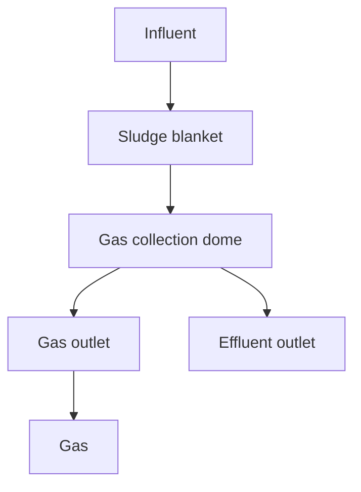
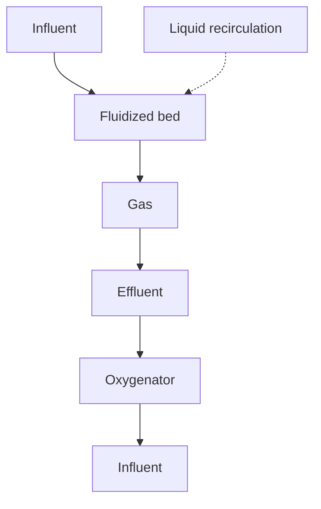
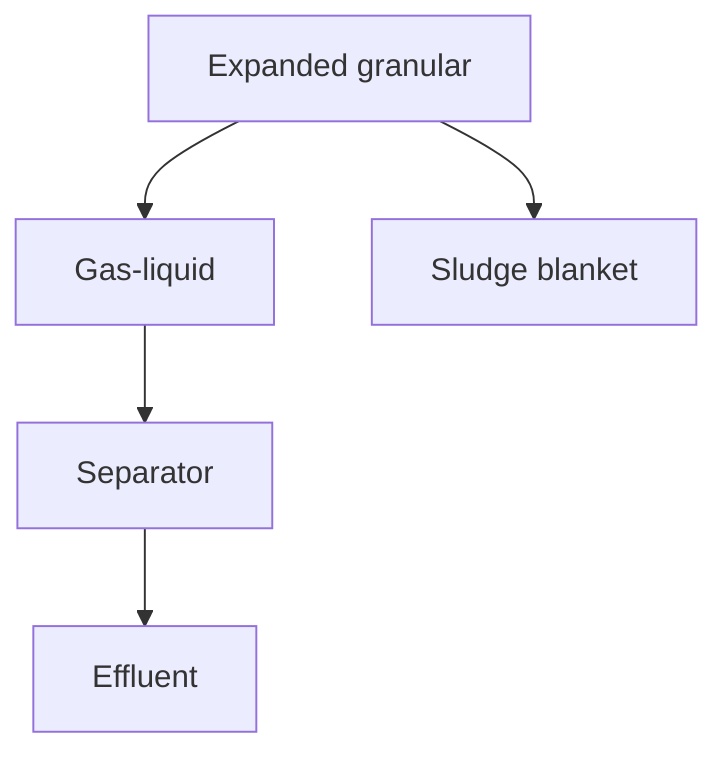
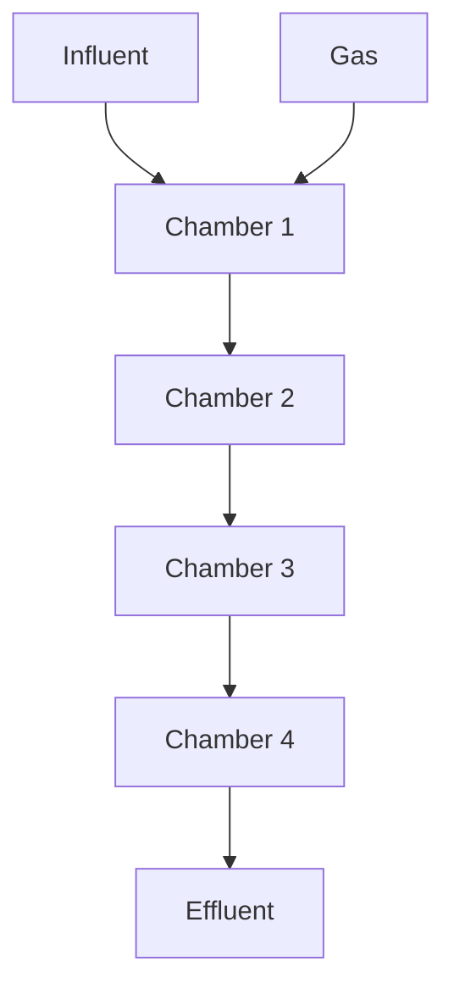
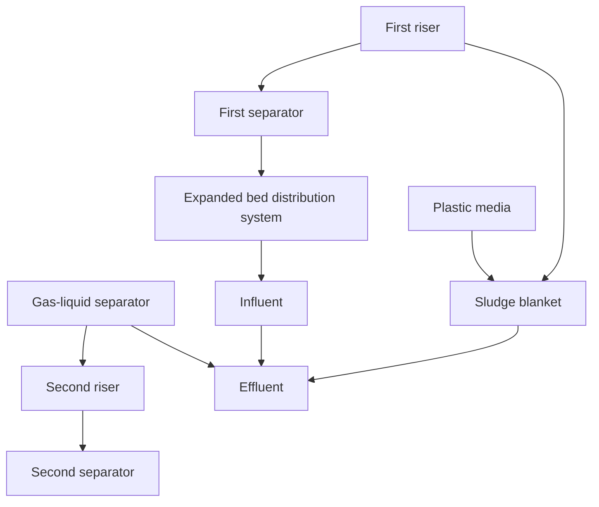
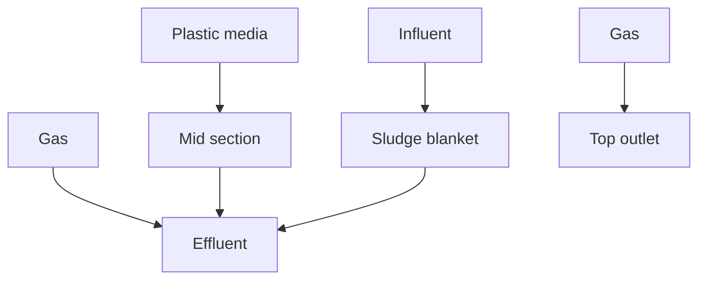
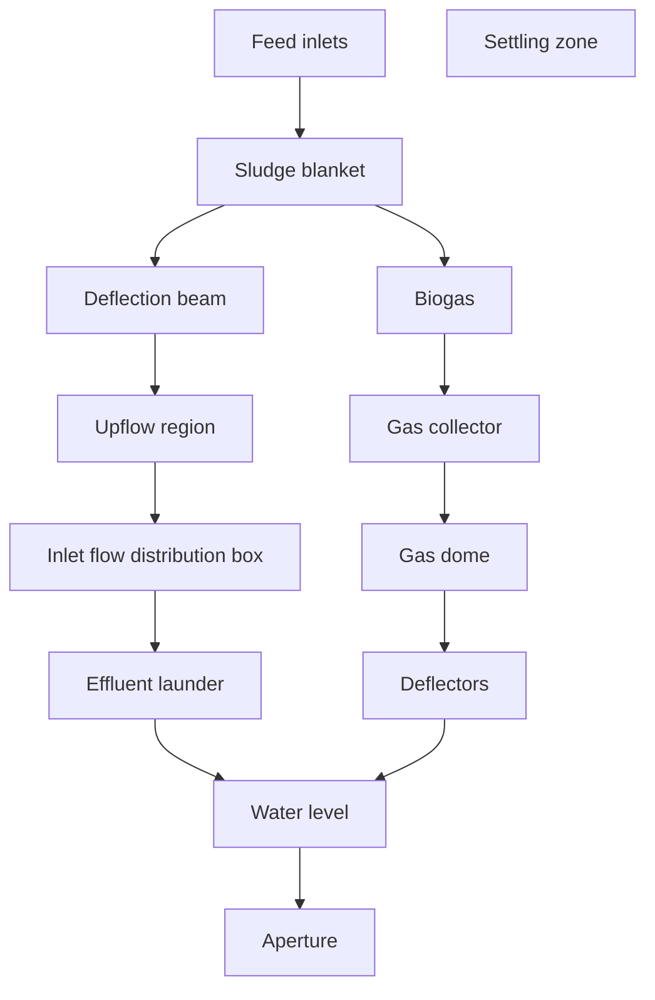
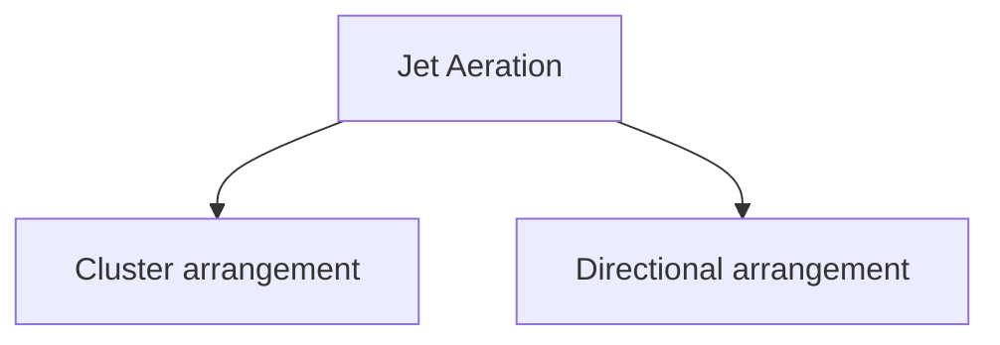
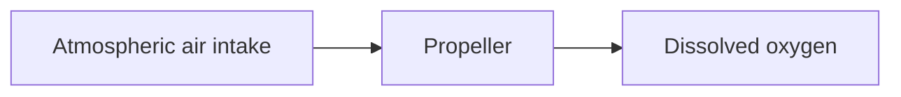
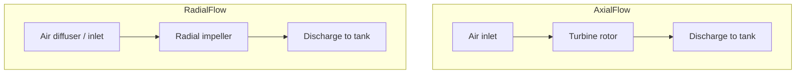

# MOP8_Combined_part02.pdf

## 4.4.2.2 Mechanical Mixing—Maintaining Solids in Suspension

a properly designed mixing chimney, the plumes from the separate streams could pass from one zone to the next, thereby reducing the effective volume for biological reactions. With an effective mixing chimney, the mixer in the tank would then be sized just to maintain solids in suspension.

The earliest BNR facilities had mixers sized for approximately 10 to 16 W/m^3. Many of these earlier installations were found to entrain significant amounts of oxygen in unaerated zones, either through vortex formation or by excessive surface turbulence. Some more recent designs still appear to be based on relatively high mixer powers either through tradition or from some published literature.

However, many other designs reflected the realization that high mixer powers were unnecessary and, more importantly, detrimental to anaerobic or anoxic zone performance. Some of these designs reduced mixer powers to below 5 W/m^3 with some as low as 3 W/m^3 when mixing chimneys are provided and the blending of separate streams is not a requirement:

The type of mixer is a factor in mixing effectiveness for a given power level. Using the criterion for adequate mixing of less than approximately 10% for the coefficient of variation of mixed-liquor solids concentrations at depths throughout the basin (where coefficient of variation, CoV = standard deviation/overall average), Samstag and Wicklein (2014) showed that field tests comparing four manufacturer mixer designs—three vertical hydrofoil mixers and one vertical hyperboloid mixer—required 2.9, 1.3, 4.1, and 4.0 W/m^3 respectively, for a CoV of 10% with mixed-liquor solids and without separate stream blending required. The most efficient mixer in these tests was a vertical hydrofoil mixer configured with three downward-pumping, relatively large-diameter curved impeller blades. The top of the blades was approximately 2 m above the floor and projected downward to approximately     m above the floor. Other tests with horizontal impeller mixers showed that these mixers have similar mixing efficiencies (in terms of W/m^3 required to maintain a CoV of 10%) as the vertical hyperboloid mixer and the least efficient vertical hydrofoil mixer. Pumped jet mixers (without the air in jet aeration systems) were found to be an order of magnitude less efficient, requiring from 30 to 50 W/m^3 to
\n---\n

## 4.4.2.3 Aeration—Maintaining Solids in Suspension

maintain a CoV of 10%. Introducing air to jet aeration systems improves mixing considerably.

It has been suggested that mixer manufacturers should provide information on CoV in activated sludge mixed liquors since traditional approaches of specifying mixers based on a power level (such as W/m³) ignore relative efficiencies of different impeller and mixer designs (Pretorius et al., 2015). Specifications should ideally be in terms of CoV values less than 10%, for example, and should take into account mixer design and tank dimensions. The important issue of blending separate influent streams and the presence or not of chimney baffles should be taken into consideration, since mixing energy will be significantly higher if the mixer also needs to achieve blending of the streams within the tank.

For coarse-bubble aeration with diffusers along one or two sides of the tank, inducing a spiral-roll pattern, a common criterion for aeration mixing is 17 to 40 Nm³/h·m (3 to 8 scfm/ft) header length (where Nm³ is the volume of air under standard conditions of 0°C and 1 atmosphere). An alternative criterion commonly presented in the literature is 0.9 to 1.5 Nm³/h·m³ (16 to 26 scfm/1000 cu ft) tank volume. An issue with this criterion is that for a given tank horizontal area, the air requirement for mixing a 6-m-deep tank, for example, would be twice the air required for a 3-m-deep tank:

One manufacturer provided an alternative basis for designing air-mixing requirements by adjusting the unit volumetric airflow based on the tank depth. In this case, by recalculating the values provided, the criterion for mixing becomes approximately 4 Nm³/h·m² (0.23 scf/m²) for spiral-roll mixing and for channel mixing in activated sludge systems. For channel mixing, other common criteria are in the range of 12 to 30 Nm³/h·m (2 to 6 scfm/ft) header or channel length.

A commonly used design criterion for fine-pore diffused aeration with full-floor coverage to maintain mixed liquor in suspension is 2.2 Nm³/h·m² (0.13 scf/m²). This value has traditionally been applied irrespective of whether the flow entering the aeration basins is raw influent or primary effluent. However; some designers account for the removal of heavier material in primary clarifiers upstream of aeration tanks and adjust the minimum
\n---\n

## 4.4.2.4 Effect of Mixing on Flocculation

Mixing systems maintain solids in suspension by imparting velocity gradients in the liquid, which prevent settlement of individual floc particles. Velocity gradients can promote flocculation of mixed-liquor floc particles or, if too large, can cause rupture of the floc particles. If floc breakup occurs to an excessive degree, then effluent quality could deteriorate due to dispersed solids that are incapable of settling during the retention times provided in secondary clarifiers.

The concept of the root mean square velocity gradient, G, describes the intensity of shear of fluids at a given viscosity (Camp and Stein, 1943). For diffused aeration systems, the G value is computed from the work done by the drag forces on bubbles as they rise to the surface. Camp (1955) derived the following expression for G in diffused-air systems:

$$
G = \left[ \frac{Q \cdot d \cdot y \cdot h}{60 \cdot V \cdot \mu} \right]^{0.5} \quad (12.23)
$$

where G = root mean square velocity gradient (s⁻¹),
\n---\n

# Aeration system equations and parameters

- Q_avg = average volumetric flowrate of air through the water depth (m³/min),
  which, assuming the average occurs at mid-depth, and
  $$ Q_{\mathrm{avg}} = Q \frac{10.33}{10.33 + h/2} \; (\mathrm{m^3/min}) $$

- where 10.33 = atmospheric pressure at sea level (m water);

- Q = standard airflow rate through the diffusers (Nm³/min);

- γ = specific weight of water (= 9789 N/m³ at 20°C);

- h = liquid depth above the diffusers (m);

- V = volume of liquid in tank (m³), and

- μ_w = absolute or dynamic viscosity of water (= 0.001 Ns/m² for water at 20°C)
  (for MLSS greater than approximately 5000 mg/L, use the viscosity of the suspension).

For a mechanical aeration system:
$$ G = \left[ \frac{P}{V\,\mu_w} \right]^{0.5} \;(\mathrm{s}^{-1}) \quad (12.24) $$

where P = aerator power input (N·m/s), and
1.0 N·m/s = 1.0 W = 0.001 kW.

For pipe flow:
$$ G = 52 \times (f/D)^{0.5} \times v^{1.5} \; (\mathrm{s}^{-1}) \quad (12.25) $$

where f = Darcy–Weisbach friction factor (dimensionless),
D = pipe diameter (m), and
v = velocity (m/s).

Das et al. (1993) investigated the degree of floc integrity at 24 activated sludge facilities employing coarse-bubble, fine-pore, and mechanical aeration systems. For both the
\n---\n

Coarse-bubble and fine-pore aeration facilities. Effluent TSS started to increase as G values increased above approximately 75 s^-1. The coarse-bubble systems appeared to deteriorate at a faster rate than the fine-pore systems at higher G values. The mechanical aeration systems followed a similar general concept although there was a difference that depended on the distance between the point of shear at the aerator and the distance to the point of removal of mixed liquor from the aeration tank: in other words, in some cases there was the opportunity for re-flocculation depending on the distance.

The observation that flocs will generally reform if energy levels and velocity gradients are reduced and sufficient time is provided prior to secondary clarifiers is very important and should guide designers. This also points to the benefits of tapered aeration in diffused aeration systems. Apart from economizing on overall energy by tapering aeration to match oxygen demands, the G values within the aeration basin would be gradually reduced from the inevitably higher values at the head end of the basins, to lower values at the end. This provides opportunity to develop adequate flocculation before the mixed liquor passes to the clarifiers:

Unfortunately, many aeration tanks discharge via a weir to an aerated channel at the end of the aeration basin: The free fall over the weir can impart considerable disruptive energy that can damage flocs. Das et al. (1993) noted the percentage of dispersed particles before and after such weir free falls. The change occurring when the free fall was approximately 0.5 m was relatively insignificant. However, at 1.2-m free fall the percentage of dispersed particles increased by approximately 1.6 to 4.0 times: One mitigating factor to note is that in many designs the highest free falls would occur at lower flows, which would provide more time for re-flocculation before the clarifiers. Weirs and channels are generally designed for peak-flow conditions, and water levels could be higher and free falls after weirs lower under high-flow conditions.

After weir transitions with appreciable free falls, it is important to ensure adequate flocculation either in conveyance piping or in aerated channels before the clarifiers. Aerated channels are often equipped with coarse air diffusers. This is not generally conducive to good flocculation. If possible it would be preferable to use fine-pore diffusers. Conveyance piping often imparts gentler shear forces compared with aerated channels and, in general, tend to promote flocculation rather than breakup of flocs.

\n---\n

In this regard the design of the secondary clarifiers plays an important role. Adequate
design of energy-dissipating inlets and flocculation feedwells will help to promote re-
flocculation prior to settling.

## 4.4.2.5 Activated Sludge Foam Control

The incidence of foaming organisms can be a major activated sludge operating challenge.
They manifest themselves as a problem particularly when the design of the activated
sludge reactor is such that surface foam layers are trapped and foaming organisms can
accumulate. In the absence of adequate design features, foam will eventually accumulate
somewhere (or all over the surface) of the aeration tanks. Eventually the foam will bridge
and harden and will not flow along the surface of its own accord. This becomes a burden
for operations personnel as they try to remove the foam using high-pressure hoses. Often
the best recourse at this stage is to remove the foam using a vacuum truck service, if
access is possible. It is usually preferable to provide design features that avoid foam
formation and accumulation.

Baffles that are commonly included in BNR facilities should promote the separation of
distinct zones within the reactor but, at the same time, induce movement of foam through
the reactor to a point where it can be wasted from the system in the secondary clarifiers,
or within the reactor. The design of internal baffles was discussed earlier.

The foaming propensity of nocardioforms such as Gordonia amarae is mainly caused by
free-floating dispersed filaments, more so than by floc-bound filaments (Narayanan et al., 2010). With subsurface withdrawal from reactors or inadequately designed baffles within
the reactor that cause foam trapping, free-floating filaments tend to proliferate. Parker et
al. (2014) posited that free-floating filaments are more likely to attach to the bubbles
produced by fine-pore diffused aeration and accumulate at the surface. Floc-bound
filaments are heavier and would require more bubble attachment, which may require a
DAF environment, not the turbulent diffused-air environment of aeration tanks:

Jenkins et al. (2003) discussed a number of measures to control foam in activated sludge
reactors. For nocardioforms these included aerobic selectors, anoxic selectors, anaerobic
selectors, chlorination, cationic polymer addition, and surface wasting: For Microthrix
parvicella the measures included reducing SRT, providing plug-flow conditions, avoiding
intermittent aeration or low dissolved oxygen, eliminating foam trapping, and adding a
\n---\n

polyaluminum chloride coagulant: Several of the measures, such as lowering SRT or increasing dissolved oxygen, could be contrary to other fundamental objectives, such as nitrogen and phosphorus removal. It is also common to experience foaming issues despite the best design efforts to avoid them:

Parker et al. (2014) described the concept of the classifying selector, which takes advantage of the propensity of free-floating nocardioforms, M. parvicella and other foam-causing filaments, to attach to bubbles. Even if visible foam is not formed, there will be a surface-rich stratum of the organisms formed at the surface of the mixed liquor. Successful designs of this concept situate a surface baffle at a strategic location to impede passage of the foam or surface layers, and continuously withdraw the foam or surface layers by means of a downward-opening weir gate that discharges to a pump sump. By this means, the bulk concentration of foam-causing organisms is maintained at low levels, thereby preventing their accumulation and nuisance foam formation.

If continuous withdrawal is practiced, this is most straightforward if DAF thickeners are provided to thicken WAS. By this means, the classifying selector can be combined with mixed-liquor wasting, thereby greatly improving SRT control. DAF thickeners are largely immune to hydraulic loading issues. A further alternative that has been successfully applied is to apply the concept described to an aerated RAS channel or a common RAS reaeration tank. This fulfills the objective while avoiding excessive flows to the thickener: SRT control could also be combined with the surface drawoff at this point, if required. It is important that the entire mixed-liquor inventory passes the classifying selector installation. Examples of suitable locations are a stretch of aerated mixed-liquor channel between the aeration tanks and the clarifiers, a stretch of aerated RAS channel, or a common RAS reaeration tank.

Necessary features of the classifying selector process are:

1. Provide a stretch of channel or aerated section with fine-pore diffused air upstream of the baffle and drawoff to promote flotation of the dispersed filaments.
2. Avoid foam trapping within the overall activated sludge system by adequate design of baffles and providing surface overflow to the clarifiers.
\n---\n

## 3. Continuous or semicontinuous pumping from the classifying selector sump to avoid foam accumulation

Operation of the classifying selector as briefly described above has been effective at maintaining foam-causing organisms at manageable levels and avoiding their proliferation in the basins. By continuous withdrawal of surface layers where foam-causing organisms are concentrated, foam accumulations within the basins are not usually seen. However, some unusual events such as influent slugs of fats, oil, and grease, or if the classifying selector is out of service for a time, or other unusual occurrence could cause higher-than-normal accumulations. This should be taken into consideration in design, and the classifying selector station should be capable of handling increased foam accumulations and function as a foam-wasting station. The thickening process should also be designed to receive this increased load.

## 5.0 Anaerobic Treatment of Wastewater
### 5.1 Introduction

Anaerobic treatment offers many advantages over conventional aerated activated sludge systems including lower energy consumption, the potential for energy recovery, low sludge production, operational simplicity, low land area requirements, improved sludge dewatering; ability to store sludge for long periods, simple designs, and less noise from mechanical equipment. While anaerobic treatment offers many benefits, significant limitations exist including lower removal efficiencies for organics, suspended solids, and pathogens and essentially no nutrient removal with basic process configurations. As a result, anaerobic treatment requires aerobic posttreatment to meet standard effluent criteria for secondary and advanced treatment:

In anaerobic treatment, aeration is not required; thus eliminating the large energy demand needed to supply process air in aerobic processes. Because organic matter is converted to methane, the process may produce energy for the facility. Anaerobic treatment processes typically are more energy efficient for higher strength wastewater (greater than about 300 mg BOD/L), because under these conditions, the fraction of methane dissolved in the effluent becomes insignificant relative to the total methane production (Cakir and Stenstrom, 2007).
\n---\n

The anaerobic decomposition of organic compounds yields less energy for the microorganisms, resulting in lower biomass yields. Typically, anaerobic treatment reduces the overall biomass yield by a factor of 6 to 8 when compared to aerobic treatment (Tchobanoglous et al., 2003). The reduced biomass results in lower sludge production, which decreases handling and hauling costs, yielding a savings of approximately 10% compared to an aerobic process (Speece, 1996). Because of low sludge production, nutrient requirements are less than for aerobic biological treatment. Anaerobic treatment can reduce the influent BOD and TSS by about 65% to 80%, yielding effluent concentrations of around 40 to 130 mg/L (Khalil et al., 2008; Noyola et al., 2006; Oliveira et al., 2006; von Sperling and Oliveira, 2008).

A survey published in 2008 identified about 3000 WRRFs (all industrial) using anaerobic treatment process (Totzke, 2008). Approximately, 60% of the thousands of industrial WRRFs utilize the upflow anaerobic sludge blanket (UASB) process making it the dominant anaerobic technology for industrial wastewater treatment (Latif et al., 2011). Due to the slow growth rate of anaerobic bacteria, anaerobic treatment of municipal wastewaters is now primarily used in warm climates where the wastewater temperature remains above 15*C.

In search of ways to provide affordable wastewater treatment; communities in India, the Middle East; and Latin America have been advancing the use of anaerobic treatment for domestic wastewater treatment. At this time, numerous full-scale facilities with capacities of up to 164 000 ma/d (1000 mgd) are in operation in these regions using the UASB process or variations of that process (Draaijer et al., 1992; Florencio et al., 2001; Giraldo et al., 2007; Heffernan et al., 2011; Monroy et al., 2000; Sato et al., 2006; Schellingkhout and Collazos, 1992; Seghezzo, 2004; Vieira et al., 1994).

Limited use of anaerobic treatment for wastewater in municipal facilities has been documented in the United States and Canada, but there is potential for its use in the U.S. South, where winter wastewater temperatures are greater than 15*C to 20*C. Advances in the anaerobic treatment of municipal wastewater; including use of two-stage reactors, coupled anaerobic reactor/digester combinations, UASB/hybrid reactors, and the expanded granular sludge bed (EGSB) reactor likely will expand use of this technology into more temperate climates (Switzenbaum, 2007).
\n---\n

Anaerobic treatment processes can be categorized as suspended growth, fixed growth, and hybrid processes. Most existing full-scale municipal WRRFs with anaerobic treatment of the liquid stream use the UASB process, which is considered a hybrid process (Malina and Pohland, 1992; Sutton, 1990; Van Lier, 2008). With high-strength wastewaters, dense granules that consist of a microbial consortium characterize the UASB process. When used for municipal wastewater treatment, however, granular sludge typically does not form, and the UASB process can be considered a suspended-growth process.

## 5.2 Microbiology

As with anaerobic sludge stabilization processes, anaerobic processes for wastewater treatment rely on a consortium of facultative and anaerobic bacteria to degrade organic materials. In anaerobic treatment processes, a series of reactions convert organic materials in the wastewater to carbon dioxide, methane, and additional biomass. Four major groups of biological reactions comprise anaerobic decomposition: (1) hydrolysis, (2) acidogenesis, (3) acetogenesis, and (4) methanogenesis. In hydrolysis, strictly anaerobic and facultative anaerobic bacteria convert the biodegradable COD (large organic polymers including proteins, carbohydrates, and lipids) to simpler, soluble monomeric compounds like amino acids, sugars, and long-chain fatty acids. In acidogenesis, there is further breakdown into VFAs. Following hydrolysis and acidogenesis, fermentative bacteria convert hydrolysis products to acetate, carbon dioxide, and hydrogen. In the final step, methanogens convert the acetate to methane and carbon dioxide or convert hydrogen and carbon dioxide to methane and water. More information on the details of anaerobic decomposition can be found in several references (Grady et al., 2011; Henze et al., 2008; Jordening and Winter, 2005; Pavlostathis and Giraldo-Gomez, 1991; Speece, 1996; Vaccari et al., 2006).

## 5.3 Process Configurations

Anaerobic treatment eliminates three of the biggest constraints on process loading that occur in aerobic processes: (1) oxygen-transfer rates; (2) solids flux limitations, and (3) high-energy inputs for aeration that hinder floc formation (Speece, 1996). Although the lack of these limiting factors in anaerobic processes enables much higher mass loading rates, different constraints are imposed by low growth rates and high half-saturation coefficients of bacteria in the microbial consortia present. The slow growth rate of
\n---\n

## 5.4 Upflow Anaerobic Sludge Blanket
### 5.4.1 Description

The UASB process is an anaerobic wastewater treatment technology that incorporates two vertically stacked zones in one structure. On the bottom is an anaerobic reactor that contains the sludge blanket, and above this is a gas-liquid-solid (GLS) separator. In the GLS zone, deflection plates and collection hoods are used to capture the biogas while allowing suspended solids to settle and return to the reaction zone. One of the keys to successful application of UASBs is an efficient GLS design. Gas collected at the top of the reactor can be vented, flared, or burned for heat or power generation. Venting gas directly to the atmosphere is not recommended because methane is a potent greenhouse gas. Burning biogas requires special burners and, potentially, treatment to remove hydrogen sulfide and other contaminants contained like siloxane (Noyola et al., 2006). Gas hoods typically have triangular cross sections so that the sloped outside surfaces create a settling zone that increases with distance from the top of the digestion zone. Feed is introduced as uniformly as possible across the bottom of the sludge zone and flows vertically (Figure 12.53).

The UASB processes share the same advantages and disadvantages discussed above that are common to all anaerobic processes. The UASB reactors provide economical removal of large fractions of the influent organics; but removals are not high enough to meet secondary treatment standards; pathogens and colloidal solids are not adequately
\n---\n

However, UASBs do not provide any significant nutrient removal. As a result, aerobic posttreatment must be provided for most applications. Due to high carbon removal and low nutrient removal, posttreatment for nitrogen and phosphorus removal may require coagulation or addition of a supplementary carbon source depending on the nutrient to be removed and the process configuration (Ahn et al., 2006; Aiyuk et al., 2004; Foresti et al., 2006; Kalyuzhnyi et al., 2006; Li et al., 2007; Tilche et al., 1994). Extended startup periods (approximately 12 to 20 weeks) are required as a result of the slow growth of the anaerobic biomass unless the process can be seeded with an anaerobic sludge. Similarly, recovery from toxic shocks occurs slowly. Because of the increasing number of anaerobic treatment facilities around the world, seed sludge can be readily obtained.
\n---\n

# Figure transcription

Below are the six schematic diagrams labeled (a)–(f) as depicted on the page. Each diagram shows a vertical digester/separator arrangement with labels for Influent, Effluent, Gas, and various internal components. Where the original content is a schematic without textual data, a Mermaid diagram is provided to convey the relationships between components.

## (a)



Notes:
- Influent enters at the bottom, feeding a sludge blanket.
- Gas collection dome is near the top.
- Gas exits from the top via the gas outlet.
- An effluent outlet exits from the side near the top region.

## (b)



Notes:
- The diagram shows a fluidized bed with gas evolving upward.
- Effluent exits to the right; an oxygenator is connected downstream.
- Liquid recirculation feeds back toward the bed region.

## (c)



Notes:
- Gas-liquid separation occurs in conjunction with a solid separator stage.
- There is an expanded granular sludge blanket element and an influent/blanket region feeding the system.
- Effluent exits from the separator stage.

## (d)



Notes:
- A sequence of connected chambers forms a multi-compartment gas/liquid treatment stage.
- Gas is generated/provided at the upstream chambers; effluent exits from the final chamber.

## (e)



Notes:
- The arrangement includes multiple risers and separators (first and second).
- Expanded bed distribution and plastic media are present with the sludge blanket.

## (f)



Notes:
- This figure shows a vertical column with gas at the top, effluent to the right, and a central plastic media section with a sludge blanket at the bottom.
- Influent enters from the lower left and interacts with the sludge blanket.

\n---\n

# FIGURE 12.52 Schematic illustrations of several types of anaerobic reactor configurations: (a) upflow sludge blanket; (b) biofilm fluidized bed; (c) expanded granular sludge bed; (d) anaerobic baffled reactor; (e) internal circulation; and (f) anaerobic hybrid reactor (Nicolella, 2000).

<table>
<thead><tr><th>Figure 12.52</th></tr></thead>
<tr><td>Schematic illustrations of several types of anaerobic reactor configurations: (a) upflow sludge blanket; (b) biofilm fluidized bed; (c) expanded granular sludge bed; (d) anaerobic baffled reactor; (e) internal circulation; and (f) anaerobic hybrid reactor (Nicolella, 2000).</td></tr>
</table>

Sludge in UASB processes treating mostly soluble wastes tends to form dense granules; however, granulated sludge does not form with dilute wastewaters containing low concentrations of COD and high concentrations of TSS (Holshoff Pol et al., 2004). With flocculent (nongranulated) sludge, upflow velocities are limited to a maximum of about 1.0 m/h so that the majority of the sludge remains in the reaction zone. Gases generated in the sludge blanket and slow-settling particles of sludge flow up from the sludge zone and enter the GLS zone where the gas is captured, and the suspended solids either exit the process or are returned to the reactor. Odors are a potential problem if the biogas is allowed to escape from the gas collection system. Biomass grown in the sludge blanket remains there until wasted directly from the sludge zone or is gradually allowed to fill the sludge zone, become entrained in the liquid stream, and exit the reactor in the effluent:
\n---\n

## 5.4.2 Installations



FIGURE 12.53 Schematic illustration of upflow anaerobic sludge blanket (UASB) reactor (van Lier; 2003)

Power is only needed for pumping so that when sufficient head is available to allow gravity
flow, power requirements are low. Because of the relatively high concentration of biomass
maintained in the reactor (30 to 40 g/L), the depth of the sludge zone (2 to 4 m), and the
construction of the GLS on top of the reactor zone, land requirements are significantly
lower than for most other wastewater treatment technologies. Although the relative
amount of biogas generated by UASB processes treating domestic water is low due to the
low concentration of COD in the influent wastewater; sufficient quantities may be available
in warmer climates to generate enough energy to make the process self-sufficient (van
Haandel and Lettinga, 1994).

5.4.2 Installations
\n---\n

## 5.4.3 Design Considerations

Gatze, Lettinga, and coworkers at the University of Wageningen (Wageningen, the Netherlands) first developed the UASB process in the 1970s as a unique anaerobic treatment technology. Between 1983 and 1992, UASBs were studied at laboratory scale and later at demonstration scale. Initially the UASB process was developed for full-scale use in industrial applications because the process is well suited for treating warm, soluble, high-COD wastewaters. The UASB reactors proved to be successful for high-strength wastes from industries such as breweries, distilleries, and food processing: Although there are thousands of successful full-scale, high-rate anaerobic processes in industrial applications, design and operation experience with full-scale municipal facilities remains somewhat limited. In 1989, Kanpur, India, became the first full-scale demonstration of UASB technology treating municipal wastewater; and by 2011 more than 60 installations had been reported, and this is not an extensive list of installations (Heffernan et al., 2011) (see Table 12.16). Most of these facilities are in India and Latin America. Despite the number of UASBs being installed to treat municipal wastewater, limited design and performance data are available from operating full-scale facilities to judge the effectiveness and performance of UASBs for treatment of municipal wastewater:

Selected results from several of these studies are reproduced in Table 12.17. At best, UASBs provide approximately 80% removal of BOD5 and TSS, thus confirming the need for posttreatment of UASB effluent to meet secondary and advanced treatment standards: An extensive statistical evaluation of performance data from treatment facilities in Brazil found mean removals of BOD5 and TSS of 72% and 67%, respectively (von Sperling and Oliviera, 2008). UASB processes with aerobic posttreatment, however, had mean removals of 88% for BOD5 and 82% for TSS. This was comparable to the mean values reported for facilities using the activated sludge process (85% for BOD5 and 76% for TSS). Occasionally, poor removal rates for suspended solids for UASB processes without posttreatment have been attributed to washout of sludge. Sato et al. (2006) suggested that removal efficiencies of full-scale units could be improved by proper operation and maintenance.

5.4.3 Design Considerations

Successful application of anaerobic treatment requires good mixing, contact between influent wastewater and biomass, and retention of the biomass in the reactor (van
\n---\n

Haandel et al., 2006). The first full-scale UASB reactors for domestic wastewater were sized based on experimental results from pilot-scale studies (van Haandel and Lettinga, 1994). Even with the increasing number of full-scale installations, a thorough characterization of the wastewater is considered essential and pilot testing desirable, before designing a new UASB (Henze et al., 2008). Current full-scale installations in developing countries strive for low cost and simplicity and, typically, have only screening and grit removal for pretreatment; and aerobic or facultative lagoons for posttreatment. Pretreatment to remove fats, oils, and suspended solids should provide enhanced performance and, in many situations, is essential. More sophisticated process configurations have been proposed that maintain the basic advantages of anaerobic treatment while adding enhanced removal of dissolved organic matter, suspended solids, and nutrients. Key design considerations include reactor dimensioning, upflow velocity, GLS design, estimation of sludge and biogas production, design of the flow distribution, odor control, provisions for scum removal, and materials selection.

## 5.4.3.1 Reactor Sizing

As with any biological suspended-growth treatment process, expected bacterial growth rates control reactor biomass inventory, while minimum biomass settling velocities dictate the surface area for the solids separator and, for UASB reactors, the cross-sectional area of the reactor. For anaerobic process, the controlling growth rates are those of the slowest growing methanogens with maximum specific growth rates on the order of $$0.12 \ \mathrm{day}^{-1}$$. Because of low growth rates and difficulty in predicting the minimum growth rate for the diverse consortium of microorganisms in the sludge blanket, recommended safety factors on SRT for anaerobic processes are high, at approximately 3 to 10 (Henze et al., 2008; Speece, 1996). Figure 12.54 provides an estimate of the required SRT as a function of temperature for treating domestic wastewater in a UASB reactor. Operating experience gained from demonstration and full-scale UASBs, rather than explicit measurements of sludge settling velocities, provides the basis for current guidelines for sizing of reactors and GLS separators.

<table> 
  <thead>
    <tr><th>Facility</th><th>Country</th><th>Design Flow (MLD)</th><th>Reactor Volume (m3)</th><th>Start-up, Date (year)</th><th>Comments</th></tr>
  </thead>
  <tbody>
  </tbody>
</table>

\n---\n

<table>
<tr><td>Bucaramanga</td><td>Colombia</td><td>31-47</td><td>3 × 3300</td><td>1990</td><td>UASB and facultative pond (Giraldo et al., 2007; Seghezzo 2004; Schellingkhout et al., 1992)</td></tr>
<tr><td></td><td>Brazil</td><td>0.164</td><td>2 × 2286</td><td>2008</td><td>Heffernan et al., 2011</td></tr>
<tr><td>Campina Grande</td><td>Brazil</td><td>0.6</td><td>160</td><td>1989</td><td>Pedregal Township (Giraldo et al., 2007)</td></tr>
<tr><td>Sumare</td><td>Brazil</td><td>0.228</td><td>67.5</td><td>1992</td><td>Vieira et al., 1994</td></tr>
<tr><td></td><td>Brazil</td><td>100</td><td>16 × 2705</td><td>2007</td><td>Heffernan et al., 2011</td></tr>
<tr><td>Recife</td><td>Brazil</td><td>28</td><td>810</td><td>1997</td><td>Florencio et al., 2001</td></tr>
<tr><td>Mirzapur</td><td>India</td><td>14</td><td></td><td>1994</td><td>Post treatment with FAL (Seghezzo, 2004)</td></tr>
<tr><td></td><td>India</td><td>120</td><td>20 × 1960</td><td>2003</td><td>Heffernan et al., 2011</td></tr>
<tr><td>Kanpur</td><td>India</td><td>36</td><td></td><td>1994</td><td>Mixed tannery and domestic waste (Seghezzo, 2004)</td></tr>
<tr><td>Faridabad</td><td>India</td><td>20,45, and 50</td><td>7000, 16 000, and 18 000</td><td>1998, 1998, and 1999</td><td>Polishing pond post treatment (Sato, et al., 2006)</td></tr>
</table>

\n---\n

<table>
<thead>
<tr>
  <th>Site</th>
  <th>Country</th>
  <th>Value A</th>
  <th>Value B</th>
  <th>Year</th>
  <th>Notes</th>
</tr>
</thead>
<tbody>
<tr>
  <td>Sonipat</td>
  <td>India</td>
  <td>30</td>
  <td>11 000</td>
  <td>1999</td>
  <td>Polishing pond post treatment (Sato et al., 2006)</td>
</tr>
<tr>
  <td>Gurgaon</td>
  <td>India</td>
  <td>30</td>
  <td>11 000</td>
  <td>1998</td>
  <td></td>
</tr>
<tr>
  <td>Panipat</td>
  <td>India</td>
  <td>35 and 10</td>
  <td>13 000 and 10 000</td>
  <td>2000 and 1999</td>
  <td>Polishing pond post treatment (Sato et al., 2006)</td>
</tr>
<tr>
  <td>Yamunanagar</td>
  <td>India</td>
  <td>25 and 10</td>
  <td>9000 and 3500</td>
  <td>2000 and 2002</td>
  <td>Polishing pond post treatment (Sato et al., 2006)</td>
</tr>
<tr>
  <td>Karnal</td>
  <td>India</td>
  <td>40</td>
  <td>14 000</td>
  <td>2000</td>
  <td>Polishing pond post treatment (Sato et al., 2006)</td>
</tr>
<tr>
  <td>Ghaziabad</td>
  <td>India</td>
  <td>56 and 70</td>
  <td>20 000 and 26 000</td>
  <td>2002 and 2002</td>
  <td>Polishing pond post treatment (Sato et al., 2006)</td>
</tr>
<tr>
  <td>Noida</td>
  <td>India</td>
  <td>27</td>
  <td>14 000</td>
  <td>2000</td>
  <td>Polishing pond post treatment (Sato et al., 2006)</td>
</tr>
<tr>
  <td>Agra</td>
  <td>India</td>
  <td>78</td>
  <td>10 000</td>
  <td>2004</td>
  <td>Polishing pond post treatment (Sato et al., 2006)</td>
</tr>
<tr>
  <td>Saharanpur</td>
  <td>India</td>
  <td>38</td>
  <td>28 000</td>
  <td>2000</td>
  <td>Polishing pond post treatment (Sato et al., 2006)</td>
</tr>
<tr>
  <td>Tapeyanco– Atlamaxac Tlaxcala</td>
  <td>Mexico</td>
  <td>2.6</td>
  <td>2200</td>
  <td>1990</td>
  <td>Post treatment by lagoons (Monroy et al., 2000)</td>
</tr>
</tbody>
</table>

\n---\n

<table>
  <tr>
    <td>Fideicomiso Alto Rio Blanco. Istaczoquitlan</td>
    <td>Mexico</td>
    <td>108</td>
    <td>5 × 16 740</td>
    <td>1994</td>
    <td>Monroy et al., 2000</td>
  </tr>
<tr>
    <td>Middle East Facility 1</td>
    <td>UAE</td>
    <td>49</td>
    <td>8 × 2645</td>
    <td>2008</td>
    <td>Heffernan et al., 2011</td>
  </tr>
</table>

<p>TABLE 12.16 Selected Existing, Full-Scale UASB Reactors Domestic Wastewater</p>

<table>
  <thead>
    <tr><th>Parameter</th><th>Reported Removals (%)</th></tr>
  </thead>
  <tbody>
    <tr><td>COD removal</td><td>56–79</td></tr>
<tr><td>BOD removal</td><td>45–81</td></tr>
<tr><td>TSS removal</td><td>45–81</td></tr>
<tr><td>Coliforms</td><td>70–90</td></tr>
<tr><td>Helminth eggs</td><td>up to 100</td></tr>
  </tbody>
</table>

<p>TABLE 12.17 Average UASB Performance Reported in Latin America and India (Khalil et al., 2008; Giraldo et al., 2007)</p>

<p>For domestic wastewater; sizing the reactor based on HRT provides a practical approach because for low-strength wastewater (COD &lt; 1000 mg/L) the hydraulic load limits the design (Chernicharo, 2007; Henze et al., 2008). An average HRT for a single-stage UASB treating domestic wastewater is approximately 6 hours. Values reported in the literature range from 4 to 10 hours. Current design criteria for HRT for UASB reactors are provided in Table 12.18. Regardless of the method used to size the reactor; the expected SRT must still be estimated to ensure adequate design.</p>

<p>Use of the OLR is appropriate for high-strength domestic wastewaters because the organic load rather than the hydraulic load limits design. Care must be taken, however; in defining and applying the OLR as the term can apply to the applied load, removed load, or</p>

\n---\n

the converted load (van Haandel and Lettinga, 1994). For domestic wastewater, constraints imposed by biomass settling velocities will limit the OLR to 1.5 to 3.0 kg COD_applied/m^3·d. The OLRs for high-strength wastewaters with a significant amount of particulate COD are listed in Table 12.19 and are presented as an example of the OLR limits of the process.

FIGURE 12.54 Required solids retention time (SRT) for domestic wastewater treatment as a function of temperature
(Henze et al., 2008; reprinted with permission from IWA Publishing).

<table>
<thead>
<tr><th>Temperature (°C)</th><th>SRT for stabilized sludge (d)</th></tr>
</thead>
<tbody>
<tr><td>15</td><td>≈140</td></tr>
<tr><td>20</td><td>≈100</td></tr>
<tr><td>25</td><td>≈60</td></tr>
<tr><td>30</td><td>≈40</td></tr>
<tr><td>35</td><td>≈20</td></tr>
<tr><td>40</td><td>≈10</td></tr>
</tbody>
</table>

<p>TABLE 12.18 Recommended Hydraulic Detention Times for UASB Reactors Treating Domestic Wastewater</p>
<p>(Lettinga and Hulshoff Pol, 1991; reprinted from Water Science and Technology, with permission from the Copyright)</p>

<table>
<thead>
<tr><th>Sewage Temperature (°C)</th><th>Hydraulic Detention Time (hour) - Type A</th><th>Hydraulic Detention Time (hour) - Type B</th></tr>
</thead>
<tbody>
<tr><td>16 to 19</td><td>&gt;10 to 14</td><td>&gt;7 to 9</td></tr>
<tr><td>20 to 26</td><td>&gt;6 to 9</td><td>&gt;4 to 6</td></tr>
<tr><td>>26</td><td>&gt;6</td><td>&gt;4</td></tr>
</tbody>
</table>

\n---\n

# Holders, IWA)

Until mathematical models for anaerobic treatment become more advanced, prediction of effluent water quality must be done using empirical relationships between HRT and performance (Table 12.20 and Figure 12.55) (Chernicharo, 2007; Latif et al., 2011; van Haandel et al., 2006). Careful judgment must be exercised in the use of these empirical relationships, as considerable scatter exists in the limited performance data from full-scale facilities (see Figure 12.56), and data are only available for operation under tropical conditions.

For domestic wastewater, current criteria call for superficial upflow velocities to be maintained below approximately 1.0 m/h with average velocities in the range of 0.4 to 0.8 m/h. A design value of 0.75 m/h has been widely used for UASB reactors in India: UASB reactor dimensions and upflow velocities are interrelated. Typical reactor heights range from 3 to 5.0 m, with a common value of 4.5 m. Greater heights may be required, however, for wastewaters with high suspended solids concentrations (Wiegant, 2001). Settler compartments comprise 1.5 to 2.0 m of this total height.

Successful UASB operation depends on proper hydraulic distribution of the feed flow to prevent channeling of the wastewater through the sludge blanket and to avoid the formation of dead corners in the reactor. Flow must be divided proportionately to each reactor and then uniformly distributed to the numerous feed points located across the bottom of the sludge blanket. The recommended density of feed inlet points is currently approximately one for every 2.0 m^2. Higher densities are recommended for low influent concentrations of organics where low gas production increases the risk of channeling and short-circuiting. Table 12.21 presents guidelines on influent flow distribution. Table 12.22 presents summary guidelines for the main hydraulic criteria, and Table 12.23 provides other design criteria for UASB reactors treating domestic wastewater:

<table>
<thead>
<tr><th>Temperature (°C)</th><th>OLR (kg COD_applied / m³·d)</th></tr>
</thead>
<tbody>
<tr><td>15</td><td>1.5–2</td></tr>
<tr><td>20</td><td>2–3</td></tr>
</tbody>
</table>

\n---\n

### TABLE 12.19 Permissible OLRs in Single-Step UASB Reactors in Relation to the Temperature for Wastewater with 30% to 40% COD in Suspended Solids (adapted from Henze et al., 2008)

<table>
<thead>
<tr><th>Temperature (°C)</th><th>Permissible OLRs</th></tr>
</thead>
<tbody>
<tr><td>25</td><td>3–6</td></tr>
<tr><td>30</td><td>6–9</td></tr>
<tr><td>35</td><td>9–14</td></tr>
<tr><td>40</td><td>14–18</td></tr>
</tbody>
</table>

TABLE 12.19 Permissible OLRs in Single-Step UASB Reactors in Relation to the Temperature for Wastewater with 30% to 40% COD in Suspended Solids (adapted from Henze et al., 2008).

### TABLE 12.20 Empirical Equations for Estimating UASB Reactor Performance and Effluent Water Quality
(Chernicharo, 2007; reprinted with permission from IWA Publishing)

<table>
<thead>
<tr><th>Parameter</th><th>Empirical Equationa</th></tr>
</thead>
<tbody>
<tr><td>Efficiency of COD removal</td><td>$$E_{\mathrm{COD}} = 100 \times \left(1 - 0.68 \times t^{-0.35}\right)$$</td></tr>
<tr><td>Efficiency of BOD removal</td><td>$$E_{\mathrm{BOD}} = 100 \times \left(1 - 0.70 \times t^{-0.50}\right)$$</td></tr>
<tr><td>Final effluent BOD and COD</td><td>$$C_{\mathrm{eff}} = \dfrac{S_0 \times E \times S_0}{100}$$</td></tr>
<tr><td>Final effluent TSS</td><td>$$C_{\mathrm{SS}} = 102 \times 2^{-0.24}$$</td></tr>
</tbody>
</table>

<a> aEmpirical equations (wastewater temperature from 20°C to 27°C).</a>

TABLE 12.20 Empirical Equations for Estimating UASB Reactor Performance and Effluent Water Quality (Chernicharo, 2007; reprinted with permission from IWA Publishing)
\n---\n

## 5.4.3.2 Gas-Liquid-Solid Separation

> As with any suspended-growth biological treatment process, retention of solids in the UASB process is critical. In UASB reactors, the need to separate gas and solids from the liquid stream complicates settler designs. Suggested guidelines for the GLS are to provide a minimum slope for the settler bottom of 45° to 60°, to provide an overlap of 10 to 20 cm for the deflectors under the entrance to the settling zones, to provide a surface area for the openings between the gas collectors of 15% to 20% of the reactor surface area, and to provide a gas collector height of 1.5 to 2.0 m (van Lier, 2003).

> FIGURE 12.55 Empirical relationships between HRT and COD removal performance of UASB and Anaerobic Filters (van Haandel et al., 2006).

<Mermaid diagram>
```mermaid
graph TD
  title[Empirical relationships: HRT vs COD removal]
  rtt[Retention time (h)]
  uasb[UASB]
  af[Anaerobic filter]
  cod[COD removed efficiency (%)]
  rtt --> uasb
  rtt --> af
  uasb --> cod
  af --> cod
  subgraph Temperature
    t[Temperature > 20°C]
  end
  t --> cod
```
</Mermaid diagram>

As with any suspended-growth biological treatment process, retention of solids in the UASB process is critical. In UASB reactors, the need to separate gas and solids from the liquid stream complicates settler designs. Suggested guidelines for the GLS are to provide a minimum slope for the settler bottom of 45° to 60°, to provide an overlap of 10 to 20 cm for the deflectors under the entrance to the settling zones, to provide a surface area for the openings between the gas collectors of 15% to 20% of the reactor surface area, and to provide a gas collector height of 1.5 to 2.0 m (van Lier, 2003).

\n---\n

## Figure and accompanying data

FIGURE 12.56 Experimental data on chemical oxygen demand (COD) removal efficiency in upflow anaerobic sludge blanket (UASB) reactors as a function of hydraulic retention time (van Haandel et al., 2006).

- Temperature > 20°C

- Data sources (studies contributing data points in the figure):
  - Van Haandel/Lettinga
  - Haskoning (1989)
  - Viera (1985)
  - Scheinkhout (1985)
  - Barbosa/Sant’Anna
  - Nobre/Gumaraes
  - Scheinkhout/Collazes
  - Hasoning/Eurocons
  - Conil et al. (1996)
  - Rodrigues et al. (1996)

- Axes
  - Horizontal axis: Hydraulic retention time (h)
    - Scale shown: 1, 2, 3, 5, 10, 20 (approximate)
  - Vertical axis: COD removal efficiency (%)
    - Scale shown: 0 to 90 (approximate increments shown in figure)

- Curve/Model
  - The fitted or reference relationship is given by
    $$E = 1 - 0.68\, (HRT)^{-0.58}$$

- Caption note about the data: The plot shows COD removal efficiency as a function of hydraulic retention time for UASB reactors, with data points from multiple published sources.

----

### Figure data visualization (textual description)

The figure depicts COD removal efficiency (0–90%) on the vertical axis versus hydraulic retention time (1–20 h) on the horizontal axis. A trend line is drawn through the scattered data points from various studies, with a fit expressed by
$$E = 1 - 0.68\, (HRT)^{-0.58}.$$

----

## Sludge type data table

<table>
  <thead>
    <tr>
      <th>Sludge Type</th>
      <th>OLR (kg COD<sub>applied</sub>/m³·d)</th>
      <th>Influent Area of Each Distributor (m²)</th>
    </tr>
  </thead>
  <tbody>
    <tr>
      <td>Relatively dense and flocculent<br>(concentration 20–40 kg TSS/m³)</td>
      <td>&lt;1.0 to 2.0</td>
      <td>1.0 to 2.0</td>
    </tr>
<tr>
      <td></td>
      <td>2.0 to 5.0</td>
      <td></td>
    </tr>
<tr>
      <td>Dense and flocculent<br>(concentration &gt; 40 kg TSS/m³)</td>
      <td>&lt;1.0</td>
      <td>0.5 to 1.0</td>
    </tr>
<tr>
      <td></td>
      <td>1.0 to 2.0</td>
      <td>1.0 to 2.0</td>
    </tr>
<tr>
      <td>&gt;3.0</td>
      <td>2.0 to 3.0</td>
      <td></td>
    </tr>
  </tbody>
</table>

\n---\n

# TABLE 12.21 Preliminary Guidelines for Flow Distributors in UASB Reactors (Lettinga and Hulshoff Pol, 1991; reprinted from Water Science and Technology, with permission from the Copyright Holders, IWA)

<table>
  <thead>
    <tr>
      <th>Granular</th>
      <th>&lt;2.0</th>
      <th>0.5 to 1.0</th>
    </tr>
  </thead>
  <tbody>
    <tr>
      <td></td>
      <td>2.0 to 4.0</td>
      <td>0.5 to 2.0</td>
    </tr>
<tr>
      <td></td>
      <td>&gt;4.0</td>
      <td>72.0</td>
    </tr>
  </tbody>
</table>

TABLE 12.21 Preliminary Guidelines for Flow Distributors in UASB Reactors (Lettinga and Hulshoff Pol, 1991;
reprinted from Water Science and Technology, with permission from the Copyright Holders, IWA)

<table>
  <thead>
    <tr>
      <th>Criterion/Parameter</th>
      <th>Range of Values, as a Function of Flow</th>
      <th>For Qmax</th>
      <th>For Qpeak</th>
    </tr>
  </thead>
  <tbody>
    <tr>
      <td>Hydraulic volumetric load (m3/m3·d)</td>
      <td>&lt;4.0</td>
      <td>&lt;6.0</td>
      <td></td>
    </tr>
<tr>
      <td>Hydraulic detention time (h)b</td>
      <td>to 9</td>
      <td>6 to 9</td>
      <td>4 to 6</td>
    </tr>
<tr>
      <td>Upflow velocity (m/h)</td>
      <td>&gt;3.5 to 4</td>
      <td>0.5 to 0.7</td>
      <td>&lt;0.9 to 1.1</td>
    </tr>
<tr>
      <td>Velocity in apertures to the settler (m/h) <span>(mlh)</span></td>
      <td>&lt;2.0 to 2.3</td>
      <td>&lt;4.0 to 4.2</td>
      <td></td>
    </tr>
<tr>
      <td>Surface loading rate in the settler (m/h) <span></span></td>
      <td>&lt;5.5 to 6.0</td>
      <td>0.3 to 0.8</td>
      <td>&lt;1.2</td>
    </tr>
<tr>
      <td>Hydraulic detention time in the settler (h)</td>
      <td>&lt;1.6</td>
      <td>1.5 to 2.0</td>
      <td>&gt;1.0</td>
    </tr>
  </tbody>
</table>

<p>a Flow peaks with duration between 2 and 4 hours.</p>
<p>b Sewage temperature in the range of 20°C to 26°C.</p>

# TABLE 12.22 Summary of the Main Hydraulic Criteria for the Design of the UASB Reactors Treating Domestic Sewage (Chernicharo, 2007; reprinted with permission from IWA Publishing)

<table>
  <caption>TABLE 12.22 Summary of the Main Hydraulic Criteria for the Design of the UASB Reactors Treating Domestic Sewage (Chernicharo, 2007; reprinted with permission from IWA Publishing)</caption>
  <thead>
    <tr>
      <th>Criterion/Parameter</th>
      <th>Value</th>
    </tr>
  </thead>
  <tbody>
    <tr>
      <td>Gas Production</td>
      <td></td>
    </tr>
  </tbody>
</table>

<p>5.4.3.3 Gas Production</p>
\n---\n

# Because COD is conserved, the expected mass of methane produced can be estimated from a COD balance around a reactor as follows:

$$ COD_{T,O} = COD_{T,iO} + COD_{T,s} + COD_M \Delta COD_R \quad (12.26) $$

$$ COD_M = Q \bigl(COD_{inf} - COD_{eff}\bigr) - Y_{obs} \, Q \, COD_{sludge}\; VR \; (\Delta X_R) \quad (12.27) $$

where COD_M = COD converted into methane (kg COD/d);

- COD_T,O = influent total COD concentration (kg COD/m^3);
- COD_T,e = effluent total COD concentration (kg COD/m^3);
- COD_T,s = solids COD concentration (kg COD/m^3);
- ΔCOD_R = change in COD inventory in the reactor (kg COD/m^3);
- Q = average flow (m^3/d);
- COD_inf = influent total COD concentration (kg COD/d);
- COD_eff = effluent total COD concentration (kg COD/d);
- Y_obs = coefficient of solids production in terms of COD = 0.11 to 0.23 kg COD_s sludge/kg COD_applied;
- V_R = volume of sludge blanket in reactor (m^3); and
- ΔX_R = change in reactor solids concentration (kg/m^3).

The waste sludge term (Y_obs Q S_0) only applies if solids are wasted separately. If solids are wasted in the effluent, then this term is not necessary. When evaluating operating facilities, attention must also be given to the net change in the solids inventory in the reactor. For design purposes, steady-state operation (ΔX_R = 0) is assumed:

The volume of a mole of methane at reactor operating conditions of temperature and pressure can be calculated from the ideal gas law:
$$ V_{\text{mol}} = \frac{R T}{P} $$
\n---\n

# Gas Law and Distribution Parameters

$$V_m = \frac{nRT}{P} \quad (12.28)$$

- where \(V_m\) = volume of one mole of gas (m³);
- \(n\) = number of moles of gas;
- \(P\) = pressure (atm);
- \(R\) = universal gas constant;
- \(R = 8.2057 \times 10^{-5} \, \text{atm} \cdot \text{m}^3 / (\text{mol} \cdot \text{K});\) and
- \(T\) = operating temperature (K).

<table>
<thead>
<tr><th>Criterion/Parameter</th><th>Range of Values</th></tr>
</thead>
<tbody>
<tr><td colspan="2"><strong>Influent Distribution</strong></td></tr>
<tr><td>Diameter of the influent distribution tube (mm)</td><td>75 to 100</td></tr>
<tr><td>Diameter of the tube exit mouth (mm)</td><td>40 to 50</td></tr>
<tr><td>Distance between the top of the distribution tube and the water level in the settler (m)</td><td>0.20 to 0.30</td></tr>
<tr><td>Distance between the exit mouth and the bottom of the reactor (m)</td><td>0.10 to 0.15</td></tr>
<tr><td>Influence area of each distribution tube (m²)</td><td>2.0 to 3.0</td></tr>
<tr><td colspan="2"><strong>Biogas Collector</strong></td></tr>
<tr><td>Minimum biogas release rate (m³/m²/h)</td><td>1.0</td></tr>
<tr><td>Maximum biogas release rate (m³/m²/h)</td><td>3.0 to 5.0</td></tr>
<tr><td>Methane concentration in the biogas (%)</td><td>70 to 80</td></tr>
</tbody>
</table>

\n---\n

<table>
  <tbody>
    <tr><td colspan="2">Settler Compartment</td></tr>
<tr><td>Overlap of the gas deflectors in relation to the opening of the settler</td><td>0.10 to 0.15</td></tr>
<tr><td>Minimum slope for settler walls (°)</td><td>45</td></tr>
<tr><td>Optimum slope of the settler walls (°)</td><td>50 to 60</td></tr>
<tr><td>Depth of the settler compartment (m)</td><td>1.5 to 2.0</td></tr>
<tr><td>Effluent Collector</td><td></td></tr>
<tr><td>Submergence of the scum baffle or the perforated collection tube (m)</td><td>0.20 to 0.30</td></tr>
<tr><td>Number of triangular weirs (units/m2 of the reactor)</td><td>1 to 2</td></tr>
<tr><td colspan="2">Production and sampling of the sludge</td></tr>
<tr><td>Solids production yield (kg TSS/kg COD applied)</td><td>0.10 to 0.20</td></tr>
<tr><td>Solids production yield, in terms of COD (kg COD sludge/kg COD applied)</td><td>0.11 to 0.23</td></tr>
<tr><td>Expected solids concentration in the excess sludge (%)</td><td>2 to 5</td></tr>
<tr><td>Sludge density (kg/m3)</td><td>1020 to 1040</td></tr>
<tr><td>Diameter of the sludge discharge pipes (mm)</td><td>100 to 150</td></tr>
<tr><td>Diameter of the sludge sampling pipes (mm)</td><td>25 to 50</td></tr>
  </tbody>
</table>

<p>TABLE 12.23 Other Design Criteria for UASB Reactors Treating Domestic Sewage (Chernicharo, 2007; reprinted with permission from IWA Publishing)</p>
\n---\n

### The volume of methane produced is then calculated from the COD equivalence of methane:

$$ Q_M = \frac{COD_M \, V_m}{K_{COD}} $$

where \(K_{COD}\) = COD corresponding to one mole of methane (64 g COD/mol); and

\(Q_M\) = volume of methane gas produced (m^3/d).

### Additional definitions
- Theoretical methane production from anaerobic treatment is 0.35 Nm^3 CH4 kg COD removed (Nm^3 = volume at 273 K and 1 atm), although total biogas production will be about 0.5 m^3/kg COD removed assuming the biogas is 70% methane.
- The actual methane yield will depend on the substrate composition, sulfate concentration, water temperature (because it changes the solubility of methane), and conversion of some substrate to substances not oxidized in a COD test.
- Reported production rates vary from 0.06 to 0.25 m^3 CH4/kg COD removed (Arceivala, 1995; Giraldo et al., 2007; Noyola et al., 1988).

Methane has a solubility in water of about 1 mmol/L at atmospheric pressure, which is equivalent to 64 mg/L of influent COD converted (van Haandel and Lettinga, 1994). Loss of methane in the effluent and from the reactor surface can be a significant fraction of the total methane generated from low-strength domestic wastewaters, especially at lower temperatures since methane solubility in water increases with decreasing temperature. Methane oversaturation has also been observed in anaerobic reactors from 1.34 to 6.9 times saturation values due to mass transfer limitations or losing up to 100% of the methane generated in the effluent: Thus, current research is focusing on utilizing methods to extract dissolved methane from the effluent including degassing membranes and downflow hanging sponge (DHS) reactors (Crone et al., 2016).

### 5.4.3.4 Sludge Production

Sludge yields in anaerobic systems are directly related to the COD converted to methane, the class of organic compounds degraded, and the concentration of inert solids in the feed. Biomass yields in anaerobic processes range from 0.35 g/g COD for carbohydrates

\n---\n

## 5.4.3.5 Alkalinity
Because of the relatively high partial pressure of CO2 in enclosed anaerobic reactors, sufficient alkalinity must be present in the wastewater to prevent depression of the pH below 6.0 to 6.5. For low-strength domestic wastewaters, however, supplemental alkalinity typically is not required (van Haandel and Lettinga, 1994). Alkalinity may vary from the bottom to the top of the sludge blanket of UASB reactors. To maintain neutral pH concentrations in the base of the reactor with wastewaters that have low alkalinity, low nitrogen, and high organic concentrations, supplemental alkalinity may be required. The alkalinity requirement can be reduced by recycling a portion of the flow from the top of the reactor to the base of the reactor (Speece, 1996; Wentzel et al., 1994). More information on the chemical equilibria in anaerobic reactors can be found in Speece (1996) and van Haandel and Lettinga (1994).

## 6.0 Membrane Bioreactors
### 6.1 Introduction
An MBR is a combination of suspended-growth activated sludge biological treatment and membrane filtration equipment performing the critical solids-liquid separation function that is traditionally accomplished using secondary clarifiers. Low-pressure membranes (either microfiltration [0.07 to 2.0 μm] or ultrafiltration [0.008 to 0.2 μm]) are typically used in MBRs (Metcalf & Eddy, Inc./AECOM, 2014).

There are two general types of membrane systems that can be used in MBRs: (1) pressure driven (in-pipe cartridge systems that are located external to the bioreactor); and (2) vacuum driven (immersed systems that are designed for installation within the bioreactor). Immersed membrane technologies using hollow-fiber or flat-sheet
\n---\n

## 6.2 Components and Configurations

Unlike clarifier-based activated sludge processes, MBRs use membranes to separate biological solids from the mixed liquor. The membrane pore sizes are minute—often smaller than the pore sizes of filter papers used for laboratory analysis—so the separation of solids from liquids is essentially complete, and all biological solids are retained in the process for use as return sludge or for wasting:

Although pore sizes are minute in the microfiltration or ultrafiltration range, they are not able to capture soluble organic compounds, metals, or trace contaminants such as pharmaceutical and personal care products (PPCPs), priority pollutants, or endocrine disrupting compounds (EDCs). Although the biological process of an MBR may adsorb or reduce such contaminants, the filtration mechanism is not adequate to directly filter these materials from the wastewater (Maeng et al., 2013; Ternes and Joss, 2006; WERF, 2007).

It is important to understand the distinction between membrane equipment systems and MBRs. MBRs are biological processes that use membranes for the separation of the mixed-liquor solids from the water that will be discharged. Under current practice, membrane equipment systems include membranes, frames, programmable logic controllers (PLCs), and other critical elements such as permeate pumps and turbidity instrumentation. There are several manufacturers who produce membranes and membrane equipment systems for use in MBRs. There are also several firms that represent specific manufacturers and/or offer package MBR systems that include biological process design as well as membrane equipment. Most offer a choice of purchasing the equipment only or of purchasing a package that includes equipment and process design responsibility:
\n---\n

# 6.2.1 Responsibility for Process Performance
The process performance of an MBR system is often regulated by effluent concentrations of BOD, COD, ammonia, TN, phosphorus, TSS, and turbidity. Membrane equipment can only control the concentration of the TSS and turbidity. The remaining criteria are governed by biological process design and area affected by SRT, dissolved-oxygen concentrations, recirculation rates within the process, volatile acid concentrations, and other design parameters.

## 6.2.2 Overview and Applications
The MBRs are used to treat both municipal and industrial wastewaters. There are numerous potential benefits of MBR systems:

* Biomass is completely retained resulting in consistently high-quality final effluent with suspended solids concentrations of less than 1 mg/L and of suitable quality to be used as feed for reverse osmosis systems.
* Compared to CAS facilities with clarifiers, the effluent quality is less dependent on the MLSS concentration and sludge properties.
* Secondary clarifiers and effluent filters can be eliminated, thereby reducing facility footprint.
* Because systems can operate at high MLSS concentrations, for a given biomass inventory, the aeration basin volume can be reduced, further reducing facility footprint.
* For a given SRT, the volume of the bioreactor is less, because of the higher MLSS concentration. Alternatively, for a given process volume, an MBR process can operate at longer SRTs than a CAS facility, reducing sludge production.
* Capital costs have fallen significantly, although reinforced concrete costs have increased. The capital cost of a new MBR is often comparable or less than that for an equivalent conventional facility having tertiary filtration using granular media or membranes (Lin et al., 2014).
* Modular nature allows for ease of expansion and flexibility in configuration, making them a popular option for facilities looking to retrofit older technology.
* System can operate within a wide range of SRTs, resulting in increased flexibility and more options for optimization.
\n---\n

* System is robust enough to handle elevated MLSS concentrations for short periods of time, allowing for flexible solids wasting schedules.
* Processes are easily automated; operator requirements are reduced because operators are not required to closely manage sludge settleability issues.
* A physical mechanism to remove pathogens is provided.
* Low-turbidity effluent reduces downstream disinfection requirements; high transmissivity means less energy required for UV disinfection. Effluent has minimal chlorine demand so less is required to achieve target residual concentration.
* The MBRs often become viable for facilities requiring high-quality effluent for reuse or for discharge to sensitive receiving waters and for facilities with significant land area restrictions (both new facilities and retrofits).
* The MBRs can offer attractive treatment options for ski, golf, and other resort communities that are not connected to a municipal sewer system and have a particularly high demand for irrigation water. The MBRs provide resorts with the ability to treat wastewater on-site in a compact facility and reclaim water for non-potable reuse.
* Sewer "mining" or "scalping" facilities represent another potential application of MBR technology for water reclamation: In rapidly expanding suburban areas, potential users of reclaimed water are often not located near the main WRRF, and installing distribution systems to convey the reclaimed water can be difficult or expensive: By locating remote MBR facilities near reclaimed water users, these problems can be avoided. The "satellite" or scalping facilities can extract or mine wastewater from interceptor sewers and then deliver the treated effluent directly to users.
* Although the advantages of MBR systems are numerous, MBRs are not suitable for every wastewater treatment application: Some potential disadvantages of MBRs include:
* Flows above design capacity in a CAS facility typically result in incomplete treatment and may result in overflows from the secondary clarifiers. In a membrane facility, however; there is a hydraulic limitation to how much treated water the membranes can produce. If the actual flows are greater than design or membranes are fouled during a high-flow period, then flows beyond system capacity will need to be diverted to another location for
\n---\n

# Membrane Bioreactor (MBR) Considerations

* treatment or contained in aholding tank. As an alternative, MBR system tanks can be designed with additional freeboard to hold volume in emergency situations:
* In light of the hydraulic limitations inherent in any membrane system, particular attention must be paid to redundancy and availability of spare parts for all system components
* Limited peaking ability to handle typical influent peak-flow conditions. As a result; MBRs often are designed with a maximum daily or hourlyflow peaking factor of 2.0 to 2.5. Any flows beyond this threshold can be equalized in an upstream holding tank, equalized within the freeboard volume of the bioreactor tanks, or additional membranes can be installed to provide the required peak capacity:
* In some cases, peak-flow capacity can be affected by polymers introduced into facility return streams or by contaminants in the raw wastewater:
* As MBRs are a relatively new technology; there is a limited amount of data available to verify long-term performance:
* Since there are limited data available, it is difficult to predict life expectancy and long-term performance. However; information provided from existing full-scale facilities and from the membrane manufacturers Kubota and GE-Zenon that it is possible to achieve membrane lifetimes of greater than 10 years (Lin et al., 2012; Santos et al., 2011).
* Operating conditions often favor the formation of foam. Newer MBR facilities are taking this into account during the design stage and include foam management options such as surface wasting to prevent accumulation:
* Proper care must be taken to optimize chemical usage for membrane cleaning to limit the effect of purchasing chemicals on operating costs
* Facilities consume more energy than CAS facilities operating at an equivalent SRT:
* Major consumers of energy include air scour blowers and RAS recycle pumps:
* Membrane replacement cost affects life-cycle cost analyses:
* Although highly automated, and often remotely controlled, MBRs must be closely monitored to detect changes in flux rates and permeability before they escalate. Maintaining a proactive cleaning schedule can help avoid such situations
* Membrane equipment systems are unique, having different configurations and shapes depending upon the manufacturer: There is, therefore, a need to prepurchase or preselect
\n---\n

### 6.2.3 Influent Quality
Just as with any other activated sludge process, the influent wastewater quality to an MBR can vary significantly with geographic location and composition (proportion of domestic/industrial wastewater). Although pretreatment to remove grit and screenable materials is critical for operation and maintenance of membrane systems, in many respects, influent quality is not as important as MLSS concentration and SRT. These parameters define the quality of the material to which the membranes will be exposed and within which the membranes will be expected to operate.

### 6.2.4 Effluent Quality
The effluent from an MBR process is essentially free of suspended solids and macrocolloidal material. An MBR facility also can be designed to remove nutrients from the wastewater; similar to conventional BNR processes, with minor modifications.
Typically, effluent from MBR facilities contains less than 1 mg/L TSS, less than 5 mg/L cBOD, less than 0.2 nephelometric turbidity units (NTUs), and low levels of bacteria. When membranes with pore sizes in the micro- and ultrafiltration ranges are used, MBRs alone will not remove dissolved solids, and the membranes themselves will have no effect on pH or alkalinity.
Effluent from MBR facilities can be discharged to sensitive areas, reused on public access sites, or further treated by nanofiltration or reverse osmosis. Table 12.24 summarizes the typical effluent quality produced from a municipal MBR facility that is designed to achieve nutrient removal:

### 6.3 Process and Equipment Design Approach
#### 6.3.1 Biological Process Design
\n---\n

# Biological design of MBR systems

Biological design of MBR systems has been reported for a variety of different combinations of effluent criteria relating to ammonia, TN, and phosphorus. Design criteria are, therefore, becoming available for distinct types of treatment applications including nitrification; nitrification with chemical addition for phosphorus removal; nitrogen removal through nitrification and denitrification; nitrogen removal with chemical phosphorus removal; and combined biological nitrogen and phosphorus removal. Figures 12.57 to 12.60 provide simplified flow schematics of MBR systems, illustrating a few basic process configurations.

<table>
<thead>
<tr><th>Parameter</th><th>Units</th><th>Values</th></tr>
</thead>
<tbody>
<tr><td>cBOD5</td><td>mg/L</td><td>&lt;5</td></tr>
<tr><td>TSS</td><td>mg/L</td><td>&lt;1</td></tr>
<tr><td>Ammonia</td><td>mg/L as N</td><td>&lt;1</td></tr>
<tr><td>Total nitrogen (with pre-anoxic zone)</td><td>mg/L</td><td>&lt;10</td></tr>
<tr><td>Total nitrogen (with pre- and post-anoxic zones)</td><td>mg/L</td><td>&lt;3</td></tr>
<tr><td>Total phosphorus (with chemical addition)</td><td>mg/L</td><td>&lt;0.2 (typical) &lt;0.05 (achievable)</td></tr>
<tr><td>Total phosphorus (with Bio-P removal)</td><td>mg/L</td><td>&lt;0.5</td></tr>
<tr><td>Turbidity</td><td>NTU</td><td>&lt;0.2</td></tr>
<tr><td>Bacteria</td><td>Log removal</td><td>Up to 6log(99.9999%)</td></tr>
<tr><td>Viruses</td><td>Log removal</td><td>Up to 3 log (99.9%)</td></tr>
</tbody>
</table>

TABLE 12.24 Typical Municipal MBR Effluent Quality
\n---\n

## FIGURE 12.57 Nitrifying membrane bioreactor.

```mermaid
graph TB
Influent --> A1[1 Aerobic]
A1 --> A2[2 Aerobic/Membrane]
A2 --> Effluent[Effluent]
MLR_RAS[(MLR (RAS))]
MLR_RAS -->|2-4Q| A1
```

FIGURE 12.57 Nitrifying membrane bioreactor.

## FIGURE 12.58 Membrane bioreactor with two-stage pumping for nitrogen

```mermaid
graph TB
Influent --> Z1[1 Anoxic]
Z1 --> Z2[2 Aerobic]
Z2 --> Z3[3 Aerobic/Membrane]
Z3 --> Effluent[Effluent]
MLR_RAS2[(MLR (RAS))]
MLR_RAS2 -->|2-4Q| Z1
```

FIGURE 12.58 Membrane bioreactor with two-stage pumping for nitrogen

## FIGURE 12.59 Traverse City membrane bioreactor design for nitrogen and phosphorus removal.

```mermaid
graph TD
PrimaryEffluent --> S1[1 Anaerobic]
S1 --> S2[2 Anoxic]
S2 --> S3[3 Aerobic]
S3 --> S4[4 Aerobic]
S4 --> S5[5 Aerobic]
S5 --> S6[6 Aerobic/Membrane]
S6 --> Effluent[Effluent]
MLR_RAS3[(MLR (RAS))]
MLR_RAS3 -->|4Q| S2
```

FIGURE 12.59 Traverse City membrane bioreactor design for nitrogen and phosphorus removal.

\n---\n

## FIGURE 12.60 Loudon County, Virginia, membrane bioreactor.

```
mermaid
flowchart LR
    P[Primary Effluent] --> A1[Anaerobic]
    A1 --> A2[Anoxic]
    A2 --> A3[Aerobic]
    A3 --> A4[Aerobic]
    A4 --> A5[Aerobic]
    A5 --> A6[Aerobic/Membrane]
    A6 --> E[Effluent]
    Alum[Alum] --> A6
    MLR[MLR (RAS)] --> A5
```

In addition to the configurations illustrated above, various advanced biological processes can be combined or incorporated into an MBR design. Some of these include:
* Nitrogen removal incorporating recycle of mixed liquor to the upstream aerobic zone, combined with recycle of mixed liquor from just before the membrane zone to the anoxic zone (Figure 12.58). In this way, oxygen concentration in the stream being recycled to the anoxic zone may be lower. An additional benefit of a dual-recycle configuration is the ability to completely decouple solids recycle requirements from denitrification requirements. The downside is the higher capital and operational costs associated with two sets of recycle pumps instead of one. An alternative approach for reducing the dissolved-oxygen concentration in the recycle stream is to design a small deaeration zone upstream of the anoxic zone.
* Supplemental addition of an external carbon source such as methanol to a postanoxic zone to further enhance denitrification can be effective, particularly in facilities required to reduce TN to less than 5 mg/L.
* The addition of chemicals for phosphorus removal can be practiced with MBRs in a similar manner as for CAS processes. Because virtually all the particulate phosphorus is removed in an MBR, the metal salt dosage required to achieve a certain treatment objective may be lower with MBRs. Occasionally, metal salts for phosphorus removal has had a beneficial effect on membrane permeability, as increasing the size of the flocs makes for more easily filtered mixed liquor, and reduces membrane fouling. Maximum chemical doses may be limited by the membrane equipment.
\n---\n

* The EBPR can be achieved using many of the processes proven to support the growth of PAOs. In this case, the preservation of soluble organic material is even more important than for nitrogen removal, and the unintended recycle of dissolved oxygen to the anoxic zone must be avoided: The operator also would need to monitor and avoid the transfer of nitrate from the anoxic zone to the anaerobic zone and should be able to adjust recycle flows. Many alternate configurations exist for achieving biological phosphorus removal: Two operating configurations are shown in Figures 12.59 and 12.60.

## 6.3.1.1 Solids Retention Time

Most of the initial MBR systems were designed with extremely long SRTs, ranging from 30 to 70 days. More recently, it has been found that the optimal design SRTs for MBRs range from 20 to 50 days. This is due to the increased production of extracellular polymeric substances (EPS) and soluble microbial products (SMP) when operating at too short or too long of an SRT. Increased EPS and SMP production has been correlated to increased membrane fouling propensity. Therefore, controlling or reducing EPS and SMP production will reduce membrane fouling. The EPS and SMP production is a highly complex process and is controlled by not only operating at an optimal SRT but also by operating the activated sludge process at favorable growth conditions such as preventing extreme temperature fluctuations, shock organic loading, pH fluctuations, low dissolved-oxygen concentrations, and high salinity concentrations (Lin et al., 2014). Also, longer SRTs improve the microbial diversity of the bioreactor and have been correlated with improved biodegradation of pharmaceuticals in wastewater (Maeng et al., 2013).

To maintain membrane performance, a minimum retention of the raw wastewater before exposure to the membranes is required. This retention is required to allow influent colloidal matter to be adsorbed into flocs before reaching the membranes.

## 6.3.1.2 Mixed-Liquor Suspended Solids Concentration

Immersed MBR systems typically have operated with MLSS concentrations in the membrane tanks between 8000 and 12 000 mg/L, with occasional operation between 15 000 and 18 000 mg/L. Operating in this range has reduced the bioreactor volume required and minimized waste sludge handling and stabilization: High MLSS (>20 000 mg/L), however, have been shown to reduce membrane permeability because of greater SMP production and to reduce the aeration alpha factor, leading to higher aeration energy.
\n---\n

requirements (Shen et al., 2012). Current design practice is to assume the MLSS concentration to be closer to 8000 to 10 000 mg/L to ensure reasonable OTE. Operators should carefully monitor the MLSS concentration to ensure that it does not become excessively high and does not exceed the manufacturer's recommendation:

## 6.3.1.3 Oxygen Transfer

At MLSS concentrations higher than intended by the design process, the demand for oxygen can increase significantly, because of the higher concentration of biological activity and higher associated SRT. In some cases, demand can exceed the volumetric capacity of typical oxygenation systems. The operator may observe a decrease in the dissolved-oxygen concentration that can be maintained in the aerobic zones. The oxygen-transfer capacity of the aeration system must also be carefully understood. Further, the high MLSS concentration itself may affect transfer efficiency by reducing the alpha factor as indicated in Figure 12.61 (WERF, 2002). Immersed membranes typically are provided with shallow coarse-bubble air to agitate the membranes as a means to control fouling. This "membrane aeration" provides some oxygenation, but at low efficiency:

Typical dissolved-oxygen concentrations in the various zones of an MBR process are:

* Anaerobic: 0.0 to 0.1 mg/L;
* Anoxic: 0.0 to 0.5 mg/L;
* Aerobic: 1.0 to 3.0 mg/L; and
* Membranes: 2.0 to 6.0 mg/L.
\n---\n

FIGURE 12.61 Effect of MLSS concentration on aeration alpha factor (WERF, 2002; reprinted with permission of the Water Environment Research Foundation).

## 6.3.2 Equipment System Design

The primary difference of MBRs compared to traditional biological suspended-growth systems is that microorganisms are more completely separated from the water using membranes, resulting in a higher quality effluent than can be achieved with secondary clarifiers and granular media filters.

For successful operation, membrane equipment systems for MBRs include various combinations of air scour, backwash, relaxation, and chemical cleaning systems to maintain performance and permeability. Membranes can be operated across a range of flows, or flux, as long as an adequate differential pressure is provided across the membranes. Immersed MBR systems have limited differential pressure (less than 10 psi), and, hence, flux rates are more restricted than with external, pressure-driven MBRs. Experience with membrane equipment suggests that average flux between 14 to 25 L/m2·h (8 to 15 gpd/ft2) are sustainable when the MLSS are 15 000 mg/L or less: Typical membrane equipment system components may include but is not limited to membranes

--- Figure content representation ---

<mermaid>
graph TD
  MLSS[MLSS concentration (g/L)]
  A1[(α = e^{-0.082 MLSS} (Gunder & Krauth, 1999))]
  A2[(α = e^{-0.046 MLSS} (Comel et al., 2003))]
  A3[(α = e^{-0.08788 MLSS} (Krampe & Krauth, 2003))]
  MLSS --> A1
  MLSS --> A2
  MLSS --> A3
</mermaid>

\n---\n

and support frames; permeate and backpulse pumps; PLCs, instrumentation, and
controls; air scour delivery systems; and membrane cleaning delivery systems:

The two main subgroups of MBR configurations are immersed membrane systems and in-
line membrane systems. Although in-line systems operate at higher flux and can require a
smaller footprint than immersed MBR systems, the latter are more common in municipal
applications because of significantly lower operating costs and less frequent cleaning
requirements:

Some types of immersed membranes for use in MBRs include:
* Unsupported hollow-fiber membranes;
* Reinforced hollow-fiber membranes;
* Stationary flat-plate membranes; and
* Rotating flat-plate membranes:

Depending on the manufacturer, however, membranes also may differ in pore size,
composition, cassette configuration, operating procedures, and maintenance
requirements. Details on specific products must be obtained directly from the
manufacturer. (Note: In this manual, the term cassette refers to the largest membrane
assembly removable by a crane. Depending on the manufacturer, this also may be
referred to as a rack or module:)

## 6.3.3 Equipment System Procurement

An ideal time to procure the membrane equipment system may be after the preliminary
process design and facility layout is completed, and before the detailed design of facility
structures or equipment systems. The completed preliminary process design should
determine the SRT, process flow diagram, and bioreactor zone volumes, complete with
the associated MLSS concentrations and predicted treated effluent quality. This
information defines the specific conditions within which the membrane equipment system
will be required to perform its solids-liquid separation function, and which are required to
be included within the membrane equipment bid documents, such as SRT, temperature,
MLSS concentration, and the addition of metal salts, if any. At this point; various design
flows and durations are known, as are the redundancy requirements. This early
\n---\n

Procurement also allows for a competitive process and defines the responsibility of each party.

Many design aspects of an MBR facility are dependent upon the specific requirements and configurations of the selected membrane equipment. This equipment-specific information is required before the initiation of final design. This is especially true for submerged membrane systems where tank volumes and shapes and equipment piping design are unique for each manufacturer. The membrane tank dimensions, nature and design of the backpulse and chemical cleaning systems, the building layouts for the equipment, and the size and operation of the blowers that provide air to scour the membranes are all affected by the particular type of membrane equipment that is selected.

# 6.4 Pretreatment
## 6.4.1 Fine Screens
It is normal practice that fine-screening equipment with a maximum of 1- to 2-mm openings is provided to protect membranes from debris and fibrous materials. Typically, these screens are installed downstream of 6-mm screens, either at the headworks or following primary clarification. Additional measures include placing covers over the membrane tanks, or fine screening a portion of the mixed liquor as it is returned from the membrane tanks to the bioreactor.

## 6.4.2 Primary Clarifiers
Primary clarification is not specifically required for an MBR, although, just as for other activated sludge systems, they can reduce the total energy required for aeration and overall volume of the bioreactor: Primary clarification provides the additional benefit of settling out some of the undesirable trash and skimming off scum and floatables that would otherwise be removed by fine screening: Some membrane manufacturers will allow less stringent fine screening if primary clarification is included in the process.

# 6.5 Membrane Bioreactor Design
## 6.5.1 Mixed-Liquor Recycle Pumping
Just as in any CAS process, sludge must be recycled from the solids-liquid separation device back to the front of the biological process to redistribute biomass. In the case of
\n---\n

## Mixed-liquor recirculation in an MBR system can be designed in one of two ways:

MBRs, the recycle can be 200% to 400% of the facility flow, and a minimum recycle is required to flush the membrane area and to control the concentration of MLSS in the area of the membranes. If the recycle rate is too low, then the MLSS in the membrane tank will escalate rapidly, making operation unsustainable. The main objective of the high recycle rate is to redistribute the sludge inventory and to minimize membrane fouling associated with elevated MLSS concentrations.

It is important to note that the recycle of mixed liquor from the membrane area can contain high concentrations of dissolved oxygen, approximately 2 to 6 mg/L, instead of the virtual absence of dissolved oxygen in the return sludge from a clarifier. This oxygen cannot be controlled because the airflow provided by the air scour delivery system must be sufficient to provide a minimum shearing action across the surface of the membranes. If mixed liquor is recycled from the membrane tank to an anoxic zone, then the denitrification process will be less efficient. To account for the elevated dissolved oxygen in the recycle stream, anoxic zones in MBRs with single recycle streams and without dedicated deaeration zones must be larger to compensate for the reduction in denitrification efficiency: Whereas a CAS facility may have an anoxic zone that is 15% to 20% of the total bioreactor volume, an MLE-based MBR facility with a single recycle stream may have one that is 20% to 40%. Alternatively, mixed liquor can be recycled from the membrane tank to an aerobic zone, and then the aerated mixed liquor at lower dissolved-oxygen concentration can be pumped to the anoxic zone. This reduces the anoxic zone volume requirement and conserves soluble substrate for denitrification.

> Mixed-liquor recirculation in an MBR system can be designed in one of two ways:
> 1. Pumping mixed liquor from the bioreactor to the membrane tanks and returning the mixed liquor from the membrane tanks to the bioreactor by gravity; or
> 2. Allowing gravity flow of mixed liquor from the bioreactor to the membrane tanks and pumping of the mixed liquor from the membrane tank to the bioreactor.

The first approach requires pumping $(R + 1)Q$, whereas the second requires pumping $RQ$ (where R is the mixed-liquor recirculation ratio and Q is the influent flow). Different pump types can be used for mixed-liquor recirculation, although submersible or high-capacity end-suction centrifugal pumps are most common. Axial-flow pumps are well suited for this application because of the high flow and low head requirements.
\n---\n

## 6.5.1 Recirculation pumps
Recirculation pumps should be sized to ensure:
* Sufficient flow to avoid buildup of MLSS in tanks and ensure proper solids distribution between the biological process tanks and membrane tanks; and
* Sufficient nitrate return flow to the unaerated zones at the head of the bioreactor to achieve required levels of predenitrification and the target effluent nitrate concentration.

One membrane manufacturer designs their facilities using a proprietary jet aeration system to scour the membranes. In these systems, the recirculation pumps are used to achieve the proper mixed-liquor flowrate and head through the jets at the base of the membrane modules: These systems require that the mixed liquor be pumped from the bioreactors to the membrane tanks

In systems where the mixed-liquor recirculation is used solely to dilute solids in the membrane tank, the recirculation pump is sized for two to four times the annual average or maximum month rates of flow. If the pumps are also used as part of a denitrification system, then they may be sized as large as three to eight times the average daily flow:

Some systems use recirculation pumps as part of the two-phase jet system, which combines fluid transfer with air scour energy: Total dynamic head is based on headlosses through the pump and piping systems, including the jets where applicable.

## 6.5.2 Mixing
The unaerated zones in the bioreactor typically are equipped with a dedicated mixer in each zone to keep the solids in suspension. Unaerated zones may include deaeration (or deoxygenation) zones, preanoxic and postanoxic zones, and anaerobic zones. Although submersible mixers are common, vertical shaft fixed-mounted mixers also can be used. The mixers ensure adequate mixing within each zone for proper contact between biomass, substrate, and electron acceptor (nitrate or oxygen) and complete volume use without short-circuiting across any zone.

## 6.5.3 Aeration (Bioreactors, Membrane Tanks)
Biological process aeration is provided by typical aeration systems used in CAS processes, including fine-bubble aeration, coarse-bubble aeration, and jet aeration. Fine-bubble diffusers with full floor coverage are the most common type of aeration system
\n---\n

## 6.5.4 Permeate Pumping and Gravity Permeation

used in the aerobic zones of bioreactors because of their higher OTE. Tubular or disc-type membrane fine-bubble diffusers are most typically used.

Air scour is used by immersed membrane systems to create shear forces and turbulence across the surface of the membranes to keep the solids away from the membranes and to maintain optimum conditions for flow through the membranes. Typical rates of air scour are 0.2 to 0.6 Nm3/h per square meter of membrane area (0.01 to 0.03 scfm/sq ft): Most air-scour systems operate continuously, although some systems include intermittent or varying flow: If the air scour system fails, then the transmembrane pressure (TMP) will rise quickly, possibly causing alarm conditions and the need for cleaning to restore normal operation: Due to the high airflow requirement to scour the membranes, air scouring is the most energy-intensive process in MBR treatment, which in the past caused energy requirements for MBR treatment to be three times greater than CAS treatment: However; in recent years, membrane manufacturers have developed much more efficient air scouring systems that reduce energy requirements of MBR processes so that energy requirements are only 10% to 30% greater than CAS with tertiary treatment and a finer quality effluent is produced with MBR treatment (Krzeminski et al., 2012).

The driving force for membrane filtration can be accomplished by either a pumping system or by gravity. External membrane systems can only use a pumping system because the mixed liquor must be pumped across the face of the membranes: With immersed membranes, permeation is achieved by applying slight suction to draw the clean water through the membrane. Gravity siphon systems can be used if site conditions are suitable, whereas pumped permeation systems can be used in all cases.

There are many possible configurations for permeate pumping systems and many different types of permeate pumps. The simplest configuration is a dedicated permeate pump per membrane train. Permeate pumps can be end-suction centrifugal or positive displacement (PD) rotary lobe type. Each membrane train is equipped with a permeate header that connects all the membrane cassettes within the train. When end-suction centrifugal pumps are used, some means of removing entrained air from the permeate needs to be included to prevent the pumps from losing prime. An air separator connected to a vacuum pump or a venturi system can be used to remove entrained air.
\n---\n

Because rotary lobe pumps can handle a higher percentage of entrained air, the permeate header typically is connected directly to the suction side of a self-priming rotary lobe pump without any air separator.

A feature of rotary lobe pumps is that they can reverse the direction of flow by reversing the direction of lobe rotation. When rotary lobe pumps are used in MBR systems, they most often serve double duty as both the permeate and backwash pumps.

The permeate pump typically is equipped with a variable frequency drive (VFD). A dedicated magnetic flow meter and a turbidity meter typically are located downstream of each permeate pump.

## 6.5.5 Instrumentation and Process Control Systems

Each membrane equipment manufacturer assembles its system to include a variety of monitored and controlled instrumentation and equipment. The PLCs provide several critical functions: monitoring equipment alarms and setpoints; trending of operating information such as transmembrane pressure and flow; controlling or shutting down equipment; automating control of certain operating procedures; and executing operator-initiated or event-triggered activities.

Membrane PLCs typically will be connected to the facility PLC or supervisory control and data acquisition (SCADA) system for the exchange of operating information and for the transfer of commands such as the control and sequencing of events that involve both membrane and general facility equipment. Examples of the latter include the coordination of valves, pumps, and gates for the isolation of a membrane tank for a chemical cleaning procedure.

## 6.6 Membrane Bioreactor System Equipment

As described earlier in this chapter; a typical facility that includes an MBR system consists of the following major unit processes:

* Preliminary treatment system (headworks);
* Biological process tankage (bioreactor);
* Biological process blowers;
* Membrane filtration system;
\n---\n

# 6.6.1 Process Air and Air Scour Equipment Systems
## 6.6.1.1 Biological Process Blowers

- Air scour blowers;
- Backpulse system (manufacturer-dependent);
- Mixed-liquor recirculation system;
- Cleaning system;
- Posttreatment; and
- Waste sludge treatment and disposal.

<figure>
<MermaidDiagram>
```mermaid
graph TD
  A(Raw wastewater) --> B(Coarse screen)
  B --> C(Primary clarifier (optional))
  C --> D(Fine screen)
  D --> E(Bioreactor)
  E --> F(Membrane filtration)
  F --> G(Permeate pump)
  G --> P(Final effluent)
  F --> L(Mixed liquor recirculation pump)
  L --> E
  E --> J(Biological process blower)
  E --> K(Membrane scour blower)
  F --> H(Backpulse CIP pump)
  H --> I(Backpulse CIP tank)
  I --> F
  P --> Q(Disinfection (optional))
  G --> Q
  Q --> P
  E --> M(Waste sludge treatment)
  M --> N(Sludge disposal)
```
</figure>

FIGURE 12.62 Process flow diagram of a typical membrane bioreactor facility (courtesy of CH2M Hill):

A schematic of the major unit processes of a complete MBR facility is shown in Figure 12.62. The equipment described in this section will be limited to the MBR process equipment; specifically the equipment used in the bioreactor and in the membrane filtration system.

# 6.6.1 Process Air and Air Scour Equipment Systems
## 6.6.1.1 Biological Process Blowers

\n---\n

## 6.6.1.2 Air Scour Blowers

Depending on the size of the facility, the biological process aeration blowers can be either PD or centrifugal. The process blower system is designed as a common group of blowers (duty plus online standby) that provides air to all biological process trains. All of the blowers discharge into a common air supply manifold that delivers air to the individual diffuser grids in each aerobic zone. The process aeration blowers typically are separate from air scour blowers, although the two systems may share a common standby.

The membrane air scour blower system typically is designed as a common group of blowers with installed standby units. The PD or centrifugal blowers are used. All blowers discharge into a common membrane air manifold that delivers air to the air header above each membrane tank (train). Each membrane cassette is connected to the air header above each membrane tank using flexible hose or rigid piping.

Membrane manufacturers dictate the design airflow rate of the air scour blowers. Once the airflow rate per membrane cassette is specified, the air scour blower is sized based on the maximum cassette spaces in the tank and the maximum possible liquid level in the membrane tank. To supply the proper airflow rate for the number of membrane cassettes initially installed, the blower airflow rates could be reduced by adjusting the VFD, inlet control valves, or inlet control vanes or by resheaving the blowers. This approach oversizes the blowers, but it provides the flexibility to add membranes (if required) without having to add blower capacity. It also allows sufficient air to the membranes and keeps them in production under the unlikely event that the liquid levels in the membrane tanks exceed normal operating level.

Air may be supplied to the membranes continuously or intermittently (sometimes referred to as cyclic aeration). When intermittent aeration is used, the blowers are operated continuously at a fixed speed and airflow to independent aeration headers, or to portions of the membrane assemblies, using either actuated valves or air-accumulation and release devices. This enables airflows to vary between trains, groups of cassettes within a train, or portions of a cassette.

The air scour blowers may form a part of the jet aeration system, where a two-phase jet system is located at the bottom of each membrane module introducing both air and mixed liquor. Air bubbles blend with the mixed liquor and rise up through the membrane bundle.

\n---\n

# 6.6 Cleaning Systems
## 6.6.2 Cleaning Systems

providing scouring energy to the membrane surface and fluidizing the membrane surface to prevent solids accumulation.

Membranes must be maintained and cleaned regularly to ensure that the desired system filtration capacity is provided. Several of the recommended cleaning procedures involve use of chemicals to remove residues from the surfaces. Acid solutions are used to clean the membranes of inert deposits and dilute chlorine solutions eliminate organic growth and fouling.

Cleaning chemicals can be injected in-line as the membranes are backwashed or membranes can be cleaned-in-place (CIP). Cleaning solution from the backpulse tank is blended with the chemical flow before being backwashed into the membranes or transferred into the tank.

Other chemical feed systems that may be found in an MBR facility include:
- Coagulants for phosphorus removal (e.g., ferric chloride, aluminum sulfate (alum), sodium aluminate); and
- Sodium hydroxide or lime for pH and alkalinity control:

## 6.6.3 Chemical Feed Systems

Chemical cleaning can range from a fully manual procedure to a semi- or fully automated system. The fundamental task is the same: any membrane train can undergo a chemical clean without affecting the operation of other trains (other than increased flow to maintain capacity). This is achieved by adding (manually or automatically) a chemical solution to the inside and outside of the membrane with the membrane cassettes remaining in place within the membrane tanks, known as CIP. For smaller systems, individual cassettes can be temporarily located in a dedicated cassette cleaning tank. Cleaning chemicals used, frequency, and duration of cleanings are different for various membrane systems.

Chemical membrane cleanings can be classified into one of two types: maintenance or recovery cleaning. Maintenance cleaning events occur from once per day to once per week, and each is less than 2 hours in duration. The purpose of maintenance cleaning is to increase time between recovery cleans. Maintenance cleans use lower concentrations of chemical than recovery cleans. Recovery cleaning frequency varies between
\n---\n

## 6.6.4 Backpulse Pumping and Backwashing

Membrane manufacturers and installations typically range from once every 2 months to once every 6 months. Duration of recovery cleans is from 6 to 24 hours.

A fully automated cleaning system consists of a backpulse water storage tank, backpulse pumps, a flow meter, and chemical metering systems. Stored permeate from the backpulse tank is backpulsed through the membrane at a specified flowrate, and the appropriate chemical is injected directly into the permeate header using the chemical metering pumps to achieve the desired chemical concentration. In some cases, the backpulse storage tank is equipped with a heating system to allow hot-water cleaning.

Separate chemical metering systems are used for each cleaning chemical used, which includes sodium hypochlorite and citric acid. Each metering station is equipped with an appropriate chemical holding tank, a pair of chemical dosing pumps (one duty, one online standby), and a calibration column. The chemical metering stations are designed to deliver chemical for the following functions:

* Sodium hypochlorite for maintenance cleaning, for recovery cleaning, and to flush the CIP/backpulse tank to prevent contamination and biogrowth in the tank; and
* Citric acid for maintenance and recovery cleaning.

### 6.6.4 Backpulse Pumping and Backwashing

Backpulse systems are only included in MBRs using hollow-fiber membranes. These systems are either equipped with a separate backpulse pump or use the permeate pump for backpulsing. During backpulsing, the direction of flow is reversed, and the membranes are flushed from the inside out using permeate stored in a backpulse tank. In some systems, the backpulse pump is also used for CIP. Reversible self-priming pumps can be used for dual duty: permeation and backpulsing. Centrifugal permeate pumps also can be used for backpulsing without the need for a separate backpulse pump by changing the direction of flow through use of automatic valves and piping:

For systems that require backpulsing, a portion of the effluent water is diverted into a holding tank that is used as the reservoir for both regular and chemically enhanced backpulsing. Larger MBRs with multiple trains may not require a backpulse tank if the permeate header is a large-enough reservoir. Because only one train at a time is typically
\n---\n

in backpulse mode, the supply of permeate water will always exceed the demand if enough trains are in operation.

# 6.6.5 Waste Activated Sludge Management Systems
Most MBR applications have been in smaller facilities that have aerobic sludge stabilization followed by biosolids disposal, either by liquid land application or by dewatered biosolids reuse. At larger facilities, thickening the waste sludge for anaerobic or aerobic digestion and then dewatering the biosolids is more typical. To date, little research has been conducted on thickening and/or high-rate stabilization of waste MBR sludge. The research that has been conducted has not found any significant differences in sludge thickening or stabilization characteristics. It has been found, however, that gravity thickening is not as successful because of the already-high solids concentration of the mixed liquor before thickening (WEF 2006; WERF, 2002).

A few facilities also use membranes for thickening WAS before further treatment or disposal. These membrane thickening applications typically use the same type of membranes as are used in the MBR, but operate at much lower flux (3 to 8 L/m^2-h [2 to 5 gpd/sq ft]). These systems are capable of thickening WAS up to 4% to 5% total solids concentration.

## 6.7 Anaerobic Membrane Bioreactors
Although MBRs tend to produce a higher quality effluent compared to CAS treatment; aerobic MBR treatment has a higher overall cost for both the initial capital investment and higher operational costs (Lin et al., 2011). Recent research has focused on the feasibility of using MBR treatment of municipal wastewater under anaerobic conditions (AnMBR) to significantly reduce operational costs. Not only will this remove the need for aeration to treat the wastewater; but anaerobic treatment will also result in the production of methane enabling the potential of the methane to be utilized to offset the energy requirements for treatment. However, anaerobic treatment alone is not sufficient to meet secondary treatment standards, especially at lower temperatures (<20°C). Thus, the addition of an MBR to anaerobic reactors has been investigated to see how this improves treatment efficiency and reduces energy requirements.
\n---\n

From lab-scale and pilot-scale testing of AnMBRs, a high-quality treated effluent has been achieved in terms of COD, suspended solids, and pathogen removal even at lower temperatures (Ozgun et al., 2013; Shin et al., 2014; Smith et al., 2013). However, it should be noted that AnMBR treatment is not capable of removing nutrients from wastewater; and therefore, the treated effluent has the potential to be used for agricultural purposes or additional treatment might be necessary to reduce nutrient concentrations. There is also yet to be a full-scale installation of an AnMBR. In order to make full-scale AnMBR installations a reality, future research needs to focus on less-energy-intensive membrane fouling prevention techniques and methods of removing dissolved methane in the permeate at low temperatures (Smith et al., 2013). Similar to aerobic MBR treatment, many AnMBR studies have used backflushing and biogas sparging, which have been successful in preventing membrane fouling; however, these methods are highly energy intensive. Shin et al. (2014) instead used granular activated carbon (GAC) in the AnMBR reactor to clean the membranes through physical contact and movement. This method was successful in producing a high-quality effluent and significantly reduced energy requirements for fouling prevention, and further research should continue to evaluate using GAC and other less-energy-intensive fouling control methods in AnMBRs (Shin et al., 2014):

# 7.0 Wet-Weather Considerations
## 7.1 Introduction

Since the passage of the Clean Water Act in 1972, nearly all municipal facilities in the United States have implemented a minimum of secondary treatment. Regulatory attention has shifted to the capture and treatment of wet-weather overflows and bypass flows that can significantly affect receiving water quality:

- Suspended-growth systems typically are not designed to treat peak wet-weather flows and loads.
- Consequently, such facilities are unable to provide adequate treatment when significant wet-weather conditions occur.
- Suspended-growth systems are particularly sensitive to peak flows because of the potential washout of biomass when secondary clarification is overloaded.
- The loss of biomass can result in excess effluent suspended solids, decreased treatment, and slow, post-storm recovery.
- Nitrification and EBPR processes are slow to replenish losses of the key microorganisms involved.
\n---\n

Common practice has been to provide preliminary and primary treatment for all flows, bypass excess peak wet-weather flows around the secondary treatment processes, and mix secondary effluent with the bypassed flow before disinfection and discharge. The continuation of this practice for existing or new treatment facilities is subject to regulatory approval. At some facilities, a ballasted flocculation-type process (i.e. ActiFloe) is used to treat wet-weather flow. This process can achieve sufficient solids removal due to the dilute BOD concentration of wet-weather flow that does not result in effluent limit exceedance. Effluent from the ballasted flocculation is disinfected before disposal. Many facilities are installed in the United States, and the largest one with 950 000 m3/d (250 mgd) peak-flow treatment capacity is under construction at the Blue Plains Advanced WWTP (Washington, DC).

This section outlines wet-weather management strategies that can be used to enhance treatment and minimize overflows: Some of these methods have been successfully implemented in full-scale applications although others have a limited track record.

## 7.2 Flow Reduction

Wet-weather flows to suspended-growth processes can be reduced by equalization, or diversion through parallel preliminary and primary treatment processes before mixing or discharge. Combinations of treatment and storage should be investigated as part of preliminary planning for most wet-weather treatment projects to establish the potential to optimize cost and pollutant removal efficiency:

## 7.3 Aeration Tanks

The following approaches decrease the MLSS concentration in the secondary clarifier feed, which reduces solids loading and increases the peak flows that can be accommodated.

## 7.3.1 Aeration Tank Settling

Aeration tank settling (ATS) as illustrated in Figure 12.63 describes the practice of turning off the air to all or just the later parts of aeration tanks during peak flows (Nielsen et al., 2000). Without aeration, the MLSS begin to settle, and the solids concentration sent to the secondary settling tanks is reduced. By reducing the suspended solids concentration during peak-flow events, clarifier capacity is increased when it is most needed. Most of
\n---\n

# ATS Systems and Clarifier Capacity (WEF, 2005)

The recent literature on this subject has been published by a manufacturer who has patented a version of ATS called STAR® ATS (WEF, 2005). This system combines ATS with an internal mixed-liquor recycle stream and a high-level process control system. The recycle stream transfers mixed liquor from the last zone of the aeration tank (without air or mixing) to a preaeration anoxic zone and extends the period of time for which ATS can be effective.

In another ATS concept, process air is turned off and the RAS flow is reduced to about 20% of the influent flow. The combination of reduced mixed-liquor concentration and RAS flow increases the clarifier hydraulic capacity by 50% during storms (Reardon, 2004).

An evaluation of the effect of ATS, based on common practice in the United States using the Vesilind equation with the Daigger SVI correlation for the settling coefficients, is presented in Figure 12.64 (WEF, 2005). The figure shows the estimated increase in clarifier capacity that results from a decrease in the mixed-liquor concentration. Assuming the secondary settling tanks are clarification limited, the effect of ATS is most pronounced at higher mixed-liquor concentrations: For an SVI of 150 mL/g and a mixed-liquor concentration of 3000 mg/L, a 50% drop in the mixed-liquor concentration increases the clarifier capacity by more than 80%.
\n---\n

# Figure 12.63 Aeration tank settling

FIGURE 12.63 Aeration tank settling (Nielsen et al., 2000; reprinted from Water Science and Technology, with permission from the copyright holders, IWA):

<table>
  <thead>
    <tr><th colspan="3">Process air</th></tr>
  </thead>
  <tbody>
    <tr><td>Open</td><td></td><td>Closed</td></tr>
<tr><td colspan="3">Plan view</td></tr>
  </tbody>
</table>

<table>
  <thead>
    <tr><th>Influent</th><th>MLSS</th><th>Effluent</th></tr>
  </thead>
  <tbody>
    <tr><td>Influent</td><td>1000 mg/L MLSS</td><td></td></tr>
<tr><td></td><td>3000 mg/L MLSS</td><td></td></tr>
<tr><td>Section</td><td>8000 mg/L MLSS</td><td></td></tr>
  </tbody>
</table>

MLSS = mixed liquor suspended solids

\n---\n

## 7.3.2 Step-Feed or Contact-Aeration Mode

Switching to a step-feed or contact-aeration mode during peak flows allows a greater mass of MLSS to be stored in the initial portions of the aeration tank and minimizes the MLSS concentration fed to the secondary clarifiers. Step-feed operation can provide a relatively high degree of treatment while accommodating higher flows. By varying the number and location of aeration tank feed points during wet-weather flow events, the suspended solids concentration in the aeration tank effluent can be reduced and the capacity of the secondary settling tanks increased significantly:

In conventional and complete mixed activated sludge processes, both the aeration tank influent and RAS are added to the beginning of the aeration tank resulting in a relatively uniform concentration of suspended solids throughout. By converting to step feed, an MLSS gradient can be created with high solids concentration at the beginning and a lower concentration at the end. This minimizes the solids loading applied to the secondary

> FIGURE 12.64 Aeration tank settling potential to treat peak flows (n = Vesilind coefficient calculated using the Daigger sludge volume index [SVI] correlation with an SVI of 150).

<Mermaid Diagram>
```mermaid
graph TD
A[Decrease in mixed liquor suspended solids concentration to final clarifiers (%)]
B[Increase in secondary settler capacity (%)]
C1[5000 mg/L]
C2[4000 mg/L]
C3[3000 mg/L]
C4[2000 mg/L]
C5[1000 mg/L]
A --> C1
A --> C2
A --> C3
A --> C4
A --> C5
```
</Mermaid Diagram>

\n---\n

clarifiers and provides a greater solids inventory and larger SRT for a given tank volume.
The step-feed configuration becomes a contact stabilization process when all the influent
flow is added to a zone at the end of the aeration tank. With a contact stabilization mode
of operation, a balance must be maintained between clarifier capacity increase and
reduced process performance as the contact zone volume is decreased. Although
process performance might suffer; the solids retained in the aeration tanks facilitate rapid
process recovery after the high flows subside.
Research and full-scale implementation of step feed for control of wet-weather flows has
demonstrated that secondary treatment standards can be met while switching between
conventional and step-feed modes of operation (WEF, 2005). Switching to a step-feed
 mode can be difficult for BNR process configurations that need to retain nitrification and
 EBPR capabilities. The ease and cost of modifying an existing CAS process to be able to
switch to a step-feed configuration during peak flows depends on the design of each
facility: Care must be taken to provide adequate aeration capacity in zones not originally
designed to receive influent flow: Likewise, the effect of transient solids load on the final
clarifiers when switching to and from step feed must be accommodated:
                      7.4 Secondary Clarifiers
Secondary clarifiers often limit a facility's ability to treat wet-weather peak flows. Options
to increase the secondary clarification capacity so that higher peak flows can be treated
include:
 * Polymer addition. One of the simplest wet-weather management strategies is to add
polymer to the mixed liquor to increase solids settling velocity and reduce the SVI; thereby
increasing the rated capacity of existing final clarifiers. Testing is required to determine
polymer type and dose.
 * Wet-weather clarifiers. Additional final clarifiers can be constructed to manage wet-
 weather flows. These units are placed online as needed to accommodate wet-weather
peak flows. The East Bank Plant in Jefferson Parish, Louisiana, uses this strategy.
 * Inclined plates and tubes. Plates or tubes installed at an angle in a clarifier will
significantly increase the settling area available within a given footprint:
\n---\n

# 8.0 Oxygen-Transfer Systems

Inclined plates or tubes significantly increase the allowable upflow velocity in a clarifier (based on horizontal tank area) by increasing the settling area by a factor of approximately 8 to 10, thereby allowing a higher peak flow to be treated in a given tank surface area. They have been used in secondary clarifiers. Researchers in Germany have investigated their use at the end of the aeration tanks and at the entrance to the secondary settling tanks (Buer, 2002; Plass and Sekoulov, 1995). Plates or tubes in these locations reduce the MLSS concentration entering the secondary settling tanks, thereby increasing peak-flow capacity of the secondary settling tanks. Because of the potential for plugging when used for high-solids-concentration suspensions and because of algal growth, inclined plates or tubes might best be applied to separate wet-weather clarifiers that are used infrequently:

## 8.1 Introduction

Transfer rates for diffused air systems are typically reported as oxygen-transfer efficiency (OTE), expressed as a percentage or OTR, expressed in units of mass/time. Table 12.25 summarizes the general characteristics of primary types of oxygen-transfer equipment in use for 5 or more years. More detailed information is contained in the literature (U.S. EPA, 1989, 2010).

Mechanical devices are typically rated on the basis of OTR or aeration efficiency, expressed in units of mass/time/unit of power. As a secondary function, aeration devices furnish sufficient energy for mixing. Ideally, mixing energy should be sufficient to thoroughly disperse dissolved substrate and oxygen throughout a given segment of an aeration tank and keep MLSS suspended. This does not necessarily mean that both soluble and suspended materials should be uniformly mixed throughout the entire aeration tank. For example, plug-flow tanks and reactors with point-source oxygen addition do not rely on uniformity for proper operation:

The power required to satisfy oxygen demand depends on substrate and biomass concentrations, flowrate, and reactor volume. The power for mixing depends on aeration tank volume and, to a lesser degree, MLSS concentration. For certain combinations of biomass and substrate concentrations and other variables listed above, power requirements for mixing may exceed those for oxygen transfer. In systems with high
\n---\n

## 8.2 Diffused Aeration

Diffused aeration, defined as the injection of a gas (air or oxygen) below a liquid surface, covers all equipment described in this section. Hybrid equipment that combines gas injection with mechanical pumping or mixing equipment is also classified herein as diffused aeration equipment. These hybrid devices include jet aerators and turbine-sparger aerators.

<table>
<thead>
<tr>
<th>Equipment Type</th>
<th>Equipment Characteristics</th>
<th>Processes where Used</th>
<th>Advantages</th>
<th>Disadvantages</th>
<th>SOTE (%)</th>
<th>SAE (kg/kW·hb)</th>
</tr>
</thead>
<tbody>
<tr>
<td>Diffused air</td>
<td></td>
<td></td>
<td></td>
<td></td>
<td></td>
<td></td>
</tr>
<tr>
<td>Porous diffusers</td>
<td>Ceramic, plastic, flexible membranes; dome, disk, panel, tube, plate configurations, total floor grids, single or dual roll, fine bubble</td>
<td>High-rate; conventional, extended, step, contact stabilization, activated sludge systems</td>
<td>High-efficiency; good operational flexibility; turndown approximately 5.1</td>
<td>Potential for air- or water-side clogging; typically require air filtration; high initial cost; low alpha</td>
<td>15–45</td>
<td>1.9–6.6</td>
</tr>
</tbody>
</table>

\n---\n

<table>
<thead>
<tr><th></th><th>some total floor grids</th><th>Same as for porous diffusers</th><th>Do not typically clog; easy maintenance; high alpha</th><th>Low oxygen transfer efficiency; high initial cost</th><th>9–13</th><th>1.3–1.9</th></tr>
</thead>
<tbody>
<tr><td>Jets</td><td>Compressed air and pumped liquid mixed in nozzle and discharged fine bubble</td><td>Same as for porous diffusers</td><td>Good mixing properties higher SOTE than nonporous diffusers</td><td>Limited geometry; clogging of nozzles; requires blowers and pumps; primary treatment required; low SAE</td><td>15–24</td><td>2.2–3.5</td></tr>
<tr><td>Mechanical surface Radial flow; low speed (20–100 r/min)</td><td>Low output speed; large diameter turbine; floating, fixed-bridge, or platform mounted; used with gear reducer</td><td>Same as for porous diffuser</td><td>Tank design flexibility, high pumping capacity</td><td>Aerosols some icing in cold climates; initial cost higher than axial flow aerators; gear reducer may cause maintenance problems unless adequate service factor provided</td><td>—</td><td>1.5–2.1</td></tr>
<tr><td>Axial flow, high speed (900–1800 r/min)</td><td>High output speed; small diameter propeller, direct, motor-driven units mounted on floating structure</td><td>Aerated lagoons and reaeration</td><td>Low initial cost; may adjust to varying water level; flexible operation</td><td>Some icing in cold climates; poor maintenance accessibility; mixing capacity may be inadequate</td><td>—</td><td>1.1–1.4</td></tr>
<tr><td>Horizontal rotor</td><td>Low output speed; used with gear reducer; steel or plastic bars, plastic discs</td><td>Oxidation ditch, applied either as an aerated lagoon or as an activated sludge</td><td>Moderate initial cost; good maintenance accessibility</td><td>Subject to operational variable, which may affect efficiency; tank geometry is limited</td><td>—</td><td>1.5–2.1</td></tr>
</tbody>
</table>

\n---\n

TABLE 12.25 Characteristics of Aeration Equipment (Arora et al., 1985; Boyle, 1996; Goronszy, 1979; Groves et al., 1992; Wilford and Conlon, 1957)

<table>
<thead>
<tr>
<th>Submerged turbine</th>
<th>Units contain a low-speed turbine and provide compressed air to diffuser rings, open pipe, or air draft; fixed-bridge application; may employ draft tube</th>
<th>Same as for porous diffusers, oxidation ditches</th>
<th>Good mixing; high capacity input per unit volume; deep tank application; operational flexibility; no icing or splash</th>
<th>Require both gear reducer and blower; high total power requirements; high cost</th>
<th>—</th>
<th>1.1–2.1 (Typical) 2.0–3.0 (Drain tube turbine)</th>
</tr>
</thead>
<tbody>
<tr>
<td>Aspirating</td>
<td>Same as axial flow; high speed</td>
<td>Aerated lagoons; temporary installations</td>
<td>Low cost flexible operation</td>
<td>Same as axial flow; high speed</td>
<td>—</td>
<td>0.5–0.8</td>
</tr>
</tbody>
</table>

<a>a</a> Manufacturers data in clean water at standard conditions; diffused air units expressed as SOTE and SAE mechanical devices as SAE. Range of values accounts for different equipment, geometry, gas flow, power input, and other factors (SAE—wire-to-water)

<a>b</a> Wire-to-water SAE for diffused air calculated from compression relationship where ambient temperature = 30°C, submergence = 4.3, barometric pressure = 100 ha (1 atm), and blower/motor efficiency = 70%.

TABLE 12.25 Characteristics of Aeration Equipment (Arora et al., 1985; Boyle, 1996; Goronszy, 1979; Groves et al., 1992; Wilford and Conlon, 1957)

The wastewater treatment industry has witnessed the introduction of a wide variety of air diffusion equipment: In the past, the various devices were classified as either fine-bubble or coarse-bubble diffusers. In recent years, additional diffusion equipment including medium bubble and ultra-fine bubble have been introduced to the industry. Since the demarcation between air diffusion equipment based on bubble size has become increasingly difficult to define, air diffusion systems have been categorized herein by the physical characteristics of the equipment. In the following discussion, air diffusion devices are divided into three categories: porous diffusers, nonporous diffusers, and jet aerators_

8.2.1 Porous Diffuser Systems

Porous diffusers are commonly used because of their relatively high OTE compared to other aeration technologies. An excellent reference on this subject was published by the

\n---\n

U.S. EPA in cooperation with the American Society of Civil Engineers (ASCE) Committee on Oxygen Transfer (U.S. EPA, 1989). Much of the information presented in this section was derived from that source. Further information can be found on these specific topics in Groves et al. (1992) and U.S. EPA (1985, 1999).

Numerous materials have been used to manufacture porous diffusers. They typically can be divided into two categories: rigid materials of ceramic, or plastic, and perforated membranes of thermoplastics or elastomers.

The oldest and most common rigid porous diffuser is produced from ceramic media, including alumina, aluminum silicates, and silica. Media consist of rounded or irregular-shaped mineral particles bonded together to produce a network of interconnected passageways through which compressed air flows. As air emerges from the diffuser surface, pore size, surface tension, and airflow rate interact to produce a characteristic bubble size. Currently, the most common rigid porous diffusers are manufactured from aluminum oxide. Porous plastics are made from thermosetting polymers: The two most common are high-density polyethylene (HDPE) and styrene-acrylonitrile. Porous plastic materials are lighter in weight; are inert in composition; and, depending on the actual material, may have greater resistance to breakage. Disadvantages include the brittleness of some plastics and lack of quality control of others.

Membrane diffusers differ from rigid diffusers because they do not contain a network of interconnected passageways to diffuse gas. Instead, they utilize small, individual orifices (perforations) patterned across the membrane during fabrication to control gas passage. Perforation size, number, and pattern vary widely. Perforations are produced by slicing, punching, or drilling holes or slits in the membrane. Each hole acts as a variable aperture opening. The slit or hole size will affect bubble size (and, therefore, OTE) and backpressure. Typical slit or hole size is 1 mm, although perforated membrane panels of thin polyurethane are punched with significantly smaller slits (Boyle, 1996).

Perforated membranes are available in a variety of membrane materials, shapes, and perforation patterns. Two types of membrane materials commonly used are thermoplastics and elastomers. Typically, with elastomers, mostly ethylenepropylene dimers (EPDMs) are used for municipal applications. EPDMs contain carbon black, silica, clay, talc, oils, and various curing and processing agents. Oils make up a significant

\n---\n

proportion of the mix and give the membrane its flexibility: Each manufacturer has its own formulation with distinctively different characteristics, including tensile strength, hardness, elongation at failure, modulus of elasticity, tear resistance, creep, compression set, and resistance to chemical attack. Thus, selection of the membrane for a particular application requires a thorough analysis of the material to ensure that it will perform effectively over the expected design life of the material. For membranes installed in industrial applications, the fouling potential, composition, and temperature of the wastewater must also be considered during membrane material selection.

Porous diffusers are available in plates, panels, domes, disks, and tubes; some are shown in Figures 12.65 to 12.67. Dome diffusers are an older technology, consisting of a ceramic material mounted on a polyvinyl chloride (PVC) saddle attached by a center bolt. They are typically 180 mm (7 in.) in diameter and have downturned edges. Disk diffusers are currently the most commonly applied porous diffuser shape in aeration tanks. Discs vary in diameter from approximately 180 to 240 mm (7.0 to 9.5 in.) for ceramic and porous plastic materials and from 180 to 500 mm (7 to 20 in.) for perforated membranes. Like the dome, the disk is typically mounted on a PVC saddle but may be fastened by either a center bolt or a peripheral clamping ring:

Most tubular diffusers have the same general shape of 500 to 610 mm (20 to 24 in.) in length with an outside diameter of 63 to 80 mm (2.5 to 3 in.). Materials used include ceramics, porous plastics, and perforated membranes:

Polyurethane membrane panels typically come in 1.2-m (4-ft) widths of variable lengths (1.2 to 1.8 m [4 to 6 ft] in 0.6-m [2-ft] increments). The base plate may be constructed of reinforced cement compound, fiber-reinforced plastic, or type 304 stainless steel. The panels are placed on the flat bottom surface of an aeration tank and fastened with anchor bolts (Figure 12.67).

With the exception of old plate designs, each porous diffuser is equipped with a flow control orifice to ensure uniform air distribution to each diffuser: Typical airflow rates for domes range from 0.014 to 0.071 m^3/min (0.5 to 2.5 cfm): For disks, the range is 0.014 to 0.08 m^3/min (0.5 to 3.0 cfm) for ceramics and porous plastics and from 0.03 to 0.6 m^3/min (1 to 20 cfm) for perforated membranes, depending on their size. For tubes, the range is 0.03 to 0.14 m^3/min (1 to 5 cfm):
\n---\n

# FIGURE 12.65 Selected porous diffusers: (a) disks, (b) dome, and (c) perforated membrane.

<table>
  <thead>
    <tr>
      <th>(a) disks</th>
      <th>(b) dome</th>
      <th>(c) perforated membrane</th>
    </tr>
  </thead>
  <tbody>
    <tr>
      <td>Aluminum oxide disk<br>O-ring<br>Contoured surface<br>Compressed edge</td>
      <td>Retainer bolt and washer<br>Control orifice</td>
      <td>Stainless steel lift limiter<br>and back flow valve</td>
    </tr>
<tr>
      <td>Base plate solvent welded to pipe<br>PVC pipe<br>Gasket</td>
      <td>Pipe strap<br>Base plate</td>
      <td> Rubber membrane</td>
    </tr>
<tr>
      <td>Base plate</td>
      <td>Adjustable pipe support</td>
      <td>Polyethylene support disk</td>
    </tr>
<tr>
      <td>Polyethylene disk<br>Threaded retainer ring</td>
      <td>Threaded retainer ring</td>
      <td>Threaded connection<br>Stainless steel clamping ring</td>
    </tr>
<tr>
      <td>Mechanical wedge section for attaching base</td>
      <td></td>
      <td></td>
    </tr>
  </tbody>
</table>

\n---\n

# Cartridge Assembly Diagrams

## (a) Inner assembly
- End cap
- Gasket
- Attachment bolt
- Polyethylene media
- One-piece endcap and center support
- Gasket and washer
- Acrylonitrile styrene copolymer
- End cap
- Nut
- Threaded nipple
- Threaded connecting rod
- Control orifice
- (a)

## (b) Diffuser assembly
- Diffuser header pipe
- Threaded nipple
- Stainless steel clamp
- Flexible sheath
- Plastic support frame
- 24.5 in. including threaded nipple
- 8 1 8
- 8 1 8
- 3-in. clamp (approx)
- (b)
\n---\n

## FIGURE 12.66 Selected porous tubes: (a) rigid plastic and (b) flexible perforated membrane.

Plates, panels, domes, and disks are typically installed in a total floor coverage configuration, but plates also have been placed along the sides of aeration tanks to generate single- or dual-roll spiral mixing patterns. Disks and domes are arranged in a grid pattern with variable but uniform spacings to maximize OTE: Consideration should be given to a diffuser grid layout that allows for the addition of laterals and diffusers if conditions were to change. Tube diffusers are installed from removable drop pipes along one or both sides of an aeration tank. They also can be placed in a more efficient full-floor coverage configuration. Diffuser grids and configurations can be designed to allow removal of the diffusers for cleaning without process interruption:

- Diagram content:
  - Frame
  - Plastic membrane
  - Pipe socket connection

Figure caption text: 8 ft - 0 in. along the external dimension (illustrative).

### FIGURE 12.67 Membrane panel (ft = 0.3048 m and in. = 25.4 mm):

```
             Frame
    [Plastic membrane]
             Pipe socket connection
```

8.2.2 Nonporous Diffusers

Nonporous diffusers have larger orifices than porous devices and primarily produce coarse bubbles. They are available in a variety of styles and materials ranging from holes drilled in pipes to specifically engineered orifices in metal or plastic fabrications (Figure 12.67).
\n---\n

Perforated piping, spargers, and slotted tubes are common examples of nonporous diffusers.

Valved orifice diffusers include a check valve to prevent backflow when the air is shut off. There are other types of diffusers that also allow adjustment of airflow by changing either the number or size of orifices through which air passes.

Typical system layouts for fixed and valved nonporous diffusers closely parallel those for porous diffuser systems. The most prevalent configurations are the single- and dual-roll spiral patterns using either narrow- or wideband diffuser placement. Mechanical lift-out headers with either swing joints or removable diffusers, which allow removal for cleaning without process interruption, are common. Cross-roll and full-floor coverage patterns may be used. Fixed and valved orifice diffusers are used where fouling may be a problem: These applications include aerated grit chambers, channel aeration, sludge and septage storage tank aeration, flocculation basin mixing, aerobic digestion, and industrial waste applications.

The static tube, another type of nonporous diffuser, resembles an airlift pump, except that the tube has interference baffles placed within the riser. These baffles are intended to mix the liquid and air, shear coarse bubbles, and increase contact time. With this type of system, the tubes are typically 1.0 m (3 ft) in length and anchored to the basin floor in a full-floor coverage pattern.
\n---\n

# Figure 12.68 Selected nonporous diffusers: (a) static tube, (b) orifice, and (c) tube (1 in. = 25.4 mm)

### (a) Static tube
- S-element static aerator made from high-density polyethylene
- 4-in., high-density polyethylene pipe
- Air release points (two 0.6-in. orifices spaced 5 in. apart)
- Stainless steel support stand
- [Dimensions shown in the figure correspond to the assembly labeled (a)]

### (b) Orifice
- Overall diameter: 3 in. (as indicated in the figure)
- 0.75 in. thread
- 0.34 in. control orifice
- 0.37-in. diameter discharge holes (4 typical)

### (c) Tube
- 24 in. length
- 0.75 in. left thread with 0.37-in. control orifice
- 2 in. (end dimension shown in the figure)

> FIGURE 12.68 Selected nonporous diffusers: (a) static tube, (b) orifice, and (c) tube (1 in. = 25.4 mm)
\n---\n

## 8.2.3 Jet Aeration

Jet systems combine liquid pumping with air diffusion. The pumping system circulates mixed liquor in the aeration basin, ejecting it through a nozzle assembly. Air is typically supplied from a blower and introduced to the mixed liquor before it is discharged through the nozzles. Jets are often configured in either cluster or directional arrangements as shown in Figure 12.69. Distribution piping and nozzles are typically made of fiberglass.


\n---\n

\n---\n

# Nozzle Assembly Diagrams (Fiber-glass-reinforced Polyester)

- (a)
  - Header with nozzles made from fiber-glass-reinforced polyester
  - 6-in. air inlet flange
  - Liquid inlet flange (beaded)
  - 3 ft

- (b)
  - Nozzles and two blanks made from fiber-glass-reinforced polyester
  - Blanked off nozzle
  - 38 in; (b)
  - 6-in. air inlet flange
  - 12-jet cluster with ten nozzles and two blanks
  - Blanked off nozzle
  - 6-in: recirculation flow inlet flange (c)

- (c)
  - 6-in air inlet flange
  - 12-jet cluster with ten nozzles and two blanks
  - Blanked off nozzle
  - 6-in recirculation flow inlet flange

<mermaid>
graph TD;
  A[(a) Cylinder Assembly]
  A --> B[Header with nozzles made from fiber-glass-reinforced polyester]
  A --> C[6-in. air inlet flange]
  A --> D[Liquid inlet flange (beaded)]
  A --> E[3 ft length]
  
  F[(b) Circular disk cross-section]
  F --> G[Nozzles and two blanks made from fiber-glass-reinforced polyester]
  F --> H[Blanked off nozzle]
  F --> I[38 in; (b)]
  F --> J[6-in. air inlet flange]
  F --> K[12-jet cluster with ten nozzles and two blanks]
  F --> L[Blanked off nozzle]
  F --> M[6-in: recirculation flow inlet flange (c)]
  
  N[(c) Cross-sectional view]
  N --> O[6-in air inlet flange]
  N --> P[12-jet cluster with ten nozzles and two blanks]
  N --> Q[Blanked off nozzle]
  N --> R[6-in recirculation flow inlet flange]
</mermaid>

\n---\n

FIGURE 12.69 Jet diffusers: (a) bender-type, (b) plan of radial-type, and (c) elevation of radial-type (1 ft = 0.3048 m and in. = 25.4 mm).

Since the recirculation pump is usually a constant-capacity device, turndown is accomplished by varying the air supply rate from the blower. A typical nozzle has a 30-mm (1-in.) throat through which air and mixed liquor pass. To overcome potential clogging problems, some systems are equipped with self-cleaning features.

## 8.3 Mechanical Surface Aerators

Surface aerators can be grouped into four general categories: radial flow low speed, axial flow high speed, aspirating devices, and horizontal rotors. Each is used widely and has distinct advantages and disadvantages, depending on the application.

Surface aerators are typically float; bridge, or platform mounted. Platform and bridge designs should address torque and vibration. Bridges should be designed for at least four times the maximum moment (torque and impeller side load) anticipated: The aerator manufacturer can provide the magnitude of this moment. The efficiency and power draw of platform- and bridge-mounted aerators are sensitive to changes in the depth of impeller submergence. An increase in submergence results in increased fluid pumpage at an increase in power draw and can decrease gearbox life expectancy. High-speed (radial and axial) surface aerators are most often float mounted, providing portability and low cost.

Some surface aerators are equipped with submerged draft tubes that tend to mix by bringing liquid from the bottom of the basin up through the tube and into the impeller. Draft tubes are commonly used for deeper aeration basins and oxidation ditches. All of the mixed liquor pumped through a draft tube is dispersed into the air. Without draft tubes, a portion of the pumped fluid flows beneath the liquid surface and is not aerated. Mixed liquor creates liquid momentum that tends to circulate around the aerator. Designers should recognize that mechanical aerators provide point-source oxygen input. Pumped mixed liquor flows radially outward from the aerator with decreasing velocity. Dissolved oxygen reaches its maximum near the impeller blade where surface turbulence is greatest and decreases as fluid flows back below the surface of the aeration tank toward the aerator:
\n---\n

As an alternative to the draft tube, an auxiliary submerged mixing impeller can be provided. This submerged impeller will increase the amount of liquid pumped from the bottom of the basin: The impeller typically has an axial-flow design to maximize pumping efficiency: Submerged impellers and draft tubes, however; increase system power requirements. The optimum location of the impeller depends on its configuration. Radial-flow impellers typically are located 0.5 to 0.7 times the impeller diameter above the tank bottom; axial-flow impellers are located at 60% to 65% of the tank depth, measured from the water surface. Water depths using unsupported shafts (no bottom bearings) span up to 9 m (30 ft). With this unsupported length, shafts can transmit high side loads that the gearbox must be designed to withstand:

The action of surface aeration devices, particularly splashing from high-speed units, can generate mist with attendant health concerns and nuisance odors. Odors can result from insufficient oxygen supplied by the aerator or influent wastewater containing sulfides or other volatiles. Mist can freeze in cold climates, coating equipment and walkways with ice. Such freezing can cause hazards to facility staff and equipment: Splashing effects can be minimized with proper geometric design of the aeration tank and use of deflector plates. In cold climates, the impact of basin heat loss induced by surface aerators on biological process should be evaluated during design.

## 8.3.1 Radial Flow Low Speed

Radial-flow low-speed aerators can provide a higher standard aeration efficiency (SAE) than high-speed machines and are good mixing devices. Clean water SAEs based on wire-to-water transfer range from 0.42 to 0.59 kg O2/MJ (2.5 to 3.5 lb O2/hp-hr). Efficiency depends on many variables, including the design of the impeller itself, tank geometry, effects of adjacent walls, input power to tank volume, impeller size and speed, number of units, location, and other factors that are less well understood. Scale-up from shop to field applications is difficult to achieve, requiring full-scale testing for proper evaluation.

These aerators are available in several configurations. The simplest is an impeller that operates at the water surface. In another configuration, submergence of the impeller can be adjusted, typically through the use of movable weirs, to control power draw and oxygen transfer.
\n---\n

Low-speed aerators typically operate in the range of 20 to 100 rpm and include a gearbox to reduce the impeller speed below that of the motor. The gearbox should have a service factor rating of 2.0 or higher to ensure mechanical reliability. Without a service factor, adjacent aerators operating at different speeds or units placed close to tank walls may cause drive overloads.

The aerators are available in power increments up to 150 kW (200 hp), with either floating or fixed mounting structures. They are also available as two-speed units, with power turndown ratios of approximately 50% at the lower speed. Impellers span up to 3.7 m (12 ft) in diameter and operate at top peripheral velocities of 4.6 to 6 m/s (15 to 20 ft/s). These aerators can be provided with VFDs to provide more flexibility to meet the oxygen demand:

## 8.3.2 Axial Flow High Speed

High-speed aerators are typically used for stabilization lagoons where dispersed organism growth or benthic deposits exert oxygen demands. This limited application stems from concerns regarding shearing of sludge floc, which could impair settling. Icing and mist generation are also concerns.

High-speed aerators have limited depth of mixing and oxygen-transfer capabilities. Typically, high-speed units exhibit lower wire-to-water SAEs (0.20 to 0.38 kg/MJ [1.0 to 2.25 lb/hp-hr]) than low-speed devices. As with low-speed devices, performance of high-speed units is affected by basin geometry and other factors. High-speed units are available in standard motor increments up to 93 kW (125 hp) and are most often mounted on floating structures.

## 8.3.3 Aspirating Devices

Another aeration device is the motor-driven propeller aspirator. One such device, shown in Figure 12.70, consists of a 1.2-m (4-ft) long hollow shaft with an electric motor at one end and a propeller at the other. Propeller rotation draws air from the atmosphere through the shaft. Air velocity and propeller action create turbulence, forming small bubbles from which oxygen is dissolved. These devices can be positioned at various angles to reach different levels for aeration, mixing, or circulation. Portable units can be mounted on booms or floats in aeration tanks and oxidation ditches. An aspirator with a disk rather
\n---\n

than a propeller disperses bubbles at a 90° angle to the shaft. Operation during cold weather has been reported to cause icing of the aspirator pipe at the air inlet end, shutting off the air supply. Manufacturers do offer solutions to problems of freezing, including heat tracing. Typical wire-to-water SAEs for these devices range from 0.13 to 0.21 kg O2/MJ (0.75 to 1.25 lb O2/hp-hr).

## 8.3.4 Horizontal Rotors

This type of unit, available in several configurations, has a horizontal impeller (rotor) (Figure 12.71). The impeller agitates the surface of the basin, transferring oxygen and concurrently moving the liquid in a horizontal direction.



FIGURE 12.70 Aspirating device.
\n---\n

<table>
<thead>
<tr><th colspan="2">FIGURE 12.71 Horizontal rotor (a) with splash cover and (b) blades with splash cover removed:</th></tr>
</thead>
<tbody>
<tr><td>(a)</td><td>Horizontal rotor with splash cover</td></tr>
<tr><td>(b)</td><td>Blades with splash cover removed</td></tr>
</tbody>
</table>

<p>Clean water wire-to-water SAEs of these rotors approximate those of low-speed surface aerators: 0.42 to 0.59 kg O<sub>2</sub>/MJ (2.5 to 3.5 lb O<sub>2</sub>/hp-hr). Small changes in rotor submergence do not affect transfer efficiency but will affect power draw. Lesser submergence will decrease total oxygen transfer; however, the mass of oxygen transferred per unit of power input remains approximately the same. Units are made in various sizes up to a maximum length of approximately 7.6 m (25 ft). Two rotors with one centrally located drive can aerate a 15-m (50-ft)-wide, 3.7-m (12-ft)-deep ditch. As is the case with other surface aeration devices, icing, mist, and heat loss are potential problems.</p>

<h2>8.4 Submerged Turbine Aerators</h2>

<p>A submerged turbine consists of a motor and gearbox drive mounted on the tank, one or more submerged impellers, and piped air from a blower to a point below the impeller. Impeller designs vary, but typically are either the axial- or radial-flow type (Figure 12.72).</p>

<p>With an axial-flow impeller, pumped mixed liquor has sufficient velocity to drive released air downward and disperse it across the bottom of the tank. In the radial-flow design, air flows into the impeller, mixes with the liquid, and disperses outward, driven by the impeller blades. With either type, the operator must carefully control the airflow rate. Too much air will cause the turbine to flood, reducing the amount of oxygen transferred and the pumping capacity of the impeller, and may cause mechanical damage.</p>

<p>Figure 12.72 illustrates typical axial- and radial-flow submerged turbine configurations.</p>

\n---\n

#### FIGURE 12.72 Submerged turbine aerators: (a) axial flow and (b) radial flow

<table>
<tr><td>(a) axial flow</td><td>(b) radial flow</td></tr>
<tr><td>Air enters the turbine through either an open pipe or a diffuser ring.</td><td>Air enters the turbine through either an open pipe or a diffuser ring.</td></tr>
<tr><td>Bottom of tank</td><td>Bottom of tank</td></tr>
</table>



FIGURE 12.72 Submerged turbine aerators: (a) axial flow and (b) radial flow.
\n---\n

Submerged turbines transfer varying amounts of oxygen, depending on the air-to-mixer kilowatt ratio, mixer design, and basin geometry. Clean water wire-to-water SAEs of turbines are typically reported to range from 0.30 to 0.59 kg O2/MJ (1.75 to 3.50 lb O2/hp·hr), including air and mixer power requirements. These SAEs are slightly lower than those of slow-speed surface aerators, but a submerged turbine offers adjustable gross oxygen input by modulating airflow rate. When used as an aerator or a mixer (as in a combined nitrification-denitrification reactor), the submerged unit may offer some advantage.

In those areas where basin cooling is a concern, submerged turbines only slightly agitate the surface with a minimal impact on basin heat loss. Use of submerged turbines in circular or square tanks requires baffling to prevent excessive rotation of tank contents. Rectangular tank baffling requirements may be less than those for circular tanks. The turbine manufacturer can provide baffling recommendations based on tank geometry:

Available submerged turbine aerators match common motor sizes up to 112 kW (150 hp). Special designs include motors up to and greater than 260 kW (350 hp). Airflow rates vary from 0.23 to more than 8.0 m^3/min (8 to more than 300 scfm) per aerator; and OTEs range from 15% to 35% in clean water, depending on impeller configuration and depth.

Another submerged turbine aerator consists of a downward-pumping, airfoil-type impeller in a draft tube, with an air sparge ring mounted directly below the impeller (Figure 12.73). Coarse bubbles are sheared into smaller ones by flow energy from the high-pumping-rate impeller. Bubbles are forced downward through the draft tube and baffles before rising to the surface. A primary element of this design is the axial-flow impeller. Introduction of air disrupts the axial-flow pattern, resulting in some reduction in pumping efficiency. Such aerators, typically deck mounted above the tank, can be installed in a conventional CMAS tank or in a total barrier oxidation ditch with a J-tube. Tank depths ranging from 7.6 to 9.0 m (25 to 30 ft) are used in CMAS applications. These units are furnished with high-speed impellers (up to 180 rpm) handling sparged gas flows up to 18 m^3/min (650 scfm). Clean water wire-to-water SAEs are reported in CMAS to range from 0.56 to 0.8 kg O2/MJ (3.3 to 5.0 lb O2/hp·hr) (Updegraff and Boyle, 1988). In total barrier oxidation ditch configurations, however, draft tube turbines produced low clean water wire-to-water SAEs ranging from 0.24 to 0.3 kg/MJ (1.4 to 2.0 lb/hp·hr) (Boyle et al., 1989).
\n---\n

## 8.5 Air Supply System

Although selection and design of air diffusion systems typically receive the most attention, proper design of a supply system is critical to ensure that overall process goals are met.

An air supply system consists of three basic components: air filters and other conditioning equipment (including diffuser cleaning systems), blowers, and air piping: Air filters remove

\n---\n

## 8.5.1 Air Filtration

The degree of air cleaning required depends on supply air quality and the type of blower and diffuser technologies installed. Air intake systems traditionally have been designed with integrated air filtration equipment to protect blowers and diffusers from particulates and debris that would otherwise be drawn into the system through the suction of the blowers. Piping conveys air to the diffusers.

Cleaning efficiency is the primary filter design parameter. For protecting blowers, a typical minimum requirement for inlet air filtration is 95% removal of particles with diameters of 10 μm and larger. Standard practice in design for fine-pore aeration devices is to remove 90% of all particles greater than 1 μm in diameter (U.S. EPA, 1989). Manufacturers of perforated membrane diffusers indicate that filters designed to protect blowers will suffice for their equipment (U.S. EPA, 1989). More stringent air filtration may be required for high-speed direct-drive air bearing turbo blowers since they have been found to be more sensitive to fine particulates than other blower technologies (Neville and Turriciano, 2013).

### 8.5.1.1 Types of Air-Cleaning Systems

Three basic types of air-cleaning systems are in use: viscous impingement, dry barrier, and electrostatic precipitation. These systems, manufactured in a variety of forms and sizes, can be operated either manually or automatically:

- Viscous filters remove dust by impingement and retention of particles on a labyrinth of oil-coated surfaces through which air passes. These units will handle dust and effectively remove large particles. A high percentage of small, low-specific-gravity particles, however, will pass through such units. Consequently, viscous filters work best as a preliminary device. A coarse viscous filter ahead of an electrostatic precipitator can perform well in dusty areas.
- Dry barrier systems use a fine filter material, such as paper, cloth, or felt, to entrap particles. These systems typically comprise of a coarse prefilter followed by a fine filter.
\n---\n

#  The prefilter and air-cleaning systems

The prefilter typically consists of a sheet of fiberglass cloth mounted on a frame. Fine filters are housed in racks behind the prefilter. Such replaceable systems occupy little space and offer easy maintenance.

Bag house collectors are an option for large facilities. Baghouse collectors are dry barrier units constructed as steel enclosures that house sets of cloth-stocking tubes. The tubes are precoated with filter aid before being placed in service and after each cleaning. Efficiency increases during a filter run because retained particles increase effectiveness of the filtering medium. A baghouse collector that is properly installed and maintained will protect up to recommended standards if the atmosphere is not too laden with finer particulates and smoke. Size, expense, and precoat requirements of baghouse filter systems have, however, reduced their selection for new installations.

Electrostatic precipitators impart an electric charge to particles so that they can be removed by attraction to elements of opposite polarity. These units require 30% to 50% of the area of baghouses and have relatively simple maintenance needs. This type of device will remove fine dust particles and protect up to recommended standards when operated at velocities lower than 120 m/min (400 ft/min). These devices are especially useful in areas with particulate-laden atmospheres. A combination of a prefilter, electrostatic precipitator, and final filters housed in a filter plenum is sometimes used. The precipitator helps reduce the replacement frequency of final filters:

8.5.1.2 Filter Selection

Of the air-cleaning systems available, replaceable filter units are the simplest to construct and operate. Their capital costs are approximately 12% of those of electrostatic precipitators. Baghouse dust collectors are bulky and more expensive, but relatively maintenance free. Replaceable air filters are a good selection except where poor air quality would require replacement of fine elements more frequently than once per year. In such cases, electrostatic precipitators might be cost-effective. Combinations of prefilters and final filters or prefilters with electrostatic precipitators and final filters may be an advantage where air quality is poor:

8.5.1.3 Design Considerations
\n---\n

## 8.5.2 Blowers and Compressors

In addition to the design recommendations of filter manufacturers, other needs require special attention. Because a WRRF must operate continuously, facilities for equipment maintenance and weather protection of the air intake structure are needed. Good louvers and an ample chamber between the louvers and filters are essential. In freezing climates, preheating the air might be necessary to prevent snow or water vapor from freezing onto the filters. A simple method of preheating relies on ducts and dampers to direct part of the airflow inside the blower building. Additional preventative measures for freezing include maintaining low surface velocities and low intake velocities at intake loads or louvers. Designers need to exercise care in locating the filter inlet to prevent drawing in excessively moist air. Weather louvers can prevent entrainment of moisture during rains, which could soak the filter medium and reduce its performance and throughput capacity; causing the suction line to collapse. Housing for air filters should consist of corrosion-resistant materials. Blower buildings and air intakes should be located away from processes and facilities that may release corrosive gases or house corrosive chemicals.

As shown in Figure 12.74, many different types of blowers can be used to supply air for aeration processes. Historically, two main types of blowers were used at WRRFs: rotary PD and centrifugal units. Within the last 10 years, 2 additional technologies have been introduced to the market: high speed direct-drive single-stage centrifugal blowers (turbo blowers) and low-pressure screw compressors. Information on each of these technologies, much of which is derived from Neville and Turriciano (2013) and Aerzen (2017), is presented in this section.
\n---\n

## Compressors and blowers

```mermaid
graph TD
A[Compressors and blowers] --> D[Dynamic types]
A --> P[Positive displacement types]

D --> C[Centfrugal]
C --> RF[Radial flow]
C --> AF[Axial flow]

P --> Rec[Reciprocating]
P --> Rot[Rotary]

RF_ITEMS[Radial flow: Single-stage, Multistage, Modular, Horizontal split, Barrel, Intercooled]
AF_ITEMS[Axial flow: Multistage, Multistage with variable stator]
Rec_ITEMS[Reciprocating: Air-cooled, Water-cooled, Single-stage, Multistage, Integral gas-engine driven, Separate gas-engine driven]
Rot_ITEMS[Rotary: Two-lobe, Three-lobe, Screw (dry), Screw (oil flooded), Vane, Liquid ring]

RF --> RF_ITEMS
AF --> AF_ITEMS
Rec --> Rec_ITEMS
Rot --> Rot_ITEMS
```

FIGURE 12.74 Compressor and blower types

The PD blowers are constant-volume machines capable of operating over a wide range of discharge pressures. Rotary lobe PD blowers consist of bi- or tri-lobed impellers mounted on parallel, counter-rotating shafts. A finite volume of air is trapped as each impeller passes the inlet: This volume of air is displaced in a positive manner from the blower inlet to the blower discharge. The PD blowers are a good selection for applications with significant variations in water level and temperature: They offer a low capital cost and high turndown, but can be less efficient and require more maintenance than other technologies When operated at a constant speed, PD blowers discharge at a constant flowrate: Discharge airflow can be varied using a VFD to adjust motor speed in response
\n---\n

to air demand. The PD blowers are loud and require inlet and discharge silencers. Sound-attenuating enclosures can be added to further reduce noise pollution.

Centrifugal blowers are considered variable-flow, constant-pressure machines with one or more impellers mounted on a single rotating shaft. The rotating impeller(s) draws air into the blower along the axis of the shaft; accelerating the air radially outward and discharging it perpendicular to the shaft. Centrifugal blowers are not as loud as PD blowers and can supply a wide range of airflows over a relatively narrow range of discharge pressures. Centrifugal blowers are categorized by the number of impellers and type of drive. Machines with one impeller mounted to the shaft are classified as single-stage centrifugal blowers and those with multiple impellers are classified as multistage centrifugal blowers. Multistage centrifugal blowers typically have good efficiencies at the design point; but efficiencies drop significantly as the machine turns down to the minimum airflow. Discharge airflow from multistage centrifugal blowers is controlled either by using an inlet throttling valve that restricts airflow on the suction side of the blower or by using a VFD to vary the motor speed: VFD control is seldom feasible for systems with limited variation in water level and with discharge pressures that change only slightly in response to varying airflow.

Single-stage centrifugal blowers can be geared or direct drive (gearless). Geared units include a motor, gearbox, and impeller. The gearbox enables the impeller to rotate faster than the drive and is either separate from or integral to the impeller and volute assembly: Often, single-stage integrally geared blowers use inlet guide vanes and discharge diffuser vanes to optimize blower efficiency and adjust blower output to meet air demand without varying speed: The inlet guide vanes and diffuser vanes provide dual-point control that allows the blowers to operate at a high efficiency over the full range of operating conditions without a VFD.

For single-stage direct-drive (turbo) blowers, the impeller is mounted directly to the shaft of a high-speed motor. The direct coupling of the permanent magnet motor and impeller enables turbo blowers to operate at high speeds ranging from 20 000 to more than 40 000 rpm. Turbo blowers have either air-foil bearings or magnetic bearings that do not require lubrication. A high-frequency VFD is used to vary the speed of the blowers in response to air demand: Turbo blowers offer a compact footprint, low maintenance requirement, low
\n---\n

noise, high efficiency, and high turndown of rated capacity when compared to other blower technologies. However, turbo blowers have been found to be sensitive to environmental conditions and fine particulates and should not be installed outdoors. Additional inlet air filtration should be vetted when considering air-bearing turbo blowers. Due to the electronic components integral to the technology, electrical conditions must also be properly evaluated, regardless of bearing type, for each installation.

Low-pressure screw compressors combine rotary lobe PD blower and screw compressor technologies. Depending on discharge pressure, these machines may operate at an efficiency comparable to turbo blowers. Low-pressure screw compressors maintain many of the features of rotary lobe PD blowers, such as being tolerant of frequent starts and stops and ability to operate over a wide range of turndown in flow or pressure. VFDs are used in combination with low-pressure screw compressors to vary the discharge airflow in response to air demands. Turndown for low-pressure screw compressors is comparable to that of a PD blower and can offer greater turndown than a turbo blower in some applications.

Blower capacity can be specified as standard or actual gas flowrate. Standard conditions are defined by the American Society of Mechanical Engineers (ASME) as air at 20°C, 100-kPa (1-atm) pressure, and a relative humidity of 36%. The most practical method of defining blower capacity is to use the actual volume of air per unit of time. The range of discharge pressures, flows, motor horse powers, efficiencies, and turndown capacities differ by blower type. Typical values of these parameters can be found in the U.S. EPA (2010) for a majority of the blower technologies discussed in this section.

### 8.5.2.1 Turndown and Energy Efficiency

The selected blower system must be capable of supplying the volumes of air necessary to meet varying oxygen demands over the design life of the facility: To maximize operational flexibility and efficiency, blower systems should be designed to meet the maximum air requirement while still providing sufficient turndown to meet the minimum governing air requirement. In some instances, it may be necessary to install multiple blowers of smaller and/or varying capacity to efficiently or adequately meet the full range of air requirements: Therefore, in addition to site conditions, blower sizing and selection should take into account the following:
\n---\n

## 8.5.2.2 Selection

* Initial cold-weather minimum and hot-weather maximum air requirements based on existing influent loadings;
* Future minimum and maximum air requirements based on design influent loadings;
* Initial and future airflow requirements for mixing, depending on the number of diffusers and aeration tanks in use;
* Minimum airflow requirements for oxygen-transfer equipment; and
* Energy efficiency of blowers to achieve greatest efficiency over the widest range and at the most common conditions expected.

The aeration process typically accounts for 25% to 60% of the total WRRF energy use (WEF, 2009). With rising power costs and the need for sustainable designs, improving aeration system efficiency has become increasingly important. A life-cycle cost analysis (LCCA) including the equipment, operating, and maintenance costs projected over the life of the equipment can be used to compare multiple aeration system alternatives to identify the most cost-effective and/or efficient design. Guidance for developing blower LCCA can be found in Neville and Turriciano (2013). Additional guidance for efficient aeration system design can be found in the U.S. EPA (2010) and the WEF (2009).

## 8.5.2.2 Selection

As previously discussed, each type of blower has distinct operating characteristics. A blower must be compatible with the normal operating mode of the treatment system. Other factors such as noise, maintenance, and operator preference also are considered. If the aeration system is designed for operation with a fairly constant water depth, typical of most aeration basins, and with clean and maintained diffusers, then a centrifugal blower will be a good choice. Conversely, if the system will be operated over a wide range of depths, as in an SBR, then a PD blower or compressor might be a better selection:

- Both discharge pressure and the weight of air vary with inlet temperature. For this reason, blowers are sized to provide the required airflow rate at the maximum inlet air temperature anticipated.
- Blower motors are sized to deliver the required airflow rate at the highest inlet temperature expected.

## 8.5.3 Air-Piping Materials
\n---\n

Primary considerations in piping material selection are strength and potential deterioration because of corrosion, thermal effects, and other environmental factors. Piping materials commonly used include carbon steel, stainless steel, and PVC. Piping materials less commonly used include ductile iron, fiberglass-reinforced plastic, and HDPE. Because blower discharge pressures are typically less than 100 kPa (15 psi), thin-walled pipe may be used with adequate provisions for protection from physical damage. Discharge air temperature in excess of 93°C (200°F) are not uncommon as discharge temperature increases with increasing discharge pressure. Therefore, the pipe and accessories (supports, valves, gaskets, and so on) must be designed accordingly. Because thermal stresses caused by pipe heating and cooling can be significant, provisions for pipe expansion and contraction including cooling loops or expansion joints are typically needed. Blower discharge piping is often insulated to protect workers from potential burns; help attenuate noise; and minimize heat loss to the blower room. Air intake piping may also be insulated to prevent condensation (in cold climates) and to help attenuate noise. Discharge piping should be sloped away from the blower with condensate drains installed at low points occurring upstream of the diffused aeration equipment. Because of the potential for corrosion at the interface between the atmosphere and liquid in aeration tanks, stainless steel piping material is often used. For diffuser systems, stainless steel droplegs are connected to the diffuser manifolds and headers, typically stainless steel or PVC. The choice of material depends on the structural requirements of the diffusers, diffuser connection, temperature within the pipe, and whether a diffuser-cleaning system will be provided. For diffusers with cleaning systems, the designer must check the compatibility of the piping material with the cleaning gas or liquid. The PVC is typically selected because of its inert characteristics. However, PVC temperature limits need to be considered in warm climates, industrial applications with high water temperatures, and deep tank applications. Typically, PVC is only used below the water surface.

Stainless steel is typically selected for tube diffuser systems because of the cantilever load applied by the diffusers and its corrosion resistance. However, PVC also has been used successfully. The PVC is more typically used with disk or dome diffusers because they are mounted to the top of a header; thus, weight and buoyant forces transmitted through the connection to the header are minimal:
\n---\n

Because basins are periodically drained and left empty, PVC piping should be protected from sunlight deterioration. Titanium dioxide and carbon black are typically used in PVC piping for UV protection. Whenever possible, drained basins should be filled with clear water to protect PVC from UV deterioration. Other design considerations include provisions to protect against the effects of pipe freezing and thawing when tanks are empty.

## 8.5.4 Air-Piping Design

Piping should be sized so that headloss in the supply lines and headers is small compared to that across the diffusers. Typically, if headlosses in the air piping between the last positive flow split (valve or control device) and the farthest diffuser are less than 10% of the headloss across the diffusers, then good air distribution can be maintained in the basin. Control orifices for diffusers are an important design consideration in piping design.

Basic fluid mechanics principles are used to size air-piping systems. Designers typically use standard calculation procedures such as those developed by Darcy-Weisbach: Several handbooks describe these procedures (Hoffman, 1986; Streeter and Wylie, 1979; U.S. EPA, 1989). Calculations must include corrections for temperature rise during compression, altitude (barometric pressure), and the specific weight of air at design temperature and pressure. Headloss calculations should account for both maximum summer air temperature and the temperature rise from air compression at the maximum expected airflow rate.

Losses through fittings and valves can be calculated using headloss coefficients and velocity heads. Typical coefficients can be found in texts and handbooks (Hoffman Air and Filtration Systems, 1986; Streeter and Wylie, 1979; U.S. EPA, 1989). Actual values selected should be verified by the manufacturer. The designer must also consider losses due to fouling or plugging of porous diffusers.

## 8.5.5 Pure-Oxygen Generation

On-site production of pure oxygen (also called high-purity oxygen) can be accomplished by cryogenic means, pressure swing adsorption (PSA); or vacuum swing adsorption (VSA). The cryogenic air separation process produces liquid oxygen (LOX) by the
\n---\n

# Vacuum Swing Adsorption (VSA) and Pressure Swing Adsorption (PSA) Processes

Liquefaction of air, followed by fractional distillation to separate air components, mainly nitrogen and oxygen. The PSA systems have been used in the past, but have become obsolete by the more cost-effective VSA process (Figure 12.75).

The VSA process is a minor variation of the proven PSA process. Both systems operate similarly with relatively low operating pressures (typically less than 340 kPa [50 psig]) and at or near ambient room temperatures (10°C to 27°C [50°F to 80°F]). The VSA/PSA process relies on swings in pressure to cycle zeolite molecular beds from an absorption stage (high pressure) to a desorption and regeneration stage (low pressure) and then back to an absorption stage (high pressure).

The process starts by providing ambient air through an intake filter to a blower or compressor. Pressurized air is then sent through an aftercooler and onto zeolite beds where the molecular sieve material absorbs nitrogen, carbon dioxide, water vapor, and any residual hydrocarbons that may be present. The remaining oxygen gas passes through the zeolite beds and is stored in a collection pressure vessel before being transported to the point of use.

The primary difference between VSA and PSA systems is that VSA systems operate at a lower pressure, in some cases, because of the proprietary nature of the molecular sieve. VSA systems use a vacuum blower to remove nitrogen and other gases from the zeolite media. This vacuum condition provides for slightly faster and more efficient purge (or "desorption") of the nitrogen-rich bed.
\n---\n

# FIGURE 12.75 Typical two-bed vacuum swing adsorption process schematic

```
mermaid
flowchart TD
  A[Air Source] --> B[Feed air blower]
  B --> C[Silencer]
  C --> D[Air filter]
  D --> E[Air cooler (site specific)]
  E --> F[Cooling water]
  F --> G[Molecular sieve beds (two beds)]
  G --> H[Waste nitrogen vent]
  G --> I[Oxygen product]
  subgraph ON-SITE LOX
    J[Surge tank]
    K[Oxygen compressor (optional)]
    L[Orifice meter]
    M[Total oxygen orifice meter]
    N[Product oxygen]
  end
  J --> K --> L --> M --> N
  K --> O[High-pressure storage receiver (optional)]
  O --> P[Liquid oxygen backup system (optional)]
  P --> Q[Seal water]
  Q --> R[Waste water]
  R --> S[Waste nitrogen vent]
  %% Additional peripherals shown in schematic
  subgraph Site Equipment
    T[Preheater (site specific)]
    U[Air cooler (site specific)]
    V[Waste vacuum pump (two stage)]
    W[Seperator / Silencer]
  end
  E --> T
  E --> U
  T --> V
  U --> V
  V --> W
  W --> R
  %% Connectors for overall flow
  N --> W
```

The VSA system typically uses backup LOX storage tanks for emergency situations or for peak periods when additional oxygen is required. On-site LOX storage tanks can be purchased or leased in sizes up to approximately 57 000–80 000 L (15 000–20 000 gal) capacity (approximately 64 to 86 Mg [70 to 95 ton] of oxygen) in either vertical or horizontal configurations. Tanker trucks typically load on-site LOX tanks, which need to be refilled periodically to account for evaporative losses. In some large industrial-urban areas, some manufacturers have underground pipe network oxygen delivery systems for their primary industrial and municipal clients.

Cryogenic oxygen generation and VSA separation are efficient. The amount of power generated (0.00119 MJ/kg O2 [0.15 kWh/lb O2]) is representative of these technologies (compared to approximately 0.0015 MJ/kg O2 [0.20 kWh/lb O2] generated for a PSA unit). Minimum continuous output of cryogenic units is 27 000 to 36 000 kg/d (30 to 40 ton/d), whereas, for VSA units, it is 450 to 900 kg/d (0.5 to 1 ton/d). Design of either system for turndown is important: With a VSA system, turndown to 20% of full-generation capacity is possible. With a cryogenic system, turndown to only 50% of the full-load generation rate is
\n---\n

With both systems, LOX storage is provided for peak oxygen demand periods and oxygen generation equipment downtime.

Advantages of the VSA system over the cryogenic system include decreased energy use (in terms of dollars per unit volume of pure oxygen produced), simple equipment and operations, and lower maintenance requirements. VSA systems may also better protect workers because both operating pressures and temperatures are closer to normal ambient conditions. For these reasons, cryogenic systems are no longer offered by pure oxygen system manufacturers.

## 8.5.6 Aeration System Control

Oxygen demand in aeration basins fluctuates in response to many factors including diurnal influent loading, intermittent discharge of sidestreams from dewatering activities, dilution from storm events, and changes to air, water, and other wastewater characteristics. Fluctuations in oxygen demand result in changes in dissolved oxygen concentrations over time if the air supplied is not adjusted in response to fluctuating oxygen demands. Dissolved oxygen control strategies can be very simple or quite complex depending on the system.

Manual control of dissolved oxygen requires operators to record dissolved oxygen measurements daily and make changes to the airflow and flow splits between basins and zones daily, sometimes up to a few times a day. This method of dissolved oxygen control often does not match actual dissolved oxygen demand, providing too much or too little oxygen leading to poor process performance and inefficient aeration system operation.

Replacing manual dissolved oxygen control with automated dissolved oxygen control can provide considerable energy cost savings when designed and implemented correctly because it allows for the airflow to aerated zones to adjust to the changing conditions within the basins rather than over-aerating for portions of the day. It has been estimated that by adding tight control of dissolved oxygen to the aeration process, facilities can save between 10% and 30% in total energy cost (U.S. EPA, 2010).

Automated dissolved oxygen control uses real-time dissolved oxygen measurements from dissolved oxygen probes as inputs to the process controller. The process controller provides control output to the aeration system. The aeration system responds to the control output by adjusting airflow from the blower and/or the valve position on the diffuser.
\n---\n

Dissolved oxygen at the basin to maintain the target dissolved oxygen setpoint. Major components of an automated dissolved oxygen control system include:

* Dissolved oxygen probes—For control, dissolved oxygen probes should be installed near the center or close to the inlet of the aerated zones. For monitoring dissolved oxygen intrusion, dissolved oxygen probes can also be installed in anoxic or anaerobic zones:
* Blower airflow control—The total airflow supplied to the aeration system is controlled by modulating the airflow rate delivered by the blowers. Blower airflow control is discussed in Section 8.5.2.1.
* Basin/zone airflow control—Total airflow is typically divided between multiple basins, aeration zones, and diffuser grids. The airflow split between basins, zones, and grids can be controlled by making manual adjustments to flow control valves or by using automated flow control valves. Implementing a most open valve control scheme with automated valves can improve efficiency by maintaining valves as open as possible and minimizing system pressure.
* Process control system—The process controllers receive feedback from the dissolved oxygen probes, compares the basin dissolved oxygen readings to dissolved oxygen setpoints, and sends signals to the air controller mechanism to make adjustments as needed.

Dissolved oxygen is typically used for aeration control since it is a good indicator of nitrification and is a reliable measurement. In recent years, alternative control parameters have been implemented in place of dissolved oxygen for aeration system control. For example, as real-time ammonia analyzers have become more reliable, there have been several WRRFs that have successfully implanted aeration-based aeration system control. Ammonia-based aeration control utilizes ammonia concentrations as the input to the process controller as more direct measurement of nitrification. Detailed information about specific dissolved oxygen control strategies, recent advancements in control strategies, and emerging technologies for using control parameters other than dissolved oxygen can be found in the U.S. EPA (2010).

## 8.6 Mixing Requirements

The aeration system must be able to meet the minimum process air requirement without dropping below the minimum mixing air requirement or the minimum equipment air flow.
\n---\n

# 8.7 Aerator Design and Testing
Historically, many methods have been used to test and specify aeration equipment, which has led to confusion and misrepresentation of equipment performance. Furthermore, equipment suppliers, consultants, and users often use different nomenclature when they report capabilities.

The preparation of explicit equipment specifications is vital to installation of efficient, cost-effective devices. To enable a supplier to properly specify and quote aeration equipment, the prospective user or design engineer must provide accurate and detailed information about system requirements and constraints. The supplier can then provide equipment performance information based on reliable clean water test data and sound judgment based on experience from previous field applications.

Evaluation of reliable clean water oxygen-transfer test data is only one step in understanding aeration system capabilities. Measuring oxygen transfer in the field with aeration equipment operating under actual process conditions can be used to provide additional information about the capabilities of installed oxygen-transfer devices. Engineers must choose carefully among the various field test methods available and apply them with care. The next sections discuss specification and testing protocols that can be applied to measure aeration equipment performance capabilities.

## 8.7.1 Equipment Considerations
As the first step in proper equipment selection, the design engineer should determine aeration system field requirements. Important elements in defining these requirements
\n---\n

## are:

- Site location, elevation above sea level, and ambient high summer and low winter air temperatures;
- Aeration tank volume, process water depth, and basin configuration;
- Oxygen demand—minimum, average, and maximum plus spatial and temporal distributions;
- Minimum airflow requirements of the diffused aeration equipment;
- Mixing requirements—capability to maintain specified MLSS concentrations in suspension;
- Process water temperature—minimum, average, and maximum;
- Process water transfer characteristics—range of alpha and beta factors anticipated;
- Operating dissolved-oxygen concentrations (mg/L);
- The MLSS concentrations (mg/L)—minimum, average, and maximum;
- Desired type of system, specified efficiency (standard oxygen-transfer efficiency [SOTE], SAE), construction materials, required performance testing, and necessary quality control for installation; and
- Penalties for not meeting performance guarantees.

Equipment suppliers should give users detailed mechanical and structural requirements and performance characteristics of the equipment, including reliable clean water performance data. In most cases, clean water test data provide the primary basis for specification of aeration equipment: These data must be reported at standard conditions and supplemented with a description of the conditions under which they were derived. This information will allow the prospective user to judge usefulness of the data for the specific application. Engineers and users should insist that basic data collection and analysis conform with protocols outlined in the ASCE (2007), which is summarized in a following section.

The prospective user or design engineer must translate clean water performance results to applicable field conditions: The engineer must specify tests that are directly scalable to the field or have evidence to support scale-up from shop-to-field geometry. For example,
\n---\n

full-floor grids typically are scalable if submergence, diffuser density, and gas flowrates are true to full-scale design. Other diffused air and mechanical aeration systems are more complex. Often, engineers will require full-scale clean water testing when scale-up is in doubt.

The importance of using the most appropriate alpha values cannot be overstated; therefore, the engineer must exercise informed judgment based on the fundamentals of aeration, equipment being considered, and past experiences. Based on experience with equipment applications, the supplier should confirm appropriateness of alpha values being considered.

The design process for aeration equipment is detailed for diffused air systems in the literature (U.S. EPA, 1989). The same process may be used for mechanical or other aeration systems up to the point of calculating standard oxygen-transfer rates (SOTRs) for appropriate basin configurations and design loads. At that point, the designer may use SAEs to estimate numbers of units and standard power requirements. Aerator spacing may be determined from the characteristics of the selected transfer device. Finally, mixing may be evaluated based on equipment placement:

As part of the design process, the engineer must be aware of the many factors that affect performance of oxygen transfer; some of these factors are summarized in Table 12.26.

## 8.7.2 Clean Water Testing

The ASCE (2007) describes the measurement of OTR as the mass of oxygen dissolved per unit time in a unit volume of clean water by an oxygen-transfer system operating at a given gas flowrate and power input condition. This method applies to laboratory-scale devices with water volumes of a few liters and full-scale systems and is valid for many different mixing conditions and process configurations:

The method is based on dissolved-oxygen removal from the test water volume by the addition of sodium sulfite with a cobalt catalyst, followed by transfer studies of reoxygenation to near-saturation level. Test water volume dissolved-oxygen inventory is monitored during reoxygenation by measuring concentrations at several points that best represent tank contents. These dissolved-oxygen concentrations can be measured in situ
\n---\n

### TABLE 12.26 Correction Factors and the Information Source for Transforming Clean Water Parameters to Process Conditions

<p>or on samples pumped from the tank. The method specifies a minimum number, distribution, and range of dissolved-oxygen measurements at each determination point:</p>

<table>
  <thead>
    <tr>
      <th>Factor</th>
      <th>Accounts for Effects</th>
      <th>Source of Information</th>
    </tr>
  </thead>
  <tbody>
    <tr>
      <td>α</td>
      <td>Process waste on KLa</td>
      <td>Field tests; experience</td>
    </tr>
<tr>
      <td>β</td>
      <td>Process waste on C*st</td>
      <td>Calculate based on total dissolved solids</td>
    </tr>
<tr>
      <td>θ</td>
      <td>Mixed liquor temperature on KLa</td>
      <td>1.024 or experimental</td>
    </tr>
<tr>
      <td>τ</td>
      <td>Mixed liquor temperature on C*</td>
      <td>Calculate</td>
    </tr>
<tr>
      <td>Ω</td>
      <td>Ambient pressure on C*st</td>
      <td>Calculate</td>
    </tr>
<tr>
      <td>C</td>
      <td>Process dissolved oxygen</td>
      <td>Select</td>
    </tr>
<tr>
      <td>F</td>
      <td>Diffuser fouling/deterioration</td>
      <td>Field tests; experience</td>
    </tr>
  </tbody>
</table>

<p>Data obtained at each sampling point are then analyzed by a simplified mass-transfer model to estimate the apparent volumetric mass-transfer coefficient (<em>K</em><sub>La</sub>) and the equilibrium spatial average dissolved-oxygen saturation concentration (<em>C*</em>) (ASCE, 2007; Jiang and Stenstrom, 2012). Nonlinear regression analysis is used to fit the dissolved-oxygen profile measured at each sampling point during reoxygenation to the model’s mathematical equation. In this way, estimates of <em>K</em><sub>La</sub> and <em>C*</em> are obtained at each sampling point. After these estimates are adjusted to standard conditions, the system SOTR is calculated from the aeration tank volume (<em>V</em>) and estimates of <em>K</em><sub>La</sub> and <em>C*</em> at each of the <em>n</em> sampling points as follows:</p>

<p>$$
\text{SOTR} = \frac{V}{n} \sum_{i=1}^{n} K_{L,a,i} \bigl( C^{*}_{i} - C_{i} \bigr)
$$</p>

\n---\n

## 8.7.2 Aeration testing definitions

where \(K_{L}a_{20}\) = sampling point value of \(K_{L}a\) corrected to 20°C, time⁻¹;

\[
C^*_{20} = \text{sampling point value of steady-state dissolved-oxygen saturation concentration corrected to 20°C, mass/volume;}
\]

\[
C^* = \text{equilibrium spatial average dissolved-oxygen saturation concentration, mass/volume;}
\]

\(V = \text{aeration tank volume, volume;}\) and

\(n = \text{sampling point.}\)

Frequently, the SAE is calculated as the SOTR divided by power input. The SOTE in percent also can be estimated for diffused air systems by:

$$
\text{SOTE} = \frac{\text{SOTR}}{W_{O_2}} \times 100 \quad (12.31)
$$

where \(W_{O_2} = \text{mass flow of oxygen in the gas feed stream, mass/time.}\)

It is important to use consistent definitions during aeration testing, subsequent data analysis, and final result reporting. A consistent nomenclature has been established with more logical and understandable terminology, which will eliminate much of the difficulty in interpreting aeration literature (ASCE, 2007). Standard conditions for oxygen-transfer tests are defined as water temperature of 20°C, barometric pressure of 100 kPa (1 atm), and dissolved-oxygen concentration of zero.

## 8.7.3 Transformation of Clean Water Test Data to Process Water Conditions

The OTR of a particular aeration device is typically expressed as either an SOTR or an OTR_f. Calculations of a field transfer rate from a standard value can be performed as follows (U.S. EPA, 1989):

$$
\text{OTR}_f = \alpha F \text{SOTR} e^{-\beta t} \left( \frac{C_z}{C_{20}} \right) \quad (12.32)
$$

\n---\n

# Oxygen-Transfer Rate Parameters

- $OTR_f$ = oxygen-transfer rate estimated for the system operating under process conditions, mass/time;
- $SOTR$ = standard oxygen-transfer rate of new diffuser, mass/time;
- $\alpha$ = average process water $K_La$ / average clean water $K_La$ (both with new diffusers);
- $\beta$ = process water $C^*_{st}$ / clean water $C^*_{st}$;
- $C^*_{st}$ = tabular value of dissolved-oxygen surface saturation concentration at actual process water temperature, a barometric pressure of 100 kPa (1.0 atm), and 100% relative humidity, mass/length^3;
- $C$ = average process water volume dissolved-oxygen concentration, mass/length^3;
- $\Theta$ = empirical temperature correction factor assumed to equal 1.024, unless aeration system tests show a different factor;
- $F$ = fouling factor; process water SOTR of a diffuser after a given time in service / SOTR of a new diffuser in the same process water;
- $C^*_{20}$ = steady-state value of dissolved-oxygen saturation at infinite time at 20°C and a barometric pressure of 100 kPa (1.0 atm), mass/length^3;
- $t$ = temperature correction factor for dissolved-oxygen saturation, $C^*_{st} / C^*_{20}$;
- $C^*_{20}$ = tabular value of dissolved-oxygen surface saturation concentration at 20°C, barometric pressure of 100 kPa, and 100% relative humidity, mass/length^3;
- $\Omega$ = $P_b / P_s$ (for tanks below 6 m [20 ft] in depth); or $\Omega = \dfrac{P_b + Y_{wt} d_e - P_v t}{P_s + Y_{wt} d_e - P_v t}$ (for tank depths deeper than 6 m [20 ft]);
\n---\n

wt = weight density of water at process conditions, mass/length^3;  
Pvt = saturated vapor pressure of water at process temperature, force/length^2;  
Pb = barometric pressure under field conditions, force/length^2;  
Ps = standard barometric pressure, force/length^2;  
de = effective saturation depth, length = 1/yw[

C*∞/ Ce st(Ps - Pvt) Pb + Pvt; and

C*°° = determination point value of steady-state dissolved-oxygen concentration.

Table 12.26 serves as aguide for applying eq_12.32 and indicates the source of information for the parameters needed to estimate OTR; Values of C*20 and SOTR are obtained from the clean water test described above. The value of C should represent the desired process water dissolved-oxygen concentration averaged over the aeration basin volume. Temperature and atmospheric pressure correction factors are estimated from process design.

Review of the components of this equation reveals a parameter (F) introduced in fine-pore aeration technology analysis (U.S. EPA, 1989). This parameter attempts to account for impairment in diffuser performance caused by fouling or material deterioration. This fouling factor; a dynamic term, depends on diffuser type and wastewater characteristics. In studies of fine-pore diffusers (ceramic, porous plastic, and perforated membrane), values of F ranged from 0.5 to 1.0 (U.S. EPA, 1989). The rate at which this value changes is described by a fouling rate term (f_F). For further details on this parameter, refer to the U.S. EPA (1989). The most frequent cause of fouling of fine-pore diffusers is due to mineral scale buildup, which can be addressed by periodic in situ acid cleaning: In fine-pore aeration systems where provisions are made for periodic in situ cleaning to remove

\n---\n

mineral scale, use of a fouling factor may not be necessary. The advantages of diffuser cleaning are discussed by Rosso and Stenstrom (2006).

Alpha is one of the most controversial and investigated parameters for oxygen transfer. Alpha has been found to be dependent on wastewater characteristics, diffuser type, airflow rate, diffuser placement; basin geometry, system operating parameters, and flow regime. In addition, its value varies spatially and temporally. With the same wastewater, alpha will typically be lowest for aeration devices generating fine bubbles and highest for coarse bubbles and surface aeration systems. Measurements of OTR in municipal facilities indicated that F values for fine-pore devices averaged approximately 0.4, with a range of 0.1 to 0.7 (U.S. EPA, 1989). These were mean weighted values for the entire aeration basin. Individual measured values were significantly lower at the influent end of the plug-flow reactor. Diurnal variations of the mean weighted F values were represented by a maximum-to-average ratio of approximately 1.2 and a minimum-to-average ratio of approximately 0.86 (U.S. EPA, 1989). Information on alpha for mechanical aeration equipment is scarce and, when available, some is less reliable than for fine-pore devices. Values from 0.3 to 1.1 have been reported in the literature (Boyle et al., 1989). Additional references discuss alpha for other systems and wastewaters (Doyle and Boyle, 1985; Mueller and Boyle, 1988; Stenstrom and Gilbert, 1981; U.S. EPA, 1983, 1989).

## 8.8 Process Water Testing

Once aeration equipment is operating under process conditions, its performance should be compared with calculated design estimates. Process water testing provides the best and most reliable source of data on F and on the effects of system design. All methods for testing equipment during process operation are referred to as respiring system tests. The ASCE published Standard Guidelines for In-Process Oxygen Transfer Testing (1997).

Typically, testing methods can be categorized according to the rate of dissolved-oxygen concentration change with respect to time in a given reactor (or reactor segment). Systems with a dissolved-oxygen rate of change of zero are described as being in a steady-state condition; all others are as nonsteady: If influent wastewater is diverted from a reactor for testing, these tests are referred to as batch tests. The term continuous test applies where influent wastewater flow is not diverted:
\n---\n

## 8.9 Aeration System Maintenance

The principal objective in the design of the aeration system is to develop an effective system with the lowest possible cost, maintaining a balance between initial investment and long-term operations and maintenance expenditures. The manufacturers’ recommended maintenance requirements should be followed for all aeration system equipment. Blower maintenance requirements vary by blower type and can range from routine filter changes to periodic lubrication, oil changes, and rotor balancing:

<table>
<thead>
<tr><th>Assumptions</th><th>Test Conditions</th></tr>
</thead>
<tbody>
<tr><td>Aeration volume DO is constant and the reactor contents are completely (uniformly) mixed</td><td>Test time is short; they are not required for non-steady-state test</td></tr>
<tr><td>Reactor influent flow is constant</td><td>Test time is short, variation in influent wastewater flow is negligible during test period; recycle sludge flow is held constant</td></tr>
<tr><td>Influent dissolved oxygen is constant</td><td>Test time is short, variations in influent wastewater flow and DO are negligible during test period; recycle sludge flow is held constant</td></tr>
</tbody>
</table>

\n---\n

<table>
<caption>TABLE 12.27 Assumptions Necessary to Develop Equations for Continuous Steady and Non-Steady-State Tests</caption>
<thead>
<tr><th>Assumptions</th><th>Test Conditions</th></tr>
</thead>
<tbody>
<tr>
<td>Aeration volume DO is constant and the reactor contents are completely (uniformly) mixed</td>
<td>Steady state conditions have been achieved and maintained, they are required for non-steady-state test:</td>
</tr>
<tr>
<td>Recycle sludge flow is constant zero</td>
<td>Recycle flow rate maintained constant or discontinued</td>
</tr>
<tr>
<td>Recycle DO is constant</td>
<td>Steady operation of recycle system if in use during the test period (for example, sludge blanket level constant)</td>
</tr>
<tr>
<td>Aeration volume oxygen uptake rate is constant</td>
<td>Aeration volume biological solids and recycle sludge flow remain constant; carbonaceous and nitrogenous substrates are near zero during the test (if nitrification occurs in the test system)</td>
</tr>
<tr>
<td>Effective oxygen transfer rate is constant</td>
<td>Carbonaceous substrate is near zero during the test; alpha value remains constant during the test period</td>
</tr>
</tbody>
</table>

<table>
<thead>
<tr><th colspan="2">TABLE 12.28 Assumptions Necessary to Develop Equations for Steady- and Nonsteady-State Batch (ASCE, 2007; Doyle and Boyle, 1985; U.S. EPA, 1983, 1985)</th></tr>
</thead>
<tbody>
<tr>
<td colspan="2">
Maintenance and cleaning requirements for porous diffuser systems may include acid cleaning, routine membrane flexing and bumping, and the periodic draining of tanks or removal of equipment for washing, scrubbing, or membrane replacement: In situ acid cleaning of porous diffusers can significantly reduce operating costs and extend the life of diffusers (Rosso and Stenstrom, 2006). Maintenance and cleaning frequencies are
including wastewater characteristics such as fouling potential and differ by diffuser type and manufacturer: Provisions to provide the equipment
</td>
</tr>
</tbody>
</table>

\n---\n

# 9.0 Secondary Clarification

## 9.1 Introduction

Gravity clarification traditionally has been used to separate MLSS from effluent in suspended-growth systems. Table 12.29 lists many of the factors that affect clarifier performance. Design considerations to address these factors that are common to all shapes and sizes of clarifiers are discussed in the following paragraphs. These are followed by separate sections on rectangular and circular clarifiers. Further details and more in-depth analysis of the design of secondary clarifiers can be found in Water Environment Federation Manual of Practice No. FD-8 (WEF, 2005).

<table>
<thead>
<tr><th>Category</th><th>Factors</th></tr>
</thead>
<tbody>
<tr><td>Hydraulic and load factors</td><td>Wastewater (ADWF, PDWF, PWWF)*</td></tr>
<tr><td></td><td>Tank configuration</td></tr>
<tr><td></td><td>Presence of flocculation zone</td></tr>
<tr><td></td><td>Density and connection currents</td></tr>
<tr><td></td><td>MLSS concentration</td></tr>
</tbody>
</table>

*ADWF = average dry weather flow, PDWF = peak dry weather flow, and PWWF = peak wet weather flow.

TABLE 12.29 Factors that Affect Clarifier Performance Ekama et al., 1997; reprinted with permission from IWA Publishing

----

## 9.2 Suspension Characteristics and Settleability

### 9.2.1 Characteristics
\n---\n

# Settling characteristics and solids flux (Figure 12.76)

Figure 12.76 illustrates the settling characteristics used to categorize suspensions. All four types of settling occur in activated sludge clarifiers. Types I and II represent the settling of individual discrete and flocculated particles that occurs in the upper reaches of the clarifier; resulting in an effluent with low suspended solids. Type III, or zone settling, occurs with concentrated suspensions that settle at lower velocities because water is displaced as the suspension settles. The result is clear liquid above the settling zone and settling velocities that decrease with increasing concentration. Type III settling of the sludge blanket is the most important for clarifier design and represents the behavior of the sludge blanket wherein concentration increases with depth although solids are continuously removed as RAS at the underflow concentration. In Type IV, or compression settling, particles are in contact and further settling can only occur by compression. Type IV can exist in the sludge zone at the tank bottom.

Work by Coe and Clevenger (1916), Dick and Ewing (1967), Dick and Young (1972), and Yoshioka et al. (1957) advanced the solids flux approach to clarification. For a clarifier operating at a steady state, a constant flux of solids is moving downward (Figure 12.77). The total mass flux of solids is the sum of the mass flux resulting from hindered settling due to gravity and the mass flux resulting from bulk movement of the suspension. The solids flux across any arbitrary boundary resulting from hindered settling is:

$$ SF_g = X_i V_i \quad (12.33) $$

where SF_g = solids flux resulting from gravity, kg/m^2·h (lb/hr·sq ft),
X_i = solids concentration at point in question, g/m^3 (lb/cu ft), and
V_i = settling velocity of solids at concentration X, m/h (ft/hr).
\n---\n

## FIGURE 12.76 Relationship between solids characteristics and sedimentation processes

```mermaid
graph TD
  A[Low % solids]
  B[High % solids]
  P[Particulate]
  F[Flocculent]
  T1[Clarification Type I]
  T2[Clarification Type II]
  T3[Zone settling (Type III)]
  T4[Compression Type IV]

  A --> T1
  A --> T2
  P --> T3
  T3 --> T4
  T4 --> F
  B --> T4
  P --> F
```

> Figure shows a schematic relationship where low solids favor Clarification Type I and II, while higher solids lead toward Zone settling (Type III) and Compression (Type IV), with Particulate transitioning toward Flocculent.

## FIGURE 12.77 Settling basin at steady state (U_b = bulking downward velocity, m/h or ft/hr, and A = required area, m^2 or sq ft) (from Metcalf & Eddy, Inc./AECOM Wastewater Engineering: Treatment and Resource Recovery, 5th ed: Copyright © 2014 The McGraw-Hill Companies, New York, N.Y., with permission)

```mermaid
graph TD
  In[Q + Q_u] --> Basin[Settling basin]
  Basin --> Overflow[Q (overflow)]
  Basin --> Flux[Solids flux across boundary]
  Flux --> Sludge[Sludge withdrawal pipe]
  Sludge --> Recycle[Q_u (recycle)]
  Recycle --> Ub[U_b = Q_u / A]

  NoteRight of Basin: Solids interface (location depends on the quantity of sludge stored in the basin at any given time)
```

\n---\n

## The solids flux resulting from underflow

The solids flux resulting from underflow is:

$$SF_u = X U_b \quad (12.34)$$

and

$$U_b = \frac{Q_u}{A} \quad (12.35)$$

yielding

$$SF_u = \frac{X Q_u}{A} \quad (12.36)$$

where SF_u = solids flux resulting from underflow, kg/m2·h (lb/hr/sq ft),
U_b = bulk downward velocity, m/h (ft/hr),
Q_u = underflow flowrate, m3/h (cu ft/hr), and
A = required area, m2 (sq ft).

The total solids flux, SF_t, in kg/m2·h (lb/hr/sq ft), is the sum of these two components:

$$SF_t = X V_t + X U_b \quad (12.37)$$

The total solids flux represents the maximum rate that solids can be continually applied to a clarifier for a given underflow rate, MLSS concentration, and characteristic settling velocity at concentration X_i. The characteristic settling velocity is, in turn, a function of the settleability of solids.

## 9.2.2 Factors That Affect Settleability

It is not possible to predict the settling characteristics of a particular suspension of microorganisms from day to day. Microbial makeup is the primary factor affecting activated sludge settleability. A well-designed and operated activated sludge system provides an environment promoting the proliferation of desired microorganisms that readily flocculate and controls growth of organisms that can contribute to poor sludge settleability and foaming (e.g., filamentous).
\n---\n

Healthy mixed liquor includes a mixture of bacteria, protozoa, and metazoa. Filamentous bacteria are present in varying amounts and can hinder the ability of the sludge to settle and thicken. When viewed under a microscope, they are typically long and stringy in appearance. Ideal floc contains just the right mixture of filamentous microorganisms and floc formers, with the filaments forming the backbone of the floc (Figure 12.78a). If the floc lacks enough filaments, then it is likely to break up (Figure 12.78b) and effluent quality will deteriorate. If too many filaments exist, then bulking may develop that impedes zone and compression settling (Figure 12.78c) (Jenkins et al., 2003; Sezgin et al., 1978).

The settling velocity of Type I or Type II settling particles can be predicted by Stokes' law (eq. 12.38):

$$ v = \frac{2}{9} \frac{(\rho_p - \rho_f) g R^2}{\mu} $$

where v = settling velocity, length/time;

- ρp = density of particles, mass/length^3;
- ρf = density of fluid, mass/length^3;
- μ = viscosity of fluid, mass/time/length;
- g = acceleration due to gravity, length/time^2; and
- R = particle radius, length.

From Stokes' law, if a particle suspension contains particles that are too small or their density is too close to the density of the fluid, then the particles will settle at a negligible rate. Many of these solids are not removed in a typical final clarifier. They have a low tendency to flocculate or have shear from floc particles because of excessive turbulence in the aeration basin or in the conveyance system. If their removal is required, especially to achieve very low effluent phosphorus limits, then a tertiary filtration may be required:

Suspended solids in activated sludge mixed liquor settle better in warmer temperatures. Reed and Murphy (1969) have investigated this and noted that at 0°C sludge settled 1.75 times faster than sludge at 20°C (MLSS = 2000 mg/L; Figure 12.79). The effect became
\n---\n

## 9.2.3 Measures of Settleability

less pronounced as solids concentration increased. Wilson (1996) also quantified the effect of temperature.

As mixed liquor is aerated, transported to the clarifier, and settled, the degree or status of floc formation may change. Diagnostic testing, such as proposed by Wahlberg (2001), can provide useful information about system performance and deficiencies:

Two basic approaches are used in measuring sludge settleability: (1) volume of settled sludge after a given period of time and (2) settling velocity of the sludge/liquid interface during zone settling:

The SVI has long been a common measure of sludge settleability. It is the volume in milliliters occupied by 1 g of the MLSS following 30 minutes of quiescent settling. The traditional method is carried out in a 1- or 2-L settling column or graduated cylinder; but other methods produce more representative results. Standard methods specify gently stirring the sample during settling to eliminate or minimize wall effects (American Public Health Association et al., 2012).
\n---\n

# Figure 12.78

Effect of filamentous organisms on activated sludge structure: (a) ideal, nonbulking floc, (b) pinpoint floc, and (c) filamentous, bulking (Ekama et al., 1997; reprinted with permission from the copyright holders, IWA)

(a)

1. Filamentous organisms and floc forming organisms in balance
2. Strong, large floc
3. Filaments do not interfere
4. Clear supernatant
5. Low SVI

Filament backbone

(b)

1. No filamentous organisms
2. Weak, small floc
3. Turbid supernatant
4. Low SVI

Dispersed particle

(c)

1. Filamentous organisms predominant
2. Strong, large floc
3. Filaments interfere with settling; compaction

Extended filament

Filament backbone
\n---\n

## FIGURE 12.79 Effect of temperature on settling detention time

```mermaid
graph TD
  %% Temperature axis blocks
  T0_5[0–5 °C]
  T5_10[5–10 °C]
  T10_15[10–15 °C]
  T15_20[15–20 °C]

  %% MLSS categories
  A[2000 mg/L or less]
  B[3000 mg/L]
  C[4000 mg/L]
  D[5000 mg/L]
  E[6000 mg/L or greater]

  %% Approximate trend notes (descriptive, not exact data)
  subgraph TrendNotes
    N1[As MLSS increases, the settling time multiplier decreases]
    N2[As temperature increases (toward 20 °C), the multiplier generally decreases for all concentrations]
  end

  %% Connect temperature ranges to each MLSS curve (illustrative)
  T0_5 --> A
  T0_5 --> B
  T0_5 --> C
  T0_5 --> D
  T0_5 --> E

  T5_10 --> A
  T5_10 --> B
  T5_10 --> C
  T5_10 --> D
  T5_10 --> E

  T10_15 --> A
  T10_15 --> B
  T10_15 --> C
  T10_15 --> D
  T10_15 --> E

  T15_20 --> A
  T15_20 --> B
  T15_20 --> C
  T15_20 --> D
  T15_20 --> E
```

The dilute sludge volume index (DSVI) was developed to overcome concentration effects by diluting the suspension to result in a 30-minute settled sludge volume between 150 and 250 mL/L. Because of the relative insensitivity of DSVI30 to solids concentration, it provides a common basis for comparing sludge settleabilities at different times and facilities.

Another measure is the stirred sludge volume index (SSVI) at 3.5 g MLSS/L (SSVI3.5). It is defined as the volume occupied by 1 g of solids following 30 minutes of settling in a gently stirred (at 1 rpm) settling column at a standard initial concentration of 3.5 g MLSS/L. Determination of SSVI3.5 entails (1) performing a range of settling tests at various MLSS values ranging from 2000 to 6000 mg/L, (2) calculating the SSVI for each concentration,
\n---\n

# 9.2.4 Techniques to Improve Settleability

The settleability of activated sludge MLSS can be influenced by the loading of the biological reactor, transport, and clarifier/RAS system design.

## 9.2.4.1 Food-to-Microorganism Ratio Control

The F:M is an important design consideration relative to settleability: High values can lead to dispersed growth that gives preference to free-swimming bacteria and other organisms that neither settle well nor effectively incorporate into flocs. Decreasing this loading parameter results in filamentous microorganisms and endogenous respiration and decay, resulting in fragments of decomposition that do not readily settle out. At intermediate values of F:M, the MLSS may or may not settle well, depending on other variables such as nutrients, dissolved-oxygen levels, turbulence, and possible toxicity:

## 9.2.4.2 Dissolved-Oxygen Concentration

In a plug-flow reactor, more oxygen is required at the head end of the tank to prevent a drop in dissolved-oxygen and bulking conditions. Jenkins et al. (2003) described the interaction of aeration basin dissolved oxygen and F:M relative to bulking conditions for completely mixed reactors (Figure 12.80). The figure shows that higher loading rates can be achieved with reasonable settling characteristics if the dissolved oxygen is kept relatively high:

## 9.2.4.3 Selectors

Discussed earlier in this chapter; selectors help control the settleability of the activated sludge MLSS.

## 9.2.4.4 Process Configuration

With ample design flexibility, an operator can take positive steps to ensure good settleability. In low F:M systems, a good approach is to operate at least the first portion of the aeration tank in plug-flow configuration. This configuration creates an environment somewhat like a selector to limit the growth of low F:M bulking organisms.
\n---\n

Operating in a step-feed mode so that some or all of the influent flow can be added at several points along the length of the aeration tank is sometimes advantageous. Typically, influent is split equally among two to four points and return sludge is added only to the first pass of the aeration tank, as described earlier in this chapter. This type of design, for a given tank volume and F:M (or SRT), allows lower solids loading rates (SLRs) on the final clarifiers. Step feed also allows the oxygen demand to be more evenly distributed along the length of an aeration tank.

## 9.2.4.5 Selective Wasting and Foam Control

Nocardia-type organisms are notorious for accumulating at the activated sludge reactor, open channel, and final clarifier surfaces. Many facilities with sludge that is older than 5 days have this problem. Aeration basins typically are designed with overflow weir outlets that move floatables downstream to splitter box structures or aerated channels feeding the clarifiers. If not removed upstream, these nuisance filamentous organisms enter final clarifiers and rise to the surface where they must be skimmed off to prevent odor or loss of solids to the effluent. Parker et al. (2003) introduced the concept of adding mechanical skimming devices, such as spiral or chain-and-flight blades to move floatables up a beach and into a hopper located at the end of the aerated channel. Another method of foam and floatable control includes spray nozzles, which are not effective for Nocardia-type foam:

<table>
<thead>
<tr><th>F-M COD removed/kg ML VSS.d</th><th>Bulking occurred</th><th>Bulking did not occur</th><th>DO uptake rate, mg O₂/g VSS.h</th></tr>
</thead>
<tbody>
<tr><td>0.2</td><td></td><td></td><td>4</td></tr>
<tr><td>0.4</td><td></td><td></td><td>10</td></tr>
<tr><td>0.6</td><td></td><td></td><td>16</td></tr>
<tr><td>0.8</td><td></td><td></td><td>22</td></tr>
<tr><td>1.0</td><td></td><td></td><td>28</td></tr>
<tr><td>1.2</td><td></td><td></td><td>32</td></tr>
<tr><td>1.4</td><td></td><td>Bulking did not occur</td><td>38</td></tr>
<tr><td>1.6</td><td></td><td></td><td></td></tr>
<tr><td>1.8</td><td>Bulking occurred</td><td></td><td>44</td></tr>
</tbody>
</table>

\n---\n

### Figure 12.80 Bulking and nonbulking conditions in completely mixed aeration basins

(COD = chemical oxygen demand; DO = dissolved oxygen; and MLVSS = mixed-liquor volatile suspended solids) (Jenkins et al., 2003; reprinted with permission from IWA Publishing)

If the foam is passed into the clarifier, it tends to accumulate behind the baffles of the flocculation zone. It is recommended to have a means to remove the foam using automated mechanical provisions, by lowering of the baffle and causing it to overflow a bit at peak hour flow, or by periodically lowering a gate in the baffle. Spray nozzles aimed at moving the scum through small ports in the baffles may help some but often are not sufficient when used alone.

## 9.2.4.6 Chemical Addition

Chemical addition can enhance clarifier performance by eliminating excess filaments, changing floc size and shape, or inducing flocculation. Some bulking sludges can be controlled by RAS or sidestream chlorination. A typical design for a low (5- to 10-hour) HRT system uses 0.002 to 0.008 kg chlorine (Cl2)/kg MLSS·d (2 to 8 lb Cl2/d/1000 lb MLSS), with chlorine added to the RAS system. Longer HRT systems might need chlorine added to a sidestream or multiple points in the aeration tanks (Figure 12.81). Hydrogen peroxide can be substituted for chlorine in many cases. Further design and sizing details can be found elsewhere (Jenkins et al., 2003). The RAS chlorination, however, can interfere with nitrification. One full-scale study revealed that, to maintain BNR capability, the chlorine dose needs to be less than 0.001 kg Cl2/kg MLSS·d (Ward et al., 1999). The study also reported that, following chlorine inhibition, nitrification recovered faster than EBPR after chlorine addition was stopped.

To improve flocculation, addition of cationic polymers at concentrations of less than 1 mg/L has been shown to improve mixed-liquor settleability. In rare instances, alum also has been used. The selection of inorganic salts, polymers, or other flocculent aids should be based on laboratory studies, including jar tests.
\n---\n

FIGURE 12.81 Chlorine dosing points for bulking control (Jenkins et al., 2003; reprinted with permission from IWA Publishing).

```mermaid
graph TD;
IN[Influent] --> AB[Aeration basin]
AB --> SC[Secondary clarifier]
SC --> WAS[Waste activated sludge]
SC --> RAS[Return Activated Sludge]
RAS --> AB
P1["1"] --> AB
P2["2"] --> AB
P3["3"] --> WAS
```

## 9.2.4.7 Ballast Addition

High-density, rapidly settling materials can be added to the activated sludge process and subsequently incorporated in the biological floc and as such is present throughout the secondary treatment system (all zones of the bioreactors and the secondary clarifiers). The activated sludge suspended solids settle and thicken quickly in the clarifiers. Higher MLSS concentrations can be carried in the bioreactors as the secondary clarifiers can handle much higher SLRs due to the fast settling rates of the ballasted flocs. One such example is the "BioMag" process, which employs magnetite as the ballast: A full-scale demonstration of the BioMag process increased the MLSS from 2000 to over 5000 mg/L (McConnell et al., 2010). When measuring MLSS of the BioMag process, care must be exercised to separate the mixed liquor from the ballast, or artificially high measurements will result.

In the BioMag process, magnetite is recovered from the WAS at a rate of 92% to 95% before the WAS is sent to sludge processing to be thickened and disposed of with the rest of the facility sludge. As an inert mineral, the magnetite can be used indefinitely and does not require replacement, but supplementation of the magnetite lost in the WAS is required.

\n---\n

Due to the rapid settling of the ballasted floc, higher mixing energies are required to keep the floc in suspension. Even with higher mixing, facilities that have employed the BioMag process often report magnetite accumulation in bioreactor channels, especially corners and other difficult-to-mix areas.

## 9.2.4.8 Energy Gradient Optimization

Energy gradient optimization is important to grow activated sludge floc or protect it in transit from the aeration tank to the settling zone of the clarifier. As mixed liquor leaves the aeration basin, the floc may be well formed if gentle mixing, such as that achieved with fine-bubble aeration, is used in the reactor: Use of jets, high- or low-speed mechanical aeration, or submerged turbines can tear up floc. Reformation should be achieved before mixed liquor enters the quiescent zone of the clarifiers for settling. This may be achieved by adequate detention time in aerated mixed-liquor conveyance channels.

If flow splitting over weirs is used, then fall height requires attention: Falls of as much as one meter have not destroyed some mixed liquors, but the nature of the floc may affect the result.

Within the clarifier, inlets must dissipate influent mixed-liquor energy, distribute flow evenly, reduce density short-circuiting and current effects, minimize blanket disturbances, and promote flocculation. Das et al. (1993) demonstrated that velocities in excess of 0.6 m/s (2 ft/s) would cause deflocculation. The incoming energy can be used to promote flocculation, as discussed later:

## 9.3 Clarifier Sizing Approaches

Providing adequate surface area and depth is critical in clarifier design. Two criteria that define the area requirements are surface overflow rates (SORs) and SLR. The SOR is the clarified effluent flow divided by effective surface area, which is defined as the dimensions to the inner tank wall and not the weir or orifice locations. The SLR is the mass loading of solids (total flow to the clarifier, including RAS, multiplied by the MLSS concentration) divided by the area.

Some regulations specify numeric limits for surface area sizing; others accept justification calculations for loading. These in turn may include solids flux analyses and other such site-specific information.
\n---\n

## 9.3.1 Surface Overflow Rate

The SOR used by design engineers, based on average dry-weather flow (ADWF) and surface area, ranges from 0.5 to 2 m/h (300 to 1000 gpd/sq ft) for activated sludge secondary clarifiers. Some facilities are known to operate without difficulty at the upper end of this range and produce a high-quality effluent. In many documented cases, diurnal or maximum pumping peak rates of 2.7 to 3.1 m/h (1600 to 1800 gpd/sq ft) do not exceed capacity. In other cases, poor clarification efficiency is encountered when the average and peak SORs are on the lower end of typical design ranges.

A survey of consulting firms resulted in preferred SORs, shown in Table 12.30. Randall et al. (1992) recommend average and maximum SORs based on the clear water zone, which is the free settling zone above the maximum height of the sludge blanket. Their recommendations, presented in Table 12.31, show peak criteria are three times the average, which may not apply in many cases.

The Ten States Standards or similar guidelines may need to be applied (Great Lakes- Upper Mississippi River Board [GLUMRB], 2014). In some cases, these capacity ratings were developed from clarifier designs in operation decades ago and do not reflect potential improvements in the design of inlet and outlet structures, depth, sludge collectors, and sludge removal that have been shown to increase allowable rates. It is projected that fully optimized clarifier designs will have 15% to 20% higher hydraulic capacity than pre-1970 clarifier designs having the same side water depth (SWD) (WEF, 2013a).

<table>
<thead>
<tr><th>Flow</th><th colspan="4">Circular Clarifiers</th></tr>
<tr><th></th><th>Average</th><th>Range</th><th>Average</th><th>Range</th></tr>
</thead>
<tbody>
<tr><td>Average</td><td>0.5–1.19</td><td>0.95</td><td>0.5–1.19</td><td>0.95</td></tr>
</tbody>
</table>

\n---\n

# TABLE 12.30 Preferred Overflow Rates (m3/m2·h [gpd/sq ft])

<table>
  <tr>
    <td>Average</td>
    <td>500</td>
    <td>(400–700)</td>
    <td>500</td>
    <td></td>
  </tr>
<tr>
    <td>Peak</td>
    <td>1.70–2.72</td>
    <td>2.09</td>
    <td>1.70–2.72</td>
    <td>2.09</td>
  </tr>
<tr>
    <td></td>
    <td>(1200)*</td>
    <td></td>
    <td>(1000–16 000)</td>
    <td>(1200)*</td>
  </tr>
</table>

<p><i>*Ten of 15 firms use 2.04 m3/m2·h (1200 gpd/sq ft).</i></p>

<p>TABLE 12.30 Preferred Overflow Rates (m3/m2·h [gpd/sq ft])</p>

----

<table>
  <tr>
    <td>Hydraulic Condition</td>
    <td>Moderate CWZ 1.83–3.05 m</td>
    <td>Deep CWZ 3.05–4.57 m</td>
  </tr>
<tr>
    <td>Average SOR (m3/m2·h)</td>
    <td>0.091 CWZ</td>
    <td>0.278 CWZ</td>
  </tr>
<tr>
    <td>Maximum SOR (m3/m2·h)</td>
    <td>0.182 CWZ</td>
    <td>0.556 CWZ</td>
  </tr>
</table>

<p>*CWZ = clear water zone.</p>

----

# TABLE 12.31 Clarifier Overflow Rate Limitations (Randall et al., 1992)

<table>
  <tr>
    <td></td>
    <td>San Jose Creek WRP</td>
    <td>Los Coyotes WRP</td>
    <td>Pomona WRP</td>
    <td>Valencia WRP</td>
  </tr>
<tr>
    <td>20</td>
    <td></td>
    <td></td>
    <td></td>
    <td></td>
  </tr>
<tr>
    <td>8 10</td>
    <td>Whittier Narrows WRP</td>
    <td></td>
    <td></td>
    <td></td>
  </tr>
<tr>
    <td>g</td>
    <td></td>
    <td></td>
    <td></td>
    <td></td>
  </tr>
<tr>
    <td>0</td>
    <td>0.0</td>
    <td>0.5</td>
    <td>1.0</td>
    <td>1.5</td>
  </tr>
<tr>
    <td></td>
    <td>2.0</td>
    <td>2.5</td>
    <td></td>
    <td></td>
  </tr>
</table>

<p>SOR, m/h</p>

----

## FIGURE 12.82
Typical solids concentration — depth profile assumed in flux analysis (Ekama et al., 1997; reprinted with permission from IWA Publishing).

\n---\n

A correlation between effluent suspended solids and SOR developed for several facilities indicates that an effluent TSS of less than 20 mg/L can be achieved at SORs ranging from 1.0 to 2.0 m/h (Figure 12.82). Such correlations can be misleading because they do not account for the effects of temperature, peaking factors, SVIs, geometrical details, RAS flowrate, and RAS concentration. Because the literature is limited, designs for specific sites should be conservative or based on experimental testing (Tekippe and Bender, 1987). Unbalanced load testing (loading multiple clarifiers at different rates to evaluate performance) at existing facilities undergoing expansion is encouraged. If such testing is not feasible, column settling investigations can be undertaken to help establish design criteria.

## 9.3.2 Solids Loading Rate

In establishing the maximum allowable SLR, most design engineers prefer to keep the average SLR (including full RAS capacity) in the range of 100 to 150 kg/m^2·d (20 to 30 lb/d/ sq ft) and peak SLR at 200 to 240 kg/m^2·d (40 to 50 lb/d sq ft). Rates greater than 240 kg/m^2·d (50 lb/d/sq ft) or more have been observed in some well-operating facilities with low SVI, well-designed clarifiers, and effective solids removal. Approaches to determining the limiting SLR are presented below and include solids flux analyses and operating strategies:

Solids flux analyses are valuable in determining if refinements to simple solids loading criteria are worthwhile and helping operators run the clarification process. The assumption of flux theory is that solids are continuously removed from the clarifier as they reach the design underflow concentration and that settling characteristics of the suspension are known. A detailed mathematical analysis of the flux theory is presented in Water Environment Federation MOP FD-8 (2005).

Solids concentration-depth profiles consist of four zones: (1) clear water zone (h1); (2) separation zone (h2); (3) sludge storage zone (h3); and (4) thickening and sludge-removal zone (h4) (Ekama et al., 1997). The fundamental premise of the flux theory is that during overloaded conditions (applied solids flux greater than the limiting flux), a critical zone settling layer (sludge storage zone, h3) develops in the sludge blanket, which limits the conveyance of solids to the bottom of the tank. Consequently, all of the solids that enter the storage zone from the separation zone are not transferred to the thickening zone
\n---\n

Below, and the excess solids accumulate in the storage zone, causing it to expand. As it expands, the solids concentration remains constant in the storage layer. The depth of the separation and thickening zones (h2 and h4), however, do not increase substantially. The continued expansion of the storage layer will result in the sludge blanket reaching near the effluent structure level, causing a loss of solids with the effluent. At this point, the storage layer cannot expand further, and storage capacity of the clarifier is exhausted. The solids flux that could not be transferred through the storage layer is then lost with the effluent.

When the applied solids flux is less than the critical flux (underloaded condition), all of the applied solids can be transferred to the tank bottom, eliminating the need for solids storage. As a result, the sludge blanket is composed of the separation (h2) and the thickening (h4) zones only:

## 9.3.2.1 State Point Analysis

The state point analysis (SPA) is a graphical approach derived from solids flux theory (Keinath, 1985; Keinath et al., 1977). The SPA incorporates MLSS concentration and suspension settling characteristics, surface area available for thickening, and influent and RAS flowrates into the model. It can be used to assess different design and operating conditions.

Figure 12.83 illustrates the components of the SPA. By definition, the state point is the point of intersection of the clarifier overflow rate (OFR) and underflow rate (UFR). As summarized in Table 12.32, the position of the state point and the location of the UFR line relative to the descending limb of the flux curve determine whether the clarifier is underloaded, critically loaded, or overloaded (Figures 12.84 through 12.88).

The WERF’s Clarifier Research Technical Committee (CRTC) Protocol provides guidance with respect to the development and application of the SPA (WERF, 2001). Metcalf & Eddy, Inc./AECOM (2014) presents an example on the use of SPA in operation and design.

## 9.3.2.2 Daigger Approach
\n---\n

Daigger (1995) and Daigger and Roper (1985) developed a clarifier operating diagram (Figure 12.89) by plotting allowable SLR as a function of RAS solids concentration based on SPA and suspension settling velocities predicted as a function of unstirred SVI. The lines represent the limiting flux for the SVI shown. Lines representing various underflow (RAS) rates are superimposed. Similar operating diagrams can be generated using SSVI3.5 and DSVI values (Daigger, 1995).

Below is a schematic representation of the figure:

```mermaid
graph TD
Overflow[Overflow rate operating line]
StatePoint[State point]
Flux[Settling flux curve]
Underflow[Underflow rate operating line]

StatePoint -- intersects --> Overflow
StatePoint -- intersects --> Underflow
StatePoint -- intersects --> Flux
```
```

FIGURE 12.83 Elements of state point analysis (WERF, 2001)

<table>
<thead>
<tr><th>Location of State Point</th><th>Location of Underflow Line</th><th>Condition of Clarifier</th><th>Potential Corrective Action</th></tr>
</thead>
<tbody>
<tr><td>Within the flow curve (Figure 12.83)</td><td>Below the descending limb of the flux curve</td><td>Underloaded</td><td>None</td></tr>
<tr><td>Within the flux curve (Figure 12.84)</td><td>Tangential to the descending limb of the flux curve</td><td>Critically loaded</td><td>Increase RAS rate to become underloaded</td></tr>
<tr><td>Within the flux curve (Figure 12.85)</td><td>Above the descending limb of the flux curve</td><td>Overloaded</td><td>Increase RAS rate to become underloaded</td></tr>
<tr><td>On the flux curve (Figure 12.86)</td><td>Below the descending limb of the flux curve</td><td>Critically loaded</td><td>Reduce clarifier load solids to become underloaded</td></tr>
</tbody>
</table>

\n---\n

# TABLE 12.32 Interpretation of the State Point Analysis

<table>
  <tr>
    <td>On the flux curve (Figure 12.87)</td>
    <td>Above the descending limb of the flux curve</td>
    <td>Overloaded</td>
    <td>Increase RAS rate to become critically loaded</td>
  </tr>
<tr>
    <td>Outside the flux curve (Figure 12.88)</td>
    <td></td>
    <td>Overloaded</td>
    <td>Reduce clarifier load solids to become underloaded</td>
  </tr>
</table>

----

<figure>
  <figcaption>FIGURE 12.84 Critically loaded clarifier.</figcaption>
</figure>

<pre><code class="mermaid">
graph TD
  OFR["OFR - overflow rate"]
  UFR["UFR - underflow rate"]
  G["G - solids flux"]
  SP["SP - state point"]

  G --> SP
  OFR --> SP
  UFR --> SP
</code></pre>

----

<figure>
  <figcaption>FIGURE 12.85 Overloaded clarifier.</figcaption>
</figure>

<pre><code class="mermaid">
graph TD
  OFR["OFR - overflow rate"]
  UFR["UFR - underflow rate"]
  G["G - solids flux"]
  SP["SP - state point"]

  G --> SP
  OFR --> SP
  UFR --> SP
</code></pre>

\n---\n

# FIGURE 12.86 Critically loaded clarifier

- OFR — overflow rate
- UFR — underflow rate
- G — solids flux
- SP — state point

The figure shows a plot with the vertical axis representing G (solids flux) and the horizontal axis representing Solids. It includes lines labeled OFR (overflow rate), UFR (underflow rate), and a curve representing the process interaction, with SP denoting the state point.

```mermaid
graph TD
  G[G solids flux]
  Solids[Solids]
  OFR[OFR - overflow rate]
  UFR[UFR - underflow rate]
  SP[SP - state point]
  OFR --> SP
  UFR --> SP
  SP --> Solids
```

> FIGURE 12.86 Critically loaded clarifier.

# FIGURE 12.87 Overloaded clarifier

- OFR — overflow rate
- UFR — underflow rate
- G — solids flux
- SP — state point

The figure shows a plot with the vertical axis representing G (solids flux) and the horizontal axis representing Solids. It includes lines labeled OFR and UFR and a curve representing the process interaction, with SP denoting the state point.

```mermaid
graph TD
  G[G solids flux]
  Solids[Solids]
  OFR[OFR - overflow rate]
  UFR[UFR - underflow rate]
  SP[SP - state point]
  OFR --> SP
  UFR --> SP
  SP --> Solids
```

> FIGURE 12.87 Overloaded clarifier.
\n---\n

# FIGURE 12.88 Overloaded clarifier

The diagram shows:
- G on the vertical axis (solids flux)
- Solids on the horizontal axis
- OFR – overflow rate
- UFR – underflow rate
- SP – state point

Legend:
- OFR – overflow rate
- UFR – underflow rate
- G – solids flux
- SP – state point

OFR
UFR

Solids

\n---\n

\n---\n

# Graph: Limiting flux lines and operating lines for various conditions

- The page shows a multi-curve plot with both solid and dashed lines.

- Right-side vertical axis:
  - Undissolved solids concentration Cu (µg/L)
  - Scale from 0 to 30 (units on the right edge)

- The bottom horizontal axis:
  - Units appear labeled with values such as 0, 10, 20, 30, 40, 50, etc. (exact axis label is not clearly legible in the image)
  - There are labeled tick groups corresponding to different flow-related quantities (e.g., 50 mL/g, 100 mL/g, 150 mL/g, 200 mL/g, 250 mL/g, 300 mL/g, 350 mL/g)

- Solid curves:
  - A set of curved solid lines across the plot.
  - There are numeric annotations along some solid lines indicating flux-like values:
    - 24.4 mld (600 gpd/sq ft)
    - 20.4 mld (500 gpd/sq ft)
    - 16.3 mld (400 gpd/sq ft)
    - 12.2 mld (300 gpd/sq ft)
    - 8.1 mld (200 gpd/sq ft)
    - 4.1 mld (100 gpd/sq ft)
  - These appear to be "limiting flux lines" for various conditions.

- Dashed lines:
  - A set of dashed lines across the plot, described as:
    - "Operating lines for various undissolved solids concentration Cu" (inferred from the axis label on the right and typical figure practice)
  - The dashed lines likely correspond to different Cu concentrations (0–30 µg/L range on the right axis).

- Additional notations:
  - Small circular markers along the lines at various intersection points.
  - The overall layout suggests a typical extraction/filtration-type plot with limiting flux lines (solid) and operating lines (dashed) plotted against a flow or feed parameter on the x-axis.

- Descriptive caption (inferred from typical figure content):
  - This figure illustrates how limiting flux lines for different flux values (mld) intersect with operating lines corresponding to various undissolved solids concentrations Cu, showing the relationship between flux limits and Cu concentration across a range of flow/thickness parameters (50–350 mL/g and similar groupings).

Note: Certain axis labels on the x-axis and some exact text are not fully legible in the provided image. The transcription relies on visible elements and common conventions for similar plots (limiting flux lines with corresponding Cu concentration on the y-axis and flow/volume-related labels along the x-axis). If you need an exact replication of all axis titles and tick labels, please provide a higher-resolution image or a pre-existing legend/text extracted from the figure.
\n---\n

## FIGURE 12.89 Daigger operating chart (Daigger, 1995)

The clarifier operating point can be located on the diagram by using two of the following operating parameters: actual SLR, underflow rate, or RAS solids concentration. The third parameter, if available, can be used as a check. If the operating point is below and left of the line corresponding to the current SVI, then the clarifier is operating below the limiting flux associated with the operating SVI. If the operating point falls on the line representing the current SVI, then the clarifier SLR equals the limiting flux and the clarifier is operating at its failure point. If the operating point falls above and right of the line representing the operating SVI, then the clarifier is overloaded and thickening failure is likely. Jenkins et al. (2003) present a detailed illustration of the application of this approach.

> 9.3.2.3 Keinath Approach

### 9.3.2.3 Keinath Approach

Wahlberg and Keinath (1988) and Keinath (1990) incorporated a broader database of suspension settling behavior as a function of stirred SVI to develop the design and operating chart presented in Figure 12.90. The database included information from 21 full-scale facilities that varied in size, geographic location, mode of operation, method of aeration, and type and amount of industrial wastewater input: None of the suspensions tested were chemically amended.

```mermaid
graph TD
  A[Two or more operating parameters used to locate point] --> B[Possible parameters: actual SLR, underflow rate, RAS solids concentration]
  B --> C[Third parameter (if available) used as a check]
  C --> D{Where is the operating point relative to the SVI line?}
  D --> E[Below and left of the line -> clarifier operating below limiting flux]
  D --> F[On the line -> clarifier SLR equals limiting flux; operating at failure point]
  D --> G[Above and right of the line -> clarifier overloaded; thickening failure likely]
  E --> H[Jenkins et al. (2003) provide detailed illustration of the approach]
```
\n---\n

# Keinath Operating Charts

FIGURE 12.90 Keinath operating chart (Keinath, 1990).

<Mermaid diagram>

```mermaid
graph TD
  subgraph (a) [Keinath chart (a)]
    U32[u = 32 m/d]
    CurvesA[Curves labeled: 2, 4, 8, 12, 16, 20, 24, 28]
    XAxisA[Xo(1+1/R), g/L]
    YAxisA[SOLIDS LOADING RATE, kg/m2·d]
    U32 --> CurvesA
    CurvesA --> XAxisA
    XAxisA --> YAxisA
  end
  subgraph (b) [Keinath chart (b)]
    U20[u = 20 m/d]
    CurvesB[Curves labeled: 2, 4, 6, 8, 12, 16]
    XAxisB[Xo(1+1/R), g/L]
    YAxisB[SOLIDS LOADING RATE, kg/m2·d]
    U20 --> CurvesB
    CurvesB --> XAxisB
    XAxisB --> YAxisB
  end
```

Results obtained using the Keinath operating charts differ substantially from the Daigger approach because of the differences between settling velocities correlated to stirred and unstirred SVIs, especially at high values. Daigger (1995) developed such a correlation between stirred and unstirred test data, but good correlation is neither transferable from facility to facility nor valid over a wide range of MLSS concentrations:

\n---\n

## 9.3.2.4 Wilson Approach

Keinath (1990) outlined the use of the design and operating chart (Figure 12.90) for secondary clarifiers according to the thickening criterion and evaluating various economic trade-offs to determine a cost-effective design. He also presented examples to demonstrate the effect of corrective strategies such as RAS control or conversion to step feed on ameliorating thickening overload conditions in an operating secondary clarifier. An example of this is given in Water Environment Federation MOP FD-8 (2005).

### Wilson Approach

Wilson (1996) presented a simplified method of evaluating secondary clarifier performance using the settled sludge volume (SSV or V30) from a 30-minute settling test. He proposed that the SSV is correlated to the initial settling velocity (ISV), which also represents the required SOR, provided that it is adjusted, where appropriate, for temperature, volatile solids content, and chemical addition. The relationships of this approach are:

$$
R_{\min} = \frac{SSV}{1000 - SSV} \quad (12.39)
$$

$$
ISV = V_0 \times \exp\left(-4 \times \frac{SSV}{1000}\right) \quad (12.40)
$$

where
- \(R_{\min}\) = minimum RAS rate (%) ;
- ISV = initial settling velocity (m/h);
- SSV = 30-minute settled volume (mL/L); and
- \(V_0\) = sludge settling characteristic velocity (m/h).

Figure 12.91 presents a family of curves relating ISV (or clarifier SOR) to SSV for various values of \(V_0\), assuming \(V_0\) (m/h) is 0.3 to 0.5 times temperature in degrees Celsius.

Wilson concluded that the model compared well with the empirically validated German Abwassertechnische Vereinigung (ATV) approach as well as the model developed by Daigger (1995).

The Wilson approach entails determining ISV, which is also the maximum surface overflow rate (SOR\(_{\max}\)), using Figure 12.91 or eq. 12.35; \(R_{\min}\) can be derived from eq. (12.39).
\n---\n

### 12.34. These values are then compared with SOR and RAS rates determined from facility operating data. Finally, the clarifier safety factor (CSF) and return safety factor (RSF) are calculated as follows:

$$RSF = \frac{RAS\ rate}{R_{\min}}$$  (12.41)

$$CSF = \frac{SOR}{SOR_{\max}}$$  (12.42)

A CSF value of less than 1.0 indicates clarifier overload. If CSF and RSF are both greater than 1.0, then the clarifier is underloaded. If CSF is more than 1.0 and RSF is less than 1.0, then the clarifier is most likely overloaded and the operating condition should be confirmed using other methods, such as the Daigger approach.

FIGURE 12.91 Wilson model (Wilson, 1996).

- The figure shows curves for V_max = 5, 10, 15, 20, 25, 30.
- X-axis: SSV - mL/L, ranging approximately from 50 to 600.
- Left Y-axis: SOR max - gpd/ft².
- Right Y-axis: SOR max - mL/min.

FIGURE 12.91 Wilson model (Wilson, 1996).

#### 9.3.2.5 Ekama-Marais Approach
\n---\n

### 9.3 Background: Final Clarifier Behavior
Ekama et al. (1997) characterized final clarifier behavior based on solids loading limited by (1) the solids flux (Criterion I) and (2) the SOR (Criterion II). These two limiting criteria are defined as functions of settleability testing data, expressed in terms of Vesilind coefficients Vo and n, overflow rate, underflow rate, and the stirred zone settling velocity (SZSV). The mathematical relationship for a given sludge is expressed graphically in the form of a design and operating chart (Figure 12.92). This defines the limiting overflow rate at various MLSS concentrations and RAS rates. Figure 12.92 illustrates that as the overflow rate increases, the recycle ratio must also increase along the Criterion boundary up to a limiting maximum of the former. Further description of this approach with illustrations of its relationship to SPA and other methods are available (Ekama et al., 1997).

### 9.3.2.6 Computation Fluid Dynamics
Computational fluid dynamics (CFD) are computer models based on the Navier–Stokes equations to model the flow of viscous fluids based on the laws of conservation of mass, energy, and momentum. This approach attempts to reconcile hydrodynamics, settling, turbulence, sludge rheology, flocculation, temperature, and dynamic flow through a clarifier. Models can be based on flow in one, two, or three dimensions with increasing dimensions increasing the run-time and computational power required for a solution. Several commercially available packages are available for CFD modeling, including 2Dc, Current 2D, FLUENT, and others. Models are especially useful when flow through the clarifier is important (e.g., changing location of the influent):

<Mermaid diagram>
```mermaid
graph TD
  A[MLSS concentration] -->|influences| B[Overflow rate]
  B --> C[Recycle ratio]
  C --> D[Boundary along Criterion I / Criterion II]
  D --> E[Limiting maximum of the boundary]
```
</Mermaid diagram>

### 9.3.3 Side Water Depth
Providing adequate tank depth is critical to good, consistent performance of any activated sludge clarifier. Selection of SWD is based on the size of the unit or the type of biological process preceding it. The trend in design practice is to make circular clarifiers deeper than in the past. Recommended values range from 3 to 4.6 m (10 to 15 ft) as a function of diameter. The distance of the sludge blanket from the effluent weir has a direct relationship to effluent quality (Miller and Miller, 1978). For circular tanks, based on historical operating data, Parker (1983) demonstrated the positive effect of SWD on effluent quality: At similar SORs, the average concentration of effluent TSS from a settler
\n---\n

decreased as depth increased. Variability in effluent quality also decreased with increasing depth.

```mermaid
graph TD
  A[Underflow recycle ratio, R] --> B[0 to 2.0]
  subgraph Regions
    SR[Safe conditions region]
    FR[Failure conditions region]
  end
  B --> SR
  B --> FR
  CR1[Criterion I boundary]
  CR2[Criterion II boundary]
  X2_5[XF = 2.5 g/l]
  X3_5[XF = 3.5 g/l]
  X4_5[XF = 4.5 g/l]

  FR --> CR2
  SR --> CR1
  CR1 --> A
  CR2 --> A
  A --> X2_5
  A --> X3_5
  A --> X4_5
```

FIGURE 12.92 Design and operating chart: Graphs based on suspension with Vo = 5.93 m/h and n = 0.43 m3/kg (Ekama et al., 1984).

In the ATV standards (1973, 1975, 1976, 1988, 1991), tank depth is calculated from four functional depths: (1) clear water zone, (2) separation zone, (3) sludge storage zone, and (4) thickening and sludge-removal zone. The SWD determined by this method is typically more than 4 m (13 ft). A 2008 telephone survey of several large consulting engineering firms and equipment suppliers specializing in U.S. WRRF design found that most large activated sludge secondary clarifiers have depths from 4 to 5 m (14 to 16 ft) diameters up
\n---\n

to 50 m (150 ft). Optimum depth is a function of tank shape as presented later in this chapter:

## 9.3.4 Weir Loading

Many regulatory statutes include weir loading in a design criterion. Most design engineers believe that significantly higher weir loading rates would not impair performance and that placement and configuration have greater effects on clarifier performance, particularly in the absence of excessive sludge blanket depths and high-flow energies near the weirs. Misaligned weirs and those with excessive algae growth can cause flow imbalance within clarifiers.

Many regulations limit maximum (peak hour) allowable weir loadings to 250 m3/d (20 000 gpd/ft) for small treatment facilities (less than 4000 m3/d [1 mgd]) and 375 m3/d (30 000 gpd/ft) for larger facilities.

## 9.3.5 Redundancy

All activated sludge secondary clarifiers should be able to be taken out of service for periodic maintenance and repair. Not all tank designs are equivalent in this regard. Rectangular tanks with one or multiple sets of chain-and-flight mechanisms are considered more problematic and require more frequent servicing. Circular designs, in contrast, have drives that are accessible from the surface and may include options in which the collector blades and support members can be winched to the surface.

Many regulators require some provision for redundancy that allows one or more units to be taken out of service while maintaining fully compliant treatment. In some states that allow the WRRF to have one spare, redundant unit to ensure that reclaimed water users do not have supply interruptions. Some requirements stipulate that at least 75% of the unit process design capacity remain if the largest parallel unit is taken out of service.

## 9.3.6 Effect of Flow Variations

Clarifier sizing is based on average and peak flows. Though such a procedure can produce an extremely conservative design in some cases, it is considered necessary because little is known regarding the mechanisms by which flow variations affect clarifier efficiency, and generalized quantitative relationships are not available. It is reasonable_
\n---\n

# 9.3.7 Summary of Sizing Steps

Many of the principles of design discussed above can be integrated into an approach that meets numerous objectives simultaneously. A step-by-step approach is given below:

1. Determine the operating MLSS concentration range of the facility to maintain an acceptable F:M ratio, SRT, and effluent quality under various flow and mass loading conditions. For most municipal facilities, the range is 1000 to 4000 mg/L.

2. Determine the anticipated range of the MLSS SVI (or ISV). Select a statistically high value that would seldom be exceeded by the full-scale operating facility. This maximum design value should be based on an analysis of existing records, pilot-facility data, or information from similar full-scale facilities. In 2008, the authors contacted several process experts from large firms and found that most use 90% to 95% values obtained from statistical analyses of existing facility data. Where no data exist, they use SVI values of 150 to 200 mL/g for conventional and extended aeration systems and 120 to 125 mL/g for systems with selectors and BNR facilities with anaerobic or anoxic basins. For those using the 90%, some apply a factor of safety of 20% to the resulting surface area of the tankage.

3. Provide for 20% to 100% of ADWF RAS pumping rate capacity (up to 150% for extended aeration systems or others using high MLSS concentrations). The RAS rate increases higher than 80% of ADWF may be counterproductive because of the increased hydraulic load on the clarifier.

4. Determine the maximum theoretical SLR (function of SVI) using solids flux analysis to arrive at the solids loading limit and resulting surface area. This result should be checked against the governmental regulations that may place limits on solids loading. If the regulation values are smaller than that derived by the methods discussed, then a case is sometimes made to obtain a waiver that allows the higher loading.

5. Select an overflow rate to achieve the required effluent quality that is based on influent wastewater flowrate characteristics. The overflow rate to produce a specific effluent TSS concentration has not been extensively researched but is known to vary with the geometry of the tank inlet structure and depth. This rate probably will not exceed the solids-limiting
\n---\n

value determined in Step 4. Allowance also should be made for taking a tank out of service for maintenance or repair (see text above for criteria):

6. Select a depth to provide adequate solids clarification, thickening, and storage. Allow 0.6 to 0.9 m (2 to 3 ft) for thickening; 1 m (3 ft) or more for buffering; and 2.4 m (8 ft) for clarification. More buffering depth is needed if diurnal or influent pumping flow variations or peak-flow conditions are atypically large (e.g., greater than 2:1). Approximately 0.6 m (2 ft) of freeboard should be added to determine overall tank wall height. More detailed methods of clarifier depth requirement analysis are available in addition to the application of CFD modeling (ATV, 1973, 1976; Ekama et al., 1997).

7. Provide a reasonable weir length and place the weirs at strategic locations. Block off notches in rectangular tank launders at the outlet end of the tank and add baffles, as needed, to eliminate problems with MLSS updraft near the effluent structure.

8. Select a mechanism for sludge removal. Plows, spiral-curved blades, chain and flight systems, or hydraulic suction systems are available depending on shape.

9. Consider other details to improve secondary clarifier performance:
* Flocculation inlet zones, preferably separated from the rest of the tank by baffles;
- Midlength or midradius energy-dissipation baffles (these may not be needed if a flocculating feedwell is provided);
- Full-radius skimmers (rotating trough or beach type for small tanks), full width for rectangular tanks, or partial radius beach type for large radial-flow tanks (multiple blades, anti-rotation baffles, and spray nozzles may be added); and
- Launder covers, algae removal mechanism, or chlorine addition equipment, if necessary, for algae control:

### 9.3.8 Shapes
The current consensus of design engineers is that there are no significant shape advantages between circular and rectangular clarifiers if all of the design details are well done and in accordance with modern guidelines such as those of Water Environment Federation MOP FD-8 (2005).

Design engineers consider two basic shapes viable: longitudinal and crossflow. By far the most common is the longitudinal design (WEF, 2005).
\n---\n

Most design engineers and operators prefer circular clarifiers for activated sludge and specialty suspended-growth systems treating municipal wastewater. The reliability of the mechanisms for circular tanks typically is cited as the primary reason. Extensive details and text on these designs are given in a following section of this chapter and in Water Environment Federation MOP FD-8 (2005).

Except for a few square designs, square, hexagon, and octagon shapes are designed with center or peripheral feed to establish an internal radial-flow pattern. Some square tanks may be loaded on one side and effluent taken off on the opposite side, but these are rare.

For square designs with radial flow, sweeping sludge from the corner area is a problem: Corner sweep mechanisms exist, but many of them have had mechanical problems and have fallen into disfavor. In recent years, changes to eliminate corner sweeping have become common: Fillets in the corners to enable simple circular sweeps have been used in some, and new circular inner vertical walls have been used in others. Hexagonal and octagonal tanks typically have adequate corner filleting to accommodate simple circular mechanisms:

All designs in this radial-flow noncircular category have an issue with launder shape. If they are made circular, then corner areas that are difficult to skim are created. If the weirs are placed along the straight walls, then the flow patterns are distorted and automated brushing for algae control is not possible. In view of all these considerations, tanks in this category have become highly unpopular:

## 9.3.9 Batch and Other Clarification

The SBR processes are favored by some engineers because they do not require separate clarifiers, making them economical. Nonetheless, proper provisions are needed to ensure a clear, high-quality supernatant when aeration and mixing are terminated. The SBR processes are discussed in an earlier section of this chapter:

Several devices for decanting are illustrated in a U.S. EPA report (James M. Montgomery Consulting Engineers, 1984). Although most commercially available decanting devices function reasonably well; some of the initial designs led to excessive TSS discharges at the onset of the decant cycle. The turbulence of aeration transferred MLSS into the
\n---\n

decanter; and the TSS subsequently left the basin when the draw/decant cycle started. This problem has been resolved by changes in decanter design or provisions to return the initial decant to the reactor and continue the return until clarity improves to a satisfactory level. Many SBR facilities have sometimes experienced significant foam buildup; the decant system should be designed accordingly. Most successful designs keep the foam out of the effluent discharge by either incorporating baffles around the decanter or decanting from below the liquid surface. Foam subsequently remains in the reactor, or it can be removed by separate skimming devices:

Sludge recycle and ballast addition allow considerably higher hydraulic loading and excellent suspended solids removal. These advantages, however, are offset by higher costs for polymers, ballast microsand or magnetite, and recirculation energy. A relatively low level of inlet geometry sophistication has been found necessary for these designs. They are not typically used to clarify activated sludge mixed liquor but have been tested with some success for use on a temporary basis to handle wet-weather peaking flows.

## 9.4 Rectangular Design

Rectangular clarifiers have been used for activated sludge mixed-liquor settling for nearly a century and are found frequently in large facility applications, although they are used for all sizes. Common wall construction and space-saving footprints are attractive features. In addition, their galleries can accommodate piping and pumps. Rectangular feed channels in large facilities also can involve some degree of common wall construction.

### 9.4.1 Flow Patterns

Most activated sludge rectangular clarifiers have longitudinal flow patterns (Figure 12.93). A transverse-flow option has been introduced recently, but few units of this type are built and operating. An important distinction is that longitudinal tanks can have concurrent, countercurrent, or crosscurrent sludge removal. When the main liquid stream reverses itself, it is referred to as a folded flow pattern. Rectangular clarifiers placed on top of each other are referred to as stacked clarifiers; one arrangement incorporates a folded flow pattern in a vertical arrangement:

Longitudinal flow is a pattern in which the influent flow proceeds in a direction parallel to the longitudinal of the tank. The flow pattern closely resembles plug flow in theory,
\n---\n

Although sedimentation occurs along the vertical axis, dye studies have shown that the rectangular design does not achieve ideal plug flow because of some short-circuiting:

In the transverse flow design, the influent flow enters from a channel along the long side of a rectangular tank. Effluent weirs are placed on the opposite long side of the tank to give a conventional crossflow pattern (Figure 12.94). If the effluent weirs are located along the influent side of the tank, then this becomes a folded flow pattern. In transverse clarifier designs, sludge withdrawal is accomplished by a traveling suction mechanism, making the provision of sludge hoppers unnecessary. Or hoppers can be placed approximately 10 m (33 ft) apart along the short width of the tank where an embedded collection header with orifices can be placed:

Stacked clarifiers consist of settling tanks, located one above the other, operating in parallel, often with a common water surface. In this sense, they become modular units. Stacking increases the clarifier surface area without increasing facility footprint. They are also called tray clarifiers and can be double-decked or even triple-decked. Most stacked clarifier designs are similar to conventional rectangular clarifiers in terms of influent and effluent flow patterns and solids collection and removal. Stacked clarifiers are covered in more detail in Chapter 10 and later in this section.

<table>
<thead>
<tr><th>Figure element</th><th>Label</th></tr>
</thead>
<tbody>
<tr><td>Distribution channel</td><td></td></tr>
<tr><td>Scum trough</td><td></td></tr>
<tr><td>Inlet diffuser</td><td></td></tr>
<tr><td>Inlet baffle</td><td></td></tr>
<tr><td>Internal baffles</td><td></td></tr>
<tr><td>Sludge collector</td><td>(flights or scraper)</td></tr>
<tr><td>Sludge hopper</td><td>(effluent-end)</td></tr>
<tr><td>Pipe gallery</td><td></td></tr>
<tr><td>Surface launder/weirs</td><td></td></tr>
<tr><td>Submerged launder</td><td></td></tr>
<tr><td>Scum removal</td><td>(flights or scraper return)</td></tr>
<tr><td>Effluent channel</td><td></td></tr>
</tbody>
</table>

FIGURE 12.93 Rectangular clarifier design features and nomenclature (hopper locations may vary) (Ekama et al., 1997; reprinted with permission from IWA Publishing):
\n---\n

\n---\n

A single image is centered on the page: a tall black rectangle occupying most of the vertical space. On the left side of the black rectangle, there is a vertical arrangement of small white dots forming a narrow dotted line, appearing as two adjacent columns of dots that run from near the top to near the bottom. No other text is visible on the page.
\n---\n

FIGURE 12.94 Plan and section view of transverse-flow rectangular clarifier.

> Figure 12.94: Plan and section view of transverse-flow rectangular clarifier. In concurrent flow in a longitudinal clarifier, the clarified liquid and sludge flow proceed down the length of the tank in the same direction. Inlet baffles or diffusers are designed to distribute the flow across the width of the clarifier and dissipate the inlet energy. The bulk of the mixed-liquor solids settle to form a blanket interface. Settling action of the solids and removal of the sludge flow stream produce a density current along the bottom of the tank. The density current imparts a momentum that moves the sludge efficiently along the length of the clarifier to the hopper on the downstream end. Flights or scrapers assist the sludge movement.
> 
> The sludge hopper can be placed at the influent end so that the sludge is removed more quickly. In this case, the sludge flow reverses itself and is called a countercurrent sludge-removal flow pattern. The sludge hopper can be placed at approximately midtank so that the sludge does not have to travel to the end of the tank for its removal. In most rectangular secondary clarifiers, the sludge hoppers are at the opposite effluent end or midtank:

9.4.2 Dimensions

Once the area and number of tanks needed for redundancy and normal size constraints have been established, specific tank geometric details can be defined. There are acceptable minimum ratios of length to width that effectively limit the maximum size of rectangular tanks. The length-to-width ratios of longitudinal rectangular clarifiers may range from 1.5:1 to 15:1. A minimum length-to-width ratio of 3:1 was recommended to prevent short-circuiting, but it is typically greater than 5:1 (U.S. EPA, 1974a). Some references recommend that the length of the rectangular clarifier should not exceed 10 times the depth (Metcalf & Eddy, Inc./AECOM, 2014). Typical depth ranges from 3.5 m (12 ft) to 6 m (20 ft). However, this length-to-depth ratio has been exceeded with success at larger facilities. The length, width, and depth dimensions should be proportioned so that horizontal flow velocities are not excessive.

9.4.2.1 Length

Rectangular clarifiers are seldom greater than about 100 m (300 ft) in length and are typically 30 to 60 m (100 to 200 ft) long: In small clarifiers, such as those used in package

\n---\n

# 9.4.2

## 9.4.2.2 Width

For many years, the effects of deflection, buoyancy, and weight of wooden flights restricted rectangular clarifiers with a single flight system in each tank to a nominal width of 6 m (20 ft). Fiberglass composite materials have allowed single flight systems to span widths of up to 10 m (33 ft). Multiple parallel flights can be constructed in wider tanks provided with columns or partial walls to support parallel collector sprockets. 

A significant disadvantage of multiple parallel flights is the larger percentage of units taken out of service to repair a single mechanism. Also, the flow patterns might not be as stable compared to long, narrow tanks. Therefore, baffles between sections of wide tanks should be considered to direct the flow longitudinally:

## 9.4.2.3 Depth

Current practice is to provide a depth of approximately 4 to 5 m (approximately 12 to 16 ft) for activated sludge rectangular clarifiers. Differences depend on peak flows, sludge loading storage requirements, and available recycle capacity. Some have reported success with rectangular clarifiers that were only 3 m (10 ft) deep (Stahl and Chen, 1996; Wahlberg et al., 1993, 1994). Crosby (1984a, 1984b) studied the effects of sludge blankets and their maintenance and found that the top of the blanket determines the depth available for clarification: This means that relatively shallow tanks with minimal blanket levels often perform as well as deeper tanks with thicker blankets. Deeper tanks should be considered depending of the direction of sludge movement and high peak flows. Shallow clarifiers can limit storage and thickening capability of secondary clarifiers in an activated sludge system. This, in turn, may decrease the RAS concentration and increase pumping demands. Ample depth is recommended for storage of solids and thickening during sustained peak flows and when solids loads exceed recycle capacity (Boyle, 1975).
\n---\n

## 9.4.2.4 Flow Distribution to Parallel Units

Uniform flow distribution among clarifiers is critical to good performance. Once an overloaded tank starts to lose part of its blanket, improved performance of the other parallel, underloaded tanks is not sufficient.

The flows should be distributed to each tank in proportion to their respective surface areas. Weir inlets that discharge vertically into the tank should be avoided because this may exacerbate density current effects. Fixed submerged orifices do not need to be able to accommodate the expected flow range or to include storm inlet gates. Submerged inlet gates provide flexibility for a range of flows and allow for tank isolation:

Equal flow distribution to all tanks is required. Headloss across the gate or orifice should be at least 10 times the total headloss of the feed channel or pipe.

Positive flow-splitting structure flumes and flow meters coupled with automatic valves also have been used. Symmetry and effluent launder elevations should not be relied upon for flow distribution.

Mixed-liquor feed channels should be gently aerated with maximum velocities from 0.2 to 0.4 m/s (0.7 to 1.3 ft/s) to prevent floc breakup:

## 9.4.2.5 Inlet Geometry

Inlets dissipate energy, minimize the effects of density currents, distribute flow across the tank width, and promote flocculation. For front end hopper arrangements, inlets and associated baffles should not result in sludge blanket disturbance or scouring:

The degree of floc formation by the time the mixed liquor reaches the clarifier inlet varies from facility to facility: A baffled flocculation zone at the inlet end uses some of the inlet energy to do the mixing (Barnard et al., 2007; Kalbskopf and Herter, 1984). Inlets to the flocculation zone can be quite different from those found to be most effective in tanks that do not have such internal baffling:

## 9.4.2.6 Flow Distribution within Clarifiers

The introduction of flow to an individual tank is accomplished by multiple inlets that are situated and sized to uniformly distribute flow over the width of the clarifier: In a 6-m (20-
\n---\n

## 9.4.2.7 Inlet Design

ft)-wide tank, there are typically 3 to 4 inlet openings. Maximum horizontal spacing between inlets is 2 to 3 m (6.5 to 10 ft). Inlet baffles or diffuser elements typically are placed in the flow path of the inlet stream. Solid target baffles to deflect the flow or perforated (finger) baffles to break up any jetting action and disperse the flow have been used. Single and double rows of slotted board baffles represent another option. These features establish flow impingement to dissipate energy and promote flocculation.
Headloss though transverse perforated or slotted inlet plates should be approximately four times the kinetic energy or velocity head of the approaching flow (WEF, 2005). This often results in slotted openings of less than 5-cm (2-in.) width.
Inlet design is more complicated for transverse-flow tanks because the inlet channel extends the length of the tank; detailed hydraulic analysis is warranted.

9.4.2.7 Inlet Design

There are many different inlet designs for longitudinal-flow rectangular tanks (Figures 12.95 through 12.99). Some include a flocculation zone baffled off from the quiescent portion of the tank and others do not. For the degree of floc formation observed by Kalbskopf and Herter (1984), the data in Figure 12.100 show that baffling off a portion of the head of the tank produced the best results. Data by Stahl and Chen (2006) show that excellent effluent quality is obtained at several shallow concurrent flow clarifiers equipped with only the impingement-inducing diffusers. These findings were published before the modern testing protocols outlined in the WERF report (2001); therefore, the degree of floc formation in each case was not quantified. Stahl and Chen (2006) reported on fine-bubble aeration facilities with low-velocity aerated channel transport of mixed liquor to the clarifiers. It is probable, therefore, that the floc was well formed. This suggests that if the floc entering the tank is well formed, then impingement diffusers may give excellent results. If, however, the floc is not well formed, then a separate baffled area, such as recommended by Krebs et al. (1995) and Barnard et al. (2007) (Figure 12.101), would be cost-effective.

For concurrent-flow tanks, density current problems can be minimized by positioning the inlet lower in the tank without placing it in the thickening zone, which is typically reserved for the bottom 1 m (3 ft) of the tank. Locating the inlet too low may scour the solids on the bottom and lead to resuspension. Inlet apertures should be positioned from approximately
\n---\n

# Figure 12.95 Inlet design of Larsen (1977) to avoid floc breakup (note that D is in millimeters)

- 2-m (6.5-ft) depth to midtank depth. Krebs et al. (1995) provide a method to calculate an inlet height.

<table>
  <thead>
    <tr><th>Plan view</th><th>Section A-A</th></tr>
  </thead>
  <tbody>
    <tr>
      <td>
        D = 550<br>
        L = 1.5 D<br>
        Note: two basins supplied from same feed line
      </td>
      <td>
        Return sludge<br>
        Distribution<br>
        flume<br>
        Feed line
        <br>Sludge pocket
      </td>
    </tr>
  </tbody>
</table>

<p>FIGURE 12.95 Inlet design of Larsen (1977) to avoid floc breakup (note that D is in millimeters)</p>

----

# Figure 12.96 Secondary clarifier inlet used by the Los Angeles County Sanitation Districts (1 in. = 52.54 cm; 1 ft × 0.3048 = m)

<table>
  <thead>
    <tr><th>Plan</th><th>Section</th><th>Diffuser elevation</th></tr>
  </thead>
  <tbody>
    <tr>
      <td>Plan</td>
      <td>Section</td>
      <td>Diffuser elevation</td>
    </tr>
<tr>
      <td>W.S.V</td>
      <td>1490</td>
      <td>Diffuser outlet</td>
    </tr>
<tr>
      <td>Diffuser</td>
      <td>(3 req'd)</td>
      <td>Diffuser outlet (3 req'd)</td>
    </tr>
  </tbody>
</table>

<p>20'0      2400</p>

<p>4'9°</p>

<p>Plan     Section     Diffuser elevation</p>

<p>FIGURE 12.96 Secondary clarifier inlet used by the Los Angeles County Sanitation Districts (1 in. = 52.54 cm; 1 ft × 0.3048 = m).</p>

----

\n---\n

# FIGURE 12.97 Distribution channel with funnel-shaped floor (Krauth, 1993) with a Stuttgart inlet (Popel and Weidner, 1963)

<table>
<thead><tr><th>Section view</th><th>Plan view</th></tr></thead>
<tbody>
<tr><td>Distribution channel</td><td>Distribution channel</td></tr>
<tr><td></td><td>Clarifier</td></tr>
</tbody></table>

FIGURE 12.98 Aerated distribution channel (Krauth, 1993) with two staggered slotted baffles to dissipate inlet energy:

<table>
<thead><tr><th>Section view</th><th>Plan view</th></tr></thead>
<tbody>
<tr><td>Aerated distribution channel</td><td>Aerated distribution channel</td></tr>
<tr><td>Slotted baffles</td><td>Slotted baffles</td></tr>
<tr><td>Sludge hopper</td><td>Clarifier</td></tr>
</tbody></table>

\n---\n

FIGURE 12.99 Aerated distribution channel with horizontal slab deflecting inlet flow energy from a sludge hopper at the inlet end (Krebs et al., 1995).

<Mermaid diagram for Figure 12.99>
```mermaid
graph LR
  Influent[Influent] --> AngleBars[Angle bars]
  AngleBars --> Slab[Slab]
  Slab --> Flights[Direction of flights]
  Flights --> Flow[Flow to tank (right)]
  WaterLevel[Water level] --- Flow
  ReturnSludge[Return sludge] --> SludgeHopper[Sludge hopper]
  SludgeHopper --> Slab
```

</Mermaid>

\n---\n

## FIGURE 12.101 Inlet for new secondary clarifiers (Barnard et al., 2007)

< Mermaid diagram placeholder >

```mermaid
graph TD
A[Overflow elevation established based on maintaining acceptable headloss]
B[Secondary clarifier inter section]
C[Baffle type]
D[Scale 1" = 10']
A --> B
B --> C
C --> D
```

For the impingement-inducing diffusers, inlet port velocities are limited to a range of 0.075 to 0.150 m/s (0.25 to 0.5 ft/s). Das et al. (1993) demonstrated that velocities in excess of 0.6 m/s (2 ft/s) may cause deflocculation of the activated sludge solids:

For countercurrent clarifiers with sludge hoppers at the inlet end, horizontal baffles to prevent density current flow into the hopper are recommended. Figures 12.99 and 12.101 show conceptual examples:

### 9.4.2.8 Inlet Baffles and Flocculation Zones

If a baffled flocculation zone is designed, then inlet diffusers typically are not used. A baffle will be located immediately downstream of the inlet openings to prevent jetting of flow into the tanks. The target baffles can be simple walls, solid or perforated, spanning the width of the clarifier: Krebs et al. (1995) proposed a solid baffle in the upper portion of the tank and a double row of slotted openings in the lower portion. Barnard et al. (2007) recommended a similar design, after studying several options:

Mau (1959) showed that a single vertical row of slotted baffles was effective in distributing flow. However; a second row of vertical slotted baffles, where the boards are opposed to the slots of the first baffle, improved energy dissipation and performance by causing flow impingement: Kawamura (1981) recommended the installation of three sets of perforated

\n---\n

baffles spanning the full cross section. Okuno and Fukada (1982) observed the best removal efficiencies from baffles with 5% open areas

Mechanical flocculation is widely used in the water treatment industry. Most activated sludge clarifier flocculation zones have been adequately mixed by strategic direction of the incoming flow streams. Recommended G value of flocculation should be in the range of 30 to 70/s (Parker et al., 1971). The required volume of the inlet flocculation zone is calculated by a residence time of 8 to 20 minutes required for good flocculation

9.4.2.9 Interior Baffles

Internal cross baffles are considered to enhance settling and provide a more clarified effluent. Various types of baffles have been investigated in rectangular tanks (solid, perforated, and combinations), and the effects of each can be quite different. In addition, each of these baffle types can be sized differently or possibly configured in series.

For concurrent longitudinal rectangular tanks, it is uncommon to add baffles downstream of the flocculation zone baffle (if one is provided) because the intent is to have the sludge blanket flow to the outlet end of the tank. Baffles are effective in some designs of countercurrent tanks, keeping most of the sludge in the front part of the tank and away from the outlet weir area. Mechanisms to move the sludge to the front end must contend with these baffles, which complicates the design of both systems. As a result, many countercurrent designs do not have cross baffles initially and may be retrofitted with them later. An extensive discussion of internal baffles for secondary clarifiers is provided by WEF (2005).

9.4.2.10 Stacked Clarifiers

Camp (1946) originally proposed stacking clarifiers for use in both primary and secondary clarification. Also called tray clarifiers, they can be double- or triple-decked and can be used where space is constrained:

Stacked secondary activated sludge clarifiers were first constructed in Japan in the early 1960s. Because of space constraints, rectangular clarifiers have been stacked two or three deep. Osaka City has operated stacked facilities with satisfactory performance for more than 20 years (Yuki, 1991). In the United States, stacked clarifiers were first constructed at the Mamaroneck, New York, treatment facility in 1993, and have been
\n---\n

constructed in Salem, Massachusetts, at the South Essex Sewerage District; the Deer Island Treatment Facility in Boston, Massachusetts; the Ulu Pandan and Changi East facilities, both in Singapore; and the Stonecutters Wastewater Treatment Plant in Hong Kong. In theory, overflow and weir loading rates should be similar to conventional rectangular secondary clarifiers (Metcalf & Eddy, Inc./AECOM, 2014).

<diagram>

```mermaid
flowchart TD
  subgraph InletSection
    Influent[Influent channel]
    ScumTrough[Scum trough]
  end
  subgraph LowerTray
    LowerLeft[Left end of lower tray]
    LowerMid[Lower tray flow path (left to right)]
    LowerRight[Right end of lower tray]
  end
  subgraph UpperTray
    UpperRight[Right end of upper tray]
    UpperMid[Upper tray flow path (right to left)]
    UpperLeft[Left end of upper tray]
  end
  subgraph OutletSection
    EffluentWeirs[Effluent weirs]
    EffluentChannel[Effluent channel]
  end
  PrimarySludge[Primary sludge hopper]
  SludgePipes[Sludge withdrawal pipes - primary sludge]
  Baffle[Flight direction / baffle features]
  SludgeFlow[Flow / sludge movement]
  
  Influent --> ScumTrough
  ScumTrough --> LowerMid
  LowerMid --> LowerRight
  LowerRight --> UpperRight
  UpperRight --> UpperMid
  UpperMid --> UpperLeft
  UpperLeft --> EffluentWeirs
  EffluentWeirs --> EffluentChannel

  PrimarySludge --> SludgePipes
  SludgePipes --> LowerLeft
  SludgeFlow --> LowerMid
  SludgeFlow --> UpperMid
  Baffle --> LowerMid
  Baffle --> UpperMid
```

FIGURE 12.102 Stacked rectangular clarifier; series-flow type (Kelly, 1988)

There are two types of flow regimes for stacked clarifiers: parallel and series. Parallel flow is the most common stacked clarifier configuration (Figure 12.102). Although Figure 12.102 shows countercurrent sludge removal, the concept would be appropriate for concurrent as well. In the less common series-flow configuration, wastewater enters the lower tray, flows to the opposite end, reverses direction in the upper tray, and exits the effluent channel (Figure 12.103).

\n---\n

<figure>

```mermaid
graph TD
  subgraph Top_Tank
    In1[Influent] --> B1[Baffle]
    B1 --> F1[Flow]
    F1 --> E1[Effluent channel]
    E1 --> SC1[Scum trough]
  end
  subgraph Bottom_Tank
    In2[Influent] --> B2[Sludge hopper]
    B2 --> F2[Flow]
    F2 --> E2[Effluent channel]
  end
  %% Indicate that scum removal occurs at the top tray and flow direction
  SC1 -.-> E1
  %% Indicate direction of flights (simplified)
  Dir[Direction of flights] --> F2
```

</figure>

FIGURE 12.103 Stacked rectangular clarifier; parallel-flow type showing double-sided weirs at same water surface elevation

Chain-and-flight mechanisms are used for sludge collection and removal from stacked tanks: The arrangement of the stacked secondary clarifiers at the Changi East Plant in Singapore provides for sludge withdrawal halfway down the length of the clarifiers There scrapers move solids to a transverseperforated pipe located in a midpoint hopper for each tank. The perforated-pipe arrangement also allows for a flat tank bottom. Because the lower tray is submerged, scum is only removed from the toptray:

Because of their more centralized design, stacked clarifiers require less overall piping, reducing pumping requirements. If covers are required for odor control, there is less exposed surface area to cover: They do, however; incur more complex structural design and construction costs The stacked configuration typically will result in a deeper structure and require more excavation and closer attention to the buoyant effect caused by local groundwater conditions when tanks are taken out of service: Operational observation of the lower tray is precluded and its maintenance is more difficult Additional details and discussion of stacked clarifiers can be found in the WEF's MOP FD-8 (2005) and Kelly (1988).

9.4.2.11 Scum Removal

The collection and removal of floatables in the clarifier concerns both inlet and outlet areas of the tank because foam passes through the middle of the tank unimpeded. If

\n---\n

influent baffles are used, then they have slotted surfaces or include small downward-opening gates to allow scum to pass through.

For rectangular tanks with concurrent sludge removal, chain-and-flight collectors often are brought to the surface and move scum to the front of the tank for collection. For countercurrent designs, scum moves downstream and a collection barrier is needed upstream of the effluent launder area.

A slotted roll pipe situated across the width of the tank can be used to remove scum. It is positioned at the point where scum is concentrated by the movement of the sludge flights on the surface of the clarifier. Scum flows into the horizontally mounted pipe when the slot is rotated below water level. The pipe can be rotated manually or automatically. Other designs use a separate set of chains and flights or spiral flight arrangement to move the scum up a beach and into a trough.

Adjustable pan skimmers are also used on rectangular clarifiers. Water sprays can be used to move scum toward the pan and prevent the setup of foam:

9.4.2.12 Outlets
The most common outlet for rectangular clarifiers is the surface launder. Some designs provide submerged launders, which are also called outlet tubes or submerged pipes with orifices:

In longitudinal tanks, effluent surface launders can be oriented either longitudinally or transversely (Figure 12.104). Longitudinal launders have one weir on each side, unless placed against a side wall. Transverse (or lateral) launders located at the end of the tank are single sided, and lateral launders located upstream from the end wall are double sided. In transverse-flow tanks, a single-sided launder is provided on the entire length of the outlet wall, which is the long side of the clarifier. This weir can be on the same side as the inlet (folded-flow pattern) or on the opposite side. Because the flow per unit width is much smaller in transverse tanks, a relatively low weir loading rate is obtained even with a single, one-sided weir:

9.4.2.13 End-Wall Effect and Other Launder Design Considerations
\n---\n

# Inlet density currents and surface weirs

Inlet density currents cause higher velocities in the liquid flow above the sludge layer and can cause an updraft along the end wall (Anderson, 1945). To allow resettlement of floc particles caught in this updraft, overflow is eliminated within a distance from the end wall equal to the tank depth (ATV, 1991). Alternatively, deflection baffles can be installed below the weirs to deflect the upwelling caused by the density current.

**FIGURE 12.104 Plan views of typical surface weir configurations.**

```mermaid
graph TD
InletEnd[Inlet end] --> LongitudinalWeirs[Longitudinal weirs]
InletEnd --> TransverseWeirs[Transverse weirs]
InletEnd --> GridWeirs[Grid weirs]
InletEnd --> SingleTransverseWeir[Single transverse weir]
LongitudinalWeirs --> EffluentEnd[Effluent end]
TransverseWeirs --> EffluentEnd
GridWeirs --> EffluentEnd
SingleTransverseWeir --> EffluentEnd
```

Heavy cross winds on open tanks can easily cause sloshing and surging of water over the weirs. To counteract this, fiberglass launders can either be substantially braced or covered or the weir area can be provided with more freeboard to shelter it. Concrete launders with fiberglass weir plates also can be used. Bridge-type mechanisms can pass between the launders and then be supported from the floor:

Adjustable weir plates should be used with launders so that they can be accurately leveled with the outlet weir of other clarifiers in parallel (Institute of Water Pollution
\n---\n

## 9.4.2.14 Weir Loading Rates

Surface launders in longitudinal rectangular clarifiers extend throughout the downstream 20% to 35% of long tanks; for short to moderately long tanks, this may increase to 50% or more. Launder spacing of 3 m (10 ft) is representative for larger tanks with widths of at least 20 ft.

For small tanks, the peak-hour weir loading rates should be limited to 250 m3/m·d (20 000 gpd/ft). This limit can be applied for the upturn zone of larger tanks. In larger tanks outside the upturn zone of an end-wall effect, the weir loading rates can be limited to 375 m3/m·d (30 000 gpd/ft). In any case, upflow velocity in the immediate vicinity of the weir should be limited to 3.7 to 7.3 m/h (12 to 24 ft/hr).

## 9.4.2.15 Submerged Launders

Submerged launders can be oriented longitudinally or transversely. To counteract the end-wall effect, outlets are omitted from this area. Submerged launders require automatic valves or weirs downstream to control water levels. Typical arrangements of submerged outlet tubes are shown in Figure 12.105.

Analysis of several headlosses serves as the basis for design for the outlet tube system: These losses include loss resulting from confluence of flow to the orifices, through the orifice, and friction through the tubes. The ATV (1995) and Gunthert and Deininger (1995) suggest the following hydraulic criteria:

- Orifice diameter: 25 to 45 mm (1.0 to 1.75 in.);
- Maximum velocity at tube exit: 0.6 m/s (2 ft/s); and
- Maximum velocity through orifices: 0.6 to 1.0 m/s (2.0 to 3.3 ft/s).

Tubes are placed 30 to 35 cm (12 to 14 in.) below the water surface. Because the water layer above the tubes cannot be regarded as part of the clear water zone, the entire water
\n---\n

## Submerged launders

depth of the clarifier should be increased to some degree over that of a conventional clarifier with effluent launders (Ekama et al., 1997).

Submerged launders allow scum to be concentrated at the far end of the tank. With submerged outlets, variation in water level needs to be considered when designing the scum removal systems:

<pre>
<Mermaid Diagram>
```mermaid
graph TD
  Inlet[Left inlet]
  Plan[Plan: submerged launders with equally spaced orifices]
  Row1[Pipes with equal spaced orifices - Row 1]
  Row2[Pipes with equal spaced orifices - Row 2]
  Row3[Pipes with equal spaced orifices - Row 3]
  Outlet[Right outlet / scum removal]
  
  Inlet --> Row1
  Inlet --> Row2
  Inlet --> Row3
  Row1 --> Outlet
  Row2 --> Outlet
  Row3 --> Outlet
  Plan --> Row1
  Plan --> Row2
  Plan --> Row3
```
</Mermaid Diagram>
</pre>

FIGURE 12.105 Submerged launders consisting of pipes with equally spaced orifices.

### 9.4.2.16 Sludge Withdrawal

Most rectangular clarifiers have sloping floors and hoppers at one or more locations. Floor slope is typically 1%. Hoppers at either end of the tank are more effective with shorter runs of piping through galleries to the recycle pumps. Midtank hoppers are sometimes used when internal baffles are provided, because the gap provided by the hoppers and between the sludge collectors are a convenient location for a baffle. Midtank hoppers can
\n---\n

also have transverse collection systems such that sludge removal is slightly different from tank to tank.

The trend for longitudinal, rectangular secondary clarifiers has been to follow the concept of Gould (Figure 12.106a), where hoppers are placed at midtank or the effluent end. These tanks typically are used in large facilities and are designed to minimize density currents and to avoid other hydraulic problems:

The typical hopper shape for rectangular clarifiers is an inverted pyramid with a rectangular opening on top. The sides are recommended to have the slope of at least 52° from horizontal to prevent solids from accumulating on the upper walls. A single rectangular tank may have two or more withdrawal hoppers, each equipped with a withdrawal pipe. Separate controls for each hopper are absolutely necessary:

The effluent end hopper design conceptually provides a more ideal solution for minimizing the breakup of the biological flocs because the sludge transport now takes place in the same direction as the bottom density current: The sludge is kept out of the relatively turbulent region of the inlet. Furthermore, the longer sludge detention time, resulting from the effluent end hopper arrangement, can enhance the flocculation and the dynamic filtration effects on the flocculent particles. Wahlberg et al. (1993) showed that rectangular tanks with effluent end sludge collection can perform exceptionally well up to SORs of 3.4 m/h (2000 gpd/sq ft).

Effluent end hoppers result in a large amount of solids transported into the effluent region, which increases the potential of solids washout. In addition, bulk horizontal flow through the tank consists of both the effluent and RAS; increasing RAS rates to remove additional sludge can be self-defeating:
\n---\n

## Figure 12.106

### (a) Gould tank Type I with sludge hopper at outlet end
### (b) Gould tank Type II with sludge hopper at midpoint

```mermaid
graph TD
  subgraph Type_I [Gould tank Type I – outlet end]
    A_in(Inlet) --> A_top[Clear liquor flow (top path)]
    A_in --> A_bot[Return sludge flow (bottom path)]
    A_top --> A_out(Outlet)
    A_bot --> A_in
  end

  subgraph Type_II [Gould tank Type II – midpoint hopper]
    B_in(Inlet) --> B_top[Clear liquor flow]
    B_in --> B_mid[Midpoint sludge hopper]
    B_top --> B_out(Outlet)
    B_mid --> B_in
    B_mid --> B_out
  end
```

Figure caption: Figure 12.106 (a) Gould tank Type I with sludge hopper at outlet end and (b) Gould tank Type II with sludge hopper at midpoint (Ekama et al., 1997; reprinted with permission from IWA Publishing).

In rectangular tanks exceeding 40 m (130 ft) in length, the sludge hopper can be situated one-half to two-thirds of the way toward the end wall. This is referred to as a Gould Tank-Type II. Two chain-and-flight mechanisms move sludge in the direction of flow in the first half of the tank and against the direction of flow in the second half (Figure 12.106b). The countercurrent flow pattern that develops on the surface (primarily by the density current on the bottom and relative to the main direction of flow) causes the effluent to travel a long and circuitous path and minimizes short-circuiting:

Two or more hoppers can be placed in the middle of the tank with the first receiving the bulk of the sludge. After the bulk of the sludge and effluent are removed, the remaining velocities are so small that the lighter sludge can be transported easily to the second hopper (Wilson and Ballotti, 1988). There are different sludge loading conditions in the first and second parts of the tank, and different flight speeds can be used:

Sludge-removal systems for rectangular tanks typically feature chain-and-flight scrapers. Traveling bridge, hydraulic suction, and reciprocating flight-collector systems have been

\n---\n

In chain-and-flight scrapers, the flights are attached to two parallel chains driven by sprockets and move slowly along the clarifier floor, scraping the settled sludge to collection hoppers. The sprocket wheels are mounted on rotating shafts. On their return path, the flights can be designed to rise above water surface elevation and transport scum to collectors. This requires use of four rotation points or sprockets. If the flights are not used to move scum on the surface, then only three rotation points are required. Sometimes, a fifth sprocket can be used to help guide and hold down the flights along the bottom of long tanks.

Historically, redwood or metal flights and steel chains have been used but stainless steel or nonmetallic flights, chains, and sprockets have become more common. Typical flights measure 5 to 6 m long (16 to 20 ft), depending on the width of the clarifier. Newer flights can be 10 m (33 ft) long and entire systems can be up to 90 m (300 ft) long. Flights generally are spaced at 3-m (10-ft) intervals and travel at speeds of 5 to 15 mm/s (1 to 3 ft/min). Plastic-wear shoes fixed to the flights allow them to slide on rails near the surface and wear strips on the bottom of the clarifier so that the chain does not bear the full weight of the flights. An adjustable rubber scraper should be attached to the bottom edge and the sides of at least some of the flights to provide complete scraping and prevent unwanted stationary sludge deposits. The total length of the flight chain is limited by the stresses exerted on the chains. The number of chains and the direction of removal depend on the hopper location.

A traveling-bridge collector can be equipped with either a scraper or a suction system. These systems were developed to solve the problem of having to dewater the tank for chain-and-flight maintenance. However, there are few secondary clarifier installations in the United States.

## 9.5 Circular and Other Radial-Flow Designs

Clarifiers equipped with rotating mechanisms have gained in popularity through the years because they have a reputation for being mechanically the most trouble-free and reliable. Most of the tanks used in suspended-growth, secondary applications are circular in plan view and have radial-flow patterns. Square, hexagonal, and octagonal tanks are somewhat like circular in the form of the hydraulic flow regimes that are typically
\n---\n

## 9.5.1 Flow Patterns

established, but have certain differences that limit their popularity: If fillets are used in the corners and simple collection mechanisms are used, these alternate shapes have nearly all the advantages of circular tanks. For purposes of this chapter, tanks of these shapes are considered essentially equivalent to circular tanks.

Circular tanks have the disadvantage of taking more footprints for equivalent-capacity rectangular units built with common wall construction. The former requires more inlet, outlet, and sludge piping. Square, hexagonal, and octagonal units have some common wall construction, but this advantage over circular units is offset by a requirement for thicker walls.

The circular shape requires separate structures for flow splitting ahead of the tanks and for sludge pump stations. For flow splitting, the most common and effective involves feeding the structure at a low elevation, causing flow to rise vertically and then divide by flowing over two or more weirs. Another concept is to provide overflow weirs or orifices along an aerated channel that has low horizontal velocities. On some large facilities, modulating butterfly gates with computer-controlled operators have been used successfully:

For sludge removal, it is important to have independently measured and controlled withdrawal for each clarifier: Many engineers will find that measuring hydraulic flows for this purpose is adequate. Some include solids concentration measurement that enables mass flux monitoring without sampling. Such instrumentation typically is located in a separate pump station serving multiple circular tanks:

## 9.5.1 Flow Patterns

Circular tanks are fed from a center inlet pipe or through ports or inlet baffles at the perimeter. Effluent is withdrawn over weirs or orifices near the surface at the tank wall or from launders supported away from the wall. Figure 12.107 presents a simplified illustration of these variations. The velocity vectors shown represent general movement when clarifiers have a thin sludge blanket at the bottom.

For center-feed clarifiers, the inlet velocities and density current combine to create a "donut roll" pattern of flow in which the vectors go radially outward across the bottom (or surface of the sludge layer), up along the wall, and radially inward at the surface. In

\n---\n

peripheral-feed clarifiers, a reverse rolling pattern is created. If there is a tangential velocity established by the inlet design details, then the roll described above will have a spiraling pattern. Movement of the collection and skimming mechanisms can further add to the rotating and spiral velocity pattern of the liquid in the tank. Recognition of these internal velocities is important to prevent them from becoming excessive and scour solids from the sludge blanket, degrading effluent quality.

## 9.5.2 Diameter

Clarifier mechanisms are available more than 70 m (200 ft) in diameter although the upper limit is considered to be 50 m (150 ft). For larger diameter clarifiers, wind can create surface currents that upset the radial-flow pattern and concentrate scum downwind.
\n---\n

# Figure 12.107 Typical circular clarifier configurations and flow patterns

(a) Circular center-feed clarifier with a scraper sludge removal system
- Influent
- Effluent
- Sludge

(b) Circular rim-feed, center take-off clarifier with a hydraulic suction sludge removal system
- Influent
- Effluent
- Sludge

(c) Circular rim-feed, rim take-off clarifier
- Influent
- Effluent
- Sludge

FIGURE 12.107 Typical circular clarifier configurations and flow patterns.
\n---\n

## 9.5.3 Side Water Depth

Before the early 1980s, circular secondary settling tanks often had depths of 2.4 to 3.0 m (8 to 10 ft) as measured at the wall. Performance data showed that a shift to greater depths resulted in lower effluent suspended solids and more resistance to upset from hydraulic peaking. Increased RAS concentrations also occurred with increasing depth, and guidelines were developed (Table 12.33).

In the 1984 survey, some of the largest environmental engineering consulting firms in the United States reported using design depths of 4 to 5 m (12 to 15 ft) for activated sludge clarifiers (Tekippe, 1984). Nearly 25 years later, the authors contacted many of the same firms and found that the tabulated values are still followed although some have even recommended going a foot deeper at the largest sizes. In Europe, it is not uncommon to see new tank designs that are not this deep.

  

<table>
    <thead>
      <tr>
        <th>Tank Diameter, m (ft)</th>
        <th>Side Water Depth, m (ft)</th>
        <th>Suggested</th>
      </tr>
    </thead>
    <tbody>
      <tr>
        <td>Up to 12 (40)</td>
        <td>3 (10)</td>
        <td>3.7 (12)</td>
      </tr>
<tr>
        <td>12-21 (40-70)</td>
        <td>3.3 (11)</td>
        <td>3.7 (12)</td>
      </tr>
<tr>
        <td>21-30 (70-100)</td>
        <td>3.7 (12)</td>
        <td>(13)</td>
      </tr>
<tr>
        <td>30-43 (100-140)</td>
        <td>(13)</td>
        <td>4.3 (14)</td>
      </tr>
<tr>
        <td>&gt;43 (140)</td>
        <td>4.3 (14)</td>
        <td>4.6 (15)</td>
      </tr>
    </tbody>
  </table>

TABLE 12.33 Minimum and Suggested Side Water Depths for Activated Sludge Clarifiers

In the early 1980s, data by Parker (1983) and others quantified the value of deeper circular tanks (Figures 12.108 and 12.109). The results suggest that, to obtain effluent suspended solids of 10 mg/L, depths of over 5 m (15 ft) may be required for overflow rates above 0.85 m/h (500 gpd/sq ft). Additional data and discussion to back up the
\n---\n

Advantages of greater depth are presented in Water Environment Federation MOP FD-8 (2005).

Although Table 12.33 provides useful guidelines for design engineers in the United States, there are more sophisticated ways of determining depth requirements. One of the most sophisticated is the ATV approach that has been developed and used in Germany (ATV, 1973, 1975, 1976, 1988, 1991). In this approach, four functional depths are defined and added together to obtain the recommended minimum tank depth. For larger tanks, the common results often lead to depths of 4 m (12 ft) or more. Additional details and design example are presented elsewhere (Ekama et al., 1997).

Overflow rate m³/m²·h
0.0  0.5  1.0  1.5  2.0  2.5
60
50
40
30
20
10
0
3.0 m deep conventional clarifier
2.3 m deep conventional clarifier
3.7 m deep conventional clarifier
5.5 m deep flocculator-clarifier
Parker, 4 facilities

Annual average overflow rate, gpd/sq ft
0        500        1000        1500

FIGURE 12.108 Performance response curves for conventional and flocculator clarifiers (gpd/sq ft × 0.0016984 = m3/m2·h) (Tekippe and Bender, 1987; Parker and Stenquist, 1986).
\n---\n

# 9.5.4 Inlet Geometry

FIGURE 12.109 Effect of clarifier depth and flocculator center well on effluent suspended solids (gpd/sq ft × 0.0016984 = m3/m2·h) (Parker, 1983).

Clarifier depth; m
3.3     3.7  4.3                          4.9        5.5  6.1         6.7

2 35    678                               Legend:
        Livermore, CA                          90-percentile value
                                                   50-percentile value
1 30                                               10-percentile value
                                          678 Average overflow rate ,
                                          gpd/ft^2, excluding
                                               RAS flow and center
9 25                                      600  well area
1 20    Medford, OR 512
1 15           680                             (New) 800
1 10                                      Renton, WA
          (Old)                           flocculator 749
1 5  Renton, WA                           center well) Corvallis, or
                                          Simi, CA     (with flocculator
                                                       center well)

10      12     14                              16    18   20            22
                   Clarifier depth, ft

                   

\n---\n

The influent pipe should be sized to keep material in suspension but to keep velocities low enough to avoid floc breakup and excessive headloss. Many manufacturers design the influent velocity at peak hour flow and maximum RAS flow, not to exceed approximately 1.4 m/s (4 ft/s). Some other designers lower this to about half of this value to minimize floc breakup. For peripheral-feed tanks, the velocity of inflow to the distribution feed trough or skirt should also be kept to less than this value.

For center-feed clarifiers with ports that transmit flow from the feed pipe into the feedwell, port velocities should not exceed feed-pipe velocities discussed above. Most center-feed columns have four rectangular opening ports. They are often submerged, although some designs may leave the top several centimeters of the ports exposed. Instead of ports, another popular feed-pipe opening is to connect two segments of pipe with four vertical structural steel channels welded to each pipe exterior:

For peripheral-feed tanks, some designs have a raceway with multiple ports at its bottom. Others have an open raceway in which tangential dispersion of influent is achieved by introducing a directional spiral feed pattern. For those inlets with multiple ports, the port spacing and size is performed by equipment manufacturers that have computerized hydraulic models for this purpose. Most design engineers specify, for a given range, that relative flows leaving different ports do not vary by more than 5% (or such value) from the total flow divided by the number of ports.

In many center-feed inlet designs, inlet ports discharge freely into the inlet feedwell. In some, however, deflectors are constructed just downstream to break up the jetting velocities into the inlet baffled area. Likewise, for peripheral-feed tanks with multiple port bottom openings, a deflector plate typically is located immediately downstream of each port opening. This diffuses inflow and prevents jetting of flow down below influent skirt and into the settling zone.

As shown in Figure 12.110, center-feed tanks also can be fed with horizontal or vertical pipes that discharge freely at their end. Some of these pipes can also be equipped with a bell-mouth outlet that reduces the release velocity into the tank center:
\n---\n

### Figure 12.110

<table>
<thead>
<tr><th>(a) Side feed</th><th>(b) Vertical, pipe feed</th><th>(c) Slotted, vertical , pipe feed</th></tr>
</thead>
</table>

FIGURE 12.110 Various conventional center-feed inlet designs: (a) side feed, (b) vertical pipe feed, and (c) slotted, vertical pipe feed

It is important to have a termination baffle or an upturned elbow on a horizontal feed pipe so that it does not release flow with any residual horizontal velocities: Such unbalanced velocity vectors can disturb internal flow patterns of the clarifier and affect effluent quality:

9.5.4.1 Center Feed

The standard center-feed inlet design that is typically used for activated sludge is shown in Figure 12.111. For activated sludge facilities, the feedwell diameter is often 20% to 25% of the tank diameter: Criteria for downward velocity of flow determine the diameter of
\n---\n

The simple feedwell. Some designers and manufacturers advise that feedwell diameters should not exceed 10 to 15 m (35 to 45 ft) regardless of tank size. Likewise, downward flow velocities leaving the feedwell are often limited to about 0.7 m/min (2 or 2.5 ft/min). The top elevation of the feedwell is generally designed to extend above the water surface at peak-hour flow. A few ports are cut into the top portion of the baffle to allow scum to move from the feedwell into the tank proper: It is common to place four such openings equidistant around the baffle.

A typical center feedwell extends down from as little as 30% to as much as 75% of the tank depth. Several manufacturers recommend that submergence be 25% to 50% of the SWD. It is also common that the center feedwell bottom edge be located about 0.3 m (1 ft) below the bottom of the center-feed pipe ports. It must be low enough so that flow jetting out of the ports does not get below the baffle and out into the settling zone.

One design concept recommends that the cylindrical area below the feedwell be about equal to the feedwell cross-sectional area. This prevents a theoretical velocity increase as the liquid enters the lower portion of the clarifier: In this case, the opening under the feedwell would be measured as the SWD minus the feedwell depth. This requirement may conflict with the clarifier feedwell velocity criteria and SWD criteria discussed above. It is often necessary, therefore, to find a compromise that meets most of the criteria simultaneously:
\n---\n

## FIGURE 12.111 Standard center inlet design

- Stagnant zone
- Blanket filtration zone
- Compacted sludge

< Mermaid diagram >
```mermaid
flowchart TD
  A[Inlet center] --> B[Stagnant zone]
  A --> C[Blanket filtration zone]
  A --> D[Compacted sludge]
```
</Mermaid diagram>

## FIGURE 12.112 Typical velocity pattern of center feed tank

In some conventional tanks, the feedwell rotates with the sludge scraper mechanism, whereas, in others, it remains stationary. The feedwell can be supported from the bridge or from the sludge collector mechanism. If it is supported by the bridge and does not rotate, then care should be taken to avoid aligning feed-pipe ports with scum port openings.
\n---\n

# Inlet and Center Feedwell Effects in Activated Sludge Clarifiers

Figure 12.112 illustrates a typical velocity pattern resulting from use of the simple center-feed inlet. The incoming density current creates a "waterfall" effect. Crosby (1980) also reported that influent velocity vectors can be distorted by the sludge collector riser pipes if they pass in front of the inlet ports of the feed pipe.

Figure 12.113
McKinney (1977) recommended a flat circular baffle (Figure 12.113) to reduce the harmful effects of the cascading influent flow of activated sludge mixed liquor. The baffle is most valuable in tanks with plows and central hoppers for sludge removal. It prevents scouring of the sludge hopper and facilitates plowing of sludge radially inward as the influent flow moves in the opposite direction.

For activated sludge clarifiers, the bottom elevation of the center feedwell has a significant effect on performance. The relative level of the sludge blanket surface must then be considered in both design and operation of the clarifier: Crosby (1980) showed that better performance could be obtained with a center feedwell bottom that is either well above the sludge blanket or somewhat below the top of the sludge blanket: A shallow blanket separated from the well bottom is considered optimal for sludges that settle well, but not for sludges that settle poorly. In the latter case, it may be possible for an operator to improve performance by carrying a relatively thick blanket that provides some degree of solids filtration and settling. Operating with the bottom of the feedwell at nearly the same elevation as the top of the sludge blanket was discouraged:

In many facility designs, mixed-liquor activated sludge arriving at the clarifiers is not fully flocculated. Performance can be improved, however, by using a separate flocculation zone. Simply increasing the size of the center feedwell is one approach. Some have provided mechanical flocculators within this zone, whereas others have provided an energy-dissipating inlet (EDI) to distribute the flow into the flocculation zone (Figure 12.114).

```mermaid
graph TD
A[Center-feed inlet] --> B[Density current]
B --> C[Waterfall-like velocity pattern]
C --> D[Clarifier interior]
```

Figure 12.114
```mermaid
graph TD
A[Center feedwell zone] --> B[Flocculation zone]
B --> C[Mechanical flocculator OR EDI]
C --> D[Distributed flow into flocculation zone]
```
\n---\n

## FIGURE 12.113 Circular baffle provided to reduce cascade effect in influent mixed liquor flow:

```mermaid
graph TD
CIRC[Circular Baffle]
EDI[EDI]
SCUM[45-deg scum deflector]
LOWER[Lower elevation alternate (lowering flocculating center well to just below water level eliminates need for scum ports)]
ADJ[Adjustment chain]
HINGE[Hinge]
GATE[Hinged gate alternate (diffuser pipe and other alternatives to pass flow through the EDI wall exist but are not shown)]
CIRC --> EDI
EDI --> SCUM
CIRC --> LOWER
LOWER --> ADJ
ADJ --> HINGE
HINGE --> GATE
```

> Note: The diagram illustrates key components associated with the circular baffle and its flow-altering features, including the EDI, 45-degree scum deflector, and lower-elevation alternate configurations plus adjustment mechanisms.

## FIGURE 12.114 Center-column energy-dissipating inlet (EDI) and flocculation baffle

```mermaid
graph TD
EDI[Center-column energy-dissipating inlet (EDI)]
Floc[Flocculation baffle]
EDI --> Floc
```

Kinnear (1998), Wahlberg et al. (1994), Parker et al. (1971), and others have studied sizing of the flocculation centerwell. It has been shown that a detention time of approximately 20 minutes achieves well over 90% of the obtainable degree of floc formation. Therefore, a rule of thumb has been to size the flocculation well to obtain 20 minutes of residence time at average dry-weather flow with an additional allowance of 50% for RAS flow. A simpler approach is to set it equal to 30% to 35% of the clarifier diameter. If the well is too large, then infl uent can plunge and short-circuit the well:

\n---\n

Depth of projection into the clarifier by the flocculation well also is an important design criterion. Many design engineers have arbitrarily set this at a value equal to approximately one-half of the tank depth at the location of the baffle. With a sloped floor; this would be a little deeper than one-half of the SWD. In more recent designs supported by results from computational fluid dynamics modeling, shallower flocculation baffle penetrations have been used. Some of these are less than one-half of the SWD. If the baffle is too shallow, then some residual jets from the EDI could fall below the bottom of the flocculation baffle and disturb the quiescence zone of settling:

In some early designs, several slow-moving, pitch-blade vertical turbines were provided to obtain floc formation. Parallel operation of such systems has shown that equivalent results can be obtained with the mixers on or off: In recent years, EDIs have been used to obtain adequate mixing within the flocculation zone, and mechanical mixers are rarely, if ever, used.

Tekippe (2002) reported on numerous clarifier inlet and EDI designs. Figure 12.114 shows a popular one that uses the simple hinged-gate alternate. The designer intended to allow operators to set the adjustment chain to increase or decrease velocity entering the flocculation zone: Tightening down the chain would increase headloss, inlet velocities, and stirring. In practice, many operators simply set the hinged gate at one location (e.g., one-half or two-thirds open) and do not make further adjustments.

The diameter of the EDI often is set at approximately 10% to 13% of the tank diameter: Some design engineers use a detention time of 8 to 10 seconds. Making the EDI too large subtracts from the volume of the flocculation zone and increases downward velocities.

Data such as that shown in Figure 12.115 support use of EDIs with tangential release of flow. Stirring was shown to be the best method of forming floc and delivering low effluent turbidities. Because many operators do not adjust the hinged gates, designers have tried to improve performance by replacing the hinged gates with the curved chutes, which has become a popular alternative (Figure 12.114).

In some recent comparisons, it was discovered that the curved chutes resulted in excessive jetting into the flocculation zone. Studies by Esler (1984), Haug et al. (1999), and others at Hyperion (City of Los Angeles) demonstrated that the provision of an EDI
\n---\n

with such chutes actually performed worse than adjacent tanks with no EDI at all. A similar side-by-side comparison for a trickling filter final clarifier was performed at Central Weber; Ogden, Utah. An EDI with curved chutes and its associated flocculation baffle did not perform as well as an old, large simple inlet well with a bottom and diffusers containing a lattice structure around its lower perimeter (Tekippe, 2002).

These findings led to modifications of the EDI to capitalize on impingement for energy dissipation. One example is the double-gated EDI. Because double gates are provided, one can be opened more than the other to create adjustable degrees of rotation within the flocculation baffle. Full-scale test results showed this design to be better than that with curved chutes (Figure 12.116).

The side-by-side, full-scale studies conducted at the Hyperion Wastewater Treatment Plant, serving Los Angeles, California, led to an innovative design involving multiple diffusers located around the perimeter at the bottom of the EDI (Figure 12.117) (Haug et al., 1999). In this arrangement, EDI effluent was conducted downward through eight 0.6-m (24-in) openings that had 32 small 0.35-m (14-in)-diameter diffuser pipes that were paired off to impinge against each other. Small openings are provided at the surface for passage of scum. This design was found to be far superior to alternatives using curved chutes and better than providing no EDI at all. All 36 clarifiers at Hyperion were converted to this design, which has become known in the industry as the `LA EDI`. Additional details regarding studies leading to this design are presented in Water Environment Federation MOP FD-8 (2005).
\n---\n

# Figure 12.115 Reported results of different flocculation methods

<table>
  <thead>
    <tr>
      <th>Turbidity (NTU)</th>
      <th>Settling time (minutes)</th>
      <th>Legend</th>
    </tr>
  </thead>
  <tbody>
    <tr>
      <td>0–35 (y-axis scale shown)</td>
      <td>0, 4, 8, 12, 16, 20, 24, 28, 32</td>
      <td>Legend entries correspond to the four methods below
        <ul>
          <li>Tangential stirring</li>
          <li>Fine bubble aeration</li>
          <li>Mechanical mixing</li>
          <li>None</li>
        </ul>
      </td>
    </tr>
  </tbody>
</table>

- The y-axis is labeled Turbidity (NTU) with a scale up to 35 NTU.
- The x-axis is labeled Settling time (minutes) with tick marks at 0, 4, 8, 12, 16, 20, 24, 28, 32.
- The curves shown correspond to four flocculation methods: Tangential stirring, Fine bubble aeration, Mechanical mixing, and None.

FIGURE 12.115 Reported results of different flocculation methods.

----

# Figure: TSS vs. Sample location for different flow devices

<table>
  <thead>
    <tr>
      <th>Sample location</th>
      <th>TSS (mg/L) axis</th>
      <th>Legend / device type</th>
    </tr>
  </thead>
  <tbody>
    <tr>
      <td>Clarifier influent</td>
      <td>0–50 mg/L (y-axis)</td>
      <td>ISS, DSS, Flow, DSS</td>
    </tr>
<tr>
      <td>Clarifier effluent</td>
      <td>0–50 mg/L (y-axis)</td>
      <td>Chutes, Double gates diffusers, ESS, DSS, FSS</td>
    </tr>
  </tbody>
</table>

- The y-axis is labeled TSS (mg/L) with a scale up to 50 mg/L.
- The x-axis is labeled Sample location with categories: Clarifier influent and Clarifier effluent.
- The legend lists: Chutes and Double gates diffusers (devices/methods).
- The data points are labeled as ISS, DSS, Flow, DSS, FSS, ESS across the sample locations (inlet to outlet of the clarifier).

\n---\n

# Figure 12.116 Diagnostic test results of different energy-dissipating inlet designs at Central Weber, Utah
overflow rate [OFR] = 1.4 m/h [825 gpd/sq ft] (ISS = influent suspended solids; DSS = dispersed suspended solids; FSS = flocculated suspended solids; ESS = effluent suspended solids).

## Figure 12.118 illustrates another recently developed and marketed EDI design (flocculating energy-dissipating feedwell [FEDWA]). 
In this arrangement, flow enters through four ports from the feed pipe. Opposite each port is a pair of vertical baffles that form a corner. An opening is left midway between corners, and flow from adjacent corners impinges as it goes through the openings. Upon leaving this opening, it is split at 90% and again forced to impinge on flow from adjacent openings. This process is repeated one more time before the mixed liquor is discharged into the flocculation zone. Developers of the FEDWA inlet report good results; however, full-scale, side-by-side tests have not been conducted and reported for comparison with most alternatives yet.

## Figure 12.119 shows another recent EDI design using the step-down energy gradient of multiple rows of concentric, offsetting slotted board baffles for impingement. It has been used with reported effectiveness at Melbourne, Australia.

## Figure 12.120 depicts another EDI concept in which all flow entering from the feed-pipe ports is forced to rise vertically and leave the EDI through veined openings of the surface. The pitch of the vanes creates a tangential flow pattern in the surrounding flocculation zone.

Barnard et al. (2007) and Tekippe (2002) present a discussion of several EDI designs and of a concept that releases the center-feed inlet flow vertically into a flocculation zone without an EDI: More than 100 installations of the center well shown in Figure 12.121 exist worldwide. It is referred to as the SOLE (side outlet low energy) stilling well design.
\n---\n

## Isometric
- Exists 54" OD influent pipe
- Exists angle (torque cage vert member)
- Exists ¼" PL
- Walkway

## Plan
- Exists walkway
- ¼" well BOT PL
- Exists walkway around the perimeter (exterior walkway)

### FIGURE 12.117 Los Angeles, California, energy-dissipating inlet (EDI) patent drawing and plan view

Tekippe (2002) presented data that showed a bell-mouthed, vertical-release inlet pipe that created a gentle boil at the surface performed better than a parallel, full-scale clarifier with an EDI at a large activated sludge facility in the United Kingdom. Barnard et al. (2007)
\n---\n

To prevent odors and unsightliness (Figure 12.122), it is important to move floatables out of the flocculation zone. In early years of design, the top elevation of the flocculation baffle was set to project above the water surface at all flow rates. This design resulted in confinement of foam and other floatables even though scum ports were provided. At other sites, the top elevation was lowered to equal that of the bottom of the V-notch effluent weirs. This allowed floatables to pass over the top of the flocculation baffle, but directed most of the flow downward on the inside. At high flows, however, supernatant would flow into the flocculation zone over the baffle. This, of course, would dilute the contents of the flocculation zone and shorten detention time of the incoming flow:

<table>
  <thead>
    <tr><th>Left side</th><th>Right side</th></tr>
  </thead>
  <tbody>
    <tr><td>Second baffle</td><td>Cage Corner</td></tr>
<tr><td>First baffle</td><td>Baffle Cage floor</td></tr>
<tr><td>Center pier</td><td>Center cage</td></tr>
<tr><td></td><td>Center pier ports</td></tr>
  </tbody>
</table>

\n---\n

## FIGURE 12.118 Flocculating energy-dissipating feedwell

Multilayer energy dissipating inlet column (Medic, US patent APPL No. 11/373,749)

## FIGURE 12.119 Multilayer energy-dissipating inlet column (MEDIC) design:

## FIGURE 12.120 Energy-dissipating inlet with top-release vanes.
\n---\n

<table>
<thead>
<tr><th>Figure</th><th>Description</th></tr>
</thead>
<tbody>
<tr><td>FIGURE 12.121</td><td>Side outlet low energy (SOLE) stilling well (Barnard et al., 2007).</td></tr>
<tr><td>FIGURE 12.122</td><td>A flocculation baffle that traps floatables creates odors.</td></tr>
</tbody>
</table>

To avoid this problem, some facilities have designed the flocculation baffle to be adjustable upward: This allows an operator to raise its level so that it projects above the water surface but, at high flows, can be topped to flush the floatables out into the tank proper. In some designs, it was most cost-effective to mount the flocculation baffle in a rigid position and bolt an adjustable plate at the top. Careful adjustment of this plate would allow the flocculation baffle to overflow only at the desirable peak-flow periods. Some designers also are altering spray nozzle design to move the scum through the ports more
\n---\n

effectively or providing a scum removal mechanism inside of the flocculation baffle if it is set high enough to prevent overtopping.

Several center-feed clarifiers are designed to release flow into a zone near the bottom of a tank. In some designs, a baffle with vertical slots has been used. In others, rotating arms with several port openings have been used to distribute the incoming flow just above the sludge zone. These designs, however, have been rarely used in the United States and are not discussed further:

## 9.5.4.2 Peripheral Feed

In the 1960s, the concept of spreading inlet energy over a large portion of the tank volume led to development of peripheral-feed circular clarifiers. As shown in Figure 12.123, influent is distributed around the perimeter by using a channel with bottom ports or by creating a spiral-roll pattern.

Several model and full-scale dye tests have been conducted on peripheral-feed clarifiers (Dague, 1960). Results have indicated that peripheral-feed tanks have a higher hydraulic efficiency than center-feed models. Specifically, full-scale, activated sludge tests conducted at Sioux Falls, South Dakota, showed that in addition to better hydraulic efficiency, peripheral-feed tanks also achieved higher suspended solids removal than existing-center-feed design. The latter, however, did not employ the flocculation centerwell concept developed in more recent years.

In some designs, a headloss across the orifices of approximately 25 mm (1 in.) at average flow was used to obtain reasonably uniform distribution of flow around the perimeter of the tank. For facilities with large peaking factors, some maldistribution of flow and solids occurred. Design criteria were changed to provide more headloss (approximately 60 mm, or 2.5 in.) for better distribution at average flow. Peaks of more than 3-to-1 accommodated the higher loss. At low flows, headlosses across the orifices can be low and do not achieve good distribution: Under these conditions, however, overflow rates are low and clarifier performance may still be satisfactory. Minimum flow distribution, therefore, typically is not considered a limiting design criterion. For facilities with extreme peaking factors, a special overflow provision in the baffle wall or tank wall can be added (Figure 12.123).
\n---\n

# 9.5.5 Interior Baffles

For these inlet designs, the feed channel/zone is baffled off from the body of the settling liquid. As such, floatables can accumulate on the inlet zone surface and generate odors and objectionable aesthetics if not removed. Provisions for this are discussed below in the section on skimming systems:

<Mermaid diagram>

```mermaid
flowchart TD
  L1[Influent] --> IC[Inlet channel]
  L2[Optional inlet feature] --> IC
  L3[Influent] --> IC
  RS[Return sludge] --> IC
  IC --> EC[Effluent channel]
  EC --> OT[Orifice tube]
  OT --> TB[Target baffle]
  TB --> SB[Skirt baffle]
  O[Overflow tubes in common wall] --> ARR[Arrangement with overflow tubes in common wall]
  IC --> O
```

FIGURE 12.123 Peripheral feed clarifier flow pattern.

\n---\n

For many years, circular clarifiers were constructed without interior baffles, except for the inlet well. In the 1970s and early 1980s, research engineers, including Crosby (1980), McKinney (1977), and others, found that performance of activated sludge clarifiers could be improved significantly by using strategically located interior baffles. Figure 12.124 illustrates another baffle that was found effective to help confine the sludge blanket to the central portion of the clarifier. Crosby (1980) initially developed this baffle, which extends from the bottom. It has been referred to as his "midradius" baffle although its best location may not be at the midradius point.

Center-feed, activated sludge clarifiers often create an updraft of suspended solids along the outer wall. Crosby (1980) and McKinney (1977) independently arrived at a solution: constructing a perimeter baffle to deflect flow back toward the center of the tank. The conceptual design of these two options is shown in Figure 12.125a–f. Further refinements in this design are illustrated in Figure 12.125a, 12.125b, and 12.125c. For designs with the trough on the outside of the tank wall, the Crosby design shown in Figure 12.125a is most appropriate.

Mid-radius
baffle
A and B - optional
deflector baffles
to direct solids
rising along the
wall back towards
the tank center

FIGURE 12.124 Baffles provided to reduce effect of outer wall rebound and upflow (note that a tank typically would not have more than one such baffle).

```mermaid
flowchart TD
  subgraph Tank [Tank cross-section]
    LeftWall[Left wall]
    RightWall[Right wall]
    Bottom[Bottom]
    Top[Top]
    Center[(Tank center)]
    MR[Baffle: Mid-radius]
    DeflectA[Deflector A]
    DeflectB[Deflector B]
  end

  LeftWall --> MR
  RightWall --> MR
  MR --> Center
  DeflectA --> Center
  DeflectB --> Center
  Top --> Center
  Bottom --> Center
```
\n---\n

# Trough shelf bottom design options

For tanks with the trough on the inside of the tank wall, the three options shown in Figure 12.125b, 12.125c, and 12.125d have been used. Stukenberg et al. (1983) recommended that the bottom shelf of the trough be projected 0.63 m (2 ft) from the radius of the outlet weir. The WEF (2013a) presented a formula by Albertson (1995) that gave minimum dimensions for the shelf bottom. The author has since changed the equations to the following:

- $$\text{Minimum shelf bottom, mm} = 460 \text{ mm} + (25 \text{ mm/m})(\text{diameter} - 9 \text{ m})$$

- [$$\text{Minimum shelf bottom, mm} = 18 \text{ in.} + (0.3 \text{ in./ft})(\text{diameter} - 30 \text{ ft})$$]

The concept is that if the trough bottom was sufficiently wide, no inward projecting shelf (horizontal baffle) is needed. Eliminating the shelf would simplify the formwork in construction and eliminate the objectionable settlement of solids on the shelf. Some engineers have reduced the latter problem by adding the fillet option shown in Figure 12.125c. Others contend that even if the minimum shelf bottom criterion of Albertson is met, the tank will produce a lower effluent TSS value if the shelf is provided to at least the radius of the scum baffles and perhaps as far as the 0.63 m (2 ft) value of Stukenberg:

For cantilevered double launders that are constructed too close to the tank wall, updraft solids typically escape. Parker et al. (1993) developed a special slotted baffle oriented at 45° from horizontal, to deflect the updraft solids away from the wall and below the effluent trough for clarifiers of this design (Figure 12.125f). The baffle was constructed of strips of fiberglass roofing material that spanned from one support bracket to another. A spacing of approximately 35 to 50 mm (1.5 to 2 in.) was allowed to permit a small flow to rise and leave the outer weir. Most of the flow, however, was deflected to the inner weir, and the suspended solids were projected toward the tank center. At Lincoln, Nebraska, this arrangement reduced effluent TSS from 35 to 28 mg/L.

Others have attempted to minimize the updraft problem by reducing the number of notches or raise the outer weir of such a design to encourage most of the flow to leave the tank by way of the inner weir. Blocking the outer weir completely is not recommended because it then creates a dead space between the outer weir and the wall:
\n---\n

# FIGURE 12.125 Alternative peripheral baffle arrangements: (a) Stamford, (b) unnamed, (c) McKinney (Lincoln), (d) interior trough, (e) cantilevered, and (f) cantilever with deflectors.

- (a) Stamford
  - The diagram shows a scum baffle at the inlet area with a vertical structural element and a bottom distance labeled SB. A diagonal/support member extends from the base toward the vertical section.

- (b) unnamed
  - Similar arrangement to (a) with a scum baffle at the inlet, a vertical wall, and a diagonal member. A bottom dimension labeled SB is indicated.

- (c) McKinney (Lincoln)
  - Features a scum baffle with a visible fillet option near the left side. A bottom dimension SB is indicated, showing the width from the left edge to the vertical/right boundary.

- (d) interior trough
  - Shows scum baffle at the top left, with an interior trough arrangement including inner and outer weirs and an effluent trough. The SB dimension is indicated along the bottom.

- (e) cantilevered
  - Depicts a cantilevered baffle extending from the left side toward the right, forming a long channel. The SB distance is marked along the bottom.

- (f) cantilever with deflectors
  - Illustrates a cantilevered arrangement incorporating inner and outer weirs, an effluent path, and deflectors within the baffle assembly.

\n---\n

# 9.5.6 Scum Removal

Activated sludge clarifiers often experience scum formation because of denitrifying sludges and foams (such as Nocardia filamentous bacteria). In the United States, it is common practice to remove floating materials from the surfaces of secondary clarifiers. For circular tanks, a variety of skimming mechanisms have been designed and are operated with varying degrees of capacity and success. The most common system used for center-feed tanks is shown in Figure 12.126a. It features a rotating skimmer arm and wiper that travels around the outer edge of the tank next to a scum baffle. It moves the floatables onto a beach or egress ramp connected to a scum removal box. The skimmer blade is most effective if it is attached tangentially to the feed baffle, rather than perpendicular to it. The resulting pitch angle of the tangential design helps move floatables to the outer area of the tank:
\n---\n

# FIGURE 12.126 Alternative skimming designs for circular clarifiers: (a) revolving skimmers and fixed scum trough and (b) rotary ducking skimmers (Ekama et al., 1997; reprinted with permission from IWA Publishing)

(a)
- Pivoted skimmer
- Flocculating well
- Scum trough
- Revolving scraper mechanism
- Energy-dissipating influent well (gates, ports not shown)

(b)
- Ducking skimmer
- Rotating scum trough
- Flocculating well
- Energy-dissipating influent well (gates, ports not shown)
- Revolving scraper mechanism

Some scum boxes are equipped with an automatic flushing valve located on the center-most end of the box. The valve is mechanically actuated with each pass of the skimmer. It
\n---\n

results in a water flush of the solids into the box hopper bottom and discharge pipe. The flush volume and duration are typically adjustable.

This scum trough often extends several meters from the scum baffle toward the center of the tank. Some designs extend this to the flocculating or center feedwell and thereby obtain full-radius skimming. For shorter scum troughs, a system is provided to move the floatables toward the outer scum baffle. A fixed, flexible anti-rotation baffle, supported from the bridge and extended down to the surface of the tank, is used. The baffle is placed at an angle to the skimmer arm that intersects the tank water surface. The resulting scissor-like movement pushes the scum outward.

Another method of moving floatables out toward the scum baffle is the use of water surface sprays. It is a good idea to locate the fixed scum beach on the downwind side of a tank. Yard piping arrangements may or may not make this option economically attractive.

Another skimming concept, known as the "ducking skimmer," is shown in Figure 12.126b. In this design, a skimmer board is connected to the sludge-removal mechanism through a hinged, counter-weighted assembly. It pushes the floatables toward a fixed, rotating trough that turns into position as the skimmer board approaches and trips a trigger switch. When the board reaches the rotating trough, it ducks under the trough, and its counterweights return it to the surface to continue rotation around the tank. This device has an advantage of offering full-radius scum removal. Separate flushing is not required, but some designs feature a deeper cut opening at the inner end of the rotating trough to take on more water, which moves the floatables into the collector box at the other end of the trough:

Some installations have a reported high amount of maintenance associated with the ducking skimmers. Issues have included controls, bearings, actuators and binding of the rotating trough. Subsequent designs have been made more robust.

A third type of skimmer involves use of a full-radius traveling beach that rotates with the drive cage and discharges into a central, annular well, from which the scum is pumped out. A stationary, hanging flap that has its lower edge just below the water surface bends as needed to push the scum up the beach as it travels below:
\n---\n

# 9.5 Peripheral-feed clarifiers
Peripheral-feed clarifiers typically remove scum from the peripheral-feed channel. One design is to feed the tank unidirectional and locate a small scraper and beach or overflow weir arrangement described above at the end of the feed channel. Scum removal is facilitated by feeding the channel fed in one direction and decreasing the cross-sectional area with distance around the tank. This can be achieved by making the channel progressively narrower or by decreasing its depth by sloping the floor upward. The latter design allows a fixed-width blade to fit the channel. If the channel becomes increasingly narrow, then a narrow fixed, flexible, or hinged skimmer blade arrangement has been used to accommodate the decreasing width (Figure 12.127). The weir gate can be carefully adjusted so that scum overflows only at peak-flow rates. In other designs, the weir gate is motorized and mechanically lowered as the skimming arm approaches. There have been incidents in which the feed channel foam problem has become so severe that it overflowed the wall, dropping foam directly into the effluent channel. At Denver Metro in Colorado, this problem led to the conversion of 10 peripheral-feed tanks to center feed. There are, however, hundreds of peripheral-feed tanks, and most correctly designed units do not have this problem:

## 9.5.7 Outlets
Outlets for most circular center-feed clarifiers consist of a single perimeter v-notch weir that overflows into an effluent trough. Alternatives to this include cantilevered or suspended double weir troughs and submerged-orifice collector tubes. For peripheral-feed designs, a singular perimeter weir is used in one concept. Another includes provisions of a square, octagonal, or circular double-sided launder suspended from the bridge or other structural support near the center of the tank.
\n---\n

\n---\n

# Diagram: Plan view and Section view

## Plan view
- Influent
- Scum box
- Weir gate
- Flow
- Grout
- Effluent channel
- Skimmer

```mermaid
graph TD
  Influent --> "Scum box"
  "Scum box" --> "Weir gate"
  "Weir gate" --> Flow
  Flow --> Grout
  Grout --> "Effluent channel"
  "Effluent channel" --> Skimmer
```

## Section view
- Weir gate
- Blade

```mermaid
graph TD
  "Weir gate" --> Blade
```\n---\n

## FIGURE 12.127 Plan and section of effective variable width influent channel skimming design for peripheral feed clarifiers.

In many states, regulations allow the weir loading that results from simply building a perimeter weir. In others, regulations include a weir loading limit expressed in flowrate divided by length of weir. For example, the Ten States Standards limit weir loading to 250 m3/m2·d (20,000 gpd/ft) for facilities with average flows less than 0.04 m3/s (1 mgd) and to 375 m3/m2·d (30,000 gpd/ft) for larger facilities (GLUMRB, 2014).

### 9.5.7.1 Peripheral Weir
There are two common designs for peripheral weir outlets for circular tanks. In the first, a concrete trough is constructed on the inside of the tank wall. The weir plate is then bolted at the top of the inward face of the trough wall. In the second, the weir plate is bolted to the inside of the tank wall: A concrete effluent trough is then constructed outside the tank wall. This can be less costly to build if soil elevation outside the tank can be used beneficially in formwork construction.

The most common type of weir plate involves placement of 90° V-notches at 150- or 300-mm (6- or 12-in.) intervals. This design allows a balance of relatively low increases in water surface elevation when flows increase with an allowance for imperfect leveling with reasonably good distribution. In contrast, a flat weir plate is susceptible to unbalanced withdrawal if the weir is not perfectly level or if wind effects on the surface are significant:

Some designers use square notches, which result in wider level changes with flow changes and are more prone to partial blockage due to leaves, algae strings, and other debris.

### 9.5.7.2 Cantilevered Double or Multiple Launders
In early years, and perhaps in some areas today, regulations that limit weir loading to sufficiently low values have enticed designers to go with multiple weirs, serpentine weirs, and other ways to increase the weir length for a given diameter of tank. Requirements in recent years have been relaxed in many design guidelines. Nevertheless, this cantilever double launder concept remains. It offers the opportunity for solids moving up along to the
\n---\n

wall to resettle before inward flow takes them to the outer weir. Anderson (1945) and others recommend that the outer weir be at least 25% of the tank radius from the wall.

## 9.5.7.3 Launders Suspended from the Bridge

For some small, circular tanks, the double-sided launder design discussed previously are suspended from the bridge. Necessary structural trusses are constructed to stabilize this form of outlet. This concept is used most widely with peripheral-feed clarifiers that use the spiral-influent design. Peripheral-feed tanks that use orifice feeding often have an inward-projecting trough that is constructed with a wall common to the feed trough.

## 9.5.7.4 Submerged Orifices

Few circular tanks have been constructed with submerged orifices for effluent removal. A typical design has a circular pipe located near the wall with evenly spaced circular orifices cut into the top. A downstream hydraulic control device is required to maintain a level within the clarifier. Advantages and disadvantages of this concept were presented previously:

## 9.5.8 Sludge Withdrawal

There are two basic types of sludge-removal mechanisms: plows and hydraulic suction used for activated sludge circular tanks.

For square tanks, spring- or counterweight-loaded corner-sweep plows have been used to gather sludge from the corner areas outside the fixed-sweep circular area. If tanks are sufficiently deep, filleted tank walls can be used to fill in the corners so that circular mechanisms without corner sweeps can be used. This is preferable because corner sweeps are notorious for having mechanical problems. Hexagonal and octagonal shapes typically include the same fillet concept.
\n---\n

Figure 12.128 Scraper configuration in Germany (Gunther, 1984). Form A is the `Nierskratzer` type, where a1 > a2. Type B is a logarithmic spiral with a constant at 45°. Types C and D are "window shade" type scrapers.

```mermaid
graph TD
  A[Form A] --> Center
  B[Form B] --> Center
  C[Form C] --> Center
  D[Form D] --> Center
  Center((Center))
```

## 9.5.8.1 Scrapers

There are several basic scraper designs used; Figure 12.128 shows four different types. The multiblade plows, using straight scraper blades, have been used most extensively in the United States. The designs using curved blades are typically referred to as spiral plows and have been used for decades in Europe.

For small tanks, two single spirals typically suffice. For larger tanks, two spirals may be added at 90° points from the others and extend only partway to the wall. Although blade angles of between 15° and 45° have been used, 30° has become popular in the United States. Suppliers report that the vast majority of new scraper mechanisms used for activated sludge are of the spiral design, as opposed to the multibladed "window shade" type.
\n---\n

## 9.5.8.2 Hydraulic Suction

In early years, the tip speed of spiral scrapers was approximately 3 m/min (10 ft/min). Based on several facility improvement projects, Albertson (1995) and others have recommended values as high as 10 m/min (30 ft/min). These faster speeds, as well as deepening the spiral blades closer to the center of the tank, give this system a relatively high sludge-transport and removal capacity. The higher speeds do induce some stirring of the tank contents, especially in smaller tanks, which may affect clarification. Some designs feature variable-speed drives.

For activated sludge treatment with partial or complete nitrification, the occurrence of denitrification in clarifiers can cause solids to float and effluent quality to degrade. In the 1960s, the concept of hydraulic suction was engineered to assist in removing sludge more rapidly. Kinnear (2002) showed that this concept was more effective to maintain lower sludge blankets. Data in Figure 12.129 show that increasing sludge blanket depth results in higher effluent suspended solids in some cases, but, regardless of the blanket depth, an adequate clear water zone is necessary for good performance.

<table>
<thead>
<tr><th>Sludge blanket depth (ft)</th><th>Effluent SS (mg/L)</th></tr>
</thead>
<tbody>
<tr><td>0–2</td><td>approx. 10–25</td></tr>
<tr><td>2–4</td><td>approx. 15–35</td></tr>
<tr><td>4–6</td><td>approx. 20–45</td></tr>
<tr><td>6–8</td><td>approx. 25–50</td></tr>
<tr><td>8–10</td><td>approx. 30–50</td></tr>
</tbody>
</table>

<figure>
<figcaption>FIGURE 12.129 Effect of sludge blanket depth on effluent suspended solids (ESS) at pure oxygen activated sludge facility; sludge volume index = 51 to 166 mL/g, with an average of 86 mL/g (Ekama et al., 1997; reprinted with permission from IWA Publishing).</figcaption>
</figure>

> The figure shows a scatter relationship between sludge blanket depth and effluent suspended solids (ESS) with a key indicating:
> - Combined effluent
> - Safe operating line (ESS < 30 mg/L)

To lift the sludge, a hydraulic head differential is established by use of pumps or adjustable valves to move solids into the collector arms. There are two fundamentally

\n---\n

# Hydraulic suction removal mechanisms

Different types of hydraulic suction removal mechanisms. The first, typically called an organ or riser pipe, has a separate collector pipe for each suction inlet orifice. The V-shaped plows direct the sludge to these pipes.

The other type has a single or double arm extending across the full radius of the tank. The arm is tubular and has several orifices. It is typically referred to as a manifold design but is also known as header, tubular, or Tow-Bro in recognition of Townsend and Brower, who developed it.

Figure 12.130 shows a typical riser-pipe clarifier design. The horizontal runs of the riser pipes are stacked vertically—an orientation that induces more tank stirring than they were horizontal. Most designers prefer the latter. Each riser pipe of this mechanism is fitted with an adjustable telescoping weir, movable sleeve, or ring arrangement that allows the operator to adjust the flow independently for each suction inlet. Advantages and disadvantages are detailed in the WEF’s MOP FD-8 (WEF, 2005).

Riser-pipe designs often feature tubes that enter the collection box and pass in front of the central feed-pipe ports, which often are located just below the box. This interference can deflect the inflow and may result in some jetting of flow into the EDI or center feedwell. The relative sizes of pipe, their orientation, and proximity to these ports need to be considered in facility design and specifications.

Riser-pipe clarifiers include a mechanical seal between the center column and each return sludge well. If the seal leaks, then there is a loss of or decrease in water level differential between the tank and the well. Lower differentials can result in lower RAS rates or no sludge removal.

The manifold-type hydraulic suction mechanism contains multiple orifices along its radial length. Some clarifiers have a single tube; larger ones have two tubes opposite each other (Figure 12.131).

The orifice openings are sized and spaced in the factory to obtain a near-optimum pattern of collecting solids from the floor. The hydraulic formulas and orifice spacing criteria are beyond the scope of this text. Some designs do have adjustable openings; the tank, however, needs to be taken out of service to make the required adjustments. In view of this, most operators do not change the settings, even though adjustments are possible.
\n---\n

## FIGURE 12.130 Hydraulic sludge removal design with suction pipes

### Plan view (a)

```mermaid
graph TD
  DV[Drive platform] --> AB[Access bridge]
  DV --> WP[Weir plate]
  DV --> SB[Scum baffle]
  SB --> SA[Scraper arm]
  SA --> PVC[6" PVC sludge piping]
  PVC --> IW[Influent well]
  IW --> SBX[Scum box]
  PlanA[Plan view (a)]
  DV --> PlanA
```

> Plan view (a) labels present in the diagram include:
> Scum baffle, Weir plate, Scraper arm, Drive platform, Access bridge, 6" PVC sludge piping, Influent well, Scum box.

### Sectional elevation (b)

```mermaid
graph TD
  WL[W.L. (water line)]
  DvA[Drive assembly] --> Skm[Skimmer assembly]
  DvA --> Cage[Drive cage]
  Skm --> Spt[Skimmer support]
  Spt --> Slp[Sludge piping]
  Slp --> Scp[Scum pipe]
  IW[Influent well]
  RSL[Return sludge line conn.]
  RWell[Return sludge well]
  Center[Center column]
  Inlet[Influent line]
  slope[1/8\" slope]
  grout[2\" grout]
  SectionB[Sectional elevation (b)]
  DvA --> Center
  Center --> Cage
  IW --> Slp
  RSL --> Slp
  Inlet --> Slp
  Slp --> Scp
  SectionB --> DvA
  WL --> SectionB
  slope --> grout
  12[12] --> SectionB
```

> Sectional elevation (b) labels present in the diagram include:
> Weir plate, Scum baffle, Drive assembly, Skimmer assembly, Influent well, Return sludge well, Scraper arm, Drive cage, Skimmer support, Sludge piping, Scum pipe, Center column, 1/8" slope, 2" grout, Return sludge line conn., Influent line, WL.

> FIGURE 12.130 Hydraulic sludge removal design with suction pipes

With the manifold design, plugging of any particular orifice cannot be checked without dewatering the tank. Instrumentation that compares flow to headloss can be used to determine if some plugging has occurred, and some RAS stations are designed to provide back flushing:

\n---\n

# The manifold-type hydraulic suction device

The manifold-type hydraulic suction device has gained in popularity compared to the rise pipe alternative. The main advantage of the manifold is that it can be coupled directly to RAS pumps or a wet well with a substantial head differential, which allows suction of relatively dense sludges. Supporters of the design that argue lower RAS flowrates are feasible. Results of a side-by-side test at a pulp and paper facility in Washington reportedly has shown that the manifold type was able to obtain 1% RAS, whereas a parallel riser pipe achieved 0.6% (Ekama et al., 1997). At that facility, WAS is removed exclusively from manifold-equipped clarifiers.

```mermaid
graph TD
Skimmer_assembly[Skimmer assembly] --> Influent_well[Influent well]
Weir_plate[Weir plate and scum baffle] --> Scraper_arm[Scraper arm]
Skimmer_assembly --> Weir_plate
Influent_well --> Center_column[Center column]
Center_column --> Manifold[Manifold]
Manifold --> Backing_plate[Backing plate]
Backing_plate --> Neop_seals[(2) neop. seals]
UHMW_plate[UHMW plate] --> Outer_manifold[Outer manifold]
Access_bridge[Access bridge] --> Center_column
Scum_box[Scum box] --> Center_column
Elevation_view[Elevation view] --> Sludge_manifold[Sludge manifold]
Sludge_manifold --> Counterweight[Counterweight]
```

FIGURE 12.131 Hydraulic sludge removal using typical suction header; or tube, design

A serious design issue with the manifold device is obtaining a good seal at the bottom. This device requires two seals, one at each side of the rotating collar that moves with the suction tubes. In some early designs, the combination of silt or grit deposition and suction from the RAS pumps led to abrasion and wear of the seal. If wear is excessive or suction adequate, then relatively low TSS water can be sucked through these seals, thereby

\n---\n

## 9.5.8.3 Hoppers

defeating the purpose of hydraulic suction. This leaking water can dilute the RAS and eventually reduce flows through the orifices. Replacing the seals requires tank dewatering. There are two or more successful modern seal designs. Figure 12.131 (detail A) shows a design with the seals located several inches above the floor to reduce the problem of grit abrasion.

Traditionally, most U.S. activated sludge clarifiers using scraper mechanisms were equipped with trapezoidal hoppers (Figure 12.132a). Depending on tank size, these hoppers are typically 1 m (3 ft) deep and have walls with slopes of at least 50° above horizontal. Other types of hoppers have been developed to prevent “ratholing” and dilution of the RAS. One type consists of deep conical or annular sludge hoppers as shown in Figure 12.132b. The rotating mechanism has stirrups that reach into the annular hopper to prevent bridging:
\n---\n

> This page contains no content (the visible page is blank after removing headers and footers).
\n---\n

# Plan

- Access walkway
- Tank diameter
- Primary drive
- Spur gear drive
- Scum outlet port
- Deflector
- Skimmer
- Overflow weir
- Scum baffle
- Inlet ports
- Inlet line
- Truss arm
- Influent well
- Center column
- Scum trough
- Drive cage
- Outlet
- Inlet line
- Adjustable squeegee
- Sludge draw off

## Sectional elevation (a)

- Scum ramp and trough
- Influent feedwell

- Influent
- Effluent weir and scum baffle
- Turntable gear
- Skimmer
- Scum
- Drive cage
- Flights (plows)
- Stirrups
- Long arms
- Effluent
- Underflow (sludge)

- Underflow (sludge)

\n---\n

# FIGURE 12.132 Circular clarifier with (a) trapezoid and (b) annular sludge hopper alternatives

Another design concept was to make the sludge hopper longer and narrower and extend radially outward a distance of up to 25% of the tank radius. A plate with several orifices was used to withdraw the sludge more uniformly over this larger radial distance. Details of this design are given by Albertson and Okey (1992).

Even for tanks with hydraulic suction, some engineers design a separate deep trapezoidal hopper at the bottom of the activated sludge clarifiers from which to waste sludge. They believe that thicker sludge can be achieved in this way:

```mermaid
graph TD
A[Trapezoid hopper]
B[Annular sludge hopper]
C[Common sludge withdrawal plate]
A --> C
B --> C
```

9.5.8.4 Collection Rings and Drums

Within the last decade, sludge and drums and other variations have been developed to assist in removal of sludge plowed to the center by spirals or multiple plows. Two such devices are shown in Figure 12.133a and 12.133b. In the sludge-ring design, an annular area with multiple orifices is provided to remove sludge continuously from a full radius around the center column.

Some engineers have been concerned about plugging potential of sludge-ring orifices, resulting in development of the sludge drum: This design has only two large openings, one at the interior end point of each spiral blade. The opening is fixed relative to the blade end and the drum rotates with the mechanism. There are other minor variations of this fundamental design (Figure 12.133). In this design, only a flat "washer-shaped" top plate of the drum rotates and two inverted U-tubes lift RAS into the drum. Some of these devices are patented and remain relatively novel, but are reported to be effective in specific installations.
\n---\n

## 9.5.8.5 Drive Location

Most clarifiers in the United States are driven from the center column or from a fixed bridge that spans the full width of the tank. In Europe, it is common to have a drive located at the tank wall. This powers rubber tires that ride on the top of the tank wall and rotate the bridge that spans the tank diameter and is pivoted in the middle.

## 9.5.8.6 Floor Slopes

Most clarifiers with plow or spiral mechanisms in the United States have a constant floor slope of 1 on 12. Albertson and Okey (1992) have promoted the use of a dual-slope floor.

Figure 12.133 The (a) top image and (b) bottom image show the components used to remove solids from activated sludge final clarifiers.

- (a) Top image
  - Center column
  - Cage
  - First spiral blade

- (b) Bottom image
  - Sludge drum
  - Sludge collection port
\n---\n

that provides a steeper slope in the center for large tanks. This steeper slope provides for greater depth and sludge compaction.

For hydraulic suction clarifiers, not much slope is needed. Because it is not necessary to move the sludge across the floor, relatively flat floors with slope of 1% or 2% for draining are common.

## 9.5.9 Other Considerations

### 9.5.9.1 Return Activated Sludge Pumping

For activated sludge facilities, many designers elect to couple the suction side of RAS pump manifolds to the sludge-removal hoppers or hydraulic suction mechanisms. These pump stations, therefore, do not have a wet well. They do not, however, expose mixed liquor to air, where odors could be released or scum problems in the wet well could form.

It is important that a single pump—and not more—is connected to each circular clarifier. Such single, direct-piping arrangements prevent suction of dilute mixed liquor from one tank and reduced flows from another.

An alternative design provides for each clarifier sludge line to discharge into a wet well by way of a flow-control valve. Such a valve allows independent discharge of sludges and separate control of each. The RAS pumps then operate on a level control signal to maintain the desired level in the wet well. In facilities with many circular clarifiers, this arrangement offers the advantage of fewer RAS pumps. It does, however, generate the disadvantages of maintaining a wet well and its associated scum and odor problems:

Symmetry is never an acceptable principle to use to balance the withdrawal of sludge from parallel clarifier hoppers. Independent control from each hopper is an absolute necessity:

### 9.5.9.2 Algae Control

Algae growth is a common problem with many activated sludge clarifiers that have weirs and open troughs. Several strategies are available:

- Covers to keep the launder areas dark to prevent growth:
\n---\n

## 9.6 Control Strategy and Facilities Design

- Periodic release of chlorine solution (derived from gaseous chlorine) through a diffuser line at the launders. Sodium hypochlorite has a tendency to precipitate calcium carbonate and clog the orifices of a chlorine diffusion line. Lower concentration of hypochlorite solutions can reduce this problem.
- Physical control using brushes and sprays. For circular clarifiers, brushes can be attached to the rotating skimmer arms. This has been successful in many applications but does require periodic adjustment and replacement of the brushes. Rotating water jet spray systems are also available for circular clarifiers. This can clean irregular shapes of tanks and weirs, including cantilevered, double-weir launders, and could be used in rectangular clarifiers as a fixed-grid system.

### 9.6 Control Strategy and Facilities Design

The performance of activated sludge clarifiers has a significant effect on effluent water quality, aeration basin MLSS concentration and performance, and efficiency of solids-handling facilities. The operator needs a control strategy and information to make correct, timely decisions to ensure efficient operation of the activated sludge clarifier system. Elements of strategy include making proactive adjustments to RAS rates, WAS rates to keep the system in balance, and blanket heights; information is needed to determine when to take processes out of service at the most opportune times. In small, conservatively designed facilities, this process can be done with relative information. In large, complex facilities with many units operating in parallel, however; it has been found most cost-effective to reduce manpower by providing increasing sophistication in instrumentation, controls, and automation. A recent survey of more than 110 wastewater facilities at 45 utilities in the United States indicates that only 10% use primary or secondary clarifier sludge blanket-level monitoring instrumentation, and approximately 5% to 10% usesuspended solids concentration analyzers (Hill et al., 2001).

More comprehensive coverage of instrumentation and controls of secondary clarifiers can be found in the WEF’s MOP FD-8 on clarifier design (2005) and in MOP 11 (2016).

### 9.6.1 Key Parameters

The key process variables that need to be monitored for efficient and cost-effective clarifier solids control are:
\n---\n

## 9.6.2 Return and Waste Activated Sludge Strategies

* Effluent water quality;
* RAS rate and concentration;
* WAS rate and concentration;
* Settleability of mixed-liquor solids;
* Quantity of solids retained in the clarifiers (a function of blanket thickness/volume and concentration);
* Quantity of solids in the aeration basin(s);
* Mechanism speed;
* Mechanism mechanical loads and torques; and
* Facility influent flows and waste loads, including fluctuations that may result in transfers of large amounts of solids from the aeration basins to the clarifiers.
* Online measurement of effluent TSS or turbidity can be provided for individual or multiple clarifiers for real-time monitoring of performance
* Strategies and equipment used to measure and make adjustments, where possible, to these variables are covered below: In some cases, management of certain variables merely consists of monitoring and rarely making adjustments unless warnings are given.

### 9.6.2 Return and Waste Activated Sludge Strategies

The amount of solids retained in the clarifiers can be monitored by frequent manual or automated measurement of sludge blanket depth and WAS/RAS solids concentration.

Monitoring the concentration and volume of the WAS and MLSS retained in the aeration basin is a critical part of any control strategy: The MLSS and WAS concentration and RAS recycle rate measurements are used routinely to adjust WAS withdrawal rate and to maintain consistent steady-state performance.

Manual sludge sample collection followed by gravimetric TSS analysis in the facility laboratory is the most frequently practiced method for monitoring activated sludge MLSS, RAS, and WAS concentration fluctuations. Typically, facility staff collects one to three sludge samples throughout the day and analyzes these samples for TSS by applying standard laboratory methods and procedures or using high-speed centrifuges. Standard laboratory TSS analysis is relatively time-consuming (typically 2 to 3 hours) and, because
\n---\n

of time constraints, typically is completed a few times per day at larger facilities and less frequently at smaller facilities. Solids determination by centrifugation of activated sludge samples takes only 15 to 20 minutes and is widely practiced in many facilities. The TSS measurement by calibrated photometric methods also is used:
For more automation, several sludge concentration analyzers are commercially available for online measurement and monitoring of MLSS and WAS concentrations. Continuous solids concentration measurements allow for tracking solids inventory fluctuations in real time and getting more accurate representation of system performance. In addition, automated solids inventory monitoring avoids human errors and reduces the time required for sampling and sample processing: On the other hand, installation and operation of online instrumentation requires additional expense, more specialized operator skillsfor calibration and servicing of sensors, and frequent equipment field testing to avoid potential errors caused by inaccurate readings or instrument drift. Therefore, the right level of deployment of such equipment is best defined on site-specific basis.
Higher degrees of automated activated sludge solids inventory control systems have been reported at medium and large WRRFs (Ekster; 1998, 2000; Hinton-Lever; 2000; Samuels, 2000; Wheeler et al., 2001). An activated sludge system performance optimization study was completed at the 93 000-m3/d (25-mgd) Burlington Skyway WWTP in Halton, Ontario, Canada (Wheeler et al., 2001). Results have proven that automation of secondary clarifier sludge blanket-level monitoring combined with close monitoring and control of activated sludge solids inventory can yield significant improvement of effluent quality at minimal additional expense.
Monitoring sludge blanket; activated sludge solids inventory, and facility influent flow variations improves understanding of clarifier performance: A sudden increase in sludge blanket depth in the secondary clarifiers at typical influent flows and loads and well-operating sludge withdrawal pumps typically indicates deterioration of sludge settleability: Nearly all facilities manually collect samples and perform tests to measure this, although automation was achieved on an experimental basis in 1990 in Japan.
Accurate influent flow measurement and monitoring are essential for efficient control of the clarification process. In many facilities, influent flowrate is used as a main activated sludge system control parameter; and RAS rate is adjusted proportionally. Primary effluent
\n---\n

or final effluent flows might be more appropriate if flows are equalized or recycle streams are significant. As a minimum, online flow measurement is recommended for continuous monitoring of facility influent, RAS, and WAS flowrates.

## 9.6.2.1 Sludge Age Control
Maintaining a proper SRT or sludge age is crucial to proper function of any biological process as it is one of the key variables for selecting the microbial community and function of the treatment system. Proper SRT control allows for more consistent MLSS, oxygen demand, and sludge disposal. Sludge can be wasted from the settled sludge in the clarifiers or can be wasted hydraulically from the aeration tanks.

When wasting off the RAS, the decision on how much sludge (volume) to waste depends on accurate measurement of the solids content of the RAS relative to the mixed liquor: The measurement of solids content is typically based on grab samples, which may not always be an accurate representation of conditions within the system. This method of sludge wasting can result in variable SRT.

Hydraulic wasting involves wasting a set fraction of the aeration tank volume on a routine basis. The calculation for hydraulic wasting is very straightforward; the fraction wasted per day is the inverse of the target SRT. Wasting hydraulically generates a waste sludge of the same concentration as the mixed liquor in the aeration tank, which is, by definition, thinner than the settled sludge in the clarifier. The thin sludge can generate issues for downstream solids-handling equipment (e.g., hydraulically overloading thickening equipment):

## 9.6.3 Concentration and Density Measurement
Sludge concentration measurements are used in activated sludge treatment to give operators the information needed to optimize process performance. In the past, sludge concentration instrumentation has found limited application in full-scale facilities, mostly because of inconsistency and inaccuracy: Analyzer instrumentation problems typically were caused by the presence of air bubbles, sensor fouling, or a change in water color. The new generation of equipment has built-in provisions to mitigate these problems and can provide consistent and accurate readings. Reliable sludge blanket and concentration analyzers are commercially available and have a proven track record.
\n---\n

# Sludge concentration and density measurement technologies

Several different measurement methods or types of equipment are used including light-emitting (optical), ultrasonic, and nuclear solids analyzers. Table 12.34 summarizes key areas of implementation of the various sludge concentration and density measurement technologies. Some of the commercially available analyzers are combined with sludge blanket level detectors, which generally amplify the benefits of automatic sludge monitoring and control. Additional details are provided in the WEF's MOP FD-8 (2005).

Device installation varies depending on the type of instrument and recommended manufacturer installation details. The best location of in-line sludge concentration measurement devices is on a vertical line with an upflow. The solids concentration measurement device must be installed where sludge is well mixed and accurately represents the actual concentration. The operation range of the instrument must match the range of the measured solids concentration. Measurement devices must be located so that they are easy to access and maintain. The analyzer probe must be easily removable for service without shutting down process piping and disturbing the operation of the sludge pumping system.

<table>
<thead>
<tr><th>Typical applications</th><th>Accuracy</th><th>Notes</th></tr>
</thead>
<tbody>
<tr><td colspan="3">Light-emitting (optical) analyzers</td></tr>
<tr>
<td>Sludge density meters: Sludge with solids concentrations from 0.1% to 6% solids.</td>
<td>±0.5% of full instrument span</td>
<td>
<ul>
<li>Avoid use for</li>
<li>Primary sludge higher than 3% solids;</li>
<li>Thickened sludge; and</li>
<li>Wastewater with visibly apparent color</li>
</ul>
</td>
</tr>
<tr><td>Turbidemeters: Wastewater of turbidity between 0.01 and 10 000 NTU (TSS of 1 to 3000 mg/L)</td><td></td><td></td></tr>
<tr><td>Ultrasonic analyzers</td><td>±0.5% of full instrument span</td><td>Avoid use for
<ul>
<li>Wastewater; and</li>
<li>An MLSS concentration lower than 2 000 mg/L</li>
</ul></td></tr>
<tr><td>Nuclear analyzers</td><td></td><td></td></tr>
</tbody>
</table>

\n---\n

<table>
  <thead>
    <tr>
      <th>solids.</th>
      <th>±0.5% to 1% of full instrument span</th>
      <th>Avoid use for</th>
    </tr>
  </thead>
  <tbody>
    <tr>
      <td></td>
      <td></td>
      <td>Wastewater<br>MLSS, RAS, and WAS; and<br>Low concentration primary sludge</td>
    </tr>
  </tbody>
</table>

TABLE 12.34 Areas of Application of Sludge Concentration and Density Measurement Equipment

Sludge sample lines must be large enough to prevent plugging. It is recommended to provide a flushing tap next to the instrument and a sample box, so that samples can be collected manually at the point of instrument installation for calibration purposes.

For large WRRFs, it is preferred that separate measurement devices be installed on sludge withdrawal lines from the individual clarifiers to gain a better control over the operation and performance of these units. Sludge density measurement devices must be installed coupled with sludge flow measurement devices. The displays of the sludge concentration and flowrate measurement instrumentation must be located adjacent to each other for direct observation and comparison:

In-line solids analyzers are used for measuring RAS, and WAS concentrations. When measuring MLSS concentration in aeration basins, analyzer sensors are directly immersed in the basins and mounted on holders off the walls. If a wall-mounted optical solids concentration analyzer is used, then the sensor should be immersed at least 0.04 m (1.5 in.) below the activated sludge tank water surface and should be located a minimum of 0.15 m (6 in.) away from the aeration basin wall. If the wall is bright and reflective, then distance from the sensor to aeration basin wall should be at least 0.3 m (12 in.). Installing the optical sensor too close to a wall can cause infrared light backscatter, resulting in a higher intensity signal. Optimum self-cleaning of immersed suspended solids analyzers is achieved by turning the sensor surface into the flow direction.

## 9.6.4 Sludge Blanket Depth Measurement

Sludge blanket depth is a key indicator of secondary clarifier performance. The depth of the sludge blanket is the distance from the clarifier surface to blanket top. The blanket thickness is the distance from the top of the sludge blanket to the bottom of the clarifier. The sludge blanket typically varies daily within certain predictable limits because of diurnal
\n---\n

Flow fluctuations. The blanket depth also may vary because of process changes induced by facility operators. Day-to-day fluctuations in a facility operated under relatively stable conditions are relatively slow and are typically limited to within 0.3 to 0.6 m (1 to 2 ft). Significant and abrupt changes in sludge blanket depth in clarifiers typically are caused either by a large increase in influent flow (transient flow conditions) or by a stoppage or malfunction of the sludge collection and/or withdrawal systems. This parameter also can be influenced by several activated sludge system performance changes, and its fluctuations over time provide critical information about overall health of the activated sludge system.

Sludge blanket depth at full-scale treatment facilities is most typically determined by manual measurements using calibrated clear plastic tube (also named core sampler or sludge judge): The key disadvantage of manual measurement is that it is a discrete sample measurement that gives only a snapshot representation of the sludge blanket level at a given time and location. Variables, such as the sampling location and time, location of the sludge collection mechanism at the time of the measurement, speed of tube descent, ambient light conditions, and subjectivity of operator readings and sampling skills, contribute to the sometimes limited benefits of manual sludge blanket measurement:

One key advantage of the manual plastic tube sampler is that it also allows for collection of a sludge sample in which TSS concentration is representative of the average solids concentration of the sludge blanket, a parameter which could be used to calculate the sludge blanket SRT and, ultimately, to determine the optimum sludge withdrawal rate.

Manual plastic tube samplers are reliable, are inexpensive, require little maintenance, and can be easily replaced if damaged. In addition, one manual plastic tube sampler can be used to monitor multiple clarifiers:

Another type of manual equipment for sludge blanket depth measurement is sight glass. This type of sludge blanket finder consists of a sight glass and light source attached at the lower end of a graduated piece of aluminum pipe approximately 38 mm (1.5 in.) in diameter. The sight glass is lowered carefully into the clarifier through the zones of clear liquor and individual particles until the top of the homogeneous sludge blanket is observed:
\n---\n

# Automated Sludge Blanket Depth Measurement in WRRFs

For small facilities and facilities with clarifiers where the sludge blanket does not vary significantly over time, manual sludge blanket depth measurement is generally adequate. If blanket depth is to be used for RAS rate control, manual depth determinations are not adequate during bulking events, and return of solids to the aeration basin will lag behind the influent load.

In medium and large WRRFs with more complex activated sludge and solids-handling systems, installation of instrumentation for continuous sludge blanket measurement interlocked with automated control of secondary sludge withdrawal systems warrants consideration. The benefits of automated sludge blanket depth measurements for WAS and RAS flowrate control have also been documented at a number of full-scale WRRFs (Bush, 1991; Dartez, 1996; Ekster, 1998, 2000; Hinton-Lever, 2000; Hoffman and Wexler, 1996; Rudd et al., 2001; Samuels, 2000).

Automated sludge blanket depth measurement is recommended for WRRFs with significant variations of diurnal influent water quality and quantity and associated frequent shift of sludge blanket levels. In cases where sludge blanket level fluctuations are frequent (changes of more than 0.32 m [1 ft] up and down several times per day) and clarifiers are relatively shallow (SWD of less than 3.66 m [12 ft]), use of VFD motors for the sludge withdrawal pumps is recommended. If VFD-controlled motors are used, then sludge blanket monitoring instrumentation and pump control equipment operation can be interlocked to automatically adjust the clarifier sludge pump withdrawal rate to keep the sludge blanket at an optimum, near-constant level:

Most commercially available sludge blanket-level detectors are based on ultrasonic or optical measurement of sludge concentration. These devices have provisions for compensating sensor measurement for temperature, fouling, and aging:

Ultrasonic sludge blanket level analyzers are subject to "blinding" by gas bubbles generated as a result of uncontrolled denitrification. The gas bubbles, when trapped on the surface of the sonic sensor; alter the readings. Therefore, the ultrasonic sensors must be designed with cleaning provisions. Typically, small utility water pumps are installed on the rail above the sensor or right on the sensor: These pumps typically run intermittently and wash the sensors to maintain accuracy of the instrument readings:
\n---\n

# The use of optical sludge blanket level detectors

The use of optical sludge blanket level detectors is limited by their higher costs and relatively lower accuracy. Optical analyzers are subjected to interference by accumulation of solids on the analyzer sensor and by light reflection from nearby objects (smooth walls and sunlight reflecting tank and equipment surfaces).

Blanket level detectors must be installed in locations that do not cause interference with normal operation of the sludge collection and removal system. Typically, the stationary sludge blanket meters are installed on the catwalk or on the side rail of the clarifiers. The stationary ultrasonic sludge blanket sensors are mounted 4 to 8 cm (1.5 to 3 in.) below the liquid surface. They are equipped with skimmer guards to protect the sensors from damage.

The best location for measuring sludge blanket depth is where the actual depth is equal to the average clarifier depth. In circular clarifiers with inward-sloping floors, this point is typically one-third of the distance from the outside wall of the clarifier to the center. In rectangular clarifiers, the most appropriate location of routine sludge blanket measurement is typically at the midpoint of clarifier basin length. Because clarifier configuration, type, and size vary, the most representative location for measurement of the average sludge blanket depth should be based on a series of manual sludge blanket measurements at three to five locations along the clarifier radius or length:

Typically, sludge collection arms of circular clarifiers rotate approximately once every 15 to 30 minutes, and the sludge collection mechanism (scraper or suction header) movement disturbs the sludge blanket. If the sludge blanket is measured manually, then depth readings should be taken when the sludge collection mechanism (bridge) is perpendicular to the measuring location: Taking the sludge blanket level measurement at this location minimizes the effect of sludge collection mechanism movement:

Automated sludge blanket level analyzers typically take continuous (several times per second) interface level readings. This enables the operating staff to observe the sludge blanket behavior in real time. Blanket depth measurement instrumentation can produce an "average" sludge blanket level or interface level by averaging the sludge profile at present intervals of 15 to 60 seconds, which eliminates wide changes in the blanket level readings caused by sludge collection rake passage or temporary short-term upsets.
\n---\n

Individual automated sludge blanket level analyzers are recommended to be installed in all clarifier units of the WRRF rather than in only one. Comparison of sludge blanket behavior of the individual units can help identify any potential problems related to uneven flow distribution among the clarifiers, malfunction of sludge collection and withdrawal systems, or other site-specific events that cause individual clarifier units to perform differently.

Selecting the most appropriate instrumentation for the specific application is critical for reliable monitoring and control of clarifier solids concentration and sludge blanket: Most sensors perform well under ideal conditions that manufacturers use to determine their specifications for accuracy, reproducibility, and other key operational parameters. However, sensor performance in the field can be unsatisfactory and require a period of calibration and adjustment to the site-specific conditions of the application (Hill et al., 2001). Instrumentation field testing can provide information needed to select the most appropriate equipment: On-site testing, which can be costly and time-consuming, is the most reliable way to select the best monitoring system. Information from organizations that specialize in evaluation of water and WRRF monitoring equipment, such as the Instrumentation Testing Association, Henderson, Nevada, is recommended.

## 9.6.5 Equipment and Instrumentation

Instrumentation to monitor clarifier drive units provides protection for clarifier drive gearbox and sludge collection flights/arms. Typical monitored parameters are torque, power, and motion detection:

Torque gauges or motor power provide indirect monitoring of clarifier sludge concentration (Wilkinson, 1997). This approach, however, is relatively simplistic and inaccurate because torque gauges and power monitors are designed to provide protection of the clarifier drive mechanisms against overload rather than to indicate solids concentration.

Suppliers of clarifier drives can provide drive torque monitoring devices. High-torque and high-high torque warning, alarm, and shutoff switches typically are installed at each clarifier drive mechanism. Torque indication can be read from a scale, which is expressed as a percentage of the maximum torque load. A high-torque condition is represented by a
\n---\n

Torque load at 40% to 50%; a high-high torque is 80% to 85% of the maximum design. The high-torque condition is alarmed, and the high-high condition stops the drive.

Some equipment manufacturers offer positive torque overload protection of the clarifier drives, which allows it to produce a controlled preset maximum torque. The drive will run continuously at this torque, but, when needed, it will safely produce a higher, controlled, short-term running torque to keep the solids in the clarifier moving. When the drive with a positive torque overload protection experiences load demand above the high-high (cutoff) level, it will simply slip without overheating or overstressing. This type of drive overcomes process upset without risk of damaging the sludge collection equipment.

Similar to torque, the clarifier drive motor power (measured in watts) or current draw/amperage (measured in amperes) could be monitored to provide motor and drive overload protection:

The clarifier sludge collection mechanism motion can also be monitored. Typically, loss-of-motion switches are installed on the clarifier drives to detect when they stop moving:

## 10.0 Suspended-Growth Biological Treatment System Design Example

The following example shows one way of designing an activated sludge system using the information presented earlier in this chapter. The example is brief and does not address all of the analysis, concerns, and safety factors that should be included in a real full-scale facility design. The first section provides hand calculations that can be used for simple nitrification and denitrification systems. The second section uses the IWA's ASM 1 model for the same criteria (Henze et al., 2000).

An existing WRRF is nearing its design capacity and requires a new suspended-growth biological treatment train to allow it to treat future flows projected over the 20-year planning period. Based on flow and load projections and facility mass balances, the design influent loading conditions for the new activated sludge system are:

Flow

<table>
  <tr><td>Average day</td><td>= 37 850 m3/d</td></tr>
</table>

\n---\n

# Water loading summary

<table>
  <tr><td>Maximum month</td><td>= 45 420 m3/d</td></tr>
<tr><td>Peak hour</td><td>= 75 700 m3/d</td></tr>
</table>

## Biochemical oxygen demand (BOD5) loading

<table>
  <tr><td>Average concentration</td><td>= 140 mg/L</td></tr>
<tr><td>Average mass load</td><td>= 5299 kg/d</td></tr>
<tr><td>Maximum month mass load</td><td>= 6359 kg/d</td></tr>
</table>

## Total suspended solids (TSS) loading

<table>
  <tr><td>Average concentration</td><td>= 90 mg/L</td></tr>
<tr><td>Average mass load</td><td>= 3407 kg/d</td></tr>
<tr><td>Maximum month mass load</td><td>= 4088 kg/d</td></tr>
</table>

## Total Kjeldahl nitrogen (TKN) loading

<table>
  <tr><td>Average concentration</td><td>= 30 mg/L</td></tr>
<tr><td>Average mass load</td><td>= 1135 kg/d</td></tr>
<tr><td>Maximum month mass load</td><td>= 1363 kg/d</td></tr>
</table>

## Total phosphorus (TP) loading

<table>
  <tr><td>Average concentration</td><td>= 7 mg/L</td></tr>
<tr><td>Average mass load</td><td>= 265 kg/d</td></tr>
</table>

\n---\n

# Analysis and Base-Case Assumptions

Maximum month mass load = 318 kg/d

Analysis of historic data indicates the following conditions are applicable to the system:
- Influent BOD has a BODult BOD5 ratio of 1.46.
- Influent TSS is 80% VSS.
- Influent VSS is 40% nonbiodegradable under the SRT conditions anticipated.
- Design SVI is 150 mL/g.
- Process temperatures are 15°C average, 20°C maximum week, and 12°C minimum week. Historic data indicate maximum month load conditions can occur in either the warm or the cold season.
- For the diffused aeration system under consideration at appropriate diffuser submerged conditions, refer to Table 12.35.
- Over the aeration basin, αF values of 0.3, 0.4, and 0.7 are anticipated at the first, middle, and final aeration zones, respectively. In addition, 45% of the total oxygen demand is exerted in the first zone, 35% in the second, and 20% in the final.
- A β value of 0.98, pressure of 100 kPa (1 atm), and a C∞20 of 10.5 mg/L are appropriate for the wastewater and site.
- In the base case, the facility has the following effluent requirements, which are not anticipated to change over the planning period:

<table>
<thead><tr><th>Parameter</th><th>Limit</th></tr></thead>
<tbody>
<tr><td>Maximum monthly BOD5</td><td>20 mg/L</td></tr>
<tr><td>Maximum weekly BOD5</td><td>30 mg/L</td></tr>
<tr><td>Maximum monthly TSS</td><td>20 mg/L</td></tr>
<tr><td>Maximum weekly TSS</td><td>30 mg/L</td></tr>
<tr><td>Maximum monthly NH4-N</td><td>3 mg/L</td></tr>
<tr><td>Maximum weekly NH4-N</td><td>5 mg/L</td></tr>
</tbody>
</table>

\n---\n

TABLE 12.35 Anticipated Aeration Diffuser Characteristics

<table>
<thead>
<tr><th>Airflow Per Diffuser, m3/h Diffuser (scfm/Diffuser)</th><th>Diffuser Density, Diffuser/m2 (Diffusers/100 sq ft)</th><th>SOTE (%)</th></tr>
</thead>
<tbody>
<tr><td>0.850 (0.5)</td><td>1.94 (18)</td><td>29</td></tr>
<tr><td></td><td>2.58 (24)</td><td>32</td></tr>
<tr><td></td><td>3.23 (30)</td><td>34</td></tr>
<tr><td></td><td>4.84 (45)</td><td>38</td></tr>
<tr><td>1.699 (1.0)</td><td>1.94 (18)</td><td>27</td></tr>
<tr><td></td><td>2.58 (24)</td><td>28</td></tr>
<tr><td></td><td>3.23 (30)</td><td>30</td></tr>
<tr><td></td><td>4.84 (45)</td><td>32</td></tr>
<tr><td>2.55 (1.5)</td><td>1.94 (18)</td><td>26</td></tr>
<tr><td></td><td>2.58 (24)</td><td>27</td></tr>
<tr><td></td><td>3.23 (30)</td><td>28</td></tr>
<tr><td></td><td>4.84 (45)</td><td>30</td></tr>
</tbody>
</table>

*Based on US Standard Conditions of temperature of 23°C (68°F) and absolute pressure of 101 kPa (14.7 psia) with a resulting air density of 1.205 kg/m³ (0.075 lb/ft³).*

TABLE 12.35 Anticipated Aeration Diffuser Characteristics

The goal of the analysis of the base case is to provide initial estimates for aeration basin
volume, aeration system capacity, and secondary clarifier size for the new suspended-growth
biological treatment system:

## 10.1 Aeration Basin Volume

Based on review of the discharge limits, target effluent concentrations of 10 mg/L BOD5, 15 mg/L TSS, and 2 mg/L NH4-N will be used for design calculation purposes.

Design engineers should document the model and associated parameters used. In this case, for both heterotrophic organic removal and nitrifier conversion of ammonium to nitrate, biological activity will be modeled using processes of growth and endogenous respiration with debris production consistent with the design equations presented in the

\n---\n

# Chapter 12.36: Model Parameters and SRT Design

Table 12.36 provides the model parameters. This case assumes that hydrolysis of particulate organic material is not rate limiting and that influent organic material converts quickly to soluble constituents.

It is also necessary to decide upon and document the reactor model. In this case, a single, completely mixed, suspended-growth biological reactor followed by a clarifier without biological activity, similar to the reactor configuration shown in Figure 12.9, is assumed. With these selections for the biological activity model and the reactor model, the analytical solutions presented in the chapter can be used.

Because the system is required to nitrify, the design SRT is calculated for the nitrification requirements by combining eqs 12.10 and 12.11. The cold-weather condition will be the constraining case for aeration basin volume. A design dissolved-oxygen concentration of 2.0 mg/L in the aeration basins and a minimum safety factor of 2.0 will be used.

$$
\frac{1}{SRT_{\text{n,in}}} = \left( \frac{1}{SRT_{\text{in}}} \right)_{\text{aut}}
\frac{S_{\text{NH}_4}}{K_N + S_{\text{NH}_4}}
\frac{S_{O_2}}{K_O + S_{O_2}} - b_{\text{aut}}
$$

$$
\frac{1}{SRT_{\text{in}}} = (0.44) \frac{2}{0.66 + 2} \frac{2}{0.5 + 2} - 0.06 = 0.205 \; d^{-1}
$$

$$
SRT_{\text{in}} = 4.9 \; d
$$

$$
SRT_{\text{design}} = SRT_{\text{in}} \times SF = 4.9 \times 2.0 = 9.8 \; d
$$

Use SRT_{\text{design}} = 10 \; d.

For preliminary sizing of components, assume the system operates at a 10-day SRT under all conditions. The cold-weather-condition effluent concentrations of organic substrate and ammonium are calculated by:

$$
S_{be} = \frac{K_s \left(1 + b_SRT\right)}{SRT \left(h - h_b\right) - 1}
= \frac{20}{10 \left(3.5 - 0.11\right) - 1}
$$

\n---\n

# S_be = 1.3 mg BOD_ult/L

Effluent soluble organic substrate mass rate for the maximum month flow is

$$(45{,}420\ \text{m}^3/\text{d}) \times (1.3\ \text{g/m}^3) \,/\, 1000 = 59\ \text{kg BOD}_{\text{ult}}/\text{d}$$

<table>
<thead>
<tr>
<th>Symbol</th>
<th>Description</th>
<th>Unit</th>
<th>Value at 20°C</th>
<th>Value at 12°C</th>
</tr>
</thead>
<tbody>
<tr>
<td>μ_h</td>
<td>Heterotrophic biomass maximum specific growth rate</td>
<td>g VSS/g VSS d</td>
<td>6.0</td>
<td>3.5</td>
</tr>
<tr>
<td>K_S</td>
<td>Heterotrophic biomass growth rate expression</td>
<td>half velocity coefficient</td>
<td>mg BOD_ult/L</td>
<td>20</td>
</tr>
<tr>
<td>20yh</td>
<td>Heterotrophic biomass true yield</td>
<td>g VSS/g BOD_ult</td>
<td>0.40</td>
<td>0.40</td>
</tr>
<tr>
<td>b_h</td>
<td>Heterotrophic biomass decay coefficient</td>
<td>1/d</td>
<td>0.15</td>
<td>0.11</td>
</tr>
<tr>
<td>μ_aut</td>
<td>Nitrifier biomass maximum specific growth rate</td>
<td>g VSS/g VSS d</td>
<td>0.75</td>
<td>0.44</td>
</tr>
<tr>
<td>K_N</td>
<td>Nitrifier biomass growth rate expression</td>
<td>half velocity coefficient</td>
<td>mgN/L</td>
<td>1.0</td>
</tr>
<tr>
<td>K_O</td>
<td>Nitrifier biomass dissolved oxygen half velocity coefficient</td>
<td>mgO₂/L</td>
<td>0.66</td>
<td>0.50</td>
</tr>
<tr>
<td>S_aut</td>
<td>Nitrifier biomass true yield</td>
<td>g VSS/g NH₄-N</td>
<td>0.15</td>
<td>0.15</td>
</tr>
<tr>
<td>b_aut</td>
<td>Nitrifier biomass decay coefficient</td>
<td>1/d</td>
<td>0.10</td>
<td>0.06</td>
</tr>
</tbody>
</table>

\n---\n

# TABLE 12.36 Example Problem, Parameter Values

<table>
  <tr>
    <td>f<sub>d</sub></td>
    <td>Debris (non-biodegradable) fraction coefficient</td>
    <td>g VSS/g VSS</td>
    <td>0.15</td>
    <td>0.15</td>
  </tr>
<tr>
    <td>i<sub>bm,ThOD</sub></td>
    <td>Theoretical oxygen demand of active biomass</td>
    <td>g ThOD/g VSS</td>
    <td>1.42</td>
    <td>1.42</td>
  </tr>
<tr>
    <td>i<sub>bm,N</sub></td>
    <td>Nitrogen content of active biomass</td>
    <td>g N/g VSS</td>
    <td>0.12</td>
    <td>0.12</td>
  </tr>
<tr>
    <td>i<sub>bm,P</sub></td>
    <td>Phosphorus content of active biomass</td>
    <td>g P/g VSS</td>
    <td>0.024</td>
    <td>0.024</td>
  </tr>
<tr>
    <td>i<sub>x???,ThOD</sub></td>
    <td>Theoretical oxygen demand of debris</td>
    <td>g ThOD/g VSS</td>
    <td>1.42</td>
    <td>1.42</td>
  </tr>
<tr>
    <td>i<sub>x???,N</sub></td>
    <td>Nitrogen content of debris</td>
    <td>g N/g VSS</td>
    <td>0.12</td>
    <td>0.12</td>
  </tr>
<tr>
    <td>i<sub>x???,P</sub></td>
    <td>Phosphorus content of debris</td>
    <td>g P/g VSS</td>
    <td>0.024</td>
    <td>0.024</td>
  </tr>
<tr>
    <td>i<sub>b m</sub>FSS</td>
    <td>Fixed solids associated with active biomass</td>
    <td>g FSS/g VSS</td>
    <td>0.176</td>
    <td>0.176</td>
  </tr>
<tr>
    <td>i<sub>x???,FSS</sub></td>
    <td>Fixed solids associated with debris biomass</td>
    <td>g FSS/g VSS</td>
    <td>0.176</td>
    <td>0.176</td>
  </tr>
</table>

Effluent ammonium mass rate for the maximum month flow is:

(45 420 m3/d)(0.6 g/m3)/1000 = 27 kg NH4-N/d

```
Sv84+ = Kn           1+bautSR T                    (0 56)    1+(0 06)1O)
                               So 2                              2
                                         )-1          10x (04405+2-0 06)-1
                   SRT X (             +802 ~baut
                            autKo
```

\n---\n

# Aeration Basin Sizing and Design Solids Production

## Assumptions and influent characteristics
- S_NH4-N = 0.6 mg NH4-N/L

Aeration basin sizing will be based on cold-weather, maximum month loadings. The design solids productions for the maximum month are:

- Fixed solids from the influent = (4088 kg TSS/d) (1 − 0.8) = 818 kg FSS/d
- Nonbiodegradable VSS from the influent = (4088 kg TSS/d) (0.8) (0.4) = 1308 kg VSS/d

## Production of active heterotrophic biomass
P_x,Xha = \frac{Y_h (M_{assBO D}^{ultin} - M_{assBO D}^{ultout})}{1 + b_h SRT}
     = \frac{0.4 (6359 \times 146 - 59)}{1 + (0.11)(10)}

The production of active heterotrophic biomass is:
P_x,Xha = 1757 kg VSS/d

## Production of debris associated with heterotrophic biomass
The production of debris associated with the heterotrophic biomass is:

P_x, Xh,i = \frac{f_d \times b_h \times SRT \times Y_h \times (M_{assBO D}^{ultin} - M_{assBO D}^{ultout})}{1 + b_h SRT}
           = \frac{0.15 \times 0.11 \times 10 \times 0.4 (6359 \times 146 - 59)}{1 + (0.11)(10)}

P_x, Xh,i = 290 kg VSS/d

## Fixed solids created through and associated with heterotrophic activity
P_x,Xh,FSS = (i_b m, F FSS × P_x,Xha) + (i_if s × P_x,Xh,i)
P_x,Xh,FSS = (0.176 × 1757) + (0.176 × 290)
P_x,Xh,FSS = 360 kg FSS/d

\n---\n

# The mass rate of nitrogen assimilated into heterotrophic biomass components is:

$$
N_{\text{assimilated by heterotrophic biomass}} = (i_{\text{bm,N}} \times P_{x,\text{Xha}}) + (i_{\text{in}} \times P_{x,\text{Xh,i}})
$$

$$
N_{\text{assimilated}} = (0.12 \times 1757) + (0.12 \times 360)
$$

$$
N_{\text{assimilated}} = 254 \; \text{kg N/d}
$$

As noted above, it is assumed that all of the influent TKN is hydrolyzed to NH4-N. The amount of ammonium used by the nitrifiers is then equal to the influent mass TKN rate minus the effluent mass rate and the nitrogen assimilated into the heterotrophic biomass:

$$
N_{\text{NH4-N}}^{\text{used by nitrifiers}} = 1363 - 27 - 254 = 1082 \; \text{kg N/d}
$$

$$
P_{x,Xna} = \frac{Y_{\text{aut}} \left( M_{\text{ass NH4-N utilized}} \right)}{1 + b_{\text{aut}} \, \mathrm{SRT}} = \frac{0.15(1082)}{1 + (0.06)(10)}
$$

The production of active nitrifier biomass is:

$$
P_{x,Xna} = 101 \; \text{kg VSS/d}
$$

The production of debris associated with the nitrifier biomass is:

$$
P_{x,Xhni} = \frac{f_d \times b_{\text{aut}} \times \mathrm{SRT} \times Y_{\text{aut}} \left( M_{\text{ass NH4-N utilized}} \right)}{1 + b_{\text{aut}} \mathrm{SRT}}
$$

$$
P_{x,Xhni} = \frac{0.15 \times 0.06 \times 10 \times 0.15 \times (1082)}{1 + (0.06)(10)}
$$

$$
P_{x,Xhni} = 9 \; \text{kg VSS/d}
$$

$$
P_{x,Xn,i} = 9 \; \text{kg VSS/d}
$$

The fixed solids created through and associated with nitrifier activity is:

$$
P_{x,Xn,FSS} = (i_{\text{bm,FSS}} \times P_{x,Xna}) + (i_{i,\text{FSS}} \times P_{x,Xn,i})
$$
\n---\n

# Maximum month cold weather VSS and TSS solids productions

P_x,Xn,FSS = (0.176 × 101) + (0.176 × 9)

P_x,Xn,FSS = 19 kg FSS/d

The total cold weather maximum month VSS and TSS solids productions are then:

P_x,vss = 1308 + 1757 + 360 + 101 + 9 = 3535 kg VSS/d

P_x,tss = 3535 kg VSS/d + 818 + 360 + 19 = 4732 kg TSS/d

These results generate a 74% VSS content of the waste sludge solids and mixed liquor:
The resulting total observed yield is:

4732 kg TSS / d ÷ 6359 kg BOD5/d = 0.74 kg TSS/kg BOD5 removed

Both results should be compared to similar values from historic facility operating data to judge the validity of the assumptions. In some cases, when the situation matches the noted assumptions, Figure 12.14 may be used to calculate solids production as a function of BOD5 removed:

A review of Figure 12.13 suggests a maximum design MLSS of 2800 mg/L for 12°C and an SVI of 150 mL/g. For this case, a value of 2500 mg/L will be considered as a lower MLSS is conservative for aeration basin sizing:

Using the definition of SRT and maximum month cold weather:

SRT = V × MLSS / P_x

The required aeration basin volume can be calculated from:

V = (10 d) (4732 kg TSS/d) 10^6 L  × 1 m^3
      ÷ (2500 mg/L) × (1 kg) ÷ (10^3 L)

= 18 928 m^3 total basin volume
\n---\n

This volume corresponds to an HRT of 11.4 hours based on average influent flow. A review of typical activated sludge design parameters listed in Table 12.2 suggests this value is somewhat greater than that provided at typical CAS systems.

10.2 Aeration Requirements

For brevity, aeration requirements for the maximum month condition under cold temperatures are considered below. In the detailed design of an actual activated sludge aeration system, peak day, maximum month, average month, and minimum month under all temperature conditions must be considered to establish maximum system requirements, verify proper turndown design, and ensure that adequate mixing occurs at minimum gas flowrates. A detailed example addressing the entire range of diffused aeration system design issues can be found elsewhere (Wilford and Conlon, 1957). In addition, publications by Johnson (1996) and Johnson and McKinney (1994) present models and techniques of comparing various types of diffusers and their arrangements to predicted performance.

A polynomial equation to predict K_La_T is presented as a function of velocity gradient, floor coverage, lateral spacing, and airflow rate per unit volume. Coefficients of the model are based on regression analyses of numerous facilities.

The mass of organic substrate oxygen demand equivalents entering the system at maximum month conditions is estimated to be:

$$ (6359 \text{ kg BOD}_5/\text{d})\ (1.46 \text{ kg BOD}_{\text{ult}}/\text{kg BOD}_5) = 9284 \text{ kg BOD/d} $$

Using the nitrogen (-III) oxidation state as the reference, ammonia and ammonium have 0 theoretical oxygen demand (ThOD) and nitrate has a -4.57 mg ThOD/mg N equivalency. Therefore, an estimate of the nitrate production is required to accomplish an oxygen demand balance around the system:

The amount of ammonium used by the nitrifiers has previously been calculated as:

NH4-N used by nitrifiers = 1082 kg N/d
\n---\n

A small portion of this ammonium is assimilated into nitrifier biomass components. The mass rate of NH4-N assimilated into nitrifier biomass is calculated as:

$$ N \text{ assimilated into nitrifier biomass} = (0.12 \times 101) + 0.12 \times 9 = 13 \ \text{kg N d}^{-1} $$

The amount of nitrate produced is calculated as:

$$ \text{Mass rate of nitrate production} = 1082 - 13 = 1069 \ \text{kg NO}_3\text{-N d}^{-1} $$

And the ThOD leaving the system as nitrate is:

$$ \text{Nitrate oxygen demand} = -4.57 \times 1069 = -4885 \ \text{kg ThOD d}^{-1} $$

The mass of oxygen demand leaving the system as organic substrate was previously established to be 59 kg BOD_{ult} \, d^{-1}.

Oxygen demand equivalents leaving the system as heterotrophic and autotrophic biomass components are estimated as:

$$ \text{Biomass ThOD} = i_{bm,\text{ThOD}} \times (P_{x,Xha} + P_{x,Xna}) + i_{xi,\text{ThOD}} \times (P_{x,Xhi} + P_{x,Xni}) $$

$$ = 1.42 \times (1757 + 101) + 1.42 \times (360 + 9) = 3162 \ \text{kg ThOD d}^{-1} $$

The aeration requirements during cold-weather maximum month conditions are calculated using a steady-state oxygen demand balance around the system while recognizing that the aeration system provides an input of oxygen at OTR_f and that oxygen has a 21 g ThOD per g O2 equivalency. As discussed below, the complete design of the aeration system requires consideration of other conditions in addition to the maximum month case.

At steady state, the oxygen demand input to the system equals the oxygen demand leaving the system resulting in the following balance equation:

$$ 9284 + \mathrm{OTR}_f(-1\,\text{g O}_2) = -4885 + 59 + 3162 $$
\n---\n

# Oxygen Transfer Rate (OTR) and Zone Allocation in the Aeration Basin

## OTR_f total and system context

OTRf = 9284 + 4885 − 59 − 3162 = 10 948 kg O2/d

This oxygen demand is met through aeration of the activated mixed liquor, and this value represents the estimated OTR_f in eq_12.31 for the system at the process conditions under consideration.

Using eq_12.31 and the known and assumed conditions, the OTR_f:SOTR can be calculated for each zone of the aeration basin.

At 12°C, t = 1.19, and at the site conditions, Ω = 1.0. A process water dissolved-oxygen concentration of 2.0 mg/L will be used for each zone. For the first zone,

$$
\frac{OTR_f}{SOTR} \;=\; 0.3 \times 1.024^{(12-20)} \left( \frac{(1.19 \times 0.98 \times 1.0 \times 10^{5} - 2.0)}{10.5} \right) \;=\; 0.24
$$

For the middle zone,

$$
\frac{OTR_f}{SOTR} \;=\; 0.4 \times 1.024^{(12-20)} \left( \frac{(1.19 \times 0.98 \times 1.0 \times 10^{5} - 2.0)}{10.5} \right) \;=\; 0.32
$$

For the final zone,

$$
\frac{OTR_f}{SOTR} \;=\; 0.7 \times 1.024^{(12-20)} \left( \frac{(1.19 \times 0.98 \times 1.0 \times 10^{5} - 2.0)}{10.5} \right) \;=\; 0.56
$$

### Based on historic oxygen use patterns

- First zone, OTR_f = 0.45 (10 948 kg O2/d) = 4927 kg O2/d
- Middle zone, OTR_f = 0.35 (10 948 kg O2/d) = 3832 kg O2/d
- Final zone, OTR_f = 0.20 (10 948 kg O2/d) = 2190 kg O2/d

\n---\n

# The SOTR for each zone is then calculated as:

- First zone:
  $$SO_{TR}=\frac{4927\ \mathrm{kg\ O_2/d}}{0.24}=20{,}529\ \mathrm{kg\ O_2/d}$$
  First zone:  

- Middle zone:
  $$SO_{TR}=\frac{3832\ \mathrm{kg\ O_2/d}}{0.32}=11{,}975\ \mathrm{kg\ O_2/d}$$
  Middle zone:  

- Final zone:
  $$SO_{TR}=\frac{2190\ \mathrm{kg\ O_2/d}}{0.55}=3{,}982\ \mathrm{kg\ O_2/d}$$
  Final zone:  

For this condition, diffuser flux equals 1.699 standard m³/h per diffuser. A diffuser density of 4.84 diffusers/m² is selected for the first zone (SOTE of 32%); 3.23 diffusers/m² for the middle zone (SOTE of 30%); and 1.94 diffusers/m² for the final zone (SOTE of 27%). The required airflow to each zone is then calculated as follows.

- First zone:

  $$q_s = (20{,}529\ \mathrm{kg\ O_2/d}) \left( \frac{1\ \mathrm{kg\ air}}{0.23\ \mathrm{kg\ O_2}} \right) \left( \frac{1}{1.2894\ \mathrm{kg/m^3}} \right) \left( \frac{1}{24} \right) \left( \frac{1}{0.32} \right)$$
  = 9013 m³/h (standard conditions)

- Second zone:

  $$q_s = (11{,}975\ \mathrm{kg\ O_2/d}) \left( \frac{1\ \mathrm{kg\ air}}{0.23\ \mathrm{kg\ O_2}} \right) \left( \frac{1}{1.2894\ \mathrm{kg/m^3}} \right) \left( \frac{1}{24} \right) \left( \frac{1}{0.30} \right)$$
  = 5257 m³/h (standard conditions)

- Final zone:

  $$q_s = (3{,}982\ \mathrm{kg\ O_2/d}) \left( \frac{1\ \mathrm{kg\ air}}{0.23\ \mathrm{kg\ O_2}} \right) \left( \frac{1}{1.2894\ \mathrm{kg/m^3}} \right) \left( \frac{1}{24} \right) \left( \frac{1}{0.27} \right)$$

\n---\n

# Diff diffuser calculations

1748 m3/h (standard conditions)

The number of diffusers can then be calculated as follows:

## First zone
D_diffusers = 5257 Nm^3/h ÷ 1.584 Nm^3/h/diffuser = 3319 diffusers

## Middle zone
D_diffusers = 9013 m^3/h ÷ 1.699 m^3/h/diffuser = 5305 diffusers

## Final zone
D_diffusers = 1748 Nm^3/h ÷ 1.584 Nm^3/h/diffuser = 1104 diffusers

At a liquid depth of 6.0 m, the floor area of each zone is 1000 m^2.

The chosen diffuser density can then be checked as follows.

### First zone
5305 ÷ 1027 = 5.17 diffusers/m^2

### Middle zone
3319 ÷ 1027 = 3.32 diffusers/m^2

### Final zone
1104 ÷ 1027 = 1.10 diffusers/m^2
\n---\n

For both the first and the middle zones, calculated diffuser densities are slightly higher than assumed diffuser densities. Use of calculated values will provide a conservative design because SOTE at these higher densities will be higher than initially assumed SOTEs. The calculated diffuser density at the final zone is less than the initial assumption and, therefore, an iterative approach is required to determine a suitable diffuser flux and density: Extrapolating known diffuser density and SOTE and using the methodology above, airflow equals 2364 m^3/h (standard conditions) with 1391 diffusers at a density of 1.39 diffusers/m^2, which is suitable at maximum month conditions.

In the detailed design of the aeration system, additional conditions must also be examined to ensure adequate peak capacity and suitable turndown capabilities are provided. Peak requirements may be based on the peak day of maximum month or; in some cases, on the peak 4-hour oxygen demand. The minimum recommended diffuser flux, associated SOTE, and resultant SOTR must be compared at minimum oxygen demand conditions (minimum month in the initial years) to determine if the minimum diffuser flux allowed for proper diffuser operation will control the minimum aeration rate. In addition, the range of conditions for the initial phase of operation should be considered. These conditions likely will suggest that only a portion of the total diffusers be provided initially with blanks provided for additional diffusers over the life of the aeration basins.

The total airflow for maximum month, cold-weather conditions is:

Total maximum month airflow = 9013 + 5257 + 1748 = 16 018 standard m3/h

As noted in the previous section for full-floor grid configurations, a value of 0.6 L/m^2·s is often used as a target minimum airflow for mixing purposes. Assuming a minimum recommended diffuser flux of 0.85 standard m^3/h per diffuser, at minimum airflow conditions, the proposed system provides the following values:

First zone:

(5305 diffusers) (0.85 standard m^3/h per diffuser) 1000 L
(1000 m^2) (600 s/m^2) 1m = 125 L/m^2/s
\n---\n

### Middle zone:

$$
\frac{(3319 \text{ diffusers})(0.85 \text{ m}^3/\text{h}/\text{diffuser})}{(1000 \text{ m}^2)(3600 \text{ h})} \cdot \frac{1000 \text{ L}}{1 \text{ m}^3} = 0.78 \frac{\text{L}}{\text{m}^2\ \text{s}}
$$

### Final zone:

$$
\frac{(1104 \text{ diffusers})(0.85 \text{ m}^3/\text{h}/\text{diffuser})}{(1000 \text{ m}^2)(3600 \text{ s}/\text{h})} \cdot \frac{1000 \text{ L}}{1 \text{ m}^3} = 0.26 \frac{\text{L}}{\text{m}^2\ \text{s}}
$$

The first and middle zones indicate that mixing should not be a controlling concern. In the final zone, mixing requirements may play a role in the minimum aeration rate.

## 10.3 Secondary Clarification

Figure 12.13 was reviewed to find a maximum design MLSS of 2800 mg/L for 12°C and an SVI of 150 mL/g. Sizing of the aeration basin was based on an MLSS of 2500 mg/L because lower MLSS values produce conservative aeration basin volume; higher MLSS are conservative for secondary clarifier sizing, and, therefore, a value of 2800 mg/L will be used. This shows that MLSS, aeration basin volume, and clarifier surface area are interdependent. By using an MLSS greater in clarifier sizing than in aeration basin sizing, however; the system will be able to operate at an SRT greater than the design value at design conditions. Alternative process configurations, including step feed and contact stabilization, result in spatial variations in mixed-liquor concentration along the aeration basin. This can result in lower mixed-liquor concentrations flowing to secondary clarifiers and can affect clarifier sizing:

Design SVI for this system has been established as 150 mL/g. The RAS pumping capacity is assumed to be 20% to 100% of average daily flow (8000 to 40 000 m3/d):

A maximum allowable solids loading rate can be determined iteratively from Figure 12.89 (assuming unstirred SVI is reported) and a solids balance around the conceptual junction point of RAS and influent flows. For the first iteration, an RAS concentration of 9000 mg/L

\n---\n

# 

is assumed. From the graph at an SVI of 150 mL/g, the allowable solids loading rate is 186 kg/m^2·d (38 lb/d/sq ft) and the operating underflow is approximately 0.849 m/h (500 gpd/sq ft). The required surface area at peak flow and 2800 mg/L MLSS can be calculated from:

$$
\frac{[75{,}700\ \mathrm{m^3/d} + (0.849\ \mathrm{m/h} \times 24\ \mathrm{h/d} \times \mathrm{SA})] \times 2800\ \mathrm{mg/L} \times 1000\ \mathrm{L} \times 1\ \mathrm{kg}}{1\ \mathrm{m} \times 10^6\ \mathrm{mg}} \; = \; 186\ \mathrm{kg/m^2d}
$$

Solving for SA (clarifier surface area) = 1643 m^2

The underflow is then 0.849 m^3/m^2·h × 1643 m^2 × 24 h/d = 33 478 m^3/d, which is within the pumping capacity range provided. The MLSS and RAS rates used in the calculation can be checked using a mass balance around the conceptual junction point of influent and RAS flows. The 47 mg/L is the influent nonvolatile and nonbiodegradable volatile solids.

$$
(75{,}700\ \mathrm{m^3/d}) \; (47\ \mathrm{mg/L}) \; + \; (33{,}478\ \mathrm{m^3/d})\; (9000\ \mathrm{mg/L}) \; = \; \text{MLSS}\; (75{,}700\ \mathrm{m^3/d} + 33{,}478\ \mathrm{m^3/d})
$$

MLSS = 2762 mg/L

This finding indicates that, at design conditions, to maintain a 2800-mg/L MLSS, an RAS flow less than 30 200 m^3/d (8 mgd) will be required and, therefore, the surface area calculated is appropriate and conservative.

With the clarifier surface area calculated above, the surface OFR is 1.06 m^3/m^2·h at average conditions and 2.13 m^3/m^2·h at peak-flow conditions. These values are slightly higher than average but within the range of acceptable values. If two clarifiers were used, then this loading would equate to each being approximately 30 m (100 ft) in diameter: 

- Allowance should be made for one tank out of service. Currently some state regulations and U.S. EPA construction grant program guidance recommend that no more than 25% of design capacity be lost with the largest unit out of service. If two tanks are used, then the surface area of each can be increased by 50% to meet this criterion and the diameter of

\n---\n

each would increase accordingly to approximately 38 m (125 ft). This redundancy allowance would result in a total secondary clarification surface area of 2268 m2. A final step in circular clarifier sizing would be to check availability of the modular size or manufacturers' preferences of the proposed sludge collection system and to provide appropriately dimensioned tanks of the next larger diameter to those calculated above.

## 10.4 Summary for the Base Case

The new 37 850-m3/d (10-mgd) suspended-growth biological treatment train will achieve BOD5 and ammonia plus ammonium effluent limits with the following unit process sizing:

- Total aeration basin volume of 18 008 m3;
- A maximum month, cold-weather-condition oxygen requirement of 10 882 kg O2/d met using a diffused aeration system with total airflow rate of 17 913 standard m3/h; and
- Secondary clarification surface area of 1483 to 2268 m2, depending on the number of units provided and degree of reliability/redundancy appropriate.

## 10.5 Addressing Nutrients

The base case addressed design of a system with effluent BOD5 and ammonia plus ammonium-N limits. In many cases, activated sludge systems are now also called upon to remove nitrogen and phosphorus. As discussed earlier, nutrient removal processes use configurations with multiple-staged anaerobic, anoxic, and aerobic zones. Successful design and operation of nutrient removal systems require that the complex interaction between numerous competing processes and components is understood and addressed. The complexity of biological activity and reactor behavior and the number of variables important to nutrient removal require the use of computer models for detailed solutions. Some insight, however, can be developed with simple hand calculations.

For example, the potential effect of a total effluent nitrogen limit of 10 mg N/L on the base system can be calculated. A simplistic calculation can be used to identify a target amount of denitrification to be accomplished to meet this potential total effluent nitrogen limit. As previously calculated, the effluent ammonium plus ammonia-N at the maximum month cold-weather condition was 0.6 mg N/L. Allowing for an effluent TSS of 15 mg/L at 80% VSS and 12% N of VSS results in 1.4 mg N/L of effluent particulate N. To meet the effluent TN requirement, the effluent nitrate concentration must be below the effluent TN limit (10 mg/L).
\n---\n

The page shows a continuation of nitrate balance calculations for a wastewater treatment configuration. The content includes derived concentrations, mass balances, and preliminary design estimates.

mg N/L) minus the sum of the effluent ammonia (0.6 mg N/L) and effluent particulate N:
That is, the allowable effluent nitrate concentration is calculated as 10 mg N/L − (0.6 mg N/L + 1.4 mg N/L) = 8 mg NO3−-N/L. For the maximum month flow, this concentration results in 363 kg N/d of nitrate leaving the system.

The amount of nitrate produced was calculated previously as 1085 kg N/d; this nitrate leaves the system through the effluent and WAS flows, which equal the influent flow. The effluent nitrate concentration at the design condition considered under the base case was:

$$
(1085 \text{ kg N/d})(10^6 \text{ mg/kg})(45{,}420 \text{ m}^3/\text{d} \times 1000 \text{ L/m}^3) = 24 \text{ mg/L}
$$

Thus to meet the TN limit, the effluent nitrate must be reduced from 24 mg N/L to less than 8 mg N/L, and a mass of greater than 722 kg N/d of nitrate must be denitrified.

Using a mass balance around the aerobic zone, and the bifurcations following it, for a preanoxic configuration with complete nitrate removal in the preanoxic zone, the mass of nitrate returned to the anoxic zone is found to be equal to:

$$
\text{Mass returned} = \text{mass produced} \times \frac{Q_{RAS} + Q_{RECYCLE}}{Q_{influent} + Q_{RAS} + Q_{RECYCLE}}
$$

In this case, the mass desired to be returned, the mass produced, and the influent flow are known. Using \(Q_{RAS}\) of 30 200 m3/d, solving for \(Q_{RECYCLE}\) results in a minimum recycle flow of 60 139 m3/d, or 132% of the maximum month influent flow:

The Refling-Stensel equation, with an adjustment for temperature, can be used to calculate a preliminary estimate of a required anoxic zone volume. Previously, design MLSS was determined to be 2500 mg/L with a VSS content of 74%, yielding the design MLVSS of 1850 mg VSS/L for the condition under consideration.

$$
\left[ 0.03 \times (F_M) + 0.029 \right] \times 1.06^{(12-20)}
$$

K, NO3,20°C =

722 kg N/d_nwve   0.03   6359 kg BOD/d   3 + 0.029 \times 1.06^{(12-20)}
aox r X 1850 kg VSS/m   Vanaxi X 1 850 kg VSS/m

\n---\n

# Anoxic Volume Calculations and Denitrification Considerations

Solving for \(V_{anoxic}\) results in:

- \(V_{anoxic} = 17\,894\ \mathrm{m^3}\)

This volume equals an HRT of 11.4 hours based on average influent flow and reflects the low denitrification rate associated use of slowly biodegradable substrate and biomass decay reported as the basis of the equation (Grady et al., 2011). This is a large volume that, if implemented as an unaerated zone before the aerated zone of the base case, would affect kinetic and mass balance calculations results for the base case. While this calculation illustrates the possible significance of a new TN limit, it should be used as an indicator of the gravity of the situation and not as the final design or planning value.

Designers also can use the heterotrophic growth rate expression to estimate potential maximum rate of denitrification at an optimum point in the preanoxic zone. Previous calculations generated 940 mg VSS/L of active heterotrophic biomass (i.e., 2500 mg/L × 1692 kg VSS/d active biomass/4732 kg TSS/d total = 894 mg VSS/L of active heterotrophic biomass). A version of eq_12.18 appropriate to the parameter unit basis can be used to estimate the optimal point rate of nitrate use by the heterotrophic growth based on three assumptions: (1) kinetic and stoichiometric parameters from the base case are used, (2) substrates (readily biodegradable organics and nitrate) are not rate limiting in an early part of the zone and dissolved oxygen is not present, and (3) a fraction of heterotrophs are using nitrate, \(n\), of 0.5.

> YaX j ThoD -                 Sb  S40,"  Koe LxXha
> IyN 0 JZoc          2 86XYh   XIx hKsts Kno,₄ +S.0,-₄ Kon +So
>
> 0 Ax 142-
> IyN 0 JZoc  286x04x 05x 35x(1x(1)x(lx (940m g/L) = 591m g NO₃-N/L · d

The negative result indicates nitrate is being used because concentration is decreasing. This value represents a potential maximum value that might be achieved. The comparable
\n---\n

value nitrate use rate from the Refling-Stensel equation computed above is 40 mg NO3-N/L·d. This exercise illustrates the potential for process configuration optimization that can be developed with use of more sophisticated modeling tools.

A final, simple calculation that can be used to investigate the implications of preanoxic denitrification is the possible effect on oxygen requirement and aeration system. As noted previously, when the nitrogen (-III) oxidation state is taken as the reference, nitrate has a -4.57 mg ThOD/mg N equivalency. In denitrification, neglecting any minor assimilative nitrate use, dinitrogen is produced in kind with nitrate consumption and dinitrogen has a -1.71 mg ThOD/mg N equivalency. Thus the net ThOD change with nitrate consumption in the denitrification process is -2.86 mg ThOD/mg N. The 722 kg N/d of nitrate removal considered in these calculations to achieve a 10 mg N/L total effluent nitrogen is equivalent to 2065 kg ThOD/d. In the base case without denitrification, it was determined the aeration system would have to provide 10 948 kg O2/d for the design situation considered. If preanoxic denitrification were implemented, it might reduce the oxygen requirement and aeration system usage by approximately 20%.

As noted above, complex models are required for a thorough analysis of nutrient removal systems. The following paragraphs illustrate the principles of modeling. For this example, the ASM 1 model will be used (Henze et al., 2000). The ASM models differ in some fundamental ways from the hand calculations described above:

1. It is a death/regeneration model. This means the decay rates and fraction of particulate decay products used are lower than the conventional Monod approach.
2. It is used for single, completely stirred tank reactors (CSTRs). Thus, for long length-to-width tanks, or tanks in series, multiple ASM models must be run to characterize the performance.
3. It can be run in either steady-state or dynamic mode, depending on the needs of the project.
4. Influent parameters of the ASM models are primarily COD. BOD is not used in these models. So influent BOD data must be converted to COD.

The ASM matrix--called a Peterson matrix--is shown in Table 12.37 . In this matrix, the rate expressions are listed in the left column, and the state variables are given across the
\n---\n

# Activated Sludge Model No. 1 – Stoichiometry and Rate Expressions

Table 12.38 provides the forms of the rate expressions. These rate expressions are a growth (μ_max) or decay (b) term multiplied by a series of Monod-type terms (switching functions) that adjust a particular rate according to the conditions present in the CSTR. Table 12.39 provides the recommended values for the kinetic and stoichiometric constants, which are the values that will be used in this example.

<h3>Model Components (i)</h3>
<p>Component Units: X, Xam, Xaa, X</p>

<table>
  <thead>
    <tr>
      <th>1.</th>
      <th>2.</th>
      <th>3.</th>
      <th>4.</th>
      <th>5.</th>
      <th>6.</th>
      <th>7.</th>
      <th>8.</th>
      <th>9.</th>
      <th>10.</th>
      <th>11.</th>
      <th>12.</th>
      <th>13.</th>
    </tr>
  </thead>
  <tbody>
    <tr>
      <td>Aerobic growth of heterotrophs</td>
      <td>Anoxic growth of heterotrophs</td>
      <td>Aerobic growth of autotrophs</td>
      <td>"Decay" of heterotrophs</td>
      <td>"Decay" of autotrophs</td>
      <td>Ammonification of soluble organic nitrogen</td>
      <td>"Hydrolysis" of entrapped organics</td>
      <td>"Hydrolysis" of entrapped organics nitrogen</td>
      <td></td><td></td><td></td><td></td><td></td>
    </tr>
  </tbody>
</table>

<p>Stoichiometric coefficients (vij):</p>
<p>v<sub>13.2</sub> = (1 − Y<sub>H</sub>)/(14 × 2.86 Y<sub>H</sub>) − i<sub>XB</sub>/14</p>
<p>v<sub>13.3</sub> = i<sub>XB</sub>/14 − 1/7 Y<sub>A</sub></p>

<p>TABLE 12.37 Activated Sludge Model No. 1 Stoichiometry Matrix (Henze et al., 2000; reprinted with permission from IWA Publishing)</p>

<table>
  <thead>
    <tr>
      <th>Process</th>
      <th>Units</th>
      <th>Rate Equation</th>
    </tr>
  </thead>
  <tbody>
    <tr>
      <td>1. Aerobic growth of heterotrophs</td>
      <td>mg COD/L·d</td>
      <td>μ<sub>H</sub> × {S<sub>S</sub>/(K<sub>S</sub> + S<sub>S</sub>)} × {S<sub>O</sub>/(K<sub>O,H</sub> + S<sub>O</sub>)} × X<sub>B,H</sub></td>
    </tr>
  </tbody>
</table>

\n---\n

## Table 12.38 Activated Sludge Model No. 1 Process Rate Expressions (Henze et al., 2000; reprinted with permission from IWA Publishing)

<table>
<thead>
<tr><th>Process</th><th>Unit</th><th>Expression</th></tr>
</thead>
<tbody>
<tr><td>2. Anoxic growth of heterotrophs</td><td>mg COD/L·d</td><td>ηg × μH × {SS/(KS + SS)} × {KOH/(KOH + SO)} × {SNO/(KNO + SNO)} × X_B,H</td></tr>
<tr><td>3. Aerobic growth of autotrophs</td><td>mg COD/L·d</td><td>μA × {SNH/(KNH + SNH)} × {SO/(KOA + SO)} × X_B,A</td></tr>
<tr><td>4. “Decay” of heterotrophs</td><td>mg COD/L·d</td><td>bH × X_B,H</td></tr>
<tr><td>5. “Decay” of autotrophs</td><td>mg COD/L·d</td><td>bA × X_B,A</td></tr>
<tr><td>6. Ammonification of soluble organic nitrogen</td><td>mg N/L·d</td><td>ka × SND × X_B,H</td></tr>
<tr><td>7. “Hydrolysis” of entrapped organic</td><td>mg COD/L·d</td><td>kh × [ (XS,I XB,H) (Kx + (XS,I XB,H)) ] × [ {S0/(KO,H + SO)} + nh × {KO,H/(KO,H + SO)} ] × {Sio/(Kio + Sio)} × X_B,H</td></tr>
<tr><td>8. “Hydrolysis” of entrapped organic nitrogen</td><td>mg N/L·d</td><td>[XND/XS] kn × [ (XS,I XB,H)(Kx + (XS,I XB,H)) ] × [ {S0/(KO,H + SO)} + nh × {KO,H/(KO,H + SO)} ] × {Sio/(Kio + Sio)} × X_B,H</td></tr>
</tbody>
</table>

> TABLE 12.38 Activated Sludge Model No. 1 Process Rate Expressions (Henze et al., 2000; reprinted with permission from IWA Publishing)

To get the uptake rate (mg/L·d) of a particular component, all stoichiometric coefficients in that component’s column are multiplied by the rate expression in that stoichiometric coefficients row.

This matrix of equations must be solved simultaneously to get the effluent quality from that reactor. Computers and numeric solution routines are used in this solution; the math is available through commercial and academic simulators:

## 10.5.1 Influent Characterization and Fractionation

The BOD, TSS, and VSS data presented earlier can be used to fractionate the wastewater into COD fractions. The relevant parameters are:

<table>
<tr><td>Maximum month BOD5 loading</td><td>= 6359 kg/d</td></tr>
</table>

\n---\n

# Wastewater Stoichiometric and Kinetic Parameters

<table>
  <tr><td>Maximum month TSS loading</td><td>= 4088 kg/d</td></tr>
<tr><td>VSS</td><td>= 80%</td></tr>
<tr><td>Nonbiodegradable VSS</td><td>= 40% of the VSS</td></tr>
<tr><td>Raw wastewater BODu/BOD5 ratio</td><td>= 1.46</td></tr>
<tr><td>Chemical oxygen demand of VSS</td><td>= 1.42 g COD/g VSS</td></tr>
<tr><td>Filtrate nonbiodegradable COD (f_si)</td><td>= 5% of the total COD</td></tr>
<tr><td>Fraction of soluble, readily biodegradable COD</td><td>= 60%</td></tr>
</table>

<table>
  <thead>
    <tr>
      <th>Symbol</th>
      <th>Unit</th>
      <th>Value at 20°C</th>
      <th>Value at 10°C</th>
    </tr>
  </thead>
  <tbody>
    <tr><td colspan="4"><strong>Stoichiometric parameters</strong></td></tr>
<tr><td>Y_A</td><td>mg cell COD formed (mg N oxidized)^−1</td><td>0.24</td><td>0.24</td></tr>
<tr><td>Y_H</td><td>mg cell COD formed (mg COD oxidized)^−1</td><td>0.67</td><td>0.67</td></tr>
<tr><td>f_P</td><td>Dimensionless</td><td>0.08</td><td>0.08</td></tr>
<tr><td>i_XB</td><td>mg N (mg COD)^−1 in biomass</td><td>0.086</td><td>0.086</td></tr>
<tr><td>i_XP</td><td>mg N (mg COD)^−1 in products from biomass</td><td>0.06</td><td>0.06</td></tr>
<tr><td colspan="4"><strong>Kinetic parameters</strong></td></tr>
<tr><td>μ_H</td><td>Day^−1</td><td>6.0</td><td>3.0</td></tr>
  </tbody>
</table>

\n---\n

TABLE 12.39 Activated Sludge Model No. 1 Parameters and Typical Values at Neutral pH (Henze et al., 2000; reprinted with permission from IWA Publishing)

<table>
<thead>
<tr>
<th>Parameter</th>
<th>Description</th>
<th>Value 1</th>
<th>Value 2</th>
</tr>
</thead>
<tbody>
<tr>
<td>K_S</td>
<td>mg COD L^-1</td>
<td>20.0</td>
<td>20.0</td>
</tr>
<tr>
<td>K_OH</td>
<td>mg O2 L^-1</td>
<td>0.20</td>
<td>0.20</td>
</tr>
<tr>
<td>K_NO</td>
<td>mg NO3-N L^-1</td>
<td>0.50</td>
<td>0.50</td>
</tr>
<tr>
<td>b_H</td>
<td>Day^-1</td>
<td>0.62</td>
<td>0.20</td>
</tr>
<tr>
<td>n_g</td>
<td>Dimensionless</td>
<td>0.8</td>
<td>0.8</td>
</tr>
<tr>
<td>n_h</td>
<td>Dimensionless</td>
<td>0.4</td>
<td>0.4</td>
</tr>
<tr>
<td>k_h</td>
<td>mg slowly biodegradable COD (mg cell COD × d)^-1</td>
<td>3.0</td>
<td>1.0</td>
</tr>
<tr>
<td>K_X</td>
<td>mg slowly biodegradable COD (mg cell COD)^-1</td>
<td>0.03</td>
<td>0.01</td>
</tr>
<tr>
<td>H_A</td>
<td>Day^-1</td>
<td>0.80</td>
<td>0.3</td>
</tr>
<tr>
<td>K_NH</td>
<td>mg NH3-N L^-1</td>
<td>1.0</td>
<td>1.0</td>
</tr>
<tr>
<td>K_OA</td>
<td>mg O2 L^-1</td>
<td>0.4</td>
<td>0.4</td>
</tr>
<tr>
<td>b_A</td>
<td>Day^-1</td>
<td>0.05 to 0.15</td>
<td>0.05 to 0.15</td>
</tr>
<tr>
<td>k_a</td>
<td>L (mg COD × d)^-1</td>
<td>0.08</td>
<td>0.04</td>
</tr>
</tbody>
</table>

TABLE CAPTION: 
TABLE 12.39 Activated Sludge Model No. 1 Parameters and Typical Values at Neutral pH (Henze et al., 2000; reprinted with permission from IWA Publishing)

Based on these parameters, the VSS (on a mass basis) is made up of the following fractions:

<table>
<tr><td>Total VSS</td><td>= 3270 kg/d</td></tr>
</table>

\n---\n

<table>
  <thead>
    <tr><th>Biodegradable VSS</th><th>= 1894 kg/d</th></tr>
  </thead>
  <tbody>
    <tr><td>Nonbiodegradable VSS</td><td>= 1263 kg/d</td></tr>
  </tbody>
</table>

Total COD of the influent is calculated as follows:

Particulate nonbiodegradable COD:

$$ X_i = \text{nonbiodegradable VSS} \ (\text{kg VSS}) \times \text{COD of the VSS} $$

$$ X_i = 1263 \times 1.42 = 1793 \ \text{kg COD/d} $$

Particulate biodegradable COD =

$$ 1894 \times 1.42 = 2690 \ \text{kg COD/d} $$

Total COD,

$$ COD_T = \frac{BOD_5 \times BOD_5}{1 - Y_H \times f_d} + \frac{X_i}{1 - f_i} $$

(see below for numerical substitution)

Substitution (numerical form as shown in the document):

$$ COD_T = \frac{6359 \times 1.46}{1 - 0.4 \times 0.15} + \frac{1793}{1 - 0.05} $$

The soluble COD fractions are therefore:

$$ S_i = COD_T \times f_{si} = 12\,284 \times 0.05 = 614 \ \text{kg COD/d} $$

$$ S_s = COD_T - X_i - X_s - S_i = 12\,284 - 1793 - 2690 - 627 $$

$$ = 7174 \ \text{kg COD/d} $$

The ASM 1 actually groups a portion of the soluble biodegradable COD into the slowly
biodegradable fraction (X_s). Therefore, the final X_s and S_s fractions are:

$$ X_s = 2690 + (1 - 0.6) \times 7174 = 5549 \ \text{kg COD/d} $$

\n---\n

Ss = 7174 × 0.6 = 4304 kg COD/d

The fractionation of nitrogen follows a similar logic. Unlike the hand-calculation example, it is necessary to determine what the actual ammonia concentration is so that the particulate nitrogen fractions can be determined. For this example, the following parameters were used:

<table>
<thead>
<tr><th>Parameter</th><th>Value</th></tr>
</thead>
<tbody>
<tr><td>Maximum month TKN loading</td><td>= 1135 kg/d</td></tr>
<tr><td>Ammonia fraction of TKN</td><td>= 70%</td></tr>
<tr><td>Soluble nonbiodegradable nitrogen</td><td>= 4%</td></tr>
<tr><td>Particulate biodegradable nitrogen</td><td>= 5%</td></tr>
<tr><td>Nitrogen content of the VSS</td><td>= 12%</td></tr>
</tbody>
</table>

These parameters result in the following values:

<table>
<thead>
<tr><th>Computation</th><th>Value</th></tr>
</thead>
<tbody>
<tr><td>Ammonia loading (S_NH)</td><td>= 1135 × 0.7</td></tr>
<tr><td>Ammonia loading (S_NH)</td><td>= 795 kg/d</td></tr>
<tr><td>Particulate biodegradable nitrogen (X_nd)</td><td>= 1135 × 0.05</td></tr>
<tr><td>Particulate biodegradable nitrogen (X_nd)</td><td>= 57 kg/d</td></tr>
<tr><td>Soluble biodegradable nitrogen (S_nd)</td><td>= 200 kg/d</td></tr>
<tr><td>Particulate non-biodegradable nitrogen</td><td>= 38 kg/d</td></tr>
<tr><td>Soluble nonbiodegradable nitrogen (S_ND)</td><td>= 1135 × 0.04</td></tr>
<tr><td>Soluble nonbiodegradable nitrogen</td><td>= 45 kg/d</td></tr>
</tbody>
</table>

\n---\n

The ASM1 model does not explicitly handle the nonbiodegradable nitrogen fractions:
Soluble nonbiodegradable nitrogen simply passes through the CSTR and is added to the effluent TKN. The particulate nonbiodegradable nitrogen is associated with the particulate nonbiodegradable COD and can be handled as a fraction of that material.

<table>
<thead>
<tr><th>Component</th><th>Units</th><th>Value</th><th>Units</th><th>Value</th></tr>
</thead>
<tbody>
<tr><td>XB,H<br>Heterotrophic organisms</td><td>kg COD/d</td><td>0</td><td>g COD/m3</td><td>0.0</td></tr>
<tr><td>XB,A<br>Autotrophic organisms</td><td>kg COD/d</td><td>0</td><td>g COD/m3</td><td>0.0</td></tr>
<tr><td>XP<br>Particulate products</td><td>kg COD/d</td><td>0</td><td>g COD/m3</td><td>0.0</td></tr>
<tr><td>Xi<br>Inert particulates</td><td>kg COD/d</td><td>1793</td><td>g COD/m3</td><td>39.5</td></tr>
<tr><td>XS<br>Particulate organics</td><td>kg COD/d</td><td>5664</td><td>g COD/m3</td><td>124.7</td></tr>
<tr><td>SS<br>Soluble organics</td><td>kg COD/d</td><td>4462</td><td>g COD/m3</td><td>98.2</td></tr>
<tr><td>SNH<br>Soluble ammonia</td><td>kg N/d</td><td>795</td><td>g N/m3</td><td>17.5</td></tr>
<tr><td>SNO<br>Soluble nitrate/nitrite N</td><td>kg N/d</td><td>0</td><td>g N/m3</td><td>0.0</td></tr>
<tr><td>SND<br>Soluble organic N</td><td>kg N/d</td><td>200</td><td>g N/m3</td><td>6.2</td></tr>
<tr><td>XND<br>Biodegradable particulate organic N</td><td>kg N/d</td><td>57</td><td>g N/m3</td><td>1.3</td></tr>
<tr><td>SO<br>Oxygen</td><td>kg O2/d</td><td>0</td><td>g O2/m3</td><td>0.0</td></tr>
<tr><td>SALK<br>Alkalinity</td><td>moles/d</td><td>220</td><td>moles/m3</td><td>4.8</td></tr>
</tbody>
</table>

\n---\n

# TABLE 12.40 ASM 1 Model Influent at 45 420 m3/d Flow

The ASM 1 model does not use loads in calculations, which means that this must be converted to concentrations. The maximum month flow of 45 420 m3/d results in the values shown in Table 12.40.

## 10.5.2 Modification of Decay Rate for Activated Sludge Models

The decay rate (b) and fraction of particulate products (f_D) must be changed to reflect use in a death/regeneration model. This is done with the following equations:

$$
\bar{f}_{D,\,asm} = \frac{f_D \times (1 - Y_H)}{1 - f_D \, Y_H}
$$

$$
b_{asm} = \frac{b}{1 - Y_H \times (1 - f_D)}
$$

### 10.5.3 Nitrification Only

The first design example looked at nitrification in a single CSTR and resulted in an SRT of 10 days and targeted an MLSS value of 2500 mg/L. It also was assumed that the recycled activated sludge rate would be 50% of the influent flowrate.

By iteratively changing the basin volume until the target MLSS was achieved, the ASM model resulted in a basin volume of 18 600 m3 compared to the hand calculation of 18 008 m3. Table 12.41 provides the full results for the model: The ASM model predicted 0.4 mg NH4–N/L; the hand calculation provided 0.6 mg NH4–N/L. In addition, the ASM model predicted an actual oxygen demand (AOR) of approximately 10 400 kg/d; the hand calculation gave 10 800 kg/d. All values are well within the expected accuracy given the different kinetic and stoichiometric parameters used.

<table>
<thead>
<tr><th>Feed</th><th>Reactor Concentrations</th></tr>
</thead>
<tbody>
<tr><td></td><td>#N/A</td></tr>
</tbody>
</table>

\n---\n

<table>
  <thead>
    <tr>
      <th>Organisms</th>
      <th>Description</th>
      <th>Units</th>
      <th>Value 1</th>
      <th>Value 2</th>
      <th>Value 3</th>
    </tr>
  </thead>
  <tbody>
    <tr>
      <td>X_B,A</td>
      <td>Autotrophic<br>organisms</td>
      <td>g COD/m3</td>
      <td>0.0</td>
      <td>74</td>
      <td>0.6</td>
    </tr>
<tr>
      <td>XP</td>
      <td>Particulate<br>products</td>
      <td>g COD/m3</td>
      <td>0.0</td>
      <td>510</td>
      <td>4.1</td>
    </tr>
<tr>
      <td>X_I</td>
      <td>Inert<br>particulates</td>
      <td>g COD/m3</td>
      <td>39.5</td>
      <td>954</td>
      <td>7.6</td>
    </tr>
<tr>
      <td>X_S</td>
      <td>Particulate<br>organics</td>
      <td>g COD/m3</td>
      <td>126.3</td>
      <td>15</td>
      <td>0.1</td>
    </tr>
<tr>
      <td>S_S</td>
      <td>Soluble<br>organics</td>
      <td>g COD/m3</td>
      <td>100.6</td>
      <td>3.8</td>
      <td>3.8</td>
    </tr>
<tr>
      <td>SNH</td>
      <td>Soluble<br>ammonia</td>
      <td>g N/m3</td>
      <td>17.5</td>
      <td>0.37</td>
      <td>0.37</td>
    </tr>
<tr>
      <td>SNO</td>
      <td>Soluble nitrate/nitrite N</td>
      <td>g N/m3</td>
      <td>0.0</td>
      <td>15</td>
      <td>14.9</td>
    </tr>
<tr>
      <td>SND</td>
      <td>Soluble<br>organic N</td>
      <td>g N/m3</td>
      <td>6.2</td>
      <td>0.4</td>
      <td>0.4</td>
    </tr>
<tr>
      <td>XND</td>
      <td>Biodegradable<br>particulate organic N</td>
      <td>g N/m3</td>
      <td>1.3</td>
      <td>0.9</td>
      <td>0.0</td>
    </tr>
<tr>
      <td>SO</td>
      <td>Oxygen</td>
      <td>g O2/m3</td>
      <td>0.0</td>
      <td>2.0</td>
      <td>2.0</td>
    </tr>
<tr>
      <td>SALK</td>
      <td>Alkalinity</td>
      <td>moles/m3</td>
      <td>4.8</td>
      <td>2.6</td>
      <td>2.6</td>
    </tr>
  </tbody>
</table>

\n---\n

<table>
<caption>TABLE 12.41 Single Tank with Nitrification</caption>
<thead>
<tr>
<th>Parameter</th>
<th>Description</th>
<th>Units</th>
<th>Value</th>
<th>Notes</th>
</tr>
</thead>
<tbody>
<tr>
<td>VSS</td>
<td>Volatile suspended solids</td>
<td>g/m3</td>
<td>1850</td>
<td>14.8</td>
</tr>
<tr>
<td>TSS</td>
<td>Total suspended solids</td>
<td>g/m3</td>
<td>2501</td>
<td>20.0</td>
</tr>
<tr>
<td>BOD5</td>
<td>Biological oxygen demand</td>
<td>g O2 /m3</td>
<td></td>
<td>7.5</td>
</tr>
<tr>
<td>Oxygen requirements</td>
<td></td>
<td></td>
<td></td>
<td>Total</td>
</tr>
<tr>
<td>Oxygen uptake rate</td>
<td></td>
<td></td>
<td>23</td>
<td></td>
</tr>
<tr>
<td>Actual oxygen demand (AOR)</td>
<td></td>
<td></td>
<td>10 367</td>
<td>10 367</td>
</tr>
</tbody>
</table>

<p>The example problem then segregates the aerobic zone into three sections to determine the staging of the aeration system. For this to be a real exercise, that means that each grid is equivalent to a single CSTR; otherwise, each grid would have the same aeration demand. Hence, the ASM model was set up with three tanks in series to better determine the oxygen split in the system. Results are shown in Table 12.42.</p>

<p>The oxygen split predicted by the ASM model is 57%, 26%, and 17%, compared to the design example assumption of 45%, 35%, and 20%. This shows that the ASM model is able to provide more specific information on the design of the aeration system. The staged system also results in a lower overall effluent ammonia level (0.1 mg/L versus 0.4 mg/L for the single tanks system):</p>

<h2>10.5.4 Denitrification System Design</h2>

<p>The example also designs an anoxic zone into the system. The goal is to achieve an effluent TN value of 8 mg/L. If the aerobic SRT is kept the same (i.e., 10 days), then the total system SRT must go up by the same proportion. The nitrified mixed-liquor return rate of 132% of the influent flow remains the same; by trial and error, the anoxic volume was</p>

\n---\n

The anoxic volume was increased until the desired 8 mg/L TN was achieved. The resultant anoxic volume was 3000 m3 compared to 17 000 m3 calculated in the design example, and MLSS was calculated to be approximately 2400 mg/L at a total SRT of 11.2 days. Table 12.43 shows the results of this simulation. For comparison purposes, the three nitrate uptake rates are shown below:

<table>
  <thead>
    <tr>
      <th>XB,H</th>
      <th>Heterotrophic organisms</th>
      <th>g COD/m^3</th>
      <th>Feed</th>
      <th colspan="3">Reactor Concentrations</th>
    </tr>
<tr>
      <th></th>
      <th></th>
      <th></th>
      <th></th>
      <th>#N/A</th>
      <th>#N/A</th>
      <th>#N/A</th>
    </tr>
  </thead>
  <tbody>
    <tr>
      <td>XB,H</td>
      <td>Heterotrophic organisms</td>
      <td>g COD/m^3</td>
      <td>0.0</td>
      <td>1098</td>
      <td>1089</td>
      <td>1068</td>
    </tr>
<tr>
      <td>8.6XB,4</td>
      <td>Autotrophic organisms</td>
      <td>g COD/m^3</td>
      <td>0.0</td>
      <td>74</td>
      <td>74.7</td>
      <td>74.9</td>
    </tr>
<tr>
      <td>0.6Xp</td>
      <td>Particulate products</td>
      <td>g COD/m^3</td>
      <td>0.0</td>
      <td>499</td>
      <td>503</td>
      <td>508</td>
    </tr>
<tr>
      <td>4.1Xi</td>
      <td>Inert particulates</td>
      <td>g COD/m^3</td>
      <td>39.5</td>
      <td>954</td>
      <td>953.8</td>
      <td>953.8</td>
    </tr>
<tr>
      <td>7.7Xs</td>
      <td>Particulate organics</td>
      <td>g COD/m^3</td>
      <td>126.3</td>
      <td>30</td>
      <td>12.3</td>
      <td>8.9</td>
    </tr>
<tr>
      <td>0.1Ss</td>
      <td>Soluble organics</td>
      <td>g COD/m^3</td>
      <td>100.6</td>
      <td>7.4</td>
      <td>2.7</td>
      <td>2.0</td>
    </tr>
<tr>
      <td>2.0SNH</td>
      <td>Soluble ammonia N</td>
      <td>g N/m^3</td>
      <td>17.5</td>
      <td>2.65</td>
      <td>0.3</td>
      <td>0.1</td>
    </tr>
<tr>
      <td>0.10SNo</td>
      <td>Soluble nitrate/nitrite N</td>
      <td>g N/m^3</td>
      <td>0.0</td>
      <td>11</td>
      <td>13.9</td>
      <td>15.2</td>
    </tr>
  </tbody>
</table>

\n---\n

# TABLE 12.42 Three Tanks in Series with Nitrification

<table>
  <thead>
    <tr><th>Code</th><th>Description</th><th>Units</th><th>Tank 1</th><th>Tank 2</th><th>Tank 3</th><th>Total</th></tr>
  </thead>
  <tbody>
    <tr><td>15.2SND</td><td>Soluble organic N</td><td>g N/m3</td><td>6.2</td><td>0.6</td><td>0.4</td><td>0.3</td></tr>
<tr><td>3XND</td><td>Biodegradable particulate organic N</td><td>g N/m3</td><td>1.3</td><td>1.3</td><td>0.9</td><td>0.8</td></tr>
<tr><td>0.0S0</td><td>Oxygen</td><td>g O2/m3</td><td>0.0</td><td>2.0</td><td>2.0</td><td>2.0</td></tr>
<tr><td>2.0SALK</td><td>Alkalinity</td><td>moles/m3</td><td>4.8</td><td>3.2</td><td>2.9</td><td>2.8</td></tr>
<tr><td>2.8VSS</td><td>Volatile suspended solids</td><td>g/m3</td><td>1868</td><td>1853</td><td>1839</td><td></td></tr>
<tr><td>14.8TSS</td><td>Total suspended solids</td><td>g/m3</td><td>2524</td><td>2504</td><td>2486</td><td></td></tr>
<tr><td>20.0BOD5</td><td>Biological oxygen demand</td><td>g O2/m3</td><td></td><td></td><td></td><td></td></tr>
<tr><td>Oxygen requirements</td><td></td><td></td><td></td><td></td><td></td><td>Total</td></tr>
<tr><td>Oxygen uptake rate</td><td></td><td></td><td>40</td><td>18</td><td>12</td><td></td></tr>
<tr><td>Actual oxygen demand (AOR)</td><td>kg/d</td><td></td><td>6009</td><td>2675</td><td>1790</td><td>10 475</td></tr>
  </tbody>
</table>

TABLE 12.42 Three Tanks in Series with Nitrification

- Refling-Stensel = -40 mg NOx-N/L·d;
- Second method = 591 mg NOx-N/L·d; and
- ASM 1 model = -149 mg NOx-N/L·d.
\n---\n

<table>
  <thead>
    <tr>
      <th>Variable</th>
      <th>Description</th>
      <th>Unit</th>
      <th>Feed</th>
      <th>Reactor 1</th>
      <th>Reactor 2</th>
      <th>Reactor 3</th>
      <th>Reactor 4</th>
      <th>Outlet</th>
    </tr>
  </thead>
  <tbody>
    <tr>
      <td>X_B,H</td>
      <td>Heterotrophic organisms</td>
      <td>g COD/m3</td>
      <td>0.0</td>
      <td>961</td>
      <td>977</td>
      <td>977</td>
      <td>969</td>
      <td>6.0</td>
    </tr>
<tr>
      <td>X_B,A</td>
      <td>Autotrophic organisms</td>
      <td>g COD/m3</td>
      <td>0.0</td>
      <td>70</td>
      <td>70.4</td>
      <td>70.7</td>
      <td>70.8</td>
      <td>0.4</td>
    </tr>
<tr>
      <td>X_P</td>
      <td>Particulate products</td>
      <td>g COD/m3</td>
      <td>0.0</td>
      <td>527</td>
      <td>529</td>
      <td>531</td>
      <td>534</td>
      <td>3.3</td>
    </tr>
<tr>
      <td>X_i</td>
      <td>Inert particulates</td>
      <td>g COD/m3</td>
      <td>39.5</td>
      <td>954</td>
      <td>953.8</td>
      <td>953.8</td>
      <td>953.8</td>
      <td>5.9</td>
    </tr>
<tr>
      <td>X_S</td>
      <td>Particulate organics</td>
      <td>g COD/m3</td>
      <td>126.3</td>
      <td>58</td>
      <td>27.8</td>
      <td>14.0</td>
      <td>9.3</td>
      <td>0.1</td>
    </tr>
<tr>
      <td>S_S</td>
      <td>Soluble organics</td>
      <td>g COD/m3</td>
      <td>100.6</td>
      <td>15.4</td>
      <td>5.5</td>
      <td>3.2</td>
      <td>2.3</td>
      <td>2.3</td>
    </tr>
<tr>
      <td>S_NH</td>
      <td>Soluble ammonia N</td>
      <td>g N/m3</td>
      <td>17.5</td>
      <td>6.68</td>
      <td>2.2</td>
      <td>0.4</td>
      <td>0.1</td>
      <td>0.12</td>
    </tr>
<tr>
      <td>S_NO</td>
      <td>Soluble nitrate/nitrite N</td>
      <td>g N/m3</td>
      <td>0.0</td>
      <td>0.7</td>
      <td>3.8</td>
      <td>5.7</td>
      <td>6.4</td>
      <td>6.4</td>
    </tr>
  </tbody>
</table>

\n---\n

# Table 12.43 Denitrification System Simulation Results with 132% Nitrified Recycle

<table>
  <thead>
    <tr>
      <th>Parameter</th>
      <th>Col 1</th>
      <th>Col 2</th>
      <th>Col 3</th>
      <th>Col 4</th>
      <th>Col 5</th>
      <th>Col 6</th>
      <th>Total</th>
    </tr>
  </thead>
  <tbody>
    <tr>
      <td>S_ND — Soluble organic N<br>g N/m3</td>
      <td>6.2</td>
      <td>0.6</td>
      <td>0.4</td>
      <td>0.4</td>
      <td>0.3</td>
      <td>0.3</td>
      <td>0.33</td>
    </tr>
<tr>
      <td>X_ND — Biodegradable particulate organic N<br>g N/m3</td>
      <td>1.3</td>
      <td>2.0</td>
      <td>1.4</td>
      <td>1.0</td>
      <td>0.8</td>
      <td>0.0</td>
      <td>0.0</td>
    </tr>
<tr>
      <td>So — Oxygen<br>g O2/m3</td>
      <td>0.0</td>
      <td>0.0</td>
      <td>2.0</td>
      <td>2.0</td>
      <td>2.0</td>
      <td>2.0</td>
      <td>2.0</td>
    </tr>
<tr>
      <td>SALK — Alkalinity<br>moles/m3</td>
      <td>4.8</td>
      <td>5.1</td>
      <td>4.6</td>
      <td>4.3</td>
      <td>4.2</td>
      <td>4.2</td>
      <td>4.2</td>
    </tr>
<tr>
      <td>VSS — Volatile suspended solids</td>
      <td>1809</td>
      <td>1801</td>
      <td>1792</td>
      <td>1785</td>
      <td>11.1</td>
      <td></td>
      <td>11.1</td>
    </tr>
<tr>
      <td>TSS — Total suspended solids</td>
      <td>2444</td>
      <td>2433</td>
      <td>2422</td>
      <td>2413</td>
      <td>15.0</td>
      <td></td>
      <td>15.0</td>
    </tr>
<tr>
      <td>BOD5 — Biological oxygen demand</td>
      <td></td>
      <td></td>
      <td></td>
      <td></td>
      <td></td>
      <td></td>
      <td>5.0</td>
    </tr>
<tr>
      <td>Oxygen requirements</td>
      <td>Total</td>
      <td></td>
      <td></td>
      <td></td>
      <td></td>
      <td></td>
      <td></td>
    </tr>
<tr>
      <td>Oxygen uptake rate</td>
      <td>31</td>
      <td>19</td>
      <td>12</td>
      <td></td>
      <td></td>
      <td></td>
      <td></td>
    </tr>
<tr>
      <td>Actual oxygen demand (AOR)</td>
      <td>4736</td>
      <td>2915</td>
      <td>1848</td>
      <td></td>
      <td></td>
      <td></td>
      <td>9500</td>
    </tr>
  </tbody>
</table>

_Table 12.43 provides the reduced overall AOR (9500 kg/d versus 10 500 kg/d) as a result of the denitrification; the AOR requirement distribution has flattened out in the three_

\n---\n

aerobic reactors to 50%, 31%, and 19% because of the soluble uptake in the anoxic zones.

In this particular system, the denitrification rate is limited by the available nitrate in the anoxic zone. The nitrate level of 0.7 mg N/L in the anoxic zone is close to the half saturation value (K_NO3 = 0.5) for nitrate. Therefore, additional denitrification could be obtained by increasing the nitrified recycle rate (NRCY). In Table 12.44, the NRCY was increased until the anoxic zone nitrate reached approximately 1 mg/L, resulting in an NRCY of 190% of the influent flowrate. This resulted in a drop in the effluent TN to 6.33 mg/L. The AOR also dropped to 9400 kg/d.

<table>
  <thead>
    <tr>
      <th rowspan="2">X_B,H</th>
      <th rowspan="2">Heterotrophic organisms</th>
      <th rowspan="2">g COD/m3</th>
      <th colspan="5">Reactor Concentrations</th>
    </tr>
<tr>
      <th>Feed</th>
      <th>R1</th>
      <th>R2</th>
      <th>R3</th>
      <th>R4</th>
      <th>R5</th>
    </tr>
  </thead>
  <tbody>
    <tr>
      <td>X_B,H</td>
      <td>Heterotrophic organisms</td>
      <td>g COD/m3</td>
      <td>0.0</td>
      <td>964</td>
      <td>976</td>
      <td>976</td>
      <td>970</td>
      <td>6.0</td>
    </tr>
<tr>
      <td>X_B,A</td>
      <td>Autotrophic organisms</td>
      <td>g COD/m3</td>
      <td>0.0</td>
      <td>69</td>
      <td>69.3</td>
      <td>69.7</td>
      <td>69.8</td>
      <td>0.4</td>
    </tr>
<tr>
      <td>X_P</td>
      <td>Particulate products</td>
      <td>g COD/m3</td>
      <td>0.0</td>
      <td>528</td>
      <td>530</td>
      <td>531</td>
      <td>533</td>
      <td>3.3</td>
    </tr>
<tr>
      <td>X_I</td>
      <td>Inert particulates</td>
      <td>g COD/m3</td>
      <td>39.5</td>
      <td>954</td>
      <td>953.8</td>
      <td>953.8</td>
      <td>953.8</td>
      <td>5.9</td>
    </tr>
<tr>
      <td>X_S</td>
      <td>Particulate organics</td>
      <td>g COD/m3</td>
      <td>126.3</td>
      <td>49</td>
      <td>25.6</td>
      <td>14.0</td>
      <td>9.6</td>
      <td>0.1</td>
    </tr>
<tr>
      <td>S_S</td>
      <td>Soluble organics</td>
      <td>g COD/m3</td>
      <td>100.6</td>
      <td>12.6</td>
      <td>5.2</td>
      <td>3.2</td>
      <td>2.4</td>
      <td>2.4</td>
    </tr>
<tr>
      <td>S_NH</td>
      <td>Soluble ammonia</td>
      <td></td>
      <td></td>
      <td></td>
      <td></td>
      <td></td>
      <td></td>
    </tr>
  </tbody>
</table>

\n---\n

TABLE 12.44 Denitrification System with 190% Nitrified Recycle

<table>
  <thead>
    <tr>
      <th>Parameter</th>
      <th>Description</th>
      <th>Units</th>
      <th>Case 1</th>
      <th>Case 2</th>
      <th>Case 3</th>
      <th>Case 4</th>
      <th>Case 5</th>
      <th>Total</th>
    </tr>
  </thead>
  <tbody>
    <tr>
      <td>SNO</td>
      <td>Soluble nitrate/nitrite N</td>
      <td>g N/m3</td>
      <td>0.0</td>
      <td>1.0</td>
      <td>3.6</td>
      <td>5.2</td>
      <td>5.8</td>
      <td>5.8</td>
    </tr>
<tr>
      <td>SND</td>
      <td>Soluble organic N</td>
      <td>g N/m3</td>
      <td>6.2</td>
      <td>0.6</td>
      <td>0.4</td>
      <td>0.4</td>
      <td>0.4</td>
      <td>0.4</td>
    </tr>
<tr>
      <td>XND</td>
      <td>Biodegradable particulate organic N</td>
      <td>g N/m3</td>
      <td>1.3</td>
      <td>1.8</td>
      <td>1.44</td>
      <td>1.0</td>
      <td>0.8</td>
      <td>0.0</td>
    </tr>
<tr>
      <td>So</td>
      <td>Oxygen</td>
      <td>g O2/m3</td>
      <td>0.0</td>
      <td>2.0</td>
      <td>2.0</td>
      <td>2.0</td>
      <td>2.0</td>
      <td>2.0</td>
    </tr>
<tr>
      <td>SALK</td>
      <td>Alkalinity</td>
      <td>moles/m3</td>
      <td>4.8</td>
      <td>5.1</td>
      <td>4.6</td>
      <td>4.4</td>
      <td>4.4</td>
      <td>4.4</td>
    </tr>
<tr>
      <td>VSS</td>
      <td>Volatile suspended solids</td>
      <td>g/m3</td>
      <td>1804</td>
      <td>1798</td>
      <td>1791</td>
      <td>1785</td>
      <td>11.1</td>
      <td></td>
    </tr>
<tr>
      <td>TSS</td>
      <td>Total suspended solids</td>
      <td>g/m3</td>
      <td>2438</td>
      <td>2429</td>
      <td>2420</td>
      <td>2412</td>
      <td>15.0</td>
      <td></td>
    </tr>
<tr>
      <td>BOD5</td>
      <td>Biological oxygen demand</td>
      <td>g O2/m3</td>
      <td></td>
      <td></td>
      <td></td>
      <td></td>
      <td>5.1</td>
      <td></td>
    </tr>
<tr>
      <td>Oxygen requirements</td>
      <td></td>
      <td>Total</td>
      <td></td>
      <td></td>
      <td></td>
      <td></td>
      <td></td>
      <td>Total</td>
    </tr>
<tr>
      <td>Oxygen uptake rate</td>
      <td></td>
      <td>g O2/m3</td>
      <td>30</td>
      <td>20</td>
      <td>13</td>
      <td></td>
      <td></td>
      <td></td>
    </tr>
<tr>
      <td>Actual oxygen demand (AOR)</td>
      <td></td>
      <td>g O2/m3</td>
      <td>4558</td>
      <td>2955</td>
      <td>1912</td>
      <td></td>
      <td></td>
      <td>9424</td>
    </tr>
  </tbody>
</table>

TABLE 12.44 Denitrification System with 190% Nitrified Recycle
\n---\n

- Abufayed, A. A.; Schroeder, E. D. (1986) Kinetics and Stoichiometry of SBR Denitrification with a Primary Sludge Carbon Source. J. Water Pollut. Control Fed., 58, 398-405.
- Abu-gharrah, Z.; Randall, C. (1991) The Effect of Organic Compounds on Biological Phosphorus Removal. Water Sci. Technol., 23, 585.
- Aerzen (2017) How to Select the Most Effective Blower Technology for Wastewater Applications. Water Online. Aerzen, n.d. Web. January 23, 2017.
- Ahn, J. H.; Kim, S.; Park, H.; Rahm, B.; Paguila, K.; Chandran, K. (2010) N2O Emissions from Activated Sludge Processes, 2008–2009: Results of a National Monitoring Survey in the United States. Environ. Sci. Technol., 44, 4505–4511.
- Ahn, Y. T.; Kang, S. T.; Chae, S. R.; Lee, C. Y.; Bae, B. U.; Shin, H. S. (2006) Simultaneous High-Strength Organic and Nitrogen Removal with Combined Anaerobic Upflow Bed Filter and Aerobic Membrane Bioreactor: Desalination, 202, 114–121.
- Aiyuk, S.; Amoako, J.; Raskin, L.; van Haandel, A.; Verstraete, W. (2004) Removal of Carbon and Nutrients from Domestic Wastewater Using a Low Investment Integrated Treatment Concept. Water Res., 38, 3031–3042.
- Albertson, O. E. (1995) Clarifier Performance Upgrade. Water Environ. Technol., 7(3), 56–59.
- Albertson, O. E. (2007) The Case for Staging Biological Reactors. Proceedings of the 80th Annual Water Environment Federation Exposition and Conference; San Diego, California, October 10–13; Water Environment Federation: Alexandria, Virginia.
- Albertson, O. E.; Coughenour, J. (1995) Aerated Anoxic Oxidation Denitrification Process. J. Environ. Eng., 121, 720.
- Albertson, O. E.; Okey, R. W. (1992) Evaluating Scraper Designs. Water Environ. Technol., 1, 52.
- Alleman, J. E.; Irvine, R. L. (1980) Storage-Induced Denitrification Using Sequencing Batch Reactor Operation. Water Res. (G.B.); 14, 1483.
- American Public Health Association; American Water Works Association; Water Environment Federation (2012) Standard Methods for the Examination of Water and Wastewater, 22nd ed.; American Public Health Association: Washington, D.C.
\n---\n

# References

- American Society of Civil Engineers (1997) Standard Guidelines for In-Process Oxygen Transfer Testing, ASCE-18-96; American Society of Civil Engineers: Reston, Virginia.
- Anderson, N. E. (1945) Design of Final Settling Tanks for Activated Sludge. Sewage Works J., 17, 50.
- Applegate, C. S.; Wilder, B.; Deshaw, J. R. (1980) Total Nitrogen Removal in a Multi-Channel Oxidation System. J. Water Pollut. Control Fed., 52, 568–577.
- Arceivala, S. J. (1995) Experiences with UASB for Sewage Treatment in India. J. Indian Assoc. Environ. Manag., 22, 90–94.
- Arora, M. L.; Barth, E. F.; Umphres, M. B. (1985) Technology Evaluation of Sequencing Batch Reactors. J. Water Pollut. Control Fed., 57, 867–875.
- ASCE (2007) Measurement of Oxygen Transfer in Clean Water, ASCE/EWRI 2-06.
- ATV (Abwassertechnische Vereinigung) (1991) Arbeitsblatt A 131-Bemessung von einstufigen Belebungsanlagen ab 5000 Einwohnerwerten. Abwassertechnische Vereinigung e.V: St. Augustin, Germany.
- ATV (Abwassertechnische Vereinigung) (1995) Bemessung und Gestaltung getauchter gelochter Ablaufrohre in Nachklarbecken. Korrespondenz Abwasser, 42 (10), 851–852.
- ATV (Abwassertechnische Vereinigung) (1973) Arbeitsbericht des ATV-Fachausschusses 2.5 Absetzerverfahren. Die Bemessung der Nachklarbecken von Belebungsanlagen: Korrespondenz Abwasser, 20 (8), 193–198.
- ATV (Abwassertechnische Vereinigung) (1975) Leh- und Handbuch der Abwassertechnik; Wilhelm Ernst & Sohn: Berlin, Germany.
- ATV (Abwassertechnische Vereinigung) (1976) Erläuterungen und Ergänzungen zum Arbeitsbericht des ATV-Fachausschusses 2.5 Absetzverfahren: Die Bemessung der Nachklarbecken von Belebungsanlagen. Korrespondenz Abwasser, 23 (8), 231–235.
- ATV (Abwassertechnische Vereinigung) (1988) Sludge Removal Systems for Secondary Sedimentation Basins for Aeration Tanks. Working Report of the ATV Specialist
\n---\n

# Committee 2.5-Sedimentation Processes. Korrespondenz Abwasser; 35 (13/88), 182–193.

* Baillod, C. R.; Crittenden, J. C.; Mihelcic, J. R.; Rogers, T. N.; Grady, C. P. L., Jr. (1990) Critical Evaluation of the State of Technologies for Predicting the Transport and Fate of Toxic Compounds in Wastewater Facilities; Final Report Project 90-1; Water Pollution Control Federation Research Foundation: Alexandria, Virginia.
* Barnard, J. (1976) A Review of Biological Phosphorus Removal in the Activated Sludge Process. Water SA, 2, 136.
* Barnard, J. L. (1973a) Biological Denitrification. Water Pollut. Control (G.B.), 72, 6.
* Barnard, J. L. (1973b) Biological Nutrient Removal without the Addition of Chemicals. Water Res. (G.B.), 9 (485), 15–104.
* Barnard, J. L. (1974) Cut P and N without Chemicals. Water Wastes Eng., 11, 33.
* Barnard, J. L. (1975) Nutrient Removal in Biological Systems. Water Pollut. Control (G.B.), 74 (2), 143.
* Barnard, J. L. (1983) Background to Biological Phosphorus Removal. Water Sci. Technol., 15, 1.
* Barnard, J. L.; Fitzpatrick, J. D.; White, J.; Steichen, M. T. (2007) How Important Is the EDI in Final Clarifiers? Proceedings of the 80th Annual Water Environment Federation Technical Exposition and Conference; San Diego, California, October 13–17; Water Environment Federation: Alexandria, Virginia.
* Barnard, J.; Dunlap, P.; Steichen, M. (2016) Rethinking the Mechanisms of Biological Phosphorus Removal. Proceedings of WEF/IWA Nutrient Removal and Recovery, 2016, July 10–13, Denver, CO.
* Barnard, J.; Houweling, D.; Steichen, M. (2011) Fermentation of Mixed Liquor for Removal and Recovery Phosphorus: Proceedings of WEF/IWA/NERF Nutrient Recovery and Management, 2011, January 9–12, Miami, FL.
* Barnard, J.; Stevens, G.; Leslie, P. (1985) Design Strategies for Nutrient Removal Plant. Water Sci. Technol., 17 (11/12), 233–242.
* Barnes, D.; Bliss, P. J. (1983) Biological Control of Nitrogen Wastewater Treatment; E. and F.N. Spon: London.
\n---\n

# References

- Barnes, D.; Foster, C.; Johnstone, D. W. M. (1983) Oxidation Ditches in Wastewater Treatment; Pitman Publishing Inc.: Marshfield, Massachusetts.
- Barth, E. F.; Stensel, H. D. (1981) International Nutrient Control Technology for Municipal Effluents. J. Water Pollut. Control Fed., 53, 1691–1701.
- Batchelor, B. (1982) Kinetic Analysis of Alternative Configurations for Single-Sludge Nitrification/Denitrification. J. Water Pollut. Control Fed., 54, 1493–1504.
- Baur, R.; Bhattarai, R.; Benisch, M.; Neethling, J. (2002) Primary Sludge Fermentation - Results from Two Full-Scale Pilots at South Austin Regional (TX, USA) and Durham AWWTP (OR, USA). Proceedings of 75th Annual Water Environment Federation Technical Exposition and Conference, Chicago, IL, September 28–October 2, Water Environment Federation: Alexandria, Virginia.
- Bisogni, J. J.; Lawrence, A. W. (1971) Relationships between Biological Solids Retention Time and Settling Characteristics. Water Res. (G.B.), 5, 753.
- Boon, A. G.; Chambers, B. (1985) Design Protocol for Aeration Systems: U.K. Perspective. Proceedings of the Seminar Workshop Aeration Systems Design, Testing, Operations, and Control, Boyle, W. C., Ed., EPA-600/9-85-005; U.S. Environmental Protection Agency, Risk Reduction Engineering Laboratory: Cincinnati, Ohio.
- Boyle, W. C. (1996) Fine Pore Aeration: An Update on Its Status. In Enhancing Design and Operation of Activated Sludge Plants, Proceedings of the Central States Water Environment Association Seminar, Madison, Wisconsin.
- Boyle, W. C.; Stenstrom, M. K.; Campbell, H. J., Jr.; Brenner, R. C. (1989) Oxygen Transfer in Clean and Process Water for Draft Tube Turbine Aerators in Total Barrier Oxidation Ditches. J. Water Pollut. Control Fed., 61, 1449–1463.
- Boyle, W. H. (1975) Don't Forget Side Water Depth. Water Wastes Eng., 12 (6).
- Bratby, J. (1984) Brasilia Advanced Wastewater Treatment Plants First of Their Kind in South America to Remove Nutrients. 19th Conference of the Interamerican Sanitary and Environmental Engineering Association (AIDIS), Santiago, Chile, 11 to 16 November: Aidis@aidis.org.br.
- Bratby, J.; Fevig, S.; Jimenez, J. (2012b) The Dirty Secret of Primary Sludge Prefermenters. Proceedings of 85th Annual Water Environment Federation.
\n---\n

# Technical Exhibition and Conference, New Orleans, LA, September 29–October 3

* Bratby, J.; Jimenez, J.; Parker, D. (2012a) The Best Bang for the Buck: Making the Most of Available Influent Carbon for Nutrient Removal. *Proceedings of 85th Annual Water Environment Federation Technical Exhibition and Conference*, New Orleans, LA, September 29–October 3.

* Bratby, J.; Schuler, P.; Willis, J.; Gottschalk, W.; Redmon, D.; Parker, D. (2005) Less than 0.2 mgP/L and 3 mgN/L—Meeting These New Limits While Still Using Existing Infrastructure at OWASA’s Mason Farm WWTP. *Proceedings of 78th Annual Water Environment Federation Technical Exhibition and Conference*, Washington, D.C., October 29–November 2; Water Environment Federation: Alexandria, Virginia:

* Brdjanovic, D.; Slamet, A.; van Loosdrecht, M.; Hooijmans, C.; Alaerts, G.; Heijnen, J. (1998a) Impact of Excessive Aeration on Biological Phosphorus Removal from Wastewaters. *Wat: Res.*, 32 (1), 200–208.

* Brdjanovic, D.; van Loosdrecht, M.; Hooijmans, C.; Alaerts, G.; Heijnen, J. (1997) Temperature Effects on Physiology of Biological Phosphorus Removal. *J. Environ. Eng.*, 123 (2), 144–153.

* Brdjanovic; D.; van Loosdrecht, M.; Hooijmans, C.; Alaerts, G.; Heijnen, J. (1998b) Minimal Aerobic Sludge Retention Time in Biological Phosphorus Removal Systems. *Biotechnol. Bioeng.*, 60 (3), 326–332.

* Buer, T. (2002) Enhancement of Activated Sludge Plants by Lamellas in Aeration Tanks and Secondary Clarifiers. *International Water Association World Water Congress*; *International Water Association*: London, England:

* Burdick, C.; Moss, O. (1980) Operating Experience with the Bardenpho Process at Palmetto, Florida. Paper presented at Annual Joint Technical Conference of the Florida Section American Water Works Association; Florida Pollution Control Association; Florida Water Pollution Control Operators Association; Orlando, Florida

* Bush, D. (1991) Sludge Blanket Monitoring Improves Process Control, Cuts Costs. *Water Eng. Manage.*, 138 (9), 26–27.

* Cakir, F. Y.; Stenström, M. K. (2007) Anaerobic Treatment of Low Strength Wastewater: *Proceedings of the 8th Annual Water Environment Federation Exposition and*)
\n---\n

# References

Conference [CD-ROM], San Diego, California, October 10–13; Water Environment Federation: Alexandria, Virginia.

* Camp, T. (1955) Flocculation and Flocculation Basins. Trans. ASCE, 120 (1), 1–16.
* Camp, T. R. (1946) Sedimentation and the Design of Settling Tanks. Trans. Am. Soc. Civ. Eng., 3 (2285), 895.
* Camp, T.; Stein, P. (1943) Velocity Gradients and Internal Work in Fluid Motion. J. Boston Soc. Civil Eng., 30 (4), 219–237.
* Carvalheira, M.; Oehman, A.; Carvalho, G.; Eusebio, M.; Reis, M. (2014) The Impact of Aeration on the Competition between Polyphosphate Accumulating Organisms and Glycogen Accumulating Organisms. Water Res., 66 (12), 296–307.
* Chapin, R. (1993) The Inhibition of Biological Nutrient Removal by Industrial Wastewater Components and High Acetic Acid Loadings. M.S. Thesis, Virginia Polytechnic Institute and State University, Blacksburg, Virginia.
* Chatfield, R. B.; Ren, X.; Brune, W.; Schwab, J. (2010) Controls on Urban Ozone Production Rate as Indicated by Formaldehyde Oxidation Rate and Nitric Oxide. Atmos. Environ., 44, 5395–5406.
* Chernicharo, C. A. L. (2007) Anaerobic Reactors; IWA Publishing: London, England.
* Christensen, M. H.; et al. (1977) Combined Sludge Denitrification of Sewage Utilizing Internal Carbon Sources. Prog. Water Technol., 8, 589.
* Christensen, M. H.; Harremøes, P. (1972) Biological Denitrification in Water Treatment: A Literature Study, Report No. 2–72; Department of Sanitary Engineering, Technical University of Denmark.
* Christopher, S.; Titus, R. (1983) New Wastewater Process Cuts Plants Cost 50 Percent. Civ. Eng., 53 (5), 39.
* Coe, H. S.; Clevenger, G. H. (1916) Determining Thickener Unit Areas. Am. Inst. Mining, Metal, Petrol. Eng. AIME, 55, 3.
* Crone, B. C.; Garland, J. L.; Sorial, G. A.; Vane, L. M. (2016) Significance of Dissolved Methane in Effluents of Anaerobically Treated Low Strength Wastewater and Potential for Recovery as an Energy Product: A Review. Water Res., 104, 520–531.
\n---\n

# References

- Crosby, R. M. (1980) Hydraulic Characteristics of Activated Sludge Secondary Clarifiers, EPA Contract No. 68-03-2782; U.S. Environmental Protection Agency: Cincinnati, Ohio.
- Crosby, R. M. (1984a) Evaluation of the Hydraulic Characteristics of Activated Sludge Secondary Clarifiers; U.S. Environmental Protection Agency, Office of Research and Development: Washington, D.C.
- Crosby, R. M. (1984b) Hydraulic Characteristics of Activated Sludge Secondary Clarifiers, EPA-600/2-84-131; U.S. Environmental Protection Agency: Washington, D.C.
- Dague, R. R. (1983) A Modified Approach to Activated Sludge Design. Paper Presented at 56th Annual Water Pollution Control Federation Conference, Atlanta, Georgia; Water Pollution Control Federation: Washington, D.C.
- Dague, R. R. (1960) Hydraulic Characteristics of Circular Settling Tanks Determined by Model-Prototype Comparisons. M.S. Thesis, Iowa State University, Ames, Iowa.
- Daigger, G. T. (1995) Development of Refined Clarifier Operating Diagrams Using an Updated Settling Characteristics Database. Water Environ. Res., 67, 95.
- Daigger, G. T.; Roper, R. E., Jr. (1985) The Relationship between SVI and Activated Sludge Settling Characteristics. J. Water Pollut. Control Fed., 57, 859-866.
- Daigger, G.; Randall, C.; Waltrip, G.; Romm, E. (1987) Factors Affecting Biological Phosphorus Removal for the VIP Process, a High-Rate University of Cape Town Type Process: Biological Phosphate Removal from Wastewaters, Ramadori, R., Ed.; Pergamon Press: Oxford, England.
- Daigger, G.; Waltrip, E.; Romm, E.; Morales, L. (1988) Enhanced Secondary Treatment Incorporating Biological Nutrient Removal. J. Water Pollut. Control Fed., 60, 1833-1842.
- Daims, H.; et al. (2015) Complete Nitrification by Nitrospira Bacteria. Nature, 528, 504-509.
- Dapena-Mora, J.; Campos, L.; Mosquera-Corral, A.; Jetten, M. S. M.; Mendez, R. (2004) Stability of the ANAMMOX Process in a Gas-Lift Reactor and a SBR. J. Biotechnol., 110, 159-170.
- Dartez, J. (1996) Return Activated Sludge Control. Water Wastes Digest; 36(5), 22-24.
\n---\n

# References

- Das, D.; Keinath, T.; Parker, D.; Wahlberg, E. (1993) Floc Breakup in Activated Sludge Plants. Water Environ. Res., 65 (2), 138–145.
- Dawson, R. N.; Murphy, K. L. (1972) The Temperature Dependency of Biological Denitrification. Water Res. (G.B.), 6, 71.
- deBarbadillo, C.; Barnard, J. (2014) Mixed Liquor Fermentation and Other Alternatives for Providing VFA to EBPR Processes. Proceedings of 87th Annual Water Environment Federation Technical Exhibition and Conference, New Orleans, LA, September 27–October 1.
- deBarbadillo, C.; Barnard, J.; Tarallo, S.; Steichen, M. (2008) Got Carbon? Water Environ: Technol., 20 (1), 49–53.
- Dick, R. I.; Ewing, B. B. (1967) Evaluation of Activated Sludge Thickening Theories. J. Sanit. Eng. Div., Am. Soc. Civ. Eng., 93 (SA4), 9.
- Dick, R. I.; Young, K. W. (1972) Analysis of Thickening Performance of Final Settling Tanks. Proceedings of the 27th Industrial Waste Conference; Purdue University: West Lafayette, Indiana.
- Doyle, M.; Boyle, W. C. (1985) Translation of Clean to Dirty Water Oxygen Transfer Rates. In Proceedings of Seminar/Workshop Aeration Systems Design, Testing, and Operations Control, EPA-600/9-85-005; U.S. Environmental Protection Agency: Cincinnati, Ohio.
- Draaijer, H.; Maas, J. A. W.; Schaapman, J. E.; Khan, A. (1992) Performance of the 5 MLD UASB Reactor for Sewage Treatment at Kanpur, India. Water Sci. Technol., 25 (7), 123–133.
- Eckenfelder, W. W., Jr. (1966) Industrial Water Pollution Control; McGraw-Hill: New York.
- Eckenfelder, W. W., Jr. (1967) Comparative Biological Waste Treatment Design. J. Sanit. Eng. Div.; Proc. Am. Soc. Civ. Eng., 93 (SA6), 157.
- Ekama, G. A.; Barnard, J. L.; Gunthert, F. W.; Krebs, P.; McCorquodale, J. A.; Parker, D. S.; Wahlberg, E. J. (1997) Secondary Settling Tanks: Theory, Modeling, Design, and Operation, Scientific Technical Report No. 6; IWA Publishing: London, England.
- Ekama, G. Dold, P.; Marais, G.v.R. (1986) Procedures for Determining Influent COD Fractions and the Maximum Specific Growth Rate of Heterotrophs in Activated Sludge.
\n---\n

Sludge Systems. Water Sci. Technol., 18, 91.

* Ekama, G.; Marais, G.; Siebritz, I. (1984) Biological Excess Phosphorus Removal: In Theory, Design and Operation of Nutrient Removal Activated Sludge Processes; Water Research Commission: Pretoria, South Africa.
* Ekama, G.; Siebritz, I; Marais, G. (1983) Considerations in the Process Design of Nutrient Removal Activated Sludge Processes. *Water Sci. Technol.*, 15, 283–318.
* Ekster, A. (1998) Automatic Waste Control, Machine Sampling, Calculations; Adjustments Ensure Better Performance of Activated Sludge Systems. *Water Environ. Technol.*, 10 (8), 21–22.
* Ekster, A. (2000) Automatic Waste Control. *Water21*, August, 53–55.
* Erdal, U.; Erdal, Z.; Randall, C. (2002) Effect of Temperature on EBPR System Performance and Bacterial Community. *Proceedings of the 75th Annual Water Environment Federation Technical Exposition and Conference*, Chicago, Illinois, September 28–October 2; Water Environment Federation: Alexandria, Virginia.
* Erdal, U.; Erdal, Z.; Randall, C. (2003) The Mechanisms of EBPR Washout and Temperature Relationships. *Proceedings of the 76th Annual Water Environment Federation Technical Exhibition and Conference*, Los Angeles, California, October 11–15; Water Environment Federation: Alexandria, Virginia.
* Erdal, U.; Erdal, Z.; Randall, C. (2004) Biochemistry of Enhanced Biological Phosphorus Removal and Anaerobic COD Stabilization. *Proceedings of International Water Association, Biennial Conference*, Marrakech, Morocco, September; International Water Association: London, England:
* Esler, J. K. (1984) Optimizing Clarifier Performance. Paper Presented at 61st Annual Water Pollution Control Federation Conference, New Orleans, Louisiana; Water Pollution Control Federation: Washington, D.C.
* Filipe, C.; Daigger, G.; Grady, C. (2001a) pH as a Key Factor in the Competition Between Glycogen-Accumulating Organisms and Phosphorus-Accumulating Organisms: *Water Environ. Res.* 73, 223–232.
* Filipe, C.; Daigger, G.; Grady, C. (2001b) Effects of pH on the Rates of Aerobic Metabolism of Phosphate-Accumulating Organisms and Glycogen-Accumulating Organisms.
\n---\n

# References
* Water Environ. Res., 73, 213-222.
* Filipe, C.; Meinhold, J.; Jorgensen, S.; Daigger, G.; Grady, C. (2001c) Evaluation of the Potential Effects of Equalization on the Performance of Biological Phosphorus Removal Systems. Water Environ. Res., 73 (3), 276-285.
* Florencio, L.; Takayuki, M.; de Morais, J. C. (2001) Domestic Sewage Treatment in Full-Scale UASBB Plant at Mangueira, Recife, Pernambuco. Water Sci. Technol., 44 (4), 71-77.
* Foresti, E.; Zaiat, M.; Vallero, M. (2006) Anaerobic Processes as the Core Technology for Sustainable Domestic Wastewater Treatment: Consolidated Applications, New Trends, Perspectives, Challenges. Rev. Environ. Sci. Biol. Technol., 5, 3-19.
* Fries, M.; Rabinowitz, B.; Dawson, R. (1994) Biological Nutrient Removal at the Calgary Bonnybrook Wastewater Treatment Plant: Proceedings of 67th Annual Water Environment Federation Technical Exposition and Conference, Chicago, Illinois, October 15-19.
* Fukase, T.; Shibeta, M.; Mijayi, X. (1982) Studies on the Mechanism of Biological Phosphorous Removal. Jap. J. Water Pollut. Res., 5, 309.
* Gaudy, A. F.; Kincannon, D. F. (1977) Comparing Design Models for Activated Sludge. Water Sew. Works, 123, 66.
* Giesen, A.; van Loosdrecht, M.; Robertson, S.; de Buin, B. (2015) Aerobic Granular Biomass Technology: Further Innovation, System Development and Design Optimization. Proceedings of the 89th Annual Water Environment Federation Technical Exposition and Conference, Chicago, Illinois, September 24-28, Water Environment Federation: Alexandria, Virginia.
* Giraldo, E.; Pena, M.; Chernicharo, C.; Sandino, J.; Noyola, A. (2007) Anaerobic Sewage Treatment Technology in Latin-America: A Selection of 20 Years of Experiences. Proceedings of the 80th Annual Water Environment Federation Exposition and Conference [CD-ROM]; San Diego, California, October 10-13; Water Environment Federation: Alexandria, Virginia.
* GLUMRB-Great Lakes-Upper Mississippi River Board of State and Provincial Public Health and Environmental Managers (2014) Recommended Standards for Wastewater Facilities. Health Research Inc.: Albany, New York.
\n---\n

# References

- Goronszy, M. (1979) Intermittent Operation of the Extended Aeration Process for Small Systems. J. Water Pollut. Control Fed., 51, 274–287.
- Grady, C. P. L., Jr.; Daigger, G. T.; Love, N. G.; Filipe, C. D. M. (2011) Biological Wastewater Treatment, 3rd ed.; CRC Press: Boca Raton, Florida.
- Grau, P. (1982) Recommended Notation for Use in the Description of Biological Wastewater Treatment Processes. Water Res. (G.B.), 16, 1501.
- Groves, K. P.; Daigger, G. T.; Simpkin, T. J.; Redmon, D. T.; Ewing, L. (1992) Evaluation of Oxygen Transfer Efficiency and Alpha Factor on a Variety of Diffused Aeration Systems. Water Environ. Res., 64, 691–698.
- Gundelach, J. M.; Castillo, J. E. (1976) Natural Stream Purification under Anaerobic Conditions. J. Water Pollut. Control Fed., 48, 1753–1758.
- Gunthert, F. W.; Deininger, A. (1995) Final Settling Tanks—New Aspects and Design Approaches. Proceedings of the 7th IAWQ Conference on Design and Operation of Large WWTPs. Institute for Water Quality and Waste Management, Technical University of Vienna: Austria.
- Guo, P. H. M.; Thirumurthi, D.; Jank, B. E. (1981) Evaluation of Extended Aeration Activated Sludge Package Plants. J. Water Pollut. Control Fed., 53, 33–42.
- Haug, R. T.; Cheng, P. P. L.; Hartnett, W. J.; Tekippe, R. J.; Rad, H.; Esler, J. K. (1999) LA’s New Clarifier Inlet Nearly Doubles Hydraulic Capacity. Proceedings of the 72nd Annual Water Environment Federation Technical Exposition and Conference, New Orleans, Louisiana, October 9–13; Water Environment Federation: Alexandria, Virginia.
- Heffernan, B.; Van Lier, J. B.; & Van der Lubbe, J. (2011). Performance Review of Large-Scale Up-flow Anaerobic Sludge Blanket Sewage Treatment Plants. Water Sci. Technol., 63 (1), 100–107.
- Helmer, C.; Kuntz, S. (1997) Low Temperature Effects on Phosphorus Release and Uptake by Microorganisms in EBPR Plants. Water Sci. Technol., 37 (4–5), 531–539.
- Henze, M.; (1987) A General Model for Single-Sludge Wastewater Treatment Systems. Water Res. (G.B.), 21, 505.
\n---\n

# References

* Henze, M.; Grady, Jr.; C. P. L.; Gujer, W.; Marais, G. V. R.; and Matsuo, T. (1987) Model for the Single-Sludge Wastewater Treatment. Water Res. (G.B.), 21, 505.
* Henze, M.; Gujer, W.; Mino, T.; Van Loosdrecht, M. (2000) Activated Sludge Models ASM1, ASM2, ASM2d and ASM3; IWA Publishing: London, England.
* Henze, M.; van Loosdrecht, M. C. M.; Ekama, G. A.; Brdjanovic, D. (2008) Biological Wastewater Treatment Principles, Modeling and Design; IWA Publishing: London, England.
* Hill, B.; Manross B.; Nutt, S.; Davidson, E.; Andrews, J.; Haugh, R.; Reich, R. (2001) State-of-the-Art WWTP Sensing and Control Systems. Proceedings of the 74th Annual Water Environment Federation Technical Exposition and Conference, Atlanta, Georgia, October 14–18; Water Environment Federation: Alexandria, Virginia.
* Hinton-Lever, A. (2000) Stable Mate for STW Bosses. Water Waste Treat, 43, 9.
* Hoffman Air and Filtration Systems (1986) Compressor Engineering, 3rd ed.; East Syracuse, New York.
* Hoffman, C. G.; Wexler, H. M. (1996) A Progressive Approach to the Control of Return Sludge Pumping. Water Eng. Manag., 143 (2), 30–31.
* Holshoff Pol, L. W.; de Castro Lopes, S. I.; Lettinga, G.; Lens, P. N. L. (2004) Anaerobic Sludge Granulation. Water Res., 38, 1376–1389.
* Horstkotte, G. A.; Niles, D. G.; Parker, D. S.; Caldwell, D. H. (1974) Full-Scale Testing of a Water Reclamation System. J. Water Pollut. Control Fed., 46, 181–197.
* Institute of Water Pollution Control (1980) Unit Processes: Primary Sedimentation. Manual of British Practice in Water Pollution Control, ME168JH; Maidstone: Kent, England.
* Intergovernmental Panel on Climate Change (2007) Contribution of Working Group III to the Fourth Assessment Report; Cambridge University Press: New York.
* Irvine, R. L.; Ketchum, L. H.; Breyfogle, R.; Barth, E. (1983) Municipal Application of Sequencing Batch Treatment: J. Water Pollut. Control Fed., 55, 484–488.
* Irvine, R. L.; Ketchum, L. H.; Breyfogle, R.; Barth, E. F. (1982) Summary Report— Workshop on Biological Phosphorus Removal in Municipal Wastewater Treatment: Annapolis, Maryland.
\n---\n

# References

* James M. Montgomery Consulting Engineers (1984) Technology Evaluation of Sequencing Batch Reactors; U.S. Environmental Protection Agency, Office of Research Development: Cincinnati, Ohio.
* Jenkins, D. Richard, M.; Daigger, G. (2003) Manual on the Causes and Control of Activated Sludge Bulking, Foaming, and Other Solids Separation Problems, 3rd ed.; CRC Press—IWA Publishing: London, UK.
* Jeyanayagam, S. (2007) So, You Want to Remove Phosphorus? Part 1—Enhanced Biological Phosphorus Removal. The Buckeye Bulletin, December 2007.
* Jiang P.; Stenstrom M. K. (2012) Oxygen Transfer Parameter Estimation: Impact of Methodology. J. Environ. Eng., 138 (2), 137–142.
* Jimenez, J.; Wise, G.; Burger, G.; Du, W.; Dold, P. (2014) Mainstream Nitrite-Shunt with Biological Phosphorus Removal at the City of St. Petersburg Southwest WRF. Proceedings of 87th Annual Water Environment Federation Technical Exhibition and Conference, New Orleans, Louisiana, September 27–October 1.
* Johnson, B. R.; Daigger, G. T.; Crawford, G. V; Wable, M. V.; Goodwin, S. (2003) Full-Scale Step-Feed Nutrient Removal Systems: A Comparison between Theory and Reality: Proceedings of the 76th Annual Water Environment Federation Exposition and Conference, Los Angeles, California, October 11–15; Water Environment Federation: Alexandria, Virginia.
* Johnson, B. R.; Daigger, G. T.; Novak J. T. (2008) Biological Sludge Reduction Process Modeling with ASM-Based Models. Proceedings of the 81st Water Environment Federation Technical Exposition and Conference and Exhibition, October 18–21, Chicago, Illinois; Water Environment Research Foundation: Alexandria, Virginia.
* Johnson, B.; Narayanan, B.; Baur, R.; Mengelkoch, M. (2006) High-Level Biological Phosphorus Removal Failure and Recovery. Proceedings of 79th Annual Water Environment Federation Exposition and Conference, Dallas, Texas, October 21–25.
* Johnson, T. L. (1996) Practical Implications of Diffused Aeration System Model for Design and Operation. Paper presented at 69th Annual Meeting Central States Water Environment Association, St. Cloud, Minnesota.
* Johnson, T. L.; McKinney, R. E. (1994) Modeling Performance of Full-Scale Diffused Aeration Systems as a Function of Mixing. Paper presented at American Society of
\n---\n

# References

Civil Engineers National Conference of Environmental Engineers, Boulder, Colorado; American Society of Civil Engineers: Reston, Virginia.

- Johnson, W. K.; Schroepfer, G. J. (1964) Nitrogen Removal by Nitrification and Denitrification. J. Water Pollut. Control Fed., 36, 1015–1036.
- Jones, M.; Stephenson, T. (1996) The Effect of Temperature on Enhanced Biological Phosphorus Removal. Environ. Technol., 17, 965–976.
- Jördening, H.-J.; Winter, J. (2005) Environmental Biotechnology: Concepts and Applications; Wiley-VCH: Weinheim, Germany.
- Kalyuzhnyi, S.; Gladchenko, M.; Mulder, A.; Versprille, B. (2006) New Anaerobic Process of Nitrogen Removal. Water Sci. Technol., 54 (8), 163–170.
- Kampman, C.; Temmink, H.; Hendrickx, T.; Zeeman, G.; Buisman, C. (2014) Enrichment of Denitrifying Methanotrophic Bacteria from Municipal Wastewater Sludge in a Membrane Bioreactor at 20°C. J. Hazard. Mater., 274, 428–435.
- Kampschreur M. J., Temmink H., Kleerebezem R., Jetten M. S. M., van Loosdrecht M. C. M. (2009) Nitrous Oxide Emission during Wastewater Treatment. Water Res., 43, 4093–4103.
- Kang, S. (1988) Biological Nitrification and Denitrification in the PhoStrip Process. Proceedings of 61st Annual Water Pollution Control Federation Conference, Dallas, Texas, October 3–7; Water Pollution Control Federation: Alexandria, Virginia.
- Kang, S. J.; Bailey, W.; Astfalk, T.; Jenkins, D.; Aukamp, D. (1990) Biological Nutrient Removal Technologies at the Blue Plains Wastewater Treatment Plant: Paper presented at 63rd Annual Water Pollution Control Federation Conference, Washington, D.C., October 7–11; Water Pollution Control Federation: Alexandria, Virginia.
- Kang, S.; Hong, S.; Tracy, K. (1985) Applied Biological Phosphorus Technology for Municipal Wastewater by the A/O Process. Proceedings of the International Conference on Management Strategies for Phosphorus in the Environment; Selper, Ltd.: London, England.
- Kawamura, S. (1981) Hydraulic Scale Model Simulation of the Sedimentation Process. J. Am. Water Works Assoc., 73 (7), 372–379.
\n---\n

# References

- Keinath, T. M. (1985) Operational Dynamics and Control of Secondary Clarifiers. J. Water Pollut. Control Fed., 57, 770–776.
- Keinath, T. M. (1990) Diagram for Designing and Operating Secondary Clarifiers According to the Thickening Criterion. Res. J. Water Pollut. Control Fed., 62, 254–258.
- Keinath, T. M.; Ryckman, M. D.; Dana, C. H.; Hofer, D. A. (1977) Activated Sludge Unified System Design and Operation. J. Environ. Eng. Div.; Proc. Am. Soc. Civ. Eng., 103, 829.
- Kelly, K. (1988) New Clarifiers Help Save History. Civ. Eng., 58, 10.
- Ketchum, L.; Liao, P. (1979) Tertiary Chemical Treatment for Phosphorus Reduction Using Sequencing Batch Reactors. J. Water Pollut. Control Fed., 51, 298–304.
- Khalil, N.; Sinha, R.; Raghav, A. K.; Mittal, A. K. (2008) UASB Technology for Sewage Treatment in India: Experience, Economic Evaluation and Its Potential in Other Developing Countries. Proceedings of the Twelfth International Water Technology Conference, IWTC12 2008; Egyptian Water Technology Association: Alexandria, Egypt.
- Kinnear, D. J. (2002) Evaluating Secondary Clarifier Collector Mechanisms. Proceedings of the 75th Annual Water Environment Federation Exposition and Conference; Chicago, Illinois, Sept. 28–Oct. 2; Water Environment Federation: Alexandria, Virginia.
- Kinnear, D. J.; Williams, R.; Olsen, C.; Kennedy, K.; Johnson, H.; Pollack, E.; Vitasovic, C. (1998) Theoretical and Field Comparison of Clarifier Feedwell Sizing: Proceedings of the 71st Annual Water Environment Federation Exposition and Conference; Dallas, Texas, October 3–7; Water Environment Federation: Alexandria, Virginia.
- Kornaros, M.; Dokianakis, S. N.; Lyberatos, G. (2010) Partial Nitrification/Denitrification Can Be Attributed to the Slow Response of Nitrite Oxidizing Bacteria to Periodic Anoxic Disturbances. Environ. Sci. Technol., 44, 7245–7253.
- Krauth, K. H. (1993) Abwassertechnik Vorlesungskript: University of Stuttgart: Germany.
- Krebs, P.; Vischer, D.; Gujer, W. (1995) Inlet Structure Design for Final Clarifiers. J. Environ. Eng Am. Soc. Civ. Eng., 121 (8), 558–564.
\n---\n

# References

* Krzeminski, P.; van der Graaf, J.H.; van Lier, J.B. (2012). Specific Energy Consumption of Membrane Bioreactor (MBR) for Sewage Treatment. Water Sci. Technol., 65(2), 380–392.
* Labelle, M.A.; Dold, P.L.; Comeau, Y. (2015). Mechanisms for reduced excess sludge production in the Cannibal process. Water Environ. Res., 87(8), 687–696.
* Larsen, P. (1977). On the Hydraulics of Rectangular Settling Basins; Report 1001; Department of Water Resources Engineering, University of Lund, Sweden.
* Latif, M.A.; Ghufran, R.; Wahid, Z.A.; Ahmad, A. (2011). Integrated Application of Upflow Anaerobic Sludge Blanket Reactor for the Treatment of Wastewaters. Water Res., 45(16), 4683–4699.
* Lawrence, A.W.; McCarty, P.L. (1970). Unified Basis for Biological Treatment Design and Operation. J. Sanit. Eng. Div., Proc. Am. Soc. Civ. Eng., 96, 757.
* Lee, W.; Kwak, J.; Bae, P.; McCarty, L. (2013). The Effect of SRT on Nitrate Formation during Autotrophic Nitrogen Removal of Anaerobically Treated Wastewater. Water Sci. Technol., 68, 1751–1756.
* Lettinga, G.; Hulshoff Pol, W. (1991). UASB–Process Designs for Various Types of Wastewaters. Water Sci. Technol., 24(8), 87–107.
* Li, X.-M.; Guo, L.; Yang, Q.; Zeng, G.-M.; Lio, D.-X. (2007). Removal of Carbon and Nutrients from Low Strength Domestic Wastewater by Expanded Granular Bed–Zeolite Bed Filtration (EGSB-ZBF) Integrated Treatment Concept. Proc. Biochem., 42, 1173–1179.
* Libhaber, M.; Orozco-Jaramillo, Á. (2012). Sustainable Treatment and Reuse of Municipal Wastewater: For Decision Makers and Practicing Engineers; IWA Publishing: London, U.K.
* Lin, H.; Chen, J.; Wang, F.; Ding, L.; Hong, H. (2011). Feasibility Evaluation of Submerged Anaerobic Membrane Bioreactor for Municipal Secondary Wastewater Treatment. Desalination, 280(1), 120–126.
* Lin, H.; et al. (2012). Membrane Bioreactors for Industrial Wastewater Treatment: A Critical Review. Crit. Rev. Environ. Sci. Technol., 42(7), 677–740.
\n---\n

* Lin, H.; et al. (2014). A Critical Review of Extracellular Polymeric Substances (EPSs) in Membrane Bioreactors: Characteristics, Roles in Membrane Fouling and Control Strategies. J. Membr. Sci., 460, 110–125.
* Lotti, T.; Kleerebezem, R.; van Erp Tallman Kip, C.; Hendrickx, T. L. G.; Kruit, J.; Hoekstra, M.; van Loosdrecht M. C. M. (2014) Anammox Growth on Pretreated Municipal Wastewater. Environ. Sci. Technol., 48 (14), 7874–7880.
* Ludzack, F. J.; Ettinger, M. B. (1962) Controlling Operation to Minimize Activated Sludge Effluent Nitrogen. J. Water Pollut. Control Fed., 34, 920–931.
* Maeng, S. K.; Choi, B. G.; Lee, K. T.; Song, K. G. (2013) Influences of Solid Retention Time, Nitrification and Microbial Activity on the Attenuation of Pharmaceuticals and Estrogens in Membrane Bioreactors. Water Res., 47 (9), 3151–3162.
* Malina, J. F.; Pohland, F. G. (1992) Design of Anaerobic Processes for the Treatment of Industrial and Municipal Wastes; Technomic Publishing: Lancaster, Pennsylvania.
* Mamais, D.; Jenkins, D. (1992) The Effects of MCRT and Temperature on Enhanced Biological Phosphorus Removal. Water Sci. Technol., 26 (5–6), 955–965.
* Mamais, D.; Jenkins, D.; Pitt, P. (1993) A Rapid Physical-Chemical Method for the Determination of Readily Biodegradable Soluble COD in Municipal Wastewater: Water Res., 27 (1), 195–197.
* Matsch, L.; Drnevich, R. (1987) Biological Nutrient Removal. In Advances in Water and Wastewater Treatment; Ann Arbor Science: Chelsea, Michigan.
* Mau, G. E. (1959) A Study of Vertical-Slotted Inlet Baffles. Sew. Ind. Wastes, 31, 1349–1372.
* McCarty, P. L.; Beck, L.; St. Amant, P. (1969) Biological Denitrification of Wastewaters by Addition of Organic Materials. Proceedings of the 24th Industrial Waste Conference; Purdue University: Lafayette, Indiana.
* McClintock, S.; Randall, C.; Pattarkine, V. (1991) Effects of Temperature and Mean Cell Residence Time on Enhanced Biological Phosphorus Removal. Proceedings of the 1991 Specialty Conference on Environmental Engineering; Krenkel, P., Ed.; Reno, Nevada, July 10–12; American Society of Civil Engineers: Reston, Virginia; 319–324.
\n---\n

# References

- McConnell, W.; Moody, M.; Woodard, S. (2010) Full-Scale BioMag Demonstration at the Mystic WPCF and Establishing the Basis-of-Design for a Permanent Installation. Proceedings of the 83rd Annual Water Environment Federation Technical Exposition and Conference [CD-ROM]; New Orleans, Louisiana, Oct 2–6; Water Environment Federation: Alexandria, Virginia.

- McKinney, R. E. (1962) Mathematics of Complete Mixing Activated Sludge. J. Sanit. Eng. Div., Proc. Am. Soc. Civ. Eng., 88, SA3.

- McKinney, R. E. (1977) Sedimentation, Tank Design, and Operation; University of Kansas: Lawrence.

- McKinney, R. E.; Ooten, R. J. (1969) Concepts of Complete Mixing Activated Sludge. Transactions of the 19th Annual Conference on Sanitary Engineering, Bulletin of Engineering and Architecture No. 60; University of Kansas: Lawrence, Kansas.

- Metcalf & Eddy, Inc./AECOM (2014) Wastewater Engineering Treatment and Resource Recovery, 5th ed., Tchobanoglous, G., Stensel, H., Tsuchihashi, R., Burton, F., Abu-Orf, M., Bowden, G., Pfrang, W. (Eds.); McGraw-Hill Education: New York, New York.

- Miller, M. A.; Miller, G. Q. (1978) Activated Sludge Settling in High Purity Oxygen Systems — A Full-Scale Operating Data Correlation. Paper Presented at 51st Annual Water Pollution Control Federation Conference; Anaheim, California, October 1–6; Water Pollution Control Federation: Washington, D.C.

- Mino, T.; Arun, V.; Tsuzuki, Y.; Matsuo, T. (1987) Effect of Phosphorus Accumulation on Acetate Metabolism in the Biological Phosphorus Removal Process. Proceedings of the IAWPRC Specialized Conference; Rome, Italy, September 28–30; IWA Publishing: London, England.

- Monroy, O.; Fama, G.; Meraz, M.; Montoya, L.; Macarie, H. (2000). Anaerobic Digestion for Wastewater Treatment in Mexico: State of the Technology. Water Res., 34 (6), 1803–1816.

- Mueller, J. A.; Boyle, W. C. (1988) Oxygen Transfer under Process Conditions. J. Water Pollut. Control Fed., 60, 332–341.

- Mueller, J.; Boyle, W.; Popel, H. (2002) Aeration: Principles and Practice; CRC Press: Boca Raton, FL.
\n---\n

# References

- Mulbarger, M. C.; et al. (1970) Modifications of the Activated Sludge Process for Nitrification and Denitrification. Paper presented at 43rd Annual Water Pollution Control Federation Conference, Boston, Massachusetts; Water Pollution Control Federation: Washington, D.C.
- Narayanan, B.; de Leon, C.; Radke, C.; Jenkins, D. (2010) The Role of Dispersed Nocardioform Filaments in Activated Sludge Foaming. Water Environ. Res., 82 (6), 483–491.
- Neethling, J.; Bakke, B.; Benisch, M.; Gu, A.; Stephens, H. (2005) Factors Influencing the Reliability of Enhanced Biological Phosphorus Removal; Water Environment Research Foundation: Alexandria, Virginia.
- Neville, M.; Turriciano, A. (2013) Don't Blow It! Lessons Learned from Direct Drive Turbo Blower Designs for Energy Efficiency. J. New Engl. Water Environ. Assoc., 47 (1), 46–54.
- Nicholls, H.; Osborn, D.; Pitman, A. (1987) Improvements to the Stability of the Biological Phosphate Removal Process at the Johannesburg Northern Works. Proceedings of the IAWPRC Specialized Conference, Rome, Italy, September 28–30; IWA Publishing: London, England.
- Nicolella, C.; van Loosdrecht, M. C. M.; Heijnen, J. J. (2000) Wastewater Treatment with Particulate Biofilm Reactors. J. Biotechnol., 80, 1–33.
- Nielsen, M. K.; Bechmann, H.; Henze, M. (2000) Modelling and Test of Aeration Tank Settling (ATS). Water Sci. Technol., 41 (9), 179–184.
- Novak, J. T.; Chon, D. H.; Curtis, B. A.; Doyle, M. (2006) Reduction of Sludge Generation Using the Cannibal™ Process: Mechanisms and Performance. Proceedings of the Water Environment Federation Residuals and Biosolids Management Specialty Conference, Cincinnati, Ohio, March 12–14; Water Environment Research Foundation: Alexandria, Virginia.
- Noyola, A.; Capdeville, B.; Roques, H. (1988) Anaerobic Treatment of Domestic Sewage with Rotating-Stationary Fixed Film Reactor. Water Res., 12, 1585–1592.
- Noyola, A.; Morgan-Sagastgume, J. M.; Lopez-Hernandez, J. E. (2006) Treatment of Biogas Produced in Anaerobic Reactors for Domestic Wastewater: Odor Control
\n---\n

# References

* Okuno, N.; Fukuda, H. (1982) Analysis of Existing Final Clarifiers and Design Consideration for Better Performance. Paper Presented at the 1st German–Japan Conference on Sewage Treatment and Sludge Disposal; Tsukuba Science City, Japan.

* Oldham, K.; Rabinowitz, B. (2001) Development of Biological Nutrient Removal Technology in Western Canada. Can. J. Civ. Eng., 28 (Suppl. 1), 92–101.

* Oldham, W.; Stevens, G. (1984) Initial Operating Experiences of a Nutrient Removal Process (Modified Bardenpho) at Kelowna, British Columbia. Can. J. Civ. Eng., 11, 474–479.

* Oliveira, S. M. A. C.; Parkinson, J. N.; von Sperling, M. (2006) Wastewater Treatment in Brazil: Institutional Framework, Recent Initiatives and Actual Plant Performance. Int. J. Technol. Manag. Sustainable Dev., 5(3), 241–256.

* Onnis-Hayden, A.; Gu, A. (2008) Comparisons of Organic Sources for Denitrification: Biodegradability; Denitrification Rates, Kinetic Constants and Practical Implication for Their Application in WWTPs. Proceedings of 81st Annual Water Environment Federation Technical Exhibition and Conference, Chicago, Illinois, October 18–22.

* Ozgun, H.; Dereli, R. K.; Ersahin, M. E.; Kinaci, C.; Spanjers, H.; van Lier, J. B. (2013) A Review of Anaerobic Membrane Bioreactors for Municipal Wastewater Treatment: Integration Options, Limitations and Expectations. Sep. Purif. Technol., 118, 89–104.

* Pagilla, K. (2007) Organic Nitrogen in Wastewater Treatment Plant Effluents. Presentation at Water Environment Research Foundation and Chesapeake Bay Science and Technology Advisory Committee Workshop; Baltimore, Maryland, Sept. 27–28; Water Environment Research Foundation: Alexandria, Virginia.

* Palis, J. C.; Irvine, R. L. (1985) Nitrogen Removal in a Low-Loaded Single Tank Sequencing Batch Reactor. J. Water Pollut. Control Fed., 57, 82–86.

* Panswad, T.; Doungchai, A.; Anotai, J. (2003) Temperature Effect on Microbial Community of Enhanced Biological Phosphorus Removal Systems. Water Res., 37(2), 409–414.
\n---\n

# References

- Parker, D. S. (1983) Assessment of Secondary Clarification Design Concepts. J. Water Pollut. Control Fed., 55, 349–359.
- Parker, D. S.; Stone, R.; Stenquist, R.; Culp, G. (1975) Process Design Manual for Nitrogen Control, EPA 62511-75-007; U.S. Environmental Protection Agency: Washington, D.C.
- Parker, D. S.; Geary, S.; Jones, G.; McIntyre, L.; Oppenheim, S.; Pedregon, V.; Pope, R.; Richards, T.; Voigt, C.; Volpe, G.; Willis, J.; Witzgall, R. (2003) Making Classifying Selectors Work for Foam Elimination in the Activated Sludge Process. Water Environ. Res., 75, 83–91.
- Parker, D. S.; Kaufman, W. J.; Jenkins, D. (1971) Physical Conditioning of Activated Sludge Floc. J. Water Pollut. Control Fed., 43 (9), 1817–1833.
- Parker, D. S.; Stenquist, R. J. (1986) Flocculator–Clarifier Performance. J. Water Pollut. Control Fed., 58, 214–219.
- Parker, D.; Bratby, J.; Espring, D.; Hull, T.; Kelly, R.; Melcer, H.; Merlo, R.; Pope, R.; Shafer, T.; Wahlberg, E.; Witzgall, R. (2014) A Critical Review of Nuisance Foam Formation and Biological Methods for Foam Management or Elimination in Nutrient Removal Facilities. Water Environ. Res., 86 (6), 483–503.
- Parker, D.; Brischke, K.; Petrik, K. (1993) Optimizing Existing Treatment Systems. Water Environ. Technol., 5 (2), 50–53.
- Pavlostathis, S. G.; Giraldo-Gomez, E. (1991) Kinetics of Anaerobic Treatment: A Critical Review. Crit. Rev. Environ. Control, 21 (5/6), 411–490.
- Peters, M.; Newland, M.; Seviour, T.; Broom, T.; Bridle, T. (2004) Demonstration of Enhanced Nutrient Removal at Two Full-Scale SBR Plants. Water Sci. Technol., 50, 115–120.
- Pitman, A.; Trim, B.; van Dalsen, L. (1988) Operating Experience with Biological Nutrient Removal at the Johannesburg Bushkoppie Works. Water Sci. Technol., 20 (4-5), 51–62.
- Pitman, A.; Venter, S.; Nicholls, H.; van Dalsen, L.; Soelbat, J. (1982) Operating Experience with Nutrient Removal Activated Sludge Plants in Johannesburg: IMIESA, J. Inst. of Municipal Eng. Southern Africa, November, 61–69.
\n---\n

# References

- Pitter, P.; Chudoba, J. (1990) Biodegradability of Organic Substrates in the Aquatic Environment; CRC Press: Boca Raton, Florida.
- Plass, R.; Sekoulov, I. (1995) Enhancement of Biomass Concentration in Activated Sludge Systems: Water Sci. Technol., 32, 151–157.
- Popel, F.; Weidner, J. (1963) Ueber einige Einflüsse auf die Klarwirkung von Absetzbecken. GWF-Wasser/Abwasser, 104 (28), 796–803.
- Pretorius, C.; Wicklein, E.; Rauch-Williams, T.; Samstag, R.; Sigmon, C. (2015) How Oversized Mixers Became an Industry Standard. Proceedings of 88th Annual Water Environment Federation Technical Exhibition and Conference, Chicago, Illinois, September 24–28, Water Environment Federation: Alexandria, Virginia.
- Rabinowitz, B.; Daigger, G.; Jenkins, D.; Neethling, J. (2004) The Effect of High Temperatures on BNR Process Performance. Proceedings of 77th Annual Water Environment Federation Exposition and Conference, New Orleans, Louisiana, October 3–6.
- Rabinowitz, B.; Fries, K. (2010) Primary Sludge Fermenters in BNR Plants: Are They Cost-effective for Meeting Effluent Phosphorus Limits? Proceedings of 83rd Annual Water Environment Federation Exposition and Conference, New Orleans, Louisiana, October 2–6.
- Rabinowitz, B.; Neethling, J.; Barnard, J.; Baur, R.; Abraham, K.; Erdal, Z.; Oldham, W. (2011) Fermenters for Biological Phosphorus Removal Carbon Augmentation: Water Environment Research Foundation (WERF) White Paper.
- Ramanathan, M.; Gaudy, A. F., Jr. (1971) Steady State Model for Activated Sludge with Constant Recycle Sludge Concentration. Biotechnol. Bioeng., 13, 125.
- Randall, C. W.; Barnard, J. L.; Stensel, H. D. (1992) Design and Retrofit of Wastewater Treatment Plants for Biological Nutrient Removal: In Principles of Biological Nutrient Removal; Technomic Publishing Co.: Lancaster, Pennsylvania.
- Reardon, R. (2004) Clarification Concepts for Treating Peak Wet Weather Wastewater Flows. Fla. Water Res. J., 56 (1).
- Reed, S. C.; Murphy, R. S. (1969) Low Temperature Activated Sludge Settling. J. Sanit. Eng. Div., Proc. Am. Soc. Civ. Eng., 95, 747.
\n---\n

- Reed, S. C.; Crites, R. W., and Middlebrooks, E. J. (1998) Natural Systems for Waste Management and Treatment, 2nd ed.; McGraw-Hill: New York, pp. 173-284.
- Rittmann, B. E.; Langeland, W. E. (1985) Simultaneous Denitrification with Nitrification in Single-Channel Oxidation Ditches. J. Water Pollut. Control Fed., 57, 300–308.
- Rittmann, B.; McCarty, P. (2001) Environmental Biotechnology: Principles and Applications; McGraw-Hill: New York.
- Rosso, D.; Stenstrom, M. K. (2006) Economic Implications of Fine-Pore Diffuser Aging. Water Environ. Res., 78 (8), 810–815.
- Roxburgh, R.; Sieger, R.; Johnson, B. R.; Rabinowitz, B.; Goodwin S.; Crawford, G. V.; Daigger, G. T. (2006) Sludge Minimization Technologies—Doing More To Get Less. Proceedings of the 79th Annual Water Environment Federation Exposition and Conference, Dallas, Texas, October 21–25; Water Environment Federation: Alexandria, Virginia.
- Rudd, D.; Alaica, J.; Samules, C.; Geith, W. (2001) Canada's Largest Plant Uses Ultrasonic Detection and Digital Radio Technology. Environ. Sci. Eng., 13 (9), 18–21.
- Samstag, R.; Wicklein, E. (2014) A Protocol for Optimization of Activated Sludge Mixing. Proceedings of 87th Annual Water Environment Federation Technical Exhibition and Conference, New Orleans, LA, September 27–October 1.
- Samuels, C. (2000) Control System Improved Activated Sludge and Sludge Thickening Process. Environ. Sci. Eng., 12 (11), 23–27.
- Santos, A.; Ma, W.; Judd, S. J. (2011) Membrane Bioreactors: Two Decades of Research and Implementation. Desalination, 273 (1), 148–154.
- Sato, N.; Okubo, T.; Onadera, T.; Ohashi, A.; Harada, H. (2006) Prospects for a Self-Sustainable Sewage Treatment System: A Case Study on Full-Scale UASB System in India's Yamuna River Basin. J. Environ. Manag., 80 (13), 198–207.
- Schellingkhout, A.; Collazos, C. J. (1992) Full-Scale Application of the UASB Technology for Sewage Treatment. Water Sci. Technol., 25 (7), 159–166.
- Schwinn, D. E.; Hotaling, J. H. (1988) Modifying Existing Activated Sludge Plants to Achieve Nitrification and Denitrification. Paper Presented at 62nd Florida Water
\n---\n

# Resources Conference.

* Seghezzo, L. (2004) Anaerobic Treatment of Domestic Wastewater in Subtropical Regions. Ph.D. Thesis, Wageningen University, Wageningen, the Netherlands.
* Sell, R. (1981) Low Temperature Biological Phosphorus Removal. Proceedings of 54th Annual Water Pollution Control Federation Conference, Detroit, Michigan, October 4–9; Water Pollution Control Federation: Washington, D.C.
* Sezgin, M.; Jenkins, D.; Parker, D. S. (1978) A Unified Theory of Filamentous Activated Sludge Bulking. J. Water Pollut. Control Fed., 50, 362–381.
* Sharma, B.; Ahlert, R.C. (1977) Nitrification and Nitrogen Removal. Water Res. (G.B.), 11, 897.
* Shen, Y. X.; Xiao, K.; Liang, P.; Sun, J. Y.; Sai, S. J.; Huang, X. (2012) Characterization of Soluble Microbial Products in 10 Large-Scale Membrane Bioreactors for Municipal Wastewater Treatment in China. J. Membr. Sci., 415, 336–345.
* Shin, C.; McCarty, P. L.; Kim, J.; Bae, J. (2014) Pilot-Scale Temperate-Climate Treatment of Domestic Wastewater with a Staged Anaerobic Fluidized Membrane Bioreactor (SAF-MBR). Biores. Technol., 159, 95–103.
* Sigmon, C.; Weirich, S.; Douville, C. (2014) The Best Carbon for the Job: Using the 2010 WERF Protocol to Choose an External Carbon Alternative for Enhanced Nitrate Removal. Proceedings of 87th Annual Water Environment Federation Technical Exhibition and Conference, New Orleans, Louisiana, September 27–October 1.
* Silverstein, J.; Schroeder, E. D. (1983) Performance of SBR Activated Sludge Processes with Nitrification/Denitrification. J. Water Pollut. Control Fed., 55, 377.
* Smith, A. L.; Skerlos, S. J.; Raskin, L. (2013) Psychrophilic Anaerobic Membrane Bioreactor Treatment of Domestic Wastewater. Water Res., 47 (4), 1655–1665.
* Smith, G. (1996) Increasing Oxygen Delivery in Anoxic Tanks to Improve Denitrification. Proceedings of the 69th Annual Water Environment Federation Exposition and Conference [CD-ROM], Dallas, Texas, October 5–9; Water Environment Federation: Alexandria, Virginia.
* Speece, R. E. (1996) Anaerobic Biotechnology; Archae Press: Nashville, Tennessee.
\n---\n

# References

- Stahl, J. F.; Chen, C. L. (2006) Review of Chapter 8. Rectangular and Vertical Secondary Settling Tanks. Proceedings of the 79th Annual Water Environment Federation Exposition and Conference, Dallas, Texas, Oct. 21–25; Water Environment Federation: Alexandria, Virginia.
- Staunton, E. T.; Aitken, M. D. (2015) Coupling Nitrogen Removal and Anaerobic Digestion for Energy Recovery from Swine Waste Through Nitrification/Denitrification. Environ. Eng. Sci., September 2015, 32 (9), 750–760.
- Stensel, H. (1980) Performance of First U.S. Full-Scale Bardenpho Facility. Proceedings of U.S. EPA International Seminar on Control of Nutrients in Municipal Wastewater Effluents, San Diego, California.
- Stensel, H. (1991) Principles of Biological Phosphorus Removal. In Phosphorus and Nitrogen Removal from Municipal Wastewater—Principles and Practice, Sedlak, R., Ed.; Lewis Publishers: Boca Raton, Florida.
- Stensel, H. D. (1978) Carrousel Activated Sludge for Biological Nitrogen Removal. In Advances in Water and Wastewater Treatment Biological Nutrient Removal; Ann Arbor Science: Chelsea, Michigan.
- Stensel, H. D.; Loehr, R. C.; Lawrence, A. W. (1973) Biological Kinetics of Suspended Growth Denitrification: J. Water Pollut. Control Fed., 45, 249–261.
- Stenström, M. R.; Gilbert, R. G. (1981) Effects of Alpha, Beta, Theta Factors on Specification, Design and Operation of Aeration Systems. Water Res. (GB.), 15, 643.
- Stevens, G.; Barnard, J.; Rabinowitz, B. (1999) Optimizing Nutrient Removal in Anoxic Zones. Water Sci. Technol., 39(6), 113–118.
- Streeter, V. L.; Wylie, E. B. (1979) Fluid Mechanics, 7th ed.; McGraw-Hill: New York.
- Strous, M.; Lan, C.-J.; Jetten, M. S. M. (1999) Key Physiology of Anaerobic Ammonium Oxidation: Appl. Environ. Microbiol., 65, 3248–3250.
- Strous, J.; Heijnen J.; Kuenen J. G.; Jetten M. S. M. (1998) The Sequencing Batch Reactor as a Powerful Tool for the Study of Slowly Growing Anaerobic Ammonium-Oxidizing Microorganisms. Appl. Microbiol. Biotechnol., 50, 589–596.
\n---\n

# References

- Stukenberg, J. F.; Rodman, L. C.; Touslee, J. E. (1983) Activated Sludge Clarifier Design Improvements. J. Water Pollut. Control Fed., 55, 341–348.

- Sturm, B.; Faraj, R.; Amante, T.; Wagner, B.; Kiani, F.; Waybenais, D. (2015) Strategies for Operating Aerobic Granular Sludge Reactors for Low-Strength Municipal Wastewater. Proceedings of the 89th Annual Water Environment Federation Technical Exposition and Conference, Chicago, Illinois, Sept. 24–28; Water Environment Federation: Alexandria, Virginia.

- Sun, Y.; Nemati, M. (2012) Evaluation of Sulfur-Based Autotrophic Denitrification and Denitritation for Biological Removal of Nitrate and Nitrite from Contaminated Waters. Bioresource Technology. doi:10.1016/j.biortech.2012.03.061.

- Sutton, P. M. (1990) Anaerobic Treatment of High Strength Wastes: System Configurations and Selection. Paper Presented at Anaerobic Treatment of High Strength Wastes, Milwaukee, Wisconsin, December 3–4; University of Wisconsin: Milwaukee.

- Sutton, P. M.; Hurvid, J.; Hoeksema, M. (1975) Low-Temperature Biological Denitrification of Wastewater. J. Water Pollut. Control Fed., 47, 122–134.

- Switzenbaum, M. S. (2007) Overview of Challenges in Providing Anaerobic Wastewater Treatment: Proceedings of the 80th Annual Water Environment Federation Exposition and Conference [CD-ROM]; San Diego, California, October 10–13; Water Environment Federation: Alexandria, Virginia.

- Sykes, J. C. (1993) Biological Selector to Minimize Sludge Bulking. Waterworld Rev. Sept./Oct.

- Tang, Y.; et al. (2012) Comparing Heterotrophic and Hydrogen-Based Autotrophic Denitrification Reactors for Effluent Water Quality and Post-treatment. Water Sci. Technol. Water Supply, 12, 227.

- Tchobanoglous, G.; Burton, F. L.; Stensel, H. D. (2003) Wastewater Engineering: Treatment and Reuse, 4th ed.; McGraw-Hill: New York.

- Tekippe, R. J. (2002) Secondary Settling Tank Inlet Design: Full Scale Test Results Lead to Optimization. Proceedings of the 75th Annual Water Environment Federation Exposition and Conference, Chicago, Illinois, September 28–October 2; Water Environment Federation: Alexandria, Virginia.

\n---\n

# References

- Tekippe, R. J.; Bender, J. H. (1987) Activated Sludge Clarifiers: Design Requirements and Research Priorities. J. Water Pollut. Control Fed., 59, 865–870.
- Ternes, T. A.; Joss, A. (2006) Human Pharmaceuticals, Hormones and Fragrances; The Challenge of Micropollutants in Urban Water Management. IWA Publishing: London, England.
- Tetreault, M. J.; Rusten, B.; Benedict, A. H.; Kreissl, J. F. (1987) Assessment of Phased Isolation Ditch Technology. J. Water Pollut. Control Fed., 59, 833–840.
- Tilche, A.; Bortone, G.; Forner, G.; Indulti, M.; Stante, L.; Tesini, O. (1994) Combination of Anaerobic Digestion and Denitrification in a Hybrid Upflow Anaerobic Filter Integrated in a Nutrient Removal Treatment Plant. Water Sci. Technol., 30 (12), 405–414.
- Timmermans, P.; Van Haute, A. (1982) Removal of Nitrogen Compounds in Drinking Water and Wastewater—Comparison Between a One- and Two-Sludge System for Denitrification Using Internal Wastewater Carbon. Paper Presented at 14th International Water Supply Association Congress and Exhibition, Zurich, Switzerland.
- Totzke, D. E. (2008) Anaerobic Treatment Technology Overview; Applied Technologies: Brookfield, Wisconsin.
- Tracy, K.; Flammino, A. (1985) Kinetics of Biological Phosphorus Removal. Proceedings of the 58th Annual Water Pollution Control Federation Conference, Kansas City, Missouri, October 6–10.
- U.S. Environmental Protection Agency (1974) Extended Aeration Sewage Treatment in Cold Climates, EPA-660/2-74-070; U.S. Environmental Protection Agency: Washington, D.C.
- U.S. Environmental Protection Agency (1979) Full-Scale Demonstration of Open Tank Oxygen Activated Sludge Treatment, EPA-600/2-79-012; U.S. Environmental Protection Agency: Cincinnati, Ohio.
- U.S. Environmental Protection Agency (1983) Development of Standard Procedures for Evaluating Oxygen Transfer Devices, EPA-600/2-83-102; U.S. Environmental Protection Agency: Cincinnati, Ohio.
\n---\n

* U.S. Environmental Protection Agency (1985) Summary Report Fine Pore (Fine Bubble) Aeration Systems, EPA-625/8-85-010; Water Engineering Research Laboratory, U.S. EPA, Washington, D.C.
* U.S. Environmental Protection Agency (1987) Summary Report: Causes and Control of Activated Sludge Bulking and Foaming, EPA-625/8-87-012; U.S. Environmental Protection Agency: Cincinnati, Ohio.
* U.S. Environmental Protection Agency (1989) Design Manual: Fine Pore Aeration Systems. Center for Environmental Research Information, Risk Reduction Engineering Laboratory, EPA-625/1-89-023.
* U.S. Environmental Protection Agency (1993) Process Design Manual for Nitrogen Removal; U.S. Environmental Protection Agency: Washington, D.C.
* U.S. Environmental Protection Agency (1999) Wastewater Technology Fact Sheet: Fine Bubble Aeration, EPA 832-F-99-065.
* U.S. Environmental Protection Agency (2010) Evaluation of Energy Conservation Measures for Wastewater Treatment Facilities, EPA 832-R-10-005; U.S. Environmental Protection Agency: Washington, D.C.
* Updegraff, K. F.; Boyle, W. C. (1988) Technology Assessment of Draft Tube Submerged Turbine Aerators, U.S. EPA Field Evaluation I.A. Seminars; U.S. Environmental Protection Agency: Washington, D.C.
* Vaccari, D. A.; Strom, P. F.; Alleman, J. E. (2006) Environmental Biology for Engineers and Scientists; John Wiley & Sons, Inc.: New York.
* van de Graaf, A. A.; de Bruijn, P.; Robertson, L. A.; Jetten, M. S. M.; Kuenen, J. G. (1996) Autotrophic Growth of Anaerobic Ammonium-Oxidizing Micro-organisms in a Fluidized Bed Reactor: Microbiology, 142, 2187-2196.
* Van der Geest, A. T.; Witvoet, W. C. (1977) Nitrification and Denitrification in Carrousel Systems: Prog: Water Technol, 8, 653.
* van Haandel, A. C.; Kato, M. T.; Cavalcanti, P. F.; Florencio, L. (2006) Review Anaerobic Reactor Design Concepts for the Treatment of Domestic Wastewater. Rev: Environ. Sci. Biotechnol., 5, 21–38.
\n---\n

# References

- van Haandel, A. C.; Lettinga, G. (1994) Anaerobic Sewage Treatment: A Practical Guide for Regions with a Hot Climate; John Wiley and Sons: Chichester, England.
- van Lier, J. B. (2003) Design and Operation of UASB for Treatment of Domestic Wastewater; Wageningen University and Lettinga Associates Foundation (LeAF): Wageningen, The Netherlands.
- van Lier, J. B. (2008) High-Rate Anaerobic Treatment: Diversifying from End-of-the-Pipe Treatment to Resource-Oriented Conversion Techniques. Water Sci. Technol., 57 (8), 1137–1148.
- Vieira, S. M. M.; Carvalho, J. L.; Barigan, F. P. O.; Rech, C. M. (1994) Application of the UASB Technology for Sewage Treatment in a Small Community at Sumare, Sao Paulo State. Water Sci. Technol., 30 (12), 203–210.
- Vinton, R. H.; Mace, G. R. (1996) Most Open Valve Control and Cascade Control of Multiple Compressors to Improve Aeration Efficiency and Cut Costs. Proceedings of the 79th Annual Water Environment Federation Exposition and Conference [CD-ROM]; Dallas, Texas, October 21–25; Water Environment Federation: Alexandria, Virginia.
- Vollertson, J.; Petersen, G.; Borregaard, V. (2006) Hydrolysis and Fermentation of Activated Sludge to Enhance Biological Phosphorus Removal. Water Sci. Technol., 53 (12), 55–64.
- von Sperling, M.; Oliveira, S. C. (2008) Comparative Performance Evaluation of Full-Scale Anaerobic and Aerobic Wastewater Treatment Processes in Brazil. Proceedings IX Latin American Workshop and Symposium on Anaerobic Digestion; Easter Island, Chile, October 19–23; International Water Association: London.
- Wahlberg, E. J. (2001) WERF/CRTC Protocols for Evaluating Secondary Clarifier Performance, Project 00-CTS-1; Water Environment Research Foundation: Alexandria, Virginia.
- Wahlberg, E. J.; et al. (1994) Evaluation of Activated Sludge Clarifier Performance Using the CRTC Protocol: Four Case Studies. Proceedings of the 67th Annual Water Environment Federation Technical Exposition and Conference; Chicago, Illinois, October 15–19; Water Environment Federation: Alexandria, Virginia.
\n---\n

# References

- Wahlberg, E. J.; Keinath, T. M. (1988) Development of Settling Flux Curves Using SVI. J. Water Pollut. Control Fed., 60, 2095–2100.
- Wahlberg, E. J.; Stahl, J. F.; Chen, C. L.; Augustus, M. (1993) Field Application of the CRTC Protocol for Evaluating Secondary Clarifier Performance: Rectangular, Co-Current Sludge Removal Clarifier. Proceedings of the 66th Annual Water Environment Federation Technical Exposition and Conference, Anaheim, California, October 3–7; Water Environment Federation: Alexandria, Virginia.
- Wang, J.; Park, J. (1998) Effect of Wastewater Composition on Microbial Populations in Biological Phosphorus Removal Processes. Water Sci. Technol., 38 (1), 159–166.
- Ward, D.; Oldham, W.; Abraham, K.; Jeyanayagam, S. S. (1999) Resolution of Capacity Constraints and Performance Variations in Biological Nutrient Removal Process. Proceedings of the 72nd Annual Water Environment Federation Technical Exposition and Conference, New Orleans, Louisiana, October 9–13; Water Environment Federation: Alexandria, Virginia.
- Water Environment Federation (2005) Clarifier Design, Manual of Practice FD–8; McGraw-Hill: New York.
- Water Environment Federation (2006) Membrane Systems for Wastewater Treatment; McGraw-Hill: New York.
- Water Environment Federation (2009) Energy Conservation in Water and Wastewater Facilities, Manual of Practice No. 32; Water Environment Federation: Alexandria, Virginia.
- Water Environment Federation (2013a) Operation of Nutrient Removal Facilities, Manual of Practice No. 37; Water Environment Federation: Alexandria, Virginia.
- Water Environment Federation (2013b) Wastewater Treatment Process Modeling, 2nd ed.; Manual of Practice No. 31; Water Environment Federation: Alexandria, Virginia.
- Water Environment Federation (2016) Operation of Water Resource Recovery Facilities, 7th ed., Manual of Practice No. 11; Water Environment Federation: Alexandria, Virginia.
- Water Environment Research Foundation (2001) Membrane Bioreactors: Feasibility and Use in Water Reclamation; Water Environment Research Foundation: Alexandria, Virginia.
\n---\n

# Virginia

* Water Environment Research Foundation (2002) Membrane Technology: Feasibility of Solid/Liquid Separation in Wastewater Treatment; Water Environment Research Foundation: Alexandria, Virginia.
* Water Environment Research Foundation (2006a) Develop and Demonstrate Fundamental Basis for Selectors to Improve Activated Sludge Settleability; Water Environment Research Foundation: Alexandria, Virginia.
* Water Environment Research Foundation (2006b) Effects of Biomass Properties on Submerged Bioreactor (SMBR) Performance and Solids Processing; Water Environment Research Foundation: Alexandria, Virginia.
* Water Environment Research Foundation (2007) Fate of Pharmaceuticals and Personal Care Products Through Municipal Wastewater Treatment Processes, 03CTS22UR. Water Environment Research Foundation: Alexandria, Virginia.
* Water Environment Research Foundation (2008) Dissolved Organic Nitrogen (DON) in Biological Nutrient Removal Wastewater Treatment Processes; Water Environment Research Foundation: Alexandria, Virginia.
* Water Research Commission (1984) Theory: Design and Operation of Nutrient Removal Activated Sludge Processes; Water Research Commission: Pretoria, South Africa.
* Welles, L.; Prabodini, M.; Lopez-Vazquez, C.; Hooijmans, C.; van Loosdrecht, M.; Brdjanovic, D. (2016) Long-term Effect of Salinity on Enhanced Biological Phosphorus Removal. Proceedings of WEF/IWA Nutrient Removal and Recovery, July 10–13, Denver, Colorado.
* Welling, C.; Kennedy, A.; Wett, B.; Johnson, C.; Rutherford, B.; Baumler, R.; Bott, C. (2015) Improving Settleability and Enhancing Biological Phosphorus Removal through the Implementation of a Hydrocyclones. Proceedings of the 89th Annual Water Environment Federation Technical Exposition and Conference, Chicago, Illinois, September 24–28.
* Wentzel, M. C.; Moosbrugger, R. E.; Sam-Soon, P. A.; L. N. S.; Ekama, G. A.; Marais, G. V. R. (1994) Tentative Guidelines for Waste Selection, Process Design, Operation and Control of Upflow Anaerobic Sludge Bed Reactors. Water Sci. Technol., 30(12), 31-42.
\n---\n

# References

- Wentzel, M.; Comeau, Y.; Ekama, G.; van Loosdrecht, M.; Brdjanovic, D.; Lopez-Vazquez, C. (2008) Enhanced Biological Phosphorus Removal. In Biological Wastewater Treatment Principles, Modelling and Design, Henze, M.; van Loosdrecht, M.; Ekama, G.; Brdjanovic, D., (Eds.); IWA Publishing: London, U.K.
- Wheeler, G. P.; Hegg, B. A.; Walsh, C. (2001) Capital Defense. Water Environ. Technol., 13 (9), 126–131.
- Wiegant, W. M. (2001) Experiences and Potential of Anaerobic Wastewater Treatment for Tropical Regions. Water Sci. Technol., 44 (8), 107–113.
- Wilford, J.; Conlon, T. P. (1957) Contact Aeration Sewage Treatment Plants in New Jersey. Sew. Ind. Wastes, 29, 845–855.
- Wilkinson, H. J. (1997) Continuous Online Analyzers Can Help Operators Work More Efficiently: Oper. Forum, 14 (7), 16–20.
- Wilson, T. E. (1996) A New Approach to Interpreting Settling Data. Proceedings of the 69th Annual Water Environment Federation Exposition and Conference, Dallas, Texas, October 5–9; Water Environment Federation: Alexandria, Virginia.
- Wilson, T. E.; Ballotti, E. F. (1988) Gould Tanks, Rectangular Clarifiers that Work. Paper Presented at 61st Annual Water Pollution Control Federation Conference, Dallas, Texas, October 3–7; Water Pollution Control Federation: Alexandria, Virginia.
- Wuhrmann, K. (1954) High-Rate Activation Sludge Treatment and Its Relation to Sewage Sanitation. Sew. Ind. Wastes, 26, 1–27.
- Wuhrmann, K. (1964) Nitrogen Removal in Sewage Treatment Processes. Verhandlungen Int. Verein Limnol., 15, 580.
- Yoshioka, N.; Hotta, Y.; Tanaka, S.; Naito, S.; Tsugami, S. (1957) Continuous Thickening of Homogenous Flocculated Slurries. Chem. Eng. Tokyo (Kagaku Kogaku), 21, 66.
- Young, T.; Crosswell, S.; Wendell, J. (2008) Comparison of Nitrogen Removal Performance in SBR Systems. Proceedings of the 81st Annual Water Environment Federation Exposition and Conference, Chicago, Illinois, October 18–22; Water Environment Federation: Alexandria, Virginia.
- Yu, H.; Tay, J.-H.; Wilson, F. (1997) A Sustainable Municipal Wastewater Treatment Process for Tropical and Subtropical Regions in Developing Countries. Water Sci.
\n---\n

Technol., 35 (9), 191-198.

* Yuan, Q.; Oleszkiewicz, J. (2010) Biomass Fermentation to Augment Biological Phosphorus Removal. Chemosphere, 78, 29-34.
* Yuan, Q.; Sparling, R.; Oleszkiewicz, J. (2009) Waste Activated Sludge Fermentation: Effect of Solids Retention Time and Biomass Concentration. Water Res., 43, 5180-5186.
* Yuan, Q.; Sparling, R.; Oleszkiewicz, J. (2011) VFA Generation from Waste Activated Sludge: Effect of Temperature and Mixing. Chemosphere, 82, 603-607.
* Yuki, Y.; Takayanagi, E.; Abe, T. (1991) Design of Multi-Story Sewage Treatment Facilities. Water Sci. Technol., 23 (10-12), 1733-1742.
* Yunt, F. (1980) Results of Mixing Efficiency Tests with Norton Dome Aeration System at LA Glendale Treatment Plant: Los Angeles County Sanitation Districts, Whittier, California. (Cited in Mueller J., Boyle W., Pöpel H. (2002) Aeration: Principles and Practice; CRC Press, Boca Raton, Florida:)

## 12.0 Suggested Readings

* Albertson, O. E. (1987) The Control of Bulking Sludge: From the Early Innovators to Current Practice. J. Water Pollut. Control Fed., 59, 172-182.
* Albertson, O. E. (1993) Carbonaceous BOD Test: More Trouble Than It’s Worth? Water Environ. Technol., 5 (11), 16.
* Albertson, O. E. (1995) Circular Secondary Sedimentation Tanks. Proceedings of the WERF/IAWQ Secondary Clarifier Assessment Workshop, Dallas, Texas; Water Environment Research Federation, Alexandria, Virginia.
* Albertson, O. E.; Alfonso, P. (1994) Upgrading the Maxson WWTP Clarifier Performance. Water Environ. Technol., 7 (3), 56.
* Albertson, O. E.; Waltz, T. (1997) Optimizing Primary Clarification and Thickening. Water Environ. Technol., 9 (12), 41-45.
* ATV (Abwassertechnische Vereinigung) (1991) Dimensioning of Single Stage Activated Sludge Plants Upwards from 5000 Total Inhabitants and Population Equivalents; ATV Rules and Standards, Wastewater-Waste, UDC 628.356.628.32.-001.2(083), Issue No. 11/92.
\n---\n

# References

- Bain, R. E.; Johnson, W. S. (1988) Probing for Improved BNR, Automating Suspended Solids Control Helps a Plant Maintain Consistent Nutrient Removal. Oper. Forum, 15 (2), 23–26.
- Bassett, B. D.; et al. (1994) Oxidation Ditch Conversion to VIP Process. Proceedings of the 67th Annual Water Environment Federation Exposition and Conference [CD-ROM]; Chicago, Illinois, October 13–17; Water Environment Federation: Alexandria, Virginia.
- Benefield, L. D.; Judkins, J. F., Jr.; Parr, A. D. (1984) Treatment Plant Hydraulics for Environmental Engineers; Prentice Hall: Englewood Cliffs, New Jersey.
- Benefield and Randall (1980) Biological Process Design for Wastewater Treatment; Prentice Hall: Englewood Cliffs, New Jersey.
- Bidstrup, S. M.; Grady, C. P. L., Jr. (1988) SSSP Simulation of Single-Sludge Processes. J. Water Pollut. Control Fed., 60, 351–361.
- Buchan, L. (1984) Microbiological Aspects. In Theory, Design and Operation of Nutrient Removal Activated Sludge Process; Water Research Commission: Pretoria, S. Africa.
- Burke, T.; Hamilton, I. M.; Tomlinson, E. J. (1985) Treatment Process Management and Control, Instrumentation and Control of Water and Wastewater Treatment and Transport Systems. Proceedings of the 4th International Association on Water Quality (IAWPRC) Workshop, Houston, Texas; Denver, Colorado; IWA Publishing: London, England.
- Buttz, J. (1992) Secondary Clarifier Stress Test at Laguna WWTP; Santa Rosa, California, Report. CH2M Hill: Oakland, California.
- Buttz, J. (1992) Estimation of Current Laguna WWTP Capacity and Results of Plant Testing Program. Memorandum from CH2M Hill to City of Santa Rosa, California.
- Camp, T. R. (1936) A Study of the Rational Design of Settling Tanks. Sew. Works J., 8, 742–758.
- Camp, T. R. (1953) Studies of Sedimentation Basin Design. Sew. Ind. Wastes, 25, 1–758.
- Casey, J. P.; et al. (1975) Non-Bulking Activated Sludge Process, U.S. Patent 3,864,246.
\n---\n

* Cashion, B. S.; Keinath, T. M. (1983) Influence of Three Factors on Clarification in the Activated Sludge Process. J. Water Pollut. Control Fed., 55, 1331–1337.
* Chao, J. L.; Trussell, R. R. (1980) Hydraulic Design of Flow Distribution Channels. J. Environ. Eng. Div., Am. Soc. Civ. Eng., 106 (EE2), 321–324.
* Chapman, D. T. (1983) The Influence of Process Variables on Secondary Clarification. J. Water Pollut. Control Fed., 55, 1425–1434.
* Chapman, D. T. (1985) Final Settler Performance During Transient Loading. J. Water Pollut. Control Fed., 57, 227–234.
* Cherchi, C.; Onnis-Hayden, A.; Gu, A. Z. (2008) Investigation of MicroCTM as an Alternative Carbon Source for Denitrification. Proceedings of the 81st Annual Water Environment Federation Exposition and Conference [CD-ROM]; Chicago, Illinois, October 18–22; Water Environment Federation: Alexandria, Virginia.
* Chudoba, J.; et al. (1973) Control of Activated Sludge Bulking II: Selection of Microorganisms by Means of a Selector. Water Res. (G.B.), 7, 1389.
* Copp, J. B.; Dold, P. L.; (1998) Comparing Sludge Production under Aerobic and Anoxic Conditions. Water Sci. Technol., 38(1), 285–294.
* Crosby, R. M. (1983) Clarifier Newsletter; Crosby, Young, and Associates: Plano, Texas.
* Dakers, J. L. (1985) Automation and Monitoring of Small Sewage Treatment Works: Instrumentation and Control of Water and Wastewater Treatment and Transport Systems. Proceedings of the 4th International Association on Water Quality (IAWPRC) Workshop, Houston, Texas; Denver, Colorado; IWA Publishing: London, England.
* Daigger, G. T.; Roper, R. E., Jr. (1985) The Relationship Between SVI and Activated Sludge Settling Characteristics. J. Water Pollut. Control Fed., 57, 859–866.
* Deeny, K. J.; et al. (1988) Evaluation of Full-Scale Activated Sludge Systems Utilizing Powdered Activated Carbon Addition with Wet Air Regeneration. Paper presented at 61st Annual Water Pollution Control Federation Conference, Dallas, Texas; Water Pollution Control Federation: Alexandria, Virginia.
* Deep Shaft Technology Inc. (1988) Manufacturer's Literature; Simmons Group of Companies: Calgary, Alberta, Canada.
\n---\n

# References

- Dick, R. I.; Vesilind, P. A. (1969) The Sludge Volume Index—What Is It? J. Water Pollut. Control. Fed., 41, 1285.
- Dittmar, D. (1987) Secondary Sedimentation Evaluation Operating Data Review: Tech. Memo. Municip. Metro. Seattle, Washington.
- Dold, P.; Takacs, I.; Mokhayeri, Y.; Nichols, A.; Jinojosa, J.; Riffat, R.; Bailey, W.; Murthy, S. (2007). Denitrification with Carbon Addition—Kinetic Considerations. Proceedings of the WEF/IWA Nutrient Removal Specialty Conference [CD-ROM], Baltimore, Maryland; Water Environment Federation: Alexandria, Virginia.
- Duncan, D. (2000) Plant Automates Sludge Measurement in Clarifier. WaterWorld, 16 (2), 34–36.
- Eikelboom, D. H. (1977) Identification of Filamentous Organisms in Bulking Sludge. Process Water Technol., 8, 153.
- Eikelboom, D. H. (1982) Biosorption and Prevention of Bulking Sludge by Means of a High Floc Loading. In Bulking of Activated Sludge: Preventative and Remedial Methods, Chambers, B., Tomlinson, E. J. (Eds.); Horwood Ltd.: Chichester, England.
- Eikelboom, D. H.; van Buijsen, H. J. J. (1981) Microscopic Sludge Investigation Manual; TNO Research Institute of Environmental Hygiene: Netherlands.
- Ekama, G. A.; Marais, G. V. R. (1986) Sludge Settleability and Secondary Settling Tank Design Procedures: Water Pollut. Control, 85 (11), 101.
- Ekama, G.A.; et al. (1996) Theory, Modelling Design and Operation of Secondary Settling Tanks, Sci. Tech. Rep. Ser.; International Association of Water Quality: London.
- Franklin, R. J. (2001) Full-Scale Experiences with Anaerobic Treatment of Industrial Wastewater: Water Sci. Technol., 44 (8), 1–6.
- Garrett, M. T.; Jr. (2007) How to Avoid a Solids Washout in an Activated Sludge Plant. Proceedings 10th International Water Association Specialized Conference, Design, Operation and Economics of Large Wastewater Treatment Plants, Vienna, Austria, Sep.
- Gaudy, A. F.; Gaudy, E. T. (1980) Microbiology for Environmental Scientists and Engineers; McGraw-Hill: New York.
- Gould, R. H. (1943) Final Settling Tanks of Novel Design. Water Work Sew., 90, 133–136.
\n---\n

# References

- Gould, R. H. (1950) Wards Island Plant Capacity Increased by Structural Changes. Sew. Ind. Wastes, 22, 997–1003.
- Gujer, W.; Henze, M. (1991) Activated Sludge Modelling and Simulation. Water Sci. Technol., 23, 1011.
- Gujer, W.; Larsen, T. A. (1995) The Implementation of Biokinetics and Conservation Principles in ASIM. Water Sci. Technol., 31 (2), 257.
- Hale, F. D.; Garver, S. R. (1983) Viscous Bulking of Activated Sludge. Paper Presented at 61st Annual Water Pollution Control Federation Conference, Atlanta, Georgia; Water Pollution Control Federation: Washington, D.C.
- Harleman, D.; Murcott, S. (2001a) An Innovative Approach to Urban Wastewater Treatment in the Developing World. Water21, June, 44–59.
- Harleman, D.; Murcott, S. (2001b) CEPT: Challenging the Status Quo. Water21, June, 57.
- Henze, M.; Gujer, W.; Mino, T.; Matsuo, T.; Wentzel, M. C.; and Marias, G. V. R. (1995a) Activated Sludge Model No. 2. Sci. Tech. Rep. No. 3; International Association of Water Quality: London, England.
- Henze, M.; Gujer, W.; Mino, T.; Matsuo, T.; Wentzel, M. C.; and Marias, G. V. R. (1995b) Wastewater and Biomass Characterization for the Activated Sludge Model No. 2: Biological Phosphorus Removal. Water Sci. Technol., 31 (2), 13.
- IAWPRC Task Group on Mathematical Modelling for Design and Operation of Biological Wastewater Treatment Processes (1995) Activated Sludge Model No. 2, Sci. Tech. Rep. No. 3; International Association of Water Quality: London, England.
- Jimenez, J. A.; Parker, D. S.; Bratby, J. R.; Schuler, P. F.; Campanella, K. V.; and Freedman, S. D. (2005) In the Absence of the Blending Policy: A Novel High Rate Biological Treatment Process. Proceedings of the 78th Annual Water Environment Federation Exposition and Conference [CD-ROM]; Washington, D.C., October 29–November 2; Water Environment Federation: Alexandria, Virginia.
- Jenkins, D. (1988) Selectors—Bulking Control: Effective Contemporary Wastewater Treatment Processes. Workshop note, Dep. Eng. Prof. Develop.; University of Wisconsin, Madison, Wisconsin.
\n---\n

# References

- Kato, M. T.; Field, J. A.; Lettinga, G. (1997) The Anaerobic Treatment of Low Strength Wastewater in UASB and EGSB Reactors. *Water Sci. Technol.*, 36 (6–7), 375–382.
- Keinath, T. M. (1976) Design and Operational Criteria for Thickening of Biological Sludges, NTIS No. PB-262 967; Springfield, Virginia.
- Keller, J.; Schultze, M.; Wagner, D. (2001) Lawrence Kansas: Detailed Design Issues for a Ballasted Flocculation System. Proceedings of the 74th Annual Water Environment Federation Exposition and Conference [CD-ROM]; Atlanta, Georgia, October 13–17; Water Environment Federation: Alexandria, Virginia.
- Kelly, K. F.; O’Brien, D. P.; McConnell, W.; Morris, J. (1995) Two-Tray Clarifiers Yield Positive Results. *Water Environ. Technol.*, 7 (12), 35.
- Kluitenberg, E. H.; Cantrell, C. (1994) Percent Treated Analysis of Demonstration Combined Sewer Overflow Control Facilities, Technical Memorandum, RPO-MOD-TM17.00; Rouge River National Wet Weather Demonstration Project: Wayne County, Michigan.
- Lee, S. E.; et al. (1982) The Effect of Aeration Basin Configuration on Activated Sludge Bulking at Low Organic Loadings. *Water Sci. Technol.*, 14, 407.
- Lettinga, G.; Rebac, S.; Zeeman, G. (2001) Challenge of Psychrophilic Anaerobic Wastewater Treatment. *TRENDS Biotechnol.*, 19 (9), 363–370.
- Lutge, T. V. (1969) Hydraulic Control Utilizing Submerged Effluent Collectors. *J. Water Pollut. Control Fed.*, 41, 1451–1455.
- Lynggaard-Jensen, A.; Harremøes, P. (1996) Sensors in Wastewater Technology. *Water Sci. Technol.*, 33, 1.
- Manning, William T.; Jr.; Garrett, M. T., Jr.; Malina, J. F., Jr. (1999) Sludge Blanket Response to Storm Surge in an Activated Sludge Clarifier. *Water Environ. Res.*, 71, 432–442.
- Marais, G. V. R.; Ekama, G. A. (1984) Theory, Design and Operation of Nutrient Removal Activated Sludge Processes; Water Research Commission: South Africa.
- McCarty, P. L. (1975) Stoichiometry of Biological Reactions. *Prog. Water Technol.*, 7, 157.
- McClintock, S. A.; Randall, C. W.; Pattarkine, V. M. (1993) Effects of Temperature and Mean Cell Residence Time on Biological Nutrient Removal Processes. Water
\n---\n

# Environ. Res., 65, 110–118

- McHugh, S.; O'Reilly, C.; Mahoney, T.; Colleran, E.; O’Flaherty, V. (2003) Anaerobic Granular Sludge Bioreactor Technology. Rev. Environ. Sci. Biotechnol., 2, 225–245.
- McKinney, R. E. (1971) Newsletter of Environmental Pollution Control Services, Inc.: Lawrence, Kansas.
- Mokhayeri, Y.; Nichols, A.; Murthy, S.; Riffat, R.; Dold, P.; Takacs, I. (2006) Examining the Influence of Substrates and Temperature on Maximum Specific Growth Rate of Denitrifiers. Water Sci. Technol., 54 (8), 155–162.
- Morton, R.; Henry, B.; Kriebel, S. (2000) Using Shotcrete for Repair of Concrete Structures in a High-Purity Oxygen Activated Sludge System. Proceedings of the 73rd Annual Water Environment Federation Technical Exposition and Conference [CD-ROM], Anaheim, California, October 14–18; Water Environment Federation: Alexandria, Virginia.
- Mulbarger, M. C.; Zacharias, K. L.; Nazir, F.; Patrick, D. (1985) Activated Sludge Reactor/Final Clarifier Linkages: Success Demands Fundamental Understanding. J. Water Pollut. Control Fed., 57, 921–928.
- Namkung, E.; Rittmann, B. E. (1987) Estimating Volatile Organic Compound Emissions from Publicly Owned Treatment Works. J. Water Pollut. Control Fed., 59, 670–678.
- Narayanan, B.; Hough, S. G. (2004) Taking the "Waste" Out of Waste Activated Sludge—New Process Configuration Uses Waste Activated Sludge to Treat Wastewater More Efficiently. Proceedings of the 77th Annual Water Environment Federation Technical Exposition and Conference [CD-ROM]; New Orleans, Louisiana, October 9–13; Water Environment Federation: Alexandria, Virginia.
- Nichols, A. J.; Jinojosa, J.; Riffat, R.; Dold, P.; Takacs, I.; Bott, C.; Bailey, W.; Murthy, S. (2007) Maximum Methanol-Utilizer Growth Rate: Impact of Temperature on Denitrification. Proceedings of the 80th Annual Water Environment Federation Exposition and Conference [CD-ROM], San Diego, California, October 10–13; Water Environment Federation: Alexandria, Virginia.
- Oliveira, S. C.; von Sperling, M. (2008) Performance and Reliability of Post-treatment Options for the Anaerobic Treatment of Domestic Wastewater: Proceedings IX Latin
\n---\n

# American Workshop and Symposium on Anaerobic Digestion, Easter Island, Chile; October 19–23.

* Oliveira, S. C.; von Sperling, M. (2008) Reliability Analysis of Wastewater Treatment Plants. Water Res., 42, 1182–1194.
* Parker, D. S.; Kaufman, W. J.; Jenkins, D. (1970) Characteristics of Biological Flocs in Turbulent Regimes, SERI Report No. 70-5; University of California: Berkeley, California.
* Parker, D. S.; Barnard, J.; Daigger, G. T.; Tekippe, R. J.; Wahlberg, E. J. (2001) The Future of Chemically Enhanced Primary Treatment: Evolution not Revolution. Water21, June, 49.
* Parker, D. S.; Esquer, M.; Hetherington, M.; Malik, A.; Robison, D.; Wahlberg, E. J.; Wang, J. K. (2000) Assessment and Optimization of a Chemically Enhanced Primary Treatment System. Proceedings of the 73rd Annual Water Environment Federation Technical Exposition and Conference [CD-ROM], Anaheim, California, October 14–18; Water Environment Federation: Alexandria, Virginia.
* Pettit, M.; Gary, D.; Morton, R.; Friess, P.; Caballero, R. (1997) Operation of a High-Purity Oxygen Activated Sludge Plant Employing an Anaerobic Selector and Carbon Dioxide Stripping. Proceedings of the 70th Annual Water Environment Federation Exposition and Conference [CD-ROM]; Chicago, Illinois, October 18–22; Water Environment Federation: Alexandria, Virginia.
* Pike, E. B.; Curds, C. R. (1972) The Microbial Ecology of the Activated Sludge Process. In Microbial Aspects of Pollution, Sykes, G.; Skinner, F. A. (Eds.); John Wiley and Sons, Inc., New York.
* Rich, L. G. (1974) Unit Operations of Sanitary Engineering; Clemson University: South Carolina.
* Riddell, M. D. R.; Lee, J. S.; Wilson, T. E. (1983) Method for Estimating the Capacity of an Activated Sludge Plant. J. Water Pollut. Control Fed., 55, 360–368.
* Roberts, P. V.; Munz, C. D.; Dandliker, P. (1984a) Modeling Volatile Organic Solute Removal by Surface and Bubble Aeration: J. Water Pollut. Control Fed., 56, 157–163.
\n---\n

# References

* Roberts, P. V.; et al. (1984b) Volatilization of Organic Pollutants in Wastewater Treatment: Model Studies, EPA-600/2-84-047; U.S. Environmental Protection Agency: Cincinnati, Ohio.

* Rusten, B.; Hem, L.; Odegaard, H. (1995a) Nitrification of Municipal Wastewater in Moving-Bed Biofilm Reactors. Water Environ. Res., 67, 75–86.

* Rusten, B.; Hem, L. J.; Odegaard, H. (1995b) Nitrogen Removal from Dilute Wastewater in Cold Climate Using Moving-Bed Biofilm Reactors. Water Environ. Res., 67, 65–74.

* Rusten, B.; Kolkinn, O.; Odegaard, H. (1997) Moving-Bed Biofilm Reactors and Chemical Precipitation for High Efficiency Treatment of Wastewater from Small Communities. Water Sci. Technol., 35 (6), 71.

* Rusten, B.; Siljudalen, J. G.; Bungun, S. (1995) Moving-Bed Biofilm Reactors for Nitrogen Removal: From Initial Pilot Testing to Start-Up of the Lillehammer WWTP. Proceedings of the 68th Annual Water Environment Federation Technical Exposition and Conference [CD-ROM], Miami Beach, Florida, October 21–25; Water Environment Federation: Alexandria, Virginia.

* Rusten, B.; Siljudalen, J. G.; Nordeidet, B. (1994) Upgrading to Nitrogen Removal with the KMT Moving-Bed Biofilm Process. Water Sci. Technol., 29 (12), 185.

* Samstag, R. W. (1988) Studies in Activated Sludge Sedimentation at Metro: Final Report; In-house Rep.; Municip. Metro. Seattle, Washington.

* Seghezzo, L.; Zeeman, G.; van Lier, J.B.; Hamelers, H. V. M.; Lettinga, G. (1998) A Review: The Anaerobic Treatment of Sewage in UASB and EGSB Reactors. Biores. Technol., 65, 175–190.

* Shao, Y. J.; Jenkins, D. L. (1997) Polymer Addition as a Solution to Nocardia Foaming Problems. Water Environ. Res., 69, 25–27.

* Sizcka, J.; Sandino, J.; Onderko, R.; Sigmund, T. (2007) Biologically and Chemically Enhanced Clarification for Improved Treatment of Wet-Weather Flows. Proceedings of the 80th Annual Water Environment Federation Exposition and Conference [CD-ROM], San Diego, California, October 10–13; Water Environment Federation: Alexandria, Virginia.
\n---\n

# References

* Stephenson, T.; Judd, S.; Jefferson, B.; Brindle, K. (2000) Membrane Bioreactors for Wastewater Treatment; IWA Publishing: London, England.
* Tekippe, R. J. (1986) Critical Literature Review and Research Needed on Activated Sludge Secondary Clarifiers. Report prepared for Municipal Environmental Research Laboratory; Office of Research and Development; U.S. Environmental Protection Agency: Washington, D.C.
* Torpey, W. N. (1948) Practical Results of Step Aeration. Sew. Works J., 20, 781–788.
* Tomlinson, E. J.; Chambers, B. (1979) Methods for Prevention of Bulking in Activated Sludge. Water Pollut. Control, 78, 524.
* Treybal, R. E. (1968) Mass Transfer Operations; McGraw-Hill: New York.
* U.S. Army Corps of Engineers (1976) HEC L7520, Generalized Computer Program, Storage, Treatment, Overflow, Runoff Model "STORM" Users Manual; Davis, California.
* U.S. Environmental Protection Agency (1977) Small Community Wastewater Treatment Facilities: Biological Treatment Systems, EPA Technol. Transfer; U.S. Environmental Protection Agency: Washington, D.C.
* U.S. Environmental Protection Agency (1978) A Comparison of Oxidation Ditch Plants to Competing Processes for Secondary and Advanced Treatment of Municipal Wastes, EPA-600/2-78-051; U.S. Environmental Protection Agency: Washington, D.C.
* U.S. Environmental Protection Agency (1979) Inspector's Guide: To Be Used in the Evaluation of Municipal Wastewater Treatment Plants; U.S. Environmental Protection Agency: Washington, D.C.
* U.S. Environmental Protection Agency (1980) Estimate of Effluent Limitations to be Expected from Properly Operated and Maintained Treatment Works; U.S. Environmental Protection Agency, Office Water Program Operations: Washington, D.C.
* U.S. Environmental Protection Agency (1981) Performance of Activated Sludge Processes: Reliability, Stability, Variability, EPA-6500/2-81-227; U.S. Environmental Protection Agency: Washington, D.C.
\n---\n

# U.S. Environmental Protection Agency References (1982–1990)

* U.S. Environmental Protection Agency (1982) *Technology Assessment of the Deep Shaft Biological Reactor*, EPA-600/2-82-002; U.S. Environmental Protection Agency: Washington, D.C.
* U.S. Environmental Protection Agency (1983a) *Design Manual for Municipal Wastewater Stabilization Ponds*, EPA-625/1-83-015; U.S. Environmental Protection Agency: Cincinnati, Ohio.
* U.S. Environmental Protection Agency (1984a) *Needs Survey*; U.S. Environmental Protection Agency: Washington, D.C.
* U.S. Environmental Protection Agency (1984b) *Technical Support Document for Proposed Regulations Under Section 304(d)(4) of the Clean Water Act, as Amended*, PB-85-111397; U.S. Environmental Protection Agency, Office Water Program Operations: Washington, D.C.
* U.S. Environmental Protection Agency (1986a) *A Perspective on Performance Variability in Municipal Wastewater Treatment Facilities*, EPA-600/D-86-064; U.S. Environmental Protection Agency: Washington, D.C.
* U.S. Environmental Protection Agency (1986b) *Summary Report; Sequencing Batch Reactors*, EPA-625/8-86-011; Tech Transfer; U.S. Environmental Protection Agency: Washington, D.C.
* U.S. Environmental Protection Agency (1987a) *Analysis of Full-Scale SBR Operation at Grundy Center, Iowa*, EPA-600/J-87-065; U.S. Environmental Protection Agency: Washington, D.C.
* U.S. Environmental Protection Agency (1987b) *Post Construction Performance of Schreiber Counter-Current Aeration Facilities*, EPA-600/2-87-089; U.S. Environmental Protection Agency: Washington, D.C.
* U.S. Environmental Protection Agency (1988) *Toxicity Reduction Evaluation Protocol for Municipal Wastewater Treatment Plants*, EPA-600/2-88-062; U.S. Environmental Protection Agency: Washington, D.C.
* U.S. Environmental Protection Agency (1990a) *Biolac™ Technology Evaluation*, EPA-430/09-90-014; U.S. Environmental Protection Agency: Washington, D.C.
\n---\n

# References

* U.S. Environmental Protection Agency (1990b) A Preliminary Assessment of High Biomass Systems, EPA-600/9-90-036; U.S. Environmental Protection Agency: Washington, D.C.
* U.S. Environmental Protection Agency (1990c) Assessment of the Biolac Technology, EPA-430/09-90-013. U.S. Environmental Protection Agency: Washington, D.C.
* U.S. Environmental Protection Agency (1990d) Captor Study of Moundsville/Glendale Municipal Wastewater Treatment Works. Proceedings U.S. EPA Municipal Wastewater Treatment Technology Forum, EPA-430/09-90-014; U.S. Environmental Protection Agency: Washington, D.C.
* U.S. Environmental Protection Agency (1992a) Evaluation of Oxidation Ditches for Nutrient Removal, EPA-832/R-92-003; U.S. Environmental Protection Agency: Washington, D.C.
* U.S. Environmental Protection Agency (1992b) Technical Evaluation of the Vertical Loop Reactors Process Technology, EPA-832/R-92-007. U.S. Environmental Protection Agency: Washington, D.C.
* U.S. Environmental Protection Agency (1996) Needs Survey; U.S. Environmental Protection Agency: Washington, D.C.
* U.S. Environmental Protection Agency (1997) 1996 Clean Water Needs Survey Report to Congress, EPA-832/R-97-003; U.S. Environmental Protection Agency; Office Water: Washington, D.C.
* Van den Eynde, E.; et al. (1982) Relation Between Substrate Feeding Pattern and Development of Filamentous Bacteria in Activated Sludge. In Bulking of Activated Sludge: Preventive and Remedial Methods, Chambers, B.; Tomlinson, E. J., Eds.; Horwood Ltd. Chichester, England.
* Van der Roest, H. F.; Lawrence, D. P.; van Bentem, A. G. N. (2002) Membrane Bioreactors for Municipal Wastewater Treatment; STOWA; IWA Publishing: London, England.
* van Niekerk, A. M. (1986) Competitive Growth of Flocculant and Filamentous Microorganisms in Activated Sludge. Ph.D. thesis, University of California, Berkeley, California.
\n---\n

# References

* Weber, W. J., Jr. (1972) Physiochemical Processes for Water Quality Control; John Wiley and Sons, New York.
* Wahlberg, E. J.; Merrill, D. T.; Parker, D. S. (1995) Troubleshooting Activated Sludge Secondary Clarifier Performance using Simple Diagnostic Tests. Proceedings of the 68th Annual Water Environment Federation Technical Exposition and Conference [CD-ROM], Miami Beach, Florida, October 21–25; Water Environment Federation: Alexandria, Virginia.
* Water Environment Federation (2013) Automation of Water Resource Recovery Facilities, Manual of Practice No. 21; Water Environment Federation: Alexandria, Virginia.
* Water Environment Federation (2015) Shortcut Nitrogen Removal—Nitrite Shunt and Deammonification; Water Environment Federation: Alexandria, Virginia.
* Wheeler, M. L.; et al. (1984) The Use of a Selector for Bulking Control at the Hamilton, Ohio, U.S.; Water Pollution Control Facility. Water Sci. Technol., 16, 35.
* White, M. J. D. (1975) Settling of Activated Sludge, Technical Report TR11; Water Research Centre: Stevenage, United Kingdom.
* White, M. J. D. (1976) Design and Control of Secondary Settling Tanks. Water Pollut. Control, 75 (4), 459.
* Wilson, T. E.; et al. (1984) Operating Experiences at Low Solids Retention Time. Water Sci. Technol., 16, 661.
\n---\n

# CHAPTER 13: Integrated Biological Treatment

William C. McConnell; Leon Downing; Satej Kulkarni; Laura Marcolini, P.E.; and Coenraad Pretorius, P.E.
\n---\n

# 1.0 Introduction to Integrated Biological Treatment

## 1.1 Introduction

## 1.2 Process Objectives of Integrated Systems

# 2.0 Overview of Integrated Biological Treatment Systems

## 2.1 Biofilm and Activated Sludge Systems with Segregated Return Activated Sludge

## 2.2 Biofilm and Activated Sludge Systems with Common Return Activated Sludge

# 3.0 Design of Conventional Integrated Biological Treatment Systems

## 3.1 Design Considerations

## 3.2 Process Design

## 3.3 Specific Process Design by Integrated Biological Treatment System

# 4.0 Design of Integrated Fixed-Film Activated Sludge Systems

## 4.1 Introduction

## 4.2 Parameters Influencing Removal in Integrated Fixed-Film Activated Sludge Systems

## 4.3 Parameters Influencing Removals in the Mixed-Liquor Suspended Solids

## 4.4 Interaction between Suspended Biomass and Biofilm

## 4.5 Interaction between Heterotrophs and Nitrifiers

## 4.6 Design Tools/Procedures

## 4.7 Empirical Design Methods

## 4.8 Disadvantages of Integrated Fixed-Film Activated Sludge Systems

## 4.9 Process Kinetics Design Methods (Process Models)

# 5.0 References
\n---\n

## 1.1 Introduction
Integrated biological treatment (IBT) processes are two-stage, series, dual, or coupled processes. In this manual, the term "integrated biological treatment" is used to denote (1) conventional coupling in series of two or more different reactors, at least one of which is a fixed-biofilm reactor; and (2) the integrated fixed-film activated sludge (IFAS) process. It is recognized that the IFAS process differs from the conventional coupled-in-series processes, in that the dual suspended-growth and biofilm processes occur within the same reactor:

Much of the terminology used to describe IBT processes is covered in other chapters of this manual that discuss the individual parent processes. Chapter 11, Biofilm Reactor Technology and Design, and Chapter 12, Suspended-Growth Biological Treatment, provide descriptions of common terms.

## 1.2 Process Objectives of Integrated Systems
Conventional IBT systems use a fixed-biofilm reactor (first stage) in series with a suspended-growth biological reactor (second stage). The fixed-biofilm reactor typically consists of a biological tower; and the suspended-growth reactor is typically an aeration basin or small contact channel. This combination results in a two-stage coupled unit process that has unique design parameters with treatment efficiency capabilities that often exceed those of the individual parent systems. The system may also consist of three stages, with the first and the last suspended-growth systems, and the second a fixed-biofilm growth system. The IFAS process is yet another configuration, developed subsequent to conventional IBT systems, that combines both fixed film and suspended growth in the same reactor tank.

Designers have used integrated processes widely to utilize the advantages that these combined systems provide. Advantages of fixed-biofilm processes include their shockload resistance, volumetric efficiency, low energy requirements, and low maintenance requirements. Advantages of suspended-growth biological treatment processes include high-quality effluent and the flexibility to operate under various treatment modes to achieve different effluent quality objectives. By combining these two processes in IBT systems, designers capitalize on the advantages of each individual parent (single-stage) process.
\n---\n

# 2.0 Overview of Integrated Biological Treatment Systems

## 2.1 Biofilm and Activated Sludge Systems with Segregated Return Activated Sludge

Many combinations of treatment process trains are possible, depending on the type of parent process used, loading to the treatment units, treatment goals, and the point at which biological or recycle solids are reintroduced to the main flow stream (Harrison and Daigger, 1984). Conventional integrated biological processes are divided into two groups: those that have low to moderate organic loadings applied to the fixed-film reactor and those with high (roughing) organic loadings:

- The processes also are classified in terms of return of mixed liquor from the suspended-growth stage. The process schematics in Figure 13.1 illustrate the various, common alternative methods for returning secondary sludge, or reaeration, and include terms
\n---\n

# 2.1.1 Trickling Filters/Biofilters
## 2.1.1.1 Trickling-Filter/Solids Contact

The trickling-filter/solids contact (TFISC) process uses a trickling filter that has low to moderate organic loads followed by a small, aerated solids contact tank or channel with secondary clarifiers that polish the trickling filter effluent through flocculation and additional organics removal (Norris et al., 1982). Because most organic substrate is removed in the trickling filter, there is less filamentous microbial growth in the aerated solids contact tank or channel and, therefore, TFISC flocs are more fragile than traditional activated sludge flocs. For that reason, flocculator clarifiers typically are used with the TFISC process.

By combining the trickling filter with a solids-contact tank or channel, Parker and Matasci (1989) found the trickling-filter reactor size is smaller than required when used alone. The magnitude of the size reduction will depend on the specific application and effluent requirements:

* Conventional TFISC does not include return solids reaeration before the solids contact tank or channel. However, it has been observed that reaerating the return sludge before the solids contact tank can enhance bioflocculation and may allow for a smaller tank or channel to be used. When both solids reaeration and solids contact are used, the acronym TFISCR is used.

* One significant benefit of the TFISC process is the relatively low power requirements for the suspended-growth system because of the ability of the trickling filter to remove the majority of the soluble substrate (sBOD5) (Witzgall et al., WEFTEC 2013). Another benefit is the ability to upgrade existing rock trickling filters through polishing the fixed-growth effluent by using return activated sludge (RAS) as a bioflocculating agent (Krumsick et al., 1984; Matasci et al., 1988). The TFISC process has also been shown to achieve consistent nitrification even in cold climate conditions (Parker et al., 1998).
\n---\n

# FIGURE 13.1 Combined process operations

- (a) activated biofilter; (b) trickling-filter solids contact and roughing-filter activated sludge, (c) biofilter-activated sludge, and (d) trickling-filter activated sludge (PE = primary effluent and SE = secondary effluent).

## (a) Activated biofilter

```mermaid
graph LR
  PE[PE = Primary Effluent]
  TF[Trickling filter]
  Underflow[Underflow]
  Recycle[Recycle]
  Clarifier[Clarifier]
  RAS[RAS]
  WAS[WAS]
  SE[Secondary Effluent]

  PE --> TF
  TF --> Underflow
  Underflow --> Clarifier
  Recycle --> TF
  Clarifier --> RAS
  Clarifier --> WAS
  WAS --> SE
```

## (b) Trickling-filter solids contact and roughing-filter activated sludge

```mermaid
graph LR
  PE[PE = Primary Effluent]
  TF[Trickling filter]
  Underflow[Underflow]
  Recycle[Recycle]
  Aeration[Aeration basin]
  AerationSource[Aeration source]
  Clarifier[Clarifier]
  RAS[RAS]
  WAS[WAS]
  P[Pump]

  PE --> TF
  TF --> Underflow
  Underflow --> Recycle
  AerationSource --> Aeration
  Aeration --> Clarifier
  Clarifier --> RAS
  Clarifier --> WAS
  Recycle --> TF
  P --> Aeration
```

## (c) Biofilter-activated sludge

```mermaid
graph LR
  PE[PE = Primary Effluent]
  TF[Trickling filter]
  Underflow[Underflow]
  Aeration[ Aeration basin ]
  Clarifier[Clarifier]
  RAS[RAS]
  WAS[WAS]

  PE --> TF
  TF --> Underflow
  Underflow --> Aeration
  Aeration --> Clarifier
  Clarifier --> RAS
  Clarifier --> WAS
```

## (d) Trickling-filter activated sludge

```mermaid
graph LR
  PE[PE = Primary Effluent]
  TF[Trickling filter]
  Underflow[Underflow]
  Recycle[Recycle]
  Clarifier[Clarifier]
  Aeration[Aeration basin]
  RAS[RAS]
  WAS[WAS]

  PE --> TF
  TF --> Underflow
  Underflow --> Clarifier
  Recycle --> TF
  Aeration --> Clarifier
  Clarifier --> WAS
  RAS --> WAS
```

Fig. 13.1 Combined process operations: (a) activated biofilter; (b) trickling-filter solids contact and roughing-filter activated sludge, (c) biofilter-activated sludge, and (d) trickling-filter activated sludge (PE = primary effluent and SE = secondary effluent).

### 2.1.1.2 Roughing Filter Activated Sludge
\n---\n

## 2.1.1.2 Roughing Filter Activated Sludge (RFIAS)

A common method of upgrading existing activated sludge facilities is to install a roughing filter ahead of the activated sludge process.

As shown in Figure 13.1, both TF/SC and roughing filter activated sludge (RFIAS) processes have the same process flow schematic. However, with RF/AS, a much smaller trickling filter is used. This requires a larger suspended-growth biological reactor to provide a significant amount of oxygen for sBOD5 removal and biomass stabilization. This differs from the TF/SC process, in which the trickling filter is larger and provides almost all of the sBOD5 removal, thus allowing the solids contact channel or tank to be smaller and provide enhanced solids flocculation and effluent clarity. Because some of the sBOD5 is left to be metabolized in the activated sludge tank in the RF/AS process, filament growth is usually sufficient and results in a more stable floc.

Facility-specific circumstances that influence the balance between capital and operating expenses often will help determine whether it is best to use the TF/SC or RF/AS process at a particular facility. During periods of reduced loadings, RF/AS facilities can be operated as TF/SC, thus using less suspended-growth biological reactor volume and less aeration. Typical loading rate ranges for the RF/AS and TF/SC processes will be discussed in Section 3.

### 2.1.1.3 Trickling-Filter Activated Sludge

The trickling-filter activated sludge (TFIAS) process is designed for high organic loads similar to those of RF/AS or biofilter activated sludge (BFAS, to be discussed below). A unique feature of TFIAS, however, is that an intermediate clarification step is provided between the biofilm and suspended-growth biological reactors. The intermediate clarification removes sloughed solids from the biofilm reactor effluent before the effluent enters the suspended-growth reactor. This solids removal step reduces the effects the sloughed solids may have on the suspended-growth process dynamics. Because an intermediate clarification step is used the TFIAS process is not a directly coupled system. The TFIAS schematic is illustrated in Figure 13.1.

The benefit of the TFIAS integrated process is that solids generated from carbonaceous biochemical oxygen demand (cBOD5) removal in the trickling filter are removed before second-stage activated sludge treatment. This is often a preferred approach at facilities.
\n---\n

where ammonia removal is required, as the suspended-growth stage of the process can be designed to be dominated by nitrifying microorganisms. The intermediate clarification step can reduce required nitrifying aeration volume, which is a significant advantage for larger facilities or facilities processing higher strength wastewater (Daigger and Boltz, 2011).

The claim of significantly reduced oxygen demand or improved solids settleability from use of intermediate clarification is not universally accepted. This step is often eliminated because of the opposite claim: improved sludge settleability in the secondary clarifier when the trickling-filter sloughs directly to the suspended-growth reactor. The reduced oxygen demand afforded by intermediate clarification may not justify the capital and operating costs associated with intermediate clarification.

2.1.1.4 External Nitrification Biological Nutrient Removal Activated Sludge

The external nitrification biological nutrient removal activated sludge (ENBNRAS) process is characterized by inserting a trickling filter midway through the suspended-growth system, with the aim of feeding it an influent with reduced organic load so as to encourage nitrification (Hu et al., 2000). It is used at facilities where both nitrogen and phosphorus removals are performed. In these facilities, the primary effluent (or potentially raw influent) is fed to a suspended-growth system anaerobic zone to maximize phosphorus release and the uptake of readily biodegradable substrate. The effluent from the anaerobic zone, low in readily biodegradable substrate, is fed to an intermediate clarifier with the clarifier overflow fed to the nitrifying trickling filter for nitrification. Clarifier underflow is combined with nitrified trickling-filter effluent and fed to an anoxic zone for denitrification, before polishing in an aerobic zone and secondary clarification, as shown in Figure 13.2 (Muller et al., 2006).

```mermaid
graph TD
A[Primary effluent (or raw influent)] --> B[Suspended-growth system - anaerobic zone]
B --> C[Intermediate clarifier]
C --> D[Nitrifying trickling filter - overflow]
C --> E[Clarifier underflow mixed with nitrified effluent]
E --> F[Anoxic zone - denitrification]
F --> G[Aerobic polishing zone]
G --> H[Secondary clarification]
```
\n---\n

## 2.2 Biofilm and Activated Sludge Systems with Common Return Activated Sludge

These variations of IBT processes are characterized by the use of the RAS stream from the suspended-growth process in direct contact with the biofilm reactor/attached growth media.

### 2.2.1 Activated Biofilter

Figure 13.1 illustrates the activated biofilter (ABF) process schematic. The ABF uses a biofilm reactor to treat low to moderate organic loads; a final clarifier follows immediately, with no suspended-growth biological reactor in between.

Unlike conventional trickling-filter operation, return sludge is incorporated with the primary effluent and recycled over the biofilm media. Thus, suspended-growth contact is achieved as return sludge and primary effluent are mixed and passed through the biofilm reactor. Improved solids settleability usually occurs with the ABF process. theory of why the ABF produces low sludge volume indices (SVIs) is that the high food-to-microorganism ratio (RM) and plug flow of the trickling filter allow heterotrophic bacteria to be more competitive than filamentous bacteria, similar to what has been observed in plug-flow systems (refer to Chapter 12 for more information). Because the return sludge is

----

FIGURE 13.2 Process flow diagram for external nitrification biological nutrient removal activated sludge (Muller et al., 2006). Reprinted with permission from the South African Water Research Commission.

```
<Mermaid Diagram>
graph TD
    I[Influent] --> P[Pre-anoxic]
    P --> A[Anaerobic]
    A --> PA[Primary anoxic]
    PA --> E[Aerobic]
    E --> Ef[Effluent]
    Ef --> SST[SSTs]
    SR[s-recycle = return sludge] --> P
</Mermaid Diagram>
```

\n---\n

## 2.2.2 Biofilter Activated Sludge
incorporated with the primary effluent; high-rate plastic or redwood media must be used in the ABF biofilm reactor rather than rock, due to concerns about plugging:
Without short-term aeration following the biofilm reactor; the ABF process has been
observed to perform poorly in cold climates. Therefore, to overcome these problems, the
ABF process was later modified to include a relatively small aeration basin downstream of
the ABF tower. This integrated configuration is known as the biofilter activated sludge
(BF/AS) process (Harrison and Timpany, 1988).

### 2.2.3 Integrated Fixed-Film Activated Sludge
The IFAS process is a different configuration of IBT systems, in which the attached- and
suspended-growth environments are combined into one bioreactor system, so the
attached and suspended biomass are in close proximity. The IFAS is the combination of a
moving-bed bioreactor (MBBR) for attached growth and a RAS system (for suspended
growth): The media allow the biomass in the bioreactor to be increased beyond that
possible with suspended growth alone; without increasing the solids load on the
secondary clarifiers.

## 3.0 Design of Conventional Integrated Biological Treatment Systems
### 3.1 Design Considerations
Design considerations for conventional IBT processes are similar to those for the parent
processes. The designer should review appropriate parent processes and special design
considerations for integration.
\n---\n

The design of integrated biological processes is a balance between two biological treatment reactors; neither the biofilm nor the suspended-growth process can be sized separately. Good design includes consideration of the total integrated facility, including interactions among all units, especially the secondary clarifier (Harrison and Timpany, 1988). A number of factors, described below, must be considered with combined processes.

## 3.1.1 Ancillary Facilities

Several key design considerations are important for ancillary unit processes before and after integrated biological processes. Key considerations for preliminary treatment, primary treatment, secondary clarification, and odors are discussed below:

### 3.1.1.1 Preliminary Treatment

Preliminary treatment requirements for integrated processes are similar to other biofilm and suspended-growth processes. High-performing grit removal and screening facilities help to prevent accumulation in the integrated unit process. For trickling-filter-based integrated processes, special attention should be given to grit removal and screening performance. Given the characteristics of trickling-filter reactors, grit accumulation can be detrimental to hydraulic flow as grit can quickly accumulate in underflow structures. For screening, excessive ragging can occur within the biofilm media, causing plugging and decreasing performance.

### 3.1.1.2 Primary Treatment

Studies have shown that both the amount and characteristics of suspended solids in primary effluent can significantly affect the performance and solids yield from integrated processes (Matasci et al., 1986; Newbury et al., 1988). The quantity of colloidal and dissolved chemical oxygen demand (COD) after primary treatment can have a significant impact on the biofilm structure and performance in the integrated process. In addition, high-primary-effluent solids can lead to clogging issues in the downstream trickling-filter reactors. The effect will vary, depending on the type of filter media used in the first-stage process. Rock-filter media has small void spaces relative to other media types. Therefore, the effects of suspended solids in primary effluent are minimized because the incoming solids are retained longer. The added solids retention provided in rock media may
\n---\n

promote anaerobic degradation and odor generation. The solids retention may also cause plugging.

## 3.1.1.3 Secondary Clarification

Solids separation in secondary clarifiers with integrated systems is similar to that of suspended-growth reactors in activated sludge systems. The settling characteristics are dominated by the suspended-growth characteristics. Compared to conventional biofilm processes, integrated processes do exhibit improved settleability as the suspended-growth portion of the reactor provides increased bioflocculation. Refer to Chapter 12 for a discussion on secondary clarifier design:

## 3.1.1.4 Odor

Most odor problems occur at facilities that have industrial loads or inorganic constituents (nitrogen or sulfur) that tend to be odor producing. Evidence indicates that odors result from (1) waste characteristics, (2) poor hydraulics, (3) lack of ventilation, (4) high percentages of certain industrial wastes, and (5) excessive biofilm thickness often due to high organic loads. Solids recycle has been reported to increase odors at some facilities. Odors tend to be more severe with biofilm than with suspended-growth reactors. The design engineer should consider carefully the possibility of odor problems in the design. If odor problems are occurring in the headworks or primary clarifiers, then odor control should be a significant design consideration for the biofilm reactors in integrated processes. Stated differently, biofilm reactors used in integrated processes with low to moderate loading can generate as many odors as integrated processes with heavy organic-load fixed-film reactors

## 3.1.2 Integrated Process Infrastructure Considerations

Within integrated treatment unit processes, several distinct design considerations must be included for proper design of flow distribution, solids recycle lines, and the fixed media itself:

### 3.1.2.1 Flow Distribution

Integrated process performance can depend significantly on the type of distribution system. As with conventional trickling filters, rotary distributors are more efficient and less
\n---\n

troublesome to operate than are fixed-nozzle distributors (Harrison and Timpany, 1988).
With integrated processes, where additional solids can be present in the distributed
process influent, proper feed distribution becomes even more critical. Mechanically
actuated rotary distribution systems provide the flexibility to control and automate feed
and flushing rates. This can provide the ability to actively manage the biofilm through
regular flushing and control of the Spulkraft rate. Flushing of solids from the trickling filter
in an integrated process can have less impact on effluent TSS quality as compared to
conventional trickling-filter processes, as the flushed solids are incorporated into the
suspended-growth matrix and settled in the final clarification step.

### 3.1.2.2 Solids Recycle

Sludge recycle has been used extensively in the treatment of food-processing wastes in
both the ABF and BF/AS integrated process modes. Sludge recycle using horizontal
redwood media has been observed to increase performance compared to plastic media.
This is significant because horizontal media have a lower specific surface area than
plastic media and demonstrate poorer performance if solids are not recycled over the
media (Harrison and Daigger, 1987). Several facilities, however, have discontinued use of
sludge recycle in RF/AS systems because of increased odors and media fouling. Thus,
solids recycle is not generally practiced in integrated systems; however, design
consideration to allow the operational flexibility to recycle suspended-growth solids to the
upstream biofilm process should be considered during design. This can provide future
operations with increased flexibility for future potential strategies. Recycle rates ranging
from 15% to 100% of the RAS should be considered.

### 3.1.2.3 Fixed-Biofilm Media

Systems that recycle solids to the fixed-biofilm system, such as the ABF or BF/AS, should
be limited to applications where filter media have little tendency to plug, such as with
horizontal-redwood or vertical-plastic media. Crossflow, random, and rock media, in
particular, have a complex configuration that may promote solids accumulation and cause
plugging when recycling solids:

Studies indicate that the performance of vertical media can meet or exceed the
performance of crossflow media at high organic loads that occur with BFIAS, RF/AS, and
TF/AS processes (Daigger and Harrison, 1987). At low organic loads used with the TF/SC
\n---\n

process, crossflow media will outperform other types. Some designers have used a combination of media to minimize plugging and maximize performance.

For example, several facilities have used crossflow media as the top layers to maximize distribution and vertical media at depths greater than 1.2 m (4 ft) to minimize plugging: Compaction of filter media, media collapse, or plugging problems have occurred with nearly all types, emphasizing the need for care in selection, design, and installation (Daigger and Harrison, 1987; Richards and Reinhart, 1986).

Special care should be taken in media selection for fixed-biofilm reactors that operate under high organic loading: At high hydraulic or organic loading rates, a thick biofilm may develop and typical module bearing strength may be exceeded. There is evidence that media with complex geometry (crossflow and random) may accumulate more biomass than less complex-shaped media: Parallel studies of filter media, literature searches, and case history related to filter media selection with integrated processes should be part of the design of integrated processes.

Most integrated process biofilm reactors are designed with high-rate media, which are often supplied with a walking surface of high-strength media for the top layer. The top or walking surface of the media should be specified to protect against hydraulic shear and UV-light deterioration. Many designers also specify that grating be placed on the media surface from the access ladder or walkway to and often around the center column to allow safe maintenance of the distributor:

## 3.1.3 Solids Considerations

### 3.1.3.1 Solids Production

Solids production from an integrated process is dependent in part on the type of media used in the biofilm unit process and the operation of the suspended-growth process. If the design involves a retrofit of an existing rock media trickling filter, then the amount of biologically produced solids depends on the organic and hydraulic loading applied. For rock media, the solids produced (observed yield) typically range from 0.4 to 0.7 kg total suspended solids (TSS) per kg BOD5 (kg produced solids/kg primary effluent BOD5). With use of plastic or redwood media, the amount of solids digestion and effective solids retention
\n---\n

## 3.1.3.2 Sloughing
Natural biological sloughing that occurs from biofilm reactors can be managed by varying the hydraulic wetting rate. Surveys indicate that integrated processes with small suspended-growth reactors (ABF or TF/SC) tend to be more susceptible to variations in mixed-liquor volatile suspended solids (MLVSS) concentration, which can result from sloughing, than integrated processes with large suspended-growth reactors (RF/AS or BF/AS). Some operators have found, however, that they can accommodate even extreme sloughing events with comparatively little effect on effluent quality (Boller and Gujer, 1986). This is especially true when compared to conventional biofilm reactors. The designer should refer to Chapter 11 for guidance on hydraulic load design to minimize drastic variations in sloughing from biofilm reactors.

## 3.1.3.3 Snails
As with conventional trickling-filter applications, snails can accumulate in the biofilm reactor of an integrated process. However, integrated processes differ from conventional trickling-filter applications in that snails can settle in transfer structures or aeration channels where mixing energies are low. At the Ryder Street Wastewater Treatment Plant in Vallejo, California, the first part of the aeration basin was effectively converted into an aerated grit basin, with a grit cyclone and classifier employed to achieve snail shell removal (Tekippe et al., 2004). As an alternative, some designers include sloped (approximately 3%) biofilm reactor floors that drain into a low-velocity, aerated flow-transfer box before the suspended-growth reactor to encourage the settling and removal of snails (Slezak et al., 1998). A submersible non-clog pump can pump the snail slurry to the grit removal facilities. Overall, the same snail management considerations for conventional biofilm reactors should be included in the design of an integrated treatment process.

## 3.1.4 Final Effluent Quality

\n---\n

## 3.1.4 (Continuation) Effluent Quality and Processes

Effluent with less than 20 mg/L BOD5 typically is achieved with good integrated process design; 10 mg/L BOD5 has been achieved without advanced treatment at some facilities.

For the majority of integrated biological processes, the amount of particulate BOD5 in the treated effluent will control effluent quality. Therefore, a key factor in obtaining good effluent quality is the use of modern clarifier design as noted above: The particulate BOD5 removal in an integrated treatment process will typically be higher than a conventional biofilm process due to the bioflocculation that occurs upstream of solids separation.

When effluent quality issues are associated with nitrogen or phosphorus removal, design decisions become more complex because biological nutrient removal (BNR) requires significant readily biodegradable carbon. Integrated processes are excellent at preferentially removing the readily biodegradable carbon that also drives BNR. Therefore, design analysis of integrated processes must include evaluating the trade-offs in chemical addition (methanol for denitrification, metal salts for phosphorus removal) versus biological removal without chemical addition.

## 3.1.5 Site Considerations

Integrated processes often require slightly less land than other biological treatment processes for two reasons: (1) ability to construct tall, fixed-film reactors with heights of 4.9 to 9.8 m (16 to 32 ft) and (2) use of slightly higher loadings of both the biofilm and suspended-growth systems:

## 3.1.6 Energy

Historically, designers considered that biological treatment with biofilm reactors required 25% to 50% of the energy of comparable suspended-growth systems. With the emergence of fine-bubble diffused air and good suspended-growth design, however, design evaluations often show the energy gap between biofilm and suspended-growth reactors has narrowed. A full energy balance that considers pumping, aeration, and mixing energy for alternative technologies should be completed for each unique facility as site-specific conditions will have a large impact on the overall energy balance.

With integrated processes, energy savings are somewhat dependent on the flexibility of equipment operation, such as turndown, when units are operated at less than full design.
\n---\n

## 3.1.7 Existing Treatment Units

Potential cost savings from using existing equipment often dictate the type of integrated process selected. If existing aeration basins are already available, then economics often favor the use of integrated processes with large suspended-growth reactors such as BFIAS, RFIAS, or TFIAS. If an existing trickling-filter facility is being upgraded, however, then economics often favor the use of process modes with small, suspended-growth reactors such as the TFISC integrated process.

## 3.2 Process Design

Numerous mathematical models are available for predicting the performance of the fixed-film reactor operating as the sole method of biological treatment (refer to Chapter 11). Commercially available process simulation models also include integrated process technologies in the suite of options. Common design practice for sizing reactors for integrated processes is often based on either pilot- or full-scale information:

Table 13.1 presents design criteria typically used by engineers for sizing integrated processes. In all instances, rational process design equations should be used to check the design because translating data from one situation to another may not always be successful;

The inability to control interdependent variables makes it impossible to precisely predict performance of integrated processes (Albertson and Eckenfelder, 1984). Design engineers often choose both conservative design loads and variable process modes for integrated processes that produce the desired effluent quality and solids characteristics under a wide range of operating loads.

### 3.2.1 Design Criteria

The fixed-biofilm reactor in the RFIAS, BFIAS, or TFIAS process removes from 30% to 50% of the incoming organic load measured as cBOD5 and approximately 40% to 80% of the incoming soluble organic load as sBOD5. With the TFISC and ABF processes, an even higher degree of sBOD5 removal is achieved in the trickling-filter stage, close to full removal. The ABF process has been unsuccessful, however, in consistently achieving
\n---\n

good effluent quality (less than 30 mg/L BOD and TSS) as organics loads approach 1.0 to 1.6 kg BOD/m3·d (60 to 100 lb BOD/d/1000 cu ft).

<table>
<tr><td colspan="3"><strong>Activated biofilter</strong></td></tr>
<tr>
  <td>Media type</td>
  <td>High rate</td>
  <td>High rate</td>
</tr>
<tr>
  <td>Five-day biochemical oxygen demand loading, kg/m3·d (lb/d/1000 cu ft)</td>
  <td>0.2-1.2 (12-75)</td>
  <td>0.5 (30)</td>
</tr>
<tr>
  <td>Hydraulic loading, L/m2·s (gpm/sq ft)</td>
  <td>0.5-3.4 (0.8-5.0)</td>
  <td>1.4 (2.0)</td>
</tr>
<tr>
  <td>Filter mixed liquor suspended solids, mg/L</td>
  <td>1500-3000</td>
  <td>2000</td>
</tr>
<tr><td colspan="3"><strong>Trickling filter/solids contact</strong></td></tr>
<tr>
  <td>Media type</td>
  <td>Rock or high rate</td>
  <td>High rate</td>
</tr>
<tr>
  <td>Five-day biochemical oxygen demand loading, kg/m3·d (lb/d/1000 cu ft)</td>
  <td>0.3-1.6 (20-100)</td>
  <td>0.8 (50)</td>
</tr>
<tr>
  <td>Hydraulic loading, L/m3·s (gpm/sq ft)</td>
  <td>0.1-1.4 (0.1-2.0)</td>
  <td>0.7 (1.0)</td>
</tr>
<tr>
  <td>Channel mixed-liquor suspended solids, mg/L</td>
  <td>1500-3000</td>
  <td>2000</td>
</tr>
<tr>
  <td>Hydraulic retention time, hours</td>
  <td>0.2-2.0</td>
  <td>0.75</td>
</tr>
<tr>
  <td>Solids retention time, days</td>
  <td>0-2</td>
  <td>0.1</td>
</tr>
<tr>
  <td>Return activated sludge, mg/L</td>
  <td>6000-12 000</td>
  <td>8000</td>
</tr>
</table>

\n---\n

<table>
  <tr><td>Diffused air, Llm3-s (scfm/1000 gal)</td><td>250-500 (2000-4000)</td><td>370 (3000)</td></tr>
<tr><td>Mechanical, W/m3 (hp/mil gal)</td><td>12-26 (60-130)</td><td>20 (100)</td></tr>
<tr><td>Food/mass, mg/kg*s (lb/d/lb)</td><td>2.3-23 (0.2-2.0)</td><td>11.6 (1)</td></tr>
<tr><td colspan="3">Roughing filter; trickling filter; or biofilter with activated sludge</td></tr>
<tr><td>Media type</td><td>High rate</td><td>High rate</td></tr>
<tr><td>Five-day biochemical oxygen demand loading, kg/m3-d (lb/d/1000 cu ft)</td><td>1.2-4.8 (75-300)</td><td>2.4 (150)</td></tr>
<tr><td>Hydraulic loading, L/m2-s (gpm/sq ft)</td><td>0.5-3.4 (0.8-5.0)</td><td>0.7 (1.0)</td></tr>
<tr><td>Basin mixed liquor suspended solids, mg/L</td><td>1500-4000</td><td>2500</td></tr>
<tr><td>Hydraulic retention time, hours</td><td>0.5-4.0</td><td>2.0</td></tr>
<tr><td>Solids retention time, days</td><td>1.0-7.0</td><td>3.0</td></tr>
<tr><td>Food/mass, mg/kg*s (lb/d/lb)</td><td>5.8-13.9 (0.5-1.2)</td><td>10.4 (0.9)</td></tr>
<tr><td>Total available oxygen, g/kg (lb/lb)</td><td>600-1200 (0.6-1.2)</td><td>900 (0.9)</td></tr>
<tr><td>Oxygen typically used, g/kg (lb/lb)</td><td>300-900 (0.3-0.9)</td><td>600 (0.6)</td></tr>
<tr><td colspan="3">Conventional activated sludge</td></tr>
<tr><td>Solids retention time, days</td><td>5-15</td><td>10</td></tr>
<tr><td>F/M foot to mass, mg/kg*d</td><td>0.3-0.5</td><td>0.4</td></tr>
<tr><td>Hydraulic retention time, hours</td><td>4.0-8.0</td><td>7.2 min (@12°C)</td></tr>
</table>

\n---\n

# TABLE 13.1 General Design Criteria for Fixed Film and Activated Sludge Systems with Segregated Return Activated Sludge

The suspended-growth reactors in the non-nitrifying RF/AS, BFI/AS, or TFI/AS integrated processes range from 15% to 50% the size that would be required if a first-stage fixed-biofilm reactor is used. With the TF/SC and BF/AS processes, the suspended-growth reactor size is typically 5% to 20% of the basin volume that would be required if no fixed-biofilm stage is used.

With the ABF process, suspended-growth contact is achieved through hydraulic retention as combined recycle solids and primary effluent pass through the filter media:

## 3.2.2 Fixed-Biofilm Reactor Stage

Biological towers, trickling filters, or roughing filters are the most common fixed-film reactors used in IBT systems. If actual pilot-plant information is unavailable, then standard design practice is to size the first-stage fixed-biofilm reactor based on BOD5 loading and theoretical removal for the particular process mode. As listed in Table 13.1, loadings to integrated processes such as ABF or TF/SC can range from 0.2 to 1.20 kg/m^3 d (10 to 75 Ib BOD5/d/1000 cu ft) but typically average around 0.5 kg/m^3 d (30 Ib BOD5/d/1000 cu ft). Integrated systems with fixed-biofilm reactors for higher loads such as RFIAS, TFIAS, or BF/AS typically are designed for first-stage loadings of 1.20 to 5 kg/m^3 d (75 to 300 Ib BOD5/d/1000 cu ft) and average design loading of 2.4 kg/m^3 d (150 Ib BOD5/d/1000 cu ft).

The fixed-biofilm stage can be designed with the use of computer models, like the Logan trickling-filter (LTF) model, or with empirical equations, like the modified Velz and Germain equations. Refer to Chapter 11 for trickling-filter design equations and Chapter 4 for process modeling information. Alternatively, commercially available process simulation models, such as BioWin, GPS-X, or others, can be used: Over the years these models have been expanded to improve the ability to model attached growth systems.

Sizing the fixed-biofilm reactor based on BOD5 removal is not a trivial task because predicting BOD5 removal is difficult. Biomass in the trickling filter removes both particulate
\n---\n

and soluble BOD5. Conventional empirical design models typically do not distinguish between particulateBOD5 and soluble BOD5 removal rates or the fixed-biofilm effluent BOD5, but consider merely the fixed-biofilm influent BOD5 and the total process effluent BOD5.

Particulate BOD5 that is not degraded in the trickling filter will most likely be degraded in the suspended-growth reactor; with a corresponding oxygen demand. Thus, to determine the oxygen required for the suspended-growth process, the amount of particulate BOD5 degraded in the fixed biofilm is critical. Removal of particulate BOD5 over a range of loadings can be determined by pilot studies. More particulate BOD5 is expected to be degraded as the BOD5 loading to the fixed biofilm is decreased.

Although sizing fixed-biofilm reactors in IBT systems based on organic loading and removal is the most common method, it is still important to use the hydraulic loading rate to check and verify design. Because higher organic loads tend to be used with integrated processes rather than with single-stage fixed-biofilm reactors, higher hydraulic loads of 0.7 to 1.4 Llmls (1 to 2 gpm/sq ft) are more common. Many designers consider it good practice to control sloughing through operation at high hydraulic loading for short periods on weekly basis. This and other strategies for film control, such as distributor speed control, are described in Chapter 11.

After the fixed-biofilm reactor is sized, another design criterion for highly loaded fixed-
biofilm reactors is proper air ventilation. A study of case histories indicates that with sufficient ventilation the fixed-film effluent will have high concentrations of dissolved oxygen even at loadings of 3.2 to 4.8 kg BOD5/m3 · d (200 to 300 lb BOD5/d/1000 cu ft) for high-rate media.

One media manufacturer recommends 0.85 m2 of vent area per 100 m3 of filter media (2.6 sq ft/1000 cu ft) for air ventilation. A review of operating facilities indicates that natural ventilation can become limiting where less than 0.0004 to 0.0006 m2 of vent area per kilogram of primary effluent BOD5 per day (2 to 3 sq ft/d/1000 Ib BOD) is provided.

Most biological towers used for integrated processes have natural ventilation. Natural ventilation in colder climates typically includes provisions to close louvers or vents during winter months. Likewise, if both natural and forced ventilation capabilities are provided,
\n---\n

## 3.2.2 Venting and Odor Control (as context)

Vents must have provisions for closure. Where forced-air ventilation is required, manufacturers' recommendations vary:

- One trickling-filter manufacturer recommends a minimum of 0.06 m3/min per kg BOD (1.0 cfm/lb BOD5).
- Another manufacturer recommends a minimum of 0.16 m3/min per kg BOD (2.6 cfm/lb BOD5) for towers loaded at 3.2 to 4.8 kg BOD5/d · m3 (200 to 300 lb BOD5/d/1000 cu ft). The trickling-filter section of Chapter 11 provides a procedure to calculate air requirements based on the BOD5 load removed in the biological tower. For forced ventilation, regardless of the method used to calculate airflow, air scrubbing, covers, or both might be required where extreme odor problems exist or where a fixed-film system is constructed in an area sensitive to odors. An assessment of odor potential and provisions for control are necessary with any biological tower design.

### 3.2.3 Suspended-Growth Biological Reactor Stage

Once the fixed-biofilm reactor size is selected, the suspended-growth reactor is sized to ensure that the desired effluent quality is maintained: The most common method for sizing suspended-growth reactors in integrated processes is based on SRT, the same approach used with suspended-growth systems, as discussed in Chapter 12, and covered later in this chapter: Suspended-growth reactors may also be evaluated based on F:M or hydraulic retention time (HRT).

An older approach involves calculations based on sBOD5 removal. The modified Velz equation has been used for predicting effluent sBOD5 concentrations from biofilm reactors to size the second-stage suspended-growth process (Albertson and Eckenfelder, 1984). When applied to a wide range of design conditions, however; these empirical methods have resulted in up to 100% error in sizing (Matasci et al., 1989). This last approach is used in tandem with the SRT approach to check sBOD5 breakthrough in the aerated solids contact tank of the TF/SC process. In practice, this approach is not widely used because of the wide range of coefficients that are difficult to define:

If the characteristics of the fixed-biofilm effluent can be readily defined, then conventional suspended-growth mass balance and biomass growth relationships can be used to size the suspended-growth reactor: Unfortunately, this cannot be done easily. First; the fixed-biofilm design is focused on substrate removal rather than biomass production. Thus, the
\n---\n

trickling-filter effluent substrate concentration is well defined, but the trickling-filter active heterotrophic biomass concentration is not. Second, the trickling-filter effluent suspended solids are composed of many constituents including biomass, cell debris, inerts, and unmetabolized substrate. Precise prediction of the concentrations of these constituents is needed for the mass balance and biomass growth equations, and this is not straightforward. Third, both aerobic and anaerobic metabolisms can occur in the biofilm of the trickling filter; and thus the biomass yields under each condition vary significantly: Finally, accumulated biomass sloughs at a nonsteady rate, which can significantly affect mixed-liquor suspended solids (MLSS) concentrations. Therefore, the volume of the suspended-growth reactor is sized using system net yield rather than influent substrate.

Designers of integrated processes must include or consider proper turndown capability, step feed, and various points of sludge recycle. With integrated processes, turndown capability is a key to providing good effluent quality while the facility is not fully loaded. For example , several integrated process designs operate with one of several basins out of service during initial operation, often because biological towers outperform expectations, especially during warm temperatures or when organic loading is more readily biodegradable than originally assumed:

Options for process optimization include (1) keeping large suspended-growth reactors online rather than using small contact channels; in at least one case, operators found that the larger basin could be operated with a lower dissolved oxygen concentration and less aeration power than the smaller contact channel requiring higher concentrations; (2) returning sludge midway along a plug-flow, second-stage, suspended-growth reactor so that excessive SRT does not result in problems with nitrification or denitrification; (3) using the integrated process only when stringent effluent standards apply. When less-stringent effluent standards apply, the suspended-growth reactor is taken offline or used as a transfer structure with no sludge recycle. At this type of facility, high winter flows are accommodated by using the trickling-filter process alone; the integrated process is used during critical (low) flow conditions.

Flexibility is a key in the design of the suspended-growth reactor. Many facilities with integrated processes are designed to operate in various modes. Often, only marginal additional capital expense is required to provide piping for operating in both BF/AS and
\n---\n

RF/AS modes or TF/SC and TF/SCR. Some designers prefer the use of fine-bubble air diffusion in the suspended-growth reactor to promote bioflocculation, prevent the shearing of biological floc, and minimize aeration cost.

## 3.2.4 Solids Retention Time

Use of the SRT approach for sizing suspended-growth reactors following fixed-biofilm systems has become the prevalent method for design (Harrison and Timpany, 1988). Table 13.1 correlates the total organic loading (TOL) to SRT. An SRT in the contact channel for TF/SC may range from 0.2 to 2 days. For a combined BF/AS facility, an SRT of 1 to 7 days may be more appropriate. Using high organic loading on the trickling filter will require increased SRTs in the suspended-growth portion of the combined process.

Typically, the SRT calculation is similar to that presented in Chapter 12. It is the mass of solids under aeration divided by the rate at which solids are wasted from the system each day, either intentionally or unintentionally:

To estimate SRT_sg, a steady-state analysis can be used, where the rate at which suspended solids wasted from the process must equal the waste solids production rate. The waste solids production rate is determined by the biological reactions occurring in both the fixed biofilm and the suspended-growth biological reactor. Consequently, the waste solids production calculations must consider the pollutant loadings placed on the entire system, not just the organic matter contained in the trickling-filter effluent. Biomass grown in the trickling filter will slough off and pass into the suspended-growth biological reactor. Such growth must be accounted for in the total process waste solids production calculation:

It is common to estimate solids production using a net process yield Yn, as described in Chapter 12. Even though soluble substrate may remain in the trickling-filter effluent, it will typically be removed in the suspended-growth bioreactor. Consequently, Yn can be used in the following equation to calculate solids wasting rate:

$$P_x = Q \times Y_n \times BOD_5 \quad (13.1)$$

where P_x = mass active solids wasted (kg/d),
Q = volumetric flow rate (ML/d),
\n---\n

## 3.2.4 Solids yield and SRT calculations

Yn = solids yield (kg TSS/kg BOD5 removed), and
BOD5 = total influent BOD5 concentration (mg/L).

The solids yield, Ya, for IBT systems is lower than for conventional activated sludge (CAS)
systems. However, because the retention of biomass in a trickling filter increases as TOL
is decreased, the solids yield value typically is influenced more by the TOL on the fixed
biofilm than by the SRT of the suspended-growth biological reactor. Solids yield
decreases as TOL is decreased. Solids yield values are approximately 0.7 to 0.9 kg
TSS/kg BOD5 removed. The SRT can then be calculated using the above solids wastage
rate with the mass of MLSS and the suspended-growth reactor volume:

$$
SRT_{SG} = \frac{X_{SG} \times V_R}{P_x}
$$

where X_SG = net active solids in the suspended-growth reactor (mg/L),
VR = reactor volume (ML), and
P_x = mass of active solids wasted (kg/d).

The active biomass in the fixed-film reactor may be neglected in the calculations. The
calculated SRT is an "effective" SRT in which residence time in the suspended-growth
reactor may be reduced to below 0.5 days for TF/SC processes; a value of 2 to 3 days
may be sufficient with highly loaded filters such as RFIAS, TFIAS, or BFIAS. In the case of
the ABF, which does not have a suspended-growth reactor, the SRT is for the fixed-biofilm
portion only and since the liquid volume in the TF cannot be accurately determined, the
SRT cannot be accurately calculated.

The values in Table 13.1 for TFIAS are significantly less than the values of 5 to 15 days
found in the literature for CAS. Consequently, significant reduction in suspended-growth
reactor size is possible. However, the type of filter media used in the fixed-biofilm reactor
can significantly affect the solids yield and result in the need to increase the SRT_SG or the
size of the suspended-growth reactor:

### 3.2.5 Food-to-Microorganism Ratio
\n---\n

The F:M is calculated based on the amount of BOD5 (or cBOD) in the primary effluent (neglecting removal through the fixed-biofilm reactor). The solids inventory, M, is expressed in terms of MLVSS associated with the amount of mixed liquor in the suspended-growth reactor only. In comparing F:M of suspended-growth reactors (see Table 13.1) for the RFIAS, BFIAS, and TFIAS processes, it is observed the values are two to three times greater than those typically used for CAS. The F:M calculations typically are not used for sizing the suspended-growth reactor of the TFISC process.

3.2.6 Hydraulic Retention Time

Use of HRT has diminished in importance for sizing suspended-growth reactors with both CAS and integrated processes. As a check, for treating domestic wastewater, HRTs of 4 to 8 hours are commonly used with CAS. Corresponding HRTs with integrated processes for heavily loaded systems (BFIAS, TFIAS, or RFIAS) typically range from 2 to 4 hours (Table 13.1).

Integrated processes with fixed-film reactors receiving light organic loads (TFISC) are sized for less than 1 hour HRT (Parker and Matasci, 1989). For the ABF process, however, HRT is not applicable because there is no specific suspended-growth reactor present.

3.2.7 Mixing and Aeration Requirements

Aeration requirements are determined by oxygen demand similar to suspended-growth systems, based on either mass balance calculations or process model simulations as discussed in Chapter 12. Typical designs for CAS may be based on oxygen uptake rates (OURs) averaging 30 to 50 mg O2/L · h, with peak days from 60 to 80 mg O2/L · h.

Suspended-growth reactors following highly loaded fixed-film reactors (RFIAS, BFIAS, or TFIAS) may have OURs approximately 50% that of CAS. Suspended-growth reactors following lightly loaded fixed-film reactors, such as those in the TFISC mode, are typically designed for OURs of 10 to 20 mg O2/L · h (Harrison and Timpany, 1988).

A survey of 12 integrated process facilities included a rational basis for calculating the amount of oxygen required in the suspended-growth reactor at various fixed-biofilm organic loads preceding the second-stage process (Harrison et al., 1984). The use of rational equations or nomographs may be useful in predicting long-term, average oxygen
\n---\n

## 3.2.8 Solids Production and Settleability

Mixing requirements should consider flocculation as discussed further below:

Solids yield or production from IBT systems often is dominated by biomass sloughing and storage occurrences within the fixed-biofilm reactor. The characteristics and amount of inert solids in the primary effluent will also be a factor in determining actual yields from the total integrated process.

Figure 13.3 shows various solids yields under several suspended-growth SRTs and at low and high organic loads to the first-stage, fixed-growth reactor (Newbry et al., 1988). The upper band in Figure 13.3 occurred when effluent suspended solids from the primary clarifier were approximately 50% higher than for the lower band:

<table>
<thead>
<tr><th>Figure 13.3</th><th>Key observation</th></tr>
</thead>
<tbody>
<tr><td>Upper band</td><td>Effluent suspended solids from the primary clarifier were approximately 50% higher than for the lower band</td></tr>
<tr><td>Nonbiodegradable solids</td><td>In the primary effluent may affect net solids yield from an integrated process</td></tr>
<tr><td>Effect of SRT</td><td>Significant reductions in solids yield may not occur simply by increasing the SRT beyond 1 to 2 days</td></tr>
<tr><td>Example</td><td>For integrated processes with an SRT greater than 1 day, little measurable benefit resulted from increasing the suspended-growth reactor size to reduce sludge yield (Newbry et al., 1988)</td></tr>
</tbody>
</table>

Figure 13.3 also demonstrates that nonbiodegradable solids in the primary effluent may affect net solids yield from an integrated process. It further illustrates that significant reductions in solids yield may not occur simply by increasing the SRT beyond 1 to 2 days. For example, one study indicated that, for integrated processes with an SRT greater than 1 day, little measurable benefit resulted from increasing the suspended-growth reactor size to reduce sludge yield (Newbry et al., 1988).
\n---\n

FIGURE 13.3 Combined process solids yield as a function of suspended-growth reactor mean cell residence time (MCRT) and total organic loading of fixed-film reactor with crossflow media. Solids yield varies with wastewater characteristics (lb BOD/d/100 cu ft, on the fixed-film reactor):

- Y-axis label: Dual-process solids yield, lb VSS/L BOD removed
- X-axis label: Suspended growth reactor MCRT; days
- Chart features:
  - Three curved bands representing different conditions
  - Values indicated near the curves (from the original figure): 140, 60, 200, 40
  - The shading/patterns differentiate the two TSS concentrations used in the primary effluent

Legend:
- 75 mg/L TSS in primary effluent [pattern] 140 60
- 54 mg/L TSS in primary effluent [pattern] 200 40
- Total organic loading of fixed film reactor, lb BOD/d-1000 cu ft
  140,60, 200,40

0.0
0.5  1.0  1.5  2.0  2.5
Suspended growth reactor MCRT; days

A comparison of 43 integrated WRRFs indicated that average solids yields were 0.7 kg TSS/kg primary effluent BOD, but values ranged from 0.15 to 4 kg TSS/kg BOD (Harrison et al., 1984). It was concluded that sloughing and varying performances from primary

\n---\n

clarifiers were a significant cause of variability of produced solids. In addition, case studies indicate that solids from integrated processes that use rock-filter media in the first-stage trickling filter may yield 35% to 50% of those for systems with high-rate filter media (Harrison et al., 1984).

Reviewing the data from five integrated systems, Gharagozian et al. (2011) noted that at high organic loading to the trickling filter (greater than 1.6 kg BOD5/m3·d or 100 lb BOD5/d/1000 cu ft), the system solids yield decreased. The authors concluded that this was likely due to anaerobic conditions developing in the trickling filter under high loads, and mention that the exact load at which anaerobic conditions develop would depend on several factors, including the type of media used, effluent recirculation rates, whether the trickling filter is covered, and ventilation rates.

Many design engineers consider integrated processes to produce better settling sludge than conventional suspended-growth systems. Although integrated processes are relatively resistant to shock loads, process variability and sludge-bulking problems may occur with integrated processes similar to suspended-growth processes. This is particularly true for integrated processes that allow significant quantities of sBOD5 to enter the suspended-growth reactor. If, on the other hand, the process is designed where the sBOD5 loading to the suspended-growth reactor is consistently low, then a consistently good settling sludge will be produced and higher clarifier solids loading rates can be used (Parker et al., 1993).

In a work by Motta et al. (2003), an air-induced minimum velocity gradient of 20/s was achieved in the solids-contact tank using a fine-bubble aeration system, which consistently produces low SVI and good effluent quality. A velocity gradient of 20/s is equivalent to an air flux of 0.15 Nm3/m2·h (0.008 scfm/sq ft).

The process designer should carefully evaluate sludge-settling characteristics when sizing secondary clarifiers. The concentration of RAS in an integrated process will be similar to that of a suspended-growth process. RAS concentrations ranging from 0.5% to 1.5% and averaging approximately 0.8% TSS typically will occur with integrated processes. After allowing for the expected sludge settleability, secondary clarifiers can be designed using the same approach as for suspended-growth systems, discussed in Chapter 12.
\n---\n

# 3.2.9 Biochemical Oxygen Demand and Total Suspended Solids Removal

One study comparing various organic loads ranging from 0.74 to 3 kg BOD/m3·d (46 to 200 lb BOD/d/1000 cu ft) in the fixed-film reactor showed that sBOD5 in treated effluent decreased and effluent quality improved with increased SRTs in second-stage suspended-growth reactors (Newbry et al., 1988). Effluent sBOD5 concentration, however, was determined to be independent of organic loading to the first-stage fixed-film reactor. Varying the organic load to the fixed-film reactor did not change the concentration of sBOD5 in the effluent of the suspended-growth step, as illustrated in Figure 13.4. Researchers have shown that increasing organic loads to the fixed-biofilm reactor results in increased amounts of nonsettleable suspended solids as illustrated in Figure 13.5 (Newbry et al., 1988). With integrated processes, the second-stage suspended-growth treatment reduces the amount of effluent nonsettleable suspended solids by increasing total system SRT. A sharp reduction in effluent suspended solids results from providing a minimum of a 1-day SRT:

## 3.2.10 Nitrogen Removal

Except for facility upgrades and the ENBNRAS process described earlier; integrated processes typically have not been cost-effective for achieving nitrification, compared to a single-stage, activated sludge process. This is because the suspended-growth portion of integrated processes typically has lower nitrification rates at decreased temperature than a single-stage suspended-growth process. Nitrification, then, typically drives the reactor volume, which is a function of SRT: In the ENBNRAS configuration, nitrification is achieved in the trickling filter receiving low organic loads.

Nitrification in integrated processes is a common adaptation and can be achieved through use of conventional, lightly loaded IBT systems. Sizing IBT systems for nitrification is similar to sizing for BOD5 removal. Following are two design approaches for nitrification with IBT systems.

In the first design approach, the SRT calculation may include only the second-stage suspended-growth stage if it is separated from the fixed-biofilm stage by intermediate clarification, as is the case with the TFIAS process. The upstream trickling filter and the
\n---\n

intermediate clarifier are used to remove the bulk of the organic matter from the wastewater. The downstream activated sludge system is then designed to nitrify.

For total organic loadings
from 50 to 200 Ib BOD/d/1000 cu ft
and varying primary influent strength

<table>
<thead>
<tr><th>MCRT (days)</th><th>0.0</th><th>0.5</th><th>1.0</th><th>1.5</th><th>2.0</th><th>2.5</th></tr>
</thead>
<tbody>
<tr><td>sBOD (mg/L)</td><td>curve region</td><td>curve region</td><td>curve region</td><td>curve region</td><td>curve region</td><td>curve region</td></tr>
</tbody>
</table>

FIGURE 13.4 Effluent soluble biochemical oxygen demand (sBOD) of combined processes with crossflow filter media for various mean cell residence times (MCRT) and total organic loadings. The sBOD will vary with wastewater characteristics.

The intermediate clarifier removes the bulk of the biomass produced in the trickling filter, thereby allowing a significant reduction in aeration basin size compared to when an intermediate clarifier is not provided. Without intermediate clarification, the aeration basin, which is sized based on SRT, would be approximately the same volume with or without the fixed-biofilm reactor:

This approach is often preferred because it provides a more positive means of determining the actual SRT of the second-stage suspended-growth system. The TFIAS

\n---\n

process avoids burdening the second-stage system with heterotrophic biomass from the first-stage system that would otherwise compete with nitrifiers for the available oxygen.

Without intermediate clarification, nitrifiers that grow on the fixed-biofilm reactor may slough off, and seed the downstream suspended-growth reactor. This will allow a reduction in the required suspended-growth reactor SRT. Daigger et al. (1993) developed a procedure for accounting for nitrification in moderately loaded fixed biofilms and the seeding of nitrifiers into the suspended-growth reactor that allows for a reduction in SRT requirements (Daigger et al., 1995; Parker and Richards, 1994). Daigger et al. (1993) showed that significant ammonia removal can be obtained in TF/SC systems operated at nitrification safety factors less than 1.0 (nitrification safety factor = SRT/minimum SRT for nitrification), if nitrification occurs in the trickling filter. Nitrification would not have occurred in the suspended-growth units during these conditions if nitrifiers had not been seeded into the units by the upstream nitrifying trickling filter. This confirms the seeding effect of the TF/SC process.
\n---\n

## Figure 13.5 Nonsettleable effluent total suspended solids (TSS) of dual process with crossflow filter media for various mean cell residence times (MCRT) and total organic loadings

Nonsettleable TSS are measured in the supernatant of the settleable solids test. Secondary effluent TSS will exceed the nonsettleable TSS.

<figure>
> FIGURE 13.5 Nonsettleable effluent total suspended solids (TSS) of dual process with crossflow filter media for various mean cell residence times (MCRT) and total organic loadings. Nonsettleable TSS are measured in the supernatant of the settleable solids test. Secondary effluent TSS will exceed the nonsettleable TSS.
</figure>

The chart axes (as depicted) are:
- Y-axis: Nonsettleable effluent TSS (mg/L)
- X-axis: Suspended growth reactor MCRT (days)

Axis tick marks shown on the chart include:
- X-axis: 0.0, 0.5, 1.0, 1.5, 2.0, 2.5
- Y-axis: 0, 5, 10, 15

The curves are labeled with total organic loadings for a fixed film reactor, typically shown as:
- 40
- 60
- 140
- 200

These curves illustrate how nonsettleable TSS in the effluent decreases as the suspended growth reactor MCRT increases, for each specified total organic loading.

----

The second design approach involves achieving nitrification with use of a separate solids reaeration tank or channel, as is sometimes accomplished with the TF/SC process. Solids reaeration typically provides two to four times more SRT per unit of aeration volume than does contact through a conventional aeration basin or channel, due to the higher solids concentration. However, there needs to be ammonia in the feed to the reaeration tank at

\n---\n

### 3.2.11 Phosphorus Removal

sufficient levels to support nitrifier growth, which implies some ammonia in the secondary effluent.

Balmer et al. (1998) presented an exception to the two conventional nitrification design approaches. This alternative approach involves a tertiary nitrifying trickling filter that returns 100% of its flow to the anoxic/aerobic suspended-growth reactor for denitrification (Figure 13.6).

Flamming et al. (WEFTEC 2011) also presented an exception where in place of installing solids reaeration basins, IFAS media were installed in existing SC tanks to increase the system SRT and augment nitrification:

Iztvv

FIGURE 13.6 Integrated biological treatment system with tertiary nitrifying trickling filter:

Instead of all the trickling-filter effluent entering the activated sludge bioreactor, a portion of the flow may be directed to final clarification (Vestner and Gunthert, 2001). Using the existing activated sludge system to provide denitrification eliminates the need to add an additional carbon source (as would be the case if a separate denitrification process were used for the trickling-filter effluent):

The denitrification rate and the reactor volume for nitrate reduction depend on the available carbon source, oxygen ingress of the denitrification reactor, nitrate concentration, and MLVSS, as discussed in Chapter 12.

\n---\n

# 3.3 Specific Process Design by Integrated Biological Treatment System

## 3.3.1 Trickling-Filter Solids Contact

Kalb et al., 1999). For most integrated processes, this would require recycling mixed liquor over the fixed-biofilm reactor; which may not be feasible or practical:

Studies of phosphorus removal with integrated processes indicate that chemical addition of aluminum or ferric chloride minimally affects BOD5 removal in the biological system:

Thus, many operators prefer the chemical phosphorus removal approach because of its more stable and predictable performance:

Some design techniques, however; have produced effluent with low phosphorus concentration by biological means only. An example of this is the use of fermentation to produce volatile fatty acids (VFAs) and to encourage the growth of phosphorus-removing microorganisms. This method minimizes or eliminates the need to chemically remove phosphorus with integrated processes (Kalb et al., 1990).

3.3 Specific Process Design by Integrated Biological Treatment System

3.3.1 Trickling-Filter Solids Contact

The TF/SC process is defined by the following criteria (Parker and Bratby, 2001):

* The majority of the sBOD5 removal occurs in the trickling filter.
* Return sludge solids are mixed with the trickling-filter effluent (underflow) rather than the primary effluent.
* The primary function of the aerated solids-contact tank is to increase solids capture and reduce particulate BOD5 through flocculation.
* The SRT of the solids contact tank is less than 2 days, if no nitrification is required.
* The solids-contact tank hydraulic retention time is one hour or less based on total flow, including recycle.
* The solids-contact tank is not designed to nitrify, although nitrification may occur in the trickling filter:
* When the TF/SC process is designed and operated as a trickling filter with a solids contact channel or tank it is called Mode I operation (Parker and Matasci, 1989). When both solids reaeration and solids contact are used, the acronym TFISCR is used (also called Mode III operation) (Parker et al., 1994; Slezak et al., 1998).

\n---\n

Figure 13.1a shows Mode I and Figure 13.1b shows Mode III operation schematics. When solids contact is eliminated and solids reaeration is the only type of suspended-growth process used, the acronym TF/SR is used and describes the Mode II operation. This design and operation mode is not commonly used and is not shown in Figure 13.1.

Mode I typically is used when the TOL on the trickling filters is so high that a significant portion of sBOD5 remains to be removed in the aerated solids-contact tank. Therefore, the majority of the solids inventory must remain in the aerated solids-contact tank for removal of the residual sBOD5. Because the aerated solids-contact tank is larger in Mode I, both the bioflocculation and flocculation objectives can be simultaneously achieved, without the need for return sludge reaeration (Parker and Bratby, 2001).

### 3.3.2 Roughing Filter Activated Sludge
The RF/AS process is attractive for treating higher strength wastewaters, such as from industrial sources, because of the relatively low energy consumption per unit of BOD5 removed on the trickling filter and the enhanced settling characteristics of the MLSS. The fixed-biofilm reactor in the RF/AS process consumes approximately 40% to 70% of the incoming sBOD5. Because the roughing filter acts as a biological selector in removing sBOD5, good SVI values result.

In the RF/AS process, the roughing filter is typically 15% to 30% of the size required if treatment had been accomplished through the use of the trickling filter alone. The roughing-filter loading, however, is about four times greater than that used for the TF/SC process. Because the loading rates are greater, the RF/AS process also has longer suspended-growth SRTs (up to 85% longer) and higher MLSS concentrations (Table 13.1). The hydraulic retention time in the aeration basin is typically 35% to 70% of that which is required with the use of the activated sludge process alone.

### 3.3.3 Trickling Filter Activated Sludge
The trickling-filter process (with dedicated clarification) and the activated sludge process operated in series is what this manual has defined as the TF/AS process. Table 13.1 displays common process parameters for the TF/AS process.

When TF/AS is used for nitrification, the clarification step can reduce the required nitrifying aeration volume 60% to 80%. This is a significant advantage for larger facilities and/or
\n---\n

facilities processing higher strength wastewater.

### 3.3.4 External Nitrification Biological Nutrient Removal Activated Sludge

To determine if the ENBNRAS process is an attractive option, a process model, such as those used for fully suspended-growth system BNR activated sludge systems, can be used. Design criteria for nitrifying trickling filters including BOD removal, as discussed in Chapter 11, can be used to confirm expected performance. Should the ENBNRAS process prove competitive, pilot testing is recommended, due to the limited number of full-scale applications.

Muller et al. (2006) tested the ENBNRAS process at the Daspoort STP in Pretoria, South Africa. Two rock trickling filters in series were used and reported nitrification rates of 1.63 and 0.95 g N/m2 media · d, respectively, treating effluent with an average temperature of almost 22°C. Because the effluent ammonia-nitrogen concentration averaged 0.58 mg/L, the nitrification rate in the second trickling filter may well have been substrate limited.

### 3.3.5 Design Example

An existing rock trickling filter must meet sBOD5 limits under its current National Pollutant Discharge Elimination System permit conditions. The parameters below can be used to size a solids-contact tank for the trickling-filter effluent (TF/SC process) that will achieve an sBOD5 of 5 mg/L.

#### Input Parameters

- Flow = 70 L/s (1.6 mgd),
- Water temperature = 12°C,
- Trickling-filter TOL = 0.48 kg BOD5/d (30 lb BOD5/d/1000 cu ft),
- Final effluent BOD5 = 30 mg/L,
- TF effluent sBOD5 = 15 mg/L,
- TSS = 35 mg/L,
- VSS = 28 mg/L,
- and
\n---\n

# Primary effluent total BOD5 = 140 mg/L

## Assumptions

- \(Q_{RAS} = 0.25Q\), (therefore, \(R = [1.6 + 0.4]/1.6 = 1.25\))

## Calculations

1. Determine the sBOD5 in the solids contact influent channel with RAS.

\[
S_0 = \frac{(1.0)(15\,\text{mg/L}) + 0.25(5\,\text{mg/L})}{(1.0 + 0.25)} = 13\,\text{mg/L}
\]

2. Calculate the solids contact HRT using the following criteria:

\[
K_{20} = 3.0 \times 10^{25}\ \text{L/g} \cdot \text{min}
\]

\[
\Theta = 1.035 \quad (\text{at } 12^\circ\text{C})
\]

\[
\text{MLVSS } (X_v) = 2000\,\text{mg/L}
\]

\[
\ln\left(\frac{S_e}{S_0}\right) = \left[-K_{20}\Theta - 20X_v\right] \times \text{HRT}
\]

\[
\text{HRT} = \frac{\ln\left(\frac{S_e}{S_0}\right)}{-\left(K_{20}\Theta - 20X_v\right)}
\]

\[
\ln\left(\frac{S_e}{S_0}\right) = \ln\left(\frac{5}{13}\right)
\]

\[
\text{HRT} = 21\ \text{min}
\]

\[
\text{HRT at } Q + Q_{RAS} = (21)(1.25) = 26\ \text{min}
\]

3. Compare the calculated HRT with empirical values in Table 13.1. Use the HRT calculated in Step 2 to calculate contact tank volume.

4. Calculate the contact tank volume.

\[
\text{Volume} = (25\ \text{min})(60\ \text{s/min})(0.070\ \text{m}^3/\text{s}) = 105\ \text{m}^3 \quad (3708\ \text{cu ft})
\]

\n---\n

## 5. Determine net solids production per day and the SRT of the solids-contact tank

At the low loading, the rock filter net yield is estimated at 0.50 kg VSS/kg BOD5 removed.

$$
\text{Net solids production} = (0.5\,\text{kg/kg})(0.140\,\text{kg/m}^3)(0.07\,\text{m}^3/\text{s})(86\,400\,\text{s/d}) = 423\,\text{kg VSS/d}
$$

(931 lb/d)

$$
\text{SRT} = \frac{(105\,\text{m}^3)(2.0\,\text{kg VSS/m}^3)}{423\,\text{kg/d}}
$$

$$
\text{SRT} = 0.5\,\text{days}
$$

### Output Summary

- HRT at Q + Q_RAS = (20)(1.25) = 25 min
- Solids-contact tank volume = 105 m^3 (3708 cu ft)
- SRT = 0.5 days

## 4.0 Design of Integrated Fixed-Film Activated Sludge Systems

### 4.1 Introduction

Integrated fixed-film activated sludge (IFAS) facilities are those that incorporate a fixed-film process component (a biofilm growth) within activated sludge basins. The IFAS facilities operate with a level of MLSS concentration similar to CAS systems with a sludge age that improves sludge settleability and provides carbonaceous removal, nitrification, and/or BNR. Figure 13.7 depicts typical IFAS configurations showing process influent, RAS, and internal nitrate recycle streams for BOD removal, nitrification, and BNR configurations (total nitrogen [TN] > 5 mg/L and total phosphorus [TP] > 1 mg/L, depending on influent characteristics, basin volumes, and temperatures). Figure 13.7 does not depict enhanced nutrient removal with post-anoxic zones and external carbon, which can meet TN < 5 mg/L.

The IFAS facilities may incorporate three types of biofilm process media or carriers within the activated sludge basin(s): fixed-bed media, free-floating plastic media that move within the bed, and sponge-type carriers that move within the bed. Fixed-bed media are held in frames (Figure 13.8a). Free-floating media are held within the basins or zones (anoxic or

\n---\n

aerobic) using screen or sieve assemblies (Figure 13.8b). Sponge-type biofilm carriers are typically allowed to move longitudinally within the aerobic zone and are recycled or pumped back to the front of the aerobic basins using the process’ media recycle system (Figure 13.8c). The typical range of MLSS incorporated in IFAS processes is from 1500 to 3500 mg/L, and the upper limit is determined by the secondary clarifier capacity:
Therefore, when designing IFAS facilities, designers must decide whether to construct new secondary clarifier infrastructure or to limit the amount of work the MLSS is able to provide, balancing reliance between suspended and fixed-film (biofilm) growth.
Additionally, the designer must consider SRTs that will allow for adequate sludge-settling characteristics.
\n---\n

# FIGURE 13.7 IFAS process configurations showing aerobic (BOD removal and nitrification) and biological nutrient removal

<table>
<thead>
<tr><th>Configuration</th><th>Description</th></tr>
</thead>
<tbody>
<tr><td>a</td><td>IFAS configuration with aerobic compartments, biofilm in last aerobic zone.</td></tr>
<tr><td>b</td><td>IFAS configuration with aerobic compartments, biofilm in all aerobic zones.</td></tr>
<tr><td>c</td><td>IFAS configuration with internal (nitrate) recycle to pre-anoxic zone. Biofilm in two downstream aerobic zones.</td></tr>
<tr><td>d</td><td>IFAS configuration with internal (nitrate) recycle to pre-anoxic zone. Biofilm in two downstream aerobic zones. Anaerobic selector ahead of pre-anoxic zone for biological phosphorous removal.</td></tr>
</tbody>
</table>

FIGURE 13.7 IFAS process configurations showing aerobic (BOD removal and nitrification) and biological nutrient removal. Enhanced nutrient removal configurations (post-anoxic basins with external carbon dosing) not shown (courtesy of Veolia Water Technologies)

The principle of the IFAS system is to enhance BOD removal and nitrification above the removal that could have been achieved using MLSS in a suspended-growth-only reactor
\n---\n

# Excerpt
of the same volume. The interaction and exchange between the biofilm and the mixed liquor increases the design complexity relative to activated sludge and MBBRs (Chapters 12 and 11, respectively). Facility modeling is typically used to verify process options during facility planning and/or in permitting with state agencies. The designer should ensure that the accuracy of the model has been published or verified in full-scale systems. In addition to the effluent quality, the model should be able to predict the MLSS and MLVSS, substrate profiles, sludge production, oxygen demand, and airflow requirements; the model also must be fairly accurate in predicting the quantity of biofilm biomass.
\n---\n

# Nitrate Recycle

## (a) Typical Layout of Cord or Web Fixed Bed IFAS System

Nitrate Recycle

Anoxic With or Without Media

RAS

```mermaid
graph TD
  Anoxic[(Anoxic With or Without Media)]
  Bed[(Typical Layout of Cord or Web Fixed Bed IFAS System)]
  Recycle[Nitrate Recycle]
  Pump((Pump))
  RAS[RAS]

  Anoxic --> Bed
  Bed --> Recycle
  Recycle --> Pump
  Bed --> RAS
```

## (b) Typical Layout of Plastic Carrier IFAS System

Nitrate Recycle

Anoxic With or Without Media

Aerobic Cell 1 With Media

Aerobic Cell 2 With Media

Aerobic Cell 3 With Media

RAS

```mermaid
graph TD
  Anoxic[(Anoxic With or Without Media)]
  PC[(Typical Layout of Plastic Carrier IFAS System)]
  Recycle[Nitrate Recycle]
  RAS[RAS]
  C1[Aerobic Cell 1 With Media]
  C2[Aerobic Cell 2 With Media]
  C3[Aerobic Cell 3 With Media]

  Anoxic --> PC
  PC --> Recycle
  Recycle --> RAS
  PC --> C1
  C1 --> C2
  C2 --> C3
```

## (c) Typical Layout of Sponge Media IFAS System

Anoxic

Aerobic Zone With Sponge Media

Air Lift for Media Recycle

Sponge Impingement or Squeezing Device

U-Shaped Screen

RAS

```mermaid
graph TD
  Anoxic[Anoxic]
  Sponge[Typical Layout of Sponge Media IFAS System (c)]
  Azone[Aerobic Zone With Sponge Media]
  AirLift[Air Lift for Media Recycle]
  Squeeze[Sponge Impingement or Squeezing Device]
  UScreen[U-Shaped Screen]
  RAS[RAS]

  Anoxic --> Sponge
  Sponge --> Azone
  Azone --> AirLift
  AirLift --> RAS
  Azone --> UScreen
  UScreen --> RAS
  Sponge --> Squeeze
```

(e.g., Fairfield or Westerly WRRF)

\n---\n

FIGURE 13.8 (a) Typical layout of cord or web fixed-bed medial integrated fixed-film activated sludge system. (b) Typical layout of plastic carrier media integrated fixed-film activated sludge system: (c) Typical layout of sponge media integrated fixed-film activated sludge system_

Biofilm models discussed in Chapter 4 of this manual provide accurate prediction of substrate flux rates (of COD, NH4-N, NOx-N, sludge VSS, inert material) that influence substrate removal_

## 4.2 Parameters Influencing Removal in Integrated Fixed-Film Activated Sludge Systems

### 4.2.1 Biofilm Flux Rates

The biofilm flux rate is the rate of transport of a particular substrate or electron acceptor across the liquid-biofilm interface. Typical units of flux are in grams of substrate removed per square meter of biofilm surface per day (g/m^2·d) or kg/1000 m^2·d. The biofilm surface is the surface area of biofilm that develops on the biofilm media or carriers. It is not the surface area of bare media or carriers. Flux rates can be in terms of parameters such as COD, dissolved oxygen, ammonium-N, oxidized-N, VSS, and inert solids.

It is important to understand the factors that control biofilm flux rates. The flux rate for a substrate such as COD increases with the concentration of substrate COD and the concentration of electron acceptors (dissolved oxygen, oxidized-N forms) in the mixed liquor (bulk liquid outside the biofilm). Biofilm thickness, biomass density in the biofilm, and the thickness of the stagnant liquid layer (boundary layer) also affect flux rate_

Figure 13.9 shows that a higher bulk liquid concentration can increase concentrations inside the biofilm. As the thickness of the stagnant liquid layer decreases, as may be observed at higher intensities of mixing or a more open media structure, the concentrations of substrate in the biofilm can increase as well as the substrate flux rate. Additionally, a greater biofilm thickness increases the depth into the biofilm to which the substrate can be used. There is also a concomitant increase in the flux rate if electron acceptors are available in these deeper layers. A higher biomass density (MLVSS of the biofilm, in mg/L) also generates an increase in the COD flux rate_
\n---\n

<Mermaid diagram>

```mermaid
graph TD
A[Biofilm carrier surface (Nonreactive)]
B[Biofilm surface]
C[Boundary (stagnant) liquid layer]
D[S_s (SCODbio)]
E[S_N (NH4-N)]
F[S_NO3N (NO3-N)]
A --> B
B --> C
D --> B
E --> B
F --> B
```

</Mermaid diagram>

Biofilm carrier surface (Nonreactive) | Biofilm surface | Boundary (stagnant) liquid layer

                                 Ss (SCODbio)

                                 Sv (NH4-N)
                                  SNO3N (NO3-N)

2 =0  LF                2

Typical Biofilm in the Middle of Aerobic Zone
(example shows a biofilm that removes COD, nitrifies, and denitrifies)

FIGURE 13.9 Importance of external substrate concentrations and thickness of stagnant liquid layer on substrate
concentrations (and use rates) inside the biofilm

\n---\n

The fraction of the empty basin volume occupied by the carriers. The biofilm specific surface area at 100% media fill fraction depends on several factors. These include:

* Type of media used. The specific surface area at a certain fill volume fraction increases from fixed-bed media to sponge moving-bed media to certain types of plastic cylinders (Table 13.2):
* The thickness of the biofilm on the media increases with an increase in organic substrate (soluble biodegradable COD) levels in the bulk liquid. For most media, the surface area decreases when the biofilm thickness increases above a certain optimal level (Sen et al., 2007). In those situations, the thickness can be decreased by more vigorous mixing to induce a higher rate of biofilm shear.
* The extent of bare media surface that is covered by the biofilm. This can change with the external COD concentration (Figure 13.10).

Table 13.2 shows the biofilm specific surface areas and typical fill fractions applied in IFAS systems for secondary treatment: For free-floating media, the upper limit on fill fractions is determined by the in-basin aeration system or anoxic mixing equipment’s ability to create a completely mixed or moving bed. Factors that affect the ability to move the bed include carrier fill fraction, carrier buoyancy, airflow per unit basin volume or floor area, mixing power in anoxic zones, and the basin’s hydraulic end-wall velocity, that is, the velocity of the wastewater and all recycle streams toward the end wall of the IFAS basin(s). The end-wall velocity is determined by dividing the total hydraulic throughput under peak conditions by the wetted end-wall area. For plastic free-floating media, a typical acceptable end-wall velocity is 30 to 40 m/h (e.g., m3/h of peak flow per m2 wetted end-wall area):

<table>
<thead>
<tr>
<th>Type of System</th>
<th>Media</th>
<th>Media Fill Volume Percentage*</th>
<th>Biofilm-Specific Surface Area (m2/m3)</th>
<th>Recommended MLSS (mg/L)</th>
<th>Minimum Aerobic HRT (h) at 12°C</th>
</tr>
</thead>
<tbody>
<tr>
<td>Activated sludge</td>
<td>None</td>
<td>0</td>
<td>0</td>
<td>3000</td>
<td>7</td>
</tr>
<tr>
<td>IFAS; fixed bed</td>
<td>Bioweb, Accuweb</td>
<td>70-80</td>
<td>50-100</td>
<td>3000</td>
<td>5</td>
</tr>
<tr>
<td>IFAS, sponge MBBR</td>
<td>Linpor; Captor</td>
<td>20-40</td>
<td>100-150</td>
<td>2500</td>
<td>4</td>
</tr>
</tbody>
</table>

\n---\n

# TABLE 13.2 Typical Ranges of IFAS Design Parameters

<table>
<tr><td>IFAS, plastic carrier MBBR</td><td>K1 (Kaldnes), Entex, ActiveCell (Hydroxy)</td><td>20–65</td><td>150–3002</td><td>3500</td><td>4</td></tr>
</table>

<p>*External volume of frame for cord-type fixed-bed media; external volume of cuboids or cylinders with biofilm for moving bed media. Note that fill volume fraction is not the fraction of liquid volume in the activated sludge tank displaced by the media.</p>

> Biofilm surface area is the inner surface of the brown biofilm

<table>
<tr><td>Cylinder dimensions:</td><td></td></tr>
<tr><td>Outer diameter</td><td>= 10 mm</td></tr>
<tr><td>Length</td><td>= 10 mm</td></tr>
<tr><td>Thickness of annular ring</td><td>= 1 mm</td></tr>
<tr><td>Thickness of cross vane</td><td>= 1 mm</td></tr>
<tr><td>Hypothetical carrier particle</td><td>has one vane per cylinder</td></tr>
<tr><td>No fins/ridges/protuberance</td><td></td></tr>
</table>

<table>
<tr><td>a. Magnitude of difference in biofilm surface area for "thin" and "thick" biofilms on the same carrier particle of moving bed or IFAS system</td></tr>
<tr><td>Thin biofilm</td><td>Thick biofilm</td></tr>
<tr><td>Biofilm surface area is the inner surface of the brown biofilm</td><td></td></tr>
</table>

<table>
<tr><td>b. Magnitude of difference in biofilm surface area for "thin" and "thick" biofilms on the same carrier particle of moving bed or IFAS system</td></tr>
<tr><td>Thin biofilm</td><td>Vane</td><td>Thick biofilm</td></tr>
<tr><td>Biofilm surface area is the inner surface of the brown biofilm and outer surface of biofilm between fins/ridges/protuberances</td></tr>
</table>

FIGURE 13.10 Effect of biofilm thickness on locations of growth and surface area of biofilm (from Sen et al., 2007)
\n---\n

## 4.3 Parameters Influencing Removals in the Mixed-Liquor Suspended Solids

As with activated sludge systems, removal of COD per unit of tank volume in the IFAS system increases with increases in MLSS, concentrations of substrate (biodegradable sCOD); and dissolved oxygen (or oxidized-N) in the mixed liquor. For the same tank volume, an increase in the suspended-growth SRT increases the concentration of MLVSS. Increasing SRT and subsequent increase in MLVSS can result in a decrease in the biofilm surface area required for removal of organics and for nitrification: The SRT needed for nitrification in an activated sludge process is a function of the maximum specific growth rate (which is related to temperature, the reactor dissolved oxygen concentration, and pH [U.S. EPA, 2009]).

## 4.4 Interaction between Suspended Biomass and Biofilm
</page>\n---\n

In designing an IFAS system, it is important to understand the interaction between the suspended growth and the biofilm. An increase in removal by the suspended growth, as observed at a higher suspended-growth SRT (or simply SRT), decreases the sCOD concentrations at any location along the aerobic zone. This decreases the COD uptake rates (flux rates) for the biofilm at that location. For the same SRT, an increase in temperature has a similar effect. On the other hand, reducing the SRT or lowering the temperature has the opposite effect, and the rate and the fraction of COD removal in the biofilm will increase.

Additionally, in designing an IFAS system, one can take advantage of the available clarifier capacity to operate the system with a higher MLVSS and SRT and reduce the amount of biofilm required. This may allow one to change the type of media required to a lower biofilm specific surface area (Table 13.2). It also may allow use of a smaller aeration basin volume compared to an activated sludge system or an MBBR:
 
## 4.5 Interaction between Heterotrophs and Nitrifiers
Understanding the interaction between heterotrophs and nitrifiers (autotrophs) is a challenge in IFAS systems. As with activated sludge systems, factors that increase soluble biodegradable COD levels in the bulk liquid (from 5 to 20 mg/L) result in a substantial increase in growth rates of heterotrophs preferentially over growth of nitrifiers: This decreases the fraction of nitrifiers in both the suspended growth and the biofilm, and decreases the nitrification rate in each.

In an activated sludge system, a reduction in SRT close to the washout SRT of nitrifiers decreases the nitrifier biomass until nitrification is lost, and addition of a biofilm carrier typically allows nitrifiers to survive. The nitrifier biomass in the biofilm will depend on the soluble biodegradable organic concentration and dissolved-oxygen levels in the bulk liquid outside the biofilm:

When nitrifiers are present in the biofilm of the IFAS system, biofilm sloughing seeds the mixed liquor with nitrifiers. At SRTs approaching washout SRT, this sloughing and seeding can increase significantly the fraction of nitrifiers in the MLSS as compared to an activated sludge system operating at the same SRT Therefore, the presence of biofilm helps increase nitrification rates per unit of tank volume. If nitrification in the biofilm is not compromised during a facility upset or suspended-growth process washout, then the time
\n---\n

required for an IFAS system to recover full nitrification is reduced compared to a system
with activated sludge only, due to seeding:

## 4.6 Design Tools/Procedures

Two types of design procedures for IFAS systems have been developed:

* 1 Empirical methods based on experience of each manufacturer or process supplier; and
* 2 Process kinetics models that rely on different levels of integration of activated sludge and biofilm kinetics (discussed in Chapter 4 of this manual):

Each manufacturer customizes its own empirical methods, which may be based partially
on activated sludge and biofilm kinetics. Typically, the contribution of the biofilm and its
kinetics are simplified by the manufacturer or the process supplier based on observations
made at their existing facilities. Models based on empirical methods should be applied
with caution. Further, their application should be limited to the type of media and system
for which they were developed and tested. For example, if nitrification was observed in a
tertiary system with low influent COD, then rates and models should not be applied to a
secondary system.

In addition to the kinetic models discussed in Chapter 4 of this manual, a Water
Environment Research Foundation (2000) report on hybrid systems presented a method
that has been in development since 2000. This method was verified in full scale at the City
of Broomfield (Colorado) Wastewater Treatment Facility, an IFAS facility, and is available
in the public domain. Researchers and practitioners collaborated to create design tools for
IFAS systems. The AQUIFAS model has been verified in full scale against data from that
facility (Rutt et al., 2006).

The AQUIFAS model was also used to verify the largest fixed-bed media facility, located in
Annapolis, Maryland: As part of the IFAS design for fixed-bed media, the biofilm specific
surface area increased gradually to 70 m2/m3 in the three cells of the aerobic zone, which
is also the upper limit of certain types of fixed-bed media (Table 13.2). The mean cell
residence time (MCRT) was increased to 7 days, which increased the MLSS from 2000
mg/L to an upper limit of the secondary clarifiers, which in this instance was 3600 mg/L. In
this application, the IFAS fixed-bed system achieves an effluent ammonium-N limit of
1 mg/L and a total N of 8 mg/L, which were the goals of this design.
\n---\n

## 4.7 Empirical Design Methods

### 4.7.1 Sludge Age Approaches
Some suppliers of sponge and plastic media systems use the equivalent sludge age approach. The quantity of biomass presented in the media is added to the quantity in the mixed liquor. An equivalent SRT is calculated by dividing the total biomass (in the biofilm and mixed liquor) by the daily wasting rate. In this instance, the process supplier develops specific curves to equate equivalent SRT to facility performance based on knowledge of sloughing. The method is reliable as long as it is applied to the same conditions and performance as the system(s) from which the data were collected. It is akin to doing a scalable pilot study and applying the results to the design.

### 4.7.2 Quantity of Media Approach
Some suppliers of plastic, free-floating media systems determine the load that the suspended growth can remove, given site constraints (e.g., clarifier limitations, aeration basin volume available, the desire for BNR with anoxic and/or anaerobic selectors, etc.), and then determine the amount of biofilm required to remove the remaining load. Typically, in this approach, the SRT of the suspended growth will be 3 to 5 days such that the mixed liquor will have good sludge-settling characteristics, but such that nitrification preferentially occurs in the biofilm under winter conditions, and seeding from the biofilm into the mixed liquor allows partial nitrification in the suspended growth during summer conditions. The designer should take seasonal effluent quality requirements into consideration:

### 4.7.2 Quantity of Media Approach
Some suppliers of fixed-bed media use the quantity (length or web surface area) of media approach. The media is sold based on length of media or surface area, such as for webbed cord media. Suppliers have measured removal rates as well as the mass of biomass attached to the media in the facilities and pilot plants they operated. This information is then applied to new designs. This method should be limited to application
\n---\n

## 4.7 Rates Based on Pilot Studies

Another approach is to use an on-site pilot study to represent the proposed full-scale application. This works if pilot study data are representative of the conditions in the full-scale system. There are, however, challenges in replicating fixed-bed media systems in pilot studies that do not accommodate the type of diffusers and depth that would be used in full-scale systems.

## 4.8 Disadvantages of Integrated Fixed-Film Activated Sludge Systems

### 4.8.1 Energy Efficiency

Coarse-bubble aeration typically is used to ensure an equal distribution of the buoyant media throughout the mixed-liquor column and to reduce the need for and frequency of access to aeration basins. Coarse-bubble aeration is not as efficient as fine-bubble aeration. In addition, some suppliers prescribe high DO concentrations, further increasing aeration requirements and power demand. A life-cycle evaluation of an IFAS system supplier’s aeration power requirements to that of an activated sludge facility providing the same removals using fine-bubble aeration will assist in effective process selection. Life-cycle costs should include capital and operating costs for both systems. Operating costs should include blower power consumption (as discussed in Chapter 12), in-basin maintenance, repair, and replacement costs.

### 4.8.2 Red Worms

As mentioned above, the fixed-bed media process may require higher aeration rates to maintain sloughing rates, causing high DO concentrations. This higher DO concentration and fixed static media may result in the proliferation of red worms in the media. The worms are predators of the biofilm, and their presence means a reduction in the biofilm available to perform treatment. The worms may affect system capacity and performance. In addition, if aeration is lost or access to the tank is required, the red worms may die and become a source of odors, which may be difficult to clean up and remove.

### 4.8.3 Storage of Media
\n---\n

## 4.8.4 Foaming
The moving and fixed-media products occupy large volumes within the aeration basin.  
During construction, contractors will need a significant site area for staging. During  
operation, if access is needed to an aeration tank, then some method of storage of the  
media or transfer to and from an adjacent tank is required. Also, free-floating media and  
sponges are typically delivered in plastic sacks, and sunlight will degrade the integrity of  
the sacks with long-term, outdoor storage. Contractors should cover the sacks with tarps  
or store those within shipping containers or within warehouse(s) until installation:

The designer also should evaluate the risk of foam accumulation in basins and zones  
designed to retain free-floating media, which may not allow foam to leave the basin or  
zone. Foam accumulation may get worse with increasing SRT. If the facility has a  
propensity to accumulate foam, either seasonally or because of changes in the influent  
characteristics, then the designer may want to limit the suspended-growth SRT and use  
more biofilm media instead. This is not a concern in fixed-bed or sponge-type systems  
because they do not use in-basin screens to retain media (Figure 13.8a).

The IFAS systems appear to be prone to Nocardia-form foaming, particularly with  
nitrogen-removal configurations. Every method recommended for foam control must be  
available for use by operations in these systems including surface chlorine sprays,  
surface wasting, RAS chlorination, redirection of all scum and surface waste to prevent  
reseeding, and defoaming polymer:

## 4.9 Process Kinetics Design Methods (Process Models)
### 4.9.1 Biofilm Rate Model
The following approach may be used for preliminary sizing of IFAS systems. It is based on  
rates observed in full-scale and pilot studies and in calibrated process models:

### 4.9.2 Define Range of Flux Rates
Primary effluent (reactor influent) with a COD to total Kjeldahl nitrogen (TKN) of 7.5:1 to 15:1  
can use the following rates at a mixed-liquor temperature of 15°C and an aerobic zone  
dissolved oxygen of 3 mg/L:

- Aerobic COD uptake: 0.5 to 5 kg/1000 m² · d; and

\n---\n

- Nitrification: 0.05 to 0.5 kg/1000 m2 · d.

To adjust rates for temperature, an Arrhenius adjustment coefficient of 5% for each 1°C change in temperature can be used. The breadth of these ranges is indicative of the applicability of this system to accommodate a wide range of conditions. The actual value of flux rate for the media location and application is discussed in the following section.

## 4.9.3 Quantify Removal

This procedure is in keeping with the approach discussed above, in which the load that the MLSS can remove is determined and the remainder of the load must be removed by the biofilm. The recommended fraction of removals in mixed liquor and biofilm to quantify the biofilm surface area required in IFAS systems are based on analysis performed with process kinetics models. These removals at 15°C are given below and may be increased by 3% for every 1°C increase in temperature:

- At 2-day SRT, 50% of COD and 80% of nitrification is on the biofilm; the rest is in the suspended biomass.
- At 4-day SRT, 25% of COD and 50% of nitrification is on the biofilm.
- At 8-day SRT, 20% of nitrification is on the biofilm.

The surface area of biofilm required is the higher of the two needed for COD removal and nitrification. The rates based on BOD typically would be half the rates based on COD.

## 4.9.4 Select Flux Rates Based on Location along Aerobic Zone

If this approach is taken, it is recommended that the aerobic zone be divided into one-thirds and the following load application is used along the aeration basin length:

- Apply rates of 75%, 50%, and 25% of the maximum rate for COD uptake for the first third, second third, and final third of the aerobic zone, respectively;
- Apply rates of 25%, 50%, and 75% of the maximum rates for ammonium-N oxidation for the first third, second third, and final third of the aerobic zone, respectively, when targeting and effluent ammonium-N of mg/L. Nitrification rates in the middle and final thirds of the aerobic zone should be decreased in proportion to ammonium-N concentration in the mixed liquor when the effluent quality required is less than mg/L. For example, at an
\n---\n

## 4.9.5 Additional Analysis to Finalize a Design

It is recommended that designers use one of the software models discussed in Chapter 4. For IFAS systems, it is also recommended more than one software application should be used to confirm results.

## 4.9.6 Design Example: Upgrading a Conventional Activated Sludge Facility

Design engineers are often faced with the need to upgrade an existing, non-nitrifying CAS system to increase facility capacity and/or meet new nutrient limitations. Figure 13.11 presents a method of conversion of CAS to IFAS or MBBR. The following examples illustrate this situation.

* Fixed bed IFAS (Annapolis, Maryland):
  - The original treatment facility was a CAS process rated for 38,000 m3/d (10 mgd). An initial upgrade to fixed-bed IFAS (using Ringlace media) was operated until 2005, when the IFAS system was removed, as BNR requirements warranted pre/post zones to meet low TN and TP requirements (3 mg/L TN and 0.3 mg/L TP at 50,000 m3/d [13 mgd] flow), and the facility opted for a suspended-growth system.
  - The fixed-bed IFAS process operated until 2005 with 244,000 m3 of Ringlace media with a suspended-growth MCRT of 6.2 to 6.5 days, an HRT of 8.1 to 8.8 hours, and provided effluent ammonia-N concentrations ranging from 0.35 to 0.9 mg/L. The CAS basins retrofitted with the fixed-bed media totaled 9,460 m3 (2,497,440 gal) with 27% of the bioreactor volume operated as pre-anoxic selectors and 73% of the bioreactor volume operated aerobically, with secondary clarification by two 32-m-diameter, 3-m-deep clarifiers.
\n---\n

# Figure 13.11 Method to convert a high-rate CAS system design to and MBBR processes (Sen et al., 2008)

```mermaid
flowchart TD
A[Start with a non-nitrifying CAS] --> B[Determine upper limit of MLSS<br>(maximum MLSS MCRT without media)]
B --> C[Make a preliminary selection of type of media<br>based on MLSS and extent of nitrification]
C --> D1[Facility nitrifies seasonally without media at 2500 mg/L MLSS.]
D1 --> E1[can increase MLSS further]
E1 --> F1[SSA = 25 to 66 m²/m³ in MLSS MLSS configuration; fixed bed may also lower SVI; allows one to increase MLSS MCRT]
C --> D2[Facility cannot nitrify in winter at 2500 mg/L MLSS.]
D2 --> E2[cannot increase MLSS further]
E2 --> F2[SSA = 100 to 330 m²/m³ in winter; most nitrification will be supported on media]
F1 --> G[Optimize IFAS design]
F2 --> G
G --> H[select media]
G --> I[install media one or more aerobic and/or anoxic cells]
G --> J[select and optimize operating DO in cells]
G --> K[if fill fraction < max, increase media fill until nitrification achieved]
G --> L[Convert to MBBR; lower MLSS MCRT to nominal HRT; may need more tank volume compared but less clarifier space compared to IFAS]
note right of G
Several factors determine upper limit of fill fraction: media transfer; tank access; media type; tank config; wet-weather peak; forward flow with recycles
end note
```

FIGURE 13.11 Method to convert a high-rate CAS system design to and MBBR processes (Sen et al., 2008).

Improvements in SVI have been observed at several fixed-bed media facilities following installation of media when combined with proper liquid and air flows. Reduction in SVI can be because of (1) denser biofilm sloughing off fixed-bed media and (2) plug-flow kinetics created by the installation of media frames in the basin and improved mixing of liquid through the media frames when a liquid roll pattern is induced. This pattern occurs when diffusers are placed under the frames with media. In addition, improved aeration provides better control of the DO levels along the length of the tank. Observations in basins with media frames show that the placement of frames reduces back-and-forth mixing along the length of the tank, resulting in a multi-CSTR or plug-flow pattern: The frames can act like compartments within the length of the basin.
\n---\n

Results from the Annapolis fixed-bed facility and from facilities in Colony, Texas, and Geisselbullach, Germany, show that proper design of fixed-bed media system lowers the SVI (Copithorn et al., 2006; Lessel, 1994). Interestingly, in Annapolis, the SVI decreased from 130 to less than 100 mL/g with IFAS fixed-bed, completely eliminating the need for periodic control of SVI with RAS chlorination. Once the IFAS fixed-bed was removed after 10 years of operation, the SVI increased:

* The IFAS with free-floating media (Broomfield, Colorado).

In 2003, the City of Broomfield, Colorado WRF upgraded from a capacity of 20,400 m3/d (5.4 mgd) CAS facility to 30,300 m3/d (8 mgd) using IFAS with plastic free-floating media in the aerobic zones. The facility was designed to meet 10 mg/L BOD and TSS, 1.5 mg/L ammonia-N in summer and 3.0 mg/L ammonia-N in winter, 10 mg/L total inorganic nitrogen (TIN), and 1 mg/L TP. Because the influent stream contained nitrate, the process configuration includes 364 m3 of pre-anoxic basins, 604 m3 of anaerobic basins, 1302 m3 of anoxic basins to which internal nitrate is recycled, and 4550 m3 of aerobic basins containing 30% fill of the plastic media carriers. The facility reportedly meets all design performance requirements with suspended-growth SRT ranging from 3 to 4 days. Additionally, SVIs improved after the IFAS upgrade, with 100 to 200 mL/g prior to the upgrade and 100 to 150 mL/g after the upgrade.

* Moving bed IFAS with sponge carriers (Westerly, Rhode Island).

The Westerly, Rhode Island WRRF was a non-nitrifying CAS process upgraded in 2003 to IFAS using moving-bed Linpor-free-floating sponge media with a design capacity of 12,500 m3/d (3.3 mgd) and to meet 30 mg/L BOD and TSS, a seasonal nitrogen limit of 15 mg/L (June-October), and 5.5 mg/L ammonia-N (June-October), and 30.9 mg/L (November-May). The two parallel IFAS trains measure 10.5 m (34 ft) wide by 31 m (102 ft) long, with approximately 33% of the bioreactor volume operated as pre-anoxic MLSS selectors and 67% of the bioreactor volume operated as aerobic IFAS basins. The system is reported to meet TN targets using a mixed-liquor internal recycle rate of only 100% of the
\n---\n

influent flow, so simultaneous nitrification and denitrification appears to be occurring. The SVI is reportedly better with an operational IFAS system than with CAS alone.

## 5.0 References

- Albertson, O. E.; Eckenfelder, W. W. (1984) Analysis of Process Factors Affecting Plastic Media Trickling Filter Performance. Proceedings of the Second International Conference on Fixed-Film Biological Processes, Washington, D.C.

- Balmer, P.; Ekfjorden, L.; Lumley, D.; Mattsson, A. (1998) Upgrading for Nitrogen Removal under Severe Site Restrictions. *Water Sci. Technol.*, 37(9), 185.

- Boller, M.; Gujer, W. (1986) Nitrification in Tertiary Trickling Filters Followed by Deep Bed Filters. *Water Res.* (G.B.), 20, 1363.

- Copithorn, R. R.; Sturdevant, J. H.; Farren, G. D.; Sen, D. (2006) Case Study of an IFAS System—Over 10 Years Experience. Proceedings of the 79th Annual Water Environment Federation Exposition and Conference [CD-ROM], Dallas, Texas, October 21–25; Water Environment Federation: Alexandria, Virginia.

- Daigger, G. T.; Boltz, J. P. (2011) Trickling Filter and Trickling Filter-Suspended Growth Process Design and Operation: A State-of-the-Art Review. *Water Environ. Res.*, 83, 388–404.

- Daigger, G. T.; Harrison, J. (1987) A Comparison of Trickling Filter Media Performance. *J. Water Pollut. Control Fed.*, 59, 679.

- Daigger, G. T.; Norton, L. E.; Watson, R. S.; Crawford, D.; Sieger, R. B. (1993) Process and Kinetic Analysis of Nitrification in Coupled Trickling Filter/Activated Sludge Processes. *Water Environ. Res.*, 65, 750.

- Daigger, G. T.; Norton, L. E.; Watson, R. S.; Crawford, D.; Sieger, R. B. (1993) Closure to Discussion of: Process and Kinetic Analysis of Nitrification in Coupled Trickling Filter/Activated Sludge Processes. *Water Environ. Res.*, 65, 750–758.

- Flam ming, J. J.; Woodman, D. L.; Kulick, F. M. (2011) Application of Structured Sheet Media IFAS for Ammonia Polishing from a Trickling Filter Solids Contact Process. Proceedings of the 84th Annual Water Environment Federation Technical Conference.

\n---\n

# Exposition and Conference [CD-ROM]; Los Angeles, California, Oct 15–19; Water Environment Federation: Alexandria, Virginia.

- Gharagozian, A.; Swanback, S.; Narayanan, B.; Chan, R. (2011) Solids Yield Surprise, Research on Trickling Filter/Activated Sludge Systems Produces Unexpected Results.
- Harrison, J. R.; Daigger, G. T. (1987) A Comparison of Trickling Filter Media. Water Environment Technol., 23 (6), 46–51.
- Harrison, J. R.; Timpany, P. L. (1988) Design Considerations with the Trickling Filter Solids Contract Process. Proc. Joint Can. Soc. Civ. Eng.; Am. Soc. Civ. Eng.; Natl. Conf.; Environ. Eng.; Vancouver, B.C., Canada:
- Harrison, J. R.; Daigger, G. T.; Filbert, J. W. (1984) A Survey of Combined Trickling Filter and Activated Sludge Processes. J. Water Pollut. Control Fed., 56, 1073.
- Hu, Z.-R.; Wentzel, M. C.; Ekama, G. C. (2000) External Nitrification in Biological Nutrient Removal Activated Sludge Systems: Water SA, 26, 2, 225.
- Kalb, K.; Williamson, R.R.; Frazer, W. M. (1990) Nitrified Sludge: An Innovative Process for Removing Nutrients from Wastewater: Proceedings of the 63rd Annual Water Pollution Control Conference, Washington, D.C., Oct 7–11; Water Environment Federation: Alexandria, Virginia.
- Krumsick, T. A.; et al. (1984) Trickling Filter Solids Contact Process Demonstration, Salt Lake City, Utah. Proceedings of the Annual Conference of the Utah Water Pollution Control Association; Salt Lake City.
- Lessel, T. H. (1994) Upgrading and Nitrification by Submerged Bio-Film Reactors— Experiences from a Large Scale Plant. Water Sci. Technol., 29 (10–11), 167–174.
- Matasci, R. N.; Kaempfer, C.; Heidman, J. A. (1986) Full-Scale Studies of the Trickling Filter/Solids Contact Process. J. Water Pollut. Control Fed., 58, 955.
- Matasci, R. N.; Clark, D. L.; Heidman, J. A.; Parker, D. S.; Petrik, B.; Richards, D. (1988) Trickling Filter/Solids Contact Performance with Rock Filters at High Organic Loadings. J. Water Pollut. Control Fed., 60, 68.
- Matasci, R. N.; Clark, D. L.; Heidman, J. A.; Parker, D. S.; Petrik, B.; Richards, D. (1989) Author's Response to Discussion of Trickling Filter/Solids Contact Performance
\n---\n

# References

* with Rock Filters at High Organic Loadings. J. Water Pollut. Control Fed., 61, 371.
* Morgan, S.; Farley, R.; Pearson, R. (1999) Retrofitting an Existing Trickling Filter Plant to BNR Standard—Selfs Point; Tasmania’s First. Water Sci. Technol., 39(6), 143.
* Motta, E. J. L.; Jimenez, J. A.; Josse, J. C.; Manrique, A. (2003) The Effect of Air–Induced Velocity Gradient and Dissolved Oxygen on Bioflocculation in the Trickling Filter/Solids Contact Process. Adv. Environ. Res., 7, 441.
* Muller, A. W.; Wentzel, M. C.; Ekama, G. A. (2006) Estimation of Nitrification Capacity of Rock Media Trickling Filters in External Nitrification BNR. Water SA, 32(5), 611–618.
* Newbry, B. W.; Daigger, G. T.; Taniguchi-Dennis, D. (1988) Unit Process Tradeoffs for Combined Trickling Filter and Activated Sludge Processes. J. Water Pollut. Control Fed., 60, 1813.
* Norris, D. P.; Parker, D. S.; Daniels, M. L.; Owens, E. L. (1982) Production of High Quality Trickling Filter Effluent Without Tertiary Treatment. J. Water Pollut. Control Fed., 54, 1087.
* Parker, D. S.; Matasci, R. N. (1989) The TF/SC Process at Ten Years Old: Past, Present, and Future. Proceedings of the 62nd Annual Water Pollution Control Federation Conference, San Francisco, California, Water Pollution Control Federation: Washington, D.C.
* Parker, D. S.; Richards, J. T. (1994) Discussion of: Process and Kinetic Analysis of Nitrification in Coupled Trickling Filter/Activated Sludge Systems, G. T. Daigger; et al., 65, 750 (1993). Water Environ. Res., 66, 934–935.
* Parker, D. S.; Brischke, K. V.; Matasci, R. N. (1993) Upgrading Biological Filter Effluents Using the TFISC Process. J. Inst. Water Environ. Manage., 7, 90.
* Parker, D. S.; Krugel, S.; McConnell, H. (1994) Critical Process Design Issues in the Selection of the TF/SC Process for a Large Secondary Treatment Plant. Water Sci. Technol., 29(10–11), 209.
* Parker, D. S.; Romano, L. S.; Horneck, H. S. (1998) Making a Trickling Filter/Solids Contact Process Work for Cold Weather Nitrification and Phosphorus Removal. Water Environ. Res., 70, 181.
\n---\n

# References

- Parker, D. S.; Bratby, J. R. (2001) Review of Two Decades of Experience with TF/SC Process. J. Environ. Eng., 127(5), 380.
- Richards, T.; Reinhart, D. (1986) Evaluation of Plastic Media in Trickling Filters. J. Water Pollut. Control Fed., 58, 774.
- Rutt, K.; Seda, J.; Johnson, C. H. (2006) Two Year Case Study of Integrated Fixed Film Activated Sludge (IFAS) at Broomfield, CO, WWTP. Proceedings of the 79th Annual Water Environment Federation Technical Exposition and Conference [CD–ROM], Dallas, Oct 21–25; Water Environment Federation: Alexandria, Virginia.
- Sen, D.; Randall, C. W.; Copithorn, R. R.; Huhtamaki, M.; Farren, G.; Flournoy, W. (2007) Understanding the Importance of Aerobic Mixing, Biofilm Thickness Control and Modeling on the Success or Failure of IFAS Systems for Biological Nutrient Removal. Water Pract., 1(5), 1–18.
- Sen, D.; Randall, C. W. (2008). Improved Computational Model (Aquifas) for Activated Sludge, IFAS and MBBR Systems, Part I: Semi–Empirical Model Development. Water Environ. Res., 80(5), 439–453.
- Slezak, L. A.; Fries, M. K.; Pickard, L. R.; Palsenbarg, R. A. (1998) Liquid Stream Secondary Treatment Process Design at the Annacis Island Wastewater Treatment Plant of the Greater Vancouver Sewerage and Drainage District. Water Sci. Technol., 3, 51.
- Tekippe, T. R.; Hoffman, R. J.; Matheson, R. J.; Pomeroy, B. (2004) A Simple Solution to Big Snail Problems - A Case Study at VSFCD’s Ryder Street Wastewater Treatment Plant. Proceedings of the 77th Annual Water Environment Federation Exposition and Conference [CD-ROM], New Orleans, Louisiana, Oct 2–6; Water Environment Federation: Alexandria, Virginia.
- U.S. EPA (2009) Nutrient Control Design Manual, EPA/600/R-09-012, January.
- Vestner, R. J.; Gunthert, F. W. (2001) Upgrading of Trickling Filters for Biological Nutrient Removal with an Activated Sludge Stage. GWF Water/Wastewater, 142(15), 39.
- Water Environment Research Foundation (2000) Investigation of Hybrid Systems for Enhanced Nutrient Control; Water Environment Research Foundation: Alexandria, Virginia.
\n---\n

Witzgall, R.; Parker, D.; Waterman, N.; Sen, S.; Hetherington, M. (2013) How a Trickling Filter/Solids Contact Plant Was Designed and Optimized for Handling Greater Flow Variability While Requiring Much Lower Energy Than OCSD's Activated Sludge Plants: Proceedings of the 86th Annual Water Environment Federation Technical Exposition and Conference [CD-ROM]; Chicago, Illinois, Oct 5–9; Water Environment Federation: Alexandria, Virginia.
\n---\n

# CHAPTER 14: Physical and Chemical Processes for Advanced Wastewater Treatment

Val S. Frenkel, Ph.D., P.E., D. WRE; and Onder Caliskaner, Ph.D., P.E.
\n---\n

\n---\n

# 1.0 Process Selection Considerations

## 2.0 Secondary Effluent Filtration
### 2.1 Background
### 2.2 Design Considerations
### 2.3 Technology Types

## 3.0 Activated Carbon Adsorption
### 3.1 Process Description
### 3.2 Application
### 3.3 Design Considerations

## 4.0 Chemical Treatment
### 4.1 Phosphorus Precipitation
### 4.2 pH Adjustment
### 4.3 Rapid Mixing

## 5.0 Membrane Processes
### 5.1 Process Description
### 5.2 Process Objectives
### 5.3 Pretreatment
### 5.4 Membrane Systems
### 5.5 Membrane Module Configuration
### 5.6 Membrane Separation by Microfiltration or Ultrafiltration
### 5.7 Reverse Osmosis
### 5.8 Reject/Concentrate Disposal Requirements

## 6.0 Air Stripping for Ammonia Removal
### 6.1 Process Description
### 6.2 Design Considerations
\n---\n

This chapter describes technologies and processes that can be applied to treat secondary effluent from biological treatment to achieve certain quality requirements for water discharge, reuse, recycle, or other advanced treatment purposes.

Engineers often are required to design water resource recovery facilities (WRRFs) for pollutant removal that exceeds the usual definition of secondary treatment. For example, removal of facility nutrients such as nitrogen or phosphorus may be required to prevent eutrophication of the receiving water body or meet tightened effluent requirements. Lower effluent concentrations of biochemical oxygen demand (BOD) or total suspended solids (TSS) may be required to achieve local water quality standards. Sometimes, trace pollutants such as heavy metals or refractory organics must be reduced because of their toxicity to aquatic life or interference with downstream potable water supplies:

There may be treatment requirements for three types of microconstituents:
- pharmaceutically active compounds (PhACs);
- endocrine disrupting compounds (EDCs);
- and personal care products (PCPs):

As effluent toxicity grows in importance, new discharge permits or renewals are likely to include toxicity-based limits. Traditional secondary treatment methods have achieved limited success in removal of toxic substances.

Climate change, global warming, and recent natural disasters triggered close attention to water reuse, which normally requires better water quality than secondary treatment can deliver. The latest trends such as indirect potable reuse (IPR) and direct potable reuse (DPR) are gaining popularity due to the water scarcity in many places. Advanced treatment processes are an integral part of the water reuse, which may include low-pressure membranes (LPMs), high-pressure membranes (HPMs), UV, and/or ozonation. The simplified schematic of IPR reuse is shown in Figure 14.1. The IPR is a similar concept to the DPR utilizing similar treatment schemes. The major difference is that IPR utilizes a natural environmental barrier as shown in Figure 14.1, while the DPR concept is utilizing a man-made barrier delivering advanced treated effluent to the source of the drinking water supply.
\n---\n

### Figure
FIGURE 14.1 Schematic of Indirect Potable Reuse (courtesy of Val S. Frenkel)

```mermaid
graph TD
WRRF[WRRF] --> IPR["Reclaimed water treatment (IPR)"]
IPR --> Buffer["Environmental buffer (>6 months for spreading; >12 months for injection)"]
Buffer --> GroundwaterTreatment["Groundwater treatment"]
GroundwaterTreatment --> WaterSupply["Water supply"]
```

These advanced wastewater treatment needs may be addressed as an integral part of a new treatment flowsheet or as an add-on to the existing secondary treatment train. This chapter presents design information for unit processes that provide effluent polishing, nutrient removal, or removal of toxic constituents. The six unit processes discussed are filtration, adsorption, chemical treatment, membrane processes, air stripping, and breakpoint chlorination. Effluent reoxygenation is briefly discussed. Unit processes that may achieve some of these objectives but are not yet accepted for municipal wastewater applications will not be discussed in this chapter:

### 1.0 Process Selection Considerations
Each unit process is added to a conventional secondary treatment process to achieve certain design objectives and capabilities based on treated effluent limits. Further, there are many variations of systems and equipment. As a minimum, the following factors should be considered:

* Effluent goals;
* Process capabilities;

\n---\n

- Process compatibility with overall treatment flowsheet;
- Operational factors;
- Process control;
- Sidestreams and recycles;
- Solids production;
- Air emissions;
- Energy requirements;
- Space requirements;
- Worker health and safety; and
- Cost.

The relative weight assigned to these considerations in the selection decision process is project specific: Table 14.1 summarizes comments for each of the above criteria relevant to each add-on process. Treatability studies to screen candidate processes typically are necessary; pilot studies to verify performance of proprietary systems are advisable.

## 2.0 Secondary Effluent Filtration
### 2.1 Background
In advanced wastewater treatment, filtration is used to remove the residual TSS in secondary effluent. With the numerous filtration systems available, not all systems (many of which are proprietary) can be reviewed in this chapter. Common secondary effluent filtration technologies are depth filtration (involving use of granular, compressible medium, or cloth fiber material); surface filtration (involving use of cloth-woven or stainless steel microscreen material). This section discusses the design considerations of these filtration technologies. Membrane filtration is also used for secondary effluent filtration or as pretreatment for further advanced treatment and discussed in more detail in this chapter:

<table>
  <thead>
    <tr>
      <th>Treatment Process</th>
      <th>Process Capability</th>
      <th>Process Control</th>
      <th>Operational Factors</th>
      <th>Sidestreams and Recycle</th>
      <th>Solids</th>
      <th>Air Emissions</th>
      <th>Energy Requirement</th>
      <th>Space Requirement</th>
    </tr>
  </thead>
  <tbody>
    <tr>
      <td>Filtration</td>
      <td>Suspended solids</td>
      <td></td>
      <td></td>
      <td></td>
      <td></td>
      <td></td>
      <td></td>
      <td></td>
    </tr>
  </tbody>
</table>

\n---\n

<table>
<thead>
<tr><th></th><th>removal to &lt;10 mg/L</th><th>Control typically automated<br>based on headloss, filter run time, and turbidity</th><th>Headloss, flowrate control, backwash, and effluent turbidity</th><th>Backwash water</th><th>Sludge from solids contained in backwash</th><th>None</th><th>Low to moderate</th><th>Low</th></tr>
</thead>
<tbody>
<tr><td>Adsorption</td><td>Dissolved organics removal to &gt;99%; some toxic metal removal</td><td>Head loss, flow rate, and pollutant breakthrough control</td><td>Backwash, column downtime for carbon replacement</td><td>Backwash water</td><td>None</td><td>None</td><td>Low to moderate</td><td>Low</td></tr>
<tr><td>Chemical treatment</td><td>Phosphate removal to &lt;1 mg/L; metals removal to &lt;1 mg/L, acid-base neutralization</td><td>pH, ORP; chemical dosage</td><td>Chemical storage, chemical feed, mixing</td><td>Drainage from chemical sludge dewatering</td><td>Hydroxide carbonate, precipitate; other chemical sludges</td><td>Dust from chemical handling and storage</td><td>Moderate to high</td><td>Moderate to high</td></tr>
<tr><td>Membrane process</td><td>Removal of TSS, TDS; micro-organisms, viruses, and some organic compounds</td><td>Pretreatment; transmembrane pressure, concentration flow</td><td>Pretreatment requirements, concentrate disposal</td><td>Concentrate, cleaning solutions</td><td>Solids from backwash MF/UF and processes</td><td>Fugitive from chemical storage and use</td><td>Low to high</td><td>Low to moderate</td></tr>
<tr><td>Air stripping</td><td>Volatile organic carbon removal to &gt;99%</td><td>Minimal air-to-water ratio</td><td>Possible column was liquid</td><td>Possible carbonate precipitates</td><td>Volatile organics, ammonia, or both</td><td>Low to moderate</td><td>Low</td><td></td></tr>
</tbody>
</table>

\n---\n

## TABLE 14.1 Add-on Processes—General Considerations

<table>
  <thead>
    <tr>
      <th>saturation concentration</th>
      <th>Dissolved oxygen level</th>
      <th>Aeration rate</th>
      <th>None</th>
      <th>None</th>
      <th>Minimal_ volatile chemicals</th>
      <th>Moderate to high</th>
      <th>Moderate</th>
    </tr>
  </thead>
  <tbody>
    <tr>
      <td></td>
      <td></td>
      <td></td>
      <td></td>
      <td></td>
      <td></td>
      <td></td>
      <td></td>
    </tr>
  </tbody>
</table>

a Regeneration of spent carbon can produce air emissions.

b ORP = oxidation–reduction potential.

c TDS = total dissolved solids.

d MF/UF = microfiltration/ultrafiltration.

### 2.1.1 Goals

The main objective of secondary filtration is to reduce TSS and turbidity levels to comply with more stringent effluent requirements (compared to secondary effluent limitations). Typically, filtration is used where the effluent TSS or turbidity limit is equal to or less than 10 mg/L or 2 nephelometric turbidity unit (NTU), or both. Filtration also may be applied following secondary biological treatment to further remove particulate carbonaceous BOD5 and deposits produced by alum, iron, or lime precipitation of phosphates in secondary effluent. Another subobjective of filtration is to increase the downstream disinfection efficiency by removing particulates, which can shade and shield pathogens. Filtration itself also achieves pathogen removal, but efficiency greatly depends on (1) the type of pathogen (e.g., Giardia, Cryptosporidium, coliforms); (2) the filtration technology; and (3) operational conditions such as chemical addition or filtration rate (Caliskaner et al., 2011b; Levine et al., 2004; Vaughn et al., 2004).

### 2.1.2 Applications

Typical secondary effluent filtration applications include (1) discharge to a receiving water body that requires higher effluent standards (e.g., less than 10 mg/L TSS and/or 2 NTU turbidity); (2) wastewater reuse (e.g., irrigation of residential parks, golf courses, food crops, groundwater recharge, pretreatment for IPR or DPR); and (3) pretreatment for further advanced treatment such as carbon adsorption, membrane filtration, or reverse osmosis (Tooker et al., 2004).
\n---\n

## 2.1.3 Process Flow Diagram

Filtration has been used to treat municipal wastewater in a variety of processing sequences. Filtration is used to reduce TSS and turbidity following various combinations of secondary biological treatment: Filtration can be followed by another advanced treatment (e.g., downflow carbon adsorption column or clinoptilolite ammonia exchange columns) before disinfection. The only process to return/recycle water from filtration is the filter backwash reject water (BRW), which typically is routed back to the primary clarification stage. Some example secondary effluent filtration systems with different backwash requirements are:

* Filtration facility that includes a BRW storage basin and backwash water supply (BWS) tank;
* Filtration facility that does not require either the BRW storage basin or the BWS tank; and
* Filtration facility that includes a BRW storage basin but not the BWS tank.

## 2.2 Design Considerations

An effective filtration facility design fulfills three goals:
1. Obtain consistently the desired filtrate quality when treating an influent with a variable TSS concentration exhibiting a wide spectrum of particle sizes and composition.
2. Maintain continuous service under a variety of loading and filtration conditions.
3. Clean successfully the filter medium to restore clean filter medium headloss and solids storage conditions.

Considerations for design of a filtration system are discussed in this section.

### 2.2.1 Secondary Effluent Characteristics

The degree of TSS removal when filtering secondary effluent without the use of chemical coagulation depends on the degree of bioflocculation achieved during secondary treatment; as shown in Table 14.2. Bioflocculation, which can be defined as aggregation of bacterial flocs, has important implications on the physical characteristics of sludge. It is especially critical to settling and dewatering systems, which impacts the overall economy of the process greatly: For example, the presence of significant amounts of algae impedes

\n---\n

filtration of lagoon effluent. Pretreatment with a primary coagulant or dissolved air flotation is considered good practices for lagoon effluent filtration. The particles to be filtered can behave quite differently when using chemical precipitation (e.g., using alum, iron, or lime) of phosphates in secondary treatment compared to filtration of secondary effluent without chemical precipitation of phosphates. It is essential to consider the upstream biological treatment type and characteristics of the secondary effluent when designing filtration facilities. The secondary effluent characteristics that play an important role in filtration design are TSS, particle-size distribution (PSD), and strength and electrostatic charge of flocs.

The secondary effluent TSS typically varies between 4 and 30 mg/L depending on many factors, such as secondary treatment type and the facility's physical and operational conditions. The analysis for TSS is straightforward but can be time consuming: Turbidity is, therefore, often used to estimate TSS concentration. The TSS-to-turbidity ratio for secondary effluent typically varies between 2 and 3 depending on the analytical methods and instruments used and the PSD of secondary effluent:

The filtration removal mechanisms—such as straining, interception, and sedimentation—are affected significantly by particle size. The secondary effluent PSD typically is bimodal. The filtration removal efficiency for a 1-um-size particle is different than for 50-um particles. Therefore, the PSD of the secondary effluent has a direct effect on filter removal efficiency.
\n---\n

<table>
  <thead>
    <tr>
      <th>Filter Influent Type</th>
      <th colspan="5">Without Chemical Addition</th>
    </tr>
<tr>
      <th></th>
      <th>Turbidity (NTU)</th>
      <th>Effluent TSS (mg/L)</th>
      <th>PO4 (mg/L)</th>
      <th>Turbidity (NTU)</th>
      <th>Turbidity (NTU) – Range</th>
    </tr>
  </thead>
  <tbody>
    <tr>
      <td>High-rate trickling filter effluent</td>
      <td>10–20</td>
      <td>4–10</td>
      <td>0–3</td>
      <td>0.1</td>
      <td>0.1–2</td>
    </tr>
<tr>
      <td>Two-stage trickling filter effluent</td>
      <td>6–15</td>
      <td>2.5–8</td>
      <td>0–3</td>
      <td>0.1</td>
      <td>0.1–2</td>
    </tr>
<tr>
      <td>Contact stabilization effluent</td>
      <td>6–15</td>
      <td>2.5–8</td>
      <td>0–3</td>
      <td>0.1</td>
      <td>0.1–2</td>
    </tr>
<tr>
      <td>Conventional activated-sludge effluent</td>
      <td>3–10</td>
      <td>1–5</td>
      <td>0–5</td>
      <td>0.1</td>
      <td>0.1–2</td>
    </tr>
<tr>
      <td>Extended aeration effluent</td>
      <td>1–5</td>
      <td>0.5–3</td>
      <td>0–5</td>
      <td>0.1</td>
      <td>0.1–2</td>
    </tr>
<tr>
      <td>Aerated/facultative lagoon effluent</td>
      <td>10–50</td>
      <td>4–20</td>
      <td>0–30*</td>
      <td>0.1</td>
      <td>N/A*</td>
    </tr>
  </tbody>
</table>

<p><em>*Poor removal efficiency can result from filtering lagoon effluent because of the presence of algae</em></p>

<p>TABLE 14.2 Typical Average Day Effluent Concentrations from Filtration of Secondary Effluent</p>

<p>The secondary effluent floc strength changes with the biological treatment process type and operational mode. For example, secondary effluent filtration is better suited to nitrifying facilities compared to nonnitrifying facilities because of the increase of floc strength with solids retention time. It also has been observed that the filtration of pure oxygen facility effluent is more challenging: This can be attributed to PSD, floc strength, and other secondary effluent physical/chemical characteristics.</p>

<h2>2.2.2 Filtered Effluent Quality Characteristics</h2>

<p>The primary design objective is to consistently obtain the desired filtrate quality. The filtered effluent quality can be defined in terms of both turbidity and TSS. A typical filtered</p>
\n---\n

effluent turbidity requirement is 2 NTU for wastewater reuse applications. The same effluent turbidity requirement also can apply for inland surface-water discharge applications. The filtered effluent TSS requirement typically varies between 5 and 10 mg/L. The PSD of the filtered effluent also influences downstream disinfection efficiency, and, therefore, is as important as filtered effluent TSS and turbidity requirements.

## 2.2.3 Filtration Removal Mechanisms

There are three main removal mechanisms:

* Physical—straining (mechanical and chance contact), sedimentation, inertial impaction, and interception;
* Physical and chemical adsorption (bonding and chemical interaction) and physical adsorption (electrostatic and van der Waals forces); and
* Biochemical—surface biological adsorption.

The relative importance of these removal mechanisms would differ depending on the secondary effluent characteristics, filtration conditions (e.g., interstitial velocity, operational conditions), and filter medium properties:

## 2.2.4 Filter Medium Properties

There are many filter media available for use with different technologies. This section discusses primary important media properties of each, including:

* Grain effective size, uniformity coefficient, shape, and density (in case of granular medium filters);
* Effective pore or collector size;
* Porosity; and
* Media depth (in case of depth filtration):

Medium selection is probably the most important consideration in filtration design because it affects the entire design and all the operational factors including removal efficiency, hydraulics, footprint requirements, and capital and operational costs.

## 2.2.5 Backwash Requirements
\n---\n

The filtration cycle is terminated for backwashing when the headloss across the filter medium reaches a preset maximum allowable level (typically referred to as terminal headloss) or the effluent quality deteriorates to an unacceptable level (typically referred to as breakthrough). To maintain the desired effluent quality at all times, filters are designed to backwash when the terminal headloss or breakthrough is reached. The BRW is returned to primary clarifiers, but if necessary can also be returned to headworks or secondary WRRFs depending on site-specific conditions. The ratio of the total BRW to the total filtered water in one day is important because the BRW needs to be treated again. The BRW ratio can be as low as 1% and can be as high as 20%, depending on the filter technology and site-specific filtration conditions. The frequency, period, flowrate, and BRW ratio all need to be considered because of their effects on facility operational costs and capacity. Other backwash-related basin or component requirements, such as the BRW storage basin (typically known as a mudwell) and BWS tank, also vary based on filtration technologies.

## 2.2.6 Site Requirements

The existing secondary WRRF layout—including the space available for the filtration facilities—is one of the first design considerations. The space required for the filtration units depends on the design filtration rate, filter configuration, and driving force. The design filtration rate depends on the type of filtration technology and site-specific conditions. If needed, filter pump station or backwash-related facilities (e.g., BRW storage basin, BWS tank) should be accounted for in space requirements. Backwash and head requirements also are dependent on the type of technology:

- Either gravity or pressure filters may be used for driving force. It should be noted that states have design criteria and regulatory requirements for filtration processes that should be reviewed before starting preliminary design. It is important to consider the footprint requirements in conjunction with the design filtration rate during the feasibility study or preliminary design stage because the design filtration rate varies significantly (e.g., from 80 to 120 L/m²·min [2 to 3 gpm/sq ft] to 1200 to 1600 L/m²·min [30 to 40 gpm/sq ft]) depending on the filtration technology:

Multiple filter units are used for redundancy and reliability purposes and to allow continuous treatment during backwash or maintenance. The number of units typically
\n---\n

Backwash flow must be minimized to reduce piping and construction costs, but should be sufficient to avoid excessive backwash flows and to ensure flow can be accommodated.

## 2.2.7 Hydraulic Requirements

Hydraulic criteria that should be included in filtration design include the hydraulic profile of secondary facility, filter medium headloss development, and filter terminal headloss value. The need for a filter feed pump station will be based on available head at the facility and additional head required by the filtration system. The hydraulic profile of the secondary facility needs to be updated during early stages of the design process to include filtration facilities, considering filter headloss development and terminal headloss value.

## 2.2.8 Filter Controls and Appurtenances

General types of filter operation and control include local manual, remote manual, and fully automatic. All should be provided. Available controls can receive a triggering signal of high filter headloss (or filter effluent turbidity), remove a filter from service, and start backwash (filter to waste period at the end of wash cycle also may be required depending on the specific regulatory requirement or filter technology), and return the filter to duty. Any delay or malfunction in the cycle interrupts the procedure and issues an alarm.

Controls should have the flexibility to allow field programming for optimum backwash sequencing and rate duration (e.g., one-minute increments) of unit operations. Continuity of all mechanical functions that depend on equipment such as blowers, compressors, and pumps should be ensured by permanently installed and operable standby units.

Each filter needs, at a minimum, gauging for headloss and/or pressure, for turbidity, and for flow of influent, backwash water, and air. Backwash water and air should have rate-of-flow controllers. If a rotary surface wash device (for granular medium) is used, then an external indicator should be included in the design to show that the wash arms are actually rotating during backwash. Turbidity meters that monitor continuously will provide valuable information, in order of priority, on effluent, influent, and wash-water quality: The importance of PSD analysis to monitor or improve filtration performance have been well established in Miska et al. (2006), Caliskaner and Tchobanoglous (2005a), and Naddeo and Belgiorno (2007). In-line TSS and PSD sensors can also be used to monitor and increase filter performance in conjunction with turbidimeters. Use of the TSS and PSD
\n---\n

## 2.2.9 Pretreatment/Use of Filtration (Chemical) Aids

Each secondary effluent filters differently. A pilot-scale study of a process stream can provide a good approximation of the filterability of secondary effluent; however, such studies do not duplicate exactly full-scale stress conditions. Regardless of documented filter performance, good design practice provides provisions to add filter aid chemicals upstream of the filter influent. Proper chemical types and addition facilities differ based on the other design considerations discussed above:

Jar testing is advisable to determine the optimum filter chemical aid dosage for a particular wastewater: overdosing or use of unsuitable chemical may impair operations as much as or more than adding no filter chemical aids. The overdosing of coagulant may harm downstream-located equipment as well, which needs to be taken into the account. As an example, overdose of the ferric salts may affect UV equipment in case of using it.

Use of proper chemical dosages typically can be expected to produce effluent TSS of 5 mg/L or less (with proper filter medium selection). Filter medium headloss development and backwash frequency increase with addition of chemicals. Therefore, it is important to apply proper chemical dosages.

Typical filter influent TSS values vary between approximately 10 and 25 mg/L depending on the upstream secondary treatment processes and wastewater characteristics. If a daily average filter influent TSS concentration of less than 25 to 30 mg/L cannot be anticipated realistically, then the design engineer should consider enhancements in upstream processes (e.g., secondary treatment processes and/or designated filter pretreatment facilities such as coagulation and flocculation). If the average filter influent quality is anticipated to be good (e.g., TSS less than 10 to 15 mg/L), then rapid-mix or in-line-static-mix-type chemical addition facilities may be sufficient without flocculation facilities. Even though filter influent TSS and turbidity values can be used for preliminary or conceptual design of chemical addition facilities, a detailed analysis of filter influent characteristics (e.g., PSD, floc strength) are recommended for the final design of chemical facilities.
\n---\n

especially for challenging filtration applications. In addition, during some periods of the day and year, the TSS concentration in the filter influent might exceed significantly the design average concentration: Therefore, the design engineer should assess filter performance under stress loading conditions. Care should be given to prevent medium blinding as a result of chemical addition. Common causes of medium blinding include wrong chemical selection, overdosing, and excessive chemical addition duration.

## 2.2.10 Design Optimization

Pilot-scale and computer modeling studies typically are conducted to optimize or improve design. Filter removal performance and headloss development are greatly affected by many factors, including PSD, TSS, and floc strength of the secondary effluent, and filter media characteristics (e.g., depth, effective size/pore size porosity, porosity, configuration) and flowrate. There are no generalized design rules to achieve certain effluent criteria because of considerable variation of these parameters between different applications. Pilot-scale studies are, therefore, often recommended to confirm or improve the preliminary design criteria before design of the full-size filtration facility. One main objective of the pilot filtration study is to evaluate performance of the filter with specific reference to the effluent quality requirements (e.g., river discharge, wastewater reuse criteria). Some of the other typical objectives are (1) the quantification of the operating characteristics; (2) evaluation of filter reliability and performance as affected by variations in filter influent quality and flowrate; (3) backwash system requirements; (4) evaluation/confirmation of the design and operational criteria; and (5) determination of chemical aid requirements (e.g., chemical type, dose, application length). Pilot testing of alternative filtration technologies in parallel also can help inform selection of the final technology. Pilot filtration studies typically decrease overall project costs and improve design. The length of the pilot study often is determined by the project budget and schedule. If the pilot study needs to be conducted in a short period, such as 1 to 2 weeks, care should be given to the statistical significance of the pilot results. Testing of varying filtration conditions is not recommended for short-term pilot studies. The design engineer should determine and test for the most typical design condition in a short-term pilot test to obtain statistically valid performance results. It is recommended to conduct longer term pilot tests (i.e., more than 4 to 6 weeks) to obtain statistically valid pilot performance results at different design conditions. The period of the pilot study also is another
\n---\n

important consideration because filterability characteristics typically change between seasons.

Computer modeling can help the design engineer correlate the interrelated design considerations with many of the filtration factors discussed above. A variety of equations relating to the filter process variables and removal mechanisms can be found in the literature. Equations characterizing filtration typically account for (1) an initial transport stage, where the particles are brought into contact with the surface of the filter medium, and (2) a physical/chemical stage, where the particles become attached and retained within the body of the filter media. Promising results have been obtained using comprehensive filtration models to accurately predict the filter performance for actual field conditions (Caliskaner and Tchobanoglous, 2005b). The design engineer also can elect to use a simpler model, which can provide some degree of approximation. In the absence of a pilot or modeling study, the design must be based on the engineer’s experience with similar filter influent characteristics and upstream processes:

### 2.2.11 Protective Structures
The filtering unit should be designed for expected temperature conditions. As a good practice, the main control station and all auxiliary piping and valves should be located inside a heated, ventilated environment for ease of operation and maintenance. The increased cost and operational/maintenance requirements associated with the structure, however, need to be considered. These may include a heating, ventilation, and air-conditioning system, odor control, or increased vector control. If the filter is located outside and exposed to cold weather, then a covering superstructure can be considered to ease filter inspection. A minimum clearance of 2.1 m (7 ft) from the top of the filter to the covering structure is advisable. The minimum clearance requirement may be more for different filtration technologies:

### 2.2.12 Typical Design Deficiencies
The most common design deficiencies in filtration systems are listed below:

- Loss of media (for granular filtration) during backwashing. This can be a serious, ongoing problem caused by improper backwash design and operation.
\n---\n

* Mud-ball formation caused by long filter run time, inadequate backwashing, or both. This can be corrected by adjusting the backwash rates and applying chlorine to influent.
* Inadequate consideration of rapid-flow fluctuations (especially for smaller facilities).
* Insect problems. If insects are anticipated, then periodic addition of chlorine or insecticides in the filter influent can be considered.
* Deficit of chlorination system to chlorinate (occasionally as required) the filter influent flow, backwash water, or both. Chlorination capability is imperative to avoid biological growth and mud-ball formation.
* Inadequate design and piping configuration associated with effluent valve throttling (if used for flow control).
* Selection of wrong filter medium: In proprietary systems, the filter medium can change significantly between manufacturers for similar technology. Care should be given to medium selection when proprietary systems are used for design.
* Inadequate design of required BRW facilities (e.g:, BRW storage basin, BWS tank, or backwash pumping/piping not large enough to handle worst-case conditions when multiple filters need to be backwashed simultaneously).
* Inadequate underdrain design (for granular media filtration), which can cause hydraulic and operational/maintenance problems.
* Hydraulic design deficiencies (e.g:, not incorporating all of the headloss components) that result in less available head than the required values.
* Inadequate design consideration of pumping facilities that may be required upstream or downstream of filtration facilities.
* Inadequate consideration of overall height requirements specific to the filter technology.
* Uneven distribution of flow. When multiple units are designed and backwash start is based on basin water level, it is important that each filter has its own influent weir or a splitter weir box upstream so that flow can be evenly distributed and each unit can function independently.
* Inadequate consideration of future expansion or upgrade.
* Improper selection of control valves and flow meters (i.e., not accommodating design-flow range).
\n---\n

# 2.3 Technology Types

Several wastewater filtration technologies now exist to remove TSS remaining in the secondary clarifier effluent. Alternative filtration technologies involve use of various filtering media and configurations. Filtration technologies use granular or synthetic nongranular-type filter media such as compressible media, disk filters, and membrane filters. There are significant design and/or operational differences between different types of filtration technologies. The basic principle of filtration is the same though regardless of the technology used. Particle removal is achieved by passing wastewater through a porous filtering medium: As the suspension flows through the filtering medium, particles are transported to the surface of the collecting medium where they are removed by various mechanisms. Membrane filtration is considered more advanced compared to compressible and disk filtration technologies because of higher effluent quality. The capital and operational costs are also higher, but membrane filtration may be the feasible filtration alternative for certain applications such as pretreatment for desalination. Membrane filtration is discussed in more detail in Section 5.

## 2.3.1 Granular Media Filtration

Granular media filtration (GMF) has been the sole filtration technology used for wastewater treatment until the 1990s and has numerous different types and configurations. All GMF technologies are designed and operated based on depth filtration principles:

## 2.3.1.1 Granular Media Filtration Classifications

Granular media filters may be classified according to the direction of flow, type, and number of media composing the bed, driving force, and method of flow control:

### 2.3.1.1.1 Flow Direction

Downflow systems are the most common filtration processes for municipal applications. Some proprietary systems pass flow upward through the media, and others, called biflow systems, combine downflow and upflow. Schematics of these three variations are shown in Figure 14.2. Alternate configurations to downflow were developed to accommodate higher solids loads and to achieve filtration throughout the bed depth: In single-medium filters, stratification occurs after backwash and the concentration of the fine-grained
\n---\n

portion of the medium in the upper portion of the bed prevents penetration and full use of the bed depth. Upflow is one way to achieve fuller use of the bed. Another approach involves use of dual-media or multimedia beds.

## 2.3.1.1.2 Driving Force

The driving force for filtration may be either gravity or applied pressure through pumping. Gravity filters typically are used in larger WRRFs; pressure filters are often used in industrial waste applications and can be considered for smaller municipal facilities:  
Pressure filters can accommodate higher hydraulic loading rates (e.g., 410 L/m^2·min [10 gpm/sq ft]) and higher terminal headlosses (e.g., 9 m [30 ft]). Theoretically, this results in longer filter runs and lessened backwash requirements. However; these advantages may be offset by increased energy requirements and operational and mechanical complexity (sometimes resulting in decreased removal performances). Pressure filters must be selected with caution because internal inspection, maintenance, and media replacement are complicated by size and space limitations and concurrent problems of lighting and ventilation. In practice, the use of pressure filters for municipal applications is not common; however; their use is encountered more frequently in industrial wastewater treatment applications.
\n---\n

## FIGURE 14.2

Filter configurations: (a) single-medium conventional, (b) single-medium upflow, (c) single-medium biflow, (d) dual-media conventional, and (e) mixed-media conventional (ft × 0.3048 = m; in. × 25.4 = mm) (U.S. EPA, 1971c).

- The figure shows five configurations of filtration filters with labeled components such as influent, effluent, underdrain chamber, and various media layers (sand, coarse media, fines, anthrafilt, silicas, etc.). The configurations are:
  - (a) Single-medium conventional
  - (b) Single-medium upflow
  - (c) Single-medium biflow
  - (d) Dual-media conventional
  - (e) Mixed-media conventional

- For each configuration, the diagram indicates typical layering and flow paths, including:
  - Inlet/Influent and Outlet/Effluent positions
  - Media arrangements such as fine sand on top of coarse sand, or anthrafilt intermix zones with finer media and finest media
  - Underdrain chambers at the bottom
  - Depth ranges (e.g., 30–40 in. for some layers; 4–6 ft or 6–10 ft overall depths in others)
  - Flow directions and features such as overflow troughs and grids to retain sand

**Figure caption:**
Figure 14.2 Filter configurations: (a) single-medium conventional, (b) single-medium upflow, (c) single-medium biflow, (d) dual-media conventional, and (e) mixed-media conventional (ft × 0.3048 = m; in. × 25.4 = mm) (U.S. EPA, 1971c).

----

### 2.3.1.1.3 Filtration Rate

Filtration rate for GMFs varies significantly depending on the type of the technology. In slow sand filtration, the rate is approximately 1 to 5 L/m²·min (0.025 to 0.125 gpm/sq ft).

\n---\n

## 2.3.1.1.4 Flow Control Methods
The main methods used to control the rate of flow through gravity filters may be classified as (1) constant-rate filtration with fixed head, (2) constant-rate filtration with variable head, and (3) variable, declining-rate filtration:

- (1) constant-rate filtration with fixed head
- (2) constant-rate filtration with variable head
- (3) variable, declining-rate filtration

## 2.3.1.2 Granular Media Selection and Characteristics
During media selection, media size, shape, composition, density, hardness, size, and depth relationships and the effects of these characteristics on filter performance and operation should be considered.

### 2.3.1.2.1 Size
The depth of solids penetration to a filter depends on the size of the filter medium. If the medium is too large, then poor filtrate will result. If the medium is too small, then filtrate quality will be better, but removed solids will accumulate near the surface and result in short filter runs.

### 2.3.1.2.2 Shape
Medium shape affects both filtration and backwash. Sharp, angular grains may interlock and require increased backwash pressure. A nonuniform medium increases the tendency for channelization during backwash. Rounded grains break up and fluidize more readily; they also tend to rotate during backwash, scouring adjacent grains and freeing adhered solids. Angular grains with flat, plain surfaces tend to stick together, resist rotation, and may float out of the system when backwashing with air. Filter sand should have a sphericity ratio of approximately 0.9; filter anthracite should have a sphericity ratio of approximately 0.7.

\n---\n

# 2.3.1.2.3 Composition
Anthracite, a largely organic medium, has a surface that preferentially adsorbs other organic substances such as fats and oils. This produces an oily film that may resist removal by conventional cleaning techniques and, in turn, accelerate formation of agglomerates that reduce system effectiveness if they are not flushed from the filter during backwash. Because anthracite is relatively soft, it tends to deteriorate from abrasion, especially during backwash. This deterioration may lead to production of smaller particles that, if not lost during backwash, will diminish solids penetration in the bed. Oily films and deposits can be removed from silica sand using less scouring intensity than for anthracite.

## 2.3.1.2.4 Density
Specific gravities of typical materials used as filtering media are 4.2 for garnet sand, 2.6 for silica sand, and 1.6 for anthracite. Lighter media require greater freeboard to be retained in the filter tanks. However, greater freeboard also increases the tendency for heavy process solids to be retained in the filter:

## 2.3.1.2.5 Hardness
Silica sand has a Moh scale hardness of 7; anthracite ranges from 3.0 to 3.75. High-intensity scouring, needed for effective filter cleaning to remove tenacious solids typically found in wastewater effluent, tends to erode media grains. This attrition, if excessive, shortens filter runs, increases backwash losses, and results in a continuously widening size gradation of media. As a result, the substance with the most hardness is best for wastewater filtration.

## 2.3.1.2.6 Size and Depth Relationship
The media size and depth are the most important criteria in design of the GMF systems. These parameters are also interrelated significantly impacting the filter performance. Typically, filtrate quality is better for smaller media size and higher media depths. The media headloss development also increases as the depth increases or the media size decreases. Therefore, it is essential to select the correct media depth/size combination to achieve the required removal performances without creating excessive headloss development.
\n---\n

# Filtration design guidance and mass conservation

No specific design guides relating media size and depth to TSS removal performance exist. The design approach varies significantly based on project needs (e.g., size, complexity, schedule, and budget). The design can be based on comprehensive filtration mass balance and kinetics models. Or the design can be based on more simplified approaches using typical media depth and size values (e.g., used for similar installations). One common simplified approach is to use media depth-to-size ratio (also referred as media length [L]/media depth [D] ratio) as a design guide. Pilot tests are strongly recommended, if basic design guides are used in conjunction with typical media depth and sizes.

Use of mass conservation and filtration kinetics equations is considered a good design practice especially for larger systems. The mass conservation equation is derived by writing a mass balance equation for the particles, which are removed from the suspension and deposited within the filter medium. One common final form of this well-known equation is:

$$ \frac{\partial C}{\partial x} + \frac{1}{v} \frac{\partial C}{\partial t} = 0 \quad (14.1a) $$

where C = concentration of particulate material;

σ = mass amount of particulate material accumulated within the medium (usually referred as specific deposit);

t = time;

x = medium depth in the direction of the flow; and

v = filtration velocity.

Several filtration kinetic equations were introduced to describe the filter removal performance as a function of media depth. A filter coefficient is typically used to quantify the impacts of medium properties, wastewater characteristics, and flow conditions. The basic form of filtration kinetics equations is expressed as follows:

$$ \frac{dC}{dx} = \lambda C \quad (14.1b) $$

\n---\n

where I is the filter coefficient and changes with filtration time. A governing equation (i.e.,
 for mass balance and kinetics) which can be used to design for media characteristics is
 given below (Caliskaner and Tchobanoglous, 2005b):

$$
\text{Equation (14.1c) as depicted in the image: } aC {acaf V_ACIC 13 a= 0 \quad (14.1c)
\\
drax  dr 0t Omax  dx  at Ox
} $$

The filtration governing equations are nonlinear partial differential equations and solved
 using numerical methods to determine the required media depth and size for specific
 filtration conditions.

As discussed above, the design can also be based on design guides such as LID ratio
 using typical media depth and size values. As a good practice, the minimum depth of the
 finest medium is at least 150 mm (6 in.). The minimum medium particle diameter will be at
 least 0.35 mm (0.4 to 0.5 mm is more typical for the minimum size in secondary effluent
 filtration applications). However, operating systems typically have media depths and sizes
 within the ranges shown in Table 14.3. Filters for municipal wastewater treatment rarely
 have a medium coarser than 2.0 mm if effluent TSS residuals of 10 mg/L or less are
 necessary:

Figure 14.3 illustrates a typical grain size distribution as a function of diameter on U.S.
 standard sieve sizes. Media specifications typically include the effective size and
 uniformity coefficient. Uniformity coefficient is defined as the ratio of the sieve size
 that will pass 60%, by weight, of the sand divided by the size that will pass 10%. The
 medium shown in the figure has an effective size of 0.5 mm (0.02 in.), with a
 uniformity coefficient of 1.5. In general, a uniformity coefficient no greater than 1.7 is
 best for all filters, except those that require some intermixing: Uniform media or media with a uniformity coefficient
 less than 1.3 are unnecessary, except for deep-bed, single-medium filters, especially if the
 bed is cleaned with an air scour:

Filtration in GMFs occurs throughout the medium depth, which can vary from 0.3 to 2.1 m
 (1 to 7 ft) depending on the technology. Filter beds may consist of (1) a single medium in
 stratified form, (2) a single medium in unstratified form, (3) dual media, or (4) multimedia.
 Single-medium stratified beds, used in the past; are no longer designed for municipal
 wastewater applications because of their unfavorable headloss buildup characteristics.
\n---\n

## 2.3.1.3 Granular Medium Filtration Technology Types

Single-medium unstratified beds, now in use, have bed depths typically up to 2.0 m (6.5 ft). The random pore size allows filtration throughout the bed depth, resulting in longer filter runs before headloss buildup requires backwash. The unstratified form for the single medium can be achieved by using a single- or variable-sized medium with a combined air- and-water backwash. The combined air-and-water backwash scours accumulated material from the filter bed without fully fluidizing the medium. This avoids stratification of the nonuniform medium:

Use of two or more layers of media, each with a different specific gravity, prevents stratification and promotes filtration with inherently longer filter runs. Typical combinations of media used in dual-media beds include:
* Anthracite and sand;
* Activated carbon and sand;
* Resin beds and sand;
* Resin beds and anthracite; and
* Garnet or ilmenite (often used in multimedia beds):

Table 14.3 presents typical characteristics of some granular filter media: Table 14.4 presents a design example for a depth filter involving the use of granular medium:

2.3.1.3 Granular Medium Filtration Technology Types

Both semicontinuous and continuous operation granular medium filtration technologies are used for secondary effluent filtration: Conventional and some propriety semicontinuous and continuous operation granular filters are discussed in this section.

<table>
  <thead>
    <tr><th>Characteristics</th><th>Values</th></tr>
<tr><th></th><th>Typical</th></tr>
  </thead>
  <tbody>
    <tr><td>Dual media</td><td></td></tr>
<tr><td>Anthracite</td><td></td></tr>
  </tbody>
</table>

\n---\n

<table>
  <thead>
    <tr>
      <th>Parameter</th>
      <th>Value A</th>
      <th>Value B</th>
    </tr>
  </thead>
  <tbody>
    <tr>
      <td>Depth, mm</td>
      <td>300–600</td>
      <td>450</td>
    </tr>
<tr>
      <td>Effective size, mm</td>
      <td>0.8–2.0</td>
      <td>1.2</td>
    </tr>
<tr>
      <td>Uniformity coefficient</td>
      <td>1.3–1.8</td>
      <td>1.6</td>
    </tr>
<tr>
      <td>Sand</td>
      <td colspan="2"></td>
    </tr>
<tr>
      <td>Depth, mm</td>
      <td>150–300</td>
      <td>300</td>
    </tr>
<tr>
      <td>Effective size, mm</td>
      <td>0.4–0.8</td>
      <td>0.55</td>
    </tr>
<tr>
      <td>Uniformity coefficient</td>
      <td>1.2–1.6</td>
      <td>1.5</td>
    </tr>
<tr>
      <td>Filtration rate, ml/h</td>
      <td>5–24</td>
      <td>12</td>
    </tr>
<tr>
      <td>Multimedia</td>
      <td colspan="2"></td>
    </tr>
<tr>
      <td>Anthracite (top layer of quad-media filter)</td>
      <td colspan="2"></td>
    </tr>
<tr>
      <td>Depth, mm</td>
      <td>200–400</td>
      <td>200</td>
    </tr>
<tr>
      <td>Effective size, mm</td>
      <td>1.3–2.0</td>
      <td>1.6</td>
    </tr>
<tr>
      <td>Uniformity coefficient</td>
      <td>1.5–1.8</td>
      <td>1.6</td>
    </tr>
<tr>
      <td>Anthracite (second layer of quad-media filter)</td>
      <td colspan="2"></td>
    </tr>
<tr>
      <td>Depth, mm</td>
      <td>100–400</td>
      <td>200</td>
    </tr>
<tr>
      <td>Effective size, mm</td>
      <td>1.0–1.6</td>
      <td>1.2</td>
    </tr>
<tr>
      <td>Uniformity coefficient</td>
      <td>1.5–1.8</td>
      <td>1.6</td>
    </tr>
<tr>
      <td>Anthracite (top layer of trimedia filter)</td>
      <td colspan="2"></td>
    </tr>
  </tbody>
</table>

\n---\n

TABLE 14.3 Media Characteristics for Dual-Media and Multimedia Filters

<table>
  <thead>
    <tr>
      <th>Parameter</th>
      <th>Dual‑Media</th>
      <th>Multimedia</th>
    </tr>
  </thead>
  <tbody>
    <tr>
      <td>Depth, mm</td>
      <td>200-500</td>
      <td>400</td>
    </tr>
<tr>
      <td>Effective size, mm</td>
      <td>1.0-2.0</td>
      <td>1.4</td>
    </tr>
<tr>
      <td>Uniformity coefficient</td>
      <td>1.4-1.8</td>
      <td>1.6</td>
    </tr>
<tr>
      <td colspan="3">Sand</td>
    </tr>
<tr>
      <td>Depth, mm</td>
      <td>200-400</td>
      <td>250</td>
    </tr>
<tr>
      <td>Effective size, mm</td>
      <td>0.4-0.8</td>
      <td>0.5</td>
    </tr>
<tr>
      <td>Uniformity coefficient</td>
      <td>1.3-1.8</td>
      <td>1.6</td>
    </tr>
<tr>
      <td colspan="3">Garnet or ilmenite</td>
    </tr>
<tr>
      <td>Depth, mm</td>
      <td>50-150</td>
      <td>100</td>
    </tr>
<tr>
      <td>Effective size, mm</td>
      <td>0.2-0.6</td>
      <td>0.3</td>
    </tr>
<tr>
      <td>Uniformity coefficient</td>
      <td>1.5-1.8</td>
      <td>1.6</td>
    </tr>
<tr>
      <td>Filtration rate, m/h</td>
      <td>5-24</td>
      <td>12</td>
    </tr>
  </tbody>
</table>

<p>mm × 0.03937 = in.</p>
<p>m/h × 0.4092 = gpm/sq ft.</p>

<p>TABLE 14.3 Media Characteristics for Dual-Media and Multimedia Filters</p>
\n---\n

# U.S. standard sieve sizes

The following table approximates the grain size distribution shown in the figure. The original figure is a downward-sloping curve labeled “Example media,” with a marker for “Effective size.” The bottom axis is grain diameter (mm) and the vertical axis is percent finer by weight.

<table>
  <thead>
    <tr>
      <th>Grain diameter, mm</th>
      <th>Percent finer by weight</th>
      <th>Notes</th>
    </tr>
  </thead>
  <tbody>
    <tr>
      <td>0.01</td>
      <td>100</td>
      <td>Very fine particles (top of curve)</td>
    </tr>
<tr>
      <td>0.02</td>
      <td>98</td>
      <td>Very fine</td>
    </tr>
<tr>
      <td>0.1</td>
      <td>60</td>
      <td>Mid-range fines</td>
    </tr>
<tr>
      <td>0.5</td>
      <td>15</td>
      <td>Coarser transition</td>
    </tr>
<tr>
      <td>1.0</td>
      <td>8</td>
      <td>Common gradation point</td>
    </tr>
<tr>
      <td>5</td>
      <td>3</td>
      <td>Further coarser end</td>
    </tr>
<tr>
      <td>10</td>
      <td>1</td>
      <td>Coarser end</td>
    </tr>
<tr>
      <td>100</td>
      <td>0</td>
      <td>Largest diameter (very coarse)</td>
    </tr>
  </tbody>
</table>

Figure 14.3 Grain size distribution chart.

----

## 2.3.1.3.1 Semicontinuous Operation Granular Media Filters

Semicontinuous operation GMFs can be classified by medium characteristics such as number of media, gradation, and mixing:

### 2.3.1.3.1.1 SINGLE, NONGRADED MEDIUM FILTERS
In slow sand filtration, the filtration rate is approximately 1 to 5 L/m^2·min (0.025 to 0.12 gpm/ft^2). Slow sand filters typically consist of a sand layer 150 to 380 mm (6 to 15 in.) in depth placed on an equivalent depth of coarser material that rests on an underdrain system. Slow sand filters are regenerated by remaining idle for a period and then being cleaned manually. They typically can achieve 60% suspended solids removal from a trickling-filter effluent containing 20 to 90 mg/L TSS. Although simple to construct, slow sand filters have high maintenance and space requirements. They also are temperature sensitive and subject to rapid clogging:
\n---\n

Because these filters are not considered competitive with other techniques for TSS removal, they are seldom used.

The University of California at Davis pilot-tested several filtration technologies (using granular and nongranular media) at the same activated sludge facility. Figure 14.4 summarizes the influent and effluent turbidity values obtained during these pilot tests: Effluent turbidity values in Figure 14.4 would vary for different activated sludge facilities because of the effects of secondary effluent characteristics. Figure 14.5 presents probability distributions for filter influent and effluent TSS concentrations obtained from the mono-medium filters at the Dallas Central and Southside Wastewater Treatment Plants (nitrifying activated sludge). The mono-medium filters use 910 mm (36 in) of 1.2-mm anthracite. Filter influent and effluent TSS concentrations averaged 4.4 and 2.2 mg/L, respectively. The results shown in Figures 14.4 and 14.5 were obtained without chemical addition. The effluent turbidity and TSS values can further be reduced 50% to 70% with optimized chemical addition (i.e., correct chemical type, dose, and addition duration).

<table>
<thead>
<tr><th>Input Parameters</th><th>Units</th><th>Design Values/Considerations</th></tr>
</thead>
<tbody>
<tr><td>Annual average flow</td><td>m3/d</td><td>19 000</td></tr>
<tr><td>Peak-day flow</td><td>m3/d</td><td>38 000</td></tr>
<tr><td>Peak-hour flow</td><td>m3/d</td><td>57 000</td></tr>
<tr><td>Basis of design flow*</td><td></td><td>Peak-day flow</td></tr>
<tr><td>Influent turbidity range</td><td>NTU</td><td>2–10</td></tr>
<tr><td>Average influent turbidity</td><td>NTU</td><td>5</td></tr>
<tr><td>Influent TSS range</td><td>mg/L</td><td>5–25</td></tr>
<tr><td>Average influent TSS</td><td>mg/L</td><td>12</td></tr>
<tr><td>Maximum design filtration rate</td><td>L/m2·min</td><td>200</td></tr>
</tbody>
</table>

\n---\n

<table>
  <thead>
    <tr><th>Parameter</th><th>Unit</th><th>Value</th></tr>
  </thead>
  <tbody>
    <tr><td>Average water production ratio</td><td>Percentage</td><td>90</td></tr>
<tr><td>Backwash water reject ratio range</td><td>Percentage</td><td>5-15</td></tr>
<tr><td>Average backwash water reject ratio</td><td>Percentage</td><td>10</td></tr>
<tr><td>Filter effluent turbidity limit to start chemical addition</td><td>NTU</td><td>1.8</td></tr>
<tr><td>Redundancy requirement</td><td>Provide filtration capacity with largest filter unit out of service</td><td></td></tr>
<tr><td>Design output</td><td></td><td></td></tr>
<tr><td>General</td><td></td><td></td></tr>
<tr><td>Filtration type</td><td>Depth</td><td></td></tr>
<tr><td>Flow direction during filtration cycle</td><td>Downflow</td><td></td></tr>
<tr><td>Flow direction during backwash cycle</td><td>Upflow</td><td></td></tr>
<tr><td>Unit sizing</td><td></td><td></td></tr>
<tr><td>Minimum total filtration surface area required</td><td>m2</td><td>130</td></tr>
<tr><td>Number of filter units</td><td>#</td><td>8</td></tr>
<tr><td>Filtration surface area, width (each filter unit)</td><td>m</td><td>4.25</td></tr>
<tr><td>Filtration surface area, length (each filter unit)</td><td>m</td><td>4.25</td></tr>
<tr><td>Filtration surface area for each filter unit</td><td>m2</td><td>18</td></tr>
  </tbody>
</table>

\n---\n

# Filtration System Data

<table>
<tr><td>Total filtration surface area provided</td><td>m2</td><td>145</td></tr>
<tr><td colspan="3"><strong>Filtration rate</strong></td></tr>
<tr><td>Annual average flow</td><td>L/m2-min</td><td>90.0</td></tr>
<tr><td>Peak-day flow</td><td>L/m2-min</td><td>180</td></tr>
<tr><td>Annual average flow, one filter out of service</td><td>L/m2-min</td><td>105</td></tr>
<tr><td>Peak-day flow, one filter out of service</td><td>L/m2-min</td><td>210</td></tr>
<tr><td>Peak-day flow, one filter out of service and one filter in backwash</td><td>L/m2-min</td><td>240</td></tr>
<tr><td colspan="3"><strong>Medium properties</strong></td></tr>
<tr><td>Medium type</td><td></td><td>Mono medium-sand, unstratified</td></tr>
<tr><td>Medium depth</td><td>mm</td><td>1200</td></tr>
<tr><td>Effective size</td><td>mm</td><td>2.00</td></tr>
<tr><td>Uniformity coefficient</td><td>Unitless</td><td>1.20</td></tr>
<tr><td>Porosity</td><td>Percentage</td><td>40</td></tr>
<tr><td colspan="3"><strong>Backwash requirements</strong></td></tr>
<tr><td>Backwash type</td><td></td><td>Combined air-water backwash</td></tr>
<tr><td>Design backwash average rate, water</td><td>L/m2-min</td><td>400</td></tr>
<tr><td>Design backwash rate range, water</td><td>L/m2-min</td><td>200-600</td></tr>
</table>

\n---\n

<table>
  <thead>
    <tr><th>Parameter</th><th>Unit</th><th>Value</th></tr>
  </thead>
  <tbody>
    <tr><td>Auxiliary air scour rate</td><td>L/m2-min</td><td>2000</td></tr>
<tr><td>Backwash period</td><td>min</td><td>20</td></tr>
<tr><td>Assumed backwash frequency; average loading</td><td>h</td><td>18</td></tr>
<tr><td>Assumed backwash frequency; peak loading</td><td>h</td><td>6</td></tr>
<tr><td>Total daily backwash water required, average loading</td><td>m3/d</td><td>1500</td></tr>
<tr><td>Total daily backwash water required, peak loading</td><td>m3/d</td><td>4600</td></tr>
<tr><td>Backwash reject ratio, average conditions</td><td>Percentage</td><td>8%</td></tr>
<tr><td>Backwash reject ratio, peak conditions</td><td>Percentage</td><td>12%</td></tr>
<tr><td>Clearwell volume (sufficient volume for two backwashes)</td><td>m3</td><td>290</td></tr>
<tr><td>Backwash reject water TSS concentration range</td><td>mg/L</td><td>50-250</td></tr>
<tr><td>Backwash reject water typical TSS concentration</td><td>mg/L</td><td>150</td></tr>
<tr><td>Backwash reject water storage basin volume (sufficient volume for six filter backwashes)</td><td>m3</td><td>900</td></tr>
<tr><td colspan="3"><strong>TSS/turbidity removal</strong></td></tr>
<tr><td>Effluent turbidity, average conditions</td><td>NTU</td><td>&lt;1.6</td></tr>
<tr><td>Effluent turbidity, cannot exceed more than 5% of the time</td><td>NTU</td><td>4</td></tr>
  </tbody>
</table>

\n---\n

<table>
<thead>
<tr><th>Description</th><th>Units</th><th>Value</th></tr>
</thead>
<tbody>
<tr><td>Effluent turbidity, cannot exceed anytime</td><td>NTU</td><td>8</td></tr>
<tr><td>Effluent TSS, average conditions</td><td>mg/L</td><td>&lt;4</td></tr>
<tr><td>Effluent TSS, maximum daily</td><td>mg/L</td><td>15</td></tr>
<tr><td colspan="3"><em>Headloss development</em></td></tr>
<tr><td>Clean medium headloss at maximum design filtration rate</td><td>m of water</td><td>1</td></tr>
<tr><td>Terminal headloss</td><td>m of water</td><td>3</td></tr>
<tr><td colspan="3"><em>Ancillary units required</em></td></tr>
<tr><td>Chemical addition</td><td></td><td></td></tr>
<tr><td>Assumed chemical addition requirement (ratio to total operational time)</td><td>Percentage</td><td>15%</td></tr>
<tr><td>Chemical storage</td><td>Days</td><td>30</td></tr>
<tr><td>Mixing method</td><td></td><td>In-line static mixer</td></tr>
<tr><td>Chemical pump type</td><td></td><td>Mechanical diaphragm</td></tr>
<tr><td>Pump speed control</td><td></td><td>Variable speed</td></tr>
<tr><td>Chemical type</td><td></td><td>Polymer</td></tr>
<tr><td>Dose range, assumed</td><td>mg/L</td><td>0.1–1.5</td></tr>
<tr><td>Typical dose, assumed</td><td>mg/L</td><td>0.3</td></tr>
<tr><td>Chemical type</td><td></td><td>Coagulant</td></tr>
</tbody>
</table>

\n---\n

# TABLE 14.4 Secondary Effluent Filtration Design Example

<table>
  <tr>
    <th>Dose range, assumed</th>
    <td>mg/L</td>
    <td>2.5-25</td>
  </tr>
<tr>
    <th>Typical dose, assumed</th>
    <td>mg/L</td>
    <td>10.0</td>
  </tr>
<tr>
    <th>Air scour blowers</th>
    <td>No (duty; redundant)</td>
    <td>1 + 1</td>
  </tr>
<tr>
    <th>Inline turbidity analyzers</th>
    <td>No (duty, spare)</td>
    <td>2 + 1</td>
  </tr>
</table>

<p><em>*In this design example, it is assumed that the flows greater than peak day are equalized upstream of filtration facilities.</em></p>

<p>TSS = total suspended solids.</p>

<p>TABLE 14.4 Secondary Effluent Filtration Design Example</p>

<!-- Figure: simplified representation of the chart as a Mermaid diagram -->
<div class="mermaid">
graph TD
  Upflow[Upflow]
  TB[Traveling bridge]
  DM[Dual-medium]
  DB[Deep-bed]
  AB[ABW MM]
  AD[ADW DM]
  FF[Fuzzy Filter at 20 gal/sq ft-min and 30% compression]
  F30[30 gal/sq ft-min and 30% compression]
  Infl[Influent turbidity, NTU]
  Eff[Effluent turbidity, NTU]
  Infl --> Eff
  Upflow --> Eff
  TB --> Eff
  DM --> Eff
  DB --> Eff
  AB --> Eff
  AD --> Eff
  FF --> Eff
  F30 --> Eff
  subgraph Legend
    L1[Upflow]
    L2[Traveling bridge]
    L3[Dual-medium]
    L4[Deep-bed]
  end
</div>

<p>FIGURE 14.4 Comparison of effluent versus influent turbidity for Fuzzy Filter operated at 820 and 1230 L/m²·min with a bed compression of 30% with several filters commonly used for effluent filtration operated at 205 L/m²·min (Caliskan­er et al., 1999).</p>
\n---\n

## Figure 14.5: Probability distribution function for filter influent and effluent total suspended-solids concentrations at Dallas Central and Southside WRRFs

A schematic representation of the figure is shown below.

<pre>
Percent of time
-------------------------------------------------------------
| 99.9  99.8  99.5  99  98  95  90  80  70  60  50  40  30  20  10
|                                                        Central filter influent
|                                                    Southside
|                                                    filter effluent
|                                                Central filter effluent
|  [Dotted line] Central filter influent
|  [Solid line]  Southside filter effluent
|  [Solid line]  Central filter effluent
-------------------------------------------------------------
</pre>

FIGURE 14.5 Probability distribution function for filter influent and effluent total suspended-solids concentrations at Dallas Central and Southside WRRFs

Deep-bed, coarse-medium filters typically involve single-medium bed depths of 1.2 to 1.8
m (4 to 6 ft). The proper size for sand medium depends on secondary effluent
characteristics and required filtered effluent quality. A diameter of 1.5 mm or larger is
typical for secondary effluent filtration. A highly uniform sand (e.g., uniformity coefficient of
1.1) is best for allowing full use of the bed:

- Early problems with effective bed cleaning and economical volumes of backwash water
  seem to have been solved by using an air backwash at 0.015 to 0.025 m^3/m^2·s (3 to 5
  scfm/ft^2), with a water rinse at 240 to 320 L/m^2·min (6 to 8 gpm/ft^2). Total rinse water
  consumption per unit of filter surface per wash varies between 4000 and 8000 L/m^2 (100
  to 200 gal/ft^2) and is typically approximately 6000 L/m^2 (150 gal/ft^2). Coarser media
\n---\n

# 2.3.1.3.1.2 DUAL AND MULTIMEDIA FILTERS

Dual-media and multimedia filter beds are commonly used in WRRFs. These systems consist of two or more media, such as anthracite and sand, in layers (Figure 14.7). The anthracite layer may be distinct or mixed with sand. The specific gravity of the anthracite is typically 1.6; that of silica sand is 2.65. Garnet sand, used with the multimedia system, has a specific gravity of approximately 4.2.

```mermaid
graph TD
    Influent(Influent) --> Sand(Sand)
    Sand --> Underdrain(Underdrain)
    Underdrain --> Effluent(Effluent)
```

FIGURE 14.6 Semicontinuous operation, nongraded single-medium filter.
\n---\n

# Figure 14.7 Dual-media and multimedia filter configurations: (a) nonintermixed and (b) intermixed media

#### (a) Nonintermixed - Dual-media

<table>
  <tr><td>Influent</td><td></td></tr>
<tr><td>Anthracite</td><td>Coarse media</td></tr>
<tr><td>Sand</td><td>Fine media</td></tr>
<tr><td>Effluent</td><td>dual media</td></tr>
</table>

#### (a) Nonintermixed - Multimedia

<table>
  <tr><td>Influent</td><td></td></tr>
<tr><td>Anthracite</td><td>Coarse media</td></tr>
<tr><td>Sand</td><td>Finer media</td></tr>
<tr><td>Garnet</td><td>Finest media</td></tr>
<tr><td>Effluent</td><td>multi-media</td></tr>
</table>

#### (b) Intermixed - Dual-media

<table>
  <tr><td>Influent</td><td></td></tr>
<tr><td>Intermix zone</td><td></td></tr>
<tr><td>Anthracite</td><td>Coarse media</td></tr>
<tr><td>Sand</td><td>Fine media</td></tr>
<tr><td>Effluent</td><td>dual media</td></tr>
</table>

#### (b) Intermixed - Multi-media

<table>
  <tr><td>Influent</td><td></td></tr>
<tr><td>Intermix zone</td><td></td></tr>
<tr><td>Anthracite</td><td>Coarse media</td></tr>
<tr><td>Sand</td><td>Finer media</td></tr>
<tr><td>Garnet</td><td>Finest media</td></tr>
<tr><td>Effluent</td><td>multi-media</td></tr>
</table>

## 2.3.1.3.1.2.1 NONINTERMIXED MEDIA

The minimum uniformity coefficient commercially available for nonintermixed media is 1.3. A lower uniformity coefficient may be achieved by specifying percentages of retention on adjacent sieve sizes. For example, 10% to 15% by weight may be allowed for finer than the specified smaller sieve; and 10% to 15% by weight may be allowed for coarser than the specified larger sieve. Using a medium with a low uniformity coefficient can result in significant savings in backwash water for equivalent degrees of bed expansion when the medium effective size is held constant. This advantage for uniform media exists only if complete bed fluidization and partial expansion is a requirement for bed cleaning: Higher filtration rates (e.g., up to 240 to 320 L/m^2·min [6 to 8 gpm/sq ft]) can be applied, but influent TSS must remain below 10 to 15 mg/L; Typically, a maximum filtration rate of 200 L/m^2·min (5 gpm/sq ft) is used for handling secondary effluent:

\n---\n

## 2.3.1.3.1.2 INTERMIXED MEDIA

Some intermixing occurs in all dual-media or multimedia systems unless low uniformity coefficients are strictly maintained. In most dual-media systems, media are intermixed fractionally at their boundary layer: In at least one investigation, intermixing has been shown to offer little tangible benefit in dual-media systems (Baumann and Huang, 1974); however, this conclusion should not be extrapolated to mixed-media systems.

The multimedia system attempts to achieve ideal situation uniform decrease in pore space with increasing filter depth. Typically, filters have a particle size gradation from approximately 2 mm (0.08 in.) in diameter at the top to 0.15 to 0.5 mm (0.006 to 0.02 in.) at the bottom. The size and depth of anthracite, sand, and garnet will change as a function of the loading and strength of the solids to be removed. Proper selection of backwash rates produces an intermixing of media layers so that the pore size of the filter decreases somewhat uniformly from top to bottom (American Society of Civil Engineers [ASCE], 1986).

The theoretical advantages of multimedia filtration often are proclaimed. However, several studies have shown little difference in TSS or turbidity removal between single-medium and multimedia designs in tertiary filtration applications (Brown and Caldwell, 1978; Russell et al., 1980; Tchobanoglous and Eliassen, 1970). Operational parameters such as run times and backwash water consumption, however, do vary between media designs: Allowable hydraulic loads, as with all filters, vary inversely with anticipated TSS load. Primary disadvantages of multimedia systems are their inherent need for high backwash rates for bed expansion and the tendency of finer media to migrate to the surface of the filter: Media are properly classified by a 1- to 2-minute wash at 200 L/m2·min (5 gpm/sq ft) at the end of the backwash period:

Figure 14.8 is a time-series plot of filter effluent TSS concentrations for the dual-media filters used at the Dallas Southside WRRF. The filters use 300 mm (12 in.) of 1-mm (0.04-in.) anthracite over 600 mm (24 in.) of 0.5-mm (0.02-in.) sand for a medium. Median filter effluent TSS concentration is approximately 2 mg/L.

## 2.3.1.3.1.3 HEADLOSS DEVELOPMENT

Headloss development in a GMF depends on hydraulics and solids retention capacity. The total headloss at any time is the sum of the
\n---\n

hydraulic headloss for a clean bed and additional headloss caused by the deposition of
wastewater solids. Both are influenced largely by media size.

Hydraulic headloss encompasses losses associated with piping, valving, metering, bends,
constrictions, underdrains, collection systems, and media. Of these, the media bed
composes the predominant headloss. For laminar flow conditions that occur for normal
operating conditions of media filtration, the Reynolds number based on superficial velocity
is less than 3 and headloss through the filter media varies directly with flow velocity
(American Water Works Association, 1990). For any media filtration system, a headloss
development curve for clean water as a function of filtration rate can be obtained either
from pilot-plant study or directly from the manufacturer:

<figure>

<table>
<caption></caption>
<thead>
<tr><th>Days</th><th>Effluent TSS (mg/L)</th></tr>
</thead>
<tbody>
<tr><td>1</td><td>1.5</td></tr>
<tr><td>31</td><td>2.0</td></tr>
<tr><td>61</td><td>3.0</td></tr>
<tr><td>91</td><td>2.5</td></tr>
<tr><td>121</td><td>5.0</td></tr>
<tr><td>151</td><td>6.5</td></tr>
<tr><td>181</td><td>3.0</td></tr>
<tr><td>211</td><td>2.8</td></tr>
<tr><td>241</td><td>3.2</td></tr>
<tr><td>271</td><td>5.5</td></tr>
<tr><td>301</td><td>4.0</td></tr>
<tr><td>330</td><td>2.5</td></tr>
<tr><td>361</td><td>2.0</td></tr>
</tbody>
</table>

<figcaption>FIGURE 14.8 Southside WRRF filter effluent total suspended-solids concentrations.</figcaption>
</figure>

Clean water headloss curves for a given hydraulic load are influenced by media type,
size, uniformity, and depth. Figure 14.9 shows that as the filtration rate increases, clean
water headloss increases, and the available headloss development for the filtration run
decreases. The filtration run length is directly related to the difference between the clean

\n---\n

filter headloss and the terminal headloss value. If the filter characterized in the figure were operated with a terminal headloss of 1.5 m (5 ft), then the backwash cycle would start almost instantly when filtration begins at a hydraulic load of slightly more than 400 L/m2·min (10 gpm/ft²).

At filtration rates of 160 and 320 L/m2·min (4 and 8 gpm/ft²), corresponding available headloss development values would be approximately 1.4 and 0.5 m (4.6 and 1.6 ft), respectively:

The solids capture efficiency and solids storage capacity of the filter determine its effective run time for a given headloss. A substantial solids breakthrough typically does not occur when filtering secondary effluent if the medium grain size is smaller than 2 mm (0.08 in.). All filters containing a medium of this size or smaller are likely capable of producing water with approximately 5 mg/L TSS, especially if the system includes upstream coagulant addition. The solids storage capacity of a filter will vary with the nature of the solids applied. Headloss development should be associated with accumulated solids in addition to other hydraulic considerations. Figure 14.10 shows such data, obtained by compiling operating results (Baumann and Huang, 1974; Tchobanoglous and Eliassen, 1970). The filtering media used in both investigations had uniformity coefficients approaching unity:

Sand media data with the headloss development terminating at 1.8 m (6 ft) were derived from processing activated sludge effluent at a filtration rate of 240 L/m2·min (6 gpm/ft²) (Tchobanoglous and Eliassen, 1970). Other data were developed from processing trickling-filter effluent at a filtration rate of 160 L/m2·min (4 gpm/ft²) (Baumann and Huang, 1974).
\n---\n

# Figure 14.9 Typical clean water headloss development curve for granular media filter

- y-axis: Filter head loss (ft)
- x-axis: Filtration rate (gpm/sq ft)

<table>
<thead>
<tr><th></th><th>0</th><th>2</th><th>4</th><th>6</th><th>8</th><th>10</th><th>12</th></tr>
</thead>
<tbody>
<tr><td>8</td><td></td><td></td><td></td><td></td><td></td><td></td><td></td></tr>
<tr><td>7</td><td></td><td></td><td></td><td></td><td></td><td></td><td></td></tr>
<tr><td>6</td><td></td><td></td><td></td><td></td><td></td><td></td><td>•</td></tr>
<tr><td>5</td><td></td><td></td><td></td><td></td><td></td><td>•</td><td></td></tr>
<tr><td>4</td><td></td><td></td><td></td><td>•</td><td></td><td></td><td></td></tr>
<tr><td>3</td><td></td><td></td><td>•</td><td></td><td></td><td></td><td></td></tr>
<tr><td>2</td><td></td><td>•</td><td></td><td></td><td></td><td></td><td></td></tr>
<tr><td>1</td><td>•</td><td></td><td></td><td></td><td></td><td></td><td></td></tr>
<tr><td>0</td><td>•</td><td></td><td></td><td></td><td></td><td></td><td></td></tr>
</tbody>
</table>

FIGURE 14.9 Typical clean water headloss development curve for granular media filter (ft × 0.3048 = m; gpm/sq ft × 2.444 = m/h).
