# WEF_FD-16_Facilities_Design.pdf

# Contents

- Preface
- List of Figures
- List of Tables
- ## Chapter 1 Introduction
  - 1.0 BACKGROUND
  - 2.0 SOIL-BASED TREATMENT SYSTEMS
    - 2.1 Soil Absorption Systems
      - 2.1.1 Drip Irrigation
      - 2.1.2 Sprinkler Irrigation
    - 2.2 Land Treatment
      - 2.2.1 Slow-Rate Land Treatment
      - 2.2.2 Rapid-Infiltration Land Treatment
      - 2.2.3 Overland-Flow Land Treatment
  - 3.0 AQUATIC-BASED TREATMENT SYSTEMS
    - 3.1 Wastewater Stabilization Ponds
    - 3.2 Floating Aquatic Plant Systems
    - 3.3 Constructed Wetlands
  - 4.0 GUIDE TO THE MANUAL
  - 5.0 REFERENCES
  - 6.0 SUGGESTED READING

- ## Chapter 2 Site and Soil Assessment Requirements
  - 1.0 TOPOGRAPHY AND LANDSCAPE POSITION
  - 2.0 SOIL COMPONENTS
  - 3.0 SOIL PROFILES
  - 4.0 SOIL CHARACTERISTICS
\n---\n

## 4.0 SOIL CHARACTERISTICS

- 4.1 Soil Texture
- 4.2 Soil Structure
- 4.3 Organic Matter Content
- 4.4 Soil Depth
- 4.5 Soil Color
- 4.6 Soil Drainage/Wetness
- 5.0 TREATMENT MECHANISMS IN PLANT/SOIL SYSTEMS
- 6.0 FATE OF WASTE CONSTITUENTS
- 7.0 AGRONOMY
- 8.0 CONCLUSIONS
- 9.0 REFERENCES
- 10.0 SUGGESTED READINGS

### Chapter 3 Subsurface Wastewater Infiltration

- 1.0 INTRODUCTION
- 2.0 DESCRIPTION
- 3.0 PROCESS PERFORMANCE
  - 3.1 Hydraulic Performance
  - 3.2 Treatment Performance
- 4.0 SITE ASSESSMENT
  - 4.1 Phase 1: Wastewater Characterization and Treatment Requirements
  - 4.2 Phase 2: Site Identification
  - 4.3 Phase 3: Site Reconnaissance
  - 4.4 Phase 4: Detailed Site Investigation
  - 4.4.1 Soil Profile Descriptions
  - 4.4.2 Groundwater Investigations
  - 4.4.3 Measurement of Soil Hydraulic Conductivity
  - 4.4.4 Saturated Zone Measurements
\n---\n

# Chapter 4 Slow-Rate Land Treatment Systems

## 4.4.5 Groundwater Mounding Analysis

## 4.4.6 Data Analysis and Interpretation

## 5.0 DESIGN

### 5.1 Boundary Design Approach

### 5.2 Design Concept

### 5.3 Design Factors

#### 5.3.1 Wastewater Flows

#### 5.3.2 Wastewater Composition

#### 5.3.3 Placement of the Infiltration Surface

#### 5.3.4 Hydraulic and Pollutant Mass Loadings

#### 5.3.5 Geometry and Depth of the Infiltration Surface

#### 5.3.6 Configuration and Orientation

#### 5.3.7 Wastewater Application Methods

#### 5.3.8 Management and Monitoring

## 6.0 CONSTRUCTION

## 7.0 MANAGEMENT

### 7.1 Routine Management Activities

### 7.2 Modification, Rehabilitation, and Upgrading

## 8.0 REFERENCES

## Chapter 4 Slow-Rate Land Treatment Systems

## 1.0 INTRODUCTION

### 1.1 History

### 1.2 System Types

### 1.3 Site Requirements

### 1.4 Climatic Constraints

### 1.5 Management Alternatives

## 2.0 SITE EVALUATION AND SELECTION
\n---\n

# 2.1 Site Characteristics
## 2.1.1 Topography
## 2.1.2 Hydrology
## 2.1.3 Soils
## 2.1.4 Geology
## 2.1.5 Groundwater
## 2.1.6 Land Use
## 2.1.7 Climate
## 2.1.8 Regional and State Climatological Data

# 2.2 Site Investigations
## 2.2.1 Site Inspection
## 2.2.2 Soil Profile Evaluation
## 2.2.3 Soil Chemistry Evaluation
## 2.2.4 Infiltration Rate Testing

# 2.3 Selection Criteria

# 3.0 SOURCE CONTROL

# 4.0 PREAPPLICATION TREATMENT
## 4.1 Level of Treatment
### 4.1.1 Public Health Considerations
### 4.1.2 Nuisance Control
### 4.1.3 Distribution System Constraints
### 4.1.4 Reduction of Total Nitrogen Concentrations
### 4.1.5 Soil and Crop Considerations

# 4.2 Preapplication Treatment Methods

# 5.0 SYSTEM PERFORMANCE
## 5.1 Biochemical Oxygen Demand Loading and Removal
## 5.2 Suspended Solids Loading and Removal
\n---\n

## 5.3 Nitrogen Removal

## 5.4 Phosphorus Removal

## 5.5 Metals Removal

## 5.6 Pathogen Removal

## 5.7 Trace Organics Removal

## 5.8 Salinity Control

## 6.0 SYSTEM DESIGN

### 6.1 Crop Selection

#### 6.1.1 Guidelines for Crop Selection

### 6.2 Type 1 Systems

### 6.3 Type 2 Systems

### 6.4 Crop Characteristics

#### 6.4.1 Nutrient Uptake

#### 6.4.2 Consumptive Use

### 6.5 Distribution System Selection

#### 6.5.1 Surface Irrigation

#### 6.5.2 Sprinkler Irrigation

#### 6.5.3 Micro-Irrigation

#### 6.5.4 Irrigation System Costs

### 6.6 Design Hydraulic Loading Rate — Type 1 Systems

#### 6.6.1 Monthly Hydraulic Loading Rate Based on Soil Permeability

### 6.7 Design Evapotranspiration Rate

### 6.8 Design Precipitation Rate

### 6.9 Design Percolation Rate

### 6.10 Hydraulic Loading Rate Calculations

#### 6.10.1 Hydraulic Loading Rate Based on Nitrogen Loading

### 6.11 Design Hydraulic Loading Rate — Type 2 Systems
\n---\n

# 6.11.1 Hydraulic Loading Rate Based on Irrigation Water Requirement
## 6.12 Land Area Requirements
### 6.12.1 Field Area Requirements
### 6.12.2 Groundwater Salinity Impact Considerations
### 6.12.3 Soil Sodicity Considerations
### 6.12.4 Other Land Requirements
## 6.13 Storage Requirements
### 6.13.1 Initial Estimate or Storage Volume Requirement
### 6.13.2 Final Design Storage Calculation
## 6.14 Detailed Design
### 6.14.1 Tailwater Return Systems
### 6.14.2 Stormwater Runoff Provisions
### 6.14.3 Subsurface Drainage Systems
# 7.0 Construction Considerations
# 8.0 System Management and Monitoring
## 8.1 Operation Plan
## 8.2 Site Monitoring
# 9.0 REFERENCES
# Chapter 5 Rapid Infiltration Land Treatment System
## 1.0 Introduction
## 2.0 Regulatory Issues
## 3.0 Site Investigation, Evaluation, and Selection
### 3.1 Soils Work
### 3.2 Hydrogeology
## 4.0 Preapplication Treatment
## 5.0 Removal Mechanisms, Process Expectations, and Basis for Design
\n---\n

# 6.0 PROCESS DESIGN
## 7.0 DESIGN EXAMPLE
### 7.1 Mounding Analysis
## 8.0 PHYSICAL DESIGN AND CONSTRUCTION
### 8.1 Configuration
### 8.2 Dikes
### 8.3 Inlet Structures
### 8.4 Underdrains
### 8.5 Construction
## 9.0 SYSTEM MANAGEMENT AND MONITORING
### 9.1 Cold Weather Management
### 9.2 Monitoring
## 10.0 POTENTIAL SURFACE WATER EFFECTS ASSOCIATED WITH NUTRIENTS
### 10.1 Managing Nitrogen and Phosphorus
### 10.2 Predicting Nutrient Transport and Removal Mechanisms
### 10.3 Ammonia
### 10.4 Phosphorus
## 11.0 AQUIFER STORAGE AND RECOVERY
## 12.0 ENDOCRINE DISRUPTERS, PHARMACEUTICALS, PERSONAL CARE PRODUCTS, AND TRACE ORGANICS
## 13.0 HYBRID SYSTEMS
## 14.0 REFERENCES
Chapter 6 Overland-Flow Land Treatment Systems
### 1.0 INTRODUCTION
### 1.1 Process Description
### 1.2 Process Terminology
### 2.0 TREATMENT MECHANISMS AND PERFORMANCE
\n---\n

# 2
## 2.1 Biochemical Oxygen Demand
## 2.2 Total Suspended Solids
## 2.3 Nitrogen
## 2.4 Phosphorus
## 2.5 Metals
## 2.6 Microorganisms
## 2.7 Trace Organics
# 3
## 3.0 SYSTEM DESIGN
### 3.1 Site Evaluation
#### 3.1.1 Climate
#### 3.1.2 Soil
#### 3.1.3 Hydrogeology
#### 3.1.4 Topography
### 3.2 Preapplication Treatment
### 3.3 Distribution Methods
#### 3.3.1 Surface Orifice-Pipe
#### 3.3.2 Fan Sprays
#### 3.3.3 Sprinklers
### 3.4 Process Design Parameters
#### 3.4.1 Application Rate
#### 3.4.2 Slope Length
#### 3.4.3 Slope Grade
#### 3.4.4 Operating Cycle
#### 3.4.5 Biochemical Oxygen Demand Loading Rate
### 3.5 Storage Requirements
### 3.6 Land Requirements
### 3.7 Selection of Cover Vegetation
\n---\n

# 4.0 PHYSICAL DESIGN
## 4.1 Slope Layout
## 4.2 Distribution System Design
### 4.2.1 Orifice-Pipe and Fan-Spray Systems
### 4.2.2 Sprinkler Systems
## 4.3 Effluent Collection System Design
## 4.4 Control System Design
### 4.4.1 Manual Controls
### 4.4.2 Automatic Controls
# 5.0 CONSTRUCTION CONSIDERATIONS
## 5.1 Slope Construction
## 5.2 Vegetation Establishment
# 6.0 OPERATION AND SLOPE MANAGEMENT
## 6.1 Pest Control
## 6.2 Harvesting and Mowing
## 6.3 Slope Renovation
# 7.0 REFERENCES
## Chapter 7 Wastewater Stabilization Ponds
### 1.0 Introduction
### 2.0 Preliminary Treatment
### 3.0 Facultative Ponds
#### 3.1 Areal Loading Rate Method
#### 3.2 Gloyna Equation
#### 3.3 Complete-Mix Model
#### 3.4 Plug-Flow Model
#### 3.5 Wehner–Wilhelm Equation
#### 3.6 Comparison of Facultative Pond Design Models
\n---\n

# 3.7 Example 7.1 — Design of Facultative Pond With Frequently Used Formulations

## 4.0 PARTIAL-MIX AERATED PONDS

### 4.1 Partial-Mix Design Model

### 4.2 Selection of Reaction Rate Constants

### 4.3 Influence of Number of Cells

### 4.4 Example 7.2

### 4.5 Temperature Effects

### 4.6 Pond Configuration

### 4.7 Mixing and Aeration

### 4.8 Example 7.3

## 5.0 COMPLETE-MIX AERATED PONDS

### 5.1 Design Equations

### 5.2 Selection of Reaction Rate Parameters

### 5.3 Influence of Number of Cells

### 5.4 Example 7.4

### 5.5 Temperature Effects

### 5.6 Pond Configuration

### 5.7 Mixing and Aeration

### 5.8 Example 7.5

## 6.0 HIGH-PERFORMANCE AERATED POND SYSTEM

### 6.1 Performance Data

## 7.0 ADVANCED INTEGRATED WASTEWATER POND SYSTEMS®

### 7.1 Background

### 7.2 Performance Data

### 7.3 St. Helena, California

### 7.4 Hollister, California

### 7.5 Beringer Winery
\n---\n

# 8.0 SYSTEMS WITH DEEP SLUDGE CELLS
- 8.1 Hotchkiss, Colorado
- 8.2 Dove Creek, Colorado
- 8.3 Olathe, Colorado
- 8.4 Fisherman Bay, Washington

# 9.0 ANAEROBIC PONDS
- 9.1 Introduction
- 9.2 Design
- 9.3 Example 7.6
- 9.4 Example 7.7

# 10.0 CONTROLLED DISCHARGE PONDS

# 11.0 COMPLETE RETENTION PONDS

# 12.0 HYDROGRAPH-CONTROLLED RELEASE

# 13.0 COMBINED SYSTEMS

# 14.0 PROPRIETARY PROCESSES
- 14.1 Parkson BIOLAC® Processes
- 14.2 BIOLAC® Processes
- 14.3 BIOLAC-R System
- 14.4 BIOLAC-L System
- 14.5 Wave Oxidation Modification
- 14.6 Other Applications
- 14.7 Clarification and Solids Handling
- 14.8 BIOLAC-L Settling Basin
- 14.9 Performance Data
- 14.10 Colorado BIOLAC® Facilities

# 15.0 LEMNA SYSTEMS
- 15.1 Lemna Duckweed System
\n---\n

# 15.2 Performance Data
## 15.3 LemTec™ Biological Treatment Process
# 16.0 LAS INTERNATIONAL LTD
# 17.0 PRAXAIR, INC., AND ECO2 SUPEROXyGENATION
## 17.1 Praxair, Inc
## 17.2 ECO2 Super Oxygenation
# 18.0 ULTRAFILTRATION MEMBRANE FILTRATION
# 19.0 NITROGEN REMOVAL
## 19.1 Introduction
## 19.2 Facultative
## 19.3 Theoretical Considerations
## 19.4 Design Models
## 19.5 Applications
## 19.6 Summary of Facultative Nitrogen Removal
## 19.7 Aerated Lagoons
## 19.8 Comparison of Equations
## 19.9 Continuous-Feed, Intermittent-Discharge Basins
## 19.10 Nitrification Using Fixed-Film Media
## 19.11 Summary for Aerated Lagoons
## 19.12 Nitrogen Removal in Ponds Coupled With Wetlands and Gravel Bed Nitrification Filters
# 20.0 COMMERCIAL NITROGEN REMOVAL PRODUCTS
## 20.1 Commercial Lagoon Nitrification Systems
## 20.2 Process Notes
# 21.0 REMOVAL OF PHOSPHORUS
## 21.1 Batch Chemical Treatment
## 21.2 Continuous-Overflow Chemical Treatment
\n---\n

# 22.0 CONTROL OF ALGAE AND DESIGN OF SETTLING BASINS
## 23.0 CONTROL OF ALGAE GROWTH BY SHADING, BARLEY STRAW, AND ULTRASOUND
### 23.1 Dyes
### 23.2 Fabric Structures
### 23.3 Barley Straw
### 23.4 Ultrasound
## 24.0 BENTHAL STABILIZATION
## 25.0 COMPARISON OF VARIOUS DESIGN PROCEDURES
## 26.0 UPGRADING LAGOON EFFLUENTS
### 26.1 Introduction
### 26.2 Solids Removal Methods
### 26.3 Intermittent Sand Filtration
### 26.4 Hydraulic Loading Rates
### 26.5 Design of Intermittent Sand Filters
### 26.6 Rock Filters
### 26.7 Design of Rock Filters
### 26.8 Aerated Rock Filter
### 26.9 Normal Granular Media Filtration
### 26.10 Coagulation–Flocculation
### 26.11 Dissolved-Air Flotation
## 27.0 MODIFICATIONS AND ADDITIONS TO TYPICAL DESIGNS
### 27.1 Autoflocculation and Phase Isolation
### 27.2 Baffles and Attached Growth
### 27.3 Land Application
### 27.4 Macrophyte and Animal Systems
### 27.5 Floating Plants
\n---\n

# 27.6 Submerged Plants
# 27.7 Daphnia and Brine Shrimp
# 27.8 Fish
# 28.0 PERFORMANCE COMPARISONS WITH OTHER REMOVAL METHODS
# 29.0 PHYSICAL DESIGN AND CONSTRUCTION
## 29.1 Introduction
## 29.2 Dike Construction
## 29.3 Wave Protection
## 29.4 Weather Protection
## 29.5 Rodent Protection
## 29.6 Seepage
## 29.7 Pond Sealing
### 29.7.1 Introduction
### 29.7.2 Seepage Rates
### 29.7.3 Lining Materials
### 29.7.4 Bentonite, Asphalt, and Soil Cement
### 29.7.5 Bentonite
### 29.7.6 Asphalt
### 29.7.7 Soil Cement
### 29.7.8 Comparisons of Bentonite, Asphalt, and Soil Cement
### 29.7.9 Thin Membrane Liners
### 29.7.10 Cost of Linings
## 29.8 Pond Hydraulics
### 29.8.1 Inlet and Outlet Configuration
### 29.8.2 Pond Transfer Inlets and Outlets
### 29.8.3 Baffling
### 29.8.4 Wind Effects
\n---\n

## 29.8.5 Stratified Ponds
## 29.8.6 Pond Recirculation and Configuration
## 30.0 REFERENCES
## 31.0 SUGGESTED READINGS
## Chapter 8 Floating Aquatic Plant Treatment Systems
### 1.0 ENHANCED POLLUTANT REMOVAL USING DUCKWEED
#### 1.1 Characteristics of Duckweed
##### 1.1.1 Reproduction
##### 1.1.2 Distribution
#### 1.2 Performance Expectations
##### 1.2.1 Five-Day Biochemical Oxygen Demand Removal
##### 1.2.2 Total Suspended Solids Removal
##### 1.2.3 Nitrogen Removal
##### 1.2.4 Phosphorus Removal
##### 1.2.5 Metals Removal
#### 1.3 Design Considerations
#### 1.4 Operation and Maintenance
##### 1.4.1 Typical Mat Management
##### 1.4.2 Effect of Management
### 2.0 SECONDARY TREATMENT USING WATER HYACINTHS
#### 2.1 Types of Water Hyacinth Treatment Systems
##### 2.1.1 Nonaerated Water Hyacinth Treatment System
##### 2.1.2 Aerated Water Hyacinth Treatment System
#### 2.2 Contaminant Removal in Water Hyacinth Systems
##### 2.2.1 Total Suspended Solids Removal
##### 2.2.2 Five-Day Biochemical Oxygen Demand Removal
##### 2.2.3 Pathogen Removal
\n---\n

# 2.2.4 Nitrogen Removal
# 2.2.5 Phosphorus Removal
# 2.2.6 Heavy Metals Removal
# 2.2.7 Toxic Organics Removal
# 2.2.8 Importance of Water Depth in Water Hyacinth Systems
# 2.2.9 Importance of Total Suspended Solids Concentration
# 2.2.10 Importance of Harvesting Water Hyacinth Plants
# 2.3 Treatment Performance of Water Hyacinth Systems
## 2.3.1 Long-Term Performance Data
## 2.3.2 Monthly Performance Data for Five-Day Biochemical Oxygen Demand and Total Suspended Solids
# 2.4 Process Design Considerations
## 2.4.1 Site Characteristics
### 2.4.1.1 Topography
### 2.4.1.2 Soil Characteristics
### 2.4.1.3 Climate
## 2.4.2 Pretreatment
## 2.4.3 Step-Feed and Effluent Recycle
## 2.4.4 Hydraulic Detention Time
## 2.4.5 Water Depth
## 2.4.6 Pond Configuration
## 2.4.7 Organic Loading Rate
## 2.4.8 Hydraulic Loading Rate
## 2.4.9 Process Kinetics
# 2.5 Mosquitoes and Their Control
# 2.6 Plant Harvesting and Processing
# 3.0 PERIPHYTON TREATMENT SYSTEMS

\n---\n

# 3.1 Description
## 3.2 Treatment Performance
### 3.2.1 Nitrogen Removal
### 3.2.2 Phosphorus Removal
## 3.3 Process Design Considerations
### 3.3.1 Site Characteristics
### 3.3.2 Climate
### 3.3.3 Pretreatment
### 3.3.4 Hydraulic Residence Time and Water Depth
### 3.3.5 Process Configuration
### 3.3.6 Hydraulic Loading Rate
### 3.3.7 Process Kinetics
## 3.4 Harvesting and Processing
## 3.5 Proprietary Systems
# 4.0 REFERENCES
# 5.0 SUGGESTED READINGS

# Chapter 9 Constructed Wetland Systems
## 1.0 TYPES OF CONSTRUCTED WETLANDS
### 1.1 Free-Water-Surface Wetlands
### 1.2 Subsurface-Flow Wetlands
### 1.3 Vertical-Flow Wetlands
### 1.4 Patented Systems
#### 1.4.1 Reciprocating Wetlands
#### 1.4.2 Tidal Flow Wetlands
## 2.0 POTENTIAL APPLICATIONS
### 2.1 Municipal Wastewaters
### 2.2 On-Site Domestic Wetlands
\n---\n

# 2.3 Commercial and Industrial Wastewaters
* 2.4 Airport Deicing Runoff
* 2.5 Stormwater Runoff
* 2.6 Combined Sewer Overflow
* 2.7 Pulp and Paper Wastewater
  - 2.7.1 Bowater
  - 2.7.2 Smurfit-Stone
  - 2.7.3 Georgia-Pacific
  - 2.7.4 Weyerhaeuser
  - 2.7.5 International Paper
  - 2.7.6 Pope and Talbot
* 2.8 Winery Wastewater
* 2.9 Agricultural Runoff
* 2.10 Livestock Wastewaters
* 2.11 Food Processing Wastewater
* 2.12 Landfill Leachate
* 2.13 Mine Drainage
# 3.0 PERFORMANCE EXPECTATIONS
* 3.1 Biochemical Oxygen Demand Removal
* 3.2 Total Suspended Solids Removal
* 3.3 Nitrogen Removal
  - 3.3.1 Ammonia Removal
  - 3.3.2 Nitrate Removal
* 3.4 Phosphorus Removal
* 3.5 Pathogen Removal
* 3.6 Metals Removal
* 3.7 Complex Organic Compounds
\n---\n

# 3.8 Temperature Reduction
## 3.9 Background Concentrations
# 4.0 PLANNING AND DESIGN
## 4.1 Site Evaluation
## 4.2 Preapplication Treatment
## 4.3 Process Design
### 4.3.1 Hydraulics and Hydrological Considerations for Free-Water-Surface Wetlands
### 4.3.2 Hydraulics of Subsurface-Flow Wetlands
### 4.3.3 Thermal Aspects of Free-Water-Surface Wetlands
### 4.3.4 Thermal Aspects of Subsurface-Flow Wetlands
### 4.3.5 Process Kinetics
### 4.3.6 Volumetric Models
### 4.3.7 Areal Loading Models
## 4.4 Combination Systems
### 4.4.1 Process Design Criteria for Free-Water-Surface Wetlands
#### 4.4.1.1 Depth
#### 4.4.1.2 Detention Time
#### 4.4.1.3 Biochemical Oxygen Demand Loading Rate
#### 4.4.1.4 Open Water Zones
#### 4.4.1.5 Aspect Ratio
### 4.4.2 Process Design Criteria for Subsurface-Flow Wetlands
#### 4.4.2.1 Detention Time
#### 4.4.2.2 Water Depth
#### 4.4.2.3 Media Type and Depth
#### 4.4.2.4 Aspect Ratio
#### 4.4.2.5 Entry Zone Loading
### 4.4.3 Process Design Criteria for Vertical-Flow Wetlands
\n---\n

# 5.0 PHYSICAL DESIGN AND CONSTRUCTION
## 5.1 Earthwork
## 5.2 Liners
## 5.3 Media
## 5.4 Inlet and Outlet Structures
## 5.5 Vegetation

# 6.0 OPERATION AND MAINTENANCE
## 6.1 Startup Procedures
## 6.2 Operational Considerations
## 6.3 Monitoring
## 6.4 Vegetation Management
## 6.5 Maintenance
## 6.6 Mosquito Control

# 7.0 COSTS
## 7.1 Geotechnical Investigations
## 7.2 Clearing and Grubbing
## 7.3 Excavation and Earthwork
## 7.4 Liners
## 7.5 Media
## 7.6 Vegetation
## 7.7 Inlet and Outlet Structures
## 7.8 Piping, Equipment, and Fencing
## 7.9 Miscellaneous
## 7.10 Summary
## 7.11 Operation and Maintenance Costs

# 8.0 REFERENCES
# 9.0 SUGGESTED READINGS
\n---\n

# Index
\n---\n

# List of Figures

- 2.1 Cross-sectional and plan view of various landscape positions
- 2.2 Typical soil profile and its horizons
- 2.3 Visual representation of the comparative sizes and shapes of sand, silt, and clay particles
- 2.4 A USDA textural triangle showing the percentages of sand, silt and clay in the basic textural classes
- 2.5 Procedure for analyzing soil texture by feel
- 2.6 Various structural types found in mineral soils
- 3.1 Traditional SWIS construction
- 3.2 Subsurface wastewater infiltration system design boundaries
- 3.3 Type of SWIS design versus depth to a limiting boundary
- 4.1 Nitrogen application and uptake model
- 4.2 Slow-rate system design procedure
- 5.1 Schematic of rapid infiltration basin
- 5.2 Soil permeability versus ranges of application rates for slow-rate and rapid infiltration treatment
- 5.3 Cylinder infiltration is used to determine soil infiltration characteristics
- 5.4 Typical underdrain layout for rapid infiltration
- 5.5 Typical rapid infiltration basin cross section
- 5.6 Typical dosing structure and piping
- 5.7 Typical underdrain profile for rapid infiltration system
- 5.8 Typical monitoring well
- 5.9 Schematic of gravity lysimeter
- 6.1 Overland-flow schematic
- 6.2 Example of low-head distribution configurations
- 6.3 Fan-spray distribution system
\n---\n

# 6.4 The BOD5 fraction remaining versus distance down slope with primary effluent at various application rates
## 6.5 The effect of the wet–dry ratio on ammonia removal
## 6.6 Storage requirements for overland-flow systems (days)
## 6.7 Sprinkler distribution configurations
## 6.8 Typical sprinkler riser assembly
## 7.1 Wehner–Wilhelm equation
## 7.2 Schematics of aeration equipment frequently used in wastewater ponds
## 7.3 Diagram of the BIOLAC® aeration chain
## 7.4 Floating baffle
## 7.5 Flow diagrams of DPMC aerated lagoon system: (a) two basins in series using floating baffles in settling cells and (b) a single basin using floating baffles to divide various unit processes
## 7.6 Advanced Integrated Wastewater Pond System®, Type 1
## 7.7 Plan view of St. Helena, California, AIWPS®
## 7.8 St. Helena, California, performance data — BOD (Date 189 = January 1989)
## 7.9 St. Helena, California, performance data — TSS (Date 189 = January 1989)
## 7.10 Plan view of Hotchkiss wastewater treatment plant
## 7.11 Method of creating a digestion chamber in the bottom of an anaerobic lagoon
## 7.12 Flow diagram of BIOLAC-R system
## 7.13 Wave-oxidation modification of the BIOLAC-R system
## 7.14 Cross-sectional view of the integral BIOLAC-R clarifier
## 7.15 Photograph of Lemna harvesting equipment and floating barrier grid
## 7.16 LemTec™ biological treatment process
## 7.17 Predicted versus actual effluent nitrogen, Peterborough, New Hampshire
## 7.18 Verification of design models
## 7.19 Schematic diagram of nitrification filter bed
\n---\n

# 7.20 Common pond configurations and recirculation systems
## 7.21 Cross-sectional view of a typical recirculation pumping station
## 8.1 Duckweed plants (a) morphology and (b) typical examples
## 8.2 Potential growth areas for duckweed plants
## 8.3 Floating plastic barriers used to prevent duckweed from blowing and accumulating on the banks of the pond
## 8.4 Typical layout of duckweed system coupled to a facultative or aerated lagoon for pretreatment
## 8.5 Typical configurations for water hyacinth wastewater treatment systems: (a) arbitrary flow pond, (b) plug-flow pond (channel), (c) plug-flow pond (channel) with recycle, (d, e) plug-flow step-feed pond (channel) with recycle, and (f) variable geometry step-feed without (or with) recycle
## 8.6 Water hyacinth wastewater treatment system on Lanai, Hawaii. Treated effluent is used to water the Koele Golf Course
## 8.7 Views of water hyacinth ponds at Aqua Lin, San Diego, California: (top) looking to the east and (bottom) looking to the west toward the process control buildings. Each influent and effluent control structure is used to control six water hyacinth ponds
## 8.8 Schematic of water hyacinth treatment ponds at Aqua Lin, San Diego, California: (a) plan view with details of fine-bubble aeration and sprinkler systems and (b) plan view with details of step feed and effluent recirculation systems
## 8.9 Section through a typical water hyacinth wastewater treatment system
## 8.10 Effect of water depth and clear water zone turbulence on the performance of an unaerated water hyacinth treatment system
## 8.11 Illustration of idealized wastewater circulation patterns created by aeration system in an aerated water hyacinth treatment system
## 8.12 Effect of aeration bubble size on location of plant roots in water hyacinth treatment ponds. As illustrated, large bubbles lift plant roots out of the water column, whereas small bubbles become attached to root hairs.
\n---\n

# 8.13 Illustration of the accumulation of wastewater solids on the roots of water hyacinth plants

When excessive solids accumulate in the roots, the oxygen transferred from the leaves of the plant to the roots is used to treat solids and not wastewater.

## 8.14 Assessment of stability of water hyacinth treatment ponds at Aqua III in San Diego, California

Process stability, which can be defined as the ratio of the P90 to the P10 value, can be compared to other treatment processes.

## 8.15 View of water hyacinths being harvested at Aqua III using a special articulated-arm open screen-type clamshell mounted on a self-powered vehicle chassis

Harvested water hyacinths are loaded into the truck and transferred to the solids processing area. Water hyacinths remaining in the pond are redistributed to maintain treatment performance of the ponds.

## 8.16 Processing of harvested water hyacinths: (top) harvested water hyacinths are chopped in preparation for composting using a modified tub grinder and (bottom) chopped water hyacinths are spread out to dry before being composted in windrows.

## 8.17 Early example of a flow-way system for effluent polishing and nutrient removal tested in Patterson, California, circa early 1990s: (top) long plug-flow flow-way channel lined with a rough surface high-density polyethylene liner for the attachment of algae and higher forms used to polish secondary effluent and (bottom) algal harvester used to remove excess attached algae from the flow-way channel. The harvested algae were dried and tested as a cattle food supplement.

## 8.18 A full-scale ATS™ on Taylor Creek in Okeechobee, Florida, as an example of an actively managed periphyton system. Flow is distributed through elbow pipes (foreground) and flows in a shallow sheet to the opposing side.

## 8.19 Field-scale PSTAs in south Florida as an example of passive periphyton treatment systems. Tracer dye is shown in the center PSTA with a serpentine configuration.

## 8.20 Typical layout of an Algal Turf Scrubber® periphyton treatment system

## 9.1 Free-water-surface constructed wetlands

## 9.2 Schematic of SSE constructed wetlands

## 9.3 Vertical-flow constructed wetlands
\n---\n

## 9.4 The new generation of the Tidal Wetland Living Machine system uses advanced ecological processes and computer-based control systems to speed up natural processes, allowing for a smaller footprint and greater operations/energy efficiencies

## 9.5 Free-water-surface constructed wetlands at Cle Elum, Washington, showing alternative vegetated and open water zones as flow goes from left to right

## 9.6 Stormwater wetlands schematic

## 9.7 Schematic diagram of treatment processes in a wetland system

## 9.8 Ammonia nitrogen removal for Beaumont, Texas, through cells with a total HRT of 17 days

## 9.9 Phosphorus input versus output for FWS and subsurface flow (SSF) wetlands systems

## 9.10 Metal sulfide burial processes in a wetland

## 9.11 Permeameter for hydraulic conductivity testing
\n---\n

# List of Tables

* 2.1 Size and general characteristics of the three soil particle types
* 3.1 Characteristics of typical SWIS applications
* 3.2 Typical removals of conventional wastewater pollutants by soil below SWIS
* 3.3 Potential impacts of mass loadings on soil design boundaries
* 3.4 Subsurface wastewater infiltration system adaptations for typical site limitations
* 3.5 Suggested boundary mass loadings to SWIS
* 3.6 Generally accepted hydraulic loading rates for septic tank effluent and organic loading rates for SWIS
* 3.7 Relative adjustments to design hydraulic loading rates
* 3.8 Geometry, orientation, and configuration considerations for SWIS
* 3.9 Distribution methods and applications
* 3.10 Dosing methods and devices
* 3.11 Response of corrective actions on SWIS boundary mass loadings
* 4.1 Management alternatives used in selected slow-rate systems
* 4.2 Interpretation of soil chemical tests
* 4.3 Comparison of infiltration measurement techniques
* 4.4 Ranking factors for slow-rate site selection
* 4.5 Guidelines for interpretation of water quality for irrigation
* 4.6 Biochemical oxygen demand removal for slow-rate systems
* 4.7 Nitrogen removal for slow-rate systems
* 4.8 Nitrogen removal for forested slow-rate systems
* 4.9 Phosphorus removal for slow-rate systems
* 4.10 Trace metals in percolate from slow-rate systems, mg/L
* 4.11 Suggested maximum application of trace elements to soils without further investigation
* 4.12 Percent removal of organic chemicals in land treatment systems
\n---\n

## 4.13 Nutrient uptake rates for selected crops, kg/ha
## 4.14 Estimated net annual nitrogen uptake in the overstory and understory vegetation of fully stocked and vigorously growing forest ecosystems in selected regions of the United States
## 4.15 Examples of estimated monthly potential evapotranspiration for selected climates, mm
## 4.16 Recommended crop coefficient (Kc) values to be multiplied by ET0 for estimating evapotranspiration and evaporation losses for a range of air mass conditions
## 4.17 Distribution systems and conditions of use
## 4.18 Example water balance calculation to determine hydraulic loading rates based on soil permeability, mm
## 4.19 Example of monthly hydraulic loading rate determination for Type 2 system with a double crop or corn plus oats and vetch, mm
## 4.20 Estimation of storage volume requirements using water balance calculations, mm
## 4.21 References on detailed design of slow-rate systems
## 4.22 Summary of design parameters for distribution systems
## 4.23 Recommended design factors for tailwater return systems
## 5.1 Summary of typical performance data from rapid infiltration systems
## 5.2 Loading summary of rendering plant waste to a rapid infiltration system
## 5.3 Loading summary of lagoon effluent to a rapid infiltration system
## 5.4 Suggested rapid infiltration loading cycles
## 6.1 Expected quality of effluent from overland-flow systems treating municipal wastewaters
## 6.2 Summary of overland-flow distribution methods
## 6.3 Guidelines for overland-flow process design parameters
## 6.4 Troubleshooting guide for overland-flow systems
## 7.1 Design and performance data from U.S. EPA pond studies
## 7.2 Variation of the plug-flow reaction rate constant with organic loading rate
Copyright 2024 by the Water Environment Federation. For subscriber use only and not for distribution. All Rights Reserved.
Permission to copy must be obtained from WEF
\n---\n

- 7.3 Comparison of lagoon-intermittent sand filter systems with carousel-extended aeration systems
- 7.4 Environmental factors influencing methane fermentation
- 7.5 Design and operational parameters for anaerobic lagoons treating municipal wastewater
- 7.6 Five-day BOD reduction as a function of detention time for temperatures greater than 20 °C
- 7.7 Five-day BOD reduction as a function of detention time and temperature
- 7.8 Hydrograph-controlled release pond design basics used in the United States
- 7.9 Manufacturer’s typical design criteria for BIOLAC-R systems versus conventional extended aeration systems
- 7.10 Typical effluent qualities expected from Lemna duckweed and LemTecTM systems
- 7.11 Typical performance data for the Lake Cathie system
- 7.12 Annual values from U.S. EPA facultative wastewater pond studies
- 7.13 Model 2, nitrogen removal in facultative lagoons—complete-mix model
- 7.14 Model 1, nitrogen removal in facultative lagoons—plug-flow model
- 7.15 Wastewater characteristics and operating conditions for the five aerated lagoons
- 7.16 Nitrogen removal in aerated lagoons
- 7.17 Comparisons of various equations to predict ammonia-nitrogen and TKN removal in diffused-air aerated lagoons
- 7.18 Total annual energy for typical 3.8-mL/d (L-mgd) system including electrical plus fuel, expressed as 1000 kWh/a
- 8.1 Composition of duckweed grown in wastewater
- 8.2 Inventory of full-scale duckweed treatment systems
- 8.3 Removal of 5-day biochemical oxygen demand (BOD5) and total suspended solids (TSS) in duckweed systems
- 8.4 Lemna Corporation suggestions for BOD5 removal in duckweed systems
- 8.5 Reported effluent BOD5 and TSS values for Lemna systems
\n---\n

## 8.6 Metal content of duckweed from Ellaville, Georgia
## 8.7 Typical design criteria and expected effluent quality for duckweed systems
## 8.8 Design factors and performance of Lanai City treatment plant
## 8.9 Contaminant removal mechanisms operative in water hyacinth wastewater treatment systems
## 8.10 Typical design criteria to obtain secondary effluent quality from nonaerated and aerated water hyacinth wastewater treatment systems
## 8.11 Overall constituent removal performance summary for water hyacinth wastewater treatment ponds at San Diego, California (Aqua III), for the period from October 1994 through September 1995
## 8.12 Monthly data for influent and effluent BOD5 and TSS from rotary disk filter and water hyacinth ponds and pond BOD5 loading for the period from October 1994 through September 1995
## 8.13 Water hyacinth productivity data for Aqua III in San Diego, California, for the period from August 1994 through September 1995
## 8.14 Mean annual influent and effluent concentrations of water quality variables measured over 3 years at the Patterson Algal Turf Scrubber (N = 144)
## 9.1 List of FWS constructed wetlands
## 9.2 Tidal vertical-flow wetlands design and performance
## 9.3 Design criteria for SSF wetlands treating deicing runoff
## 9.4 Summary of pilot constructed wetlands treating pulp and paper effluents
## 9.5 Treatment of winery wastewater by SSF constructed wetlands
## 9.6 Performance of agricultural runoff constructed wetlands
## 9.7 Performance of constructed wetlands treating swine waste
## 9.8 Biochemical oxygen demand removal in FWS constructed wetlands
## 9.9 Total BOD removal in SSF and vertical-flow wetlands
## 9.10 Removals of TSS in FWS constructed wetlands
## 9.11 Removal of ammonia and total nitrogen in FWS constructed wetlands
Copyright © 2024 by the Water Environment Federation. For subscriber use only and not for distribution. All Rights Reserved. Permission to copy must be obtained from WEF.
\n---\n

# 9.x: Wetlands Technical Topics (Contents)

## 9.12 Removal of metals in FWS constructed wetlands

## 9.13 Removal of organic priority pollutants in constructed wetlands

## 9.14 Reduction of temperature through FWS constructed wetlands at Sacramento County, California (Sacramento Regional County Sanitation District [SRCSD]), and Mt. Angel, Oregon

## 9.15 Background concentrations of constituents in typical wetlands effluent

## 9.16 Typical media characteristics for SSF wetlands

## 9.17 Thermal conductivity of SSF wetland components

## 9.18 Volumetric process design model

## 9.19 Areal-based process design models for FWS wetlands

## 9.20 Typical design criteria and expected effluent quality for FWS constructed wetlands

## 9.21 Typical design criteria and expected effluent quality for SSE constructed wetlands

## 9.22 Cost and technical data for wetland systems included in 1997 U.S. EPA case study visitations

## 9.23 Typical installed liner costs for lagoons and wetland beds

## 9.24 Media costs for SSE wetlands

## 9.25 Costs for wetland vegetation and planting

## 9.26 Average capital costs for a 0.4-ha (1-ac) SSE and FWS wetland with a membrane liner

## 9.27 Average capital costs for a 0.4-ha (1-ac) SSE and FWS wetland with a compacted clay liner

## 9.28 Annual O&M costs for the Carville, Louisiana, wetland system

## 9.29 Annual O&M costs for constructed wetlands
\n---\n

# Chapter 1: Introduction

<table>
<thead>
<tr><th>Section</th><th>Title</th></tr>
</thead>
<tbody>
<tr><td>1.0</td><td>BACKGROUND</td></tr>
<tr><td>2.0</td><td>SOIL-BASED TREATMENT SYSTEMS</td></tr>
<tr><td>2.1</td><td>Soil Absorption Systems</td></tr>
<tr><td>2.1.1</td><td>Drip Irrigation</td></tr>
<tr><td>2.1.2</td><td>Sprinkler Irrigation</td></tr>
<tr><td>2.2</td><td>Land Treatment</td></tr>
<tr><td>2.2.1</td><td>Slow-Rate Land Treatment</td></tr>
<tr><td>2.2.2</td><td>Rapid-Infiltration Land Treatment</td></tr>
<tr><td>2.2.3</td><td>Overland-Flow Land Treatment</td></tr>
<tr><td>3.0</td><td>AQUATIC-BASED TREATMENT SYSTEMS</td></tr>
<tr><td>3.1</td><td>Wastewater Stabilization Ponds</td></tr>
<tr><td>3.2</td><td>Floating Aquatic Plant Systems</td></tr>
<tr><td>3.3</td><td>Constructed Wetlands</td></tr>
<tr><td>4.0</td><td>GUIDE TO THE MANUAL</td></tr>
<tr><td>5.0</td><td>REFERENCES</td></tr>
<tr><td>6.0</td><td>SUGGESTED READING</td></tr>
</tbody>
</table>

## 1.0 BACKGROUND
Wastewater treatment technologies that feature passive, biological treatment mechanisms with a minimum of mechanical energy inputs are often called natural systems. All waste management processes depend on natural responses such as gravity forces for sedimentation or on natural components such as biological organisms for nutrient and organics conversion; however; in the conventional case, these natural components are supported by an often complex array of energy-intensive mechanical equipment. The term
natural system, as used in this manual, is intended to describe those processes that depend primarily on their natural components to achieve the intended purpose. A natural
\n---\n

Natural wastewater treatment systems typically require fewer operational personnel, consume less energy, and produce less sludge than mechanical systems. Where sufficient land of suitable characteristics is available, these natural systems are often the most cost-effective option for construction and operation. Natural systems are typically well suited for small to moderately sized communities because of the need for, and availability of, suitable land area (Crites et al., 2006). These systems are also applicable to developing countries, particularly in the tropics, where year-round warm climates ensure efficient performance (Polprasert, 1996).

Land treatment was well known and was the preferred method for wastewater treatment in the late 19th century. Interest in these systems was revived with passage of the Clean Water Act of 1972, and they are again an accepted part of treatment technology today. Other recent developments include the use of infiltration strips and other low-impact development techniques for stormwater treatment as well as wetlands with emergent plants. Development of wetland systems was based on the renovative performance observed in natural wetlands and concurrent experience with other aquatic plant and land treatment processes.

## 2.0 SOIL-BASED TREATMENT SYSTEMS

Soil-based treatment systems are categorized by the location of the wastewater discharge point, the ultimate flow path, and the rate of wastewater application. In the first case, leach fields and absorption beds are defined as soil absorption systems. In other soil-based concepts — *slow rate*, *rapid infiltration*, and *overland flow* — wastewater is typically applied at the soil surface. The terms *slow* and *rapid* relate to the rates of wastewater application and infiltration to the soil profile. The title, *overland flow*, defines the surface flow path for the applied wastewater.

The design of these soil-based systems is often based on the limiting design parameter (LDP) concept. The LDP is the parameter that results in the largest land area for effective performance. In some instances, the LDP might be the hydraulic capacity of the soil; in other instances, it is the capability to remove a particular wastewater constituent.
\n---\n

# 2.1 Soil Absorption Systems
Soil absorption systems are the most commonly used type of wastewater treatment and disposal systems in the United States. Several million septic tank leachfield units are presently in use, and this situation is likely to continue for some time. A typical soil absorption system includes some form of preapplication treatment; typically a septic tank, which is intended primarily for solids and grease removal, followed by a subsurface network of piping or chambers for effluent distribution to the subsoil. A reduction in solids and grease is essential for reducing the rate of clogging at the infiltration surface. Two variations on the conventional gravity subsurface soil absorption system are drip irrigation and sprinkler irrigation.

## 2.1.1 Drip Irrigation
Drip irrigation technology has advanced over the years to the point where nonclog emitters are available for both surface and subsurface uses. Sand filter and other high-quality effluent can be used in drip irrigation of landscape and other crops. Periodic chlorination of the drip tubing has been found to be necessary to avoid clogging growths in distribution lines and emitters:

## 2.1.2 Sprinkler Irrigation
Sprinkler application for onsite soil absorption is practiced in some cluster systems. The use of both drip and sprinkler systems ranges from service at a singlefamily dwelling to large-scale units serving cluster developments, commercial establishments, and portions of whole communities. This manual focuses primarily on large-scale systems; design details for single-family units can be found in publications by Crites and Tchobanoglous (1998), Crites et al. (2006), and the U.S. Environmental Protection Agency (U.S. EPA) (2006).

Hydraulic loading on the soil is typically the LDP for sprinkler irrigation systems. Hydraulic loadings on these systems range from 1.5 to approximately 18 m3/m2·a (33 to 440 gal/sq ft·yr). Operation is typically continuous on a yearround basis, but periodic resting is sometimes used to restore hydraulic capacity. Although treatment responses in the soil
\n---\n

are typically not the primary issue for design, significant wastewater treatment does occur (see Chapter 3).

# 2.2 Land Treatment

Systems in which wastewater is typically applied at the surface of the soil are identified as land treatment systems. Both slow-rate and rapid-infiltration land treatment depend on infiltration and percolation in the soil matrix for movement of the applied wastewater: An overland flow system uses sheet flow of applied wastewater for treatment on a gently sloping surface. Vegetation is an important component in slow-rate and overland-flow systems. The hydraulic loading rates in rapid-infiltration systems are relatively large, and vegetation, which plays a negligible role in treatment, is typically omitted. Application of wastewater at the surface gives the slow-rate and rapid-infiltration systems great potential for treatment because the surface layer of soil supports the most intense aerobic microbial activity and contains plant roots when vegetation is used:

## 2.2.1 Slow-Rate Land Treatment

Slow-rate land treatment involves applying wastewater at a controlled rate to a vegetated land surface. Typically, the annual hydraulic loading on the active area ranges from 0.5 to 6 m3/m2·a (10 to 150 gal/sq ft·yr), applied in uniform weekly applications throughout the operational season (Crites et al., 2000; U.S. EPA, 2006). In cold climates, temporary wastewater storage may be required during the nongrowing season for vegetation grown on the project. Year-round application is often used for forested sites, regardless of climate. Various application techniques can be used for slow-rate land treatment; these are described in Chapter 4. After application and infiltration, the wastewater percolates vertically and laterally through the soil profile. Intermittent application cycles are used to allow aerobic restoration of the active soil zone.

Vegetation is an important treatment component in these systems, and its selection and management is a function of treatment objectives and site conditions (see Chapter 4). The equivalent of primary treatment is typically considered the minimal preapplication treatment level in the United States. Relatively low application rates combined with the presence of vegetation and an active soil ecosystem near the surface give the slow-rate system the largest treatment potential of all soil-based systems described in this manual: Performance expectations for pollutants of typical concern are also given in Chapter 4.
\n---\n

## 2.2.2 Rapid-Infiltration Land Treatment

Rapid infiltration is the controlled application of wastewater to shallow basins in moderately to highly permeable soils. The annual hydraulic loading can range from 6 m3/m2-a to more than 100 m3/m2-a (150 to 2500 gal/sq ft-yr) (Crites and Tchobanoglous, 1998; U.S. EPA, 2006). A cyclic loading pattern is typically adopted to allow aerobic restoration of the infiltration zone and to achieve maximum treatment potential. Hydraulic pathways for the applied wastewater are similar to those in the slow-rate concept. However, the greater hydraulic loadings for rapid infiltration require careful consideration of soil and subsurface geohydrological conditions. Although vegetation is typically not a design component in the system, the presence of weeds or volunteer grasses during summer operation usually does not cause problems.

Preapplication treatment equivalent to primary treatment is necessary to avoid rapid clogging at the infiltration surface; additionally, periodic maintenance of the basin surface is typically required. The treatment performance for these systems can be excellent (see Chapter 5). Also known as soil aquifer treatment, rapid-infiltration systems have been shown to remove significant amounts of microconstituents from tertiary effluents (Dickenson et al., 2008). The potential for nitrogen removal in rapid-infiltration systems can be limited because of high hydraulic loadings and limited adsorption capacity of permeable soils, and typically varies between the nitrogen removal rates for subsurface and slow-rate systems.

## 2.2.3 Overland-Flow Land Treatment

In overland-flow land treatment, wastewater is applied to the upper reaches of carefully prepared grass-covered slopes and flows in a thin sheet across the vegetated surface to runoff collection ditches. The process is best suited for sites with relatively impermeable soils. The annual hydraulic loading for municipal wastewater ranges from 3 to 20 m3/m2-a (75 to 500 gal/sq ft-yr) (Crites and Tchobanoglous, 1998; U.S. EPA, 2006). Wastewater is typically applied for several hours per day, 5 to 7 days a week, during the operational season. Although vegetation is a critical component of these systems, selection is limited to watertolerant grasses.

Minimal preapplication treatment suggested by U.S. EPA includes grit removal and screening to reduce clogging and abrasive damage to pumps and piping in the distribution system.
\n---\n

## 3.0 AQUATIC-BASED TREATMENT SYSTEMS

In a typical case, at least primary treatment is used before application on overland-flow slopes. Treatment performance is typically equivalent to, or better than, secondary effluent when untreated (following screening) or when primary municipal wastewater is applied. (Treatment performance is described in detail in Chapter 6.) Nitrogen removal (depending on loading rates) can equal that of the slow-rate process, although phosphorus removal will be less because contact between the wastewater and soil is limited to the soil surface. Treated effluent collected in ditches is typically discharged to adjacent surface water, and the system requires a National Pollutant Discharge Elimination System (NPDES) permit. Collection ditches must also have adequate capacity to handle stormwater flow from the site.

### 3.1 Wastewater Stabilization Ponds

Ponds have been used for wastewater treatment for several thousand years, and there are close to 7000 such systems used in the United States today (Reed et al., 1995, and U.S. EPA, 2009). Treatment depends primarily on microbial life and the lower plants and animals in the system. The pond systems described in this manual include facultative ponds, partial-mix aerated ponds, controlled discharge ponds, total retention ponds, anaerobic ponds, and storage ponds used with some land treatment systems. High-aeration-intensity, complete-mix ponds are not included in this manual because they are essentially a variation of the activated sludge process.

Organic loading on facultative ponds ranges from 20 to 70 kg/ha*d (20 to 60 lb/acd). Assuming a moderate-strength wastewater (BOD5 = 240 mg/L), the equivalent hydraulic loading, compared with soil-based systems, ranges from 3 to 10 m3/m2·yr (75 to 250 gal/sq ft·yr). Partial-mix aerated ponds can be smaller in area and volume because the
\n---\n

## 3.2 Floating Aquatic Plant Systems

The necessary oxygen is supplied mechanically. The equivalent hydraulic loadings for these partial-mix aerated ponds can range from 8 to 30 m3/m2·a (190 to 750 gal/sq ft·yr). Typically, all of these pond systems require less land area than most soil-based systems, but they do not produce a comparable effluent. The facultative and partial-mix ponds can typically satisfy secondary treatment requirements, depending on the time of year and amount of algae in the effluent. The U.S. secondary treatment regulations recognize the substantial biological treatment provided by ponds and seasonal presence of algal solids by classifying ponds as “treatment equivalent to secondary”, which allows states to relax total suspended solids requirements. Designs of controlled discharge, complete retention, and storage ponds are based on different criteria (see Chapter 7).

## 3.2 Floating Aquatic Plant Systems

Wastewater has been used in various aquaculture operations around the world for the production of fish or other biomass. Typically, the production of biomass was the primary goal, with marginal concern for wastewater renovation. For example, fish can thrive and grow vigorously in the final cells of stabilization pond systems, but there is little evidence that the fish contribute directly to treatment (Reed et al., 1995). However, when wastewater treatment is the objective, use of floating plants in shallow basins is an effective aquaculture component. Indeed, their presence at the water surface restricts penetration of sunlight and controls algae growth. Floating plants contribute treatment directly through the uptake of certain wastewater constituents and, possibly most importantly, their root systems serve as the supporting substrate for attached growth, which is believed to be responsible for a significant portion of the treatment provided (Weber and Tchobanoglous, 1985) (see Chapter 8).

Use of these floating plant systems is limited by climate, and experience indicates that their use may be cost-effective only within the natural range of the plant or on a seasonal basis. Systems incorporating these plants use them as a simple cover, for algae control on conventional stabilization ponds, as a polishing step after other treatment operations, and in higher-rate units that include partial-mix aeration. Therefore, treatment performance can range from secondary to tertiary levels depending on the design and operation of the system. A routine harvest of the plants, especially during the warm growing season, is necessary to sustain high performance levels. A frequent harvest is
\n---\n

needed when these systems are used in warm tropical regions that support a continuous year-round growing season. The LDP for most designs is organic loading, ranging from less than 30 kg/ha·d to more than 50 kg/ha·d (25 to 45 lb/ac·d). There was a great deal of interest in using water hyacinth systems in the United States during the late 1970s and early 1980s. Considerable research was conducted with a number of large, full-scale systems constructed in Florida, Texas, and California for treating or polishing municipal wastewater. By the late 1990s, most of these projects were terminated for a variety of reasons. The only hyacinth systems continuing to operate are the algae suppression systems in Lanai, Hawaii, and a few small stabilization ponds in southern Georgia, where hyacinths are used seasonally to suppress algae. However, ponds with floating vegetation for wastewater treatment are still used in Hawaii and in tropical regions in developing countries. (See Chapter 8 for a detailed discussion as well as design criteria.)

## 3.3 Constructed Wetlands

Wetlands are land areas where the water surface is at or above the ground surface for a sufficient period of time each year to maintain saturated soil conditions and the growth of related vegetation. Various naturally occurring wetlands have been used for wastewater treatment; these are described in Chapter 9. Wetland systems can also be constructed where none existed before. Natural wetlands are typically considered to be part of contiguous surface waters; as such, when wastewater is applied to natural wetlands, it must not exceed assimilative capacities or applicable water quality criteria might be violated (Kadlec and Wallace, 2009). A constructed wetland can typically be considered as a component in a treatment process and, therefore, regulatory controls apply to the effluent instead of the influent. Both wetland categories generally result in discharge to adjacent surface waters, necessitating an NPDES permit.

Three types of constructed wetlands are described in Chapter 9: the free water surface (FWS) type, in which water in the system is exposed to the atmosphere and surface aeration is the major oxygen source; the subsurface flow (SSF) type, in which the water level is maintained at or below the surface of the permeable media used in the bed; and the vertical-flow type, where wastewater is applied to the surface and allowed to percolate through the media/vegetation complex. Vegetation is an important component in all types

\n---\n

of systems, but more for its physical presence than for direct uptake of contaminants. The submerged vegetation and litter in the FWS system provide surfaces for the attached microbial growth, which is primarily responsible for biological treatment in the system. Surfaces for microbes in the SSF and vertical-flow cases include the media (typically gravel) and the roots of the plants:

The LDP for both types of systems depends on the specific project requirements. For secondary treatment systems, BOD5 is typically limiting. Either nitrogen or phosphorus is limiting for advanced treatment and polishing systems. Preapplication treatment to the equivalent of primary treatment is the minimal level used for municipal wastewater. Effluent quality at either the secondary or tertiary level is possible depending on hydraulic loading and system management. The hydraulic loadings in use range from 3 to 22 m3/m2·a (70 to 550 gal/sq ft·yr), depending on the type of system and performance expectations. Design models for the constituents of major concern have been developed and are summarized in Chapter 9 (Crites et al., 2006; Crites and Tchobanoglous, 1998; Kadlec and Knight, 1996).

# 4.0 GUIDE TO THE MANUAL

The content of this manual is organized to assist the engineer in planning and designing the natural treatment systems described in this introductory chapter. Using the various subsequent chapters, the reader should be able to evaluate the technical feasibility of the systems presented, select one or more for further consideration, and then develop an appropriate design for a particular situation.

In addition to technical issues, social and institutional factors involved in every project can influence process selection and design. The engineer or planner must identify these social constraints and regulatory requirements at an early stage at local, state, and federal levels. Such requirements are often site-specific and are not unique for natural systems; therefore, they are beyond the scope of this manual: U.S. EPA (2006) provides some useful guidance on the social and regulatory aspects of project design:

Another critical requirement is the characterization of the waste to be treated. This is a generic requirement for all wastewater treatment projects and, as such, is not included in this manual. Minimal requirements typically include measurement of the flowrate,
\n---\n

composition of the wastewater to be treated, and its variation over time. Guidance on these procedures can be found in a number of sources (Tchobanoglous et al., 2003; WEF/ASCE/EWRI, 2009).

This manual includes three sections. The first part of the manual provides an introduction and a description of general performance expectations, required site characteristics, and guidance on identifying the natural treatment concept best suited for a particular situation. It includes the following chapters:
* Chapter 1, “Introduction”; and
* Chapter 2, “Site and Soil Assessment Requirements”.

The next section contains information about the soil-based natural systems, including the following chapters:
* Chapter 3, “Subsurface Wastewater Infiltration”;
* Chapter 4, “Slow-Rate Land Treatment Systems”;
* Chapter 5, “Rapid-Infiltration Land Treatment Systems”; and
* Chapter 6, “Overland-Flow Land Treatment Systems”.

The last section describes aquatic systems, including the following chapters:
* Chapter 7, “Wastewater Stabilization Ponds”;
* Chapter 8, “Floating Aquatic Plant Treatment Systems”; and
* Chapter 9, “Constructed Wetland Systems”.

Each of these chapters provides design information about the system of concern. Successful performance of most of the soil-based systems depends strongly on the soil and geohydrologic characteristics of the site under consideration. Therefore, these aspects of site evaluation and selection are included in the appropriate chapters.

The final element of project development is the design of civil and mechanical details (i.e., the collection system, pump stations, transmission and distribution piping, and so on). Because these are also required for all wastewater treatment systems, they are beyond the scope of this manual. For useful information on these topics, see Wastewater Engineering, Treatment and Reuse (Tchobanoglous et al., 2003).
\n---\n

## 5.0 REFERENCES

- Crites, R. W.; Tchobanoglous, G. (1998) Small and Decentralized Wastewater Management Systems; McGraw-Hill: New York.
- Crites, R. W.; Reed, S. C.; Bastian, R. K. (2000) Land Treatment Systems for Municipal and Industrial Wastes; McGraw-Hill: New York.
- Crites, R. W.; Middlebrooks, E. J.; Reed, S. C. (2006) Natural Wastewater Treatment Systems; CRC Press: Boca Raton, Florida.
- Dickenson, E.; Drewes, J. E.; Snyder, S. (2008) The Use of Surrogates and Indicators to Assess the Performance of Soil Aquifer Treatment Systems Treating Recycled Water. Proceedings of the 2008 WateReuse Symposium; Dallas, Texas; September 7-10; WateReuse Association: Alexandria, Virginia.
- Kadlec, R.; Knight, R. (1996) Treatment Wetlands; Lewis Publishers: Boca Raton, Florida.
- Kadlec, R. H.; Wallace, S. D. (2009) Treatment Wetlands, 2nd ed.; Taylor and Francis: Boca Raton, Florida.
- Leverenz, H.; Tchobanoglous, G.; Darby, J. (2002) Review of Onsite Technologies for the Onsite Treatment of Wastewater in California; Report to the California State Water Resources Control Board; Center for Environmental and Water Resources Engineering; Report No. 2002-1; University of California: Davis, California.
- Polprasert, C. (1996) Organic Waste Recycling—Technology and Management, 2nd ed.; Wiley: Chichester, Great Britain.
- Reed, S. C.; Crites, R. W.; Middlebrooks, E. J. (1995) Natural Systems for Waste Management and Treatment, 2nd ed.; McGraw-Hill: New York.
- Tchobanoglous, G.; Burton, F. L.; Stensel, H. D. (2003) Wastewater Engineering, Treatment and Reuse, 4th ed.; McGraw-Hill: New York.
- U.S. Environmental Protection Agency (2006) Process Design Manual: Land Treatment of Municipal Wastewater Effluents; EPA 625/R-06/016; Office of Research and Development: Cincinnati, Ohio.
- U.S. Environmental Protection Agency (2009) Design Manual: Municipal Wastewater Stabilization Ponds; Office of Research and Development: Cincinnati, Ohio.

Copyright © 2024 by the Water Environment Federation. For subscriber use only and not for distribution. All Rights Reserved.
Permission to copy must be obtained from WEF.
\n---\n

## 6.0 SUGGESTED READING
* Water Environment Federation; American Society of Civil Engineers/Environmental and Water Resources Institute (2009) Design of Municipal Wastewater Treatment Plants, 5th ed.; WEF Manual of Practice No. 8/ASCE Manuals of Reports on Engineering Practice No. 76; McGraw-Hill: New York.
* Weber, A. S.; Tchobanoglous, G. (1985) Nitrification in Water Hyacinth Treatment Systems. J. Am. Soc. Civ. Eng., 11, 699.
* U.S. Environmental Protection Agency (2002) Onsite Wastewater Treatment Systems Manual; EPA/625/R-00/008; Office of Water, Office of Research and Development: Cincinnati, Ohio.
\n---\n

# Chapter 2: Site and Soil Assessment Requirements

* 1.0 TOPOGRAPHY AND LANDSCAPE POSITION
* 2.0 SOIL COMPONENTS
* 3.0 SOIL PROFILES
* 4.0 SOIL CHARACTERISTICS
  - 4.1 Soil Texture
  - 4.2 Soil Structure
  - 4.3 Organic Matter Content
  - 4.4 Soil Depth
  - 4.5 Soil Color
  - 4.6 Soil Drainage/Wetness
* 5.0 TREATMENT MECHANISMS IN PLANT/SOIL SYSTEMS
* 6.0 FATE OF WASTE CONSTITUENTS
* 7.0 AGRONOMY
* 8.0 CONCLUSIONS
* 9.0 REFERENCES
* 10.0 SUGGESTED READINGS

A significant component in a typical land-based treatment system is the plant/soil/groundwater environment. Increasing environmental sensitivity associated with receiving waters throughout the nation necessitates increased use of this natural receiver environment. The soil/plant system serves as the primary host for the myriad of organisms that function as a natural treatment system for the renovation of wastewater and residuals. Because many of the constituents in wastewater and residuals are essential plant nutrients that can be used productively in this living system, spray and drip irrigation or other landbased/natural system dispersal of wastewater can actually benefit the soil/plant system in this receiver environment.
\n---\n

The distinction between an irrigation system and a dispersal system is critical. An irrigation system is designed to provide supplemental liquid as required by plants to satisfy evapotranspiration needs of crops. In contrast, a dispersal system for wastewater is designed to operate even when evapotranspiration is inconsequential and drainage is the predominant mechanism for loss of water from a site. Regardless, the limiting factor is typically the hydraulics of the system. In contrast, land-application systems for biosolids are typically designed as a beneficial-use system and agronomic, comprehensive nutrient management principles apply:

The plant/soil components are the foundation of the natural treatment system. The elements of this system described herein include topography and landscape position, soil material, and vegetation. Each of these components in natural systems is critical to the design and operation of land-based treatment and dispersal systems used for managing wastewater or residuals.

Further distinctions exist between irrigation systems and dispersal systems and designers, operators, and permit writers are encouraged to recognize these distinctions in the functions of both systems. For instance, a dispersal system often uses irrigation technology to distribute treated or reclaimed water over a landscape. However, an irrigation system may be used 15 to 20 times in a growing season. A reclaimed water dispersal system used for managing wastewater through subsurface dispersal is often used on a daily basis, while a surface irrigation system may be used 40 or 50 times per year. The wear and tear on a wastewater dispersal system is significant. Because stresses placed on receiver environments can be significant, comprehensive site and soil assessments are necessary. These assessment procedures are necessary for any land-based system.

## 1.0 TOPOGRAPHY AND LANDSCAPE POSITION
Topography refers to the configuration of land surface and is usually defined by the slope of the land (steepness) and the placement of a receiver site on the landscape. Landscape position refers to this specific "setting" on the landscape. This is a critical element of the site-assessment process because position influences potential pollutant transfer on the site.

Examples of landscape positions are
\n---\n

* Ridge top,
* Side slope,
* Shoulder slope,
* Foot slope,
* Depression, and
* Floodplain.

Topography and landscape position are important elements in the design and operation of land-based systems. Topography and landscape position influence the types of soils that may be present, the respective depth of those soils, and the characteristic water movement and pollutant movement on the site. Slope considerations also dictate how a site can be managed and whether spray irrigation applications are even possible. Spray irrigation of wastewater is generally not allowed on slopes exceeding 10%, and drip systems have been permitted on sites with slopes of 30% and more.

Steep slopes encourage runoff and erosion, while nearly level sites may encourage seasonal high water tables. Landscape position influences surface water removal as well as groundwater flow. Figure 2.1 shows cross-sectional and plan views of different landscape positions.
\n---\n

Cross-sectional view

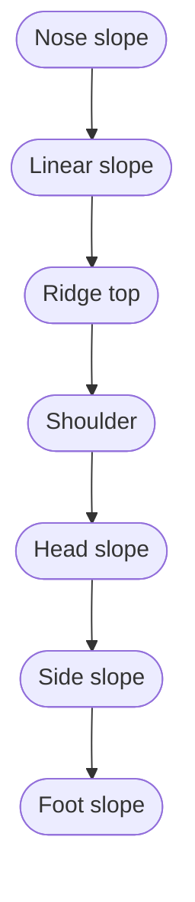

Plan view

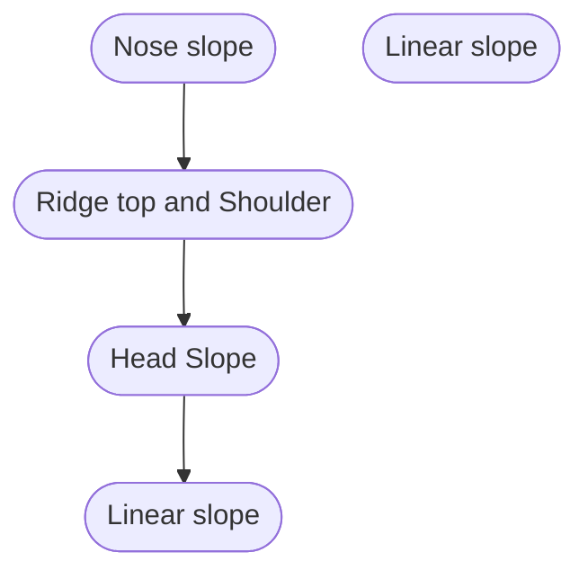

FIGURE 2.1 Cross-sectional and plan view of various landscape positions (Daniels et al., 1984).

In foot slope and head slope positions, surface water converges with a corresponding increase in groundwater flow. These are the positions at which you might expect to find springs or seeps of water coming out of the ground. Because these sites accumulate water, they are often saturated. Additional flow from wastewater irrigation will compound
\n---\n

the problems of these areas. Such areas may need reduced loading rates or may be excluded from spray irrigation.

The landscape positions called ridge, shoulder, and nose slope are typically best suited for wastewater treatment. Water diverges from these positions and they tend to shed water so that flow is not concentrated.

On a smaller scale, microtopography refers to minor variations across a landscape. A localized circumstance such as a rock outcropping or wet depressional area may require buffers, but often may not be extensive enough to rule out the usefulness of an entire site. Detailed site evaluations should define the topography and discuss any limitations of the site that are a function of topography.

Designers and operators must incorporate the elements of landscape into system designs by
(1) Ensuring dispersal or irrigation system placement along site contours,
(2) Ensuring no line placement in unsuitable landscape positions like head slope or floodplain areas, and
(3) Using site topography to assist with distribution of liquid into the receiver environment

## 2.0 SOIL COMPONENTS

Soil material provides the medium in which treatment occurs. It is the host for organisms that treat and renovate constituents encountered in materials applied to a site. Soils are physically, chemically, and biologically active, porous materials that extend from the land surface to rock or seasonal saturation. Specifically, soil is a mix of

- Organic material (highly decomposed plant and animal material [humus]);
- Mineral material (weathered rock, sand, silt, and clay);
- Water; and
- Air.

The amount of pore space in a soil determines the volume of air or water that can occupy a given soil. As rainfall or wastewater is added to and lost from a soil, the amount of pore space occupied by either air or water will vary: The type and amount of solids determine

\n---\n

the physical and chemical filtering capacity of the soil. This filtering capacity renders soil an excellent treatment medium for a variety of waste and byproduct materials.

## 3.0 SOIL PROFILES

Soil is a three-dimensional body resulting from the physical, chemical, and biological weathering of bedrock or from the accumulation of materials weathered elsewhere and transported to a site. As soil develops on the landscape, distinct layers, or bands, are formed parallel to the earth's surface. These layers, or bands, are called soil horizons. Soil horizons are layers that differ from the overlying and underlying layers in some property such as color, clay content, abundance of cracks, and so on. A soil profile is a vertical slice through the soil showing the different horizons and their thickness.

Horizon designations differ from country to country. In the United States, soil horizons are designated by a code of letters and numbers developed by soil scientists of the National Cooperative Soil Survey, a program of the U.S. Department of Agriculture's (USDA's) Natural Resources Conservation Service. Master horizons are major layers designated by capital letters such as "O", "A", "E", "B", "C", and "R". These master horizons are described as follows:

* "O" horizon—an "O" horizon is dominated by decomposing organic material from plants and animals. O horizons are usually present on the soil surface, except in the case of peats and mucks, where the O horizon extends almost to the bottom of the soil profile.

* "A" horizon—an "A" horizon is present at the soil surface or just below the O horizon. These horizons may contain some organic material mixed with mineral material. Properties of an A horizon may reflect plowing, pasturing, or similar activities. The A horizon is typically the zone of maximum biological activity in a soil.

* "E" horizon—the major characteristic of the "E" horizon is loss of clay, iron, and aluminum oxides by leaching. Sand and silt-sized particles of resistant minerals, such as quartz, remain. The E horizon is generally lighter in color than the overlying A horizon.

* "B" horizon—"B" horizons are layers of accumulation of clay, iron, and aluminum oxides that have migrated from overlying E horizons. The B horizon reflects the subsurface layer of greatest development for that particular profile.
\n---\n

- "C" horizon — C horizons consist of unconsolidated, partially weathered material that is neither rock nor soil. Little to no biological activity takes place in this horizon. The upper portion may become part of the B horizon as weathering continues.

- "R" horizon — this layer consists of underlying bedrock. It may not occur in coastal plain soils or other soils formed in transported material, such as floodplains.

Soil profiles with similar characteristics or properties are classified as a soil series. A soil series includes soil that has developed from similar materials and processes resulting in similar soil profiles and characteristics. Because soil profiles vary widely from place to place, many different soil series have been identified (in fact, there are approximately 17,000 soil series in the United States alone): Characteristics of the soil material present at a proposed treatment site will determine the treatment and assimilative capacity for the application of wastewater: An example of a typical soil profile and its horizons is shown in Figure 2.2.

Information gathered during the site investigation phase is incorporated into design and management. Typically, spray irrigation system dispersal components (nozzles) are placed above the soil surface. Drip line placement uses shallow soil materials and lines are often placed on the soil surface, just below the O horizon, into the A horizon, the E horizon, or just into the B horizon. Placement of lines deep into a profile may be necessary if there is a potential for freezing:
\n---\n

## 4.0 SOIL CHARACTERISTICS
There are a number of physical and chemical soil characteristics that affect wastewater treatment at a spray or drip irrigation site or a receiver for biosolids, animal waste, or compost. While some of these characteristics can be altered, others cannot. Physical characteristics include

- Soil texture,

FIGURE 2.2 Typical soil profile and its horizons (Brady, 1990).

<table>
<thead>
<tr><th>Horizon</th><th>Description</th></tr>
</thead>
<tbody>
<tr><td>O Horizon</td><td>Organic surface layer</td></tr>
<tr><td>A Horizon</td><td>Topsoil; mineral horizon with organic matter</td></tr>
<tr><td>E Horizon</td><td>Eluviation horizon (leached)</td></tr>
<tr><td>B Horizon</td><td>Subsoil horizon with accumulation of clays and other materials</td></tr>
<tr><td>C Horizon</td><td>Weathered parent material</td></tr>
<tr><td>R Horizon</td><td>Unweathered bedrock</td></tr>
</tbody>
</table>

\n---\n

- Soil structure
- Clay mineralogy,
- Organic matter content,
- Soil depth,
- Soil color,
- Soil drainage/wetness, and
- Topography and landscape position

Chemical characteristics include:
- Cation exchange capacity and
- pH

## 4.1 Soil Texture

The mineral particles in a soil are divided by size into three groups: sand, silt, and clay. Figure 2.3 illustrates these three groups. Soil texture refers to the relative proportion of sand, silt, and clay in a given soil. The diameters and characteristics of these soil particles are described in Table 2.1.

<table>
  <thead>
    <tr><th>Clay</th><th>Sand</th><th>Silt</th></tr>
  </thead>
  <tbody>
    <tr>
      <td>Clay particles (small, fine)</td>
      <td>Sand grains (larger)</td>
      <td>Silt particles (medium)</td>
    </tr>
<tr>
      <td>illustration shows tiny dots (clay)</td>
      <td>illustration shows larger, irregular grains (sand)</td>
      <td>illustration shows small fragments (silt)</td>
    </tr>
<tr>
      <td colspan="3">2 mm</td>
    </tr>
  </tbody>
</table>

\n---\n

# Figure 2.3 Visual representation of comparative sizes and shapes of sand, silt, and clay particles (Hillel, 1980)

The USDA currently recognizes 12 distinct textures or textural classes, as shown in the USDA Soil Textural Triangle (Figure 2.4). The three sides of the triangle are broken into percentage units (0 to 100%) of sand, silt, and clay. To use the triangle, you first locate the percentage of clay and project inward as shown by the arrow. Do likewise for the percentage of silt (or sand). The point at which the two projections intersect identifies the textural class name.

Texture can be determined in a laboratory using either sieve or hydrometer analysis. Sieve analysis is based on physical passage of soil particles through a series of standard mesh screens, while hydrometer analysis is based on variations in settling time for the different soil particle sizes. Texture can also be determined in the field by using the "feel method" (see Figure 2.5 for guidelines on this).

Texture is an important soil characteristic because it strongly influences the retention of water, nutrients, and pollutants in a soil. Coarse-textured soils, such as sands and loamy sands, have large spaces (macropores) between their soil particles. Water and air pass through these macropores rapidly. Therefore, coarse-textured soils are typically rapidly permeable, well-aerated, and well-drained. Wastewater often passes through these soils quickly and treatment potential may be limited. In addition, these soils may not hold sufficient water and nutrients to support a healthy vegetative cover. A poor vegetative cover can result in an increased potential for erosion and reduced uptake of water, nutrients, and pollutants.

In coarse-textured soil materials (sands), conservative liquid loadings should be used to ensure losses to groundwater are limited. Where soil scientists report fine-textured soil materials (clay, sandy clay), soil loadings should be conservative to ensure liquid is properly assimilated in the soil. Loadings of 30 mm/d (0.1 gal/sq ft/d) are equivalent to a load of more than 210 mm/wk (1 in./wk) on a receiver site. The liquid loadings must be assimilated on a site on a daily basis, and caution and conservancy are warranted to ensure sustainability of any system:

TABLE 2.1 Size and general characteristics of the three soil particle types
\n---\n

<table>
<thead>
<tr><th>Particle type</th><th>Particle size</th><th>General characteristics</th></tr>
</thead>
<tbody>
<tr><td>Sand</td><td>2.0–0.05 mm</td><td>Individual grains visible to the eye, gritty when soil is rubbed between the thumb and fingers.</td></tr>
<tr><td>Silt</td><td>0.05–0.002 mm</td><td>Smooth and “baby-powder feel” when rubbed between the thumb and fingers. Not plastic or sticky when moist.</td></tr>
<tr><td>Clay</td><td>&lt;0.002 mm</td><td>Smooth, sticky and plastic feel when moist. Forms very hard clods when dry. Particles may remain suspended in water for extended periods of time.</td></tr>
</tbody>
</table>

<table>
<thead>
<tr><th>Particle type</th><th>Particle size</th><th>General characteristics</th></tr>
</thead>
<tbody>
<tr><td>Sand</td><td>2.0–0.05 mm</td><td>Individual grains visible to the eye, gritty when soil is rubbed between the thumb and fingers</td></tr>
<tr><td>Silt</td><td>0.05–0.002 mm</td><td>Smooth and “baby-powder feel” when rubbed between the thumb and fingers; Not plastic or sticky when moist</td></tr>
<tr><td>Clay</td><td>&lt;0.002 mm</td><td>Smooth, sticky and plastic feel when moist; Forms very hard clods when dry. Particles may remain suspended in water for extended periods of time</td></tr>
</tbody>
</table>

\n---\n

## FIGURE 2.4 A USDA textural triangle

A USDA textural triangle showing the percentages of sand, silt, and clay in the basic textural classes (USDA, 1993).

The triangle shows percentages of sand along the bottom axis (Percent sand). Percent silt along the right axis (Percent silt). Percent clay along the left axis (Percent clay). The interior is labeled with soil texture classes such as:
- Sand
- Loamy sand
- Sandy loam
- Sandy clay loam
- Clay loam
- Loam
- Silt loam
- Silty clay loam
- Silty clay
- Silt
- Clay

Finely textured soils such as clays, sandy clays, and silty clays have smaller spaces (micropores) between soil particles. Because of cohesive and adhesive forces,

\n---\n

micropores hold water, nutrients, and pollutants more tightly than macropores. Therefore, water tends to move into and through finely textured soils more slowly. Wastewater may pond on the soil surface, causing runoff. If a sandy soil horizon is underlain by a clayey horizon, wastewater may move into the sandy surface horizon but not through the clayey subsoil. Wastewater may "perch" on top of the clayey horizon and move laterally, emerging down slope and causing runoff.
\n---\n

\n---\n

# Flowchart: Ribbon Test for Soil Texture (WEF)

- Start
  - Place 25-50 g soil in palm. Add water slowly and knead soil to wet all aggregates. Soil is at the proper consistency when plastic and moldable, like moist putty.
  - Add more dry soil.
  - Yes
- Start box continues to: Does soil remain in a ball when squeezed?

- Does soil remain in a ball when squeezed?
  - Yes
  - No
- If Yes, proceed to:
  - Place ball of soil between thumb and forefinger; gently pushing the soil with the thumb, squeezing it upward into a ribbon. Form a ribbon of uniform thickness and width. Allow the ribbon to emerge and extend over the forefinger, breaking from its own weight.

- Does the soil form a ribbon?
  - Yes
  - No
- If No, then:
  - Does gritty feeling predominate?
  - Yes
  - No
  - [Resulting texture: LOAMY SAND (if gritty predominate) or SILT (if not).]

- If Yes, proceed to:
  - Does ribbon 25 cm or less before breaking?
  - Yes
  - No
  - If Yes: Excessively wet a small pinch of soil in palm and rub with forefinger
  - If No: Does gritty feeling predominate?

- Does gritty feeling predominate?
  - Yes
  - No
- Outcomes (text fragments shown on page):
  - SAND
  - LOAM
  - SILT
  - SANDY LOAM
  - SILT LOAM
  - SILTY CLAY LOAM
  - LOAM
  - CLAY LOAM
  - CLAY

- Final note blocks (as shown visually):
  - SAND
  - LOAM
  - SILT
  - SANDY LOAM
  - SILTY CLAY LOAM
  - LOAM
  - CLAY LOAM
  - CLAY

- Copyright line (not included in transcription per instruction to remove headers/footers)
\n---\n

# Figure 2.5 Procedure for analyzing soil texture by feel (Presley and Thien, 2008)

When evaluating soil materials for wastewater application, the texture of all the horizons must be considered and this information communicated to the system designer and the regulator. Water movement, wastewater treatment, and plant rooting patterns are often influenced by several horizons. Many problems associated with wastewater application can be predicated by determining soil textures throughout the profile. Soil scientists must communicate the textural limitations on a site with design professionals, system operators, and permit writers.

## 4.2 Soil Structure

Along with soil texture, soil structure is one of the principal factors that influence the rate of water movement and nutrient retention in a natural system. Soil structure refers to the arrangement of individual soil particles (sand, silt, and clay) into more complex aggregates or “peds.” These peds can be separated from each other along natural planes, zones, or surfaces of weakness into distinct units. These units may be granular, blocky, subangular blocky, columnar, prismatic, or platy. Figure 2.6 provides an illustration of these units.
\n---\n

<table>
<thead>
<tr><th>Granular</th><th>Platy</th></tr>
</thead>
<tbody>
<tr><td>Subangular Blocky</td><td>Blocky</td></tr>
<tr><td>Columnar</td><td>Prismatic</td></tr>
</tbody>
</table>

\n---\n

# Figure 2.6 Various structural types found in mineral soils (Hillel, 1980)

Soils that do not form structural units, such as very sandy soils, are considered structureless. Soils that do not naturally separate into structural units, such as sticky, clayey soils, are considered to have massive structure. Granular structure is often present in the A and E horizons, while other types of structures are generally found in the lower horizons.

Soil structure affects water movement both into and through the soil. Because water moves primarily between peds, soil structure can modify the influence of soil texture on water movement: Water movement in finely textured soils can be very slow. However, clayey soils with well-developed blocky and subangular blocky structure can transmit reasonably large volumes of water between peds, even though these soils are finely textured and these soils offer tremendous potential to treat constituents encountered in a waste stream. In finely textured soils with massive structure (e.g., the clay is so sticky that individual peds do not form), water movement can be expected to be slow and restricted. Water movement can also be slow in soils with some platy, prismatic, or columnar structure.

Unlike texture, structure can be easily altered by management practices. Additions of organic matter can improve soil structure by acting as a binding agent for soil particles. Unfortunately, changes in soil structure are usually negative. If finely textured soils are traveled with heavy equipment, tilled, or otherwise worked when wet, soil aggregates are destroyed and macropores disappear, resulting in soil compaction. In this condition, water and air cannot move through the soil. Even after the soil dries, structure remains destroyed. It is important to keep heavy equipment off of spray fields when soil is wet to avoid compacting the soil and reducing permeability. Similarly, installers must keep heavy equipment off fields destined to host a subsurface system when soils are wet:

Soil scientists must provide soil texture information to design professionals to ensure adequate designs are developed. Soil texture strongly influences movement of liquid in the heavier textured soil materials. A clay soil exhibiting welldeveloped (strong to weak) water-stable aggregate subangular blocky structure typically moves water well:
\n---\n

Conversely, a platy or massive structure often limits the potential for water movement through a profile.

Structural changes in a soil profile may indicate layers of slow permeability and designers must be cognizant of minor structural changes to ensure sustainable designs. Soil structure is best described in a soil pit; auger borings may disrupt structural integrity and render identification of structure difficult. Therefore, system designers should be careful when using structural descriptions gathered in auger borings:

## 4.3 Organic Matter Content

Soil organic matter (humus) is composed of decomposing plant and animals as well as waste materials produced by soil microorganisms. The organic matter content of most mineral soils is typically less than 5%. However, organic matter serves several important functions in soil/plant treatment systems:

1) Organic matter promotes soil structure formation in finer-textured soils. Good soil structure aids water movement in soil by increasing the pore space.

2) In sandy soils, organic matter helps fill larger pores and increases the soil's ability to hold water, nutrients, and pollutants, thus increasing its treatment potential.

3) Organic matter is a food source for soil microorganisms. Microbial activity, in turn, produces waste products that promote the formation of soil structure.

4) Organic matter contains several plant nutrients, particularly nitrogen, phosphorus, and sulfur. As organic matter decays, these nutrients become available for use by plants and microorganisms.

5) Organic matter has a high negative charge, which increases a soil's ability to retain water, nutrients, and pollutants.

The organic matter level in a profile will have little impact on system design unless the level of organic matter exceeds 5 to 8%. At these levels, soil organic matter may impede the movement of water into and through a soil profile. Designers should consider soil organic matter when designing in areas of excessive rainfall or in coastal areas where organic soils may be present.

The soil scientist should identify organic layers in a soil as a “BH” horizon. If soil layers contain this designation, system designers should exercise caution is assigning a liquid

\n---\n

## 4.4 Soil Depth

Soil depth refers to the thickness of the soil horizons, from the soil surface to a depth that restricts plant root growth or otherwise limits biological activity. This limiting depth is often caused by a restrictive horizon in the soil. A restrictive horizon could be a seasonal or permanent water table, a layer of gravel, weathered or unweathered bedrock; a chemical change, or a soil structural change that limits the depth of biological activity. Soil depth is a soil characteristic that cannot be modified or altered.

Soil depth is important because
* It determines the volume of soil that is available for the treatment of waste and
* It affects the type of plants that can be grown on the site.

A soil scientist typically describes soil layers or horizons based on the thickness of the layers. Liquid placed in a soil should be placed well above any restrictive horizon or layer to ensure treatment through the profile. The placement of a subsurface wastewater treatment and renovation system at a shallow depth allows for use of the remaining soil profile for treatment. Soil scientists should specify a depth of placement for drip lines to ensure maximum treatment potential through the soil profile.

## 4.5 Soil Color

The color patterns in soil serve as indicator characteristics that are used to predict soil/water and soil/air relationships in a soil profile. Soil color is an extremely useful tool when evaluating a site for suitability as a waste treatment or receiver system:

Soils that are well-drained and aerobic (i.e., contain air) typically exhibit rather bright colors due to oxidized iron (ferric iron [Fe3+]). Iron in the ferric state is rust, and rusty iron imparts a reddish-orange color to the soil. When soil drainage is impeded and the soil is saturated, the ferric iron contained in the soil is chemically reduced to ferrous iron (Fe2+). Ferrous iron is soluble in water and, as the water table recedes, this soluble iron is removed, leaving behind soil that is gray in color.

As the water table rises and falls, a characteristic pattern called mottling usually develops. Mottled soils typically contain bright orange and red areas mixed with light gray.
\n---\n

## 4.6 Soil Drainage/Wetness

These mottled patterns are impressed upon the original background or matrix color of the soil. The presence or absence of gray mottles or color in a soil is an indication of the wetness or aeration status of the soil. Bright, uniform colors indicate that a soil is well-drained and that a seasonal high water table is not present for a significant time during the year. The presence of light-gray mottles usually indicates a high water table or poorly drained soil. The depth to gray colors can be used to define the drainage class of a soil and indicate the depth of the seasonal high water table.

Soil scientists describe soils using a notation called Munsell Color. The soil investigation must include the soil color notations derived from the Munsell descriptions. The last number in the Munsell description is the chroma. A chroma less than 2 in a subsoil is often indicative of soil wetness. A soil scientist should communicate whether the soil color patterns encountered on a site are indicators of a current wetness condition or simply a relic of the history of a site. The system designer must determine that spray or drip line placement is adequate to ensure adequate separation between it and the soil wetness condition indicated by soil color patterns:

- 4.6 Soil Drainage/Wetness

Soil drainage, or wetness, refers to the depth of the water table and to the period of time a particular part of the soil profile is saturated. A soil may be classified as well-drained, moderately well-drained, somewhat poorly drained, poorly drained, or very poorly drained. Poorly drained soils have a water table at or within 30 cm (12 in.) of the soil surface for most of the year. Well-drained soils have a water table depth of 150 cm (60 in.) or more during much of the year.

The drainage class of a soil can usually be determined by observing both the color patterns of the soil profile and the relative position of the site on the landscape. Poorly drained and very poorly drained soils are typically not considered suitable for the spray irrigation or subsurface dispersal of wastewater for the following reasons:

- Wet soils do not provide adequate treatment capacity and waste constituents may move directly to groundwater,
- Seasonally wet soils may limit the type of plants that can be grown on the site and can impact the quality of vegetative cover, and
\n---\n

#  Wet soils and drainage considerations

* Wet soils are subject to compaction by equipment traffic that destroys soil structure and reduces the infiltrative capacity of a site.

* The drainage class of a soil refers to water table depth, not permeability. Consequently, even though a soil might be coarsely textured and relatively easily drained, a high water table due to landscape position can render the soil poorly drained: If an outlet or a drainage system is provided for soil water; then this poorly drained sandy soil may be modified. However; installing any type of drainageway or drainage system at a spray irrigation site is not recommended because it could be a violation of the system's permit conditions.

* Soil wetness or drainage indicators are used to establish separation distances in soil treatment systems between the zone of waste application and the indicators of wetness. Maintenance of adequate separation distances is critical to ensure the soil/plant system adequately removes pollutants of concern. These separation distances are often measured simply as vertical distance, but recent work indicates that exposure to a specified volume of soil may be as effective as passage through specified depth to affect treatment.

# 5.0 TREATMENT MECHANISMS IN PLANT/SOIL SYSTEMS

A basic understanding of a soil's physical and chemical properties as well as soil/water relationships is necessary as a foundation to recognize roles of soil materials and the plant system in treatment and renovation of waste. The soil/plant system treats or renovates wastewater in the following ways:

* Physically,
* Chemically, and
* Biologically.

# 6.0 FATE OF WASTE CONSTITUENTS

Different waste constituents are subject to different fates once they enter the soil/plant system.

Nitrogen can be
- Mineralized
\n---\n

* Immobilized,
* Adsorbed onto soil colloids,
* Lost as a gas to the atmosphere through volatilization or denitrification, and
* Leached to groundwater; if not properly treated.

Phosphorus can be
* Mineralized,
* Immobilized,
* Adsorbed onto soil colloids, and
* Precipitated.

Pathogens can be
* Consumed or eliminated by soil microorganisms,
* Adsorbed onto soil colloids,
* Complexed by chelates,
* Killed by unfavorable environmental conditions, and
* Destroyed by exposure to UV light.

Persistent organic chemicals can be
* Consumed or eliminated by soil microorganisms,
* Absorbed by plants,
* Chemically decomposed,
* Adsorbed onto soil colloids,
* Volatilized,
* Broken down by UV light, and
* Leached to groundwater.

## 7.0 AGRONOMY

Plants are an integral part of the natural treatment system and represent more of a critical concern with traditional slow-rate irrigation than subsurface systems. Therefore, it is
\n---\n

It is important that system designers, operators, and permit writers have a basic understanding of the role agronomy and vegetation play in natural systems. Agronomy is the study of the various physical and biological factors related to agricultural, silvicultural, and horticultural crop production. While the production of crops is not the primary concern of a land-based treatment system, except perhaps on spray or drip irrigation systems, a healthy vegetative cover is essential for the natural treatment system to function properly:

Important functions that plants perform include the following:
* Use nutrients,
* Use water,
* Stabilize soil and prevent erosion, and
* Provide food and habitat for soil organisms that break down and use waste constituents.

Most on-lot and decentralized domestic wastewater systems provide nutrients in levels sufficient to support plant growth. Supplemental plant nutrients may be required to sustain vegetation on large-cluster or community systems.

For some large-cluster, community-drip, or subsurface or irrigation systems, the quantity of wastewater that can be applied is either hydraulically or nutrient-limited. This means that the amount of wastewater that can be applied is determined by either the liquid load to land or the nutrient content of the wastewater: Liquid loadings are determined by assessing soil physical properties (depth, color, texture, and structure). Nutrient loadings are assessed through soil test programs that optimize nutrient loadings to soil and crop systems. Of the 16 essential plant nutrients necessary to support healthy vegetation, nitrogen, phosphorus, and potassium are required in the highest quantity while calcium, magnesium, manganese, sulfur, boron, and trace minerals are required at much lower levels.

Soil testing programs are an essential element in the design and operation of land-based systems. Many state departments of agriculture or land grant colleges offer soil testing services. Cooperative extension service personnel in state offices can assist with interpretation of soil test information. In addition, private agronomic service laboratories and consultants provide information on soil fertility and testing.
\n---\n

The development of a representative testing and sampling program is critical to sustainable subsurface system or irrigation system management programs, but may not be necessary on most subsurface systems. Supplemental plant nutrients must be supplied to satisfy plant needs. Levels of nutrient or metal considered excessive may require alteration of wastewater management operations or the addition of supplements to reduce nutrient availability.

## 8.0 CONCLUSIONS

The soil/plant system has been demonstrated to be an effective option for treatment and renovation of wastewater constituents and to prevent them from reaching groundwater. These design provisions apply if the system is properly sited, operated, and maintained. It is important to remember that soils vary tremendously in their treatment capacity. Under some conditions, waste constituents may take months or years to move from the soil surface to groundwater. Under other conditions, they can flow almost directly into the groundwater. Once waste constituents reach the saturated zone, they are subject to withdrawal from a drinking water well or discharge to adjacent surface waters, possibly jeopardizing both public health and environmental quality.

Furthermore, plant materials require care and feeding. Designers and operators of land-based wastewater systems must incorporate comprehensive testing programs to ensure the long-term sustainability of the system. Additional information is available in the North Carolina Certification Training for Operators of Animal Waste Management Systems (1997).

## 9.0 REFERENCES

- Brady, N. C. (1990) The Nature and Properties of Soils; Macmillan Publishing: New York.
- Daniels, R. B.; Kleiss, H. J.; Buol, S. W.; Phillips, J. A. (1984) Soil Systems in North Carolina; Bulletin 467; North Carolina Agricultural Research Service: Raleigh, North Carolina.
- Hillel, D. (1980) Introduction to Soil Physics; Academic Press: San Diego, California.
- Presley, D.; Thien, S. J. (2008) Estimating Soil Texture by Feel, PDF; http://www.ksre.ksu.edu/library/crpsl2/mf2852.pdf. Kansas State University (accessed November 2009).
\n---\n

# U.S. Department of Agriculture (1993) Soil Survey Manual; USDA: Washington, D.C.
## 10.0 SUGGESTED READINGS

* Brooks, K. N.; Folliott, P. F.; Gregersen, H. M.; Thames, J. L. (1991) Hydrology and the Management of Watersheds; Iowa State University Press: Ames, Iowa.
* North Carolina Cooperative Extension Service (1997) Certification Training for Operators of Animal Waste Management Systems; Raleigh, North Carolina.
* Schwab, G. O.; Fangmeier, D. D.; Elliot, W. J.; Frevert, R. K. (1993) Soil and Water Conservation Engineering; Wiley & Sons: New York.
* Uebler, R. L.; Marinshaw, R.; Berkowitz, S.; Steinbeck, S. (1989) A Simplified Technique for Groundwater Mounding Analysis Under Soil Absorption Sewage Disposal Systems; Proceedings of the Soil Science Society of North Carolina 32nd Annual Meeting, Jan. 17–18, Raleigh, North Carolina.
\n---\n

# Chapter 3: Subsurface Wastewater Infiltration
\n---\n

# 1.0 INTRODUCTION

# 2.0 DESCRIPTION

# 3.0 PROCESS PERFORMANCE
## 3.1 Hydraulic Performance
## 3.2 Treatment Performance

# 4.0 SITE ASSESSMENT
## 4.1 Phase 1: Wastewater Characterization and Treatment Requirements
## 4.2 Phase 2: Site Identification
## 4.3 Phase 3: Site Reconnaissance
## 4.4 Phase 4: Detailed Site Investigation
### 4.4.1 Soil Profile Descriptions
### 4.4.2 Groundwater Investigations
### 4.4.3 Measurement of Soil Hydraulic Conductivity
### 4.4.4 Saturated Zone Measurements
### 4.4.5 Groundwater Mounding Analysis
### 4.4.6 Data Analysis and Interpretation

# 5.0 DESIGN
## 5.1 Boundary Design Approach
## 5.2 Design Concept
## 5.3 Design Factors
### 5.3.1 Wastewater Flows
### 5.3.2 Wastewater Composition
### 5.3.3 Placement of the Infiltration Surface
### 5.3.4 Hydraulic and Pollutant Mass Loadings
### 5.3.5 Geometry and Depth of the Infiltration Surface
\n---\n

# 1.0 INTRODUCTION

Subsurface wastewater infiltration systems (SWISs) are buried land-application systems that treat settled or more highly pretreated wastewater. They are well suited for treatment of daily wastewater flows of up to 380 m3/d (100 000 gpd). Small SWISs, commonly referred to as septic systems, traditionally are used in unsewered areas to provide wastewater treatment for individual homes, restaurants, and other commercial establishments as well as mobile home parks and campgrounds. Nearly 20 to 25% of all households and up to 33% of new developments in the United States are served by individual septic systems (NSFC, 1997; U.S. EPA, 2005).

Subsurface wastewater infiltration systems are regulated either under state rules and regulations and/or local ordinances. Requirements for planning, design, and use of SWISs vary substantially from jurisdiction to jurisdiction: Therefore, the designer must be aware of the particular codes and ordinances in the jurisdiction that he or she is working. Systems that have a total capacity to serve 20 or more persons per day are called large capacity septic systems (LCSSs) and are classified as Class V wells under the Underground Injection Control Program (Federal Register; 7 December 1999 and 7 May 2001) of the U.S. Environmental Protection Agency (U.S. EPA). As such, the owner or operator of an LCSS must submit basic system inventory information to the state agency or the U.S. EPA Regional Underground Injection Control Program in addition to following state or local requirements (visit http://www.epa.gov/safewater/uic/index.html for rule guidance, fact sheets, and other helpful documents).

Subsurface wastewater infiltration systems are often preferred over treatment facilities that discharge directly to surface waters because of their performance reliability and consistency under varying influent flow and quality ranges with lower capital and operating costs and little operator attention. In addition, with more stringent effluent limits placed on point discharges to surface waters, evaluation and implementation of subsurface-soil discharging systems such as SWISs are increasing.

This chapter is concerned primarily with the design and management of SWISs that treat flows greater than 7 m3/d (1500 gpd). For more information on residential system design, see the following U.S. EPA publications: Onsite Wastewater Treatment Systems Manual (2002) and Design Manual: Onsite Wastewater Treatment and Disposal Systems (1980).
\n---\n

# 2.0 DESCRIPTION

Although several different SWIS designs have been developed for various site and soil conditions, all designs consist of some form of pretreatment and subsurface-soil infiltrative surfaces to which pretreated effluent is applied (Figure 3.1). Traditionally, infiltrated surfaces are excavated in natural soil that is filled with a porous medium that maintains the structure of the excavation, allows the free flow of pretreated wastewater over the bottom surface of the excavation where it infiltrates the soil, and provides wastewater storage during periods of peak flows. As the wastewater percolates through the infiltrative surfaces and the unsaturated soil (vadose zone) below, filtration, sorption, and biochemical reactions occur to provide final polishing of the wastewater. Ultimately, the renovated wastewater enters and flows with the local groundwater table.

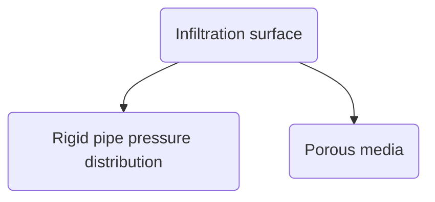

FIGURE 3.1 Traditional SWIS construction.
\n---\n

# Recent advances and technology in SWIS design and management

Recent advances and technology, design practices, construction methods, and system management are being used to enhance treatment performance, target specific pollutants of concern, broaden the range of system applications, and reduce life-cycle costs of SWISs. These advances include advanced secondary and denitrification pretreatment units, synthetic products that replace gravel in infiltration systems, distribution piping that can apply precise amounts of wastewater at specific points on the infiltrative surface, and dosing controllers that are able to dose SWISs uniformly in space and time.

Because of the ability of the soil to transform and recycle most pollutants found in domestic wastewater, SWISs are typically less complex and costly than conventional treatment works in achieving the same treatment goals. This cost advantage is particularly true when strict effluent standards are imposed on point discharges to surface water: Complex mechanical plants are typically not necessary; operation, maintenance, and power costs are low; and lesser skilled, part-time operators are required. When SWISs are used to address environmentally sensitive receiving environments however; advanced technology that modifies traditional design, operation, maintenance, and management requirements is necessary: Such treatment equipment is readily available commercially:

Because of their reliance on soil for treatment and dispersal of wastewater, SWISs require more land area per treated gallon than traditional treatment plants. Therefore, they are most practical serving low-density developments or clusters of homes in high-density suburban or rural developments. This offers several advantages compared to more traditional collection and treatment facilities with point discharges (Otis, 2005). By locating treatment sites near the wastewater source and thereby scattering them throughout a watershed as appropriate, wastewater is renovated and returned to the groundwater to preserve wetlands and sustain base flows to streams. Because their discharges to soil are distributed across the watershed, the assimilative capacity of the environment is efficiently used. When malfunctions occur, they tend to be small, containable, and relatively easy and inexpensive to correct. Furthermore, these systems and their distributed application allow managers to increase capacity only when needed rather than building new facilities with excess capacity that is projected to be necessary sometime in the future.

However, important disadvantages can limit the use of SWISs. The primary limitations are their size and treatment capacity, which are determined by the soil and physical
\n---\n

characteristics of the receiver site. Because indigenous soils are used for treatment and
dispersal of wastewater, SWIS performance is difficult to predict and monitor. If a
malfunction occurs, environmental damage or health risks can result. Hydraulic
malfunctions typically lead to wastewater ponding on the ground surface and runoff from
the treatment site, and inadequate treatment by the soil matrix can contaminate
groundwater aquifers. Therefore, the selection of SWISs for wastewater treatment must
be based on a thorough site evaluation and understanding of the interactions between
applied wastewater characteristics, soil characteristics, and hydrogeology of the selected
site. Traditional and advanced applications for SWIS technology for various site and soil
characteristics are presented in Table 3.1.

TABLE 3.1 Characteristics of typical SWIS applications (U.S. EPA, 2002).
\n---\n

<h1> </h1>

<table>
  <thead>
    <tr>
      <th>Characteristic</th>
      <th>Typical application</th>
      <th>Applications to avoid*</th>
    </tr>
  </thead>
  <tbody>
    <tr>
      <td>Type of wastewater</td>
      <td>Domestic and commercial (residential, mobile home parks, campgrounds, schools, restaurants, etc)</td>
      <td>Facilities with non-sanitary and/or industrial wastewaters. Check local codes for other possible restrictions</td>
    </tr>
<tr>
      <td>Daily flow</td>
      <td>&lt;20 population equivalents unless a management entity exists (U.S. EPA Underground Injection Control Program Class V rule)</td>
      <td>&gt;20 population equivalents without a management program. Check local codes for specific and/or special conditions</td>
    </tr>
<tr>
      <td>Minimum pretreatment</td>
      <td>Primary (septic tank, Imhoff tank)</td>
      <td>Not applicable</td>
    </tr>
<tr>
      <td>Lot orientation</td>
      <td>Length along contour(s) must be greater than the allowable contour loading rate</td>
      <td>Any site where peak / average hydraulic loads from the system will exceed estimated allowable loading rates at the site</td>
    </tr>
<tr>
      <td>Landscape position</td>
      <td>Ridge lines, hill tops, shoulder slopes</td>
      <td>Depressions, foot slopes, concave slopes, floodplains</td>
    </tr>
<tr>
      <td>Topography</td>
      <td>Planar, mildly undulating slopes of ≤20% grade</td>
      <td>Complex slopes of >30%</td>
    </tr>
<tr>
      <td>Soil texture</td>
      <td>Sands to clay loams</td>
      <td>Very fine sands, heavy clays, expandable clays</td>
    </tr>
<tr>
      <td>Soil structure</td>
      <td>Granular, blocky</td>
      <td>Platy, prismatic, or massive soils</td>
    </tr>
<tr>
      <td>Drainage</td>
      <td>Moderately drained or well-drained sites</td>
      <td>Extremely well, or very poorly drained sites</td>
    </tr>
<tr>
      <td>Depth to phreatic surface or bedrock (vadose zone)</td>
      <td>&gt;1.5 m (5 ft)</td>
      <td>&lt;0.3 to 0.06 m (1 to 2 ft) of natural soil. Check local codes for specific requirements</td>
    </tr>
  </tbody>
</table>

<p>Where possible:</p>

<table>
  <thead>
    <tr>
      <th>Characteristic</th>
      <th>Typical application</th>
      <th>Applications to avoid*</th>
    </tr>
  </thead>
  <tbody>
    <tr>
      <td>Type of wastewater</td>
      <td>Domestic and commercial (residential, mobile home parks, campgrounds, schools, restaurants, etc.)</td>
      <td>Facilities with non-sanitary and/or industrial wastewaters. Check local codes for other possible restrictions</td>
    </tr>
  </tbody>
</table>

\n---\n

<table>
  <thead>
    <tr>
      <th>Minimum pretreatment</th>
      <th>Primary (septic tank, Imhoff tank)</th>
      <th>Not applicable</th>
    </tr>
  </thead>
  <tbody>
    <tr>
      <td>Lot orientation</td>
      <td>Length along contour(s) must be greater than the allowable contour loading rate</td>
      <td>Anysite where peak/average hydraulic loads from the system will exceed estimated allowable loading rates at the site</td>
    </tr>
<tr>
      <td>Landscape position</td>
      <td>Ridge lines, hill tops, shoulder slopes</td>
      <td>Depressions, foot slopes, concave slopes, floodplains</td>
    </tr>
<tr>
      <td>Topography</td>
      <td>Planar, mildly undulating slopes of ≤20% grade</td>
      <td>Complex slopes of >30%</td>
    </tr>
<tr>
      <td>Soil texture</td>
      <td>Sands to clay loams</td>
      <td>Very fine sands, heavy clays, expandable clays</td>
    </tr>
<tr>
      <td>Soil structure</td>
      <td>Granular, blocky</td>
      <td>Platy, prismatic, or massive soils</td>
    </tr>
<tr>
      <td>Drainage</td>
      <td>Moderately drained or well-drained sites</td>
      <td>Extremely well, or very poorly drained sites</td>
    </tr>
<tr>
      <td>Depth to phreatic surface or bedrock (vadose zone)</td>
      <td>&gt;1.5 m (5 ft)</td>
      <td>&lt;0.3 to 0.6 m (1 to 2 ft) of natural soil. Check local codes for specific requirements</td>
    </tr>
  </tbody>
</table>

<p>* Where possible.</p>

<h2>3.0 PROCESS PERFORMANCE</h2>

<p>Performance of a SWIS is measured by its ability to accept and adequately treat the applied wastewater load within the defined system boundary. The system boundary is commonly defined to be either the boundary of the property on which the SWIS is located or a point of use such as a drinking water supply well, a spring, or other feature, whichever is closer. The boundary also extends vertically from the ground surface through the unsaturated soil below the SWIS (vadose zone) and into the uppermost part of the groundwater table: Typically, drinking water standards are expected to be met before the wastewater— groundwater mixture crosses this boundary. However, because of the difficulty and expense in monitoring groundwater to confirm acceptable treatment has been achieved, local regulations often require higher levels of treatment prior to soil application to ensure acceptable treatment is achieved:</p>

\n---\n

Historically, SWISs were considered "disposal" systems, where the soil was used to disperse the wastewater below ground to avoid direct contact with the public. However, with the increasing use of SWISs, soil is also being relied on to provide a final "polishing" treatment step to protect groundwater quality. With an appropriate SWIS design and proper operation, SWISs can usually achieve treatment expectations, except in the most environmentally sensitive areas.

With increasing demands for SWISs to protect the quality of groundwater resources, SWISs must be carefully designed to accommodate the soil's capacity to hydraulically transmit and simultaneously treat wastewater to desired levels. The soil acts as a fixed-film bioreactor. When wastewater is applied to the soil, facultative heterotrophs induce an oxygen demand in breaking down biodegradable materials. This oxygen demand must be satisfied by free or combined forms of oxygen to sustain the biochemical degradation processes. This is achieved primarily by diffusion of oxygen through the open soil pores from around the perimeter of the SWIS. If the applied oxygen demand exceeds the oxygen transfer capability of the soil, anoxic or anaerobic conditions result; under which facultative heterotrophs are less efficient and degradation is incomplete (Otis, 1985, 1997; Siegrist, 1987; Van Cuyk et al., 2005). A further consequence of anoxic conditions is the elimination of higher forms of soil fauna, such as worms and insects, and nonwetland plants that are otherwise attracted to the carbon and nutrient-rich infiltrative/vadose zone boundary, where their burrows and root channels help keep the soil porous. Without ample time to reaerate the soil between wastewater applications, the applied oxygen demand will not be satisfied, which may lead to soil clogging and hydraulic failure of the system. Therefore, it is imperative that the soil be treated as a bioreactor and adequately evaluated to determine the most appropriate design and operation procedures to achieve treatment goals.

### 3.1 Hydraulic Performance

Wastewater transport from a SWIS occurs through three zones (Otis, 2001): the infiltration zone (air/soil boundary), the vadose zone (unsaturated zone), and the saturated zone or water table (Figure 3.2). Wastewater enters the soil at the surface of the infiltrative zone. This zone is biologically active, and is typically only a few centimeters thick. It acts as a physical, chemical, and biological filter to remove particulate matter, parasites, and biodegradable organics from the applied wastewater. Particulate materials are strained
\n---\n

From the wastewater in this zone, where they accumulate on the infiltrative surface and within the soil matrix, which provides a source of food and nutrients for an active biomass. The biomass and metabolic byproducts created during biodegradation of the waste materials also accumulate in this zone. As a result, the porosity of the infiltration zone is reduced, which reduces the wastewater flux through the zone and causes it to saturate. Thus, this zone becomes a transitional zone in which liquid flow through the zone changes from saturated flow, where the water exists as "free" water, to unsaturated flow, where the water exists under tension (negative pressure). Consequently, there is a sharp decline in hydraulic conductivity across the zone.

```mermaid
graph TD
GTL[Geotextile Liner] --> IZ[Infiltration Zone]
IZ --> VZ[Vadose Zone (Unsaturated)]
VZ --> PZ[Perched Saturated Zone]
PZ --> RH[Restrictive Horizon]
RH --> GT[Groundwater Table]
```
\n---\n

FIGURE 3.2 Subsurface wastewater infiltration system design boundaries (Otis, 2001).

Beneath the zone of infiltration, wastewater enters the vadose zone. Here, the water remains under negative pressure, which causes the water to preferentially flow through the smaller soil pores due to the capillarity of the soil matrix. The larger pores remain gas-filled (typically air). Water transport through this zone will occur in any direction depending on the direction of the total potential gradient, which is the sum of the gravity and pressure potentials. Under a SWIS, this flow is primarily vertically downward.

From the vadose zone, treated wastewater enters the saturated zone or groundwater. In this zone, all the soil pores are filled with water and flow occurs either vertically or horizontally, primarily through the largest pores under a positive pressure gradient. Ultimately, treated wastewater leaves the receiver site through this saturated zone.

### 3.2 Treatment Performance

Subsurface wastewater infiltration systems are capable of retaining, transforming, or removing most pollutants of concern in domestic wastewater (Table 3.2). With the appropriate system design and operation, numerous studies have shown significant reductions of biodegradable organics, particulate matter, nitrogen, phosphorus, heavy metals, toxic organics, parasites, fecal indicators (coliforms), and viruses (Ayres Associates, 1993a; Brown et al., 1977; Gerba et al., 1975; Hagedorn et al., 1981; Jennsen and Siegrist, 1988; Otis, 2007; Sauer and Tyler, 1994; Siegrist et al., 1986; Siegrist et al., 2005; Staunes and Enfield, 1984; Tofflemire and Chen, 1977; U.S. EPA, 2002; University of Wisconsin, 1978). Of these pollutants, traditional SWIS designs have not performed well with regard to nitrogen removal. This is because treatment sites preferred by designers are typically deep, well-drained mineral soils with deep water tables. Such soils do not support denitrification because of insufficient organic matter content to create an anoxic environment and provide a carbon source for the denitrifiers (Gold et al., 1999; Starr and Gillham, 1993). Without the selection of receiver sites that can support denitrification, advanced pretreatment must be provided.

TABLE 3.2 Typical removals of conventional wastewater pollutants by soil below SWIS

```
```mermaid
graph TD
A[Table 3.2: Typical removals of conventional wastewater pollutants by soil below SWIS] --> B[Nitrogen removal]
A --> C[Phosphorus removal]
A --> D[Heavy metals removal]
A --> E[Toxic organics removal]
A --> F[Parasites removal]
A --> G[Fecal indicators (coliforms)]
A --> H[Virus removal]
```
```
\n---\n

# Performance data: Applied concentration and percent removal

<table>
<thead>
<tr>
  <th>Parameter</th>
  <th>Applied concentration (mg/L)</th>
  <th>Percent removal</th>
  <th>References</th>
</tr>
</thead>
<tbody>
<tr>
  <td>BOD5</td>
  <td>130-150</td>
  <td>90-98</td>
  <td>Ayres Associates, 1993a; Siegrist et al., 1986; Siegrist et al., 2005; University of Wisconsin, 1978</td>
</tr>
<tr>
  <td>Total nitrogen</td>
  <td>45-55</td>
  <td>10-40 (>90 in wet through soil)</td>
  <td>Ayres Associates, 1993a; Hinkle et al., 2005; Otis, 2007; Reneau, 1977; Sikora et al., 1976; Van Cuyk et al., 2005</td>
</tr>
<tr>
  <td>Total phosphorus</td>
  <td>8-12</td>
  <td>85-95</td>
  <td>Ayres Associates, 1993a; Siegrist et al., 2005; Sikora et al., 1976</td>
</tr>
<tr>
  <td>Fecal coliforms</td>
  <td>NA</td>
  <td>99-99.99</td>
  <td>Ayres Associates, 1993a; Gerba et al., 1975; Hinkle et al., 2005</td>
</tr>
</tbody>
</table>

<table>
<thead>
<tr>
  <th>Parameter</th>
  <th>Applied concentration (mg/L)</th>
  <th>Percent removal</th>
  <th>References</th>
</tr>
</thead>
<tbody>
<tr>
  <td>BOD5</td>
  <td>130-150</td>
  <td>90-98</td>
  <td>Ayres Associates, 1993a; Siegrist et al., 1986; Siegrist et al., 2005; University of Wisconsin, 1978</td>
</tr>
<tr>
  <td>Total nitrogen</td>
  <td>45-55</td>
  <td>10-40 (>90 in wet through soil)</td>
  <td>Ayres Associates, 1993a; Hinkle et al., 2005; Otis, 2007; Reneau, 1977; Sikora et al., 1976; Van Cuyk et al., 2005</td>
</tr>
</tbody>
</table>

\n---\n

Siegrist et al., 2005
Sikora et al., 1976

<table>
  <thead>
    <tr>
      <th>Pollutant</th>
      <th>???</th>
      <th>Removal</th>
      <th>References</th>
    </tr>
  </thead>
  <tbody>
    <tr>
      <td>Fecal coliforms</td>
      <td>NA</td>
      <td>99–99.99</td>
      <td>Ayres Associates, 1993a<br>Gerba et al., 1975<br>Hinkle et al., 2005</td>
    </tr>
  </tbody>
</table>

Although the fate of other pollutants, such as trace organics and viruses, is poorly documented, these pollutants do not seem to create significant health problems attributable to SWISs (Ayres Associates, 1993a, 1993b; Sauer and Tyler, 1994; U.S. EPA, 2002). The primary removal mechanism for viruses seems to be adsorption, which retains the virus for biological enzyme attack and decomposition. The efficiency of removal varies with virus type, possibly because of differences in the chemical composition and electrical charge of the virus particles. Although data are limited, 0.6 to 1.2 m (2 to 4 ft) of unsaturated soil seems to remove most viruses, except in coarse sands and gravels (Ayres Associates, 1993b; Gerba et al., 1975; U.S. EPA, 2002).

Heavy metals react with soil through adsorption, ion exchange, chemical precipitation, and complexation with organic substances; of these, adsorption seems to dominate (Ayres Associates, 1993b; Sauer and Tyler, 1994; U.S. EPA, 2002). Soil mineralogy, particle size, and pH are important factors in heavy metal adsorption: Increasing iron, aluminum, and clay content correlates directly with heavy metal retention, while decreasing pH correlates directly with metal mobilization. Few data exist to document the transport and fate of toxic organic compounds (solvents, paint thinners, grease removers, and toilet bowl cleaners). However, based on the limited data that do exist, it seems that groundwater contamination by these compounds can occur, particularly in granular soils with low clay contents (Ayres Associates, 1993a; Sauer and Tyler, 1994; U.S. EPA, 2002).

## 4.0 SITE ASSESSMENT

The objective of a site assessment is to determine a site’s capacity to hydraulically accept and treat the applied wastewater. Specific features of the site and characteristics of the soil must be investigated and described. This task requires input from individuals with experience in siting and designing SWISs who represent a range of disciplines including wastewater engineering, soil science, and hydrogeology:

\n---\n

## 4.1 Phase 1: Wastewater Characterization and Treatment Requirements

The scale and detail of the site assessment depend on the quantity and quality of the anticipated wastewater; the nature of local soils and hydrogeologic setting, sensitivity of the local environment to wastewater discharges, treatment goals, and the availability of acceptable sites. Assessment activities will also be governed by local rules and regulations, which should be reviewed before commencing the assessment.

To focus the site selection effort on only the most promising sites, a phased approach is recommended: The first phase is to estimate the volume and constituent concentrations of the wastewater and to review local regulations to determine the required treatment goals. The second phase is the identification of candidate sites that meet established criteria based on available resource information of the area. The third phase is a reconnaissance survey of each identified site to select and rank the most promising sites for detailed investigation. Finally, detailed investigations of the most favorable sites are conducted to assess their respective capacities to hydraulically accept and satisfactorily treat the wastewater and to identify the significant site characteristics that will affect design. For detailed guidelines about site assessments, see the following publications: On-Site Septic Systems (ASTM, 1997), Design Manual: Onsite Wastewater Treatment and Disposal Systems (U.S. EPA, 1980), Process Design Manual for Land Treatment of Municipal Wastewater: Supplement on Rapid Infiltration and Overland Flow (U.S. EPA, 1984), and Onsite Wastewater Treatment Systems Manual (U.S. EPA, 2002).

The site assessment process begins with obtaining a reasonably accurate estimate of the volume of wastewater that the facility must treat; its constituent concentrations, and stipulated treatment goals. The daily average and peak flows are needed to determine the necessary area of a particular treatment and dispersal site based on the estimate of the site's hydraulic capacity. The treatment goals establish what concentrations specific wastewater constituents must be reduced to, which determines the treatment requirements. From this information, the goals of the site assessment are to delineate a sufficient area for the treatment site; estimate the ability of the proposed treatment site to retain, transform, or remove constituents of concern; and determine what additional pretreatment, if any, is needed to meet the stipulated treatment requirements.
\n---\n

The volume and characteristics of wastewater from residential clusters and small communities should not be estimated based on traditional municipal wastewater parameters. Per capita water use in small communities is typically 50% or less than what is common for municipalities because there is less commercial and industrial use and smaller and tighter sewers. As a result, constituent concentrations are usually greater. A recent review of the composition of raw wastewater from single homes and clusters completed by Lowe et al. (WERF, 2007) can be used to obtain appropriate estimates for design purposes:

## 4.2 Phase 2: Site Identification

Selection of candidate sites should begin with the development of screening criteria to identify potential sites through readily available resource materials. These materials typically include soil topographic, hydrologic, and geologic maps; land use and zoning maps; and other related and pertinent documents. In addition, local knowledge of the environmental, institutional, and economic characteristics of the potential sites is useful, including availability and cost. Key screening criteria may be broken down into environmental–physical characteristics, economic and institutional considerations, and other technical and engineering considerations.

When developing selection criteria, local regulatory requirements must be considered for any imposed limitations on such things as site acceptability criteria, design criteria, compliance with water quality plans, and monitoring and management requirements. In addition, local citizen desires and sensitivities must be considered for large SWIS facilities, as is necessary for any public works project. A ranking approach, using appropriate weighting factors for the key criteria, should be used for screening a large number of sites in a systematic manner to select the most favorable sites for reconnaissance.

### 4.3 Phase 3: Site Reconnaissance

A limited reconnaissance survey of each candidate site is conducted to provide preliminary data on site feasibility. The reconnaissance survey usually consists of a visual survey, a soil investigation with hand borings, and a preliminary layout. A site may be rejected at any point during this survey.

\n---\n

The reconnaissance survey begins with a visual inspection of the site to note general features that may affect the site’s treatment capacity or system design. These features may include the following:
* Topography: long, planer slopes or plateaus provide greater flexibility in systems layout than hummocky or steeply sloping sites.
* Landscape position: land form and position determine surface and subsurface drainage patterns that can affect system location:
* Vegetation: types and size of existing vegetation can provide information regarding soil depths and internal drainage:
* Other features: worth noting are areas of flooding, surface waters (including seasonal drainage areas), rock outcrops, wells, roads, buildings, buried utilities, and physical and cultural features that could affect location and design. Specific horizontal setback distances from many of these features will be prescribed in local rules and regulations.

Preliminary soil borings should be performed on sites that seem acceptable: Shallow borings should be made with a soil probe or hand auger to determine the characteristics and variability of the soil. Excavated test pits are typically not used during this phase because of the expense and damage to uncommitted sites.

During this phase of investigation, it is important to focus on the layer 1.2 to 2 m (4.0 to 6.5 ft) below the anticipated infiltrative surface elevation. Characteristics of special interest include soil structure, texture consistence, rock content; organic content, moisture content, color, bulk density, horizon thickness, and spatial variability. For descriptions of methods and procedures to describe soils, see *Field Book for Describing and Sampling of Soils* by the Natural Resources Conservation Service (2002).

Because site reconnaissance is not a final detailed soil investigation, it is important to balance the level of detail and density of borings with the need to collect reconnaissance‑level data from multiple sites. Enough soil borings should be made to ensure that the gross soil properties have been characterized and to establish whether the site could be a candidate for detailed study. A boring density of one per 2000 m2 (0.5 ac) may be adequate to provide sufficient data for many sites. When soil variability is such that no
\n---\n

## 4.4 Phase 4: Detailed Site Investigation

A complete set of detailed site investigations should identify all critical site characteristics for which system designs must accommodate. Because such investigations can be exhaustive, rigorous, and potentially costly undertakings, they should not be undertaken unless all other indications regarding the site from resource data, reconnaissance investigations, and interviews with local citizens suggest a high probability of success. Ideally, previous phases in the site assessment process should have narrowed the candidate sites to only one where a detailed investigation is necessary:

Detailed investigations include a topographic mapping, soil profile description, deep soil borings, groundwater characterization, soil permeability measurements, and, possibly, well drawdown or pilot infiltration testing to determine the geohydrologic response to hydraulic loading. The information gathered must contain sufficient detail to accurately predict the capacity of the soils to hydraulically accept and treat the wastewater without unacceptable impacts on the local water table.

### 4.4.1 Soil Profile Descriptions

Characteristics of soil materials in the top 2 to 5 m (6 to 15 ft) of ground surface are most important for determining site suitability for wastewater infiltration and treatment. The surface soils can best be evaluated by excavated test pits, which expose the soil profile to a depth of 3 to 5 m (10 to 15 ft) or 2 to 3 m (6 to 10 ft) below the proposed elevation of the infiltrative surface. All pit excavations should be in accordance with local, state, and federal safety requirements.
\n---\n

# Soil Profiling and Pit/Boring Guidelines for SWIS Treatment Areas

The number of pits should provide sufficient spatial density to accurately predict soil characteristics across the site, but should not be so excessive as to cause unnecessary damage to potential SWIS treatment areas. When the site evaluator is able to accurately predict what the characteristics of the soil profile will be in any new pit, additional pits are unnecessary. Borings, or pits, should be placed where obvious changes in topography or landscape positions occur. When spatial variability of soils is not great, a pit density of one per 4000 m2 (1.0 ac) is typically sufficient. Each test pit and boring should be carefully located on a plot plan and its surface elevation tied to a permanent benchmark.

A qualified soil scientist familiar with subsurface infiltration systems should make detailed descriptions of the exposed profile, describing morphologic features that affect water movement into and through the soil. A comprehensive description including texture, structure, particle sorting, coarse fragment content, consistency, rock content; primary and secondary soil colors, moisture content, drainage class, organic matter content; macroporosity; rooting patterns, and horizon thickness, transition, and continuity should be made for each identifiable soil horizon (ASTM, 1997; NRCS, 2002). Any soil horizon, zone, layer, band, or stratum that may potentially affect the movement of water or air through the profile should be described, even if it is thinner than 1 cm (0.5 in). Bulk samples should be collected from major horizons that may affect system performance for laboratory permeability testing and particle size analysis.

Deep borings should be used to characterize the deep unconsolidated materials underlying the site at depths of 3 to 8 m (10 to 25 ft). Characteristics of particular importance are structure, texture, consistency, blow counts, moisture content; estimated permeability of each stratum encountered or of intervals of 1.5 m (5 ft), and depth to observed groundwater and bedrock (ASTM, 1997). These characterization data are used to assess internal soil drainage and to estimate where zones of saturation may occur during system operation. These data are also critical for predicting the elevation of the shallowest saturated zone during prolonged application of wastewater (groundwater mounding analysis).

Borings should be made to a depth of at least 6 m (20 ft) or to bedrock; whichever is shallower. At least three borings should be made per site, with a minimum density of one per 4000 m2 (1 boring/ac) for large sites.
\n---\n

## 4.4.2 Groundwater Investigations

If groundwater occurs within 8 m (26 ft) of the ground surface, the elevation, gradient, and quality of the groundwater should be determined. These investigations are necessary to accurately predict the hydraulic response of the water table to continuous and prolonged loading from the SWIS.

- A minimum of three piezometers should be established in the shallowest saturated zone and triangulated across the site to establish the elevation and gradient of the groundwater.
- More are needed when the groundwater surface is not flat (e.g., when it is influenced by bedrock topography or impermeable soils).
- At least one nest of piezometers should be established at a representative site to determine any vertical gradient.
- Large or complex sites may require a greater number of piezometers.
- In many soil hydrogeologic settings, no saturated zones are encountered within 8 m (26 ft). In such instances, it may be cost prohibitive to install piezometers.
- As an alternative, it may suffice to assume an impermeable barrier at 8 m (26 ft) and assess the worst-case effect of the proposed SWIS recharge.
- Alternatively, a pilot infiltration test may be used to monitor any response by the water table.

To determine the existing groundwater quality, monitoring wells should be constructed up and down the gradient of the proposed SWIS site. Later, these wells can become the background and system monitoring wells. At least two samples of groundwater, taken no less than 6 weeks apart, should be analyzed for parameters of concern:

## 4.4.3 Measurement of Soil Hydraulic Conductivity

An understanding of the rate at which wastewater infiltrates and moves through the soil is critical to designing well-performing SWISs. However, these properties are not easily characterized because water movement in unconsolidated media is complex:

The most frequently measured parameter used to characterize infiltration and percolation rates is saturated conductivity ($$K_{\mathrm{sat}}$$). Several standard laboratory and field techniques have been developed to measure Ksat (see Chapters 4 and 5 for more details). Although Ksat data are generally useful, they can easily be misinterpreted: Typically, unsaturated soil conductivity below SWIS infiltrative surfaces is 1 to 4 orders of magnitude less than the soil's Ksat (University of Wisconsin, 1978). Furthermore, waste strength, waste
\n---\n

Application method, system geometry and depth, and other operation-related factors can affect the long-term infiltration rate. Thus, the Ksat of the soil cannot be used directly to determine SWIS hydraulic loading rates.

Experience has shown that effluent from advanced treatment processes can be applied to the soil at higher rates than domestic septic tank effluent. As a result, any attempts to relate Ksat to long-term hydraulic loading rates have been empirical. This empirical approach works adequately for surface application systems in which temporary or seasonal overloads can be accommodated (see Chapters 4 and 5), but it does not work well with SWISs without applying greater factors of safety. More appropriately, hydraulic, organic, and other pollutant loadings should be considered for sizing the necessary infiltration surface area using the lowest resulting application rate for design (Otis, 1997; Siegrist et al., 1986). Furthermore, liquid loadings must be determined in both vertical and horizontal directions to determine appropriate loadings and discharge capacities of the site.

The SWIS design hydraulic loading rates can be selected more appropriately by detailed determination of the soil's morphologic properties. The selected loading rates can then be adjusted to account for other site-, soil-, wastewater-, and system-specific characteristics or features.

The siting and design team must be aware of locations where appreciable groundwater mounding may occur. The potential for mounding must be assessed to ensure that the proper hydraulic function of the facility is not threatened and that the minimum thickness of the unsaturated treatment zone is not severely affected. Measuring Ksat can be useful for modeling those situations when it appears that mounding may potentially occur:

Several methods exist for measuring soil infiltration rates and saturated hydraulic conductivity (Bouma and Dekker, 1981; Hill and King, 1982; USACE, 1980; U.S. EPA, 1984; Wallace, 1975). The field methods are most commonly used in coarse- and medium-textured soils when the time required to reach equilibrium conditions during the test is reasonably short. The limitation of any method is that it depends on the scale of the application, technique, environmental conditions, and soil variability: Typically, the larger the scale and more replicated the tests, the more representative are the measurements.
\n---\n

Large-scale (50 to 100-m2) basin tests are best suited for large SWIS sites. Basin tests assess the infiltrative capacity of a proposed infiltrative surface and can be operated to simulate the design loading to observe the response of the groundwater (USACE, 1980; U.S. EPA, 1984; Wallace, 1975). The test should be run long enough to ensure that steady-state infiltration rates are reached. Because of the expense of such tests, it is critical to ensure that soils and site conditions in the selected location are representative of the area.

Laboratory measurements of Ksat can be made using a variety of methods. A review of these techniques is provided in Process Design Manual for Land Treatment of Municipal Wastewater: Supplement on Rapid Infiltration and Overland Flow (U.S. EPA, 1984). Methods that minimize disturbance of the soil sample and best reproduce expected field operational conditions are preferred. Among the more useful laboratory techniques for undisturbed samples of moderate- and fine-textured soils are the concentric ring permeameter (Hill and King, 1982) and the cube technique (Bouma and Dekker, 1981). These techniques use samples that are relatively undisturbed blocks of soil, providing measurements that are more representative of field conditions.

### 4.4.4 Saturated Zone Measurements
The general character of the saturated zone can be inferred from the morphologic, lithologic properties observed from test pits and deep borings (Siegrist et al., 1986; U.S. EPA, 1987). When appropriate, the hydraulic properties of the saturated zone may be measured directly: Key properties that need to be determined are Ksat, zone thickness, horizontal gradients, and porosity. Procedures for determining these properties are found in hydrogeology literature by Freeze and Cherry (1979) and U.S. EPA (1980, 1987). Depending on the character of the strata, some of these properties may be estimated using particle size analyses.

### 4.4.5 Groundwater Mounding Analysis
Mounding of the water table or other saturated zones underlying a SWIS can severely reduce the hydraulic and treatment capacity of a SWIS, resulting in hydraulic breaching onto the ground surface or impairment of groundwater quality. The potential for groundwater mounding increases where the soil's hydraulic conductivity is low, the groundwater table is shallow, the potential gradient is low, and/or the zone of saturation is
\n---\n

When seasonal groundwater elevations are less than 3 m (10 ft) below the ground surface or where the expected daily volume of wastewater to be infiltrated is greater than 20 m3/d (5000 gpd), the potential for the groundwater to “mound” in response to the daily hydraulic loading should be analyzed. This analysis is necessary to determine whether the mounding potential will require consideration in selection of appropriate SWIS hydraulic loadings and layout geometry of the infiltration surfaces.

Various analytical and numerical groundwater mounding models are available to assist in evaluating whether mounding should be a design concern. However, care must be used in applying the models as each was developed for different types of site and groundwater conditions. In addition, it is costly to calibrate the models to ensure their accuracy for a given situation: The models can best be used to perform sensitivity analysis of the various model input parameters to identify which variables are most critical to unacceptable mounding on the given receiver site. A useful guide for performing a mounding analysis can be found in Guidance for the Evaluation of Potential Groundwater Mounding Associated with Cluster and High-Density Wastewater Soil Absorption Systems (Poeter et al., 2005).

## 4.4.6 Data Analysis and Interpretation

The soil below the selected site represents the final component of the treatment system. It can provide either or both of two functions: final treatment and polishing and dispersal of the wastewater discharge. Historically, soil has been used primarily to disperse pretreated wastewater into the receiving environment. However, today soil is also being used to provide treatment to reduce pretreatment costs and maintain the passivity of treatment. How the site and soil data are analyzed and interpreted depends on the applied wastewater characteristics and the extent to which SWISs will be used to provide treatment.

To visualize the conditions of the site, it is helpful to construct transect profiles across the treatment site from the soil boring, test pit, and other stratigraphic log data collected during the detailed site investigation (Siegrist et al., 1986; U.S. EPA, 1987). Site profiles along a number of different transect directions should be made to fully depict the continuity and relationships of key strata, observed groundwater, bedrock, and so on that may affect design and operation of the system:
\n---\n

## 5.0 DESIGN

### 5.1 Boundary Design Approach

As the design proceeds, additional analyses and possibly field work will be necessary, but the site evaluation approach described herein will often be sufficient except for SWISs designed for greater than 40 m^3 (~10,000 gpd). Although the entire evaluation procedure is lengthy and is more costly to perform than what is typically practiced, the additional effort will result in greatly enhanced system design and performance.

Design of a SWIS is dependent on wastewater characteristics (daily average and peak flows and constituent concentrations), site and soil characteristics of the receiver site, and regulatory requirements for SWIS performance. The initial focus of the design effort should be to evaluate the hydraulic and treatment capacity of the receiver site. This is most easily done by identifying critical design boundaries (Otis, 2001).

Traditionally, design of SWISs has focused on placement of the infiltrative surface relative to the soil profile characteristics and the size of the infiltrative surface based on an estimate of the maximum daily hydraulic application rates considered appropriate for the estimated percolative capacity of the underlying soil. Infiltration surface placement may be in the natural soil (Figure 3.2) or elevated in mounds or "at-grades". Hydraulic loading rates are usually estimated from percolation tests or soil profile descriptions. Daily hydraulic loading rates are recommended for different percolation rates or soil structures and textures (Table 3.3). These recommended rates typically assume septic tank effluent is to be applied to the soil. Although this method of design has been reasonably successful;, hydraulic and treatment failures still occur too frequently and rehabilitation of malfunctioning systems is also often less than satisfactory: This experience suggests that the traditional design approach is overlooking critical features of the receiver sites that impact system performance. A more thorough boundary design approach can be used to identify and accommodate these features appropriately:

TABLE 3.3 Potential impacts of mass loadings on soil design boundaries (Otis, 2001).
\n---\n

# Boundary loading and boundary types

<table>
  <thead>
    <tr>
      <th>Boundary loading</th>
      <th>Infiltration boundary</th>
      <th>Secondary boundaries</th>
      <th>Water table boundary</th>
    </tr>
  </thead>
  <tbody>
    <tr>
      <td>Hydraulic</td>
      <td>Daily<br> (hydraulic capacity)</td>
      <td>✓ (saturated zone encroachment)</td>
      <td>✓ (saturated zone encroachment)</td>
    </tr>
<tr>
      <td>Hydraulic</td>
      <td>Instantaneous<br> (hydraulic capacity)</td>
      <td>N/A<br> (attenuated through soil)</td>
      <td>N/A<br> (attenuated through soil)</td>
    </tr>
<tr>
      <td>Hydraulic</td>
      <td>Contour<br> N/A<br> (unit gradient below boundary)</td>
      <td>✓ (saturated zone encroachment)</td>
      <td>✓ (saturated zone encroachment)</td>
    </tr>
<tr>
      <td>Constituent</td>
      <td>Organic<br> (surface clogging)</td>
      <td>N/A<br> (removed through soil)</td>
      <td>N/A<br> (removed through soil)</td>
    </tr>
<tr>
      <td>Constituent</td>
      <td>Other<br> N/A<br> (usually no impact on infiltration)</td>
      <td>N/A<br> (no treatment requirements)</td>
      <td>✓<br> (treatment requirements)</td>
    </tr>
  </tbody>
</table>

> Note:
> denotes that mass loading has potential effect.
> N/A denotes that mass loading typically has no effect and does not apply.
> () describes reason for effect or lack of effect of mass loading.

<br>

<table>
  <thead>
    <tr>
      <th>Boundary loading</th>
      <th>Infiltration boundary</th>
      <th>Secondary boundaries</th>
      <th>Water table boundary</th>
    </tr>
  </thead>
  <tbody>
    <tr>
      <td>Hydraulic</td>
      <td>Daily<br> ✓ (hydraulic capacity)</td>
      <td>✓ (saturated zone encroachment)</td>
      <td>✓ (saturated zone encroachment)</td>
    </tr>
<tr>
      <td>Hydraulic</td>
      <td>Instantaneous<br> ✓ (hydraulic capacity)</td>
      <td>N/A<br> (attenuated through soil)</td>
      <td>N/A<br> (attenuated through soil)</td>
    </tr>
  </tbody>
</table>

\n---\n

<table>
  <thead>
    <tr>
      <th>Contour</th>
      <th>N/A (unit gradient below boundary)</th>
      <th>✓ (saturated zone encroachment)</th>
      <th>✓ (saturated zone encroachment)</th>
    </tr>
  </thead>
  <tbody>
    <tr>
      <td>Constituent</td>
      <td></td>
      <td></td>
      <td></td>
    </tr>
<tr>
      <td>• Organic</td>
      <td>✓ (surface clogging)</td>
      <td>N/A (removed through soil)</td>
      <td>N/A (removed through soil)</td>
    </tr>
<tr>
      <td>• Other</td>
      <td>N/A (usually no impact on infiltration)</td>
      <td>N/A (no treatment requirements)</td>
      <td>✓ (treatment requirements)</td>
    </tr>
  </tbody>
</table>

Note:
denotes that mass loading has potential effect.

N/A denotes that mass loading typically has no effect and does not apply.

() describes reason for effect or lack of effect of mass loading:

Design boundaries are planes where design conditions abruptly change. In SWISs, these are either physical boundaries, such as the infiltration surface of the soil, or boundaries defined by rule, such as property boundaries, where specific water quality criteria are to be met: Examples of other critical boundaries are restrictive soil horizons, zones of saturation, the underlying water table surface, and nearby drinking water wells. Successful engineering design focuses on these and other identified and critical design boundaries. When SWIS failures occur; they will occur at one of the boundaries because the applied loadings exceed the acceptance capacity of that boundary: Therefore, all critical design boundaries must be identified and the mass loadings to each carefully considered to develop an appropriate SWIS design concept for the given receiver site, including upstream pretreatment requirements:

Most critical SWIS design boundaries occur where free water or saturated soil conditions are expected to occur either above or below unsaturated zones in response to the wastewater loading, as shown in Figure 3.2. These include

* Infiltration surfaces where the wastewater first contacts the soil;
* Secondary infiltration surfaces that cause percolating water to "perch" above an unsaturated zone created by stratified soils where changes in soil texture, structure, consistence, or bulk density occur; and
\n---\n

# Infiltration and Groundwater Boundary Surfaces in SWISs

* The groundwater table surface where the percolating water must drain from the site without excessive mounding or degradation of water quality.

* The infiltration surface is a critical boundary in SWISs. It is at this boundary that the wastewater first encounters the soil and changes from free water to water under tension (at pressures less than atmospheric) as it infiltrates the unsaturated soil. Most of the wastewater quality transformations occur at this boundary, primarily as a result of biochemical activity induced by biodegradable materials and suspended solids in the applied wastewater: In addition, the growing biomass partially bridges and fills the soil pores in this boundary to create a hydraulically restrictive zone that slows infiltration: Failure to design this surface to manage the changes that take place at this stage will lead to hydraulic or treatment failure.

* Secondary boundaries that often are critical design surfaces include hydraulically restrictive zones separated from the infiltration boundary by unsaturated soil. When the applied water reaches such a restrictive zone, the water can change from water under tension to water under pressure creating a "perched" saturated zone Biochemical activity is usually not significant at these boundaries because nearly all of the biodegradable materials are removed in the unsaturated soil as the wastewater percolates through the unsaturated soil above them. However; if hydraulic loadings are greater than the rate at which the water can drain through these boundaries, applied water may preferentially flow laterally and exceed the contour loading of the site leading to surface seepage down slope. In addition, the saturated zone could mound above the restrictive horizon to where it encroaches into the unsaturated zone, thereby flooding the air-filled soil pores. When severe enough, groundwater mounding creates three adverse consequences: the residence time of the percolating wastewater is reduced, which can limit the extent of treatment; the hydraulic gradient across the infiltrative surface is reduced, which can cause the applied wastewater to pond above the infiltrative surface, further reducing soil reaeration; and reaeration of the soil is restricted, allowing waste materials and biomass to accumulate in the soil and thereby clogging the infiltration surface (Otis, 1985, 1997).

* Not only is hydraulic failure likely, but treatment performance is threatened.

* A third, critical boundary is the water table surface, where treatment is usually expected to be complete, pollutant loadings should not create concentrations in excess of water
\n---\n

Quality requirements, and hydraulic loadings should not exceed its capacity to drain water from the site. Table 3.3 summarizes how each of these boundaries is affected by the different mass loadings.

## 5.2 Design Concept

Subsurface wastewater infiltration systems' designs must accommodate the site and soil characteristics and conditions with appropriate regard for wastewater flows and pollutant concentrations. Therefore, designs may take many forms, but they should include the following features to the extent possible:

* Narrow trenches excavated parallel to the piezometric water table surface contours (often similar to the ground surface contours);
* Shallow infiltrative surfaces with respect to final surface grading;
* Pretreatment for high-strength wastewater to at least domestic septic tank effluent concentrations of 150 to 200 mg/L 5-day biochemical oxygen demand (BOD5), 50 to 80 mg/L total suspended solids, and 40 to 60 mg/L total Kjeldahl nitrogen;
* Uniform dosing of the infiltrative surface with respect to surface area and time;
* Multiple cells (two to four minimum) to allow annual or semiannual resting and provide emergency standby capacity for operating flexibility; and
* Devices for monitoring daily wastewater flows, infiltrative surface ponding, and groundwater elevations and quality.

A site where no constraints exist for ideal SWIS applications is seldom encountered. Therefore, the ideal design concept may need to be modified to achieve satisfactory performance. Table 3.4 lists some common site constraints and suggests appropriate site or design adaptations for each.

## 5.3 Design Factors

To best accommodate the design of SWISs with receiver sites, the following factors should be considered at a minimum (Otis, 1985):

* Wastewater daily flows (average, peak, weekly, and seasonal variations);
* Wastewater pollutant concentrations;
* Placement of the infiltrative surface in the soil profile;
\n---\n

# - Hydraulic and pollutant mass loadings to the infiltrative surface;
- Geometry and depth of the infiltrative surface;
- Configuration and orientation of the infiltrative surface;
- Wastewater application methods;
- Maintenance and monitoring.

## TABLE 3.4 Subsurface wastewater infiltration system adaptations for typical site limitations

<table>
  <thead>
    <tr><th>Site limitation</th><th>Adaptation</th></tr>
  </thead>
  <tbody>
    <tr>
      <td>Unsaturated thickness</td>
      <td>Soil profiles with hydraulically restrictive horizons.<br>Excavate to remove restrictive horizons and back fill with specified fill material;<br>Elevate infiltrative surface in soil profile or above natural grade with specified fill material</td>
    </tr>
<tr>
      <td>Shallow water tables or seasonally saturated zones within desired unsaturated zone</td>
      <td>Elevate infiltrative surface in soil profile or above natural grade with specified fill material;<br>Drain subsoil.</td>
    </tr>
<tr>
      <td>Shallow creviced or porous bedrock</td>
      <td>Elevate infiltrative surface in soil profile or above natural grade with specified fill material</td>
    </tr>
<tr>
      <td>Water table with high "mounding" potential or shallow impervious bedrock within desired design unsaturated zone</td>
      <td>Reduce hydraulic loading per unit area.<br>Increase length-to-width ratios along groundwater contour:<br>Elevate infiltrative surface in soil profile or above natural grade with specified fill material</td>
    </tr>
<tr>
      <td>Subsoil aeration</td>
      <td>Soils with moderate-to-high water holding capacity determined by texture, structure, and bulk density:<br>Reduce hydraulic or organic loading to infiltrative surface.<br>Reduce width and depth of infiltrative surface:<br>Reduce dosing frequency:<br>Elevate infiltrative surface above natural grade with specified fill material</td>
    </tr>
<tr>
      <td>High moisture content caused by capillary fringe of shallow water table</td>
      <td>Treat as shallow water table:</td>
    </tr>
<tr>
      <td>Treatment</td>
      <td>Rapidly permeable soils_<br>Construct infiltrative surface within specified fill material whether above or below natural grade<br>Pretreat to remove constituents of concern:</td>
    </tr>
<tr>
      <td>Soils with few fines or low cation exchange capacity</td>
      <td>Pretreat to remove constituents of concern.<br>Augment soil with appropriate materials to increase cation exchange capacity:</td>
    </tr>
  </tbody>
</table>

\n---\n

<table>
<thead>
<tr><th>Site limitation</th><th>Adaptation</th></tr>
</thead>
<tbody>
<tr><td>Unsaturated thickness</td><td></td></tr>
<tr><td>Soil profiles with hydraulically restrictive horizons</td><td>Excavate to remove restrictive horizons and back fill with specified fill material.<br>Elevate infiltrative surface in soil profile or above natural grade with specified fill material.</td></tr>
<tr><td>Shallow water tables or seasonally saturated zones within desired unsaturated zone</td><td>Elevate infiltrative surface in soil profile or above natural grade with specified fill material.<br>Drain subsoil.</td></tr>
<tr><td>Shallow creviced or porous bedrock</td><td>Elevate infiltrative surface in soil profile or above natural grade with specified fill material.</td></tr>
<tr><td>Water table with high “mounding” potential or shallow impervious bedrock within desired design unsaturated zone</td><td>Reduce hydraulic loading per unit area.<br>Increase length-to-width ratios along groundwater contour.<br>Elevate infiltrative surface in soil profile or above natural grade with specified fill material.</td></tr>
<tr><td>Subsoil aeration</td><td></td></tr>
<tr><td>Soils with moderate-to-high water holding capacity determined by texture, structure, and bulk density</td><td>Reduce hydraulic or organic loading to infiltrative surface.<br>Reduce width and depth of infiltrative surface.<br>Reduce dosing frequency.<br>Elevate infiltrative surface above natural grade in specified fill material.</td></tr>
<tr><td>High moisture content caused by capillary fringe of shallow water table</td><td>Treat as shallow water table.</td></tr>
<tr><td>Treatment</td><td>Rapidly permeable soils.<br>Construct infiltrative surface within specified fill material whether above or below natural grade.<br>Pretreat to remove constituents of concern.</td></tr>
</tbody>
</table>

\n---\n

> Augment soil with appropriate materials to increase cation exchange capacity.

## 5.3.1 Wastewater Flows

Estimates of wastewater flows to establish design flows for clusters or large SWISs should be based on the number of homes served or population projections rather than the number or size of buildings, as is traditionally done for individual home septic systems. Various sources indicate that the values for average daily household indoor water use are 600 to 650 L/d (160 to 170 gpd) based on a national median household size of 2.6 persons (Anderson and Siegrist, 1989; Anderson et al., 1993; Brown and Caldwell, 1984; EPRI, 2004a; Mayer et al., 1999; U.S. EPA, 2002; WERF, 2007). Where household size is expected to exceed the national median, total population multiplied by a per capita water usage of 225 L/capita/d (60 gpd/capita) should be used. Where commercial buildings are to be included, the daily wastewater flows should be estimated individually for each source using appropriate criteria or metered water use.

Variations in flows (daily, weekly, or seasonally) from small populations can be significantly greater than those experienced in large systems. Where the daily or weekly flows vary substantially, consideration should be given to flow equalization to avoid having to build a larger facility capable of treating peak flows. Where the wastewater flows vary seasonally, modular designs should be considered to allow some modules to be taken offline during low-flow periods.

Infiltration and inflow should not be overlooked even in small systems because SWISs are highly flow-sensitive: Sources of inflow, such as roof and foundation drains, and infiltration from old building sewers, collector mains, manholes, and lift stations should be identified and repaired or eliminated where possible or provisions should be made to handle the excess water as appropriate.

## 5.3.2 Wastewater Composition

If SWISs are to treat wastewater from restaurants, laundries, grocery stores, butcher shops, office buildings, highway rest areas, and other sources of higher-strength wastewaters, reasonably accurate estimates of the wastewater composition are
\n---\n

## Placement of the Infiltration Surface

necessary to ensure the SWISs are adequately sized. Guidelines presented in most SWIS design manuals or in-state or local codes are based on typical domestic septic tank effluent. However, commercial sources can have much higher concentrations of organic materials, grease, organic and ammonium nitrogen, and suspended solids concentrations that create high oxygen demand (Siegrist et al., 1986; Stuth and Garrison, 1995; Stuth and Wecker, 1997; WERF, 2007). If these wastewaters are applied to SWISs at the same hydraulic loading rates typically recommended for domestic septic systems without advanced pretreatment; the infiltration surface will quickly and severely clog because the soil is incapable of supplying the mass of oxygen to meet the oxygen demand of the wastewater (Otis, 1985, 1997; Siegrist; 1987; University of Wisconsin, 1978). For such wastewaters, either advanced pretreatment must be provided and/or organic mass loading rates should be used in place of hydraulic loading rates:

5.3.3 Placement of the Infiltration Surface

Placement of infiltration surfaces for SWISs may be below, at, or above the original ground surface using an in-ground trench, at-grade, or above-grade mound constructed in fill, respectively (Figure 3.3). Where the surface is located in the profile is determined both by treatment and hydraulic performance requirements. Adequate separation between the infiltration surface and any saturated zone or hydraulically restrictive horizon within the soil profile must be maintained to achieve acceptable pollutant removals, sustain aerobic conditions in the subsoil, and provide an adequate hydraulic gradient across the infiltration zone. Treatment needs establish the minimum separation distance, but the potential for groundwater mounding or the availability of more permeable soil may make it advantageous to increase the separation distance by raising the infiltration surface in the soil profile.

Most codes for SWISs require minimum separation distances of at least 45 cm (18 in.) from the seasonally high water table or saturated zone irrespective of soil characteristics. Generally, 0.6 to 1.2 m (2 to 4 ft) separation distances have proven to be adequate in removing most fecal coliforms in septic tank effluent (Ayres Associates, 1993a, 1993b). However, studies have shown that the applied effluent quality, hydraulic loading rates, and wastewater distribution methods can impact the unsaturated soil depth necessary to affect acceptable wastewater pollutant removals.
\n---\n

The hydraulic capacity of the site or the hydraulic conductivity of the soil may necessitate increasing the minimum acceptable separation distance determined by treatment needs. The soil below the infiltration surface must be capable of accepting and transmitting wastewater to maintain the desired unsaturated separation distance at the design hydraulic loading rate to the SWIS. The separation distance necessary for satisfactory hydraulic performance is a function of the permeability of the underlying soil, the depth to the limiting condition, the thickness of the saturated zone, the percentage of rocks in the soil, and the hydraulic gradient. Groundwater mounding analyses may be necessary to assess the potential for the saturated zone to rise and encroach upon the minimum acceptable separation distance (see Section 4.4.5, "Groundwater Mounding Analysis"). Raising the infiltration surface can increase the hydraulic capacity of the site by accommodating more mounding: If the underlying soil is more slowly permeable than soil horizons higher in the profile, it may be advantageous to raise the infiltration surface into the more permeable horizon where the soil is more permeable. A shallow infiltration system covered with fill or placing the infiltration surface at the original ground surface in an at-grade system can be used if the natural soil has a shallow permeable soil horizon (Converse et al., 1990). If more permeable horizons do not exist, a mound system can be constructed in suitable sand fill above the natural ground surface to provide more permeable material in which to place the infiltration surface (Converse and Tyler, 2000).
\n---\n

#### FIGURE 3.3 Type of SWIS design versus depth to a limiting boundary (Otis, 2001).

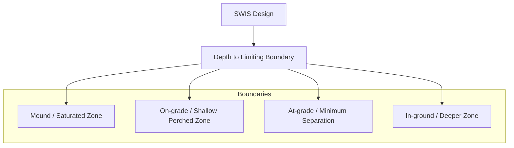

> 5.3.4 Hydraulic and Pollutant Mass Loadings
> 
> If a SWIS is to perform properly, mass loadings to the critical design boundaries must be carefully selected. The types of loadings that should be considered for the different critical boundaries and their suggested parameters are presented in Table 3.5.
> 
> The various design boundaries are affected differently by the different mass loadings (Table 3.3). The infiltration surface is the primary design boundary. At this boundary, the partially treated wastewater must enter the soil pores and percolate into and through unsaturated soil. The wastewater cannot be applied at rates faster than the soil can accept it nor can the soil be overloaded organically so that the soil pores become clogged by biomass. Therefore, critical design loadings at this boundary are the daily and instantaneous hydraulic loading rates, and the organic loading rate (biochemical oxygen demand [BOD] loading). Not only must daily hydraulic loading be selected carefully, but instantaneous loading should be such that the total hydraulic load is applied as uniformly

Note: Mounds or at-grades may be appropriate under conditions 3 and 4 to take advantage of more permeable surface soil horizons.

- The types of loadings that should be considered for the different critical boundaries and their suggested parameters are presented in Table 3.5.
- The various design boundaries are affected differently by the different mass loadings (Table 3.3).
- The infiltration surface is the primary design boundary.
- At this boundary, the partially treated wastewater must enter the soil pores and percolate into and through unsaturated soil.
- The wastewater cannot be applied at rates faster than the soil can accept it nor can the soil be overloaded organically so that the soil pores become clogged by biomass.
- Therefore, critical design loadings at this boundary are the daily and instantaneous hydraulic loading rates, and the organic loading rate (biochemical oxygen demand [BOD] loading).
- Not only must daily hydraulic loading be selected carefully, but instantaneous loading should be such that the total hydraulic load is applied as uniformly

\n---\n

# TABLE 3.5 Suggested boundary mass loadings to SWIS (Otis, 2001)

as feasible over the entire day to maximize the infiltration capacity of the soil. Uniform dosing in time and space will maximize reaeration potential of the soil to meet the oxygen demand of the applied wastewater loading more efficiently:

 Organic loading may be an important consideration if the available area for the SWIS is small. In moderately or more permeable soils, lower organic loading rates can increase the infiltration rates into the soil, which may allow a reduction in size of the infiltration surface.

 TABLE 3.5 Suggested boundary mass loadings to SWIS (Otis, 2001).

 

<table>
 <thead>
 <tr><th>Loading type</th><th>Units</th><th>Typical loading rates</th></tr>
 </thead>
 <tbody>
 <tr><td>Hydraulic</td><td>Daily</td><td>Volume per day per unit area of boundary surface<br>Septic tank effluent: 0.6–4.0 cm/d (0.15–1.0 gpd/sq ft)</td></tr>
<tr><td></td><td></td><td>Secondary effluent: 0.6–8.0 cm/d (0.15–2.0 gpd/sq ft)</td></tr>
<tr><td>Instantaneous</td><td>Volume per dose per unit area of boundary surface</td><td>¼–½ of the average daily wastewater volume</td></tr>
<tr><td>Contour</td><td>Volume per day per unit length of boundary surface contour</td><td>Depends on soil Ksat*, maximum allowable thickness of saturated zone, and slope of the boundary surface</td></tr>
<tr><td>Constituent</td><td>Organic</td><td>Mass of BOD per day per unit area of boundary surface<br>2.2–24.7 kg BOD/1000 m² (0.2–5.0 lb BOD/1000 sq ft)</td></tr>
<tr><td></td><td>Other pollutants</td><td>Mass of specific wastewater pollutant of concern per unit area of boundary surface (e.g., number of fecal coliforms, mass of nitrate nitrogen, etc.)<br>Typical loading rates: Variable with the constituent; its fate, transport, and the considered risk it imposes</td></tr>
 </tbody>
 </table>

 <p>* Ksat = the saturated conductivity of the soil.</p>

 

<table>
 <thead>
 <tr><th>Loading type</th><th>Units</th><th>Typical loading rates</th></tr>
 </thead>
 <tbody>
 <tr><td>Hydraulic</td><td>Daily</td><td>Volume per day per unit area of boundary surface<br>Septic tank effluent: 0.6–4.0 cm/d (0.15–1.0 gpd/sq ft)</td></tr>
 </tbody>
 </table>

\n---\n

# Secondary design boundaries and contour loading

<table>
  <tr>
    <td>Instantaneous</td>
    <td>Volume per dose per unit area of boundary surface</td>
    <td>1/24–1/6 of the average daily wastewater volume</td>
  </tr>
<tr>
    <td>Contour</td>
    <td>Volume per day per unit length of boundary surface contour</td>
    <td>Depends on soil Ksat*, maximum allowable thickness of saturated zone, and slope of the boundary surface</td>
  </tr>
<tr>
    <td>Constituent</td>
    <td></td>
    <td></td>
  </tr>
<tr>
    <td>Organic</td>
    <td>Mass of BOD per day per unit area of boundary surface</td>
    <td>2.2–24.7 kg BOD/1000 m² (0.2–5.0 lb BOD/1000 sq ft)</td>
  </tr>
<tr>
    <td>Other pollutants</td>
    <td>Mass of specific wastewater pollutant of concern per unit area of boundary surface (e.g., number of fecal coliforms, mass of nitrate nitrogen, etc.)</td>
    <td>Variable with the constituent, its fate, transport, and the considered risk it imposes</td>
  </tr>
<tr>
    <td>Ksat</td>
    <td>the saturated conductivity of the soil</td>
    <td></td>
  </tr>
</table>

<p>* Ksat = the saturated conductivity of the soil.</p>

<p>Secondary design boundaries are typically hydraulically restrictive horizons that inhibit vertical percolation through the soil. These boundaries may perch water above them. This perching can affect performance in two significant ways: If the perched water encroaches into the unsaturated zone, treatment capacity of the soil is reduced and reaeration of the soil below the infiltration surface is impeded, which causes anoxic or anaerobic conditions to develop that can result in excessive clogging of the infiltration surface. In addition, water will move laterally over the boundary and partially treated wastewater may seep to the ground surface down slope. Therefore, the contour loading along the boundary surface contour must be sufficiently low to prevent water from mounding above the boundary to the point that either the infiltration capacity of the soil is compromised or water seeps to the surface to create a nuisance and possibly a human health problem.</p>

<p>Contour loadings can be estimated by applying Darcy's law as follows:</p>

<p>
  Contour loading (gpm/ft of contour) = Ksat × A × I
</p>

<p>(3.1)</p>

<p></p>

\n---\n

# Where

Ksat = the saturated hydraulic conductivity of the soil (cm/d),
A = area of the horizontal cross-sectional flow path at the maximum allowed depth of saturation above the restrictive horizon per unit length of surface contour (cm^2),
and
I = the slope of the restrictive horizon (typically assumed to be the slope of the ground surface) (m/m).

The organic loading at secondary boundaries is seldom an issue because biodegradable organics are typically removed as the wastewater passes through the infiltration surface boundary layer:

Hydraulic and constituent loadings represent critical design loadings at the water table boundary. Low aquifer transmissivity will create groundwater mounding that could encroach on the primary infiltration surface if the daily hydraulic loading is too high. Constituent loadings must be considered at this boundary because of possible impairment of groundwater quality. Potential groundwater impacts may also be a regulatory concern. Typical wastewater constituents of human health concern in domestic wastewater include fecal indicators and nitrates. If wastewater constituent loadings are too high at the water table boundary, pretreatment before application to the infiltration surface may be necessary:

The operating hydraulic infiltration rate can be influenced by several factors (Otis, 1985). These include the following:

* Soil characteristics
  - Structure,
  - Texture,
  - Mineralogy,
  - Rock content,
  - Bulk density,
  - Soil moisture (antecedent conditions),

\n---\n

- Soil temperature, and
- Soil disturbance.

### Design factors
* Geometry and depth of the infiltrative surface,
- Method of wastewater application,
- Wastewater composition,
- Evapotranspiration potential, and
- Operating resting period.

The soil's structure, texture, bulk density, and the shrink-swell potential affect the pore size distribution of the soil, which, in turn, affects water and air movement. Increasing soil moisture reduces the hydraulic gradient in the unsaturated zone and, when the moisture content exceeds more than 60% saturation, diffusion of oxygen necessary for the efficient biodegradation of wastewater organics below the infiltration zone is severely restricted. Lower soil temperatures inhibit biological activity, reducing treatment and hydraulic performance. The geometry and depth of the infiltrative surface affect access of the infiltration zone to oxygen, as does the method and pattern of wastewater applications. Wastewater composition directly affects the rate of accumulation of waste materials on the infiltrative surface as well as the oxygen demand placed on the system. Evapotranspiration, which can be significant in dry, warm climates or during the growing season in temperate climates, can significantly reduce hydraulic loading on the infiltrative surface. A resting period provides aeration and allows organisms to use the absorbed nutrients and retained organics, thereby renewing the soil's infiltrative capacity. Thus, the operating infiltration rate will be unique for each combination of design and operating factors, requiring judgment when selecting an appropriate design infiltration rate.

Design infiltration rates for domestic septic tank effluent have been estimated for various soils and are commonly used to size the infiltrative surface of individual septic tank systems. These rates are typically correlated with soil texture, and occasionally structure, but seldom any other soil morphological features. However, they have worked reasonably well for their intended application, largely because the actual wastewater loading is
\n---\n

Typically, much less than the design loading. When these same rates have been used to design large SWISs, poor performance has been experienced. Therefore, when selecting a design wastewater loading rate, all factors that can affect the loading must be carefully considered.

Traditionally, only hydraulic loadings on the infiltration surface have been specified in state and local rules for SWIS sizing. Loadings for other design boundaries largely have been ignored, although some states require groundwater mounding analyses and limit contour loadings to prevent seepage of wastewater onto the ground surface. Codes provide tables that typically correlate soil texture with acceptable design hydraulic loadings. However, other morphologic features of the soil, particularly structure, are often better predictors of the soil's hydraulic capacity, which until only recently has been included in infiltrative surface sizing tables. The rates usually assume domestic septic tank effluent as the applied wastewater; but codes are beginning to include rates for secondary treatment levels as well: However, such tables need to be used with caution because they typically include implicit assumptions that can result in undersizing the infiltration surface for large SWISs. Designers of large SWISs should consider limiting the hydraulic loading rates to between 1 to 3 cm/d (0.2 to 0.8 gpd/sq ft).

Well-tested organic loading rates for various classes of soils and SWIS design configurations have not been developed: Most organic loading rates have been derived directly from the hydraulic loadings typically used for SWIS design by assuming a BOD5 concentration. Thus, the resulting rates incorporate the implicit factor of safety found in the recommended hydraulic loading rates. In addition, using BOD5 or carbonaceous BOD ignores the often much larger oxygen demand placed on the SWIS by nitrification of the organic and ammonium nitrogen in the wastewater. Organic loadings do appear to have less of an impact on slowly permeable soils because the resistance of the biomat that forms at the infiltrative surface presents less resistance to infiltration of the wastewater than the soil itself (Bouma, 1975).

Constituent mass loadings may be a concern with respect to water quality: For example, to use the soil's capacity to adsorb and retain phosphorus when systems are located near sensitive surface waters, a phosphorus loading rate based on the soil's adsorption capacity might be selected as the controlling application rate rather than the hydraulic loading rate.
\n---\n

loading rate based on soil texture. Using a rate based on the adsorptive capacity of the soil to remove phosphorus would likely result in a much longer and narrower design to maximize the contact of the wastewater phosphorus with the soil. In the case of a soluble constituent of concern such as nitrogen, a designer might decide to reduce the mass of nitrate per unit of application area. This would have the effect of increasing the size of the SWIS footprint. Alternatively, a treatment site with a shallow water table in an organic soil could be sought where a nitrified effluent would be applied to take advantage of such a soils capacity to denitrify the treated wastewater (Otis, 2001, 2007).

Table 3.6 provides a basis for estimating an appropriate design hydraulic loading rate for SWISs. The suggested rates are correlated to structure and texture only. Other factors that could affect the rate and should be used to adjust the rate to be chosen are presented in Table 3.7.

### 5.3.5 Geometry and Depth of the Infiltration Surface

Aeration of the unsaturated zone below the infiltration surface is promoted by shallow, narrow trench designs. The dominant pathway for oxygen transport to the subsoil is diffusion through the soil surrounding the trench. The unsaturated zone below wide beds or deep infiltrative surfaces can become anoxic or anaerobic because rates of oxygen diffusion are slow and limited by the width of the beds. The reaeration rates are easily exceeded by the rates of application of oxygen-demanding materials in the wastewater. Therefore, trench geometries typically perform better and are the preferred geometry for SWISs (Table 3.8).

Recommended trench widths range from 0.6 to 1.2 m (2 to 4 ft), although beds of 3 to 4.5-m (10 to 15-ft) wide have worked well in elevated systems such as mounds, which are constructed in engineered fill above the ground surface. However, infiltration bed surface widths greater than 10 ft generally are not recommended because distribution and clogging problems can occur (Converse and Tyler, 2000; Converse et al., 1990).

<table>
<thead>
<tr><th>TABLE 3.6</th></tr>
</thead>
<tbody>
<tr><td>Generally accepted hydraulic loading rates for septic tank effluent and organic loading rates for SWIS (U.S. EPA, 2002).</td></tr>
</tbody>
</table>

\n---\n

<table>
  <thead>
    <tr>
      <th>Texture</th>
      <th>Shape</th>
      <th>Grade</th>
      <th>Hydraulic loading (gpd/sq ft) BOD = 150</th>
      <th>Hydraulic loading (gpd/sq ft) BOD = 30</th>
      <th>Organic loading (lb BOD/100 sq ft/d) BOD = 150</th>
      <th>Organic loading (lb BOD/100 sq ft/d) BOD = 30</th>
    </tr>
  </thead>
  <tbody>
    <tr>
      <td>Coarse sand, Sand, Loamy coarse sand, Loamy sand</td>
      <td>Single grain</td>
      <td>Structureless</td>
      <td>0.8</td>
      <td>1.6</td>
      <td>1.00</td>
      <td>0.40</td>
    </tr>
<tr>
      <td>Fine sand, Very fine sand, Loamy fine sand, Loamy; very fine sand</td>
      <td>Single grain</td>
      <td>Structureless</td>
      <td>0.4</td>
      <td>1.0</td>
      <td>0.50</td>
      <td>0.25</td>
    </tr>
<tr>
      <td>Coarse sandy loam, Sandy loam</td>
      <td>Massive</td>
      <td>Structureless</td>
      <td>0.2</td>
      <td>0.6</td>
      <td>0.25</td>
      <td>0.15</td>
    </tr>
<tr>
      <td>Sandy loam</td>
      <td>Platy</td>
      <td>Weak</td>
      <td>0.2</td>
      <td>0.5</td>
      <td>0.25</td>
      <td>0.13</td>
    </tr>
<tr>
      <td></td>
      <td>Prismatic, Blocky;</td>
      <td>Strong</td>
      <td>0.44</td>
      <td>0.70</td>
      <td>0.50</td>
      <td>0.18</td>
    </tr>
<tr>
      <td></td>
      <td>Granular</td>
      <td>Moderate, Strong</td>
      <td>0.60</td>
      <td>1.00</td>
      <td>0.75</td>
      <td>0.25</td>
    </tr>
<tr>
      <td>Fine sandy loam, Very fine sandy loam</td>
      <td>Massive</td>
      <td>Structureless</td>
      <td>0.2</td>
      <td>0.5</td>
      <td>0.25</td>
      <td>0.13</td>
    </tr>
<tr>
      <td>Very fine sandy loam</td>
      <td>Platy</td>
      <td>Weak, Moderate, Strong</td>
      <td>0.2</td>
      <td>0.6</td>
      <td>0.25</td>
      <td>0.15</td>
    </tr>
<tr>
      <td>Loam</td>
      <td>Prismatic, Blocky; Granular</td>
      <td>Weak</td>
      <td>0.4</td>
      <td>0.6</td>
      <td>0.50</td>
      <td>0.20</td>
    </tr>
<tr>
      <td>Loam</td>
      <td>Massive</td>
      <td>Structureless</td>
      <td>0.2</td>
      <td>0.5</td>
      <td>0.25</td>
      <td>0.13</td>
    </tr>
<tr>
      <td>Silt loam</td>
      <td>Massive</td>
      <td>Structureless</td>
      <td></td>
      <td></td>
      <td>0.20</td>
      <td>0.05</td>
    </tr>
<tr>
      <td>Silt loam</td>
      <td>Platy</td>
      <td>Weak, Moderate</td>
      <td></td>
      <td></td>
      <td>0.40</td>
      <td>0.15</td>
    </tr>
<tr>
      <td></td>
      <td>Prismatic, Blocky;</td>
      <td>Moderate, Strong</td>
      <td>0.60</td>
      <td>0.80</td>
      <td>0.75</td>
      <td>0.20</td>
    </tr>
<tr>
      <td>Sandy clay loam, Clay loam, Silty clay loam</td>
      <td>Massive</td>
      <td>Structureless</td>
      <td>0.2</td>
      <td>0.3</td>
      <td>0.25</td>
      <td>0.08</td>
    </tr>
<tr>
      <td>Sandy clay, Clay; Silty clay</td>
      <td>Platy</td>
      <td>Weak, Moderate</td>
      <td>0.4</td>
      <td>0.6</td>
      <td>0.50</td>
      <td>0.15</td>
    </tr>
<tr>
      <td>Sandy clay, Clay; Silty clay</td>
      <td>Prismatic, Blocky; Granular</td>
      <td></td>
      <td>0.2</td>
      <td>0.3</td>
      <td>0.25</td>
      <td>0.08</td>
    </tr>
  </tbody>
</table>

\n---\n

<table>
<thead>
<tr>
  <th>Texture</th>
  <th>Shape</th>
  <th>Grade</th>
  <th>Hydraulic loading (gpd/sq ft) – BOD = 150</th>
  <th>Hydraulic loading (gpd/sq ft) – BOD = 30</th>
  <th>Organic loading (lb BOD/1000 sq ft/d) – BOD = 150</th>
  <th>Organic loading (lb BOD/1000 sq ft/d) – BOD = 30</th>
</tr>
</thead>
<tbody>
<tr>
  <td>Coarse sand,</td>
  <td>Sand,</td>
  <td>Single grain</td>
  <td>0.8</td>
  <td>1.6</td>
  <td>1.00</td>
  <td>0.40</td>
</tr>
<tr>
  <td>Loamy coarse sand,</td>
  <td></td>
  <td></td>
  <td></td>
  <td></td>
  <td></td>
  <td></td>
</tr>
<tr>
  <td>Loamy sand</td>
  <td></td>
  <td></td>
  <td></td>
  <td></td>
  <td></td>
  <td></td>
</tr>
<tr>
  <td>Fine sand, Very fine</td>
  <td>Single grain</td>
  <td>Structureless</td>
  <td>0.4</td>
  <td>1.0</td>
  <td>0.50</td>
  <td>0.25</td>
</tr>
<tr>
  <td>sand, Loamy fine</td>
  <td></td>
  <td></td>
  <td></td>
  <td></td>
  <td></td>
  <td></td>
</tr>
<tr>
  <td>sand, Loamy,</td>
  <td></td>
  <td></td>
  <td></td>
  <td></td>
  <td></td>
  <td></td>
</tr>
<tr>
  <td>very fine sand</td>
  <td></td>
  <td></td>
  <td></td>
  <td></td>
  <td></td>
  <td></td>
</tr>
<tr>
  <td>Coarse sandy loam,</td>
  <td>Massive</td>
  <td>Structureless</td>
  <td>0.2</td>
  <td>0.6</td>
  <td>0.25</td>
  <td>0.15</td>
</tr>
<tr>
  <td>Sandy loam</td>
  <td>Platy</td>
  <td>Weak</td>
  <td>0.2</td>
  <td>0.5</td>
  <td>0.25</td>
  <td>0.13</td>
</tr>
<tr>
  <td></td>
  <td>Prismatic, Blocky,</td>
  <td>Weak</td>
  <td>0.4</td>
  <td>0.7</td>
  <td>0.50</td>
  <td>0.18</td>
</tr>
<tr>
  <td></td>
  <td>Granular</td>
  <td>Moderate</td>
  <td></td>
  <td></td>
  <td></td>
  <td></td>
</tr>
<tr>
  <td></td>
  <td>Granular</td>
  <td>Strong</td>
  <td>0.6</td>
  <td>1.0</td>
  <td>0.75</td>
  <td>0.25</td>
</tr>
</tbody>
</table>

\n---\n

# Soil Texture Descriptions

- Fine sandy loam, Very fine sandy loam
  - Massive Platy
  - Structureless
  - 0.2
  - 0.5
  - 0.25
  - 0.13
- loam_ Very
  - Weak
- fine sandy
  - Moderate
- loam
  - Strong

- Prismatic, Blocky;
  - Weak
  - 0.2
  - 0.6
  - 0.25
  - 0.15
- Granular
  - Moderate
  - 0.4
  - 0.8
  - 0.50
  - 0.20
- Strong

- Loam
  - Massive Platy
  - Structureless
  - 0.2
  - 0.5
  - 0.25
  - 0.13
- Weak
- Moderate
- Strong

- Prismatic, Blocky;
  - Weak
  - 0.4
  - 0.6
  - 0.50
  - 0.15
- Granular
  - Moderate
  - 0.8
  - 0.75
  - 0.20
- Strong

- Silt loam
  - Massive
  - Structureless
  - 0.2
  - 0.00
  - 0.05

- Platy
  - Weak
- Moderate
- Strong

- Prismatic
  - Weak
  - 0.4
  - 0.6
  - 0.50
  - 0.15
- Blocky;
- Granular
  - Moderate
  - 0.8
  - 0.75
  - 0.20
- Strong

- Sandy clay loam
  - Massive
  - Structureless

- Clay loam, Silty clay loam
  - Platy
  - Weak
- Moderate
- Strong
\n---\n

<table>
  <thead>
    <tr>
      <th>Texture</th>
      <th>Descriptor</th>
      <th>0.4</th>
      <th>0.6</th>
      <th>0.50</th>
      <th>0.15</th>
    </tr>
  </thead>
  <tbody>
    <tr>
      <td>Granular</td>
      <td>Moderate, Strong</td>
      <td>0.4</td>
      <td>0.6</td>
      <td>0.50</td>
      <td>0.15</td>
    </tr>
<tr>
      <td>Sandy clay; Clay;</td>
      <td>Massive</td>
      <td>Structureless</td>
      <td></td>
      <td></td>
      <td></td>
    </tr>
<tr>
      <td>Silty clay</td>
      <td>Platy</td>
      <td>Weak, Moderate, Strong</td>
      <td></td>
      <td></td>
      <td></td>
    </tr>
<tr>
      <td></td>
      <td>Prismatic</td>
      <td>Weak</td>
      <td></td>
      <td></td>
      <td></td>
    </tr>
<tr>
      <td></td>
      <td>Blocky;</td>
      <td></td>
      <td></td>
      <td></td>
      <td></td>
    </tr>
<tr>
      <td>Granular</td>
      <td>Moderate, Strong</td>
      <td>0.2</td>
      <td>0.3</td>
      <td>0.25</td>
      <td>0.08</td>
    </tr>
  </tbody>
</table>

TABLE 3.7 Relative adjustments to design hydraulic loading rates.
\n---\n

\n---\n

<table>
<thead>
<tr><th>Factor (baseline)</th><th>Relative adjustment</th></tr>
</thead>
<tbody>
<tr><td>Soil structure (granular or blocky)</td><td></td></tr>
<tr><td style="padding-left:20px">Increase macropores</td><td>No adjustment</td></tr>
<tr><td style="padding-left:20px">Decreasing macropores</td><td>Decrease 10 to 50%</td></tr>
<tr><td>Shrink-swell potential (< 20% expandable clays)</td><td></td></tr>
<tr><td style="padding-left:20px">Greater than 20% 2:1 clays</td><td>Avoid</td></tr>
<tr><td style="padding-left:20px">Less than 20% 2:1 clays</td><td>No adjustment</td></tr>
<tr><td>Soil bulk density (low to moderate)</td><td></td></tr>
<tr><td style="padding-left:20px">Increasing</td><td>Decrease 10 to 50%</td></tr>
<tr><td style="padding-left:20px">Decreasing</td><td>No adjustment</td></tr>
<tr><td>Soil moisture (moderately to well drained)</td><td></td></tr>
<tr><td style="padding-left:20px">Excessively drained</td><td>Avoid or modify</td></tr>
<tr><td style="padding-left:20px">Poorly drained</td><td>Avoid or modify</td></tr>
<tr><td>Soil temperature (mean annual temperature 5 to 10°C)</td><td></td></tr>
<tr><td style="padding-left:20px">Mean annual temperature >15°C</td><td>Increase 10 to 30%</td></tr>
<tr><td style="padding-left:20px">Mean annual temperature < 5°C</td><td>Decrease 10 to 50%</td></tr>
<tr><td>SWIS geometry (0.6 to 1.0-m trenches)</td><td></td></tr>
<tr><td style="padding-left:20px">Infiltrative surface >1.2 m wide</td><td>Decrease (avoid)</td></tr>
<tr><td style="padding-left:20px">Infiltrative surface <0.6 m wide</td><td>No adjustment</td></tr>
<tr><td>SWIS depth (1 m below grade)</td><td></td></tr>
<tr><td style="padding-left:20px">Infiltrative surface <1 m below grade</td><td>No adjustment</td></tr>
<tr><td style="padding-left:20px">Infiltrative surface >1 m below grade</td><td>Decrease 10 to 30%</td></tr>
<tr><td>Wastewater application</td><td></td></tr>
<tr><td style="padding-left:20px">Demand dosing resting (1–4 times daily)</td><td>No adjustment (loading based on peak daily flow)</td></tr>
<tr><td style="padding-left:20px">Timed dosing–surge storage</td><td>No adjustment (loading based on average daily flow)</td></tr>
<tr><td style="padding-left:20px">Continuous ponding</td><td>Avoid</td></tr>
<tr><td>Wastewater strength (BOD5 = 150 mg/L; TSS = 80 mg/L; and TKN = 55 mg/L)</td><td></td></tr>
<tr><td style="padding-left:20px">Increasing organics and solids</td><td>Decrease in proportion to waste strength</td></tr>
<tr><td style="padding-left:20px">Decreasing organics and solids</td><td>Increase in proportion to waste strength</td></tr>
<tr><td>Evapotranspiration potential (precipitation evaporation)</td><td></td></tr>
<tr><td style="padding-left:20px">Increasing</td><td>Increase 10 to 20%</td></tr>
<tr><td style="padding-left:20px">Decreasing</td><td>No adjustment</td></tr>
</tbody>
</table>

\n---\n

<table>
<thead>
<tr><th>Factor (baseline)</th><th>Relative adjustment</th></tr>
</thead>
<tbody>
<tr><td>Soil structure (granular or blocky)</td><td></td></tr>
<tr><td>Increase macropores</td><td>No adjustment</td></tr>
<tr><td>Decreasing macropores</td><td>Decrease 10 to 50%</td></tr>
<tr><td>Shrink–swell potential (<20% expandable clays)</td><td></td></tr>
<tr><td>Greater than 20% 2:1 clays</td><td>Avoid</td></tr>
<tr><td>Less than 20% 2:1 clays</td><td>No adjustment</td></tr>
<tr><td>Soil bulk density (low to moderate)</td><td></td></tr>
<tr><td>Increasing</td><td>Decrease 10 to 50%</td></tr>
<tr><td>Decreasing</td><td>No adjustment</td></tr>
<tr><td>Soil moisture (moderately to well drained)</td><td></td></tr>
<tr><td>Excessively drained</td><td>Avoid or modify</td></tr>
<tr><td>Poorly drained</td><td>Avoid or modify</td></tr>
<tr><td>Soil temperature (mean annual temperature 5 to 10°C)</td><td></td></tr>
<tr><td>Mean annual temperature &gt;15 °C</td><td>Increase 10 to 30%</td></tr>
<tr><td>Mean annual temperature &lt;5 °C</td><td>Decrease 10 to 50%</td></tr>
<tr><td>SWIS geometry (0.6 to 1.0-m trenches)</td><td></td></tr>
<tr><td>Infiltrative surface &gt;1.2 m wide</td><td>Decrease (avoid)</td></tr>
</tbody>
</table>

\n---\n

<table>
  <thead>
    <tr><th>Parameter</th><th>Adjustment</th></tr>
  </thead>
  <tbody>
    <tr><td>SWIS depth (1 m below grade)</td><td></td></tr>
<tr><td>Infiltrative surface &lt;1 m below grade</td><td>No adjustment</td></tr>
<tr><td>Infiltrative surface &gt;1 m below grade</td><td>Decrease 10 to 30%</td></tr>
<tr><td>Wastewater application</td><td></td></tr>
<tr><td>Demand dosing resting (1–4 times daily)</td><td>No adjustment (loading based on peak daily flow)</td></tr>
<tr><td>Timed dosing–surge storage</td><td>No adjustment (loading based on average daily flow)</td></tr>
<tr><td>Continuous ponding</td><td>Avoid</td></tr>
<tr><td>Wastewater strength (BOD5 = 150 mg/L; TSS = 80 mg/L; and TKN = 55 mg/L)*</td><td></td></tr>
<tr><td>Increasing organics and solids</td><td>Decrease in proportion to waste strength</td></tr>
<tr><td>Decreasing organics and solids</td><td>Increase in proportion to waste strength</td></tr>
<tr><td>Evapotranspiration potential (precipitation ≥ evaporation)</td><td>Increasing</td></tr>
<tr><td></td><td>Increase 10 to 20%</td></tr>
<tr><td></td><td>Decreasing</td></tr>
  </tbody>
</table>

TABLE 3.8 Geometry, orientation, and configuration considerations for SWIS (U.S. EPA, 2002).

* BOD5 = 5-day biochemical oxygen demand; TSS = total suspended solids; and TKN = total Kjeldahl nitrogen.
\n---\n

<table>
<thead>
<tr><th>Design type</th><th>Design considerations*</th></tr>
</thead>
<tbody>
<tr>
<td>Trench</td>
<td>
<strong>Geometry</strong><br>
<strong>Width</strong><br>
Less than 4 ft, preferably less than 3 ft. Design width is affected by distribution method, constructability, slope of site, and available area.<br><br>
<strong>Length</strong><br>
Restricted by available length parallel to site contour; the distribution method, and the distribution network design.<br><br>
<strong>Sidewall height</strong><br>
Sidewalls are not considered an active infiltration surface. Minimum height is that needed to encase the distribution piping or to meet peak flow storage requirements.<br><br>
<strong>Orientation / configuration</strong><br>
Should be constructed parallel to site contours. Down-slope contours should not cause loading to exceed the combined maximum linear hydraulic loading. Spacing of multiple, parallel trenches is also limited by the construction method.
</td>
</tr>
<tr>
<td>Bed</td>
<td>
<strong>Geometry</strong><br>
<strong>Width</strong><br>
Should be as narrow as possible. Beds wider than 10 to 15 ft should be avoided.<br><br>
<strong>Length</strong><br>
Restricted by available length parallel to site contour; the distribution method, and the distribution network design.<br><br>
<strong>Sidewall height</strong><br>
Sidewalls are not considered an active infiltration surface. Minimum height is that needed to encase the distribution piping or to meet peak flow storage requirements.<br><br>
<strong>Orientation / configuration</strong><br>
Should be constructed parallel to site contours. The loading over the total projected width should not exceed the estimated down slope maximum linear hydraulic loading.
</td>
</tr>
<tr>
<td>Seepage pit</td>
<td>Not recommended because of limited treatment capability</td>
</tr>
</tbody>
</table>

<p><em>* ft × 0.3048 = m</em></p>

<table>
<thead>
<tr><th>Design type</th><th>Design considerations*</th></tr>
</thead>
<tbody>
<tr><td>Trench</td><td></td></tr>
</tbody>
</table>

\n---\n

<table>
  <thead>
    <tr><th>Aspect</th><th>Notes</th></tr>
  </thead>
  <tbody>
    <tr><td>Width</td><td>Less than 4 ft, preferably less than 3 ft. Design width is affected by distribution method, constructability, slope of site, and available area.</td></tr>
<tr><td>Length</td><td>Restricted by available length parallel to site contour; the distribution method, and the distribution network design.</td></tr>
<tr><td>Sidewall height</td><td>Sidewalls are not considered an active infiltration surface. Minimum height is that needed to encase the distribution piping or to meet peak flow storage requirements.</td></tr>
<tr><td>Orientation/configuration</td><td>Should be constructed parallel to site contours. Down-slope contours should not cause loading to exceed the combined maximum linear hydraulic loading. Spacing of multiple, parallel trenches is also limited by the construction method.</td></tr>
<tr><td>Bed</td><td></td></tr>
<tr><td>Geometry</td><td></td></tr>
<tr><td>Width</td><td>Should be as narrow as possible. Beds wider than 10 to 15 ft should be avoided.</td></tr>
<tr><td>Length</td><td>Restricted by available length parallel to site contour; the distribution method, the distribution network design.</td></tr>
<tr><td>Sidewall height</td><td>Sidewalls are not considered an active infiltration surface. Minimum height is that needed to encase the distribution piping or to meet peak flow storage requirements.</td></tr>
<tr><td>Orientation/configuration</td><td>Should be constructed parallel to site contours. The loading over the total projected width should not exceed the estimated down slope maximum linear hydraulic loading.</td></tr>
<tr><td>Seepage pit</td><td>Not recommended because of limited treatment capability.</td></tr>
<tr><td>Footnote</td><td>* ft × 0.3048 = m.</td></tr>
  </tbody>
</table>

<p>Recent introduction of drip dispersal technology eliminates trenches altogether through the use of small-diameter plastic tubing containing small emitters. This tubing can be plowed into the soil without the need for any porous media. Drip technology enhances the</p>

\n---\n

# trench concept for maximizing reaeration of the soil and prolongs residence time of the wastewater in the soil profile to maximize treatment under aerobic conditions

Trench length is important where contour loadings are critical, groundwater quality impacts are a concern, or the potential for unacceptable groundwater mounding exists. Many state and local codes limit trench lengths to 30 m (100 ft). This limit appeared in early codes and exists as an artifact with little or no practical basis. Trench lengths much longer than 30 m (100 ft) might be necessary to minimize groundwater impacts and achieve good groundwater drainage from the site. Long trenches can also be used to reduce the contour loadings on a site by spreading the wastewater along the slope contour. With current distribution and dosing technologies, materials, and construction methods, trench lengths need to be limited only by what is practical or feasible for a given site.

The height of the trench sidewall is primarily determined by the type of porous media that is used in the trench to support the trench wall and embed the distribution piping: The trench sidewall depth should not be sized to provide capacity to "store" wastewater, except for the instantaneous loads received during a dose. If storage is needed because of periodic high flows, flow equalization tanks should be used so that the SWIS is protected from high hydraulic and organic loads. For more information on flow equalization tank sizing, see Onsite Wastewater Treatment Systems Manual (U.S. EPA, 2002).

A height of 15 cm (6 in.) is sufficient for most applications. The sidewall should not be used as an infiltrative surface because, for the sidewall to become an infiltrative surface the trench must be ponded with wastewater. If sidewall is to be used, then trench widths should be reduced to no more than 15 to 30 cm (6 to 12 in.) to limit the volume of water to be infiltrated per unit area of sidewall exposed.

The depth of the infiltration surface should be maintained within 0.3 to 0.9 m (1 to 3 ft) below the final surface grade, where possible. Shallow construction not only promotes subsoil aeration, but also enhances evapotranspiration during the growing season because the infiltration surface is within the root zone of plants. The uptake of water by the plants extracts water from the vadose zone to dry the soil around the SWIS, which
\n---\n

increases the hydraulic gradient across the infiltration zone and enhances reaeration in the vadose zone.

The depth of the infiltration surface is an important consideration in maintaining adequate subsoil aeration and frost protection in cold climates. The maximum depth of the infiltration surface should be limited to no more than 0.6 to 0.9 m (2 to 3 ft) below final grade if adequate reaeration of the soil is to be maintained to satisfy daily oxygen demand in the applied wastewater. The infiltrative surface depth should be less in slowly permeable soils or soils with higher ambient moisture. Placement below this depth to take advantage of more permeable soils should be resisted because reaeration of the soil below the infiltration surface will be limited. Where freezing is a concern, a thick turf should be established over the top of the system and, if necessary, covered with straw or other appropriate insulating material during winter months. Exposure of the tank risers should be limited or insulated and the riser covers insulated. If greater protection is needed, the tank cover also could be insulated with 5 cm (2 in) of Styrofoam board laid on the tank cover before backfilling. The board should extend at least 0.6 m (2 ft) beyond the tank walls.

## 5.3.6 Configuration and Orientation

The spacing of multiple trenches constructed parallel to one another is determined by the soil characteristics and the method of construction. Sidewall-to-sidewall spacing must be sufficient to enable construction without damage to the adjacent trenches. In soils with high clay content, consideration should be given to increasing the normal trench spacing because capillary effects can keep the soil between the trenches sufficiently high to limit oxygen transfer:

Orientation is an important consideration on sloping sites; sites with shallow soils over a restrictive horizon, saturated zone, or bedrock; and on small, irregularly shaped lots. The long axes of trenches should be aligned parallel to the surface contours to reduce the contour hydraulic loading and groundwater mounding. Where it is necessary to construct multiple trenches down slope from one another, it is important to consider the down slope projection of the trenches to ensure that the accumulative hydraulic loadings of the trenches does not exceed the estimated contour loading for the site. Because the sidewall is not included as an active infiltration surface in the design, hydraulic interference
\n---\n

# 5.3.7 Wastewater Application Methods

The method and pattern of wastewater distribution in a subsurface infiltration system represent important design elements (Table 3.9). Gravity flow and dosing are the two most commonly used distribution methods in traditional SWISs. Gravity flow distribution is characterized by "trickle flow" because the effluent is slowly discharged over much of the day except during peak flow periods as the liquid level in the septic tank rises and falls in response to water use in the building. Typically, tank discharges are too low to flow throughout the distribution network. Thus, distribution is unequal, and localized overloading of the infiltration surface occurs with concomitant poor treatment and soil clogging. Dosing achieves more uniform distribution, which aids in maintaining unsaturated flow below the infiltration surface, increases the retention time of wastewater in the soil to affect more effective treatment and promote subsoil reaeration, and increases use of the infiltration surface.

Dosing should be coupled with a pressure distribution network in all SWISs, particularly large SWISs (Table 3.10). Pressure distribution achieves the most uniform application as well as greatest utilization of the available infiltration surface. Rigid pipe and dripper line pressurized networks are typically used (EPRI, 2004b; Otis, 1982; U.S. EPA, 2002). Of the pressurized networks, the dripper line is most effective. Dosing rates and volumes must be set so that the time to fully pressurize either type of network takes no more than about 20% of the time to complete a full dose.

> TABLE 3.9 Distribution methods and applications (U.S. EPA, 2002)

\n---\n

<table>
  <thead>
    <tr><th>Method*</th><th>Typical applications</th></tr>
  </thead>
  <tbody>
    <tr><td>Gravity flow</td><td></td></tr>
<tr><td>4-in. perforated pipe</td><td>Single or looped trenches at the same elevation; beds</td></tr>
<tr><td>Distribution box</td><td>Multiple independent trenches on flat or sloping site</td></tr>
<tr><td>Serial relief line</td><td>Multiple serially connected trenches on a sloping site</td></tr>
<tr><td>Drop box</td><td>Multiple independent trenches on a sloping site</td></tr>
<tr><td>Dosed distribution</td><td></td></tr>
<tr><td>4-in. perforated pipe (with or without a distribution box)</td><td>Single (or multiple) trenches, looped trenches at the same elevation, and beds</td></tr>
<tr><td>Pressure manifold</td><td>Multiple independent trenches on sloping sites</td></tr>
<tr><td>Rigid pipe pressure network</td><td>Multiple independent trenches at the same elevation (a preferred method for larger SWISs)</td></tr>
<tr><td>Drip line pressure network</td><td>Multiple independent trenches on flat or sloping sites (a preferred method for larger SWISs)</td></tr>
  </tbody>
</table>

<p>in. X 25.40 = mm:</p>

<table>
  <thead>
    <tr><th>Method*</th><th>Typical applications</th></tr>
  </thead>
  <tbody>
    <tr><td>Gravity flow</td><td></td></tr>
<tr><td>4-in. perforated pipe</td><td>Single or looped trenches at the same elevation; beds</td></tr>
<tr><td>Distribution box</td><td>Multiple independent trenches on flat or sloping sites</td></tr>
<tr><td>Serial relief line</td><td>Multiple serially connected trenches on a sloping site</td></tr>
<tr><td>Drop box</td><td>sloping site; Multiple independent trenches on a</td></tr>
<tr><td>Dosed distribution</td><td></td></tr>
<tr><td>4-in. perforated pipe (with or without a distribution box)</td><td>Single (or multiple) trenches, looped trenches at the same elevation, and beds</td></tr>
<tr><td>Pressure manifold</td><td>Multiple independent trenches on sloping sites</td></tr>
  </tbody>
</table>

\n---\n

<table>
  <thead>
    <tr><th></th><th>preferred method for larger SWISs)</th></tr>
  </thead>
  <tbody>
    <tr><td>Drip line pressure network</td><td>Multiple independent trenches on flat or sloping sites (a preferred method for larger SWISs)</td></tr>
  </tbody>
</table>

<p>* in. X 25.40 = mm.</p>

<p>Dosing may be “on demand” or “timed”. On-demand dosing is activated when the dose tank is filled to a preset level. Therefore, the interval between doses will vary according to the rate of influent flow. Either pumps or siphons may be used for demand dosing:</p>

<p>Timed dosing with pumps provides good flow equalization to the SWIS by not only setting the volume of each dose, but also setting minimum periods between doses. Timed dosing has the added advantage of being able to be set to limit the total volume of treated wastewater discharged to the SWIS to no more than the average daily flow: Excess wastewater is stored in the dose tank for discharge when water use in the building is low. If the tank fills because of excessive water use, infiltration, or inflow, the tank can be pumped and the contents hauled away for treatment without interruption of service or hydraulically overloading the SWIS. For more information on flow equalization tank design, see Onsite Wastewater Treatment Systems Manual (U.S. EPA, 2002).</p>

<h2>5.3.8 Management and Monitoring</h2>

<p>The ability to manage, monitor, maintain, and service SWISs is an important consideration during the design phase. The operator must be able to detect deterioration in performance and take appropriate corrective actions. Effective operating controls and monitoring devices that are convenient and easily accessed must be designed into each SWIS to encourage proactive management:</p>

<p>TABLE 3.10 Dosing methods and devices (U.S. EPA, 2002).</p>
\n---\n

# Typical applications

<table>
  <thead>
    <tr><th>Dosing method</th><th>Typical applications</th></tr>
  </thead>
  <tbody>
    <tr>
      <td>On-demand</td>
      <td>Dosing occurs when a sufficient volume of wastewater has accumulated in the dose tank to activate the pump switch or siphon. Dosing continues until the pre-selected low water level is reached. Typically, there is no control on the daily volume of wastewater dosed.</td>
    </tr>
<tr>
      <td>Timed</td>
      <td>Dosing occurs by pumps on a timed cycle typically at equal intervals and for preset dose volumes so that the daily volume of wastewater dosed does not exceed the system’s design flow. Controls can be set so that only full doses occur. Peak flows are stored in the dose tank for dosing during low flow periods. Excessive flows are retained in the tank, which, if persist, cause a high water alarm to alert the owner of the need for remedial action. This approach prevents unwanted and detrimental discharges to the SWIS.</td>
    </tr>
  </tbody>
</table>

<table>
  <thead><tr><th>Dosing device</th><th>Typical applications</th></tr></thead>
  <tbody>
    <tr><td>Pump</td><td>Pressure distribution networks are set at elevations that are typically higher than the dose tank. Multiple infiltration areas can be dosed from the same tank using multiple alternating pumps or automatic valves</td></tr>
<tr><td>Siphon</td><td>On-demand dosing of gravity or pressure distribution networks may be used where sufficient elevation exists between the siphon invert and the distribution pipe orifices for the siphon to operate. Siphons cannot be used for timed dosing. Two siphons in the same dose tank can be used to alternate automatically between two infiltration areas.</td></tr>
  </tbody>
</table>

## Typical applications

<table>
  <thead><tr><th>Dosing method</th><th>Typical applications</th></tr></thead>
  <tbody>
    <tr>
      <td>On-demand</td>
      <td>Dosing occurs when a sufficient volume of wastewater has accumulated in the dose tank to activate the pump switch or siphon. Dosing continues until the pre-selected low water level is reached. Typically, there is no control on the daily volume of wastewater dosed.</td>
    </tr>
  </tbody>
</table>

\n---\n

<table>
<tr><td><strong>Timed</strong></td><td>Dosing occurs by pumps on a timed cycle typically at equal intervals and for preset dose volumes so that the daily volume of wastewater dosed does not exceed the system's design flow. Controls can be set so that only full doses occur: Peak flows are stored in the dose tank for dosing during low flow periods. Excessive flows are retained in the tank, which, if persist, cause a high water alarm to alert the owner of the need for remedial action. This approach prevents unwanted and detrimental discharges to the SWIS.</td></tr>
<tr><td><strong>Dosing device</strong></td><td></td></tr>
<tr><td><strong>Pump</strong></td><td>Pressure distribution networks are set at elevations that are typically higher than the dose tank. Multiple infiltration areas can be dosed from the same tank using multiple alternating pumps or automatic valves</td></tr>
<tr><td><strong>Siphon</strong></td><td>On-demand dosing of gravity or pressure distribution networks may be used where sufficient elevation exists between the siphon invert and the distribution pipe orifices for the siphon to operate. Siphons cannot be used for timed dosing: Two siphons in the same dose tank can be used to alternate automatically between two infiltration areas</td></tr>
</table>

<p>To monitor performance and detect changes in performance that require operator intervention, daily wastewater flows, wastewater ponding levels above the infiltration surfaces, and groundwater elevations and water quality below the SWIS should be observed, periodically sampled, and routinely recorded. Wastewater flows should be monitored at the point the wastewater enters the treatment works and is discharged to the SWIS. To monitor ponding levels, observation ports, which are perforated, open-bottom pipes that extend from the ground surface into the SWIS to the infiltration surface, are commonly used. Groundwater observation wells should be placed near the SWIS to monitor groundwater elevations below the system. Monitoring wells, if warranted, should be carefully located to capture background quality as well as quality of the SWIS plume.</p>

## 6.0 CONSTRUCTION

<p>Early SWIS malfunctions of appropriately designed systems are usually due to poor construction practices. Wastewater infiltration and percolation through the soil require that soil pores remain open. If the soil pores are damaged during construction, system malfunctions or failures are likely to occur;</p>

\n---\n

Not all soils are equally susceptible to structural damage during construction. The tendency toward compaction, smearing, and puddling of the soil depends on its texture, moisture content, and applied forces. Granular soils with less than 25%, by weight, of clay (sands and loamy sands) are the least susceptible to compaction. To avoid soil damage, a construction plan should be developed that addresses the following:
* Type of construction equipment used,
* Construction procedures and practices,
* Site access and materials stockpiling,
* Site preparation, and
* Existing soil conditions.

Only low-load-bearing construction equipment should be used in the treatment area. Large rubber-tired vehicles and track-mounted vehicles are preferred. Front-end loaders or blades should not be used for excavation because the scraping action can smear the soil and the wheels and tracks can compact the exposed surfaces. Trencher or backhoes, which operate from undisturbed soil, work well. Heavy vehicular traffic should be directed around the treatment area to minimize potentially adverse effects associated with compaction or wall caving. In areas to be filled, blades may be used to spread the fill material if a minimum of 15 to 30 cm (6 to 12 in.) of fill is maintained below the vehicle wheels or tracks.

Procedures that may affect the soil's natural permeability must be carefully planned so that any damage is kept to a minimum. Excavation, placement of gravel or sand fill, and backfilling operation must be done with proper equipment and care. The procedures selected must include construction scheduling to ensure that the infiltration surfaces are not left exposed for more than 12 hours or during periods of precipitation:

Access to the site for construction machinery and materials delivery and stockpiling should be delineated on construction drawings and staked on the site to protect the treatment area from compaction and other damage by heavy traffic. Approaches to the treatment area should be controlled and made upslope or to the side of the area wherever possible. If the only available access is from the down-slope side, traffic should be kept to a minimum and as far from the treatment area as possible.\n---\n

# 7.0 MANAGEMENT
## 7.1 Routine Management Activities

Compared to most treatment systems, well-designed and constructed SWISs require little operator attention. For SWISs that are performing well, management functions are primarily limited to monitoring system status. If a change in status is noted, intervention by the operator may be required. If not, only annual or semiannual alternating of the infiltration cells is necessary. Collection systems and pretreatment units, which are not discussed here, have independent maintenance schedules and procedures that must be included with the operator's duties:

System monitoring should include wastewater flow, wastewater quality, wastewater ponding above infiltration surfaces, groundwater elevations below the system, and, if appropriate, groundwater quality surrounding the system. Flows should be recorded daily. Recording running-time meters on all pumps should be read and recorded regularly and calibrated at least annually. Wastewater samples should be taken routinely and analyzed.

\n---\n

For conventional wastewater parameters as well as any other parameters of concern. Standard methods should be used for sampling and analyses.

Ponding levels in all system cells and groundwater elevations in all piezometers should be recorded monthly. If groundwater quality is to be monitored, samples should be taken from properly developed monitoring wells and analyzed for all parameters of concern. Groundwater quality monitoring should include sampling from established background wells as required by local regulations.

Regular, scheduled changes in operation are usually limited to alternation of active and resting cells. Alteration may be done annually or semiannually. To promote a biochemically active infiltration zone, alternation should occur during late spring or early fall when soil temperatures are warm. If seasonal flow fluctuations occur, the number of active cells may be increased or decreased temporarily according to wastewater flows to maintain constant application rates.

## 7.2 Modification, Rehabilitation, and Upgrading

Unscheduled changes in operation may be necessary if performance declines. Loss of performance should be detected early through a regular monitoring program. If wastewater ponding persists over the infiltration surface of an active cell for more than one month, it is an indication that either waste flows have increased, clear water is entering the system, or the infiltration rate to the soil is declining below the design rate. When either of these occurs, appropriate action should be taken to accommodate the increased flow and/or eliminate any clear water. If the infiltration cell is ponded, it should be taken out of service and rested for a minimum of 3 months.

Rising groundwater levels to within 0.6 to 1.0 m (2 to 3 ft) of the infiltration surface may be an indication that the recharge rate from the cell above is too great, requiring that the cell loading rate be reduced. Dosing volumes and frequencies rarely require changing.

If SWIS performance appears to be declining with time, rehabilitation or upgrades may be needed. Performance failures occur for a reason. Usually, any performance problems can be traced to failure at one of the design boundaries. If effective corrective measures are to
\n---\n

be implemented, the cause of that boundary failure must be correctly identified. If this is not accomplished, failures are likely to reoccur (Otis, 2001).

The manifestation of boundary failures can be similar in appearance despite different locations or causes of failure. For example, the primary infiltration surface may fail to accept the daily wastewater loading, which causes the discharged wastewater to seep onto the ground surface. The cause of failure may be that the daily hydraulic capacity of the infiltration surface was exceeded, the instantaneous hydraulic loading (dose volume) was too great, or the organic loading was too high. In another instance, the contour loading on a site may be exceeded, causing a saturated zone above a secondary restrictive horizon to rise and encroach on the infiltration surface. The potential gradient across this surface is reduced in turn, and reaeration of the subsoil is inhibited. As a result of the reduced gradient and increased clogging, the infiltration surface can no longer accept the daily loading and allows wastewater to surface. Although the symptoms are similar, the cause of failure in these two instances and its correction is different. Thus, it is important that a systematic approach to failure diagnosis be used.

<Table>
  <thead>
    <tr><th>TABLE 3.11</th></tr>
  </thead>
  <tbody>
    <tr><td>Response of corrective actions on SWIS boundary mass loadings (Otis, 2001)*</td></tr>
  </tbody>
</Table>
\n---\n

<table>
  <thead>
    <tr>
      <th>Corrective action</th>
      <th colspan="3">Infiltration boundary</th>
      <th colspan="2">Secondary boundary</th>
      <th colspan="3">Water table boundary</th>
    </tr>
<tr>
      <th></th>
      <th>Daily hydraulic (gpd/sq ft)</th>
      <th>Instantaneous hydraulic (gal/dose-sq ft)</th>
      <th>Organic (lb BOD5/sq ft)</th>
      <th>Daily hydraulic (gpd/sq ft)</th>
      <th>Linear hydraulic (gpd/ft)</th>
      <th>Daily hydraulic (gpd/sq ft)</th>
      <th>Linear hydraulic (gpd/ft)</th>
      <th>Constituent (lb xyz/sq ft)</th>
    </tr>
  </thead>
  <tbody>
    <tr>
      <td>Water conservation</td>
      <td>↓</td>
      <td>No impact</td>
      <td>No impact</td>
      <td>No impact</td>
      <td>No impact</td>
      <td>No impact</td>
      <td>No impact</td>
      <td>No impact</td>
    </tr>
<tr>
      <td>Wastewater segregation</td>
      <td>No impact</td>
      <td>No impact</td>
      <td>No impact</td>
      <td>No impact</td>
      <td>No impact</td>
      <td>No impact</td>
      <td>No impact</td>
      <td>No impact</td>
    </tr>
<tr>
      <td>Elimination of I/I</td>
      <td>No impact</td>
      <td>No impact</td>
      <td>No impact</td>
      <td>No impact</td>
      <td>No impact</td>
      <td>No impact</td>
      <td>No impact</td>
      <td>No impact</td>
    </tr>
<tr>
      <td>Surface drainage diversion</td>
      <td>No impact</td>
      <td>No impact</td>
      <td>No impact</td>
      <td>No impact</td>
      <td>No impact</td>
      <td>No impact</td>
      <td>No impact</td>
      <td>No impact</td>
    </tr>
<tr>
      <td>Subsurface drainage diversion</td>
      <td>No impact</td>
      <td>No impact</td>
      <td>No impact</td>
      <td>No impact</td>
      <td>No impact</td>
      <td>No impact</td>
      <td>No impact</td>
      <td>No impact</td>
    </tr>
<tr>
      <td>Timed dosing</td>
      <td>No impact</td>
      <td>No impact</td>
      <td>No impact</td>
      <td>No impact</td>
      <td>No impact</td>
      <td>No impact</td>
      <td>No impact</td>
      <td>No impact</td>
    </tr>
<tr>
      <td>Additional infiltration area</td>
      <td>No impact</td>
      <td>No impact</td>
      <td>No impact</td>
      <td>No impact</td>
      <td>No impact</td>
      <td>No impact</td>
      <td>No impact</td>
      <td>No impact</td>
    </tr>
<tr>
      <td>Pretreatment</td>
      <td>No impact</td>
      <td>No impact</td>
      <td>No impact</td>
      <td>No impact</td>
      <td>No impact</td>
      <td>No impact</td>
      <td>No impact</td>
      <td>No impact</td>
    </tr>
<tr>
      <td>Infiltration surface orientation and geometry</td>
      <td>No impact</td>
      <td>No impact</td>
      <td>No impact</td>
      <td>No impact</td>
      <td>No impact</td>
      <td>No impact</td>
      <td>No impact</td>
      <td>No impact</td>
    </tr>
  </tbody>
</table>

<p>* Assumes uniform application of wastewater over the infiltration surface for the action to have a significant effect and ↓ indicates reduced mass loading.</p>

<table>
  <thead>
    <tr>
      <th>Corrective action</th>
      <th colspan="3">Infiltration boundary</th>
      <th colspan="2">Secondary boundary</th>
      <th colspan="3">Water table boundary</th>
    </tr>
<tr>
      <th></th>
      <th>Daily hydraulic (gpd/sq ft)</th>
      <th>Instantaneous hydraulic (gal/dose-sq ft)</th>
      <th>Organic (lb BOD5/sq ft)</th>
      <th>Daily hydraulic (gpd/sq ft)</th>
      <th>Linear hydraulic (gpd/ft)</th>
      <th>Daily hydraulic (gpd/sq ft)</th>
      <th>Linear hydraulic (gpd/ft)</th>
      <th>Constituent (lb xyz/sq ft)</th>
    </tr>
  </thead>
  <tbody>
    <tr>
      <td>Water conservation</td>
      <td>No impact</td>
      <td>No impact</td>
      <td>No impact</td>
      <td>No impact</td>
      <td>No impact</td>
      <td>No impact</td>
      <td>No impact</td>
      <td>No impact</td>
    </tr>
<tr>
      <td>Wastewater segregation</td>
      <td>No impact</td>
      <td>No impact</td>
      <td>No impact</td>
      <td>No impact</td>
      <td>No impact</td>
      <td>No impact</td>
      <td>No impact</td>
      <td>No impact</td>
    </tr>
<tr>
      <td>Elimination of I/I</td>
      <td>No impact</td>
      <td>No impact</td>
      <td>No impact</td>
      <td>No impact</td>
      <td>No impact</td>
      <td>No impact</td>
      <td>No impact</td>
      <td>No impact</td>
    </tr>
  </tbody>
</table>

\n---\n

<table>
  <thead>
    <tr>
      <th>diversion</th>
      <th>Column 1</th>
      <th>Column 2</th>
      <th>Column 3</th>
      <th>Column 4</th>
      <th>Column 5</th>
      <th>Column 6</th>
      <th>Column 7</th>
      <th>Column 8</th>
      <th>Column 9</th>
    </tr>
  </thead>
  <tbody>
    <tr>
      <td>diversion</td>
      <td>No impact</td>
      <td>No impact</td>
      <td>No impact</td>
      <td>No impact</td>
      <td>No impact</td>
      <td>No impact</td>
      <td>No impact</td>
      <td>No impact</td>
      <td>No impact</td>
    </tr>
<tr>
      <td>Subsurface drainage diversion</td>
      <td>No impact</td>
      <td>No impact</td>
      <td>No impact</td>
      <td>No impact</td>
      <td>No impact</td>
      <td>No impact</td>
      <td>No impact</td>
      <td>No impact</td>
      <td>No impact</td>
    </tr>
<tr>
      <td>Timed dosing</td>
      <td>No impact</td>
      <td>No impact</td>
      <td>No impact</td>
      <td>No impact</td>
      <td>No impact</td>
      <td>No impact</td>
      <td>No impact</td>
      <td>No impact</td>
      <td>No impact</td>
    </tr>
<tr>
      <td>Additional infiltration area</td>
      <td>↓</td>
      <td>↓</td>
      <td>↓</td>
      <td>↓</td>
      <td>↓</td>
      <td>↓</td>
      <td>↓</td>
      <td>↓</td>
      <td>↓</td>
    </tr>
<tr>
      <td>Pretreatment</td>
      <td>No impact</td>
      <td>No impact</td>
      <td>No impact</td>
      <td>No impact</td>
      <td>No impact</td>
      <td>No impact</td>
      <td>No impact</td>
      <td>No impact</td>
      <td>No impact</td>
    </tr>
<tr>
      <td>Infiltration surface orientation and geometry</td>
      <td>No impact</td>
      <td>No impact</td>
      <td>No impact</td>
      <td>No impact</td>
      <td>No impact</td>
      <td>No impact</td>
      <td>No impact</td>
      <td>No impact</td>
      <td>No impact</td>
    </tr>
  </tbody>
</table>

<p>* Assumes uniform application of wastewater over the infiltration surface for the action to have a significant effect and indicates reduced mass loading.</p>

<p>↓ indicates reduced mass loading.</p>

<p>When a failure is reported, relevant information regarding the system should be gathered, including</p>
<ul>
  <li>System layout and boundary design loadings,</li>
  <li>Soil test reports,</li>
  <li>Age of the system,</li>
  <li>Description of failure symptoms,</li>
  <li>Daily flow estimates, and</li>
  <li>Visual observation.</li>
</ul>

<p>Hypotheses of potential causes of failure should be formulated from the gathered data. Formulating hypotheses is an important step in diagnosing the problem because the hypotheses can be tested, thus providing a systematic and efficient way of investigating the causes of failure. Testing can take many forms depending on the hypotheses to be</p>
\n---\n

tested. It may include soil profile descriptions, hydraulic conductivity testing, wastewater characterization, equipment testing and monitoring, and so on.

If the design boundary failure can be identified and its cause identified, selecting an appropriate corrective action is straightforward. Table 3.11 can be used to select the appropriate corrective action for a given boundary failure (Otis, 2001). This table presents classes of corrective actions and the impacts they can be expected to have on boundary mass loadings. Several options typically exist for each class of corrective action. Specific actions will be determined by the particular needs of the system and site.

## 8.0 REFERENCES

- Anderson, D. L.; Siegrist, R. L. (1989) The Performance of Ultra-Low-Volume Flush Toilets in Phoenix. J. Am. Water Works Assoc., 81 (3), 52–57.
- Anderson, D. L.; Mulville-Friel, D. M.; Nero, W. L. (1993) The Impact of Water Conserving Plumbing Fixtures on Residential Water Use Characteristics in Tampa, Florida. In Proceedings of the Conserv93 Conference; Las Vegas, Nevada.
- American Society for Testing and Materials (1997) On-Site Septic Systems; American Society for Testing and Materials, PCN: 03-21897-38; West Conshohocken, Pennsylvania.
- Ayres Associates (1993a) The Capability of Fine Sandy Soil for Septic Tank Effluent Treatment: A Field Investigation at an In-Situ Lysimeter Facility in Florida; Department of Health and Rehabilitative Services, Environmental Health Program: Tallahassee, Florida.
- Ayres Associates (1993b) An Evaluation of Current Onsite Sewage Disposal Systems (OSDS) Practices in Florida; Department of Health and Rehabilitative Services, Environmental Health Program: Tallahassee, Florida.
- Bouma, J. (1975) Unsaturated Flow during Soil Treatment of Septic Tank Effluent. J. Environ. Eng., 101, 967–983.
- Bouma, J.; Dekker, L. W. (1981) A Method of Measuring the Vertical and Horizontal Hydraulic Saturated Conductivity of Clay Soils with Macropores. Soil Sci. Soc. Am. J., 45, 662.
\n---\n

- Brown and Caldwell (1984) Residential Water Conservation Projects; Research Report 903; U.S. Department of Housing and Urban Development; Office of Policy Development: Washington, D.C.
- Brown, K. W.; Slowey, J. F.; Wolf, H. W. (1977) The Movement of Salts, Nutrients, Fecal Coliform, and Virus Below Septic Leach Fields in Three Soils. In Home Sewage Treatment; Publication 5-77; American Society of Agricultural Engineers: St. Joseph, Michigan.
- Converse, J. C.; Tyler, E. J. (2000) Wisconsin Mound Soil Absorption System: Siting, Design, and Construction Manual; Small Scale Waste Management Project; University of Wisconsin–Madison: Madison, Wisconsin.
- Converse, J. C.; Tyler, E. J.; Peterson, J. O. (1990) Wisconsin At-Grade Soil Absorption System: Siting, Design, and Construction Manual; Small Scale Waste Management Project; University of Wisconsin–Madison: Madison, Wisconsin.
- Electric Power Research Institute (2004a) Guidance Manual for the Evaluation of Effluent Sewer Systems; Principal Investigators, R. Ehrhard, EPRI, St. Louis, Missouri, and Richard J. Otis, Ayres Associates, Madison, Wisconsin; EPRI, Palo Alto, California; East Kentucky Power Cooperative, Inc., Winchester, Kentucky, and Cooperative Research Network of National Rural Electric Cooperative Association, Arlington, Virginia.
- Electric Power Research Institute (2004b) Wastewater Subsurface Drip Distribution: Peer-Reviewed Guidelines for Design, Operation, and Maintenance; Principal Investigator, J. Watson, Tennessee Valley Authority; EPRI, Palo Alto, California, and Tennessee Valley Authority, Chattanooga, Tennessee.
- Freeze, R. A.; Cherry, J. A. (1979) Groundwater; Prentice Hall: Englewood Cliffs, New Jersey.
- Gerba, C. P.; Wallis, C.; Melnick, J. L. (1975) Fate of Wastewater Bacteria and Viruses in Soil. J. Irrig. Drain., 101, 115.
- Gold, A. J.; Addy, K.; Kellogg, D. Q.; Rosenblatt, A. E. (1999) Nitrate Removal in Shallow Groundwater: Proceedings of the 10th Northwest On-Site Wastewater Treatment Short Course; University of Washington, Department of Civil and Environmental Engineering: Seattle, Washington.
\n---\n

# References

- Hagedorn, C.; McCoy, E. L.; Rahe, T. M. (1981) *The Potential for Groundwater Contamination from Septic Effluents*. J. Environ. Qual., 10, 1.
- Hill, R. L.; King, L. D. (1982) *A Permeameter Which Eliminates Boundary Flow Errors in Saturated Hydraulic Conductivity Measurements*. Soil Sci. Soc. Am. J., 46, 877.
- Hinkle, S. R.; Weick, R. J.; Johnson, J. M.; Cahill, J. D.; Smith, S. G.; Rich, B. J. (2005) *Organic Wastewater Compounds, Pharmaceuticals, and Coliphage in Groundwater Receiving Discharge from Onsite Wastewater Treatment Systems Near La Pine, Oregon: Occurrence and Implications for Transport*. U.S. Geological Survey Scientific Investigations Report No. 2005-5055, 98 p.
- Jensen, P. D.; Siegrist, R. L. (1988) *Nitrogen Removal from Wastewater in Soil Infiltration Systems*. In Fjernning Av Nitrogen i Avløpsvann; Technical University of Trondheim: Trondheim, Norway.
- Mayer, P. W.; DeOreo, W. B.; Opitz, E. M.; Kiefer, J. C.; Davis, W. Y.; Dziegielewski, B.; Nelson, J. O. (1999) *Residential End Uses of Water*; Report to the American Water Works Association Research Foundation and American Water Works Association, Denver, Colorado.
- National Small Flows Clearinghouse (1997) *Summary of Onsite Systems in the United States*; National Small Flows Clearinghouse: Morgantown, West Virginia.
- Natural Resources Conservation Service (2002) *Field Book for Describing and Sampling of Soils*; Natural Resources Conservation Service, U.S. Department of Agriculture: Washington, D.C.
- Otis, R. J. (1982) *Pressure Distribution Design for Septic Tank Systems*. J. Environ. Eng., 108 (EE1), 123–140.
- Otis, R. J. (1985) *Soil Clogging: Mechanisms and Control*. In Onsite Wastewater Treatment; Pub. 07-85; American Society of Agricultural Engineers: St. Joseph, Michigan.
- Otis, R. J. (1997) *Considering Reaeration*. Proceedings of the 9th Northwest OnSite Wastewater Treatment Short Course; University of Washington: Seattle, Washington.
\n---\n

# References

* Otis, R. J. (2001) Boundary Design: A Strategy for Subsurface Wastewater Infiltration System Design and Rehabilitation. Proceedings of the Ninth National Symposium on Individual and Small Community Sewage Systems; American Society of Agricultural Engineers: St. Joseph, Michigan.

* Otis, R. J. (2005) Can We Afford Performance?—Another Management Challenge! Proceedings of the 13th Northwest Onsite Wastewater Treatment Short Course; University of Washington: Seattle, Washington.

* Otis, R. J. (2007) Estimates of Nitrogen Loadings to Groundwater from Onsite Wastewater Treatment Systems in the Wekiva Study Area; Report to the Florida Department of Health, Bureau of Onsite Sewage Programs, Tallahassee, Florida.

* Poeter, E.; McCray, J.; Thyne, G.; Siegrist, R. (2005) Guidance for the Evaluation of Potential Groundwater Mounding Associated with Cluster and High-Density Wastewater Soil Absorption Systems; Project No. WU-HT-02-45; Prepared for the National Decentralized Water Resources Capacity Development Project; Washington University, St. Louis, Missouri, by the International Groundwater Modeling Center; Colorado School of Mines, Golden, Colorado.

* Reneau, R. B., Jr. (1977) Changes in Inorganic Nitrogenous Compounds from Septic Tank Effluent in a Soil with Fluctuating Water Table. J Environ. Qual. 6(2), 173–178.

* Sauer, P.A.; Tyler, E. J. (1994) VOC and Heavy Metal Treatment and Retention in Wastewater Infiltration Systems Installed in Loamy Sand and Silt Loam Soils. Proceedings of the 7th International Symposium on Individual and Small Community Sewage Systems; American Society of Agricultural Engineers: St. Joseph, Michigan.

* Siegrist, R. L. (1987) Soil Clogging During Subsurface Wastewater Infiltration as Affected by Effluent Composition and Loading Rate. J. Environ. Qual., 16, 181.

* Siegrist, R. L.; Anderson, D. L.; Hargett, D. L. (1986) Large Soil Absorption Systems for Wastewaters from Multiple-Home Developments; EPA-600/52f-86/023; U.S. Environmental Protection Agency: Cincinnati, Ohio.

* Siegrist, R. L.; McCray, J.; Weintraub, L.; Chen, C.; Bagdol, J.; Lemonds, P.; Van Cuyk, S.; Lowe, K.; Goldstein, R.; Rada, J. (2005) Quantifying Site-Scale Processes and Watershed-Scale Cumulative Effects of Decentralized Wastewater Systems.

\n---\n

# Project No. WU-HT-00-27; Prepared for the National Decentralized Water Resources Capacity Development Project, Washington University, St. Louis, Missouri.

## References

- Sikora, L. J.; Corey, R. B. (1976). Fate of Nitrogen and Phosphorus in Soils Under Septic Tank Waste Disposal Fields. Transactions of the ASAE, 19 (5), 866-875.
- Starr, R. C.; Gillham, R. W. (1993). Denitrification and Organic Carbon Availability in Ground Water. Ground Water, 31 (6), 934.
- Staunes, A. O.; Enfield, C. G. (1984). Prediction of Phosphate Movement Through Selected Soils. J. Environ. Qual., 13, 317.
- Stuth, W. L., Sr.; Garrison, C. (1995). An Introduction to Commercial Strength Wastewater. Proceedings of the 8th Northwest On-Site Wastewater Treatment Short Course; Department of Civil Engineering, University of Washington: Seattle, Washington.
- Stuth, W. L., Sr.; Wecker, S. C. (1997). Grease and Oil Problems in the On-Site Industry. Proceedings of the 9th Northwest On-Site Wastewater Treatment Short Course; Department of Civil Engineering, University of Washington: Seattle, Washington.
- Tofflemire, T. J.; Chen, M. (1977). Phosphate Removal by Sands and Soils. Ground Water; 15, 377.
- University of Wisconsin (1978). Management of Small Waste Flows; EPA-600/2-78173; U.S. Environmental Protection Agency: Cincinnati, Ohio.
- U.S. Army Corps of Engineers (1980). Simplified Field Procedures for Determining Vertical Moisture Flow Rates in Medium to Fine Textured Soils; Engineering Technical Letter; U.S. Army Corps of Engineers: Washington, D.C.
- U.S. Environmental Protection Agency (1980). Design Manual: Onsite Wastewater Treatment and Disposal Systems; EPA-625/1-80-012; Washington, D.C.
- U.S. Environmental Protection Agency (1984). Process Design Manual for Land Treatment of Municipal Wastewater: Supplement on Rapid Infiltration and Overland Flow; EPA-625/1-81-013a; Washington, D.C.
- U.S. Environmental Protection Agency (1987). Handbook—Ground Water; EPA-625/6-87-016; Washington, D.C.
\n---\n

# References

* U.S. Environmental Protection Agency (2002) Onsite Wastewater Treatment Systems Manual; EPA/625/R-00/008; Washington, D.C.
* U.S. Environmental Protection Agency (2005) Handbook for Managing Onsite and Clustered (Decentralized) Wastewater Treatment Systems; EPA No. 832-B-05-001; Washington, D.C.
* Van Cuyk, S.; Siegrist, R. L.; Lowe, K.; Drewes, J.; Munakata-Marr, J.; Figueroa, L. (2005) Performance of Engineered Treatment Units and their Effects on Biozone Formation in Soil and System Purification Efficiency; Project No. WU-HT-03-36; Prepared for the National Decentralized Water Resources Capacity Development Project, Washington University: St. Louis, Missouri.
* Wallace, A. T. (1975) Rapid Infiltration Disposal of Kraft Mill Effluent. Proceedings of the 30th Annual Purdue Industrial Waste Conference; Purdue University: West Lafayette, Indiana.
* Water Environment Research Foundation (2007) Influent Constituent Characteristics of the Modern Waste Stream from Single Sources: Literature Review; 04-DECO1; Principal investigator; K. S. Lowe, Colorado School of Mines, Golden, Colorado; Water Environment Research Foundation: Alexandria, Virginia:
\n---\n

# Chapter 4: Slow-Rate Land Treatment Systems
\n---\n

# 1.0 INTRODUCTION
## 1.1 History
## 1.2 System Types
## 1.3 Site Requirements
## 1.4 Climatic Constraints
## 1.5 Management Alternatives
# 2.0 SITE EVALUATION AND SELECTION
## 2.1 Site Characteristics
### 2.1.1 Topography
### 2.1.2 Hydrology
### 2.1.3 Soils
### 2.1.4 Geology
### 2.1.5 Groundwater
### 2.1.6 Land Use
### 2.1.7 Climate
### 2.1.8 Regional and State Climatological Data
## 2.2 Site Investigations
### 2.2.1 Site Inspection
### 2.2.2 Soil Profile Evaluation
### 2.2.3 Soil Chemistry Evaluation
### 2.2.4 Infiltration Rate Testing
## 2.3 Selection Criteria
# 3.0 SOURCE CONTROL
# 4.0 PREAPPLICATION TREATMENT
## 4.1 Level of Treatment
\n---\n

# 1.0 INTRODUCTION

Slow-rate land treatment is a widely used technology that incorporates wastewater treatment, water reuse, crop utilization of nutrients, and wastewater disposal. Slow-rate land treatment involves natural treatment of wastewater through the planned and controlled application of wastewater to soils and crops.

## 1.1 History

Slow-rate land treatment has a long history, evolving from land disposal of untreated wastewater onto cropland, to "wastewater farming", to the present controlled land treatment process. The earliest wastewater irrigation system was devised in Bunzlau, Germany; in 1531 (Jewell and Seabrook, 1979). The Rugby, England, wastewater farm was established in 1853 and was one of the first to use irrigation. Land treatment became recognized as an effective wastewater treatment and disposal method and the practice spread across Europe (Rafter, 1897). Rafter (1899) reported that most of the 143 wastewater treatment facilities in the United States and Canada that he surveyed in 1899 were land treatment systems. The city of Pullman, Illinois, built an irrigation system in 1881 that used 57 ha (140 ac) of land, and the San Antonio, Texas, irrigation system that started in 1895 grew to 1600 ha (4000 ac) by 1926 (Reed and Crites, 1984).

Use of slow-rate systems did not increase significantly from 1920 to 1960, although large systems at Bakersfield, California, Lubbock, Texas, and Melbourne, Australia, continued to expand (Pound and Crites, 1973). By the mid-1960s it became clear that irrigation, as studied and demonstrated at Penn State (Kardos et al., 1974), had a new role in wastewater treatment; that of nutrient removal and recycling.

## 1.2 System Types

Depending on the design objective, slow-rate systems can be classified as Type 1 or Type 2. A slow-rate system is considered Type 1 when the principal objective is wastewater treatment and the amount of water applied is not controlled by the crop water requirement. Design of Type 1 systems is based on limiting design parameter (LDP) of either the soil permeability or the allowable loading rate for a particular wastewater constituent, such as nitrogen, biochemical oxygen demand (BOD), or a trace metal. For municipal wastewater, the LDP is usually either the nitrogen loading or the soil
\n---\n

permeability. Type 1 systems are designed to maximize the amount of applied wastewater per unit land area, thereby minimizing the required land area for the system. Type 1 systems are also referred to as slow infiltration systems. Type 2 slow-rate systems, also known as crop irrigation systems, are designed to apply sufficient water to meet crop irrigation requirements (Reed et al., 1995). Water reuse for crop production is the primary objective, while wastewater treatment is an additional objective. The irrigation requirement is the amount of water that must be applied, in addition to precipitation, to meet crop water needs for consumptive use and leaching. Design hydraulic loading rates are based on the crop irrigation requirement and the application efficiency of the distribution system. However, the allowable hydraulic loading rate based on nitrogen loading must also be checked to avoid excess nitrogen loading:

## 1.3 Site Requirements

Land area requirements for a slow-rate system depend on the site characteristics, wastewater flowrate, climate, and design objectives. Important site characteristics include soil type, depth, and hydraulic properties; ground slope and relief; depth to groundwater; and land use. Type 1 (slow infiltration) systems require a field area of 25 to 80 ha (60 to 200 ac) for an average flowrate of 4000 m3/d (1 mgd). Land area requirements for Type 2 (crop irrigation) systems typically range from 70 to 220 ha (170 to 550 ac) for a 4000 m3/d (1 mgd) wastewater flowrate (Crites et al., 2000). In addition, there are land area requirements for preapplication treatment, storage, roads, buffer zones, and administration buildings.

## 1.4 Climatic Constraints

Agricultural crop irrigation (Type 2) systems typically operate only during the crop growing season, while forested systems can often operate year-round. For climates that are too cold to permit winter operation, storage is usually provided. Storage is also provided for slow-rate systems for periods of precipitation and for crop planting and harvesting. Storage reservoirs can be created as part of a facultative pond system for preapplication treatment or can serve as offline storage for adverse weather, emergency conditions, and other conditions such as crop cultivation and harvesting:

## 1.5 Management Alternatives

\n---\n

## 2.0 SITE EVALUATION AND SELECTION

There are several ways in which a slow-rate system can be developed and managed. The conventional approach has been for a wastewater agency to purchase the land (fee simple) and operate the system. Another approach, which is popular in farming areas, is for the wastewater agency to purchase the land and lease it back to the farmer (Christensen, 1982). A third alternative is for the wastewater agency and the farmer to contract together for the slow-rate operation (Pettygrove and Asano, 1985). Farmer contracts allow the land to remain privately owned while providing the wastewater agency with a long-term wastewater management plan. A representative list of existing slow-rate systems using different management alternatives is presented in Table 4.1. In some instances, such as in Lubbock, Texas, both lease back of city-owned land and private contracts are used.

### 2.1 Site Characteristics

Important site characteristics for a slow-rate system include topography, slope, local hydrology, soil, geology, groundwater depth and quality, and land use. Climatic factors such as precipitation, evapotranspiration, and wind are also important to slow-rate systems.

<table>
<thead>
<tr><th>TABLE 4.1</th><th>Management alternatives used in selected slow-rate systems.</th></tr>
</thead>
<tbody>
<tr><td colspan="2"></td></tr>
</tbody>
</table>

\n---\n

<table>
  <thead>
    <tr>
      <th>Agency owned and managed</th>
      <th>Agency owned and leased to farmer</th>
      <th>Farmer contract</th>
    </tr>
  </thead>
  <tbody>
    <tr>
      <td>Clayton County, Georgia</td>
      <td>Bakersfield, California</td>
      <td>Camarillo, California</td>
    </tr>
<tr>
      <td>Fremont, Michigan</td>
      <td>Coleman, Texas</td>
      <td>Dickinson, North Dakota</td>
    </tr>
<tr>
      <td>Kennett Square, Pennsylvania</td>
      <td>Kerman, California</td>
      <td>Hemet, California</td>
    </tr>
<tr>
      <td>Lake of the Pines, California</td>
      <td>Lakeport, California</td>
      <td>Lancaster, California</td>
    </tr>
<tr>
      <td>Leesburg, Florida</td>
      <td>Lodi, California</td>
      <td>Lubbock, Texas</td>
    </tr>
<tr>
      <td>Muskegon County, Michigan</td>
      <td>Lubbock, Texas</td>
      <td>Mitchell, South Dakota</td>
    </tr>
<tr>
      <td>Oakhurst, California</td>
      <td>Madera, California</td>
      <td>Petaluma, California</td>
    </tr>
<tr>
      <td>Orlando, Florida</td>
      <td>Modesto, California</td>
      <td>Santa Rosa, California</td>
    </tr>
<tr>
      <td>San Angelo, Texas</td>
      <td>Santa Maria, California</td>
      <td>Sonora, California</td>
    </tr>
<tr>
      <td>State College, Pennsylvania</td>
      <td>Santa Rosa, California</td>
      <td>Vandalia, Missouri</td>
    </tr>
<tr>
      <td>West Dover, Vermont</td>
      <td>Tulare, California</td>
      <td></td>
    </tr>
<tr>
      <td Wolfeboro, New Hampshire</td>
      <td>Winters, Texas</td>
      <td></td>
    </tr>
  </tbody>
</table>

<table>
  <thead>
    <tr>
      <th>Agency owned and managed</th>
      <th>Agency owned and leased to farmer</th>
      <th>Farmer contract</th>
    </tr>
  </thead>
  <tbody>
    <tr>
      <td>Clayton County, Georgia</td>
      <td>Bakersfield, California</td>
      <td>Camarillo, California</td>
    </tr>
<tr>
      <td>Fremont, Michigan</td>
      <td>Coleman, Texas</td>
      <td>Dickinson, North Dakota</td>
    </tr>
<tr>
      <td>Kennett Square, Pennsylvania</td>
      <td>Kerman, California</td>
      <td>Hemet, California</td>
    </tr>
<tr>
      <td>Lake of the Pines, California</td>
      <td>Lakeport, California</td>
      <td>Lancaster, California</td>
    </tr>
<tr>
      <td>Leesburg, Florida</td>
      <td>Lodi, California</td>
      <td>Lubbock, Texas</td>
    </tr>
<tr>
      <td>Muskegon County, Michigan</td>
      <td>Lubbock, Texas</td>
      <td>Mitchell, South Dakota</td>
    </tr>
<tr>
      <td>Oakhurst, California</td>
      <td>Madera, California</td>
      <td>Petaluma, California</td>
    </tr>
<tr>
      <td>Orlando, Florida</td>
      <td>Modesto, California</td>
      <td Santa Rosa, California</td>
    </tr>
  </tbody>
</table>

\n---\n

<table>
  <tr><td>San Angelo, Texas</td><td>Santa Maria, California</td><td>Sonora, California</td></tr>
<tr><td>State College, Pennsylvania</td><td>Santa Rosa, California</td><td>Vandalia, Missouri</td></tr>
<tr><td>West Dover, Vermont</td><td>Tulare, California</td><td></td></tr>
<tr><td>Wolfeboro, New Hampshire</td><td>Winters, Texas</td><td></td></tr>
</table>

## 2.1.1 Topography
Topographic features important to site evaluation are slope, relief, and susceptibility to
flooding. The topography of the land surrounding the potential site should also be
evaluated for its potential to add stormwater runoff to the site, back up drainage water
onto the site, cause groundwater seepage onto the site, and provide relief drainage (U.S.
EPA, 2006). Slope and relief can be determined from topographic maps such as U.S.
Geological Survey (USGS) 5-minute maps (scale 1:24 000) or 15-minute maps (scale
1:62 500). In addition, slope categories are included in detailed soils maps published by
the Natural Resources Conservation Service (NRCS). Excessive slope (grade difference
expressed as percent) is an undesirable characteristic for wastewater-irrigated sites
because it increases the amount of runoff and erosion that will occur; may lead to unstable
soil conditions when the soil is saturated, makes crop cultivation difficult or even
impossible, and is usually expensive to irrigate. Criteria for maximum slope depends on
the type of cropping system. For cultivated agriculture, a maximum slope of 15% is
usually recommended. Crops that do not require cultivation, such as pasture, can be
adapted to slopes of 1 to 20% or more, depending on runoff constraints. Successful
sprinkler irrigation of woodlands with slopes of 15 to 40% has been reported (Pound and
Crites, 1973). Relief is the difference in elevation between one part of the site and
another: The primary concern with relief is its effect on the cost of delivering and
distributing effluent on the site. Ponding can also occur in low areas after heavy rainfall:

## 2.1.2 Hydrology
The location of slow-rate systems within a flood plain can be either an asset or a liability,
depending on the approach taken to planning and design. Flood-prone areas may be
undesirable because of the highly variable drainage characteristics typically encountered
and because of potential flood damage to the physical components of the treatment
\n---\n

system. Alternatively, floodplains, alluvial deposits, and delta formations may be the only
deep soils available in the area. With careful design and choice application techniques, a
slow-rate system can be an integral part of a floodplain management plan. The flooding
hazard of a potential site should be evaluated for the severity and duration of floods that
could occur and the extent of the area flooded.

Descriptions of severe floods that have occurred in the United States and summaries of
each year's notable floods are published as USGS Water Supply Papers. Maps of certain
localities showing the areas inundated in past floods are published as Hydrologic
Investigation Atlases by the USGS. More recent maps of flood-prone areas have been
produced by the USGS in many areas of the country as part of the Uniform National
Program for Managing Flood Losses. The most easily accessible flood maps are available
through the Federal Emergency Management Agency Web site at http://msc.fema.gov.

## 2.1.3 Soils

Soil types at a potential site should be identified, and the physical, hydraulic, and chemical
characteristics of each soil type should be defined. Important physical characteristics
include texture, structure, and depth. Important hydraulic characteristics are infiltration
rate and permeability. Soil chemical properties of importance are pH, electrical
conductivity, exchangeable sodium percentage, available phosphorus, amount of organic
matter, and, in some areas, boron content. Soil surveys are usually available from the NRCS
(formerly the Soil Conservation Service).

Soil surveys typically contain maps showing soil series boundaries and textures to a depth
of 1.5 m (5 ft). These surveys provide limited information on chemical properties, grades,
drainage, erosion potential, and general suitability for locally grown crops as well as
interpretive and management information.

The physical properties of texture and structure are important because of their effect on
hydraulic properties. Because fine-textured soils generally do not drain well and retain
large percentages of water for long periods of time, crop management is more difficult
than with more freely drained soils, such as loamy soils. Loamy (medium-textured) soils
exhibit the best balance for wastewater renovation and drainage;they are, therefore
generally best suited for slow-rate systems. Coarse-textured soils (sandy soils) can
infiltrate large quantities of water and do not retain moisture very long: This feature is
This feature is

Copyright 2024 by the Water Environment Federation. For subscriber use only and not for distribution. All Rights Reserved.
Permission to copy must be obtained from WEF
\n---\n

# Soil depth, infiltration rate, and soil permeability

- Important for crops that cannot withstand prolonged submergence or saturated root zones

- Adequate soil depth is important for root development, retention of wastewater components on soil particles, and bacterial action. Retention of wastewater components, such as phosphorus and viruses, is a function of the residence time of wastewater in the soil and the degree of contact between soil colloids and the wastewater components. A soil depth of 0.6 to 0.9 m (2 to 3 ft) is generally adequate for wastewater treatment. For coarse soils, greater soil depths or additional pretreatment may be required. Greater soil depths may also be needed for deeprooted crops:

- Both the infiltration rate and saturated permeability are important design parameters for slow-rate systems. The infiltration rate is the rate at which water enters the soil surface when excess water is present. The rate decreases with time during application and approaches a constant minimum value. The minimum infiltration rate is the principal parameter used in determining the design application rate for sprinkler distribution systems: The design sprinkler application rate is set at less than the minimum infiltration rate to avoid ponding or surface runoff Infiltration rate measurements, described later in this section, can also be used to estimate the saturated, vertical permeability of subsurface soil horizons and the surface horizon.

- Saturated, vertical soil permeability of a soil horizon (used synonymously with hydraulic conductivity in this manual) is equal to the rate at which water percolates vertically through the soil horizon under saturated conditions. Saturated permeability can be estimated from the range of values given in the NRCS survey, or it can be measured in the field. This minimum permeability value is used in determining the design hydraulic loading rates. For Type 1 slow-rate systems, field measurement of soil permeability is preferred over NRCS data because percolation is important in design. For Type 2 slow-rate systems, the NRCS data are generally adequate for design.

- Soil chemical properties can affect both permeability and crop growth potential. At a minimum, determining the pH, electrical conductivity, and exchangeable sodium percentage (ESP) is recommended. Ranges of acceptable values for these parameters are presented in Table 4.2: In some instances, however, the cation exchange capacity (CEC), available phosphorus, organic matter, or boron content may also be important:
\n---\n

Measuring initial and ongoing soil chemical properties sometimes is required by regulatory agencies to provide an early indicator of the potential for groundwater quality impacts from a land application system. The nutrient and salinity panels available in agronomic soils testing are relatively inexpensive and can provide good background soil chemical data for a site during the planning stage of a project.

## TABLE 4.2 Interpretation of soil chemical tests.
\n---\n

# Test results and interpretation

<table>
<thead>
<tr><th>Test result</th><th>Interpretation</th></tr>
</thead>
<tbody>
<tr><td colspan="2"><strong>pH of saturated soil paste</strong></td></tr>
<tr><td>&lt;4.2</td><td>Too acid for most crops to do well</td></tr>
<tr><td>5.2–5.5</td><td>Suitable for acid-tolerant crops</td></tr>
<tr><td>5.5–8.4</td><td>Suitable for most crops</td></tr>
<tr><td>8.4</td><td>Too alkaline for most crops, indicates a possible sodium problem</td></tr>
<tr><td colspan="2"><strong>CEC, meq/100 g*</strong></td></tr>
<tr><td>1–10</td><td>Sandy soils (limited adsorption)</td></tr>
<tr><td>12–20</td><td>Silt loam (moderate adsorption)</td></tr>
<tr><td>&gt;20</td><td>Clay and organic soils (high adsorption)</td></tr>
<tr><td colspan="2"><strong>Exchangeable cations, % of CEC</strong></td></tr>
<tr><td>Calcium</td><td>60–70 — Desirable range</td></tr>
<tr><td>Potassium</td><td>5–10 — Desirable range</td></tr>
<tr><td colspan="2"><strong>ESP, % of CEC</strong></td></tr>
<tr><td>&lt;5</td><td>Satisfactory</td></tr>
<tr><td>&gt;10</td><td>Reduced permeability in fine-textured soils</td></tr>
<tr><td>&gt;20</td><td>Reduced permeability in coarse-textured soils</td></tr>
<tr><td colspan="2"><strong>EC, mmhos/cm at 25°C of saturation extract</strong></td></tr>
<tr><td>&lt;2</td><td>No salinity problems</td></tr>
<tr><td>2–4</td><td>Restricts growth of very salt-sensitive crops</td></tr>
<tr><td>4–8</td><td>Restricts growth of many crops</td></tr>
<tr><td>8–16</td><td>Restricts growth of all but salt-tolerant crops</td></tr>
<tr><td>&gt;16</td><td>Only a few very salt-tolerant crops make satisfactory yields</td></tr>

</tbody>
</table>

<p>* CEC = cation exchange capacity.</p>

<table>
<thead>
<tr><th>Test result</th><th>Interpretation</th></tr>
</thead>
<tbody>
<tr><td>pH of saturated soil paste</td><td>&lt;4.2 Too acid for most crops to do well</td></tr>
</tbody>
</table>

\n---\n

# Soil Test Interpretations: CEC, ESP, and EC Ranges

<table>
<tr><td>5.2-5.5</td><td>Suitable for acid-tolerant crops</td></tr>
<tr><td>5.5-8.4</td><td>Suitable for most crops</td></tr>
<tr><td>8.4</td><td>Too alkaline for most crops, indicates a possible sodium problem</td></tr>
<tr><td>CEC, meq/100 g*</td><td></td></tr>
<tr><td>1-10</td><td>Sandy soils (limited adsorption)</td></tr>
<tr><td>12-20</td><td>Silt loam (moderate adsorption)</td></tr>
<tr><td>&gt;20</td><td>Clay and organic soils (high adsorption) Exchangeable cations, % of CEC</td></tr>
<tr><td>Calcium</td><td>Desirable range</td></tr>
<tr><td>60-70</td><td></td></tr>
<tr><td>Potassium</td><td>Desirable range</td></tr>
<tr><td>5-10</td><td></td></tr>
<tr><td>ESP; % of CEC</td><td>Satisfactory</td></tr>
<tr><td>&lt;5</td><td>Reduced permeability in fine-textured soils</td></tr>
<tr><td>&gt;20</td><td>Reduced permeability in coarse-textured soils</td></tr>
<tr><td>EC, mmhos/cm at 25° of saturation extract</td><td>No salinity problems</td></tr>
<tr><td>&lt;2</td><td>No salinity problems</td></tr>
<tr><td>2-4</td><td>Restricts growth of very salt-sensitive crops</td></tr>
</table>

\n---\n

<table>
<thead>
<tr><th>8–16</th><th>Restricts growth of all but salt-tolerant crops</th></tr>
</thead>
<tbody>
<tr><td>&gt;16</td><td>Only a few very salt-tolerant crops make satisfactory yields</td></tr>
</tbody>
</table>

* CEC = cation exchange capacity.

If potential exists for a high sodium content of the soil or of the wastewater; ESP levels may be important Soils with ESP values of 15% or more are considered sodic. These levels of sodium cause clay particles to disperse in the soil because of the nature of the sodium ion. The dispersed clay particles cause low soil permeability, poor soil aeration, and difficulty in seedling emergence in finetextured soils. Sodic soil conditions may be corrected by adding soluble calcium (typically gypsum) to the soil to displace some of the sodium on the exchange sites and by removing the displaced sodium through leaching: Data on soil pH, CEC, and electrical conductivity from the NRCS soil survey can sometimes be used for preliminary planning purposes

## 2.1.4 Geology

Geologic formations and discontinuities that might cause unexpected flow patterns of applied wastewater through the unsaturated zone into the groundwater should be identified in the planning stages of a slow-rate system: If the underlying rock is fractured or crevassed, like limestone, percolating wastewater may reach groundwater before receiving adequate treatment: If the soil is deep enough to retain wastewater constituents, there is less concern for geologic discontinuities. Information on geologic discontinuities can be obtained from USGS or determined from soil borings.

## 2.1.5 Groundwater

Depth to the groundwater table and groundwater quality are two important aspects of site evaluation. Shallow groundwater can interfere with crop growth and the long-term percolation of treated water. Generally, a depth to groundwater of 0.9 to 1.2 m (3 to 4 ft) or more is preferred. Lesser depths will require subsurface drainage unless the shallow groundwater occurs only in the winter and no perennial crops susceptible to poor drainage are grown. If storage or stream discharge of wastewater is practiced in the winter, a wintertime high-water table may be acceptable:

## 2.1.6 Land Use

\n---\n

## 2.1.7 Climate
An evaluation of climatic factors such as precipitation, evapotranspiration, temperature, and wind is used in determining crop water requirements, the length of the growing season, the number of days when the system cannot be operated, storage capacity requirement, and the amount of stormwater runoff to be expected.

Summary climatic data for temperature, precipitation, heating degree days, wind, and other data for locations throughout the country are available from the National Oceanic and Atmospheric Administration (NOAA; formerly the U.S. Weather Bureau). A local office of NOAA or the National Climatic Data Center (NCDC) of NOAA in Asheville, North Carolina, can be contacted for these publications (for more information, e-mail NCDC at orders@ncdc.noaa.gov or visit their Web site at http://www.ncdc.noaa.gov/oa/climate/research.html).

## 2.1.8 Regional and State Climatological Data
Many U.S. regional climate data centers have climate data summaries and historical wind and evaporation data (for more information, visit http://www.ncdc.noaa.gov/oa/climate/regionalclimatecenters.html). In addition, many states have developed programs to make evapotranspiration and other climate data for agricultural and landscape irrigation available over the World Wide Web. A good example of this is the California Irrigation Management Information System (http://www.cimis.water.ca.gov).

## 2.2 Site Investigations
\n---\n

# Field Investigations for Site Characterization

Field investigations that may be incorporated into the site characterization include site inspections, soil profile evaluations, and infiltration rate testing:

## 2.2.1 Site Inspection

Site inspections are necessary to assess existing land use, drainage features, and topography. In addition, site inspections are important for observation of existing vegetation and current or past irrigation practices. The species of natural vegetation growing in an unirrigated area can be used as a preliminary indication of those soil or groundwater characteristics that affect plant growth.

If the site has been farmed and irrigated, it is helpful to interview the farmer or irrigator. It is important to know past practices of cropping; irrigation rates, drying times needed between irrigations for drainage, use of artificial drainage, and use of fertilizers or soil amendments. In addition, the locations and specific uses of wells on the site and surrounding parcels should be determined. If the farmer is not available, the farm advisor, local NRCS representatives, or other farmers in the area should be contacted.

## 2.2.2 Soil Profile Evaluation

Following initial site inspection, some subsurface exploration is generally necessary. If a detailed soil survey exists, the field work may involve only spot verification of the survey. If the survey is more general, or if specific concerns exist about subsurface features, backhoe pits may be required. Backhoe pits are recommended over soil borings because they allow direct viewing of the soil profile; provide accurate samples (if needed); allow a wide view of any conditions such as fractured rock, rock that is close to the surface, or hardpan or clay layers that may exist; and can reveal mottling streaks, which indicate the existence and duration of high groundwater conditions (see Chapter 3). The depth of the evaluation can range from 1 to 2 m (3 to 6 ft) or more.

## 2.2.3 Soil Chemistry Evaluation

Soil chemical characteristics listed in Table 4.2 should be checked initially and monitored periodically to ensure that soil quality is not degraded and that toxicity to crops is prevented: Because each soil sample only represents a small area, at least one composited sample of 10 root zone subsamples is recommended for approximately every 20 ha (50 ac) or every soil type, whichever is smaller: Geophysical mapping using

\n---\n

### 2.2.3 Infiltration Rate Testing (partial context from previous page)
Electromagnetic equipment can be cost-effective for detailed soil conductivity mapping across an entire site. Electromagnetic results should be calibrated with results from discrete soil samples at a few select locations.

Concentrations of secondary nutrients and micronutrients (calcium, iron, magnesium, sulfur, manganese, molybdenum, zinc, copper, and boron) should also be evaluated initially to ensure that concentrations are in a reasonable range for initial plant establishment. These measurements can provide a baseline from which to monitor future changes in soil.

### 2.2.4 Infiltration Rate Testing
There are many potential techniques for measuring infiltration rate, including flooding basin, cylinder infiltrometer, sprinkler infiltrometer, and air entry permeameter tests. A comparison of these four techniques is presented in Table 4.3. For slow-rate systems, the cylinder infiltrometer and the flooding-basin tests are most common (see Chapter 5 for descriptions and comparisons). Other tests are described adequately elsewhere (Keller and Bliesner, 1990; Pair, 1983; U.S. EPA, 2006).

### 2.3 Selection Criteria
In addition to site characteristics, the other selection criterion is economics. Composite maps should be assembled to aid in assessing the important factors such as soil depth, depth to groundwater, soil permeability, grade, and land use. Then, if the number of potential sites is small, a simple economic analysis of acceptable sites is sufficient to select the best site. If the number of sites is large or if the best site is not obvious, a site ranking procedure can be used. The ranking factors presented in Table 4.4 can be used to assign numerical ranking to each site (U.S. EPA, 2006). Those sites with the highest ranking numbers can then be evaluated economically:

<table>
  <caption>TABLE 4.3 Comparison of infiltration measurement techniques.</caption>
</table>

\n---\n

## 3.0 SOURCE CONTROL

<table>
  <thead>
    <tr>
      <th>Measurement technique</th>
      <th>Water use per test, L</th>
      <th>Time per test hours</th>
      <th>Equipment needed</th>
      <th>Comments</th>
    </tr>
  </thead>
  <tbody>
    <tr>
      <td>Flooding basin*</td>
      <td>1000–10 000</td>
      <td>4–12</td>
      <td>Backhoe or blade</td>
      <td>More representative, but requires large water supply.</td>
    </tr>
<tr>
      <td>Cylinder infiltrometer*</td>
      <td>400–700</td>
      <td>1–6</td>
      <td>Cylinder or earthen berm</td>
      <td>Should use large diameter cylinders (1-m diameter).</td>
    </tr>
<tr>
      <td>Sprinkle infiltrometer</td>
      <td>1000–1200</td>
      <td>1.5–3</td>
      <td>Pump, pressure tank, sprinkler, and cans</td>
      <td>Initial conditions affect results. See Pair (1983; p. 77), Keller and Bliesner (1990; p. 330).</td>
    </tr>
<tr>
      <td>Air entry permeameter* (AEP)</td>
      <td>10</td>
      <td>0.5–1</td>
      <td>AEP apparatus, and standpipe with reservoir</td>
      <td>Measures multiple soil hydraulic parameters.</td>
    </tr>
  </tbody>
</table>

<p>* See Crites et al. (2000).</p>

<table>
  <thead>
    <tr>
      <th>Measurement technique</th>
      <th>Water use per test, L</th>
      <th>Time per test hours</th>
      <th>Equipment needed</th>
      <th>Comments</th>
    </tr>
  </thead>
  <tbody>
    <tr>
      <td>Flooding basin*</td>
      <td>1000–10 000</td>
      <td>4–12</td>
      <td>Backhoe or blade</td>
      <td>More representative, but requires large water supply:</td>
    </tr>
<tr>
      <td>Cylinder infiltrometer*</td>
      <td>400–700</td>
      <td>1–6</td>
      <td>Cylinder or earthen berm</td>
      <td>Should use large diameter cylinders (1-m diameter).</td>
    </tr>
<tr>
      <td>Sprinkle</td>
      <td>1000–1200</td>
      <td>1.5–3</td>
      <td>Pump, pressure tank, sprinkler; and cans</td>
      <td>Initial conditions affect results. See Pair (1983; p. 77), Keller and Bliesner (1990; p. 330).</td>
    </tr>
<tr>
      <td>Air entry permeameter* (AEP)</td>
      <td>10</td>
      <td>0.5–1</td>
      <td>AEP apparatus, and standpipe with reservoir</td>
      <td>Measures multiple soil hydraulic parameters.</td>
    </tr>
  </tbody>
</table>

<p>See Crites et al. (2000).</p>
\n---\n

Source control can be considered to reduce wastewater strength and salinity prior to preapplication treatment and land treatment. For example, updating water softeners to recharge based on need rather than timers can reduce wastewater salinity. Mandating the use of potassium chloride versus sodium chloride for water softener regeneration also can significantly reduce sodium in wastewater; replacing it with a valuable plant nutrient. Membrane treatment of source water using reverse osmosis or nanofiltration can also be used in place of water softeners to reduce total wastewater salinity loadings. A well-developed and enforced grease trap program at food preparation facilities can greatly reduce fats and oils in wastewater. Incentives and requirements for source control and pretreatment systems at industrial dischargers can also be an economical means for reducing loading rates of various constituents in wastewater. Source control opportunities should be considered in conjunction with preapplication treatment and land loading rate criteria when developing overall wastewater plans.

TABLE 4.4 Ranking factors for slow rate site selection (adapted from U.S. EPA, 1981).a
\n---\n

No content on this page.
\n---\n

<table>
<thead>
<tr><th>Characteristics</th><th>Agricultural sites</th><th>Forested sites</th></tr>
</thead>
<tbody>
<tr><td>Soil depth, m^b</td><td>0.3-0.6<br>EC</td><td>E</td></tr>
<tr><td></td><td>0.6-1.5</td><td>3</td><td>3</td></tr>
<tr><td></td><td>1.5-3.0</td><td>8</td><td>8</td></tr>
<tr><td></td><td>&gt;3.0</td><td>9</td><td>9</td></tr>
<tr><td>Minimum depth to groundwater, m</td><td colspan="2"></td></tr>
<tr><td>&lt;1.2</td><td>0</td><td>0</td></tr>
<tr><td>1.2-3.0</td><td>4</td><td>4</td></tr>
<tr><td>&gt;3.0</td><td>6</td><td>6</td></tr>
<tr><td>Permeability, mm/h^d</td><td colspan="2"></td></tr>
<tr><td>&lt;1.5</td><td>1</td><td>1</td></tr>
<tr><td>1.5-5.0</td><td>3</td><td>3</td></tr>
<tr><td>5.0-15.0</td><td>5</td><td>5</td></tr>
<tr><td>15-50</td><td>8</td><td>8</td></tr>
<tr><td>50-500</td><td>8</td><td>8</td></tr>
<tr><td>&gt;500</td><td>1</td><td>1</td></tr>
<tr><td>Grade, %</td><td colspan="2"></td></tr>
<tr><td>0.5</td><td>8</td><td>8</td></tr>
<tr><td>5-10</td><td>6</td><td>8</td></tr>
<tr><td>10-15</td><td>4</td><td>6</td></tr>
<tr><td>15-20</td><td></td><td>5</td></tr>
<tr><td>20-30</td><td></td><td>4</td></tr>
<tr><td>30-35</td><td>E</td><td>2</td></tr>
<tr><td>&gt;35</td><td>E</td><td>0</td></tr>
<tr><td>Existing or planned land use</td><td colspan="2"></td></tr>
<tr><td>Industrial</td><td>0</td><td>0</td></tr>
<tr><td>High-density residential–urban</td><td>0</td><td>2</td></tr>
<tr><td>Low-density residential–urban</td><td>2</td><td>10</td></tr>
<tr><td>Forested</td><td></td><td></td></tr>
<tr><td>Agricultural or open space</td><td>10</td><td>5</td></tr>
<tr><td>Overall suitability rating</td><td colspan="2"></td></tr>
<tr><td>Low</td><td>&lt;15</td><td>&lt;15</td></tr>
<tr><td>Moderate</td><td>15-25</td><td>15-25</td></tr>
<tr><td>High</td><td>25-41</td><td>25-41</td></tr>
</tbody>
</table>

<p><em>a</em> The higher the maximum number in each characteristic, the more the important the characteristic; the higher the ranking, the greater the suitability.</p>
<p><em>b</em> Depth of the profile to bedrock.</p>
<p><em>c</em> Excluded; rated as poor.</p>
<p><em>d</em> Permeability of most restrictive layer in soil profile.</p>
<p><em>e</em> SUM of values.</p>

<p>19</p>
\n---\n

# Soil characteristics by site type

<table>
  <thead>
    <tr><th>Characteristics</th><th>Agricultural sites</th><th>Forested sites</th></tr>
  </thead>
  <tbody>
    <tr><td>Soil depth, mb</td><td></td><td></td></tr>
<tr><td>0.3–0.6</td><td>Ec</td><td>E</td></tr>
<tr><td>0.6–1.5</td><td>3</td><td>3</td></tr>
<tr><td>1.5–3.0</td><td>8</td><td>8</td></tr>
<tr><td>&gt;3.0</td><td>9</td><td>9</td></tr>
<tr><td>Minimum depth to groundwater; m</td><td></td><td></td></tr>
<tr><td>&lt;1.2</td><td>0</td><td>0</td></tr>
<tr><td>1.2–3.0</td><td>4</td><td>4</td></tr>
<tr><td>&gt;3.0</td><td>6</td><td>6</td></tr>
<tr><td>Permeability, mm/h</td><td></td><td></td></tr>
<tr><td>&lt;1.5</td><td>1</td><td>1</td></tr>
<tr><td>1.5–5.0</td><td>3</td><td>3</td></tr>
<tr><td>5.0–15.0</td><td>5</td><td>5</td></tr>
<tr><td>15–50</td><td>8</td><td>8</td></tr>
<tr><td>50–500</td><td>8</td><td>8</td></tr>
<tr><td>&gt;500</td><td>1</td><td>1</td></tr>
<tr><td>Grade, %</td><td></td><td></td></tr>
  </tbody>
</table>

\n---\n

<table>
<thead>
<tr><th>Depth to bedrock (m)</th><th>Column 1</th><th>Column 2</th></tr>
</thead>
<tbody>
<tr><td>5-10</td><td>6</td><td>8</td></tr>
<tr><td>10-15</td><td>4</td><td>6</td></tr>
<tr><td>15-20</td><td>0</td><td>5</td></tr>
<tr><td>20-30</td><td>0</td><td>4</td></tr>
<tr><td>30-35</td><td>E</td><td>2</td></tr>
<tr><td>&gt;35</td><td>E</td><td>0</td></tr>
<tr><td colspan="3">Existing or planned land use</td></tr>
<tr><td>Industrial</td><td>0</td><td>0</td></tr>
<tr><td>High-density residential-urban</td><td>0</td><td>0</td></tr>
<tr><td>Low-density residential-urban</td><td>1</td><td>1</td></tr>
<tr><td>Forested</td><td>2</td><td>10</td></tr>
<tr><td>Agricultural or open space</td><td>10</td><td>5</td></tr>
<tr><td colspan="3">Overall suitability rating</td></tr>
<tr><td>Low</td><td>&lt;15</td><td>&lt;15</td></tr>
<tr><td>Moderate</td><td>15-25</td><td>15-25</td></tr>
<tr><td>High</td><td>25-41</td><td>25-41</td></tr>
</tbody>
</table>

<p>a The higher the maximum number in each characteristic, the more the important the characteristic; the higher the ranking, the greater the suitability.</p>
<p>b Depth of the profile to bedrock.</p>
<p>c Excluded; rated as poor.</p>
\n---\n

# 4.0 PREAPPLICATION TREATMENT

Slow-rate land treatment can often be thought of as a unit process that must be combined with other processes to produce a complete wastewater treatment system. In almost all cases, slow-rate treatment is preceded by some degree of preapplication treatment, which can range from primary treatment levels to levels above secondary treatment (e.g.; filtration). Wastewater quality and the degree and type of preapplication treatment are important factors in the planning, design, and operation of slow-rate systems. This section first summarizes important considerations for determining the appropriate level of preapplication treatment and then discusses methods of treatment that are commonly used.

## 4.1 Level of Treatment

Preapplication treatment may be provided for a combination of reasons:
* Protection of public health,
* Nuisance control,
* Distribution system constraints,
* Reduction of ammonia concentrations,
* Soil and crop considerations,
* Protection of pumping equipment, and
* Reduction of operation and maintenance costs.

The controlling factor and the required level will vary considerably, depending on the type of slow-rate system:

For Type I systems, preapplication treatment is de-emphasized and the slow-rate process itself is used to achieve final water quality objectives. The slow-rate process is capable of removing high levels of most constituents present in municipal wastewaters, and maximum use should be made of this renovative capacity. The level of preapplication treatment should be the minimum necessary to ensure that public health is protected and nuisance conditions are avoided. Significant levels of preapplication treatment are not
\n---\n

generally required to achieve final water quality standards, except in the case of harmful or toxic constituents from industrial sources, or in some situations where total nitrogen is the LDP.

Type 2 systems are designed to emphasize reuse potential, and they require greater flexibility in the handling of wastewater: To achieve this flexibility, preapplication treatment levels are typically higher. In many instances, Type 2 systems are designed for regulatory compliance following preapplication treatment so that crops can be irrigated by other parties, such as private farmers.

## 4.1.1 Public Health Considerations

In most cases, state or local public health or water quality control agencies regulate the quality of municipal wastewater that can be used for slow-rate treatment. The appropriate agency should be contacted early in the planning process to determine specific requirements. The following general guidelines for protection of public health have been issued by U.S. EPA (2006).

- (1) Primary treatment acceptable for isolated locations with restricted public access when these areas are limited to crops not for direct human consumption.
- (2) Biological treatment by lagoons or in-plant processes, plus control for fecal coliform to less than 1000 most probable number (MPN) /100 mL acceptable for controlled agriculture irrigation, except for human food crops to be eaten raw.
- (3) Biological treatment by lagoons or in-plant processes, with additional BOD or total suspended solids (TSS) control as needed for aesthetics, plus disinfection to log mean of 200/100 mL acceptable for application in public access areas such as parks and golf courses.

## 4.1.2 Nuisance Control

Preapplication treatment will be required in almost all instances to control nuisance conditions and objectionable odors. Potential problems most often occur in storage ponds if anaerobic conditions are allowed to develop near the surface. Several options are available, the most common of which are to reduce the BOD of the wastewater prior to storage and design the storage pond as a deep facultative pond using appropriate BOD loading (U.S. EPA, 2006).
\n---\n

## 4.1.3 Distribution System Constraints

Preapplication treatment is typically required to prevent problems of capacity reduction, plugging, vector attraction, and localized generation of odors in the distribution system. For this reason, a minimum of primary treatment (or its equivalent) is recommended for all slow-rate systems to remove screenings, settleable solids, and oil and grease. To avoid plugging sprinkler systems, it is recommended that the size of the largest particle in the applied wastewater be less than one-third the diameter of the sprinkler nozzle. Screens with rectangular openings rather than round or square openings may need to have a width of approximately one-seventh of the sprinkler nozzle diameter to reliably prevent plugging:

## 4.1.4 Reduction of Total Nitrogen Concentrations

In some cases, it may be beneficial to consider nitrogen reduction in preapplication treatment because total nitrogen is frequently the LDP in municipal slow-rate systems. By reducing applied nitrogen concentrations, it may be possible to increase hydraulic loadings or allow greater flexibility in crop selection: Procedures for evaluating the relationship of these factors are presented in Section 6.0, "`System Design`".

Substantial levels of total nitrogen removal can be achieved in lagoons used either as a preapplication treatment step or for storage. Several design models that relate total nitrogen reduction to influent nitrogen concentrations, detention time, temperature, and pH are presented in Chapter 7. Nitrogen in lagoon effluent is predominantly in ammonia or organic form (Chapter 7). In most instances, it is desirable to apply nitrogen in these forms because they are held at least temporarily in the soil profile and are available for plant uptake for longer periods of time than nitrate.

## 4.1.5 Soil and Crop Considerations

Some wastewater constituents can affect plant growth or soil permeability: In general, however, most of these constituents are dissolved and are not altered substantially in
\n---\n

# 4.2 Preapplication Treatment Methods

Most wastewater treatment processes. Typically, the only effect may be an increase in dissolved solids concentrations resulting from evaporation in stabilization lagoons or storage reservoirs. The effect of dissolved solids concentrations on soils and crops may be an important consideration for agricultural management, particularly for Type 2 systems where consideration for maximization of crop return is often a design objective. Standard guidelines for irrigation water quality, as presented in Table 4.5, are generally applicable for wastewater systems.

Once the appropriate level of preapplication treatment is determined, the method must be selected. Available options include conventional in-plant treatment, other natural systems in series, or a combination of these. For conventional in-plant methods of preapplication treatment, refer to standard references on wastewater treatment such as Crites and Tchobanoglous (1998). For natural treatment methods, other chapters of this manual should be consulted for details regarding physical design and construction. Natural treatment systems that are most compatible with slow-rate systems include overland-flow and stabilization lagoon systems, as described in Chapters 6 and 7, respectively:

TABLE 4.5 Guidelines for interpretation of water quality for irrigation (Ayers and Westcot, 1985).
\n---\n

# Degree of restriction on use

<table>
  <thead>
    <tr>
      <th>Potential problem</th>
      <th>Units</th>
      <th colspan="3">Degree of restriction on use</th>
    </tr>
<tr>
      <th></th>
      <th></th>
      <th>None</th>
      <th>Slight to moderate</th>
      <th>Severe</th>
    </tr>
  </thead>
  <tbody>
    <tr>
      <td>Salinity</td>
      <td></td>
      <td></td>
      <td></td>
      <td></td>
    </tr>
<tr>
      <td>EC</td>
      <td>dS/m, mmhos/cm</td>
      <td>0.7</td>
      <td>0.7–3.0</td>
      <td>&gt;3.0</td>
    </tr>
<tr>
      <td>TDS</td>
      <td>mg/L</td>
      <td>&lt;450</td>
      <td>450–2000</td>
      <td>&gt;2000</td>
    </tr>
<tr>
      <td>Permeability<br>(based on SAR and EC)<br>SAR is unitless</td>
      <td>SAR (unitless)</td>
      <td></td>
      <td></td>
      <td></td>
    </tr>
<tr>
      <td>SAR = 0–3</td>
      <td>EC</td>
      <td>&gt;0.7</td>
      <td>0.7–2.0</td>
      <td>&lt;0.2</td>
    </tr>
<tr>
      <td>SAR = 3–6</td>
      <td>EC</td>
      <td>&gt;1.2</td>
      <td>1.2–3.0</td>
      <td>&lt;0.3</td>
    </tr>
<tr>
      <td>SAR = 6–12</td>
      <td>EC</td>
      <td>&gt;1.9</td>
      <td>1.9–5.0</td>
      <td>&lt;0.5</td>
    </tr>
<tr>
      <td>SAR = 12–20</td>
      <td>EC</td>
      <td>&gt;2.9</td>
      <td>2.9–3.0? to 1.3</td>
      <td>&lt;1.3</td>
    </tr>
<tr>
      <td>SAR = 20–40</td>
      <td>EC</td>
      <td>&gt;5.0</td>
      <td>5.0–2.9</td>
      <td>&lt;2.9</td>
    </tr>
<tr>
      <td>Specific toxicity<br> Sodium</td>
      <td>Surface-applied<br>Sprinklers</td>
      <td>SAR &lt;3</td>
      <td>3–9</td>
      <td>&gt;9</td>
    </tr>
<tr>
      <td></td>
      <td>mg/L</td>
      <td>&lt;70</td>
      <td>&gt;70</td>
      <td></td>
    </tr>
<tr>
      <td>Chloride</td>
      <td>Surface-applied<br>Sprinklers</td>
      <td>mg/L &lt;140</td>
      <td>140–350</td>
      <td>&gt;350</td>
    </tr>
<tr>
      <td></td>
      <td>mg/L</td>
      <td>&lt;100</td>
      <td>&gt;100</td>
      <td></td>
    </tr>
<tr>
      <td>Boron</td>
      <td>mg/L</td>
      <td>&lt;0.7</td>
      <td>0.7–3.0</td>
      <td>&gt;3.0</td>
    </tr>
<tr>
      <td>TDS</td>
      <td>mg/L</td>
      <td></td>
      <td></td>
      <td></td>
    </tr>
<tr>
      <td colspan="5">
        <em>* TDS = total dissolved solids. Use SAR (sodium adsorption ratio) together with EC to evaluate potential effects on soil permeability:</em>
      </td>
    </tr>
  </tbody>
</table>

<p></p>

<table>
  <thead>
    <tr>
      <th>Potential problem</th>
      <th>Units</th>
      <th colspan="3">Degree of restriction on use</th>
    </tr>
<tr>
      <th></th>
      <th></th>
      <th>None</th>
      <th>Slight to moderate</th>
      <th>Severe</th>
    </tr>
  </thead>
  <tbody>
    <tr>
      <td>Salinity</td>
      <td></td>
      <td></td>
      <td></td>
      <td></td>
    </tr>
<tr>
      <td>EC</td>
      <td>dS/m, mmhos/cm</td>
      <td>0.7</td>
      <td>07–3.0</td>
      <td>&gt;3.0</td>
    </tr>
<tr>
      <td>TDS</td>
      <td>mg/L</td>
      <td>&lt;450</td>
      <td>450–2000</td>
      <td>&gt;2000</td>
    </tr>
  </tbody>
</table>

<p></p>

\n---\n

## Permeability (based on SAR and EC)

<table>
  <tr>
    <th>SAR</th>
    <th colspan="3">EC</th>
  </tr>
<tr>
    <td>SAR = 0-3</td>
    <td>EC &gt;0.7</td>
    <td>0.7–0.2</td>
    <td>0.2</td>
  </tr>
<tr>
    <td>SAR = 3-6</td>
    <td>EC &gt;1.2</td>
    <td>1.2–0.3</td>
    <td>0.3</td>
  </tr>
<tr>
    <td>SAR = 6-12</td>
    <td>EC &gt;1.9</td>
    <td>1.9–0.5</td>
    <td>0.5</td>
  </tr>
<tr>
    <td>SAR = 12-20</td>
    <td>EC &gt;2.9</td>
    <td>2.9–1.3</td>
    <td>1.3</td>
  </tr>
<tr>
    <td>SAR = 20-40</td>
    <td>EC &gt;5.0</td>
    <td>5.0–2.9</td>
    <td>2.9</td>
  </tr>
</table>

### Specific toxicity

#### Sodium

<table>
  <tr>
    <td>Surface-applied</td>
    <td>SAR</td>
    <td>3-9</td>
    <td>&gt;9</td>
  </tr>
<tr>
    <td>Sprinklers</td>
    <td>mg/L</td>
    <td>&gt;70</td>
    <td></td>
  </tr>
</table>

#### Chloride

<table>
  <tr>
    <td>Surface-applied</td>
    <td>mg/L</td>
    <td>40</td>
    <td>140-350</td>
    <td>&gt;350</td>
  </tr>
<tr>
    <td>Sprinklers</td>
    <td>mg/L</td>
    <td>100</td>
    <td>&gt;100</td>
    <td></td>
  </tr>
</table>

#### Boron

<table>
  <tr>
    <td>Boron</td>
    <td>mg/L</td>
    <td>0.7–3.0</td>
    <td>&gt;3.0</td>
  </tr>
</table>

> TDS = total dissolved solids. Use SAR (sodium adsorption ratio) together with EC to evaluate potential effects on soil permeability.

## 5.0 SYSTEM PERFORMANCE

Slow-rate systems are efficient in removing many wastewater constituents, including BOD, suspended solids, nitrogen, phosphorus, metals, trace organics, and pathogens.
\n---\n

The mechanisms responsible for wastewater treatment in slow-rate systems are described, and the expected performance is defined, in the following subsections.

## 5.1 Biochemical Oxygen Demand Loading and Removal

Removal of BOD is accomplished by soil adsorption and bacterial oxidation. Slow-rate systems can remove substantially more BOD than they are typically required to remove. For example, slow-rate systems using food processing wastewater are often loaded at 110 to 550 kg/ha·d (100 to 500 lb/ac·d) and are capable of effective BOD removal without odor generation (Crites, 1987). Most municipal slow-rate systems are loaded at less than 10 kg/ha·d (9 lb/ac·d). As shown in Table 4.6, BOD removal usually exceeds 95% and typically results in a percolate BOD of 2 mg/L or less. Adequate soil draining or drying time between irrigations is important for high BOD loading rates to prevent odors, surface sealing, and anoxia effects on crops.

## 5.2 Suspended Solids Loading and Removal

Suspended solids are readily removed in slow-rate systems by filtration through the soil. Percolate TSS values of mg/L or less are typical: Loading rates with secondary effluent are typically below 30 kg/ha·d (27 lb/ac·d). Industrial slow-rate systems have operated successfully at TSS loading rates of 100 to 200 kg/ha·d (90 to 180 lb/ac·d) or more.

## 5.3 Nitrogen Removal

Nitrogen in slow-rate systems is removed by a combination of crop uptake, denitrification, ammonia volatilization, and soil storage. Where groundwater must meet drinking water standards, percolate nitrate nitrogen values of less than 10 mg/L are the design objective for groundwater at the project boundary.

Nitrogen removal in slow-rate systems is presented in Table 4.7. The slow-rate systems in Table 4.7 use forage crops to remove much of the applied nitrogen. Nitrogen uptake by crops is not constant; it depends on the crop yield and nitrogen content of the harvested crop. Nitrogen removal in forested slow-rate systems is presented in Table 4.8. Nitrogen uptake rates of forage, field, and forest crops are presented in Section 6.0, "System Design". To achieve nitrogen uptake rates expected for the crop, an amount of nitrogen greater than the crop needs must be applied so that the crop can compete effectively with
\n---\n

# Biochemical Oxygen Demand Removal for Slow-Rate Systems

The seasonal application and uptake for a forage crop are presented in Figure 4.1.

## TABLE 4.6 Biochemical oxygen demand removal for slow-rate systems (Giggey et al., 1989, and U.S. EPA, 1981)

<table>
<thead>
<tr>
<th>Location</th>
<th>BOD loading, kg/ha·d</th>
<th>Applied, BOD, mg/L</th>
<th>Percolate BOD, mg/L</th>
<th>Removal, %</th>
</tr>
</thead>
<tbody>
<tr><td>Dickinson, North Dakota</td><td>3</td><td>42</td><td>&lt;1</td><td>&gt;98</td></tr>
<tr><td>Hanover, New Hampshire (Primary)</td><td>11</td><td>101</td><td>1.4</td><td>98.6</td></tr>
<tr><td>Hanover, New Hampshire (Secondary)</td><td>4</td><td>36</td><td>1.2</td><td>96.7</td></tr>
<tr><td>Muskegon, Michigan</td><td>3</td><td>34</td><td>1.3</td><td>94.6</td></tr>
<tr><td>Roswell, New Mexico</td><td>3</td><td>43</td><td>&lt;1</td><td>&gt;98</td></tr>
<tr><td>San Angelo, Texas</td><td>10</td><td>119</td><td>1.0</td><td>99.1</td></tr>
<tr><td>Yarmouth, Massachusetts</td><td>9</td><td>85</td><td>&lt;2</td><td>&gt;98</td></tr>
</tbody>
</table>

Location | BOD loading, kg/ha·d | Applied, BOD, mg/L | Percolate BOD, mg/L | Removal, %
--- | --- | --- | --- | ---
Dickinson, North Dakota | 3 | 42 | &lt;1 | &gt;98
Hanover, New Hampshire (Primary) | 11 | 101 | 1.4 | 98.6
Hanover, New Hampshire (Secondary) | 4 | 36 | 1.2 | 96.7
Muskegon, Michigan | 3 | 34 | 1.3 | 94.6
Roswell, New Mexico | 3 | 43 | &lt;1 | &gt;98
San Angelo, Texas | 10 | 119 | 1.0 | 99.1

\n---\n

# TABLE 4.7 Nitrogen removal for slow-rate systems (Giggey et al., 1989, and U.S. EPA, 1981)

<table>
<thead>
<tr>
  <th>Location</th>
  <th colspan="2">Total nitrogen applied</th>
  <th>Percolate total nitrogen, mg/L</th>
  <th>Removal, %</th>
</tr>
<tr>
  <th></th>
  <th>kg/ha*a</th>
  <th>mg/L</th>
  <th></th>
  <th></th>
</tr>
</thead>
<tbody>
<tr>
  <td> Dickinson, North Dakota</td>
  <td>150</td>
  <td>11.8</td>
  <td>3.9</td>
  <td>67</td>
</tr>
<tr>
  <td> Hanover, New Hampshire<br/>Primary</td>
  <td>610</td>
  <td>28.0</td>
  <td>9.5</td>
  <td>66</td>
</tr>
<tr>
  <td> Hanover, New Hampshire<br/>Secondary</td>
  <td>590</td>
  <td>26.9</td>
  <td>7.3</td>
  <td>73</td>
</tr>
<tr>
  <td> Melbourne, Australia</td>
  <td>880</td>
  <td>50</td>
  <td>5.9</td>
  <td>88</td>
</tr>
<tr>
  <td> Muskegon, Michigan</td>
  <td>130</td>
  <td>8.2</td>
  <td>2.5</td>
  <td>70</td>
</tr>
<tr>
  <td> Pleasanton, California</td>
  <td>630</td>
  <td>27.6</td>
  <td>2.5</td>
  <td>91</td>
</tr>
<tr>
  <td> Roswell, New Mexico</td>
  <td>465</td>
  <td>66.2</td>
  <td>10.7</td>
  <td>84</td>
</tr>
<tr>
  <td> San Angelo, Texas</td>
  <td>830</td>
  <td>35.4</td>
  <td>6.1</td>
  <td>83</td>
</tr>
<tr>
  <td> Yarmouth, Massachusetts</td>
  <td>450</td>
  <td>30.8</td>
  <td>1.8</td>
  <td>94</td>
</tr>
</tbody>
</table>

<table>
<thead>
<tr>
  <th>Location</th>
  <th colspan="2">Total nitrogen applied</th>
  <th>Percolate total nitrogen, mg/L</th>
  <th>Removal, %</th>
</tr>
<tr>
  <th></th>
  <th>kg/ha</th>
  <th>mg/L</th>
  <th>mg/L</th>
  <th></th>
</tr>
</thead>
<tbody>
<tr>
  <td> Dickinson, North Dakota</td>
  <td>150</td>
  <td>11.8</td>
  <td>3.9</td>
  <td>67</td>
</tr>
<tr>
  <td> Hanover, New Hampshire</td>
  <td>610</td>
  <td>28.0</td>
  <td>9.5</td>
  <td>66</td>
</tr>
<tr>
  <td> Hanover, New Hampshire</td>
  <td>590</td>
  <td>26.9</td>
  <td>7.3</td>
  <td>73</td>
</tr>
<tr>
  <td> Melbourne, Australia</td>
  <td>880</td>
  <td>50</td>
  <td>5.9</td>
  <td>88</td>
</tr>
<tr>
  <td> Muskegon, Michigan</td>
  <td>130</td>
  <td>8.2</td>
  <td>2.5</td>
  <td>70</td>
</tr>
</tbody>
</table>

\n---\n

<table>
  <thead>
    <tr>
      <th>Location</th>
      <th>Col 1</th>
      <th>Col 2</th>
      <th>Col 3</th>
      <th>Col 4</th>
    </tr>
  </thead>
  <tbody>
    <tr>
      <td>Pleasanton, California</td>
      <td>630</td>
      <td>27.6</td>
      <td>2.5</td>
      <td>91</td>
    </tr>
<tr>
      <td>Roswell, New Mexico</td>
      <td>465</td>
      <td>66.2</td>
      <td>10.7</td>
      <td>84</td>
    </tr>
<tr>
      <td>San Angelo, Texas</td>
      <td>830</td>
      <td>35.4</td>
      <td>6.1</td>
      <td>83</td>
    </tr>
<tr>
      <td>Yarmouth, Massachusetts</td>
      <td>450</td>
      <td>30.8</td>
      <td>1.8</td>
      <td>94</td>
    </tr>
  </tbody>
</table>

<p>Biological nitrogen removal in slow-rate systems occurs by nitrification–denitrification. The loss to denitrification depends on the BOD to nitrogen ratio as well as soil temperature, pH, and moisture. Intermittent application, which is characteristic of slow-rate systems, also serves to enhance nitrification followed by denitrification. The typical loss to denitrification is 15 to 25% of the applied nitrogen. If the BOD to nitrogen ratio is high (30 or 40:1), denitrification and immobilization can be responsible for 80% or more of nitrogen loss (Crites et al., 2000). Food processing wastewater with BOD to nitrogen ratios of 5 to 10:1 can achieve nitrogen losses of up to 50% as a result of denitrification and immobilization.</p>

<p>TABLE 4.8 Nitrogen removal for forested slow-rate systems (Nutter, 1986, and Reed and Crites, 1986).</p>
\n---\n

# Nitrogen loading and nitrate-nitrogen in percolate

<table>
<thead>
<tr><th>Forest type (location)</th><th>Nitrogen loading, kg/ha·a</th><th>Nitrate-nitrogen in percolate, mg/L</th></tr>
</thead>
<tbody>
<tr><td>Douglas fir seedlings</td><td>350</td><td>5.3</td></tr>
<tr><td>Poplar (Northwest)</td><td>400</td><td>0.1</td></tr>
<tr><td>Poplar (Lake States)</td><td>103</td><td>2.8</td></tr>
<tr><td>Red pine (Lake States)</td><td>131</td><td>5.4</td></tr>
<tr><td>Southern mixed hardwood</td><td>684</td><td>8.0*</td></tr>
<tr><td>Eastern mixed hardwood</td><td>150</td><td>4.6</td></tr>
<tr><td>Mixed hardwood (Clayton County, Georgia)</td><td>306</td><td>&lt;0.1</td></tr>
<tr><td>Mixed hardwood (Penn State, Pennsylvania)</td><td>310</td><td>3.1</td></tr>
<tr><td>Hardwood, balsam, hemlock, and spruce (West Dover, Vermont)</td><td>270</td><td>6.1</td></tr>
<tr><td>Mixed hardwood and pine (Wolfeboro, New Hampshire)</td><td>92</td><td>1.6</td></tr>
</tbody>
</table>

- At bottom of the slope, where significant denitrification occurs, the concentration is 3.7 mg/L.

<table>
<thead>
<tr><th>Forest type (location)</th><th>Nitrogen loading, kg/ha·a</th><th>Nitrate-nitrogen in percolate, mg/L</th></tr>
</thead>
<tbody>
<tr><td>Douglas fir seedlings</td><td>350</td><td>5.3</td></tr>
<tr><td>Poplar (Northwest)</td><td>400</td><td></td></tr>
<tr><td>Poplar (Lake States)</td><td>103</td><td>2.8</td></tr>
<tr><td>Red pine (Lake States)</td><td>131</td><td>5.4</td></tr>
<tr><td>Southern mixed hardwood</td><td>684</td><td>8.0*</td></tr>
<tr><td>Eastern mixed hardwood</td><td>150</td><td>4.6</td></tr>
<tr><td>Mixed hardwood (Clayton County, Georgia)</td><td>306</td><td>&lt;0.1</td></tr>
</tbody>
</table>

\n---\n

<table>
  <tr>
    <td>Pennsylvania)</td>
    <td>310</td>
    <td>3.1</td>
  </tr>
<tr>
    <td>Hardwood, balsam, hemlock, and spruce (West Dover; Vermont)</td>
    <td>270</td>
    <td>6.1</td>
  </tr>
<tr>
    <td>Mixed hardwood and pine (Wolfeboro, New Hampshire)</td>
    <td>92</td>
    <td>1.6</td>
  </tr>
</table>

<p><em>* At bottom of the slope, where significant denitrification occurs, the concentration is 3.7 mg/L.</em></p>

<p> </p>

<p>                                                450</p>
<p>                          23,2</p>
<p> </p>
<p>                          163k                                       {50                      Vittogn !uplic alivm</p>
<p>                          Over</p>
<p>                          7 wks                                       Z0</p>

<p> </p>
<p>                                                                     250                      W;Kc</p>

<p>                                              I6kg                  2(K)                      edliug' (gh)</p>
<p> 7.8                                         Wks       0,           150</p>
<p> 3k2                                                 39kg           IOU</p>
<p>                   OFet</p>
<p>                   #ks                                  ovet    50</p>
<p>                                                        6 wks</p>

<p>Jan  Feb         Mar    Apr      Mjy  Fun   Jul  Aug  Sep     Oct  Nor</p>

<p>                                   FIGURE 4.1 Nitrogen applicationᵃⁿᵈuptake model:</p>

<p>Ammonia volatilization losses of up to 10% can be expected if the soil pH is above 7.8</p>
<p>and the CEC is low (i.e., low adsorption f ammonium by the soil). In addition, wastewater</p>
<p>that has a pH above 7.8 and is applied with sprinklers may lose ammonia directly to the</p>
<p>atmosphere</p>

<p>For soils with less than 2% organic matter; nitrogen storage can represent a significant</p>
<p>loss for the first 3 to 4 years of operation. Eventually, equilibrium is reached and net</p>
<p>storage of nitrogen stops. Unless the storage of nitrogen is significant in the short term, it</p>
<p>is most conservative to assume that net storage will be zero</p>

<h3>5.4 Phosphorus Removal</h3>

<p>33Copyright © 2024 by the Water Environment Federation. For subscriber use only and not for distribution. All Rights Reserved.</p>
<p>Permission to copy must be obtained from WEF.</p>

\n---\n

Chemical immobilization of phosphorus and plant uptake are the mechanisms of phosphorus removal. Chemical precipitation and adsorption account for the majority of removal, while plant uptake may account for 10 to 25% of the total phosphorus removal. Phosphorus removal at various slow-rate sites is presented in Table 4.9.

Phosphorus adsorption occurs rapidly in soils; chemical precipitation is a slower process. Soils characteristically have highly reactive surfaces containing iron, aluminum, and calcium that form insoluble phosphate compounds. Acidic conditions favor complexes with aluminum and iron. Alkaline soil conditions favor phosphate complexes with calcium:

TABLE 4.9 Phosphorus removal for slow-rate systems (Nutter, 1986; Reed and Crites, 1986; Sopper, 1986; Waggy and Griffes, 1985; and WPCF, 1983).

<table>
<thead>
<tr><th>Location</th><th>Total applied phosphate, mg/L as phosphorus</th><th>Percolate total phosphate, mg/L as phosphorus</th><th>Removal, %</th></tr>
</thead>
<tbody>
<tr><td>Camarillo, California</td><td>11.8</td><td>0.2</td><td>98.3</td></tr>
<tr><td>Dickinson, North Dakota</td><td>6.9</td><td>0.05</td><td>99.3</td></tr>
<tr><td>Hanover, New Hampshire</td><td>7.1</td><td>0.03</td><td>99.6</td></tr>
<tr><td>Muskegon, Michigan</td><td>3.84</td><td>0.10</td><td>97.4</td></tr>
<tr><td>Roswell, New Mexico</td><td>7.9</td><td>0.39</td><td>95.1</td></tr>
<tr><td>Tallahassee, Florida</td><td>10.5</td><td>0.1</td><td>99.0</td></tr>
<tr><td>Helen, Georgia</td><td>13.1</td><td>0.22</td><td>98.3</td></tr>
<tr><td>State College, Pennsylvania</td><td>5.6</td><td>0.08</td><td>98.6</td></tr>
<tr><td>Clayton County, Georgia</td><td>4.9</td><td>0.02</td><td>99.6</td></tr>
<tr><td>West Dover, Vermont</td><td>4.2</td><td>0.4</td><td>90.4</td></tr>
<tr><td>Wolfeboro, New Hampshire</td><td>3.3</td><td>0.02</td><td>99.4</td></tr>
</tbody>
</table>

\n---\n

<table>
<thead>
<tr><th>Location</th><th>Value A</th><th>Value B</th><th>Value C</th></tr>
</thead>
<tbody>
<tr><td>Dickinson, North Dakota</td><td>0.05</td><td></td><td>99.3</td></tr>
<tr><td>Hanover, New Hampshire</td><td>0.03</td><td></td><td>99.6</td></tr>
<tr><td>Muskegon, Michigan</td><td>3.84</td><td>0.10</td><td>97.4</td></tr>
<tr><td>Roswell, New Mexico</td><td>7.9</td><td>0.39</td><td>95.</td></tr>
<tr><td>Tallahassee, Florida</td><td>10.5</td><td>0.1</td><td>99.0</td></tr>
<tr><td>Helen, Georgia</td><td>13</td><td>0.22</td><td>98.3</td></tr>
<tr><td>State College, Pennsylvania</td><td>5.6</td><td>0.08</td><td>98.6</td></tr>
<tr><td>Clayton County, Georgia</td><td>4.9</td><td>0.02</td><td>99.6</td></tr>
<tr><td>West Dover, Vermont</td><td>4.2</td><td>0.4</td><td>90.4</td></tr>
<tr><td>Wolfeboro, New Hampshire</td><td>3.3</td><td>0.02</td><td>99.4</td></tr>
</tbody>
</table>

Laboratory-scale phosphorus adsorption tests can be used to estimate the short-term adsorption of soils (U.S. EPA, 2006). However; actual removals will be 2 to 5 times higher; owing to the slower chemical precipitation processes that renew adsorption sites. Addition of soil amendments (for pH adjustment or addition of iron or aluminum salts) can be used to renew the phosphorus removal capacity of soils. For initial planning purposes, phosphorus removal can be estimated using the following equation (Crites et al., 2000):

$$P_x = P_e\,e^{-Kt}$$

Where

- \(P_x\) = total phosphorus at a distance (x) on the flow path, mg/L;
- \(P\) = total phosphorus in the applied wastewater, mg/L;
- \(K = 0.048, \text{ days}^{-1}.\)

\n---\n

t = detention time, days;
t = x(0.4)/KxG;
x = distance along flow path, m (ft);
Kx = hydraulic conductivity in flow direction, x, m/d (ft/d); and
G = hydraulic gradient: G = 1 for vertical flow; water surface slope (ΔH/ΔL) for horizontal flow.

This equation assumes a neutral pH, the condition at which the minimum phosphorus precipitation rate occurs; as such, the calculated value will be conservative.

## 5.5 Metals Removal

In slow-rate systems, trace metals are removed from wastewater by soil adsorption, precipitation, ion exchange, and complexation. Fine-textured and organic soils have a large capacity for metals removal and can be expected to achieve nearly complete removal. Even in sandy soils, metals removal of 90% or more is typical. Percolate values for various trace metals from slow-rate systems are presented in Table 4.10:

Some trace elements can be toxic to plants and/or consumers of plants. In most cases, maintenance of soil pH at or above 6.5 will retain trace elements as unavailable insoluble compounds. Maximum loadings of many trace elements have been suggested for soils with low trace element retention capacities, as presented in Table 4.11.

## 5.6 Pathogen Removal

Microorganisms, including pathogenic bacteria, viruses, and helminths, are removed by soil filtration, adsorption, desiccation, radiation, predation, and exposure to other adverse environmental conditions. Because of their large size, helminths and protozoa are removed on the soil surface by filtration. Bacteria are removed from wastewater by filtration and adsorption, with typical removals of 99.9% or more (U.S. EPA, 2006). Virus removal is principally by adsorption followed by die-off. Removal of microorganisms is typically not a limiting factor in the design of slow-rate systems if site conditions are within design guidance. Given this condition, there is a consensus that slow-rate systems do not pose any microbial or viral contamination threat to the groundwater:
\n---\n

## TABLE 4.10 Trace metals in percolate from slow-rate systems, mg/L.

<table>
<thead>
<tr>
<th>Element</th>
<th>Melbourne, Australiaa</th>
<th>Muskegon, Michiganb</th>
<th>Penn Statec</th>
<th>San Angelo, Texasd</th>
<th>Yarmouth Massachusettse</th>
</tr>
</thead>
<tbody>
<tr>
<td>Cadmium</td>
<td>0.002</td>
<td>&lt;0.002</td>
<td>&lt;0.001</td>
<td>&lt;0.004</td>
<td>&lt;0.010</td>
</tr>
<tr>
<td>Chromium</td>
<td>0.03</td>
<td>0.004</td>
<td>0.01</td>
<td>&lt;0.005</td>
<td>&lt;0.020</td>
</tr>
<tr>
<td>Copper</td>
<td>0.02</td>
<td>0.002</td>
<td>0.01</td>
<td>0.014</td>
<td>&lt;0.020</td>
</tr>
<tr>
<td>Lead</td>
<td>0.01</td>
<td>&lt;0.050</td>
<td>0.02</td>
<td>&lt;0.050</td>
<td>&lt;0.10</td>
</tr>
<tr>
<td>Mercury</td>
<td>0.0004</td>
<td>&lt;0.002</td>
<td>—</td>
<td>—</td>
<td>0.0002</td>
</tr>
<tr>
<td>Nickel</td>
<td>0.04</td>
<td>—</td>
<td>0.02</td>
<td>0.018</td>
<td>&lt;0.04</td>
</tr>
<tr>
<td>Zinc</td>
<td>0.04</td>
<td>0.033</td>
<td>0.05</td>
<td>0.102</td>
<td>0.03</td>
</tr>
<tr>
<td>Number of years in operation when sampledf</td>
<td>&gt;80</td>
<td>72</td>
<td>&gt;15</td>
<td>&gt;20</td>
<td>—</td>
</tr>
</tbody>
</table>

<p>Footnotes:</p>
<p>a 1977 data from underdrains at depths of 1.2 to 1.8 m (4 to 6 ft), primary effluent applied, removals represent 80 to 95% (WPCF, 1983).</p>
<p>b 1975 data from underdrains at a 1.5 m (5 ft) depth, secondary effluent, 90% removal (Waggy and Griffes, 1985).</p>
<p>c 1982 data from percolate at 1.3 m (4 ft), secondary effluent, 50 to 90% removal (Sopper, 1986).</p>
<p>d 1975–1976 data from seepage, primary effluent, 25% removal of Zn, 85% removal of Cu (WPCF, 1983).</p>
<p>e 1986 data from percolate at 0.6 m (2 ft), treated septage effluent, 82 to 96% removal (Giggey et al, 1989).</p>
<p>f Years of operation before reported data.</p>

<table>
<thead>
<tr>
<th>Element</th>
<th>Melbourne, Australiaa</th>
<th>Muskegon, Michiganb</th>
<th>Penn Statec</th>
<th>San Angelo, Texasd</th>
<th>Yarmouth Massachusettse</th>
</tr>
</thead>
<tbody>
<tr>
<td>Cadmium</td>
<td>0.002</td>
<td>&lt;0.002</td>
<td>&lt;0.001</td>
<td>&lt;0.004</td>
<td>&lt;0.010</td>
</tr>
<tr>
<td>Chromium</td>
<td>0.03</td>
<td>0.004</td>
<td>0.01</td>
<td>&lt;0.005</td>
<td>&lt;0.020</td>
</tr>
<tr>
<td>Copper</td>
<td>0.02</td>
<td>0.002</td>
<td>0.01</td>
<td>0.014</td>
<td>&lt;0.020</td>
</tr>
<tr>
<td>Lead</td>
<td>0.01</td>
<td>&lt;0.050</td>
<td>0.02</td>
<td>&lt;0.050</td>
<td>&lt;0.10</td>
</tr>
<tr>
<td>Mercury</td>
<td>0.0004</td>
<td>&lt;0.002</td>
<td>—</td>
<td>—</td>
<td>0.0002</td>
</tr>
<tr>
<td>Nickel</td>
<td>0.04</td>
<td>—</td>
<td>0.02</td>
<td>0.018</td>
<td>&lt;0.04</td>
</tr>
</tbody>
</table>

\n---\n

## TABLE 4.11 Suggested maximum application of trace elements to soils without further investigation.

<table>
  <tr>
    <td>Zinc</td>
    <td>0.04</td>
    <td>0.033</td>
    <td>0.05</td>
    <td>0.102</td>
    <td>0.03</td>
  </tr>
<tr>
    <td>Number of years in operation when sampled</td>
    <td>&gt;80</td>
    <td>&lt;2</td>
    <td>&gt;15</td>
    <td>&gt;20</td>
    <td></td>
  </tr>
</table>

<p>a 1977 data from underdrains at depths of 1.2 to 1.8 m (4 to 6 ft), primary effluent applied, removals represent 80 to 95% (WPCF, 1983).</p>
<p>b 1975 data from underdrains at a 1.5 m (5 ft) depth, secondary effluent; 90% removal (Waggy and Griffes, 1985).</p>
<p>c 1982 data from percolate at 1.3 m (4 ft), secondary effluent, 50 to 90% removal (Sopper, 1986).</p>
<p>d 1975-1976 data from seepage, primary effluent, 25% removal of Zn, 85% removal of Cu (WPCF, 1983).</p>
<p>e 1986 data from percolate at 0.6 m (2 ft), treated septage effluent, 82 to 96% removal (Giggey et al., 1989).</p>
<p>f Years of operation before reported data.</p>

\n---\n

# Elemental Mass Application to Soil and Typical Concentration

<table>
  <thead>
    <tr>
      <th>Element</th>
      <th>Mass application to soil, kg/ha</th>
      <th>Typical concentration, mg/L</th>
    </tr>
  </thead>
  <tbody>
    <tr><td>Aluminum</td><td>4570</td><td>10</td></tr>
<tr><td>Arsenic</td><td>92</td><td>0.2</td></tr>
<tr><td>Beryllium</td><td>92</td><td>0.2</td></tr>
<tr><td>Boron</td><td>680</td><td>1.4<sup>c</sup></td></tr>
<tr><td>Cadmium</td><td>9</td><td>0.02</td></tr>
<tr><td>Chromium</td><td>92</td><td>0.2</td></tr>
<tr><td>Cobalt</td><td>46</td><td>0.1</td></tr>
<tr><td>Copper</td><td>184</td><td>0.4</td></tr>
<tr><td>Fluoride</td><td>920</td><td>1.8</td></tr>
<tr><td>Iron</td><td>4570</td><td>10</td></tr>
<tr><td>Lead</td><td>4570</td><td>10</td></tr>
<tr><td>Lithium</td><td>—</td><td>2.5<sup>d</sup></td></tr>
<tr><td>Manganese</td><td>184</td><td>0.4</td></tr>
<tr><td>Molybdenum</td><td>9</td><td>0.02</td></tr>
<tr><td>Nickel</td><td>184</td><td>0.4</td></tr>
<tr><td>Selenium</td><td>18</td><td>0.04</td></tr>
<tr><td>Zinc</td><td>1840</td><td>4</td></tr>
  </tbody>
</table>

<p>a Values were based on the tolerances of sensitive crops, mostly fruits and vegetables, grown on soils with low capacities for retaining elements in unavailable forms.</p>
<p>b Based on reaching maximum mass application in 20 years at an annual application rate of 2.4 m/a (8 ft/yr).</p>
<p>c Boron exhibits toxicity to sensitive plants at values of 0.75 to 1.0 mg/L.</p>
<p>d Lithium toxicity limit is suggested at 2.5 mg/L concentration for crops, except citrus which uses a 0.075 mg/L limit. Soil retention is extremely limited.</p>

<table>
  <thead>
    <tr>
      <th>Element</th>
      <th>Mass application to soil, kg/ha</th>
      <th>Typical concentration, mg/L</th>
    </tr>
  </thead>
  <tbody>
    <tr><td>Aluminum</td><td>4570</td><td>10</td></tr>
<tr><td>Arsenic</td><td>92</td><td>0.2</td></tr>
  </tbody>
</table>

<p>Copyright © 2024 by the Water Environment Federation. For subscriber use only and not for distribution. All Rights Reserved. Permission to copy must be obtained from WEF.</p>
\n---\n

# 5.7 Trace Organics Removal

<table>
  <thead>
    <tr><th>Element</th><th>Concentration</th><th>Toxicity / Limit</th></tr>
  </thead>
  <tbody>
    <tr><td>Boron</td><td>680</td><td>1.4c</td></tr>
<tr><td>Cadmium</td><td>9</td><td>0.02</td></tr>
<tr><td>Chromium</td><td>92</td><td>0.2</td></tr>
<tr><td>Cobalt</td><td>46</td><td>0.1</td></tr>
<tr><td>Copper</td><td>184</td><td>0.4</td></tr>
<tr><td>Fluoride</td><td>920</td><td>1.8</td></tr>
<tr><td>Iron</td><td>4570</td><td>10</td></tr>
<tr><td>Lead</td><td>4570</td><td>10</td></tr>
<tr><td>Lithium</td><td>—</td><td>2.5d</td></tr>
<tr><td>Manganese</td><td>184</td><td>0.4</td></tr>
<tr><td>Molybdenum</td><td>9</td><td>0.02</td></tr>
<tr><td>Nickel</td><td>184</td><td>0.4</td></tr>
<tr><td>Selenium</td><td>18</td><td>0.04</td></tr>
<tr><td>Zinc</td><td>1840</td><td>4</td></tr>
  </tbody>
</table>

a Values were based on the tolerances of sensitive crops, mostly fruits and vegetables, grown on soils with low capacities for retaining elements in unavailable forms.

b Based on reaching maximum mass application in 20 years at an annual application rate of 2.4 ml/a (8 ft/yr).

c Boron exhibits toxicity to sensitive plants at values of 0.75 to 1.0 mg/L.

d Lithium toxicity limit is suggested at 2.5 mg/L concentration for crops, except citrus which uses a 0.075 mg/L limit. Soil retention is extremely limited.
\n---\n

The mechanisms responsible for removal of trace organics include photodecomposition, volatilization, sorption, and degradation. At Muskegon, Michigan, the slowrate system receives stable organics from many industrial sources and effectively removes them from the wastewater: Of the 59 organic pollutants identified in raw wastewater; the percolate contained only 10 organic compounds, and these were all at low levels. Percentage removals of trace organics at several slow-rate systems are presented in Table 4.12. Based on these results, it appears that slow-rate treatment is an effective process for trace organics removal. Additional details on trace organics removal mechanisms are available in references by U.S. EPA (2006).

TABLE 4.12 Percent removal of organic chemicals in land treatment systems (adapted from Crites et al., 2005).

<table>
  <thead>
    <tr>
      <th>Substance</th>
      <th>Sandy soil</th>
      <th>Silty soil</th>
    </tr>
  </thead>
  <tbody>
    <tr>
      <td>Chloroform</td>
      <td>98.57</td>
      <td>99.23</td>
    </tr>
<tr>
      <td>Benzene</td>
      <td>&gt;99.99</td>
      <td>&gt;99.99</td>
    </tr>
<tr>
      <td>Toluene</td>
      <td>&gt;99.99</td>
      <td>&gt;99.99</td>
    </tr>
<tr>
      <td>Chlorobenzene</td>
      <td>99.97</td>
      <td>99.98</td>
    </tr>
<tr>
      <td>Bromoform</td>
      <td>99.93</td>
      <td>99.96</td>
    </tr>
<tr>
      <td>Dibromochloromethane</td>
      <td>99.72</td>
      <td>99.72</td>
    </tr>
<tr>
      <td>m-Nitrotoluene</td>
      <td>&gt;99.99</td>
      <td>&gt;99.99</td>
    </tr>
<tr>
      <td>PCB 1242</td>
      <td>&gt;99.99</td>
      <td>&gt;99.99</td>
    </tr>
<tr>
      <td>Napthalene</td>
      <td>99.98</td>
      <td>99.98</td>
    </tr>
<tr>
      <td>Phenanthrene</td>
      <td>&gt;99.99</td>
      <td>&gt;99.99</td>
    </tr>
<tr>
      <td>Pentachlorophenol</td>
      <td>&gt;99.99</td>
      <td>&gt;99.99</td>
    </tr>
<tr>
      <td>Nitrobenzene</td>
      <td>&gt;99.99</td>
      <td>&gt;99.99</td>
    </tr>
<tr>
      <td>m-Dichlorobenzene</td>
      <td>&gt;99.99</td>
      <td>&gt;99.99</td>
    </tr>
<tr>
      <td>Pentane</td>
      <td>&gt;99.99</td>
      <td>&gt;99.99</td>
    </tr>
<tr>
      <td>Hexane</td>
      <td>99.96</td>
      <td>99.96</td>
    </tr>
  </tbody>
</table>

\n---\n

## 5.8 Salinity Control

<table>
  <thead>
    <tr>
      <th>Substance</th>
      <th colspan="2">Percent removal at 1.5 m depth</th>
    </tr>
<tr>
      <th></th>
      <th>Sandy soil</th>
      <th>Silty soil</th>
    </tr>
  </thead>
  <tbody>
    <tr><td>Chloroform</td><td>98.57</td><td>99.23</td></tr>
<tr><td>Benzene</td><td>&gt;99.99</td><td>&gt;99.99</td></tr>
<tr><td>Toluene</td><td>&gt;99.99</td><td>&gt;99.99</td></tr>
<tr><td>Chlorobenzene</td><td>99.97</td><td>99.98</td></tr>
<tr><td>Bromoform</td><td>99.93</td><td>99.96</td></tr>
<tr><td>Dibromochloromethane</td><td>99.72</td><td>99.72</td></tr>
<tr><td>m-Nitrotoluene</td><td>&gt;99.99</td><td>&gt;99.99</td></tr>
<tr><td>PCB 1242</td><td>&gt;99.99</td><td>&gt;99.99</td></tr>
<tr><td>Napthalene</td><td>99.98</td><td>99.98</td></tr>
<tr><td>Phenanthrene</td><td>&gt;99.99</td><td>&gt;99.99</td></tr>
<tr><td>Pentachlorophenol</td><td>&gt;99.99</td><td>&gt;99.99</td></tr>
<tr><td>Nitrobenzene</td><td>&gt;99.99</td><td>&gt;99.99</td></tr>
<tr><td>m-Dichlorobenzene</td><td>&gt;99.99</td><td>&gt;99.99</td></tr>
<tr><td>Pentane</td><td>&gt;99.99</td><td>&gt;99.99</td></tr>
<tr><td>Hexane</td><td>99.96</td><td>99.96</td></tr>
  </tbody>
</table>

Wastewater typically contains increased concentrations of total dissolved solids (TDS)
over the supply water source as a result of the use of water for washing and receiving
\n---\n

wastes. Organic dissolved solids are broken down in the soil profile, as contrasted with inorganic fixed dissolved solids, which are conservative in nature. Inorganic nutrients and other salts are taken up by plants in varying degrees, which can be estimated as roughly 60% of the ash content of harvested plant matter: The remaining inorganic dissolved solids either precipitate out into nonsoluble forms or need to be leached from the soil profile to prevent salt stress in plants Incorporating leaching rates into design is discussed later in this section.

# 6.0 SYSTEM DESIGN

Slow-rate system design, as presented in this manual, is divided into two phases: preliminary and detailed design. Key steps in the preliminary design phase include

* Crop selection,
* Distribution system selection,
* Determination of hydraulic loading rates,
* Determination of field area and buffer zone requirements, and
* Determination of storage volume requirements.

Once these parameters are established, it is possible to develop planning-level cost estimates for economic comparison of alternatives: The design values determined during the detailed design phase include

* Depth of applied water per irrigation,
* Irrigation frequency, and
* Sizing of system components—pumps, distribution system, and drainage systems.

A flow chart indicating key steps in the design procedures for Type 1 and Type 2 systems and their relationship to other design factors is presented in Figure 4.2. In this manual, emphasis is placed on the preliminary design phase because it involves design decisions that are unique to irrigation with wastewater. Detailed system design can be performed following conventional irrigation system design procedures, which are described adequately in other references. Consequently, the steps involved in the detailed design phase are outlined only briefly in this manual; a selected list of references on irrigation system design is provided in Section 6.14, “Detailed Design”.
\n---\n

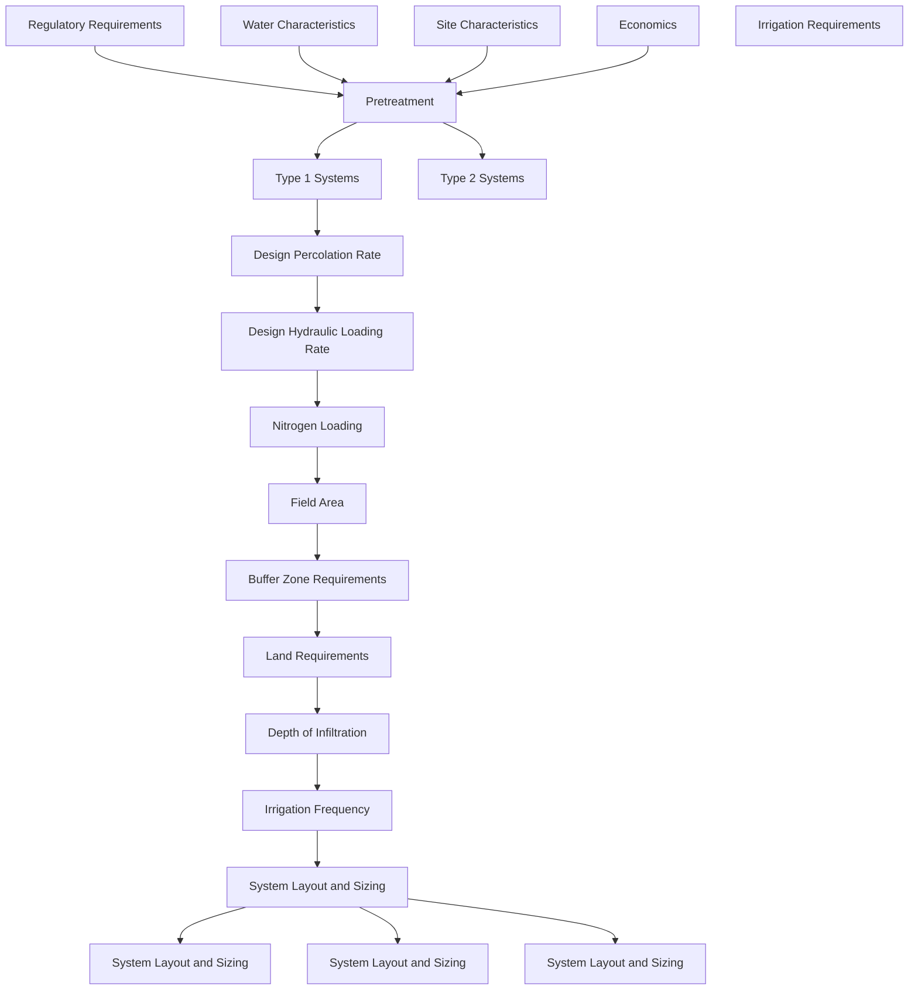

FIGURE 4.2 Slow-rate system design procedure:
```

## 6.1 Crop Selection

Crop selection is the first step in the preliminary design process because most of the other design decisions (preapplication treatment, distribution system, and hydraulic loading

Copyright © 2024 by the Water Environment Federation. For subscriber use only and not for distribution. All Rights Reserved.
Permission to copy must be obtained from WEF.

\n---\n

## 6.1.1 Guidelines for Crop Selection

Guidelines for crop selection are presented separately for Type 1 and Type 2 systems. The reader is referred to publications by Pettygrove and Asano (1985) and Crites et al. (2000) for more detailed guidelines on crop selection.

## 6.2 Type 1 Systems

Crops that are most compatible with Type 1 systems are those that have high nitrogen uptake capacity, high consumptive use or evapotranspiration demand, high tolerance for moist soil conditions, low sensitivity to wastewater constituents, and minimum management requirements. Crops that have all or most of these characteristics include certain perennial forage grasses, turf grasses, some tree species, and some field crops:

- Forage crops that are used successfully include reed canary grass, tall fescue, Bermuda grass, perennial ryegrass, Italian ryegrass, and orchard grass.
- Reed canary grass and tall fescue have high moisture tolerances, but are less desirable as hay crops.
- Grasses grown for rotation permanent pasture have the advantage of no downtime requirement for harvesting, as long as animal rotation is coordinated with the irrigation schedule.
- Use of leguminous forage crops (clovers, alfalfa, and vetch) is limited in Type 1 systems because they do not tolerate high soil moisture conditions.

The most common tree crops used for Type 1 systems have been mixed hardwoods and pines. Tree crops provide a potential for revenue when sold as firewood or biomass fuel. Coarse, woody debris left after harvest provides carbon for long-term microbial nitrogen immobilization (Romero et al., 2005). Tree species with a high growth response to wastewater irrigation will also maximize nutrient uptake and are best suited to Type 1 systems. Potential candidate species include cottonwood, sycamore, green ash, black cherry, black locust, red bud, catalpa, Chinese elm, white pine, eucalyptus, willows, and hybrid poplars. Local foresters should be consulted for specific judgments on likely responses of selected species under local conditions.
\n---\n

Field crops have been used in Type 1 systems when the soil is well drained and the groundwater table is below the rooting depth. Corn, milo (sorghum), and barley are candidate crops.

## 6.3 Type 2 Systems
A broader selection of candidate crops may be considered for Type 2 systems. Because excess water is not applied, moisture tolerance is a less important consideration in most cases. At the same time, high nitrogen uptake capacity and high consumptive use remain desirable crop characteristics, and potential profitability usually is a consideration. Thus, in addition to the crops suggested for Type 1 systems, candidate crops include all types of forage crops, including legumes; most field crops, including cotton, soybeans, safflower, and grains; and some fruit crops, including citrus, apples, and grapes. Double cropping is often practiced to increase revenue potential and maximize nitrogen uptake and water use. Short-season summer crops (corn and sorghum) are combined with winter grains (barley, oats, and wheat) or annual forage grass (rye).

## 6.4 Crop Characteristics
Two crop characteristics that are important design parameters are nutrient uptake and consumptive use.

### 6.4.1 Nutrient Uptake
Unless specially treated to remove nutrients, municipal wastewaters typically contain nitrogen and phosphorus in excess of crop needs, while lacking sufficient potassium. Excess phosphorus is readily removed in the soil profile, but most of the nitrogen not taken up by crops will ultimately be transported into groundwaters. If it is necessary to protect groundwater quality for drinking water purposes, slow-rate systems must be designed to limit the amount of nitrogen leached the groundwater. Thus, the allowable nitrogen loading may be the limiting design factor for a given system. The allowable nitrogen loading will be determined in large part by the nitrogen uptake capacity of the crop.

The nutrient removal capacity of a crop is not a fixed characteristic; it depends on the crop yield and the nutrient content of the plant at the time of harvest. Accordingly, design
\n---\n

Estimates of harvest removals should be based on yield goals and nutrient compositions that local experience indicates can be achieved with good management on similar soils.

In general, the largest nutrient removals can be achieved by perennial grasses and legumes that are cut frequently at early stages of growth. The potential for harvesting nutrients with annual crops is typically less than with perennials because annuals use only part of the available growing season for growth and active uptake: Typical annual uptake rates of major plant nutrients, nitrogen, phosphorus, and potassium for several commonly selected crops are listed in Table 4.13

Estimates of the net annual nitrogen storage for a number of fully stocked forest ecosystems are presented in Table 4.14. These estimates represent maximum rates of net nitrogen uptake, considering both the understory and overstory vegetation during the period of active tree growth.

Because nitrogen stored within the biomass of trees is not uniformly distributed among the tree components, the amount of nitrogen that can actually be removed with a forest crop will be substantially less than the storage estimates given in Table 4.14, unless 100% of the aboveground biomass is harvested (whole-tree harvesting). If only the merchantable stem is removed from the system, the net amount of nitrogen in biomass removed will be less than 30% of the total amount stored in the whole-tree biomass. However, most of the nitrogen in the high carbon-to-nitrogen-ratio woody biomass left to rot on the forest floor ultimately is immobilized in humus formation.

TABLE 4.13 Nutrient uptake rates for selected crops, kg/ha·a (U.S. EPA, 1981).
\n---\n

# Crop nutrient ranges (Forage crops and Field crops)

<table>
  <thead>
    <tr>
      <th>Crop</th>
      <th>Nitrogen</th>
      <th>Phosphorus</th>
      <th>Potassium</th>
    </tr>
  </thead>
  <tbody>
    <tr><td>Forage crops</td><td></td><td></td><td></td></tr>
<tr><td>Alfalfa*</td><td>225-540</td><td>22-35</td><td>175-225</td></tr>
<tr><td>Brome grass</td><td>130-225</td><td>40-55</td><td>245</td></tr>
<tr><td>Coastal Bermuda grass</td><td>400-675</td><td>35-45</td><td>225</td></tr>
<tr><td>Kentucky bluegrass</td><td>200-270</td><td>45</td><td>200</td></tr>
<tr><td>Quack grass</td><td>235-280</td><td>30-45</td><td>275</td></tr>
<tr><td>Reed canary grass</td><td>335-450</td><td>40-45</td><td>315</td></tr>
<tr><td>Rye grass</td><td>200-280</td><td>60-85</td><td>270-325</td></tr>
<tr><td>Sweet clover*</td><td>175</td><td>20</td><td>100</td></tr>
<tr><td>Tall fescue</td><td>150-325</td><td>30</td><td>300</td></tr>
<tr><td>Orchard grass</td><td>250-350</td><td>20-50</td><td>225-315</td></tr>
<tr><td>Field crops</td><td></td><td></td><td></td></tr>
<tr><td>Barley</td><td>125</td><td>15</td><td>20</td></tr>
<tr><td>Corn</td><td>175-200</td><td>20-30</td><td>110</td></tr>
<tr><td>Cotton</td><td>75-110</td><td>15</td><td>40</td></tr>
<tr><td>Grain sorghum</td><td>135</td><td>15</td><td>70</td></tr>
<tr><td>Potatoes</td><td>230</td><td>29</td><td>245-325</td></tr>
<tr><td>Soybeans*</td><td>250</td><td>10-20</td><td>30-55</td></tr>
<tr><td>Wheat</td><td>160</td><td>15</td><td>20-45</td></tr>
  </tbody>
</table>

<p>* Legumes can fix atmospheric nitrogen.</p>

<table>
  <thead>
    <tr>
      <th>Crop</th>
      <th>Nitrogen</th>
      <th>Phosphorus</th>
      <th>Potassium</th>
    </tr>
  </thead>
  <tbody>
    <tr><td>Forage crops</td><td></td><td></td><td></td></tr>
<tr><td>Alfalfa*</td><td>225-540</td><td>22-35</td><td>175-225</td></tr>
<tr><td>Brome grass</td><td>130-225</td><td>40-55</td><td>245</td></tr>
<tr><td>Coastal Bermudagrass</td><td>400-675</td><td>35-45</td><td>225</td></tr>
<tr><td>Kentucky bluegrass</td><td>200-270</td><td>45</td><td>200</td></tr>
<tr><td>Quack grass</td><td>235-280</td><td>30-45</td><td>275</td></tr>
  </tbody>
</table>

\n---\n

### TABLE 4.14 Estimated net annual nitrogen uptake in the overstory and understory vegetation of fully stocked and vigorously growing forest ecosystems in selected regions of the United States (U.S. EPA, 1981).

<table>
<thead>
<tr><th>Plant</th><th>Value 1</th><th>Value 2</th><th>Value 3</th></tr>
</thead>
<tbody>
<tr><td>Reed canary grass</td><td>335-450</td><td>40-45</td><td>315</td></tr>
<tr><td>Rye grass</td><td>200-280</td><td>60-85</td><td>270-325</td></tr>
<tr><td>Sweet clover*</td><td>175</td><td>20</td><td>100</td></tr>
<tr><td>Tall fescue</td><td>150-325</td><td>30</td><td>300</td></tr>
<tr><td>Orchard grass</td><td>250-350</td><td>20-50</td><td>225-315</td></tr>
<tr><td>Field crops Barley</td><td>125</td><td>15</td><td>20</td></tr>
<tr><td>Corn</td><td>175-200</td><td>20-30</td><td>110</td></tr>
<tr><td>Cotton</td><td>75-110</td><td>15</td><td>40</td></tr>
<tr><td>Grain sorghum</td><td>135</td><td>15</td><td>70</td></tr>
<tr><td>Potatoes</td><td>230</td><td>29</td><td>245-325</td></tr>
<tr><td>Soybeans*</td><td>250</td><td>10-20</td><td>30-55</td></tr>
<tr><td>Wheat</td><td>160</td><td>15</td><td>20-45</td></tr>
</tbody>
</table>

* Legumes can fix atmospheric nitrogen.
\n---\n

<table>
<thead>
<tr><th>Forest</th><th>Tree age, years</th><th>Average annual nitrogen uptake, kg/ha·a</th></tr>
</thead>
<tbody>
<tr><td colspan="3"><strong>Eastern forests</strong></td></tr>
<tr><td>Mixed hardwoods</td><td>40-60</td><td>220</td></tr>
<tr><td>Red pine</td><td>25</td><td>110</td></tr>
<tr><td>Old field with white spruce plantation</td><td>15</td><td>280</td></tr>
<tr><td>Pioneer succession</td><td>5-15</td><td>280</td></tr>
<tr><td colspan="3"><strong>Southern forests</strong></td></tr>
<tr><td>Mixed hardwoods</td><td>40-60</td><td>340</td></tr>
<tr><td>Southern pine with no understory</td><td>20</td><td>220<sup>a</sup></td></tr>
<tr><td>Southern pine with understory</td><td>20</td><td>320</td></tr>
<tr><td colspan="3"><strong>Lake states forests</strong></td></tr>
<tr><td>Mixed hardwoods</td><td>50</td><td>110</td></tr>
<tr><td>Hybrid</td><td>5</td><td>155</td></tr>
<tr><td colspan="3"><strong>Western forests</strong></td></tr>
<tr><td>Hybrid poplar</td><td>4-5</td><td>300-400</td></tr>
<tr><td>Douglas fir plantation</td><td>15-25</td><td>150-250</td></tr>
</tbody>
</table>

<p><sup>a</sup> Principal southern pine included in these estimates is loblolly pine.</p>
<p><sup>b</sup> Short-term rotation with harvesting at 4 to 5 years; represents first growth cycle from planted seedlings.</p>

----

<table>
<thead>
<tr><th>Forest</th><th>Tree age, years</th><th>Average annual nitrogen uptake, kg/ha·a</th></tr>
</thead>
<tbody>
<tr><td colspan="3"><strong>Eastern forests</strong></td></tr>
<tr><td>Mixed hardwoods</td><td>40-60</td><td>220</td></tr>
<tr><td>Red pine</td><td>25</td><td>110</td></tr>
<tr><td>Old field with white spruce plantation</td><td>15</td><td>280</td></tr>
<tr><td>Pioneer succession</td><td>5-15</td><td>280</td></tr>
</tbody>
</table>

\n---\n

<table>
<tr><td>Mixed hardwoods</td><td>40–60</td><td>340</td></tr>
<tr><td>Southern pine with no understory</td><td>20</td><td>220a</td></tr>
<tr><td>Southern pine with understory</td><td>20</td><td>320</td></tr>
<tr><td>Lake states forests</td><td></td><td></td></tr>
<tr><td>Mixed hardwoods</td><td>50</td><td>110</td></tr>
<tr><td>Hybrid poplar</td><td>5</td><td>155</td></tr>
<tr><td>Western forests</td><td></td><td></td></tr>
<tr><td>Hybrid poplar</td><td>4–5</td><td>300–400</td></tr>
<tr><td>Douglas fir plantation</td><td>15–25</td><td>150–250</td></tr>
</table>

<p>a Principal southern pine included in these estimates is loblolly pine.</p>
<p>b Short-term rotation with harvesting at 4 to 5 years; represents first growth cycle from planted seedlings.</p>

## 6.4.2 Consumptive Use

Consumptive water use by plants is also termed evapotranspiration. Evapotranspiration is
an important parameter in the water balance equation used in preliminary design
calculations. Consumptive water use varies with the physical characteristics and the
growth stage of the crop, the soil moisture level, and the local climate. In many states,
estimates of maximum monthly consumptive water use for many crops can be obtained
from local agricultural extension offices, research stations, or NRCS. Where this
information is not available, it will be necessary to make estimates of evapotranspiration
by using temperature and other climatic data. Several available methods of estimating
evapotranspiration are detailed in publications by Thornthwaite (1948), Jensen (1973),
Doorenbos and Pruitt (1975), and Allen et al. (1998).

Reference evapotranspiration (ETo) (defined as the rate of evapotranspiration from an
extended surface of well-watered, full-cover, short grass) is used as a direct estimate of

\n---\n

# Evapotranspiration for well-managed pasture or full-cover perennial forage-grass crops

Examples of estimated ETo for several climates are shown in Table 4.15. The designer should obtain or estimate evapotranspiration values that are specific to the site under design. Estimates of evapotranspiration for other crops or for evaporation from noncropped soil or water surfaces can be obtained by applying crop coefficient (kc) values to ETo estimates. Recommended coefficient values for noncropped surfaces and trees are given in Table 4.16.

Like precipitation, monthly evapotranspiration values vary from year to year because evapotranspiration and precipitation are negatively correlated. The cloudiness associated with precipitation reduces evapotranspiration to lower-than-normal or average values, while evapotranspiration is greatest during clear weather. To correctly account for such variability in design, a frequency distribution analysis of long-term records can be performed; then, design values can be determined based on a selected exceedance probability (e.g., 90% exceedance probability or wettest year in 10).

Unfortunately, sufficient climatic data are sometimes not available to properly use prediction equations to estimate ETo on a month-by-month basis. For locations where long-term (15 years or more) monthly pan evaporation (Ep) records are available, a procedure is presented in Pettygrove and Asano (1985) for the frequency distribution analysis of evapotranspiration–precipitation. In cases where the required Ep data are not available, it will be necessary to use normal-year ETo values in design calculations. The examples used in this manual are based on use of normal ETo values in design calculations.

TABLE 4.15 Examples of estimated monthly potential evapotranspiration for selected climates, mm (Pettygrove and Asano, 1985, and U.S. EPA, 1981).
\n---\n

# 

<table>
<thead>
<tr>
<th>Month</th>
<th>Paris, Texas</th>
<th>Central Missouri</th>
<th>Brevard, North Carolina</th>
<th>Jonesboro, Georgia</th>
<th>Hanover; New Hampshire</th>
<th>Seabrook, New Jersey</th>
<th>Central Valley, California</th>
<th>Southern Desert, California</th>
</tr>
</thead>
<tbody>
<tr><td>January</td><td>15</td><td></td><td></td><td></td><td></td><td></td><td>28</td><td>69</td></tr>
<tr><td>February</td><td>15</td><td>13</td><td>13</td><td></td><td></td><td></td><td>46</td><td>91</td></tr>
<tr><td>March</td><td>36</td><td>30</td><td>21</td><td>30</td><td>20</td><td>76</td><td>150</td><td></td></tr>
<tr><td>April</td><td>68</td><td>66</td><td>46</td><td>58</td><td>29</td><td>40</td><td>117</td><td>193</td></tr>
<tr><td>May</td><td>99</td><td>108</td><td>76</td><td>109</td><td>82</td><td>74</td><td>147</td><td>257</td></tr>
<tr><td>June</td><td>147</td><td>145</td><td>102</td><td>147</td><td>129</td><td>114</td><td>185</td><td>290</td></tr>
<tr><td>July</td><td>160</td><td>169</td><td>114</td><td>157</td><td>137</td><td>139</td><td>201</td><td>295</td></tr>
<tr><td>August</td><td>162</td><td>152</td><td>104</td><td>150</td><td>119</td><td>136</td><td>170</td><td>244</td></tr>
<tr><td>September</td><td>97</td><td>103</td><td>74</td><td>109</td><td>74</td><td>99</td><td>132</td><td>216</td></tr>
<tr><td>October</td><td>64</td><td>63</td><td>46</td><td>58</td><td>40</td><td>49</td><td>86</td><td>160</td></tr>
<tr><td>November</td><td>27</td><td>26</td><td>16</td><td>25</td><td>3</td><td>21</td><td>41</td><td>89</td></tr>
<tr><td>December</td><td>14</td><td>11</td><td>3</td><td>25</td><td></td><td></td><td>51</td><td></td></tr>
<tr><td>Annual</td><td>904</td><td>893</td><td>607</td><td>882</td><td>614</td><td>700</td><td>1250</td><td>1803</td></tr>
</tbody>
</table>

<table>
<thead>
<tr>
<th>Month</th>
<th>Paris, Texas</th>
<th>Central Missouri</th>
<th>Brevard, North Carolina</th>
<th>Jonesboro, Georgia</th>
<th>Hanover; New Hampshire</th>
<th>Seabrook; New Jersey</th>
<th>Central Valley, California</th>
<th>Southern Desert, California</th>
</tr>
</thead>
<tbody>
<tr><td>January</td><td>15</td><td></td><td></td><td>13</td><td></td><td></td><td>28</td><td>69</td></tr>
<tr><td>February</td><td>15</td><td>13</td><td>13</td><td>13</td><td></td><td></td><td>46</td><td>91</td></tr>
<tr><td>March</td><td>36</td><td>30</td><td>21</td><td>30</td><td></td><td>20</td><td>76</td><td>150</td></tr>
<tr><td>April</td><td>68</td><td></td><td>46</td><td>58</td><td>29</td><td>40</td><td>117</td><td>193</td></tr>
<tr><td>May</td><td></td><td>108</td><td>76</td><td>109</td><td>82</td><td>74</td><td>147</td><td>257</td></tr>
<tr><td>June</td><td>147</td><td>145</td><td>102</td><td>147</td><td>129</td><td>114</td><td>185</td><td>290</td></tr>
<tr><td>July</td><td>160</td><td>169</td><td>114</td><td>157</td><td>137</td><td>139</td><td>201</td><td>295</td></tr>
<tr><td>August</td><td>162</td><td>152</td><td>104</td><td>150</td><td>119</td><td>136</td><td>170</td><td>244</td></tr>
</tbody>
</table>

\n---\n

TABLE 4.16 Recommended crop coefficient (k_c) values to be multiplied by ET0 for estimating evapotranspiration and evaporation losses for a range of air mass conditions (Pettygrove and Asano [Eds.], 1985).

<table>
<thead>
<tr><th>Month</th><th>Col1</th><th>Col2</th><th>Col3</th><th>Col4</th><th>Col5</th><th>Col6</th><th>Col7</th><th>Col8</th></tr>
</thead>
<tbody>
<tr><td>September</td><td>97</td><td>103</td><td>74</td><td>109</td><td>74</td><td>99</td><td>132</td><td>216</td></tr>
<tr><td>October</td><td>64</td><td>63</td><td>46</td><td>58</td><td>40</td><td>49</td><td>86</td><td>160</td></tr>
<tr><td>November</td><td>27</td><td>26</td><td>16</td><td>25</td><td>3</td><td>21</td><td>41</td><td>89</td></tr>
<tr><td>December</td><td>14</td><td>11</td><td>3</td><td>13</td><td>0</td><td>3</td><td>25</td><td>51</td></tr>
<tr><td>Annual</td><td>904</td><td>893</td><td>607</td><td>882</td><td>614</td><td>700</td><td>1250</td><td>1803</td></tr>
</tbody>
</table>

<p>
Descriptive note: The table provides recommended crop coefficients (k_c) values to be multiplied by reference evapotranspiration (ET0) for estimating evapotranspiration and evaporation losses for a range of air mass conditions.
</p>

<p><strong>Description</strong>    <strong>kc; Humid, dry, dry and windy</strong></p>

<table>
<thead>
<tr><th>Description</th><th>kc; Humid, dry, dry and windy</th></tr>
</thead>
<tbody>
<tr><td>Water surfaces (shallow ponds, storage reservoirs, etc.)</td><td>1.05, 1.10, 1.15</td></tr>
<tr><td>Dark bare soil (constantly moist on surface)</td><td>1.05, 1.10, 1.15</td></tr>
<tr><td>Lighter colored bare soil (constantly moist surface)</td><td>1.00, 1.05, 1.10</td></tr>
<tr><td>Grass–clover (or alfalfa) pasture with greater than 60% ground cover left after grazing</td><td>1.00, 1.05, 1.10</td></tr>
<tr><td>Alfalfa (grown for hay with cuttings every 30 to 35 days)</td><td>0.85, 0.95, 1.05</td></tr>
<tr><td>Shrubbery (various evergreen species, low stomatal control)</td><td>1.02, 1.15, 1.20</td></tr>
<tr><td>Evergreen trees (various species, high soil moisture, low stomatal control)</td><td>1.10, 1.20, 1.30</td></tr>
</tbody>
</table>

<p>
* Some regions experience a range of conditions during the year making it difficult to select a single k_c for use in an analysis involving annual totals of ET. Because a large portion of the total annual ET takes place from April through September, the column selected to represent general climate conditions should be based on conditions prevailing from April to September. See Allen et al. (1998) for a more detailed approach.
</p>

<p><strong>Description</strong>    <strong>kc; Humid; dry; dry and windy</strong></p>

<table>
<thead>
<tr><th>Description</th><th>kc; Humid; dry; dry and windy</th></tr>
</thead>
<tbody>
<tr><td>Water surfaces (shallow ponds, storage reservoirs, etc.)</td><td>1.05, 1.10, 1.15</td></tr>
</tbody>
</table>

\n---\n

<table>
<thead>
<tr><th>Soil/Vegetation Type</th><th>kc values</th></tr>
</thead>
<tbody>
<tr><td>Lighter colored bare soil (constantly moist surface)</td><td>1.00, 1.05, 1.10</td></tr>
<tr><td>Grass–clover (or alfalfa) pasture with greater than 60% ground cover left after grazing</td><td>1.00, 1.05, 1.10</td></tr>
<tr><td>Alfalfa (grown for hay with cuttings every 30 to 35 days)</td><td>0.85, 0.95, 1.05</td></tr>
<tr><td>Shrubbery (various evergreen species, low stomatal control)</td><td>1.02, 1.15, 1.20</td></tr>
<tr><td>Evergreen trees (various species, high soil moisture, low stomatal control)</td><td>1.10, 1.20, 1.30</td></tr>
</tbody>
</table>

Some regions experience a range of conditions during the year making it difficult to select a single kc for use in an analysis involving annual totals of ET. Because a large portion of the total annual ET takes place from April through September, the column selected to represent general climate conditions should be based on conditions prevailing from April to September. See Allen et al. (1998) for a more detailed approach:

## 6.5 Distribution System Selection

The type of distribution system is selected before determining irrigation requirements because it is necessary to know the application efficiency of the distribution system to determine total irrigation requirements for Type 2 systems. The criteria used in selecting a distribution system are basically the same for both Type 1 and Type 2 systems.

The following factors are considered in selecting a distribution system:
* Site characteristics—topography, soil permeability, soil water-holding capacity, and soil depth;
* Type of crop;
* Management and skilled-labor requirements;
* Approximate cost (capital plus operating);
* Water quality and quantity requirements;
* Seasonality of operation, including the possibility of freezing conditions; and
* Owner preference.

\n---\n

## 6.5.1 Surface Irrigation

Distribution systems may be classified into three broad categories: surface systems, sprinkler systems, and micro-irrigation systems. The specific types of surface, sprinkler, and micro-irrigation systems commonly used are listed in Table 4.17 with salient features of each as well as conditions suitable for their use.

Surface irrigation systems have relatively low initial capital cost and low energy consumption, but do not distribute water or suspended solids as evenly as sprinkler irrigation systems. Most systems operate best at uniform slopes of less than 2%, although steeper slopes can be accommodated with appropriate design. Surface application is common in many older slow-rate systems and in areas where surface techniques are used for conventional agriculture. Surface application systems can be operated during intermittent light-freezing conditions.

Border irrigation is a common type of surface irrigation that is best suited for continuous canopy crops on uniformly graded fields. Border irrigation fields are divided into strips by checks (berms). Irrigation water is applied to the field at one end of each border and flows by gravity through the field to the far end. Some systems incorporate tail water return systems, while others have closed field ends. Border strips range from 6 to 30 m (20 to 100 ft) in width and can be 60 to 305 m (200 to 1000 ft) in length.

In furrow irrigation, water is released in small ditches, called furrows, between rows of crops to provide a water supply to crop roots by lateral moisture movement. Furrows can be laid out straight or on graded contours, typically with a uniform slope along the furrows. On fine-textured soils, furrows can be spaced 0.9 to 1.2 m (3 to 4 ft) apart and lengths can range from 120 to 395 m (400 to 1300 ft) for applications of 50 to 75 mm (2 to 3 in.) per irrigation cycle. Furrow irrigation typically requires tailwater collection.

----

## 6.5.2 Sprinkler Irrigation

Sprinkler distribution is the most common technique for slow-rate systems. It can be adapted to a wide range of soil and topographic conditions and used for a variety of crop types. Sprinkler irrigation is also often used for forested systems. Common types of sprinkler irrigation systems used in land application are solid set sprinklers, movable systems, “big gun” systems, and mechanical move irrigation systems. Some types of
\n---\n

sprinkler systems can be designed for operation during brief periods (i.e;, several hours) of freezing temperatures.

Solid-set sprinklers and associated piping are placed permanently in fields, typically with only sprinkler risers exposed above ground. Common spacing for sprinkler heads ranges from 9 to 24 m (30 to 80 ft) on center, and system pressures range from 240 to 585 kPa (35 to 85 psi). The labor required to implement irrigation is quite low. The presence of permanently installed sprinklers can create challenges for crop management and harvest.

Hand-move sprinkler systems operate at similar spacings and pressures to solid-set sprinklers. The sprinkler laterals are typically moved the same distance between irrigation sets to cover an entire field over a 1 to 2-week period. These sprinkler systems have low capital expense and provide unimpeded field access, but require much more labor for regularly moving laterals.

TABLE 4.17 Distribution systems and conditions of use.

<table>
<thead>
<tr>
<th>Distribution system</th>
<th>Crops</th>
<th>Topography</th>
<th>Soil<a></th>
<th>Application efficiency, %</th>
</tr>
</thead>
<tbody>
<tr>
<td>Portable Hand move</td>
<td>Orchards, pasture, grain, alfalfa, vineyards, and low-growing vegetables and field crops</td>
<td>Maximum grade: 20%</td>
<td>Minimum IR: 0.10 in./hr; WHC: 3.0 in.</td>
<td>70–80</td>
</tr>
<tr>
<td>Wheel roll</td>
<td>All crops less than 0.9 m (3 ft) high</td>
<td>Maximum grade: 15%</td>
<td>Minimum IR: 0.10 in./hr; WHC: 3.0 in.</td>
<td>70–80</td>
</tr>
<tr>
<td>Solid set</td>
<td>All crops</td>
<td>Maximum grade: 15%</td>
<td>Minimum IR: 0.05 in./hr; WHC: 3.0 in.</td>
<td>70–80</td>
</tr>
<tr>
<td>Center pivot or linear move</td>
<td>All crops</td>
<td>Maximum grade: 15%</td>
<td>Minimum IR: 0.30 in./hr; WHC: 2.0 in.</td>
<td>75–90</td>
</tr>
<tr>
<td>Traveling gun</td>
<td>Pasture, grain, alfalfa, field crops, and vegetables</td>
<td>Maximum grade: 15%</td>
<td>Minimum IR: 0.30 in./hr; WHC: 2.0 in.</td>
<td>70–80</td>
</tr>
<tr>
<td>Surface systems</td>
<td>Narrow graded border; Graded up to 4.6 m (15 ft) wide</td>
<td>Maximum grade: 7%; cross-slope: 0.20%</td>
<td>Minimum IR: 0.3 in./hr; maximum IR: 6.0 in./hr</td>
<td>65–85</td>
</tr>
<tr>
<td>Wide graded border</td>
<td>Pasture, grain, alfalfa, and orchards</td>
<td>Maximum grade: 0.5–1%; cross-slope: 0.2%</td>
<td>Minimum IR: 0.3 in./hr; maximum IR: 6.0 in./hr; depth: sufficient for required grading</td>
<td>65–85</td>
</tr>
</tbody>
</table>

\n---\n

## Level border irrigation guidelines

<table>
<thead>
<tr>
<th>Level border</th>
<th>Use / Crops</th>
<th>Maximum grade / cross-slope</th>
<th>Infiltration rate (IR)</th>
<th>Application efficiency, %</th>
</tr>
</thead>
<tbody>
<tr>
<td>Level border</td>
<td>Grain, field crops, rice, and orchards</td>
<td>Maximum grade: level; cross-slope: 0.2%</td>
<td>Minimum IR: 0.1 in./hr; Maximum IR: 6.0 in./hr; depth: sufficient for required grading</td>
<td>75–90</td>
</tr>
<tr>
<td>Straight furrows</td>
<td>Vegetables, row crops, orchards, and vineyards</td>
<td>Maximum grade: 3%; cross-slope: 10% (erosion hazard)</td>
<td>Minimum IR: 0.1 in./hr; Maximum IR: NR if furrow length is adjusted to intake; depth: sufficient for required grading</td>
<td>70–90</td>
</tr>
<tr>
<td>Graded contour furrows</td>
<td>Vegetables, row crops, orchards, and vineyards</td>
<td>Maximum grade: 8%; undulating cross-slope: 10% (erosion hazard)</td>
<td>Minimum IR: 0.1 in./hr; Maximum IR: NR if furrow length is adjusted to intake; noncracking soils</td>
<td>70–85</td>
</tr>
<tr>
<td>Drip systems</td>
<td>Orchards, vineyards; vegetables, and nursery plants</td>
<td>NR</td>
<td>Minimum IR: 0.02 in./hr</td>
<td>80–90</td>
</tr>
</tbody>
</table>

----

## Distribution system — Suitability and conditions of use

<table>
<thead>
<tr>
<th>Distribution system</th>
<th colspan="4">Suitability and conditions of use</th>
</tr>
<tr>
<th></th>
<th>Crops</th>
<th>Topography</th>
<th>Soils</th>
<th>Application efficiency, %</th>
</tr>
</thead>
<tbody>
<tr>
<td>Sprinkler systems</td>
<td></td>
<td></td>
<td></td>
<td></td>
</tr>
<tr>
<td>Portable</td>
<td></td>
<td>Maximum grade: 20%</td>
<td>Minimum IR: 0.10 in./hr</td>
<td></td>
</tr>
<tr>
<td>Hand move</td>
<td>Orchards, pasture, grain, alfalfa, vineyards, and low-growing vegetable and field crops</td>
<td></td>
<td>WHC: 3.0 in.</td>
<td>70–80</td>
</tr>
<tr>
<td>Wheel roll</td>
<td>All crops less than 0.9 m (3 ft) high</td>
<td>Maximum grade: 15%</td>
<td>Minimum IR: 0.10 in./hr; WHC: 3.0 in.</td>
<td>70–80</td>
</tr>
<tr>
<td>Solid set</td>
<td>NR</td>
<td>30%</td>
<td>Minimum IR: 0.05 in./hr</td>
<td>70–80</td>
</tr>
<tr>
<td>Center pivot or linear move</td>
<td>All crops</td>
<td>Maximum grade: 15%</td>
<td>Minimum IR: 0.30 in./hr; WHC: 2.0 in.</td>
<td>75–90</td>
</tr>
</tbody>
</table>

\n---\n

<h2>Surface systems</h2>

<table>
  <thead>
    <tr>
      <th>Feature</th>
      <th>Crops / Vegetation</th>
      <th>Maximum grade; cross-slope</th>
      <th>Minimum IR; notes</th>
      <th>Range</th>
    </tr>
  </thead>
  <tbody>
    <tr>
      <td>Narrow graded border</td>
      <td>Pasture, grain, alfalfa, and vineyards</td>
      <td>Maximum grade: 7%; cross-slope: 0.20%</td>
      <td>Minimum IR: 0.3 in./hr; maximum IR: 6.0 in./hr</td>
      <td>65–85</td>
    </tr>
<tr>
      <td>Wide graded border up to 30.5 m (100 ft) wide</td>
      <td>Pasture, grain, alfalfa, and orchards</td>
      <td>Maximum grade: 0.5–1%; cross-slope: 0.2%</td>
      <td>Minimum IR: 0.3 in./hr; maximum IR: 6.0 in./hr; depth: sufficient for required grading</td>
      <td>65–85</td>
    </tr>
<tr>
      <td>Level border</td>
      <td>Grain, field crops, rice, and orchards</td>
      <td>Maximum grade: level, cross-slope: 0.2%</td>
      <td>Minimum IR: 0.1 in./hr; maximum IR: 6.0 in./hr; depth: sufficient for required grading</td>
      <td>75–90</td>
    </tr>
<tr>
      <td>Straight furrows</td>
      <td>Vegetables, row crops, orchards, and vineyards</td>
      <td>Maximum grade: 3%; cross-slope: 10% (erosion hazard)</td>
      <td>Minimum IR: 0.1 in./hr; maximum IR: NR if furrow length is adjusted to intake; depth: sufficient for required grading</td>
      <td>70–90</td>
    </tr>
<tr>
      <td>Graded contour furrows</td>
      <td>Vegetables, row crops, orchards, and vineyards</td>
      <td>Maximum grade: 8%, undulating cross-slope: 10% (erosion hazard)</td>
      <td>Minimum IR: 0.1 in./hr; maximum IR: NR if furrow length is adjusted to intake; noncracking soils</td>
      <td>70–85</td>
    </tr>
<tr>
      <td>Drip systems</td>
      <td>Orchards, vineyards, vegetables, and nursery plants</td>
      <td>NR</td>
      <td>Minimum IR: 0.02 in./hr</td>
      <td>80–90</td>
    </tr>
  </tbody>
</table>

<p>a in./hr × 25.40 = mm/h; in. × 25.40 = mm.</p>
<p>b Based on good management and return of runoff water for surface systems.</p>
<p>c IR = infiltration rate.</p>
<p>d Water-holding capacity.</p>
<p>e NR = no restriction.</p>

\n---\n

## Wheel lines

Wheel lines use aluminum sprinkler lateral pipes as an axle for 3 to 6-ft diameter wheels. Wheel lines are moved periodically like hand-move sprinklers, but an engine is used to rotate and propel the entire lateral line. Wheel lines require less labor than hand-move systems, but are only suitable for short crops.

## Big gun systems

Big gun systems rely on a large sprinkler nozzle operating at a high pressure (483 to 1034 kPa [70 to 150 psi]) to apply irrigation water to a relatively large area. Big gun irrigation systems can be constructed with fixed gun locations or can be manually moved from riser to riser. Another popular movable irrigation system is the big gun traveler, which uses a powered hose reel to supply water and move the sprinkler. Big gun systems typically have higher application rates than systems using smaller sprinklers. Big gun systems can also be relatively more susceptible to poor uniformity of application if not properly designed.

## Center pivot irrigation systems

Center pivot irrigation systems operate from a central water supply with a movable irrigation lateral that travels in a circle around the pivot point. Such irrigation systems are moderately expensive for initial capital cost, but have low maintenance and labor requirements. Because of the potential for short-duration, high-frequency applications, center pivots often provide the most aerobic soil conditions of all irrigation techniques. Center pivots also have relatively high instantaneous application rates, making them unsuitable for use on some low-permeability soils.

Center pivot operating pressures are between 138 kPa (20 psi) for low-pressure sprays to 517 kPa (75 psi) for impact sprinkler heads. Because of the circular water distribution pattern, quarter-mile-long center pivots typically cover approximately 53 ha (130 ac), leaving corners of rectangular fields without irrigation. End guns and corner swing arms can be added to cover corner areas.

## Linear-move irrigation systems

Linear-move irrigation systems can be thought of as center pivots that move in a straight line, taking the water feed from a ditch or series of riser valves along the edge or center of the field. Linear-move systems are more expensive and require more labor than center pivots, but are better suited for large, rectangular-shaped fields.

### 6.5.3 Micro-Irrigation

Micro-irrigation systems use drip emitters or micro-sprays and generally require a high level of pretreatment. The effluent must be filtered to prevent clogging of the drip emitters.
\n---\n

or micro-sprays and must also be low in iron, hydrogen sulfide, and total bacteria. The ability to chlorinate effluent prior to micro-irrigation should be provided to prevent biofouling of emission devices. Micro-irrigation is generally most suitable for landscape, permanent agricultural crops, or precision cultivation of row crops.
Subsurface drip irrigation is an alternative to surface drip systems, with the advantage that the ground surface remains clear and that the potential for human contact with effluent can be minimized. Subsurface drip systems have gained popularity for effluent dispersal from decentralized wastewater systems.

### 6.5.4 Irrigation System Costs

Costs are not listed in Table 4.17 because they can vary considerably depending on the location and characteristics of the site. However, cost estimates based on local costs of irrigation equipment, labor, power, and construction should be used as a basis for comparing alternative distribution systems. Generally, solid set sprinkler systems have the highest capital cost and lowest labor costs, while hand-move sprinklers have the lowest capital costs and highest labor costs. Mechanized systems are somewhere in between. Manually operated surface systems typically have low capital cost and moderately high labor costs.

### 6.6 Design Hydraulic Loading Rate—Type 1 Systems

The hydraulic loading rate is the volume of wastewater applied per unit area of land over a specified time period, typically weekly, monthly, or annually. The corresponding units of expression are millimeters/week, millimeters/month, and millimeters/year (inches/week, inches/month, and feet/year).

The design hydraulic loading rate for Type 1 systems is the hydraulic loading rate calculated on the basis of the limiting design factor. For municipal wastewaters, factors that must be considered are soil permeability and nitrogen loading. For industrial wastewaters, other factors such as organic loading, salt loading, or metals loading may require consideration.

### 6.6.1 Monthly Hydraulic Loading Rate Based on Soil Permeability

The general water balance equation, with rates based on a monthly time period, is used to determine the monthly hydraulic loading rate. The equation, with runoff of applied water
\n---\n

assumed to be zero, is

$$L_w = ET - P + W_p$$

Where

L_w = wastewater hydraulic loading rate based on permeability mm/mo;

ET = design evapotranspiration rate, mm/mo;

P = design precipitation rate, mm/mo; and

W_p = design percolation rate, mm/mo.

## 6.7 Design Evapotranspiration Rate

The design evapotranspiration rate is typically taken as the estimated average monthly evapotranspiration rate of the selected crop. Alternatively, if data are available, determine the 90% exceedance value of evapotranspiration precipitation using a frequency distribution analysis (see Section 6.4.2, “Consumptive Use”).

## 6.8 Design Precipitation Rate

In instances where the average monthly evapotranspiration rate is used for design evapotranspiration, the design precipitation rate for each month may be determined by using either of the two following methods:

- (1) Determine the annual precipitation with a 10-year return period (wettest year in 10) by a frequency distribution analysis based on at least 15 years of record. Distribute the annual rainfall monthly, based on the ratio of average monthly to average annual precipitation.

- (2) For each month, determine the monthly precipitation with a 5-year return period by a frequency distribution analysis based on at least 15 years of record.

## 6.9 Design Percolation Rate

Water applied in excess of the available water capacity of the soil will percolate beyond the root zone and enter underlying groundwater or drainage systems. This percolate is referred to as deep percolation. In some Type 2 systems, a certain amount of deep

\n---\n

percolation may be required to leach salts from the root zone. However, for Type 1 systems, deep percolation in excess of any leaching requirement serves to provide treatment and disposal of the applied wastewater. Of course, there is a maximum amount of deep percolation that can be allowed and still meet the objective of producing a crop without causing management problems, nuisance conditions, or impairing the beneficial use of the groundwater.

The design value for the percolation rate is based on the saturated permeability of the most restrictive layer in the top 2.4 m (8 ft) of the soil profile and the capacity of the downgradient saturated profile to transmit the added water. In general, Type 1 systems should not be used at sites where the limiting permeability is less than 5 mm/h (0.2 in./hr). It is possible to use sites with lower permeabilities, but careful management is required to prevent nuisance conditions (standing water, runoff, mosquitoes, and so on) from developing.

The procedure used to determine the design percolation rate is a modified version of the procedure presented in Process Design Manual for Land Treatment of Municipal Wastewater (U.S. EPA, 2006). The procedure is as follows:

(1) Determine by field test the minimum clear-water saturated permeability of the soil profile. If the minimum permeability is variable over the site, determine a weighted average based on soil types.

(2) Establish a maximum daily percolation rate in the range of 4 to 6% of the minimum soil profile permeability. Values of up to 10% can be used for soil permeabilities greater than 50 mm/h (2.0 in./hr). Percentages at the low end of the range should be used when the limiting permeability is less than 15 mm/h (0.6 in./hr) or when the soil permeability is poorly defined. These percolation values were empirically determined on the basis of successful experience at existing systems. The daily percolation rate is determined as follows:

$$ W_p \text{ (daily) } = (\text{Permeability, mm/h}) \times (24 \text{ h/d}) \times (0.04 \text{ to } 0.06) \quad (4.3) $$

(3) Calculate the design monthly percolation rate, making adjustments for periods of nonoperation. Nonoperating periods may be necessary for
\n---\n

## 6.10 Hydraulic Loading Rate Calculations

- Harvesting or cultural procedures;
- Precipitation—no adjustment is necessary because precipitation is already factored into the water balance equation;
- Freezing temperatures—no operation should be allowed on days during months when the mean temperature is less than -4 °C (25 °F).

The hydraulic loading rate for each month is computed using eq 4.2. The monthly hydraulic loadings are then summed to yield the allowable annual hydraulic loading rate based on soil permeability [L_w(p)]. The computation procedure is illustrated by an example in Table 4.18. The example is based on a system involving a permanent pasture. Downtime is allotted for freezing conditions, but pasture management does not require harvesting downtime.

$$W_p(\text{monthly}) = [W_p(\text{daily}) \times (\text{Operating days/mo})] \quad (4.4)$$

### 6.10.1 Hydraulic Loading Rate Based on Nitrogen Loading

If percolating water from a slow-rate system will enter a potable groundwater aquifer, then the system should be designed so that the concentration of nitrate-nitrogen in the receiving groundwater at the project boundary does not exceed 10 mg/L. To meet this requirement, the allowable hydraulic loading rate based on an annual total nitrogen loading [L_w(n)] must be estimated and compared to the previously calculated allowable annual hydraulic loading [L_w(p)]. The lesser of the two values controls design. The detailed steps in this procedure are

(1) Estimate the allowable annual hydraulic loading rate based on nitrogen limits using the following equation:

$$L_{w(n)} = \frac{(C_p)(P - ET) + (U)(100)}{(1 - f)(C_n) - C_p} \quad (4.5)$$
\n---\n

# TABLE 4.18 Example water balance calculation to determine hydraulic loading rates based on soil permeability, mm.

<table>
  <thead>
    <tr>
      <th>(1) Month</th>
      <th>(2) ET, Evapotranspir- iona</th>
      <th>(3) P, Precipitation</th>
      <th>(4) (ET − P), net ET</th>
      <th>(5) Wp percolationb</th>
      <th>(6) Lw(p) waste-water hydraulic loading</th>
    </tr>
  </thead>
  <tbody>
    <tr><td>January</td><td>23</td><td>30</td><td>−7</td><td>51</td><td>44</td></tr>
<tr><td>February</td><td>51</td><td>28</td><td>23</td><td>126</td><td>149</td></tr>
<tr><td>March</td><td>97</td><td>28</td><td>69</td><td>163</td><td>232</td></tr>
<tr><td>April</td><td>132</td><td>20</td><td>112</td><td>180</td><td>292</td></tr>
<tr><td>May</td><td>177</td><td>5</td><td>172</td><td>180</td><td>352</td></tr>
<tr><td>June</td><td>218</td><td>3</td><td>215</td><td>180</td><td>395</td></tr>
<tr><td>July</td><td>239</td><td>—</td><td>239</td><td>180</td><td>419</td></tr>
<tr><td>August</td><td>221</td><td>—</td><td>221</td><td>180</td><td>402</td></tr>
<tr><td>September</td><td>147</td><td>3</td><td>144</td><td>180</td><td>324</td></tr>
<tr><td>October</td><td>109</td><td>8</td><td>101</td><td>180</td><td>281</td></tr>
<tr><td>November</td><td>51</td><td>13</td><td>38</td><td>170</td><td>208</td></tr>
<tr><td>December</td><td>25</td><td>25</td><td>0</td><td>140</td><td>140</td></tr>
<tr><td>Annual</td><td>1490</td><td>163</td><td>1327</td><td>1911</td><td>3238</td></tr>
  </tbody>
</table>

<p>a Based on permanent pasture crop.</p>

<p>b Based on a soil permeability of 0.5 to 1.5 mm/h: Wp (max) = (0.5 mm/h) (24 h/d) (0.05) (30 d/mo) = 180. Downtime allowed for freezing temperatures.</p>
\n---\n

# Monthly Hydraulic Loading Table

<table>
  <thead>
    <tr>
      <th>Month</th>
      <th>Lw(n)</th>
      <th>Cp</th>
      <th>P</th>
      <th>ET</th>
      <th>U</th>
    </tr>
  </thead>
  <tbody>
    <tr><td>March</td><td>97</td><td>28</td><td>69</td><td>163</td><td>232</td></tr>
<tr><td>April</td><td>132</td><td>20</td><td>112</td><td>180</td><td>292</td></tr>
<tr><td>May</td><td>177</td><td>5</td><td>172</td><td>180</td><td>352</td></tr>
<tr><td>June</td><td>218</td><td>3</td><td>215</td><td>180</td><td>395</td></tr>
<tr><td>July</td><td>239</td><td>—</td><td>239</td><td>180</td><td>419</td></tr>
<tr><td>August</td><td>221</td><td>—</td><td>221</td><td>180</td><td>402</td></tr>
<tr><td>September</td><td>147</td><td>3</td><td>144</td><td>180</td><td>324</td></tr>
<tr><td>October</td><td>109</td><td>8</td><td>101</td><td>180</td><td>281</td></tr>
<tr><td>November</td><td>51</td><td>13</td><td>38</td><td>170</td><td>208</td></tr>
<tr><td>December</td><td>25</td><td>25</td><td>0</td><td>140</td><td>140</td></tr>
<tr><td>Annual</td><td>1490</td><td>163</td><td>1327</td><td>1911</td><td>3238</td></tr>
  </tbody>
</table>

<a> a Based on permanent pasture crop.</a>
<a> b Based on a soil permeability of 0.5 to 1.5 mm/h: Wp (max) = (0.5 mm/h) (24 h/d) (0.05) (30 d/mo) = 180. Downtime allowed for freezing temperatures.</a>

## Where

- Lw(n) = allowable annual hydraulic loading rate based on nitrogen limits, mm/a;
- Cp = total nitrogen concentration in percolating water, mg/L;
- P = precipitation rate, mm/a;
- ET = evapotranspiration rate, mm/a;
- U = nitrogen uptake by crop, kg/ha·a;
\n---\n

## Step 2

Compare the value of `L_w(n)` with the value of `L_w(p)` calculated previously: If `L_w(n)` is greater than `L_w(p)`, do not continue the procedure; use `L_w(p)` for design. If `L_w(n)` is less than or equal to `L_w(p)`, the design should be based on `L_w(n)`. The value of `L_w(n)` calculated in preceding Step 1 may be used to estimate land requirements for planning purposes; however, for final design, the procedure outlined in the following Steps 3 and 4 should be used:

## Step 3

Calculate an allowable monthly `L_w(n)` hydraulic loading rate based on nitrogen limits using eq 4.5 with monthly values for precipitation (`P`), evapotranspiration (`ET`), and crop uptake (`U`). In the absence of actual monthly nitrogen uptake data for the selected crops, monthly values for crop uptake can be estimated by assuming that annual crop uptake is distributed monthly according to the same ratio as the monthly total growing season evapotranspiration. Some regulatory agencies may require that actual monthly or seasonal nitrogen data be provided to allow wastewater application periods of low evapotranspiration:

## Step 4

Compare each monthly value of `L_w(n)` with the corresponding monthly value of `L_w(p)` calculated previously. The aforementioned procedure is illustrated in Example 4.1 using the design conditions given in Table 4.18.

\n---\n

# Example 4.1: Calculation to estimate design hydraulic loading rate based on nitrogen limits

## Conditions:
- (1) Applied wastewater total nitrogen concentration (C_n) = 25 mg/L;
- (2) Crop total nitrogen uptake (U) = 336 kg/ha·a;
- (3) Denitrification + volatilization [as a fraction of applied nitrogen (f)] = 0.2;
- (4) Limiting percolate total nitrogen concentration (C_p) = 10 mg/L; and
- (5) Precipitation (P) and evapotranspiration (ET) (see Table 4.18).

## Calculations:

### (1) Calculate allowable annual L_w(n) using eq 4.5:

$$
L_{w(n)} = \frac{(C_p)(P - ET) + (U)(100)}{(1 - f)(C_n) - C_p}
$$

$$
L_{w(n)} = \frac{(10)(16.3149) + (336)(100)}{(1 - 0.2)(25) - 10}
$$

$$
= 2033 \text{ mm/a}
$$

### (2) Compare L_w(n) with L_w(p)

- L_w(p) = 3238 mm/a

L_w(n) is less than L_w(p), therefore L_w(n) is the controlling design factor.

Continue to Step 3.

### (3) Compute allowable monthly L_w(n) by using eq 4.5 and the estimated monthly nitrogen uptake and monthly (P-ET) values. Compare with monthly L_w(p) and use a lower value for design. Tabulate the results.
\n---\n

## 6.11 Design Hydraulic Loading Rate—Type 2 Systems

In this example, L_w(n) is less than L_w(p) for all months except January. During this month, the design L_w is based on L_w(p). The annual design L_w is determined by summing the monthly values, which, in this example, yields 2018 mm.

Because the positive net evapotranspiration rate in arid climates causes an increase in the concentration of the nitrogen level in the percolating water, nitrogen loading is more likely to govern the design hydraulic loading rate for systems in arid climates than in humid climates. For systems in arid climates, it is possible that the design monthly hydraulic loading rates based on nitrogen loading will be less than the irrigation requirements of the crop. The designer should compare the design L_w(n) with the irrigation requirement to determine if this situation exists. If it does exist, the designer has several options available to increase L_w(n) sufficiently to meet the irrigation requirement:

(1) Reduce the concentration of applied nitrogen (C_n) through preapplication treatment;
(2) Demonstrate that sufficient mixing and dilution will occur with the existing groundwater to permit higher values of percolate nitrogen concentration (C_p) to be used in eq 4.5;
(3) Select a different crop with a higher nitrogen uptake (U); and/or
(4) Blend with water from a supplemental source having a low nitrogen concentration.

### 6.11.1 Hydraulic Loading Rate Based on Irrigation Water Requirement

The net irrigation water requirement (R) of a crop over a specified period of time is defined as the depth of water needed to meet the water loss through evapotranspiration of a crop that achieves full production potential plus water needed for leaching, seed germination, climate control, frost protection, and fertilizer or chemical application. The leaching requirement must be determined based on the salinity of the applied water and the tolerance of the crop to the soil's salinity. Leaching requirements range from 10 to 40%, with typical values of 15 to 25%. Specific crop requirements for soil-water salinity must be used to determine the needed leaching requirement (Crites et al., 2000) considering only

\n---\n

evapotranspiration and leaching requirements (LR), the net irrigation requirement for any
specified period of time is defined by the following equation:

$$
R = \frac{ET - P}{1 - \frac{LR}{100}}
$$
(4.6)

Where

- R = net irrigation water requirement, mm;
- ET = crop evapotranspiration, mm;
- P = precipitation, mm; and
- LR = leaching requirement, %.

Because distribution systems do not apply water uniformly over the irrigated area and
some water is lost during application, a depth of water (D) that is greater than the net
irrigation water requirement must be applied to ensure that the entire irrigated area
receives the net irrigation water requirement. The depth of water required is referred to as
the total irrigation water requirement and may be determined using the following equation:

$$
D = \frac{R}{E_u / 100}
$$
(4.7)

Where

- D = total irrigation water requirement, mm;
- R = net irrigation water requirement, mm; and
- E_u = unit application efficiency for distribution systems, percent.

The ranges of unit application efficiencies achieved in practice for each type of distribution
system are reported in Table 4.17. Example calculations of monthly hydraulic loading
rates based on irrigation requirements for a double crop of corn and oats/vetch are shown
in Table 4.19.
\n---\n

## 6.12 Land Area Requirements

The calculated value of the annual hydraulic loading rate based on irrigation water requirement (Lw(2)) must be compared with the allowable hydraulic loading rate based on nitrogen limitations as described for Type 1 systems. If annual Lw(2) exceeds Lw(n) and if Lw(n) cannot be increased by increasing crop nitrogen uptake or reducing the wastewater nitrogen concentration, then Lw(n) must be used for the design annual loading rate. Design monthly hydraulic loading rate values can then be calculated by multiplying previously determined monthly hydraulic loading rates by the ratio, annual Lw(n)/Lw(2). Fresh water will be necessary to supplement wastewater to meet total irrigation water requirements.

The total-land area required for a slow-rate system includes the cropped area, or field area, as well as land for pretreatment facilities, buffer zones, service roads, and storage reservoirs.

Table 4.19 Example of monthly hydraulic loading rate determination for Type 2 system with a double crop or corn plus oats and vetch, mm.
\n---\n

# Table 1 – ET-P and hydraulic loading rate (Type 2 system)

<table>
<thead>
<tr><th>(1)</th><th>(2)</th><th>(3)</th><th>(4)</th><th>(5)</th></tr>
<tr><th>Month</th><th>ET - P</th><th>100</th><th>100/Eub</th><th>Lw2</th></tr>
</thead>
<tbody>
<tr><td>January</td><td>-9.37</td><td>—</td><td>—</td><td>—</td></tr>
<tr><td>February</td><td>-65.8</td><td>—</td><td>—</td><td>—</td></tr>
<tr><td>March</td><td>-46.2</td><td>—</td><td>—</td><td>—</td></tr>
<tr><td>April</td><td>34.0</td><td>1.1</td><td>1.25</td><td>47</td></tr>
<tr><td>May</td><td>25.4</td><td>1.1</td><td>1.25</td><td>35</td></tr>
<tr><td>June</td><td>120.4</td><td>1.1</td><td>1.25</td><td>167</td></tr>
<tr><td>July</td><td>217.4</td><td>1.1</td><td>1.25</td><td>302</td></tr>
<tr><td>August</td><td>169.7</td><td>1.1</td><td>1.25</td><td>206</td></tr>
<tr><td>September</td><td>52.1</td><td>1.1</td><td>1.25</td><td>72</td></tr>
<tr><td>October</td><td>26.9</td><td>1.1</td><td>1.25</td><td>37</td></tr>
<tr><td>November</td><td>-53.3</td><td>—</td><td>—</td><td>—</td></tr>
<tr><td>December</td><td>-75.7</td><td>—</td><td>—</td><td>—</td></tr>
<tr><td>Annual</td><td>311.7</td><td>—</td><td>—</td><td>896</td></tr>
</tbody>
</table>

<p>Footnotes:</p>
<ul>
  <li>a LR = 10%.</li>
  <li>b Eu = 80%.</li>
  <li>c Lw2 = hydraulic loading rate (Type 2 system).</li>
</ul>

# Table 2 – Derived ET-P values (second formulation)

<table>
<thead>
<tr><th>(1)</th><th>(2)</th><th>(3)</th><th>(4)</th><th>(5)</th></tr>
<tr><th>Month</th><th>ET P</th><th>1 / (1 - LR^a) × 100</th><th>100 / Eu^b</th><th>=(2) − (3) − (4) Lw2</th></tr>
</thead>
<tbody>
<tr><td>January</td><td>-9.37</td><td>—</td><td>—</td><td>—</td></tr>
<tr><td>February</td><td>-65.8</td><td>—</td><td>—</td><td>—</td></tr>
<tr><td>March</td><td>-46.2</td><td>—</td><td>—</td><td>—</td></tr>
</tbody>
</table>

\n---\n

<table>
  <thead>
    <tr><th>Month</th><th>Value 1</th><th>Value 2</th><th>Value 3</th><th>Value 4</th></tr>
  </thead>
  <tbody>
    <tr><td>May</td><td>25.4</td><td>1.1</td><td>1.25</td><td>35</td></tr>
<tr><td>June</td><td>120.4</td><td>1.1</td><td>1.25</td><td>167</td></tr>
<tr><td>July</td><td>217.4</td><td>1.1</td><td>1.25</td><td>302</td></tr>
<tr><td>August</td><td>169.7</td><td>1.1</td><td>1.25</td><td>206</td></tr>
<tr><td>September</td><td>52.1</td><td>1.1</td><td>1.25</td><td>72</td></tr>
<tr><td>October</td><td>26.9</td><td>1.1</td><td>1.25</td><td>37</td></tr>
<tr><td>November</td><td>-53.3</td><td>—</td><td>—</td><td>—</td></tr>
<tr><td>December</td><td>-75.7</td><td>—</td><td>—</td><td>—</td></tr>
<tr><td>Annual</td><td>311.7</td><td>—</td><td>—</td><td>896</td></tr>
  </tbody>
</table>

a LR = 10%.  
b EU = 80%.  
c Lw2 = hydraulic loading rate (Type 2 system).

## 6.12.1 Field Area Requirements

The required field area is determined from the design hydraulic loading rate according to the following equation:

$$
A_w = \frac{Q (365 \, d/a) + \Delta V_s}{C (L_w)} \quad (4.8)
$$

Where

- \(A_w\) = field area, ha;
- \(Q\) = average daily community wastewater flow (annual basis), m³/d;
- \(\Delta V_s\) = net loss or gain stored wastewater volume from precipitation, evaporation, and seepage at storage pond, m³/a;

\n---\n

C = constant, 10; and
L_w = design hydraulic loading rate, mm/a.

The first calculation of field area must be made without considering net gain or loss from
storage. After the storage pond area is computed, the value of V_s can be computed from
precipitation and evaporation data. The field area must then be recalculated to account for
V_s. Using the design hydraulic loading rate from Example 4.1 in eq 4.7, the field area for
a Type 1 system with a daily wastewater flow of 1000 m^3/d, neglecting V_s, is 18.1 ha.
Use of the 10-year return value for (P_90) in determining irrigation water requirements for
Type 2 systems results in larger land area requirements than would result from the use of
normal-year values of P. Thus, in years when P is less than P_90, there will not be a
sufficient amount of wastewater to meet the total irrigation water requirement of the crop
over the entire field area. During such years, the irrigator has the option of supplementing
the reclaimed wastewater source with another source of irrigation water or practicing
deficit irrigation on all or part of the field area.

## 6.12.2 Groundwater Salinity Impact Considerations
If effluent salinity substantially exceeds regulatory standards in low-rainfall areas,
groundwater salinity impacts may need to be considered. One approach that can be used
to prevent unreasonable salinity impacts to groundwater quality is to plan the effluent
loading rate such that the calculated average annual concentration of mineral salts in
percolate is not greater than the objectives. Annual percolate volume can be derived from
eqs 4.6 and 4.7 as the irrigation applied, and precipitation received, in excess of the net
crop evapotranspiration.

## 6.12.3 Soil Sodicity Considerations
Effluent often has higher sodium concentrations than typical irrigation water. For Type 2
systems in low rainfall areas, the sodium adsorption ratio and the salinity of the effluent
should be determined and compared with values in Table 4.5 or local soil guidelines for
sodicity risk. In some cases, periodic application of gypsum (calcium sulfate) may be
needed to maintain good long-term soil structure.

## 6.12.4 Other Land Requirements
\n---\n

# 6.13 Storage Requirements

For both Type 1 and Type 2 systems, land in addition to the field area may also be required for preapplication treatment facilities, service roads, buffer zones, and storage reservoirs. Buffer zone requirements are discussed in this section. Other land area requirements are determined by standard engineering practices not included in this manual. The objectives of buffer zones around land treatment sites are to control public access, prevent aerosol drift into surrounding areas, and in some instances, improve project aesthetics. There are no universally accepted criteria for determining the width of buffer zones around slow-rate treatment systems. In practice, the widths of buffer zones range from zero for remote systems to 60 m (200 ft) or more for systems using sprinklers near populated areas. In many states, the width of buffer zones is prescribed by regulatory agencies, and the designer should determine if such requirements exist. In some instances, trees and shrubs planted on the fringe or perimeter can be used to reduce buffer zone requirements and improve neighbors’ acceptance of the project. A multistoried canopy will reduce spray drift; improve visual appearance, and provide a wildlife habitat. Evergreen species are the best selection if year-round operation is planned.

## 6.13.1 Initial Estimate or Storage Volume Requirement

The procedure used to determine storage requirements is the same for Type 1 and Type 2 systems. The approach used is adapted from Process Design Manual for Land Treatment of Municipal Wastewater (U.S. EPA, 2006). In this procedure, an estimate of the storage volume requirement is first made by using a water balance computation. The final design storage volume is adjusted to account for net gain or loss from precipitation or evaporation. Some states prescribe a minimum storage volume (e.g., 10-days storage). The designer should determine if such prescribed storage requirements exist.

The steps involved in the estimating procedure are illustrated using data from Example 4.1 and an average daily flow of 1000 m3/d.

(1) Tabulate the design monthly hydraulic loading rate as indicated in Example 4.1.

(2) Convert the actual volume of wastewater available each month to units of depth (millimeters) by using the following relationship:

\n---\n

# Water Balance Storage Calculations

$$
W_a = \frac{Q_m}{10 A_w}
$$

Where

- $W_a$ = depth of available wastewater, mm;
- $Q_m$ = volume of available wastewater for the month, m³, and
- $A_w$ = field area, ha.

Insert the results for each month into a water balance table, as illustrated in Table 4.20. The values used for $Q_m$ should reflect monthly flow variation based on historical records. In this example, no monthly flow variation is assumed.

(3) Compute the net change in storage each month by subtracting the monthly hydraulic loading from the available wastewater in the same month:

(4) Compute the cumulative storage at the end of each month by adding the change in storage during one month to the accumulated quantity from the previous month. The computation should begin with the reservoir empty at the beginning of the largest storage period. This month is usually October or November, but in some humid areas it may be February or March:

(5) Compute the required storage volume using the maximum cumulative storage and the field areas as indicated below:

$$
\text{Required storage volume} = (\text{Maximum cumulative storage}) \times (A_w) \quad (C)
$$
$$
= (444 \text{ mm}) \times (18.1 \text{ ha})
= 8.04 \times 10^4 \text{ m}^3
$$

<table>
  <thead>
    <tr>
      <th colspan="2">TABLE 4.20</th>
    </tr>
<tr>
      <th colspan="2">Estimation of storage volume requirements using water balance calculations, mm</th>
    </tr>
  </thead>
  <tbody>
    <tr>
      <td colspan="2"></td>
    </tr>
  </tbody>
</table>

\n---\n

<table>
  <thead>
    <tr>
      <th>(1) Month</th>
      <th>(2) Lw, wastewater hydraulic loading</th>
      <th>(3) Wa, available wastewatera</th>
      <th>(4) = (3) – (2) Change in storage</th>
      <th>(5) Cumulative storage</th>
    </tr>
  </thead>
  <tbody>
    <tr>
      <td>October</td>
      <td>145</td>
      <td>168</td>
      <td>23</td>
      <td>-2<sup>b</sup></td>
    </tr>
<tr>
      <td>November</td>
      <td>77</td>
      <td>168</td>
      <td>91</td>
      <td>23</td>
    </tr>
<tr>
      <td>December</td>
      <td>56</td>
      <td>168</td>
      <td>112</td>
      <td>114</td>
    </tr>
<tr>
      <td>January</td>
      <td>44</td>
      <td>168</td>
      <td>124</td>
      <td>226</td>
    </tr>
<tr>
      <td>February</td>
      <td>92</td>
      <td>168</td>
      <td>76</td>
      <td>350</td>
    </tr>
<tr>
      <td>March</td>
      <td>150</td>
      <td>168</td>
      <td>18</td>
      <td>426</td>
    </tr>
<tr>
      <td>April</td>
      <td>186</td>
      <td>168</td>
      <td>-18</td>
      <td>444<sup>c</sup></td>
    </tr>
<tr>
      <td>May</td>
      <td>226</td>
      <td>168</td>
      <td>-58</td>
      <td>426</td>
    </tr>
<tr>
      <td>June</td>
      <td>276</td>
      <td>168</td>
      <td>-108</td>
      <td>368</td>
    </tr>
<tr>
      <td>July</td>
      <td>300</td>
      <td>168</td>
      <td>-132</td>
      <td>260</td>
    </tr>
<tr>
      <td>August</td>
      <td>279</td>
      <td>168</td>
      <td>-111</td>
      <td>128</td>
    </tr>
<tr>
      <td>September</td>
      <td>187</td>
      <td>168</td>
      <td>-19</td>
      <td>17</td>
    </tr>
<tr>
      <td>Annual</td>
      <td>2018</td>
      <td>2016</td>
      <td>—</td>
      <td>—</td>
    </tr>
  </tbody>
</table>

<p><sup>a</sup> Based on a field area of 18.1 ha and 30 438 m<sup>3</sup> / mo of wastewater.</p>
<p><sup>b</sup> Rounding error. Assume zero.</p>
<p><sup>c</sup> Maximum storage month.</p>

<br/>

<table>
  <thead>
    <tr>
      <th>(1)</th>
      <th>(2) Lw, wastewater hydraulic loading</th>
      <th>(3) Wa, available wastewatera</th>
      <th>(4) (3) (2) Change in storage</th>
      <th>(5) Cumulative storage</th>
    </tr>
  </thead>
  <tbody>
    <tr>
      <td>October</td>
      <td>145</td>
      <td>168</td>
      <td>23</td>
      <td>-2</td>
    </tr>
<tr>
      <td>November</td>
      <td></td>
      <td>168</td>
      <td>91</td>
      <td>23</td>
    </tr>
<tr>
      <td>December</td>
      <td>56</td>
      <td>168</td>
      <td>112</td>
      <td>114</td>
    </tr>
<tr>
      <td>January</td>
      <td>44</td>
      <td>168</td>
      <td>124</td>
      <td>226</td>
    </tr>
  </tbody>
</table>

\n---\n

## 6.13.2 Final Design Storage Calculation

The estimated storage volume requirements obtained by water balance calculation must be adjusted to account for net gain or loss in volume from precipitation or evaporation (U.S. EPA, 2006).

<table>
<thead>
<tr><th>Month</th><th>Value A</th><th>Value B</th><th>Value C</th><th>Value D</th></tr>
</thead>
<tbody>
<tr><td>February</td><td>92</td><td>168</td><td>76</td><td>350</td></tr>
<tr><td>March</td><td>150</td><td>168</td><td>18</td><td>426</td></tr>
<tr><td>April</td><td>186</td><td>168</td><td>-18</td><td>444</td></tr>
<tr><td>May</td><td>226</td><td>168</td><td>-58</td><td>426</td></tr>
<tr><td>June</td><td>276</td><td>168</td><td>-108</td><td>368</td></tr>
<tr><td>July</td><td>300</td><td>168</td><td>-132</td><td>260</td></tr>
<tr><td>August</td><td>279</td><td>168</td><td>-111</td><td>128</td></tr>
<tr><td>September</td><td>187</td><td>168</td><td>-19</td><td></td></tr>
<tr><td>Annual</td><td>2018</td><td>2016</td><td></td><td></td></tr>
</tbody>
</table>

<a> a Based on a field area of 18.1 ha and 30 438 m3/mo of wastewater.</a>
<br>
<a> b Rounding error. Assume zero.</a>
<br>
<a> c Maximum storage month.</a>

## 6.14 Detailed Design

Detailed design steps include determining the following:

* Depth of water applied per irrigation,
* Irrigation frequency,
* Sizing and layout of distribution system components,
* Sizing and layout of the surface water drainage system (if necessary),
* Sizing and layout of subsurface drainage system (if necessary), and

\n---\n

- Layout and design of storage reservoirs.

Detailed discussion of the procedures involved in these steps is beyond the scope of this manual. Most of the design steps can be performed following conventional irrigation system design procedures. A list of references for various aspects of detailed design is provided in Table 4.21. A summary of the design parameters that must be considered in the design of distribution systems is provided in Table 4.22. Because certain aspects of drainage and runoff control are unique to slow-rate systems, these design steps are discussed in more detail:

Drainage and control of surface runoff are design considerations for slowrate systems because they relate to tailwater from surface distribution systems and stormwater runoff from all systems.

## 6.14.1 Tailwater Return Systems

Runoff of reclaimed wastewater from the irrigated site is normally prohibited by regulatory agencies. Although sprinkler distribution systems should be designed so that runoff of applied water does not occur, surface systems will almost always produce some runoff or tailwater that must be contained on the site. A typical tailwater return system consists of a sump or reservoir, a pump or pumps, and a return pipeline. Guidelines for estimating tailwater volume, the duration of tailwater flow, and suggested maximum design tailwater volume are presented in Table 4.23. Pumps can be any convenient size, but a minimum capacity of 25% of the distribution system flow capacity is recommended:

<table>
<thead><tr><th>TABLE 4.21</th><th>References on detailed design of slow-rate systems.</th></tr></thead>
<tbody></tbody>
</table>

\n---\n

# Detailed design components and references

<table>
  <thead>
    <tr>
      <th>Detailed design component</th>
      <th>Reference</th>
    </tr>
  </thead>
  <tbody>
    <tr>
      <td>General</td>
      <td>Hart, 1975; Jensen, 1980; Merriam and Keller, 1978; and U.S. Department of Agriculture, 1975</td>
    </tr>
<tr>
      <td>Stationary sprinklers</td>
      <td>Fry and Gray, 1971; Pair, 1983; and U.S. Department of Agriculture, 1983</td>
    </tr>
<tr>
      <td>Moving sprinklers</td>
      <td>Dillon et al., 1972; Pair, 1983; Keller and Bliesner, 1990; and U.S. Department of Agriculture, 1983</td>
    </tr>
<tr>
      <td>Furrow irrigation</td>
      <td>U.S. Department of Agriculture, 1974b</td>
    </tr>
<tr>
      <td>Graded border irrigation</td>
      <td>U.S. Department of Agriculture, 1974a and 1983</td>
    </tr>
<tr>
      <td>Drip irrigation</td>
      <td>Keller and Bliesner, 1990; and U.S. Department of Agriculture, 1986</td>
    </tr>
<tr>
      <td>Tailwater return</td>
      <td>Schulbach and Meyer, 1979</td>
    </tr>
<tr>
      <td>Drainage system</td>
      <td>Luthin, 1978; U.S. Department of Agriculture, 1972; U.S. Department of the Interior, 1978; and van Schilfgaarde, 1974</td>
    </tr>
<tr>
      <td>Storage reservoirs</td>
      <td>U.S. Department of the Interior, 1973</td>
    </tr>
  </tbody>
</table>

<hr/>

<table>
  <thead>
    <tr>
      <th>Detailed design component</th>
      <th>Reference</th>
    </tr>
  </thead>
  <tbody>
    <tr>
      <td>General</td>
      <td>Hart, 1975; Jensen, 1980; Merriam and Keller, 1978; and U.S. Department of Agriculture, 1975</td>
    </tr>
<tr>
      <td>Stationary sprinklers</td>
      <td>Fry and Gray, 1971; Pair, 1983; and U.S. Department of Agriculture, 1983</td>
    </tr>
<tr>
      <td>Moving sprinklers</td>
      <td>Dillon et al., 1972; Pair, 1983; Keller and Bliesner, 1990; and U.S. Department of Agriculture, 1983</td>
    </tr>
<tr>
      <td>Furrow irrigation</td>
      <td>U.S. Department of Agriculture, 1974b</td>
    </tr>
<tr>
      <td>Graded border irrigation</td>
      <td>U.S. Department of Agriculture, 1974a and 1983</td>
    </tr>
<tr>
      <td>Drip irrigation</td>
      <td>Keller and Bliesner, 1990; and U.S. Department of Agriculture, 1986</td>
    </tr>
  </tbody>
</table>

\n---\n

<table>
<tr><td>Drainage system</td><td>Luthin, 1978; U.S. Department of Agriculture, 1972; U.S. Department of the Interior, 1978; and van Schilfgaarde, 1974</td></tr>
<tr><td>Storage reservoirs</td><td>U.S. Department of the Interior, 1973</td></tr>
</table>

<p><strong>TABLE 4.22 Summary of design parameters for distribution systems</strong></p>

<table>
<thead>
<tr>
<th>Stationary sprinklers irrigation</th>
<th>Traveling gun sprinklers</th>
<th>Center-pivot sprinkler</th>
<th>Furrow irrigation</th>
<th>Grade level border</th>
</tr>
</thead>
<tbody>
<tr>
<td>Application rate</td><td>Application rate</td><td>Application rate</td><td>Furrow grade</td><td>Border grade</td>
</tr>
<tr>
<td>Application period</td><td>Irrigated area per unit</td><td>Irrigated area per unit</td><td>Furrow spacing</td><td>Border width</td>
</tr>
<tr>
<td>Irrigated area</td><td>Sprinkler size</td><td>Flow per unit</td><td>Furrow length</td><td>Border length</td>
</tr>
<tr>
<td>System flow capacity</td><td>Travel lane spacing</td><td>Rotational speed</td><td>Furrow stream size</td><td>Unit stream size</td>
</tr>
<tr>
<td>Sprinkler size</td><td>Travel speed</td><td>Lateral size</td><td>Application period</td><td>Application period</td>
</tr>
<tr>
<td>Sprinkler sizing</td><td>Number of units</td><td>Sprinkler size</td><td>Irrigated area</td><td>Irrigated area</td>
</tr>
<tr>
<td>Lateral size</td><td>System flow capacity</td><td>Sprinkler spacing</td><td>System flow capacity</td><td>System flow capacity</td>
</tr>
<tr>
<td>Lateral spacing</td><td>Pipe and hose size</td><td></td><td></td><td></td>
</tr>
<tr>
<td>System layout</td><td></td><td></td><td></td><td></td>
</tr>
</tbody>
</table>

<p></p>

<table>
<tr><td>Stationary sprinklers irrigation</td><td>Traveling gun sprinklers</td><td>Center-pivot sprinkler</td><td>Furrow irrigation</td><td>Grade level border</td></tr>
<tr>
<td>Application rate</td><td>Application rate</td><td>Application rate</td><td>Furrow grade</td><td>Border grade</td>
</tr>
<tr>
<td>Application period</td><td>Irrigated area per unit</td><td>Irrigated area per unit</td><td>Furrow spacing</td><td>Border width</td>
</tr>
<tr>
<td>Irrigated area</td><td>Sprinkler size</td><td>Flow per unit</td><td>Furrow length</td><td>Border length</td>
</tr>
<tr>
<td>System flow capacity</td><td>Travel lane spacing</td><td>Rotational speed</td><td>Furrow stream size</td><td>Unit stream size</td>
</tr>
<tr>
<td>Sprinkler size</td><td>Travel speed</td><td>Lateral size</td><td>Application period</td><td>Application period</td>
</tr>
<tr>
<td>Sprinkler sizing</td><td>Number of units</td><td>Sprinkler size</td><td>Irrigated area</td><td>Irrigated area</td>
</tr>
<tr>
<td>Lateral size</td><td>System flow capacity</td><td>Sprinkler spacing</td><td>System flow capacity</td><td>System flow capacity</td>
</tr>
<tr>
<td>Lateral spacing</td><td>Pipe and hose size</td><td></td><td></td><td></td>
</tr>
<tr>
<td>System layout</td><td></td><td></td><td></td><td></td>
</tr>
</table>

<p>81 Copyright © 2024 by the Water Environment Federation. For subscriber use only and not for distribution. All Rights Reserved. Permission to copy must be obtained from WEF.</p>

\n---\n

## TABLE 4.23 Recommended design factors for tailwater return systems (U.S. Department of Agriculture, 1974a)

<table>
<thead>
<tr>
<th>Soil permeability</th>
<th>mm/h</th>
<th>Texture range</th>
<th>Maximum duration of tailwater flow, application time, %</th>
<th>Estimated tailwater volume</th>
<th>Suggested maximum tailwater volume</th>
</tr>
</thead>
<tbody>
<tr>
<td>Very slow to slow</td>
<td>1.5–5.0</td>
<td>Clay to clay loam</td>
<td>33</td>
<td>15</td>
<td>30</td>
</tr>
<tr>
<td>Slow to moderate</td>
<td>5.0–15</td>
<td>Clay loam to silt loam</td>
<td>33</td>
<td>25</td>
<td>50</td>
</tr>
<tr>
<td>Moderate to moderately rapid</td>
<td>15–150</td>
<td>Silt loam to sandy loam</td>
<td>75</td>
<td>35</td>
<td>70</td>
</tr>
</tbody>
</table>

<table>
<thead>
<tr>
<th>Soil permeability</th>
<th>mm/h</th>
<th>Texture range</th>
<th>Maximum duration of tailwater flow, application time, %</th>
<th>Estimated tailwater volume</th>
<th>Suggested maximum tailwater volume</th>
</tr>
</thead>
<tbody>
<tr>
<td>Very slow to slow</td>
<td>1.5–5.0</td>
<td>Clay to clay loam</td>
<td>33</td>
<td>15</td>
<td>30</td>
</tr>
<tr>
<td>Slow to moderate</td>
<td>5.0–15</td>
<td>Clay loam to silt loam</td>
<td>33</td>
<td>25</td>
<td>50</td>
</tr>
<tr>
<td>Moderate to moderately rapid</td>
<td>15–150</td>
<td>Silt loam to sandy loam</td>
<td>75</td>
<td>35</td>
<td>70</td>
</tr>
</tbody>
</table>

## 6.14.2 Stormwater Runoff Provisions

\n---\n

Control of stormwater runoff to prevent erosion is necessary for slow-rate systems. Because wastewater application will usually be stopped during storm runoff conditions, recirculation of storm runoff for further treatment is typically not necessary, although storage and re-application of initial runoff may be required by regulatory agencies. Channels or waterways that carry stormwater runoff to discharge points should be designed with a capacity to carry runoff from a storm of a specified return frequency (10-year minimum).

## 6.14.3 Subsurface Drainage Systems

Subsurface drainage is sometimes necessary to provide a root zone environment conducive to good plant growth. The existence of a high water table (depth to water table less than 1.5 m [5 ft]) indicates the possibility of poor subsurface drainage and signals the need to carefully evaluate subsurface drainage requirements. If no water table or a deep water table exists, subsurface conditions should be evaluated to determine if drainage problems from irrigation may occur in the future. Subsurface conditions that indicate potential drainage problems include the following:

- Presence of clay lenses or hard pans,
- Decrease in soil permeability with depth, and
- Relatively constant area-wide groundwater elevations.

The site’s proximity to canals, ditches, rivers, ponds, and other bodies of water should also be considered. Seepage from these bodies of water may contribute substantially to any present or potential drainage problems.

The site evaluation should determine if the site can accept the applied water load while maintaining the minimum distance to groundwater (0.6 to 0.9 m [2 to 3 ft]). Methods for analyzing groundwater mounding are presented in Chapter 5. If analysis indicates that a minimum distance cannot be maintained, then subsurface drains will be required:

A critical design consideration is the method of drainage water disposal. The feasibility of surface water discharge must be determined based on anticipated drainage-water quality. When surface water discharge is not feasible, on-site disposal must be considered. If on-site disposal is not feasible, the site in question may have to be rejected.
\n---\n

# 7.0 CONSTRUCTION CONSIDERATIONS

In many instances, slow-rate system sites can be developed according to local agricultural practices. However, these practices often must be modified because of higher loading rates, differing management objectives, or regulatory requirements. Local extension services, NRCS representatives, or agricultural experts should be consulted for this information. The following are important design factors that should be remembered:

* (1) In many cases, special attention is required to preserve or increase soil infiltration rates. Earthworking operations should be conducted to minimize soil compaction, and soil moisture should generally be substantially below optimum during these operations. High flotation tires are recommended for all vehicles, particularly for soils with high percentages
\n---\n

# 8.0 SYSTEM MANAGEMENT AND MONITORING

In most cases, the successful operation of slow-rate systems will require the continued involvement of the engineer, the wastewater agency, and agricultural specialists. The management and operation of the system usually must be adjusted to suit specific local conditions. Aspects of slow-rate operation that require special attention include the development of an operation plan and site monitoring:

## 8.1 Operation Plan

In addition to construction plans and documents, the design engineer should provide an operation plan for the system operator. The plan should contain the following information:

* A layout map of the irrigated area showing:
  - Field or plot numbers, area, and crops,
  - Irrigation system layout and controls,
  - Drainage system layout and controls, and
  - Other pertinent information;

* Soil profile information showing:
  - Textural changes with depth,
  - Available water capacity, and
  - Management-allowed deficiency before irrigation is scheduled;

* Crop information, including:
  - How to establish the crop,
  - Crop rotations, if necessary,
  - Rooting depth, and
\n---\n

- Critical growth periods;
- Information on irrigation water to be used, including:
  - Source (wastewater or blend),
  - Irrigation water quality constituents,
  - Flow rates and time available,
  - Operating pressure, and
  - How to control flow or pressure;
- How to schedule irrigations;
- How to tell when to stop irrigation;
- How many fields can be irrigated at the same time;
- Which fields should be irrigated first, second, and so on;
- Sequence to follow in starting the irrigation system;
- Safety checks;
- Sequence to follow in stopping the irrigation system;
- Maintenance procedures and frequency;
- Monitoring schedule required by regulatory agencies or for crop management; and
- As-built plans of the system.

## 8.2 SITE MONITORING

Slow-rate systems are monitored to determine if effluent quality requirements are being met; to determine if any corrective measures are needed to protect the environment or to maintain the treatment capability, and to aid in system operation. Components of a monitoring program may include measurement of wastewater quality, groundwater quality, soil chemistry parameters, and sometimes vegetation. If needed, soil chemistry monitoring should be performed as described previously in Section 2.2, "Site Investigations".

Monitoring of groundwater may be required by regulatory authorities. Groundwater monitoring data are difficult to interpret unless sampling wells are located based on adequate knowledge of the aquifer and correct sampling procedures are followed: The
\n---\n

## 9.0 REFERENCES

Time needed to establish background conditions will vary with the complexity of the site, whether seasonal variation in water quality occurs, past fertilization practices, and groundwater conditions; the process may take 6 to 12 months. If seasonal variation is expected, a year of data may be needed to establish any seasonal changes. The depth and movement of groundwater beneath the site must generally be taken into consideration before the effects of slow-rate system operation can be inferred from well data.

- Allen, R. G.; Pereira, L. S.; Raes, D.; Smith, M. (1998) Crop Evapotranspiration: Guidelines for Computing Crop Water Requirements; FAO Irrigation and Drainage Paper 56; Food and Agricultural Organization, United Nations: Rome, Italy.
- Ayers, R. S.; Westcot, D. W. (1985) Water Quality for Agriculture; FAO Irrigation and Drainage Paper 29, Revision 1; Food and Agricultural Organization, United Nations: Rome, Italy.
- Booher, L. J. (1974) Surface Irrigation; FAO Agricultural Development Paper 95; Food and Agricultural Organization, United Nations: Rome, Italy.
- Christensen, L. A. (1982) Irrigating with Municipal Effluent: A Socioeconomic Study of Community Experience; ERS-672; Economic Research Service, U.S. Department of Agriculture: Washington, D.C.
- Crites, R. W. (1987) Winery Wastewater Land Application. Proceedings of the Irrigation Drainage Division Specialty Conference; American Society of Civil Engineers: Reston, Virginia.
- Crites, R. W.; Tchobanoglous, G. (1998) Small and Decentralized Wastewater Management Systems; McGraw-Hill: New York.
- Crites, R. W.; Reed, S. C.; Bastian, R. K. (2000) Land Treatment Systems for Municipal and Industrial Wastes; McGraw-Hill: New York.
- Crites, R. W.; Middlebrooks, E. J.; Reed, S. C. (2005) Natural Wastewater Treatment Systems; CRC Press: Boca Raton, Florida.
- Dillon, R. C.; Vittetoe, G.; Hiler, E. A. (1972) Center-Pivot Sprinkler Design Based on Intake Characteristics. Trans. Am. Soc. Agric. Eng., 15, 996.
\n---\n

# References

* Doorenbos, J.; Pruitt, W. O. (1975) Guidelines for Predicting Crop Water Requirements; Irrigation Drainage Paper 24; Food and Agricultural Organization, United Nations: Rome, Italy.
* Fry, A. W.; Gray, A. S. (1971) Sprinkler Irrigation Handbook, 10th ed.; Rain Bird Sprinkler Manufacturing Corporation: Glendora, California.
* Giggey, M. D.; Crites, R. W.; Brantner, K. A. (1989) Spray Irrigation of Treated Septage on Reed Canarygrass. J. Water Pollut. Control Fed., 61, 333.
* Hart, W. E. (1975) Irrigation System Design; Colorado State University, Department of Agricultural Engineering: Fort Collins, Colorado.
* Jensen, M. E., Ed. (1973) Consumptive Use of Water and Irrigation Water Requirements; American Society of Civil Engineers, Committee on Irrigation Water Requirements: Reston, Virginia.
* Jensen, M. E., Ed. (1980) Design and Operation of Farm Irrigation Systems; Monogram No. 3; American Society of Agricultural Engineers: St. Joseph, Michigan.
* Jewell, W. J.; Seabrook, B. L. (1979) History of Land Application as a Treatment Alternative; EPA-30/9-79-012; U.S. Environmental Protection Agency: Washington, D.C.
* Kardos, L. T.; Sopper, W. E.; Myers, E. A.; Parizek, R. R.; Nesbitt, J. B. (1974) Renovation of Secondary Effluent for Reuse as a Water Resource; EPA-660/2-74-016; U.S. Environmental Protection Agency: Washington, D.C.
* Keller, J.; Bliesner, R. D. (1990) Sprinkle and Trickle Irrigation; Van Nostrand Reinhold: New York.
* Luthin, J. N. (1978) Drainage Engineering, 3rd ed.; Robert E. Krieger Publishing: Huntington, New York.
* Merriam, J. L.; Keller, J. (1978) Irrigation System Evaluation: A Guide for Management; Utah State University: Logan, Utah.
* Nutter, W. L. (1986) Forest Land Treatment of Wastewater in Clayton County, Georgia: A Case Study; In The Forest Alternative for Treatment and Utilization of Municipal and Industrial Wastes; Cole, D. W.; Henry, C. L.; Nutter, W. L., Eds.; University of Washington Press: Seattle, Washington.
\n---\n

# References

- Pair, C. H., Ed. (1983) Irrigation, 5th ed.; Irrigation Association: Silver Spring, Maryland.
- Pettygrove, G. S.; Asano, T. (Eds.) (1985) Irrigation with Reclaimed Municipal Wastewater — A Guidance Manual; Lewis Publishers: London.
- Pound, C. E.; Crites, R. W. (1973) Wastewater Treatment and Reuse by Land Application; EPA-660/2-73-0066; U.S. Environmental Protection Agency: Washington, D.C.
- Rafter, G. W. (1897) Sewage Irrigation; U.S. Geological Survey, Water Supply and Irrigation Paper No. 3; U.S. Department of the Interior: Washington, D.C.
- Rafter, G. W. (1899) Sewage Irrigation, Part II; U.S. Geological Survey, Water Supply and Irrigation Paper No. 22; U.S. Government Printing Office: Washington, D.C.
- Reed, S. C.; Crites, R. W. (1984) Handbook of Land Treatment Systems for Industrial and Municipal Wastes; Noyes Publishing: Park Ridge, New Jersey.
- Reed, S. C.; Crites, R. W. (1986) Forest Land Treatment with Municipal Wastewater in New England. In The Forest Alternative for Treatment and Utilization of Municipal and Industrial Wastes; Cole, D. W.; Henry, C. L.; Nutter, W. L., Eds., University of Washington Press: Seattle, Washington.
- Reed, S. C.; Crites, R. W.; Middlebrooks, E. J. (1995) Natural Systems for Waste Management and Treatment, 2nd ed.; McGraw-Hill: New York.
- Romero, L. M.; Smith, T. J.; Fourqurean, J. W. (2005) Changes in Mass and Nutrient Content of Wood during Decomposition in a South Florida Mangrove Forest. J. Ecol., 93, 618–631.
- Schulbach, H.; Meyer, J. L. (1979) Tailwater Recovery Systems, Their Design and Cost; Leaflet No. 21063; University of California, Division of Agricultural Science: Davis, California.
- Sopper, W. E. (1986) Penn State’s “Living Filter”: Twenty-Three Years of Operation. In The Forest Alternative for Treatment and Utilization of Municipal and Industrial Wastes; Cole, D. W., Henry; C. L.; Nutter, W. L., Eds.; University of Washington Press: Seattle, Washington.
- Thornthwaite, C. W. (1948) An Approach Toward a Rational Classification of Climate. Geogr. Rev., 38, 55.
\n---\n

# References

- U.S. Department of Agriculture (1972) *Drainage of Agricultural Land. A Practical Handbook for the Planning, Design, Construction, and Maintenance of Agricultural Drainage Systems*; Soil Conservation Service, U.S. Government Printing Office: Washington, D.C.
- U.S. Department of Agriculture (1974a) *Border Irrigation*. In *Irrigation*; Soil Conservation Service, U.S. Government Printing Office: Washington, D.C. Also available through Natural Resources Conservation Service, National Engineering Handbook, Section 15, *Chapter 4, Border Irrigation*; No. PB85182285/AS; 
  http://policy.nrcs.usda.gov/ViewRollUp.aspx?hid=17092&sf=1 (accessed March 2009).
- U.S. Department of Agriculture (1974b) *Furrow Irrigation*. In *Irrigation*; Soil Conservation Service, U.S. Government Printing Office: Washington, D.C.
- U.S. Department of Agriculture (1975) *Agricultural Waste Management Field Manual*; Soil Conservation Service: Washington, D.C.
- U.S. Department of Agriculture (1983) *Sprinkler Irrigation*. In *Irrigation*; Soil Conservation Service, U.S. Government Printing Office: Washington, D.C.
- U.S. Department of Agriculture (1986) *Trickle Irrigation*. In *Irrigation*; Soil Conservation Service, U.S. Government Printing Office: Washington, D.C.
- U.S. Department of the Interior (1973) *Design of Small Dams*, 2nd ed.; Bureau of Reclamation, U.S. Government Printing Office: Washington, D.C.
- U.S. Department of the Interior (1978) *Drainage Manual*; Bureau of Reclamation, U.S. Government Printing Office: Washington, D.C.
- U.S. Environmental Protection Agency (1981) *Process Design Manual for Land Treatment of Municipal Wastewater*; EPA-625/1-81-013; U.S. Environmental Protection Agency: Washington, D.C.
- U.S. Environmental Protection Agency (2006) *Process Design Manual for Land Treatment of Municipal Wastewater*; EPA-625/R-06/016; Washington, D.C.
- van Schilfgaarde, U., Ed. (1974) *Drainage for Agriculture*; American Society of Agronomy: Madison, Wisconsin.
\n---\n

- Waggy, W. H.; Griffes, D. A. (1985) Muskegon, Michigan: A Case Study of Project Costs at an Existing Slow Rate Land Treatment System: In Utilization, Treatment, and Disposal of Waste on Land; Soil Science Society of America: Madison, Wisconsin.
- Water Pollution Control Federation (1983) Nutrient Control; Manual of Practice No. FD-7; Water Pollution Control Federation: Washington, D.C.
\n---\n

# Chapter 5: Rapid Infiltration Land Treatment System
\n---\n

# 1.0 INTRODUCTION

# 2.0 REGULATORY ISSUES

# 3.0 SITE INVESTIGATION, EVALUATION, AND SELECTION
## 3.1 Soils Work
## 3.2 Hydrogeology

# 4.0 PREAPPLICATION TREATMENT

# 5.0 REMOVAL MECHANISMS, PROCESS EXPECTATIONS, AND BASIS FOR DESIGN

# 6.0 PROCESS DESIGN

# 7.0 DESIGN EXAMPLE
## 7.1 Mounding Analysis

# 8.0 PHYSICAL DESIGN AND CONSTRUCTION
## 8.1 Configuration
## 8.2 Dikes
## 8.3 Inlet Structures
## 8.4 Underdrains
## 8.5 Construction

# 9.0 SYSTEM MANAGEMENT AND MONITORING
## 9.1 Cold Weather Management
## 9.2 Monitoring

# 10.0 POTENTIAL SURFACE WATER EFFECTS ASSOCIATED WITH NUTRIENTS
## 10.1 Managing Nitrogen and Phosphorus
## 10.2 Predicting Nutrient Transport and Removal Mechanisms
## 10.3 Ammonia

\n---\n

# 1.0 INTRODUCTION
Rapid infiltration, also referred to as soil–aquifer treatment, is the most intensive of the land treatment options because of the relatively high hydraulic and organic loadings commonly used in the design of such systems. Nonetheless, the rapid infiltration treatment process is designed to accomplish certain well-defined performance objectives and not simply serve as a disposal option, which is often the case.

Figure 5.1 shows a generalized schematic diagram of a rapid infiltration basin showing the normal condition of the soil profile beneath the basin. Note that the wetted zone directly beneath the ponded surface passes liquid downward through the vadose zone toward the mound, which has built up over the groundwater zone. However, the vadose zone is not saturated completely; that is, there is gas in the voids and in the liquid. With these systems, a portion of the vadose zone and aquifer is dedicated to treatment.

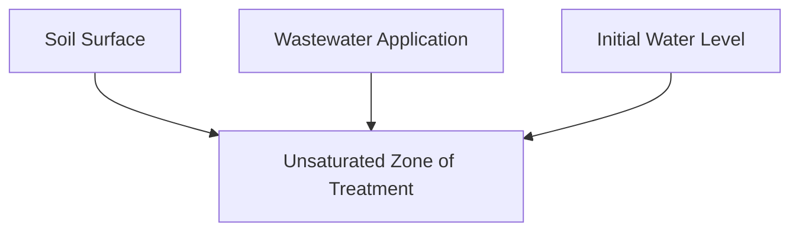

FIGURE 5.1 Schematic of rapid infiltration basin.
\n---\n

Soils and other conditions permitting, rapid infiltration can produce a high degree of treatment at a low cost, as has been demonstrated by many economic comparisons with conventional technologies capable of meeting comparable effluent limitations. However, this cost advantage carries with it certain obligations on the part of system designers, builders, and operators, and these obligations must be taken seriously if rapid infiltration is to function as planned:

For example, more site investigation is typically required than with slow-rate irrigation or overland-flow treatment; and particular attention must be paid to groundwater quality issues. Rapid infiltration is site-specific. Soil and groundwater conditions compatible with rapid infiltration may be found as a general condition in some locales, while those conditions in other locales may be found in isolated pockets. In areas where conditions are generally acceptable for rapid infiltration, the engineer's primary problem will be locating the pretreatment and rapid infiltration system that optimizes transportation of wastewater to the site. When acceptable sites are some distance away from the generation point of the wastewater, it will be necessary to determine the cost-effectiveness of transporting either pretreated wastewater to the rapid infiltration site or raw wastewater to a combination pretreatment–rapid infiltration site. Where rapid infiltration sites are rare, care should be taken to preserve as much of the site as possible for rapid infiltration use. Special care in construction is also called for when detailed specifications and inspection procedures are needed to ensure that earthwork performed on-site does not adversely affect the infiltration capacity of the basin surfaces.

Finally, rapid infiltration may require more exacting operation and management than other land-based treatment systems to achieve the long-term objectives of good treatment and continued acceptance of design loadings. A summary of case histories of unsatisfactory systems (Reed et al., 1985) provides ample evidence that shortcomings in any of these critical areas will likely result in some type of failure.

General requirements for a satisfactory rapid infiltration system include a sufficient area of permeable, well-drained soils deep enough to achieve treatment performance objectives. Because the system's effect on groundwater quality will always be of paramount concern, the hydrogeological characteristics beneath the site should be investigated so that final
\n---\n

# 2.0 REGULATORY ISSUES

The applied effluent that percolates to saturated groundwater is normally not regulated by the Clean Water Act unless there is a direct connection of the groundwater to a surface water. Land application of treated wastewater is regulated by individual states and there are significant differences from state to state much as there are differences in water rights. In some states, a National Pollutant Discharge Elimination System (NPDES) permit and a land application permit may be required. Because most states have primacy for NPDES permitting, the permitting process may not be too redundant if the programs are well coordinated.

With the advent of the total maximum daily loads (TMDLs) process for many river and lake watersheds and groundwater regulations to protect drinking water, regulatory control of high-rate land application has become more rigorous. Some states not only regulate the resultant groundwater quality, but also the quality of treated effluent applied to the rapid infiltration system. Idaho, for instance, has a statutory code limiting the 30-day average applied total nitrogen concentration to 20 mg/L. There is little scientific basis to these types of regulations, but they are a reality. These regulations will obviously affect the degree of pretreatment necessary to meet application and water quality requirements.

Regulatory requirements have also been impacted by advances in membrane and water reuse technology. Expectations for the use of best available technology have risen and effluent limitations have become more stringent. Discharge limitations for phosphorus have been set as low as 0.02 mg/L in phosphorus-impacted basins. Soil systems are not capable of consistently attaining phosphorus removals of this magnitude. A complete understanding of treatment expectations is necessary before evaluating rapid infiltration as a treatment alternative.

A pretreatment alternative should be selected with potential changes in the regulatory environment in mind. Upgrading a facultative or aerated lagoon treatment system by adding a rapid infiltration system has been a successful strategy because of the cost-effective significant improvement in effluent quality. However, there is little opportunity to upgrade lagoon treatment to meet a more stringent effluent requirement: Therefore,
\n---\n

## 3.0 SITE INVESTIGATION, EVALUATION, AND SELECTION

pretreatment systems preceding rapid infiltration should be selected carefully, with the ability to adapt treatment to meet more stringent effluent requirements.

In the preliminary stage of selecting a wastewater treatment alternative, numerous alternatives usually meet the treatment objectives. The cost-effectiveness of rapid infiltration often depends on the rapid infiltration site being located within a short distance of the generation point of the wastewater.

A method for limiting the areas being investigated for a rapid infiltration site is to determine the life-cycle cost of other treatment alternatives. If the most cost-effective treatment alternative is used as a comparison, the reasonable costs of developing a rapid infiltration site can be estimated. If the rapid infiltration site development cost is greater than the other treatment alternative, then no further investigation of rapid infiltration will be necessary. If the rapid infiltration site development is more cost-effective than the other treatment alternative, the cost difference between the two should be determined.

The cost differential should be equated to the distance that the wastewater can be transported without exceeding the life-cycle cost of the other treatment alternative. This distance represents the radius around the generation point within which an acceptable rapid infiltration site must fall to be cost-effective. The procedures identified in this section should be followed when identifying an acceptable site within that radius.

Those experienced with the rapid infiltration concept rank site investigation as the critical part of system development. The fieldwork is typically divided into two major areas: that related to the soils on-site and that related to the hydrogeology beneath the site.

### 3.1 Soils Work

In some regions of the United States, soil characteristics were determined previously by the Soil Conservation Service (SCS) and are available in the form of reports called "soil surveys". Although SCS is now known as Natural Resources Conservation Service (NRCS), older publications will still be found under SCS. The local office of NRCS or the county agent is a good place to start. Web-based soil surveys may be found at http://websoilsurvey.nrcs.usda.gov/app/. If no prior work can be found, retaining a qualified soil scientist to conduct the soil survey and mapping is recommended:

\n---\n

With information about wastewater volume and strength, site topography, and estimated permeability ranges for the site soils, a preliminary determination about whether the site should be investigated in more detail can often be made. The soil mapping data should be examined carefully to recognize that, although the upper soil profile may not be acceptable for rapid infiltration, lower layers may be excellent for rapid infiltration. In most cases, some form of earthwork such as leveling, stripping unacceptable overburden, or even over-excavating and replacing with acceptable soil may be cost-effective.

Over-excavating and replacing soil in a rapid infiltration basin can only be accomplished when the soil media are uniform and considerable quality control is exercised during construction. The cost analysis must reflect the cost of moving and placing the material in such a manner.

The soil column must be carefully examined not only to determine the limiting soil layer, but also to determine soil layers of high permeability. Figure 5.2 is useful for relating the estimated permeability of the most restrictive layer in the soil profile to the probable range of hydraulic application rates for municipal or low-strength industrial wastewater without complicating factors such as excessive total suspended solids (TSS) and oil and grease.
\n---\n

# Permeability and Wastewater Infiltration Diagram

- Possible Range of Long Term Infiltration for Wastewater
- Range of Application Rates — In Practice
  - Slow Rate Systems
  - Rapid Infiltration
  - Arbitrary Division Between Slow Rate and Rapid Infiltration Systems

- Permeability Rates of Most Restrictive Layer in Soil Profile, in /h
  - Permeability Soil Conservation Service Descriptive Terms

  

<table>
    <thead>
      <tr>
        <th>Very Slow</th>
        <th>Slow</th>
        <th>Moderately Slow</th>
        <th>Moderate</th>
        <th>Moderately Rapid</th>
        <th>Rapid</th>
        <th>Very Rapid</th>
      </tr>
    </thead>
    <tbody>
      <tr>
        <td>&lt;0.08</td>
        <td>0.06-0.20</td>
        <td>0.20-0.60</td>
        <td>0.60-2.0</td>
        <td>2.0-8.0</td>
        <td>8.0-20</td>
        <td>&gt;20.0</td>
      </tr>
    </tbody>
  </table>

\n---\n

## FIGURE 5.2 Soil permeability versus ranges of application rates for slow-rate and rapid infiltration treatment.

If the site shows promise according to this preliminary analysis, investigations should be expanded and intensified. The next step is to determine the actual infiltration characteristics of the various layers of the upper soil profile to identify the most restrictive layers and their hydraulic acceptance rate.

Although many techniques are available for making these measurements (U.S. EPA, 1981), the double-ring infiltrometer test has been used most often (see Chapter 4 for additional discussion). Figure 5.3 shows the basic test setup. An American Society for Testing and Materials (ASTM) standard for double-ring infiltrometer (ASTM 3385) has also been developed: While there may be some differences in the Process Design Manual for Land Treatment of Municipal Wastewater (U.S. EPA, 1981) and the ASTM standard, the basic concept is similar. Before results are used for the final design, some experience should be gained using the double-ring infiltrometer method to determine the vertical component of hydraulic conductivity. Although the testing procedure is not complex, incorrect procedures can seriously affect the final design.
\n---\n

# Cylinder Infiltration (Figure 5.3)

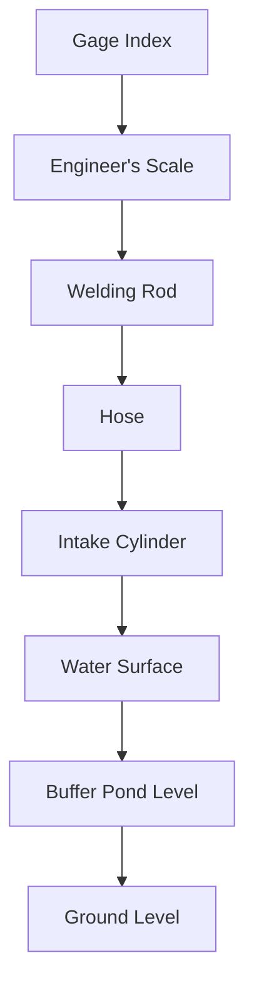

FIGURE 5.3 Cylinder infiltration is used to determine soil infiltration characteristics.

For example, consider the effect of water temperature; a test run in near-freezing temperatures may produce intake rates approximately one-half of those obtained at 27 °C (80 °F) because of the difference in viscosity.

The measurement cylinder has sharp edges to facilitate its placement in the soil. However, in gravelly soils, it may be difficult to work the cylinder into the soil using the

\n---\n

usual method, which involves placing a steel plate or piece of lumber over the cylinder and hammering it into the soil. In most cases, even in gravel or cobbles, the rings can be driven and a tight seal achieved. However, the useful life of the rings will be significantly reduced.

There are other options for driving the rings. The cylinder may be placed in a shallow excavation followed by carefully backfilling and puddling the soils around its edges. The buffer pond shown in Figure 5.3 can be formed by using another cylinder with a larger diameter or by diking a pond around the measurement cylinder: The cylinder placement in the soil and the outer buffer pond ensure that the primary component of flow from the measurement cylinder is in the vertical direction. These precautions become more important as the texture of the soil becomes finer:

These measurements should be made at several locations around the proposed site and at several depths in the soil profile, ranging from the probable basin surface elevation to a depth of 1.5 to 1.8 m (5 to 6 ft) below this elevation. Backhoe pits, carefully finished by hand excavation, are well suited for this purpose. Although this is a common measurement technique, its simplicity gives rise to several possible pitfalls. Most of these and suggested methods of statistical treatment of the data are discussed in U.S. Environmental Protection Agency (U.S. EPA) design manuals (U.S. EPA, 1977, 1981, 1984, 2006).

After using double-cylinder tests, several design firms opted to perform one or more tests on a larger scale, using basins approximately 3 m (10 ft) in diameter to fine-tune their estimates of the infiltration rate. These tests (U.S. EPA, 1981) require a large volume of water and, hence, are difficult to perform at many remote locations. However, they are recommended for large projects.

For projects involving industrial wastes that have characteristics different from domestic wastewater, it is often recommended that these large basin tests are performed using the actual wastewater over many cycles of dosing, drainage, and resting. However, to be meaningful, such pilot-scale testing would have to be performed for a longer period of time than clean-water testing, perhaps 3 to 6 months. The lengthy time requirement is often a problem with the procedure, requiring that a larger safety factor be applied to the clean-water acceptance rate data.
\n---\n

No specific guidance is available regarding safety factor requirements. In general, safety factors must be related to wastewater strength. The safety factors are typically arrived at empirically. It is recognized that existing methods of measuring the infiltration rates such as double-ring infiltrometers and basin flooding reflect short-term clean water infiltration rates. Actual sustainable design infiltration rates using treated or partially treated wastewater represent a small fraction of the field-measured rates. Commonly used safety factors for rapid infiltration design hydraulic loadings, expressed as a percentage of the equilibrium hydraulic acceptance rate as measured by the field technique just described, are 2 to 4% for the double-cylinder test and 10 to 15% for the basin flooding test, both conducted with clean water (U.S. EPA, 1981). Where significant earthwork fill is used, it may be necessary to lower the ratio to 1%.

An item that should be observed during double-ring infiltrometer testing or basin flooding is the surface of the soil after the water has infiltrated entirely. In some soils, the fines have a tendency to suspend in the water when it is applied, and then they form a uniform mat of fines over the surface of the soil after drying. In some cases, this mat can severely reduce the projected infiltration capacity. If the tendency is initially recognized, provisions can be taken to prevent severe plugging problems by planting grass to prevent suspension of the fines.

It may also be of interest to determine the grain size distribution of the soil and relate it to the results of the double-ring infiltrometer. The effective size and uniformity coefficients developed from grain size distribution, when related to the double-ring infiltrometer rates, will allow soils to be evaluated for infiltration rate without conducting the double-ring infiltrometer tests. This information can be valuable for identifying potential problem areas in rapid infiltration basins during the construction phase.

## 3.2 Hydrogeology

Following field investigation of the infiltration rate, the next logical step involves more extensive subsurface exploration to determine the presence of groundwater and impermeable layers. Existing well-drilling logs may be available to assist with this part of the evaluation. However, because producing wells are rarely present on a proposed site, a few deep holes will typically be required for this evaluation.

\n---\n

If a water table aquifer is encountered, at least three wells will be necessary to define the local water table gradient, and the wells will need to be in a triangular pattern. If preliminary findings indicate that the prevailing groundwater flows in an undesirable direction (e.g., toward an offsite private or public water supply well), the site may be dropped from consideration or more work may be performed to obtain data for designing mitigation techniques such as a line of recovery wells to prevent offsite migration of percolate. However, such measures carry increased environmental risk and add to the capital and operating costs of a project. They probably also require an NPDES permit for discharge of the recovered percolate: Thus, abandoning the site would be the most likely outcome under these circumstances.

If no problems with percolate migration exist (e.g., if it were certain that the percolate eventually recharged surface water), the next concern would be the geometry of the groundwater mound that would be established beneath the site in response to the applied wastewater. Many different boundary conditions are possible, and no single mathematical expression is available to calculate mound growth and decay. However, given the following information, part of which is assumed from the preliminary system layout, some reasonable approximation of mound height can be found in the literature (Crites et al., 2000; U.S. EPA, 1977, 1981, 1984, 2006). Necessary input data include

- Geometry of the rapid infiltration basin system;
- Average hydraulic loading rate;
- Depth to the existing groundwater table (minimum depth if it fluctuates seasonally);
- Slope of the groundwater table if it cannot be assumed to be horizontal;
- Depth to the impermeable layer;
- Horizontal hydraulic conductivity of the soil in the aquifer (it is possible that a composite of several layers with different conductivity values exists, and a depth-averaged value must be used [Crites et al., 2000; U.S. EPA, 1981]);
- Effective porosity of the soil; and
- Elevation of and distance to any horizontal control such as a stream, river, or lake water surface.
\n---\n

# Mound height analysis and drainage considerations

If mound height analysis indicates that the mound might encroach into a portion of the unsaturated zone needed for treatment (usually selected as being approximately 1.5 to 2.5 m [5 to 8 ft] beneath the basin surface), several options may be available, all of which increase costs. These include increasing the area of basins, increasing the spacing between basins, and providing drainage facilities or recovery wells. Mound rise can be minimized by using basins that have a high aspect ratio rather than square or circular geometries. Crites et al. (2000) and U.S. EPA (1977, 1981, 1984) give some general concepts of under-drainage field investigation; more detailed information can be found in publications by Luthin (1973), the U.S. Department of Agriculture (USDA) (1971), and the U.S. Department of the Interior (DOI) (1978).

A high groundwater table (0.6 to 1.5 m [2 to 5 ft]) does not necessarily preclude use of the site for infiltration. In many cases, the groundwater table can be lowered by installing drains. By knowing the direction of groundwater flow, the lateral hydraulic conductivity of the soil, and depth of the impermeable layer, a design of a cut-off drain or series of underdrains can be determined using procedures from USDA (1971) and DOI (1978). An example of a cut-off drain and underdrain used in the same system is shown in Figure 5.4:

In these situations, it is important to acquire some knowledge of the source and magnitude of the groundwater so that drain sizing is adequate to handle any anticipated future conditions. In summary, subsurface flow, mounding, and drainage are critical to the evaluation and eventual selection or rejection of the site based on technical and economic feasibility.
\n---\n

### FIGURE 5.4 Typical underdrain layout for rapid infiltration:

<div>
<Mermaid diagram>

```mermaid
graph TD
  A[Underdrain Layout] --> B1[Line 1]
  A --> B2[Line 2]
  A --> B3[Line 3]
  A --> B4[Line 4]
  A --> B5[Line 5]
  A --> B6[Line 6]
  A --> B7[Line 7]
  A --> B8[Line 8]
  A --> B9[Line 9]
  A --> B10[Line 10]
  A --> B11[Line 11]
  A --> B12[Line 12]
  B1 --> C1[Basin No. 1]
  B2 --> C2[Basin No. 2]
  B3 --> C3[Basin No. 3]
  B4 --> C4[Basin No. 4]
  B5 --> C1
</br>```
</Mermaid>
</div>

> Legend
> - Cleanout
> - Drain Pipe
> - Force Main
> - Gravity Sewer

----

## 4.0 PREAPPLICATION TREATMENT

Minimum levels of preapplication treatment suggested by U.S. EPA guidelines are (1) primary treatment in isolated locations with restricted public access and (2) biological (not necessarily full secondary) treatment by lagoons or in-plant processes at urban sites with controlled public access.

However, designers of rapid infiltration systems should consider preapplication treatment in terms of system objectives rather than any minimum guidelines. The objectives may be simple (i.e., maximize infiltration rates) or complex (i.e., maximize nitrification and coliform removal).
\n---\n

removal while maintaining maximum infiltration rates) Crites et al. (2000) suggest starting with effluent objectives and working backward through the soil column to estimate wastewater characteristics that can safely be applied to basins. Calculating the expected performance of the soil column based on water quality objectives will establish the preapplication treatment and undoubtedly bring to mind specific necessary levels of processes that can be used to accomplish pretreatment:

Total life-cycle cost analysis will lead to final process selection. Cost analyses should consider the consequences of not removing wastewater constituents that are known to increase rapid infiltration basin maintenance. An example would be excessive TSS. It will probably prove less expensive in the long run to remove more TSS in the preapplication treatment process than to remove them from the basin surfaces at frequent intervals while concomitantly experiencing decreased infiltration rates that result from the buildup of solids mats.

Another approach, which must also consider system objectives, is to determine the limiting design parameter (LDP), which can be hydraulics, biochemical oxygen demand (BOD), TSS, nitrogen, phosphorus, oil and grease, or metals. The LDP determines how large the infiltration basins will be.

Minimal pretreatment of municipal wastewater may consist of a small, aerated (partial-mix) lagoon with a detention time of 5 days, followed by a small secondary lagoon cell with a detention time of 1 day. A properly designed aerated facultative lagoon will allow the settling of solids, and aeration prevents odors. Effluent from an aerated lagoon should not be consistentlyapplied to rapid infiltration basins because the solids tend to plug the basin surface. The second cell, with a 1-day detention time, is adequate to settle the aerated solids. A system such as this will have a characteristic discharge, and, based on the system objectives, the LDP and the size of the rapid infiltration basin can be determined.

If BOD is the LDP, then additional pretreatment such as longer detention times and more aeration can be examined to reduce the rapid infiltration area. The determining factor will be the cost of additional pretreatment versus the cost of additional rapid infiltration basins if pretreatment is not used:
\n---\n

## 5.0 REMOVAL MECHANISMS, PROCESS EXPECTATIONS, AND BASIS FOR DESIGN

Because of the variability and complexity of industrial wastes, using pretreatment to remove some LDPs from industrial wastewater is usually more cost-effective than using it for conventional municipal wastewater. As discussed in Section 2.0, pretreatment systems that can be upgraded to meet more stringent requirements should be selected.

Basic removal mechanisms in rapid infiltration systems are the same as those discussed in Chapter 4, except that nutrient uptake by vegetation does not occur because most systems do not use vegetation as part of the process. Because liquid detention times in the soil column are typically less with high rates of application, corresponding increases in the effective depth is the normal method of compensation. Several successful rapid infiltration systems have been developed using an unsaturated soil column depth of only 1.2 to 1.8 m (4 to 6 ft) as the treatment zone. These systems must often use underdrainage to function effectively:

Process expectations are probably best approached by considering the undiluted percolate quality characteristics measured in well-designed and operated systems that have been used for long periods of time. Many such quality studies have been conducted, most of them for U.S. EPA, to demonstrate the effectiveness of rapid infiltration technology. Performance data, loadings, and sampling depths can be found in various publications by U.S. EPA (2006, 1981, 1977). These data cover BOD, nitrogen, phosphorus, trace metals, fecal coliforms, and selected trace organics. Additional useful data can be found in *Design of Land Treatment Systems for Industrial Wastes Theory and Practice* (Overcash and Pal, 1979).

Table 5.1 provides a summary of representative data from the aforementioned references. Biochemical oxygen demand, TSS, nitrogen, phosphorus, oil and grease, and metals can be treated using rapid infiltration. Although the mechanisms for removing each of the constituents may be compatible, in some cases, the optimum conditions for removing one constituent may prevent removal of other constituents.

No soil type offers the optimum conditions for removing the constituents listed in Table 5.1. Fine-textured soils, such as silt loams, are highly effective at removing BOD, nitrogen, phosphorus, TSS, and fecal coliform. However, fine-textured soils have lower hydraulic conductivity.
\n---\n

conductivity, lower re-aeration rates, and less available solids storage. Therefore, hydraulic loading rate and rest cycle control the sizing of the rapid infiltration basin. Sandy or coarser soils usually have a lower cation exchange capacity (CEC) and will not immobilize large quantities of nitrogen in the form of ammonium or complex phosphorus in the soil column. However, the sand will have a higher hydraulic conductivity and re-aeration rate that will allow higher BOD loadings and shorter rest cycles after loading.

Fecal coliform removal can be successful in sand, but it is limited in gravels. If the sands are very coarse, it may be necessary to activate the surface by continuous wastewater application for 3 to 5 days. The continuous application of wastewater develops a mat of organisms in the surface of the soil, which will increase fecal coliform removals. Activating the surface will reduce the hydraulic conductivity of the soil, and care must be taken so that anaerobic conditions are not established, which would reduce BOD removals and further reduce hydraulic conductivity:

## Table 5.1 Summary of typical performance data from rapid infiltration systems (U.S. EPA, 1977, 1981).

<table>
<thead>
<tr>
<th>Parameter</th>
<th>Loading, lb/ac-d*</th>
<th>Removals, %</th>
<th>Comments</th>
</tr>
</thead>
<tbody>
<tr>
<td>BOD</td>
<td>40-158</td>
<td>86-100</td>
<td>Lower values associated with poorly designed systems.</td>
</tr>
<tr>
<td>Nitrogen</td>
<td>3-37</td>
<td>10-93</td>
<td>Depends strongly on preapplication treatment, BOD, nitrogen, hydraulic loading rate, and wet–dry cycle.</td>
</tr>
<tr>
<td>Phosphorus</td>
<td>0.9-11.8</td>
<td>29-99</td>
<td>Removals correlate strongly with travel distance.</td>
</tr>
<tr>
<td>Fecal coliform</td>
<td>—</td>
<td>2 to 6 logs</td>
<td>Removals correlate with soil texture, travel distance through soil, and resting time.</td>
</tr>
<tr>
<td>Suspended solids</td>
<td>30-100</td>
<td>100</td>
<td>Dependent on rest cycles, surface scarification, and cleaning.</td>
</tr>
</tbody>
</table>

* lb/ac-d × 1.297 × 10^-9 = kg/m^2·s.

\n---\n

<table>
<thead>
<tr><th>Parameter</th><th>Loadings 1</th><th>Loadings 2</th><th>Remarks</th></tr>
</thead>
<tbody>
<tr><td>Nitrogen</td><td>3-37</td><td>10-93</td><td>Depends strongly on preapplication treatment, BOD, nitrogen, hydraulic loading rate, and wet–dry cycle</td></tr>
<tr><td>Phosphorus</td><td>0.9-11.8</td><td>29-99</td><td>Removals correlate strongly with travel distance.</td></tr>
<tr><td>Fecal coliform</td><td>—</td><td>2 to 6 logs</td><td>Removals correlate with soil texture, travel distance through soil, and resting time</td></tr>
<tr><td>Suspended solids</td><td>30-100</td><td>100</td><td>Dependent on rest cycles, surface scarification, and cleaning</td></tr>
</tbody>
</table>

Iblacd X 1.297 X 10-9 kglm?-s

In attempting to predict the performance of a proposed rapid infiltration system, it is probably best, following preliminary selection of basin loadings, to search the existing literature for data on similar systems (i.e., soil texture, depth, and hydraulic loadings), beginning with publications by U.S. EPA (1981, 1977), Crites et al. (2000), and Overcash and Pal (1979). For BOD and TSS, the two pollution parameters of typical interest, data are available showing greater than 99% removals at loadings approaching 78.5 to 89.7 g/m2·d BOD (Loehr et al., 1979; Stevens, 1972). However, such high loadings are associated with specific site conditions, will typically require intensive basin management, and will probably meet resistance from state regulatory agencies if offered as design values.

Table 5.2 shows loadings for 1 year of operation of a rapid infiltration system at a rendering plant located in Ontario, Oregon, an area of high desert with temperatures ranging from -29 °C to 43 °C with less than 305 mm (12 in.) of yearly precipitation. These loadings far exceeded the design value because of the operation of the facility. The industrial rapid infiltration system discussed in Table 5.2 represents a specific situation in which large nitrogen concentrations would have required approximately 40 ha (100 ac) of slow-rate land application to meet nitrogen requirements. Nitrogen concentrations in the
\n---\n

# TABLE 5.2 Loading summary of rendering plant waste to a rapid infiltration system

<table>
<thead>
<tr><th>Parameter</th><th>Value</th></tr>
</thead>
<tbody>
<tr><td>Number of basins</td><td>7</td></tr>
<tr><td>Total area</td><td>0.3 ha</td></tr>
<tr><td>Hydraulic loading</td><td>27 m/a</td></tr>
<tr><td>Hydraulic loading (percent of measured double-ring infiltrometer rate)</td><td>2.57%</td></tr>
<tr><td>Cycle time</td><td>1-day application, 6 days rest</td></tr>
<tr><td>BOD loading</td><td>1050 kg/ha·d</td></tr>
<tr><td>Nitrogen loading</td><td>123 kg/ha·d</td></tr>
<tr><td>Depth to groundwater</td><td>5.5 m</td></tr>
<tr><td>Soil type</td><td>Sandy loam</td></tr>
<tr><td>Monitoring wells</td><td>1 upgradient, 3 downgradient</td></tr>
</tbody>
</table>

\n---\n

<table>
<tr><td>Monitoring wells</td><td>upgradient; 3 downgradient</td></tr>
</table>

Because of extremely high BOD loadings and periodic upsets in the production facility, which resulted in excessive TSS discharge to the rapid infiltration basins, operation and maintenance (O&M) requirements included manual removal of solids from the basin on a weekly basis and rototilling of the basin several times a year. The total basin area was small, and manually removing solids using shovels and wheelbarrows was not prohibitive.

If loadings of this magnitude are considered where the natural conditions are not adequate to restore the soil to its original hydraulic conductivity, then plans must be made to maintain the system by removing solids or aerating the soil. This system was undoubtedly loaded to the maximum limit, and continued use without special operating provisions may have resulted in severe deterioration of percolate quality.

More reasonable loadings from an actual lagoon effluent of a domestic wastewater to a rapid infiltration system are shown in Table 5.3. The system is located in Eagle, Idaho, which has a temperature range of -29 °C to 43 °C with less than 12 in. of yearly precipitation. The loading values shown in Table 5.3 are actual loadings that are approximately 50% of the design loadings. The goals of the system were to maximize infiltration rates and prevent nitrate contamination of the groundwater. In more than 54 months of operation, the basins were only scarified by disking on one occasion:

Nitrogen loading represents a loading of 828 kg/a (1825 lb/yr). This loading would be several times what is acceptable for a slow-rate system. The initial background nitrate concentrations in the three monitoring wells ranged from 20 to 55 mg/L as nitrogen. The large nitrate concentrations were attributed to feedlot operations, agricultural practices, and septic tank drain fields. After 5 years of continual operation of the rapid infiltration basins, nitrate concentrations in the wells ranged from 3 to 9.5 mg/L. The three down-gradient monitoring wells presently meet all primary and secondary drinking water standards. In addition, limited Escherichia coli monitoring at a level of 1.5 to 2.4 m (5 to 8 ft) indicates consistent removals to 50 colonies/100 mL

TABLE 5.3 Loading summary of lagoon effluent to a rapid infiltration system.
\n---\n

## Set A

<table>
<thead>
<tr><th>Parameter</th><th>Value</th></tr>
</thead>
<tbody>
<tr><td>Number of basins</td><td>4</td></tr>
<tr><td>Total area</td><td>2.1 ha</td></tr>
<tr><td>Hydraulic loading</td><td>20 m/a</td></tr>
<tr><td>Hydraulic loading (percent of measured double-ring infiltrometer rate)</td><td>1.86%</td></tr>
<tr><td>Cycle time</td><td>1-day application, 6 days rest</td></tr>
<tr><td>BOD loading</td><td>1050 kg/ha·d</td></tr>
<tr><td>Nitrogen loading</td><td>123 kg/ha·d</td></tr>
<tr><td>Depth to groundwater</td><td>5.5 m</td></tr>
<tr><td>Soil type</td><td>Sandy loam</td></tr>
<tr><td>Monitoring wells</td><td>1 upgradient, 3 downgradient</td></tr>
</tbody>
</table>

## Set B

<table>
<thead>
<tr><th>Parameter</th><th>Value</th></tr>
</thead>
<tbody>
<tr><td>Number of basins</td><td>4</td></tr>
<tr><td>Total area</td><td>2.1 ha</td></tr>
<tr><td>Hydraulic loading</td><td>20 m/a</td></tr>
<tr><td>Hydraulic loading (percent of measured double-ring infiltrometer rate)</td><td>1.86%</td></tr>
<tr><td>Cycle time</td><td>1-day application, 6 days rest</td></tr>
<tr><td>BOD loading</td><td>1050 kg/ha·d</td></tr>
<tr><td>Nitrogen loading</td><td>123 kg/ha·d</td></tr>
<tr><td>Depth to groundwater</td><td>5.5 m</td></tr>
<tr><td>Soil type</td><td>Sandy loam</td></tr>
<tr><td>Monitoring wells</td><td>upgradient; 3 downgradient</td></tr>
</tbody>
</table>

\n---\n

Although loadings described in this example are low for a rapid infiltration system, the overall operation represents an example of a successful small system that is reliable and has not required excessive O&M. As loadings increase and this system accommodates higher flows, then O&M efforts must increase.

The most common bases for designing a proposed rapid infiltration system include hydraulic loading and loadings calculated to control any or all of the parameters listed in Table 5.1. Because it is typically not known in advance which parameter will control the design, it is best to estimate the performance of the system with respect to each parameter at the proposed hydraulic loading rate and method of operation (wet–dry cycle) to determine the controlling parameter. If this limiting parameter cannot be expected to be held to prescribed limits, the design and operation must be modified to meet performance objectives. If expected performance of the rapid infiltration system cannot be met on the given site, a new site must be located or the rapid infiltration concept dropped from consideration.

# 6.0 PROCESS DESIGN

Details of process design for rapid infiltration systems are treated in-depth by Reed and Crites (1984) and U.S. EPA (1977, 1981, 1984, 2006) and, therefore, are not repeated here. This section describes a reasonable sequence of events in a typical design, as adapted from Crites et al. (2000). The outline assumes that an adequate area of suitable soil exhibiting infiltration characteristics that support the rapid infiltration concept is available and that the infiltration rates around the site were measured by an acceptable technique as previously described. Process design then proceeds as follows:

1. Select a safety factor for the measured infiltration rate that recognizes the probable applied wastewater strength in wet and cold weather conditions and that supports the performance objectives of the system. Some general type of preapplication treatment or storage is being assumed, although it may be changed as the design progresses.

2. Determine the hydraulic pathway of the percolate based on hydrogeologic investigations. Typically, the percolate will either recharge a body surface water or become part of a regional groundwater flow:

3. Determine treatment needs by consulting state regulatory or U.S. EPA officials, depending on the ultimate fate of the percolate and which agency has primary jurisdiction

\n---\n

# 7.0 DESIGN EXAMPLE

Raw wastewater characteristics are as follows:
- Average flow = 0.06 m3/s (1.3 mgd),
- Average BOD = 680.0 kg/d (1500 lb/d),
- Average SS = 544.3 kg/d (1200 lb/d), and
- Average nitrogen as N = 113.4 kg/d (250 lb/d).

Soil maps from SCS (now NRCS) indicate that several areas of silty sand with depths greater than 1.5 m (5 ft) exist. Soils have permeabilities of 5 to 15 cm/h (2 to 6 in./hr):
Groundwater data obtained from the state department of water resources show a shallow
\n---\n

aquifer above a clay layer at 13.7 to 18.3 m (45 to 60 ft). The clay layer confines a deeper aquifer. The shallow aquifer consists of gravels and cobbles overlaid with sandy gravels. The upper aquifer is low yielding, with recharge limited to local surface irrigation and precipitation.

Based on this preliminary examination, it seems that the potential for a rapid infiltration system exists. Preliminary sizing of pretreatment and rapid infiltration systems is based on the following: pretreatment will consist of an aerated lagoon sized to prevent odors and accommodate stabilization of the solids, followed by a non-aerated lagoon that provides settling of solids and equalization for pumping to the rapid infiltration basin.

The expected characteristics of the effluent that will be applied to the rapid infiltration system from the lagoon system are as follows:

* Average flow = 0.06 m3/s (1.3 mgd),
* Average BOD = 204.1 kg/d (450 lb/d),
* Suspended solids = 147.4 to 294.8 kg/d (325 to 650 lb/d),
* Total nitrogen = 102.1 kg/d (225 lb/d)

The pretreatment facility will be located on a site already owned by the city, which is located to allow gravity-draining of the collection system. Because the pretreatment site is located in an alluvial plain with high groundwater and excessively drained gravels, the rapid infiltration site will be remote from the pretreatment site.

Preliminary sizing of rapid infiltration basins is based on hydraulic loading, using the low end of permeability reported in the SCS data. The required surface area based on hydraulic loading is as follows:

* Clean-water infiltration rate = 6.4 cm/h (2.5 in./h), and
* Adjustment factor for infiltration = 4%.
\n---\n

# Rapid Infiltration Basin Sizing (Excerpt)

## Design application rate
- The design application rate = 6.4 cm/h (0.04 adjustment)
- = 2.5 mm/h (0.1 in./hr)
- = 60.1 mm/d (2.4 in./d)

## Rapid infiltration surface area (preliminary)
- Rapid infiltration surface area (preliminary) = (5180 m^3/d)(10^-4 ha/m^2)
  (60.1 mm/d)(10^-3 mm/m)
  = 8.6 ha (20 ac)

## Life-cycle cost estimates
Life-cycle cost estimates are developed for pretreatment and rapid infiltration systems without using the costs of transportation from pretreatment to the rapid infiltration site. The next most cost-effective alternative had a life-cycle cost that was $500,000 more than the life-cycle costs of the rapid infiltration system without transportation costs. Based on economics, the acceptable rapid infiltration site must be within a radius of 5.6 km (3.5 miles).

## Site selection criteria
Three sites with acceptable soil and groundwater conditions are selected using the SCS maps. The site closest to the pretreatment facility is selected for further investigation. The selected site consists of rolling silty sand, with groundwater at a depth of 13.7 m (45 ft), over an impermeable layer at a depth of 183 m (60 ft).

## Groundwater and aquifer information
The averagedouble-ring infiltrometer infiltration rate is 12.2 cm/h (4.8 in./hr). Based on existing wells and well logs, the direction of groundwater flow is determined to be north to south through the site, ultimately discharging to a surface drain 610 m (2000 ft) south of site. The existing aquifer is a shallow, unconfined, low-yielding aquifer. However, regulatory requirements state that percolated wastewater leaving the site must meet federal drinking water quality standards.

## Basin sizing (final)
Initial sizing of the rapid infiltration basin is based on 4% of the average double-ring infiltrometer infiltration rate (60.1 mm/d)(10^-3 mm/m). Rapid infiltration basin area (final) is as follows:
- Measured infiltration rate = 12.2 cm/h
- Design application rate = 0.04 (12.2 cm/h) = 0.49 cm/h (0.19 in./hr)
- Rapid infiltration surface area = 4.2 ha (10.4 ac)

\n---\n

## Seven basins and loading parameters

Seven basins, each 0.6 ha in surface area based on the 4.2-ha (10.4-ac) area, check other loadings as follows:

- BOD loading = 48.5 kg/ha·d (43.2 lb/ac·d),
- TSS loading = 70.2 kg/ha·d (62.5 lb/ac·d),
- Nitrogen = 24.2 kg/ha·d (21.5 lb/ac·d).

The silty sand seems to be capable of achieving coliform removal. Phosphorus is not a regulatory consideration.

All loading parameters seem to fall in an acceptable range, as shown in Table 5.1. The LDP is flow. The site configuration is rectangular, with the long axis perpendicular to the direction of groundwater flow. The rotation of application will be 1 day of application, followed by 6 days of rest. Based on this configuration, the site must be examined for groundwater mounding. The horizontal hydraulic conductivity, determined by testing, is 14.6 m/d (48 ft/d).

## 7.1 Mounding Analysis

Because the configuration of basins is long, the following equation (U.S. EPA, 1977) is used to determine the severity of ultimate groundwater mounding:

$$
Y = \left(\frac{v}{k d i}\right) (L_d x)
$$

Where

- Y = mound height above original groundwater elevation, m;
- v = application rate, m³/m of infiltration basin length;
- k = horizontal hydraulic conductivity, m/d;
- d = depth of groundwater over the impermeable layer, m;
- i = slope of impermeable layer, m/m;
- L_d = distance to lateral control (drain or stream being recharged), m; and
- x = distance from application point where the mound rise will occur, m.
\n---\n

For example,

Y = mound height

v = 0.06 m^3/s
    = (0.06 m^3/s)/(304.8 m)
    304.8 m

k = 14.6 m/d
d = 4.6
Ld = 610 m
x = 0
i = 0(Y)
[17 m^2/d]

Y = [(14.6 m/d)(4.6 m)] - 0(610 m - 0) = 154.4 m

Obviously, mounding will be a problem, and underdrains with a discharge point will have to be constructed. Design spacing is calculated as follows (Culp et al., 1978):

$$
S^2 = \frac{4KH(2d + H)}{V} \quad (5.2)
$$

Where

- S = drain spacing, m;
- K = horizontal hydraulic conductivity, m/d;
- V = average application rate of water to the basins, m/d = mD
where

- m = depth of water application to the basins, m, and

- D = time of application plus the resting time before the next application, d;

- d = distance to impermeable layer below the drains, m; and

- H = allowable mound height, m.

\n---\n

# 8.0 PHYSICAL DESIGN AND CONSTRUCTION

Most of the physical elements contained in a rapid infiltration system are similar to those found in wastewater lagoons. Details of these elements can be found in Chapter 7 of this manual and in publications by U.S. EPA (1981, 1983, 1984, 2006).

The depth of the drains should be minimized to reduce installation cost. This depth must be optimized with the allowable mound height rise. The lower the allowable mound height rise, the closer the drain spacing and the higher the costs. The mound rise should be limited to 1.2 m (4 ft) of the rapid infiltration basin surface to obtain adequate treatment in the unsaturated zone.

<table>
<thead>
<tr><th>Parameter</th><th>Value</th></tr>
</thead>
<tbody>
<tr><td>Minimum drain depth</td><td>1.5 m (5 ft)</td></tr>
<tr><td>K</td><td>14.6 m/d (48 ft/d)</td></tr>
<tr><td>V</td><td>0.12 m/d (0.38 ft/d)</td></tr>
<tr><td>d</td><td>16.8 m (55 ft)</td></tr>
<tr><td>H</td><td>0.3 m (1 ft)</td></tr>
</tbody>
</table>

$$
S^2 = \frac{4(14.6\ \mathrm{m/d})(0.3\ \mathrm{m})(33.5 + 0.3)}{0.12\ \mathrm{m/d}}
$$

S = 70.2 m

The basins should be laid out and total land requirements determined, including buffer zones. Finally, the monitoring wells should be located based on the final basin configuration.

## 8.1 Configuration

Configuration of the rapid infiltration basin should be the optimal shape to use the rapid infiltration area while keeping dike areas to a minimum. A configuration that allows maintenance equipment to access the site should also be considered. There seem to be no set rules for the configuration and dimensions of each of the individual basins. When proper construction techniques are used, irregularly shaped basins seem to function as well as square basins.

\n---\n

## 8.2 Dikes

Because infiltration occurs during basin loading, dikes do not need to be tall because water is never ponded to the full height of the "dose". Although some freeboard is required, keeping dike heights as low as possible saves money; releases more area for basin surfaces, and reduces the probability of fines eroding from the dike into the basin surface, thereby reducing infiltration and increasing maintenance costs. Of course, basins designed for temporary storage will have dikes taller than normal as well as other features not found in the basins used during routine operation (U.S. EPA, 1977).

Interior slopes of the dikes should be no greater than the angle of repose for the material used to construct the dike. If the dike materials have any fines and if the slope is greater than a ratio of 3:1, the slope should be protected from erosion by vegetation or riprap. Slopes with significant fines, even at a ratio of 3:1, should have the interior bottom of the dike mounded to prevent the flow of fines into the basin. The width of the top of the dikes may be as small as 0.6 m (2 ft). Any width less than 0.6 m is difficult to construct and may lack stability. Wider dikes should be used only when access must be provided for maintenance or when rapid infiltration soil conditions are abundant and the greater width is cost-effective.

Dikes will be compacted to retard lateral seepage, and access to each basin must be provided for maintenance equipment; therefore, the dike needs to be wide enough on at least one side of any basin for equipment travel. Many systems have access ramps leading to the basin surface from roadway on a dike.

Because washout of fines from dikes during and after construction has been a frequently reported problem, using a porous envelope at the inside toe of the dike slope should be considered in design. Vegetation may also be planted on the dike slope to retard erosion. When hydraulics of the dosing system allow the accidental overdosing of a basin, which could result in overtopping the dikes, installing an overflow structure that allows the flow to transfer to another basin without damaging the dike or washing fines should be considered. Figure 5.5 shows a cross section of the dikes and the basin surface of two cells of an actual rapid infiltration system:

> Figure 5.5 shows a cross section of the dikes and the basin surface of two cells of an actual rapid infiltration system.

### 8.3 Inlet Structures

\n---\n

Small basins with low dosage rates typically require only an elbow discharging onto a splash plate. Greater inlet velocities require more complex arrangements, ranging from cobbles arranged as an apron surrounding a splash block to fairly sophisticated energy dissipation structures. The objectives of inlet design are always to prevent erosion of the dikes and surface and to provide reasonably uniform wastewater distribution.

Location of the discharge elevation to the maximum operating depth of water should be examined in relationship to possible operating conditions. If excessive icing is a possibility, the discharge of the dosing structure should be located above the maximum operating depth, and allowing the dosing pipe to freely drain or allowing the pipe contents to drain back to the pretreatment system should be considered:

<table>
<thead><tr><th>Feature</th><th>Details</th></tr></thead>
<tbody>
<tr><td>Top horizontal dimensions</td><td>229.50' (left), 228.00' (right)</td></tr>
<tr><td>Basin No. 5</td><td>Bott Elev. 57.50</td></tr>
<tr><td>Basin No. 4</td><td>Bott Elev. 58.00</td></tr>
<tr><td>Finished Ground</td><td>Shown as reference line</td></tr>
<tr><td>Existing Ground</td><td>Shown as reference line</td></tr>
<tr><td>Limiting Media</td><td>Indicated below cross section</td></tr>
</tbody>
</table>

<div>FIGURE 5.5 Typical rapid infiltration basin cross section</div>

When pumping distances may be long and it is not feasible to drain the dosing pipe back to the pretreatment facility, a localized buried drain should be provided to drain the dosing pipe after each use. If the dosing structure is capable of draining back to the inlet structure, then the discharge elevation of the dosing pipe must be set so that the basin contents cannot flow back into the dosing pipe. Figure 5.6 shows a typical dosing system in which provisions were made to drain the dosing structure.
\n---\n

# 8.4 Underdrains

Both USDA (1971) and DOI (1978) provide an excellent reference for the design of cutoff drains and underdrains. There are several manufacturers of underdrain piping and filter fabrics, and considerable data are available for designing underdrains. Underdrains have a long history of success and can have a long functional life when designed and constructed properly. Figure 5.4 shows an example of a layout of an underdrain system, and Figure 5.7 shows a cross section of the main underdrain collector from Figure 5.4.

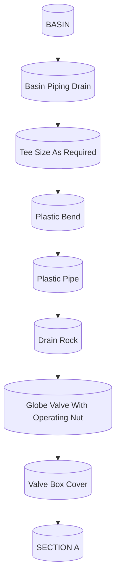

FIGURE 5.6 Typical dosing structure and piping.
\n---\n

# 8.5 Construction

After site investigation procedures, the construction process is the next element critical to the overall success of the rapid infiltration system. Construction of a rapid infiltration system may best be thought of in terms of its differences from the construction of stabilization ponds. In the latter, pond bottoms are generally restricted to a given leakage rate, for example 0.32 cm/d (0.125 in./d). Therefore, during construction without liners, great effort is expended to compact the soils so that they show minimum permeability. Such a process would be anathema to the success of a rapid infiltration basin: For a rapid infiltration basin, the contractor must be aware of the extra care required to preserve the infiltration capacity of basin surfaces during construction. The specifications

FIGURE 5.7 Typical underdrain profile for rapid infiltration system

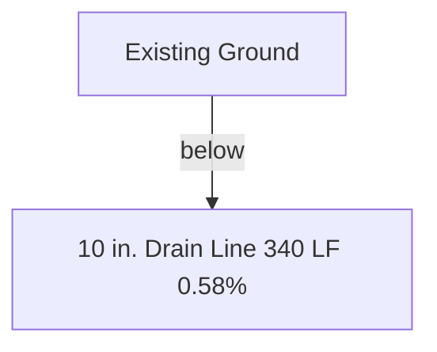
\n---\n

The information contained in the project manual should clearly identify the measured infiltration rates in the native material and state that these rates must be preserved during construction. Preservation of the natural infiltration rate should also be restated emphatically during the preconstruction conference.

Exact specifications on earthwork will differ from project to project, depending on whether the finished basin surfaces are established on cuts, fills, or a combination of both. However, the specifications should be precise to define the procedures to be followed as well as the field test used to control the progress of the earthwork (e.g., double-cylinder infiltrometer test). The double-ring infiltrometer infiltration rate should have been well established at the design investigation stage. Therefore, it is valid to include this rate in the specifications as a measure of contractor performance.

When an effective size and uniformity coefficient of the soil has been established through preliminary investigations, these limits may be used to monitor the condition of the soils in the basins as construction proceeds. At the very least, the percentage passing the No. 200 sieve size should be established and monitored carefully during construction. An increase from 1 to 4% material passing the No. 200 sieve size may determine the difference between a successful and unsuccessful rapid infiltration system.

Material that is unacceptable for the rapid infiltration basin may be used in the construction of dikes. Care must be taken so that equipment does not track dike material onto the rapid infiltration basin. If contamination of the rapid infiltration basin occurs, it must be removed and replaced to grade with acceptable material. When possible, construction plans should identify areas of acceptable and unacceptable materials, and these materials should be continually monitored during construction. Prohibition of mixing unacceptable materials containing fines or organic substances with acceptable materials of high permeability must be included. The resident engineering staff must be diligent when observing the earthwork and assume responsibility for preventing unacceptable materials from contaminating acceptable, high-permeability materials. They must also be willing to stop work when the soils are too wet to be worked on. Reed et al (1985) have reported, by case history, the dangers associated with handling soils whose moisture content is too high.
\n---\n

# 9.0 SYSTEM MANAGEMENT AND MONITORING

The tolerance of levelness should be maintained at *3 cm (0.1 ft) of the specified finished elevation. Excessive leveling or working of the rapid infiltration system should be avoided. When compaction occurs, the basin can be ripped to break up compaction and restore infiltration capacity. When underdrains are installed, care must be taken so that acceptable material compatible with in-place material is uncompacted when placed around and over the underdrains.

If a field investigation, process design (with specific performance objectives in mind), and construction have been accomplished properly, system operation should be relatively easy. Regardless of how straightforward basin operation might be, it must still be performed in a diligent manner; in accordance with the designer's intended concept as expressed in a detailed O&M manual.

With time, basin surface and near-surface characteristics may change under repeated loading cycles. Therefore, it is important that operators learn when to bring a basin back to high infiltration rates by prolonging its resting period and when to take it out of service for surface renovation. Operators must recognize when they can renovate by merely scarifying the surface and when physical removal of the organic mat is required or deep ripping is needed. For example, it is best to remove most of the dried mat before ripping because continued incorporation of accumulated organic matter typically leads to a reduced infiltration capacity.

The frequency and extent of basin maintenance can only be learned through observation and experience and cannot be unerringly predicted before system startup. If the operating staff does not learn the proper maintenance procedures and apply them, a well-designed and constructed system can still fail.

Given system with enough redundancy and flexibility, manipulating the hydraulic loading cycle is the management tool for accomplishing specific performance objectives. The cycle may be selected to maximize infiltration rate, nitrification, nitrogen removal, or some other objective. Table 5.4 presents a compilation of suggested loading cycles to accomplish various performance objectives. The shorter drying times listed apply to mild climates, whereas the longer ones apply to colder climates. Table values are suggestions, not absolutes. For example, with some effluents of low TSS content; it is possible to
\n---\n

## TABLE 5.4 Suggested rapid infiltration loading cycles (U.S. EPA, 2006)

Regardless of season or cycle objective, application periods for primary effluent should be limited to 1 to 2 days to prevent excessive soil clogging.
Periods may be significantly affected by depth to water table (mounding considerations).

<table>
<thead>
<tr>
  <th>Loading cycle objective</th>
  <th>Applied wastewater</th>
  <th>Season</th>
  <th>Application period, days^a</th>
  <th>Drying period, days^b</th>
</tr>
</thead>
<tbody>
<tr>
  <td rowspan="4">Maximize infiltration rates</td>
  <td>Primary</td>
  <td>Summer</td>
  <td>1-2</td>
  <td>5-7</td>
</tr>
<tr>
  <td>Secondary</td>
  <td>Winter</td>
  <td>1-2</td>
  <td>7-12</td>
</tr>
<tr>
  <td>Secondary</td>
  <td>Summer</td>
  <td>1-3</td>
  <td>4-5</td>
</tr>
<tr>
  <td>Secondary</td>
  <td>Winter</td>
  <td>1-3</td>
  <td>5-10</td>
</tr>
<tr>
  <td rowspan="4">Maximize nitrogen removal</td>
  <td>Primary</td>
  <td>Summer</td>
  <td>1-2</td>
  <td>10-14</td>
</tr>
<tr>
  <td> </td>
  <td>Winter</td>
  <td>1-2</td>
  <td>12-16</td>
</tr>
<tr>
  <td> </td>
  <td>Summer</td>
  <td>7-9</td>
  <td>10-15</td>
</tr>
<tr>
  <td> </td>
  <td>Winter</td>
  <td>9-12</td>
  <td>12-16</td>
</tr>
<tr>
  <td rowspan="4">Maximize nitrification</td>
  <td>Primary</td>
  <td>Summer</td>
  <td>1-2</td>
  <td>5-7</td>
</tr>
<tr>
  <td> </td>
  <td>Winter</td>
  <td>1-2</td>
  <td>7-12</td>
</tr>
<tr>
  <td> </td>
  <td>Summer</td>
  <td>1-3</td>
  <td>4-5</td>
</tr>
<tr>
  <td> </td>
  <td>Winter</td>
  <td>1-3</td>
  <td>5-10</td>
</tr>
</tbody>
</table>

<p>35Copyright © 2024 by the Water Environment Federation. For subscriber use only and not for distribution. All Rights Reserved.</p>
<p>Permission to copy must be obtained from WEF.</p>

<table>
<thead>
<tr>
  <th>Loading cycle objective</th>
  <th>Applied wastewater</th>
  <th>Season</th>
  <th>Application period, days^a</th>
  <th>Drying period, days^b</th>
</tr>
</thead>
<tbody>
<tr>
  <td>Maximize infiltration</td>
  <td>Primary</td>
  <td>Summer</td>
  <td>1-2</td>
  <td>5-7</td>
</tr>
<tr>
  <td>infiltration</td>
  <td></td>
  <td>Winter</td>
  <td>1-2</td>
  <td>7-12</td>
</tr>
<tr>
  <td>rates</td>
  <td>Secondary</td>
  <td>Summer</td>
  <td>1-3</td>
  <td>4-5</td>
</tr>
<tr>
  <td></td>
  <td></td>
  <td>Winter</td>
  <td>1-3</td>
  <td>5-10</td>
</tr>
</tbody>
</table>

\n---\n

<table>
  <thead>
    <tr>
      <th>Code</th>
      <th>System/Process</th>
      <th>Season</th>
      <th>Range</th>
      <th>Window</th>
    </tr>
  </thead>
  <tbody>
    <tr>
      <td>Maximize</td>
      <td>Primary</td>
      <td>Summer</td>
      <td>1-2</td>
      <td>10-14</td>
    </tr>
<tr>
      <td>nitrogen</td>
      <td></td>
      <td>Winter</td>
      <td>1-2</td>
      <td>12-16</td>
    </tr>
<tr>
      <td>removal</td>
      <td>Secondary</td>
      <td>Summer</td>
      <td>7-9</td>
      <td>10-15</td>
    </tr>
<tr>
      <td></td>
      <td></td>
      <td>Winter</td>
      <td>9-12</td>
      <td>12-16</td>
    </tr>
<tr>
      <td>Maximize</td>
      <td>Primary</td>
      <td>Summer</td>
      <td>1-2</td>
      <td>5-7</td>
    </tr>
<tr>
      <td>nitrification</td>
      <td></td>
      <td>Winter</td>
      <td>1-2</td>
      <td>7-12</td>
    </tr>
<tr>
      <td></td>
      <td>Secondary</td>
      <td>Summer</td>
      <td>1-3</td>
      <td>4-5</td>
    </tr>
<tr>
      <td></td>
      <td></td>
      <td>Winter</td>
      <td>1-3</td>
      <td>5-10</td>
    </tr>
  </tbody>
</table>

<p><sup>a</sup> Regardless of season or cycle objective, application periods for primary effluent should be limited to 2 days to prevent excessive soil clogging.</p>

<p><sup>b</sup> Periods may be significantly affected by depth to water table (mounding considerations).</p>

<p>Although operation characteristics of each system are different and must be learned, some conditions that occur can be anticipated. These conditions may vary from one region to another; but have typically been recurred where observed. As noted in Table 5.4, winter conditions require a longer resting period for maximizing infiltration.</p>

<p>In fact, in extremely cold regions where temperatures are subfreezing for extended periods of time, a phenomenon exists such that the cold and dry temperatures desiccate solids in the wastewater and prevent them from forming a mat that will reduce the infiltration rate. This desiccation process often offsets the effects on infiltration caused by the reduced rate of biological breakdown of solids that results from cold weather: Even when layers of ice in excess of 0.6 m (2 ft) accumulate on the basin, no significant reduction of infiltration has occurred with continued application of treated effluent.</p>

<p>The greatest problem with reduced infiltration rates seems to occur in the springtime when warmer conditions prevail and significant drying of the basins has yet to occur. Biological action increases as temperature increases, and a biological mat will often form, which can</p>
\n---\n

# 9.1 Cold Weather Management

During warm periods of extensive solar exposure, TSS in a rapid infiltration basin can increase from 20 to 30 mg/L to more than 100 mg/L because of algae growth. When the potential for excessive algae is great, shortening the dosing period so that water is not left on the basins as long or dosing the basins during the non-daylight hours should be considered:

Although a rapid infiltration system does not depend on a cover crop to provide treatment, it does seem to improve infiltration rates. The difference between using a cover crop and not using a cover crop was observed during a 1-year operation period at the Eagle Sewer District (Idaho): Four basins of approximately the same characteristics had developed a weed growth, which was a concern to regulatory agencies. Even with lush vegetative growth, the basins operated well, and the operator was reluctant to change the operation. Thus, an herbicide was used to prevent vegetative growth on one of the basins, and differences in operation were observed. During the spring and early summer, the basin treated with the herbicide developed a biological mat that reduced infiltration capacity to 70% of the untreated basins. The vegetative growth seemed to prevent the formation of the mat; while root growth increased the openness of the upper soil profile to maintain a higher infiltration rate. The weeds were burned off in early fall, and new growth began before winter. If air pollution is a concern, burning may not be acceptable. Burning of the foliage can result in solubizing the phosphorus in the next dosing cycle and may result in a significant spike in phosphorus concentration in the infiltrated water:

Many systems are loaded so that vegetative growth is not established. However, if vegetative growth establishes itself, it may be a positive, not a negative, factor.

Information in Table 5.4 applies primarily to domestic wastewater or to industrial wastewater with strength similar to domestic wastewater. High-strength industrial wastewater necessitates a shorter application period so that oxygen resources of the soil voids do not exhaust before the applied BOD has been oxidized satisfactorily by the soil bacteria:
\n---\n

## 9.2 Monitoring

Monitoring the percolate or native groundwater–percolate mixture is required to determine whether regulatory requirements and process objectives are being met. Monitoring is typically accomplished using a minimum of two downgradient wells, even for small systems, and one up-gradient well as a control. Large systems may use many more wells at strategic locations. The best locations for obtaining representative samples can typically be determined from data collected during the site investigation.

Use of only three monitoring wells applies to only relatively small areas. For the development of a large system, several additional wells will have to be drilled, allowing preparation of a partial groundwater contour map. From this map, the best monitoring well location can usually be selected. Some exploratory wells may be suitable in this respect.

\n---\n

# 10.0 POTENTIAL SURFACE WATER EFFECTS ASSOCIATED WITH NUTRIENTS

With implementation of basin and watershed management plans and establishment of TMDLs to receiving waters, it is necessary to refine analytical methods for predicting the performance of high-rate land application systems. In addition, many states have established groundwater antidegradation provisions that recognize even shallow, unconfined aquifers as drinking water sources, which means that methods enabling the prediction of nitrate concentrations in groundwater must be used.

Limitations imposed by new regulations will require more stringent limitations for nutrients such as nitrogen and phosphorus, ammonia that reaches surface water, and nitrates that increase background nitrate concentration in the groundwater. In many cases, it will be necessary to perform pilot studies to verify predicted performance of high-rate land application systems.
\n---\n

application systems. Analytical methods and models used to predict performance are discussed in the following sections.
\n---\n

[Blank page after removing headers/footers]
\n---\n

# Cross-section Diagram: Groundwater Well Bore

This cross-section shows a borehole with temporary casing, surface seal, and plastic casing, as well as the surrounding soil layers and the estimated groundwater level. The bottom section features the clay hardpan (impermeable layer).

```mermaid
graph TD
A[Ground Surface] --> B[Surface Seal]
B --> C[Temporary Casing]
C --> D[Sand]
D --> E[Sand, Gravel, Cobbles and Hard Pan]
E --> F[Plastic Casing]
F --> WG[Estimated Ground Water Level]
WG --> P[Perforated Plastic Casing]
P --> H[Clay Hardpan (Impermeable Layer)]
```
\n---\n

# FIGURE 5.8 Typical monitoring well

> BASIN SURFACE

> 10'

> 4" DIA. ECCENTRIC  
> MANHOLE WITH  
> LADDER ACCESS

> 3/8" PEA  
> GRAVEL

> FILTER FABRIC COMPATIBLE  
> FOR SOIL DRAINAGE

> 2" DIA. PVC  
> LINE

> 4" DIA. PRECAST MANHOLE  
> HDPE LINED

> 2" VALVE FOR  
> SAMPLING

<details>
<summary>Figure 5.8 Diagram</summary>

```mermaid
flowchart LR
    A["BASIN SURFACE"] --> B["10'"]
    B --> C["FILTER FABRIC COMPATIBLE<br>FOR SOIL DRAINAGE"]
    C --> D["3/8\" PEA<br>GRAVEL"]
    D --> E["4\" DIA. PRECAST<br>MANHOLE<br>HDPE LINED"]
    E --> F["2\" DIA. PVC<br>LINE"]
    F --> G["2\" VALVE FOR<br>SAMPLING"]
    E --> H["4\" DIA. ECCENTRIC<br>MANHOLE WITH<br>LADDER ACCESS"]
```
</details>

# FIGURE 5.9 Schematic of gravity lysimeter:

<details>
<summary>Figure 5.9 Diagram</summary>

```mermaid
flowchart TD
    A("Gravity Lysimeter") --> B("4\" DIA. PRECAST MANHOLE (HDPE LINED)")
    B --> C("2\" PVC LINE")
    C --> D("2\" VALVE FOR SAMPLING")
    B --> E("Filter Fabric? for Soil Drainage (implied)")
    E --> F("BASIN SURFACE")
    D --> G("LADDER ACCESS (eccentric portion of the site)")
```
</details>

# 10.1 Managing Nitrogen and Phosphorus

Nitrogen in several forms is a concern. Nitrogen that is available for the growth of aquatic life is a concern because it can promote excessive aquatic growth in streams and lakes. Ammonia (NH3) is a concern in streams and lakes because at certain concentrations it can be toxic to aquatic life, and nitrate in potential drinking water sources is a concern because at higher concentrations it can be toxic to aquatic life, and nitrate in potential drinking water sources is a concern because at higher concentrations it can be a threat to human health. Because most high-rate land application systems affect local groundwater and ultimately a surface water source, each of these nitrogen forms must be examined in relationship to regulatory limitations.

\n---\n

# 10.2 Predicting Nutrient Transport and Removal Mechanisms

Because most high-rate land application systems affect groundwater and because a primary drinking water standard limitation for nitrate exists, the nitrate contribution to groundwater must be carefully considered. The Clean Drinking Water Act does not allow any public drinking water system to use a surface-affected groundwater as a drinking water source without further treatment. This is a good guideline for recharged groundwater from a high-rate land application system.

Section 4.8.2 of Process Design Manual for Land Treatment of Municipal Wastewater—Supplement on Rapid Infiltration and Overland Flow (U.S. EPA, 1984) provides a good guideline for predicting the expected nitrate concentration percolate to the groundwater. Design procedures from this manual are summarized in the following six steps:

(1) Determine the mass of ammonium (NH4+) that can be stored in the soil profile per unit area for the unsaturated depth using the published equations to calculate the ammonium adsorption ratio and exchangeable ammonium percentage.

(2) Calculate the length of the loading period required for maximum ammonium adsorption using the infiltration measurement described in Section 5.4 of the U.S. EPA’s design manual and the known ammonium concentration of the applied effluent.

(3) Estimate the mass flow of oxygen and mass of diffused oxygen that can accumulate in the soil profile for a specific drying period using the published technique.

(4) Balance ammonium adsorption with the available oxygen to establish the length of loading and drying periods for optimum nitrification of the system. Practical lengths of loading and drying periods might also be considered to fit the O&M schedule of the municipal system operators, for example, 5 to 9 days loading and 2 to 5 days drying, respectively.

(5) Balance nitrate-nitrogen produced against the mass of organic carbon entering the soil.

(6) Optimize denitrification by reducing the infiltration rate in the flooded basin.

This method provides a good tool for estimating potential performance of a site-specific, high-rate land application system and is the basis for the following analysis:
\n---\n

# Ammonium Adsorption and Saturation Calculations

## (1) Calculate the ammonium adsorption ratio (AAR) for the effluent to be applied to the site

$$\text{AAR} = \frac{\text{Ammonium}}{(\text{Calcium} + \text{Magnesium})^{1/2}}$$

Where ammonium, calcium, and magnesium are expressed as milliequivalents per liter.

## (2) Calculate exchangeable ammonium percentage (EAP)

$$\text{EAP} = 100 \frac{0.036 + 0.105 \cdot \text{AAR}}{1 + \bigl(0.036 + 0.105 \cdot \text{AAR}\bigr)}$$

## (3) Calculate the mass of ammonium (MA) in grams per unit surface area that can be retained in the soil column

$$\text{MA} = \text{CEC} \times D \times SM \times \text{EAP} \times 0.01 \times \text{EW}_{\text{ammonium}}$$

Where

- MA = g ammonium/sq ft of soil depth, D;
- CEC = geometric mean cation-exchange capacity, milliequivalents per 100 grams;
- D = depth of soil column considered capable of nitrifying and denitrifying, m (ft) (typically a minimum of 0.9 m [3 ft] and a maximum of 1.8 m [6 ft], depending on soil type);
- SM = soil mass, kg/cu ft; and
- EW ammonium = equivalent weight of ammonium, 14 g/equivalent.

## (4) Calculate the dose of effluent in feet of water required to saturate the soil column to depth D

$$\text{Q} = \frac{\text{MA} \times 1000}{\text{AC} \times 28.3}$$

Where

- Q = dose of effluent necessary to saturate soil column to depth
\n---\n

# 5. Calculate the mass of oxygen (O2) required for complete nitrification

$$O_2 = MA \times 4.57$$

(5.7)

Where
- \(O_2\) = mass of oxygen necessary to oxidize ammonia completely in the soil column at depth \(D\), g
- \(MA\) = mass of ammonium immobilized per sq ft soil column of depth \(D\)
- \(AC\) = concentration of nitrogen in effluent applied measured as total Kjeldahl nitrogen, mg/L

- AC = concentration of nitrogen in effluent applied measured as total Kjeldahl nitrogen, mg/L.

## 6. Determine the mass of oxygen (ODV) g provided by airflow to the drainable voids over 1 sq ft at depth \(D\)

$$ODV = D \times DV \times 0.075 \times 0.23 \times 454$$

(5.8)

Where
- \(ODV\) = mass of oxygen provided by airflow to the drainable voids of the soil column, g
- \(D\) = depth of soil column capable of nitrifying and denitrifying, m (ft) (typically a minimum of 0.9 m [3 ft] and a maximum of 1.8 m [6 ft], depending on soil type)
- \(DV\) = drainable voids expressed, dimensionless fraction

## 7. Determine the rate of diffusion of oxygen (ODF) into the soil column expressed as grams of oxygen per day

The diffusion rate of oxygen into a soil column can be obtained experimentally. Literature values can also be used to estimate oxygen diffusion rates.

Oxygen diffusion rates are typically two-stage, characterized by a high rate of diffusion immediately following drainage, which gradually declines until reaching a steady-state condition. Average rates of diffusion during these two periods can be used to calculate the

\n---\n

## (8) Calculate the number of days necessary to provide oxygen for complete nitrification. This will represent the rest period after dosing.

Rest period = (O2 - ODV) / ODF  (5.9)

Where

- Rest period = number of days of rest required after dosing to provide sufficient oxygen for complete nitrification;
- O2 = mass of oxygen necessary to completely oxidize ammonia in the soil column at depth D, g;
- ODV = mass of oxygen provided by airflow to the drainable voids of the soil column, g;
- ODF = oxygen diffusion rate, g/d.

The dosing volume and rest period calculated by this method will be extremely long and not reasonable for operation. To determine dosing and resting periods, it will be necessary to examine the design hydraulic acceptance rate of the site and a percentage of ammonium saturation of the soil column that will be compatible with the hydraulic acceptance rate and have a reasonable resting period.

For maximizing nitrogen removal through nitrification/denitrification, long dosing periods followed by adequate resting periods for complete nitrification are required. Normal dosing and resting cycles may be 10 to 14 days of dosing followed by 2 to 3 days of resting.

Once a dosing period has been established, the total dose to the basins can be calculated in feet. This dose divided by the total dose calculated in Step 4 is the fraction of total ammonium calculated in Step 3 that will be immobilized in the soil column. The oxygen required to oxidize the ammonium to nitrate can be recalculated as shown in Step 5.
\n---\n

## (9) Calculate the mass of carbon/BOD needed to denitrify the nitrate in 0.1 m2 (1 sq ft) of soil column

The mass of nitrate (MN) expressed as nitrogen is the same as the mass of ammonium (MA) that was retained in 0.1 m2 (1 sq ft) of soil column. Therefore, the carbon required to denitrify can be approximated based on 1 mg carbon/mg nitrate as nitrogen:

$$
C = MN = MA \quad (5.10)
$$

Where

- C = mass of carbon needed to denitrify nitrate in 0.1 m2 (1 sq ft) of soil column, g;
- MN = mass of nitrate in the soil column, g; and
- MA = mass of ammonium adsorbed in the soil column, g.

The BOD/carbon ratio is approximately 0.5, but it may vary with the extent and type of pretreatment. The 0.5 ratio is approximate for lagoon effluents. Therefore, the mass of BOD required to denitrify the nitrate in 0.1 m2 (1 sq ft) of soil column can be estimated as:

$$
BOD = MC/2 \quad (5.11)
$$

Where

- BOD = mass of 5-day BOD required to denitrify 0.1 m2 (1 sq ft) of soil column, g, and
- MC = mass of carbon required to denitrify 0.1 m2 (1 sq ft) of soil column, g.

(10) The average concentration of BOD in the treated effluent to provide the necessary carbon can be calculated as:

$$
BOD_{conc} = \frac{BOD \times 1000}{(q \times 28.3)} \quad (5.12)
$$

\n---\n

## Where
- BODconc = average BOD concentration in the applied effluent necessary to denitrify the nitrate in the soil column from one dosing cycle, mg/L;
- BOD = mass of BOD required to denitrify 0.1 m2 (1 sq ft) of soil column, g; and
- q = dose of effluent applied during one dosing cycle.

The average BOD concentration calculated is based on stoichiometric requirements to denitrify nitrate in the soil column. Based on these calculations, all of the nitrate would be denitrified. Empirically, however, this does not happen:
Some of the nitrate leaches from the soil column too rapidly to be denitrified, and some of the carbon is immediately adsorbed by soil organisms and is not available for denitrification.

Controlling the infiltration rate and distribution of treated effluent applied to the basin can mitigate the effects of rapid leaching of nitrate. Applying excess BOD to account for BOD adsorbed by competing soil organisms can provide the necessary carbon for denitrification:

When performance standards for nitrogen removal require greater than 80% total nitrogen removal or when total nitrogen concentrations are high, field pilot-plant studies should be considered. These studies can be used to define operational parameters to achieve the desired nitrogen removal. Short-term total nitrogen removal can be achieved by immobilizing organic and mineralized nitrogen. However, after a long rest period, large concentrations of nitrogen as nitrate will leach out.

## 10.3 Ammonia
When the percolated water recharges surface water or when underdrains are used to collect percolated effluent and are discharged to surface water, ammonia-nitrogen is a concern. The same operational strategy as described previously can be used. An alternative strategy that allows for complete nitrification of the ammonia-nitrogen without necessarily achieving significant denitrification is also available. This situation is limited to surface discharges, either direct or indirect; when total nitrogen is not limited but ammonia nitrogen is limited:
\n---\n

The total dosage that can be applied to infiltration basins without exceeding the capacity of the soil column to immobilize ammonia must be calculated as in Step 4. This gives the maximum dosing period. Typically, this calculated number of dosing days will be high, and, operationally, the selected dosing period will be a fraction of this calculated number. Then, the minimum resting time necessary to achieve full nitrification of the column can be calculated as in Step 8.

These calculated values will provide guidance for developing dosing and resting cycles to immobilize ammonia and nitrify the ammonia so that low concentrations of ammonia are discharged to a surface water. In cold climates, where nitrification may occur slowly, the ability of the soil column to immobilize nitrogen may be the land-limiting loading factor. Therefore, winter applications may have to be reduced and more land area acquired.

## 10.4 Phosphorus

Phosphorus is a concern in surface waters because it is a critical nutrient in the promotion of nuisance aquatic growth. There is also concern that phosphorus in drinking water may provide a nutrient source for bacterial growth. Thus, phosphorus limitations for receiving waters have become strict; and sites for high-rate land application systems must be evaluated for their long-term ability to remove and immobilize phosphorus in the soil column. Mechanisms for removing phosphorus in the soil are complex and, consequently, accurate prediction of removal efficiencies is also complex:

There are two major removal mechanisms for phosphorus compounds. Organic phosphorus compounds such as those found in cellular organic materials in algae or bacteria are removed by filtration in the soil column when they decompose and break down into soluble inorganic compounds such as orthophosphate. Orthophosphate is the predominant phosphorus compound in treated wastewater and represents the compound of most concern.

Phosphorus moves through the soil column in solution as the orthophosphate ion. The predominant orthophosphate removal mechanism in the soil column is sorption. The soil chemistry of sorption precipitation reactions with respect to the orthophosphate ion is extremely complex.
\n---\n

# Sorption and Phosphorus Removal

Uncertainty about which mechanism facilitates the removal of phosphorus at any particular stage of the process has led to use of the term sorption, which means that phosphorus has been removed from solution by adsorption, precipitation, or both. The overall process is a nonreversible binding of phosphorus to the soil matrix, with short-term concentrations of orthophosphate ions in solution restricted by the most readily available fraction of the orthophosphate ions in solution and with long-term concentrations decreasing because of the conversion of complex phosphorus compounds to more inert forms.

To accommodate the large hydraulic loadings typical of most high-rate treatment systems, site soils must be naturally coarse with high infiltration rates and hydraulic conductivity. Although the conditions of operation of high-rate systems are not ideal for the removal of soluble phosphate, coarse soils are capable of producing percolates with low phosphorus concentrations. These high-quality percolates from coarse soils are only possible with sufficient travel time of the effluent through the soil and sufficient aeration periods to allow equilibrium states between available and inert forms of the phosphorus compounds stored in surface layers.

Field tests suggest that rapid adsorption of phosphorus occurs during application periods, followed by slow precipitation and crystallization during re-aeration. Therefore, long-term phosphorus removal seems to be dependent not only on site soil conditions, but also on the method of operation.

Traditional methods for determining the ability of the soil column to remove and retain phosphorus have typically consisted of mixing soil samples with a known concentration of soluble phosphorus and measuring the final solute phosphorus concentration of phosphorus retained by the soil. The weight of phosphorus adsorbed per unit weight of soil can be calculated when a solute of known concentration is mixed with the soil. If this method is used for several beginning phosphorus concentrations and if the results are plotted and curvefitting techniques are used, the ultimate phosphorus adsorption for the soil type can be determined. The following Langmuir equation is an accepted method for interpreting this type of data:

$$
\frac{C}{X} = \frac{C}{X_{\max}} + \frac{1}{K X_{\max}} \quad (5.13)
$$

\n---\n

## Where
- C = concentration of phosphorus in solution, mg/L;
- X = adsorbed phosphorus, µg P/g soil;
- Xmax = phosphorus adsorption maximum, µg P/g soil; and
- K = adsorption constant.

Based on this analysis, the maximum sorption capacity of the soil can be determined: One of the major shortcomings of this method is the assumption that the soil and solute are in contact with each other for a sufficient time for the phosphorus to be adsorbed. In coarse soils with high hydraulic conductivity, the soil and solute may not be in contact for sufficient time to be adsorbed. Even when testing indicates that the soil has a high phosphorus adsorption capability, field tests can show low phosphorus reductions. This can be caused by high velocities through the soil column:

McGeehan (1997) conducted tests that compared methods for determining phosphorus adsorption of soils and reported a microcolumn method for determining phosphorus adsorption of soils, which incorporates a velocity component in the testing. This method provides adsorption data that should more realistically approximate actual operating conditions.

Although batch adsorption tests should be used to eliminate soils that have little or no capacity to adsorb phosphorus, they probably should not be used to determine the acceptability of a site for long-term phosphorus removal: When phosphorus removal is an issue, additional detailed studies using soil columns and field pilot plants may be necessary. These studies may have to be performed over a long enough period of time to evaluate the effects of climatological changes and determine if the operational conditions necessary for nitrogen removal are compatible with phosphorus removal:

Once phosphorus sorption characteristics of each soil type in the soil column are determined and each soil depth and bulk density is known, the theoretical mass of phosphorus that the site can adsorb can be calculated. Phosphorus adsorption will continue even in the saturated aquifer; and if the physical characteristics of the aquifer are known, phosphorus removal in the saturated column can be estimated.
\n---\n

# 11.0 AQUIFER STORAGE AND RECOVERY
Specific site conditions in geology and hydrology can provide an opportunity for utilization of rapid infiltration in conjunction with the recharge of an unconfined aquifer and recovery of groundwater for irrigation use. The advantage of such a system is that water is conserved and stored in the aquifer cost-effectively and can be recovered and used as unrestricted irrigation water.

Most states recognize the rights to water stored in an aquifer under land owned by the consumptive water right holder. Therefore, as long as the consumptive water rights holder contains infiltrated water under land owned by the consumptive water rights holder, they are entitled to recover and reuse this water. However, the impacts on any aquifer that may be used for drinking water must be carefully evaluated. In addition, water balances for utilization of recharged water must be calculated so that aquifer-stored water does not migrate from the site in significant quantities.

## 12.0 ENDOCRINE DISRUPTERS, PHARMACEUTICALS, PERSONAL CARE PRODUCTS, AND TRACE ORGANICS
Endocrine disrupters, pharmaceuticals, and personal care products have become a concern as detection methods have become more refined and are capable of detecting these products at extremely low concentrations. Investigations of fish populations below a Colorado wastewater treatment plant discharge point showed a distinct selectivity to female gender when compared to an upstream confined fish population. These data obviously have created great concern on the human impacts of consuming water with these contaminants. At this point, no suggested or statutory limitations have been set, but regulatory limits on drinking water are anticipated. Therefore, the ability of soil systems to effectively immobilize and stabilize these compounds is important.

Table 10-4 of U.S. EPA's Process Design Manual for Land Treatment of Municipal Wastewater (2006) reports the fractional attenuation of estrogenic activity by treatment and movement through the soil. Chlorinated secondary treatment with storage has a removal efficiency of approximately 68%. Movement through 120 ft of soil results in a total removal of 99%. While it can be shown that these compounds can be successfully removed in soil systems, the ultimate fate of the compounds is not known. Kinney et al.
\n---\n

(2006) reported that 19 different pharmaceuticals were detected in soil irrigated with reclaimed water from an urban wastewater treatment plant. The impacts of the accumulation of these compounds in the soil of a high-rate land application system are unknown. The ability of the soil microbial system to degrade these compounds and the potential decomposition products is unknown and the long-term impacts on groundwater are unknown. Therefore, high-rate land application should not be relied on for treatment of those compounds.

Other organic compounds regulated under the Safe Drinking Water Act are also of interest. These compounds are regulated under industrial pretreatment requirements and spill control and contingency plans, but they do enter into the wastewater system.

Generally, these compounds are routinely monitored in the groundwater influenced by high-rate land application systems. In more than 17 years of operation by the Eagle Sewer District (ESD), Eagle, Idaho, no volatile or semivolatile organics or pesticides were detected in excess of the drinking water Maximum Contaminant Limit (MCL). The ESD system was decommissioned after 17 years. The soil was investigated by using a Synthetic Precipitation Extraction SW-846 testing procedure. The results of the testing of the soil from 0.1 to 0.9 m (0.5 to 3.0 ft) showed nondetect for all regulated drinking water volatile and semi-volatile organics. The only pesticides detected were the products of decomposition of dichlorodiphenyltrichloroethane (DDT):

## 13.0 HYBRID SYSTEMS

Future use of high-rate land application may be in conjunction with other natural systems. Water, even treated effluent, is a valuable resource, especially in arid regions.

High-rate land application may well serve as polishing treatment for wetland and overland-flow treatment systems. However, one of the highest and best uses of high-rate land application may well be wildlife habitat. Even the most casual observer cannot help but notice the diversity of wildlife in and adjacent to high-rate land application systems. Indeed, high-rate land application systems have the potential to provide significant and unique habitat in conjunction with treatment.

The City of Twin Falls, Idaho, has undertaken the use of 26 ML/d (7.0 mgd) of treated effluent on 243 ha (600 ac) of land located in the Snake River Canyon. The long-term plan
\n---\n

The first stage is scheduled to be constructed in 2010, and will consist of the pipeline and portions of the high-rate land application system. The effluent to be used is from an activated sludge plant with UV disinfection that presently discharges to the Snake River. The treated effluent is expected to be further treated for suspended solids, BOD, and nutrients. However, the unique aspect of this project is that the high-rate land application system is to be configured to maximize the promotion of habitat restoration. Wildlife and habitat restoration specialists working with system design engineers will specify plant systems and assist in constructing the high-rate land application basins with undulating bottoms and side slopes to provide for wet/dry transition areas to promote habitat. Although creation of this type of habitat is not new, in much of the West it has been difficult to obtain water rights to construct such environments.

Percolated effluent that is not recovered in the aquifer will discharge through springs to the Snake River. The discharge will require an NPDES permit for the alternative point of discharge and the point of compliance will have to be determined and monitored so that effluent limitations are met. This is a long-term innovative project that will require collaboration by the owner, regulatory agency, community stakeholders, and designers, and may be influential on how natural systems are perceived:

## 14.0 REFERENCES

- Crites, R. W.; Reed, S. C.; Bastian, R. K. (2000) Land Treatment Systems for Municipal and Industrial Wastes; McGraw-Hill: New York.
- Culp, G.; Williams, R.; Li Neck, T. (1978) Costs of Land Application Competitive with Conventional Systems. Water Sew. Works, 125, 49.
- Dunlap, W. J.; McNabb, J. F.; Scalf, M. R.; Cosby, R. L. (1977) Sampling for Organic Chemicals and Micro-Organisms in the Subsurface; EPA-600/2-77-176; U.S. Environmental Protection Agency: Washington, D.C.
- Loehr, R. C.; Jewell, W. J.; Novak, J. D. (1979) Land Application of Wastes; Van Nostrand Reinhold: New York.
- Luthin, J. N. (1973) Drainage Engineering; Krieger Publishing: Huntington, New York.

\n---\n

# References

- McGeehan, S. L. (1997) Phosphorus Retention in Seasonally Saturated Soils Near McCall, Idaho, December 1996; University of Idaho: Moscow, Idaho.
- Overcash, M. R.; Pal, D. (1979) Design of Land Treatment Systems for Industrial Wastes Theory and Practice; Ann Arbor Science: Ann Arbor, Michigan.
- Reed, S. C.; Crites, R. W. (1984) Handbook of Land Treatment Systems for Industrial and Municipal Wastes; Noyes Publications: Park Ridge, N.J.
- Reed, S. C.; Crites, R. W.; Wallace, A. T. (1985) Problems with Rapid Infiltration: A Post Mortem Analysis. J. Water Pollut. Control Fed., 57, 854.
- Kinney, C. A.; Furlong, E. T.; Werner, S. L.; Cahill, J. D. (2006) Presence and Distribution of Wastewater-Derived Pharmaceuticals in Soil Irrigated with Reclaimed Water. Environ. Toxicol. Chem. J., 25 (2), 317.
- Stevens, M. R. (1972) Green Land Clean Streams; Center for the Study of Federalism, Temple University: Philadelphia, Pennsylvania.
- U.S. Department of Agriculture (1971) National Engineering Handbook. Section 16, Drainage of Agricultural Land; Soil Conservation Service: Washington, D.C.
- U.S. Department of the Interior (1978) Drainage Manual; Bureau of Reclamation: Washington, D.C.
- U.S. Environmental Protection Agency (1977) Process Design Manual for Land Treatment of Municipal Wastewater; EPA-625/1-77-008; Cincinnati, Ohio.
- U.S. Environmental Protection Agency (1981) Process Design Manual for Land Treatment of Municipal Wastewater; EPA-625/1-81-013; Cincinnati, Ohio.
- U.S. Environmental Protection Agency (1983) Design Manual Municipal Wastewater Stabilization Ponds; EPA-625/1-83-015; Washington, D.C.
- U.S. Environmental Protection Agency (1984) Process Design Manual for Land Treatment of Municipal Wastewater—Supplement on Rapid Infiltration and Overland Flow; EPA-625/1-81-013a; Cincinnati, Ohio.
- U.S. Environmental Protection Agency (2006) Process Design Manual for Land Treatment of Municipal Wastewater; EPA-625/R-06/016; Cincinnati, Ohio.
- Whiting, D. M. (1975) Use of Climatic Data in Design of Soils Treatment Systems; EPA-660/2-75-018; U.S. Environmental Protection Agency: Washington, D.C.
\n---\n

# Chapter 6: Overland-Flow Land Treatment Systems
\n---\n

# 1.0 INTRODUCTION
- 1.1 Process Description
- 1.2 Process Terminology

# 2.0 TREATMENT MECHANISMS AND PERFORMANCE
- 2.1 Biochemical Oxygen Demand
- 2.2 Total Suspended Solids
- 2.3 Nitrogen
- 2.4 Phosphorus
- 2.5 Metals
- 2.6 Microorganisms
- 2.7 Trace Organics

# 3.0 SYSTEM DESIGN
- 3.1 Site Evaluation
  - 3.1.1 Climate
  - 3.1.2 Soil
  - 3.1.3 Hydrogeology
  - 3.1.4 Topography
- 3.2 Preapplication Treatment
- 3.3 Distribution Methods
  - 3.3.1 Surface Orifice-Pipe
  - 3.3.2 Fan Sprays
  - 3.3.3 Sprinklers
- 3.4 Process Design Parameters
  - 3.4.1 Application Rate
  - 3.4.2 Slope Length
\n---\n

# 1.0 INTRODUCTION

Overland-flow is a land treatment process that was originally developed as an alternative to slow-rate systems (see Chapter 4) for use under conditions of sloping topography and low-permeability, poorly drained soils. Such conditions impose hydraulic loading and crop management constraints on slow-rate systems, which are overcome by the overland-flow process.

## 1.1 Process Description

In the overland-flow process, the land treatment area is formed into a matrix of vegetated, carefully graded, sloped surfaces and effluent collection channels (Figure 6.1). Process influent wastewater is distributed uniformly along the top portion of each slope. A variety of distribution methods are used, including high-pressure sprinklers, fan-spray nozzles, and low-head gated or orifice pipe. Treatment occurs through a variety of physical, chemical, and biological mechanisms as the wastewater flows in a thin sheet down the length of the slope. Treated effluent from the process is collected as runoff in collection channels at the bottom of each slope. Effluent is typically discharged to surface waters, but effluent can be recycled, provided effluent quality meets applicable criteria for recycled water use. The portion of applied wastewater that infiltrates into the soil is governed by the permeability of the soil profile, and is typically small due to the low permeability of soils typically used for overland-flow. A portion of the applied water is lost through evapotranspiration, the fraction of which varies with climatic conditions. Most systems are operated with alternating application and drying periods, making overland-flow a batch-mode treatment process in which the microbes performing the treatment are attached to the soil and vegetation on the slope surface. Most overland-flow systems are designed to treat small flows, typically less than 0.22 m3/s (5 mgd):
\n---\n

WASTEWATER
APPLICATION
BY SURFACE
SPRAY, OR
SPRINKLER
METHODS

     WATER TOLERANT
     GRASS

                         EFFLUENT
                         COLLECTION
                         CHANNEL

                         SHEET FLOW

                         LIMITED
                         PERCOLATION

                         OVERLAND
                         FLOW
                         SLOPE

FIGURE 6.1 Overland-flow schematic.

## 1.2 Process Terminology

The following terms are unique to the overland-flow process:

- Slope—the vegetated, sloping land surface area over which wastewater flows and where treatment occurs.
- Slope length—the distance, in the direction of flow, between the top of the slope and the edge of the effluent collection channel.
- Slope grade—the amount of fall or change in elevation per unit length of a slope, usually expressed in percent.
- Application rate—the rate at which wastewater is applied, expressed as the volume of wastewater applied per unit of time per unit width of slope (m3/h·m, or gpm/ft).
- Hydraulic loading rate—the volume of water applied per unit of slope surface area and time, expressed in units of depth per time (m/d or in/d).
- Application period—the amount of time wastewater is continuously applied during an operating cycle.
- Drying period—the amount of time wastewater is not applied during an operating cycle.
\n---\n

- Operating cycle—the amount of time required for one application and one drying period (hours or days).
- Wet-to-dry ratio—the application period divided by the drying period (e.g., a 10-hour application period followed by a 14-hour drying period would yield a wet-to-dry ratio of 0.71 [10 14]).

## 2.0 TREATMENT MECHANISMS AND PERFORMANCE

This section describes fundamental processes responsible for removal of wastewater constituents, including biochemical oxygen demand (BOD); total suspended solids (TSS), nitrogen, phosphorus, metals, pathogens, trace organics, and microorganisms. Table 6.1 summarizes the expected quality of effluent from a well-designed and operated overland-flow system treating municipal wastewater following preapplication treatment by primary sedimentation or a short-term aerated lagoon:

### 2.1 Biochemical Oxygen Demand

Biochemical oxygen demand is removed on the overland-flow slope by attached aerobic and anaerobic bacteria that grow in films on the surfaces of the soil, the vegetative litter layer, and on the shoots of growing vegetation. Microorganisms in this film use the soluble organic matter in the wastewater as food, thereby growing new cells and purifying the wastewater. The oxygen required by the aerobic bacteria is supplied from the atmosphere through gaseous diffusion. Eventually, some aerobic biological films become too thick as a result of growth to sustain aerobic conditions throughout the depth of the film, and lower layers of bacteria die and slough away from the attachment surfaces. Unlike any other fixed-film reactors, however, the sloughed solids are not carried in the process effluent, but are removed by sedimentation or filtration on the slope surface, where they subsequently degrade or are incorporated in the soil organic matter. Some time is required following initial system startup for a biological film to develop on the slope surfaces. This system acclimation typically occurs in two phases. The first phase is rapid, and within a few weeks of initial application most overland-flow systems achieve 80 to 90% BOD removal. A second, longer phase of acclimation follows during which time BOD removal increases gradually to 95% or higher. This second phase may require as much as a year, particularly if start-up is conducted during cold weather:

<table>
<caption>TABLE 6.1 Expected quality of effluent from overland-flow systems treating municipal wastewaters:</caption>
</table>

\n---\n

<table>
  <thead>
    <tr>
      <th>Constituent</th>
      <th colspan="2">Concentration, mg/L</th>
    </tr>
<tr>
      <th></th>
      <th>Average</th>
      <th>Maximum</th>
    </tr>
  </thead>
  <tbody>
    <tr>
      <td>BOD5</td>
      <td>10</td>
      <td>&lt;15</td>
    </tr>
<tr>
      <td>Total suspended solids (TSS)</td>
      <td>15</td>
      <td>&lt;25</td>
    </tr>
<tr>
      <td>Ammonia nitrogen as nitrogen</td>
      <td>1</td>
      <td>&lt;3</td>
    </tr>
<tr>
      <td>Total nitrogen as nitrogen</td>
      <td>5</td>
      <td>&lt;8</td>
    </tr>
<tr>
      <td>Total phosphorus as phosphorus</td>
      <td>4</td>
      <td>&lt;6</td>
    </tr>
  </tbody>
</table>

<p>* Primary or secondary effluent (not including nonaerated stabilization ponds).</p>

<table>
  <thead>
    <tr>
      <th>Constituent</th>
      <th colspan="2">Concentration, mg/L</th>
    </tr>
<tr>
      <th></th>
      <th>Average</th>
      <th>Maximum</th>
    </tr>
  </thead>
  <tbody>
    <tr>
      <td>BOD5</td>
      <td>10</td>
      <td>&lt;15</td>
    </tr>
<tr>
      <td>Total suspended solids (TSS)</td>
      <td>15</td>
      <td>&lt;25</td>
    </tr>
<tr>
      <td>Ammonia nitrogen as nitrogen</td>
      <td>1</td>
      <td>&lt;3</td>
    </tr>
<tr>
      <td>Total nitrogen as nitrogen</td>
      <td>5</td>
      <td>&lt;8</td>
    </tr>
<tr>
      <td>Total phosphorus as phosphorus</td>
      <td>4</td>
      <td>&lt;6</td>
    </tr>
  </tbody>
</table>

<p>* Primary secondary effluent (not including nonaerated stabilization ponds)</p>

## 2.2 Total Suspended Solids

With the notable exception of algal solids, overland-flow is an effective process for removal of wastewater suspended solids. Effluent TSS concentrations of less than 15 mg/L are commonly achieved. Principal removal mechanisms for solids are sedimentation, and filtration through the living vegetation and vegetative litter: Sedimentation is enhanced by low flow velocities in the range of 0.003 to 0.03 cm/s (0.01 to 0.1 ft/s) and shallow depths of flow. As a result, most settleable solids (except algae) are removed on the upper portion of the slope and solids removal tends to be

\n---\n

Independent of operating parameters, degradable solids are solubilized and consumed by the biological film. Fixed (non-degradable) solids removed by the process remain on the slope and are incorporated into the soil surface. The soil surface will actually build up over time as a result of solids deposition and incorporation.

Overland-flow systems do not provide consistent removal of algal solids, as many types of algal cells are buoyant or motile and resist removal by sedimentation or filtration. Consequently, the use of facultative lagoons or stabilization ponds that generate high concentrations of algae prior to overland-flow is not recommended. The higher the influent algae concentration, the less likely an overland-flow effluent will be able to meet the secondary treatment standard of 30 mg/L (Witherow and Bledsoe, 1983). Algal blooms in ponds or lagoons can thus adversely affect overland-flow effluent quality. Where facultative lagoons or oxidation ponds must be used, operational procedures may be used to minimize the effects of algae on overland-flow. Operating the overland-flow system at application rates less than 0.10 m^3/h (0.13 gpm/ft) is suggested to achieve maximum removal of algal solids. A nondischarge operating mode can be used during periods of high algae concentrations to avoid discharge of high TSS effluent. Nondischarge can be achieved by using repeated short-application periods (15 to 30 minutes) followed by longer rest periods (1 to 2 hours). Finally, algal growth in storage ponds can be controlled by using floating aquatic plants like duckweed (Zirschky and Reed, 1988).

## 2.3 Nitrogen

The transformation and removal of nitrogen in the overland-flow process involves a complex set of processes and reactions depending on the form of nitrogen in the applied wastewater. With municipal wastewaters, nitrogen is usually in the form of ammonium (NH4+) and ammonia (NH3) and organic nitrogen except in the case of wastewaters that have undergone nitrification as a result of advanced secondary treatment. The following sequence of mechanisms have been proposed by Kruzic et al. (1983) to account for the conversion and removal of most of the applied organic and ammonia nitrogen:

(1) Sedimentation and filtration remove colloidal and suspended organic nitrogen, some of which is later ammonified.

(2) A portion of soluble organic nitrogen is ammonified:
\n---\n

(3) The influent ammonia nitrogen and converted ammonium are adsorbed as a result of ion-exchange reactions on soil particles and organic matter or nitrified during wastewater flow down the slope.
(4) Nitrification of the adsorbed ammonium occurs during wastewater application as long as aerobic conditions exist in the soil. The remaining adsorbed ammonium is nitrified during drying periods. Nitrification regenerates the ammonia adsorption capacity of the soil/organic matter complex because nitrate ions, being negatively charged, are not adsorbed by the ion-exchange complex and are released into the soil solution.
(5) Some denitrification of the released nitrate occurs in micro-anaerobic environments during the drying phase. Once wastewater is applied during the next application cycle, the addition of carbonaceous material and the creation of more anaerobic environments cause more denitrification to occur. Any remaining nitrate is flushed from the soil, with most appearing in the effluent and a small fraction in the percolate.
Oxygen availability, application rate, pH, and temperature affect the oxidation of ammonium to nitrate. Application rate and oxygen availability are usually the limiting factors, except during winter operation. While nitrification can occur at temperatures as low as 5 °C, the apparent optimum soil temperature for ammonia oxidation on overland-flow systems is approximately 15 °C (Jenkins et al., 1978). The wet:dry ratio affects ammonia removal by controlling oxygen availability and the time required to complete nitrification reactions (Johnston and Smith, 1988). The effect of process operating parameters is discussed further in Section 3.0, “System Design”.
Nitrogen removal efficiency decreases as the degree of pretreatment prior to overland-flow increases: The higher the influent 5-day BOD (BOD5), the more likely it is that anaerobic conditions will develop and that sufficient organic carbon will be available for denitrification. Nitrogen removal from a nitrified effluent is limited because there is no adsorption mechanism to retain nitrate and there is insufficient carbon to complete the denitrification reaction. Denitrification of a nitrified wastewater can be increased by adding an exogenous carbon source (Hayashi et al., 1988).
Other mechanisms of permanent nitrogen removal in overland-flow systems include crop uptake and ammonia volatilization: Crop uptake will depend on the type of grass species used for the cover crop, but this rate is typically less than 448 kg/ha·a (400 lb/ac·yr).
\n---\n

Ultimate nitrogen removal by crop uptake can only be realized over the long term if grass is harvested and removed from the slope. Organic nitrogen will be stored in the vegetative litter left on the slope, but this nitrogen will be released slowly over time through mineralization of organic matter. Ammonia volatilization losses between 5 and 40% can occur using spray-application techniques depending on the amount of evaporation (U.S. EPA, 1977). Average ammonia transfer from the water to the atmosphere due to volatilization ranging from 7 to 11% have been reported with sprinklers, while 2% removal has been found with fan nozzles. Ammonia volatilization losses during flow down a slope have been estimated at less than 5% (Khalid et al., 1978). It is recommended that designers assume no more than 5% nitrogen reduction due to ammonia volatilization.

## 2.4 Phosphorus

Short-term phosphorus removal occurs by sedimentation and soil adsorption, while longer-term phosphorus removal occurs by chemical precipitation and plant uptake. Phosphorus removal capability for overland-flow is limited due to incomplete soil/water contact during flow down the slope (Thomas et al., 1974). Application rate appears to be a controlling factor in phosphorus removal: Removal efficiency can be improved by the addition of aluminum sulfate to the influent wastewater (Lee et al., 1976; Zirschky et al., 1988). However, the feasibility of this mode of operation has not been demonstrated on a large scale or over a long period of time.

## 2.5 Metals

Few studies have been conducted on metals removal in overland-flow. Soil adsorption and precipitation are the primary removal mechanisms. Peters et al. (1981) reported removal efficiencies for Cd, Ni, Cu, and Zn of 88, 94, 84, and 86%, respectively, from lagoon effluent. Removal efficiencies for Cu and Zn from advanced secondary quality effluent of approximately 50 and 70%, respectively, have also been reported. Data reported from Davis, California, indicate that overland-flow can consistently achieve effluent levels of total Cu less than 10 μg/L and total selenium less than 4 μg/L when treating aerated lagoon effluent (Matthews, 2007). However, effluent levels of aluminum are typically higher than influent levels. Use of overland-flow specifically for metals removal is not recommended without pilot testing:

## 2.6 Microorganisms

\n---\n

## 2.7 Trace Organics

Overland-flow is not effective for removal of coliform bacteria. Coliform concentrations may decrease an order of magnitude on systems to which raw wastewater is applied, while little to no change in fecal coliform concentration may occur with secondary wastewaters (Peters and Lee, 1978; Hall et al., 1979). Enteric virus removals up to 85% have been observed on overland-flow systems. Minimal virus penetration of the upper soil layer occurs (Schaub et al., 1978).

First-order kinetics can be used to describe volatile organics removal. Soil adsorption is the initial removal step after application followed by biological degradation, volatilization, and photochemical degradation during drying periods. Significant volatilization can occur at temperatures down to 0 °C. First-order removal rates for various organic compounds are presented by Jenkins et al. (1980) and Zarth (1984). Design procedures for volatile organics removal are also presented by Jenkins et al. (1980). Reported removal efficiencies for volatile and semi-volatile compounds are generally greater than 90%.

## 3.0 SYSTEM DESIGN

The steps in overland-flow design include:

- Site evaluation,
- Determination of pretreatment levels,
- Selection of distribution method,
- Determination of process design parameters,
- Determination of storage requirements,
- Calculation of land requirements,
- Selection of cover vegetation, and
- Physical design.

## 3.1 Site Evaluation

Site characteristics important to design include climate, soil characteristics, topography, and hydrogeology:

### 3.1.1 Climate

\n---\n

## 3.1.1 Climatic factors

Climatic factors that must be considered in the design of overland-flow systems include temperature, precipitation, and wind.

Because overland-flow depends in part on microbial activity to achieve treatment, process performance, particularly nitrogen removal, is adversely affected by cold temperatures. Nitrogen removal essentially ceases at soil temperatures below 10 °C (Jenkins et al., 1978). However, removal of BOD is effective at air temperatures down to the freezing point because decreased metabolic activity is compensated for by an increase in the number and diversity of bacteria at lower temperatures (Reed and Crites, 1984). At air temperatures below freezing, ice can form on slopes, causing the applied wastewater to run over the ice. Under such conditions, the wastewater will not contact the slope surface, and treatment will cease. Formation of ice in the distribution system can also cause severe damage to exposed valves and piping: Therefore, storage is required for influent wastewater for days when freezing temperatures (0 °C [32 °F]) preclude operation (see Storage Requirements).

Precipitation is usually not a significant factor with respect to treatment performance, as effluent BOD and TSS concentrations typically increase only slightly during rainfall events (de Figueiredo et al., 1984). However, the additional runoff generated by rainfall greatly increases the mass discharge of these constituents. If permit limits for the system being designed will include limits on mass discharge, provisions should be made, if possible, to exclude days with rainfall from compliance with mass limits or to store influent wastewater during significant rainfall events. Rainfall runoff volumes from slopes must also be considered when sizing the capacity of effluent collection channels and effluent discharge facilities such as pumping stations.

### 3.1.2 Soil

While overland-flow was developed for, and is most suited to, low-permeability soils, it is not restricted to such soils. Moderately permeable soils can also be used for overland-flow. Surface soils on overland-flow slopes tend to seal or clog quickly as a result of the growth of biological slimes and deposition of solids in the pore spaces. Permeability may also be decreased by compacting the surface during construction. Consequently, permeability testing is not critical to an overland-flow system.
\n---\n

## 3.1.3 Hydrogeology
The soil profile must be examined to determine the depth to groundwater and the depth to bedrock. Some wastewater will percolate through the soil, and it is important to ensure that groundwater contamination does not occur. At least 1.5 m (5 ft) of competent (nonfractured) soil should be present between the slope surface and first-encountered groundwater. The depth of soil required will depend on the soil permeability and any regulatory guidelines. Determining the presence of and depth to rock is also important because shallow rock can have a significant effect on the cost of earthwork.

## 3.1.4 Topography
Site topography is important primarily because of its effect on the costs of earthwork. To reduce earthwork costs, the slopes' grades should match the existing topography as closely as possible. Slopes' grades between 1.5 and 8% are generally recommended for overland-flow systems. Treatment performance of overland-flow systems has been found to be independent of slope grade within this range. Lesser slope grades are not recommended due to the potential for ponded water to develop on the slopes. Sites with level terrain may be adapted for overland-flow by constructing slopes with minimum recommended grades using a balanced cut-and-fill design. Slope grades greater than 8% may be feasible. Slope grades up to 12% have been used (Hinrichs et al., 1980), however; pilot testing is recommended before using slope grades greater than 8% because the potential for erosion increases and operating experiences at steeper slopes are limited. Terraced construction can be used to keep slope grade at the recommended maximum level when the natural slope grade exceeds 8%.

Sun exposure should also be considered in cold climates. South-facing slopes will receive maximum sunlight (in the northern hemisphere), resulting in higher slope temperatures and possibly better performance during transition or winter months and greater
\n---\n

evapotranspiration during summer months. However, construction costs should govern the selection of slope orientation.

# 3.2 Preapplication Treatment

The overland-flow process has been used to treat screened untreated, primary, secondary, and advanced treated municipal wastewaters as well as high-strength food-processing wastewaters. The minimum level of treatment required for all systems is fine-screening (or equivalent level of solids removal) to remove solids that may clog the distribution system. For municipal wastewaters, a minimum screen opening of 1.5 mm (1/16 in.) is recommended. Round screen openings rather than slotted openings are recommended to avoid passage of needle-shaped solids, such as grass blades. The optimum screen size for industrial wastewaters depends on the nature of the solids in the wastewater. It should be noted that treatment of screened, untreated municipal wastewater has only been practiced at research and demonstration facilities and that higher levels of pretreatment may be prescribed by regulatory authorities. Primary sedimentation provides the optimum level of preapplication treatment for municipal wastewaters. Alternatives to primary treatment include partially mixed, aerated ponds with 1 to 2 days of detention time and Imhoff tanks for small systems:

Although several existing overland-flow systems were designed to follow stabilization pond treatment, use of such ponds or large storage reservoirs prior to overland-flow is not recommended. As mentioned previously in Section 2.0, "Treatment Mechanisms and Performance", overland-flow has been shown to be only partially effective at removing algal solids to secondary treatment levels. However, overland-flow can be an effective method to upgrade an existing pond system if an algae control process, such as floating covers, LemTec Process (Lemna Technologies, Minneapolis, Minnesota) see Chapter 8, or surface aeration, is also provided.

Overland-flow has been used as a polishing process to remove nitrogen and metals from secondary effluents. However, in these instances, overland-flow is being used to upgrade existing systems. In general, there will be no benefit to process performance by providing secondary treatment prior to overland-flow. In the case of nitrogen removal, secondary treatment actually diminishes performance by reducing the carbon/nitrogen ratio below optimum levels for denitrification. A CN ratio of 2.5:1 or greater is required for optimum denitrification.

\n---\n

## 3.3 Distribution Methods

The method of distribution must be selected early on in the overland-flow design process because the type of distribution system affects the selection of design parameters, particularly slope length. The layout and detailed design of the distribution system are described later in Section 4.0, "Physical Design". Distribution methods for overland-flow systems include surface orifice-pipe, fan sprays, and sprinklers. Selection of the appropriate method is governed primarily by site conditions and the nature of the applied wastewater. A summary of applications, advantages, and limitations is presented in Table 6.2.

### 3.3.1 Surface Orifice-Pipe

Surface orifice-pipe is laid on or near the slope surface along the top of each slope, with orifices spaced along the length of the pipe to provide uniform application. The diameter of the pipe can range from 50.8 to 304.8 mm (2 to 12 in.) depending on the size of the system. Wastewater is supplied to the pipe under low pressure (14.2 to 35.5 kPa [2 to 5 lb/in.^2]): The flow from each orifice is controlled by the size of the orifice and the supply pressure. The application rate across the top of the slope is determined by the orifice spacing. Orifices may be placed on only one side of the pipe or on both sides of the pipe for use with back-to-back slope configurations. Orifices may be variable or fixed: The most common type of variable orifice-pipe is gated aluminum or polyvinyl chloride (PVC) pipe, which is commonly used for furrow irrigation (see Figure 6.2). The gates are adjustable plastic slide closures in rubber grommets that can be adjusted manually to achieve the desired flow and uniformity of distribution. A minimum gate spacing of 0.6 m (2 ft) is recommended. Gates must be inspected on a routine basis and cleaned as necessary to remove fibrous material, which tends to build up around the gate openings. Fixed orifice-pipe, consisting of rigid PVC pipe with drilled holes at a design spacing, have also been used. Fixed orifice-pipe provides much less operating flexibility than variable pipe, but may be appropriate for small systems with short slope widths. Use of orifice-pipe

\n---\n

distribution with industrial wastewaters containing high concentrations of total suspended solids is not recommended because of the potential for deposition of solids near the point of discharge.

## TABLE 6.2 Summary of overland-flow distribution methods.

<table>
  <thead>
    <tr>
      <th>Method</th>
      <th>Advantages</th>
      <th>Limitations</th>
    </tr>
  </thead>
  <tbody>
    <tr>
      <td>Surface orifice-pipe (adjustable)</td>
      <td>
        <ul>
          <li>Lowest energy costs</li>
          <li>Small buffer zones required</li>
          <li>No aerosols production</li>
          <li>Not subject to wind drift</li>
          <li>Easy to clean</li>
          <li>Relatively easy to balance hydraulically</li>
        </ul>
      </td>
      <td>
        <ul>
          <li>Moderate erosion potential</li>
          <li>Less uniform distribution</li>
          <li>Potential for freezing and settling</li>
        </ul>
      </td>
    </tr>
<tr>
      <td>Surface orifice-pipe (fixed)</td>
      <td>
        <ul>
          <li>Lowest energy costs</li>
          <li>Small buffer zones required</li>
          <li>No aerosols production</li>
          <li>Not subject to wind drift</li>
        </ul>
      </td>
      <td>
        <ul>
          <li>Moderate erosion potential</li>
          <li>Less uniform distribution</li>
          <li>Orifices subject to clogging</li>
          <li>Difficult to balance hydraulically</li>
        </ul>
      </td>
    </tr>
<tr>
      <td>Fan sprays</td>
      <td>
        <ul>
          <li>Moderate energy costs</li>
          <li>Good distribution uniformity</li>
          <li>Low aerosol production</li>
          <li>Easy to inspect and maintain</li>
        </ul>
      </td>
      <td>
        <ul>
          <li>Moderate potential for wind drift</li>
          <li>Nozzles subject to clogging</li>
        </ul>
      </td>
    </tr>
<tr>
      <td>Sprinklers</td>
      <td>
        <ul>
          <li>Best distribution uniformity</li>
          <li>Easy to inspect and maintain</li>
        </ul>
      </td>
      <td>
        <ul>
          <li>High energy costs</li>
          <li>High potential for wind drift</li>
          <li>High aerosol production</li>
          <li>Large buffer zones required</li>
        </ul>
      </td>
    </tr>
  </tbody>
</table>

<table>
  <thead>
    <tr>
      <th>Method</th>
      <th>Advantages</th>
      <th>Limitations</th>
    </tr>
  </thead>
  <tbody>
    <tr>
      <td>Surface orifice-pipe (adjustable)</td>
      <td>
        <ul>
          <li>Lowest energy costs</li>
          <li>Small buffer zones required</li>
          <li>No aerosols production</li>
          <li>Not subject to wind drift</li>
          <li>Easy to clean</li>
          <li>Relatively easy to balance hydraulically</li>
        </ul>
      </td>
      <td>
        <ul>
          <li>Moderate erosion potential</li>
          <li>Less uniform distribution</li>
          <li>Potential for freezing and settling</li>
        </ul>
      </td>
    </tr>
  </tbody>
</table>

\n---\n

<table>
  <thead>
    <tr>
      <th></th>
      <th>Fan sprays</th>
      <th>Sprinklers</th>
    </tr>
  </thead>
  <tbody>
    <tr>
      <td>Pros</td>
      <td>
        <ul>
          <li>Moderate energy costs</li>
          <li>Good distribution uniformity</li>
          <li>Low aerosol production</li>
          <li>Easy to inspect and maintain</li>
        </ul>
      </td>
      <td>
        <ul>
          <li>Best distribution uniformity</li>
          <li>Easy to inspect and maintain</li>
        </ul>
      </td>
    </tr>
<tr>
      <td>Cons</td>
      <td>
        <ul>
          <li>Moderate potential for wind drift</li>
          <li>Nozzles subject to clogging</li>
        </ul>
      </td>
      <td>
        <ul>
          <li>High energy costs</li>
          <li>High potential for wind drift</li>
          <li>High aerosol production</li>
          <li>Large buffer zones required</li>
        </ul>
      </td>
    </tr>
  </tbody>
</table>

## 3.3.2 Fan Sprays

Low-pressure (35.5 to 137.9 kPa [5 to 20 lb/in.^2]) fan-spray nozzles mounted on riser pipes distribute water uniformly along the top of the slopes (see Figures 6.2 and 6.3). Fan sprays have been used successfully at several municipal systems, but they are not appropriate for industrial wastewaters containing high concentrations of suspended solids because of the potential for deposition of solids near the point of discharge. Deposited solids can damage or kill cover crop and thereby adversely affect treatment performance and increase erosion potential. Nozzle openings must be sized large enough to minimize clogging with wastewater solids. Fan sprays have a higher profile than orifice-pipes; this makes them easier to inspect from a distance, but the higher profile results in greater potential for wind drift:

\n---\n

# Figures

- Top-left diagram
  - Valve
  - Fan Nozzle Pointed Upward
  - Riser
  - Gravel

- Top-right diagram
  - Fan Nozzle
  - Riser
  - Valve
  - Gravel

- Middle-left diagram
  - Splash Guard
  - Riser
  - Gravel

- Middle-right diagram
  - Concrete Pad
  - Influent Pipe
  - Pad
  - Valve
  - Gravel
  - (Image shows alignment with a vertical riser and a valve near the gravel)

- Bottom-left diagram
  - Riser
  - Splash Guard
  - (Gravel at base)

- Bottom-right diagram
  - Concrete Pad
  - Influent Pipe
  - (Ground/Gravel beneath pad)

- Bottom-most assembly diagram
  - Channel Strut
  - Pipe Clamp
  - Single Gated Pipe
  - Pipe
\n---\n

# FIGURE 6.2 Example of low-head distribution configurations.

### 3.3.3 Sprinklers

Medium to high-pressure (241 to 551.6 kPa [35 to 80 lb/sq in.]) impact sprinklers distribute wastewater over a much larger area than orifice-pipes or fan sprays. Because wastewater is distributed a considerable distance from the top of the slope, longer slope lengths are recommended for sprinkler distribution systems to provide sufficient slope length for treatment. Sprinklers are typically used for industrial wastewater overland-flow systems because of their ability to distribute solids and organic load more uniformly over the slope surface. Distribution of oxygen demand associated with high BOD wastewaters is important because oxygen is supplied to the overland-flow slope uniformly over the surface through transfer from the atmosphere (see Section 3.4.5, "Biochemical Oxygen Demand Loading Rate"). Sprinklers are less subject to plugging, but are much more subject to wind drift than other distribution methods. Use of low-trajectory sprinklers can help minimize wind effects.
\n---\n

FIGURE 6.3 Fan-spray distribution system.

Description of image: A wide, flat field with a long, straight gravel path extending to the horizon. In the foreground, a portion of a fan-spray irrigation head and piping is visible on the ground. The area is sparse with low vegetation, and a power transmission tower appears in the distance along the horizon.

## 3.4 Process Design Parameters

* Principal overland-flow process design parameters include:
  - Application rate,
  - Slope length,
  - Slope grade,
  - Operating cycle, and
  - Biochemical oxygen demand loading rate.

Suggested guideline values for these parameters are given in Table 6.3 for different levels of preapplication treatment as well as methods of distribution. The ranges of parameter
\n---\n

### 3.4.1 Application Rate

Removal efficiency of most constituents by overland-flow increases as the application rate decreases until a lower limit is reached (Smith and Schroeder, 1985). Many early overland-flow systems were designed and operated at or below the lower limit of application rates recommended in Table 6.3. Consequently, conservative design values for application rates have been suggested in earlier major references dealing with design of overland-flow systems (U.S. EPA, 1977, 1984). The suggested range of design values for application rates given in Table 6.3 reflect more recent experience, which has shown that satisfactory process performance can be achieved at much higher application rates.

For systems in warm climates requiring secondary quality effluent (30 mg/L BOD/TSS), the design application rate should be in the midrange of the values shown in Table 6.3. For systems in colder climates subject to soil temperatures below 10 °C, and for systems with effluent BOD and TSS limits less than 30 mg/L and/or nutrient removal requirements, values at the low end of the suggested range should be used. Values above the midrange of the suggested design values should be used only if pilot testing is performed or if use of higher design values is supported by long-term operating data from an existing system with similar site and operating conditions:

<table>
  <caption>TABLE 6.3 Guidelines for overland-flow process design parameters.</caption>
  <thead>
    <tr><th>Parameter</th><th>Value</th></tr>
  </thead>
  <tbody>
  </tbody>
</table>

\n---\n

# Type of wastewater

<table>
<thead>
<tr>
  <th>Parameter</th>
  <th>Units</th>
  <th>Municipal primary aerated pond</th>
  <th>Municipal secondary/advanced pond</th>
  <th>Food processing</th>
</tr>
</thead>
<tbody>
<tr>
  <td>Application rate</td>
  <td>m3/h·m</td>
  <td>0.2-0.4</td>
  <td>0.2-0.4</td>
  <td>0.08-0.4c</td>
</tr>
<tr>
  <td>Slope length</td>
  <td>m</td>
  <td></td>
  <td></td>
  <td></td>
</tr>
<tr>
  <td>Orifice-pipe/fan spray</td>
  <td></td>
  <td>30-50</td>
  <td>30-50</td>
  <td>N/A</td>
</tr>
<tr>
  <td>Sprinkler</td>
  <td></td>
  <td>&gt;50b</td>
  <td>&gt;50b</td>
  <td>&gt;50b</td>
</tr>
<tr>
  <td>Application period</td>
  <td>h</td>
  <td>8-12</td>
  <td>8-12</td>
  <td>3-8</td>
</tr>
<tr>
  <td>Drying period</td>
  <td>h</td>
  <td>16-12</td>
  <td>16-12</td>
  <td>21-16</td>
</tr>
<tr>
  <td>BOD loading rate</td>
  <td>kg/ha·d</td>
  <td>N/A</td>
  <td>N/A</td>
  <td>95-100</td>
</tr>
<tr>
  <td>Max BOD5 concentration</td>
  <td>mg/L</td>
  <td>N/A</td>
  <td>N/A</td>
  <td>400-500</td>
</tr>
</tbody>
</table>

<p>Footnotes</p>
<ul>
<li>a Detention time of 1 to 2 days.</li>
<li>b Use slope length of at least 50 m, or 20 m greater than the spray diameter, whichever is greater.</li>
<li>c Application rate may be governed by BOD loading rate.</li>
</ul>

<table>
<thead>
<tr>
  <th>Parameter</th>
  <th>Units</th>
  <th colspan="3">Type of wastewater</th>
</tr>
<tr>
  <th></th>
  <th></th>
  <th>Municipal primary/aerated pond</th>
  <th>Municipal secondary/advanced pond</th>
  <th>Food processing</th>
</tr>
</thead>
<tbody>
<tr>
  <td>Application rate</td>
  <td>m3/h·m</td>
  <td>0.2-0.4</td>
  <td>0.2-0.4</td>
  <td>0.08-0.4c</td>
</tr>
<tr>
  <td>Slope length</td>
  <td>m</td>
  <td></td>
  <td></td>
  <td></td>
</tr>
<tr>
  <td>Orifice-pipe/fan spray</td>
  <td></td>
  <td>30-50</td>
  <td>30-50</td>
  <td>N/A</td>
</tr>
<tr>
  <td>Sprinkler</td>
  <td></td>
  <td>&gt;50b</td>
  <td>&gt;50b</td>
  <td>&gt;50</td>
</tr>
<tr>
  <td>Application period</td>
  <td>h</td>
  <td>8-12</td>
  <td>8-12</td>
  <td>3-8</td>
</tr>
<tr>
  <td>Drying period</td>
  <td>h</td>
  <td>16-12</td>
  <td>16-12</td>
  <td>21-16</td>
</tr>
<tr>
  <td>BOD loading rate</td>
  <td>kg/ha·d</td>
  <td>N/A</td>
  <td>N/A</td>
  <td>95-100</td>
</tr>
</tbody>
</table>

\n---\n

* Detention time of 1 to 2 days.
* Use slope length of at least 50 m, or 20 m greater than the spray diameter, whichever is greater.
* Application rate may be governed by BOD loading rate.
* For food processing wastewaters, the design application rate will normally be governed by the BOD loading rate (see Section 3.4.1, "Biochemical Oxygen Demand Loading Rate"). A practical minimum application rate of approximately 0.075 m3/h·m (0.10 gpm/ft) is recommended to avoid excessively small nozzle sizes. The design application rate can be increased by recycling effluent.

### 3.4.2 Slope Length
For surface orifice-pipe and fan-spray distribution systems, slope lengths typically range from 30 to 45 m (100 to 150 ft). In general, overland-flow treatment efficiency has been shown to be directly related to slope length and inversely related to application rate. Thus, longer slope lengths should be used with greater application rates, and, conversely, shorter slope lengths can be used with lower application rates to achieve the same degree of treatment. Figure 6.4 shows typical relationships observed for BOD removal efficiency versus down-slope distance and application rate for treatment of primary effluent using gated-pipe distribution. These relationships are described by a first-order empirical removal model (Smith et al., 1983) of the following form:

$$
\frac{C_z - R}{C_0} = A \exp\left(- \frac{k z}{q^n}\right)
$$

Where
- \(C_z\) = BOD5 concentration of surface flow at a distance (z) down slope, mg/L;
- \(C_0\) = BOD5 concentration of applied wastewater, mg/L;
- \(R\) = background BOD5 level, mg/L;
- \(A\) = empirically determined coefficient dependent on the value of q;
- \(z\) = distance down slope, m;
- \(k\) = empirically determined rate constant;
\n---\n

n = empirically determined exponent (less than 1); and
q = application rate, m^3/h·m.

The constant (A), which cannot be predicted, has been found to range from less than 0.4 to greater than 1. The exponential constant (n) has also been found to vary from 0.136 to 0.5 (U.S. EPA, 1984; Witherow and Bledsoe, 1986). Few kinetic constants are available for secondary or higher quality wastewater, or for other constituents such as ammonia.

The regression curves shown in Figure 6.4 may be used as a design aid as well as to check anticipated performance of a given design. Although this model has been verified with data from other systems, caution is advised when using these curves due to their empirical derivation. Design values for application rate and slope length should conform to the guidelines presented in Table 6.3. Based on analysis of eq 6.1, it can be concluded that minimum land area will be required for a given level of treatment when greater application rates and longer slope lengths (within the recommended design ranges) are used as opposed to lower application rates and shorter slope lengths.
\n---\n

BOD, FRACTION REMAINING

DISTANCE DOWN SLOPE, m
10  20  30  40  50

<div>Figure: BOD, fraction remaining plotted against distance down slope. Four lines corresponding to different initial fractions show decreasing trends with distance. Annotated end-values at around 50 m are 0.37, 0.25, 0.16, and 0.10 respectively.</div>

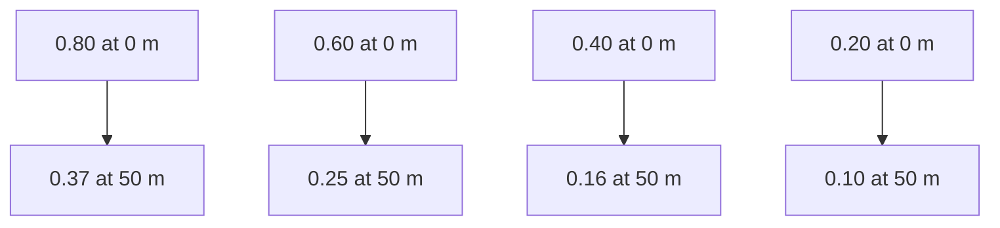

\n---\n

### FIGURE 6.4 The BOD5 fraction remaining versus distance down slope with primary effluent at various application rates

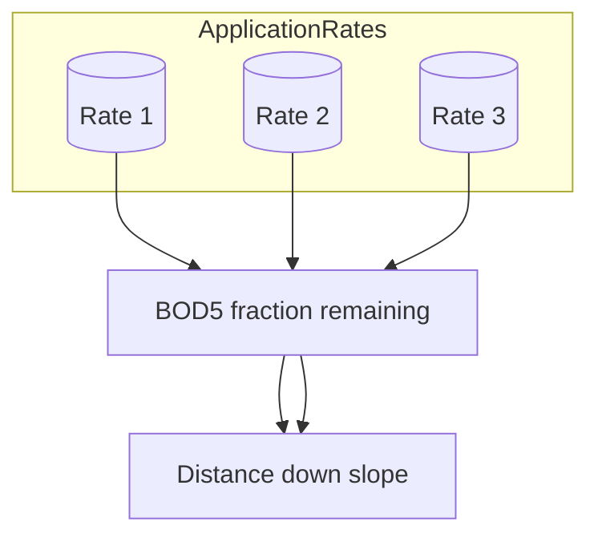

For sprinkler distribution systems, slope lengths typically range from 45 to 60 m (150 to 200 ft). The slope length should be at least 20 m (65 ft) greater than the diameter of the sprinkler pattern. In some cases, the slope length may be constrained by the geometry of the site.

### 3.4.3 Slope Grade

As discussed previously, overland-flow process performance is not sensitive to slope grade within the range of 1.5 to 8%. Consequently, slope grades should be designed within this range to generally conform to the natural grade of the site to minimize the earthwork required to construct the slopes. The grades of individual slopes can vary within the site, but each should be within the recommended design range of 1.5 to 8%.

Compound slope grades can be considered for individual slopes when there is an abrupt change in the natural grade down the length of a slope. Overland-flow slopes may also be designed with a uniform cross-grade to minimize earthwork and the depth of collection ditches. Cross-grades should not exceed 0.5%. A result of using cross-grades is that a corner of the slope does not receive flow. For systems having slope widths much greater than the slope length, the area lost is relatively small compared to the total slope area and should have no significant effect on process performance. However, for small systems having slope width dimensions approximately the same as slope length, cross-grades can significantly affect the distribution of flow down the slope as well as the effective application rate. For this reason, cross-grade slopes are not recommended for such small systems.

### 3.4.4 Operating Cycle

The operating cycle comprises an application period followed by a drying period. The ratio of the application period to the drying period is the wet-dry ratio. Typically, the operating cycle time is 1 day, or 24 hours, with application periods ranging from 8 to 12 hours and corresponding drying periods ranging from 16 to 12 hours. The resulting range of typical wet-dry ratios is 0.5 to 1.0. With the exception of ammonia nitrogen, the removal of most
\n---\n

Constituents are not affected by variations within this range. The effect of wet-dry ratio on ammonia removal from primary effluent is shown in Figure 6.5. For systems designed to achieve ammonia removal, the design wet-dry ratio should not exceed 0.5 and the operating cycle time should not exceed 24 hours. Wastewater can be applied 7 days a week without a deleterious effect on treatment performance, provided the wet-dry ratio is not excessive.

There are special cases where operating cycle times greater than and less than 24 hours have been used to achieve improved performance. For example, an overland-flow system in Davis, California, that was used to treat tomato processing wastewater (BOD5 of 800 to 1000 mg/L) was operated with a cycle time of 6 hours (3 hours of application and 3 hours of drying). This shorter cycle time limits the period of time that the oxygen demand of the wastewater exceeds the rate of oxygen transfer from the atmosphere and thereby avoids extended periods of anaerobic conditions on the slope. Application periods longer than 3 hours resulted in lower BOD removal efficiency. Longer operating cycles (4 days of application and 2 days of drying) were used for a system where the objective was denitrification of nitrified secondary effluent (Peters et al., 1981). An extreme example of longer operating time is a system in Melbourne, Australia, where the operating cycle time is 1 year (approximately 6 months of application and 6 months of drying).
\n---\n

### 3.4.5 Biochemical Oxygen Demand Loading Rate

For design of overland-flow systems to treat high-BOD industrial wastewaters, such as
food-processing wastewaters, the BOD loading rate should be considered as a potential
governing design parameter. To avoid development of anaerobic conditions on the slope
surface, the rate of oxygen supply transferred from the atmosphere must be greater than
or equal to the rate of oxygen uptake by the bacteria on the slope, which is a direct
function of the BOD mass-loading rate. Based on an oxygen transfer analysis for trickling
filters (Schroeder; 1977), a maximum oxygen transfer rate of approximately 285 kg/ha·d
(255 lb/ac·d) can be estimated for overland-flow systems. Because oxygen is supplied
uniformly to the slope surface, while BOD is distributed to the upper half of the slope area
(for sprinkler distribution), the ultimate BOD (BODu) loading rate should not exceed one-

\n---\n

# 3.5 Storage Requirements

Storage is recommended when the average daily temperature is below freezing (0 °C [32 °F]). For preliminary design, the number of required days of storage may be estimated using Figure 6.6. For areas below the 40-day storage line shown in Figure 6.6, the storage requirement can be estimated from the number of days per year with an average daily temperature lower than 0 °C. As discussed previously in Section 3.1.1. ("Climate"), storage is generally not necessary during periods of rainfall. A minimum of 2 to 5 days of storage capacity should be provided for operating flexibility. Storage reservoirs should be designed to be offline so that wastewater does not normally pass through storage following preapplication treatment:

----

# 3.6 Land Requirements

Once the application rate and storage requirements are known, the required land area can be calculated using eq 6.2, as follows:

$$
A_s = \frac{ \left[Q + \frac{V_s}{365}\right] \times \left[\frac{365 + D_s}{365}\right] \times Z}{R \times \left(\frac{P_a}{O_t}\right) \times 10^4}
$$

Where

A_s = area required for overland-flow slopes, ha;

\n---\n

# Notation and Figure 6.6: Storage requirements for overland-flow systems (days)

- Q = average wastewater flow, m3/h;
- Vs = net gain or loss in stored volume, m3/a;
- Ds = number of days of storage;
- Ra = design application rate, m3/h*m;
- Pa = application period, hours;
- Ot = operating cycle time, hours; and
- Z = slope length, m.

> FIGURE 6.6 Storage requirements for overland-flow systems (days).

Note: below the 40-day line, storage should be provided for the annual number of days with temperatures less than 0 °C (32 °F); 2 to 5 days minimum should be provided for operational flexibility.
\n---\n

For example, the land area requirement for a system with a design flow of 80 m3/h (0.5 mgd) and the following design criteria:
* Application rate = 0.3 m3/h-m
* Slope length = 45 m
* Application period = 8 h/d
* Storage requirement = 10 days with no net gain or loss (V_s = 0)

Would be

$$
A_s = \frac{80 \times \left(\frac{365 + 10}{365}\right) \times 45}{0.3 \times \left(\frac{8}{24}\right) \times \left(10^4 \ \mathrm{m^2}/\mathrm{ha}\right)} = 3.7 \text{ ha}
$$

An additional 20 to 25% of the calculated area is normally provided to allow a portion of the system to be taken out of service for routine maintenance or harvesting. Additional land area, typically on the order of 10%, will also be required for access roads.

## 3.7 Selection of Cover Vegetation

A dense uniform grass cover crop is required on overland-flow to prevent erosion and aid in the removal processes. Water-tolerant grasses are required for overland-flow because of the high frequency of wastewater application and continuously wet conditions. Suitable grasses include reed canary grass, fescue, common and coastal Bermuda grass, Dallis, and Bahia grasses, depending on their adaptability to the local climate. Management of the cover crop is discussed later in Section 6.2, "Harvesting and Mowing".

## 4.0 PHYSICAL DESIGN

Physical design considerations include slope layout, distribution system design, effluent collection system design, and control system design.

### 4.1 Slope Layout

The overland-flow site is divided into individual treatment slopes, each of which has a selected design length. Site geometry may require that the slope lengths vary somewhat. Slopes should be grouped into a minimum of four or five hydraulically separated, approximately equal application areas or zones to allow operating and harvesting or
\n---\n

# 4.2 Distribution System Design

Once the method of distribution has been selected, physical design of the distribution system involves determination of the system configuration, sizing of components, and spacing of distribution devices.

## 4.2.1 Orifice-Pipe and Fan-Spray Systems

Figure 6.2 shows typical configurations for orifice-pipe and fan-spray systems. With these systems, wastewater application is concentrated along a narrow strip at the top of the slope. Consequently, a grass-free application strip 1.5 to 2 m (4.5 to 6 ft) wide should be provided with these types of distribution systems to allow operators to easily inspect the system and to access outlets without damaging wet slopes. Gravel is a suitable material for this purpose, but it tends to work into the soil and requires replacement over time. Weeds and grass also grow through the gravel, which requires periodic spraying or removal. Harvesting equipment cannot safely mow to the edge of the gravel layer: Therefore, the grass along either side of the gravel strip must either be manually mowed or left uncut.

Pipe diameters and fixed nozzle openings must be sufficiently large to prevent clogging with wastewater solids. Riser pipe diameter should be a minimum of 19 mm (0.75 in.) and should contain no short-radius elbows or sharp bends. The minimum standard size for gated irrigation pipe is 152 mm (6 in.), but a 101-mm (4 in.) diameter pipe can be specially fabricated. The unit discharge rate of each orifice or nozzle is a function of the opening size and supply pressure. Spacing of the orifices or nozzles is a function of the unit discharge rate and the design application rate according to eq 6.3, as follows:

$$
s = \frac{Q_s \times (10^{-3}\ \mathrm{m^3/L}) \times 3600\ \mathrm{sec/h}}{R_a}
$$

Where

s = application device spacing, m;
\n---\n

## 4.2.2 Sprinkler Systems

$$
Q_s = \text{application device discharge rate, } L/s; \quad
R_a = \text{application rate, } \mathrm{m^3/h \cdot m}.
$$

The spacing of adjustable gated pipe-orifices typically is set at 0.6 m (2 ft) and the desired discharge rate set in the field by manually adjusting the gate opening. The design spacing of fixed orifice-pipe and fan sprays can be determined by solving eq. 6.3.

Both full-circle and part-circle sprinklers have been used in practice. Typical configurations for both types of sprinklers are shown in Figure 6.7 and a typical construction detail is shown in Figure 6.8. Full-circle sprinklers should be placed approximately one-third of the way down the length of the slope or at the crest of back-to-back slopes. Use of part-circle sprinklers is not recommended unless site geometry precludes the use of full-circle sprinklers. Part-circle sprinklers are more costly to both purchase and maintain. Where needed, part-circle sprinklers should be placed at the top of the slopes. If part-circle sprinklers are used with slopes constructed in series, spray drift could fall into the collection channel of an adjacent slope. In such cases, an access strip or road should be provided to serve as a buffer zone between the sprinkler and the adjacent collection channel. All roads and access strips should be sloped steeply to drain well; otherwise, spray drift will tend to collect on the strips.
\n---\n

## FIGURE 6.7 Sprinkler distribution configurations

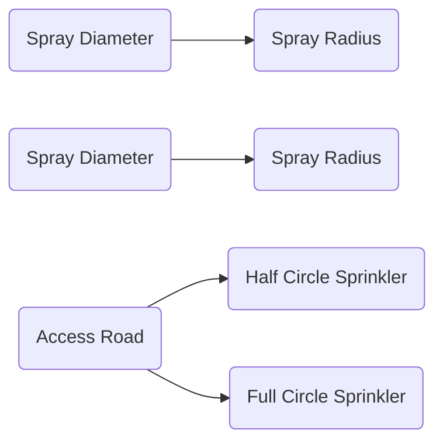

- Half Circle Sprinkler
- Full Circle Sprinkler

Design values for spray radii have not been standardized; however, they are not believed to be important. Generally, the spray radius is about one-third of the slope length. Information on the spray radius for a sprinkler versus operating pressure can be obtained from most sprinkler manufacturers. The spray radii of adjacent sprinklers should overlap by approximately 30%.

\n---\n

## FIGURE 6.8 Typical sprinkler riser assembly.

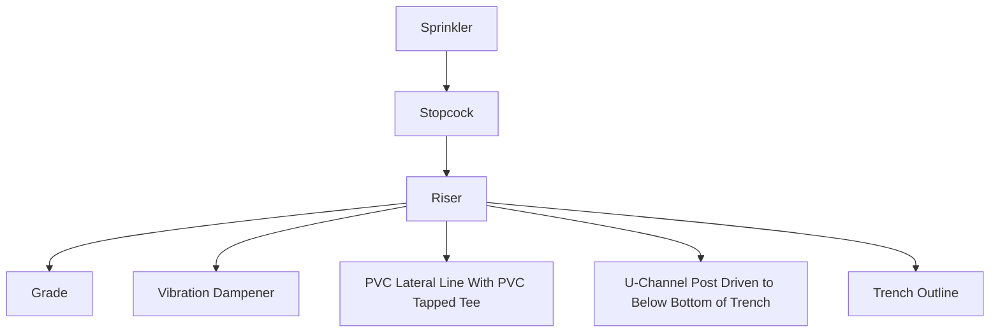

Aerosol drift is a concern with sprinkler systems. Distance or some type of natural barrier should be used to reduce aerosol migration. Either site topography or trees and shrubs can serve as a barrier. Where the surrounding terrain is flat and wind speeds of 40 km/h (25 mph) are common and public exposure is likely, either 400-m (1200-ft) buffer zones or
\n---\n

## 4.3 Effluent Collection System Design

Additional storage for windy days is recommended. If the wastewater is disinfected prior to application, buffer zones can be decreased to as little as 60 m. Regulatory agencies may specify buffers zones. Sprinkler spacing can be determined using Eq. 6.3.

The most important design consideration for an effluent collection system is to provide sufficient capacity and sufficient elevation drop through the system to prevent water from collecting on slopes. Effluent collection and drainage systems should be designed to handle flow from at least a 10-year, 1-hour rainfall event for the area without formation of backwater onto the slopes or without seriously eroding the effluent channel. For slope lengths greater than 30 m, stormwater runoff from greater storm intensities can safely back up on the slopes; however, some states may require a greater storm intensity for drainage system design (e.g., for a 25-year, 1-hour rainfall event).

Checking the hydraulic profile of a system is an essential design step in preventing the formation of an artificial marsh at the bottom of a slope. Algal growths in the marsh can then create high effluent TSS concentrations. Marshy areas are also difficult to dry and, in many cases, cannot be harvested. If natural elevation drop is a limiting factor, a central collection ditch configuration rather than a peripheral ditch can be used to minimize fall in the collection system. Most existing overland-flow systems use unlined ditches for runoff collection. Grass and weeds grow along the ditch banks and require maintenance.

Channel maintenance can be a significant task on large systems. Vegetated channels can be used for runoff collection; however, additional maintenance of the vegetation will be required to maintain the design flow capacity of the channel:

Concrete-lined channels can be used to avoid the aforementioned problems. Lined ditches should be placed at least 0.2 m below the slope surface to allow for subsurface flow and should be keyed into the slope to prevent gaps from forming between the end of the slope and the concrete lining. Lining channels with cobbles (1 to 3-in. size range) has also been an effective measure in minimizing channel maintenance. Design procedures for natural or lined drainage channels or ditches can be found in many reference books, including the U.S. Department of the Interior's Drainage Manual (1993).

## 4.4 Control System Design
\n---\n

# 4.4.1 Manual Controls

Either manual or automatic controls can be used to operate an overland-flow distribution system.

Manual controls are the simplest and least expensive to construct. A manual system also ensures that an operator must visit the system regularly to turn the system on and off. During this time, the operator can check on the status of the system. High-level alarms and low-level cutoff switches should be provided for pump protection:

- Ball, plug, and gate valves all provide satisfactory manual on/off service.
- Butterfly valves are also capable of providing on/off as well as throttling service. Other types of valves should be used for throttling only if specifically recommended for that purpose by the manufacturer:

## 4.4.2 Automatic Controls

The simplest form of automatic control is to have each pump serve a set zone of slopes (a backup pump that can serve any slope should be available). A timer on the pump controls the length of time the associated zone receives wastewater. Under this arrangement, no automatic valves are required anywhere in the system. This control method, however, is not applicable to large systems, as the number of pumps required would become excessive. U.S. Environmental Protection Agency reliability guidelines should be consulted for backup pumping requirements (U.S. EPA, 1987).

An automated valve system, controlled either hydraulically or pneumatically, is a more complex means of flow control. Both hydraulic and pneumatic control systems have worked successfully; electrical systems are not recommended due to the potential for safety problems and lightning damage. Piloted valves using wastewater as the operating fluid are also not recommended due to clogging concerns. Plug, ball, or butterfly valves operated with a clean external fluid can provide effective on/off control. If possible, control lines should be placed in conduits to prevent rodent or excavation damage should excavation of a line be required for repairs:

## 5.0 CONSTRUCTION CONSIDERATIONS

Two key elements in the construction of a successful overland-flow system are the formation of uniform slopes and the establishment of a complete and dense vegetative cover.
\n---\n

## 5.1 Slope Construction
Establishing a uniform slope grade is critical to achieving uniform sheet flow. Slope construction is normally performed in three steps: rough grading, disking, and final grading. In the rough grading step, the slopes are constructed to a tolerance of 0.03 m (0.1 ft). Disking or rototilling is used to break up any clods. Final grading is then performed to a tolerance of 0.015 m (0.05 ft) using a laser-guided land plane. Final land planning should be performed in three directions if site geometry allows.

## 5.2 Vegetation Establishment
Substantial erosion can occur unless a complete and dense vegetative cover is established prior to wastewater application. A good cover can be established quickly by proper seeding and by irrigating the slopes as needed during the establishment period. Special seeding devices (e.g., Brillion seeders) that distribute seeds evenly and minimize erosion of the seeds are recommended. Hydroseeding may also be used if seeding can be accomplished without traveling on the slope.

Once seeds are planted, slopes should be irrigated to speed germination if rainfall is not timely. Wastewater should be used for irrigation, if possible, to help acclimate the slopes. Use of the wastewater distribution system for irrigation of the slopes is not recommended because complete coverage of the newly planted slopes cannot be obtained without the risk of erosion. Portable irrigation systems are thus recommended. After the seeds germinate and grass shoots emerge, spot seeding should be conducted to fill in any bare spots. More detailed vegetation selection and management recommendations are presented in _Process Design Manual for Land Treatment of Municipal Wastewater— Supplement on Rapid Infiltration and Overland-Flow_ (U.S. EPA, 1984).

## 6.0 OPERATION AND SLOPE MANAGEMENT
Although operation of a properly designed overland-flow system is relatively simple, it does require routine operator attention. Troubleshooting guidance is presented in Table 6.4. In addition, _Operation and Maintenance Considerations for Land Treatment Systems_.

\n---\n

## Troubleshooting guide for overland-flow systems

(R.F. Weston Inc., 1982) should also be consulted for operation and maintenance case histories.

The level of operator sophistication required to operate an overland-flow system is less than that required for a conventional wastewater treatment plant; however, operator training is important. The operator must understand treatment mechanisms and operating procedures. Problems have been experienced on at least one site where the operator routinely tried to operate the system as a nondischarging slow-rate system when sufficient land area was not available to operate in this manner.

<table>
  <thead>
    <tr>
      <th>Indicators–observation</th>
      <th>Probable cause</th>
      <th>Check or monitor</th>
      <th>Solutions</th>
    </tr>
  </thead>
  <tbody>
    <tr>
      <td>Water ponding in terrace area several hours after application has ceased.</td>
      <td>Application rate is excessive. If application rate is normal, slope or drainage may be inadequate. Broken pipe in distribution system. Leaks in system.</td>
      <td>Application rate. Check slopes. Condition of drain. Leaks in system.</td>
      <td>Reduce rate to normal value. Reshape slopes as necessary. Repair drain tiles. Repair pipe. Coat steel valves or install cathodic or anodic protection.</td>
    </tr>
<tr>
      <td>Lateral aluminum distribution piping deteriorating.</td>
      <td>Effluent permitted to remain in aluminum pipe too long causing electrochemical corrosion. Dissimilar metals (steel valves and aluminum pipe).</td>
      <td>Operating techniques. Pipe and valve specifications.</td>
      <td>Drain aluminum lateral lines except when in use. Coat steel valves or install cathodic or anodic protection.</td>
    </tr>
<tr>
      <td>No flow from some sprinkler nozzles.</td>
      <td>Nozzle clogged with particles from wastewater due to lack of screening at inlet side of pumps. Screen may have developed hole because of partial plugging of screen.</td>
      <td>Screen may have developed hole because of partial plugging of screen. (See notes on screening at inlet side.)</td>
      <td>Modify or repair or replace screen.</td>
    </tr>
<tr>
      <td>Crop is dead.</td>
      <td>Too much wastewater has been applied; wastewater contains excessive amount of toxic elements. Too much insecticide or weed killer applied. Inadequate drainage has flooded root zone of crop.</td>
      <td>Water needs of specific crop versus application rate. Analyze wastewater and consult with county agricultural agent. Application of insecticide or weed killer.</td>
      <td>Reduce (or increase) application rate. Eliminate industrial discharges of toxic materials. Proper control of application of insecticide or weed killer. See “Water ponding in terrace.”</td>
    </tr>
<tr>
      <td>Pumping station shows normal pressure, but greater than normal flow.</td>
      <td>Broken main, lateral, riser, or gasket. Missing sprinkler head or end plug. Too many laterals on at one time.</td>
      <td>Inspect distribution system for leaks. Inspect distribution system for leaks. Number of laterals in service.</td>
      <td>Repair leak. Repair leak. Make appropriate valving changes.</td>
    </tr>
  </tbody>
</table>

\n---\n

# Irrigation Pumping Station Troubleshooting (Top Section)

<ul>
  <li>Irrigation pumping station shows greater than average pressure, but less than average flow.</li>
  <li>Blockage in distribution system because of plugged sprinklers, valves, screens, or frozen water.</li>
  <li>Inspect distribution systems for blockage.</li>
  <li>Locate blockage and eliminate.</li>

  <li>Irrigation pumping station shows less than normal flow and pressure.</li>
  <li>Pump impeller is worn.</li>
  <li>Partially clogged inlet screen.</li>
  <li>Screen.</li>
  <li>Replace impeller.</li>
  <li>Clean screen.</li>

  <li>Excessive erosion occurring:</li>
  <li>Excessive application rates.</li>
  <li>Application rate.</li>
  <li>Reduce application rate:</li>

  <li>Inadequate crop cover:</li>
  <li>Condition of crop cover:</li>
  <li>See "Crop is dead".</li>
</ul>

<ul>
  <li>Odor complaints.</li>
  <li>Wastewater turning septic during transmission to irrigated site and odors being released as it is discharged to pretreatment.</li>
  <li>Sample wastewater as it leaves transmission system.</li>
  <li>Contain and treat offgases from discharge point or transmission system by covering inlet with building and passing offgases through deodorizing system:</li>
</ul>

<ul>
  <li>storage</li>
  <li>Dissolved oxygen in storage reservoirs.</li>
  <li>Odors from reservoirs.</li>
  <li>Terrace erosion.</li>
  <li>Improve pretreatment or aerate reservoirs.</li>
</ul>

<ul>
  <li>High solids concentration effluent:</li>
  <li>High algal concentrations in influent from lagoon system:</li>
  <li>Algal concentrations in influent.</li>
  <li>Apply wastewater for short time periods to eliminate or reduce runoff;</li>
</ul>

<ul>
  <li>Terrace erosion:</li>
  <li>See "Excessive erosion occurring".</li>
</ul>

<ul>
  <li>Low flow from all sprinklers in a lateral line.</li>
  <li>Pressure loss in line is too great because of underdesign of pipe or clogging (see "Irrigation pumping station shows above average pressure, but below average flow").</li>
  <li>Check pipe design or plugging of lateral line.</li>
  <li>Replace—clean out lateral line:</li>
</ul>

<hr/>

<table>
  <thead>
    <tr>
      <th>Indicators—observation</th>
      <th>Probable cause</th>
      <th>Check or monitor</th>
      <th>Solutions</th>
    </tr>
  </thead>
  <tbody>
    <tr>
      <td>Water ponding in terrace area several hours after application has ceased</td>
      <td>Application rate is excessive. If application rate is normal, slope or drainage may be inadequate. Broken pipe in distribution system.</td>
      <td>Application rate. Check slopes. Condition of drain. Leaks in system.</td>
      <td>Reduce rate to normal value. Reshape slopes as necessary. Repair drain tiles. Repair pipe.</td>
    </tr>
<tr>
      <td>Lateral aluminum distribution piping deteriorating</td>
      <td>Effluent permitted to remain in aluminum pipe too long causing electrochemical corrosion. Dissimilar metals (steel valves and aluminum pipe).</td>
      <td>Operating techniques. Pipe and valve specifications.</td>
      <td>Drain aluminum lateral lines except when in use. Coat steel valves or install cathodic or anodic protection.</td>
    </tr>
<tr>
      <td>No flow from some sprinkler nozzles</td>
      <td>Nozzle clogged with particles from wastewater due to lack of screening at inlet side of pumps.</td>
      <td>Screen may have developed hole because of partial plugging of screen.</td>
      <td>Modify or repair or replace screen.</td>
    </tr>
  </tbody>
</table>

\n---\n

<table>
<tr>
<td>Crop is dead.</td>
<td>Too much wastewater has been applied.<br>Wastewater contains excessive amount of toxic elements.<br>Too much insecticide or weed killer applied.<br>Inadequate drainage has flooded root zone of crop.</td>
<td>Water needs of specific crop versus application rate.<br>Analyze wastewater and consult with county agricultural agent.<br>Application of insecticide or weed killer:<br>Water ponding:<br>See 'Water ponding in terrace'.</td>
<td>Reduce (or increase) application rate.<br>Eliminate industrial discharges of toxic materials.<br>Proper control of application of insecticide or weed killer.</td>
</tr>
<tr>
<td>Pumping station shows normal pressure, but greater than normal flow.</td>
<td>Broken main, lateral, riser, or gasket:<br>Missing sprinkler head or end plug.<br>Too many laterals on at one time.</td>
<td>Inspect distribution system for leaks.<br>Inspect distribution system for leaks.<br>Number of laterals in service.</td>
<td>Repair leak.<br>Repair leak.<br>Make appropriate valving changes.</td>
</tr>
<tr>
<td>Irrigation pumping station shows greater than average pressure, but less than average flow.</td>
<td>Blockage in distribution system because of plugged sprinklers, valves, screens, or frozen water.</td>
<td>Inspect distribution systems for blockage.</td>
<td>Locate blockage and eliminate.</td>
</tr>
<tr>
<td>Irrigation pumping station shows less than normal flow and pressure.</td>
<td>Pump impeller is worn.<br>Partially clogged inlet screen.</td>
<td>Pump impeller.<br>Screen.</td>
<td>Replace impeller.<br>Clean screen.</td>
</tr>
<tr>
<td>Excessive erosion occurring:</td>
<td>Excessive application rates.<br>Inadequate crop cover.</td>
<td>Application rate.<br>Condition of crop cover.</td>
<td>Reduce application rate.<br>See 'Crop is dead'.</td>
</tr>
<tr>
<td>Odor complaints.</td>
<td>Wastewater turning septic during transmission to irrigated site and odors being released as it is discharged to pretreatment.</td>
<td>Sample wastewater as it leaves transmission system.</td>
<td>Contain and treat offgases from discharge point of transmission system by covering inlet with building and passing offgases through deodorizing system.</td>
</tr>
<tr>
<td>Odors from storage reservoirs.</td>
<td>Dissolved oxygen in storage reservoirs.</td>
<td>Improve pretreatment or aerate reservoirs.</td>
<td></td>
</tr>
<tr>
<td>High solids concentration in effluent.</td>
<td>High algal concentrations in influent from lagoon system.</td>
<td>Algal concentrations in influent.</td>
<td>Apply wastewater for short time periods to eliminate or reduce runoff.</td>
</tr>
</table>

\n---\n

<table>
  <thead>
    <tr>
      <th></th>
      <th></th>
      <th></th>
      <th></th>
    </tr>
  </thead>
  <tbody>
    <tr>
      <td>Low flow from all sprinklers in a lateral line</td>
      <td>Pressure loss in line is too great because of underdesign of pipe or clogging (see "Irrigation pumping station shows above average pressure, but below average flow")</td>
      <td>Check pipe design or plugging of lateral line</td>
      <td>Replace – clean out lateral line</td>
    </tr>
<tr>
      <td>occurring</td>
      <td></td>
      <td></td>
      <td>See "Excessive erosion occurring".</td>
    </tr>
  </tbody>
</table>

The primary equipment needed for an overland-flow system that are not generally needed at a conventional treatment plant are mowing equipment and spare parts for the distribution system:
  
## 6.1 Pest Control
Mosquitoes can breed in overland-flow systems. Although insecticides could be used to control mosquitoes, insecticides in the runoff could potentially harm aquatic life and, therefore, their use should be avoided if possible. Bacteriological agents can be used to control mosquitoes and can be applied to slopes using the wastewater distribution system. Mosquito larvae ingest bacteria, which kill them. Planting of mosquito fish (Gambusia) in effluent channels may also be effective if sufficient water depth is available. Other pests, such as army worms, can also be controlled using biological control agents. If a sprinkler distribution system is to be used to apply microbial agents, consideration should be given to performing the application at night to prevent the possibility of sunlight killing the microbes. Noxious weeds can be controlled using herbicides, although their use should be avoided if possible: Before applying herbicides or chemical insecticides, such chemicals should be tested on a small portion of a slope and care should be taken to avoid discharge of any chemical to the runoff:

## 6.2 Harvesting and Mowing
Periodic mowing of cover grass is necessary to maintain a healthy stand of grass and to reduce bunching. A minimum of 3 to 6 mowings per year are recommended. Harvesting (i.e., removal of cut grass) is required for permanent nitrogen and phosphorus removal by crop uptake. Effluent quality will typically be affected for 2 to 3 days following startup after
\n---\n

Mowing. The color and BOD of the effluent from harvested slopes will increase, sometimes significantly. To prevent permit violations following harvesting, only one slope, or a small percentage of slopes, should be harvested at one time and/or effluent should be recycled during startup.

Slopes should be allowed to dry completely prior to harvesting. Mowing equipment should work perpendicular to the direction of flow to prevent the creation of channels down the slope. Because of the rates of water application associated with overland-flow, grasses harvested from overland-flow systems rarely have significant commercial value as feed. It is important to remember that the objective of the overland-flow system is wastewater treatment, not crop production:

If grass clippings are not immediately removed and are left on the slopes permanently or to dry prior to removal, care should be taken to avoid shading out new growth with clippings. Mulching-type mowers, which produce fine clippings, or mechanical turning devices may be used to turn and reposition the clippings:

## 6.3 Slope Renovation

After 3 to 5 years of operation, slopes typically require renovation to restore a uniform grade and re-establish full-cover vegetation. A portion of the slopes (typically 20%) may be taken out of service to perform the renovation. Slopes should be graded and re-vegetated as described in Sections 5.1 and 5.2, "Slope Construction" and "Vegetation Establishment", respectively:

## 7.0 REFERENCES

Culp, G. L.; Heim, N. F. (1978) Field Manual for Performance Evaluation and Troubleshooting at Municipal Wastewater Treatment Facilities; EPA-430/9-78-001; Off. Water Program Oper.: Washington, D.C.

de Figueiredo, R. F.; Smith, R. G.; Schroeder, E. D. (1984) Rainfall and Overlandflow Performance. J. Environ. Eng. Div., Proc. Am. Soc. Civ. Eng., 110, 678.

Hall, D. H.; Shelton, J. E.; Lawrence, C. H.; King, E. D.; Mill, R. A. (1979) Municipal Wastewater Treatment by the Overland-flow Method of Land Application; EPA600/2-79-178; U.S. Environmental Protection Agency, R.S. Kerr Environmental Research Laboratory: Ada, Oklahoma.
\n---\n

# References

- Hayashi, G.; Smith, R. G.; Schroeder, E. D. (1988) Seasonal Denitrification of Secondary Effluent Using the Overland-flow Process at the Sonoma Valley Wastewater Reclamation Facility; Department of Civil Engineering, University of California: Davis, California.
- Hinrichs, D. J., et al. (1980) Assessment of Current Information on Overland-flow of Municipal Wastewater; EPA-430/9-80-002; U.S. Environmental Protection Agency: Washington, D.C.
- Jenkins, T. F.; Leggett, D. C.; Martel, C. J. (1980) Removal of Volatile Trace Organics from Wastewater. J. Environ. Sci. Health, A15, 211.
- Jenkins, T. F.; Martel, C. J.; Gaskin, D. A.; Fisk, D. J.; McKim, H. L. (1978) Performance of Overland-flow Land Treatment in Cold Climates. In State of Knowledge. In Land Treatment of Wastewater; Vol. 2.; U.S. Army Corps of Engineers: Hanover, New Hampshire; p 61.
- Johnston, J.; Smith, R. (1988) Operating Schedule Effects on Nitrogen Removal in Overland-flow Treatment Systems. Paper presented at the 61st Annual Water Pollution Control Federation Conference, Dallas, Texas.
- Khalid, R. A.; Patrick, W. H.; McIlhenny, R. C. (1978) Nitrogen Removal Processes in an Overland-flow Treatment of Wastewater. In State of Knowledge in Land Treatment of Wastewater; Vol. 2; U.S. Army Corps of Engineers: Hanover, New Hampshire; p. 51.
- Kruzic, A. P.; Smith, R. G.; Schroeder, E. D. (1983) Nitrogen Removal in the Overland-flow Process--Design Considerations. Proceedings of the National Environmental Engineering Conference; Medine, A., Anderson, M., Eds; American Society of Civil Engineers: New York.
- Lee, C. R.; Peters, R. E.; Bates, D. J. (1976) Highlights of Research on Overlandflow for Advanced Treatment of Wastewater: Misc. Paper Y-76-6; U.S. Army Corps of Engineers, Waterways Experiment Station: Vicksburg, Mississippi.
- Matthews, R.; City of Davis, California (2007) Personal communication.
- Peters, R. E.; Lee, C. R. (1978) Field Investigations of Advanced Treatment of Municipal Wastewater by Overland-flow: In State of Knowledge in Land Treatment of
\n---\n

# References

* Peters, R. E.; Lee, C. R.; Bates, D. J. (1981) Field Investigations of Overland-flow Treatment of Municipal Lagoon Effluent; Tech. Rep. EL-81-9; U.S. Army Corps of Engineers, Waterways Experiment Station: Vicksburg, Mississippi.
* R. F. Weston Inc. (1982) Operation and Maintenance Considerations for Land Treatment Systems; EPA-600/2-82-039; U.S. Environmental Protection Agency, Municipal Environmental Research Laboratory: Cincinnati, Ohio.
* Reed, S. C.; Crites, R. W. (1984) Handbook of Land Treatment Systems for Industrial and Municipal Wastes; Noyes Publications: Park Ridge, New Jersey.
* Schaub, S. A.; Kenyon, K. F.; Bledsoe, B.; Thomas, R. E. (1978) Evaluation of the Overland Runoff Mode of Land Wastewater Application for Virus Removal: In State of Knowledge in Land Treatment of Wastewater; Vol. 2; U.S. Army Corps of Engineers: Hanover, New Hampshire; p. 245.
* Schroeder, E. D. (1977) Water and Wastewater Treatment; McGraw-Hill: New York.
* Smith, R. G.; Schroeder, E. D. (1985) Field Studies of the Overland-flow Process for the Treatment of Raw and Primary Treated Municipal Wastewater; J. Water Pollut. Control Fed., 58, 785.
* Smith, R. G.; Schroeder, E. D.; Taubeneck, L. (1983) Performance of Overland-flow Wastewater Treatment Systems—Summary Report; Department of Civil Engineering, University of California: Davis, California.
* Thomas, R. E.; Jackson, K.; Penrod, L. (1974) Feasibility of Overland-flow for Treatment of Raw Domestic Waste; EPA-660/2-74-087; U.S. Environmental Protection Agency; Office of Research and Development: Corvallis, Oregon.
* U.S. Department of the Interior (1993) Drainage Manual; U.S. Government Printing Office: Washington, D.C.
* U.S. Environmental Protection Agency (1977) Process Design Manual for Land Treatment of Municipal Wastewater; EPA-625/1-77-008; Cincinnati, Ohio.
* U.S. Environmental Protection Agency (1984) Process Design Manual for Land Treatment of Municipal Wastewater—Supplement on Rapid Infiltration and Overland-flow;
\n---\n

# References

- EPA-625/1-81-013a; Cincinnati, Ohio
- U.S. Environmental Protection Agency (1987) Construction Grants Program for Municipal Wastewater Treatment Works, Handbook of Procedures; EPA-430/9-84003; Washington, D.C.
- Witherow, J. L.; Bledsoe, B. E. (1986) Design Model for Overland-flow Process. J. Water Pollut. Control Fed., 58, 381.
- Witherow, J. L.; Bledsoe, B. E. (1983) Algal Removal by the Overland-flow Process. J. Water Pollut. Control Fed., 55, 1256.
- Zarth, M. (1984) The Treatability of Nitrogen, Organic Priority Pollutants, and Filtered Primary Effluent with the Overland-flow Process; Department of Civil Engineering, University of California: Davis, California.
- Zirschky, J.; Reed, S. C. (1988) The Use of Duckweed for Wastewater Treatment: J. Water Pollut. Control Fed., 60, 1253.
- Zirschky, J., et al. (1988) Overland-flow System Pilot Study Results; Report prepared for the City of Garland, Texas; ERM-Southeast, Inc.: Marietta, Georgia.
\n---\n

# Chapter 7: Wastewater Stabilization Ponds
\n---\n

The body of the page contains no transcribable content after removing header and footer elements.
\n---\n

# 1.0 INTRODUCTION
# 2.0 PRELIMINARY TREATMENT
# 3.0 FACULTATIVE PONDS
## 3.1 Areal Loading Rate Method
## 3.2 Gloyna Equation
## 3.3 Complete-Mix Model
## 3.4 Plug-Flow Model
## 3.5 Wehner–Wilhelm Equation
## 3.6 Comparison of Facultative Pond Design Models
## 3.7 Example 7.1—Design of Facultative Pond With Frequently Used Formulations
# 4.0 PARTIAL-MIX AERATED PONDS
## 4.1 Partial-Mix Design Model
## 4.2 Selection of Reaction Rate Constants
## 4.3 Influence of Number of Cells
## 4.4 Example 7.2
## 4.5 Temperature Effects
## 4.6 Pond Configuration
## 4.7 Mixing and Aeration
## 4.8 Example 7.3
# 5.0 COMPLETE-MIX AERATED PONDS
## 5.1 Design Equations
## 5.2 Selection of Reaction Rate Parameters
## 5.3 Influence of Number of Cells
## 5.4 Example 7.4
\n---\n

# 1.0 INTRODUCTION

Stabilization ponds are used to treat a variety of wastewaters, from domestic wastewater to complex industrial wastes, and can function under a wide range of weather conditions, from tropical to arctic. Ponds can be used alone or in combination with other wastewater treatment processes.

Wastewater pond systems can be classified by the dominant type of biological reaction, the duration and frequency of discharge, the extent of treatment ahead of the pond, or the arrangement among cells (if more than one cell is used). A basic classification system involves description of the dominant biological reactions that occur in the pond:

The most common type of pond is the facultative pond. Facultative ponds are usually 1.2 to 2.5 m (4 to 8 ft) in depth, with an aerobic layer overlying an anaerobic layer; often containing sludge deposits. Usual detention time is 5 to 30 days. Anaerobic fermentation occurs in the lower layer and aerobic stabilization occurs in the upper layer: The key to facultative operation is oxygen production by photosynthetic algae and surface reaeration. The oxygen is used by the aerobic bacteria in stabilizing organic material in the upper layer: Algae present in pond effluent represent one of the most serious performance problems associated with facultative ponds.

The total containment pond and the controlled discharge pond are forms of facultative ponds. The total containment pond is applicable in climates where the evaporative losses exceed rainfall. Controlled discharge ponds have long hydraulic detention times and the effluent is discharged once or twice per year when the effluent quality is satisfactory:

In an aerated pond, oxygen is supplied mainly through mechanical or diffused-air aeration rather than through photosynthesis and surface reaeration. Many aerated ponds have evolved from overloaded facultative ponds that required aerator installation to increase oxygenation capacity. Aerated ponds are generally 2 to 6 m (6 to 20 ft) deep, with detention times of 3 to 10 days. The chief advantage of aerated ponds is that they require less land area. Aerated ponds may be designed as complete-mix reactors or as partial-mix reactors. Most are designed as partial-mix systems.

Aerobic ponds, also called high-rate aerobic ponds, maintain dissolved oxygen throughout their entire depth. They are typically 30 to 45 cm (12 to 18 in.) deep, allowing light to
\n---\n

# 2.0 PRELIMINARY TREATMENT

In general, the only mechanical or monitoring and control equipment required for wastewater pond systems are flow measurement devices, sampling systems, and pumps. Design criteria and examples for preliminary treatment components can be found in a number of references, as well as in equipment manufacturers’ catalogs (Metcalf & Eddy; 2003; WEF/ASCE/EWRI; 2009). Flow measurement can be accomplished with relatively simple devices such as Palmer–Bowlus flumes, V-notch weirs, and Parshall flumes used in conjunction with a recording meter: Frequently, flow measurements and 24-hour compositing samplers are combined in a common manhole, pipe, or other housing arrangement: If pumping facilities are necessary, the wet well is sometimes used as a point to recycle effluent or to add chemicals for odor control. Pretreatment facilities should be kept to a minimum at pond systems:

# 3.0 FACULTATIVE PONDS

Facultative pond design is based on biochemical oxygen demand (BOD) removal; however, the majority of the suspended solids will be removed in the primary cell of a facultative pond system. Sludge fermentation feedback of organic compounds to the water in a pond system is significant and has an effect on performance. During the spring and fall, the thermal overturn of pond contents can result in significant quantities of benthic solids being resuspended. The rate of sludge accumulation is affected by liquid temperature, and additional volume is added for sludge accumulation in cold climates.
\n---\n

## 3.1 Areal Loading Rate Method

Although total suspended solids (TSS) have a profound influence on the performance of pond systems, most design equations simplify the incorporation of the influence of TSS by using an overall reaction rate constant. Effluent TSS generally consist of suspended organism biomass and do not include suspended waste organic matter.

Several empirical and rational models for the design of these ponds have been developed. These include the ideal plug-flow and complete-mix models as well as models proposed by Fritz et al. (1979), Gloyna (1971), Larson (1974), Marais (1970), McGarry and Pescod (1970), Oswald et al. (1970), and Thirumurthi (1974). Middlebrooks (1987) presented a summary of many models, including the aforementioned references, that have been developed to evaluate and design facultative pond systems. Although several produce satisfactory results, the use of some may be limited because of the difficulty in evaluating coefficients or by the complexity of the model. The most used methods and equations are discussed in the following section.

## 3.1 Areal Loading Rate Method

A review of state design standards by state and U.S. Environmental Protection Agency (U.S. EPA) personnel from 2006 to 2007 reported that most states have design criteria for organic loading and/or hydraulic detention time for facultative ponds, with many now incorporating ammonia nitrogen conversion and phosphorus removal. The principal changes since a survey by Canter and Engelande (1970) are the nitrogen and phosphorus requirements. The results of a 2006 to 2007 survey are available in U.S. EPA's Design Manual: Municipal Wastewater Stabilization Ponds (2008). These criteria are assumed to ensure satisfactory performance; however, repeated violations of effluent standards by pond systems that meet state design criteria indicate the inadequacy of the criteria.

Although dated, a series of detailed evaluations of facultative pond systems conducted by U.S. EPA remains the best data ever collected on pond systems' performance. A summary of state design criteria for each location and actual design values for organic loading and hydraulic detention time for four facultative pond systems evaluated by U.S. EPA (Middlebrooks et al., 1982; U.S. EPA, 1983) are shown in Table 7.1. Also included is a list of the months the federal effluent standards for 5-day BOD (BOD5) were exceeded. The actual organic loading for the four systems is nearly equal, but the system in Corinne, Utah, consistently satisfied the federal effluent standard. This may be a function of the
\n---\n

Based on many years of experience, the following loading rates for various climatic conditions are recommended for use in designing facultative pond systems. For average winter air temperatures above 15 °C (59 °F), a BOD5 loading rate range of 45 to 90 kg/ha·d (40 to 80 lb/ac·d) is recommended. When the average winter air temperature ranges between 0 and 15 °C (32 to 59 °F), the organic loading rate should range between 22 and 45 kg/ha·d (20 to 40 lb/ac·d). For average winter temperatures below 0 °C (32 °F), the organic loading rates should range from 11 to 22 kg/ha·d (10 to 20 lb/ac·d).

TABLE 7.1 Design and performance data from U.S. EPA pond studies (Middlebrooks et al., 1982; U.S. EPA, 1983).

<table>
  <thead>
    <tr>
      <th>Location</th>
      <th colspan="2">Organic loading<br>(kg BOD5/ha·d)</th>
      <th colspan="3">Theoretical detention<br>time</th>
      <th>Months effluent<br>30 mg/L</th>
    </tr>
<tr>
      <th></th>
      <th>State design standard</th>
      <th>Actual design<br>(1974–1975)</th>
      <th>State design standard</th>
      <th>Design</th>
      <th>Actual</th>
      <th>30 mg/L</th>
    </tr>
  </thead>
  <tbody>
    <tr>
      <td>Peterborough, New Hampshire</td>
      <td>39.3</td>
      <td>19.6</td>
      <td>16.2</td>
      <td>None</td>
      <td>57</td>
      <td>107</td>
    </tr>
<tr>
      <td></td>
      <td colspan="2" style="text-align:left">17.5</td>
      <td colspan="2"></td>
      <td></td>
      <td>Apr</td>
    </tr>
<tr>
      <td>Kilmichael, Mississippi</td>
      <td>56.2</td>
      <td>43</td>
      <td></td>
      <td>None</td>
      <td>79</td>
      <td>214</td>
    </tr>
<tr>
      <td>Eudora, Kansas</td>
      <td>38.1</td>
      <td>38.1</td>
      <td>18.8</td>
      <td>None</td>
      <td>47</td>
      <td>231</td>
    </tr>
<tr>
      <td>Corinne, Utah</td>
      <td>45.0<a></a></td>
      <td>36.2<a></a></td>
      <td>29.7<a></a></td>
      <td>180</td>
      <td>180</td>
      <td>70</td>
    </tr>
<tr>
      <td colspan="7" style="font-size:smaller;">
        <span>Notes:</span> <span>a Primary cell.</span> <span>b Entire system.</span> <span>c Estimated from dye study.</span>
      </td>
    </tr>
  </tbody>
</table>

\n---\n

## 3.2 Gloyna Equation

Gloyna (1976) proposed the following empirical equation for the design of facultative wastewater stabilization ponds:

$$
V = (3.5 \times 10^{-5})(Q)(La)\theta^{(35-T)}(f') \quad (7.1)
$$

Where

\n---\n

# Gloyna Method for Pond Design

- V = pond volume, m^3;
- Q = influent flowrate, L/d;
- La = ultimate influent BOD or chemical oxygen demand (COD), mg/L;
- θ = temperature correction coefficient = 1.085;
- T = pond temperature, °C;
- f = algal toxicity factor; and
- f = sulfide oxygen demand.

The BOD5 removal efficiency is projected to be 80 to 90% based on unfiltered influent samples and filtered effluent samples. A pond depth of 1.5 m (5 ft) is suggested for systems with significant seasonal variations in temperature and major fluctuations in daily flow. The surface area design using eq 7.1 should always be based on a 1-m (3-ft) depth. The algal toxicity factor (f) is assumed to be equal to 1.0 for domestic wastes and many industrial wastes. The sulfide oxygen demand (f) is also equal to 1.0 for a sulfate equivalent ion concentration of less than 500 mg/L. The design temperature is usually selected as the average pond temperature in the coldest month. Sunlight is not considered to be critical in pond design, but can be incorporated into eq 7.1 by multiplying the pond volume by the ratio of sunlight at the design location to the average found in the southwestern United States.

The Gloyna method was evaluated using data referenced in Table 7.1. The equation giving the best fit of the data is shown as eq 7.2. Although there was considerable scatter to the data, the relationship is statistically significant, as follows:

$$
V = 0.035\,Q\,(BOD_5)\,(1.099)\,\text{LIGHT}\,\frac{(35 - T)}{250}
\quad (7.2)
$$

Where

- BOD = BOD5 in the system influent, mg/L;
- LIGHT = solar radiation in langleys;

\n---\n

# 3.3 Complete-Mix Model

- V = pond volume, m3;
- Q = influent flowrate, m3/d; and
- T = pond temperature, °C.

The Marais–Shaw (1961) equation is based on a complete-mix model and first-order kinetics. The basic relationship is shown in eq 7.3, as follows:

$$
\frac{C_n}{C_0} = \frac{1}{(1 + k_c t_n)^n}
$$

Where

- \(C_n\) = effluent BOD5 concentration, mg/L;
- \(C_0\) = influent BOD5 concentration, mg/L;
- \(k_c =\) complete-mix first order reaction rate, d\(^{-1}\);
- \(t_n =\) hydraulic residence time in each cell, d; and
- \(n =\) number of equal-sized pond cells in series.

The proposed upper limit for the BOD5 concentration (\(C_e\))\(_{max}\) in the primary cells is 55 mg/L to avoid anaerobic conditions and odors. The permissible depth of the pond, \(d\) in meters, is related to (\(C_e\))\(_{max}\) as follows:

$$
(C_e)_{max} = \frac{700}{1.9d + 8}
$$

Where

\((C_e)_{max} =\) the maximum effluent BOD, 55 mg/L, and \(d\) is the design depth of the pond in meters.

The influence of water temperature on the reaction rate is estimated using eq 7.5., as follows:
\n---\n

## 7.5  
$$
k_{cT} = k_{c35} (1.085)^{\,T-35} \quad (7.5)
$$

Where

- \(k_{cT} = \) reaction rate at water temperature \(T\), d\(^{-1}\);
- \(k_{c35} = \) reaction rate at 35 °C; \(1.2\) d\(^{-1}\);
- \(T = \) operating water temperature, °C.

## 3.4 Plug-Flow Model

The basic equation for the plug-flow model is:
$$
\frac{C_e}{C_0} = \exp[-k_p t] \quad (7.6)
$$

Where

- \(C_e = \) effluent BOD\(_5\) concentration, mg/L;
- \(C_0 = \) influent BOD\(_5\) concentration, mg/L;
- \(k_p = \) plug-flow first-order reaction rate, d\(^{-1}\);
- \(t = \) hydraulic residence time, days.

The reaction rate (\(k_p\)) was reported to vary with the BOD loading rate as shown in Table 7.2 (Neel et al., 1961). Theoretically, the reaction rate should not vary with loading rate; however, that is what was reported.

The influence of water temperature on the reaction rate constant can be determined using eq 7.7, as follows:
$$
k_{pT} = k_{p20} (1.09)^{\,T-20} \quad (7.7)
$$

Where

- \(k_{p20} = \) plug-flow first-order reaction rate at 20 °C.

\n---\n

## 3.5 Wehner–Wilhelm Equation

- k_pT = reaction rate at temperature T, d^-1;
- k_p20 = reaction rate at 20 °C, d^-1; and
- T = operating water temperature, °C.

Thirumurthi (1974) found that the flow pattern in facultative ponds is somewhere between ideal plug-flow and complete-mix, and he recommended use of the following chemical reactor equation developed by Wehner and Wilhelm (1956) for chemical reactor design:

$$
\frac{C_e}{C_0} = \frac{4a\,e^{\frac{a}{2D}}}{(1+a)^2\,e^{\frac{a}{2D}} - (1-a)^2\,e^{-\frac{a}{2D}}}
$$

Where

- \(C_0\) = influent BOD concentration, mg/L;
- \(C_e\) = effluent BOD concentration, mg/L;
- e = base of natural logarithms, 2.7183;
- \(a = (1 + 4ktD)^{0.5}\);
- \(k\) = first-order reaction rate constant, d\(^{-1}\);
- \(t\) = hydraulic residence time, d;
- \(D\) = dimensionless dispersion number;

TABLE 7.2 Variation of the plug-flow reaction rate constant with organic loading rate (Neel et al., 1961).

\n---\n

# Organic loading rate and dispersion parameters

<table>
<thead>
<tr><th>Organic loading rate kg/ha·d</th><th>kp*, d⁻¹</th></tr>
</thead>
<tbody>
<tr><td>22</td><td>0.045</td></tr>
<tr><td>45</td><td>0.071</td></tr>
<tr><td>67</td><td>0.083</td></tr>
<tr><td>90</td><td>0.096</td></tr>
<tr><td>112</td><td>0.129</td></tr>
</tbody>
</table>

* Reaction rate constant at 20 °C.

<table>
<thead>
<tr><th>Organic loading rate kg/ha·d</th><th>kp*, d⁻¹</th></tr>
</thead>
<tbody>
<tr><td>22</td><td>0.045</td></tr>
<tr><td>45</td><td>0.071</td></tr>
<tr><td>67</td><td>0.083</td></tr>
<tr><td>90</td><td>0.096</td></tr>
<tr><td>112</td><td>0.129</td></tr>
</tbody>
</table>

* Reaction rate constant at 20 °C.

$$ D = HlvL = Ht/L^2; $$

- \(H =\) axial dispersion coefficient, area per unit time;
- \(v =\) fluid velocity, length per unit time;
- \(L =\) length of travel path of a typical particle.

A modified form of the chart prepared by Thirumurthi (1974) is shown in Figure 7.1 to facilitate the use of eq 7.8. The dimensionless term, \(k_t\), is plotted versus the percentage of BOD remaining for dispersion numbers ranging from zero for an ideal plug-flow unit to infinity for a completely mixed unit: Dispersion numbers measured in wastewater ponds range from 0.1 to 2.0, with most values less than 1.0. The selection of a value for D can
\n---\n

dramatically affect the detention time required to produce a given quality effluent. The selection of a design value for k can have an equal effect. If the chart in Figure 7.1 is not used, eq 7.8 can be solved on a trial and error basis as shown in Example 7.1.

To improve upon the selection of a D value for use in eq 7.8, Polprasert and Bhattarai (1985) developed eq 7.9 based on data from pilot and full-scale pond systems:

$$
D = 0.184 \left[ t \big( vW + 2d \big) \right]^{0.489} (W)^{1.511} /(Ld)^{1.489}
$$

 0.6                                                                            D = 0.1

 0.5-                                                                           D = 0.25
                                        C-X-                                     D=0.5

[0.4                                                                             D=1
                                                                                 D = 2
 80.3-                                                                           Complete Mix
 [0.2                                                                            Plug Flow

 0.1

  0

                                     kl

           FIGURE 7.1 Wehner–Wilhelm equation (modified from Thirumurthi [1974]).

Where

D = dimensionless dispersion number;
t = hydraulic residence time, d;

\n---\n

# 3.6 Comparison of Facultative Pond Design Models

- v = kinematic viscosity, m^2/d;
- d = liquid depth of pond, m;
- W = width of pond, m; and
- L = length of pond, m

The hydraulic residence times used to derive eq 7.9 were determined by tracer studies; therefore, it is still difficult to estimate the value of D to use in eq 7.8. A good approximation is to assume that the actual hydraulic residence time is half that of the theoretical hydraulic residence time.

The variation of the reaction rate constant k in eq 7.8 with the water temperature is determined using eq 7.10, as follows:

$$
k_T = k_{20} (1.09)^{T-20} \quad (7.10)
$$

Where

- \(k_T\) = reaction rate at water temperature \(T\), d\(^{-1}\);
- \(k_{20}\) = reaction rate at 20 °C = 0.15 d\(^{-1}\); and
- \(T\) = operating water temperature, °C.

----

Because of the many approaches to the design of facultative ponds and the lack of adequate performance data for the latest designs, it is not possible to recommend the “best” procedure. An evaluation of the aforementioned design methods, with operational data referenced in Table 7.1, failed to show that any of the models are superior to the others in terms of predicting the performance of facultative pond systems (U.S. EPA, 1983; Middlebrooks, 1987). Many other studies of facultative pond systems with limited data have been conducted that have reached much the same conclusions (Pearson and Green, 1995). Each of the aforementioned design models presented in detail were used to design a facultative pond for the conditions presented in Example 7.1; the results are summarized at the end of Example 7.1.

\n---\n

# 3.7 Example 7.1—Design of Facultative Pond With Frequently Used Formulations

Design a facultative pond system using the Wehner–Wilhelm equation, surface loading method, the complete-mix equation developed in South Africa, and the plug-flow equation for the following environmental conditions and wastewater characteristics.

Wehner–Wilhelm equation:

The Wehner–Wilhelm equation designs for conditions between ideal plug-flow and complete-mix conditions.

Insert design parameters in blue fields.

<table>
<tr><td>Flowrate</td><td>1.32 mgd</td><td>5000 m3/d</td></tr>
<tr><td>Influent BOD5, Co</td><td></td><td>200 mg/L</td></tr>
<tr><td>Required effluent BOD5, Ce</td><td></td><td>30 mg/L</td></tr>
<tr><td>Operating water temperature</td><td></td><td>10 °C</td></tr>
<tr><td>Reaction rate kT at 20 °C</td><td></td><td>0.15 d^-1</td></tr>
</table>

Calculate kT = reaction rate at water temperature T, in 1/d.

$$ k_T = k_{20} \cdot (1.09)^{(T-20)} $$

kT = 0.06336

First iteration,

Solve for “a” first.

<table>
<tr><td>t1 = assumed hydraulic residence time</td><td>35.1 d</td></tr>
<tr><td>D = assumed dimensionless dispersion #</td><td>0.1</td></tr>
</table>

a = (1 + 4 kT D t)^{0.5}

Copyright © 2024 by the Water Environment Federation. For subscriber use only and not for distribution. All Rights Reserved. Permission to copy must be obtained from WEF.
\n---\n

# a1 = 1.37463

## Solve the Wehner–Wilhelm equation to determine if the two sides are equal: 

$$ \frac{C_e}{C_0} = \left[\frac{4 a e^{1/(2D)}}{(1 + a)\,(e^{a/2D})\,(1 - a)^2\,(e^{-a/2D})}\right] \; 0.1500 = 0.14982 $$

The difference is 0.00018.

### Calculate the dimensions of the pond.

<table>
  <thead>
    <tr>
      <th>Parameter</th>
      <th>Value</th>
      <th>Units</th>
    </tr>
  </thead>
  <tbody>
    <tr>
      <td>v = kinematic viscosity</td>
      <td>0.11299953</td>
      <td>m^2/d</td>
    </tr>
<tr>
      <td>t = optimum HRT (final iteration)</td>
      <td>35.1</td>
      <td>d</td>
    </tr>
<tr>
      <td>d = liquid depth of pond</td>
      <td>2.45</td>
      <td>m</td>
    </tr>
<tr>
      <td>Volume</td>
      <td>175500</td>
      <td>m^3</td>
    </tr>
<tr>
      <td>Volume</td>
      <td>46.36</td>
      <td>mil gal</td>
    </tr>
  </tbody>
</table>

#### Divide the flow into streams.

- Number of streams = 2
- Volume in one stream = 87,750 m^3
- Divide volume into 3 equal volumes
- Volume in one pond = 29,250 m^3
- Volume in one pond = 7.73 mil gal

#### Surface area and dimensions

- Surface area of each = 11,938.78 m^2
- 1.2 ha
- (2.95 ac)

- Theoretical hydraulic detention time in each pond = 35.1 d

- Surface area = L * W
  - W = 63.1 m
  - 207.0 ft
  - L = 189.3 m
  - 620.9 ft

----

\n---\n

## Theoretical hydraulic detention time and dispersion

Approximately measured hydraulic detention time is a value of one-half that of the theoretical value, t_d = 17.55 d.

Equation below was developed by Polprasert and Bhattarai (1985) to improve selection of a D value for use with the Wehner–Wilhelm equation based on measured hydraulic residence times.

With measured hydraulic detention time (assumed to be one-half), and dimensions of one cell, the correct dispersion number will be

$$
D = 0.184 \left[ t_v (W + 2d) \right]^{0.489} \cdot \frac{W^{1.511}}{(L \cdot d)^{1.489}}
$$

D = 0.11375

With theoretical detention time, dimensions of one cell and correct dispersion number is

<table>
  <thead>
    <tr><th>Left</th><th>Right</th></tr>
  </thead>
  <tbody>
    <tr><td>td = 35.1 d</td><td>L:W = 3</td></tr>
<tr><td>D = 0.15965</td><td>trial and error; try L:W,</td></tr>
<tr><td>Dimensions of each cell using theoretical detention time and initial dispersion number</td><td>1.0557</td></tr>
<tr><td>Width = 63.084</td><td>Length = 189.252</td></tr>
  </tbody>
</table>

Calculate the effluent BOD5 concentration using the theoretical hydraulic detention time because the Wehner–Wilhelm equation was developed based on the theoretical value. Total detention time is used because the equation represents the entire system.
\n---\n

## Parameters

- D = 0.15965
- a_3 = 1.37463
- C_e = [4 a e^{1/(2D)}] / [(1 + a)^2 (e^{a/(2D)}) − (1 − a)^2 (e^{−a/(2D)})] / C_0
- C_e = 30 mg/L

### Organic loading method:

<table>
<thead>
<tr><th></th><th>Case 1</th><th>Case 2</th><th>Case 3</th><th>Case 4</th></tr>
</thead>
<tbody>
<tr><td>Depth</td><td>2.45 m</td><td>2.45 m</td><td>2.45 m</td><td>2.45 m</td></tr>
<tr><td>Depth (ft)</td><td>8.04 ft</td><td>8.04 ft</td><td>8.04 ft</td><td>8.04 ft</td></tr>
<tr><td>Organic load = BOD = Q/1000</td><td>1000 kg/d</td><td>1000 kg/d</td><td>1000 kg/d</td><td>1000 kg/d</td></tr>
<tr><td></td><td>2205 lb/d</td><td>2205 lb/d</td><td>2205 lb/d</td><td>2205 lb/d</td></tr>
<tr><td>Organic loading rate = lb/d/ac</td><td>60</td><td>40</td><td>30</td><td>10</td></tr>
<tr><td>Area required ac</td><td>36.74</td><td>55.12</td><td>73.49</td><td>220.46</td></tr>
<tr><td></td><td></td><td></td><td></td><td>2185</td></tr>
</tbody>
</table>

\n---\n

<table>
  <thead><tr><th>Volume = m^3</th></tr></thead>
  <tbody><tr><td>364</td><td>298</td><td>546</td><td>447</td><td>728</td><td>596</td><td>788</td></tr></tbody>
</table>

<p>Area or volume to be divided into three or four cells in series</p>
<p>Facultative pond design using complete-mix model:</p>

<table>
  <tbody>
    <tr>
      <td>Flowrate = Q</td>
      <td>5000 m^3/d</td>
      <td>1.32 mgd</td>
    </tr>
<tr>
      <td>Influent BOD</td>
      <td>200.00 mg/L</td>
      <td></td>
    </tr>
<tr>
      <td>Effluent BOD</td>
      <td>30.00 mg/L</td>
      <td></td>
    </tr>
<tr>
      <td>Influent suspended solids</td>
      <td>150.00 mg/L</td>
      <td></td>
    </tr>
<tr>
      <td>No. of cells in series</td>
      <td>3.00</td>
      <td></td>
    </tr>
<tr>
      <td>Temperature of water</td>
      <td>10.00 deg C</td>
      <td></td>
    </tr>
<tr>
      <td>Reaction rate at 35 °C</td>
      <td>0.500 per day</td>
      <td></td>
    </tr>
<tr>
      <td>Temperature correction coefficient</td>
      <td>1.085 d⁻¹</td>
      <td></td>
    </tr>
<tr>
      <td>k_T = rate at T</td>
      <td>0.065 d⁻¹</td>
      <td></td>
    </tr>
<tr>
      <td>Hydraulic residence time</td>
      <td>40.68 d</td>
      <td></td>
    </tr>
<tr>
      <td>Volume</td>
      <td>203 408 m³</td>
      <td>53.73 mil gal</td>
    </tr>
<tr>
      <td>Depth</td>
      <td>2.45 m</td>
      <td></td>
    </tr>
<tr>
      <td>Surface area / cell</td>
      <td>83 024 m²</td>
      <td>6.69 ac</td>
    </tr>
<tr>
      <td>Ce</td>
      <td>30 mg/L</td>
      <td></td>
    </tr>
  </tbody>
</table>

<p>Gloyna method:</p>

<p>V = 0.0350Q(BOD)(1.099)LIGHT(35-T)/250</p>

<p>Where</p>

\n---\n

# Plug Flow - Hydraulic Detention Time Calculation

- Q = flowrate = 5000 m^3/d
- BOD = 200 mg/L
- LIGHT = 200 langles
- Temperature coefficient = 1.099
- Temperature = 10 °C

- Volume = 231,218 m^3; 61.08 mil.

- Predicted effluent BOD = 80 to 90% reduction = 20 to 40 mg/L
  Total volume will be divided into three or four equal cells.

- Plug flow:

$$ \frac{C_e}{C_0} = \exp[-k_p t] $$
$$ t = \ln\left( \frac{C_0}{C_e} \right) \frac{1}{k_p} $$

Where

- C_0
- C_e = effluent BOD = 30 mg/L
- C_0 = influent BOD = 200 mg/L
- k_p20 = plug flow reaction rate at 20 °C = 0.07 d^-1
- t = hydraulic detention time = 64.2 d
- Theta = temperature correction factor = 1.09
- k_pT = plug flow reaction rate at T °C = 0.02957 d^-1
- T = water temperature = 10 °C

With influent and effluent specified, calculate hydraulic detention time.

t = 64.2 d
\n---\n

## With influent and hydraulic detention time specified, calculate effluent

Ce = 30.0 mg/L

Volume = Q t = 320 798 m^3

Surface area = V/depth = 130 938 m^2

Summary of results:

<table>
<thead>
<tr><th>Method</th><th>Hydraulic detention time, d</th><th>Volume, m^3</th><th>Surface area, m^2</th></tr>
</thead>
<tbody>
<tr><td>Wehner–Wilhelm</td><td>35.1</td><td>175 500</td><td>35 816</td></tr>
<tr><td>Surface area*</td><td>72.9</td><td>364 298</td><td>148 695</td></tr>
<tr><td>Complete mix</td><td>40.7</td><td>203 408</td><td>83 024</td></tr>
<tr><td>Gloyna</td><td>46.2</td><td>231 218</td><td>104 218</td></tr>
<tr><td>Plug flow</td><td>64.2</td><td>320 798</td><td>130 938</td></tr>
</tbody>
</table>

* Values based on surface loading rate of 54 kg/ha*d (60 lb/ac*d).

<table>
<thead>
<tr><th>Method</th><th>Hydraulic detention time, d</th><th>Volume, m^3</th><th>Surface area, m^2</th></tr>
</thead>
<tbody>
<tr><td>Wehner–Wilhelm</td><td>35.1</td><td>175 500</td><td>35 816</td></tr>
<tr><td>Surface area*</td><td>72.9</td><td>364 298</td><td>148 695</td></tr>
<tr><td>Complete mix</td><td>40.7</td><td>203 408</td><td>83 024</td></tr>
<tr><td>Gloyna</td><td>46.2</td><td>231 218</td><td>104 218</td></tr>
<tr><td>Plug flow</td><td>64.2</td><td>320 798</td><td>130 938</td></tr>
</tbody>
</table>

* Values based on surface loading rate of 54 kg/ha*d (60 lb/ac*d)

\n---\n

Limitations on the various design methods make it difficult to make direct comparisons; however, an examination of hydraulic detention times and total volume requirements calculated by all of the methods show little consistency; but if the reaction rates are selected carefully results can show some consistency. The major limitation of all these methods is the selection of a reaction rate constant or other factors in the equations: Reasonable reaction rates must be selected, but if the pond hydraulic system is designed and constructed so that the theoretical hydraulic detention time is approached, reasonable success can be ensured with all of the design methods. Short-circuiting is the greatest deterrent to successful pond performance, barring any toxic effects. The importance of the hydraulic design of a pond system cannot be overemphasized: The surface loading rate approach to design requires a minimum of input data, and is based on operational experiences in various geographical areas of the United States. Although it is probably the most conservative of the design methods, hydraulic design still cannot be neglected.

The Gloyna method is applicable only for 80 to 90% BOD removal efficiency, and it assumes that solar energy for photosynthesis is above the saturation level. Provisions for removals outside this range are not made; however, an adjustment for other solar conditions can be made as described previously: Literature by Mara (1975) should be consulted if a detailed critique of the Gloyna method is needed.

The Marais–Shaw method is based on complete-mix hydraulics, which is not approached in facultative ponds; but the greatest weakness in the approach may lie in the requirement that the primary cell must not turn anaerobic. Literature by Mara (1975, 1976) contains a detailed discussion of this model

Plug-flow hydraulics and first-order reaction kinetics have been found to adequately describe the performance of many facultative pond systems (Neel et al., 1961; Middlebrooks et al., 1982; Middlebrooks, 1987; Pearson and Green, 1995; Thirumurthi, 1974). A plug-flow model was found to best describe the performance of the four pond systems evaluated in a U.S. EPA study as well as several others (Middlebrooks et al., 1982; U.S. EPA, 1983). Because of the arrangement of most facultative ponds into a series of three or more cells, logically it would be expected that the hydraulic regime could be approximated by a plug-flow model. Reaction rates calculated from U.S. EPA (1983)
\n---\n

data were low primarily because of the long hydraulic detention times in the pond systems (70 to 231 days) and will yield designs that are too conservative.

Use of the Wehner–Wilhelm equation requires knowledge of both the reaction rate and the dispersion factor, which further complicates the design procedure. If knowledge of the hydraulic characteristics of a proposed pond configuration is known or can be determined (eq. 7.9), the Wehner–Wilhelm equation will yield satisfactory results. However, because of the difficulty in selecting both parameters, design with one of the simpler equations is likely to be as good as one using this model. The Wehner–Wilhelm equation is used successfully in many countries around the world to design facultative ponds.

In summary, all of the design methods discussed can provide a valid design, if the proper parameters are selected and the hydraulic characteristics of the system are controlled:

## 4.0 PARTIAL-MIX AERATED PONDS

Changes in the basic approach to the design of partial-mix aerated ponds have been limited primarily to the introduction of floating plastic partitions to improve the hydraulic characteristics of the pond system and the development of a wider selection of more efficient aeration equipment. The importance of hydraulic characteristics has been restated numerous times in many publications. The trend toward omitting redundancy in design of aerated lagoon systems will make maintenance difficult and result in bypassing important parts of the treatment process. It appears that little thought is given to the need for future maintenance. Operating costs associated with aerated lagoon systems frequently have been ignored or overlooked in comparing options available to a community. The initial cost of systems without redundancy obviously is lower than that obtained with systems including flexibility in operation, but the cost to the environment and the owner will be far greater when maintenance is required.

In the partial-mix aerated pond system, the aeration serves only to provide an adequate oxygen supply, and there is no attempt to keep all of the solids in suspension in the pond as is done with complete-mix and activated sludge systems. Some mixing obviously occurs and keeps portions of the solids suspended; however, an anaerobic degradation of the organic matter that settles does occur. The system is sometimes referred to as a facultative aerated pond system.
\n---\n

## 4.1 Partial-Mix Design Model

Even though the pond is only partially mixed, it is conventional to estimate the BOD removal using a complete-mix model and first-order reaction kinetics. Studies by Middlebrooks et al. (1982) have shown that a plug-flow model and first-order kinetics more closely predict the performance of these ponds when either surface or diffused aeration is used. However, most of the ponds evaluated in this study were lightly loaded, and the reaction rates calculated are conservative because it appears that the rate decreases as the organic loading decreases (Neel et al., 1961). Because of the lack of better design reaction rates, it is still necessary to design partial-mix ponds using complete-mix kinetics.

### 4.1 Partial-Mix Design Model

The design model using first-order kinetics and operating “n” number of equalized cells in series is given by eq 7.11 (Crites et al., 2006; Middlebrooks et al., 1982; GLUMRB, 1997), as follows:

$$
\frac{C_n}{C_0} = \frac{1}{\left[1 + \frac{k t}{n}\right]^n} \quad (7.11)
$$

Where

- C_n = effluent BOD concentration in cell n, mg/L;
- C_0 = influent BOD concentration, mg/L;
- k = first-order reaction rate constant, d^-1
- k = 0.276 d^-1 at 20 °C (assumed to be constant in all cells);
- t = total hydraulic residence time in pond system, days; and
- n = number of cells in the series.

If other than a series of equal volume ponds are to be used and it is desired to use varying reaction rates, it is necessary to use the following general equation:
\n---\n

$$
\frac{C_n}{C_0} = \left(\frac{1}{1 + k_1 t_1}\right) \left(\frac{1}{1 + k_2 t_2}\right) \cdots \left(\frac{1}{1 + k_n t_n}\right) \quad (7.12)
$$

Where

- \(k_1, k_2, \ldots, k_n =\) the reaction rates in cells 1 through \(n\) (all typically assumed equal for lack of better information) and
- \(t_1, t_2, \ldots, t_n =\) the hydraulic residence times in the respective cells.

Mara (1975) has shown that a number of equal volume reactors in series are more efficient than unequal volumes; however, due to site topography or other factors, there may be cases where it is necessary to construct cells of unequal volume.

## 4.2 Selection of Reaction Rate Constants

The selection of the \(k\) value is the critical decision in the design of any pond system: A design value of \(0.276\,\mathrm{d}^{-1}\) is recommended by the Great Lakes–Upper Mississippi River Board of State and Provincial Public Health and Environmental Managers (1997) at \(20\,^\circ\mathrm{C}\) and \(0.138\,\mathrm{d}^{-1}\) at \(1\,^\circ\mathrm{C}\). Using these values to calculate the temperature coefficient yields a value of \(1.036\).
Boulier and Atchinson (1975) recommend values of \(k\) of \(0.2\) to \(0.3\) at \(20\,^\circ\mathrm{C}\) and \(0.1\) to \(0.15\) at \(0.5\,^\circ\mathrm{C}\). A temperature coefficient of \(1.036\) results when the two lower or higher values of \(k\) are used in the calculation.
Reid (1970) suggested a \(k\) value of \(0.28\) at \(20\,^\circ\mathrm{C}\) and \(0.14\) at \(0.5\,^\circ\mathrm{C}\) based on research with partial-mix ponds aerated with perforated tubing in central Alaska. These values are essentially identical to the Great Lakes–Upper Mississippi River Board of State and Provincial Public Health and Environmental Managers.

## 4.3 Influence of Number of Cells

When using the partial-mix design model, the number of cells in series has a pronounced effect on the size of the pond system required to achieve the specified degree of treatment. The effect can be demonstrated by rearranging eq 7.11 and solving for \(t\), as follows:

\n---\n

# 4.4 Example 7.2

Compare detention times for the same BOD removal levels in partial-mix aerated ponds having one to five cells. Assume C0 = 200 mg/L, k = 0.28 d^-1, T_w = 20 °C.

Solution:

1. Solve eq 7.13 for a single-cell system:

$$ t = \frac{n}{k} \left[ \left( \frac{C_0}{C_n} \right)^{1/n} - 1 \right] \quad (7.13) $$

2. For a single-cell system (n = 1), and using C0 = 200 mg/L and C1 = 30 mg/L:

$$ t = \frac{1}{0.28} \left[ \left( \frac{200}{30} \right)^{1/1} - 1 \right] $$

$$ t = 20.2 \ \text{d} $$

2. Similarly:

When
\n---\n

<table>
  <tr><td>n = 2</td><td>t = 11 d</td></tr>
<tr><td>n = 3</td><td>t = 9.4 d</td></tr>
<tr><td>n = 4</td><td>t = 8.7 d</td></tr>
<tr><td>n = 5</td><td>t = 8.2 d</td></tr>
</table>

<p>3. Continuing to increase n will result in the detention time being equal to the detention time in a plug-flow reactor. It can be seen from the aforementioned tabulation that the advantages diminish after the third or fourth cell:</p>

## 4.5 Temperature Effects

<p>The influence of temperature on the reaction rate is defined by eq 7.14, as follows:</p>

$$
k_T = k_{20} \theta^{T_w - 20} \quad (7.14)
$$

<p>Where</p>

<ul>
  <li>\(k_T\) = reaction rate at temperature \(T\), d\(^{-1}\);</li>
  <li>\(k_{20}\) = reaction rate at 20 °C, d\(^{-1}\);</li>
  <li>\(\theta\) = temperature coefficient</li>
  <li> = 1.036; and</li>
  <li>\(T_w\) = temperature of pond water, °C.</li>
</ul>

<p>The pond water temperature (\(T_w\)) can be estimated using the following equation developed by Mancini and Barnhart (1976):</p>

$$
T_w = \frac{A_f T_a + Q_i T_i}{A_f + Q} \quad (7.15)
$$

<p>Where</p>

\n---\n

## 4.6 Pond Configuration

An estimate of the surface area is made based on eq 7.13, corrected for temperature, and then the temperature is calculated using eq 7.15. After several iterations, when the water temperature used to correct the reaction rate coefficient agrees with the value calculated with eq 7.15, the selection of the detention time in the system is completed:

- Tw = pond water temperature, °C;
- Ta = ambient air temperature, °C;
- A = surface area of pond, m²;
- f = proportionality factor = 0.5; and
- Q = wastewater flowrate, m³/d.

The ideal configuration of a pond designed on the basis of complete-mix hydraulics is a circular or square pond; however, even though partial-mix ponds are designed using the complete-mix model, it is recommended that the cells are configured with a length-to-width ratio of 3 to 1 or 4 to 1. This is done because it is recognized that the hydraulic flow pattern in partial-mix systems more closely resembles the plug-flow condition. The dimensions of the cells can be calculated using eq 7.16, as follows:

$$
V = \frac{[LW + (L - 2 s d)(W - 2 s d) + 4 (L - s d)(W - s d)]\, d}{6}
$$

Where

- V = volume of pond or cell, m³;
- L = length of pond or cell at water surface, m;
- W = width of pond or cell at water surface, m;
- s = slope factor (i.e.; 3 for slope, s = 3); and
- d = depth of pond, m.

## 4.7 Mixing and Aeration
\n---\n

# The Oxygen Requirements and Transfer Rates

The oxygen requirements control the power input required for partial-mix pond systems. A complete-mix system would require approximately 10 times the power as a system designed to satisfy the oxygen requirements only. There are several rational equations available to estimate the oxygen requirements for pond systems, and these can be found in Benefield and Randall (1980), Gloyna (1976, 1971), and Metcalf & Eddy (1991, 2003). In most cases, partial-mix system design is based on the BOD entering the system to estimate the biological oxygen requirements. After calculating the required rate of oxygen transfer, equipment manufacturers’ catalogs should be used to determine the zone of complete oxygen dispersion by surface, helical, or air gun aerators or the proper spacing of perforated tubing. Schematic sketches of several of the various types of aerators used in pond systems are shown in Figures 7.2 and 7.3.

Equation 7.17 is used to estimate oxygen transfer rates as follows:

$$
N = \frac{N_a}{\alpha} \left(\frac{C_{sw} - C_L}{C_s}\right) (1.025)^{(T_w - 20)}
$$
\n---\n

# Surface Aerators

<table>
  <thead>
    <tr><th colspan="3">Surface Aerators</th></tr>
  </thead>
  <tbody>
    <tr>
      <td>
        <b>Aspirating Aerator</b><br/>
        A schematic showing an air intake on the left and an angled propeller/nozzle that injects air into the water; multiple outlet lines fan out from the nozzle indicating air is released into the water.
      </td>
      <td>
        <b>Static Tube Aerator</b><br/>
        A vertical tube with stacked sections inside. A diffuser header pipe at the bottom connects to an air inlet; air is delivered from below and diffused upward through the tube sections.
      </td>
      <td>
        <b>Turbine Aerator</b><br/>
        A cross-sectional depiction inside a box-like housing showing a turbine rotor with blades that aerate the water; circulation lines indicate rotation.
      </td>
    </tr>
<tr>
      <td>
        <b>Radial Flow</b><br/>
        Diagram of radial flow where water moves outward from a central aerator, creating circular flow patterns in the tank.
      </td>
      <td>
        <b>Axial Flow</b><br/>
        Diagram of axial flow where water moves along an axis, producing line-like flow patterns in the tank.
      </td>
      <td>
        <b>Brush Mechanical Aerator</b><br/>
        A mechanical brush-type aerator configuration with a wheel or rotor driving brush action to agitate the water.
      </td>
    </tr>
  </tbody>
</table>

\n---\n

- No substantive content on this page after removing headers and footers.
\n---\n

## (a) Floating Pump Type

- Electric Motor
- Float
- WS
- (The diagram shows a central pump assembly connected to the float, with the electric motor mounted above.)

**Caption:** (a) Floating Pump Type

## (b) Pier-Mounted Impeller with Draft Tube

- Pier
- Platform for Gear Box and Motor
- WS
- Splash Guard
- Water Depth
- Impeller
- Draft Tube
- Floor

**Caption:** (b) Pier-Mounted Impeller with Draft Tube

## (c) Pier-Mounted Impeller

- Pier
- Platform
- WS

**Caption:** (c) Pier-Mounted Impeller

> Permission to copy must be obtained from WEF
\n---\n

## FIGURE 7.2 Schematics of aeration equipment frequently used in wastewater ponds (Reynolds and Richards, 1996).

### Where

- N = equivalent oxygen transfer to tap water at standard conditions, kg/h;
- Na = oxygen required to treat the wastewater, kg/h (usually taken as 1.5 x the organic loading entering the cell);
- α = (oxygen transfer in wastewater)/(oxygen transfer in tap water) = 0.9;
- CL = minimum dissolved oxygen concentration to be maintained in the wastewater, assume 2 mg/L;
- Cs = oxygen saturation value of tap water at 20 °C and one atmosphere pressure = 9.08 mg/L;
- Tw = wastewater temperature, °C;
- Csw = 13(Css)P = oxygen saturation value of the waste, mg/L;
- β = (wastewater saturation value)/tap water oxygen saturation value = 0.9;
- Css = tap water oxygen saturation value at temperature Tw; and
- P = ratio of barometric pressure at the pond site to barometric pressure at sea level (assume 1.0 for an elevation of 100 m).

Equation 7.15 can be used to estimate the water temperature in the pond during the summer months that will be the critical period for design. The partial-mix design procedure is illustrated in Example 7.3. The four-cell system can be obtained by using partitions such as those shown in Figure 7.4.

#### 4.8 Example 7.3

Design a four-cell partial mix aerated pond with two trains to remove BOD5 for the following environmental conditions and wastewater characteristics.

\n---\n

## FIGURE 7.3 Diagram of the BIOLAC® aeration chain (Parkson Corp.)

<table>
<thead>
<tr><th>Component / Detail</th><th>Notes</th></tr>
</thead>
<tbody>
<tr><td>BUTTERFLY VALVE</td><td>Top right of the assembly</td></tr>
<tr><td>HOSE ADAPTER W/BALL VALVE</td><td>Connected to butterfly valve assembly</td></tr>
<tr><td>(2) HOSE CLAMPS</td><td>Constant-torque</td></tr>
<tr><td>RESTRANING CHAIN</td><td>Top left portion of the setup</td></tr>
<tr><td>BIOFLEX AERATION CHAIN</td><td>Main over-head chain assembly</td></tr>
<tr><td>S.S. WIRE ROPE</td><td>Support elements throughout the chain</td></tr>
<tr><td>DETAIL “C”</td><td>HOSE CLAMP; TYP I PER HOSE CONNECTION</td></tr>
<tr><td>DWG DETAIL C</td><td>DOWNCOMER NOZZLE; HEX NUT; BEVELED WASHER</td></tr>
<tr><td>DETAIL “A”</td><td>PIPE/HOSE ADAPTER; BIOFUSER ASS’Y (TYP)</td></tr>
<tr><td>DETAIL “B”</td><td>VIEW “B-B”</td></tr>
<tr><td>DETAIL “B” (VIEW)</td><td>Cross-sectional view of the BIOFUSER ASSEMBLY</td></tr>
<tr><td>CENTERLINE OF BIOFUSER AT MIN. LIQUID LEVEL</td><td>Marking for operation</td></tr>
<tr><td>LIQUID LEVEL</td><td>Reference line for operation</td></tr>
<tr><td>1 1/4" HOSE</td><td>Hose connection line</td></tr>
<tr><td>DOWNCOMER NOZZLE</td><td>NOZZLE DETAIL C</td></tr>
<tr><td>GASKET</td><td>Associated with fittings</td></tr>
<tr><td>BEVELED WASHER</td><td>Detail C</td></tr>
<tr><td>PIPE</td><td>General piping representation</td></tr>
<tr><td>ANCHOR POST & ATTACH HARDWARE</td><td>On the far right side (by others)</td></tr>
</tbody>
</table>

<p>NOTE: CIVIL & CONCRETE DESIGN NOT BY PARKSON CORP. </p>
<p>- Two (2) hose clamps to be installed at each hose connection. When tightened, worm gears should be 180° from each other.</p>
<p>- BIOFLEX will be provided in standard lengths. Fusion welding & drilling downcomer hole in field will be required by contractor.</p>

<p>Detailed views:</p>
<ul>
<li>DETAIL “A”: Circle view of the hose clamps and pipe clamp arrangement.</li>
<li>VIEW “B–B”: Side view of the BIOFUSER ASSY (TYP).</li>
<li>DETAIL “C”: Beveled washer, hex nut, and gasket near the downcomer nozzle.</li>
</ul>

<p>FIGURE 7.3 Diagram of the BIOLAC® aeration chain (Parkson Corp.).</p>

<p>Q = 1136 m<sup>3</sup>/d (0.3 mgd), C<sub>0</sub> = 220 mg/L, C<sub>e</sub> from fourth cell = 30 mg/L, k<sub>20</sub> = 0.276 d<sup>−1</sup>, winter air temperature = 8 °C, summer air temperature = 25 °C, elevation 50 m (164 ft), pond depth of 4 m (13.1 ft).</p>

<p>Solution:</p>

<table>
<thead>
<tr><th>Parameter</th><th>Value</th></tr>
</thead>
<tbody>
<tr><td>Flowrate Q</td><td>568.00 m<sup>3</sup>/d</td></tr>
<tr><td>Influent BOD</td><td>220.00 mg/L</td></tr>
<tr><td>Influent TSS</td><td>200.00 mg/L</td></tr>
<tr><td>Total nitrogen</td><td>30.00 mg/L</td></tr>
</tbody>
</table>

\n---\n

# ENVIRONETICS FLOATING BAFFLE

## BAFFLE ANCHORING DETAILS

<table>
<tr><td>Total phosphorus =</td><td>10.00</td><td>mg/L</td></tr>
<tr><td>Reaction rate at 20 °C</td><td>0.276</td><td>d-1</td></tr>
<tr><td>Influent temperature °C</td><td>15.00</td><td>°C</td></tr>
<tr><td>Winter air temperature °C = Ta</td><td>8.00</td><td>°C</td></tr>
<tr><td>Summer air temperature °C = Ta</td><td>25.00</td><td>°C</td></tr>
<tr><td>f = units conversion factor</td><td>0.50</td><td></td></tr>
</table>

ENVIRONETICS FLOATING BAFFLE
BAFFLE ANCHORING DETAILS

<table>
<tr><td>BEAM ANCHOR POST</td><td>72" Schedule 80 HDG post filled with concrete, centered and set in 18" dia x 60" concrete footing</td></tr>
<tr><td>STAINLESS STEEL BERM ANCHOR CABLE</td><td>Attaches BAFFLE END CONNECTOR to BEAM ANCHOR POST</td></tr>
<tr><td>STAINLESS STEEL UNDER COLLAR CABLE</td><td>Attaches to BERM ANCHOR POST</td></tr>
<tr><td>BAFFLE FLOTATION COLLAR</td><td>Filled with uncellular polyfoam flotation</td></tr>
<tr><td>HIGH WATER LEVEL</td><td></td></tr>
<tr><td>BAFFLE LIFTING LINE</td><td></td></tr>
<tr><td>BAFFLE CURTAIN</td><td></td></tr>
<tr><td>BAFFLE BALLAST AND BOTTOM TENSION CHAIN</td><td></td></tr>
</table>

Copyright 2009 Environetics, Inc.

FIGURE 7.4 Floating baffle (Environetics, Inc.)

### Diagram: Mermaid representation of floating baffle components
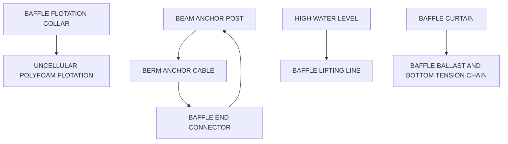

Temperature correction coefficient 1.09

<table>
<tr><td>Surface elevation</td><td>50.00</td><td>m</td></tr>
<tr><td>Minimum dissolved oxygen concentration</td><td>2.00</td><td>mg/L</td></tr>
</table>

Copyright © 2024 by the Water Environment Federation. For subscriber use only and not for distribution. All Rights Reserved.
Permission to copy must be obtained from WEF.
\n---\n

## Solution

Start solution by assuming winter pond temperature and determine volume of Cell 1 in the pond system.

<table>
<thead>
<tr><th>Parameter</th><th>Value</th><th>Unit</th></tr>
</thead>
<tbody>
<tr><td>Depth</td><td>4.00</td><td>m</td></tr>
<tr><td>Length-to-width ratio</td><td>2.00</td><td></td></tr>
<tr><td>Side slope</td><td>3.00</td><td></td></tr>
</tbody>
</table>

<p>1. Start solution by assuming winter pond temperature and determine volume of Cell 1 in the pond system.</p>

<table>
<thead>
<tr><th>Parameter</th><th>Value</th><th>Unit</th></tr>
</thead>
<tbody>
<tr><td>Assumed water temperature</td><td>12.06</td><td>°C</td></tr>
<tr><td>Correct reaction rate for temperature:</td><td>k_T = k_20 (1.036)^(T-20)</td><td></td></tr>
<tr><td>k_T</td><td>0.210</td><td>d^-1</td></tr>
<tr><td>Hydraulic residence time in cell 1</td><td>3.60</td><td>d</td></tr>
<tr><td>Effluent BOD in cell 1</td><td>C_0/(1 + k_T t) = 125.69</td><td>mg/L</td></tr>
<tr><td>Volume in cell 1</td><td>2044.80</td><td>m^3</td></tr>
</tbody>
</table>

<p>2. Calculate dimensions of cell 1 at water surface and the surface area:</p>

<table>
<thead>
<tr><th>Parameter</th><th>Value</th><th>Unit</th></tr>
</thead>
<tbody>
<tr><td>Depth</td><td>4.00</td><td>m</td></tr>
<tr><td>Width</td><td>24.51</td><td>m</td></tr>
<tr><td>Length</td><td>49.02</td><td>m</td></tr>
<tr><td>Surface area in cell 1</td><td>1201.61</td><td>m^2</td></tr>
<tr><td></td><td>0.134</td><td>ac</td></tr>
</tbody>
</table>

<p>3. Check pond temperature using cell area calculated above and equation shown below:</p>
\n---\n

## Cell 1

<table>
  <tr>
    <td>Cell 1 Tw = (Af Ta + QTi)/(Af + Q)</td>
    <td>11.40</td>
    <td>°C</td>
  </tr>
<tr>
    <td>If calculated Tw differs from assumed water temperature, another iteration is necessary:</td>
    <td></td>
    <td></td>
  </tr>
<tr>
    <td>Add a freeboard</td>
    <td>0.90</td>
    <td>m</td>
  </tr>
<tr>
    <td>Dimensions at top of dike in cell 1</td>
    <td></td>
    <td></td>
  </tr>
<tr>
    <td>W top of dike</td>
    <td>29.91</td>
    <td>m</td>
  </tr>
<tr>
    <td>L top of dike</td>
    <td>54.42</td>
    <td>m</td>
  </tr>
</table>

## 4. For second cell

<table>
  <tr>
    <td>Entering water temperature</td>
    <td>11.40</td>
    <td>°C</td>
  </tr>
<tr>
    <td>Correct reaction rate for temperature:</td>
    <td></td>
    <td></td>
  </tr>
<tr>
    <td>$$k_T = k_{20} (1.09)^{(T-20)}$$</td>
    <td></td>
    <td></td>
  </tr>
<tr>
    <td></td>
    <td>0.20</td>
    <td>d^-1</td>
  </tr>
<tr>
    <td>Influent BOD in cell 2 =</td>
    <td>125.69</td>
    <td>mg/L</td>
  </tr>
<tr>
    <td>Hydraulic residence time in cell 2 =</td>
    <td>3.50</td>
    <td>d</td>
  </tr>
<tr>
    <td>Effluent BOD in cell 2 =</td>
    <td>73.39</td>
    <td>mg/L</td>
  </tr>
<tr>
    <td>Volume in cell 2 =</td>
    <td>1988.00</td>
    <td>m^3</td>
  </tr>
<tr>
    <td>Calculate dimensions of cell 2 at water surface and the surface area:</td>
    <td></td>
    <td></td>
  </tr>
<tr>
    <td>Depth =</td>
    <td>4.00</td>
    <td>m</td>
  </tr>
<tr>
    <td>Width =</td>
    <td>24.28</td>
    <td>m</td>
  </tr>
</table>

\n---\n

<table>
<tr><td>Length</td><td>48.56</td><td>m</td></tr>
<tr><td>Area</td><td>1179.11</td><td>m^2</td></tr>
<tr><td></td><td>0.134</td><td>ac</td></tr>
<tr><td>Cell 2 Tw = (AfTa + QTi)/(Af + Q)</td><td>9.67</td><td>°C</td></tr>
<tr><td>Add a freeboard</td><td>0.90</td><td>m</td></tr>
<tr><td>Dimensions at top of dike in cell 2</td><td></td><td></td></tr>
<tr><td>W top of dike</td><td>29.68</td><td>m</td></tr>
<tr><td>L top of dike</td><td>53.96</td><td>m</td></tr>
</table>

## 5. For third cell

<table>
<tr><td>Entering water temperature</td><td>9.67</td><td>°C</td></tr>
<tr><td>k_T =</td><td>0.19</td><td>d^-1</td></tr>
<tr><td>Influent BOD to cell 3=</td><td>73.39</td><td>mg/L</td></tr>
<tr><td>Hydraulic residence time in cell 3 =</td><td>3.00</td><td>d</td></tr>
<tr><td>Effluent BOD in cell 3 =</td><td>46.61</td><td>mg/L</td></tr>
<tr><td>Volume in cell 3 =</td><td>1704.00</td><td>m^3</td></tr>
<tr><td>Calculate dimensions of cell 3 at water surface and the surface area:</td><td></td><td></td></tr>
<tr><td>Depth</td><td>4.00</td><td>m</td></tr>
<tr><td>Width</td><td>23.07</td><td>m</td></tr>
</table>

\n---\n

<table>
  <tr>
    <td>Area =</td>
    <td>1064.56</td>
    <td>m2</td>
  </tr>
<tr>
    <td></td>
    <td>0.05 ha (0.134 ac)</td>
    <td></td>
  </tr>
<tr>
    <td>Cell 3 Tw = (AfTa + QTi)/(Af + Q)</td>
    <td>8.86</td>
    <td>°C</td>
  </tr>
<tr>
    <td>Add a freeboard</td>
    <td>0.90</td>
    <td>m</td>
  </tr>
<tr>
    <td colspan="3">Dimensions at top of dike in cell 3</td>
  </tr>
<tr>
    <td>W top of dike =</td>
    <td>28.47</td>
    <td>m</td>
  </tr>
<tr>
    <td>Top of dike</td>
    <td>51.54</td>
    <td>m</td>
  </tr>
</table>

<h2>6. For fourth cell</h2>

<table>
  <tr>
    <td>Entering water temperature</td>
    <td>8.86</td>
    <td>°C</td>
  </tr>
<tr>
    <td>k<sub>T</sub> =</td>
    <td>0.19</td>
    <td>d<sup>-1</sup></td>
  </tr>
<tr>
    <td>Influent BOD to cell 4 =</td>
    <td>46.61</td>
    <td>mg/L</td>
  </tr>
<tr>
    <td>Hydraulic residence time in cell 4 =</td>
    <td>3.00</td>
    <td>d</td>
  </tr>
<tr>
    <td>Effluent BOD in cell 4 =</td>
    <td>29.91</td>
    <td>mg/L</td>
  </tr>
<tr>
    <td>Volume in cell 4 =</td>
    <td>1704.00</td>
    <td>m3</td>
  </tr>
<tr>
    <td colspan="3"><strong>Calculate dimensions of cell 4 at water surface and the surface area:</strong></td>
  </tr>
<tr>
    <td>Depth =</td>
    <td>4.00</td>
    <td>m</td>
  </tr>
<tr>
    <td>Width =</td>
    <td>23.07</td>
    <td>m</td>
  </tr>
<tr>
    <td>Length =</td>
    <td>46.14</td>
    <td>m</td>
  </tr>
</table>

\n---\n

0.05 ha (0.134 ac)

<table>
  <tr><td>Cell 4 Tw = (AfTa + QTi)/(Af + Q)</td><td>8.44</td><td>°C</td></tr>
<tr><td>Add a freeboard</td><td>0.90</td><td>m</td></tr>
<tr><td>Dimensions at top of dike</td><td></td><td></td></tr>
<tr><td>W top of dike =</td><td>28.47</td><td>m</td></tr>
<tr><td>L top of dike =</td><td>51.54</td><td>m</td></tr>
</table>

7. Determine the oxygen requirements for pond system based on organic loading and water temperature. Maximum oxygen requirements will occur during the summer months.

<table>
  <tr><td>Tw for summer cell 1 = (AfTa + QTi)/(Af + Q)</td><td>20.14</td><td>°C</td></tr>
<tr><td>Tw for summer cell 2 = (AfTa + QTi)/(Af + Q)</td><td>22.62</td><td>°C</td></tr>
<tr><td>Tw for summer cell 3 = (AfTa + QTi)/(Af + Q)</td><td>23.77</td><td>°C</td></tr>
<tr><td>Tw for summer cell 4 = (AfTa + QTi)/(Af + Q)</td><td>24.36</td><td>°C</td></tr>
<tr><td>Organic load in the influent wastewater Organic load on cell 1 = C0 * Q</td><td>5.21</td><td>kg/h</td></tr>
<tr><td>Calculate effluent BOD from first cell using equations below at Tw for summer:</td><td></td><td></td></tr>
<tr><td>k_Tw = k20 * (temperature coefficient) (T_w - 20)</td><td>0.28</td><td>d</td></tr>
<tr><td>C1 = C0/[(k_tw) + 1]</td><td>110.08</td><td>mg/L</td></tr>
</table>

\n---\n

<table>
<tr><td>Organic load on cell 2 = Q x C1</td><td>2.61</td><td>kg/h</td></tr>
<tr><td>kTw = k20 * (temperature coefficient) (T<sub>w</sub>-20)</td><td>0.30</td><td>d-1</td></tr>
<tr><td>C2 = C1/[(kt)+1]</td><td>53.45</td><td>mg/L</td></tr>
<tr><td>Winter =</td><td>73.39</td><td>mg/L</td></tr>
<tr><td>Organic load on cell 3 = Cz * Q</td><td>1.26</td><td>kg/h</td></tr>
<tr><td>kTw = k20 * (temperature coefficient) (T<sub>w</sub>-20)</td><td>0.32</td><td>d-1</td></tr>
<tr><td>C3 = C2/[(kt)+1]</td><td>27.46</td><td>mg/L</td></tr>
<tr><td>Winter =</td><td>46.61</td><td>mg/L</td></tr>
<tr><td>Organic load on cell 4 = C3 * Q</td><td>0.65</td><td>kg/h</td></tr>
<tr><td>kTw = k20 * (temperature coefficient) (T<sub>w</sub>-20)</td><td>0.32</td><td>d-1</td></tr>
<tr><td>C4 = C3/[(kt)+1]</td><td>13.97</td><td>mg/L</td></tr>
<tr><td>Winter =</td><td>29.91</td><td>mg/L</td></tr>
<tr><td colspan="2">Oxygen demand is assumed to be a multiple of organic loading</td><td></td></tr>
<tr><td>Multiplying factor</td><td>1.50</td><td></td></tr>
<tr><td>Oxygen demand in cell 1 = Organic load 1 *</td><td></td><td></td></tr>
<tr><td>Multiplication factor</td><td>7.81</td><td>kg/h</td></tr>
</table>

\n---\n

<table>
  <tr><td>Multiplication factor</td><td>3.91</td><td>kg/h</td></tr>
<tr><td>Oxygen demand in cell 3 = Organic load 3 *</td><td></td><td></td></tr>
<tr><td>Multiplication factor</td><td>1.90</td><td>kg/h</td></tr>
<tr><td>Oxygen demand in cell 4 = Organic load 4 *</td><td></td><td></td></tr>
<tr><td>Multiplication factor</td><td>0.97</td><td>kg/h</td></tr>
</table>

8. Use the following equation to calculate equivalent oxygen transfer:
$$
N = \frac{N_{OD}}{a\left(\frac{C_{sw} - C_L}{C_s}\right)\left(\text{temperature factor}\right)^{\left(T_w - 20\right)}}
$$

- NOD = oxygen demand in various cells
- C_sw = b * C_ss * P
\n---\n

## 9. Evaluate surface and diffused-air aeration equipment to satisfy oxygen requirement only. Power required for surface aerators

<table>
<thead>
<tr><th>Parameter</th><th>Value</th></tr>
</thead>
<tbody>
<tr><td>b</td><td>0.90</td></tr>
<tr><td>P = ratio of barometric pressure at pond site to pressure at sea level</td><td>0.80</td></tr>
<tr><td>Cell 1 Css (tap water oxygen saturation value)</td><td>9.15 mg/L</td></tr>
<tr><td>Cell 2 Css</td><td>8.74 mg/L</td></tr>
<tr><td>Cell 3 Css</td><td>8.56 mg/L</td></tr>
<tr><td>Cell 4 Css</td><td>8.46 mg/L</td></tr>
<tr><td>Cell 1 Csw</td><td>6.59 mg/L</td></tr>
<tr><td>Cell 2 Csw</td><td>6.29 mg/L</td></tr>
<tr><td>Cell 3 Csw</td><td>6.16 mg/L</td></tr>
<tr><td>Cell 4 Csw</td><td>6.09 mg/L</td></tr>
<tr><td>a = oxygen transfer in wastewater / oxygen transfer in tap water</td><td>0.90</td></tr>
<tr><td>CL = min. oxygen conc. to be maintained in wastewater (typically assumed = 2 mg/L)</td><td>2.00 mg/L</td></tr>
<tr><td>Cs = oxygen saturation value of tap water at 20 °C and 1 atm</td><td>9.17 mg/L</td></tr>
<tr><td>Temperature factor (typically = 1.025)</td><td>1.025</td></tr>
<tr><td>N1</td><td>17.29 kg/h</td></tr>
<tr><td>N2</td><td>8.70 kg/h</td></tr>
<tr><td>N3</td><td>4.23 kg/h</td></tr>
<tr><td>N4</td><td>2.18 kg/h</td></tr>
</tbody>
</table>

\n---\n

# Power requirements for aeration systems

<h2>Power required for surface aerators</h2>

<table>
  <thead>
    <tr><th>Measurement</th><th>Value</th></tr>
  </thead>
  <tbody>
    <tr><td>kg O2/kWh</td><td>1.90 kg O2/kWh</td></tr>
<tr><td>kg O2/hp-h</td><td>1.40 kg O2/hp-h</td></tr>
  </tbody>
</table>

<h2>Power required for diffused air</h2>

<table>
  <thead>
    <tr><th>Measurement</th><th>Value</th></tr>
  </thead>
  <tbody>
    <tr><td>kg O2/kWh</td><td>2.70 kg O2/kWh</td></tr>
<tr><td>kg O2/hp-h</td><td>2.00 kg O2/hp-h</td></tr>
  </tbody>
</table>

<h2>Total power for surface aeration</h2>

<table>
  <thead>
    <tr><th>Cell</th><th>Power</th><th>HP</th></tr>
  </thead>
  <tbody>
    <tr><td>Cell 1</td><td>9.10 kW</td><td>12.35 hp</td></tr>
<tr><td>Cell 2</td><td>4.58 kW</td><td>6.21 hp</td></tr>
<tr><td>Cell 3</td><td>2.23 kW</td><td>2.99 hp</td></tr>
<tr><td>Cell 4</td><td>1.15 kW</td><td>1.54 hp</td></tr>
  </tbody>
</table>

<h2>Total power for diffused aeration</h2>

<table>
  <thead>
    <tr><th>Cell</th><th>Power</th><th>HP</th></tr>
  </thead>
  <tbody>
    <tr><td>Cell 1</td><td>6.40 kW</td><td>8.64 hp</td></tr>
  </tbody>
</table>

\n---\n

<table>
  <thead>
    <tr><th>Cell</th><th>Power (kW)</th><th>Power (hp)</th></tr>
  </thead>
  <tbody>
    <tr><td>Cell 2</td><td>3.22</td><td>4.35</td></tr>
<tr><td>Cell 3</td><td>1.57</td><td>2.12</td></tr>
<tr><td>Cell 4</td><td>0.81</td><td>1.09</td></tr>
  </tbody>
</table>

These surface and diffused aerator power requirements must be corrected for gearing and blower efficiency:

- Gearing efficiency: 0.90
- Blower efficiency: 0.90

Total power requirements corrected for efficiency

<table>
  <thead>
    <tr><th>Cell</th><th>Power (kW)</th><th>Power (hp)</th></tr>
  </thead>
  <tbody>
    <tr><td>Cell 1—surface aerators</td><td>10.11</td><td>13.48</td></tr>
<tr><td>Cell 2—surface aerators</td><td>5.09</td><td>4.31</td></tr>
<tr><td>Cell 3—surface aerators</td><td>2.48</td><td>1.20</td></tr>
<tr><td>Cell 4—surface aerators</td><td>1.27</td><td>0.31</td></tr>
<tr><td>Total power – surface aerators</td><td>18.95</td><td>19.30</td></tr>
  </tbody>
</table>

\n---\n

# 5.0 COMPLETE-MIX AERATED PONDS

<table>
<thead>
<tr><th>Description</th><th>Value</th></tr>
</thead>
<tbody>
<tr><td>Power cost per kWhr; $ /kWh</td><td>0.06</td></tr>
<tr><td>Total power costs for surface aerators per year</td><td>9958.02 $/yr</td></tr>
<tr><td>Cell 1—diffused aeration</td><td>7.11 kW</td></tr>
<tr><td> </td><td>9.49 hp</td></tr>
<tr><td>Cell 2—diffused aeration</td><td>3.58 kW</td></tr>
<tr><td> </td><td>3.03 hp</td></tr>
<tr><td>Cell 3—diffused aeration</td><td>1.74 kW</td></tr>
<tr><td> </td><td>0.85 hp</td></tr>
<tr><td>Cell 4—diffused aeration</td><td>0.90 kW</td></tr>
<tr><td> </td><td>0.22 hp</td></tr>
<tr><td>Total power – diffused aeration</td><td>13.33 kW</td></tr>
<tr><td> </td><td>13.58 hp</td></tr>
<tr><td>Power cost per kWh, $/kWh</td><td>0.06</td></tr>
<tr><td>Total power costs for diffused aerators per year</td><td>7007.49 $/yr</td></tr>
</tbody>
</table>

These power requirements are approximate values and are used for the preliminary selection of equipment. These values are used in conjunction with equipment manufacturers catalogs to select the proper equipment.

Surface aeration equipment is subject to potential icing problems in cold climates, and there are many options available to avoid this problem (Figures 7.2 and 7.3):
Improvements have been made in fine-bubble perforated tubing, but a diligent maintenance program is still a good policy. In the past, a number of communities experienced clogging of the perforations, particularly in hard water areas, and corrective action required purging with HCl gas.

The final element recommended in this partial-mix aerated pond system is a settling cell with a 2-day hydraulic detention time.

## 5.0 COMPLETE-MIX AERATED PONDS
Although there are many configurations of complete-mix pond systems, most are similar in design. Examples of several types that use the complete-mix concept are discussed in

\n---\n

the following sections: Section 6.0, "High-Performance Aerated Pond Systems"; Section 19.12, "Nitrogen Removal in Ponds Coupled With Wetlands and Gravel Bed Nitrification"; Section 14.2, "BIOLAC® Processes"; and Section 15.0, "Lemna Systems". Most complete-mix systems are designed using the equations that are presented in the following paragraphs, with minor modifications. Temperature effects are discussed in Section 4.5.

The trend toward omitting redundancy in design of aerated lagoon systems has been alarming. It appears that little thought is given to the need for maintenance in the future. Operating costs associated with aerated lagoon systems frequently have been ignored or overlooked in comparing options available to a community. The initial cost of systems without redundancy obviously is lower than that obtained with systems including flexibility in operation, but the cost to the environment and the owner will be far greater when maintenance is required.

## 5.1 Design Equations

The design model using first-order kinetics and operating "n" number of equalized cells in series is given by eq 7.18 (Middlebrooks et al., 1982; GLUMRB, 1997), as follows:

$$
\frac{C_n}{C_0} = \frac{1}{\left[1 + \left(\frac{k t}{n}\right)\right]^n} \quad (7.18)
$$

Where

- \(C_n =\) effluent BOD concentration in cell \(n\), mg/L;
- \(C_0 =\) influent BOD concentration, mg/L;
- \(k =\) first-order reaction rate constant, d\(^{-1}\);
- \(k = 2.5\) d\(^{-1}\) at 20 °C (assumed to be constant in all cells);
- \(t =\) total hydraulic residence time in pond system, days; and
- \(n =\) number of cells in the series.

If other than a series of equal-volume ponds are to be used or it is desired to use varying reaction rates, it is necessary to use the following general equation:
\n---\n

## 7.19 Equation

$$
\frac{C_n}{C_0} \;=\; \left(\frac{1}{1 + k_1 t_1}\right)
\left(\frac{1}{1 + k_2 t_2}\right) \cdots
\left(\frac{1}{1 + k_n t_n}\right)
$$

Where

- \(k_1, k_2, \dots, k_n\) = the reaction rates in cells 1 through n (all typically assumed equal for lack of better information)
- \(t_1, t_2, \dots, t_n\) = the hydraulic residence times in the respective cells

Mara (1975) has shown that a number of equal-volume reactors in series are more efficient than unequal volumes; however, due to site topography or other factors, there may be cases where it is necessary to construct cells of unequal volume.

## 5.2 Selection of Reaction Rate Parameters

The selection of the \(k\) value is one of the critical decisions in the design of any pond system. A design value of 2.5 d\(^{-1}\) at 20 °C (68 °F) is recommended by Reynolds and Middlebrooks (1990) based on a study of a complete-mix aerated lagoon system located in Colorado. Higher values are recommended by others, but designs based on this value of \(k_c\) have worked well at full design load; whereas, designs with higher \(k_c\) values have not functioned as well at design flow. In most cases, the designer will be constrained by state design standards, and in many states the prescribed reaction rate will exceed the value of 2.5 d\(^{-1}\).

## 5.3 Influence of Number of Cells

The influence of the number of cells is calculated using eq 7.13, which is shown in Section 4.3, “Influence of Number of Cells.” The only change when using the complete-mix design model is the reaction rate (k).

## 5.4 Example 7.4

Compare detention times for the same BOD removal levels in complete-mix aerated ponds having one to five cells. Assume \(C_0 = 200\) mg/L, \(k = 2.5\) d\(^{-1}\), \(T_w = 20^\circ C\). Solution:

1. Solve eq 7.13 for a single-cell system:
\n---\n

## (Equation and calculation)

$$ t = \frac{n}{k} \left[ \left(\frac{C_0}{C_n}\right)^{\frac{1}{n}} - 1 \right] $$

$$ t = \frac{1}{2.5} \left[ \left(\frac{200}{30}\right)^{\frac{1}{n}} - 1 \right] $$

t = 2.7 d

----

2. Similarly,

When

<table>
<tr><td>n = 2</td><td>t = 1.04 d</td></tr>
<tr><td>n = 3</td><td>t = 0.35 d</td></tr>
<tr><td>n = 4</td><td>t = 0.24 d</td></tr>
</table>

3. Continuing to increase n will result in the detention time being equal to the detention time in a plug-flow reactor. It can be seen from the aforementioned tabulation that the advantages diminish after the third cell. This advantage is lost because of the need for a hydraulic residence time of approximately one and one-half days for the biomass to develop.

5.5 Temperature Effects

See Section 4.5, “Temperature Effects”.

5.6 Pond Configuration

See Section 4.6, “Pond Configuration”.

5.7 Mixing and Aeration

The complete-mix design, illustrated in Example 7.5, is essentially the same as that for the partial-mix design except for a few parameter changes (see Section 4.7, “Mixing and

\n---\n

## 5.8 Example 7.5

The four-cell system can be obtained by using floating plastic partitions such as those shown in Figure 7.4, and the aeration equipment can be selected from the types shown in Figures 7.2 and 7.3.

Design a four-cell complete-mix aerated pond with two trains to remove BOD5 for the following environmental conditions and wastewater characteristics. Q = 5000 m^3/d (1.32 mgd), C0 = 220 mg/L, Ce from fourth cell = 10 mg/L or better; k20 = 2.5 d^-1, winter air temperature = 5 °C, summer air temperature = 25 °C, elevation 50 m, maintain a minimum dissolved oxygen concentration of 2.5 mg/L in all cells, use a pond depth of 4 m (13.1 ft).

### Solution

<table>
  <thead>
    <tr><th>Parameter</th><th>Value</th></tr>
  </thead>
  <tbody>
    <tr><td>Flowrate</td><td>Q = 5000.00 m^3/d (1.32 mgd)</td></tr>
<tr><td>Influent BOD</td><td>220.00 mg/L</td></tr>
<tr><td>Influent TSS</td><td>200.00 mg/L</td></tr>
<tr><td>Total nitrogen</td><td>30.00 mg/L</td></tr>
<tr><td>Total phosphorus</td><td>10.00 mg/L</td></tr>
<tr><td>Reaction rate at 20 °C</td><td>2.50 d^-1</td></tr>
<tr><td>Influent temperature °C</td><td>15.00 °C</td></tr>
<tr><td>Winter air temperature °C</td><td>5.00 °C</td></tr>
<tr><td>Summer air temperature °C</td><td>25.00 °C</td></tr>
<tr><td>f = units conversion factor</td><td>0.50</td></tr>
<tr><td>Temperature correction coefficient</td><td>1.06</td></tr>
<tr><td>Surface elevation</td><td>50.00 m</td></tr>
<tr><td>Minimum dissolved oxygen concentration</td><td>2.50 mg/L</td></tr>
<tr><td>Depth</td><td>4.00 m</td></tr>
<tr><td>Length-to-width ratio</td><td>2.00</td></tr>
<tr><td>Side slope</td><td>3.00</td></tr>
  </tbody>
</table>

\n---\n

# 1. Start solution by assuming winter pond temperature and determine volume of a cell in the pond system

- Assumed water temperature: 8.82 °C
- Correct reaction rate for temperature:
  - $$k_T = k_{20}(1.09)^{(T-20)}$$
- \(k_T = 1.30\ \text{d}^{-1}\)
- Hydraulic residence time in cell 1 = 1.5 d
- Effluent BOD in cell 1 = 74.45 mg/L
- Volume in cell 1 = 7500 m³

# 2. Calculate dimensions of cell at water surface and the surface area

- Depth = 4.00 m
- Width = 39.37 m
- Length = 78.75 m
- Surface area in cell 1 = 3100.42 m²
- 0.3 ha (0.77 ac)

# 3. Check pond temperature using cell area calculated above and equation shown below

- Cell 1 \(T_w = \dfrac{A_f T_a + Q T_i}{A_f + Q}\)
  - $$T_w = 8.82\,^\circ\text{C}$$
- If calculated \(T_w\) differs from assumed water temperature, another iteration is necessary, add a freeboard = 0.90 m

- Dimensions at top of dike in cell 1
  - W_top of dike = 44.77 m
  - L_top of dike = 84.15 m

# 4. For second cell

\n---\n

# 5. For third cell

- Entering water temperature: 8.82 °C
- Correct reaction rate for temperature:
  - $$k_T = k_{20} (1.09)^{(T-20)}$$
  - k_T = 1.30 d⁻¹
- Influent BOD in cell 2 = 74.45 mg/L
- Hydraulic residence time in cell 2 = 1.5 d
- Effluent BOD in cell 2 = 25.20 mg/L
- Volume in cell 2 = 7500 m³
- Calculate dimensions of cell 2 at water surface and the surface area:
  - Depth = 4.00 m
  - Width = 39.37 m
  - Length = 78.75 m
  - Area = 3100.42 m²
  - Area = 0.3 ha (0.77 ac)
- Cell 2 T_w = (A_f T_a + Q T_i) / (A_f + Q) = 11.20 °C
- Add a freeboard = 0.90 m
- Dimensions at top of dike in cell 2:
  - W_top of dike = 44.77 m
  - L_top of dike = 84.15 m

- 5. For third cell
\n---\n

# Cell 3 and Fourth Cell Calculations

- Entering water temperature: 7.91 °C
- kt = 1.24 d^-1
- Influent BOD to cell 3 = 25.20 mg/L
- Hydraulic residence time in cell 3 = 1.50 d
- Effluent BOD in cell 3 = 8.83 mg/L
- Volume in cell 3 = 7500 m^3

## Calculate dimensions of cell 3 at water surface and the surface area:

<table>
  <thead>
    <tr><th>Parameter</th><th>Value</th><th>Unit</th></tr>
  </thead>
  <tbody>
    <tr><td>Depth</td><td>4.00</td><td>m</td></tr>
<tr><td>Width</td><td>39.37</td><td>m</td></tr>
<tr><td>Length</td><td>78.75</td><td>m</td></tr>
<tr><td>Area</td><td>3100.42</td><td>m^2</td></tr>
<tr><td>0.3 ha (0.77 ac)</td><td></td><td></td></tr>
  </tbody>
</table>

- Cell 3 T_w = (A_f T_a + Q T_i)/(A_f + Q) = 7.22 °C
- Add a freeboard: 0.90 m

### Dimensions at top of dike in cell 3

<table>
  <thead>
    <tr><th>Dimension</th><th>Value</th><th>Unit</th></tr>
  </thead>
  <tbody>
    <tr><td>W top of dike</td><td>44.77</td><td>m</td></tr>
<tr><td>L top of dike</td><td>84.15</td><td>m</td></tr>
  </tbody>
</table>

## 6. For fourth cell

- Entering water temperature: 7.22 °C
- kt = 1.19 d^-1

\n---\n

## 7. Determine the oxygen requirements for pond system based on organic loading and water temperature.

<table>
  <thead>
    <tr><th>Parameter</th><th>Value</th><th>Units</th></tr>
  </thead>
  <tbody>
    <tr><td>Influent BOD to cell 4</td><td>8.83</td><td>mg/L</td></tr>
<tr><td>Hydraulic residence time in cell 4</td><td>1.50</td><td>d</td></tr>
<tr><td>Effluent BOD in cell 4</td><td>3.17</td><td>mg/L</td></tr>
<tr><td>Volume in cell 4</td><td>7500</td><td>m3</td></tr>
  </tbody>
</table>

<p>Calculate dimensions of cell 4 at water surface and the surface area:</p>

<table>
  <thead>
    <tr><th>Parameter</th><th>Value</th><th>Units</th></tr>
  </thead>
  <tbody>
    <tr><td>Depth</td><td>4.00</td><td>m</td></tr>
<tr><td>Width</td><td>39.37</td><td>m</td></tr>
<tr><td>Length</td><td>78.75</td><td>m</td></tr>
<tr><td>Area</td><td>3100.42</td><td>m2</td></tr>
<tr><td>Area</td><td>0.3</td><td>ha (0.77 ac)</td></tr>
  </tbody>
</table>

<table>
  <thead>
    <tr><th>Parameter</th><th>Value</th><th>Units</th></tr>
  </thead>
  <tbody>
    <tr><td>Cell 4 Tw</td><td>(AfTa + QT_i)/(Af + Q) = 6.70</td><td>°C</td></tr>
<tr><td>Area (for Tw calculation)</td><td>0.3</td><td>ha (0.77 ac)</td></tr>
  </tbody>
</table>

<table>
  <thead>
    <tr><th>Parameter</th><th>Value</th><th>Units</th></tr>
  </thead>
  <tbody>
    <tr><td>Add a freeboard</td><td>0.90</td><td>m</td></tr>
  </tbody>
</table>

<p>Dimensions at top of dike</p>

<table>
  <thead>
    <tr><th>Dimension</th><th>Value</th><th>Units</th></tr>
  </thead>
  <tbody>
    <tr><td>W top of dike</td><td>44.77</td><td>m</td></tr>
<tr><td>L top of dike</td><td>84.15</td><td>m</td></tr>
  </tbody>
</table>

\n---\n

Maximum oxygen requirements will occur during the summer months.
Use eq 7.14 to estimate pond temperature during the summer.

<table>
<thead>
<tr><th>Cell</th><th>Tw for summer</th><th>°C</th></tr>
</thead>
<tbody>
<tr><td>1</td><td>(AfTa + QTi)/(Af + Q)</td><td>17.37</td></tr>
<tr><td>2</td><td>(AfTa + QTi)/(Af + Q)</td><td>19.17</td></tr>
<tr><td>3</td><td>(AfTa + QTi)/(Af + Q)</td><td>20.55</td></tr>
<tr><td>4</td><td>(AfTa + QTi)/(Af + Q)</td><td>21.60</td></tr>
</tbody>
</table>

Organic load in the influent wastewater

<table>
<thead>
<tr><th>Description</th><th>Value</th><th>Unit</th></tr>
</thead>
<tbody>
<tr><td>Organic load on cell 1 = C0 * Q</td><td>45.83</td><td>kg/h</td></tr>
</tbody>
</table>

Calculate effluent BOD from first cell

Using equations below at Tw for summer

$$
k_{Tw} = k_{20} \cdot (\text{temperature coefficient})^{(T_w-20)}
$$

2.14 d^{-1}

C1 = C0/[ (k_t) + 1]

$$
C_1 = \frac{C_0}{(k_t + 1)} = 52.18 \, \text{mg/L}
$$

Winter = 74.45 mg/L

Organic load on cell 2 = Q × C1

10.87 kg/h

$$
k_{Tw} = k_{20} \cdot (\text{temperature coefficient})^{(T_w-20)}
$$

2.38 d^{-1}

C2 = C1/[ (k t) + 1]

$$
C_2 = \frac{C_1}{(k_t + 1)} = 11.41 \, \text{mg/L}
$$

Winter = 25.20 mg/L
\n---\n

## 8. Use the following equation to calculate equivalent oxygen transfer:

<table>
  <thead>
    <tr><th>Description</th><th>Value</th></tr>
  </thead>
  <tbody>
    <tr><td>Organic load on cell 3 = C2 * Q</td><td>2.38 kg/h</td></tr>
<tr><td>kTw = k20 * (temperature coefficient)^(Tw-20)</td><td>2.58 d^-1</td></tr>
<tr><td>C3 = C2/[(kt)+1]</td><td>2.34 mg/L</td></tr>
<tr><td>Winter</td><td>8.83 mg/L</td></tr>
<tr><td>Organic load on cell 4 = C3 * Q</td><td>0.49 kg/h</td></tr>
<tr><td>kTw = k20 * (temperature coefficient)^(Tw-20)</td><td>2.75 d^-1</td></tr>
<tr><td>C4 = C3/[(kt)+1]</td><td>0.46 mg/L</td></tr>
<tr><td>Winter</td><td>3.17 mg/L</td></tr>
<tr><td>Oxygen demand is assumed to be a multiple of organic loading:</td><td></td></tr>
<tr><td>Multiplying factor:</td><td>1.50</td></tr>
<tr><td>Oxygen demand in cell 1 = Organic loading 1 * Multiplication factor</td><td>68.75 kg/h</td></tr>
<tr><td>Oxygen demand in cell 2 = Organic loading 2 * Multiplication factor</td><td>16.30 kg/h</td></tr>
<tr><td>Oxygen demand in cell 3 = Organic loading 3 * Multiplication factor</td><td>3.56 kg/h</td></tr>
<tr><td>Oxygen demand in cell 4 = Organic loading 4 * Multiplication factor</td><td>0.73 kg/h</td></tr>
  </tbody>
</table>

\n---\n

# NOD Oxygen Demand and Tap Water Oxygen Transfer Parameters

$$
N = \frac{NOD}{ a \left[ \frac{C_{sw} - C_L}{C_S} \right] \left( \text{temperature factor} \right)^{(T_w - 20)} }
$$

- NOD = oxygen demand in various cells
- C_sw = b · C_ss · P
- b = 0.90
- P = ratio of barometric pressure at pond site to pressure at sea level
  - 1.00

Table: Tap water saturation values and C_sw by cell

<table>
<thead>
<tr><th>Cell</th><th>C_ss (mg/L)</th><th>C_sw (mg/L)</th></tr>
</thead>
<tbody>
<tr><td>Cell 1</td><td>9.58</td><td>8.61</td></tr>
<tr><td>Cell 2</td><td>9.23</td><td>8.29</td></tr>
<tr><td>Cell 3</td><td>8.98</td><td>8.07</td></tr>
<tr><td>Cell 4</td><td>8.79</td><td>7.90</td></tr>
</tbody>
</table>

- Cell 1 C_ss = 9.58 mg/L
- Cell 2 C_ss = 9.23 mg/L
- Cell 3 C_ss = 8.98 mg/L
- Cell 4 C_ss = 8.79 mg/L

- a = oxygen transfer in wastewater / oxygen transfer in tap water
  - 0.80

- C_L = minimum oxygen concentration to be maintained in wastewater
  - (typically assumed) 2 mg/L
  - 2.50 mg/L

- C_S = oxygen saturation value of tap water at 20°C and 1 atm
  - 9.08 mg/L

- Temperature factor (typically = 1.025)
  - 1.025

- N1 = 136.37 kg/h
- N2 = 32.60 kg/h
- N3 = 7.17 kg/h
- N4 = 1.48 kg/h

\n---\n

## 9. Evaluate surface and diffused-air aeration equipment to satisfy oxygen requirement only.
\n---\n

This page contains no content after removing header, footer, and page numbers.
\n---\n

# Power requirements for aerators

## Power required for surface aerators approximately

<table>
<tr><td>Power required for surface aerators approximately</td><td></td></tr>
<tr><td>1.9 kg O2 / kWh</td><td>1.90 kg O2 / kWh</td></tr>
<tr><td>or 1.4 kg / hp·h</td><td>1.40 kg O2 / hp·h</td></tr>
</table>

## Power required for diffused air approximately

<table>
<tr><td>Power required for diffused air approximately</td><td></td></tr>
<tr><td>2.7 kg O2 / kWh</td><td>2.70 kg O2 / kWh</td></tr>
<tr><td>or 2 kg / hp·h</td><td>2.00 kg O2 / hp·h</td></tr>
</table>

### Total power for surface aeration

<table>
<thead>
<tr><th>Cell</th><th>Power (kW)</th><th>Power (hp)</th></tr>
</thead>
<tbody>
<tr><td>Cell 1</td><td>71.77</td><td>96.25</td></tr>
<tr><td>Cell 2</td><td>17.16</td><td>23.01</td></tr>
<tr><td>Cell 3</td><td>3.77</td><td>5.06</td></tr>
<tr><td>Cell 4</td><td>0.78</td><td>1.04</td></tr>
</tbody>
</table>

### Total power for diffused aeration

<table>
<thead>
<tr><th>Cell</th><th>Power (kW)</th><th>Power (hp)</th></tr>
</thead>
<tbody>
<tr><td>Cell 1</td><td>50.51</td><td>67.73</td></tr>
<tr><td>Cell 2</td><td>12.07</td><td>16.19</td></tr>
<tr><td>Cell 3</td><td>2.65</td><td>3.56</td></tr>
<tr><td>Cell 4</td><td>0.55</td><td>0.73</td></tr>
</tbody>
</table>

These surface and diffused aerator power requirements must be corrected for gearing and blower efficiency:
- Gearing efficiency: 0.90
- Blower efficiency: 0.90

\n---\n

No main content on page after removing header and footer metadata.
\n---\n

<h2>Total power requirements corrected for efficiency</h2>

<table>
  <thead>
    <tr><th>Item</th><th>Power (kW)</th><th>Power (hp)</th></tr>
  </thead>
  <tbody>
    <tr><td>Cell 1—surface aerators</td><td>79.75</td><td>106.94</td></tr>
<tr><td>Cell 2—surface aerators</td><td>19.06</td><td>25.57</td></tr>
<tr><td>Cell 3—surface aerators</td><td>4.19</td><td>5.62</td></tr>
<tr><td>Cell 4—surface aerators</td><td>0.86</td><td>1.16</td></tr>
<tr><td><strong>Total power—surface aerators</strong></td><td>103.87</td><td>139.28</td></tr>
<tr><td>Power cost per kilowatt hour, $/kWh</td><td>0.07</td><td></td></tr>
<tr><td>Total power costs for surface aerators per year</td><td>63 890.87</td><td>$/a</td></tr>
<tr><td>Cell 1—diffused aeration</td><td>56.12</td><td>75.25</td></tr>
<tr><td>Cell 2—diffused aeration</td><td>13.42</td><td>17.99</td></tr>
<tr><td>Cell 3—diffused aeration</td><td>2.95</td><td>3.96</td></tr>
<tr><td>Cell 4—diffused aeration</td><td>0.61</td><td>0.82</td></tr>
<tr><td><em>Total power—diffused aeration</em></td><td>73.09</td><td>98.02</td></tr>
<tr><td>Power cost per kilowatt hour, $/kWh</td><td>0.07</td><td></td></tr>
<tr><td>Total power costs for diffused aerators per year</td><td>44 819.50</td><td>$/ar</td></tr>
  </tbody>
</table>

<p>These power requirements are approximate and are used for the preliminary selection of equipment.</p>
\n---\n

# 10. Evaluation of power requirements for maintaining a complete-mix reactor

- Power required to maintain solids suspension = 6.00 kW / 1000 m³
- 30.48 hp / MG

<table>
  <thead>
    <tr>
      <th>Description</th>
      <th>Value</th>
      <th>Equivalent</th>
      <th>Note</th>
    </tr>
  </thead>
  <tbody>
    <tr>
      <td>Total power required in cell 1</td>
      <td>45.00 kW</td>
      <td>60.35 hp</td>
      <td></td>
    </tr>
<tr>
      <td>Total power required in cell 2</td>
      <td>45.00 kW</td>
      <td>60.35 hp</td>
      <td></td>
    </tr>
<tr>
      <td>Total power required in cell 3</td>
      <td>45.00 kW</td>
      <td>60.35 hp</td>
      <td></td>
    </tr>
<tr>
      <td>Total power required in cell 4</td>
      <td>45.00 kW</td>
      <td>60.35 hp</td>
      <td></td>
    </tr>
  </tbody>
</table>

## 11. Total power required in the system

Total power required in the system will be the sum of the maximum power required in each cell as measured above. Assuming that complete mixing is to occur in all cells use the first set shown below. Another alternative is to use the power calculated for each cell to satisfy O2 demand or a mixture of complete-mix and O2 requirements.

> Power required for complete mix in all cells

<table>
  <thead>
    <tr>
      <th>Cell</th>
      <th>Power (kW)</th>
    </tr>
  </thead>
  <tbody>
    <tr><td>Cell 1</td><td>45.00</td></tr>
<tr><td>Cell 2</td><td>45.00</td></tr>
<tr><td>Cell 3</td><td>45.00</td></tr>
<tr><td>Cell 4</td><td>45.00</td></tr>
<tr><td>Total</td><td>180.00</td></tr>
  </tbody>
</table>

<table>
  <thead>
    <tr>
      <th>Description</th>
      <th>Value</th>
    </tr>
  </thead>
  <tbody>
    <tr><td>Power costs</td><td>110 376.00 $/a</td></tr>
  </tbody>
</table>

Power requirements for each cell based on BOD removal
\n---\n

<table>
  <thead>
    <tr><th>Cell</th><th>Power (kW)</th><th>Power (hp)</th></tr>
  </thead>
  <tbody>
    <tr><td>Cell 1 =</td><td>79.75</td><td>106.94</td></tr>
<tr><td>Cell 2 =</td><td>19.06</td><td>25.57</td></tr>
<tr><td>Cell 3 =</td><td>4.19</td><td>5.62</td></tr>
<tr><td>Cell 4 =</td><td>0.86</td><td>1.16</td></tr>
<tr><td>Total =</td><td>103.87</td><td>139.28</td></tr>
  </tbody>
</table>

<p>Power costs = 63 690.87 $/a</p>

## 6.0 HIGH-PERFORMANCE AERATED POND SYSTEM

The high-performance aerated pond system described by Rich (1999) has been referred to in the literature as dual-power, multi-cellular systems (DPMC). The system consists of two aerated basins in series. Screens to remove large solids precede the system. A reactor basin for bioconversion and flocculation is followed by a settling basin dedicated to sedimentation, solids stabilization, and sludge storage. Algae growth is controlled by limited hydraulic residence time (HRT) and dividing the settling basin into cells in series. Disinfection facilities follow the settling basin (see Figure 7.5).

Aeration is provided in both the reactor portion and the settling basin. Aeration in the reactor is provided at a level of approximately 6 W/m^3 (30 hp/million gal) to keep the solids suspended, and a minimum hydraulic detention time of one and one-half days is required.

In small systems, the reactor and the settling basin can be placed in the same earthen basin; however, in large systems, it is best to put the reactor in a separate basin. Using a separate basin makes it easier to modify the system for upgrading to include nitrification and denitrification: (Nitrification and denitrification are discussed in Section 19.0, "Nitrogen Removal".)

\n---\n

## FIGURE 7.5 Flow diagrams of DPMC aerated lagoon system

### (a) two basins in series using floating baffles in settling cells

<table>
  <tr>
    <td>Reactor Basin</td>
    <td>→</td>
    <td>Settling Basin</td>
  </tr>
<tr>
    <td colspan="3">(a)</td>
  </tr>
</table>

### (b) a single basin using floating baffles to divide various unit processes

<table>
  <tr>
    <td>Reactor Cell</td>
    <td>Settling Cells</td>
  </tr>
<tr>
    <td colspan="2">(b)</td>
  </tr>
</table>

----

Reactor basins generally are designed using Monod kinetics, but with a minimum HRT of one and one-half days. Rich (1999) strongly discourages the use of a safety factor when designing the reactor because the settling basin provides adequate retention time to compensate for any errors that may be made in estimating the time required in the reactor basin. For further discussion of this recommendation, consult the literature by Rich (1999).

\n---\n

## 6.1 Performance Data

Several sets of performance data for the DPMC systems are available, but all are for locations in mild climates such as South Carolina and Georgia. It is likely that the process has been introduced in areas with more severe climates, and these data should be used to design in more severe climates. South Carolina performance data can be obtained from the literature by Rich (1999).

Using 36 months of data, Rich and Rich (2007) compared the performance of three DPMC-intermittent sand filter systems with three carousel-extended aeration-type systems (see Table 7.3). Performance of the DPMC-intermittent sand filter systems approaches that of the carousel-extended aeration-type systems with tertiary rapid sand filtration. Ammonia-nitrogen removal permit requirements in the lower-tech facility was satisfied during both winter and summer; but the carousel systems reduced the
\n---\n

# Table 7.3: Comparison of lagoon-intermittent sand filter systems with carousel-extended aeration systems

The concentration to less than 1 mg/L at the 90-percentile value, while the DPMC-intermittent sand filter systems’ effluent 90-percentile value ranged from 1.66 to 1.81 mg/L. Capital and operational costs of the DPMC-intermittent sand filter systems were approximately 74% and 61%, respectively, of the costs of the carousel-type systems.

<table>
  <thead>
    <tr>
      <th colspan="3">DPMC-intermittent sand filter systems</th>
      <th colspan="4">Carousel-extended aeration systems</th>
    </tr>
<tr>
      <th></th>
      <th>Ocean Drive 2001–2004</th>
      <th>Crescent Beach 2001–2004</th>
      <th>Hampton 2002–2005</th>
      <th>Page Creek 2001–2004</th>
      <th>Yellow River 2001–2004</th>
      <th>Jackson Creek 2001–2004</th>
      <th>Beaver Run 2001–2004</th>
    </tr>
  </thead>
  <tbody>
    <tr>
      <td>Flow, mgd</td>
      <td>Mode</td>
      <td>1.4</td>
      <td>1.1</td>
      <td>0.8</td>
      <td>0.4</td>
      <td>8.6</td>
      <td>2.9</td>
      <td>4.1</td>
    </tr>
<tr>
      <td></td>
      <td>Max</td>
      <td>3.1</td>
      <td>1.8</td>
      <td>1.3</td>
      <td>0.6</td>
      <td>11</td>
      <td>3</td>
      <td>4.5</td>
    </tr>
<tr>
      <td></td>
      <td>Permit</td>
      <td>3.4</td>
      <td>2.1</td>
      <td>2.0</td>
      <td>1.0</td>
      <td>12.0</td>
      <td>3.0</td>
      <td>4.5</td>
    </tr>
<tr>
      <td></td>
      <td>Max/Permit</td>
      <td>0.91</td>
      <td>0.86</td>
      <td>0.65</td>
      <td>0.60</td>
      <td>0.92</td>
      <td>1.00</td>
      <td>1.00</td>
    </tr>
<tr>
      <td>TSS, mg/L</td>
      <td>50%<br>b</td>
      <td>1.66</td>
      <td>1.35</td>
      <td>1.0</td>
      <td>8.81</td>
      <td>1.69</td>
      <td>1.84</td>
      <td>2.19</td>
    </tr>
<tr>
      <td></td>
      <td>90%</td>
      <td>5.84</td>
      <td>3.20</td>
      <td>1.0</td>
      <td>13.82</td>
      <td>2.56</td>
      <td>2.55</td>
      <td>3.90</td>
    </tr>
<tr>
      <td></td>
      <td>Permit</td>
      <td>30</td>
      <td>30</td>
      <td>30</td>
      <td>30</td>
      <td>10</td>
      <td>20</td>
      <td>20</td>
    </tr>
<tr>
      <td></td>
      <td>90%/Permit</td>
      <td>0.19</td>
      <td>0.11</td>
      <td>0.03</td>
      <td>0.46</td>
      <td>0.26</td>
      <td>0.13</td>
      <td>0.20</td>
    </tr>
<tr>
      <td>BOD5, mg/L</td>
      <td>50%</td>
      <td>2.06</td>
      <td>2.34</td>
      <td>2.6</td>
      <td>3.31</td>
      <td>1.27</td>
      <td>2.05</td>
      <td>1.54</td>
    </tr>
<tr>
      <td></td>
      <td>90%</td>
      <td>3.33</td>
      <td>3.98</td>
      <td>3.85</td>
      <td>4.86</td>
      <td>1.95</td>
      <td>3.34</td>
      <td>2.64</td>
    </tr>
<tr>
      <td></td>
      <td>Permit</td>
      <td>10</td>
      <td>10</td>
      <td>10</td>
      <td>30</td>
      <td>30</td>
      <td>10</td>
      <td>10</td>
    </tr>
<tr>
      <td></td>
      <td>90%/Permit</td>
      <td>0.33</td>
      <td>0.40</td>
      <td>0.38</td>
      <td>0.16</td>
      <td>0.06</td>
      <td>0.33</td>
      <td>0.26</td>
    </tr>
<tr>
      <td>NH3-N, mg/L</td>
      <td>50%</td>
      <td>0.67</td>
      <td>0.44</td>
      <td>0.70</td>
      <td>0.02</td>
      <td>0.15</td>
      <td>0.15</td>
      <td>0.13</td>
    </tr>
<tr>
      <td></td>
      <td>90%</td>
      <td>1.81</td>
      <td>1.66</td>
      <td>1.88</td>
      <td>0.11</td>
      <td>0.28</td>
      <td>0.31</td>
      <td>0.25</td>
    </tr>
<tr>
      <td></td>
      <td>Permit</td>
      <td>W10, S2d</td>
      <td>W4.2, S1</td>
      <td>20</td>
      <td></td>
      <td></td>
      <td></td>
      <td></td>
    </tr>
<tr>
      <td>Violations</td>
      <td></td>
      <td>0</td>
      <td>0</td>
      <td>0</td>
      <td>0</td>
      <td>0</td>
      <td>0</td>
      <td>0</td>
    </tr>
  </tbody>
</table>

<p>Footnotes:</p>
<ul>
  <li>a 1 mgd = 3785 m^3/d.</li>
  <li>b 50 percentile value.</li>
  <li>c 90 percentile value.</li>
  <li>d W = winter value, S = summer value.</li>
</ul>

\n---\n

<table>
  <thead>
    <tr>
      <th></th>
      <th colspan="4">DPMC-intermittent sand filter systems</th>
      <th colspan="3">Carousel-extended aeration systems</th>
    </tr>
<tr>
      <th>Parameter</th>
      <th>Ocean Drive 2001–2004</th>
      <th>Crescent Beach 2001–2004</th>
      <th>Hampton 2002–2005</th>
      <th>Page Creek 2001–2004</th>
      <th>Yellow River 2001–2004</th>
      <th>Jackson Creek 2001–2004</th>
      <th>Beaver Run 2001–2004</th>
    </tr>
  </thead>
  <tbody>
    <tr>
      <td>Flow, mgd</td>
      <td></td><td></td><td></td><td></td><td></td><td></td><td></td>
    </tr>
<tr>
      <td>Mode</td>
      <td>1.4</td><td>1.1</td><td>0.8</td><td>0.4</td><td>8.6</td><td>2.9</td><td>4.1</td>
    </tr>
<tr>
      <td>Max</td>
      <td>3.1</td><td>1.8</td><td>1.3</td><td>0.6</td><td>11</td><td>3</td><td>4.5</td>
    </tr>
<tr>
      <td>Permit</td>
      <td>3.4</td><td>2.1</td><td>2.0</td><td>1.0</td><td>12.0</td><td>3.0</td><td>4.5</td>
    </tr>
<tr>
      <td>Max/Permi t</td>
      <td>0.91</td><td>0.86</td><td>0.65</td><td>0.60</td><td>0.92</td><td>1.00</td><td>1.00</td>
    </tr>
<tr>
      <td>TSS, mg/L</td>
      <td colspan="7"></td>
    </tr>
<tr>
      <td>50%</td>
      <td>1.66</td><td>1.35</td><td></td><td></td><td>8.81</td><td>6.9</td><td>1.84</td><td>2.19</td>
    </tr>
<tr>
      <td>90%</td>
      <td>5.84</td><td>3.20</td><td></td><td></td><td>13.82</td><td>2.56</td><td>2.55</td><td>3.90</td>
    </tr>
<tr>
      <td>Permit</td>
      <td>30</td><td>30</td><td>30</td><td>30</td><td>10</td><td>20</td><td>20</td>
    </tr>
<tr>
      <td>90%/Perm it</td>
      <td>0.19</td><td>0.11</td><td>0.03</td><td>0.46</td><td>0.26</td><td>0.13</td><td>0.20</td>
    </tr>
<tr>
      <td>BOD5, mg/L</td>
      <td colspan="7"></td>
    </tr>
<tr>
      <td>50%</td>
      <td>2.06</td><td>2.34</td><td>2.6</td><td>3.31</td><td>1.27</td><td>2.05</td><td>1.54</td>
    </tr>
<tr>
      <td>90%</td>
      <td>3.33</td><td>3.98</td><td>3.85</td><td>4.86</td><td>1.95</td><td>3.34</td><td>2.64</td>
    </tr>
  </tbody>
</table>

\n---\n

# 7.0 ADVANCED INTEGRATED WASTEWATER POND SYSTEMS®

<table>
<thead>
<tr><th>Permit</th><th>Col1</th><th>Col2</th><th>Col3</th><th>Col4</th><th>Col5</th><th>Col6</th><th>Col7</th></tr>
</thead>
<tbody>
<tr><td>Permit</td><td>10</td><td>10</td><td>10</td><td>30</td><td>30</td><td>10</td><td>10</td></tr>
<tr><td>90%/Perm it</td><td>0.33</td><td>0.40</td><td>0.38</td><td>0.16</td><td>0.06</td><td>0.33</td><td>0.26</td></tr>
<tr><td>NH3-N, mg/L</td><td></td><td></td><td></td><td></td><td></td><td></td><td></td></tr>
<tr><td>50%</td><td>0.67</td><td>0.44</td><td>0.70</td><td>0.02</td><td>0.15</td><td>0.15</td><td>0.13</td></tr>
<tr><td>90%</td><td>1.81</td><td>1.66</td><td>1.88</td><td>0.11</td><td>0.28</td><td>0.31</td><td>0.25</td></tr>
<tr><td>Permit</td><td>W10, S2d</td><td>6</td><td>W4.2, S1</td><td>20</td><td>1</td><td>2</td><td>2</td></tr>
<tr><td>Violations</td><td>0</td><td>0</td><td>0</td><td>0</td><td>0</td><td>0</td><td>0</td></tr>
</tbody>
</table>

- a 1 mgd = 3785 m3/d.
- b 50 percentile value.
- c 90 percentile value.
- d W = winter value, S = summer value.

## 7.1 Background

The Advanced Integrated Wastewater Pond System (AIWPS®) as evolved over a 50-year period of research by Dr. William J. Oswald at the University of California, Berkeley, and other locations. Certain aspects of the process are currently proprietary, and a patent is pending by the university. Areas with moderate climates account for the majority of the research and operational experience. Advantages of the AIWPS® appear to be the elimination or significant reduction in the need for sludge disposal, and decreasing the energy requirement for wastewater oxidation. A facility in St. Helena, California (discussed in Section 7.3), has not had to dispose of primary sludge in more than 35 years. Other facilities in moderate climates have similar experiences. For instance, early indications from the Box Elder Street Plant in Fort Collins, Colorado, are that use of the deep sludge pits in cold climates will provide significant, but less complete reductions in solids.
\n---\n

In general, the AIWPS® technology system consists of compacted earthen dikes, such as those used in conventional pond systems, with a minimum of four ponds in series. These separate unit processes in the treatment scheme reduce the impact of short-circuiting in the ponds and provide for depth control in areas where evaporation exceeds precipitation.

While the unit processes in AIWPS® do not differ from those in conventional wastewater treatment pond systems (i.e., primary sedimentation, flotation, fermentation, aeration, secondary sedimentation, nutrient removal, storage, and final disposal), their application does differ from that in most conventional pond systems. Figure 7.6 presents a plan view and a schematic profile of a Type 1 AIWPS®. The following paragraphs describe the functions of the individual ponds.

Information about the process and operational data are available in the following references: Oswald (1990a, 1990b, 2003, 1995, 1996); Oswald et al. (1994); Green, Lundquist, and Oswald, 1995; Green, Bernstone, Lundquist, Muir, Tresan, and Oswald, 1995; Green et al. (1996, 2003); Nurdogan and Oswald (1995), U.S. EPA (2000), and Downing et al. (2002).

Another advantage of AIWPS® is the ability of the sludge blanket to retain parasite eggs (ova), adsorb toxic materials, and convert organic nitrogen into nitrogen gas. Toxicity tests demonstrated that AIWPS® is able to produce an effluent from municipal/industrial wastewaters that will satisfy most regulations.

Costs to construct and operate the AIWPS® are lower than conventional wastewater treatment processes. Oswald (1996) reported that costs for the Hollister, California, system ran about one-third as much to construct and only about one-fifth as much to operate when compared to a nearby mechanical plant. The Hollister AIWPS® has been in operation for more than 35 years.

The first pond in the series is an advanced facultative pond (AFP) that contains the unique feature of AIWPS®. The AFP contains deep anaerobic sludge cells (minimum depth of 4 m) through which all of the influent wastewater flows. The great depth and certain patent-pending designs prevent dissolved oxygen from entering the anaerobic pit, thereby improving methane fermentation and reducing solids transfer to subsequent ponds: Most settleable solids are retained in the pit and undergo anaerobic fermentation; The overflow velocity is limited to less than 2.5 m/d to prevent most helminth ova from leaving the pond.
\n---\n

sludge cell. Sludge fermentation has been shown to be sufficiently complete to essentially eliminate sludge handling in moderate climates: Limited data are available for cold-climate operation, but indications are that excellent fermentation occurs in areas with weather as severe as that in the high country of the Rocky Mountains. Floatables are collected on a down-wind concrete ramp and collected periodically. An AFP will reportedly remove 60% of the influent BOD and virtually all original suspended solids. In the Sunbelt, removals of up to 80% have been observed. Outlets from AFP are located 3 to 4 ft below the surface to prevent discharge of floatables into the secondary pond. Recirculation with algae-laden waters with levels of dissolved oxygen and supplementary mechanical aeration controls odors from the AFP.
\n---\n

# Algae-based Wastewater Treatment System (Profile and Plan Views)

The following transcription represents a schematic process flow and accompanying notes as depicted on the page. The diagram shows a flow from City collection through physical/biological treatment steps, ending in potential irrigation use, with profile and plan views labeled.

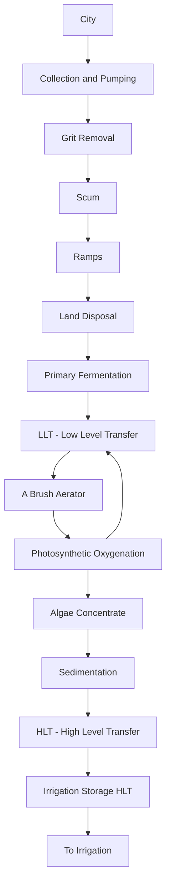

> LLT = Low Level Transfer
> Note:
> HLT = High Level Transfer
> The following note describes the intended quality of effluent and potential treatment considerations.

> Note: HLT effluent will not contain parasite ova, BOD, nutrients, heavy metals, and VOCs will be low. 
> MPN will be less than 1000/mL. Dissolved Air Flotation and UV disinfection may be required for contact use.

----

## PROFILE VIEW

Algae Concentrate
```
Algae Concentrate
     |
     v
To Irrigation
```

----

## PLAN VIEW

HLT
```
HLT
```
Note: The plan view includes the statement about disinfection and the general flow toward irrigation use.

> HLT = High Level Transfer
> Note:
> Dissolved Air Flotation and UV disinfection may be required for contact use.

PROFILE VIEW and PLAN VIEW captions are aligned with the bottom labels showing two perspective views of the system.

\n---\n

## FIGURE 7.6 Advanced Integrated Wastewater Pond System®, Type 1 (Oswald, 1996)

The second pond in series may be a secondary facultative pond (SFP) or a high-rate pond (HRP), depending on the desired level of treatment. The HRP is used to produce high concentrations of dissolved oxygen and algae. With recirculation, the dissolved oxygen can be used for odor control in the AFP, and the algae remove nutrients and can also serve useful purposes if harvested; however, there is considerable disagreement as to the efficacy of harvesting. High-rate pond systems are typically less than 1 m in depth and are mixed with low-speed paddle-wheel mixers at a flow velocity of approximately 15 cm (0.5 ft) per second. High pH values observed in the HRP provide high kills of E. coli and probably pathogenic bacteria. These high pH values also contribute to ammonia removal from the wastewater by outgassing. Effluent from the HRP is withdrawn from the surface to obtain water with high dissolved oxygen concentrations and high pH values. Oswald (1996) does not recommend chlorination of the effluent from AIWPS® systems because of low most probable number (MPN) counts in the effluent and the fact that chlorine doses above 10 mg/L will kill algae, potentially releasing their BOD. However, it is likely that many states will still require chemical disinfection of these effluents and, if such a requirement is set, Oswald (1996) recommends that algae should be removed before chlorination. Algae can tolerate ozone disinfection.

The third pond is used for algae sedimentation and collection for drying, while the fourth pond is used for storage, disinfection, and depth control. In areas where advanced treatment may not be feasible and human contact is expected, deep maturation ponds with detention times of 10 to 20 days following treatment in AFPs, HRPs, and algae settling ponds in series will provide adequate control of pathogenic microorganisms of human origin.

## 7.2 Performance Data

The exact number of operating AIWPSs is unknown, but many are in operation around the world. Four complete, full-scale AIWPS units have been closely studied in California, although large-scale pilot units have been built and successfully studied in the Philippines, Australia, Tunisia, Kuwait, South Africa, France, Indonesia, Thailand, Morocco, and Spain.
\n---\n

## 7.3 St. Helena, California

The St. Helena, California, system was the first full-scale AIWPSO designed and constructed under the supervision of Dr. William J. Oswald, and has been operated successfully for more than 50 years. To date, it has not failed to meet discharge regulations; however, it has a land application system as a backup if the effluent does not meet requirements for discharge to the Napa River.

Figure 7.7 shows a plan view of the St. Helena system, excluding the irrigated pasture adjacent to the treatment facility. The wastewater treatment system serves about 5000 people at an average flowrate of 1893 m^3/d (500,000 gpd) on about 6 ha (15 ac). There are approximately 35.6 ha (88 ac) of cropland available for summertime use.
\n---\n

# Napa River and Pond System Diagram

The page shows a schematic of the Napa River area with a series of ponds and associated infrastructure. The key elements labeled on the diagram are:
- Napa River
- Pond No. 5
- Pond No. 4
- Pond No. 3
- Pond No. 2
- Pond No. 1
- 24" Influent Sewer
- 24" Bypass to Ditch
- Control Building
- Sampling Point

```
mermaid
graph TD
    Napa_River --> Pond_No_5
    Pond_No_5 --> Pond_No_4
    Pond_No_4 --> Pond_No_2
    Pond_No_2 --> Pond_No_3
    Pond_No_1 --> Pond_No_2
    24_influent_sewer --> Pond_No_1
    24_bypass_to_ditch --> Ditch
    Pond_No_2 --> Control_Building
    subgraph Sampling Points
        SP1[Sampling Point]
        SP2[Sampling Point]
    end
    SP1 -.-> Pond_No_1
    SP2 -.-> Pond_No_5
```

Notes:
- The diagram depicts the flow path from Napa River into Pond No. 5, then through Pond No. 4 to Pond No. 2, and onward to Pond No. 3.
- Pond No. 1 is connected upstream to Pond No. 2 via an influent sewer line.
- A 24" Influent Sewer feeds Pond No. 1, with a 24" Bypass to Ditch as a separate path.
- The Control Building is connected to Pond No. 2.
- Sampling Points are indicated at specific locations on the diagram.

\n---\n

# Figure 7.7: Plan view of St. Helena, California, AIWPS® (Oswald, 1996)

Figures 7.8 and 7.9 present the flowrates, BOD5, and TSS performance data for the St. Helena system.

The effluent quality varies considerably, and it is difficult to predict what the performance may be if large concentrations of algae were not allowed to grow in the settling and holding ponds because of the lack of intermediate performance data. Based on published research data, however, it is likely that the process can produce excellent quality effluent if algae are controlled.

## 7.4 Hollister, California

The Hollister, California, AIWPS® has performed well for more than 30 years, although it should be noted that this system ceased to be an AIWPS® around 1988 after an earthquake destroyed the high-rate pond channel dividers (consequently, flow mixing could not be continued to produce settleable algae, which led to increased BOD and TSS). As with the system in St. Helena, the effluent quality varies widely. It is not known if the variations in effluent quality are a design feature because of the availability of the spreading fields or a characteristic of the process. It is possible that control of algae growth in the settling ponds would greatly improve the quality of the effluent.

## 7.5 Beringer Winery

The Beringer Winery in St. Helena, California, is a Type 2 AIWPS® system that differs from the aforementioned Type 1 systems in that aeration is used to oxidize BOD and control odors rather than recirculating algae-laden effluent to provide dissolved oxygen. Nutrient addition and pH control are practiced as necessary with many industrial wastes. A unique feature of the system was the use of anaerobic pits in series. Operation of the facility is seasonal and irrigation fields are available for the final effluent. Only limited data are available on performance of this system.
\n---\n

# 8.0 SYSTEMS WITH DEEP SLUDGE CELLS
## 8.1 Hotchkiss, Colorado

FIGURE 7.8 St. Helena, California, performance data—BOD (Date 189 = January 1989) (Oswald et al., 1994).
St. Helena, CA Performance Data

<table>
<thead>
<tr><th>Date</th><th>Inf BOD (mg/L)</th><th>Eff BOD (mg/L)</th></tr>
</thead>
<tbody>
<tr><td>189</td><td>Inf BOD data not legible</td><td>Eff BOD data not legible</td></tr>
<tr><td>689</td><td>Inf BOD data not legible</td><td>Eff BOD data not legible</td></tr>
<tr><td>1189</td><td>Inf BOD data not legible</td><td>Eff BOD data not legible</td></tr>
<tr><td>490</td><td>Inf BOD data not legible</td><td>Eff BOD data not legible</td></tr>
<tr><td>990</td><td>Inf BOD data not legible</td><td>Eff BOD data not legible</td></tr>
<tr><td>291</td><td>Inf BOD data not legible</td><td>Eff BOD data not legible</td></tr>
<tr><td>791</td><td>Inf BOD data not legible</td><td>Eff BOD data not legible</td></tr>
<tr><td>1291</td><td>Inf BOD data not legible</td><td>Eff BOD data not legible</td></tr>
<tr><td>592</td><td>Inf BOD data not legible</td><td>Eff BOD data not legible</td></tr>
<tr><td>1092</td><td>Inf BOD data not legible</td><td>Eff BOD data not legible</td></tr>
</tbody>
</table>

FIGURE 7.8 St. Helena, California, performance data_BOD (Date 189 = January 1989) (Oswald et al., 1994).
  
FIGURE 7.9 St. Helena, California, performance data—TSS (Date 189 = January 1989) (Oswald et al., 1994).

<table>
<thead>
<tr><th>Date</th><th>Inf TSS (mg/L)</th><th>Eff TSS (mg/L)</th></tr>
</thead>
<tbody>
<tr><td>189</td><td>Inf TSS data not legible</td><td>Eff TSS data not legible</td></tr>
<tr><td>689</td><td>Inf TSS data not legible</td><td>Eff TSS data not legible</td></tr>
<tr><td>1189</td><td>Inf TSS data not legible</td><td>Eff TSS data not legible</td></tr>
<tr><td>490</td><td>Inf TSS data not legible</td><td>Eff TSS data not legible</td></tr>
<tr><td>990</td><td>Inf TSS data not legible</td><td>Eff TSS data not legible</td></tr>
<tr><td>291</td><td>Inf TSS data not legible</td><td>Eff TSS data not legible</td></tr>
<tr><td>791</td><td>Inf TSS data not legible</td><td>Eff TSS data not legible</td></tr>
<tr><td>1291</td><td>Inf TSS data not legible</td><td>Eff TSS data not legible</td></tr>
<tr><td>592</td><td>Inf TSS data not legible</td><td>Eff TSS data not legible</td></tr>
<tr><td>1092</td><td>Inf TSS data not legible</td><td>Eff TSS data not legible</td></tr>
</tbody>
</table>

FIGURE 7.9 St. Helena, California, performance data—TSS (Date 189 = January 1989) (Oswald et al., 1994).

8.0 SYSTEMS WITH DEEP SLUDGE CELLS  
8.1 Hotchkiss, Colorado

Copyright © 2024 by the Water Environment Federation. For subscriber use only and not for distribution. All Rights Reserved.
Permission to copy must be obtained from WEF.
\n---\n

# The wastewater treatment facility at Hotchkiss, Colorado

The wastewater treatment facility at Hotchkiss, Colorado, is similar to a Type 2 AIWPS without the high-rate raceway system. It is located about 60 miles east of Grand Junction, Colorado, at an elevation of 5300 ft above sea level and serves approximately 800 people. The facility went online in October 1997. The system was designed by Consolidated Consulting Services, Delta, Colorado (Fagan, 2006).

Annual mean temperature is about 10 °C (50 °F), with winter temperatures as low as -29 °C (-20 °F) and summer temperatures between 32 and 38 °C (90 and 100 °F). Annual precipitation averages 33 cm (13 in.) of water, most of which is in the form of spring snows and late evening rains from late summer and fall storms.

A flow diagram of the treatment facility is shown in Figure 7.10. The system differs from the conventional AIWPS in that the anaerobic pond is a separate pond preceding the facultative/aerated ponds rather than being located within the first facultative pond.

The system has functioned well; however, the flowrate entering the plant is approximately 35% of the design flow of 1.9 ML/d (0.494 mgd). Occasionally, the maximum influent flow exceeds 1.1 ML/d (0.3 mgd), the design flowrate. During the 8 years plus of operation, BOD5 removal has averaged 92.9%, TSS removal 88.7%, and ammonia-nitrogen (NH3-N) removal 79.8%. Removal of NH3-N has improved materially as the plant has matured, with an average effluent concentration of 1.78 mg/L during the 1999 operational year. In 1999, effluent NH3-N ranged from 5.8 mg/L in February to 0.43 mg/L in June. Removal of NH3-N is closely correlated with the effluent water temperature.
\n---\n

Cell 2

```mermaid
graph TD
  RW[Raw Wastewater]
  C1[Cell 1<br>Anaerobic Cell<br>Division Curtain]
  C2[Cell 2<br>10 HP<br>5 HP]
  C3[Cell 3<br>10 HP]
  CC[Chlorine Contact]
  River[To River]

  RW --> C1
  C1 --> C2
  C2 --> C3
  C3 --> CC
  CC --> River

  subgraph Legend
    A1[Asperating Aerator]
    A2[Surface Splasher Aerator]
  end
```

- The diagram represents a wastewater treatment sequence with Raw Wastewater entering Cell 1 (Anaerobic Cell with Division Curtain), flowing through Cell 2 (with two aeration capacities labeled 10 HP and 5 HP), then to Cell 3 (10 HP), to Chlorine Contact, and finally discharge to the river.
- Legend:
  - Asperating Aerator
  - Surface Splasher Aerator
\n---\n

<table>
<thead>
<tr><th>FIGURE</th><th>Caption</th></tr>
</thead>
<tbody>
<tr><td>FIGURE 7.10</td><td>Plan view of Hotchkiss wastewater treatment plant (Fagan, 2006).</td></tr>
</tbody>
</table>

## 8.2 Dove Creek, Colorado

Dove Creek is located approximately 30 miles north of Cortez, Colorado, at an elevation of 2057 m (6750 ft) above sea level. Air temperatures range from -18 °C (0 °F) to greater than 32 °C (90 °F). The wastewater treatment plant serves approximately 700 people, with an average design flowrate of 250 m3/d (66,000 gpd). The system is permitted for a design flow of 0.435 ML/d (0.115 mgd) and 131 kg BOD5/d (288 lb BOD5/d).

The system is similar to the Hotchkiss, Colorado, facility in that it too has an anaerobic cell preceding the aerated cells that are followed by a free water surface wetland. The fermentation pit has a total volume of 905 m3 (31,947 ft3 or 239,123 gal).

After an initial excursion, BOD5 removal tended to stabilize, but on occasion still exceeded the effluent standard of 30 mg/L. The effluent TSS concentrations varied rather widely. Both the BOD and TSS variations were attributable to the constructed wetland following the lagoon system. The operators experienced difficulty in developing a sustainable plant crop. Data were not available for the intermediate or lagoon system effluent; therefore, it is difficult to accurately credit the influence of the various components of the system. The system was receiving only 44% of the permitted flowrate; therefore, it is reasonable to assume that the difficulty with the constructed wetland was attributable to water quality excursions.

## 8.3 Olathe, Colorado

The Olathe, Colorado, wastewater treatment facility, which is similar to the Hotchkiss and Dove Creek facilities, has been in operation since June 2005. Olathe is located approximately 18 km (11 miles) south of Delta, Colorado, at an elevation of approximately 1615 m (5300 ft). Annual precipitation averages 8 in. and the average air temperature ranges from -3 to 22 °C (26 to 72 °F). The wastewater treatment facility serves a population of approximately 2000, and the design flowrate is 2763 m3/d (0.73 mgd). Apparently, there is significant infiltration and inflow entering the sewer system. Removal of BOD5 exceeded 85% in the months following startup of the new facility in June 2005, with the exception of July 2005 and March 2006. This failure to meet the 85%

\n---\n

removal requirement was attributable to weak influent wastewater; which averaged 127 mg/L and ranged from 86 to 205 mg/L. The facility has received a waiver on the 85% removal requirement because of the weak wastewater. Effluent BOD5 was less than 30 mg/L during all months after startup. Total suspended solids influent concentrations ranged from 88 to 600 mg/L, but the effluent exceeded 30 mg/L only once after startup of the new facility (32 mg/L in March 2006). The effluent TSS averaged 13 mg/L and ranged from 1 to 32 mg/L. Intermediate cell effluents were not available. During the first year of operation, the high effluent pH values were attributable to large algae concentrations in the final cell, but the values did not exceed a value of 9.0 as specified in the permit.

## 8.4 Fisherman Bay, Washington

Fisherman Bay is located on Lopez Island in San Juan County, Washington, approximately 160 km (100 miles) northwest of Seattle at an elevation slightly above sea level. Influent water temperatures rang from 7 °C (44 °F) in the winter to 22 °C (72 °F) in the summer. The wastewater treatment plant serves approximately 250 people with an average design flowrate of 129 m3/d (34,000 gpd). A septic tank effluent pumping system serves the entire area and, because of BOD and TSS removal in the septic tanks, the influent to the plant is low in BOD and TSS, but has a high ammonia-nitrogen concentration averaging 57 mg/L (Li et al., 2006). Stantec Consulting, Inc., Fort Collins, Colorado, designed the system.

The system is similar to the Hotchkiss, Dove Creek, and the Olathe, Colorado, facilities in that it too has an anaerobic pond preceding the aerated cells. The fermentation pit has a total volume of 314 m3 (83,000 gal) and a depth of 4.57 m (15 ft). Included in the 4.57-m (15-ft) depth is a manhole pit at the bottom that is 1.52-m deep and 1.83 m in diameter (5-ft deep and 6 ft in diameter); the wastewater enters at the bottom of the manhole pit. The design was a retrofit of an existing two-cell lagoon system by adding an anaerobic cell that is followed by one of the existing lagoons divided into three cells using floating baffles.

From October 28, 2003, through August 29, 2006, the system functioned well, and the average flowrate entering the plant was 65 m3/d (0.0173 mgd), which is approximately 50% of the design flow of 129 m3/d (0.034 mgd). The influent flowrate ranged from 0.04 to 0.20 ML/d (0.01 to 0.05 mgd). During the 3 years of operation, BOD5 removal has
\n---\n

# 9.0 ANAEROBIC PONDS
## 9.1 Introduction

Anaerobic lagoons or ponds have been used for the treatment of municipal, agricultural, and industrial wastewaters. The primary function of anaerobic lagoons is to stabilize large concentrations of organic solids contained in wastewater and not necessarily to produce a high-quality effluent. Most often, anaerobic lagoons are operated in series with aerated or facultative lagoons. A three-cell lagoon system can produce a stable, high-quality effluent throughout its design life. Proper design and operation of an anaerobic lagoon should consider the biological reactions that stabilize organic waste material.

In the absence of oxygen, insoluble organics are hydrolyzed by extracellular enzymes to form soluble organics (i.e., carbohydrates such as glucose, cellobiose, and xylose). The soluble carbohydrates are biologically converted to volatile acids. These organic (volatile) acids are predominantly acetic, propionic, and butyric. The group of facultative organisms that transforms soluble organic molecules to short-chain organic acids is known as acid formers or acid producers (acidogens). The next sequential biochemical reaction that occurs is the conversion of organic acid to methane and carbon dioxide by a group of strict, anaerobic bacteria known as methane formers or methane producers (methanogens).

Anaerobic decomposition of carbohydrate to bacterial cells with formation of organic acids can be illustrated as:
\n---\n

$$5(CH_2O)_x \rightarrow (CH_2O)_x + 2CH_3COOH + Energy$$

Bicarbonate buffer present in solution neutralizes the acid formed in the aforementioned reaction:

$$2CH_3COOH + 2NH_4HCO_3 \rightarrow 2CH_3COONH_4 + 2H_2O + 2CO_2$$

During the growth of methane bacteria, ammonia acetate (CH_3COONH_4) is decomposed to methane and regeneration of the bicarbonate buffer; NH_4HCO_3:

$$2CH_3COONH_4 + 2H_2O \rightarrow 2CH_4 + 2NH_4HCO_3$$

If sufficient buffer is not available, the pH will decrease, which will inhibit the third reaction.

The facultative acid formers are not as sensitive to ambient environmental factors such as pH value, heavy metals, and sulfides. Acid formers are typically plentiful in the system and are not the rate-limiting step. The rate-limiting step in anaerobic digestion is the methane fermentation process. Methane-producing bacteria are highly sensitive to such factors as pH changes, heavy metals, detergents, alterations in alkalinity, ammonia-nitrogen concentration, temperature, and sulfides. Furthermore, methane-producing bacteria have a slow growth rate.

Environmental factors that affect methane fermentation are shown in Table 7.4. In addition, work by Kotze et al. (1968), Chan and Pearson (1970), Hobson et al. (1974), Ghosh et al. (1974), and Ghosh and Klass (1974) provide some evidence that the hydrolysis step may become rate-limiting in the digestion of particulates and cellulosic feeds. Design and operation of anaerobic lagoons should be founded on the fundamental biochemical and kinetic principles that govern the process. Most anaerobic lagoons, however, have been empirically designed.

TABLE 7.4 Environmental factors influencing methane fermentation.
\n---\n

<table>
  <thead>
    <tr><th>Variable</th><th>Optima</th><th>Extreme</th></tr>
  </thead>
  <tbody>
    <tr><td>Temperature, °C</td><td>30–35</td><td>25–40</td></tr>
<tr><td>pH</td><td>6.8–7.4</td><td>6.2–7.8</td></tr>
<tr><td>Oxidation-Reduction Potential, millivolts (MV)</td><td>-520 to -530</td><td>-490 to -550</td></tr>
<tr><td>Volatile Acids, mg/L as Acetic</td><td>50–500</td><td>2000</td></tr>
<tr><td>Alkalinity, mg/L as CaCO3</td><td>2000–3000</td><td>1000–5000</td></tr>
  </tbody>
</table>

<table>
  <thead>
    <tr><th>Variable</th><th>Optima</th><th>Extreme</th></tr>
  </thead>
  <tbody>
    <tr><td>Temperature, °C</td><td>30–35</td><td>25–40</td></tr>
<tr><td>pH</td><td>6.8–7.4</td><td>6.2–7.8</td></tr>
<tr><td>Oxidation-Reduction Potential, millivolts (MV)</td><td>-520 to -530</td><td>-490 to -550</td></tr>
<tr><td>Volatile Acids, mg/L as Acetic</td><td>50–500</td><td>2000</td></tr>
<tr><td>Alkalinity, mg/L as CaCO3</td><td>2000–3000</td><td>1000–5000</td></tr>
  </tbody>
</table>

<p>A significant problem associated with anaerobic lagoons is the production of odors. Odors can be controlled by providing an aerobic zone at the surface to oxidize the volatile organic compounds that cause odors. Recirculation from an aerobic pond to the primary anaerobic pond can alleviate odors by providing dissolved oxygen from the aerobic pond effluent that overlays the anaerobic pond and oxidizes sulfide odors (Oswald, 1968). To avoid contact of anaerobic processes with oxygen, influent wastewater can be introduced to the anaerobic pond at the center into a chamber in which the sludge accumulates to some depth as shown in Figure 7.11 (Oswald, 1968). Mixing of the influent with the active anaerobic sludge will enhance BOD removal efficiency and reduce odors (Parker et al., 1959).</p>

<p>As stated previously, the purpose of anaerobic lagoons is the decomposition and stabilization of organic matter. Water purification is not the primary function of anaerobic lagoons.</p>

\n---\n

## 9.2 Design

Anaerobic lagoons are used as sedimentation basins to reduce organic loads on subsequent treatment units. A general compilation of information about the design of municipal anaerobic lagoons is presented in the following section:

There is no agreement on the best approach to design anaerobic stabilization ponds:  
- Systems are designed on the basis of surface loading rate, volumetric loading rate, and hydraulic detention time.  
- Although it is done frequently, design on the basis of surface loading rate probably is inaccurate. Proper design should be based on the volumetric loading rate, temperature of the liquid, and the hydraulic detention time.  
- Areal loading rates that have been used around the world are shown in Table 7.5. It is possible to approximate the volumetric loading rates by dividing by the average depth of the ponds and converting to the proper set of units. Based on these loading rates, it is obvious that there has been little consistency in designing loading rates for anaerobic ponds. In climates where the temperature exceeds 22 °C, the following design criteria should yield a BOD5 removal of 50% or better (World Health Organization, 1987):

\n---\n

## FIGURE 7.11 Method of creating a digestion chamber in the bottom of an anaerobic lagoon (Oswald, 1968)

<mermaid>
graph TD
  subgraph Lagoon
    A[Water surface]
    B[Shallow facultative zone]
    C[Digestion chamber at bottom]
    D[Digestion zone (shaded)]
  end
  A --> B
  B --> C
  C --> D
  D --> B
  style C fill:#e0d38a,stroke:#333,stroke-width:2px
  classDef digestion fill:#e0e0a8;
  class C digestion;
</mermaid>

* Volumetric loading up to 300 g BOD5/m3·d;
* Hydraulic detention time of approximately 5 days; and
* Depth between 2.5 and 5 m.

In cold climates, detention times as great as 50 days and volumetric loading rates as low as 40 g BOD5/m3·d may be required to achieve 50% reduction in BOD5. The relationship between temperature, detention time, and BOD reduction is shown in Tables 7.6 and 7.7.

One of the best approaches to the design of anaerobic lagoons has been presented by Oswald (1996). In his advanced facultative pond design, Oswald incorporates a deep anaerobic pond within the facultative pond. The anaerobic pond design is based on
\n---\n

organic loading rates that vary with water temperature in the pond, and the design is checked by determining the volume of anaerobic pond provided per capita, which is one of the methods used for the design of separate anaerobic digesters. An example of this design approach is presented in Example 7.6.

<table>
  <thead>
    <tr>
      <th colspan="2">Areal BOD<sub>5</sub> mass loading rates</th>
      <th colspan="2">Estimated volumetric loading rates</th>
      <th>BOD<sub>5</sub> removal</th>
      <th>Depth</th>
      <th>Hyd. detention time (days)</th>
      <th>References</th>
    </tr>
<tr>
      <th>Summer</th>
      <th>Winter</th>
      <th>Summer</th>
      <th>Winter</th>
      <th>%</th>
      <th>ft</th>
      <th>Summer</th>
      <th>Winter</th>
      <th></th>
    </tr>
  </thead>
  <tbody>
    <tr>
      <td>360</td>
      <td></td>
      <td>2.34</td>
      <td></td>
      <td>75</td>
      <td>3-4</td>
      <td></td>
      <td></td>
      <td>Parker; 1970</td>
    </tr>
<tr>
      <td>280</td>
      <td></td>
      <td>1.84</td>
      <td></td>
      <td>65</td>
      <td>3-4</td>
      <td></td>
      <td></td>
      <td>Parker; 1970</td>
    </tr>
<tr>
      <td>100</td>
      <td></td>
      <td>0.66</td>
      <td></td>
      <td>86</td>
      <td>3-4</td>
      <td></td>
      <td></td>
      <td>Parker; 1970</td>
    </tr>
<tr>
      <td>170</td>
      <td></td>
      <td>1.11</td>
      <td></td>
      <td>52</td>
      <td>3-4</td>
      <td></td>
      <td></td>
      <td>Parker; 1970</td>
    </tr>
<tr>
      <td>560</td>
      <td>400</td>
      <td>3.67</td>
      <td>2.62</td>
      <td>89</td>
      <td>3-4</td>
      <td></td>
      <td></td>
      <td>Parker; 1970</td>
    </tr>
<tr>
      <td>400</td>
      <td>100</td>
      <td></td>
      <td></td>
      <td>70</td>
      <td></td>
      <td></td>
      <td></td>
      <td>Oswald, 1968</td>
    </tr>
<tr>
      <td>900-1200</td>
      <td>675</td>
      <td>5.17-6.89</td>
      <td>3.88</td>
      <td>60-70</td>
      <td>3-5</td>
      <td>2-5</td>
      <td></td>
      <td>Parker et al., 1959</td>
    </tr>
<tr>
      <td></td>
      <td></td>
      <td>8-10</td>
      <td>30-50</td>
      <td></td>
      <td></td>
      <td></td>
      <td></td>
      <td>Eckenfelder; 1961</td>
    </tr>
<tr>
      <td>220-600</td>
      <td></td>
      <td>0.51-1.38</td>
      <td></td>
      <td>15-160</td>
      <td></td>
      <td></td>
      <td></td>
      <td>Cooper; 1968</td>
    </tr>
<tr>
      <td>500</td>
      <td></td>
      <td>1.15</td>
      <td></td>
      <td>70</td>
      <td>8-12</td>
      <td></td>
      <td></td>
      <td>Oswald et al., 1967</td>
    </tr>
<tr>
      <td></td>
      <td></td>
      <td></td>
      <td></td>
      <td></td>
      <td>8-12</td>
      <td>2 (summer)</td>
      <td>5 (winter)</td>
      <td>Malina and Rios, 1976</td>
    </tr>
  </tbody>
</table>

TABLE 7.5 Design and operational parameters for anaerobic lagoons treating municipal wastewater (lb/ac·d; lb/d/cu ft × 16.02 = kg/m^3·d; ft × 0.3048 = m) (Crites et al., 2005).

## 9.3 Example 7.6

\n---\n

# Design parameters and calculations

<table>
  <thead>
    <tr>
      <th>Parameter</th>
      <th>Value</th>
    </tr>
  </thead>
  <tbody>
    <tr><td>Design flowrate</td><td>947 m³/d</td></tr>
<tr><td>Influent ultimate BOD</td><td>400 mg/L</td></tr>
<tr><td>Effluent ultimate BOD</td><td>50 mg/L</td></tr>
<tr><td>Sewered population</td><td>6000 people</td></tr>
<tr><td>Maximum bottom water temperature in local bodies of water</td><td>20 °C</td></tr>
<tr><td>Temperature of pond water at bottom of pond</td><td>10 °C</td></tr>
  </tbody>
</table>

## 1. Calculate the BOD loading

$$
\text{BOD loading} = \text{Influent BOD} \times \text{Flowrate} / 1000 = 378.8 \, \text{kg/d}
$$

## 2. Design the anaerobic pond (fermentation pits)

Except for systems with flows less than 200 m³/d, always use two ponds so that one will be available for desludging when pond is filled. Surface area of anaerobic pond should be limited to 1000 m² and made as deep as possible to avoid turnover with oxygen intrusion. Minimum pit depth should be 4 m.
\n---\n

# Number of anaerobic ponds in parallel
- minimum of two ponds = 2
- BOD loading on single pond = 189.4 kg/d
- First, size pond on basis of load per unit volume:
  - Load per unit volume (varies with temperature of water) = 0.189 kg/m^3·d
  - Volume in one pond = 1002.7 m^3
  - Hydraulic residence time in ponds = 2.12 d
  - Pond depth = minimum of 4 m = 4 m
  - Pond surface area = assuming vertical walls = 250.7 m^2
  - Maximum pond surface area = 1000 m^2
  - no. of ponds = 0.25
  - Round to next largest number of ponds = 1.00
  - Overflow rate in ponds = total surface area / total flowrate = 1.89 m/d
  - Overflow rates of less than 1.5 m/d should retain parasite eggs and other particles as small as 20 μm, which includes all but the smallest parasite eggs (ova). Size of pond should be increased to reduce overflow rate to 1.5 m/d.
  - 51.94 ft

- Check pond volume per capita:
\n---\n

# Designs of anaerobic ponds

Total volume in ponds = total BOD loading / loading rate.

Pond volume per capita = total volume / population = 0.33 m^3/capita.

Pond volume per capita should be greater than 0.0566 m^3/person as used in conventional separate digesters. When pit volume per capita exceeds 0.0566 m^3/person, fermentation can go to completion with only grit and refractory organics left to accumulate.

Designs of anaerobic ponds based on information in Tables 7.6 and 7.7 are presented in Example 7.7.

<table>
  <caption>TABLE 7.6 Five-day BOD reduction as a function of detention time for temperatures greater than 20 °C (WHO, 1987).</caption>
  <thead>
    <tr>
      <th>Detention time (days)</th>
      <th>BOD<sub>5</sub> reduction (%)</th>
    </tr>
  </thead>
  <tbody>
    <tr>
      <td>1</td>
      <td>50</td>
    </tr>
<tr>
      <td>2.5</td>
      <td>60</td>
    </tr>
<tr>
      <td>5</td>
      <td>70</td>
    </tr>
  </tbody>
</table>

<table>
  <caption>TABLE 7.7 Five-day BOD reduction as a function of detention time and temperature (WHO, 1987).</caption>
  <thead>
    <tr>
      <th>Temperature, °C</th>
      <th>Detention time, day</th>
      <th>BOD reduction, %</th>
    </tr>
  </thead>
  <tbody>
    <tr>
      <td>10</td>
      <td>5</td>
      <td>0–10</td>
    </tr>
<tr>
      <td>10–15</td>
      <td>4–5</td>
      <td>30–40</td>
    </tr>
<tr>
      <td>15–20</td>
      <td>2–3</td>
      <td>40–50</td>
    </tr>
<tr>
      <td>20–25</td>
      <td>1–2</td>
      <td>40–60</td>
    </tr>
<tr>
      <td>25–30</td>
      <td>1–2</td>
      <td>60–80</td>
    </tr>
  </tbody>
</table>

\n---\n

# 9.4 Example 7.7 Anaerobic Pond Design Based on Volumetric Loading or Detention Time (World Health Organization, 1987)

Design based on volumetric loading, hydraulic detention time, and climate temperature.

Oswald’s design procedure is semirational, whereas the other approaches are empirical. It is possible that some of the newer approaches to anaerobic reactor design may be applicable to the design of anaerobic ponds; however, it is likely that the controls required in the newer approaches will be impractical for pond design and operation.

## 10.0 CONTROLLED DISCHARGE PONDS

No rational or empirical design model exists specifically for the design of controlled discharge wastewater ponds. However, rational and empirical design models applied to facultative pond design may also be applied to the design of controlled discharge ponds provided allowance is made for the required larger storage volumes: These larger volumes result from the long storage periods relative to the short discharge periods. Application of the ideal plug-flow model developed for facultative ponds can be applied to controlled discharge ponds if hydraulic residence times of less than 120 days are considered. A study of 49 controlled discharge ponds in Michigan indicated that discharge periods vary from less than 5 days to more than 31 days, and residence times were 120 days or greater (Pierce, 1974). The unique features of controlled discharge ponds are long-term retention and periodic, controlled discharge usually once or twice a year: Ponds of this type have operated satisfactorily in the north central United States using the following design criteria:

- Overall organic loading: 22 to 28 kg BOD5/ha·d (20 to 25 lb BOD5/d/ac);
- Liquid depth: not more than 2 m (6 ft) for the first cell and not more than 2.5 m (8 ft) for subsequent cells;
- Hydraulic detention: at least 6 months of storage above the 0.6-m (2-ft) liquid level (including precipitation), but not less than the period of ice cover; and
- Number of cells: at least three for reliability, with piping flexibility for parallel or series operation.

Design of the controlled discharge pond must include an analysis showing that receiving-stream water quality standards will be maintained during discharge intervals, and that the
\n---\n

## 11.0 COMPLETE RETENTION PONDS

receiving watercourses can accommodate the discharge rate from the pond. The design must also include a recommended discharge schedule. Selecting the optimum day and hour for release of the pond contents is critical to the success of this method. The operation and maintenance (O&M) manual must include instructions on how to correlate pond discharge with effluent and stream quality. The pond contents and stream must be carefully examined, before and during the release of the pond contents.

In a typical program, discharge of effluents follows a consistent pattern for all ponds. The following steps are typically taken:

In areas of the United States where the moisture deficit, evaporation minus rainfall, exceeds 75 cm (30 in.) annually, a complete retention wastewater pond may prove to be the most economical method of disposal. Complete retention ponds must be sized to provide the necessary surface area to evaporate the total annual wastewater volume plus the precipitation that would fall on the pond. The system should be designed for the maximum wet year and minimum evaporation year of record if overflow is not permissible under any circumstances. Less stringent design standards may be appropriate in situations where occasional overflow is acceptable or an alternative disposal area is available under emergency conditions.

Monthly evaporation and precipitation rates must be known to properly size the system. Complete retention ponds usually require large land areas, and these areas are not productive once they have been committed to this type of system. Land for this system must be naturally flat or be shaped to provide ponds that are uniform in depth and have large surface areas. The design procedure for a complete retention wastewater pond system is presented in U.S. EPA's Design Manual: Municipal Wastewater Stabilization Ponds (1983).

## 12.0 HYDROGRAPH-CONTROLLED RELEASE

The hydrograph controlled release (HCR) pond is a variation of the controlled discharge pond. This concept was developed in the southern United States, but can be used effectively in most areas of the world. In this case, the discharge periods are controlled by
\n---\n

## 13.0 COMBINED SYSTEMS

gauging station in the receiving stream and are allowed to occur during high-flow periods. During low-flow periods, effluent is stored in the HCR pond. The process design uses conventional facultative or aerated ponds for basic treatment, followed by the HCR cell for storage/discharge. No treatment allowances are made for the residence time in the HCR cell during design; its sole function is storage. Depending on stream flow conditions, storage needs may range from 30 to 120 days. The design maximum water level in the HCR cell is typically about 2.4 m (8 ft), with the minimum water level at 0.6 m (2 ft). Other physical elements are similar to conventional pond systems. The major advantage of HCR systems is the possibility of using lower discharge standards during high-flow conditions compared to a system designed for stringent low-flow requirements and then operated in that mode on a continuous basis. A summary of the design approach used in the United States is shown in Table 7.8. Zirschsky and Thomas (1987) performed a nationwide assessment of HCR systems in the United States and showed that the HCR system is an effective, economical, and easily operated system. It was also found to be an effective means of upgrading a lagoon system. Several simple effluent release structures are illustrated in their article:

In certain situations, it is desirable to design pond systems in combinations (i.e., an aerated pond followed by a facultative or a tertiary pond). Combinations of this type are designed essentially the same as the individual ponds. For example, the aerated pond would be designed based on the influent wastewater characteristics, and the predicted effluent quality from this unit would be the influent quality for the facultative polishing pond. Many of the proprietary systems described in this chapter are combinations of various types of ponds. For example, Oswald (1996; Oswald et al., 1967) developed AIWPS®, which consists of four basic types of ponds in series:

\n---\n

* a. Basic principle: At critical low river flow, BOD and suspended solids loadings are reduced by restricting effluent discharge rates rather than decreasing concentration of pollutants.
* b. Must be equipped to retain wastewater during low flow (Q10/7). Use existing ponds or build storage ponds. Q10/7 = once-in-10-year low flow rate for 7-day period.
* c. Assimilative capacity of receiving stream must be established by studying historical data or estimated using techniques such as that proposed by Hill and Zitta (1980).
----

<table>
<thead><tr><th>TABLE 7.8 Hydrograph-controlled release pond design basics used in the United States (Zirschsky and Thomas, 1987).</th></tr></thead>
<tbody><tr><td></td></tr></tbody>
</table>

# 14.0 PROPRIETARY PROCESSES
## 14.1 Parkson BIOLAC® Processes
U.S. EPA (1990) published an excellent summary of the status of BIOLAC® processes in the United States as of 1990. Pertinent information has been extracted from that report and is presented in this section along with figures and tables. Additional information was provided by the Parkson Corporation (2004).

Since publishing the report, more than 600 BIOLAC® systems have been installed in the United States and throughout the world. Much of the data presented by U.S. EPA (1990) was obtained after a relatively short operating period for most of the plants; therefore, results from more recently sampled installations are presented.
## 14.2 BIOLAC® Processes
There are several variations of the BIOLAC® process. Basically, the processes are extended aeration activated sludge with and without recirculation of solids. There are three basic systems: the BIOLAC-R is an extended aeration process with recycle of solids; the BIOLAC-L system is an aerated lagoon system without recycle of solids; and the third option is the BIOLAC® wave oxidation modification that is used to nitrify and denitrify wastewater. In addition to these systems, floating aeration chains used in the aforementioned processes have been installed in existing lagoon systems as an upgrade.
\n---\n

# 14.3 BIOLAC-R System
The BIOLAC-R system, shown in Figure 7.12, is an extended aeration process operating within earthen embankments or other types of structures. Recommended design criteria are shown in Table 7.9, and conservative design parameters are used.

Hydraulic residence times range from 24 to 48 hours with solids retention times of 30 to 70 days. Preliminary and primary treatment is typically not provided, but screening of the influent is desirable. Depths in the aeration ponds range from 2.5 to 6.1 m (8 to 20 ft), with the lower depths in retrofits or where deep construction is impractical. Integral clarifiers are the most common form of solids separation for return to the aeration tanks; however, there are systems with conventional clarifiers (Bowman, 2000). A relatively small waste sludge tank is provided because of low sludge production. A polishing basin is not recommended.

## 14.4 BIOLAC-L System
The BIOLAC-L system is a typical flow-through aerated lagoon without recycle of solids and a waste sludge pond. The flow diagram is the same as that shown in Figure 7.12 without the clarifier and sludge pond. Design of the BIOLAC-L system is typically based on HRT, and values range from 6 to 20 days. Equivalent loadings of 0.008 to 0.029 kg/m^3·d (0.5 to 1.8 lb of BOD5/d/1000 cu ft) are used. The polishing pond is required for the BIOLAC-L system and has an HRT of 2 to 4 days. Sludge storage and decomposition occurs in the polishing pond.
\n---\n

FIGURE 7.12 Flow diagram of BIOLAC-R system (Parkson Corp.).

## 14.5 Wave Oxidation Modification

Carbon oxidation and nitrification-denitrification occur in the wave oxidation modification (see Figure 7.13). This is a BIOLAC-R system operated at low dissolved oxygen concentrations and automatic control of the airflow rate in each aeration chain. Airflow is alternated such that several moving oxic and anoxic zones are created in the aeration basin. This modification has been used successfully for nitrogen removal.

### Flow diagram (represented as a Mermaid diagram)

```mermaid
graph TD
  Influent([Influent])
  Screen([Screen])
  Grit(["GRIT CHAMBER (OPTIONAL)"])
  FM([FLOW MEASURING])
  RA([Return Activated Sludge])
  A1([Aeration Cell 1])
  A2([Aeration Cell 2])
  A3([Aeration Cell 3])
  A4([Aeration Cell 4])
  A5([Aeration Cell 5])
  A6([Aeration Cell 6])
  Clar([Integral Clarifier])
  Eff([Effluent])
  WAS([WASTE ACTIVATED SLUDGE])
  SludgePond([Sludge Pond])
  RA2([Return Activated Sludge (to aeration)])

  Influent --> Screen
  Screen --> Grit
  Grit --> FM
  FM --> A1
  A1 --> A2 --> A3 --> A4 --> A5 --> A6 --> Clar
  Clar --> Eff
  Clar --> WAS
  WAS --> SludgePond
  SludgePond --> RA2
  RA2 --> A1
```

- The flow path starts with Influent, passes through Screen, optional Grit Chamber, and Flow Measuring. It then enters the Aeration Basin consisting of multiple cells. Return Activated Sludge is returned to the aeration basins to sustain biological activity. The effluent leaves the clarifier, while Waste Activated Sludge is directed to the Sludge Pond. The Sludge Pond returns sludge to the aeration process as Return Activated Sludge.

## 14.6 Other Applications

\n---\n

BIOLAC® floating aeration chains are used as retrofits for existing lagoons and installed as original aeration equipment. Several operations around the country are using BIOLAC® aeration equipment.

TABLE 7.9 Manufacturer's typical design criteria for BIOLAC-R systems versus conventional extended aeration systems (lb/d IB x 11.57 = mg/kg·s; lb/d cu ft x 16.02 = kg/m^3·d; hp/ml. gal x 0.197 = W/m^3), (Parkson Corporation, 2004).

<table>
  <thead>
    <tr>
      <th>Parameter</th>
      <th>Extended aeration</th>
      <th>BIOLAC-R</th>
    </tr>
  </thead>
  <tbody>
    <tr>
      <td>Hydraulic residence time, hours</td>
      <td>18-36</td>
      <td>24-48</td>
    </tr>
<tr>
      <td>Solids retention time, days</td>
      <td>20-30</td>
      <td>30-70</td>
    </tr>
<tr>
      <td>F/M, lbs BOD5/d-lb MLSS</td>
      <td>0.05-0.15</td>
      <td>0.03-0.1</td>
    </tr>
<tr>
      <td>Volumetric loading, lbs BOD5/d-1000 ft³</td>
      <td>10-25</td>
      <td>7-12</td>
    </tr>
<tr>
      <td>MLSS, mg/L</td>
      <td>3000-6000</td>
      <td>1500-5000</td>
    </tr>
<tr>
      <td>Basin mixing, hp/MG</td>
      <td>80-150</td>
      <td>12-15</td>
    </tr>
  </tbody>
</table>

## 14.7 Clarification and Solids Handling

An integral clarifier is used with the BIOLAC-R system, although conventional clarifiers are used on occasion. BIOLAC-L systems require that a polishing basin be installed for solids separation and storage. A cross-sectional view of the integral clarifier is shown in Figure 7.14. The integral clarifier is constructed in the aeration basin, but is separated from the aeration zone by a partition wall. Flow enters the clarifier along the bottom over the entire length of the partition wall to minimize short-circuiting. A flocculating rake moves the length of the clarifier sludge trough to concentrate and distribute the sludge. Sludge return and waste is removed with an air-lift pump.

## 14.8 BIOLAC-L Settling Basin

A minimum hydraulic retention of 1 day is normally provided in the unaerated section of the polishing basin. Up to one to two decades of sludge storage is provided in the quiescent zone of the polishing or settling basin. Further sludge degradation of 40 to 60% occurs under anaerobic conditions in the settling basin.

## 14.9 Performance Data
\n---\n

# Mean performance data and BIOLAC system notes

Mean performance data for 13 BIOLAC® systems are available in the report by the U.S. EPA (1990), but the data are dated. Richard H. Bowman (2000), with the Colorado Department of Health and Environment (Denver, Colorado), has reported that BIOLAC® systems in Colorado have satisfied secondary standards and ammonia-nitrogen removal requirements where required for many years. Parkson Corporation (2004) (Ft. Lauderdale, Florida) reported that the Nevada, Ohio, BIOLAC® system (378 500 L/d [100 000 gpd]) produced a 2-year average effluent containing 4.1 mg/L BOD, 6.9 mg/L TSS, and 0.7 mg/L NH3-N. Additional data are available from the Parkson Corporation showing BOD and TSS concentrations less than 10 mg/L, ammonia-nitrogen concentrations of less than 1.0 mg/L, and total nitrogen concentrations of less than 8 mg/L.

\n---\n

# 14.10 Colorado BIOLAC Facilities

FIGURE 7.13 Wave-oxidation modification of the BIOLAC-R system (Parkson Corp.).

Flow diagrams for the Alamosa and Tri-Lakes, Colorado, BIOLAC plants are similar to the BIOLAC-R system shown in Figure 7.12. The systems have easily satisfied the effluent standards established by the State of Colorado.

The Tri-Lakes BIOLAC facility is similar to the typical BIOLAC system shown in Figure 7.12, with the exceptions of being a modified entrance to the aeration tank and a separate clarifier rather than the intrapond settling section. The system has performed well for more than 5 years. Influent BOD5 averaged 271 mg/L and the effluent averaged 3.4 mg/L; the TSS influent averaged 288 mg/L, with an effluent concentration of 4.4 mg/L. Effluent ammonia-nitrogen was measured only during 2005 and 2006 and the average for the 2 years was 1.73 mg/L, with maximum values ranging from 0.4 to 7.1 mg/L. The maximum effluent concentration reported was less than 5 mg/L throughout the 2 years, with only two exceptions where the concentrations were 5.12 and 7.1 mg/L.

<table>
  <thead>
    <tr>
      <th>FIGURE</th>
      <th>DESCRIPTION</th>
    </tr>
  </thead>
  <tbody>
    <tr>
      <td>FIGURE 7.14</td>
      <td>Cross-sectional view of the integral BIOLAC-R clarifier (Parkson Corp.).</td>
    </tr>
  </tbody>
</table>

U.S. EPA (1990) presented a summary of the problems encountered at various BIOLAC plants. The difficulties appear to be typical mechanical failures and excessive debris and

\n---\n

# 15.0 LEMNA SYSTEMS

There are numerous references to the use of duckweed in lagoon wastewater treatment systems dating back to the early 1970s, but this discussion is limited to the application of proprietary processes produced by Lemna Technologies, Inc. (Lemna Corporation, Minneapolis, Minnesota) (Culley and Epps, 1973; Crites et al., 2006; Wolverton and McDonald, 1979; Reed et al., 1995; Zirschky and Reed, 1988).

Lemna Technologies (1999a) offers two basic systems for wastewater treatment: the Lemna duckweed system with floating partitions used to keep the plants evenly distributed over the surface of the pond and the LemTecTM Biological Treatment Process. In addition to these basic units, the company produces the LemTecTM Modular Insulated Cover System, LemTecTM C-4 Chlorine Contact Chamber-Cleaner, LemTecTM Anaerobic Lagoon System, and the LemTecTM Gas Collection Cover. 

In a recent press release, Lemna Technologies reported that there are more than 150 municipal and industrial installations worldwide. It is assumed that the 150 installations include regular Lemna and biological treatment process systems as well as the other systems produced by the company. The descriptions and discussions of processes in this chapter will be limited to the Lemna duckweed system with floating partitions and the LemTecTM Biological Treatment Process.

## 15.1 Lemna Duckweed System

The Lemna duckweed system can be used in retrofitting an existing facultative or aerated lagoon system or it can be an original design. An original design consists of a regular facultative or aerated lagoon followed in series by Lemna system components made up of the floating barrier grid to prevent clustering of the duckweed and baffles to improve the hydraulics of the system. These basic components are followed by disinfection, if required, and reaeration of the effluent that is anaerobic beneath the duckweed cover. The Lemna system has been installed in several locations ranging from Georgia to North Dakota in the United States and in Europe.
\n---\n

## 15.2 Performance Data

For the Lemna system to function properly, it is necessary to harvest the duckweed on a regular basis. LemTec™ markets harvesters for use in ponds with the floating barrier grid used to ensure distribution of the duckweed (see Figure 7.15). The harvesters operate by depressing the floating barrier and removing the duckweed from the water surface.

Biomass harvested from the Lemna system can be managed via land application of duckweed, composting of the duckweed, or the production of pelletized feedstuff. Other than land application, these management methods can be expensive, and data are needed to evaluate the economic feasibility of these two options.

### 15.2 Performance Data

A typical performance data summary reported for Lemna duckweed systems is shown in Table 7.10. Buddhavarapu and Hancock (1989) reported on the performance of two pilot-scale Lemna systems located in Devils Lake, North Dakota, and DeRidder, Louisiana. The DeRidder system was operated from October 1988 to December 1989, and the period of operation for the Devils Lake facility was only 3 months. The pilot-scale systems produced a good quality effluent averaging BOD5 concentrations of less than 10 mg/L at both facilities. The TSS concentrations were less than 20 mg/L at both sites. Total Kjeldahl nitrogen (TKN) was less than 5 mg/L at both locations. The Devils Lake pilot plant reported total phosphorus concentrations less than 1 mg/L; however, the system was operated for only 3 months during the warmer months of the year:
\n---\n

FIGURE 7.15 Photograph of Lemna harvesting equipment and floating barrier grid (Lemna Technologies, 1999b)

TABLE 7.10 Typical effluent qualities expected from Lemna duckweed and LemTec systems (courtesy of Lemna Systems).

<table>
<thead>
<tr><th>Parameter</th><th>Influent</th><th>Effluent</th></tr>
</thead>
<tbody>
<tr><td>BOD, mg/L</td><td>250-200</td><td>&lt;20-10</td></tr>
<tr><td>TSS, mg/L</td><td>300-250</td><td>&lt;20-12</td></tr>
<tr><td>NH3-N, mg/L</td><td>50-10</td><td>&lt;8-2</td></tr>
<tr><td>Total phosphorus, mg/L</td><td>20-10</td><td>&lt;4-1</td></tr>
</tbody>
</table>

## 15.3 LemTecTM Biological Treatment Process
\n---\n

# The LemTecTM Biological Treatment Process

The LemTecTM Biological Treatment Process uses the LemTecTM Modular Insulated Cover System to completely cover the system rather than a mat to retain duckweed (Figure 7.16). The process is still a lagoon-based treatment process composed of a series of aerobic cells followed by an anaerobic settling pond. Cells in series consist of a complete-mix aerated reactor, a partial-mix aerated reactor, a covered anaerobic settling pond, and a Lemna polishing reactor. The polishing reactor is aerated and has submerged, attached-growth media modules to supplement BOD and NH3-N reduction. Sludge removal from the settling pond is expected to be required about every 5 to 12 years. Frequency of cleaning will vary with climate and strength of the wastewater:

<table>
<thead>
<tr><th>Component</th><th>Description</th></tr>
</thead>
<tbody>
<tr><td>Inlet</td><td>Influent enters the system</td></tr>
<tr><td>Complete mix cell</td><td>Complete-mix aerated reactor</td></tr>
<tr><td>Partial mix cell</td><td>Partial-mix aerated reactor</td></tr>
<tr><td>Covered anaerobic settling pond</td><td>Covered anaerobic settling pond</td></tr>
<tr><td>Lemna polishing reactor</td><td>Aerated reactor with submerged-growth media modules to supplement BOD and NH3-N reduction</td></tr>
<tr><td>Effluent</td><td>Polished effluent exits the system</td></tr>
</tbody>
</table>

FIGURE 7.16 LemTecTM biological treatment process (Lemna Technologies, 1999a).

----

## 16.0 LAS INTERNATIONAL LTD.

Accel-o-Fac® and Aero-Fac® systems are offered as upgrades and original installations. The Accel-o-Fac® is a facultative pond with wind-driven aerators and the Aero-Fac® is a partial-mix aerated lagoon with an Aero-Fac® diffused-air bridge and LAS International Ltd. (Bismarck, North Dakota) Mark 3 wind and electric aerators.
\n---\n

Systems have been installed in several countries including the United Kingdom, Canada, and the United States. Performance data are limited, as with most lagoon systems, and data presented in the company literature are mostly limited to operation during warm months of the year. Although winter performance data are limited, they are needed to evaluate the processes; however, it is expected that the systems will essentially perform as other partial-mix lagoon systems with equivalent aeration. The advantage of the processes is a savings in power costs if adequate wind velocity is available. A disadvantage of the Accel-0-Fac® is the lack of control of the aeration process.

## 17.0 PRAXAIR, INC., AND ECO2 SUPEROXyGENATION

### 17.1 Praxair, Inc.

Praxair® I-SOTM Systems have been installed in over 100 locations throughout the world. Units are capable of transferring 109 kg/h (240 lb/hr) of oxygen per unit. The product manufacturer, Praxair, Inc. (Danbury, Connecticut), has reported that the total power required to operate the Praxair I-SOTM System, including the generation of oxygen, is as much as 60% less than the air systems replaced. Plants located near an oxygen pipeline supply can decrease power costs up to 90%.

### 17.2 ECO2 SuperOxygenation

ECO2 SuperOxygenation systems for water and wastewater treatment are designed and produced by Eco-Oxygen Technologies, LLC (Indianapolis, Indiana). The technology is the pioneering effort of Dr. Richard Speece, Centennial Professor Emeritus of Civil and Environmental Engineering at Vanderbilt University (Nashville, Tennessee), who invented the “Speece Cone”, a device originally used to add oxygen to the bottom of lakes to enhance downstream fisheries. The ECO2 SuperOxygenation method is a simple process based on the scientific principle of Henry's law: No chemicals or moving parts other than standard municipal wastewater pumps are used.

## 18.0 ULTRAFILTRATION MEMBRANE FILTRATION

John Thompson Engineering of New South Wales, Australia, designed and installed a 1000-m3/d (0.264-mgd) ZENON membrane facility at Lake Cathie to polish an effluent from lagoon facility in 2001. Little operating experience is available with membranes in lagoons, but it is an option that should be evaluated if a high-quality effluent is required:
\n---\n

The Lake Cathie wastewater treatment plant and effluent management system consists of three Pasveer channels, two sludge lagoons, two catch ponds, and ancillary equipment. Treatment plant effluent is discharged to a dune disposal system incorporating two effluent ponds and an 850-m (2790-ft) long exfiltration trench. The effluent ponds discharge to a nearby creek. Effluent suspended solids, turbidity, color, and fecal coliforms were consistently excessive. Seasonal algal cell counts were greater than 100 000 cells/mL.

The ZENON tertiary ultrafiltration system is part of GE Water & Process Technologies (Trevose, Pennsylvania). Australian water quality guidelines for fresh and marine waters were consistently met. Typical water quality produced by the facility is summarized in Table 7.11.

19.0 NITROGEN REMOVAL
19.1 Introduction

The BOD and suspended solids removal capability of lagoon systems has been reasonably well-documented and reliable designs are possible; however; the nitrogen removal capability of wastewater lagoons has been given little consideration in system designs until recently. Nitrogen removal can be critical in many situations because ammonia nitrogen in low concentrations can adversely affect some young fish in receiving waters, and the addition of nitrogen to surface waters can cause eutrophication: In addition, nitrogen is often the controlling parameter for design of land treatment systems. Any nitrogen removal in the preliminary lagoon units can result in significant savings in land and costs for the final land treatment site. Several commercial products are described in the following sections that have been developed for nitrogen removal:

TABLE 7.11 Typical performance data for the Lake Cathie system (GE Water & Process Technologies).

<table>
<thead>
<tr><th>Parameter</th><th>Raw water</th><th>Treated water</th></tr>
</thead>
<tbody>
<tr><td>Turbidity (NTU)</td><td>Not measured</td><td>&lt;0.3</td></tr>
<tr><td>TSS (mg/L)</td><td>Variable</td><td>&lt;2</td></tr>
<tr><td>Fecal coliform (cfu/100 mL)</td><td>Highly variable</td><td>&lt;1</td></tr>
<tr><td>Algae (cell/mL)</td><td>&gt;100 000</td><td>Not detectable</td></tr>
</tbody>
</table>

\n---\n

## 19.2 Facultative

Nitrogen loss from streams, lakes, impoundments, and wastewater lagoons has been observed for many years. Extensive data on nitrogen losses in lagoon systems were insufficient for a comprehensive analysis of this issue until the early 1980s, and there was no agreement on removal mechanisms. Various investigators have suggested algae uptake, sludge deposition, adsorption by bottom soils, nitrification, denitrification, and loss of ammonia as a gas to the atmosphere (volatilization): Evaluations by Pano and Middlebrooks (1982), U.S. EPA (1983), Reed (1984), and Reed et al. (1995) suggest that a combination of factors may be responsible, with the dominant mechanism under favorable conditions being volatilization losses to the atmosphere.

U.S. EPA sponsored comprehensive studies of facultative wastewater lagoon systems in the late 1970s (Bowen, 1977; Hill and Shindala, 1977; McKinney, 1977; Reynolds et al., 1977). These results provided verification that significant nitrogen removal does occur in lagoon systems. Key findings from those studies are summarized in Table 7.12. Results verify the consensus of previous investigators that nitrogen removal was in some way related to pH, detention time, and temperature in the lagoon system. The pH fluctuates as a result of the algae–carbonate interactions in the lagoon so wastewater alkalinity is important. Under ideal conditions, up to 95% nitrogen removal can be achieved from facultative wastewater stabilization lagoons.

<table>
<caption>TABLE 7.12 Annual values from U.S. EPA facultative wastewater pond studies (U.S. EPA, 1983).</caption>
<thead>
<tr>
<th>Location</th>
<th>Influent (%)</th>
<th>Detention time (d)</th>
<th>Water temperature removal (°C)</th>
<th>pH (median)</th>
<th>Alkalinity (mg/L)</th>
<th>Nitrogen (mg/L)</th>
</tr>
</thead>
<tbody>
<tr>
<td>Peterborough, New Hampshire<br>3 cells</td>
<td>43</td>
<td>107</td>
<td>11</td>
<td>7.1</td>
<td>85</td>
<td>17.8</td>
</tr>
<tr>
<td>Kilmichael, Mississippi<br>3 cells</td>
<td>80</td>
<td>214</td>
<td>18.4</td>
<td>8.2</td>
<td>116</td>
<td>35.9</td>
</tr>
<tr>
<td>Eudora, Kansas<br>3 cells</td>
<td>82</td>
<td>231</td>
<td>14.7</td>
<td>8.4</td>
<td>284</td>
<td>50.8</td>
</tr>
<tr>
<td>Corinne, Utah<br>1st 3 cells</td>
<td>46</td>
<td>42</td>
<td>10</td>
<td>9.4</td>
<td>555</td>
<td>14.0</td>
</tr>
</tbody>
</table>

\n---\n

Several recent studies of nitrogen removal have been completed, but the quantity of data is limited. A study of 178 facultative lagoons in France showed an average nitrogen removal of 60 to 70%; however, there was a limited quantity of data from each lagoon system (Racault et al., 1995). Wrigley and Toerien (1990) studied four small-scale facultative lagoons in series for 21 months and observed an 82% reduction in ammonia-nitrogen, but an extensive sampling program similar to those conducted by U.S. EPA in the late 1970s was not carried out.

Shilton (1995) quantified the removal of ammonia-nitrogen from a facultative lagoon treating piggery wastewater and found that the rate of volatilization varied from 355 to 1534 mg/m2·d (0.07 to 0.314 lb/d/1000 sq ft). The rate of volatilization increased at higher concentrations of ammonia-nitrogen and TKN.

Soares et al. (1995) monitored ammonia-nitrogen removal in a wastewater stabilization lagoon complex of different geometries and depths in Brazil, and the ammonia-nitrogen concentrations were lowered to 5 mg/L in the maturation lagoons making the effluent satisfactory for discharge to surface waters. It was found that the ammonia removal in the facultative and maturation lagoons could be modeled by the equations based on the volatilization mechanism proposed by Pano and Middlebrooks (1982).

Commercial products, as mentioned in the introduction to this section, appear to offer improvements that may significantly remove ammonia-nitrogen and some total nitrogen. Some of the options are described in the following section.

## 19.3 Theoretical Considerations

Ammonia-nitrogen removal in facultative wastewater stabilization lagoons can occur through the following three processes:

* Gaseous ammonia stripping to the atmosphere,
* Ammonia assimilation in algal biomass, and
* Biological nitrification.

The low concentrations of nitrates and nitrites in lagoon effluents indicate that nitrification generally does not account for a significant portion of ammonia-nitrogen removal:
Ammonia-nitrogen assimilation in algal biomass depends on the biological activity in the
\n---\n

# 19.4 Design Models

The lagoon system is affected by temperature, organic load, detention time, and wastewater characteristics. The rate of gaseous ammonia losses to the atmosphere depends mainly on pH value, temperature, and the mixing conditions in the lagoon. Alkaline pH shifts the equilibrium equation
$$NH_3 + H_2O \rightleftharpoons NH_4^+ + OH^-$$
toward gaseous ammonia, whereas the mixing conditions affect the magnitude of the mass transfer coefficient. Temperature affects both the equilibrium constant and mass transfer coefficient:

- At low temperatures, when biological activity decreases and the lagoon contents are generally well-mixed because of wind effects, ammonia stripping will be the major process for ammonia-nitrogen removal in facultative wastewater stabilization lagoons. King (1978) reported that only 4% nitrogen removal was achieved by harvesting floating Cladophora fracta from the first lagoon in a series of four receiving secondary effluents. The major nitrogen removal in the lagoons was attributable to ammonia gas stripping. The removal of total nitrogen was described by first-order kinetics using a plug-flow model
$$N_t = N_0 e^{-0.03 t}$$
where \(N_t\) = total nitrogen concentration, mg/L, and \(N_0\) = initial total nitrogen concentration, mg/L and \(t\) = time, days).

- It is well understood that large-scale facultative wastewater stabilization lagoon systems only approach steady-state conditions, and only during windy seasons will well-designed lagoons approach completely mixed conditions. Moreover, when ammonia removal through biological activity becomes significant or ammonia is released into the contents of the lagoon from anaerobic activity at the bottom of the lagoon, the expressions for ammonia removal in the system must include these factors along with the theoretical consideration of ammonia stripping:

> 19.4 Design Models

Data were collected on a frequent schedule from every cell at all of the lagoon systems listed in Table 7.12 for at least a full annual cycle. This large body of data allowed quantitative analysis with all major variables included, and several design models were independently developed. The following two models have been shown to be the most accurate in predicting nitrogen removal in facultative lagoon systems. These have been validated using data from sources not used in model development. The two models are summarized in Tables 7.13 and 7.14, and details on the theoretical development of the

\n---\n

# Model 2, nitrogen removal in facultative lagoons — complete-mix model (Middlebrooks, 1985)

models were presented previously. Further validation of the two models can be found in the literature by Crites et al. (2006), Reed et al. (1995), Reed (1984, 1985), and U.S. EPA (1983, 2008). Both are first-order models, and both depend on pH, temperature, and detention time in the system. Although they both predict the removal of total nitrogen, it is implied in the development of each that volatilization of ammonia is the major pathway for nitrogen removal from wastewater stabilization lagoons. The application of the two models is shown in Figure 7.17, and the predicted total nitrogen in the effluent is compared to the actual monthly average values measured at Peterborough, New Hampshire. Both of these models are written in terms of total nitrogen, and they should not be confused with the still-valid equations reported by Pano and Middlebrooks (1982) that are limited to the ammonia fraction. Calculations and predictions based on total nitrogen should be even more conservative.

<table>
<caption>TABLE 7.13 Model 2, nitrogen removal in facultative lagoons—complete-mix model (Middlebrooks, 1985)</caption>
<tr><td>N_e = N_0 / [1 + t(0.000576 T - 0.00028) e^{(1.080 - 0.0427 pH - 6.6)}]</td></tr>
<tr><td>Ne = effluent total nitrogen, mg/L</td></tr>
<tr><td>N_0 = influent total nitrogen, mg/L</td></tr>
<tr><td>t = detention time, days</td></tr>
<tr><td>T = temperature of pond water, °C</td></tr>
<tr><td>pH = pH of near surface bulk liquid</td></tr>
</table>

Use the Mancini and Barnhart (1976) equation to determine lagoon water temperature:

$$
T = \frac{0.5 A T_a + Q T_i}{0.5 A + Q}
$$

where:
- A = surface area of pond, m^2
- T_a = ambient air temperature, °C
- T_i = influent temperature, °C
- Q = influent flowrate, m^3/d

\n---\n

# TABLE 7.14 Model 1, nitrogen removal in facultative lagoons—plug-flow model (Reed, 1985)

$$ N_e = N_0 e^{-K_T \left[ t + 60.6 (pH - 6.6) \right]} $$

Where
- Ne = effluent total nitrogen, mg/L;
- N0 = influent total nitrogen, mg/L;
- K_T = temperature-dependent rate constant;
- K_T = K_20 (θ)^(T − 20);
- K_20 = rate constant at 20 °C = 
- θ = 1.039;
- t = detention time in system, d;
- pH = pH of near surface bulk liquid.

See U.S. EPA (1983) or Reed (1984) for typical pH values or estimate with: pH = 7.3 + 0.005 ALK

Where: ALK = expected influent alkalinity mg/L derived from data in EPA (1983) and Reed (1984).

Use the Mancini and Barnhart (1976) equation to determine lagoon water temperature.
\n---\n

# FIGURE 7.17 Predicted versus actual effluent nitrogen, Peterborough, New Hampshire (Middlebrooks, 1985).

<table>
<thead>
<tr><th>Month</th><th>Measured (mg/L)</th><th>Model 1 (mg/L)</th><th>Model 2 (mg/L)</th></tr>
</thead>
<tbody>
<tr><td>Dec</td><td>N/A</td><td>N/A</td><td>N/A</td></tr>
<tr><td>Jan</td><td>N/A</td><td>N/A</td><td>N/A</td></tr>
<tr><td>Feb</td><td>N/A</td><td>N/A</td><td>N/A</td></tr>
<tr><td>Mar</td><td>N/A</td><td>N/A</td><td>N/A</td></tr>
<tr><td>Apr</td><td>N/A</td><td>N/A</td><td>N/A</td></tr>
<tr><td>May</td><td>N/A</td><td>N/A</td><td>N/A</td></tr>
<tr><td>Jun</td><td>N/A</td><td>N/A</td><td>N/A</td></tr>
<tr><td>Jul</td><td>N/A</td><td>N/A</td><td>N/A</td></tr>
<tr><td>Aug</td><td>N/A</td><td>N/A</td><td>N/A</td></tr>
<tr><td>Sep</td><td>N/A</td><td>N/A</td><td>N/A</td></tr>
<tr><td>Oct</td><td>N/A</td><td>N/A</td><td>N/A</td></tr>
<tr><td>Nov</td><td>N/A</td><td>N/A</td><td>N/A</td></tr>
</tbody>
</table>

High-rate ammonia removal by air stripping in advanced wastewater treatment depends on a high (>10) chemically adjusted pH. The algae–carbonate interactions in wastewater lagoons can elevate the pH to similar levels for brief periods. At other times, at moderate pH levels, the rate of nitrogen removal may be low, but the long detention time in the lagoon compensates.

Figure 7.18 illustrates the validation of both models using data from lagoon systems not used previously. The diagonal line on the figure represents a perfect fit of predicted versus actual values. The close fit and consistent trends verify that either model can be used to estimate nitrogen removal. In addition, the models have been used in the design of several lagoon systems and have been found to work well:

### 19.5 Applications

These models should be useful for new or existing wastewater lagoons when nitrogen removal and/or ammonia conversion is required. The design of new systems would typically base detention time on BOD removal requirements. The nitrogen removal that
\n---\n

will occur during that time can then be calculated with either model. It is prudent to assume that the remaining nitrogen in the effluent will be ammonia and then design any further removal/conversion for that amount. If additional land is available, a final step can be used to compare the provision of additional detention time in the lagoon for nitrogen removal with the costs for other removal alternatives.

<table>
<thead>
<tr><th colspan="2">FIGURE 7.18 Verification of design models (Middlebrooks, 1985)</th></tr>
<tr><th>Axis</th><th>Details</th></tr>
</thead>
<tbody>
<tr><td>X-axis</td><td>Measured Effluent Nitrogen (Total N, mg/l) 0 to 50</td></tr>
<tr><td>Y-axis</td><td>Predicted Effluent Nitrogen (Total N, mg/l) 0 to 50</td></tr>
<tr><td>Markers</td><td>Model 1 — circle; Model 2 — triangle</td></tr>
<tr><td>Line</td><td>Diagonal line representing y = x (identity line)</td></tr>
<tr><td>Caption</td><td>FIGURE 7.18 Verification of design models (Middlebrooks, 1985)</td></tr>
</tbody>
</table>

\n---\n

# 19.6 Summary of Facultative Nitrogen Removal

Nitrogen removal occurs in facultative wastewater stabilization lagoons, and it can be reliably predicted for design purposes with either of the two models presented previously. Nitrogen removal in lagoons may be more cost-effective than other alternatives for removal and/or ammonia conversion. Nitrogen removal in lagoons used as a component in land treatment systems can influence the cost-effectiveness of the project:

## 19.7 Aerated Lagoons

At a pH value of 8.0, approximately 95% of the ammonia nitrogen is in the form of ammonium ion; therefore, in biological systems such as aerated lagoons, where the pH values are usually less than 8.0, the majority of the ammonium nitrogen is in the form of ammonium ion.

Total Kjeldahl nitrogen is composed of ammonia-nitrogen and organic nitrogen. Organic nitrogen is a potential source of ammonia nitrogen because of the deamination reactions during the metabolism of organic matter in wastewater:

Ammonia and TKN reduction in aerated lagoons can occur through the following processes:

* Gaseous ammonia stripping to the atmosphere,
* Ammonia assimilation in biomass,
* Biological nitrification,
* Biological denitrification, and
* Sedimentation of insoluble organic nitrogen.

The rate of gaseous ammonia losses to the atmosphere depends mainly on the pH value, temperature, hydraulic loading rate, and mixing conditions in the lagoon. An alkaline pH value shifts the equilibrium equation (NH3 + H2O ⇌ NH4+ + OH−) toward gaseous ammonia, while the mixing conditions affect the magnitude of the mass transfer.
\n---\n

# 19.8 Comparison of Equations

Table 7.17 contains a summary of selected equations developed to predict ammonia-nitrogen and TKN removal in diffused-air aerated lagoons (Middlebrooks and Pano, 1983). All of the equations have a common database; however, the data were used differently to develop several of the equations. The “system” column in Table 7.17 describes the lagoons or series of lagoons that were used to develop the equation. An explanation of the system combinations was presented above. These combinations of data were analyzed statistically, and the equations presented in Table 7.17 were selected based on the best statistical fit of the data for the various combinations that were tried. The combinations of data are not directly comparable, but the presentation in Table 7.17 takes into account the best statistical fit of the data.

\n---\n

# TABLE 7.15 Wastewater characteristics and operating conditions for the five aerated lagoons (Earnest et al., 1978; Englande, 1980; Gurnham et al., 1979; Polkowski, 1979; Russell et al., 1980; Reid and Streebin, 1979)

<table>
  <thead>
    <tr>
      <th>Parameter</th>
      <th>Pawnee</th>
      <th>Bixby</th>
      <th>Koshkonong</th>
      <th>Windber</th>
      <th>North Gulfport</th>
    </tr>
  </thead>
  <tbody>
    <tr>
      <td>BOD, mg/L</td>
      <td>473</td>
      <td>368</td>
      <td>85</td>
      <td>173</td>
      <td>178</td>
    </tr>
<tr>
      <td>COD, mg/L</td>
      <td>1026</td>
      <td>635</td>
      <td>196</td>
      <td>424</td>
      <td>338</td>
    </tr>
<tr>
      <td>TKN mg/L</td>
      <td>51.41</td>
      <td>45.04</td>
      <td>15.3</td>
      <td>24.33</td>
      <td>26.5</td>
    </tr>
<tr>
      <td>NH3-N mg/L</td>
      <td>26.32</td>
      <td>29.58</td>
      <td>10.04</td>
      <td>22.85</td>
      <td>15.7</td>
    </tr>
<tr>
      <td>Alkalinity mg/L</td>
      <td>242</td>
      <td>154</td>
      <td>397</td>
      <td>67</td>
      <td>144</td>
    </tr>
<tr>
      <td>pH</td>
      <td>6.8-7.4</td>
      <td>6.1-7.1</td>
      <td>7.2-7.4</td>
      <td>5.6-6.9</td>
      <td>6.7-7.5</td>
    </tr>
<tr>
      <td>Hydraulic loading rate (Meters/day)</td>
      <td>0.0213</td>
      <td>0.0285</td>
      <td>0.0423</td>
      <td>0.0663</td>
      <td>0.0873</td>
    </tr>
<tr>
      <td>Organic loading rate (kg BOD5/ha·d)</td>
      <td>151</td>
      <td>161</td>
      <td>87</td>
      <td>285</td>
      <td>486</td>
    </tr>
<tr>
      <td>Detention time, days</td>
      <td>143</td>
      <td>107</td>
      <td>72</td>
      <td>46</td>
      <td>22</td>
    </tr>
  </tbody>
</table>

A comparison of the hydraulic detention times calculated using the various formulas for
TKN removal show that the maximum deviation between the maximum and minimum
detention times calculated from the equation is 14%. In view of the wide variation in
methods used to develop the various relationships, this is a small deviation. All of the
relationships are statistically significant at levels higher than 1%. Because of the small
difference in detention times calculated using all of the expressions, there is a good basis
to apply any of the relationships in design of lagoons to estimate TKN removal. Because
of the simplicity of the plugflow model and the fraction-removed model, it is recommended
that these two be used with the others as a check to ensure adequate removal in the
event that unusual loading rates or BOD5 loading rates are encountered.

Using any of the aforementioned expressions will result in an estimate of the TKN removal
that is likely to occur in diffused-air, aerated lagoons. Unfortunately, data are not available
to develop relationships for surface-aerated lagoons

TABLE 7.16 Nitrogen removal in aerated lagoons (cfmlmil. gal x 7.482 = mL/m^3; hp/ml gal x 0.197 = W/m^3), (U.S. EPA, 1983).

Copyright © 2024 by the Water Environment Federation. For subscriber use only and not for distribution. All Rights Reserved.
Permission to copy must be obtained from WEF.
\n---\n

# TABLE 7.17 Comparisons of various equations to predict ammonia-nitrogen and TKN removal in diffused-air aerated lagoons (Middlebrooks and Pano, 1983)

<table>
<thead>
<tr>
  <th>Location</th>
  <th colspan="2">Pawnee</th>
  <th colspan="2">Bixby</th>
  <th colspan="2">Koshkonong</th>
</tr>
<tr>
  <th>Parameter, mg/L</th>
  <th>Influent</th>
  <th>Effluent</th>
  <th>Influent</th>
  <th>Effluent</th>
  <th>Influent</th>
  <th>Effluent</th>
</tr>
</thead>
<tbody>
<tr>
  <td>TKN</td>
  <td>51.41</td>
  <td>5.04</td>
  <td>45.04</td>
  <td>8.4</td>
  <td>15.3</td>
  <td>7.6</td>
</tr>
<tr>
  <td>Range</td>
  <td>24.93–80.20</td>
  <td>2.21–12.74</td>
  <td>36.33–64.80</td>
  <td>3.04–22.20</td>
  <td>6.37–21.34</td>
  <td>3.38–13.83</td>
</tr>
<tr>
  <td>Ammonia-N</td>
  <td>26.32</td>
  <td>1.27</td>
  <td>29.59</td>
  <td>3.46</td>
  <td>10</td>
  <td>5.26</td>
</tr>
<tr>
  <td>Range</td>
  <td>12.00–37.00</td>
  <td>0.19–5.47</td>
  <td>23.71–40.35</td>
  <td>0.11–1.476</td>
  <td>4.40–16.12</td>
  <td>0.66–12.51</td>
</tr>
<tr>
  <td>Nitrate-N</td>
  <td>—</td>
  <td>0.81</td>
  <td>—</td>
  <td>—</td>
  <td>1.66</td>
  <td>4.35</td>
</tr>
<tr>
  <td>Range</td>
  <td>—</td>
  <td>0.15–1.54</td>
  <td>—</td>
  <td>—</td>
  <td>0.18–5.78</td>
  <td>1.14–9.13</td>
</tr>
<tr>
  <td>Nitrite-N</td>
  <td>—</td>
  <td>0.13</td>
  <td>—</td>
  <td>—</td>
  <td>—</td>
  <td>0.13</td>
</tr>
<tr>
  <td>Range</td>
  <td>—</td>
  <td>0.02–0.55</td>
  <td>—</td>
  <td>0.02–0.17</td>
  <td>0.03–1.05</td>
  <td>—</td>
</tr>
<tr>
  <td>Alkalinity</td>
  <td>242</td>
  <td>161</td>
  <td>154</td>
  <td>70</td>
  <td>397</td>
  <td>382</td>
</tr>
<tr>
  <td>pH</td>
  <td>6.8–7.4</td>
  <td>7.8–9.3</td>
  <td>6.1–7.1</td>
  <td>6.7–9.2</td>
  <td>7.2–7.4</td>
  <td>7.9–9.7</td>
</tr>
<tr>
  <td>Temperature, °C</td>
  <td>—</td>
  <td>11.3</td>
  <td>—</td>
  <td>16.3</td>
  <td>—</td>
  <td>11.6</td>
</tr>
<tr>
  <td>Range</td>
  <td>—</td>
  <td>3–22</td>
  <td>—</td>
  <td>5–29</td>
  <td>—</td>
  <td>1–25</td>
</tr>
<tr>
  <td>Dissolved oxygen</td>
  <td>—</td>
  <td>1.9–16.0</td>
  <td>—</td>
  <td>3.9–35</td>
  <td>—</td>
  <td>7.6–15.3</td>
</tr>
<tr>
  <td>Operating conditions</td>
  <td colspan="2">Hydraulic loading rate, m/d</td>
  <td colspan="2">0.02</td>
  <td colspan="2">0.03</td>
</tr>
<tr>
  <td></td>
  <td colspan="2">Organic loading rate, kg BOD/ha·d</td>
  <td colspan="2">151</td>
  <td colspan="2">161</td>
</tr>
<tr>
  <td></td>
  <td colspan="2">Hydraulic detention time, days</td>
  <td colspan="2">143</td>
  <td colspan="2">107</td>
</tr>
<tr>
  <td></td>
  <td colspan="2">Power level, CFM/MG</td>
  <td colspan="2">—</td>
  <td colspan="2">29.8, 17.0</td>
</tr>
</tbody>
</table>

<table>
<thead>
<tr>
  <th> TKN </th>
  <th colspan="2">Pawnee</th>
  <th colspan="2">Bixby</th>
  <th colspan="2">Koshkonong</th>
</tr>
<tr>
  <th> </th>
  <th>Influent</th>
  <th>Effluent</th>
  <th>Influent</th>
  <th>Effluent</th>
  <th>Influent</th>
  <th>Effluent</th>
</tr>
</thead>
<tbody>
<tr>
  <td>TKN</td>
  <td>24.33</td>
  <td>23.57</td>
  <td>26.5</td>
  <td>10.8</td>
  <td>15.7</td>
  <td>11.1</td>
</tr>
<tr>
  <td>Range</td>
  <td>13.21–46.00</td>
  <td>14.43–34.11</td>
  <td>20.6–30.9</td>
  <td>7.2–13.3</td>
  <td>10.1–20.9</td>
  <td>6.8–14.2</td>
</tr>
<tr>
  <td>Ammonia-N</td>
  <td>22.85</td>
  <td>22.92</td>
  <td>15.73</td>
  <td>5.10</td>
  <td>10.30</td>
  <td>5.40</td>
</tr>
<tr>
  <td>Range</td>
  <td>12.32–37.24</td>
  <td>12.04–32.75</td>
  <td>11.6–20.0</td>
  <td>0.9–9.7</td>
  <td>4.5–17.5</td>
  <td>0.5–120</td>
</tr>
<tr>
  <td>Nitrate-N</td>
  <td>—</td>
  <td>0.72</td>
  <td>—</td>
  <td>2.36</td>
  <td>0.30</td>
  <td>0.73</td>
</tr>
<tr>
  <td>Range</td>
  <td>—</td>
  <td>0.11–2.63</td>
  <td>—</td>
  <td>0.12–6.46</td>
  <td>0.01–0.86</td>
  <td>0.04–2.32</td>
</tr>
<tr>
  <td>Nitrite</td>
  <td>—</td>
  <td>0.24</td>
  <td>—</td>
  <td>0.64</td>
  <td>0.15</td>
  <td>0.49</td>
</tr>
<tr>
  <td>Range</td>
  <td>—</td>
  <td>0.10–0.66</td>
  <td>—</td>
  <td>0.01–1.76</td>
  <td>0.01–0.95</td>
  <td>0.01–2.06</td>
</tr>
<tr>
  <td>Alkalinity</td>
  <td>67</td>
  <td>82</td>
  <td>144</td>
  <td>102</td>
  <td>—</td>
  <td>—</td>
</tr>
<tr>
  <td>pH</td>
  <td>5.6–6.9</td>
  <td>6.8–8.5</td>
  <td>6.7–7.5</td>
  <td>6.8–7.5</td>
  <td>6.5–7.6</td>
  <td>7.4–9.7</td>
</tr>
<tr>
  <td>Temperature, °C</td>
  <td>—</td>
  <td>13.9</td>
  <td>—</td>
  <td>21.5</td>
  <td>—</td>
  <td>13.7</td>
</tr>
<tr>
  <td>Range</td>
  <td>—</td>
  <td>2–24</td>
  <td>—</td>
  <td>11–29</td>
  <td>—</td>
  <td>2–27</td>
</tr>
<tr>
  <td>Dissolved oxygen</td>
  <td>—</td>
  <td>5.7–15.0</td>
  <td>—</td>
  <td>0.8–9.3</td>
  <td>—</td>
  <td>10.9–14.0</td>
</tr>
<tr>
  <td>Operating conditions</td>
  <td colspan="2">Hydraulic loading rate, m/d</td>
  <td colspan="2">0.07</td>
  <td colspan="2">0.09</td>
</tr>
<tr>
  <td></td>
  <td colspan="2">Organic loading rate, kg BOD/ha·d</td>
  <td colspan="2">285</td>
  <td colspan="2">486</td>
</tr>
<tr>
  <td></td>
  <td colspan="2">Hydraulic detention time, days</td>
  <td colspan="2">—</td>
  <td colspan="2">21 + 10 Fac.</td>
</tr>
<tr>
  <td></td>
  <td colspan="2">Power level, CFM/MG</td>
  <td colspan="2">34, 14, 6</td>
  <td colspan="2">7.7, 8.5 HP/MG</td>
</tr>
</tbody>
</table>

> TABLE 7.17 (continued) — Comparisons of various equations to predict ammonia-nitrogen and TKN removal in diffused-air aerated lagoons (Middlebrooks and Pano, 1983).

\n---\n

# Comparison with maximum detention time and system

<table>
  <thead>
    <tr>
      <th>Equation used to estimate hydraulic detention time or effluent concentration</th>
      <th>Correlation coefficient</th>
      <th>Hydraulic detention time, d</th>
      <th>Comparison with maximum detention time &amp; difference</th>
      <th>System</th>
    </tr>
  </thead>
  <tbody>
    <tr>
      <td>ln (C<sub>c</sub>/C<sub>0</sub>) = 0.0129 <em>(detention time)</em></td>
      <td>0.911</td>
      <td>125</td>
      <td>5.3</td>
      <td>Ponds 1, 2, and 3<br>Mean monthly data</td>
    </tr>
<tr>
      <td>TKNrr = 0.809 <em>(TKN loading rate)</em></td>
      <td>0.983</td>
      <td>132</td>
      <td>0</td>
      <td>Total system<br>Mean monthly data</td>
    </tr>
<tr>
      <td>TKNrr = 0.0946 <em>(BOD5 loading rate)</em></td>
      <td>0.967</td>
      <td>113</td>
      <td>14.4</td>
      <td>Total system</td>
    </tr>
<tr>
      <td>TKNfr = 0.0062 <em>(detention time)</em></td>
      <td>0.959</td>
      <td>129</td>
      <td>2.3</td>
      <td>Ponds 1, 2, and 3<br>Mean monthly data</td>
    </tr>
<tr>
      <td>ln (C<sub>c</sub>/C<sub>0</sub>) = -0.0205 <em>(detention time)</em></td>
      <td>0.798</td>
      <td>79</td>
      <td>40.2</td>
      <td>All data<br>Mean monthly data</td>
    </tr>
<tr>
      <td>NH<sub>3</sub>-Nrr = 0.869 <em>(NH<sub>3</sub>-N loading rate)</em></td>
      <td>0.968</td>
      <td>92</td>
      <td>30.3</td>
      <td>Total system<br>Mean monthly data</td>
    </tr>
<tr>
      <td>NH<sub>3</sub>-Nrr = 0.0606 <em>(BOD5 loading rate)</em></td>
      <td>0.932</td>
      <td>132</td>
      <td>0</td>
      <td>Total system<br>Mean monthly data</td>
    </tr>
<tr>
      <td>NH<sub>3</sub>-Nfr = 0.0066 <em>(detention time)</em></td>
      <td>0.936</td>
      <td>121</td>
      <td>8.3</td>
      <td>Ponds 1, 2, and 3<br>Mean monthly data</td>
    </tr>
  </tbody>
</table>

<p>The relationships developed to predict ammonia-nitrogen removal yielded highly significant (1% level) relationships for all of the equations presented in Table 7.17. However, the agreement between the calculated detention times for ammonia-nitrogen removal differed significantly from that observed for the TKN data. This variation is not surprising in view of the many mechanisms involved in ammonia-nitrogen production and removal in wastewater lagoons, but this variation in results does complicate use of the equations to estimate ammonia-nitrogen removal in aerated lagoons.</p>

\n---\n

## 19.9 Continuous-Feed, Intermittent-Discharge Basins

Statistically, a justification exists to use either of the expressions in Table 7.17 to calculate the detention time required to achieve a given percentage reduction in ammonia-nitrogen. Perhaps the best equation to use in design to predict ammonia-nitrogen removal is the relationship between the fraction removed and the detention time. The correlation coefficient for this relationship is higher than the correlation coefficient for the plug-flow model, and both equations are relatively simple.

Rich (1996, 1999) has proposed continuous-feed, intermittent-discharge (CFID) basins for use in aerated lagoon systems for nitrification and denitrification. The systems are designed to use in-basin sedimentation to uncouple solids retention time from HRT. Unlike sequencing batch reactor (SBR) systems, the influent flow is continuous. A single basin with a dividing baffle to prevent short-circuiting is frequently used:

Some CFID systems have experienced major operational problems with short-circuiting and sludge bulking; however, by minimizing these problems with design changes, the systems can be made to function properly. The CFID design modifications can be made to overcome most difficulties and details are presented by Rich (1999).

The basic CFID system consists of a single reactor basin divided into two cells with a floating baffle. The two cells are referred to as the influent cell (Cell 1) and the effluent cell (Cell 2). Mixed liquor is recycled from Cell 2 to the headworks to provide a high ratio of soluble biodegradable organics to organisms and the oxygen source is primarily nitrates. This approach is used to control bulking. Although some nitrification will occur in the influent cell, the system is designed for nitrification to occur in the effluent cell: To learn more about the operation of CFID systems, consult the literature by Rich (1999).

## 19.10 Nitrification Using Fixed-Film Media

In addition to the proprietary systems described later in this chapter, Reynolds et al. (1975), Polprasert and Agarwalla (1995), and Ripple (2002) have conducted studies using baffles and suspended materials as media for attached-growth nitrifying organisms: Nitrification is a function of temperature, and where temperature was a factor in the studies, a significant decline in nitrification was experienced during the winter season. It is
\n---\n

doubtful that the impact of winter temperatures can be overcome when the water temperature drops below approximately 10 °C.

## 19.11 Summary for Aerated Lagoons

The method described by Rich (1999) is a way to design for nitrification in an aerated lagoon. The equations in Table 7.17 are empirical and may or may not apply to a general design; however, these equations will serve as an estimate of what might be expected in terms of nitrogen removal. Designing a lagoon system to nitrify a wastewater is not difficult if the water temperature and detention time are adequate to support nitrifiers and adequate dissolved oxygen is supplied. Obviously, providing recycle of the mixed liquor is a significant benefit. As with all treatment methods, an economic analysis should be performed to determine the choice of a system.

## 19.12 Nitrogen Removal in Ponds Coupled With Wetlands and Gravel Bed Nitrification Filters

The nitrification filter bed (NFB) was developed by Sherwood C. Reed, and the following material was extracted from the literature by Reed et al. (1995). An NFB has been installed in Kentucky and Louisiana. The system was developed as a retrofit for free-water-surface (FWS) and subsurface-flow (SSF) existing wetland systems having trouble meeting ammonia effluent standards. Schematic diagrams of both FWS and SSF wetlands fitted with NFBs are shown in Figure 7.19. The NFB is a vertical-flow gravel filter bed located on top of existing wetlands. When applied to the FWS wetland, the fine-gravel bed is supported on a coarse gravel layer to ensure aerobic conditions in the NFB. The NFB units can be located at the front or near the end of the wetland where wetland effluent is pumped to the top of the NFB and distributed evenly over the surface. Introducing the wetland effluent to the NFB at the head of the system has the advantage of mixing influent wastewater with the highly nitrified NFB effluent that results in denitrification and removal of nitrogen from the system. In addition, the BOD will be reduced, and some of the alkalinity lost during nitrification will be recovered. By locating the NFB at the end of the wetland, nitrification will occur but denitrification will be limited and the nitrates will pass out of the system. Locating the NFB at the end of the wetland will require less pumping capacity, but the advantages of denitrification could easily offset the pumping advantage.
\n---\n

# FIGURE 7.19 Schematic diagram of nitrification filter bed (Reed, 2000)

```mermaid
graph TD
SF_bed_label[SF bed]
CoarseGravel[Coarse gravel]
Recycle[Recycle]
SF_bed_label --> CoarseGravel
SF_bed_label --> Recycle

FWS_bed_label[FWS bed]
Influent[Influent]
FineGravel[Fine gravel]
Sprinkler[Sprinkler]
FWS_bed_label --> FineGravel
FWS_bed_label --> Sprinkler
Influent --> FWS_bed_label

SF_bed_label --> Out_SF[Outflow]
FWS_bed_label --> Out_FWS[Outflow]
```

FIGURE 7.19 Schematic diagram of nitrification filter bed (Reed, 2000)

Although similar to the recirculating sand filter, the NFB uses gravel rather than sand and can process a much higher hydraulic loading rate than that used with the sand filter: Hydraulic loading rates, including a 3:1 recycle ratio, for a NFB located in Kentucky are 4 m3/m2·d (100 gpd/sq ft) in contrast to loadings on recirculating sand filters of 0.2 m3/m2·d (5 gpd/sq ft).

Trickling-filter and rotating biological contactor attached-growth concepts were used to develop a design relationship for the NFB (eq 7.20). The relationship in eq 7.23 was derived from curve-fitting performance data and should be used with caution; however, the equation should give reasonable estimates of the specific surface area to produce effluent ammonia concentrations between 0 and 6 mg/L. Equation 7.20 has been verified at a 2-mgd system in Mandeville, Louisiana (Reed et al., 2003), and is as follows:

$$
\text{Equation 7.20 not shown in this transcription.}
$$
\n---\n

## A_v equation and definitions

$$
A_v = \frac{2713 - 1115(C_e) + 204(C_e)^2 - 12(C_e)^3}{K_T} \quad (7.20)
$$

Where

- \(A_v\) = specific surface area, m²/kg NH₄⁺-N
- \(C_e\) = desired NFB effluent ammonia, mg/L
- \(K_T\) = temperature-dependent coefficient

### Temperature-dependent coefficients

- At temperatures > 10 °C, \(K_T = 1 (1.048)^{(T-20)}\)
- At temperatures 1–10 °C, \(K_T = 0.626 (1.15)^{(T-10)}\)

The following conditions are necessary for good nitrification performance:

- BOD TKN ratio must be less than one.
- Sufficient oxygen must be present.
- Surface must be moist at all times.
- Sufficient alkalinity must be available to support nitrification (approximately 10 g of alkalinity per 1 gram of ammonia).

The NFB bed depth ranges from 0.3 to 0.6 m and the bed extends across the entire width of the wetland cell to ensure mixing with influent wastewater. Sprinklers are used to distribute the wetland effluent over the surface of the NFB. In cold climates, it may be necessary to enclose the NFB to prevent freezing.

## 20.0 COMMERCIAL NITROGEN REMOVAL PRODUCTS

There are numerous products and processes that are offered as a means to improve lagoon performance and remove nitrogen. Several options that are available are presented in the following section (the information was extracted from Burnett et al. [2004]).

### 20.1 Commercial Lagoon Nitrification Systems

The following is a partial list of lagoon nitrification systems and their manufacturers:

\n---\n

* ATLAS IS—Internal clarifier system by Environmental Dynamics, Inc. (Columbia, Missouri);
* CLEAR Process—SBR variant by Environmental Dynamics, Inc.;
* Ashbrook SBR—SBR system by Ashbrook Corporation (Houston, Texas);
* AquaMats® Process—Plastic biomass carrier ribbons by Nelson Environmental, Inc. (Winnipeg, Manitoba, Canada);
* MBBR Process—Plastic biomass carrier elements by Kaldnes North America, Inc. (Providence, Rhode Island); and
* ZENON Membrane Process.

## 20.2 Process Notes

Partial denitrification has been achieved by most of the aforementioned systems, although the nitrogen removal pathways are not well understood. Several other commercial SBR systems and biomass carrier systems are available; however, experience with these in lagoons appears to be limited. The principle is the same and it appears reasonable to expect these proprietary systems would work. Manufacturers of the aforementioned products have unique experience working with lagoon systems. In addition to the products mentioned, the companies have experience with floating baffle curtains for partitioning; installation of equipment without removing existing lagoons from service, cost-effective and efficient aeration systems for large surface area installations, and optimizing complete-mix and partial-mix aeration regimes.

## 21.0 REMOVAL OF PHOSPHORUS

In general, removal of phosphorus is not often required for wastewaters that receive lagoon treatment, but there are a number of exceptions for systems in the north central United States and Canada. If such a requirement is imposed, the experiences described in the following paragraphs will provide some guidance.

### 21.1 Batch Chemical Treatment

In order to meet a phosphorus requirement of 1 mg/L for discharge to the Great Lakes, an approach using in-pond chemical treatment in controlled-discharge ponds was developed in Canada. Alum, ferric chloride, and lime were all tested by using a motorboat for
\n---\n

## 21.2 Continuous-Overflow Chemical Treatment

Studies of in-pond precipitation of phosphorus, BOD, and suspended solids were conducted over a 2-year period in Ontario, Canada. The primary objective of the chemical dosing process was to test removal of phosphorus with ferric chloride, alum, and lime. Ferric chloride doses of 20 mg/L and alum doses of 225 mg/L, when added continuously to the pond influent, effectively maintained pond effluent phosphorus levels below 1 mg/L over a 2-year period. Hydrated lime at dosages up to 400 mg/L was not effective in consistently reducing phosphorus below 1 mg/L (1 to 3 mg/L was achieved) and produced no BOD reduction while slightly increasing the suspended solids concentration. Ferric chloride reduced effluent BOD from 17 to 11 mg/L and suspended solids from 28 to 21 mg/L; alum produced no BOD reduction and a slight suspended solids reduction (from 43 to 28 to 34 mg/L). Consequently, direct chemical addition appears to be effective only for phosphorus removal:

A six-cell pond system located in Waldorf, Maryland, was modified to operate as two three-cell units in parallel. One system was used as a control, and alum was added to the other for phosphorus removal. Each system contained an aerated first cell. Alum addition to the third cell of the system proved to be more efficient in removing total phosphorus, BOD, and suspended solids than alum addition to the first cell: Total phosphorus reduction averaged 81% when alum was added to the inlet to the third cell and 60% when alum was added to the inlet of the first cell. Total phosphorus removal in the control ponds averaged 37%. When alum was added to the third cell, the effluent total phosphorus concentration averaged 2.5 mg/L; with the control units averaging 8.3 mg/L. Improvements in BOD and suspended solids removal by alum addition were more difficult to detect; and at times increases in effluent concentrations were observed.
\n---\n

Thirty-two lagoon systems using chemical treatment to remove phosphorus in Michigan and Minnesota were studied (U.S. EPA, 1992). Minnesota had 11 facultative lagoons that used the addition of liquid alum to the secondary cells using a motorboat to distribute the alum: The 11 lagoons are designed with a hydraulic residence time of 180 days and discharge in the spring and fall. The system used is essentially the same as that developed in Ontario, Canada, to achieve a total phosphorus effluent concentration of 1.0 mg/L. Influent concentrations ranged from 1.5 to 6.0 mg/L and averaged approximately 3.3 mg/L. In general, the facilities satisfied the requirement for 1.0 mg/L, with several minor excursions exceeding the limit by 10%.

Michigan evaluated 26 lagoons that had been in operation ranging from 1 to 20 years. Both facultative and aerated lagoons were evaluated in addition to seasonal discharge (once or twice a year) and continuous discharge systems (varying from 24 hours/day, 7 days/week to 8 hours/day, 5 days/week) as well as continuous discharge lagoons where the chemicals were added to a clarifier following the lagoon system. None of the systems used a motorboat. The influent total phosphorus concentration to the Michigan systems ranged from 0.5 to 15 mg/L, with an average of approximately 4.1 mg/L. The addition of chemicals to an existing lagoon with a mixing tank or with a motorboat is a relatively low capital investment and operated well within the various lagoon configurations studied (U.S. EPA, 1992).

## 22.0 CONTROL OF ALGAE AND DESIGN OF SETTLING BASINS

Control of algae in wastewater stabilization pond effluents has been a major concern throughout the history of use of the systems. The use of maturation ponds and polishing ponds following all types of treatment processes has resulted in a need to control algae in the effluent. State design standards have contributed to the problem by requiring long detention times in the final cell in a lagoon system.

It has been established that little, if any, of the solids in lagoon effluents are fecal matter or material entering the lagoon system. This fact led to much discussion about the necessity to remove algae from lagoon effluents; however, it was pointed out that the algae die, settle out, and decay, inducing an oxygen demand on the receiving stream. This concern about decay and oxygen consumption resulted in investigations as to the most effective
\n---\n

# 23.0 CONTROL OF ALGAE GROWTH BY SHADING, BARLEY STRAW, AND ULTRASOUND

methods to remove algae and ways to design systems to minimize the growth of algae in the settling basins. Methods for removing algae are discussed in Chapter 6, and the design of settling basins is discussed in the remainder of this section:

Toms et al. (1975) studied algae growth rates in full-scale polishing lagoons receiving activated sludge effluents for 18 months. It was concluded that growth rates for the dominant species always were less than 0.48 d-1 and, if the HRT was fewer than 2 days, algae growth would not become a problem. At an HRT less than 2.5 days, the effluent TSS decreased, and beyond this HRT the TSS increased: Uhlmann (1971) reported no algae growth in hyperfertilized ponds when the detention times were less than 2.5 days.

Toms et al. (1975) evaluated one-cell and four-cell polishing lagoons and found that for HRT beyond 2.5 days the TSS increased in both lagoons, but significant growth did not occur until after 4 to 5 days in the four-cell lagoon.

Light penetration is reduced as the depth of a lagoon is increased; however, because of the trapezoidal shape of most lagoon cells, little advantage is achieved by increasing the depth beyond 3 or 4 m.

Thermal stratification occurs in lagoons without mechanical mixing and provides an excellent environment for algae growth. Disturbing stratification will reduce algae growth. Rich (1999) recommends some degree of aeration for lagoon cells to control algae. The intensity of aeration also has an influence on algae growth by suspending more and more solids as the intensity increases. This results in a reduction in light transmission and, consequently, fewer algae.

## 23.0 CONTROL OF ALGAE GROWTH BY SHADING, BARLEY STRAW, AND ULTRASOUND
### 23.1 Dyes

Dyes have been applied to small ponds to control algae growth; however, U.S. EPA has not approved dyes for use in municipal or industrial wastewater lagoons. Aquashade®, a mixture of blue and yellow dyes, is marketed as a means of controlling algae in backyard garden pools, large business parks, and residential development ponds. The product is registered with U.S. EPA for these uses. However, future approval of the use of dyes in wastewater lagoons is unknown.
\n---\n

## 23.2 Fabric Structures
Lagoons in Colorado and other locations have constructed structures suspending greenhouse fabrics of various light transmittance and opaque materials to reduce or eliminate light transmittance in small wastewater ponds.

Screening has been successful, but in some cases fabrics were not fastened adequately to prevent wind damage. Constructing a cover adequately protected from the wind should be successful in reducing or eliminating algae growth.

With full coverage of the surface, anaerobic conditions are possible, and aeration of the effluent may be necessary to meet discharge standards. Partial shading in correct proportions should avoid anaerobic conditions.

## 23.3 Barley Straw
In 1980, a farmer observed that the accidental addition of barley straw to a lake reduced the algae concentration. Allowing barley straw to decompose in ponds has been proposed as a means of controlling algae growth in ponds (IACR-CAPM, 1999). Details of the application of barley straw can be found in the literature by IACR-Centre for Aquatic Plant Management (1999). During decomposition, chemicals are released to the water and inhibit the growth of algae (Everall and Lees, 1997). The acceptability of this method of algae control by regulatory agencies has not been resolved:

## 23.4 Ultrasound
Ultrasound devices have been used for algae control in golf course ponds, large residential area ponds, and water treatment storage ponds, but limited data are available for lagoon systems. A study using an ultrasound system to control algae in a controlled discharge lagoon system in Russia, Ohio, is presently being conducted, and data should be available from Ohio EPA’s 104(g)(1) Compliance Assistance Unit.

A microcosm study at the Centre for Aquatic Plant Management (CAPM) (Reading, Berkshire, United Kingdom) evaluated the efficacy of several treatment options to control algae (Clarke, 2004). Methods evaluated were a control, an ultrasonic device, a recirculating pump, bacteria, barley straw, and the products Aquavantage (electromagnet treatment) and EcoFlow (fixed magnet).
\n---\n

## 24.0 BENTHAL STABILIZATION

According to Clarke (2004), none of the treatments appeared to remove algae to a level that the consumer might expect or desire. Differences in the level of algae could be seen, but some of the four replicate tanks in all treatments remained "turbid, green, and pea-soupish." The only tanks that produced satisfactory clarity were found to be infested with Daphnia.

Even though the microcosm experiments were not overly successful, the ultrasound results were better than most. Because of this limited success, CAPM investigated the mode of action of ultrasound on algae. Clarke (2004) reported the following: "Exposure of Spirogyra and Selenastrum to ultrasound waves caused irreversible structural damage to the cells, loss of chlorophyll and loss of viability:"

## 25.0 COMPARISON OF VARIOUS DESIGN PROCEDURES

The many configurations and objectives of the various design methods make it difficult to make direct comparisons; however, an examination of the hydraulic detention times and total volume requirements calculated by all of the methods show considerable consistency if the reaction rates are selected carefully. The major limitation of all these methods is the selection of a reaction rate constant or other factors in the equations. Reasonable reaction rates must be selected, but if the pond hydraulic system is designed and constructed so that the theoretical hydraulic detention time is approached, reasonable success can be ensured with all of the design methods. Short-circuiting is the greatest deterrent to successful pond performance, barring any toxic effects. The importance of the hydraulic design of a pond system cannot be overemphasized.

## 26.0 UPGRADING LAGOON EFFLUENTS

### 26.1 Introduction

\n---\n

# 26.2 Solids Removal Methods

There are two principal ways to upgrade lagoon effluents: solids removal methods and modifications to the lagoon process. The selection of the best method to achieve a desired effluent quality depends on design conditions and effluent limits imposed on the facility. The advantages and limitations of the various methods are discussed in the following section as well as in Section 27.0, “Modifications and Additions to Typical Designs”.

The occasional high concentration of suspended solids in the effluent, which can exceed 100 mg/L, is the major disadvantage of pond systems. The solids are primarily composed of algae and other pond detritus, not wastewater solids. These high concentrations are usually limited to 2 to 4 months during the year. Solids removal methods that have been used are discussed in this chapter. They include intermittent sand filters, recirculating sand filters, rock filters, coagulation–flocculation, and dissolved-air flotation. The rock filter is not a true filter, but is included because of its association with filters when discussing solids removal from lagoon effluents. Further details for all methods can be found in the references at the end of the chapter. A literature search on the application of recirculating sand filters to the removal of TSS from lagoon effluents was unsuccessful; whereas there were several references to their application in treating septic tank effluents. This lack of information may be attributable to a concern about the accumulation of algae in the media. Nolte and Associates (1992) conducted a review of the literature covering recirculating sand filters and intermittent sand filters.

## 26.3 Intermittent Sand Filtration

Intermittent sand filters have a long and successful history of treating wastewaters (Crites et al., 2006; Grantham et al., 1949; Furman et al., 1955; Massachusetts Board of Health, 1912). These systems were treating raw or primary effluent wastewater and producing an excellent effluent.

Intermittent sand filtration is capable of polishing pond effluents at relatively low cost and is similar to the practice of slow sand filtration in potable water treatment: Intermittent sand filtration of pond effluents is the application of pond effluent on a periodic or intermittent basis to a sand filter bed. As the wastewater passes through the bed, suspended solids and other organic matter are removed through a combination of
\n---\n

## 26.4 Hydraulic Loading Rates
Typical hydraulic loading rates on a single-stage filter range from 0.37 to 0.56 m3/m2·d (0.4 to 0.6 mgd/ac). If the suspended solids in the influent to the filter will routinely exceed 50 mg/L, the hydraulic loading rate should be reduced to 0.19 to 0.37 m3/m2·d (0.2 to 0.4 mgd/ac) to increase the filter run. In cold weather locations, the lower end of the range is recommended during winter operations to avoid the possible need for bed cleaning during winter months.

## 26.5 Design of Intermittent Sand Filters
Algae removal from lagoon effluent is almost totally a function of the sand gradation used. When BOD5 and suspended solids below 30 mg/L will satisfy requirements, a single-stage filter with medium sand (effective size = 0.3 mm) will produce a reasonable filter run. If better effluent quality is necessary, finer sand (effective size = 0.15 to 0.2 mm) is necessary or the use of a two-stage filtration system with the finer sand in the second stage.

The total filter area required for a single-stage operation is obtained by dividing the anticipated influent flowrate by the hydraulic loading rate selected for the system. One spare filter unit should be included to permit continuous operation because the cleaning operation may require several days. An alternate approach is to provide temporary storage in the pond units. Three filter beds are the preferred arrangement to permit maximum flexibility. In small systems that depend on manual cleaning, the individual bed should not be bigger than about 90 m2 (1000 sq ft). Larger systems with mechanical cleaning equipment might have individual filter beds up to 5000 m2 (55 000 sq ft).

Selected sand is usually used as the filter media. These are generally described by their effective size and uniformity coefficient. The effective size is the 10 percentile size, (i.e., only 10% of the filter sand, by weight, is smaller than that size). The uniformity coefficient
\n---\n

# Chapter 8: Floating Aquatic Plant Treatment Systems
\n---\n

# 1.0 ENHANCED POLLUTANT REMOVAL USING DUCKWEED

## 1.1 Characteristics of Duckweed
### 1.1.1 Reproduction
### 1.1.2 Distribution

## 1.2 Performance Expectations
### 1.2.1 Five-Day Biochemical Oxygen Demand Removal
### 1.2.2 Total Suspended Solids Removal
### 1.2.3 Nitrogen Removal
### 1.2.4 Phosphorus Removal
### 1.2.5 Metals Removal

## 1.3 Design Considerations

## 1.4 Operation and Maintenance
### 1.4.1 Typical Mat Management
### 1.4.2 Effect of Management

# 2.0 SECONDARY TREATMENT USING WATER HYACINTHS

## 2.1 Types of Water Hyacinth Treatment Systems
### 2.1.1 Non-Aerated Water Hyacinth Treatment System
### 2.1.2 Aerated Water Hyacinth Treatment System

## 2.2 Contaminant Removal in Water Hyacinth Systems
### 2.2.1 Total Suspended Solids Removal
### 2.2.2 Five-Day Biochemical Oxygen Demand Removal
### 2.2.3 Pathogen Removal
### 2.2.4 Nitrogen Removal
### 2.2.5 Phosphorus Removal
### 2.2.6 Heavy Metal Removal
\n---\n

# Floating aquatic plant treatment systems

Floating aquatic plant treatment systems are engineered systems that use floating aquatic plants to treat wastewater (domestic and industrial) and stormwater. They are designed to achieve specific treatment and water quality objectives. The primary plant species used in floating plant aquatic treatment systems include duckweed (Lemna sp.) and water hyacinth (Eichhornia crassipes). Water hyacinth has long been the subject of extensive plant control efforts and is considered an invasive aquatic plant. Because of their capacity for prolific growth, water hyacinth can impact recreational and commercial uses of waterways. In this manual, use of hyacinths is proposed with the expectation that treatment plant operation is conducted responsibly to prevent escape of plant propagules and that the plant is operated consistent with all applicable rules. Submerged aquatic plants such as waterweed (Elodea canadensis), coontail (Ceratophyllum demersum), water milfoil (Myriophyllum spicatum), and watercress (Nasturtium officinale), which are often present in aquatic systems, are not used commonly; for this reason, they are given limited consideration in this chapter:

Duckweed systems are typically used for algae removal from oxidation pond effluents, enhanced settling, or nutrient removal following secondary treatment. Duckweed systems have been used across a wider geographic area than water hyacinths because of the greater temperature tolerance of duckweed. Duckweed occurs naturally in open areas within treatment wetlands and can be factored into a passive treatment process. Although water hyacinths have been used in various experimental and full-scale systems for treating wastewater, their historic use for secondary treatment has expanded to include polishing of secondary effluent and treatment of stormwater. Use of water hyacinths has been limited to geographic regions with warm weather because of their sensitivity to freezing conditions, unless operated in greenhouse setting in cold climates. Engineered systems containing attached algae, or periphyton, or submerged aquatic vegetation (SAV) are a new category of natural treatment systems, (sometimes called nonemergent treatment systems) that can be configured as either active or passive systems. Use of engineered periphyton or SAV systems, which are closely allied with floating aquatic macrophytes in their development, as a natural polishing system is increasing. Thus, although the focus of this chapter is on the use of duckweed systems for enhanced sedimentation and water hyacinths for secondary treatment, additional information is
\n---\n

# 1.0 ENHANCED POLLUTANT REMOVAL USING DUCKWEED
Duckweed species are small, green floating plants that grow quickly and are the smallest of all small flowering plants. As mentioned previously, floating aquatic plant systems using duckweed have been used to treat wastewater for various purposes (Sutton and Ornes, 1975; Reddy and DeBusk, 1985; Zirschy and Reed, 1988). In this section, the focus is on secondary treatment using enhanced algal removal, the most widely used option for duckweed systems:

## 1.1 Characteristics of Duckweed
Duckweed species are monocotyledons that belong to the botanical family Lemnaceae and are classified as higher plants, or macrophytes, even though they are often mistaken for algae. Duckweed species have leaf-like fronds a few millimeters wide and short roots (Figure 8.1). Common duckweed genera found worldwide include Lemna, Spirodela, Wolffia, and Wolffiella, and are often seen growing in thick, blanket-like mats on still, nutrient-rich fresh and brackish waters.

### 1.1.1 Reproduction
Vegetative growth is the most important method of reproduction in the Lemna family. A small cell in the frond divides and produces a new frond; each frond is capable of producing at least 10 to 20 offspring during its life cycle (Hyde et al., 1984), and some species can double their population in less than a day (Körner et al., 2003). Mother plants give rise to daughter plants. These new fronds develop at the edge of the mother frond and eventually separate. The process takes as little as a few days and is the primary method of plant growth. One plant can give rise to approximately 15 generations during a life span of 1 to 3 months.
\n---\n

# Figure 8.1 Duckweed plants (a) morphology and (b) typical examples

<table>
<tr>
<td>a) Morphology<br>Fronds<br>Water surface<br>Roots (6-15 mm)</td>
<td>b) Typical examples</td>
</tr>
</table>

FIGURE 8.1 Duckweed plants (a) morphology and (b) typical examples

Duckweed fronds can double their mass in 2 days under ideal conditions of nutrient availability, sunlight, and temperature. Their doubling rate is faster than almost any other higher plant. Under experimental conditions, their production rate can approach an extrapolated yield of $$4~\text{tonne ha}^{-1}\ \text{d}^{-1}$$ (1.8 $$\text{tonne ac}^{-1}\ \text{d}^{-1}$$) of wet plant biomass or approximately 80
\n---\n

tonne/ha·a (36 tonne/ac-yr) of dry material. This level of growth more closely resembles the exponential growth of unicellular algae than that of higher plants and denotes an unusually high biological potential. Actual yields of fresh material from commercial cultivation of Spirodela, Lemna, and Wolffia species in wastewater treatment facilities in various regions of the United States range from 0.5 to 1.5 tonne/ha·d (0.22 to 0.68 tonne/ac·d), which is equivalent to 13 to 38 tonne/ha·a (5.9 to 17.3 tonne/ac·yr) of dry material.

Duckweed contains approximately 95% water and is high in protein. The composition of duckweed grown in wastewater is presented in Table 8.1. With its high nutrient content, using harvested duckweed for land applications or fertilizer is attractive (Reed et al., 1995).

## 1.1.2 Distribution

Duckweed species have adapted to various geographic and climatic zones and can be found in most regions, except waterless deserts and permanently frozen polar regions.

Although most duckweed species are found in moderate climates of tropical and temperate zones, many can survive temperature extremes but grow fastest under warm, sunny conditions. Floods and aquatic birds help spread various duckweed species.

Temperature of the pond water, as related to seasonal changes in weather and sunlight, affects the growth of duckweed. The rate of duckweed growth changes as the water temperature fluctuates. Optimum growth is observed at 20 to 30 °C (68 to 86 °F). Water temperatures higher than 35 °C (95 °F) can be detrimental to frond growth. Duckweed species are tolerant of the cold, but, at temperatures lower than 5 to 7 °C (41 to 44 °F); plants accumulate starch and often sink to the bottom.

Water temperatures higher than 5 to 7 °C should not present problems for maintaining a duckweed mat. Some sinking of the duckweed may occur, especially if the temperature drop is quick (e.g., an early season frost). Brief ice formation on the pond may kill a portion of the duckweed, but the majority of the mat will survive even after being frozen. The plants in the mat and on the bottom will remain dormant until warmer conditions return. Because air temperature has a negligible effect on the growth of duckweed, large plant growth rates continue during cold periods, as long as the water temperature remains high.

\n---\n

The growth of duckweed is influenced by pH. All species of duckweed seem to grow well in the pH range of 3.5 to 8.5. However; as pH rises higher than 8.5, duckweed growth decreases, and many duckweed plants will cease to grow at pH values greater than 9. Low pH (less than 3.5) may also decrease duckweed growth: Extended exposure to extreme high or low pH can damage duckweed plants. Typically, higher pH levels are attained in facultative ponds than in a duckweedpond: Algal photosynthesis can increase pH in the water leaving the facultative zone to levels that stress duckweed. If pH levels are too high, acid can be added to the water to lower pH and, thus, prevent any harmful effects

TABLE 8.1 Composition of duckweed grown in wastewater (Hyde et al., 1984).

<table>
  <thead>
    <tr>
      <th>Constituent</th>
      <th>Range</th>
      <th>Typical</th>
    </tr>
  </thead>
  <tbody>
    <tr>
      <td>Crude protein</td>
      <td>32.7-44.7</td>
      <td>38.7</td>
    </tr>
<tr>
      <td>Fat</td>
      <td>3.0-6.7</td>
      <td>4.9</td>
    </tr>
<tr>
      <td>Fiber</td>
      <td>7.3-13.5</td>
      <td>9.4</td>
    </tr>
<tr>
      <td>Ash</td>
      <td>12.0-20.3</td>
      <td>15</td>
    </tr>
<tr>
      <td>Carbohydrate</td>
      <td>—</td>
      <td>35.0</td>
    </tr>
<tr>
      <td>TKN</td>
      <td>4.59-7.15</td>
      <td>5.91</td>
    </tr>
<tr>
      <td>Phosphorus, as P</td>
      <td>0.5-0.7</td>
      <td>0.6</td>
    </tr>
  </tbody>
</table>

Constituent           Percent of dry weight

                      Range                     Typical

Crude protein         32.7-44.7                 38.7

 Fat                  3.0-6.7                4.9

 Fiber                7.3-13.5               9.4

\n---\n

<table>
  <thead>
    <tr><th>Parameter</th><th>Range</th><th>Value</th></tr>
  </thead>
  <tbody>
    <tr><td>Ash</td><td>12.0–20.3</td><td>15</td></tr>
<tr><td>Carbohydrate</td><td>—</td><td>35.0</td></tr>
<tr><td>TKN</td><td>4.59–7.15</td><td>5.91</td></tr>
<tr><td>Phosphorus, as P</td><td>0.5–0.7</td><td>0.6</td></tr>
  </tbody>
</table>

As shown in Figure 8.2, duckweed can be grown at least 9 months per year in temperate climates and 6 months per year in most U.S. climates (Leslie, 1983). Because duckweed plants are small and light, wind can blow them to one side of the pond surface. Thus, floating barriers or baffles are used to hold the duckweed in place in wastewater treatment applications (see Figure 8.3).

## 1.2 Performance Expectations

High levels of 5-day biochemical oxygen demand (BOD5) and total suspended solids (TSS) removal have been observed from duckweed systems. To achieve secondary treatment; most duckweed systems are coupled with either facultative or aerated ponds (see Figure 8.4). In 1995, there were 30 operational wastewater treatment facilities in the United States designed specifically as duckweed systems (see Table 8.2). Most are designed to achieve secondary or tertiary treatment:
\n---\n

# FIGURE 8.2 Potential growth areas for duckweed plants

A map of the United States showing shaded regions indicating potential growth areas for duckweed plants. An inset of Hawaii is also shown.

Legend:
- Areas where growth is likely during all twelve months of the year.
- Areas where growth is likely nine months out of the year.
- Areas where growth is likely six months out of the year.

\n---\n

Figure 8.3: Floating plastic barriers used to prevent duckweed from blowing and accumulating on the banks of the pond.

## 1.2.1 Five-Day Biochemical Oxygen Demand Removal

Removal of BOD5 from duckweed systems occurs because the biological activity is similar to the reactions that occur in facultative ponds. Duckweed plants cover the surface of ponds and limit the growth of algae, thereby reducing oxygen in the water column for aerobic bacterial activity. In addition, duckweed plants limit wind-aided reaeration from the atmosphere, thereby further limiting BOD5 removal. Therefore, BOD5 loading should be limited to 27.5 kg/ha·d (25 lb/ac·d) or less (Reed et al., 1995). Removal of BOD5 and TSS in duckweed systems designed during the 1970s and 1980s is reported in Table 8.3.
\n---\n

## FIGURE 8.4 Typical layout of duckweed system coupled to a facultative or aerated lagoon for pretreatment:

```mermaid
flowchart LR
    Influent([Influent])
    Headworks([Headworks])
    Lagoon([Facultative or aerated lagoon])
    Lemna([Lemna system consisting of floating plastic wind barriers])
    Effluent([Effluent])

    Influent --> Headworks --> Lagoon --> Lemna --> Effluent
```

TABLE 8.2 Inventory of full-scale duckweed treatment systems.a
\n---\n

> The page contains no visible content besides a header and a footer; both have been omitted in this transcription per formatting rules.
\n---\n

<table>
<thead>
<tr>
<th>Location</th>
<th>State</th>
<th>Treatment objective</th>
<th>Dominant plant</th>
<th>Area, ha</th>
<th>Design flow, m3/d</th>
<th>HLR, mm/d</th>
<th>Detention time, d</th>
</tr>
</thead>
<tbody>
<tr>
<td>Alvo</td>
<td>NE</td>
<td>TER</td>
<td>DW</td>
<td>0.2</td>
<td>45</td>
<td>11</td>
<td>15</td>
</tr>
<tr>
<td>Arkadelphia</td>
<td>AR</td>
<td>SEC</td>
<td>DW</td>
<td>4.4</td>
<td>11,400</td>
<td>250</td>
<td>10</td>
</tr>
<tr>
<td>Baldwin</td>
<td>LA</td>
<td>TER</td>
<td>DW</td>
<td>2.6</td>
<td>1,340</td>
<td>52</td>
<td>20</td>
</tr>
<tr>
<td>Boulder City</td>
<td>NV</td>
<td>SEC</td>
<td>DW</td>
<td>4.0</td>
<td>6,800</td>
<td>170</td>
<td>10</td>
</tr>
<tr>
<td>Broussard</td>
<td>LA</td>
<td>TER</td>
<td>DW</td>
<td>2.0</td>
<td>2,840</td>
<td>140</td>
<td>11</td>
</tr>
<tr>
<td>Centerville</td>
<td>LA</td>
<td>TER</td>
<td>DW</td>
<td>2.4</td>
<td>1,170</td>
<td>49</td>
<td>35</td>
</tr>
<tr>
<td>Chaffee</td>
<td>MO</td>
<td>SEC</td>
<td>DW</td>
<td>1.0</td>
<td>1,930</td>
<td>193</td>
<td>10</td>
</tr>
<tr>
<td>Cherry Valley</td>
<td>AR</td>
<td>SEC</td>
<td>DW</td>
<td>1.1</td>
<td>757</td>
<td>69</td>
<td>34</td>
</tr>
<tr>
<td>Clallam Bay</td>
<td>WA</td>
<td>SEC</td>
<td>DW</td>
<td>0.5</td>
<td>600</td>
<td>120</td>
<td>22</td>
</tr>
<tr>
<td>Cleveland</td>
<td>GA</td>
<td>TER</td>
<td>DW</td>
<td>2.6</td>
<td>2,650</td>
<td>102</td>
<td>22</td>
</tr>
<tr>
<td>Clinton</td>
<td>LA</td>
<td>TER</td>
<td>DW</td>
<td>1.2</td>
<td>1,060</td>
<td>88</td>
<td>21</td>
</tr>
<tr>
<td>Crowley’s Ridge</td>
<td>AR</td>
<td>SEC</td>
<td>DW</td>
<td>0.08</td>
<td>28</td>
<td>35</td>
<td>33</td>
</tr>
<tr>
<td>Devils Lake</td>
<td>ND</td>
<td>TER</td>
<td>DW</td>
<td>16.2</td>
<td>13,200</td>
<td>81</td>
<td>22</td>
</tr>
<tr>
<td>Ellaville</td>
<td>GA</td>
<td>SEC</td>
<td>DW</td>
<td>1.0</td>
<td>757</td>
<td>76</td>
<td>20</td>
</tr>
<tr>
<td>Four Corners</td>
<td>LA</td>
<td>TER</td>
<td>DW</td>
<td>0.5</td>
<td>624</td>
<td>125</td>
<td>24</td>
</tr>
<tr>
<td>Grand Coteau</td>
<td>LA</td>
<td>TER</td>
<td>DW</td>
<td>1.3</td>
<td>617</td>
<td>47</td>
<td>37</td>
</tr>
<tr>
<td>Hermitage</td>
<td>AR</td>
<td>SEC</td>
<td>DW</td>
<td>0.8</td>
<td>378</td>
<td>49</td>
<td>33</td>
</tr>
<tr>
<td>Highmore</td>
<td>SD</td>
<td>SEC</td>
<td>DW</td>
<td>1.3</td>
<td>378</td>
<td>29</td>
<td>47</td>
</tr>
<tr>
<td>Joiner</td>
<td>AR</td>
<td>TER</td>
<td>DW</td>
<td>1.1</td>
<td>378</td>
<td>33</td>
<td>30</td>
</tr>
<tr>
<td>Kinder</td>
<td>LA</td>
<td>TER</td>
<td>DW</td>
<td>3.1</td>
<td>1,740</td>
<td>56</td>
<td>32</td>
</tr>
<tr>
<td>Kyle</td>
<td>TX</td>
<td>SEC</td>
<td>DW</td>
<td>1.6</td>
<td>3,370</td>
<td>213</td>
<td>12</td>
</tr>
<tr>
<td>Laurel</td>
<td>DE</td>
<td>TER</td>
<td>DW</td>
<td>2.8</td>
<td>1,890</td>
<td>67</td>
<td>20</td>
</tr>
<tr>
<td>LeCompt</td>
<td>LA</td>
<td>TER</td>
<td>DW</td>
<td>0.8</td>
<td>1,140</td>
<td>147</td>
<td>15</td>
</tr>
<tr>
<td>Mamou</td>
<td>LA</td>
<td>TER</td>
<td>DW</td>
<td>3.6</td>
<td>2,270</td>
<td>63</td>
<td>30</td>
</tr>
<tr>
<td>National Space Technical Laboratory</td>
<td>MS</td>
<td>SEC</td>
<td>WH/PW / DW</td>
<td>2.0</td>
<td>480</td>
<td>24</td>
<td></td>
</tr>
<tr>
<td>Newellton</td>
<td>LA</td>
<td>TER</td>
<td>DW</td>
<td>2.2</td>
<td>360</td>
<td>62</td>
<td>20</td>
</tr>
<tr>
<td>Nokesville</td>
<td>VA</td>
<td>TER</td>
<td>DW</td>
<td>0.17</td>
<td>189</td>
<td>111</td>
<td>12</td>
</tr>
<tr>
<td>Ogema</td>
<td>WI</td>
<td>SEC</td>
<td>DW</td>
<td>0.40</td>
<td>132</td>
<td>33</td>
<td>38</td>
</tr>
<tr>
<td>Opello</td>
<td>AR</td>
<td>TER</td>
<td>DW</td>
<td>0.65</td>
<td>378</td>
<td>58</td>
<td>25</td>
</tr>
<tr>
<td>Parks</td>
<td>LA</td>
<td>TER</td>
<td>DW</td>
<td>0.34</td>
<td>265</td>
<td>78</td>
<td>29</td>
</tr>
<tr>
<td>Ponchatoula</td>
<td>LA</td>
<td>TER</td>
<td>DW</td>
<td>6.9</td>
<td>5,300</td>
<td>77</td>
<td>36</td>
</tr>
<tr>
<td>Rising Sun</td>
<td>MD</td>
<td>SEC</td>
<td>DW</td>
<td>1.0</td>
<td>1,040</td>
<td>99</td>
<td>16</td>
</tr>
<tr>
<td>San Juan Batista</td>
<td>CA</td>
<td>SEC</td>
<td>DW</td>
<td>0.5</td>
<td>568</td>
<td>120</td>
<td>21</td>
</tr>
<tr>
<td>Springfield</td>
<td>IL</td>
<td>SEC</td>
<td>DW</td>
<td>2.0</td>
<td>37,850</td>
<td>1,890</td>
<td>2</td>
</tr>
<tr>
<td>St. Martinville</td>
<td>LA</td>
<td>TER</td>
<td>DW</td>
<td>6.6</td>
<td>5,680</td>
<td>86</td>
<td>20</td>
</tr>
<tr>
<td>Sunset</td>
<td>LA</td>
<td>TER</td>
<td>DW</td>
<td>2.3</td>
<td>1,135</td>
<td>49</td>
<td>28</td>
</tr>
</tbody>
</table>

<p>Data from Lemna Corporation, current to approximately, 2009.</p>

<p>TER = tertiary; SEC = secondary; DW = duckweed, PW = pennywort, and WH = water hyacinth.</p>
\n---\n

<table>
<thead>
<tr>
<th>Location</th>
<th>State</th>
<th>Treatment objective</th>
<th>Dominant plant</th>
<th>Area, ha</th>
<th>Design flow, m3/d</th>
<th>Design HLR, mm/d</th>
<th>Detention time, d</th>
</tr>
</thead>
<tbody>
<tr><td>Alvo</td><td>NE</td><td>TER</td><td>DW</td><td>0.2</td><td>45</td><td></td><td>15</td></tr>
<tr><td>Arkadelphia</td><td>AR</td><td>SEC</td><td>DW</td><td>4.4</td><td>11,400</td><td>250</td><td>10</td></tr>
<tr><td>Baldwin</td><td>LA</td><td>TER</td><td>DW</td><td>2.6</td><td>1,340</td><td>52</td><td>20</td></tr>
<tr><td>Boulder City</td><td>NV</td><td>SEC</td><td>DW</td><td>4.0</td><td>6,800</td><td>170</td><td>10</td></tr>
<tr><td>Broussard</td><td>LA</td><td>TER</td><td>DW</td><td>2.0</td><td>2,840</td><td>140</td><td>11</td></tr>
<tr><td>Centerville</td><td>LA</td><td>TER</td><td>DW</td><td>2.4</td><td>1,170</td><td>49</td><td>35</td></tr>
<tr><td>Chaffee</td><td>MO</td><td>SEC</td><td>DW</td><td>1.0</td><td>930</td><td>193</td><td>10</td></tr>
<tr><td>Cherry Valley</td><td>AR</td><td>SEC</td><td>DW</td><td>1.1</td><td>757</td><td>69</td><td>34</td></tr>
<tr><td>Clallam Bay</td><td>WA</td><td>SEC</td><td>DW</td><td>0.5</td><td>600</td><td>120</td><td>22</td></tr>
<tr><td>Cleveland</td><td>GA</td><td>TER</td><td>DW</td><td>2.6</td><td>2,650</td><td>102</td><td>22</td></tr>
<tr><td>Clinton</td><td>LA</td><td>TER</td><td>DW</td><td>1.2</td><td>1,060</td><td></td><td>21</td></tr>
<tr><td>Crowley's Ridge</td><td>AR</td><td>SEC</td><td>DW</td><td>0.08</td><td>28</td><td>35</td><td>33</td></tr>
<tr><td>Devils Lake</td><td>ND</td><td>TER</td><td>DW</td><td>16.2</td><td>13,200</td><td>81</td><td>22</td></tr>
<tr><td>Ellaville</td><td>GA</td><td>SEC</td><td>DW</td><td>1.0</td><td>757</td><td>76</td><td>20</td></tr>
<tr><td>Four Corners</td><td>LA</td><td>TER</td><td>DW</td><td>0.5</td><td>624</td><td>125</td><td>24</td></tr>
<tr><td>Grand Coteau</td><td>LA</td><td>TER</td><td>DW</td><td>1.3</td><td>617</td><td>47</td><td>37</td></tr>
</tbody>
</table>

\n---\n

<table>
<thead>
<tr><th>City</th><th>State</th><th>Code 1</th><th>Code 2</th><th>Value 1</th><th>Value 2</th><th>Value 3</th><th>Value 4</th></tr>
</thead>
<tbody>
<tr><td>Hermitage</td><td>AR</td><td>SEC</td><td>DW</td><td>0.8</td><td>378</td><td>49</td><td>33</td></tr>
<tr><td>Highmore</td><td>SD</td><td>SEC</td><td>DW</td><td>1.3</td><td>378</td><td>29</td><td>47</td></tr>
<tr><td>Joiner</td><td>AR</td><td>TER</td><td>DW</td><td>1.1</td><td>378</td><td>33</td><td>30</td></tr>
<tr><td>Kinder</td><td>LA</td><td>TER</td><td>DW</td><td>3.1</td><td>1740</td><td>56</td><td>32</td></tr>
<tr><td>Kyle</td><td>TX</td><td>SEC</td><td>DW</td><td>1.6</td><td>3370</td><td>213</td><td>12</td></tr>
<tr><td>Laurel</td><td>DE</td><td>TER</td><td>DW</td><td>2.8</td><td>1890</td><td>67</td><td>20</td></tr>
<tr><td>LeCompt</td><td>LA</td><td>TER</td><td>DW</td><td>0.8</td><td>1140</td><td>147</td><td>15</td></tr>
<tr><td Mamou</td><td>LA</td><td>TER</td><td>DW</td><td>3.6</td><td>2270</td><td>63</td><td>30</td></tr>
<tr><td>National Space Technical Laboratory</td><td>MS</td><td>SEC</td><td>WH/PW/DW</td><td>2.0</td><td>480</td><td>24</td><td></td></tr>
<tr><td>Newellton</td><td>LA</td><td>TER</td><td>DW</td><td>2.2</td><td>360</td><td>62</td><td>20</td></tr>
<tr><td>Nokesville</td><td>VA</td><td>TER</td><td>DW</td><td>0.17</td><td>189</td><td>111</td><td>12</td></tr>
<tr><td>Ogema</td><td>WI</td><td>SEC</td><td>DW</td><td>0.40</td><td>132</td><td>33</td><td>38</td></tr>
<tr><td>Opello</td><td>AR</td><td>TER</td><td>DW</td><td>0.65</td><td>378</td><td>58</td><td>25</td></tr>
<tr><td>Parks</td><td>LA</td><td>TER</td><td>DW</td><td>0.34</td><td>265</td><td>78</td><td>29</td></tr>
<tr><td>Ponchatoula</td><td>LA</td><td>TER</td><td>DW</td><td>6.9</td><td>5300</td><td>77</td><td>36</td></tr>
<tr><td>Rising Sun</td><td>MD</td><td>SEC</td><td>DW</td><td>1.0</td><td>1040</td><td>99</td><td>16</td></tr>
<tr><td>San Juan Batista</td><td>CA</td><td>SEC</td><td>DW</td><td>0.5</td><td>568</td><td>120</td><td>21</td></tr>
</tbody>
</table>

\n---\n

<table>
<tr><td>St. Martinville</td><td>LA</td><td>TER</td><td>DW</td><td>6.6</td><td>5 680</td><td>86</td><td>20</td></tr>
<tr><td>Sunset</td><td>LA</td><td>TER</td><td>DW</td><td>2.3</td><td>1 135</td><td>49</td><td>28</td></tr>
</table>

<p>a Data from Lemna Corporation, current to approximately, 2009.</p>
<p>b TER = tertiary; SEC = secondary; DW = duckweed, PW = pennywort, and WH = water hyacinth.</p>

<h3>TABLE 8.3 Removal of 5-day biochemical oxygen demand (BOD5) and total suspended solids (TSS) in duckweed systems (Zirschky and Reed, 1988).</h3>

<table>
<thead>
<tr><th>Location</th><th>Type of detention wastewater</th><th colspan="2">BOD, mg/L</th><th colspan="2">TSS, mg/L</th><th>time, d</th></tr>
<tr><td></td><td></td><td>Influent</td><td>Effluent</td><td>Influent</td><td>Effluent</td><td></td></tr>
</thead>
<tbody>
<tr><td>Biloxi, Mississippi</td><td>Facultative pond effluent*</td><td>30</td><td>15</td><td>155</td><td>12</td><td>21</td></tr>
<tr><td>Sleepy Eye, Minnesota (Del Monte)</td><td>Facultative pond effluent</td><td>420</td><td>18</td><td>364</td><td>34</td><td>70</td></tr>
<tr><td NSTL, Mississippi</td><td>Secondary effluent</td><td>35.5</td><td>3.0</td><td>47.7</td><td>11.5</td><td>8</td></tr>
</tbody>
</table>

<p>* Theoretical hydraulic detention time for duckweed cell only.</p>

<p>The Lemna Corporation (Minneapolis, Minnesota), which offers proprietary floating plastic barriers (to avoid wind effects) and harvesting equipment; recommends that facultative</p>

<table>
<thead>
<tr><th>Location</th><th>Type of detention wastewater</th><th colspan="2">BOD, mg/L</th><th colspan="2">TSS, mg/L</th><th>time,*d</th></tr>
<tr><td></td><td></td><td>Influent</td><td>Effluent</td><td>Influent</td><td>Effluent</td><td></td></tr>
</thead>
<tbody>
<tr><td>Biloxi, Mississippi</td><td>Facultative pond effluent*</td><td>30</td><td>15</td><td>155</td><td>12</td><td>21</td></tr>
<tr><td>Sleepy Eye, Minnesota (Del Monte)</td><td>Facultative pond effluent</td><td>420</td><td>18</td><td>364</td><td>34</td><td>70</td></tr>
<tr><td NSTL, Mississippi</td><td>Secondary effluent</td><td>35.5</td><td>3.0</td><td>47.7</td><td>11.5</td><td>8</td></tr>
</tbody>
</table>

<p>Theoretical hydraulic detention time for duckweed cell only:</p>

<p>The Lemna Corporation (Minneapolis, Minnesota), which offers proprietary floating plastic barriers (to avoid wind effects) and harvesting equipment; recommends that facultative</p>

\n---\n

## 1.2.2 Total Suspended Solids Removal

Duckweed plants play a major role in removing TSS. The surface mat blocks sunlight and enhances sedimentation by creating quiescent conditions. The rate at which the suspended solids settle depends on the nature of the solids. Algal cells take a relatively long time (6 to 10 days) to die and settle, whereas inorganic solids and wastewater solids will settle at rates 50 to 75% faster:

<table>
<thead>
<tr><th>BOD5, mg/L</th><th>Influent</th><th>Effluent</th><th>Detention time, d</th><th>Size; a,b m<sup>2</sup>/m<sup>3</sup>·d</th></tr>
</thead>
<tbody>
<tr><td>50</td><td>30</td><td>20</td><td>12.8</td></tr>
<tr><td>40</td><td>20</td><td>25</td><td>20.3</td></tr>
<tr><td>30</td><td>10</td><td>30</td><td>19.7</td></tr>
</tbody>
</table>

Area needed at 1.5 m (5 ft) depth:
m^2/m^3 × d × 0.9372 = ac/mgd

<table>
<thead>
<tr><th>BOD5, mg/L</th><th>Influent</th><th>Effluent</th><th>Detention time, d</th><th>Size, a,b m<sup>2</sup>/m<sup>3</sup>·d</th></tr>
</thead>
<tbody>
<tr><td>50</td><td>30</td><td>20</td><td>12.8</td></tr>
<tr><td>40</td><td>20</td><td>25</td><td>20.3</td></tr>
<tr><td>30</td><td>10</td><td>30</td><td>19.7</td></tr>
</tbody>
</table>

\n---\n

# Table 8.5 Reported effluent BOD5 and TSS values for Lemna systems

Area needed at 1.5 m (5 ft) depth.
m2/m?d X 0.9372 = ac/mgd.

TABLE 8.5 Reported effluent BOD5 and TSS values for Lemna systems

<table>
<thead>
<tr>
<th>Location</th>
<th>Design flow, m³/d</th>
<th>Detention time, d</th>
<th>Effluent BOD5, mg/L</th>
<th>Effluent TSS, mg/L</th>
<th>Permit</th>
</tr>
</thead>
<tbody>
<tr><td>Arkadelphia, Arkansas</td><td>11 355</td><td>10</td><td>12</td><td>15</td><td>30/90</td></tr>
<tr><td>Ellaville, Georgia</td><td>757</td><td>20</td><td>13</td><td>10</td><td>20/30</td></tr>
<tr><td>Four Corners, Louisiana</td><td>606</td><td>24</td><td></td><td></td><td>10/15</td></tr>
<tr><td>Kyle, Texas</td><td>3 367</td><td>12</td><td>18</td><td>13</td><td>30/30</td></tr>
<tr><td>Mamou, Louisiana</td><td>3 028</td><td>30</td><td>5</td><td></td><td>10/15</td></tr>
<tr><td>Nokesville, Virginia</td><td>189</td><td>12</td><td></td><td></td><td>12/12</td></tr>
<tr><td>White House, Tennessee</td><td>3 028</td><td>27</td><td></td><td></td><td>10/30</td></tr>
</tbody>
</table>

<p>b m³/d × 2.642 × 10⁻⁴ = mgd.</p>
<p>Average BOD5/average TSS for most stringent season.</p>

<table>
<thead>
<tr>
<th>Location</th>
<th>Design flow, a</th>
<th>Detention time, d</th>
<th>Effluent BOD5, mg/L</th>
<th>Effluent TSS, mg/L</th>
<th>Permit</th>
</tr>
</thead>
<tbody>
<tr><td>Arkadelphia, Arkansas</td><td>11 355</td><td>10</td><td>12</td><td>15</td><td>30/90</td></tr>
<tr><td>Ellaville, Georgia</td><td>757</td><td>20</td><td>13</td><td>10</td><td>20/30</td></tr>
<tr><td>Four Corners, Louisiana</td><td>606</td><td>24</td><td></td><td></td><td>10/15</td></tr>
<tr><td>Kyle, Texas</td><td>3 367</td><td>12</td><td>18</td><td>13</td><td>30/30</td></tr>
<tr><td>Mamou, Louisiana</td><td>3 028</td><td>30</td><td>5</td><td></td><td>10/15</td></tr>
<tr><td>Nokesville, Virginia</td><td>189</td><td>12</td><td>6</td><td>5</td><td>12/12</td></tr>
</tbody>
</table>

\n---\n

- a m3/d X 2.642 X 10-4 = mgd.
- b Average BOD5/average TSS for most stringent season:

## 1.2 Nitrogen Removal
Nitrogen can be removed by plant uptake and harvesting, by denitrification, or by a combination of these. To remove nitrogen by plant harvest, optimum growth must be achieved and frequent harvest must be accomplished.

The density of plants at the water surface depends on the temperature, availability of nutrients, and frequency of harvest. Typical density on a wastewater pond might range from 1.2 to 3.6 kg/m^2 (0.25 to 0.75 lb/sq ft) (Reed et al., 1995). The optimum growth rate is approximately 0.49 kg/m^2·d (0.1 lb/d/sq ft). Annual harvest amounts range from 13 to 38 tonne/ha (5.9 to 17.3 ton/ac), with 22 tonne/ha (10 ton/ac) dry weight being typical: Assuming that the nitrogen content is 5.9% of the dry matter; 108 kg/ha·mo (96 lb/ac·mo) of nitrogen can be removed. Assuming that a 4.8-ha (12-ac) system is used, the harvest of 108 kg/ha·mo of nitrogen in duckweed would amount to 4.6-mg/L removal of nitrogen from the duckweed pond.

## 1.2.4 Phosphorus Removal
Some phosphorus removal can be achieved by plant harvest, but only to the same limited extent as that for nitrogen. Typically, less than 1 mg/L of phosphorus can be removed by plant uptake and harvest: If wastewater phosphorus concentrations are small and removal requirements minimal, then harvesting, as practiced at a Devils Lake, North Dakota, system may be suitable. However, if significant phosphorus removal is required, chemical precipitation with alum, ferric chloride, or other chemicals used in a separate treatment step may be more cost-effective (Reed et al., 1995).

## 1.2.5 Metals Removal
Some duckweed can tolerate certain micronutrients in concentrations that inhibit growth of many other plants. For example, duckweed can tolerate millimolar concentrations of copper and zinc. Also, boron can concentrate to levels of up to 1 mM in duckweed tissue, depending on the concentration of the element in the water column: A 1-mM concentration of boron is approximately 10-fold greater than that found in other aquatic plants under similar circumstances.
\n---\n

Some investigators have speculated that the ability of duckweed to grow in the presence of unusually large concentrations of toxic compounds, including arsenate and selenate, and to accumulate them in cell tissue may be a survival mechanism. Accumulating such materials makes the plant inedible for potential predators and unusable as a feed supplement.

Duckweed has been known to accumulate 27, 10, and 5.5 μg/mg of zinc, lead, and nickel, respectively, when exposed to 10 mg/L of these three metals (Sharma and Gaur, 1995). Because metals concentrations in municipal wastewater are relatively low, metals concentrations in duckweed are also low. The concentration of metals found in duckweed harvested from a system in Ellaville, Georgia, along with ceiling limits for acceptable concentrations in biosolids that can be land-applied, are presented in Table 8.6 (Reed et al., 1995). Concentrations in duckweed solids are significantly less than the biosolids values, indicating that disposal should be feasible:

## 1.3 Design Considerations

The design of duckweed systems is similar to that of aerated or facultative ponds in that rectangular ponds with earthen dikes are typically used (see Figure 8.4). Systems developed by the Lemna Corporation use proprietary floating plastic barriers to keep the duckweed in place (see Figure 8.3). In free water surface constructed wetlands, emergent plants serve the same purpose. As noted previously, the detention time for system design depends on influent quality and effluent requirements. Pond depth can range from 1.5 to 4.5 m (5 to 15 ft). Körner et al. (2003) recommend shallower depths of less than 50 cm (1.6 ft). Typical design criteria are summarized in Table 8.7.

<table>
  <caption>TABLE 8.6 Metal content of duckweed from Ellaville, Georgia.</caption>
  <thead>
    <tr><th>Metal</th><th>Concentration in duckweed (μg/mg)</th><th>Exposure (mg/L)</th></tr>
  </thead>
  <tbody>
    <tr><td>Zinc</td><td>27</td><td>10</td></tr>
<tr><td>Lead</td><td>10</td><td>10</td></tr>
<tr><td>Nickel</td><td>5.5</td><td>10</td></tr>
  </tbody>
</table>

\n---\n

# Metal content of duckweed from Ellaville, Georgia

<table>
  <thead>
    <tr>
      <th>Metal</th>
      <th>Unit</th>
      <th>Content in duckweed</th>
      <th>Ceiling concentration in U.S. EPA standards</th>
    </tr>
  </thead>
  <tbody>
    <tr>
      <td>Cadmium</td>
      <td>mg/kg</td>
      <td>&lt;17</td>
      <td>85</td>
    </tr>
<tr>
      <td>Chromium</td>
      <td>mg/kg</td>
      <td>&lt;52</td>
      <td>3000</td>
    </tr>
<tr>
      <td>Copper</td>
      <td>mg/kg</td>
      <td>&lt;26</td>
      <td>4300</td>
    </tr>
<tr>
      <td>Lead</td>
      <td>mg/kg</td>
      <td>&lt;86</td>
      <td>840</td>
    </tr>
<tr>
      <td>Nickel</td>
      <td>mg/kg</td>
      <td>&lt;86</td>
      <td>420</td>
    </tr>
<tr>
      <td>Silver</td>
      <td>mg/kg</td>
      <td>&lt;17</td>
      <td>—</td>
    </tr>
<tr>
      <td>Zinc</td>
      <td>mg/kg</td>
      <td>180</td>
      <td>7500</td>
    </tr>
  </tbody>
</table>

<p>a From the Lemna Corporation.</p>
<p>b From 40 CFR Part 503 U.S. EPA regulations.</p>

<table>
  <thead>
    <tr>
      <th>Metal</th>
      <th>Unit</th>
      <th>Content in duckweed</th>
      <th>Ceiling concentration in U.S. EPA standards</th>
    </tr>
  </thead>
  <tbody>
    <tr>
      <td>Cadmium</td>
      <td>mg/kg</td>
      <td>&lt;17</td>
      <td>85</td>
    </tr>
<tr>
      <td>Chromium</td>
      <td>mg/kg</td>
      <td>&lt;52</td>
      <td>3000</td>
    </tr>
<tr>
      <td>Copper</td>
      <td>mg/kg</td>
      <td>&lt;26</td>
      <td>4300</td>
    </tr>
<tr>
      <td>Lead</td>
      <td>mg/kg</td>
      <td>&lt;86</td>
      <td>840</td>
    </tr>
<tr>
      <td>Nickel</td>
      <td>mg/kg</td>
      <td>&lt;86</td>
      <td>420</td>
    </tr>
<tr>
      <td>Silver</td>
      <td>mg/kg</td>
      <td>—</td>
      <td>—</td>
    </tr>
<tr>
      <td>Zinc</td>
      <td>mg/kg</td>
      <td>180</td>
      <td>7500</td>
    </tr>
  </tbody>
</table>

<p>a From the Lemna Corporation.</p>
<p>b From 40 CFR Part 503 U.S. EPA regulations.</p>

\n---\n

## 1.4 Operation and Maintenance

Because duckweed can effectively cover and seal the pond surface, reaeration from the atmosphere is limited, and the pond water column can become anoxic. If effluent dissolved oxygen levels are specified in the discharge permit, reaeration may be necessary:

As duckweed plants age, older plants die. Dead plants often maintain their buoyancy and stay in the plant mat. If mat thickness is allowed to increase, the growth rate slows and the proportion of dead tissues increases because older plants die prematurely from the stress of the dark, anoxic environment and high temperatures in the lower portion of the mat.

Alternatively, a mat maintained at a low density can double in mass in a few days. Active mat management causes the plant population to be younger than in an unmanaged mat. The thinner mat allows new plant growth, whereas a thick mat inhibits the rapid growth of new plants and provides a stressful environment that kills older plants.

TABLE 8.7 Typical design criteria and expected effluent quality for duckweed systems (Crites and Tchobanoglous, 1998).

<table>
  <thead>
    <tr><th>Parameter</th><th>Unit</th><th>Value</th></tr>
  </thead>
  <tbody>
    <tr><td>Design criteria</td><td></td><td></td></tr>
<tr><td>Influent wastewater</td><td></td><td>Facultative or aerated pond effluent</td></tr>
<tr><td>BOD5 loading rate*</td><td>kg/ha·d</td><td>20–30</td></tr>
<tr><td>Detention time</td><td>d</td><td>20–30</td></tr>
<tr><td>Water depth</td><td>m</td><td>1.5–4.5</td></tr>
<tr><td>Harvest schedule</td><td colspan="2">Monthly for secondary treatment, weekly for nutrient removal</td></tr>
<tr><td>Expected secondary effluent quality</td><td colspan="2"></td></tr>
<tr><td>BOD5</td><td>mg/L</td><td>&lt;30</td></tr>
<tr><td>TSS</td><td>mg/L</td><td>&lt;30</td></tr>
<tr><td>Total nitrogen</td><td>mg/L</td><td>&lt;15</td></tr>
<tr><td>Total phosphorus</td><td>mg/L</td><td>&lt;6</td></tr>
  </tbody>
</table>

<p>* kg/ha·d × 0.8922 = lb/ac·d</p>
\n---\n

<table>
<thead>
<tr><th>Parameter</th><th>Unit</th><th>Value</th></tr>
</thead>
<tbody>
<tr><td>BOD5 loading rate*</td><td>kg/ha*d</td><td>20-30</td></tr>
<tr><td>Detention time</td><td>d</td><td>20-30</td></tr>
<tr><td>Water depth</td><td>m</td><td>1.5-4.5</td></tr>
<tr><td>Harvest schedule</td><td></td><td>Monthly for secondary treatment, weekly for nutrient removal</td></tr>
<tr><td>Expected secondary effluent quality</td><td></td><td></td></tr>
<tr><td>BOD5</td><td>mg/L</td><td>&lt;30</td></tr>
<tr><td>TSS</td><td>mg/L</td><td>&lt;30</td></tr>
<tr><td>Total nitrogen</td><td>mg/L</td><td>&lt;15</td></tr>
<tr><td>Total phosphorus</td><td>mg/L</td><td>&lt;6</td></tr>
</tbody>
</table>

## 1.4.1 Typical Mat Management

Typical duckweed inoculation goals are approximately 0.48 kg/m2 (0.1 lb/sq ft). This plant density is sufficient for a good duckweed biomass cover on the pond surface. More duckweed is needed in high wind environments:

* Normally, duckweed density is maintained at 2.4 kg/m2 (0.5 lb/sq ft) or greater. The maximum density depends on treatment design objectives.
  - The frequency of harvesting required to maintain the mat within the desired density range depends on wastewater characteristics and the pond environment.
  - If overharvesting occurs, algal productivity may increase, leading to an increase in suspended solids.
* A normal harvesting program is designed to remove 20 to 40% of the mat every 4 to 6 weeks. High temperatures, dry weather conditions, or rapid duckweed growth rates can increase the frequency of harvesting required: Typically, harvest frequencies decrease in

\n---\n

## 1.4.2 Effect of Management
In a well-managed mat, younger plants predominate because of their faster growth rate. The harvesting and mat manipulation program in summer and autumn determine the condition of the biomass in spring: If the biomass becomes predominantly older in a mat with a high proportion of dead plants, then spring populations will be sparse, and more time will be needed to establish a healthy duckweed mat.

Odors from the Lemna process used with normal wastewater with adequate biomass management are minimal. Odors can develop if wind-driven masses of duckweed accumulate on the bank and undergo anaerobic decomposition. During hot weather, an unmanaged biomass may be the source of some odor because of the anaerobic decomposition of dead tissues. Odors can sometimes be noticed during harvesting, but they dissipate rapidly after the task is completed:

## 2.0 SECONDARY TREATMENT USING WATER HYACINTHS
Water hyacinths (Eichhornia crassipes) are perennial, freshwater floating aquatic vascular plants with rounded, upright, shiny green leaves; spikes of lavender flowers; and roots that extend into the water column. The petioles of the plant are spongy with many air spaces that contribute to the buoyancy of the water hyacinth plant: Water hyacinths have been used for secondary treatment of wastewater; for the conversion and partial removal of nutrients (nitrogen and phosphorus), and for the partial removal of other constituents found in wastewater. This section addresses using water hyacinths for secondary treatment.

## 2.1 Types of Water Hyacinth Treatment Systems
Two principal types of water hyacinth wastewater treatment systems exist: (1) nonaerated and (2) aerobic aerated. Nonaerated and aerobic aerated systems are typically shallow arbitrary-flow ponds or plug-flow ponds (channels) covered with water hyacinths and operated without and with effluent recycle and step feed (Figures 8.5a, 8.5b, 8.5c, 8.5d, and 8.5e). Aerated aerobic systems are similar to nonaerated plug-flow systems, except that supplementary air
\n---\n

The advantages of an aerated system are that greater organic loading rates are possible and that reduced land area is required (Figures 8.5b, 8.5c, 8.5d, and 8.5e). Facultative or anaerobic ponds that use water hyacinths with various flow configurations have also been used. Because such systems are operated at large organic loading rates, odors and increased mosquito populations are common. Consequently, because of odors and mosquito problems, facultative and anaerobic water hyacinth systems are commonly used in the United States. Examples of a nonaerated and aerated water hyacinth system are described in the following subsections. The remainder of the chapter is devoted to a detailed analysis of the constituent removal mechanisms, design, performance, and management derived from a highly instrumented and monitored system of an aerated water hyacinth treatment system.

## 2.1.1 Nonaerated Water Hyacinth Treatment System

Presently, the only fully operational nonaerated water hyacinth wastewater treatment system in the United States is in the County of Maui (Lanai, Hawaii). The Lanai city treatment plant treats up to 17.5 L/s (400 000 gpd) of wastewater through a combination of ponds, hyacinth ponds, sand filters, and UV disinfection. The "R1" (reuse designation) recycled water is used to irrigate the Koele Golf Course. The four hyacinth ponds, used for algae/TSS removal, are 4.6-m (15-ft) deep (see Figure 8.6). The four ponds are alternated, with two used at a time. The design features and treatment performance of the combined treatment system are summarized in Table 8.8. As reported in Table 8.8, the detention time is 3 days at a peak flow of 1514 m3/d (0.40 mgd) and 4 days at an average flow of 946 m3/d (0.25 mgd). Based on effluent BOD and TSS values (see Table 8.8), water hyacinth serve the same role as the duckweed described in the previous section. Water hyacinths provide effective shading and quiescent conditions for ideal settling to occur. Water hyacinths are harvested with a “cane grab”, a single-armed machine with an articulated grabbing attachment at the end. The harvested hyacinths are dried and then trucked to a landfill (Crites and Fedotoff, 2004).

<table>
  <thead>
    <tr><th>Detention time</th><th>Flow</th></tr>
  </thead>
  <tbody>
    <tr><td>3 days</td><td>Peak flow of 1514 m3/d (0.40 mgd)</td></tr>
<tr><td>4 days</td><td>Average flow of 946 m3/d (0.25 mgd)</td></tr>
  </tbody>
</table>

\n---\n

## 2.1.2 Aerated Water Hyacinth Treatment System

A fully operational 4542-m3/d (1.2-mgd) aerated water hyacinth system (“Aqua III”), including sludge management, was put into operation in mid-1984 in the San Pasqual Valley in San Diego, California, and was operated for about 6 years. Before moving to this new site, a similar 1893-m3/d (0.5-mgd) system (“Aqua II”) had been operated in Mission Valley in the downtown San Diego area. The “Aqua III” system comprised preapplication treatment facilities, including a rotary drum screen (RDS) and rotary disk filter (RDF), and 24 aerated plug-flow water hyacinth-covered channels (see Figure 8.7). In the San Diego facility, the RDS was used for the removal of solids larger than 6 mm (1/4 in.) in diameter, and the RDF for particles larger than 250 μm. Additional details of the RDS and RDF can be found in publications by Crites and Tchobanoglous (1998) and Western Consortium for Public Health and EOA, Inc. (1996). The plug-flow channels containing water hyacinths are lined with a 40-mil polyethylene synthetic liner (WCPH and EOA, Inc., 1996). Although no longer in operation, the extensive operational experience and data gathered at the Aqua III facility are useful in defining the performance of such systems and, for this reason, are presented herein. In addition, the water hyacinth system in Hawaii is described briefly, although extensive operational data are not available

### Figure 8.5 Typical configurations for water hyacinth wastewater treatment systems

```
```mermaid
flowchart LR
A[(a) Arbitrary flow pond]
B[(b) Plug-flow pond (channel)]
C[(c) Plug-flow pond (channel) with recycle]
D[(d, e) Plug-flow step-feed pond (channel) with recycle]
F[(f) Variable geometry step-feed without (or with) recycle]

A --> B
B --> C
C --> D
D --> F
```
```

\n---\n

[Image: Water hyacinth wastewater treatment system on Lanai, Hawaii. Treated effluent is used to water the Koele Golf Course. The photograph shows a series of lined ponds with embankments in the foreground and a hillside landscape with utility poles in the distance.]

FIGURE 8.6 Water hyacinth wastewater treatment system on Lanai, Hawaii. Treated effluent is used to water the Koele Golf Course.

TABLE 8.8 Design factors and performance of Lanai City treatment plant (Crites and Fedotoff; 2004).

<table>
<thead>
<tr><th>Design factor</th><th>Unit</th><th>Value</th></tr>
</thead>
<tbody>
<tr><td>Maximum flow</td><td>gpd*</td><td>400 000</td></tr>
<tr><td>Average flow</td><td>gpd</td><td>250 000</td></tr>
<tr><td>Detention time in hyacinth ponds</td><td>d</td><td>3-4</td></tr>
<tr><td>Effluent BOD</td><td>mg/L</td><td>10.7</td></tr>
<tr><td>Effluent TSS</td><td>mg/L</td><td>1.7</td></tr>
</tbody>
</table>

<p>* gpd × 0.00004381 = L/s.</p>
\n---\n

<table>
  <thead>
    <tr>
      <th>Design factor</th>
      <th>Unit</th>
      <th>Value</th>
    </tr>
  </thead>
  <tbody>
    <tr>
      <td>Maximum flow</td>
      <td>gpd*</td>
      <td>400 000</td>
    </tr>
<tr>
      <td>Average flow</td>
      <td>gpd</td>
      <td>250 000</td>
    </tr>
<tr>
      <td>Detention time in hyacinth ponds</td>
      <td>d</td>
      <td>3–4</td>
    </tr>
<tr>
      <td>Effluent BOD</td>
      <td>mg/L</td>
      <td>10.7</td>
    </tr>
<tr>
      <td>Effluent TSS</td>
      <td>mg/L</td>
      <td>1.7</td>
    </tr>
  </tbody>
</table>

<p>* gpd × 0.00004381 = L/s.</p>

<p>Features of the Aqua II and Aqua III water hyacinth wastewater treatment channels, as shown in Figure 8.8, include (1) step-feeding of influent wastewater in eight equally spaced feed points, (2) effluent recycle to the head end of the pond system, and (3) water sprays for mosquito control. These design features were developed to optimize performance of nonaerated and aerated water hyacinth treatment systems.</p>

<p>Perhaps the most important aspect of the recycle system, as shown in Figure 8.8, is that if the flow regime in the pond system is approximated as eight complete-mix reactors in series, the recycle ratio is 16:1 for the first reactor in series and 23:1 for the last reactor in the series. If the recycle flow was mixed directly with the influent before being applied to the pond, the recycle ratio would have been 2:1. The difference between these two modes of operation is significant with respect to the performance of the pond. Details about other early water hyacinth treatment systems can be found in Design Manual—Constructed Wetlands and Aquatic Systems for Municipal Wastewater Treatment (U.S. EPA, 1988).</p>

<p>Effluent from the water hyacinth ponds in San Diego served as the influent for an advanced wastewater treatment facility comprising lime settling, filtration, UV disinfection, cartridge filtration, reverse osmosis, air stripping, and carbon adsorption. Because more than 10 years of actual operational data are available, this section will primarily focus on data from the Aqua II and Aqua III systems in San Diego, California.</p>
\n---\n

The page has no visible content.
\n---\n

# Figures

- Figure 1: Grayscale photograph of a long vegetated water treatment basin or canal, with dense vegetation along the banks in the foreground. A central linear feature extends toward the distant hills, and there are walkways or levees on either side. A mountainous landscape dominates the background.

- Figure 2: Grayscale photograph of a wide, gravel-covered area with a long, straight central trench or channel. White markings run along the length, creating a runway-like appearance. Hills and fencing are visible in the background.
\n---\n

## 2.2 Contaminant Removal in Water Hyacinth Systems

When defining the removal of contaminants in a water hyacinth treatment system, the principal removal mechanisms should be considered before describing what occurs in such systems. With respect to the performance of these systems, the importance of system operating variables should also be considered:

The operative removal mechanisms in water hyacinth treatment systems, arranged alphabetically; are summarized in Table 8.9. Removal of TSS and BOD5 are discussed in

### FIGURE 8.7
Views of water hyacinth ponds at Aqua III in San Diego, California: (top) looking to the east and (bottom) looking to the west toward the process control buildings. Each influent and effluent control structure is used to control six water hyacinth ponds.

### FIGURE 8.8
Schematic of water hyacinth treatment ponds at Aqua III in San Diego, California: (a) plan view with details of fine-bubble aeration and sprinkler systems and (b) plan view with details of step-feed and effluent recirculation systems (WCPH and EOA, Inc., 1996).
\n---\n

## 2.2.1 Total Suspended Solids Removal

As the wastewater flows through the treatment pond or channels, sedimentation from the water column, enhanced by the presence of roots that prevent turbulent flow, removes a portion of TSS in influent wastewater. As wastewater flows through the roots of water hyacinths, filtration removes another portion of TSS that does not settle by gravity.

<table>
<thead>
<tr><th>Removal mechanism</th><th>Contaminants affected</th></tr>
</thead>
<tbody>
<tr><td>Adsorption</td><td>Metals, trace organics, priority organic pollutants, NH4+, PO4^3-</td></tr>
<tr><td>Algal synthesis</td><td>NH4+, NO3-, PO4^3-, pH, etc.</td></tr>
<tr><td>Assimilation</td><td>NH4+, NO3-</td></tr>
<tr><td>Bacterial conversion: aerobic–anaerobic</td><td>BOD5, Organic nitrogen, NH4+, NO2-, NO3-</td></tr>
<tr><td>Chemical reactions (hydrolysis, ion exchange, oxidation/reduction, etc.)</td><td>Decomposition of organic compounds, specific ion exchange, element substitution</td></tr>
<tr><td>Denitrification</td><td>NO3-</td></tr>
<tr><td>Filtration</td><td>BOD5, TSS</td></tr>
<tr><td>Gas absorption–desorption</td><td>O2, CO2, CH4, NH3, N2, N2O, H2S</td></tr>
<tr><td>Natural decay</td><td>Bacterial, plant mass</td></tr>
<tr><td>Nitrification</td><td>NH4+, NO2-</td></tr>
<tr><td>Photochemical reactions</td><td>Oxidation of inorganic and organic compounds</td></tr>
<tr><td>Sedimentation</td><td>Organic nitrogen, TSS</td></tr>
<tr><td>Volatilization</td><td>VOCs, NH3, N2, N2O</td></tr>
</tbody>
</table>

Adapted from Crites and Tchobanoglous (1998).

<table>
<thead>
<tr><th>Removal mechanism</th><th>Contaminants affected</th></tr>
</thead>
<tbody>
<tr><td>Adsorption</td><td>Metals, trace organics, priority organic pollutants, NH4+, PO4^3-</td></tr>
<tr><td>Algal synthesis</td><td>NH4+, NO3-, PO4^3-, pH, etc.</td></tr>
</tbody>
</table>

\n---\n

<table>
<tbody>
<tr><td>Assimilation</td><td>NH4+, NO3-</td></tr>
<tr><td>Bacterial conversion: aerobic–anaerobic</td><td>BOD5, Organic nitrogen, NH4+, NO2-, NO3-</td></tr>
<tr><td>Chemical reactions (hydrolysis, ion exchange, oxidation/reduction, etc.)</td><td>Decomposition of organic compounds, specific ion exchange, element substitution</td></tr>
<tr><td>Denitrification</td><td>NO3-</td></tr>
<tr><td>Filtration</td><td>BOD5, TSS</td></tr>
<tr><td>Gas absorption–desorption</td><td>O2, CO2, CH4, NH3, N2, N2O, H2S</td></tr>
<tr><td>Natural decay</td><td>Bacterial, plant mass</td></tr>
<tr><td>Nitrification</td><td>NH4+, NO2-</td></tr>
<tr><td>Photochemical reactions</td><td>Oxidation of inorganic and organic compounds</td></tr>
<tr><td>Sedimentation</td><td>Organic nitrogen, TSS</td></tr>
<tr><td>Volatilization</td><td>VOCs, NH3, N2, N2O</td></tr>
</tbody>
</table>

\n---\n

> FIGURE 8.9 Section through a typical water hyacinth wastewater treatment system.

[Illustration described in the figure: A dense stand of water hyacinth plants with roots extending into the water, showing transport of contaminants to plant roots by hydraulic mixing and settled solids at the bottom.]

Figure content (textual representation):
- Transport of contaminants to plant roots by hydraulic mixing
- Settled solids

Text:

Depending on the importance of filtration as a removal mechanism in water hyacinth treatment systems, transporting wastewater to the root zone can be a critical design consideration. In time, organisms attached to the roots will convert a portion of the organic fraction of TSS accumulated in the root zone. With further passage of time, TSS on the plant roots will accumulate. Ultimately, the roots of the water hyacinth plant will senesce and drop to the bottom of the pond or channel, carrying with them the accumulated TSS. The material that accumulates on the bottom of the reactor undergoes long-term anaerobic decomposition and consolidation.

## 2.2.2 Five-Day Biochemical Oxygen Demand Removal

As wastewater flows through the treatment reactor, sedimentation from the water column removes a portion of BOD5 associated with settleable suspended solids in the influent

\n---\n

## 2.2.3 Pathogen Removal
Sedimentation and filtration, as described previously; and natural decay within the water column remove pathogens. Natural decay seems to be the most effective of the operative removal mechanisms. In systems with short hydraulic detention times, increased organism counts have been observed in the effluent as compared to the influent.

## 2.2.4 Nitrogen Removal
Biological nitrification-denitrification is the primary mechanism for removing nitrogen. Sedimentation removes a portion of the particulate organic nitrogen. Plant growth also takes up nitrogen; plant harvesting can remove it, but not effectively. Some nitrogen is lost to ammonia volatilization. Nitrification-denitrification occurs primarily in the root zone. Thus, it is important for wastewater containing various forms of nitrogen to flow past water hyacinth roots, where bacteria responsible for the transformation and removal of nitrogen are located.

## 2.2.5 Phosphorus Removal

\n---\n

Adsorption to wastewater solids and plant material, adsorption to organic matter in the sludge layer, and plant uptake temporarily remove phosphorus from wastewater. In time, most of the adsorbed phosphorus is released back to the water column. Limited amounts of phosphorus are also removed when routine harvesting of water hyacinth plants is practiced. Adsorption to the organic matter in the sludge layer is the other primary fate of phosphorus remaining in the system. When effluent limitations on phosphorus exist, phosphorus should be removed in a pre-application or post-treatment step because phosphorus removal in water hyacinth and other constructed wetland treatment systems is limited and often erratic.

## 2.2.6 Heavy Metals Removal
The removal of heavy metals occurs primarily through adsorption to settleable wastewater solids and plant material. Limited plant uptake has been observed. Relatively small amounts of heavy metals are removed when water hyacinth plants are harvested. Adsorption to the organic matter in the sludge layer is the ultimate fate of heavy metals remaining in the system.

## 2.2.7 Toxic Organics Removal
Adsorption to wastewater solids and plant material, limited plant uptake, and biological conversion in the root zone are primary mechanisms for removing nonvolatile toxic organics. As with heavy metals, some toxic organics are removed when water hyacinth plants are harvested. Adsorption to the organic matter in the sludge layer is the ultimate fate of toxic organics remaining in the system, while volatile forms are volatilized from open water areas, particularly if these areas are aerated:

## 2.2.8 Importance of Water Depth in Water Hyacinth Systems
In nonaerated water hyacinth systems, water depth is important for controlling vertical mixing in the pond so that the wastewater being treated contacts the plant roots, which offer ideal settling conditions and contain most of the bacteria that accomplish biological treatment (see Figure 8.10). Typical operating depths for aerated and nonaerated water hyacinth systems are given in Table 8.10. A greater depth is sometimes recommended for the final cell in a series of water hyacinth ponds because plant roots increase in length with decreasing nutrient concentrations. To accommodate variable operating conditions,
\n---\n

# Water Hyacinth System Performance and Turbulence

water hyacinth systems should be designed with an outlet structure so that the operating depth can be varied.

<table>
<thead>
<tr><th>Water depth (mm)</th><th>Turbulent</th><th>Transitional</th><th>Laminar</th></tr>
</thead>
<tbody>
<tr><td>0</td><td>~60</td><td>~70</td><td>~75</td></tr>
<tr><td>200</td><td>~120</td><td>~135</td><td>~125</td></tr>
<tr><td>400</td><td>~180</td><td>~190</td><td>~170</td></tr>
<tr><td>600</td><td>~150</td><td>~165</td><td>~155</td></tr>
<tr><td>800</td><td>~150</td><td>~140</td><td>~130</td></tr>
</tbody>
</table>

<b>FIGURE 8.10</b> Effect of water depth and clear water zone turbulence on the performance of an unaerated water hyacinth treatment system.

The poor performance observed in some early water hyacinth systems resulted because the operating depth was too deep to promote vertical mixing and transport to the root zone. Density currents that allowed incoming wastewater to flow along the bottom with little or no treatment were also a problem in the early deep systems.

In aerated water hyacinth systems, greater liquid depths can be used because the aeration devices also serve as air lift pumps that create a circulation flow in the pond, as shown in <i>Figure 8.11</i>. The circulation pattern allows wastewater to contact plant roots. In addition to creating circulation patterns, the added oxygen in aerated systems allows organic loading rates that are 4 times greater than those in nonaerated systems.

\n---\n

When aeration devices are used, it is extremely important to use devices that produce fine bubbles (see Figure 8.12). As shown in Figure 8.12, large bubbles exert a relatively large buoyant force that can lift roots of the water hyacinth plants out of the water column. When fine bubbles are used, the roots of the plants intercept them, and oxygen is extracted from the air bubble until the buoyant force exceeds the force of adhesion. When fine-bubble diffusers are used, the measured oxygen transfer efficiency is greater than that predicted based on the operating depth.

TABLE 8.10 Typical design criteria to obtain secondary effluent quality from nonaerated and aerated water hyacinth wastewater treatment systems (WCPH, 1996).
\n---\n

# Typical design criteria

<table>
<thead>
<tr><th>Item</th><th>Unit</th><th>Nonaerated</th><th>Aerated</th></tr>
</thead>
<tbody>
<tr><td>Influent wastewater</td><td></td><td>Fine screened or settled</td><td>Fine screened or settled</td></tr>
<tr><td>Influent BOD5</td><td>mg/L</td><td>130-180</td><td>130-180</td></tr>
<tr><td>Organic loading rate</td><td>kg/ha·d</td><td>60-110</td><td>280-500</td></tr>
<tr><td>Water depth</td><td>mm</td><td>450-650</td><td>1220-1380</td></tr>
<tr><td>Detention time</td><td>d</td><td>10-30</td><td>4-8</td></tr>
<tr><td>Hydraulic loading rate<a href="#note-a">a</a></td><td>m³/ha·d</td><td>280-660</td><td>1540-2820</td></tr>
<tr><td>Application mode</td><td></td><td>Step feed</td><td>Step feed</td></tr>
<tr><td>Aeration</td><td></td><td>None</td><td>180-190</td></tr>
<tr><td>Type of aerator</td><td></td><td>None</td><td>Fine bubble</td></tr>
<tr><td>Channel cross section</td><td>--</td><td>Trapezoidal</td><td>Trapezoidal</td></tr>
<tr><td>Channel top width<a href="#note-b">b</a></td><td>ft</td><td>20-30</td><td>20-30</td></tr>
<tr><td>Channel side slopes</td><td></td><td>1:1</td><td>1:1</td></tr>
<tr><td>Channel lining</td><td>Type</td><td>Geomembrane</td><td>Geomembrane</td></tr>
<tr><td>Liner thickness</td><td>mil</td><td>40-80</td><td>40-80</td></tr>
<tr><td>Pond geometry</td><td>--</td><td>Horseshoe shape</td><td>Horseshoe shape</td></tr>
<tr><td>Recirculation ratio</td><td>Qr/Q</td><td>0-2</td><td>1-2</td></tr>
<tr><td>Water temperature</td><td>°C</td><td>>10</td><td>>10</td></tr>
<tr><td>Harvest schedule</td><td></td><td>Annually to seasonally</td><td>Monthly to weekly</td></tr>
<tr><td>Average effluent quality<a href="#note-c">c</a></td><td></td><td></td><td></td></tr>
<tr><td>BOD5</td><td>mg/L</td><td>&lt;25</td><td>&lt;15</td></tr>
<tr><td>TSS</td><td>mg/L</td><td>&lt;25</td><td>&lt;15</td></tr>
<tr><td>Total nitrogen</td><td>mg/L</td><td>&lt;20</td><td>&lt;15</td></tr>
<tr><td>Total phosphorus</td><td>mg/L</td><td>&lt;7</td><td>&lt;5</td></tr>
</tbody>
</table>

<p><small>Top width depends on the method and equipment used to harvest the water hyacinth: <em>b</em> ft × 0.3048 = m.</small></p>

<p><em>a Based on typical domestic wastewater.</em></p>

<p><small>Note: a = Top width depends on the method and equipment used to harvest the water hyacinth.</small></p>

<hr/>

<table>
<thead>
<tr><th>Item</th><th>Typical design criteria</th><th>Unit</th><th>Nonaerated</th><th>Aerated</th></tr>
</thead>
<tbody>
<tr><td>Influent wastewater</td><td></td><td></td><td>Fine screened or settled</td><td>Fine screened or settled</td></tr>
</tbody>
</table>

<p>Copyright © 2024 by the Water Environment Federation. For subscriber use only and not for distribution. All Rights Reserved. Permission to copy must be obtained from WEF.</p>

\n---\n

<table>
<thead>
<tr><th>Parameter</th><th>Unit</th><th>Column 1</th><th>Column 2</th></tr>
</thead>
<tbody>
<tr><td>Influent BOD<sub>5</sub></td><td>mg/L</td><td>130–180</td><td>130–180</td></tr>
<tr><td>Organic loading rate</td><td>kg/ha·d</td><td>60–110</td><td>280–500</td></tr>
<tr><td>Water depth</td><td>mm</td><td>450–650</td><td>1220–1380</td></tr>
<tr><td>Detention time</td><td>d</td><td>10–30</td><td>4–8</td></tr>
<tr><td>Hydraulic loading rate<sub>a</sub></td><td>m3/ha·d</td><td>280–660</td><td>1540–2820</td></tr>
<tr><td>Application mode</td><td></td><td>Step feed</td><td>Step feed</td></tr>
<tr><td>Aeration</td><td>m3/h</td><td>103</td><td>180–190</td></tr>
<tr><td>Type of aerator</td><td></td><td>None</td><td>Fine bubble</td></tr>
<tr><td>Channel cross section</td><td></td><td>Trapezoidal</td><td>Trapezoidal</td></tr>
<tr><td>Channel top width<sub>a</sub></td><td>ft</td><td>20–30</td><td>20–30</td></tr>
<tr><td>Channel side slopes</td><td></td><td>1:1</td><td>1:1</td></tr>
<tr><td>Channellining</td><td>Type</td><td>Geomembrane</td><td>Geomembrane</td></tr>
<tr><td>Liner thickness</td><td>mil</td><td>40–80</td><td>40–80</td></tr>
<tr><td>Pond geometry</td><td></td><td>Horseshoe shape</td><td>Horseshoe shape</td></tr>
<tr><td>Recirculation ratio</td><td>Qᵣₗ/Q</td><td>0–2</td><td>1–2</td></tr>
<tr><td>Water temperature</td><td>°C</td><td>&gt;10</td><td>&gt;10</td></tr>
<tr><td>Harvest schedule</td><td></td><td>Annually to seasonally</td><td>Monthly to weekly</td></tr>
<tr><td>Average effluent quality</td><td></td><td></td><td></td></tr>
</tbody>
</table>

\n---\n

<table>
  <tr><td>TSS</td><td>mg/L</td><td>&lt;25</td><td>&lt;15</td></tr>
<tr><td>Total nitrogen</td><td>mg/L</td><td>&lt;20</td><td>&lt;15</td></tr>
<tr><td>Total phosphorus</td><td>mg/L</td><td>&lt;7</td><td>&lt;5</td></tr>
</table>

a Top width depends on the method and equipment used to harvest the water hyacinth.
b ft X 0.3048 = m.
c Based on typical domestic wastewater.

## 2.2.9 Importance of Total Suspended Solids Concentration

The TSS concentration in wastewater is another important factor in the operation of water hyacinth treatment systems. As shown in Figure 8.13, when the suspended solids concentration in wastewater is too large, water hyacinth roots fill with solids.

The resulting accumulation of oxygen-demanding material on the roots can produce odors (e.g., hydrogen sulfide). Odors have been a problem in systems with a large influent concentration of suspended organic material. Odors at Aqua II in San Diego led to the implementation of a step-feed system with recycle flow (see Figure 8.8). Using recycle flow to dilute influent was an important factor in the success of the San Diego water hyacinth treatment systems (Aqua II and Aqua III) because dissolved oxygen was kept in the otherwise (no recycle) anaerobic system.
\n---\n

## FIGURE 8.11 Illustration of idealized wastewater circulation patterns created by aeration system in an aerated water hyacinth treatment system.

```
<Mermaid diagram for Figure 8.11 (flow of air and water circulation)>
graph LR
A[Aeration diffuser] --> B[Air released into water]
B --> C[Water circulation pattern induced by the air]
C --> D[Net flow direction (to the right)]
D --> E[End of pattern]
```

> The diagram shows water circulation pattern induced by the air released from the aerators with arrows indicating net flow direction.

----

## FIGURE 8.12 Effect of aeration bubble size on location of plant roots in water hyacinth treatment ponds. As illustrated, large bubbles lift plant roots out of the water column, whereas small bubbles become attached to root hairs

```
<Mermaid diagram for Figure 8.12>
graph TD
A[Air bubbles in pond water] --> B{Bubble size}
B --> C[Large bubbles] --> D[Lift plant roots out of water column]
B --> E[Small bubbles] --> F[Attach to root hairs]
```

Displacement of plant roots by air bubbles
Air bubbles attached to plant roots
\n---\n

<table>
  <thead>
    <tr>
      <th>OXYGEN USED TO TREAT SLUDGE</th>
      <th>OXYGEN USED TO TREAT WASTEWATER</th>
    </tr>
  </thead>
  <tbody>
    <tr>
      <td>Settled solids</td>
      <td>Settled solids</td>
    </tr>
  </tbody>
</table>

FIGURE 8.13 Illustration of the accumulation of wastewater solids on the roots of water hyacinth plants. When excessive solids accumulate in the roots, the oxygen transferred from the leaves of the plant to the roots is used to treat solids and not wastewater.

## 2.2.10 Importance of Harvesting Water Hyacinth Plants

Water hyacinths, which reproduce primarily by vegetative propagation, spread laterally until the water surface is covered; after that, vertical growth increases. Water hyacinths can grow rapidly (they rank eighth among the world's top 10 plants for growth rate). The growth of water hyacinths is influenced by (1) efficiency of the plant to use solar energy; (2) nutrient composition of the water; (3) cultivation methods, and (4) environmental factors (Stephenson et al., 1980). When grown in wastewater, individual plants range from 0.5 to 1.2 m (20 to 48 in.) from the top of the flower to the root tips (Stowell et al., 1981). The need to harvest plants depends on water quality objectives, growth rates of the plants, and the effects of predators such as weevils. Harvesting aquatic plants maintains a rapidly growing crop with a higher metabolic uptake of nutrients. For example, frequently harvesting water hyacinths (e.g., every week) is necessary to achieve enhanced nutrient removals. Significant phosphorus removal is also achieved only with frequent harvesting: In areas where weevils and other predators pose a threat to healthy water hyacinth populations, selective harvesting is often used to maintain the health of the plants in the system.
\n---\n

# 2.3 Treatment Performance of Water Hyacinth Systems

Long-term and monthly performance data for Aqua III, the aerated water hyacinth wastewater treatment system located in the San Pasqual Valley in San Diego, California, are presented and discussed in this section.

## 2.3.1 Long-Term Performance Data

Long-term performance data for the principal constituents of concern in wastewater for the period from October 1994 through September 1995 are summarized in Table 8.11. The average pond organic loading rate during the period was 230 kg BOD5/h·d (205 lb BOD5/ac·d). As shown in Table 8.11, the effluent quality from the ponds is impressive with respect to BOD5, TSS, and total organic carbon. As expected, low effluent values of nitrogen and phosphorus were not achieved. Although not reported here, the performance data for Aqua II, an earlier water hyacinth system located in Mission Valley, San Diego, was essentially the same, except that the concentration of influent BOD5 was slightly higher (WCPH and EOA, Inc., 1996).

## 2.3.2 Monthly Performance Data for Five-Day Biochemical Oxygen Demand and Total Suspended Solids

Monthly performance data for BOD and TSS and monthly pond organic loading rates for the period from October 1994 through September 1995 are summarized in Table 8.12 and presented graphically in Figure 8.14.

The most striking detail about the data shown in Figure 8.14 is the relatively small monthly variation in effluent values. Properly designed and operated water hyacinth treatment systems are extremely stable (robust). When performance and stability of the water hyacinth system at Aqua III (see Figure 8.14) is compared to comparably sized activated sludge systems (WEF/ASCE/EWRI, 2009), the effluent values for the water hyacinth treatment system were significantly more consistent, as evidenced by the slope of the probability curve and the performance or stability coefficient defined as the ratio of the P90 to P10 values (1.45 for BOD5 and 1.4 for TSS). The steeper slopes observed with activated sludge systems (greater than 2 for BOD5 and TSS) are indicative of less-stable systems (WEF/ASCE/EWRI, 2009). Reasons for the greater stability of the water hyacinth
\n---\n

# TABLE 8.11 Overall constituent removal performance summary for water hyacinth wastewater treatment ponds at San Diego, California (Aqua III), for the period from October 1994 through September 1995 (WCPH and EOA, 1996).

<table>
  <thead>
    <tr>
      <th>Constituent</th>
      <th>Unit</th>
      <th>Pond influent</th>
      <th>Pond effluent</th>
      <th>Reduction, %</th>
    </tr>
  </thead>
  <tbody>
    <tr>
      <td>BOD5</td>
      <td>mg/L</td>
      <td>148</td>
      <td>12.6</td>
      <td>91</td>
    </tr>
<tr>
      <td>TSS</td>
      <td>mg/L</td>
      <td>131</td>
      <td>9.7</td>
      <td>93</td>
    </tr>
<tr>
      <td>TOC</td>
      <td>mg/L</td>
      <td>72</td>
      <td>14</td>
      <td>81</td>
    </tr>
<tr>
      <td>Turbidity</td>
      <td>NTU</td>
      <td>88</td>
      <td>14</td>
      <td>84</td>
    </tr>
<tr>
      <td>Total sulfur</td>
      <td>mg/L</td>
      <td>1322</td>
      <td>1183</td>
      <td>11</td>
    </tr>
<tr>
      <td>NH-N</td>
      <td>mg/L</td>
      <td>21</td>
      <td>9.5</td>
      <td>55</td>
    </tr>
<tr>
      <td>NO3-N</td>
      <td>mg/L</td>
      <td>0.05</td>
      <td>1.4</td>
      <td>0</td>
    </tr>
<tr>
      <td>TKN</td>
      <td>mg/L</td>
      <td>31</td>
      <td>13.9</td>
      <td>46</td>
    </tr>
<tr>
      <td>Phosphate</td>
      <td>mg/L</td>
      <td>5.1</td>
      <td>3.4</td>
      <td>33</td>
    </tr>
<tr>
      <td>Sulfate</td>
      <td>mg/L</td>
      <td>283</td>
      <td>309</td>
      <td></td>
    </tr>
  </tbody>
</table>

<p>*TOC = total organic carbon and TKN = total Kjeldahl nitrogen.</p>

<table>
  <thead>
    <tr>
      <th>Constituent</th>
      <th>Unit</th>
      <th>Pond influent</th>
      <th>Pond effluent</th>
      <th>Reduction, %</th>
    </tr>
  </thead>
  <tbody>
    <tr>
      <td>BOD5</td>
      <td>mg/L</td>
      <td>148</td>
      <td>12.6a</td>
      <td>91</td>
    </tr>
<tr>
      <td>TSS</td>
      <td>mg/L</td>
      <td>131</td>
      <td>9.7</td>
      <td>93</td>
    </tr>
<tr>
      <td>TOC</td>
      <td>mg/L</td>
      <td>72</td>
      <td>14</td>
      <td></td>
    </tr>
<tr>
      <td>Turbidity</td>
      <td>NTU</td>
      <td>88</td>
      <td>14</td>
      <td>84</td>
    </tr>
<tr>
      <td>Total sulfur</td>
      <td>mg/L</td>
      <td>1322</td>
      <td>1183</td>
      <td></td>
    </tr>
<tr>
      <td>NH-N</td>
      <td>mg/L</td>
      <td>21</td>
      <td>9.5</td>
      <td>55</td>
    </tr>
  </tbody>
</table>

\n---\n

<table>
  <thead>
    <tr>
      <th>Parameter</th>
      <th>Unit</th>
      <th>Value1</th>
      <th>Value2</th>
      <th>Value3</th>
    </tr>
  </thead>
  <tbody>
    <tr>
      <td>3-N</td>
      <td>mg/L</td>
      <td>0.05</td>
      <td>1.4</td>
      <td></td>
    </tr>
<tr>
      <td>TKN</td>
      <td>mg/L</td>
      <td>31</td>
      <td>13.9</td>
      <td>46</td>
    </tr>
<tr>
      <td>Phosphate</td>
      <td>mg/L</td>
      <td>5.1</td>
      <td>3.4</td>
      <td>33</td>
    </tr>
<tr>
      <td>Sulfate</td>
      <td>mg/L</td>
      <td>283</td>
      <td>309</td>
      <td>0</td>
    </tr>
  </tbody>
</table>

<p>a TOC = total organic carbon and TKN = total Kjeldahl nitrogen.</p>

<h3>TABLE 8.12 Monthly data for influent and effluent BOD5 and TSS from rotary disk filter (RDF) and water hyacinth ponds and pond BOD5 loading for the period from October 1994 through September 1995 (WCPH and EOA, 1996).</h3>

<table>
  <thead>
    <tr>
      <th>Month</th>
      <th>Flow mgd<sup>a</sup></th>
      <th>BOD5 Raw</th>
      <th>BOD5 RDF effluent</th>
      <th>BOD5 Pond effluent</th>
      <th>TSS RDF effluent</th>
      <th>TSS Pond effluent</th>
      <th>Pond BOD5 loading kg/ha/d</th>
    </tr>
  </thead>
  <tbody>
    <tr><td>Oct 1994</td><td>0.86</td><td>193</td><td>159</td><td>84</td><td>140</td><td>65</td><td>184</td></tr>
<tr><td>Nov 1994</td><td>1.00</td><td>212</td><td>171</td><td>10.2</td><td>140</td><td>4.2</td><td>228</td></tr>
<tr><td>Dec 1994</td><td>0.93</td><td>205</td><td>164</td><td>17.9</td><td>141</td><td>5.9</td><td>210</td></tr>
<tr><td>Jan 1995</td><td>0.86</td><td>182</td><td>125</td><td>10.3</td><td>116</td><td>10.3</td><td>150</td></tr>
<tr><td>Feb 1995</td><td>1.05</td><td>211</td><td>140</td><td>13.2</td><td>131</td><td>10.9</td><td>205</td></tr>
<tr><td>Mar 1995</td><td>1.02</td><td>168</td><td>119</td><td>9.3</td><td>113</td><td>8.1</td><td>166</td></tr>
<tr><td>Apr 1995</td><td>1.16</td><td>174</td><td>152</td><td>8.6</td><td>134</td><td>6.9</td><td>240</td></tr>
<tr><td>May 1995</td><td>1.22</td><td>178</td><td>147</td><td>12.0</td><td>137</td><td>8.2</td><td>243</td></tr>
<tr><td>Jun 1995</td><td>1.16</td><td>175</td><td>142</td><td>13.7</td><td>148</td><td>9.1</td><td>254</td></tr>
<tr><td>Jul 1995</td><td>1.14</td><td>174</td><td>144</td><td>13.8</td><td>135</td><td>14.0</td><td>263</td></tr>
<tr><td>Aug 1995</td><td>1.16</td><td>167</td><td>149</td><td>16.3</td><td>119</td><td>14.0</td><td>287</td></tr>
<tr><td>Sep 1995</td><td>1.19</td><td>180</td><td>158</td><td>17.0</td><td>120</td><td>18.2</td><td>324</td></tr>
<tr><td>Average</td><td>1.06</td><td>185</td><td>148</td><td>12.6</td><td>131</td><td>9.7</td><td>230</td></tr>
  </tbody>
</table>

<p>mgd × 3.785 = ML/d.</p>
<p><sup>b</sup> 5-day carbonaceous biochemical oxygen demand.</p>

\n---\n

<table>
  <thead>
    <tr>
      <th>Month</th>
      <th>Flow, mgd</th>
      <th colspan="3">BOD5, mg/L</th>
      <th colspan="2">TSS, mg/L</th>
      <th>Pond BOD5 loading, kg/ha d</th>
    </tr>
<tr>
      <th></th>
      <th></th>
      <th>Raw</th>
      <th>RDF effluent</th>
      <th>Pond effluent</th>
      <th>RDF effluent</th>
      <th>Pond effluent</th>
      <th></th>
    </tr>
  </thead>
  <tbody>
    <tr><td>Oct 1994</td><td>0.86</td><td>193</td><td>159</td><td>8.4</td><td>140</td><td>5.5</td><td>184</td></tr>
<tr><td>Nov 1994</td><td>1.00</td><td>212</td><td>171</td><td>10.2</td><td>140</td><td>4.2</td><td>228</td></tr>
<tr><td>Dec 1994</td><td>0.93</td><td>205</td><td>164</td><td>17.9</td><td>141</td><td>5.9</td><td>210</td></tr>
<tr><td>Jan 1995</td><td>0.86</td><td>182</td><td>125</td><td>10.3</td><td>116</td><td>10.3</td><td>150</td></tr>
<tr><td>Feb 1995</td><td>1.05</td><td>211</td><td>140</td><td>13.2</td><td>131</td><td>10.9</td><td>205</td></tr>
<tr><td>Mar 1995</td><td>1.02</td><td>168</td><td>119</td><td>9.3</td><td>113</td><td>8.1</td><td>166</td></tr>
<tr><td>Apr 1995</td><td>1.16</td><td>174</td><td>152</td><td>8.6</td><td>134</td><td>6.9</td><td>240</td></tr>
<tr><td>May 1995</td><td>1.22</td><td>178</td><td>147</td><td>12.0</td><td>137</td><td>8.2</td><td>243</td></tr>
<tr><td>Jun 1995</td><td>1.16</td><td>175</td><td>142</td><td>13.7</td><td>148</td><td>9.1</td><td>254</td></tr>
<tr><td>Jul 1995</td><td>1.14</td><td>174</td><td>144</td><td>13.8</td><td>135</td><td>14.0</td><td>263</td></tr>
<tr><td>Aug 1995</td><td>1.16</td><td>167</td><td>149</td><td>16.3</td><td>119</td><td>14.0</td><td>287</td></tr>
<tr><td>Sep 1995</td><td>1.19</td><td>180</td><td>158</td><td>17.0</td><td>120</td><td>18.2</td><td>324</td></tr>
<tr><td>Average</td><td>1.06</td><td>185</td><td>148</td><td>12.6</td><td>131</td><td>9.7</td><td>230</td></tr>
  </tbody>
</table>

- a mgd × 3.785 = ML/d.
- b 5-day carbonaceous biochemical oxygen demand.
\n---\n

FIGURE 8.14 Assessment of stability of water hyacinth treatment ponds at Aqua III in San Diego, California.

Process stability, which can be defined as the ratio of the P90 to the P10 value, can be compared to other treatment processes.

<table>
<thead>
<tr><th>Figure</th><th>Description</th></tr>
</thead>
<tbody>
<tr><td>FIGURE 8.14</td><td>Assessment of stability of water hyacinth treatment ponds at Aqua III in San Diego, California</td></tr>
</tbody>
</table>

<table>
<thead>
<tr><th>Axes</th><th>Labels</th></tr>
</thead>
<tbody>
<tr><td>Y-axis</td><td>Pond effluent BOD and TSS, mg/L</td></tr>
<tr><td>Y-axis range</td><td>0 to 50</td></tr>
<tr><td>X-axis</td><td>Percent of values equal to or less than indicated value</td></tr>
<tr><td>X-axis range</td><td>0.01 to 99.99 (approx.)</td></tr>
</tbody>
</table>

<table>
<thead>
<tr><th>Legend</th><th>Details</th></tr>
</thead>
<tbody>
<tr><td>BOD</td><td>represented by filled circles</td></tr>
<tr><td>TSS</td><td>represented by hollow circles</td></tr>
</tbody>
</table>

> Process stability, which can be defined as the ratio of the P90 to the P10 value, can be compared to other treatment processes.

## 2.4 Process Design Considerations

Primary design considerations for water hyacinth treatment systems are (1) site characteristics, (2) pretreatment requirements, (3) hydraulic detention time, (4) water depth and pond geometry, (5) organic loading rate, (6) hydraulic loading rate, (7) mosquito control, and (8) harvesting. Typical design guidelines for nonaerated and aerated water hyacinth treatment systems are summarized in Table 8.10. Controlling mosquitoes and harvesting and processing water hyacinths are considered in separate sections

### 2.4.1 Site Characteristics

Site characteristics that must be considered in the design of water hyacinth treatment systems include topography, soil characteristics, and climate:
\n---\n

## 2.4.1.1 Topography
Level to slightly sloping uniform topography is preferred for the construction of water hyacinth treatment systems. Although ponds and channels may be constructed on steeper sloping or uneven sites, the amount of earthwork required affects the cost of the system. However, building on land contours is feasible if the danger of slides is minimal.

## 2.4.1.2 Soil Characteristics
Sites with slowly permeable (<5 mm/h [<0.2 in./hr]) surface soils or subsurface layers are most desirable for floating aquatic plant systems because the objective of wetland systems is treating the wastewater in ponds or channels. Thus, percolation losses through the soil profile should be minimized. As with other pond systems, pond bottoms seal with time because of deposition of colloidal and suspended solids and growth of bacterial slimes. Sites with rapidly permeable soils may be used by constructing basins with clay or synthetic liners. Lined channels were used for Aqua II and Aqua III in San Diego, California.

## 2.4.1.3 Climate
Because water hyacinths are sensitive to cold temperatures, their use is restricted to Arizona, Texas, Mississippi, Louisiana, Alabama, Georgia, Florida, and southern portions of California. Water temperatures as low as 10 °C (50 °F) can be tolerated if the air temperature does not drop lower than 5 to 10 °C (50 to 68 °F). Combined systems using several aquatic plants (e.g., duckweed, pennywort, and water hyacinth) may be suitable for locations with greater climatic variations.

## 2.4.2 Pretreatment
The minimum level of pretreatment should be primary treatment, short detention-time aerated ponds with settling, or the equivalent. As noted previously, preapplication treatment using an RDS and RDF in place of primary sedimentation was also effective in the San Diego facility. Treatment beyond primary depends on the effluent requirements. Oxidation ponds or lagoons in which high concentrations of algae are generated should not be used as pretreatment systems for water hyacinth treatment systems because, like overland flow, algae removal is inconsistent, even with total basin coverage. When effluent limitations on phosphorus exist, phosphorus should be removed in a pre- or post-treatment.
\n---\n

## 2.4.3 Step-Feed and Effluent Recycle
Pretreatment step because phosphorus removal in aquatic treatment systems is limited and inconsistent. Nitrogen removal is similarly limited unless special design approaches are employed, either through pretreatment or within the facility itself.

Step-feed and effluent recycle, as shown in Figure 8.8, may be important if the performance of water hyacinth treatment systems is to be optimized. The number of step-feed points depends on the pond or channel configuration. Eight points of effluent addition are used in the San Diego facility. A minimum of four to six points of effluent addition are recommended for treatment systems with plug-flow channels. Effluent recirculation is most cost-effective when a horseshoe or wraparound pond design (see Figure 8.5e) is used because pumping costs are minimized:

## 2.4.4 Hydraulic Detention Time
Hydraulic detention time depends on the organic loading rate, the hydraulic loading rate, and the depth of the system. In most cases, the organic loading rate is the controlling factor.

## 2.4.5 Water Depth
Water depth is important for controlling vertical mixing in the pond so that the wastewater being treated contacts the plant roots, which contain bacteria that accomplish treatment (see Figure 8.10). Typical operating depths for nonaerated and aerated water hyacinth systems vary from 0.45 to 0.75 m (1.5 to 2.5 ft) and 1.2 to 1.4 m (4 to 4.5 ft), respectively: To accommodate variable operating conditions, water hyacinth systems should be designed with an outlet structure so that the operating depth can be varied.

## 2.4.6 Pond Configuration
Typical pond configurations used for water hyacinth systems are shown in Figure 8.5.
Most of the early water hyacinth systems used rectangular basins operated in series similar to stabilization ponds (Figures 8.5a and 8.5b). In later designs, recycle and step feed (see Figures 8.5d and 8.5e) were used to (1) reduce the concentration of the organic constituent at the plant root zone, (2) improve the contact of wastewater with the root zone, and (3) reduce the formation of odors. A wraparound design (see Figure 8.5e).

\n---\n

shortens the required length of step-feed and recycle lines and reduces recycle pumping costs.

## 2.4.7 Organic Loading Rate

Organic loading rates expressed in terms of BOD5 for aerated water hyacinth systems range from 65 to 500 kg/ha·d (60 to 450 lb/ac·d). Without supplemental aeration, odor problems are common at loadings greater than approximately 110 kg/ha·d (100 lb/ac·d). Odors can develop at smaller loading rates, especially when the sulfate concentration in the wastewater is greater than 50 mg/L. Average organic loading rates for nonaerated water hyacinth systems vary from 44 to 110 kg/ha·d (40 to 100 lb/ac·d).

## 2.4.8 Hydraulic Loading Rate

The hydraulic loading rate is the volume of wastewater applied per day divided by the surface area of the aquatic system. The hydraulic loading rates applied to water hyacinth facilities have varied from 375 to 2800 m3/ha·d (0.04 to 0.3 mgd/ac) when treating domestic wastewater. For secondary treatment objectives (BOD5 and TSS of 30 mg/L), the hydraulic loading rate for unaerated systems is typically between 375 and 660 m3/ha·d (0.04 and 0.07 mgd/ac). For secondary treatment with supplemental aeration, hydraulic loading rates as high as 2800 m3/ha·d (0.3 mgd/ac) have been used successfully: Typically, organic loading rates control design and dictate the hydraulic loading rate.

## 2.4.9 Process Kinetics

Based on results of studies conducted in San Diego, California, and at other locations, BOD5 removal for an aerated step-feed system, such as those shown in Figures 8.5d and 8.5e, for pond systems in which the length-to-width ratios are not great; can be modeled using first-order kinetics and the flow regime can be approximated by one or more complete-mix reactors. The estimated value of the apparent first-order removal coefficient for BOD5, kBOD, is on the order of 1.95/d at 20 °C (Crites and Tchobanoglous, 1998; Tchobanoglous et al., 1989).

## 2.5 Mosquitoes and Their Control

In many parts of the United States, growth of mosquitoes in aquatic treatment systems may be the critical factor in determining whether such systems will be used. The objective of mosquito control is to suppress the mosquito population to less than the threshold level.
\n---\n

Strategies to control mosquito populations include the following (WCPH and EOA, Inc., 1996):

* Stocking ponds with mosquito fish (Gambusia spp.);

* Reducing total organic loading on the aquatic system to help maintain aerobic conditions through (a) more effective pretreatment, (b) step feed of influent waste stream with recycle, and (c) diffusion of oxygen (with aeration equipment);

* Harvesting plants more frequently;

* Water spraying in the evening hours;

* Applying approved chemical control agents (larvicides); and

* Using approved biological control agents (e.g., Bacillus thuringiensis/israelensis).

While some of these measures appear contradictory to the intent of the system purpose for water quality treatment (e.g., addition of mosquito control compounds), they are consistent with the relatively greater maintenance requirements of an actively managed floating aquatic plant system:

Fish used for controlling mosquitoes (typically Gambusia spp.) will die under the anaerobic conditions that exist in organically overloaded ponds. In addition to inhibited fish populations, mosquitoes may develop in dense water hyacinth systems in which plants grow tightly together. Pockets of water that form as the plants bridge together are accessible to mosquitoes, but not fish.

One of the most effective methods for controlling mosquitoes, developed at Aqua II and Aqua III in San Diego, is using sprinklers to prevent mosquito oviposition. For example, Culex spp. mosquitoes oviposit on still bodies of water and require approximately 20 to 35 minutes to complete oviposition. Sprinklers disrupt mosquito flight patterns and effectively reduce oviposition by disturbing or killing the female mosquitoes before or shortly after they have landed. Sprinklers are operated continuously from 8 P.M. to 6 A.M. The sprinkler coverage pattern is shown in Figure 8.8 (WCPH and EOA, Inc., 1996).

## 2.6 Plant Harvesting and Processing

Plant growth is described in two ways: (1) as the percentage of pond surface covered during a given time period and (2) as the plant density in units of wet plant mass per
\n---\n

## Water Hyacinth Productivity Data at Aqua III

Under normal conditions, loosely packed water hyacinths can cover the water surface at relatively low plant densities of approximately 10 kg/m² (2 lb/ft²) wet weight. Plant densities as high as 80 kg/m² (16 lb/ft²) wet weight can be reached.

As in other biological processes, the growth rate of water hyacinths depends on temperature. Air and water temperatures are important in assessing plant vitality. Typical data on the quantity of water hyacinths harvested at Aqua III in San Diego are reported in Table 8.13.

At Aqua III, water hyacinths are harvested using a truck-mounted hydraulic crane with a 26-m (85-ft) boom and 1.5-m (5-ft) open-type clamshell (see Figure 8.15). Harvested water hyacinths are composted onsite: Because high moisture content often reduces the effectiveness of the compost process, harvested water hyacinths are chopped using a tub grinder and spread in a thin layer (Figure 8.16) to reduce the moisture content before composting. After approximately 5 days, when the moisture content has been reduced to approximately 60%, water hyacinths are formed into windrows for the composting process. No bulking agent is required, and temperatures higher than 71 °C (160 °F) can be maintained for 15 days without adding supplementary moisture.

Volume is reduced by processing, drying, and composting, and the overall reduction between the volume of newly harvested wet water hyacinths and the final volume of compost remaining after the composting process has averaged 99% (i.e., a reduction of 100 to 1) (WCPH and EOA, Inc., 1996). Such a high volume reduction is possible because water hyacinths contain little lignin and bacterial and fungal organisms are involved in the composting process. The final compost from this facility meets U.S. Environmental Protection Agency's 503 pathogen and metals requirements for Class A compost (WCPH and EOA, Inc., 1996).

<table>
  <thead>
    <tr><th>TABLE 8.13</th><th>Water hyacinth productivity data for Aqua III in San Diego, California</th></tr>
  </thead>
  <tbody>
    <tr><td colspan="2">for the period from August 1994 through September 1995 (WCPH and EOA, 1996).</td></tr>
  </tbody>
</table>

\n---\n

# Monthly data for water hyacinth harvest (Aug 1994 – Sep 1995)

<table>
  <thead>
    <tr>
      <th>Month</th>
      <th>Air</th>
      <th>Water</th>
      <th>W/m²</th>
      <th>m³</th>
      <th>Wet weight, kg</th>
      <th>Wet kg/ha·d</th>
      <th>Dry, tonne/ha·a</th>
    </tr>
  </thead>
  <tbody>
    <tr><td>Aug 1994</td><td>25</td><td>23</td><td>450</td><td>2799</td><td>418</td><td>454</td><td>4787</td><td>114</td></tr>
<tr><td>Sep 1994</td><td>22</td><td>20</td><td>430</td><td>2099</td><td>313</td><td>801</td><td>3709</td><td>88</td></tr>
<tr><td>Oct 1994</td><td>17</td><td>18</td><td>360</td><td>1216</td><td>181</td><td>792</td><td>2080</td><td>49</td></tr>
<tr><td>Nov 1994</td><td>11</td><td>13</td><td>340</td><td>734</td><td>109</td><td>733</td><td>1297</td><td>31</td></tr>
<tr><td>Dec 1994</td><td>11</td><td>12</td><td>300</td><td>454</td><td>67</td><td>873</td><td>776</td><td>18</td></tr>
<tr><td>Jan 1995</td><td>12</td><td>13</td><td>340</td><td>0</td><td>0</td><td>0</td><td>0</td><td>0</td></tr>
<tr><td>Feb 1995</td><td>16</td><td>14</td><td>380</td><td>153</td><td>22</td><td>874</td><td>289</td><td>7</td></tr>
<tr><td>Mar 1995</td><td>14</td><td>17</td><td>430</td><td>726</td><td>108</td><td>537</td><td>1242</td><td>29</td></tr>
<tr><td>Apr 1995</td><td>15</td><td>17</td><td>520</td><td>879</td><td>131</td><td>410</td><td>1553</td><td>37</td></tr>
<tr><td>May 1995</td><td>17</td><td>18</td><td>550</td><td>1632</td><td>243</td><td>984</td><td>2791</td><td>66</td></tr>
<tr><td>Jun 1995</td><td>19</td><td>20</td><td>530</td><td>4311</td><td>644</td><td>495</td><td>7618</td><td>181</td></tr>
<tr><td>Jul 1995</td><td>23</td><td>22</td><td>490</td><td>3104</td><td>464</td><td>048</td><td>5308</td><td>126</td></tr>
<tr><td>Aug 1995</td><td>24</td><td>23</td><td>470</td><td>2542</td><td>380</td><td>029</td><td>4347</td><td>103</td></tr>
<tr><td>Sep 1995</td><td>23</td><td>22</td><td>450</td><td>1834</td><td>274</td><td>183</td><td>3241</td><td>77</td></tr>
  </tbody>
</table>

<p>
Note a: Total wet weight based on an average density of 149.9 kg/m³ (specific weight of 252 lb/cu yd). Density is based on average of weights measured in a 1-m³ box.
</p>
<p>
Note b: Productivity calculated as total weight harvested divided by 2.82 ha (6.98 ac) of pond surface area and total days in a month. The solids content of water hyacinths is 6.5%.
</p>

<p>
Additional data (Dry table reference):
</p>

<table>
  <thead>
    <tr>
      <th>Month</th>
      <th>Temperature, °C</th>
      <th>Solar radiation</th>
      <th>Amount harvested</th>
      <th>Productivity</th>
    </tr>
  </thead>
  <tbody>
    <tr><td>Dry, tonne/ha·a Aug 1994</td><td>25</td><td>23</td><td>450</td><td>2799 418 454 4787 114</td></tr>
<tr><td>Sep 1994</td><td>22</td><td>20</td><td>430</td><td>2099 313 801 3709 88</td></tr>
<tr><td>Oct 1994</td><td>17</td><td>18</td><td>360</td><td>1216 181 792 2080 49</td></tr>
  </tbody>
</table>

\n---\n

# Monthly Wet Weight and Productivity Data (Nov 1994 – Sep 1995)

<table>
<thead>
<tr>
  <th>Month</th>
  <th>Col1</th>
  <th>Col2</th>
  <th>Col3</th>
  <th>Col4</th>
  <th>Col5</th>
  <th>Col6</th>
  <th>Col7</th>
  <th>Col8</th>
</tr>
</thead>
<tbody>
<tr><td>Nov 1994</td><td>13</td><td>340</td><td>734</td><td>109</td><td>733</td><td>1297</td><td>31</td><td></td></tr>
<tr><td>Dec 1994</td><td>12</td><td>300</td><td>454</td><td>67</td><td>873</td><td>776</td><td>18</td><td></td></tr>
<tr><td>Jan 1995</td><td>12</td><td>13</td><td>340</td><td></td><td></td><td></td><td></td><td></td></tr>
<tr><td>Feb 1995</td><td>16</td><td>14</td><td>380</td><td>153</td><td>22</td><td>874</td><td>289</td><td></td></tr>
<tr><td>Mar 1995</td><td>430</td><td>726</td><td>108</td><td>537</td><td>1242</td><td>29</td><td></td><td></td></tr>
<tr><td>Apr 1995</td><td>15</td><td>520</td><td>879</td><td>131</td><td>410</td><td>1553</td><td>37</td><td></td></tr>
<tr><td>May 1995</td><td>18</td><td>550</td><td>1632</td><td>243</td><td>984</td><td>2791</td><td></td><td></td></tr>
<tr><td>Jun 1995</td><td>19</td><td>20</td><td>530</td><td>4311</td><td>644</td><td>495</td><td>7618</td><td>181</td></tr>
<tr><td>Jul 1995</td><td>23</td><td>22</td><td>490</td><td>3104</td><td>464</td><td>48</td><td>5308</td><td>126</td></tr>
<tr><td>Aug 1995</td><td>24</td><td>23</td><td>470</td><td>2542</td><td>380</td><td>29</td><td>4347</td><td>103</td></tr>
<tr><td>Sep 1995</td><td>23</td><td>22</td><td>450</td><td>1834</td><td>274</td><td>183</td><td>3241</td><td></td></tr>
</tbody>
</table>

<p>a Total wet weight based on an average density of 149.9 kg/m3 (specific weight of 252 lb/cu yd). Density is based on average of weights measured in a 1-m3 box.</p>

<p>b Productivity calculated as total weight harvested divided by 2.82 ha (6.98 ac) of pond surface area and total days in a month. The solids content of water hyacinths is 6.5%.</p>

\n---\n

Figure 8.15: View of water hyacinths being harvested at Aqua III using a special articulated-arm open screen-type clamshell mounted on a self-powered vehicle chassis. Harvested water hyacinths are loaded into the truck and transferred to the solids processing area. Water hyacinths remaining in the pond are redistributed to maintain treatment performance of the ponds.

## 3.0 PERIPHYTON TREATMENT SYSTEMS
Periphyton is a complex assemblage of algae, fungi, bacteria, protozoa, zooplankton, and other invertebrates attached to submerged substrates in a wide range of aquatic ecosystems. In the natural environment, periphyton contributes to carbon fixation and nutrient cycling in aquatic ecosystems; as an indicator for changes occurring in the aquatic environment; as a food source for fish and shellfish (Azim et al., 2006). As a natural treatment system, periphyton treatment systems are used to improve water quality in lakes and reservoirs and can be used for wastewater treatment (Adey et al., 1993; Vymazal, 1988). Periphyton may occur as a floating mat; an epiphyton (i.e., growing on plant surfaces), metaphyton (i.e., growing in the water column but not attached to plant).

\n---\n

surfaces), and epipelon or benthic mat (i.e., growing in contact with the sediment). Periphyton rely on sunlight as a necessary energy source and occur most abundantly on an open surface in shallow (60-cm [<2-ft]), clear water:
\n---\n

\n---\n

# Images

- Image 1
  - Description: An outdoor industrial yard adjacent to a large light-colored building. In the foreground, a large wheel-loader-like machine faces to the right, with a bucket attachment and some vegetation or debris around its front. A truck or trailer is parked near the building, and there are various pieces of equipment and structures near a loading dock area.

- Image 2
  - Description: An industrial processing facility with a large rectangular building. In the foreground, a wide dark pile covers much of the ground, likely organic or process material. On the right side, there are tall cylindrical tanks and piping. The scene includes additional equipment and a clear, open yard with hills in the background.
\n---\n

Figure 8.16 Processing of harvested water hyacinths: (top) harvested water hyacinths are chopped in preparation for composting using a modified tub grinder and (bottom) chopped water hyacinths are spread out to dry before being composted in windrows.

## 3.1 Description

Periphyton offers another natural approach to the removal of contaminants from wastewater and groundwater: Algae take up nutrients and micronutrients such as phosphorus, potassium, nitrogen, as well as some metals and inorganic pollutants. When allowed to grow in a stationary position in a flow of polluted water, the periphyton system will take up nutrients and carbon dioxide and produce oxygen through algae photosynthesis. Also, some algae species are capable of absorbing metal contaminants into their cell walls. Treatment can occur through adsorption, absorption, physical trapping, and other more complex means. An example of an early flow-way treatment system for effluent polishing and nutrient removal is shown in Figure 8.17.

Periphyton treatment systems are sometimes grouped with submerged aquatic vegetation and are categorized as non-emergent wetland systems (Kadlec and Walker, 2008). Periphyton systems rely on the intrinsic rapid growth of algae and bacteria ubiquitous in the aquatic environment to assimilate nutrients, metals, or other pollutants into biomass for subsequent harvest. Intensively managed and engineered periphyton treatment systems that are harvested are sometimes called algae turf scrubbers (Adey et al., 1993). Different proprietary systems have been developed, although operational full-scale installations have only recently been constructed. A view of a proprietary engineered algae turf scrubber (ATS™) installed near Okeechobee, Florida, is presented in Figure 8.18. In south Florida, where periphyton systems have been investigated as an Everglades restoration technology, passively managed periphyton treatment systems are called periphyton stormwater treatment areas (PSTAs) (e.g., Bays et al. [2001]). An overview of four 2-ha (5-ac) field-scale PSTA cells used to test the performance effects of different configurations is shown in Figure 8.19.

## 3.2 Treatment Performance

Most periphyton treatment performance data are from pilot and demonstration systems (e.g., Vymazal [1988], Bays et al. [2001], and Kebede-Westhead et al. [2003]). An early
\n---\n

attempt at a large-scale demonstration in Patterson, California, has been summarized by Craggs et al. (1995) and Craggs (2001). However, only one full-scale ATS™ is currently in operation (i.e., Taylor Creek Algal Turf Scrubber® Nutrient Recovery Facility in Okeechobee County, Florida [HydroMentia, Inc., 2008]). Research reports provide the basis for most assessments described herein:
\n---\n

\n---\n

# Figures

- Top image: A desolate highway scene showing a long, straight road with a cracked and patched asphalt surface. A reinforced concrete barrier runs along the right edge, while a metal guard rail lines the left. Sparse vegetation and a clear horizon stretch into the distance, with a small vehicle or structure visible far on the horizon.

- Bottom image: An industrial skid-mounted apparatus installed on a concrete pad. A large white cylindrical tank dominates the setup, with hoses, ducts, and electrical equipment nearby. Various pipes and cables run around the unit, and the surrounding area includes fencing and additional infrastructure.
\n---\n

### FIGURE 8.17 Early example of a flow-way system for effluent polishing and nutrient removal tested in Patterson, California, circa early 1990s

<table>
<thead><tr><th>FIGURE 8.17</th></tr></thead>
<tbody><tr><td>Early example of a flow-way system for effluent polishing and nutrient removal tested in Patterson, California, circa early 1990s: (top) long plug-flow flow-way channel lined with a rough surface high-density polyethylene liner for the attachment of algae and higher forms used to polish secondary effluent and (bottom) algal harvester used to remove excess attached algae from the flow-way channel. The harvested algae were dried and tested as a cattle food supplement.</td></tr></tbody>
</table>

### FIGURE 8.18 A full-scale ATS™ on Taylor Creek in Okeechobee, Florida, as an example of an actively managed periphyton system

<table>
<thead><tr><th>FIGURE 8.18</th></tr></thead>
<tbody><tr><td>A full-scale ATS™ on Taylor Creek in Okeechobee, Florida, as an example of an actively managed periphyton system. Flow is distributed through elbow pipes (foreground) and flows in a shallow sheet to the opposing side (courtesy of South Florida Water Management District).</td></tr></tbody>
</table>

### 3.2.1 Nitrogen Removal

Many aquatic forms of nitrogen can be removed by periphyton treatment systems. Most of the nitrogen (31 to 52%) is removed through assimilation into algal biomass and

\n---\n

subsequent harvesting (Kebede-Westhead et al., 2003). Measurable reductions in total nitrogen have been observed for a wide range of wastewater strengths. In municipal wastewater (see Table 8.14), an average inflow total nitrogen of 18.7 mg/L was reduced by 42% to 10.8 mg/L (Craggs et al., 1995). For treatment of water from a eutrophic lake in Florida (DB Environmental Laboratories, Inc., 2000), periphyton raceways reduced labile inorganic nitrogen (NOx + NH4-N) from 0.122 to 0.029 mg/L, but total nitrogen showed little difference in inflow and outflow concentrations (influent total nitrogen = 1.12 mg/L, effluent total nitrogen = 1.08 to 1.15 mg/L). For dairy wastewater treated by algal systems under different light and loading conditions (Kebede-Westhead et al., 2003), total nitrogen was reduced from 3.77 to 3.10 mg/L at the low end and 17.43 to 14.79 mg/L at the high end:

```mermaid
graph TD
CenterPSTA["Tracer dye center PSTA"] --> Serpentine1["PSTA (serpentine configuration)"][]
Serpentine1 --> PSTA1["PSTA 1"]
PSTA1 --> PSTA2["PSTA 2"]
PSTA2 --> PSTA3["PSTA 3"]
PSTA3 --> PSTA4["PSTA 4"]
```

> FIGURE 8.19 Field-scale PSTAs in south Florida as an example of passive periphyton treatment systems: Tracer dye is shown in the center PSTA with a serpentine configuration (courtesy of South Florida Water Management)

\n---\n

# TABLE 8.14 Mean annual influent and effluent concentrations of water quality variables measured over 3 years at the Patterson Algal Turf Scrubber® (N = 144) (Craggs, 2001).

<table>
  <thead>
    <tr><th>Parameter</th><th>Units</th><th>Influent</th><th>Effluent</th></tr>
  </thead>
  <tbody>
    <tr><td>Dissolved oxygen</td><td>mg/L</td><td>4.9</td><td>24.3 day</td></tr>
<tr><td>pH</td><td></td><td>8.3</td><td>9.6 day</td></tr>
<tr><td>Alkalinity</td><td>g/m3</td><td>301</td><td>214</td></tr>
<tr><td>Conductivity</td><td>uS</td><td>223</td><td>212</td></tr>
<tr><td>Hardness</td><td>g/m3</td><td>471</td><td>444</td></tr>
<tr><td>BOD<sub>5</sub></td><td>g/m3</td><td>9.7</td><td>9.7</td></tr>
<tr><td>TSS</td><td>g/m3</td><td>35.1</td><td>24.5</td></tr>
<tr><td>TON</td><td>g/m3</td><td>10</td><td>6.2</td></tr>
<tr><td>NH<sub>4</sub>-N</td><td>g/m3</td><td>5.8</td><td>2.9</td></tr>
<tr><td>NO<sub>3</sub>-N</td><td>g/m3</td><td>3.9</td><td>1.7</td></tr>
<tr><td>Total phosphorus</td><td>g/m3</td><td>3.1</td><td>1.5</td></tr>
<tr><td>SRP</td><td>g/m3</td><td>2.2</td><td>0.9</td></tr>
<tr><td>Fecal coliform</td><td>MPN/100 mL</td><td>5.60E+04</td><td>2.00E+04</td></tr>
  </tbody>
</table>

<table>
  <thead>
    <tr><th>Parameter</th><th>Units</th><th>Influent</th><th>Effluent</th></tr>
  </thead>
  <tbody>
    <tr><td>Dissolved oxygen</td><td>mg/L</td><td>4.9</td><td>24.3 day</td></tr>
<tr><td>pH</td><td></td><td>8.3</td><td>9.6 day</td></tr>
<tr><td>Alkalinity</td><td>g/m3</td><td>301</td><td>214</td></tr>
<tr><td>Conductivity</td><td>uS</td><td>223</td><td>212</td></tr>
<tr><td>Hardness</td><td>g/m3</td><td>471</td><td>444</td></tr>
<tr><td>BOD<sub>5</sub></td><td>g/m3</td><td>9.7</td><td>9.7</td></tr>
  </tbody>
</table>

\n---\n

### 3.2.2 Phosphorus Removal

<table>
<thead>
<tr><th>Parameter</th><th>Units</th><th>Inlet</th><th>Outlet</th></tr>
</thead>
<tbody>
<tr><td>TON</td><td>g/m3</td><td>10</td><td>6.2</td></tr>
<tr><td>NH4-N</td><td>g/m3</td><td>5.8</td><td>2.9</td></tr>
<tr><td>NO3-N</td><td>g/m3</td><td>3.9</td><td>1.7</td></tr>
<tr><td>Total phosphorus</td><td>g/m3</td><td>3.1</td><td>1.5</td></tr>
<tr><td>SRP</td><td>g/m3</td><td>2.2</td><td>0.9</td></tr>
<tr><td>Fecal coliform</td><td>MPN/100 mL</td><td>5.60E+04</td><td>2.00E+04</td></tr>
</tbody>
</table>

Periphyton can remove phosphorus from water by a combination of filtration, adsorption, assimilation, and precipitation. Most of the phosphorus removal is by assimilation into algal biomass or precipitation of inorganic phosphorus. Precipitation of soluble reactive phosphorus with inorganic elements Ca, Mg, and Al are known to occur at pH 8.9 to 9.5, depending on water alkalinity. A number of passive and active periphytic algae-based systems have reported significant phosphorus removal rates. A periphyton stormwater treatment area reduced inflow phosphorus from 0.024 to 0.015 mg/L, which corresponds to a 37% removal (CH2M HILL, 2003a). The S-154 flow way reduced concentrations from 0.333 to 0.258 mg/L, and achieved phosphorus removal rates of 92 g/m2·a from an average phosphorus loading rate of 397 g/m2·a (HydroMentia, Inc., 2005). The Patterson system achieved an average reduction of 3.1 to 1.5 mg/L (Craggs, 2001).

### 3.3 Process Design Considerations

Details of engineering the installation of a periphyton treatment system vary depending on whether the system can be characterized as active versus passive. Active systems are engineered periphyton-treatment flow ways that require a high level of operation and maintenance (O&M) effort (including byproduct harvesting and processing, distribution systems, and pulsed or surged inflow mechanisms) as well as greater energy requirements. In contrast, passive periphyton treatment systems are built to require minimal O&M and are constructed to look relatively natural. They do not require pulsed or surged flows and are typically not harvested.
\n---\n

# 3.3.1 Site Characteristics
In general, sites must be improved to establish large flat areas several acres in size to accommodate construction of flow ways. Active periphyton treatment systems have been constructed with floor slopes of 1%, whereas passive treatment systems have been constructed with no slope (CH2M HILL, 2003a). Substrates in active periphyton treatment systems have been constructed of high-density polyethylene and passive treatment systems may be constructed of calcium-rich substrates such as limestone.

# 3.3.2 Climate
Periphyton has a universal distribution and can be found in any natural aquatic waterbody throughout the world. However, based on available data, engineered applications may be limited in cold temperate climates.

# 3.3.3 Pretreatment
Existing periphyton systems treating stormwater receive inflow from sedimentation basins (CH2M HILL, 2003a), but direct inflows from surface waterbodies have also been constructed (HydroMentia, Inc., 2008). The full-scale Patterson system received secondary treated wastewater (Craggs, 2001).

# 3.3.4 Hydraulic Residence Time and Water Depth
Hydraulic residence times (HRTs) are typically short in periphyton systems, which tend to be substantially shallower than other natural treatment systems. Water depths in actively managed systems vary depending on hydraulic loading rate and slope. The S-154 Algal Turf Scrubber in Okeechobee County, Florida, averaged 1.5 cm (0.58 in.) deep, with an average flow-way velocity of 0.28 m/s (0.94 ft/s) and an average travel time of 324 minutes (HydroMentia, Inc., 2005). For passive periphyton treatment systems, depth averaged 15 cm (6 in.) at the Wellington Aquatics Pilot Project in Wellington, Florida, with an HRT of 1.2 days (CH2M HILL, 2003b) and 30 to 60 cm (1 to 2 ft) and HRTs of 5.5 to 14 days in deeper periphyton cells studied as advanced treatment technologies in the Everglades (CH2M HILL, 2003a). Depth is an important consideration in periphyton systems because shallower depth provides more opportunity for contact between the algal mat and the water column.

# 3.3.5 Process Configuration
\n---\n

## 3.3 Periphyton Overview (excerpt)

Periphyton treatment systems have generally been configured with large length–width (aspect) ratios, particularly actively managed systems. As an example, the Patterson system was 152-m (499-ft) long and 6.5-m (21-ft) wide, with an aspect ratio of 23 (Craggs, 2001), consistent with the common name of flow way. However, the full-scale flow way operated at the Taylor Creek nutrient recovery facility by HydroMentia, Inc. (Ocala, Florida), is designed to be 159-m (521-ft) wide and 92-m (300-ft) long; with flow distributed evenly along the width (HydroMentia, Inc., 2008) for an aspect ratio of 0.57. A comparison of profiles for active and passive periphyton treatment systems is presented in Figures 8.18 and 8.19. A serpentine flow configuration provides a means of achieving a high length-to-width ratio as well as more plug-flow hydraulic characteristics in a compact area (see Figure 8.20):

### 3.3.6 Hydraulic Loading Rate

Hydraulic loading rates vary widely, ranging from 10 to greater than 1200 cm/d (0.3 to 39 ft/d) in actively managed periphyton systems (Craggs, 2001) down to 6 to 12 cm/d (0.2 to 0.4 ft/d) in passive periphyton systems (CH2M HILL, 2003a):

### 3.3.7 Process Kinetics

Treatment in an actively managed periphyton treatment system is closely related to the growth and accretion of algal biomass. Monod growth characteristics and assimilation kinetics are considered fundamental to the treatment process by HydroMentia (2005), but first-order treatment kinetics have been satisfactorily fit to the performance data for passive periphyton treatment systems (CH2M HILL, 2003a).

\n---\n

\n---\n

```mermaid
graph TD
  Inflow(Inflow)
  Berm(Peripheral Berm)
  Monitor(Influent Monitoring)
  Receiving(Influent Receiving Box)
  Surge(Surge)
  DistBox(Distribution Box)
  DistPipe(Distribution Pipe)
  ATSFlow(ATS's Flowway)
  Flumes(Effluent Flumes)
  Central(Central Effluent and Harvest Channel)
  Flex(Flex-Rake)
  Algal(Algal Receiving Box)
  Biomass(Biomass Processing)
  Harvest(Harvest Flow and Settling Pond)
  Effluent(Effluent Monitoring)

  Inflow --> Berm
  Berm --> Monitor
  Monitor --> Receiving
  Receiving --> Surge
  Surge --> DistBox
  DistBox --> DistPipe
  DistPipe --> ATSFlow
  ATSFlow --> Flumes
  Flumes --> Central
  Central --> Flex
  Flex --> Algal
  Algal --> Biomass
  Biomass --> Harvest
  Harvest --> Effluent
```

### Legend

<table>
  <thead>
    <tr><th>#</th><th>Component</th></tr>
  </thead>
  <tbody>
    <tr><td>1</td><td>Inflow</td></tr>
<tr><td>2</td><td>Limits of ATS's</td></tr>
<tr><td>3</td><td>Peripheral Berm</td></tr>
<tr><td>4</td><td>Influent Monitoring</td></tr>
<tr><td>5</td><td>Influent Receiving Box</td></tr>
<tr><td>6</td><td>Surge</td></tr>
<tr><td>7</td><td>Distribution Box</td></tr>
<tr><td>8</td><td>Distribution Pipe</td></tr>
<tr><td>9</td><td>ATS's Flowway</td></tr>
<tr><td>10</td><td>Effluent Flumes</td></tr>
<tr><td>11</td><td>Central Effluent and Harvest Channel</td></tr>
<tr><td>12</td><td>Flex-Rake</td></tr>
<tr><td>13</td><td>Algal Receiving Box</td></tr>
<tr><td>14</td><td>Biomass Processing</td></tr>
<tr><td>15</td><td>Harvest Flow and Settling Pond</td></tr>
<tr><td>16</td><td>Effluent Monitoring</td></tr>
  </tbody>
</table>

\n---\n

FIGURE 8.20 Typical layout of an Algal Turf Scrubber® periphyton treatment system (courtesy of HydroMentia, Inc., 2009).

## 3.4 Harvesting and Processing

The largest mass of nutrients removed from the water column in a periphyton treatment system is stored in algal biomass. Harvesting in an active periphyton treatment system is important to maximize the exponential growth phase of the algae and nutrient removal. Performed manually in pilot-scale systems, harvesting is most efficiently performed in full-scale systems using mechanized equipment.

For routine biomass harvesting, HydroMentia has used all-terrain vehicles to pull a drag chain (a ballasted geotextile approximately 6-m [20-ft] wide) down each flow way. Harvesting frequencies are on the order of once every 2 weeks in cooler low-growth months and weekly during higher-growth seasons. The drag dislodges excess filamentous algae, which can be moved down the flow way until it is deposited in an effluent flume, which carries the material to a conveyorbased, continuously moving screen that is sized to remove the algae fibers from the water column. The wet harvest is weighed on a calibrated platform scale, and samples are collected for moisture determination. About 1 hour is required to harvest a 1.25-ac (0.5-ha) system: During these harvest sessions, a considerable amount of sloughed unicellular algae is also moved into the harvest flume. This material passes through the rake and is removed by the 10-micron microscreen: When the head differential across the microscreen reaches approximately 20 cm (8 in.), it is automatically backwashed. The backwash material is then pumped into the dewatering system, recovered, and weighed.

Disposal of algal biomass remains a key obstacle to greater acceptance of this technology: Algal biosolids can be mixed with hay to add carbon and reduce moisture content as well as composted. Algal biomass is generally considered a palatable feed for livestock. Algal biomass protein content is often more than 28% and therefore algal biomass is a candidate for use as a dried feed additive.

### 3.5 Proprietary Systems

Proprietary applications of the engineered periphyton treatment system concept are currently marketed by two companies: HydroMentia and Aquafiber Technologies
\n---\n

## 4.0 REFERENCES

- Adey, W.; Luckett, K.; Jensen, K. (1993) Phosphorus Removal from Natural Waters Using Controlled Algal Production. Restoration Ecol., 1, 28–39.
- Azim, M. E.; Verdegem, M. C. J.; van Dam, A. A.; Beveridge, M. C. M. Eds. (2006) Periphyton: Ecology, Exploitation and Management; Oxford University Press: New York.
- Bays, J. S.; Knight, R. L.; Wenkert, L.; Clarke, R.; Gong, S. (2001) Progress in the Research and Demonstration of Everglades Periphyton-Based Stormwater Treatment Areas. Water Sci. Technol., 44 (11–12), 123.

Copyright © 2024 by the Water Environment Federation. For subscriber use only and not for distribution. All Rights Reserved.
Permission to copy must be obtained from WEF.
\n---\n

# References

- CH2M HILL (2003a) PSTA Research and Demonstration Project Phase 1, 2, and 3 Summary Report; Prepared for the South Florida Water Management District, West Palm Beach, Florida.
- CH2M HILL (2003b) Final Report; Aquatics Pilot Program: Wetlands Treatment Technology Demonstration Study; Prepared for the Village of Wellington, Florida.
- Craggs, R. J. (2001) Wastewater Treatment by Algal Turf Scrubbing; National Institute of Water & Atmospheric Research, Ltd.: Hamilton, New Zealand.
- Craggs, R.; Adel, W.; Jessup, B.; Oswald, W. (1995) A Controlled Stream Mesocosm for Tertiary Treatment of Sewage. Ecol. Eng., 6, 149-169.
- Crites, R.; Tchobanoglous, G. (1998) Small and Decentralized Wastewater Management Systems; McGraw-Hill: New York.
- Crites, R. W.; Fedotoff, R. C. (2004) Case Histories of Treatment Pond Upgrading for Water Reuse. Paper presented at the 2004 Hawaiian Water Environment Association Conference, Feb. 3, Honolulu, Hawaii.
- DB Environmental Laboratories, Inc. (2000) Demonstration of a Periphyton Filter for Sustainable Nutrient Management at Lake Conine, Polk County, Florida; Prepared for Science Applications International Corp. and the St. Johns’ River Water Management District, Palatka, Florida.
- Hazen and Sawyer Environmental Engineers & Scientists (2005) Cost-Effectiveness of ATS Systems with Comparisons to RASTAs—Lake Okeechobee Watershed Project; Hazen and Sawyer Environmental Engineers & Scientists: New York.
- Hyde, H. C.; Ross, R. S.; Sturmer, L. (1984) Technology Assessment of Aquaculture Systems for Municipal Wastewater Treatment; EPA-600/2-84-145; U.S. Environmental Protection Agency, Municipal Engineering Research Laboratory: Cincinnati, Ohio.
- HydroMentia, Inc. (2005) S-154 Pilot Single Stage Algal Turf Scrubber (ATS™) Final Report; Prepared for the South Florida Water Management District, West Palm Beach, Florida.
- HydroMentia, Inc. (2008) Taylor Creek Algal Turf Scrubber Nutrient Recovery Facility: Quarter 3 Performance Report; Prepared for South Florida Water Management.
\n---\n

# District, West Palm Beach, Florida

- Kadlec, R.; Walker, W. (2008) Dynamic Model for Stormwater Treatment Areas; Prepared for the U.S. Department of the Interior and the U.S. Army Corps of Engineers. http://www.walker.net/dmsta/index.htm (accessed August 2009).
- Kebede-Westhead, E.; Pizarro, C.; Mulbry, W. (2003) Production and Nutrient Removal by Periphyton Grown Under Different Loading Rates of Anaerobically Digested Flushed Dairy Manure. J. Phycol., 39, 1275–1282.
- Körner, S.; Vermaat, J.; Veenstra, S. (2003) The Capacity of Duckweed to Treat Wastewater: Ecological Considerations for a Sound Design. J. Environ. Qual., 32, 1583–1590.
- Leslie, M. (1983) Water Hyacinth Wastewater Treatment Systems: Opportunities and Constraints in Cooler Climates; EPA-600/2-83-075; U.S. Environmental Protection Agency: Washington, D.C.
- Reddy, K. R.; DeBusk, W. F. (1985) Nutrient Removal of Selected Aquatic Macrophytes. J. Environ. Qual., 14, 459–463.
- Reed, S. C.; Crites, R. C.; Middlebrooks, E. J. (1995) Natural Systems for Waste Management and Treatment; 2nd ed.; McGraw-Hill: New York.
- Sharma, S. S.; Gaur, J. P. (1995) Potential of Lemna polyrrhiza for Removal of Heavy Metals. Ecol. Eng., 4, 37.
- Stephenson, M.; Turner, G.; Pope, P.; Colt, J.; Knight, A.; Tchobanoglous, G. (1980) Appendix A: The Environmental Requirements of Aquatic Plants; Publication No. 65; California State Water Resources Control Board: Sacramento, California.
- Stowell, R.; Ludwig, R.; Colt, J. E.; Tchobanoglous, G. (1981) Concepts in Aquatic Treatment System Design. J. Am. Soc. Civ. Eng., 107 (EE5), 919.
- Sutton, D. L.; Ornes, W. H. (1975) Phosphorus Removal from Static Sewage Effluent Using Duckweed. J Environ. Qual., 4, 367–370.
- Tchobanoglous, G.; Maitski, F.; Thompson, K.; Chadwick, T. H. (1989) Evolution and Performance of the City of San Diego Pilot-Scale Aquatic Wastewater Treatment System Using Water Hyacinths. Res. J. Water Pollut. Control Fed., 61, 1625.
\n---\n

- U.S. Environmental Protection Agency (1988) Design Manual—Constructed Wetlands and Aquatic Systems for Municipal Wastewater Treatment; EPA-625/1-88022; Office of Research and Development: Cincinnati, Ohio.
- Vymazal, J. (1988) The Use of Periphyton Communities for Nutrient Removal from Polluted Streams. Hydrobiologia, 166, 225–237.
- Water Environment Federation; American Society of Civil Engineers/Environmental and Water Resources Institute (2009) Design of Municipal Wastewater Treatment Plants, 5th ed.; WEF Manual of Practice No. 8/ASCE Manuals of Reports on Engineering Practice No. 76; McGraw-Hill: New York.
- Western Consortium for Public Health; EOA, Inc. (1996) Total Resource Recovery Project; Final Report; City of San Diego, CA; Western Consortium for Public Health in Association with EOA, Inc.: Oakland, California.
- Zirschky, J. O.; Reed, S. C. (1988) The Use of Duckweed for Wastewater Treatment: J. Water Pollut. Control Fed., 60, 1253.

## 5.0 SUGGESTED READINGS

- Batzer, D. P.; Resh, V. H. (1992) Wetland Management Strategies that Enhance Waterfowl Habitats Can also Control Mosquitoes. J. Am. Mosquito Control Assoc., 8(2), 117–125.
- Knight, R. L.; Walton, W. E.; O’Meara, G. F.; Reisen, W. K.; Wass, R. (2003) Strategies for Effective Mosquito Control in Constructed Treatment Wetlands. Ecol. Eng., 21, 211–232.
- Russell, R. C. (1999) Constructed Wetlands and Mosquitoes: Health Hazards and Management Options—An Australian Perspective. Ecol. Eng., 12, 107–124.
- Tchobanoglous, G. (1993) Constructed Wetlands and Aquatic Plant Systems: Research, Design, Operational, and Monitoring Issues. In Constructed Wetlands for Water Quality Improvement; Moshiri, G. A., Ed.; Lewis Publishers: Boca Raton, Florida; p. 23.
\n---\n

# Chapter 9: Constructed Wetland Systems
\n---\n

> The original page content consists only of a header with copyright and permission to copy notice, which has been removed to comply with the instruction to omit headers and footers.
\n---\n

# 1.0 TYPES OF CONSTRUCTED WETLANDS

## 1.1 Free-Water-Surface Wetlands

## 1.2 Subsurface-Flow Wetlands

## 1.3 Vertical-Flow Wetlands

## 1.4 Patented Systems
### 1.4.1 Reciprocating Wetlands
### 1.4.2 Tidal Flow Wetlands

# 2.0 POTENTIAL APPLICATIONS

## 2.1 Municipal Wastewaters

## 2.2 On-Site Domestic Wetlands

## 2.3 Commercial and Industrial Wastewaters

## 2.4 Airport Deicing Runoff

## 2.5 Stormwater Runoff

## 2.6 Combined Sewer Overflow

## 2.7 Pulp and Paper Wastewater
### 2.7.1 Bowater
### 2.7.2 Smurfit-Stone
### 2.7.3 Georgia-Pacific
### 2.7.4 Weyerhaeuser
### 2.7.5 International Paper
### 2.7.6 Pope and Talbot

## 2.8 Winery Wastewater

## 2.9 Agricultural Runoff

## 2.10 Livestock Wastewaters

## 2.11 Food Processing Wastewater
\n---\n

# 1.0 TYPES OF CONSTRUCTED WETLANDS

In this manual, wetlands are defined as ecosystems where the water surface is at or near the ground surface for long enough each year to maintain saturated soil conditions and related vegetation. The major wetland types with potential for water quality improvement are swamps, which are dominated by trees, bogs that are characterized by mosses and peat, and marshes that contain grasses and emergent macrophytes.

The three major types of constructed wetlands for wastewater treatment are
* Free-water-surface (FWS) wetlands,
* Subsurface-flow (SSF) wetlands, and
* Vertical-flow wetlands.

Process descriptions of each of these three types of treatment wetlands are provided in the following section. There are two patented approaches to wetlands treatment that are also described.

## 1.1 Free-Water-Surface Wetlands

In FWS wetlands, the emergent vegetation is flooded to a depth of 102 to 455 mm (4 to 18 in.), as illustrated in Figure 9.1. Wastewater is treated as it flows through the wetland by bacteria attached to the submerged vegetation as well as by physical and chemical processes. Typical vegetation in FWS wetlands includes cattails, reeds, sedges, and rushes. An FWS wetland system usually consists of multiple channels constructed over an impermeable liner or low-permeability compacted soil (Crites and Tchobanoglous, 1998).

<Mermaid diagram>
```mermaid
flowchart LR
  INP[INFLOW] --> VW[WETLAND VEGETATION]
  VW --> SOIL[SOIL]
  SOIL --> CC[LOW-PERMEABILITY COMPACTED SOIL]
  CC --> WL[WATER LEVEL CONTROL STRUCTURE]
  WL --> EFF[EFFLUENT]
```
</Mermaid diagram>

\n---\n

## FIGURE 9.1 Free-water-surface constructed wetlands

Free-water-surface wetlands can achieve 5-day biochemical oxygen demand (BOD5) and total suspended solids (TSS) concentrations less than 20 mg/L, as well as reducing total nitrogen below 10 mg/L. Nitrification and denitrification are the responsible processes for nitrogen reduction. In most FWS-constructed wetlands, nitrogen removal is limited by lack of oxygen transfer in the nitrification step (IWA, 2000). At a minimum, primary treatment is required to remove settleable solids prior to the wetland treatment system. Free-water-surface wetland systems require mosquito management to prevent nuisance conditions (Crites et al., 2006):

In addition to secondary wastewater treatment functions, FWS wetlands can be designed and used for tertiary effluent polishing while providing a community amenity for bird watching, hiking, and jogging. Constructed wetlands designed for these purposes generally have a greater percentage of open water areas to attract waterfowl and to create a visually appealing environment. An excellent example of this is located in Arcata, California, where an attractive tertiary treatment wetland is highly valued by the local community:

Free-water-surface wetlands for municipal wastewater treatment are listed in Table 9.1. The larger unit areas are for tertiary treatment or water reuse wetlands.

## 1.2 Subsurface-Flow Wetlands

An SSF wetland is illustrated in Figure 9.2. Wastewater is treated as it flows through a gravel or sand media planted with emergent wetland vegetation. Treatment occurs through biological, physical, and chemical processes as the water moves laterally through the media. Because of subsurface flow, this process has also been called vegetated submerged beds. Subsurface-flow wetlands are usually planted with bulrush or reeds because of these plants' deeper rooting depth than cattails. The water surface is maintained below the media surface to maintain treatment efficiency and prevent mosquito breeding conditions.

<table>
<caption>TABLE 9.1 List of FWS constructed wetlands.</caption>
</table>

\n---\n

<table>
<thead>
<tr>
<th>Location</th>
<th>Flow, m3/d</th>
<th>Flow, mgd</th>
<th>Area, ha</th>
<th>Area, ac</th>
<th>Unit area, ha/10^3 m^3/d</th>
<th>Unit area, ac/mgd</th>
<th>Comments</th>
</tr>
</thead>
<tbody>
<tr>
<td>Lakeland, Florida</td>
<td>56 000</td>
<td>14.8</td>
<td>566</td>
<td>1400</td>
<td>10.1</td>
<td>95</td>
<td>Nutrient removal</td>
</tr>
<tr>
<td>Orlando, Florida</td>
<td>75 700</td>
<td>20</td>
<td>493</td>
<td>1220</td>
<td>6.5</td>
<td>61</td>
<td>Nutrient removal</td>
</tr>
<tr>
<td>Stockton, California</td>
<td>170 000</td>
<td>45</td>
<td>54</td>
<td>133</td>
<td>0.32</td>
<td>3</td>
<td>Algae removal</td>
</tr>
<tr>
<td>Riverside, California</td>
<td>37 850</td>
<td>10</td>
<td>20</td>
<td>50</td>
<td>0.53</td>
<td>5</td>
<td>Denitrification</td>
</tr>
<tr>
<td>Vermontville, Michigan</td>
<td>378</td>
<td>0.1</td>
<td>4.6</td>
<td>11.5</td>
<td>12.2</td>
<td>115</td>
<td>Converted land treatment site</td>
</tr>
<tr>
<td>Sacramento County, California</td>
<td>3 785</td>
<td>1.0</td>
<td>6</td>
<td>15</td>
<td>1.59</td>
<td>15</td>
<td>Metals removal</td>
</tr>
</tbody>
</table>

<br/>

<table>
<thead>
<tr>
<th>Location</th>
<th>Flow, m3/d</th>
<th>Flow, mgd</th>
<th>Area, ha</th>
<th>Area, ac</th>
<th>Unit area, ha/10^3 m^3/d</th>
<th>Unit area, ac/mgd</th>
<th>Comments</th>
</tr>
</thead>
<tbody>
<tr>
<td>Lakeland, Florida</td>
<td>56 000</td>
<td>14.8</td>
<td>566</td>
<td>1400</td>
<td>10.1</td>
<td>95</td>
<td>Nutrient removal</td>
</tr>
<tr>
<td>Orlando, Florida</td>
<td>75 700</td>
<td>20</td>
<td>493</td>
<td>1220</td>
<td>6.5</td>
<td>61</td>
<td>Nutrient removal</td>
</tr>
<tr>
<td>Stockton, California</td>
<td>170 000</td>
<td>45</td>
<td>54</td>
<td>133</td>
<td>0.32</td>
<td>3</td>
<td>Algae removal</td>
</tr>
<tr>
<td>Riverside, California</td>
<td>37 850</td>
<td>10</td>
<td>20</td>
<td>50</td>
<td>0.53</td>
<td>5</td>
<td>Denitrification</td>
</tr>
<tr>
<td>Vermontville, Michigan</td>
<td>378</td>
<td>0.1</td>
<td>4.6</td>
<td>11.5</td>
<td>12.2</td>
<td>115</td>
<td>Converted land treatment site</td>
</tr>
<tr>
<td>Sacramento County, California</td>
<td>3 785</td>
<td>1.0</td>
<td>6</td>
<td>15</td>
<td>1.59</td>
<td>15</td>
<td>Metals removal</td>
</tr>
</tbody>
</table>

\n---\n

Subsurface-flow wetlands can achieve BOD5 and TSS concentrations less than 20 mg/L as well as reduce total nitrogen below 10 mg/L. Nitrification and denitrification are the responsible processes for nitrogen reduction: In most SSF constructed wetlands, nitrogen removal is limited by lack of oxygen transfer in the nitrification step. At a minimum, primary treatment is required to remove settleable solids prior to the wetland treatment system.

FIGURE 9.2 Schematic of SSF constructed wetlands

```mermaid
graph TD
INFLUENT[Influent] --> ROCK_INLET_ZONE[ROCK INLET ZONE]
ROCK_INLET_ZONE --> WETLAND_VEGETATION[WETLAND VEGETATION]
WETLAND_VEGETATION --> ROCK_OUTLET_ZONE[ROCK OUTLET ZONE]
ROCK_OUTLET_ZONE --> WATER_LEVEL_CONTROL_STRUCTURE[WATER LEVEL CONTROL STRUCTURE]
WATER_LEVEL_CONTROL_STRUCTURE --> EFFLUENT[EFFLUENT]
INFLUENT -.-> GRAVEL_MEDIA[GRAVEL MEDIA]
GRAVEL_MEDIA --> LINER_OR_COMPACTED_SOIL[LNL?ER OR COMPACTED SOIL]
GRAVEL_MEDIA --> LINER_OR_COMPACTED_SOIL
```

### 1.3 Vertical-Flow Wetlands

Vertical-flow wetlands are a variant of intermittent packed-bed filter technology. The concept is illustrated in Figure 9.3. This approach was documented as early as 1901 by Cleophas Monjeau (Monjeau, 1901). Influent that has already received primary settling treatment (at a minimum) is introduced into a recirculation tank, where it is mixed with water that has already been treated in the wetland. A dosing pump intermittently sends water from the recirculation tank to a distribution piping network located on the surface of the wetland. The applied water percolates vertically through the wetland's pea gravel media. Wetland vegetation growing in the media improves the aesthetics of the packed-bed filter while supplying a small amount of oxygen to bacteria in the pea gravel media via plant roots. Water is collected at the bottom of the wetland cell and returned to the recirculation tank. A recirculation valve in the tank controls the effluent flow:

Vertical-flow wetlands are able to achieve BOD5 and TSS concentrations less than 10 mg/L and remove approximately 50% of total nitrogen. Vertical-flow wetlands are much more effective at converting ammonia into nitrate (nitrification) than free-water-surface and

\n---\n

## 1.4 Patented Systems

There are two patented constructed wetlands systems that are variations of vertical-flow wetlands. These are described in the following subsections.

### 1.4.1 Reciprocating Wetlands

Researchers at the Tennessee Valley Authority (TVA) in Chattanooga, Tennessee, developed and patented a “reciprocating” dosing of SSF wetlands, in which the wastewater is quickly drained from one wetland cell and pumped into a second parallel cell (Behrends et al., 1996, 2000). The draining and filling occurs within 2 hours and then the process is reversed: the second cell is drained quickly and the first cell is refilled. The reciprocating flow process is repeated continuously, with a small amount of influent continually added to the first cell and a fraction of the wastewater continually withdrawn from the second cell as system effluent (U.S. EPA, 2000).

FIGURE 9.3 Vertical-flow constructed wetlands.

```mermaid
flowchart TD
A[Influent] --> B[Dosing Pump]
B --> C[Recirculation Tank]
C --> D[Recirculation Valve]
D --> E[Cell 1: Wetland<br>(Pea Gravel Media, Vegetation)]
D --> F[Cell 2: Wetland<br>(Pea Gravel Media, Vegetation)]
E --> G[Drainage to Cell 2]
F --> H[Drainage to Cell 1]
G --> F
H --> E
F --> I[Effluent (system)]
```

The reciprocating two-cell system was compared to a conventional two-cell system for 6 months in side-by-side testing in late 1995 and early 1996 at Benton, Tennessee. Continued operation of both two-cell pairs in the reciprocating mode has continued since.
\n---\n

May 1996. Comparing conventional operation to the reciprocating mode, the reciprocating mode produced significantly lower effluent BOD and ammonia nitrogen (U.S. EPA, 2000).

## 1.4.2 Tidal Flow Wetlands

The Tidal Flow Wetland Living Machine® System is a patented technology developed by Worrell Water Technologies, LLC, Charlottesville, Virginia. The Tidal Flow Wetland Living Machine® System represents their latest and most energy-efficient system.

The Tidal Flow Wetland Living Machine® System is composed of a two-stage process. In Stage 1, two to four tidal flow cells are coupled to a recirculation tank as illustrated in Figure 9.4. Each tidal flow cell is composed of an influent distribution system, an engineered media covered with plants, a bottom drain system, and an actuated valve. Pumps in the recirculation tank fill the cells several times daily. Stage 2 consists of two vertical-flow wetlands in series for final polishing:

The Tidal Flow Wetland Living Machine® System is a variation of the vertical-flow wetlands and SSF wetlands described previously. The technology operates on a fill-and-draw basis to increase oxygen transfer within the media, with the goal of increased nitrogen removal in a smaller footprint: The system developer reports that the technology can achieve BOD5 and TSS concentrations less than 5 mg/L, TKN concentration less than 1 mg/L, and total nitrogen less than 10 mg/L in a footprint of less than 25% of the footprint for a comparable SSF wetland. Nitrification and denitrification are the processes involved in nitrogen removal. The higher level of performance is obtained through the expenditure of water pumping energy to create the fill-and-draw “tidal flow” conditions.

Data from tidal flow wetlands are presented in Table 9.2.

For all types of wetlands, it is necessary to contact state authorities for guidance manuals, regulations, and restrictions: Some states require partial or complete recirculation of effluent through wetlands. This recirculation is not unique to wetlands; it is often used with trickling filters and other fixed-film treatment systems.

## 2.0 POTENTIAL APPLICATIONS

This section is intended to provide guidance on the application of constructed wetlands for a variety of purposes, including municipal wastewater, commercial and industrial wastewaters, airport deicing runoff, stormwater runoff, combined sewer overflows (CSOs),
\n---\n

* pulp and paper wastewater
* winery wastewater
* agricultural runoff
* livestock wastewaters
* food processing wastewater
* landfill leachate
* mine drainage

Figure 9.4 The new generation of the Tidal Wetland Living Machine® system uses advanced, ecological processes and computer-based control systems to speed up natural processes, allowing for a smaller footprint and greater operational energy efficiencies (courtesy of Worrell Water Technologies, LLC)

## 2.1 Municipal Wastewaters

The selection of either FWS or SSF constructed wetlands for municipal wastewaters depends on the volume of flow to be treated and the conditions at the proposed wetland site. As described previously, because of the higher reaction rates for BOD and nitrogen removal, the SSF wetland will require a smaller total surface area than a FWS wetland

\n---\n

# Table 9.2 Tidal vertical-flow wetlands design and performance (Austin et al., 2003)

designed for comparable effluent goals. However, it is not always obvious which concept will be more cost-effective for a particular situation. The final decision will depend on the availability and cost of suitable land, and on the cost required for acquisition, transport, and placement of the gravel media used in the SSF bed.

<table>
  <thead>
    <tr><th>Design factor</th><th>Units</th><th>Value</th></tr>
  </thead>
  <tbody>
    <tr><td>Influent flow</td><td>gpd</td><td>450</td></tr>
<tr><td>Recycle ratio</td><td>—</td><td>3:1 to 14:1</td></tr>
<tr><td>Flow regime</td><td>—</td><td>Down-flow flood and drain</td></tr>
<tr><td>Hydraulic residence time</td><td>hr</td><td>24</td></tr>
<tr><td>Area of five cells</td><td>sq ft</td><td>96</td></tr>
<tr><td>Media depth</td><td>ft</td><td>2</td></tr>
<tr><td>Media type</td><td>mm × mm</td><td>9.5 × 2.4 expanded shale</td></tr>
<tr><td>Performance</td><td>Influent, mg/L</td><td>Effluent, mg/L</td></tr>
<tr><td>BOD5</td><td>—</td><td>Influent: 428<br>Effluent: 5.2</td></tr>
<tr><td>Total nitrogen</td><td>—</td><td>Influent: 48<br>Effluent: 8.3</td></tr>
<tr><td>Nitrate-nitrogen</td><td>—</td><td>Influent: 3.0<br>Effluent: 7.0</td></tr>
<tr><td>TKN</td><td>—</td><td>Influent: 45<br>Effluent: 1.3</td></tr>
<tr><td>TSS</td><td>—</td><td>Influent: &lt;50<br>Effluent: 3.5</td></tr>
  </tbody>
</table>

<table>
  <thead>
    <tr><th>Design factor</th><th>Units</th><th>Value</th></tr>
  </thead>
  <tbody>
    <tr><td>Influent flow</td><td>gpd</td><td>450</td></tr>
<tr><td>Recycle ratio</td><td>—</td><td>3.1 to 14.1</td></tr>
<tr><td>Flow regime</td><td>—</td><td>Down-flow flood and drain</td></tr>
<tr><td>Hydraulic residence time</td><td>hr</td><td>24</td></tr>
<tr><td>Area of five cells</td><td>sq ft</td><td>96</td></tr>
  </tbody>
</table>

\n---\n

<table>
<thead>
<tr><th>Media depth</th><th>ft</th><th>2</th></tr>
</thead>
<tbody>
<tr><td>Media type</td><td>mm X mm</td><td>9.5 X 2.4 expanded shale</td></tr>
<tr><td>Performance</td><td>Influent, mg/L</td><td>Effluent, mg/L</td></tr>
<tr><td>BOD5</td><td>428</td><td>5.2</td></tr>
<tr><td>Total nitrogen</td><td>48</td><td>8.3</td></tr>
<tr><td>Nitrate-nitrogen</td><td>3.0</td><td>7.0</td></tr>
<tr><td>TKN</td><td>45</td><td>1.3</td></tr>
<tr><td>TSS</td><td>&lt;50</td><td>3.5</td></tr>
</tbody>
</table>

It is likely that economics will favor the FWS concept for large systems because these are typically located at relatively remote sites and some of the advantages of the SSF concept do not represent a significant benefit. The cost tradeoff could occur at design flows less than 378 m3/d (0.1 mgd) and should certainly favor the FWS concept at design flows more than 3785 m3/d (1 mgd). In some cases, however, the advantages of the SSF concept outweigh the cost factors. For instance, an SSF wetland system was designed to treat a portion of wastewater in Halifax, Nova Scotia, and the thermal advantage of the SSF wetland-type justified its selection for that location (Crites et al., 2006).

Where nitrogen removal to low levels is a project requirement, use of Phragmites or Scirpus in an SSF system is recommended. These species or Typha should all be suitable on FWS systems, although Phragmites will be less susceptible to damage from animals. The use of nitrifying filter bed should be considered as an alternative when stringent ammonia limits prevail (Crites et al., 2006; Reed and Hines, 1995).

Incorporation of deeper water zones in the FWS concept will increase the overall hydraulic retention time (HRT) in the wetland and may enhance oxygen transfer from the atmosphere. The individual deep water zones must be large enough to permit movement of the duckweed cover by the wind; a semipermanent layer of duckweed on the water will prevent any oxygen transfer. The open water zones, as shown in Figure 9.5 at Cle Elum,

Permission to copy must be obtained from WEF.
\n---\n

Washington, also result in minimizing short-circuiting. If the deep water zones represent more than 30% of the total system area, the system should be designed as a series of wetlands and ponds using the procedures in this chapter and those in Chapter 7. Use of submerged plant species in deep water zones will enhance habitat values and may improve water quality. In such cases, the water depth in the zone must be compatible with the sunlight transmission requirements for the plant selected and the development of a duckweed mat must be avoided.

A careful thermal analysis is necessary for all systems located where subfreezing temperatures occur during winter months. This is to ensure adequate performance via the temperature-sensitive nitrogen and BOD removal responses, and to determine if restrictive freezing will occur in extremely cold climates. A number of FWS systems designed for northwestern Canada faced the risk of severe winter freezing and, therefore, have been designed for winter wastewater storage in a lagoon and wetland application during warm months.

Incorporation of habitat and recreational values are more feasible for the FWS wetland concept because the water surface is exposed and will attract birds and other wildlife. Use of deep water zones with nesting islands will significantly enhance the habitat values of a system as will the supplemental planting of desirable food source vegetation such as sago pondweed.
\n---\n

Figure 9.5 Free-water-surface constructed wetlands at Cle Elum, Washington, showing alternative vegetated and open water zones as flow goes from left to right.

## 2.2 On-Site Domestic Wetlands

On-site wastewater wetlands usually serve individual residences (Crites et al., 2006; Wallace and Knight, 2006). The SSF approach is used to minimize the footprint and to avoid mosquitoes and inadvertent public contact. On-site wetlands are also used at rest stops and remote locations for commercial and institutional facilities. Procedures for design can be found in publications by Steiner and Watson (1993) and Crites et al. (2006).

## 2.3 Commercial and Industrial Wastewaters

All three of the wetland types can be suitable for commercial and industrial wastewaters, depending on the same conditions described previously for municipal wastewater. Wastewater characterization is especially important for both commercial and industrial wastewaters. Some of these wastewaters are high in strength, low in nutrients, high or low
\n---\n

in pH, and contain substances that may be toxic or inhibit biological treatment responses in a wetland.

High-strength wastes and high concentrations of priority pollutants are typically subjected to an anaerobic treatment step prior to the wetland component. Both SSF and FWS types of constructed wetlands are currently in use for wastewater treatment from pulp and paper operations, oil refineries, chemical production facilities, and food processing plants. In most cases, the wetland component is used as a polishing step after conventional biological treatment. A pilot study may be necessary when unfamiliar toxic substances are present or for design optimization for removal of priority pollutants.

## 2.4 Airport Deicing Runoff

Glycol is used at airports to deice the wings of airplanes. Runoff of stormwater with glycol in it is an environmental problem that SSF wetlands can help solve. Subsurface-flow wetlands are appropriate because no open water can be accepted near airport runways and close-growing vegetation can be used. Subsurface-flow wetlands have been used to treat deicing fluids in Edmonton and Toronto, Canada; at Airborne Express Airport in Wilmington, Ohio; and at Heathrow Airport in London, United Kingdom (Karrh et al., 2001; Richter et al., 2003). An SSF wetland was designed for glycol treatment at Westover Air Reserve Base in western Massachusetts; design criteria for the wetland are presented in Table 9.3. Expected BOD removal for the system was 90% (Karrh et al., 2001).

## 2.5 Stormwater Runoff

Sediment removal is typically the major purpose of wetlands designed for treatment of urban stormwater flow from parking lots, streets, and landscapes. In essence, the wetland is a stormwater retention basin with vegetation, and the design uses many of the basic principles of sedimentation basin design. The presence of vegetation fringes, deep and shallow water zones, and marsh segments enhances both treatment and habitat functions. These wetlands have been shown to provide beneficial responses for BOD, TSS, pH, nitrates, phosphates, and trace metals (Ferlow, 1993).

<table>
<caption>TABLE 9.3 Design criteria for SSF wetlands treating deicing runoff (Nehring and Brauning [Eds.], 2002).</caption>
</table>

\n---\n

# Design Parameters for Wetland Bed Design

<table>
  <thead>
    <tr>
      <th>Parameter*</th>
      <th>Value</th>
      <th>Notes</th>
    </tr>
  </thead>
  <tbody>
    <tr>
      <td>Design flow, mgd</td>
      <td>0.1</td>
      <td>Flow constrained by limited bed area</td>
    </tr>
<tr>
      <td>Peak wetlands flow, mgd</td>
      <td>0.4</td>
      <td>Flow constrained by limited bed area</td>
    </tr>
<tr>
      <td>Hydraulic loading rate, in./d</td>
      <td>5.7</td>
      <td></td>
    </tr>
<tr>
      <td>System residence time, d</td>
      <td>2.2</td>
      <td></td>
    </tr>
<tr>
      <td>Wetlands residence time, d</td>
      <td>1.85</td>
      <td>Volume/design flow</td>
    </tr>
<tr>
      <td>Bed area, ac</td>
      <td>0.6</td>
      <td>Constrained by site</td>
    </tr>
<tr>
      <td>Bed length, ft</td>
      <td>212</td>
      <td>Distance perpendicular to the flow</td>
    </tr>
<tr>
      <td>Bed width, ft</td>
      <td>110</td>
      <td>Distance in the direction of flow</td>
    </tr>
<tr>
      <td>L:W ratio</td>
      <td>1.9</td>
      <td></td>
    </tr>
<tr>
      <td>Bed depth, ft</td>
      <td>2.0</td>
      <td></td>
    </tr>
<tr>
      <td>Bed bottom slope</td>
      <td>0.0001</td>
      <td>Allows for bed drainage</td>
    </tr>
<tr>
      <td>Bed media, D50</td>
      <td>1.2</td>
      <td>Material should have &lt;1% fines</td>
    </tr>
<tr>
      <td>Media porosity</td>
      <td>0.47</td>
      <td>High for most gravels</td>
    </tr>
<tr>
      <td>Inlet/outlet rock, D50</td>
      <td>7.0</td>
      <td>Riprap-sized material</td>
    </tr>
<tr>
      <td>Inlet/outlet width, ft</td>
      <td>10</td>
      <td>Distribution and collection trenches</td>
    </tr>
  </tbody>
</table>

<p><em>* mgd × 3.785 = ML/d; in./d × 25.4 = mm/d; ac × 0.4047 = ha; and ft × 0.3048 = m.</em></p>

<table>
  <thead>
    <tr>
      <th>Parameter*</th>
      <th>Value</th>
      <th>Notes</th>
    </tr>
  </thead>
  <tbody>
    <tr>
      <td>Design flow, mgd</td>
      <td>0.1</td>
      <td>Flow constrained by limited bed area</td>
    </tr>
<tr>
      <td>Peak wetlands flow, mgd</td>
      <td>0.4</td>
      <td>Flow constrained by limited bed area</td>
    </tr>
<tr>
      <td>Hydraulic loading rate, in./d</td>
      <td>5.7</td>
      <td></td>
    </tr>
<tr>
      <td>System residence time, d</td>
      <td>2.2</td>
      <td></td>
    </tr>
<tr>
      <td>Wetlands residence time, d</td>
      <td>1.85</td>
      <td>Volume/design flow</td>
    </tr>
<tr>
      <td>Bed area, ac</td>
      <td>0.6</td>
      <td>Constrained by site</td>
    </tr>
  </tbody>
</table>

\n---\n

<table>
  <thead>
    <tr>
      <th>Item</th>
      <th>Value</th>
      <th>Notes</th>
    </tr>
  </thead>
  <tbody>
    <tr>
      <td>Bed width, ft</td>
      <td>110</td>
      <td>Distance in the direction of flow</td>
    </tr>
<tr>
      <td>LW ratio</td>
      <td>1.9</td>
      <td></td>
    </tr>
<tr>
      <td>Bed depth, ft</td>
      <td>2.0</td>
      <td></td>
    </tr>
<tr>
      <td>Bed bottom slope</td>
      <td>0.0001</td>
      <td>Allows for bed drainage</td>
    </tr>
<tr>
      <td>Bed media, D50</td>
      <td>1.2</td>
      <td>Material should have &lt;1% fines</td>
    </tr>
<tr>
      <td>Media porosity</td>
      <td>0.47</td>
      <td>High for most gravels</td>
    </tr>
<tr>
      <td>Inlet/outlet rock, D50</td>
      <td>7.0</td>
      <td>Riprap-sized material</td>
    </tr>
<tr>
      <td>Inlet/outlet width, ft</td>
      <td>10</td>
      <td>Distribution and collection trenches</td>
    </tr>
  </tbody>
</table>

<p>* mgd × 3.785 = ML/d; in/d × 25.4 = mm/d; ac × 0.4047 ha; ft × 0.3048 = m.</p>

<p>At a minimum, a stormwater wetland system (SWS) will usually have some combination of
deep ponds and shallow marshes. In addition, wet meadows and shrub areas can also be
used. Because the flowrate is highly variable and there is a potential for accumulation and
clogging with inorganic solids, the SSF wetland concept is not practical for this
application; as such, the marsh component in an SWS will typically be FWS constructed
wetlands.</p>

<p>Key components of an SWS system, as shown in Figure 9.6, include an inlet structure, a
ditch or basin for initial sedimentation, a spreader swale or weir to distribute the flow
laterally if a wet meadow or marsh is the next component, a deep pond, and some type of
outlet device that permits overflow conditions during peak storm events and allows slow
discharge to the “datum” water level in the system. The datum water level is usually
established to maintain a shallow water depth in the marsh components. Use of drought-
resistant plant species in marsh components would permit complete dewatering for
extended periods.</p>

<p>Typha, Scirpus, and Phragmites can withstand up to 1 m (3 ft) of temporary inundation, and this would establish the maximum water level before overflow in the SWS if these plants are present.</p>

\n---\n

# Storage Volume for Stormwater Wetlands (Equation 9.1)

The maximum storage depth should be about 0.6 m (2 ft) if grassed wet meadows and shrubs are used. The optimum storage capacity of the wetland (the depth between the datum and the overflow level) should be a volume equal to 13 mm (0.5 in.) of water on the watershed contributing to the SWS. For effective performance, the minimum storage volume should be equal to 6 mm (0.25 in.) of water on the contributing watershed. The storage volume for these, or any other depths, can be calculated using eq 9.1 as follows:

<table>
  <thead>
    <tr><th>Wet meadow</th><th>Marsh</th><th>Pond</th></tr>
  </thead>
  <tbody>
    <tr><td colspan="3">Trench</td></tr>
  </tbody>
</table>

> FIGURE 9.6 Stormwater wetlands schematic (Crites et al., 2005).

$$ V = (C)(y)(A_{ws}) \quad (9.1) $$

Where

- V = storage volume in stormwater wetland, m³ (cu ft);
- C = coefficient = 10, SI units = 3630, U.S. customary units;
- y = design depth of water on watershed, mm (in.);
- and

\n---\n

`A_sws` = surface area of SWS, ha (ac):

The minimum surface area of the entire SWS, at the overflow elevation, is based on the flow occurring during the 5-year storm event, and can be calculated using eq 9.2:

$$A_{sws} = C \, Q \quad (9.2)$$

Where

- `A_sws` = minimum surface area of SWS, at overflow depth, m^2 (sq ft)
- `C` = coefficient = 590, SI units = 180, U.S. customary units; and
- `Q` = expected flow from 5-year design storm, m^3/d (cu ft/d).

The aspect ratio of the SWS should be close to 2:1, if possible, and the inlet should be as far as possible from the outlet or suitable baffles can be used. The spreader swale and inlet zone should be sufficiently wide to reduce the subsequent flow velocity to 0.3 to 0.5 m/s (1 to 1.5 ft/s).

Essentially, the SWS performs as a batch reactor: The water is static between storm events and water quality will continue to improve. When a storm event occurs, the entering flow will displace some or all of the existing volume of treated water before overflow commences. Using the design models presented in previous sections, it is possible to estimate water quality improvements that will occur under various combinations of storm events. It is necessary to first determine the frequency and intensity of storm events. These data can then be used to calculate HRT during and between storm events; it is then possible to determine pollutant removal that will occur with the appropriate design model.

## 2.6 Combined Sewer Overflow

Management of CSO is a significant problem in many urban areas where the older wastewater network carries both stormwater and untreated wastewater. When peak storm events occur, the capacity of the wastewater treatment plant is exceeded; in past years, this condition often led to temporary bypass and discharge of the untreated CSO to
\n---\n

# CSO Wetland Design and Operation

receiving waters. Current regulations now prohibit that practice and wetlands are being given strong consideration as a treatment alternative for the CSO discharge.

A wetland designed for CSO management faces essentially the same requirements as a stormwater wetland, and the FWS constructed wetland is the preferred concept for the same reasons cited previously. Because the flow of CSOs always contains some untreated wastewater, the level of pathogens and the mass of pollutants contained in the storm event may be higher than those found in normal stormwater flow: The "first flush" with many stormwaters contains the bulk of pollutants, but that may not be the case with CSO discharges because of the wastewater component.

The design of the CSO wetland must commence with an analysis of the frequency and intensity of storm events, and the capacity of existing wastewater treatment facilities. This will determine the volume of excess CSO flow to be contained by the proposed wetland: Containment of the CSO from at least a 5- or a 10-year storm event is a typical baseline wetland volume. The CSO wetland will act as a batch reactor and water quality improvements will depend on the intensity and frequency of storm events. Assuming the wetland is sized for the CSO from a 10-year storm event, the flow from any lesser event will be completely contained and any discharge would be composed of previously contained and treated water.

The HRT in the wetland must include consideration of precipitation on the wetland, seepage, and evapotranspiration as well as the input CSO flow. The water quality expectations are usually established by regulatory authorities. Once the HRT in the wetland is established for various situations, it is possible to estimate the water quality improvements that will occur by using the design models in this chapter and in Chapter 5 (if seepage is permitted). If the wetland is located adjacent to the ultimate receiving water and the hydrological investigation indicates that the seepage will flow directly to the receiving surface water, then seepage can be beneficial, particularly with respect to phosphorus removal.

In some cases, trash removal and some form of preliminary treatment are provided separately. If not, these functions should be the initial components in the CSO wetland, with trash racks or similar solids removal system and a deep basin for preliminary settling.
\n---\n

The wetland component should be designed as an FWS marsh system with a “normal” operating depth of 0.6 m (2 ft). The use of Phragmites, Typha, or Scirpus would permit a temporary inundation of up to 1 m (3 ft) during peak storm events. Use of Phragmites should be avoided if the CSO wetland is planned for habitat and recreational benefits in addition to water quality improvement. Phragmites offer limited habitat value and have been considered in some states to be an invasive weed species. The wetland component should have at least two parallel trains of two cells each to allow flexibility of management and maintenance.

Determining the elevation of the bottom of the wetland component is critical for successful performance, particularly in situations where a shallow fluctuating groundwater table exists and where seepage is to be permitted. It is desirable to have the bottom soils moist at all times, even during drought conditions, but allowing the groundwater to occupy a significant portion of the containment volume during wet weather should be avoided. Phragmites, and to a lesser degree Typha, are drought-resistant and would permit location of the wetland bottom in a position that would avoid seasonal groundwater intrusion.

Designing the wetland for inclusion of habitat values complicates this procedure. In this case, the wetland can consist of marsh surfaces above the normal groundwater level and deeper pools that intersect the minimum groundwater level so that some water is permanently available for birds and other wildlife.

## 2.7 Pulp and Paper Wastewater

Constructed wetlands for wastewater treatment in the pulp and paper industry have been studied and piloted in a number of locations. Both FWS wetlands and SSF wetlands have been studied. Generally, the performance on constructed wetlands has been good for treatment of BOD, suspended solids, nitrogen, and toxicity. The ability to reduce color has been tested, but there has been little reported success.

During the 1980s, a successful partially vegetated treatment pond led to a trial of constructed wetlands in Victoria, Australia (Allender, 1984). In an experiment with FWS wetlands, five emergent plant species were transplanted from nearby wetlands to FWS basins. Basins with and without vegetation were dosed with effluent: Reductions in
\n---\n

# 2.7 Pilot-scale studies of constructed wetlands

lignosulphonate, color, TSS, BOD, and foaming tendency in FWS basins with 3 weeks of detention were reported for basins with vegetation compared to basins without vegetation.

Starting in the mid-1980s, there were seven pulp and paper companies that conducted pilot-scale tests of constructed wetlands. These pilot studies are listed in Table 9.4 and summarized in the following subsections (Knight, 2004).

## 2.7.1 Bowater
A pilot study was conducted using SSF wetlands to investigate color removal. Between 1989 and 1990, six small pilot cells received bleached kraft mill effluent (Hammer et al., 1993b). The SSF cells were filled with 0.3 m (12 in.) of topsoil and 0.15 m (6 in.) of decomposed wood mulch. All cells were planted to cattails, and application rates ranged from 24 to 66 cm/wk (9.6 to 26 in./wk). Influent color ranged from 1200 to 2000 platinum cobalt units. Reductions in color ranged from 2 to 36% in all treatment units, with an overall average removal of 15%.

## 2.7.2 Smurfit-Stone
In 1989, an innovative SSF wetland system was piloted in Hodge, Louisiana (Boyd et al., 1993). The plant produces 47,300 m^3/d (2.5 mgd) of wastewater. There are two wastewater treatment systems, a continuous 3,785 m^3/d (10 mgd) aerated pond system and a 9,462 m^3/d (2.5 mgd) batch-flow system using an oxidation pond. The pilot SSF system was tried to enhance BOD reduction from the oxidation pond system. The SSF wetlands were planted with reeds and effluent was applied using a spray header system. Biochemical oxygen demand reduction ranged from 67 to 84%.

TABLE 9.4 Summary of pilot constructed wetlands treating pulp and paper effluents (adapted from Knight [2004]).
\n---\n

<table>
  <thead>
    <tr>
      <th>Company</th>
      <th>Location</th>
      <th>Type of constructed wetlands</th>
      <th>Operating period</th>
      <th>Comments</th>
    </tr>
  </thead>
  <tbody>
    <tr>
      <td>Bowater</td>
      <td>—*</td>
      <td>SSF</td>
      <td>1989–1990</td>
      <td>Color removal averaged 15%</td>
    </tr>
<tr>
      <td>Smurfit-Stone</td>
      <td>Hodge, Louisiana</td>
      <td>SSF</td>
      <td>1989</td>
      <td>67–84% BOD removal</td>
    </tr>
<tr>
      <td>Georgia-Pacific</td>
      <td>New Augusta, Louisiana</td>
      <td>FWS</td>
      <td>1989–1991</td>
      <td></td>
    </tr>
<tr>
      <td>Weyerhaeuser</td>
      <td>Columbus, Mississippi</td>
      <td>SSF</td>
      <td>1985–1990</td>
      <td>Two pilot studies conducted</td>
    </tr>
<tr>
      <td>International Paper</td>
      <td>Cantonment, Florida</td>
      <td>FWS</td>
      <td>1991–1993</td>
      <td>Significant toxicity reduction</td>
    </tr>
<tr>
      <td>Pope and Talbot</td>
      <td>Halsey, Oregon</td>
      <td>FWS</td>
      <td>1990–1993</td>
      <td>Poor color removal</td>
    </tr>
<tr>
      <td>Champion International</td>
      <td>Pensacola, Florida</td>
      <td></td>
      <td></td>
      <td></td>
    </tr>
<tr>
      <td colspan="5">* Location not disclosed in paper by Hammer et al., 1993.</td>
    </tr>
  </tbody>
</table>

<br/>

<table>
  <thead>
    <tr>
      <th>Company</th>
      <th>Location</th>
      <th>Type of constructed wetlands</th>
      <th>Operating period</th>
      <th>Comments</th>
    </tr>
  </thead>
  <tbody>
    <tr>
      <td>Bowater</td>
      <td>—*</td>
      <td>SSF</td>
      <td>1989–1990</td>
      <td>Color removal averaged 15%</td>
    </tr>
<tr>
      <td>Smurfit-Stone</td>
      <td>Hodge, Louisiana</td>
      <td>SSF</td>
      <td>1989</td>
      <td>67–84% BOD removal</td>
    </tr>
<tr>
      <td>Georgia-Pacific</td>
      <td>New Augusta, Louisiana</td>
      <td>FWS</td>
      <td>1989–1991</td>
      <td></td>
    </tr>
<tr>
      <td>Weyerhaeuser</td>
      <td>Columbus, Mississippi</td>
      <td>SSF</td>
      <td>1985–1990</td>
      <td>Two pilot studies conducted</td>
    </tr>
<tr>
      <td>International Paper</td>
      <td Cantonment, Florida</td>
      <td>FWS</td>
      <td>1991–1993</td>
      <td>Significant toxicity reduction</td>
    </tr>
<tr>
      <td>Pope and Talbot</td>
      <td>Halsey, Oregon</td>
      <td>FWS</td>
      <td>1990–1993</td>
      <td>Poor color removal</td>
    </tr>
<tr>
      <td>Champion</td>
      <td>Pensacola, Florida</td>
      <td></td>
      <td></td>
      <td></td>
    </tr>
<tr>
      <td>International</td>
      <td></td>
      <td></td>
      <td></td>
      <td></td>
    </tr>
  </tbody>
</table>

\n---\n

## 2.7.3 Georgia-Pacific
An FWS pilot wetlands study was conducted for 2 years at the Leaf River Pulp Operations Mill near New Augusta, Mississippi (Tettleton et al., 1993). Three pilot wetland cells were dosed with secondary effluent from a bleached kraft mill. The cells were planted to torpedo grass, which did not completely survive a winter freeze. The short detention times (1 to 4 days) did not produce high removals of BOD, suspended solids, or nutrients.

## 2.7.4 Weyerhaeuser
In Columbus, Mississippi, Weyerhaeuser conducted two sets of pilot studies with SSF wetlands between 1985 and 1990. The detention time ranged from 6 to 24 hours. Biochemical oxygen demand removals ranged from 70 to 90% (Thut, 1993).

## 2.7.5 International Paper
An FWS wetlands pilot study was conducted at International Paper's Cantonment, Florida, bleached kraft mill (Knight et al., 1994). Effluent from aerated stabilization basins (ASBs) was applied to six parallel basins. Detention times ranged from 1.4 to 158 days. Each pair of cells had one cell with and one cell without two transverse deep water zones intended to redistribute water.

The best water quality was generated with the lowest hydraulic loading rate. At a hydraulic loading rate of 22 cm/wk (8.8 in./wk), the BOD removal ranged from 67 to 91%. Color removal was less than 14%. Whole water chronic toxicity to fathead minnow and ceriodaphnia was greatly reduced as the secondary effluent passed through the wetlands.

## 2.7.6 Pope and Talbot
An FWS pilot study was conducted at Halsey, Oregon, by Oregon State University researchers starting in 1990 (Moore and Skarda, 1992). Detention times ranged from 2 to 10 days. Significant removals were observed for BOD and suspended solids, but not for color.

Microbial studies were conducted for the wetlands (Hatano et al., 1992). The finding was that populations of bacteria, actinomycetes, and fungi were high in wetland soils, in
\n---\n

surface water, and on wetland plant stems. It was concluded that actinomycetes may be the primary microorganisms responsible for degrading organic substances in wetlands.

## 2.8 Winery Wastewater

A number of SSF wetlands have been designed to treat winery wastewater. Performance data for SSF wetlands near Hopland, California, is presented in Table 9.5. The detention time during noncrush is 5.5 days and about 1 hour during the crush period (Grismer et al., 2003). As shown in Table 9.5, the performance is much improved during noncrush periods of lower flows and loading rates.

<table>
<caption>TABLE 9.5 Treatment of winery wastewater by SSF constructed wetlands (Grismer et al., 2003).</caption>
<thead>
<tr><th>Crush period</th><th>Wetlands influent</th><th>Wetlands effluent</th><th>Percent removal</th></tr>
</thead>
<tbody>
<tr><td>TSS, mg/L</td><td>1428</td><td>808</td><td>30</td></tr>
<tr><td>COD, mg/L</td><td>7406</td><td>3748</td><td>49</td></tr>
<tr><td>Tannin, mg/L</td><td>55.2</td><td>30</td><td>46</td></tr>
<tr><td>TKN, mg/L</td><td>43</td><td>32</td><td>25</td></tr>
</tbody>
</table>

<table>
<thead>
<tr><th>Crush period</th><th>Wetlands influent</th><th>Wetlands effluent</th><th>Percent removal</th></tr>
</thead>
<tbody>
<tr><td>TSS, mg/L</td><td>1428</td><td>808</td><td>30</td></tr>
<tr><td>COD, mg/L</td><td>7406</td><td>3748</td><td>49</td></tr>
<tr><td>Tannin, mg/L</td><td>55.2</td><td>30</td><td>46</td></tr>
<tr><td>TKN, mg/L</td><td>43</td><td>32</td><td>25</td></tr>
</tbody>
</table>

Noncrush period

<table>
<thead>
<tr><th>Crush period</th><th>Wetlands influent</th><th>Wetlands effluent</th><th>Percent removal</th></tr>
</thead>
<tbody>
<tr><td>TSS, mg/L</td><td>1042</td><td>110</td><td>85</td></tr>
<tr><td>COD, mg/L</td><td>1721</td><td>362</td><td>79</td></tr>
<tr><td>Tannin, mg/L</td><td>55.0</td><td>12.1</td><td>78</td></tr>
<tr><td>TKN, mg/L</td><td>159</td><td>54</td><td>66</td></tr>
</tbody>
</table>

\n---\n

<table>
<thead>
<tr><th>Parameter</th><th>Site 1</th><th>Site 2</th><th>Site 3</th></tr>
</thead>
<tbody>
<tr><td>TSS, mg/L</td><td>1042</td><td>110</td><td>85</td></tr>
<tr><td>COD, mg/L</td><td>1721</td><td>362</td><td>79</td></tr>
<tr><td>Tannin, mg/L</td><td>55.0</td><td>12.1</td><td>78</td></tr>
<tr><td>TKN, mg/L</td><td>159</td><td>54</td><td>66</td></tr>
</tbody>
</table>

## 2.9 Agricultural Runoff

Nonpoint runoff from cultivated fields adds pollution to receiving water in the form of sediments and nutrients, particularly phosphorus. The Natural Resources Conservation Service (NRCS) has developed a process for treatment and management of these runoff waters. Components of the treatment system include an underdrained wet meadow, a marsh, and a pond in series. An optional final component is a vegetated polishing area. The combined concept is called a nutrient/sediment control system (NSCS) by NRCS. A number of these systems are in successful use in northern Maine for treatment of runoff from cultivated fields. An NSCS should not be installed as the sole control system. It should only be used in conjunction with best conservation practices that are applied for erosion control on the agricultural fields of concern.

Equations 9.3 through 9.7 are used to size the components in the NSCS concept. These are based on an assumed modular width of 30.5 m (100 ft) for the general case. Dimensional modifications are possible to fit the system to specific site constraints as long as the surface area of each NSCS component remains about the same. The design procedure is considered valid for agricultural land including row crops, hay, and pasture with average slopes up to 8%.

Typically, agricultural runoff will be conveyed to the NSCS in an appropriately sized ditch. The first NSCS component is a trapezoidal sedimentation trench that runs the full width of the system. The bottom width of the trench should be 3 m (10 ft) to facilitate cleaning with a front-end loader. The vegetated side slopes should not be greater than a ratio of 2:1 and the depth should be at least 1.2 m (4 ft). A ramp is constructed at one end of the trench to permit access for cleaning. The top, downstream edge of the trench includes a level lip spreader constructed of crushed stone to distribute the water uniformly over the full width.
\n---\n

# Sedimentation Trench and Wet Meadow Design Equations

The system spreader consists of a 2-m (8-ft) wide zone of stone, extending the full width of the system, that is carefully constructed to ensure a level surface. Within that zone, there is a 0.3-m (1-ft) deep trench that is 1.2-m (4-ft) wide that is also filled with the same stone. The stone size may range from 25 to 76 mm (1 to 3 in.). The necessary surface area of this trench can be calculated using eq 9.3 as follows:

In SI units:  
$A_{ST} = [78 + 1.074 W_A + 0.04 W_A^2]$  (9.3a)

In U.S. customary units:  
$A_{ST} = [843 + 4.54 W_A + 0.07 W_A^2]$  (9.3b)

Where

$A_{ST}$ = surface area of sedimentation trench, m^2 (sq ft), and

$W_A$ = area of contributing watershed, ha (ac).

The wet meadow is composed of underdrained, permeable soils planted with cool season grasses (other than reed canary grass). This unit must be absolutely level from side to side to promote sheet flow and should slope from 0.5 to 5% in the direction of flow:

Underdrain pipe (100 mm [4 in.]) is placed on approximately 6-m (20-ft) centers perpendicular to the direction of flow. These drains are backfilled with a gravel pack, which is covered with an appropriate filter fabric. These drains discharge below the water surface in the marsh component. The first drain line should be about 3 m (10 ft) down slope from the level lip spreader: At least 76 mm (3 in.) of topsoil should be spread over the entire wet meadow area prior to grass planting. The surface area of this wet meadow can be calculated using eq 9.4, and the required slope length in the direction of flow using eq 9.5, as follows:

In SI units:  
$A_{WM} = [783 + 10.4 W_A + 0.37 W_A^2]$  (9.4a)

In U.S. customary units:  
$A_{WM} = [8430 + 45 W_A + 0.7 W_A^2]$  (9.4b)

Where

$A_{WM}$ = surface area of wet meadow, m^2 (sq ft), and

$W_A$ = area of contributing watershed, ha (ac):

\n---\n

# 9.5–9.7 Design Equations and Components

In SI units: $$L_{WM} = 22.9 + 0.753\,W_A$$  (9.5a)  
In U.S. customary units: $$L_{WM} = 75 + W_A$$  (9.5b)

The wetland or marsh component is the same area as the wet meadow, and also extends the full width of the system. Equation 9.4 can be used to determine the surface area of this component. The marsh should be level from side to side of the system and range from zero depth at the interface with the wet meadow to 0.46 m (1.5 ft) deep at the interface with the deep pond: Typha is the recommended plant species. The habitat values of the system will be enhanced by planting sago pond weed where the water depth in the marsh will exceed 0.4 m (1.2 ft).

The deep pond provides a limnetic biological filter for nutrient and fine sediment removal.

The area of the pond can be determined using eq 9.6, as follows:

In SI units: $$A_{DP} = 372 + 55\,W_A$$  (9.6a)  
In U.S. customary units: $$A_{DP} = 4000 + 240\,W_A$$  (9.6b)

The pond should be stocked with indigenous fish, which feed on plankton and other microorganisms. Common or golden shiners are often used. The stocking rate should be 250 to 500 fish per 465 m² (5000 ft²) pond area. The fish may be periodically harvested and sold as bait fish. Freshwater mussels are also stocked at a rate of 100 per 900 m² (3000 ft²). The pond should be between 2.4 m (8 ft) and 3.7 m (12 ft) deep. The principal discharge structure from the pond should be designed to maintain the desired water level and accommodate the expected flow from up to a 5-year storm. A grass-covered emergency spillway is sized and located to accommodate flows in excess of the 5-year storm.

The final optional component is a grassed polishing area that receives discharge from the deep pond. If practical, another ditch and level lip spreader are desirable to ensure uniform flow in this polishing area. This area can be sized using eq 9.7, as follows:

\n---\n

# In SI units: Ap = 232 + 11.5 WA
# In U.S. customary units: Ap = 2500 + 50 WA

The performance of an NSCS system in northern Maine during two operational seasons is summarized in Table 9.6. This system collected the runoff from a 7-ha (17.3-ac) cultivated watershed growing potatoes (Higgens et al., 1993). During the 2 years, this system achieved an average sediment removal of 96%, including 87% for total phosphorus:

<table>
<caption>TABLE 9.6 Performance of agricultural runoff constructed wetland (Higgens et al., 1993).</caption>
<thead>
<tr>
<th>Season</th>
<th>Inflow, m³</th>
<th>Outflow, m³</th>
<th>TSS in, kg</th>
<th>TSS out, kg</th>
<th>VSS in, kg</th>
<th>VSS out, kg</th>
<th>Total phosphorus in, kg</th>
<th>Total phosphorus out, kg</th>
</tr>
</thead>
<tbody>
<tr>
<td>1990</td>
<td>Spring</td>
<td>648</td>
<td>1 768</td>
<td>1144</td>
<td>113</td>
<td>0.06</td>
<td>0.13</td>
<td>0.06</td>
<td>0.13</td>
</tr>
<tr>
<td></td>
<td>Summer</td>
<td>292</td>
<td>0</td>
<td></td>
<td></td>
<td></td>
<td></td>
<td>3.06</td>
<td>0</td>
</tr>
<tr>
<td>Fall</td>
<td>7296</td>
<td>12 295</td>
<td>3884</td>
<td>144</td>
<td>546</td>
<td>35</td>
<td>4.63</td>
<td>1.26</td>
</tr>
<tr>
<td>Total</td>
<td>8236</td>
<td>14 062</td>
<td>5036</td>
<td>152</td>
<td>663</td>
<td>42</td>
<td>7.76</td>
<td>1.38</td>
</tr>
<tr>
<td>1991</td>
<td>Spring</td>
<td>1387</td>
<td>7 685</td>
<td>54</td>
<td>107</td>
<td>26</td>
<td>—</td>
<td>0.30</td>
<td>0.76</td>
</tr>
<tr>
<td></td>
<td>Summer</td>
<td>2023</td>
<td>743</td>
<td>3505</td>
<td>393</td>
<td>—</td>
<td>—</td>
<td>12.4</td>
<td>0.11</td>
</tr>
<tr>
<td>Fall</td>
<td>1526</td>
<td>3 102</td>
<td>644</td>
<td>34</td>
<td>84</td>
<td>10</td>
<td>3.9</td>
<td>0.70</td>
</tr>
<tr>
<td>Total</td>
<td>4936</td>
<td>11 530</td>
<td>4203</td>
<td>152</td>
<td>484</td>
<td>40</td>
<td>16.6</td>
<td>1.57</td>
</tr>
</tbody>
</table>

\n---\n

<table>
<thead>
<tr><th>Season</th><th>Col1</th><th>Col2</th><th>Col3</th><th>Col4</th><th>Col5</th><th>Col6</th><th>Col7</th><th>Col8</th><th>Col9</th></tr>
</thead>
<tbody>
<tr><td colspan="10">1991</td></tr>
<tr><td>Spring</td><td>1387</td><td>685</td><td>54</td><td>107</td><td>26</td><td>0.30</td><td>0.76</td><td></td><td></td></tr>
<tr><td>Summer</td><td>2023</td><td>743</td><td>3505</td><td>393</td><td>12.4</td><td>0.11</td><td></td><td></td><td></td></tr>
<tr><td>Fall</td><td>1526</td><td>3</td><td>102</td><td>644</td><td>34</td><td>84</td><td>10</td><td>3.9</td><td>0.70</td></tr>
<tr><td>Total</td><td>4936</td><td>11</td><td>530</td><td>4203</td><td>152</td><td>484</td><td>40</td><td>16.6</td><td>1.57</td></tr>
</tbody>
</table>

## 2.10 Livestock Wastewaters

These wastewaters from feed lots, dairy barns, swine barns, poultry operations, and similar activities tend to have high-strength, high-solids, and high ammonia and organic nitrogen concentrations. It is necessary to reduce the concentration of these materials in a preliminary treatment step, and an anaerobic pond is typically the most cost-effective choice.

In most cases, the FWS wetland will be the cost-effective choice for treatment of these wastewaters because the smaller land area and other potential advantages of the SSF concept are usually not essential in an agricultural setting: The SSF concept may be at a disadvantage if spills occur in the preliminary treatment step and high-solids concentrations are allowed to enter the wetland. The SSF concept may still be desirable for year-round operations in cold climates due to the enhanced thermal protection provided by this system.

A summary of performance data during an 11-month period from a two-cell FWS wetland system treating wastewater from swine barns is presented in Table 9.7. An anaerobic lagoon was used as the preliminary treatment step and that effluent was mixed with periodic discharge from a stormwater retention pond prior to introduction to the wetland component. Because flowrates were not measured, it is not possible to determine the HRT in this system. The volume of flow from the stormwater pond was about 1.5 times the volume from the anaerobic lagoon.

The 500-animal swine operation is estimated to produce 90 kg BOD5/d, which is reduced to 36 kg/d in the diluted wetland influent. The organic loading rate on the 3600 m^2 of
\n---\n

## 2.11 Food Processing Wastewater

wetland surface area is 100 kg/ha d (89 lb/d/ac).

There are several existing FWS systems that treat food processing wastewater (O'Brien et al., 2002). The City of Gustine, California, has an FWS system that receives more than 90% of its waste load from food processing facilities (Crites, 1996). American Crystal Sugar uses primary clarification and anaerobic digestion prior to their 64-ha (158-ac) constructed wetland of sugar beet refinery wastewater in Hillsboro, North Dakota, and another 64.6-ha (160-ac) wetland at Drayton, North Dakota.

TABLE 9.7 Performance of constructed wetlands treating swine waste (Hammer et al., 1993a).

<table>
  <thead>
    <tr>
      <th>Location</th>
      <th>BOD, mg/L</th>
      <th>TSS, mg/L</th>
      <th>TKN, mg/L</th>
      <th>Ammonia-nitrogen, mg/L</th>
      <th>Total phosphorus, mg/L</th>
      <th>Fecal coliform, #/100 mL</th>
      <th>Fecal strep., #/100 mL</th>
    </tr>
  </thead>
  <tbody>
    <tr>
      <td>Anaerobic lagoon</td>
      <td>111</td><td>346</td><td>116</td><td>84</td><td>49</td>
      <td>817,500</td><td>118,750</td>
    </tr>
<tr>
      <td>Stormwater pond</td>
      <td>32</td><td>51</td><td>4</td><td>1</td><td>3</td>
      <td>1,022</td><td>679</td>
    </tr>
<tr>
      <td>Wetland influent</td>
      <td>64</td><td>105</td><td>26</td><td>55</td><td>26</td>
      <td>175,164</td><td>76,727</td>
    </tr>
<tr>
      <td>Wetland effluent cell 1</td>
      <td>14</td><td>25</td><td>18</td><td>13</td><td>11</td>
      <td>2,733</td><td>3,927</td>
    </tr>
<tr>
      <td>Wetland effluent cell 2</td>
      <td>10</td><td>31</td><td>9</td><td>5</td><td>7</td>
      <td>2,732</td><td>523</td>
    </tr>
  </tbody>
</table>

<table>
  <thead>
    <tr>
      <th>Location</th>
      <th>BOD, mg/L</th>
      <th>TSS, mg/L</th>
      <th>TKN, mg/L</th>
      <th>Ammonia-nitrogen, mg/L</th>
      <th>Total phosphorus, mg/L</th>
      <th>Fecal coliform, #/100 mL</th>
      <th>Fecal strep., #/100 mL</th>
    </tr>
  </thead>
  <tbody>
    <tr>
      <td>Anaerobic lagoon</td>
      <td>111</td><td>346</td><td>116</td><td>84</td><td>49</td>
      <td>817,500</td><td>118,750</td>
    </tr>
<tr>
      <td>Stormwater pond</td>
      <td>32</td><td>51</td><td>4</td><td>1</td><td>3</td>
      <td>1,022</td><td>679</td>
    </tr>
<tr>
      <td>Wetland influent</td>
      <td>64</td><td>105</td><td>26</td><td>55</td><td>26</td>
      <td>175,164</td><td>76,727</td>
    </tr>
<tr>
      <td>Wetland effluent cell 1</td>
      <td>14</td><td>25</td><td>18</td><td>13</td><td>11</td>
      <td>2,733</td><td>3,927</td>
    </tr>
<tr>
      <td>Wetland effluent cell 2</td>
      <td>10</td><td>31</td><td>9</td><td>5</td><td>7</td>
      <td>2,732</td><td>523</td>
    </tr>
  </tbody>
</table>

\n---\n

<table>
  <tr>
    <td>2</td><td>10</td><td>31</td><td>9</td><td>5</td><td>7</td><td>2732</td><td>1523</td>
  </tr>
</table>

In Connell, Washington, a three-stage wetland system is used to treat potato processing wastewater prior to land application (O'Brien et al., 2002). The wetland system consists of a 9.7-ha (24-ac) FWS wetlands, a 4-ha (10-ac) SSF wetland that nitrifies, and a 2-ha (5-ac) FWS wetland that denitrifies. The 5300-m3/d (1.4-mgd) system produces a 67% removal of total nitrogen from 134 mg/L down to 44 mg/L (O'Brien et al., 2002).

## 2.12 Landfill Leachate

All three types of constructed wetlands have been used for the treatment of landfill leachate. A combination system using a vertical-flow wetland bed followed by an FWS wetland has been proposed for treating landfill leachate in Indiana (Bouldin et al., 1994; Martin et al., 1993; Peverly et al., 1994). In some cases, leachate is applied directly to the wetland, in others the leachate flows to an equalization pond from which it is transferred to the wetland unit. The pond at the Escambia County landfill in Florida is aerated because septage is also added to the pond (Martin et al., 1993).

Characterization of leachate is essential for proper wetland design because it can contain high concentrations of BOD, ammonia, metals, high or low pH, and possibly priority pollutants of concern. In addition, the nutrient balance in the leachate may not be adequate to support vigorous plant growth in the wetland and supplemental potassium, phosphorus, and other micronutrients may be necessary. Because leachate composition will depend on the type and quantity of materials placed in the landfill as well as on time, a generic definition of characteristics is not possible and data must be collected for each system design.

Typically, the wetland will be sized to achieve a specific level of ammonia or total nitrogen in the final effluent. This can be achieved with only a wetland bed, or with a wetland bed combined with either a nitrification filter bed or a vertical-flow cell. The atmospheric exposure and relatively long HRT provided by any of these options will result in effective removal of volatile priority pollutants. If the leachate BOD is consistently above 500 mg/L, then the use of a preliminary anaerobic pond or cell should be considered. Many of the advantages of the SSF wetland concept are not necessary at most landfill locations so an FWS wetland may be the more cost-effective choice even though more land will be

\n---\n

## 2.13 Mine Drainage

There are a few hundred FWS wetlands systems in the United States intended for treatment of acid mine drainage. In some cases, the sizing and configuration of these systems was not rationally based. In most cases, however, the systems are providing the desired treatment benefits. The major issues of concern are removal of iron and manganese and the moderation of liquid pH. The FWS wetland has been preferred for this service because of the greater potential for aerobic conditions in the system and because the precipitated iron and manganese could result in clogging of an SSF wetland bed.

The acidic condition of mine drainage is often caused by oxidation of iron pyrite as follows:

$$2 \text{FeS}_2 + 2 \text{H}_2\text{O} + 7 \text{O}_2 \rightarrow 2 \text{Fe}^{2+} + 4 \text{H}^+ + 4 \text{SO}_4^{2-}$$

The ferrous iron produced by the preceding reaction undergoes further oxidation in a wetland system as follows:

$$4 \text{Fe}^{2+} + \text{O}_2 + 4 \text{H}^+ \rightarrow 4 \text{Fe}^{3+} + 2 \text{H}_2\text{O}$$

If sufficient alkalinity is not present to provide buffering capacity, the hydrolysis of the ferric iron (Fe^{3+}) will further decrease pH in the wetland effluent:

$$\text{Fe}^{3+} + 3 \text{H}_2\text{O} \rightarrow \text{Fe(OH)}_3 + 3 \text{H}^+$$

Although several wetland systems described by Brodie et al. (1993) are effective in removal of iron and manganese, the pH decreases from 6 to approximately 3 because of the reaction defined previously. Previous attempts using exposed limestone filter beds and the addition of buffering agents have either been ineffective or too expensive. Oxides of iron and aluminum would precipitate on the exposed limestone surfaces under aerobic conditions.
\n---\n

conditions and that surface coating would prevent further calcium dissolution and eliminate any further buffering capacity: To correct this problem, TVA has developed an anoxic limestone drain (ALD): Crushed high-calcium-content limestone aggregate (20 to 40 mm in size) is placed in a trench 3 to 5 m (10 to 16 ft) wide and to a depth ranging from 0.6 to 1.5 m (2 to 5 ft). The bed cross section must be large enough to pass the maximum expected flow as defined by Darcy's law. The exposed portion of the trench is backfilled with compacted clay to seal the bed and ensure anoxic conditions in the limestone. The interface between the clay and the limestone is usually protected with a plastic geotextile. The upstream end of the trench or bed is located to intercept the source of the acid mine drainage.

Brodie et al. (1993) have suggested specific guidelines for use of the ALD component:

1) Existing alkalinity >80 mg/L, Fe <20 mg/L, only the wetland system is required.
2) Existing alkalinity >80 mg/L, Fe >20 mg/L, a wetlands system without an ALD is probably adequate, although the ALD would be beneficial.
3) Existing alkalinity <80 mg/L, Fe >20 mg/L, an ALD is recommended.
4) Existing alkalinity <80 mg/L, Fe <20 mg/L, the ALD is not essential but still recommended.
5) Existing alkalinity = 0 mg/L, Fe <20 mg/L, the ALD will be necessary as the Fe concentration approaches 20 mg/L.
6) Dissolved oxygen in liquid >2 mg/L or pH >6 and eh >100 mV will result in oxide coatings and negate the benefit of an ALD.

A sedimentation pond is recommended as a treatment component prior to a wetland, whether an ALD component is used in the system or not. This is to allow precipitation of a large fraction of the dissolved iron in a basin, which can be dredged more easily than the wetland component.

Current practice for design of the wetland component is based on empirical evaluation of performance of successfully operating systems. The TVA recommends a hydraulic loading rate between 0.01 to 0.04 mld (0.37 to 1.0 gpdlft) for iron removal depending on the pH, alkalinity, and iron concentration in the inflow: Others recommend a hydraulic loading rate of up to 0.14 mld (3.5 gpdlft) for the same purpose. Treatment cells are designed for the
\n---\n

# 3.0 PERFORMANCE EXPECTATIONS

base flow and then sufficient freeboard is provided to accommodate the design storm event. Multiple cells with a water depth in treatment zones of less than 0.5 m (1.5 ft) are recommended. Deep water zones can also be provided if supplemental habitat values are a project goal. Recommended flow velocities in the wetland cells range from 0.03 to 0.3 m/s (0.1 to 1.0 ft/sec). A separate wetland cell should be constructed for each 50 mg/L of iron content in the inflow because of the need for reaeration after oxidation of this amount of iron. If topography permits, a cascade spillway is recommended between these wetland cells.

3.0 PERFORMANCE EXPECTATIONS

Treatment processes occurring in FWS, SSF, and vertical-flow wetlands are a complex and interrelated sequence of biological, chemical, and physical responses. Because of the shallow water depth and the low-flow velocities, particulate matter settles rapidly and/or is trapped in the submerged matrix of plants and/or gravel. Algae are also trapped and cannot regenerate because of the shading effect in the densely vegetated portions of the wetland. These deposited materials then undergo anaerobic decomposition in the benthic layers and release dissolved and gaseous substances to the water. All of the dissolved substances are available for sorption by the soils as well as the active microbial and plant populations throughout the wetland. Oxygen is available at the water surface and on microsites on the living plant surfaces and root and rhizome surfaces so aerobic reactions are also possible within the system. A schematic of the various processes at work in constructed wetlands is presented in Figure 9.7.

## 3.1 Biochemical Oxygen Demand Removal

The removal of settleable organics is rapid in all wetland systems and is caused by the quiescent conditions in the FWS type and to deposition and filtration in the SSF and vertical-flow systems. Similar results have been observed with the overland-flow systems described in Chapter 6, where close to 50% of the applied BOD is removed within the first few meters of the treatment slope. This settled BOD then undergoes aerobic/anaerobic decomposition depending on the oxygen status at the point of deposition. The remaining BOD, in colloidal and dissolved forms, continues to be removed as the wastewater comes in contact with the attached microbial growth in the system. This biological activity may be aerobic near the water surface in FWS systems and at the aerobic microsites in SSF systems.
\n---\n

Removals of BOD in FWS constructed wetlands are presented in Table 9.8. Biochemical oxygen demand removals in SSF and vertical-flow wetlands are presented in Table 9.9.

FIGURE 9.7 Schematic diagram of treatment processes in a wetland system (U.S. EPA, 2000).

```mermaid
graph TD
SET[SETTLING] --> DET[DETRITAL BUILDUP/PEAT DEVELOPMENT]
A[INFLUENT OXYGEN DEMAND] --> B[BACKGROUND BOD/COD/TSS]
B --> C[DECOMPOSITION OF LITTER LAYER]
C --> D[SOLUBILIZATION OF ORGANICS / AMMONIFICATION]
D --> E[NITRIFICATION]
E --> F[DENITRIFICATION]
F --> G[ANOXIC DEGRADATION]
G --> DET
```

3.2 Total Suspended Solids Removal

The principal removal mechanisms for TSS in FWS wetlands are flocculation and sedimentation in the bulk liquid and filtration (mechanical straining, chance contact, impaction, and interception) in the interstices of the detritus. Most of the settleable solids are removed within 15 to 30 m (50 to 100 ft) of the inlet: Optimal removal of TSS requires a full stand of vegetation to facilitate sedimentation and filtration and to avoid regrowth of algae. Algal solids may take 6 to 10 days of detention time for removal. Removals of TSS in constructed wetlands are presented in Table 9.10. The lowest TSS value in Table 9.10 in Cle Elum, Washington (4.8 mg/L) was achieved using a submerged effluent manifold;

TABLE 9.8 Biochemical oxygen demand removal in FWS constructed wetlands.
Copyright © 2024 by the Water Environment Federation. For subscriber use only and not for distribution. All Rights Reserved: 34
Permission to copy must be obtained from WEF
\n---\n

# BOD Data – Influent and Effluent Concentrations with Percent Removal

<table>
  <thead>
    <tr>
      <th>Location</th>
      <th>BOD influent, mg/L</th>
      <th>BOD effluent, mg/L</th>
      <th>Percent removal</th>
      <th>Reference</th>
    </tr>
  </thead>
  <tbody>
    <tr>
      <td>Arcata, California</td>
      <td>26</td>
      <td>12</td>
      <td>54</td>
      <td>Gearheart et al., 1989</td>
    </tr>
<tr>
      <td>Benton, Kentucky</td>
      <td>25.6</td>
      <td>9.7</td>
      <td>62</td>
      <td>U.S. EPA, 1993a</td>
    </tr>
<tr>
      <td>Cannon Beach, Oregon</td>
      <td>26.8</td>
      <td>5.4</td>
      <td>84</td>
      <td>U.S. EPA, 1993a</td>
    </tr>
<tr>
      <td>Cle Elum, Washington</td>
      <td>38</td>
      <td>8.9</td>
      <td>77</td>
      <td>Smith et al., 2002</td>
    </tr>
<tr>
      <td>Ft. Deposit, Alabama</td>
      <td>32.8</td>
      <td>6.9</td>
      <td>79</td>
      <td>U.S. EPA, 1993a</td>
    </tr>
<tr>
      <td>Gustine, California</td>
      <td>75</td>
      <td>19</td>
      <td>75</td>
      <td>Crites, 1996</td>
    </tr>
<tr>
      <td>Iselin, Pennsylvania</td>
      <td>140</td>
      <td>17</td>
      <td>88</td>
      <td>Watson et al., 1989</td>
    </tr>
<tr>
      <td>Listowel, Ontario, Canada</td>
      <td>56.3</td>
      <td>9.6</td>
      <td>83</td>
      <td>Herskowitz et al., 1987</td>
    </tr>
<tr>
      <td>Ouray, Colorado</td>
      <td>63</td>
      <td>11</td>
      <td>83</td>
      <td>Andrews, 1996</td>
    </tr>
<tr>
      <td>W. Jackson Company, Mississippi</td>
      <td>25.9</td>
      <td>7.4</td>
      <td>71</td>
      <td>U.S. EPA, 1993a</td>
    </tr>
<tr>
      <td>Sacramento Company, California</td>
      <td>24.2</td>
      <td>6.5</td>
      <td>73</td>
      <td>Nolte Associates, 1999</td>
    </tr>
  </tbody>
</table>

<br/>

<table>
  <thead>
    <tr>
      <th>Location</th>
      <th>BOD influent, mg/L</th>
      <th>BOD effluent, mg/L</th>
      <th>Percent removal</th>
      <th>Reference</th>
    </tr>
  </thead>
  <tbody>
    <tr>
      <td>Arcata, California</td>
      <td>26</td>
      <td>12</td>
      <td></td>
      <td>Gearheart et al., 1989</td>
    </tr>
<tr>
      <td>Benton, Kentucky</td>
      <td>25.6</td>
      <td></td>
      <td></td>
      <td></td>
    </tr>
<tr>
      <td>Cannon Beach, Oregon</td>
      <td>26.8</td>
      <td>5.4</td>
      <td>84</td>
      <td>U.S. EPA, 1993a</td>
    </tr>
<tr>
      <td>Cle Elum, Washington</td>
      <td>38</td>
      <td>8.9</td>
      <td></td>
      <td>Smith et al., 2002</td>
    </tr>
<tr>
      <td>Ft. Deposit, Alabama</td>
      <td>32.8</td>
      <td>6.9</td>
      <td>79</td>
      <td>U.S. EPA, 1993a</td>
    </tr>
<tr>
      <td>Gustine, California</td>
      <td>75</td>
      <td>19</td>
      <td>75</td>
      <td>Crites, 1996</td>
    </tr>
<tr>
      <td>Iselin, Pennsylvania</td>
      <td>140</td>
      <td></td>
      <td>88</td>
      <td>Watson et al., 1989</td>
    </tr>
  </tbody>
</table>

\n---\n

## TABLE 9.9 Total BOD removal in SSF and vertical-flow wetlands (Crites and Tchobanoglous, 1998)

<table>
<tr><td>Ouray, Colorado</td><td>63</td><td>11</td><td>83</td><td>Andrews, 1996</td></tr>
<tr><td>W. Jackson<br>Company, Mississippi</td><td>25.9</td><td>7.4</td><td>71</td><td>U.S. EPA, 1993a</td></tr>
<tr><td>Sacramento<br>Company, California</td><td>24.2</td><td>6.5</td><td>73</td><td>Nolte Associates, 1999</td></tr>
</table>

<table>
<thead>
<tr><th>Location</th><th colspan="3">Concentration, mg/L</th><th>Removal, %</th><th>Nominal detention time, d</th></tr>
<tr><th></th><th>Pretreatment</th><th>Influent</th><th>Effluent</th><th></th><th></th></tr>
</thead>
<tbody>
<tr><td>Bentona<sup>a</sup>, Kentucky</td><td>Oxidation pond</td><td>23</td><td>8</td><td>65</td><td>5</td></tr>
<tr><td>Mesquite<sup>b</sup>, Nevada</td><td>Oxidation pond</td><td>78</td><td>25</td><td>68</td><td>3.3</td></tr>
<tr><td>Santee<sup>c</sup>, California</td><td>Primary</td><td>118</td><td>1.7</td><td>88</td><td></td></tr>
<tr><td>Sydney<sup>d</sup>, Australia</td><td>Secondary</td><td>33</td><td>4.6</td><td>86</td><td></td></tr>
<tr><td>Salem<sup>e</sup>, Oregon</td><td>Secondary</td><td>10.7</td><td>3</td><td>72</td><td>—</td></tr>
</tbody>
</table>

<p><sup>a</sup> SSF wetlands under full-scale operation from March 1988 to November 1988 operated at 80 mm/d (Watson et al., 1989).</p>
<p><sup>b</sup> SSF wetlands under full-scale operation, January 1992 to January 1993 (Crites et al., 1993).</p>
<p><sup>c</sup> SSF pilot-scale operation, 1984, operated at 50 mm/d (Gersberg et al., 1985).</p>
<p><sup>d</sup> SSF pilot-scale operation at Richmond, NSW, near Sydney, Australia, operated at 40 mm/d from December 1985 to February 1986 (Bavor et al., 1986).</p>
<p><sup>e</sup> Vertical-flow wetlands demonstration project; 2003 (Crites et al., 2006).</p>

\n---\n

<table>
  <thead>
    <tr>
      <th>Location</th>
      <th>Treatment</th>
      <th>Value 1</th>
      <th>Value 2</th>
      <th>Value 3</th>
      <th>Value 4</th>
    </tr>
  </thead>
  <tbody>
    <tr>
      <td>Santee, California</td>
      <td>Primary</td>
      <td>118</td>
      <td>1.7</td>
      <td>88</td>
      <td>6</td>
    </tr>
<tr>
      <td>Sydney, Australia</td>
      <td>Secondary</td>
      <td>33</td>
      <td>4.6</td>
      <td>86</td>
      <td>7</td>
    </tr>
<tr>
      <td>Salem, Oregon</td>
      <td>Secondary</td>
      <td>10.7</td>
      <td></td>
      <td>72</td>
      <td>—</td>
    </tr>
  </tbody>
</table>

<a>TABLE 9.10 Removals of TSS in FWS constructed wetlands (Crites and Tchobanoglous, 1998).</a>

<p>The removal of TSS in SSF wetlands is due to physical processes and is only influenced by temperature through the viscosity effects on the flow of water. Because the settling distance for particulate matter is relatively small and the residence time in the wetland is very long, viscosity effects can be neglected. The removal of TSS in these wetlands is not likely to be the limiting design parameter for sizing the wetland because TSS removal is rapid compared to either BOD or nitrogen.</p>

<p>Most of the solids in domestic, municipal, and many industrial wastewaters are organic in nature and will decompose in time leaving minimal residues. As with BOD, the equivalent of primary treatment will provide an acceptable level of preliminary treatment prior to the wetland component for these types of wastewaters. Subsequent decomposition of the remaining solids in the wetland should leave minimal residues and result in minimal clogging: Wetland systems designed for stormwater; CSOs, and some industrial wastewaters that have high concentrations of inorganic solids may not need primary treatment; but should consider use of a settling pond or cell as the first unit in a wetland system to avoid a rapid accumulation of inorganic solids in the wetland.</p>

<p>Vertical-flow wetlands remove suspended solids by filtration and sedimentation. Vertical-flow wetlands in Salem, Oregon, achieved an effluent TSS of 3 mg/L.</p>

<p>TABLE 9.10 Removals of TSS in FWS constructed wetlands (Crites and Tchobanoglous, 1998).</p>

<p></p>

\n---\n

<table>
  <thead>
    <tr>
      <th>Location</th>
      <th>TSS influent, mg/L</th>
      <th>TSS effluent, mg/L</th>
      <th>Percent removal</th>
      <th>Reference</th>
    </tr>
  </thead>
  <tbody>
    <tr>
      <td>Arcata, California</td>
      <td>30</td>
      <td>14</td>
      <td>53</td>
      <td>Gearheart et al., 1989</td>
    </tr>
<tr>
      <td>Benton, Kentucky</td>
      <td>57.4</td>
      <td>10.7</td>
      <td>81</td>
      <td>U.S. EPA, 1993a</td>
    </tr>
<tr>
      <td>Cannon Beach, Oregon</td>
      <td>45.2</td>
      <td>8.0</td>
      <td>82</td>
      <td>U.S. EPA, 1993a</td>
    </tr>
<tr>
      <td>Cle Elum, Washington</td>
      <td>32</td>
      <td>4.8</td>
      <td>85</td>
      <td>Smith et al., 2002</td>
    </tr>
<tr>
      <td>Ft. Deposit, Alabama</td>
      <td>91.2</td>
      <td>12.6</td>
      <td>86</td>
      <td>U.S. EPA, 1993a</td>
    </tr>
<tr>
      <td>Gustine, California</td>
      <td>102</td>
      <td>31</td>
      <td>70</td>
      <td>Crites, 1996</td>
    </tr>
<tr>
      <td>Iselin, Pennsylvania</td>
      <td>380</td>
      <td>53</td>
      <td>86</td>
      <td>Watson et al., 1989</td>
    </tr>
<tr>
      <td>Listowel, Ontario, Canada</td>
      <td>111</td>
      <td>8</td>
      <td>93</td>
      <td>Herskowitz et al., 1987</td>
    </tr>
<tr>
      <td>Ouray, Colorado</td>
      <td>86</td>
      <td>14</td>
      <td>84</td>
      <td>Andrews, 1996</td>
    </tr>
<tr>
      <td>W. Jackson Company, Mississippi</td>
      <td>40.4</td>
      <td>14.1</td>
      <td>65</td>
      <td>U.S. EPA, 1993a</td>
    </tr>
<tr>
      <td>Sacramento Company, California</td>
      <td>9.2</td>
      <td>7.1–11.9</td>
      <td>23–29*</td>
      <td>Nolte Associates, 1999</td>
    </tr>
  </tbody>
</table>

<p><em>* Effluent collection via surface overflow weir from open water zone contributed to floating solids in the effluent.</em></p>

<table>
  <thead>
    <tr>
      <th>Location</th>
      <th>TSS influent, mg/L</th>
      <th>TSS effluent, mg/L</th>
      <th>Percent removal</th>
      <th>Reference</th>
    </tr>
  </thead>
  <tbody>
    <tr>
      <td>Arcata, California</td>
      <td>30</td>
      <td>14</td>
      <td>53</td>
      <td>Gearheart et al., 1989</td>
    </tr>
<tr>
      <td>Benton, Kentucky</td>
      <td>57.4</td>
      <td>10.7</td>
      <td>81</td>
      <td>U.S. EPA, 1993a</td>
    </tr>
<tr>
      <td>Cannon Beach, Oregon</td>
      <td>45.2</td>
      <td>8.0</td>
      <td>82</td>
      <td>U.S. EPA, 1993a</td>
    </tr>
<tr>
      <td>Cle Elum, Washington</td>
      <td>32</td>
      <td>4.8</td>
      <td>85</td>
      <td>Smith et al., 2002</td>
    </tr>
<tr>
      <td>Ft. Deposit, Alabama</td>
      <td>91.2</td>
      <td>12.6</td>
      <td>86</td>
      <td>U.S. EPA, 1993a</td>
    </tr>
<tr>
      <td>Gustine, California</td>
      <td>102</td>
      <td>31</td>
      <td>70</td>
      <td>Crites, 1996</td>
    </tr>
<tr>
      <td>Iselin, Pennsylvania</td>
      <td>380</td>
      <td>53</td>
      <td>86</td>
      <td>Watson et al., 1989</td>
    </tr>
  </tbody>
</table>

\n---\n

<table>
  <thead>
    <tr><th>Location</th><th>Value 1</th><th>Value 2</th><th>Value 3</th><th>Source</th></tr>
  </thead>
  <tbody>
    <tr><td>Ouray, Colorado</td><td>86</td><td>14</td><td>84</td><td>Andrews, 1996</td></tr>
<tr><td>W. Jackson Company, Mississippi</td><td>40.4</td><td>14.1</td><td>65</td><td>U.S. EPA, 1993a</td></tr>
<tr><td>Sacramento Company, California</td><td>9.2</td><td>7.1–11.9</td><td>23–29*</td><td>Nolte Associates, 1999</td></tr>
  </tbody>
</table>

<p><em>* Effluent collection via surface overflow weir from open water zone contributed to floating solids in the effluent.</em></p>

## 3.3 Nitrogen Removal

Nitrogen removal in constructed wetlands is accomplished by nitrification and denitrification. Plant uptake accounts for only about 10% of nitrogen removal. Nitrification and denitrification are microbial reactions that depend on temperature and detention time. Nitrifying organisms require oxygen and an adequate surface area to grow on and, therefore, are not present in significant numbers in either heavily loaded systems (BOD loading > 100 lb/d/ac) or in newly constructed systems with incomplete plant cover. Based on field experience with FWS systems, one to two growing seasons may be needed to develop sufficient vegetation to support microbial nitrification. Denitrification requires adequate organic matter (plant litter or straw) to convert nitrate to nitrogen gas. The reducing conditions in mature FWS constructed wetlands resulting from flooding are conducive to denitrification. If nitrified wastewater is applied to an FWS wetland, the nitrate will be denitrified within a few days of detention.

Nitrogen removal is limited by the ability of the FWS system to nitrify. When nitrogen is present in nitrate form, nitrogen removal is generally rapid and complete. Removal of nitrate depends on the concentration of nitrate, detention time, and available organic matter. Because the water column is nearly anoxic in many wetlands treating municipal wastewater, the reduction of nitrate will occur within a few days. Nitrogen and ammonia removal data for FWS wetlands are presented in Table 9.11:

**TABLE 9.11** Removal of ammonia and total nitrogen in FWS constructed wetlands.

\n---\n

# Ammonia and Total Nitrogen in Wastewater (Table Data)

<table>
<thead>
<tr>
  <th>Location</th>
  <th>Type of wastewater</th>
  <th>Ammonia influent, mg/L</th>
  <th>Ammonia effluent, mg/L</th>
  <th>Total nitrogen influent, mg/L</th>
  <th>Total nitrogen effluent, mg/L</th>
</tr>
</thead>
<tbody>
<tr>
  <td>Arcata, California<sup>a</sup></td>
  <td>Oxidation pond</td>
  <td>12.8</td>
  <td>10</td>
  <td>—</td>
  <td>11.6</td>
</tr>
<tr>
  <td>Beaumont, Texas<sup>b</sup></td>
  <td>Secondary</td>
  <td>12</td>
  <td>2</td>
  <td>—</td>
  <td>—</td>
</tr>
<tr>
  <td>Iselin, Pennsylvania</td>
  <td>Oxidation pond</td>
  <td>30</td>
  <td>13</td>
  <td>—</td>
  <td>—</td>
</tr>
<tr>
  <td>Jackson Bottoms, Oregon</td>
  <td>Secondary</td>
  <td>9.9</td>
  <td>3.1</td>
  <td>—</td>
  <td>—</td>
</tr>
<tr>
  <td>Listowel, Ontario</td>
  <td>Primary</td>
  <td>8.6</td>
  <td>6.1</td>
  <td>19.1</td>
  <td>8.9</td>
</tr>
<tr>
  <td>Pembroke, Kentucky</td>
  <td>Secondary</td>
  <td>13.8</td>
  <td>3.35</td>
  <td>—</td>
  <td>—</td>
</tr>
<tr>
  <td>Sacramento Company, California</td>
  <td>Secondary</td>
  <td>14.9</td>
  <td>9.1</td>
  <td>16.9</td>
  <td>11.0</td>
</tr>
<tr>
  <td>Salem, Oregon<sup>d</sup></td>
  <td>Secondary</td>
  <td>12.9</td>
  <td>4.7</td>
  <td>—</td>
  <td>—</td>
</tr>
</tbody>
</table>

<p>Notes:</p>
<p><sup>a</sup> Adapted from Crites et al. (2006).</p>
<p><sup>b</sup> U.S. EPA, 1999.</p>
<p><sup>c</sup> Nolte Associates, 1999.</p>
<p><sup>d</sup> City of Salem, 2003.</p>

<table>
<thead>
<tr>
  <th>Location</th>
  <th>Type of wastewater</th>
  <th>Ammonia influent, mg/L</th>
  <th>Ammonia effluent, mg/L</th>
  <th>Total nitrogen influent, mg/L</th>
  <th>Total nitrogen effluent, mg/L</th>
</tr>
</thead>
<tbody>
<tr>
  <td>Arcata, California</td>
  <td>Oxidation pond</td>
  <td>12.8</td>
  <td>10</td>
  <td>—</td>
  <td>11.6</td>
</tr>
<tr>
  <td>Beaumont, Texas<sup>b</sup></td>
  <td>Secondary</td>
  <td>12</td>
  <td>2</td>
  <td>—</td>
  <td>—</td>
</tr>
<tr>
  <td>Iselin, Pennsylvania</td>
  <td>Oxidation pond</td>
  <td>30</td>
  <td>13</td>
  <td>—</td>
  <td>—</td>
</tr>
<tr>
  <td>Jackson Bottoms, Oregon</td>
  <td>Secondary</td>
  <td>9.9</td>
  <td>3.1</td>
  <td>—</td>
  <td>—</td>
</tr>
<tr>
  <td>Listowel, Ontario</td>
  <td>Primary</td>
  <td>8.6</td>
  <td>6.1</td>
  <td>19.1</td>
  <td>8.9</td>
</tr>
<tr>
  <td>Pembroke, Kentucky</td>
  <td>Secondary</td>
  <td>13.8</td>
  <td>3.35</td>
  <td>—</td>
  <td>—</td>
</tr>
<tr>
  <td>Sacramento Company, California</td>
  <td>Secondary</td>
  <td>14.9</td>
  <td>9.1</td>
  <td>16.9</td>
  <td>11.0</td>
</tr>
<tr>
  <td>Salem, Oregon<sup>d</sup></td>
  <td>Secondary</td>
  <td>12.9</td>
  <td>4.7</td>
  <td>—</td>
  <td>—</td>
</tr>
</tbody>
</table>

\n---\n

<table>
<thead>
<tr>
<th>Location</th>
<th>Source / Type</th>
<th>Value 1</th>
<th>Value 2</th>
<th>Value 3</th>
<th>Value 4</th>
</tr>
</thead>
<tbody>
<tr>
<td>California<sup>c</sup></td>
<td>Secondary</td>
<td>14.9</td>
<td>9.1</td>
<td>16.9</td>
<td>11.0</td>
</tr>
<tr>
<td>Salem, Oregon<sup>d</sup></td>
<td>Secondary</td>
<td>12.9</td>
<td>4.7</td>
<td>—</td>
<td>—</td>
</tr>
</tbody>
</table>

a Adapted from Crites et al. (2006).
b U.S. EPA, 1999.
c Nolte Associates, 1999.
d City of Salem, 2003.

The most effective FWS system in removing ammonia-nitrogen (from Table 9.11) is the Beaumont, Texas, system. This is the result of a long detention time. The ammonia-nitrogen removal rate versus hydraulic detention time is presented in Figure 9.8.

Although the SSF system in Santee, California, was able to remove 86% of the nitrogen from primary effluent, other SSF systems have reported removals of 20 to 70%. When detention times exceed 6 to 7 days, an effluent total nitrogen concentration of about 10 mg/L can be expected, assuming a 20 to 25 mg/L influent nitrogen concentration. If the applied wastewater has been nitrified (using extended aeration, overland flow, or recirculating sand filters), removal of nitrate through denitrification can be accomplished with detention times of 2 to 4 days.

### 3.3.1 Ammonia Removal

After BOD, TSS, and pathogens, ammonia removal is the most common requirement imposed on wetland treatment systems. In most cases, the requirement is related to the oxygen demand in the receiving stream, and the concern is the presence of the ionized ammonia fraction (NH4). In some cases, toxicity is the issue of concern, and the presence of the un-ionized fraction (ammonia) is critical.

Land treatment systems remove nitrogen through harvesting and removing plant matter from the site. Such harvests are not practical or cost-effective for wetland systems; as such, the only significant long-term mechanism available for ammonia removal is biological nitrification. Nitrification is an aerobic process; however, as discussed previously, the environment in the wetland is not aerobic, except near the water surface and on submerged plant and root surfaces:

41Copyright @ 2024 by the Water Environment Federation. For subscriber use only and not for distribution. All Rights Reserved:
Permission to copy must be obtained from WEF
\n---\n

## 3.3.2 Nitrate Removal

<table>
<thead>
<tr><th>Day (days)</th><th>NH4 (mg/L)</th></tr>
</thead>
<tbody>
<tr><td>0</td><td>12</td></tr>
<tr><td>4</td><td>9</td></tr>
<tr><td>7</td><td>5</td></tr>
<tr><td>10</td><td>4</td></tr>
<tr><td>12</td><td>3.5</td></tr>
<tr><td>15</td><td>3.0</td></tr>
<tr><td>18</td><td>2.5</td></tr>
<tr><td>20</td><td>2.0</td></tr>
</tbody>
</table>

<figcaption>FIGURE 9.8 Ammonia nitrogen removal for Beaumont, Texas, through cells with a total HRT of 17 days (U.S. EPA, 1999).</figcaption>

In theory, at least 4.6 g of oxygen is required to oxidize 1 g of ammonia. The available oxygen sources in FWS and SSF wetlands do not provide the conditions necessary for rapid nitrification: Thus, although BOD5 and TSS removal may reach low levels within a few days, ammonia removal (nitrification) may require a few weeks to reach low levels without supplemental oxygen sources.

As an alternative to large wetland systems, other nitrification methods such as trickling filters, nitrification filter beds (Askew et al., 1994; Reed et al., 1995), and vertical wetlands have been successfully combined with wetlands designed for BOD removal. Overland flow (see Chapter 6) has also been used as a nitrification pretreatment step in Sacramento County, California (Crites et al., 1997). Gearheart and other researchers (U.S. EPA, 2000) incorporated deep zones (>1 m [>3 ft]) in the wetlands. These zones are vegetated with submerged plant species (sago pondweed) that release oxygen and serve as a substrate for nitrifying microorganisms. Other successful operations with SSF wetlands have used mechanical aeration in the bed or adopted a fill-and-draw operation to periodically restore aerobic conditions.

3.3.2 Nitrate Removal

\n---\n

In contrast to ammonia removal, nitrate removal in wetlands can be rapid and effective because the anoxic conditions and carbon sources necessary to support treatment reactions are naturally present in FWS and SSF wetlands. Generally, a carbon source of 5 to 9 g of BOD5 is required to denitrify 1 g of nitrate (U.S. EPA, 1993b). In a typical wetland system, most of the wastewater BOD5 has been removed before nitrification begins to dominate in the wetland, but the plant litter and other naturally present organic detritus can provide the necessary carbon source.

Comparative nitrate removal performance data for SSF and FWS wetlands suggest that FWS wetlands are more effective than SSF wetlands (Reed et al., 1995), possibly because, in FWS wetlands, plant litter is in the water column and is more readily available as a carbon source. Recycling nitrified effluent to the head of a wetland unit will also take advantage of the wastewater BOD carbon source. These denitrification reactions, which convert nitrate to elemental nitrogen gas (N2) for release to the atmosphere, are more temperature-dependent than either BOD5 or ammonia removal:

Comparing ammonia and nitrate removals in SSF and FWS wetlands indicates that, in these systems, the nitrification reactions required for ammonia removal are the limiting factor for nitrogen removal (Crites and Tchobanoglous, 1998; Crites et al., 2006). It is suggested that nitrification may occur on the aerobic microsites in the typical wetland environment, with denitrification of nitrate occurring simultaneously in anoxic conditions in the wetland.

An exception might be using deep water zones with submerged plants as those used by Gearheart (U.S. EPA, 2000) in Arcata, California, and Hammer and Knight (1992) in Minot, North Dakota. In these cases, nitrification occurs in the vegetated aerobic deepwater zones, followed by denitrification in the subsequent marsh containing emergent vegetation.

## 3.4 Phosphorus Removal

Phosphorus removal in natural treatment systems occurs because of plant uptake, adsorption, complexation, and precipitation, and is effective in soil-based systems described in Chapters 4 and 5. Phosphorus removal in wetland systems is not as effective
\n---\n

as those in soil-based systems because contact opportunities between the wastewater and soil are limited and because the vegetation is usually not harvested.

As described previously for ammonia, a wetland system may display effective phosphorus removal during the first year or two because of soil adsorption and plant uptake by the vigorously expanding vegetation. However, when the system reaches equilibrium, phosphorus removal is likely to be reduced. Although plant uptake continues, subsequent decomposition of the litter releases much of that phosphorus back to the water.

A small fraction of the plant material does not decompose completely, but becomes part of the benthic peat. Phosphorus associated with that annual accretion of peat is one of the few permanent phosphorus removal pathways in a wetland system. Kadlec and Knight (1996) developed design models for phosphorus removal based on this pathway, and most of the existing design models for phosphorus removal are based on this work:

Direct settling can account for removal of any influent phosphorus associated with particulate matter. Although the formation of iron and aluminum oxides can also sequester phosphorus in the sediments, the typical anoxic environment in SSF and FWS wetlands makes this pathway difficult to sustain. However, intermittently loaded vertical-flow wetland beds containing iron-rich sands or gravels are the exception: These systems maintain an essentially aerobic environment and can precipitate significant amounts of phosphorus as insoluble ferric phosphate (Baybrook et al., 1998).

All of the systems in Figure 9.9 show at least some removal, except for two SSF systems that fall on the "input-equals-output" line. The FWS systems showing the best removal (input >10 mg/L, output <4 mg/L) have an HRT of 20 days or more. One SSF system (input =5 mg/L) shows the best removal. These data were collected during the first year of operation; the fine gravel media had a high-iron content, was only 0.3-m (1-ft) deep, and was therefore more aerobic than typical SSF wetland beds.

Based on the data presented in Figure 9.9, 30 to 50% phosphorus removal is a reasonable expectation for wetland systems with an HRT of less than 10 days. Removing phosphorus to low levels in typical emergent marsh-type systems will require either a large wetland area or some form of supplemental treatment. A 16,200-ha (40,000-ac) large wetland area or some form of
\n---\n

wetland system has been proposed to remove phosphorus from agricultural stormwater runoff in south Florida:

<table>
<thead>
<tr><th>Figure</th><th>Data</th></tr>
</thead>
<tbody>
<tr><td>FIGURE 9.9</td><td>Phosphorus input versus output for FWS and subsurface flow (SSF) wetland systems</td></tr>
</tbody>
</table>

FIGURE 9.9 Phosphorus input versus output for FWS and subsurface flow (SSF) wetland systems

### 3.5 Pathogen Removal
Pathogen removal in wetlands is caused by the same factors as those described in Chapter 2 for pond systems. Actual removal should be more effective due to the additional filtration provided by the plants and litter layer in a wetland. The principal removal mechanism in SSF wetlands is physical entrapment and filtration. Removals of both bacteria and viruses are equally efficient in both SSF and FWS wetlands. The pilot FWS wetlands in Arcata, California, removed approximately 95% of the fecal coliforms and 92% of the virus with an HRT of approximately 3.3 days; at the pilot study in Santee, California, the SSF wetland achieved more than 98% removal of coliforms and more than 99% virus removal with an HRT of about 6 days

### 3.6 Metals Removal
\n---\n

# Heavy metals removal

Heavy metals removal is expected to be similar to that of phosphorus removal, although limited data are available on actual removal mechanisms. Removal mechanisms include adsorption, sedimentation, chemical precipitation, and plant uptake. One of the processes that assist in metals removal is burial as metal sulfide precipitates. This process is illustrated in Figure 9.10 (U.S. EPA, 1999).

**FIGURE 9.10 Metal sulfide burial processes in a wetland (U.S. EPA, 1999).**

```mermaid
graph TD
  Atmosphere[Atmosphere]
  Interface[Air-Water Interface]
  Organic[Organic Particles]
  Sediment[Water-Sediment Interface]
  Burial[Metal-Sulfide Burial (Permanent)]
  Hg[Mercury in water]
  HgMethyl[Methyl Mercury (toxic)]
  Precip[Precipitation with sulfides]

  Atmosphere --> Interface
  Interface --> Organic
  Organic --> Sediment
  Sediment --> Burial
  Hg --> HgMethyl
  HgMethyl --> Precip
  Precip --> Burial
```

One metal of concern is mercury. Under anaerobic conditions, mercuric ions are biomethylated by microorganisms to methyl mercury, which is the more toxic form of mercury (Kadlec and Knight, 1996). A process that may counteract the methylation is precipitation with sulfides, as illustrated in Figure 9.10: In the secondary effluent-fed demonstration wetlands in Sacramento County, California, the mercury concentrations were reduced by 64% to 4 ng/L (Crites et al., 1997).

Metals removal depends on detention time, influent metal concentrations, and metal speciation: Removal data for heavy metals in wetlands in Sacramento County, California,

Copyright 2024 by the Water Environment Federation. For subscriber use only and not for distribution. All Rights Reserved. 
Permission to copy must be obtained from WEF

\n---\n

## 3.7 Complex Organic Compounds

Brookhaven, New York, and Prague, Czech Republic are presented in Table 9.12.

As with land treatment systems, removal of organic compounds in constructed wetlands occurs via volatilization or adsorption and biodegradation. Adsorption occurs primarily on the organic matter present in the system. Removal in constructed wetlands is effective because HRT in wetland systems is measured in days as compared to minutes or hours for land treatment concepts, and significant organic materials for adsorption are almost always present. As a result, opportunities for volatilization and adsorption/biodegradation are enhanced in the wetland process. Removals observed in pilot-scale constructed wetlands with a 24-hour HRT are presented in Table 9.13.

<table>
<caption>TABLE 9.12 Removal of metals in FWS constructed wetlands.a</caption>
</table>

\n---\n

<table>
  <thead>
    <tr>
      <th>Location</th>
      <th>Metal</th>
      <th>Influent, μg/L</th>
      <th>Effluent, μg/L</th>
      <th>Percent removal</th>
    </tr>
  </thead>
  <tbody>
    <tr>
      <td>Prague</td>
      <td>Aluminum</td>
      <td>451</td>
      <td>&lt;40</td>
      <td>91</td>
    </tr>
<tr>
      <td>Sacramento Company, California</td>
      <td>Antimony</td>
      <td>0.43</td>
      <td>0.18</td>
      <td>58</td>
    </tr>
<tr>
      <td>Sacramento Company, California</td>
      <td>Arsenic</td>
      <td>2.37b</td>
      <td>2.80</td>
      <td>-18</td>
    </tr>
<tr>
      <td>Brookhaven, New York</td>
      <td>Cadmium</td>
      <td>43</td>
      <td>0.6</td>
      <td>99</td>
    </tr>
<tr>
      <td>Sacramento Company, California</td>
      <td>Cadmium</td>
      <td>0.08</td>
      <td>0.03</td>
      <td>63</td>
    </tr>
<tr>
      <td>Brookhaven, New York</td>
      <td>Chromium</td>
      <td>160</td>
      <td>20</td>
      <td>88</td>
    </tr>
<tr>
      <td>Sacramento Company, California</td>
      <td>Chromium</td>
      <td>1.43</td>
      <td>1.11</td>
      <td>23</td>
    </tr>
<tr>
      <td>Brookhaven, New York</td>
      <td>Copper</td>
      <td>1510</td>
      <td>60</td>
      <td>96</td>
    </tr>
<tr>
      <td>Sacramento Company, California</td>
      <td>Copper</td>
      <td>7.44</td>
      <td>3.17</td>
      <td>57</td>
    </tr>
<tr>
      <td>Brookhaven, New York</td>
      <td>Iron</td>
      <td>6430</td>
      <td>2140</td>
      <td>67</td>
    </tr>
<tr>
      <td>Sacramento Company, California</td>
      <td>Lead</td>
      <td>1.14</td>
      <td>0.23</td>
      <td>80</td>
    </tr>
<tr>
      <td>Brookhaven, New York</td>
      <td>Lead</td>
      <td>1.7</td>
      <td>0.4</td>
      <td>76</td>
    </tr>
<tr>
      <td>Brookhaven, New York</td>
      <td>Manganese</td>
      <td>210</td>
      <td>120</td>
      <td>43</td>
    </tr>
<tr>
      <td>Sacramento Company, California</td>
      <td>Mercury</td>
      <td>0.011</td>
      <td>0.004</td>
      <td>64</td>
    </tr>
<tr>
      <td>Brookhaven, New York</td>
      <td>Nickel</td>
      <td>35</td>
      <td>10</td>
      <td>71</td>
    </tr>
<tr>
      <td>Sacramento Company, California</td>
      <td>Nickel</td>
      <td>5.80</td>
      <td>6.84</td>
      <td>-18</td>
    </tr>
<tr>
      <td>Sacramento Company, California</td>
      <td>Silver</td>
      <td>0.53</td>
      <td>0.09</td>
      <td>83</td>
    </tr>
<tr>
      <td>Brookhaven, New York</td>
      <td>Zinc</td>
      <td>2200</td>
      <td>230</td>
      <td>90</td>
    </tr>
<tr>
      <td>Sacramento Company, California</td>
      <td>Zinc</td>
      <td>35.82</td>
      <td>6.74</td>
      <td>81</td>
    </tr>
  </tbody>
</table>

<p>a Adapted from U.S. EPA (1999), Nolte Associates (1999), and Hendry et al. (1979).</p>
<p>b During the 5 years of monitoring, the influent arsenic dropped from 3.25 to 2.33 μg/L, while the effluent arsenic varied from 2.34 to 3.77 μg/L.</p>

<table>
  <thead>
    <tr>
      <th>Location</th>
      <th>Metal</th>
      <th>Influent, μg/L</th>
      <th>Effluent, μg/L</th>
      <th>Percent removal</th>
    </tr>
  </thead>
  <tbody>
    <tr>
      <td>Prague</td>
      <td>Aluminum</td>
      <td>451</td>
      <td>&lt;40</td>
      <td>91</td>
    </tr>
<tr>
      <td>Sacramento Company, California</td>
      <td>Antimony</td>
      <td>0.43</td>
      <td>0.18</td>
      <td>58</td>
    </tr>
  </tbody>
</table>

\n---\n

<table>
  <thead>
    <tr>
      <th>Location</th>
      <th>Contaminant</th>
      <th>Value 1</th>
      <th>Value 2</th>
      <th>Value 3</th>
    </tr>
  </thead>
  <tbody>
    <tr>
      <td>Company, California</td>
      <td>Arsenic</td>
      <td>2.37b</td>
      <td>2.80</td>
      <td>-18</td>
    </tr>
<tr>
      <td>Brookhaven, New York</td>
      <td>Cadmium</td>
      <td>43</td>
      <td>0.6</td>
      <td>99</td>
    </tr>
<tr>
      <td>Sacramento Company, California</td>
      <td>Cadmium</td>
      <td>0.08</td>
      <td>0.03</td>
      <td>63</td>
    </tr>
<tr>
      <td>Brookhaven, New York</td>
      <td>Chromium</td>
      <td>160</td>
      <td>20</td>
      <td>88</td>
    </tr>
<tr>
      <td>Sacramento Company, California</td>
      <td>Chromium</td>
      <td>1.43</td>
      <td>1.11</td>
      <td>23</td>
    </tr>
<tr>
      <td>Brookhaven, New York</td>
      <td>Copper</td>
      <td>1510</td>
      <td>60</td>
      <td>96</td>
    </tr>
<tr>
      <td>Sacramento Company, California</td>
      <td>Copper</td>
      <td>7.44</td>
      <td>3.17</td>
      <td>57</td>
    </tr>
<tr>
      <td>Brookhaven, New York</td>
      <td>Iron</td>
      <td>6430</td>
      <td>2140</td>
      <td>67</td>
    </tr>
<tr>
      <td>Sacramento Company, California</td>
      <td>Lead</td>
      <td>1.14</td>
      <td>0.23</td>
      <td>80</td>
    </tr>
<tr>
      <td>Brookhaven, New York</td>
      <td>Lead</td>
      <td>1.7</td>
      <td>0.4</td>
      <td>76</td>
    </tr>
<tr>
      <td>Brookhaven, New York</td>
      <td>Manganese</td>
      <td>210</td>
      <td>120</td>
      <td>43</td>
    </tr>
<tr>
      <td>Sacramento Company, California</td>
      <td>Mercury</td>
      <td>0.011</td>
      <td>0.004</td>
      <td>64</td>
    </tr>
<tr>
      <td>Brookhaven, New York</td>
      <td>Nickel</td>
      <td>35</td>
      <td>10</td>
      <td>71</td>
    </tr>
<tr>
      <td>Sacramento Company, California</td>
      <td>Nickel</td>
      <td>5.80</td>
      <td>6.84</td>
      <td>-18</td>
    </tr>
  </tbody>
</table>

\n---\n

## 3.8 Temperature Reduction

Temperature reduction through FWS constructed wetlands occurs where the average daily ambient air temperature is lower than the applied wastewater temperature. The expected reduction in temperature through a constructed wetland can be calculated using eq 9.14, which appears later in this chapter: Reductions in temperature achieved at demonstration constructed wetlands in Sacramento County, California, and at Mt. Angel, Oregon, are presented in Table 9.14.

### Table 9.13 Removal of organic priority pollutants in constructed wetlands (Reed et al., 1995)

<table>
  <thead>
    <tr><th>Location</th><th>Metal</th><th>Value 1</th><th>Value 2</th><th>Value 3</th></tr>
  </thead>
  <tbody>
    <tr><td>Brookhaven, New York</td><td>Zinc</td><td>2200</td><td>230</td><td>90</td></tr>
<tr><td>Sacramento Company, California</td><td>Zinc</td><td>35.82</td><td>6.74</td><td>81</td></tr>
  </tbody>
</table>

a Adapted from U.S. EPA (1999), Nolte Associates (1999), and Hendry et al. (1979).

b During the 5 years of monitoring, the influent arsenic dropped from 3.25 to 2.33 μg/L, while the effluent arsenic varied from 2.34 to 3.77 μg/L.

## 3.9 Background Concentrations

A successful wetland treatment system is also a successful living ecosystem containing vegetation and related biota. The life and death cycles of this natural biota produce residuals that can then be measured as BOD5, TSS, nitrogen, phosphorus, and fecal coliforms. Therefore, it is not possible for these wetland systems to produce a zero effluent concentration of these materials; there will always be some residual background concentration. Typical concentrations of these constituents are presented in Table 9.15. Although these background concentrations are not composed of wastewater constituents, their concentrations may be indirectly related to system loadings. A wetland system receiving a nutrient-rich wastewater is likely to produce a higher background level than a natural wetland receiving clean water. Background concentrations can also vary on a seasonal basis because of the seasonal occurrence of plant decomposition and the variability in bird and wildlife activity:

TABLE 9.13 Removal of organic priority pollutants in constructed wetlands (Reed et al., 1995).

\n---\n

<table>
<thead>
<tr><th>Compound</th><th>Initial concentration, μg/L</th><th>Removal in 24 hours, %</th></tr>
</thead>
<tbody>
<tr><td>Benzene</td><td>721</td><td>81</td></tr>
<tr><td>Biphenyl</td><td>821</td><td>96</td></tr>
<tr><td>Chlorobenzene</td><td>531</td><td>81</td></tr>
<tr><td>Dimethyl-phthalate</td><td>1033</td><td>81</td></tr>
<tr><td>Ethylbenzene</td><td>430</td><td>88</td></tr>
<tr><td>Naphthalene</td><td>707</td><td>90</td></tr>
<tr><td>p-Nitrotoluene</td><td>986</td><td>99</td></tr>
<tr><td>Toluene</td><td>591</td><td>88</td></tr>
<tr><td>p-Xylene</td><td>398</td><td>82</td></tr>
<tr><td>Bromoform</td><td>641</td><td>93</td></tr>
<tr><td>Chloroform</td><td>838</td><td>69</td></tr>
<tr><td>1,2-Dichloroethane</td><td>822</td><td>49</td></tr>
<tr><td>Tetrachloroethylene</td><td>457</td><td>75</td></tr>
<tr><td>1,1,1-Trichloroethane</td><td>756</td><td>68</td></tr>
</tbody>
</table>

<table>
<thead>
<tr><th>Compound</th><th>Initial concentration, μg/L</th><th>Removal in 24 hours, %</th></tr>
</thead>
<tbody>
<tr><td>Benzene</td><td>721</td><td>81</td></tr>
<tr><td>Biphenyl</td><td>821</td><td>96</td></tr>
<tr><td>Chlorobenzene</td><td>531</td><td>81</td></tr>
<tr><td>Dimethyl-phthalate</td><td>1033</td><td>81</td></tr>
<tr><td>Ethylbenzene</td><td>430</td><td>88</td></tr>
<tr><td>Naphthalene</td><td>707</td><td>90</td></tr>
<tr><td>p-Nitrotoluene</td><td>986</td><td>99</td></tr>
</tbody>
</table>

\n---\n

### VOC Table

<table>
  <thead>
    <tr>
      <th>Compound</th>
      <th>Value A</th>
      <th>Value B</th>
    </tr>
  </thead>
  <tbody>
    <tr>
      <td>p-Xylene</td>
      <td>398</td>
      <td>82</td>
    </tr>
<tr>
      <td>Bromoform</td>
      <td>641</td>
      <td>93</td>
    </tr>
<tr>
      <td>Chloroform</td>
      <td>838</td>
      <td>69</td>
    </tr>
<tr>
      <td>1,2-Dichloroethane</td>
      <td>822</td>
      <td>49</td>
    </tr>
<tr>
      <td>Tetrachloroethylene</td>
      <td>457</td>
      <td>75</td>
    </tr>
<tr>
      <td>1,1,1-Trichloroethane</td>
      <td>756</td>
      <td>68</td>
    </tr>
  </tbody>
</table>

----

### TABLE 9.14 Reduction of temperature through FWS constructed wetlands at Sacramento County, California
(Sacramento Regional County Sanitation District [SRCSD]), and Mt. Angel, Oregon

<table>
  <thead>
    <tr>
      <th>Month</th>
      <th>SRCSD In, °F</th>
      <th>SRCSD Out, °F</th>
      <th>Reduction, °F</th>
      <th>Mt. Angel In, °F</th>
      <th>Out, °F</th>
      <th>Reduction, °F</th>
    </tr>
  </thead>
  <tbody>
    <tr><td>January</td><td>57.7</td><td>48.0</td><td>9.7</td><td>45.3</td><td>44.2</td><td>1.1</td></tr>
<tr><td>February</td><td>62.4</td><td>51.3</td><td>11.1</td><td>50.2</td><td>50.4</td><td>-0.2</td></tr>
<tr><td>March</td><td>59.0</td><td>55.6</td><td>3.4</td><td>53.5</td><td>52.4</td><td>1.1</td></tr>
<tr><td>April</td><td>64.9</td><td>61.1</td><td>3.8</td><td>63.3</td><td>60.9</td><td>2.4</td></tr>
<tr><td>May</td><td>67.5</td><td>59.9</td><td>7.6</td><td>67.0</td><td>62.5</td><td>4.5</td></tr>
<tr><td>June</td><td>72.1</td><td>71.8</td><td>0.3</td><td>72.8</td><td>68.0</td><td>4.8</td></tr>
<tr><td>July</td><td>74.8</td><td>73.6</td><td>1.2</td><td>73.7</td><td>69.1</td><td>4.6</td></tr>
<tr><td>August</td><td>78.4</td><td>72.7</td><td>5.7</td><td>73.1</td><td>66.9</td><td>6.2</td></tr>
<tr><td>September</td><td>76.1</td><td>68.5</td><td>7.6</td><td>70.3</td><td>64.5</td><td>5.8</td></tr>
<tr><td>October</td><td>64.2</td><td>58.6</td><td>5.6</td><td>59.5</td><td>55.9</td><td>3.6</td></tr>
<tr><td>November</td><td>60.6</td><td>57.2</td><td>3.4</td><td>52.2</td><td>50.6</td><td>1.6</td></tr>
<tr><td>December</td><td>56.3</td><td>50.2</td><td>6.1</td><td>48.4</td><td>47.5</td><td>0.9</td></tr>
<tr><td>Average</td><td></td><td></td><td>5.5</td><td></td><td></td><td>3.0</td></tr>
  </tbody>
</table>

<p style="margin-top: 0;">
  5-year average, 1994 to 1998 (Nolte Associates, 1999).
  <br>
  (PF-32)/1.8 = °C.
  <br>
  4-year average, 1999 to 2002 (Crites et al., 2005).
</p>

<p>
  Copyright © 2024 by the Water Environment Federation. For subscriber use only and not for distribution. All Rights Reserved.
  Permission to copy must be obtained from WEF.
</p>

\n---\n

## 4.0 PLANNING AND DESIGN

<table>
  <thead>
    <tr>
      <th>Month</th>
      <th>SRCSD In, °F</th>
      <th>Out, °F</th>
      <th>Reduction, °F</th>
      <th>Mt. Angel In, °F</th>
      <th>Out, °F</th>
      <th>Reduction, °F</th>
    </tr>
  </thead>
  <tbody>
    <tr><td>January</td><td>57.7</td><td>48.0</td><td>9.7</td><td>45.3</td><td>44.2</td><td>1.1</td></tr>
<tr><td>February</td><td>62.4</td><td>51.3</td><td>11.1</td><td>50.2</td><td>50.4</td><td>-0.2</td></tr>
<tr><td>March</td><td>59.0</td><td>55.6</td><td>3.4</td><td>53.5</td><td>52.4</td><td>1.1</td></tr>
<tr><td>April</td><td>64.9</td><td>61.1</td><td>3.8</td><td>63.3</td><td>60.9</td><td>2.4</td></tr>
<tr><td>May</td><td>67.5</td><td>59.9</td><td>7.6</td><td>67.0</td><td>62.5</td><td>4.5</td></tr>
<tr><td>June</td><td>72.1</td><td>71.8</td><td>0.3</td><td>72.8</td><td>68.0</td><td>4.8</td></tr>
<tr><td>July</td><td>74.8</td><td>73.6</td><td>1.2</td><td>73.7</td><td>69.1</td><td>4.6</td></tr>
<tr><td>August</td><td>78.4</td><td>72.7</td><td>5.7</td><td>73.1</td><td>66.9</td><td>6.2</td></tr>
<tr><td>September</td><td>76.1</td><td>68.5</td><td>7.6</td><td>70.3</td><td>64.5</td><td>5.8</td></tr>
<tr><td>October</td><td>64.2</td><td>58.6</td><td>5.6</td><td>59.5</td><td>55.9</td><td>3.6</td></tr>
<tr><td>November</td><td>60.6</td><td>57.2</td><td>3.4</td><td>52.2</td><td>50.6</td><td>1.6</td></tr>
<tr><td>December</td><td>56.3</td><td>50.2</td><td></td><td>48.4</td><td>47.5</td><td>0.9</td></tr>
<tr><td>Average</td><td></td><td></td><td>5.5</td><td></td><td></td><td>3.0</td></tr>
  </tbody>
</table>

<p>a 5-year average, 1994 to 1998 (Nolte Associates, 1999).</p>
<p>b (°F−32)/1.8 = °C.</p>
<p>c 4-year average, 1999 to 2002 (Crites et al., 2005).</p>

Planning and design of wetland treatment systems involve all of the factors considered for other natural and conventional wastewater treatment systems described in Chapter 2.
\n---\n

Unique considerations for wetland systems are habitat issues and recreational potential. The functions of a wetland system range from an exclusive commitment to wastewater treatment to a multipurpose project that incorporates environmental enhancement and public recreational benefits. The intended functions of a wetland system must be clearly defined early on during project development to permit a feasibility evaluation and ensure cost-effective implementation.

All wetland systems, including the gravel-bed SSF type, attract birds and other wildlife. In a wetland system dedicated to treatment, habitat values will be incidental and minimal by design. Although special features can be introduced to attract specific wildlife and ensure pleasurable public recreation, efforts are required to ensure that toxic or hazardous conditions are not imposed on wildlife or the public. A desirable combination, if funding permits, is to incorporate both approaches, using dedicated treatment wetland units in the early stages of the system, followed by wetland units that have increasing habitat and recreational values as the water quality improves.

TABLE 9.15 Background concentrations of constituents in typical wetlands effluent.^a

<table>
<thead>
<tr><th>Constituent</th><th>Range</th><th>Typical</th></tr>
</thead>
<tbody>
<tr><td>TSS, mg/L</td><td>2-5</td><td>3</td></tr>
<tr><td>BOD<sup>b</sup>, mg/L</td><td>2-8</td><td>5</td></tr>
<tr><td>Total nitrogen, mg/L</td><td>1-3</td><td>2</td></tr>
<tr><td>Nitrate-nitrogen, mg/L</td><td>&lt;0.1</td><td>&lt;0.1</td></tr>
<tr><td>Ammonia-nitrogen, mg/L</td><td>0.2-1.5</td><td>1</td></tr>
<tr><td>Organic-nitrogen, mg/L</td><td>1-3</td><td>&lt;2</td></tr>
<tr><td>Total phosphorus, mg/L</td><td>0.1-0.5</td><td>0.3</td></tr>
<tr><td>Fecal coliforms, CFU /100 mL</td><td>50-5000</td><td>200</td></tr>
</tbody>
</table>

^a Adapted from U.S. EPA (1999, 2000).
Range from 5 to 12 has been reported for fully covered FWS with emergent vegetation:

<table>
<thead>
<tr><th>Constituent</th><th>Range</th><th>Typical</th></tr>
</thead>
<tbody>
<tr><td>TSS, mg/L</td><td>2-5</td><td>3</td></tr>
</tbody>
</table>

\n---\n

## 4.1 Site Evaluation

<table>
<thead>
<tr><th>Parameter</th><th>Range</th><th>Target</th></tr>
</thead>
<tbody>
<tr><td>BODb, mg/L</td><td>2-8</td><td>5</td></tr>
<tr><td>Total nitrogen, mg/L</td><td>1-3</td><td>2</td></tr>
<tr><td>Nitrate-nitrogen, mg/L</td><td>&lt;0.1</td><td>&lt;0.1</td></tr>
<tr><td>Ammonia-nitrogen, mg/L</td><td>0.2-1.5</td><td>1</td></tr>
<tr><td>Organic-nitrogen, mg/L</td><td>1-3</td><td>&lt;2</td></tr>
<tr><td>Total phosphorus, mg/L</td><td>0.1-0.5</td><td>0.3</td></tr>
<tr><td>Fecal coliforms, CFU/100 mL</td><td>50-5000</td><td>200</td></tr>
</tbody>
</table>

a Adapted from U.S. EPA (1999, 2000).
b Range from 5 to 12 has been reported for fully covered FWS with emergent vegetation.

4.1 Site Evaluation
The ideal site for a wetland would be a reasonable distance from the wastewater source, at an elevation that permits gravity flow to the wetland, between the wetland cells, and to the final discharge point. The site would be available at a reasonable cost, would not require extensive clearing or earthwork for construction, would have a deep, nonsensitive groundwater table, and would contain subsoils that provide a suitable liner when compacted: (Chapter 2 gives site evaluation criteria for wetlands and other natural systems:) Any divergence from these ideal characteristics will result in increased project costs.

Future expansion of the system should also be considered during the planning and site evaluation effort. A 23-ha (56-ac) FWS wetland system in West Jackson County, Mississippi, was constructed in 1990 with a design capacity of 6100 meld (1.6 mgd): Because of rapid community growth, the system had to be expanded to a capacity of 15 000 mald (4 mgd), with 20.2 ha (50 ac) of new wetland construction in 1997. The availability of sufficient land adjacent to the original wetland system made this expansion possible.

4.2 Preapplication Treatment

\n---\n

Some form of preliminary treatment precedes all wetland treatment systems in the United States, ranging from the equivalent of primary levels to tertiary levels from advanced wastewater treatment systems. The required level of preapplication treatment depends on the functional intent of the wetland component; on the level of public exposure expected, and on the need to protect habitat values.

Minimal preliminary treatment for municipal wastewater would be the equivalent of primary treatment; and would be accomplished using septic tanks or Imhoff tanks for small systems or pond units with deep zones for sludge accumulation for larger systems. Providing the equivalent of secondary treatment is considered prudent before allowing public access to wetland components or developing specific habitats that encourage birds and other wildlife. This level of treatment can be accomplished at a first-stage wetland unit where public access is restricted and habitat values are minimized. Tertiary treatment with nutrient removal may be necessary before discharging to natural wetlands where preservation of the existing habitat and ecosystem is desired.

Common preliminary features in stormwater wetlands are a trash rack and forebay to allow settling and to remove large objects carried with the stormwater runoff; Wetlands designed for mine drainage treatment may require a preliminary unit for pH or alkalinity adjustment (Brodie et al., 1993).

## 4.3 Process Design

Although the wetland system is a simple concept, the design of a successful system is an iterative procedure involving hydraulic considerations, thermal aspects, and expected constituent removal requirements. Empirical design models are available for predicting a wetland system’s rate of removal for most common pollutants of concern.

Various physical, chemical, and biological treatment responses occurring in wetlands have also been identified. These are shown schematically in Figure 9.7. These responses can occur concurrently or sequentially in the wetland because of the dual aerobic–anoxic environments present at the microsite level. Unfortunately, sufficient data are not yet available to precisely define these mechanisms and their interrelationships.

Thus, the present generation of design models approximates system performance based on system input–output data. The rate constants involved do not actually describe the mechanisms and their interrelationships.
\n---\n

## 4.3.1 Hydraulics and Hydrological Considerations for Free-Water-Surface Wetlands

time or spatially dependent removal mechanisms in wetlands, but they are apparent rate constants that describe the change in input versus output data as though the wetland were a simple black box reactor. This present status of wetland system design is not unique because using empirical models still dominates design procedures for many well-known conventional treatment processes.

Hydraulic design of constructed wetland systems is critical to their successful performance. All of the design models in current use assume uniform flow conditions and unrestricted opportunities for contact between wastewater constituents and the organisms responsible for treatment. In the SSF wetland concept, it is also necessary to ensure that subsurface-flow conditions are maintained under normal circumstances for the design life of the system. These assumptions and goals can only be realized through careful attention to hydraulic design and proper construction methods.

Flow through wetland systems must overcome frictional resistance in the system, which is imposed by the vegetation and litter layer in the FWS-type wetland as well as media, plant roots, and accumulated solids in the SSF-type wetland.

The energy to overcome this resistance is provided by the head differential between the inlet and the outlet of the wetland. Some of this differential can be provided by constructing the wetland with a sloping bottom. However, it is neither cost-effective nor prudent to depend on just a sloping bottom for the head differential required because the resistance to flow may increase with time, but the bottom slope is fixed for the life of the system. The preferred approach is to construct the bottom with sufficient slope to ensure complete drainage when necessary and to provide an outlet that permits adjustment of the water level at the end of the wetland. This adjustment can then be used to set whatever water surface slope is required and in the lowest position used to drain the wetland. Details on these adjustable outlets can be found in a later section of this chapter (5.4).

The aspect ratio (i.e., length width) selected for the wetland strongly influences the hydraulic regime and the resistance to flow in the system. In the design of some early FWS systems, it was thought that a high aspect ratio was necessary to ensure plug-flow
\n---\n

# Hydraulics of FWS Wetlands and Manning's Equation

conditions in the wetland and to avoid shortcircuiting; as such, aspect ratios of at least 10:1 were recommended. A major problem with this approach is that the resistance to flow increases as the length of the flow path increases. An FWS system constructed in California with an aspect ratio of about 20:1 experienced overflow at the head of the wetland after a few years because of the increasing flow resistance from the accumulating vegetative litter. Aspect ratios from less than 1:1, up to about 3 or 4 to 1 are acceptable.

Short-circuiting can be minimized by careful construction and maintenance of the wetland bottom, by use of multiple cells, and with intermediate open water zones for flow redistribution. These techniques are discussed in greater detail in Section 4.4.1.5.

In essence a treatment wetland is a shallow body of moving water with a relatively large surface area. The hydraulic design is complicated by the fact that significant frictional resistance to flow develops because of the plants and litter in the FWS case and because of the gravel media in the SSF type. In design it is assumed that the water will move uniformly, at a predictable rate over the entire surface area. This assumption is hydrologically complicated by the fact that precipitation, evaporation, evapotranspiration, and seepage affect the volume of water present in the wetland, the concentration of pollutants, and the HRT:

Manning's equation is generally accepted as a model for the flow of water through FWS wetland systems. The flow velocity, as described through eq 9.8, is dependent on the depth of water, the hydraulic gradient (i.e., slope of the water surface), and on the resistance to flow, as follows:

$$ v = \frac{1}{n} y^{2/3} s^{1/2} \quad (9.8) $$

Where

- \( v \) = flow velocity, ft/s, m/s;
- \( n \) = Manning's coefficient, s/ft^{1/3}, s/m^{1/3};
- \( s \) = hydraulic gradient, ft/ft, m/m; and
- \( y \) = water depth, ft, m.
\n---\n

## Relationship between Manning number n and resistance factor a (Eq 9.9)

In most applications of Manning's equation, the resistance to flow occurs only on the bottom and the submerged sides of an open channel, and published values of n coefficients for various conditions are widely available in the technical literature. However, in FWS wetlands, the resistance to flow extends through the entire depth of water due to the presence of emergent vegetation and litter. The relationship between the Manning number n and the resistance factor a is defined by eq 9.9, as follows:

$$
n = \frac{a}{y^{1/2}} \quad (9.9)
$$

Where

a = resistance factor, s ft^{1/6}, s m^{1/6}.

Reed et al. (1995) presented the following values for the resistance factor a in FWS wetlands:

- Sparse, low standing vegetation, y > 1.2 ft (0.4 m), a = 0.487 s ft^{1/6}, (0.4 s m^{1/6});
- Moderately dense vegetation, y > 1.0 ft (0.3 m), a = 1.949 s ft^{1/6}, (1.6 s m^{1/6}); and
- Very dense vegetation and litter, y < 1.0 ft (0.3 m), a = 7.795 s ft^{1/6}, (6.4 s m^{1/6}).

This range of values was experimentally confirmed by Dombeck et al. (1997). The energy required to overcome this resistance is provided by the head differential between the water surface at the inlet and outlet of the wetland. Some of this differential can be provided by constructing the wetland with a sloping bottom. However, the preferred approach is to construct the bottom with minimal slope, which still allows complete drainage when needed, and to provide outlet structures that allow adjustment of the water level to compensate for the resistance, which may increase with time. The aspect ratio (i.e., length width) selected for a FWS wetland also strongly influences the hydraulic regime because the resistance to flow increases as the length increases. Reed et al. (1995) developed the following model that can be used to estimate the maximum desirable length of an FWS wetland channel:

$$
L = \left[ (A_s) (y^{2.667}) (m^{0.5}) (86\,400) / (a) (Q_A) \right]^{0.667} \quad (9.10)
$$

\n---\n

## Where

* L = maximum length of wetland cell, m;
* A_s = design surface area of wetland, m^2;
* y = depth of water in the wetland, m;
* m = portion of available hydraulic gradient used to provide the necessary head, % as a decimal;
* a = resistance factor, s m^1/6; and
* Q_A = average flow through the wetland, m^3/d = (Q_IN + Q_OUT)/2.

An initial m value between 10 and 20% is suggested for design to ensure a future reserve as a safety factor. In general, this model will produce an aspect ratio of 3:1 or less. The use of the average flow (Q_A) in eq 9.10 compensates for the influence of precipitation, evapotranspiration, and seepage on the flow through the wetland. The design surface area (A_s) in eq 9.10 is the bottom area of the wetland as determined by the pollutant removal models presented later in this chapter:

$$ Q_A = \frac{Q_{\text{IN}} + Q_{\text{OUT}}}{2} $$

## 4.3.2 Hydraulics of Subsurface-Flow Wetlands

Darcy’s law, as defined by eq 9.11, describes the flow regime in a porous media and is generally accepted for design of SSF wetlands using soils and gravels as the bed media. A higher level of turbulent flow may occur in beds using very coarse rock, and Ergun’s equation is more appropriate for this case. Darcy’s law is not strictly applicable to SSF wetlands because of physical limitations in the actual system. It assumes laminar flow conditions, but turbulent flow may occur in very coarse gravels when the design uses a high hydraulic gradient. Darcy’s law also assumes that the flow in the system is constant and uniform when, actually, flow may vary due to precipitation, evaporation, and seepage; local short-circuiting of flow may occur due to unequal porosity or poor construction. If small to moderate-sized gravel is used as the media, the system is properly constructed to minimize short-circuiting, the system is designed to depend on a minimal hydraulic gradient, and the gains and losses of water are recognized then Darcy’s law can provide a reasonable approximation of the hydraulic conditions in an SSF wetland:
\n---\n

$$ v = k_s\,s $$

Because

$$ v = \frac{Q}{W_y} $$

Then

$$ Q = k_s\,A_{cs}\,s \quad (9.11) $$

Where

* Q = average flow through the wetland, cu ft/d (m3/d) = [Q_in + Q_out]/2
* k_s = hydraulic conductivity of a unit area of the wetland perpendicular to the flow direction, cu ft/d per sq ft (m/d);
* A_{cs} = total cross-sectional area perpendicular to the flow, sq ft (m2);
* s = hydraulic gradient or “slope” of the water surface in the flow system, ft/ft (m/m); and
* v = Darcy’s velocity, the apparent flow velocity through the entire cross-sectional area of the bed, ft/d (m/d).

The resistance to flow in the SSF wetland is caused primarily by gravel media. Over the longer term, the spread of plant roots in the bed and the accumulation of nondegradable residues in gravel pore spaces will also add resistance. The energy required to overcome this resistance is provided by the head differential between the water surface at the inlet and the outlet of the wetland. Some of this differential can be provided by constructing the wetland with a sloping bottom. The preferred approach is to construct the bottom with sufficient slope to allow complete drainage when needed and to provide outlet structures that allow adjustment of the water level to compensate for resistance, which may increase with time. The aspect ratio (i.e., length width) selected for an SSF wetland also strongly influences the hydraulic regime as the resistance to flow increases as the length increases. Reed et al. (1995) developed a model that can be used to estimate the minimum acceptable width of an SSF wetland channel. It is possible by substitution and

\n---\n

rearrangement of terms to develop an equation for determining the acceptable minimum width of the SSF wetland cell that is compatible with the hydraulic gradient selected for design. The equation is as follows:

$$W = \frac{1}{y} \left( \frac{Q_A A_s}{m k_s} \right)^{0.5}$$

Where
- W = width of the SSF wetland cell, ft (m);
- y = average depth of water in the wetland, ft (m);
- Q_A = average flow through the wetland, ft/d (m^3/d);
- A_s = design surface area of the wetland, sq ft (m^2);
- m = portion of available hydraulic gradient used to provide the necessary head, as a decimal; and
- k_s = hydraulic conductivity of the media used, ft/d (m/d).

The m value in eq 9.12 typically ranges from 5 to 20% of the potential head available. In the use of eq 9.12 for design, it is recommended that not more than one third of the effective hydraulic conductivity (k_s) be used in the calculation and that the m value not exceed 20% to ensure a large safety factor against potential clogging and other contingencies not defined at the time of design. Typical characteristics for media (medium gravel is most commonly used in the United States) with potential for use in SSF wetlands are given in Table 9.16.

For large projects, it is recommended that the hydraulic conductivity (k_s) be directly measured with a sample of the media to be used in the field or laboratory prior to final design. A permeameter is the standard laboratory device, but is not well suited to the coarser gravels and rocks often used in these systems. A permeameter that has been used successfully to measure the “effective” hydraulic conductivity of a range of gravel sizes is shown in Figure 9.11.

TABLE 9.16 Typical media characteristics for SSF wetlands (Reed et al., 1995)

\n---\n

# 

<table>
<thead>
  <tr>
    <th>Media type</th>
    <th>D10 Effective size, mm</th>
    <th>Porosity, n, %</th>
    <th>ks, m³/m² d</th>
  </tr>
</thead>
<tbody>
  <tr>
    <td>Coarse sand</td>
    <td>2</td>
    <td>28–32</td>
    <td>100–1 000</td>
  </tr>
<tr>
    <td>Gravely sand</td>
    <td>8</td>
    <td>30–35</td>
    <td>500–5 000</td>
  </tr>
<tr>
    <td>Fine gravel</td>
    <td>16</td>
    <td>35–38</td>
    <td>1 000–10 000</td>
  </tr>
<tr>
    <td>Medium gravel</td>
    <td>32</td>
    <td>36–40</td>
    <td>10 000–50 000</td>
  </tr>
<tr>
    <td>Coarse rock</td>
    <td>128</td>
    <td>38–345</td>
    <td>50 000–250 000</td>
  </tr>
</tbody>
</table>

<table>
<thead>
  <tr>
    <th>Media type</th>
    <th>D10 Effective size, mm</th>
    <th>Porosity, n, %</th>
    <th>ks, m³/m² d</th>
  </tr>
</thead>
<tbody>
  <tr>
    <td>Coarse sand</td>
    <td>2</td>
    <td>28–32</td>
    <td>100–1 000</td>
  </tr>
<tr>
    <td>Gravely sand</td>
    <td>8</td>
    <td>30–35</td>
    <td>500–5 000</td>
  </tr>
<tr>
    <td>Fine gravel</td>
    <td>16</td>
    <td>35–38</td>
    <td>1 000–10 000</td>
  </tr>
<tr>
    <td>Medium gravel</td>
    <td>32</td>
    <td>36–40</td>
    <td>10 000–50 000</td>
  </tr>
<tr>
    <td>Coarse rock</td>
    <td>128</td>
    <td>38–345</td>
    <td>50 000–250 000</td>
  </tr>
</tbody>
</table>

<p>The total length of the trough is about 5 m (16.4 ft), with perforated plates located about 0.5 m (1.5 ft) from each end. Space between the perforated plates is filled with the media to be tested. The manometers are used to observe the water level inside the permeameter, and they are spaced about 3 m (9 ft) apart. Jacks or wedges are used to slightly raise the head end of the trough above the datum. Water flow into the trough is adjusted until the gravel media is flooded, but without free water on the surface. The discharge (Q) is measured in a calibrated container and timed with a stop watch. The cross-sectional flow area (A_c) is estimated by noting the depth of the water as it leaves the perforated plate at the end of the trough and multiplying that value by the width of the trough. The hydraulic gradient(s) for each test is
$$
\frac{y_1 - y_2}{x}
$$
(dimensions are shown in Figure 9.11). It is then possible to calculate hydraulic conductivity because the other parameters in eq 9.12 have all been measured. The Reynolds number should also be calculated for each test to ensure that the assumption of laminar flow was valid:</p>

<p>63Copyright © 2024 by the Water Environment Federation. For subscriber use only and not for distribution. All Rights Reserved. Permission to copy must be obtained from WEF.</p>
\n---\n

# Porosity measurement for SSF wetlands

The porosity (n) of the media to be used in the SSF wetland should also be measured prior to final system design. This can be measured in the laboratory using a standard American Society for Testing and Materials procedure. An estimate is possible in the field, using a large container with a known volume. The container is filled with the media to be tested, and construction activity simulated by some compaction, or lifting and dropping the container. The container is then filled to a specified mark with a measured volume of water. The volume of water added defines the volume of voids (Vv). Because the total volume (Vt) is known, it is possible to calculate the porosity (n) as follows:

<figure>
FIGURE 9.11 Permeameter for hydraulic conductivity testing (Crites, et al., 2005).
</figure>

```mermaid
graph TB
Inflow(Inflow) --> TestGravel[Test gravel]
TestGravel --> PerforatedPlate[Perforated plate]
PerforatedPlate --> Outflow[Outflow]
Datum[Datum] --> Inflow
Manometers[Manometers] --> Outflow
CalibratedContainer[Calibrated container] --> Outflow
```

FIGURE 9.11 Permeameter for hydraulic conductivity testing (Crites, et al., 2005).

$n = \dfrac{V_v}{V_t} \times 100 \quad (9.13)$

Many existing SSF wetlands were designed with a high aspect ratio (length width = 10:1 or more) to ensure plug flow in the system. Such high aspect ratios are unnecessary and have induced surface flow on these systems because the available hydraulic gradient is inadequate to ensure the intended subsurface flow. Some surface flow will occur on all SSF wetlands in response to major storm events, but the pollutant concentrations are
\n---\n

proportionally reduced and treatment efficiency is not typically affected: The system should be initially designed for the average design flow and the impact of peak flows and storm events evaluated:
The previous recommendation that the design hydraulic gradient be limited to not more than 10% of the potential head has the practical effect of limiting the feasible aspect ratio for the system to relatively low values of less than 3:1 for beds 0.6-m (2-ft) deep and 0.75 for beds 0.3-m (1-ft) deep. Subsurface-flow systems using soil instead of gravel have been constructed in Europe with up to 8% slopes to ensure an adequate hydraulic gradient; these systems have still experienced continuous surface flow due to an inadequate safety factor:

### 4.3.3 Thermal Aspects of Free-Water-Surface Wetlands

Temperature conditions in a wetland affect both physical and biological activities in the system. In extreme cases, sustained low temperature conditions and resulting ice formation could result in physical failure of the wetland. Biological reactions responsible for BOD removal, nitrification, and denitrification are known to be temperature dependent (Benefield and Randall, 1980; Gearheart et al., 1989). However, in many cases BOD removal performance of existing wetland systems in cold climates has not demonstrated clear temperature dependence. This is because the long hydraulic retention time (HRT) provided by these systems tends to compensate for the lower reaction rates during winter months. Several systems in Canada and the United States do demonstrate a decrease in nitrogen removal capability during winter months. This is believed to be caused by a combination of temperature influence on the biological reactions as well as to a lack of oxygen once an ice cover forms on the water surface.

Temperature-dependent rate constants for BOD and nitrogen removal models are presented elsewhere in this chapter: Therefore, it is necessary to provide a reliable method for estimating water temperature in the wetland for the proper and effective use of biological design models. This section presents calculation techniques for determining water temperature in SSF and FWS wetlands and for predicting the thickness of ice that might form on the FWS wetland:

Because the water surface is exposed to the atmosphere in an FWS wetland, some ice formation, at least on a temporary basis, is likely in northern locations that experience
\n---\n

periods of subfreezing air temperatures. The presence of some ice can be a benefit in that the ice layer acts as a thermal barrier and slows the cooling rate of the water beneath it. In ponds, lakes, and most rivers, the ice layer floats freely and can increase in thickness without significantly reducing the volume available for flow beneath the ice cover. In the case of the FWS wetland, the ice may be held in place by the numerous stems and leaves of the vegetation so the volume available for flow can be significantly reduced as the ice layer thickens. In extreme cases, the ice layer may thicken to the point where flow is constricted, the stresses induced cause cracks in the ice, and flow may commence on top of the ice layer. Freezing of that surface flow will occur and the wetland is then in a failure mode until warm weather returns. The biological treatment activity in the wetland will also cease at that point. This situation must be prevented or avoided if a constructed wetland is to be considered. In some locations that experience long periods of very low air temperatures (i.e., <20 °C [<0 °F]), the solution may be to use a seasonal wetland component with wastewater stored in a lagoon during extreme winter months. A number of systems in South Dakota and northwestern Canada operate in this mode (Bull, 1994; Dornbush, 1993). Alternatively, FWS constructed wetlands have performed successfully throughout the winter months in Ontario, Canada, and in several communities in Iowa where extreme winter temperatures are also experienced. It is essential for each project in northern climates to conduct a thermal analysis as described in this section to ensure that the wetland will be physically stable during the winter months and can sustain water temperatures that allow biological reactions to proceed. The water temperature in a wetland can be determined using eq 9.14.

$$
T_w = T_{air} + (T_o - T_{air}) \exp\left[-\frac{U_s (x - x_0)}{\rho c_p}\right] \quad (9.14)
$$

Where

- \(T_w\) = water temperature at distance \(x\), °C (°F) (x in m or ft);
- \(T_{air}\) = average air temperature during period of interest, °C (°F);
- \(T_o\) = water temperature at distance \(x_0\), the entry point for the wetland segment of interest, °C (°F) (x_0 in m or ft);

\n---\n

# Heat transfer in wetlands and ice cover (equations 9.15–9.17)

- \(U_s\) = heat-transfer coefficient at the wetland surface, W/m² °C (Btu/ft² h °F); 
  - 1.5 W/m² °C (0.264 Btu/ft² h °F) for dense marsh vegetation; 
  - 10 to 25 W/m² °C (1.761 to 4.403 Btu/ft² h °F) for open water; 
  - high value for windy conditions with no snow cover;

- \(\delta\) = density of water, 62.4 lb/ft³ (1000 kg/m³);

- \(y\) = depth of water, ft (m);

- \(v\) = flow velocity in wetland, ft/h (m/s); and

- \(c_p\) = specific heat, 1.007 Btu/lb °F (4215 J/kg °C).

If the first iteration shows a temperature of less than 37 °F (3 °C) in the final effluent from the wetland, eq 9.14 can be rearranged and solved for the distance \(x\) at which the temperature becomes 37 °F, as follows:

$$
x - x_0 = - \left[ \frac{\delta\, y\, v\, c_p}{U_s} \right] \ln \left( \frac{37 - T_{\text{air}}}{T_o - T_{\text{air}}} \right) \quad (9.15)
$$

The wetland water temperature under an ice cover can be estimated with eq 9.16:

$$
T_w = T_m + (T_o - T_m) \exp\left[ -\, \frac{U_i\,(x - x_0)}{\delta\, y\, c_p} \right] \quad (9.16)
$$

Where

- \(T_m\) = ice melting point, 32 °F (0 °C);

- \(T_o\) = water temperature at distance \(x_0\), assumes 37.4 °F (3 °C) where an ice cover commences;

- \(U_i\) = heat-transfer coefficient at ice/water interface, Btu/ft² °F h (W/m² °C);

The value of \(U_i\) in eq 9.16 depends on the depth of water beneath the ice and the flow velocity, as follows:

$$
U_i = \Phi \left[ \frac{v^{0.8}}{v^{0.2}} \right] \quad (9.17)
$$

Where

[Content continues in the next section of the document.]

\n---\n

# Ice formation thickness on the surface of the FWS wetland (Equation 9.18)

Ui = heat-transfer coefficient at ice-water interface, Btu/ft^2 h °F (W/m^2 °C);

Φ = proportionality coefficient = 0.0022 Btu/ft^2 h^0.2 °F (1622 J/m^2 s^0.2 °C);

v = flow velocity, ft/h (m/s) assume same as no ice condition; and

y = depth of water, ft (m).

Ice will commence to form on the surface of the FWS wetland when the bulk water temperature reaches 37.4 °F (3 °C) and will continue as long as the temperature remains at or below 32 °F (0 °C). In northern climates, where extremely low air temperatures can persist for long periods of time, the FWS wetland may not be a feasible year-round treatment because extensive ice formation can result in physical failure of the system. The thickness or depth of ice that will form over a 1-day period can be estimated using eq 9.18, as follows:

$$
y = \frac{(t)(\tau)}{(\delta \, \Omega)} \left[
\frac{(T_m - T_{air})}{(y_s/k_s) + (y_i/k_i) + 1/U_s} - U_i (T_w - T_m)
\right]
$$

Where

- y = thickness of ice formation per day, ft/d (m/d);
- t = time period of concern, d;
- τ = time conversion factor, 24 h/d (86 400 s/d);
- δ = density of ice, 57.2 lb/cu ft (917 kg/m^3);
- Ω = latent heat 144 Btu/lb (334 944 J/kg);
- Tm = melting point of ice, 32 °F (0 °C);
- Tair = average air temperature during time period of concern, °F (°C);
- ys = depth of snow cover, ft (m);
- ks = conductivity of snow (from Table 9.16);
- yi = depth of daily ice formation, ft (m);

\n---\n

# Ice formation model and Stefan formulation

- k_i = conductivity of ice (from Table 9.16);
- U_s = heat-transfer coefficient at the wetland surface, W/m^2 °C (Btu/(ft^2 h °F)); 1.5 W/m^2 °C (0.264 Btu/(ft^2 h °F)) for dense marsh vegetation; 10 to 25 W/m^2 °C (1.761 to 4.403 Btu/(ft^2 h °F)) for open water, high value for windy conditions with no snow cover;
- U_i = heat-transfer coefficient water to ice, from eq 9.17; and
- T_w = average water temperature during period of concern, from eq 9.16.

It is necessary to repeat the calculation for each day of interest with appropriate adjustments in the depth of ice and snow in eq 9.18. The time period of concern for previous FWS thermal models is equal to the design HRT for the wetland; in this case, the time period of concern may be the entire winter season if significant periods of subfreezing temperatures persist. A reasonable first approximation of potential ice formation can be achieved by using the average monthly air temperatures (in the coldest winter of record) during the period of concern. This model was also derived from publications and information by Ashton (1986) and Calkins (1993).

The rate of ice formation will be the highest on the first day of freezing, when neither an ice cover nor a snow layer is present to retard heat losses. In addition, the final term in eq 9.18 is usually small and can be neglected for estimation purposes. As a result, eq 9.18 reduces to the Stefan formulation, as follows (Stefan, 1891):

$$
Y = m [T_m - T_{\text{air}}(t)]^{0.5} \quad (9.19)
$$

Where
- Y = depth of ice that will form over time period t, ft (m);
- T_m = freezing point of ice, 32 °F (0 °C);
- T_air = average air temperature during time period t, °F (°C);
- t = number of days in the period of interest, d; and
\n---\n

## 4.3.4 Thermal Aspects of Subsurface-Flow Wetlands

m = proportionality coefficient, ft/°F^0.5 d^0.5; 0.066 ft/°F^0.5 d^0.5 (0.027 m/°C^0.5 d^0.5) for open water zones, no snow; 0.044 ft/°F^0.5 d^0.5 (0.018 m/°C^0.5 d^0.5) for open water zones with snow; 0.024 ft/°F^0.5 d^0.5 (0.010 m/°C^0.5 d^0.5) for wetlands with dense vegetation and litter.

Equation 9.19 can be used to estimate total ice formation on FWS wetlands during the entire winter season or for shorter time periods, if desired. This equation can be used to determine the feasibility of winter operations for a wetland in locations with low winter temperatures: For example, a site with persistent air temperatures at -13 °F (-25 °C) would result in a wetland that is 0.45-m (1.5-ft) deep freezing to the bottom in about 84 days.

( T_m − T_air )(t) is known as the freezing index and is an environmental characteristic for a particular location. Values for the freezing index can be found in published reference.

If the thermal models for FWS wetlands predict sustained internal water temperature of less than 33.8 °F (1 °C), a wetland may not be physically capable of winter operations at the site under consideration at the design hydraulic residence time. Nitrogen removal is likely to be negligible at those temperatures. Similarly, if eq 9.19 predicts a seasonal ice thickness that is greater than about 75% of the design depth of an FWS wetland, the use of a wetland during winter months may be questionable. It may be possible to increase the operating depth in these cases as long as the desired treatment results can still be achieved at less than 37.4 °F (<3 °C) and beneath an ice cover that will further impede oxygen transfer for nitrogen removal.

Constructed wetlands can operate successfully during the winter in most of the northern temperate zone. Thermal models presented in this section should be used to verify the temperature assumptions made when the wetland is sized with the biological models for BOD or nitrogen removal. Several iterations of the calculation procedure may be necessary for the assumed and calculated temperatures to converge.

### 4.3.4 Thermal Aspects of Subsurface-Flow Wetlands

The actual thermal status of an SSF wetland bed can be a complex situation. There can be heat gains or losses to the underlying soil, to the wastewater flowing through the system, and to the atmosphere. Basic thermal mechanisms involved include conduction to
\n---\n

or from the ground, conduction to or from the wastewater, conduction and convection to or from the atmosphere, and radiation to or from the atmosphere. Energy gains or losses to the ground are a minor component and, therefore, can be neglected. It is conservative to ignore any energy gains from solar radiation, and this is appropriate at northern sites where temperature conditions are most critical. In the southwestern United States, where solar radiation can be significant on a year-round basis, this factor might be included in the calculations. Convection losses can be significant due to wind action on an open water surface, but this should not be the case for most SSF wetlands where a dense stand of vegetation, a litter layer, and a layer of relatively dry gravel is typically present. These "damp out" the wind effects on the underlying water in the wetland and, as a result, convection losses will be relatively minor and can be ignored in the thermal model. Therefore, the simplified model (Equation 9.20) is based only on conduction losses to the atmosphere and is conservative: This procedure was developed from basic heat transfer relationships (Chapman, 1974) with the assistance of experts on the topic (Calkins, 1993). The temperature at any point in the SSF wetland can be predicted by comparing the estimated heat losses to the energy available in the system: The losses are assumed to occur via conduction to the atmosphere and the only energy source available is assumed to be water flowing through the wetland. As water is cooled it releases energy; this energy is defined as specific heat: The specific heat of water is the amount of energy that is either stored or released as the temperature is either increased or decreased. The specific heat is dependent on pressure and, to a minor degree, on temperature: Because atmospheric pressure will prevail at the water surface in the systems discussed in this manual, and because the temperature influence is minor; the specific heat is assumed to be a constant for practical purposes. For calculations in this manual, the specific heat is taken as 1.007 Btu/lb °F (4215 J/kg °C). The specific heat relationship applies down to the freezing point of water (i.e., 32 °F [0 °C]). At 32 °F, water will still not freeze until the available latent heat is lost. The latent heat is also assumed to be a constant and equal to 144 Btu/lb (334,944 J/kg). The latent heat is, in effect, the final safety factor, protecting the system against freezing. However, when the temperature drops to 32 °F (0 °C), freezing is imminent and the system is on the verge of physical failure. To ensure a conservative design, the latent heat is only included as a factor in these calculations when a determination of potential ice depth is made.
\n---\n

## Available energy in the water flowing through the wetlands (Eq. 9.20)

The available energy in the water flowing through the wetlands is defined by eq 9.20, as follows:

$$ q_G = c_p (\delta) (A_S) (y) (n) $$

Where

- \( q_G \) = energy gain from water, Btu/°F (J/°C);
- \( c_p \) = specific heat capacity of water, 1.007 Btu/lb °F (4215 J/kg °C);
- \( \delta \) = density of water, 62.4 lb/cu ft (1000 kg/m³);
- \( A_S \) = surface area of wetland, sq ft (m²);
- \( y \) = depth of water in wetland, ft (m);
- \( n \) = porosity of wetland media, percent.

To calculate the daily temperature change of water as it flows through the wetland, the term \((A_S/t)\) is substituted for \(A_S\) in eq 9.20, as follows:

$$ q_G = (c_p)(\delta)(A_S/t)(y)(n) $$

(9.21)

Where

- \( q_G \) = energy gain during 1 day of flow, Btu/°F·d (J/°C·d);
- \( t \) = hydraulic residence time in the system, d.

The heat losses from the entire SSF wetland can be defined by eq 9.22, as follows:

$$ q_L = (T_o - T_{\text{air}}) (U) (A_S) (t) $$

Where

- \( q_L \) = energy lost via conduction at the atmosphere, Btu (J);
\n---\n

T_o = water temperature entering wetland, °F (°C);

T_air = average air temperature during period of concern, °F (°C);

U = heat-transfer coefficient at the surface of the wetland bed, Btu/(h·sq ft·°F) (W/m^2·°C);

σ = time conversion, 24 h/d (86 400 s/d);

A_s = surface area of wetland, sq ft (m^2); and

t = hydraulic retention time in the wetland, d.

The T_air values in eq 9.22 can be obtained from local weather records or from the closest weather station to the proposed wetland site. The year with the lowest winter temperatures during the past 20 or 30 years of record is selected as the “design year” for calculation purposes. It is desirable to use an average air temperature over a time period equal to the design HRT in the wetland for these thermal calculations. If monthly average temperatures for the design year are all that is available, they will usually give an acceptable first approximation for calculation purposes. If the results of the thermal calculations suggest that marginally acceptable conditions will prevail, then further refinements are necessary for a final system design.

The conductance, or U value, in eq 9.22 is the heat conducting capacity of the wetland profile. It is a combination of the thermal conductivity of each of the major components divided by its thickness as shown in eq 9.23, as follows:

$$
U = \frac{1}{\left(y_1/k_1\right) + \left(y_2/k_2\right) + \left(y_3/k_3\right) + \left(y_n/k_n\right)} \quad (9.23)
$$

Where

- U = conductance Btu/(sq ft °F h) (W/m^2 °C);
- k_{1-n} = conductivity of layers 1 to n, Btu/(ft·h·°F) (W/(m·°C));
- y_{1-n} = thickness of layers 1 to n, ft (m);

Values of conductivity for materials that are typically present in SSF wetlands are presented in Table 9.17. The conductivity values of the materials, except the wetland litter
\n---\n

## TABLE 9.17 Thermal conductivity of SSF wetland components (Crites et al., 2005)

The conductivity for an SSF wetland litter layer is believed to be conservative, but is less well established than the other values in Table 9.17.

<table>
<thead>
<tr>
<th>Material</th>
<th>k, Btu ft⁻¹ h⁻¹ °F⁻¹</th>
<th>k, W m⁻¹ °C⁻¹</th>
</tr>
</thead>
<tbody>
<tr><td>Air (no convection)</td><td>0.014</td><td>0.024</td></tr>
<tr><td>Snow (new, loose)</td><td>0.046</td><td>0.08</td></tr>
<tr><td>Snow (long term)</td><td>0.133</td><td>0.23</td></tr>
<tr><td>Ice (at 0 °C)</td><td>1.277</td><td>2.21</td></tr>
<tr><td>Water (at 0 °C)</td><td>0.335</td><td>0.58</td></tr>
<tr><td>Wetland litter layer</td><td>0.029</td><td>0.05</td></tr>
<tr><td>Dry (25% moisture) gravel</td><td>0.867</td><td>1.5</td></tr>
<tr><td>Saturated gravel</td><td>1.156</td><td>2.0</td></tr>
<tr><td>Dry soil</td><td>0.462</td><td>0.8</td></tr>
</tbody>
</table>

\n---\n

<table>
<tr><td>Dry soil</td><td>0.462</td><td>0.8</td></tr>
</table>

## 4.3.5 Process Kinetics
There are two principal models: volumetric models, developed by Reed et al. (1995) and Crites and Tchobanoglous (1998), and areal loading models, developed by Kadlec and Knight (1996).

## 4.3.6 Volumetric Models
The advantages of volumetric models are as follows:
* The design is based on average flow through the system, which can compensate for water losses and gains resulting from precipitation and evapotranspiration.
* The safety factors and irreducible background concentrations are treated as external boundary conditions and have no limiting effect on the mathematical results of design models.

The limitations of volumetric models are as follows:
* The procedure requires knowledge of the water depth in the system, which may be difficult to control during the construction of large systems and is likely to change during the long term.
* The porosity of the vegetation and accumulated litter must be known. The assumed design values are based on a limited database, and the value is likely to change during the long term.
* The removal of BOD5 is assumed to be temperature-dependent, based on experience with other wastewater treatment processes.

## 4.3.7 Areal Loading Models
The advantages of areal loading models are as follows:
* The models are based on mass loading on the wetland surface area. Therefore, water depth, which may be difficult to determine for large systems, is not a factor in design calculations.
* These models are more flexible mathematically. A better fit of existing data can be produced using two-variable (K, C*) areal loading models than using single-variable (K)
\n---\n

# volumetric models
## Limitations of the areal loading models are as follows:
- The models only deal with input wastewater volume (Q), which cannot compensate for water gains and losses in design calculations.
- The FWS database used to develop these models includes a large number of lightly loaded polishing wetland systems, which may produce low valued rate constants (K) that might, in turn, result in unnecessarily large wetland system designs.
- The internal position of the background concentration (C*) and safety factor (z) terms for determining wetland area may result in excessive wetland sizes to achieve low concentrations.
- The two types of models are detailed in Tables 9.18 and 9.19.

## 4.4 Combination Systems
Combined systems can be used either for optimized treatment or for systems that incorporate treatment and enhanced habitat values. In the former case, a wetland component alone may not be the most cost-effective method for achieving project water quality goals such as requirements for low levels of ammonia, total nitrogen, or phosphorus. A wetland system could possibly achieve all of these goals, but it will likely be large and may not be cost-effective. For a project of this type, the designer should compare the costs of a wetland providing complete treatment to the costs of a combined system.
In the case of ammonia removal, a wetland component designed to produce low levels of BOD5 and TSS could be followed by a deep water zone with submerged plants, an aerobic vertical-flow filter bed, or an overland-flow slope to achieve necessary nitrification. A system designed for total nitrogen removal might start with a wetland for BOD5 and TSS removal, followed by a nitrification component and then by a final wetland or an anoxic vertical-flow bed with methanol additions. Phosphorus removal could be accomplished with a similar sequence of a wetland for BOD5 and TSS removal, followed by an aerobic vertical-flow bed containing iron-rich media or a conventional chemical addition and clarification. Information about these natural treatment components can be found in other
\n---\n

chapters in this manual and in Natural Systems for Waste Management and Treatment (Reed et al., 1995).

Vertical-flow wetland beds, such as those used in Europe and Australia, are designed for BOD5, TSS, and ammonia-nitrogen removal. Either sand or gravel media are used, and the application rate is slow enough to sustain unsaturated vertical flow through the media. This allows atmospheric oxygen to penetrate through the profile so that removal of BOD5 and ammonia proceeds at a greater rate in this aerobic environment than in conventional horizontal-flow FWS and SSF wetland systems. These vertical-flow beds are typically multiple-cell systems, with the cells in parallel and series.

A batch dosing system is most commonly used. The frequency of dosing is timed so that the previous dose has time to percolate through the bed and the void spaces are again refilled with air (WRc, 1996). Systems with parallel sets of cells are often loaded in rotation for 1 to 2 days and allowed to rest for 3 to 6 days.

TABLE 9.18 Volumetric process design model (Crites et al., 2005).
\n---\n

\n---\n

# Adapted from Reed et al. (1995)

## BASIC MODELS:

- Ce/Co = exp(-K_T t)  (9.24)

- K_T = K_20 (θ)^(T_w − 20)  (9.25)

- Treatment Area: A_s = Q_A [ ln(C_0/C_e) / (K_T(y) n) ]  (9.26)

Where:
- C_e = wetland effluent concentration, mg/L
- C_0 = wetland influent concentration, mg/L
- K_T = rate constant at temperature T, d^−1
- T_w = average water temperature in wetland during period of concern, °C
- θ = temperature coefficient at 20 °C
- A_s = treatment area (bottom area) of wetland, m^2
- Q_A = average flow in the wetland, m^3/d
  = (Q_IN + Q_OUT) / 2
- y = average depth of water in the wetland, m
- n = porosity of the wetland, % as a decimal

Note:
1. The effluent concentration C_e cannot be less than the background concentrations listed below.
2. The average flow Q_A accounts for water gains and losses from precipitation, evapotranspiration, seepage, etc.

| Parameter | FWS wetland | SSF wetland |
| - | - | - |
| Porosity (n), % as a decimal | 0.70 to 0.90 | 0.35 to 0.45 |
| Depth (y) m | 0.15 to 0.6 | 0.30 to 0.60 |

### BOD_5 REMOVAL

| | FWS wetland | SSF wetland |
| - | - | - |
| K_20, d^−1 | 0.678 | 1.104 |
| θ | 1.06 | 1.06 |
| Background Concentration, mg/L | 6 | 6 |

### TSS REMOVAL

C_e / C_0 = [0.1139] [0.1058 + 0.0011(HLR)]
+ 0.00213(HLR)  (9.27)

HLR = hydraulic loading rate, (mm/d × 0.1)

TSS removal is not dependent on temperature

Background Concentration, mg/L
- 6
- 6
\n---\n

\n---\n

# Index
## A

* Accel-o-Fac®, 276
* Acid formers, 259
* Acidogens, 259
* Advanced facultative pond, 250
* Advanced integrated wastewater pond systems®, 249
* Aerated lagoons, 283
* Aerated rock filters, 300
* Aerobic ponds, 211
* Aero-Fac®, 276
* Agronomy, 26
* Algae control,
  - barley straw, 296
  - dyes, 295
  - fabric structures, 295
  - ultrasound, 296
* Algal turf scrubbers, 370
* Anaerobic lagoons, design, 260
* Anoxic limestone drain, 403
* Aquifer storage, 168
* Areal loading,
  - models, 431
  - rate, 212
* At-grades, 47
* Autoflocculation, 304
\n---\n

# B

- Baffling, 315
- Benthal stabilization, 296
- BIOLAC® aeration chain, 230
- BIOLAC-L settling basin, 270
- BIOLAC-L system, 268
- BIOLAC-R system, 268
- Boring, 43
- Boundary design approach, 47
- Boundary mass loadings, 55

# C

- Coagulation-flocculation, 301
- Complete retention ponds, 266
- Complete-mix
  - aerated ponds, 237
  - model, 215
- Constituent mass loadings, 58
- Constructed wetlands
  - application, 387
  - combined sewer overflow, 394
  - combined systems, 432
  - construction, 443
  - costs, 454
  - design, 416
  - media, 422
  - mine drainage, 402
\n---\n

# Contents

- municipal wastewaters
- operation and maintenance
- performance
- Continuous-feed intermittent-discharge basins
- Contour loadings
- Controlled discharge ponds
- Crop irrigation systems
- Crop selection
- Cylinder infiltration

> D

- Darcy's law
- Deep percolation
- Depression
- Design evapotranspiration rate
- Design hydraulic loading rate
- Design percolation rate
- Design precipitation rate
- Design storage calculation
- Dikes
- Dissolved-air flotation
- Distribution methods
- Dosing
- Drip irrigation
- Dual power multi-cellular systems
- Duckweed

> E
\n---\n

## E
* ECO2 SuperOxygenation, 276
* Effluent collection system, 197
* Endocrine disrupters, 169
* Evapotranspiration, 103

## F
* Facultative ponds, 212
* Floating aquatic plant systems, 6, 337
* Floating baffle, 231
* Floodplain, 12
* Free water, 49
* Free-water-surface wetlands, 290, 383

## G
* Gloyna equation, 214
* Granular media filtration, 301
* Groundwater,
  - investigation, 44
  - mounding analysis, 43, 46, 149
  - salinity, 118

## H
* High-performance aerated pond system, 246
* Horizons, 15
* Humus, 22
* Hybrid system, 170
* Hydraulic,
  - conductivity, 44, 81
  - loading rates, 59
\n---\n

## H
* mass loadings, 54
* Hydrogeology, 139
* Hydrograph-controlled release pond, 266

## I
* Identification, 41
* Infiltration,
  - rates, 45
  - zone, 37
* Infiltration surface,
  - depth, 58
  - placement, 53
* Inlet structures, 152
* Intermittent sand filtration, 297

## L
* Land treatment,
  - overland-flow, 5
  - rapid-infiltration, 4
  - slow-rate, 4
* Landfill leachate, 402
* Landscape position, 12
* Langmuir equation, 168
* Large capacity septic systems (LCSS), 32
* LAS International Ltd., 276
* Lemna duckweed system, 273
* LemTecTM biological treatment process, 275
* Limiting design parameter (LDP), 78
\n---\n

# M

- Lysimeter, 161
- Macrophyte, 305
- Marais-Shaw equation, 215
- Mass loadings, 48
- Methane formers, 259
- Methanogens, 259
- Micro-irrigation, 109
- Microtopography, 14
- Monitoring,
  - basin, 160
  - wells, 44
- Mosquitos, 365
- Munsell color, 24

# N

- Nitrification filter bed, 290
- Nutrient sediment control system, 398

# O

- On-site domestic wetlands, 391
- Organic,
  - loading, 54
  - matter, 22
- Overland-flow,
  - biochemical oxygen demand, 176
  - cover vegetation, 194
  - design, 180
\n---\n

distribution
  land requirements
    metals
    microorganisms
    nitrogen
    phosphorus
  preapplication treatment
    process design parameters
    site evaluation
    storage
    total suspended solids
    trace organics
    troubleshooting

# P

Parkson BIOLAC® processes
  Partial-mix,
    aerated ponds
      design model
      pond configuration
  Periphyton
    stormwater treatment areas
    treatment systems
  Pharmaceuticals
    Phase isolation
    Phosphorus adsorption
  Plants
\n---\n

* harvesting, 366
* floating, 306
* submerged, 306
* Plug-flow model, 215
* Pollutant mass loadings, 54
* Pond,
  - configuration, 316
  - recirculation, 316
  - transfer inlets, 315
  - transfer outlets, 315
  - wastewater stabilization (see wastewater stabilization ponds), 5, 210
* Praxair® I-SO™, 276
* Preapplication treatment, 87

# R

* Rapid infiltration,
  - ammonia, 166
  - basin, 152
  - construction, 151
  - phosphorus, 166
  - preapplication treatment, 141
  - process design, 146
  - regulatory issues, 133
  - removal mechanisms, 142
  - site investigation, 134
  - system operation, 155
  - systems, 3
\n---\n

* Rapid sand filters, 301
* Reciprocating wetlands, 386
* Ridge top, 12
* Rock filters, 299
* S
  - Salinity control, 98
  - Saturated zone, 37, 46
  - Secondary boundaries, 49
  - Septic systems, 32
  - Site
    - assessment, 39
    - investigation, 42
    - limitations, 51
    - reconnaissance, 41
  - Slope
    - foot, 12
    - shoulder, 12
    - side, 12
  - Slow infiltration systems, 78
  - Slow-rate land treatment
    - BOD loading, 91
    - climate, 84
    - geology, 83
    - groundwater, 83
    - health considerations, 89
    - hydrology, 80
\n---\n

# Contents

* infiltration rate testing, 85
* land use, 83
  - management, 125
  - metals removal, 96
* nitrogen concentrations, 90
* nitrogen removal, 92
  - pathogen removal, 96
  - phosphorus removal, 94
* site evaluation, 79
* site inspection, 84
* soil chemistry evaluation, 85
* soil profile evaluation, 85
* soils, 81
* suspended solids, 92
* system design, 98
* system performance, 91
* topography, 80
* trace organics removal, 97
* Sludge cells, 255
* Soil,
  - absorption, 2
  - aquifer treatment, 4
  - chemical tests, 82
  - color, 24
  - depth, 23
  - drainage, 24
  - material, 14
\n---\n

# Index

- sodicity, 118
- structure, 21
- surveys, 135
- texture, 17
- Soil-aquifer treatment, 132
- Sorption, 167
- Source control, 86
- Sprinkler irrigation, 3, 106
- Stabilization ponds (see wastewater stabilization ponds), 5,210
- Stefan formulation, 427
- Stormwater runoff, 123
- Stratified ponds, 316
- Submerged aquatic vegetation, 338
- Subsurface drainage, 123
- Subsurface wastewater infiltration systems (SWIS), 32
- Subsurface-flow-wetlands, 384
- Surface
  - irrigation, 106
  - orifice-pipe, 183
  - water effects, 159
- SWIS
  - construction, 66
  - design, 50
  - management, 67
  - modification, 68
  - monitoring, 64
  - rehabilitation, 68
\n---\n

# Contents

- rehabilitation
- System boundary
- Tailwater return systems
- Test pits
- Textural triangle
- Tidal flow wetlands
- Topography
- Total irrigation water requirement
- Trace organics
- Treatment systems
  - aquatic-based
  - soil-based
- Trenches
- Ultrafiltration membrane filtration
- Underdrains
- Vadose zone
- Vegetated submerged beds
- Vertical-flow wetlands
- Volumetric models
- Waste constituents
- Wastewater;
  - application methods
\n---\n

# Index

* characterization, 40
* composition, 51
* flows, 51
* agricultural runoff, 398
* airport deicing runoff, 391
* commercial, 391
* food processing, 401
* livestock, 401
* stormwater runoff, 391
* winery, 397
* Wastewater stabilization ponds 5, 210
  - design, 307
  - dikes, 309
  - nitrogen removal, 277
  - phosphorus removal, 292
  - phosphorus removal_
    - batch chemical treatment, 293
    - continuous-flow chemical treatment, 293
  - pond hydraulics, 314
  - pond sealing, 310
  - preliminary treatment, 211
  - rodent protection, 310
  - seepage, 310
  - upgrading lagoon effluents, 297
  - wave erosion, 309
  - weather protection, 309
* Water balance calculation, 113
\n---\n

- Water hyacinths,
  - aerated, 350
  - nonaerated, 349
- Wave oxidation modification, 269
- Wehner-Wilhelm equation, 216
