# MOP8_Combined_part06.pdf

aerobic digestion is similar to that of the activated sludge process, the same concerns regarding variations in influent characteristics and levels of biologically toxic materials apply, although a dampening effect will occur as a result of upstream treatment processes.

The heavy metals accumulated in activated solids via precipitation and adsorption (which can occur when pH is greater than 7) can resolubilize under low-pH conditions in the digester; resulting in toxicity.

The influent concentration is important in the design and operation of an aerobic digestion process. Sludge digestion at concentrations of 1% to 2% allows the use of conventional equipment for mixing and aeration, but requires a greater volume to achieve treatment objectives. Thickening solids to higher concentrations will reduce oxygen-transfer efficiency, but will result in smaller digester volume requirements, and potentially more volatile solids reduction (VSR).

### 3.3.3 Reduction in Volatile Solids

The primary purpose of aerobic digestion is to produce biosolids that are stabilized and amenable to various disposal options. Here, stabilized implies that the biological organisms, particularly pathogens, have been reduced to a level at which the use or disposal of the biosolids will not result in a significant adverse environmental impact.

Depending on feedstock characteristics, aerobic digestion can reduce volatile solids by 35% to 50%. Part 503 regulations require that a 38% VSR across the digester be met to attain the VAR requirements. In facilities with shorter sludge ages, and more volatile solids in the digester feed, this requirement can be achieved. On the other hand, if significant biodegradable solids reduction has already occurred in a secondary treatment system with a long SRT, it can be difficult to achieve this 38% reduction: Prior to the implementation of the 503 regulations, credit was sometimes given by regulators for the VSR that occurred in extended aeration facilities. Therefore, the overall VSR took into account the reduction through both the activated sludge and solids-handling processes.

With the promulgation of Part 503, however; this option is no longer available. If the aerobic digester does not achieve 38% reduction, the regulations provide other alternatives to demonstrate compliance with the VAR criteria. Although some of these
\n---\n

alternatives are specific to other stabilization methods or pertain to land application practices, there are methods that can demonstrate compliance in the WRRF. Compliance can be demonstrated by aerobically digesting a portion of the previously digested material that has a solids concentration of 2% or less in the laboratory in a bench-scale unit for 30 more days at 20°C. If the sample’s volatile solids concentration is reduced by less than 15%, VAR is achieved. Another alternative from the Part 503 is to meet the specific oxygen uptake rate (SOUR) criteria of less than 1.5 mg of oxygen per gram per hour total solids at a temperature of 20°C for digested solids instead of the 38% VSR criterion.

Researchers have suggested that VSR may not be a valid indication of stabilization (Hartman et al., 1979; Matsch and Drnevich, 1977). Other parameters (e.g., the residual rate of oxygen demand, pathogen levels, odor-producing potential, SOUR, or oxidation/reduction potential) may be more indicative of stabilized, aerobically digested biosolids. Therefore, these alternative tests may be valuable to demonstrate stabilization of solids from long sludge-age secondary treatment processes.

### 3.3.4 Temperature

The aerobic digester’s operating temperature is a critical parameter. Conventional aerobic digestion systems are operated in the mesophilic zone of bacterial action (between 10°C and 40°C). Operating temperatures are typically closely related to ambient temperatures because most aerobic digestion systems use open tanks.

A frequently cited disadvantage of the aerobic process is the variation in process efficiency that results from changes in operating temperature. Because aerobic digestion is a biological process, the effects of temperature can be estimated by the following equation:

$$
(K_d)_T = (K_d)_{20^\circ C} \, q^{\,T - 20^\circ C}
$$

where \(K_d\) = reaction rate constant (time);

\(q\) = temperature coefficient; and

\(T\) = temperature (°C).
\n---\n

### FIGURE 23.40

Experimentally determined reaction rate (K_d) versus aerobic digester liquid temperature. The value of K_d depends on solids characteristics and digester operating conditions (e.g., pH, TSS, and oxygen level) (U.S. EPA, 1978).

Description of the figure:
- The vertical axis represents the Reaction Rate, K_d, in days^-1, with scale ranging from 0 to around 0.40 (increments of 0.05).
- The horizontal axis represents Temperature of Liquid In Aerobic Digester, °C, spanning roughly from 0 to 60°C.
- The plot includes multiple data point series (e.g., Pilot Plant, Full Scale) with various markers and a curvilinear fit showing K_d increasing with temperature.
- A fitted curve indicates an overall increasing trend of K_d as the liquid temperature rises.

FIGURE 23.40 Experimentally determined reaction rate (K_d) versus aerobic digester liquid temperature. The value of K_d depends on solids characteristics and digester operating conditions (e.g., pH, TSS, and oxygen level) (U.S. EPA, 1978).

The reaction rate constant indicates the destruction rate of volatile solids during digestion. Temperature coefficients ranging from 1.02 to 1.10 have been reported. A study by Krishnamoorthy and Loehr (1989) on WAS and mixed solids found a value of 1.092. As can be seen from eq 23.31, the reaction rate constant increases when the system’s temperature increases, implying an increase in the digestion rate. This is shown graphically in Figure 23.40. However, above a critical temperature, the process will be inhibited. One study showed a maximum rate at 30°C, with a rate reduction at higher temperatures (Hartman et al., 1979). This is in contrast with the data in Figure 23.40 and indicates the importance of obtaining rate data applicable to the system being designed.

### 3.3.5 Oxygen-Transfer and Mixing Requirements

The biological reaction that occurs during aerobic digestion requires oxygen for the respiration of cellular material in activated sludge and, in the case of mixtures with primary solids, the oxygen needed to convert organic matter to cellular material. In addition,
\n---\n

# Aerobic Digestion: Mixing and Oxygen Requirements

proper system operations require adequate mixing of the contents to ensure contact of oxygen, cellular material, and organic matter (food source). Because introducing oxygen to maintain the biological process typically mixes the contents in the process, these parameters are interrelated.

In aerobic digestion systems that strictly treat biological solids with a total solids concentration in the range of 1% to 2%, the need for adequate mixing typically will govern the capacity of the oxygenation equipment: Systems treating primary and biological mixtures require more oxygen for the biological oxidation process, and in most cases, this requirement will govern aeration equipment sizing: For designs with a higher total solids concentration (3% to 6%),process air requirements usually control aeration equipment sizing and design.

Actual mixing requirements typically range from 10 to 100 W/m3 (0.5 to 4.0 hp/1000 cu ft) of digester volume; however, this value will vary depending on tank geometry and type of mixing device. If using mechanical mixing, design engineers should consult an experienced equipment manufacturer to determine actual mixing requirements.

As noted above, aerobic digestion theoretically requires 1.5 to 2.0 parts of oxygen per part of applied organic cell mass, depending on whether nitrification is inhibited or allowed to proceed. Design experience has shown that 2.0 parts of oxygen per part of organic cell mass destroyed is a standard minimum value for biological stabilization: Including primary solids in the digestion process requires another 1.6 to 1.9 parts of oxygen per part of volatile solids destroyed to convert the organic matter to cell tissue and satisfy the endogenous demand of the resulting cell mass. Some U.S. state regulators (e.g., Wisconsin) stipulate in their design standards for WRRFs that the aeration system should account for another 0.91 kg (2 lb) of oxygen per pound of BOD5 applied by primary solids in the aerobic digestion design.

Oxygen requirements for aerobic digestion systems typically represent airflow rates of 0.25 to 0.33 L/m3·s (15 to 20 cu ft/min/1000 cu ft) for WAS. Airflow rates increase to a range of 0.40 to 0.50 L/m3·s (25 to 30 cu ft/min/1000 cu ft) for a mixture of primary solids and WAS (Benefield and Randall, 1980). These airflow rates are valid for solids concentrations between 1% and 2% and will increase with increased solids content.
\n---\n

Dissolved oxygen levels in the aerobic digester typically are maintained at about 2 mg/L;
however; this level may be reduced if the oxygen uptake rate is less than 20 mg/L h
After the requirements for adequate mixing and oxygen transfer have been separately
computed, the larger of the two requirements will govern overall system design. If the
mixing requirement exceeds the oxygen-transfer requirement; design engineers should
consider providing supplemental mechanical mixing rather than overdesigning the
oxygen-transfer system. The increased capital cost of supplemental mechanical mixers
must be balanced against the power and maintenance costs of more aeration to
determine the optimum configuration:
3.3.6 Detention Time and Tank Volume Requirements
Prior to the implementation of the Part 503 regulations, the required volume of an aerobic
digester was typically governed by the detention time needed to achieve a desired
reduction in volatile solids. In other cases, as in the Ten States Standards (Great Lakes
Upper Mississippi River Board of State Sanitary Engineering Health Education Services
Inc., 2014), the volume was based on a per capita loading:
The Part 503 regulations have two requirements, either of which may govern the required
detention time, and thus the aerobic digester volume. The regulations require compliance
with both VAR criteria and pathogen reduction requirements. Typically, the pathogen
reduction requirements will govern. To comply with EPA requirements for aerobic digestion
as a PSRP requires a residence time of 60 days at 15°C and 40 days at 20°C.
Full-scale aerobic digestion studies have shown that a total aeration time (including time
in the extended aeration process) of 35 to 50 days was required to consistently meet Part
503's VAR requirement for a SOUR of less than 1.5 mg oxygenlg h volatile solids at
WRRFs located at higher altitudes with colder climates (Maxwell et al., 1992). The total
required aeration time depended significantly on operating temperature and WAS
biodegradability. Although VSR will continue as detention time increases, the oxidation
rate significantly decreases, and continuing digestion past the typical detention time is not
economical. It has been reported that retention time in mesophilic aerobic digesters has a
significant impact on dewaterability (Zhou et al., 2001).
\n---\n

The reduction in biodegradable solids during digestion typically is described by a first-order biochemical reaction at constant volume conditions, similar to the following:

$$
\frac{dM}{dt} = K_d M
$$$

(23.32)

where dM/dt = rate of change of biodegradable volatile solids per unit of time (mass/time);

K_d = reaction rate constant (time^-1); and

M = concentration of biodegradable volatile solids remaining at time t (mass/volume).

The time factor in eq_23.32 represents the SRT in the aerobic digester. Research (Krishnamoorthy and Loehr, 1989) has found that first-order kinetics adequately represent digestion of WAS only and WAS/primary sludge mixtures, but must be modified for digestion of primary solids.

Such factors as the method of digester operation, solids concentration, operating temperature, and the SRT of the activated sludge system may affect the rate constant and make the time factor equal to or greater than the system's theoretical HRT. Figure 23.40 depicts a graph of the change in reaction rate constant versus increasing operating temperature. Other studies have shown that the reaction rate constant declines as the digester's suspended solids level increases (D’Antonio, 1983) (Figure 23.41). Given these variables, several methods of calculating SRT have been derived and remain in use.

The product of temperature and SRT appears to correlate with the percentage of VSR that can be achieved during digestion. Figure 23.42 (U.S. EPA 1979) shows the effect of the temperature-SRT product on VSR. The selection of a desired percentage of reduction in volatile solids, coupled with an assumed operating temperature for the system, can be used to estimate the required digester SRT.
\n---\n

# Figures

## FIGURE 23.41 Impact of solids concentration on reaction rate (d'Antonio, 1983)

A downward-sloping line with scattered data points on a plot. The axes are:

- Y-axis: `k (days^-1) – TSS basis`
- X-axis: `Initial concentration of TSS (mg L^-1)`

Caption: FIGURE 23.41 Impact of solids concentration on reaction rate (d'Antonio, 1983).

<figure_table_1>

<table>
  <thead>
    <tr>
      <th>Initial concentration of TSS (mg L^-1)</th>
      <th>k (days^-1)</th>
    </tr>
  </thead>
  <tbody>
    <tr><td>0</td><td>0.075</td></tr>
<tr><td>4,000</td><td>0.060</td></tr>
<tr><td>8,000</td><td>0.050</td></tr>
<tr><td>12,000</td><td>0.040</td></tr>
<tr><td>16,000</td><td>0.030</td></tr>
<tr><td>25,000</td><td>0.020</td></tr>
  </tbody>
</table>

</figure_table_1>

## Figure: VSS reduction efficiency vs SRT × temperature product

A scatter plot with a legend containing:
- Ju-2
- JU-3
- Plum-2
- Paris-2
- NM-4
- Curve

Axis labels:
- X-axis: `SRT × temperature product (days °C)`
- Y-axis: `VSS reduction efficiency (%)`

Note: The data points are spread across the range from 0 to 1600 on the x-axis and from 0 to about 90 on the y-axis. A curving trend line (labeled “Curve”) is shown.

<mermaid>
graph TD
A[SRT × temperature product (days °C)] --> B[VSS reduction efficiency (%)]
</mermaid>

\n---\n

# FIGURE 23.42 Volatile solids reduction as a function of digester liquid temperature and solids retention time— update of U.S. EPA curve (Daigger et al., 1999)

Benefield and Randall (1980) developed equations for determining required digester detention times. These equations resulted from an analysis of the kinetics associated with the digestion process, and the understanding that a portion of the volatile solids in the process are refractory and a portion of the nonvolatile solids is solubilized from microbial cells contained within the solids. The basic equation is as follows:

$$
SRT = \frac{X_i - X_e}{K_d (D) (X_{oad})}
$$

where SRT = digester detention time (days);

- \(X_i\) = TSS concentration in influent (mg/L);
- \(X_e\) = TSS concentration in effluent (mg/L);
- \(K_d\) = reaction rate constant for the biodegradable portion of the active biomass (d\(^{-1}\));
- \(D\) = biodegradable active biomass in the influent that appears in the effluent (%);
- \(X_{oad}\) = percentage of active biomass that is biodegradable in the influent.

The relationships shown in eq. 23.33 are further defined and stated in the Activated Sludge Model 1 (ASM1) terminology by Grady et al. (2011).

In instances in which there is a mixture of primary solids and WAS, the equation should be modified with the inclusion of factors describing the primary solids component. Refer to Benefield and Randall (1980) or Grady et al. (2011) for more detail on this less common aerobic digestion design.

Equation 23.33 supports the assumption that for equivalent solids reduction and constant solids loading, SRT must be increased as the active fraction of the influent biomass decreases. Actual operating experience indicates that for systems with a low fraction of
\n---\n

active biomass in the feed, which is typical of extended aeration systems, this trend does not hold. For these systems, the detention times computed by eq 23.33 may be reduced in proportion to the decrease in the active fraction of the biomass. After the SRT is determined, one method of determining the volume of a continuously operating aerobic digester is to apply the following formula:

$$
V = \frac{Q_i (X_i + Y S_i)}{X \left( K_d + \frac{1}{\text{SRT}} \right)}
$$$

where V = volume of the aerobic digester (L [cu ft]);

- Q_i = influent average flowrate (L/d [cu ft/d]);

- X_i = TSS concentration in influent (mg/L);

- Y = portion of the influent BOD consisting of raw primary solids (%);

- S_i = BOD_5 in digester influent (mg/L);

- X = digester suspended solids (mg/L);

- K_d = reaction rate constant for the biodegradable portion of the active biomass (d^-1);

- P_v = volatile fraction of digester suspended solids (%) ; and

- SRT = solids retention time (days).

The term Y S_i in eq. 23.34 can be disregarded if no primary solids are included in the load to the aerobic digester. Equation 23.34 should not be used to compute digester volumes in systems where significant nitrification will occur.

### 3.3.7 Supernatant Quality of Recycled Sidestreams

As noted previously, one of the benefits of aerobic digestion is that the sidestream from the process typically has less effect on facility loadings. On the other hand, depending on how the digesters are operated, there can be significant release of both nitrogen and phosphorus in the supernatant. Careful monitoring of solids-liquid separation in continuous and batch-feed digesters and proper operation both increases aerobic digester performance and reduces the recycle loadings to the facility influent. Table 23.27 lists
\n---\n

"acceptable" supernatant values from aerobic digestion processes (Metcalf and Eddy, Inc./AECOM, 2013).

Although the Metcalf and Eddy, Inc./AECOM data are widely used, other data developed in additional studies provide some additional guidelines in managing sidestream loadings. Jenkins and Mavinic (1989) found the following results when comparing aerobic and aerobic/anoxic digestion:

- Aerobic digestion produces high levels of nitrates (>200 mg/L) in the supernatant, with some digesters with longer detention times also producing nitrites and ammonia.
- Aerobic/anoxic digestion produced low levels of nitrates (<2 mg/L) and also produced little ammonia.
- Aerobic digestion resulted in the release of significant amounts of both ortho- and total phosphorus (>100 mg/L), while aerobic/anoxic digestion produced concentrations of 42 and 46 mg/L, respectively.
- COD in the aerobic/anoxic system supernatant was less than one-half (41 mg/L) that of the aerobic systems (118 mg/L).

<table>
<thead>
<tr><th>Parameter</th><th colspan="4">Combined Heat and Power Technology</th></tr>
<tr><th></th><th>Fuel Cells</th><th>Combustion Gas Turbines</th><th>Advanced Internal- Combustion Engines</th><th>Steam Boilers + Steam Turbines</th></tr>
</thead>
<tbody>
<tr><td>Forms of heat energy available from this technology</td><td>Hot water</td><td>Hot water</td><td>Low-pressure steam</td><td>Hot water</td></tr>
<tr><td></td><td>Hot exhaust gases</td><td>High-pressure steam and/or hot exhaust gases</td><td>Some low-pressure steam</td><td>High-pressure steam and/or hot exhaust gases</td></tr>
<tr><td>Portion of the biogas fuel energy available as heat energy</td><td>20–25%</td><td>40–50%</td><td>35–45%</td><td>45–55%</td></tr>
</tbody>
</table>

TABLE 23.27 Heat Recovery from Cogeneration Systems
\n---\n

This study indicates that the key steps to improving supernatant quality are:

* Operation in aerobic-anoxic mode to promote nitrogen removal. As shown in Figure 23.43, Al-Ghusain (Al-Ghusain et al., 2004) found that approximately 8 hours of anoxic time reduced the total nitrogen significantly.
* Maintaining necessary quantities of carbon source for denitrification.
* Maintaining a neutral pH of 7.0 to enhance nitrification and denitrification.

For more information, refer to Figures 23.43 and 23.44 on the effect of both anoxic-cycle length and temperature on total nitrogen levels in filtrate.

Table 23.28 shows data from an installation in Stockbridge, Georgia, that uses a gravity thickener in loop with an aerobic digester to allow nitrification to occur in the digester and denitrification and recovery to occur in the thickener (Stege and Bailey, 2003). Thickener blanket data indicate good settling. Average data for TSS, ammonium, and phosphorus indicate both nitrification and denitrification, and phosphorus removal with TSS removal. The solids blanket during the collection of these data points varied between 2.4 and 4.1 m (8.0 and 13.5 ft).

## 3.4 Conventional (Mesophilic) Aerobic Digestion

Conventional aerobic digestion is a simple treatment process that may be used to treat WAS, mixtures of WAS or trickling filter solids and primary solids, waste solids from extended aeration facilities, or waste solids from membrane bioreactors (MBRs): Aerobic digestion is most efficient at treating solids that are primarily biological mass from wastewater treatment. Aerobically digested biosolids are less likely to generate odors and have fewer bacteriological hazards than unstabilized solids.

### 3.4.1 Process Design

The design of conventional aerobic digestion facilities is based on the principles described in Section 3.3.

#### 3.4.1.1 VSR and Solids Reduction

Aerobic digestion destroys VSS. Primary solids and WAS from a system with a short SRT will contain relatively high fractions of biodegradable material, as opposed to WASfrom
\n---\n

## 3.4.1.2 Solids Retention Time-Temperature Product

system with a long SRT, which will contain a low fraction of biodegradable material and a high fraction of biomass debris (Grady et al., 2011).

In a study performed to determine the minimum SRT required to meet Class B requirements, by meeting both pathogens and VSR operating at minimum temperatures as concluded by Lu Kwang Ju (Daigger et al., 1999), two systems were evaluated. One system included two basins in series and the other three basins in series. Table 23.29 shows VSRs at different temperatures and SRTs (Daigger et al., 1999).

<table>
<thead>
<tr><th>Parameters</th><th>Range</th><th>Typical</th></tr>
</thead>
<tbody>
<tr><td>Number of reactors</td><td>2–3</td><td>2</td></tr>
<tr><td>Prethickened solids</td><td>4–6%</td><td>4%</td></tr>
<tr><td>Reactors in series</td><td></td><td>Yes</td></tr>
<tr><td>Total HRT in reactors</td><td>4–30 days</td><td>6–8 days</td></tr>
<tr><td>Temperature—stage 1</td><td>35–60°C</td><td>40°C</td></tr>
<tr><td>Temperature—stage 2</td><td>50–70°C</td><td>55°C</td></tr>
</tbody>
</table>

*HRT = hydraulic retention time.

TABLE 23.29 Recommended Design Parameters for ATAD Digester Systems (Stensel and Coleman, 2000)

The solids used in this study had a very low digestible fraction. It was concluded that, even though all systems met the pathogen-destruction requirement, an SRT of 29 days was required to exceed the required 38% VSR. This confirms that VSR depends on the source of the solids, and, if the solids have a low fraction of digestible organic content, it is difficult to meet the U.S. EPA’s minimum requirements:

3.4.1.2 Solids Retention Time-Temperature Product

A significant factor in the effective operation of aerobic digesters, SRT is the total mass of biological solids in the reactor divided by the average mass of solids removed from the

\n---\n

### 3.4.1.3 Specific Oxygen Uptake Rate

process each day: Typically, an increase in SRT increases VSR.

Based on the discussion above, with respect to temperature, degradable solids, nondegradable solids, and the effect on VSR, the SRT-temperature product (days · °C) curve can be used to design digester systems, taking into consideration not only the total days · °C that the digester system will have to meet but also the quality of the source. The original U.S. EPA SRT-temperature curve (Figure 23.45), developed in the late 1970s (U.S. EPA, 1978, 1979), was updated by incorporating data from two extensive pilot studies conducted by Lu Kwang Ju over 3 years, as well as data from three full-scale installations (Daigger et al., 1999). Figure 23.45 shows a process design based on 600 days · °C, assuming the feed has relatively high degradable solids content (Daigger et al., 1999). Figure 23.46 shows another operation if the feed contains low degradable solids (Daigger et al., 1999). Both systems can coexist, from a design standpoint; if prethickening is incorporated into the design to allow an increase or decrease of SRT, as necessary:

The microorganisms’ rate of oxygen use depends on the biological oxidation rate. The oxygen uptake rate is used to determine the level of biological activity and resulting solids destruction in the digester: The U.S. EPA selected an SOUR of 1.5 mg/g · h of oxygen of total solids at 20°C (68°F) to indicate that aerobically digested solids have been adequately reduced in vector attraction. Because of the issues in meeting a 38% VSR with solids from long sludge-age secondary treatment processes, the SOUR test is becoming more common:

The SOUR is a quick test and is independent of the initial value in the system or reduction of SOUR in the upstream process. During active aerobic digestion for staged operation, the typical oxygen uptake rate is between 3 and 10 mg/g · h of total solids in the first-stage digester; compared with a range of 10 to 20 mg/g · h in the active phase of the activated sludge process. If primary solids are added to the first digester, its uptake rate may range from 10 to 30 mg/g · h of total solids. The oxygen uptake rate for aerobically digested biosolids ranges from 0.1 to 1.0 mg/g · h of total solids, well below the required 1.5 mg/g · h by U.S. EPA standards.
\n---\n

# Figure 23.45 Selection of SRT × temperature (days · °C) product for feed with high degradable solids content (Daigger et al., 1999)

- Y-axis: VSS reduction efficiency (%)
- X-axis: SRT × temperature product (days · °C)

- Legend:
  - Ju-2
  - JU-3
  - Plum-2
  - Paris-2
  - NM-4
  - Curve

- Stage 1 VSR
- Overall SRT × temperature product = 600 days °C

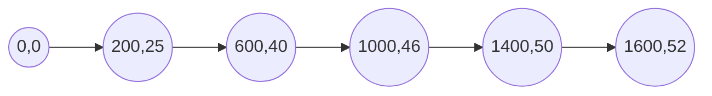

> FIGURE 23.45 Selection of SRT × temperature (days · °C) product for feed with high degradable solids content (Daigger et al., 1999).
\n---\n

## Figure 23.46 Selection of SRT × temperature (days · °C) product for feed with low degradable solids content (Daigger et al., 1999).

<table>
  <thead>
    <tr><th>Legend</th><th>Marker</th></tr>
  </thead>
  <tbody>
    <tr><td>Ju-2</td><td>◇</td></tr>
<tr><td>JU-3</td><td>■</td></tr>
<tr><td>Plum-2</td><td>△</td></tr>
<tr><td>Paris-2</td><td>○</td></tr>
<tr><td>NM-4</td><td>∘</td></tr>
<tr><td>Curve</td><td>—</td></tr>
  </tbody>
</table>

<table>
  <thead>
    <tr><th>Axis</th><th>Scale</th></tr>
  </thead>
  <tbody>
    <tr><td>Y-axis</td><td>VSS reduction efficiency (%)</td></tr>
<tr><td>X-axis</td><td>SRT × temperature product (days · °C)</td></tr>
  </tbody>
</table>

> The figure shows multiple data series (Ju-2, JU-3, Plum-2, Paris-2, NM-4) and a Curve representing the relationship between SRT × temperature product and VSS reduction efficiency for feed with low degradable solids content.

FIGURE 23.46 Selection of SRT × temperature (days · °C) product for feed with low degradable solids content (Daigger et al., 1999).

One potential issue is that the SOUR test is only accepted by the EPA with a specific range of testing parameters of solids concentrations and temperatures. Extrapolation of the test to concentrations and temperatures outside these ranges can be problematic.

### 3.4.1.4 Pathogen Reduction

Like solids reduction, little pathogen reduction can be expected at temperatures less than 10°C (50°F). On the other hand, significant reduction may be achieved at temperatures higher than 20°C (68°F), up to temperatures where inhibition begins to occur. Although U.S. EPA standards allow for operation at 15°C (59°F), the detention time must be increased to account for the slower rate of pathogen reduction. The exothermic reactions of digestion and the heat derived from compressing air in blowers will help maintain digester temperature, but this may be insufficient in colder climates. Therefore, in these

\n---\n

# 3.4.2 Equipment Design

Design of conventional aerobic digesters is similar in many ways to the design of activated sludge systems. Much of the equipment will be similar, and may even be shared.

### 3.4.2.1 Aeration and Mixing Equipment

Several devices (e.g., diffused air, mechanical surface aeration, mechanical submerged turbines, jet aeration, and combined systems) have been used successfully to provide oxygenation and mixing in aerobic digesters. Each has advantages and disadvantages as outlined below. For more information on the relative merits and design features of aeration systems from the perspective of their more common use for oxygenating activated sludge systems, see Chapter 12.

The design of diffused-air systems for aerobic digesters is similar to the design of those used in standard activated sludge systems. Diffusers typically are located near the tank bottom: They can be placed along one side of the tank to produce a spiral or cross-roll pattern, or they may be installed as a floor-mounted grid system. Both fine-bubble and coarse-bubble diffusers have been used in aerobic digesters. Airflow rates of 0.33 to 0.67 L/m^3·s (20 to 40 cu ft/min/1000 cu ft) typically are required to ensure that mixing is adequate. The airflow rates needed to meet oxygen-transfer requirements depend on digester loading, diffuser type, system layout, and overall oxygen-transfer efficiency.

Diffused-air systems provide the following advantages: oxygen transfer is controlled by varying the air-supply rate; the introduction of compressed air to the digester typically adds heat to the system, which minimizes temperature loss during cold weather; and overall heat loss from the system is minimized because of the relatively small degree of surface turbulence.

Advantages of diffused-air systems may be outweighed by clogging problems that can occur in aerobic digesters, especially in those whose operation includes periodic settling and supernatant removal. While the air is turned off, solids can enter the air piping and adhere to the inner walls of piping or diffusers. Nonclogging and porous media devices
\n---\n

are more resistant to this type of plugging than large-bubble, orifice diffusers. However, surface fouling of porous diffusers can occur: If a diffused-air system is to be used, it is imperative that provisions be included for easy cleaning of the diffusers and air drop pipes.

For higher solids concentrations, there is a significant decrease in oxygen-transfer efficiency with conventional diffusers (Krampe and Krauth, 2003; WEF et al., 2012). In addition, the clogging issues with conventional diffusers may be exacerbated. An alternative to the floor-covering diffuser systems is high-shear; nonclogging aeration equipment designed specifically for high solids concentrations (4% to 8% solids). This aeration system combines draft tubes or shear tubes with an adjustable, above-water orifice for airflow control and nonclogging point-source diffusers. The shear tube and draft tubes provide mixing and shearing to transfer oxygen and achieve volatile reduction with high solids (see Figures 23.47 and 23.48). The limitation of this system is that it works better when the liquid is more than 6.1 m (20 ft) deep (DaIGGER et al., 1997).

Mechanical surface aerators typically are floating, pontoon-mounted devices of either low- or high-speed design. Low-speed aerators are more often used in aerobic digesters: Compared to diffused-air systems, mechanical surface-aeration systems typically are simpler and easier to maintain, and less prone to fouling. Disadvantages typically attributed to surface aeration include the lack of control of the oxygenation rate, performance deterioration if excessive foam is present, more potential for foaming because of high surface turbulence, increased heat loss from the system, and the potential for ice accumulation during winter in cold climates as a result of the device's splashing.
\n---\n

[The image shows a typical draft tube system inside a circular digester. A central vertical cylindrical chamber is surrounded by multiple vertical tubes or pipes, connected to a circular top ring and supported by vertical members. The entire assembly sits on a circular base within a vessel.]

FIGURE 23.47 A typical draft tube system (in this case used to treat a mixture of primary and secondary waste at Paris, Illinois). The picture was taken after conversion from anaerobic to a prethickened, two-stage-in-series, aerobic digestion (Daigger et al., 1997).
\n---\n

## 3.4.2.2 Piping Arrangements

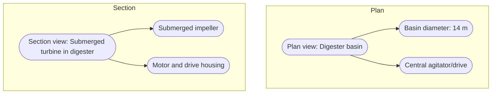

FIGURE 23.48 Plan and section views of a digester basin at Paris, Illinois. Basin is 14 m diameter x 9.4 m deep (45 ft diameter × 31 ft deep) (Daigger et al., 1997).

Mechanical submerged turbine aerators (and other combined mechanical mixing and diffused-air systems) provide several advantages and eliminate some disadvantages of the diffused-air and surface-aerator devices. Oxygenation rates can be controlled by varying the airflow rate to the submerged impeller: Because impellers are submerged, they are not as sensitive to foaming conditions as surface aerators and avoid the ice and heat dissipation problems associated with surface aerators. Additionally, the submerged unit can be operated as a mixer only, thereby promoting denitrification. Although the oxygen-transfer efficiency is similar to that of fine-bubble diffusers, the penalty resulting from two motors (turbine and blower) reduces the aeration efficiency (SAE) (Stenstrom and Rosso, 2008).

Jet aeration devices provide many of the advantages of submerged turbines These devices typically are more easily installed and have a similar oxygen-transfer efficiency to submerged turbines Problems with device plugging have occurred in the past when liquid flow paths were not large enough to pass the stringy solids typically found in aerobic digesters. The use of jets may also promote floc shear and subsequent dewatering difficulties.

3.4.2.2 Piping Arrangements
\n---\n

Specific piping requirements for aerobic digesters include provisions for feeding solids, withdrawing digested solids, decanting supernatant, and supplying air for aeration, when applicable. All piping should be designed large enough to provide for passage of solids, and should consider the need for future maintenance or repairs to the piping and the digester: See Chapter 19 for a discussion of design of sludge pumping systems and associated piping.

Only one solids-feed inlet per basin is necessary if the digester is designed with adequate mixing. If feasible, it may be preferable to have the feed occur where the operator can physically monitor flow into the digester: The digester should be fed often enough to avoid localized shock loading: An emergency digester overflow should be provided if the potential for overfilling exists.

Digested solids typically are withdrawn from the low point of each tank: In aerobic digestion systems designed with settling basins, digested solids and supernatant are removed in the settling basin. Solids also are returned to the aerobic digester from the settling basin to maintain the required SRT.

Batch-operated aerobic digesters can be designed to remove solids and supernatant via pumping or gravity: If a fixed supernatant-removal system is used, enough flexibility should be provided to allow supernatant to be removed over a relatively wide range of depths. At a minimum, two supernatant withdrawal lines located at different depths are advisable. Alternatively, floating decanter devices can be used for effective supernatant removal;

Air piping, if required, should be designed similarly to aeration systems for activated sludge systems (see Chapter 12). Consideration should be given to a separate air supply to the aerobic digester; especially if the liquid level varies because of supernatant decanting: When the liquid level in the digester is lower than that in the aeration tank, the digester will "rob" the aeration tank of air unless the air supply is separate or there is pressure compensation: Also, if centrifugal blowers are used for aeration, the impact of varying water levels on the blowers should be considered.

Provide strategically located hose connections to allow flushing out solids lines with facility effluent: Water (effluent) sprays, although providing some level of foam control, are
\n---\n

## 3.4.2.3 Instrumentation and Controls

Aerobic digestion typically is controlled manually. The operating variables that currently lend themselves to automatic control are dissolved oxygen, ORP, and tank level.

The dissolved oxygen signal can be used to control the aeration system so it maintains an optimum dissolved oxygen level (typically between 1 and 2 mg/L). This can conserve energy. Low- (and occasionally high-) dissolved oxygen conditions can trigger an alarm to allow operators to take corrective action. However, except for inadvertent digester overloads, dissolved oxygen changes in aerobic digesters typically are minimal, and maintaining dissolved oxygen monitors may be time-consuming.

An alternative that may be more beneficial, especially for either thermophilic systems or systems operated in aerobic/anoxic modes, may be the use of ORP probes. Research (Peddie et al., 1990) has found that the ORP profile in a cycled digester is characteristic and reproducible. There are distinct changes in the profile as the system moves from aerobic to anoxic respiration, and the system can be used to monitor and control systems even with very low levels of dissolved oxygen. Therefore, use of ORP probes, combined with aerobic-anoxic cycling, offers one potential means of improving the energy efficiency of the aerobic digestion process.

A tank-level signal, useful in preventing overfilling, can be used for on-off control of digester feed pumps. Intermittent feeding of primary solids to digesters via timer-controlled pumps has been used. This controlled-feeding technique also has been used for waste biological solids feeding: Automatically controlled feeding is successful when care is taken to establish the proper time as facility-operating conditions change. With manually controlled feed systems, a tank-level signal can be used to warn of a high-level condition.

Withdrawal of solids from aerobic digesters typically is manually controlled and done intermittently: Manual withdrawal allows rational reaction to variable solids production, solids concentration, digestion rates, and capacity of subsequent processing:
          
## 3.4.2.4 Considerations of Equipment Selection
\n---\n

Flexibility and maintainability are key criteria when selecting aerobic digester equipment:
The major equipment items of concern are piping and aeration and mixing equipment.

Piping systems require valves that resist clogging (e.g., eccentric plug valves). All feed and withdrawal piping (e.g., feed solids, digested solids, and supernatant lines) should have provisions (e.g., visible discharge points, cleanable sight glasses, or flow meters) for confirming that liquid or solids are flowing through the line during operations: Flow meters may not be effective with some positive-displacement pumps because pulsations can give the impression of positive flow when no net solids movement is occurring:

The aeration and mixing system(s) should be designed to facilitate maintenance. Swing-arm (knee-joint) or lift-out diffuser assemblies simplify the maintenance and cleaning of diffusers. Access to remove surface aerators or mixers also should be provided. Consideration also should be given to multiple tanks, so one tank can be completely drained for maintenance without interrupting the process

## 3.4.2.5 Design for Safety
Although subject to the safety hazards typically associated with mechanical and electrical equipment, aerobic digestion does not involve the explosive and toxic gases generated in anaerobic digestion. Safety considerations for aerobic digesters are similar to those for activated sludge basins. For example, placing life preservers with safety lines at intervals around the digesters can prevent drowning accidents. Adequate lighting around the tanks should be provided to allow for safe nighttime O&M. Non-slip, corrosion-resistant grating should be used for access walkways.

## 3.4.2.6 Design for Operability
All systems, including aerobic digestion, should be designed with operability in mind. Design engineers should consider the following operability issues:
* Aeration system selection for ease of maintenance (periodic diffuser cleaning);
* Location, number, and type of monitoring instruments to enhance control capability;
* Location, number, and type of supernatant-withdrawal devices;
* Aboveground or belowground installation of digestion reactor (ease of temperature control versus accessibility);
\n---\n

* Ability to mix and aerate the system independently; and
* Access to the tank and other equipment for maintenance.

## 3.4.3 Process Performance and Operation

Conventional aerobic digestion typically produces Class B biosolids. Class B biosolids are biosolids in which the pathogen levels are unlikely to pose a threat to public health and the environment under specific-use conditions (U.S. EPA, 2003). Class B biosolids cannot be sold or given away in bags or other containers or applied on lawns or home gardens. They typically are land applied or landfilled.

The important factors when controlling aerobic digestion operations are similar to those for other aerobic biological processes (see Table 23.30) (Stege and Bailey, 2003). Operators should monitor the primary process indicators (e.g., temperature, pH, dissolved oxygen, odor, and settling characteristics, if applicable) daily. Monitoring helps control process performance and serves as a basis for future improvements. The secondary indicators (e.g., ammonia, nitrate, nitrite, phosphorus, alkalinity, SRT, and SOUR) are useful in monitoring long-term performance and for troubleshooting problems associated with the primary indicators. While monitoring and controlling these parameters is important, the degree of control that can be exercised on each parameter varies. Analysis frequency should be increased during startup and whenever large changes are made to operating conditions, such as solids flow rate and large increase or decrease in feedstock's solids concentration.

### Volatile Solids Reduction Data from Both Studies in All Basins

<table>
<thead>
<tr><th>°C</th><th>8–10°C</th><th>12°C</th><th>21°C</th><th>21°C</th><th>23°C</th><th>31°C</th></tr>
</thead>
<tbody>
<tr><td>Two basins in series (no. of days)</td><td>19.25</td><td>13.75</td><td>13.75</td><td>13.75</td><td>19.25</td><td>19.25</td></tr>
</tbody>
</table>

\n---\n

## 3.5 Autothermal Thermophilic Aerobic Digestion

As noted in Section 3.2, aerobic digestion is an exothermic reaction, generating heat. The ATAD process uses this heat to help achieve operating temperatures of 40°C to 80°C (see Figure 23.49). It relies on having efficient oxygen-transfer systems (to provide oxygen without heat stripping), insulated vessels (to minimize heat loss), and higher concentrations of solids to provide enough heat generation to maintain the thermophilic temperatures. If sufficient insulation and adequate solids concentrations are provided, the process can be controlled at thermophilic temperatures to achieve greater than 38% VSR and meet Part 503's Class A pathogen requirements (U.S. EPA, 1990).

ATAD has been studied since the 1960s. Much of the developmental work was done by Popel (1971a, 1971b), who, along with his coworkers, studied animal manure and wastewater residuals in Germany. They developed an aspirating aeration device that was key to the process success. Research in the United States was done by Matsch and Drnevich (1977) using pure oxygen and by Jewell and Kabrick (1980) using air with submersible aeration devices. The initial full-scale installations in the United States occurred during the 1990s. Some of the early systems experienced odor and other issues. Despite this, ATAD digestion gained popularity because it can produce Class A biosolids. In 2003, there were 35 ATAD systems operating in North America. More than 40 facilities are operating in Europe (Stensel and Coleman, 2000). This experience has led to changes in the ATAD process, with second-generation systems designed to address these

<table>
<thead>
<tr><th></th><th>Col 1</th><th>Col 2</th><th>Col 3</th><th>Col 4</th><th>Col 5</th><th>Col 6</th></tr>
</thead>
<tbody>
<tr><td>Volatile solids removal</td><td>27%</td><td>31%</td><td>31%</td><td>31%</td><td>28%</td><td>31%</td></tr>
<tr><td>Three basins in series (no. of days)</td><td>29.25</td><td></td><td></td><td>29.25</td><td></td><td>29.25</td></tr>
<tr><td>Volatile solids removal</td><td>28%</td><td></td><td></td><td>32%</td><td></td><td>40%</td></tr>
</tbody>
</table>

TABLE 23.30 Volatile Solids Reduction at Minimum Operating Temperatures and Minimum Solids Retention Time
(Daigger et al., 1999)

\n---\n

<pre>
FIGURE 23.49 Schematic (a) and individual reactor configuration (b) for a typical autothermal thermophilic aerobic digestion system (from Metcalf & Eddy, Wastewater Engineering: Treatment and Reuse, 4th ed. Copyright © 2003, The McGraw-Hill Companies, New York, NY, with permission).
</pre>

<mermaid>
graph TD
  Sludge --> Thickener
  Thickener --> ATAD1
  ATAD1 --> ATAD2
  ATAD2 --> BiosolidsStorage
  BiosolidsStorage --> LandApplication
  Offgas1[Off-gas to treatment or atmosphere] --> Treatment
  Offgas2[Off-gas to treatment or atmosphere] --> Treatment
  ATAD1 --> Offgas1
  ATAD2 --> Offgas2
</mermaid>

<mermaid>
graph TD
  ThickenedSludge --> InsulatedReactor
  FoamBreaker --> InsulatedReactor
  AirOrOxygen --> InsulatedReactor
  InsulatedReactor --> OffGasB
  InsulatedReactor --> DigestedBiosolids
  DigestedBiosolids --> SecondStageATAD
  OffGasB --> Atmosphere
</mermaid>

3.5.1 Advantages and Disadvantages

The major advantages of ATAD are as follows:

- Shorter retention times of approximately 5 to 6 days to achieve 30% to 50% VSR, resulting in a (smaller volume required to achieve a given suspended solids reduction).

- Lower oxygen requirements than mesophilic aerobic digestion, as nitritification does not occur.
\n---\n

* When the reactors are well mixed and maintained at 55°C and above for 10 days, the process meets the EPA requirements for processes to further reduce pathogens, yielding Class A biosolids.
* The major disadvantages of ATAD are as follows:
  - Potential for poor dewatering characteristics (Daigger et al., 1998).
  - Potential for objectionable odors.
  - Lack of nitrification and/or denitrification (Daigger et al., 1998).
  - A foam layer must be managed to ensure effective oxygen transfer (Metcalf and Eddy, Inc./AECOM, 2013).
* Several of these disadvantages have been addressed with improvements in the design ATAD process. For example, addition of mesophilic storage after the ATAD system significantly improves dewaterability (Scisson, 2009).

## 3.5.2 Process Design

The following design parameters were adapted, in part, from Stensel and Coleman (2000).

### 3.5.2.1 Nitrification Inhibition

Because of the high operating temperatures involved, ATAD inhibits nitrification and so the system's pH is typically between 8 and 9. Aerobic destruction of volatile solids occurs as described by eq.23.27, without the subsequent nitrification reactions described in eq 23.28. Also, some ATAD systems may be operating under microaerobic conditions, in which oxygen demand exceeds oxygen supply (Stensel and Coleman, 2000). Ammonia is released as a result of digestion, and the ammonia-nitrogen produced will be present in both gas and solution at concentrations of several hundred milligrams per liter:

### 3.5.2.2 Effect of Liquid Sidestreams That Contain Ammonia-Nitrogen

Most of the ammonia-nitrogen will be recycled to the wastewater treatment train via sidestreams from the ATAD odor-control and residuals dewatering systems. If effluent nitrogen and phosphorus limits are low, then these recycle streams should be accounted for in evaluating facility performance. For more information on sidestream treatment, see Chapter 15.
\n---\n

## 3.5.2.3 Foam

Autothermal thermophilic aerobic digestion generates a substantial amount of foam as cellular proteins, lipids, and FOG are broken down and released into solution. The foam contains high concentrations of biologically active solids, which provide insulation. It is important to manage foam effectively (via foam cutters or spray systems) to ensure effective oxygen transfer and enhanced biological activity. A freeboard of 0.5 to 1 m (1.65 to 3.3 ft) is recommended (Stensel and Coleman, 2000).

## 3.5.2.4 Equipment Design

Table 23.31 shows recommended design parameters for ATAD systems (Stensel and Coleman, 2000).

<table>
<thead>
<tr><th>Parameter</th><th>Acceptable Range</th><th>Acceptable Values</th></tr>
</thead>
<tbody>
<tr><td>pH</td><td>5.9–7.7</td><td>7.0</td></tr>
<tr><td>5-day BOD (mg/L)</td><td>9–1700</td><td>500</td></tr>
<tr><td>Filtered 5-day BOD (mg/L)</td><td>4–173</td><td>50</td></tr>
<tr><td>Suspended solids (mg/L)</td><td>46–2000</td><td>1000</td></tr>
<tr><td>Kjeldahl nitrogen (mg/L)</td><td>10–400</td><td>170</td></tr>
<tr><td>Nitrate-nitrogen (mg/L)</td><td>0–30</td><td>10</td></tr>
<tr><td>Total phosphorus (mg/L)</td><td>19–241</td><td>100</td></tr>
<tr><td>Soluble phosphorus (mg/L)</td><td>2.5–64</td><td>25</td></tr>
</tbody>
</table>

TABLE 23.31 Acceptable Characteristics for Supernatant from Aerobic Digestion Systems (from Metcalf & Eddy; Wastewater Engineering: Treatment and Reuse, 4th ed. Copyright © 2003, The McGraw-Hill Companies, New York, N.Y. with permission)

### 3.5.2.5 Prethickening
\n---\n

## 3.5.2.6 Basin Configuration
As noted previously, an important consideration in maintenance of ATAD conditions is maintaining a sufficiently high feed concentration to allow the exothermic reactions to provide necessary heat. Typically, the ATAD influent should contain more than 4% solids, with a minimum of 2.5% biodegradable volatile solids. Therefore, thickening facilities may be required prior to the ATAD process.

The system should include two or more enclosed, insulated reactors in series. The reactors are typically either cylindrical or rectangular; depending upon the system design and the type of equipment selected. Cylindrical structures can be either steel or concrete, while rectangular structures are more commonly concrete. Both reactors need mixing, aeration, and foam-control equipment.

Both continuous and batch processing are acceptable. To comply with the EPA definition of ATAD as a process to further reduce pathogens (PFRP), a batch process should be used: In this case, pumps should be designed to withdraw and feed the daily allotment of solids in 1 hour or less. A specific volume of solids is removed on a daily basis from the second-stage reactor (which is operating in a range of 55°C to 65°C). After the solids are removed, biomass from the first-stage reactor is transferred into the second-stage reactor. The second-stage reactor is then isolated for the remaining 23 hours each day, at a minimum temperature of 55°C. After the biomass is transferred from the first-stage reactor to the second stage, raw feed is then introduced to the first stage to make up the volume removed. This feeding approach isolates the reactors from each other and reduces the potential for contamination of the product:

## 3.5.2.7 Post-Process Storage and Dewatering
Post-process cooling is necessary to consolidate solids and enhance dewaterability. Typically, solids exiting the second-stage digester will be at a temperature in excess of 60°C. Allowing 14 to 20 days of SRT in post-digestion cooling allows cooling the solids to less than 35°C, improving dewatering characteristics. Some of the second-generation systems also use this as a nitrification/denitrification reactor. Even with storage, it may be necessary to provide heat exchangers to cool the biosolids.

## 3.5.3 Process Performance and Operation
\n---\n

# 3.5.3.1 Volatile Solids Reduction

The VSR achieved by the process depends on the feedstock(s), SRT, operating temperature, and reactor loading. Table 23.32 (Spinosa and Vesilind, 2001) shows reported VSRs in ATAD systems. The Bowling Green, Ohio, facility, which is a second-generation facility, reported a VSR of 75% (Scisson, 2006).

<table>
<thead>
<tr><th>Parameter</th><th>Actual Data from a Gravity Thickener– Aerobic Digester in-Loop System</th><th>Compared with Acceptable Typical Values from Table 23.31</th></tr>
</thead>
<tbody>
<tr><td>pH</td><td>6.5–7.1</td><td>7.0</td></tr>
<tr><td>Suspended solids (mg/L)</td><td>10–50</td><td>1000</td></tr>
<tr><td>Total Kjeldahl nitrogen (mg/L)</td><td>2.5–4</td><td>170</td></tr>
<tr><td>Nitrate-nitrogen (mg/L)</td><td>—</td><td>30</td></tr>
<tr><td>Total phosphorus (mg/L)</td><td>0.3</td><td>100</td></tr>
<tr><td>Thickener blanket</td><td>8–13.5</td><td>10</td></tr>
</tbody>
</table>

TABLE 23.32 Data from a Gravity Thickener–Aerobic Digester in-Loop Process at the Stockbridge, Georgia, Wastewater Treatment Plant (Courtesy of Stantec Consulting)

----

### 3.5.3.2 Pathogen Reduction

German regulations require ATAD systems to produce biosolids containing no more than 1000 enterobacterial/mL. The German government considers ATAD to be a process capable of producing “pasteurized (hygienic) solids” — a status similar to the PFRP designation in Part 503. The U.S. EPA has approved one set of operating conditions for the ATAD system as a PFRP. For systems not meeting these requirements, PFRP equivalence can be demonstrated through time and temperature requirements or by testing:

- The Haltwhistle, U.K., facility reported a more than 4-log pathogen reduction via its ATAD system (Murray et al., 1990).
- Canadian facilities using ATAD had less than 100 MPN/mL.
\n---\n

## 3.5.3.3 Odor Control

Odor control has been a key concern for ATAD systems, with varying success in addressing the issue. Older facilities, especially first-generation systems, tend to experience issues more often.

The Banff facility uses a water scrubber on ATAD exhaust: Its dewatered biosolids exhibited no odors and seemed well stabilized. The Haltwhistle facility had no odor complaints. The Salmon Arm facility sends exhaust gases to a trickling filter; no odor problems have been reported. The Ladysmith and Gibson’s facilities discharge ATAD exhaust to biological filters. The Bowling Green, Ohio, facility reports no odors after a year of operation (Scisson, 2006).

Glenbard, British Columbia, has a pure-oxygen ATAD system that emits "rotten broccoli" odors during operations. When analysts tested the offgas, they found dimethyl sulfide, which is an indicator of anaerobic conditions. At the Salmon Arm and Whistler facilities, testing showed that the offgas contained hydrogen sulfide, methyl disulfide, dimethyl sulfide, ammonia, and unidentified organic compounds (Kelly et al., 1993). Reports on facilities in Colorado and Pennsylvania cite odor issues and the need for odor control (Bowker and Trueblood, 2002; Hepner et al., 2002). Meanwhile, several facilities in North America and Europe emitted odors and needed to implement odor controls (Layden et al., 2007).

Typically, odors can be minimized if the ATAD system maintains proper operating temperatures and is adequately mixed and aerated. Further odor-control measures are now recommended practice (Kelly et al., 2003; Kelly 2006) and include devices such as water scrubbers, biofilters, or thermal oxidizers.

### 3.5.3.4 Dewaterability

Autothermal thermophilic aerobic digestion produces biosolids with small flocs and, therefore, a large surface area that requires more polymer during dewatering operations
\n---\n

( Kelly et al., 2003). In fact, conditioning chemical costs could offset the benefits of ATAD (Agarwal et al., 2005) if the goal is a dewatered biosolids containing 20% to 30% solids, because it can cost 5 to 10 times more to chemically condition ATAD solids than undigested solids (Murthy et al., 2000a), and about 2 to 3 times more to chemically condition ATAD solids than anaerobically digested solids (high-rate mesophilic) (Spinosa and Vesilind, 2001).

The system’s high temperature contributes to dewatering challenges because it promotes cell lysis and the release of proteins to liquid. These proteins, along with extracellular polymeric substances, alter the biosolids’ conditioning polymer requirements. However, if operating temperatures exceed 70°C, the dewatering properties of biosolids actually improve because the production of extracellular substances decreases (Zhou et al., 2002).

Investigators have tried several methods for improving the dewaterability of ATAD solids:

* Sequential polymer dosing using iron and anionic polymer, or cationic and anionic polymers (Murthy et al., 2000a; Agarwal et al., 2005);
* Post-ATAD mesophilic aeration of biosolids (Murthy et al., 2000b; Scisson, 2009); and
* Electrical arc treatment (Abu-Orf et al., 2001).

Mesophilic holding, based on the work in Bowling Green (Scisson, 2009), appears to offer significant benefits in dewatering:

> 3.6 Design Techniques to Optimize Aerobic Digestion
> 
> 3.6.1 Thickened Aerobic Digestion
> 
> 3.6.1.1Advantages of Thickening

Typically, waste activated solids from secondary clarifiers will have solids concentrations in a range from 7,500 to 20,000 mg/L. If WAS is being digested without primary sludge, it may be beneficial to prethicken the solids. Thickening is required for ATAD systems, and can be beneficial for conventional mesophilic digestion: The main advantages of this technique include:

* Increased SRT and VSR for a given volume; and
- The higher solids concentrations can yield auto-heating.
\n---\n

## 3.6.1.2 Disadvantages of Thickening
The oxidation of biodegradable organic matter elevates digester temperatures via its heat of combustion (about 3.6 kcal/g [6500 Btu/lb] of VSS destroyed) and accelerates digestion and pathogen destruction rates (Grady et al., 2011). If the heat generated by this process can be maintained in the digester, it can be used to control the reactor’s temperature. This could be beneficial in cold climates.

## 3.6.1.3 Categories of Thickening
Thickened aerobic digestion is divided into five major categories (as described below) based on the thickening treatment processes used to increase the feed cake’s solids concentration and the position of thickening in the digestion process.

### 3.6.1.3.1 Batch Operation or Decanting of Aerobic Digester
Batch operation involves the practice of manually decanting digested solids. Originally, aerobic digestion was operated as a draw-and-fill process, a concept still used at many facilities. Solids are pumped directly from the clarifiers or sequencing batch reactors (SBRs) to the aerobic digester: The time required to fill the digester depends on the tank volume available and the volume of solids. When a diffused-air aeration system is used, the solids being digested are aerated continually during the filling operation. When the solids are removed from the digester, aeration is discontinued, and the biosolids are allowed to settle. The clarified supernatant is then decanted and returned to the treatment process. The removed biosolids can contain up to 2.5% solids, depending on the sludge and the time allowed for settling:

Advantages of this process are that no additional tanks are required, and it is possible to utilize existing tanks to both digest and thicken. Disadvantages of this process include the following:
\n---\n

* Basins may be sized based on low solids concentration and high water content (i.e., large volumes are required).
* Larger basins raise the capital cost.
* Varying liquid levels may impact aeration efficiency.
* No control of alkalinity, temperature, ammonia, nitrates, and phosphorus.
* Difficult to meet stringent limits on supernatant quality.

## 3.6.1.3.2 Continuous-Feed Operation with Post-Sedimentation

This mode of thickening treatment process consists of a continuous-feed operation using sedimentation (e.g., a gravity thickener) after digestion. This is typically a continuous aerobic digestion process that closely resembles the activated sludge process. Solids are pumped directly from the clarifiers, SBR, or MBR into the aerobic digester. The digester operates at a fixed level, with the overflow going to a solid-liquid separator. The design and operation of these sludge thickening devices is discussed further in Chapter 21. Thickened and stabilized solids are removed for further processing. Continuous operation typically produces biosolids with lower solids concentrations. This process has some advantages over the semi-batch operation, because the aerobic digestion basin is operated at a fixed level and the aeration-transfer efficiency is optimized.

For continuous-feed digesters, the process can be improved by adjusting the rate of settled return solids to obtain the best balance between return solids concentration and supernatant quality:

Disadvantages of this process include the following:
* Digester basins are sized based on low solids concentration and high water content (i.e., large volumes are required).
* Larger basins increase the capital cost.
* Higher O&M costs associated with aerating and mixing the larger tank volumes.
* No control of alkalinity, temperature, ammonia, nitrates, and phosphorus.
* Difficult to meet stringent limits on supernatant effluent.
* If nitrification and denitrification are not controlled between the digester and thickener, it can lead to anaerobic conditions in the thickeners and undesirable odors.
\n---\n

## 3.6.1.3.3 Gravity Thickener in Loop with Aerobic Digestion

This process typically consists of two main phases (in-loop and isolation) and four main basins (two digesters, one premix basin, and a gravity thickener): For feeds from SBRs and MBRs, more basins can be incorporated into the design to optimize flexibility; however, the four basins are still the main components of the process. During the in-loop phase, a premix basin, a digester, and a thickener operate in a loop, which reduces volatile solids, reduces ammonia, and increases solids concentration. The in-loop thickener has two main functions: thickening and denitrification. The in-loop digester; or volatizer; acts as a stabilization step and reduces most volatile solids. The in-loop digester is fed in batches 8, 16, or 24 times per day for a period that typically lasts 10 to 20 days. The digester then enters the isolation phase. During the isolation phase, no solids are introduced to the digester, which completes the additional pathogen reduction needed to meet regulatory requirements. The process is considered a 'modified batch process' because of the multiple feedings to the loop digester. This process can produce biosolids containing 2.5% to 3% solids.

Advantages of this process include the following:
* Process provides the benefits of aerobic-anoxic operation (see Section 3.6.3).
* Process provides the benefits of staged operation (i.e., less detention time required).
* Denitrification in the thickener provides good control of alkalinity.
* Low concentrations of ammonia, nitrates, phosphorus, and total suspended solids (TSS) in supernatant.
* Process provides better SOUR and pathogen reduction compared to the processes in Sections 3.6.1.3.1 and 3.6.1.3.2 as a result of true isolation.
* Moderate capital cost.
* Low O&M cost.

### 3.6.1.3.4 Membranes for In-Loop Thickening with Aerobic Digestion

Membrane technology has developed rapidly in the United States over the past 20 years. Its use in digestion is more recent; the oldest effective installations date back to 1998. The
\n---\n

process incorporates a wastewater membrane suitable for high solids (e.g., flat plate, or hollow fiber).

Membrane thickening can be used in any process listed in Sections 3.6.1.3.1 through 3.6.1.3.3. Applications range from 3% to 5% solids concentrations; however, it is not recommended that design solids exceed 3.5% for single-stage systems. Membranes can operate in continuous or batch mode, in isolation and in series. The air required to scour the membranes can also provide oxygen for digestion, allowing membranes fitted into existing basins to provide both thickening and digestion at the same time. Designs include two-, three-, four-, or five-basin configurations, operating in batch or in series (see Figures 23.50 and 23.51) (Daigger et al., 2001).

Advantages of this process include the following:
- The physical barrier of the membrane provides the best control of supernatant quality.
- The process requires small footprint, which is ideal for high-rate digestion.
- If operated in staged mode, the process provides the benefits of staged operation.
- The process can provide the benefits of aerobic-anoxic operation, depending on the operational mode.
\n---\n

# D1 + D2 + D3 in Loop

<table>
  <tr>
    <td colspan="2">
      <strong>D1</strong><br/>
      Feed<br/>
      Anoxic (Denitrification)
    </td>
    <td>
      <strong>D2</strong><br/>
      Oxic &amp; Thickening Basin<br/>
      (Aerobic with Membranes)
    </td>
  </tr>
<tr>
    <td>
      <strong>D5</strong><br/>
      Drawn Down
    </td>
    <td>
      <strong>D4</strong><br/>
      Isolation for 7 Days
    </td>
    <td>
      <strong>D3</strong><br/>
      Aerobic
    </td>
  </tr>
</table>

FIGURE 23.50 A five-stage batch operation setup using membranes for in-loop thickening as part of an aerobic digestion system (Daigger et al., 2001).
\n---\n

D1 + D2 + D3 in Loop

D1 + D2 + D3 in Loop

```
mermaid
graph TD
  subgraph Top
    D1[Anoxic (Denitrification)]
    D2[Oxic & Thickening Basin<br>(Aerobic with Membranes)]
  end
  subgraph Bottom
    D3[Overflow from D3 → D4<br>In Series]
    D4[Overflow from D4 → D5<br>In Series]
    D5[Draw Down All the Time]
  end
  Feed([Feed]) --> D1
  D1 --> D2
  D2 --> D3
  D3 --> D4
  D4 --> D5
  D5 --> D1
```

FIGURE 23.51 A five-stage, in-series operation setup using membranes for in-loop thickening as part of an aerobic digestion process (Daig ger et al., 2001).

As noted in Section 3.3.7, phosphorus release occurs during aerobic digestion.
Membranes offer several advantages in reducing phosphorus recycles in liquid streams.
Membranes typically produce a filtrate with a low solids content, reducing the potential for particulate phosphorus discharges. If a phosphorus permit applies on the liquid sidestream, the permeate can be treated with alum or ferric chloride to fix phosphorus so it can be removed with the solids. The permeate from a membrane digester is collected in the aerobic phase, minimizing the impact of release under anoxic or anaerobic conditions.
Another factor that affects phosphorus release is pH. Because membrane systems include an anoxic zone to balance alkalinity, pH balancing is integral to the process.

3.6.1.3.5 Using Any Mechanical Thickener before Aerobic Digestion
\n---\n

### 3.6.2 Basin Configuration—Staged or Batch Operation (Multiple Basins)

In this process, a mechanical prethickening device (e.g., a gravity belt thickener, DAF mechanism, centrifuge, or drum thickener) is used before aerobic digestion. The designer can choose the ideal mechanical device (see Chapter 21) and desired operating solids concentration (e.g., 4%, 5%, or 6%) to minimize the aerobic digestion basins. This process gives flexibility to meet performance requirements in summer and winter by modifying the mechanical device's operating schedule as desired. For this process, two digesters in series are recommended, as a minimum (series operation will be addressed later in this chapter). Because of the flexibility and reliability, and the capital and O&M cost savings, this process is preferred in WRRFs designed for average daily flows greater than 7600 m3/d (2.0 mgd).

Advantages of this process include the following:
* Provides operational flexibility;
* Provides ability to optimize equipment selection and solids concentration;
* Minimizes footprint, which is ideal for high-rate digestion;
* Provides temperature control when flexibility is included in the design (cold weather not an issue with these systems, but provisions may be needed to prevent thermophilic conditions in summer);
* Can provide the benefits of staged operation, depending on system design; and
* Can provide the benefits of aerobic-anoxic operation, depending on system design.

One concern with prethickening is the reduction in aeration efficiency, which occurs with higher solids concentrations. The alpha values and transfer efficiency are lower in digesters operating at 4% to 6% than in those operating at 2% to 3% (WEF et al., 2012). However, because of the reduced basin volume required for these systems, the airflow required for both process and mixing is comparable. Mixing requirements typically are higher than process air requirements for systems with lower solids concentration, so the overall operating horsepower for higher solids is less.

### 3.6.2 Basin Configuration—Staged or Batch Operation (Multiple Basins)
Traditionally, aerobic digesters have been designed with one basin, or with multiple basins operated in parallel. Multiple tanks in series or in isolation operated in a batch operation
\n---\n

have proven to improve both pathogen destruction and compliance with VSR requirements.

According to the U.S. EPA, solids can be aerobically digested using a variety of process configurations, including continuous-flow or batch systems, in one or multiple stages (U.S. EPA, 2003). From a process basis, single-stage completely mixed reactors with continuous feed and withdrawal are the least effective option for bacterial and viral destruction, mainly because of the potential for short-circuiting:

Operation in series is simpler; as it reduces the complexity of controlling a batch system.
Using two or more completely mixed digesters in series reduces the potential for short-circuiting, and improves the process kinetics.

Farrah et al. (1986) have shown that the decline in densities of enteric bacteria and viruses follow first-order kinetics. Assuming that first-order kinetics are correct, it can be shown that for the same total volume, an additional 1-log reduction of organisms is achieved in a two-stage reactor compared to a one-stage reactor: Direct experimental verification of this prediction has not been done, but Lee et al. (1989) have qualitatively verified the effect.

Although calculations indicate that a two-stage system would theoretically allow a 50% reduction in volume and detention time, not all factors involved in the decay of microorganism densities are known. Therefore, to allow a factor of safety, for staged operation (using two stages with about equal volume), it is recommended that the required time be reduced to 70% of that needed for single-stage aerobic digestion in a continuously mixed reactor: The same reduction is recommended for true batch operation or for more than two stages in series. This is consistent with the credit allowed by the EPA (U.S. EPA, 2003) for the improved efficiency of both batch and multi-stage operation: Thus, the time required would be reduced from 40 to 28 days at 20°C (68°F) and from 60 to 42 days at 15°C (59°F). These reduced times are also more than sufficient to achieve adequate VAR. (For more information on this topic, see Section 3.4.1.2.)

The benefits of a two-stage reactor system (in series or in isolation) include:
* Improvement in pathogen destruction;
* Improvement in VSR;
\n---\n

# 3.7 Nutrient Removal in Aerobic Digestion

- Smaller tank volumes required; and
- Lower airflows required because of smaller tank volumes.

- As described in Section 3.6.3 Aerobic-Anoxic Operation, the oxidation of biomass depends on sufficient alkalinity. Depending on the feed alkalinity, the system may drop until it begins to inhibit nitrification. In this case, partial nitrification occurs. This is primarily a concern with poorly buffered wastewater.

- If the oxygen can be used to stabilize biomass in the reactor, then both nitrification and denitrification can occur with (a form of) alkalinity balance; the process may proceed through combined nitrification and denitrification.

- Equation 3.6 is a balanced stoichiometric equation of combined nitrification and denitrification, illustrating how biomass is converted through the process (and how alkalinity is consumed or produced). 
  (Note: the exact chemical species and coefficients are shown in the original text as a formal equation.)

- In Kuwait, investigators studied digestion in a controlled environment at 20°C and a 10-day digestion cycle. This is shown in [Figure or table reference in the original text]. Peddle et al. (1990) have also studied this topic to automate the process.

- The aerobic-anaerobic approach reduces the oxygen demands for digestion. With some oxygen savings, there is an implied credit that reduces the overall oxygen requirement for digestion; this credit is analogous to a reduction in the cost of processing.

- The discussion continues with respect to the practical benefits and operating considerations of aerobic digestion in the context of nitrogen removal.

----

## 3.7.1 Nitrogen Removal in Aerobic Digestion (subsection)

- In practice, the available data show that the combination of aerobic digestion and controlled anoxic/denitrification zones can enhance nitrogen removal efficiency.
- The optimization of these processes often relies on monitoring and control strategies (e.g., ORP, aeration patterns) to balance nitrification and denitrification while maintaining system stability.

\n---\n

# 3.7.2 Phosphorus Reduction in Biosolids and Biophosphorus

From an overall mass-balance perspective, phosphorus entering the digester ends up either in waste solids or in effluent: If it cannot move forward with the solids, then phosphorus will be recycled back to the head of the facility. Phosphorus will be released into the liquid phase in both anaerobic and aerobic digestion; however, the release is lower in aerobic processes than anaerobic processes.

The amount of phosphorus released in aerobic digestion is dependent on the digestion time and temperature, as well as the operational mode of the digester (Jenkins and Mavinic, 1989). Operating the system in an aerobic-anoxic mode or under low-dissolved-oxygen conditions (which provides simultaneous nitrification and denitrification) reduces the phosphorus release (Daigger et al., 2001). Based on research (Jenkins and Mavinic, 1989), the release in a continuously aerated digester is 2 to 3 times the release in intermittently aerated systems.

As shown in Figure 23.52, when solids from an EBPR facility (Ozark, Kansas) were digested under fully aerobic conditions, the phosphorus release was in the range of 120 to 150 mg/L (Daigger et al., 2001). If they were digested under cyclic operations, phosphorus releases ranged from 70 to 90 mg/L after 500 hours of operation:

\n---\n

# Phosphorus Release and Uptake During Solids Digestion

Another factor that affects phosphorus release is pH. Several studies show that a pH less than 6.0 should be avoided, because it encourages inorganic metal phosphates to dissolve (Jenkins and Mavinic, 1989; Daigger et al., 2001). Alternatively, feeding lime to the digester to raise the pH significantly lowers the phosphorus release.

<figure>
  <figcaption>FIGURE 23.52 Polyphosphorus release and uptake of phosphorus during solids digestion (Daigger et al., 2001).</figcaption>
  <div>
    A two-series plot of supernatant P (mg/L) versus time (h) for Akron sludge (squares) and Ozark sludge (open circles).
    The y-axis ranges from 0 to 100 mg/L and the x-axis from 0 to about 600 h. The graph includes labels indicating aeration cycles: "Air on" and "Air off." The Ozark sludge series shows higher peaks (approaching 90 mg/L) during aeration periods, while the Akron sludge series remains at much lower levels. The terms "Air on" and "Air off" appear at various points along the time axis to mark aeration cycles.
  </div>
</figure>

Dealing with phosphorus in the digesters depends both on the overall nutrient requirements for the facility and on any phosphorus restrictions on land application. Depending upon the controlling parameters, there are options that can be used to manage this phosphorus release.

When controlling phosphorus in the recycle stream is the primary concern, there are several potential options for reducing phosphorus loads in the sidestreams. First, solids can be prethickened using a mechanical thickener. Figure 23.53 shows a typical prethickened application for liquid disposal with no phosphorus limit restriction on land application (Daigger et al., 2000). The key, in this case, is maintaining the solids being fed to the prethickening device in an aerobic state. To prevent anaerobic conditions, solids should be wasted directly from the liquid sidestream to the prethickening device; or if
\n---\n

storage is required before prethickening, the detention time should be minimized. If the solids can be prethickened while still in an aerobic state, and no further decanting or dewatering occurs, the phosphorus will be wasted as part of the biosolids.

# FIGURE 23.53 Option I: preth thickened liquid disposal with no phosphorus limit restriction on land application. (GBT = gravity belt thickener) (Daigger et al., 2000).

<diagram>

By pass line
W.A.S. 1% Solids
5-7% Solids
Dig. #1 (Covered) SRT = 20 Days
Dig.#2 SRT = 20 Days
3.6% Solids
DIG.#1      DIG.#2

</diagram>

- The left side shows W.A.S. 1% solids entering a pretreatment stage with a by-pass line feeding onward.
- The material then progresses through Dig. #1 (Covered) with SRT = 20 Days and Dig. #2 with SRT = 20 Days.
- The solids concentration increases from 1% to approximately 5–7% before digestion, ending with around 3.6% solids on the final stream.

FIGURE 23.53 Option I: preth thickened liquid disposal with no phosphorus limit restriction on land application. (GBT = gravity belt thickener) (Daigger et al., 2000).

<diagram>

W.A.S. 1% Solids
Decanted supernatant
2% Solids
2% Solids

To head of plant
Ferric or alum
Filtrate
Solids
GBT

DIG.#1 SRT = 25 Days
DIG.#2 SRT = 25 Days
DIG.#3 SRT = 10 DAYS
7-8% Solids
8% Solids

</diagram>

- The left portion indicates W.A.S. with 1% solids feeding a decant process where ferric or alum is added, producing decanted supernatant.
- Digestion occurs in three stages: DIG.#1 (SRT = 25 Days), followed by DIG.#2 (SRT = 25 Days), and then DIG.#3 (SRT = 10 Days).
- Solids concentrations rise through the digestion sequence, yielding final solids content around 7–8% and 8% on the end streams.
- A filtrate stream with ~2% solids is produced, which is directed toward the head of the plant or GBT, while a portion of the solids is returned to the digestion system.

\n---\n

## Figure 23.54 Option II: dewatering post-thickening, with no phosphorus limit restriction on land application. (GBT gravity belt thickener) (Daigger et al., 2000)

When thickening or dewatering occurs after digestion (Figure 23.54), there is a greater potential for return of phosphorus to the influent of the facility: In this case, operating an aerobic/anoxic system and maintaining a neutral pH will help reduce phosphorus release. In a multi-stage system, the first stage can be operated with limited aeration to control nitrification and promote the formation of struvite (Daigger et al., 2000), which can be separated and recovered (see Chapter 15). Remaining phosphorus in the supernatant or filtrate from the post-digestion dewatering can be chemically bound, passing through the secondary process and allowing the phosphorus to be removed as part of the final biosolids.

The final alternative occurs when there is a limit on phosphorus loading for land application sites (see Figure 23.55). As in the previous alternative, limiting nitrification in the first state will promote the formation of struvite. The supernatant or filtrate from post-digestion dewatering is again chemically treated, but is sent to an inclined plate separator (Daigger et al., 2000). This allows the bound phosphorus to be removed for separate disposal, while the final biosolids have a lower phosphorus concentration.

## 3.8 Process Variations

Investigators have tested several variations on standard mesophilic aerobic digestion. Two of the more notable variations are high-purity oxygen aeration and dual digestion. These and other variations are discussed further in Solids Process Design and Management (WEF et al., 2012).
\n---\n

## Figure 23.55

Option III: chemical precipitation of phosphorus, when phosphorus limits land application (Daigger et al., 2000).

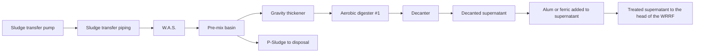

----

## 3.8.1 High-Purity-Oxygen Aeration

This aerobic digestion process uses high-purity oxygen rather than air. Recycle flows and the resultant biosolids are similar to those obtained via conventional aerobic digestion. Typical influent solids concentrations may vary from 2% to 4%. High-purity-oxygen aerobic digestion works well in cold-weather climates because the use of pure oxygen, rather than air, reduces the effect of changes in ambient air temperatures. Because colder temperatures do not impact the digester, higher digester temperatures and an increased rate of biological activity are maintained.

High-purity-oxygen aerobic digestion can be conducted in either open or closed tanks. Because the digestion process is exothermic in nature, the use of closed tanks will result in a higher operating temperature and a significant increase in the VSR rate. Design of these systems will be similar to activated sludge systems using pure oxygen (see Chapter 12). The operating costs associated with separating oxygen will in most cases be more

\n---\n

# 3.8.2 Combined Stabilization Processes

## 3.8.2.1 Combined Aerobic and Anaerobic Digestion

The fusion of two stabilization processes in ATAD and conventional mesophilic anaerobic digestion are covered in the dual-digestion subsection of the anaerobic digestion section. Recent research has focused on using aerobic digestion as a posttreatment for conventional mesophilic anaerobic digestion and has been demonstrated by Kumar et al. (2006a, 2006b), Parravicini et al. (2008), and Novak et al. (2010). The advantages of these systems reportedly include improved VSR, nitrogen removal from return streams, and improved dewaterability:

## 3.8.2.2 Aerobic Digestion and Drying

Aerobic digestion has been used as a conditioning step for solids that will undergo drying to stabilize them to a level that will minimize the risks for odor production during the drying process. This also reduces issues with regrowth when the dried solids get wet.

# 3.9 Aerobic Digester Design Examples

## 3.9.1 Standard Design: Single Tank

Design a mesophilic aerobic digester processing solids from a non-primary solids secondary biological treatment process. The following conditions are applicable to the design:

<table>
  <thead>
    <tr><th>Condition</th><th>Value</th></tr>
  </thead>
  <tbody>
    <tr><td>Secondary solids concentration</td><td>0.8%</td></tr>
<tr><td>Total solids</td><td>1144 kg/d (2522 lb/d)</td></tr>
<tr><td>Volatile solids</td><td>894 kg/d (1971 lb/d) or 78.15%</td></tr>
<tr><td>Decanted solids concentration</td><td>1.5%</td></tr>
  </tbody>
</table>

\n---\n

<table>
<tr><td>Minimum liquid temperature (winter)</td><td>15°C (59°F)</td></tr>
<tr><td>Maximum liquid temperature (summer)</td><td>30°C (86°F)</td></tr>
</table>

<p>The biosolids must meet Class B conditions in a single-tank configuration:</p>

# 3.9.1 Determine the Digester Volume

## 3.9.1.1 Determine the SRT Required to Meet Class B Requirements

Using the worst-case condition (the winter temperature of 15°C), the SRT required to meet Class B requirements at this temperature is 60 days.

### 3.9.1.1.2 Determine the Decanted Solids Volume

<table>
<tr><td>In SI units:</td><td>1144 kg/d/1000 kg/m³/1.75% = 65.37 m³/d</td></tr>
<tr><td>In U.S. customary units:</td><td>2522 lb/d/8.34 lb/gal/1.75% = 17 268.91 gpd</td></tr>
</table>

### 3.9.1.1.3 Determine the Digester Volume

<table>
<tr><th>Daily decanted solids volume</th><th>Required SRT</th><th>Digester volume</th></tr>
<tr><td>65.37 m³/d × 60 days</td><td>60 days</td><td>3922.2 m³</td></tr>
<tr><td>or 17 268.91 gpd × 60 days</td><td></td><td>1.04 million gal</td></tr>
</table>

## 3.9.1.2 Determine the Oxygen Requirements

### 3.9.1.2.1 Mixing Air Requirements

From Section 3.7.1, we use the average value of 0.5 L/m³·s (30 ft³/min/1000 ft³):

<table>
<tr><td>In SI units:</td><td>3922.2 m³ × 0.5 L/(m³·s) = 1961.1 L/s</td></tr>
<tr><td>In U.S. customary units:</td><td>1.04 million gal/(7.48 gal/cu ft)/1000 × (30 ft³/min/1000 cu ft) = 4155.3 cu ft/min</td></tr>
</table>

### 3.9.1.2.2 Process Air Requirements

From Figure 23.45, determine the amount of VSR expected:

\n---\n

# 3.9.1.3 Determine the Blower Power

Winter:
- (Solids temperature × SRT required per regulation at temperature) 15°C × 60 days = 900°C · days, which yields a 45% VSR

Summer:
- (Solids temperature × SRT to meet Class B in winter) 30°C × 60 days = 1800°C · days, which yields a 55% VSR

Calculate the VSR:

<table>
<thead>
<tr><th>Winter</th><th>Summer</th></tr>
</thead>
<tbody>
<tr>894 kg/d × 45% = 402.3 kg/d (SI units) 1971 lb/d × 45% = 887 lb/d (U.S. customary units)</tr>
<tr>894 kg/d × 55% = 491.7 kg/d (SI units) 1971 lb/d × 55% = 1084 lb/d (U.S. customary units)</tr>
</tbody>
</table>

Calculate the oxygen demand at 2 kg O2/kg VSR (2 lb O2/lb VSR):

<table>
<thead>
<tr><th>Winter</th><th>Summer</th></tr>
</thead>
<tbody>
<tr>402.3 kg/d × 2 kg O2/kg VSR = 804.6 kg O2/d  1774 lb O2/d</tr>
<tr>491.7 kg/d × 2 kg O2/kg VSR = 983.4 kg O2/d  2168 lb O2/d</tr>
</tbody>
</table>

Calculate the process air requirement, assuming 0.56 actual oxygen requirement (AOR)/specific oxygen requirement (SOR) and 14% oxygen-transfer efficiency (OTE) for coarse-bubble diffusers:

Winter:
$$
\frac{(1774\ \text{lb O}_2/\text{day})(0.56\ \text{AOR/SOR})(1440\ \text{min/day})(0.14\ \text{OTE})}{(0.2315\ \text{lb O}_2/\text{lb air})(0.075\ \text{lb air}/\text{cu ft})} = 905\ \text{cu ft/min}\ (427\ \text{L/s})
$$

Summer:
$$
\frac{(2168\ \text{lb O}_2/\text{day})(0.56\ \text{AOR/SOR})(1440\ \text{min/day})(0.14\ \text{OTE})}{(0.2315\ \text{lb O}_2/\text{lb air})(0.075\ \text{lb air}/\text{cu ft})} = 1106\ \text{cu ft/min}\ (522\ \text{L/s})
$$

The air requirements that govern the design are based on mixing, so the blower is sized based on 1961.1 L/s (4155.3 cu ft/min).

Assuming an approximation of 12.657 L/s · kW (20 cu ft/min/blower hp), we get:

- Blower power (approx.) ≈ 208 hp ≈ 155 kW

\n---\n

1961.1 L/s / 12.657 L/s · kW = 154.93 kW

or

4155 cu ft/min/20 cu ft/min/hp = 207.76 hp

## 3.9.2 Optimizing the Single-Tank Conventional Design by Thickening

As discussed in Sections 3.3.7 and 3.4.1.2, aerobic digester design can be optimized by setting a batch or a staged design comprising at least two tanks. The design example for a two-tank design is as follows:

<table>
  <tr><td>Secondary solids concentration</td><td>0.8%</td></tr>
<tr><td>Total solids</td><td>1144 kg/d (2522 lb/d)</td></tr>
<tr><td>Volatile solids</td><td>894 kg/d (1971 lb/d) or 78.15%</td></tr>
<tr><td>Thickened solids concentration</td><td>3.0%</td></tr>
<tr><td>Minimum liquid temperature (winter)</td><td>15°C (59°F)</td></tr>
<tr><td>Maximum liquid temperature (summer)</td><td>30°C (86°F)</td></tr>
</table>

The biosolids must meet Class B requirements in a two-tank-in-series configuration

### 3.9.2.1 Determine the Digester Volume

#### 3.9.2.1.1 Determine SRT Required for Class B Solids Regulations

Using the worst-case condition, which is the winter temperature at 15°C, determine the SRT required to meet Class B (as expressed in Section 3.7). Based on the U.S. EPA guidance manual (U.S. EPA, 2003), at this temperature and applying the 30% credit for staged operation, we can use 42 days.

#### 3.9.2.1.2 Determine the Thickened Solids Volume

\n---\n

### 3.9.2.1.3 Determine the Digester Volume

<table>
  <thead>
    <tr><th>In Sl units:</th><th>In U.S. customary units:</th></tr>
  </thead>
  <tbody>
    <tr><td>1144 kg/d/1000 kg/m³/3.0% = 38.13 m³/d</td><td>2522 lb/d/8.34 lb/gal/3.0% = 10 073 gpd</td></tr>
  </tbody>
</table>

$$38.13 \, \text{m}^3/\text{d} \times 42 \text{ days} = 1601.46 \, \text{m}^3$$
$$\text{or } 10{,}073 \, \text{gpd} \times 42 \text{ days} = 423{,}066 \, \text{gal}$$

Each digester volume is 1601.46 m³ (423,066 gal)/2 = 800.73 m³ (211,533 gal).

### 3.9.2.2 Determine the Oxygen Requirements

#### 3.9.2.2.1 Mixing Air Requirements Per Digester; Assuming Equal VSR in Both Digesters

From Section 3.7.1, we use the average value of 0.5 L/m³·s (30 ft³/min/1000 ft³):

<table>
  <thead>
    <tr><th>In Sl units:</th><th>In U.S. customary units:</th></tr>
  </thead>
  <tbody>
    <tr><td>800.73 m³ × 0.5 L/m³·s = 400.27 L/s</td><td>211,533 gal (7.48 ft³/gal)/1000 × (30 ft³/min/1000 ft³) = 848 ft³/min</td></tr>
  </tbody>
</table>

The total air requirement for both digesters is 800.73 L/s (1696 ft³/min).

#### 3.9.2.2.2 Process Air Requirements

From Figure 23.45, determine the amount of VSR expected:

- Winter: (Solids temperature × SRT required per regulation at temperature) 15°C × 42 days = 630°C·days, which yields a 42% VSR
- Summer: (Solids temperature × SRT to meet Class B in winter) 30°C × 42 days = 1260°C·days, which yields a 49% VSR

Calculate the VSR (assuming equal VSR in both digesters):

Winter: \(894 \, \text{kg/d} \times 0.42 = 375.5 \, \text{kg/d}\)  
( SI units )

\(1971 \, \text{lb/d} \times 0.42 = 827.8 \, \text{lb/d}\)  
( U.S. customary units )

\n---\n

## Calculate the oxygen demand at 2 kg O2/kg VSR (2 lb O2/lb VSR)

<table>
<thead>
<tr><th>Season</th><th>Oxygen demand</th></tr>
</thead>
<tbody>
<tr>
<td>Winter:</td>
<td>375.5 kg/d × 2 kg O2/kg VSR = 751 kg O2/d<br/>
827.8 lb O2/d × 2 lb O2/lb VSR = 1656 lb O2/d</td>
</tr>
<tr>
<td>Summer:</td>
<td>438 kg/d × 2 kg O2/kg VSR = 876 kg O2/d<br/>
965.8 lb O2/d × 2 lb O2/lb VSR = 1931.6 lb O2/d</td>
</tr>
</tbody>
</table>

> The above results show the oxygen demand for Winter and Summer with both SI and US customary units.

----

### Calculate the process air requirement. Assume 0.56 AOR/SOR and 14% OTE for coarse-bubble diffusers:

<table>
<thead>
<tr><th>Season</th><th>Process air requirement</th></tr>
</thead>
<tbody>
<tr>
<td>Winter:</td>
<td>$$ (1656\ \text{lb O}_2/\text{day})(0.56\ \text{AOR/SOR})(1440\ \text{min/day})(14\% \text{ OTE}) \big/ \left((0.2315\ \text{lb O}_2/\text{lb air})(0.075\ \text{lb air/ cu ft})\right) = 844.6\ \text{cu ft/min} \ (\approx 398\ \text{L/s}) $$</td>
</tr>
<tr>
<td>Summer:</td>
<td>$$ (1931.6\ \text{lb O}_2/\text{day})(0.56\ \text{AOR/SOR})(1440\ \text{min/day})(14\% \text{ OTE}) \big/ \left((0.2315\ \text{lb O}_2/\text{lb air})(0.075\ \text{lb air/ cu ft})\right) = 985.4\ \text{cu ft/min} \ (\approx 465\ \text{L/s}) $$</td>
</tr>
</tbody>
</table>

> The air requirements shown above are for coarse-bubble diffusers, based on the assumed 0.56 AOR/SOR and 14% OTE.

----

The air requirements that govern the design are based on mixing again, but with much lower air demand than the single-tank design with thinner solids.

----

### 3.9.2.3 Determine the Blower Power

Assuming an approximation of 20 cu ft/min/blower hp (12.657 L/s · kW) we get:

- For both digesters 1697 cu ft/min / 20 cu ft/min per hp = 84.85 hp

- For both digesters 800.73 L/s / 12.657 L/s per kW = 63.26 kW

The optimization results via thickening are clearly evident in the smaller digester volume, air requirements, and blower power. The only caution on using this technique is the limited selection of diffusers that can handle 3% solids in continuous service.

Also, this savings could be increased by reducing air requirements in the second stage, because the VSR in the first digester is significant.
\n---\n

# 4.0 Composting

Composting is a biological process in which organic matter is decomposed under controlled, aerobic conditions to produce humus. Operators can accelerate the process by using the proper blend of materials and controlling the temperature, moisture content, and oxygen supply. The resulting compost is stable and can be safely used in many landscaping, horticulture, or agriculture applications.

Composting can be used to treat both unstabilized solids and partially stabilized biosolids. Odors would generally be reduced in the latter case due to a lower oxygen demand that allows aerobic conditions to be more easily maintained. In both solids and biosolids composting, operators control several essential process variables to optimize the material’s decomposition/stabilization rate:
* Solids content;
* Carbon-to-nitrogen ratio (C:N);
* Aerobic conditions; and
* Temperature.

Via process-control methods, operators typically can cause the composting mass to achieve thermophilic temperatures, which destroy pathogens. Well-stabilized compost can be stored indefinitely and has minimal odor, even if rewetted. It is suitable for a variety of uses (e.g., landscaping, topsoil blending, potting, and growth media) and can be distributed to the public for gardening. It also can be used in agriculture to control erosion, improve the soil’s physical properties, and revegetate disturbed lands. Local markets may be developed in urban and nonagricultural areas, as well as in agriculture and mine revegetation;

## 4.1 Process Variables

Although a wide variety of composting technologies are available, they all are designed to control the essential variables mentioned above.

### 4.1.1 Solids Content

The initial solids content depends on how much amendment or bulking agent is mixed with dewatered cake. For good process performance, the dewatered cake should contain
\n---\n

Between 14% and 30% solids. It then is blended with drier materials (e.g., wood chips, sawdust, shredded yard waste, and ground pallets) to achieve a solids content of about 38% to 45%.

The target solids content depends on the composting technology used. Solids content is controlled throughout the process via aeration, material agitation, or both.

## 4.1.2 Carbon-to-Nitrogen Ratio

The amount of carbon and nitrogen used by microorganisms depends on the composition of the microbial biomass. Ideally, the ratio of available carbon to nitrogen is between 25:1 and 35:1. If the ratio is less than 25:1, excess nitrogen will be released as ammonia, reducing the compost’s nutrient value and emitting odor. If the ratio exceeds 35:1, organic material will break down more slowly, remaining active well into the curing stage (Poincelot, 1975). Wastewater residuals typically have a carbon-to-nitrogen ratio between 5:1 and 20:1. Adding an amendment or bulking agent increases the carbon content, improving both the energy balance and the mixture’s carbon-to-nitrogen ratio.

Calculating the carbon-to-nitrogen ratio is complicated, because some of the carbon becomes available more slowly than the nitrogen (Kayhanian and Tchobanoglous, 1992). If wood chips are the bulking agent, for example, only a thin surface layer of the wood provides available carbon. The carbon in sawdust, on the other hand, is more readily available to degradation:

## 4.1.3 Maintaining Aerobic Conditions

Microbial oxygen demand during composting can reduce the available oxygen in air to as low as 3% to 5% in as little as 15 minutes. Aerobic conditions are maintained via forced or convective aeration, material agitation, or both, depending on the composting technology used.

## 4.1.4 Maintaining Proper Temperatures

At first, the challenge is to heat the material up to the thermophilic range as quickly as possible. Then, the challenge is removing excess heat to maintain the process in the thermophilic range. It is also difficult to achieve uniform temperatures throughout the pile. Covers may help in this regard. Near the end of composting, the goal is to dry the material.

\n---\n

without removing too much heat. All of these are achieved using aeration, agitation, or both.

## 4.1.5 Microbiology

Three major categories of microorganisms involved in composting are bacteria, actinomycetes, and fungi. Bacteria are responsible for decomposing a major portion of organic matter. At mesophilic temperatures (lower than 40°C [104°F]), bacteria metabolize carbohydrates, sugars, and proteins. At thermophilic temperatures (higher than 40°C), they decompose proteins, lipids, and the hemicellulose fractions. Bacteria also are responsible for much of the heat produced.

Actinomycetes are microorganisms common to soil environments. They metabolize a wide variety of organic compounds (e.g., sugars, starches, lignin, proteins, organic acids, and polypeptides). Their role in composting is unclear. Waksman and Cordon (1939) indicated that this group attacks hemicellulose but not cellulose. Stutzenberger (1971) isolated a thermophilic actinomycete that may be important in cellulose degradation.

Fungi are present at both mesophilic and thermophilic temperatures. Chang (1967) indicated that mesophilic fungi metabolize cellulose and other complex carbon sources. Their activity is similar to that of actinomycetes; both typically are found in the exterior portions of compost piles. Golueke (1977) suggested that this phenomenon is related to the organisms’ aerobic nature, because most fungi and actinomycetes are obligate aerobes.

Microbial activity during composting occurs in three basic stages: mesophilic, when temperatures in the pile range from ambient to 40°C (104°F); thermophilic, when temperatures range from 40°C to 70°C (104°F to 158°F); and a cooling period associated with a reduction in microbial activity and the completion of composting. The optimum temperature in the thermophilic range seems to be between 55°C and 60°C (131°F and 140°F) where the maximum rate of VSR occurs.

Biological solids, newly harvested wood wastes and yard wastes provide a diverse population of microflora that can respond to changes in temperature and substrate. Under most circumstances, an inoculum of pure cultures does not significantly enhance

\n---\n

## 4.1.6 Energy Balance
Heat is generated when organic carbon converts to carbon dioxide and water vapor. The fuel is provided by rapidly degraded volatile solids. Heat primarily is removed by the evaporative cooling promoted by aeration and agitation. Some heat also is lost at the pile surface. The process temperature will not rise if heat is lost faster than it is generated.

Haug (1980) provides a detailed discussion of the energy balance, concluding with the following relationship:

$$ W = \frac{\text{Weight of water evaporated}}{\text{Weight loss of volatile solids}} $$

(23.37)

If W is below 8 to 10, enough energy should be available for heating and evaporation. If W exceeds 10, the mix will remain cool and wet. This generalization is based on heat of vaporization and does not consider the effect of ambient conditions on evaporation and surface cooling.

## 4.2 Process Objectives
The primary objective of composting is to produce a nutrient-rich soil amendment that complies with federal, state, and local requirements for beneficial use of biosolids. The compost must meet both environmental and public health requirements, and be attractive for use. This primary objective is met via the following process objectives: pathogen reduction, maturation, and drying.

### 4.2.1 Pathogen Reduction
There are five types of pathogens in wastewater residuals: bacteria, viruses, protozoa cysts, helminthic (parasitic worm) ova, and fungi. The first four groups often are called primary pathogens because they can invade typically healthy persons and cause diseases. Fungi are called secondary pathogens because they typically only infect persons with weakened respiratory or immune systems.

Heat is one of the most effective methods for destroying pathogens. Table 23.33 summarizes time-and-temperature relationships for inactivating pathogens in actual
\n---\n

# Composting operations

Note that temperatures measured in a composting pile or vessel may not be uniform because of variations in heat loss, solids-mixture characteristics, and airflow:

<table>
<thead>
<tr><th>Microorganisms</th><th colspan="2">Exposure Time for Destruction at Various Temperatures (Hours)</th></tr>
<tr><th></th><th>60°C</th><th>65°C</th></tr>
</thead>
<tbody>
<tr><td>Salmonella Newport</td><td></td><td>25</td></tr>
<tr><td>Salmonella</td><td>168</td><td>116</td></tr>
<tr><td>Poliovirus type 1</td><td></td><td>1.0</td></tr>
<tr><td>Candida albicans</td><td>72</td><td></td></tr>
<tr><td>Ascaris lumbricoides</td><td>4.0</td><td>1.0</td></tr>
<tr><td>Mycobacterium tuberculosis</td><td></td><td>336</td></tr>
</tbody>
</table>

TABLE 23.33 Temperature Exposure Required for Pathogen Destruction in Compost (Knoll, 1964; Morgan and MacDonald, 1969; Shell and Boyd, 1969; Wiley and Westerberg, 1969)

Composting in the thermophilic range should eliminate practically all viral, bacterial, and parasitic pathogens (WEF, 2016). However, some fungi (e.g., Aspergillus fumigatus) are thermotolerant and, therefore, survive.

Data on windrow composting in Los Angeles showed that bacterial concentrations were markedly reduced within 15 days (Iacoboni et al., 1980). At 20 days, no Salmonella was detected. Fecal and total coliforms survived windrow composting in cool, humid climates, but Salmonella was eliminated after 14 days. Studies using a F2 bacteriophage virus (as an indicator of virus destruction) showed it could survive for as long as 45 days in digested solids and more than 55 days in undigested solids.

Static-pile composting data show that total coliforms, fecal coliforms, and Salmonella were not detected after 10 days of composting when temperatures exceeded 55°C (131°F) for
\n---\n

Further studies using an F2 bacteriophage virus revealed that static-pile composting destroyed the indicator in 14 days.

Salmonella can regrow in finished compost. However, parasite ova and virus cannot.

Regrowth can be reduced by not using the same equipment to handle both raw feed and finished compost or by cleaning the equipment before handling finished compost.

Many microorganisms can function as secondary pathogens, although composting conditions favor the growth of some more than others. Millner et al. (1977) report that the fungus A. fumigatus Fres has been isolated at relatively high concentrations from finished compost and from compost-pile zones at less than 60°C (140°F). Other secondary fungi occasionally isolated from compost are M. pusillus and M. miebei. Common to composting operations, these fungi typically are found in backyards, decayed leaves, grass, commonly available organic soil amendments, and ventilation ducts.

During certain composting operations, more A. fumigatus spores are released to the atmosphere. In windrow and reactor studies at the Los Angeles County Sanitation District in California, LeBrun (1979) found that compost feedstock contained 1000 to 10,000 colony-forming units (CFU/g); after composting, biosolids contained 10 CFU/g. Exposure to airborne spores can be minimized by controlling dust. So compost should not be allowed to become too dry, and workers should be provided with dust masks when working in dusty areas.

## 4.2.2 Maturation

Maturation refers to the conversion of a solids-amendment mixture’s rapidly biodegradable components into substances similar to soil humus, which decomposes slowly. Insufficiently mature compost will reheat and generate odors when stored and rewetted. It also may inhibit seed germination (by generating organic acids) and plant growth (by removing nitrogen as it decomposes in soil). Stability refers to the reduction in microbial-degradation rate of the mixture’s biodegradable components. Stabilization is achieved by maintaining optimal conditions for a sufficient period of time. Cellulose materials (e.g., wood and yard wastes) take longer to decompose than wastewater residuals, so screening out the bulking agent may improve stability:
\n---\n

### 4.2.3 Drying

There are a number of testing methods and standards for measuring compost stability or maturity, but none is universally accepted (Jimenez and Garcia, 1989). The standards associated with each test are still tentative, and much work needs to be done to correlate test results with odor generation and facility growth. A complete assessment of maturity may require multiple tests.

Volatile solids (as a percentage of total solids) is not a good measure of stability because it fails to account for the biodegradation rate and materials added or removed from the compost during processing (e.g., bulking agents).

Respiration tests, which measure carbon dioxide production or oxygen demand, better represent stability but are sensitive to test conditions. Carbon dioxide production typically is measured directly on the mixture in an incubator. Incubators are useful compost simulators that can effectively measure carbon dioxide productions in both highly unstable samples (from early in the process) and highly stable samples such as finished compost. Oxygen uptake rates can be measured on the mixture, or in an aqueous extract via the specific oxygen uptake rate (SOUR) test. Mature compost should have a carbon-to-nitrogen ratio that is less than 20:1. Available carbon in compost can deplete the nitrogen in soil that microorganisms typically use.

Seed-germination and root-elongation tests measure phytotoxicity caused by organic acids in compost. They are performed by germinating seeds (e.g., cress) in a filtered extract of compost and comparing them with a control using distilled water

                            4.2.3 Drying

To dry compost; operators provide enough aeration or agitation to facilitate the removal of water vapor. This increases the solids content from about 40% to 55% or more. Drying is critical in processes that include screening, because screens do not perform well if the compost contains less than 50% to 55% solids:

### 4.3 Description of Composting Methods

Although composting is a naturally occurring biological process, the degree of control imposed on a system can range from periodically turning a pile or windrow to the more involved enclosed or in-vessel system with mechanical agitation and forced aeration.
\n---\n

## 4.3.1 Aerated Static-Pile Composting

In an attempt to respond to local and regional needs, a number of composting methods have evolved (Mussari et al., 2013). These methods offer the following benefits:
- accelerating a naturally occurring biological process;
- providing for process control over variables such as moisture, carbon, nitrogen, and oxygen;
- containing odors and particulates;
- reducing land area requirements;
- reliably producing consistent product quality;
- integrating aesthetically pleasing facilities into local and regional sites.

Aerated static-pile composting is also called the Beltsville method because it was developed in Beltsville, Maryland, in the 1970s by the U.S. Department of Agriculture. As the name suggests, it involves aerating piled feedstock (see Figure 23.56). This flexible method is popular in the United States.

In this method, the solids-amendment mixture is constructed into a 2- to 4-m-deep (6- to 12-ft-deep) pile over an aeration floor (plenum) and then covered with a 150- to 300-mm-deep (6- to 12-in.-deep) insulating blanket of wood chips or unscreened finished compost to ensure that all of the mixture meet the temperature standards for pathogen and VAR.

Small operations may construct individual piles, while large ones may divide a continuous pile into sections representing each day's contribution. The mixture typically remains in the pile for 21 to 28 days while the plenum forces air through the material to provide an aerobic composting environment. Then the piles are broken down, and the material is either moved directly to a curing area or screened and then moved to the curing area.

Compost must contain at least 50% to 55% solids before screening. In some facilities, an intensive drying step (with a higher aeration rate than active composting) precedes screening. Compost typically is cured for at least 30 days to further stabilize the material. Some facilities screen the compost after curing (rather than before curing):
\n---\n

# FIGURE 23.56 Schematic of an aerated static-pile composting system.

<table>
<thead>
<tr>
<th>Component / Feature</th>
<th>Notes / Position</th>
</tr>
</thead>
<tbody>
<tr>
<td>WOODCHIP BASE LAYER AND PIPE BEFORE ADDITION OF INITIAL COMPOST MIXTURE</td>
<td></td>
</tr>
<tr>
<td>PERFORATED AERATION PIPE IN BASE LAYER OR IN TRENCH</td>
<td></td>
</tr>
<tr>
<td>NON-PERFORATED PIPE</td>
<td></td>
</tr>
<tr>
<td>BLOWER (TYP)</td>
<td></td>
</tr>
<tr>
<td>COMPOST PILE SCHEMATIC</td>
<td></td>
</tr>
<tr>
<td>COMPOST COVER</td>
<td></td>
</tr>
<tr>
<td>WOODCHIP BASE LAYER</td>
<td></td>
</tr>
<tr>
<td>FINISHED COMPOST REMOVED HERE</td>
<td></td>
</tr>
<tr>
<td>INITIAL COMPOST MIXTURE ADDED HERE</td>
<td></td>
</tr>
<tr>
<td>HEIGHT OF COMPOST MIXTURE</td>
<td></td>
</tr>
<tr>
<td>SECTION MARKS</td>
<td>3, 4, 5, 6, 27, 28, 29</td>
</tr>
</tbody>
</table>

<div>LAYOUT AND SEQUENCE OF OPERATION</div>

<p>Aerated static-pile composting originally was developed for outdoor sites, but many systems are either partially or fully enclosed to control odors or facilitate operations during unfavorable environmental conditions (e.g., temperature or rainfall extremes).</p>

<h2>4.3.2 Windrow Composting</h2>

<p>In windrow composting, the solids-amendment mixture is formed into long parallel windrows whose cross sections are either trapezoidal or triangular (see Figure 23.57). The material then is turned periodically by a front-end loader or a dedicated windrow-turning machine to release moisture, expose more particles to the air, and loosen (fluff) the material to facilitate air movement through the windrow.</p>

<p>In the aerated windrow method, windrows are constructed over air channels to protect aeration piping from the turning equipment. Air can either be forced up through the windrow or be pulled down through the wind into the channel. The windrows are</p>

\n---\n

turned periodically to expose more particles to air. Aeration and turning optimize the composting rate and release of moisture.

Windrow composting occurs at open outdoor sites or covered sites. This system needs more space than other composting technologies because of pile geometry and the room needed to maneuver a windrow-turning machine.

## 4.3.3 In-Vessel Composting

In-vessel systems typically combine aeration with some type of automated material movement in a reactor. A wide variety of such systems has been developed over the years, but only a few have been installed in more than one or two sites.

The SRT ranges from about 10 to 21 days, depending on system-supplier recommendations, regulatory requirements, and costs. It also should be based on desired product characteristics—especially stability—and take into account the overall solids residence time in the entire composting operation (all process phases). Once discharged from the reactor, the composted biosolids typically must be further stabilized for 30 to 60 days to achieve the desired product stability.
\n---\n

### FIGURE 23.57 Schematic of a windrow composting system.

The image shows three windrows (long diagonal piles) with a speckled texture. On the third windrow there appears to be a wheeled platform or apparatus positioned above it, suggesting equipment used in the windrow. A label points to the base area: "AERATION TRENCH & PIPE OPTIONAL." A separate cross-section diagram below the windrows is labeled "CROSS SECTION" and shows a dome-shaped profile with a small circular feature at the base. The label "AERATION TRENCH & PIPE OPTIONAL" is associated with the cross-section as well.

FIGURE 23.57 Schematic of a windrow composting system.

There are basically three types of in-vessel composting systems: vertical plug-flow reactors, horizontal plug-flow reactors, and agitated bay systems. Vertical plug-flow reactors are made of steel, concrete, and/or reinforced fiber-glass panels (see Figure 23.58). A mix of dewatered cake, amendment, and recycled solids is loaded in the top of the reactor, where it is aerated but not agitated (mixed). It moves as a plug to the bottom of the reactor, where it is removed via a traveling auger.

Horizontal plug-flow reactors are similar to vertical ones, except that the solids-amendment mixture is moved laterally through the reactor by a hydraulic ram (see Figure 23.59).
\n---\n

Agitated-bed reactors are open-topped bays with blowers and piping systems that supply air from the bottom (see Figure 23.60). Unlike plug-flow reactors, they also have mechanical devices that periodically agitate the mixture during its stay in the reactor. These systems are designed to function much like aerated windrows. A variety of methods are used to transfer compost from the reactors.

The most commonly used in-vessel system is the horizontal agitated-bed reactor. These reactors are rectangular, aerated from the bottom with independently programmable aeration zones, and enclosed in a building. A loader places the solids-amendment mixture into the front end. The agitation device is completely automatic, operates only in agitation mode, and typically makes one pass through the reactor each day. The composting material is dug out and redeposited about 4 m (11 ft) behind the machine until it has moved through the entire length of the reactor.

```mermaid
graph TD
Exhaust[Exhaust air to odor control system]
Blowers[Supply blowers]
Manifolds[Air-supply manifolds]
Infeed[Infeed device]
AirLance[Air-lance]
Mixture[Compost mixture]
OutScrew[Outfeed screw]
OutConveyor[Outfeed conveyor]
Direction[Positive airflow direction (Typical)]
Exhaust --> Blowers
Blowers --> Manifolds
Manifolds --> AirLance
Infeed --> Mixture
Mixture --> OutScrew
OutScrew --> OutConveyor
Direction --> Mixture
```

<table>
<thead><tr><th>Component</th><th>Location / Description</th></tr></thead>
<tbody>
<tr><td>Exhaust air to odor control system</td><td>Left side, near top of reactor (exhaust path outside building)</td></tr>
<tr><td>Supply blowers</td><td>Left side of reactor, provide air supply</td></tr>
<tr><td>Air-supply manifolds</td><td>Across the top, distributing air into reactor</td></tr>
<tr><td>Infeed device</td><td>Right side, feeds compost mixture into front end</td></tr>
<tr><td>Positive airflow direction (Typical)</td><td>Arrow indicating air flow through reactor</td></tr>
<tr><td>Air-lance</td><td>Inside reactor, disperses air into mixture</td></tr>
<tr><td>Compost mixture</td><td>Central chamber of reactor</td></tr>
<tr><td>Outfeed screw</td><td>Bottom left, screws material out</td></tr>
<tr><td>Outfeed conveyor</td><td>Bottom exterior, transports out of reactor</td></tr>
</tbody></table>

\n---\n

# FIGURE 23.58 Cross-section of a vertical plug-flow reactor (rectangular design, made of steel)

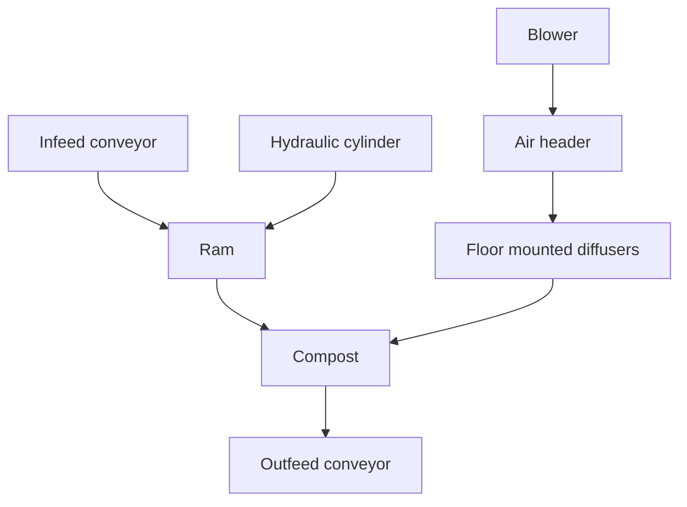

Note: Not to scale

# FIGURE 23.59 Schematic of a horizontal plug-flow reactor.

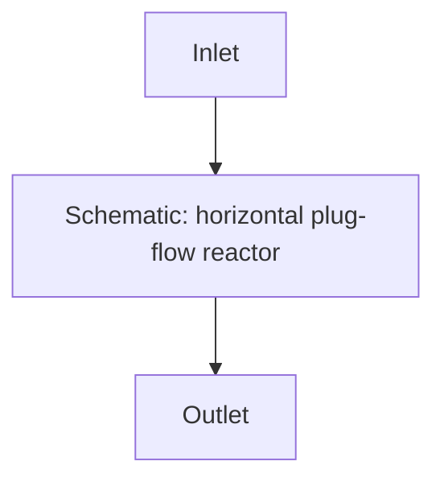
\n---\n

# FIGURE 23.60 Schematic of a horizontal agitated-bed reactor

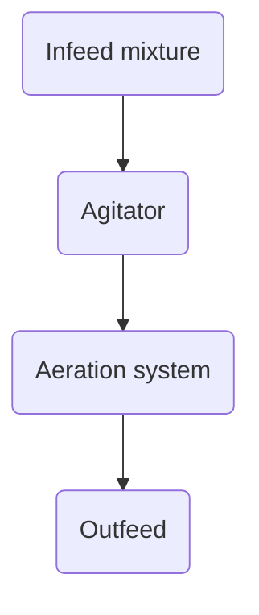

FIGURE 23.60 Schematic of a horizontal agitated-bed reactor.

4.3.4 Comparison of Composting Methods

Of the three technologies discussed above, aerated static-pile composting is the most commonly used (see Table 23.34) (NEBRA, 2007).

Table 23.35 lists the advantages and disadvantages of five composting technologies based on physical facilities, processing aspects, and O&M. None is appropriate for every situation. The choice depends on many factors (e.g., climate, siting considerations, operational concerns, and sensitivity to odors). Design engineers should consider the following factors when selecting a composting technology:

<table>
<thead>
<tr><th>Facility</th><th>Type</th><th>Capacity (Dry Ton/d)*</th></tr>
</thead>
<tbody>
<tr><td>Inland Empire Regional Composting Facility, California</td><td>Enclosed ASP</td><td>100</td></tr>
<tr><td>Davenport, Iowa</td><td>Enclosed ASP</td><td>25</td></tr>
</tbody>
</table>

\n---\n

<table>
  <thead>
    <tr>
      <th>Location</th>
      <th>Composting technology</th>
      <th>Rate (ton/d)</th>
    </tr>
  </thead>
  <tbody>
    <tr>
      <td>Columbus, Ohio</td>
      <td>Outdoor ASP</td>
      <td>28</td>
    </tr>
<tr>
      <td>Rockland County, New York</td>
      <td>Agitated bay</td>
      <td>25</td>
    </tr>
<tr>
      <td>Hamilton, Ohio</td>
      <td>Horizontal plug flow</td>
      <td>15</td>
    </tr>
<tr>
      <td>Schenectady, New York</td>
      <td>Vertical plug flow</td>
      <td>50</td>
    </tr>
<tr>
      <td>Hawk Ridge, Unity, Maine</td>
      <td>Tunnel (ASP)</td>
      <td>15</td>
    </tr>
  </tbody>
</table>

<p>ton/d × 0.9072 = Mg.</p>

<p>TABLE 23.34 Representative List of Composting Facilities</p>

\n---\n

## TABLE 23.35 Key Advantages and Disadvantages of Composting Systems

<table>
<tr><td>Agitated bin</td><td>Mixing enhances aeration and uniformity of compost mixtures • Ability to mix compost (advantage in handling some bulking agents) • Adaptability to various bulking agents</td><td>Fixed-volume reactors (no flexibility): • Relatively large area required • Potentially dusty working environment: Operators exposed to composting piles • Relatively maintenance intensive</td></tr>
</table>

- Physical facilities (availability of space, material-handling system complexity, aeration equipment; and degree of enclosure);
- Process considerations (e.g., uniform aeration, aeration type, availability of different bulking agents, adaptability to changes in volume of feed solids, and odor emissions/odor control); and
- O&M issues (e.g., labor requirements, energy requirements, operator exposure, dust generation, and degree of maintenance).

## 4.4 Process Considerations for Designers

This section provides ranges of design parameters for each stage of the composting process and identifies the design criteria essential to successful operation. Consideration is made for each type of composting technology. For additional information, see Williams (2014).

### 4.4.1 Bulking Agents and Amendments

All composting technologies require mixing sufficient quantities of bulking agent with dewatered solids to adjust the initial solids content and provide porosity. Bulking agents also provide supplemental carbon to adjust the carbon-to-nitrogen ratio and energy balance. Unfortunately, these bulking agents also increase the quantity of solids that must be handled. Table 23.36 lists some typically used bulking agents and their characteristics. Although yard debris can be used as a bulking agent; grass clippings and substantially green yard waste are unsuitable because of their high water and nitrogen content, and lack of porosity: If grass clippings and substantially green waste are composted, they also will require supplemental bulking agent;

### 4.4.2 Characteristics of the Solids-Amendment Mixture
\n---\n

The ratio of bulking agent to biosolids depends on the available agent's characteristics and the desired solids content. For example, if dewatered cake contains 18% to 24% solids and the agent (a blend of woody yard debris) contains 55% to 65% solids, then the bulking agent-to-biosolids ratio must be 3:1 or 4:1 (by volume) to produce a mixture containing 40% solids. To produce a mixture containing 45% solids, the ratio should be 5:1 or 6:1. To produce a mixture containing 38% solids, the ratio may be as low as 2.5:1. (Below 2.5:1, the mixture probably will not be porous enough to promote decomposition:)

The initial solids content needed depends on the composting technology used (specifically, the amount of agitation and aeration involved):

- Aerated static-pile systems need a mixture containing 40% to 45% solids. Wetter mixtures will lose heat energy to evaporation, thereby slowing the process. Drier mixtures may not provide enough moisture to complete the biological process.

- Turned windrow systems need a mixture containing about 45% solids. In wet climates, however, the mixture should be slightly drier to compensate. Wetter mixtures will not be porous enough to allow for convective airflow.

- Automated loading tunnel and vertical plug-flow systems need a mixture containing 40% to 45% solids. Agitated bay systems, however, need a mixture containing 38% to 40% solids because the frequent agitation and forced aeration will dry the material much faster than other systems. Experience has shown that an agitated bay system can lose as much as 2% moisture during one agitation period.

Bulking Agent | Characteristics

<table>
<thead>
<tr><th>Bulking Agent</th><th>Characteristics</th></tr>
</thead>
<tbody>
<tr>
<td>Wood chips (1 to 2 in.)</td>
<td>
<ul>
<li>Must typically be purchased</li>
<li>High recovery rate in screening (60% to 80%)</li>
<li>Good source of supplemental carbon</li>
</ul>
</td>
</tr>
<tr>
<td>Chipped yard or land-clearing debris</td>
<td>
<ul>
<li>May be available as waste material</li>
<li>Low recovery rate in screening (40% to 60%) because of higher percentage of fines</li>
<li>Green waste fraction adds nitrogen; more may be needed for C:N ratio</li>
<li>Good source of supplemental carbon</li>
</ul>
</td>
</tr>
<tr>
<td>Ground waste lumber</td>
<td>
<ul>
<li>May be available as waste material</li>
<li>May be poor source of supplemental carbon if old and extremely dry because more volatile forms of carbon will be missing</li>
</ul>
</td>
</tr>
</tbody>
</table>

\n---\n

<table>
<thead>
<tr><th>Bulking Agent</th><th>Characteristics</th></tr>
</thead>
<tbody>
<tr>
<td>Leaves</td>
<td>
<ul>
<li>Insufficient porosity to be used alone</li>
<li>Rapidly available source of supplemental carbon</li>
<li>Available as waste material</li>
<li>Not recovered by screening and adds to compost volume</li>
</ul>
</td>
</tr>
<tr>
<td>Sawdust</td>
<td>
<ul>
<li>Insufficient porosity to be used alone</li>
<li>Rapidly available source of supplemental carbon</li>
<li>Must be purchased and typically is expensive</li>
<li>Not recovered by screening and adds to compost volume</li>
</ul>
</td>
</tr>
<tr>
<td>Shredded paper</td>
<td>
<ul>
<li>Insufficient porosity to be used alone</li>
<li>Rapidly available source of supplemental carbon</li>
<li>Available as waste material</li>
<li>Not recovered by screening and adds to compost volume</li>
</ul>
</td>
</tr>
</tbody>
</table>

<p><em>*in. × 25.4 = mm.</em></p>

<p>TABLE 23.36 Types and Characteristics of Bulking Agents</p>

<p>It is critical that the mixture has uniform porosity and that all particles of cake be in close contact with the bulking agent: Dewatered cake with 18% to 25% solids should be mixed with a bulking agent; so each wood chip or other bulking agent particle is coated with a thin layer of solids. Dewatered cake with 30% to 35% solids will break into clumps that must be uniformly small and mixed with the bulking agent. (Large clumps and balls will become anaerobic, leading to excessive odors.) If mixing is not uniform, zones with a disproportionate amount of bulking agent will divert the flow of air, allowing other zones to become anaerobic.</p>

<h3>4.4.3 Materials Balance Calculations</h3>

<p>Materials balance calculations track the weight and volume of each material through each stage of the composting process. Table 23.37 shows a typical materials balance for 1 dry ton of biosolids (20% solids) in an aerated static-pile process (see Figure 23.56).</p>

<p>In this process, solids were mixed with yard waste, stacked over a layer of yard waste to provide air distribution, and covered with a layer of unscreened compost. The entire pile (except for the volume reserved for the cover layer) was screened after composting, and the oversized particles were recycled as a bulking agent. Screening typically recovers between 50% and 80% of the bulking agent (by volume), so it must be supplemented with</p>
\n---\n

Makeup bulking agent. The recovery rate depends on the compost’s moisture content (stickiness), the bulking agent’s particle size, and the screen’s loading rate. Because some of the bulking agent is recycled, it is important to account for all of this material and balance recycled and new bulking agent so all recycled agent is used:

The required input assumptions are the density of each material, the VSR of each input, and the screen’s recovery efficiency.

## 4.4.4 Temperature Control and Aeration

In the United States, each state is responsible for regulating biosolids use within its borders. However, the federal government has issued minimum guidelines that all states must meet: 40 CFR 503 regulations. These regulations require that solids treatment processes meet certain requirements to produce biosolids that will not endanger the environment or public health. The specific requirements for composting depend on the technology used:

In addition to meeting regulatory requirements, composting systems also need to control temperatures to optimize decomposition. The optimum temperature range for VSR is about 55°C to 60°C (131°F to 140°F). Part 503 regulations require pathogen kill temperatures of 55°C for aerated static pile and in-vessel systems, for 14 days for windrow systems with 5 turnings during the 14-day period. Fourteen days with an average temperature of 45°C with a minimum of 40°C are required for VSR. In addition to maintaining certain regulatory dictated temperatures, it is also desirable to prevent material temperatures from climbing too high. Pile temperatures in excess of 70°C inhibit the biological decomposition process. Also, if high temperatures persist for periods longer than several weeks, the potential of spontaneous combustion can occur in very dry material (>75% solids).

In turned windrow operations, the temperature and the oxygen content are controlled by the porosity of the windrows and the frequency of turning. Initial porosity is controlled by thorough blending of the feedstock and having the proper bulking-agent-to-biosolids mix ratio. Once the windrows are in place, both temperature and oxygen content are controlled by turning of the windrow. Turning incorporates oxygen, and releases heat and moisture. Although turning releases heat, the pile temperature will spike upward shortly
\n---\n

after turning. This is the result of the redistribution of feedstock and the infusion of oxygen.
These spikes are typically short lived (a few hours).

<table>
<thead>
<tr>
<th>Material</th>
<th>Volume (cu yd)</th>
<th>Total Weight (Ton)</th>
<th>Dry Weight (Ton)</th>
<th>Volatile Solids (Ton)</th>
<th>Bulk Density (lb/cu yd)</th>
<th>Solids Content</th>
<th>Volatile Solids</th>
</tr>
</thead>
<tbody>
<tr>
<td>Biosolids</td>
<td>6.3</td>
<td>5.0</td>
<td>1.0</td>
<td>0.5</td>
<td>1600</td>
<td>20.0%</td>
<td>53.0%</td>
</tr>
<tr>
<td>Yard waste (processed)</td>
<td>10.9</td>
<td>3.3</td>
<td>1.8</td>
<td>1.3</td>
<td>600</td>
<td>55.0%</td>
<td>70.0%</td>
</tr>
<tr>
<td>Wood waste</td>
<td>0.0</td>
<td>0.0</td>
<td>0.0</td>
<td>0.0</td>
<td>500</td>
<td>60.0%</td>
<td>95.0%</td>
</tr>
<tr>
<td>Screened recycled bulking agent</td>
<td>9.9</td>
<td>3.5</td>
<td>1.9</td>
<td>1.8</td>
<td>695</td>
<td>55.0%</td>
<td>93.0%</td>
</tr>
<tr>
<td>Unscreened recycle</td>
<td>0.0</td>
<td>0.0</td>
<td>0.0</td>
<td>0.0</td>
<td>780</td>
<td>55.0%</td>
<td>88.6%</td>
</tr>
<tr>
<td>Mixture</td>
<td>25.7</td>
<td>11.7</td>
<td>4.7</td>
<td>3.6</td>
<td>911</td>
<td>40.1%</td>
<td>75.7%</td>
</tr>
<tr>
<td>Base (recycled bulking agent)</td>
<td>1.4</td>
<td>0.5</td>
<td>0.3</td>
<td>0.3</td>
<td>695</td>
<td>55.0%</td>
<td>93.0%</td>
</tr>
<tr>
<td>Cover (unscreened)</td>
<td>2.9</td>
<td>1.1</td>
<td>0.6</td>
<td>0.5</td>
<td>780</td>
<td>55.0%</td>
<td>88.6%</td>
</tr>
<tr>
<td>Composting losses</td>
<td>9.4</td>
<td>0.4</td>
<td></td>
<td></td>
<td></td>
<td></td>
<td></td>
</tr>
<tr>
<td>Cover (unscreened)</td>
<td>2.9</td>
<td></td>
<td></td>
<td></td>
<td></td>
<td></td>
<td></td>
</tr>
<tr>
<td>Screen feed</td>
<td>21.5</td>
<td>8.4</td>
<td>4.6</td>
<td>3.5</td>
<td>780</td>
<td>55.0%</td>
<td>74.8%</td>
</tr>
<tr>
<td>Recycled bulking</td>
<td></td>
<td></td>
<td></td>
<td></td>
<td></td>
<td></td>
<td></td>
</tr>
</tbody>
</table>

\n---\n

## TABLE 23.37 Materials Balance for 1 Dry Ton of Biosolids in Aerated Static-Pile Composting*

<table>
  <thead>
  <tr>
    <th>item</th>
    <th>col1</th>
    <th>col2</th>
    <th>col3</th>
    <th>col4</th>
    <th>col5</th>
    <th>col6</th>
    <th>col7</th>
  </tr>
  </thead>
  <tbody>
  <tr>
    <td>agent</td>
    <td>11.4</td>
    <td>4.0</td>
    <td>2.2</td>
    <td>2.0</td>
    <td>695</td>
    <td>55.0%</td>
    <td>93.0%</td>
  </tr>
<tr>
    <td>Curing</td>
    <td>9.9</td>
    <td>4.4</td>
    <td>2.4</td>
    <td>1.4</td>
    <td>900</td>
    <td>55.0%</td>
    <td>58.6%</td>
  </tr>
<tr>
    <td>Curing losses</td>
    <td></td>
    <td>0.2</td>
    <td>0.1</td>
    <td>0.1</td>
    <td></td>
    <td></td>
    <td></td>
  </tr>
<tr>
    <td>Compost to storage</td>
    <td>9.5</td>
    <td>4.3</td>
    <td>2.3</td>
    <td>1.3</td>
    <td>900</td>
    <td>55.0%</td>
    <td>56.9%</td>
  </tr>
  </tbody>
</table>

### Assumptions: Recovery by screening

* Yard waste 50% by volume
* Wood waste 70% by volume
* Recycled bulking agent 50% by volume
* Pile base 95% by volume

### Processing losses

* Losses during composting 10% of volatile solids
* Losses during curing 5% of volatile solids

*cu yd × 0.7646 = m3; lb/cu yd × 0.5933 = kg/m3; ton × 0.9072 = Mg.

TABLE 23.37 Materials Balance for 1 Dry Ton of Biosolids in Aerated Static-Pile Composting*

In aerated static-pile and in-vessel composting systems, forced aeration is used to supply
oxygen and maintain aerobic conditions within the material, control temperatures, and
remove moisture. In the first 1 to 2 days of composting, increasing airflow typically kick-
starts the process and causes pile temperatures to rise quickly. However; throughout the
rest of the process as the rate of airflow is increased in a forced aeration system, the pile
\n---\n

Temperature decreases and the rate of water vapor removal increases. As with a turned windrow system, agitation releases heat and water vapor.

Higgins et al. (1982) reported that an aeration rate of 34 m3/Mg·h (1100 cu ft/hr·dry ton) provided adequate drying and high-enough temperatures for pathogen destruction. Early in the composting process, higher aeration rates may be needed to prevent excessive pile temperatures:

To maintain temperatures less than 60°C during peak activity, aeration rates may need to approach 300 m3/Mg·h (10 000 cu ft/hr·dry ton). Such aeration capacity may be impractical in large systems. Practical aeration capacities are in the range of 90 to 160 m3/Mg·h (3000 to 5000 cu ft/hr·dry ton) of wastewater solids. Aeration in this range will control temperatures throughout most of the composting period and provide adequate moisture-removal capacity. Higher aeration rates are possible, but require more energy, larger and more closely spaced piping or trenches, and larger odor-collection and treatment systems (if provided). If highly reactive bulking materials are used (e.g., ground-up leaves), the mass of bulking agent and dewatered cake may enter into the sizing of aeration capacity:

## 4.4.5 Detention Time

The time required to stabilize organic material typically is divided between an active composting stage and a curing stage (see Figure 23.61). When the U.S. Department of Agriculture (USDA) developed the aerated static-pile process, researchers found that 21 days of aerated composting followed by 30 days of unaerated curing would adequately stabilize a raw feed with wood chips as the bulking agent. However, to create fully stabilized compost suitable for any use, another 20 days or more of detention time is recommended. This detention time criterion has been codified in a number of state regulations and incorporated into some design standards. Most horizontal agitated-bed systems are designed for 21 days of aerated composting followed by curing. However, other in-vessel systems use shorter active composting times (often 14 days) to minimize the system's capital costs. Additional detention times outside the vessel (in the form of windrow or static pile systems) are typically added to these systems.
\n---\n

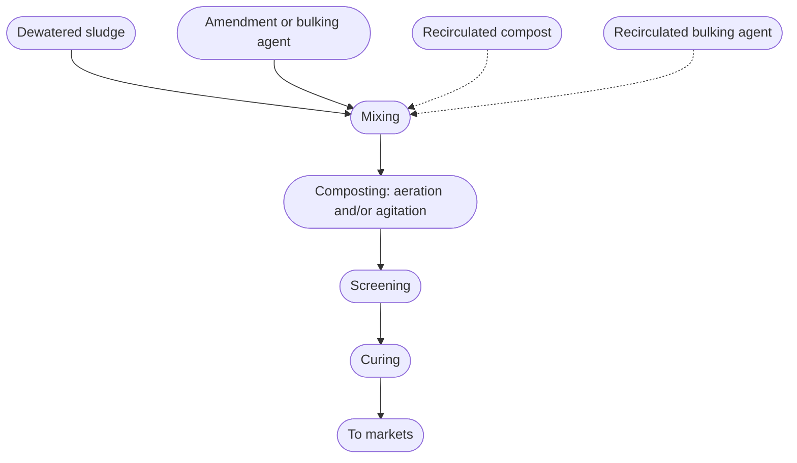

FIGURE 23.61 Generalized composting flow chart (dashed lines indicate optional steps; screening may follow curing; drying step may precede screening).

Detention time is affected by the bulking agent or amendment, carbon-to-nitrogen ratio, and pH. An amendment that is not screened out may continue to decompose, prolonging the curing period. An excessively high carbon-to-nitrogen ratio may have the same effect. The composting process has no fixed end point because the organic materials continue to decompose after the compost is considered stable. One test for stability is based on a respiration rate measured as a rate of carbon dioxide evolution. A respiration rate of 3 mg CO2/g organic carbon per day typically indicates that compost will be free of fecal odor and phytotoxic effects.

Another test measures oxygen consumption. Jimenez and Garcia (1989) report that a compost taking up 0.96 mg O2/g of organic carbon per day is considered stable. This is equivalent to 1.4 mg CO2/g of carbon per day.

4.5 General Design Considerations

The essential elements of composting facility designs involve handling large volumes of material and air. The relative importance of each depends on the composting technology used. For windrow operations, air handling is negligible or nonexistent; for enclosed operations, proper air handling is vital.

4.5.1 Site Layout
\n---\n

As with any facility, layout is dictated by the available site; however, there are a few items to keep in mind. Because of the large volumes of material handled, all composting operations involve the use of heavy equipment (e.g., front-end loaders and trucks). Concrete or high-durability asphalt-paved pads serve best for bulking agent storage, mixing, pile construction, screening, curing, and finished compost storage areas. Runoff from any areas exposed to raw feedstock must be collected and treated. Typically, facilities are designed with covered areas for bulking agent storage and composting aerated static-pile systems. Covered facilities can be operated under adverse weather conditions and generate minimal runoff:

## 4.5.2 Material-Handling Systems

Material typically is moved around a composting facility by either a front-end loader or a conveyor. In-vessel technologies have special equipment for moving material in the vessel for portions of processing, but they still rely on the loaders and conveyors for most of the material movement.

Bulking agents, biosolids, and finished compost have relatively low densities, so light-material, large-volume buckets can be used on front-end loaders. Rollout or pushout buckets are also advantageous because they allow for more vertical and horizontal reach.

The two most commonly used conveyors are belt and screw conveyors. For more information, refer to Chapter 19.

## 4.5.3 Bulking Agent Storage and Handling

Ideally, storage is provided for a 15- to 30-day supply of bulking agent. A paved, covered storage area minimizes excessive moisture accumulation in both bulking agent and finished compost.

Enclosing the unloading and conveying facilities minimizes the spread of dust and particulate, and protects the equipment from the adverse effects of wet and cold weather: Because the dust could explode, the design of any enclosure should adhere to applicable explosion hazard standards

## 4.5.4 Mixing
\n---\n

As previously indicated, dewatered solids must be well mixed with a bulking agent to ensure uniformity and good airflow characteristics during composting. Therefore, a mechanical mixing system typically is included in the design. A good mixture consists of bulking agent particles uniformly coated with solids containing no balls of dewatered solids that are more than 126 mm (5 in.) in diameter. Immediately mixing dewatered solids with a bulking agent minimizes storage-facility size and the potential for odor generation. A solids-bulking agent mixture can be stacked and conveyed more easily than dewatered cake alone.

Several types of mechanical mixing systems are available:

* Front-end loaders portion feedstock in discrete piles and "toss" the material several times until it is blended (much like how a salad is tossed). Mixing is time consuming, and not particularly effective. Loaders are best suited for small facilities and as backup for another mixing system.

* Batch mixers are stationary, truck-mounted, or trailer-mounted hoppers equipped with internal paddles or augers that mix the material. The blended batch is discharged via a short, side-mounted conveyor with a slide gate. Batch mixers also have internal scales and a weight display to help operators portion the material. They typical are loaded by front-end loaders but also can be loaded via a conveyor from a live-bottom hopper. Batch mixers are well suited for small and medium facilities.

* Continuous mixers (e.g., pug mills and plow mixers) are the most automated, complex mixing systems. In these systems, feedstocks first are loaded into separate live-bottom hoppers, which have variable-speed augers to meter the correct portions of each feedstock. (Feedstocks are weighed by elements in the hoppers’ discharge conveyors.) The material is conveyed to the mixers for blending, and afterward, conveyors discharge the blended material into or near the composting piles or vessels. Continuous mixers are found only at medium and large facilities, where their capital costs are offset by labor cost savings.

* Windrow turners are mobile machines designed to mix materials that have been layered on a concrete pad. The machines vary in size and complexity: Small machines towed by a tractor can stack material 0.6 to 0.9 m (2 to 3 ft) high. Large self-propelled machines can
\n---\n

Form piles about 2.4 m (8 ft) high. This technology works well in windrow composting operations.

A horizontal agitated-bed reactor also provides mixing. However, the material should be premixed before being loaded into such reactors to optimize the reactors' SRT.

Mixing and storage areas are odorous and, if enclosed, typically need at least six air changes per hour for effective odor control and personnel safety. Design engineers should consider treating exhaust airstreams from these process areas before discharging to the atmosphere.

## 4.5.5 Leachate

All composting processes produce leachate that must be treated. Some common sources of leachate sources in composting operations include:

* Aeration pipes and ducts;
* Building ventilation ductwork;
* Composting piles;
* Washdown water for all mobile and stationary equipment;
* Biosolids and recycled bulking agent storage areas; and
* Site drainage from areas exposed to unfinished compost, recycled bulking agent, and biosolids.

Aeration fans and ductwork—especially in negative-mode aeration—must be equipped with drains and cleanouts in all low areas. Even in positive aeration, ventilation fans and ducts will collect condensation, so they must have adequate drains and cleanout access.

Drains for compost piles are often part of the aeration floor and must be equipped with traps to prevent air from short-circuiting the process:

All stationary and mobile equipment must be washed down periodically to keep it in good working order. For mobile equipment, a designated washdown area is often part of the facility. For stationary equipment, drains must be provided. All conveyor and other equipment pits also should have drains both for washdown and condensation, which occurs in enclosed facilities.
\n---\n

All of the water from the above sources, as well as any water that contacts unfinished compost or raw materials, must be collected and treated. Water is a by-product of decomposition, so leachate can contain soluble organics, nutrients, and other material that cannot be released to the environment. Leachate should be discharged to a sanitary sewer, recycled to the WRRF's headworks, or treated onsite.

## 4.5.6 Aeration and Exhaust Systems

Compost typically can be aerated either by forcing air up through the material (positive aeration) or by pulling it down through the material (negative aeration). Positive aeration typically requires less energy than negative aeration to move the same volume of air. In positive aeration, the air is cooler, is drier, and, therefore, has less volume.

Negative aeration is better in enclosed and worker-occupied operations because it captures most of the material's odors and moisture, preventing them from entering the air above the pile (where greater airflows are required to capture and treat such emissions). However, condensation accumulates in the ductwork and blowers, so ample drainage must be provided.

Most in-vessel systems use positive aeration for system-specific reasons. For example, in-tunnel systems have little headspace above the piles and are not occupied by workers during active composting, so there is no advantage to negative aeration. Negative aeration is popular in aerated static-pile operations because it directly captures odors and moisture. Many aerated static-pile operations are configured to allow for both negative and positive aeration. During decomposition, negative aeration captures odors and moisture. Afterward, positive aeration can provide more air to accelerate drying before the compost is screened.
\n---\n

# Composting floor with aeration trenches

> FIGURE 23.62 Composting floor with aeration trenches.

The figure shows a cross-section of a composting floor with aeration trenches. A concrete, asphalt, or other hard slab covers the top; airflow ducts/trenches are located beneath the slab, with concrete required around trenches and airflow indicated.

<Mermaid diagram>
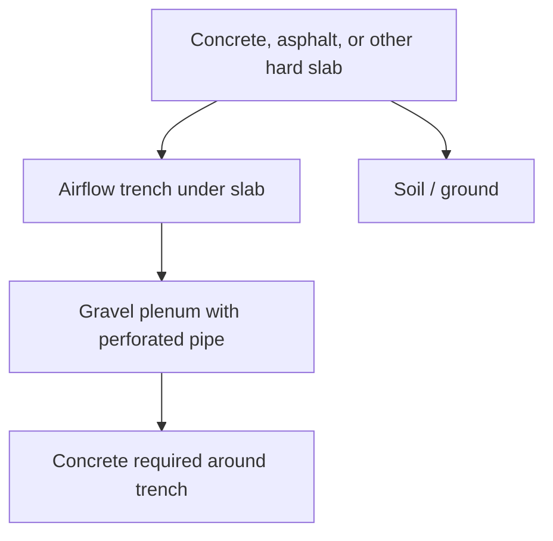
</Mermaid diagram>

Figures 23.62 to 23.65 show several air-floor configurations for aerated static-pile systems. For example, agitated bay systems use a perforated pipe embedded in a gravel plenum. No matter which configuration is used, it is vital that it be designed to deliver air evenly the entire length of the pile. Three methods are used to accomplish this:

* Provide progressively more air outlets along the pipe or trench so friction headloss is offset by reduced velocity loss through the outlets;
* Change the cross section of the pipe or trench to provide a constant air velocity along the entire length; or
* Use a combination of the two.
\n---\n

## FIGURE 23.63 Composting floor with embedded pipe and spigot aeration system.

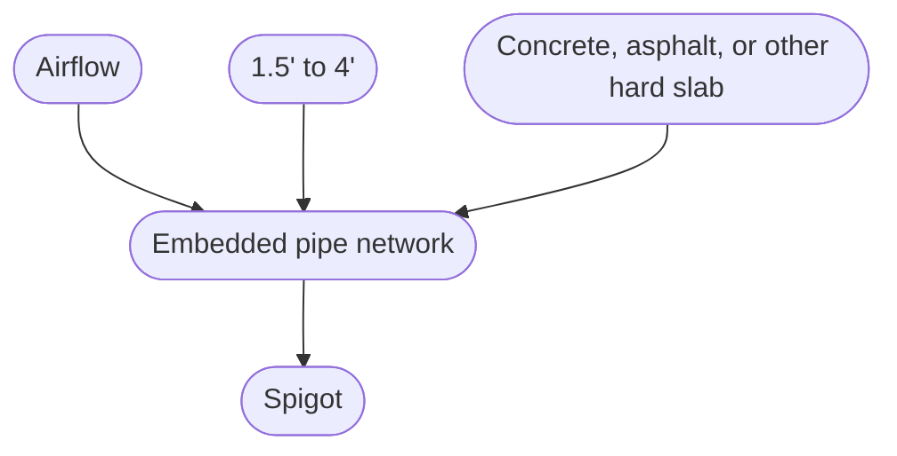

- Concrete, asphalt, or other hard slab
- 1.5' to 4' (spacing)
- Spigot
- Airflow

FIGURE 23.63 Composting floor with embedded pipe and spigot aeration system.

\n---\n

# FIGURE 23.65 Composting floor with aeration pipes on slab.

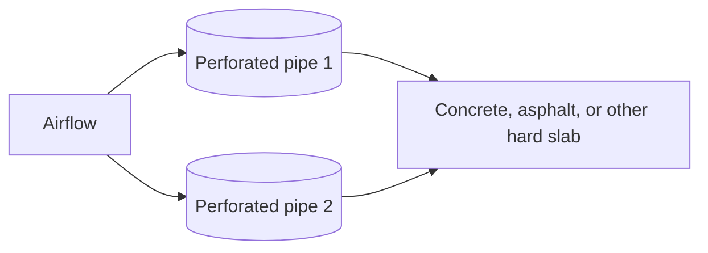

Spacing between pipes: 4.0' to 6.0'

Pipes or trenches typically are spaced 1 to 2 m (3 to 6 ft) apart on a layer of wood chips, which help distribute airflow. The spacing depends on the size of the pipe or trench; larger elements require more space. If the pipes or trenches are too far apart, however, anaerobic zones develop in the bottom of the piles because air always seeks the path of least resistance.

In-vessel systems may use continuous plenums or gravel floors with permanent piping. All of them will require regular cleaning. Many gravel plenums develop a hard pan on the surface that will block and redirect airflow if not routinely removed.

In aerated static-pile systems, the air outlets in pipes or trenches can become blocked with material, particularly when equipment moves over the outlets to add and remove material. The outlets must be cleaned after every one or two uses, using either water or compressed air.

In negative aeration, the air initially is hot and virtually saturated, but cools slightly as it moves through the duct. So, condensation forms and must be removed via frequent drains and cleanout. Drain traps also will be needed to prevent airflow from short-
\n---\n

## 4.5.7 Ventilation

circuiting: Because of the heat and moisture, negative aeration systems need corrosion-resistant ductwork: Fiberglass, PVC, polyethylene, and stainless steel have all been used.

When operating composting systems with forced aeration, O&M personnel need to be able to:
- Monitor and record pile temperatures; and
- Control aeration quantities based on oxygen demand, temperature, and moisture-removal requirements.

The simplest control system involves measuring and recording pile temperatures manually and controlling aeration blowers via a manually adjusted cycle timer. The most complex system includes a temperature feedback control where outputs from temperature probes in the piles are connected to a computer, which adjusts the aeration rates based on temperature readings using a preset control strategy:

All control systems used there are certain rules that should be observed in controlling the aeration:
- During active composting (when the material is heating up), the blowers typically should not be off for more than 15 minutes in a cycle. Murray and Thompson (1986) reported significant oxygen depletion after 12 to 15 minutes without aeration (see Figure 23.66).
- The temperature of the composting material should be measured directly, whenever possible. Although this seems obvious, some systems measure temperatures via sensors in the ductwork or in the walls contacting the piles (to avoid damage from agitation). Such sensors consistently provide measurements that are lower than the actual pile temperature, causing the material to be underaerated.
- Because the material's aeration demand constantly changes during composting, blowers must be able to provide a varying amount of airflow to the material. Design engineers can either provide single- or two-speed blowers, which will operate intermittently, or provide variable-frequency drives so the blowers can run continuously but the airflow is varied based on process needs. Another option is equipping single- or two-speed blowers with motorized dampers to regulate the amount of airflow supplied to each pile based on process needs.

\n---\n

The National Fire Protection Association issues ventilation rules related to fire prevention; however, in enclosed composting facilities, ventilation rates typically must be larger to control odors, control moisture (reduce fog and condensation), and ensure that workers are safe. In cold climates, heavy building insulation is needed to prevent condensation in winter and avoid worker heat stress in summer. Ventilation is also an important element in reducing corrosion resulting from a humid environment.

Because the material often is moved around a facility by a front-end loader, design engineers must consider what happens when doors are left open for extended periods. How will that affect ventilation rates and ductwork design? They also must locate the air-collection points in the building to avoid dead air spaces, where ammonia and other compounds can accumulate.

<figure>
  FIGURE 23.66 Oxygen depletion and regeneration in an active compost pile (Murray and Thompson, 1986, with permission from BioCycle).
  

<table>
    <thead>
      <tr><th>Blower operation minutes</th><th>% Oxygen</th></tr>
    </thead>
    <tbody>
      <tr><td>OFF</td><td>18</td></tr>
<tr><td>-5</td><td>12</td></tr>
<tr><td>-10</td><td>8</td></tr>
<tr><td>-15</td><td>6</td></tr>
<tr><td>-20</td><td>2</td></tr>
<tr><td>-25</td><td>1</td></tr>
<tr><td>-30</td><td>0</td></tr>
<tr><td>ON</td><td>0</td></tr>
<tr><td>+5</td><td>2</td></tr>
<tr><td>+10</td><td>16</td></tr>
    </tbody>
  </table>

</figure>

\n---\n

## 4.5.8 Screening
Except for leaves and sawdust, bulking agents can be screened out of the finished compost and reused. This reduces bulking agent costs by 50% to 80%. Screening also produces more uniform, aesthetically pleasing compost, thereby improving its marketability. Vibrating deck screens and rotating screens typically are used. All screens must have a self-cleaning feature (e.g., rotating brushes in rotating trommel screens, or a layer of balls between the decks of a vibrating deck screen).

Vibrating deck screens and rotary trommel screens can separate material into multiple sizes, which can be useful if some markets (e.g., turf top dressing) demand a product with fine particles.

## 4.5.9 Product Curing and Storage
Composting basically has two phases: a rapid decomposition period (14 to 21 days) followed by a longer, slower one with significantly lower oxygen and moisture-removal demands. This second phase (called curing) is typically about 30 days long and is needed to produce a stable, usable product. Sometimes, curing consists of merely stockpiling the material, but this can prolong curing time and increase the danger of fires. Low-rate aeration better controls curing time and product stability. Also, the curing material should be covered to control its moisture content and thereby prevent the material from compacting and going anaerobic. This is especially important if the material was screened first.

## 4.5.10 Odor Control
Odor control may be the composting industry's greatest challenge. Most conflicts over and suspensions of composting operations have been caused by odors or concerns about potential odors. Composting is inherently odorous as a result of the production and removal of volatile products of decomposition. Current design practices include more emphasis on enclosing operations, capturing and treating exhaust air, and improving process control to reduce odors at the source.

### 4.5.10.1 Odor Sources in Composting
Every stage in the composting process is a potential source of odors (see Tables 23.38 and 23.39). Odor sources can be divided into the following three categories:
\n---\n

# 4.5.10 Odor

- Active sources are those that exist when material is being actively handled (e.g., during mixing, screening, and dewatering). Odors from these sources occur during working hours.
- Continuous sources are those that originate in the aeration and storage areas. These may be point sources (e.g., blower exhaust) or area sources (e.g., pile and windrow surface emissions). Odors from these sources may occur 24 hours a day.
- Housekeeping sources are those related to material spills, unclean equipment, and condensate on ground surfaces. Such odors can persist after daily activity has stopped, so they are continuous sources.

## 4.5.10.2 Odor Measurement

The concentrations of individual compounds can be measured via standard analytical methods. For example, a simple apparatus consisting of a manual pump and a colorimetric adsorption tube can be used in the field. (Tubes are available for a number of the compounds listed in Table 23.39.) For more accurate and complete results, samples should be collected (in bags, stainless steel vacuum canisters, or tubes filled with adsorbent) and analyzed via gas chromatography in a laboratory:

However, the odor of composting typically is a mixture of compounds that cannot be quantified as a sum of individual constituents. Such odors can only be directly measured by the human nose (sensory analysis). Odor samples can be captured in Tedlar bags for sensory analysis at another location. Several methods have been developed to quantify odor concentrations using a panel of human subjects; these are described in detail in Chapter 6.

## 4.5.10.3 Containment and Treatment

The level of odor containment and control is dictated by the proximity of neighbors and local regulations. Design engineers must take care to provide for adequate capture of emissions under all operating conditions. For example, failing to account for material movement operations that require open doors lead to fugitive emissions.

<table>
  <thead>
    <tr>
      <th>Odor Source</th>
      <th>Category</th>
    </tr>
  </thead>
  <tbody>
  </tbody>
</table>

\n---\n

# Dewatered sludge transport and storage

<table>
<tr><td>Dewatered sludge transport and storage</td><td></td></tr>
<tr><td>Open trucks en route</td><td>A</td></tr>
<tr><td>Open trucks parked on site</td><td>A</td></tr>
<tr><td>Dumping operations</td><td>C</td></tr>
<tr><td>Untreated ventilation from storage facilities</td><td>C</td></tr>
<tr><td>Open conveyors</td><td>A</td></tr>
<tr><td>Spillage from trucks</td><td>H</td></tr>
<tr><td>Spillage around storage facilities</td><td>H</td></tr>
<tr><td>Residue on empty trucks</td><td>H</td></tr>
<tr><td>Puddles from truck washing</td><td>H</td></tr>
<tr><td>Tire trucking of spillage sludge</td><td>H</td></tr>
<tr><td>Mixing</td><td></td></tr>
<tr><td>Surface emissions from mixing by front-end loader or batch mixer</td><td>A</td></tr>
<tr><td>Untreated ventilation from pug mills</td><td>A</td></tr>
<tr><td>Mix left on paved surface after day’s activities</td><td>H</td></tr>
<tr><td>Residue on equipment</td><td>H</td></tr>
<tr><td>Pile building</td><td></td></tr>
<tr><td>Surface emission from materials-handling activities</td><td>A</td></tr>
</table>

\n---\n

<table>
  <tr>
    <td>Spillage of mix left on paved surface after day’s activities</td>
    <td>H</td>
  </tr>
<tr>
    <td>Residue on equipment</td>
    <td>H</td>
  </tr>
<tr>
    <td>Sludge balls from poormixing</td>
    <td>H</td>
  </tr>
<tr>
    <td>Surface emissions from pile before placement of blanket layer</td>
    <td>A</td>
  </tr>
<tr>
    <td>Composting</td>
    <td></td>
  </tr>
<tr>
    <td>Surface emission from active piles</td>
    <td>C</td>
  </tr>
<tr>
    <td>Leachate puddles at base of piles</td>
    <td>H</td>
  </tr>
<tr>
    <td>Aeration</td>
    <td></td>
  </tr>
<tr>
    <td>Blowers exhaust</td>
    <td>C</td>
  </tr>
<tr>
    <td>Leakage of condensate from aeration piping</td>
    <td>H</td>
  </tr>
<tr>
    <td>Leakage of exhaust from piping and blower housing</td>
    <td>H</td>
  </tr>
</table>

<p>*A = active source; C = continuous sources; and H = housekeeping sources</p>

<p>TABLE 23.38 Typical Odor Sources in Composting Operations</p>

<table>
  <thead>
    <tr>
      <th>Class Compounds</th>
      <th>Odor Threshold, ppm</th>
      <th>Likely Source at Treatment Plant</th>
      <th>Pathway of Formation/Release</th>
    </tr>
  </thead>
  <tbody>
    <tr>
      <td>Inorganic sulfur</td>
      <td></td>
      <td></td>
      <td></td>
    </tr>
<tr>
      <td>Hydrogen sulfide</td>
      <td>0.00047</td>
      <td>Septic wastewater or sludge</td>
      <td>Anaerobic reduction of sulfate to sulfide or anaerobic breakdown of amino acids</td>
    </tr>
  </tbody>
</table>

\n---\n

# Organic sulfur
## Mercaptans

<table>
<thead>
<tr><th>Compound</th><th>Concentration</th><th>Process/Conditions</th><th>Notes</th></tr>
</thead>
<tbody>
<tr><td>Ethyl mercaptan</td><td>0.00019</td><td>Sludge or wastewater subjected to anaerobic conditions</td><td>Anaerobic and aerobic breakdown of amino acids</td></tr>
<tr><td>tert-Butyl mercaptan</td><td>0.00008</td><td></td><td></td></tr>
<tr><td>Allyl mercaptan</td><td>0.00005</td><td></td><td></td></tr>
</tbody>
</table>

## Organic sulfides

<table>
<tr><td colspan="4"><strong>Organic sulfides</strong></td></tr>
<thead>
<tr><th>Compound</th><th>Concentration</th><th>Process/Conditions</th><th>Notes</th></tr>
</thead>
<tbody>
<tr><td>Dimethyl sulfide</td><td>0.001</td><td>Composting</td><td>Aerobic oxidation of mercaptans</td></tr>
<tr><td>Dimethyl disulfide</td><td>0.002</td><td></td><td></td></tr>
</tbody>
</table>

## Inorganic nitrogen

<table>
<tr><td colspan="4"><strong>Inorganic nitrogen</strong></td></tr>
<thead>
<tr><th>Compound</th><th>Concentration</th><th>Process/Conditions</th><th>Notes</th></tr>
</thead>
<tbody>
<tr><td>Ammonia</td><td>0.037</td><td>Composting; processing of anaerobically digested biosolids</td><td>Anerobic decomposition of organic nitrogen volatilization at high pH, temperature</td></tr>
</tbody>
</table>

## Organic nitrogen

<table>
<tr><td colspan="4"><strong>Organic nitrogen</strong></td></tr>
<thead>
<tr><th>Compound</th><th>Concentration</th><th>Process/Conditions</th><th>Notes</th></tr>
</thead>
<tbody>
<tr><td>Methylamine</td><td>0.021</td><td>Solids processing</td><td>Anaerobic decomposition of acids</td></tr>
<tr><td>Ethylamine</td><td>0.83</td><td></td><td></td></tr>
<tr><td>Dimethylamine</td><td>0.047</td><td></td><td></td></tr>
</tbody>
</table>

## Fatty acids

<table>
<tr><td colspan="4"><strong>Fatty acids</strong></td></tr>
</table>

\n---\n

<table>
  <thead>
    <tr>
      <th>Chemical</th>
      <th>Concentration</th>
      <th>Odor/Process</th>
      <th>Notes</th>
    </tr>
  </thead>
  <tbody>
    <tr>
      <td>Acetic acid</td>
      <td>0.001–1.0</td>
      <td>Sludge subjected to anaerobic conditions</td>
      <td>Anaerobic decomposition</td>
    </tr>
<tr>
      <td>Propionic acid</td>
      <td>0.005–0.05</td>
      <td></td>
      <td></td>
    </tr>
<tr>
      <td>Butyric acid</td>
      <td>0.0001–0.01</td>
      <td></td>
      <td></td>
    </tr>
<tr>
      <td colspan="4">Aromatics</td>
    </tr>
<tr>
      <td>Acetone</td>
      <td>0.05–400</td>
      <td>Preliminary and primary wastewater treatment processes, solid processing, and composting</td>
      <td>Present in wastewater contribution from industry; breakdown of lignins</td>
    </tr>
<tr>
      <td>Methyl ethyl ketone</td>
      <td>1–12</td>
      <td>Composting, wood-based bulking agents</td>
      <td></td>
    </tr>
<tr>
      <td>Terpenes</td>
      <td>Varies</td>
      <td></td>
      <td>Present in wood products, such as wood chips, sawdust</td>
    </tr>
  </tbody>
</table>

TABLE 23.39 Odor Compounds and Sources (Verschueren, 1983; WEF, 1995)

Once contained and captured, odors can be treated or exhausted. Treatment typically is required. A wide variety of treatment technologies are available (see Chapter 6): Organic media biofilters have been used extensively at composting facilities for several reasons:
* They have proven effective in treating compost odors
* They are inexpensive and easy to operate
* Composting facilities typically are large enough to have space for the biofilter
* The materials used for biofilter media are readily available at composting facilities
* The equipment used to replace biofilter media (e.g., front-end loaders) is available at any composting facility

For more details on odor removal, see Chapter 6:

### 4.5.11 Design Example

When designing any in-vessel system, engineers need details from vendors; in fact, a vendor often is selected before the detailed design proceeds. When designing an aerated
\n---\n

In aerated static-pile system design, on the other hand, the details are not vendor dependent. Below is an example of an aerated static-pile system design. The following design criteria apply to this example:

* 20 dry ton/d of cake containing 20% solids.
* Operations occur 7 days per week.
* The bulking agents are yard waste supplemented by ground wood waste.
* All storage, mixing, active composting, and screening operations are fully enclosed.
* Enough covered storage space for 30 days’ worth of new bulking agent.
* Enough storage space for 1 day’s worth of feedstock biosolids.
* Enough covered storage space for 7 days’ worth of recycled bulking agent.
* 21-day minimum SRT in active composting area.
* 28-day minimum SRT in aerated curing area.
* Enough outdoor storage for 90 days’ worth of finished product.

In this exercise, the various areas of the aerated static-pile system will be sized. Each area’s size depends on the types of vehicles expected and the site topography.

First, design engineers must develop a materials balance for the facility (see Table 23.40). The total amount of bulking agent that needs to be recycled is:

$$\text{Total recycled bulking agent} = \text{Screened recycled input} + \text{Base (recycled bulking agent)} = 204 \text{ cu yd} + 28 \text{ cu yd} = 232 \text{ cu yd} \; (177 \text{ m}^3) \qquad (23.38)$$

Comparing the materials balance with Table 23.37 and multiplying those values by 20, design engineers determine that adding drier ground-wood waste reduced the overall amount of active-composting feedstock from 393 to 389 m^3 (514 to 509 cu yd). It also reduced the amount of product produced from 145 to 138 m^3 (190 to 180 cu yd). The effect on product production is larger than that on feedstock volume and, therefore, facility size.
\n---\n

<table>
  <thead>
    <tr>
      <th>Material</th>
      <th>Volume (cu yd)</th>
      <th>Total Weight (Ton)</th>
      <th>Dry Weight (Ton)</th>
      <th>Volatile Solids (Ton)</th>
      <th>Bulk Density (lb/cu yd)</th>
      <th>Solids content</th>
      <th>Volatile solids</th>
    </tr>
  </thead>
  <tbody>
    <tr>
      <td>Biosolids</td>
      <td>125.0</td>
      <td>100.0</td>
      <td>20.0</td>
      <td>10.6</td>
      <td>1600</td>
      <td>20.0%</td>
      <td>53.0%</td>
    </tr>
<tr>
      <td>Yard waste (processed)</td>
      <td>180.0</td>
      <td>54.0</td>
      <td>29.7</td>
      <td>20.8</td>
      <td>600</td>
      <td>55.0%</td>
      <td>70.0%</td>
    </tr>
<tr>
      <td>Wood waste</td>
      <td>26.7</td>
      <td>6.7</td>
      <td>4.0</td>
      <td>3.8</td>
      <td>500</td>
      <td>60.0%</td>
      <td>95.0%</td>
    </tr>
<tr>
      <td>Screened recycled bulking agent</td>
      <td>204.1</td>
      <td>70.9</td>
      <td>39.0</td>
      <td>36.3</td>
      <td>695</td>
      <td>55.0%</td>
      <td>93.0%</td>
    </tr>
<tr>
      <td>Unscreened recycle</td>
      <td>0.0</td>
      <td>0.0</td>
      <td>0.0</td>
      <td>0.0</td>
      <td>780</td>
      <td>55.0%</td>
      <td>88.6%</td>
    </tr>
<tr>
      <td>Mixture</td>
      <td>508.9</td>
      <td>231.6</td>
      <td>92.7</td>
      <td>71.5</td>
      <td>910</td>
      <td>40.0%</td>
      <td>77.1%</td>
    </tr>
<tr>
      <td>Base (recycled bulking agent)</td>
      <td>28.3</td>
      <td>9.8</td>
      <td>5.4</td>
      <td>5.0</td>
      <td>695</td>
      <td>55.0%</td>
      <td>93.0%</td>
    </tr>
<tr>
      <td>Cover (unscreened)</td>
      <td>56.5</td>
      <td>22.1</td>
      <td>12.1</td>
      <td>10.7</td>
      <td>780</td>
      <td>55.0%</td>
      <td>88.6%</td>
    </tr>
<tr>
      <td>Composting losses</td>
      <td></td>
      <td>182.8</td>
      <td>7.1</td>
      <td>7.1</td>
      <td></td>
      <td></td>
      <td></td>
    </tr>
<tr>
      <td>Cover (unscreened)</td>
      <td>56.5</td>
      <td>22.1</td>
      <td>12.1</td>
      <td>10.7</td>
      <td>780</td>
      <td>55.0%</td>
      <td>88.6%</td>
    </tr>
<tr>
      <td>Screen feed</td>
      <td>424.0</td>
      <td>165.4</td>
      <td>91.0</td>
      <td>69.3</td>
      <td>780</td>
      <td>55.0%</td>
      <td>76.2%</td>
    </tr>
<tr>
      <td>Recycled bulking agent</td>
      <td>232.2</td>
      <td>80.7</td>
      <td>44.4</td>
      <td>41.3</td>
      <td>695</td>
      <td>55.0%</td>
      <td>93.0%</td>
    </tr>
  </tbody>
</table>

\n---\n

# TABLE 23.40 Materials Balance for Design Example*

<table>
  <thead>
    <tr>
      <th> </th>
      <th>Col1</th>
      <th>Col2</th>
      <th>Col3</th>
      <th>Col4</th>
      <th>Col5</th>
      <th>Col6</th>
      <th>Col7</th>
    </tr>
  </thead>
  <tbody>
    <tr>
      <td>Curing</td>
      <td>188.2</td>
      <td>84.7</td>
      <td>46.6</td>
      <td>28.1</td>
      <td>900</td>
      <td>55.0%</td>
      <td>60.3%</td>
    </tr>
<tr>
      <td>Curing losses</td>
      <td>3.8</td>
      <td>2.1</td>
      <td>2.1</td>
      <td></td>
      <td></td>
      <td></td>
      <td></td>
    </tr>
<tr>
      <td>Compost to storage</td>
      <td>179.8</td>
      <td>80.9</td>
      <td>44.5</td>
      <td>26.0</td>
      <td>900</td>
      <td>55.0%</td>
      <td>58.4%</td>
    </tr>
  </tbody>
</table>

### Assumptions:

> Recovery by screening

- Yard waste 50% by volume
- Wood waste 70% by volume
- Recycled bulking agent 50% by volume
- Pile base 95% by volume

### Processing losses

- Losses during composting 10% of volatile solids
- Losses during curing 5% of volatile solids

*cu yd 0.7646 = m3; lb/cu yd x 0.5933 = kg/m3; ton x 0.9072 = Mg:

TABLE 23.40 Materials Balance for Design Example*

The following areas are constructed with concrete walls on three sides: active composting, curing, and storage areas for biosolids and all bulking agents.
For most front-end loaders, the maximum height will be 3 to 3.6 m (10 to 12 ft): In this example, the maximum height (H) is 3 m (10 ft). The following equation represents the total volume for a given area; it is manipulated to determine the desired value. For example, a narrow site may limit the allowable length (L). As a general rule, the width (W)
\n---\n

should be at least 4.6 m (15 ft) for each day’s worth of material. This is wide enough for a front-end loader to dig out the material while leaving the piles around it intact.

$$
\text{Pile volume} / d \times \text{Number of days} \times 27 \ \text{cu ft/cu yd} = H \times \left( L - \frac{H}{2} \right) \times W \quad (23.39)
$$

For the bulking agent storage area (for 30 days’ worth of ground yard waste) with an assumed length of 30 m (100 ft) and height of 3 m (10 ft),

$$
W = \frac{204 \times 27 \times 30}{10 \left( 100 - \frac{10}{21} \right)} = 157 \ \text{ft} \quad (23.40)
$$

For a biosolids storage area with an assumed width of 9 m (30 ft) and height of 0.9 m (3 ft),

$$
\frac{L}{D} = \frac{127 \times 27 \times 1 + \frac{3}{2}}{3 \times 30} = 38 \ \text{ft} \ (\!11 \ \text{m}) \quad (23.41)
$$

Biosolids typically are dense and gelatinous, so they do not stack well. Biosolids containing 18% to 24% solids will only stack about 0.9 or 1.2 m high. Wetter biosolids will not stack more than 0.3 m (1 ft) high.

When sizing the active compost area, design engineers should keep in mind that most composting facilities will put 1 day’s worth of material in each bay. (Small facilities may put 2 or 3 days’ worth of material in a bay.) The number of bays depends on the desired SRT (21 days is the usual minimum). Two extra bays should be provided to allow for one bay to be torn down and another to be constructed without reducing SRT. Aerated static-pile facilities typically have active composting areas that are constructed with multiple bays on either side of a center aisle. A bay on one side typically serves as a mixing surge area (depending on the mixing method selected). There is no physical obstruction between bays.

Below is the length of the active compost hall, based on an assumed width of 6 m (20 ft) and a mixture depth of 2.4 m (8 ft). Although the overall pile depth will be 3 m (10 ft), design engineers need to allow for 0.3 m (1 ft) of plenum layer and 0.3 m (1 ft) of cover
\n---\n

# Composting Hall Design – Bay Width, Center Aisle, Hall Dimensions and Aeration

The minimum bay width should be 4.6 m (15 ft) so front-end loaders have enough space to build and tear down 1 day’s worth of material.

<table>
<thead>
<tr><th>Parameter</th><th>Calculation / Note</th><th>Result</th></tr>
</thead>
<tbody>
<tr><td>L_bay</td><td>—</td><td>86 ft (26 m)</td></tr>
</tbody>
</table>

When calculating the composting hall’s overall width, design engineers need to include allowances for the piles, the center aisle, and the aeration blowers (which typically are housed behind the piles). The minimum allowance for the blower gallery depends on the size of the blowers and ductwork, and the access to the area. If the only access to the blower gallery is from the ends of the compost building, the gallery must be wide enough to move blowers without dismantling them. If access doors can be put closer to the blowers, the hall can be narrower. In this example, a 4.6-m-wide (15-ft-wide) gallery is assumed.

The center aisle must be at least 9 m (30 ft) wide so front-end loaders have enough maneuvering space to construct and tear down piles. If the material from the active compost pile will be loaded directly onto trucks, which will deliver it to another location for curing, then the center aisle should be at least 13.7 to 15.2 m (45 to 50 ft) wide.

<table>
<thead>
<tr><th>Dimension</th><th>Calculation / Description</th><th>Value</th></tr>
</thead>
<tbody>
<tr><td>Hall width</td><td>2 × (86 + 15) + 30 + 4 × 1<br>(allowance for concrete walls)</td><td>236 ft (72 m)</td></tr>
<tr><td>Compost hall length</td><td>20 × 12 + 2<br>(allowance for concrete walls)</td><td>242 ft (74 m)</td></tr>
</tbody>
</table>

In most aerated static-pile facilities, each bay (1 day’s worth of material) is aerated separately (typically one blower per bay). This configuration provides the most flexibility and least interruption in operations if a blower goes out of service. At small facilities, however, one continuously running blower can serve several bays. In this example, one blower will be used for each bay.

## Aeration requirements

Required aeration =
$$
\frac{5000\ \mathrm{ft^3/hr \ per\ dry\ ton\ biosolids} \times 20\ \mathrm{dry\ ton}}{60\ \mathrm{min/hr}}
= 1667\ \mathrm{cfm}\ (787\ \mathrm{L/s})
$$

\n---\n

## 4.6 Health and Safety Considerations

Potential dangers associated with composting systems include poorly ventilated areas, areas where exhaust gas is discharged, conveyors, and heavy equipment traffic. The primary concerns include:

* Fog generation in cold weather: Dense fog in a building with heavy equipment is an obvious hazard; it also may prevent others from seeing an injured worker.
* Worker heat stress: Composting generates significant amounts of heat. During warm weather, enclosed composting facilities can easily exceed 100°F for prolonged periods.
* Unsafe chemical concentrations: If not properly ventilated, pockets of dead air can develop unhealthy concentrations of compounds (e.g., ammonia).
* Dust — Near screening operations and in high-traffic areas: Dust levels can exceed Occupational Safety and Health Administration (OSHA) limits if not properly contained and captured. Design engineers should provide screens with hoods connected to dust collectors. High-traffic areas should be cleaned regularly to prevent dust buildup:
* Material-handling equipment (e.g., conveyors and screens) has exposed moving parts and poses a worker hazard: The main safety concerns are at the points of material transfer and locations of exposed belts. To minimize the possibility of material spilling or accumulating at transfer points, design engineers should provide emergency pull-cords along the full length of conveyors, as well as interlocks to shut down all material-handling operations in the event of an emergency:
* Wood chips and compost piles may contain high concentrations of the airborne fungus A. fumigatus, which naturally occurs in grass and leaves. Although typically not harmful, A. fumigatus may cause aspergillosis in individuals with extreme susceptibility. Personnel with respiratory problems, that exhibit adverse physical reactions, or who have histories of suppressed immune response should not work in a composting or wastewater treatment facility:

## 5.0 Alkaline Stabilization

Adding alkaline chemicals to solids is a reliable stabilization method that WRRFs have practiced since the 1890s. The chemicals traditionally used are quicklime and hydrated lime.
\n---\n

## 5.1 Stabilization Objectives

In recent years, a number of advanced alkaline-stabilization technologies have emerged. These technologies, which use new chemical additives, special equipment, or special processing steps, all claim advantages over traditional lime stabilization (e.g., enhanced pathogen control and a more publicly acceptable product). They also produce biosolids that is sometimes called artificial soil because it has been successfully used as a soil substitute.

Lime is the most widely used and one of the least expense alkaline materials available in the wastewater industry. It has been used to reduce odors in privies, increase pH in stressed digesters, remove phosphorus in advanced wastewater treatment processes, treat septage, and condition solids before and after mechanical dewatering. It is also the principal stabilizing chemical at WRRFs with capacities ranging from 379 m3/d to approximately 1.13 million m3/d (0.1 to 300 mgd) (U.S. EPA, 1979). Larger facilities that have used the process include those in Pittsburgh, Pennsylvania; Memphis, Tennessee; and Toledo, Ohio; as well as DC Water Blue Plains Advanced Wastewater Treatment Plant in Washington, D.C. According to the U.S. EPA’s 1988 Needs Survey of Municipal Wastewater Treatment Facilities, more than 250 facilities use lime stabilization (U.S. EPA, 1989). According to a 2007 Northeast Biosolids Management Association survey, 900 of the 4800 facilities surveyed—18% of facilities surveyed and 12% of the total volume of biosolids produced—used some form of alkaline stabilization (NEBRA, 2007). These results emphasize that alkaline stabilization primarily is used by smaller treatment facilities.

Alkaline-stabilized biosolids can be beneficially used in many ways, depending on the particular quality requirements and associated standards. Traditional lime stabilization is classified in the U.S. EPA’s Standards for the Use or Disposal of Sewage Solids as a Class B process (PSRP) (U.S. EPA, 1999b). Many of the advanced alkaline-stabilization technologies meet the U.S. EPA’s definition of a Class A process (PFRP). Many of the beneficial use and disposal options for alkaline stabilized biosolids are further discussed in Oerke (1999).

5.1 Stabilization Objectives

The purposes of alkaline stabilization may include:
\n---\n

* To substantially reduce the number and prevent the regrowth of pathogenic and odor-producing organisms, thereby preventing biosolids-related health hazards;
* To create a stable product that can be stored; and
* To reduce the short-term leaching of metals from biosolids not incorporated with natural soil.

Several studies have demonstrated that both liquid and dry lime stabilization achieve significant pathogen reduction, provided that a sufficiently high pH or temperature is maintained for an adequate period of time (Bitton et al., 1980; Christensen, 1982). Table 23.41 lists bacteria levels measured during full-scale studies at the Lebanon, Ohio, WRRF; it shows that liquid lime stabilization at pH 12.5 and a 25% dose (dry-weight) reduced total coliform, fecal coliform, and fecal streptococci concentrations by more than 99.9%. Also, the numbers of Salmonella and Pseudomonas aeruginosa were reduced below the level of detection. In addition, Table 23.41 shows that pathogen concentrations in liquid lime-stabilized biosolids ranged from 10 to 1000 times less than those in anaerobically digested biosolids from the same WRRF: Christensen (1987) researched the pathogen-reduction performance of dry lime stabilization using dry quicklime doses of 13% and 40% (as calcium hydroxide; dry-weight basis). His results indicated that dry lime stabilization can reduce fecal coliform and streptococcus pathogens by at least two orders of magnitude. This was as good as, and in some cases better than, the results of standard liquid lime stabilization and liquid lime conditioning followed by vacuum filtration (see Figures 23.67 and 23.68). No growth of either fecal coliforms or fecal streptococci occurred by the seventh day (Westphal and Christensen, 1983). Westphal and Christensen (1983) also reported that alkaline-stabilization processes used to reduce the densities of fecal coliform and fecal streptococcus performed as well as or better than mesophilic aerobic digestion, anaerobic digestion, and mesophilic composting (see Table 23.42). Additional discussions of lime treatment and the control of bacterial, viral, and parasitic pathogens are reviewed in reports by Christensen (1987) and Reimers et al. (1981).
\n---\n

# TABLE 23.41 Bacteria Reduction Via Liquid Lime Stabilization at Lebanon, Ohio (U.S. EPA, 1979)

<table>
  <thead>
    <tr>
      <th>Type of Solids</th>
      <th>Fecal Coliformsa</th>
      <th>Fecal Streptococci</th>
      <th>Salmonellab</th>
      <th>Ps. aeruginosa</th>
    </tr>
  </thead>
  <tbody>
    <tr>
      <td>Raw sludge</td>
      <td></td>
      <td></td>
      <td></td>
      <td></td>
    </tr>
<tr>
      <td>Primary</td>
      <td>2.9 × 10^9</td>
      <td>8.2 × 10^8</td>
      <td>3.9 × 10^7</td>
      <td>195</td>
    </tr>
<tr>
      <td>Waste activated</td>
      <td>8.3 × 10^8</td>
      <td>2.7 × 10^7</td>
      <td>2.7 × 10^7</td>
      <td>5.5 × 10^3</td>
    </tr>
<tr>
      <td>Anaerobically digested biosolids</td>
      <td colspan="4"></td>
    </tr>
<tr>
      <td>Mixed primary and waste activated</td>
      <td>2.8 × 10^7</td>
      <td>1.5 × 10^5</td>
      <td>2.7 × 10^5</td>
      <td>42</td>
    </tr>
<tr>
      <td>Lime stabilized biosolidsc</td>
      <td colspan="4"></td>
    </tr>
<tr>
      <td>Primary</td>
      <td>1.2 × 10^5</td>
      <td>5.9 × 10^3</td>
      <td>1.6 × 10^4</td>
      <td>&lt;3</td>
    </tr>
<tr>
      <td>Waste activated</td>
      <td>5.2 × 10^5</td>
      <td>1.6 × 10^4</td>
      <td>6.8 × 10^3</td>
      <td>13</td>
    </tr>
<tr>
      <td>Anaerobically digested</td>
      <td>18</td>
      <td>18</td>
      <td>8.6 × 10^3</td>
      <td>&lt;3</td>
    </tr>
  </tbody>
</table>

<p>a Millipore filter technique used for waste activated sludge. Most probable number technique used for other sludges.</p>
<p>b Detention limit = 3.</p>
<p>c To pH equal to or greater than 12.0.</p>

TABLE 23.41 Bacteria Reduction Via Liquid Lime Stabilization at Lebanon, Ohio (U.S. EPA, 1979)
\n---\n

# FIGURE 23.67 Average fecal coliform inactivation via two liquid lime stabilization processes and one dry lime stabilization process (Westphal and Christensen, 1983).

<table>
  <thead>
    <tr>
      <th>Process</th>
      <th>Symbol</th>
    </tr>
  </thead>
  <tbody>
    <tr>
      <td>Liquid lime stabilization</td>
      <td>●</td>
    </tr>
<tr>
      <td>Lime preconditioning before vacuum filtration process</td>
      <td>▲</td>
    </tr>
<tr>
      <td>Dry lime stabilization</td>
      <td>■</td>
    </tr>
  </tbody>
</table>

<p>pH < 12 at 2 hours</p>
<p>pH > 12 at hours</p>

<p>0 hours    2 hours    24 hours    7 days</p>
<p>Time</p>

\n---\n

standard (Burnham et al., 1992). Both laboratory- and large-scale field tests have shown that indigenous and seeded populations of Salmonella, poliovirus, and Ascaris ova can be eliminated within 24 hours if the treated biosolids are contained at pH 12 and 52°C for 12 hours.

FIGURE 23.68 Average fecal streptococci inactivation via two liquid lime stabilization processes and one dry lime stabilization process (Westphal and Christensen, 1983).

<table>
<thead>
<tr><th>Process</th><th>0 hours</th><th>2 hours</th><th>24 hours</th><th>7 days</th></tr>
</thead>
<tbody>
<tr><td>Liquid Lime Stabilization</td><td></td><td></td><td></td><td></td></tr>
<tr><td>Lime Preconditioning Before Vacuum Filtration Process</td><td></td><td></td><td></td><td></td></tr>
<tr><td>Dry Lime Stabilization</td><td></td><td></td><td></td><td></td></tr>
</tbody>
</table>

<table>
<thead>
<tr><th colspan="2">Legend</th></tr>
</thead>
<tbody>
<tr><td>Liquid Lime Stabilization</td><td>○</td></tr>
<tr><td>Lime Preconditioning Before Vacuum Filtration Process</td><td>▲</td></tr>
<tr><td>Dry Lime Stabilization</td><td>■</td></tr>
</tbody>
</table>

Although there is little information quantifying virus reduction during lime stabilization, lime has been identified as an effective viricide. Qualitative analysis has indicated substantial survival of higher organisms (e.g., hookworms and amoebic cysts) after 24 hours at high pH (Farrell et al., 1974). It is unknown whether prolonged contact eventually destroys
\n---\n

these organisms. Class A alkaline-stabilization processes that maintain 70°C for 30
minutes have been shown to kill Ascaris ova. Studies have shown that a high pH has little
effect on parasites (e.g., toxocara, mites, and nematodes) (U.S. EPA, 1975). Comparisons
of parasite types in lime-stabilized and anaerobically digested solids showed similar
parasite types and densities in both solids.
Alkaline stabilization is a simple process. An alkaline chemical is added to feed solids to
raise its pH, and adequate contact time is provided. At pH 12 or higher, with sufficient
contact time and thorough lime_feed cake mixing, pathogens and microorganisms are
either inactivated or destroyed. The chemical and physical characteristics of the resulting
biosolids also are altered. The chemistry of the process is not well understood, although it
is believed that some complex molecules are split by reactions (e.g , hydrolysis and
saponification) (Christensen, 1982) . It is also now understood that high pH releases
gaseous ammonia from biosolids. Gaseous ammonia has been shown to be an effective
disinfectant.

<table>
<thead>
<tr><th>Process</th><th>Fecal Coliform</th><th>Fecal Streptococci</th></tr>
</thead>
<tbody>
<tr><td>Anaerobic digestion (35°C)</td><td></td><td></td></tr>
<tr><td>Mean</td><td>1.84</td><td>1.48</td></tr>
<tr><td>Range</td><td>1.44–2.33</td><td>1.1–1.94</td></tr>
<tr><td>Anaerobic digestion 20°C</td><td>1</td><td>1</td></tr>
<tr><td>Anaerobic digestion 30°C</td><td>2</td><td>1.64</td></tr>
<tr><td>Composting</td><td>≥4</td><td>2.9</td></tr>
<tr><td>Liquid lime stabilization</td><td></td><td></td></tr>
</tbody>
</table>

\n---\n

# TABLE 23.42 Bacteria Reduction Via Various Stabilization Processes

<table>
  <thead>
    <tr>
      <th>Process</th>
      <th>35-day detention time</th>
      <th>30-day detention time</th>
    </tr>
  </thead>
  <tbody>
    <tr>
      <td>Raw primary</td>
      <td>5.1</td>
      <td>2.4</td>
    </tr>
<tr>
      <td>Waste activated</td>
      <td>3.2</td>
      <td>3.2</td>
    </tr>
<tr>
      <td>Mixed primary and trickling filter humus, 4% solids</td>
      <td>2.6</td>
      <td>1.8</td>
    </tr>
<tr>
      <td colspan="3">Storage</td>
    </tr>
<tr>
      <td>10°C</td>
      <td>—</td>
      <td>1</td>
    </tr>
<tr>
      <td>20°C</td>
      <td>—</td>
      <td>1.5</td>
    </tr>
<tr>
      <td>30°C</td>
      <td>—</td>
      <td>2.0</td>
    </tr>
  </tbody>
</table>

aLaboratory study, 35-day detention time.
bLaboratory study, 30-day detention time

To meet Class B stabilization requirements, the pH of the feed cake–chemical mixture must be elevated to more than pH 12.0 for 2 hours and then maintained above pH 11.5 for another 22 hours to meet VAR requirements. To meet Class A stabilization requirements, the elevated pH is combined with elevated temperatures (70°C for 30 minutes or other U.S. EPA-approved time and temperature combinations listed in U.S. EPA, 1999b). As long as the pH remains above 10 to 10.5, microbial activity and the associated odorous gases are greatly reduced or eliminated (U.S. EPA, 1979). However, other odorous gases (e.g., ammonia and trimethyl amine) may be produced under high-pH and -temperature conditions.

## 5.1.1 Process Application

Although both small and large WRRFs have used lime stabilization, this process is more common at small facilities. It typically is more cost-effective than other chemical stabilization options. Relatively large facilities have typically used lime stabilization as an interim process when their primary stabilization process (e.g: anaerobic or aerobic
\n---\n

digestion) was temporarily out of service. Lime stabilization also has been used to supplement the primary stabilization process during peak solids-production periods.

Lime-stabilized biosolids may be land applied, benefiting large agricultural areas with acidic soils. However, because of the inert solids and reactions involved, lime-stabilized biosolids have lower concentrations of available nutrients (e.g., nitrogen and phosphorus) than a comparable mixture of biologically stabilized primary and WAS. (For more information on biosolids use and disposal considerations, see Chapter 25.)

5.1.2 Process Fundamentals

5.1.2.1 pH Elevation

Effective lime stabilization depends on raising the pH high enough and maintaining it at that level long enough to halt or substantially retard the microbial reactions that otherwise could lead to odor production and vector attraction. The process also can inactivate viruses, bacteria, and other microorganisms.

Lime stabilization involves a variety of chemical reactions that alter the chemical composition of solids. The following equations (simplified for illustrative purposes) show the types of reactions that may occur:

Reactions with inorganic constituents:

<table>
  <thead>
    <tr><th>Constituents</th><th>Reaction</th><th>Eq.</th></tr>
  </thead>
  <tbody>
    <tr><td>Water:</td><td>CaO + H<sub>2</sub>O &rarr; Ca(OH)<sub>2</sub></td><td>(23.46)</td></tr>
<tr><td>Calcium:</td><td>Ca<sup>2+</sup> + 2HCO<sub>3</sub>⁻ + CaO &rarr; 2CaCO<sub>3</sub> + H<sub>2</sub>O</td><td>(23.47)</td></tr>
<tr><td>Phosphorus:</td><td>2PO<sub>4</sub>³⁻ + 6H⁺ + 3CaO &rarr; Ca<sub>3</sub>(PO<sub>4</sub>)<sub>2</sub> + 3H<sub>2</sub>O</td><td>(23.48)</td></tr>
<tr><td>Carbon dioxide:</td><td>CO<sub>2</sub> + CaO &rarr; CaCO<sub>3</sub></td><td>(23.49)</td></tr>
  </tbody>
</table>

Reactions with organic constituents:

<table>
  <thead>
    <tr><th>Constituents</th><th>Reaction</th><th>Eq.</th></tr>
  </thead>
  <tbody>
    <tr><td>Acids:</td><td>RCOOH + CaO &rarr; RCOOCaOH</td><td>(23.50)</td></tr>
<tr><td>Fats:</td><td>Fat + CaO &rarr; fatty acids</td><td>(23.51)</td></tr>
  </tbody>
</table>

\n---\n

## 5.1.2.2 Heat Generation

If quicklime (or any compound with high quicklime concentrations) is added to solids, it initially reacts with the water in solids to form hydrated lime. This exothermic reaction releases about 15 300 cal/g · mol (2.75 × 10^4 Btu/lb · mol) (U.S. EPA, 1982). The reaction between quicklime and carbon dioxide is also exothermic, releasing about 4.33 × 10^4 cal/g · mol (7.8 × 10^4 Btu/lb · mol).

Both reactions can raise the temperature substantially, particularly in solids cake with a low moisture content. For example, adding 45 g (0.1 lb) of quicklime per gram of solids to a cake containing 15% total solids can result in a temperature increase of more than 10°C (18°F), as the following formula demonstrates:

$$
(0.1 \text{ lb CaO}) \left(\frac{1 \text{ lb mol}}{56 \text{ lb}}\right) \left(\frac{27{,}500 \text{ Btu}}{\text{lb mol}}\right) = 49 \text{ Btu} \; (52 \text{ kJ})
$$
(23.52)

$$
(49 \text{ Btu}) \left(\frac{1}{0.85 \text{ lb H}_2\text{O}}\right) \left(\frac{1^\circ\text{F}}{\text{lb H}_2\text{O} \cdot \text{Btu}}\right) = 58^\circ\text{F} \; (14^\circ\text{C})
$$
(23.53)

In practice, temperature increases will be smaller, although they can be substantial. Sometimes they can be sufficient to contribute to pathogen destruction during lime stabilization.

### 5.1.3 Process Description

Several alkaline-stabilization technologies are available. Each system has advantages and disadvantages, so design engineers should evaluate them and select the appropriate process on a case-by-case basis.

#### 5.1.3.1 Liquid Lime (Pre-Lime) Stabilization

\n---\n

## In liquid lime (pre-lime) stabilization

In liquid lime (pre-lime) stabilization, a lime slurry is added to feed solids to meet Class B stabilization requirements (see Figure 23.69). The lime typically is added to thickened solids at WRRFs that land-apply liquid biosolids (e.g., subsurface injection on agricultural land). This practice typically has been limited to smaller WRRFs or those with nearby land-application or use sites. That said, a Washington Suburban Sanitary Commission facility in Piscataway, Maryland, has used pre-lime stabilization followed by belt filter-press dewatering to create biosolids suitable for hauling longer distances. Because the biosolids were pre-limed, Piscataway operators claim that they have low odor characteristics. However, equipment scaling remains a concern at this facility.

Another liquid lime stabilization method involves conditioning solids or septage with lime before dewatering. The lime typically is combined with other conditioners (e.g., aluminum or iron salts) to improve solids dewatering. This method primarily has been used with vacuum filters and recessed-plate filter presses; in such cases, the lime dose needed to condition solids typically exceeds that required to stabilize them:

### 5.1.3.2 Dry Lime (Post-lime) Stabilization

In dry lime (post-lime) stabilization, dry quicklime or hydrated lime is added to dewatered cake. This process has been practiced at WRRFs since the 1960s (Stone et al., 1992). The lime typically is mixed with the cake via a pug mill, plow blender, paddle mixer, ribbon blender, screw conveyor, or similar device. Figure 23.70 is a process schematic for a typical dry-lime stabilization system with a pneumatic lime-conveyance system.

\n---\n

FIGURE 23.69 Typical liquid lime stabilization system (U.S. EPA, 1979).

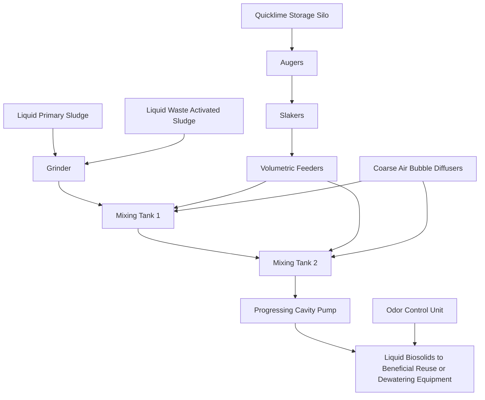
\n---\n

# 5.1.3.3 Advanced Alkaline-Stabilization Technologies

FIGURE 23.70 Process schematic of a typical dry lime stabilization system (Oerke and Rogowski, 1990).

<table>
<thead>
<tr><th>Left</th><th>Right</th></tr>
</thead>
<tbody>
<tr><td>Lime Bulk Storage Bins</td><td>Lime Day Bin</td></tr>
<tr><td>Feeder</td><td>Volumetric Feeder</td></tr>
<tr><td>Pulverizer (Optional)</td><td>Pug Mill</td></tr>
<tr><td>Pneumatic Conveyance or Transfer Screw Conveyor</td><td></td></tr>
<tr><td>Dewatered Sludge</td><td>Biosolids Product to Beneficial Use</td></tr>
</tbody>
</table>

Quicklime, hydrated lime, or other dry alkaline materials can be used in this process, although the use of hydrated lime typically is limited to smaller installations. Quicklime is less expensive and easier to handle than hydrated lime, and the heat of hydrolysis released when quicklime is added to dewatered cake can enhance pathogen destruction.

If enough dry alkaline material is added to feed solids, the resulting biosolids can meet either Class B or Class A requirements.

\n---\n

# Typical advantages and disadvantages of advanced alkaline stabilization are shown in Table 23.43.

In the last 30 years, alkaline-stabilization methods have been developed that use materials other than lime; these methods are being used by a number of municipalities. Most of those that rely on additives (e.g., cement kiln dust, lime kiln dust, Portland cement, or fly ash) are modifications of traditional dry lime stabilization. The most common modifications include the use of other chemicals, a higher dose (depends on the chemical), and supplemental drying. These processes alter the feed material's characteristics and, depending on the process, increase stability, decrease odor potential, reduce pathogens, and otherwise enhance the resulting biosolids.

<table>
<thead>
<tr><th>Advantages</th><th>Disadvantages</th></tr>
</thead>
<tbody>
<tr><td>Meets Class A stabilization requirements</td><td>High annual cost</td></tr>
<tr><td>Multiple product markets</td><td>High chemical use</td></tr>
<tr><td>Typically lower capital cost when compared with other Class A stabilization processes</td><td>Extensive odor-control systems required to treat ammonia and other offgases</td></tr>
<tr><td>Proven with more than 40 installations in U.S.</td><td>Dewatering facilities required</td></tr>
<tr><td>Easy to operate, start up, and shut down</td><td>Some proprietary processes; annual patent fee could be required</td></tr>
<tr><td>Metal concentrations in biosolids are diluted</td><td>Worker safety concerns with dust from alkaline chemical and ammonia offgas</td></tr>
<tr><td>Product has value as a liming agent</td><td>Increase on total solids/chemical mass to facilities</td></tr>
<tr><td>Enclosed facilities for better odor control</td><td>Product not appropriate for alkaline soils</td></tr>
<tr><td>Properly stabilized product is easy to transport, handle and can be stored in smaller storage</td><td></td></tr>
</tbody>
</table>

TABLE 23.43 Typical Advantages and Disadvantages of Advanced Alkaline Stabilization Processes (WEF, 2007)

Many of the processes are proprietary. The following descriptions illustrate the scope of processes available to municipalities. [For more detailed case-study planning, design, and operational considerations on advanced alkaline-stabilization processes, see Technology Evaluation Report: Alkaline Stabilization of Sewage Sludge (Engineering–Science, Inc: and Black and Veatch, 1991).]

Pasteurization processes use the exothermic reaction of quicklime with water to raise process temperatures above 70°C. They then maintain this temperature for more than 30 minutes, as required by federal regulations for add-on pasteurization to meet Class A criteria. This pasteurization reaction must occur under carefully controlled and monitored mixing and temperature conditions to ensure that all solids particles are uniformly treated and pathogens are inactivated by the heat generated during the reaction.

\n---\n

The process produces a soil-like material that is nonviscous and, therefore, not subject to liquefaction under mechanical stress. Varying the process additives and mixing ratios results in a range of biosolids-derived materials suitable for use as daily, intermediate, and final landfill cover or in land reclamation (Sloan, 1992). Figure 23.71 is a process schematic for a typical pasteurization process. In a variation of this process, pasteurization occurs in a heated and insulated vessel reactor, where temperatures are maintained at 70°C or higher for at least 30 minutes.

A chemical stabilization/fixation process typically involves adding pozzolanic materials to dewatered cake (see Figure 23.72). Such materials cause cementitious reactions and produce, after drying, a soil-like material containing about 35% to 50% solids. To date, this soil-like product has been used only as landfill cover material. In many cases, the treated material is further dried at the landfill for 2 to 3 days in small windrows. Class A or PPRP equivalency has not yet been proven (Oerke and Rogowski, 1990; Reimers et al., 1981).

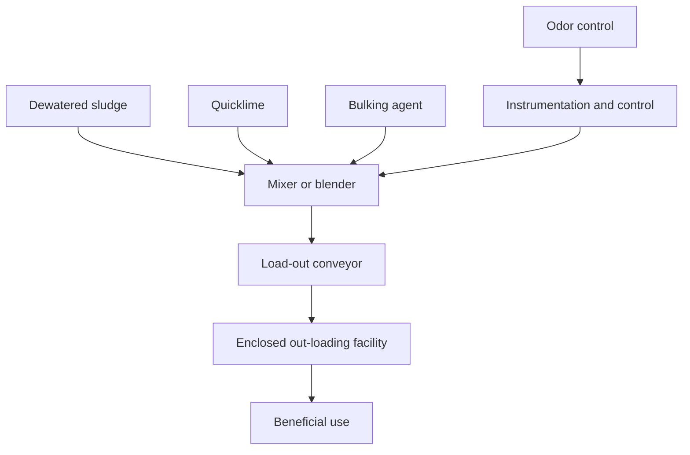
\n---\n

# Figure 23.71 Process schematic of a typical pasteurization system

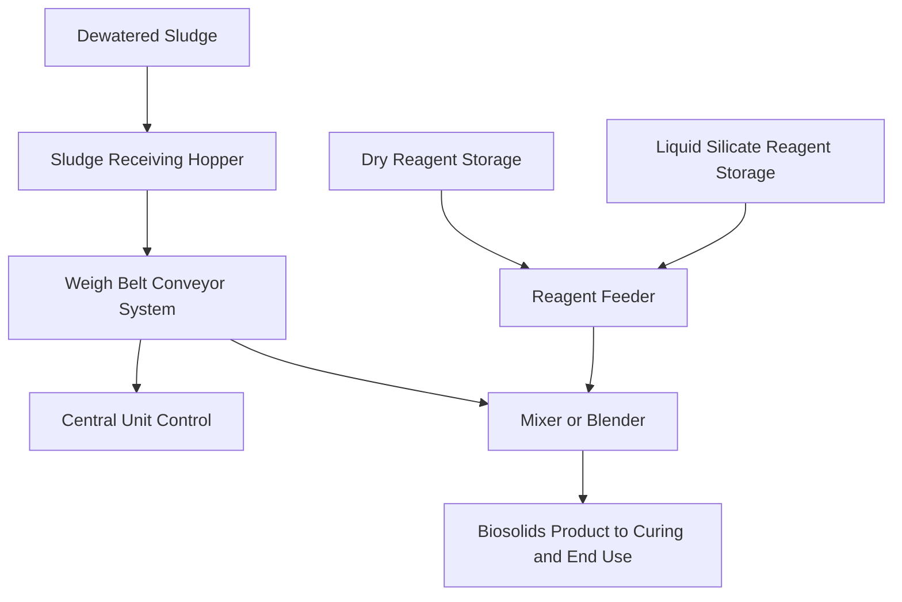

## Figure 23.72 Process schematic of a typical chemical stabilization system

One proprietary process (the N-Viro process) combines advanced alkaline stabilization with accelerated drying (AASAD) (see Figure 23.73). The U.S. EPA has approved two versions of this technology as systems that produce Class A biosolids. Both versions involve adding quicklime, cement-plant kiln dust, lime-plant kiln dust, alkaline fly ash, or other alkaline admixtures and further processing the solids to stress pathogens via pH, temperature, ammonia, salts, and dryness (Burnham et al., 1992). In one version, chemical addition is followed by raising the material's temperature to between 52°C and 62°C for at least 12 hours so the heat generated by the chemical reaction can further reduce pathogens. The second version uses chemical addition to raise the solids' pH above 12 and then mechanically dries the material in windrows or a rotary-drum dryer to produce biosolids containing 50% to 60% solids. The biosolids predominantly are used as an agricultural liming agent, a soil conditioner, a landfill cover, or a component of blended topsoil.
\n---\n

## 5.1.4 Process Variations

<figure>

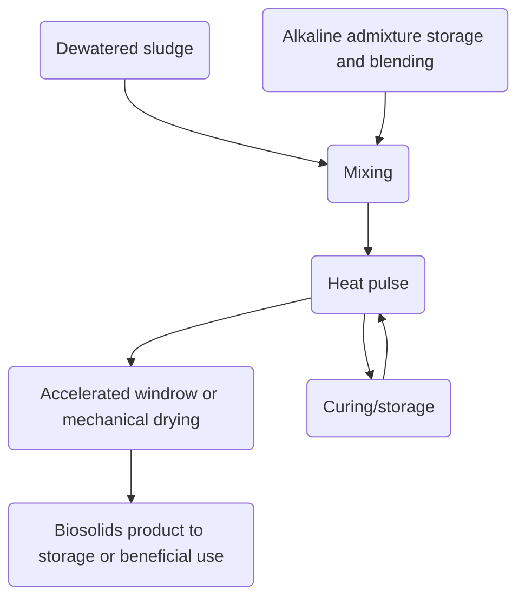

FIGURE 23.73 Process schematic of a typical alkaline stabilization system with a subsequent drying process.
</figure>

A second proprietary process (RDP envessel pasteurization) uses electrically generated heat to supplement the heat generated by quicklime, which purportedly reduces lime consumption. An electrically heated screw auger transfers the solids-lime mix to an enclosed reactor, where the material is held for 30 minutes at 70°C to achieve pasteurization.

A third proprietary process (Bioset) uses sulfamic acid to supplement the heat produced by quicklime. (Both lime and water, and lime and sulfamic acid, react exothermically.) The process occurs in a pressurized vessel to achieve pasteurization conditions. Bioset has been recommended by the U.S. EPA Pathogen Equivalency Committee for certification of its process as a Class A biosolids technology under the “process to further reduce pathogens (PFRP)” alternative in 40 CFR 503.

## 5.1.4 Process Variations

Several alternative approaches or modifications to the basic alkaline-stabilization process have been developed. Some evolved from other treatment processes. For example, lime-treated primary solids have been combined with raw secondary solids to remove phosphorus (Paulsrud and Eikum, 1975). Existing digesters (or other available tanks) have been used to thickened alkaline-stabilized biosolids before dewatering and disposal (Farrell et al., 1974).

\n---\n

Another alternative uses two mixing vessels: the pH is raised above 12 in one, and the other provides adequate contact time and excess lime addition to keep pH within the desired range (Counts and Shuckrow, 1975).

Waukegan, Illinois, mixes fly ash and dewatered cake at ratios between 2.0:1 and 2.5:1 to produce Class B alkaline-stabilized biosolids. Personnel used this structurally stable material to "build" a biosolids-only monofill, rather than buying and importing fill material (Byers and Jensen, 1990).

## 5.2 Advantages and Disadvantages

Both liquid and drylime stabilization processes are reliable, compact, relatively inexpensive to install, and easier to operate than many other stabilization processes.
Many wastewater utilities that use lime stabilization have indicated that the process greatly reduces odors if the mixing is thorough (Kampelmacher and van Noorle Jansen, 1972; Westphal and Christensen, 1983). However, odor experiences with lime stabilization have been mixed and are typically the result of variations in operating procedures. This process' pathogen reduction has been reported to be as effective as or better than digestion processes (U.S. EPA, 1979).

Nevertheless, there are disadvantages. Compared to digestion, alkaline stabilization does not reduce solids mass. In fact, it increases mass because of the added lime and resulting chemical formations; the amount to be handled is essentially proportional to the chemical dose: The increase in mass may increase transportation costs for biosolids use or disposal, but such costs may be offset by capital and O&M savings (from using alkaline stabilization rather than another process). Also, the weight typically increases more than the volume, which actually may shrink because of lime slaking. Slaking raises the temperature of solids, causing water to evaporate.

Stabilized solids are a source of nitrogen, phosphorus, and beneficial organic matter that can be land-applied on farms. However, alkaline-stabilized biosolids typically contain less soluble nitrogen and phosphorus (on a dry-weight basis) than aerobically or anaerobically digested biosolids. The biosolids also may partially or fully replace liming agents on acid soils because it elevates soil pH and, therefore, restricts facility uptake of metals. However, metal ions only are immobilized as long as the biosolids' pH remains high. Also,
\n---\n

## 5.3 Applicability

Alkaline stabilization has been used in numerous biosolids-management programs (Oerke, 1999). Below are some typical situations in which alkaline stabilization has been used:

* Traditional dry lime stabilization is a cost-effective technology for land-applied or landfilled biosolids. However, because biosolids are not destroyed, it is more cost-effective when hauling distances are short.
* Traditional liquid lime stabilization is appropriate at small WRRFs, where the small volume of biosolids produced can be readily land-applied. It is also practical at small facilities that store biosolids for later transportation to larger facilities for further treatment or disposal:
* Because chemicals are the main O&M expense in this process and because the process has great flexibility, alkaline stabilization may be a cost-effective option for facilities that only operate seasonally or whose solids production are variable.
* Advanced alkaline stabilization may allow municipalities to operate a biosolids distribution and marketing program at a lower capital cost than other technologies (e.g., in-vessel composting or heat drying).
* Because a well-maintained alkaline-stabilization system can be quickly started (or stopped), it can be used to supplement existing solids treatment capacity or substitute for incineration and drying facilities during fuel shortages. It also can treat the total solids production when existing facilities are out of service for cleaning or repair.
* Alkaline-stabilization systems have comparatively low capital costs, so they may be cost-effective for facilities with short service lives.
* Alkaline stabilization typically is used to treat septage, reducing odors before the material is land-applied or discharged to WRRFs. (The U.S. EPA's Standards for the Use or
\n---\n

Disposal of Sewage Solids (1993) require that septage be treated with lime and
 maintained at pH 12 for 30 minutes before land application.)

Alkaline stabilization may be added to processes (e.g;, overloaded digesters) that have
inadequate pathogen reduction. However; strong ammonia odors typically are generated
 when anaerobically digested solids are treated with alkaline materials:

## 5.4 Design Considerations

Because product quality and process design are interdependent;, the importance of
defining both process and product goals cannot be overemphasized. Engineers should
evaluate a number of design criteria before implementing an alkaline-stabilization process
(see Table 23.44). Although they vary from site to site, typical design criteria include:

* Sources and characteristics of feed cake (e.g., quantity, type, quality, and solids content);
* Contact time, pH, and temperature;
* Alkaline chemical types and doses;
* Solids concentration of the feed cake–chemical mixture;
* Energy requirements;
* Storage requirements; and
* Pilot-scale test results.

The desired product is also an important design criterion. For more information on
biosolids use considerations, see Section 7.8.

<table>
<thead>
<tr><th>Item</th><th>Description or Equipment</th><th>Parameter</th><th>Units</th><th>Range of Value</th></tr>
</thead>
<tbody>
<tr><td>Materials</td><td>Sludge</td><td>Solids</td><td>Percent</td><td>20 30 25</td></tr>
<tr><td></td><td></td><td></td><td>lb/cu ft</td><td>45 55 50</td></tr>
</tbody>
</table>

\n---\n

<table>
  <thead>
    <tr>
      <th>Category</th>
      <th>Subcategory</th>
      <th>Value type</th>
      <th>Column 1</th>
      <th>Column 2</th>
      <th>Column 3</th>
    </tr>
  </thead>
  <tbody>
    <tr>
      <td>Alkaline bulking chemical</td>
      <td>Solids</td>
      <td>Percent</td>
      <td>90</td>
      <td>98</td>
      <td>95</td>
    </tr>
<tr>
      <td></td>
      <td>lb/cu ft</td>
      <td></td>
      <td>50</td>
      <td>65</td>
      <td>65</td>
    </tr>
<tr>
      <td>Lime</td>
      <td>Solids</td>
      <td>Percent</td>
      <td>90</td>
      <td>96</td>
      <td>95</td>
    </tr>
<tr>
      <td></td>
      <td>lb/cu ft</td>
      <td></td>
      <td>55</td>
      <td>60</td>
      <td>60</td>
    </tr>
<tr>
      <td>Stabilized product</td>
      <td>Solids</td>
      <td>Percent</td>
      <td>55</td>
      <td>65</td>
      <td>60</td>
    </tr>
<tr>
      <td></td>
      <td>lb/cu ft</td>
      <td></td>
      <td>65</td>
      <td>75</td>
      <td>75</td>
    </tr>
<tr>
      <td>Curing</td>
      <td>Technology</td>
      <td>Windrow</td>
      <td></td>
      <td></td>
      <td></td>
    </tr>
<tr>
      <td>Detention time</td>
      <td>Average</td>
      <td>Days</td>
      <td>3</td>
      <td>7</td>
      <td>6</td>
    </tr>
<tr>
      <td></td>
      <td>Days</td>
      <td></td>
      <td>3</td>
      <td>7</td>
      <td>4</td>
    </tr>
<tr>
      <td>Temperatures</td>
      <td>°C</td>
      <td></td>
      <td>—</td>
      <td>—</td>
      <td>52 to 12 hr</td>
    </tr>
<tr>
      <td>Pile dimensions</td>
      <td>Bottom width</td>
      <td>ft</td>
      <td>6</td>
      <td>14</td>
      <td>10</td>
    </tr>
<tr>
      <td></td>
      <td> </td>
      <td>ftb</td>
      <td>2</td>
      <td>3</td>
      <td>3</td>
    </tr>
<tr>
      <td></td>
      <td> </td>
      <td>ftb</td>
      <td>4</td>
      <td>8</td>
      <td>6</td>
    </tr>
<tr>
      <td></td>
      <td> </td>
      <td>sq ft/ftc</td>
      <td>10</td>
      <td>33</td>
      <td>24</td>
    </tr>
<tr>
      <td></td>
      <td> </td>
      <td>ftb</td>
      <td>—</td>
      <td>—</td>
      <td>5</td>
    </tr>
<tr>
      <td>Pile turning</td>
      <td>lb/ddd</td>
      <td>(typical)</td>
      <td>—</td>
      <td>—</td>
      <td>1 (typical)</td>
    </tr>
<tr>
      <td>Odor control</td>
      <td>Building air</td>
      <td>Number of stages</td>
      <td>Number</td>
      <td>1</td>
      <td>3</td>
    </tr>
<tr>
      <td></td>
      <td></td>
      <td>Number/hr</td>
      <td>6</td>
      <td>15</td>
      <td>12</td>
    </tr>
  </tbody>
</table>

\n---\n

## TABLE 23.44 Typical Advanced Alkaline Stabilization Design Criteria (Fergen, 1991)

- Storage
  - Sludge: Days of storage — 0, 1, 1
  - Chemicals: Days of storage — 5, 30, 5
  - Product: Days of storage — 80, 180, 60

- Conversions (typical units)
  - Density: $$\text{lb/ft}^3 \times 16.02 = \text{kg/m}^3$$
  - Length: $$\text{ft} \times 0.3048 = \text{m}$$
  - Area/Length: $$\text{ft}^2/\text{ft} \times 0.3048 = \text{m}^2/\text{m}$$
  - Mass flow: $$\text{lb/d} \times 0.4536 = \text{kg/d}$$

TABLE 23.44 Typical Advanced Alkaline Stabilization Design Criteria (Fergen, 1991)

### 5.4.1 Feed Characteristics

The amount, sources, and composition of the feed cake determine the overall size of the alkaline-stabilization system. Variable thickening or dewatering performance is an important consideration because poor performance significantly increases the size of the stabilization system. The dewatered cake’s solids concentration affects both chemical dose and system size. Equipment capacities must be able to accommodate the volume of feed cake to be processed. The system will need larger equipment and more alkaline chemical to process a “wet” cake (10% to 15% solids) than a drier one (20% to 25% solids).

The feed cake’s nutrient content affects the biosolids characteristics. The agronomic benefit of an alkaline-stabilized biosolids depends on the amount of nutrients it contains and the need for a liming agent at the application site. Alkaline stabilization may be advantageous for untreated solids with relatively high metal concentrations because alkaline additives dilute metals (on a dry-weight basis) and immobilize some trace metals.

\n---\n

## 5.4.1 Odor and Solids Characteristics

The type of solids also should be considered. For example, anaerobically digested biosolids contain five to eight times more ammonia-nitrogen than other solids. All of this ammonia-nitrogen would volatilize at the elevated pH required for alkaline stabilization, increasing the potential for odors. Anaerobically digested biosolids treated in alkaline-stabilization systems also may release odors related to other nitrogen compounds (e.g., amines). Alkaline-unstable polymers also can contribute to the formation of odorous methyl amines. As with all solids-processing systems, odor-control facilities typically are required at alkaline-stabilization systems near residences or sensitive commercial areas.

## 5.4.2 Contact Time, pH, and Temperature

Contact time and pH are directly related because the pH must be maintained at the required level for enough time to destroy pathogens. The treatment chemical must have enough residual alkalinity to maintain a high pH in the biosolids until they are used or disposed. The high pH prevents odorants and pathogenic organisms from growing or reactivating:

A drop in pH (pH decay) occurs when biosolids absorb atmospheric carbon dioxide or acid rain (which forms a weak acid when dissolved in water), which gradually consumes the residual alkalinity. The pH gradually decreases, eventually dropping below 11.0. Bacterial action then resumes, and the renewed production of organic acids causes the pH to continue decaying (similar to the reactions in anaerobic digestion).

The pH typically drops during stabilization, so it should be raised to and maintained at more than pH 12. Biosolids do not have to be inside a contact vessel as long as the pH can be monitored to ensure that it remains at the desired value for the desired time.

## 5.4.3 Alkaline Chemical Types and Doses

The types and doses of alkaline chemicals are important design criteria. The quality of the chemicals (e.g., lime, cement-plant kiln dust; Portland cement, and lime-plant kiln dust) should be consistent. Different types or sources of additives produce different biosolids textures and granularities. Lime is available from numerous sources, ranging from a high-calcium lime in oyster or clam shells to a relatively low-calcium dolomitic lime. Major considerations when selecting a chemical include economics, availability, desired mixing, and desired product characteristics.
\n---\n

Some alkaline reagents (e.g., cement kiln dust, lime kiln dust, and fly ash) are considered industrial by-products, and design engineers must ensure that this material does not introduce contaminants or additional pollutants that jeopardize biosolids quality. Cement kiln dust from hazardous waste kilns, for example, should be avoided. Also, the characteristics of a by-product can vary from one location to the next, so consistent vendor quality-control procedures are essential: The material from one kiln or furnace will remain fairly consistent, provided that operating conditions do not drastically change. Facility personnel should develop a quality assurance/quality-control program that includes frequent sampling and analysis to ensure that biosolids quality is consistent. Because the quality of alkaline additives may directly affect biosolids quality, adequate monitoring and proper management are important. More importantly, pilot- or bench-scale testing should be performed to determine how variations in alkaline additives will affect product quality and how the process and chemical doses should be adjusted to compensate for such variations.

The two predominant types of lime are quicklime (calcium oxide) and calcium hydroxide. Slaked lime in a liquid slurry (carbide lime) is also available. Carbide lime is a by-product of manufacturing welding-grade acetylene from calcium carbide: Its application principles are the same as those for calcium hydroxide or quicklime in slurry form, so carbide lime is not specifically discussed here.

Design engineers should select the type of lime based on economics and material-handling characteristics (e.g., alkaline-material particle size). Calcium hydroxide costs about 30% more to produce and transport than quicklime, but it requires less equipment on-site because it already has been hydrated (slaked). Calcium hydroxide typically is economical for use at small facilities, but if more than 9000 to 13 000 m3/d (3 to 4 ton/d) is needed, quicklime should be considered.

Quicklime typically requires slaking equipment on-site. Dry lime stabilization (i.e., adding quicklime directly to dewatered cake) does not require that the chemical be slaked first, but additional handling precautions must be addressed because of the exothermic reaction of quicklime and water. Dry lime stabilization also eliminates lime sidestreams and the related abrasion and scaling of piping and mechanical equipment.
\n---\n

# The required doses of specific chemicals

The required doses of specific chemicals will depend on the type of feed solids (e.g.; primary, WAS, trickling filter; or septage), its quality and chemical composition (including organic content), its solids concentration, the desired final product characteristics, and the type and quality of the alkaline material.

Table 23.45 shows the range of liquid lime doses required to maintain pH 12 for 30 minutes (U.S. EPA, 1979). Numerous researchers have confirmed these doses (Ramirez and Malina, 1980).

The chemical dose is affected by the feed cake’s chemical composition, which depends on the type of solids and the treatment process used (e.g., chemical coagulation). Another factor that affects chemical dose is solids concentration (see Figure 23.74) (U.S. EPA, 1975). Table 23.46 shows a wide range of lime doses (from 10% to 60% on a dry-weight basis). As the solids concentration increases, the required dose typically increases. The required dose per unit mass of solids tends to be somewhat higher for dilute feeds (less than 2.0% solids) because more lime is required to raise the pH of water. However, liquid lime requirements are more closely related to the feed cake’s total mass than to its volume when its solids concentration ranges from 0.5% to 4.5% (U.S. EPA, 1979). Thickening solids to reduce the volume may have little or no effect on lime requirements because the mass is not significantly changed:

<table>
<thead>
<tr>
  <th>Type of Sludge</th>
  <th>Average Solids Concentration, %</th>
  <th>Average Lime Dosage, lb Calcium Hydroxide/lb Dry Solids</th>
  <th>Average pH</th>
</tr>
</thead>
<tbody>
<tr>
  <td>Primary sludgec</td>
  <td>4.3</td>
  <td>0.12</td>
  <td>12.7</td>
</tr>
<tr>
  <td>Waste activated sludge</td>
  <td>1.3</td>
  <td>0.30</td>
  <td>12.6</td>
</tr>
<tr>
  <td>Anaerobically digested combined</td>
  <td>5.5</td>
  <td>0.19</td>
  <td>12.4</td>
</tr>
</tbody>
</table>

a Dose required to maintain pH 12 for 30 minutes.

b lb/lb × 1000 = g/kg.

\n---\n

> Includes waste activated sludge.

TABLE 23.45 Lime Dose Required For Liquid Lime Stabilization at Lebanon, Ohio (U.S. EPA, 1979)

The figure below (FIGURE 23.74) shows the dose of liquid lime required to raise the pH in a stabilization system feedstock (primary solids and trickling filter humus) with various solids concentrations (U.S. EPA, 1975).

<figure>

```mermaid
graph TD
A[Ca(OH)2 Dose, mg/L] --> B[pH]
subgraph Solids Concentrations
S1[1.0% Solids]
S2[2.0% Solids]
S3[3.0% Solids]
S4[3.5% Solids]
S5[4.4% Solids]
end
```

</figure>

FIGURE 23.74 Dose of liquid lime required to raise the pH in a stabilization system feedstock (primary solids and trickling filter humus) with various solids concentrations (U.S. EPA, 1975).

<table>
<thead>
<tr><th>Type of Raw Sludge</th><th>Lime Dose, lb Calcium Hydroxide/lb Suspended Solids</th></tr>
</thead>
<tbody>
<tr><td>Primary sludge</td><td>0.10–0.15</td></tr>
<tr><td>Activated sludge</td><td>0.30–0.50</td></tr>
</tbody>
</table>

\n---\n

## TABLE 23.46 Liquid Lime Stabilization Doses Required to Keep pH Above 11.0 for at Least 14 Days (Farrell et al., 1974)

<table>
  <thead>
    <tr><th>Sludge</th><th>Dosage (lb/lb × 1000 = g/kg)</th></tr>
  </thead>
  <tbody>
    <tr><td>Septage</td><td>0.10–0.30</td></tr>
<tr><td>Alum sludgeb</td><td>0.40–0.60</td></tr>
<tr><td>Alum sludgeb plus primary sludgec</td><td>0.25–0.40</td></tr>
<tr><td>Iron sludgeb</td><td>0.35–0.60</td></tr>
  </tbody>
</table>

a lb/lb × 1000 = g/kg.

b Precipitation of primary treated effluent.

c Dry-weight basis.

The caption above corresponds to: Minimum lime doses of 25% to 40% (on a dry-weight basis as calcium hydroxide) typically are required for liquid lime Class B stabilization before vacuum filtration. The curves in Figures 23.75 to 23.77 show the characteristic pH drop that occurs when not-enough liquid lime is added. When the dose is too low, the pH of the feed cake–lime mixture initially may reach 12 but then rapidly decay:

Minimum doses of 13% to 40% (on a dry-weight basis as calcium hydroxide) typically are required for effective dry lime stabilization (see Figure 23.78). Figure 23.79 shows the theoretical dry lime stabilization dose for both Class B and Class A stabilization. The lower line shows maximum pH requirements, and the upper line shows Class A temperature requirements. Figure 23.79 is based on a quicklime dose requirement of 25% (dry-weight basis). Design engineers should note that while the quicklime requirement for Class B stabilization theoretically increases as the solids concentration increases, the quicklime requirement for Class A stabilization decreases as the solids concentration increases, because lime is used to heat the cake to achieve Class A biosolids (a lower solids concentration will mean that more mass of water needs to be heated using quicklime to the required temperature), whereas lime is used to raise pH for Class B (Lue-Hing et al., 1992).
\n---\n

## The following assumptions were used for the Class A temperature requirements in Figure 23.79:
* The feed cake’s temperature was 20°C (68°F).
* All of the quicklime reacted with water in the feed cake to produce heat (1140 kJ/kg [490 Btu/lb] of quicklime).
* Quicklime is 100% calcium oxide (this value typically is 90%).
* The feed solids’ specific heat is 0.25.
* There was no heat loss from the feed to the air or the equipment.
* Such conditions rarely exist in practice, so the amount of quicklime actually needed to meet Class A requirements can be up to 50% more than that indicated in Figure 23.79. To produce a drier, more easily crumbled biosolids, design engineers should increase quicklime dose by as much as twice the value shown in the table.
\n---\n

## Figure 23.75
Example of pH decay following liquid lime stabilization before vacuum filtration (Westphal and Christensen, 1983).

<table>
<thead>
<tr><th>Time</th><th>pH (25–40% Ca(OH)₂, Dry Weight Basis)</th><th>pH (9–16% Ca(OH)₂, Dry Weight Basis)</th></tr>
</thead>
<tbody>
<tr><td>0 hours</td><td>≈12.0</td><td>≈11.0</td></tr>
<tr><td>2 hours</td><td>>12.0</td><td><12.0</td></tr>
<tr><td>24 hours</td><td>≈12.0–12.1</td><td>≈10.0–10.5</td></tr>
<tr><td>7 days</td><td>≈12.0</td><td>≈8.0–8.5</td></tr>
</tbody>
</table>

> Notes:
> - The upper curve represents pH decay for a Ca(OH)₂ dose of 25–40% (dry weight basis).
> - The lower curve represents pH decay for a Ca(OH)₂ dose of 9–16% (dry weight basis).
> - The region labeled “pH > 12 at 2 hours” corresponds to the higher dose and the region labeled “pH < 12 at 2 hours” corresponds to the lower dose.

FIGURE CAPTION (reproduced): Figure 23.75 Example of pH decay following liquid lime stabilization before vacuum filtration (Westphal and Christensen, 1983).

Chemical doses for advanced alkaline-stabilization technologies depend on the process, chemical, and biosolids requirements. Material balances should be used to size alkaline-stabilization facilities and determine initial and final solids characteristics. Table 23.47 shows a typical material balance for an advanced alkaline-stabilization facility, assuming a 65% chemical dose (wet-weight basis). Design engineers should note that a lime dose expressed on a wet-weight basis is four times greater than a dose expressed on a dry-weight basis for a dewatered cake with a 25% solids concentration. For example, a chemical dose of 65% (wet-weight basis) is equal to about 245% on a dry-weight basis.
\n---\n

Design engineers can use the data in Tables 23.44 to 23.47 for preliminary design of liquid and dry lime stabilization facilities; however, the required dose should be determined on a case-by-case basis because of the many factors involved (Farrell et al., 1974). To prevent pH decay and the associated regrowth of organisms, the lime dose may have to be higher than necessary for stabilization (Ramirez and Malina, 1980). The exact dose for any particular feed cake can be estimated via laboratory testing.

<table>
<thead>
<tr><th>Time</th><th>pH (approx)</th></tr>
</thead>
<tbody>
<tr><td>0 hours</td><td>~12.5</td></tr>
<tr><td>2 hours</td><td>~12.0</td></tr>
<tr><td>24 hours</td><td>~11.0</td></tr>
<tr><td>7 days</td><td>~8.0</td></tr>
</tbody>
</table>

<p>Dose information from the figure: 9 to 16% Ca(OH)₂ Dose, Dry Weight Basis</p>

<table>
<thead>
<tr><th>Dose (Ca(OH)₂)</th><th>Basis</th></tr>
</thead>
<tbody>
<tr><td>9 to 16%</td><td>Dry Weight Basis</td></tr>
</tbody>
</table>

FIGURE 23.76 Example of pH decay following liquid lime stabilization (Westphal and Christensen, 1983).
\n---\n

# Lime Dose: 0.28 kg Ca(OH)2/kg SS, Dry Weight Basis

<table>
  <thead>
    <tr>
      <th>Days of Storage</th>
      <th>pH (Dose 0.14)</th>
      <th>pH (Dose 0.056)</th>
      <th>pH (Dose 0.028)</th>
    </tr>
  </thead>
  <tbody>
    <tr><td>0</td><td>≈12.0</td><td>≈12.0</td><td>≈6.8</td></tr>
<tr><td>2</td><td>≈12.0</td><td>≈11.8</td><td>≈6.7</td></tr>
<tr><td>4</td><td>≈12.0</td><td>≈11.4</td><td>≈6.5</td></tr>
<tr><td>6</td><td>≈12.0</td><td>≈11.0</td><td>≈6.4</td></tr>
<tr><td>8</td><td>≈11.9</td><td>≈10.5</td><td>≈6.3</td></tr>
<tr><td>10</td><td>≈11.8</td><td>≈9.8</td><td>≈6.2</td></tr>
<tr><td>12</td><td>≈11.5</td><td>≈8.6</td><td>≈6.1</td></tr>
<tr><td>14</td><td>≈11.2</td><td>≈7.4</td><td>≈6.0</td></tr>
<tr><td>16</td><td>≈10.8</td><td>≈6.8</td><td>≈5.9</td></tr>
<tr><td>18</td><td>≈10.2</td><td>≈6.4</td><td>≈5.8</td></tr>
<tr><td>20</td><td>≈9.6</td><td>≈6.0</td><td>≈5.7</td></tr>
<tr><td>22</td><td>≈9.4</td><td>≈5.7</td><td>≈5.6</td></tr>
<tr><td>24</td><td>≈9.3</td><td>≈5.6</td><td>≈5.5</td></tr>
<tr><td>26</td><td>≈9.0</td><td>≈5.5</td><td>≈5.4</td></tr>
<tr><td>28</td><td>≈8.8</td><td>≈5.4</td><td>≈5.3</td></tr>
  </tbody>
</table>

<p>FIGURE 23.77 Change in pH during storage of raw primary solids that had been stabilized using various liquid lime doses (Farrell et al., 1974).</p>
\n---\n

# FIGURE 23.78

Example of pH decay after dewatered cake (a mixture of raw primary solids and waste activated sludge) was stabilized with dry lime (Westphal and Christensen, 1983).

<p>Ca(OH)₂ Dose, Dry Weight Basis: 13 to 40%</p>

<table>
  <thead>
    <tr><th>Time</th><th>pH</th></tr>
  </thead>
  <tbody>
    <tr><td>0 hours</td><td>approximately 12.0–12.2</td></tr>
<tr><td>2 hours</td><td>approximately 12.1–12.3</td></tr>
<tr><td>24 hours</td><td>approximately 12.2–12.4</td></tr>
<tr><td>7 days</td><td>approximately 12.2–12.4</td></tr>
  </tbody>
</table>

\n---\n

## Figure 23.79 Theoretical dry lime requirements to stabilize cake with various solids concentrations so it meets Class B or Class A standards (PFRP = process to further reduce pathogens and PSRP = process to significantly reduce pathogens) (Lue-Hing et al., 1992).

<table>
<thead>
<tr>
  <th>Sludge Percent Solids</th>
  <th>PSRP (pH 12 for 2 hours) – Lbs. Quicklime (CaO) per Wet Ton</th>
  <th>PFRP Temperature (70°C) – Lbs. Quicklime (CaO) per Wet Ton</th>
</tr>
</thead>
<tbody>
<tr><td>10%</td><td>~50</td><td>~350</td></tr>
<tr><td>12%</td><td>~60</td><td>~345</td></tr>
<tr><td>14%</td><td>~75</td><td>~342</td></tr>
<tr><td>16%</td><td>~90</td><td>~338</td></tr>
<tr><td>18%</td><td>~100</td><td>~335</td></tr>
<tr><td>20%</td><td>~110</td><td>~332</td></tr>
<tr><td>22%</td><td>~125</td><td>~336</td></tr>
<tr><td>24%</td><td>~135</td><td>~333</td></tr>
<tr><td>26%</td><td>~140</td><td>~330</td></tr>
<tr><td>28%</td><td>~145</td><td>~328</td></tr>
<tr><td>30%</td><td>~150</td><td>~326</td></tr>
</tbody>
</table>

<p><em>FIGURE 23.79 Theoretical dry lime requirements to stabilize cake with various solids concentrations so it meets Class B or Class A standards (PFRP = process to further reduce pathogens and PSRP = process to significantly reduce pathogens) (Lue-Hing et al., 1992).</em></p>

<table>
<thead>
<tr>
  <th>Process</th>
  <th>Item</th>
  <th>Solids Balance</th>
  <th>Total Weight (Ton)</th>
  <th>Dry Weight (Ton)</th>
  <th>Bulk Density (lb/cu ft)</th>
  <th>Column 7</th>
  <th>Column 8</th>
</tr>
</thead>
<tbody>
<tr>
  <td>Mixing</td>
  <td>Sludge cake</td>
  <td></td>
  <td>25.0</td>
  <td>6400</td>
  <td>160.0</td>
  <td>40.0</td>
  <td>50.0</td>
</tr>
<tr>
  <td>Mixing</td>
  <td>Sludge cake</td>
  <td></td>
  <td>95.0</td>
  <td>3186</td>
  <td>103.5</td>
  <td>98.4</td>
  <td>65.0</td>
</tr>
<tr>
  <td>Mixing</td>
  <td>Sludge cake</td>
  <td></td>
  <td>52.5</td>
  <td>9586</td>
  <td>263.5</td>
  <td>138.4</td>
  <td>55.0</td>
</tr>
</tbody>
</table>

\n---\n

## 5.4.4 Solids Concentration of Feed-Chemical Mixture

### TABLE 23.47 Typical Materials Balance for Advanced Stabilization Facilities (Fergen, 1991)a

<table>
  <thead>
    <tr>
      <th>Windrow</th>
      <th>Initial mix</th>
      <th>52.5</th>
      <th>9586</th>
      <th>263.5</th>
      <th>138.4</th>
      <th>55.0</th>
    </tr>
  </thead>
  <tbody>
    <tr>
      <td></td>
      <td>—</td>
      <td>3437</td>
      <td>32.9</td>
      <td></td>
      <td></td>
      <td></td>
    </tr>
<tr>
      <td>60.0</td>
      <td></td>
      <td>6149</td>
      <td>230.6</td>
      <td>138.4</td>
      <td>75.0</td>
      <td></td>
    </tr>
  </tbody>
</table>

- Chemical dose:

  - Wet-weight basis 65%

  - Dry-weight basis 245%

aForpeak conditions multiply all the values by peaking factor (except densityandpercent solids):

bcu ft × 28.32 = L

clb/cu ft × 16.02 = kg/m3

----

## 5.4.4 Solids Concentration of Feed-Chemical Mixture (continued)

The solids concentration of the feed cake–chemical mixture is an important design consideration for material-handling purposes. Regulations may require a minimum solids concentration (e.g., for landfilling or extended storage). The final product solids concentration (dryness) and granularity also affect the type of biosolids trucks and application/disposal equipment needed:

The solids concentration of the initial feed cake–chemical mixture also affects any supplemental drying step in advanced alkaline-stabilization processes. The alkaline additive causes chemical reactions to occur that increase the mix's apparent solids content: This increase in solids is caused by the addition of solids (treatment chemical), chemical binding, and evaporation of water from the feed cake. The alkaline material—particularly quicklime—produces a fast reaction that increases temperature in a matter of minutes. Thorough mixing of feed cake and alkaline material is important to achieve the

\n---\n

target solids content and pathogen destruction, and to reduce residual odors (e.g., ammonia) in biosolids.

A high chemical dose can produce the desired solids concentration, thereby reducing or eliminating the need for supplemental drying, but this practice may be prohibitively expensive. Adding other bulking materials (e.g., fly ash, wood ash, sawdust, sand, and soil) can increase biosolids dryness and improve handling characteristics without increasing the chemical dose. Mechanical mixing in a windrow operation enhances drying, blends the material, and releases trapped ammonia and other volatile gases created during dewatering, resulting in a more homogeneous product. The final design should reflect the best balance between the chemical dose and the amount of subsequent drying required.

## 5.4.5 Energy Requirements

In liquid lime stabilization processes, energy principally is needed to mix solids with the lime slurry. In dry alkaline stabilization, mixing energy requirements are minimal; they depend on solids throughput, chemical dose, and mixer type.

Energy also may be needed for transport vehicles (e.g., feed cake, chemicals, and biosolids), and air ventilation and scrubbing equipment (for ammonia and odor control).

## 5.4.6 Storage Requirements

The system’s storage facilities should be tailored to the facility’s actual needs. Both intermediate and final storages should be provided.

### 5.4.6.1 Intermediate Storage

Some advanced alkaline-stabilization processes (e.g., N-Viro) require intermediate storage for the heating step to achieve Class A stabilization requirements. The objective of this step is to contain the heat produced during the exothermic reaction, so less chemical is needed. Intermediate storage units can include insulated steel, live-bottom hoppers; concrete bunkers; or an uninsulated stockpile in an open concrete pad:

### 5.4.6.2 Product Storage

Biosolids storage is another important design consideration. Facilities need adequate storage capacity if its biosolids markets are seasonal or have not been established. The
\n---\n

Amount of storage needed depends on both the type of biosolids and the distribution and marketing methods involved. At least 30 to 90 days’ worth of storage should be provided if biosolids curing is required; it also is needed to accommodate road and weather conditions, as well as fluctuations in the biosolids-marketing and -distribution schedule. Facility personnel try to develop markets for biosolids as an agricultural fertilizer, liming agent, or soil amendment. Until such markets have been established, however, the biosolids must be stockpiled or discarded. Also, the demand for agricultural products is seasonal, so the facility must have provisions for stockpiling during low-demand periods.

On the other hand, if the material will be used as landfill cover, storage requirements probably will be minimal (e.g., weekend storage may be needed if the landfill only operates 5 days per week):

The solids concentration and long-term stability of biosolids are important considerations when designing storage facilities. Biosolids storage facilities should be sized to meet each facility’s actual needs, including storage during scheduled and unscheduled equipment maintenance, if maintenance includes downtime. The storage facility should be designed to prevent deterioration of product quality during inclement weather: In many climates, covered storage may be desirable. If uncovered storage is used, provisions should be made for leachate and runoff collection to avoid ponding and, in some instances, treatment. Runoff from stockpiles of alkaline-stabilized biosolids can result in stagnation and septic odors (Engineering–Science, Inc. and Black and Veatch, 1991).

                          5.4.7 Pilot-Scale Testing
Because the quality and the consistency of feed cake are site specific, engineers must perform qualitative and quantitative analyses to determine the appropriate chemical doses and process design parameters Pilot-scale testing should be used to determine optimum chemical doses and mixer performance. It also allows a municipality to evaluate various operating procedures and end-use products:

Engineers should conduct bench- and pilot-scale tests before implementing an alkaline-stabilization process Four primary areas to be evaluated include:
  - Process requirements (e.g:, alkaline material types and doses);
  - Equipment (e.g:, energy requirements);
\n---\n

* Biosolids quality (e.g., desired solids concentration and granularity); and
* Odor generation and control.

Process concerns include the chemical types and doses; solids concentration in feed cake and biosolids; and other process steps (e.g., supplemental heating and drying), as required. Engineers must determine the chemical dose that will meet pH, solids content, heat rise, and biosolids requirements. It can be estimated in bench-scale tests using carefully measured volumes of feed cake mixed with various doses of chemicals. All pilot-scale testing should include generating mass-balance calculations to ensure consistency between chemical doses and solids concentration in biosolids. Where possible, full-scale pilot equipment should be used to assess actual chemical doses and mixing performance.

It is extremely important that testing conditions be controlled to simulate field conditions to the greatest extent possible. During winter, for example, the system may need a different dose or a modified formula of the chemical to achieve the desired biosolids. In large-scale windrow drying operations, carbon dioxide mixed into the product can lower the pH, so the alkaline-material dose may have to be increased to compensate. Samples should be cured in the same type of closed or open containers that will be used in the full-scale system:

Engineers should test the initial solids concentration of the feed-chemical mixture for compatibility with the proposed drying technique. It also may be useful to investigate various chemical doses in different drying/curing configurations. The chemical dose can significantly affect the drying rate and corresponding drying-area requirements.

Engineers also can use pilot-scale tests to evaluate equipment requirements. The goal of such testing is to determine the equipment, energy, and chemical needed to produce biosolids compatible with the next processing step or desired use. For example, an inappropriate paddle configuration or operating speed on a pug mill at a dry lime stabilization system resulted in an undesirable material. Proper mixing is necessary not only to achieve the desired biosolids characteristics but also to ensure that the alkaline additive has been thoroughly blended: Excessive mixing energy can result in a nongranular mass that is difficult to handle.
\n---\n

Other process parameters that should be considered during pilot- or bench-scale testing include odor emissions; concentrations of nutrients, metals, and organic chemicals; and compatibility of the alkaline material dose with the dewatering polymer. Some polymers may deteriorate in high-alkaline conditions, exhibiting strong trimethyl amine ("dead fish") odors (Jacobs and Silver, 1990). Engineers should test various doses of alkaline material with different polymers to determine their effects on biosolids odors and physical characteristics (e.g., compaction and granularity).

The final item evaluated in pilot-scale tests is the product. Pilot- and bench-scale testings provide excellent opportunities to investigate biosolids quality and marketability before beginning full-scale production. It is helpful to invite prospective users to observe pilot-scale tests or implement small-scale demonstration programs to encourage interest in the product. Physical characteristics (e.g., solids content, pH decay, leachability, permeability, or unconfined compressive strength) should be evaluated if the product will be landfilled or to stabilize slopes. Biosolids quality also should be tested to provide the data and documentation required for regulatory approval:

## 5.5 Description of Physical Facilities
### 5.5.1 Solids-Handling and Feed Equipment

Cake-handling equipment chiefly consists of belt and screw conveyors and pumps. Belt conveyors typically are used to move solids horizontally or at gentle slopes. Belt conveyor problems typically include minor spills, slips, and frequent bearing maintenance. Screw conveyors also are used to transfer dewatered cake to the alkaline-stabilization mixer or storage hopper: Screw conveyors and high-pressure cake pumps can physically "condition" dewatered cake, making it difficult (sometimes impossible) to homogeneously mix with a dry alkaline chemical. Some screw conveyors tend to roll the cake-chemical mixture into "balls." Pumps can compact dewatered cake into a long tube that must be broken up during mixing. The rolled balls and compacted cake, which may be desirable or undesirable depending on the final objective, can be especially critical for the resulting biosolids (Oerke and Stone, 1991).

Although alkaline-stabilization processes are relatively simple, a regular inspection and maintenance program is essential: The conveyance system and other moving parts must be closely monitored for wear: If only one conveyor feeds the alkaline-stabilization
\n---\n

process, it must be routinely inspected, maintained, and calibrated because conveyance-system downtime can delay or halt stabilization. If multiple process trains are used, bypasses and crossovers should be provided to avoid excessive downtime. Also, engineers should design the alkaline-stabilization system to be as close as possible to both the dewatering equipment and the storage system.

Design engineers should seriously consider using redundant process and storage trains to allow for routine maintenance and calibration, as well as operational flexibility, without downtime. Another option (although less desirable) is using temporary portable units, which can be placed in operation in a matter of hours or days, if necessary. Storage hoppers or bunkers may be placed between the dewatering and alkaline-stabilization systems to dampen variations in dewatering system output and to allow each process to operate independently:

## 5.5.2 Alkaline Material Storage and Feeding
Alkaline stabilization requires special chemical-storage and -feeding equipment:
Traditionally, an alkaline chemical storage system should be able to meet at least 7 days’ worth of demand (although a 2- to 3-week supply is preferred): Calcium hydroxide can be stored up to 1 year. Quicklime deteriorates more rapidly; it should not be stored longer than 3 to 6 months.

Because some advanced alkaline-stabilization processes have high chemical demand, traditional design criteria can result in an excessively large storage capacity; however, design engineers can consider a smaller capacity (2 to 3 days of chemical use) so long as chemical-delivery arrangements are reliable. The costs associated with daily chemical delivery should be compared to those of extra storage capacity:

Quicklime can be stored in lump or pebble form and ground on-site to reduce the potential for reaction with moisture during storage, especially if the alkaline material will be stored for up to 6 months.

Alkaline material is stored in steel silos with hoppers that have a side slope of at least 60°.

Bulk-storage silos and day chemical bins, if used, should be equipped with dust collectors and live-bottom bins, hopper agitation, or air pads to facilitate unloading and reduce clogging or bridging.
\n---\n

There are potential problems with any chemical, however: During storage, lime can react with carbon dioxide in the air to form a calcium carbonate coating on lime particles, making them less reactive. Quicklime and other alkaline materials readily react with moisture from the air (slake), leading to caking that can interfere with feeding and slaking. Therefore, lime should be stored in dry facilities and protected against moisture to prevent accidental slaking. Also, because slaking generates heat, quicklime should not be stored near combustible materials.

Dry alkaline materials can be conveyed mechanically via a screw conveyor if the distance from the bulk-storage silo to the chemical-addition point is short. Dry alkaline materials also can be pneumatically conveyed under either pressure or vacuum. Each type has its benefits. Vacuum systems have fewer dust problems because any leaks are into the system, not out of it. Pressure systems can move more material. Pneumatically conveyed air should be predried to reduce hydration and other moisture-related problems. Pneumatic conveyance systems may have problems maintaining homogeneous chemical bulk densities, however; if a variety of alkaline materials is used (Rubin, 1991).

A wide variety of chemical feed equipment (e.g;, volumetric screw feeders, rotary airlock feeders, and gravimetric feeders) is available: A volumetric feeder delivers a constant volume of alkaline material, regardless of its density. A gravimetric feeder delivers a constant mass of alkaline material and provides more accurate control. However; it costs about twice as much as the volumetric type. Design engineers should evaluate feeders to determine which is appropriate for a given application (Rubin, 1991). The feed equipment should be isolated from the storage silo via a slide gate or similar device so the metering equipment can be removed easily if it becomes jammed:

Most chemical feed systems have dust problems. Poorly fitting slide gates and leaking feeders are obvious sources of dust. Also, the vertical drop between the feeding equipment and the process mixers should be reduced or enclosed to reduce dust problems.

Moisture can be generated during mixing that may rise into the chemical feed and storage equipment: For example, lime backups in pipes primarily are caused by moisture generated during the mixing process in the pug mill. Powdery lime is hygroscopic and
\n---\n

# 5.5.3 Liquid Lime Chemical Handling and Mixing Requirements

tends to pack in the corners of the storage hopper. Venting the mixer away from chemical feed and storage equipment can reduce such problems:

Lime typically is fed to liquid solids in slurry ("milk of lime") form. Dry lime cannot be added to liquid solids effectively because caking will occur.

After being mixed into a slurry, both calcium hydroxide and slaked quicklime are chemically the same, and the same feeding processes can be used for both. Lime slurry can be prepared via either the batch or the continuous method. The batch method consists of dumping bagged lime into a mixing tank. The contents of slurry tanks are agitated by compressed air, water jets, or mechanical mixers. To ensure initial wetting and dispersion, a mechanical mixer needs about 200 kW/m3 to handle a calcium hydroxide slurry at a concentration of 120 kg/m3 (Beals, 1976).

The slurry then is metered into the mixing tank. This may be the most troublesome step in the process. The slurry can react with bicarbonate alkalinity in the makeup water and with atmospheric carbon dioxide to form calcium carbonate scale that can plug lines. The magnitude of this problem increases as transfer distances increase and more bicarbonate or carbon dioxide contacts the slurry. So slurry tanks should be as close to the mixing basin as possible, and design engineers should avoid using cascading weirs or other equipment that causes turbulence.

The basic difference between using quicklime and calcium hydroxide to stabilize dewatered cake is that quicklime requires slaking equipment: Slaking can be done on either a batch or a continuous basis. The batch method is more appropriate for small-scale facilities; however, the use of quicklime typically is less advantageous for such facilities. Slaking consists of mixing quicklime and water to create either a lime paste (water-to-lime ratio of 2:1) or a slurry (water-to-lime ratio of 4:1). The paste should be held for approximately 5 minutes to allow complete hydration in the slaking chamber; the slurry should be held for 30 minutes. The hydration reaction is exothermic (i.e., releases heat). Proper slaking requires heat, but localized boiling and spattering could make conditions hazardous. After slaking, the paste enters a chamber where grit is removed and the paste is diluted to the desired concentration.
\n---\n

The appropriate automation equipment for continuous slaking largely depends on the proportion of lime to water; which in turn depends on the type of lime and mixing equipment used:

A stabilization tank is recommended downstream of the slaker to ensure that all chemical reactions between calcium hydroxide and dissolved solids in the water have been completed. This reduces scaling in downstream portions of the system. Slakers should discharge lime slurry directly to the stabilization tank, if possible, and it should be detained in the tank for at least 15 minutes. Adequate mixing is required to keep particles in suspension and prevent short-circuiting:

If baffles are required to prevent vortex formation, they should be designed to prevent solids from building up in the corners (depending on tank geometry):

Cleaning system should be provided that uses dilute hydrochloric acid to remove calcium carbonate scale from pumps and piping: So the pumps' and pipes' materials of construction must be compatible with both acidic and caustic environments.

To facilitate scale removal, design engineers should use flexible piping or open troughs to convey lime slurry whenever possible: Lime slurry may be abrasive, particularly if low-grade pebble lime is used, so equipment and materials should be selected accordingly:

The mixing tank's primary purpose is to provide adequate mixing and contact time for the dewatered solids and lime slurry: The recommended contact time is about 30 minutes after the pH reaches 12.5. Mixing time is site specific, so engineers should conduct bench- or pilot-scale tests whenever possible.

The tank can be constructed of mild steel. Its size depends on whether mixing will be done on a batch or a continuous basis.

Batch mixing tanks typically are used at smaller facilities. Such tanks should be sized to treat a day's worth of solids in one batch because many small facilities only have one staffed shift: With adequate capacity, these tanks also can thicken the solids via gravity after stabilization. If a tank is used for both stabilization and thickening, then special equipment must be used to withdraw the thickened biosolids.
\n---\n

# Mixing Facilities for Lime Stabilization: Diffused-Air and Mechanical Mixers

In continuous mixing systems, the pH and the volume are held constant, and automated lime-feeding equipment is required. The primary advantage of continuous mixing facilities is that a smaller tank may be used than is required in batch mixing. Because pH is important, tank contents should be closely monitored and maintained at a pH above 12 for at least 2 hours after mixing.

Both systems must provide enough mixing to keep solids in suspension and distribute lime efficiently. The two most common mixing systems are diffused-air and mechanical. Although both have been successful, diffused air is more widely used.

Diffused-air mixers have at least two important advantages over mechanical mixers. The first is more aeration, which in batch operations, helps keep dewatered solids fresh before the lime is added. The second is less potential for debris to foul the equipment (however, "nonclog" mechanical mixers are available).

Diffused-air systems also have several disadvantages. One is that ammonia stripping creates odors and reduces the biosolids' fertilizer value. Ammonia release also can be hazardous, so adequate ventilation must be provided. Another disadvantage is that the mixture absorbs carbon dioxide from air; so more lime is needed (because some of it reacts with the carbon dioxide). Finally, because gases (e.g., ammonia) are stripped, the facilities must be enclosed and the offgas may require treatment.

The design criteria for mixing facilities are similar to those for aerobic digestion systems. If design engineers select a diffused-air mixer, coarse-bubble diffusers should be used: Diffusers typically are mounted along one wall of the tank to induce a spiral-roll mixing pattern. Airflow rates of 0.3 to 0.5 L/min per m³ have successfully been used for mixing (Beals, 1976). Airflow requirements may be higher if mixing thickened feeds.

The design criteria for mechanical mixers are based on bulk fluid velocity and impeller Reynolds number. Table 23.48 lists the various sizes of mechanical mixers required for various volumes. The data are based on both maintaining bulk fluid velocity (i.e., turbine agitator pumping capacity divided by cross-sectional area of mixing tank) at more than 0.13 m/s and an impeller Reynolds number at more than 1000. The mixer sizes listed are adequate for mixing feeds with concentrations of up to 10% dry solids and viscosities up to 1 Pa·s (1000 cP).
\n---\n

When feed solids are conditioned in mixing tanks before thickening or dewatering, engineers must carefully consider the mixing design to prevent floc shear. Typically, lower mechanical mixer speeds and larger turbine diameters are required. Mechanical mixers also should have variable-speed drives to allow for process control.

The American Water Works Association (2013) and the National Lime Association (1988) have published several documents on selecting lime and lime-handling equipment, as well as on designing lime-application systems. These should be consulted for more design information.

## 5.5.4 Dewatered Cake-Chemical Mixing for Dry Alkaline Stabilization

The most critical component of dry alkaline stabilization is mixing (blending) dewatered cake and alkaline material. The goal is to provide intimate contact between cake and chemical, so the pH of the entire mixture is adjusted. Inadequate mixing has led to incomplete stabilization, odors, and dust problems at several dry alkaline stabilization facilities in the United States (Oerke and Stone, 1991).
\n---\n

<table>
  <thead>
    <tr>
      <th>Tank Size</th>
      <th>gal</th>
      <th>Turbine Diameter (m)</th>
      <th>kW</th>
      <th>hp</th>
      <th>Turbine Diameter (m)</th>
      <th>Turbine Diameter (ft)</th>
      <th>Note</th>
      <th>Note</th>
    </tr>
  </thead>
  <tbody>
    <tr>
      <td>19</td>
      <td>5000</td>
      <td>2.9</td>
      <td>9.5</td>
      <td>6</td>
      <td>7.5</td>
      <td>125</td>
      <td>0.8</td>
      <td>2.7</td>
    </tr>
<tr>
      <td></td>
      <td></td>
      <td>3.2</td>
      <td></td>
      <td></td>
      <td></td>
      <td></td>
      <td></td>
      <td></td>
    </tr>
<tr>
      <td></td>
      <td></td>
      <td>3.6</td>
      <td></td>
      <td></td>
      <td></td>
      <td></td>
      <td></td>
      <td></td>
    </tr>
<tr>
      <td>57</td>
      <td>15 500</td>
      <td>4.2</td>
      <td>13.7</td>
      <td>15</td>
      <td>20</td>
      <td>100</td>
      <td>1.1</td>
      <td>3.7</td>
    </tr>
<tr>
      <td></td>
      <td></td>
      <td>4.4</td>
      <td></td>
      <td></td>
      <td></td>
      <td></td>
      <td></td>
      <td></td>
    </tr>
<tr>
      <td></td>
      <td></td>
      <td>5.3</td>
      <td></td>
      <td></td>
      <td></td>
      <td></td>
      <td></td>
      <td></td>
    </tr>
<tr>
      <td></td>
      <td></td>
      <td>5.6</td>
      <td></td>
      <td></td>
      <td></td>
      <td></td>
      <td></td>
      <td></td>
    </tr>
<tr>
      <td>114</td>
      <td>30 000</td>
      <td>5.2</td>
      <td>17.2</td>
      <td>30</td>
      <td>40</td>
      <td>84</td>
      <td>1.5</td>
      <td>4.8</td>
    </tr>
<tr>
      <td></td>
      <td></td>
      <td>5.1</td>
      <td></td>
      <td></td>
      <td></td>
      <td></td>
      <td></td>
      <td></td>
    </tr>
<tr>
      <td></td>
      <td></td>
      <td>5.5</td>
      <td></td>
      <td></td>
      <td></td>
      <td></td>
      <td></td>
      <td></td>
    </tr>
<tr>
      <td></td>
      <td></td>
      <td>6.8</td>
      <td></td>
      <td></td>
      <td></td>
      <td></td>
      <td></td>
      <td></td>
    </tr>
<tr>
      <td>284</td>
      <td>75 000</td>
      <td>7.1</td>
      <td>23.4</td>
      <td>75</td>
      <td>100</td>
      <td>100</td>
      <td>1.6</td>
      <td>5.2</td>
    </tr>
<tr>
      <td></td>
      <td></td>
      <td>6.2</td>
      <td></td>
      <td></td>
      <td></td>
      <td></td>
      <td></td>
      <td></td>
    </tr>
<tr>
      <td></td>
      <td></td>
      <td>6.6</td>
      <td></td>
      <td></td>
      <td></td>
      <td></td>
      <td></td>
      <td></td>
    </tr>
<tr>
      <td></td>
      <td></td>
      <td>7.3</td>
      <td></td>
      <td></td>
      <td></td>
      <td></td>
      <td></td>
      <td></td>
    </tr>
<tr>
      <td>380</td>
      <td>100 000</td>
      <td>7.8</td>
      <td>25.7</td>
      <td>93</td>
      <td>125</td>
      <td>84</td>
      <td>1.8</td>
      <td>6.0</td>
    </tr>
<tr>
      <td></td>
      <td></td>
      <td>6.5</td>
      <td></td>
      <td></td>
      <td></td>
      <td></td>
      <td></td>
      <td></td>
    </tr>
  </tbody>
</table>

\n---\n

<table>
  <thead>
    <tr>
      <th>m3</th>
      <th>gal</th>
      <th>m</th>
      <th>kW</th>
      <th>hp</th>
      <th>m</th>
      <th>ft</th>
      <th>col8</th>
      <th>col9</th>
    </tr>
  </thead>
  <tbody>
    <tr>
      <td>19</td>
      <td>5000</td>
      <td>2.9</td>
      <td>9.5</td>
      <td>6</td>
      <td>7.5</td>
      <td>125</td>
      <td>0.8</td>
      <td>2.7</td>
    </tr>
<tr>
      <td></td><td></td><td></td><td></td><td></td><td></td><td></td><td>3.2</td><td></td>
    </tr>
<tr>
      <td></td><td></td><td></td><td></td><td></td><td></td><td></td><td>3.6</td><td></td>
    </tr>
<tr>
      <td>57</td>
      <td>15 500</td>
      <td>4.2</td>
      <td>13.7</td>
      <td>15</td>
      <td>20</td>
      <td>100</td>
      <td>1.1</td>
      <td>3.7</td>
    </tr>
<tr>
      <td></td><td></td><td></td><td></td><td></td><td></td><td></td><td>4.4</td><td></td>
    </tr>
<tr>
      <td></td><td></td><td></td><td></td><td></td><td></td><td></td><td>5.3</td><td></td>
    </tr>
<tr>
      <td></td><td></td><td></td><td></td><td></td><td></td><td></td><td>5.6</td><td></td>
    </tr>
<tr>
      <td>114</td>
      <td>30 000</td>
      <td>5.2</td>
      <td>17.2</td>
      <td>30</td>
      <td>40</td>
      <td>84</td>
      <td>1.5</td>
      <td>4.8</td>
    </tr>
<tr>
      <td></td><td></td><td></td><td></td><td></td><td></td><td></td><td>5.1</td><td></td>
    </tr>
<tr>
      <td></td><td></td><td></td><td></td><td></td><td></td><td></td><td>5.5</td><td></td>
    </tr>
<tr>
      <td></td><td></td><td></td><td></td><td></td><td></td><td></td><td>6.8</td><td></td>
    </tr>
<tr>
      <td>284</td>
      <td>75 000</td>
      <td>7.1</td>
      <td>23.4</td>
      <td>75</td>
      <td>100</td>
      <td>100</td>
      <td>1.6</td>
      <td>5.2</td>
    </tr>
<tr>
      <td></td><td></td><td></td><td></td><td></td><td></td><td></td><td>6.2</td><td></td>
    </tr>
<tr>
      <td></td><td></td><td></td><td></td><td></td><td></td><td></td><td>6.6</td><td></td>
    </tr>
<tr>
      <td></td><td></td><td></td><td></td><td></td><td></td><td></td><td>7.3</td><td></td>
    </tr>
<tr>
      <td>380</td>
      <td>100 000</td>
      <td>7.8</td>
      <td>25.7</td>
      <td>93</td>
      <td>125</td>
      <td>84</td>
      <td>1.8</td>
      <td>6.0</td>
    </tr>
<tr>
      <td></td><td></td><td></td><td></td><td></td><td></td><td></td><td>6.5</td><td></td>
    </tr>
<tr>
      <td></td><td></td><td></td><td></td><td></td><td></td><td></td><td>7.8</td><td></td>
    </tr>
  </tbody>
</table>

\n---\n

## Table 23.48 Mechanical Mixer Specification for Liquid Lime Stabilization (Counts and Shuckrow, 1975)

- Bulk fluid velocity >0.13 m/s (26 ft/min).
- Impeller Reynolds > 1000.
- Mix tank configuration:
  - Liquid depth equals tank diameter.
- Baffles with a width of 1/12 the tank diameter placed at 90-deg spacing.

Table 23.48 Mechanical Mixer Specification for Liquid Lime Stabilization (Counts and Shuckrow, 1975)

- Both batch and continuous mixing systems are available. A mechanical mixer (e.g., a pug mill or plow blender) typically is used (see Figures 23.80 and 23.81). Diffused air is not used for mixing lime with cake. Mixers typically are selected based on experience and trial-and-error testing. Many mixer manufacturers have mobile pilot-scale units available, and engineers should use such equipment whenever possible to evaluate and select the most effective mixer.

- Thorough mixing is an art; many variables affect the mixing process and, therefore, the resulting biosolids characteristics. Dewatered cake and chemicals are added together at the 'head' of the mixer, and the proportions are important. The mixing characteristics of a dewatered cake depend on the solids concentration, polymer used to condition solids before dewatering, stabilization chemical and dose, temperature, mixing intensity, SRT, and mixer’s surface area per volume of exposed cake. When selecting a mixer, design engineers also should consider minimum and maximum cake production, hours of operation, and other operating conditions. To adapt to variations in mixing conditions, mixers can be equipped with variable-speed drives, adjustable paddle configurations, wear plates, and other options that adjust mixing intensity and retention time (Christy, 1992).
\n---\n

## FIGURE 23.80 Typical dual-screw pug mill

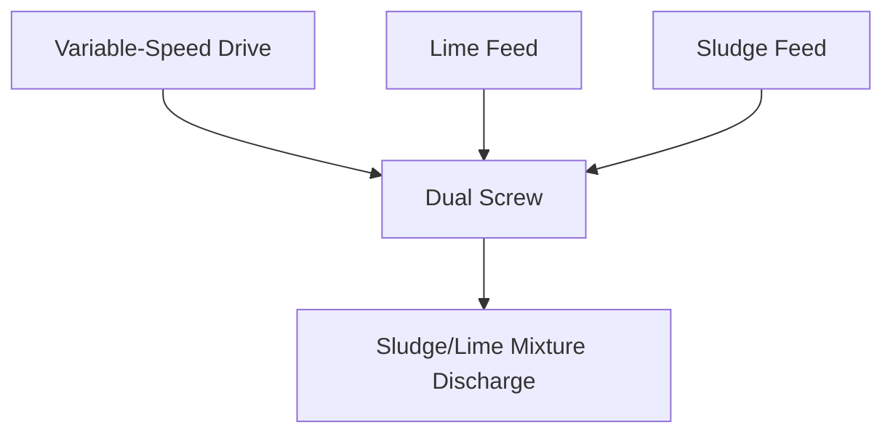

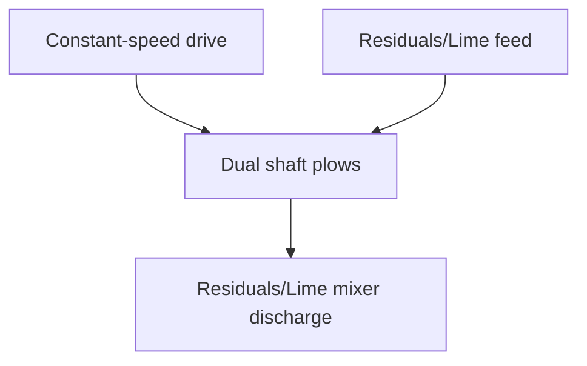

FIGURE 23.80 Typical dual-screw pug mill.
\n---\n

# Figure 23.81 Typical plow blender

The physical characteristics of the resulting biosolids depend on the mixing parameters. Its physical consistency can range from sticky and plastic to granular and dusty. The goal of mixing is to produce a product compatible with the next processing step or intended use. Biosolids characteristics may continue changing up to several days after mixing because of ongoing chemical reactions, temperature, and other parameters.

## 5.5.5 Space Requirements

Depending on site constraints, the type of process used, and the amount of solids to be processed, site preparation for alkaline-stabilization processes typically is minimal. The equipment typically can be arranged to accommodate various site constraints. Because they are relatively simple to operate and do not require extensive, complex equipment, alkaline-stabilization processes can be implemented quickly in a relatively small space. Figure 23.82 shows the layout for a $$3.4 \\times 10^5 \ \mathrm{m^3/d}$$ (100-ton/d) advanced alkaline-stabilization system. Space is needed for solids processing, drying (if necessary), and biosolids storage. Mobile, skid-mounted equipment can be used for backup or in emergencies; it also can be used in demonstration programs to encourage interest in biosolids.

Land requirements depend on the process to be used; solids type, characteristics and volume; and the specific site. Drying/curing area needs are typically 25 to 34 m2/Mg (300 to 400 sq ft/wet ton) of processed cake, but the area needed also depends on the overall amount of material to be dried or cured, and the drying method used. The size of the drying/curing building can be significantly reduced by increasing the alkaline chemical dose or using a mechanical dryer:

Design engineers should consider storing product offsite if not-enough area is available on-site. Landfills typically can provide space to accommodate drying/curing, but the drying and storage areas must be relocated as landfilling progresses. Also, outdoor drying/curing sites at landfills can cause odor complaints. In addition, the drying area must be easily accessible and large enough for trucks to unload biosolids without excessive maneuvering. Land also is required to accommodate additional truck traffic on-site.
\n---\n

If the alkaline-stabilization process is located at a WRRF, the access roads probably already exist. Sufficient access should be provided for regular delivery of alkaline materials. This truck access should not interfere with the traffic associated with the process or with biosolids distribution.

<table>
  <thead>
    <tr><th colspan="4">Layout Diagram</th></tr>
<tr>
      <th>Outdoor Product Storage</th>
      <th>Odor Control</th>
      <th>Processing Area</th>
      <th>Maint. Shop</th>
    </tr>
  </thead>
  <tbody>
    <tr>
      <td>Windrow Curing</td>
      <td></td>
      <td>Sludge Receiving and Chemical Storage</td>
      <td>Parking</td>
    </tr>
<tr>
      <td></td>
      <td></td>
      <td>Office and Admin</td>
      <td></td>
    </tr>
<tr>
      <td>Buffer Area</td>
      <td></td>
      <td>Road</td>
      <td></td>
    </tr>
  </tbody>
</table>

FIGURE 23.82 Layout for a 91-Mg/d (100-ton/d) advanced alkaline stabilization facility (Fergen, 1991).

## 5.5.6 Economic Considerations

Economics is another important factor when selecting a solids-management option. Design engineers should evaluate the costs of an alkaline-stabilization process based on total life-cycle costs via present-worth, equivalent annual cost, or similar approaches. The cost of hauling and land-applying biosolids can be significant and must be included in the cost analysis (Jacobs et al., 1992). In addition, the costs of a privatized option (if the preferred procurement method) should be compared to those of publicly owned and operated options.

Annual O&M costs include labor, chemical costs, fuel, utilities, maintenance costs, and transportation (e.g., chemicals to the facility and biosolids to use or disposal sites). Other annual costs may include public education, public relations, biosolids marketing, soil testing, agronomic testing, and analyses. An owner should exercise caution when
\n---\n

examining annual costs at other facilities because they include a number of site-specific factors (e.g., power, labor, and distance of the chemical supplier from the facility). Moreover, minimum biosolids-production amounts specified in the contract also affect total annual costs. When alkaline-stabilization technologies are operated under private contracts, the negotiated contract must accurately reflect actual biosolids production.

Many site-specific factors (e.g., physical layout, solids type and characteristics, biosolids use, local regulations, local biosolids market, and local climate) influence costs and make economic evaluations and comparisons difficult. Also, at some facilities, existing equipment has been retrofitted for use in alkaline stabilization.

Design engineers should consider the flexibility (adaptability) of alkaline stabilization and the use of existing facilities when evaluating solids-management options. Although not always possible, municipalities can save money if existing equipment is used in the process train

## 5.6 Other Design Considerations
This section highlights and summarizes some of the O&M issues pertaining to alkaline stabilization. In general, most alkaline-stabilization technologies are relatively simple and not equipment intensive; in addition, staff requirements are low compared to those for other stabilization processes. Operating considerations that must be addressed include startup issues, labor requirements, health and safety considerations, feed and product quality monitoring; maintenance, odors, dust, drying, procurement options, and process performance (Oerke, 1991):

### 5.6.1 Startup Issues
Startup issues associated with alkaline stabilization are installation specific. The greatest concerns include equipment performance; process verification; physical, chemical, and biological product quality (to verify regulatory compliance and ensure product acceptance); and, if privatized, contractor performance:

While alkaline-stabilization processes are not as equipment intensive as the other stabilization processes, some equipment problems and operating difficulties may occur during startup. To make the most of the dry chemical dose and produce the desired product, operators may need to vary the mixer-paddle speed and retention times. All process equipment
\n---\n

Startup operations should be tested at rated capacity during the startup period. The project team also should test a significant amount of representative feed and verify that dose measurement is accurate and mixing is homogeneous. If several types of alkaline materials are to be used, each should be tested with the system storage and feeding equipment to verify acceptable operation.

Regulators should be consulted during the design process to verify the parameters to be monitored for process approval. Monitoring results should be submitted to them as soon as possible to initiate the approval process. Permit delays are not uncommon, and appropriate measures should be taken to avoid them if at all possible. Frequent, continued communication with key regulators can facilitate the approval process. Also, the federal permitting authority (U.S. EPA region or delegated state agency) must be appropriately notified before startup.

Startup operations provide an opportunity to vary process parameters and evaluate the effects of these changes on product quality. Although the effect of various chemical doses and drying times should have been evaluated during pilot- or bench-scale testing, pilot-scale test conditions do not always adequately simulate full-scale operations.

An advantage of alkaline stabilization is the ability to start up operations quickly. A mobile, outdoor processing unit can be fully operational in about 10 days or less, depending on the amount of material to be processed.

## 5.6.2 Health and Safety Considerations

Dust generated from alkaline materials probably is the most significant health concern. Alkaline materials are caustic and cause skin burns and irritation and discomfort to moist surfaces (e.g., eyes, lips, and sweating arms); therefore, readily accessible eyewashes and showers should be provided at various locations throughout a WRRF. Operators working in dusty environments or servicing alkaline storage and feeding equipment should be supplied with proper work clothing and safety equipment (e.g., gloves, proper respirators, and eye protection).

Ammonia is another safety concern, especially if anaerobically digested solids are processed, because it is likely that considerable ammonia gas will be released (about 6 to 10 times more likely than from raw solids). Ammonia emissions can be controlled via
\n---\n

## 5.6.3 Process Monitoring and Control

proper ventilation of mixers, storage hoppers, and loading areas. Strong releases of ammonia may be experienced during mechanical aeration or mixing, and during drying. So mixing equipment should be enclosed and vented to odor-control facilities if at all possible. In some areas, it may be necessary to provide operators with respirators, depending on the amount of ammonia released to meet OSHA requirements. Special safety measures may be required for drying areas. The layer of fine, operations-related dust that tends to settle in the drying area can be slippery on concrete or asphalt surfaces. During wet weather, a layer of mud may form outdoors on the drying pad. Mud is slippery and may pose a hazard to pedestrians and vehicle traffic. Special precautions should be taken to improve safety via good housekeeping practices.

5.6.3 Process Monitoring and Control

Feed cake and alkaline materials must be monitored frequently, so operators can adjust the process, as needed, to achieve adequate stabilization and a consistent product: The effects of incomplete stabilization are not readily apparent and may not be seen at a WRRF; therefore, proper process control is important. Operators must be aware that acceptable dewatering characteristics and the absence of odors alone are not good indicators of adequate stabilization.

Monitored characteristics include the total solids concentration, pH, and temperature of both feed cake and biosolids. For Class A (PFRP) products, fecal streptococci also must be monitored at the frequency specified in 40 CFR 503.16 (U.S. EPA, 1993). In addition, metals must be monitored if the product will be used for agricultural purposes. If the product will be landfilled, toxic characteristics leaching procedure (TCLP) tests must be performed. Quality-control data may be required for regulatory approval; the method and the frequency depend on regulatory requirements. In some cases, odor characterization and emissions monitoring also may be required:

Operators can adjust the chemical dose in response to manual measurements of temperature and pH or visual inspections of the feed-chemical mixture. However, some automatic process control can be incorporated if desired. For example, thermocouples can be used to measure the heat pulse in an enclosed vessel. The chemical feed rate can be controlled by pacing it with the incoming-feed flowrate or dewatered cake via a weigh belt or similar means.
\n---\n

## 5.6.3

Using programmable logic controllers to monitor the chemical feed system helps produce a consistent product. A typical system may include an electronic chemical meter linked to feed-cake belt weigh scales; then, chemical feed is automatically controlled based on the weight of feed cake. Special care should be taken to keep the weigh scales frequently calibrated and correctly operating to ensure that the appropriate dose of alkaline materials is added. Solids weighing and volumetric systems should be calibrated every month. An automated system also decreases the number of personnel needed to operate the process:

Sensors—particularly pH electrodes (both laboratory and automatic process-control units)—must be properly cleaned, calibrated, and maintained. Special pH electrodes are necessary for routine measurements of more than pH 10. The pH must be monitored carefully to ensure that it is kept high enough for long enough to meet regulatory requirements. Portable pH pen probes are acceptable for process monitoring. A qualified laboratory should perform microbiological examinations for indicator organisms (e.g., fecal coliforms and fecal streptococci) regularly:

## 5.6.4 Odor Generation and Control

Odors and odor control are important issues when evaluating alkaline stabilization as a solids management option. Inadequate control and treatment of odors can be detrimental to a solids management program. Local conditions (e.g., weather, other sources of odors, and the characteristics of the odor-causing compounds) will influence the selection and design of an odor-treatment system. There are many site-specific factors that should be considered when developing a publicly acceptable odor-control program. A successful odor-control effort includes the following elements:

* Initial site selection;
* Proper process performance;
* Reduced biosolids storage time and volume;
* Identification of odor sources and odor-causing compounds;
* Meteorological modeling at different heights;
* Distance to nearest receptors; and
* Appropriate odor-control technology and equipment.
\n---\n

Ammonia is the odor most typically encountered at alkaline-stabilization facilities. Adding alkaline materials raises the pH, which causes the dissolved ammonia in dewatered cake to volatilize. Although the odors tend to dissipate quickly, the ammonia levels in mixing and drying areas can be high if the gas is not collected and treated. Also, if adequate ventilation is not provided, operators may need to wear respirators. So appropriate odor-control equipment should be provided to ventilate and scrub the air to remove ammonia, thereby reducing odor problems and increasing public acceptance. As pH and temperatures rise, the intensity of ammonia emissions in the processing area may mask other, more prevalent odors that do not readily dissipate (e.g., trimethyl amines). So an odor survey should be performed to identify the sources of odors and characterize the odorants.

In addition to an odor survey, an assessment of meteorological conditions and atmospheric dispersion should be performed. Atmospheric data should be collected on wind speed and direction, temperature, and inversion conditions. This information typically is available from local weather stations and can be used to determine the effect of odor on residents near the alkaline-stabilization facility and the degree of odor control needed to meet community odor standards.

An effective odor-control program involves operational monitoring and may include bench-scale testing (to determine ammonia emissions at various chemical doses) and gas chromatography/mass spectrometry testing. After odors have been characterized, they must be collected and treated. Pilot-scale testing helps check the effectiveness of a proposed treatment option and its chemistry. At many alkaline-stabilization facilities, odor control primarily consists of diluting odors via open-air drying: If drying operations are enclosed, odors can be diluted and dispersed via rooftop ventilation. However, if large quantities of materials are processed in a densely populated area, a combination of dispersion and chemical scrubbing should be seriously investigated. It is important that the odor-control program be responsive to odor complaints. Depending on meteorological conditions and the sources and types of odors, operational or process modifications may be necessary to resolve the problem:

Initially, wastewater treatment professionals thought that alkaline- and advanced alkaline-stabilization facilities did not need odor-control systems. However; numerous odor
\n---\n

## 5.6 Odor-Control
Concerns and complaints have made it clear that odor-control systems should be strongly considered and may be necessary for alkaline-stabilization systems near populated areas. Such systems may consist of enhanced ventilating systems and simple one-stage chemical scrubbers designed to remove ammonia only in the feed–chemical mixing area. They also can be state-of-the-art, three-stage, packed tower–mist scrubber–packed tower systems with air dispersion stacks, designed to treat high volumes of foul air containing particulate, ammonia, amines, dimethyl disulfide, mercaptans, and hydrogen sulfide generated from all areas of the solids treatment train. These sophisticated odor-control systems use sulfuric acid, sodium hypochlorite, and sodium hydroxide to neutralize and oxidize odorants (see Chapter 6 for more information).

### 5.6.5 Dust
Dust is inherent in alkaline-stabilization systems. Alkaline material-handling systems can create significant dust problems, particularly if fine-textured materials (e.g., hydrated lime, cement-plant kiln dust, or lime-plant kiln dust) are used. The alkaline material-handling system should be designed with provisions for reducing dust production. Excessive alkaline dust also affects odor-control scrubber performance (e.g., acid chemical requirements).

### 5.6.6 Sidestream Effects
Alkaline-stabilization processes typically have little effect on WRRF operations. Minimal sidestreams result from site drainage, product stockpile leachate, and runoff if the storage area is not covered: However; a potential sidestream facility load is ammonia recycle if ventilation and odor-control acid scrubbers are installed.

### 5.6.7 Drying
Supplemental drying, if required in the process, also requires special consideration. Drying may make the product easier to handle, and the type of drying system will affect biosolids characteristics. For example, if the material is set out on a pad for solar drying without mechanical turning, it may dry in large clumps that would be incompatible with land application via granular fertilizer spreaders.

The duration of drying or curing depends on environmental conditions, chemical dose, windrow configuration, and initial and final solids concentrations. It also depends on the
\n---\n

time required to achieve the process goal (i.e., for the heat of reaction to occur and for the
pH to rise enough to destroy pathogens). Both drying and curing modify physical
properties to attain the desired solids concentration and biosolids characteristics. The
duration of drying depends on windrow size and weather conditions (if the drying facility is
not enclosed).

## 5.6.8 Process Performance

Properly designed and operated alkaline-stabilization systems reduce odors, odor-production potential, and pathogen levels.

### 5.6.8.1 Odor Reduction

With proper mixing, alkaline-stabilization systems substantially reduce odor: One source
of odors in solids-processing facilities, hydrogen sulfide, essentially is eliminated after the
alkaline chemical is added and the pH rises to 9 or higher, because hydrogen sulfide is
converted to nonvolatile ionized forms (see Figure 23.83). When air mixing systems are
used, ammonia odors initially increase as a result of ammonia stripping. Once these odors
have been emitted and dispersed or treated, odors can be reduced by a factor of 10
(Westphal and Christensen, 1983).

Other odorous gases emitted at high pH and temperature (e.g., trimethyl amine) must be
considered and dispersed or treated.

### 5.6.8.2 Settling and Dewatering Characteristics

Lime stabilization improves solids settling and dewatering characteristics. Lime alone has
been used in the past as a conditioner before dewatering (although lime conditioning and
lime stabilization are different processes). Precipitates associated with excess lime
addition (primarily CaCO3 and unreacted Ca(OH)2) act as bulking agents, increasing
porosity while resisting compression.

Limited reports of lime-stabilized thickening and dewatering processes show mixed
results. One study showed improved thickening (U.S. EPA, 1975). Two studies showed
slightly better to slightly poorer dewatering on sand drying beds, compared to solids that
were not lime stabilized ( Novak et al., 1977; U.S. EPA, 1975).
\n---\n

Design engineers should use caution when designing mechanical dewatering systems for lime-stabilized solids. If the design does not include proper preventive measures, scaling problems (e.g., deposition of CaCO3 and other precipitates) can occur, resulting in higher O&M costs.

FIGURE 23.83 Effect of pH on speciation of hydrogen sulfide.

<table>
  <thead>
    <tr><th>pH</th><th>H2S</th><th>HS-</th><th>S2-</th></tr>
  </thead>
  <tbody>
    <tr><td>2</td><td>100%</td><td>0%</td><td>0%</td></tr>
<tr><td>4</td><td>99%</td><td>1%</td><td>0%</td></tr>
<tr><td>6</td><td>91%</td><td>9%</td><td>0%</td></tr>
<tr><td>7</td><td>50%</td><td>50%</td><td>0%</td></tr>
<tr><td>8</td><td>9%</td><td>91%</td><td>0%</td></tr>
<tr><td>9</td><td>1%</td><td>99%</td><td>0%</td></tr>
<tr><td>10</td><td>0%</td><td>99%</td><td>1%</td></tr>
<tr><td>11</td><td>0%</td><td>91%</td><td>9%</td></tr>
<tr><td>12</td><td>0%</td><td>50%</td><td>50%</td></tr>
<tr><td>13</td><td>0%</td><td>9%</td><td>91%</td></tr>
<tr><td>14</td><td>0%</td><td>1%</td><td>99%</td></tr>
  </tbody>
</table>

FIGURE 23.83 Effect of pH on speciation of hydrogen sulfide.

## 5.6.9 Procurement Options

Private firms offer many advanced alkaline-stabilization technologies involving proprietary processes or specialized equipment. Such technologies also involve royalty fees, quality-control fees, or sole-source equipment. Additionally, some firms may offer turnkey design–
\n---\n

# 5.7 Process Considerations for Designers

## 5.7.1 Dosage Criteria

### 5.7.1.1 Class B Stabilization

Class B stabilization is achieved by adding enough lime (or its equivalent if using alkaline by-products) to raise the pH to 12 for 2 hours and then hold it at 11.5 or higher for another 22 hours. The pH must be measured at a temperature of 25°C or corrected to 25°C.

Figure 23.79 shows the theoretical lime dose rates needed to achieve the design pH criteria. However, design engineers always should conduct bench-scale tests with the lime type and grade to be used during full-scale operations. Dose rates depend on the cake’s solids content; more lime is needed when solids content is low (13% to 18%) or high (>25%). Limed biosolids should be tested to ensure that they meet both the pH criteria for Class B pathogen reduction and the Class B coliform limit.

### 5.7.1.2 Class A Stabilization

Lime stabilization meets Class A pathogen requirements by using the exothermic reaction of CaO and water in the biosolids to generate heat. Alkaline-stabilization processes can meet Class A requirements under Alternative 1 (time and temperature) or Alternative 5 (pasteurization); both are based on the assumption that every particle of biosolids will be exposed to 70°C for 30 minutes. This requirement can be met by treating batches of solids with lime in a closed container. Alkaline-stabilization processes that operate in continuous mode may need the specific approval of the EPA’s Pathogen Equivalency Committee to be accepted as a Class A process.

Several proprietary technologies have been approved by the committee (e.g., N-Viro’s AASAD process) or achieve pasteurization via a combination of lime and other sources of heat (e.g., RDP, Bioset). RDP in-vessel pasteurization uses an electrically heated screw to provide more heat. The Bioset process uses sulfamic acid to generate extra heat via an exothermic reaction in a pressurized reactor. The alkaline doses for these processes are given in Table 23.49 (U.S. EPA, 2007).
\n---\n

# 5.7.1.3 Class B Odor Control

Raising pH into the high alkaline range not only stabilizes solids but also provides short-term odor control. However, the lime doses for Class B only raise pH above 12 temporarily: To control odors days or several weeks, the dose should be above the minimum for Class B stabilization. Although bench-scale testing is the best way to determine the optimum lime dose for odor control, a good general rule is to double the dose required for pathogen reduction. Odors also can be controlled effectively by adequate mixing to ensure that there are no pockets of biosolids not in contact with lime.

## 5.7.2 Lime Type and Gradation

The suitable treatment agents are all lime-based materials. Lime is an alkaline earth material that produces a pH of 12.4 at 25°C when mixed with water. It is found in two forms: calcium oxide (CaO) and calcium hydroxide [Ca(OH)₂]. Calcium oxide (also called quicklime or hot lime) is the result of heating limestone [calcium carbonate (CaCO₃)] enough to drive off carbon dioxide (CO₂). When mixed with water, CaO forms a fine white powder [Ca(OH)₂, also called hydrated lime] and gives off considerable heat (called heat of hydration):

<table>
  <thead>
    <tr>
      <th>Code</th>
      <th>Lime Stabilization Agent</th>
      <th>Dose</th>
      <th>Reagents / By-products</th>
      <th>Final solids</th>
    </tr>
  </thead>
  <tbody>
    <tr><td>B</td><td>Generic</td><td>2-5</td><td>None</td><td>15-30</td></tr>
<tr><td>A</td><td>Generic</td><td>10-20</td><td>None</td><td>23-35</td></tr>
<tr><td>A</td><td>N-Viro</td><td>12-20</td><td>FA, CKD, LKD</td><td>50-65</td></tr>
<tr><td>A</td><td>RDP</td><td>15</td><td>Electrical heat</td><td>23-35</td></tr>
<tr><td>A</td><td>Bioset</td><td>15</td><td>Sulfamic acid</td><td>20-30</td></tr>
  </tbody>
</table>

Final solids based on cake solids of 25–25%. Dose rate in % wet wt.

TABLE 23.49 Mass Balance for Various Alkaline-Stabilization Alternatives

Many industrial processes have by-products that contain usable amounts of lime (e.g., industrial scrubber sludge, fly ash [from incinerators that burn coals containing limestone],
\n---\n

# Lime Grades and Quicklime Definitions

cement-plant kiln dust; lime-plant kiln dust, and dry industrial flue-gas scrubbing by-products): If used to treat solids, however; these alkaline agents must be carefully evaluated and monitored because their concentrations of free (active) lime content and contaminants vary.

Commercial quicklime grades can vary from several inches in diameter to material passing a #100 sieve. The National Lime Association (1988) lists the following five grades:
* Lump lime (50.8 to 203.2 mm [2 to 8 in.] in diameter);
* Pebble lime (the most common form, ranging from 6.35 to 50.8 mm [0.25 to 2 in.] in diameter);
* Granular lime (100% passes through a #8 sieve, and 100% is retained on a #100 sieve);
* Ground lime (100% passes through a #8 sieve, and 40% to 60% passes through a #100 sieve); and
* Pulverized lime (100% passes through a #20 sieve, and 85% to 95% passes through a #100 sieve).

The following quicklime definitions will help in relieving the confusion of so many terms:
* Unslaked quicklime fines (calcium oxide fines) are quicklime particles that typically are less than 9.5 mm (3/8 in.) in diameter and have not been mixed with water.
* Pulverized calcium oxide is quicklime that has been mechanically ground into particles that typically are less than 60 mesh:
  - Granular calcium oxide fines are quicklime that have been ground into particles that are larger than pulverized calcium oxide (i.e: there are no dust-sized particles).
  - Unslaked CaO fines are small quicklime particles that have not been mixed with water.
* Unhydrated calcium oxide is any quicklime that has not been hydrated (slaked):

Lime's reactivity with water is measured by the slaking rate (as defined in AWWA specification B202-93, Sec. 5.4). Small-pore limes need 20 to 30 minutes to fully react with water, forming Ca(OH)2 with a slow heat rise. A moderately reactive lime needs 10 to 20 minutes to react with water, forming Ca(OH)2 and raising the temperature to 40°C in 3 to 6 minutes. A highly reactive lime fully reacts with water within 10 minutes and raises the
\n---\n

## 5.7.3 Mixing Requirements

temperature to 40°C within 3 minutes. Design engineers can use the slaking rate to evaluate the suitability of various industrial by-products:

Solids should be treated with a moderately or highly reactive lime to ensure that the CaO fully converts to Ca(OH)2. For the reaction to generate a high pH that migrates throughout the solids, there must be a continuous film of water throughout the material. Otherwise, the lime may not be fully hydrated or the hydroxide ions may not migrate throughout the solids. This can and does result in improper pH measurements, improper doses, and, therefore, unstabilized solids. If calcium oxide must be pulverized, it should be pulverized at the point of application to prevent air slaking and ensure the desired reactivity:

In a survey of 19 WRRFs in Pennsylvania, the Pennsylvania Department of Environmental Protection examined process variables (e.g., biological treatment and lime dose) and their effects on odor, as determined by an odor panel (U.S. EPA, 2007).

Results showed a wide range in lime dose and in solids content before treatment. Centrifuged solids tended to be more odorous than belt-pressed solids, but there was no clear relationship between other process variables and odor.

The agency selected two of the surveyed WRRFs to study the effect of lime dose and mixing time on pH decay and on odor. Researchers used two parameters to indicate mixing efficiency: total Ca (as measured by EDTA titration) and pH (as measured by a flat-surface pH electrode) (U.S. EPA, 2007). Higher, relatively stable Ca concentrations throughout solids in the mixing vessel indicated that solids and lime were well mixed. The flat-surface pH electrode measured actual pH in the solids-lime mixture more accurately than the traditional slurry method: (In the slurry method, water is added to the solids-lime mixture before pH measurement; this dissolves any unreacted lime, producing a falsely high pH reading.)

In the first study, researchers added CaO to cake at 4.5% and 11.7% (wet weight) and mixed them for 15 and 45 seconds. Results showed that 15 seconds were inadequate; there was much higher variability in Ca and pH at 15 seconds of mixing. Results also showed that a CaO dose of 4.5% would raise pH above 12, but only at the longer mixing time.
\n---\n

The slurry method indicated that pH dropped below 12 after 15 days at the lower CaO dose and shorter mixing time. The flat-surface electrode, however, showed that the lower CaO dose and shorter mixing time never achieved pH 12.

Increasing CaO dose and mixing time decreased odor generation. They also reduced the generation of NH3 and amines, an indicator of biological decomposition. Biological decomposition can result in increased odors.

Odor increased in all limed solids up to 15 days, but decreased thereafter for solids with the higher CaO dose and the longer mixing time. The study also showed that NH3 and amines greatly increased after 15 days in the solids with the lower CaO dose and shorter mixing time.

In the second study, researchers examined the facility-scale effect of optimizing CaO and solids mixing on pH decay and odor generation: To optimize mixing, researchers added CaO to the solids upstream of the mixer to increase contact time. They then compared samples of limed solids from the existing operation with those from the optimized operation:

Results showed that optimizing mixing reduced variations in Ca levels in solids, prevented pH from decaying, and decreased odor; NH3, and amine generation for up to 20 days:

## 5.7.3.1 Measuring Mixing Efficiency
### 5.7.3.1.1 Identifying Issues

The DC Water (formerly DCWASA) Blue Plains Advanced Wastewater Treatment Plant has used lime stabilization to achieve Class B pathogen standards for many years. While fecal coliform results always met the regulatory limit (2 million CFU/g), they were inconsistent: Odors also were inconsistent, according to empirical evidence gathered in the field. Field inspectors said the odors resembled those of rotten eggs or rotting cabbage (methyl mercaptan, dimethyl sulfide, dimethyl disulfide); rancid meat (volatile fatty acids); and fecal matter (indole, skatole). Some odorants were confirmed via a gas chromatograph (Kim et al., 2003). All of these odors are the products of anaerobic microbial activity, indicating less than optimum microbial inactivation: Personnel suspected these inconsistencies in odor and fecal coliform destruction were related, and that poor

\n---\n

mixing might be responsible. So they implemented changes based on a series of studies, and DC Water solids now consistently contain less than 1000 CFU fecal coliforms and emit few odors.

Most facilities using lime stabilization rely on the results of pH tests at 2 and 24 hours to indicate if the material is in compliance with U.S. EPA Class B standards. However, the U.S. EPA assumes that complete, efficient mixing occurs and that a pH >12 after 2 hours and a pH >11.5 after 24 hours indicate a stabilized, low-odor material. The standard pH test (the slurry method) involves adding water to and stirring the sample before measurement, so although the test is a good indicator of whether the sample contains enough lime, it does not indicate whether the sample was well mixed before testing. So pH results may be consistent while the final product has wide swings in quality (fecal coliform levels and odors).

Facilities experiencing odor complaints should determine whether the solids have consistent concentrations of fecal coliforms and odorants. If results indicate that fecal coliform levels are inconsistent or considerably above 1000 CFU, or that odors (measured either by a nose [qualitatively] or by a reduced-sulfur meter or tubes [quantitatively]) are inconsistent or intolerably offensive, then the lime was not thoroughly incorporated into the solids. A set of simple, inexpensive tests can help identify solutions:

- Efficient, adequate mixing is affected by at least five factors: lime gradation, cake dryness, residence time in the mixer; mixer type, and conveyance method before mixing. Once operators have a tool to measure mixing efficiency, they can adjust one or more of these factors to achieve the desired product quality:

## 5.7.3.1.2 Establishing a Benchmark for Good Mixing

If investigators suspect poor mixing, they should start by establishing parameters consistent with sufficient mixing that they can use when comparing results. A simple means of determining mixing efficiency is a calcium test, which requires a 1-g sample. In well-mixed solids, each 1-g sample would contain solids and calcium in the required ratio (i.e., 15% lime on a dry-weight basis). In poorly mixed solids, one sample might contain no calcium, another might contain a high percentage of calcium, and others would bear results in between. A large sample set (e.g., 12 to 15 samples) with a high standard deviation would indicate poor mixing, while one with a low standard deviation would

\n---\n

# Ca Concentrations vs Mixing

indicate well-mixed biosolids. Staff can conduct a bench-scale test in which they mix with solids with lime (as delivered) and determine parameters for well-mixed material. The results then are compared to facility results to grade the performance of full-scale operations.

A bench-scale setup can use a simple bread mixer. Start with unlimed dewatered material, and add lime at the prescribed dose (e.g., 15% on a dry-weight basis). Operate the mixer, stopping and sampling after 10, 20, 30, 40, 60, and 90 seconds. Each time the mixer is stopped, take fifteen 1-g samples for calcium analysis. (Fewer samples may be adequate, but calcium tests are inexpensive and more data will provide clearer results). Mixing probably is inadequate at 10 seconds and probably sufficient at 90 seconds. The sample set with the smallest standard deviation is the facility-specific benchmark for a well-mixed product. It is important to conduct this bench test on cake collected just before it enters the mixers because the dewatering and conveyance methods will affect mixing results. The data in Figure 23.84 were generated during the bench-scale testing phase of DC Water’s research (North et al., 2008a); they show that standard deviation decreased as mixing time increased.

## Ca Concentrations vs Mixing

<table>
<thead>
<tr><th>Mixing Time (sec.)</th><th>% Lime Addition (by dry weight)</th></tr>
</thead>
<tbody>
<tr><td>0</td><td>10</td></tr>
<tr><td>0</td><td>20</td></tr>
<tr><td>0</td><td>30</td></tr>
<tr><td>0</td><td>40</td></tr>
<tr><td>0</td><td>50</td></tr>
<tr><td>0</td><td>60</td></tr>
<tr><td>0</td><td>70</td></tr>
<tr><td>10</td><td>10</td></tr>
<tr><td>10</td><td>20</td></tr>
<tr><td>10</td><td>25</td></tr>
<tr><td>10</td><td>40</td></tr>
<tr><td>10</td><td>50</td></tr>
<tr><td>10</td><td>60</td></tr>
<tr><td>10</td><td>70</td></tr>
<tr><td>20</td><td>10</td></tr>
<tr><td>20</td><td>20</td></tr>
<tr><td>20</td><td>25</td></tr>
<tr><td>20</td><td>30</td></tr>
<tr><td>20</td><td>40</td></tr>
<tr><td>30</td><td>15</td></tr>
<tr><td>30</td><td>20</td></tr>
<tr><td>30</td><td>25</td></tr>
<tr><td>40</td><td>18</td></tr>
<tr><td>40</td><td>22</td></tr>
<tr><td>40</td><td>28</td></tr>
<tr><td>40</td><td>33</td></tr>
<tr><td>50</td><td>12</td></tr>
<tr><td>60</td><td>18</td></tr>
<tr><td>70</td><td>24</td></tr>
<tr><td>80</td><td>22</td></tr>
<tr><td>90</td><td>20</td></tr>
<tr><td>90</td><td>25</td></tr>
</tbody>
</table>

FIGURE 23.84 Results of DCWASA bench-scale mixing test for calcium content.

\n---\n

## 5.7.3.1.3 Measuring Performance of Full-Scale Facility Operations

The next step is to take 15 samples from the full-scale operation, analyze them, and calculate their standard deviation. If this standard deviation is higher than the minimum achieved in the lab, then the mixing system can be improved. If the full-scale and minimum bench-scale standard deviations are identical, then better mixing and product quality are unlikely. DC Water found that when odors were high, the standard deviations of its full-scale sample sets were close to that for the 15- to 20-second samples in bench-scale testing, indicating that the full-scale mixer was far from providing optimum mixing during these periods (North et al., 2008b).

## 5.7.3.1.4 Mixing Energy and Odor Suppression

At the Blue Plains facility, the minimum standard deviation of the sample sets was about 2.6 (which occurred at about 40 seconds of bench-scale mixing). Results are facility specific, but this number gave DC Water operators a tool to measure lime-solids mixing and mixer performance, as well as improve product quality. Figure 23.85 shows the relationship between mixing energy (time, in this case) and reduced sulfur compounds (odors) for the samples in Figure 23.84. Not surprisingly, odors are minimized when good mixing occurs.

Mixing time vs. reduced sulfur for material stored 24 hours

<table>
<thead><tr><th>Mixing time (sec)</th><th>Reduced sulfur ppm</th></tr></thead>
<tbody>
<tr><td>0</td><td>42</td></tr>
<tr><td>10</td><td>34</td></tr>
<tr><td>20</td><td>28</td></tr>
<tr><td>30</td><td>24</td></tr>
<tr><td>40</td><td>20</td></tr>
<tr><td>50</td><td>17</td></tr>
<tr><td>60</td><td>15</td></tr>
<tr><td>70</td><td>16</td></tr>
<tr><td>80</td><td>18</td></tr>
<tr><td>90</td><td>19</td></tr>
<tr><td>100</td><td>18</td></tr>
</tbody>
</table>

\n---\n

# Figure 23.85
Relationship between mixing energy and reduced sulfur compounds in DCWASA bench-scale mixing test.

- The figure caption on the page reads: “FIGURE 23.85 Relationship between mixing energy and reduced sulfur compounds in DCWASA bench-scale mixing test.”

# Figure 23.86
Fecal coliforms (per gram dry)

- The axis label at the top of the plotted chart is “Fecal coliforms (per gram dry).” The horizontal axis shows fecal coliforms per gram dry with tick marks at:
  - 0
  - 5 000
  - 10 000
  - 15 000
  - 20 000
  - 25 000

- The vertical axis (labeled along the left side of the chart) shows “Mixing time (sec)” with tick marks at:
  - 0
  - 20
  - 40
  - 60
  - 80
  - 100
  - 120

- The chart itself contains a number of plotted data points (dots) at various coordinates within this grid, illustrating the relationship between mixing time and fecal coliforms per gram dry.

> Figure 23.86 shows the relations between mixing energy and fecal coliform destruction for the samples in Figure 23.84. Again, fecal coliform forms are minimized when good mixing occurs. Surprisingly, mixing energy (time) and fecal coliform forms are minimized when good mixing occurs; results (CFU per 1000) are consistent with Class A biosolids.

Further text on the page (left margin) describes the figure relationship and notes consistency with Class A biosolids for the measured colony-forming units (CFU, per 1000).

\n---\n

# Mixing energy requirements for different lime grades

<pre>
<div>FIGURE 23.87 Mixing energy required for various grades of lime.</div>
</pre>

## 5.7.3.2 Optimization of Mixing—Examining Five Factors Affecting Mixing

### 5.7.3.2.1 Factor 1: Lime Gradation

To ensure proper mixing, personnel periodically must test lime deliveries via a sieve analysis and compare results to the required lime specifications. If the delivered lime is too coarse, mixing energy may be inadequate. This simple test can help ensure adequate mixing, low odors, and proper stabilization.

Coarser lime requires more mixing energy for adequate incorporation. Figure 23.87 shows results from the DC Water bench tests for mixing solids with different grades of lime. The lime used in both DC Water dewatering trains was subjected to sieve analysis, and results showed that the lime used in the WASA 1 train (operated by DC Water employees) was coarser than that used in the WASA 2 train (lime supplied by and equipment operated by contractor). Both limes were mixed with raw solids from one source, and a third sample was mixed with the coarser lime ground to match the sieve analysis of the WASA 2 lime. The results of the coliform analysis show that the samples with finer lime stabilize much
\n---\n

# 5.7.3.2.2 Factor 2: Cake Dryness

A dewatered cake’s solids content can dramatically affect mixing energy requirements. Drier solids require more energy for adequate lime mixing. Small differences in percent solids (3% to 4%) can double the required mixing energy. Figure 23.88 shows the mixing energy required for proper stabilization of low, medium, and high cake solids. Cakes with higher solids concentrations require much more mixing energy to minimize fecal coliform concentrations. This is an important consideration when assessing mixing problems, because dewatering facilities sometimes can produce inconsistent cake solids. Inconsistencies in odors and fecal destruction might be attributable to inadequate mixing when the cake had high solids concentrations.

<table>
  <thead>
    <tr>
      <th>Time (sec)</th>
      <th>Low solids</th>
      <th>Medium solids</th>
      <th>High solids</th>
    </tr>
  </thead>
  <tbody>
    <tr>
      <td>0</td>
      <td>6.5</td>
      <td>6.0</td>
      <td>6.8</td>
    </tr>
<tr>
      <td>10</td>
      <td>4.0</td>
      <td>5.5</td>
      <td>6.6</td>
    </tr>
<tr>
      <td>20</td>
      <td>1.5</td>
      <td>3.5</td>
      <td>5.0</td>
    </tr>
<tr>
      <td>30</td>
      <td>0.3</td>
      <td>2.0</td>
      <td>4.0</td>
    </tr>
<tr>
      <td>40</td>
      <td>0</td>
      <td>1.0</td>
      <td>3.0</td>
    </tr>
<tr>
      <td>50</td>
      <td>0</td>
      <td>0.5</td>
      <td>2.0</td>
    </tr>
<tr>
      <td>60</td>
      <td>0</td>
      <td>0.2</td>
      <td>1.5</td>
    </tr>
<tr>
      <td>70</td>
      <td>0</td>
      <td>0</td>
      <td>1.0</td>
    </tr>
<tr>
      <td>80</td>
      <td>0</td>
      <td>0</td>
      <td>0.5</td>
    </tr>
  </tbody>
</table>

FIGURE 23.88 Mixing energy required for various solids concentrations.

> Engineers should design lime-mixing facilities to handle the maximum solids content expected in dewatered cake. If hauling costs are not paramount, a WRRF might consider scaling back the dryness of the cake solids slightly to help ensure adequate mixing and
\n---\n

stabilization. If hauling costs are a major portion of the budget, better mixing equipment (or another fix mentioned in this section) might be required.

## 5.7.3.2.3 Factors 3 and 4: Mixer Residence Time and Mixer Type

A system's mixing efficiency can be affected by the type of mixer used and the equipment configuration. A facility that adequately mixes lime with a specific piece of equipment for years may run into problems if dewatering-system upgrades (e.g., high solids centrifuges or changes in polymers) produce cake containing more solids. To ensure that enough mixing energy can be provided, operators need to examine whether existing mixers should be modified or replaced:

- Often, existing mixers can be modified to increase agitation or residence time. For example, plow blenders have removable weirs that are designed to keep the material in place longer. Other blenders come with openings, so chopper blades can be easily installed to enhance mixing. If a unit is not achieving optimum mixing, operators should install all optional equipment designed to enhance mixing and residence time. If the unit still cannot achieve optimum mixing after considering Factors 1, 2, and 3, operators must consider replacing it. Before considering larger mixers, however, staff should examine the conveyance system.

## 5.7.3.2.4 Factor 5: Conveyance Method before Mixing

Figure 23.89 shows a plan of part of the solid conveyance system at the DC Water Blue Plains Advanced Wastewater Treatment Plant. Sample Location 1 is at the discharge of the high-solids centrifuge, Location 2 is on the horizontal screw conveyor, Location 3 is after a vertical screw conveyor, and Location 4 is just before the lime mixer. Location 5 is at the discharge end of the lime mixer, Location 6 is on the horizontal screw conveyors moving material to the storage bunkers, and Location 7 is at the point of discharge to the bunkers. Research results show that using screw conveyors before mixing adds mixing energy (thereby changing the material's rheology), making it more difficult to stabilize. Using screw conveyors after mixing, however, adds more mixing energy and thereby reduces odors and improves product quality.

<table>
<thead>
<tr><th>Location</th><th>Description</th></tr>
</thead>
<tbody>
<tr><td>Sample Location 1</td><td>at the discharge of the high-solids centrifuge</td></tr>
<tr><td>Location 2</td><td>on the horizontal screw conveyor</td></tr>
<tr><td>Location 3</td><td>after a vertical screw conveyor</td></tr>
<tr><td>Location 4</td><td>just before the lime mixer</td></tr>
<tr><td>Location 5</td><td>at the discharge end of the lime mixer</td></tr>
<tr><td>Location 6</td><td>on the horizontal screw conveyors moving material to the storage bunkers</td></tr>
<tr><td>Location 7</td><td>at the point of discharge to the bunkers</td></tr>
</tbody>
</table>

\n---\n

## FIGURE 23.89 Plan view of conveyors and sample locations in the DCWASA lime stabilization system

```mermaid
graph TD
  VS[Vertical shafted screw conveyor]
  HSC[Horizontal shafted screw conveyor]
  S3[Sample location (3)]
  S2[Sample location (2)]
  S1[Sample location (1)]
  S4[Sample location (4)]
  S5[Sample location (5)]
  S6[Sample location (6)]
  S7[Sample location (7)]
  M1[Mixer 1]
  M2[Mixer 2]
  M3[Mixer 3]
  Lime[Lime storage silo]
  T1[Storage tank 1]
  T2[Storage tank 2]
  T3[Storage tank 3]
  T4[Storage tank 4]

  HSC --> S1
  HSC --> S2
  HSC --> S3
  S3 --> M3
  M3 --> Lime
  Lime --> T2
  T2 --> T3
  T3 --> T4
  S4 --> M2
  M2 --> T1
  S5 --> T2
  S6 --> T3
  S7 --> T4
```

FIGURE 23.89 Plan view of conveyors and sample locations in the DCWASA lime stabilization system.

Unmixed material conveyed a longer distance requires more energy for proper stabilization. Staff grabbed unmixed material from four locations before mixing and subjected it to bench-scale mixing tests. Results show materials that have been conveyed longer (Location 4) consistently have more residual coliforms than those conveyed for a shorter distance (Location 2) (see Figure 23.90). This shows that conveyance changes the material’s rheology and affects its ability to mix properly. Visual observations showed that the material changed from a crumbly consistency to a toothpaste consistency between Locations 1 and 4.

When considering equipment changes (if no other intervention has helped), operators should compare the costs of replacing screw conveyors (with belt conveyors, which do not affect a material’s rheology) to the cost of upgrading mixers. Existing mixers might be adequate for material that is not screw conveyed over a long distance.
\n---\n

<table>
  <thead>
    <tr><th>Mixing times (s)</th><th>Location #2</th><th>Location #3</th><th>Location #4</th></tr>
  </thead>
  <tbody>
    <tr><td>Unlimed</td><td>7.7</td><td>7.9</td><td>7.8</td></tr>
<tr><td>20</td><td>6.8</td><td>7.0</td><td>6.9</td></tr>
<tr><td>40</td><td>5.0</td><td>5.5</td><td>4.8</td></tr>
<tr><td>60</td><td>3.9</td><td>3.5</td><td>4.1</td></tr>
<tr><td>80</td><td>3.1</td><td>3.6</td><td>3.2</td></tr>
  </tbody>
</table>

<em>FIGURE 23.90 Effect of conveyance distance on solids stabilization.</em>

<p>After mixing, screw conveyors can add mixing energy and improve product quality. Figure 23.91 shows that, the farther biosolids were conveyed, the less reduced sulfur it generated. These data also show the importance of sampling at the end of conveyor runs, rather than at the discharge end of the lime mixer. Fecal coliform samples from Locations 5 and 7 will bear strikingly different results, again showing that screw conveyors further stabilize biosolids after lime mixing.</p>

\n---\n

# 5.7.4 Class B Lime Stabilization Design Example

To design a system to meet EPA Class B standards (2 000 000 CFU/g fecal coliforms), a facility must adequately mix into raw solids an appropriate amount of lime on a consistent basis to produce a usable, low-odor biosolids product. This requires a design for storage and conveyance of an appropriate amount of lime for the biosolids produced, and a mixing system with adequate mixing energy to match the material (which can vary considerably from facility to facility, depending on dryness, conveyance, and lime gradation). Lime dosing and lime mixing have been addressed in this manual. The following example uses the concepts outlined in earlier sections of this manual.

FIGURE 23.91 Effect of conveyance distance on odors.

<table>
<thead>
<tr><th>Sampling Locations</th><th>RSC (Jerome meter reading, ppm)</th><th>Error (ppm)</th></tr>
</thead>
<tbody>
<tr><td>4</td><td>49</td><td>±2</td></tr>
<tr><td>5</td><td>34</td><td>±9</td></tr>
<tr><td>6</td><td>22</td><td>±3</td></tr>
<tr><td>7</td><td>23</td><td>±5</td></tr>
</tbody>
</table>

----

## 5.7.4.1 Design Example—Part I

Design a solids stabilization system that meets Class B pathogen requirements using quicklime and a lime mixer. The wastewater treatment facility's peak production is 20 dry tonne/d of solids. Solids are dewatered by a belt filter press that can produce a cake containing 18% solids. The facility initially will produce biosolids 24 hours a day, 7 days a week, loading directly into trucks that each hold 21 wet tonne. So it must be staffed round the clock. Suppose that eventually the facility expands its settling capacity and wants to

\n---\n

# 5.7.4.1.1 Design a Lime Mixing System for 24/7 Operations

Using the average daily production of dewatered cake (7 days per week), design engineers first should calculate how much lime and how many mixers are needed:

- 20 tonne/d solids × 15% lime × 1000 lb / tonne = 3000 kg/d lime (23.54)

- 20 dry tonne/d × 18% dry cake solids = 111 wet tonne/d (77 kg/min) (23.55)

- wet tonne × 18% dry cake solids × 15% lime × 1000 lb/tonne = 4200 kg lime per shift (9 kg/min) (23.57)

- 156 wet tonne/8 hr. 60 min × 1000 lb/tonne = 324 kg/min to mixer(s) (23.58)

- 324 kg/min to mixer(s) → 333 kg/min solids and lime to mixers, so four mixers are required to achieve the desired redundancy (23.59)

- + one standby mixer for O&M considerations

Design engineers should consider for sizing mixers with extra capacity to take into account changes in the solids’ rheology characteristics during the project’s design life. In this example, one mixer provides enough capacity for peak conditions, but the standby mixer is available for O&M considerations.

----

# 5.7.4.1.2 Design a Lime Mixing System for 8 hr/d, 5 d/wk Operations

After facility expansion and staff reduction, how much cake is produced during the 8-hour, 5-day-per-week operational shift? How much lime is required? How many mixers are required?

- 111 wet tonne/d × 7/5 × 156 wet tonne/8-hour shift (23.56)

- 156 wet tonne × 18% dry cake solids × 15% lime × 1000 lb/tonne = 4200 kg lime per shift (9 kg/min) (23.57)

- 156 wet tonne/8 hr × 60 min × 1000 lb/ton = 324 kg/min to mixer(s) (23.58)

- 324 kg/min + 9 kg/min = 333 kg/min solids and lime to mixers, so four mixers are required at 83 kg/min per mixer, plus one standby mixer for O&M considerations (23.59)
\n---\n

# 5.7.4.2 Design Example—Part II

Several years into the life of the project, facility personnel decide to convert from belt filter presses to centrifuges, which produce a cake containing 24% solids. Before this conversion, facility operators test the mixers' adequacy using the calcium test method. Results showed that the bench-scale mixer provided a minimum standard deviation of 2.6 after 40 seconds of mixing, beyond which the standard deviation did not further improve. The full-scale mixer also achieved a standard deviation of 2.6 for solids dewatering with a belt filter press, indicating mixing was adequate.

Knowing that as solids content increases, mixing energy requirements also increase (a 3% increase in solids nearly doubles [100% more] the required mixing energy), staff tested the mixers again after the centrifuges were installed. The new results had a standard deviation of 8.4, indicating less-than-optimal mixing.

Personnel needed to determine the answers to the following questions:

* What is the flow to each of the four existing mixers?
* What is the effect of the higher solids on the material's rheology?
* Does a decrease in solids flowrate (because of the centrifuge installation) compensate for an increase in mixing energy requirement?

While the extra capacity originally designed into the mixing system was sufficient to account for changes in rheology in belt-pressed solids, it may not be enough for the drier cake produced by a centrifuge.

Calculations showed that the cake flowrate from a centrifuge is lower than that from a belt filter press:

$$156 \text{ wet tonne} \times 18\% \text{ belt press dry cake solids} / 24\% \text{ centrifuge dry cake solids} / 8 \text{ h} / 60 \text{ min} \times 1000 \text{ kg/tonne} = 244 \text{ kg/min solids} + 9 \text{ kg/min} \quad (23.60)$$

$$= 253 \text{ kg/min to four mixers, or 63 \text{ kg/min per mixer}}$$

The flow to the mixers decreases by 25% (from 83 to 63 kg/min) with about 40% excess capacity (100 kg/min rated capacity), but mixing energy requirements also change:
\n---\n

$$24\% \text{ dry cake solids} \;-\; 18\% \text{ dry cake solids} = 6\% \text{ increase} \quad (\text{or a } 200\% \text{ increase in required mixing energy})$$
(23.61)

Knowing that inadequate mixing can increase odors and fecal coliforms, what can staff do to ensure that the existing mixers provide enough mixing energy to maintain the product quality of past production years?

If the mixers are left untouched, biosolids quality probably will decline (i.e., produce more fecal coliforms and odors) once the centrifuges are installed. Calcium test results confirm this assumption; they show that the standard deviation is not minimized after dewatering improvements.

Facility personnel can install weirs in the mixer to increase detention time. If this does not provide adequate mixing, they also can consider installing another mixer. Finally, personnel may need to consider detuning the new centrifuge to produce cake with lower solids content.

This example shows that changes in upstream rheology should be considered when sizing lime stabilization equipment. In many cases, significant changes in dewatering equipment may require pilot-tests and changes in mixer design to compensate.

## 5.8 Product End-Use Considerations

Wastewater solids contain organic matter and plant nutrients, making them a valuable crop fertilizer and soil conditioner. However, adding alkaline material dilutes some plant nutrients and volatilizes the ammonia-nitrogen content. Also, the alkaline material adsorbs a substantial portion of mineralized organic nitrogen, further reducing the amount of nitrogen available to plants (Logan, 1990). The net result may be a relatively low-grade fertilizer, but a good lime substitute and organic soil amendment.

That said, alkaline materials can be custom blended with solids and other feedstocks (e.g., sand, topsoil, yard waste, and leaves) to produce a specific, marketable product. Some municipalities (e.g., Warren, Ohio) have done this successfully, creating a more publicly acceptable product with a lower pH. Such products may be called artificial soils.

Applications for alkaline-stabilized biosolids include:
\n---\n

* Agriculture (e.g., organic fertilizer, agricultural-lime substitute, or soil amendment);
* Horticulture (e.g., nurseries and sod farms);
* Residential lawns and gardens (e.g., manufactured organic topsoil blends);
* Bulk fill (e.g., slope stabilization and dike construction);
* Nonagricultural land application, land reclamation, or dedicated land disposal; and
* Landfill (e.g., disposal or daily, intermediate, final, and vegetative cover)

Each has particular quality requirements and standards. For example, the application rate of alkaline-stabilized biosolids for agronomic purposes may be limited based on calcium carbonate equivalence or alkalinity content, rather than its low plant-nutrient content. If the material will be used at landfills, most regulators require extensive testing and documentation first.

An advantage of an alkaline-stabilized biosolids compared to other biosolids (e.g., compost) is that it can partially or fully satisfy the liming requirements of many soils. Also, it may contain small amounts of plant nutrients. For example, most cement-plant kiln dust contains significant amounts of potassium and smaller amounts of trace nutrients. Some alkaline-stabilization processes use mineral by-products (e.g., cement-plant kiln dust; lime kiln dust [lime-plant kiln dust], and alkaline fly ash). Nutrient content is biosolids specific and should be carefully monitored. Biosolids also may contain regulated trace elements that should be carefully monitored to avoid exceeding regulatory limits.

For more information on biosolids uses, see Chapter 25.

## 6.0 References

Abu-Orf, M. M.; Griffin, P. P.; Dentel, S. K. (2001) Chemical and Physical Pretreatment of ATAD Biosolids for Dewatering. Water Sci. Technol., 44 (10), 309–314.

Adams, G. M.; et al. (2004) Identifying and Controlling the Municipal Wastewater Odor Environment Phase 2: Impacts of In-Plant Operational Parameters on Biosolids Odor Quality; Report No. 00HHE5T; Water Environment Research Foundation: Alexandria, Virginia.

Agarwal, S.; Abu-Orf, M.; Novak, J. T. (2005) Sequential Polymer Dosing for Effective Dewatering of ATAD Sludges. Water Res., 39, 1301–1310.

\n---\n

# References

- Al-Ghusain, I.; Hamoda, M. F.; El-Ghany, M. A. (2004) Performance Characteristics of Aerobic/Anoxic Sludge Digestion at Elevated Temperatures. *Environ. Technol.*, 25, 501–511.
- American Society of Civil Engineers (1983) A Survey of Anaerobic Digester Operations; American Society of Civil Engineers: New York.
- American Society of Heating, Refrigerating, and Air Conditioning Engineers (2013) *ASHRAE Handbook Fundamentals*, Inch-Pound Edition; American Society of Heating, Refrigeration, and Air-Conditioning Engineers: Atlanta, Georgia.
- American Water Works Association (2013) Quicklime and Hydrated Lime; AWWA B202-13: American Water Works Association: Denver, Colorado.
- Avallone, E.A.; Baumeister, T. (1996) *Marks' Standard Handbook for Mechanical Engineers*, 10th ed.; McGraw-Hill: New York.
- Baier, U.; Zwiefelhofer, H. P. (1991) Effects of Aerobic Thermophilic Pretreatment: Water Environ. Technol. 3, 56–61.
- Barber, N. R.; Dale, C. W. (1978) Increasing Sludge Digester Efficiency: Chem. Eng., 85 (16), 147–149.
- Barker, J. C. (1996) Crystalline (Salt) Formation in Wastewater Recycling Systems; Publication EBAE 082-81; North Carolina Cooperative Extension Service: Raleigh, North Carolina.
- Barnes, C.; Walker, S.; Anderson, W.; Papke, S. (2007) Implementation of a Two-Phase Anaerobic Digestion System. Proceedings of the 21st Annual Water Environment Federation Residuals and Biosolids Conference; Denver, Colorado, April 15–18; Water Environment Federation: Alexandria, Virginia.
- Batstone, D. J.; Keller, J.; Angelidaki, I.; Kalyuzhnyi, S. V.; Pavlostathis, S. G.; Rozzi, A.; Sanders, W. T. M.; Siegrist, H.; Vavilin, V. A. (2002) The IWA Anaerobic Digestion Model No. 1 (ADM1). *Water Sci. Technol.*, 45 (10), 65–73.
- Beall, S. S.; Jenkins, D.; Vidanage, S. A. (1998) A Systematic Analytical Artifact that Significantly Influences Anaerobic Digestion Efficiency Measurement. *Water Environ. Res.*, 70, 1019.
\n---\n

# References

- Beals, J. L. (1976) Mechanics of Handling Lime Slurries. Proceedings of the Int. Water Conference, Pittsburgh, Pennsylvania, October 26–28; Engineers’ Society of Western Pennsylvania.
- Beecher, N.; Kuter, G.; Petroff, B. (2009) Another Reason Not to Landfill: Composting Can Help Reduce Greenhouse Gas Emissions; Water Environ. Technol., 21, 4.
- Benefield, L. D.; Randall, C. W. (1980) Biological Process Design for Wastewater Treatment; Prentice-Hall Inc.: Englewood Cliffs, New Jersey.
- Bird, E. B.; Stewart, W. E.; Lightfoot, E. N. (1960) Transport Phenomena; Wiley & Sons: New York.
- Bitton, G.; Damron, B. L.; Edds, G. T.; Davidson, J. M. (1980) Sludge Health Risks of Land Application; Ann Arbor Science Publishers: Ann Arbor, Michigan.
- Bowker, R. P. G.; Trueblood, R. (2002) Control of ATAD Odors at the Eagle River Water and Sanitation District. Proceedings of the 2002 Water Environment Federation Odors and Toxic Air Emissions Conference; Albuquerque, New Mexico, April 29–30; Water Environment Federation: Alexandria, Virginia.
- Brinkman, D. G.; Voss, D. (1997) Egg-Shaped Digesters: Are They All They’re Cracked Up to Be?; Operational Survey; Black and Veatch: Gaithersburg, Maryland.
- Bryers, J. D. (1984) Structured Modeling of the Anaerobic Digestion of Biomass Particulates. Biotechnol. Bioeng., 27, 638–649.
- Burch, T. R.; Sadowsky, M. J.; LaPara, T. M. (2013) Aerobic Digestion Reduces the Quantity of Antibiotic Resistance Genes in Residual Municipal Wastewater Solids. Front. Microbiol., 12 February 2013.
- Burd, R. S. (1968) A Study of Sludge Handling and Disposal; Publication No. WP-20-4; U.S. Department of the Interior, Federal Water Pollution Control Administration: Washington, D.C.
- Burnham, J. C.; Hatfield, N.; Bennett, G. F.; Logan, T. J. (1992) Use of Kiln Dust with Quicklime for Effective Municipal Sludge Treatment with Pasteurization and Stabilization with the N-Viro Soil Process; Stand. Tech. Publication 1135; American Society for Testing and Materials: Philadelphia, Pennsylvania.
\n---\n

# References

- Buswell, A. M.; Neave, S. L. (1939) Laboratory Studies of Sludge Digestion. III. State Water Surv. Bull., 30. Institute for Natural Resource Sustainability, University of Illinois, Champaign, IL.
- Byers, H. W.; Jensen, B. (1990) Stabilizing Sludge with Fly Ash-Sludge. Paper Presented at Dept. Eng. Professional Development; University of Wisconsin—Madison, Wisconsin.
- Camp, T. R.; Stein, P. C. (1943) Velocity Gradients and Internal Work in Fluid Motion. J. Boston Soc. Civ. Eng., 30, 219-237.
- Chang, Y. (1967) The Fungi of Wheat Straw Compost: Part II—Biochemical and Physiological Studies. Trans. Br. Mycol. Soc., 50, 667.
- Chapman, D. T. (1989) Mixing in Anaerobic Digesters: State of the Art in Encyclopedia of Environmental Control Technology; Vol. 3, Wastewater Treatment Technology; Cheremisinoff, P. N., Ed.; Gulf Publishing Co.: Houston, Texas.
- Chapman, T.; Krugel, S. (2011) Rapid Volume Expansion—An Investigation into Digester Overflows and Safety. Proceedings of the Water Environment Federation Annual Residuals and Biosolids Management Conference, Sacramento, California.
- Chapman, T. and Muller, C. (2010) Impact of Series Digestion on Process Stability and Performance. Proceedings of the 24th Annual Water Environment Federation Residuals and Biosolids Conference; Savannah, Georgia, May 23-26; Water Environment Federation. Alexandria, Virginia.
- Chen, Y. C.; Higgins, M. J.; Murthy, S. N.; Beightol, S. M. (2008) The Link between Odors and Regrowth of Fecal Coliforms after Dewatering. Proceedings of the 22nd Annual Water Environment Federation Residuals and Biosolids Conference; Philadelphia, Pennsylvania, March 30-April 2; Water Environment Federation: Alexandria, Virginia.
- Chen, Y.; Higgins, M. J.; Maas, N. A.; Covert, K. J.; Toffey, W. E. (2006) Production of Odorous Indole, Skatole, p-Cresol, Toluene, Styrene, and Ethylbenzene in Biosolids. J. Residuals Sci. Technol., 3(4), 193-202.
- Chen, Y.; Higgins, M. J.; Maas, N. A.; Murthy, S. N.; Toffey, W. E.; Foster, D. J. (2005) Roles of Methanogens on Volatile Organic Sulfur Compound Production in Anaerobically Digested Wastewater Biosolids. Water Sci. Technol., 52, 67-72.

\n---\n

# References

* Cheunbarn, T.; Pagilla, K. R. (1999). Temperature and SRT Effects on Aerobic Thermophilic Sludge Treatment. J. Environ. Eng., 125(7), 626–629.
* Cheunbarn, T.; Pagilla, K. R. (2000). Aerobic Thermophilic and Anaerobic Mesophilic Treatment of Sludge. J. Environ. Eng., 126(9), 790–795.
* Christensen, G. L. (1982). Dealing with the Never-Ending Sludge Output. Water Eng. Manage., 129, 25.
* Christensen, G. L. (1987). Lime Stabilization of Wastewater Sludge. In Lime for Environmental Uses, Gutschick, K. A., Ed.; American Society for Testing and Materials: Philadelphia, Pennsylvania.
* Christi, Y. (2003). Sonobioreactors: Using Ultrasound for Enhanced Microbial Productivity. Trends Biotechnol., 21(2), 89–93.
* Christy, R. W. (1992). Process and Mechanical Design Considerations for Sludge/Lime Mixing: Proceedings of the 6th Annual Water Environment Federation Residuals Management Conference: Future Directions in Municipal Sludge (Biosolids) Management: Where We Are and Where We’re Going; Portland, Oregon, July 26–30; Water Environment Federation: Alexandria, Virginia.
* Clements, R. P. L. (1982). Sludge Hygienization by Means of Pasteurization Prior to Digestion. Disinfection of Sewage Sludge: Technical, Economic and Microbiological Aspects: Proceedings of a Workshop in Zurich; Zurich, Switzerland, May 11–13; Bruce, A. M.; Havelaar, A. H.; Hermite, P. L., Eds.; D. Riedel Pub. Co.: Dordrecht, Switzerland; 37–52.
* Conklin, A.; Stensel, H. D.; Ferguson, J. (2006). Growth Kinetics and Competition Between Methanosarcina and Methanosaeta in Mesophilic Anaerobic Digestion. Water Environ. Res., 78, 486–496.
* Counts, C. A.; Shuckrow, A. J. (1975). Lime Stabilized Sludge: Its Stability and Effect on Agricultural Land; EPA-670/2-75-012; Battelle Memorial Institute: Richland, Washington.
* D’Antonio, G. (1983). Aerobic Digestion of Thickened Activated Sludge — Reaction Rate Constant Determination and Process Performance. Water Res., 17(11), 1525–1531.
\n---\n

# References

* Dague, R. R. (1968) Application of Digestion Theory to Digester Control. J. Water Pollution Control Fed., 40, 2021.
* Daigger, G. T.; Bailey, E. (2000) Improving Aerobic Digestion by Prethickening, Staged Operation, and Aerobic–Anoxic Operation: Four Full-Scale Demonstrations. Water Environ. Res., 72, 260–270.
* Daigger, G. T.; Ju, L. K.; Stensel, D.; Bailey, E.; Porteous, J. (2001) Can 3% SS Digestion Meet New Challenges? Proceeding of the Aerobic Digestion Workshop, Volume V; Featured Presentation Sponsored by Enviroquip, Inc. (Austin, Texas) at the Water Environment Federation 74th Annual Exposition and Conference, Atlanta, Georgia, Oct. 14–19.
* Daigger, G. T.; Novak, J.; Malina, J.; Stover, E.; Scisson, J.; Bailey, E. (1998) Panel of Experts. Proceedings of the Aerobic Digestion Workshop, Volume II; Sponsored by Enviroquip, Inc.; Orlando, Florida, Oct. 3.
* Daigger, G. T.; Scisson, J.; Stover, E.; Malina, J.; Bailey, E.; Farrell, J. (1999) Fine Tuning the Controlled Aerobic Digestion Process. Proceedings of the Aerobic Digestion Workshop, Volume III; Sponsored by Enviroquip, Inc.; New Orleans, Louisiana, Oct. 10.
* Daigger, G. T.; Stensel, D.; Ju, L. K.; Bailey, E.; Porteous, J. (2000) Experience and Expertise Put to the Test. Proceedings of the Aerobic Digestion Workshop, Volume IV; Sponsored by Enviroquip, Inc.; Anaheim, California, Oct. 15.
* Daigger, G. T.; Yates, R.; Scisson, J.; Grotheer, T.; Hervol, H.; Bailey, E. (1997) The Challenge of Meeting Class B While Digesting Thicker Sludges. Proceedings of the Aerobic Digestion Workshop, Volume I; Sponsored by Enviroquip, Inc.; Chicago, Illinois, Oct. 18.
* DeGarie, C. J.; Crapper, T.; Howe, B. M.; Burke, B. F.; McCarthy, P. J. (2000) Floating Geomembrane Covers for Odour Control and Biogas Collection and Utilization in Municipal Lagoons. Water Sci. Technol., 42, 291–298.
* De la Rubia, M.A.; Riau, V.; Raposo, F.; Borja, R. (2013) Thermophilic Anaerobic Digestion of Sewage Sludge: Focus on the Influence of the Start-up. A Review. Crit. Rev. Biotechnol., 33 (4), 2013.
\n---\n

# References

- De Vrieze, J.; Verstraete, W.; Boon, N. (2013) Repeated Pulse Feeding Induces Functional Stability in Anaerobic Digestion. Microb. Biotechnol., 6 (4), 414–424.
- Dichtl, N. (1997) Thermophilic and Mesophilic (Two Stages) Anaerobic Digestion: Innovative Technologies for Sludge Utilization and Disposal. J. Chartered Inst. Water Environ. Manag., 11, 98–104.
- Drury, D. D.; Lee, S.; Baker, C. (2002) Comparing Pathogen Reduction in Three Different Anaerobic Thermophilic Processes: Proceedings of the 75th Annual Water Environment Federation Technical Exposition and Conference [CD-ROM]; Chicago, Illinois, Sep. 28–Oct. 2; Water Environment Federation: Alexandria, Virginia.
- Engineering–Science, Inc.; Black and Veatch (1991) Technology Evaluation Report: Alkaline Stabilization of Sewage Sludge; Report prepared for U.S. EPA; Contract No. 68-C8-0022; Work Assignment No. 01-08; U.S. Environmental Protection Agency: Washington, D.C.
- Eschborn, R.; Higgins, M. J.; Johnston, T.; Toffey W.; Chen, Y. C. (2006) Philadelphia's Experience Using Static, Non-Aerated Curing to Produce Low Odor Biosolids; Proceedings of the 20th Annual Water Environment Federation Residuals and Biosolids Management Conference, Cincinnati, Ohio, March 12–15; Water Environment Federation: Alexandria, Virginia
- Eschborn, R.; Thompson, D. (2007) The Tagro Story—How the City of Tacoma, Washington, Went Beyond Public Acceptance to Achieve the Biosolids Program Words We’d Like to Hear: Sold Out. Proceedings of the 21st Annual Water Environment Federation/American Water Works Association Joint Residuals and Biosolids Management Conference; Denver, Colorado, April 15–18; Water Environment Federation: Alexandria, Virginia.
- Farrah, S. R.; Bitton, G.; Zan, S. G. (1986) Inactivation of Enteric Pathogens during Aerobic Digestion of Wastewater Sludge; EPA-600/2-86-047; U.S. Environmental Protection Agency, Water Engineering Research Laboratory: Cincinnati, Ohio.
- Farrell, J. B.; Smith, J.; Hathaway, S.; Dean, R. (1974) Lime Stabilization of Primary Sludge. J. Water Pollution Control Fed., 46, 113.
- Fergen, R. E. (1991) Stabilization and Disinfection of Dewatered Municipal Wastewater Sludge with Alkaline Addition. Proceedings of the Sth Annual American Water
\n---\n

# References

- Works Association/Water Pollution Control Federation Joint Residuals
  Management Conference; Durham, North Carolina, Aug. 11–14; Water Pollution
  Control Federation: Alexandria, Virginia.

- Finger, R. E.; Butler, R. C. (1996) The Effect of Sampling Procedures on Digester pH
  Measurement. 69th Annual WEFTEC. Dallas, Texas.

- Franke-Whittle, I.; Waltera, A.; Ebnerb, C.; Insama H. (2014) Investigation into the Effect of
  High Concentrations of Volatile Fatty Acids in Anaerobic Digestion on
  Methanogenic Communities. Waste Manag., 34 (11), Nov., 2080–2089.

- Garber, W. F. (1982) Operating Experience with Thermophilic Anaerobic Digestion. J.
  Water Pollution Control Fed., 54, 1170.

- Gebreeyessus, G. D.; Jenicek, P. (2016) Thermophilic versus Mesophilic Anaerobic
  Digestion of Sewage Sludge: A Comparative Review. Bioengineering, June 18,
  2016 (www.mdpi.com/2306-5354/3/2/15/pdf).

- Gemmell, R.; Deshevy, R.; Elliott, M.; Crawford, G.; Murthy, S. (1999) Full Scale
  Demonstration of Dual Digestion: Thermodynamic and Kinetic Analysis.
  Proceedings of the 72nd Annual Water Environment Federation Technical
  Exposition and Conference [CD-ROM]; New Orleans, Louisiana, Oct. 10–13; Water
  Environment Federation: Alexandria, Virginia.

- Gemmell, R.; Deshevy, R.; Elliott, M.; Crawford, G.; Murthy, S. (2000) Design
  Considerations and Operating Experience for a Full Scale Dual Digestion System
  with Separate Sludge Thickening. Proceedings of the 73rd Annual Water
  Environment Federation Technical Exposition and Conference [CD-ROM];
  Anaheim, California, Oct. 14–18; Water Environment Federation: Alexandria,
  Virginia.

- Ghosh, S.; Conrad, J. R.; Klass, D. L. (1975) Anaerobic Acidogenesis of Wastewater
  Sludge. J. Water Pollution Control Fed., 47, 30.

- Ghosh, S.; Henry, M. P.; Sajjad, A. (1987) Stabilization of Sewage Sludge by Two-Phase
  Anaerobic Digestion; EPA-7600/2-87-040; U.S. Environmental Protection Agency;
  Water Engineering Research Laboratory: Cincinnati, Ohio.

- Ghosh, S.; et al. (1991) Pilot- and Full-Scale Studies on Two-Phase Anaerobic Digestion
  for Improved Sludge Stabilization and Foam Control. Proceedings of the 64th
\n---\n

- Annual Water Pollution Control Federation Technical Exposition and Conference; Toronto, Ontario, Canada, Oct. 7–10; Water Environment Federation: Alexandria, Virginia.

- Ghosh, S.; Buoy, K.; Dressel, L.; Miller, T.; Wilcox, G.; Loos, D. (1995) *Pilot- and Full-Scale Studies on Two-Phase Anaerobic Digestion of Municipal Sludge.* *Water Environ. Res.*, 67, 206.

- Golueke, C. G. (1977) *Biological Reclamation of Solid Waste*; Rodale Press: Emmaus, Pennsylvania.

- Grady, C. P. L., Jr.; Daigger, G. T.; Love, N. G.; Filipe, C. D. M. (2011) *Biological Wastewater Treatment*, 3rd ed.; CRC Press: Boca Raton.

- Gray, D. M.; Suto, P. J.; Chien, M. H. (2008) *Producing Green Energy from Post-Consumer Solid Food Wastes at a Wastewater Treatment Plant Using an Innovative New Process.* *Proceedings of the Water Environment Federation Sustainability Conference*; Washington, D.C.; June 22–25. Water Environment Federation: Alexandria, Virginia.

- Great Lakes Upper Mississippi River Board of State Sanitary Engineering Health Education Services Inc. (2014) *Recommended Standards for Wastewater Facilities*; Great Lakes Upper Mississippi River Board of State Sanitary Engineering Health Education Services Inc.: Albany, New York.

- Green, D. W.; Perry, R. H. (2007) *Perry’s Chemical Engineers’ Handbook*, 8th ed.; McGraw-Hill: New York.

- Griffin, M. E.; McMahon, K. D.; Mackie, R. I.; Raskin, L. (2000) *Methanogenic Population Dynamics during Start-Up of Anaerobic Digesters Treating Municipal Solid Waste and Biosolids.* *Biotechnol. Bioeng.*, 57, 342–355.

- Gujer, W.; Zehnder, A. J. B. (1983) *Conversion Process in Anaerobic Digestion.* *Water Sci. Technol.*, 15, 127–167.

- Haas, O. (1984) *Demonstration of Thermophilic Aerobic-Anaerobic Digestion at Hagerstown, MD*; Grant S-805823-01-0; Final Report; EPA-600/S2-84-142; U.S. Environmental Protection Agency, Municipal Environmental Research Laboratory: Cincinnati, Ohio.
\n---\n

# References

* Han, Y.; Dague, R. (1996) Heat Control: Temperature-Phased Anaerobic Digestion Reduces Foaming and Produces Class A Biosolids Without the Odors. Oper. Forum, 13, 19–23.
* Hartman, R. B.; Smith, D. G.; Bennett, E. R.; Linstedt, K. D. (1979) Sludge Stabilization through Aerobic Digestion. J. Water Pollution Control Fed., 51, 2353.
* Haug, R. T.; LeBrun, T. I.; Tortoriei, L. D. (1983) Thermal Pretreatment ofSludges—A Field Demonstration. J. Water Pollution Control Fed., 55, 23–34.
* Haug, R. T. (1980) Compost Engineering; Ann Arbor Science Publishers: Ann Arbor, Michigan.
* Hepner, S.; Striebig, B.; Regan, R.; Giani, R. (2002) Odor Generation and Control from the Autothermal Thermophilic Aerobic Digestion (ATAD) Process. Proceedings of the 2002 Water Environment Federation Odors and Toxic Air Emissions Conference; Albuquerque, New Mexico, April 29–30; Water Environment Federation: Alexandria, Virginia.
* Higgins, M.; Murthy, S.; Toffey, W.; Striebig, B.; Hepner, S.; Yarosz, D.; Yamani, S. (2002) Factors Affecting Odor Production in Philadelphia Water Department Biosolids. Proceedings of the 2002 Water Environment Federation Odors and Toxic Air Emissions Conference; Albuquerque, New Mexico, April 29–30; Water Environment Federation: Alexandria, Virginia.
* Higgins, M.; Murthy, S.; Chen, Y.; Murthy, S. (2003) Mechanisms for Volatile Sulfur Compound and Odor Production in Digested Biosolids. Proceedings of the 17th Annual Water Environment Federation/American Water Works Association Joint Biosolids and Residuals Conference; Baltimore, Maryland, Feb. 19–22; Water Environment Federation: Alexandria, Virginia.
* Higgins, M. J.; Yarosz, D. P.; Chen, D. P.; Murthy, S. N.; Maas, N.; Cooney, J.; Glindemann, D.; Novak, J. T. (2006a) Cycling of Volatile Organic Sulfur Compounds in Anaerobically Digested Biosolids and Its Implications for Odors. Water Environ. Res., 78, 243–252.
* Higgins, M. J.; Chen, Y. C.; Murthy, S. N.; Hendrickson, D. (2006b) Examination of Reactivation of Fecal Coliforms in Anaerobically Digested Biosolids; Report No. 03-CTS-13T; Water Environment Research Foundation: Alexandria, Virginia.
\n---\n

# References

* Higgins, M. J.; Chen, Y. C.; Murthy, S. N.; Hendrickson, D. (2008b) Evaluation of Bacterial Pathogen and Indicator Densities After Dewatering of Anaerobically Digested Biosolids: Phase II and III; Report No. 04-CTS-3T; Water Environment Research Foundation: Alexandria, Virginia.
* Higgins, M. J.; Murthy, S. N.; Aynur, S.; Beightol, S. (2012) WERF ROSI Project – Do We Need a Revised Time-Temperature Requirement to Achieve Class A Biosolids. Proceedings of the Water Environment Federation, Residuals and Biosolids 2012, pp. 726–733(8).
* Iacoboni, M. D.; Leburn, T. J.; Lingston, J. (1980) Deep Windrow Composting of Dewatered Sewage Sludge. Proceedings of the National Conference of the Municipal and Industrial Sludge Composting Hazardous Materials Control Research Institute; Silver Spring, Maryland; pp. 88–108.
* Jacobs, A.; et al. (1992) Odor Emissions and Control at the World's Largest Chemical Fixation Facility. Proceedings of the 6th Annual Water Environment Federation Residuals Management Conference: Future Directions in Municipal Sludge (Biosolids) Management: Where We are and Where We’re Going, Portland, Oregon; Water Environment Federation: Alexandria, Virginia.
* Jacobs, A.; Silver, M. (1990) Sludge Management at the Middlesex County Utilities Authority. Water Sci. Technol., 22, 93.
* Jenkins, C. J.; Mavinic, D. S. (1989) Anoxic-Aerobic Digestion of Waste Activated Sludge: Part II-Supernatant Characteristics, ORP Monitoring Results and Overall Rating System. Environ. Technol. Lett., 10 (4), 371–384.
* Jewell, W. J.; Kabrick, R. M. (1980). Autoheated Aerobic Thermophilic Digestion with Air Aeration. J. Water Pollution Control Fed., 52, 512.
* Jimenez, E. I.; Garcia, V. P. (1989) Evaluation of City Refuse Compost Maturity: A Review. Biol. Wastes, 27, 115.
* Jones, R.; Parker, W.; Khan, Z.; Murthy, S.; Rupke, M. (2008a) Characterization of Sludges for Predicting Anaerobic Digester Performance. Water Sci. Technol., 57, 721–726.
* Jones, R.; Parker, W.; Zhu, H.; Houweling, D.; Murthy, S. (2008b) Predicting the Degradability of Waste Activated Sludge. Proceedings of the 81st Annual Water
\n---\n

# Environment Federation Technical Exhibition and Conference [CD-ROM]; Chicago, Illinois, Oct. 18–22; Water Environment Federation: Alexandria, Virginia.

- Kabouris, J.; et al. (2013) Positive Business Case for Codigestion and Resource Recovery Facilities in Australia without Pre-Existing Anaerobic Digesters. Proceedings of the 86th Annual Water Environment Federation Technical Conference and Exhibition, Chicago, Illinois, Oct. 5–9.
- Kabouris, J.; et al. (2015) Anaerobic Digestion with Recuperative Thickening Minimizes Biosolids Quantities and Odors in Sydney, Australia. Proceedings of the Water Environment Federation Annual Residuals and Biosolids Conference; Water Environment Federation: Alexandria, Virginia.
- Kampelmacher, E. H.; van Noorle Jansen, L. M. (1972) Reduction of Bacteria in Sludge Treatment. J. Water Pollution Control Fed., 44, 309.
- Kayhanian, M.; Tchobanoglous, G. (1992) Computation and Importance of Carbon to Nitrogen (C/N) Ratios for Various Organic Fractions of Municipal Solid Waste. BioCycle, 33, 58–60.
- Keller, U. (1980) Klarschlammpasteurisierung in der Abwasserreinigungsanlage Altenrhein. Wasser, Energie, Luft. 72 Jahrgang. Heft 1/2 (side-by-side article in French).
- Kelly, H. G. (2006) Emerging processes in biosolids treatment; 2005, Jour. Environ. Eng. Sci., 5, pp. 176–186.
- Kelly, H. G.; Mavinic, D. S.; Trueblood, B.; Zhou, J.; Hystad, B.; Frese, H.; Cheshuk, J. (2003) Autothermal Thermophilic Aerobic Digestion Research Application and Operational Experience. Proceedings of the 76th Annual Water Environment Federation Technical Exhibition and Conference, Workshop W104—Thermophilic Digestion: Hot Update!, Los Angeles, California, Oct. 11–15; Water Environment Federation: Alexandria, Virginia.
- Kelly, H. G.; Melcer, H.; Mavinic, D. S. (1993) Autothermal Thermophilic Aerobic Digestion of Municipal Sludge: A One-Year Full-Scale Demonstration Project. Water Environ. Res., 65, 849.
- Kelly, H. G. (1991) Autothermal Thermophilic Aerobic Digestion: A Two Year Appraisal of Canadian Facilities. Proceedings of the American Society of Civil Engineers
\n---\n

# References

- Environmental Engineering Specialty Conference, Reno, Nevada, July 10–12; American Society of Civil Engineers: New York, New York.
- Kemp, J. (2014) Renewable CNG with Combined Heat and Power Provides Flexible End Use for Biogas. Proceedings of the Water Environment Federation Residuals and Biosolids Management Specialty Conference, Austin, Texas, May 18–21; Water Environment Federation: Alexandria, Virginia.
- Kester, G.; Schafer, P.; Gillette, B. (2008) Using Treatment Plant Digesters to Process Fats, Oils and Grease. BioCycle, 49, 47.
- Kim, H.; Murthy, S.; Peot, C.; Ramirez, M.; Strawn, M.; Park, C.; McConnell, L. (2003) Examination of Mechanisms for Odor Compound Generation during Lime Stabilization. Water Environ. Res., 75, 121.
- Knight, G.; Lackey, K.; Polo, C.; Carr, S.; Kemp, J.; Brower, A.; Lynch, T. J. (2016) Exploring The Best and Highest Use of Biogas From Wastewater Utilities. Proceedings of the Water Environment Federation Residuals and Biosolids Management Specialty Conference, Milwaukee, Wisconsin, April 3–6; Water Environment Federation: Alexandria, Virginia.
- Knoll, K. H. (1964) Information Bulletin No. 13-20; Int. Research Group Refuse Disposal, U.S. Public Health Service, Rockville, Maryland.
- Koers, D. A.; Mavinic, D. S. (1977). Aerobic digestion of waste activated sludge at low temperature. J. Water Pollution Control Federation, 49 (3): 460–468.
- Kopp, J.; Ewert, W. (2006) New Processes for the Improvement of Sludge Digestion and Sludge Dewatering. Proceedings of the 11th European Biosolids and Organic Resources Conference, Wakefield, United Kingdom, Nov. 13–15; Chartered Institution of Water and Environmental Management: London, U.K.
- Krampe, J.; Krauth, K. (2003) Oxygen Transfer into Activated Sludge with High MLSS Concentration. Water Sci. Technol., 47 (11), 297–303.
- Krishnamoorthy, R.; Loehr, R.C. (1989) Aerobic Sludge Stabilization – Factors Affecting Kinetics. J. Env. Eng., 115, 283–301.
- Kru gel, S.; Nemeth, L.; Peddie, C. (1998) Extending Thermophilic Anaerobic Digestion for Producing Class-A Biosolids at the Greater Vancouver Regional Districts Annacis
\n---\n

# Island Wastewater Treatment Plant
Water Sci. Technol., 38 (8), 409–416.

- Krugel, S.; Parella, A.; Ellquist, K.; Hamel, K. (2006) Five Years of Successful Operation—A Report on North America's First New Temperature Phased Anaerobic Digestion System at the Western Lake Superior Sanitary District (WLSSD). Proceedings of the 79th Annual Water Environment Federation Technical Exposition and Conference [CD-ROM], Dallas, Texas, Oct. 21–25; Water Environment Federation: Alexandria, Virginia.

- Kumar, N.; Novak, J. T.; Murthy, S. N. (2006a) Sequential Anaerobic-Aerobic Digestion for Enhanced VSR and Nitrogen Removal. Proceedings of the 20th Annual Water Environment Federation Residuals and Biosolids Management Conference, Cincinnati, Ohio, March 12–14; Water Environment Federation: Alexandria, Virginia.

- Kumar, N.; Novak, J. T.; Murthy, S. N. (2006b) Effect of Secondary Aerobic Digestion on Properties of Anaerobic Digested Biosolids. Proceedings of the 79th Annual Water Environment Federation Technical Exhibition and Conference [CD-ROM], Dallas, Texas, Oct. 21–25; Water Environment Federation: Alexandria, Virginia.

- Lawrence, A. W. (1971) Application of Process Kinetics to Design of Anaerobic Processes. In Anaerobic Biological Treatment Processes, Pohland, F. G., Ed.; Advances in Chemistry Series; American Chemical Society: Washington, D.C. 105.

- Lawrence, A. W.; McCarty, P. L. (1969) Kinetics of Methane Fermentation in Anaerobic Treatment. J. Water Pollution Control Fed., 41, 1–17.

- Layden, N. M.; Kelly, H. G.; Mavinic, D. S.; Moles, R.; Bartlett, J. (2007) Autothermal Thermophilic Aerobic Digestion (ATAD) Part II: Review of Research and Full-Scale Operating Experiences. J. Environ. Eng. Sci., 6 (6), 679–690.

- LeBrun, T. (1979) Memorandum to the LA/OMA Project on Status of Aspergillus Monitoring. Los Angeles County Sanitation Districts, California.

- Lee, K. M.; Brunner, C. A.; Farrell, J. B.; Ealp, A. E. (1989) Destruction of Enteric Bacteria and Viruses during Two-Phase Digestion. J. Water Pollution Control Fed., 61, 1421–1429.

- Li, Y. Y.; Noike, T. (1992) Upgrading of Anaerobic Digestion of Waste Activated Sludge by Thermal Pre-Treatment. Water Sci. Technol., 26 (3–4), 857–866.
\n---\n

# References

* Liu, D. H. F.; Liptak, B. G. (Eds.) (1997) Environmental Engineers' Handbook, 2nd ed.; CRC Press: Boca Raton.
* Lue-Hing, C.; Zenz, D. R.; Kuchenreither, R., Eds. (1992) Municipal Sewage Sludge Management: Processing, Utilization and Disposal; Technomic Publishing Co. Inc.; Lancaster, Pennsylvania.
* Mason, T. J.; Lorimer, J. P. (1988) Sonochemistry: Theory, Applications and Uses of Ultrasound in Chemistry; Ellis Horwood: Chichester, U.K.
* Matsch, L. C.; Drnevich, R. F. (1977) Autothermal Aerobic Digestion. J. Water Pollution Control Fed., 49, 296.
* Maxwell, M. J.; et al. (1992) Impact of New Sludge Regulations on Aerobic Digester Sizing and Cost-Effectiveness. Proceedings of the 65th Annual Water Environment Federation Exposition and Conference; New Orleans, Louisiana, Sep. 20–24; Water Environment Federation: Alexandria, Virginia.
* McCarthy, W. C.; Nelson, C. J.; Vandenburgh S.J.; Butler, R.C. (2004) Improved Digester Performance without the Acronyms: Full-scale Evaluations of Series Mesophilic Digestion at King County's South Treatment Plant. Proceedings of the Water Environment Federation, Residuals and Biosolids Management 2004, pp. 42–69 (28).
* McCarty, P. L.; Smith, D. P. (1986) Anaerobic Wastewater Treatment: Fourth of a Six-Part Series on Wastewater Treatment Processes. Environ. Sci. Technol., 20 (12), 1200–1206.
* McHugh, S.; Carton, M.; Mahony, T.; O'Flaherty, V. (2006) Methanogenic Population Structure in a Variety of Anaerobic Bioreactors. FEMS Microbiol. Lett., 219, 2297–2304.
* Messenger, J. R.; de Villiers, H. A.; Ekama, G. A. (1993) Evaluation of the Dual Digestion System, Part 2: Operation and Performance of the Pure Oxygen Aerobic Reactor. Water SA, 19 (3), 193–200.
* Metcalf and Eddy, Inc./AECOM (2013) Wastewater Engineering: Treatment and Resource Recovery, 5th ed.; McGraw-Hill: New York.
\n---\n

# References

* Millner, P. D.; Marsh, P. B.; Snowden, R. B.; Parr, J. F. (1977) Occurrence of Aspergillus fumigatus during Composting of Sewage Sludge. Appl. Environ. Microbiol., 34, 6.
* Morgan, M. T.; MacDonald, F. W. (1969) Tests Show MB Tuberculosis Doesn't Survive Composting. J. Environ. Health, 32, 101.
* Muller, C. D.; Novak, J. T. (2007) The Influence of Anaerobic Digestion on Centrifugally Dewatered Biosolids. Proceedings of the 21st Annual Water Environment Federation Residuals and Biosolids Conference; Denver, Colorado, April 15–18. Water Environment Federation: Alexandria, Virginia.
* Murray, C. M.; Thompson, J. L. (1986) Strategies for Aerated Pile Systems. BioCycle, 27 (6), 22–26.
* Murray, K. C.; Tong, A.; Bruce, A. M. (1990) Thermophilic Aerobic Digestion: A Reliable and Effective Process for Sludge Treatment at Small Works. Water Sci. Technol., 22, 225.
* Murthy, S. N.; Novak, J. T.; Holbrook, R. D. (2000a) Optimizing Dewatering of Biosolids from Autothermal Thermophilic Aerobic Digesters (ATAD) Using Inorganic Conditioners. Water Environ. Res., 72, 714–721.
* Murthy, S. N.; Novak, J. T.; Holbrook, R. D.; Surovik, F. (2000b) Mesophilic Aeration of Autothermal Thermophilic Aerobically Digested Biosolids to Improve Plant Operations. Water Environ. Res., 72, 476–483.
* Murthy, S. N.; et al. (2002) Impact of High Shear Solids Processing on Odor Production from Anaerobically Digested Biosolids. Proceedings of the 75th Annual Water Environment Federation Technical Exposition and Conference [CD-ROM]; Chicago, Illinois, Sep. 28–Oct. 2; Water Environment Federation: Alexandria, Virginia.
* Murthy, S. N.; Higgins, M. J.; Chen, Y. C.; Toffey, W.; Golembeski, J. (2003) Influence of Solids Characteristics and Dewatering Process on Volatile Sulfur Compound Production from Anaerobically Digested Biosolids. Proceedings of the 17th Annual Water Environment Federation/American Water Works Association Joint Residuals and Biosolids Conference; Baltimore, Maryland, February 19–22; Water Environment Federation: Alexandria, Virginia.
* Mussari, F.; Smith, J.; Midlane, D.; Finch, R.; Norris, M. (2013) Accelerated Composting Methods and Equipment. Proceedings of the Water Environment Federation
\n---\n

# Annual Residuals and Biosolids Conference; Water Environment Federation: Alexandria, Virginia.

- National Fire Protection Association (2016) Standard for Fire Protection in Wastewater Treatment and Collection Facilities; NFPA 820; National Fire Protection Association: Quincy, Massachusetts.
- National Fire Protection Association (2017) National Electric Code, NFPA 70; National Fire Protection Association: Quincy, Massachusetts.
- National Lime Association (1988) Lime: Handling, Application, and Storage in Treatment Processes; Bulletin 213; National Lime Association: Arlington, Virginia.
- Nielsen, H. B.; Angelidaki, I. (2008) Strategies for optimizing recovery of the biogas process following ammonia inhibition. Bioresource Technology, 99, 7995–8001.
- North, J. M.; Becker, J. G.; Seagren, E. A.; Ramirez, M.; Peot, C. (2008a) Methods for Quantifying Lime Incorporation into Dewatered Sludge. I: Bench-Scale Evaluation. J. Environ. Eng., 134 (9), 750–761.
- North, J. M.; Becker, J. G.; Seagren, E. A.; Ramirez, M.; Peot, C.; Murthy, S. N. (2008b) Methods for Quantifying Lime Incorporation into Dewatered Sludge. II: Field-Scale Application. J. Environ. Eng., 134 (9), 762–770.
- Novak, J. T.; Becker, H.; Zurow, A. (1977) Factors Influencing Activated Sludge Properties. J. Environ. Eng., 103, 815.
- Novak, J. T.; Banjade, S.; Murthy, S. N. (2010) Combined anaerobic and aerobic digestion for increased solids reduction and nitrogen removal. Water Res., 45 (2011), 618–624.
- O’Rourke, J. T. (1968) Kinetics of Anaerobic Treatment at Reduced Temperatures. Ph.D. Thesis, Stanford University, Palo Alto, California.
- Oerke, D. W. (1999) Alkaline Stabilization of Biosolids Can Save Money, Space. Water World, March, 14–16.
- Oerke, D. W.; Rogowski, S. M. (1990) Economic Comparison of Chemical and Biological Sludge Stabilization Processes. Proceedings of the 4th Annual Water Pollution Control Federation Specialty Conference on the Status of Municipal Sludge.
\n---\n

# References

* Oerke, D. W.; Stone, L. A. (1991) Detailed Case Study Evaluation of Alkaline Stabilization Processes. Proceedings of the 5th Annual American Water Works Association/Water Pollution Control Federation Joint Residuals Management Conference; Durham, North Carolina, Aug. 11–14; Water Pollution Control Federation: Washington, D.C.

* Otoski, R. M. (1981) Lime Stabilization and Ultimate Disposal of Municipal Wastewater Sludge; EPA-600/S2-81-076; U.S. Environmental Protection Agency, Municipal Environmental Research Laboratory, Center for Environmental Research: Cincinnati, Ohio.

* Pagilla, K. R.; Craney, K. C.; Kido, W. H. (1996) Aerobic Thermophilic Pretreatment of Mixed Sludge for Pathogen Reduction and Nocardia Control. Water Environ. Res., 68, 1093–1098.

* Park, C.; Abu-Orf, M. M.; Novak, J. T. (2006) The Digestibility of Waste Activated Sludges. Water Environ. Res., 78, 59.

* Parkin, G. F.; Owen, W. F. (1986) Fundamentals of Anaerobic Digestion of Wastewater Sludge. J. Environ. Eng., 112, 5.

* Parravicini, V.; Svardal, K.; Hornek, R.; Kroiss, H. (2008) Aeration of Anaerobically Digested Sewage Sludge for COD and Nitrogen Removal: Optimization at Large-Scale. Water Sci. Technol., 57, 257.

* Paulsrud, B.; Eikum, A. S. (1975) Lime Stabilization of Sewage Sludge. Water Res. (G.B.), 9, 297.

* Pavlostathis, S. G.; Gossett, J. M. (1988) Preliminary Conversion Mechanisms in Anaerobic Digestion of Biological Sludges. J. Environ. Eng., 114, 575–592.

* Pavlostathis, S. G.; Gossett, J. M. (2004) A kinetic Model for Anaerobic Digestion of Biological Sludge. Biotech. Bioeng., 28, 1519–1530.

* Peddie, C. C.; Mavinic, D. S.; Jenkins, C. J. (1990) Use of ORP for Monitoring and Control of Aerobic Sludge Digestion. J. Environ. Eng., 116(3), 461–471.
\n---\n

* Pitt, A. J.; Ekama, G. A. (1996) Dual Digestion of Sewage Solids Using Air and Pure Oxygen. Proceedings of the 69th Annual Water Environment Federation Technical Exposition and Conference [CD-ROM]; Dallas, Texas, Oct. 5–9; Water Environment Federation: Alexandria, Virginia.
* Poincelot, R. P. (1975) The Biochemistry and Methodology of Composting, Bulletin 754. Connecticut Agricultural Experiment Station: New Haven, Connecticut.
* Popel, F. (1971a) Die Theoretischen und Praktischen Grundlagen der Flussig-Kompostierung Hockkonzentrierten Substrate. Ausgearbeitet für die Badische Anilin- und Sodafabrik Ludwigshafen, Stuttgart; November.
* Popel, F. (1971b) Energieerzeugung Beim Biologischen Abbau Organischer Stoffe. Gewässer Abwässer (Ger.), 112.
* Portenlanger, G.; Heusinger, H. (1997) The Influence of Frequency on the Mechanical and Radical Effects for the Ultrasonic Degradation of Dextrans. Ultrasound Sonochemistry, 4, 127–130.
* Qui, Y. (2016) So Now You Need to Cool the Sludge? Proceedings of the Water Environment Federation Biosolids Specialty Conference, Milwaukee, Wisconsin. April 3–6; Water Environment Federation: Alexandria, Virginia.
* Ramirez, A.; Malina, J. (1980) Chemicals Disinfect Sludge. Water Sew. Works, 127(4), 52.
* Reimers, R. S.; Little, M. D.; Englande, A. J.; Leftwich, D. B.; Bowman, D. D.; Wilkinson, R. F. (1981) Parasites in Southern Sludge and Disinfection by Standard Sludge Treatment; EPA-600/2-81-166; U.S. Environmental Protection Agency: Washington, D.C.
* Reynolds, D. T.; Cannon, M.; Pelton, T. (2001) Preliminary Investigation of Recuperative Thickening for Anaerobic Digestion. Proceedings of the 74th Annual Water Environment Federation Technical Exhibition and Conference; Atlanta, Georgia, Oct. 13–17; Water Environment Federation: Alexandria, Virginia.
* Rubin, A. R. (1991) Agricultural Limitations and Criteria for Lime Stabilized Sludge (PSRP or PFRP): Proceedings of the 5th Annual American Water Works Association/Water Pollution Control Federation Joint Residuals Management Conference; Durham, North Carolina, Aug. 11–14; Water Pollution Control Federation: Washington, D.C.
\n---\n

# References

- Salsali, H.R.; Parker, W.J. (2007) An Evaluation of 3 Stage Anaerobic Digestion of Municipal Wastewater Treatment Plant Sludges. *Water Practice*, 1, 1–12.
- Sanders, W.T.M.; Geerink, M.; Zeeman, G.; Lettinga, G. (2000) Anaerobic hydrolysis kinetics of particulate substrates. *Water Sci. Technol.*, 41, 17–24.
- Schafer, P.; Wolfenden, A. (1982) Odor Control Features Make Lagoons an Acceptable Sludge Process. Sixth Mid-America Conference on Environmental Engineering Design; American Society of Civil Engineers, Kansas City, Missouri, June.
- Schafer, P. L.; Farrell, J. (2000) Performance Comparisons for Staged and High-Temperature Anaerobic Digestion Systems. Proceedings of the Annual Water Environment Federation Technical Exposition and Conference [CD-ROM]; Anaheim, California, Oct. 17; Water Environment Federation: Alexandria, Virginia.
- Schafer, P. L.; Farrell, J.; Newman, G.; Vandenburgh, S. (2002) Advanced Anaerobic Digestion Performance Comparisons. Proceedings of the 75th Annual Water Environment Federation Technical Exposition and Conference [CD-ROM]; Chicago, Illinois, Sep. 28–Oct. 2; Water Environment Federation: Alexandria, Virginia.
- Schafer, P. L.; Trueblood, D.; Fonda, K.; Lekven, C. (2008) Grease Processing for Renewable Energy, Profit, Sustainability, and Environmental Enhancement. Proceedings of the Water Environment Federation Biosolids Specialty Conference, Philadelphia, Pennsylvania. April. Water Environment Federation: Alexandria, Virginia.
- Schwinning, H.G.; Cantwell, A. (1999) Thermophilic Aerobic Digestion and Hygienisation: Paper Presented at Sludge Workshop, Wakefield.
- Scisson, J.P. (2006) ATAD, the Far Country: Improvements to the 3rd, 2nd Generation ATAD Yield Better than Expected Returns. Proceedings of the Water Environment Federation Residuals and Biosolids Management Specialty Conference, Cincinnati, Ohio, Mar 12–15; Water Environment Federation: Alexandria, Virginia.
- Scisson, J.P. (2009) As Good as the Hype: An Overview of the Second Generation ATAD Performance. Proceedings of the Residuals and Biosolids Management Conference 2009, Portland, Oregon, May 3–6, 2009. Water Environment Federation, Alexandria, Virginia.
\n---\n

# References

* Shell, G. L.; Boyd, J. L. (1969) Composting Dewatered Sewage Sludge; SW-12c; U.S. Department of Health, Education, and Welfare: Washington, D.C.
* Shimada, T.; et al. (2011) Syntrophic Acetate Oxidation in Two-Phase (Acid–Methane) Anaerobic Digesters. Water Sci. Technol., 64.9 (2011), 1812-1820.
* Sloan, D. (1992) Design and Process Considerations for Advanced Alkaline Stabilization with Subsequent Accelerated Drying Facilities. Paper Presented at the 5th Annual International Conference on Alkaline Pasteurization Stabilization, Somerset, New Jersey.
* Smith, J. E.; Bizier, P.; Sobrodos-Bernardos, L. (2012) Global Development of the ATAD Process and its Significant Achievements in Energy Recovery and Utilization. Proceedings of the Residuals and Biosolids Conference 2012, Raleigh, North Carolina, April 25-28, 2012. Water Environment Federation, Alexandria, Virginia:
* Speece, R. E. (1972) Anaerobic Treatment. In Process Design in Water Quality Engineering, E. L. Thackston and W. W. Eckenfelder (Eds.); Jenkins Publishing Company: New York.
* Spinosa, L.; Vesilind, P. A.; Eds. (2001) Sludge into Biosolids. Processing, Disposal, and Utilization; IWA Publishing: London, U.K.
* Stege, K.; Bailey, E. (2003) Aerobic digestion Operation of Stockbridge Wastewater Treatment Plant; GA; Georgia Water Pollution Control Association, Marrietta; Georgia.
* Stensel, H. D.; Coleman, T. E. (2000) Assessment of Innovative Technologies for Wastewater Treatment: Autothermal Aerobic Digestion (ATAD), Preliminary Report, Project 96-CTS-1; U.S. Environmental Protection Agency: Washington, D.C.
* Stenstrom, M. K.; Rosso, D. (2008) Aeration and Mixing, Chapter 9: In Biological Wastewater Treatment, Henze, M.; van Loosdrecht, M. C. M.; Ekama, G. A., Eds.; Biological Wastewater Treatment: Principles, Modeling and Design. International Water Association: London, U.K.
* Stone, L. A.; et al. (1992) The Historical Development of Alkaline Stabilization. Paper Presented at the Water Environment Federation Specialty Conference on Future Directions in Municipal Sludge (Biosolids) Management: Where We Are and Where
\n---\n

# References

We're Going, Portland, Oregon. Water Environment Federation: Alexandria, Virginia.

- Stuckey, D. C.; McCarty, P. L. (1984) The Effect of Thermal Pretreatment on the Anaerobic Biodegradability and Toxicity of Waste Activated Sludge, Water Res., 18 (11), 1343–1353.
- Stutzenberger, F. J. (1971) Cellulase Production by Thermomonospora curvata Isolated from Municipal Solid Waste Compost. Appl. Microbiol., 22, 2, 147.
- Tortorici, L.; Stahl, J. F. (1977) Waste Activated Sludge Research. Proceedings of the Sludge Management, Disposal, and Utilization Conference, Information Transfer, Inc., Rockville, Maryland.
- U.S. Environmental Protection Agency (1975) Lime Stabilized Sludge: Its Stability and Effect on Agricultural Land, EPA-670/2-75-012; National Environmental Research Center; U.S. Environmental Protection Agency: Washington, D.C.
- U.S. Environmental Protection Agency (1978) Sludge Treatment and Disposal—Volume I, EPA-625/4-78-012, Technology Transfer; U.S. Environmental Protection Agency: Washington, D.C.
- U.S. Environmental Protection Agency (1979) Process Design Manual for Sludge Treatment and Disposal, EPA-625/1-79-011; U.S. Environmental Protection Agency: Cincinnati, Ohio.
- U.S. Environmental Protection Agency (1982) Guide to the Disposal of Chemically Stabilized and Solidified Waste, SW-872; Office of Solid Waste Emergency Response, U.S. Environmental Protection Agency: Washington, D.C.
- U.S. Environmental Protection Agency (1989) 1988 Needs Survey of Municipal Wastewater Treatment Facilities; EPA-430/09-89-001; U.S. Environmental Protection Agency: Cincinnati, Ohio.
- U.S. Environmental Protection Agency (1990) Autothermal Thermophilic Aerobic Digestion of Municipal Wastewater Sludge, EPA-625/10-90-007; U.S. Environmental Protection Agency: Cincinnati, Ohio.
- U.S. Environmental Protection Agency (1993) Standards for the Use or Disposal of Sewage Sludge. Fed. Regist., 58, 32.
\n---\n

# References

* U.S. Environmental Protection Agency (1999) Standards for the Use or Disposal of Sewage Sludge. Code of Federal Regulations, Part 503, Title 40.
* U.S. Environmental Protection Agency (2003) Control of Pathogens and Vector Attraction in Sewage Sludge, EPA-625/R-92013; U.S. Environmental Protection Agency: Cincinnati, Ohio.
* U.S. Environmental Protection Agency (2007) Alkaline Treatment of Municipal Wastewater Treatment Plant Sludge Technical Guide; National Risk Management Research Laboratory; Office of Research and Development; U.S. Environmental Protection Agency: Cincinnati, Ohio.
* Van Lier M. J. B.; Martin M. J. L. S.; Lettinga, M. G. (1996) Effect of Temperature on the Anaerobic Thermophilic Conversion of Volatile Fatty Acids by Dispersed and Granular Sludge. Water Res., 30, 199–207.
* Verschueren, K. (1983) Handbook of Environmental Data on Organic Chemicals, 2nd ed.; Van Nostrand Reinhold Co.: New York.
* Volpe, G.; Keaney, J.; Schlegel, P.; Tyler, C.; Carr, J.; Nagel, J. (2004) Large Egg-Shaped Digesters: Issues and Improvements. Proceedings of the 77th Annual Water Environment Federation Technical Exhibition and Conference [CD-ROM]; New Orleans, Louisiana, Oct. 2–6; Water Environment Federation: Alexandria, Virginia.
* Waksman, S. A.; Cordon, T. C. (1939) Thermophilic Decomposition of Plant Residues in Composts by Pure and Mixed Cultures of Microorganisms. Soil Sci., 47, 217.
* Ward, A.; Stensel, H. D.; Ferguson, J.; Ma, G.; Hummel, S. (1999) Preventing Growth of Pathogens in Pasteurized Digested Sludge. Water Environ. Res., 71, 176.
* Water Environment Federation (2012) Safety, Health, and Security in Wastewater Systems, 6th ed.; Manual of Practice No. 1; Water Environment Federation: Alexandria, Virginia.
* Water Environment Federation (2013) Wastewater Treatment Process Modeling, 2nd ed.; Manual of Practice No. 31; Water Environment Federation: Alexandria, Virginia.
* Water Environment Federation (2016) Operation of Municipal Wastewater Treatment Plants, 7th ed.; Manual of Practice No. 11; Water Environment Federation: Alexandria, Virginia.
\n---\n

# References

* Water Environment Federation; Water Environment Research Foundation; U.S. Environmental Protection Agency (2012) Solids Process Design and Management; Water Environment Federation: Alexandria, Virginia.
* Water Environment Research Foundation (2004) Producing Class A Biosolids with Low-Cost, Low-Technology Treatment; Report No. 99-REM-2; Water Environment Research Foundation: Alexandria, Virginia.
* Westphal, A.; Christensen, G. L. (1983) Lime Stabilization: Effectiveness of Two Process Modifications. J. Water Pollution Control Fed., 55, 1381.
* Wiley, J. S.; Westerberg, S. C. (1969) Survival of Human Pathogens in Composted Sewage. Appl. Microbiol., 18, 944.
* Williams, T. (2014). Biosolids Composting Technology: Where it has come from and where it is going: Proceedings of the Water Environment Federation Residuals and Biosolids Management Specialty Conference; Austin, Texas. May 18–21; Water Environment Federation: Alexandria, Virginia.
* Williams, T. O.; Forbes, Jr., R. H.; Wagoner, D. L.; Hahn, J. T. (2008) Control of Biosolids Cake Odors Using the New Biosolids Odor Reduction Selector Process. Proceedings of the 22nd Annual Water Environment Federation Residuals and Biosolids Management Conference, Philadelphia, Pennsylvania, March 30–April 2; Water Environment Federation: Alexandria, Virginia.
* Willis, J.; Carrio, L.; Chapman, T.; Keaney, J.; Newman, G.; McNeal, T.; Muller, C.; Pianelli, P.; Salerno, L.; Schafer, P. (2016) Are Your Digesters Burping, Frothing, or Otherwise Not Behaving? Let's talk about Solutions and NOT REPEAT the "Digester Foam" Paper you’ve already Heard Five Times. Proceedings of the 30th Annual Water Environment Federation Residuals and Biosolids Management Conference, Philadelphia, Pennsylvania, April 2016; Water Environment Federation: Alexandria, Virginia.
* Willis, J.; Aiken, M.; Arnett, C.; Hull, T.; Matthews, J.; Schafer, P.; Sobsey, M.; Turner, B. (2003) Cost to Convert to Class A: Columbus Biosolids Flow-Through Thermophilic Treatment (CBTF3) as a Cost Effective Option. Proceedings of the Water Environment Federation Technical Exhibition and Conference [CD-ROM], Los Angeles, CA.
\n---\n

* Los Angeles, California, Oct. 11–15; Water Environment Federation: Alexandria, Virginia.
* Wilson, C. A.; Fang, Y.; Novak, J. T.; Murthy, S. N. (2008a) The Effect of Temperature on the Performance and Stability of Thermophilic Anaerobic Digestion. Water Sci. Technol., 57, 297–304.
* Wilson, C. A.; Murthy, S. N.; Novak, J. T. (2008b) Laboratory Digestibility Study of Wastewater Sludge Treated by Thermal Hydrolysis. Proceedings of the 22nd Annual Water Environment Federation Residuals and Biosolids Conference: Traditions, Trends & Technologies, Philadelphia, Pennsylvania, March 30–April 2; Water Environment Federation: Alexandria, Virginia.
* Zahller, J. D.; Bucher, R. H.; Ferguson, J. F.; Stensel, H. D. (2005) Performance and Stability of Two-Stage Anaerobic Digestion. Proceedings of the 78th Annual Water Environment Federation Technical Exhibition and Conference [CD-ROM]; Washington, D.C., Oct. 29–Nov. 2; Water Environment Federation: Alexandria, Virginia.
* Zhou, J.; Kelly, H. G.; Mavinic, D. S.; Ramey, W. D. (2001) Digestion effects on dewaterability of thermophilic and mesophilic Aerobically digested biosolids: Proceedings of the 74th Annual Water Environment Federation Technical Exhibition and Conference; Oct. 14–19, Water Environment Federation: Atlanta, Georgia.
* Zhou, J.; Mavinic, D. S.; Kelly, H. G.; Ramey, W. D. (2002) Effects of Temperature and Extracellular Proteins on Dewaterability of Thermophilically Digested Biosolids. J. Environ. Eng. Sci., 1, 409–415.
\n---\n

# CHAPTER 25: Use and Disposal of Residuals and Biosolids

Kari Fitzmorris Brisolara, ScD, MSPH, QEP; Lisa Boudeman; Lauren McDaniel, MPH; Helena Ochoa; and A. Robert Rubin, Ph.D.
\n---\n

# 1.0 Introduction

# 2.0 Land Application
## 2.1 Regulatory Considerations
## 2.2 Project Planning
## 2.3 Design and Implementation

# 3.0 Land Reclamation and Other Nonagricultural Uses

# 4.0 Landfilling
## 4.1 Landfill Types and Regulatory Considerations
## 4.2 Planning
## 4.3 Landfill Design
## 4.4 Groundwater Monitoring Requirements
## 4.5 Landfill Gas Management
## 4.6 Landfill Closure

# 5.0 Dedicated Land Disposal
## 5.1 Regulatory Considerations
## 5.2 Planning
## 5.3 Design and Implementation

# 6.0 Ash Use and Disposal
## 6.1 Regulatory Considerations
## 6.2 Use and Disposal Options

# 7.0 Distribution and Marketing
## 7.1 Value-Added Products
## 7.2 Regulatory Considerations
## 7.3 Marketability Criteria
## 7.4 Identifying and Developing Markets
\n---\n

# 1.0 Introduction

The beneficial use and disposal options available for wastewater solids rely heavily on the type of solids involved. Publicly Owned Treatment Works (POTWs, the term used in the regulations) manage wastewater solids in one of three major forms: sludge, biosolids, or ash. The major management options available for each of the solids products include:

* Sludge. Sludge is the term used for raw, unstabilized, primary, and secondary solids. In many states, dewatered, unstabilized sludge has two major end-use options: incineration and landfilling. Other conversion technologies are under development for unstabilized solids, such as gasification and pyrolysis, but have not yet been commercially proven for sludge. All other end-use options, such as land application, require that solids must first meet the U.S. Environmental Protection Agency’s (U.S. EPA’s) requirements in 40 CFR Part 503, Standards for the Use or Disposal of Sewage Sludge (also called Part 503).

* Biosolids. Biosolids are any solids that have been stabilized to meet the criteria in the Part 503 regulations and, therefore, can be beneficially used or landfilled depending upon state requirements. (For more information on Part 503, see Chapter 18.) There are wide varieties of stabilization processes, which produce different types of biosolids (e.g., liquid or dewatered biosolids, compost, heat-dried biosolids, and alkaline-stabilized biosolids). Most of these products can be land applied; only the highest quality biosolids are suitable for commercial marketing and distribution.

* Ash. Ash is a product of incineration. Ash historically was landfilled, but in recent years, there has been more emphasis on finding beneficial uses for this material (e.g., as landfill cover; a soil amendment, an ingredient in concrete, a fine aggregate in asphalt, a flowable fill material, and an additive in brick manufacturing).

However, no matter which beneficial use or disposal option is selected, the project team should review National Manual of Good Practice for Biosolids (NBP; 2005) for guidance on developing and implementing biosolids management practices that emphasize environmental stewardship and strong community relations. Published by the National Biosolids Partnership (NBP), this manual is the foundation of NBP’s environmental management system (EMS) program (http://www.biosolids.org).

# 2.0 Land Application
\n---\n

## 2.1 Regulatory Considerations

Land application is the practice of adding biosolids to land for beneficial purposes (e.g., to promote crop growth, to promote forest growth, to improve soil quality, and to reclaim former mining sites and other disturbed land). In these applications, both plants and soil benefit from the nutrients and organic matter in biosolids.

The popularity of land application has grown dramatically over the last 30 years. Rising disposal costs and encouragement from the U.S. EPA have substantially increased the number of facilities undertaking land-application programs. According to a 2004 survey conducted by the North East Biosolids and Residuals Association (NEBRA), 55% of the biosolids generated nationwide were "applied to soils for agronomic, silvicultural, and/or land restoration purposes, or were likely stored for those purposes," and 74% of land-applied biosolids were used for agricultural purposes (NEBRA, 2007).

The NEBRA survey also noted the term beneficial use historically referred to "biosolids that are applied to soils to take advantage of the nutrients and organic matter they contain." In the future, it noted, this definition may be too narrow as biosolids are used in ways that provide other benefits (e.g., energy).

Federal and state regulations establish controls for the land application of biosolids. Some activities (e.g., the selection and management of land-application sites) also can be governed on a local level. The U.S. EPA has delegated responsibility for compliance with federal regulations to a limited number of states.

### 2.1.1 Federal Requirements

At the federal level, biosolids are regulated under Section 405(d) of the Clean Water Act. Specific criteria are set forth in 40 CFR Part 503 (U.S. EPA, 1993a), which is the baseline for beneficial use across the country. States and local jurisdictions may add more stringent or site-specific requirements. (For more information on Part 503, see Chapter 18.)

### 2.1.2 State Requirements

Some states have enacted regulations more stringent than Part 503. Wastewater treatment professionals should consult state regulatory requirements when assessing the feasibility of land application or planning a land-application program.
\n---\n

State requirements vary. However, an increasing number of states require nutrient management planning and some states (e.g., Virginia) may require conservation planning (Evanylo, 1999). In addition, a number of states require permits for land-application sites.

### 2.1.2.1 Nutrient Management Planning

Land-applied biosolids supply nutrients (e.g., nitrogen, phosphorus, and micronutrients) to plants. However, too much of any nutrients can lead to water quality issues. Excess nitrogen is associated with groundwater concerns, for example, and excess phosphorus is associated primarily with surface water concerns. (For more information on nutrients and biosolids, see Comparing the Characteristics, Risks and Benefits of Soil Amendments and Fertilizers Used in Agriculture [Moss et al., 2002] and National Manual of Good Practice for Biosolids [NBP, 2005].)

Part 503 requires that biosolids be applied at the agronomic rate for nitrogen (i.e., the rate needed to meet a given crop’s nitrogen requirements), and many state regulations share this requirement. However, increasingly more states are requiring that land appliers manage phosphorus as well. Phosphorus-based management can quadruple the area needed for land-application programs. Some of the states that require phosphorus-based management rely on the Nutrient Management Standard (Code 590) issued by the U.S. Department of Agriculture’s (USDA’s) Natural Resources Conservation Service (NRCS) (USDA-NRCS, 1999). Where used, this national standard (called the P index) typically is modified by states to account for local conditions.

### 2.1.2.2 Site Permits

Site-permitting programs typically are administered by state agencies, although local entities can be involved in some states. The permits contain the issuing agency’s specific requirements for land application, which are designed to ensure that the biosolids are being beneficially used, not disposed. Permit requirements also are typically designed to protect public health, surface water, and groundwater, as well as address the aesthetic concerns (e.g., odor) of the land-application sites’ neighbors.
\n---\n

TABLE 25.1 Representative Setback Requirements for Land Application

<table>
  <thead>
    <tr>
      <th>Feature</th>
      <th colspan="2">Setback Distance</th>
    </tr>
<tr>
      <th></th>
      <th>m</th>
      <th>m</th>
    </tr>
  </thead>
  <tbody>
    <tr>
      <td>Public road</td>
      <td>0–50</td>
      <td>0–15</td>
    </tr>
<tr>
      <td>House</td>
      <td>20–500</td>
      <td>6–152</td>
    </tr>
<tr>
      <td>Well</td>
      <td>100–500</td>
      <td>30–152</td>
    </tr>
<tr>
      <td>Surface water</td>
      <td>25–300</td>
      <td>8–91</td>
    </tr>
<tr>
      <td>Property line</td>
      <td>None listed–100</td>
      <td>None listed–30</td>
    </tr>
<tr>
      <td>Intermittent stream</td>
      <td>10–200</td>
      <td>3–61</td>
    </tr>
  </tbody>
</table>

TABLE 25.1 Representative Setback Requirements for Land Application

For example, most state programs impose separation distances (setbacks) between the areas receiving biosolids and adjacent site features (e.g., developments, dwellings, surface water; wells, roads, and rights of way). Setbacks are based primarily on the potential for surface runoff, leaching, and aesthetic concerns and will vary depending on the environmental resource being protected (see Table 25.1). Many states will reduce the setback requirements if the biosolids are immediately incorporated into the soil, applied via subsurface injection, or if the neighboring property owner(s) waive the setbacks (Forste, 1996):

## 2.2 Project Planning

A successful land-application program is based on the careful consideration of multiple factors (e.g., the biosolids to be applied, the suitability of proposed land-application sites, and the estimated application rates [which determine the amount of land required]).

### 2.2.1 Biosolids Characteristics and Suitability

When biosolids are used in agriculture, regulations and crop needs typically determine which biosolids characteristics (e.g., pathogen content, vector attraction, and nutrient
\n---\n

## 2.2.1.1 Physical Characteristics

The textures and particle sizes of biosolids are as varied as the processes used to create them. Heat-dried biosolids are typically granular, and can range in size from a fine dust to irregular or spherical particles, the size of a small ball bearing, to larger "noodle-like" pieces up to a few inches long. Composts have a texture similar to that of peat, but depending on how they were made, they may contain some wood fibers or wood chips. Alkaline-stabilized materials may be clay-like or soil-like, depending on moisture content and other factors. Aerobically and anaerobically digested biosolids may be liquid or dewatered into a clay-like material:

<table>
  <thead>
    <tr>
      <th>Property</th>
      <th>Class A Stabilized</th>
      <th>Compost</th>
      <th>Liquid</th>
      <th>Cake</th>
      <th>Heat-Dried</th>
    </tr>
  </thead>
  <tbody>
    <tr>
      <td>Total solids (%)</td>
      <td>30–65</td>
      <td>58</td>
      <td>4</td>
      <td>22</td>
      <td>95</td>
    </tr>
<tr>
      <td>Volatile solids (% of total solids)</td>
      <td>12–20</td>
      <td>60</td>
      <td>61</td>
      <td>60</td>
      <td>67</td>
    </tr>
<tr>
      <td>Bulk density (kg/m³ [lb/cu ft])</td>
      <td>1040–1200 (65–75)</td>
      <td>720 (45)</td>
      <td>960 (60)</td>
      <td>880 (55)</td>
      <td>530–740 (33–46)</td>
    </tr>
<tr>
      <td>Organic content (%)</td>
      <td>12–20</td>
      <td>50–75</td>
      <td>60–75</td>
      <td>60–75</td>
      <td>78</td>
    </tr>
<tr>
      <td>pH</td>
      <td>—</td>
      <td>—</td>
      <td>—</td>
      <td>—</td>
      <td>6.4–8.0</td>
    </tr>
  </tbody>
</table>

TABLE 25.2 Typical Biosolids Physical Characteristics (Logan, 2008; Lue-Hing et al., 1998)

## 2.2.1.2 Pathogens and Vectors

Pathogen content of wastewater treatment solids depends on the level of treatment they have received (see Table 25.3). Raw primary solids contain the most pathogens due to
\n---\n

Lack of treatment. In contrast, biosolids that meet Part 503's Class A standards have very low pathogen concentrations, which can, in some cases, even be below detection limits. Concentrations of specific pathogens (e.g., helminths) depend on the sources in a sewershed, as well as the climate.

Before they can be land applied, biosolids must meet Class A or B pathogen-reduction standards (as well as relevant vector-attraction reduction [VAR] and pollutant concentrations). Land-application sites that receive Class B biosolids have additional management restrictions (e.g., waiting periods before specific crops can be grown) (U.S. EPA, 1994a).

Part 503 requires that Class B biosolids contain less than 2 million colony-forming units (CFU) (most probable number [MPN]) of fecal coliforms per gram of dry biosolids. Class A biosolids must contain less than 1000 MPN/g of fecal coliforms or less than 3 MPN/4 g of Salmonella bacteria and meet one of six alternatives. One alternative includes testing for enteric viruses and helminth ova (U.S. EPA, 2003). Larger water resource recovery facilities (WRRFs) may have the personnel, equipment, and accreditation to handle bacterial testing on-site, whereas smaller WRRFs may send samples for bacterial testing to commercial laboratories with appropriate accreditation. Virus and helminth ova testing is nearly always performed by commercial laboratories with appropriate accreditation:

<table>
<thead>
<tr><th>Pathogen</th><th>Class A Alkaline Stabilized</th><th>Class A Composted</th><th>Class A Heat-Dried</th><th>40 CFR Part 503 Class A Standards</th></tr>
</thead>
<tbody>
<tr><td>No. of plants in sample</td><td>5</td><td>4</td><td>5</td><td>NA</td></tr>
<tr><td>Fecal coliform (MPN/g mean)</td><td>3</td><td>76</td><td>6</td><td>&lt;1000</td></tr>
<tr><td>Fecal coliform (MPN/g median)</td><td>1</td><td>506</td><td>8</td><td>NA</td></tr>
<tr><td>Salmonella sp. (MPN/4 g mean)</td><td>2</td><td>2</td><td>0</td><td>&lt;3</td></tr>
<tr><td>Salmonella sp. (MPN/4 g median)</td><td>2</td><td>2</td><td>0</td><td>NA</td></tr>
</tbody>
</table>

\n---\n

### 2.2.1.3 Metals

<table>
<caption>TABLE 25.3 Typical Pathogen and Pathogen-Indicator Concentrations in Biosolids (Lue-Hing et al., 1998)</caption>
<thead>
<tr>
<th>No. of plants in sample</th>
<th>55</th>
<th>26</th>
<th>41</th>
<th>NA</th>
</tr>
</thead>
<tbody>
<tr>
<td>Fecal coliform (MPN/g mean)</td>
<td>60</td>
<td>104,600</td>
<td>6,521</td>
<td>2 million</td>
</tr>
<tr>
<td>Fecal coliform (MPN/g median)</td>
<td>9,600</td>
<td>472,600</td>
<td>16,071</td>
<td>NA</td>
</tr>
<tr>
<td>Salmonella sp. (MPN/4 g mean)</td>
<td>2,070</td>
<td>NA</td>
<td>NA</td>
<td>NA</td>
</tr>
<tr>
<td>Salmonella sp. (MPN/4 g median)</td>
<td>4,000</td>
<td>NA</td>
<td>NA</td>
<td>NA</td>
</tr>
</tbody>
</table>

Land-applied biosolids also must meet VAR requirements via thermal drying, volatile
solids reduction (VSR), oxygen uptake rate, time, and temperature, or pH increases (U.S.
EPA, 2003). Eight VAR options are based on process parameters or testing; two are
based on land management (e.g., soil incorporation or injection). In order to qualify for
exceptional quality (see description in Section 2.2.1.3), the generator must meet one of
the first 8 VAR options.

For details on pathogen and VAR requirements, methodologies, monitoring, and testing,
see Environmental Regulations and Technology: Control of Pathogens and Vector
Attraction in Sewage Sludge (also called the “White House document”) (U.S. EPA, 2003).

### 2.2.1.3 Metals

Biosolids contain a wide range of chemical elements, many of which are trace elements,
also called heavy metals. This is a misnomer because the density of some trace elements
(e.g., boron and arsenic) is too low to be considered a heavy metal: Likewise, not all trace
elements behave as metals in the environment. The ones with metallic chemical behavior
are those that are cations in the environment [e.g., copper (Cu2+) , cadmium (Cd2+), and
lead (Pb2+)]. Other trace elements are anions in the environment (e.g., arsenic (AsO4^3-),
molybdenum (MoO4^2-), and selenium (SeO4^2-): This distinction is important because
\n---\n

# Trace elements and Part 503 (U.S. EPA)

Cationic trace elements are more bioavailable when soil pH is low, while anionic trace elements are more bioavailable when soil pH is high.

When developing 40 CFR Part 503, the U.S. EPA conducted a risk assessment on a number of trace elements in biosolids and developed a hazard index, which considered various pathways of exposure (e.g., direct ingestion of biosolids, plant uptake, and uptake by soil organisms) from trace elements in land-applied biosolids (U.S. EPA, 1995a). The agency eliminated two trace elements (fluorine and iron) based on the hazard index. Then, regulators developed acceptable concentrations for the remaining 10 elements based on a pathway analysis. The ceiling concentration is the maximum safe concentration for biosolids land applied at agronomic rates. A lower concentration also was established for what was later called exceptional quality (EQ) biosolids (this term refers to biosolids that meet Class A pathogen-reduction requirements, meet VAR requirements [503.33(a)(1) through (8)] at the same time or after pathogen reduction is met, and have low concentrations of regulated pollutants [503.13, Table 3]). The intent of the concentrations for EQ biosolids is that these levels would be safe no matter how much biosolids were applied to land. It is important to note that while biosolids may meet the metals levels associated with EQ biosolids, they cannot be considered EQ biosolids without meeting the Class A pathogen requirements.

Part 503 originally regulated 10 trace elements: arsenic, cadmium, chromium, copper, lead, mercury, molybdenum, nickel, selenium, and zinc. Lawsuits filed against the U.S. EPA resulted in the removal of chromium as a regulated metal and the removal of the EQ limit for molybdenum.

When Part 503 was promulgated, there were a number of municipal WRRFs whose biosolids failed to meet the EQ limits for one or more elements (see Table 25.4). Most, however, met the ceiling concentrations, so their biosolids could be land applied but there was a limit on the cumulative loading to a given site (U.S. EPA, 1995a). By the late 1990s, industrial pretreatment was so successful that most WRRFs could meet EQ limits. Today, trace elements in biosolids are no longer considered an important limitation in land-application programs.
\n---\n

<table>
  <thead>
    <tr>
      <th>Metal</th>
      <th>Class A Alkaline Stabilized</th>
      <th>Compost</th>
      <th>Liquid</th>
      <th>Cake</th>
      <th>Heat-Dried</th>
      <th>40 CFR Part 503 Table 3 Limits</th>
    </tr>
  </thead>
  <tbody>
    <tr>
      <td>No. of treatment plants in sample</td>
      <td>7</td>
      <td>10</td>
      <td>48</td>
      <td>117</td>
      <td>5</td>
      <td>NA</td>
    </tr>
<tr>
      <td>Arsenic</td>
      <td>5.79</td>
      <td>5.39</td>
      <td>7.78</td>
      <td>13.86</td>
      <td>5.58</td>
      <td>41</td>
    </tr>
<tr>
      <td>Cadmium</td>
      <td>3.07</td>
      <td>4.64</td>
      <td>4.90</td>
      <td>7.03</td>
      <td>8.94</td>
      <td>39</td>
    </tr>
<tr>
      <td>Chromium</td>
      <td>50.3</td>
      <td>72.7</td>
      <td>62.0</td>
      <td>119.4</td>
      <td>152.6</td>
      <td>NA</td>
    </tr>
<tr>
      <td>Copper</td>
      <td>176</td>
      <td>317</td>
      <td>448</td>
      <td>559</td>
      <td>472</td>
      <td>1500</td>
    </tr>
<tr>
      <td>Lead</td>
      <td>62.0</td>
      <td>80.4</td>
      <td>74.8</td>
      <td>128.6</td>
      <td>93.3</td>
      <td>300</td>
    </tr>
<tr>
      <td>Mercury</td>
      <td>0.73</td>
      <td>1.94</td>
      <td>2.60</td>
      <td>2.01</td>
      <td>1.60</td>
      <td>17</td>
    </tr>
<tr>
      <td>Molybdenum</td>
      <td>8.20</td>
      <td>13.8</td>
      <td>11.0</td>
      <td>15.3</td>
      <td>17.9</td>
      <td>75</td>
    </tr>
<tr>
      <td>Nickel</td>
      <td>38.8</td>
      <td>26.5</td>
      <td>33.5</td>
      <td>69.3</td>
      <td>35.0</td>
      <td>420</td>
    </tr>
<tr>
      <td>Selenium</td>
      <td>2.43</td>
      <td>3.73</td>
      <td>5.86</td>
      <td>6.06</td>
      <td>8.32</td>
      <td>100</td>
    </tr>
<tr>
      <td>Zinc</td>
      <td>878</td>
      <td>878</td>
      <td>807</td>
      <td>886</td>
      <td>906</td>
      <td>2800</td>
    </tr>
  </tbody>
</table>

TABLE 25.4 Typical Metals Concentrations in Biosolids (mg/dry kg) (Lue-Hing et al., 1998)

## 2.2.1.4 Nutrients

Biosolids contain various concentrations of macro and micro nutrients. As shown in Table 25.5, the nitrogen content in biosolids ranges from 1.0% (dry weight) for Class A alkaline-stabilized biosolids to up to 6.0% (dry weight) for heat-dried biosolids. Primary and waste activated solids mostly contain organic nitrogen (in the form of protein) while up to a third
\n---\n

Most of the total nitrogen in aerobically and anaerobically digested biosolids is ammonia. Biosolids contain very little, if any, nitrate.

The total phosphorus content in biosolids typically ranges from 0.9% to 3.1% (dry weight). This includes both organic phosphorus and various forms of inorganic phosphorus.

Municipal WRRFs that use iron and aluminum salts for phosphorus removal will have solids that contain inorganic phosphorus in the form of iron and aluminum phosphates. The WRRFs that use lime for dewatering or disinfection will have solids that contain inorganic phosphorus in the form of calcium phosphates. Iron, aluminum, and calcium phosphates are relatively insoluble, which will limit the availability of P in soils receiving repeated applications of biosolids.

<table>
<thead>
<tr>
<th>Nutrient Content<br>(as % of Dry Weight)</th>
<th>Class A Alkaline Stabilized</th>
<th>Compost</th>
<th>Liquid</th>
<th>Cake</th>
<th>Heat-Dried</th>
</tr>
</thead>
<tbody>
<tr>
<td>Nitrogen (N)</td>
<td>1.0</td>
<td>2.8</td>
<td>5.3</td>
<td>4.1</td>
<td>6.0</td>
</tr>
<tr>
<td>Total phosphorus (P)</td>
<td>0.4</td>
<td>1.7</td>
<td>2.2</td>
<td>2.2</td>
<td>3.1</td>
</tr>
<tr>
<td>Potassium (K)</td>
<td>0.3</td>
<td>0.3</td>
<td>0.3</td>
<td>0.2</td>
<td>0.3</td>
</tr>
</tbody>
</table>

TABLE 25.5 Primary Nutrient Concentrations in Biosolids (adapted from Moss et al., 2002; reprinted with permission from the Water Environment Research Foundation)

Biosolids also contain small amounts of potassium—typically 0.1% to 0.3% (dry weight)—and are not a significant source of potassium for crops. Most of the potassium in biosolids is in a water-soluble form.

In addition, biosolids contain various concentrations of other macro- and micronutrients (e.g., calcium, magnesium, sulfur, iron, manganese, as well as the regulated elements [copper, molybdenum, selenium, zinc]). Some plant species also require nickel for growth. The plant availability of these nutrients depends on the major chemical phases in the biosolids. Elements like copper and zinc are known to be complexed with the biosolids organic matter; and most sulfur in biosolids is in the form of protein. On the other hand, iron and manganese exist as relatively insoluble oxides:

\n---\n

# 2.2.1.5 Other Constituents
Biosolids contain myriad organic and inorganic chemical compounds. Some are discharged into the collection system as household chemicals (e.g., surfactants and conditioning agents used in detergents) and very low levels of medicines (e.g., birth-control chemicals) and concentrate in biosolids. Biosolids also contain natural materials (e.g., silica and aluminosilicate clays) that enter the collection system as sediments. For quantitative estimates, the U.S. EPA has conducted three national sewage sludge surveys with the most recent in 2009. These survey results present national estimates of the concentrations of more than 500 pollutants in sewage sludge, including metals; dioxins and dioxin-like compounds; inorganic ions; certain organics (e.g., polycyclic aromatic hydrocarbons, semivolatiles); polybrominated diphenyl ethers (flame retardants); and pharmaceuticals, steroids, and hormones in sewage sludge managed by land application (U.S. EPA, 2009).

In the case of alkaline-stabilized biosolids, lime and lime-containing chemicals (e.g., alkaline coal ash, cement kiln dust, and lime kiln dust) are added to biosolids for disinfection. The lime reacts with water in biosolids to form calcium hydroxide, which has a pH of 12 to 12.5 and adds soil liming value to the biosolids. Alkaline-stabilized biosolids often are used as a substitute for agricultural limestone.

## 2.2.2 Site Suitability
After establishing that the biosolids are suitable for land application, program staff must determine if suitable land is available.

### 2.2.2.1 Objectives
The objective of a site evaluation is to select application sites that not only meet the technical requirements of land application but also balance prevailing economic and social constraints. When determining how much land is needed for a land-application program, it is important to note that adequate acreage must be available during all but the most inclement weather conditions. Site availability is determined by local farming practices, and there are periods of the year when certain types of cropland are unavailable for the application of biosolids. Additionally, a number of states have seasonal restrictions, such as prohibitions on applications on frozen or snow-covered ground. Therefore, to ensure
\n---\n

## 2.2.2.2 Resources
Land availability, it is advisable to maintain two to three times the acreage actually needed in any given year to accommodate all of the biosolids produced: Typically, storage capacity at the WRRF or the beneficial use site will also be necessary at some time during the year.

Soil surveys are a useful source of information for initially evaluating a site’s suitability for land application. The surveys provide delineated, broad-scale soil maps on a photographic background, a soil description by series and mapping unit, data on the drainage and agronomic properties of soils, and interpretive tables. Soil surveys are prepared by the USDA’s NRCS in cooperation with agricultural experiment stations and local government units. They are available from local NRCS offices or online (http://websoilsurvey.nrcs.usda.gov). The soil surveys are used extensively to identify potential sites that meet the regulatory and agronomic requirements for land application.

### 2.2.2.3 Site Evaluation Criteria
While selection criteria for land-application sites vary from state to state, the National Manual of Good Practice for Biosolids discusses a variety of factors that should be considered in any land-application program (NBP, 2005). These selection criteria are summarized below.

Soil surveys contain essential information for determining whether a field has appropriate soil characteristics for biosolids application (e.g., soil texture, erodibility, soil drainage characteristics, and slopes). Favorable soil characteristics are discussed in Appendix C of the National Manual of Good Practice for Biosolids (NBP, 2005). U.S. Geological Survey (USGS) quadrangle maps are also helpful during preliminary planning and screening to estimate slope, topography, depressions or wet areas, rock outcrops, drainage patterns, and water table elevations The following topographical and soil characteristics are unfavorable for biosolids application:

- Steep areas with sharp relief;
- Undesirable soil conditions (sandy soils, shallow, highly erodible, or poorly drained);
- Environmentally sensitive areas (e.g., intermittent streams, ponds);
\n---\n

* Rocky, nonarable land;
* Wetlands and marshes; and
* Areas bordered by surface water bodies without appropriate setback areas.

Verification of candidate sites also is recommended, particularly for small parcels of land that are not adequately represented on surveys or maps. Soils should be evaluated by a person skilled in soil science or a certified professional soil scientist depending upon local and/or state requirements.

In addition to topography and soil characteristics, any preliminary site evaluation should assess water quality-based requirements at each farm (e.g., buffer zones, conservation planning, and nutrient management). Part 503 requires a buffer of at least 10 m (33 ft) to surface waters, and states often have additional buffer requirements to surface water bodies, water supply wells, property lines, outcroppings, or public roads. Because the buffer requirements limit the actual land available for application, factoring in these limitations may make some sites unsuitable for land application:

- Some states require that farms implement conservation plans to control soil erosion and nutrient management plans to limit excess nutrient transportation to water resources.
- Certain conservation measures (e.g., no-till or residue management) and nutrient management issues (e.g., fields with a long history of land-applied manure or biosolids) could limit a site’s suitability for land application.

Site criteria important to the economic viability of a land-application program include the ease of access to the farm (e.g., road restrictions or traffic limitations) and the hauling distance or travel time (and therefore cost).

## 2.2.2.4 Public Perception

Assessing the public acceptance of and attitudes toward land application is an important part of the site evaluation process. The attitudes of stakeholders (e.g., neighbors) can be critical to the success of a land-application program, and discussions with farmers or landowners beforehand often can provide key insights in this regard.

Farmer and landowner attitudes are critical to program success as well. According to the National Manual of Good Practice for Biosolids (NBP, 2005), the landowner or farmer
\n---\n

must be confident about the benefits of biosolids and be willing to accept and comply with all of the regulatory requirements, as well as meet biosolids program needs. To maximize program success, POTWs should provide outreach and education to farmers and to all stakeholders during the evaluation process.

## 2.3 Design and Implementation
### 2.3.1 Application Rates
When determining application rates for biosolids, wastewater treatment professionals must consider metals content, nutrient content (nitrogen and occasionally phosphorus), and, for liming applications, calcium content as well. The application rate selected will be the lowest of those calculated for each appropriate parameter:

#### 2.3.1.1 Metals
Part 503 regulates the loading rates of the elements identified in Section 2.2.1.3. Biosolids whose metal and heavy metal concentrations exceed the EQ limit but are lower than ceiling concentrations can be land applied up to the cumulative loading limit (U.S. EPA, 1993a) defined in Part 503. There also is a maximum annual loading rate. Arsenic, for example, has an EQ limit of 41 mg/kg, a ceiling concentration of 75 mg/kg, an annual loading limit of 2.0 kg/ha·yr, and a cumulative loading limit of 41 kg/ha. Several states have lower loading limits than Part 503, and some regulate other elements (e.g., thallium in New York):

#### 2.3.1.2 Nutrients
Part 503 restricts the land-application rate on agricultural land based on the crop's nitrogen requirements and the available nitrogen in biosolids. A given crop's nitrogen requirement is location specific; the data are readily obtained from state agricultural extension publications. The available nitrogen in biosolids is the sum of its ammonia-nitrogen content (which is assumed to be 100% plant available) and a percentage of its organic nitrogen content. Organic nitrogen becomes plant available by converting to ammonia and then nitrate via mineralization by soil bacteria. A typical mineralization rate for aerobically digested biosolids is 30% in the first year of application. Mineralization rates for anaerobically digested and composted biosolids are typically 20% and 10%, respectively (Sommers et al., 1981). Recent work performed by Gilmour et al. (2000),
\n---\n

however, recommends a more site-specific approach that may result in the use of higher mineralization rates for available nitrogen: If biosolids are not incorporated or injected (e.g., at no-till sites), a percentage of the ammonia-nitrogen (typically 50%) is assumed to be lost via volatilization. For specific details on calculating available nitrogen in biosolids, regulations and recommendations see state biosolids regulations and recommendations.

The phosphorus in biosolids has variable plant availability (see Section 2.2.1.4), which is assessed by evaluating the effect of biosolids application rates on soil test phosphorus: Unlike nitrogen, phosphorus accumulates in soil, so repeated biosolids applications will increase soil test phosphorus concentrations. When biosolids are land applied at nitrogen rates, its phosphorus content typically exceeds the phosphorus requirement of the crops, leading to phosphorus accumulation in some soils. Soil test phosphorus is strongly correlated with phosphorus in surface runoff, and states are beginning to regulate phosphorus applications to agricultural soils to protect water quality: The NRCS has developed a soil model for phosphorus applications called the phosphorus index, and some states have adopted various forms of it to regulate fertilizer, manure, and biosolids application rates. As used in some states, the phosphorus index includes a factor that reflects the bioavailability of the material being applied, and some reflect the solubility of source-specific P in terms of a P source coefficient (PSC). For example, biosolids with high levels of iron, aluminum, and calcium will have lower phosphorus bioavailabilities than aerobically or anaerobically digested biosolids (although this difference is not always reflected in phosphorus index calculations): Because phosphorus-based management requirements are state specific, planners should contact state regulators to define potential requirements.

## 2.3.1.3 Calcium

Alkaline-stabilized biosolids contain various concentrations of calcium in the form of calcium hydroxide and calcium carbonate. When lime is added to biosolids, it picks up water from the biosolids and is rapidly converted to calcium hydroxide: Over a longer period (weeks and months), calcium hydroxide is converted to calcium carbonate by interacting with carbon dioxide in the atmosphere. Class B alkaline-stabilized biosolids contain between 2% and 5% lime (dry weight) or its equivalent; while Class A alkaline-
\n---\n

# 2.3.1.4 Design Examples
## 2.3.1.4.1 Nutrient and Metals-Based Land Application

Stabilized biosolids contain between 12% and 30% lime (dry weight) or its equivalent, depending on which Class A alkaline-stabilization process is used.  
The high lime content in alkaline-stabilized biosolids makes these materials excellent substitutes for agricultural limestone (calcium carbonate or dolomite), which is applied to soils that are naturally acidic or have become so as a result of chemical fertilizer and organic matter. In some states, the land-application rates are based on the results of tests that determine the soils lime requirement and the liming value of alkaline-stabilized biosolids.

Soil pH is not an effective measurement of soil acidity, and separate tests must be conducted to measure soil acidity. The lime-requirement soil test is state specific; state agricultural extension services provide recommendations on test methods and the lime requirements of various crops. The results of the lime-requirement soil test typically include soil acidity and a recommended application rate (in metric ton/ha or ton/ac) of agricultural limestone required to neutralize soil acidity to a target pH value.

The test to determine the liming value of biosolids is based on acid-neutralizing capacity. Results are expressed as calcium carbonate equivalency (CCE), which represents the percentage of pure calcium carbonate, on either a wet-weight or a dry-weight basis. Standard tests to determine CCE are the ASTM International Standard C-25-06, Standard Test Methods for Chemical Analysis of Limestone, Quicklime, and Hydrated Lime (ASTM International, 2006), and one derived from American Water Works Association Standard B202-07 (AWWA, 2008). The alkaline-stabilized biosolids’ CCE is used to adjust the lime requirement: For example, alkaline-stabilized biosolids with a CCE of 25% would have to be applied at a rate of 8 metric ton/ha (3.6 ton/ac) to satisfy a lime requirement of 2 metric ton/ha (0.90 ton/ac) of agricultural limestone.

2.3.1.4 Design Examples  
2.3.1.4.1 Nutrient and Metals-Based Land Application

A WRRF plans to surface apply biosolids to hay crops. The facility produces 3 dry metric ton/d of liquid, aerobically digested biosolids. The biosolids will not be incorporated. The fields have not received soil amendments or fertilizers in the past. The aerobically digested biosolids have the following characteristics:
\n---\n

# 2.3.1.4.1.1 SOLUTION (1a)

First, the plant-available nitrogen (NPA) in biosolids can be calculated as follows:

$$
N_{PA} = 1000 \left[ (NH_3)K + NO_3 + f\,NO \right] \quad (25.1)
$$

where

- \(N_{PA}\) = plant-available nitrogen (kg/metric ton dry solids);
- \(NH_3\) = percent ammonia-nitrogen in biosolids (as a decimal);
- \(K\) = volatilization factor for ammonia;
- \(NO_3\) = percent nitrate in biosolids (as a decimal);
- \(NO\) = percent organic nitrogen in biosolids (as a decimal);
- \(f\) = mineralization factor (conversion of organic nitrogen to ammonium-nitrogen).

\(K\) depends on the application method used (see Table 25.6).

----

Preliminary composition of the biosolids (from the page):
- Total nitrogen content = 3%.
- Organic-nitrogen content = 1%.
- Ammonia-nitrogen content = 2%.
- Nitrate content = 0%.
- Total phosphorus content = 1%.
- The limiting metal is copper at 400 mg/dry kg solids.

----

1. Determine the land-application rates and required acreages on (A) a nitrogen-limiting basis and (B) a phosphorus-limiting basis. Assume that the annual crop requirement is 235 kg nitrogen/ha · yr (210 lb nitrogen/ac/yr) and 73 kg phosphorus/ha · yr (65 lb phosphorus/ac/yr).

2. Determine the metal-limiting land-application rate.

3. Which is more limiting: crop nutrient requirements or metals limits?

----

Notes:
- The formulas and constants come from the solution section; the nitrogen and phosphorus requirements are given in the problem statement in both metric and imperial units.
- The table reference (Table 25.6) for the volatilization factor \(K\) is noted but not reproduced here.
\n---\n

Because the biosolids will not be incorporated, K is assumed to be 0.5 (50% loss of ammonia-nitrogen). The mineralization factor f can be determined via Table 25.7. Because this is the first year of application and aerobically digested biosolids are being applied, f can be assumed to be 0.3. Therefore,

$$N_{PA} = 13\ \text{kg nitrogen/metric ton dry solids} \ (\!26\ \text{lb nitrogen/ton dry solids})$$

<table>
  <thead>
    <tr>
      <th>If Solids Are</th>
      <th>K Factor Is</th>
    </tr>
  </thead>
  <tbody>
    <tr>
      <td>Liquid and surface applied</td>
      <td>0.5</td>
    </tr>
<tr>
      <td>Liquid and injected into the soil</td>
      <td>1.0</td>
    </tr>
<tr>
      <td>Dewatered and applied in any manner</td>
      <td>1.0</td>
    </tr>
  </tbody>
</table>

TABLE 25.6 Volatilization Factor (K) for Ammonia (U.S. EPA, 1994b)

<table>
  <thead>
    <tr>
      <th>Time After Sludge Application (Year)</th>
      <th>Percent of Organic Nitrogen Mineralized from Stabilized Primary Solids and WAS</th>
      <th>Percent of Organic Nitrogen Mineralized from Aerobically Digested Biosolids</th>
      <th>Percent of Organic Nitrogen Mineralized from Anaerobically Digested Biosolids</th>
      <th>Percent of Organic Nitrogen Mineralized from Composted Biosolids</th>
    </tr>
  </thead>
  <tbody>
    <tr>
      <td>0–1</td>
      <td>40</td>
      <td>30</td>
      <td>20</td>
      <td>10</td>
    </tr>
<tr>
      <td>1–2</td>
      <td>20</td>
      <td>15</td>
      <td>10</td>
      <td>5</td>
    </tr>
<tr>
      <td>2–3</td>
      <td>10</td>
      <td>8</td>
      <td>5</td>
      <td>3</td>
    </tr>
<tr>
      <td>3–4</td>
      <td>5</td>
      <td>4</td>
      <td>3</td>
      <td>3</td>
    </tr>
<tr>
      <td>4–5</td>
      <td>3</td>
      <td>3</td>
      <td>3</td>
      <td>3</td>
    </tr>
  </tbody>
</table>

TABLE 25.7 Mineralization Factor for Nitrogen in Various Types of Biosolids (U.S. EPA, 1994b)

Next, the nitrogen-limiting biosolids loading (R_N) can be calculated as follows:
\n---\n

$$ R_N = \frac{U_N}{N_{PA} + N_{PM}} $$  (25.2)

where \(U_N\) = annual crop requirement for nitrogen,  

\(N_{PA}\) = plant-available nitrogen from this year's sludge application, and  

\(N_{PM}\) = plant-available nitrogen from mineralization of all previous applications.

As mentioned above, \(U_N\) is 235 kg N/ha · yr (210 lb N/ac/yr). In addition, \(N_{PM}\) is zero because this is the first year of application. Therefore,

\(R_N = 18\) metric ton dry solids/ha · yr (8.0 ton dry solids/ac/yr)

The total land required on a nitrogen-limiting basis is then

\((3 \text{ metric ton solids/d}) \times (365 \text{ days})/(18 \text{ metric ton solids/ha · yr}) = 61 \text{ ha (150 ac)}\)

## 2.3.1.4.1.2 SOLUTION (1B)

First, the total phosphorus percentage must be converted to the percentage of plant-available phosphorus (P\(_2\)O\(_5\)). This is done as follows:

\[
P_2O_5 = \text{total phosphorus (\%)} \times 2.29
\]

\[
= 22.9 \text{ kg } P_2O_5/\text{dry metric ton solids} \; (45.8 \text{ lb } P_2O_5/\text{dry ton solids})
\]

The phosphorus-limiting biosolids loading (R\(_P\)) can be calculated using a formula analogous to that for nitrogen. In this case, the phosphorus crop requirement (U\(_P\)) is 73 kg phosphorus/ha · yr (65 lb phosphorus/ac/yr), all P\(_2\)O\(_5\) is plant available (P\(_{PA}\)), and the plant-available phosphorus from previous applications is zero because this is the first year of biosolids application. Thus,

\(R_P = 3.2\) metric ton dry solids/ha · yr (1.4 ton dry solids/ac/yr)

The total land required on a phosphorus-limiting basis is then

\((3 \text{ metric ton/d}) \times (365 \text{ days})/(3.2 \text{ metric ton/ha · yr}) = 344 \text{ ha (851 ac)}\)

\n---\n

## 2.3.1.4 SOLUTION (2)

Because copper is the limiting metal, the lifetime biosolids application rate is calculated based on the maximum lifetime cumulative loading for copper (1500 kg/ha [1340 lb/ac]) listed in 40 CFR Part 503 Table 2. The biosolids contain 400 mg copper/kg solids, which is equivalent to 0.4 kg copper/metric ton dry solids (0.8 lb copper/ton dry solids). Therefore, the metal-limiting solids loading rate is 3750 metric ton dry solids/ha (1675 ton dry solids/ac).

## 2.3.1.4 SOLUTION (3)

A comparison of the nitrogen-, phosphorus-, and metal-limiting solids-loading rates calculated above shows that crop nutrient requirements are the limiting factors when determining appropriate biosolids loading rates:

- Nitrogen-limiting rate = 18 metric ton dry solids/ha·a (8.0 ton dry solids/ac/yr);
- Phosphorus-limiting rate = 3.2 metric ton dry solids/ha·a (1.4 ton dry solids/ac/yr); and
- Metal-limiting rate = 3750 metric ton dry solids/ha (1675 ton dry solids/ac)

### 2.3.1.4.2 Alkaline Stabilized Biosolids Land Application

An agricultural operation finds that its soil has become more acidic over the years, and it wants to apply Class A alkaline-stabilized biosolids to raise the soil's pH. The biosolids' average solids content is 35%. A laboratory tested the soil's acidity and gave a liming recommendation of 2 metric ton/ha of agricultural limestone (0.9 ton/ac). The biosolids' CCE is 60% on a dry-weight basis: Determine the appropriate land-application rate for the alkaline-stabilized biosolids.

The laboratory provided a recommended limestone application rate assuming that the agricultural limestone has 100% purity as calcium carbonate. Because biosolids do not have 100% purity, the application rate must be adjusted based on the biosolids' CCE.

First, the CCE on a dry-weight basis must be converted into a wet-weight basis:

(0.60 kg as CaCO3/kg dry biosolids) × (0.35 kg dry biosolids/kg wet biosolids)

= 0.21 kg as CaCO3 per kg of wet biosolids

= 21% on a wet weight basis
\n---\n

## 2.3.1 Limestone-based Biosolids Application Rate

Then, the limestone application rate can be used to determine the biosolids application rate:

$$
\text{Biosolids application rate} = \frac{2 \text{ metric ton limestone/ha}}{0.21 \text{ metric ton limestone/metric ton wet biosolids}} = 9.5 \text{ metric ton/ha} \; (4.3 \text{ ton/ac})
$$

It is important to keep in mind that regulations require the biosolids application rate to be based on nitrogen (and phosphorus, if the state has phosphorus limitations), which should be calculated according to crop requirements to ensure that loading limits are not exceeded. If the nutrient-based loading rate is less than the CCE rate, then program staff should use the nutrient-based rate and add supplemental limestone, or else complete the liming over a second year.

## 2.3.2 Field Storage

Many land-application programs may be subject to seasonal, weather, or other factors that temporarily limit the ability to land-apply material and, therefore, need short-term storage. In most states, biosolids cake, alkaline-stabilized biosolids, compost, or heat-dried biosolids can be stored for up to 6 months to 1 year at a beneficial use site (depending on local regulations), in either stockpiles or constructed storage facilities unless otherwise restricted by state or local regulations. For details on properly siting, managing, and operating stockpiles, see the Guide to Field Storage of Biosolids (U.S. EPA, 2000). For information on designing constructed storage facilities, see the guide and Table 25.8 along with any pertinent state and local regulations.

## 2.3.3 Odor Management

Odors are frequently cited as the basis for opposing land-application programs. One approach to minimizing the potential for offsite odors is maximizing the buffers between land-application fields and the public. As many agencies have found, however, development can encroach on previously remote sites, reducing buffers and increasing the potential for odor complaints. Therefore, odor-management plans cannot be based on setbacks and buffers alone. The National Manual of Good Practice for Biosolids (NBP, 2005) recommends a comprehensive odor-management approach that addresses liquid and solids treatment at the WRRF, transportation, site storage, field operations, and community relations. Addressing potential odors (and their effects) at each "critical control
\n---\n

## 2.3.4 Land-Application Equipment and Methods

"point" is essential to manage odors at land-application sites effectively. In all cases, generating a stable, low-odor product is essential to minimize the potential for odor-related challenges.

Biosolids typically are land applied as a cake or as liquid (exceptions include some Class A alkaline-stabilized biosolids, heat-dried biosolids, and composts). Manure spreaders are used to land-apply biosolids cake and, depending on the crop, disks may be used to apply the biosolids to the soil. Liquid biosolids can be applied to the soil surface via a tanker spreader or spray irrigation system; they also can be injected into the soil. For a comparison of application methods, along with method details and equipment, see the National Manual of Good Practice for Biosolids (NBP, 2005). The manual also discusses calibration needs, which are critical to ensure that the proper application rate is not exceeded.

<table>
<thead>
<tr>
<th>Issue</th>
<th>Liquid/Thickened</th>
<th colspan="3">Dewatered/Dry Biosolids Facilities</th>
</tr>
<tr>
<th></th>
<th>12–30% Solids/50% Solids (Dry)</th>
<th>Pads/Basins</th>
<th>Enclosed Buildings</th>
<th>Tanks</th>
</tr>
</thead>
<tbody>
<tr>
<td>Design</td>
<td>Below ground excavation. Impermeable liner of concrete, geotextile, or compacted earth.</td>
<td>Above ground, impermeable liner of concrete, asphalt, or compacted earth</td>
<td>Roofed, open-sided, or enclosed. Flooring: concrete, asphalt, or compacted earth</td>
<td>Above or below ground, concrete, metals, or prefab. If enclosed—ventilation needed</td>
</tr>
</tbody>
</table>

\n---\n

TABLE 25.8 Key Design Concepts for Constructed Biosolids Storage Facilities (U.S. EPA, 2000)

<table>
  <thead>
    <tr>
      <th>Capacity</th>
      <th>Expected biosolids volume + expected precipitation + freeboard</th>
      <th>Expected biosolids volume, unless precipitation is retained; then, biosolids volume + expected precipitation + freeboard</th>
      <th>Expected biosolids volume</th>
      <th>Enclosed: expected biosolids volume. If open-top—expected biosolids volume + expected precipitation + freeboard</th>
    </tr>
  </thead>
  <tbody>
    <tr>
      <td>Accumulated water management</td>
      <td>Pump out and spray irrigate or land apply the liquid, haul to WRRF, or mix with biosolids</td>
      <td>Sumps/pumps if facility is a basin for collection of water for spray irrigation, land apply or haul to a WRRF</td>
      <td>Roof and gutter system, enclosure, or up-slope diversions</td>
      <td>Decant and spray irrigate, land apply or haul to WRRF or mix with biosolids in tank</td>
    </tr>
<tr>
      <td>Runoff management</td>
      <td>Diversions to keep runoff out of lagoon</td>
      <td>Diversions to keep runoff, out of site, curbs and/or sumps to collect water for removal, or downslope filter strips or treatment ponds</td>
      <td>Enclosure or up-slope diversions</td>
      <td>Prevent gravity outflows from pipes and fittings. Diversions for open, below ground tanks</td>
    </tr>
<tr>
      <td>Biosolids consistency</td>
      <td>Liquid or dewatered—removal with pumps, cranes, or loaders</td>
      <td>If no side walls, material must stack without flowing</td>
      <td>Material must stack well enough to remain inside</td>
      <td>Liquid or dewatered biosolids. If enclosed, material must be liquid enough to pump</td>
    </tr>
<tr>
      <td>Safety</td>
      <td>Drowning hazard— post warnings, fence, locked gates, and rescue equipment on-site</td>
      <td>Drowning hazard— post warnings, fences, locking gates, and rescue equipment on-site</td>
      <td>Post “No Trespassing;” signs, remote location, lock doors, gates, and fences</td>
      <td>Posted warning, locking access points, e.g., use hatches, controlled access ladders, and confined space entry procedures to access</td>
    </tr>
  </tbody>
</table>

TABLE 25.8 Key Design Concepts for Constructed Biosolids Storage Facilities (U.S. EPA, 2000)

2.3.5 Biosolids Transportation
When selecting transportation routes between a WRRF and a land-application site, design engineers must consider odor and other nuisance factors (e.g., traffic and noise). Clean, covered trucks will help address odor concerns; as will minimizing waiting in line at the site. With respect to traffic, the ability of selected roads to accommodate the weight, width, and turning radii of hauling vehicles must be considered in addition to nuisance concerns.

\n---\n

## 2.3.6 Public Acceptance

In addition, site operators may provide a wash station and/or require drivers to carry equipment for cleaning tire treads and trailers. The National Manual of Good Practice for Biosolids (NBP, 2005) should be consulted for additional discussions of biosolids transportation issues.

While farmers typically accept that land-applied biosolids function as a fertilizer, liming agent, or soil conditioner, concerns about public health and environmental safety remain. With this in mind, the NBP created an environmental management system (EMS) for beneficially used biosolids. The system is based on the premise that education and outreach, coupled with exemplary biosolids programs, are critical to gaining public acceptance. The partnership also has developed a set of planning and management documents that help wastewater utilities develop and improve their overall programs— especially their outreach programs.

The planning tools and guidance provided by the NBP include comprehensive guidance on developing an environmentally sound biosolids management program. These documents, which include the National Manual of Good Practice for Biosolids, can be found on the NBP’s website (NBP, 2009). The WRRFs also can gain public acceptance of their beneficial use programs by active participation in state and regional WEF-sponsored biosolids programs. These organizations promote sound biosolids management and actively communicate with the public.

## 3.0 Land Reclamation and Other Nonagricultural Uses

In addition to crop-based agriculture, biosolids can be used for land reclamation, silviculture, and other nonagricultural purposes. When developing programs for such uses, many of the recommendations noted above for agricultural programs are applicable. However, the application rate and frequency will be site specific: For example, biosolids used to reclaim land may be applied only once (or infrequently) at a rate of 50 to 150 dry metric ton/ha (NBP, 2005). Biosolids also may be applied infrequently to silviculture sites, but the application rate will be between those for agricultural and reclamation sites (NBP, 2005).
\n---\n

Nonagricultural applications may be subject to both Part 503 and other state and federal requirements. For more information on the regulatory and other issues that should be considered for these programs, see National Manual of Good Practice for Biosolids (NBP, 2005). Additionally, the use of biosolids for reclamation and remediation of disturbed soils is detailed extensively by the University of Washington, Center for Urban Horticulture (2002). There is significant documentation related to the success of biosolids in reclaiming mine sites and establishing sustainable vegetation. According to the U.S. EPA (https://www.epa.gov/biosolids/frequent-questions-about-biosolids), “Not only does the organic matter, inorganic matrix and nutrients present in the biosolids reduce the bioavailability of toxic substances often found in highly disturbed mine soils, but also regenerate the soil layer. This regeneration is very important for reclaiming abandoned mine sites with little or no topsoil. The biosolids application rate for mine reclamation is generally higher than the agronomic rate which cannot be exceeded for use of agricultural soils.”

## 4.0 Landfilling
Landfilling is an option for disposing of residuals from wastewater treatment. This section presents information on planning, designing, constructing, monitoring, and closing such landfills. Important aspects include:
* Landfill siting and capacity needs;
* Liner and leachate-collection system design;
* Surface water control;
* Landfilling methods;
* Daily, intermediate, and final covers;
* Monitoring requirements;
* Gas migration control, collection, and reuse;
* Covers and cap systems; and
* Landfill closure and reuse.

### 4.1 Landfill Types and Regulatory Considerations
\n---\n

There are two types of landfill sites that typically accept solids. One is a monofill—a landfill that only accepts stabilized or unstabilized municipal wastewater solids. The other is a co-disposal landfill, which accepts both residuals and municipal solid waste (MSW).

## 4.1.1 Monofills

The U.S. EPA regulates monofill design and operation under Subpart C of 40 CFR Part 503, which governs surface disposal of wastewater solids. Part 503 standards include general requirements; pollutant limits; management practices; pathogen-reduction and VAR alternatives; and monitoring, recordkeeping, and reporting requirements. (For more information on 40 CFR Part 503, see Chapter 18.)

Subpart C addresses two types of monofill operations. Unstabilized solids must adhere to VAR Alternative 11 and must be covered with soil or another material at the end of each operating day. Stabilized solids, on the other hand, must meet one of the other VAR alternatives and do not have to be covered each day. Monofills for stabilized solids operate more like land-application sites with exceptionally high application rates. Further guidance on monofills for raw solids is covered in this section (Section 4), while monofills for stabilized solids (also called dedicated land disposal sites) are addressed in Section 5.

## 4.1.2 Co-Disposal Landfills

The U.S. EPA regulates co-disposal landfill design and operation under 40 CFR 258, which governs the disposal of MSW (e.g., household wastes) (U.S. EPA, 1991). Because wastewater solids typically are a small percentage of the waste at such sites, Part 258 regulations are not referenced in detail in this section.

The disposal rate partially depends on the residuals’ solids content. At co-disposal landfills, solids typically are spread in the active area (the part of the landfill accepting waste) and mixed with incoming solid waste to ensure that the material has acceptable handling characteristics. For example, a cake containing 20% solids might be mixed with solid waste at $4:1$ (i.e., 4 metric ton of solid waste to 1 metric ton of solids [wet ton basis]). Residuals with lower solids contents would need to be mixed with more solid waste. The mixing process (also called bulking operation) typically depends on the type and quantities of wastes delivered to the landfill:
\n---\n

Solids delivered to a co-disposal site must not contain any free liquids, as defined via the paint filter liquids test (U.S. EPA, 1995b). Dewatered cakes containing 20% solids typically pass this test:

## 4.2 Planning

The first step in planning a new landfill is to identify a site that meets the related design, regulatory, and cost requirements. Project teams typically evaluate and compare several prospective sites before selecting one. The siting process often involves gathering input from both the public and regulators. It may take several years to identify, design, permit, and construct a new landfill:

### 4.2.1 Siting

A monofill must meet the siting criteria in Part 503 (U.S. EPA, 1994a). Such criteria include:

* The monofill cannot be likely to affect a threatened or endangered species adversely.
* It cannot restrict the flow of a base flood (i.e., a 100-year flood event):
* It must not be in a geologically unstable area.
* It must be at least 60 m from a fault area that experienced displacement in Holocene time.
* If regulators permit the monofill to be located in a seismic impact zone, then it must be designed to resist seismic forces (a seismic impact zone is an area where the ground-level rock has at least a 10% probability of accelerating horizontally more than 0.10 g once in 250 years).
* The monofill cannot be located in a wetland (unless a special permit is obtained).

Some states may have additional siting criteria (e.g., setbacks from property lines, public or private drinking water wells, surface drinking water supplies, and buildings or residences). Design engineers should use these criteria to screen potential sites and select one that meets all applicable criteria.

Design engineers then need to determine the landfill footprint (where actual disposal activities occur) within the site boundaries. This footprint is determined based on proximity to sensitive receptors (e.g., wetlands, residences, water bodies, property boundaries, and
\n---\n

Dikes constructed to both structurally support fill material and contain surface runoff surround this footprint. Dikes are made of soil compacted to a specified strength. The footprint also should include special working areas for use in inclement weather or other contingency operations.

Design engineers also should establish appropriate buffer distances between landfill footprint and sensitive receptors. Buffers are site specific, based on regulations or general guidelines for mitigating adverse environmental effects. The landfill design also must accommodate support facilities, which may include:

* Access roads;
* Administrative offices and employee facilities;
* Equipment storage and maintenance areas;
* Stockpiling areas;
* Utilities;
* Fencing;
* Lighting;
* Truck-washing facilities;
* Leachate storage and pumping stations;
* Monitoring wells; and
* Stormwater detention basins.

## 4.2.2 Landfill Capacity Needs

When selecting a new site, the landfill footprint and site geometry must provide enough capacity for its entire operational life, which should be at least 20 years. A landfill's operational life is affected by many variables (e.g., the solids production rate, the volume consumed by liners and capping systems, and the volume consumed by bulking soils and cover materials). The volume lost to liner and cover systems is easy to calculate and is based on the thickness of these layers over the landfill area. The volume consumed by cover and bulking material depends on the characteristics (solids content, bulk density, etc.) of these materials. Solids must be mixed with a certain amount of bulking material (e.g., soil) to improve their strength and handling characteristics. Daily and intermediate
\n---\n

# 4.3 Landfill Design

## 4.3.1 Regulatory Requirements for Liners

Part 503 does not require that all monofills (or dedicated land disposal [DLD] sites) have liner systems. The need for a liner is based on the solids’ pollutant concentrations; the U.S. EPA allows for disposal without a liner if the solids’ arsenic, chromium, and nickel concentrations are below the pollutant limits. The limits are based on the distance between the monofill footprint and the property line (see Table 25.9). If a liner is not used, a sampling and analysis program must be established in accordance with Part 503.

If the solids exceed the pollutant concentration limits, the project team may be able to obtain a site-specific permit from regulators that allows the monofill to be unlined. To do this, the team must demonstrate that site conditions vary significantly from the criteria the U.S. EPA used to derive pollutant concentrations. Otherwise, the U.S. EPA requires that the monofill be lined.

<table>
<thead>
<tr>
  <th>Location in the Part 503 Rule</th>
  <th>Distance from the Boundary of Active Biosolids Unit to Surface Disposal Site Property Line (m)</th>
  <th>Pollutant Concentration*</th>
  <th>Nickel (mg/kg)</th>
</tr>
</thead>
<tbody>
<tr>
  <td>Table 2 of section 503.23</td>
  <td>0 to less than 25</td>
  <td>30</td>
  <td>210</td>
</tr>
<tr>
  <td></td>
  <td>25 to less than 50</td>
  <td>34</td>
  <td>240</td>
</tr>
<tr>
  <td></td>
  <td>50 to less than 75</td>
  <td>39</td>
  <td>270</td>
</tr>
<tr>
  <td></td>
  <td>75 to less than 100</td>
  <td>46</td>
  <td>320</td>
</tr>
</tbody>
</table>

\n---\n

TABLE 25.9 Pollutant Concentration Limits for Unlined Monofills (U.S. EPA, 1994a)

<table>
<tr><td></td><td>100 to less than 125</td><td>53</td><td>360</td><td>390</td></tr>
<tr><td></td><td>125 to less than 150</td><td>62</td><td>450</td><td>420</td></tr>
<tr><td>Table 1 of section 503.23</td><td>Equal to or greater than 150</td><td>73</td><td>600</td><td>420</td></tr>
</table>

*Dry-weight basis (basically, 100% solids content)

\n---\n

## 4.3 Leachate-Collection System

As water percolates through a landfill, it dissolves ("leaches") various solids constituents and becomes polluted. One of the most important considerations in the design, operation, and long-term care of a landfill is leachate collection and management. A leachate-collection system should minimize the leachate’s hydraulic head on the primary liner during landfill operations; it should be able to maintain a leachate head of less than 0.3 m (1 ft). The collection system also should remove leachate from the landfill through the post-closure monitoring period.

The leachate-collection system consists of a drainage layer (e.g., sand or a geonet); leachate-collection pipes, a sump or a series of sumps, and pumps to transport leachate to an on-site treatment system or to a sanitary sewer. Cleanouts should be provided in the collection-system piping. The design and layout of the collection system must be compatible with the phased development of the landfill. Each phase’s liner and collection system should be installed concurrently. In addition, later segments of the collection system should easily connect with previously installed piping:

The leachate-control system should include facilities to monitor leachate leaks at the base of the landfill and to withdraw leachate and, therefore, prevent buildup that would promote leachate migration from the landfill:

For detailed guidance on designing leachate-collection and -removal systems, see the U.S. EPA's Solid Waste Disposal Facility Criteria Technical Manual (U.S. EPA, 1993b) and Waste Containment Systems, Waste Stabilization and Landfills: Design and Evaluation (Sharma and Lewis, 1994).

#### 4.3.3.1 Leachate Quantity

The amount of leachate generated in both the active and closed areas of a landfill depends on the amount of infiltration from the landfill surface. Various mathematical models are available to predict the amount of leachate produced during landfill operations. One commonly used model is the U.S. EPA's Hydrologic Evaluation of Landfill Performance (HELP) Model, which estimates the amounts of surface runoff, subsurface drainage, and leachate that may be expected in both the active and closed areas (U.S.
\n---\n

## 4.3.3.2 Leachate Quality

Biological decomposition is the primary solids-degradation mechanism that causes contaminant leaching (see Table 25.10). Biological decomposition begins aerobically, but as oxygen is depleted, aerobic microorganisms give way to anaerobes. Because anaerobic decomposition is slow, organic contaminants may take several decades to degrade. Leachate production may continue for years, but the leachate’s strength gradually decreases. Collected leachate must be treated on-site or transported to the WRRF.

<table>
<thead>
<tr><th>Parameter</th><th>Concentration</th></tr>
</thead>
<tbody>
<tr><td>Chemical oxygen demand, mg/L</td><td>2258</td></tr>
<tr><td>Total organic carbon, mg/L</td><td>737</td></tr>
<tr><td>pH</td><td>6.2</td></tr>
<tr><td>Volatile acids</td><td>1213</td></tr>
<tr><td>Volatile solids</td><td>5555</td></tr>
</tbody>
</table>

<p>TABLE 25.10 Average Leachate Values for Solids-Only Test Cells (U.S. EPA, 1995b)</p>

## 4.3.4 Surface Water Control
\n---\n

Adequate drainage is essential to good monofill operations. If precipitation-related surface water is not controlled, it ponds on the liner, increases leachate generation, and causes operating problems at the working face and cover-material storage areas. To control surface water, design engineers should consider vegetation, compaction, drainage structures, holding ponds, the type and thickness of cover material, and modifications to surface slope and slope length.

Surface slope and slope length determine the expected degree of erosion. The top surface grade should be between 2% and 5% to promote runoff, inhibit ponding, and minimize soil erosion by keeping flow velocities relatively low. Side slopes should be a maximum of three horizontal to one vertical (3:1) and require more care in seeding and runoff protection.

To the maximum extent possible, run-on should be diverted from the landfill footprint. Runoff water from active landfill areas (which may have contacted solids or solids-contaminated soils) must be drained to the leachate system and treated as leachate, or stored separately, tested, and treated to ensure that it meets discharge standards: Meanwhile, the U.S. EPA requires that surface water runoff be collected and disposed of in accordance with National Pollutant Discharge Elimination System (NPDES) requirements. Both runoff and run-on collection systems must be designed to handle a 25-year, 24-hour rain event to ensure that contaminants are not released to the environment:

## 4.4 Groundwater Monitoring Requirements

Both Part 503 and Part 258 require that a landfill not contaminate an aquifer. Under Part 503, a monofill has contaminated an aquifer if it causes the aquifer’s nitrate concentration to exceed the maximum contaminant level (MCL), which is 10 mg/L. To avoid this situation, most states require that the groundwater at monofill sites be monitored. In fact, state or local regulators typically require routine sampling for several parameters.

When designing a groundwater monitoring network, engineers should start by evaluating the site’s geological and hydrogeological conditions (e.g., groundwater elevations and flow rate, and soil and bedrock conditions). Groundwater quality should be monitored at up-gradient locations to provide background data. Down-gradient wells are used to determine whether and how the landfill has affected groundwater quality: The number and
\n---\n

# 4.5 Landfill Gas Management
Landfill gas primarily consists of methane and carbon dioxide. Methane is a combustible gas that is explosive at atmospheric concentrations of 5% to 15%. Under stable anaerobic conditions, landfill gas can contain between 45% and 55% of methane. The remaining 45% to 55% primarily consists of carbon dioxide, along with small amounts of hydrogen, oxygen, nitrogen, and traces of other gases.

Because of the potential explosion hazard, the U.S. EPA has established monitoring requirements for methane gas at landfills. Methane’s lower explosive limit (LEL) is 5% (by volume). An LEL is the concentration above which a mixture of air and combustible gas is explosive. Federal regulations governing landfills mandate that the methane concentration shall not exceed 25% of the LEL in on-site structures and shall not exceed the LEL (in subsurface soils) at the property line. Methane must be monitored throughout the landfill's operating life and for 3 years after it closes.

A landfill design also should include an active or passive gas-collection system. For guidance on designing both systems, see the U.S. EPA's Solid Waste Disposal Facility Criteria Technical Manual (U.S. EPA, 1993b) and Waste Containment Systems, Waste Stabilization and Landfills: Design and Evaluation (Sharma and Lewis, 1994).

The collected gas (called landfill gas or biogas) typically is either flared or used as fuel, where practical. Increasingly, landfill gas is seen as a renewable resource, and efforts to use it are increasing. For information on potential uses for biogas, see Chapter 23. (While the chapter discusses uses for digester gas, the options also apply to landfill gas.)

# 4.6 Landfill Closure
## 4.6.1 Closure Plan
\n---\n

Part 503 requires that a surface disposal site (monofill or DLD) owner or operator submit a closure plan up to 180 days before closing the facility. This plan should include a description of closure and post-closure activities. It should document how the leachate-collection system will be maintained for at least 3 years after closure and outline the methane monitoring program, which also must occur for 3 years after closure.

If ownership of the disposal site changes after closure, the new owner must be notified in writing that a surface disposal site was operated on the property.

## 4.6.2 Cap System

A landfill cap is a multilayered cover for the piled wastes that is added just before a landfill is closed. It is designed to prevent rainwater from infiltrating the waste, thereby minimizing leachate production. The layers of this cap typically include a:

* Subgrade layer, which is used to contour the landfill and provide a base for the other layers;
* Gas-control layer, which transports gas from under the barrier layer to a venting system;
* Hydraulic barrier layer, which limits the water infiltrating the landfilled waste;
* Drainage layer, which collects and transports the water that percolates into the final cover from the surface;
* Biotic layer, which protects the hydraulic barrier layer from biointrusions by animals or plants;
* Filter layer, which prevents particles of a finer material (i.e., the surface layer) from migrating into a coarser material (i.e., the drainage layer); and
* Surface layer, which may be either a soil that can support vegetation or an armored protection layer. Biosolid material may be incorporated into this layer to support vegetation.

These layers perform important complementary functions (see Figure 25.1). For example, the vegetative layer helps prevent erosion by promoting the growth of plants, whose root structure anchors the soil.
\n---\n

## FIGURE 25.1 Example of various landfill cap components.

<table>
  <thead>
    <tr>
      <th>Layer (top to bottom)</th>
      <th>Thickness</th>
      <th>Notes / Material</th>
    </tr>
  </thead>
  <tbody>
    <tr>
      <td>Vegetation/soil top layer</td>
      <td>60 cm</td>
      <td></td>
    </tr>
<tr>
      <td>Membrane liner (20-mil flexible membrane liner or 60-mil HDPE)</td>
      <td>—</td>
      <td></td>
    </tr>
<tr>
      <td>Filter layer</td>
      <td>30 cm</td>
      <td></td>
    </tr>
<tr>
      <td>Biotic barrier layer</td>
      <td>30 cm</td>
      <td></td>
    </tr>
<tr>
      <td>Drainage layer</td>
      <td>—</td>
      <td></td>
    </tr>
<tr>
      <td>Low-permeability soil layer</td>
      <td>60 cm</td>
      <td></td>
    </tr>
<tr>
      <td>Gas venting layer</td>
      <td>—</td>
      <td></td>
    </tr>
<tr>
      <td>Waste</td>
      <td>—</td>
      <td></td>
    </tr>
  </tbody>
</table>

FIGURE 25.1 Example of various landfill cap components.

## FIGURE 25.2 Minimum requirements for a landfill cap.

<table>
  <thead>
    <tr>
      <th>Component</th>
      <th>Minimum requirement</th>
      <th>Remarks</th>
    </tr>
  </thead>
  <tbody>
    <tr>
      <td>Erosion layer</td>
      <td>Minimum 6 in.</td>
      <td>Soil</td>
    </tr>
<tr>
      <td>Infiltration layer</td>
      <td>Minimum 18 in.</td>
      <td>Compacted soil (1 × 10^-7 cm/s)</td>
    </tr>
<tr>
      <td>2 ft compacted soil</td>
      <td>2 ft</td>
      <td>(1 × 10^-7 cm/s)</td>
    </tr>
  </tbody>
</table>

FIGURE 25.2 Minimum requirements for a landfill cap.

The first step in selecting the layers of a landfill cap is to ensure that the proposed cap complies with state and federal regulations (see Figure 25.2). Although the layers and their functions are relatively standard in current engineering practice, each layer’s thickness and performance standards may depend on state or local regulations.

\n---\n

In addition, when designing a landfill cap, it is important to consider the strength of the underlying residuals. The geotechnical properties of solids depend on several factors (e.g., the degree and method of dewatering, the polymers added, and age) (see Table 25.11). Such properties should be tested as part of landfill design.

For more guidance on designing a landfill cap, consult the U.S. EPA's Solid Waste Disposal Facility Criteria Technical Manual (U.S. EPA, 1993b) and Waste Containment Systems, Waste Stabilization and Landfills: Design and Evaluation (Sharma and Lewis, 1994), provides guidance on selection and design of final cover layers.

## 4.6.3 Post-Closure Considerations

Aftercare costs should be budgeted for as Subtitle D of Resource Conservation and Recovery Act in the United States or the European Landfill Directive requires financial provisions for a minimum aftercare period of 30 years once an MSW landfill is closed.

<table>
  <thead>
    <tr>
      <th>Parameter</th>
      <th>Value</th>
    </tr>
  </thead>
  <tbody>
    <tr>
      <td>Bulk density</td>
      <td>0.6–0.8 g/cm³</td>
    </tr>
<tr>
      <td>Permeability (saturated potassium)</td>
      <td>67–118 mm/h (17–30 in./hr)</td>
    </tr>
<tr>
      <td>Atterberg limits</td>
      <td>LL = 71–119%<br>PL = 54–85%<br>PI = 17–53%<br>Class = OH</td>
    </tr>
<tr>
      <td>Standard proctor test</td>
      <td>Maximum dry density = 800–1090 kg/m³ (50–68 lb/ft³)<br>Opt. moisture content (OMC) 37–64%</td>
    </tr>
<tr>
      <td>Modified proctor test</td>
      <td>Maximum dry density = 830–1 150 kg/m³ (52–72 lb/ft³)<br>OMC = 31–64%</td>
    </tr>
<tr>
      <td>Compression index (Cc)</td>
      <td>0.26–0.5</td>
    </tr>
<tr>
      <td>Recompression index (Cr)</td>
      <td>0.03–0.1</td>
    </tr>
  </tbody>
</table>

\n---\n

## TABLE 25.11 Geotechnical Properties of Dewatered Solids in Chicago Area

<table>
<caption>TABLE 25.11 Geotechnical Properties of Dewatered Solids in Chicago Area</caption>
<tr><td>Secondary consolidation index (Ca)</td><td>0.02</td></tr>
<tr><td>Cohesion (C)</td><td>
Triaxial CU test:<br>
Total strength: C = 0–40 kPa<br>
Effec. strength: C = 0–30 kPa<br>
Triaxial UU test: C = 0–20 kPa
</td></tr>
<tr><td>Internal friction angle (a)</td><td>
Triaxial CU test:<br>
Total strength: a = 21°–30°<br>
Effec. strength: a = 32°–41°<br>
Triaxial UU test: a = 32°–38°
</td></tr>
<tr><td>Unconfined compressive strength (Qu) test</td><td>
Qu = 23–126 kPa<br>
Strain at failure = 4.9–5.2%
</td></tr>
</table>

The goal of aftercare completion is to reach a state at which the landfill no longer poses a threat as defined by the Health Hazard Evaluation, yet there are not specific evaluation requirements or approaches defined by regulatory agencies as of how to define a completion of landfill aftercare. Laner et al. (2012) suggested three approaches when evaluating and managing landfills after closure: (i) target values to evaluate aftercare, (ii) impact/risk assessment to evaluate aftercare, and (iii) a performance-based system for aftercare. They concluded that target values were best used as a screening method and that all approaches needed to be made on a site-specific basis. Morris and Barlaz (2011) presented the evaluation of post-closure care (EPCC) methodology that combined target values, impact, and risk assessments, which provided operative assessment protocols to decide on appropriate levels of aftercare. Heyer and Stegmann (2004) have shown that controlled infiltration and in situ aeration of landfills have become promising technologies to reduce leachate concentrations and landfill gas production, accelerate biodegradation, and complete major settlements within several years of a landfill closure.
\n---\n

When designing landfills, engineers should consider potential uses for the site once landfill operations cease and select cover material, grading, monitoring, and stormwater management options that are compatible with such uses (when possible). A former landfill can become either a passive- or an active-use area. Most become recreational and open-space areas (e.g., athletic fields, game courts, golf courses, playgrounds, and picnic areas).

## 5.0 Dedicated Land Disposal
Dedicated land disposal is the process of applying municipal solids to land for disposal purposes where nutrient loading criteria typically exceed traditional agronomic loading criteria. The equipment and the process involved are similar to those used in land application. In effect, the site involved is a landfill that only accepts large quantities and heavy loadings of solids, and it is regulated as landfill.

### 5.1 Regulatory Considerations
Part 503 regulations apply to all surface disposal practices, including dedicated land disposal (and monofills, as discussed previously). The regulation is divided into several subparts, including general requirements, pollutant limits, management practices, and pathogen and vector-attraction controls.

#### 5.1.1 General Requirements
The general requirements that apply to surface disposal of municipal solids include:
* Compliance with all applicable Part 503 requirements;
* Closure by 1994 of active units within 60 m of a fault with displacement in Holocene time, in an unstable area, or in a wetland, unless authorized by the permitting authority; and
* The need for closure and post-closure plans at least 180 days before closing any active units.

In addition, site owners must provide written notification to the subsequent owner that municipal solids were placed on the land:

#### 5.1.2 Pollutant Limits
\n---\n

## 5.1.2 Liner and Leachate-Collection Limits

Surface disposal sites that use liners and leachate-collection systems do not have pollutant-concentration limits because the pollutants that seep from solids will be collected in the leachate and treated, as necessary, to avoid a pollution problem. For the site liner to qualify, it must have a hydraulic conductivity of $$1 \times 10^{-7} \text{ cm/s}$$.

Surface disposal sites without liner and leachate-collection systems have maximum allowable concentration limits established by rule for arsenic, chromium, and nickel (see Table 25.9) because these pollutants are the most likely to leach to groundwater; causing it to exceed the MCL. Different limits for these pollutants can be developed if a site-specific assessment (specified by the permitting authority) demonstrates that the site has different parameters than the ones U.S. EPA used to establish maximum allowable concentration limits.

## 5.1.3 Nitrate Contamination

Part 503 specifies that surface disposal operations cannot cause groundwater to exceed the MCL for nitrate (or exceed the existing concentration if it already is above the MCL). Groundwater-monitoring results or a statement from a qualified groundwater scientist can be used to demonstrate compliance with this requirement:

## 5.1.4 Other Management Practices

Other management practices that DLD facilities must follow include:
* Active disposal sites shall not be located within 60 m of a Holocene-period (within the last 10,000 years) fault or in a wetland, unless authorized by the permitting authority; when located in a seismic impact zone, an active disposal site shall be designed to withstand the maximum-recorded horizontal ground-level acceleration.
* Surface runoff from a 25-year, 24-hour storm event shall be controlled in accordance with an NPDES permit.
* Active disposal sites shall not restrict base-flood flows, adversely affect threatened or endangered species, or be located in a structurally unstable area.
* Active surface disposal sites with a liner and leachate-collection systems shall operate and maintain them, and dispose of the collected leachate in accordance with applicable requirements for as long as the site is active and for 3 years post-closure:
\n---\n

* No crops shall be grown nor animals grazed on surface disposal sites unless the permitting authority specifically authorizes such activities based on site-specific management practices.
* Public access to the site is restricted during operations and for 3 years post-closure.

## 5.1.5 Pathogen and Vector-Attraction Reduction Requirements

Solids that will be placed in a surface disposal site must meet one of the Class A or Class B pathogen-control alternatives, unless they will be covered with soil or another material every day. They also must meet one of the first 11 VAR options listed in Part 503.

## 5.2 Planning

The planning requirements for a new dedicated land disposal site are extensive. Significant hydrogeologic and soils investigations are required. Regulatory requirements and stormwater-management logistics also will affect site selection. Application rates will determine the size of the disposal site.

### 5.2.1 Groundwater Protection

Water that percolates through the soil of a surface disposal site (because of applied biosolids and precipitation) contains dissolved salts and products of decomposition. The constituents of concern typically are nitrate, sulfate, and total dissolved salts (e.g., chloride); metals remain in the soil unless its pH is low. Design engineers need to evaluate the fate and transport of percolated constituents carefully. In addition, site-specific soil and hydrogeologic evaluations are mandatory:

Many sites require a relatively impermeable layer above the groundwater. This layer, which should be at least a few meters thick, retains and collects percolated liquid. As the liquid turns anaerobic, much of the nitrate is denitrified and lost as nitrogen gas. If the percolation is minimal and shallow, most of the water may migrate back up to the surface and evaporate during the following year. Because the rule requires that surface-disposal operations not cause nitrate concentration in groundwater to exceed the MCL (or the existing concentration if it already exceeds the MCL), groundwater monitoring wells may need to be installed to verify compliance with this requirement:

Design engineers should evaluate lining systems and percolation controls based on biosolids and soil characteristics, site geology, climate, and application rates: Liner and
\n---\n

leachate-collection system design requirements are addressed in Section 4.

## 5.2.2 Site Selection

Design engineers also should consider the following when locating a dedicated land disposal site:

* Site runoff typically is considered wastewater; which needs to be returned to the WRRF
* The soil's pH must be 5.5 or higher to ensure that metals remain in the soil.
* A site susceptible to flooding or whose runoff could affect adjacent wetlands or surface waters is not a good candidate for dedicated land disposal:
  - Flat terrain is preferred because soil slope may affect site operations. A biosolids slurry requires limited slope, while dewatered cake can be applied on slopes that are more variable. Also, because runoff is an issue, dedicated land disposal typically is not considered on anything resembling hilly terrain.
* Buffer zones of about 150 to 300 m (500 to 1000 ft) have been suggested to minimize odor and dust complaints from the neighbors.

## 5.2.3 Application Rates

All land-application programs are "aerobic systems" at the surface incorporation layer. In this case, however, the goal is not crop or vegetation production but rather maximizing the aerobic stabilization of biosolids by soil bacteria. The application rates typically are much higher than agronomic rates and primarily limited by the evaporation rate of biosolids-related moisture from the applied material and soil.

Application rates typically range from 30 to 250 dry metric ton/ha (22 to 110 dry ton/ac/yr). Assuming that 25% of biosolids are lost to long-term products of decomposition, then these rates would increase soil depth by about 2.5 to 13 mm/yr (0.1 to 0.5 in/yr). If the site operates for 50 years, then total loading would be 1500 to 12 500 dry metric ton/ha. Bacteria in the soils can readily handle these application rates as long as enough water evaporates and percolates to allow the aerobic microbe population to thrive. (Aerobic biological activity is about one to two orders of magnitude faster than anaerobic biological activity.)
\n---\n

The application rate typically depends on the evaporation rate [evapotranspiration (ET) rate should exceed precipitation], which affects how soon and how often equipment can be moved onto the site. If a slurry (6% solids) is applied at the above loading rates, it adds 8 to 38 cm (0.25 to 1.25 ft) of water to the site each year. This much water can be evaporated from DLDs in many (but not all) regions of the United States. Evaporation rates depend on temperature, humidity, wind, and rainfall. Because evaporation is a critical component of the operation, areas with limited evaporation seasons may find dedicated land disposal difficult to implement or may need to restrict application rates.

# 5.3 Design and Implementation

Engineers need a significant amount of site data to design and implement a dedicated land disposal site, including biosolids, hydrologic, topographic, and meteorological and other information.

## 5.3.1 General Considerations

Solids must be stabilized before they are applied to these sites. Subsurface injection is the preferred application method because it minimizes odor; minimizes vector problems, and ensures consistent application rates. Other general considerations include:

* The biosolids, soil, and groundwater must be monitored.
- Traffic controls (e.g., hours of use, trucks per hour, and proper timing) may be required.
- Dust from the site and from access and internal roads needs to be controlled.
- Biosolids O&M plans must be developed.

## 5.3.2 Biosolids Storage

Dedicated land disposal typically is a seasonal operation, so biosolids must be stored during the off seasons. Storing biosolids for several months in an environmentally acceptable manner with limited odor is often difficult depending upon factors such as solids content and storage types:

## 5.3.3 Groundwater Protection

Extensive soil and geologic data need to be collected to determine how the site will react to heavy biosolids applications. This data-collection effort often involves soil borings,
\n---\n

groundwater monitoring wells, surface and near-surface soil collection, and laboratory
analysis. The primary goals are to:

* Ascertain whether the site has a natural liner (impermeable soil or underlying geologic strata protective of shallow aquifer);
* Determine if a supplemental lining is needed and how to implement it;
* Create an appropriate leachate-collection and -handling system, if necessary; and
* Discover likely limitations to loading rates.

### 5.3.4 Biosolids Application Rates

Design engineers need to calculate the application rate so the total site area requirements can be determined (see Table 25.12). Application rates are a function of the material applied; its water content; the seasonal evaporation rate; and the methods used to apply biosolids and subsequently aerate or mix them into the soil.

<table>
  <thead>
    <tr>
      <th>Facility</th>
      <th>Size mt/a*</th>
      <th>Liquid or Cake</th>
      <th>Crop Grown</th>
    </tr>
  </thead>
  <tbody>
    <tr>
      <td>Evanston, Wyoming</td>
      <td>295</td>
      <td>Cake</td>
      <td>Grasses</td>
    </tr>
<tr>
      <td>Rapid City, South Dakota</td>
      <td>1222</td>
      <td>Liquid</td>
      <td>—</td>
    </tr>
<tr>
      <td>Colorado Springs, Colorado</td>
      <td>8939</td>
      <td>Liquid</td>
      <td>None</td>
    </tr>
<tr>
      <td colspan="4"><em>*1996 data.</em></td>
    </tr>
  </tbody>
</table>

TABLE 25.12 Typical Design Practices for Several Dedicated Land Disposal Facilities

### 5.3.5 Application Methods

Biosolids can be applied in slurry or dewatered form. Dewatered cake allows for higher application rates (because of its lower moisture content) but can be difficult to spread over the entire site in a consistent layer. Slurries need high evaporation rates but can be pumped and are easier to spread. They also can be injected just below the surface by mobile equipment specifically designed for this purpose.

### 6.0 Ash Use and Disposal

\n---\n

Ash is the product of solids incineration, essentially consisting of the noncombustible portions of the feed material. There are numerous methods and equipment available for handling ash and various uses for ash. Handling methods and the final destination or use of material is often site specific: Ash-handling equipment—especially conveyance—can be the most troublesome subsystem associated with incinerators.

Multiple-hearth furnaces and fluid-bed incinerators use either wet or dry systems for ash conveyance. Ash is abrasive and sometimes nonuniform, making it difficult to convey as a bulk material, and conveyance systems must be designed accordingly. The design of such systems is not covered in this chapter, but is detailed in the WEF Manual of Practice titled Solids Incineration Systems (WEF, 2009). That document also covers another critical aspect of ash handling: storing wet and dry ash.

## 6.1 Regulatory Considerations

Regulations vary from state to state. Some states do not regulate ash; others treat it as a waste. Design engineers should check local, state, and federal regulations against biosolids characteristics before determining whether to use or dispose incinerator ash: Each facility should conduct its own research on local, state, and federal regulations concerning ash disposal and reuse.

Some landfills will require a toxicity characteristic leaching potential (TCLP) test or a pH test before accepting ash.

## 6.2 Use and Disposal Options

Biosolids incinerator ash is similar in physical and chemical characteristics to coal ash and can be used in applications where coal ash is permitted. Incinerator ash may be acidic, neutral, or alkaline, depending on the solids characteristics. In addition, incinerator ash will contain more phosphorus than coal ash. While ash has historically been landfilled, interest in beneficial use of this material is increasing (Dominak et al., 2005). Beneficial use options for ash include:

* Landfill — Ash can be used as landfill cover or blended with soil and used as a cover.
* Fill material — ash can be used as fill material for excavations. One utility, for example, has a contractor using the material to fill old solids lagoons. The material also can be used as a flowable fill.
\n---\n

## 7.0 Distribution and Marketing

* Soil amendment—in some areas (e.g., those with high-clay soils), incinerator ash may be used as a soil additive that produces a soil that handles more easily, allows better drainage and airflow, and includes some valuable minerals.
* Concrete fly ash—ash has been used as a fly ash substitute in concrete mixes.
* Asphalt additive—the ash has been used as a mineral filler and fine aggregate in asphalt mixes. New Jersey's Department of Solid and Hazardous Waste (NJDEP) has permitted the use of incinerator ash for this purpose.

Additional valued-added products derived from ash are discussed later in this chapter.

Use options for incinerator ash tend to be site specific. Utilities should pursue all avenues available for using ash: State departments of transportation should be contacted to determine requirements for using incinerator ash as a fly ash substitute in concrete or as a mineral filler or fine aggregate substitute in asphalt mixes. If the incinerator ash is approved for use in mix designs by the state department of transportation, then a considerable market can be opened for incinerator ash:

In some of North America, the environment for land-based management of Class B biosolids has become more challenging. As farming areas are developed into residential and commercial areas, biosolids producers must transport their product farther and farther away to reach the rural environments necessary to support agricultural application. Not only are the transportation-related energy costs becoming increasingly burdensome, but also the perceived imposition of urban and suburban “wastes” on rural communities can become a public relations issue for biosolids managers.

To increase reuse options, many WRRFs are evaluating techniques to produce a Class A biosolids product, which can be managed differently than Class B biosolids. Class A biosolids are essentially free of all pathogens, so the product can be distributed to the public. EQ biosolids can be distributed as commercial products with even fewer limitations imposed by Part 503.

When contemplating a Class A process, it is important to determine how the product will be used. The costs associated with upgrading to a Class A process typically are not warranted if the material has no outlet. Recommended options should lead to simple and
\n---\n

safe management alternatives that stress reclamation of resources. In addition, once a market for Class A material is identified, developing that market can require 3 to 5 years of effort before the revenues might offset costs. In assessing value-added products, there has to be a product life-cycle analysis. This analysis requires obtaining the true worth of the value-added products and takes into account processing cost and risk assessment or potential liability. Before implementing a biosolids or manure management program, a market survey and the required engineering, economic, and outreach plans must be developed to utilize the value-added products in the market place. Again, the definition of a “value-added product” states that it must be sold at a value that meets the needs of the utility:

## 7.1 Value-Added Products

The following biosolids products typically are marketed and distributed to various agricultural, horticultural, commercial landscape, and residential markets. See Chapter 15 for information on phosphorus as a potential sidestream product:

### 7.1.1 Compost

The public already considers compost to be an organic-based product that is a useful soil conditioner. Thus, biosolids compost producers have a less difficult time introducing their product to the marketplace. However, because many other organic byproducts also are composted (e.g., animal wastes, yard or green waste, and food wastes) under different regulatory requirements, biosolids compost may have more competition than other biosolids-derived products.

If biosolids generators produce a good-quality compost and commit the resources needed to develop and sustain the market, there typically is a strong demand for the product. Biosolids compost is successfully marketed throughout North America by generators ranging in size from the Washington (D.C.) Suburban Sanitary Commission and Los Angeles County to Davenport, Iowa, and the Hampton Roads (Virginia) Sanitation District. Each of these producers developed and exploited local markets for bulk and bagged compost through very active long-term marketing programs.

### 7.1.2 Heat-Dried Product
\n---\n

## 7.1.3 Advanced Alkaline Stabilized Products

Heat dryers produce a biosolids product that can meet all U.S. EPA and most state requirements for unlimited distribution as a soil conditioner or fertilizer. Most, though not all, drying systems are designed to meet the time and temperature requirements for Class A pathogen reduction. The dryers typically also meet VAR standards simply because they routinely dry biosolids to 90% solids or greater. In addition, heat drying does not concentrate pollutants in the biosolids; the dry-weight concentrations in both feedstock (dewatered cake) and product (heat-dried biosolids) will be nearly identical. Therefore, if the dewatered cake met the pollutant concentrations in 40 CFR Part 503’s Table 3, the heat dryers routinely produce EQ biosolids, which may be suitable for marketing as a soil conditioner or fertilizer:

The primary benefit associated with heat drying has historically been volume reduction.

The potential for producing fertilizer with a serviceable nutrient content is another aspect that makes heat drying attractive. The WRRF managers look at examples like the Milwaukee Metropolitan Sewerage District (MMSD), which has produced and sold a heat-dried biosolids since about 1926, and at Houston, Texas, which has produced and distributed heat-dried biosolids since the 1950s. Both organizations developed successful markets for their products, and as a result, sales revenues play an important role in their budgets. However, such successes must be put into context; Milwaukee and Houston invested many years in developing and servicing their markets. New heat-drying facilities are unlikely to emulate these marketing programs fully until they have been operating for a number of years. Likewise, as the number of heat-drying facilities increase, there is likely to be a downward pressure on the prices of these products. Further, dryers require a lot of power; and increasing energy costs may negatively affect the economic feasibility of this option. Different drying technologies generate products of differing quality; revenues will depend on customers’ desired quality:

7.1.3 Advanced Alkaline Stabilized Products

Class A alkaline-stabilized products can vary substantially, depending on the process used to generate them. The generic lime process, as well as several proprietary processes (which use relatively low doses of lime and supplemental heat to meet Class A time and temperature requirements), creates products that typically have final solids contents in the range of 30% to 40%, depending on initial cake solids. One proprietary process also dries the biosolids, producing a product with a solids content of 60%. Another process, which
\n---\n

uses significant quantities of cement kiln dust and other waste alkaline products, typically produces a material containing 55% to 65% solids.
Alkaline-stabilized products typically are land applied as substitutes for agricultural limestone (see Section 2.3.1.3). They are also excellent aids for reclaiming acidic soils and spoils. Alkaline-stabilized products with higher solids contents can be blended with native soils, composts, spent foundry sand, or dredge spoil to make marketable topsoil. These tend to be regional options for those areas with low soil pH due to geology or agriculture practices, that is, sugarcane farms in south Louisiana.

## 7.1.4 Ash-Derived Products

In addition to the ash use options discussed earlier, the following value-added products can be generated from ash. See Chapter 20 for more details on ash:

* Brick—ash has been used in brick manufacturing by various utilities quite successfully. The Japanese have used incinerator ash to make water-permeable bricks. Brick manufacturers typically require large quantities of ash at a time. Such quantities could be obtained by emptying a lagoon and incinerating the solids.
* Worm castings (vermiculture)—one of the more innovative uses of incinerator ash is in vermiculture process. The ash is blended with food waste, and then worms are added. The worms are separated from the mixture once enough time has passed, and the remaining material is used as a soil amendment.
* Lightweight glass aggregate—a proprietary technology manufactures lightweight glass aggregates by burning a mixture of dewatered biosolids and fly ash.

## 7.1.5 Other Products

Any number of processes can create products that meet Class A and VAR standards:
Some of these (e.g., vermicomposting and air drying) rely on Class A Alternatives 3 and 4 (see 40 CFR Part 503.32), which involve sampling and analyzing biosolids for helminth ova and enteric viruses. The specific processes may not have been approved by the U.S. EPA as Class A alternatives, but the regulations state that a product is safe for distribution if monitoring demonstrates the process meets reduction requirements in addition to low pathogen densities. That said, the U.S. EPA and a number of states have expressed concern about the use of Alternatives 3 and 4 to meet Class A requirements. Generators
\n---\n

considering such approaches should be aware of this and monitor the rulemaking activities of the U.S. EPA and their state agency.

Other processes may meet the regulatory criteria for distribution and marketing as EQ biosolids. Technically, any biosolids that meet EQ criteria are suitable for marketing, but generators considering such processes should realize that merely achieving EQ status does not guarantee a market for the product: For example, some advanced digestion techniques may produce EQ biosolids, but if they are simply mechanically dewatered before use, then their appearance, handling properties, and odor may not be remarkably different from a Class B dewatered cake. There is little potential for marketing this material without further processing. A good general rule is that products must have high solids content—typically more than 50%—to be marketable. One example of such a product is a soil blend, where dewatered Class A biosolids are blended with materials like sand and sawdust to create a custom soil blend. The City of Tacoma’s TAGRO program is one example of a successful biosolids soil blending program.

Finally, there are emerging technologies (e.g., those aimed at manufacturing a biosolids-derived fuel or an aggregate component of building materials or cement) that may produce EQ biosolids or a marketable product: For more information on these processes, see Emerging Technologies for Biosolids Management (U.S. EPA, 2006).

7.2 Regulatory Considerations

Marketed biosolids must meet 40 CFR Part 503 criteria, as well as state regulations.

7.2.1 Federal Regulations

All biosolids-derived products that will be distributed as a soil amendment or fertilizer are regulated under 40 CFR Part 503. Biosolids that meet Class A pathogen-reduction and VAR standards but do not meet Table 3 limits can still be marketed; however, their applications are subject to cumulative pollutant loadings. Such products probably have limited “marketability,” although they remain suitable for broad-acre general land application.

7.2.2 State Regulations

State regulatory programs that affect the distribution and marketing of a biosolids-derived product include solid waste and water quality regulations, as well as some different
\n---\n

## regulatory controls.

Many states had solids or biosolids regulations in place before 40 CFR Part 503 was promulgated: The Part 503 provisions that facilitate the distribution and marketing of EQ biosolids may not have existed in those state regulations, so there was a lag time between 1993, when Part 503 was promulgated, and the year states adopted similar language (as agencies went through the processes necessary to modify their regulations). However, by 2008, most states had adopted the Part 503 provisions that facilitate distribution and marketing. Some states’ provisions are somewhat different or more restrictive than Part 503, so any entity considering producing EQ biosolids should carefully evaluate state regulations in the areas where the product will be distributed to determine how those regulations may affect distribution costs.

Most states also have rules controlling how products with fertilizer, soil conditioning, or soil amendment (e.g., raise soil pH) value are distributed. These regulations may not be designed to control how these products are placed in the environment, but rather to ensure that financial transactions are based on the real value for dollars charged. Therefore, state regulations controlling the sales and distribution of such products typically require certain guarantees of analysis (e.g., product contains at least 4% total nitrogen), efficacy of performance (e.g., product has a CCE of 55%), or other attributes (e.g., compost salt index is less than 2). These guarantees typically are embodied in a product label that must be approved by a state agency (e.g., the state department of agriculture) before the product can be sold. Many states also require producers or distributors of such products to be licensed or registered and typically require periodic payment of a tonnage tax—a fee collected on each ton of distributed product that typically pays for product inspections and analyses.

There may be fines and penalties for being out of compliance with the state fertilizer/soil amendment rules. For example, distributing a product that is dramatically different from the claims made on the product label can result in a fine or a “stop sales” order. Therefore, entities planning to distribute and market biosolids-derived products should develop a sound database of their product’s claimed attributes before labeling it for distribution. The label guarantees should be based on statistically reliable determinations of the attributes:

## 7.3 Marketability Criteria
\n---\n

# 7.3.1 Product Quality

The markets for each biosolids-derived product typically have a set of benchmarks that a product must meet to achieve market success.

## 7.3.1.1 Compost

The product quality benchmarks for compost have been established by the U.S. Composting Council (USCC) and are included in their Field Guide to Compost Use (USCC, 2001). These parameters include (in addition to regulated pollutants) pH, soluble salts (salinity), nutrient content (N-P-K), water-holding capacity, bulk density, moisture content, organic matter content, particle size, growth screening, and stability. The USCC also has a program to test, label, and disclose information on compost called the “seal of testing assurance” (STA).

### 7.3.1.1.1 pH

Most compost has a pH between 6 and 8. Adding compost can affect the pH of growing media; pH is adjusted by adding such materials as lime (alkaline) and sulfur (acidic).

### 7.3.1.1.2 Soluble Salts

The soluble salts concentration is the concentration of total soluble ions in a solution:
Most plant species have a salinity tolerance rating, and maximum tolerable quantities are known. Excess soluble salts can cause phytotoxicity. Another measure of this parameter is the salt index, which is determined in the lab and compared to a standard (ammonium sulfate = 100). Products with a salt index well below 100 typically are not problematic. Ferric chloride conditioning may be one source of excessive salinity levels.

### 7.3.1.1.3 Nutrient Content

Nitrogen, phosphorus, and potassium are the three macronutrients required by plants in the greatest amounts, and therefore, the fertilizer components of greatest interest. These three nutrients are measured and expressed on a dry-weight basis as a percentage of the total dry mass; nitrogen typically is broken down in terms of inorganic and organic or slow-release forms, and both phosphorus and potassium are expressed as phosphoric acid (P2O5) and potash (K2O). Laboratory determinations of extractable P2O5 and K2O are necessary to determine plant-available fertilizer:
\n---\n

## 7.3.1.1.4 Water-Holding Capacity
Water-holding capacity is a measure of a given volume of compost's ability to hold water under 101.325 kPa (1 atm) of pressure, measured as a percent of dry weight. It indicates the potential benefit of reducing the required irrigation frequency, as well as gross water requirements. The water-holding capacity should be known to allow users to monitor or estimate the compost's effect on their crop-watering regime and growing media.

## 7.3.1.1.5 Bulk Density
Bulk density is the weight per unit volume of compost. It is used to convert compost application rates from metric tonnage to cubic meters. In a field application, cubic meters per hectare then would be extrapolated to express an application rate represented as a depth (e.g., 30-mm application rate). Bulk density also is used to determine the volume of compost that may be transported on a given occasion, taking into account that most vehicles have a specific maximum gross weight that may not be legally surpassed.

## 7.3.1.1.6 Moisture Content
Moisture content is the measure of the amount of water in a compost product, expressed as a percent of total solids. The moisture content of compost affects its bulk density, and, therefore, transportation costs. Moisture content also affects product handling: Dry compost can be dusty and irritating to work with, while wet compost can be heavy and clumpy, making it difficult to apply and more expensive to transport. The feedstock should be approximately 60% moisture before composting begins as the heat generated tends to aid in evaporation and therefore reduces moisture content. The process is inhibited at moisture content less than 35% (WEF et al., 2012).

## 7.3.1.1.7 Organic Matter Content
Organic matter content is a measure of organic carbon-based materials in compost. It typically is expressed as percentage of dry weight.

## 7.3.1.1.8 Particle Size
Particle size is a measure (in percent) of how much of the product (sample) will pass through a certain-sized screen opening. The particle size often dictates the product's use. For example, coarse compost is best suited for land reclamation and erosion control;
\n---\n

## 7.3.1.1.9 Growth Screening
The growth screening test is an indicator of the presence of phytotoxic substances (e.g., volatile fatty acids, alcohol, soluble salts, heavy metals, or ammonia). These substances may cause delayed seed germination, seed or seedling damage or death, or plant damage or death. Growth-screening tests include germination, root elongation, and pot tests; they are not intended to identify which growth inhibitor caused the poor growth response. In addition, a product that passes initial growth-screening tests may fail later if improperly stored. Specific growth inhibitors (e.g., volatile fatty acids and alcohol) may form in compost stored under anaerobic conditions.

## 7.3.1.1.10 Stability
Stability is a measure of the level of biological activity in compost under a given set of conditions. Unstable compost consumes nitrogen and oxygen in significant quantities to support biological activity and generates heat, carbon dioxide, and water vapor. Stable compost consumes almost no nitrogen and oxygen and generates almost no carbon dioxide or heat. Unstable compost demands nitrogen; it can cause nitrogen deficiency and be detrimental to plant growth, even killing plants in some cases. If stored, and left unaerated, unstable compost can become anaerobic and emit nuisance odors.

## 7.3.1.2 Heat-Dried Biosolids
Heat-dried biosolids typically should meet most of the physical, chemical, and microbiological regulatory criteria; however Class A standards must be met to allow distribution of the product without restriction. Some of the important criteria include
\n---\n

## 7.3.1.2.1 Particle Size

As with compost, a measure of the size of the particles of dried biosolids is useful. Screening may be included in drying processes; this allows the producer to specify the size of the particles that will be managed merely by selecting a specific screen size or sizes. Preferred particle size may vary from market to market. For example, users seeking a standard-grade fertilizer might prefer a product with a particle size ranging from 2 to 4 mm in diameter, while a golf course superintendent seeking to use dried biosolids on tees and greens might prefer a smaller product (typically between 0.3 and 0.8 mm).

Particle size is an important consideration for a number of reasons. If the dried biosolids will be blended with other fertilizer ingredients, then it will be less likely to segregate after blending if it is about the same size as those other ingredients. Particle size also may affect the even distribution of a product. To an extent, particle size even affects the rate at which dried biosolids release nutrients (i.e., a smaller particle should release nutrients more quickly than a larger one).

Fertilizer users also may be interested in variations on the particle size determination. The size guide number (SGN) is a measure of the average size of granules in a fertilizer. To calculate SGN, a product is screened through a nested series of screens with different-sized openings, screeners determine which screen opening size (in millimeters) retains 50% (by weight) of the material, and they then multiply that opening size by 100. In other words, a product with an SGN of 200 would have an average particle size of 2 mm.

Another physical measurement that may be important to fertilizer blenders is the uniformity index. In general, the uniformity index is the ratio of the size of the small particles (fines) to the large particles (coarse). A lower uniformity index indicates a broad particle size distribution; a higher one indicates a narrow distribution (i.e., a uniformity index of 100 would mean that all particles are the same size). Users typically prefer a higher uniformity index.

## 7.3.1.2.2 Durability (Hardness)

\n---\n

### 7.3.1.2.3 Dust

Because of the methods of transport of heat-dried biosolids (conveying, dumping, and moving with front-end loaders), the particles' durability (resistance to degradation) is important. Less durable particles will easily fracture, creating finer particles and dust.

Three common types of durability or hardness are associated with commercial fertilizers: crushing strength (minimum force required to crush individual particles), abrasion resistance (resistance to granule fracturing as a result of granule-to-granule or granule-to-equipment contact), and impact resistance (resistance of the granule to breakage upon impact to a hard surface) (IFDC/UNIDO, 1998).

There is no universally accepted test method for hardness. The Fertilizer Institute offers one test procedure. It involves placing selected fertilizer particles onto a ratcheting hardness tester; which exerts pressure on the particle and records the "weight" at which the particle crumbles as its "crushing strength." According to this method, urea pills have a crushing strength between 1.5 and 3.5 kg/granule, and ordinary super-phosphate has a crushing strength of 4.5 to 8 kg/granule). Anything with a crushing strength of greater than 2.5 kg/granule is considered highly desirable (IFDC/UNIDO, 1998).

----

A heat-dried biosolids' dust content may be the most important physical parameter when assessing whether the material is well suited for a particular use; a dusty product tends to be poorly received by users. Many users and intermediaries demand that heat-dried biosolids contain virtually no dust.

One aspect of wastewater treatment that affects this characteristic is the degree to which grit, fine fibers, and hairs are kept out of the biosolids. These items tend to diminish the durability of heat-dried biosolids so that they are more susceptible to fracturing during handling and transfer; resulting in many fine particles. If the feedstock contains a substantial fraction of raw primary solids or the headworks equipment is not as efficient as possible, then the product typically will contain extraneous materials and could easily fracture. Generally, undigested solids typically produce a dustier heat-dried biosolids than biosolids that are digested prior to heat drying:

Moreover; some drying technologies produce biosolids more prone to dust than others. Biosolids particles that are more angular tend to break during handling, creating fine particles and dust. Particles that are more spherical typically are less likely to do so.
\n---\n

That said, most heat-drying technologies produce some dust and so many facilities install screening systems to remove fine particles or add dust-suppression oils to the product.

## 7.3.1.2.4 Odor

Most heat-dried biosolids emit a musty, earthy odor with overtones of ammonia and— depending on the system— sometimes a burnt smell. Anecdotally, heat-dried biosolids created from well-digested feedstock tend to be perceived as less odorous than those produced from raw solids. In some applications, odor does not limit the heat-dried biosolids' suitability for beneficial use. Occasionally, comments about product odor are heard after application and rewetting (e.g., after rainfall or irrigation). As with other biosolids, if heat-dried biosolids are surface applied at a high rate without subsequent incorporation, one can anticipate that some odor will emanate. The intensity of the odor will be a function of the application rate, but in most cases, the odor should dissipate over time. It is prudent, if such applications are planned, to select sites where fewer sensitive receptors might note the odors.

## 7.3.1.2.5 Bulk Density

Bulk density is a measure of the mass of a product per unit volume (e.g., pounds per cubic yard). This measurement is important in managing heat-dried biosolids for a number of reasons.

The bulk density of dried biosolids typically ranges from 560 to 720 kg/m^3 (35 to 45 lb/ft^3); however, lower bulk densities have been noted (14 to 29 lb/ft^3). It is important to note the product’s actual density cannot be determined until after the drying system is in operation; therefore, a reasonable estimation must be calculated when designing product-handling and storage systems. Product-management issues may arise if storage-system designers based the work on a high bulk density and the actual product has a much lower density. In addition, a product with low bulk density may fill up a transport unit before the maximum allowable weight is met, thereby increasing delivery costs.

If heat-dried biosolids will be bagged, either as a standalone fertilizer or as a component of blended dry fertilizers, its bulk density becomes important in bag sizing. Low bulk density can be especially problematic if the material is replacing a denser filler in a
\n---\n

blended fertilizer; the manufacturer may need to purchase new bags to accommodate the lighter material.

## 7.3.1.2.6 Nutrients

The nutrient content of heat-dried biosolids typically is its chief value to prospective users. Users are interested in three types of nutrients: primary nutrients (nitrogen, phosphorous, and potassium); secondary nutrients (calcium, magnesium, and sulfur); and micronutrients (boron, chlorine, copper, iron, manganese, molybdenum, and zinc).

In most states, the state department of agriculture (or a similar agency) requires that all fertilizers (e.g., heat-dried biosolids) must be registered and labeled. Most states require that percentages of primary plant nutrients be guaranteed (typically presented on a fertilizer bag as % N-% P2O5-% K2O [e.g., 10-10-10]); they also will accept guarantees of secondary or micronutrients. These guarantees become regulatory standards, and if a product fails to provide the promised amount of nutrients, the generators can be subjected to fines, “stop sales” orders, or both.

Heat drying typically preserves the nutrient content of the feedstock solids, except for nitrogen. Typically, heat drying removes all but a small portion of the soluble ammonia-nitrogen from dewatered biosolids. It does not markedly change the dry-weight concentrations of organic nitrogen or most of the other inorganic elements.

Utilities typically measure biosolids’ phosphorus content on an elemental basis. However, the fertilizer industry assesses a product’s phosphorus value based on available phosphoric acid, which is determined by citric acid extraction.

In addition, the fertilizer industry typically does not measure potassium in its elemental form, but rather as K2O. A biosolids’ total potassium content (dry weight basis) can be converted to K2O by multiplying by 1.2; however, some states are now requiring soluble K2O to be measured directly in the lab. The fertilizer industry measures potassium via water extraction. Typically, potassium remains soluble through the wastewater treatment processes and does not accumulate in biosolids to any great extent. Most heat-dried biosolids producers do not guarantee K2O content.

\n---\n

## Secondary plant nutrients

Secondary plant nutrients are typically important on a regional basis (e.g-, calcium and magnesium may be important in areas with acidic soils) or for specific crops or cropping rotations. If guaranteed as a component of heat-dried biosolids, these elements typically are reported as the percent concentration of the element (dry-weight basis). Most states have minimum concentration requirements for such guarantees.

Compared to the major elements, plants require small amounts of the micronutrients. Micronutrients are unique among the essential elements because their deficiency frequently is associated with a combination of crop species and soil characteristics. Copper; molybdenum, and zinc also are regulated pollutants under Part 503. As with the secondary nutrients, these elements typically are reported as the percent concentration of the element (dry-weight basis), and most states have minimum concentration requirements for such guarantees. It is important to note there is a difference between regulatory and market requirements for reporting the nutrient content in addition to any other components of the product:

The fertilizer components of heat-dried biosolids typically are either incorporated in the organic matter or precipitated as somewhat-insoluble compounds in the solid matrix. Thus, most of the biosolids’ fertilizer value is as a "slow-release" form of the nutrients: What this really means, in terms of marketing heat-dried biosolids, is that most of the fertilizer components are not released until naturally occurring populations of soil microbes break down the organic matter. This typically occurs when soil temperatures are above about 52°F and soil moisture is adequate.

### 7.3.1.2.7 Salt Index

Soluble salts are the concentration of dissolved ions in an extract of the water held within and by the soil matrix. In some parts of the country, soils may accumulate excessive concentrations of soluble salts, especially during summer, because of increased transpiration, insufficient leaching of salts from the soil solution, and overfertilization. Extremely high salt concentrations may inhibit water uptake and lead to chlorosis, foliage scorching, premature leaf drop, dieback, and inhibition of growth (frequently called burning). The salt index is a measure of a fertilizer's ability to cause these effects in plants. A fertilizer with a high salt index is more likely to lead to salt accumulation and
\n---\n

desiccation injury than a fertilizer with a low salt index. High salt index fertilizers tend to cause water to move out of, not into, root cells.

Specifically, the salt index compares a fertilizer's potential to prevent water uptake by roots with that of an equivalent weight of the standard, sodium nitrate. Sodium nitrate, which has a salt index value of 100, was chosen as the standard because it is 100% water soluble and was a commonly used nitrogen fertilizer when the salt index was first proposed in 1943. Fertilizers with salt index values greater than 100 are more likely to prevent roots from absorbing water than sodium nitrate does. Fertilizers with salt index values greater than 20 should be worked into the soil before planting, or else applied to the soil surface and then sufficiently irrigated to reduce the potential of salt injury (“fertilizer burn”).

Heat-dried biosolids are expected to have relatively low salt indices, but testing for this parameter and having the data available may facilitate conversations with prospective users.

## 7.3.1.2.8 Heating Value

An emerging market for heat-dried biosolids is as a biomass fuel in industrial applications. In Europe and other parts of the world, biosolids are combusted as a fuel in industrial processes (e.g., cement manufacturing). Biomass fuels are characterized by “proximate and ultimate analyses.” The “proximate” analysis includes moisture content, volatile content (when heated to 950°C), the remaining free carbon at that point, the ash (mineral) in the sample, and the high heating value (HHV) based on complete combustion of the sample to carbon dioxide and water. The “ultimate” analysis gives the fuel's composition in weight percentage of carbon, hydrogen, and oxygen (the major components), as well as sulfur and nitrogen (if any).

Typical heating values for dried biosolids range from 15 000 to 19 000 kJ/kg (6500 to 8000 Btu/lb) on a dry-weight basis (Moss et al., 2013). Digested biosolids have about half the HHV of primary solids. In comparison, according to the U.S. Energy Information Administration the average HHV of coal produced in the United States in 2015 was approximately 23 000 kJ/kg (11 000 Btu/lb), while woody biomass might have an HHV approximately 19 000 kJ/kg (8000 Btu/lb).
\n---\n

# 7.3.2 Product Consistency
Paying customers expect to get the same product and performance with each bag, batch, or load they buy. Therefore, biosolids generators should endeavor to produce the most reliable, consistent product possible.

Because the vagaries of seasons, flow, and process control naturally will result in some inconsistencies in product quality, generators should develop as much representative data as reasonably practical so they can show customers that each product characteristic remains within an expected range. This may involve more frequent sampling and analyses than required under Part 503, especially in the early years of a marketing program, so a database can be developed and statistically reviewed.

## 7.4 Identifying and Developing Markets
It is rare for generators of a new Class A biosolids product to find a fully developed market waiting for it:

Before investing in a new Class A facility, agencies should carefully assess local and regional markets for the products to be produced, use feedback from that assessment to finalize the design, and then endeavor to maintain communications with those markets once the process is selected and construction commences. If the marketplace is aware that a new product is coming and has some understanding of it, customers will be more receptive when the agency's new product is unveiled.

Doing this may shorten the period required to develop full market opportunities for the new product; however, biosolids generators still should expect at least 3 years to elapse before product revenues begin to offset the costs of marketing meaningfully. Likewise, organizations contemplating a new biosolids process should not presume that revenues from product sales would do more than slightly reduce O&M costs; rather, they should assume that the biosolids management program would remain a cost in the budget.

That being said, there are markets for various biosolids-derived products, and such marketing can support an agency's overall mission of producing clean water while limiting the total costs of residuals management and thereby stabilizing overall management costs in the long term.

### 7.4.1 Typical Markets
\n---\n

Markets are product specific. Compost typically is sold as a soil conditioner or amendment to add organic matter to the soil or improve the soil’s physical properties. Composting tends to reduce the biosolids’ total nitrogen content, thus reducing its usefulness as a fertilizer; however, with fertilizer prices at historical highs in 2008, even a minor amount of nitrogen or phosphorus content might improve a compost’s value.

Table 25.13 lists typical uses for compost; and the markets associated with each use. Each market has particular needs and preferences. For example, customers that use compost as a seed-germination medium are particularly sensitive to phytotoxicity and salinity. Those that use it as a top dressing are sensitive to particle size. In landfill cover, land reclamation, and erosion-control applications, coarser compost may be preferred because it will be more erosion resistant. Meanwhile, texture and residual odor are key concerns in retail or homeowner applications.

<table>
<thead>
<tr><th>Uses</th><th>Markets</th></tr>
</thead>
<tbody>
<tr><td>Potting and horticulture mixes</td><td>Greenhouses, nurseries, and retail distribution</td></tr>
<tr><td>Soil replacement</td><td>Field nurseries and sod farms</td></tr>
<tr><td>Blending to produce topsoil</td><td>Topsoil blenders and landscape material suppliers</td></tr>
<tr><td>Turf establishment</td><td>Landscape and site contractors, public sector; and retail distribution</td></tr>
<tr><td>Top-dressing of turf</td><td>Gold courses, institutions, public sector, and retail distribution</td></tr>
<tr><td>Amendment of sandy or clay soils</td><td>Agriculture, also soil replacement, topsoil, turf establishment, and land reclamation markets</td></tr>
<tr><td>Land reclamation</td><td>Landfill operators, mine and gravel pit operators, landscape and site contractors</td></tr>
<tr><td>Landfill cover</td><td>Landfill operators</td></tr>
<tr><td>Private gardens</td><td>General public</td></tr>
</tbody>
</table>

\n---\n

* Public sector may include municipal, county, state, and federal agencies (such as parks departments, highway and public works departments, and airports).

## TABLE 25.13 Typical Uses and Markets for Compost

Compost typically is sold in bulk to landscapers, soil blenders, and site-specific end users who may want to spread the product over a larger site (e.g., parks and ball fields). Some agencies also provide bulk compost on consignment to home and garden stores, which in turn allow customers to purchase in small bulk lots. Over time, as the market becomes more familiar with the product, some agencies will install bagging systems or contract with local baggers and begin to sell the end product in 18-kg (40-lb) bags or similarly sized containers. Bag sales typically are directed at the homeowner or smaller users, but it would not be inconceivable that other municipal agencies, golf courses, and the like might buy compost in bags.

Unlike compost, heat-dried biosolids retain most of their initial nitrogen content and, therefore, offer somewhat more fertilizer value. A typical dried biosolids with 5% total nitrogen, in mid-2008, might have the equivalent nitrogen fertilizer value of about $90/metric ton (not taking into account anything other than the total nitrogen concentration). Some portion of that will be “slow release,” which represents both a market enhancement and detriment. To customers seeking release of nutrients over time, this is a valuable feature, but if a prospective customer is looking to provide all the nitrogen needs for a crop to be grown, the slow-release property may reduce his or her perceived value of the product:

Heat-dried biosolids can be sold as a component of dried, blended complete-analysis fertilizers (i.e., a fertilizer that offers nitrogen, phosphorus, and potassium). If the fertilizer is a low analysis (e.g., 10-10-10), the blender cannot construct that product merely with chemical fertilizer resources. Thus, the blender typically will add some amount of inert filler to complete the blend; if biosolids can be substituted for this product, the blender can both avoid the cost of filler and potentially reduce their purchase of other fertilizers necessary to complete the blend.

Heat-dried biosolids also can be sold as a standalone product both in bulk and in bags. Most “local” users (e.g., golf courses, parks departments, and turf managers) can often buy compost in bags.
\n---\n

Use product in bulk bags (about 450 kg [1000 lb] each). Smaller bags (18 to 20 kg [40 to 50 lb]) can be distributed to homeowners and local users.

An emerging bulk user of dried biosolids is the cement industry. Cement kilns may burn a number of fuels—including “waste” products—so the industry is open to using dried biosolids as another fuel. Each cement company and kiln location probably will have a different perception of this practice and/or local limits on what can be burned. Nonetheless, if heat-dried biosolids can be demonstrated to contribute useful heat, then kiln operators (and other biomass-to-energy processes) may be interested in the product:

## 7.4.2 Regional and Seasonality Issues

The “peak” seasons for using biosolids-derived products vary throughout the United States. As a general rule, the two primary peaks are spring and fall. These peaks may be extended in areas with longer growing seasons, but agencies typically should plan on slow sales during some portion of the year. In the southwestern United States, for example, sales of biosolids-derived products may be robust from February to April, curtailed during the hot summer months, and peak again from September through December. Conversely, in the northeastern United States, spring sales may peak from April through June, and fall sales may rise in late August and remain strong through October.

A market assessment can help define the selling seasons. Agencies should use such an assessment when developing a product storage (inventory) strategy:

Although most biosolids-derived products can be used in most of the United States, agencies should not anticipate that sales of alkaline-based products would be robust in areas where soil pH levels are well above neutral. The need for liming agents in these areas is minimal at best, and the value of these products may be limited unless they also possess other marketable attributes.

## 7.4.3 Distribution Approaches

Generators typically have three distribution approaches: They can have staff dedicated to marketing a biosolids-derived product, they can contract a third party to handle the complete distribution/marketing, or a combination of both. The third option is most common in mid-size utilities where a consultant is brought in to offer the marketing
\n---\n

## 7.4.4 Distribution Methods

expertise, but the staff handles the day-to-day operations. If generators decide to market the product themselves, then the staff assigned to this work should have experience with or expertise in the markets to be developed and served. Generators may find that they need to hire staff specifically for this purpose.

If distribution and marketing are contracted, the agency has a number of approaches to consider, ranging from using a broker to hiring a contractor to remove and manage the product on a daily basis. A broker typically is someone who adds the biosolids-derived product to a suite of products they market (similar to a manufacturer’s rep). Brokers work hard to sell a product and receive a commission when they do so, but typically, there is no guaranteed that a specific quantity of product will be distributed. From the contractor perspective, some agencies enter into contracts with service providers that remove and manage products daily (similar to the companies that manage Class B biosolids). These companies are responsible for finding locations to distribute the material. Generators typically see little revenue from such contracts; in fact; they may have to pay the company for the service: The primary benefits of this approach are reduced staff costs and storage requirements:

An intermediate approach is a contract with a third party that will develop and service markets for the product. In this case, the contractor may provide financial support until the market begins to realize the value of the product. Such contracts typically are at least 5 years long, so contractors have an opportunity to realize the fruits of their early labors.

## 7.4.4 Distribution Methods

Various customers desire product delivery in various ways. The delivery aspect of the product/market development can represent a significant portion of overhead costs. Although a market assessment will indicate how the market prefers delivery, most agencies begin with a bulk distribution program until market demand is established. The bulk distribution can take place in a variety of ways, but it is important to balance the cost-benefit. Other options at this stage include pickup vs. delivery, freight vs. truck, and in-house vs. contractor. Another aspect to consider is the product stability/shelf life. Once an agency has a reliable, consistent set of outlets for the bulk product, they can begin investigating the value of bagging. Over time, sales of bagged products may become a useful income stream as the value of the product on a per pound basis is significantly
\n---\n

higher, but that determination is better made when an agency has experience in the marketplace.

If an agency decides that sales of a bagged product are viable, there are essentially two ways to implement the program:
* Invest in the equipment and labor necessary to bag the product; or
* Contract with a third party to bag, pallet, and wrap the product.

In either approach, the agency will have to develop a bag label and purchase bags. The bag label must meet fertilizer label requirements, which are generally set by each state. All fertilizer labels typically have six basic elements: brand, grade, guaranteed analysis, directions for use, name and address of registrant, and net weight.

## 8.0 References

American Water Works Association (AWWA) (2008) Quicklime and Hydrated Lime; B202-07; American Water Works Association: Denver, Colorado.

ASTM International (2006) Standard Test Methods for Chemical Analysis of Limestone, Quicklime, and Hydrated Lime; C25-06; ASTM International: Philadelphia, Pennsylvania.

Dominak, R. P. (2005) Long Term Residuals Management Plan for the Northeast Ohio Regional Sewer District; Northeast Ohio Regional Sewer District: Cleveland, Ohio.

Evanylo, G. K. (1999) Agricultural Land Application of Biosolids in Virginia; Publication No. 452-303; Virginia Cooperative Extension: Blacksburg, Virginia.

Forste, J. (1996) Land Application. In Biosolids Treatment and Management; Girovich, M.; Ed.; Marcel Dekker, Inc.: Monticello, New York.

Gilmour, J.; Cogger, C.; Jacobs, L.; Wilson, S.; Evanylo, G.; Sullivan, D. (2000) Estimating Plant-Available Nitrogen in Biosolids. Water Environment Research Foundation. Project 97-REM-3.

Heyer, K.-U.; Stegmann, R. (2004) Landfill Systems, Sanitary Landfilling of Solid Wastes, and Long-Term Problems with Leachate. in Environmental Biotechnology: Concepts and Applications; Jördening, H.-J., Winter, J., Eds.; Wiley-VCH Verlag GmbH & Co.: Weinheim, Germany.

\n---\n

# References

* Hundal, L.; Cox, A.; Granato, T. (2005) Promoting Beneficial Use of Biosolids of Chicago: User Needs and Concerns. Paper Presented at WEF Innovative Uses of Biosolids and Animal and Industrial Residuals Conference; Chicago, Illinois, June 29–July 1, 2005.
* International Fertilizer Development Center, United Nations Industrial Development Organization. (1998) Fertilizer Manual; Kluwer Academic Publishers: Dordrecht, The Netherlands. ISBN 0-7923-5032-4.
* Laner, D.; Crest, M.; Scharff, H.; Morris, J.; Barlaz, M. (2012) A Review of Approaches for the Long-Term Management of Municipal Solid Waste Landfills. Waste Manage., 32 (3), 498–512.
* Logan, T. (2008) Personal communication. July.
* Lue-Hing, C.; Tata, P.; Granato, T.A; Pietz, R.; Johnson, R.; Sustich, R. (1998) Sewage Sludge Survey; Association of Metropolitan Sewerage Agencies: Washington, D.C.
* Morris, J. W.; F; Barlaz, M. A. (2011) A Performance-Based System for the Long-Term Management of Municipal Waste Landfills. Waste Manage., 31, 649–662.
* Moss, L.; Epstein, E.; Logan, T. (2002) Comparing the Characteristics, Risks and Benefits of Soil Amendments and Fertilizers Used in Agriculture, Report 99-PUM-1; Water Environment Research Foundation: Alexandria, Virginia:
* Moss, L.; et al. (2013) Enabling the Future: Advancing Resource Recovery from Biosolids. Technical Report, Residuals and Biosolids Committee, Water Environment Federation, Water Environment Research Foundation, National Biosolids Partnership. 
  http://www.wef.org/uploadedFiles/Biosolids/PDFs/ENABLING%20THE%20FUTURE.pdf (accessed September 2016).
* National Biosolids Partnership Home Page. http://www.biosolids.org (accessed August 2016).
* National Biosolids Partnership (2005) National Manual of Good Practice for Biosolids; National Biosolids Partnership: Alexandria, Virginia.
* North East Biosolids and Residuals Association (NEBRA) (2007) A National Biosolids Regulation, Quantity, End Use and Disposal Survey; North East Biosolids and
\n---\n

# Residuals Association: Tamworth, New Hampshire.

- Sharma S. D.; Lewis H. P. (1994) Waste Containment Systems, Waste Stabilization and Landfills: Design and Evaluation; Wiley & Sons: New York.
- Sommers, L. E.; Parker, C. F.; and Meyers, G. J. (1981) Volatilization, Plant Uptake and Mineralization of Nitrogen in Soils Treated with Sewage Sludge; IWRRC Technical Reports. Paper 133. http://docs.lib.purdue.edu/watertech/133 (accessed August 2016).
- U.S. Composting Council (2001) Field Guide to Compost Use; U.S. Composting Council: Rokon koma, New York.
- U.S. Department of Agriculture Natural Resources Conservation Service (1999) Nutrient Management Code 590; Conservation Practice Standard Publication; U.S. Department of Agriculture, Natural Resources Conservation Service: Madison, Wisconsin.
- U.S. Department of Agriculture, Natural Resources Conservation Service (USDA-NRCS), Web Soil Survey Home Page. http://websoilsurvey.nrcs.usda.gov (accessed August 2016).
- U.S. Environmental Protection Agency (1991) Solid Waste Disposal Facility Criteria, Final Rule, Part II. Code of Federal Regulations, Parts 257 and 258, Title 40.
- U.S. Environmental Protection Agency (1993a) Standards for the Use or Disposal of Sewage Sludge: Code of Federal Regulations, Parts 405(d) and 503, Title 40.
- U.S. Environmental Protection Agency (1993b) Solid Waste Disposal Facility Criteria Technical Manual, EPA 530R93017; U.S. Environmental Protection Agency: Washington, D.C.
- U.S. Environmental Protection Agency (1994a) Plain English Guide to the EPA Part 503 Rule, EPA 832R93003; U.S. Environmental Protection Agency: Washington, D.C.
- U.S. Environmental Protection Agency (1994b) Guidance for Writing Permits for the Use or Disposal of Sewage Sludge; U.S. Environmental Protection Agency: Washington, D.C.
- U.S. Environmental Protection Agency (1994c) The Hydrologic Evaluation of Landfill Performance Model (HELP); Users Guide Version 3, EPA 600R94168a; U.S. Environmental Protection Agency: Washington, D.C.
\n---\n

# Environmental Protection Agency: Washington, D.C.

- U.S. Environmental Protection Agency (1995a) A Guide to the Biosolids Risk Assessment for the EPA Part 503 Rule, EPA832B93005; U.S. Environmental Protection Agency: Washington, D.C.
- U.S. Environmental Protection Agency (1995b) Process Design Manual: Surface Disposal of Sewage Sludge and Domestic Septage, EPA 625R95002; U.S. Environmental Protection Agency: Washington, D.C.
- U.S. Environmental Protection Agency (2000) Guide to Field Storage of Biosolids, EPA832B00007; U.S. Environmental Protection Agency: Washington, D.C.
- U.S. Environmental Protection Agency (2003) Environmental Regulations and Technology: Control of Pathogens and Vector Attraction in Sewage Sludge, EPA 625R92013; U.S. Environmental Protection Agency: Washington, D.C.
- U.S. Environmental Protection Agency (2006) Emerging Technologies for Biosolids Management, EPA 832R06005; U.S. Environmental Protection Agency: Washington, D.C.
- U.S. Environmental Protection Agency (2009) Targeted National Sewage Sludge Survey Sampling and Analysis Technical Report, EPA-822-R-08-016; U.S. Environmental Protection Agency: Washington, D.C.
- University of Washington, Center for Urban Horticulture (2002) Using Biosolids for Reclamation and Remediation of Disturbed Soils. Report Prepared for Plant Conservation Alliance, Bureau of Land Management, U.S. Department of Interior, and U.S. Environmental Protection Agency: https://www.nps.gov/plants/restore/pubs/biosolids/biosolids.pdf (Accessed September 2016).
- Water Environment Federation (2009) Wastewater Solids Incineration Systems, Manual of Practice No. 30; Water Environment Federation: Alexandria, Virginia.
- Water Environment Federation; Water Environment Research Foundation; U.S. Environmental Protection Agency (2012) Solids Process Design and Management; Water Environment Federation: Alexandria, Virginia.
