# WEF_FD-6_Sanitary_Sewer_Rehabilitation.pdf

# Contents

* List of Tables
* List of Figures
* Preface

#### Chapter 1 Introduction

1.0 OVERVIEW
2.0 PURPOSE AND SCOPE OF THIS CHAPTER
3.0 HISTORY OF CHANGING SEWER ASSET NEEDS
4.0 EVOLVING REGULATIONS
5.0 THE NEED FOR GUIDELINES
6.0 FORMAT OF THIS MANUAL
7.0 REFERENCES
8.0 SUGGESTED READINGS

#### Chapter 2 Systematic Approach to Evaluation and Rehabilitation

1.0 INTRODUCTION
2.0 WHAT IS A SYSTEMATIC APPROACH AND WHY SHOULD IT BE APPLIED?
3.0 PROBLEM IDENTIFICATION PHASE
3.1 Capacity-Related Problems
3.2 Structural-Related Problems
3.3 Maintenance-Related Problems
3.4 Define Program Goals
3.5 Collect, Assess, and Analyze Available Historical Data and Information
4.0 STUDY PHASE
4.1 Perform Global Assessment of Study Area
4.2 Develop Investigation Approach
4.3 Define Study Area Boundary
\n---\n

# 4.4 Define Technology Applications and Field Methods to Apply
* 4.4.1 Manhole and Cleanout Visual Inspection
- 4.4.2 Inspected Pipeline Listing During Manhole Inspections
- 4.4.3 Inspected Manholes Listing
- 4.4.4 Smoke Testing
- 4.4.5 Closed-Circuit Television Inspection
- 4.4.6 Dyed Water Flooding/Leak Quantification and Evaluation
- 4.4.7 Wastewater Flow Monitoring
- 4.4.8 Night Flow Isolation

# 4.5 Complete Detailed Evaluation of Subareas
# 4.6 Prioritize Order of Investigation
# 4.7 Determine Where and When Field Methods Will Be Applied
# 4.8 Manage and Analyze Collected Data
# 4.9 Perform Quality Check

# 5.0 Rehabilitation Alternative Evaluation and Recommendation Phase
* 5.1 Apply Study Results and Identify System Improvements
- 5.2 Consider Site-Specific Conditions (Surface and Subsurface)
- 5.3 Define Process and Material Preferences
- 5.4 Select and Prioritize Rehabilitation Methods
- 5.5 Assess Rehabilitation Prioritization Versus Budget
- 5.6 Complete Quality Check

# 6.0 System Improvement Phase
* 6.1 Maintenance and Repair Activities (In-House and Contract)
- 6.2 Preliminary Engineering
- 6.3 Correlate Rehabilitation Method With Site Conditions
- 6.4 Review Current Industry Standards and Methods
- 6.5 Site Survey and Geologic Testing in Accordance With Selected Method
\n---\n

## 6.6 Quality Check

## 7.0 DESIGN PHASE

### 7.1 Contract Documents and Specifications Drafting

### 7.2 Quality Check

## 8.0 CONSTRUCTION

### 8.1 Contractor Quality Assurance/Quality Control Plan Evaluation

### 8.2 Site Inspection and Testing

### 8.3 Post-Construction Phase

### 8.4 Quality Check

### 8.5 Compare Pre-Rehabilitation and Post-Rehabilitation Data

### 8.6 Develop and Implement Cyclical System Evaluation and Training Program

### 8.7 Develop Preventative and Predictive Maintenance Program

## 9.0 SUMMARY

## 10.0 REFERENCES

Chapter 3 Methods of Structural Evaluation

### 1.0 INTRODUCTION

## 2.0 METHODS OF EVALUATION

### 2.1 Closed-Circuit Television

### 2.2 Physical Entry

### 2.3 Sonar Profiling

### 2.4 Acoustic Inspection

### 2.5 Laser-Based Scanning

### 2.6 Other Methods

#### 2.6.1 Smoke Testing

#### 2.6.2 Dye Testing

#### 2.6.3 Mandrel Testing

#### 2.6.4 Lamping
\n---\n

## 2.6.5 Focused Electrode Leak Location Technology
## 2.6.6 Electromagnetic Technology
## 3.0 DATA MANAGEMENT
## 4.0 MATERIAL-SPECIFIC STRUCTURAL EVALUATION ISSUES
### 4.1 Pipe/Conduits
#### 4.1.1 Ductile Iron Pipe/Cast Iron Pipe
#### 4.1.2 Concrete
#### 4.1.3 Vitrified Clay
#### 4.1.4 Brick Sewers
#### 4.1.5 Fiber-Glass-Reinforced Pipe
#### 4.1.6 Steel (Spiral Weld/Rolled)
#### 4.1.7 Polymer Concrete Pipe
#### 4.1.8 High-Density Polyethylene
#### 4.1.9 Polyvinyl Chloride
#### 4.1.10 Prestressed Concrete Cylinder Pipe
### 4.2 Structures
#### 4.2.1 Manholes
#### 4.2.2 Grit Chambers
#### 4.2.3 Screen Houses
#### 4.2.4 Pumping Stations
### 4.3 Evaluation of Pipe/Structures Previously Rehabilitated
#### 4.3.1 Cured-in-Place Pipe
#### 4.3.2 Slipline Pipe
#### 4.3.3 Fold-and-Form Pipe
#### 4.3.4 Grouted Joints
#### 4.3.5 Cured-in-Place Spot Repairs
#### 4.3.6 Service Connections (Top Hat)
\n---\n

# Chapter 4 Methods of Hydraulic Evaluation

## 4.3.7 Repair Sleeves

## 4.3.8 Spray-Applied Linings to Manholes/Structures

## 5.0 REFERENCES

## Chapter 4 Methods of Hydraulic Evaluation

### 1.0 PURPOSE AND NEED FOR HYDRAULIC EVALUATION

#### 1.1 Data Needs for Evaluation

#### 1.2 Mapping and Inventory

### 2.0 FLOW MONITORING

#### 2.1 Planning a Flow-Monitoring Project

#### 2.2 Using Historical Data

#### 2.3 Monitoring Scope for Master Planning; Infiltration and Inflow; Sanitary Sewer Overflows; and Capacity Management, Operations, and Maintenance Projects

#### 2.4 Monitoring Scope for Combined Sewer Overflows

#### 2.5 Duration of Wet Weather Monitoring

#### 2.6 Monitoring Scope for Billing

#### 2.7 Phasing to Spread Costs Over Several Years

#### 2.8 Protect the Community From Bad Data

#### 2.9 Site Selection for Monitoring

#### 2.10 Assessing the Quality of Flow-Monitoring Data

#### 2.11 Setting a Rainfall Scope

#### 2.12 Radar-Rainfall

#### 2.13 Assess Performance or Capacity

### 3.0 HYDRAULIC/HYDROLOGIC MODELING

#### 3.1 Modeling Applications

##### 3.1.1 Master Planning

##### 3.1.2 Hydraulic Analyses

##### 3.1.3 Regulatory Compliance
\n---\n

# 3

## 3.1 Combined Sewer Overflow Long-Term Control Planning
### 3.1.4 Combined Sewer Overflow Long-Term Control Planning
### 3.1.5 Capacity, Management, Operation, and Maintenance Assessments
### 3.1.6 Infiltration and Inflow Evaluation
### 3.1.7 Design of Improvements
### 3.1.8 System Operation and Maintenance
### 3.1.9 Real-Time Control Modeling
### 3.1.10 Water Quality/Watershed Studies

## 3.2 Modeling Tools

## 3.3 Selecting the Right Tool

## 3.4 Model Extents and Discretization

## 3.5 Model Development and Data Requirements
### 3.5.1 Hydraulic Model Development and Data Requirements
### 3.5.2 Hydraulic Control Structures
### 3.5.3 Combined Sewer System Hydrology
### 3.5.4 Separate Sanitary Sewer System Hydrology
### 3.5.5 Characterization of Contributing Areas (Sewersheds)
### 3.5.6 Methods of Flow Estimation
### 3.5.7 Dry Weather Flow Generation
### 3.5.8 Wet Weather Flow Generation
### 3.5.9 Wet Weather Flow in Combined Sewer Systems
### 3.5.10 Wet Weather Flow in Separate Sanitary Sewer System

## 3.6 Calibration and Verification
### 3.6.1 Model Calibration
### 3.6.2 Dry Weather Calibration
### 3.6.3 Wet Weather Calibration
### 3.6.4 Calibration Goals
### 3.6.5 Model Verification
\n---\n

# 3.6.6 Typical Summary Presentations of Results
## 3.7 Approaches to Model Development and Implementation
## 4.0 OTHER METHODS OF EVALUATION
## 5.0 REFERENCES

### Chapter 5 Infiltration and Inflow Source Detection
#### 1.0 PURPOSE AND NEED FOR INFILTRATION AND INFLOW SOURCE IDENTIFICATION
##### 1.1 Background
##### 1.2 Understanding Public and Private Property Sewer Systems
##### 1.3 Public (Municipality) Responsibility
###### 1.3.1 Sanitary Sewers
###### 1.3.2 Storm Sewers
###### 1.3.3 Combined Sewers
##### 1.4 Private (Property Owner) Responsibility
###### 1.4.1 Foundation or Footer Tile
###### 1.4.2 Sanitary Service Laterals
###### 1.4.3 Storm Service Laterals
###### 1.4.4 Responsibility for Maintenance

## 2.0 COMMON CAUSES OF INFILTRATION AND INFLOW
### 2.1 Natural Aging of Sewer System
### 2.2 Lack of Maintenance of Sewer System
### 2.3 Uncontrolled Stormwater
### 2.4 Poor Construction Methods
### 2.5 Inadequate Construction Specifications or Design
### 2.6 Incomplete Separation of Combined Systems

## 3.0 SOURCES OF INFILTRATION AND INFLOW
### 3.1 Public Property Sources
\n---\n

## 3.1 Groundwater (Infiltration) or Trench Water (Inflow)?
### 3.1.1 Groundwater (Infiltration) or Trench Water (Inflow)?
### 3.1.2 Manhole Inflow Defects
### 3.1.3 Manhole Infiltration Defects
### 3.1.4 Mainline Storm and Sanitary Sewer Pipeline Defects
### 3.1.5 Catch Basin Pipeline Defects
### 3.1.6 Legacy Combined Sewer Components

## 3.2 Private Property Sources
### 3.2.1 Storm Laterals
### 3.2.2 Downspouts
### 3.2.3 Area Drains
### 3.2.4 Roof Drains
### 3.2.5 Sanitary Laterals
### 3.2.6 Foundation Drain
### 3.2.7 Sump Pump

## 4.0 INITIATION OF SOURCE DETECTION PROGRAM
### 4.1 Selection of Problem Area(s)
#### 4.1.1 Flow Monitoring
#### 4.1.2 Hydraulic Modeling

## 4.2 Public Information Program
### 4.2.1 Property Owner Questionnaires
### 4.2.2 Meeting With Public Officials
### 4.2.3 Public Education
### 4.2.4 Public Meetings
### 4.2.5 Notices to Police and Fire Departments
### 4.2.6 Public Information Programs Related to Private Sources

### 4.3 Initiate Source-Detection Program

## 5.0 SOURCE-DETECTION TECHNIQUES
\n---\n

# 5.1 Manhole Inspection
## 5.1.1 Manhole-Flooding Technique
## 5.1.2 Data Recording
# 5.2 Smoke Testing Public/Private Property
## 5.2.1 Notification/Safety
## 5.2.2 Types of Smoke-Testing Equipment—Blowers
## 5.2.3 Smoke Types
## 5.2.4 Setting Up Equipment
## 5.2.5 Use of Inflatable Plugs
## 5.2.6 Testing Methodology
## 5.2.7 Proper Documentation of Smoke Testing/Quality Assurance/Quality Control
## 5.2.8 Acceptable Conditions for Smoke Testing
# 5.3 Dyed-Water Testing of Public Property
## 5.3.1 Public Notification
## 5.3.2 Storm Sewers
## 5.3.3 Catch-Basin Crossover
## 5.3.4 Stream Sections
## 5.3.5 Closed-Circuit Television
## 5.3.6 Types of Dyes and Dye-Testing Equipment
## 5.3.7 Setting Up Equipment
## 5.3.8 Testing Methodology
## 5.3.9 Proper Documentation Quality Assurance/Quality Control
# 5.4 Dye Testing of Private Property
## 5.4.1 Notification
## 5.4.2 Downspouts and Area Drains
## 5.4.3 Straight Run of Lateral
## 5.4.4 Closed-Circuit Television
\n---\n

## 5.4.5 Types of Dye and Testing Equipment
## 5.4.6 Setting Up the Equipment
## 5.4.7 Testing Methodology
## 5.4.8 Proper Documentation Quality Assurance/Quality Control
## 5.5 Closed Circuit Television Inspections
### 5.5.1 Mainline Inspections
### 5.5.2 Private Lateral Inspections
## 6.0 POTENTIAL CONSEQUENCES OF INACTION (PUBLIC PROPERTY)
## 7.0 POTENTIAL CONSEQUENCES OF INACTION (PRIVATE PROPERTY)
## 8.0 LEGAL CONSIDERATIONS REGARDING PRIVATE PROPERTY TESTING
### 8.1 City Ordinance
### 8.2 Building Inspection
### 8.3 Building Inspection Procedure
## 9.0 REPORTING FORMAT
## 10.0 QUALITY ASSURANCE/QUALITY CONTROL OF OVERALL PROGRAM
## 11.0 TYPICAL PROBLEMS IDENTIFIED
### 11.1 Public Property
### 11.2 Private Property
## 12.0 SUMMARY
## Chapter 6: Selection of Sewer Rehabilitation Methods and Materials
### 1.0 INTRODUCTION
#### 1.1 Sewer Defects and Extraneous Flow
### 2.0 REHABILITATION TYPES
#### 2.1 Repair
#### 2.2 Renewal
#### 2.3 Replacement
### 3.0 REHABILITATION MATERIALS
\n---\n

# 3. Pipe Materials
## 3.1 Constructed-in-Place Pipe
### 3.1.1 Constructed-in-Place Pipe
### 3.1.2 Manufactured Rigid Pipe
### 3.1.3 Manufactured Flexible Pipe
## 3.2 Pipe Connections and Appurtenances
## 3.3 Manhole Materials
# 4.0 OVERVIEW
# 5.0 REHABILITATION METHODS
## 5.1 Pipelines
## 5.2 Service Connection Laterals
## 5.3 Manholes
# 6.0 PIPELINE REPAIRS
## 6.1 Cleaning/Root Removal (Non-structural)
### 6.1.1 Hydraulic Jetting
### 6.1.2 Hydromechanical Jetting
### 6.1.3 Mechanical Cleaning
### 6.1.4 Sewer Balling Rigid Sewer Pipe
### 6.1.5 Sewer Pigging
### 6.1.6 Manual or Hand Rodding
### 6.1.7 Power Rodding
### 6.1.8 Drag/Cable Machine
### 6.1.9 Chemical Root Control
## 6.2 Grouting Materials
### 6.2.1 Pipe Grouting Application Internal
### 6.2.2 Pipe Grouting Application External
## 6.3 Point Repairs
### 6.3.1 Excavate and Replace (Open-Cut) Method
\n---\n

# 6.3.2 Robotic Localized Repair
# 6.3.3 Cured-in-Place Pipe Short-Length Sleeves
# 6.3.4 Mechanical Sleeves
# 6.3.5 Pointing (Brick and/or Masonry Sewers)

# 7.0 TRENCHLESS PIPELINE RENEWAL
## 7.1 Pipe Lining
### 7.1.1 Cured-in-Place Pipe
### 7.1.2 Fold-and-Form Pipe
### 7.1.3 Rolldown and Swagelining
### 7.1.4 Spiral-Wound Pipe Liner

## 7.2 Sliplining
### 7.2.1 Continuous Sliplining Pipe
### 7.2.2 Segmental Slipliner Pipe
### 7.2.3 Sliplining Material Options
### 7.2.4 Solid-Wall Polyethylene
### 7.2.5 Profile-Wall Polyethylene
### 7.2.6 Spiral-Rib Polyethylene
### 7.2.7 Polyvinyl Chloride
### 7.2.8 Fiber-Glass-Reinforced Plastic
### 7.2.9 Reinforced Plastic Mortar
### 7.2.10 Cement- or Polyethylene-Lined Ductile Iron
### 7.2.11 Lining Annular Space Sealing

## 7.3 Spray Applied Pipe Liners
## 7.4 Cast-in-Place Concrete Lining
## 7.5 Panel Systems
### 7.5.1 Polyvinyl Chloride and Fiber-Glass-Reinforced Plastic Panels and Sheets
### 7.5.2 High-Density Polyethylene Sheets
\n---\n

# 8.0 PIPELINE REPLACEMENT

## 8.1 Trenchless Pipe Replacement

### 8.1.1 Pipe Bursting

### 8.1.2 Microtunneling

### 8.1.2.1 Slurry Systems

### 8.1.2.2 Auger Systems

### 8.1.3 Directional Drilling

### 8.1.4 Pipe Jacking

### 8.1.5 Impact Moling

### 8.1.6 Pipe Ramming

## 8.2 Conventional Open-Cut Pipe Replacement

# 9.0 SERVICE CONNECTION REHABILITATION

## 9.1 Service Connection/Main Line Interface Pipe Repair—Nonstructural

### 9.1.1 Cleaning Interface

### 9.1.2 Grouting Interface

## 9.2 Service Connection/Mainline Interface Renewal

### 9.2.1 Excavation and Replace (Open-Cut) Method

### 9.2.2 Cured-in-Place Pipe

### 9.2.3 Robotic Repair

## 9.3 Service Connection Lateral Pipe Repair—Nonstructural

### 9.3.1 Lateral Pipe Cleaning

### 9.3.2 Lateral Pipe Grouting

### 9.3.3 Flood Grouting

### 9.3.4 Slug Grouting

## 9.4 Service Connection Lateral Pipe Renewal—Liners

## 9.5 Service Connection Lateral Pipe Replacement

### 9.5.1 Excavation and Replace/Open Cut Method
\n---\n

# 9.5.2 Lateral Bursting
## 9.5.2.1 Static Pull
## 9.5.2.2 Pneumatic

# 10.0 MANHOLE REPAIR
## 10.1 Manhole Grouting
## 10.2 Corbel, Frame, and Cover

# 11.0 MANHOLE RENEWAL
## 11.1 Manhole Coating Systems
## 11.2 Manhole Lining Systems

# 12.0 MANHOLE REPLACEMENT

# 13.0 METHOD SELECTION PROCESS
## 13.1 Goals of Project
### 13.1.1 Infiltration and Inflow Effectiveness
### 13.1.2 Selecting the Design Condition
### 13.1.3 Infiltration and Inflow Allocation
### 13.1.4 Overall Infiltration and Inflow Reduction
### 13.1.5 Repair Versus Renewal Versus Replacement
## 13.2 Structural Considerations
## 13.3 Nonstructural Considerations
### 13.3.1 Pipe Material
### 13.3.2 Pipe Diameter
### 13.3.3 Nature of Material
### 13.3.4 Infiltration and Inflow
## 13.4 Structural Defects
### 13.4.1 Severity of the Defect
### 13.4.2 Frequency of the Defect
### 13.4.3 Line and Grade
\n---\n

# 13.5 Hydraulic Capacity Considerations
## 13.5.1 In-Line Replacement
## 13.5.2 New Construction
## 13.5.3 Infiltration Source, Rate, and Frequency
# 13.6 Other Surface Considerations
## 13.6.1 Public Use
## 13.6.2 Environmental Sensitivity
## 13.6.3 Water Crossings
# 13.7 Subsurface Considerations
## 13.7.1 Lateral Reinstatement
## 13.7.2 Bypass Pumping and Piping
## 13.7.3 Minimum Pipe Diameter and Diameter Variation
## 13.7.4 Private Property
## 13.7.5 Coordination With Other Public Works Projects
# 14.0 QUALITY ASSURANCE/QUALITY CONTROL
## 14.1 Design Phase
### 14.1.1 Existing Standards
### 14.1.2 Design Considerations
### 14.1.3 Contract Documents
### 14.1.4 Contract Drawings
### 14.1.5 Specifications
### 14.1.6 Inspection Videos, Reports, and Logs
### 14.1.7 Geotechnical Data
### 14.1.8 Permits
### 14.1.9 Public Considerations
## 14.2 Bidding Phase
\n---\n

# 14.2 Contractor Qualifications
## 14.2.1 Contractor Qualifications
## 14.2.2 Prequalification
## 14.2.3 Pre-Bid Meetings and Site Visits

# 14.3 Construction Phase
## 14.3.1 Pre-Construction
## 14.3.2 Public Notification
## 14.3.3 Construction Management and Inspection
## 14.3.4 Post-Construction

# 15.0 REFERENCES
# 16.0 SUGGESTED READINGS

## Chapter 7 Effectiveness of Sewer Rehabilitation
### 1.0 WHY IS DOCUMENTING SEWER REHABILITATION EFFECTIVENESS IMPORTANT?
#### 1.1 Confirm Intended Goals Were Achieved
#### 1.2 Validate Level of Service Was Improved
#### 1.3 Use Results to Guide Future Rehabilitation Program Decisions
#### 1.4 Provide a Basis for Justifying the Need for Continued Rehabilitation
#### 1.5 Conduct Financial Analyses to Determine Return on the Rehabilitation Investment

### 2.0 PREPARING TO DOCUMENT SEWER REHABILITATION EFFECTIVENESS
#### 2.1 Begin Documentation Early in Program
#### 2.2 Data Needed for Documenting Sewer Rehabilitation Effectiveness

### 3.0 DOCUMENTING INDIVIDUAL PROJECT EFFECTIVENESS
#### 3.1 Infiltration and Inflow Reduction Effectiveness
#### 3.2 Documenting Rainfall-Derived Infiltration and Inflow Removal
##### 3.2.1 R-Value Definition and Computation
##### 3.2.2 Method 1 — R-Value Correlation
##### 3.2.3 Method 2 — Linear Regression of Rainfall Versus RDII Volume
\n---\n

### 3.2.4 Additional Statistical Analysis Methods
### 3.2.5 Rainfall-Derived Infiltration and Inflow Peak Reduction Documentation Methods
### 3.2.6 Documenting Groundwater Infiltration Removal

## 3.3 Maintenance Reduction Benefits
### 3.3.1 Removal of Chronic Maintenance Problems and Reduction in Maintenance Frequencies
### 3.3.2 Sanitary Sewer Overflow Response and Cleanup Cost Reduction

## 3.4 Structural Improvement Benefits

## 4.0 Documenting the Effectiveness of an Ongoing Rehabilitation Program
### 4.1 Capacity Assurance Tracking
### 4.2 Benchmarking Maintenance Program Effectiveness
### 4.3 Asset Management and Condition Assessment

## 5.0 Importance of Quality Assurance in Achieving Objectives

## 6.0 Demonstrating Financial Return on Sewer Rehabilitation Investments
### 6.1 Infiltration and Inflow Reduction Savings Calculation
#### 6.1.1 Rainfall-Derived Infiltration and Inflow Volume Reduction
#### 6.1.2 Groundwater Infiltration Volume Reduction
#### 6.1.3 Transport and Treatment Costs
### 6.2 Maintenance Reduction Savings Calculation
#### 6.2.1 Chronic Cleaning Problem Savings
#### 6.2.2 Regular Cleaning Savings Calculation
#### 6.2.3 Extra Maintenance Savings Calculation
### 6.3 Risk Reduction Savings Calculation
#### 6.3.1 Sanitary Sewer Overflows Risk Reduction Savings Calculation
\n---\n

# 6.3.2 Structural Failure Risk Reduction Savings Calculation
# 7.0 Sewer Rehabilitation Cost and Payback-Period Calculation
# 8.0 Continuous Program Evaluation Based on Effectiveness Results Summary
# 9.0 References
# 10.0 Suggested Readings
Index
\n---\n

# List of Tables

- Table 1.1 Acronyms
- Table 1.2 Glossary
- Table 4.1 Data Required for Sewer System Hydraulic Analysis
- Table 4.2 Comparison of the Characteristics of Steady-State and Dynamic Models
- Table 4.3 Model Data Requirements
- Table 4.4 Model Input Parameters
- Table 4.5 Summary of Available RDII Prediction Methods
- Table 6.1 Sewer Rehabilitation Summary Matrix
- Table 7.1 Data Needed for Documenting Sewer Rehabilitation Effectiveness
- Table 7.2 Example Calculation of Annual Savings From Infiltration and Inflow Volume Reduction
- Table 7.3 Example Calculation of Maintenance Reduction Savings
- Table 7.4 Example Calculation of Risk Reduction Savings
- Table 7.5 Example Calculation of Sewer Rehabilitation Annual Costs
- Table 7.6 Example Calculation of Sewer Rehabilitation Payback Period
- Table 7.7 Abbreviated Example of Maintenance and Risk Reduction Savings Only
\n---\n

# List of Figures

- Figure 2.1 Overview of Systematic Approach Diagram
- Figure 2.2 Program Phase Diagram
- Figure 2.3 Problem Identification Phase Diagram
- Figure 2.4 Deformation of Cracked Pipes
- Figure 2.5 Subsidence of Sewer
- Figure 2.6 Study Phase Diagram
- Figure 2.7 Mainline Rehabilitation Method Selection
- Figure 2.8 Manhole Rehabilitation Method Selection
- Figure 2.9 System Improvement Phase Diagram
- Figure 3.1 Float-Mounted CCTV Camera
- Figure 3.2 Skid-Mounted CCTV Camera
- Figure 3.3 Pole Camera
- Figure 3.4 Results From Sonar Profiling Inspection
- Figure 3.5 Results From Laser Profiling Inspection
- Figure 4.1 Typical Combined Sewer System Schematic
- Figure 4.2 Typical Separate Sanitary Sewer System
- Figure 4.3 Typical 2-Day Wastewater Flow Hydrograph
- Figure 4.4 All Meters Comparison Based on Calibration Events of Screened Data
- Figure 4.5 Monitored Versus Modeled Volumes for Four Calibration Events Using All Monitor Screened Data
- Figure 5.1 Public/Private Responsibility
- Figure 5.2 Pipe Settling
- Figure 5.3 Trench Water Gauge
- Figure 5.4 Trench Water Graph
\n---\n

# Figure List

- Figure 5.5 City of Columbus, Ohio, Department of Public Utilities 2005 Flooding Questionnaire
- Figure 5.6 Manhole Inflow
- Figure 5.7 Manhole Inspection Form
- Figure 5.8 Sanitary Sewer Building Connections Sewer Trap and Cleanout Assembly
- Figure 5.9 Smoke Testing Graphic
- Figure 5.10 Smoke Testing Form
- Figure 5.11a Dye Testing on Public Property: (a) Graphic
- Figure 5.11b Dye Testing on Public Property: (b) Public/Private Dye Testing Form
- Figure 5.12 Private Property Testing Graphic
- Figure 5.13 Private Property Testing
- Figure 5.14 Residential Dye-Water Testing With CCTV Form
- Figure 6.1 Typical Sources of Infiltration and Inflow in Sanitary Sewer Systems
- Figure 6.2 Example Sewer Lateral Configuration
- Figure 6.3 Sewer Defect Sealing With Grout
- Figure 6.4 Typical CIPP Installation
- Figure 6.5 Typical Fold and Form Installation
- Figure 6.6 Rolldown Lining
- Figure 6.7 Swagelining
- Figure 6.8 Installation of Spiral Wound Pipe Liner
- Figure 6.9 Installed Spiral Wound Pipe Liner
- Figure 6.10 Continuous Sliplining Pipe Process
- Figure 6.11 Segmental Sliplining Process
- Figure 6.12 Robotic Application Installation of Polymeric SAPL
- Figure 6.13 Typical Pipe Bursting Operation
- Figure 6.14 Pipe Bursting Expander Types
- Figure 6.15 Microtunneling Process
\n---\n

# Figures

* Figure 6.16 Guided Auger Boring Process
* Figure 6.17 Horizontal Directions Drilling Process
* Figure 6.18 Pipe Jacking Process
* Figure 6.19 Typical Impact Moling Process
* Figure 6.20 Typical Pipe Ramming Process
* Figure 6.21 Grout Sealing Lateral Interface and Pipe
* Figure 7.1 Example Decomposition of a Wastewater Flow Hydrograph Into RDII and Base Flow Plus Groundwater Infiltration Components
* Figure 7.2 Method 1: R-Value Linear Regression Analysis
* Figure 7.3 Method 2, Step 1: Rehabilitation Area Rainfall and RDII Volume Linear Regression
* Figure 7.4 Method 2, Step 2: Control Area Rainfall Versus RDII Volume Linear Regression
\n---\n

# Preface

The purpose of this manual of practice is to be useful to both the utility manager and the engineer in their quest to maintain and improve existing sewer systems.

The major emphasis of this manual is on giving the reader the information necessary to develop a comprehensive sewer system evaluation and rehabilitation program. The structure of the manual begins with setting up a successful rehabilitation program, followed by detailed chapters on the processes for evaluation and rehabilitation, and concludes with a chapter on results evaluation:

The contents of this manual represent the collected background and experience of professionals active in the evaluation and rehabilitation of existing sewer systems:

Generally, this manual covers the following contents:

* Systematic approach to evaluation and rehabilitation: Describes the components of sewer systems and their potential structural and hydraulic problems by outlining a critical sewer monitoring approach, discussing performance criteria, summarizing an integrated rehabilitation strategy, and reviewing methods and tools used for evaluating sewer systems to predict existing and future needs throughout the operational life of the system.
* Methods of structural evaluation: Describes the components of structural defects using an industry standard coding format for consistent and accurate identification of defects.
* Methods of hydraulic evaluation: Describes the evaluation of sewer system performance, presents a summary of the requirements for hydraulic evaluation of existing systems, and describes the sewer flow data collection (flow monitoring) requirements and the hydraulic and hydrologic modeling tools available for hydraulic evaluation:
* Infiltration and inflow source detection: Describes the challenges derived from excessive infiltration and inflow (I/I) in aging separate sanitary sewer systems, the ways most problems relating to I/I are directly related to uncontrolled or misdirected stormwater, the need for a proper hydraulic evaluation of the collection system to identify the I/I and develop practical solutions targeted at verified sources of unplanned flows with the overall goal to use resources wisely, and ways to fund projects to reduce I/I in the rehabilitation or upgrade of a collection system cost effectively:
\n---\n

* Selection of sewer rehabilitation methods and materials: Describes the repair, renewal, and replacement options for rehabilitation to restore service life and capacity to the rehabilitated pipe.

* Effectiveness of sewer rehabilitation: Describes the difficulty to convey and defend the benefits of investing in sewer rehabilitation to financial decision-makers and provides the reader with the best methods of measuring and documenting the effectiveness of sewer rehabilitation, such as long-term savings and improved level of service for the wastewater utility and the community.

This revised edition of the manual discusses the historical changes in material types used in the wastewater industry, from brick and stone during the pre-industrial era, to clay and reinforced concrete in the early post-industrial era, and present-day materials such as fiberglass-reinforced plastic, polyvinyl chloride, and high-density polyethylene.

The revised edition includes references to recent federal regulations governing the wastewater industry, including several strategies enacted in the last decade of the 20th century and early 21st century, such as the Combined Sewer Overflow Policy that placed greater emphasis on ensuring all sanitary wastewater received a categorical level of treatment before discharge to streams, lakes, oceans, or other receiving waters; recommended the use of a capacity management, operation, and maintenance approach that has since been incorporated into several regional and state programs for sewer management; issued a strategy for enforcement related to combined sewer overflow and sanitary sewer overflow discharges; recommended a policy for treatment requirements for the wet weather discharges from separate sanitary sewer collection systems; clarified the National Pollutant Discharge Elimination System permit requirements for municipal sanitary sewer collection systems and sanitary sewer overflows; and, in 2019, under the Water Infrastructure Act, provided opportunities for municipalities to develop an integrated plan promoting the use of green infrastructure in consent decrees and settlement agreements in enforcement actions with the U.S. EPA.

Finally, the revised edition discusses the need for guidance to cost-effectively improve the aging sewer systems and meet the current standards to minimize adverse effects on public health and the environment: As these evolving regulatory expectations are often negotiated in court before the design expectations can be articulated, many in the
\n---\n

# Sewerage management industry wait-and-see position

Using the industry standard guidance provided in this manual will assist municipalities and agencies in minimizing the risk of regulatory enforcement and lawsuits brought by the public and environmental groups when their sewer system expectations are not being met:

## Authors' and reviewers' efforts were supported by the following organizations:

- Black and Veatch
- CEA Engineers, P.C.
- Donovan Utility Consulting Services
- Freese and Nichols, Inc.
- Kleinfelder
- Tetra Tech, Inc.
- The Water Research Foundation
\n---\n

# 1: Introduction

> 1.0 OVERVIEW
> 2.0 PURPOSE AND SCOPE OF THIS CHAPTER
> 3.0 HISTORY OF CHANGING SEWER ASSET NEEDS
> 4.0 EVOLVING REGULATIONS
> 5.0 THE NEED FOR GUIDELINES
> 6.0 FORMAT OF THIS MANUAL
> 7.0 REFERENCES
> 8.0 SUGGESTED READINGS

## 1.0 OVERVIEW
This manual summarizes the evolution of sewer design, maintenance, and rehabilitation technologies and provides detailed guidance on how to apply those technologies to meet today's exacting performance expectations. This chapter documents a broad background of sewer evaluation and rehabilitation, followed by a short description of each chapter and how chapters are organized, to provide a ready reference for detailed guidance.

## 2.0 PURPOSE AND SCOPE OF THIS CHAPTER
The purpose of this manual is to guide owners, engineers, technicians, and operators responsible for sewer design, construction, rehabilitation, and maintenance. It is written to provide reference beyond the initial training garnered in the education of professional engineers.

This manual is intended to provide a bridge between academia and the practice of sewer engineering. This manual has been updated to address new requirements in federal guidance for sewerage, particularly guidance requiring the capture of wet weather flows in sanitary sewers. The Water Environment Federation (WEF) and the U.S. Environmental Protection Agency (U.S. EPA) previously collaborated to publish a wet weather guidance document titled Guide to Managing Peak Wet Weather Flows in Municipal Wastewater Collection and Treatment Systems (WEF, 2006). This current manual provides more
\n---\n

detailed practical guidance on the implementation of both wet weather guidance and more traditional dry weather sewer guidance. Section 3.0 provides further information on how the expectations for sewerage designs have changed; Section 4.0 explains the evolution of the regulations governing sewer construction; while Section 5.0 demonstrates the need for industry-standard guidelines to minimize risk.

The field of sewer management incorporates an unusual vocabulary and set of acronyms. Table 1.1 is provided to help the reader understand the main acronyms throughout this manual. Table 1.2 is a glossary of terms that take on specific meanings in the context of sewer evaluation and regulatory performance expectations.

This manual, Existing Sewer Evaluation and Rehabilitation (WEF Manual of Practice No. FD-6, Fourth Edition) builds on and augments previous related documents, including the following:

- Sewer system capacity planning guides:
  - Wastewater Collection Systems Management (MOP 7), 7th Edition (WEF, 2021);
  - Design of Wastewater and Stormwater Pumping Stations (MOP FD-4), 3rd Edition (WEF, 2022);
  - Sanitary Sewer Rehabilitation Fact Sheet (WEF, 2017);
  - Prevention and Control of Sewer System Overflows (MOP FD-17), 3rd Edition (WEF, 2012);
  - Implementing Asset Management: A Practical Guide (AMWA et al., 2007);
  - Private Property Infiltration and Inflow Control (WEF, 2016);
  - Technologies for CMOM Activities in Wastewater Collection Systems (WEF, 2022b);
  - Trenchless Technology and Asset Management (NASSCO & WEF, 2018);

- TABLE 1.1 Acronyms
\n---\n

\n---\n

<table>
<thead>
<tr><th>Acronym</th><th>Definition</th></tr>
</thead>
<tbody>
<tr><td>ASCE</td><td>American Society of Civil Engineers</td></tr>
<tr><td>BWF</td><td>Base wastewater flow</td></tr>
<tr><td>CCTV</td><td>Closed-circuit television</td></tr>
<tr><td>CIP</td><td>Capital Improvement Program</td></tr>
<tr><td>CIPP</td><td>Cured-in-place pipe</td></tr>
<tr><td>CMOM</td><td>Capacity management, operations, and maintenance</td></tr>
<tr><td>CSO</td><td>Combined sewer overflow</td></tr>
<tr><td>CWA</td><td>Clean Water Act. The act was passed by the U.S. Congress to control water pollution. Formally, the Federal Water Pollution Control Act (or Amendments) of 1972 and all subsequent amendments [(PL. 92-500), 33 U.S.C. 1251 et seq., as amended by: P.L. 96-483; P.L. 97-117; P.L. 95-217, 97-117, 97-440, and 100-04].</td></tr>
<tr><td>DIP</td><td>Ductile iron pipe</td></tr>
<tr><td>FIPP</td><td>Formed-in-place pipe</td></tr>
<tr><td>FOG</td><td>Fats, oils, and grease</td></tr>
<tr><td>FROG</td><td>Fats, roots, oils, and grease</td></tr>
<tr><td>FRP</td><td>Fiber-glass-reinforced plastic</td></tr>
<tr><td>GIS</td><td>Geographic information system</td></tr>
<tr><td>GPS</td><td>Global positioning system</td></tr>
<tr><td>GWI</td><td>Groundwater infiltration</td></tr>
<tr><td>HDD</td><td>Horizontal directional drilling</td></tr>
<tr><td>HDPE</td><td>High-density polyethylene</td></tr>
<tr><td>HGL</td><td>Hydraulic grade line</td></tr>
<tr><td>LTCP</td><td>Long-term control plan</td></tr>
<tr><td>MACP</td><td>Manhole Assessment Certification Program (NASSCO)</td></tr>
<tr><td>MMS</td><td>Maintenance management system</td></tr>
<tr><td>MTBM</td><td>Microtunneling boring machine</td></tr>
<tr><td>NAAPI</td><td>North American Association of Pipeline Inspectors</td></tr>
<tr><td>NASSCO</td><td>National Association of Sewer Service Companies</td></tr>
<tr><td>NMC</td><td>Nine minimum control</td></tr>
</tbody>
</table>

\n---\n

<table>
  <thead>
    <tr>
      <th>Acronym</th>
      <th>Definition</th>
    </tr>
  </thead>
  <tbody>
    <tr>
      <td>RPM</td>
      <td>Reinforced plastic mortar</td>
    </tr>
<tr>
      <td>RTC</td>
      <td>Real-time control</td>
    </tr>
<tr>
      <td>SSES</td>
      <td>Sewer system evaluation survey</td>
    </tr>
<tr>
      <td>SSET</td>
      <td>Sewer scanning and evaluation technology</td>
    </tr>
<tr>
      <td>SSO</td>
      <td>Sanitary sewer overflow</td>
    </tr>
<tr>
      <td>TTC</td>
      <td>Trenchless Technology Center</td>
    </tr>
<tr>
      <td>U.S. EPA</td>
      <td>U.S. Environmental Protection Agency</td>
    </tr>
<tr>
      <td>WEF</td>
      <td>Water Environment Federation</td>
    </tr>
<tr>
      <td>WRRF</td>
      <td>Water resource recovery facility</td>
    </tr>
  </tbody>
</table>

TABLE 1.2 Glossary
\n---\n

<table>
<thead>
<tr><th>Term</th><th>Definition in this context</th></tr>
</thead>
<tbody>
<tr>
<td>Avoidable</td>
<td>In the legal sense, a consequence that could have been prevented with the exercise of reasonable engineering judgment in facilities planning/implementation and/or adequate management, operations, and maintenance practices.</td>
</tr>
<tr>
<td>Bacteria</td>
<td>Microscopic, unicellular organisms, some of which are pathogenic, and can cause infection and disease in animals and humans. Most often, nonpathogenic bacteria, such as fecal coliform and enterococci, are used to indicate the likely presence of disease-causing, fecal-borne microbial pathogens (U.S. EPA, 2004, p GL-1).</td>
</tr>
<tr>
<td>Biochemical oxygen demand (BOD)</td>
<td>A measurement of the amount of oxygen used by the decomposition of organic material, over a specified period (typically 5 days) in a wastewater sample; it is used as a measurement of the readily decomposable organic content of wastewater (U.S. EPA, 1996, p G-2).</td>
</tr>
<tr>
<td>Biological treatment system</td>
<td>That portion of a treatment system is based on biotic activity.</td>
</tr>
<tr>
<td>Blending</td>
<td>The practice of diverting a part of peak wet weather flows at WRRFs around biological treatment units and combining effluent from all processes before discharge from a permitted outfall. Although POTWs sometimes divert around tertiary facilities, the “blending” discussion has focused specifically on secondary treatment, because of the CWA technology requirement.</td>
</tr>
</tbody>
</table>

\n---\n

\n---\n

# Term Definitions

<table>
  <thead>
    <tr><th>Term</th><th>Definition in this context</th></tr>
  </thead>
  <tbody>
    <tr>
      <td>Bypass</td>
      <td>The intentional diversion of waste streams from any portion of a water resource recovery facility [40 C.F.R. 122.42(m)].</td>
    </tr>
<tr>
      <td>Capacity</td>
      <td>The design maximum flow or loading that a wastewater system and its components can handle in a specified period with predictable and consistent performance. Also, the peak flow is equal to the maximum flow only when the periods are the same. Maximum flow may be greater than or equal to the peak flow.</td>
    </tr>
<tr>
      <td>Chemical oxygen demand (COD)</td>
      <td>A measure of the oxygen-consuming capacity of inorganic and organic matter present in wastewater. The COD is expressed as the amount of oxygen consumed in milligrams per liter. Results do not necessarily correlate to the BOD because the chemical oxidant may react with substances that bacteria do not stabilize (U.S. EPA, 1996, p G-3).</td>
    </tr>
<tr>
      <td>Chemical treatment</td>
      <td>Any water or wastewater treatment process involving the addition of chemicals to obtain a desired result, such as precipitation, coagulation, flocculation, sludge conditioning, disinfection, or odor control.</td>
    </tr>
<tr>
      <td>Clean Water Act (CWA)</td>
      <td>Act passed by the U.S. Congress to control water pollution. Formally, the Federal Water Pollution Control Act (or Amendments) of 1972 and all subsequent amendments [P.L. 92-500), 33 U.S.C. 1251 et seq., as amended by: P.L. 96-483; P.L. 97-117; P.L. 95-217; P.L. 97-117; P.L. 97-440; and 100-04].</td>
    </tr>
<tr>
      <td>Coliform bacteria</td>
      <td>Rod-shaped bacteria that live in the intestines of humans and other warm-blooded animals.</td>
    </tr>
<tr>
      <td>Collection system</td>
      <td>Conveyance system including intercepting sewers, sewers, pipes, pumping stations, and other structures that convey liquid waste for treatment. Where sewers also convey stormwater; some agencies include combined sewer outfalls in the definition of a collection system.</td>
    </tr>
<tr>
      <td>Combined sewer overflow (CSO)</td>
      <td>A discharge of untreated wastewater from a combined sewer system at a point before the headworks of a POTW (U.S. EPA, 2004, p. GL-2).</td>
    </tr>
<tr>
      <td>Combined sewer system</td>
      <td>A wastewater collection system owned by a municipality [as defined by Section 502(4) of the CWA] that conveys domestic, commercial, and industrial wastewater and stormwater runoff through a single pipe system to a POTW (U.S. EPA, 2004, p. GL-2).</td>
    </tr>
<tr>
      <td>Controls</td>
      <td>Processes and/or activities that contribute to the removal of pollutants from wastewater or to containing and conveying wastewater for treatment and discharge.</td>
    </tr>
<tr>
      <td>Conventional pollutants</td>
      <td>As defined by the CWA, conventional pollutants include BOD, TSS, fecal coliform, pH, and oil and grease (U.S. EPA, 2004, p. GL-2).</td>
    </tr>
  </tbody>
</table>

\n---\n

# Terms and Definitions (in this context)

<table>
  <thead>
    <tr><th>Term</th><th>Definition in this context</th></tr>
  </thead>
  <tbody>
    <tr>
      <td>Cryptosporidium</td>
      <td>A protozoan parasite that can live in the intestines of humans and animals. Cryptosporidium parvum and hominis are species of Cryptosporidium known to be infective to humans.</td>
    </tr>
<tr>
      <td>Designated uses</td>
      <td>Those uses specified in the state or tribal water quality standards regulations for a particular segment; whether attained or not [40 C.F.R. 131.3(g)]. Uses so designated in water quality standards are not meant to specify those activities or processes that the waterbody is currently able to fully support. Rather, they are the uses/processes that the state or tribe wishes the waterbody to be clean enough to support; whether the waterbody can or cannot, in its current conditions, fully support them (U.S. EPA, 2005).</td>
    </tr>
<tr>
      <td>Disinfection</td>
      <td>The selective destruction of disease-causing microbes through the application of chemicals or energy.</td>
    </tr>
<tr>
      <td>Enterococci</td>
      <td>Streptococcus bacteria of fecal origin are used as an indicator organism in the determination of wastewater pollution.</td>
    </tr>
<tr>
      <td>Escherichia coli (E. coli)</td>
      <td>Coliform bacteria of fecal origin are used as an indicator organism in the determination of wastewater pollution.</td>
    </tr>
<tr>
      <td>Exfiltration</td>
      <td>The egress of sewage from a sanitary sewer pipe, whether publicly or privately owned, is due to a structural defect of the sewer pipe. For exfiltration to occur, the groundwater level is typically lower than the sewer pipe. It can occur when the groundwater level is higher than the sewer pipe, but the sewer must be in a surcharged condition with pressures inside the sewer pipe exceeding the hydrostatic pressure of the adjacent groundwater.</td>
    </tr>
<tr>
      <td>Feasible alternatives</td>
      <td>In the legal sense, used in the "Bypass" regulation to identify alternative controls that are both technically achievable and affordable [40 C.F.R. 122.42(m)].</td>
    </tr>
<tr>
      <td>Fecal coliform</td>
      <td>Coliforms that are present in the feces of warm-blooded animals.</td>
    </tr>
<tr>
      <td>Flow equalization</td>
      <td>Transient storage of wastewater for release to a sewer system or treatment process at a controlled rate to provide a reasonably uniform flow.</td>
    </tr>
<tr>
      <td>Giardia lamblia</td>
      <td>A protozoan parasite that is responsible for giardiasis. Giardiasis is a gastrointestinal disease caused by ingestion of waterborne Giardia lamblia, often resulting from the activities of beavers, muskrats, or other warm-blooded animals in surface water used as a potable water source.</td>
    </tr>
  </tbody>
</table>

\n---\n

<table>
  <thead>
    <tr>
      <th>Term</th>
      <th>Definition in this context</th>
    </tr>
  </thead>
  <tbody>
    <tr>
      <td>High-rate clarification (chemically enhanced clarification)</td>
      <td>A physical–chemical treatment process used to treat wet weather flows. Coagulants and/or flocculants are added to the wastewater before entering a gravity-settling process. The process creates conditions under which dense flocs with a high settling velocity are formed, allowing them to be removed efficiently at high surface overflow rates with corresponding high TSS and BOD removal.</td>
    </tr>
<tr>
      <td>Impaired waters</td>
      <td>A waterbody that does not meet criteria to protect the designated use(s) as specified in the water quality standards.</td>
    </tr>
<tr>
      <td>Inch-diameter-mile</td>
      <td>A unit of measure computed by summing the product of sewer diameter (in inches) times the length of sewer (in miles), for successive reaches of connected sewer pipe.</td>
    </tr>
<tr>
      <td>Indicator bacteria (indicator organisms)</td>
      <td>Bacteria that is common in human waste. Indicator bacteria are not harmful in themselves, but their presence is used to indicate the likely presence of disease-causing, fecal-borne microbial pathogens that are more difficult to detect (U.S. EPA, 2004, p GL-3). Coliform, fecal coliform, E. coli, and enterococcus are all used as indicator bacteria in water quality standards. Although bacteria have generally been used as indicators of human fecal contamination, other organisms may be used.</td>
    </tr>
<tr>
      <td>Infiltration</td>
      <td>The water that enters a sewer system, including building sewers, from the ground, through such means as defective pipes, pipe joints, connections, or manhole walls. Infiltration does not include and is distinguished from inflow:</td>
    </tr>
<tr>
      <td>Inflow</td>
      <td>The water discharged to a sewer system, including service connections, from such sources as roof leaders; cellar, yard, and area drains; foundation drains; cooling water discharges; drains from springs and swampy areas; manhole covers; cross-connections from storm sewers, combined sewers, catch basins; stormwaters; surface runoff; street wash waters; or drainage. Inflow does not include and is distinguished from infiltration.</td>
    </tr>
<tr>
      <td>Optimum management of wet weather flows</td>
      <td>Site-specific processes to improve in-facility peak flow management such as providing or increasing capacity; decreasing flow entering the WRRF by rectifying inflow/infiltration, improving the storage of excess influent before the primary clarifiers, or increasing the capacity of the existing treatment process.</td>
    </tr>
<tr>
      <td>Pathogen</td>
      <td>An organism capable of causing disease, including disease-causing bacteria, protozoa, and viruses.</td>
    </tr>
  </tbody>
</table>

\n---\n

\n---\n

# Terms and Definitions (in this context)

<table>
<thead>
<tr><th>Term</th><th>Definition in this context</th></tr>
</thead>
<tbody>
<tr><td>Performance</td><td>The manner or efficiency an activity or process functions, operates, or is accomplished to fulfill a purpose. Performance has goals or objectives against which measures are established to make corrections to confirm that what is about to happen is what was intended and that it conforms to the plan; for example, reducing pollutants from wastewater to a targeted amount.</td></tr>
<tr><td>Physical treatment</td><td>A water or wastewater treatment process that uses only physical methods, such as filtration or sedimentation.</td></tr>
<tr><td>Physical-chemical treatment</td><td>Nonbiological treatment processes that use a combination of physical and chemical treatment methods.</td></tr>
<tr><td>Practices</td><td>Assembly or grouping of protocols.</td></tr>
<tr><td>Preliminary treatment</td><td>Treatment steps include comminution, screening (grinding of solids), grit removal, pre-aeration, and/or flow equalization that prepares wastewater influent for further treatment.</td></tr>
<tr><td>Primary treatment</td><td>First steps in wastewater treatment, wherein screens and sedimentation tanks are used to remove most materials that float or will settle (U.S. EPA, 2004, p. GL-4).</td></tr>
<tr><td>Principles</td><td>Criteria, engineering rules, and other underlying facts and factors used to evaluate and select controls to achieve the municipality's goals and objectives.</td></tr>
<tr><td>Processes/activities</td><td>Facilities, treatment systems, management activities, and other activities/actions to contain and convey wastewater and treat the wastewater to remove pollutants.</td></tr>
<tr><td>Protocol</td><td>A sequenced set of controls (activities and processes) prescribed for a particular purpose that implements the principles.</td></tr>
<tr><td>Publicly owned treatment works (POTW)</td><td>Treatment works, as defined by section 212 of the CWA, are owned by a state or municipality. This definition includes any devices and systems used in the storage, treatment, recycling, and reclamation of municipal wastewater or industrial wastes of a liquid nature. It also includes sewers, pipes, and other conveyances only if they convey wastewater to POTW [40 C.F.R. § 403.3], (U.S. EPA, 2004, p. GL-4). A POTW also refers to the municipality or agency, as defined in [NUS2ICWA § 502(4)], which has jurisdiction over the treatment works and its operation [40 C.F.R. 403.3(o), CWA § 502(4)].</td></tr>
<tr><td>Reasonable engineering judgment</td><td>In the legal sense, the statutory and regulatory standards for evaluating engineering practices.</td></tr>
<tr><td>Regulation</td><td>Rules, which have the force of law; issued by an administrative or executive agency of government; generally to enact the provisions of a statute.</td></tr>
</tbody>
</table>

\n---\n

<table>
<thead>
<tr><th>Term</th><th>Definition in this context</th></tr>
</thead>
<tbody>
<tr><td>Sanitary sewer overflow</td><td>An untreated or partially treated wastewater release from a sanitary sewer system (U.S. EPA, 2004, p GL-4).</td></tr>
<tr><td>Sanitary sewer system</td><td>A municipal wastewater collection system that conveys domestic, commercial, and industrial wastewater, and limited amounts of infiltrated groundwater and stormwater, to a POTW. Areas served by sanitary sewer systems often have a municipal separate storm sewer system to collect and convey runoff from rainfall and snowmelt (U.S. EPA, 2004, p GL-4).</td></tr>
<tr><td>Satellite sewer system</td><td>Combined or separate sewer systems that convey flow to a POTW owned and operated by a separate entity (U.S. EPA, 2004, p GL-4).</td></tr>
<tr><td>Secondary treatment</td><td>Technology-based requirements for direct discharge from municipal water resource recovery facilities. Standard is based on a combination of physical and biological processes for the treatment of pollutants in municipal wastewater. Standards are expressed as a minimum level of effluent quality in terms of 5-day BOD, suspended solids, and pH (except as provided for special considerations and treatment equivalent to secondary treatment) (U.S. EPA, 2004, p GL-4), [CWA 301(b) and 40 CFR 125.3].</td></tr>
<tr><td>Sewerage</td><td>Facilities that provide transport Or treatment of sanitary wastewater:</td></tr>
<tr><td>Stakeholders</td><td>All parties with a direct interest, involvement, and investment, or that are likely affected by wet weather related effects and management programs. Stakeholders can include the public; environmental interest groups; municipal, county, state, and federal governments; recreation resource management agencies; public health agencies; landowners; point-source dischargers; ratepayers; local, state, regional, and federal regulators; and state and federal fish and wildlife agencies.</td></tr>
<tr><td>Statute</td><td>A written law passed by a legislative body of the government:</td></tr>
<tr><td>Technology-based effluent limit</td><td>Effluent limitations applicable to direct and indirect sources, which are developed on a category-by-category basis using statutory factors, not including water quality effects (U.S. EPA, 2004, p GL-4), [CWA §301(b)].</td></tr>
<tr><td>Total suspended solids (TSS)</td><td>A measure of the filterable solids, present in a sample [of wastewater effluent or other liquid], as determined by the method specified in 40 C.F.R. Part 136 (U.S. EPA, 1996, p G-12; U.S. EPA, 2004, p GL-4).</td></tr>
</tbody>
</table>

\n---\n

# Glossary of terms (Definition in this context)

<table>
  <thead>
    <tr><th>Term</th><th>Definition in this context</th></tr>
  </thead>
  <tbody>
    <tr>
      <td>Treatment works</td>
      <td>Defined in section 212 of the CWA as “any devices and systems used in the storage, treatment, recycling, and reclamation of municipal wastewater or industrial wastes of a liquid nature to implement section 201 of this act; or necessary to recycle or reuse water at the most economical cost over the estimated life of the works, including intercepting sewers, outfall sewers, wastewater collection systems, pumping, power, and other equipment, and their appurtenances; extensions, improvements, remodeling; additions, and alterations thereof; elements essential to providing a reliable recycled supply such as standby treatment units and clear-well facilities; and any works, including site acquisition of the land that will be an integral part of the treatment process (including land use for the storage of treated wastewater in land treatment systems prior to land application) or is used for ultimate disposal of residues resulting from such treatment” [CWA §212].</td>
    </tr>
<tr>
      <td>Upset</td>
      <td>An exceptional incident in which there is unintentional and temporary noncompliance with technology-based permit effluent limitations because of factors beyond the reasonable control of the permittee. An upset does not include noncompliance to the extent caused by operational error; improperly designed water resource recovery facilities, inadequate water resource recovery facilities, lack of preventive maintenance; or careless or improper operation [40 C.F.R. 122.42(n)].</td>
    </tr>
<tr>
      <td>U.S. EPA guidance document</td>
      <td>A memorandum or other document written by the U.S. Environmental Protection Agency (Washington, D.C.) (U.S. EPA) to provide information or advice on a regulatory matter. A guidance document may or may not have formal legal status, depending on factors such as the level of agency review; opportunity for public comment; or use of the guidance in compliance and enforcement actions.</td>
    </tr>
<tr>
      <td>U.S. EPA policy</td>
      <td>Guidance that has been subject to formal review process and published in the Federal Register, for example, the CSO control policy.</td>
    </tr>
<tr>
      <td>Virus</td>
      <td>Smallest biological structure capable of reproduction; infects its host, producing disease. Viruses belonging to the group known as enteric viruses infect the gastrointestinal tract of humans and animals and are excreted in their feces (AWWA, 2010).</td>
    </tr>
  </tbody>
</table>

\n---\n

<table>
<thead>
<tr><th>Term</th><th>Definition in this context</th></tr>
</thead>
<tbody>
<tr><td>Water resource recovery facility (WRRF)</td><td>That portion of the POTW that is designed to provide treatment (including recycling and reclamation) of municipal wastewater and industrial waste [40 C.F.R. 403.3(p)]. Used by many in the industry interchangeably with wastewater treatment plant; wastewater treatment facility; wastewater reclamation facility; and, on occasion, POTW, to refer to the facility owned, operated, and/or controlled by the POTW (i.e., the municipal or agency “owner”).</td></tr>
<tr><td>Water quality</td><td>In the legal sense, intended to describe the level of pollutants or other constraints within a receiving water.</td></tr>
<tr><td>Water quality standard</td><td>A law or regulation that consists of the beneficial use or uses of a waterbody, the numeric and narrative water quality criteria that are necessary to protect the use or uses of that waterbody, and an antidegradation statement (U.S. EPA, 2004, p GL-4-5) [40 C.F.R. 130.3].</td></tr>
<tr><td>Water-quality-based effluent limitations</td><td>Effluent limitations are applied to dischargers when technology-based limitations are insufficient to result in the attainment of water quality standards (U.S. EPA, 2004, p GL-5), [CWA § 302].</td></tr>
<tr><td>Waters of the United States</td><td>All waters that are currently used, were used in the past, or may be susceptible to use in interstate or foreign commerce, including all waters subject to the ebb and flow of the tide. Waters of the United States include but are not limited to, all interstate waters and intrastate lakes, rivers, streams (including intermittent streams), mudflats, sand flats, wetlands, sloughs, prairie potholes, wet meadows, play lakes, or natural ponds (U.S. EPA, 2004, p GL-5). (See 40 C.F.R. § 122.2 for the complete definition).</td></tr>
<tr><td>Wet weather event</td><td>A discharge from a combined or sanitary sewer system that occurs in direct response to rainfall or snowmelt (U.S. EPA, 2004, p GL-5).</td></tr>
<tr><td>Wet weather guide usage of POTW and WRRF</td><td>This guide will use POTW to refer to the legal entity that “owns” wastewater collection and treatment facilities (except satellite collection systems) and WRRF to refer specifically to the treatment facility of the POTW.</td></tr>
</tbody>
</table>

- Sewer System Evaluation, Rehabilitation and New Construction (Sullivan et al., 2002);
- Guide to Managing Peak Wet Weather Flows in Municipal Wastewater Collection and Treatment Systems (WEF, 2006); and
\n---\n

## 3.0 HISTORY OF CHANGING SEWER ASSET NEEDS

- Sewers have been part of our culture since the Babylonian empire. Sewer materials have changed. Early sewers were constructed primarily of segmental clay pipe, a material that continues to be used today, although not nearly as much. Larger sewers were originally constructed of brick, some paving stone, and more recently reinforced concrete. Today, sewers are constructed primarily of polyvinyl chloride (PVC), fiber-reinforced (FRP), high-density polyethylene (HDPE), and sometimes even with concrete (although typically lined to prevent corrosion):

- Similarly, construction techniques have evolved since the original sewers. The original construction techniques were primarily based on manual labor—trenches dug with picks and shovels. In today’s world, trenches are dug with backhoes and trenching tools, or avoided altogether using tunnel-boring machines and other trenchless technologies.
\n---\n

Maintenance equipment has also evolved from manually removing debris to the use of hydraulic jets, mechanical pigs, and alternative flushing means. The equipment used for rehabilitating sewers has changed substantially in recent decades. Historically, rehabilitation required digging up and replacing an entire sewer section. Now, sewers are often replaced with in-place pipe bursting, lined with cured-in-place materials, and slip-lined with smaller-diameter piping. Regardless of the method used, the service lateral connections must be renewed.

The mixture of materials carried in the sewer flow has also changed substantially. Original sewers were typically built to carry a combination of waste material and stormwater—primarily all the animal and human waste disposed of on the streets of ancient cities. In the early part of the 20th century, engineers began designing dual sewer systems—one for human waste and one for street runoff. The older combined sewers were sized to carry a small amount of dry-weather waste flow and a large amount of stormwater flow. The newer separate sanitary sewers are sized to carry only waste flow (commercial, industrial, and residential), whereas the separate storm sewers are sized to carry only stormwater flow. Since the Clean Water Act Construction Grants regulations, engineers have sized sanitary sewers to carry both the dry weather waste flow and a moderate amount of rainwater infiltration and inflow.

Throughout the evolution of sewers, the public expectations for performance and protection of the environment have changed even more substantively. The original expectations were merely to get the wastewater out of the streets and into the nearest body of water. In the middle of the 19th century, medical science found a correlation between exposure to sewage and communicable diseases (cholera and plague) and encouraged transporting wastewater away from dense population centers to protect the public. In the 21st century, sewers are mandated to deliver all waste materials to WRRFs that reduce the wastes to nontoxic levels that pose no threat to human health and the environment.

Today's sewer systems consist of a network of sanitary and/or combined sewer pipes eventually leading to WRRFs, with excess storm flow from combined sewer systems occasionally being discharged to area streams, rivers, and lakes. These collection systems consist of interceptor, trunk, and local collector sewers within the street or other
\n---\n

# 4.0 EVOLVING REGULATIONS

public right-of-way. Connected to the sewers are service laterals that connect building and house drains to the collection system. The above sewers are generally divided into two categories of ownership and responsibility—public and private.

Regulations governing sewer design, construction, and operation have evolved to meet the ever-changing expectations of the public. Early sewers were built with no governing regulations. With the Industrial Revolution, sewers were built for the convenience of the community. With the recognition of the health effects of sewerage exposure, regulations were imposed to govern discharge locations. The Ports and Harbors Act of 1878 codified a number of these local regulations for national application. By the mid-20th century, state and regional organizations (i.e., the Ohio River Valley Water Sanitation Commission [Cincinnati, Ohio]) promulgated more refined regulations. The Water Pollution Control Act of 1972 (U.S. EPA, 1972) and its subsequent policies and guidance set very specific criteria and performance expectations for sewers, including guidance to limit the quantity of rainwater captured as infiltration or inflow in separate sanitary sewers.

In the last decade of the 20th century, U.S. EPA enacted several strategies that placed greater emphasis on ensuring that all sanitary wastewater received a categorical level of treatment before discharge to streams, lakes, oceans, or other receiving waters. The most notable of these policies include the Combined Sewer Overflow Policy (U.S. EPA, 1994). U.S. EPA convened a federal advisory committee to address issues related to wet weather outfalls. That committee recommended a capacity management, operation, and maintenance (CMOM) approach that has since been incorporated into several regional and state programs for sewer management. U.S. EPA also issued a strategy for enforcement related to combined sewer overflow and sanitary sewer overflow discharges (U.S. EPA, 2000) and proposed a policy for treatment requirements for the wet weather discharges from separate sanitary sewer collection systems (U.S. EPA, 2005).

In 2007, the U.S. EPA clarified NPDES permit requirements for municipal sanitary sewer collection systems and sanitary sewer overflows (SSOs) by requiring immediate reporting of an overflow that may endanger the health or the environment from portions of the collection system over which the permittee has ownership or operational control as soon as practicable but no later than 24 hours after the time the permittee becomes aware of
\n---\n

the overflow: Furthermore, the permittee is required to provide written reports to the NPDES authority of overflows within 5 days that are subject to immediate reporting provisions: Any overflow not immediately reported shall be included in the discharge monitoring report. Permittees are required to develop a plan for notifying the public of an overflow. Record keeping is also required of permittees of any overflows that describe the steps taken or planned to reduce, eliminate, and prevent reoccurrence of the overflow: Finally, permittees are required to clarify requirements for proper operation and maintenance of the collection system, which may include the development and implementation of a CMOM program:

In 2019, the U.S. EPA, under the Water Infrastructure Act, was directed to inform municipalities of the opportunity to develop an integrated plan and to promote the use of green infrastructure, as appropriate, in consent decrees and settlement agreements in enforcement actions (U.S. EPA, 2019a). An “integrated plan” is defined as a plan developed in accordance with the Integrated Municipal Stormwater and Wastewater Planning Approach Framework, issued by U.S. EPA in 2012.

Specific to the Clean Water Act, any sanitary sewer overflows (SSOs) that discharge to surface waters either through direct discharge or by entering a storm drain system and are then discharged from a storm drain outfall are considered violations of the Act and can result in costly regulatory agency action and/or lawsuits, which increases the need for proper asset management, operation, and maintenance, and funding of sewer systems.

Additionally, Municipal Separate Storm Systems (MS4) permitting has expanded the regulatory control for how sanitary sewer systems function, by prohibiting illicit discharges, including those of sanitary sewage. Illicit discharges can consist not only of illegally connected sanitary sewage pipes but also of exfiltrated sanitary sewage that migrates through the soil and groundwater and enters the MS4 for subsequent discharge to surface water. As a result, state MS4 permits, such as in California, have required specific actions by the owners and operators of sanitary sewer systems to identify and eliminate illicit connections/exfiltration sources to MS4s.

In 2019, the U.S. EPA, under the Water Infrastructure Act, was directed to inform municipalities of the opportunity to develop an integrated plan and to promote the use of green infrastructure, as appropriate, in consent decrees and settlement agreements in
\n---\n

enforcement actions (U.S. EPA, 2019a). An “integrated plan” is defined as a plan developed in accordance with the Integrated Municipal Stormwater and Wastewater Planning Approach Framework, issued by the Environmental Protection Agency in 2012. To enforce regulatory compliance, the U.S. EPA has negotiated consent decrees with numerous utility owners over the past few decades to establish a plan for eliminating SSOs within their collection systems. As part of the consent decrees, the U.S. EPA generally requires utility owners who violate the Clean Water Act to develop a program, which generally includes a CMOM program to address the specified requirements in the consent decree and an Early Action Plan (EAP) to address defects in the sewer collection system that have previously caused or significantly contributed to previous SSO and/or likely to cause future SSO occurrences in the future. A Condition Assessment and Remedial Measures Program shall also be developed that includes a system-wide inspection and assessment designed to identify structural defects. A system-wide Capacity Assessment and Remedial Measures Program shall also be developed, using a series of hydraulic modeling steps, to identify capacity restraints within the collection system. Finally, the consent decree may include requirements to assess the condition and capacity of lift stations and force mains located within the collection system. The financial burden placed on utility owners under consent decrees can be several hundred million dollars or more.

# 5.0 THE NEED FOR GUIDELINES

The changes in regulations and higher expectations for sewer performance resulted in a need for guidance to cost-effectively improve the aging sewer systems and meet the current standards to minimize adverse effects on public health and the environment: Because the expectations for sewer performance have changed so drastically, there is a substantial risk of dissatisfaction with systems built to traditional standards. Not meeting current expectations or federal, regional, and state regulations often results in administrative orders or consent decrees. The expected performance is further challenged by the fact that the infrastructure is aged to the point at which failures are not unexpected. Nevertheless, most municipalities and sewer agencies are challenged to fund asset management beyond the repair of catastrophic failures. Because these evolving regulatory expectations are often negotiated in court before the design expectations can
\n---\n

# 6.0 FORMAT OF THIS MANUAL

In general, this manual includes seven chapters, with the following contents:

* Chapter 1 (Introduction)—Provides a brief introduction and overview of the evaluation and rehabilitation of existing sewer systems.
* Chapter 2 (Systematic Approach to Evaluation and Rehabilitation)—Describes the components of sewer systems and their potential structural and hydraulic problems. It outlines a critical sewer monitoring approach, discusses performance criteria, summarizes an integrated rehabilitation strategy, and reviews methods and tools used for evaluating sewer systems, to predict existing and future needs throughout the operational life of the system.
* Chapter 3 (Methods of Structural Evaluation)—Describes the components of structural defects, such as broken pipe, offset joints, cracked pipe, and corrosion and erosion of the host pipe due to chemical reactions and abrasion. It outlines the need for an evaluation of the sewer system using an industry-standard coding format for consistent and accurate identification of defects. Using a standard coding format allows the owner of the sewer asset to develop an objective priority list for the frequency of reinspection and/or a rehabilitation/repair program.
* Chapter 4 (Methods of Hydraulic Evaluation)—Describes the evaluation of sewer system performance including field testing, desktop modeling, and standard criteria. It further presents a summary of the requirements for hydraulic evaluation of existing systems, starting with a brief overview of the data required for such an evaluation. This data requirement discussion is followed by the sewer flow data collection (flow monitoring) requirements, the hydraulic and hydrologic modeling tools available for hydraulic evaluation, and finally, it summarizes other methods of existing sewer system hydraulic evaluation:
\n---\n

## Chapter 5 (Infiltration and Inflow Source Detection)
Describes the challenges derived from excessive flows that include groundwater infiltration and stormwater inflow in aging separate sanitary sewer systems. It further describes how most problems relating to infiltration and inflow are directly related to uncontrolled or misdirected stormwater. For a proper hydraulic evaluation of the collection system, an intensive source detection or identification of the infiltration and inflow must be identified, so that practical solutions can be targeted at verified sources of unplanned flows with the overall goal to use resources wisely and ultimately spend funds to reduce infiltration and inflow in the rehabilitation or upgrade of a collection system cost-effectively:

## Chapter 6 (Selection of Sewer Rehabilitation Methods and Materials)
Describes the repair, renewal, and replacement options for rehabilitation to restore service life and/or capacity to the rehabilitated pipe.

## Chapter 7 (Effectiveness of Sewer Rehabilitation)
Describes the difficulty it can be to convey and defend the benefits of investing in sewer rehabilitation to those who make the financial decisions related to utility budgets and funding. The objective of this chapter is to provide the reader with the best methods of measuring and documenting the effectiveness of sewer rehabilitation, such as long-term savings and improved level of service for the wastewater utility and the community:

### 7.0 REFERENCES
- American Water Works Association. (2010). Water quality and treatment (6th ed.). McGraw-Hill.
- Association of Metropolitan Water Agencies, National Association of Clean Water Agencies, & Water Environment Federation. (2007). Implementing asset management: A practical guide. National Association of Clean Water Agencies.
- Dennis, L., Field, R., Vallabhaneni, S., & Burgess, E. H. (2005). Sanitary sewer overflow analysis and planning (SSOAP) toolbox. Presentation at the EPA Science Forum 2005—Collaborative Science for Environmental Solutions.
- New England Interstate Water Pollution Control Commission. (2003). Optimizing operation, maintenance, and rehabilitation of sanitary sewer collection systems:
- Sullivan, R., Cohn, M., Clark, T., Thompson, W., & Zaffle, J. (2002). Sewer system evaluation, rehabilitation and new construction (EPA-600/2-77/017d). U.S.
\n---\n

# Environmental Protection Agency

* U.S. Environmental Protection Agency. (1972). Clean Water Act; P. L. 92-500 (formerly the Water Pollution Control Act).
* U.S. Environmental Protection Agency. (1981). Facilities planning 1981 (EPA-430/9-91-002). U.S. Environmental Protection Agency.
* U.S. Environmental Protection Agency. (1994). Combined sewer overflow policy (EPA-830-B-94-001). U.S. Environmental Protection Agency.
* U.S. Environmental Protection Agency. (1995). Combined sewer overflows guidance for long-term control plan (EPA-832-B-95-002). U.S. Environmental Protection Agency.
* U.S. Environmental Protection Agency. (1995). Combined sewer overflows guidance for nine minimum control plan (EPA-832-B-95-003). U.S. Environmental Protection Agency.
* U.S. Environmental Protection Agency. (2000). Compliance and enforcement strategy addressing combined sewer overflows and sanitary sewer overflows. U.S. Environmental Protection Agency.
* U.S. Environmental Protection Agency. (2004). Report to Congress: Impacts and control of CSOs and SSOs (EPA-83-R-04-001). U.S. Environmental Protection Agency.
* U.S. Environmental Protection Agency. (2005). National pollutant discharge elimination system (NPDES) permit requirements for peak wet weather discharges from publicly owned treatment plants serving separate sanitary sewer collection systems (EPA-HQ-OW-2005-0523, FRL-8013-9). U.S. Environmental Protection Agency.
* U.S. Environmental Protection Agency. (2012a). Guide for evaluating capacity, management, operation, and maintenance (CMOM) programs at sanitary sewer collection systems. U.S. Environmental Protection Agency.
* U.S. Environmental Protection Agency. (2012b). Integrated municipal stormwater and wastewater planning approach framework U.S. Environmental Protection Agency.
* U.S. Environmental Protection Agency. (2019a). Report to Congress on integrated plans to comply with the Water Infrastructure Improvement Act of 2021 (EPA-832-R-21-005). U.S. Environmental Protection Agency.
\n---\n

## References
- U.S. Environmental Protection Agency. (2019b). Water Infrastructure Improvement Act, P. L. 115–436 (formerly the Water Pollution Control Act).
- Water Environment Federation. (1997). Clean Water Act, 25th Anniversary. Water Environment Federation.
- Water Environment Federation. (2006). Guide to managing peak wet weather flows in municipal wastewater collection and treatment systems. Water Environment Federation.
- Water Environment Federation. (2012). Prevention and control of sewer system overflows (3rd ed., Manual of Practice FD-17). Water Environment Federation.
- Water Environment Federation. (2013). Guide for municipal wet weather strategies (WEF special publication). Water Environment Federation.
- Water Environment Federation. (2016). Private property infiltration and inflow control. Water Environment Federation.
- Water Environment Federation. (2017). Sanitary sewer rehabilitation. Fact sheet. Water Environment Federation.
- Water Environment Federation. (2021). Wastewater collection systems management (7th ed., Manual of Practice No. 7). Water Environment Federation.
- Water Environment Federation. (2022a). Design of wastewater and stormwater pumping stations (3rd ed., Manual of Practice FD-4). Water Environment Federation.
- Water Environment Federation. (2022b). Technologies for CMOM activities in wastewater collection systems. Water Environment Federation.
- Water Environment Federation & National Association of Sewer Service Companies. (2018). Trenchless technology and asset management. Water Environment Federation.

## 8.0 SUGGESTED READINGS
- Bufe, M. (2018). WEF Highlights: Now in its 25th year, sewer history exhibit looks to the future. https://news.wef.org/now-in-its-25th-year-sewer-history-exhibit-looks-to-the-future/
\n---\n

* U.S. Environmental Protection Agency. (2010). U.S. Environmental Protection Agency NPDES permit writers’ manual (EPA-833-K-10-001). U.S. Environmental Protection Agency.
* U.S. Environmental Protection Agency. (2019a). National pollutant discharge elimination system (NPDES): Applications and program updates (EPA-HQ-OW-2016-0145/FRL9988-87-OW). U.S. Environmental Protection Agency.
\n---\n

## 2. Systematic Approach to Evaluation and Rehabilitation
\n---\n

\n---\n

# 1.0 INTRODUCTION

## 2.0 WHAT IS A SYSTEMATIC APPROACH AND WHY SHOULD IT BE APPLIED?

### 3.0 PROBLEM IDENTIFICATION PHASE

#### 3.1 Capacity-Related Problems
#### 3.2 Structural-Related Problems
#### 3.3 Maintenance-Related Problems
#### 3.4 Define Program Goals
#### 3.5 Collect, Assess, and Analyze Available Historical Data and Information

### 4.0 STUDY PHASE

#### 4.1 Perform Global Assessment of Study Area
#### 4.2 Develop Investigation Approach
#### 4.3 Define Study Area Boundary
#### 4.4 Define Technology Applications and Field Methods to Apply
##### 4.4.1 Manhole and Cleanout Visual Inspection
##### 4.4.2 Inspected Pipeline Listing During Manhole Inspections
##### 4.4.3 Inspected Manholes Listing
##### 4.4.4 Smoke Testing
##### 4.4.5 Closed-Circuit Television Inspection
##### 4.4.6 Dyed Water Flooding/Leak Quantification and Evaluation
##### 4.4.7 Wastewater Flow Monitoring
##### 4.4.8 Night Flow Isolation
#### 4.5 Complete Detailed Evaluation of Subareas
#### 4.6 Prioritize Order of Investigation
#### 4.7 Determine Where and When Field Methods Will Be Applied
#### 4.8 Manage and Analyze Collected Data
\n---\n

# 1.0 INTRODUCTION

This chapter describes the components of sewer systems and their potential structural and hydraulic problems. It outlines a critical sewer monitoring approach, discusses performance criteria, summarizes an integrated rehabilitation strategy, and reviews methods and tools used for evaluating sewer systems. More detail on the various tools is presented in subsequent sections of this manual.

## 2.0 WHAT IS A SYSTEMATIC APPROACH AND WHY SHOULD IT BE APPLIED?

A systematic approach consists of a series of sequential interrelated steps to implement or continue a sewer evaluation and rehabilitation program. Figure 2.1 provides a diagram of the process described in this section. These steps are generally considered a sanitary sewer evaluation survey (SSES). The SSES work represents a systematic approach to identifying potential issues in the collection system and developing improvements to address the problems:

The program can range from minimal data acquisition, rehabilitation activity, and data processing to continual maintenance and improvement of a complex program. A systematic approach is applied to facilitate process efficiency and cost-effectiveness, minimizing redundancy and the performance of activities based on limited data.

Significant steps involved in the process include the following:
\n---\n

<table>
  <tr>
    <td colspan="4" style="text-align:center;border:0px solid #000;">Identify Available Data</td>
  </tr>
<tr>
    <td colspan="4" style="text-align:center;border:0px solid #000;">Determine Additional Data Needs</td>
  </tr>
<tr>
    <td colspan="4" style="text-align:center;border:0px solid #000;">Prioritize Components</td>
  </tr>
<tr>
    <td>Problems</td>
    <td>Goals</td>
    <td>Study Activities</td>
    <td>Rehabilitation Activities</td>
  </tr>
<tr>
    <td colspan="4" style="text-align:center;border:0px solid #000;">Critical Sewer Analysis</td>
  </tr>
<tr>
    <td colspan="4" style="text-align:center;border:0px solid #000;">Track Activities and Their Effects</td>
  </tr>
<tr>
    <td>Data Management</td>
    <td>Asset Management</td>
    <td>Geographic Information Systems</td>
    <td>Maintenance Management Systems</td>
  </tr>
<tr>
    <td colspan="4" style="text-align:center;border:0px solid #000;">Cyclical System Improvement Programs</td>
  </tr>
<tr>
    <td colspan="4" style="text-align:center;border:0px solid #000;">Budget Considerations</td>
  </tr>
</table>

<p><em>*Budget issues should be considered throughout the process.</em></p>

<p>FIGURE 2.1 Overview of Systematic Approach Diagram</p>

<ol>
  <li>Identify historical data available and assess reliability;</li>
  <li>Determine additional data needed, including when and how it should be collected;</li>
  <li>Prioritize significant program components, including</li>
</ol>

\n---\n

# 4. Perform critical sewer analysis

- Problems to be addressed,
- Goals to be achieved,
- Study activities,
- Rehabilitation activities; and

Critical sanitary sewer system components are pipes and appurtenances for which failure would significantly affect the risk to public health and the surrounding environment: The identification of critical sewer components allows the development of planned preventative maintenance and rehabilitation of failure.

Sanitary sewers can be divided into three categories of consequence of failure (COF), as follows:

1. High/Very High COF — critical sewers for which the costs of failure would be high and the potential effect on human health and the surrounding environment is great. Post-failure rehabilitation could be twice as expensive as planned replacement and three to four times the cost of rehabilitation.

2. Medium COF — less critical sewers than High/Very High COF, because of reduced potential failure impact, but where preventive action would still be cost-effective.

3. Low/Very Low COF — noncritical sewers that have minimal effect on the surrounding environment and cost to repair as opposed to those with higher COF ratings. Preemptive work in these sewers may not be cost-effective unless numerous failures occur in a limited area.

Critical sewers generally make up a smaller percentage of municipal sewer systems. However, wide variations may occur between systems, depending on the characteristics of individual systems:

A rehabilitation program should be designed to prevent High/Very High COF sewer failures and minimize the failure rate of Low/Very Low to Medium COF sewers. A full inventory of pipeline characteristics should be developed for both categories. This inventory would typically include general data on the location, diameter, slope, depth,
\n---\n

# Sewer evaluations and critical sewer definitions

to determine the condition (likelihood of failure, LOF) and critical nature of a sewer pipe
and appurtenances, critical sewer definitions pertinent to the system must be developed.
Identifying critical sewers is typically a one-time task and forms the foundation of a
preventative approach to future rehabilitation programs.

Sewer evaluations can be performed using one or more of the following conditions:

* Pipeline condition—an observed condition through camera inspections;
* Age—exceeding design life for the material type of sewer;
* Depth—greater than in-house repair equipment capability;
* Diameter—largest pipes in the system, trunk mains, and system outfalls;
* Material—brick or masonry construction, unlined or unreinforced concrete, unlined cast
  or ductile iron pipe, asbestos concrete pipe, or bituminized fiber sewer;
* Location—under busy streets, railroads, creek crossings, or sensitive environmental
  areas;
* Access—in easements or under permanent structures;
* Conveyance—at or approaching hydraulic capacity;
* Soil conditions—poor soil conditions and/or high groundwater;
* Flow bypass—difficult in the event of an emergency;
* Maintenance—frequent cleaning and/or inspection required;
* Infiltration and inflow—identified excessive extraneous water entering
  pipe/appurtenances, which contributes significantly to system distresses; and
* Service—lines serving critical facilities, such as hospitals and schools.

Criteria specific to a sanitary sewer system must be established before critical sewers can
be identified and an objective, disciplined procedure for analyzing the system can be
adopted. Using the methodology described above, critical pipe segments can be identified, leading to a determination of the portion of the system that is considered
\n---\n

"critical." Preventative maintenance and rehabilitative efforts should be initially focused on the critical sanitary sewers to ensure the availability of financial resources.

It is important to track activities and their effects throughout the process. Sewer evaluation and rehabilitation programs generate large volumes of data. Data management and tracking are critical to any program, regardless of program size.

There are several data- and asset-management programs commercially available. These programs can reduce the labor-intensive nature of manual data management and activity tracking and provide visual tools and information on the source and dependability of the data. Data- and asset-management systems, geographic information systems (GIS), maintenance management systems (MMS), and cyclical system improvement programs can each provide feedback to the existing database, goal setting, and data-collection steps to enhance subsequent projects.

Geographic information systems use a relational database to link tabular data lists to maps. The linking of material and condition data to specific system assets (manholes, line segments, cleanouts, etc.) allows querying from either direction—from the database or the map displaying the information.

Available visual capabilities are beneficial to all individuals and groups who may be involved in the project—maintenance crews, engineers, utility managers, and elected or appointed officials.

The GIS systems can manage metadata, which are data about data, such as the following:

- When were the data acquired?
- Where did the data originate?
- Were the data physically acquired or assumed?
- Are the data accurate?

A global positioning system (GPS), used in conjunction with GIS and other tools, accurately documents the location of assets with high-level measurement accuracy. The GPS facilitates improvement in the accuracy of historical system map data and relocation.
\n---\n

of assets, should they be located above ground or buried. This information can then be used to track the condition of a collection system asset.

Maintenance management systems (MMS), used alone or in conjunction with other systems, can greatly enhance data storage and management. The MMS can include the issuance and tracking of work orders and the linkage of inventory information to maintenance activities. This information can then be used to track the condition of a collection system asset.

Cyclical system improvement programs, in most cases, are necessary to develop, maintain, and enhance the initial sanitary sewer evaluation and rehabilitation program: Capacity, management, operation, and maintenance (CMOM) programs involve ongoing maintenance, system assessment, and rehabilitation or replacement activities. Although not a regulatory initiative at the federal level, the general intent of CMOM is being implemented in some regions by the U.S. Environmental Protection Agency and state regulatory agencies through the use of administrative orders and consent decrees on a case-by-case basis. In the United States, these programs are encouraged or, in some cases, required by federal and state water pollution control agencies: Sanitary sewer systems, like all infrastructure components, will continue to age and deteriorate, and therefore, require some intervention over its life.

The Governmental Accounting Standards Board (GASB) is an independent organization that establishes and improves standards of accounting and financial reporting for state and local governments. Statement No. 34 titled "Basic Financial Statements and Management's Discussion and Analysis for State and Local Governments," was issued in June of 1999. This statement requires agencies to calculate and address, in their annual financial reports, the original cost of infrastructure constructed in 1979 or later: New infrastructure must also be addressed in future financial statements. The GASB 34 requirements have clarified the link between ongoing system maintenance activities and the bond rating of the infrastructure system owner. The potential use of the modified approach for valuing assets (as opposed to straight-line depreciation) offers an incentive and reward for increased maintenance and rehabilitation activities.

Budget considerations are critical to all public infrastructure system owners. Buried sewer systems are typically "out-of-sight, out-of-mind" and, in the past, have not been as much
\n---\n

A systematic approach to sewer evaluation and rehabilitation is critical to the efficient use of limited financial resources: Even where aggressive regulatory pressure is applied, financial resources remain limited and must compete for other equally important needs. Figure 2.2 displays phase correlation and order.

## 3.0 PROBLEM IDENTIFICATION PHASE

The following section outlines the problem identification phase, as presented in Figure 2.3.

Problems encountered in a wastewater collection system may result from more than one cause. The problem(s) and resultant solution(s) are identified through the system evaluation phase. The following are some limited examples (problem/solution):

* Inflow/identify and remove inflow sources;
* Excessive debris/clean pipeline and develop a maintenance plan;
* Insufficient hydraulic capacity/provide additional capacity through upsizing, paralleling, diverting, etc.; and
* Pipe failure/repair or replace structural failures.

In many systems, sanitary sewer problems result from numerous, often interrelated issues. The success of system rehabilitation is dependent on the successful identification of the root cause of each problem through a systematic approach:
\n---\n

<table border="1" cellpadding="6">
  <tr><td>Problem Identification Phase</td></tr>
<tr><td>Study Phase</td></tr>
<tr><td>Rehabilitation Alternative Evaluation and<br/>Recommendation Phase</td></tr>
<tr><td>System Improvement Phase</td></tr>
<tr><td>Post System Improvement Phase</td></tr>
</table>

<p>FIGURE 2.2 Program Phase Diagram</p>

<p>Sanitary sewer system problems can be divided into the following three main categories:</p>

<ol>
  <li>Hydraulic/capacity-related problems,</li>
  <li>Structural problems, and</li>
  <li>Maintenance problems.</li>
</ol>
\n---\n

# 3.1 Capacity-Related Problems

These general categories and their components are discussed independently, though the
categories often overlap, resulting in system operational failures, which define the goals
for system improvement.

Capacity-related problems typically fall into three subcategories, as follows:

1.Excessive infiltration and inflow. Extraneous flow entering the sanitary sewer system is
 typically defined as infiltration (flow migrating through the soil and into pipe and
appurtenances) and inflow (flow entering through direct connections at the ground
surface). Extraneous flow reduces the pipeline capacity for typical wastewater flow and
 can contribute to system surcharging (decrease in velocity and increase in depth),
 increased wastewater treatment costs, system backup into buildings, and unpermitted
discharges from the collection system (overflows).

<h2>Problem Identification Phase</h2>

<table>
  <thead>
    <tr>
      <th>Capacity-Related Problems</th>
      <th>Structural-Related Problems</th>
      <th>Maintenance-Related Problems</th>
    </tr>
  </thead>
  <tbody>
    <tr>
      <td>
        <ul>
          <li>Inflow and Infiltration</li>
          <li>Overflows</li>
          <li>Undersized Facilities</li>
          <li>Lines, Lift Stations, Treatment Plants</li>
        </ul>
      </td>
      <td>
        <ul>
          <li>Corrosion and Odor</li>
          <li>Damage Caused by Soil Movement</li>
          <li>Scouring and Erosion</li>
          <li>Construction Related Damage</li>
        </ul>
      </td>
      <td>
        <ul>
          <li>Fat, Oil, and Grease Accumulation</li>
          <li>Root Problems</li>
          <li>Sedimentation</li>
          <li>Lift Station Issues</li>
        </ul>
      </td>
    </tr>
  </tbody>
</table>

<h3>Collect, Assess, and Analyze Historical Data and Information</h3>
<ul>
  <li>Flow Data</li>
  <li>Operations and Maintenance</li>
  <li>Previous Sewer System Evaluation</li>
  <li>Survey Data</li>
  <li>WWTP Operational Data</li>
  <li>Interview with Operations Staff</li>
  <li>Quality Assessment of all Data</li>
</ul>

<h3>Define Goals</h3>
<ul>
  <li>Reduce Environmental and Public Health Risk</li>
  <li>Overflow Remediation</li>
  <li>Inflow/Infiltration Reduction</li>
  <li>Capacity Improvements</li>
  <li>Maintenance Program Improvements</li>
  <li>Regulatory Compliance/CMOM</li>
  <li>Implementation</li>
  <li>Structural Rehabilitation</li>
</ul>

<p>Prioritize Areas to Evaluate and Define Boundaries</p>
\n---\n

## FIGURE 2.3 Problem Identification Phase Diagram

2. Hydraulic capacity issues. Capacity issues result from facilities that are undersized to handle dry weather peak flows and an allowance for design infiltration and inflow present in a well-maintained system. Undersized facilities can include any combination of collection lines, trunk mains, interceptors, lift stations, and WRRFs.

3. Repeat system overflows. Overflows result from the cumulative effect of capacity-related problems and structural and maintenance issues. Overflows are the most problematic of system issues, because of their visibility to the public and regulatory agencies and potential effects on public health and the environment. Identification and reduction of sanitary sewer overflows should be given the highest priority in any program.

There are two primary types of overflows, as follows:
- 1. Dry weather overflows caused by system maintenance problems often in conjunction with structural issues.
- 2. Wet weather overflows caused by capacity problems but often affected by maintenance or structural problems:
  Capacity-related problems are addressed in more detail in Chapters 4 and 7.

### 3.2 Structural-Related Problems
Structural defects result from poor construction, excessive loading, improper connections at joints and laterals, or third-party damage (i.e., cross-bore, adjacent construction, etc.). When a defect is present, deterioration, involving the displacement of adjacent soil, takes place. If outside water breaches the sewer wall, soil can migrate into the pipe, resulting in soil displacement and reduced side support. A collapse or blockage may be imminent and can be triggered by a random event adjacent to the area. Predicting the time of collapse is difficult and associated with multiple variables. Additionally, some defects may result in the exfiltration of wastewater flow resulting in persistent environmental pollution.

Collapse scenarios are dependent on the pipe material and adjacent ground conditions: Examples of typical initial defects, deterioration, and collapse mechanisms are presented in Figures 2.4 and 2.5.
\n---\n

Concrete pipes, including reinforced concrete pipes, are particularly susceptible to the
effects of corrosion resulting from hydrogen sulfide gas that precipitates sulfuric acid,
attacking the concrete surface in a sewer system under conducive conditions. Because of
the high solids and organic content of wastewater, hydrogen sulfide corrosion is most
prevalent in sanitary sewers. Areas of particular concern are flat or negative-grade line
segments; segments near lift stations or force main discharges, WRRFs, inverted
siphons, industrial discharge points; and any location where there is a drop structure
causing turbulence and release to the atmosphere of hydrogen sulfide that is entrained in
the liquid waste. The most typical corrosion failures are at the top (crown) of the pipe or at
the spring line (at the interface of liquid and air in the pipe at the typical level of flow).
Other concrete appurtenances, such as manholes, lift station wet wells, and diversion
boxes, are also often affected:
\n---\n

The page contains no readable content after removing headers and footers.
\n---\n

## Stage 1
- Pipe cracking is caused by poor pipe laying practice or subsequent overloading or disturbance. The sewer remains supported and held in position by the surrounding soil.
- Visible defects: cracks at crown, invert and springline. Infiltration may or may not be visible.

## Stage 2
- Infiltration of groundwater or infiltration/exfiltration caused by surcharging of the sewer washes in soil particles. Side support is lost; allowing further deformation so that cracks develop into fractures.
- Side support may also be insufficient to prevent deformation if the original backfill was either poorly compacted or of an unsuitable material.
- Visible defects: fractures, slight deformation. Infiltration may or may not be visible.

## Stage 3
- Loss of side support allows side of pipe to move further outwards and the crown to drop. Once deformation exceeds 10%, the pipe becomes increasingly likely to collapse.
- Development of zones of loose ground or voids caused by loss of ground into the sewer.
- Visible defects: fractures and deformation, possibly broken.
\n---\n

# FIGURE 2.4 Deformation of Cracked Pipes
\n---\n

\n---\n

# Sewer Joint Failure Stages

## Stage 1
* Gap in sewer at a joint or a poor lateral connection.
  - Visible defect: Offset joint, badly made connection.
  - Infiltration.

## Stage 2
* Infiltration of groundwater or infiltration/exfiltration caused by surcharging of the sewer washes in soil particles.
  - Loss of soil support around the sewer allows pipe to move, opening joints and increasing inwash of soil.
  - Visible defects: open and displaced joints, loss of line and level.
  - Infiltration.

## Stage 3
* Uneven loading of pipes due to joint displacement causes cracking of pipes. Process then accelerates, and cracked pipes may also deform.
  - Visible defects: Open and displaced joints, cracked and fractured pipes, loss of line and level.
  - Development of zones of loose ground or voids caused by loss of ground into the sewer.
\n---\n

# FIGURE 2.5 Subsidence of Sewer

Structural-related problems are addressed in more detail in Chapter 3.
## 3.3 Maintenance-Related Problems
Recent studies have indicated that fats, oils, and grease (FOG) comprise a major maintenance problem causing backup and overflows in dry weather flow conditions. Rags and FOG can also be a factor (with capacity and structural issues) leading to wet weather overflows. Many cities have enacted ordinances that are designed to help reduce the effect of FOG on sewer systems, including the requirement of grease traps at those locations where excessive grease is expected.

Roots are another significant problem in many sewer systems. Sanitary sewer lines running through wooded areas or backyard easements are some of the most susceptible to root intrusion, where vegetation is prominent, and pipes are constructed at shallow depths. Root intrusions often combine with FOG and sediment to cause system restrictions.

Sediment settlement in flat or negative-grade lines, or where a hydraulic restriction exists, can also be a system problem. Hydraulic or mechanical cleaning methods to remove accumulated system debris are typically applied to address this problem. System owners have implemented routine cleaning programs in areas where FOG or sediment is a recurring problem:

Lift station maintenance issues can also be a cause of sewer system problems. Insufficient wet-well capacity, pump sizing, and power failures during storm events or other power outages cause sanitary sewer system backup into upstream gravity lines. Inadequate maintenance of lift station components (i.e., pumps, motors, impellers, and valves) and the attached force mains also contribute to system problems. The presence of FOG and rags can also be a significant problem for lift stations.

## 3.4 Define Program Goals
One goal and benefit of a systematic program is eliminating system conditions that cause reoccurring problems that prevent the utility from providing a satisfactory level of service. Solutions may be straightforward, such as design and construction to eliminate flat or
\n---\n

## 3.5 Collect, Assess, and Analyze Available Historical Data and Information

negative-grade line segments or implementation of a cleaning or chemical dosing
program to address root intrusion or sediment accumulation. Program controls should be
implemented to ensure that system problems are identified, and the implemented
solutions do not result in transferring problems to other locations in the system (i.e., avoid
implementing cleaning exercises that move debris downstream in a system and
rehabilitation that do not include the limits of the structural degradation identified).

By applying the systematic approach addressed in the introduction and the discussions of
capacity-, structural-, and maintenance-related problems, goals for the evaluation and
rehabilitation program can be developed.

The program goals should address all the components that are identified to be priority
system problems, typically including one or more of the following

* Overflow remediation—reduction in the frequency and volume of overflows;
* Infiltration and inflow reduction—reduction of excess flows during and after wet weather
events that may contribute to overflows;
* Capacity improvements—increase in system capacity to handle present and future
flows;
* Maintenance program improvement—enhance cleaning, inspection, and repair of
system assets;
* Regulatory compliance and CMOM implementation—adherence with permit,
administrative, or compliance order requirements;
* Structural rehabilitation—address structural defects that inhibit hydraulic capacity and
pose risks for catastrophic failure; and
* Environmental and public health risk reduction—minimize the release of untreated
wastewater to the environment.
\n---\n

* System flow data (from previous system flow studies or master plans);
* Historical operation and maintenance data (i.e., overflows, customer complaints, collapses, and recurrent FOG problems);
* Lift station performance and maintenance history;
* Previous sewer system evaluation survey data (i.e., smoke testing, manhole and sewer line inspection, dye flooding, cleaning, and closed-circuit television [CCTV] inspection data);
* Water resource recovery facility operational data (wet weather flows and permit excursions during rainfall periods); and
* Interviews with operations and maintenance staff (to capture institutional knowledge about known or suspected problem areas and causes).

An assessment of the quality, validity, or usefulness of all available data should be continuously performed. Some data may be of significant age that its usefulness is minimal because of system changes resulting from land use change study recommendations, completed rehabilitation, or capital improvement programs.

Once all available historical data are obtained and evaluated, the preliminary definition and prioritization of goals should be reevaluated and updated.

Based on the available system information, areas requiring evaluation should be identified and prioritized and their boundaries should be defined as accurately as possible.

## 4.0 STUDY PHASE

The following section outlines the study phase, as presented in Figure 2.6:
\n---\n

# Study Phase Diagram

<table>
  <thead>
    <tr><th colspan="4">Study Phase</th></tr>
  </thead>
  <tbody>
    <tr>
      <td>Perform Global Assessment of Study Area</td>
      <td>Complete Detailed Evaluation of Subareas</td>
      <td>Management and Analysis of Collected Data</td>
      <td>Perform Quality Check</td>
    </tr>
<tr>
      <td>
        <ul>
          <li>Develop Investigation Approach</li>
          <li>Define Study Area Boundaries</li>
          <li>Define Technology Applications and Field Methods to Apply</li>
        </ul>
      </td>
      <td>
        <ul>
          <li>Develop Investigation Approach</li>
          <li>Prioritize Order of Investigation</li>
          <li>Determine Where and When Field Methods Will Be Applied</li>
          <li>Define Technology Applications and Field Methods that Apply</li>
        </ul>
      </td>
      <td>
        <ul>
          <li>Determine Data Management Requirements</li>
          <li>Develop Data Management and Analysis Plan</li>
          <li>Selection of Data Management Software</li>
        </ul>
      </td>
      <td>
        <ul>
          <li>Identify Quality Standards</li>
          <li>Formulate Quality Check Procedures</li>
          <li>Use Quality Check Tools</li>
        </ul>
      </td>
    </tr>
<tr>
      <td colspan="4">Rehabilitation Alternative Evaluation and Recommendation Phase</td>
    </tr>
<tr>
      <td colspan="4">
        <ul>
          <li>Apply Study Results</li>
          <li>Consider Site Specific Conditions (Surface and Subsurface)</li>
          <li>Define Process and Material Preferences</li>
          <li>Identify System Improvements</li>
          <li>Select and Prioritize Rehabilitation Methods</li>
          <li>Assess Rehabilitation Prioritization Versus Budget</li>
          <li>Complete Quality Check</li>
        </ul>
      </td>
    </tr>
  </tbody>
</table>

FIGURE 2.6 Study Phase Diagram

## 4.1 Perform Global Assessment of Study Area

A key goal of a sewer evaluation and rehabilitation program is the accurate assessment of infrastructure deficiencies and the selection of applicable rehabilitation methods. By evaluating the area to study and dividing it into manageable subareas, wastewater infrastructure can be investigated, and defects can be prioritized in sections. The prioritization of additional sections should be reevaluated as additional subareas are completed through the program.

## 4.2 Develop Investigation Approach

The approach to investigating the system depends on the system's size and needs. As discussed in the Problem Identification Phase section, the investigation focus should be based on the identified overall system problems—excessive infiltration and inflow; structural and hydraulic issues, or a combination of problems:

## 4.3 Define Study Area Boundary
\n---\n

Delineation of the area of study is determined by system flow characteristics and the budget available for the study. From the problem identification phase, critical areas are identified and located. Areas are then divided into manageable sections, with boundaries drawn according to infrastructure flow characteristics (at the beginning of a line, discharging to trunk mains, and system outfalls to WRRFs). Defined area boundaries must allow the investigation of a system subarea completely to ensure that the effect of upstream and downstream conditions can be considered in evaluating system deficiencies and potential alternative solutions:

## 4.4 Define Technology Applications and Field Methods to Apply

The investigation approach includes identifying data to be collected for each wastewater collection system component and the techniques to apply. The inspection methods summarized below are discussed in more detail in Chapters 3 through 5.

### 4.4.1 Manhole and Cleanout Visual Inspection

The purpose of the visual inspection is to locate defects in the collection system that allow extraneous water to enter the system, either by infiltration or inflow, to determine the connectivity of the pipelines in the collection system, and to identify structural defects in manholes and pipelines. The manhole and cleanout inspection techniques involve the location of all accessible manholes and mainline cleanouts and a determination of the type of material used to construct the asset and the condition of each of the main components of the asset. In addition, any sources of exfiltration, infiltration, or inflow should be noted. This information is documented using video cameras and an inspection form or direct entry to a laptop. Photographic documentation of the area surrounding the manhole/cleanout and visual inspection of the manhole/cleanout should also be made. During the inspection, operators should use a standardized set of codes to notate their observations. This is typically completed using the National Association of Sewer Service Companies (NASSCO) Manhole Assessment Certification Program standard. This provides a common language of observation codes and data that can be transferred between contractors, owners, and consultants.

As a function of the internal video inspection of the manholes, several joints of each collection line entering or leaving the respective manholes could be inspected. This inspection method provides information regarding each collection line for approximately
\n---\n

1.8 to 6.1 m (6 to 20 ft) from the manhole. This distance generally covers between one and six joints of pipe nearest the manhole: Over the entire system, this investigation process allows for the visual inspection of approximately 10% to 15% of the system. Information to be collected includes the components listed in the following sections.

## 4.4.2 Inspected Pipeline Listing During Manhole Inspections

The inspected pipeline listing includes an inventory of all the collection and service lines inspected during the internal manhole inspection process.

* Pipe identification,
* Flow direction,
* Pipe diameter,
* Pipe material,
* Line clock position, and
* General line condition near the manhole

## 4.4.3 Inspected Manholes Listing

The inspected manhole listing includes an inventory of all the inspected manholes located during the data collection process.

* Manhole identification,
* Drainage basin identification,
* Connected pipeline identification and clock position,
* Manhole location,
* Indication of map corrections,
* Manhole status,
* Surface cover around the manhole,
* Indication of ponding;
* Manhole depth,
* Information regarding the type of manhole cover,
* Information regarding the construction materials,
\n---\n

* Information regarding the condition of each manhole components,
* Information regarding active infiltration and/or inflow locations, and
* Digital photograph of the area surrounding the manhole

## 4.4.4 Smoke Testing

The purpose of smoke testing is to locate defects in the collection system that allow extraneous water to enter the system, either by infiltration or inflow. The principle behind smoke testing is simple. If the smoke can escape the collection system through a direct surface connection or migrate through the soil to the surface, water can enter the system through the same path. Smoke testing is a traditional detection method that will generally identify infiltration and inflow defects but does not detect all types of defects. If there is not an available pathway for the smoke to follow to the surface of the area surrounding the pipeline, the defect will not be detected. Other methods must be used to identify these types of defects.

The testing is conducted by introducing a non-toxic liquid smoke or candle to the collection system and forcing smoke through the main line and service lines with a portable smoke blower. When required, partial plugging of sanitary sewer mains before smoke testing is used to ensure that adequate pressure is developed in the pipeline. Adequate pressure in sanitary sewer main during smoke testing ensures that smoke will be forced through any defects in the pipe or associated appurtenances by the smoke blower. Partial plugging also isolates the sanitary sewer main segment being tested from the other sanitary sewer segments in the area. Smoke testing should not be performed during active precipitation, mainline surcharging, high groundwater, or frozen ground conditions. Crew members inspect the area being tested for smoke emissions. A smoke emission indicates the presence of a defect in the collection system where extraneous water can enter. Digital photographs or video recordings and a GPS coordinate are collected for each smoke leak, and a sketch is prepared of the leak location to facilitate further study activities or rehabilitation. Smoke testing reveals common problems from sanitary sewer lines, manholes, and service lines. Smoke testing can also reveal roof drains connected to the system, cross-connections with the storm drainage system, illegal connections, and improperly abandoned service laterals.

## 4.4.5 Closed-Circuit Television Inspection

\n---\n

A CCTV inspection is an effective method for determining the structural condition and operational characteristics of a pipeline in a wastewater collection system. The testing methods are somewhat more expensive than other methods, such as smoke testing and manhole/cleanout visual inspections.

A CCTV inspection is conducted by inserting a small, rugged inspection camera and transport unit into the line to be inspected and traversing the pipeline with the camera while recording the pipeline's condition on a digital video. The transport unit has a variable-intensity light that is used to illuminate the interior of the pipeline as the camera passes through sections of the pipe. Most cameras can rotate on four axes (pan and tilt) to provide detailed photographic evidence of the condition of the pipeline. The observations of the camera operator are recorded in a database for reporting and analysis purposes. Additionally, operators should use a standardized set of codes to notate their observations. This is typically completed using the NASSCO Pipeline Assessment Certification Program standard. This provides a common language of observation codes and data that can be transferred between contractors, owners, and consultants.

In general, the inspection starts at the upstream manhole and progresses with the wastewater flow down the pipe. However, there are instances in which this is not possible, because of obstructions in the pipeline, or where the upstream node (end-of-line or mainline cleanout) does not allow for the introduction of the camera equipment into the line. In the event of a blockage, the operator should attempt to inspect the pipeline in the reverse direction from the access point on the opposite end of the line. In some inspections, the camera is also deployed through lateral connections through lateral launch equipment to check the condition of the lateral and cross-bores.

Additional nondestructive inspection technologies are emerging in the industry and are discussed in more detail in Chapter 5:

## 4.4.6 Dyed Water Flooding/Leak Quantification and Evaluation

This task consists of pinpointing inflow or rainfall-derived infiltration sources and quantifying selected collection line, manhole, and service line leaks that were identified from the results of previous tasks. Quantification estimates are based on field measurements and empirical values developed from previous experience. Leak quantification will also be done by use of portable weirs, hydrostatic devices, or container-
\n---\n

filled time tests in conjunction with dye water flooding: This information is then used to evaluate infiltration and inflow rates to compare with flow monitoring results to determine quantities of infiltration and inflow. A portion of the dye flooding should be performed in conjunction with the internal (CCTV) inspection.

## 4.4.7 Wastewater Flow Monitoring
Flow monitoring helps identify existing flows at predetermined locations within a sewer system. Ideally, a successful flow monitoring program will provide data showing how the flows change during different weather and tidal conditions (dry and wet weather flows) and at different times during the day, week, and season. Gathering data at key locations in a collection system is essential in understanding if there are problems with inflow and infiltration and whether the existing sewers have enough current and future capacity to transport flows to their desired location. Technology application and field methods are addressed in more detail in Chapter 4.

## 4.4.8 Night Flow Isolation
Night flow isolation consists of dividing the major basins into smaller areas and taking low-flow readings during minimum flow periods to determine if infiltration rates from groundwater require additional investigation. Technology applications and field methods are addressed in more detail in Chapter 5.

## 4.5 Complete Detailed Evaluation of Subareas
The selection of evaluation techniques to be applied in different subareas will vary, depending on the specific problems observed or suspected in each area.

## 4.6 Prioritize Order of Investigation
The order of system investigation is important to ensure the evaluation of components as a part of a system. Segments to be evaluated should be numbered and an order of evaluation determined before initiation of the investigations.

## 4.7 Determine Where and When Field Methods Will Be Applied
The field methods of investigation applied are selected to identify deficiencies based on previous evaluations of system needs in problem identification. Although some techniques, such as manhole and pipeline inspection may be applied to an entire
\n---\n

subarea, tasks such as CCTV inspection may be used where other field methods indicate the need for further investigation. Evaluating system needs ensures the application of field methods efficiently and cost-effectively to optimize results while minimizing initial costs.

## 4.8 Manage and Analyze Collected Data

Managing the often-voluminous data collected in the study phase of a system evaluation is a major challenge. Data management requirements should be evaluated within the context of the system assessment and operational needs of the end user. Defining data management requirements will allow for the systematic development of a data management and analysis plan. The selection of software specifically tailored toward managing large quantities of information helps support the requirements and goals identified in the data management plan. Successful data management and analysis are critical to ensure that all available information is used in the development of the recommendations.

## 4.9 Perform Quality Check

Quality standards should be identified that support the goals of the system assessment. The development of quality check procedures identifies the application of planned, systematic quality activities to ensure that the system assessment will use all the processes needed to meet the requirements. Quality tools (i.e., checklists) should be used that support quality check procedures. A quality check of the data management plan should be performed by persons, or a group not involved in data management tasks. One goal is to assess the reliability and accuracy of the collected data. Another is to ensure consistency in evaluation review protocols. The review is performed so that the plan meets the current and projected system needs.

## 5.0 Rehabilitation Alternative Evaluation and Recommendation Phase

The success of any system assessment program is measured by improvements achieved through the rehabilitation phase. Accurate rehabilitation method selection is only achieved through the evaluation of all data collected in the system assessment phase. For example, CCTV inspection of a clay pipe may indicate that it is a candidate for pipe bursting with numerous cracks and root intrusions. However, site conditions information obtained during aboveground visual inspection (i.e., the pipe aerially crosses a creek)
\n---\n

changes the rehabilitation to open-cut construction and replacement of the aerial crossing.
In this example, all the necessary information to determine the feasible rehabilitation method did not exist in the CCTV image of the pipe’s interior. Collection, management, and review of all available information are critical to any wastewater collection system rehabilitation recommendation.

Evaluating the goal of the rehabilitation, structural restoration, hydraulic improvement, or infiltration and inflow removal is the first step in rehabilitation method selection. This is determined through the system data collected and determining the cause of associated system problems:

* Is the line undersized for the current flow volume being transported?
* Will flow from projected growth or flow diversion exceed the capacity of the line?
* Does the structural condition pose an imminent threat to failure, resulting in an overflow?
* Is extraneous water entering the infrastructure (infiltration and inflow) causing wet weather overflows?

Program controls should be implemented to ensure that rehabilitation efforts do not transfer identified system problems downstream.

## 5.1 Apply Study Results and Identify System Improvements
Using the results of the system investigations (study phase), system components are identified for repair, replacement, or rehabilitation, to bring the system up to a desired level of service. This includes evaluating all the identified system conditions requiring work (i.e., structural deficiencies, infiltration and inflow, and hydraulic issues), evaluating solutions, and producing a replacement and rehabilitation plan.

## 5.2 Consider Site-Specific Conditions (Surface and Subsurface)
Existing site conditions, both above and below the ground surface, should be evaluated in developing a replacement and rehabilitation plan. Aboveground conditions such as surface material (i.e., asphalt or concrete pavement, grass/dirt, proximity to waterbodies, and aerial crossing) are important to the replacement and rehabilitation plan, as the surface material or location affects the overall cost. Belowground conditions (i.e., soil type and geology, groundwater table level, and proximity to adjacent utilities) are important to ensure that the method selection will work and be cost-effective.
\n---\n

# 5.3 Define Process and Material Preferences

Wastewater rehabilitation products are used internationally. Experience in the industry has demonstrated that the success of any rehabilitation depends equally on the product and installation. A product submittal should include the following:
- 1. Technical data on the rehabilitation product and installation procedure from the manufacturer;
- 2. Listing of approved installers;
- 3. Product user reference list, and
- 4. Installer reference list.

Products should be demonstrated before acceptance of use in the system to be applied. A complete product submittal should be evaluated before initiating any demonstration of the product:

Demonstrating rehabilitation products and processes in representative areas of a wastewater system ensures that the proposed product will perform as specified in the existing collection system conditions. Inspection of the application and material testing ensure that the finished product meets the published technical standards of the manufacturer. Through product demonstration, system owners can develop a list of products and processes and qualified applicators for use in their system. Demonstration projects are often performed at the vendor's cost or using money obtained from grant sources.

## 5.4 Select and Prioritize Rehabilitation Methods

All feasible replacement or rehabilitation options should be evaluated. Applying decision flow charts for mainline and manhole method selection (see Figures 2.7 and 2.8) allows a series of questions to be asked to arrive at plausible methods based on the existing infrastructure condition.

## 5.5 Assess Rehabilitation Prioritization Versus Budget

As previously discussed, regarding critical sewer definitions, the use of available funds for system repairs and rehabilitation requires prioritizing system needs. Developing a rehabilitation plan that includes all existing and predicted future needs is necessary:
\n---\n

During the study phase, areas of investigation are divided into manageable subareas. The rehabilitation plan should be divided into manageable sections, either by study area or rehabilitation method, as budget dollars and system needs dictate. To ensure the most cost-effective combination of solutions on which the system rehabilitation plan can be based, an assessment is needed for rehabilitation or replacement costs, anticipated product/process life and performance, and any additional factors, such as social implications, safety, maintenance and operation costs, and reliability.

System Data

> FIGURE 2.7Mainline Rehabilitation Method Selection

- Non-Trenchless (Design)
- Chemical Grouting
- Trenchless Project

Figure 2.7 Mainline Rehabilitation Method Selection

5.6 Complete Quality Check

A quality check of the rehabilitation assessment versus budget should be performed by persons or a group not involved in the system investigation and rehabilitation method
\n---\n

selection tasks. The review is performed to ensure that the plan meets current and predicted budget allowances.

FIGURE 2.8 Manhole Rehabilitation Method Selection (0.5 in. = 1.3 cm)

```mermaid
graph TD
  SD(System Data)
  IA(Inflow and Infiltration)
  NGrout[Non-shrink Grout at Leaks]
  Cracking[Cracking]
  MinorCracking[Minor Cracking]
  MajorCracking[Major Cracking]
  MissingSections[Missing Sections]
  ReinforcingAbsent[Reinforcing Absent]
  FailureEminent[Failure Eminent]
  Replace[Replace Structure]
  Corrosion[Corrosion]
  MinorCorrosion[Minor Corrosion (Less Than 0.5" Deep)]
  SevereCorrosion[Severe Corrosion with Exposed Reinforcing]
  Distortion[Structural Distortion]
  MinorDistortion[Minor Structural Distortion Less Than 10%]
  SevereDistortion[Severe Structural Distortion Beyond 10%]
  CoatingMed[Sulfide-resistant Coating (Moderate)]
  CoatingHigh[Sulfide-resistant Coating (High)]
  TopcoatOrCured[Topcoat or Cured-in-Place Liner]
  
  SD --> IA
  IA -->|YES| NGrout
  IA -->|NO| Cracking
  Cracking -->|YES| MinorCracking
  Cracking -->|NO| MajorCracking
  MinorCracking -->|YES| MinorCorrosion
  MajorCracking -->|NO| MissingSections
  MissingSections --> ReinforcingAbsent
  ReinforcingAbsent --> FailureEminent
  FailureEminent --> Replace
  Corrosion --> MinorCorrosion
  MinorCorrosion --> SevereCorrosion
  SevereCorrosion --> ReinforcingAbsent
  Distortion --> MinorDistortion
  Distortion --> SevereDistortion
  MinorDistortion --> CoatingMed
  SevereDistortion --> CoatingHigh
  CoatingMed --> TopcoatOrCured
  CoatingHigh --> TopcoatOrCured
  TopcoatOrCured --> Replace
```

6.0 SYSTEM IMPROVEMENT PHASE

The following section outlines the system improvement phase, as presented in Eigure 2.9.

6.1 Maintenance and Repair Activities (In-House and Contract)

Though many identified system deficiencies require replacement or rehabilitation, self-
performing repair or maintenance activities may be an acceptable method of system
restoration. If system owner in-house employees and equipment are available, performing
\n---\n

maintenance activities (i.e., line cleaning and internal inspection) and repair activities (i.e., point, service line, and manhole repairs) may be a feasible and cost-effective method.

In the absence of available in-house resources, service contracts can be developed to
allow quality contractors with experience and equipment to perform maintenance and
repair activities as needed:

<table>
  <tr>
    <td>
      <b>Maintenance and Repair Activities</b> (In-house and Contract)
      <ul>
        <li>Site Survey and Geological Testing</li>
        <li>Quality Check</li>
      </ul>
    </td>
    <td>
      <b>Preliminary Engineering</b>
      <ul>
        <li>Correlate Rehabilitation Methods with Site Conditions</li>
        <li>Review Current Industry Standards and Methods</li>
        <li>Site Survey and Geological Testing</li>
        <li>Quality Check</li>
      </ul>
    </td>
    <td>
      <b>Design</b>
      <ul>
        <li>Design Level Established</li>
        <li>Contract Documents and Specifications Drafting</li>
        <li>Quality Check</li>
      </ul>
    </td>
    <td>
      <b>Bidding and Construction</b>
      <ul>
        <li>Evaluate Contractor Experience on Installation and Methods</li>
        <li>Contractor Quality Assurance/Quality Control Plan Evaluation</li>
        <li>Site Inspection and Testing</li>
        <li>Final Inspection, Testing, and Evaluation</li>
        <li>Warranty Period Interval and Testing</li>
      </ul>
    </td>
  </tr>
<tr>
    <td colspan="4">
      <b>Post System Improvement Phase</b>
      <ul>
        <li>Field Testing and Inspection</li>
        <li>Quality Check</li>
        <li>Comparison of Prerehabilitation and Postrehabilitation Data</li>
        <li>Develop and Implement Cyclical System Evaluation and Training Program</li>
        <li>Develop Preventative and Predictive Maintenance Program</li>
      </ul>
    </td>
  </tr>
</table>

FIGURE 2.9 System Improvement Phase Diagram

## 6.2 Preliminary Engineering

Preliminary engineering should include developing individual projects from the rehabilitation plan of identified system needs and selected methods for system restoration_

## 6.3 Correlate Rehabilitation Method With Site Conditions

Existing site conditions, evaluated in developing a replacement and rehabilitation plan, should again be reviewed for compatibility with the method selected. Aboveground conditions such as surface material (i.e., asphalt or concrete paving, grass/dirt, waterbody

\n---\n

proximity, and aerial crossing) are important to the replacement and rehabilitation plan, as the surface material affects the overall cost Belowground conditions (i.e., soil type and geology, groundwater table level, and proximity to adjacent utilities) are important to ensure that the method selection will work and be cost-effective. Access to the construction site is essential to the success of the method applied and minimizes construction changes and increased costs.

## 6.4 Review Current Industry Standards and Methods

Utility infrastructure construction methods and materials continually change and improve: The review of current commercially available techniques and products ensures that the selected method is viable and that experience with the product/process exists in the industry. Researching publications involved in the review of products and processes (ASTM International [West Conshohocken, Pennsylvania], American Society of Civil Engineers [Reston, Virginia], universities, and testing laboratories) is important to ensuring that methods selected and specified will meet future system needs and longevity expectations.

## 6.5 Site Survey and Geologic Testing in Accordance With Selected Method

The method selected will determine the extent of the site survey and geologic testing required, ensuring accurate design and construction. All methods will require a review of aboveground conditions and access; surface type; soil type; existing pipe material, size, depth, and flow; existing manhole depth and diameter; proximity to adjacent utilities; and service lateral locations. Additional information that may be required includes locations for segment flow bypass, detailed engineering survey (by a licensed surveyor), geologic sampling, and testing. The presence of sensitive landscaping, historic features, or known contamination may also affect plan development:

## 6.6 Quality Check

A quality check of the preliminary engineering should be performed by persons, or a group not involved in the system investigation and rehabilitation method selection tasks. The review is performed to ensure that the plan meets current and predicted system needs and that allrequired product data and field investigations have been considered:

## 7.0 DESIGN PHASE

\n---\n

After recommendations for rehabilitation have been made for segments identified in the system assessment phase, the design, contracting, and construction phases are initiated. Design is completed to the extent necessary for the rehabilitation method selected.

1. Open-cut rehabilitation. The design phase consists of the completion of site surveys and geotechnical evaluations (where necessary), design calculations, and a complete set of design plans, specifications, and contract documents.

2. Trenchless rehabilitation. The design phase consists of the review of existing aboveground conditions (aboveground visual survey) and belowground conditions (CCTV inspection) and the preparation of rehabilitation method specifications, material selections, testing requirements, and contract documents. The extent of documentation is dependent on the trenchless rehabilitation method:

### 7.1 Contract Documents and Specifications Drafting

Though selecting the appropriate rehabilitation method is important; the technical specification component is also important to ensure that quality is achieved. There are numerous sources to reference in drafting technical specifications:

* ASTM International (originally American Society for Testing and Materials),
* Construction Specifications Institute (Alexandria, Virginia),
* National Association of Sewer Service Companies (Owings Mills, Maryland),
* North American Society for Trenchless Technology (Arlington, Virginia),
* American Society of Civil Engineers (Reston, Virginia),
* Engineers Joint Contract Documents Committee (Washington, D.C.), and
* Louisiana Tech University Trenchless Technology Center (Ruston, Louisiana)

ASTM International publishes both material and installation method specifications for rehabilitation processes. For example, cured-in-place pipe specifications include the following standards:

* ASTM D5813—Standard Specification for Cured-In-Place Thermosetting Resin Sewer Piping Systems (ASTM International, 2018);
* ASTM F1216—Standard Practice for Rehabilitation of Existing Pipelines and Conduits by the Inversion and Curing of a Resin-Impregnated Tube (ASTM International, 2022a); and
\n---\n

* ASTM F1743—Standard Practice for Rehabilitation of Existing Pipelines and Conduits by Pulled-in-Place Installation of Cured-in-Place Thermosetting Resin Pipe (CIPP) (ASTM International, 2022b).

The ASTM International specifications are published for use and reference in the industry. Referring to ASTM specifications (latest edition) in a technical specification ensures that industry standards and testing are applied.

## 7.2 Quality Check

A quality check of the design plans and specifications should be performed by persons, or a group not involved in the design phase. The review is performed to ensure that the plans and specifications meet current and predicted system needs and budget allowances.

## 8.0 CONSTRUCTION

The experience of the contractor and field superintendent is important to the rehabilitation process. A project resume and associated references should be required in the contract bid phase, including the following:

* Length of time method has been in use,
* Length of product installed to date,
* Contractor understanding of technologies specified in the contract,
* Contractor qualifications and installation experience with method, and
* Superintendent qualifications and installation experience with method.

References provided are verified by contacting each listed reference and asking objective questions regarding previous experience with the contractor's work such as the following:

* Was the project completed on time? If not, was the time extension justified?
* Was the project completed within budget? If not, why?
* Did the finished work meet the project specifications and the satisfaction of the engineer/owner's representative?
* Was any testing performed? Did the finished product meet all testing requirements?

\n---\n

- Was there communication throughout the project by the contractor's representative to the engineer/owner's representative?
- Were customer issues/complaints addressed by the contractor to the satisfaction of the customer and owner?

## 8.1 Contractor Quality Assurance/Quality Control Plan Evaluation

The contractor's performance work plan should include the following:

1. Products to be used,
2. Staging plan for materials and equipment,
3. Installation plan,
4. Resume of the superintendent assigned to the job, and
5. Quality assurance/quality control plan based on the requirements specified in the contract documents.

The purpose of the plan is to review the contractor's approach to the project as part of the selection process. This process ensures that a plan of work has been developed and reviewed by all, minimizing unforeseen delays in the field.

## 8.2 Site Inspection and Testing

Inspection of rehabilitation projects is a continuous process, from initial inspection through installation to final inspection and site cleanup. Issues encountered in the field are addressed expeditiously and without delay when project representation is available to answer questions. Project inspection and communication allow the development of a working relationship between the contractor, owner, and engineer, and acquired knowledge of expectations early in the project. Site inspection and testing ensure that the work in the field is consistent with the design and intent of the project:

The site inspection and testing phase should include the following:

- Final inspection, testing, and evaluation (methods);
- Defining the warranty period interval for future inspection and testing;
- Post-construction system improvement phase; and
- Field testing and inspection.
\n---\n

## 8.3 Post-Construction Phase

The post-construction phase should include the following:

* Scheduled post-construction inspection as the project requires (typically at 12 and 24 months);
* Inspection includes aboveground and belowground evaluation;
* Post-construction system monitoring and investigations;
* Maintenance of construction and post-construction inspection records;
* Established procedures for addressing issues found during post-construction inspection, depending on the rehabilitation method; and
* Repair or replacement as needed.

Performing scheduled post-construction inspections (especially during the warranty period) ensures that the method applied is a permanent remedy to system deficiencies and that the product will have longevity in the system.

## 8.4 Quality Check

A quality check of the construction completed should be performed by persons or a group involved in the construction phase. The review is performed to ensure that all necessary tasks, such as submittal reviews, on-site observations, and field testing, have been performed and the construction meets current and predicted system needs.

## 8.5 Compare Pre-Rehabilitation and Post-Rehabilitation Data

Post-rehabilitation flow monitoring and investigation activities are important to gauge the effectiveness of replacement and rehabilitation efforts and the overall success of a system improvement program. Hydraulic model calibration performed after construction should include all system improvements and resultant flow information: Comparing pre-construction and post-construction data (flow data, system investigation data, and hydraulic model runs) gauges the effectiveness of system identification through the construction of system improvements. The effectiveness of rehabilitation activities is addressed in detail in Chapter Z:

## 8.6 Develop and Implement Cyclical System Evaluation and Training Program
\n---\n

Sanitary sewer systems are dynamic, as existing conditions change over time: Developing a plan and schedule for cyclical evaluation of the system is important to long-term system performance. Defects not identified in one cycle of investigation may develop and be in the next cycle of a study. Identifying defects before they become critical system problems is a proactive and cost-effective way to manage a sanitary sewer system. Continuous training of available (if any) in-house resources and evaluation and maintenance of equipment are important to system evaluation and maintenance and the ability to respond timely and efficiently to critical problems that may occur:

## 8.7 Develop Preventative and Predictive Maintenance Program

Long-term preventative and predictive maintenance programs allow the system owner to manage the collection system efficiently and cost-effectively. Commercially available software programs for data management, system mapping, work order issuance, and hydraulic modeling are useful tools in the management of collection systems. Reactive system management—addressing system issues only when a failure occurs—results in greater costs assessed per repair than proactive identification and repair:

## 9.0 SUMMARY

A systematic approach to sanitary sewer evaluation and rehabilitation should be applied to facilitate program process efficiency and cost-effectiveness to minimize redundancy: In many systems, sanitary sewer problems are not the result of just one problem; they are, in many instances, the result of multiple, often interrelated issues. A successful system rehabilitation program depends on the accurate identification of each problem through a comprehensive system study. The performance of system studies and resultant rehabilitation allows the identification of defects before they become critical system problems—a proactive and cost-effective approach to managing a sanitary sewer system. Based on the results of a system study, the development of a rehabilitation plan that includes all existing and predicted future needs is necessary. The success of any system assessment program is measured by the improvements achieved through the rehabilitation phase, with each phase performed cyclically throughout the operational life of the system infrastructure

## 10.0 REFERENCES
\n---\n

# References

* ASTM International. (2018). Standard specification for cured-in-place thermosetting resin sewer piping systems (ASTM D5813). ASTM International.
* ASTM International. (2022a). Standard practice for rehabilitation of existing pipelines and conduits by the inversion and curing of a resin-impregnated tube (ASTM F1216). ASTM International.
* ASTM International. (2022b). Standard practice for rehabilitation of existing pipelines and conduits by pulled-in-place installation of cured-in-place thermosetting resin pipe (CIPP) (ASTM F1743). ASTM International.
\n---\n

# 3. Methods of Structural Evaluation
\n---\n

\n---\n

# 1.0 INTRODUCTION

# 2.0 METHODS OF EVALUATION
## 2.1 Closed-Circuit Television
## 2.2 Physical Entry
## 2.3 Sonar Profiling
## 2.4 Acoustic Inspection
## 2.5 Laser-Based Scanning
## 2.6 Other Methods
### 2.6.1 Smoke Testing
### 2.6.2 Dye Testing
### 2.6.3 Mandrel Testing
### 2.6.4 Lamping
### 2.6.5 Focused Electrode Leak Location Technology
### 2.6.6 Electromagnetic Technology

# 3.0 DATA MANAGEMENT

# 4.0 MATERIAL-SPECIFIC STRUCTURAL EVALUATION ISSUES
## 4.1 Pipe/Conduits
### 4.1.1 Ductile Iron Pipe/Cast Iron Pipe
### 4.1.2 Concrete
### 4.1.3 Vitrified Clay
### 4.1.4 Brick Sewers
### 4.1.5 Fiber-Glass-Reinforced Pipe
### 4.1.6 Steel (Spiral Weld/Rolled)
### 4.1.7 Polymer Concrete Pipe
### 4.1.8 High-Density Polyethylene
\n---\n

# 1.0 INTRODUCTION

A wastewater collection system can become dysfunctional in several ways. Improper or insufficient operations and maintenance activities can lead to a buildup of grit and/or grease that can affect the capacity of the system. Poor design, construction, and inspection practices can cause insufficient flow velocities (i.e., flat slope), dips, and improper pipe alignment that can also lead to the deposition of solids. Poorly constructed joints can be a point of entry for root intrusion to the pipe and can cause infiltration of groundwater or exfiltration of wastewater to surrounding soils.

Structural defects also influence a system's ability to convey wastewater: Structural defects include such conditions as broken pipe, offset joints, or cracked pipe, which may make the sewer inadequate to support external loads. The pipe could collapse, which would prevent wastewater from flowing through the sewer causing a sanitary sewer overflow; or the defect could allow the soil that is outside of the sewer to be "washed" into the sewer, creating a void space outside of the sewer. The void space can ultimately collapse and cause a large sinkhole.

Corrosion is defined as the "destruction of a material or its properties because of a reaction with its (environment) surroundings." (North American Society for Trenchless Technology [NASTT], n.d.) While we typically think of the corrosion of metals, other materials are susceptible to corrosion or deterioration. Concrete pipes and manholes can deteriorate because of hydrogen sulfide (H2S) gas. The loss of wall thickness can lead to collapse of the sewer or manhole. Corrosion can occur on the inside or outside of a sewer. Acidic soils can corrode the exterior of a pipe. Just as with the previously described structural failure, sewer backups and spills will most likely occur:

Erosion is defined as the "deterioration of a surface by the abrasive action of moving fluids." This is accelerated by the presence of solid particles or gas bubbles in suspension. When erosion is further increased by corrosion, the term "corrosion-erosion" is often used (NASTT, n.d.). Erosion can occur because of an excessively steep slope of a sewer; large vertical offset in a manhole without a proper drop connection, a sharp horizontal offset in a manhole without a proper flow channel, or excessive grit in an inverted siphon or force main.
\n---\n

The long-term viability of any physical asset, whether it is an above-ground building or a below-ground sewer, can best be assessed with proper, comprehensive, timely structural evaluation. It is reported that there are over 1,486,720 km (924,000 mi) of sanitary, storm, and combined sewers in the United States (U.S. Environmental Protection Agency [U.S. EPA], 2004). The average age of this infrastructure exceeds 30 years. Based on a typical design/useful life of 50 years, many sewers have exceeded or are quickly approaching the intended design/useful life. Given the nature of sewer systems to be buried and out-of-sight, methods of performing internal investigations are required to gain a meaningful and honest assessment of an asset’s condition and potential remaining service life. The optimum course of action is to perform structural evaluations before material failure. However, post-failure assessments are also useful, as they can reveal the conditions and causes of failures that can be analyzed to prevent future failures in other parts of the sewer collection system. Also, understanding failure modes can lead to the proper application of rehabilitation technologies.

Local conditions dictate the benefit of in situ rehabilitation of a sewer versus complete replacement. However, it is typically more cost-effective to repair or replace a sewer on a planned schedule than to do so under emergency conditions, such as when a sewer collapses. Scheduling the work allows for more effective allocation of labor (i.e., fewer workers) and equipment (i.e., proper number and size of excavators), better control over vehicular and pedestrian traffic, and avoidance of potential regulatory fines for sewer overflows.

There is much discussion in the industry on the optimal frequency of internal structural evaluations. The required frequency is certainly based on a site-specific need. U.S. EPA (Washington, D.C.) reports an average frequency of manhole inspections at approximately 20% of the system per year, with closed-circuit television (CCTV) inspections and smoke testing at approximately 7% and 8% per year, respectively (U.S. EPA, 1999). A study of Canadian municipalities (University of Western Ontario, 2002) states that the “overall average turnaround time for a full inspection of a typical municipal sewer system in Canada is 25 years,” equating to an average of 4% of the sewer system per year:
\n---\n

# Structural evaluations and data logging

One component of the accuracy of a structural evaluation is the consideration of the linear component of a defect, such as “6.3-mm (0.25-in.) crack” versus simply “crack,” or “10.5 m (34.7 ft) from manhole” versus “approximately 11 m (35 ft) from manhole.” Another component of accuracy is the proper identification of a defect. For example, what appears to be cracking in the crown of the pipe could simply be discoloration that is accentuated by the CCTV camera lighting. Both aspects of accuracy are important factors to ensure proper assignment of “remaining useful life,” application of rehabilitation technologies, frequencies, and methods for subsequent inspections/evaluations, and consistent and honest comparison and assessment of material performance when compared with previous and subsequent evaluations:

Structural evaluations should be completed and recorded in a manner that allows for objective analysis of the data—both the current assessment and for comparison with previous and subsequent data. Data from structural evaluations is typically provided in a continuous stream in a raw form, such as a video image from a CCTV inspection or a sonogram output from a sonar inspection. A log sheet should accompany the visual output; hardcopy, or an electronic form, that summarizes the findings of the inspection. Electronic databases can be provided by the manufacturer of the inspection equipment. They are also available from third-party vendors or can be developed in-house by the wastewater utility’s information technology department: The log is the first tool for comparative analysis, as it allows for quick retrieval of the location/defect/video reference. It is important to have a coding format that provides for consistent and accurate identification of defects of both pipe and manholes. There are standardized coding systems, such as the Manual of Sewer Condition Classification (WRc Publications, 1993) and the National Association of Sewer Service Companies ([NASSCO], Owings Mills, Maryland), that provide a set of agreed-upon codes covering the internal condition of sewers. Whatever coding system is used, it should allow for an objective assessment of the defect. For example, “longitudinal crack of 102 to 103 ft, with medium infiltration;” versus “big cracks and lots of water:

Upon completion of comprehensive inspections, including the collection and accurate logging of objective defect data, the various components of the sewer system can be rated. Rating is the application of a numeric point value to defects and other criteria (i.e.=
\n---\n

percent of used capacity) so that a relative score can be created for the various sewer assets. The assets can then be listed with descending total numeric values and a priority list created. The priority list can be used to establish a reinspection frequency program or can have dollars assigned to each asset and be used for the development of an annual rehabilitation/repair program:

Even with the development and introduction of new inspection technologies, the human interface remains a common denominator: With this interaction comes the potential for subjective analysis of data. Each operator may interpret a defect in a different manner and with varying degrees of severity. Discrepancies in the comparative interpretation of defects from ongoing inspections with an initial inspection can be exacerbated by having separate operator perform each inspection: Staff training is important; not only for the technical understanding and use of the myriad of available inspection devices but also for the interpretation of the data obtained by these devices. Organizations such as NASSCO and the North American Association of Pipeline Inspectors (Vancouver, British Columbia) have established comprehensive training programs, focusing on the use of standardized methods and codes. Additionally, many software vendors have introduced Artificial Intelligence (AI) software capable of identifying and logging defects based on CCTV inspection recordings. Although this technology is still in its infancy, its use is gaining traction in the industry for its ability to remove the 'human' subjectivity from the review process, potentially reduce manpower associated with CCTV inspection review, and focus the human review on challenging inspections in which the software had low confidence in the defect identification.

In some cases, a wastewater utility may need to contract some or all of the structural evaluation of its sewer system. If the wastewater utility must contract the entire evaluation process, an engineer should be retained to oversee the development and implementation of such a program. In some states, public works projects of a certain dollar value require oversight by a professional engineer. The engineer would quantify the problem and develop a plan to identify the problem areas. The engineer should be able to demonstrate, to the wastewater utility, past successful performance in sewer system evaluations: Specialized skills, such as hydraulic analysis, collection systems operations knowledge, and public works project management; are important. Sometimes an evaluation program needs to start slowly and can only be funded with limited annual operating funds. As the
\n---\n

## 2.0 METHODS OF EVALUATION

There are many effective methods of performing structural evaluations. This publication will focus on those used by the largest group of agencies. Newer methods using emerging technologies are becoming available.

### 2.1 Closed-Circuit Television

Closed-circuit television involves the use of a small solid-state camera mounted on a frame that is pulled or propelled through sewer pipes. Digital 360-degree cameras are available, which allow for virtual pan and zoom functionality of the recorded inspection. Vendors of CCTV equipment have adapted this technology to suit the many situations within a sewer system to minimize the need for physical entry.

For large-diameter sewer applications, these cameras can be float-mounted, requiring a cable and winch to be pulled through the sewer, as illustrated in Figure 3.1.

\n---\n

# Float-Mounted CCTV Camera (Figure 3.1)

For mainline sewer applications, these cameras can be skid-mounted, requiring a cable and winch to be pulled through a sewer, or self-propelled via motorized wheels or tracks, as illustrated in Figure 3.2.

A float-mounted CCTV camera assembly on a rectangular base with a central console containing gauges and wiring, plus wheel assemblies on the sides, as shown in the accompanying figure.

FIGURE 3.1 Float-Mounted CCTV Camera (Courtesy of Cues, Inc., Orlando, Florida)
\n---\n

## FIGURE 3.2 Skid-Mounted CCTV Camera (Courtesy of Cues, Inc., Orlando, Florida)

A skid-mounted CCTV camera assembly is shown: a black cylindrical camera housing mounted on a silver metal frame with clamps; multiple cables are attached, including a long gray cable and a pink strap.

For small-diameter lateral sewer applications, these cameras are attached to a rigid rod, which can be used to insert the camera into the lateral from a cleanout or from within the mainline sewer. Additionally, these cameras, referred to as pole cameras, can be used to perform manhole inspections without physical entry. An example of a pole camera is shown in Figure 3.3.
\n---\n

## FIGURE 3.3 Pole Camera (Courtesy of Cues, Inc., Orlando, Florida)

The image shows a pole camera assembly mounted over a circular manhole cover in a concrete area. The setup includes a central vertical mechanism with a rectangular housing and cables, supported by a tripod-like frame with three legs extending outward. In the background, there is a grassy area and a body of water.

The main goal of a CCTV inspection is to identify and quantify defects within a pipeline.
Defects include cracks, roots, sags, the presence of grease, protruding laterals, offset joints, and rates of infiltration and inflow at specific locations in the pipe. One drawback of CCTV inspections is that the analysis of the defects is limited to observations above the water level.
All inspections should be documented, at a minimum, with a log sheet summarizing the observed defects and their location within the pipe. In addition, the video recording from the inspection may be stored. Recorded inspections allow for review of log sheets in case of apparent discrepancies of data, provide for a second, independent interpretation of the condition of the pipe, and can be used for wholesale or spot quality control checks on the operator's capabilities and interpretation skills:

\n---\n

# Procedural standards (specifically defect codes)

Procedural standards (specifically defect codes) are critical to ensure accurate interpretations that are as objective as possible. There are many versions of defect codes and descriptions of severity. More important than choosing which standard to use is to consistently use whichever standard is chosen.

In addition to the consistent use of defect codes, other procedural standards should be used to ensure accurate internal inspections. These include the following:

* Adequate precleaning to remove debris so that as much of the pipe is exposed for viewing as possible. If an extraordinary amount of debris is removed during the precleaning activity, this would be denoted on the log sheet. This information is important to verify if a severe defect, such as a crack, is allowing surrounding soil into the pipe and creating a void space outside of the pipe; or, if large amounts of grease could be indicative of improper discharge of waste to the sewer:

* Flow control may be necessary to expose the pipe or allow for the removal of debris. It also contributes to worker safety, if a confined space entry is necessary. Generally, a pipe that is smaller than 61 cm (24 in) in diameter should have a maximum depth of flow, in terms of percent of pipe diameter, of less than 15%. A pipe that is larger than 61 cm (24 in.) should have a depth of flow that is no more than 20% of the pipe diameter.

* Proper ventilation and air movement prevent the presence of vapor/mist in the sewer: These vapors/mists can affect the picture quality and cause the operator to misinterpret a defect and/or its severity.

* Camera advance rates should not exceed 15 cm/s (30 ft/min). This prevents blurring of the image and gives the operator sufficient time to note any defects and their severity. The camera can be stopped for a more detailed inspection of critical areas. The use of pan- and-tilt cameras allows a very detailed, straight-on view of defects.

* Distance measurements are critical to accurately locate defects that may be exposed by excavations from the surface. These measurements are also used for comparative purposes for subsequent inspections. An example would be the measurement of a longitudinal crack.

* Safety issues associated with CCTV activities include the possibility of entering (permit required) confined spaces, the proximity of working adjacent to motor vehicles, protection
\n---\n

of the public and workers from trip and fall hazards (i.e., hoses, cables, and open manholes), and the use of electrical equipment in potentially explosive atmospheres.

## 2.2 Physical Entry

Where other remote inspection methods cannot be deployed, physical entry may be necessary in some situations to perform a visual condition assessment of a large-diameter sewer, junction structure, or manhole. The OSHA regulations and those of other agencies having jurisdiction should be viewed as the means to ensure worker safety. However, federal regulations governing confined spaces (OSHA 1910.146 [OSHA, 2008d]), lockout/tagout (OSHA 1910.147 [OSHA, 2008a]), and the use of electrical equipment in potentially hazardous atmospheres (OSHA 1910.307 [OSHA, 2008c] and 1910.303(a) [OSHA, 2008b]) are complicated and often difficult to interpret. The risks should always be evaluated by trained and competent individuals and, at no time, should workers be put in harm’s way: Examples of equipment to be used for physical entries include retrieval devices and harnesses, flashlights, gas detectors, two-way radios, self-rescue units, hard hats, and other personal protection equipment:

## 2.3 Sonar Profiling

Sonar profiling involves the use of a transducer that can be mounted to a skid, float, or submersible, requiring a cable and winch to be pulled through the sewer. This technology provides an assessment of the pipe below the water level or full-flowing pipes such as siphons, force mains, or gravity pipes that cannot be dewatered. It is important to note that a sonar inspection will only identify severe structural defects and quantify debris. An example of the sonar profiling inspection is shown in Figure 3.4.

Uses of sonar profiling include the following:

* Determine the existing condition of the structure,
* Eliminate contingencies in rehabilitation designs,
* Determine the quantity of debris, and
* Determine accurate capacity improvement after cleaning.
\n---\n

FIGURE 3.4 Results From Sonar Profiling Inspection (Courtesy of Cues, Inc., Orlando, Florida)

Image content: A circular cross-section of a pipeline with a cyan/green sonar trace along the inner perimeter. A horizontal light-blue line crosses the image near the top. A dark circular bore is visible toward the center-right. A red vertical measurement line at the bottom shows a scale reading "8.5 in. X".

```mermaid
graph TD
A[Pipe cross-section (circle)]
B[Sonar trace along perimeter (cyan/green)]
C[Horizontal reference line (blue)]
D[Bore interior (dark circle)]
E[Scale: 8.5 in. X]

A --> B
B --> C
B --> D
B --> E
```
```

Partially submerged lines can be simultaneously inspected with sonar of the submerged sections and a visual technique for the above-water portion of the pipeline. Resolution varies with diameter. The entity that is contracting for sonar inspection should obtain from the contractor the expected resolution for the size of the pipe to be inspected and
\n---\n

## 2.4 Acoustic Inspection
For gravity pipes, acoustic inspections consist of two pieces of equipment: 1) an acoustic transmitter and 2) an acoustic receiver that is inserted into the manholes on either end of a pipe. The acoustic transmitter emits a signal through the pipe, which is received and interpreted by the acoustic receiver. The difference in the acoustic signal transmitted and received is typically used to assign a level of blockage score to the pipe. ASTM F3220-17 provides the minimum requirements and suggested practices of blockage assessment utilizing acoustic inspections. Whereas this type of inspection doesn’t identify the exact cause of the blockage, it can be quickly deployed to identify pipes in need of follow-up visual inspection or cleaning. Using acoustic inspection equipment can be a cost-effective method to increase the efficiency of an existing or established pipe cleaning program.

For pressurized pipes, acoustic sensors can be inserted into the pipe and remotely tracked at the surface to detect sounds related to leaks and gas pockets. Locations where gas pockets are identified could be subject to pipe wall deterioration. The inspections can take place without taking the pipe out of service but should be performed by a knowledgeable contractor who can evaluate the candidate pipe to determine if it has appropriate access and sensor retrieval locations. Acoustic inspection of pressurized pipes can be a cost-effective method to identify active (i.e., leaks) and potential (i.e., gas pockets) failure locations:

## 2.5 Laser-Based Scanning
Laser profiling is an advanced technique for determining the accurate surface profile of a pipe or other structure. There are two methods by which this technology can be deployed. The first method projects a laser-generated source onto the interior of a pipe or structure wall. As the laser moves through the sewer, it projects a laser ring along the interior circumference of the pipe wall above the water level. As the equipment moves through the pipe, the ring shape changes as the pipe changes. These changes are then recorded by the CCTV camera mounted behind the equipment. These changes are then processed using various algorithms to determine the precise internal dimensions of the pipe.
\n---\n

# Laser Profiling

Currently, this technology applies to pipes smaller than 150 cm (60 in.) in diameter. The second method of laser-based profiling uses a laser cloud (lidar) to map the internal condition and shape of sewers. An example of the laser profiling results is shown in Figure 3.5.

Laser profiling uses include the following:
* Determination of the structural shape, cross-sectional area, and defects;
* Estimation of debris quantity;
* Calculation of pipe capacity before and/or after cleaning;
* Rehabilitation/replacement design information to improve the selection of method; and
* Post-rehabilitation verification of lining and subsequent capacity.

FIGURE 3.5 Results From Laser Profiling Inspection (Courtesy of Cues, Inc., Orlando, Florida)

[Image description: A circular pipe cross-section image, showing the laser profiling perimeter highlighted against a dark background.]
\n---\n

# 2.6 Other Methods
## 2.6.1 Smoke Testing
A comprehensive summary of smoke testing can be found in Chapter 5. For structural evaluation, smoke testing can identify potential defects such as holes, fractures, cracks, and collapses in sewer pipes or manholes. A follow-up visual inspection is required to identify the defect allowing smoke to reach the surface and its location within the pipe.

## 2.6.2 Dye Testing
A comprehensive summary of dye-water flooding/testing can be found in Chapter 2. For structural evaluation, dye-water flooding/testing is a way to verify the presence of and magnitude of structural defects. Through observation and use of CCTV video inspection equipment, the presence of the dye is then documented, and defects in the sewer lines are located. Mainline defects, cross-connections, roof drains, manholes showing infiltration and inflow, and area drains can all be investigated using the dye-water flooding procedure.

An additional use for dye-water flooding is to verify whether a service connection to the main line is in service before rehabilitation or replacement improvements. The method uses an environmentally neutral bright-colored dye that is added to active connections to the system, with subsequent observation of flow into the system at a particular point using a CCTV video camera. Sewer line rehabilitation or replacement costs can be reduced when unused connections are not reinstated.

## 2.6.3 Mandrel Testing
Mandrel testing is typically used for flexible pipe (i.e., high-density polyethylene [HDPE], fiber-reinforced polyester, and polyvinyl chloride [PVC]) to verify that pipe deflections are within acceptable tolerances (i.e., less than 5%). Mandrels have limited application on rigid pipe, in terms of deflection, but may reveal extraordinary sags in a line.
\n---\n

## 2.6.4 Lamping

Lamping has limited use for detailed structural assessment of a sewer line. Lamping will reveal large root masses, extreme situations of offset joints or misaligned pipes, and large areas of debris. However, defects, such as separated lateral connections and cracks, or precise distances to defects cannot be obtained by lamping. Lamping is an effective method of verifying defects in a manhole and any pipe within 1.5 m (5 ft) of the manhole. Pole-mounted CCTV cameras can aid in the completion of lamping without the need to enter the manhole.

## 2.6.5 Focused Electrode Leak Location Technology

Focused electrode leak location (FELL) inspections consist of a receiver probe that is pulled through the pipe and a second transmitter that is staked into the ground near the pipe. As the receiver probe is pulled through the pipe, it detects the transmitter's electrical signal through defects. The measure of the electrical signal detected within the pipe is used to estimate the size and potential infiltration flow rate of a defect. ASTM F2550-13 provides the minimum requirements and suggested practices for performing a FELL inspection. To perform a comprehensive inspection of the entire pipe wall surfaces the receiver probe must be fully submerged in fluid within the pipe. If the receiver probe cannot be fully submerged within the pipe, the inspection results will be limited to potential defects below the water level at the time of inspection.

## 2.6.6 Electromagnetic Technology

Electromagnetic inspections consist of inserting a sensor platform through a pressurized prestressed concrete cylinder pipe (PCCP) or metallic pipe. The electromagnetic sensor detects anomalies in the pipe wall which can be correlated to corroded areas within metallic pipe or broken prestressed wires/bars in PCCP applications. The inspections can take place without taking the pipe out of service but should be performed by a knowledgeable contractor who can evaluate the candidate pipe to determine if it has appropriate access and sensor retrieval locations.

## 3.0 DATA MANAGEMENT

As previously mentioned, there can be subjectivity in the identification and severity of defects when observed through a CCTV camera or by other inspection methods. With the
\n---\n

Average sewer's reinspection frequency of more than 10 years, staff turnover can also confuse the interpretation of log sheets from previous evaluations completed by staff who no longer work for the organization. Standardized procedures (i.e., defect codes) can reduce the occurrence and magnitude of these errors and interpretations.

Uniform comparison of defects within an agency's system is important: Whether the agency performs its evaluations or contracts with outside firms to complete the work, a uniform system of identification, assessment, and data retention ensures the best value for money spent on evaluation and upgrade. Wastewater utilities that perform their assessments may find themselves contracting out portions of the work to contractors or may have some evaluations performed by others as part of the dedication of facilities. This interaction between multiple parties becomes an excellent justification for using an industry-wide standard, such as the WRc Plc format or similar formats by NASSCO and the North American Association of Pipeline Inspectors (WRc Publications, 1993).

Once defects are identified and the need to repair, rehabilitate, or continue monitoring is determined, a uniform corrective action plan will ensure financial and implementation efficiencies. Defects of a similar nature, which would be mitigated using a common repair method, can be grouped. Many wastewater utilities use "term contracts" for sewer upgrades and repairs. This contracting mechanism is effective, in that it can reduce engineering and managerial dollars using uniform construction methods for the in-kind replacement of sewers and appurtenances. More money is applied directly to the physical upgrade of the sewer system and not spent on administrative/engineering costs.

A uniform comparison of a selected rehabilitation method is necessary to ensure that the repair will perform as expected and the anticipated service life of the repair is possible. Post-construction inspections can reveal defects in material and workmanship. These inspections also set the baseline for subsequent inspections. Pre- and post-rehabilitation evaluations should be undertaken to make certain that the selected technology applies to the defect and local conditions (i.e., soil and groundwater) and that the technology is, or can be, properly installed by the local workforce, or if specialized skills (i.e., out-of-town contractors) are required:

Documenting infiltration and inflow is significant; as these are intermittent conditions that may not be present during routine inspections. Identifying infiltration and inflow at a defect
\n---\n

And/or service lateral is just as important as quantifying the flow rate. A combination of inspection techniques, such as the use of CCTV, dye testing, and smoke testing, may be required. This is central to the concept of retaining qualified engineers and contractors to develop and implement a structural evaluation process that uses the proper method or combination of methods. It is important to recognize, however, that not all sewer system evaluation programs are well-funded, highly organized, and managed endeavors. Historical data obtained over decades of sewer operations can be vital to the development of an effective rehabilitation program.

Identifying loss of material resulting from corrosion/erosion is not easy using traditional visual methods (i.e., CCTV). Advances in sonar, ultrasonic, and multisensor devices are closing the gap in the industry's ability to inspect and quantify wall loss. Specialized skills for evaluating the data output of these devices, the relatively limited availability of the units, and potential mobilization costs are factors that affect an expanded role for these technologies.

Initially, the retention of images and data was accomplished using magnetic tape (i.e., videotape) and hardcopy log sheets. It is more common to store images and data electronically, on hard drives, and using geographic information systems. For utilities with minimum computer hardware or technology support, many CCTV software vendors offer cloud-based solutions accessible through a website. The storage of data in an electronic format allows for easy retrieval and evaluation of historical data. Many computer maintenance management systems create work orders for internal inspections that are tied to specific sewer assets, thus allowing a quick search of previous activities associated with a specific asset or group of assets. The NASSCO has created a certification program (http://www.nassco.org), to which certain vendors subscribe to ensure connectivity of hardware and software with validation of inspection data. This is an important step to establishing an industry-wide set of standards and procedures while endorsing an open architecture format. The avoidance of proprietary systems promotes innovation and provides necessary advances in inspection equipment and procedures and data management systems for the wastewater industry:

The quality of inspection records, both visual and logged data, evaluation results, and sewer rehabilitation are important to avoid recommendations for improper rehabilitation
\n---\n

# 4.0 MATERIAL-SPECIFIC STRUCTURAL EVALUATION ISSUES

All pipe and structure materials have the potential for similar defects, such as infiltration, roots, and grease blockages. The common defects associated with specific pipe materials are summarized in this section.

## 4.1 Pipe/Conduits

### 4.1.1 Ductile Iron Pipe/Cast Iron Pipe
Ductile iron pipe (DIP) is generally lined with cement mortar or epoxies to reduce the effects of internal corrosion: Look for evidence of the integrity of the cement mortar or epoxy lining to ensure adequate control of internal corrosion. If the lining is missing, look for pitting as an indication of corrosion. In areas of known aggressive soil or crossings of other metallic pipelines, an evaluation of the external condition of DIP may be prudent, generally requiring an excavation to expose the pipe:

Because force mains and inverted siphons are constructed of these materials, look for integrity of taps and connections for air-release valves, blow-off fittings, control valves, and pig launcher and receiver piping. Lower portions of inverted siphons are susceptible to erosion by grit. Grease can collect and coalesce in areas upstream of inverted siphons (i.e., grit chambers and screen houses) and force mains (i.e., pumping station wet wells) and can then accumulate within the pipe.

### 4.1.2 Concrete
According to Rowe (2001), concrete “pipe could fail in as few as 10 to 15 years in aggressive H2S environments.” Deterioration and the subsequent loss of cement expose metal reinforcing and lead to loss of structure integrity:

### 4.1.3 Vitrified Clay
Vitrified clay is highly resistant to corrosion but is susceptible to cracks in pipes, broken or offset joints, pipe shear, and root intrusion: These are generally the result of poor
\n---\n

### 4.1.4 Brick Sewers
- Look for the loss of mortar between brick; and loose and missing brick.
- Brick sewers can be elliptical (i.e., not truly circular), so an out-of-round appearance is not necessarily an indication of structural defect. Confirm the shape with any available drawings.
- Sporadic loss of individual bricks can be evaluated with a CCTV camera with pan-and-tilt and zoom capabilities to determine if the soil is visible.

### 4.1.5 Fiber-Glass-Reinforced Pipe
- Look for signs of deflection.
- Pipe requires careful installation in proper bedding.
- Material can be brittle and can crack.

### 4.1.6 Steel (Spiral Weld/Rolled)
- Internal and external corrosion, deflection, and loss of cement mortar or epoxy lining are defects to consider for steel pipe.
- Steel pipe can be used for inverted siphons and force mains.
- See concerns for these facilities in the Ductile Iron Pipe/Cast Iron Pipe section.

### 4.1.7 Polymer Concrete Pipe
- Look for evidence of loss of cement; exposure of metal reinforcing, and rolling/failure of the O-ring in the joint.
- Polymer concrete is highly corrosion-resistant.
- Honeycombing of the concrete may be a manufacturing defect.

### 4.1.8 High-Density Polyethylene
- Care in installation, particularly in the placement of bedding material, is necessary to avoid deflection.
- If improperly designed, external groundwater may also cause excessive deflection or even collapse of HDPE pipe.

### 4.1.9 Polyvinyl Chloride
- The PVC is susceptible to chemical (solvent) attack.
- Care in installation, particularly in the placement of bedding material, is necessary to avoid deflection.

### 4.1.10 Prestressed Concrete Cylinder Pipe
\n---\n

Internal and external loss of cement mortar; corrosion of the steel cylinder; and prestressed wires or bars (depending on pipe design) are defects to consider for PCCP. Prestressed concrete cylinder pipe can be used for inverted siphons and force mains applications. Corrosion of enough prestressed wires or bars in a localized portion of the pipe can result in pipe failure.

## 4.2 Structures

### 4.2.1 Manholes
Look for corrosion, such as from hydrogen sulfide, and internal erosion resulting from poor hydraulic conditions in the flow channel; loss of cement; exposure of metal reinforcing, broken or missing manhole rungs, deteriorated grade rings, broken frame and cover; exposed or misplaced O-ring gaskets on concrete risers, deteriorated bench (brick, concrete, loose pipe used to form channel), deteriorated rubber-boot or mortar connections of pipe, missing or deteriorated mortar between bricks, large cracks in riser section or corbel, and protruding/deteriorated upper pipe for external drop connections.

### 4.2.2 Grit Chambers
Look for excessive wear of concrete or brick resulting from cleaning activities, excessive odors, corrosion from hydrogen sulfide, and excessive accumulation of grit and grease from previous inspections.

### 4.2.3 Screen Houses
Look for the structural integrity of the building, excessive deposits of grease, corrosion from hydrogen sulfide, code violations related to electrical and mechanical equipment, excessive moisture, and excessive odors.

### 4.2.4 Pumping Stations
Look for the integrity of the structure (i.e., wet wells, dry wells, and control buildings), excessive deposits of grease, corrosion from hydrogen sulfide, code violations related to electrical and mechanical equipment; excessive moisture (listen for squeaky belts or indication of dysfunctions in the heating, ventilating, and air conditioning system), and excessive odors.

## 4.3 Evaluation of Pipe/Structures Previously Rehabilitated
\n---\n

# 4.3.1 Cured-in-Place Pipe
When a resin-impregnated liner is installed in a sewer, there may be folds and creases on the inside surface if the liner is slightly too large for the host pipe. These minor defects are generally cosmetic. If large folds and creases are detected, an evaluation should be performed to determine if there is the possibility that debris or grease could accumulate at the location of the defect and disrupt the flow in the pipe, and cause a blockage.

Look for possible evidence that the liner did not fully expand or indications of an improper cure, such as sags in the crown of the pipe, which could cause a future failure in the liner. Also look for evidence that the liner was stretched, such that the wall thickness of the liner is less than the intended design. This may make the liner more susceptible to buckling failure.

# 4.3.2 Slipline Pipe
Look for possible evidence that the liner did not maintain a consistent grade when installed, such as sags and dips in the pipe. This condition could indicate that the liner is not grouted in place. If the liner was not properly designed for external hydraulic pressures, there may be indications of excessive pipe deflection and a future failure in the liner, resulting from the tensile force being applied to the liner.

Verify that lateral connections are intact and cut cleanly. The HDPE liners can expand and contract when installed in a host pipe. During the re-establishment of the lateral connection, the host pipe needs to be sufficient (modified) to allow for some longitudinal movement of the new lateral connection. Otherwise, the new lateral pipe may shear.

# 4.3.3 Fold-and-Form Pipe
Look for possible evidence that the liner did not fully expand or indications of an improper cure, such as sags in the crown of the pipe, which could cause a future failure in the liner:

# 4.3.4 Grouted Joints
Grouted joints, if not filled with grout or which have deteriorated over time, may show signs of root intrusion and/or infiltration. Grouting is not a structural rehabilitation method. Look for evidence of structural defects, such as cracked and broken pipes.

# 4.3.5 Cured-in-Place Spot Repairs
\n---\n

In addition to the potential defects identified under mainline cured-in-place repairs, look for evidence of delamination or separation of the liner from the host pipe at the ends of the spot repair.

## 4.3.6 Service Connections (Top Hat)
Look for evidence of separation of the liner from the host pipe. Ensure that the portion of the repair located inside of the service lateral has been fully expanded and is not crimped or restrictive to the flow from the service lateral.

## 4.3.7 Repair Sleeves
Repair sleeves are generally pulled into place and expanded. Grout is placed between the sleeve and the host pipe. Improperly cured grout can lead to failure (collapse) of the sleeve.

## 4.3.8 Spray-Applied Linings to Manholes/Structures
Blisters, discoloration, delamination, and structural failure of spray-applied linings can occur over time. Linings can be tested for integrity by gently tapping on the lining and listening for a hollow sound. Voids behind a structural liner do not necessarily indicate pending failure but should be evaluated to ensure integrity:

## 5.0 REFERENCES
- National Association of Sewer Service Companies. (2008). http://nassco.org
- North American Society for Trenchless Technology. (n.d.). Glossary of trenchless terms. https://nastt.org/resources/glossary/
- Occupational Safety and Health Administration. (2008a). The control of hazardous energy (Lockout/Tagout). 29 C.F.R. Part 1910.147.
- Occupational Safety and Health Administration. (2008b). General requirements. 29 C.F.R. Part 1910.303.
- Occupational Safety and Health Administration. (2008c). Hazardous (Classified) locations. 29 C.F.R. Part 1910.307.
- Occupational Safety and Health Administration. (2008d). Permit-Required confined spaces. 29 C.F.R. Part 1910.146.
\n---\n

# References

- Rowe, R. (2001, July 15–18). Warm wastewater turbulence influence on odor and corrosion intensity in a concrete sewer: Proceedings of Pipeline 2001: Advances in pipelines engineering & construction, San Diego, California, United States. American Society of Civil Engineers.
- University of Western Ontario. (2002). Management and maintenance practices of storm and sanitary sewer in Canadian municipalities (ICLR Research Paper Series #18).
- U.S. Environmental Protection Agency. (1999). Collection system O&M fact sheet: Sewer cleaning and inspection (EPA-832/F-99-031). U.S. Environmental Protection Agency.
- U.S. Environmental Protection Agency. (2004). 2004 Report to Congress.
- WRc Publications. (1993). Manual of sewer condition classification (Version 3 & 4). WRc Publications.
\n---\n

# 4. Methods of Hydraulic Evaluation
\n---\n

\n---\n

# 1.0 PURPOSE AND NEED FOR HYDRAULIC EVALUATION
## 1.1 Data Needs for Evaluation
## 1.2 Mapping and Inventory
## 2.0 FLOW MONITORING
### 2.1 Planning a Flow-Monitoring Project
### 2.2 Using Historical Data
### 2.3 Monitoring Scope for Master Planning; Infiltration and Inflow; Sanitary Sewer Overflows; and Capacity Management, Operations, and Maintenance Projects
### 2.4 Monitoring Scope for Combined Sewer Overflows
### 2.5 Duration of Wet Weather Monitoring
### 2.6 Monitoring Scope for Billing
### 2.7 Phasing to Spread Costs Over Several Years
### 2.8 Protect the Community From Bad Data
### 2.9 Site Selection for Monitoring
### 2.10 Assessing the Quality of Flow-Monitoring Data
### 2.11 Setting a Rainfall Scope
### 2.12 Radar-Rainfall
### 2.13 Assess Performance or Capacity
## 3.0 HYDRAULIC/HYDROLOGIC MODELING
### 3.1 Modeling Applications
#### 3.1.1 Master Planning
#### 3.1.2 Hydraulic Analyses
#### 3.1.3 Regulatory Compliance
#### 3.1.4 Combined Sewer Overflow Long-Term Control Planning
\n---\n

# 1.0 PURPOSE AND NEED FOR HYDRAULIC EVALUATION

This chapter will discuss the evaluation of sewer system performance including field testing, desktop modeling, and standard criteria. Hydraulic and hydrologic evaluations of sewer systems answer the basic questions inherent to sewer system management.

* Is the sewer system performing as designed?
* Does the sewer system have sufficient capacity for both existing and future needs?

Often, the need for hydraulic evaluation is emphasized by emerging problems with sewer system performance. Basement flooding, sanitary sewer overflows (SSOs), combined sewer overflows (CSOs), and insufficient WRRF capacity are primary drivers forcing communities to evaluate the performance of their collection systems and conveyance.

Traditionally, sewer collection and conveyance systems have often been evaluated by comparing the existing system with the sewer system design criteria. Existing sewer systems were designed and built with criteria based on performance objectives that were prevalent at the time they were constructed. However, the relationship between the sewer’s existing performance and design objectives could have changed substantially during the life of the existing system, resulting in systems that still meet their original design criteria, but now fail to meet current performance objectives. Furthermore, many existing design criteria are not updated to foster the achievement of current performance expectations. Consequently, hydraulic evaluation of existing sewers often requires comparison with performance criteria rather than solely comparison with design criteria. Regulatory emphasis on control of wet weather overflows focuses much of the combined and separate sewer system’s hydraulic evaluation on peak wet weather conditions.

Approaches for evaluating sewer systems during peak wet weather flow conditions are summarized in Guide to Managing Peak Wet Weather Flows in Municipal Planning Collection and Treatment Systems (Water Environment Federation [WEF], 2006).

The data and analysis tools used to evaluate the hydraulic response of existing sewers are also commonly extended for use in the evaluation of alternatives. However, this chapter (indeed, this manual) concentrates on the hydraulic evaluation of the existing sewer system. In general, the tools and approaches suggested for the evaluation of existing sewers are necessary and useful for the evaluation of alternatives to improve the
\n---\n

sewer system, but they may not be sufficient for the evaluation of alternatives. For example, monitoring flows at overflow locations is adequate for assessing the existing system overflows, but must be augmented by projections of future flow and hydraulic conditions to evaluate alternatives.

Hydraulic analysis tools (models) are required to project future flows and future hydraulic conditions for the evaluation of alternatives. These same hydraulic "projection" tools are often essential in evaluating existing sewer systems because they allow for consistent evaluation of conditions that cannot be readily observed, for example, conditions in inaccessible pipes and manholes and conditions during storms not yet monitored.

Choosing the right analysis tool can be complex. In general, the best analysis tool is the simplest — a tool that answers the questions without making significant assumptions that invalidate the conclusions. In many cases, where a community does not need to consider surcharge, backup, or storage, a simple, static, desktop gravity flow calculation coupled with limited field observations will suffice. In more complicated systems involving CSOs, SSOs, backwater, storage, or real-time control (RTC), more complex, fully dynamic models calibrated to extensive sewer flow monitoring are needed.

This chapter presents a summary of the requirements for hydraulic evaluation of existing systems, starting with a brief overview of the data required for such evaluation. This data requirement discussion is followed by a detailed discussion of sewer flow data collection (flow monitoring) requirements. The third section discusses hydraulic and hydrologic modeling tools available for hydraulic evaluation. The final section briefly summarizes other methods of existing sewer system hydraulic evaluation.

## 1.1 Data Needs for Evaluation

Evaluation of an existing system necessarily relies on data that describe the system. These data must describe the incoming flows (metered or estimated from sewershed characteristics) and the physical features (pipes, lift stations, siphons, and diversions) of the sewer system. Section 2.0 herein provides a detailed discussion of the principles and methods of monitoring flows. Chapters 2 and 3 provide a detailed discussion of physical data for sewer system analysis. This section briefly outlines the data required for hydraulic analysis and defers to the other sections for a detailed discussion of data, data management; and data collection methodologies
\n---\n

## 1.2 Mapping and Inventory

Data required for hydraulic evaluation of sewer systems are listed in Table 4.1. The table includes several data categories and lists the primary uses of each data category for hydraulic analysis. Note that many of these data categories are used in sewer design, but several others are not commonly addressed in sewer design. Design, however, often specifies the characteristics (i.e., materials, sewer slope, and connection points) rather than evaluating its effect on the sewer system.

The data indicated in Table 4.1 are often managed in mapping (spatial) and inventory (alphanumeric) systems. Chapter 2 discussed the use of geographic information systems (GIS) to facilitate the storage and retrieval of these data. The time-varying data (i.e., sewer flow data) are commonly managed using database systems. Often, the vendors of flow meters supply proprietary data-management packages.

The future utility of the data mapping and inventory is related to several factors, including the following:

- Ease of access to the data for the non-specialist.
- Ease of data updates—the fact that the systems will change must be reflected in the inventories.
- Readability of stored data—data stored in proprietary software are unreadable if the software is not available or becomes outdated and is incompatible with other software packages. The use of commonly available software and open data architecture does not guarantee long-term readability, because the software packages become inaccessible after several version updates:

TABLE 4.1 Data Required for Sewer System Hydraulic Analysis
\n---\n

# Used to Characterize

<table>
<thead>
<tr>
<th>Element</th>
<th>Form</th>
<th>Roughness</th>
<th>Hydraulic Capacity</th>
<th>Potential Flow Sources</th>
<th>Existing Performance</th>
<th>System Connectivity</th>
<th>Design comparison</th>
<th>Not essential</th>
</tr>
</thead>
<tbody>

<tr><td colspan="9"><strong>Sewer Condition</strong></td></tr>
<tr>
<td>Material</td>
<td>Alphanumeric</td>
<td></td><td></td><td></td><td></td><td></td><td></td><td></td>
</tr>
<tr>
<td>Corrosion/deposits</td>
<td>Alphanumeric</td>
<td></td><td></td><td></td><td></td><td></td><td></td><td></td>
</tr>
<tr>
<td>Holes/leaks</td>
<td>Alphanumeric</td>
<td></td><td></td><td></td><td></td><td></td><td></td><td></td>
</tr>
<tr><td colspan="9"><strong>Sewer Performance History</strong></td></tr>
<tr>
<td>Complaints</td>
<td>Alphanumeric</td>
<td></td><td></td><td></td><td></td><td></td><td></td><td></td>
</tr>
<tr>
<td>Recorded overflows or surcharges</td>
<td>Alphanumeric</td>
<td></td><td></td><td></td><td></td><td></td><td></td><td>X</td>
</tr>
<tr>
<td>Blockages</td>
<td>Alphanumeric</td>
<td></td><td></td><td></td><td></td><td></td><td></td><td>X</td>
</tr>
<tr>
<td>Collapses</td>
<td>Alphanumeric</td>
<td></td><td></td><td></td><td></td><td></td><td></td><td>X</td>
</tr>
<tr><td colspan="9"><strong>Sewers</strong></td></tr>
<tr>
<td>Ownership</td>
<td>Alphanumeric</td>
<td></td><td></td><td></td><td></td><td></td><td></td><td></td>
</tr>
<tr>
<td>Age</td>
<td>Alphanumeric</td>
<td></td><td></td><td></td><td></td><td></td><td></td><td>X</td>
</tr>
<tr>
<td>Contractor</td>
<td>Alphanumeric</td>
<td></td><td></td><td></td><td></td><td></td><td></td><td></td>
</tr>
<tr>
<td>Up manhole</td>
<td>Alphanumeric</td>
<td></td><td></td><td></td><td></td><td></td><td></td><td></td>
</tr>
<tr>
<td>Down manhole</td>
<td>Alphanumeric</td>
<td></td><td></td><td></td><td></td><td></td><td></td><td></td>
</tr>
<tr>
<td>Size</td>
<td>Alphanumeric</td>
<td></td><td></td><td></td><td></td><td></td><td></td><td></td>
</tr>
<tr>
<td>Shape</td>
<td>Alphanumeric</td>
<td></td><td></td><td></td><td></td><td></td><td></td><td>X</td>
</tr>
<tr>
<td>Design DWF</td>
<td>Alphanumeric</td>
<td></td><td></td><td></td><td></td><td></td><td></td><td></td>
</tr>
<tr>
<td>Design WWF</td>
<td>Alphanumeric</td>
<td></td><td></td><td></td><td></td><td></td><td></td><td></td>
</tr>
<tr><td colspan="9"><strong>Sewer Structure Location (includes manholes)</strong></td></tr>
<tr>
<td>Elevations</td>
<td>Alphanumeric</td>
<td></td><td></td><td></td><td></td><td></td><td></td><td></td>
</tr>
<tr>
<td>Northing</td>
<td>Alphanumeric</td>
<td></td><td></td><td></td><td></td><td></td><td></td><td>X</td>
</tr>
<tr>
<td>Easting</td>
<td>Alphanumeric</td>
<td></td><td></td><td></td><td></td><td></td><td></td><td></td>
</tr>

</tbody>
</table>

\n---\n

<table>
  <tr><td colspan="9"><strong>Used to Characterize</strong></td></tr>
<tr>
    <th>Element</th>
    <th>Form</th>
    <th>Roughness</th>
    <th>Hydraulic Capacity</th>
    <th>Potential Flow Sources</th>
    <th>Existing Performance</th>
    <th>System Connectivity</th>
    <th>Design comparison</th>
    <th>Not essential</th>
  </tr>
<tr><td colspan="9"><strong>Structure Information</strong></td></tr>
<tr>
    <td>Configuration</td>
    <td>Drawings</td>
    <td></td>
    <td></td>
    <td></td>
    <td></td>
    <td></td>
    <td></td>
    <td></td>
  </tr>
<tr>
    <td>Type</td>
    <td>Alphanumeric</td>
    <td></td>
    <td></td>
    <td></td>
    <td></td>
    <td></td>
    <td></td>
    <td></td>
  </tr>
<tr>
    <td>Key dimensions</td>
    <td>Alphanumeric</td>
    <td></td>
    <td></td>
    <td></td>
    <td></td>
    <td></td>
    <td></td>
    <td></td>
  </tr>
<tr><td colspan="9">Weather</td></tr>
<tr>
    <td>Temperature</td>
    <td>Alphanumeric</td>
    <td></td>
    <td></td>
    <td></td>
    <td></td>
    <td></td>
    <td></td>
    <td></td>
  </tr>
<tr>
    <td>Precipitation</td>
    <td>Alphanumeric</td>
    <td></td>
    <td></td>
    <td></td>
    <td></td>
    <td></td>
    <td></td>
    <td></td>
  </tr>
<tr><td colspan="9">Sewer Flow</td></tr>
<tr>
    <td>Depth</td>
    <td>Time series</td>
    <td></td>
    <td></td>
    <td></td>
    <td></td>
    <td></td>
    <td></td>
    <td></td>
  </tr>
<tr>
    <td>Flow velocity</td>
    <td>Time series</td>
    <td></td>
    <td></td>
    <td></td>
    <td></td>
    <td></td>
    <td></td>
    <td></td>
  </tr>
<tr><td colspan="9">Sewer Flow Quality</td></tr>
<tr>
    <td>Chemical</td>
    <td>Time series</td>
    <td></td>
    <td></td>
    <td></td>
    <td></td>
    <td></td>
    <td></td>
    <td></td>
  </tr>
<tr>
    <td>Bacterial</td>
    <td>Time series</td>
    <td></td>
    <td></td>
    <td></td>
    <td></td>
    <td></td>
    <td></td>
    <td>X</td>
  </tr>
<tr>
    <td>Floatables</td>
    <td>Alphanumeric</td>
    <td></td>
    <td></td>
    <td></td>
    <td></td>
    <td></td>
    <td></td>
    <td></td>
  </tr>
<tr><td colspan="9">Receiving Water Quality</td></tr>
<tr>
    <td>Habitat</td>
    <td>Spatial</td>
    <td></td>
    <td></td>
    <td></td>
    <td></td>
    <td></td>
    <td></td>
    <td>1</td>
  </tr>
<tr>
    <td>Chemical</td>
    <td>Time series</td>
    <td></td>
    <td></td>
    <td></td>
    <td></td>
    <td></td>
    <td></td>
    <td></td>
  </tr>
<tr>
    <td>Benthos</td>
    <td>Spatial</td>
    <td></td>
    <td></td>
    <td></td>
    <td></td>
    <td></td>
    <td></td>
    <td></td>
  </tr>
<tr>
    <td>Fishes</td>
    <td>Alphanumeric</td>
    <td></td>
    <td></td>
    <td></td>
    <td></td>
    <td></td>
    <td></td>
    <td></td>
  </tr>
<tr>
    <td>Bacterial</td>
    <td>Time series</td>
    <td></td>
    <td></td>
    <td></td>
    <td></td>
    <td></td>
    <td></td>
    <td></td>
  </tr>
<tr><td colspan="9">Receiving Water Hydrodynamics</td></tr>
<tr>
    <td>Stream velocity</td>
    <td>Time series</td>
    <td></td>
    <td></td>
    <td></td>
    <td></td>
    <td></td>
    <td></td>
    <td></td>
  </tr>
<tr>
    <td>Lake levels</td>
    <td>Time series</td>
    <td></td>
    <td></td>
    <td></td>
    <td></td>
    <td></td>
    <td></td>
    <td></td>
  </tr>
</table>

\n---\n

<table>
<thead>
<tr><th>Layer / Field</th><th>Type</th><th>Notes</th></tr>
</thead>
<tbody>
<tr><td>Lake current direction</td><td>Time Series</td><td></td></tr>
<tr><td>Lake current velocity</td><td>Time Series</td><td></td></tr>
<tr><td colspan="3"><strong>Population</strong></td></tr>
<tr><td>Municipal</td><td>Alphanumeric</td><td></td></tr>
<tr><td>Census</td><td>Alphanumeric</td><td>X</td></tr>
<tr><td colspan="3"><strong>Land Slope</strong></td></tr>
<tr><td>Contours</td><td>Spatial</td><td></td></tr>
<tr><td>Land Development</td><td>Spatial</td><td></td></tr>
<tr><td>Buildings</td><td>Spatial</td><td>X</td></tr>
<tr><td>Paved areas</td><td>Spatial</td><td>X</td></tr>
<tr><td>Wood areas/parks</td><td>Spatial</td><td></td></tr>
<tr><td>Water areas</td><td>Spatial</td><td>X</td></tr>
<tr><td colspan="3"><strong>Boundaries</strong></td></tr>
<tr><td>Sewer utility</td><td>Spatial</td><td>X</td></tr>
<tr><td>Municipal</td><td>Spatial</td><td>X</td></tr>
<tr><td>Zoning</td><td>Spatial</td><td>X</td></tr>
<tr><td>Aldermanic</td><td>Spatial</td><td>X</td></tr>
<tr><td>Drainage</td><td>Spatial</td><td>X</td></tr>
<tr><td>Sewershed</td><td>Spatial</td><td></td></tr>
<tr><td>Census tract</td><td>Spatial</td><td>X</td></tr>
<tr><td colspan="3"><strong>Geotechnical</strong></td></tr>
<tr><td>Geological substrata</td><td>Spatial (3-D)</td><td>X</td></tr>
<tr><td>Characteristics</td><td>Alphanumeric</td><td>X</td></tr>
<tr><td>Soils</td><td>Spatial</td><td>X</td></tr>
</tbody>
</table>

<h2>2.0 FLOW MONITORING</h2>

<p>Flow monitoring helps engineers and modelers identify existing flows at predetermined locations within a sewer system. Ideally, a successful flow-monitoring program will provide data showing how the flows change during different weather and tidal conditions (dry and wet weather flows) and at different times during the day, week, and season. Gathering data at key locations in a collection system is essential in understanding if there are problems with inflow and infiltration and whether the existing sewers have enough current and future capacity to transport flows to their desired location. When properly executed, the resultant data will serve as reliable input when modeling a collection system. The output from the model can then be used to help determine the sewer’s appropriate capacity needs and avoid costly errors, such as unnecessary construction or unmitigated overflows. The following sections offer suggestions on how to effectively implement flow monitoring:</p>

<h3>2.1 Planning a Flow-Monitoring Project</h3>

\n---\n

## 2.1 Planning a meaningful flow-monitoring project

Planning a meaningful flow-monitoring project starts with establishing the project scope and goals. Setting the scope depends on the type of project being planned — a project might involve master planning; infiltration and inflow; SSO; capacity, management, operations, and maintenance (CMOM); CSO; the National Pollutant Discharge Elimination System (NPDES); or billing associated with a tributary community. The type of project being planned often dictates the duration and size of the flow-monitoring project and its required data accuracy. This process should be followed whether procuring outside service or using in-house staff.

## 2.2 Using Historical Data

Many collection systems already have recording monitors situated at key locations. In addition to water resource recovery facility (WRRF) records, some communities also collect and store pumping station on–off records, rainfall records, and long-term flow-monitoring records. Examining existing records is inexpensive and can be beneficial in refocusing the scope of work. Wherever possible, existing flow data sources should be incorporated into a monitoring program, provided that the data can be determined to be accurate.

## 2.3 Monitoring Scope for Master Planning; Infiltration and Inflow; Sanitary Sewer Overflows; and Capacity Management; Operations, and Maintenance Projects

Master Planning, infiltration and inflow, SSO, and CMOM projects all have roughly the same monitoring needs. Historically, engineers have used prescriptive methods to estimate the number of flow meters needed, such as assuming one flow meter for every 3050 m (10 000 ft) to 15 240 m (50 000 ft) of linear pipeline distance within the basin (ADS Environmental Services [ADS], 2012). However, the best way to set the project scope is to mark up a hard copy of the collection system map to identify known and potential problem areas, as described below. Experienced staff will be useful in this process. For collection systems with accurate GIS maps, the markup can be generated using GIS.

1. Circle all problem areas — basement flooding, surface flooding, complaints, SSOs, chronic blockages, odors, corrosion, etc.
\n---\n

## 2. Start at the upstream end of the sewer system and trace the sewers downstream

* While tracing, consider whether the sewer being traced is sized appropriately: Mark the points at which the size is questionable using a specific color and continue marking the trace in the same color until the point at which the potential relief sewer might need to change size—typically an intersection with another significant sewer—is reached. Stop tracing.

## 3. Using a different color; continue tracing the next potential relief sewer downstream until that sewer may need to be upsized.

* Using a different color; continue tracing the next potential relief sewer downstream until that sewer may need to be upsized.

## 4. Repeat this exercise, changing colors, until a WRRF is reached or to a point where the flow enters another jurisdiction:

* Repeat this exercise, changing colors, until a WRRF is reached or to a point where the flow enters another jurisdiction.

## 5. The result is a single, sinuous, multicolored line traced on the collection system map. The line color changes at every SSO and at every location where a change in size for a relief sewer is expected.

* The result is a single, sinuous, multicolored line traced on the collection system map. The line color changes at every SSO and at every location where a change in size for a relief sewer is expected.

## 6. If the trace intersects pumping stations or storage tanks, including force mains, highlight them in a contrasting color: They may also need to be enlarged.

* If the trace intersects pumping stations or storage tanks, including force mains, highlight them in a contrasting color: They may also need to be enlarged.

## 7. Continue the exercise for every branch of the sewer system that might need a relief sewer or a larger pumping station. Also, highlight WRRFs if their ability to treat present and future peak flows is questionable.

* Continue the exercise for every branch of the sewer system that might need a relief sewer or a larger pumping station. Also, highlight WRRFs if their ability to treat present and future peak flows is questionable.

## 8. During the scope-setting exercise, keep in mind that subtraction between upstream and downstream meters (net flows) will be difficult, indistinct, and inaccurate, especially if flows increase by less than 20% or 30% between the meters, or the meters are poorly calibrated or prone to drifting: For this reason, meters in series should be avoided where feasible or spread out further downstream. Once done, the multicolored relief sewers should extend slightly upstream and downstream of all problem areas. In basins in which there are no perceived problems, there should be fewer, or no relief sewers highlighted.

* During the scope-setting exercise, keep in mind that subtraction between upstream and downstream meters (net flows) will be difficult, indistinct, and inaccurate, especially if flows increase by less than 20% or 30% between the meters, or the meters are poorly calibrated or prone to drifting. For this reason, meters in series should be avoided where feasible or spread out further downstream. Once done, the multicolored relief sewers should extend slightly upstream and downstream of all problem areas. In basins in which there are no perceived problems, there should be fewer, or no relief sewers highlighted.

## 9. Begin placing flow meters at key locations when the degree of confidence that potentially undersized facilities have been highlighted is high. Place a colored dot near, but not necessarily at, the downstream end of every colored segment on the map. The dots represent flow meters that are situated where they can most effectively size and price new facilities that may be needed to eliminate problem areas. This defines the scope of monitoring work. Consider the hydraulic conditions within the collection system when

* Begin placing flow meters at key locations when the degree of confidence that potentially undersized facilities have been highlighted is high. Place a colored dot near, but not necessarily at, the downstream end of every colored segment on the map. The dots represent flow meters that are situated where they can most effectively size and price new facilities that may be needed to eliminate problem areas. This defines the scope of monitoring work. Consider the hydraulic conditions within the collection system when
\n---\n

## 2.3 (preceding content) and 2.4 Monitoring Scope for Combined Sewer Overflows

identifying flow monitoring locations. Meter accuracy typically suffers under turbulent, backflow, or surcharged conditions.

10. Remember to include rain gauges on the map. Optimal placement includes rain gauges for every 13 to 26 km^2 (5 to 10 sq mi) of tributary area, subject to a minimum of two.

11. Rapidly developing municipalities often install loose networks of long-term meters on trunks and interceptors to track available capacity. Such data offer better control of zoning change requests, building permits, and future facilities planning and engineering needs.

In situations where a computer-based hydraulic model is being used to evaluate sewer system capacities, the scope of monitoring work may be driven by the specific needs for flow data to support model development and calibration. In this instance, flow-monitoring sites may be strategically located to capture data from major sub-basins. This data can be used for capacity evaluations of major system components, including trunk mains and lift stations. The drainage sub-basin flow data are also valuable for comparisons with land-use-based flow projections in hydraulic model calibration, as addressed in section 3.5.

## 2.4 Monitoring Scope for Combined Sewer Overflows

In general, setting a monitoring scope for CSOs is less rigid and more subjective than setting the scope in sanitary sewer systems. However, monitoring for CSOs can be influenced by regulatory requirements such as an NPDES permit requiring outfall monitoring for discharge monitoring reporting. A guideline to follow is that it typically takes two flow meters to measure flows properly at a CSO — one upstream and one downstream. Another observation is that flows in CSOs tend to be more turbulent than flows in sanitary sewers. The turbulence typically associated with these locations makes it imperative that the placement of the meter’s sensor location is scrutinized to ensure that the most accurate depth and velocity measurements are collected.

All CSOs should be highlighted on the sewer map. The amount of flow that enters the interceptor and escapes to the receiving waters is governed by the geometry of each CSO structure. If a community has only a few CSOs, it is best to attempt to monitor all of them. Most large communities do not monitor all CSOs, rather they monitor a representative sample, including the largest ones. Modelers use that data and educated assumptions to model the rest. Often, 80% of the CSO volume in a community comes from 20% of the CSOs.
\n---\n

CSOs—an example of the Pareto principle. A monitoring plan can begin with 20% of large-volume CSOs. It should be recognized that some CSOs cannot be monitored, and at least one of each different type of CSO in a system should be monitored to give the modeler a better understanding of the hydraulics. As a monitoring program matures, additional monitors should be distributed across the system to provide additional data in key or repeat areas, further refining the analysis.

Separate sewers are upstream of most combined sewer areas. When working on a CSO project, it is best to place flow meters at all the major separate sewer inputs to the combined sewer area to segregate the flows and model them appropriately.

Finally, measure flows at key locations in the combined interceptors that are between CSOs (choosing combined interceptor meter locations can benefit from a hydraulic modeling background that recognizes the interrelationships between backwaters, flow depths, and flow measurements). Trace the interceptors downstream from the CSO structures and add combined interceptor meters where actual data are needed to validate tributary hydrologic model assumptions. Remember to monitor inputs to the WRRF and any bypasses or CSOs located there.

## 2.5 Duration of Wet Weather Monitoring
The duration of a flow monitoring program should capture dry weather conditions with minimal effect from inflow or infiltration, nominal conditions including seasonality and typical infiltration, and multiple wet weather events with varying duration, depth, and intensities. Most modeling programs calibrate and verify well using flow and rainfall data from five to seven rainfall events of differing magnitude. For example, in the Great Lakes area and the Midwestern region of the United States, rainfall probability statistics show that one should expect to monitor for a minimum of 60 to 120 days to collect the requisite rainfall for calibrating a model. Whatever duration is initially selected, it is recommended that a financial contingency be put in place to extend the monitoring period because of the unpredictability of rainfall. Having this contingency in place eliminates the need for going back to the responsible authority (i.e., owner, council, or commissioners) for additional funding:

## 2.6 Monitoring Scope for Billing
\n---\n

Many owners bill tributary communities or tributary industries based on the quantity of wastewater produced. In those cases, long-term or permanent billing meters are situated at or near the geographic boundary between sewer owners. Flows are summed monthly or quarterly at each site, and the WRRF owner issues sewer bills to the tributary agencies or communities.

Because large metropolitan areas often have hundreds of intercommunity sewers, the scope of monitoring can be expensive. A common strategy is to limit monitoring to just the larger intercommunity connections (i.e., those that represent 90% of the total flow) and then estimate the rest. This strategy can reduce the number of monitors needed considerably:

Because of the highly sensitive nature of monthly sewer bills, communities must take extra care to ensure that measured flows are as accurate as possible. Subtraction between upstream and downstream communities should be eliminated or minimized to avoid intercommunity disputes. Strategies to eliminate subtraction-related disputes include installing more monitors or building some community consolidation sewers.

Billing for high-strength industries often is tied to the quantity and quality of wastewater produced. Many communities add a surcharge to industrial flows based on wastewater strength. Measuring both flow and strength requires long-term monitoring and periodic sampling:

## 2.7 Phasing to Spread Costs Over Several Years

Though it is beneficial to perform all monitoring at the same time, doing so can be costly:
One way to help minimize cost is to implement a phased flow-monitoring program. The following offers guidance on phasing a monitoring program.

Splitting the project into annual phases, with no data collected from unmonitored areas until the appropriate time, may not be the optimum way to approach phasing. Modelers will encounter serious problems if they link hydrology from a dry spring in one basin to hydrology from a wet winter in another basin.

A better way is to divide a system into major interceptors, install a long-term meter near the downstream end of each basin, and monitor one basin per year. It is also best to
\n---\n

install a few long-term rain gauges covering all the basins. The long-term meters will provide the data needed to link all the hydrology together.

## 2.8 Protect the Community From Bad Data

Bad data are a significant obstacle for any project. Bad data misdirect owners, engineers, and modelers, who may incorrectly size or incorrectly locate new facilities and rehabilitate sewers in the wrong neighborhoods.

Bad data can be minimized by using the following recommended flow-monitoring protocols:

1. Require 90% or greater meter uptime. If the flow monitoring is being performed by an outside consultant, penalties should be considered for falling below the threshold. Penalties can include liquidated damages or extra days of monitoring for the entire network of monitors

2. Submit manual depth and velocity readings, taken by field crews during each maintenance visit periodically:

3. Submit raw depth and velocity data, collected by the meter at least monthly:

4. Submit polished monthly depth, velocity, flow, and rainfall data within 45 days of data collection, even during continued data monitoring for longer programs.

5. Submit all the data in the electronic format requested by the modeler:

Monitoring deliverables should include the following:

1. Site inspection reports should be delivered with the final deliverable. These reports should contain pictures of the site, site suitability for meter installation, size of the line being monitored, pictures of the installed equipment, any potential problems associated with the site, and both manual and metered readings of the depth and velocity of the flow at the time of installation.

2. All raw data (unedited) should be delivered in electronic format within 5 business days of the specified collection period (weekly, monthly, etc:)

3. All raw data should be checked and polished as part of the finalized data set: The polished data should be delivered within 45 days of the end of each specified monitoring
\n---\n

* period. The submitted information should include a description of the changes made to the raw data.
* 4. A mass-balance report highlighting remaining flow imbalances should accompany the finalized data report.
* 5. Hydrographs, scattergraphs, and hyetographs of all depth, velocity, flow, and rainfall data should be included.
  - The second and third items in the deliverables list will help improve data quality and minimize the risks associated with using the data to size new facilities or for rehabilitation.
  - Once satisfied that acceptable monitoring and rainfall data have been collected, modeling results should agree with the data to within ±25%.

## 2.9 Site Selection for Monitoring

Site selection is extremely important in flow monitoring: The best monitoring sites have easy access, are suitable for confined space entry, have adequate flow that is smooth and free of surface waves, are not influenced by irregular pumping station surges, and do not have debris or silt: When silt accumulates, it affects the calculation of the cross-sectional area and needs to be subtracted from the overall cross-sectional area of the flow. It is difficult to determine the actual cross-sectional area for every flow calculation. Even the best silt sensors are only accurate for small amounts of silt deposition. Determining the actual cross-sectional area for every flow calculation is difficult; even if the silt is measured manually: It is best to avoid silted sites wherever possible:

Most monitoring sites are less than perfect. An experienced meter installer should be used to help evaluate each potential site and choose the best location and monitoring strategy available to obtain the desired information: To gather quality, usable data, the selection of the meter installation site is one of the most important steps that can be taken:

## 2.10 Assessing the Quality of Flow-Monitoring Data

Before using flow-monitoring data, the quality of the data needs to be assessed. This task is time-consuming and may be performed either by the flow-monitoring provider or by the owner; It should never be overlooked: Many WRRFs have been built too small; with first-day flows exceeding their 20-year design capacity, as a direct result of not assessing the quality of the data. Failing to check data quality can be expensive and potentially litigious.
\n---\n

Unchecked, uncalibrated, unadjusted, and unedited data is called raw data. Checked, adjusted, and edited data that balance properly is called polished or finalized data. All flow-monitoring providers can and should deliver raw data. It is much less expensive to provide than polished data. Either the flow-monitoring provider or the engineer should polish the data before it is used for modeling or the basis for improvements to the collection system. Some flow-monitoring providers and some engineers have automated tools to quicken the data-polishing process.

There are four tests of data quality:

1. Completeness,
2. Repeatability,
3. Bias, and
4. Mass balance.

The first test of data quality is its completeness. Query the monitoring database to determine how many flow readings there are. Divide that number by the maximum number of readings that could have been received if the monitors had worked perfectly 100% of the time. A spreadsheet or database offers the ability to calculate the uptime for each monitor. Low completeness, or uptime less than 90%, can indicate poor meter accuracy or unsuitable site conditions.

The second test of quality is its repeatability. Plot the flow-monitoring data on a depth versus velocity scattergraph to examine its scatter. In general, the less scatter, the better the data. However, some sites, particularly those affected by variable downstream restrictions, such as some CSOs or pumping stations, correctly exhibit wide scatter. Be sure to remove any impossible data points from the flow calculations.

The third test of quality is its bias. Plot all the manual field calibration data over the scattergraph to determine whether the manual field calibrations line up with the data. If they do not align properly, then either the depth data or the velocity data at that site need to be adjusted. Make the correct, physically defensible adjustments and recalculate all the flow data. Note: The second and third tests for quality—repeatability and bias—can both be checked on a single scattergraph: Some flow-monitoring firms provide free information on how to use and interpret scattergraphs (ADS, 2023).
\n---\n

The fourth and final test of quality is mass balancing: Subtract the sum of upstream flows from the downstream flows on a 24-hour basis. As the collection system works downstream, recorded flows should increase with the addition of customers or infiltration. If 24-hour upstream flows are higher than 24-hour downstream flows, then something is wrong: First, check for CSOs, SSOs, flow dividers, or mapping errors, any of which could cause real flow imbalances. If all the flow that went through the upstream monitor(s) also passed through the downstream monitor and there is still a 24-hour negative balance, then one or more of the monitors reported biased or incorrect data. It is also important to note that flow monitors have a margin of error; typically ±8% (ADS, 2023), that can cause mass balance issues. Flow monitors in series can compound this error and it is generally recommended to avoid monitors in series to minimize mass balance error

## 2.11 Setting a Rainfall Scope
Rainfall is the driver behind most peak flows in nearly every sewer system. Likewise, rainfall also generates most of the peak flows in a hydrologic model. If peak wet weather flows are used to size or design facilities or rehabilitation projects, rain should be measured carefully. Do not plan to use rain data from an airport unless the airport is within the sewershed. Instead, install rain gauges across a sewer system with a minimum density of one rain gauge for every 13 to 26 km^2 (5 to 10 sq mi), subject to a minimum of two gauges—even for small projects. Standard practice for detailed analysis recommends higher rain gauge densities, up to one rain gauge per square km (approximately 0.4 sq mile) (Chartered Institution of Water and Environmental Management [CIWEM], 2016).

There are many ways to estimate the amount of rainfall for any given basin; most of them involve a mathematical interpolation between rain gauges. Mathematical methods described in meteorology and hydrology textbooks include the following:
* Closest rain gauge,
* Theissen polygons,
* Inverse distance or inverse distance squared, and
* Kriging

## 2.12 Radar-Rainfall
\n---\n

Since the late 1980s, some communities have augmented their rain gauge information with radar-rainfall information. Those services can offer extra information about localized rainfall bursts and help fill in the gaps between broken or uncalibrated rain gauges. Data from radar-rainfall services can typically be provided on either a 1- or 4-km grid. Radar-rainfall services use rain gauge data to provide ground truth for calibrating their radar reflectivity signals. It is important to maintain existing rain gauges.

For urban hydrology, where accurate local rain intensities are important, the radar installation also needs to be within approximately 97 km (60 mi) of the monitoring basins. Beyond 97 km, radar can no longer detect rainfall that is close to the ground and cannot reliably report the amount of rainfall, either in terms of intensity or in terms of where the rainfall occurred. Because radar-rainfall services only provide radar-rain estimates during periods of significant rain, communities still need to use the gauge data for less significant rainfall periods that create important antecedent rainfall conditions:

Translating radar-reflectivity images into rainfall intensity images is analogous to calibrating flow monitors and adjusting their depth or velocity data. The best radar-rainfall services will agree closely with valid rain gauge data and show nearly zero bias compared with the rain gauges.

Common problems with radar-rainfall data can include missing radar images and uncalibrated or poorly calibrated images. In cold rain events, precipitation may be frozen at approximately 305 or 610 m (1000 or 2000 ft) above the ground: Ice crystals and snowflakes reflect radar more strongly than rain, which creates a phenomenon called bright band contamination.

## 2.13 Assess Performance or Capacity

Many local pipe performance and pipe capacity phenomena, such as shifting debris, surcharge, partial blockages, SSOs, undersized pumping stations, undersized inverted siphons, and hydraulic jumps, can be read directly off scattergraphs. Farther away from the flow meters, communities and engineers depend on models to predict what will happen under design conditions or for long periods of records using long-term simulations.

### 3.0 HYDRAULIC/HYDROLOGIC MODELING
\n---\n

Municipalities and utilities are faced with a myriad of challenges when managing their collection systems. Older communities with combined sewer systems need to adequately address the requirements of the U.S. Environmental Protection Agency CSO regulations (U.S. EPA, 1994), which require the implementation of nine minimum control measures and the reduction of CSO volumes to their respective receiving waters. Most communities have separate sanitary sewer systems that, while having no direct regulatory driver, are coming under more scrutiny by regulatory agencies for capacity management and overflow reduction. All communities need to understand and plan for growth within their systems.

To properly address growing regulatory pressures for overflow abatement and manage growth in a sewer system, a method must be developed to do the following:
* Quantify annual overflow frequencies and volumes from combined sewer systems,
* Estimate the ability of existing combined sewer systems to store excess wet weather flows,
* Determine the capacity of the sanitary sewer system,
* Confirm current dry and wet weather flows,
* Predict the location and extent of potential SSOs,
* Track existing legal obligations to accept new flows, and
* Determine the effect of adding proposed new flows.

Hydraulic and hydrologic sewer modeling can provide a means for this type of hydraulic analysis and planning effort: Well-calibrated models represent the best tool available to evaluate the performance of collection systems under various wet weather scenarios and various development (i.e., buildout) conditions. This section presents an overview of typical modeling considerations that utility managers should become familiar with.

### 3.1 Modeling Applications

Hydraulic and hydrologic models have traditionally been used as planning tools and continue to play an important role in efficiently evaluating multiple alternatives and solutions. In addition, when merged with GIS tools and other applications, models can extend beyond planning projects and become an integral part of an infrastructure management toolbox. In this capacity, models can serve multiple objectives:
\n---\n

* Master planning,
* Hydraulic analyses,
* Regulatory compliance,
* CSO long-term control planning,
* CMOM capacity assessments,
* Infiltration and inflow evaluation,
* Design of improvements,
* System operation and maintenance,
* RTC modeling, and
* Water quality/watershed studies.

Each of the above objectives is described in the following subsections.

### 3.1.1 Master Planning

Traditionally, modeling tools have been used to hydraulically and hydrologically model wastewater collection in providing support for system planning activities. Models are efficient tools for multiple “what-if” scenarios and sensitivity analyses (i.e., the sensitivity of increased benefit with an incremental increase in costs). When merged with GIS tools, models become even more accessible to decision-makers, allowing for efficient and consistent review of multiple scenarios for planning-level decisions.

### 3.1.2 Hydraulic Analyses

Hydraulic models can be used to evaluate the conveyance capacity of both existing and anticipated future systems. These analyses can help locate existing deficiencies or predict where future deficiencies may occur. For consistent hydraulic evaluation of the modeled system, a common storm event should be selected as the basis for evaluation, referred to as a design storm. Design storms should be selected to both adequately assess the maximum capacity of the system and be representative of observed historical events. The National Oceanic and Atmospheric Administration Atlas 14 (U.S. Department of Commerce et al., 2004) provides local precipitation frequency estimates to aid in the determination of a representative design storm.

### 3.1.3 Regulatory Compliance
\n---\n

## 3.1.4 Combined Sewer Overflow Long-Term Control Planning

Many communities operate combined sewer systems that, by design, convey both sanitary wastewater and stormwater to a WRRF. To protect the WRRF—particularly the biological processes—during periods of wet weather, relief points (or CSOs) commonly have been provided in interceptor sewers. Whereas a combined sewer system may have adequate capacity for dry weather and for some storm events, the system’s capacity for the combined volumes of sanitary wastewater, surface runoff, and infiltration is typically exceeded during periods of intensive rainfall or snowmelt. The resulting CSOs may negatively affect receiving waters and, therefore, are subject to federal and state regulations.

The U.S. EPA Combined Sewer Overflow Policy (U.S. EPA, 1994) contains two main requirements, which together are intended to minimize the environmental effects of CSOs. The first requirement is for the Nine Minimum Control (NMC) Program. The nine minimum controls are primarily operational actions that a municipality or owner of a combined sewer system should take to minimize overflow events but can also include simple construction that can be quickly evaluated and implemented. The second major requirement is the development of a Long-Term Control Plan (LTCP) for each combined sewer system. The purpose of the LTCP is to establish a capital improvement program (CIP) structured to meet CSO abatement goals while cognizant of and tailored to a community’s financial capabilities.

Hydraulic and hydrologic modeling has been successfully used throughout the United States to meet the NMC and LTCP requirements. Models are particularly suited for addressing the NMC requirement to maximize the use of the collection system for storage but are applied mainly for the hydraulic characterization requirements and system
\n---\n

## 3.1.5 Capacity, Management, Operation, and Maintenance Assessments

Although the proposed SSO regulations—known as CMOM programs—have not been formally adopted by Congress yet, many states are implementing them, and the U.S. EPA is strongly urging municipalities and authorities to begin implementation. A key component of CMOM programs requires each municipality to collect and manage information about their collection systems. This information will need to be applied to develop an understanding of system operational and hydraulic characteristics (system evaluation) and to develop a capacity assurance plan.

To properly manage growth in a sanitary sewer system and address the System Evaluation and Capacity Assurance Plan requirements of the draft SSO regulations, a method must be developed to do the following:

* Determine the capacity of the sanitary sewer system,
* Confirm current dry and wet weather flows,
* Predict locations and extent of potential SSOs,
* Evaluate risk associated with managing peak flows,
* Track existing legal obligations to accept new flows, and
* Determine the effect of adding proposed new flows.

Although the proposed CMOM regulations do not require it, a hydraulic sewer model can provide the mechanism for this type of hydraulic analysis and planning effort.

## 3.1.6 Infiltration and Inflow Evaluation

Hydraulic and hydrologic modeling has been a part of master planning and facilities planning for many years. Although well-suited toward assessing system capacities and performing 'what-if' scenario planning for capital improvement alternatives, detailed hydraulic models can also be integral components of infiltration and inflow programs to do the following:

* Assess and prioritize areas of the collection system for infiltration and inflow investigation;
\n---\n

- Provide insight into the potential mechanisms that are driving the infiltration and inflow in the collection system (i.e., whether the infiltration and inflow relates more to direct inflow sources or is dominated by slower, more delayed infiltration sources); and
- Document infiltration and inflow removal percentages that result from remediation alternatives.

Because the level of information collected during infiltration and inflow programs (from flow-monitoring data on smaller basins to physical attribute data from field inspection activities) is generally more detailed, the hydraulic models developed are of greater use to operators. Detailed models can be used for infiltration and inflow prioritization and remediation effectiveness documentation. They are more suited for further capacity analysis and CIP development, should infiltration and inflow mitigation not provide the excess flow removal necessary to improve WRRF performance, and minimize/eliminate the occurrence of SSOs and CSOs.

## 3.1.7 Design of Improvements

Design-level modeling typically requires a higher level of detail than planning-level modeling. With efficient model-building routines as part of a GIS-based interface, detailed models can be developed for any part of the system, while maintaining a consistent linkage to the controlling system database. It is also possible to access and organize system performance data through a GIS-based interface, allowing, for example, access to flow-monitoring data for calibration of a design-level collection system model:

## 3.1.8 System Operation and Maintenance

A modeling application involves using a model to support the operation and maintenance of infrastructure systems. In its simplest form, this involves running the models offline to do the following:

- Optimize system operation (i.e., running multiple scenarios with a collection system model to identify the preferred system/facility control sequence under a given wet weather condition); and
- Assist in maintenance planning (i.e., use the sediment transport capabilities of a model to prioritize sections of the collection system where deposition may be a concern, or even
\n---\n

## 3.1.9 Real-Time Control Modeling
In its most advanced form, using models to support operation on an infrastructure system involves running the models in real-time to do the following:

* Make real-time decisions on collection systems or facility operating schemes during wet weather events. This true RTC capability is made possible by integrating the models into an infrastructure management toolbox with distributed data collection and control applications. This relatively new technology is thoroughly described, concerning several operating RTC sewer systems, in *Real Time Control of Urban Drainage Networks* (Vitasovic, 2006).
* Make real-time decisions on pumping station and facility operation during high-demand conditions.

## 3.1.10 Water Quality/Watershed Studies
Collection system models often are completed within the broader framework of watershed studies or receiving water quality models. The output from wastewater collection system hydraulic and hydrologic models (typically quantity and frequency of overflows at selected locations) can be linked to water quality data and receiving water models to develop an understanding of the effect of collection system discharges on receiving water quality. Model output can also be used to assess the effect of proposed overflow mitigation strategies on receiving water quality (WEF, 2020).

In summary, models provide collection system managers with a powerful tool for understanding their system and planning for future infrastructure needs. Hydraulic and hydrologic modeling of the collection system will

* Allow system scenarios to be examined and reviewed offline.
* Investigate existing conditions.
* Examine “what if” questions—understand the costs and benefits of multiple options.
* Evaluate operating schemes—be prepared for rare events (i.e., a 50-year storm), as there may be no time for trial and error during the event.
\n---\n

* Increase the level of confidence in conceptual design estimates.
## 3.2 Modeling Tools
Differing standards, techniques, verification standards, etc., are applicable, depending on the intended purpose of the model and the information required. Therefore, it is fundamental that the objectives be defined at the outset so that the appropriate type of model is selected. Most municipalities' objectives will be twofold.
1. Develop a model to accurately simulate the operation of the existing wastewater collection system and its ancillary structures (i.e., pumping stations and real-time weirs); and
2. Develop a model that will become an operational and planning tool to guide ongoing maintenance activities and help allocate future wastewater collection system capacity to new development:
The principal difficulty in modeling existing systems lies in the fact that the collection of input data is subject to errors and requires model verification. This typically dictates that the software used is capable of accurately predicting the shape of the hydrographs in both surcharged and non-surcharged flow conditions. Other factors that should be considered are whether it is necessary to simulate the following:
- Surcharge levels or flooding,
- Backwater effects in non-surcharged pipes,
- Reverse flows in non-surcharged pipes,
- Looped systems, and
- Ancillary modeling.
Where there are complex control systems or complex ancillary structures, special consideration should be given to the capability of the model to simulate these features. If the model is to be used as the basis for a sewer quality model, it should be considered in selecting software.
Existing steady-state models are not sufficient to develop this level of understanding. Although they have their place for some applications (i.e., in the design of new systems),
</page>\n---\n

They are not suited for developing the detailed understanding of existing system operating characteristics required by most projects today. Table 4.2 provides a comparison of the characteristics of steady-state and dynamic models. A properly calibrated and validated dynamic model will provide the following:

- Detailed understanding of collection system performance;
- Ability to project future hydraulic demands on the system;
- Accurate understanding of infiltration and inflow mechanisms;
- Basis for prioritizing improvements;
- Optimization tool, including RTC alternatives;
- Integration of collection and WRRF models; and
- Regulatory defense.

Dynamic modeling of the collection system should be used to determine available system capacities and, from that, where the collection system can be used to provide interim capacity relief for WRRFs. Dynamic modeling will allow the analysis of RTCs for developing capacity augmentation measures, which may include remote or other flow-control measures and/or inter-basin transfers within a municipality's collection system.

### 3.3 Selecting the Right Tool

Many utilities have long-term experience with a particular model and wish to continue using that software. More often, a utility is just beginning the process and needs assistance determining the appropriate software. The best approach is to undergo a formal model-selection process that focuses on program goals and end user needs. The process involves a series of workshops with utility staff, to outline the qualities and features of a software package most important to them and their project and assign numeric weights to indicate the relative importance of each. Using these criteria and the software summaries presented in Table 4.2, a short list of vendors can be chosen for on-site demonstrations of their software, preferably using some of the utility's data, to see firsthand the capabilities of the short-listed software.

TABLE 4.2 Comparison of the Characteristics of Steady-State and Dynamic Models

\n---\n

## 3.4 Model Extents and Discretization

Modeling projects typically are conducted at the macro- or micro-level of detail.

Macro, or planning, models typically have specific objectives that could be basin-wide or more localized. Macro-modeling efforts can provide the following (CIWEM, 2017):

- A simulation of the flows and conditions at one or more specific locations, such as a pumping station;
- A simulation of the boundary conditions in trunk or interceptor sewers, so that more detailed models of connecting sewer systems can be modeled with the correct tailwater conditions, input water quality, input flows, etc.;
- A simple framework model of a network, into which a detailed model can be incorporated, obviating the need for boundary conditions to be deduced;
- An overall assessment of a whole basin, either to consider what effects a major new development might have on the trunk sewers in the basin or as the initial stage in considering options for major changes to the sewer network;
- A quick means of gaining an understanding of the operation of specific sections of a sewer or ancillaries, at the downstream end of a large sewer system, where there may be reverse flows or another phenomena that cannot be understood without modeling; and
\n---\n

* A reasonably accurate representation of a trunk sewer system or interceptor sewer system without needing to model exactly the layout of the sewer systems that connect to it.

These types of models are characterized by considerable simplification. The number of nodes per 1000 population may typically be in the range of 2 to 6 (CIWEM, 2017) or approximately 5% to 10% of the system included in the model. Because of their considerable levels of simplification, these types of models are not adequate for detailed modeling of flooding within a basin or for SSO mitigation, all of which require more detailed models:

Micro, or detailed, models provide an overview of all the problems within a specific drainage area, which may be a discrete catchment or may be part of a larger basin. As such, the data requirements for microscale modeling typically are greater than for macroscale modeling: In general, microscale models require more data than macroscale models, including the following:

* More in-system flow-monitoring locations,
* Fairly large rain gauge network,
* Selected survey of key facilities and structures, and
* Testing of key pumping stations to understand their operation.

The purpose of such a model is primarily to serve as a planning tool to do the following (CIWEM; 2017):

* Identify hydraulic problems within a drainage area, including identification of flooding areas, surcharged pipes, throttles, reverse flows, and the performance of CSOs or SSOs and other ancillaries;
* Identify the need for possible hydraulic upgrading schemes and carry out initial scheme appraisals;
* Establish the hydraulic operation of sewer overflows and bypasses, so that a broad assessment of water quality problems can be undertaken; and
* Assess the effect of proposed developments.
\n---\n

A micro-model would include all ancillaries and, to achieve satisfactory verification, it should include all known problem areas, particularly those of known flooding, surcharge, or basement backups. Micro-models typically have 6 to 20 nodes per 1000 population (CIWEM, 2017) or approximately 15% to 20% or more of the system modeled:
Within the overall framework of an integrated data management system, many of the issues of macro- versus micro-modeling are moot because the model is a subset of the comprehensive data system. With the GIS data and model-building tools that are available today, models can be constructed to any level of detail, so skeletonized (macro) models are used less and less. Having organized data and centralized the management of it through the application of GIS-based tools and interfaces, models can be constructed to any level of detail. Further, micro-models can be developed to feed into large-scale macro-models. For example, the level of problems and development pressures in certain basins may warrant modeling to the micro level. Because mitigation measures may rely on inter-basin transfers and overall system capacity management, a macro-model of surrounding collection systems might be necessary to determine the effects of any mitigation strategies on the downstream system(s).
A detailed design model is used for detailed investigations, operational appraisals, and detailed design of operational schemes. The level of detail and data requirements for this type of model are not necessarily applied across the whole collection system model (macro- or micro-scale model) but to a more specific area within a planning model. The areas of greater detail would correspond to the specific problem areas, locations of hydraulic upgrading projects being considered, and any downstream elements of the sewer network (i.e., pumping stations) that may be affected.
A detailed design model is often derived from a micro- or macro-scale model, just as the detailed design work itself may follow from a master plan study: The level of detail required for design-level models is project-specific and is driven by the areas affected by problems, the extent of proposed facilities, and so on. However, in detailed design, most of the manholes are likely to be represented (CIWEM, 2017).
Wastewater utility managers should ensure maximum involvement of their staff during the development of the data management system and the hydraulic model, to ensure a smooth transition to operation and maintenance of the system: Utility staff should work
\n---\n

daily with any consultant staff during the development of the data management system, model building, and calibration. Utility managers can require the consultants to include a member(s) of the utility staff as part of the core project team. This has the twofold benefit of ensuring that the utility's goals and objectives are addressed while providing intensive hands-on training in the tools and models that the utility will ultimately be responsible for maintaining.

## 3.5 Model Development and Data Requirements

Most models will generally fall within one of the types described in the previous section—macro-model (skeletal planning model), micro-model (detailed master planning model), or detailed design model. Utility managers should consider the objectives of the models and formally set them at the outset, even if they vary slightly from the definitions provided earlier (CIWEM, 2017). In some instances, a combination of a macro-model, micro-model, and detailed design model could provide the most cost-efficient results. This allows detail to be added only in those areas with problems or where hydraulic upgrading is required (CIWEM, 2017). The process for determining the level of complexity required for a model is described in the following steps (modified from CIWEM, 2017):

1. Assess objectives. Assess, in a logical manner, the objectives of the study, the problem to be solved (determine whether the problem involves infiltration and inflow, trunk sewer capacity, development pressures, etc.), and the area to be studied.

2. Identify the known problems. Consideration should be given to whether there are any other subsidiary objectives (i.e., a minimum level of detail to allow models to be used to assess proposed developments).

3. Review available data and timescale. The availability of data and the time available (i.e., determining whether the process is driven by consent order or proactive planning) may affect the level of detail that is practicable within the given schedule.

4. Define the minimum overall level of detail. Determine the balance between the cost and level of detail required to establish the minimum level of detail over the whole catchment, giving regard to the availability of data and project objectives.

5. Define areas where higher levels of detail are required. Focus on known chronic problem areas and determine the level of detail required to understand the extent and cause of each problem:
\n---\n

6. Develop project guidelines and scope.
7. Begin project.

Table 4.3 summarizes typical data requirements for the three types of models. The table can be used in conjunction with the procedure described above to determine the amount and type of data required for given modeling objectives.

3.5.1 Hydraulic Model Development and Data Requirements
In the hydraulic model, the collection system is represented as a series of nodes connected by links. Nodes include such elements as the following:

* Manholes;
* “Blind” pipe and/or conduit junctions (pipe junctions where manholes do not physically exist in the system);
* Non-conveyance storage elements;
* Each upstream terminal point in the system, although these are typically manholes;
* Each outfall and discharge point where flow leaves the system;
* Nodes—upstream and downstream of structures—required to simulate pumping stations, storage, or diversion structures; and
* Each significant change in pipe size, shape, slope, or invert elevations.

TABLE 4.3 Model Data Requirements
\n---\n

<table>
  <thead>
    <tr>
      <th>Model Type</th>
      <th>Macro<br>(Skeletonized) Model</th>
      <th>Micro<br>(Master Planning) Model</th>
      <th>Detailed Design Model</th>
    </tr>
  </thead>
  <tbody>
    <tr>
      <td>General pipe data<br>(i.e., diameter, elevations, material, etc.)</td>
      <td>Use existing, available records such as GIS database or as-built records; missing data can be skeletonized or estimated.</td>
      <td>Use existing, available records such as GIS database or as-built records; missing data should be interpolated, skeletonization should be minimal.</td>
      <td>Use existing, available records such as GIS database or as-built records; missing data should be populated with field surveys.</td>
    </tr>
<tr>
      <td>Network topology</td>
      <td>General system connectivity, schematic level</td>
      <td>Based on GIS or records database, connectivity assumptions can be made as needed.</td>
      <td>System connectivity should be field verified.</td>
    </tr>
<tr>
      <td>Verify with as-built records</td>
      <td>Only as needed</td>
      <td>Verify model with record data at consistent intervals.</td>
      <td>Full model should be built and verified with record data; field surveys should be conducted to verify the accuracy of records.</td>
    </tr>
<tr>
      <td>Control structure data<br>(pumping stations, overflows, and other key structures)</td>
      <td>Major structures only, can be obtained from record drawings and/or operational records.</td>
      <td>All public structures should be modeled, data obtained from record drawings and verified with operational records. Field survey as needed.</td>
      <td>All pertinent facilities should be included, and record data should be verified with operational data and field surveys.</td>
    </tr>
<tr>
      <td>Dynamic flow conditions</td>
      <td>Utilize general diurnal patterns and response hydrographs. Steady state is adequate.</td>
      <td>Dry weather diurnal pattern and wet weather response hydrographs should be determined from localized flow monitoring data. Flow parameters can be generalized within the monitoring catchments.</td>
      <td>Dry weather diurnal pattern and wet weather response hydrographs should be determined from detailed, localized flow monitoring data. Flow parameters should vary by local conditions (land use, soil condition, etc.).</td>
    </tr>
  </tbody>
</table>

\n---\n

\n---\n

<table>
  <thead>
    <tr>
      <th>Model Type</th>
      <th>Macro (Skeletonized) Model</th>
      <th>Micro (Master Planning) Model</th>
      <th>Detailed Design Model</th>
    </tr>
  </thead>
  <tbody>
    <tr>
      <td>Contributing area data</td>
      <td>Use GIS/plan maps to determine boundaries; and connectivity based on judgment from plan information.</td>
      <td>Contributing area boundaries and connectivity can be verified with simple field inspection; GIS data can be used.</td>
      <td>Contributing area boundaries and connectivity should be field verified; GIS data can be used.</td>
    </tr>
<tr>
      <td>Operational data (i.e., known flooding/ surcharge locations and temporary system changes)</td>
      <td>General information from operations staff.</td>
      <td>Obtain operations logs, customer complaint records, historical work orders, and overflow/surcharge monitors.</td>
      <td>Detailed information on flooding, surcharging, and overflow locations; temporary system changes must be known and well documented. SSO volumes should be estimated and field tested as needed.</td>
    </tr>
<tr>
      <td>Dry weather flow</td>
      <td>Average or nominal flow conditions.</td>
      <td>Temporary flow and rainfall monitoring across the system to isolate dry weather flow. Verify with WRRF and pumping station data.</td>
      <td>Detailed flow measurements in the study area. Flow monitoring should have high meter density and long-term data periods.</td>
    </tr>
<tr>
      <td>Wet weather flow (infiltration and inflow, etc.)</td>
      <td>Historical monitoring data and/ or WRRF/LS data. Generic peaking factors can be used in lieu of historical data.</td>
      <td>Temporary flow and rainfall monitoring across the system to isolate wet weather flow. Verify with WRRF and pumping station data.</td>
      <td>Detailed flow measurements in the study area. Flow monitoring should have high meter density and long-term data periods.</td>
    </tr>
<tr>
      <td>Boundary condition</td>
      <td>Nominal boundary conditions</td>
      <td>Boundary conditions should be based on historical data or actively and dynamically modeled.</td>
      <td>Boundary conditions should be actively and dynamically modeled, field verify as needed.</td>
    </tr>
<tr>
      <td>Pipe roughness</td>
      <td>General roughness values should be assumed.</td>
      <td>Roughness values should be assumed based on pipe material and age.</td>
      <td>Determine roughness from recent pipeline inspection data (e.g., closed-circuit television).</td>
    </tr>
<tr>
      <td>Sediment level</td>
      <td>Not included</td>
      <td>Assumed where</td>
      <td>Should be included</td>
    </tr>
  </tbody>
</table>

\n---\n

In general, the model nodes correspond to manholes, and the instances where additional nodes are required are minimized. For model development purposes, non-manhole nodes (i.e., pumping stations and equalization tanks) need to be included in the database:

Links include the following:
* Pipes, siphons, other conduits, and force mains;
* Storage elements with conveyance capacity; and
* Weirs, pumps, orifices, and gates.

Models are typically developed primarily from the collection system databases, and most modeling software will have the ability to easily import data from a database or spreadsheet into the model. However, appropriate data needs to be in the database.

3.5.2 Hydraulic Control Structures

All wastewater collection systems include several hydraulic structures. Examples of structures include weirs, junction chambers, diversion structures, pumping stations, and equalization basins. Record drawings and other relevant documents should be reviewed, and procedures developed to model these structures. Depending on the design of some special structures, different representations could be developed on a case-by-case basis.

Table 4.4 summarizes typical model data input parameters for most modeling projects.

3.5.3 Combined Sewer System Hydrology

In the United States, wastewater collection consists mainly of separate sanitary sewer systems. In these systems, described in more detail in Chapter 1, sanitary sewers convey household and industrial wastewater, while storm sewers carry surface runoff (Novotny, 1995). Combined sewers are far more common in the rest of the world and older sections of United States cities. Combined sewers convey a mixture of wastewater and stormwater and snowmelt runoff (Novotny, 1995). To accurately simulate the wet weather response of these systems, the modeler must understand the runoff mechanisms (hydrology) unique to combined and separate sanitary systems. This section and the following section briefly describe the urban hydrology concepts encountered in a typical wastewater collection system.

TABLE 4.4Model Input Parameters

\n---\n

# Data Input and Parameter Table

<table>
  <thead>
    <tr>
      <th>Category</th>
      <th>Information</th>
      <th>Required</th>
      <th>Be Estimated</th>
      <th>Not Required</th>
      <th>Note</th>
    </tr>
  </thead>
  <tbody>
    <tr>
      <td rowspan="10">Manhole/nodes</td>
      <td>Unique identification</td>
      <td>X</td>
      <td></td>
      <td></td>
      <td></td>
    </tr>
<tr>
      <td>Node type (manhole, break, outfall, or storage)</td>
      <td>X</td>
      <td></td>
      <td></td>
      <td>Nodes are required at every intersection of pipes and change in pipe parameter.</td>
    </tr>
<tr>
      <td>X-coordinate</td>
      <td></td>
      <td></td>
      <td></td>
      <td></td>
    </tr>
<tr>
      <td>Y-coordinate</td>
      <td></td>
      <td></td>
      <td></td>
      <td></td>
    </tr>
<tr>
      <td>Ground elevation</td>
      <td>X</td>
      <td></td>
      <td></td>
      <td>Missing ground elevation can be interpolated based topographic data.</td>
    </tr>
<tr>
      <td>Flood level</td>
      <td></td>
      <td>X</td>
      <td></td>
      <td>Adjust from ground elevation for stacked manholes</td>
    </tr>
<tr>
      <td>Invert level</td>
      <td></td>
      <td></td>
      <td>X</td>
      <td>Can be estimated as the elevation of the lowest connecting pipe.</td>
    </tr>
<tr>
      <td>Cross-sectional area</td>
      <td></td>
      <td></td>
      <td></td>
      <td>Record or field inspection data is recommended for nonstandard nodes (i.e., wet wells, storage tanks, etc.).</td>
    </tr>
<tr>
      <td>Manhole flood type</td>
      <td></td>
      <td>X</td>
      <td></td>
      <td>Specify whether the manhole is sealed (e.g., bolted) and whether flood waters are lost or return to the manhole when the head decreases.</td>
    </tr>
<tr>
      <td>Floodable area</td>
      <td></td>
      <td></td>
      <td>X</td>
      <td>Default is unlimited and adequate in lieu of better data.</td>
    </tr>
<tr>
      <td rowspan="14">Pipes/links</td>
      <td>Upstream node identification</td>
      <td></td>
      <td>X</td>
      <td></td>
      <td></td>
    </tr>
<tr>
      <td>Downstream node identification</td>
      <td></td>
      <td>X</td>
      <td></td>
      <td></td>
    </tr>
<tr>
      <td>Length</td>
      <td></td>
      <td>X</td>
      <td></td>
      <td>Generally estimated.</td>
    </tr>
<tr>
      <td>Conduit shape</td>
      <td></td>
      <td></td>
      <td></td>
      <td>If the pipe is not circular, information on the exact shape is required, but can be approximated.</td>
    </tr>
<tr>
      <td>Width</td>
      <td></td>
      <td></td>
      <td></td>
      <td>Typically; nominal pipe diameter</td>
    </tr>
<tr>
      <td>Height</td>
      <td></td>
      <td></td>
      <td></td>
      <td>If pipe is circular, the height by default will equal the width.</td>
    </tr>
<tr>
      <td>Roughness type</td>
      <td></td>
      <td></td>
      <td></td>
      <td>Typically, Mannings n for gravity and Hazen-Williams C-factor from pressure.</td>
    </tr>
<tr>
      <td>Bottom roughness</td>
      <td></td>
      <td></td>
      <td></td>
      <td>Generally estimated on material type and/or age.</td>
    </tr>
<tr>
      <td>Top roughness</td>
      <td></td>
      <td></td>
      <td></td>
      <td>Generally estimated on material type and/or age.</td>
    </tr>
<tr>
      <td>Sediment depth</td>
      <td></td>
      <td></td>
      <td></td>
      <td></td>
    </tr>
<tr>
      <td>Upstream invert level</td>
      <td></td>
      <td></td>
      <td></td>
      <td></td>
    </tr>
<tr>
      <td>Downstream invert level</td>
      <td></td>
      <td></td>
      <td></td>
      <td></td>
    </tr>
<tr>
      <td>Soncrores (i.e., jestificatioode gates, valves; etc.)</td>
      <td>Downstream node identification</td>
      <td></td>
      <td></td>
      <td></td>
    </tr>
<tr>
      <td>Invert elevation</td>
      <td></td>
      <td>X</td>
      <td></td>
      <td></td>
    </tr>
<tr>
      <td>Geometry (width, height; etc.)</td>
      <td></td>
      <td></td>
      <td></td>
      <td></td>
    </tr>
<tr>
      <td>RTC parameters</td>
      <td></td>
      <td></td>
      <td></td>
      <td>Required for dynamic controls only.</td>
    </tr>
<tr>
      <td rowspan="6">Control structures (i.e., gates, valves, weirs, etc.)</td>
      <td>Upstream node identification</td>
      <td></td>
      <td>X</td>
      <td></td>
      <td></td>
    </tr>
<tr>
      <td>Downstream node identification</td>
      <td></td>
      <td>X</td>
      <td></td>
      <td></td>
    </tr>
<tr>
      <td>Invert elevation</td>
      <td></td>
      <td>X</td>
      <td></td>
      <td></td>
    </tr>
<tr>
      <td>Geometry (width, height, etc.)</td>
      <td></td>
      <td>X</td>
      <td></td>
      <td></td>
    </tr>
<tr>
      <td>RTC parameters</td>
      <td></td>
      <td></td>
      <td></td>
      <td>Required for dynamic controls only.</td>
    </tr>
  </tbody>
</table>

\n---\n

<table>
<thead>
<tr>
<th>Category</th>
<th>Information</th>
<th>Required</th>
<th>Required, Be Estimated</th>
<th>Not Required</th>
<th>Note</th>
</tr>
</thead>
<tbody>
<tr>
<td>Pumps</td>
<td>Upstream node identification</td>
<td>X</td>
<td></td>
<td></td>
<td></td>
</tr>
<tr>
<td></td>
<td>Downstream node identification</td>
<td></td>
<td>X</td>
<td></td>
<td></td>
</tr>
<tr>
<td></td>
<td>On level</td>
<td>X</td>
<td></td>
<td></td>
<td></td>
</tr>
<tr>
<td></td>
<td>Off level</td>
<td>X</td>
<td></td>
<td></td>
<td></td>
</tr>
<tr>
<td></td>
<td>Discharge</td>
<td></td>
<td></td>
<td>X</td>
<td>Nominal pump capacity.</td>
</tr>
<tr>
<td></td>
<td>Head discharge curve</td>
<td></td>
<td></td>
<td>X</td>
<td>Pump curve.</td>
</tr>
<tr>
<td></td>
<td>Wet-well dimensions</td>
<td></td>
<td></td>
<td>X</td>
<td>Wet well simulated as storage node</td>
</tr>
<tr>
<td></td>
<td>RTC parameters</td>
<td>X</td>
<td></td>
<td></td>
<td>Required for dynamic controls only.</td>
</tr>
</tbody>
</table>

A combined sewer collection system conveys wastewater generated by residential, commercial, and industrial users and stormwater generated from surface runoff. Figure 4.1 displays schematically a typical combined sewer system. The relationship between runoff rates, conveyance capacities, and storage in a combined sewer system controls CSO frequency and volume characteristics. In a typical combined sewer system, the capacity of the combined sewers is far greater than that of the interceptor sewers or treatment systems. The excess flow is discharged to the receiving water with little or no treatment or stored for later treatment:

The key parameter in the analysis of CSOs is wet weather capacity (total capacity less the rate of dry weather flow). This has the following implications:

- Interceptor sewers, not combined sewers, control wet weather system conveyance capacity to the WRRF.
- Relatively low interceptor capacity indicates that relatively small, frequent rainfall events are of concern in CSO analysis, in contrast to the larger, less frequent storms assumed in stormwater modeling conducted to support flood control studies (Roesner & Burgess, 1992).
\n---\n

### FIGURE 4.1 Typical Combined Sewer System Schematic

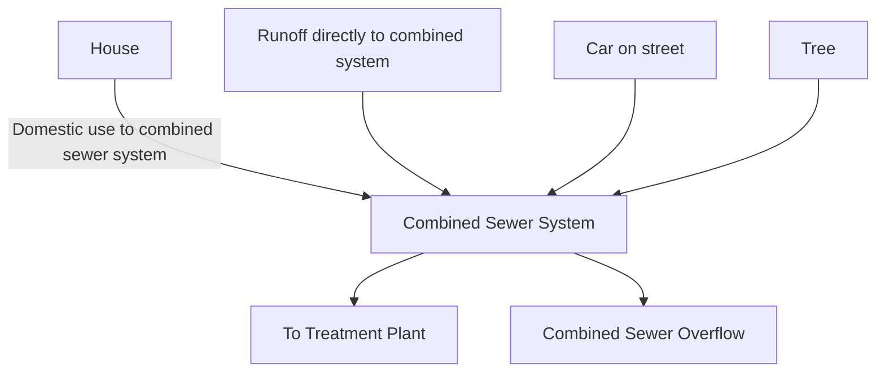

The first step in the application of a computer model to a combined sewer collection system requires the delineation of the sewer watershed (sewershed) areas to be simulated. At this point; the modeler must establish the level of detail that will be used: In the combined sewer service area, sewersheds are typically delineated to each regulator in the system (a regulator is a device that splits the flow between the interceptor and the WRRF). Because many combined sewer systems include regulators that intercept wastewater from sewersheds of widely varying sizes, these larger areas will be further delineated to develop smaller sub-basins of relatively homogeneous size and development conditions (land use).

The delineated sewersheds then need to be characterized to develop surface parameters that will drive the runoff into the combined sewer systems. In a combined system, the runoff is driven by the impervious surface of the modeled catchment. Excess rainfall that does not infiltrate or becomes trapped in surface depressions travels, as overland flow, into the combined system and typically enters through stormwater inlets or flows directly
\n---\n

# 3.5.4 Separate Sanitary Sewer System Hydrology

Whereas combined sewer systems are designed to convey stormwater and wastewater, separate sanitary sewer systems convey stormwater and wastewater in separate pipes. Figure 4.2 presents schematically the operation of a separate sanitary collection system. Although these systems are designed to collect only wastewater, they will also collect rainfall in the form of infiltration and inflow. Incorporated into the design of the wastewater collection system is an assumption that some stormwater flow will be conveyed by the sanitary system.

As with combined systems, the first step in the application of a computer model to a separate sanitary sewer collection system requires the delineation of the sewershed areas to be simulated. Although in the combined sewer service area, sewersheds are typically delineated to each regulator in the system, in separate systems, sewersheds are delineated to develop smaller sub-basins of relatively homogeneous size and development conditions (land use): Whereas combined sewersheds typically follow the natural drainageways and often include significant open space (i.e., parks) that drain to the combined sewer system, sanitary sewersheds will more often follow the development boundaries (i.e., lot lines) and will not include open spaces.

The delineated sanitary sewersheds then need to be characterized to develop surface parameters that will drive the runoff (infiltration and inflow) into the sanitary sewer system. In a sanitary system, the infiltration and inflow are driven, not by the impervious surface of the modeled catchment, but rather by a myriad of factors, including the following:
\n---\n

### FIGURE 4.2 Typical Separate Sanitary Sewer System

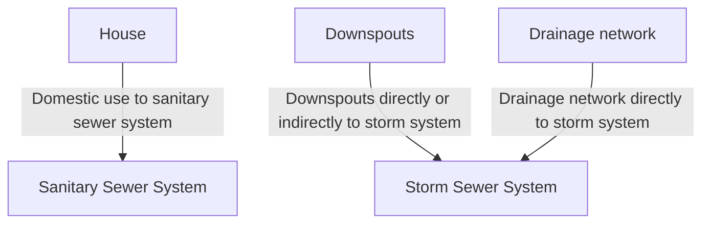

* Age of the sewer;
* Condition of the sewers, manholes, and sewer service connections;
* Prevalence of direct (illicit) connections of roof leaders, house drains, sump pumps, or storm sewers to the sanitary system;
* Operation and maintenance of the system;
* Antecedent moisture conditions (saturation of the ground around the sewers);
* Groundwater elevation; and
* Construction practices at the time of installation:

The sanitary sewersheds typically are characterized using percent impervious values that represent a percentage of the rainfall (rather than development) that enters the sewer as infiltration and inflow (sometimes referred to as the R-factor). These values are initially derived from an analysis of flow-monitoring data to develop an initial estimate of the
\n---\n

## 3.5.5 Characterization of Contributing Areas (Sewersheds)

Once the limits of the model are defined (using the sewershed delineation described above), each modeled sewershed needs parameters that will allow the model to generate flows for input to the modeled hydraulic network for routing. Sewersheds are typically defined, at a minimum, by the following parameters:

* Area
* Contributing area
* Population
* Water consumption
* Infiltration
* Overland flow-routing coefficients
* Detention storage
* Directly and indirectly connected impervious surfaces (combined sewer systems only)

Other parameters will be defined as required by the wet weather flow model selected for use.

## 3.5.6 Methods of Flow Estimation

For modeling purposes, it is useful to further define the components of flow in wastewater collection systems. Figure 4.3 displays a typical 2-day wastewater flow hydrograph. Flow is plotted against the y-axis on the left side of the plot, and precipitation intensity is plotted against the inverted y-axis on the right side of the plot. The wastewater flow hydrograph can be broken into three basic components, as follows:

1. Groundwater infiltration (GWI). The GWI enters a sewer system typically through sewer service connections and from the ground through such means as defective pipes, pipe joints, connections, or manhole walls. The GWI may have seasonal variations but is typically treated as constant throughout a single precipitation event.

```mermaid
graph TD
  H[2-day wastewater flow hydrograph]
  L[Left axis: Flow]
  R[Right axis: Precipitation (inverted)]
  H --> L
  H --> R
  H --> GWI[GWI]
  H --> OC[Other components]
```
\n---\n

## 2. Base wastewater flow (BWF)

The BWF enters the collection system through direct connections and represents the sum of the domestic, commercial, and industrial flows.

## 3. Rainfall-derived infiltration and inflow (RDII)

This is the portion of the sewer flow hydrograph above the normal dry weather flow pattern; it is the sewer flow response to rainfall or snowmelt in a sewershed.

### Figure 4.3 Typical 2-Day Wastewater Flow Hydrograph

```mermaid
graph TD
  Precipitation[Precipitation]
  RDII[Rainfall-Derived Infiltration & Inflow (RDII)]
  BWF[Base Wastewater Flow (BWF)]
  GWI[Groundwater Infiltration (GWI)]
  Total[Total Sewer Flow]

  Precipitation --> RDII
  BWF --> Total
  GWI --> Total
  RDII --> Total
  Total --> Total
```

### 3.5.7 Dry Weather Flow Generation

Dry weather flow includes sanitary wastewater (including commercial and industrial contributions) and GWI. These two components are specified separately at appropriate model nodes, and a diurnal curve is associated with the sanitary flow:

- Sanitary flows are related to water consumption, and a means of establishing these flows is to relate them to water consumption records or population data.
- Sanitary flows can also be estimated from flow-monitoring data, but using water consumption or population data

\n---\n

The GWI is determined from the flow-monitoring data. The infiltration flowrates are typically determined by comparing the estimated total water consumption at the flow meters with the average dry weather flow recorded at each flow meter. The GWI can be allocated to the upstream sub-basins in proportion to their area or diameter × length of sewers.

### 3.5.8 Wet Weather Flow Generation

The effects of wet weather flows on collection systems have been a major driver in the operation and management of sewer systems. Historically, the prevention and control of CSOs or SSOs have required large capital expenditures to gain uncertain environmental benefits (WEF, 2011). With the proliferation of computers and increase in computational power, rainfall-runoff models and other wet weather analytical techniques have become more sophisticated, allowing engineers to understand, in greater detail, the wet weather loads on wastewater collection systems. Rainfall-runoff models comprise a set of models enabling engineers to represent the transformation of rainfall into runoff for urban and rural catchment areas contributing to piped or channelized drainage systems. This, in turn, defines how much of the rainfall in a catchment becomes runoff and how quickly it enters the drainage system (Wallingford, 1998a). This section discusses the basic conceptual framework for understanding wet weather loads in collection systems:

### 3.5.9 Wet Weather Flow in Combined Sewer Systems

Combined sewer sub-basins are typically modeled using two different surface types defined to represent the different urban runoff-response mechanisms, as follows:

- 1. Impervious response — relatively rapid response representing flow generated from paved surfaces (i.e., parking lots, roads, and driveways) and from other connected surfaces, such as roof drains. Impervious responses are typified by a short instantaneous peak response to rainfall that ceases soon after the rain event has stopped.
\n---\n

## 2. Pervious response
A more delayed and attenuated response to rainfall, representing flow generated from the open surfaces in a catchment—those surfaces where surface runoff is not generated until after the soil becomes saturated.

Most combined sewer systems are highly urbanized (that is, highly impervious), and most storms that produce CSOs are small storms where the runoff contribution from pervious surfaces is very small. Therefore, impervious surface runoff, in most cases, will drive peak flows and total runoff volumes in a combined sewer collection system.

### 3.5.10 Wet Weather Flow in Separate Sanitary Sewer System
Traditionally, peak flows in sanitary sewers were based on an established static peaking factor. These peaking factors are based on the tributary population to a particular section of pipe, which involves limited data and has historically resulted in undersized pipes resulting from heavier-than-expected infiltration and inflow. Dynamic sewer system modeling provides utilities with an opportunity to take advantage of the model and the data used to calibrate it, to develop hydrologic parameters to represent the runoff of rainfall into the sewer (WEF, 2017).

Rainfall-derived infiltration and inflow simulation is necessarily empirical and requires measured wet weather flow and rainfall data. The approach applied is heavily dependent on the extent of available data and the goals of the modeling project: Table 4.5 summarizes several different infiltration and inflow modeling approaches and associated data requirements. Some methods can be implemented with limited data, but their use will necessarily have practical implications on the range of applications for the resulting hydraulic model. Therefore, the types of conclusions that can be drawn from the model analysis will ultimately depend on the infiltration and inflow modeling methodology selected for the project.

### 3.6 Calibration and Verification
Achieving adequate calibration is necessary to ensure confidence in model projections. The required level of calibration and extent of required flow monitoring is determined after defining project goals and carefully reviewing existing information on the dry and wet weather hydraulics of the collection system. With adequate calibration, the models become consistent tools to assess the hydraulics of the existing collection system and identify capacity concerns.
\n---\n

## 3.6.1 Model Calibration

Model calibration is the process of adjusting estimated model parameters to match observed flows and water depths in the system. This step is essential for the creation of a model that accurately represents a collection system. In general, few parameters can and should be adjusted, and the final value should always fall within the range of reasonable values for that parameter. When a value outside of that range is critical in achieving a suitable match between model predictions and measurements, it is probable that the model does not accurately represent the system. The cause of that discrepancy must be identified, which is one of the reasons that inspections may be required—to check that the actual system configuration matches available information. In general, calibration proceeds in the downstream direction. The different elements of model calibration are summarized below.

<table>
<caption>TABLE 4.5 Summary of Available RDII Prediction Methods (modified from Water Environment Research Foundation, 1999)</caption>
<thead>
<tr>
<th>RDII Methodology</th>
<th>Description</th>
<th>Data Requirements</th>
<th>Accuracy</th>
<th>Advantages</th>
<th>Disadvantages</th>
</tr>
</thead>
<tbody>
<tr>
<td>Constant unit rate</td>
<td>Constant unit rate based on monitoring data and sewershed characteristics (i.e., quantity per sewershed area, quantity per area diameter, quantity per capita).</td>
<td>Low</td>
<td>Low</td>
<td>Easy to apply</td>
<td>Unit rates developed in one area may not pertain to another; does not represent temporal variations.</td>
</tr>
<tr>
<td>Percentage of rainfall volume (R-factor)</td>
<td>Ratio of RDII monitored and rainfall volume falling on an area served by the monitor; determined for several storm events.</td>
<td>High</td>
<td>Medium</td>
<td>Develops range of RDII volumes for monitored sewersheds.</td>
<td>Does not represent temporal variations. Requires data from several representative storms. Percentages developed for one area may not pertain to another.</td>
</tr>
<tr>
<td>Synthetic unit hydrograph</td>
<td>Assumes RDII responds to rainfall volume and duration in the same manner as stormwater runoff and that the shape of an RDII hydrograph is a function of basin characteristics.</td>
<td>Medium</td>
<td>High</td>
<td>Can be scaled in proportion to rainfall duration for a wide range of storms once a unit hydrograph is developed.</td>
<td>May require several unit hydrographs to represent components of an RDII hydrograph.</td>
</tr>
</tbody>
</table>

\n---\n

<table>
  <thead>
    <tr>
      <th>Topic</th>
      <th>Description</th>
      <th>Medium</th>
      <th>High</th>
      <th>Notes / Equations</th>
      <th>Remarks</th>
    </tr>
  </thead>
  <tbody>
    <tr>
      <td>Multiple linear regression (rainfall/flow regression)</td>
      <td>Uses multiple linear regression methods to derive a relationship between rainfall data and RDII.</td>
      <td>Medium</td>
      <td>High</td>
      <td>Generates highly representative predictive equations for storms within the range of data used to develop the equations.</td>
      <td>Sensitive to anomalies in flow and rainfall data used to generate the equations. May need several equations to represent storms of different characteristics.</td>
    </tr>
<tr>
      <td>Hydrologic modeling routines</td>
      <td>Applies hydrologic models available in current collection system modeling packages.</td>
      <td>Medium</td>
      <td>Medium</td>
      <td>Easy to apply and readily available as part of the software.</td>
      <td>Requires time for model calibration.</td>
    </tr>
  </tbody>
</table>

### 3.6.2 Dry Weather Calibration

Initial model calibration is performed under dry weather flow conditions. Estimates for dry weather flow inputs from water consumption or population data are generally reasonably accurate. Significant discrepancies between model predictions and measurements are typically indicative of errors in model connectivity or system understanding. Dry weather calibration also typically checks that the model-predicted flow depths correspond to measured flow depths. Significant differences are typically indicative of unknown conditions, such as blockages, sedimentation, or other restrictions. Dry weather calibration provides an opportunity to address these issues.

### 3.6.3 Wet Weather Calibration

The purpose of wet weather calibration of a collection system model is to develop a set of hydrologic parameters that will adequately predict the system response over a range of storm events. Most models are used to predict response to large events (i.e., design storms) and to develop system alternatives based on the predicted response. Selected storms should cover a range of hydrologic events and include larger, less frequent storms if available. Storms used for calibration should be based on the availability of both flow-monitoring and rainfall data. Storm events recorded during the flow-monitoring program should meet the following criteria to be considered suitable for use as calibration events (Wallingford, 1998b):

- Total storm depth greater than 0.5 cm (0.2 in.)
- Rainfall intensity greater than 0.6 cm/h (0.24 in/hr) for more than 5 minutes

\n---\n

### 3.6.4 Calibration Goals

- At least three storms of differing durations, and
- Rainfall measured by each of the gauges should be consistent with the other gauges.

Experience and judgment should be used in the application of these guidelines. Model results for peak flow, total volume, and peak depth are typically compared with observed data during the calibration process.

Once these single-event simulations are near completion, continuous simulations should be performed to adjust parameters, such as infiltration rates, that are more directly affected by inter-event hydrologic conditions. Such continuous simulation can be done by simulating the entire monitoring period or selected portions of the monitoring period. Most current models run sufficiently fast to allow simulation of 3- to 6-month periods with reasonable run times. The advantages of this approach are that a range of storms is inherently included, as well as closely spaced storms for which cumulative effects may cause different system responses. This allows a better representation of inter-event infiltration responses, which may more accurately quantify infiltration and inflow volumes than would single-event approaches. Given that storage alternatives often are considered as part of master planning efforts, strong consideration should be given to this calibration approach.

Calibration goals

The degree of model calibration is evaluated by a quantitative comparison of model predictions, with measurements expressed in terms of percent deviation. Typical calibration goals are developed recognizing that the flow and rainfall-monitoring data themselves have a certain degree of error. It is generally accepted that flow measurements in sewer systems, under the best of conditions, will be within ±20%. Therefore, it is recommended that the model calibration targets fall within that error band. Calibration targets should also take into consideration the modeling objectives and the availability and reliability of all data sources used to develop the model:

Calibration goals should be developed for dry weather conditions and selected storms during the monitoring period. These goals will not be met in all cases, for a variety of reasons, including meter malfunction, system repairs, and system blockage. When the calibration goals cannot be met with reasonable parameter adjustments, the reason for the discrepancy must be identified.
\n---\n

# 3.6.5 Model Verification

The purpose of model calibration and validation, according to U.S. EPA CSO guidance, is described in the following excerpts (emphasis added) (U.S. EPA, 1999, section 7.4.2):

> "Model calibration and validation are used to 'fine-tune a model to better match the observed conditions and demonstrate the credibility of the simulation results.' An uncalibrated model may be acceptable for screening purposes, but without supporting evidence, the uncalibrated results may not be accurate. To use model simulation results for evaluating control alternatives, the model must be reliable."

Specific to validation, the guidance describes the following purpose (U.S. EPA, 1999, section 7.4.2):

> "Validation is important because it assesses whether the model retains its generality; that is, a model that has been adjusted extensively to match a particular storm might lose its ability to predict the effects of other storms."

However, no specific calibration or validation procedure is provided in, or required by the guidance. The guidance explicitly states that there is no single approach to any part of the monitoring and modeling process (U.S. EPA, 1999, section 4.2).

> "Because each permittee's combined sewer system, CSOs, and receiving water body are unique, it is not possible to recommend a generic; 'one-size-fits-all' monitoring and modeling plan in this document:"

Therefore, while the purpose of calibration and validation is clear and constant in the modeling industry, the guidance supports the position that the approach to calibration and validation varies with the complexity of the modeled system and the size and purpose of the model:

- Generally, a planning-level (macro- or micro-scale) model does not require validation in the strictest sense of the word, which means testing the model with a system-wide and independent data set. This is because the purpose of validation, as outlined in the guidance, can be achieved for a planning-level model through initial formal calibration to three to four primary calibration events, followed by informal testing of the model using
\n---\n

### 3.6.6 Typical Summary Presentations of Results

Two types of presentations should be prepared for summarizing calibration and validation results.

1. A histogram (Figure 4.4) showing the proportion of meter to model volume comparisons falling in each of several percent difference ranges, for example,

- < -50%
- -50% to -35%
- -35% to -20%
- -20% to 20%
- 20% to 35%
- 35% to 50%
- > 50%

<table>
  <thead>
    <tr>
      <th>Percent Difference Calibration Ranges<br/>(For Meter to Model Volume Comparisons)</th>
      <th>Percent of Meter-Events</th>
    </tr>
  </thead>
  <tbody>
    <tr><td>&lt; -50%</td><td>5%</td></tr>
<tr><td>-50% to -35%</td><td>5%</td></tr>
<tr><td>-35% to -20%</td><td>20%</td></tr>
<tr><td>-20% to 20%</td><td>45%</td></tr>
<tr><td>20% to 35%</td><td>15%</td></tr>
<tr><td>35% to 50%</td><td>5%</td></tr>
<tr><td>&gt; 50%</td><td>5%</td></tr>
  </tbody>
</table>

FIGURE 4.4 All Meters Comparison Based on Calibration Events of Screened Data

\n---\n

## 2. A chart of monitored volumes to modeled volumes (Figure 4.5)

Each point on the graph represents a comparison of monitored volume with modeled volume at an individual meter for an individual calibration event. The purpose is to demonstrate how the points fall along the "ideal" 45-degree line shown on the chart.

These presentations can be prepared for the following groups of events, as available:
- Primary calibration events;
- Informal testing events; and
- Full calibration period (combines primary events, testing events, any remaining events, and dry weather flow periods).

Note that the number of meters available for comparison and/or the period used, for each group of events, will undoubtedly vary. In addition, while volumes are typically the primary comparison metric, peak-depth comparisons may also be warranted (or, in some cases, maybe the only comparison available):

<table>
  <caption>Figure 4.5: Chart of monitored volumes to modeled volumes</caption>
  <thead>
    <tr>
      <th></th>
      <th>0</th>
      <th>20</th>
      <th>40</th>
      <th>60</th>
      <th>80</th>
      <th>100</th>
      <th>120</th>
      <th>140</th>
    </tr>
  </thead>
  <tbody>
    <tr>
      <td>140.0</td>
      <td></td>
      <td>◊</td>
      <td></td>
      <td>◊</td>
      <td></td>
      <td></td>
      <td>●</td>
      <td></td>
    </tr>
<tr>
      <td>120.0</td>
      <td></td>
      <td></td>
      <td>▲</td>
      <td></td>
      <td>◊</td>
      <td>◊</td>
      <td></td>
      <td></td>
    </tr>
<tr>
      <td>100.0</td>
      <td></td>
      <td></td>
      <td></td>
      <td>■</td>
      <td></td>
      <td></td>
      <td></td>
      <td></td>
    </tr>
<tr>
      <td>80.0</td>
      <td></td>
      <td>△</td>
      <td></td>
      <td></td>
      <td></td>
      <td></td>
      <td></td>
      <td></td>
    </tr>
<tr>
      <td>60.0</td>
      <td></td>
      <td>◊</td>
      <td></td>
      <td></td>
      <td></td>
      <td></td>
      <td></td>
      <td></td>
    </tr>
<tr>
      <td>40.0</td>
      <td>●</td>
      <td></td>
      <td></td>
      <td></td>
      <td></td>
      <td></td>
      <td></td>
      <td></td>
    </tr>
<tr>
      <td>20.0</td>
      <td></td>
      <td></td>
      <td></td>
      <td></td>
      <td></td>
      <td></td>
      <td></td>
      <td></td>
    </tr>
<tr>
      <td>0.0</td>
      <td></td>
      <td></td>
      <td></td>
      <td></td>
      <td></td>
      <td></td>
      <td></td>
      <td></td>
    </tr>
  </tbody>
</table>

<p>Legend:</p>
<ul>
  <li>◊ 04/30/1997</li>
  <li>■ 05/02/1997</li>
  <li>△ 05/18/1997</li>
  <li>● 06/01/1997</li>
</ul>
\n---\n

FIGURE 4.5 Monitored Versus Modeled Volumes for Four Calibration Events Using All Monitor Screened Data (mil gal × 3.785 = ML)

## 3.7 Approaches to Model Development and Implementation

The complexity of the model affects the decisions to outsource or develop the model with in‑house staff. Some communities use a phased approach; for example, the trunk sewer model is developed first, and then a more detailed model is developed from this original model.

## 4.0 OTHER METHODS OF EVALUATION

The previous sections of this chapter discussed monitoring and modeling for hydraulic evaluation. This section will discuss other, less detailed methods of hydraulic evaluation. The methods discussed in this section will include evaluation by several common approaches.

* Evaluation by design criteria,
* Evaluation by service standards prescribed by local or higher regulatory authorities,
* Evaluation by experienced observation, and
* Evaluation solely by observation of long-term flow-monitoring records.

Regulations, design criteria guides, and prescribed standards often define standards for flow calculation and standards for pipe sizing and placement. For example, prescriptive regulations may prescribe design flows of approximately 1.14 m3/d (300 gpd) per dwelling unit for residential areas and approximately 11,220 L/ha·d (1,200 gpd/ac) for industrial areas. Similarly, the same regulations may prescribe pipe slopes greater than 0.2% or a minimum pipe velocity of approximately 0.6 m/s (2 ft/sec). Comparing the existing system with these prescribed standards evaluates whether the existing system is consistent with the standard design assumptions. To the extent the assumption is consistent with the prescribed design standards, it will meet performance objectives intended in the design standards. If current performance objectives are higher than design standard performance objectives, the existing system will not meet current performance objectives. Similarly, if assumptions inherent in the design standards (i.e., free outflow conditions for each pipe) are violated, then the performance objectives will not be achieved.
\n---\n

Experienced observers of the sewer system often note whether the system is performing as expected. For example, experienced field crews may note that a given reach of pipe is flowing near surcharge conditions during dry weather and recognize that, during dry weather, the pipe reach should flow less than half full. In this case, the experienced evaluation would conclude that the pipe was undersized or suffering a backwater phenomenon.

The Flow Monitoring section discussed how evaluation of flow monitoring can be used as part of the hydraulic evaluation of the sewer system. In a case such as the observation discussed in the previous paragraph, long-term flow-monitoring records could resolve whether the problem was excess flow or backwater. If the long-term flow-monitoring records show hydraulic grade lines (levels) near the crown of the pipe, then the problem is likely a backwater problem: If long-term flow-monitoring records show a trend of increasing peak flow rates over time, then the problem may be too much flow in the reach of the pipe.

Further alternative methods of hydraulic and hydrologic analysis and principles for their selection and application are presented in the Guide to Managing Peak Wet Weather Flows in Municipal Wastewater Collection and Treatment Systems (WEF, 2006).

## 5.0 REFERENCES

* ADS Environmental Services. (2012). Basin size is the magic knob for controlling costs of RDII reduction projections.
* ADS Environmental Services. (2023). Scattergraph principles and practice. https://www.adsenv.com/scattergraph/http://www.adsenv.com/default.aspx?id=73
* Chartered Institution of Water and Environmental Management. (2016). Rainfall modeling guide 2016.
* Chartered Institution of Water and Environmental Management. (2017). Code of practice for the hydraulic modelling of urban drainage systems (Version 01)
* Novotny, V. (Ed.). (1995). Urban runoff and diffuse pollution. In Nonpoint pollution and urban stormwater management (Chapter 6). Technomic Publishing Co.
* Roesner, L. A. & Burgess, E. H. (1992, May 24-30). The role of computer modeling in combined sewer overflow abatement planning: Proceedings of the Symposium on
\n---\n

# References

- Water Resources and River Basin Management of the International Association on Water Pollution Research and Control, 16th Biennial Conference and Exposition, Washington, D.C., United States. International Association on Water Pollution Research and Control.

- U.S. Department of Commerce, National Oceanic and Atmospheric Administration, & National Weather Service. (2004). *NOAA atlas 14: Precipitation-frequency atlas of the United States*. https://www.weather.gov/media/owp/oh/hdsc/docs/Atlas14_Volume2.pdf

- U.S. Environmental Protection Agency. (1994, April). *Combined sewer overflow (CSO) control policy* (EPA 830/B-94-001). Office of Water, U.S. Environmental Protection Agency.

- U.S. Environmental Protection Agency. (1999). *Combined sewer overflows: Guidance for monitoring and modeling* (EPA-832/B-99-002). U.S. Environmental Protection Agency.

- Vitasovic, Z. C. (2006). *Real time control of urban drainage networks* (EPA-600/R-06-120). U.S. Environmental Protection Agency.

- Wallingford, H. R. (1998a). *HydroWorks DM v4.0* (Build 25). HR Wallingford Ltd.

- Wallingford, H. R. (1998b). *The Wallingford procedure: Volume 2 Practical application of the Wallingford procedure*. HR Wallingford Ltd.

- Water Environment Federation. (2011). *Prevention and control of sewer system overflows* (3rd ed.; Manual of Practice No. FD-17). Water Environment Federation.

- Water Environment Federation. (2006). *Guide to managing peak wet weather flows in municipal wastewater collection and treatment systems*. Water Environment Federation.

- Water Environment Federation. (2017). *Sanitary sewer systems: Rainfall derived infiltration and inflow (RDII) modeling: Fact sheet*. Water Environment Federation. https://www.accesswater.org/?id=-324221&fromsearch=true#iosfirsthighlight

- Water Environment Federation. (2020). *Stormwater, watershed, and receiving water quality modeling*. Water Environment Federation.
\n---\n

Water Environment Research Foundation. (1999). *Using flow prediction technologies to control sanitary sewer overflow* (Project 97-CTS-8). Water Environment Research Foundation.
\n---\n

# 5. Infiltration and Inflow Source Detection
\n---\n

Downloaded on 2025-07-28 at 02:07:16 from the Access Water platform for the exclusive use of froelich.jason.c@outlook.com
\n---\n

# 1.0 PURPOSE AND NEED FOR INFILTRATION AND INFLOW SOURCE IDENTIFICATION

## 1.1 Background

## 1.2 Understanding Public and Private Property Sewer Systems

## 1.3 Public (Municipality) Responsibility
### 1.3.1 Sanitary Sewers
### 1.3.2 Storm Sewers
### 1.3.3 Combined Sewers

## 1.4 Private (Property Owner) Responsibility
### 1.4.1 Foundation or Footer Tile
### 1.4.2 Sanitary Service Laterals
### 1.4.3 Storm Service Laterals
### 1.4.4 Responsibility for Maintenance

## 2.0 COMMON CAUSES OF INFILTRATION AND INFLOW

### 2.1 Natural Aging of Sewer System
### 2.2 Lack of Maintenance of Sewer System
### 2.3 Uncontrolled Stormwater
### 2.4 Poor Construction Methods
### 2.5 Inadequate Construction Specifications or Design
### 2.6 Incomplete Separation of Combined Systems

## 3.0 SOURCES OF INFILTRATION AND INFLOW

### 3.1 Public Property Sources
#### 3.1.1 Groundwater (Infiltration) or Trench Water (Inflow)?
#### 3.1.2 Manhole Inflow Defects
#### 3.1.3 Manhole Infiltration Defects
\n---\n

# 1.0 PURPOSE AND NEED FOR INFILTRATION AND INFLOW SOURCE IDENTIFICATION

## 1.1 Background

Municipalities have long been faced with challenges deriving from excessive flows that include groundwater infiltration and stormwater inflow in aging separate sanitary sewer systems. In recent decades, this issue has been more broadly recognized as a key performance challenge for all sanitary sewer utilities and can even affect relatively new housing developments through design and construction practices, as well as through challenges in privately owned service laterals:

During the period of the construction grants program of the 1970s, federal funding was offered to municipalities to evaluate their sewer systems and rehabilitate deficiencies found. Infiltration and inflow studies generally were performed by engineers and outside contractors. The mainline or public sewer system was evaluated, and, in many cases, deficiencies found were repaired, andlor transport and treatment using relief sewers was considered the best option: Some private property problems found were repaired, but most were left to further deteriorate because the agency lacked the authority to perform work on private property: Political pressures caused private property rehabilitation to be tabled, with the hopes that the rehabilitation of public sector or mainline sewer deficiencies would solve the problems of flooding homes in a given area.

Most problems relating to infiltration and inflow are directly related to uncontrolled or misdirected stormwater: Most separate sewer systems operate without problems during dry weather; however; aged separate sewer systems are often affected by wet weather: What was always thought to be a sanitary sewer problem has now been recognized both as a storm andsanitary sewer problem. As discussed in previous chapters, infiltration and inflow contribute to capacity problems in collection systems, pumping stations, and WRRFs and can result in basement flooding, sanitary sewer overflows, and National Pollutant Discharge Elimination System permit violations at the WRRF. The above problems can cost the property owner and municipal utility funding, can be a health hazard, and can contribute to the degradation of local water quality:

 hydraulic evaluation of the collection system, both in terms of the quantity of infiltration and inflow being generated and the capacity of the sewerage system to transport and
\n---\n

treat the infiltration and inflow, can determine if the quantity of infiltration and inflow in the
system needs to be reduced. If infiltration and inflow-related problems are to be alleviated
 by reducing the quantity of infiltration and inflow in the collection system, the sources of
 the infiltration and inflow must be identified, so that corrective measures can be
 undertaken_

For sanitary sewer utilities with known or suspected challenges from inflow and infiltration ,
   intensive source detection or identification is recommended so that practical solutions can
 be targeted at verified sources of unplanned flows_. The overall goal is to use resources
 wisely and ultimately spend funds to reduce infiltration and inflow in the rehabilitation or
 upgrade of a collection system cost-effectively:

## 1.2 Understanding Public and Private Property Sewer Systems

Storm sewer systems discharge to streams, rivers, and lakes. Separate sewer systems
consist of a network of sanitary sewer pipes eventually leading to pumping stations and
WRRFs. These collection systems consist of interceptor, trunk, and local collector sewers
within the street or other public right-of-way. Connected to the sewers are building and
house lateral sewers that collect building and house drains to the sewer system. In a
separate sewer system, the entire flow of wastewater tributary to the sewers is sanitary
 wastewater: In the storm sewer system, the water is contained in both groundwater and
rainwater:

An additional category, known as combined sewers, consists of both storm and sanitary
 flows in the same piping network: Construction of new combined sewers has generally not
 been permitted by local governing authorities since the middle of the 20th century, and
 municipalities with older systems of a combined nature have put substantial effort into
 either separating them into distinct storm and sanitary systems or otherwise managing
 their environmental impacts. The above sewers are generally divided into two categories
 of ownership and responsibility—public and private. Figure 5.1 shows the general
 delineation of public and private property sewer responsibilities:

## 1.3 Public (Municipality) Responsibility

Public sewers are those sewers that are owned and maintained by the municipality, sewer
agency, or public utility (hereafter referred to as municipality). These sewers are the local
\n---\n

sanitary collector trunk and interceptor sewers located within the streets and other public
rights-of-way and constructed by the municipality or turned over to them by developers
when subdivisions are completed. Building and house lateral sewers connect to the
"public sewers" within the street or public right-of-way: Ownership and responsibility for
these sewers vary from community to community. Often, there is an inspection tee or
cleanout access for the laterals located at the property line.

<table>
  <thead>
    <tr>
      <th>City's Responsibility</th>
      <th>Resident's Responsibility</th>
    </tr>
  </thead>
  <tbody>
    <tr>
      <td>Stormwater Sewer Manhole</td>
      <td>Stormwater Lateral</td>
    </tr>
<tr>
      <td>Sanitary Sewer Manhole</td>
      <td>Sanitary Lateral</td>
    </tr>
<tr>
      <td></td>
      <td>Footer Drain</td>
    </tr>
  </tbody>
</table>

FIGURE 5.1 Public/Private Responsibility

Storm sewers within the street or public right-of-way are also "public sewers." These
sewers can be a source of infiltration and inflow but are also often the responsibility of a
different department within a municipality or even a different governmental agency
altogether: However; no matter who maintains the storm sewers, they can still be a
\n---\n

Stormwater is a significant source of infiltration and inflow to the sanitary sewer system. This stormwater can discharge or migrate to the sanitary sewer system when not intercepted or controlled.

The following is a brief description of the public property sewer system and its function.

## 1.3.1 Sanitary Sewers

Separate sanitary sewers contain a system of piping generally ranging from approximately 15 to 91 cm (6 to 36 in.) or larger in diameter. These pipes are connected by manholes, which provide access for maintenance of the system. The construction material of manholes can be brick and mortar in older systems, but new systems typically consist of precast concrete. Common materials currently used for many sewer pipes include fiberglass-reinforced polyester, glass-reinforced polymer, polyvinyl chloride (PVC), and high-density polyethylene. Due to the susceptibility of concrete pipe to corrosion, it is typically not used, unless it is lined. Sewer pipe segments vary in length based on material but are generally connected by bell and spigot joints. These systems were designed to convey the dry weather flow associated with sanitary wastewater and ideally do not experience increases in flow rate during wet weather; though such is often the case.

## 1.3.2 Storm Sewers

Storm sewers are a network of pipes, generally made of concrete, that collect stormwater runoff at a surface inlet, such as a catch basin or an area drain, and drain it to an appropriate outlet, such as a ditch, local stream, river, or lake. Storm sewer systems generally range from 20 cm (8 in.) to 1.8 m (6 ft) in diameter or larger before discharging to a destination. Drainage consists of stormwater from a combination of residential, commercial, and industrial developments. The responsibility for maintenance of the public storm sewers typically lies with the municipality. Because wastewater sewer fees generally pay for wastewater flows, storm sewers have not had the same level of maintenance attention as sanitary sewers. This lack of maintenance of storm sewers over time has been found to result in leaks forming in the storm system, potentially resulting in the migration of stormwater to the sanitary sewer system.

## 1.3.3 Combined Sewers
\n---\n

Combined sewers are usually not analyzed to reduce inflow or infiltration, as they were designed to capture surface runoff and wet weather flows. Combined sewers typically were designed based on peak wet weather flows from designed drainage systems such as catch basins, and as such, are similar in size to storm sewers; however, unlike storm sewers, combined systems carry sanitary wastewater flows and must discharge to a WRRF. This leads to a situation in which a wet weather event may overwhelm a WRRF. These systems may, therefore, contain permitted outfalls that discharge partially treated or untreated combined sewage to a receiving waterbody such as a stream, an event known as a combined sewer overflow. Governing agencies greatly discourage this practice. In recent decades, utilities with combined sewers have spent substantial resources to separate these systems into distinct storm and sanitary networks or provide storage to reduce the number of combined sewer overflows. This document focuses on inflow and infiltration into separate sanitary systems, but the legacy of combined sewers has the potential to cause inflow challenges to sanitary systems, which are discussed in later subsections.

## 1.4 Private (Property Owner) Responsibility

Private sewers are small-diameter lateral pipes that lead from the house or building to the public sewers in the street or right-of-way. These sewers generally include sanitary laterals leading to either a separate or combined sewer system, storm laterals, foundation drains, and, at times, sump pumps. Depending on the local building regulations, foundation drains may be connected to the storm or sanitary laterals (it is currently common practice to connect foundation drains to sump pumps, which discharge to storm laterals). Often, an inspection tee is provided on the lateral sewers at the property line. As noted previously, the lateral on the house or building side of the property line is considered private in the manual. As private property sources of infiltration and inflow may be of greater significance to the overall infiltration and inflow problem, a good understanding of the private property collection system is required.

The piping network of the private sewer system is made up of small pipes, typically PVC pipe, approximately 10 to 15 cm (4 to 6 in.) in diameter. These pipes receive little preventive maintenance and, as a result, begin to deteriorate, because these pipes are not typically maintained by the public utility or municipality. They are not typically maintained by the property owner until a problem, such as a backup, occurs. In addition,
\n---\n

for the average property owner, the cost of repairing and/or replacing the lateral pipes can be significant. Foundation drainage pipes, sanitary laterals, and storm laterals are the main components of the private property piping network. The following is a brief description of private property pipes and their functions:

## 1.4.1 Foundation or Footer Tile

One of the first components of private drainage piping installed is the foundation drain. This pipe is installed at the base of a foundation wall and generally surrounds the house or building. In older homes, built before the mid-1950s, this tile is connected to the sanitary lateral and is intended to drain groundwater that may rise under the basement floor slab or accumulate near the walls of the concrete footer. Newer home construction provides a sump pump and connects the foundation drains to this pump. The sump pump discharge is typically connected to the storm lateral; thus, groundwater is pumped to the storm sewer system:

## 1.4.2 Sanitary Service Laterals

Sanitary service laterals are the service connections or pipes that connect building sewers to the public sanitary sewer main. This lateral is a straight run of pipe that travels from the mainline sanitary sewer to the home. The actual ownership of the sanitary sewer lateral varies from community to community. Most often, the property owner is responsible for the lateral to the property line or, in some cases, to the connections with the mainline sewer. In most private systems, each facility is connected to this pipe with a P-trap (also known as "trapped") to prevent odors from the mainline sewer from entering the home. This lateral pipe is generally open to the roof of the house and, with other houses, serves to ventilate the main or public sanitary sewer system. In some sewer systems, such as those in parts of Pennsylvania (and potentially other states), the lateral is trapped as it leaves the house, and a "fresh-air vent" is in front of the house to provide this ventilation point.

## 1.4.3 Storm Service Laterals

Storm service laterals are the service connections or pipes that connect the building storm drainage system to the public storm system. These pipes are generally 10 to 15 cm (4 to 6 in.) in diameter and convey all stormwater that is discharged from roof areas, yard drains, window well drains, and occasionally groundwater from footer or foundation drains. The depth of the laterals below ground around the perimeter of the house is approximately 0.6
\n---\n

to 0.9 m (2 to 3 ft) deep, and the point-of-entry to the public storm sewer depends on the individual drainage system and varies in different communities.

The two basic types of storm lateral that are discussed are conventional and curb outlet: The conventional lateral intercepts storm downspouts and area drains and discharges below ground to a storm sewer or ditch. The second type of storm lateral, referred to as the curb outlet storm lateral, intercepts downspouts, area drains, and discharges to the city street through a curb outlet.

## 1.4.4 Responsibility for Maintenance
The maintenance of these private property laterals is generally the responsibility of the homeowner unless the local municipality accepts the responsibility for cleaning, repair, and/or replacement. Otherwise, when a sanitary drain or lateral becomes blocked, the property owner commonly responds by engaging a sewer contractor to clean and relieve the blockage. Unless the municipal agency supplies this as a special service, the owner understands that this is physically and financially an owner’s responsibility; however, when property owners’ storm drains or laterals become blocked, and basement flooding is the result, these same property owners may expect the municipality to assist in relieving this condition, even to the point of supplementing the costs of rehabilitation.

Historically, there have been concerns about whether municipalities should provide rehabilitation services, such as maintaining storm and/or sanitary service laterals. The problem of spending public money on private property has been the subject of continued debate at many city and county council meetings.

## 2.0 COMMON CAUSES OF INFILTRATION AND INFLOW
Sanitary sewer systems are generally hydraulically designed with an allowance for infiltration and inflow on a quantity per day per area of sewer and are tested after construction to ensure that the standards are met. Over time, with the aging of the sewer system, the quantity of infiltration and inflow often increases. Some common causes of this increase are discussed in the following subsections.

### 2.1 Natural Aging of Sewer System
As sewer systems age, the settling of the pipes can cause joints to separate. Construction of other utilities around the sewer can cause additional separation of joints, and a change
\n---\n

In live loads may damage the pipe, which can provide openings for infiltration and inflow: The deterioration of other utilities, including water lines and storm sewers, can further provide sources of water for infiltration and inflow. Figure 5.2 shows the process of deterioration that occurs in sewer systems.

## 2.2 Lack of Maintenance of Sewer System

Sewer maintenance should include both preventive and routine maintenance activities. These activities may include sewer cleaning and repair, sewer inspection, pumping station operation and maintenance, and emergency sewer service. Cleaning may be accomplished using sewer rodding machines, jet rodders, and jet vacuum trucks to remove obstructions in the sewer lines.

However, sewer maintenance should also include infiltration and inflow reduction through routine testing, inspection, and rehabilitation of deficiencies found. If this form of sewer maintenance had been accomplished over time, infiltration and inflow would not be a topic of conversation today. In the past, the identification of infiltration and inflow deficiencies and subsequent rehabilitation of problems found have had a lesser priority than routine maintenance activities. One of the common problems of sewer systems today is root intrusion.

In areas where root intrusion is known to be a potential problem, root penetration into the sewer through the joints can permanently damage the joint, providing a path for infiltration and inflow. If roots are removed, the space where they enter the sewer must be sealed; otherwise, an opening for infiltration and inflow remains.
\n---\n

## 2.3 Uncontrolled Stormwater

Stormwater must be collected and transported away from sanitary sewers. If allowed to pond on the street or in grassy surface areas over sanitary sewers, this uncontrolled

**FIGURE 5.2 Pipe Settling**

- Stage 1 Initial defect, but sewer remains held in position by the surrounding soil.
- Stage 2 Development of zones of loose ground or voids caused by the loss of ground into the sewer.

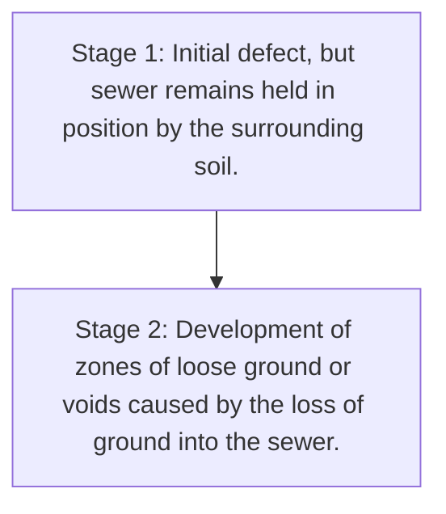
\n---\n

stormwater can migrate to the sanitary sewer trench and enter the pipe through defects in either the pipe wall, pipe joints, or a manhole. Storm sewer systems that are not properly maintained will not operate at their design capacity. If storm sewers become restricted, these pipes can surcharge, and the stormwater can then exfiltrate through storm sewer joints and migrate to the sanitary sewer system.

## 2.4 Poor Construction Methods

Installation specifications, standards, and guidelines for sanitary sewers and manholes are typically specific on acceptable pipe materials, bedding, and backfill materials. Construction procedures, including how joints are to be made and how the completed system is to be tested and accepted, are also documented. If these guidelines are not followed, open joints may be generated, and settlement of the sewer; resulting in additional open joints, may occur. Lateral connections to the public sewer or pipe-to-manhole connections that are not properly sealed can also result in locations where infiltration and inflow can enter the system. Resilient connections and wyes and tees designed for lateral connections are also preferred. The consequence of poor construction methods is that sanitary sewer networks may experience problems related to inflow and infiltration much sooner than typically found industry-wide.

## 2.5 Inadequate Construction Specifications or Design

Construction documents that have inadequate information on existing conditions or that rely on "field decisions" as to how a sewer will be constructed may result in a poor finished product that will be more prone to future problems that may increase infiltration and inflow: The municipality needs to review existing specifications and make changes, where necessary, to improve the final design of sewer systems. Infiltration and inflow reduction can begin with the evaluation of the design of the sewer system before it is placed into the ground.

Finally, without quality supervision of contractors by experienced inspectors, shortcuts by contractors can lead to poor installation of pipes and manholes that eventually lead to a leaky sewer system.

## 2.6 Incomplete Separation of Combined Systems
\n---\n

## 3.0 SOURCES OF INFILTRATION AND INFLOW

To correct infiltration and inflow problems in a collection system, their sources must be identified. In the following paragraphs, typical sources of infiltration and inflow are identified, for both public and private sewers. How these sources can be rehabilitated will be discussed, in detail, in Chapter 6, Selection of Sewer Rehabilitation Methods and Materials.

### 3.1 Public Property Sources

#### 3.1.1 Groundwater (Infiltration) or Trench Water (Inflow)?

Infiltration is typically related to groundwater levels. As rain or melted snow seeps into the ground, it settles in the pores and cracks of underground rocks and into the voids between grains of sand and pieces of gravel. The water table is the upper surface of the zone of saturation where all the pore spaces are filled.

In sewer systems, infiltration is seen as a continual input of groundwater to the sanitary sewer system. Levels of groundwater have been measured by groundwater gauges or monitoring wells generally located outside the area of the sewer trench.

Monitoring wells have been used to relate the groundwater table level to the elevation of sanitary sewers. If the groundwater table is below sanitary sewers, infiltration will most likely not exist within that area during certain times of the year, because water tables can fluctuate above and below a sewer on a regular cycle.

However, an important thing to consider is whether water in a sewer trench is a result of the fluctuation of the groundwater table or if this is a result of the migration of sources of inflow to the sewer trench. In the past, infiltration has been related to groundwater levels. However, if the sewer trench has water that does not relate to the groundwater table, this level of water may be affected by the migration of inflow or rainwater sources that affect the sewer trench. This could be classified as "trench water."
\n---\n

# Sewer Trench Water Gauge Monitoring

The purpose of installing a sewer trench water gauge is to identify the amount of water present in the sanitary sewer trench and correlate dry and wet weather level fluctuations with flow monitoring and rainfall data. A rise in water level in the sewer trench can cause water to leak into the sanitary sewer system during rain events. The points of entry can be from defective sewer joints in the main line or from defective lateral connections.

The sewer trench water monitoring setup uses a pressure transducer sensor inserted into a vertical column. The column is constructed of PVC tubing, which is inserted through the lower portion of a manhole wall. The pressure transducer measures the pressure exerted by a column of water created by hydrostatic pressure outside of the manhole and in the sewer trench. Monitoring should include the installation of an electronic pressure recorder. The level readings can be recorded at various intervals. Data should be collected and compared with rainfall events. Figure 5.3 shows an illustration of a typical trench water gauge.

The graphs produced can indicate whether the sewer trench is affected by rainwater and assist in the eventual recommendations for the rehabilitation of infiltration and inflow problems found on the public side of the sewer system. Many sewer trench areas affected are in sewer easements and are sometimes located in low-lying areas. An example of a graph produced in a sewer trench located in an easement affected by rainwater is shown in Figure 5.4.
\n---\n

### FIGURE 5.3 Trench Water Gauge (Courtesy of AECOM)

The following schematic represents the trench water gauge cross-section shown in the figure. The labels visible on the diagram include:

- GROUNDWATER ELEVATION
- GROUNDWATER GAUGE READING
- INVERT

```
mermaid
graph TD
  subgraph Trench Cross-Section
    Surface[Ground Surface]
    LeftWall[Left Trench Wall (sloped)]
    RightWall[Right Trench Wall (sloped)]
    Invert[Invert (bottom)]
    Gauge[Groundwater Gauge on Left Wall]
  end

  GW_Elev[GROUNDWATER ELEVATION]
  GaugeReading[GROUNDWATER GAUGE READING]
  H[H]
  GroundLevel[Groundwater Level]

  Surface --> LeftWall
  Surface --> RightWall
  LeftWall --> Invert
  RightWall --> Invert
  Gauge --> LeftWall
  GroundLevel --> GaugeReading
  GaugeReading --> H
```

Notes:
- The diagram shows groundwater elevation on the left side of the trench.
- The groundwater gauge reading is indicated on the interior left wall, with a measurement height H from the invert.
- The invert is labeled at the bottom of the trench.

\n---\n

# Rain Event Groundwater Hydrograph
## Aug. 14–Aug. 18

<table>
  <thead>
    <tr><th></th><th>8/14/2003</th><th>8/15/2003</th><th>8/16/2003</th><th>8/17/2003</th><th>8/18/2003</th></tr>
  </thead>
  <tbody>
    <tr><td>Avg Level (in)</td><td>~18</td><td>~18</td><td>~32</td><td>~20</td><td>~19</td></tr>
<tr><td>Rain (in)</td><td>0.0</td><td>0.0</td><td>0.50</td><td>0.15</td><td>0.25</td></tr>
  </tbody>
</table>

FIGURE 5.4 Trench Water Graph (in. ??? 2.54 ??? cm)

In this example, there is water present in the sewer trench at the beginning of the monitoring period. An intense rain event occurs, which causes the level of water in the trench to rise approximately 36 cm (14 in.). It is this rise of water in the trench that can create a head of water over the sanitary sewer; causing leaks to initiate from sewer joints in the mainline sanitary sewer and/or from sanitary lateral connections into the mainline sewer. Closed-circuit television inspection may be needed during wet weather to determine how this increase in trench water affects the sanitary sewer:
\n---\n

Groundwater levels should be recorded weekly during flow-metering periods and biweekly or monthly thereafter. A plot of groundwater levels versus time helps interpret meter data and determine the levels of infiltration. In addition, certain field activities, such as flow isolation measurements or television inspection, can be scheduled with more confidence using groundwater elevation data.

## 3.1.2 Manhole Inflow Defects
Inflow through a manhole generally occurs through and around the lid, as the result of a ventilated cover; the manhole lying in the path of stormwater drainage, the manhole lying in a low area where stormwater tends to pond, and through the joint between the manhole frame and the concrete or brick manhole. Inflow may also migrate along the manhole to the joints in the manhole itself.

## 3.1.3 Manhole Infiltration Defects
Infiltration through a manhole is generally through the brick-and-mortar joints, or in a precast manhole, at the pipe-to-manhole connection points. Many times, the source of this infiltration is trench water that has accumulated and forced into deficiencies in the manhole walls or cone because of the difference in hydrostatic pressure.

## 3.1.4 Mainline Storm and Sanitary Sewer Pipeline Defects
Sanitary sewers can be constructed in separate trenches and common trenches with storm sewers. Other types of sewer construction have sanitary sewers in rear yard easements, with storm drainage from homes draining to the street. The pipe defects, resulting in infiltration and inflow, are generally the same for all types of construction, with a couple of exceptions, with the common trench sewers often having greater rates of infiltration and inflow because of the proximity of the storm sewer to serve as a water source for infiltration and inflow entering the sanitary sewer. Poor, deteriorated, and broken joints allow water to enter sanitary sewers from deficient storm sewer pipes. Lateral connections to the sanitary sewer that are cut in and mortared do not provide long-term watertight connections and are subject to leaking and root intrusion that can further deteriorate a sewer:

## 3.1.5 Catch Basin Pipeline Defects
\n---\n

Leaking catch basins adjacent to sanitary sewers can also be a source of infiltration.
When catch basins are poorly maintained, they can clog, thereby disrupting storm drainage, creating ponding of surface water, or flooding along the street. If this stormwater or rainwater reaches sanitary manholes, inflow to manholes can be a result.

## 3.1.6 Legacy Combined Sewer Components

Catch basins directly connected to separate sanitary sewers are a direct source of inflow. When combined sewers are separated into storm and sanitary systems, the potential exists that some features remain connected to the sanitary system which should have been separated and sent to the stormwater system.

## 3.2 Private Property Sources

Utilities have in the past placed much emphasis on eliminating public sources of inflow and infiltration because this is the portion of the system for which they are responsible. In recent years, greater emphasis has been placed on targeting private sources of inflow and infiltration. In 2015, the Water Environment Federation released the “Private Property Infiltration and Inflow” fact sheet, which can serve as a point of reference for municipalities contemplating this challenge. The fact sheet may be found at the following URL: sheet/. The subsections below detail potential sources of inflow and infiltration from privately owned assets.

### 3.2.1 Storm Laterals

Storm laterals can be a source of infiltration and inflow in several ways. They can be improperly connected directly to the sanitary sewer in one of two ways: either as an illicit connection during the construction of a structure, or as a legacy connection to a formerly combined sewer system that was separated, and which should have been disconnected but was not. They can also have open joints that can allow stormwater to leak into the surrounding ground to the sanitary lateral or have root intrusion or breaks in the line that can cause them to not function properly, thereby forcing the stormwater to the surrounding ground to the sanitary lateral.

### 3.2.2 Downspouts

Downspouts can be a source of infiltration and inflow if they are connected directly to the sanitary lateral, connected to a storm lateral that is not functioning properly, or splashed to
\n---\n

## 3.2 Infiltration and Inflow

The ground around a structure. If the ground does not have sufficient grade or does not drain away, stormwater can infiltrate into the ground and eventually migrate to the sanitary lateral.

### 3.2.3 Area Drains
Area drains can be a source of infiltration and inflow if they are connected directly to the sanitary lateral. They may also be connected to a storm lateral that is not functioning properly.

### 3.2.4 Roof Drains
Roof drains for commercial or industrial structures tend to have significantly more complex plumbing than downspouts in single-family residential properties or simple commercial buildings, but they present a similar potential for direct inflow to a sanitary sewer system if directly connected to a sanitary lateral. In these areas, more intensive and detailed investigations with dye or smoke testing (discussed in later subsections) may be needed to identify such connections.

### 3.2.5 Sanitary Laterals
Sanitary laterals can be the recipient of infiltration and inflow if the lateral from the house to the sewer has open or deteriorated joints or has broken pipe sections. Laterals that have a poor connection to the mainline sanitary sewer may allow groundwater or trench water to enter the pipe from the lack of a solid connection point: The lateral connection at the house can also be the recipient of infiltration and inflow if open joints or broken pipes allow groundwater to enter the lateral. When the connection includes the foundation drain or downspouts, this condition allows groundwater and surface water to enter the sanitary lateral. The connection at the main sewer can also be place where infiltration and inflow can enter; as a result of the lack of a watertight connection point. When the house connection includes the foundation drain or downspouts, groundwater; and surface water may enter the sanitary lateral:

### 3.2.6 Foundation Drain
Foundation drains can be a source of infiltration and inflow if they are improperly connected to the sanitary lateral rather than the storm lateral. Stormwater migration to the
\n---\n

Foundation drains are generally the result of deficient storm laterals or poor drainage away from the house at the ground surface.

### 3.2.7 Sump Pump
Sump pumps are a source of infiltration and inflow if the water discharged from the sump pit flows directly to the sanitary lateral or sanitary sewer. When the sump discharges to the ground near the house, migration can occur, allowing this groundwater to approach and enter the sanitary lateral through defects, if any are present.

## 4.0 INITIATION OF SOURCE DETECTION PROGRAM
There are four general steps to an infiltration and inflow source detection program. The steps are as follows:

1. Select the area to be studied and evaluated;
2. Provide information, such as proper mapping and previous inspection reports, to the team performing the source detection program;
3. Provide information to public officials on proposed testing and proper notification in advance of any field work to the property owners, so that the program will run smoothly; and
4. Initiate the program.

### 4.1 Selection of Problem Area(s)
In a general sense, municipalities know that they have an infiltration and inflow problem because of excessive flows at the WRRF or pumping stations. The other indicator can be the flooding of basements because of excessive infiltration and inflow. One method of measurement is to compare flows with general water consumption. Another method of evaluation is to consider if there are sewerage system capacity problems that are related to periods of wet weather or seasonably high groundwater tables. To limit the size of the area, length of sewer; or number of houses that require evaluation, flow monitoring, hydraulic modeling, and direct-mailed questionnaires to property owners can be used to identify and prioritize areas for evaluation:

#### 4.1.1 Flow Monitoring
\n---\n

### 4.1.2 Hydraulic Modeling
Hydraulic modeling, used with limited flow-monitoring data, can also aid in identifying those subareas of the system that have capacity deficiencies. The modeling results can be compared with the design flow of the area on a per-capita or per-area basis, and a determination can be made as to those areas where the capacity deficiency is the result of high infiltration and inflow rather than areas that have outgrown the designed system capacity.

### 4.2 Public Information Program
The public information program serves two purposes. It explains what is going to be done and how it will affect individual property owners, and it also serves as an information-gathering program to get input on the sources and extent of the problem:

### 4.2.1 Property Owner Questionnaires
An important tool in gaining an understanding of surface water and basement flooding problems is the use of a property owner questionnaire. It provides public relations or a communication tool to the property owners in problem areas of a community. The results can be used to determine patterns of surface and/or basement flooding in specific areas. Distributing questionnaires to property owners at the beginning of a project also provides a useful way to educate the public about the project, make them aware of impending work in their neighborhood, and provide a means to organize flooding complaints into a useful database. The responses can be evaluated and used as a tool in evaluating the stormwater inflow problems of an area:

The questionnaires can request information on the frequency of flooding, corresponding weather, and types of building sewers (lateral, yard drains, downspouts, and splash blocks) that are used in each area. The questionnaires can also be used as a source-detection technique and as part of a public information program. The following are suggested questions, and an explanation of what information is being requested:
\n---\n

1. Do you experience any type of flooding in/on your property? The answer to this question provides the location (if any) of where flooding occurs on the property. Associating the area of flooding with the sanitary sewer or lateral can be an indicator as to where and how water can enter the sanitary sewer

2. How does water enter your basement? The results of this question provide an understanding of the type of problem the property owners are experiencing and document whether a problem is related to a problem on private property and/or is a sewer-related problem. Additionally, if water enters through walls, this is generally an indicator that the storm lateral may be blocked, causing migration of water down the foundation walls

3. What kind of special equipment do you have to take care of basement flooding? The results of this question provided an understanding of what (and where) appurtenances were used to manage flooding of any property owner's home. Special attention is paid to those who report sump pumps, as this is tied to foundation drains addressed in the following question

4. If a sump pump is used, when and how does it activate? One of the keys to understanding the problems of flooding sewer systems is determining how rainwater or stormwater enters the sanitary sewers. Sump pumps that actuate during rain events can be an indication that water is migrating to the footer (foundation drain) tiles. When this occurs, the sump pump activates and pumps this stormwater to the surface, where it is discharged to the ground or directed to a storm pipe. However, in the same geographical area, which assumes most soil conditions and construction techniques are similar; property owners’ homes without sump pumps may discharge this same migrating stormwater to the footer drain, which is often connected to the sanitary lateral

5. How many roof downspouts are there? Where is the discharge located and how many downspouts are there? The information obtained from this question provides an understanding of where stormwater from roof areas is directed. If this water is not directed to a proper destination, such as street conveyance, storm sewer, or a ditch, the results of this misdirection may allow stormwater to migrate to the foundation of the property owner’s home or possibly create another problem at a neighbor’s home

6. Do you have a basement; crawl space, split-level, or slab? This information provides the type and possible location of the problems of flooding
\n---\n

## 7. Have you noticed accumulated (standing) water in the street, or the front or rear of your home after a storm event?
This question provides information about surface water problems, which may affect basement flooding of area homes. Additionally, it provides an understanding of potential overland stormwater drainage problems. When sewer systems are in rear yards, and water is directed to the location of the sanitary laterals or mainline sewer, migration of stormwater to the sanitary sewer can occur.

## 8. How many times have you had water in your basement (i.e., in the past 2 years or 5 years)?
The information gained from this question indicates the severity and history of the problem.

## 9. In your opinion, area flooding is caused by (various reasons)?
This question allows the property owners to provide their perceptions of the cause of flooding.

## 10. If you have experienced flooding, when does it occur (wet or dry weather)?
The information from this question is used to determine whether there is a hydraulic bottleneck in the sanitary sewers that contributes to flooding during dry weather or whether it is a rain-related problem.

## 11. Have you ever used a private contractor to remove a blockage or clean your plumbing/drains?
The answer to this question indicates possible root/maintenance problems on private property: The answers from property owners relating to water penetrating through basement walls may be caused by roots or blockages in storm laterals at the property owner's home.

Figure 5.5 shows an example from 2005 of a questionnaire used in the City of Columbus, Ohio, Department of Public Utilities infiltration and inflow study:

> 4.2.2 Meeting With Public Officials
> 
> Meetings with public officials can provide two-way communication and allow dialog to inform public officials about the types of problems experienced by property owners. Service department (or similar unit) personnel can provide hands-on information on sewer system problems based on previous repairs and cleaning performed throughout the system. They can provide valuable insight as to the causes of infiltration and inflow throughout the system. They may also know how the system was constructed and expanded, and why the problems may be occurring:
\n---\n

## 4.2.3 Public Education

Public education or information programs are used to inform, notify, and educate the property owners as to the methods and procedures that will be used in the source identification program. Public education programs should be a two-way dialog, as the property owners and business owners can provide information on possible sources and causes of infiltration and inflow. Notices of impending field activities should be sent to the property owners of the area(s) where work will be performed, either as part of a targeted mailing campaign or through bill stuffers. Property owners need to be aware of the need for technicians to work on private property to perform testing of the piping on their property.

## 4.2.4 Public Meetings
\n---\n

# Flooding Questionnaire (City of Columbus, Ohio) - 2005

<table>
  <tr>
    <td valign="top">
      <strong>1) Do you experience any type of flooding in/on your property?</strong><br>
      Check all that apply:<br>
      <ul>
        <li>[ ] (A) Basement</li>
        <li>[ ] (B) Front yard</li>
        <li>[ ] (C) Back yard</li>
        <li>[ ] (D) Street</li>
        <li>[ ] (E) Other</li>
      </ul>
      Comment:<br>
      <hr>
    </td>
    <td valign="top">
      <strong>2) How does water enter your basement?</strong><br>
      Check all that apply:<br>
      <ul>
        <li>[ ] (A) Basement floor drains</li>
        <li>[ ] (B) From drains in window wells</li>
        <li>[ ] (C) Through basement walls</li>
        <li>[ ] (D) Other</li>
        <li>[ ] (E) Do not know</li>
      </ul>
      Comment:<br>
    </td>
  </tr>
<tr>
    <td valign="top">
      <strong>3) What kind of special equipment do you have to take care of basement flooding?</strong><br>
      <ul>
        <li>[ ] (A) Sump pump</li>
        <li>[ ] (B) Backup valve / Backflow preventor</li>
        <li>[ ] (C) Other</li>
        <li>[ ] (D) None</li>
      </ul>
      Comment:
    </td>
    <td valign="top">
      <strong>4) If a sump pump is used, when and how does it turn on?</strong><br>
      <ul>
        <li>[ ] (A) Runs periodically during dry weather</li>
        <li>[ ] (B) Runs often during dry weather</li>
        <li>[ ] (C) Runs as soon as rain begins</li>
        <li>[ ] (D) Runs continually during rain</li>
        <li>[ ] (E) Runs continually after rain stops</li>
        <li>[ ] (F) Stops running when rain stops</li>
        <li>[ ] (G) Other</li>
      </ul>
      Comment:
    </td>
  </tr>
<tr>
    <td valign="top">
      <strong>5) Total number of roof downspouts:</strong> ________<br>
      <strong>Discharge location and number downspouts:</strong><br>
      <ul>
        <li>[ ] Into ground</li>
        <li>[ ] Splash onto ground</li>
        <li>[ ] To curb outlet</li>
        <li>[ ] Don't know</li>
      </ul>
      Comment:
    </td>
    <td valign="top">
      <strong>6) Do you have:</strong><br>
      <ul>
        <li>[ ] (A) Basement</li>
        <li>[ ] (B) Crawl space</li>
        <li>[ ] (C) Split Level</li>
        <li>[ ] (D) Slab</li>
      </ul>
      If flooding occurs, what is the usual depth of water in your basement (inches)?<br>
      Comment:
    </td>
  </tr>
<tr>
    <td valign="top">
      <strong>7) Do you have standing water in the street in front of your home after a storm event?</strong><br>
      Check if yes:<br>
      <ul>
        <li>[ ] (A) How deep (inches)?</li>
        <li>[ ] (B) How long did the water stand (hours)?</li>
        <li>[ ] (C) Was there standing water in your yard? Yes No</li>
      </ul>
      Comment:
    </td>
    <td valign="top">
      <strong>8) How many times have you had water in your basement?</strong><br>
      <ul>
        <li>[ ] (A) In the past 5 years: ______</li>
        <li>[ ] (B) In the past 2 years: ______</li>
      </ul>
      Comment:
    </td>
  </tr>
<tr>
    <td valign="top">
      <strong>9) In your opinion, area flooding is caused by:</strong><br>
      <ul>
        <li>[ ] (A) Standing water in the street</li>
        <li>[ ] (B) Standing water in your yard</li>
        <li>[ ] (C) Not enough storm sewers</li>
        <li>[ ] (D) Storm sewers too small</li>
        <li>[ ] (E) Sanitary sewers too small</li>
        <li>[ ] (F) No flooding problem</li>
        <li>[ ] (G) Other</li>
      </ul>
      Comment:
    </td>
    <td valign="top">
      <strong>10) If you have experienced flooding, when does it occur?</strong><br>
      <ul>
        <li>[ ] (A) During a rain event</li>
        <li>[ ] (B) Immediately after a rain event</li>
        <li>[ ] (C) The rain event is not a factor</li>
        <li>[ ] (D) Have not noticed</li>
      </ul>
      Comment:
    </td>
  </tr>
<tr>
    <td valign="top">
      <strong>11) Have you ever used a private contractor/plumber to remove blockage or clean (or replace) your plumbing/drains?</strong><br>
      Check if yes: [ ] Yes [ ] No<br>
      If so, how often? ______<br>
      Comment:
    </td>
    <td valign="top">
      <strong>12) Would you be willing to be contacted for a more detailed discussion or inspection of your drainage system?</strong><br>
      <ul>
        <li>[ ] Yes</li>
        <li>[ ] No</li>
      </ul>
      Comment:
    </td>
  </tr>
<tr>
    <td colspan="2" valign="top">
      <strong>Additional comments:</strong><br>
      <br>
      <em>* Add additional pages if necessary.</em>
    </td>
  </tr>
</table>

<p>FIGURE 5.5 City of Columbus, Ohio, Department of Public Utilities 2005 Flooding Questionnaire (Reprinted with permission from City of Columbus, Ohio, Division of Sewers & Drains)</p>
\n---\n

## 4.2 Public Education and Information Programs
Public meetings provide a means to educate property owners on the specific problems in individual areas prone to flooding. These forums also provide a method to gain input on individual problems experienced by the property owners. Educational programs can provide insight into how municipal (public) and (private) sewers operate. It is important to provide information to public officials, private interest groups, and the property owners of an affected area. Providing information that explains the problems and potential solutions to all interested parties reduces concerns experienced by property owners of an affected area.

Public education or information programs can take the form of notices to property owners in affected areas and public meetings in which the program is discussed, and educational materials can be distributed. A properly executed public information program can gain the cooperation of the people and allow for a comprehensive infiltration and inflow program to be implemented:

### 4.2.5 Notices to Police and Fire Departments
A source detection program can result in some inconvenience to the public, as traffic may be disrupted as testing is performed on local streets. Notices of the upcoming work need to be provided to the local police and fire departments, so they know where the problems may occur and can route emergency vehicles around or through the work areas safely: The major source-detection techniques used in the system investigation include manhole inspection, smoke testing, dyed-water testing, and closed-circuit television (CCTV) inspection. Work crews performing the source-identification work also need to know the schedule of street cleaning and sanitation crews, so they can schedule the work to limit interferences. The fire department should be notified of the time, date, and location of smoke testing activities, so they can respond to reports of smoke in basements.

### 4.2.6 Public Information Programs Related to Private Sources
When a utility has decided to target and reduce inflow and infiltration from privately owned assets such as roof drains, cleanouts, and laterals, a communication plan is even more critical than it is for public sources because direct interaction with the customer is required: In these cases, it is recommended that a utility first reach out to local elected officials to convince them of the need for the program, then begin reaching out to the public. If the utility or municipality intends to use point-of-sale requirements to
\n---\n

incrementally address challenges over time, then it is recommended that outreach be conducted with local realtors in addition to elected officials and homeowners.

## 4.3 Initiate Source-Detection Program

Once the areas for work have been identified and public officials and the general public are informed about the specific tasks of the program, the infiltration and inflow source-detection program can proceed. The following section outlines the various techniques that can be used.

## 5.0 SOURCE-DETECTION TECHNIQUES

Infiltration and inflow source-detection techniques are used in the investigation and inspection of the separate sewer system. It is very difficult to identify and measure inflow and infiltration directly, and as such, the goal of this investigation is to identify defects in the storm and sanitary sewers that may contribute to sources of rainwater, stormwater, and groundwater to the sanitary sewer system. Detecting sources is accomplished by conducting extensive field investigations. These investigations involve evaluating the physical aspects of the collection system to observe problem areas.

### 5.1 Manhole Inspection

Manholes are the access points to municipal sewer collection systems. Inspection and maintenance are performed using these entry points. Visual inspection of manholes and pipelines at the manhole provides additional information concerning the accuracy of system mapping, the presence and degree of infiltration and inflow problems, and the general physical condition of the system.

#### 5.1.1 Manhole-Flooding Technique

It is important to note that many deficiencies observed in the manhole inspection process relate to the potential for the entrance of infiltration and inflow; and subsequent manhole rehabilitation will reduce these extraneous flows. It cannot be understated that many infiltration and inflow deficiencies can only be detected and quantified during wet weather or by using manhole-testing techniques. Manholes that are found during an initial inspection that are subject to surface runoff should be listed and revisited during wet weather; to determine the significance of potential leaks and to develop a priority of rehabilitation based on the reduction of surface water by some means of manhole
\n---\n

# Manhole Rehabilitation and Surface Water Inflow Testing

rehabilitation. Special attention should be given to surface cracks adjacent to the manhole frame and/or low-lying manholes that may drain rainwater from this low point. Figure 5.6 shows surface water inflow using manhole-flooding techniques.

Surface deficiencies found during the manhole inspection process should be tested to verify and quantify potential leaks. These potential sources may include low-lying manholes or manholes below grade, cracks in the pavement near the manhole, or manholes located in the gutter. The testing process involves a rainfall simulation technique. This form of testing involves discharging dyed water in the vicinity and over the potential infiltration and inflow source (cracks, manhole in the gutter, etc.) while observing the manhole for leaks. If no surface water enters the manhole at the surface, the manhole cover should be removed and the manhole frame, walls, and apron observed for migration of water from the potential surface source (an inflatable inner tube can then be inserted into the top of the manhole frame, creating a dam that holds water from overtopping the frame). Observations can then be made below the frame and in the cone or corbel area and walls for leaks. Documentation of all deficiencies should be recorded, and an assessment of potential rehabilitation techniques should be entered in the inspection form. The inspector or observer is the best person to make the initial determination as to the best form of manhole rehabilitation to be applied.
\n---\n

FIGURE 5.6 Manhole Inflow (Courtesy of AECOM)

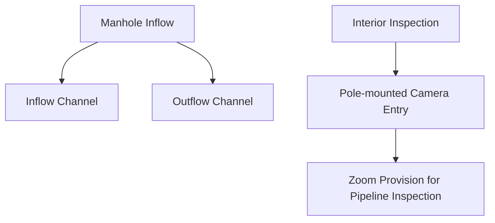

FIGURE 5.6 Manhole Inflow (Courtesy of AECOM)

## 5.1.2 Data Recording

Deficiencies can be noted on hardcopy forms or by using predesigned electronic forms using a data accumulator device. The latest electronic inspection technology allows the use of pole-mounted video and still cameras that extend into the manhole to allow internal inspection without entry: These cameras provide a zoom provision that allows for pipeline inspection in the vicinity of the incoming and outgoing sewer lines at the manhole.

Data to be obtained from each inspection should be tailored to the objectives of the project: Checklist-oriented recording forms are more appropriate than those requiring a long narrative, though the forms must include an area to record notes about conditions observed during the actual inspection. In addition to a written log, the inspection should be documented by photographs or videotapes, in electronic format; and verbal descriptions of each defect. This procedure may be modified to record defects only as they are located.
\n---\n

## 5.2 Smoke Testing Public/Private Property

Smoke testing is a form of source detection that can be used to locate improper connections or leaks in mainline sewers and private property sources, such as downspouts and area drains. Smoke testing works by allowing smoke to exit the sewer system through defects in the sewer system. Smoke testing is a relatively simple process, which consists of blowing smoke mixed with larger volumes of air into the sanitary sewer line; typically induced through the manhole. The smoke travels the path of least resistance and quickly shows up at sites that allow surface water inflow. Smoke will identify broken manholes, illegal connections (including roof drains, sump pumps, yard drains, and more), uncapped lines, and will even show cracked mains and laterals, providing there is a passageway for the smoke to travel to the surface.

Smoke testing has been used when further inflow evaluation is needed within a particular basin after initial evaluations indicate it may be needed. Following a flow-monitoring study or manhole inspection data evaluation, sanitary sewer basins with the highest inflow component should be targeted for further evaluation with smoke testing.

Smoke testing is used to detect storm sewer cross-connections and point-source inflow leaks, such as roof leaders, ponding areas, deficiencies in service connections, abandoned sewers, private property cleanouts, cellar, yard, foundation, and area drains. It should not be used in areas where it is suspected that sagging pipes or water traps exist.

One caution in using this process is that, even though smoke testing is deemed to be inexpensive, this procedure does not correctly identify or quantify all individual sources accurately: Smoke testing provides an indicator that a problem exists but does not provide the identification of the specific defect. However, it does allow a more targeted investigation within the general location of the suspected deficiency:
Figure 5.7 is an example of a manhole inspection form.
\n---\n

# Project: Kenilworth Study Area

<table>
<tr><td>Project</td><td>Kenilworth Study Area</td><td>Date</td><td>11-13-00</td></tr>
<tr><td>Job No.</td><td>18-00092152.02</td><td>Street</td><td>Kenilworth Ave</td></tr>
<tr><td>Manhole Number</td><td>5</td><td>Weather</td><td>Cloudy</td></tr>
<tr><td>Crew</td><td>ETK/SEB</td><td></td><td></td></tr>
<tr><td colspan="4"><strong>Physical Characteristics</strong></td></tr>
<tr><td>1. Type:</td><td>[x] Sanitary    [ ] Combined    [ ] Storm</td><td></td><td></td></tr>
<tr><td>2. Manhole Locations:</td><td>[ ] Freeway    [ ] Arterial    [x] Local Street    [ ] Easement</td><td></td><td></td></tr>
<tr><td>3. Manhole Depth:</td><td>12'</td><td></td><td></td></tr>
<tr><td colspan="4"><strong>Frame and Lid</strong></td></tr>
<tr><td>4. Type:</td><td>[x] Cast Iron    [ ] Holes    [ ] Lock Mech./Bolts    [x] Solid</td><td></td><td></td></tr>
<tr><td>5. Location:</td><td>[ ] Crown    [ ] Curb    [x] Grass    [ ] Driveway</td><td></td><td></td></tr>
<tr><td>6. Defect:</td><td>[ ] Frame Ajar    [x] Frame Leak    [ ] Cover Inflow    [ ] Surface Cracks</td><td></td><td></td></tr>
<tr><td>7. Solution:</td><td>[ ] Reset Frame    [x] Mortar Frame    [ ] New Cover    [ ] Reset Frame/Seal</td><td></td><td></td></tr>
<tr><td>8. Adjust Casting</td><td>[ ] Inches</td><td></td><td></td></tr>
<tr><td colspan="4"><strong>Steps</strong></td></tr>
<tr><td>9. Type and Condition:</td><td>[ ] Cast Iron    [x] PVC    [ ] Aluminum    [ ] Unsafe</td><td></td><td></td></tr>
<tr><td colspan="4"><strong>Corbel</strong></td></tr>
<tr><td>10. Type:</td><td>[x] Precast</td><td></td><td></td></tr>
<tr><td>11. Defect:</td><td>[ ] Cracked    [ ] Missing Brick    [ ] Loose Mortar    [ ] Other</td><td></td><td></td></tr>
<tr><td>12. Solution:</td><td>[ ] Seal Cracks    [ ] Repair Mortar    [ ] Replace Brick    [ ] Repair Mortar</td><td></td><td></td></tr>
<tr><td>13. Cost Impact:</td><td>[ ] High    [ ] Medium    [ ] Low    [x] None</td><td></td><td></td></tr>
<tr><td colspan="4"><strong>Wall</strong></td></tr>
<tr><td>14. Type:</td><td>[x] Precast    [ ] Concrete Block    [ ] Brick    [ ] Other</td><td></td><td></td></tr>
<tr><td>15. Defect:</td><td>[ ] Cracked    [ ] Bad Joint    [x] Missing Brick    [ ] Loose Mortar</td><td></td><td></td></tr>
<tr><td>16. Infiltration:</td><td>[ ] Stream    [ ] Sheet    [ ] Wet    [x] Dry</td><td></td><td></td></tr>
<tr><td>17. Solution:</td><td>[ ] Seal Cracks    [ ] Repair Joints    [ ] Replace Brick    [x] Repair Mortar</td><td></td><td></td></tr>
<tr><td>18. Cost Impact:</td><td>[ ] High    [ ] Medium    [ ] Low    [x] None</td><td></td><td></td></tr>
<tr><td colspan="4"><strong>Apron</strong></td></tr>
<tr><td>19. Type:</td><td>[x] Concrete    [ ] Brick and Mortar    [ ] Pipe Through    [ ] Other</td><td></td><td></td></tr>
<tr><td>20. Solution:</td><td>[ ] Seal Cracks    [ ] Brick and Mortar    [ ] New Pipe    [x] Other</td><td></td><td></td></tr>
<tr><td>21. Cost Impact:</td><td>[ ] High    [ ] Medium    [ ] Low    [ ] None</td><td></td><td></td></tr>
<tr><td colspan="4"><strong>Miscellaneous Information</strong></td></tr>
<tr><td>Miscellancous Information</td><td>[ ] House Connection    [ ] Stubline    [ ] Surcharge MH    Surcharge Depth ____ Ft</td><td></td><td></td></tr>
<tr><td colspan="4"><strong>Notes and Recommendations</strong></td></tr>
<tr><td colspan="1">Notes and Recommendations</td><td>Install inside drop pipe to line from Westchester. Invert rehabilitation to include new apron and PVC trough liner</td><td></td><td></td></tr>
<tr><td colspan="2"><strong>Location Drawing</strong></td><td colspan="2">[image or drawing placeholder]</td></tr>
<tr><td colspan="2"><strong>Photo of Deficiency</strong></td><td colspan="2">[image or photograph placeholder]</td></tr>
</table>

\n---\n

# FIGURE 5.7 Manhole Inspection Form (Courtesy of AECOM)

## 5.2.1 Notification/Safety

When considering the safety of smoke testing, it is important to use common sense. All types of smoke-testing devices can be used safely and effectively when certain guidelines are followed. Inhalation of any type of foreign substance can irritate breathing passages. The degree of irritation depends on the level of exposure and an individual's tolerance to that foreign substance. For example, someone in poor health or with respiratory ailments, such as asthma or emphysema, would be less likely to tolerate exposure to a foreign substance and should avoid exposure to any type of smoke. It is, therefore, important to include some information in the notification process to alert any person with respiratory ailments that testing will be conducted. It may also be necessary to station a person at any individual's home that has these types of ailments to ensure their safety during the smoke-testing process. When planning to smoke test, it is important to provide information on the locations and testing times to residents and business owners. Ads in local papers, door hangers, mailers, and door-to-door inquiries are recommended. It is helpful to educate the public as to why the test is being performed and the benefits to the community. In addition, the notice should instruct property owners on what to do and who to call if smoke should enter their homes. Unless dictated by individual fire departments, the property owners should first notify the smoke-test workers in the street of any intrusion of smoke. This way, an instantaneous decision can be made as to whether a real fire exists or if smoke from the testing has caused the alarm. The fire department can be notified by direct communication from the testing agency to minimize false alarm fire runs and reports to local police from residents. This should be done daily and include where and when smoke testing will be taking place. The better the public is notified; the fewer problems will occur in the success of the project.

## 5.2.2 Types of Smoke-Testing Equipment—Blowers

Most engineering specifications for smoke testing identify the use of a blower able to provide approximately 838 L/s (1750 cfm) of air. Once the manhole area is filled, the smoke only needs to travel through sewer segments and exit at deficient points in the sewer system.
\n---\n

There are two types of blowers available for smoke-testing sewers—squirrel-cage and direct-drive propeller. In general, squirrel cage blowers are larger but can provide more static pressure given a specific volume of air. The output of the squirrel-cage type is typically adjustable by alternating pulleys and belts to meet the demands of the job. Direct-drive blowers are generally more compact and offer at least approximately 1916 L/s (4000 cfm). Other than reducing the engine throttle, the output is not adjustable, because the fan blade is attached directly to the engine shaft.

## 5.2.3 Smoke Types

There are two types of smoke currently offered for smoke-testing sewers—classic smoke-candles and smoke-fluids. Smoke candles were first used for testing sewers when the process became popular in 1961. They are used by simply placing a smoke candle on the fresh-air-intake side of the blower: Once ignited, the exiting smoke is drawn in with the fresh air and blown down into the manhole and throughout the system. Smoke candles are available in various sizes, which can be used singularly or in combination. This type of smoke is formed by a chemical reaction, creating smoke that contains a high content of atmospheric moisture.

Another available source of smoke is a smoke-fluid system. Smoke fluids became available for sewer testing shortly after smoke candles. This system involves injecting a smoke fluid (typically a petroleum-based product) into the hot exhaust stream (stream or flow of smoke from hot exhaust to air) of the engine, where it is heated within the muffler (or heating chamber) and exhausted into the fresh-air-intake side of the blower. Smoke-fluid is generally less expensive than smoke-candles; however, smoke-fluids do not consistently provide the same quality of smoke. When using smoke fluid, it is important to understand that as fluid is injected into the heating chamber (or muffler), it immediately begins to cool the unit. The heating chamber will eventually reach a point where it is not hot enough to completely convert all the fluid to smoke, creating thin, wet smoke. This can happen quickly, depending on the rate of fluid flow. If the smoke has become thin, it can be especially difficult to see at greater distances. Blocking off sections of the line is typically a good idea with any type of smoke but becomes almost a necessity when using smoke fluid. Smoke candles and/or smoke fluid are commonly used to generate the smoke required to test a sewer system. Smoke should be non-toxic, odorless, and non-staining.
\n---\n

# 5.2.4 Setting Up Equipment
The smoke-testing setups will take several minutes to complete. Purchase smoke candles with a burn life of 3 to 5 minutes. The air blower is used to force smoke into the sanitary sewer system pipes. The air blower is mounted on a manhole. Previous testing results, from various studies, have indicated that using sandbagging and/or plugging will increase the number and type of deficiencies found. This smoke flow isolation can be used to block individual sewer sections to prevent smoke from escaping through manholes and adjacent sewer pipes.

# 5.2.5 Use of Inflatable Plugs
Plugging consists of physically isolating the sewer length from the rest of the system using plugs inserted into the sewer pipes. This can be used to direct smoke and concentrate it in pipelines of interest. Plugs generally are pneumatic and available from several manufacturers in diameters up to 61 cm (24 in.) for rigid body plugs and may be available up to 107 cm (42 in.) in diameter for non-rigid bag plugs.

Because plugs need to be inflated, compressed air must be available at the site.
Installation of larger diameter plugs may require winching. Plugs generally are inserted into an incoming line for easier removal. Plugs may be subject to large total hydraulic and pneumatic forces, even at low heads and small diameters. Failure of plugs is not uncommon. Workers near or downstream of plugs must always exercise extreme caution: All plugs should be tied off to manhole steps and have a stout tagline carried to the manhole entrance. The tagline is used to recover blown plugs and remove deflated plugs.
Plug removal is the most critical part of the plugging operation: Deflation is best done from the ground level, by use of an extension hose on the plug valve. If the manhole must be entered to deflate a plug, the person entering should wear a safety harness and should never stand in front of the plug, which should be deflated gradually: Even with care, a plug may be ejected from the pipe with high velocity, causing the manhole to fill rapidly with the released water: The person in the manhole should be positioned to avoid the plug and exit the manhole rapidly:

# 5.2.6 Testing Methodology
The procedures, listed in chronological steps, for smoke testing are as follows:
\n---\n

# 5.2.7 Proper Documentation of Smoke Testing/Quality Assurance/Quality Control

1. Using sandbags or inflatable sewer plugs in smaller lengths of sewer lines will provide better results, by confining the velocity of air and smoke to shorter sewer sections.
2. Prepare a smoke sketch of the setup, including location, crew initials, and date.
3. Begin the smoke testing using the air blower and ignite the smoke candle and ensure that smoke travels throughout the test section before ending the test. The larger diameter pipes will require more smoke candles and a longer testing time.
4. Open any storm manhole in the vicinity of the smoke blower. If smoke is observed in the storm sewer or at catch basins, disregard any houses seen with smoke in drains. When smoke transfers from the mainline storm to the sanitary sewer, this indicates that a leak exists in the main sewers. Any houses that display smoke in this example may not be deficient.
5. Visually inspect the entire smoke test area by walking around the front and back yards and the buildings. Take note of smoke leaks, such as roof leaders, driveway drains, area and yard drains, cleanouts, storm sewer inlets, catch basins, and the areas around manholes. When access to private property in the area has not been granted, consider using a utility bucket to elevate an observer to spot smoke.
6. Photograph or video-inspect all leaks.
   Show the location of the leaks on the smoke sketch setup. Include the photograph number, directions taken, and a brief description of the leak. Provide a unique identifier to locate the leak later, such as a street and house address.
Note: In areas where private property house laterals have traps (i.e., parts of Pennsylvania), the private property plumbing is not conducive for obtaining good results from smoke testing because of the configuration of the piping. Because there is a trap between the home and the mainline sewer that is filled with water (as shown in the examples below), smoke cannot pass beyond this trap; therefore, potential deficiencies in the piping between the trap in the line and the home are difficult to identify:
Figure 5.8 shows a typical Pennsylvania sanitary sewer building connection sewer trap and cleanout assembly:

Figure 5.8 shows a typical Pennsylvania sanitary sewer building connection sewer trap and cleanout assembly.
\n---\n

# FIGURE 5.8 Sanitary Sewer Building Connections Sewer Trap and Cleanout Assembly (Reprinted with Permission from Millcreek Township)

```mermaid
flowchart LR
    A[Cleanout] --> B[Vent]
    B --> C[12" height]
    A --> D[Cleanout at ground level]
    D --> E[Outside building or mobile home]
```

Outside building or mobile home

Quality assurance/quality control begins with the design of the testing program. The proper and complete notification process includes all agencies affected and the property owner of the area being tested. Using experienced staff who have been trained to recognize defects and can communicate with property owners and public safety forces is a necessity. The most important part of the smoke-testing process is the review of the results. An experienced technician should review the photos and videos containing deficiencies found, to evaluate results and ensure that the process was correctly performed. Though a good method for canvassing a large area in a short timeframe for deficiencies, some smoke-testing results may still need to be verified using a dyed-water-testing process. Figure 5.9 shows an illustration of typical deficiencies found during smoke testing. Figure 5.10 shows an example of a smoke-testing form.

## 5.2.8 Acceptable Conditions for Smoke Testing

Smoke testing is based on visual identification of smoke emerging through defects in the sewer, and as such, requires certain conditions in the field to be useful. Municipalities planning to engage in smoke testing should plan to conduct the tests during low winds so that smoke is not blown away and missed by inspectors. A low groundwater table is also needed, as active infiltration into the sewer system due to a high groundwater table from
\n---\n

Recent precipitation can block smoke from exiting the sewer through the associated defect. Similarly, snow on the ground can obstruct the identification of smoke. There should also be no partially or wholly plugged pipes except those required by the test; and no root curtains near the sections to be tested, which can obstruct smoke associated with root penetrations into the sewer so testers are unable to identify it.

<table>
<thead>
<tr><th>Component</th><th>Location / Description</th></tr>
</thead>
<tbody>
<tr><td>Foundation Drain</td><td>Foundation drain indicated in the graphic</td></tr>
<tr><td>Private Property Deficiency</td><td>Line labeled near private property side</td></tr>
<tr><td>Public Property Deficiency</td><td>Line labeled near public property side</td></tr>
<tr><td>Storm Lateral</td><td>Storm lateral sewer line</td></tr>
<tr><td>Sanitary Lateral</td><td>Sanitary lateral sewer line</td></tr>
<tr><td>Storm</td><td>Storm segment shown in the graphic</td></tr>
<tr><td>Sanitary</td><td>Sanitary segment shown in the graphic</td></tr>
<tr><td>Smoke Blower</td><td>Device used to inject smoke into the sewer</td></tr>
</tbody>
</table>

FIGURE 5.9 Smoke Testing Graphic
\n---\n

<table>
  <tr>
    <td>Project:</td>
    <td> ____________________</td>
    <td>Job No.:</td>
    <td> __________</td>
    <td>Date:</td>
    <td> __________</td>
  </tr>
<tr>
    <td>Manhole Number:</td>
    <td> __________</td>
    <td>Basin:</td>
    <td> __________</td>
    <td>Initials:</td>
    <td> __________</td>
  </tr>
<tr>
    <td>Street:</td>
    <td> __________</td>
    <td></td>
    <td></td>
    <td></td>
    <td></td>
  </tr>
</table>

<table>
  <tr>
    <td>Weather:</td>
    <td>[ ] Dry Period</td>
    <td>[ ] Rain</td>
    <td>[ ] Within Past 24 hours</td>
    <td>Ground Condition:</td>
    <td> __________</td>
  </tr>
</table>

<h3>SMOKE LOCATION</h3>

<table>
  <tr>
    <td>1. Roof Leader</td>
  </tr>
<tr>
    <td>[ ] Left Front</td>
  </tr>
<tr>
    <td>[ ] Right Front</td>
  </tr>
<tr>
    <td>[ ] Left Rear</td>
  </tr>
<tr>
    <td>[ ] Right Rear</td>
  </tr>
<tr>
    <td>[ ] Center Front</td>
  </tr>
<tr>
    <td>[ ] Center Rear</td>
  </tr>
<tr>
    <td>[ ] Other ______</td>
  </tr>
<tr>
    <td>[ ] Other ______</td>
  </tr>
<tr>
    <td>2. Subsurface</td>
  </tr>
<tr>
    <td>[ ] Area Drain</td>
  </tr>
<tr>
    <td>[ ] Foundation Drain</td>
  </tr>
<tr>
    <td>[ ] Sump</td>
  </tr>
<tr>
    <td>[ ] Grass</td>
  </tr>
<tr>
    <td>[ ] Street Crack</td>
  </tr>
<tr>
    <td>[ ] Catch Basin</td>
  </tr>
<tr>
    <td>[ ] Storm Sewer</td>
  </tr>
<tr>
    <td>[ ] Manhole Frame</td>
  </tr>
<tr>
    <td>[ ] Lateral in Grass</td>
  </tr>
<tr>
    <td>[ ] Cleanout w/o Cap or Broken</td>
  </tr>
<tr>
    <td>[ ] Cleanout in Low Area</td>
  </tr>
<tr>
    <td>[ ] Other ______</td>
  </tr>
<tr>
    <td>3. Equipment Used</td>
  </tr>
<tr>
    <td>Plugs: [ ] Yes   [ ] No</td>
  </tr>
<tr>
    <td>Multiple Blowers: [ ] Yes   [ ] No</td>
  </tr>
<tr>
    <td>Video Camera: [ ] Yes   [ ] No</td>
  </tr>
<tr>
    <td>Digital Camera: [ ] Yes   [ ] No</td>
  </tr>
<tr>
    <td>Recommended Dye Test: [ ] Yes   [ ] No</td>
  </tr>
<tr>
    <td>Photo ______</td>
  </tr>
</table>

<table>
  <tr>
    <td>4. Remarks</td>
  </tr>
<tr>
    <td>________________________________________________________________________________</td>
  </tr>
<tr>
    <td>________________________________________________________________________________</td>
  </tr>
</table>

<table>
  <tr>
    <td>SKETCH:</td>
  </tr>
<tr>
    <td>
<pre>
+--------------------------------------------------+
|                                                  |
|                                                  |
|                                                  |
|                                                  |
+--------------------------------------------------+
</pre>
    </td>
  </tr>
</table>

\n---\n

*FIGURE 5.10 Smoke Testing Form (Courtesy of AECOM)*

## 5.3 Dyed-Water Testing of Public Property

Dyed-water testing is a source-detection technique used to identify and quantify leaks that occur during wet weather conditions. This tool is used to predict how public sewer systems react during rainfall conditions. It is used primarily to detect the inflow of rainfall from storm sewer sections, stream sections, and ditch sections to sanitary sewers. Fluorescent dyes that are biodegradable and inert to soils are used for this testing technique. Storm sewer sections, which parallel or cross sanitary sewers and service lateral connections, are plugged and partially flooded with dyed water. Catch basins, stream sections, ditch sections, and ponding areas near sanitary sewers are also partially flooded with dyed water. In all instances of dyed-water testing, the downstream manhole of the sanitary sewer system is monitored for evidence of dyed water. The observed presence and concentration of dyed water is an indicator that an infiltration and inflow source exists and is recommended for internal inspection by CCTV equipment. The results of the television inspection report are used to document the infiltration and inflow sources and provide a basis for the appropriate sewer system rehabilitation technique. Figure 5.11a illustrates a dyed-water test of a public sewer system. Figure 5.11b shows an example dye testing form.

<table>
<thead>
<tr><th>Figure</th><th>Description</th></tr>
</thead>
<tbody>
<tr><td>Figure 5.11a</td><td>illustrates a dyed-water test of a public sewer system</td></tr>
<tr><td>Figure 5.11b</td><td>shows an example dye testing form</td></tr>
</tbody>
</table>

### 5.3.1 Public Notification

Dyed-water testing of public sewers begins with the notification of public utilities and regulatory agencies that dye is being used as part of the testing of sewer systems in the area. Frequently, dye is observed in streams, ditches, and lakes by property owners and is reported to authorities. This notification process allows the authorities to respond to property owner's concerns.

### 5.3.2 Storm Sewers

Storm drains that parallel or cross sanitary sewer sections and has crown elevations greater than the invert elevations of the sanitary sewers can be sources of rainfall-derived infiltration or inflow. They are inflow sources if there are cross-connections between storm drain sections and sanitary sewers; they are infiltration sources if stormwater can exfiltrate
\n---\n

from them; percolate or migrate through the soil, and enter the sanitary sewers through pipe or joint defects:

FIGURE 5.11a Dye Testing on Public Property: (a) Graphic

Sewers that are parallel to or cross over sanitary sewers are tested for migration of
stormwater to the sanitary sewer system. The testing is initiated by accessing a source of
water; typically municipal hydrants. Hoses are used to transfer water to the source(s)
being tested. If hydrants are not available for use, water tank trucks can be used to
transport water into the area for testing:

The process of testing storm sewers is as follows. Each downstream storm sewer
segment is plugged with inflatable plugs or sandbags. Water and dye are then added and
allowed to fill to no more than one-half of the sewer diameter. Careful attention must be
paid to the time and extent of water used, so as not to overfill the storm sewer: (Note:
\n---\n

Field technicians should remember that the downstream portion of the storm sewer being tested may eventually have a higher water level than where water is being added, depending on the diameter, slope, and length of the pipe being tested. Overfilling may cause flooding of area homes through their storm connections (the process of using inflatable sewer plugs is described in the Use of Inflatable Plugs section and should be reviewed for safety before using plugging during the dyed-water-testing process).
\n---\n

# FIGURE 5.11b Dye Testing on Public Property: (b) Public/Private Dye Testing Form

<table>
  <tr>
    <td>Project Manager:</td>
    <td>__________________________</td>
    <td>Testing Date:</td>
    <td>__________________</td>
    <td>Time:</td>
    <td>__________________</td>
  </tr>
<tr>
    <td>Project Name:</td>
    <td>__________________________</td>
    <td>MH Location:</td>
    <td>__________</td>
    <td>Street</td>
    <td>__________________</td>
  </tr>
<tr>
    <td>Project Job #:</td>
    <td>__________________________</td>
    <td>Directions to Location</td>
    <td>__________________________</td>
    <td>Location</td>
    <td>__________________</td>
  </tr>
<tr>
    <td>Location Description</td>
    <td>__________________________</td>
    <td>Supervisor:</td>
    <td>__________________________</td>
    <td>Other</td>
    <td>__________________</td>
  </tr>
<tr>
    <td>Tributary Area:</td>
    <td>Residential</td>
    <td>Commercial</td>
    <td>Undeveloped</td>
    <td>Industrial</td>
    <td></td>
  </tr>
<tr>
    <td>(Test Type:</td>
    <td>CB X-over</td>
    <td>Storm X-over</td>
    <td>SAN: </td>
    <td>Undeveloped STM</td>
    <td>Residential</td>
  </tr>
<tr>
    <td>Positive Dye Transfer:</td>
    <td>Street Flood</td>
    <td>MH: Flooding</td>
    <td>Ditch Flooding</td>
    <td>Parallel</td>
    <td></td>
  </tr>
<tr>
    <td>Plug used?</td>
    <td>NA</td>
    <td>Storm size:</td>
    <td>__________</td>
    <td>FRM MH:</td>
    <td>__________</td>
  </tr>
<tr>
    <td>Comments:</td>
    <td colspan="5">__________________________________________</td>
  </tr>
<tr>
    <td>TO MH:</td>
    <td>__________</td>
    <td colspan="4"></td>
  </tr>
</table>

<br/>

<table border="1">
  <tr>
    <th>Downspouts Tested</th>
    <th>RF</th>
    <th>LF</th>
    <th>CF</th>
    <th>CR</th>
    <th>RR</th>
    <th>LR</th>
    <th>Other</th>
  </tr>
<tr>
    <td>Weather:</td>
    <td>Dry</td>
    <td>Rain</td>
    <td>Rain in last 24hr</td>
    <td>Other</td>
    <td></td>
    <td></td>
    <td></td>
  </tr>
<tr>
    <td>Leak Rating:</td>
    <td>.5 or less</td>
    <td>1 to 3 gpm</td>
    <td>3 to 5 gpm</td>
    <td>5 to 8 gpm</td>
    <td>10 or greater</td>
    <td></td>
    <td></td>
  </tr>
<tr>
    <td>Type of Leak:</td>
    <td>X-Conn.</td>
    <td>Joint</td>
    <td>Lateral</td>
    <td>Other</td>
    <td></td>
    <td></td>
    <td></td>
  </tr>
<tr>
    <td>Dye Observation Location:</td>
    <td>STM MH#</td>
    <td>Lateral location address</td>
    <td colspan="6"></td>
  </tr>
<tr>
    <td>Leak Rating rating w/o CCTV:</td>
    <td>Direct</td>
    <td>Conn.</td>
    <td>Diluted</td>
    <td>Weak</td>
    <td>Trace</td>
    <td colspan="2"></td>
  </tr>
<tr>
    <td>CCTV Equipment used:</td>
    <td colspan="3"></td>
    <td>CCTV Operator Initials:</td>
    <td colspan="2"></td>
  </tr>
<tr>
    <td>Additional Setup Equipment Needed:</td>
    <td colspan="7"></td>
  </tr>
</table>

<br/>

<table border="1">
  <tr>
    <th>PICTURE</th>
    <th>TEST</th>
    <th>PLAN</th>
  </tr>
<tr>
    <td colspan="3" style="height:120px;">[image area]</td>
  </tr>
</table>

<br/>

Site/Setup Comments
<br/>
__________________________________________________________________________________________
<br/>
__________________________________________________________________________________________

<br/>

FIGURE 5.11b Dye Testing on Public Property: (b) Public/Private Dye Testing Form

<br/>

The downstream sanitary manhole is monitored for the presence of dyed water. Minimal
leaks showing low concentrations of dye can be identified by using a white foam or plastic
\n---\n

A cup lowered into the flow of the sanitary sewer. The low concentrations of dye will be easily recognized against the white background of the cup. Observing the color of the water while pouring out the water will also reveal slight coloration produced from minor leaks. All results are documented for further inspection using CCTV.

## 5.3.3 Catch-Basin Crossover
The process of testing catch-basin crossover pipes is similar to the testing of parallel storm sewers. The storm discharge pipe from a catch basin that crosses over the sanitary sewer is selected for testing. This storm pipe outlet typically discharges into a storm manhole, which is plugged, and the process of filling with dyed water is repeated. The downstream sanitary manhole is observed for the presence of dye. Any observed presence of dye is documented for further inspection using CCTV.

## 5.3.4 Stream Sections
To determine whether stream sections, ditch sections, or ponding areas located near, or above sanitary sewer sections are causing infiltration and inflow, a procedure similar to that described above should be followed. Stream sections, ditch sections, or pond areas to be tested should be plugged or dammed (if necessary) and filled to desired levels with dyed water. If dye is observed in the sanitary sewer segment under the stream, CCTV inspection is recommended to identify any deficiencies.

## 5.3.5 Closed-Circuit Television
When dyed water is observed in any sanitary sewer segment, a CCTV inspection should be performed. If equipment is immediately available, leaking sanitary sewer segments should be inspected to determine the location and type of leak(s) that may occur. The type of rehabilitation will depend on the type of leak observed. Methods for the rehabilitation of lateral leaks and sewer joint leaks may differ. Documentation of leaking conditions will assist in the final recommendations for the removal of these sources. The results of the television inspection can be used to document the infiltration and inflow sources and provide a basis for the appropriate sewer system rehabilitation technique.

## 5.3.6 Types of Dyes and Dye-Testing Equipment
Fluorescent dyes typically are used, each having a distinct color readily detectable by the naked eye. A suitable dye should be safe to handle, visible in low concentrations in water,
\n---\n

### 5.3.7 Setting Up Equipment

Dye is inert to solids and debris in the sewers, and biodegradable. The visual aspect of fluorescent dye products refers to the normal reflection of light as color. The fluorescent aspect refers to the special properties of some chemicals to absorb certain wavelengths and then emit, rather than reflect, light in response. Many dye products are certified by NSF International (Ann Arbor, Michigan) for use in drinking water. This type of dye is the traditional fluorescent water tracing and leak detection material and has been used for tracing studies. It may be detected visually, by UV light, and by appropriate fluorometric equipment. Today, it is most often used visually for testing sewer systems.

Inflatable sewer plugs are used to isolate each of the sewer segments to be tested.

5.3.7 Setting Up Equipment

Equipment needed for dye-water testing is limited to that required to carry the water to the testing site and block the sewer or study areas before testing. When fire hydrants are close to the sewer sections to be tested, a fire hose is all that is needed to deliver water to the testing site. When the water source is not close by, water tankers are needed to deliver water. Sandbags or sewer pipe plugs are typically used to block sewer sections.

5.3.8 Testing Methodology

The objective of the dye-testing task is to isolate small reaches of sewer and identify if leaks exist within each reach. General procedures for dye-water testing in storm-drain and catch-basin sections are as follows:

1. Plug the downstream end of the storm-drain section to be tested with sandbags or inflatable sewer plugs.
2. Fill the storm-drain segment to approximately one-half the diameter and stormwater inlets or catch basins to just below the grate, with dyed water.
3. Monitor the next downstream manhole in the sanitary sewer system for evidence of dyed water.
4. Record the location of storm drains and sanitary sewer lines being tested; the time and duration of tests; and manholes where the observed presence, concentration, and travel time of the dyed water is observed.

5.3.9 Proper Documentation Quality Assurance/Quality Control
\n---\n

## 5.4 Dye Testing of Private Property

As in the previous testing technique, quality assurance/quality control begins with the design of the testing program. The proper and complete notification process includes all agencies affected and the property owner population being tested. Using experienced staff who have been trained to recognize defects and can communicate with property owners and public safety forces is a necessity. The most important part of the dye testing process is being aware of the amount of water being stored in the sewer section being tested. Too much water can cause flooding of property owner properties, while too little water will not produce the leaks experienced during intense rain events.

Again, experienced, trained technicians should be used during the testing process. All results should be documented on hardcopy and/or electronic forms for review at the end of the testing process. Still photos and videos containing deficiencies found should be reviewed to evaluate the results to determine the best method of rehabilitation.

Infiltration and inflow of stormwater from private property sources can potentially cause problems of surcharge, and overflows, and eventually contribute to basement flooding of private houses. The causes of infiltration and inflow problems often include drainage deficiencies found on private property: Figures 5.12 and 5.13 show the testing of all downspouts using a rainfall-simulation technique.
\n---\n

# FIGURE 5.12 Private Property Testing Graphic

The diagram depicts a house with two sewer lines extending from the building to the street: a storm sewer line and a sanitary sewer line, illustrating private property testing configuration where lines exit the property boundary.

```mermaid
graph TD
    House[House (Private Property)]
    StormLine[(Storm)]
    SanLine[(Sanitary)]
    House -- Storm line --> StormLine
    House -- Sanitary line --> SanLine
    StormLine --> MainStorm[Main storm drain off-property]
    SanLine --> MainSan[Main sanitary drain off-property]
```

FIGURE 5.12 Private Property Testing Graphic
\n---\n

<table>
  <thead>
    <tr><th>FIGURE 5.13 Private Property Testing</th></tr>
  </thead>
  <tbody>
    <tr>
      <td>Image: A person standing on a lawn in front of a modern residential house with landscaping and driveway visible.</td>
    </tr>
  </tbody>
</table>

## 5.4.1 Notification

Notification for the testing of private property structures comes in the form of public information and education. Municipalities must develop a private property infiltration and inflow reduction program that is understood by the public. The planning of this program must include informing and educating the public because the testing or source-detection work will be performed on private property. Providing public awareness is the most important step in implementing a successful program. Key to this effort is the use of a wide range of outreach methods and media to ensure that the information is disseminated to all age and socioeconomic groups within the study area.
\n---\n

The education of building owners can be accomplished in several ways. Public notices in local newspapers or brochures can be designed, which explain the problem of sanitary sewer overflows and basement flooding. Included in this category can be the use of a property owner questionnaire. This questionnaire can provide valuable information, such as general flooding information, location and number of downspouts, existence of sump pumps, and surface water problems that may contribute to flooding. The questionnaire is mailed to the property owners, sometimes as a supplement to a water bill, to ensure that there is a direct line of communication from the city to the property owner. Additional electronic notifications should be made. This can include an email campaign to customers, as well as posts on social media to reach younger customers who consume information online. The emails and posts should link to a dedicated information page on the utility website.

Another form of public education is a public meeting. When a municipality institutes a program of infiltration and inflow reduction in a community, public meetings can be planned to provide information to property owners on the extent of the problem, explain the testing to be performed, and identify various methods of rehabilitation. Information, in graphics, can be provided that explains the importance of maintaining private laterals and a description of how deterioration, because of the lack of maintenance, causes infiltration and inflow problems. The remedies for these problems and general costs can be explained so that building owners understand their area of responsibility:
- Roof leaders
- cellar
- yard and area drains
- abandoned building sewers
- faulty connections
- and problems of poor grading of stormwater typically are located on private property, and owners should be notified before any tests are conducted:

## 5.4.2 Downspouts and Area Drains

To identify inflow sources, dyed water is poured into the downspouts and area drains. Each downspout is a potential contributor. However, as each downspout and area drain connect to a storm lateral, the possibility exists that the storm lateral could contain a deficiency anywhere that can cause leakage or migration of the stormwater to the sanitary lateral. The rainfall-simulation technique — the supplying of water to each downspout simultaneously — can best identify leaks that occur during intense rain events. If downspouts and/or gutters are blocked, the testing should continue, as this is what occurs
\n---\n

## 5.4.3 Straight Run of Lateral

During intense rainfall events, and any overflowing water often migrates to the foundation drain or sanitary lateral. At all times during the testing, the sanitary lateral should be observed by the CCTV operator, so no deficient area tested is missed. Figures 5.12 and 5.13 show such private property testing.

In addition, the straight run of the sanitary lateral is tested. It is necessary to determine if surface water migrates to the sanitary lateral, contributing to this portion of the lateral. During the house-testing process, technicians should observe the surface areas above the location of the sanitary lateral, from the house to the area of the connection to the sanitary sewer. When low points are observed, these areas should be tested, by discharging dyed water onto the ground at these locations. The sanitary sewer may be in the street or the rear yards in easements. Therefore, it is necessary to observe the area between the house and the sanitary sewer, typically in the grassy area in front or at the rear of the house.

The testing can be performed using a manifold that disperses the water equally over the ground at the point at which the low area was observed. Low points in the surface may indicate that a leak belowground is causing erosion and allowing rainwater to migrate to the lateral. Testing of the lateral should be done using a different color dye than was used for the house downspouts and area drains:

One additional area has been added to the testing, which has shown to be a significant contributor to infiltration and inflow to homes. The area to test is composed of downspouts that splash to the ground. The test is done similarly where the PVC hooks are placed in the gutter near the downspout; and water is allowed to discharge naturally onto the ground. In recent studies of the testing of splashed downspouts, it has been determined that, often, water does not discharge away from the home, and, subsequently, stormwater migrates to the foundation drain and ultimately to the sanitary lateral and sewer system. During the testing process, splashed downspouts should be tested as though they discharge into the ground:

## 5.4.4 Closed-Circuit Television
\n---\n

The CCTV operator is in the CCTV camera van as the testing of each house is being performed. Pertinent information, such as the street address, locations of downspouts and area drains being tested, and color of dye used, is recorded for each house tested. During the testing process, when dyed water is observed at the discharge of the lateral by the CCTV operator, the flowing lateral is recorded, and an estimate of flow is then assigned to this potential source. The approximate waiting time for observation varies from 5 to 15 minutes at each house. When the testing of downspouts and area drains is complete, the straight run is tested using a different color dye. If dye is observed from any point in the straight run of the sanitary lateral, the operator documents the approximate location of the test and the quantity of dyed water observed:

## 5.4.5 Types of Dye and Testing Equipment

Typically, fluorescent dyes are used, each having a distinct color that is readily detectable by the naked eye. A suitable dye should be safe to handle, visible in low concentrations in water, inert to solids and debris in the sewers, and biodegradable, similar to what is used in the testing of mainline storm sewers and catch basins.

However, the testing is performed using a manifold that distributes hydrant water equally to all downspouts and area drains on individual houses. This technique is used to best simulate rainfall on the drainage downspouts and area drains on each property tested:

Garden hoses connect to the manifold and are connected at the discharge point to a 2.5 cm (1-in.) PVC pipe, which acts as a hook that allows for hanging on to each gutter near the individual downspout. Quick disconnects provide easy hookup and removal after the testing of each house. It is important to test as many drains as possible at one time, as significant rainfall simulation is what triggers the leaking condition.

## 5.4.6 Setting Up the Equipment

If hydrants are not readily available, water from water tank trucks or sewer jet trucks can be used as a source of water. Using a water or jet truck also allows work to proceed on streets with heavy traffic. The testing of private property buildings assists in locating sources associated with faulty downspouts, area drains, and foundation drain problems. However, ladders are no longer used, and PVC extensions that can reach gutters are used to create a safer method of testing:

## 5.4.7 Testing Methodology

\n---\n

The rainfall-simulation testing is performed following notification of the property owner at the home. If the property owner is at home, he/she is asked to postpone the use of water for approximately 15 minutes, while the test is being performed. If the property owner is not at home, the test proceeds anyway: Water is then supplied to each of the stormwater downspouts and area drains, while the CCTV camera is positioned in the main sanitary sewer at the property owner's sanitary lateral. Dyed water is then added at each of the downspouts and area drains. If, after approximately 15 minutes, no water is observed at the discharge of the sanitary lateral, the testing is suspended, the house is assumed to be noncontributory, and the testing apparatus is then moved to the next house.

## 5.4.8 Proper Documentation Quality Assurance/Quality Control

All testing results are documented using hardcopy and/or electronic forms that contain all pertinent information about the house being tested. Pertinent data collected includes the street address and location of each test and observed dye transfer:

The process of testing private property storm structures is tedious, and the results are a direct result of the quality control of the testing: Older methods of testing allowed for the use of one garden hose applying water to individual downspouts and area drains. When and if the dye was observed, the next drain was tested.

Recent testing methods have indicated that this previous method did not effectively simulate a rain event, because, in a true rain event, all downspouts and area drains are flowing, creating more flow in the storm piping than the older method. As a result of increasing the amount of water in the testing method, more leaks have been observed. The development of better testing methods has provided the municipality with a more accurate representation of what occurs during an intensive rainfall event:

As in any infiltration and inflow field testing, it is important to use experienced staff who have been trained to perform testing while carefully working on the property owned and maintained by the property owner. All results should be documented on hardcopy and/or electronic forms for review at the end of the testing process. Still photos and videos containing deficiencies found should be reviewed to evaluate results to determine the best method of rehabilitation. Figure 5.14 shows an example of a property owner's dye-water-testing form.

\n---\n

# 5.5 Closed Circuit Television Inspections
## 5.5.1 Mainline Inspections

Camera-based inspection technologies have proven very effective in identifying defects in pipelines that are not visible through a manhole inspection. Although generally more costly than other methods to identify sources of inflow and infiltration, CCTV inspections provide a powerful tool not only to identify problems, but also help to plan the best actions for remediation. The level of technology and sophistication may vary, but this practice generally includes a tracked or wheeled video camera with a light capable of entering pipes too small for human entry. The cameras typically can tilt; pan, rotate, and zoom to fully inspect any found defects, and camera operators stop at each defect to take photographs. The inspections also result in a video file that can be saved and used for further reference in the future. Closed-circuit television inspections usually produce evidence of maintenance issues like roots and debris, and structural defects, including joint defects, cracks, fractures or holes in the pipe wall, sags, historical or active infiltration, problematic sewer connections, and deterioration of concrete due to acid attack:

Municipalities engaging in CCTV should prioritize basins to manage the cost of the program by first engaging in other, less expensive investigation practices (discussed in the subsections above) to identify the locations with the most potential for major defects or a concentration of smaller defects.

In the past, CCTV inspections usually resulted in simply a series of videos that were reviewed by engineers to determine the best methods for the rehabilitation of problematic sewers. In recent years, standardization of training and the identification of various types of defects has resulted in the additional output of condition assessment databases describing all the findings in a repeatable, consistent, and qualitative manner. These databases can often preclude the need to manually review all videos, and they can be united with geographic information system (GIS) information to create powerful mapping tools to facilitate a systematic approach to identifying and prioritizing pipeline repair and renewal projects. Utilities considering engaging in CCTV are recommended to have written contracts specifying the standards which are expected for the results of the survey, so that the resulting information may be leveraged to its fullest effect.
\n---\n

# Site Test Form

<table border="0" cellpadding="4" cellspacing="0">
<tr><td>Project:</td><td> </td></tr>
<tr><td>Job No.:</td><td> </td></tr>
<tr><td>Date:</td><td> </td></tr>
<tr><td>Manhole Number:</td><td> </td></tr>
<tr><td>Basin:</td><td> </td></tr>
<tr><td>Initials:</td><td> </td></tr>
<tr><td>Address:</td><td> </td></tr>
</table>

<br/>

<table border="0" cellpadding="4" cellspacing="0">
<tr><td>Weather:</td>
    <td>[ ] Dry Period  [ ] Rain  [ ] Within Past 24 hours  [ ] Ground Condition: __________</td></tr>
<tr><td>Test Location</td><td></td></tr>
<tr><td>1. Location:</td>
    <td>[ ] House   [ ] Comm. Building   [ ] Indus. Building   [ ] Other ______</td></tr>
<tr><td>2. Roof Leader:</td>
    <td>[ ] Left Front    [ ] Right Front    [ ] Left Rear    [ ] Right Rear
          [ ] Center Front    [ ] Center Rear    [ ] Other ______</td></tr>
<tr><td>3. Subsurface:</td>
    <td>[ ] Area Drain    [ ] Foundation Drain    [ ] Sump    [ ] Other ______</td></tr>
<tr><td>Positive Dye Transfer</td><td></td></tr>
<tr><td>4. Dye Transfer:</td>
    <td>[ ] Yes    [ ] No</td></tr>
<tr><td>5. Test Location:</td>
    <td>[ ] Left Front    [ ] Right Front    [ ] Left Rear    [ ] Center Front
          [ ] Center Rear    [ ] Other ______    [ ] Right Rear</td></tr>
<tr><td>7. Subsurface:</td>
    <td>[ ] Area Drain    [ ] Foundation Drain    [ ] Sump    [ ] Other ______</td></tr>
<tr><td>8. Dye Observation Location:</td>
    <td>[ ] Above Cleanout    [ ] Below Cleanout (Toward Street)    [ ] From Cracked
          [ ] From Joint in Lateral    [ ] Other ______</td></tr>
<tr><td>9. Type of CCTV Equipment Used</td>
    <td>[ ] Push Camera    [ ] Mainline Camera</td></tr>
<tr><td>Remarks:</td><td> </td></tr>
</table>

<br/>

<h3>SKETCH:</h3>
<pre>
+--------------------------------------------------------------+
|                                                              |
|                                                              |
|                           [Sketch Box]                       |
|                                                              |
+--------------------------------------------------------------+
</pre>

\n---\n

FIGURE 5.14 Residential Dye-Water Testing With CCTV Form (Courtesy of AECOM)

Additional information related to CCTV inspections may be found in Chapter 2 and Chapter 3 of this manual.

# 5.5.2 Private Lateral Inspections

Camera-based inspections can be a key component of targeting and addressing private sources of inflow and infiltration, and use technologies very similar to those for mainline sewer inspections. If private sewer laterals are to be inspected as part of an ongoing program focusing on a certain neighborhood or region, a utility must obtain homeowner permission before the inspection can begin. Alternatively, inspections may be conducted privately and paid for by homeowners as part of point-of-sale requirements if required by the local code.

# 6.0 POTENTIAL CONSEQUENCES OF INACTION (PUBLIC PROPERTY)

There are two major incentives to municipalities for performing infiltration and inflow reduction—regulatory concerns and political concerns. The first deals with sanitary sewer overflows and/or overflows at the water resource recovery facility (WRRF). When infiltration and inflow cause either of these to be issues, regulatory agencies become involved, mandating the reduction of infiltration and inflow to reduce overflows.

Political concerns are raised when property owners of a community suffer basement flooding and blame the political administration for these flooding occurrences. If neither of these incentives is brought to the attention of the municipality, not much is done to reduce the infiltration and inflow in a collection system.

The lack of any action towards the reduction of infiltration and inflow can cause increased basement flooding of area homes, further structural damage of facilities (manholes/pipelines), increased flow at WRRFs, and associated treatment costs. In addition, potential basement flooding lawsuits may arise from property owners contending the municipality's negligence in performing preventive maintenance. Finally, the local regulatory agency will ultimately become involved because of potential water quality issues.
\n---\n

In conjunction with the lack of action in the rehabilitation of collection systems, some municipalities have determined that advising property owners to install backflow preventers using flap gates or standpipes provides the property owners limited protection against basement flooding. These mechanical devices are recommended to be used in the sanitary lateral to protect from surcharging and eventual flooding of buildings. These devices are recommended for usage to restrict flow from entering buildings during intense rain events. Improper application of these devices can sometimes cause new problems around the building walls while trying to protect against the direct flooding of the building interior. For instance, a standpipe may be installed in a drain to restrict water from entering through the basement floor drain.

The property owner will feel confident during a rainfall event as the sanitary sewer surcharges in the street. Then, as the floodwater seeks its lowest level at the house, the liquid begins to rise in the standpipe. However; this same liquid, though rising in the standpipe, is also backing up into the perforated foundation drain along the outside foundation wall of the building. This water can exfiltrate from the pipe, and it creates pressure against the floor slab and foundation or basement walls. This pressure can cause cracks in, or even the collapse of, the basement walls.

Backflow preventers have been recommended to property owners of an area that experiences flooding. However; when these devices are installed below the basement floor but inside the foundation wall; the same problem can occur as in the standpipe. Stormwater backs up behind the flap gate and begins to exfiltrate from the foundation tile to the level of surcharge in the local sewer system. Pressure is created against the basement walls by this water. This pressure can cause cracks and eventual leaks. If these devices are installed, it is important to understand where to install them to protect against causing other problems. More importantly, attack the problem at the source by fixing what is broken.

## 7.0 POTENTIAL CONSEQUENCES OF INACTION (PRIVATE PROPERTY)

Municipalities are held responsible for infiltration and inflow discharged to WRRFs and for overflows of wastewater to the environment. Property owners are the real owners of the wastewater facilities, including the sewer system. Property owners are additionally
\n---\n

responsible for the maintenance of their property, including the storm and sanitary sewer piping. It is, therefore, reasonable to ask property owners to act responsibly and simply address private property problems. Compared to public property, it is much more challenging for municipalities to make property owners correct deficient conditions on private property that contribute to infiltration and inflow in the municipal collection system.

The consequences of inaction for inflow and infiltration from private property are an area of growing concern, and recent evidence indicates that it may be even more impactful than inflow and infiltration from public sources. The length of private laterals in a separate sewer system can easily equal or exceed the length of the public sewer mains, and the quantity of inflow and infiltration from private sources can correspondingly contribute significantly to wet weather flows and resulting overflows. Inflow and infiltration reduction strategies for sanitary sewer systems that include both public and private source identification and removal achieve the greatest levels of reductions. Recent results from a pilot study in St. Petersburg provide evidence of this effect. The study aimed to identify the effect of private inflow and infiltration removal. According to the city’s estimate, a combined targeted private and targeted public program can result in approximately 64% reduction in total inflow and infiltration, which consists of a public-associated reduction of 30% coupled with a private-associated reduction of 34% from the study area. It is important to note that based on the city’s unit cost for removal of inflow and infiltration, targeted private removal is a more cost-effective approach by nearly 50% as compared to the unit cost of removing inflow and infiltration from public sources.

Many additional communities have addressed the problems of infiltration and inflow on private property. The most successful communities have developed a structured program, and, through partnership with property owners, have reduced private property infiltration and inflow problems. Without this cooperation, there will inevitably be increased basement flooding of area homes and further deterioration of the small-diameter piping on private property:

Municipalities must develop an ordinance that requires property owners and businesses that connect to the sanitary sewer to allow an on-site inspection. If, upon inspection, an infiltration and inflow deficiency is found, the building owner should be notified to rehabilitate, and a reinspection should be performed confirming that the source(s) have
\n---\n

# 8.0 LEGAL CONSIDERATIONS REGARDING PRIVATE PROPERTY TESTING

8.1 City Ordinance

As stated in the previous section, it is important to involve the municipal administration and council to gain the necessary support in developing and enforcing a private property program. Without political support, the program will not be able to succeed. Legal issues, rather than technical issues, tend to be the greatest challenge to implementing a program to reduce private sources of inflow and infiltration:

Legal considerations should be reviewed by the municipal solicitor or law director. After the proper documentation has been reviewed, it is sent to the council for approval. Once the program, including enforcement ordinances, is approved, the infiltration and inflow program can be implemented. One key provision is to ensure the municipality develops ordinances that prohibit stormwater connections to sanitary sewers to give the local utility authority to require disconnections. It is also recommended that a utility exercise care in clearly establishing the ownership of the system, and define where the local interface between public and private assets is located:

Utilities should be cautious about the use of public funds to repair private sources of inflow and infiltration, as challenges related to equity and fairness may arise, and precedents
\n---\n

can be set that may prove challenging in the future. In addition, the right of access either through easement or by a temporary waiver should be considered:
The program should begin with public education, informing the property owners of the necessity of maintaining their storm and sanitary piping. Graphics must be developed that show how small-diameter piping functions, so that property owners can be made aware of the problems that may exist underground on their property:
The enforcement arm of the program must provide for right-of-entry for inspection and follow with noncompliance fees to be administered if the building owners fail to make the necessary repairs of found deficiencies.

## 8.2 Building Inspection

Building inspections will reveal sources of inflow located in the public sector that are not detected by other techniques. This process involves a systematic inspection of every structure, including basements, downspouts, and external areas that have potentially connected area drains, sump pumps, or other connections that might introduce stormwater to the sewer system.

Critical program startup tasks include newspaper publicity, police department notification, letters of introduction, identification badges, building inspection crew orientation, and aerial or lot map preparation.

Newspaper publicity will help to inform the community about the building inspection program. This will help to prevent incidents, keep refused entries to a minimum, and maintain good public relations. A public notice printed with a bold border should be placed in the local newspaper with the largest distribution.

When placing the public notice, the importance of the building inspection to newspaper readers should be explained to the newspaper staff. They will typically cooperate by moving the notice to a prominent location in the paper where more people are likely to view it. The public notice should appear in the newspaper the week before building inspections are scheduled to start:

Care should be taken in the development of the press release to promote the cooperation of the property owners, while not adopting an accusatory tone. The press release should
\n---\n

receive front-page coverage if the newspaper is given enough lead time. It should be noted, however; that reference to ~~"illegal sump pumps"~~ should be avoided. It may be advantageous to issue another press release later in the project to remind people about the program to maintain good public relations:

- The police department should be notified about the building inspection program. The police should be informed of when the program is to start, the type of identification that inspectors are to carry, the names of the inspectors, at what time the inspections are to be performed, and any other aspects of the building inspection program that might help prevent incidents during the inspections.

- A letter of introduction, signed by the municipality or utility authority, should be obtained several weeks before the inspections begin. Each building inspection team should carry a copy of the letter during inspection activities.

- All building inspectors should be issued photo identification badges that must be worn at all times during the inspection. These badges should be prepared before the first day of inspection.

- Aerial or lot maps should be obtained, if available, from the municipality or utility authority:
  - Manholes and connecting line segments should be marked before beginning building inspections:

- All personnel conducting building inspections should be fully oriented to the program before they conduct inspections. The first day of work for the building inspection crews should be devoted to learning, in detail, how the form is to be filled out, the various sump types, and dealing with refused entries, irate property owners, septic tanks, and vacant homes. The project manager should attempt to spend as much time as possible with the crews during the first few days of inspections. This should include a debriefing session at the end of the day. Personnel with previous building inspection experience should accompany new inspectors to the homes on the first day of the inspection, if possible:

## 8.3 Building Inspection Procedure

Building inspections should be performed by two-person crews. Crews should begin the first inspection and pass through the municipality in an orderly fashion. Each crew should be assigned a specific area or basin of the municipality and be responsible for all
\n---\n

Inspections in its area. Each crew should be given the appropriate aerial maps for its assigned area or basin. On the first pass, the crews should mark the street address on the aerial for each building where an inspection was attempted, complete the building inspection form, and submit aerial maps to the supervisor. Aerial maps should be marked to reflect actual conditions. This may require drawing in a new home or crossing out buildings that no longer exist.

At the end of each day on the first pass, each crew is to fill out the line segment number, street address, and name (if known) of the occupants for the remaining uninspected homes on the crew's assigned street. This includes homes on both sides of the street and up to the corner (if the front door of the corner home faces the street). The streets that each crew has inspected or written forms for that day should be recorded on a master map. A master list of the number of inspections, refused entries, septic tanks, and vacant homes turned in each day for all crews should be maintained. All inspected, refused entry, septic tank, and vacant home forms should be collected each day. During the first pass, all vacant home forms are also collected daily. Vacant home forms should be scanned and filed, and the originals returned to crews.

Completed forms collected should be logged in the weekly production summary and then reviewed for completeness of data the following day. It is important not to fall behind in form review, and crews should help with this task, as necessary. Reviewed forms would be filed by the basin according to whether the status is inspected, refused entry, septic tank, or vacant home.

To ensure that all buildings have been accounted for; filed forms should be checked against aerial maps, following first-pass completion of an assigned area or basin. The number of buildings on the aerial maps should coincide with the building form count before that crew moves on to another basin or area. As crews perform inspections on second and third passes in assigned basins, corresponding field photocopies of vacant home forms should be discarded, and the completed forms should be reviewed and filed: Field forms following the third-pass completion of a basin are then ready for input to a database.

Commercial buildings can be inspected by one person if a building inspector is absent on a particular job. This task should be assigned to the most qualified inspector on the
\n---\n

project.

Quality control of building inspections is especially important during the first few weeks of
the program. Both internal and external checks should be done by a supervisor or another
crew on at least three buildings per crew per week, for the initial 2 weeks. Random
internal checks should be done by a supervisor and a building inspector to reinspect sump
pumps and sanitary sewer hookups. Other crews should do random external checks on
buildings for address and physical building details. Further quality control checks
performed throughout the program will ensure standardization of inspections and verify
the accuracy of collected data:

## 9.0 REPORTING FORMAT

The report on infiltration and inflow source detection must clearly and concisely
summarize the findings and recommendations of the field investigations and data
analysis. The following information must be included:

1. All reports should contain an “executive summary,” highlighting all tasks performed, a
subsection of conclusions and recommendations, and approximate costs. It should also
have summary tables and estimates of quantities of extraneous wastewater. It should
contain a general description of the existing wastewater and stormwater collection system
and problems (overflows, bypasses, etc.) within the system. Note past studies and
rehabilitation work.

2. The flow-monitoring section should delineate subsystems, gauging locations, sewer
size, and so forth. Any trench water gauging location should also be shown. All physical
inspection (CCTV) locations and reasons for the inspections should be described.
Summarize gauging results. In the analysis portion, describe how wet weather flows were
determined (adjustment to design storm, separate infiltration from base flow, etc.) Include
rainfall hourly intensity graphs.

3. All public property (municipal maintenance responsibility) deficiencies should be shown
and plotted on GIS mapping. Various links can be established to the GIS, such as
monitoring locations, video of specific smoke- and dyed-water testing deficiencies, date of
inspection, and later date of rehabilitation.
\n---\n

## 4. All private property (property owner/business owner responsibility) sources should also be plotted on the GIS mapping. All test results, initial notifications, any noncompliance fines levied, and date of correction can be attached.

## 5. The recommendations section should list proposed types of rehabilitation and cost and preliminary schedule. The report should include an outline of the existing and proposed, or recommended sewer system maintenance program.

## 6. The appendix should include such items as manhole inspection sheets, internal inspection logs, smoke-test and dyed-water flooding logs, and other pertinent information, as deemed appropriate.

For programs targeting inflow and infiltration reduction, it is important to routinely report on the program’s effectiveness so that local officials are confident that resources are being well-spent. This is particularly true, however, for programs targeting private sources, where direct interface with customers and homeowners is a key component of the program. Utilities should consider beginning these programs with pilot studies of limited scale and scope, and once a successful implementation has been proven, the program can be scaled up to include more customers and homeowners.

## 10.0 QUALITY ASSURANCE/QUALITY CONTROL OF OVERALL PROGRAM

The quality assurance/quality control of the overall program should begin with the planning stage and continue through the design and implementation of the program. The planning for the overall program should include how the potential deficiencies are to be funded. If this planning process does not include forecasting the budgetary part, the public deficiencies that are later found will be left unattended at the rehabilitation part of the program. At the same time, the private property subpart of the program should be designed, so that when these deficiencies are found, there is a plan in place to administer:

All successful infiltration and inflow programs contain public education or information and physical inspection and evaluation of the sewers, both public and private. The final rehabilitation of the deficiencies is the most important part of any program, as many programs have arrived at this point and stalled because of the lack of funds or because of political pressure not to affect property owners’ finances.
\n---\n

# 11.0 TYPICAL PROBLEMS IDENTIFIED

## 11.1 Public Property

Based on previous studies performed since the 1970s, the municipality can expect to uncover publicly maintained sewers with both indirect infiltration and inflow leaks from deficient storm sewers, ditches, streams, and sewer trenches located in easements. In addition, direct leaks or improper connections can be found from storm sewers, catch basins, and surface water migration through manhole covers located in low-lying areas.

## 11.2 Private Property

No matter what state or city in the United States, private property infiltration and inflow sources exist and will continue to plague the municipality. Only structured infiltration and inflow programs will begin to address the types of deficiencies found in every area. Uncontrolled or misdirected stormwater can and is found on most private, commercial, and industrial properties. Though most storm and sanitary lateral piping on private property was designed properly, the natural aging of these pipes causes settling and the eventual leaks or migration of stormwater to the sanitary sewer system: Sump pump direct connections are a direct source and should be addressed during the building inspection. Whether direct or indirect infiltration and inflow sources, these leaking pipes must be addressed in a private property sewer rehabilitation program. This program must contain an inspection of interior and exterior drainage facilities, including sump pumps, downspouts, and area drains. One of the most overlooked portions of a study is the evaluation of the grading around each private property building and how rainwater can influence the foundation drains. Corrective measures may include regrading a property to protect the sewer system from overland flow migration to footers.

# 12.0 SUMMARY

This chapter includes techniques and methods that have been proven to identify sources of infiltration and inflow. These techniques have been used in the field over the last 25 years and represent industry-standard practices used to identify sources from public and private property infiltration and inflow: If municipalities continue to pursue uncontrolled stormwater using the material contained in this chapter and implement properly planned and designed programs, the problems of sanitary sewer overflows and basement flooding.
\n---\n

will certainly be reduced. However, the success of a program is not a result of a one-time study, but a continued and ongoing sewer maintenance program of both public and private property piping. As sewers continue to age, piping deficiencies will continue to be found. Sewer evaluation and maintenance programs, whether on public or private property, must be part of the overall activities of every municipality.
\n---\n

# 6. Selection of Sewer Rehabilitation Methods and Materials
\n---\n

\n---\n

# 1.0 INTRODUCTION
* 1.1 Sewer Defects and Extraneous Flow

# 2.0 REHABILITATION TYPES
* 2.1 Repair
* 2.2 Renewal
* 2.3 Replacement

# 3.0 REHABILITATION MATERIALS
* 3.1 Pipe Materials
  - 3.1.1 Constructed-in-Place Pipe
  - 3.1.2 Manufactured Rigid Pipe
  - 3.1.3 Manufactured Flexible Pipe
* 3.2 Pipe Connections and Appurtenances
* 3.3 Manhole Materials

# 4.0 OVERVIEW

# 5.0 REHABILITATION METHODS
* 5.1 Pipelines
* 5.2 Service Connection Laterals
* 5.3 Manholes

# 6.0 PIPELINE REPAIRS
* 6.1 Cleaning/Root Removal (Non-structural)
  - 6.1.1 Hydraulic Jetting
  - 6.1.2 Hydromechanical Jetting
  - 6.1.3 Mechanical Cleaning
  - 6.1.4 Sewer Balling/Rigid Sewer Pipe
  - 6.1.5 Sewer Pigging
\n---\n

# 1.0 INTRODUCTION

Sewers are a series of connected pipelines that convey either the wastewater or stormwater to a designated downstream location for treatment and/or disposal. There are three distinct types of sewers: sanitary, storm, and combined. Sanitary sewers and combined sewers convey wastewater from homes, institutions, and businesses to a centralized WRRF. Sanitary sewers carry only wastewater; whereas combined sewers carry both wastewater and storm water. Wastewater conveyance and treatment are important because they help prevent waterborne illnesses and promote general sanitation before being safely discharged to receiving waters. Many older sewer systems consist primarily of combined sewers in the central or older part of the city but are surrounded by sanitary sewers built in newer growth areas. Storm sewers convey snowmelt and rainwater from yards, sidewalks, and roadways and route it to receiving waters directly or through best management practices and facilities to remove certain pollutants (Water Environment Federation [WEF, n.d.] WSEC-2017-FS-009).

Sanitary and combined sewer systems usually contain private sewer laterals that connect individual buildings to main sewer pipelines. However, sanitary and combined sewers include more than just pipes. The pipes are part of an entire conveyance system that includes pumping stations, force mains, manholes, storage facilities, and other components. Similarly, storm sewer conveyance systems can also include pumping stations, force mains, manholes, and storage facilities.

The terms rehabilitation and renewal have been used interchangeably in the industry. However, in the context of this chapter, rehabilitation will be the generic term that describes the full range of repair, renewal, and replacement technologies, while renewal will describe the segment of the industry involving the structural upgrade of an existing sewer or manhole.

This chapter will address sewer rehabilitation in the context of three categories—repair, renewal, and replacement. The progression from repair to renewal to replacement describes an increasing level of investment, responding to a decreasing level of the pipe structural integrity, to restore service life and/or capacity to the rehabilitated pipe and manholes.

## 1.1 Sewer Defects and Extraneous Flow
\n---\n

Sanitary and combined sewer systems are designed to collect wastewater from intended sources and convey it downstream. However, some extraneous water may enter the pipes from unintended sources, either from surface water, groundwater through defects, or direct illicit connections. Sewer defects are pipe system deficiencies resulting from system aging, structural failure, lack of proper maintenance, and/or poor construction and design practices. They can include conditions such as broken pipes, leaking joints, manhole lids with holes and/or poor sealing, and root-infested sewer laterals (see Figure 6.1). In sanitary sewers, this can lead to excessive infiltration and inflow, which can be more noticeable after rainfall events (WEF WSEC-2017-FS-009).
\n---\n

# FIGURE 6.1 Typical Sources of Infiltration and Inflow in Sanitary Sewer Systems (WEF, 2017)

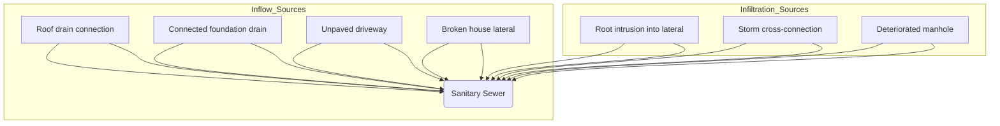

FIGURE 6.1 Typical Sources of Infiltration and Inflow in Sanitary Sewer Systems (WEF, 2017)

Extraneous water entering any collection system can consume some or all the available
capacity as originally designed: These additional flows have a significant effect on small-
diameter sanitary sewers because they are sized to collect wastewater flow, not
stormwater: When the available capacity is reduced, or consumed, water levels rise, and
surcharging can occur:Surcharging; when the water level exceeds the height of the pipe,

\n---\n

# Surcharge, Infiltration, and Rehabilitation

can accelerate pipe deterioration by forcing water to leave the pipe through defects into the surrounding soil, and bringing in surrounding soil when the surcharge is alleviated, causing voids to form outside the pipe. Surcharging can lead to sanitary sewer overflows (SSOs) either in the street or into buildings, and surface flooding:

Sewer laterals, which connect buildings on private properties to sewer mains, are often a significant source of infiltration and inflow (see Figure 6.2). A comprehensive infiltration and inflow reduction program requires effectively addressing private property infiltration and inflow (PPII) sources. Private property laterals can account for half of the infiltration and inflow entry to sanitary sewers. Water Environment Federation’s Private Property Infiltration and Inflow (PPII) fact sheet outlines key considerations for municipal utilities establishing a framework for PPII mitigation activities such as program approaches, policy and legal issues, funding, public outreach, and implementation.

FIGURE 6.2 Example Sewer Lateral Configuration (WEF, 2016)

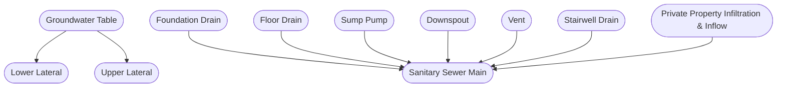

Sewer rehabilitation, or restoring to an improved condition, is a means to reduce the extraneous flow entering the system, which in turn lowers the potential for causing SSOs and flooding by correcting defects. Sewer defects can also be structural in nature and rehabilitation can be necessary to prevent structural failure. Increasing extraneous flow is
\n---\n

One symptom of the poor structural condition of aging sewers in many cases. Hence, sewer rehabilitation provides a solution to extend the useful life of the asset. Consequently, rehabilitation can result in a reduction of extraneous flow, which in turn reduces sewer surcharges and unintended poor system performance.

The state-of-the-art industry experiences indicate that before investing in sanitary sewer capacity improvements to manage excessive infiltration and inflow, it is prudent to improve sewer system structural conditions to realize practical levels of infiltration and inflow reduction first and then consider supplementing with right-sized conveyance/storage and downstream treatment systems. It has also been proven that asset management approaches to sewer system rehabilitation are effective and adding extraneous (infiltration and inflow) flow reduction criteria will bring overall comprehension to prioritize public investments. Reducing infiltration and inflow is a foundational step before adding additional sewer assets. Moreover, reducing PPII is critical for the overall success of infiltration and inflow reduction efforts. Rehabilitating the sewer system should be undertaken first to determine the magnitude of the infiltration and inflow reduction possible. It may be that partial or comprehensive rehabilitation of the system restores adequate levels of the conveyance capacity. Additional conveyance/storage/treatment capacity should be supplemented as needed:

Sewer rehabilitation projects can include a mixture of repairs and renewal—with a focus on both restoring structural integrity and practical reduction of infiltration and inflow. Each system component is analyzed to determine where defective areas allow infiltration and inflow to enter the system, and the most cost-effective repair or renewal method is applied to eliminate that source of infiltration and inflow while ensuring that the extraneous water does not migrate into the system through a different defect. For sewer mains, a rehabilitation project may include a combination of selective sealing, point repairs, partial replacement, and lining. It is through a comprehensive analysis that the most cost-effective combination of repair, renewal, and replacement techniques are used to meet objectives for structural condition improvements, infiltration and inflow control, or both. Depending upon the size of the pipe, some methods can only be used on larger-diameter pipes while others are more universal:

## 2.0 REHABILITATION TYPES
\n---\n

## 2.1 Repair

Repair is to restore a defective part (e.g., fix). Repairs may be temporary, semi-permanent, or permanent, depending on the methods, technology, and materials. Repairs are typically applied to limited lengths of pipe or specific joints and appurtenances (i.e., manholes and sewer connections) and do not fundamentally enhance or improve the remaining portions of the original materials over the entire length of the pipeline or the entirety of a manhole.

Repairs are made to allow the pipe to function to the end of its useful life. Repair technologies do not extend the remaining useful life (RUL). They can involve location-specific repairs that address maintenance issues (i.e., roots, grease, debris), seal the sewer pipeline to prevent extraneous flow; and may restore the structural integrity of the pipe at that location but not restore the structural integrity of the entire pipe. It also can include repair methods that seal the entire pipeline but do not restore structural integrity.

From a financial-record perspective, repairs are often expensed as operating funds and should not adjust the pipe’s position within a capital asset depreciation schedule.

## 2.2 Renewal

Renewal is by definition to make the pipeline or manhole like new. Renewal is more comprehensive than repair and extends the useful life of the pipe. Renewal includes techniques that renew the structural integrity of the entire sewer pipeline segment between manholes.

Before applying renewal technologies, condition assessment of the segment typically identifies partially or fully deteriorated sections. For fully deteriorated pipes and manholes, the renewal material is considered to support the entire pipe or manhole loading (e.g., stand-alone). For partially deteriorated pipes and manholes, the structural performance of the composite structure after renewal is calculated considering contributions from the renewal material strength, with only a partial contribution from the host pipe.

Following renewal, hydraulic performance may be enhanced by an improved flow coefficient counteracting the effect of reduced pipe diameter caused by the wall thickness of the liner. Corrosion protection and structural restorations are often afforded through
\n---\n

## 2.3 Replacement
Replacement is the most extensive of the renovation technologies and requires the installation of a new pipe or manhole. The pipe replacement technology may be installed by trenchless or 'less trench' (partial excavation) methods, but the replacement pipe must carry the full structural load independently and may provide additional hydraulic capacity when compared with the original pipe. Replacement typically requires new appurtenances (i.e., service connections). Corrosion protection is often afforded through replacement methods with proper attention to material selection.

Replacement of the buried asset, whether a pipe or manhole, is typically financed from capital funds, although limited-scope projects could be funded from the operating and maintenance budget for expediency. However, regardless of the financing mechanism, replacement should always create a new depreciation schedule for the pipe or manhole within the capital asset register:

## 3.0 REHABILITATION MATERIALS
Selecting the material for a specific rehabilitation application for the sewer identifies and limits the available options. Specifying a process or technology implies tacit acceptance of the material used within that technology. The methodology and material often need to be discussed together, to produce a full understanding of the rehabilitation options and how the choice of both influences meeting the reinvestment objectives:

Materials for sewer pipeline rehabilitation are constantly under development for new applications. The variety of pipeline rehabilitation materials available in the market has exploded, but this growth also means that the new materials or novel applications of existing materials must be properly assessed and evaluated before the application. Field installation parameters, environmental uncertainties, and long-term performance of
\n---\n

## 3.1 Pipe Materials

Centralized wastewater collection in the United States began in the late 19th and early 20th centuries. These original collection systems were designed and constructed to convey combined wastewater and stormwater flow (combined sewer systems). Many combined sewer systems are still in service in older areas of the United States:
\n---\n

## 3.1.1 Constructed-in-Place Pipe

Until the advent of larger manufactured pipe sizes, many of the larger pipelines were built in place using a variety of materials and shapes. These materials included brick, wood, tile, and poured-in-place concrete. Pipe shapes included circular and non-circular. Non-circular shapes included semi-circular; standard egg, new egg, horseshoe, parabolic, semi-elliptical, rectangular; u-shape, and basket handle (Shahid Arshad, 2018).

The structural design for the constructed-in-place pipelines was not standardized and varied based on the specific load and local conditions and requirements at the time. The design for most constructed-in-place pipelines was based on typical tunnel design standards at that time. Design records for these pipes are often not available, making it sometimes difficult to correlate a specific structural defect to the overall structural stability of the pipe. This is further exacerbated when dealing with non-circular pipe shapes where there can be multiple modes of pipe failure:

## 3.1.2 Manufactured Rigid Pipe

The earliest manufactured circular rigid pipes used for the construction of collection systems were circular vitrified clay, plain concrete, reinforced concrete, asbestos cement, and cast-iron pipes. Because these pipes do not deflect in the manner that flexible pipes do, the joints could be constructed from a variety of materials. Joining materials used within the bell and spigot of rigid pipes have included such diverse materials as jute, bituminous tar, cement mortar, and other materials that could be poured or stuffed into the cavity. Later developments resulted in the application of rubber gasket joints for these rigid pipe segments.

Rigid pipes may fail in a variety of ways. Deterioration, root penetration, and bacterial degradation of the natural materials used in the joints lead to leakage and failure of the joint. Improper bedding may allow the pipe to fail because of a circular crack (shear or beam break). Overloading of the trench may cause failure along the spring line, crown, or invert of rigid pipes:

A range of compatible techniques suited to the nature of the rigid pipe and the extent of rehabilitation to be applied can be selected. Repairs (cleaning, grouting, and insertion)
\n---\n

## 3.1.3 Manufactured Flexible Pipe

Sleeves, renewal (liners), and replacement (bursting and open cut replacement) are all potential rehabilitation applications in rigid pipes.

Circular flexible pipes include all the thermoplastic pipes of the current generation of materials, including solid- and profile-wall polyvinyl chloride (PVC), PVC composite, solid-wall and composite acrylonitrile-butadiene-styrene (ABS), high-density polyethylene (HDPE), fiber-glass-reinforced plastic (FRP) and ductile iron pipe. It also includes ductile iron and steel. Semi-rigid pipe types like bar-wrapped concrete cylinder pipe (bar-wrapped) exhibit both rigid and flexible pipe characteristics. As pipes like bar wrapped are subject to a deflection limit like flexible pipe, they are to be considered included within the flexible pipe discussions herein. Most of these pipes require a flexible rubber gasket or welded joint to maintain the joint integrity under loading.

Flexible pipes are more limiting in rehabilitation applications than rigid pipes. A narrower range of repairs, renewals, and replacement options exist when the host pipe is PVC, for example. Chemical grouting repairs using inflatable packers to isolate joints have been used to fix joint leakage from flexible pipes with rubber gasket joints. Renewal techniques that include thermoplastic and thermosetting liners requiring heat (i.e., steam or hot water) for curing may not be compatible with some existing flexible pipes with high thermal expansion characteristics.

## 3.2 Pipe Connections and Appurtenances

The last link in conveying wastewater from a home or business to the collection system is accomplished at the tap or connection of the lateral pipe to the sewer main. There are many instances in which this flow transfer has been accomplished without a connection appurtenance, but merely a lateral pipe shoved into a hammer tap hole in the main and mortared in place. The standard, however; typically includes an appurtenance, such as a cast iron thimble, saddle, tee, wye branch, or other device, which is integrated into the pipe construction or installed as a subsequent attachment that receives the lateral pipe. Connection appurtenances in most existing collection systems include both similar and dissimilar materials from the main sewer and lateral pipes. The nature of the appurtenance and its original material and construction dictates whether it is amenable for
\n---\n

## 3.3 Manhole Materials
There is no wider range of materials applied in collection systems today than in manholes. Brick, mortar, block (cinder; Belgian, and other local names), tile, concrete (i.e., precast and poured-in-place) thermoplastics, fiberglass, and many combinations of the preceding have all been used in construction. The key areas addressed by rehabilitation methods include overall corrosion and erosion damage on the walls; leakage at pipe connections, benches, troughs, channels, hunch walls, joints, corbel brick, manhole frame seals, and covers; and freeze/thaw and traffic damage at the corbel–frame interface.

Manholes have the widest range of rehabilitation techniques. The relative ease of access to the interior of manholes enables a wide range of rehabilitation applications, which can readily undergo inspection and quality assurance measures.

## 4.0 OVERVIEW
There are a variety of goals that communities wish to achieve through rehabilitation programs and reinvestment in the collection system. Improved performance, reduced frequency of maintenance, reduction of infiltration and inflow, and enhanced structural and hydraulic performance are major objectives. The repair, renewal, and replacement methods discussed in this chapter each meet these objectives, to varying degrees. The selection and application of the appropriate technology for the specific problem(s) to be solved and objectives to be achieved will directly affect the success of the rehabilitation project. The critical success factors are matching the rehabilitation techniques to the existing problems in the pipes and manholes and then successfully managing and executing the rehabilitation application.

There is a wide range of rehabilitation alternatives to fit specific needs in the collection system: A summary matrix for techniques is shown in Table 6.1 below.

## 5.0 REHABILITATION METHODS
\n---\n

There are dozens of rehabilitation options, materials, and combinations of technologies to
achieve the longevity, effectiveness, and cost ranges desired when selecting and
specifying sewer rehabilitation. This section will identify the repair, renewal, and
replacement options and choices within the following major categories:

* Pipelines/Tunnels,
* Service connections,
* Laterals, and
* Manholes

## 5.1 Pipelines

The first and most significant category for the review of collection system rehabilitation
options involves the size and shape of the sewer main. The sewer main is the deepest
component by elevation of the collection system elements and is subjected to
groundwater flow within the trench; corrosive atmosphere in the headspace of the pipe;
erosion effects, both internally (high-velocity flow) and externally (stream crossings);
live and dead load effects; and deteriorated joints (both gasketed and non-gasketed):

## 5.2 Service Connection Laterals

Service connections are an integral component of the collection system. The service
connection completes the transfer of flow from the private house or building lateral to
public portions of the sewer system. Rehabilitation of service connections is discussed in
this chapter independently of the laterals because connections are universally a public
responsibility; whereas laterals involve both public and private ownership, depending on
the agency or jurisdiction.

Historically, laterals have been neglected, because of the complex public/private
ownership issues and the limited and difficult access associated with this appurtenance.
Trenchless methods developed from mainline methods are available to rehabilitate
laterals. These methods include cured-in-place pipe (CIPP), pipe bursting, sliplining,
folded thermoplastic pipe, and injection grouting (National Association of Sewer Service
Companies [NASSCO], https://www.nassco.org/).

TABLE 6.1 Sewer Rehabilitation Summary Matrix (WEF, 2017)
\n---\n

# 5.3 Manholes

<table>
  <thead>
    <tr>
      <th>Technique</th>
      <th>Type</th>
      <th>Estimated Service Life<br>(U.S. EPA, 2014)</th>
      <th>Advantages</th>
      <th>Disadvantages</th>
      <th>Potential Application, Pipe Diameter</th>
      <th>Mainline/ Lateral/ Manhole</th>
    </tr>
  </thead>
  <tbody>
    <tr>
      <td>Cementitious</td>
      <td>Structural/</td>
      <td>—</td>
      <td>All shapes and connections accommodated</td>
      <td>Address active infiltration, requires confined space entry</td>
      <td>48" and larger</td>
      <td>Yes / No / Yes</td>
    </tr>
<tr>
      <td>Coatings: Shotcrete or Gunite</td>
      <td>Non- Structural</td>
      <td>20 or more years</td>
      <td>Robotically applied.</td>
      <td>Address active infiltrations</td>
      <td>30 to 120"</td>
      <td>Yes / No / No</td>
    </tr>
<tr>
      <td>Spun Cast Concrete</td>
      <td>Structural/ Non- Structural</td>
      <td>Same as concrete pipe (Army Corps of Engineers)</td>
      <td>Antibacterial additives can be added when microbiologically induced corrosion is present:</td>
      <td>—</td>
      <td>—</td>
      <td>Yes / Yes / Yes</td>
    </tr>
<tr>
      <td>Spray Polymer Coatings</td>
      <td>Structural/ Non-Structural</td>
      <td>50 years</td>
      <td>Encapsulates sewer, can be designed for structural load, can improve flow coefficient</td>
      <td>Sags and dips in the pipe remain, service interrupted, infiltration may follow annular space</td>
      <td>6" and larger if the host pipe wall can be properly cleaned and dried.</td>
      <td>Yes / Yes / Yes</td>
    </tr>
<tr>
      <td>Cured-in-Place Pipe (CIPP)</td>
      <td>Structural</td>
      <td>50 years</td>
      <td>Prevents further degradation and collapse, improves flow coefficient</td>
      <td>Sags and dips in pipe remain, service interrupted, infiltration may follow annular space</td>
      <td>3" to 120"</td>
      <td>Yes / Yes / Yes</td>
    </tr>
<tr>
      <td>Thermo-Formed Pipe (Fold and Form)</td>
      <td>Structural</td>
      <td>20 or more years</td>
      <td>Prevents further degradation and collapse, improves flow coefficient</td>
      <td>Sags and dips in pipe remain, service interrupted, Infiltration may follow annular space</td>
      <td>4" to 30"</td>
      <td>Yes / Yes / Yes</td>
    </tr>
<tr>
      <td>Injection/Pressure Grouting</td>
      <td>Non- structural</td>
      <td>20 to 25 years</td>
      <td>Seals leaking joints, stabilizes supporting soils</td>
      <td>Offset joints or longitudinal cracks may not seal</td>
      <td>4" and greater</td>
      <td>Yes / Yes / Yes</td>
    </tr>
<tr>
      <td>Sliplining</td>
      <td>Structural</td>
      <td>50 years</td>
      <td>Quick insertion, some bends are accommodated</td>
      <td>Circular and non - circular loss of cross-sectional area</td>
      <td>4" to 144"</td>
      <td>Yes / Yes / No</td>
    </tr>
<tr>
      <td>Spiral Wound Pipe</td>
      <td>Structural</td>
      <td>50 years</td>
      <td>Prevents further degradation and collapse, improves flow coefficient</td>
      <td>Sags and dips in pipe remain, service interrupted, Infiltration may follow annular space</td>
      <td>6" to 144", Larger sizes on a case-by-case basis</td>
      <td>Yes / No / No</td>
    </tr>
  </tbody>
</table>

\n---\n

# 6.0 PIPELINE REPAIRS
## 6.1 Cleaning/Root Removal (Non-structural)

Removal of obstructions that restrict the conveyance of flow is key to maintaining the hydraulic performance of the pipe. Sewer cleaning along with root removal and control is vital to the pipeline efficiently conveying flows in line with its original design flow capacity: Thorough cleaning is also a prerequisite for trenchless repair and renewal technologies/applications.

The degree of cleaning required is contingent on the type and extent of obstruction defects identified via the Pipeline Analysis Certification Program (PACP) inspection standards (NASSCO, 2007). The selection of the type of cleaning to be employed also must account for the type and extent of structural defects identified through PACP inspection. Some types of cleaning methods will further exacerbate wall loss due to corrosion or localized structural defects, like pipe collapse, broken pipe, pipe deformation, and holes/voids.

The cleaning program developed is often contingent on the pipe material and diameter and is matched to the conditions expected or known to exist in the pipe from inspections. For example, sections of a pipeline between multiple significant structural defects may not be able to be reached by the cleaning equipment: This inability to reach particular sections of pipelines via inspection or cleaning equipment is a significant factor in deciding what types of repair and/or renewal technologies can be applied:

The National Association of Sewer Service Companies 2006 “Jetter” Code of Practices should be consulted before implementing a cleaning program.
\n---\n

## 6.1.1 Hydraulic Jetting

This hydraulic cleaning method relies on high-velocity jets of water to dislodge materials from the pipe walls and joints and flush them down the sewer for capture and removal from the collection system. Water under high pressure is delivered through a hose to a nozzle containing a rosette of jets at various degrees and angles. These jets propel the hose and nozzle through the sewer by ejecting the majority of the flow in the opposite direction of the hose path. The jets dislodge the materials on the sewer walls, invert, and joints, and flush those removed materials downstream of the hose path. Jetting alone will not remove roots.

A range of nozzles is available to cope with the different pipe diameters and materials encountered. The hoses, nozzles, water supply, and necessary pumps typically are incorporated into specialty vehicles or trailers. Vacuum equipment and tanks for storing discharged material collected from the cleaning catchment point (manhole) are provided on some cleaning units.

## 6.1.2 Hydromechanical Jetting

Hydraulic jetting is adaptable for cutting and flushing roots from sewers with attachments of water-powered roto-cutters or spinning wire heads. Jet cutters, using either directed high-pressure water or water-cooled diamond-crusted saws, are available for removing more solid obstructions, such as protruding connections, cast iron thimbles, and lateral pipes. Care in the application of these high-pressure cutters is required to minimize damage to the existing sewer structure, while successfully cutting and removing the protrusion:

## 6.1.3 Mechanical Cleaning

Jetting is the most used and expedient method for cleaning a wide variety of debris from the sewer but is not always the most effective tool for all sewer conditions. Mechanical cleaning techniques use either the existing flow and/or a hydrostatic head to flush the materials down the sewer for capture and removal from the collection system:

The abrasive, mechanical cleaning action makes these techniques better suited for removing heavy debris, grease, and roots through the appropriate selection of the
\n---\n

cleaning tool attachment. Caution is recommended when mechanical cleaning methods
are implemented as improper use can cause damage to both rigid and non-rigid pipes.

## 6.1.4 Sewer Balling Rigid Sewer Pipe

Sewer balling is a method of cleaning wherein a water head is used to create a cleansing velocity around a cleaning ball. In a typical operation, the ball is restrained by a cable while the water washes past the sewer ball. Special cleaning balls have grooves that cause the ball to spin or rotate, resulting in a scrubbing action while the flowing water along the pipe wall conveys the removed materials.

Another class of cleaning tools uses hydromechanical cleaning methods. Water head propels the mechanical device through the sewer, which generates water currents, eddies, or mechanical force, agitating the debris, suspending it in the flow, and washing it down the sewer. Sewer balls are typically available in a range of diameters, either as rigid-shaped or inflatable balls, but are generally used in large-diameter pipes (i.e., approximately 46 cm (18 in.) and larger), to complement other sewer cleaning techniques that are more effective in small-diameter sewers. The surface of the ball is grooved and ribbed to generate turbulence and agitation when propelled by a head of water behind the ball. The debris and extraneous material are pushed ahead of the ball in the sewer section.

For larger pipes, other hydromechanical devices such as kites, bags, or scooters are used. Because full pipe flow drives the devices through the sewers, caution must be exercised where there are house connections in the segment with below-grade basements to avoid backups or flooding:

## 6.1.5 Sewer Pigging

Sewer pigging is a similar process to sewer balling wherein a pipeline integrity gauge consisting of scrapers, cutters, and/or brushes are used to remove materials from the pipe wall. Because full pipe flow drives the devices through the sewers, caution must be exercised where there are house connections in the segment with below-grade basements to avoid backups or flooding.

## 6.1.6 Manual or Hand Rodding
\n---\n

## Hand rodding
Hand rodding is one of the oldest documented cleaning techniques, using a manual push-pull technique used to clear blockages in small-diameter pipes. The technique is used in shallow sewer systems, typically not exceeding 25 cm (10 in.) in diameter or approximately 1.8 m (6 ft) in depth. Sectional sewer rods may be constructed of wood or steel and are assembled on-site by hinges or threaded connections. The rods are used to punch through the blockage and pull the loose material back to the manhole for removal. For sewers greater than 25 cm (10 in.) in diameter, the rods tend to buckle and bend and are not highly effective. The overall distance from the manhole or access point is limited to approximately 18 m (60 ft).

## 6.1.7 Power Rodding
Power rodders are sewer cleaning tools incorporating a continuous steel shaft, rotated by a gasoline engine, with a variety of cutting or augering attachments available. This technique amplifies the distance and cleaning effectiveness through the application of horsepower. Attachments are selected for the type of blockage encountered and are useful for removing roots, grease, and debris from the sewer pipe and joints. Power rodding is particularly effective in relieving blockages causing surcharging or in releasing hard obstructions from the sewer pipe or joints.

## 6.1.8 Drag/Cable Machine
This is a cleaning technique in which buckets or clamshells, sized appropriately for the diameter to be cleaned (up to 91 cm [36 in.] in size), are pulled or dragged through the sewers by cables to collect and capture loose material and remove it from the sewer. The cable-and-winch system pulling the buckets can be engine-powered or manually crank-operated, with either a single- or double-cable process. Dragging is labor-intensive, better suited to large-diameter pipes (30 to 91 cm [12 to 36 in.]), and is more appropriate for removing loose debris, such as sand or silt, which is not conducive to hydraulic cleaning methods, or heavier, bulkier obstructions, such as rocks. There are a variety of attachments available, including rubber-edged discs or squeegees for scraping the walls and porcupine wire brushes for root removal. There are a variety of attachments to match the tool to the cleaning task and pipe requirements.

## 6.1.9 Chemical Root Control
\n---\n

To extend the effectiveness of the preceding cleaning techniques for root removal, a chemical root treatment to further retard root regrowth may be used. The use of foam herbicides is effective in preventing continued root growth after cleaning. In extreme cases, in which the sewer structure is also defective, the removal of roots may be accompanied by relining or replacement of the sewer line to retard or further lessen the root effect.

## 6.2 Grouting Materials

From its first use for municipal applications more than 55 years ago, injection grouting has advanced to become an economical and reliable rehabilitation method for controlling infiltration in sewer systems.

Grouts used in construction and rehabilitation projects can be categorized into the cement and chemical family. Within each grout family, there are primary grout subtypes. For the cement grout family, the subtypes are ordinary Portland cement (OPC), microfine, and ultrafine cement. For the chemical grout family, the subtypes are sodium silicate, acrylic gels, and polyurethane foams.

Cement grouts are considered suspended-solids grouts as they contain particulates in the composition. Basic cement grout in the United States is OPC. Ordinary Portland cement grout have particulate sizes from 50 to 100 microns. Microfine and ultrafine grouts are either domestic pumice or foreign slag-based. Particulate sizes for microfine grouts range from 6 to 10 microns, while ultrafine have particulate sizes from 3 to 5 microns. The consistency of cement grouts is accomplished by controlling the water/cement ratio and by including a superplasticizer to reduce viscosity. Although additives can be introduced to slow the cure time of cement grouts, once mixed with water, cement grouts begin to cure to high compressive strengths. Cement grouts are considered a long-term solution for either infiltration control or soil stabilization having lifespans ranging from 100 to 200 years.

Each subtype of the chemical grout family is unique in composition. Sodium silicate grouts are considered a suspended-solids grout as it has glass particulates in its composition. Sodium silicate grouts are a two-component grout that typically has an extremely low viscosity but will often expunge water after gelling. This process is called syneresis:
\n---\n

Sodium silicate grouts have short gel times and are commonly considered semi-permanent as they have a lifespan of approximately 10 years.

Acrylic grouts are free of suspended solids and have extremely low viscosity. Acrylic grouts include acrylamide, acrylic, and acrylate types. Each type requires a base resin to be mixed with a catalyst to create a gel or gel/soil matrix with a predictable gel time. Acrylamide grout had been the most widely used formulation but has fallen out of favor due to carcinogenic health concerns raised by the U.S. Environmental Protection Agency (U.S. EPA). Grout toxicity exposure primarily occurs during the acrylamide grout mixing and placement process during which personal protective equipment is required. Toxicity exposure does not occur once the grout has been cured.

Acrylamide grouts change from a liquid to solid form in a controllable gel time of 3 seconds to 10 hours and have an estimated lifespan of 300 years. Acrylate grouts have a controllable gel time of minute to hour and have an estimated lifespan of 50 to 60 years.

Polyurethane grouts are defined as hydrophilic and hydrophobic. Hydrophilic grouts are typically a single-component system that reacts with water and cures to an expansive flexible foam or non-expansive gel that requires a moist environment after curing. Hydrophilic foams expand 4 to 6 times their original volume. Hydrophobic grouts require little water to cure into an expansive foam and are capable of withstanding wet/dry cycles. Hydrophobic foams can expand up to 20 times their original volume and cure as flexible or rigid foam. Polyurethane grouts (foam) have an estimated lifespan of 75 to 100 years.

Parameters that affect performance include viscosity control of the chemical, gel time, temperature, pH, entrained oxygen in the solution, contact with metals, UV rays, mineral salts, groundwater flows, capabilities of placement equipment, and other joint or soil conditions. Chemical grouts may vary in appearance, solubility, shrinkage, corrosiveness, stability, strength, and longevity. Many types of additives, such as initiators, activators, inhibitors, and various fillers enable the applicator to adjust the chemical mix for best performance. Grout additives may affect the final in-place viscosity, density, strength, and shrinkage.
\n---\n

## 6.2.1 Pipe Grouting Application—Internal

Chemical grouts used to seal joints may also contain herbicide additives to minimize the regrowth of roots at the joint. An advantage of combining grouting materials with herbicides is that it addresses two problems—infiltration and root intrusion—using the same rehabilitation technique. If the pipeline already is subject to moderate or heavy root intrusion, however, the roots must be removed before the chemical grout is applied. The herbicide additive dichlobenil may affect the grout properties in a catalyzed state, so care and monitoring should be exercised in that application:

On-site inspection and evaluations of each grout mix produced are required, and joint-by-joint inspection records are maintained, to adequately document and understand the repair application. This is a repair technique that must include adequate contract management; inspection, and quality assurance specification requirements within the bid documents, to ensure an acceptable finished product.

The specifier of chemical grout repairs should thoroughly research the application and materials with manufacturers and contractors to ensure a successful application of the products appropriate for the pipe or manhole conditions.

6.2.1 Pipe Grouting Application—Internal

Injection grouting from within a pipe (internal injection grouting) has historically been used as a point repair method for pipe joints and/or some crack defects along a pipeline. Using the Test, Seal, Validate process maximizes a grouting progress effectiveness. Grouting is typically applied to circular pipelines 61 cm (24 in.) or smaller using a grouting truck, inflatable mainline packer, and a specified grout (see Figure 6.3). When conducting a grouting program it is important to monitor the amount of grout pumped at a location. Grout flow and curing expansion can migrate to and possibly damage other nearby underground utilities:
\n---\n

<table>
  <tbody>
    <tr>
      <td>Locate the leak via CCTV</td>
      <td>Center packer over joint or defect and inflate</td>
    </tr>
<tr>
      <td>Inject grout through defect into soil</td>
      <td>Air test the seal and deflate</td>
    </tr>
  </tbody>
</table>

<p>FIGURE 6.3 Sewer Defect Sealing With Grout (Reprinted with permission from Avanti International)</p>

<p>Some joints may be difficult to seal with grouts when large voids exist outside the pipe joint. Extremely large quantities of grout may be required to seal such a joint if sealing is possible at all. Other joints cannot be sealed with grouts because they are badly offset or misaligned: Offset joints may prevent the packer bladders from seating properly against the walls of the pipe, making it impossible to isolate and seal the joint. The same could occur if pipe corrosion has resulted in pipe wall loss. Grouting of longitudinal cracks in pipe also is not generally feasible, because the grout may flow through the crack and leak back to the sewer. Root intrusions by their nature can cause severe structural damage. If</p>

\n---\n

Joints with roots are to be sealed. The use of a root inhibitor in conjunction with the grout is recommended.

The intent of injection grouting is to fill voids within a pipe joint and/or around the pipe to establish a collar or grout curtain to seal the pipe. The grout collar or curtain acts as a barrier to infiltration. Structural benefits can also be achieved depending on the type of grout used. Chemical grouts do not provide a structural benefit.

From the grout truck, the operator can control every aspect of the grouting operation. The operator uses closed-circuit television (CCTV) to locate the joint or crack defect to be tested and properly place the packer. If the defect is exhibiting infiltration at the time of the grouting operation, the operator will position the packer to commence grouting of the defect. To grout the defect, the operator will inflate the packer glands to first isolate the area of the defect. Once isolated, the grout is injected under pressure through the defect into the surrounding soils to form an impermeable mass to eliminate the infiltration. Injection of the grout continues until the infiltration has stopped.

It is important to note that although a groutable defect may not be exhibiting infiltration during the operation, it is not an indication that it may leak at some time in the future. Therefore, all groutable defects without active leaking must be air-tested as part of the grouting operation. To conduct the air test, the operator expands the packer glands located on either side of the defect to isolate the area. The space between the packer is then pressurized to a specified value and subsequently monitored for a specified time to document any pressure loss. Defects that fail the air-test are then immediately injected and sealed with grout. Grout is typically pumped until grout is no longer accepted through the defect. After sealing the defect with grout, a post-injection air test is completed to document the success of the seal. Once documented, the packer glands are deflated and the packer is moved to the next defect.

Experience has shown that chemical grouting of only defects may not stop all infiltration into the pipe. This is because of the migration phenomenon, whereby groundwater migrates down the sealed pipe only to enter service connection laterals. If an overall reduction in infiltration and inflow is to be realized, air-testing and grouting of service connection lateral seals with the pipe should also be included as part of the overall grouting operation.
\n---\n

# 6.2.2 Pipe Grouting Application—External

When access to the inside of the pipe is not practical, external grouting may be used from above the ground surface. Both cementitious and chemical grouts may be used. External grouting may be used to address issues such as soil movement, pipe settlement, soil voids, and groundwater. Portland cement grout can be used to form impermeable subsurface barriers; however, its use is limited to medium sand or coarser material. Various Portland cement grouts have been used successfully to fill voids and washouts adjacent to sewer pipelines: Type III cement is often selected because of its smaller particle size. Microfine cement may be used with fine sands. Compaction grouting may be used for remediating or preventing pipeline and manhole structural settlements. Compaction grouting is achieved by injecting low-slump cement-based grout into granular soils, forming grout bulbs that displace and densify the surrounding loose soils.

The application of external grouting is often limited to large interceptors. Other variations on the grouting theme include the external grouting rehabilitation methods performed from aboveground or by excavating adjacent to the pipe. Many of the same chemical grouts used internally within the pipe and cement grouting are appropriate for solving problems of significant groundwater movement, washouts, soil settlement, and soil voids.

There is no known natural soil or rock formation in which a gel will not form, though the injected solution must remain in the grout zone until it cures. In dry soils and flowing groundwater, there is a tendency for the grout to disperse. This can be avoided by saturating the soil before grouting and using short cure times. However, a dry soil mass cannot be stabilized as efficiently as a soil mass below the water table:

Dilution around the outer edges of the grout bulb may occur in wet soils when long gel times are used. The flowing groundwater distorts the normal shape of the stabilized mass and can displace it in the direction of flow. In turbulent flow conditions, dilution can be reduced by short gel times. In open formations or fissures, solids, such as bentonite or cement, may be added to the grout solution to help produce a more complete block to flowing water:
\n---\n

Cement grout consists of a slurry (particulate suspension) of cement and water, with materials such as sand, bentonite, or accelerators added, if necessary. The particulate nature of cement grout restricts its use to fractured rock and large-grained soils, where the voids are large enough to facilitate penetration and permeation.

A variety of water-to-cement ratios can be used, depending on subsurface conditions. Strength characteristics are not important, as grouting primarily is intended to fill voids surrounding a buried sewer pipeline. Clays can be added to cement to form gels and prevent the settlement of the cement from suspension. However, this results in an ill-defined setting time and a slow strength development. Accordingly, clays are not typically used in sewer rehabilitation void grouting when groundwater is present.

Portland cement grouts may also be used as fillers and accelerators in silicate grouts. For extremely large void-filling applications, other types of cement, such as pozzolan and fly ash mixes, can be used and are more economical than straight Portland cement or soil and cement mixtures.

Compaction grouting is the injection of stiff, low-slump, mortar-type grout under high pressure to displace and compact soils in place. Compaction grouting acts as a radial hydraulic jack, physically displacing the soil particles and moving them closer together. The technique is used to strengthen loose, disturbed, or soft soils or for control of the settlement. Compaction grouting is used primarily on large pipelines and is applied through the pipe wall to the surrounding soil. Care must be exercised to ensure that no damage occurs to the sewer structure or any adjacent utility equipment.

6.3 Point Repairs

### 6.3.1 Excavate and Replace (Open-Cut) Method

One of the oldest methods of repair for structurally damaged sewer sections is excavation and replacement. Point repairs are most effectively used to correct isolated problems in a pipeline segment or as a preparation for the application of more comprehensive renewal methods to the sewer segment. When making point repairs, consideration should be given to the materials and methods used to connect the replacement pipe to the existing pipeline. The repair pipe sleeve material may be identical to or different from the existing pipe type. For example, a vitrified clay sleeve may be inserted into a vitrified clay sewer pipe.
\n---\n

### 6.3.1 Flexible Pipe Sleeves

segment. Alternatively, flexible pipe sleeves may be mixed with rigid pipe sewer segments.

When two pipe sections of different materials and wall thicknesses are connected, the inverts of the two sections will not match exactly. To remedy this problem, flexible rubber connector couplings are available, which make up the difference in pipe wall thicknesses of the two pipe sections and maintain a continuous, consistent invert through the repair sleeve. The use of flexible pipe also reduces the weight of the repair sleeve for the personnel performing the repair in the trench. However, this application is not without risk. After backfilling, the PVC pipe insert has been observed by CCTV to have sagged, settled, and/or deformed. The rubber sleeve and the flexible pipe both can deflect under the stress and load of the trench backfill. Shielded rubber couplings minimize this issue. This requires increased attention during the repair to establish solid bedding and sidewall support to the flexible pipe repair sleeve.

### 6.3.2 Robotic Localized Repair

Robotic localized repairs are accomplished with remotely controlled equipment, propelled by tractors in the sewer pipe, capable of performing structural repairs to circular or longitudinal cracks, defective joints, service connection abandonment, tree root removal, and other permanent repairs. The robot is positioned by CCTV cameras, and articulating grinders, high-pressure water, air, or steam prepare the defect for an epoxy repair material. The epoxy material is injected or applied in a void created by an inflatable packer that isolates the defect. The epoxy material is formulated to bond to both wet and dry pipe surfaces, cured to be chemically and biologically resistant to wastewater, a corrosive atmosphere, and abrasion from sand, silts, or future cleaning activities within the pipe. The length of the repair is matched to the defect and tapered to ease the flow transition in and out of the repair zone.

### 6.3.3 Cured-in-Place Pipe Short-Length Sleeves

Cured-in-place short-length liners are adaptations of the more comprehensive CIPP used for the renewal of entire sewer segments, but installation and curing methods are modified to accommodate the shorter point-repair length. This CIPP application for point repair can vary from 0.9 to 18 m (3 to 60 ft) in length.
\n---\n

## 6.3.3 CIPP Repair Sleeves

A composite section, consisting of a polyester-wearing surface and a resin-soaked fabric, is pulled to the desired repair location. A chemical reaction that cures the pipe sleeve creates a pipe repair within a pipe segment. The thickness of the sleeve is typically less than 0.6 cm (0.25 in.); therefore, no significant issues arise regarding the transition at the leading edge of the sleeve in the pipe.

Timing is of the essence with the CIPP repair sleeve. The sleeve must be pulled into place within a short period (typically 30 minutes) to avoid premature curing and stiffening of the sleeve before the repair is fully in place. The CCTV camera is used to position the repair sleeves at the desired location.

## 6.3.4 Mechanical Sleeves

There are a variety of structural and nonstructural sleeves and short liners that have been developed for use in trenchless applications. Mechanical seals consist of a rubber-type seal positioned across a defective joint and held in place by stainless-steel retaining or expansion bands. The seals are available in several widths suitable for joints with differing gap widths. These products can be used where man-entry is practical. They have been applied in pipe systems ranging from 41 to 351 cm (16 to 138 in) in diameter:

In one version of the internal repair, stainless-steel bands straddle a problem joint, and inflatable rubber gaskets seal both ends of the band. Grout ports can be supplied on the bands to provide a redundant repair. It is necessary to prepare the joint to be sealed by removing any grease and scale before the seal is positioned. The advantage of these products is that a problem joint can be repaired without excavation, which can be expensive and disruptive. The disadvantage of these products is that high groundwater pressures may overcome the ability of the seals to resist the pressure. Monitoring of the seal over the warranty period will be required to indicate whether the seal is effective.

## 6.3.5 Pointing (Brick and/or Masonry Sewers)

Conventional repointing techniques may be used in brick and/or masonry sewers to reduce infiltration or replace deteriorated mortar. The technique frequently is used in conjunction with internal or external grouting, with the grout application designed to restore side support to the structure. The existing sewer still must be physically intact, with limited deformation, disturbed bricks, or closed joints. The mortar can be applied manually.
\n---\n

Mortar is troweled into place or delivered to the point of application using pressure-pointing equipment. The equipment can be operated on the surface or within the sewer and delivers premixed mortar to the point of application. Pressure delivery of the pointing material is a faster process than hand-pointing and is used more often when longer lengths of sewer need attention.

Full bypass pumping or flow diversion is required when working below the normal flow line with a need to control infiltration to avoid detrimental effects on the bond between the mortar and brickwork. Sewer pipe walls should be water-jetted or manually cleaned to remove encrustation, sediment, and slime, and mortar should be removed to a depth of approximately 1.5 times the joint width.

Traditional sand and cement mortars and special pressure-pointing mixes are typically used. The mortar must be of similar strength to the original mortar, as spalling of the brickwork may occur if higher-strength mortars are used_

7.0 TRENCHLESS PIPELINE RENEWAL
Pipeline renewal is more comprehensive than repair and describes rehabilitation techniques that renew the structural integrity of the sewer from manhole to manhole. Pipeline renewal systems use the existing pipe structure to form part of the new pipeline or support a new lining.

## 7.1 Pipe Lining
Pipe linings are close-fit structural liners installed continuously from one access point to the next. Lining technology varies with the type of material used, installation methodology, and curing (if any) procedures used. A large variety of sewer sizes and cross-sectional shapes can be lined using CIPP, fold and form, roll down, spiral wound, and slip lining techniques.

All the technologies discussed in this section provide structural renewal of the sewer pipe and improve the performance of the existing sewer. However, some issues should be considered when these types of pipe linings are used. Although the merits of the loss of cross-sectional area versus improved flow coefficient relative to the capacity of a lined sewer can be debated, the reality is that the liner is not as good as a newly constructed pipe in other respects. The finished liner will follow the existing pipe envelope and "mirror"
\n---\n

or reflect any poor line and grade that remain in the existing pipe. Pipe wandering offline, sagging grade, holes, missing pipe pieces, protruding taps, and offset joints are some of the existing pipe defects that will be visible or "reflected" in the lined sewer if not addressed in the preparation of the sewer for structural renewal.

Increasingly, liners are being recommended and installed as a means of root control within the sewer segment. Chemical root control or sealing of the joints with sleeves or root-inhibitor-infused chemical gels may also be solutions for these problem sewers, but often the continuous preventative maintenance schedules drive the need for a more permanent solution to roots.

Cleaning and removal of the roots are key elements in the preparation for lining a segment: Although the roots have been removed to enable a successful lining installation, the cut roots are still viable and can regenerate and resume growing. Regrowth along any annulus that remains between the existing pipe wall and liner has been documented, with the root plumes visible at the connection reinstatements and pipe liner ends in manholes over time. After lining, removal of the roots from the renovated sewer may be more problematic, because the same aggressive cutting options are not available because of the potential damage to the liner: Sealing of penetrations made in the liner at tap reinstatements and manhole ends may be required to ensure that roots cannot penetrate the structurally renewed sewer. Roots should be considered in the existing sewers identified as candidates for lining and conditions matched to the characteristics of the various types of liner technologies available. When roots have been a factor in the lining application, subsequent reinspection may be prudent.

All lined sewers with existing taps require reinstatement of active taps and connections. Connections that are open, cracked, settled, protruded, leaked, or have roots or other problems will need supplemental attention to correct those problems before or after reinstatement of the tap.

### 7.1.1 Cured-in-Place Pipe

The CIPP liners are used primarily for structural rehabilitation of sewer lines. The CIPP liner typically consists of a tubular composite product composed of a liner face, reinforcement mesh (optional), or felt material, saturated with a polyester, vinyl ester, or epoxy resin that cures through ambient heat, hot water, steam, or UV light application into
\n---\n

a structural liner for the pipe. The resins are typically selected based on the liner performance requirements (gravity or pressure) and the nature of the wastewater in the pipe (domestic or industrial): A CCTV camera inspects the pipe to ensure that the pipe wall is clear of obstructions and protrusions and is ready for installation of the liner: The inspection also confirms the pipe material and diameter and confirms that active connections are identified, and groundwater infiltration is documented and addressed, as necessary: Preparing the sewer includes removing roots, sediment; and encrustation from the sewer walls, cutting or trimming protruding connections, and performing point repairs to address deflected joints or sags in the alignment:

Depending on the diameter and length, up to 610 m (2000 ft) of CIPP liner can be installed in a single insertion. Full bypass pumping or diversion of existing wastewater flows is necessary, although insertion and curing are typically completed within 24 hours, with much less time needed for shorter lengths and smaller diameters.

After preparing the pipe interior; the CIPP liner may be installed by an inversion process (ASTM International; 2007) using air pressure and/or water head to turn the resin-impregnated jacket inside out, while propelling it through the pipe and pressing the resin-coated face against the host pipe wall. The liner can also be inserted by a pull-in installation. The resin is then cured using either steam or hot water. The curing time decreases from several days at ambient temperature to a matter of hours at elevated temperatures. The curing process is nonreversible, so the final product will retain the shape and characteristics of the expanded liner (see Figure 6.4):

The thickness of the CIPP liner selected is determined by both internal pressure and external hydrostatic pressure. The liner will reduce the inside diameter of the pipe; however, this capacity reduction may be offset by the smoother surface of the new material in contact with the flow. After the lining is installed and cured, CCTV camera should be run through the pipe, to inspect the condition of the liner and open the lateral connections by a robotic machine ASTM Standards describe the procedures for the inversion and pull-in installation methods for the reconstruction of pipelines and conduits using CIPP: These standards also provide the inspection requirements and performance requirements, such as sampling and testing, leakage and pressure testing, visual and CCTV inspection, and delamination tests. Design guidelines are provided in an appendix
\n---\n

to the standards and cover both gravity and pressure sewers under partially or fully deteriorated conditions. Good practices for CIPP installation include adequate record keeping (resin wet-out, cure records, tap reinstatements, and third-party sampling and testing with appropriate chain-of-custody procedures), and post-rehabilitation CCTV inspections to confirm the fit and finish of the cured liner:

FIGURE 6.4 Typical CIPP Installation (Reprinted with permission from Masterliner Inc.)

Description of image: An illustration showing a truck-mounted CIPP installation rig. A white utility truck with an American flag motif on the door is positioned above a trench. A red crane/boom extends from the truck to a vertical pipe insertion point, indicating resin liner deployment into a buried sewer line that runs horizontally beneath the ground. The scene includes excavated soil and a buried pipe channel.

The CIPP lining can be manufactured to suit many sewer shapes and accommodate small deformations (i.e., missing sections of the pipe barrel or minor joint offsets) and changes in the direction (line and grade) of the sewer to be lined. The CIPP liner pipe is available in various diameter sizes. Sewers from 10 to 244 cm (4 to 96 in.) in diameter have successfully been lined using CIPP, with larger sewers requiring special or on-site wet-out installation procedures. However, the challenges of achieving a consistent and uniform
\n---\n

## 7.1.2 Fold-and-Form Pipe

Cure in large-diameter sewers are more difficult because of the wall thickness used for the liner; the resulting amount of resin to be cured, and the volume of heated water and steam required to accelerate the curing time.

In pipes less than man-entry size, service connections are reinstated by robotic cutters. “Dimpling” of the connection tap resulting from internal pressure during inversion and curing provides a visual location of the taps that can be confirmed against the distance and clock locations recorded during the preinstallation CCTV inspection. Prior confirmation of abandoned connections may enable those taps that are no longer in service to be left covered by the CIPP liner:

### Fold-and-Form Pipe

Fold-and-form linings are a technology for the rehabilitation of sewer lines, in which a folded thermoplastic liner is inserted into the existing pipe, and the liner is expanded or re-rounded back to a circular shape through pressure, heat, or mechanical means. The fold-and-form liners consist of PVC or HDPE thermoplastic material folded into a cross-sectional shape that is significantly smaller than that of the pipe to be rehabilitated. The folding allows easier installation of the liner throughout the length of the pipe (see Figure 6.5).

A consideration for thermoplastic liner selection for rehabilitation applications is the multiple manufacturing standards and controlled environment in the production of the pipe, ensuring consistent performance properties from the liner material. Installation standards exist for both fold-and-form PVC and deformed HDPE:
\n---\n

## Fold & Form

### Fold & Form Pipe

<Mermaid Diagram>
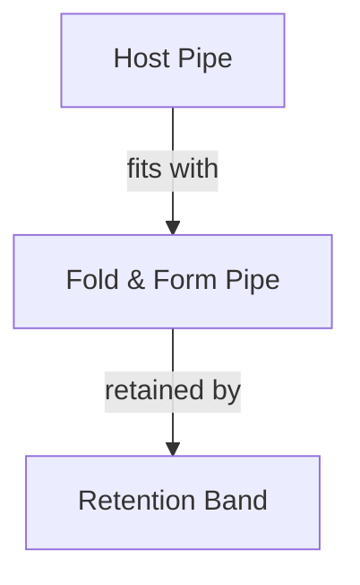
</Mermaid Diagram>

FIGURE 6.5 Typical Fold and Form Installation (Reprinted with permission from International Society of Trenchless Technology [ISTT])

Before the liner is installed in the existing sewer, the pipe must be cleaned of all debris and buildup, so that the liner can fit tightly against the host pipe wall. After the folded liner is pulled into the pipe with a winch, cables, and an attached pulling head, the liner is warmed, expanded, and reformed to achieve a close fit against the existing pipe wall. The installed and re-rounded liner is cooled using circulated air that stiffens the liner into the final shape. After installation, laterals can be reinstated by robotic or direct excavation methods. The fold-and-form method is typically limited to smaller diameters (up to 46 cm [18 in.]) and typically does not negotiate bends as well. The sizing of the liner is critical to the finished appearance and functionality of the rehabilitated pipe. Older sewers, such as older vitrified clay pipe, may have inconsistent inside diameters from one pipe segment to the next; which may influence the tightness of the liner to fit against the existing pipe wall and affect the liner appearance (i.e., wrinkles, ribs, or bulges) and long-term performance
\n---\n

in conveying wastewater flow. Proper sizing of the thermoplastic liner for the renewal application is a key step to a successful installation.

The pipe is either extruded in a folded-form shape in the manufacturing process or extruded in the conventional circular shape and subsequently folded, deformed, and/or strapped to retain the smaller shape. The result is a pipe that can fit tightly inside the sewer; but it is more easily installed because its cross-section during installation is significantly less than the final section. The pipe is expanded by processing with heat and pressure, in the form of steam, to re-round the lining back to the shape of the existing sewer: Depending on the diameter; the lining can be installed in continuous lengths of up to approximately 1000 m (several thousand feet). The lining can be structurally designed as a flexible pipe with the existing sewer and surrounding ground providing side support.

## 7.1.3 Rolldown and Swagelining®

Rolldown and Swagelining systems temporarily reduce the diameter of conventionally formed circular HDPE pipe to allow installation inside an existing pipe. When the diameter is returned to its original size, it forms a tight fit with the existing sewer; increasing the hydraulic capacity of the pipe.

These systems originally were conceived for gas main rehabilitation and are variants of the conventional continuous sliplining technique. In the rolldown system, the pipe is cold rolled on-site to reduce its diameter sufficiently to allow conventional sliplining insertion. After insertion, the lining is pressurized to restore the pipe to its original size, resulting in a tight fit inside the pipe. The rolldown machine has several sets of rollers set to progressively reduce the diameter as the pipe is pulled or pushed through (see Figure 6.6):

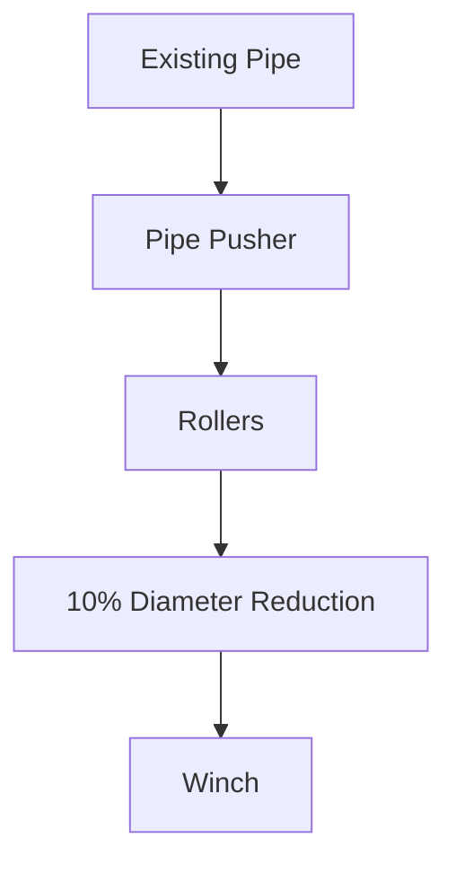
\n---\n

### FIGURE 6.6 Rolldown Lining (Source: Original FD-6 Document)

With Swagelining, the fusion-welded polyethylene pipe is pulled through a machine, where it is passed through the swag ing die, reducing the diameter of the pipe by up to 15%. The liner pipe then is pulled through the host pipe in the conventional sliplining manner. Once in place, the new pipe expands to form a tight fit. The pipe can be pressurized to speed up the process. These pipes are available in diameters ranging from 5 to 61 cm (2 to 24 in.). The lining can be structurally designed as a flexible pipe with the existing sewer and surrounding ground providing side support (see Figure 6.7).

## 7.1.4 Spiral-Wound Pipe Liner

This renewal technique is based on creating a pipe in situ by using PVC-ribbed profiles with interlocking edges. Spiral wound applications can be fixed-diameter (tight fit) or in configurations to be grouted. The ribs, which are reinforced with steel, enhance the hoop strength of the liner. This method applies to sewer lines from 15 to 508 cm (6 to 200 in.) and can be fitted to circular and non-circular pipes. Reinforced ribs or panel systems of this technology have been developed specifically for large-diameter and man-entry sewers.

### FIGURE 6.7 Swagelining (Source: Original FD-6 Document)

The process varies by manufacturer but involves the use of a traverse and/or static winding machine to form a continuous PVC strip into the desired pipe shape (see Figures 6.8 and 6.9). When complete a fully structural hydraulically sealed pipe liner with a minimum 50-year design life will be created.

The general installation process consists of the following steps:
\n---\n

# 6. Installation of Spiral Wound Pipe Liner

1. Bypassing flow, if necessary;
2. Cleaning the line and removing tree roots;
3. Plugging laterals;
4. Fabricating the pipe, by feeding the winding machine in the manhole with PVC strips from the surface, or by having the machine travel down the length of the pipe, winding the pipe as it progresses;
5. Grouting the annular space behind the liner, if applicable; and
6. Reinstating laterals by local excavation or by a remote-controlled cutter:

FIGURE 6.8 Installation of Spiral Wound Pipe Liner (Reprinted with the permission of Sekisui SPR Americas, LLC)

Description: A circular underground manhole is shown with the spiral-wound pipe liner being installed. A worker in white protective clothing and a helmet is positioned near the liner, with various tools and hoses arranged around the area inside the shaft.
\n---\n

Figure 6.9 Installed Spiral Wound Pipe Liner (Reprinted with the permission of Sekisui SPR Americas, LLC)

## 7.2 Sliplining
Sliplining is used to rehabilitate damaged sewer pipes by inserting a small-diameter conduit or liner inside the host sewer. High-density polyethylene is a widely used pipe material and liner material for sliplining; however; other pipe materials, such as PVC , FRP pipe, polymer concrete pipe, and other rigid thermoset pipes have also been used successfully. A review of the available materials follows the discussion of the sliplining technique.

The slipliner pipe is inserted into the existing pipe at an excavated access pit location. In smaller diameters, a continuous liner is typically pulled through the existing pipe by a winch-and-cable arrangement. Large-diameter pipes are more often pushed by a trench excavator bucket or jacked into place by a winch, piece by piece. In a typical application, the slipliner pipe is the largest practical outside diameter that can fit inside the existing host pipe. Grouting the annulus between the liner and host pipe provides additional strength to the composite structure to resist collapsing resulting from soil loads and
\n---\n

groundwater pressure and anchors the new pipe from flotation. Connections are typically reinstated from the outside of the pipe at excavated locations.

Compared with close-fit liners and CIPP, there are several characteristics of a sliplining renewal that must be considered before implementing this rehabilitation process.

Sliplining results in a small-diameter pipe and reduces the hydraulic capacity of the pipe. This issue reduces the viability of the technique for small-diameter existing sewers (i.e., smaller than 25 cm [10 in.] in diameter) but is a neutral factor where the hydraulic capacity of the pipeline is not a limitation.

## 7.2.1 Continuous Sliplining Pipe

Small-diameter sewers are typically slip-lined with continuous lengths of solid-wall HDPE or fusible PVC pipes, commonly supplied in 12-m (40-ft) lengths, and butt-fusion-welded together (by heat or electrofusion methods) before insertion to the sewer pipe. A nose cone is attached to the front of the pipe, to reduce the likelihood of snagging, and serves as the point of connection for attaching the winch cable for towing purposes. Pipes are drawn into the sewer; with subsequent lengths being added as required. The annulus between the lining and the existing sewer typically is grouted to provide support for the flexible lining (see Figure 6.10).

For pipes less than 61 cm (24 in.) in diameter, the insertion time can be reduced by welding the pipes on the ground surface before installation, if space permits, and neighborhood inconvenience can be minimized. The pipes are then inserted through a lead-in or "slip" trench, the length of which depends on the size of the lining pipe and the depth of the sewer, but it is typically at a 4:1 ratio of length to depth. Larger, thick-walled, or deep pipes typically are welded in the bottom of the insertion trench, reducing the size of the excavation and eliminating the need to lay the pipe string out on the surface.

Tens of meters (hundreds of feet) can be slip-lined in one operation with the flexibility of HDPE pipe, allowing negotiation of large-radius bends. Existing wastewater flows should be controlled to keep debris from lodging in the annulus, deterring effective grouting of this space.
\n---\n

### Figure 6.10 Continuous Sliplining Pipe Process
Source: Original FD-6 Document

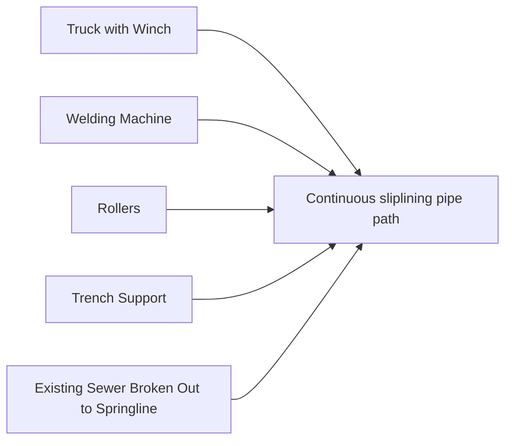

Another variation on the sliplining theme includes an HDPE liner system that uses grout to fill the annulus between the host pipe (or preliner inserted ahead of the actual liner) and the studded liner sheet. The studs on the backside of the liner and grout result in a composite liner system that provides the new continuous grouted-in-place pipe within a pipe. The HDPE liner system is suitable for round or nonstandard geometry pipes, such as horseshoe or egg-shaped sewers. Connections can be reinstated through traditional excavations and saddles or with HDPE saddles sealed with two-component epoxy activated through electrofusion technology:

### 7.2.2 Segmental Slipliner Pipe

As an alternative to sliplining with a continuous pipe, such as welded HDPE, pipe segments can be joined by hubless gasketed or mechanical joints in the trench and jacked or pushed into place. Although this option is typically used for large-diameter sewers (i.e., 38 cm [15 in.] and larger), it may be applied in any diameter where a suitable pipe material is available. These sections are inserted either by pushing individual pipes into the sewer and jointing them in situ or by jacking pipes into place and joining them at the insertion pit. In situ, jointing is suitable only for larger sewers 107 cm (42 in.) in diameter but provides greater flexibility for negotiating bends because special pipes can be

\n---\n

# 7.2 Sliplining

Pipes are manufactured and installed. Once installed, the annular space between the host pipe and the segmental slipliner pipe is grouted (see Figure 6.11).

## 7.2.3 Sliplining Material Options
Pipes appropriate for segmental lining are manufactured in a wide variety of sizes and shapes from several materials.

## 7.2.4 Solid-Wall Polyethylene
Short lengths of solid-wall polyethylene pipes are available with machined-screw or snap-fit joints for insertion into small-diameter sewers. The design of the joint permits constant internal and external diameters. Joints must be watertight and not pulled apart during installation. Pipes are available in sizes up to 160 cm (63 in.) in outside diameter and can be inserted from small pits. Linings sometimes can be installed through existing access points.

## 7.2.5 Profile-Wall Polyethylene
Profile-wall HDPE is manufactured in 6.1-m (20-ft) lengths and is connected in a bell-and-spigot joint configuration with an elastomeric sealing gasket. The inner-profile-wall design permits constant inside and outside diameters. A jacking pit is excavated 1.5 m (5 ft) longer than the inner-profile-wall pipe segment length and 0.6 m (2 ft) wider than the existing sewer pipe outside diameter. Insertion pit dimensions typically are dictated by the dimensions of the jacking equipment. The top half of the existing pipe in the pit is removed for liner pipe access, and the pipe is pushed or pulled through the existing pipe.
\n---\n

## Segmental Sliplining

<table>
  <thead><tr><th>Figure</th><th>Caption</th></tr></thead>
  <tbody>
    <tr><td>FIGURE 6.11</td><td>Segmental Sliplining Process (Reprinted with permission from North American Society for Trenchless Technology: nasst.org)</td></tr>
  </tbody>
</table>

After insertion, the annular space between the pipes is pressure-grouted. Pressures of approximately 34 kPa (5 psi), or approximately one-third of the pipe stiffness, should be used to prevent the collapse of the liner pipe during grouting. Jacking can be accomplished with some flows in the sewer; and the liner can be inserted upstream or downstream. Service connections or laterals are remade using procedures like those for HDPE continuous pipe.

Pipes are available in diameters ranging from 46 to 366 cm (18 to 144 in.) and have been inserted more than approximately 305 m (1000 ft) from one insertion pit. Short sections have been pushed through curves while maintaining normal sewer flows.
\n---\n

The HDPE profile wall is a flexible pipe requiring support from the surrounding material to
ensure its long-term stability. Thus, sliplining with profile HDPE should be designed using
the flexible-design theory:

## 7.2.6 Spiral-Rib Polyethylene

This polyethylene pipe is manufactured in 6.1-m (20-ft) lengths and connected in a bell-and-spigot joint configuration with an elastomeric sealing gasket. The spiral-rib design permits a constant inside diameter with a varying outside profile rib, depending on annular space and liner pipe design requirements. The jacking pit and other insertion procedures are like those for profile-wall polyethylene pipe. Pipes are available in sizes from 46 to 366 cm (18 to 144 in.) in diameter:

Spiral-rib polyethylene is a flexible pipe requiring support from the surrounding material for its long-term stability. Thus, sliplining with spiral-rib polyethylene should be designed using the flexible-design theory:

## 7.2.7 Polyvinyl Chloride

Profile-wall PVC configurations are available in a variety of segment lengths (0.6 to 4.6 m [2 to 15 ft]) and diameters (53 to 137 cm [21 to 54 in.]) Pipe segments are connected in a hubless joint configuration with elastomeric seating gasket, maintaining a constant outside diameter for easier insertions. The jacking pit and other procedures are like those for profile-wall polyethylene pipe. Pipes are available in diameters ranging from 10 to 91 cm (4 to 36 in.) and are only available in circular cross-sections.

Polyvinyl chloride is a flexible pipe requiring support from the surrounding material for long-term stability. Therefore, sliplining with PVC should be designed using the flexible-design theory:

## 7.2.8 Fiber-Glass-Reinforced Plastic

Fiber-glass-reinforced plastic pipe typically is manufactured in 12-m (40-ft) lengths, but 6.1- and 18-m (20- and 60-ft) lengths are also available. Lengths are connected by flush or low-profile bell-and-spigot joints. The filament-winding manufacturing process provides a constant inside diameter; and the wall thickness can vary based on the laying conditions. The jacking pit and other procedures are like those for profile-wall polyethylene pipe.
\n---\n

The FRP pipe is flexible and requires support from the surrounding material to ensure its long-term stability. Sliplining with FRP should be designed using the flexible design theory:

pipe. The pipe is available with inside diameters ranging from 10 to 429 cm (4 to 169 in:), can accommodate bends; and is suitable for a variety of cross-sections
fromthe surrounding material to ensure its
The FRP pipe is flexible and requires support from the surrounding material to ensure its long-term stability. Sliplining with FRP should be designed using the flexible design theory:

## 7.2.9 Reinforced Plastic Mortar

Reinforced plastic mortar (RPM) pipe (also known as reinforced thermosetting resin) is manufactured in 6.1-m (20-ft) lengths, connected with a bell-and-spigot joint configuration and an elastomeric sealing gasket. The centrifugal manufacturing process provides a constant outside diameter with a slightly larger dimension at the joint. When thick-walled pipe is used, the joints can be recessed, so the outside diameter is constant. The jacking pit and other procedures are like those for profile-wall polyethylene pipe. The pipe is available in diameters ranging from 46 to 244 cm (18 to 96 in.). This pipe cannot easily accommodate bends and is only available in circular cross-sections
Reinforced plastic mortar is a flexible pipe requiring support from the surrounding material to ensure its long-term stability. Sliplining with RPM should be designed using the flexible design theory:

## 7.2.10 Cement- or Polyethylene-Lined Ductile Iron

Ductile iron pipe is manufactured with a bell-and-spigot joint configuration with an elastomeric sealing gasket: The centrifugal manufacturing process provides a constant outside diameter However; the bell is approximately 75 mm (several inches) larger and controls the size for insertion: Several manufacturers offer hubless joint options. The jacking pit and other procedures are like those for profile-wall polyethylene pipe. The pipe, which cannot easily negotiate bends, is available in diameters ranging from 10 to 152 cm (4 to 60 in:). Ductile iron is a semi-rigid material and should be designed as a semi-rigid pipe.

## 7.2.11 Lining Annular Space Sealing

Sealing the annular space between the liner pipe and host pipe as well as re-instated service connection laters is a key component to the success of any lining rehabilitation. Sealing can be used for structural or nonstructural purposes. Pipe structural strength is achieved by injecting grout behind the linings where there is an annular space between

\n---\n

the liner pipe and the host pipe. If the grouting option is used, consideration should be given to the buckling strength of the liner, so that it is not stressed during the grouting process.

The annular space between the liner and host pipes and re-instated service connection laterals provides a potential route for infiltration and root penetration. If significant infiltration is present on large-diameter installations, control measures for the water may be necessary before and during installation: If there is a documented history of roots or the potential for root penetration, consideration should be given to grouting the annular space between the liner and the host pipe. This will retard or eliminate the opportunity for root growth behind the liner:

## 7.3 Spray Applied Pipe Liners

Spray-applied pipe liner (SAPL) systems have advanced significantly. They can be used both for the repair and renewal of circular and non-circular pipelines and appurtenances. The SAPLs are differentiated in terms of coatings and linings. Coatings are considered barriers to corrosion while linings are used for both corrosion protection and structural enhancement: The SAPLs consist of cementitious, epoxy, polyester, vinyl ester, and polyurea materials. In many rehabilitation applications SAPLs are used in combination to achieve the rehabilitation goals. The SAPLs can either be hand-applied or spin-cast onto the existing pipe or appurtenance surface (see Figure 6.12).

Cementitious coatings and linings provide structural enhancement but by their nature susceptible to corrosion. Shotcrete and gunite coating systems are proven systems that have been used for many years in large circular and non-circular pipelines. Shotcrete includes both wet and dry-mix processes, but the term shotcrete typically refers to the wet process; the dry-mix process typically is referred to as gunite. Shotcrete and gunite linings can provide structural strength and improved hydraulic performance: Fiber-reinforced mortar systems are also common. Polymeric systems provide a higher level of chemical resistance, corrosion protection, and tensile strength. Geopolymer systems are mortar systems comprised of aluminosilicate powder with an alkaline activator to form a monolithic mineral polymer with ceramic properties to create a barrier to corrosion.
\n---\n

# FIGURE 6.12 Robotic Application Installation of Polymeric SAPL (Reprinted with the permission of NuKote Coating Systems)

Description of the image:
A large-diameter cylindrical tunnel interior. A wheeled, blue-coated robotic apparatus with a spray nozzle attached to a robotic arm sprays coating onto the inner wall of the cylinder. Various hoses, cables, and components are connected to the device, which sits near the base inside the tunnel.

Chemical-based coating and lining systems are primarily used to limit future corrosion by providing a barrier between the existing surface and corrosive atmosphere and/or flow. Chemical-based coatings and linings can provide a degree of structural enhancement depending on their composition design.
\n---\n

Spray-applied pipe liners require extensive surface cleaning and preparation. Adhesion of the SAPL to the host structure is key to the success of SAPLs. Active infiltration must be eliminated and repair of localized missing material from the host completed before the SAPL application. Full bypass pumping is required to apply SAPLs. Spray-applied pipe liners must be fully cured before flow is re-introduced into pipelines or appurtenance flow channels.

## 7.4 Cast-in-Place Concrete Lining

Lining with reinforced or nonreinforced concrete is an effective rehabilitation method for a variety of conduit shapes. Slip- or fixed-form construction practices are used for concrete placement. This method is used in large-diameter (122 cm [48 in.] and larger) sewers with adequate access for materials to be handled effectively. The sewer must be thoroughly cleaned and dewatered before rehabilitation.

When used, the designed steel reinforcement is affixed to the existing pipe. The forms are positioned to provide the finished wall section before the concrete is placed. Structurally reinforced or unreinforced concrete can be designed for the rehabilitation of an existing pipeline, the structural condition of which determines if steel reinforcing is required. Reinforcing steel can be single or multiple layers of preformed, welded wire mesh or hand-placed cages attached to the existing pipe wall by threaded inserts.

The new concrete wall can vary in thickness, depending on the design. The concrete mix also can vary and can include corrosion-resistant additives and cement. Segmental liners can be incorporated into the form for total corrosion protection, and precast invert panels often are needed. Polyvinyl chloride or other thermoplastic liners also may provide corrosion protection in aggressive environments, such as those with high concentrations of hydrogen sulfide.

## 7.5 Panel Systems

### 7.5.1 Polyvinyl Chloride and Fiber-Glass-Reinforced Plastic Panels and Sheets

Panel-lining systems are used for man-entry sewers (76 cm [30 in.] in diameter or larger and non-circular pipes) and consist of forming a pipe in situ by using FRP and PVC-ribbed panels with interlocking edges and joined with couplings or hubless connections. The
\n---\n

process varies by manufacturer but typically involves PVC panels that incorporate male
and corresponding female double-locking edges. The edges form a circumferential joint,
which is snapped together by a smaller joiner strip. Edges are finished with a heat weld or
joiner strip using a flexible polymer coextrusion to make the joints watertight. The panels
and joiner strip are light and easily handled and can be passed through a narrow opening
or manhole; therefore, there is no need for excavation.

The annulus between the liner and the sewer pipe is filled with grout or a thermosetting
polymer base compound, depending on the product selected. This improves the structural
integrity of the liner and adhesion of the panel system for long-term performance. The
ribs, which impart hoop strength to the panel liner, provide a mechanical anchor or
fastener for the PVC liner, as the annular gap is filled with grout. Consideration should be
given to the buckling strength of the liner so that it does not buckle during the grouting
process. The hydraulic performance of the pipe may be significantly improved, as the PVC
panels typically can be placed close to the existing surface, resulting in a minimum loss of
diameter, while providing a smoother surface to the flow:

Another variation in the application of PVC involves placing sheets in the pipeline
headspace by methods like those for polyethylene described in the following section. The
method may restore some structural integrity to the crown but is primarily intended for
corrosion protection:

## 7.5.2 High-Density Polyethylene Sheets

Polyethylene sheets are placed in the headspace portion of the pipe routinely exposed
above the diurnal low-flow level, typically covering 270 to 300 degrees of the pipe
circumference (i.e., from the 7 to 5 o’clock positions). Full 360-degree coverage inside the
pipe typically is not performed, as the damage from corrosion typically is limited to the
headspace above the flow surface in the sewer. The sheets typically range up to 6.1 m
(20 ft) long and are placed in one or two segments circumferentially. The sheets are
affixed to thoroughly cleaned pipe, using stainless-steel molly bolts or pins connected to
the remaining wall section. Circumferential and longitudinal jointing between the sheets is
done with a special fusion-welding system. Extrusion or butt-welding is used for sealing
the ends, and this method also can be used for protecting manholes and other structures.
This technique is not considered structural and is used primarily for corrosion protection.
\n---\n

The system is not well-suited for controlling infiltration, so any groundwater leakage control, particularly below the polyethylene sheet coverage, is supplemental to this technology application:

# 8.0 PIPELINE REPLACEMENT
It is not always desirable to rehabilitate an existing sewer pipe. Existing problems with the structure, line, and grade may be too severe for renewal techniques to bring back to "like-new" conditions. Inadequate wet weather capacity frequently is a consideration also. Whereas pipe renewal applications can produce renovated sewers that exhibit better performance in a variety of ways, larger pipes providing additional capacity are sometimes required. New pipelines for relief may complement the capacity of the existing sewer in developing service areas where the existing sewer is not too old or can be renewed with the technologies discussed in the preceding section.

## 8.1 Trenchless Pipe Replacement
Trenchless pipe construction techniques have become well-established in the marketplace. These techniques include pipe bursting, microtunneling, directional drilling, fluid jet cutting, impact moling, impact ramming, and auger boring. Each of these techniques has length limitations and specific working and lay-down requirements.

### 8.1.1 Pipe Bursting
Pipe bursting is a method for inserting a new pipe of equal or larger diameter into an existing pipeline annulus, by fragmenting the existing pipe wall and forcing the material into the surrounding soil. The new pipe then is inserted into the enlarged hole. The concept was developed in the United Kingdom to replace cast iron gas distribution pipes, and the technology has gained wide acceptance in its adaptation to the wastewater collection system.

The existing pipe is fractured and broken into pieces by the static, hydraulic, or pneumatic bursting heads that may be directionally guided by steel rods or towed by a winch cable. The pipe fragments are forced outward into the soil to enlarge the annulus, and a new pipe is pulled into the borehole formed by the bursting equipment. The static bursting head is equipped with cutter blades and is typically guided and pulled by steel rods or a winch. The hydraulic bursting head is pulled by a steel cable from the receiving pit or
\n---\n

manhole and hydraulic pressure to expand and fracture the pipe. The pneumatic bursting
head is also pulled from the receiving pit by a constant tension winch, but it accomplishes
the bursting through an air-driven hammer action. Bentonite may also be incorporated into
the procedure to reduce the tension required in pulling the new larger pipe into the
expanded annulus. The maximum length between insertion pits will depend on factors
such as the existing pipe material, joint design, trench conditions, and ground conditions
(see Figures 6.13 and 6.14).

Pipe bursting is most suitable for replacing rigid, brittle pipes, such as concrete, cast iron,
vitrified clay, and asbestos cement pipes, but has been used on most types of existing
sewer pipe materials. Different adaptations of the pipe bursting head have been fitted with
rolling blades, cutters, fins, or other devices to cut through couplings and other flexible
pipe materials and drive them into the soil mass. The dominant replacement pipe
materials are HDPE and fusible PVC. A wide variety of other materials can be installed
through the bursting process, including vitrified clay jacking pipe, FRP, and ductile iron but
are limited in their use. The pipe joining design is a critical element in using these
materials.

A key advantage of pipe bursting is that the new pipe can be larger in diameter and flow
capacity than the existing pipe. This "upsizing" capability, as many as 2 or 3 diameter
sizes larger than the existing pipe, is beneficial when additional hydraulic capacity is
required in the trench.
\n---\n

# Figure 6.13 Typical Pipe Bursting Operation

The figure shows a cross-section diagram of a typical pipe bursting operation with labeled components. The labeled items include:

- GRUNDOWINCH
- Compressor
- Old Pipe
- Winch Line
- GRUNDOCRACK Pneumatic Pipe Bursting Tool
- Expander Cone
- New PE Pipe

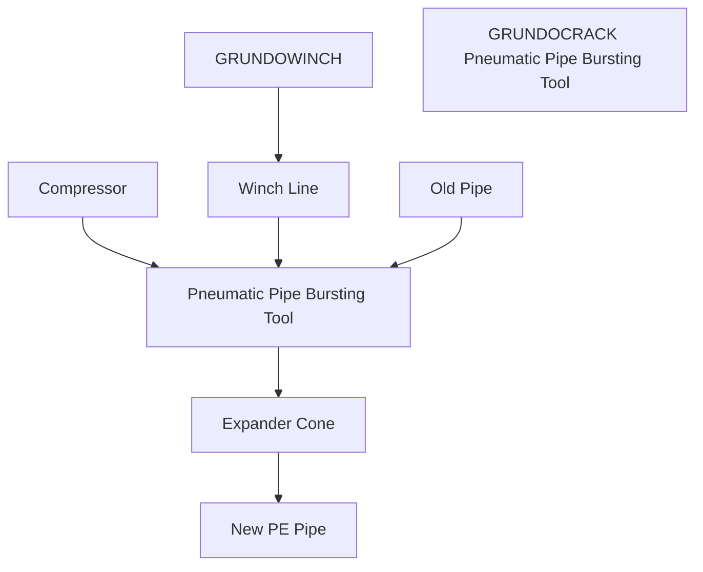

FIGURE 6.13 Typical Pipe Bursting Operation (Reprinted with the permission of PM Construction and Rehab)
\n---\n

# Figure 6.14 Pipe Bursting Expander Types

Pipe Bursting Expander Types (Reprinted with the permission of PM Construction and Rehab)

<table>
<thead>
<tr>
<th>Expander Type</th>
<th>Configuration</th>
<th>Pipe Type</th>
<th>Notes</th>
</tr>
</thead>
<tbody>
<tr>
<td>Straight Barrel Tool</td>
<td>FRONT EXPANDER</td>
<td>PE pipes</td>
<td>Configured for rear tool removal from PE pipes</td>
</tr>
<tr>
<td>Standard Tool</td>
<td>REAR EXPANDER</td>
<td>Clay or concrete pipes</td>
<td>85%</td>
</tr>
<tr>
<td>Standard Tool</td>
<td>REAR EXPANDER with GUIDING SCHNOZE and BENTONITE MANIFOLD</td>
<td>Cast iron or PVC pipes</td>
<td>85%</td>
</tr>
</tbody>
</table>

<p>FIGURE 6.14 Pipe Bursting Expander Types (Reprinted with the permission of PM Construction and Rehab)</p>

<p>Pipe bursting is not without concerns or limitations. Pre-design investigations, as-built and
record reviews, site evaluations, and existing trench and pipe conditions need to be</p>
\n---\n

assessed to ensure that the candidate sewers are appropriate for the technology. Bursting has the potential for surface heaving during the expansion process, which may heave or damage pavement or sidewalks, particularly in shallow-depth applications or because of multi-diameter bursts.

Conditions surrounding the pipe, such as concrete encasement around an existing sewer, may have a damaging effect on the success of the bursting application. Often, concrete encasement is an initial construction requirement because of the proximity of crossing utilities or because of a stream or railroad crossing. Concrete encasement may not always be reflected on as-built drawings but added as a later feature, such as the result of a subsequent repair of the sewer. The effect of concrete encasement is dependent on the extent of the concrete, its strength, whether any reinforcement was added, and the features and capabilities of the bursting equipment. However, even if the encasement is successfully burst, the amount of expansion into the soil of the large, incompressible mass of concrete may present a problem:

In sewers constructed in or near rock or on piles, the forces exerted by the bursting machine will be uneven, and the equipment will tend to rise. Large boulders located near the existing pipeline may cause similar problems. Rates of progress are often dependent on the pipe material, ground conditions, and the amount of diameter increase in the new pipe:

Other trench conditions also may have a noticeable effect on the success of the burst: As a result of the consolidation of the trench invert over time, expansion of the soil and fragments is more likely vertically and sideways. In conjunction with the wall thickness of the new pipe, this provides the potential for higher invert elevations in the new sewer. The existing slope of the pipe, particularly if connections are involved, may provide challenges. Greater-than-minimum slopes in the existing sewer main and 2% or greater in the lateral pipe slopes are more conducive to successful bursting projects.

The ground condition surrounding an existing sewer influences the success of pipe bursting, with the ease of replacement typically increasing as the soil type changes from sand and gravel to compressible clays. Bursting in sands or cohesionless materials (particularly wet sands) tends to result in shorter drive lengths than in clays, because of the high friction effects caused by almost immediate soil relaxation into the replacement
\n---\n

The soil material surrounding the pipe must accommodate the necessary enlargement of the pipe without inducing frictional effects that cannot be overcome.

Shallow operations will be influenced by the proximity of the ground surface, leading to an upward movement during expansion, with local and intense disturbance above the bursting process. In deeper expansions, as is typical for most sewers, disturbances are more likely to be contained by compression in the surrounding soil. Expansions in homogeneous soils will be radial, while ground movement in the hard layer below the expansion (i.e.; bedrock, piles, and trench bottom with weaker backfill) will be directed upward. The degree to which movement is localized and contained by volume change will depend on the strength and compressibility of the backfill. Large roots of trees in the vicinity of a sewer can reduce the rate of progress.

To limit damage to existing lateral pipes, all lateral connections should be excavated (either through traditional methods or vacuum excavation techniques) and disconnected before bursting proceeds and reconnected only after the new pipe is fully installed. This may be a problem where large numbers of laterals are involved, and customer service may be cut for an extended period if construction problems occur:

There is also the risk of damage to adjacent services, structures, and the ground surface, particularly where surfaces are paved: The expansive action of the bursting head results in movements in the material surrounding the pipeline, with the amount of movement depending on the soil material, degree of expansion, and type of pipe encasement: Movement is transmitted through the surrounding material, inducing strains and bending forces in transverse crossings and other adjacent pipelines These forces can cause pipeline movement and depending on the magnitude of the force and condition of the pipe, structural damage or leakage in the adjacent utilities

## 8.1.2 Microtunneling

Microtunneling is a method that does not have a size limitation, although the range of pipe that can be installed through this technology is typically 61 to 229 cm (24 to 90 in.) in diameter (see Figure 6.15). The basic features of the method include its ability to be remotely controlled, guided, or steered to provide accurate grade and provide continuous support of the excavated tunnel, by jacking pipe segments behind the microtunneling

\n---\n

# Microtunneling

boring machine (MTBM): Microtunneling can handle very difficult ground flow conditions. While advances are being made for microtunneling in rock, the challenges are significant.

<figure_diagram>
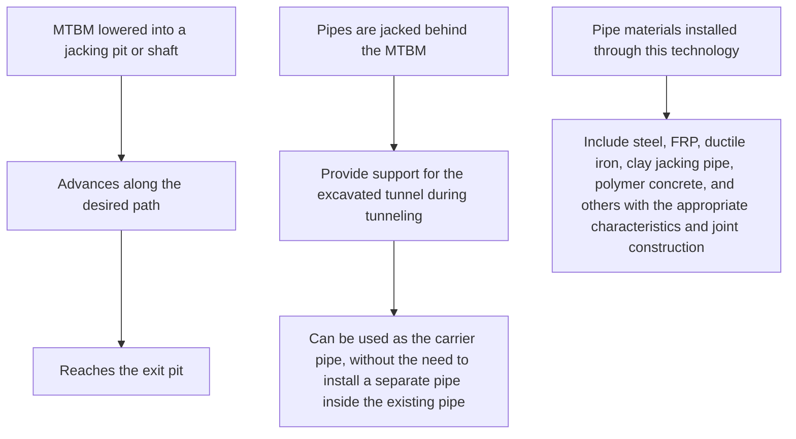
</figure_diagram>

FIGURE 6.15 Microtunneling Process (Reprinted with permission from North American Society for Trenchless Technology: nasst.org)

The process starts with the MTBM lowered into a jacking pit or shaft and proceeds along the desired path until it reaches the exit pit. The face of the machine provides positive support for the face of the excavation. Pipes are jacked behind the MTBM as it progresses through the ground. The jacked pipes provide support for the excavated tunnel during the tunneling process and can be used as the carrier pipe, without the need to install a separate pipe inside the existing pipe. Pipe materials installed through this technology can include steel, FRP, ductile iron, clay jacking pipe, polymer concrete, and others with the appropriate characteristics and joint construction.
\n---\n

Microtunneling has a high unit-construction cost compared with traditional, open-trench
systems. Unless the cost of disruption to utility services is high or difficult soil conditions
exist; microtunneling will not be cost-competitive. When dealing with infiltration and inflow,
microtunneling is an option in urban areas where an existing pipeline is to be abandoned
or requires upsizing but is still below the size of conventional tunneling:
Microtunneling allows for close control of the line and grade and can install a permanent
pipe lining in standard lengths between access shafts. It is also able to function in difficult
ground conditions and congested areas, with minimal surface disruption, at depths greater
than 4.6 to 6.1 m (15 to 20 ft). Larger obstacles, such as boulders, can cause
considerable difficulty in the process.

There are two types of microtunneling systems—auger systems and slurry systems. The
following sections describe these two systems in more detail:

## 8.1.2.1 Slurry Systems

The drive to the cutting head is applied directly from a motor and gearbox located at the
front of the tunneling shield. Steering and control take place in a manner like that used in
the auger system. A small-diameter discharge pipe installed within the lining of the tunnel
bore carries the soil removed by the slurry shield machine directly to a handling facility at
ground level. The slurry liquid typically consists of bentonite and water mixture, although
water alone may be suitable in some soils or machines. In soils containing cobbles or
stones, a crushing head is needed to grind the material down to a consistency suitable for
passing through the small-diameter discharge pipe.

The pipeline itself is jacked behind the microtunneling machine to provide the forward
motion of the machine. Additional lengths of pipe are added at the insertion pit, with the
cycle continuing as the complete pipe string is pushed or jacked forward. The direction is
controlled by the microtunneling machine, as described above.

In most cases, special joints have been developed for the pipes to provide a smooth
internal and external profile, with the joints being contained within the pipe wall. The joint
also should be designed to cope with the jacking forces and be capable of small
deflections without leakage. A jacking pipe also should be able to withstand direct and
\n---\n

## 8.1.2.2 Auger Systems

eccentric jacking forces, soil and traffic loads should be supported safely, and the pipe material should have sufficient durability for the sewer environment:

Auger systems incorporate a series of helical augers within the tunnel boring to transport soil from the cutting head to the jacking pit or starting shaft, where it is removed (see Figure 6.16). The cutting head is connected directly to the auger flight and is driven by an electric motor located in the jacking shaft. A choice of cutting heads is available for differing soil conditions. Crushing heads are also available to deal with cobbles.

By activating several small hydraulic steering jacks near the front of the machine, directional control is achieved using a laser beam emitter located in the jacking pit and a target located at the rear of the tunneling machine. Groundwater at the tunneling machine level can result in over-excavation. This can be limited by the injection of slurry water or compressed air at the cutting head.

<figure>
NASTT
Guided Auger Boring
</figure>

----

<diagram>
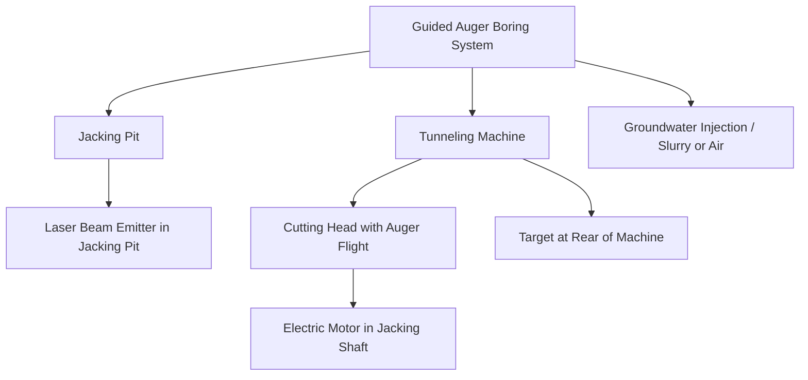
</diagram>
\n---\n

> FIGURE 6.16 Guided Auger Boring Process (Reprinted with permission from North American Society for Trenchless Technology: nasst.org)

## 8.1.3 Directional Drilling

Horizontal directional drilling (HDD) is a suitable method for trenchless installation of pipelines involving long, vertically curved pipelines and is especially suitable for crossing rivers, large streams, and wetlands and for passing under primary, arterial, and interstate roadways. Force mains and "full pipe" gravity sewer uses, such as siphons, are examples of wastewater applications for this technology. It also has been used to install small-diameter gravity sewer lines over short distances but is not appropriate for gravity sewer applications requiring constant and consistent slope control (see Figure 6.17).
\n---\n

FIGURE 6.17 Horizontal Directional Drilling Process (Courtesy of Directional Crossing Contractors Association, Dallas, Texas)

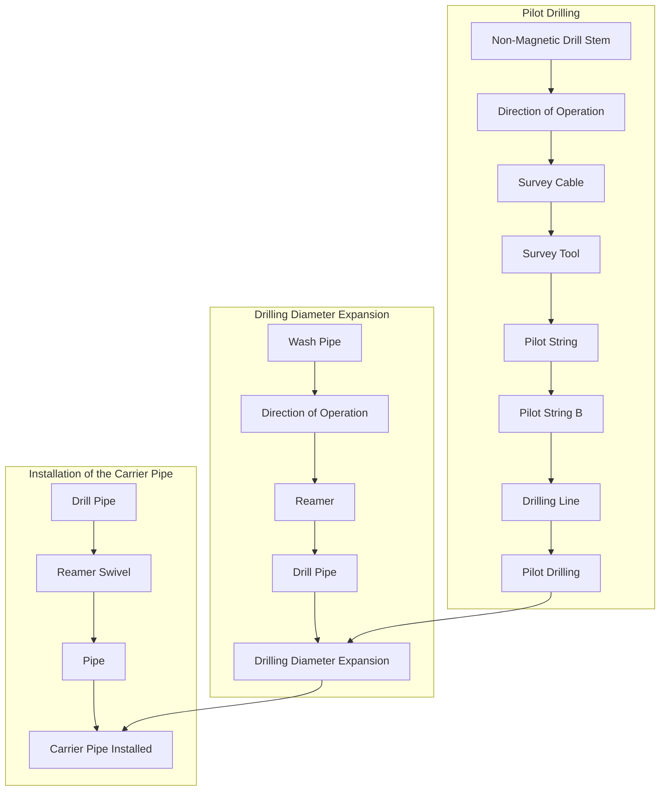

In preparation for HDD, the nearby subsurface utility location (both horizontal and vertical relationship) must be confirmed, and appropriate geological information obtained for the bore location. Horizontal directional drilling includes the drilling of a pilot bore along the desired path, followed by enlarging the pilot hole with a backreamer and subsequently pulling a pipe through the hole. Bentonite is used to support the hole and lubricate the pipe to reduce the pulling force. The technique can negotiate both vertical and horizontal bends. The radius of the curvature is based on the type and diameter of the pipe to be
\n---\n

pulled through the hole. High-density polyethylene, PVC, and ductile iron are a few of the pipe materials with restrained joints that can be installed through this practice.

## 8.1.4 Pipe Jacking

Pipe jacking is an established trenchless method for the installation of pipes under highways and railroads. Because the grade cannot be controlled accurately, the jacked pipe is often used as a casing pipe, with the carrier sewer pipe installed within. The carrier pipe is held in place by a tie-down assembly, or the annular space is grouted. The casing pipe is typically steel with a variety of carrier pipe materials to convey the wastewater (see Figure 6.18).

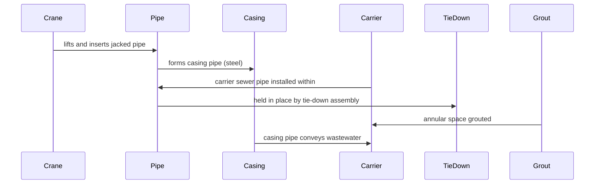

FIGURE 6.18 Pipe Jacking Process (Reprinted with permission from North American Society for Trenchless Technology: nasst.org)

0

NASTT

PipeJacking
\n---\n

# 8.1.4 Pipe Jacking

The pipe jacking process involves the excavation of soils ahead of the jacking pipe, either manually or by using small excavating machines. Because the method requires personnel access at the operating face, its application for sizes smaller than 91 cm (36 in.) in diameter is typically not recommended, although casing diameters as small as approximately 61 cm (24 in.) have been installed. Pipes up to 274 cm (108 in.) in diameter have successfully been jacked into place.

The process starts with excavating a jacking and an exit pit. A concrete thrust block is poured at the end of the jacking pit to resist the jacking force. A shield is used to support the soil in front of the jacking pipe. After the excavation advances approximately 1 m (a few feet), the first pipe section is lowered into the pit and jacked into place. The excavation process then resumes, followed by further jacking of the pipe sections: Packing material (typically plywood) is used to uniformly distribute the jacking load on the pipe sections. Intermediate jacking stations may also be used for long drive lengths. Bentonite slurry also may be injected, to reduce friction between the pipe and surrounding soil.

## 8.1.5 Impact Moling

Impact moling is a commonly used technique for installing short pipe sections (typically shorter than 61 m [200 ft]) that are small in diameter (25 cm [10 in.] or smaller). Moling uses compressed air to drive a cylindrical percussive hammer through the soil to form a bore and is best suited for compressive soils. Soil is not removed from the bore but consolidated into the surrounding soil mass. The pipe can be inserted after the entire bore is complete or follow the mole into the bore as it is created: The system is non-steerable and is not typically appropriate for gravity sewer pipes that are dependent on reliable, consistent grades in the finished pipeline. It has found more market applications for gas, water, and cabling conduits (see Figure 6.19).

## 8.1.6 Pipe Ramming

This is a further development of impact moling, in which a large impact mole in a drive pit is used to pneumatically hammer a steel casing or pipe through the ground under roads or highways. Soil enters the open-ended sleeve and is removed by jetting, mechanical cutting, or simply pushing out the soil plug. The system typically is limited in drive length up to 30.5 to 45.7 m (100 to 150 ft) and generally applies to medium- and large-diameter pipelines.
\n---\n

pipes up to 1.2 to 1.5 m (4 to 5 ft) in diameter: After installation, the pipe may be used directly or serve as a casing for other utility pipes. The resulting pipe typically is not used directly for sanitary sewer applications (see Figure 6.20).

Compressor

Figure caption:
FIGURE 6.19 Typical Impact Moling Process (Reprinted with permission of Louisiana Tech University, Trenchless Technology Center)

[Mermaid Diagram]
```
graph TD
StartingPit[Starting Pit] --> AirHose[Air Hose]
AirHose --> Compressor[Compressor]
Compressor --> LineOfVision[Line of Vision]
LineOfVision --> TerrainTop[Terrain Top]
TerrainTop --> TargetPit[Target Pit]
ImpactMole[Impact Mole] --> Casing[Casing]
Casing --> TargetPit
StartingPit --> ImpactMole
```

8.2 Conventional Open-Cut Pipe Replacement
Open-cut replacement has been the traditional method of installing relief lines. Trenchless technologies provide the option of avoiding open-cut trenching to minimize surface disruption and traffic effects. An analysis typically is performed to determine whether open-cut construction is more cost-effective than trenchless options. If social costs are considered, trenchless options often end up being more cost-effective. However, not all utilities consider social costs in their cost-effectiveness analysis.

Open-cut construction may offer several distinct advantages. For example, when the depth of installation is shallow, the soils are stable, and no groundwater is present, open-cut construction is often more cost-effective than trenchless options. The open-cut option also becomes more cost-effective when many lateral connections at short intervals need to be reinstated. Open-cut construction has years of demonstrated competencies and can fully use the range of pipe materials for the diameters involved. Quality assurance opportunities are maximized, and there is the opportunity to fully inspect the pipe in a dry, safe environment and ensure that it is constructed according to the specifications. Some existing site conditions, such as soil type, also may limit the options to open-cut.
\n---\n

<table>
  <thead>
    <tr><th>Compressor</th><th>Insertion Pit</th><th>Air Hose</th><th>Terrain Top</th><th>Steel Pipe</th><th>Receiving Pit</th></tr>
  </thead>
  <tbody>
    <tr><td></td><td></td><td></td><td></td><td></td><td></td></tr>
  </tbody>
</table>

FIGURE 6.20 Typical Pipe Ramming Process (Reprinted with permission of Louisiana Tech University, Trenchless Technology Center)

# 9.0 SERVICE CONNECTION REHABILITATION

Service connection laterals can be a significant source of infiltration and inflow to the collection system. Wastewater utilities have found that an effective lateral rehabilitation program can significantly reduce the level of infiltration and inflow. Root growths that penetrate the lateral pipe and enter the main line also pose problems.

Rehabilitation of service connection pipes off mainline pipes poses many dilemmas for agencies primarily because of ownership (public/private) and access issues. Many agencies do not have ownership of the entire length of the lateral pipe to the building and any rehabilitation would be limited to the public portion of the lateral pipe. Many agencies have concerns about accepting future responsibility for; and the use of public funds to address lateral issues for the private portion of the lateral pipe. Rehabilitation becomes complicated when there are no cleanouts in the public space and entry onto private property is needed to provide access for inserting the cleaning tools or rehabilitation equipment. In many cases, private property owners resist allowing access.

### 9.1 Service Connection/Main Line Interface Pipe Repair—Nonstructural

#### 9.1.1 Cleaning Interface
\n---\n

## 9.1 Sewer Cleaning Techniques

Sewer cleaning techniques used for the pipe are adapted to remove those roots or grease present at the service connection interface with the main line. Hydraulic-powered cleaning attachments, including cutters and wire rippers, grab and pull roots that protrude from connections. These are more effective if the source of the roots is the seal between the connection thimble or saddle and the pipe barrel. Cable machines with wire-brush attachments can also be used but may not be as effective if the attachment does not fit snugly against the pipe wall as it progresses. Power rodding equipment with a root-cutting attachment is another option:

The source of the actual root growth will also dictate options. Root growths that penetrate the lateral pipe and enter the sewer main through the lateral need to be cut by snaking with steel rods and brush or cutter attachments inside the lateral. Access is gained from either an inside cleanout in the building or an outside cleanout at the building or property line.

### 9.1.2 Grouting Interface

Leaking service connections have been a recurring source of infiltration in the collection system. In the early 1980s, the Washington Suburban Sanitary Commission (Laurel, Maryland) and a major grout equipment manufacturer collaborated to develop a chemical grout sealing system to stop infiltration at cast iron thimble connections to older sewer mains. The process initially was developed using acrylamide grout and then included the acrylic grout as an option for the commercially available lateral packer system.

Several manufacturers offer lateral packer equipment in the marketplace. The modern lateral sealing packers can engage the connection and lateral pipe from the main and a significant portion of the lateral pipe. The process is like mainline joint sealing. A packer is inflated to isolate the connection from the sewer. A "sock" is inflated, which travels up the lateral and seals the balance of the lateral from the grouting operation: The inflated packer and lateral sock isolate the connection, and the grout is pumped. The sock is retracted, and the excess grout is wiped from the lateral pipe. The practical range of this technology is limited to sealing 0.9 to 1.5 m (3 to 5 ft) of the lateral, including the connection. This technology has been used in conjunction with joint sealing and structural lining systems to try to combat the effects of groundwater migration in rehabilitated sewer segments.

## 9.2 Service Connection/Mainline Interface Renewal
\n---\n

## 9.2.1 Excavate and Replace (Open-Cut) Method
A traditional method of repairing defective or leaking service connections at the mainline includes excavation and repair. If the original connection was a cast iron thimble or other appurtenance attached to the pipe barrel with mastic or mortar, the device is removed, and a gasketed cast iron saddle or PVC thimble is used in the same connection hole. If the original connection opening cannot be reused, a new tap is cored, and the old hole is abandoned and plugged. This technique requires that a short piece of the lateral pipe be cut, and a rubber connector is used to extend the lateral pipe to the new connection appurtenance.

## 9.2.2 Cured-in-Place Pipe
A CIPP liner can be inserted in main lines from 14 cm (5.5 in) (i.e., lined 15-cm [6-in] diameter mains) to 61 cm (24 in.) and renew laterals from 8 to 20 cm (3 to 8 in.) in diameter and engage both tees and wye branches.

Other variations include what generically is referred to as a top hat lining system, taking its moniker from the shape of the liner and the flap overlapping the sewer main. The top hat application is performed when the main has previously been lined with CIPP and has a flange that is glued to secure it to the liner or pipe inside the main. The liner is positioned over the lateral opening, inflated, and cured. A brim or overlapping flap of 5 to 8 cm (2 to 3 in.) is sealed for approximately 10 minutes. Quality control is essential in using a top hat lining system as they tend to pop out if installed incorrectly:

## 9.2.3 Robotic Repair
Robotic grinding and epoxy repair of protruding and leaking service connections provide a structural, trenchless alternative to connection repair. The equipment is like that used for robotic localized repair equipment but fully uses the articulating grinding tools to prepare the service connection for the epoxy grout injection. This technique can be used as a stand-alone repair or effectively in combination with joint repairs and lining systems. Epoxy-sealing service connections, following the structural renewal of the sewer with liners, provide an integrated, total pipe solution to structural renovation, infiltration and inflow exclusion, and corrosion protection.

## 9.3 Service Connection Lateral Pipe Repair—Nonstructural
\n---\n

## 9.3.1 Lateral Pipe Cleaning

Root growths that penetrate the lateral pipe need to be cut by snaking with steel rods and brush or cutter attachments inside the lateral. Access is gained from either an inside cleanout in the building or an outside cleanout at the building or property line. Rodding and jetting with appropriately sized equipment for the 10- and 15-cm (4- and 6-in.) laterals are also options.

Chemical root control is another option for those roots that have a sufficient mass in the sewer for the foaming agent to contact. Other chemical root control formulations are available that can be introduced through the plumbing inside a building. Like with mainline applications, grease and other coatings on the roots will affect the performance of the chemical application:

## 9.3.2 Lateral Pipe Grouting

There are a variety of sewer lateral grouting technologies in the market. Most are explained in the Water Environment Research Foundation (WERF) manual titled Methods for Cost-Effective Rehabilitation of Private Lateral Sewers (WERF, 2006). This report details all the methods available, which will be briefly summarized here, that are designed to reduce infiltration and inflow from the lateral pipe, but not to restore any structural integrity (see Figure 6.21).

Grouting in the lateral has been performed both from the sewer main and cleanouts providing access directly to the lateral: The chemicals used for the laterals are like those applied in sewer joints— only the method of delivery varies. The test-and-seal method uses a flexible packer, inserted at a cleanout and sized for the lateral diameter, which incrementally seals the lateral in 0.9- to 1.2-m (3- to 4-ft) segments.
\n---\n

<table>
  <thead>
    <tr><th>Locate the lateral via CCTV</th><th>Center packer over lateral</th></tr>
  </thead>
  <tbody>
    <tr><td>Inject grout through defect into soil</td><td>Air test and deflate</td></tr>
  </tbody>
</table>

<p>FIGURE 6.21 Grout Sealing Lateral Interface and Pipe (Reprinted with permission from Avanti International)</p>

## 9.3.3 Flood Grouting

Proprietary chemical solutions are sequentially flooded in an isolated section of the sewer main, manholes, and connected laterals. The sequential flooding and draining are designed to exfiltrate the solution outside the sewer main and lateral and soak the trench and soil. When the second flooding is complete, the residual of the two solutions chemically reacts and cures, creating a grouted zone around the pipe defects.

### 9.3.4 Slug Grouting
\n---\n

## 9.4 Service Connection Lateral Pipe Renewal—Liners

Slug grouting is another exfiltration method of grouting that is like flood grouting. However, in this technique, two bladders move in tandem along the length of the sewer main, isolating a portion of the main and laterals between the two mainline bladders and a corresponding lateral bladder. The bladders exfiltrate fine cement grout under low pressure through defects and seal the sewer from infiltration.

The most common type of liner used for lateral rehabilitation is CIPP. Access to the service lateral may be from the sewer line or the cleanout. If a cleanout is not available, a small entry point outside the building can be made to install the liner. The process of liner installation in the service lateral is very similar to the CIPP lining of sewer lines. The lateral should be cleaned of all debris. The liner is saturated with resin and is pulled through the service lateral either by inversion or winching. The liner is then inflated and cured by water or air. Because the junction between the service lateral and the sewer line is the weakest point, specific measures should be taken after the liner is installed, so that the junction becomes watertight.

## 9.5 Service Connection Lateral Pipe Replacement

### 9.5.1 Excavate and Replace/Open Cut Method

Open-cut removal and replacement of sewer laterals is a proven method for renewing sewer laterals. The old service line may be abandoned in place or removed. This technique is cost-effective when dealing with shallow services and where there is no elaborate landscaping or obstacles, such as fences, paved driveways, and sidewalks. A key factor to a collection system owner using the excavate and replace/open-cut method is obtaining the property owner's consent to access the property for construction.

The initial concern of the property owner will be whether the property can be restored to preconstruction condition, especially when mature vegetation may be affected. If necessary, the alignment of the new service line should be revised to minimize the extent of ground restoration or avoid structures and other obstacles. The location of cleanouts is also a critical issue from the property owner's point of view. Although many cleanout locations are dictated by local building codes, consideration should be given to revising the alignment to address the concerns of the property owner. Finally, the warranty will have to be extended for materials and workmanship. Sod and other landscaping materials

\n---\n

## 9.5.2 Lateral Bursting
Lateral bursting is similar, with regards to equipment and requirements, to pipe bursting of sewer mains Access pits are excavated at both the upstream and downstream ends of the service lateral. One entry is for the insertion of the replacement pipe led by a bursting head, while the other end is for access to pull the head through the lateral by cable or rods The existing service line is fractured into pieces and pushed into the surrounding soil. The new pipe is pulled in place behind the bursting head. An advantage of lateral bursting is its capability to upsize the lateral size by one or two pipe diameters.

### 9.5.2.1 Static Pull
The static pull bursting technique uses equipment that includes a simple bursting head pulled through the lateral pipe with cables or rods. Pipe-splitting vanes may or may not be attached to the head to assist in splitting cast iron pipe. Minor bends can be negotiated. The ideal lateral pipe in this replacement technique is HDPE, which is pulled into the larger pipe envelope created by the bursting head. In identifying candidate sewer laterals, any sags should be identified in the existing grade, and it should be determined if any reflective sag in the new flexible HDPE pipe will be a problem (see Figures 6.13 and 6.14).

### 9.5.2.2 Pneumatic
Pneumatic bursting is the more robust bursting method of the two lateral bursting technologies. This technique uses throttled, compressed air to deliver repetitive, percussive impacts to the bursting head. This technology is used typically in more difficult ground conditions, although high groundwater can pose problems for this method. Like the static pull technique, it also is pulled through the host lateral pipe to the receiving pit and drags the new HDPE lateral pipe behind it.

## 10.0 MANHOLE REPAIR
Manholes offer significant potential for infiltration and inflow to the collection system: A manhole is the most accessible component of the gravity collection system and is typically the only element to be routinely exposed at the surface. Its location in streets and paved
\n---\n

Areas leads to problems with runoff into the manhole through the frame and cover and under the frame in the corbel area. Adjustments of the frame and cover for resurfacing, the effects of freeze/thaw cycles, and wheel-load impacts on the structure of the manhole contribute to the structural and watertight deterioration of the manhole. Manhole repair technologies have been developed to address each element of the full vertical envelope of this sewer access appurtenance.

## 10.1 Manhole Grouting

Chemical grouting is one of the oldest, trenchless technologies used in collection system rehabilitation. Because chemical grouts do not add to the structural integrity of manholes, they only should be used when the overall structural integrity of the manhole is sound. Grouts give the best results in cohesive soils. They may be used to fill voids and stabilize soils behind manhole walls. Grouts are typically applied under pressure through grout holes drilled into the manhole walls. Their purpose is to reduce the permeability of the soils around the manhole and reduce or eliminate infiltration:

Each of the chemical grouts requires water or a catalyst to initiate the gel or foaming action. The temperature of the mix, availability of water in the soil, percent of the catalyst, and rate of additives all affect the cure time and quality of the gel or foam. Careful observation and field monitoring of the grouting operation is necessary to ensure success. The service life of grouting solutions is reported to be from as low as 5 years to as high as 25 years.

The objective of the grout gel in masonry manholes is to build a grout curtain around the exterior of the manhole wall and at the pipe connections. Consideration should be given to issues, such as the pattern of holes for injection, to ensure complete and circumferential placement of the gel curtain. One effective manner for achieving success with chemical grouting is to start with injection holes at the base of the manhole in a compass-point arrangement and offset the next set of holes 45° at a vertical offset of approximately 1 m (several feet) from the first holes. This pattern is continued up the specified depth of the manhole: This ensures complete coverage and significant gel mass to provide longevity of the repair:

Precast manholes typically leak at pipe connections and preset section joints. Foams can be used to reinforce or replace pinched or missing gaskets in the joints. The foam
\n---\n

injection is typically limited to the leaking area. The foams can also be combined with oil-free jute to seal limited gaps between the manhole frame and corbel.

Flood grouting is another option for the grouting of manholes. In this proprietary technique, an isolated section of the sewer main, manholes, and connected laterals are sequentially flooded with a two-part chemical solution. The flooding and draining are designed to force each component of the two-part solution outside the manhole, sewer main, and lateral sequentially and soak the trench and soil with each component of the two-part solution. When the second flooding is complete, the two solutions chemically react and cure, creating a grouted zone around the manhole, pipe, and lateral defects. Just as in grout applications in sewer pipe joints and laterals, the specifier of chemical grout repairs in manholes should thoroughly research the application and the materials with manufacturers and contractors to ensure a successful application of the products appropriate for the manhole conditions.

## 10.2 Corbel, Frame, and Cover

A significant source of inflow to a sewer system occurs through the defects in the upper components of the manhole. Inflow can significantly be reduced by rehabilitating or replacing these components. The manhole covers with pick holes or cracks can be replaced with watertight covers or sealed with mastic compounds and pick hole plugs: Alternatively, watertight inserts may be installed under the manhole cover to capture the runoff and prevent entry:

A common defect observed in manholes is the deterioration of the frame chimney joint (frame seal), because of such factors as ground movement, thermal expansion and contraction, and traffic loading. The frame chimney joint can be repaired internally without excavation when frame alignment and chimney conditions permit: When excavation is required to replace the frame or reconstruct the chimney and/or cone, the frame chimney joint can be installed internally or externally. This can be achieved by installing a flexible manufactured seal or by applying a flexible wrap material to the joint area. Alternatively, cementitious coatings and even corbel gunite applications have proven effective in slowing or eliminating runoff from between the frame and corbel seal;

## 11.0 MANHOLE RENEWAL
\n---\n

# 11.1 Manhole Coating Systems

Coating systems may be used as a corrosion-protection barrier and/or enhance the structural integrity of manhole structures. Coatings can be hand-applied or sprayed. When using a coating system, the surfaces must be thoroughly cleaned and prepared. High-pressure water blasting may be used to remove loose mortar, grease, and oil residues, and prepare the surface to ensure that reliable mechanical bonding occurs when the coating system is applied.

When manhole structures are structurally sound and have only suffered from hydrogen sulfide attack, a thin layer of coating may be applied to prevent further corrosion of the manhole wall. Coating systems may be cementitious, epoxy, or polymer-based. Because Portland cement has low corrosion resistance, calcium aluminate cement should be used to enhance corrosion resistance. Epoxy and polymer (polyurea and polyurethane) have excellent corrosion-protection properties. The keys to achieving effective coating systems are proper surface preparation, adequate inspection, and thorough specifications.

## 11.2 Manhole Lining Systems

Structural linings restore the structural integrity of manhole structures and eliminate infiltration from the walls. Several structural lining methods are available, including poured-in-place concrete liner, cured-in-place liner, formed-in-place liner, prefabricated fiberglass, and spray-applied systems.

The poured-in-place concrete liner is often combined with an epoxy coating or a liner (HDPE, PVC, or FRP) for corrosion protection. The HDPE or PVC liner has T-lock ribs, which become embedded in the concrete liner, while the FRP liner is smooth with poured-in-place concrete to fill the annulus between the liner and the existing manhole wall. Alternatively, the concrete liner may be sprayed over with a thin layer of epoxy coating. The thickness of the concrete liner is based on the external hydrostatic and active soil pressure around the manhole and the traffic loading. In addition, if no corrosion-protection barrier is installed, a corrosion allowance should be added to the concrete thickness required to resist external loading.

Cured-in-place liners are a variation of the CIPP technique used extensively for the rehabilitation of sewer lines. However; this technique has been used on a limited basis for
\n---\n

# 12.0 MANHOLE REPLACEMENT

manhole rehabilitation, because of mobilization and cost factors. The formed-in-place liner, a variation of formed-in-place pipe (FIPP) used extensively in Europe for rehabilitation of sewer lines, consists of two concentric thin layers of HDPE liners, which are filled in with specially formulated grout. Whereas FIPP liners have been used in Europe for the rehabilitation of manholes, they have not been used in the United States yet. This technology has been introduced to the United States market in the past 3 years.

Prefabricated fiberglass is a one-piece monolithic unit, which is corrosion-resistant and provides adequate structural strength. The disadvantage is that the top and chimney part of the manhole should be removed for the fiberglass liner to be installed.

Spray-applied systems include cement mortar, epoxy, polyurethane, and polyurea linings. The success of such lining systems depends on the degree of surface preparation and cleaning, amount and type of leakage, quality of application, and degree of inspection.

Gunned cementitious coatings are effective for restoring structural integrity and can include gunite and other Portland-cement-based coatings, with a variety of additives available for increasing resistance to stress, water, and flexure on the walls of the manhole. In general, epoxy coatings are more costly per application but can provide a higher degree of corrosion resistance in manholes where there is evidence of corrosion in the manhole during the condition assessment. The polyurea lining has the advantage of curing fast. As such, the manholes can be placed back in service shortly after the liner is applied. Although the polyurea requires 24 hours to reach its full cure, it dries to touch in less than 1 minute.

An additional area of the manhole that merits attention includes the bench and channel. Liners can incorporate the bench and channel walls, but they can also be economically rebuilt through cementitious products or epoxy, non-shrink grouts. To enable appropriate cure time, the existing wastewater flow must be contained or diverted to enable a dry channel and bench in which to work: This can be accomplished with a flow-through inflatable plug installed in the upstream pipe and lay-flat hose discharging to the downstream pipe connection, or with a small-diameter pipe sleeve inserted into the existing pipe, conveying flow through the manhole.
\n---\n

All manholes can be renewed using the technologies discussed in the preceding sections. However, there may be instances when excavations on pipes expose an unstable manhole structure or a newly built inline, the doghouse-style manhole is required over an existing sewer. In these examples, a completely new structure will be constructed.

Many of the renewal technologies are available as materials or components in new manholes. Precast manholes, erected as a series of riser and cone sections, will continue to be the most cost-efficient manholes available. If corrosion is an issue, such as when a pumping station force main discharge terminates in the manhole, then protective liners or corrosion-resistant cement incorporated into the concrete mix are required. Both PVC and HDPE liners are available to be embedded in the concrete during the casting process. Tabs or locks on the backside of the thin thermoplastic liners anchor the liner in the concrete and provide long-term corrosion protection. Stand-alone HDPE and fiber-glass-reinforced manholes are also an option: These work well when integrated with mainline sewer piping of the same material. One concern with these monolithic manholes is flotation. Flotation must be considered in construction and for long-term performance.

13.0 METHOD SELECTION PROCESS

All collection systems deteriorate over time. The objective of sewer rehabilitation is to restore the overall reliability of the conveyance system when sewer performance reaches marginal levels. Sewer rehabilitation improves collection system reliability by reducing infiltration and inflow; limiting exfiltration, reducing SSOs and backups, and ensuring the structural integrity of the pipe and appurtenances for long service life. The selection of specific rehabilitation methods will depend on which of the rehabilitation objectives are to be met (see Chapter 2 for a related discussion). Defining the goal of rehabilitation is integral to success. Structural rehabilitation methods may also reduce the rate of infiltration, while many infiltration control technologies have little or no effect on the structural integrity of the pipe. Structural rehabilitation will also have the related benefit of extending the useful life of the sewer pipe or manhole asset.

Ever since the promulgation of the Clean Water Act in 1972 (U.S. EPA, 1972), there has been increasing emphasis on sewer rehabilitation to reduce infiltration and inflow, which has been identified as excessive and thus cost-effective to remove. The underachievement of some rehabilitation efforts in reducing infiltration and inflow is related
\n---\n

## 13.1 Goals of Project

to the failure to achieve overall extraneous flow-system objectives and not necessarily the failure of the individual repair or renewal efforts. For sewer rehabilitation to achieve its objectives, accurate and complete sewer condition assessment investigations are required to ensure that the full scope of rehabilitation required is understood. Structural renewal programs have been more successful at achieving these goals. This is partly a result of their ability to interpret the structural deficiencies of the sewer pipe and match the renewal technology to the defect(s) more completely.

The following sections present data and discussions on quality control procedures used to ensure the effectiveness of specific rehabilitation methods about infiltration and inflow control and structural integrity, the effectiveness of infiltration and inflow control that might be expected on a system-wide basis (see Chapter 7 for additional information on infiltration and inflow rehabilitation effectiveness), and a procedure for measuring the effectiveness of systemwide structural integrity:

### 13.1 Goals of Project

With a multitude of options available to rehabilitate sewers, the different conditions affecting the sewer should be considered before deciding on a rehabilitation method. Factors to consider when selecting a rehabilitation method include, but are not limited to the following (WEF WSEC-2017-FS-009):

1. Pipe characteristics: age, size, shape, materials of construction, joint type and frequency, slope, depth, and number and type of service lateral connections:
2. Soil and groundwater conditions that affect the structural conditions and active infiltration and/or high groundwater:
3. Sewer location: public right-of-way; easement; private property; environmental sensitivity, and water crossing; and conflicts with other structures and utilities.
4. Service characteristics: tributary area (sewershed) and tributary flows.
5. Service history: previous inspection data such as televised inspection, smoke and/or dye water testing; maintenance history (e.g., frequency of cleaning and/or root removal); and flow monitoring:

Based on a thorough condition assessment, both structural and nonstructural trenchless rehabilitation methodologies are proven to remediate and restore the useful life of sewer
\n---\n

pipes. Accurate, comprehensive condition assessment plays a significant role in the success of any rehabilitation project. One cannot repair, renew, or replace the correct system components unless they are first identified correctly. Once the candidate sewer components have been identified, recommendations are made for rehabilitation that acknowledge the goals of the project. For example,

1. Are infiltration and inflow reduction the critical factors for the rehabilitation to achieve?
2. Is corrosion expected to be a concern over the life of the rehabilitation?

The advantages of trenchless installations are numerous including time-to-benefit, minimal disruption to the community, and lower project costs. As opposed to defaulting to open-cut replacement methods, trenchless alternatives provide several options. The rehabilitation designer must understand the project goals and the nature of the deteriorating attacks on the sewer; to prescribe the best rehabilitation method. Successful problem resolution begins with accurate problem definition.

## 13.1.1 Infiltration and Inflow Effectiveness

Rehabilitation to control infiltration and inflow is applied where the rehabilitation will return the highest investment. Implicit in this decision is the understanding that the rehabilitation technique selected is appropriate to the defect to be repaired or renewed. What is not so apparent is that all the infiltration and inflow sources in a portion of the collection system need to be understood, because only those defects that are repaired can constructively affect the flow-reduction bottom line. Sources that are not repaired remain in the system and may negatively affect the flow reduction goal at higher groundwater tables or under storm events.

The achievement of this flow-reduction objective requires the thorough and effective application of each step in the rehabilitation process. These steps include quantifying infiltration and inflow within subdrainage areas to a design condition, allocating the quantified infiltration and inflow to the individual sources within each subdrainage basin, estimating the effectiveness of the rehabilitation technology in eliminating the infiltration and inflow from that source, and the effect of the repaired or renewed defects to the overall infiltration and inflow levels in the sewershed:

## 13.1.2 Selecting the Design Condition
\n---\n

# 13.1 Infiltration and Inflow

Rates of infiltration and inflow are linked to defect size, defect frequency; defect location, seasonal groundwater table, antecedent rainfall, and specific storm characteristics (frequency, duration, intensity, and spatial distribution). Measured infiltration and inflow reduction achievements for a specific rehabilitation application will vary, depending on the repairs made across the sewershed, the effectiveness of the selected technology to eliminate extraneous flow from the source, groundwater migration from rehabilitated to unrehabilitated sources, and specific groundwater and rainfall conditions at the time of the measurement. Because of this wide range of variables, pre- and post-rehabilitation flow measurements typically are projected to design conditions to attempt to mitigate the daily variability of groundwater and rainfall conditions that are present daily:

The selection and application of the appropriate design condition will vary among agencies and jurisdictions. Flow-to-rainfall (Q versus I) relationships have been successfully used to assess the effectiveness of rehabilitation applied to specific metered sewersheds. Flow-meter levels or portable V-notch weir early morning readings of individual sewer segments conducted as pre- and post-rehabilitation flow measurements with the same groundwater levels have also been used effectively to describe the effectiveness of individual repairs.

## 13.1.3 Infiltration and Inflow Allocation

Metered flows projected to the selected design condition are often used as the basis for defining the extraneous flow to be allocated to the known infiltration and inflow sources: Flow metering, with the quality assurance/quality control tools available, has become routinely reliable for defining levels of infiltration and inflow in the subsystem. Allocating the rate and frequency of infiltration and inflow to identified sources begins with a complete and thorough condition assessment and evaluation of both the public and private collection systems and ends with a mix of part engineering and part judgment: The success of the condition-assessment process is integral to the eventual success of the flow-allocation procedure and to reliable flow reduction after the repairs and renewal are implemented.

## 13.1.4 Overall Infiltration and Inflow Reduction

Evidence has demonstrated that rehabilitation performed in one area can result in raising the sewer trench groundwater level;, increasing the leakage in shallower sewers, and
\n---\n

## 13.1.5 Repair Versus Renewal Versus Replacement
The objective of the structural investigation is to locate vulnerable segments and define factors contributing to structural deterioration. Selecting the appropriate rehabilitation for a specific location requires a full understanding of the contributing deteriorating factors, such as corrosion, external loadings, void creep, groundwater, piping leakage, and hydraulic surcharging. Locating the most vulnerable segments and ascertaining their rate of deterioration will determine the success of structural rehabilitation. This is particularly important where hydrogen sulfide corrosion is the most significant factor contributing to structural deterioration. Structural rehabilitation should be undertaken as planned maintenance activities instead of as emergency repairs:

## 13.2 Structural Considerations
The statement has been made repeatedly that an effective rehabilitation program is the result; initially, of comprehensive and complete condition assessment investigations of both the public and private portions of the collection system. Structural scoring and standardized nomenclature have been achieved in many of the available condition-assessment software products. Early condition-assessment standards were initially established in the United Kingdom by the Water Research Centre (WRc) (Wiltshire, United Kingdom), a water industry research company affiliated with the 10 regional water companies created in England and Wales in 1974. These standards have been updated
\n---\n

and incorporated as elements of the Pipeline Analysis Certification Program (PACP) of the National Association of Sewer Service Companies (NASSCO; Owings Mills, Maryland). The CCTV software that gains the PACP accreditation must contain specific nomenclature and structural scoring features.

Sewer investigation tools have improved tremendously over the past 20 years. In addition to pan-and-tilt robotic cameras, which are the backbone of the condition-assessment industry, there are digital visual sidewall-scanning cameras, lateral cameras launched from the sewer main, lateral cameras inserted from on-property cleanouts, radar and sonar inspection capabilities, and sonde for sewer mapping and location purposes.

A “triage” or screening process is often effective in selecting the most applicable rehabilitation technologies for compatibility and effectiveness with the condition assessment results. Classifying the type and nature of the defects found in the condition-assessment investigation is integral to applying the best technology match for the repair or renewal. Unlike the discussion of the technological methodology in which the presentation was organized by the location of the defect (i.e., sewer main, connection, or lateral), this technology selection/application review is organized by the nature of the defect (i.e., nonstructural or structural):

## 13.3 Nonstructural Considerations

Nonstructural repairs are associated with maintenance issues and infiltration and inflow reduction. If roots, grease, debris, or other observations of material have been noted in the pipe or connection, cleaning is the first line of defense. The frequency of the cleaning application (one-time or placed on a scheduled preventative maintenance cycle) is often determined by the effectiveness of the tool selected, skill of the operator in deploying the tool, cause and pace of the accumulation in the pipe (i.e., at a belly or sag), tenacity of the material to be removed (i.e. grease), and source of the material to be removed (i.e., recurring contribution of granular material from an upstream broken pipe or domestic grease from multifamily dwellings). The cleaning method and tool are matched to the task, but the application requires some basic knowledge of the pipe characteristics (in this review, the assumption is that the pipe is sound). The cleaning method may vary by pipe material, diameter, and nature of the material to be removed:

### 13.3.1 Pipe Material
\n---\n

Hydraulic cleaning is a reasonable choice for a first-pass tool if the pipe material is not known. Rigid materials are amenable to hydraulic jetting, rodding, cable machines, scooters/buckets, and other mechanical and hydromechanical cleaning options. The flexible pipe can be damaged, and the pipe walls abraded over time if devices such as cutters, porcupine wire brushes, buckets, or other mechanical cleaning tools are used in those sewers.

## 13.3.2 Pipe Diameter

Small-diameter pipes, 38 cm (15 in.) or smaller, are more conducive to hydraulic jetting or mechanical cleaning. As the diameter increases, the additional cross-sectional area of the larger pipes diminishes the effectiveness of hydraulic and mechanical tools that are aided in their cleaning efficiency from the confinement of the narrower pipe. For large-diameter sewers, cable machines, buckets, kites, and other mechanical or hydromechanical cleaning tools that are matched to the larger surface area of the interceptor sewer diameters perform more effectively.

## 13.3.3 Nature of Material

The type of material to be removed from the sewer also contributes to the selection of the tool. Loose granular material (i.e., gravel and sand) can be addressed by hydraulic cleaning and mechanical tools, such as cable and bucket machines. Heavier materials, such as rocks or boulders, require mechanical tools that can deliver the brute force required to move the weight of the debris and could be addressed by cable and bucket machines. Roots are particularly difficult to address and require hydraulic jetting with cutters (wire or blades), rodders with cutting attachments, porcupine wire brushes as a cable machine attachment, and chemical root control.

Roots with grease are a common combination and often lead to blockages, surcharging, overflows, and backups. These blockages need to be relieved initially by punching through the stoppage with tools that create a small hole, and the blockage material is successively reduced and removed with additional passes of the hydraulic or mechanical tool selected. Grease is a particularly tenacious material to remove from the pipe and requires aggressive, successive passes from hydraulic jetting, with degreasing agents added to the water tank or mechanically scraped from the walls with rodders, cables, bucket machines, or other devices.
\n---\n

# 13.3.4 Infiltration and Inflow

Nonstructural repairs for infiltration and inflow reduction are primarily associated with chemical grouting. Chemical grouting can be applied to leaking, but structurally sound, joints, thimble- or saddle-type connection appurtenances, or lateral pipes with defective joints. Typically, rigid pipes provide better candidates for chemical grout applications. This is primarily because the rigid pipes tolerate the air and bladder pressures without distortion and may be indicative of older pipes that did not have a rubber gasket joint in the first place. Offset pipe joints and suspect joints, such as those with mineral deposit evidence, are also appropriate candidates for chemical grouting. Chemical grout is most effective when there are no structural defects remaining in the pipe or connection after the rehabilitation process. This is because of the groundwater migration phenomenon that has been observed in deficient infiltration and inflow rehabilitation scenarios. If point repairs are required to fix broken pipes near those sewers being grouted, the sequence should provide for point repair execution first and chemical grouting last: This enables the soil-stabilization benefit of the grouting to be applied when all the trench-disturbance activity has been completed:

----

# 13.4 Structural Defects

When structural defects are documented and repair or renewal is warranted, several factors or considerations aid in the decision-making process for the selection and application of the best structural solution. Several are included for discussion in the following sections.

----

# 13.4.1 Severity of the Defect

Simple breaks, cracks, and splits that are limited in severity are often amenable to internal sleeves, excavated point repairs, or short-length CIPP applications. If the defects include significantly offset joints (i.e., larger than 2.5 cm [1 in.] in small-diameter pipe) and portions of missing pipe walls or inverts, then trenchless methods may not be the first solution, unless the technology can compensate for the lack of shape definition that the existing pipe walls provide to the finished repair. Protruding taps or lateral pipes can be ground or sliced off with cutters. Robotic epoxy repairs are appropriate for defects limited to connections. Cured-in-place pipe lining systems are appropriate when both the connection and lateral are defective.
\n---\n

## 13.4.2 Frequency of the Defect
Isolated occurrences of breaks and open joints are best addressed by individual point repairs—either excavated or trenchless. A single-point repair that restores the overall integrity of the sewer segment is an effective rehabilitation application. When the frequency of the defects increases within a sewer segment, renewal alternatives are better options in developing the rehabilitation strategy:

## 13.4.3 Line and Grade
Isolated sags, low spots, dips, and/or bellies in the existing pipe can be mitigated with point repairs but are difficult to cure through renewal technologies. Renewal lining technologies that have their shape, line, and grade dictated by the existing sewer condition reflect those conditions in the finished product. Pre-design assessments relative to the depth of the sag, frequency of occurrence, importance of the sag to the performance of that specific segment, and other qualitative information about this type of defect will influence and guide the rehabilitation strategy:

## 13.5 Hydraulic Capacity Considerations
Most renewal technologies result in a diameter reduction in the renovated sewer—a key element in computing capacity. In many renewal applications, this may not be a concern, given improved flow factors versus the existing pipe condition. However, if the sewer segment had insufficient capacity before the renovation, renewing the sewer alone will not eliminate that concern. This capacity consideration may be more of a factor in the midrange to large-interceptor diameters (30 cm [12 in.] and larger) than in the neighborhood sewers (20- to 25-cm [8- to 10-in.] diameter), because many neighborhood sewers may have more capacity than their tributary area would dictate, because of minimum diameter requirements and more moderate slopes that may be available:

In Chapter 4, the projected capacity needs of the sewer, for future growth, wet weather, or both, were discussed. When additional sewer capacity is required, sewer repairs and/or sewer renewal applications are not adequate options for acceptable long-term performance. In some instances, only a relief or replacement sewer will provide the needed capacity and address all the conveyance needs. However, the new pipe providing the additional capacity may be installed through in-line replacement or as new construction in a cut-and-cover, trenchless, or "less trench" format:
\n---\n

# 13.5
## 13.5.1 In-Line Replacement
In-line replacement techniques, including pipe bursting and heating technologies, may be more attractive capacity alternatives in urban or congested settings, where additional rights-of-way and easements for relief or replacement sewers are not routinely available.
In-line replacement techniques use the existing pipe envelope to guide the tools, providing size-for-size or upsized diameters in the same trench.

Because in-line replacement technologies incorporate the existing grade, to some degree, in the replacement pipe, the existing pipe slope needs to be considered in the technology method and selection. Large-diameter sewers are more typically constructed at flatter grades, as pipes follow the stream valley. Most sewer design criteria tolerances permit increasingly flat grades as diameters increase. The existing grade needs to be noted, so that the large pipe, resulting from in-line replacement methods, does not violate a sewer-grade constraint for the larger diameter:

## 13.5.2 New Construction
There are many options for constructing new, replacement sewers providing additional capacity in the collection system. Where additional rights-of-way are not a problem or easements have already been dedicated for future parallel pipes, the lowest cost alternatives consistent with the technology limitations can be selected. Open cut is the traditional method of installation and has had years of successful application.

Microtunneling becomes more cost-effective when the sewer is to be installed at significant depths—typically 4.6 m (15 ft) or more. The HDD and pipe ramming methods have demonstrated success over shorter distances but have grade-tolerance limitations for more extended gravity installations. Often, these technologies are used to install carrier pipes, and the gravity sewer is inserted to grade with the new carrier pipe sleeve. The choice is dependent on the needs of the project and the advantages that any technology brings to the application:

## 13.5.3 Infiltration Source, Rate, and Frequency
The infiltration documentation is crucial to selecting an effective repair or renewal technology: The goal of infiltration source elimination is not always achieved with structural renewal liners. If the infiltration leakage is from the connections, the lateral, or
\n---\n

## 13.6 Other Surface Considerations

There are a variety of additional surface constraints that could influence the selection of any rehabilitation process. Work and lay-down areas may vary by technology and must be accounted for in the selection process.

### 13.6.1 Public Use

Surface cover over the existing sewer is a significant factor in the selection and application of sewer technology. Access or restrictions to the access of the sewer segment influence the selection of technologies for repair, renewal, or replacement. Sewers that are located within backyards or other private property with restricted public access pose specific problems for renovation. Sewers within primary or arterial roads universally have permit requirements that limit or define when access can be gained to the segment. These permits will describe when access can be secured to the sewer; for how long, and what traffic control conditions will be required. In some jurisdictions, there are prescribed fees that are paid to secure that access, because traffic interruption has a social cost and effect. Each of these restrictions may affect the final cost of the rehabilitation. Further, many communities have adopted provisions in their road permitting that require complete reconstruction or milling and overlay of the affected road surface if the surface is less than a specified age. Street restoration requirements may dictate whether open-cut or trenchless options are preferable.

Coordinating opportunities for accomplishing both road and sewer structural renewal is a challenge but should be exercised if available. When and where these two needs intersect, mutual benefits can be achieved for the road users and the sewer ratepayers: However, sewer renovation needs are dictated by condition assessment, not roadway integrity. Using road reconstruction schedules as a primary basis for the application of
\n---\n

Sewer reconstruction may lead to less-than-optimal results for a sewer reconstruction program:

Another sensitivity that has been introduced on the local level is the legislated noise ordinance. Noise ordinances typically limit the decibel level to prescribed maximums for specific periods. These levels are tolerant during the day and more restrictive at night. Noise-level mitigation of the equipment (i.e., compressors, generators, and heavy rolling stock) is often required to comply. The combination of traffic and noise restrictions often compounds the technology selection process. Traffic limitations may favor nighttime execution, whereas noise restrictions often dictate daylight execution of the work.

## 13.6.2 Environmental Sensitivity

Regardless of their ultimate effect on the performance of the sewer, trees are a valued and protected resource in the urban landscape. Trees provide shade, combat the greenhouse effect, provide a treasured sense of civic pride, and increase property values. Trees are deeply rooted in the communities we serve and are increasingly protected by tree ordinances restricting the removal or alteration of the root mass or canopy: Public space or roadside tree permit requirements are a necessity in many communities to alter or remove a tree. This fosters a new sensitivity to the effect that cut-and-cover alternatives cause to trees and shrubs and dictates trenchless solutions where an excavation effect cannot be mitigated:

Groundwater protection is a baseline objective in the design, construction, and rehabilitation of wastewater collection systems. In many states, groundwater is considered a 'water of the state' for a regulatory interpretation of whether exfiltration from the sewer pipe to the trench and the surrounding groundwater is an SSO. In a surcharged pipe condition, exfiltration may occur anywhere around the wetted perimeter of the pipe or laterals. However; when structural deficiencies exist within the sewer, exfiltration more typically occurs routinely below the diurnal flow line and at the invert: Liner technologies should address most dry weather sources of exfiltration, but additional assessments and rehabilitation may be necessary if a surcharge is a routine occurrence in the affected sewer:

Increasingly, animal habitats, wetlands, and other environmental concerns must be reconciled with the selection of the repair, renewal, or replacement method: The
\n---\n

# 13.6.3 Water Crossings

Water crossings pose unique circumstances for completing the rehabilitation of an existing sewer segment. Design criteria often require armoring existing pipe crossings (constant-grade gravity pipe and siphons) with concrete encasement, riprap, or semi-permanent protection for the alignment and pipe. These large, incompressible masses of stone and concrete virtually eliminate any in-line replacement technique requiring bursting or expansion and dictate renewal methods, such as lining, or new construction technologies, such as microtunneling or directional drilling, when additional capacity is required.

# 13.7 Subsurface Considerations

There are a variety of subsurface considerations that influence the selection of the rehabilitation technique. The original construction requirements may have specified concrete encasements, clearances among adjacent and crossing utilities, and other relevant construction details that may be ascertained from available as-builts. When using as-built or record information it is critical to understand that information may be erroneous and that other utility and public works have been done in the area since the original construction. The primary considerations when rehabilitating pipelines and manholes are spatial (e.g., where are other underground utility pipes and structures located) and geotechnical (e.g., soil and existing trench characteristics). The American Society of Civil Engineers (ASCE) publishes several documents related to investigating, documenting, recording, and exchanging utility infrastructure data. The ASCE “Standard Guidelines for the Collection and Depiction of Existing Subsurface Utility Data” describes the quality of utility depiction as:

Quality Level D: Information derived from existing records or oral recollections.
\n---\n

# Quality Level C
Information obtained by surveying and plotting visible above-ground utility features and by using professional judgment in correlating this information to Quality Level D.

# Quality Level B
Information obtained through the application of appropriate surface geophysical methods to determine the existence and appropriate horizontal position of subsurface utilities.

# Quality Level A
Precise horizontal and vertical location of utilities obtained by the actual exposure and subsequent measurement of subsurface utilities, usually at a specific point.

## 13.8 Other Constructability Issue

### 13.8.1 Lateral Reinstatement
The presence of any laterals and the frequency of those laterals in the candidate sewer segments may influence the selection of rehabilitation technology. Reinstatement methods were discussed with the individual technology. For sliplining and in-line replacement methods, excavation of the connections is required for reinstatement. The density of connections may result in several patches that could lead to degradation of the road integrity. This prospect may lead to the road authority requiring mill and overlay—a significant investment beyond the area required for base and surface asphalt in a patch.

### 13.8.2 Bypass Pumping and Piping
A significant effect on the consideration of specific renewal and replacement technologies is the provision for bypass pumping. The CIPP, fold-and-formed lining, and any in-line replacement method require bypassing of the existing flow to access the full internal diameter of the host pipe. For a project that may require bypass for more than a 1- or 2-day period, the bypass pumping and piping will be designed and constructed to accommodate peak wet weather flows. For some collection systems susceptible to infiltration and inflow, this may involve sizing the temporary bypass pumping and piping to convey flow with peaking factors of 5 to 10 times the daily average. There needs to be space for the pump and power; provisions for traffic control around the piping along the route; and security for the bypass arrangement, to ensure that it is free from vandalism, there is adequate fuel supply, and stream crossings are secure and above elevated.
\n---\n

## 13.8.3 Minimum Pipe Diameter and Diameter Variation

Fifteen-centimeter (6-in.) diameter sewer mains typically are the smallest sewer diameters in the public portion of the system, and these are found only in older communities or in terminal sewer segments. Depending on the structural considerations in the host sewer and the wall thickness of the liner selected, a final diameter in a nominal 15-cm (6-in.) sewer main of less than 14 cm (5.5 in.) may result. This may cause some agencies to be concerned about future inspection and cleaning access if these sewers are lined.

Liner technologies are also sensitive to the inside diameter variation from pipe to pipe. This concern is amplified in the older, rigid pipes that may be candidates for renewal. The casting and formwork used to manufacture the older vitrified clay and plain concrete pipes had tolerances that contributed to these variations in diameters. Significant diameter variation may contribute to wrinkling or deformation of the installed liner in its finished appearance. Judgments need to be made as to whether any diameter anomalies are critical and if the finished appearance will affect the pipe performance in that location;

## 13.8.4 Private Property

Once the decision has been made that the selected rehabilitation method will affect private property, appropriate preparations must be made to ensure success. Provisions that could be included with the contract requirements include extensive local outreach, including presentations, community cable access spots, webcasts or targeted mailings or postings; video and still photography documentation of the existing private property conditions, to aid in dispute resolution; active complaint responsiveness and management; impact fees or payments-in-lieu of actual damages; pre-negotiated costs for specified restoration items; and other provisions that would mitigate the intrusion to the neighborhood.

## 13.8.5 Coordination With Other Public Works Projects

Regardless of whether the wastewater agency is under the public works umbrella for a community or is an independent agency, the public expects and demands coordination among the governmental units. Street cuts, resulting damage, and paving restoration
\n---\n

# 14.0 QUALITY ASSURANCE/QUALITY CONTROL
As the rehabilitation technologies continue to be deployed and mature in their application, more information is available relative to design and construction requirements. A brief review of the quality assurance/quality control elements within each of the project phases is discussed in the following sections.

## 14.1 Design Phase
Rehabilitation of existing sewers is a process in which condition assessment and observations about the effects and evaluation of other factors present at the site (i.e., flow, surface cover, pipe characteristics, frequency, and severity of defects) provide a basis for the rehabilitation method selection. Once the method and material are selected, there are various design guidance and standards that can be used to properly apply the repair, renewal, or replacement technology.

### 14.1.1 Existing Standards
There are a variety of standards associated with pipeline and manhole rehabilitation. The specifier for the rehabilitation should thoroughly research the current standards and incorporate the applicable standards into the associated contract material and method specifications:

### 14.1.2 Design Considerations
Design life is a critical element of any underground piping system. There is a desire, in many quarters of the industry, to have a 50- to 100-year design life for new wastewater
\n---\n

infrastructure. Testing of modern pipe materials and observed performance of existing installed collection systems indicate that this life expectancy is not just a possibility but can be a reality. However, the ability of a pipe to survive 100 years of wear and tear does not necessarily equate to a functional 100-year performance life cycle.

When the selected rehabilitation methods include repair and/or renewal options, the existing sewer pipe plays a continuing role in the performance of the piping system: Debilitating attacks on the rehabilitated pipe from roots, grease, accumulating debris in sags and depressions that remain in the systems, corrosion, erosion, and infiltration from unrehabilitated portions of the system continue, even in the renovated piping system. Renewed pipe is not always the equivalent of new pipe. Even with rehabilitation applied, the collection system is still not a "fix-it-and-forget-it" phenomenon: To the degree the designer can implement repairs and renewal techniques that do not just extend the existing life of the pipe but truly renew the life cycle, functionally alter the preventative maintenance cycle, and make the pipe "nearly" new, the better the long-term life-cycle performance of the pipe will be.

This may require correcting existing selected deficiencies in the host pipe before applying renewal technologies or incorporating minor design changes to the finished product or related infrastructure to achieve genuine better performance than could be gained solely by applying the rehabilitation technology alone: Examples include eliminating significant sags before lining; addressing the source of the grease in conjunction with the renewal of the pipe; attacking all cost-effective sources of infiltration and inflow, regardless of the public or private property source; integrating lateral-to-connection-to-pipe renewal strategies that address deficient systems in their entirety; and eliminating the source of corrosions and odors rather than solely protecting the pipe from further degradation.

These types of adjustments will increase the cost of the overall rehabilitation strategy, but the investment will push the renovated systems to achieve their potential of 50 to 100 years of service life.

## 14.1.3 Contract Documents

Many repairs are performed to the sewer system by in-house utility staff and crews. Repairs that are specialized typically are more specified and bid through contract documents. As proprietary systems and more complex applications of nonproprietary

\n---\n

# 14.1 Rehabilitation Documentation

## 14.1.4 Contract Drawings
Drawings are a part of any bid contract package. Drawings can range from simple location maps for the sewer segments to atlas sheets highlighted for the reference segments, to detailed plan and profile sheets of the sewers to be rehabilitated. The choice is dictated by the nature of the work (i.e., repair at a specific location within the segment, lining of the entire sewer segment, replacement of the existing sewer) and what level of effort is needed to convey the full requirements of the work accurately and completely.

## 14.1.5 Specifications
Standard specifications, general conditions, special provisions, and standard details are a few of the traditional contract documents necessary to successfully bid and execute the rehabilitation work. The specification author needs to understand the hierarchy and order of prominence each of these documents has within the overall bid package. Each agency will typically enumerate the order that each of these elements takes in resolving disputes within the documents. The author should beware; any ambiguity or conflicts in the documents relative to the guidance or direction to the contractor in executing the rehabilitation is the responsibility of the author of the documents:

The standard specifications and practices developed by the manufacturers and review committees within ASTM International are a good initial reference. The National Association of Sewer Service Companies also has industry-developed performance specifications and practices for pipeline and manhole rehabilitation techniques. These specifications can be referenced within the documents and modified to reflect previous experience with that type of repair, renewal, or replacement technology.

## 14.1.6 Inspection Videos, Reports, and Logs
Existing condition-assessment records are critical to potential bidders in understanding the nature of the work. One potential dilemma with many inspection records is that they are dated, having been gathered and accumulated over the years. The documentation
\n---\n

must be as complete or as thorough as the records permit. The videos or images of the
inspection should be made available for review at a specified location, or the records
should be duplicated and provided to the bidders. If the records are costly to reproduce,
costs, to varying degrees, can be rolled into the price for the bidding documents.
If the contractor is left to rely solely on the historical records, there will be some changes
encountered from the time of inspection, requiring changes and accommodations after the
contract is executed. Another alternative is to make provisions in the bid schedule for a
current inspection to verify the present condition, confirm the nature and extent of the
defect(s), and require the vendor to report affirmatively the findings.
Technologies that require bypass pumping of the existing wastewater flow should provide
the design flow the contractor must bypass. Flow records are useful to describe
anticipated dry weather flows—particularly diurnal peaks—for weekdays, weekends, and
holidays, should they be an effect. The peak wet weather flows should be described also,
as well as the need for any pumping redundancy that may be asked of the bidders in the
bypass plan. Requiring the contractor to be responsible for conveying all flows without
creating overflow conditions is appropriate if the responsible bypass-flow design
parameters are provided. The contractors cannot be expected to guess or use their best
judgment for how much flow needs to be incorporated into their bypass design.

14.1.7 Geotechnical Data

If excavation is required for repairs or renewals, the historical as-built contract may be
more useful than acquiring new geotechnical borings and analysis. Excavation for a point
repair; to expose a connection for an in-line replacement technique or prepare an entry pit
for sliplining, is performed within the limits of the existing trench. This is disturbed soil that
was either borrow backfill or native soils originally excavated and returned to the trench.

Geotechnical data is more important for replacement contracts, rather than repair and/or
renewal technologies. Soil borings at appropriate distances and locations along the
proposed route are critical for microtunneling, directional drilling, augering, and other
technologies that need to be guided or steered through the soils remotely. The presence
of rocks or cobbles is critical to the selection of the method, and this information should be
provided in the contract documents:
\n---\n

# 14.1.8 Permits

Permitting rules vary by jurisdiction. The advent of roadway-blanket permits from city, county, and state transportation agencies has streamlined the securing of individual permits but often places the responsibility for getting the permits on the agency rather than the contractor. Traffic control, sewer construction, roadside tree, sediment control, noise ordinance, and a host of other permits that are site-specific all need to be secured and incorporated into the bid package. Missing permits in the bidding phase presents the opportunity for changes to the cost and schedule in the execution of the contract.

## 14.1.9 Public Considerations

Most of the rehabilitation work will occur in public spaces. Traffic control, bypass pumping and piping, noise, night operations, service interruptions, odors, and other necessary activities to perform the work will cause discomfort and inconvenience for the public. For instance, styrene odors have been a problem in some CIPP applications. Continuous-length slip liners can impede pedestrian and vehicle progress before and during the insertion. When water services are turned off during liner installations, bottled water may need to be made available and arrangements made if home-dialysis patients are affected: Section 14.3.2 discusses notice to the community to properly prepare the public and set expectations for the work, but there need to be contract provisions and instruments in the contract documents to enable the owner to address these issues during the progress of the work. These concerns need to be anticipated in the documents, so they can be quickly and fairly addressed, concerning both the contractor and the public.

## 14.2 Bidding Phase

### 14.2.1 Contractor Qualifications

Qualification requirements include demonstrating that requisite licensing, experience, and training are possessed by the contractors who submit bids. Typically requested items include years of experience using the proprietary technology; a copy of the licensing agreement and identification of the technology, by name, if it is proprietary rather than generic; references and contact names provided where the vendor has the installed products; license (if required) to perform work in the state where the project is located; certification of meeting Davis–Bacon wage rates (U.S. Department of Labor; n.d.)
\n---\n

## 14.2.2 Prequalification

for the project job classifications involved, if that is a requirement; and certification that
small;, local, disadvantaged, women and/ or minority subcontracting requirements are met
with the submission of the bid:

In this era of post-9/11 and increasing security of the wastewater infrastructure, it is more
common to include security screening than ever before. Qualifications may include
reasonable investigations to determine the ability of the bidder to perform the services,
criminal history background checks, credit checks, and proof of legal residency or
citizenship.

If the project is a major procurement in the context of the use of proprietary technology,
installation complexity, difficult site access and field management, or challenging technical
requirements based on the diameter or method of installation, a prequalification approach
to identifying the contractors capable of executing the specified design is warranted.
Contractors with these identifiable skill sets and required experience may be larger or
regionally based contractors. An outreach program targeting candidate contractors
through written and verbal communication may aid the competitiveness of the bidding
process.

The prequalification approach would incorporate both initial screening and assessment of
the potential contractor pool. The evaluation of each of the contractors passing the initial
screening would follow. This evaluation would include the following:

- Experience with the specified rehabilitation (i.e., 5-year review),
- Past performance,
- Available resources (personnel and equipment),
- Project management,
- Safety and environmental protection plan capabilities,
- Preliminary method approach,
- Joint-venture requirements,
- Financial capabilities, and
- Litigation history.
\n---\n

## 14.2.3 Pre-Bid Meetings and Site Visits

Pre-bid meetings can be an opportunity to review and clarify specific requirements associated with projects, allow the opportunity for questions from potential bidders, and help eliminate costly assumptions about the project requirements. The project complexity does not have to be a factor in whether a pre-bid meeting is scheduled. Political or neighborhood sensitivity, the opportunity to convey site-specific information in a verbal rather than written fashion, or other job-specific requirements are all valid reasons for holding a pre-bid meeting. Sign-in is the norm, and questions and answers are recorded and distributed to all attendees in the form of written minutes of the meeting. Any addenda to the existing project specifications, because of clarifications, are also included in this written distribution.

The use of mandatory versus non-mandatory pre-bid meetings should be reviewed with legal representatives, to ensure the legal foundations for procuring rehabilitation and construction services support the intent of the mandatory pre-bid meeting: If a bidder is not present at a mandatory pre-bid meeting, it is typically specified that the offeror's bid will be returned unopened. However, the mandatory pre-bid attendance requirements typically are expressly authorized by statute and not implied.

Site visits also may be offered as an opportunity to view first-hand the site logistics, access, traffic control, customer effects, and other factors that may present execution challenges. The purpose is to ensure that all the site elements that affect cost are known to all the contractors, to ensure a fair contracting opportunity for all the offerors.

## 14.3 Construction Phase
### 14.3.1 Pre-Construction

The pre-construction phase is when all the necessary concluding arrangements are made with the selected contractor to get the project started. Submittals made by the contractor should include the following:

* Various performance and labor and material bonds for the project.
* Contractor's identified sequence of construction;
* Schedule demonstrating how the work will be prosecuted to meet the stipulated project deadline; and
\n---\n

- Bypass pumping plan (if required), sediment control plan, and traffic control plan developed based on both the Manual on Uniform Traffic Control Devices (Federal Highway Administration, 2008) and local transportation department requirements.
If the sewer project is close to building walls and other potential structural elements, it is good practice to conduct a pre-construction video survey of the existing condition of the above-grade structures. If settling or cracking of adjacent structures is a real possibility, because of the sewer work, the documentation may include interior surveys also. With the documentation in hand, it may be appropriate to approach those affected property owners with preexisting damage and secure waivers or acknowledgments of the noted damage, so there is clarity as to any legitimate effects because of the work.

## 14.3.2 Public Notification
Public notification may be widespread if significant traffic effects are anticipated or very localized if only a specific neighborhood is affected. The method of notification will reflect the size, magnitude, and location of the intended audience. Major projects may have a specific media campaign planned and executed, complete with television and radio spots: Often, communities will have local cable-access stations that may provide both production assistance and an outlet for an information campaign. Billboard advertising may be appropriate for the location and size of the project: The internet affords a web interface with residents for communicating the project status and facilitating questions and comments. Billing inserts, mailings, door hangers, electronic display boards at the entrances to affected subdivisions, and community or association meeting presentations are just a few of the options available for project communication with the affected public.

## 14.3.3 Construction Management and Inspection
Active construction management and inspection, whether with utility forces or third-party providers, is essential to the successful execution of the project. If proprietary technologies are involved, an effort must be made to educate the staff, providing oversight to ensure they have a fundamental understanding of the process involved and the required quality assurance/quality control provisions of the contract. The success of many of the technologies applied is directly related to the contractor's skill in implementing the specified repair, renewal, or replacement method.
\n---\n

Several utilities require some form of factory inspection of the extrusion and manufacturing process for the thermoplastics and other pipes involved in the rehabilitation technology specified. The actual pipe to be used for the project is inspected, tagged, or marked at the factory for subsequent identification and verification in the field.

Rehabilitation methods, such as chemical grouting and CIPP, develop their final in-place material properties in the sewer environment. Monitoring of chemical grout mixes, gel times, pumping pressures, back pressures, pump rates, and amount of grout per joint are just a few of the on-site measurements that are critical to record for monitoring grouting contracts. The CIPP wet-out procedures, particularly those liners produced in the field, curing temperatures and times, coupon sampling, and chain-of-custody for the sampling are critical issues for ensuring that the CIPP product will provide the desired performance. These are just a few of the issues that may need to be considered; however, these issues are often specific to the technology involved.

## 14.3.4 Post-Construction

Many contract documents now require performance testing during the warranty period, in addition to traditional quality acceptance and quality control acceptance requirements at the time of installation. The warranty period testing typically occurs in the third or fourth quarter of the 12-month maintenance bond coverage. Many contracts also provide for the retention of a portion of the funds earned by the contractor until the performance testing is completed and the full warranty requirements are met.

There are a variety of pipe material and performance test techniques that are used to verify that the sewer, manhole, connection, and lateral repair, renewal, and replacement work has been performed satisfactorily. Each of the ASTM requirements for liners and other sewer pipe renewal technologies prescribes a series of material and in-place performance tests. These may include CIPP coupon testing, pulling a mandrel through the renewed sewer as proof to verify allowable deflection, air-testing of grouted joints or laterals, and a host of other tests to validate the in-place product. In manholes, a vacuum or water infiltration test has been specified for complete reconstruction. "Holiday" detection is performed by "spark" testing, which has been used for liner weld quality verification and is used to ensure complete coverage by cementitious and epoxy coatings.
\n---\n

A variety of tests are possible, because of the good accessibility to the renovated surface in the manhole.

# 15.0 REFERENCES

* ASTM International. (2007). Standard practice for rehabilitation of existing pipelines and conduits by the inversion and curing of a resin (ASTM F1216-07b). ASTM International.
* Federal Highway Administration. (2008). Manual on uniform traffic control devices. Code of Federal Regulations, Part 655, Title 23, Subpart F.
* National Association of Sewer Service Companies. (2006). Jetter code of practice: A guide for selection and operation of sewer jetter equipment and the selection of nozzles for different applications:
* National Association of Sewer Service Companies. (2007). Specification guidelines 12.1.8/07.
* Shahid Arshad, M. (2018). Shapes of sewer & patterns of waste collection. Civil Engineering Department, Anjuman College of Engineering and Technology. https://shahidarshad.files.wordpress.com/2018/01/shape-of-sewer.pdf
* U.S. Department of Labor. (n.d.) Wage and hour division https://www.dol.gov/agencies/whd/government-contracts/service-contractsltools
* U.S. Environmental Protection Agency. (1972). Clean Water Act; P. L. 92-500 (formerly the Water Pollution Control Act).
* U.S. Environmental Protection Agency. (2014, January). National database structure for life cycle performance assessment of water and wastewater rehabilitation technologies (retrospective evaluation). EPA/600/R-14/251. U.S. Environmental Protection Agency.
* Water Environment Federation. (2016). Private property infiltration and inflow control. Water Environment Federation.
* Water Environment Federation. (2017). Sanitary sewer rehabilitation. Fact sheet. Water Environment Federation. https://www.accesswater.org/?id=-324863&fromsearch=true#iosfirsthighlight
\n---\n

# Water Environment Research Foundation (2006). Methods for cost-effective rehabilitation of private lateral sewers (Final report 02-CTS-5)

## 16.0 SUGGESTED READINGS

* American Society of Civil Engineers. (2004). Design guidelines for pipeline renewal systems. ASCE Pipeline Infrastructure Task Committee.
* American Society of Civil Engineers. (2001). Standard construction guidelines for microtunneling (ASCE 36-01).
* American Society of Civil Engineers. (2003, July 13–16). An innovative method for cleaning large bore sewers. Proceedings of the Pipelines 2003 International Conference on Pipeline Engineering and Construction (pp 856–859), Baltimore, Maryland, United States.
* ASTM International. (2001). Standard specification for deformed polyethylene liner (ASTM F1533-01).
* ASTM International. (2002a). Standard practice for installation of poly (vinyl chloride) (PVC) profile strip liner and cementitious grout for rehabilitation of existing man-entry sewers & conduits (ASTM F1698-02).
* ASTM International. (2002b). Standard specification for folded poly vinyl chloride (PVC) pipe for existing sewer and conduit rehabilitation (ASTM F1504-02).
* ASTM International. (2002c). Standard specification for poly vinyl chloride (PVC) profile strip for PVC liners for rehabilitation of existing man-entry sewers and conduits (ASTM F1735-02).
* ASTM International. (2003a). Standard practice for rehabilitation of existing pipelines and conduits by pulled-in-place installation of cured-in-place thermosetting resin pipe (CIPP) (ASTM F1743-96).
* ASTM International. (2003b). Standard practice for rehabilitation of existing pipelines and conduits by the pulled-in-place installation of glass reinforced plastic (GRP) cured-in-place thermosetting resin pipe (CIPP) (ASTM F2019-03).
* ASTM International. (2003c). Standard practice for rehabilitation of sewers using chemical grout (ASTM F2304-03).
\n---\n

# ASTM International Standards (2004–2007)

- ASTM International. (2004a). Standard practice for cured-in-place thermosetting resin sewer pipe (ASTM D5813-04).
- ASTM International. (2004b). Standard practice for installation of folded poly vinyl chloride (PVC) pipe into existing sewer and conduits (ASTM F1947-04).
- ASTM International. (2004c). Standard practice for sealing sewer manholes using chemical grout (ASTM F2414-04).
- ASTM International. (2005a). Standard practice for rehabilitation of existing sewers and conduits with deformed polyethylene (PE) liner (ASTM F1606-05).
- ASTM International. (2005b). Standard practice for sealing lateral connections and lines from mainline sewer systems by the lateral packer method, using chemical grouting (ASTM F2454-05).
- ASTM International. (2005c). Standard specification for folded/formed poly vinyl chloride (PVC) pipe type A for existing sewer and conduit rehabilitation (ASTM F1871-02).
- ASTM International. (2006a). Standard practice for installation of folded/formed poly vinyl chloride (PVC) pipe type A for existing sewer and conduit rehabilitation (ASTM F1867-06).
- ASTM International. (2006b). Standard practice for rehabilitation of a sewer service lateral and its connection to the main using a one piece main and lateral cured-in-place liner (ASTM F2561-06).
- ASTM International. (2006c). Standard specification for poly (vinyl chloride) (PVC) closed profile gravity pipe and fittings based on controlled inside diameter (ASTM F1803-06).
- ASTM International. (2007a). Standard practice for insertion of flexible polyethylene pipe into existing sewers (ASTM F585-94).
- ASTM International. (2007b). Standard practice for installation of machine spiral wound poly vinyl chloride (PVC) liner pipe for rehabilitation of existing sewers and conduits (ASTM F1741-07).
- ASTM International. (2007c). Standard specification for poly vinyl chloride (PVC) profile strip for machine spiral-wound liner pipe rehabilitation of existing sewers and conduits (ASTM F1697-07).
\n---\n

# References

- Avanti International. (2019; Revised May 2022). Sewer grouting—Mainlines, laterals and lateral connection (Avantigrout.com).
- Babcock, B., Director of Avanti International Geotechnical Division. (2013, June). Grouting: Sorting out the grout. World Tunnelling Magazine.
- Directional Crossing Contractors Association. (1995). Guidelines for a successful directional crossing bid package. Directional Crossing Contractors Association. http://www.trenchlessengineering.com/Publications/DCCA/DCCA_Directional_Crossing_Bid
- Federal Highway Administration. (2008). Manual on uniform traffic control devices. Code of Federal Regulations, Part 655, Title 23, Subpart F.
- Griffin, J., Senior Editor. (2017, May). Rehab technology: The evolution of grouting solutions. Underground Construction Magazine.
- Magill, D., & Berry, R. (2006). Comparison of chemical grout properties, which grout can be used where and why? Avanti International.
- Simicevic, J. (2006). Currently available products and techniques for manhole rehabilitation. Trenchless Technology Center: http://www.ttc.latech.edu/publications
- Simicevic, J., & Sterling, R. L. (2001a). Guidelines for impact moling (TTC Technical Report #2001.03). U.S. Army Corps of Engineers. http://www.ttc.latech.edu/publications/guidelines_pb_im_pr/moling-pdf
- Simicevic, J., & Sterling, R. L. (2001b). Guidelines for pipe bursting (TTC Technical Report #2001.02). U.S. Army Corps of Engineers. http://www.ttc.latech.edu/publications/guidelines_pb_im_pr/bursting-pdf
- Simicevic, J., & Sterling, R. L. (2001c). Guidelines for pipe ramming (TTC Technical report #2001.04). U.S. Army Corps of Engineers. http://www.ttc.latech.edu/publications/guidelines_pb_im_pr/ramming pdf
- National Association of Sewer Service Companies. (2000). Inspector handbook for sewer collection system maintenance & rehabilitation. National Association of Sewer Service Companies.
- North American Society of Trenchless Technology: (2005). Collection best practices presentations (NO-DIG 2005).
\n---\n

# References

- U.S. Environmental Protection Agency. (2006). Emerging technologies for conveyance systems, new installation and rehabilitation methods (EPA-832/R-06-004). U.S. Environmental Protection Agency.
- Vipulanandan, C., & Ozgurel, H. G. (2004). Methods to control leaks in sewer collection systems [White paper]. Center for Innovative Grouting Materials and Technology, University of Houston.
\n---\n

# 7. Effectiveness of Sewer Rehabilitation
\n---\n

\n---\n

# 1.0 WHY IS DOCUMENTING SEWER REHABILITATION EFFECTIVENESS IMPORTANT?

## 1.1 Confirm Intended Goals Were Achieved

## 1.2 Validate Level of Service Was Improved

## 1.3 Use Results to Guide Future Rehabilitation Program Decisions

## 1.4 Provide a Basis for Justifying the Need for Continued Rehabilitation

## 1.5 Conduct Financial Analyses to Determine Return on the Rehabilitation Investment

# 2.0 PREPARING TO DOCUMENT SEWER REHABILITATION EFFECTIVENESS

## 2.1 Begin Documentation Early in Program

## 2.2 Data Needed for Documenting Sewer Rehabilitation Effectiveness

# 3.0 DOCUMENTING INDIVIDUAL PROJECT EFFECTIVENESS

## 3.1 Infiltration and Inflow Reduction Effectiveness

## 3.2 Documenting Rainfall-Derived Infiltration and Inflow Removal

### 3.2.1 R-Value Definition and Computation

### 3.2.2 Method 1—R-Value Correlation

### 3.2.3 Method 2—Linear Regression of Rainfall Versus RDII Volume

### 3.2.4 Additional Statistical Analysis Methods

### 3.2.5 Rainfall-Derived Infiltration and Inflow Peak Reduction Documentation Methods

### 3.2.6 Documenting Groundwater Infiltration Removal

## 3.3 Maintenance Reduction Benefits

### 3.3.1 Removal of Chronic Maintenance Problems and Reduction in Maintenance Frequencies

### 3.3.2 Sanitary Sewer Overflow Response and Cleanup Cost Reduction

## 3.4 Structural Improvement Benefits
\n---\n

# 1.0 WHY IS DOCUMENTING SEWER REHABILITATION EFFECTIVENESS IMPORTANT?

Wastewater utility managers and operators inherently understand the benefits of investing in sewer rehabilitation; however, it is often difficult to convey and defend that understanding to those who make the financial decisions related to utility budgets and funding. The objective of this chapter is to provide guidance as to the best methods of measuring and documenting the effectiveness of sewer rehabilitation. This documentation may then be used to develop and defend a business case demonstrating that investing in sewer rehabilitation will result in long-term savings and an improved level of service for the wastewater utility and the community. It is important to note that measuring and documenting the effectiveness of rehab for combined sewer and stormwater systems is the same process but may have little to no effect on overall capacity because of the stormwater contribution.

In practical terms, there are five major reasons to measure and document the effectiveness of sewer rehabilitation, as follows. Each is described in the following sections.

* 1. Confirm that the intended goals were achieved,
* 2. Validate that the level of service was improved,
* 3. Use the results to guide future rehabilitation program decisions,
* 4. Provide a basis for justifying the need for continued rehabilitation, and
* 5. Conduct financial analyses to determine the return on the rehabilitation investment:

## 1.1 Confirm Intended Goals Were Achieved

As described in Chapter 2 of this manual, the goals of a sewer rehabilitation program must be identified early in the program development. Whether the program is primarily aimed at restoring capacity through infiltration and inflow control, repairing structural damage to the system, or reducing operations and maintenance costs, the primary goal(s) will dictate program priorities and rehabilitation approaches. It is important to confirm that the intended goals have been accomplished by the sewer rehabilitation that has been performed:

## 1.2 Validate Level of Service Was Improved

\n---\n

Increasingly, utilities are establishing and monitoring performance against a specific level of service parameters related to wastewater system operations and maintenance. For example, the utility may desire to eliminate wet weather sewer overflows for a given return period storm event (i.e., a 2-, 5-, or 10-year storm) or a utility may set the objective of eliminating all dry weather sanitary sewer overflows (SSOs) and service lateral backups. By documenting the effectiveness of an individual sewer rehabilitation project in contributing to the level of service objectives, the utility manager can better understand and document progress toward meeting systemwide objectives. This can also lead to a better evaluation of alternative improvements that may be needed to meet a level of service objective, such as the evaluation of various combinations of sewer rehabilitation in conjunction with relief sewers, storage facilities, and/or wet weather treatment to control sewer system overflows.

## 1.3 Use Results to Guide Future Rehabilitation Program Decisions

A challenge in using textbook approaches to managing the rehabilitation of wastewater systems is that every system has unique characteristics. A sewer rehabilitation approach that is effective for one system may have only marginal benefits for another. This may be the result of differences in soils and hydrogeologic characteristics, original pipe materials, original sewer construction practices, bidding and construction economics, and/or a variety of other factors. For this reason, it is important that each wastewater utility measure and document the effectiveness of sewer rehabilitation projects using different rehabilitation techniques (i.e., lining vs. open-cut replacement), rehabilitation approaches (i.e., point repairs vs. manhole-to-manhole rehabilitation vs. comprehensive rehabilitation), focuses (i.e., public-only rehabilitation vs. public and private lateral rehabilitation), and implementation approaches (i.e., traditional vs. alternative procurement methods) within its system. Using the best combination of these different strategies can determine the success of the overall program, and, while utilities should learn from the successes and failures of other programs, the measure of the ultimate program success must be specific to each utility:

## 1.4 Provide a Basis for Justifying the Need for Continued Rehabilitation

When requesting funding for sewer rehabilitation, utilities always must be prepared to answer the question, 'What happened to the money we gave you last year (or x years)?
\n---\n

# 1.5 Conduct Financial Analyses to Determine Return on the Rehabilitation Investment

The ultimate measure of the success of sewer rehabilitation is when a financial analysis can be conducted to demonstrate a net positive rate of return on the rehabilitation investment. The cost-effectiveness analysis developed and promoted by the U.S. Environmental Protection Agency (U.S. EPA) as part of the Construction Grants Program that was active during the 1970s and 1980s was a positive step toward promoting this approach. Since then, the industry’s understanding of what it takes to design and implement an effective sewer rehabilitation program has improved considerably. We also have a much better understanding of how the migration of infiltration from one repaired defect to another defect can limit the infiltration and inflow reduction effectiveness of a program based on a point-repair approach. In addition, the industry now understands the importance of considering the financial benefits of not only reducing transport and treatment costs, as was done under the U.S. EPA method, but also the financial benefits of reduced maintenance costs (both responsive and preventive), reduced liability associated with system failures, and reduced effects to the environment and community. These factors, with the changes in relative costs between sewer rehabilitation and facilities construction in general, have changed the economics of sewer rehabilitation to make it a more cost-effective means of improving wastewater system performance:

## 2.0 PREPARING TO DOCUMENT SEWER REHABILITATION EFFECTIVENESS

### 2.1 Begin Documentation Early in Program

The best approach to document the effectiveness of sewer rehabilitation is dependent on the program goals; however, regardless of the goals, the most successful documentation
\n---\n

requires the development of a plan to collect and analyze the necessary data from the beginning of the program. As discussed in Chapter 2, the most common sewer rehabilitation program goals include the following:
* Overflow remediation;
* Infiltration and inflow reduction;
* Capacity improvements;
* Maintenance program improvement;
* Regulatory compliance/capacity management, operations, and maintenance implementation (CMOM);
* Structural rehabilitation; and
* Reduce environmental and public health risks.

Given that most or all these objectives will apply to almost any sewer rehabilitation program, utilities must begin by implementing the procedures, documentation, and information management tools that will result in the collection of data to support the analysis that must take place to demonstrate that these objectives are being achieved:

## 2.2 Data Needed for Documenting Sewer Rehabilitation Effectiveness

Some of the data needed to document sewer rehabilitation effectiveness are obvious and are already being collected by most wastewater utilities; however, many important data are not obvious and may require improvements to standard operating procedures and information management systems to collect and retain them. An initial list of data needed to perform an analysis of the effectiveness of sewer rehabilitation is provided in Table 7.1. Individual utilities may find additional data beneficial to document local program benefits. The longer the available history of these parameters, the higher the confidence will be in the documentation of the results. Therefore, collection of this data should begin immediately, even before the implementation of the sewer rehabilitation program, if possible.

TABLE 7.1 Data Needed for Documenting Sewer Rehabilitation Effectiveness
\n---\n

\n---\n

<table>
<thead>
<tr><th>Rehabilitation Objective</th><th>Data Needed for Documenting Effectiveness</th></tr>
</thead>
<tbody>
<tr><td rowspan="6">Overflow remediation</td><td><ul><li>Locations of sewer overflows</li></ul></td></tr>
<tr><td><ul><li>Number of sewer overflows</li></ul></td></tr>
<tr><td><ul><li>Dates, times, and duration estimates of sewer overflows</li></ul></td></tr>
<tr><td><ul><li>Overflow volume estimates</li></ul></td></tr>
<tr><td><ul><li>Cause(s) of overflow</li></ul></td></tr>
<tr><td><ul><li>Overflow response and cleanup time and costs (labor, equipment, and materials)</li></ul></td></tr>
<tr><td>Infiltration and inflow reduction</td><td>
<ul>
<li>Long-term wastewater flow data (5- to 15-minute increments)</li>
<li>Long-term rainfall data (5- to 15-minute increments)</li>
<li>Long-term groundwater gauges (daily increments)</li>
<li>Temporary wastewater flow and rainfall data downstream of and in the vicinity of the sewer rehabilitation project (60 to 90 days minimum, both before and after the rehabilitation project)</li>
<li>Concurrent temporary wastewater flow and rainfall data from one or more nearby or adjacent sewershed areas that may be used as a control area for infiltration and inflow reduction comparison purposes</li>
</ul>
</td></tr>
<tr><td>Capacity improvements</td><td>
<ul>
<li>Hydraulic capacity of sewers (i.e., as computed from a spreadsheet or hydraulic sewer model based on pipe diameter and slope [or estimated slope])</li>
<li>Existing and predicted future wastewater flows and future capacity needs</li>
<li>Sewer capacity allocations granted as part of development and building permit approvals</li>
</ul>
</td></tr>
<tr><td>Maintenance program improvement</td><td>
<ul>
<li>Maintenance work order data, including costs of labor, equipment, and materials to perform work</li>
<li>Records of responsive maintenance performed because of a complaint or stoppage and the reason for the problem</li>
<li>Costs of outside contract work done to support maintenance, such as root control, television inspection, and/or heavy cleaning</li>
</ul>
</td></tr>
<tr><td>Regulatory compliance/ CMOM implementation</td><td>
<ul>
<li>Lengths, diameters, and locations of sewers inspected and rehabilitated, including rehabilitation technique used</li>
<li>Costs of sewer rehabilitation projects</li>
<li>Regulatory enforcement actions, dates, and fines</li>
</ul>
</td></tr>
<tr><td>Structural rehabilitation</td><td>
<ul>
<li>Structural condition and defect codes of pipe segments (i.e., National Association of Sewer Service Companies [Owings Mills, Maryland] Pipe Assessment Certification Program codes)</li>
<li>Sewer age and materials</li>
</ul>
</td></tr>
</tbody>
</table>

\n---\n

<table>
  <thead>
    <tr>
      <th>Rehabilitation Objective</th>
      <th>Data Needed for Documenting Effectiveness</th>
    </tr>
  </thead>
  <tbody>
    <tr>
      <td>Reduce environmental and public health risk</td>
      <td>
        <ul>
          <li>Records of environmental effects of overflows (i.e., fish kills and water quality data)</li>
          <li>Records of effects to the public (i.e., backups into homes or basements), including cleanup and/or legal costs</li>
          <li>History of odor complaints from the sewer system</li>
          <li>History of other environmental, public, or community effects because of overflows or system failures (i.e., beach closings, street closings, and business closings)</li>
        </ul>
      </td>
    </tr>
  </tbody>
</table>

<p>Although a basic evaluation of the effectiveness of sewer rehabilitation may be made without the availability of all data listed in Table 7.1, the evaluation will be improved if all or most of the data is available. Because many of the listed parameters will have multiple beneficial purposes to support sewer system management decisions, utilities are encouraged to collect and store all listed data as a means of improving overall wastewater program performance.</p>

<h2>3.0 DOCUMENTING INDIVIDUAL PROJECT EFFECTIVENESS</h2>

<p>Early in program implementation, the effectiveness of sewer rehabilitation should be documented on a project-by-project basis. This approach provides better documentation of the beneficial results of a specific expenditure, and the results are more clearly visible on a smaller scale.</p>

<p>The best way to define a project to measure and document the individual project effectiveness may vary, depending on the project objective and types of benefits to be quantified. For example, we now understand that the migration of infiltration from a repaired defect to another defect may limit the infiltration and inflow reduction effectiveness of a point-repair rehabilitation approach. Because of this, most projects that have successfully documented infiltration and inflow reduction have applied a more comprehensive rehabilitation approach, often including rehabilitation of both public and private systems, focused within a mini-basin or sewershed area. As a result; documentation of the effectiveness of infiltration and inflow reduction efforts should be</p>
\n---\n

done using wastewater flow and rainfall data collected from the focused mini-basin or sewershed area.

In contrast, sewer rehabilitation aimed at eliminating a chronic maintenance problem or repairing a structural defect can be effective in meeting that goal, by applying a more focused rehabilitation effort using a point-repair or manhole-to-manhole rehabilitation approach. Therefore, the effectiveness of the project in meeting these goals may be conducted based on the actual sewers being rehabilitated as opposed to the sewershed analysis approach. Note that a rehabilitation project covering a sewershed area will often achieve multiple objectives, including infiltration and inflow reduction, maintenance reduction, and structural repairs. In these cases, the net benefits of the project from all these goals should be considered additively:

Some may argue that it is not worthwhile to spend rehabilitation dollars reducing infiltration and inflow in one sewershed because this will allow more infiltration and inflow to enter the system in another downstream location, and no beneficial effects will be seen in the trunk sewer or at the water resource recovery facility (WRRF). Some trunk sewer rehabilitation projects have been documented to increase peak flows to the WRRF because the project restored the original conveyance capacity of the system. It may be true that downstream infiltration and inflow sources could then contribute more flow to the system, but this result is more an indication of how much additional system evaluation and rehabilitation is needed—not a reason to give up on performing the rehabilitation in the first place. The fact that the beneficial results of an individual sewer rehabilitation project may not be immediately seen at the WRRF, in terms of infiltration and inflow reduction, does not discredit the beneficial results or the financial calculations that consider savings in downstream transport and treatment costs because of the rehabilitation.

Until we have found a different way of conveying and disposing of our sanitary waste products, we must continue to dedicate ourselves to sustaining our sewer infrastructure, so that it performs effectively, without overflows and failures. The following paragraphs outline, in more detail, the specific approaches that are recommended to document the effectiveness of individual sewer rehabilitation projects.

### 3.1 Infiltration and Inflow Reduction Effectiveness
\n---\n

The effectiveness of a sewer rehabilitation project in reducing infiltration and inflow is one of the most sought-after benefits of sewer rehabilitation and one of the most difficult to accurately measure and quantify. First, it is important to understand the difference between the two most significant types of extraneous flows in the system that sewer rehabilitation would target to remove—rainfall-derived infiltration and inflow (RDII) and groundwater infiltration (GWI).

The RDII is the extraneous infiltration and inflow entering a sewer system (including the service laterals) that is the result of a recent rainfall event. Infiltration enters through defects in the pipes, pipe joints, manhole walls, and/or lateral connections that are below ground. Inflow enters at sources such as roof leaders; basement; yard, or foundation drains; manhole covers; defective cleanouts; or cross-connections from storm sewers. It is difficult to distinguish and separate rainfall-derived infiltration from rainfall-derived inflow when analyzing wastewater flow data, and, for this analysis, making this distinction is not needed. Caution must be exerted in attempting to predict the effectiveness of a given sewer rehabilitation project that attempts to remove only inflow sources without addressing infiltration. Whereas inflow sources are typically the easiest and least expensive sources of RDII to remove, removing only these sources of RDII may have widely varying benefits between systems. Some systems may have rapidly responding infiltration sources that appear to be inflow sources during the analysis of wastewater flow data. This characteristic has led to some rehabilitation programs that have focused primarily on inflow reduction to be less effective than predicted in reducing peak RDII: Because of this potential, the measurement of the effectiveness of a rehabilitation approach for each system is encouraged, and a system-wide strategy should be developed based on past documented results.

Groundwater infiltration is the extraneous water entering a sewer system through defects in the pipes, pipe joints, manhole walls, and/or lateral connections that are below ground and resulting from those system defects that are below the dry weather groundwater table. The GWI will be intermingled with base sanitary flow and will not fluctuate significantly from day to day. In areas of the country where the groundwater table elevation varies seasonally, the rate of groundwater infiltration will also vary seasonally. In these areas, the highest GWI rates typically occur in the late winter and spring, when the groundwater table is the highest, and the lowest GWI rates occur in the late summer and
\n---\n

## 3.2 Documenting Rainfall-Derived Infiltration and Inflow Removal

Fall when the groundwater table is the lowest. These seasonal groundwater fluctuations are typically the result of the evapotranspiration cycles of deciduous trees (trees that lose their leaves in the fall). When the leaves are on the trees in the spring and summer, the trees use evapotranspiration, which requires drawing groundwater through their root system, to generate energy. This generally results in a gradual drawdown of the groundwater table over the spring and summer. When the leaves fall from the trees in the fall, evapotranspiration slows and stops, thus allowing the groundwater table elevation to rise in response to rainfall. This seasonal fluctuation in groundwater elevation and thus GWI rates can allow a utility to better understand the relative rates of GWI in their system compared with base wastewater flows by analyzing seasonal variations in wastewater flows.

The effectiveness of a sewer rehabilitation program can vary greatly, depending on the relative contribution of infiltration and inflow from the private portions of the sewer system (i.e., service laterals) and the extent to which the program addresses rehabilitation of these portions of the system. This can be a difficult policy issue to address in many communities because of legal and political constraints. In some systems, a significant portion of infiltration and inflow can be contributed by the private system and/or the connections between the private system and the public sewer. Utilities must recognize that the infiltration and inflow removal effectiveness of their program may be limited by making a policy decision not to address private-side rehabilitation.

3.2 Documenting Rainfall-Derived Infiltration and Inflow Removal
There are a variety of methods that may be used to measure the effectiveness of sewer rehabilitation in reducing RDII: Many of these are documented in the report "Reducing Peak Rainfall-Derived Infiltration/Inflow Rates—Case Studies and Protocol" (Water Environment Research Foundation, 2003). The most reliable and technically sound methods are based on collecting wastewater flow and rainfall data from the sewer rehabilitation project area (and sometimes a control area also, as described later), both before and after the rehabilitation takes place; analyzing the data to identify the RDII contributions; and then comparing the RDII measured before and after the rehabilitation. The two most widely and accepted methods will be described further in the following sections.
\n---\n

# 3.2.1 R-Value Definition and Computation

Analysis of data to identify RDII rates in a study area over a range of conditions requires analysis of flow data during both wet and dry weather conditions. The first step in the analysis is to develop average diurnal dry weather flow (also known as base flow) hydrographs for a typical weekday and a typical weekend day from all recorded flow data that is not influenced by rainfall. Some locations may require the development of a typical diurnal flow for each day of the week, especially if special circumstances dictate, such as a local industry that always cleans its product tanks on Fridays and discharges the waste stream, for example. These typical dry weather hydrographs are then subtracted from a total flow hydrograph measured during a rainfall event to determine the RDII component: This method of “hydrograph decomposition” is an important step in analyzing wet weather flows in the sewer system.

Once the hydrograph decomposition is complete, the RDII coefficients, or R-values, are determined for each flow meter for representative rainfall events during the flow-monitoring period: The R-value is the fraction of rainfall from a storm event that enters the sewer system as RDII and is calculated as the ratio of RDII volume (expressed as an average depth over the sewershed area) to average rainfall depth, as shown in the following equation:

$$
R = \frac{V}{P}
$$
(7.1)

Where
- R = RDII coefficient (unitless);
- V = volume of RDII, expressed as an average depth over the sewershed area (cm [in.]); and
- P = average depth of precipitation over the sewershed area (cm [in.]);

The R-value is an indication of the severity of RDII in each sewershed, with high R-values indicating a relatively leaky system and low R-values indicating a relatively tight system. The volume of RDII is determined for each storm event by overlaying a representative
\n---\n

flow hydrograph for dry weather conditions on top of the actual storm event wastewater flow hydrograph and then subtracting the flow at each time step (see Figure 7.1). The difference between the storm hydrograph and the dry weather flow hydrograph is the RDII hydrograph. The RDII volume is the area under the RDII hydrograph, which can be computed by summing the RDII flow for each unit of time during the storm event. The volume of total rainfall over the sewershed is computed by multiplying the average rainfall depth over the sewershed by the service area of the sewershed. R-values are calculated for each storm event for which wastewater flow and rainfall data are available during both the pre- and post-rehabilitation periods. This methodology and other related flow data analysis procedures are further described in the publication Computer Tools for Sanitary Sewer System Capacity Analysis and Planning (Vallabhaneni et al., 2007).

## 3.2.2 Method 1—R-Value Correlation

A comparison of R-values before and after the rehabilitation project is performed will indicate the effectiveness of the rehabilitation project. Experience and research have shown that R-values can vary significantly within a given sewershed, depending on several factors, including rainfall intensity, rainfall duration, antecedent moisture conditions (time since last rainfall), and other factors. Therefore, it is important either to select a robust analysis approach, which considers as many of these factors as possible, and/or to use a control area for comparison purposes. A control area is an area as similar as possible to the rehabilitation area, in terms of size, soil characteristics, pipe materials and construction, and geography. By comparing the R-values of the rehabilitation area to the control area both before and after the rehabilitation is complete, it is possible to better gauge how much of the change in R-values can be attributed to the rehabilitation project as opposed to other environmental or weather-related factors.
\n---\n

# Figure 7.1: Example Decomposition of a Wastewater Flow Hydrograph Into RDII and Base Flow Plus Groundwater Infiltration Components

Infiltration Components (ac × 0.4047 ha; in. × 2.54 cm; in./15 min × 2.54 cm/15 min; mgd × 0.04381 m3/s)

[Figure content note: The figure shows a wastewater flow hydrograph with components labeled such as:
- Sample Monitor and Rain Gauge
- Rainfall
- Storm Event
- Measured Flow (MGD)
- Average Dry Weather Flow (MGD)
- Rainfall (inches/15 min)
- RDII Flow
- Baseflow + GWI
- Typical Dry Weekday Pattern
- Date & Time
The axis on the left is Flow (mgd); the axis on the right is Rainfall (inches/15 min). The time axis is Date & Time.]

Once R-values are computed for each rainfall event for each flow meter, a linear regression analysis is performed to compare the pre- and post-rehabilitation monitoring results. The regression analysis is a method of developing a linear relationship between the R-values of the rehabilitated area and the R-values of a control area. This linear relationship is established during pre- and post-rehabilitation conditions, by performing a linear regression between the R-values of the rehabilitated area and control area during each monitoring period. To apply the method, the R-value for the rehabilitation area is plotted against the R-value for the control area, for each storm event for which there is data common to both areas. Then, a linear regression is performed, to determine the “line of best fit” through the data points. A linear regression of R-values between an example rehabilitation area and a control area for pre-rehabilitation conditions produced a line of the equation

$$ y = 1.20x $$

(see Figure 7.2). Similarly, a regression of R-values between the
\n---\n

rehabilitation area and control area for post-rehabilitation conditions produced a line of the equation y = 0.75x. For this method of analysis, the regression lines are forced through the point (0,0) because there is assumed to be a common condition between the rehabilitation and control areas in which the R-values both equal zero. Once a linear regression is conducted, the correlation coefficient should be evaluated, to determine whether a line is a good representation of the relationship between the data. Coefficients closer to a value of 1 are desired to increase confidence in the results of the analysis.

The resulting RDII reduction is computed by determining the difference in the slopes of the lines from pre- to post-rehabilitation conditions. For this example, an RDII reduction of 43% was achieved. This percent reduction may be applied to the average R-value for the sewered area. This result will be used in the financial savings calculations presented later in this chapter:

Note that apotential limitation of this method is that flow-monitoring data are needed from the same storm events for both the rehabilitated area and the control area to complete the analysis. Whereas this is a limitation of the analysis, it is believed that having data from both areas for the same events makes the analysis more defensible. However, if the amount of monitoring data is limited and there are few common events between the rehabilitated and control areas, a secondary method of analysis may be used:

<table>
  <thead>
    <tr>
      <th>Control Monitor R-Value</th>
      <th>Prerehabilitation R-Value</th>
      <th>Postrehabilitation R-Value</th>
    </tr>
  </thead>
  <tbody>
    <tr><td>0.00</td><td>0.000</td><td>0.000</td></tr>
<tr><td>0.05</td><td>0.060</td><td>0.0375</td></tr>
<tr><td>0.10</td><td>0.120</td><td>0.0750</td></tr>
<tr><td>0.15</td><td>0.180</td><td>0.1125</td></tr>
  </tbody>
</table>

RDII Reduction = 43%

Prerehabilitation y = 1.20x

Postrehabilitation y = 0.75x

Monitor R-Value and the corresponding axes:
- Prerehabilitation line: y = 1.20x
- Postrehabilitation line: y = 0.75x
- RDII Reduction: 43%
- Control Monitor R-Value axis ranges up to approximately 0.15
- Rehabilitation Monitor R-Value axis ranges up to approximately 0.16

\n---\n

FIGURE 7.2 Method 1: R-Value Linear Regression Analysis

### 3.2.3 Method 2—Linear Regression of Rainfall Versus RDII Volume

Another method of computing RDII reductions from sewer rehabilitation is based on a linear regression analysis of rainfall versus RDII at a monitoring site both before and after rehabilitation (see Figure 7.3). In the case of this analysis, the line of best fit is not restricted to pass through the point (0,0). In most cases, the line will pass through a positive x-intercept; which corresponds to an initial abstraction of rainfall that occurs before any RDII response. This regression analysis is performed using the pre-rehabilitation data first, and then a separate regression analysis is performed on the post-rehabilitation data. Example results of both regressions are plotted in Figure 7.3. The reduction in the slope of the line of best fit indicates a reduction in RDII. However, because RDII may change between monitoring periods because of other environmental factors, an adjustment is needed based on the results of the control area. Note that because the linear regression lines allow nonzero intercepts that may be different from each other; the relative difference between the percent of RDII reduction achieved may vary slightly, depending on the size of the rainfall event. In this case, the reported percent reduction may vary, depending on the use of this value. To simulate RDII reduction during a master planning analysis, the percent reduction should be reported as the value for the planning condition that is being analyzed (i.e., the volume of the 2-, 5-, or 10-year storm event). For the financial analysis presented later in this chapter, the reported value should be the RDII reduction for an average rainfall event (i.e., total annual rainfall volume divided by the number of rainfall events per year):
\n---\n

<figure>

<table>
<caption>FIGURE 7.3 Method 2, Step 1: Rehabilitation Area Rainfall and RDII Volume Linear Regression (in. x 2.54 = cm)</caption>
<thead>
<tr>
<th>Rainfall (depth, in.)</th>
<th>RDII Volume (Prerehabilitation) — y = 0.1427x − 0.0147</th>
<th>RDII Volume (Postrehabilitation) — y = 0.0642x − 0.0369</th>
</tr>
</thead>
<tbody>
<tr><td>0.0</td><td>-0.01470</td><td>-0.03690</td></tr>
<tr><td>0.5</td><td>0.05665</td><td>-0.00480</td></tr>
<tr><td>1.0</td><td>0.12800</td><td>0.02730</td></tr>
<tr><td>1.5</td><td>0.19935</td><td>0.05940</td></tr>
<tr><td>2.0</td><td>0.27070</td><td>0.09150</td></tr>
<tr><td>2.5</td><td>0.34205</td><td>0.12360</td></tr>
<tr><td>3.0</td><td>0.41340</td><td>0.15570</td></tr>
</tbody>
</table>

</figure>

A similar linear regression analysis was performed on the flow data for the control area during both the pre- and post-rehabilitation periods (see Figure 7.4). This analysis was performed to determine the change in RDII between the pre- and post-rehabilitation periods in the control area, where no rehabilitation was performed. This analysis showed that RDII in the control area decreased from the pre- to post-rehabilitation periods, because of environmental factors.

Because the control area regression showed a reduction in RDII between the pre- and post-rehabilitation periods, the assumption is made that some reduction in RDII in the rehabilitation area was also a result of environmental factors and not solely the rehabilitation that was performed. Therefore, the RDII reduction attributed to the rehabilitation is reduced by the percent reduction in the control area: As a result; the RDII reduction attributed to the rehabilitation in this sewershed by this method is gross RDII reduction (72%) minus the control area RDII reduction (31%) or 41%. This estimated RDII reduction compares well with the estimate using method 1 for this example, which was 43%. As was the case for method 1, this percent reduction is applied to the average R-
\n---\n

value for the rehabilitation area, and this result will be used in the financial savings calculation presented later in this chapter:

<table>
<caption>FIGURE 7.4 Method 2, Step 2: Control Area Rainfall Versus RDII Volume Linear Regression (in. × 2.54 = cm)</caption>
<thead>
<tr><th>Phase</th><th>Regression equation</th><th>Notes</th></tr>
</thead>
<tbody>
<tr><td>Prerehabilitation</td><td>y = 0.119x − 0.0586</td><td></td></tr>
<tr><td>Postrehabilitation</td><td>y = 0.070x − 0.0164</td><td></td></tr>
<tr><td>Control Area</td><td>Adjustment = 31%</td><td></td></tr>
<tr><td>RDII Volume axis</td><td>expressed as depth over sewershed, in.</td><td></td></tr>
<tr><td>Rainfall axis</td><td>Rainfall (depth, in.)</td><td></td></tr>
</tbody>
</table>

There are benefits in conducting both methods 1 and 2 analyses on data and comparing the results. Significant differences in the results may reveal data errors or problems. Also, method 2 provides the benefit of allowing the user to predict RDII for a specific design condition. For example, a capacity analysis for a system may require estimates for a 2-year storm event before and after rehabilitation. Peak rainfall intensity versus RDII could also be evaluated as part of Method 2 to evaluate the area's sensitivity to intense rain events.

### 3.2.4 Additional Statistical Analysis Methods

Several additional statistical analysis methods have been developed and applied recently that merit mention. Because these methods have been developed only recently, and because they require a sophisticated knowledge of statistical analysis techniques, they will not be presented in detail in this manual: This, in no way, is intended to diminish the potential benefits of applying these techniques, as they offer some advantages to the

\n---\n

## 3.2.5 Rainfall-Derived Infiltration and Inflow Peak Reduction Documentation Methods

For this discussion, emphasis has been placed on the measurement and documentation of RDII volumes. However, it is important to note that RDII peak reduction, in many cases, is a more important result to accomplish, especially when considering capacity assurance and wet weather SSO control programs. Although sewer rehabilitation will typically contribute to both RDII volume and RDII peak flow reductions, these reductions may not be in proportion to one another: A major

<p>presented methods; in terms of their potential to provide a better understanding of the confidence level that may be placed in the results. The interested reader is encouraged to pursue additional research on these techniques through the references provided.</p>

<p>One such method uses available wastewater flow and rainfall data to calibrate simulation models of rainfall and RDII relationships. Once calibrated, the models are used to generate a longer period of simulated RDII responses to extend the data set available for statistical analysis (Bergstrom et al., 2005; Merrill et al., 2003). Models are calibrated for both pre- and post-rehabilitation conditions, and the simulation results are compared over long period of historical rainfall conditions. This can provide insights into RDII responses for a wider range of rainfall durations, intensities, and inter-event times. However, it must be noted that the accuracy of the results of the simulation model is dependent on the accuracy of the calibrated model and the original data used to conduct the calibration. As with all the methods presented, the more data that is available on which to calibrate the simulation models, covering a greater variety of wet weather conditions, the higher the confidence will be in the results.</p>

<p>Another method available applies an autoregressive error model to simulate RDII responses to rainfall (Zhang, 2005). This approach results in an empirical model that accounts for many of the important environmental factors that are known to influence RDII, including antecedent moisture conditions, rainfall inter-event times, initial abstraction, rainfall duration, and rainfall intensity. Because the statistical analysis used in this approach is more robust in its simulation of these conditions, the use of a control area is not a requirement, although a similar analysis of data from a control area, if available, may provide insights into data variability:</p>

\n---\n

reductions is the difficulty in collecting sufficient data to provide confidence in the validity of the results. During a storm event, there is only one peak flow and peak rainfall data point available for use in analyzing RDII peak reductions. In the case of analyzing RDII volumes, data from the entire storm event are used in a statistical analysis of the results. The less data that is used in the analysis, the lower the confidence is in the results. Also at issue is the influence of antecedent moisture and variation in rainfall intensities and characteristics that will influence peak RDII rates. The best approach to documenting peak RDII reduction will rely on the collection and analysis of a long duration of flow and rainfall data available, in conjunction with statistical analysis methods that are robust in accounting for variations in rainfall and antecedent moisture conditions, such as those previously referenced (Merrill et al., 2003; Zhang, 2005).

## 3.2.6 Documenting Groundwater Infiltration Removal

The reduction of GWI in a sanitary sewer system can have significant benefits, in terms of restoring system capacity and reducing transport and treatment costs. Although GWI reduction may not have a benefit as significant as RDII reduction in terms of reducing wet weather overflows, the overall savings in operations costs are typically greater because the benefits are incurred every day—not just when it rains.

The basic approach to documenting GWI removal is like that used for RDII removal. Comparisons of dry weather flows are made from wastewater flow data collected downstream of the rehabilitation area, both before and after the rehabilitation is performed. Because GWI flows may vary seasonally because of evapotranspiration uptake (as discussed previously), and annually, depending on several factors, including rainfall totals, comparisons with a control area are beneficial for this analysis also. By comparing dry weather-flow changes from the rehabilitation area with those from a control area where no rehabilitation was performed, it is possible to better understand the reductions that occurred because of the rehabilitation rather than changes because of other environmental or climate-related factors. As with the RDII analysis, selecting a control area that is as similar as possible to the rehabilitation area in size, characteristics, and geographic location will improve the validity of the results.

For this analysis, it is not necessary to separate actual GWI flows from other base wastewater flows. This is because the reductions in GWI will be measured in terms of

\n---\n

Rates of flow (i.e., cubic meters per second or gallons per minute). In most cases, it is a reasonable assumption that the base wastewater flow from a given area will remain constant from the pre- to the post-rehabilitation period. If this is not a reasonable assumption—for example, if a significant commercial or industrial flow was added or subtracted between the pre- and post-rehabilitation periods—then attempts should be made to obtain a good estimate of these flow changes during the flow-monitoring periods, and adjustments should be made accordingly. Wastewater flow estimates from significant commercial or industrial sources may come from water usage records or discussions with managers or operators at the sources.

Flows from representative dry weather days (no influence from rainfall) for both the pre- and post-flow-monitoring periods should be selected for comparison. Entire days should be included or excluded from the flow record for the analysis. Including partial-day flows could skew the average of the flows because nighttime flows will almost always be lower than daytime flows. Flows for weekdays should be separated from weekend days and holidays, as flow patterns and averages could be significantly different.

The calculation of reductions in GWI is relatively simple. It does not require a graphical or linear regression analysis, as was required for the RDII reduction analysis. The basic formula is as follows:

$$
GWI Reduction = [ADF\,(pre-rehabilitation) - ADF\,(post-rehabilitation)] - [ADF\,(pre-control) - ADF\,(post-control)]
$$
(7.2)

Where

- ADF (pre-rehabilitation) = pre-rehabilitation average dry weather flow from the rehabilitation area (m3/s),
- ADF (post-rehabilitation) = post-rehabilitation average dry weather flow from the rehabilitation area (m3/s),
- ADF (pre-control) = pre-rehabilitation average dry weather flow from the control area (m3/s),
- ADF (post-control) = post-rehabilitation average dry weather flow from the control area (m3/s).

\n---\n

# 3.3 Maintenance Reduction Benefits

## 3.3.1 Removal of Chronic Maintenance Problems and Reduction in Maintenance Frequencies

`ADF (post-control) = post-rehabilitation average dry weather flow from the control area (m3/s).`

The resulting GWI reduction will be reported in a rate of flow, and this rate will be used in the financial calculation provided in the Infiltration and Inflow Reduction Savings Calculation section of this chapter:

A significant benefit of sewer rehabilitation comes from the reduction of maintenance activities and frequencies that are required in the rehabilitated area. This benefit results from rehabilitating areas in the system where there are known chronic maintenance problems resulting from sags in the pipe, offset joints, significant root intrusion, improper service connections, and other system deficiencies. Although grease accumulation can contribute to many system overflows and stoppages in systems, there is typically another contributing factor, such as a pipe sag, roots, or some other obstruction that causes grease accumulation to occur at a specific location rather than passing downstream. Investigations of SSO locations often reveal specific defects in the system, such as offset joints or sags, which could be corrected by sewer rehabilitation. Evidence shows that this is the case in many systems:

Most experienced sewer maintenance supervisors keep lists of problem areas that must be cleaned with increased frequency to prevent repeated stoppages and overflows. These locations may require cleaning as frequently as every 1 to 3 months to control problems. Locating and rehabilitating the deficiencies contributing to the problem at those locations can substantially decrease the frequency of maintenance that is needed to control stoppages and overflows.

Another example of where maintenance frequencies and costs may be reduced through rehabilitation is an area that requires root control treatment every 3 years to control stoppages. A rehabilitation method that installs a liner or new pipe without joints would eliminate the need for continued root control in this area. In this case, no longer having to
\n---\n

perform the root control treatment may be counted as savings or benefits from the rehabilitation.

Documentation of these and other maintenance-related benefits is greatly improved from a maintenance work order system that records all maintenance-related costs and that can link those costs to maintenance activities at a specific location, as identified by a manhole number or street address. Costs of both in-house maintenance and contracted maintenance activities should be included and tracked for the analysis:

### 3.3.2 Sanitary Sewer Overflow Response and Cleanup Cost Reduction

When SSOs occur in a system, there is a direct cost incurred to the utility to respond. The response requires, at minimum, initial investigations, reporting to regulatory agencies, a crew to perform cleanup and repairs, and basic mitigation of the affected area. In some cases, mitigation costs can be significant if they include cleanup of a creek or waterbody, cleanup of a home or business, litigation costs, and/or other environmental mitigation costs.

### 3.4 Structural Improvement Benefits

The primary benefits incurred concerning structural improvements are related to the reduction in the risk of structural failure of the rehabilitated sewers. A widely accepted definition of risk is the probability of failure (based on condition) multiplied by the consequences of failure (based on effects).

The probability of structural failure for a given sewer pipe or reach will be directly related to the numbers and types of structural defects identified and the resulting sewer condition rating, as described previously in Chapter 3. For example, using a rating system of 1 through 5, with 5 being a pipe that is failing or is at risk of imminent failure, the probability of failure for a pipe with a 5 rating would be high (i.e., probability of 50% or greater within the next year). Because the financial analysis is conducted on an annual basis, as will be described later in this chapter, the probability represents the chance of a pipe structural failure within the next year. The development of standard conditions and defect codes has improved the ability of operators to estimate the probability of potential system failure associated with specific types of defects found in the system (Dalziel & Macey, 2004; Water Environment Federation, 1999).
\n---\n

The term failure may be used to describe a wide range of problems in a sewer system, including SSOs, structural collapses, and system backups. In the financial calculations presented later in this chapter; the reduction of risk approach (probability of failure times the consequences of failure) will be applied to the structural improvement benefits and other failure modes, such as response to a stoppage or overflow: Separate calculation methods will be used to compute other financial benefits, such as capacity recovery through infiltration and inflow reduction and other maintenance reduction benefits. It should be noted, however; that previously described factors, such as high infiltration or extensive roots, will contribute to the deterioration of the structural condition of a pipe and thus should be considered in predicting the probability of structural failure.

Estimating the consequences of failure is a more difficult task: Whereas some consequences of failure can be readily assigned an estimated cost, other cost implications are difficult to quantify: The costs of an emergency response to repair a pipe failure can be estimated based on historical information and will include costs such as mobilization, labor, equipment, materials, bypass pumping, traffic control, repairs to adjacent infrastructure, pavement repair, site restoration, and other applicable costs. When performed on an emergency basis, premiums will be paid on these costs whether the repairs are done using in-house resources (possibly requiring overtime pay) or by mobilizing outside needed resources (i.e., a specialty bypass pumping contractor). These premiums should be considered in developing the estimated costs of failure response. The types of costs that are more difficult to quantify include the effects on the community from loss of service; loss of business resulting from restricted accessibility; traffic delays from road closings; effects on tourism, such as beach closings; and other community and environmental effects. Guidance is available to estimate the costs of these effects (Cromwell et al., 2003), and these costs should be considered, when possible. If explicit costs cannot be assigned to these effects, they should be considered qualitatively, at a minimum. Further considerations on the consequences of failure are provided in the discussion on identifying critical sewers in Chapter 2 of this manual:

Typically; the benefits attributed to sewer rehabilitationfrom a structural perspective will be through the reduction in the probability of failure. For the most part; the consequences of failure (criticality) of a given sewer will remain relatively constant; although this may not be
\n---\n

true if the decision is made as part of the rehabilitation to reroute portions of the sewer to a lower-risk location, for example.

# 4.0 DOCUMENTING THE EFFECTIVENESS OF AN ONGOING REHABILITATION PROGRAM

As a utility’s sewer rehabilitation program evolves and the utility gains experience documenting the success of individual rehabilitation projects, it will be beneficial to develop and track other broader measures of program success. The selected measures should be representative of the goals of the rehabilitation program, and they should be tracked and reported regularly. As was the case in collecting data and documenting the success of individual rehabilitation projects, these measures will provide additional benefits to support decisions related to the overall management of the wastewater program—not just the sewer rehabilitation program.

## 4.1 Capacity Assurance Tracking

As discussed previously, one of the primary benefits of sewer rehabilitation is the recovery of system capacity; either through infiltration and inflow reduction and/or through the restoration of the original flow capacity of a rehabilitated sewer. The primary value or benefit that a community derives from a wastewater conveyance and treatment system is its capacity to convey and treat flow. As this capacity is reduced, the value of the system to the community is reduced, and, as the capacity is increased or restored, the value of the system to the community is increased. Therefore, sewer capacity is one of the most important parameters associated with the sewer system for a utility to understand and track. This is especially true for a community that is growing or one that expects or plans to grow in the future. An important aspect of recruiting new businesses for the economic growth of a community is the ability to demonstrate the availability of wastewater system capacity:

Capacity-related overflows that occur during dry or wet weather conditions that are not exceptional are indications that system capacity has been exceeded. A sewer hydraulic analysis, as described in Chapter 4, provides insights into the capacity of a sewer system. An understanding of wastewater flows in the system, as determined through flow monitoring (see Chapter 5) allows the utility to determine where capacity is or will be exceeded.
\n---\n

## 4.2 Benchmarking Maintenance Program Effectiveness

The use of long-term or permanent flow meters in the sewer system can be an effective
way of tracking the long-term trends and benefits of sewer rehabilitation. Although
numerous factors affect wastewater flows, including seasonal groundwater variations,
varying rainfall amounts and intensities, and changes in base wastewater contributions,
robust statistical analyses, as described in previously cited references (Merrill et al., 2003;
Zhang, 2005), can be used to interpret these variations and identify infiltration and inflow
reduction trends.

Sewer rehabilitation upstream of sewers that are over capacity can be an effective means
of restoring capacity to allow continued development to occur in the area. Some utilities
have established credit programs that assign infiltration and inflow reduction credits for
different rehabilitation measures: These credits can then be assigned to building or
development permits upstream of the rehabilitation area. The tracking of the available
system capacity, rehabilitation credits received, and credits assigned to offset new
connections can be a complex undertaking requiring a database and/or geographic
information system application. Caution is advised, as the direct assignment of infiltration
credits on a defect-by-defect basis can lead to an overprediction of infiltration reductions
from sewer rehabilitation because the correction of one defect may increase the leakage
rate of an adjacent unidentified or uncorrected defect. Therefore, flow credits assigned to
the rehabilitation measures should be calibrated and checked against actual infiltration
and inflow reductions, as measured using the techniques described earlier in this chapter.
Once calibrated, this credit approach can be an effective way of tracking and
demonstrating the direct benefits of sewer rehabilitation to restore system capacity.

A sewer rehabilitation program supports system maintenance by helping to transition from
a responsive maintenance program to one that is more preventive or scheduled in nature.
Sewer rehabilitation supports this transition by correcting chronic maintenance problem
areas, thus allowing crews to reduce the time they spend responding to emergency
stoppages. Crews that operate on scheduled maintenance program can be more
efficient by cleaning adjacent sewers concurrently and reducing overall travel and setup
times.
\n---\n

This effect can be monitored by tracking and benchmarking the cleaning rates of crews. As a start, one or more crews can be assigned to perform only scheduled maintenance, with the remaining crews taking emergency responsibilities. The difference in the efficiency and cleaning rates of these crews can be used to predict the overall benefits of transitioning to a preventive maintenance program.

Other potential benchmarks or performance measures to track that would be affected beneficially from a sewer maintenance program would be the numbers of stoppages, overflows, house backups, odor complaints, and sewer collapses.

## 4.3 Asset Management and Condition Assessment
The implementation of a comprehensive asset-management program will directly support the documentation and measurement of the benefits of sewer rehabilitation. The use of appropriate sewer inspection technologies and predictive modeling tools to assess and track the condition of the sewers directly improves the decisions made in setting sewer rehabilitation priorities and budgets.

The analyses to measure and document the effectiveness of sewer rehabilitation, as described in this chapter, may be integrated into an asset-management program to develop sewer rehabilitation budgets that will reduce the overall life-cycle costs of the system. Better knowledge of system deterioration rates and rehabilitation benefits will improve the utility's ability to optimize the cost-effectiveness of the program, based on selecting the best rehabilitation approaches and frequencies (Wang, 2005).

Other benefits that will result from a sewer rehabilitation program to support a sustainable system include stabilization of wastewater rates over time and improved bond ratings and financing terms for debt that is incurred. Although these benefits are difficult to predict and quantify, especially early in the implementation of a sewer rehabilitation program, they are real and will provide true value over time:

## 5.0 IMPORTANCE OF QUALITY ASSURANCE IN ACHIEVING OBJECTIVES
Quality assurance is a critical aspect of any sewer rehabilitation program. This point was emphasized in Chapter 6 of this manual. However, it is important to understand that the emphasis on quality control measures should be directly tied to the objectives of the
\n---\n

## 6.0 DEMONSTRATING FINANCIAL RETURN ON SEWER REHABILITATION INVESTMENTS

As discussed previously, the ultimate measure in documenting the effectiveness of sewer rehabilitation is the demonstration of a financial return on the initial rehabilitation investment. This section will provide additional details, with example calculations as to how to convert the sewer rehabilitation effectiveness measures into financial calculations that will demonstrate this return:

### 6.1 Infiltration and Inflow Reduction Savings Calculation

The basic methodology for calculating the savings from infiltration and inflow reduction is based on the savings in wastewater transport and treatment costs incurred because of flow reductions. This approach is like the method that has been used since it was required by the U.S. EPA as part of the Construction Grants Program in the 1970s and 1980s. This method is based on computing the cost of transporting and treating infiltration and inflow on a volume basis. Although every system will have widely varying parameters based on specific conditions, including annual rainfall amounts, removal effectiveness, and
\n---\n

rehabilitation costs, the basic methodology presented may be applied to a wide range of conditions.
As stated previously, the most successful infiltration and inflow reduction projects have been applied to entire sewersheds to mitigate the effects of migration. Therefore, the example calculation provided is for a 100-ha (250-ac) sewershed that contains 6100 m (20 000 ft) of sewer main that has been rehabilitated using a comprehensive rehabilitation approach, which, for the costs used later in this example, is assumed to include all pipes, every manhole, and every sewer lateral up to the property line (see Table 7.2):

## 6.1.1 Rainfall-Derived Infiltration and Inflow Volume Reduction

For the example provided in Table 7.2, the pre-rehabilitation R-value is 7%, which represents a relatively leaky sewer system. The average annual rainfall is 1090 mm (43 in.). Based on the R-value, sewershed area, and annual rainfall, the total annual RDII volume contributed by the sewershed before rehabilitation is estimated to be 77 200 m3 (20.4 mil. gal). For this example, pre- and post-rehabilitation flow monitoring has been conducted, and the analysis of the results using one or more of the previously described methods has provided an RDII removal of 50%. Based on this, the estimated annual RDII removal is 38 600 m3 (10.2 mil gal):

## 6.1.2 Groundwater Infiltration Volume Reduction

The annual GWI volume reduction calculation in Table 7.2 is based on the reduction in the base wastewater flow rate after rehabilitation: As discussed previously, the actual GWI rate does not need to be separated from the base wastewater flowrate for this calculation:
However; this separation of GWI flows may be beneficial for setting rehabilitation priorities. For this example, the average base wastewater rate is reduced by rehabilitation from 818 mald (150 gpm) to 545 mald (100 gpm), for an annual GWI volume reduction of 99 650 m3 (26.3 mil. gal): Based on the calculated annual volume reductions from RDII and GWI removal; the total annual volume reduction is 138 250 m3 (36.55 mil. gal):

TABLE 7.2 Example Calculation of Annual Savings From Infiltration and Inflow Volume Reduction

\n---\n

# RDII Volume Reduction Calculation

<table>
<thead>
<tr><th>Input</th><th>SI units</th><th>U.S. units</th></tr>
</thead>
<tbody>
<tr><td>Sewershed area</td><td>100 ha</td><td>250 ac</td></tr>
<tr><td>Pre-rehabilitation R-value average for sewershed (no units)</td><td>7.0%</td><td>7.0%</td></tr>
<tr><td>Average annual rainfall</td><td>1090 mm</td><td>43 inches</td></tr>
<tr><td>Percent removal of RDII from rehabilitation</td><td>50%</td><td>50%</td></tr>
<tr><td colspan="3"><strong>Calculated:</strong></td></tr>
<tr><td>Pre-rehabilitation annual RDII volume</td><td>77,200 m³</td><td>20.4×10^6 gal</td></tr>
<tr><td>Annual RDII volume reduction</td><td>38,600 m³</td><td>10.2×10^6 gal</td></tr>
</tbody>
</table>

<table>
<thead>
<tr><th>Input</th><th>SI units</th><th>U.S. units</th></tr>
</thead>
<tbody>
<tr><td>Average base wastewater rate pre-rehab</td><td>818 m³/d</td><td>150 gpm</td></tr>
<tr><td>Average base wastewater rate post-rehab</td><td>545 m³/d</td><td>100 gpm</td></tr>
<tr><td colspan="3"><strong>Calculated:</strong></td></tr>
<tr><td>Annual GWI volume reduction</td><td>99,650 m³</td><td>26.3×10^6 gal</td></tr>
<tr><td>Total Annual Infiltration and Inflow (I/I) Volume Reduction</td><td>138,250 m³</td><td>36.5×10^6 gal</td></tr>
</tbody>
</table>

<table>
<thead>
<tr><th>Input</th><th>SI units</th><th>U.S. units</th></tr>
</thead>
<tbody>
<tr><td>Annual I/I Reduction Savings</td><td></td><td></td></tr>
<tr><td>Transport and Treatment Costs</td><td>$1.09/m³</td><td>$4.14/1000 gal</td></tr>
<tr><td colspan="3"><strong>Calculated:</strong></td></tr>
<tr><td>Annual I/I Reduction Savings</td><td>$151,000</td><td>$151,000</td></tr>
</tbody>
</table>

----

## 6.1.3 Transport and Treatment Costs
The basis for the unit costs used for the transport and treatment analysis has been
subject to much discussion and debate over the years. The issues under debate include the following:

- Should the treatment and transport costs used for this analysis be the average costs or the marginal costs to transport and treat the last increment of flow?
- If the system has plenty of available transport and treatment capacity, should the marginal unit costs be zero?
\n---\n

* Can costs for needed system upgrades to meet the established level of service be easily estimated and integrated into the analysis without a full master plan?
* Should the treatment and transport costs used be for the actual utility being analyzed or those for a utility that has demonstrated the ability to sustain the performance of its system over time by not having dry weather overflows and keeping wet weather overflows to an acceptable performance level?

It is expected that these debates will continue, and each utility should consider these questions individually as they relate to its specific situation; however, for the example provided, the following assumptions have been made, and their basis is provided: It is assumed that transport and treatment costs are the incremental customer rates (on a cost-per-volume basis) for the largest tier increment of flow (i.e., the rate tier for a commercial user contributing to a large, low-strength wastewater stream). These costs include the debt-service costs for providing available treatment and transport capacity. For systems in which transport and treatment capacity are limited (or where there are known capacity-related dry and/or wet weather overflows or treatment bypasses), this assumption is valid because the average rates will reflect the debt-service costs that are tied to the provision of capacity. In addition to reducing system operations and maintenance costs, the reduction of infiltration and inflow will free capacity that can be used to allow a new system connection, as was described previously in the Capacity Assurance Tracking section of this chapter. Even for utilities that do not currently have known capacity problems downstream of the rehabilitation project; using the average transport and treatment costs for this analysis is appropriate because the increase in available capacity resulting from the infiltration and inflow reduction provides real value to the utility, in terms of being able to offer this capacity to recruit new businesses and/or promote redevelopment as part of a community economic development initiative. The investment in sewer rehabilitation for infiltration and inflow reduction from this perspective can be seen in similar terms to the investment in new infrastructure that would serve growth in the new portions of the community:

The question of whether to use actual transport and treatment costs for the utility versus using representative costs from a well-performing utility can be a difficult one. Systems that have made little to no reinvestment in their sewer infrastructure will typically have the lowest rates (i.e., transport and treatment costs), but they will have the largest need for
\n---\n

# Sewer Rehabilitation - Cost Analysis and Infiltration Reduction Benefits

sewer rehabilitation. If their actual transport and treatment costs are used for the financial analysis, the return on the investment in sewer rehabilitation will appear to be lower than that for a sewer system that is performing well but has higher rates (costs). These rates will not include the costs of planned or anticipated treatment and transport capacity upgrades that will be needed to meet the desired level of service objectives. This may lead a utility that has historically underinvested in its infrastructure to conclude that the return on sewer rehabilitation will be low; when, in fact, their return would be high. The best solution to this issue is to conduct an individual wastewater system master plan, which includes a cost-of-service analysis to calculate the transport and treatment costs that consider full infrastructure reinvestment needs to achieve sustainability and an acceptable level of service. This is an important step toward implementing an asset-management program. Until this is completed, it is recommended that the transport and treatment costs of a representative utility that has implemented a mature sewer rehabilitation and sewer system improvements program be used as a surrogate. Many of these programs have occurred because of regulatory compliance requirements. In 2010 an informal survey of wastewater rates available on the internet, for wastewater utilities that have mature sewer rehabilitation and sewer system improvement programs, was conducted. Utilities in New England, Virginia, Tennessee, North Carolina, Texas, California, and Washington were included. It was assumed that $0.79/m3 (3.00/1000 gal) was a reasonable (low-end) transport and treatment cost to use. An inflation factor was added to the 2010 cost using the U.S. Bureau of Labor Statistics CPI Inflation Calculator (n.d.) from January 2010 to January 2023. The value used for this example is $1.09/m3 ($4.14/1000 gal), adjusted for inflation. Utilities conducting this analysis are cautioned against using a value below $1.09/m3 ($4.14/1000 gal) without thorough investigation and rationalization so that the return on a sewer rehabilitation investment is not under-predicted. Using this transport and treatment cost for the example provided in Table 7.2, the annual savings from infiltration and inflow reduction are calculated to be $151,000. Some of the most significant true savings from infiltration and inflow reduction can be achieved by focusing sewer rehabilitation on locations where it can result in the elimination or deferment of other facility improvements that would otherwise be needed to control wet weather overflows. In this situation, additional benefits may be attributed to the infiltration and inflow reduction and calculated through either the savings in the cost of the
\n---\n

## 6.2 Maintenance Reduction Savings Calculation

The suggested maintenance reduction savings calculation is divided into three parts, as follows:

* Savings from reducing maintenance in chronic problem areas;
* Savings from reducing regular maintenance; and
* Savings from reducing the need for extra maintenance activities, such as root control treatment (see Table 7.3).

The example calculations provided are based on the rehabilitation of the same sewershed as used in the infiltration and inflow reduction example. The costs shown in the example are demonstration only and not based on real-world costs. Note that these maintenance savings are in addition to the infiltration and inflow reduction savings previously calculated, but some elements of the savings (i.e., chronic cleaning problems) may only apply to a portion of the entire sewershed that is rehabilitated. The regular cleaning savings calculation is applied to the sewers that are not covered by the chronic cleaning problem savings calculation:

### 6.2.1 Chronic Cleaning Problem Savings

This calculation is based on observations of conscientious sewer maintenance supervisors across the country who typically have a list of chronic problem areas that are placed on a frequent cleaning schedule, to prevent stoppages and/or overflow from occurring. The cleaning frequencies for these locations typically range from 1 to 3 months. As discussed previously, these chronic problem areas are often caused by specific defects in the vicinity of the problem area, such as sags, offset joints, protruding laterals, severe root problems, or reverse-grade pipes, which can be corrected through rehabilitation. The savings calculation for correcting these chronic cleaning problems is

\n---\n

## 6.2.2 Regular Cleaning Savings Calculation

based on the reduced cleaning frequency of these locations times the average cleaning cost. In the example provided in Table 7.3, the savings are based on the rehabilitation of 305 m (1000 ft) of sewer reducing the required cleaning frequency from four times per year to once every 5 years through rehabilitation, at an average cost of $3.28/m ($1/ft) of sewer: This results in an annual average savings of $3,800.

Even sewers that do not require exceptional cleaning are expected to benefit from a reduced cleaning frequency after rehabilitation. This would come from a combination of improvements to the system, including the correction of minor offset joints, sags, poor service connections, infiltration sources carrying soil or grit, minor root problems, and a reduction in the number of joints. The savings calculation method is the same as for the chronic problem locations. In the example in Table 7.3, the cleaning frequency for the remaining 5791 m (19 000 ft) in the rehabilitation area was reduced from once every 2 years to once every 5 years, at a unit cost of $3.28/m ($1/ft), for an annual savings of $5,700.

TABLE 7.3 Example Calculation of Maintenance Reduction Savings
\n---\n

# Chronic Cleaning Problem Savings Calculation

<table>
<thead>
<tr><th>Input</th><th>SI units</th><th>U.S. units</th></tr>
</thead>
<tbody>
<tr><td>Length of chronic cleaning problems =</td><td>305 m</td><td>1000 ft</td></tr>
<tr><td>Cleaning frequency of chronic problems (times/year) =</td><td>4</td><td>4</td></tr>
<tr><td>Estimated unit cost of cleaning ($/unit) =</td><td>$3.28</td><td>$1.00</td></tr>
<tr><td>Post-rehabilitation cleaning frequency (times/year) =</td><td>0.2</td><td>0.2</td></tr>
<tr><td colspan="3">Calculated:</td></tr>
<tr><td>Annual savings from rehabilitation of chronic problems =</td><td>$3,800</td><td>$3,800</td></tr>
</tbody>
</table>

<br/>

<table>
<thead>
<tr><th>Input</th><th>SI units</th><th>U.S. units</th></tr>
</thead>
<tbody>
<tr><td>Length of sewer rehabilitated – regular cleaning =</td><td>5791 m</td><td>19 000 ft</td></tr>
<tr><td>Cleaning frequency of regular cleaning (times/year) =</td><td>0.5</td><td>0.5</td></tr>
<tr><td>Estimated unit cost of cleaning ($/ft) =</td><td>$3.28</td><td>$1.00</td></tr>
<tr><td>Post-rehabilitation cleaning frequency (times/year) =</td><td>0.2</td><td>0.2</td></tr>
<tr><td colspan="3">Calculated:</td></tr>
<tr><td>Annual savings from rehabilitation for regular cleaning =</td><td>$5,700</td><td>$5,700</td></tr>
</tbody>
</table>

<br/>

<table>
<thead>
<tr><th>Input</th><th>SI units</th><th>U.S. units</th></tr>
</thead>
<tbody>
<tr><td>Length of sewer requiring special maintenance (e.g., root control) =</td><td>1524 m</td><td>5000 ft</td></tr>
<tr><td>Frequency of special maintenance (times/year) =</td><td>0.33</td><td>0.33</td></tr>
<tr><td>Estimated unit cost of special maintenance ($/unit) =</td><td>$9.84</td><td>$3.00</td></tr>
<tr><td>Post-rehabilitation special maintenance frequency (times/year) =</td><td>—</td><td>—</td></tr>
<tr><td colspan="3">Calculated:</td></tr>
<tr><td>Annual savings from rehabilitation for special maintenance =</td><td>$4,950</td><td>$4,950</td></tr>
<tr><td colspan="3">Total Annual Savings from Maintenance Reduction</td><td>$14,450</td><td>$14,450</td></tr>
</tbody>
</table>

<br/>

\n---\n

## 6.3 Risk Reduction Savings Calculation

The approach to calculating the risk reduction that may be attributed to sewer rehabilitation is based on two factors—the reduction in the risk of an SSO, and the reduction in the risk of a structural failure, with its effects. Additional risk-reduction factors should be considered as applicable to specific utilities, such as the potential reduction in risk of a sewer pipe failure causing effects on tourism (i.e., beach closings), closing a major transportation artery, or resulting in a major regulatory action. All these types of risks must be considered, at least from a qualitative standpoint; and, if possible, these risks should be quantified to the degree possible.

### 6.3.1 Sanitary Sewer Overflows Risk Reduction Savings Calculation

The example calculation provided (see `Table 7.4`) assumes that the rehabilitation area was prone to an average of four SSOs per year. These SSOs may have been the result of high RDII causing wet weather overflows, unexpected maintenance problems not addressed by the maintenance controls discussed previously, and/or other system problems. In this example, sewer rehabilitation is expected to reduce the frequency of SSOs in this area to one every 10 years. Given a typical SSO response and cleanup cost of $8,000, the annual savings from this reduction in SSOs is $31,200. If the SSOs caused backups into homes/basements and/or effects to other sensitive areas, then the resulting costs of the effects could be greater:

### 6.3.2 Structural Failure Risk Reduction Savings Calculation
\n---\n

The structural failure risk reduction calculation assumes that two segments in the rehabilitation area had been identified as having a structural rating of 5, meaning they were in imminent danger of collapse or failure. An assumption was made that this rating would result in an actual collapse once every 2 years, on average. In addition, five additional sewer segments were assigned a structural rating of 4, meaning that they were in poor structural condition, having a higher-than-average probability of structural collapse, assumed to be a 10% probability in any given year. In this example: The risk of structural failure of sewers with ratings of 3 or lower is assumed to be negligible to the calculation. The resulting costs of such a structural failure will be highly variable in actual circumstances but should include considerations of labor, equipment, and materials to repair, including overtime, bypass pumping, and restoration of pavement or other surface conditions. Effects on the community and environment should also be included and quantified to the degree possible. An estimated cost of $20,000 is used for the example. Based on the reduction in the risk of structural failure of the segments rated as 4 or 5 and thus having the probability of failure in the rehabilitated segments reduced to 2%, the structural risk reduction savings are estimated to be $27,200/year:

TABLE 7.4 Example Calculation of Risk Reduction Savings
\n---\n

# SSO Risk Reduction Savings Calculation

<table>
<thead>
<tr><th>Input:</th><th>SI units</th><th>U.S. units</th></tr>
</thead>
<tbody>
<tr><td>Pre-rehabilitation SSO frequency in rehabilitation area<br/>(SSOs / year) =</td><td>4</td><td>4</td></tr>
<tr><td>Average SSO response and clean-up cost =</td><td>$8,000</td><td>$8,000</td></tr>
<tr><td>Post-rehabilitation SSO frequency estimate<br/>(SSOs / year) =</td><td>0.10</td><td>0.10</td></tr>
<tr><td> (SSOs / year) =</td><td></td><td></td></tr>
<tr><td>Calculated:</td><td></td><td></td></tr>
<tr><td>Annual savings from SSO response reduction =</td><td>$31,200</td><td>$31,200</td></tr>
</tbody>
</table>

## Structural Failure Risk Reduction Savings Calculation

<table>
<thead>
<tr><th>Input:</th><th>SI units</th><th>U.S. units</th></tr>
</thead>
<tbody>
<tr><td>Number of sewer segments with a structural rating of 5 (imminent failure) =</td><td>2</td><td>2</td></tr>
<tr><td>Probability of failure of sewers rated as 5 =</td><td>50%</td><td>50%</td></tr>
<tr><td>Number of sewer segments with a structural rating of 4 (probable failure) =</td><td>5</td><td>5</td></tr>
<tr><td>Probability of failure of sewers rated as 4 =</td><td>10%</td><td>10%</td></tr>
<tr><td>Estimated cost of failure response and impacts =</td><td>$20,000</td><td>$20,000</td></tr>
<tr><td>Probability of failure of rehabilitated sewers =</td><td>2%</td><td>2%</td></tr>
<tr><td>Calculated:</td><td></td><td></td></tr>
<tr><td>Annual savings from structural failure risk reduction =</td><td>$27,200</td><td>$27,200</td></tr>
<tr><td>Total Annual Savings from Risk Reduction ($ / year) =</td><td>$58,400</td><td>$58,400</td></tr>
</tbody>
</table>

The total savings from the reduction in SSO risk and structural failure risk in this example
is $58,400/year

## 7.0 SEWER REHABILITATION COST AND PAYBACK-PERIOD CALCULATION
The next step in the financial analysis is to calculate the annual costs of the sewer rehabilitation project for comparison with the previously calculated annual savings. As previously described, the example provided has assumed that a sewershed containing
6100 m (20 000 ft) of sewer is rehabilitated using a comprehensive rehabilitation approach. This approach assumes that every sewer pipe, every manhole, and every service lateral (to the property line) is rehabilitated. The assumed unit cost of $394/m
\n---\n

# Example Calculation of Sewer Rehabilitation Annual Costs

($120/ft) includes sewer system evaluation survey (SSES), engineering, construction, administration, and financing costs. The total capital cost for this example project is $2,400,000.

To compare the sewer rehabilitation project cost with the savings on an annual average basis, the cost is annualized using a discount rate of 5% and an assumed payback period of 30 years. As is conventional in engineering economics evaluations, this conversion to an annual cost is valid for comparison purposes, even if the sewer rehabilitation is not financed through bonds or another annual payment funding method. The assumed 30-year payback period is based on a reasonable investment payback that should be achieved by a public agency. Whereas this long payback period may not be feasible for private company, it is common for public agencies to make funding decisions based on this duration, as is evidenced by the traditional 30-year payback period for most municipal and public utility bonds:

In this example (see Table 7.5), the annualized cost of the rehabilitation project is $156,100, based on the given assumptions. The total annual savings from the combined infiltration and inflow reduction savings ($110,000), maintenance reduction savings ($14,450), and risk-reduction savings ($58,400) are $182,850. Because the total savings are greater than the annual costs of the rehabilitation, the rehabilitation has a net positive return, based on a 30-year payback period;

An alternate approach to evaluating these results is to calculate the payback period for which the annual sewer rehabilitation cost would equal the annual savings from the rehabilitation. As shown in Table 7.6, the payback period for the savings to equal the costs is 22 years, thus demonstrating that this rehabilitation project was a good investment decision for the wastewater utility:

TABLE 7.5 Example Calculation of Sewer Rehabilitation Annual Costs
\n---\n

# Annual Sewer Rehabilitation Cost Calculation

<table>
  <thead>
    <tr><th>Input:</th><th>SI units</th><th>U.S. units</th></tr>
  </thead>
  <tbody>
    <tr><td>Unit cost to rehabilitate sewer ($/unit) =</td><td>$394</td><td>$120</td></tr>
<tr><td>Length of rehabilitated sewer =</td><td>6100 m</td><td>20 000 ft</td></tr>
<tr><td>Total capital cost for rehabilitation =</td><td>$2,400,000</td><td>$2,400,000</td></tr>
<tr><td>Annual interest rate (%/year) =</td><td>5.0%</td><td>5.0%</td></tr>
<tr><td>Benefits payback period (years) =</td><td>30</td><td>30</td></tr>
  </tbody>
</table>

Calculated:
- Annual capital cost* based on payback period ($ / year) = SI units $156,100; U.S. units $156,100

----

TABLE 7.6 Example Calculation of Sewer Rehabilitation Payback Period

### Sewer Rehabilitation Payback Period Calculation

<table>
  <thead>
    <tr><th>Input:</th><th>SI units</th><th>U.S. units</th></tr>
  </thead>
  <tbody>
    <tr><td>Unit cost to rehabilitate sewer ($/unit) =</td><td>$394</td><td>$120</td></tr>
<tr><td>Length of rehabilitated sewer =</td><td>6096 m</td><td>20 000 ft</td></tr>
<tr><td>Total capital cost for rehabilitation =</td><td>$2,400,000</td><td>$2,400,000</td></tr>
<tr><td>Annual interest rate (%/yr) =</td><td>5.0%</td><td>5.0%</td></tr>
<tr><td>From previous calculations:</td><td></td><td></td></tr>
<tr><td>Annual I/I reduction savings (from Table 7.2) =</td><td>$110,000</td><td>$110,000</td></tr>
<tr><td>Annual maintenance reduction savings (from Table 7.3) =</td><td>$14,450</td><td>$14,450</td></tr>
<tr><td>Annual risk reduction savings (from Table 7.4) =</td><td>$58,400</td><td>$58,400</td></tr>
<tr><td>Total annual savings for sewer rehabilitation ($/yr) =</td><td>$182,850</td><td>$182,850</td></tr>
<tr><td>Calculated:</td><td></td><td></td></tr>
<tr><td>Payback period for savings to equal costs (years) =</td><td>22</td><td>22</td></tr>
  </tbody>
</table>

- Total annual savings are summed from infiltration and inflow, maintenance, and risk reduction savings.
- It is important to understand that all or portions of this analysis approach may be used to calculate the financial returns for individual sewer rehabilitation projects, as applicable.
\n---\n

For example, a utility may have one or more sewer rehabilitation projects that are aimed primarily at the reduction of maintenance and structural problems. Infiltration and inflow reduction may not be a primary objective or the utility may not expect to achieve significant infiltration and inflow reduction savings because a reach-by-reach or point-repair sewer rehabilitation approach is being used. Alternatively, the project area may be sufficiently small to make pre- and post-rehabilitation flow monitoring and the subsequent analysis not worthwhile.

The calculations in Table 7.7 provide an example of this type of situation, in which the annual savings are considered only from maintenance reduction and structural risk reduction benefits. In this situation, 305 m (1000 ft) of sewer is rehabilitated, primarily to address chronic maintenance problems and identified structural problems. In this example, two pipe segments have been identified with a structural rating of 5 and three segments with a rating of 4, within the target rehabilitation project. In this example, the sewer rehabilitation project achieves a payback period of 19 years based only on maintenance and structural risk reduction savings. This was achieved even considering that the same unit cost was used that assumed full rehabilitation to manholes and lower service laterals would be done as part of the project—an approach that would more typically be used on an infiltration and inflow reduction project.

## 8.0 CONTINUOUS PROGRAM EVALUATION BASED ON EFFECTIVENESS RESULTS SUMMARY

The effectiveness of an ongoing sewer rehabilitation program should be evaluated regularly, concerning its ability to meet the identified and updated program objectives. In addition, the results of the evaluations from completed projects may be used to calculate the expected effectiveness of future sewer rehabilitation projects. This approach will improve the decision-making process to focus sewer rehabilitation investments on locations that will achieve the best return, in terms of infiltration and inflow reduction, maintenance reduction, and risk reduction savings. The final determination of whether a sewer rehabilitation program is successful will be based on a comparison of the documented program results with the original program objectives:

These results may be integrated into other elements of an asset-management program and used to develop a sustainable sewer rehabilitation program budget and
\n---\n

implementation approach.

## TABLE 7.7 Abbreviated Example of Maintenance and Risk Reduction Savings Only

<table>
  <thead>
  </thead>
  <tbody>
  </tbody>
</table>

\n---\n

\n---\n

# Chronic Cleaning Problem Savings Calculation

<table>
  <thead>
    <tr>
      <th>Input:</th>
      <th>SI units</th>
      <th>U.S. units</th>
    </tr>
  </thead>
  <tbody>
    <tr>
      <td>Length of chronic cleaning problems</td>
      <td>305 m</td>
      <td>1000 ft</td>
    </tr>
<tr>
      <td>Cleaning frequency of chronic problems (times/year)</td>
      <td>4</td>
      <td>4</td>
    </tr>
<tr>
      <td>Estimated unit cost of cleaning ($/unit)</td>
      <td>$3.28</td>
      <td>$1.00</td>
    </tr>
<tr>
      <td>Post-rehabilitation cleaning frequency (times/year)</td>
      <td>0.2</td>
      <td>0.2</td>
    </tr>
<tr>
      <td>Calculated:</td>
      <td></td>
      <td></td>
    </tr>
<tr>
      <td>Annual savings from rehabilitation of chronic problems</td>
      <td>$3,800</td>
      <td>$3,800</td>
    </tr>
  </tbody>
</table>

## Structural Failure Risk Reduction Savings Calculation

<table>
  <thead>
    <tr>
      <th>Input:</th>
      <th>SI units</th>
      <th>U.S. units</th>
    </tr>
  </thead>
  <tbody>
    <tr>
      <td>Number of sewer segments with a structural rating of 5 (imminent failure)</td>
      <td>2</td>
      <td>2</td>
    </tr>
<tr>
      <td>Probability of failure of sewers rated as 5</td>
      <td>0.50</td>
      <td>0.50</td>
    </tr>
<tr>
      <td>Number of sewer segments with a structural rating of 4 (probable failure)</td>
      <td>3</td>
      <td>3</td>
    </tr>
<tr>
      <td>Probability of failure of sewers rated as 4</td>
      <td>0.10</td>
      <td>0.10</td>
    </tr>
<tr>
      <td>Estimated cost of failure response and impacts</td>
      <td>$10,000</td>
      <td>$10,000</td>
    </tr>
<tr>
      <td>Probability of failure of rehabilitated sewers</td>
      <td>0.02</td>
      <td>0.02</td>
    </tr>
<tr>
      <td>Calculated:</td>
      <td></td>
      <td></td>
    </tr>
<tr>
      <td>Annual savings from structural failure risk reduction</td>
      <td>$12,000</td>
      <td>$12,000</td>
    </tr>
<tr>
      <td>Total Annual Savings from Maintenance and Risk Reduction</td>
      <td>$15,800</td>
      <td>$15,800</td>
    </tr>
  </tbody>
</table>

## Annual Sewer Rehabilitation Cost Calculation

<table>
  <thead>
    <tr>
      <th>Input:</th>
      <th>SI units</th>
      <th>U.S. units</th>
    </tr>
  </thead>
  <tbody>
    <tr>
      <td>Unit cost to rehabilitate sewer ($/unit)</td>
      <td>$394</td>
      <td>$120</td>
    </tr>
<tr>
      <td>Length of rehabilitated sewer</td>
      <td>488 m</td>
      <td>1,600 ft</td>
    </tr>
<tr>
      <td>Total capital cost for rehabilitation*</td>
      <td>$192,000</td>
      <td>$192,000</td>
    </tr>
<tr>
      <td>Annual interest rate (%/yr)</td>
      <td>5.0%</td>
      <td>5.0%</td>
    </tr>
<tr>
      <td>Benefits payback period (years)</td>
      <td>30</td>
      <td>30</td>
    </tr>
<tr>
      <td>Calculated:</td>
      <td></td>
      <td></td>
    </tr>
<tr>
      <td>Annual capital cost* based on 30-year payback period ($ / year)</td>
      <td>$12,500</td>
      <td>$12,500</td>
    </tr>
<tr>
      <td>Payback period for savings to equal costs (years)</td>
      <td>19</td>
      <td>19</td>
    </tr>
  </tbody>
</table>

\n---\n

# 9.0 REFERENCES

* Capital costs for rehabilitation include SSES, engineering, construction, administration, and financing costs.

* Bergstrom, E.; Swarner, B.; Lopez, M. (2005) Infiltration and Inflow (I/I) Reduction in 10 Pilot Projects in King County, Washington. Proceedings of the Water Environment Federation Collection System 2005 Conference, Boston, Massachusetts, July 17–20; Water Environment Federation.

* Cromwell, J. E., III, Reynolds, H., Pearson, N., Jr., & Grant, M. (2003). Costs of infrastructure failure. AWWA Research Foundation.

* Dalziel, A., & Macey, C. (2004). The benefits of using quality sewer condition data in the asset management process. Trenchless Technology, 13(2), 36–39.

* Merrill, M. S., Lukas, A., Roberts, C., Palmer, R. N., & Van Rheenan, N. (2003). Reducing peak rainfall-derived infiltration/inflow rates—Case studies and protocol (Report No. 99-WWF-8). Water Environment Research Foundation.

* U.S. Bureau of Labor and Statistics. (n.d.). CPI Inflation Calculator. https://www.bls.gov/data/inflation_calculator.htm

* Vallabhaneni, S., Chan, C., & Burgess, E. (2007). Computer tools for sanitary sewer system capacity analysis and planning (EPA-600/R-07-111). U.S. Environmental Protection Agency; Office of Research and Development.

* Wang, E. (2005). Infrastructure rehabilitation management using life cycle cost analysis: ASCE Computing in Civil Engineering. American Society of Civil Engineers.

* Water Environment Federation. (2021). Wastewater collection systems management (7th ed., Manual of Practice No. 7). Water Environment Federation.

* Water Environment Research Foundation. (2003). Reducing peak rainfall-derived infiltration/inflow rates—Case studies and protocol.

* Zhang, Z. (2005). Flow data, inflow/infiltration ratio, and autoregressive error models. ASCE Journal of Environmental Engineering, 131(3), 343–349.

# 10.0 SUGGESTED READINGS
\n---\n

# References

- Batman, P. J., & Shelton, J. (2005, August 21–24). Evaluation sewer rehabilitation effectiveness: A practical methodology and case study. In *ASCE Pipelines 2005*, Houston, Texas, United States. American Society of Civil Engineers.
- Giguere, P. R., & Riek, G. C. (1983, July 25–28). Infiltration/Inflow modeling for the East Bay (Oakland-Berkeley Area) I/I study. Proceedings of the 1983 International Symposium on Urban Hydrology, Hydraulics and Sediment Control, University of Kentucky.
- Kurz, G. E., Stonecipher, P., Ballard, G., Scott, L., McClanahan, D., & Bible, D. (2006, March 26–31). White's Creek sewer rehabilitation eliminates 41% of I/I and exceeds goal. Proceedings of the North American Society for Trenchless Technology No-Dig Conference and Show, Nashville, Tennessee, United States. North American Society for Trenchless Technology.
- Miles, S. W., Dorn, J. L., & Tarker, R. E., Jr. (1996, June 18–19). An I/I analysis and prediction method to help guide separate sanitary sewer improvement programs: Proceedings of the Water Environment Federation Conference on Urban Wet Weather Pollution: Controlling Sewer Overflows and Stormwater Runoff, Quebec City, Quebec, Canada. Water Environment Federation.
