# MOP8_Combined_part05.pdf

<table>
  <thead>
    <tr>
      <th>Label</th>
      <th>Value A</th>
      <th>Value B</th>
      <th>Value C</th>
    </tr>
  </thead>
  <tbody>
    <tr>
      <td>N45°N latitude</td>
      <td>0.202</td>
      <td>—</td>
      <td>0.156</td>
    </tr>
<tr>
      <td>Between 40° and 45°</td>
      <td>0.162</td>
      <td>—</td>
      <td>0.125</td>
    </tr>
<tr>
      <td>S40°N latitude</td>
      <td>0.122</td>
      <td>—</td>
      <td>0.094</td>
    </tr>
<tr>
      <td>Randall and Koch (1969)</td>
      <td>0.32–0.51</td>
      <td>35–39</td>
      <td>—</td>
    </tr>
  </tbody>
</table>

<p>TABLE 22.8a Summary of Recognized, Published Sand Bed Criteria for Anaerobically Digested, Unconditioned Solids</p>

<table>
  <thead>
    <tr>
      <th>Type of Sludge</th>
      <th colspan="2">EPA Region</th>
      <th colspan="2">Region 8</th>
      <th colspan="2">Region 10c</th>
    </tr>
<tr>
      <th></th>
      <th>Region 6</th>
      <th>Region 6</th>
      <th>Region 8</th>
      <th>Region 8</th>
      <th>Region 10c</th>
      <th>Region 10c</th>
    </tr>
<tr>
      <th></th>
      <th>Covered</th>
      <th>Uncovered</th>
      <th>Covered</th>
      <th>Uncovered</th>
      <th>Covered</th>
      <th>Uncovered</th>
    </tr>
  </thead>
  <tbody>
    <tr>
      <td>Anaerobically digested primary only</td>
      <td>1.5</td>
      <td>1.5</td>
      <td>0.75</td>
      <td>0.5–1</td>
      <td>—</td>
      <td>1.5</td>
    </tr>
<tr>
      <td>Primary + low rate trickling filter</td>
      <td>1.75</td>
      <td>1.25</td>
      <td>1.5</td>
      <td>0.75</td>
      <td>0.75–1.2</td>
      <td>0.25</td>
    </tr>
<tr>
      <td>Primary + sand filter</td>
      <td>—</td>
      <td>—</td>
      <td>—</td>
      <td>—</td>
      <td>1</td>
      <td>1</td>
    </tr>
<tr>
      <td>Primary + high rate</td>
      <td>—</td>
      <td>—</td>
      <td>—</td>
      <td>—</td>
      <td>—</td>
      <td>—</td>
    </tr>
  </tbody>
</table>

\n---\n

### (Unlabeled) Table: Trickling filter and related bed sizing criteria (partial)

<table>
  <thead>
    <tr>
      <th>Trickling filter</th>
      <th>Column 2</th><th>Column 3</th><th>Column 4</th><th>Column 5</th><th>Column 6</th><th>Column 7</th><th>Column 8</th><th>Column 9</th><th>Column 10</th><th>Column 11</th><th>Column 12</th><th>Column 13</th><th>Column 14</th>
    </tr>
  </thead>
  <tbody>
    <tr>
      <td>trickling filter</td>
      <td>—</td><td>—</td><td>—</td><td>—</td><td>1</td><td>1</td><td>—</td><td>—</td><td>1.25</td><td>1.25</td><td>1</td><td>2</td><td>1.25</td>
    </tr>
<tr>
      <td>Primary + WAS</td>
      <td>2.5</td><td>1.5</td><td>2</td><td>1</td><td>1.5–2.5</td><td>1–1.5</td><td>—</td><td>1.35</td><td>1.35</td><td>1</td><td>1.5–2.5</td><td>1–1.5</td><td></td><td></td>
    </tr>
<tr>
      <td>Primary + chemical sludge</td>
      <td>—</td><td>—</td><td>2</td><td>1</td><td>1–1.33</td><td>1</td><td>—</td><td>—</td><td>1.5</td><td>1.3</td><td>—</td><td>3</td><td>2</td><td></td>
    </tr>
  </tbody>
</table>

> aTaken from individual state design criteria for states not using Ten States Standards.

> bStates in Regions 4, 7, and 9 do not have published requirements for covered sand beds.

> cFor the state of Idaho, values shown are for rainfall of 76 to 114 cm (30 to 45 in.); for rainfall of 25 to 76 cm (10 to 30 in.), reduce values by 50%.

----

### TABLE 22.8b Summary of Recognized, Published State Bed Sizing Criteria by U.S. EPA Regions (cu ft/cap)
Adapted from Wang et al., 2007a

<table>
  <thead>
    <tr>
      <th>Sludge Solids Concentration (g/L)</th>
      <th colspan="2">Water Loss for Applied Sludge Depth (%)</th>
    </tr>
<tr>
      <th></th>
      <th>150 mm</th>
      <th>200 mm</th>
    </tr>
  </thead>
  <tbody>
    <tr>
      <td>7.55</td>
      <td>—</td>
      <td>85.7</td>
    </tr>
<tr>
      <td>14.6</td>
      <td>77.6</td>
      <td>79.3</td>
    </tr>
<tr>
      <td>17.3</td>
      <td>86.4</td>
      <td>92.2</td>
    </tr>
<tr>
      <td>18.6</td>
      <td>85.4</td>
      <td>85.5</td>
    </tr>
  </tbody>
</table>

\n---\n

TABLE 22.9 Total Water Drained from Aerobically Digested Sludge When Dewatered in a Sand Drying Bed

<table>
  <thead>
    <tr><th>Col1</th><th>Col2</th><th>Col3</th><th>Col4</th></tr>
  </thead>
  <tbody>
    <tr><td>19.5</td><td>85.5</td><td>&mdash;</td><td>74.5</td></tr>
<tr><td>20.45</td><td>80.0</td><td>85.0</td><td>78.0</td></tr>
<tr><td>21.3</td><td>&mdash;</td><td>&mdash;</td><td>73.6</td></tr>
<tr><td>24.1</td><td>78.3</td><td>&mdash;</td><td>71.0</td></tr>
<tr><td>25.2</td><td>74.0</td><td>&mdash;</td><td>72.0</td></tr>
<tr><td>25.4</td><td>72.8</td><td>77.8</td><td>71.0</td></tr>
<tr><td>28.75</td><td>77.7</td><td>80.0</td><td>73.4</td></tr>
<tr><td>28.8</td><td>86.3</td><td>85.0</td><td>70.5</td></tr>
<tr><td>29.2</td><td>78.7</td><td>82.1</td><td>70.5</td></tr>
<tr><td>29.7</td><td>77.5</td><td>70.7</td><td>70.3</td></tr>
<tr><td>34.0</td><td>&mdash;</td><td>&mdash;</td><td>76.3</td></tr>
<tr><td>38.0</td><td>69.0</td><td>71.8</td><td>67.2</td></tr>
<tr><td>Average</td><td>79.2</td><td>80.0</td><td>73.4</td></tr>
  </tbody>
</table>

Despite the fact that design parameters such as those included in Table 22a and 22.8b were developed long ago, they continue to be actively used in the design of sludge drying beds.

### 5.2.1.2.1 Drying Time

The total drying time required depends on the desired final moisture content, the solids removal method, and final use of the dewatered biosolids. The time required to achieve a liftable cake depends more on the initial solids content and percentage of total water

\n---\n

# 5.2.1.2.2 Application Depth

drained than on the initial drainage rate. This is particularly significant from a dewatering standpoint as the time required for evaporation is considerably longer than for drainage. Therefore, the total time that solids must remain on the bed is controlled by the amount of water to be removed by evaporation, which, in turn, is determined by the amount removed by drainage and decanting. The percentage of drainable water strongly depends on initial solids concentration (see Table 22.8). Quon and Johnson (1966) demonstrated that the percentage of drainable water in aerobically digested activated solids often considerably exceeds that reported for anaerobically digested solids.

<br/>

FIGURE 22.11 Effect of evaporation rate on bed loading.

<br/>

<div>
  

<table>
    <thead>
      <tr>
        <th>Dry solids applied (%)</th>
        <th>2</th>
        <th>4</th>
        <th>6</th>
        <th>8</th>
      </tr>
    </thead>
    <tbody>
      <tr>
        <td>500 mm</td>
        <td>50</td>
        <td>75</td>
        <td>95</td>
        <td>120</td>
      </tr>
<tr>
        <td>750 mm</td>
        <td>60</td>
        <td>90</td>
        <td>120</td>
        <td>160</td>
      </tr>
<tr>
        <td>1000 mm</td>
        <td>75</td>
        <td>105</td>
        <td>140</td>
        <td>190</td>
      </tr>
<tr>
        <td>1300 mm</td>
        <td>90</td>
        <td>125</td>
        <td>170</td>
        <td>230</td>
      </tr>
<tr>
        <td>1500 mm</td>
        <td>110</td>
        <td>150</td>
        <td>210</td>
        <td>280</td>
      </tr>
<tr>
        <td>2000 mm</td>
        <td>130</td>
        <td>190</td>
        <td>260</td>
        <td>380</td>
      </tr>
    </tbody>
  </table>

</div>

\n---\n

Quon and Johnson (1966) reported that the depth of applied solids affects the drainage rate and that the depth should not exceed 200 mm (8 in.). Haseltine (1951) reported an optimum depth of 230 mm (9 in.), depending on drying time and solids removal method; his suggested application depths ranged from 200 to 400 mm (8 to 16 in.). The applied depth should result in an optimum loading of 10 to 15 kg/m2 (2 to 3 lb/sq ft). Even today, most design guidance documents recommend a maximum depth of applied sludge of 200 to 300 mm (8 to 12 in.).

Randall and Koch (1969) found that for a given solids concentration and depth, the solids drainage rate was constant after 8 hours. In addition, a typical applied solids depth of 200 mm had been reduced to a total depth of less than 25 mm (1 in.) when it was ready to be removed from the bed. The thickness of the dried cake primarily is a function of the solids concentration and the depth applied (see Figure 22.11).

The solids concentration of removed cake ranges from 44.5% to 95.5% dry solids, with higher cake moisture contents typically corresponding to higher initial solids concentrations. A cake with 40% to 45% may be achieved in approximately 2 to 6 weeks in good weather with well digested sludges (Wang et al., 2007).

According to Coackley and Allos (1962), drying occurs at a constant rate until a critical moisture content is reached; then, it proceeds at a declining rate. In general, the lower the initial concentration of solids and the required final moisture content are, the longer the drying time will be (Wang et al., 2007):

<table>
<thead>
<tr><th>Removal Method</th><th>Raw Sludge Removed (%)</th><th>Digested Sludge Removed (First)</th><th>Digested Sludge Removed (Second)</th></tr>
</thead>
<tbody>
<tr><td>Drainage</td><td>48-52</td><td>28</td><td>72</td></tr>
<tr><td>Decantation</td><td>4-9</td><td>22</td><td></td></tr>
<tr><td>Evaporation</td><td>43-44</td><td>50</td><td>27</td></tr>
</tbody>
</table>

TABLE 22.10 Effect of Digestion on Sand Bed Dewatering

\n---\n

# 5.2.1.2.3 Effect of Digestion on Dewatering

Dried, digested solids on drying beds contain small cracks that allow for greater surface exposure to the drying air, greater drainage of water, and easier passage of rainwater directly to the underlying sand-bed drains as compared to typical raw solids (see Table 22.10). According to Randall and Koch (1969), the dewatering properties of aerobically digested activated solids are closely related to oxygen-use characteristics. Solids obtained from aerobic digesters where the dissolved oxygen concentration remained less than 1 mg/L dewater poorly. Drainage and drying properties are improved by extending the SRT. Some of the solids studied reach a point, however, at which additional digestion does more harm than good. Digestion also increases friability of air-dried cake, making it easier to remove from sand beds and land-apply (mix with soil). It also minimizes odor problems and reduces grease buildup in soil.

Another advantage of digestion is the destruction of pathogens. The U.S. EPA guidelines for disinfecting solids suggest that anaerobic digestion followed by dewatering on sand drying beds may destroy enough pathogens to allow unrestricted use of the dried cake, assuming that the end use is not restricted by concentrations of heavy metals or other regulated parameters. Neither anaerobic nor aerobic digestion alone destroys pathogens as effectively as either would in combination with dewatering on sand drying beds. Reimers et al. (1981) noted that the inactivation of viable parasite eggs in raw solids increases as moisture content decreases.

## 5.2.1.2.4 Climatic Effects

Regional climatic conditions greatly affect dewatering performance in drying beds. In general, drying time is shorter in regions with abundant sunshine, low rainfall, and low humidity. Natural freezing in northern climates has been reported to improve dewaterability, but can also deactivate a bed for the winter. The prevalence and velocity of wind affects evaporation rates. Therefore, climatic conditions may warrant some modifications of design criteria. For example, storage of liquid residuals should be included if drying beds may be unavailable for extended periods because of climatic conditions.

# 5.2.2 Design Considerations
\n---\n

# 5.2.2.1 Structural Requirements

Each drying bed typically is designed to hold, in one or more sections, the full volume of solids removed from a digester or aerobic reactor at one drawing. Structural elements of the bed include the sidewalls, underdrains, gravel and sand layers, partitions, decanters, solids distribution channel, runway and ramps, and bed enclosures, if used. Figure 22.12 shows a schematic of a typical sand drying bed.

## 5.2.2.1.1 Sidewalls

Construction above the sand surface should include an embankment (vertical wall) with above-sand freeboard of 0.5 to 0.9 m (20 to 36 in.). Walls can be constructed of earth sodded with grass, wooden planks (preferably treated to prevent rotting), concrete planks, or reinforced concrete or concrete blocks that are set on an edge around the extremities of the sand surface and extended to the underdrain gravel to help prevent weed and grass encroachment:

```
graph TD
  Sludge --> Valve
  Valve --> Gate
  Gate --> SideWall
  SideWall --> SplashSlab
  SplashSlab --> Sand
  Sand --> Gravel
  Gravel --> Drainage
  CollectionSystem --> Sludge
  Drainage --> Gravel
```

FIGURE 22.12 Schematic of a typical sand drying bed.

\n---\n

## 5.2.2.1.2 Underdrains
Underdrains are constructed of perforated plastic pipe or vitrified clay tile and sloped toward a main collection pipe, known as the outlet drain. The outlet drain should be no less than 100 mm (4 in.) in diameter and have a minimum slope of 1%. Spacing should range from 2.5 to 6 m (8 to 20 ft) and take into account the type of solids-removal vehicles used to avoid damage to the underdrain.

Lateral pipes feeding into the outlet drain should be spaced from 2.5 to 3 m (8 to 10 ft) apart; with the shorter distance preferred. If infiltration would endanger groundwater, then the earth floor should be sealed with an impervious membrane system approved by local regulators. The area around the drain tiles should be backfilled with coarse gravel; disturbing or breaking the tiles should be avoided. Heavy equipment should be excluded from the bed after the underdrains are laid, unless the beds are designed to accommodate such heavy loads:

## 5.2.2.1.3 Gravel Layers
Gravel layers are graded to an overall depth of 200 to 460 mm (8 to 18 in.), with the relatively coarser materials at the bottom. The gravel particles range from 3 to 25 mm (0.1 to 1.0 in.) in diameter:

## 5.2.2.1.4 Sand Layer
Sand depth varies from 200 to 460 mm (9 to 18 in.). However, a minimum depth of 300 mm (12 in.) is suggested to achieve suitable sludge cake, while reducing the frequency of sand replacement caused by cleaning-related losses. A good-quality sand has
- (1) particles that are clean, hard, durable, and free from clay, loam, dust, or other foreign matter;
- (2) a uniformity coefficient less than 4.0, but preferably less than 3.5; and
- (3) an effective sand grain size between 0.3 and 0.75 mm (0.01 and 0.03 in.)

In some instances, pea gravel and anthracite coal, crushed to an effective size of about 0.4 mm (0.02 in.), is used instead of sand. Gradations toward water filter sand should be avoided because this media affords poor traction, and wheeled cake-removal vehicles might become bogged down.

## 5.2.2.1.5 Partitions
\n---\n

# For manual removal of dried solids and bed design (excerpt)

For manual removal of dried solids in smaller facilities, the drying bed is typically divided into sections approximately 7.5 m (25 ft) wide. The width is designed to accommodate the removal method used (e.g., multiples of loader bucket width and span of vacuum-removal system). Beds have been constructed as long as 30 to 60 m (100 to 200 ft). If polymer use is anticipated, however, the bed length should not exceed 15 to 25 m (50 to 75 ft) to avoid solids-distribution problems. The angle of repose for many polymer-treated solids can be as flat as 1:120, but the angle can be much greater; therefore, unevenly distributed solids can cause inefficient use of the drying bed area. Provisions for flooding the bed with plant water before introducing solids can aid distribution at some facilities. In this approach, the bed drain valves are closed, the bed is flooded with water; liquid residuals are applied, and the drain valves are opened. Preflooding increases the rate of initial water removal because it adds to the hydraulic head by creating a vacuum under the bed when the drain valves are opened. This vacuum holds until air begins to leak through the bed into the underdrain system.

The partitions may be earth embankments (where land is plentiful) or walls constructed of concrete block, reinforced concrete, or planks and supporting grooved posts. The posts can be made of wood, although the preferable material is reinforced concrete planks fitted into grooves in reinforced concrete posts. If used, partition planks should extend about 80 to 100 mm (3 to 4 in.) below the top of the sand surface, and the posts should extend 0.6 to 0.9 m (2 to 3 ft) below the bottom of the gravel. The placement of partitions and other structural elements should be designed to accommodate mechanical removal equipment, if used. For example, including at least one solid, vertical wall in each bed against which a wheeled front-end loader can push will speed bed cleaning:

## 5.2.2.1.6 Decanters
Supernatant can be removed continuously and/or intermittently from the drying bed using decanters provided on the perimeter of the bed (see Figure 22.13). Decanters are particularly useful for relatively dilute secondary and polymer-treated solids and for removing rainwater: Properly performed, decanting can reduce drying time significantly:

## 5.2.2.1.7 Solids Distribution Channel
Liquid residuals can be applied to the sand-bed sections via a closed conduit or a pressurized pipeline with valved outlets at each sand-bed section, or via an open channel
\n---\n

# 5.2.2.1.8 Runway and Ramps

with side openings controlled by sluice gates or hand slide gates. The open channel is easier to clean after each use. With either type, a concrete splash slab 130-mm (5-in.) thick and 0.9-m (3-ft) square is necessary to receive falling solids and prevent erosion of the sand surface. If a pressurized pipeline with valved outlets is used, a 90° elbow should direct the solids trajectory against the splash slab at all pumping rates. Piping and valves should be protected from freezing because draining completely after each bed is filled is impractical:

<table>
<thead>
<tr><th>Figure 22.13</th><th>Typical decant piping</th></tr>
</thead>
<tbody>
<tr><td>(a) plan</td><td>(b) elevation</td></tr>
<tr><td>Drop tube swivel</td><td>Drop tube</td></tr>
</tbody>
</table>

Preferably, the distribution channel runs between two series of 7.5-m (25-ft)-wide sand-bed sections. This bed width typically suffices for manual removal of cake; however, another width may better accommodate mechanical removal equipment.

\n---\n

To remove cake via truck, narrow concrete runways are needed along the central axis of each bed section. Concrete runway slabs minimize compaction of the sand filter surface; they keep truck wheels from touching the sand layer. In addition to reducing sand compaction and protecting the underdrain system from damage, multiple runway strips reduce the loss of sand and provide a good gauge for sand replacement. If ramps are included in the entrance design and mechanical removal devices are used, design engineers should consider full-width ramps to avoid problems involving corner access and maneuvering of equipment on the sand.

## 5.2.2.1.9 Enclosures

Enclosures can be provided for drying beds to prevent rainwater from re-wetting the dewatered cake, while also providing greater temperature control and containment of odors. Continuously sloped shed roofs are best in northern latitudes to prevent snow buildup.

Drying beds can be fully covered on all sides or only on the top with glass or polyester glass-fiber roofs. The roof-only configuration covers the top of the drying bed but leaves the sides open to the atmosphere, protecting the drying cake from precipitation but providing little temperature control. Completely enclosed drying beds, on the other hand, permit more cake withdrawals per year in most climates because of better temperature control. As a result, enclosed beds typically require less area than open beds. Favorable weather conditions, however, allow open beds to evaporate cake moisture faster than enclosed ones. Consequently, a combination of open and enclosed beds can achieve the most effective use of bed drying facilities:

* Most manufacturers have developed standard dimensions for width, length, truss spacing, and other details for bed covers.
  - For interior wood and metal work, paints (e.g., a coal-tar-epoxy bitumastic coating) must resist moisture and hydrogen sulfide.
  - Application of paints and protective covers should conform to manufacturers’ recommendations:

* Older enclosure designs often include only one row of side sashes that opens out, diverting the air across the top of the enclosures rather than across the surface of the solids.
* Newer enclosure designs typically have two rows of side sashes, with the top row opening out and the bottom row opening in.
* Mechanical ventilation of enclosed beds is
\n---\n

## 5.2.2.2 Chemical Conditioning

In some cases, new drying bed designs may need to include chemical conditioning to offset unpredictable weather conditions and variable solids characteristics. Conditioning also can help improve the solids drying capacities of existing beds.

Optimum polymer dosages should be determined with care, because polymer's effectiveness is hampered by both underdosing and overdosing: The net and gross bed loadings for chemically treated and untreated beds should be compared in laboratory tests and under actual field conditions. Blinding of the sand can result if chemical use is excessive.

If polymer addition is included in the design, at least three points of addition are required for optimum effectiveness: one near the suction side of the feed pump, one at the feed pump discharge, and one near the discharge point of each bed. Where possible, provisions also should be made for recirculating polymer-treated solids to allow dose optimization before discharging the initial solids to the bed. This will prevent blinding of the sand-bed surface by poorly treated solids.

## 5.3 Other Types of Drying Beds

### 5.3.1 Polymer-Assisted Filter Bed

A polymer-assisted bed consists of a sand layer over specialized drainage panels. Physically, the filter beds look similar to conventional beds, but have a much quicker turnover time. The key to polymer-assisted filter beds is an upstream polymer activation system designed to properly mix polymer with feed solids and then properly distribute the mixture across the surface of the filter bed:

Sizing a polymer-assisted filter bed system is similar to sizing conventional solids drying beds, but should be confirmed with the manufacturer: Solids are applied to the system much as they would be on conventional drying bed, but are first conditioned with polymer. The underdrain system provides a siphoning effect that provides vacuum assistance to the drying process. The plant water system (see Figure 22.14) is used to apply plant water to the underdrain system, which is key to the siphoning effect. Together;

\n---\n

## 5.3.2 Mechanically Assisted Solar Drying System

polymer conditioning and the siphoning effect allow solids to dewater more rapidly than in a conventional bed. A specially designed articulated vehicle is used to remove dewatered solids from the polymer-assisted filter bed.

FIGURE 22.14 Schematic of a typical polymer-assisted filter bed system (courtesy of Deskins).

<Mermaid diagram>

```mermaid
graph TD
    PA[Polymer-assisted filter bed system]
    OW[Overflow weir]
    MLL[Max liquid level]
    PR[Presaturation valve access opening]
    DVA[Drain valve access opening]
    PConn[Presaturation connection]
    P2[2" presaturation connection]
    TWR[Top of retaining wall]
    GLev[Grade level]
    Bed[Filter bed/panel]
    Pipe[Hancor F-0 pipe]
    
    PA --> OW
    PA --> MLL
    PA --> TWR
    PA --> PR
    PA --> DVA
    PA --> Bed
    OW --> PConn
    PConn --> P2
    Bed --> PR
    Bed --> Pipe
    Bed --> GLev
    Bed --> TWR
```

The polymer-assisted filter bed also can be used as part of an U.S. EPA-approved Class A biosolids process, in which the beds are used to dewater biosolids to 40% solids. The dewatered solids are then removed, placed in windrows, and turned each day using the air drying (back-blending) method for a period of 15 to 21 days. However, the final product must be tested in a laboratory to meet the pathogen reduction requirements because this is not approved as a process to further reduce pathogens.

### 5.3.2 Mechanically Assisted Solar Drying System (continued)

Solar drying systems consist of a series of drying beds covered by a translucent, climatically controlled chamber. Sensors monitor the atmosphere in the chamber and control air louvers and ventilation fans to optimize drying conditions. The monitors also
\n---\n

# 5.3.3 Paved Drying Beds
Paved drying beds are constructed with concrete, asphalt, or soil cement liners to help front-end loaders more easily remove cake and mix solids to speed up drying. A series of tests conducted by Randall and Koch (1969) indicated that drying beds with sand bottoms perform better than beds with impervious bottoms, although they may require more area than traditional sand drying beds for a given amount of sludge.

# 5.3.4 Wedge-Wire Drying Beds
Wedge-wire drying bed systems have been used in the United States since the early 1970s. In a wedge-wire drying bed, slurry is spread onto horizontal, relatively open drainage media in a way that yields a clean filtrate and provides a reasonable drainage rate. The cake typically is removed relatively wet (8% to 12% dry solids), which may complicate use or disposal: Wedge-wire drying beds may be better at drying difficult-to-dewater sludge.

# 5.3.5 Vacuum-Assisted Drying Beds
The principal components of vacuum-assisted drying beds are:
* A bottom ground slab with reinforced concrete;
* A several-millimeter-thick layer of stabilized aggregate that supports the rigid multimedia filter top (this space is also the vacuum chamber and is connected to a vacuum pump); and
* A rigid multimedia filter top, which is placed on the aggregate.

Liquid residuals are spread onto the filter surface by gravity flow at a rate of 570 min (150 gpm) and to a depth of 300 to 750 mm (12 to 30 in.). Polymer is injected into the solids in the inlet line. Filtrate drains through the multimedia filter into the aggregate layer and then to a sump. From the sump, a level-actuated submersible pump returns filtrate back to the facility: After solids are applied and allowed to gravity-drain for about 1 hour, the vacuum
\n---\n

# 5.4 Reed Beds
## 5.4.1 Description of Technology
The system is started and maintains a vacuum of 34 to 84 kPa (10 to 25 in. Hg) in the sump and under the media plates.

Under favorable weather conditions, this system can dewater a dilute, aerobically digested solids feed to 14% solids concentration in 24 hours. The dewatered solids can be lifted from the bed by mechanical equipment. It will further dewater to an about 18% solids concentration in 48 hours.

 Reed beds to treat stabilized solids from secondary water resource recovery facilities have been used in a hand full of U.S. locations as well as in many developing countries. This method was developed in the 1960s by the Max Planck Society of Germany and was recognized by the U.S. EPA as an alternative and innovative system (Riggle, 1991).

 The system combines the action of conventional drying beds with the effects of aquatic plants on water-bearing substrates. While conventional drying beds drain more than 50% of the water content from solids, the resulting cake must be hauled away for further treatment or disposal at designated sites. When the drying beds are planted with reeds of the genus *Phragmites communis*, further desiccation results from the demand for water by these plants. To satisfy this demand, the plants continually extend their root system into the solids deposits. This extended root system establishes a rich population of microflora that feed on the organic content of the solids. This microflora is also partly kept aerobic by the action of the plants. Degradation by the microflora is so effective that eventually up to 97% of solids are converted into carbon dioxide and water, with a corresponding volume reduction. The beneficial result is that these planted drying beds can reportedly be operated for up to 10 years before the accumulated residues have to be removed: This represents considerable monetary savings.

## 5.4.2 Design Considerations
The reed-bed treatment system consists of a set of rectangular, parallel basins with concrete sidewalls. The bottom of each bed is lined and provided with two underdrains. In addition, a 230-mm (9-in.) layer of 19-mm (0.75-in.) washed river gravel is topped with a 102-mm (4-in.) layer of filter sand. The reeds are planted in the gravel, with 11 plants per
\n---\n

square meter (1 plant per square foot) of filter area. A freeboard of 1.0 to 1.5 m (3.5 to 5 ft) is often provided, depending on storage design requirements. Basins are cyclically loaded. In each cycle, the first basin is loaded over a 24-hour period and then allowed to absorb the loading over a 1-week resting period before the cycle is repeated (Banks and Davis, 1983).

Figure 22.15 shows a typical reed drying bed system. Hydraulic design loadings for residuals containing 3% to 4% solids are 0.0042 m3/m2·h (2.5 gal/ft2·d) or 35 m3/m2·a (86 gal/yr/sq ft). At this loading rate, about 1.0 m (3.5 ft) of product with 70% moisture will accumulate over 10 years. When solids are removed for disposal, the top layer of sand also is removed and replaced. Generally, the root system remaining in the gravel bed will allow the reed plants to regenerate without the need for replanting (Banks and Davis, 1983).
\n---\n

## FIGURE 22.15 Schematic of a typical reed drying bed system (courtesy of Crolla et al., 2007)

Phragmites  
(reeds)

<table>
  <thead>
    <tr><th>Layer / Component</th><th>Specification</th></tr>
  </thead>
  <tbody>
    <tr><td>Accumulated fecal sludge</td><td></td></tr>
<tr><td>0.3–0.6 mm coarse sand</td><td>100 mm</td></tr>
<tr><td>20 mm pea gravel</td><td>250 mm</td></tr>
<tr><td>Drains</td><td></td></tr>
  </tbody>
</table>

These systems are most applicable in climates where winter temperatures ensure at least one prolonged frost. The planted reeds are harvested in the fall once they have become dormant.
\n---\n

# 5.5 Lagoons

Lagoons, which are natural or artificial earth basins, can be used for both solids drying and storage. However, the use of lagoons typically starts as a temporary expedient to handle solids volumes in excess of the original plant design. Climatic conditions have a decided effect on the functioning of a lagoon, with warmer, arid climates producing the best results.

Lagoon operations typically involve the following processes:
* Pumping liquid solids to the lagoon for several months or more. The pumped solids are stabilized before application to minimize odor problems.
* Continuously or intermittently decanting supernatant from the lagoon surface and returning it to the water resource recovery facility.
* Removing the dewatered material with some type of mechanical removal equipment.
* Repeating the cycle.

## 5.5.1 Environmental Considerations

The location of natural or artificial dewatering lagoons must be carefully considered before selecting lagoons as a treatment method. The proposed site should be sufficiently removed from dwellings and other areas where odors would produce problems. Because they go through a series of wet and dry conditions, large lagoons can produce nuisance odors.

The use of deep lagoons to dry raw solids has resulted in severe odor problems, but the use of shallow lagoons for drying typically has not produced odors more intense than those experienced with conventional sand drying beds. However, odors produced from lagoons used to store solids can be more of a problem because wet treated municipal solids retain a higher moisture content far longer than solids treated on conventional sand drying beds.
\n---\n

Odor problems with lagoons have been described by Zablatzky and Peterson (1968). Both the intensity and the type of odors produced from wastewater lagoons have varied greatly, depending on the condition of the solids and the depth of the lagoon. Odors can vary from a gas- and tar-like odor produced by a well-digested material to the putrid odors produced by decomposing raw solids.

The possibility of polluting groundwater or nearby surface waters should be investigated thoroughly. If the subsurface soil is permeable, the potential for groundwater contamination exists. Clay and/or membrane liners and underdrain systems can minimize this potential.

Baxter and Martin (1982) found that the application depth also can affect groundwater contamination. Their results indicate that a 250-mm (10-in.) application of liquid residuals to earthen drying lagoons can lead to significant quantities of polluted water moving toward the groundwater: However, applications of 0.6 to 1.0 m (2 to 3 ft) of liquid solids lead to a rapid sealing effect by producing an impermeable layer of solids that prevents contaminants from moving toward groundwater:

Finally, all lagoon areas should be fenced to keep animals and other trespassers out and to prevent vandalism and potential liability problems.

## 5.5.2 Storage Lagoons

Storage lagoons can be 1.5 m (5 ft) deep or more and are primarily designed for storage rather than drying: To allow for cleaning, the dikes should be constructed to be about 3 m (10 ft) wide across the top to accommodate trucks and other mechanical equipment used for solids removal or for maintenance: The side slopes of the dikes should be a maximum of 3:1 (horizontal-to-vertical) to provide a slope surface that can be mowed by mechanical equipment: Residuals in storage lagoons typically do not dry or condense enough to permit removal by anything but a dragline, so the maximum width of lagoons must be less than twice the length of a dragline boom or other equipment to be used:

The design volume of lagoons depends on intended use and length of storage. Generally, solids lagoons are designed to provide for the emptying of one or more digesters and can be sized in reference to digester volume and frequency of emptying: Local climate and the proposed disposal of supernatant liquor and rainwater drawoffs influence the length of
\n---\n

### time between the initial placing of solids and their eventual concentration to a degree that permits mechanical removal.

Properly designed drawoff piping should be provided for the removal of supernatant liquid and rainwater from storage lagoons. The drawoff piping should be arranged to discharge these liquids to the water resource recovery facility’s headworks. Removing these liquids prolongs the life of the lagoon, helps prevent insect breeding, and hastens dewatering.

Nuisances resulting from storage lagoons depend on the type and condition of the solids placed in the lagoon; they can be reduced by chemicals to control or mask odors and prevent insect breeding. If poorly digested wastewater solids are added to a storage lagoon, it may not be possible to control odors. If this situation is suspected during design, one solution to the problem is to adequately isolate the lagoon site. Another solution entails adding clean water on top of the lagoon to provide an aerobic layer exposed to the atmosphere.

### 5.5.3 Drying Lagoons

Drying lagoons are used for dewatering when sufficient land is available (Vesilind, 1979). Lagoons are similar to drying beds; however, solids are placed in depths three to four times greater than in a drying bed. The solids are allowed to dewater and dry to a predetermined solids concentration before removal; this process may require 1 to 3 years.

Dewatering in lagoons occurs via evaporation and transpiration. Studies by Jeffrey (1959, 1960) indicate that evaporation is the most important dewatering factor:

Drying lagoons should be shallower than storage lagoons, with about 0.6 to 1.2 m (2 to 4 ft) of dike provided above the bottom of the lagoon. Drying lagoons typically do not include an underdrain system because most of the drying is accomplished by decanting supernatant liquor and by evaporation. However, groundwater pollution is a potential problem. The depth of solids in drying lagoons should not exceed 400 mm (15 in.) after excess supernatant liquor has been removed:

Dikes should be a shape and size that permits maintenance and mowing. The hydraulic loading against the dikes and the possibility of dike leakage are not great because the depth of liquid seldom exceeds about 0.5 m (1.5 ft). Dikes should be constructed of compacted material to provide stability on the slopes, and the bottom of the lagoons
\n---\n

# 6.0 Rotary Presses
## 6.1 Description of Technology

should be level or have a small slope away from the liquid-residuals inlet opening. The dikes also should be large enough to allow trucks and front-end loaders to enter the lagoons for cleaning and to permit easy mowing with mechanical equipment: The outlet into the lagoon, supernatant draw-off lines, and other piping should be 0.3 m (1 ft) below the original bottom of the lagoon. Supernatant liquor and rainwater draw-off points should be provided, and the drawn-off liquid should be returned to the water resource recovery facility for further processing: In addition, surrounding areas should be graded to divert surface water around and away from the lagoons.

Wet solids typically will not dry enough to be removed with a fork except in an arid climate or when an extremely long, warm dry spell has occurred. The concentrated cake typically can be removed with a front-end loader:

The potential odor problem from lagoons used to dewater well-digested solids is about the same as it is for sand drying beds. If supernatant liquor and rainwater are removed promptly from the solids surface so the cake is exposed to oxygen in the air and can rapidly dry, there should be minimal odors.

The actual depth and area requirements for drying lagoons depend on several factors (e.g., precipitation, evaporation, type of solids, volume, and solids concentration. Solids-loading criteria specify 35 to 38 kg/m³ • a (2.2 to 2.4 lb/yr/cu ft) of capacity (Zacharias and Pietila, 1977). The area provided for drying lagoons varies from 0.1 m²/capita (1 sq ft/capita) for primary digested solids in an arid climate to as high as 0.3 to 0.4 m²/capita (3 to 4 sq ft/capita) for activated sludge plants in areas where the annual rainfall is about 900 mm (36 in.)

6.0 Rotary Presses
6.1 Description of Technology

Rotary presses can achieve cake solids and solid captures similar to belt presses and centrifuges (Crosswell et al., 2004). Rotary press and rotary fan press dewatering technologies rely on gravity, friction, and pressure differential to dewater solids:

Figure 22.16 illustrates the principal components of a rotary press. Solids are dosed with polymer and fed into a channel bound by screens on each side. The channel curves with
\n---\n

# Figure 22.16 Schematic of a rotary press system

The circumference of the unit, making a 180° turn from inlet to outlet. Free water passes through the screens, which move in continuous, slow, concentric motions. The motion of the screens creates a “gripping” effect toward the end of the channel, where cake accumulates against the outlet gate, and the motion of the screens squeezes out more water. The cake is continuously released through the pressure-controlled outlet.

```mermaid
graph TD
    TS[Turn Shaft (Potentially connected to other units)]
    SF[Sludge Feed]
    Loop[Circular Screen Path]
    F[Filtrate]
    RZ[Restriction Zone]
    CD[Cake Discharge]
    OUT[Outlet / Pressure-controlled outlet]

    SF --> Loop
    TS --> Loop
    Loop --> F
    Loop --> RZ
    RZ --> CD
    CD --> OUT
```

Figure 22.16 Schematic of a rotary press system.

The flow path through the units differs between the rotary press and the rotary fan press. Rotary presses are fed from the top and discharge on the bottom, while rotary fan presses are fed on the bottom and discharge from the top.

Table 22.11 summarizes the advantages and disadvantages of rotary-type presses.

<table>
  <thead>
    <tr><th>Advantages</th><th>Disadvantages</th></tr>
  </thead>
  <tbody>
    <tr><td colspan="2">[table content not shown in screenshot]</td></tr>
  </tbody>
</table>

\n---\n

<table>
<caption>TABLE 22.11 Advantages and Disadvantages of Rotary Presses</caption>
<tr>
<td>- Uses less energy than centrifuges or belt filter presses</td>
<td>- May be more dependent on polymer performance than centrifuges or belt filter presses</td>
</tr>
<tr>
<td>- Small footprint</td>
<td>- Low throughput compared to other mechanical dewatering processes</td>
</tr>
<tr>
<td>- Containment of odors</td>
<td>- Screen clogging potential</td>
</tr>
<tr>
<td>- Low shear</td>
<td>- Need for heavy rated overhead crane to lift and maintain channels</td>
</tr>
<tr>
<td>- Minimal moving parts</td>
<td>- High capital cost</td>
</tr>
<tr>
<td>- Minimal building requirement</td>
<td></td>
</tr>
<tr>
<td>- Minimal start-up and shutdown time</td>
<td></td>
</tr>
<tr>
<td>- Uses less wash water than belt filter presses</td>
<td></td>
</tr>
<tr>
<td>- Low vibration</td>
<td></td>
</tr>
<tr>
<td>- Low noise</td>
<td></td>
</tr>
<tr>
<td>- Modular design</td>
<td></td>
</tr>
</table>

## 6.2 Process Design Conditions and Criteria

### 6.2.1 Hydraulic-Loading Rate
The hydraulic-loading rate is a function of the equipment’s size and number of channels.
The technology is modular; and the hydraulic-loading rate of single-drive units ranges
\n---\n

# 6.2.2 Solids-Loading Rate

Because solids capture is a function of the adjustable back pressure, the solids-loading rate varies with the hydraulic-loading rate. At higher solids concentrations, residuals will accumulate in the outlet zone, form cake, and extrude more quickly. Rotary presses provide better performance on residuals with higher fiber content (e.g., primary solids).

## 6.2.3 Cake Solids and Capture Efficiency

Capture rates depend on solids type and polymer use but can exceed 95% solids capture. Performance depends largely on solids consistency. The performance characteristics of select installations are summarized in Table 22.12.

<table>
<thead>
<tr>
<th>Equipment</th>
<th>Facility Size ML/d (mgd)</th>
<th>Solids Type</th>
<th>Incoming % TS</th>
<th>Discharge % TS</th>
</tr>
</thead>
<tbody>
<tr>
<td>Rotary fan press</td>
<td>4.2 (1.1)</td>
<td>Extended aeration</td>
<td>1.6-2.5</td>
<td>19-22</td>
</tr>
<tr>
<td></td>
<td>3.5</td>
<td>Thermophilic anaerobic digestion</td>
<td></td>
<td>25</td>
</tr>
<tr>
<td></td>
<td>2</td>
<td>Conventional anaerobic digestion</td>
<td></td>
<td>17</td>
</tr>
<tr>
<td>Rotary press</td>
<td>1.9 (0.5)</td>
<td>Conventional anaerobic digestion</td>
<td>1.0-1.5</td>
<td>25</td>
</tr>
<tr>
<td></td>
<td>3-6</td>
<td>Thickened PS/WAS</td>
<td>19-25</td>
<td></td>
</tr>
<tr>
<td></td>
<td>6-8</td>
<td>Septage/PS/WAS</td>
<td>26-28</td>
<td></td>
</tr>
<tr>
<td></td>
<td>0.8-1</td>
<td>PS/WAS</td>
<td>12-14</td>
<td></td>
</tr>
<tr>
<td></td>
<td>3</td>
<td>Thickened PS/WAS</td>
<td>28</td>
<td></td>
</tr>
<tr>
<td></td>
<td>4.4</td>
<td>Conventional aerobic, thickened digestion</td>
<td>35</td>
<td></td>
</tr>
</tbody>
</table>

\n---\n

# 6.3 Design Considerations

## 6.3.1 Mechanical Features and Materials of Construction

The major elements of a rotary press are the polymer feed and mixing system, parallel filtering screens, a circular channel between the screens, the rotation shaft, and a pressure-controlled outlet. The key differences between the rotary press and rotary fan press are the screens, drive mechanism, and pressure differential: In the rotary press, the screens consist of two layers of perforated stainless steel, with each layer having different sieve sizes. The rotary fan press' screens consist of fabricated wedge wire with small openings and linear gaps. The rotary press drive configuration allows up to six rotary

TABLE 22.12 Performance Characteristics of Rotary Presses (WEF, 2012)

<table>
  <tr>
    <td>Rotary press</td>
    <td>BNR anaerobic digestion</td>
    <td>2.7</td>
    <td>23</td>
  </tr>
<tr>
    <td></td>
    <td>Thickened anaerobic lagoons</td>
    <td>2.6</td>
    <td>24</td>
  </tr>
<tr>
    <td></td>
    <td>BNR thickened</td>
    <td>2.6</td>
    <td>20</td>
  </tr>
<tr>
    <td></td>
    <td>BNR anaerobic digestion</td>
    <td>2.3</td>
    <td>19</td>
  </tr>
<tr>
    <td></td>
    <td>BNR thickened</td>
    <td>4.5</td>
    <td>25</td>
  </tr>
<tr>
    <td></td>
    <td>BNR thickened</td>
    <td>3.7</td>
    <td>26</td>
  </tr>
<tr>
    <td></td>
    <td>WAS aerobic digestion</td>
    <td>1.9</td>
    <td>16.3</td>
  </tr>
<tr>
    <td></td>
    <td>BNR WAS aerobic digestion</td>
    <td>1.5</td>
    <td>12</td>
  </tr>
<tr>
    <td></td>
    <td>BNR WAS aerobic digestion</td>
    <td>1.4</td>
    <td>16.9</td>
  </tr>
<tr>
    <td></td>
    <td>BNR WAS thickened</td>
    <td>3.3</td>
    <td>15.5</td>
  </tr>
</table>

TABLE 22.12 Performance Characteristics of Rotary Presses (WEF, 2012)

\n---\n

# 6.3.2 Area/Building Requirements

The content describes the area and building considerations for rotary and rotary fan presses.

> Rotary and rotary fan presses can be mounted on concrete floors, a concrete pad, or a metal skid. The structural housing for the rotating equipment is built into the unit. A hopper, conveyor, or additional cake conveyance must be supplied at the cake discharge outlet. Building requirements are minimal because rotary and rotary fan presses are enclosed and have small footprints. The dewatering area for the presses themselves can be as small as 9.3 m2 (100 sq ft) for a small system, depending on the model size and number of channels for a given application.

## 6.3.2.1 Structural Requirements

Rotary and rotary fan presses can be mounted on concrete floors, a concrete pad, or a metal skid. The structural housing for the rotating equipment is built into the unit. A hopper, conveyor, or additional cake conveyance must be supplied at the cake discharge outlet.

Building requirements are minimal because rotary and rotary fan presses are enclosed and have small footprints: The dewatering area for the presses themselves can be as small as 9.3 m2 (100 sq ft) for a small system, depending on the model size and number of channels for a given application.

## 6.3.2.2 Energy Requirements

\n---\n

## 6.3.3 Safety
Rotary press and rotary fan press systems have a connected horsepower of about 3.7 to 15 kW (5 to 20 hp).

In general, because the rotary press and the rotary fan press technology is enclosed, the operator is protected from moving parts. However, as with any piece of equipment, electrical power should be disconnected before attempting to service the unit:

## 6.4 Ancillary Systems

### 6.4.1 Operational Controls
Rotary presses and rotary fan presses are typically provided with control systems by the manufacturer. Optimum feed rates and discharge pressures are determined at startup and programmed into the controls.

### 6.4.2 Chemical Conditioning Requirements
Chemical conditioning is required in rotary press or rotary fan press dewatering. Polymer feed systems can be supplied by the press manufacturer or can be procured independently. In both cases, the feed systems typically include a polymer storage tank and metering pump, which feeds the polymer into the mixing or flocculation tank, where it is blended with the solids. Dry or emulsion polymers can be used.

### 6.4.3 Washwater Requirements
Rotary presses and rotary fan presses include a self-cleaning system that must run for 5 minutes per day at the end of use to flush all lines and equipment. Typically, the normal in-plant water source has sufficient pressure, but in some cases, high-pressure booster pumps may be required:

## 7.0 Screw Presses

### 7.1 Description of Technology

### 7.2 Process Design Conditions and Criteria

### 7.3 Design Considerations

### 7.4 Ancillary Systems
\n---\n

Although screw presses have been in existence since the 1960s, the technology originally was used solely in agricultural (e.g., dairy manure) industrial applications (e.g., pulp and paper mills and food processing plants). In the municipal market, the application is relatively new in the United States, with most facilities installed after the year 2000. The increasing number of installations is still relatively small, compared to other solids dewatering technologies.

There are presently two major types of screw presses used in municipal dewatering applications: horizontal and inclined. Inclined screw presses are at angles 10° to 20° from the horizontal. Other areas of difference pertain to solids inlet configuration, screen basket design (perforated plate or wedge wire), basket cleaning from the inside and outside (brushes and rotating wash system), and filtrate water collection. One manufacturer also provides an option in which lime and heat are added to the screw press, which then both dewaters solids and reduces pathogens to produce biosolids that potentially meet the Class A standards in 40 CFR 503. Advantages and disadvantages of screw press systems are summarized in Table 22.13.

The major elements of a screw press dewatering system are a solids feed pump, polymer makeup and feed system, polymer injection and mixing device (injection ring and mixing valve), flocculation vessel with mixer (if applicable), solids inlet headbox or pipe, screw drive mechanism, shafted screw enclosed within a screen, rectangular or circular cross-section enclosure compartment, and outlet for dewatered cake (see Figure 22.17). Some horizontal screw press systems (e.g., the combined dewatering and pasteurization process) include a thickening unit before the screw press, which may be desirable for reducing the hydraulic load to the screw press, given certain feed solids characteristics in conventional applications.

<table>
  <thead>
    <tr>
      <th>Advantages</th>
      <th>Disadvantages</th>
    </tr>
  </thead>
  <tbody>
    <tr>
      <td>Low rotational speed results in low maintenance and noise</td>
      <td>Lower cake concentrations, especially when there are no primary clarifiers at the facility</td>
    </tr>
<tr>
      <td>Low energy consumption</td>
      <td>Large footprint</td>
    </tr>
<tr>
      <td>Odors are contained</td>
      <td>Requires washwater</td>
    </tr>
  </tbody>
</table>

\n---\n

<table>
  <tr>
    <td>Low operator attention required</td>
    <td>Lower solids captures than other dewatering processes</td>
  </tr>
<tr>
    <td>Lower washwater demand and pressure than belt filter presses</td>
    <td>Lower capacity per unit requiring more units than other technologies for larger facilities</td>
  </tr>
</table>

TABLE 22.13 Advantages and Disadvantages of Screw Presses

A screw press is a simple, slow-moving device that achieves continuous dewatering (see Figures 22.18 and 22.19). Polymer is combined with solids in flocculation vessels upstream of the screw press to enhance the solids' dewatering characteristics. Screw presses dewater solids first by gravity drainage at the inlet section of the screw and then by squeezing free water out of the solids as they are conveyed to the discharge end of the press under gradually increasing pressure and friction. The increased pressure to compress the solids is generated by progressively reducing the available cross-sectional area for the solids. The released water is allowed to escape through perforated plate or wedge-wire screens surrounding the screw while the solids are retained inside the press. The liquid forced out through the screens is collected and conveyed from the press, and the dewatered solids are dropped through the screw's discharge outlet at the end of the press. Screw speed and configuration, as well as screen size and orientation, can be tailored for each dewatering application.
\n---\n

## FIGURE 22.17 Cutaway view of a horizontal screw press (courtesy of FKC Co., Ltd., Port Angeles, Washington)

<pre>
<Mermaid diagram> 
graph TD;
  SludgeInlet[Sludge inlet] --> ScrewPress[Screw press];
  ScrewPress --> CakeDischarge[Cake discharge];
  ScrewPress --> Supernatant[Supernatant];
</Mermaid>
</pre>

FIGURE 22.17 Cutaway view of a horizontal screw press (courtesy of FKC Co., Ltd., Port Angeles, Washington)

## FIGURE 22.18 Cutaway view of an inclined screw press (courtesy of Huber Technology, Inc.)

<pre>
<Mermaid diagram> 
graph TD;
  Inlet[Inlet] --> InclinedPress[Inclined screw press];
</Mermaid>
</pre>

FIGURE 22.18 Cutaway view of an inclined screw press (courtesy of Huber Technology, Inc.)

Solids are combined with polymer and pumped into the flocculation vessel. After
flocculation, solids are transferred to the screw press. In the horizontal and some inclined

\n---\n

screw press configurations, solids are fed by gravity from the flocculation tank into the screw press headbox. If a thickening unit is used, solids flow from the flocculation tank to the thickener and then to the screw press headbox. Solids then flow from the headbox into the inlet of the screw press.
In most inclined configurations, solids are pumped through the polymer injection and mixing device into the flocculation tank and then enter the inlet pipe to the screw press. The polymer injection and mixing device is designed to intensely mix solids and polymer; the flocculation tank is designed to provide the reaction time needed to create the appropriate floc size. The inclination also facilitates consistent cake solids at startup, because discharge is above the inlet elevation.
A slow-rotating screw conveys flocculated solids through a wedge-wire drum. Solids compaction increases gradually by reducing the pitch of the flights, increasing the center shaft diameter, and reducing the flight diameter. The inclined screw press includes a pneumatically adjusted dewatering cone at the discharge end of the screw press. It can be adjusted to provide an opening between 0.95 and 1.9 cm (3/8 and ¾ in.) and used to regulate the solids pressure, which in turn provides a balance between increasing cake dryness and an associated decrease in pressate clarity (solids capture). The pressure of the solids in the inclined screw press is typically between 34 and 152 kPa (5 and 22 psi), with a max. of 276 kPa (40 psi), depending on the type of unit and solids characteristics.
In the horizontal screw press, the screen is cleaned from the inside by the rotating screw flight, which has a nominal clearance of 0.5 mm (1/50 in.). In the inclined screw press, the wedge-wire screen is cleaned from the inside by brushes or wipers fitted on the edge of the screw flights to prevent solids from attaching to the inner surface of the screen. The screen is cleaned from the outside via a spray wash system.
\n---\n

FIGURE 22.19 Indoor installation of an inclined screw press (courtesy of Huber Technology, Inc.).

A screw press also is used in a process that combines dewatering and pasteurization. In this patented process, lime is added to solids to raise the pH to 12. The lime-treated solids then are flocculated with polymer and fed to the screw press. Steam is then used to heat the screw press to achieve the pathogen-reduction requirements for Class A biosolids: The resulting biosolids typically contain 30% to 50% solids. The process has more odor-control requirements because of the increased temperature and pH. The owner must decide early in the project if a Class A system is, or ever will be, a necessary part of the design because this system’s design characteristics are different from those for standard screw presses and it is expensive to upgrade a dewatering screw press to the dewatering-pasteurization screw press. The first dewatering-pasteurization screw press installations started up in 2003, and there is presently little experience with this system in the United States.

Based on a survey of existing installations, solids concentrations in screw press cake vary widely depending on polymer use, solids characteristics, and dewatering application (see Table 22.14). The higher solids concentrations typically are achieved in applications with primary solids or with the combined dewatering-pasteurization process. Typical solids concentrations are 15% to 28% for secondary WAS, and 13% to 40% for a blend of primary and secondary solids. Digested solids typically result in higher concentrations than undigested solids, but require a larger polymer dosage. The dewatering-

\n---\n

# Pasteurization Screw Press Process and Pilot-Testing

pasteurization screw press process produces cake containing up to 50% solids because of the added lime. Cake dewatering performance for solids with poor dewatering properties (e.g., in treatment facilities without primary clarifiers) can be significantly lower compared to other dewatering processes (Kabouris et al., 2005).

In addition to extrapolating data from other similar facilities, pilot-testing provides useful information for screw press designs. Pilot-testing can be used to establish trends and relationships among various performance measures (e.g., hydraulic-loading rate, solids-loading rate, polymer dose, solids capture, and cake solids concentration). However, because of significant variations in screw design and operating parameters, scaling up pilot information to a full-scale design requires careful evaluation and, potentially, an appropriate full-scale performance-guarantee contract (when pilot-scale units are used). If available, full-scale screw presses should be used in pilot-testing to better predict full-scale performance.

Screw presses run continuously at low speeds and do not require close operator supervision; therefore, they are easy to maintain and have low power consumption. The manual cleaning schedule ranges from once per week to once every 30 days.

<table>
<thead>
<tr>
<th>Screw Press Type</th>
<th>Facility Size, ML/d (mgd)</th>
<th>Solids Type</th>
<th>Incoming % TS</th>
<th>Discharge % TS</th>
<th>Typical Feed Rate (L/min)</th>
<th>Polymer Dose (g/dry kg)</th>
</tr>
</thead>
<tbody>
<tr>
<td>Horizontal</td>
<td>3 (0.8)</td>
<td>Oxidation ditch secondary sludge</td>
<td>4–6</td>
<td>20–45</td>
<td>57–114</td>
<td>11.5</td>
</tr>
<tr>
<td>Horizontal</td>
<td>7.6 (2)</td>
<td>Oxidation ditch secondary sludge</td>
<td>2–3</td>
<td>15–20</td>
<td>106</td>
<td>Not given</td>
</tr>
<tr>
<td>Horizontal</td>
<td>1.1 (0.3)</td>
<td>Secondary sludge</td>
<td>1.5</td>
<td>30</td>
<td>14–16</td>
<td>Not given</td>
</tr>
<tr>
<td>Horizontal</td>
<td>Not given</td>
<td>Secondary sludge</td>
<td>1.2</td>
<td>16</td>
<td>13</td>
<td>Not given</td>
</tr>
</tbody>
</table>

\n---\n

<table>
<tr><td>Horizontal</td><td>Not given</td><td>Secondary sludge</td><td>1.2</td><td>16</td><td>13</td><td>Not given</td></tr>
<tr><td>Inclined</td><td>3.8 (1)</td><td>Activated sludge<br>secondary sludge</td><td>0.07</td><td>not given</td><td>38</td><td>Not given</td></tr>
<tr><td>Inclined</td><td>17 (4.5)</td><td>Oxidation ditch<br>secondary sludge</td><td>0.5–1</td><td>12–17</td><td>up to 280</td><td>7.5–10</td></tr>
<tr><td>Inclined</td><td>7.7 (2)</td><td>Oxidation ditch<br>secondary sludge</td><td>3.5–4</td><td>18–20</td><td>up to 150</td><td>7.5</td></tr>
<tr><td>Inclined</td><td>17.8 (4.7)</td><td>RBC<br>combined<br>primary/secondary sludge</td><td>2/5</td><td>18–30</td><td>up to 150</td><td>Not given</td></tr>
<tr><td>Inclined</td><td>17 (4.5)</td><td>RBC<br>combined<br>primary/secondary sludge</td><td>1.1–1.2</td><td>30–40</td><td>300–340</td><td>Not given</td></tr>
<tr><td>Horizontal</td><td>0.9 (0.2)</td><td>Aerobically digested<br>secondary TF Sludge</td><td>1.2</td><td>18</td><td>26–38</td><td>Not given</td></tr>
<tr><td>Horizontal</td><td>16 (4.2)</td><td>Primary/secondary digested<br>sludge</td><td>3–4</td><td>718</td><td>190–378</td><td>9–11</td></tr>
<tr><td>Horizontal</td><td>31 (8.2)</td><td>Aerobically digested secondary sludge</td><td>15–19</td><td>95–397</td><td>8.2</td><td></td></tr>
<tr><td>Inclined</td><td>9.9 (2.6)</td><td>Aerobically digested oxidation ditch secondary sludge</td><td>0.9</td><td>12–14</td><td>170</td><td>Not given</td></tr>
</table>

\n---\n

<table>
  <thead>
    <tr>
      <th>Orientation</th>
      <th>Value (uncertainty)</th>
      <th>Treatment / Digestion</th>
      <th>Range 1</th>
      <th>Range 2</th>
      <th>Range 3</th>
      <th>Notes</th>
    </tr>
  </thead>
  <tbody>
    <tr>
      <td>Inclined</td>
      <td>1.0 (0.3)</td>
      <td>Aerobically digested SBR secondary sludge</td>
      <td>Not given</td>
      <td>22-25</td>
      <td>30-34</td>
      <td>Not given</td>
    </tr>
<tr>
      <td>Horizontal</td>
      <td>6.1 (1.6)</td>
      <td>Aerobically digested secondary sludge</td>
      <td>0.75-1.0</td>
      <td>21-28</td>
      <td>22-64</td>
      <td>Not given</td>
    </tr>
<tr>
      <td>Horizontal</td>
      <td>83 (22)</td>
      <td>Anaerobically digested primary/secondary sludge</td>
      <td>3.2</td>
      <td>17-21</td>
      <td>114</td>
      <td>Not given</td>
    </tr>
<tr>
      <td>Inclined</td>
      <td>23 (6.1)</td>
      <td>Anaerobically digested oxidation ditch primary/secondary sludge</td>
      <td>3-3.5</td>
      <td>13-16</td>
      <td>90-227</td>
      <td>Not given</td>
    </tr>
<tr>
      <td>Horizontal</td>
      <td>3.7 (1.0)</td>
      <td>Anaerobically digested activated sludge primary/secondary sludge</td>
      <td>1</td>
      <td>20-24</td>
      <td>26-30</td>
      <td>Not given</td>
    </tr>
<tr>
      <td>Horizontal</td>
      <td>Not given</td>
      <td>Anaerobically digested primary/secondary sludge</td>
      <td>2-4</td>
      <td>25</td>
      <td>156-312</td>
      <td>Not given</td>
    </tr>
<tr>
      <td>Horizontal</td>
      <td>Not given</td>
      <td>Anaerobically digested primary/secondary sludge</td>
      <td>2</td>
      <td>22</td>
      <td>163</td>
      <td>Not given</td>
    </tr>
<tr>
      <td>Inclined</td>
      <td>7.6 (2)</td>
      <td>Aerobically digested RBC primary/secondary sludge</td>
      <td></td>
      <td>19-24</td>
      <td>106-170</td>
      <td>Not given</td>
    </tr>
<tr>
      <td>Horizontal</td>
      <td>0.9 (0.2)</td>
      <td>Aerobically digested secondary TF sludge</td>
      <td>1.2</td>
      <td>18</td>
      <td>26-38</td>
      <td>Not given</td>
    </tr>
  </tbody>
</table>

\n---\n

<table>
  <thead>
    <tr>
      <th>Orientation</th>
      <th>Parameter 1</th>
      <th>Sludge type</th>
      <th>Parameter 2</th>
      <th>Range 1</th>
      <th>Range 2</th>
      <th>Notes</th>
    </tr>
  </thead>
  <tbody>
    <tr>
      <td>Horizontal</td>
      <td>1.1 (0.3)</td>
      <td>Waste activated sludge</td>
      <td>1.5</td>
      <td>30</td>
      <td>14-16</td>
      <td>Not given</td>
    </tr>
<tr>
      <td>Inclined</td>
      <td>1.7 (0.46)</td>
      <td>Aerobically digested sludge</td>
      <td>1.0–2.0</td>
      <td>16–25</td>
      <td>228</td>
      <td>12.5</td>
    </tr>
<tr>
      <td>Inclined</td>
      <td>2.8 (0.75)</td>
      <td>Aerobically digested sludge</td>
      <td>1.5</td>
      <td>20</td>
      <td>95</td>
      <td>7.5–10</td>
    </tr>
<tr>
      <td>Horizontal</td>
      <td>3 (0.8)</td>
      <td>Waste activated sludge</td>
      <td>4–6</td>
      <td>20–45</td>
      <td>57–114</td>
      <td>11.5</td>
    </tr>
<tr>
      <td>Inclined</td>
      <td>3.3 (0.88)</td>
      <td>Aerobically digested sludge</td>
      <td>1.5–3.0</td>
      <td>16</td>
      <td>137–186</td>
      <td>12.5</td>
    </tr>
<tr>
      <td>Horizontal</td>
      <td>3.7 (1.0)</td>
      <td>Anaerobically digested sludge</td>
      <td></td>
      <td>20–24</td>
      <td>26–30</td>
      <td>Not given</td>
    </tr>
<tr>
      <td>Inclined</td>
      <td>3.8 (1)</td>
      <td>Primary/secondary sludge</td>
      <td>2.3–2.4</td>
      <td>19–20</td>
      <td>27–31</td>
      <td>11-Oct</td>
    </tr>
<tr>
      <td>Inclined</td>
      <td>5.3 (1.4)</td>
      <td>Aerobically digested sludge</td>
      <td>1.25</td>
      <td>21–25</td>
      <td>141</td>
      <td>8.5</td>
    </tr>
<tr>
      <td>Inclined</td>
      <td>5.5 (1.45)</td>
      <td>Anaerobically digested sludge</td>
      <td>0.5–4.0</td>
      <td>18–25</td>
      <td>76–152</td>
      <td>5–12.5</td>
    </tr>
<tr>
      <td>Horizontal</td>
      <td>6.1 (1.6)</td>
      <td>Aerobically digested secondary sludge</td>
      <td>0.75–1.0</td>
      <td>21–28</td>
      <td>22–64</td>
      <td>Not given</td>
    </tr>
<tr>
      <td>Inclined</td>
      <td>6.2 (1.65)</td>
      <td>Primary/secondary sludge</td>
      <td>1.98–2.4</td>
      <td>21.5</td>
      <td>31–38</td>
      <td>10.5</td>
    </tr>
  </tbody>
</table>

\n---\n

# Sludge characteristics by orientation

<table>
  <thead>
    <tr>
      <th>Orientation</th>
      <th>Value</th>
      <th>Sludge Type</th>
      <th>Range 1</th>
      <th>Range 2</th>
      <th>Range 3</th>
      <th>Notes</th>
    </tr>
  </thead>
  <tbody>
    <tr>
      <td>Inclined</td>
      <td>7 (1.85)</td>
      <td>Waste activated sludge</td>
      <td>0.5-1.5</td>
      <td>15-20</td>
      <td>190-243</td>
      <td>Not given</td>
    </tr>
<tr>
      <td>Horizontal</td>
      <td>7.6 (2)</td>
      <td>Waste activated sludge</td>
      <td>2-3</td>
      <td>15-20</td>
      <td>106</td>
      <td>Not given</td>
    </tr>
<tr>
      <td>Inclined</td>
      <td>7.7 (2)</td>
      <td>Waste activated sludge</td>
      <td>3.5-4</td>
      <td>18-20</td>
      <td>up to 150</td>
      <td>7.5</td>
    </tr>
<tr>
      <td>Horizontal</td>
      <td>8.3 (2.2)</td>
      <td>Waste activated sludge</td>
      <td>1.6</td>
      <td>21.5</td>
      <td>204</td>
      <td>16.5</td>
    </tr>
<tr>
      <td>Inclined</td>
      <td>11.4 (3)</td>
      <td>Waste activated sludge</td>
      <td>0.25</td>
      <td>17</td>
      <td>605</td>
      <td>15</td>
    </tr>
<tr>
      <td>Horizontal</td>
      <td>16 (4.2)</td>
      <td>Anaerobically digested sludge</td>
      <td>3-4</td>
      <td>718</td>
      <td>190-378</td>
      <td>9-11</td>
    </tr>
<tr>
      <td>Inclined</td>
      <td>17 (4.5)</td>
      <td>Waste activated sludge</td>
      <td>0.5-1</td>
      <td>12-17</td>
      <td>up to 280</td>
      <td>7.5-10</td>
    </tr>
<tr>
      <td>Inclined</td>
      <td>17 (4.5)</td>
      <td>RBC combined primary/secondary sludge</td>
      <td>1.1-1.2</td>
      <td>30-40</td>
      <td>300-340</td>
      <td>Not given</td>
    </tr>
<tr>
      <td>Inclined</td>
      <td>17.8 (4.7)</td>
      <td>RBC combined primary/secondary sludge</td>
      <td>2-5</td>
      <td>18-30</td>
      <td>up to 150</td>
      <td>Not given</td>
    </tr>
<tr>
      <td>Inclined</td>
      <td>18.9 (5)</td>
      <td>Aerobically digested sludge</td>
      <td>1.5-2.0</td>
      <td>18-22</td>
      <td>219-254</td>
      <td>15</td>
    </tr>
<tr>
      <td>Inclined</td>
      <td>23 (6.1)</td>
      <td>Anaerobically digested sludge</td>
      <td>3-3.5</td>
      <td>13-16</td>
      <td>90-227</td>
      <td>Not given</td>
    </tr>
  </tbody>
</table>

\n---\n

<table>
<caption>TABLE 22.14 Performance Characteristics of Screw Presses</caption>
<thead>
<tr>
<th>Orientation</th>
<th>Speed / rpm (approx.)</th>
<th>Sludge Type</th>
<th>Feed Solids, %</th>
<th>Throughput / Time</th>
<th>Output Range</th>
<th>Notes</th>
</tr>
</thead>
<tbody>
<tr><td>Inclined</td><td>29.5 (7.8)</td><td>Aerobically digested sludge</td><td>0.75–4.0</td><td>15</td><td>144</td><td>Not given</td></tr>
<tr><td>Inclined</td><td>30.3 (8)</td><td>Waste activated sludge</td><td>2.0–3.0</td><td>15</td><td>341</td><td>Not given</td></tr>
<tr><td>Horizontal</td><td>31 (8.2)</td><td>Aerobically digested secondary sludge</td><td>1</td><td>15–19</td><td>95–397</td><td>8.2</td></tr>
<tr><td>Inclined</td><td>34.1 (9)</td><td>Primary/Secondary Sludge</td><td>0.8</td><td>18</td><td>474</td><td>10</td></tr>
<tr><td>Inclined</td><td>34.1 (9)</td><td>Anaerobically digested sludge</td><td>2.2–2.7</td><td>22–25</td><td>225–250</td><td>17</td></tr>
<tr><td>Inclined</td><td>37.9 (10)</td><td>Aerobically digested sludge</td><td>1.5</td><td>17</td><td>95</td><td>7.5</td></tr>
<tr><td>Horizontal</td><td>83 (22)</td><td>Anaerobically digested sludge</td><td>3.2</td><td>17–21</td><td>114</td><td>Not given</td></tr>
<tr><td>Inclined</td><td>90.9 (24)</td><td>Aerobically digested sludge</td><td>1.5–2.5</td><td>18</td><td>284–360</td><td>13</td></tr>
<tr><td>Horizontal</td><td>92.6 (24.5)</td><td>Anaerobically digested sludge</td><td>3.1–4.0</td><td>15.9–19.0</td><td>132</td><td>17.9–28.5</td></tr>
<tr><td>Inclined</td><td>106 (28)</td><td>Anaerobically digested sludge</td><td>1.0–4.0</td><td>25</td><td>379</td><td>19</td></tr>
</tbody>
</table>

## 7.2 Process Design Conditions and Criteria
\n---\n

Screw press designs are determined by solids characteristics, proper chemical
conditioning, and hydraulic and solids loads, which affect the detention time (speed of the
screw). It is essential to select the proper conditioning agent (polymer); flocculation should
agglomerate solids into large, strong flocs that release as much water as possible. The
released water drains via gravity in the thickening section of the screw press. Screw press
performance improves when less water must be removed in the dewatering zone

## 7.2.1 Hydraulic Loading

In addition to solids loading, solids type, and desired discharge dryness, the hydraulic-
loading rate is a factor that should be considered in screw press sizing. Higher hydraulic-
loading rates typically require larger-diameter presses or a coarser screen. An important
factor affecting the hydraulic-loading rate is solids conditioning, because the screw press
can only attain maximum capacity with the optimal polymer type and application. Optimal
operation occurs when flocculated solids have sufficient time to fully gravity drain before
being conveyed beyond the inlet end of the screw press. Typical hydraulic-loading rates
for a horizontal screw press range from 3.8 to 2,081 L/min (1 to 550 gpm), depending on
the screw press model. Typical hydraulic-loading rates for an inclined screw press are
between 18.9 and 454 L/min (5 and 120 gpm), depending on the model and solids
concentration

## 7.2.2 Solids Loading

The solids-loading rate for screw press dewatering varies, depending on solids
characteristics, screw size, and rotational speed. The solids-loading rate capacity for a
horizontal screw press ranges from 0.91 to 703 kg/h (2 to 1,550 lb/hr), depending on screw
press model. The typical solids-loading rate for an inclined screw press is 22.7 to 454 kg/h
(50 to 1,000 lb/hr), depending on screw press model. The inclined screw press design is
mainly controlled by solids loading, but hydraulic loading is an important factor if the
residuals have a low solids content.

Screw presses can operate under a wide range of load rates just by changing the screw
speed: The design involves balancing an increased solids or hydraulic-loading rate with
increasing screw speed and higher cake solids concentrations (which improve at slower
screwspeeds). Screw press operations are determined by solids flow (hydraulic or solids
loading) and auger speed (retention time of conditioned solids in dewatering system):
\n---\n

Cake solids will improve as auger speed decreases, provided that solids flow is constant:
- The speed can be reduced until incoming flow exceeds the amount of water that drains by gravity in the lower part of the screw press. Then, solids will start backing up.
- If screw speed is constant; then the screw press can be operated with a variable solids-feed flowrate as follows_ Because cake solids will improve as solids flow increases, the flowrate can be increased until the incoming flow exceeds the amount of water that drains by gravity at the front of the screw press and solids start to back up. The flowrate then is decreased a little to keep the system in a steady state.
- The screw press will operate at its maximum capacity as long as the water drainage is not limited by high solids load and the volume of the auger is filled properly with solids to ensure maximum pressure in the dewatering zone_ The loading highly depends on proper conditioning, so it is impossible to predict maximum loading-rate values. Maximum loading rate is plant specific and must be determined on-site (e.g:, during pilot tests or startup).

### 7.2.3 Rotation Speed
Typical rotation speeds range from 0.1 to 2.0 rpm for horizontal screw presses and from 0.5 to 2.0 rpm for inclined screw presses. In general, an increase in screw rotation speed increases production capacity but decreases cake solids concentration. In a full-scale application, increasing rotational speed from 1 to 1.25 rpm reduced the cake concentration from 23% to 20% (Atherton et al., 2005).

## 7.3 Design Considerations
### 7.3.1 Mechanical Features and Materials of Construction
Significant variations exist in screw design among manufacturers, and detailed screw design information is proprietary. Primary features include the screw, screen, flocculation system, cleaning, and drive. Stainless steel (either 304 or 316L) typically is used for all wetted screw surfaces.

#### 7.3.1.1 SCREW

### 7.3.2 Area/Building Requirements
\n---\n

# 7.3.1 Screw press design

Screw press design parameters include the inlet-end screw-flight outside diameter; inlet-end shaft/shell diameter; inlet-end flight pitch or flight-to-flight dimension; screw length; discharge-end screw-flight outside diameter; discharge-end shaft/shell diameter; discharge-end flight pitch or flight-to-flight dimension; and combinations of single-helix and double-helix designs. Common designs include constant flight, outside diameter with tapered screw shaft/shell diameter, and varied flight, outside diameter with constant screw shaft/shell diameter.

The inclined screw design (flight thickness, pitch, shaft diameter) is determined by the machine size and screen configuration. The diameter of the screw is 28 to 80 cm (11 to 31.5 in.), and the pitch of the flights typically is 15 to 25 cm (5.9 to 9.8 in.), although up to 40 cm (15.7 in.) is possible. Inclination varies from 10° to 20°. The inclination of the screw press allows the cake conveyor to fit under the discharge so the screw press does not need another support/pedestal. The inclination also facilitates a consistent cake during startup, because the discharge is above the inlet elevation.

## 7.3.1.2 SCREEN

Screw-press screen configurations also vary significantly among manufacturers. Screens can be either perforated stainless steel sheet or wedge wire. The holes used in perforated plate screens range from 1.0 to 3.0 mm in diameter, depending on solids type and press size. The open area of perforated plate screens ranges from 2% to 48%, depending on solids type, inlet consistency, and location on the screw press. The drums that support the screens can be either two-piece or one-piece drums. The advantage of two-piece (split) drums is ease of assembly and disassembly; because the drums (screens) can be removed from the press without removing the screw: Two-piece (split) drums allow an easy changeout of the inner perforated plate screens to fine-tune press performance, while removing one-piece drums requires disassembling the press.

The inclined screw press is only available with wedge-wire screens made of stainless steel (304 or 316 Ti [optional]). The bar spacing varies from 0.05 to 0.5 mm, depending on screen configuration, solids quality, and pilot-testing results. There are up to three wedge-wire sections in a screw press. The open area of the screen sections is 3% to 30%. The support structure for the basket does not affect the open area. Additionally, the drums that
\n---\n

support the screens can be either two-piece or one-piece drums, and provide the same advantages as noted above. The main goal is to ensure a capture rate of at least 95% regardless of what type of solids are dewatered.

There is the possibility of nonstandard press designs for solids with high fiber content (e.g., primary solids). The fiber content allows for bigger openings, which may allow higher loading rates without compromising capture efficiency. Nonstandard screw-press designs are always based on pilot tests.

7.3.2 Area/Building Requirements

## 7.3.2.1 STRUCTURAL REQUIREMENTS

Structural elements for screw presses include a concrete base (pad) or elevated support system for horizontal screw-press installations, a screw-press support system for inclined screw-press installations, a flocculation vessel, screw press, and support for the rotary screen thickener, if present. Depending on the screw-press installation configuration, a stair and landing system or movable ladder may be required to gain access to all parts of the screw press.

Because the fully enclosed design contains odors and minimizes operating noise, screw presses can be installed outdoors in mild climates. If installed indoors, there must be adequate room around the perimeter of the press to accommodate normal maintenance and manual washdown. Adequate overhead space also must be considered for maintenance, as well as lifting equipment. Lifting equipment can be either fixed (e.g., a crane rail centered above the press) or mobile equipment. If mobile equipment will be used, then equipment access needs to be considered.

Because screw presses are fully enclosed, ventilation requirements are minimal (refer to NFPA 820, Standard for Fire Protection in Wastewater Treatment and Collection Facilities, and Chapter 6, Odor Control). If odors are a concern, screw-press covers can be fitted with ventilation connections. Such connections should have flexible ductwork that can be removed by operators without tools (e.g., a flex hose slipped over a pipe stub, held in place by a hose clamp with a thumbscrew). Typical ventilation airflow rate requirements range from 340 to 680 m3/h (200 to 400 cu ft/min) for direct connection to the screw press.
\n---\n

The screw-press housing, screw-press discharge, and/or cake conveyor system also can be attached to a ventilation system for odor control:

Following are other design and layout considerations for screw presses:

* Provide curb around the screw-press area to protect other areas from spills and washdown water.
* Provide access to all parts of screw press via platforms or movable stepladders.
* Provide a hoist or crane for the installation, removal, and/or repair of screw-press components.
* Provide a plant water connection for the automatic washdown system.
* Provide connections to the plant’s odor-control system if odor ducts off of the screw press are desired. The dewatered solids conveying system also should be connected to the odor-control system.
* Provide adequate space between screw-press units for maintenance and manual cleaning operations.
* Storage tanks from which solids are being fed to the screw press should have enough mixing to ensure a near-constant feed solids concentration during dewatering.
* Primary and secondary solids should be blended in an upstream storage tank; mixing solids in the pipe feeding the dewatering system is not recommended.
* Unlike many other dewatering systems, screw presses typically are designed for continuous operation; because of the automation of the screw press, operations can range from 4 to 24 hours per day, 5 to 7 days per week depending upon facility operations, staffing, volume of sludge treated, and capacity of the screw press units. In some cases, screw-press systems are designed without a redundant (backup) unit due to the infrequent maintenance required; however, the facility must have facilities to store solids for several days or alternative means to handle the sludge to be dewatered, if the screw press is off-line. Multiple screw presses may be necessary for larger facilities to provide redundant capacity and increase system reliability: Multiple screw presses also allow for a smaller number of screw presses to be operated during extended periods of lower solids production.
\n---\n

## 7.3.2.2 ENERGY REQUIREMENTS
Screw presses have relatively low power requirements. Screw-press motor horsepower ranges from 0.67 to 10 kW (0.5 to 7.5 hp) for horizontal screw presses and from 0.67 to 2.7 kW (0.5 to 2 hp) for inclined screw presses, depending on screw-press size. Screw-press installations also require a solids feed pump and polymer system, whose power requirements depend on system size. The flocculation tank's mixer motor is typically 2 kW (1.5 hp) or less:

## 7.4 Ancillary Systems
Ancillary equipment needed for screw-press dewatering includes a solids feed pump, polymer makeup and feed system, flocculation vessel, and dewatering control system. The screw-press manufacturer may provide these components as part of a package system:

### 7.4.1 Controls
The dewatering control system is provided by the manufacturer; it includes an operator interface to monitor and adjust screw press operations. The main control panel operates the entire dewatering system (i.e., the solids feed pump, polymer system, flocculation vessel, rotary screen thickener [if applicable], and screw press) as a complete system. The control system is equipped with operating and warning lights for various system monitoring points, audio alarms, emergency shutoff devices, and a display panel. Screw-press dewatering systems typically are operated in an automatic mode.

### 7.4.2 Feed System
Screw-press performance depends on a consistent inflow of solids. Therefore, positive-displacement or progressing-cavity pumps are highly recommended because their performance is not affected by solids consistency or changing water levels in the storage tanks. The progressing-cavity pumps must be designed properly to minimize the wear and tear caused by grit and other abrasive material.
The polymers used in screw-press dewatering are not specially designed for this application; they are widely available from various suppliers. The choice of polymer needs
\n---\n

to be determined via jar testing. There are no specific requirements for the polymer makeup system. It needs to be sized properly for the maximum solids load. System controls should allow automatic operation and include a feature to pace polymer feed rate with solids flow. Using an aging tank will maximize polymer efficiency and, therefore, minimize polymer consumption.

The system always needs some operator attention, especially if the residuals' solids concentration is inconsistent. The control system can only adjust the polymer dosing rate when solids flow (hydraulic load) changes; any change in solids loading due to solids concentration must be addressed manually by operators. So, it is essential to operating reliability that the solids concentration is constant (i.e., proper mixing occurs in the storage tank). Solids content could be monitored continuously, but such sensors often require a lot of maintenance and operator attention. Therefore, it may be easier to readjust the dewatering system's settings by changing the "solids content of raw solids" parameter at the operator interface.

For the horizontal screw press, solids pump speed typically is adjusted automatically based on headbox-level analog input: The goal is to maintain a constant headbox level.

## 7.4.3 Chemical Conditioning

Polymer addition promotes particle flocculation and increases the dewatering and solids-capture rates. Jar testing and pilot-testing can be used to estimate the type and quantity of polymer necessary for each application, because it may vary significantly depending on solids characteristics. Polymer consumption is affected by multiple parameters (e.g., grit content of the solids, the presence or absence of primary clarifiers, the type of biological treatment, and the type and duration of solids digestion). Polymer doses for screw-press systems can range from 3 to 17.5 g of active polymer per kilogram of dry solids (g/kg) (6 to 35 lb of active polymer per dry ton of solids), with a typical range of 6 to 10 g/kg (12 to 20 lb/dry ton). For industrial wastewaters, the polymer dosages can range from 15 to 40 g/kg (30 to 80 lb/dry ton), which is dependent upon the wastewater characteristics to be dewatered. The dewatering-pasteurization process also requires lime addition. Lime dosage typically ranges between 100 and 400 g/kg of dry solids (200 and 800 lb/dry ton of solids). In general, an increase in polymer dose increases cake solids concentration, although other factors (e.g., screw speed) can affect performance as well:
\n---\n

### 7.4.4 Cleaning System

The polymer type and dosage also largely determines the solids capture rate. Solids capture also is affected by the efficiency of polymer injection and mixing, the screen design (size of opening), and the pressure inside the dewatering zone.

Flocculation tanks typically are used to mix solids and polymer to condition solids before dewatering. The horizontal screw-press flocculation tank is a vertical cylindrical tank with the solids-polymer feed at the bottom and an overflow at the top. The tank typically is sized for a retention time of 3 to 10 minutes, depending on solids type and inlet consistency. Flocculation tanks may be provided with variable-speed agitators to allow operators to optimize mixing energy. Undermixing results in undispersed polymer; while overmixing results in broken floc. If the flocculation tank is undersized, then a non-clog in-line static mixer can be used to blend solids and polymer before the mixture enters the flocculation tank:

In the inclined screw-press design, polymer is injected into the solids flow immediately before they enter the mixing device. The mixing valve is equipped with a manually adjustable weight to adjust the mixing energy in response to solids characteristics and to minimize polymer consumption. The flocculation tank typically is sized for a retention time of 0.5 to 1.0 minute to control floc formation.

### 7.4.4 Cleaning System

Screw-press systems have automatic cleaning systems that involve facility water and spray nozzles. During automated wash cycles, washwater from solenoid valves sprays onto the screw-press screen to remove built-up solids. The washwater system minimum design pressure for a horizontal screw press is 276 kPa (40 psi).

The inclined screw press has two cleaning processes. First, the screen is cleaned continuously from the inside via brushes or wipers mounted on the edge of the rotating screw flight. The brushes are made of nylon with stainless steel mounting hardware. The wipers are made of polyurethane with stainless steel mounting hardware. This mainly cleans the screen to allow water to drain by gravity (especially in the lower part of the screen) and minimize resistance to water filtration: Clean screens require less dewatering pressure, which improves the solid capture rate. The second cleaning process is an automatic spray wash system, which cleans the screen from the outside. It comprises of a rotating spray-bar washing system and spray nozzles fed by solenoid valves. The spray-
\n---\n

# Washwater System and Pressate Characteristics

The bar system is made of stainless steel piping (304, 316 on request) with flat fan nozzles (made of polyvinylidene difluoride [PVDF]); and the washwater system design pressure is 414 to 517 kPa (60 to 75 psi).

Pressate quantity is a factor of inlet flow, inlet consistency, and washwater flow. Screw presses do not require continuous washwater, and most have automatic, intermittent showers. Typically, a horizontal press’ automated wash cycle occurs for 1 minute each hour. The resulting washwater flow volume is 2% to 5% of solids feed rate (on average). Depending on the size of the screw press, the instantaneous flowrate can range from 76 to 454 L/min (20 to 120 gpm). The presses also require manual washdown at a frequency ranging from once per week to once per month. Typical washwater volume required for manual washdown is 0.2% to 0.5% of solids feed rate (on average):

The inclined screw press’ automatic spray wash system is controlled by a timer and runs intermittently, typically for one revolution (about 60 seconds) every 10 to 15 minutes, but there are installations where the wash cycle only operates once every 30 minutes. Typical washwater demand for an inclined press is 49 to 163 L (13 to 43 gal) per wash cycle per screw press, depending on the screw press size. The actual flowrate is 79 to 132 L/min (21 to 35 gpm). Total washwater volume is 4% to 9% of the processed solids volume (on average), with a maximum of 15%. Water demand depends on solids flocculation performance.

Manual spraydown of the flocculation vessel, screw, and screen is done as needed, depending on installation conditions and dewatering schedule. Manual washdown takes about 1 to 2 hours and is recommended from about once per week to once per month, depending on screw-press runtimes.

There are limited data available documenting the full-scale solids capture for screw presses under various field conditions. Solids capture typically ranges from 85% to 97%. Captures of up to 99% have been reported in certain applications, but a design capture rate of 95% is more common. Pressate typically is clear when a screw press dewaters WAS. It is slightly cloudy when primary or digested solids are processed: The particles are typically small, and the solids content varies depending on screw-press status: low solids content during dewatering, and higher solids content during the wash cycle.
\n---\n

# 8.0 References
- Atherton P. A.; Steen, R.; Stetson, G.; McGovern, T.; Smith, D. (2005) Innovative Biosolids Dewatering System Proved a Successful Part of the Upgrade to the Old Town, Maine, Water Pollution Control Facility. Proceedings of the 78th Annual Water Environment Federation Technical Exhibition and Conference [CD-ROM], Washington, D.C., October 29–November 2; Water Environment Federation: Alexandria, Virginia.
- Banks, L.; Davis, S. (1983) Desiccation and Treatment of Sewage Sludge and Chemical Slimes with the Aid of Higher Plants. Proceedings of the 15th National Conference on Municipal and Industrial Sludge Utilization and Disposal, Atlantic City, New Jersey; Hazardous Materials Control Research Institute: Silver Springs, Maryland.
- Baxter, J. C.; Martin, W. J. (1982) Air Drying Liquid Anaerobically Digested Sludge in Earthen Drying Basins. J. Water Pollut. Control Fed., 54, 16.
- Chen, Y.; Yang, H.; Gu, G. (2001) Effect of Acid and Surfactant Treatment on Activated Sludge Dewatering and Settling. Water Res., 35 (11), 2615–2620.
- Coakley, P.; Allos, R. (1962) The Drying Characteristics of Some Sewage Sludges. J. Proc. Inst. Sew. Purif. (G.B.), 6, 557.
- Crolla, A.; Goulet, R.; Kinsley, C.; Ho, T. (2007) Septage Treatment Pilot Project; Drying Bed and Reed Bed Filters. Proceedings of the Ontario Onsite Wastewater Association Conference, March 26–28; Ontario Onsite Wastewater Association: Cobourg, Ontario, Canada.
- Crosswell, S.; Young, T.; Benner, K. (2004) Performance Testing of Rotary Press Dewatering Unit under Varying Sludge Feed Conditions. Proceedings of the 77th Annual Water Environment Federation Technical Exhibition and Conference [CD-ROM], New Orleans, La., October 2–6; Water Environment Federation: Alexandria, Virginia.
- Great Lakes—Upper Mississippi River Board of State and Provincial Public Health and Environmental Managers (2014) Recommended Standards for Wastewater Facilities "Ten States Standards"; Health Research, Inc.: Albany, New York.
\n---\n

- Haseltine, T. R. (1951) Measurement of Sludge Drying Bed Performance. Sew. Ind. Wastes, 23, 1065.
- Imhoff, K.; Fair, G. M. (1940) Sewage Treatment; Wiley & Sons: New York.
- Jeffrey, E. A. (1959) Laboratory Study of Dewatering Rates for Digested Sludge in Lagoons. Proceedings of the 14th Purdue Industrial Waste Conference, West Lafayette, Indiana; Purdue University: West Lafayette, Indiana.
- Jeffrey, E. A. (1960) Dewatering Rates for Digested Sludge in Lagoons. J. Water Pollut. Control Fed., 32, 1153.
- Kabouris J. C.; Gillette, R. A; Jones, T. T; Bates, B. R. (2005) Evaluation of Belt Filter Presses, Centrifuges, and Screw Presses for Dewatering Digested Activated Sludge at St. Petersburg's Water Reclamation Facilities. Proceedings of the 78th Annual Water Environment Federation Technical Exhibition and Conference [CD-ROM], Washington, D.C., October 29–November 2; Water Environment Federation: Alexandria, Virginia:
- Koch, C. M.; Chao, A; Semon, J. (1988) Belt Filter Press Dewatering of Wastewater Sludge. ASCE J. Environ. Eng., 114 (5), 991–1005.
- Koch, C. M.; McKinney, D. E.; Fagerstrom, A. A.; Palmer, E. W. (1989) Comparison of Centrifuge Performance on Oxygen Activated Sludge. Proceedings of the Environmental Engineering Division, American Society of Civil Engineers in Cooperation with the University of Texas, at Austin, Civil Engineering Department, Austin, Texas, July 10–12; American Society of Civil Engineers: New York.
- National Fire Protection Association (2016) NFPA 820: Standard for Fire Protection in Wastewater Treatment and Collection Facilities.
- New England Interstate Water Pollution Control Commission (2011) Technical Report 16 (TR-16, 2011), Guides for the Design of Wastewater Treatment Works; New England Interstate Water Pollution Control Commission: Lowell, Massachusetts:
- Pandey, M. K.; Jenssen, P. D. (2015) Reed Beds for Sludge Dewatering and Stabilization. J. Environ. Prot. 6, 341–50.
- Pennsylvania Department of Environmental Protection (1997) Domestic Wastewater Facilities Manual; PADEP: Harrisburg, Pennsylvania.
\n---\n

# References

- Quon, J. E.; Johnson, G. E. (1966) Drainage Characteristics of Digested Sludge. J. Sanit. Eng. Div., Proc. Am. Soc. Civ. Eng., 92, 4762.
- Randall, C. W.; Koch, C. T. (1969) Dewatering Characteristics of Aerobically Digested Sludge. J. Water Pollut. Control Fed., 41, R215.
- Reimers, R. S.; et al. (1981) Parasites in Southern Sludges and Disinfection by Standard Sludge Treatment, Project Summary; U.S. Environmental Protection Agency: Washington, D.C.
- Riggle, D. (1991) Reed Bed System for Sludge. BioCycle, 32 (12), 64–66.
- Rolan, A. T. (1980) Determination of Design Loading for Sand Drying Beds. J. N.C. Sect., Am. Water Works Assoc., N.C. Water Pollut. Control Assoc., L5, 25.
- Shao, L.; He, P.; Yu, G.; He, P. (2009) Effect of Proteins, Polysaccharides, and Particle Sizes on Sludge Dewaterability. J. Environ. Sci., 21, 83–88.
- Vesilind, P. A. (1979) Treatment and Disposal of Wastewater Sludges, Revised ed.; Ann Arbor Science Publishers: Ann Arbor, Michigan.
- Walski, T. M. (1976) Mathematical Model Simplifies Design of Sludge Drying Beds. Water Sew. Works, 123, 64.
- Wang, L. K.; Li, Y.; Shammas, N. K.; Sakellaropoulos, G. P. (2007). Chapter 13, Drying Beds. In Handbook of Environmental Engineering, Volume 6: Biosolids Treatment Processes, The Humana Press: Totowa, New Jersey.
- Water Environment Federation (2012) Wastewater Treatment Plant Design Handbook; Water Environment Federation: Alexandria, Virginia.
- Zablatzky, H. R.; Peterson, S. A. (1968) Anaerobic Digestion Failures. J. Water Pollut. Control Fed., 40, 581.
- Zacharias, D. R.; Pietila, K. A. (1977) Full-Scale Study of Sludge Process and Land Disposal Utilizing Centrifugation for Dewatering: Proceedings of the 50th Annual Meeting of the Central States Water Pollution Control Association, Milwaukee, Wisconsin; Central States Water Pollution Control Association: Milwaukee, Wisconsin.
\n---\n

# CHAPTER 23: Stabilization

Matthew J. Williams, P.E.; Paul Bizier, P.E., FASCE, D.WRE; Jim Groman; and Rachelle Tippett s
\n---\n

\n---\n

# 1.0 Introduction
* 1.1 Comparison of Processes

# 2.0 Anaerobic Digestion
* 2.1 Process Development
* 2.2 Process Fundamentals
* 2.3 Process Options
* 2.4 Pretreatment
* 2.5 Digestion Processing
* 2.6 Post-Digestion Processing
* 2.7 Co-Digestion Processing
* 2.8 Design Considerations
* 2.9 Digester-Gas Handling
* 2.10 Physical Facilities

# 3.0 Aerobic Digestion
* 3.1 Process Applications
* 3.2 Process Theory
* 3.3 Process Fundamentals
* 3.4 Conventional (Mesophilic) Aerobic Digestion
* 3.5 Autothermal Thermophilic Aerobic Digestion
* 3.6 Design Techniques to Optimize Aerobic Digestion
* 3.7 Nutrient Removal in Aerobic Digestion
* 3.8 Process Variations
* 3.9 Aerobic Digester Design Examples

# 4.0 Composting
* 4.1 Process Variables
\n---\n

# 1.0 Introduction

With growing focus on renewable energy production and biosolids utilization, stabilization processes have gained more attention in recent years. Stabilization treats the solids generated in the liquid treatment train, converting them to a stable (i.e., not readily putrescible) product for beneficial use or disposal. Pathogens and odors are reduced, making the resulting biosolids appealing for beneficial use. This chapter discusses the four most common stabilization processes used in the United States today: anaerobic digestion, aerobic digestion, composting, and alkaline stabilization. (Thermal drying also is considered a stabilization process, but it is covered in Chapter 24.)

When designing a stabilization process, engineers should start by identifying the reasons for stabilization and all the stabilization options that could be easily integrated into the existing wastewater treatment scheme. Before selecting a process, the end use must be considered in light of local demand and regulations. Once a process is chosen, engineers should review all aspects (e.g., sidestream management, effectiveness in producing the desired biosolids quality, safety, ease of operation, and ancillary equipment needs) to ensure that the system is well designed. Design engineers should use a systematic approach that addresses both the economic and noneconomic ramifications of any proposed processing: This includes evaluating all parts of the system to ensure that they are flexible and reliable enough to consistently produce biosolids with the required characteristics. Furthermore, any potential effects on the liquid treatment processes (e.g., nutrient recycle loads) that may come as a result of the selected system must be carefully evaluated and mitigated where necessary:

The quality of the biosolids produced and the overall process operation can be improved if debris is removed from the solids prior to processing. Solids screens may be used to remove plastics and other debris from the solids. Grinders are also acceptable to help prevent problems with pumps and clogging, but these may leave small pieces of debris in the finished product, thus diminishing its quality:

Not all water resource recovery facilities (WRRFs) stabilize their solids. Those who do, however; typically stabilize them for one or more of the following reasons:

- Aesthetic reasons (e.g., product appearance and odor);
\n---\n

* Mass reduction;
* Volume reduction;
* Biogas (renewable energy) production;
* Reduction of pathogens (typically to comply with 40 CFR Part 503);
* Vector-attraction/volatile solids reduction (VSR) (typically to comply with 40 CFR Part 503); and
* Product usefulness and marketability.

Facility planners should consider biosolids management when designing or upgrading WRRFs. They should start by deciding how the solids will be used or disposed since this will determine whether and what type of stabilization is needed. For example, if solids will be landfilled with routine cover, federal and many state agencies may not require that the material be stabilized. Stabilization also may not be desirable if the solids will be thermally oxidized, because doing so will reduce the energy content. On the other hand, when treated biosolids are used in agriculture or silviculture, or distributed commercially, the material is stabilized to reduce pathogens, odor, and vector attraction in accordance with local and federal requirements.

## 1.1 Comparison of Processes

The implementation of 40 CFR Part 503 and the public’s growing concern for the environment have increased research into new technologies for beneficially using biosolids. They also have prompted many engineers and municipalities to investigate or design more effective stabilization systems. Tables 23.1 and 23.2 summarize many of the advantages and disadvantages of the principal stabilization processes used today: (Drying is not included in these tables because it is evaluated in Chapter 24.)

Anaerobic digestion is a very common stabilization process, typically utilized only at facilities that generate primary sludge. It produces relatively stable biosolids as well as biogas to fuel:

* Boilers to heat digesters and buildings;
* Cogeneration systems (e.g., generators or microturbines with heat recovery); and
* Thermal hydrolysis and/or biosolids dryers.
\n---\n

# Aerobic digestion and related stabilization processes

Compared to other stabilization options, these systems may be expensive to build; require significant tankage (see Figure 23.1) and equipment (particularly if the digester gas is beneficially used); produce a strong ammonia and phosphorus sidestream; and need extra heat to maintain the desired temperature; and the process biology is slow growing and somewhat sensitive. Such disadvantages to this widely used process are largely resolved via proper design, careful operations, and pretreatment programs.

<table>
<thead><tr><th>Figure 23.1</th></tr></thead>
<tbody><tr><td>Illustration referenced in text (not shown)</td></tr></tbody>
</table>

Aerobic digestion is typically used at smaller WRRFs (smaller than about 19 000 m3/d [5 mgd]) and those that only produce biological solids or waste activated sludge (WAS).

Compared to anaerobic digestion, aerobic digestion is a power-intensive process (because of the power needed for oxygen transfer); but it typically is less expensive to construct and simpler to operate than anaerobic digestion.

Researchers have developed many methods for increasing VSR, and pathogen destruction in aerobic digestion processes. Some use higher temperatures to destroy pathogens and reduce volatile solids (VS), while others use phasing or mechanical disruption to improve performance: Sometimes aerobic digestion is not a separate process; many extended aeration facilities (e.g., oxidation ditches) have a long-enough solids retention time (SRT) to provide at least partial digestion via endogenous respiration: However, Part 503 does not permit the VSR achieved in aeration tanks to be included as part of the 38% VSR required for biological solids stabilization:

Autothermal thermophilic aerobic digestion (ATAD) is an advanced, self-heating aerobic digestion process that operates at 50°C to 65°C (131°F to 149°F). Early ATAD experience in the United States established the process and allowed it to evolve with improvement of subsequent systems:

Composting often is used to convert solids into a soil amendment or conditioner. The feedstock can be either raw solids or biosolids, but should contain at least 40% solids. A bulking agent frequently is added to increase solids content, provide carbon for the process, improve the material's structural properties, and promote adequate air circulation. Composting typically is a labor-intensive process (e.g., adding bulking agent, turning the material, and recovering the bulking agent). It also can emit odors, especially if the site is poorly designed or operated. In addition, the process may increase the mass of biosolids to be used or disposed, and could spread pathogens via dust from the material:
\n---\n

<table>
  <thead>
    <tr>
      <th>Process</th>
      <th>Advantages</th>
      <th>Disadvantages</th>
    </tr>
  </thead>
  <tbody>
    <tr>
      <td>Anaerobic digestion</td>
      <td>
        Good volatile suspended solids destruction (40% to 60%)<br>
        Methane formers are slow growing; hence, "acid digester" sometimes occurs<br>
        Recovers slowly from upset<br>
        Supernatant strong in ammonia and phosphorus<br>
        Cleaning is difficult (scum and grit)<br>
        Can generate nuisance odors resulting from anaerobic nature of process
      </td>
      <td>Requires skilled operators</td>
    </tr>
<tr>
      <td>Advanced anaerobic digestion (many process options)</td>
      <td>Excellent volatile solid destruction</td>
      <td>Requires skilled operators<br>Can be maintenance intensive (see Anaerobic digestion for other disadvantages)</td>
    </tr>
<tr>
      <td>Aerobic digestion</td>
      <td>Low initial cost, particularly for small plants</td>
      <td>High energy cost</td>
    </tr>
  </tbody>
</table>

\n---\n

<table>
<thead>
<tr><th>Process</th><th>Characteristics</th><th>Notes</th></tr>
</thead>
<tbody>
<tr><td rowspan="4">Aerobic digestion</td><td>Generally lower volatile suspended solids destruction than anaerobic</td><td></td></tr>
<tr><td>Reduced pH and alkalinity</td><td></td></tr>
<tr><td>Potential for pathogen spread through aerosol drift</td><td></td></tr>
<tr><td>Biosolids typically are difficult to dewater by mechanical means</td><td></td></tr>
<tr><td rowspan="4">Autothermal thermophilic aerobic digestion</td><td>Reduced hydraulic retention compared with conventional aerobic digestion</td><td>High energy costs</td></tr>
<tr><td>Requires skilled operators</td><td></td></tr>
<tr><td>Potential for odors</td><td></td></tr>
<tr><td>Requires 18% to 30% dewatered solids</td><td></td></tr>
<tr><td rowspan="2">Composting</td><td>High-quality, potentially saleable product suitable for agricultural use</td><td>Requires bulking agent</td></tr>
<tr><td>Potential for pathogen spread through dust</td><td></td></tr>
</tbody>
</table>

\n---\n

<table>
  <tr><td>Composting</td><td></td><td></td></tr>
<tr><td>Lime stabilization</td><td>Low capital cost</td><td>Biosolids not always appropriate for land application</td></tr>
<tr><td></td><td>Chemical intensive</td><td></td></tr>
<tr><td>Advanced alkaline stabilization</td><td>Produces a high-quality Class A product</td><td>Operator intensive</td></tr>
<tr><td></td><td>Chemical intensive</td><td></td></tr>
<tr><td></td><td>Potential for odors</td><td></td></tr>
</table>

TABLE 23.1 Comparison of Stabilization Processes

<table>
  <thead>
    <tr>
      <th>Process</th>
      <th>Degree of Attenuation</th>
      <th>Putrefaction and Odor Potential^a</th>
    </tr>
  </thead>
  <tbody>
    <tr><td>Anaerobic digestion</td><td>Fair</td><td></td></tr>
<tr><td>Advanced anaerobic digestion</td><td>Excellent^b</td><td></td></tr>
<tr><td>Aerobic digestion</td><td>Fair</td><td></td></tr>
  </tbody>
</table>

Footnotes:
- a Putrefaction and Odor Potential
- b Excellent
\n---\n

## TABLE 23.2 Attenuation Effect of Well-Conducted Treatment Processes on Stabilizing Wastewater Solids

<table>
<thead>
<tr><th>Process</th><th>Attenuation/Outcome</th></tr>
</thead>
<tbody>
<tr><td>GoodAutothermal thermophilic aerobic digestion</td><td>Excellent</td></tr>
<tr><td>GoodLime stabilization</td><td>Good</td></tr>
<tr><td>GoodAdvanced lime stabilization</td><td>Excellent</td></tr>
<tr><td>GoodComposting</td><td>Excellent</td></tr>
</tbody>
</table>

In addition to the stabilization process, putrefaction and odor potential also depends on post-processing and storage practices.

bFor Class A time–temperature processes.

Lime or alkaline stabilization frequently is used to meet the 40 CFR Part 503 requirements for Class B biosolids. In some cases, this process can produce a soil amendment or conditioner that meets Class A requirements. Alkaline stabilization typically is simpler to operate than digestion or composting. However, the resulting biosolids can become unstable if the pH drops after treatment and organisms regrow. Also, the lime or alkaline agent often is costly and can significantly increase the mass and cost of solids to be used or disposed. Some facilities have experienced odors and undesirable working conditions:
\n---\n

FIGURE 23.1 Anaerobic digesters at Loudon Water in Loudon, VA (photo courtesy of Crom Corporation).

A number of advanced alkaline-stabilization technologies now used in the wastewater treatment field include chemical additives in addition to, or instead of, lime.

Alkaline-stabilization processes produce a rich, soil-like product containing a few pathogens. The biosolids also have a higher pH, which is desirable at farms with acidic soils. However, alkaline stabilization increases the mass of biosolids to be managed, as well as generating strong ammonia and amine odors that may need to be treated. One of the more important parameters for alkaline stabilization is mixing efficiency, which depends on the raw materials used in the process (rheology of dewatered cake and gradation of lime). Improper mixing results in variable biosolids characteristics and odors during storage and land application.

## 2.0 Anaerobic Digestion
### 2.1 Process Development
\n---\n

Anaerobic digestion is the most common and established technology used to stabilize wastewater solids and has been in use for nearly a century: The major objectives of the technology have historically been as follows:
* Stabilize primary and secondary/tertiary solids;
* Reduce pathogens;
* Reduce the mass of material (hauling cost savings); and
* Produce usable biogas (typically for boilers).

As sustainable practices have developed in the United States, the role of anaerobic digesters at WRRFs has evolved to include the following objectives:
* Generate a biosolids product with fertilizer value;
* Recover resources by co-digesting solids with other organic wastes; and
* Develop power and energy via biogas use in cogeneration facilities.

As the importance of anaerobic digestion has increased in the wastewater industry, a number of new process alternatives, designs, and fundamental understandings have evolved.
Anaerobic digestion is a relatively complex process biochemically, but mechanically it is quite straightforward. It requires both proper design and careful operation. A better understanding of the fundamental aspects of design and process control is required to ensure reliable and efficient operation, especially for more advanced, high-rate systems.

Drawbacks of anaerobic digestion include the following:
* Handling potentially explosive and corrosive gases.
* A more complex system than aerobic digestion.
* Recycle streams high in nitrogen and phosphorus.
* Decreased dewaterability (where EBPR liquid processes are used).
* Completely closed tanks make process monitoring more challenging:

## 2.2 Process Fundamentals
### 2.2.1 Microbiology and Biochemistry
\n---\n

Anaerobic digestion is driven by a series of syntrophic relationships that convert complex organic matter via a series of intermediate compounds to a variety of low-molecular-weight reduced compounds. The primary products of anaerobic digestion are methane (CH4), carbon dioxide (CO2), hydrogen (H2), hydrogen sulfide (H2S), ammonia (NH3), phosphate (PO4^3-), and residual organic matter and biomass. Digestion can be viewed as a series of steps in which the waste products of one organism are the substrate for another. Solids destruction is the result of a balanced coupling of a variety of metabolisms.

Figure 23.2 is a simplified flow diagram of the major metabolic processes in anaerobic digestion for converting organic matter to methane and carbon dioxide. Each metabolic pathway represents myriad microorganisms, many of which have yet to be speciated.

The microorganisms responsible for digestion are bacteria and archaea. Each group provides a unique and indispensable biotransformation. Hydrolysis, acidogenesis, and methanogenesis are the three major metabolic steps in anaerobic digestion. Each step involves several biochemical reactions to convert complex organics to intermediates, such as short-chained organic acids, and final products, such as methane and carbon dioxide.

> Figure 23.2 is a simplified flow diagram of the major metabolic processes in anaerobic digestion for converting organic matter to methane and carbon dioxide. Each metabolic pathway represents myriad microorganisms, many of which have yet to be speciated.

```
flowchart TD
  A[Organic matter] --> B(Hydrolysis)
  B --> C(Acidogenesis)
  C --> D(Methanogenesis)
  D --> E[Methane (CH4)]
  D --> F[Carbon dioxide (CO2)]
```

2.2.2 Process Rates and Kinetics

Process rates are impacted by several external factors, including temperature, substrate, interspecies competition, and the presence of toxicants. While the environmental conditions affect the observed process rates, the fundamental limits of a process are regulated by kinetics:

Two kinetic models dominate the fundamental description of process performance: Michaelis-Menten and Monod. Michaelis-Menten kinetics describe the kinetics of enzymatic reactions, which are primarily responsible for the first step in anaerobic digestion: hydrolysis. Monod kinetics describe the process reactions mediated by specific microorganisms (e.g., acetogenesis and methanogenesis).
\n---\n

## FIGURE 23.2 The major metabolic processes and products of anaerobic digestion.

<div>
<pre>
graph TD
A[Complex organics<br>(Carbohydrates<br>proteins<br>lipids<br>phosphorylated organics)]
B[Soluble organics<br>(Glucose<br>amino acids<br>fatty acids<br>PO4^3-)]
C[Organic acids<br>(Acetic<br>propionic<br>lactic<br>+ Cells)]
D[Methane CO2<br>(Cells)]
A -- Hydrolysis --> B
B -- Acid producers --> C
C -- Methanogens --> D
</pre>
</div>

<table>
  <thead>
    <tr>
      <th>Microbial Population or Metabolic Group</th>
      <th>I max (h^-1)</th>
      <th>K_s (mg substrate COD/L)</th>
      <th>Source</th>
    </tr>
  </thead>
  <tbody>
    <tr>
      <td>Amino acid and sugar fermenting bacteria</td>
      <td>0.25</td>
      <td>20–25</td>
      <td>Grady et al. (1999)</td>
    </tr>
<tr>
      <td>Long chain fatty acid oxidation</td>
      <td>0.01</td>
      <td>800</td>
      <td>Grady et al. (1999)</td>
    </tr>
<tr>
      <td>Propionate oxidation</td>
      <td>0.0065</td>
      <td>250</td>
      <td>Gujer and Zehnder (1983)</td>
    </tr>
<tr>
      <td>Propionate oxidation</td>
      <td>0.0033</td>
      <td>800</td>
      <td>Bryers (1984)</td>
    </tr>
<tr>
      <td>Methanosarcina sp.</td>
      <td>0.014</td>
      <td>300</td>
      <td>Grady et al. (1999)</td>
    </tr>
<tr>
      <td>Methanosaeta sp.</td>
      <td>0.003</td>
      <td>30–40</td>
      <td>Grady et al. (1999)</td>
    </tr>
<tr>
      <td>H2 oxidizing methanogens</td>
      <td>0.06</td>
      <td>0.6</td>
      <td>Grady et al. (1999)</td>
    </tr>
<tr>
      <td>Acetoclastic methanogenesis</td>
      <td>0.0173</td>
      <td>166</td>
      <td>McCarty and Smith (1986)</td>
    </tr>
  </tbody>
</table>

<p>TABLE 23.3 Summary of Common Microbial Populations Associated with Anaerobic Digestion and Reported Kinetic
Parameters (Muller; 2006)</p>
\n---\n

Table 23.3 provides a small sample of kinetic rates for different microbial populations associated with anaerobic digestion. As with enzymes, the different organisms have significantly different maximum growth rates and half-saturation coefficients. The minimum retention time is set by the slowest-growing organisms in a system.

When designing a system, a sufficient level of conservatism must be built into the design. Depending on substrate characteristics, complex organic matter will hydrolyze at different rates, and the microbial consortia that form in the digester will be a function of initial substrate characteristics. So the observed loading rates and retention time required for one facility will not necessarily translate to another because of differences in substrate characteristics.

## 2.2.2.1 Hydrolysis
In the first stage (hydrolysis), the proteins, cellulose, lipids, and other complex organics are cleaved into lower-molecular-weight components that can pass through the cell wall for conversion to energy and additional biomass. Hydrolysis is thought to be the rate-limiting step of anaerobic digestion (Pavlostathis and Gossett, 1988, 2004).

Several factors can affect hydrolysis, including the organisms present, growth condition, temperature, particle surface area (Sanders et al., 2000), and solids composition.

## 2.2.2.2 Acidogenesis
In the second stage (acid formation), the products of the first stage are converted to complex soluble organic compounds (e.g., long-chained fatty acids), which in turn are broken down into short-chained organic acids (e.g., acetic, propionic, butyric, and valeric acids). The concentration and relative proportions of these acids can indicate the overall condition of a digester:

## 2.2.2.3 Methanogenesis
In municipal solids digesters, methanogenesis occurs via two primary metabolic pathways: acetoclastic methanogenesis and hydrogenotrophic methanogenesis. Acetoclastic methanogenesis—methane formed via acetate reduction—is the primary route of methane formation in mesophilic anaerobic digestion (McHugh et al., 2006). Although hydrogenotrophic methanogenesis—methane formed via hydrogen reactions—
\n---\n

may produce less of the methane in a digester; it plays a critical role in preventing feedback inhibition. McCarty and Smith (1986) reported that when the partial pressure of hydrogen exceeds 5 mPa, fatty acid hydrolysis becomes thermodynamically unfavorable. Volatile acids then accumulate, reducing pH and souring the digester: Hydrogenotrophic methanogenesis ensures that the system remains in balance.

Another methanogenic population is methylotrophic methanogens, which convert simple methylated compounds into methane and a reduced product. These organisms typically consume methyl mercaptan, trimethyl amine, dimethyl disulfide, etc. While not significant in overall digester performance, they play a critical role in controlling organic methylated odorants.

### 2.2.3 Microbial Ecology
An anaerobic digester can be described as an ecosystem whose environmental conditions are dictated by design engineers, operators, and the composition of the feedstock.

Feed solids composition, SRT, hydraulic retention time (HRT), temperature, and mixing regime all exert selective pressures on the microbial populations in the digester. Such pressures lead to the proliferation of some species and the recession or absence of others. Selective pressure can be to such a degree that overall digestion capacity can be affected by the relative population of species, such as has been reported for Methanosarcina spp. and Methanosaeta spp. (Conklin et al., 2006).

The relationship among microorganisms in an anaerobic digester can best be described as a syntrophic relationship. The metabolic activity of one population supports another, though not for the mutual benefit of either. Often the waste products of one group of organisms serve as the substrate of another: These relationships result in some distinct control points in the digestion process.

The production of hydrogen from fatty acid metabolism is thermodynamically not a highly favorable reaction. When hydrogen accumulates in the system at partial pressures above 5 mPa, there is a feedback inhibition of the acid oxidation process (McCarty and Smith, 1986). For the process to continue, as it does under stable digestion conditions, the hydrogenotrophic methanogenic population must be well established and respiring: What
\n---\n

is evident from this one example is that a stress or toxin that affects one population may be enough to retard or upset the entire digestion process.

Feed solids characteristics will affect which populations are dominant and can set up conditions where there is competition between a desired population and one that is less desirable. For example, acetate, the substrate from which about 75% of the methane in biogas is generated, is also the preferred substrate of sulfate-reducing bacteria. If the feed solids have high sulfate concentrations, conditions may exist in which the methanogenic population is in direct competition with sulfate-reducing bacteria. When this happens, the biogas methane content or overall biogas production may decrease

Anaerobic digestion can be adversely affected by loading changes, both quantity and quality. Given the complex nature of the different microbial interactions and the potential for process upset via stress on the weakest population, sufficient care must be taken when changing loading conditions, both quantity and quality:

## 2.2.4 Feedstock Characteristics

Key objectives of anaerobic digestion are to stabilize raw solids and reduce the mass of the material. Raw, primary, and secondary solids are primarily composed of the following compounds: proteins, polysaccharides, nucleic acids, fatty acids, and lipids. The relative concentrations of these compounds are a direct function of influent wastewater characteristics and the liquid treatment train used.

Contrary to the prevailing perception, fats, oil, and grease (FOG)/high-strength waste (HSW) co-digestion can make building new anaerobic digesters and cogeneration facilities economically feasible without needing primary clarification and primary sludge (Kabouris et al., 2013).

## 2.2.5 Hydraulic and Solids Residence Time

Anaerobic digesters are sized to provide enough residence time in well-mixed reactors to meet regulatory requirements, allow significant VSR to occur, and prevent slower growing microbial populations from washing out. Sizing criteria are defined as follows:

SRT (days) is equal to the mass of solids in the digester (kilograms) divided by the solids removed (kilograms per day):

$$
SRT \, (days) = \frac{\text{mass of solids in the digester (kilograms)}}{\text{solids removed (kilograms per day)}}
$$
\n---\n

# HRT and SRT in anaerobic digestion

- HRT (days) is equal to the working volume (liters) divided by the amount of solids removed (liters per day).

- Typically, HRT is calculated based on either digester inflow or outflow rate. However, in older, existing systems where supernatant is removed from the digester, SRT is calculated based on the solids volume removed. SRT and HRT are equal in digestion systems without recycle or supernatant withdrawal.

- The SRT (or HRT) and the extent of hydrolysis, acid formation, and methane formation during anaerobic digestion are directly related: an increase in SRT increases the extent of each reaction; a decrease in SRT decreases the extent of each reaction (see Figure 23.3). Each reaction has a minimum SRT; if the SRT is shorter, bacteria cannot grow rapidly enough to remain in the digester; the reaction mediated by the bacteria will cease, and the digestion process will fail. Excessively long SRTs would prevent washout, but the extra equipment and infrastructure costs typically are not justified by the marginal increase in process performance. Reference Table 23.4 for typical SRT values:

<table>
  <thead>
    <tr><th>SRT (days)</th><th>35°C</th><th>25°C</th><th>20°C</th><th>15°C</th></tr>
  </thead>
  <tbody>
    <tr><td>0</td><td>0</td><td>0</td><td>0</td><td>0</td></tr>
<tr><td>10</td><td>45</td><td>25</td><td>15</td><td>5</td></tr>
<tr><td>20</td><td>55</td><td>40</td><td>25</td><td>15</td></tr>
<tr><td>30</td><td>60</td><td>55</td><td>45</td><td>25</td></tr>
<tr><td>40</td><td>60</td><td>58</td><td>50</td><td>30</td></tr>
<tr><td>50</td><td>60</td><td>60</td><td>55</td><td>35</td></tr>
<tr><td>60</td><td>60</td><td>60</td><td>55</td><td>38</td></tr>
  </tbody>
</table>

<p>FIGURE 23.3 The effect of temperature and SRT on COD removal and methane production in anaerobic digesters.</p>
\n---\n

## TABLE 23.4 Typical Operating Parameters for Mesophilic Anaerobic Digestion of Wastewater Solids

<table>
<thead>
<tr><th>Parameter</th><th>Value</th><th>Units</th></tr>
</thead>
<tbody>
<tr><td>Volatile solids destruction</td><td>45–55</td><td>%</td></tr>
<tr><td>pH</td><td>6.8–7.2</td><td></td></tr>
<tr><td>Alkalinity</td><td>2500–5000</td><td>mg CaCO3/L</td></tr>
<tr><td>Methane content</td><td>60–65</td><td>percent by volume</td></tr>
<tr><td>Carbon dioxide content</td><td>35–40</td><td>percent by volume</td></tr>
<tr><td>Volatile acids</td><td>50–300</td><td>mg VA/L</td></tr>
<tr><td>Vol. acid:alkalinity ratio</td><td>&lt; 0.3</td><td>mg CaCO3/mg VA</td></tr>
<tr><td>Ammonia</td><td>800–2000</td><td>mg N/L</td></tr>
</tbody>
</table>

Mesophilic anaerobic digestion of solids has been characterized through years of experience in operation and design, although design engineers always should consider the fundamental microbiology when designing a digester to optimize it toward maximum efficiency: Integrating process fundamentals into a design becomes increasingly important when the technology has a shorter operational history (e.g., thermophilic and phased systems). Applying inappropriate process parameters can result in improperly sized systems, which perform poorly and result in odors or other consequences:

## 2.2.6 Organic Loading Rate and Frequency

The phrase volatile solids loading rate refers to the mass of volatile solids (VS) added to the digester each day divided by the digester’s working volume (kg VS/m^3 · d [lb VS/cu ft/d]). Loading criteria typically are based on sustained loading conditions (typically peak month or peak week solids production), with provisions for avoiding excessive loading during shorter periods. A typical design sustained-peak loading rate for mesophilic digesters is 1.9 to 2.5 kg VS/m^3 · d (0.12 to 0.16 lb VS/cu ft/d). The upper limit of the

\n---\n

volatile solids loading rate typically is determined by the rate at which toxic materials—particularly ammonia—accumulate or slow-growing microorganisms wash out. A limiting value of 3.2 kg VS/m^3 · d (0.20 lb VS/cu ft/d) is often used.

Higher loading rates may be achieved with certain pretreatment technologies or other configurations. Some thermophilic systems have been able to attain higher volatile solids loadings than mesophilic systems. The limited application of and variable performance of thermophilic systems (and few good comparisons with mesophilic systems) has not generated the empirical data needed for a recommended operating range. With predewatering to increase feed solids percentages and thermal or thermochemical pretreatment, some digesters may be loaded with approximately 2.5 kg VS/m^3 · d. When designing these highly loaded systems, engineers should either pilot-test digester configurations to determine loading limits or perform a thorough review of comparable systems.

While design engineers should be conservative when setting an upper loading limit for a design, excessively low volatile solids loading rates (e.g., due to poor thickening) may result in designs that are expensive to construct (large tank volume) and operate (high heating demand of low percent solids feed). Thickening of solids before digestion is an efficient method for increasing a digester’s HRT and SRT and decreasing the energy used to heat the process. Advances in thickening technology (e.g. thickening centrifuges) may allow digesters to be fed at 6% to 8% solids with a higher volatile solids loading rate. When considering thickening improvements, pumps and mixing systems should be evaluated to ensure they will handle the increased viscosity and care should be taken to avoid overload the digester (excessive volatile solids loading rate).

The loading frequency can affect operations as well as design. Microorganisms typically prefer to be maintained at a constant metabolic state (steady state), which is achieved via consistent loading: Constant loading also results in a more constant gas-production rate and may reduce gas storage requirements when gas is being utilized: However, it does involve some significant additional design considerations.

To maintain constant loading to the system, the feed and wastage rates need to be balanced, which may require continuous thickening and dewatering and/or sufficient storage upstream and downstream of the digesters to equalize flows.
\n---\n

Continuous feed or frequent incremental feeding is the ideal operation, but may be challenging because of the cost and operational constraints. Slug or pulse feeding (semi-continuous feeding) is often used; it involves feeding and wasting solids at set intervals, typically at peak staffing times. This type of operation has been implemented at many utilities but has some process risks (e.g., overloading, upsets, rapid volume expansion [RVE], and foaming). However, some research has shown that pulse feeding may increase the diversity and resilience of microbial communities within an anaerobic digester (De Vrieze et al., 2013).

## 2.2.7 Process Stability

Stable anaerobic digester operations can provide significant benefits (e.g., consistent solids destruction, pathogen reduction, and biogas generation). Stability is achieved through consistent loading, effective temperature control, and proper mixing.

A well-functioning, stable anaerobic process will exhibit specific digester and biosolids characteristics (see Table 23.5). Unstable digesters are more likely to foam, go acidic, and have microbial populations that are more susceptible to toxins.

Foaming is a common problem for many digesters. It can be caused by several factors (e.g., unstable digester operations, high concentrations of filamentous organisms in raw solids, and surfactants and other agents). Foaming associated with filaments and chemical additives can be remedied via source control. Foaming associated with digester stability is a result of microorganisms responding to environmental stress.

Chapman and Krugel (2011) suggest that RVE is an alternative explanation to upsets traditionally considered to be foaming: RVE occurs when gas bubbles become entrained in the solid-liquid matrix, often observed as a result of a change in apparent viscosity that occurs when mixing is suddenly stopped (or direction is reversed). This can occur over the course of several hours, and the digester fluid volume may increase by 10% to 15%.

Willis et al. (2016) takes this a step further in suggesting that gas consistently present in the fluid effectively reduces the specific gravity of the digester contents, possibly as low as 0.6 to 0.7, causing problems with level sensing, digester cover operation, overflow systems. A simple solution to this problem is to ensure that solids are removed from the top of the digester as well as the bottom and/or the mixing system is able to pump down from near the surface (e.g., mechanical draft tube).

\n---\n

<table>
  <thead>
    <tr>
      <th>Substance</th>
      <th>Moderately Inhibitory Concentration (mg/L)</th>
      <th>Strongly Inhibitory Concentration (mg/L)</th>
    </tr>
  </thead>
  <tbody>
    <tr>
      <td>Na+</td>
      <td>3500–5500</td>
      <td>8000</td>
    </tr>
<tr>
      <td>K+</td>
      <td>2500–4500</td>
      <td>12 000</td>
    </tr>
<tr>
      <td>Ca++</td>
      <td>2500–4500</td>
      <td>8000</td>
    </tr>
<tr>
      <td>Mg++</td>
      <td>1000–1500</td>
      <td>3000</td>
    </tr>
<tr>
      <td>Ammonia-nitrogen</td>
      <td>1500–3000</td>
      <td>3000</td>
    </tr>
<tr>
      <td>Sulfide</td>
      <td>200</td>
      <td>200</td>
    </tr>
<tr>
      <td>Copper (Cu)</td>
      <td>—</td>
      <td>0.5 (soluble)</td>
    </tr>
<tr>
      <td>Chromium VI (Cr)</td>
      <td>—</td>
      <td>3.0 (soluble)</td>
    </tr>
<tr>
      <td>Chromium III</td>
      <td>—</td>
      <td>180–420 (total)</td>
    </tr>
<tr>
      <td>Nickel (Ni)</td>
      <td>—</td>
      <td>2.0 (soluble)</td>
    </tr>
<tr>
      <td>Zinc (Zn)</td>
      <td>—</td>
      <td>1.0 (soluble)</td>
    </tr>
  </tbody>
</table>

<p>TABLE 23.5 Concentrations of Selected Inorganic Compounds that Inhibit Anaerobic Processes (Parkin and Owen, 1986)</p>

<p>A good design can help promote stable digestion operations. For example, to ensure a constant temperature, boilers and heat exchangers should be sized to meet both the heat</p>
\n---\n

demands of raw solids and the shell losses that will occur under the coldest influent and ambient conditions expected.

Blending tanks improve process stability by homogenizing raw solids and metering them more constantly to the digester: Minimizing fluctuations in solids strength and loading rate help the microorganisms in the digester maintain a constant metabolic state, which minimizes their stress. Though some research indicates that minor variations in feed may help promote more robust microbial populations, wide, frequent fluctuations in loading can stress the biomass—especially if loadings, substrates, and nutrients are insufficient.

Mixing improves the contact between the biomass and raw solids. Dispersing solids in the digester ensures that its entire volume is used and all of the biomass is engaged in stabilization.

## 2.2.8 Temperature

An anaerobic digester’s operating temperature significantly affects its observed performance and stability. Temperature affects growth rates (Lawrence and McCarty, 1969; van Lier et al., 1996; Salsali and Parker, 2007); substrate half-saturation constants (Lawrence and McCarty, 1969; van Lier et al., 1996); and microbial diversity (Chen et al., 2005; Wilson et al., 2008a). Lawrence and McCarty (1969) observed that growth rates increased as temperature increased in the mesophilic operation range. Salsali and Parker (2007) evaluated anaerobic digestion performance at 35°C, 42°C, and 49°C; they observed VSR increased as temperature increased. They did not attempt to derive growth rates from their experiments. Van Lier et al. (1996) evaluated volatile fatty acid (VFA) degradation by methanogens and suggested that acetate conversion in mesophilic and thermophilic digestion was described by an Arrhenius relationship, suggesting an increase in growth rates as temperature increased. Both Lawrence and McCarty (1969) and van Lier et al. (1996) suggested an increase in the substrate (VFA) half-saturation constant for acetoclastic methanogenesis with an increase in temperature (i.e., rising temperatures increased residual acetic and propionic acids).

Selecting a fixed operating temperature affects not only digester design but also day-to-day operations. From a design standpoint, the ability to achieve and maintain that temperature is critical to process stability and optimization, so appropriate safety factors should be employed.
\n---\n

The design operating temperature establishes the minimum SRT (or HRT) required to destroy a given amount of volatile solids (see Figure 23.3). Currently, most anaerobic digesters are designed to operate in the mesophilic temperature range (about 35°C [95°F]). Some systems have been designed to operate in the thermophilic temperature range (about 55°C [131°F]). Many new digesters are being designed so they can operate at both thermophilic and mesophilic temperatures, allowing future process flexibility.

Regardless of which temperature is selected, keeping it constant is of utmost importance. The microorganisms involved (particularly methanogenic populations) are sensitive to temperature changes; fluctuations in temperature can stress the organisms, thereby destabilizing the process. Temperature changes greater than 1°C/d can impact the digestion process. A good design avoids temperature changes greater than 0.5°C/d.

This is a critical consideration when determining feed schedules. However, for start-up of a thermophilic digester, a rapid increase in the temperature from mesophilic to thermophilic conditions has been reported to be an effective means of establishing a stable anaerobic population (Griffin et al., 2000; De la Rubia et al., 2013).

Temperature stability affects not only microbial stability but also the classification of the resulting biosolids. Under 40 CFR 503 Alternative 1 (time and temperature), solids must be maintained at a specific temperature above 50°C for a set period of time to achieve Class A status. In this instance, time is separate from HRT because every particle must be treated, requiring a batch held in an isolated tank; unless process equivalency has been granted. The effect of temperature on pathogen inactivation has made it one of the core mechanisms for achieving Class A biosolids, so it is important to design the system to maintain temperature (within close tolerances) under varying loads.

## 2.2.9 Volatile Fatty Acids, Concentration and Composition

When designing anaerobic digestion systems, engineers need to understand how volatile fatty acids concentrations affect system design. Volatile fatty acids are the primary intermediates between complex organic matter and methanogenesis. The gross concentration of volatile acids can indicate how complete digestion is, while the composition of the acids can indicate or cause a process upset or disturbance. Some acids have been reported to be variably inhibitory to anaerobic consortia (Franke-Whittle et al., 2014). Volatile fatty acids
\n---\n

It can also lead to on-site odors because of fugitive emissions from digesters or dewatering processes.

In many cases, the concentration of VFAs in a digester is also a function of operating conditions. For example, the residual VFA concentration increases when the operating temperature is high (van Lier et al., 1996). Higher ammonia concentrations also can result in higher residual VFA concentrations (Nielsen and Angelidaki, 2008). The temperature and ammonia effects represent normal operating conditions as long as pH is not depressed.

As volatile acid concentrations increase, alkalinity is consumed. Once the buffer capacity is consumed, pH will decrease, leading to process upset and failure: Monitoring acid production and concentration can provide evidence of impending upset or recent disturbance, so operators can take remedial actions.

Volatile acid concentrations of 50 to 300 mg/L are considered normal for an anaerobic digester operating at mesophilic temperatures. This is not necessarily true in other anaerobic digestion systems, however; thermophilic systems (e.g., temperature-phased anaerobic digestion [TPAD]) and phased systems (e.g., acid-gas phasing) will have vastly different volatile acid concentrations in their reactors.

## 2.2.10 Alkalinity and pH

Anaerobic microorganisms—particularly methane formers—are sensitive to pH. Optimum methane production typically occurs when the pH is maintained between 6.8 and 7.2. Acid forms continuously during digestion and tends to lower pH. However, methane formation also produces alkalinity—primarily carbon dioxide and ammonia, which buffer changes in pH by combining with hydrogen ions.

A reduction in pH (by various causes) promotes more acid formation and inhibits methane formation. As acid production continues, methane and alkalinity formation are further inhibited, possibly leading to process failure. Mixing, heating, and feed-system designs are important in minimizing the potential for such upsets. Design engineers also should include provisions for adding chemicals (e.g., lime, sodium bicarbonate, or sodium carbonate) to neutralize excess acid in an upset digester:

## 2.2.11 Toxicity in Digesters
\n---\n

## 2.2.12 Volatile Solids and Chemical Oxygen Demand

Volatile solids and chemical oxygen demand (COD) are common measures of the substrate entering a digester. Volatile solids are the ignitable (550°C) fraction of total solids. They typically are thought of as the organic fraction. Volatile solids measurements typically are used as part of determining overall process performance and regulatory compliance, and for mass-based calculations. Figure 23.4 shows the effect of temperature on COD removal and methane production. One must be careful when using data from a volatile solids test: There are artifacts to the test, because a significant amount of inorganic salts—especially ammonium-based salts—can volatilize in analytical tests, skewing the volatile solids concentration higher and the VSR lower (Beall et al., 1998; Wilson et al., 2008b).

Compound                                 Concentration Resulting in 50% Activity (mM)
\n---\n

<table>
  <thead>
    <tr><th>Substance</th><th>Value</th></tr>
  </thead>
  <tbody>
    <tr><td>1-Chloropropene</td><td>0.1</td></tr>
<tr><td>Nitrobenzene</td><td>0.1</td></tr>
<tr><td>Acrolein</td><td>0.2</td></tr>
<tr><td>1-Chloropropane</td><td>1.9</td></tr>
<tr><td>Formaldehyde</td><td>2.4</td></tr>
<tr><td>Lauric acid</td><td>2.6</td></tr>
<tr><td>Ethyl benzene</td><td>3.2</td></tr>
<tr><td>Acrylonitrile</td><td>4</td></tr>
<tr><td>3-Chlorol-1,2-propandiol</td><td></td></tr>
<tr><td>Crotonaldehyde</td><td>6.5</td></tr>
<tr><td>2-Chloropropionic acid</td><td>8</td></tr>
<tr><td>Vinyl acetate</td><td>8</td></tr>
<tr><td>Acetaldehyde</td><td>10</td></tr>
<tr><td>Ethyl acetate</td><td>11</td></tr>
<tr><td>Acrylic acid</td><td>12</td></tr>
<tr><td>Catechol</td><td>24</td></tr>
<tr><td>Phenol</td><td>26</td></tr>
<tr><td>Aniline</td><td>26</td></tr>
<tr><td>Resorcinol</td><td>29</td></tr>
  </tbody>
</table>

\n---\n

<table>
<tr><td>Propanol</td><td>90</td></tr>
</table>

# TABLE 23.6 Concentrations of Select Organic Chemicals that Reduce Anaerobic Digester Activity by 50% (Parkin and Owen, 1986)

<table>
<thead>
<tr><th>Material</th><th>Specified Gas Production Per Unit Mass Destroyed</th><th>Methane Content (%)</th></tr>
</thead>
<tbody>
<tr><td>Fats</td><td>1.2–1.6</td><td>62–72</td></tr>
<tr><td>Scum</td><td>0.9–1.0</td><td>70–75</td></tr>
<tr><td>Grease</td><td>1.1</td><td>68</td></tr>
<tr><td>Crude fibers</td><td>0.8</td><td>45–50</td></tr>
<tr><td>Protein</td><td>0.7</td><td>73</td></tr>
</tbody>
</table>

# TABLE 23.7 Gas-Production Rates from Various Organic Substrates (Buswell and Neave, 1939)

\n---\n

# Figure 23.4 The effect of SRT and temperature on the rate and extent of VSR during anaerobic digestion

- Top panel
  - Axes:
    - y-axis: Effluent COD, g/L
    - x-axis: SRT, (days)
  - Temperature curves legend (to the right):
    - 35°C
    - 25°C
    - 20°C
  - The panel shows three curves corresponding to the temperatures 35°C, 25°C, and 20°C.

- Bottom panel
  - Axes:
    - y-axis: CH4, (mL/g COD)
    - x-axis: SRT, (days)
  - Temperature curves legend (not explicitly repeated on this panel, but labeled similarly):
    - 35°C
    - 25°C
    - 20°C
  - The panel shows three curves corresponding to the temperatures 35°C, 25°C, and 20°C.

> Figure caption:
> FIGURE 23.4 The effect of SRT and temperature on the rate and extent of VSR during anaerobic digestion
> (O’Rourke, 1968).

COD is a measure of the chemically oxidizable material in solids. As with volatile solids, this measure has limitations (e.g., the accounting of non-substrate components): COD
\n---\n

- typically is used in kinetic models (e.g., ADM 1) because all of the parameters are based on COD coefficients (WEF, 2013; Batstone et al., 2002).

- Most facilities provide volatile solids data rather than COD data in their regulatory reports because of the relative ease of conducting the volatile solids test.

## 2.2.13 Biogas Production and Characterization

The quality and quantity of digester gas (biogas) produced also can be used to evaluate digester performance. Biogas production is directly related biochemically to the amount of volatile solids destroyed; it often is expressed as volume of gas per unit mass of volatile solids destroyed. The gas-production rate is different for each organic substance in the digester (see Table 23.8). The gas-production rate of fats ranges from about 1.2 to 1.6 m3/kg (20 to 25 cu ft/lb) of volatile solids destroyed; the gas-production rate of proteins and carbohydrates is 0.7 m3/kg (12 cu ft/lb) of volatile solids destroyed. The gas-production rate of a typical anaerobic digester treating a combination of primary solids and WAS should be about 0.8 to 1 m3/kg (13 to 18 cu ft/lb) of volatile solids destroyed. The amount of gas produced is a function of temperature, solids retention time (SRT), and volatile solids loading. Specific gas production should be measured until an average value can be obtained and used for monitoring:

<table>
  <thead>
    <tr>
      <th>Constituent</th>
      <th colspan="8">Values for Various Plants, % by Volumea</th>
    </tr>
<tr>
      <td></td>
      <td>Plant 1</td><td>Plant 2</td><td>Plant 3</td><td>Plant 4</td>
      <td>Plant 5</td><td>Plant 6</td><td>Plant 7</td><td>Plant 8</td>
    </tr>
  </thead>
  <tbody>
    <tr>
      <td>Methane</td>
      <td>42.5</td><td>61.0</td><td>62.0</td><td>67.0</td>
      <td>70.0</td><td>73.7</td><td>75.0</td><td>73-75</td>
    </tr>
<tr>
      <td>Carbon dioxide</td>
      <td>47.7</td><td>32.8</td><td>38.0</td><td>30.0</td>
      <td>30.0</td><td>17.7</td><td>22.0</td><td>21-24</td>
    </tr>
<tr>
      <td>Hydrogen</td>
      <td>1.7</td><td>3.3</td><td>b</td><td>—</td>
      <td>—</td><td>2.1</td><td>0.2</td><td>1-2</td>
    </tr>
<tr>
      <td>Nitrogen</td>
      <td>8.1</td><td>2.9</td><td>b</td><td>3.0</td>
      <td>—</td><td>6.5</td><td>2.7</td><td>1-2</td>
    </tr>
  </tbody>
</table>

\n---\n

## 2.2.14 Pathogens

TABLE 23.8 A Survey of the Characteristics of Biogas from Anaerobic Digesters Tortorici and Stahl, 1997

<table>
<tr>
  <td>Hydrogen sulfide</td>
  <td>—</td>
  <td>—</td>
  <td>0.15</td>
  <td>—</td>
  <td>0.01</td>
  <td>0.06</td>
  <td>0.1</td>
  <td>1–1.5</td>
</tr>
<tr>
  <td>Heat value, Btu/cu ft</td>
  <td>459</td>
  <td>667</td>
  <td>660</td>
  <td>624</td>
  <td>728</td>
  <td>791</td>
  <td>716</td>
  <td>739–750</td>
</tr>
<tr>
  <td>Specific gravity (air = 1)</td>
  <td>1.04</td>
  <td>0.87</td>
  <td>0.92</td>
  <td>0.86</td>
  <td>0.85</td>
  <td>0.74</td>
  <td>0.78</td>
  <td>0.70–0.80</td>
</tr>
</table>

<p>a Except as noted.</p>
<p>b Trace.</p>
<p>c Btulcu ft × 37.26 = kJ/m3.</p>

The two main constituents of digester gas are methane and carbon dioxide; it also
contains trace amounts of nitrogen, hydrogen, and hydrogen sulfide. Performance data
from healthy digesters suggest that methane concentrations should be 60% to 70% (by
volume) and carbon dioxide concentrations should be 30% to 35% (by volume). Tortorici
and Stahl (1977) have published data on typical digester-gas characteristics (see Table
23.9). An increase in carbon dioxide levels (percent) often indicates an upset digester:
Excessive concentrations of hydrogen sulfide can indicate unbalanced digestion,
industrial waste sources, or saltwater infiltration. Hydrogen sulfide may be responsible for
odor problems and excessive corrosion in the digester and adjacent piping. Heavy metals
can precipitate as metallic sulfide, thereby minimizing hydrogen sulfide concentrations in
biogas.

## 2.2.14 Pathogens

Pathogen and pathogen-indicator reductions are major disinfection criteria and often a
component of stabilization processes. The rate and the extent of pathogen or pathogen-
indicator reduction (inactivation) are process specific. The degree of pathogen or
pathogen-indicator reduction required depends on the biosolids quality desired (Class B
or Class A, assuming beneficial use is desired). Design engineers should consult 40 CFR
\n---\n

Part 503 (U.S. EPA, 1999) and other applicable regulations for pathogen or pathogen-indicator reduction requirements for anaerobic processes. (For more information on pathogen-reduction regulations, see Chapter 18.)

<table>
<thead>
<tr><th>Parameter</th><th>Low Rate</th><th>High Rate</th></tr>
</thead>
<tbody>
<tr><td>Solids retention time, days</td><td>30–60</td><td>15–20</td></tr>
<tr><td>Volatile suspended solids loading, lb/cu ft/d (kg/m<sup>3</sup>d)</td><td>0.04–0.1</td><td>0.12–0.16</td></tr>
<tr><td></td><td>1.9–1.5</td><td></td></tr>
<tr><td>Volume criteria, cu ft/cap (m<sup>3</sup/cap)</td><td></td><td></td></tr>
<tr><td>Primary sludge</td><td>2–3(0.06–0.08)</td><td>1.3–2(0.03–0.06)</td></tr>
<tr><td>Primary sludge + trickling filter sludge</td><td>4–5(0.11–0.14)</td><td>2.6–3.3(0.07–0.09)</td></tr>
<tr><td>Primary sludge + waste-activated sludge</td><td>4–6(0.11–0.17)</td><td>2.6–4(0.07–0.11)</td></tr>
<tr><td>Combined primary + waste biological sludge feed concentration, % solids-dry basis</td><td>2–4</td><td>4–6</td></tr>
<tr><td>Anticipated digester underflow concentration, % solids-dry basis</td><td>4–6</td><td>4–6</td></tr>
</tbody>
</table>

TABLE 23.9 Typical Design Parameters for Low-ᵃⁿᵈ High-Rate Digesters (Burd, 1968)

Design engineers should carefully consider which digestion system to use. While multiple methodologies meet the desired degree of pathogen reduction, each comes with costs and degrees of process complexity:

## 2.3 Process Options

Process options for anaerobic digestion of wastewater solids have advanced significantly since the early 1990s. This section provides some historical context and discusses
\n---\n

## 2.3.1 Low-Rate Digestion

Before the 1950s or 1960s, solids were anaerobically digested in “low-rate” systems characterized by intermittent feeding, low organic loading rates, little to no external heating or mixing, and detention times of 30 to 60 days. The tanks were large because grit and scum accumulated on the bottom and top, respectively, thereby decreasing the effective volume. Optimum digestion conditions were not maintained. Relatively few low-rate digestion systems are in service today because technology advancements have made them uneconomical and unattractive.

## 2.3.2 High-Rate Digestion

Wastewater treatment professionals kept tinkering with the low-rate system, making improvements that eventually led to the “high-rate” anaerobic digestion system that was more common in the 1960s (see Figure 23.5). This system is still widely used for mesophilic digestion.
\n---\n

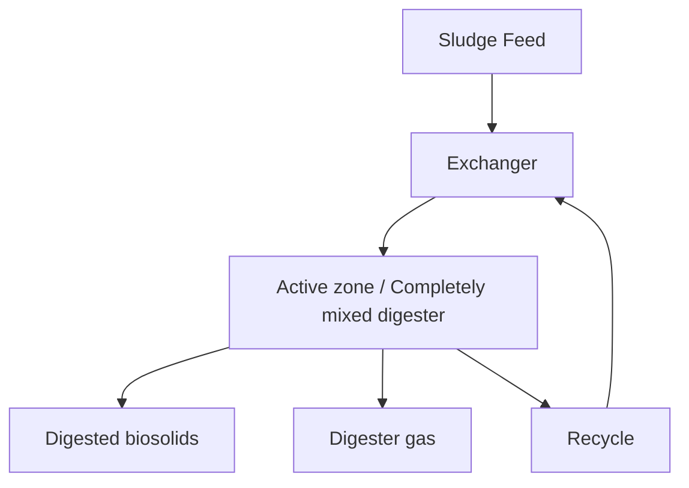
FIGURE 23.5 Simplified flow schematic of high-rate anaerobic digestion.

## 2.3.2.1 Process Development

High-rate anaerobic digestion was developed after research demonstrated the benefits of controlling environmental conditions in the digester: High-rate digestion is characterized by supplemental heating and mixing, relatively uniform feed rates, and thickening of solids (solids feedstock typically should contain 4% to 5% solids, although some recent improvements allow for thicker or thinner solids). These factors result in relatively uniform conditions throughout the reactor, leading to lower overall tank volume requirement and increased process stability.

Several heating methods (e.g., steam injection, internal heat exchangers, and external heat exchangers) have been used for anaerobic digesters. External heat exchangers are
``` 
\n---\n

## 2.3.2.2 Design Criteria—Mesophilic

The most popular because of their flexibility and easily maintained heating surfaces. Internal coils are not recommended as they can foul and the digester must be emptied to clean them. Internal or external draft tube heat exchanger jackets can provide reliable service as long as they are constructed of stainless steel. Steam injection dilutes the contents of the digester without heat exchangers but may be prone to ragging:

Typically, high-rate systems achieve increased gas production, solids destruction, and overall process stability when compared to the increasingly rare low-rate systems. In the 1970s, the U.S. Environmental Protection Agency (EPA) extensively evaluated single-stage, high-rate anaerobic digesters operated at mesophilic temperatures with SRTs exceeding 15 days; regulators found that the process achieves significant pathogen reduction and solids stability. The agency defined it as a process to significantly reduce pathogens (PSRP) in its 1979 rule (40 CFR 257), and it essentially became a baseline for wastewater solids stabilization.

The basic design criteria for such mesophilic digesters typically are as follows:

- A volatile solids loading rate of 1.9 to 2.5 kg volatile solids/m3·d (0.12 to 0.16 lb volatile solids/cu ft/d), and a typical limiting value of 3.2 kg volatile solids/m3·d (0.20 lb volatile solids/cu ft/d);
- SRT of at least 15 days when feeding at peak 15-day or -month loads (a 15-day SRT is the minimum allowed under the PSRP [Class B] requirement in Part 503);
- Mesophilic temperatures (35°C to 39°C [95°F to 102°F]); the PSRP [Class B] requirement in Part 503 is at least 35°C;
- Enough mixing to ensure that the temperature is relatively consistent throughout the reactor (and to minimize bottom deposits and surface scum/debris, although this is only partially achieved in many high-rate digesters); and
- Feed solids containing 4% to 5% solids (historically), although more facilities are now aiming for 5% to 7% solids.

Frequent solids feeding helps maintain steady-state conditions in the digester: Methanogens are sensitive to changes in substrate levels; uniform feeding and multiple feed-point locations in the tank reduce shock loading to these microorganisms. Excessive
\n---\n

## 2.3.2.3 Design Criteria—Thermophilic

hydraulic loading should be avoided because it decreases detention time, dilutes the alkalinity needed for buffering capacity, and requires more heat to achieve process goals. Good mixing also is required to mix microorganisms with fresh feed, ensure that the temperature is consistent throughout the reactor, and aid in preventing grit and scum/foam accumulation.

Improvements in mixing, heating, and solids loading enhanced anaerobic digestion performance: Mixing and heating provide better contact between substrates and microorganisms, increasing stabilization while reducing short-circuiting (making pathogen kill more consistent and increasing biosolids stability).

The relative success of high-rate mesophilic digestion has made this process the most common means of solids stabilization in the world. It also is the standard for evaluating future process variations.

Although most anaerobic digesters are operated at mesophilic temperatures (i.e., 35°C [95°F]), they also can be operated at thermophilic temperatures (typically between 50°C and 57°C [122°F and 135°F]). Thermophilic digesters have somewhat different design and performance criteria than those for mesophilic digestion. For example, volatile solids loading rates can be higher and SRTs can be lower (Schafer et al., 2002). Thermophilic digesters also reduce more volatile solids than identical-size mesophilic digesters, as suggested by the Arrhenius relationship. Because the temperature is higher, however, more energy is needed to provide heat. To reduce heating costs, energy recovery heat exchangers may be employed.

Thermophilic digestion has a number of advantages over mesophilic digestion. For example, solids from thermophilic digesters generally have better dewatering characteristics, so heating costs may be offset by reduced dewatering costs. Thermophilic digestion systems also destroy more volatile solids (Schafer et al., 2002) and typically produce biosolids containing fewer pathogens. However, Part 503 classifies both mesophilic and thermophilic anaerobic digestion (non-batch, non-phased systems) as PSRPs (Class B processes), so continuous-flow thermophilic digesters do not get regulatory credit for their pathogen-reduction performance. Part 503 also specifies that any process to further reduce pathogens (PFRP) (Class A process) must precede or be

\n---\n

concurrent with the vector-attraction reduction (VAR) process (e.g., mesophilic or thermophilic anaerobic digestion) to allay concerns about post-pasteurization regrowth (Clements, 1982; Keller, 1980). So, to meet Class A requirements, a thermophilic digester may need to be designed to be partly or wholly operated in batch mode, where every particle meets the time and temperature relationship established by the U.S. EPA.

According to Part 503, a thermophilic digestion process typically meets Class A requirements by maintaining its temperature at or above 50°C (more typically, 55°C) for a specific period of time in a batch operation: The amount of time is calculated using the formula (U.S. EPA, 1999) below:

$$
D = \frac{50\,070\,000}{10^{0.14T}} \quad (23.1)
$$

where D = time (days); and
T = temperature (°C).

This equation can be applied to sludge containing less than 7% solids. Based on this equation, one point of compliance would be 55°C for a minimum of 24 hours. Another point of compliance would be 50°C for a minimum of 120 hours. As the thermophilic digestion temperature increases, the batching time (and thus tank volume) required to destroy pathogens or pathogen indicators is considerably reduced.

If a utility chooses to disinfect sludge containing more than 7% solids, the time and temperature requirements are determined using the following equation:

$$
D = \frac{131\,700\,000}{10^{0.14T}} \quad (23.2)
$$

where D = time (days) and
T = temperature (°C).

So, for a sludge containing more than 7% solids, the minimum batching time is 63.1 hours at 55°C. In practice, however; thermophilic digestion reactors are unlikely to be operated at such high solids concentrations because of the higher viscosity involved. Digesters need much more energy to pump and mix high-viscosity solids.
\n---\n

Early full-scale tests at Los Angeles indicated that thermophilic digesters were difficult to operate (Garber, 1982). However, thermophilic digester operations can be reliable when temperatures are constant and good mixing and feeding systems are used (Krugel et al., 1998). Inadequate mixing and temperature control systems may have contributed to challenges with early thermophilic digesters.

In summary, thermophilic digestion destroys more volatile solids and pathogens, and produces more biogas, but can be more expensive to implement and operate than mesophilic digestion. For further comparisons between thermophilic and mesophilic, see Gebreeyessus and Jenicek (2016). Design engineers may wish to perform pilot tests with the actual feedstock before deciding to use thermophilic digestion:

## 2.3.3 Primary-Secondary Digestion

Now, mostly obsolete, in the primary-secondary digestion system, the primary tank is a typical mixed and heated anaerobic digester and the secondary tank is a solid-liquid separator (supernatant withdrawn from the top). The secondary reactor traditionally did not have mixing or heating but this configuration is not common anymore. In fact, in modern systems or facilities that have been upgraded, the second tank may serve several other functions including providing storage capacity and insurance against process short-circuiting, standby digester capacity. Primary-secondary digestion worked well on primary clarifier solids (settled solids), because the second tank typically provided good separation: The now-common practice of digesting WAS or primary/WAS blends has made this process impractical.

## 2.3.4 Recuperative Thickening

Recuperative thickening is a process that increases SRT relative to HRT in an anaerobic digester: It also returns anaerobic microorganisms to the digester to potentially increase biological activity:

Thickening options include centrifuges, screw presses, gravity belt thickeners (GBTs), and dissolved gas flotation thickeners (both air flotation [DAF] and anoxic gas flotation have been used). GBTs are used at facilities in Pennsylvania and Wisconsin. DAF recuperative thickening was tested at the Spokane, Washington, WRRF, and the bacteria survived the oxygenation effect (Reynolds et al., 2001).
\n---\n

Recuperative thickening has been used for several reasons (e.g., temporarily increasing digester SRT while some of the facility digestion capacity is off-line for maintenance or construction). It also can be used to delay construction of more digestion tank capacity or provide increased solids storage capacity in existing tankage (Kabouris et al., 2015). The disadvantages of recuperative thickening include operational complexity, polymer use, ventilation requirements (for odor and explosive gas), maintenance, and costs for an additional process.

## 2.3.5 Staged Digestion

The concept of staged (phased) digestion has been used in various ways over the years (e.g., to stage metabolisms, operating temperatures, and redox conditions), but it is increasingly being recognized for its pathogen-control benefits. Primary-secondary digestion, for example, is basically a two-stage mesophilic process that produces well-stabilized solids because of the relatively long retention times and reduction of solids short-circuiting. Other staged mesophilic digestion options also are being recognized and used.

### 2.3.5.1 Two-Stage Mesophilic Digestion

Two-stage mesophilic digestion is an extension of single-stage high-rate anaerobic digestion that uses two complete-mix digesters in series. The first stage must be designed to provide reliable mesophilic digestion (e.g., sufficient SRT and reasonable volatile solids loading). Because much of the process considerations are met in the first reactor, the second stage can operate with a relatively shorter SRT. Both stages are heated and mixed. Placing the tanks in series causes the reaction kinetics to behave more like a plug-flow rather than a complete-mixed process, thus reducing short-circuiting and improving process efficiency:

Schafer and Farrell (2000) and Chapman and Muller (2010) reported that, compared to single-stage digestion, two-stage mesophilic digestion can:

- Improve product stability (because more volatile solids are destroyed) and
- Reduce short-circuiting of raw solids and pathogens.
</page>\n---\n

## 2.3.5.2 Multiple-Stage Thermophilic Digestion
Zahller et al. (2005) and McCarthy et al. (2004) reported that two-stage digestion provided better VSR and biogas composition (i.e., more methane content) than a single-stage digester with an equivalent SRT. However, the study also noted that the two-stage system seemed to have less capacity to absorb large variations in loadings than the single-stage system, as measured by additional acetate use capacity:

## 2.3.6 Temperature-Phased Anaerobic Digestion
Temperature-phased anaerobic digestion (TPAD) uses both thermophilic and mesophilic digestion to improve digestion performance. Such systems are not nearly as common as conventional mesophilic systems. The Western Lake Superior Sanitary District in Duluth, Minnesota, has a TPAD system (see Figures 23.6 and 23.7). Constructed in 2001, this system has four tanks: one that operates as a thermophilic digester, followed by three tanks operating in parallel as mesophilic digesters:
\n---\n

# Thickened Raw Sludge Feed

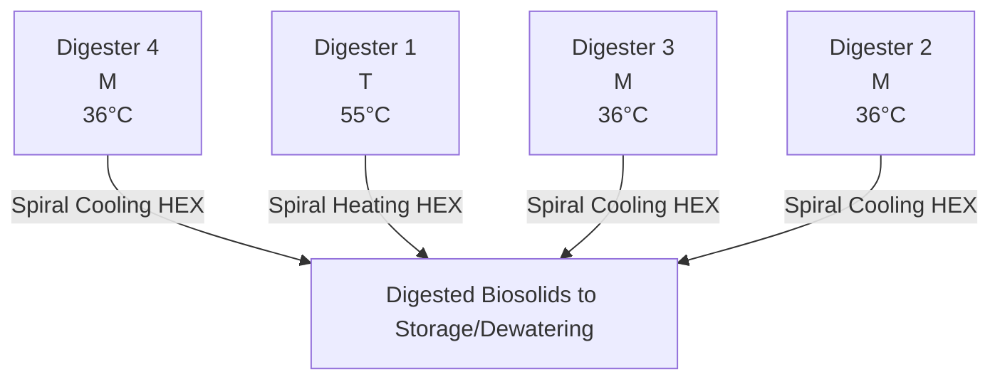

FIGURE 23.6 Process flow schematic of the TPAD installation at Western Lake Superior Sanitation District in Duluth, Minnesota (Krugel et al., 2006).

> Description: A photograph of a TPAD facility showing several large circular concrete digesters arranged in a complex layout near a body of water, with an industrial skyline in the background. The digesters are connected by piping and access structures typical of a wastewater treatment plant.

\n---\n

FIGURE 23.7 Photograph of the TPAD installation at Western Lake Superior Sanitation District in Duluth, Minnesota
(courtesy of Brown and Caldwell).

2.3.6.1 Process Development

Researchers in Germany identified the potential advantages of TPAD. Anaerobic digesters in Cologne, Germany, have been operated in a temperature-phased mode since August 1993 (Dichtl, 1997). In the United States, Han and Dague (1996) conducted laboratory studies documenting the advantages of TPAD, and a patent for the TPAD process was issued to Iowa State University in the 1990s based on Dague’s work.

The thermophilic digester’s greater hydrolysis and biological activity tends to provide more VSR and gas production than an all-mesophilic digestion process. The system also reduces the tendency of high-rate mesophilic digesters to foam when treating combined solids (primary solids and WAS) (Han and Dague, 1996). Other advantages include lower coliform counts in digested solids (Han and Dague, 1996) and the potential to meet Class A pathogen criteria under 40 CFR 503.

The TPAD’s mesophilic stage provides additional VSR and biogas production, as well as conditions solids for further handling. It also reduces the concentration of odorants (mostly fatty acids) that are common to thermophilic digestion, increases operational stability, and produces biosolids with more consistent characteristics. The biosolids also produce higher cake solids content during dewatering than those produced by mesophilic digesters.

The TPAD process is designed to take advantage of thermophilic digestion rates, which are estimated to be four times faster than mesophilic digestion (Dague, 1968). Dague evaluated a system in which the thermophilic stage operated at 55°C (131°F) with a 5-day detention time and the mesophilic stage operated at 35°C (95°F) with a 10-day detention time. Other researchers have tried different residence times for the thermophilic and mesophilic phases and found performance improvements at a variety of residence times for each stage. Few full-scale WRRFs have operated the thermophilic phase at a 5-day SRT or less, but research shows that this can be successful:

2.3.6.2 Design Criteria
\n---\n

## 2.3.6.2 Design Criteria
Design criteria for TPAD vary because performance success has been demonstrated under various situations. However, based on most of the research and full-scale experience to date, design criteria for a typical TPAD system are:
* Thermophilic temperatures of 50°C to 57°C;
* Thermophilic residence times of 4 to 10 days (existing TPAD systems may have longer SRTs because a large tank was available for the thermophilic stage, or early year loads were less than design loads);
* Mesophilic temperatures of 35°C to 40°C; and
* Mesophilic residence times of 6 to 12 days (again, existing TPAD systems may have longer SRTs because of the tankage used or loads that are less than design loads).

When designing a TPAD system, engineers should choose design criteria based on project objectives, solids feed characteristics and variability, and existing facilities (because most TPAD systems are modifications of existing digestion systems). If there are wide variations in feedstock quantity and characteristics, design engineers may want to use a longer residence time in the first-stage thermophilic reactor—perhaps a 10-day SRT or longer. If an existing tank can be used for thermophilic digestion, but its SRT is only 4 or 5 days, the TPAD system may work well as long as the mesophilic system's SRT is long enough to adequately handle some variable performance from the first-stage thermophilic reactor. Total SRTs of about 15 days (minimum) are considered good design practice for peak 15-day or peak month loads. If the facility needs to ensure that its biosolids meet Class B standards, then a 15-day total SRT (minimum) typically is required: Another Part 503 requirement is that digester temperatures in the mesophilic stage must remain above 35°C (if mesophilic SRT is needed to meet Class B requirements).

### 2.3.6.3 Performance
The performance of TPAD systems often is measured based on VSR or biogas production. Schafer et al. (2002) reported significant improvement in VSR at several facilities using the TPAD process, compared to the performance of a mesophilic system with a similar SRT. (If the mesophilic and TPAD systems have different SRTs, then direct performance comparisons are more difficult to quantify without additional information.)
\n---\n

## 2.3.6.4 Heating, Cooling, and Other Design Considerations

Schafer et al. (2002) also reviewed pilot- or demonstration-scale studies and found that TPAD outperformed mesophilic digestion systems when fed the same feedstock and using similar total SRTs. Improvements in VSR are often cited as follows:

* A high-rate mesophilic digester with a 20-day SRT achieved 50% VSR, while
* A TPAD system with a 20-day total SRT and identical or similar feedstock achieved 57% VSR.

TPAD can be heated (and cooled) in several ways, with some precautions:

* For energy efficiency, the heat from thermophilic solids can be recycled to heat cold feedstock and partially cool the thermophilic solids. Various arrangements have been used for this heat recycling concept (e.g., solids-solid heat exchangers and solids-water/solids heat exchangers). This approach requires supplemental heat (e.g., heat exchangers or steam addition) to ensure that feedstock reaches thermophilic conditions.
* Solids can be heated to thermophilic temperatures via heat exchangers and/or steam addition without heat recycling: In this case, thermophilic solids typically must be cooled before entering the mesophilic stage, and this heat can be transferred to facility effluent, blown into the atmosphere, or used to heat water for building heating or other purposes.
* In colder seasons, and if the mesophilic stage's SRT is long enough, a purposeful cooling system may not be needed because the mesophilic stage can cool itself via thermal losses to the atmosphere and ground. Design engineers should calculate whether this is possible and if the mesophilic stage may be too hot for reliable performance under certain conditions.

Engineers should ensure that the thermophilic stage is operated at a consistent temperature because its microorganisms are more sensitive to temperature changes, particularly increases. For example, if the design temperature is 55°C, the control system should ensure that this temperature is maintained (close tolerances). This may be difficult due to the poor heat transfer efficiency of sludge, reduced temperature differential between hot water and sludge, and challenges with sludge-to-sludge heat exchangers (for heat recovery). Also, a mixing system is required to ensure that all tank contents are close

\n---\n

to the measured thermophilic temperature. The temperature tolerances for the mesophilic stage are not as exacting, but must be evaluated carefully for reliable performance.

Other design considerations include protection against odor release from thermophilic digesters. For example, floating covers typically are avoided because of odor release from the annular space. Also, the gas-handling system must be designed to handle the much larger production rate and moisture content of thermophilic biogas. In addition, design engineers may need to evaluate whether an existing mesophilic digester is adequate for thermophilic service. This includes a structural evaluation of the tank, its mechanical systems, piping, and coating/lining systems.

## 2.3.7 Lagoon Digestion

It used to be common to digest solids via open lagoons, but anaerobic lagoons typically caused odor problems and were phased out of use: Today, various wastewater treatment agencies use facultative solids lagoons (FSLs), which have an aerobic cap layer to help oxidize and control the odorous decomposition products that rise from the anaerobic activity below. The Sacramento (California) Regional Wastewater Treatment Plant has a 50-ha (125-ac) FSL system of lagoons filled with liquid 4.5 m (15 ft) deep. Considerable research was conducted when this system was developed in the 1970s (Schafer and Wolfenden, 1982).

### 2.3.7.1 System Performance

Large-scale lagooning is conducted at ambient temperatures, which typically encompass the psychrophilic temperature range. A key feature of such digestion is that more digestion occurs in warmer seasons, and less occurs in colder seasons.

The approach used at Sacramento, Chicago, and other facilities is to achieve maximum VSR and solids stabilization via long-term digestion (1 to 5 years). Sacramento achieves almost 60% VSR in its mesophilic digesters, and has documented another 40% to 45% VSR in its FSL (Schafer and Wolfenden, 1982). Such long-term stabilization results in biosolids with relatively little product odor:

Design and operating criteria vary widely for FSLs, but most systems currently are fed either mesophilically digested biosolids or aerobic solids from extended aeration facilities Facility effluent is often used for the cap water layer:
\n---\n

At Chicago and other facilities, dredged solids are air dried in warmer-weather months, producing biosolids that contain at least 60% solids. The biosolids are used for land application, land reclamation, landfill cover material, and other beneficial purposes. FSLs have been reported to produce Class A biosolids when batch storage is used to prevent short-circuiting (WERF, 2004).

## 2.3.7.2 Covered Lagoons for Methane Emission Control

Since the 1990s, concerns about odors and methane emissions from open waste lagoons (mostly animal waste lagoons) have increased. In response, the animal-waste treatment industry has begun covering some lagoons to collect the biogas generated during anaerobic digestion and use it to produce power. Such systems are becoming more common in North America, Australia, and Asia.

For example, the Western facility in Melbourne, Australia, has used an extensive floating cover system on its wastewater ponds for almost a decade; the high-density polyethylene (HDPE) system covers 7.8 ha (19 ac) of anaerobic digestion ponds (DeGarie et al., 2000). The collected biogas is used to generate more than 2 MW of electricity, which powers other portions of the facility. This system reduces direct methane emissions to the atmosphere (cutting greenhouse gas emissions) and generates renewable power (offsetting carbon emissions from fossil fuel-based generators elsewhere). Memphis, Tennessee, also has covered some of its FSLs since the 1990s to control odor and collect biogas for energy use.

## 2.4 Pretreatment

### 2.4.1 Pre-Pasteurization

Pre-pasteurization is a pathogen reduction process involving a pasteurization step before digestion. This was developed primarily in Europe to allow biosolids to be applied directly to sensitive croplands or pastures.

#### 2.4.1.1 Process Development

In an early paper on pasteurization, Clements (1982) reported that Switzerland had issued regulations in 1971 requiring biosolids to be treated to reduce pathogens before they could be applied to grazing land. The initial concept was to pasteurize the biosolids after digestion: About 70 post-pasteurization facilities were constructed in the following 6 years;
\n---\n

They typically processed anaerobically digested biosolids (i.e., biosolids were digested, pasteurized, and then either used or stored). When veterinary scientists investigated the material, they reported that the stored products often contained extremely high densities of pathogens, even though they had contained few enteric bacteria and no Salmonella immediately after pasteurization. Further investigation showed that regrowth was due to surviving organisms or to contamination. Investigators concluded that, because the pasteurized material had no remaining vegetative bacteria, any bacteria present later could grow explosively in the absence of competitors.

Keller (1980) presents data on regrowth of bacteria in biosolids from a post-pasteurization process. The data show that, after pasteurization, biosolids contained between 20 and 75 colony-forming units (CFU) of Enterobacteriaceae per gram of solids. When it was transported from the treatment facility, however, the material contained between 207,000 and 35 million CFU/g. Shortly afterward, WRRFs modified the process to pasteurize solids before digestion (called pre-pasteurization), and the regrowth problem disappeared. The practice has successfully sustained itself over several decades in many countries (mostly in Europe). A few U.S. facilities now use the process.

## 2.4.1.2 Design Criteria

The main reason to use a pasteurization process is to disinfect solids; it has not been reported to enhance VSR significantly. The pre-pasteurization process meets Part 503’s Class A pathogen standards by typically maintaining its temperature above 65°C (more typically 70°C) for a specific period of time in a batch operation. The amount of time is calculated using eq.23.1, which applies to sludge containing less than 7% solids.

Calculations indicate that solids must be maintained at 65°C for approximately 1 hour. As pasteurization temperature increases, the required time (and, therefore, tank volume) shrinks. Most systems are designed to achieve at least 70°C for 0.5 hour, even though operating at slightly lower temperatures may lower operations and maintenance (O&M) costs.

If a utility chooses to pasteurize sludge containing more than 7% solids, the time and temperature requirements are determined using eq.23.2.
\n---\n

Part 503 specifies that the pasteurization process must precede the VAR process (e.g., mesophilic or thermophilic anaerobic digestion) and should be operated in a batch mode to allay regrowth concerns. Hence, post-pasteurization is not allowed under this rule.

## 2.4.1.3 Pre-Pasteurization Vessel

The U.S. EPA has indicated that to produce a Class A biosolids that meets the requirements in Alternative 1 under Part 503, every particle of solids should be exposed to a minimum temperature for a minimum time. So design engineers should avoid using completely mixed systems or systems with potential for back-mixing or short-circuiting as pre-pasteurization tanks. Most vendor-supplied systems are batch tanks; only one vendor supplies a plug-flow tank for pre-pasteurization. Design engineers should consult U.S. EPA staff or other pertinent regulators before using a non-batch system:

Batch pre-pasteurization systems are operated in a fill/hold/draw mode, with several batch vessels used to perform each cycle if continuous operation is desired. The vessels should be well mixed to ensure that the monitored temperature reflects the entire contents (i.e., every solids particle meets the time and temperature requirements). If the downstream anaerobic digestion process uses an intermittent feed cycle and upstream storage is adequate, the system needs fewer than three batch vessels for the required fill, hold, and draw cycles.

## 2.4.1.4 Ancillary Equipment for Pre-Pasteurization

Design engineers should consider three important ancillary features when installing a pre-pasteurization process:

* Solids heating and cooling;
* Solids screening; and
* Temperature monitoring and control.

Because the temperature of pre-pasteurization systems typically is maintained at 70°C, solids must be heated and then cooled. Heat exchangers are the most common method for heating and cooling solids. If desired, design engineers could include a heat-recovery step to use heat from cooling biosolids to preheat raw solids. The recovery step will require a substantial amount of heat-exchange capacity. If heat exchangers are used, the
\n---\n

solids may need to be screened before pre-pasteurization—even if fine screens are used in the facility headworks. Screening also helps produce a more aesthetically pleasing product.

Good temperature monitoring and control are required to maintain Class A compliance. It is critical to have a well-automated system to both ensure pasteurization and prevent downstream contamination, which would take months to remedy. It should prohibit unpasteurized solids from passing through, and either waste or recirculate material that did not meet the time and temperature requirements. If necessary, standby equipment should be included to maintain time and temperature, because compromising these parameters could contaminate the downstream anaerobic digestion process.

## 2.4.1.5 Performance
The pre-pasteurization process can meet the Salmonella criteria in Part 503. Ward et al. (1999) showed that pre-pasteurized solids resisted regrowth even after they were seeded with Salmonella; instead, the organisms died off. Chen et al. (2008) also observed that pre-pasteurization effectively destroyed Salmonella, even though fecal coliforms regrew (suggesting that it may be necessary to measure the actual pathogen rather than the indicator to ensure Part 503 compliance).

In summary, pre-pasteurization is an effective method for destroying pathogens in solids and is commonly used throughout the world. Several U.S. facilities use this process, including a 204,400 m3/d (54-mgd) in Alexandria, Virginia.

## 2.4.2 Thermal Hydrolysis
Thermal hydrolysis is a predigestion conditioning process where solids are exposed to elevated temperatures and pressures. The process improves the digestibility of biological solids (e.g., WAS), in particular; while reducing the size of digestion tankage and improving dewatering performance. This is more commonly achieved through a batch process but some continuous processes are available as well.

## 2.4.2.1 Process Development
Thermal hydrolysis was first developed in the United States (Haug et al., 1978; 1983), but successful implementation occurred in Europe. The first full-scale system was
\n---\n

implemented at the Hias Wastewater Treatment Plant in Norway in 1996. The largest facility in operation and the first in the United States is at the DC Water Blue Plains facility (Figure 23.8). More than 20 large and small systems are currently in operation, mostly in northern Europe. There are several additional WRRFs in the United States that are in various stages of thermal hydrolysis process (THP) design.

Another aspect of the full-scale THP is the rapid depressurization step. It occurs after the reaction step and is reported to help burst cells, further promoting hydrolysis and disinfection.

When used before anaerobic digestion, thermal hydrolysis achieves one or more of the following:
* Enhances digestion rates and gas production;
* Reduces the size of the anaerobic digestion system (increases allowable loading rates);
* Disinfects solids;
* Reduces the viscosity of the solids feed to the digester;
* Improves dewaterability of the biosolids; and
* Prepares solids for thermal processing downstream of anaerobic digestion.
\n---\n

Figure 23.8 The thermal hydrolysis process and anaerobic digesters at DC Water’s Blue Plains WRRF (courtesy of Cambi, Norway).

## 2.4.2.2 Design Criteria—Thermal Hydrolysis Vessels

Thermal hydrolysis vessels are made of Type 316 stainless steel and are built to withstand both pressure and vacuum. The vessel configuration varies between manufacturers. Pressure vessels require annual inspection that may require a reactor to be shut down for up to a week so this must be factored into the design through the use of redundant trains, storage, or alternative destinations for the solids.

Operated at temperatures between 150°C and 170°C for 30 minutes and a pressure of about 827 kPa (120 psi), thermal hydrolysis solubilizes and hydrolyzes solids (Stuckey and McCarty, 1984; Li and Noike, 1992), and disintegrates biological cells (e.g., bacteria and viruses). According to Li and Noike (1992), maximum solubilization occurs at 170°C.

\n---\n

and the optimal SRT is between 30 and 60 minutes. In practice, a 30-minute SRT optimizes reactor size and delivers a solubilized and hydrolyzed product.

Thermal hydrolysis consists of a preheating step, a heating and batch-reaction step, and a rapid depressurization step for further solubilization and rupturing of microbial cells (see Figure 23.9). The preheating step is used to conserve spent heat from the reaction and depressurization steps, as well as produce a favorable energy balance. The system’s feedstock is dewatered cake containing 14% to 18% solids. Dewatering considerably improves the heat balance and reduces the volume of the downstream anaerobic digestion process by about 50%.

If a Class A product is desired, design engineers and operators should ensure that every particle of solids in the reactor meets the time and temperature requirements and that any dilution water utilized after the THP process is disinfected. Solids screening (5-mm opening) is also required to protect the system components and ensure that no debris remains in the biosolids product:

<div>
< Mermaiddiagram >
graph TD
  subgraph Pulper_Tank
    P(Pulper Tank (Pre-heat))
  end
  subgraph Reactors
    R1(In-Reactor Fill Cycle)
    R2(Add Steam to Reach 90 psi, 320 F)
    R3(Batch Hold Time (Class A))
    R4(Flash (steam explosion) to Flash Tank)
  end
  RawSolids(Raw Solids (15-18%))
  Inlet(Raw Solids --> In-Reactor Fill)
  Inlet2((Pulper Tank)) --> R1
  R1 --> R2
  R2 --> R3
  R3 --> R4
  R4 --> FlashTank(Flash Tank)
  FlashTank --> Hydrolyzed(Hydrolyzed sludge to digestion (9-12%))
  Hydrolyzed --> DigestersTo(Then to Digesters)
  Dilution(Dilution Water) --> Hydrolyzed
  RecycledSteam(Recycled Steam) --> AddSteam
  FoulGas(Foul Gas Processing) --> DigestersTo
</ Mermaiddiagram >
</div>

PULPER TANK (Pre-heat) | REACTORS
- 1. In-Reactor Fill
- 2. Add Steam to Reach 90 psi, 320 F
- 3. Batch Hold Time (Class A)
- 4. Flash (steam explosion) to Flash Tank

\n---\n

FIGURE 23.9 Schematic of the thermal hydrolysis process (courtesy of Brown & Caldwell).

Because the THP feed is dewatered and contains more than 7% solids, time and temperature requirements are determined using eq.23.2. Under Regime A, solids must reach 150°C and stay that hot for 20 minutes, so the system’s 30-minute SRT exceeds the U.S. EPA’s time and temperature requirements. This retention time is used more to optimize hydrolysis and solubilization, and to ensure that the required temperature has diffused to the interior of all solids particles in the solids mass.

## 2.4.2.3 Ancillary Equipment for Thermal Hydrolysis
The following four ancillary features should be considered when designing a thermal hydrolysis system: cooling and heat recovery, screening, process control, and odor management.

## 2.4.2.4 Solids Cooling and Heat Recovery
After depressurization, thermally hydrolyzed solids are about 100°C and must be cooled before entering the anaerobic digestion process. This is typically achieved by first blending the THS with recirculating digested solids (typically approximately 1:3, respectively) and then cooling to the appropriate temperature in the digester. According to Qui (2016), the blending step is important because it:

* Dilutes THS to reduce the risk that it congeals as it cools and blocks the pipe (unblended THS should not be cooled below 70°C);
  - unblended THS should not be cooled below 70°C
* Reduces the total solids % and improves pumping characteristics; and
* Creates turbulent flow, which improves heat transfer in the heat exchanger.

Cooling is typically achieved using facility effluent. Heat recovery can be performed if desired, but is not typically as it increases heat exchanger size and may complicate maintenance and operations:

## 2.4.2.5 Solids Screening
Solids screening is required to prevent debris from causing problems within the THP process, causing damage to reactors and pumps and negatively impacting final biosolids quality. Screening is typically performed on thickened primary and WAS before the pre-
\n---\n

dewatering step (at less than 6% total solids). Enclosed solids screens with 5-mm openings are most commonly used.

## 2.4.2.6 Temperature and Pressure Monitoring and Control

Monitoring pressure and temperature is critical. Furthermore, the process needs to be installed with pressure- and vacuum-relief valves. The systems must be well automated to ensure disinfection and prevent downstream contamination of anaerobic digesters, which would take months to remedy. A well-automated system should ensure that only fully heat-treated solids pass through, and either waste or recirculate material that does not meet the time-temperature requirements. If necessary, standby equipment or upstream storage should be provided:

## 2.4.2.7 Odor Management

Thermal hydrolysis followed by anaerobic digestion produces biosolids with relatively low odors. However, the process itself emits strong odors, which must be contained and treated. The odorous gases are biodegradable and water soluble, so a convenient treatment method is to use water scrubbers and discharge the water into the downstream anaerobic digester, which will treat the process odors. The valving design for thermal hydrolysis vessels is critical to minimize vented odors.

## 2.4.2.8 Sidestream Treatment

The return liquor from thermal hydrolysis contains colloidal material that will contribute organic nitrogen, phosphorus, COD, and color to the mainstream process. For example, it will increase the facility effluent's organic nitrogen content by 0.75 to 1.5 mg/L. If the WRRF has low limits for any of these constituents, then they should be removed before the liquor enters the mainstream process. Treating these constituents with chemical conditioners (e.g., iron or aluminum) in the dewatering step has been proposed by Wilson et al. (2008b) but other biological sidestream treatment processes (e.g., anammox and struvite formation) are becoming more common.

## 2.4.2.9 Process Mode Variations

Two full-scale versions of thermal hydrolysis are currently in use. One process mode consists of a preheat tank, a reactor tank, and a flash tank (i.e., three tanks in series). The
\n---\n

# 2.4.2.10 Anaerobic Digestion Performance

The solubilized and hydrolyzed solids are easier to digest and, therefore, can increase digestion rates or reduce digester SRT. For example, Li and Noike (1992) report that the digester reached a stable maximum methanogen population and degraded most of the substrate in a 5-day SRT, suggesting that this was the minimum digester SRT to prevent washout or process instability. However; their work did not evaluate thermal hydrolysis performance under the high ammonia concentrations observed in highly loaded systems today, so full-scale processes are operated at a minimum 15-day SRT under average conditions: Design engineers can decrease the required anaerobic digester SRT by up to 10% to 25% (compared to conventional high-rate digestion) and expect similar process performance. For example, Wilson et al. (2008b) operated parallel conventional high-rate anaerobic digesters with and without thermal hydrolysis, using solids from DC Water Blue Plains facility: Results showed that both digesters had similar volatile solids and COD destruction, but the digester with thermal hydrolysis achieved these results at a 25% shorter digestion SRT (i.e: in 15days rather than 20):

The solubilized solids from thermal hydrolysis are much less viscous (Kopp and Ewert; 2006). Hydrolyzed sludge contains 10% solids or more (compared to a typical digester feed sludge containing 5% solids). Through pre-dewatering and dilutions, THP feed is 16% solids, where it is heated with steam. The steam both increases the temperature and dilutes the solids. The hydrolyzed cake typically contains between 9% and 12% total solids, which can be adjusted with facility-dilution water; if needed, to maintain fairly constant solids loading to the anaerobic digester: The maximum solids content depends on the concentration of ammonia-nitrogen produced during digestion; ammonia-nitrogen concentration is typically kept at less than 2500 mg/L to prevent process inhibition:

The THP; digested, and dewatered biosolids can achieve significantly higher total solids (6% to 9% more) (Kopp and Ewert; 2006; Wilson et al., 2008b) than that produced via conventional digestion. So thermal hydrolysis is attractive when the resulting biosolids will be hauled long distances for land application (to reduce hauling costs) or will be thermally processed (e.g;, heat drying) since influent cake dryness and process evaporative
\n---\n

capacity are major considerations when determining size and energy demand of a thermal
process. For example, Kopp and Ewert (2006) report that cake solids increased from 25%
to 34% when thermal hydrolysis pretreatment was used: Wilson et al. (2008b) had similar
results.

2.4.3 Aerobic Pretreatment

Aerobic pretreatment of solids has been practiced in North America and Europe for more
than a quarter century. It involves adding air or oxygen to solids at thermophilic
temperatures as an initial "conditioning" step before anaerobic digestion:

2.4.3.1 Process Development

Aerobic pretreatment developed differently in Europe and North America; the aerobic
thermophilic pretreatment (ATP) process is mainly practiced in Europe, while dual
digestion is mainly practiced in North America. Both processes are intended to enhance
VSR and pathogen reduction. The main difference between the two processes is the
method of heating solids. In ATP, the heat used to attain thermophilic temperatures is
waste heat from cogeneration of digester gas (not an autothermal process). ATP's SRT
mainly depends on both process and Part 503 requirements. It typically is 24 hours or
fewer; depending on the digestion temperature and the results of time-temperature
requirements in eq.23.1 to attain Alternative 1 in Part 503 (U.S. EPA, 1999b). The
minimum temperature is typically 55°C and the maximum is 65°C (when biological
conditioning of raw solids is encouraged to enhance VSR):

In dual digestion, the aerobic step is an autothermal step in which heat generated during
microbial aerobic metabolism is used to increase the process' temperature to thermophilic
conditions. The temperature range for this process is also between 55°C and 65°C. Dual
digestion's SRT depends on two factors: the U.S. EPA's time and temperature equation,
and the time needed to autothermally raise the temperature of raw solids to the required
set point. In most cases, the time needed to meet the temperature set point is greater
than that demanded by the U.S. EPA's time-temperature equation. Using oxygen rather
than air reduces SRT requirements and improves the heat balance. Also, heat recovered
from thermophilic solids can be used to help raise the input solids' temperature. All of the
North American installations have been at WRRFs that already used high-purity oxygen in
their activated solids process. Dual digestion's SRT is about 1 to 2 days, depending on
\n---\n

The raw solids’ volatile solids content. Feed containing more volatile solids significantly helps the heat balance to achieve autothermal temperatures. Several dual-digestion facilities were commissioned in the 1980s, and three U.S. facilities are operating the process successfully today. The 143 800-m3/d (38-mgd) Central Treatment Plant in Tacoma, Washington, has used this process for more than a decade, producing and marketing a Class A soil amendment product (called Tagro) from the resulting biosolids (Eschborn and Thompson, 2007).

## 2.4.3.2 Design Criteria

Aerobic pretreatment has two primary goals: pathogen reduction and enhanced VSR.  
- Both dual digestion and ATP are designed to operate in the thermophilic temperature range, so the tanks should be well insulated to maintain a favorable heat balance.  
- In addition, solids screening may be required if heat exchangers are used for heat recovery:

Under Part 503, processes must meet pathogen reduction requirements to achieve the Class A biosolids status. Aerobic pretreatment meets these requirements by typically maintaining a temperature between 55°C and 65°C for a specific period of time in a batch (plug-flow) operation: The amount of time is calculated using eq.23.1 (the equation for solids content less than 7%). Two possible options are 60°C for a minimum of 4.8 hours or 55°C for 24 hours. Hotter temperatures typically reduce time and, therefore, tank volume. In dual digestion, however, the minimum SRT depends more on the time required to achieve the desired autothermal temperature than on the U.S. EPA’s time-temperature equation.

If a utility chooses to disinfect feedstock containing more than 7% solids, the time and temperature requirements are determined using eq.23.2.

ATP typically is heated using waste heat from a cogeneration process. The heat balance largely depends on the insulation of the preheat tank and the decision to use heat-recovery heat exchangers.

Dual digestion is mainly heated autothermally (the mixers introduce some heat). Three important parameters in dual-digestion designs are the decay rate, the biological heat of reaction (BHR), and oxygen demand. Gemmell et al. (1999) estimated an average decay rate of 0.087 ± 0.010 d^-1 at an average temperature of 37°C. Gemmell et al. (1999)

\n---\n

determined a BHR of 16.6 MJ/kg volatile solids destroyed for the dual-digestion process at Barrie, Ontario, in initial trials with a 26% VSR. Grady et al. (2011) suggest a BHR value of 18.8 MJ/kg volatile solids destroyed (for a design involving autothermal thermophilic aerobic digesters). Messenger et al. (1993) determined a BHR of 18.6 MJ/kg volatile solids destroyed. Haas (1984) found that BHR ranged from 17.4 to 23.3 MJ/kg volatile solids destroyed at 20% and 10% VSR, respectively, during trials conducted at Hagerstown, Maryland. The oxygen demand depends on the type of solids and the ratio of primary and biological solids. Values in the range of 1.7 kg O2/kg volatile solids destroyed have been reported by Pitt and Ekama (1996) and Gemmell et al. (1999). This value can easily be determined experimentally and should be tested, because it can vary from facility to facility:

## 2.4.3.3 Aerobic Vessel Design

To produce a Class A biosolids, the treatment process must meet the time and temperature requirements in Alternative 1 under Part 503, which specify that every particle of solids should be exposed to a minimum temperature for a minimum period of time (U.S. EPA, 1999b). So complete-mixed systems or systems that could back-mix or short-circuit should be avoided: Design engineers should consult EPA staff or other pertinent regulators before using a non-batch plug-flow system. The batch systems should be designed to operate in a fill/hold/draw mode and be well mixed to ensure that every particle is maintained at the required temperature (for the required time) and that the monitored temperature reflects the entire contents of the batch. Typically, if continuous operation is desired, three batch vessels are needed (one for each cycle): However, if the downstream anaerobic digester can handle an intermittent feed cycle and upstream storage is adequate, then fewer batch vessels can be supplied:

## 2.4.3.4 Ancillary Equipment for Aerobic Pretreatment

Design engineers typically consider three important ancillary features when installing an aerobic pretreatment process:

* Solids heating and recovery (ATP) or oxygen system (dual digestion);
* Solids screening; and
* Temperature monitoring and control.
\n---\n

## The text preceding the section

The aerobic vessel for ATP and dual digestion typically is maintained between 55°C and 65°C. In the ATP process, solids must be heated and then cooled. The most common method for heating and cooling solids is heat exchangers. In dual digestion, solids are heated autothermally so an external heat source is unnecessary: Both processes must cool treated solids before digestion—unless the anaerobic digester also is operated at thermophilic temperatures. The cooling method could include a heat-recovery step in which the heat transferred from cooling solids is used to preheat raw solids. This step depends on owner, engineer, and vendor preference, because it will require a substantial amount of heat-exchange capacity. If heat exchangers are used, the solids may need to be screened first: Screening also helps produce an aesthetically pleasing biosolids. Good temperature monitoring and control are required to maintain Class A compliance. If necessary, standby equipment should be provided to maintain time and temperature, because compromising these parameters could contaminate the anaerobic digester with inadequately disinfected solids. The solids should be thickened to at least 5% total solids for successful operations; therefore, downstream solids pumps and pipes should be designed to handle thicker solids adequately:
Also, dual digestion will need an oxygen supply (hence, dual digestion typically is installed at facilities that already use high-purity oxygen in their activated sludge processes)

### 2.4.3.5 Performance

Preconditioning of solids with air is intended to increase the overall VSR. Researchers (Pagilla et al., 1996; Cheunbarn and Pagilla, 1999, 2000) have extensively evaluated ATP performance and compared it to mesophilic digestion performance. They confirmed the European full-scale observations of Baier and Zwiefelhofer (1991) that ATP enhances VSR and gas production. Cheunbarn and Pagilla (1999) showed that VSR increased as the ATP's SRT (0.6 to 1.5 days) and temperature (55°C to 65°C) increased. In pilot-testing work at Sacramento, Pagilla et al. (1996) compared ATP to conventional mesophilic digestion and determined that ATP enhanced VSR from 53% to 59% for combined solids (primary solids and WAS): They also showed that ATP could meet the U.S. EPA’s Part 503 requirements for fecal coliform, Salmonella, enteric virus, and helminth ova. In addition, they determined that ATP effectively controlled and destroyed Nocardia filaments. Finally, they observed that ATP-treated, centrifuged biosolids contained between 32% and 36%
\n---\n

total solids, compared to mesophilically digested, centrifuged biosolids, which only contained 30% total solids.

FIGURE 23.10 Schematic of the two-phase anaerobic digestion process

<Mermaid>
graph TD
  A[Feed sludge] --> B[Acid phase]
  B --> C[Gas]
  B --> D[Transfer sludge]
  D --> E[Gas (Methane) phase]
  E --> F[Digested biosolids]
  C --> G[Biogas]
  E --> G
</Mermaid>

Gemmell et al. (1999) suggested that dual digestion could achieve stable performance when the first high-rate aerobic reactor had an HRT of 1 to 2 days and the second high-rate anaerobic reactor had an HRT of 9 to 12 days. Overall, this retention time was 6 to 10 days shorter than the 20-day SRT typically required for conventional high-rate digestion. Also, Gemmell et al. (2000) suggested that the full-scale dual-digestion process at the Barrie Wastewater Treatment Plant achieved 60% VSR. Operators at a 143 800-m3/d (38-mgd) WRRF in Tacoma, Washington, have been producing and marketing a biosolids-based soil amendment for more than a decade; they attribute much of its high quality to the dual-digestion process (Eschborn and Thompson, 2007):

## 2.4.4 Acid-Phase Hydrolysis

Acid-phase hydrolysis (sometimes called two-phase or acid-methane digestion) separates two major anaerobic reactions—acid formation (acidogenesis) and methane generation (methanogenesis)—to benefit the overall stabilization process (see Figure 23.10). The most practical way to separating phases is via kinetic control, by regulating the detention time and loading rate for each reactor: Increasing loadings to the first-stage digester and reducing SRT (HRT) favors acidogenic organisms because the low pH and retention time
\n---\n

are unfavorable to acetoclastic methane formers. In the second stage, a larger digester (or multiple digesters) increases SRT, so methanogens proliferate. High influent concentrations of short-chain fatty acids also promote the growth of methanogens.

## 2.4.4.1 Process Development

Early work on the process was largely completed by Professor Sam Ghosh (Ghosh et al., 1975, 1987; Lee et al., 1989). Raw solids initially are fed to a reactor with 1- to 2-day SRT, called an acid-phase digester. In this reactor, a low-pH environment (typically 5.5 to 6.2) is established, suspended organic matter is hydrolyzed, and then low-molecular-weight fatty acids are formed. Methane generation is limited in this phase. This first phase has been tested at both mesophilic and thermophilic temperatures, although few full-scale systems have operated the acid phase at thermophilic temperatures. Some research has suggested that there is no true phase separation (Shimada et al., 2011).

Acid-phase sludge then is fed to a second vessel with a 10- to 15-day SRT (called a methane-phase digester). This phase also can be operated at mesophilic or thermophilic temperatures. Conditions in this phase are similar to those found in conventional high-rate digesters, which are operated to maintain an optimum environment for methanogenic microorganisms.

## 2.4.4.2 Design Criteria

Laboratory- and small-scale work led to the development of larger-scale systems for wastewater solids (Ghosh et al., 1991, 1995). Experience indicated that anaerobic digester performance could be improved by optimizing the acid-forming and methane-generation phases separately. Compared to the single-phase systems, two-phase anaerobic digestion systems have higher rates of VSR and biogas production, produce biogas that contains more methane, inactivate more pathogens, minimize foam, and are overall more resilient and stable.

The key design criteria are loading rates and retention times. The recommended process design criteria for the acid-phase digester typically are as follows:

* Volatile solids loading rate of 25 to 40 kg volatile solids/m^3 · d (1.5 to 2.5 lb volatile solids/cu ft/d);
\n---\n

- Feedstock that contains 5% to 6% solids;
- SRT of 1 to 2 days (at mesophilic temperature);
- Total volatile fatty acid (VFA) concentrations of 7000 to 12 000 mg/L; and
- pH range of 5.5 to 6.2.

The methane reactor in two-phase digestion can be loaded at higher rates than conventional high-rate digestion systems because of the hydrolysis that occurred in the acid-phase reactor. Volatile solids loading rates for the methane reactor often are similar to those for conventional high-rate mesophilic digestion. Residence times of about 10 days have been tested and promoted by process proponents; however, most full-scale systems have longer residence times (often 15 days or more). The total SRT for the entire two-phase digestion process is rarely less than 15 days, which is required if the resulting biosolids must meet Class B criteria under Part 503.

## 2.4.4.3 Performance

Two-phase digestion performance often has been measured via VSR or biogas production. Schafer et al. (2002) reported that this process significantly improved VSR at the DuPage County, Illinois, facility, but other agencies had seen less improvement: Barnes et al. (2007) reported that Denver, Colorado’s two-phase digestion facility had not shown any significant increase in VSR compared to its prior high-rate mesophilic system, but digester foaming was no longer a major problem. The DuPage County facility also had a major reduction in digester foaming (Ghosh et al., 1995).

## 2.4.4.4 Process Variation—Three-Phase Digestion

Three-phase digestion is a variation of two-phase digestion that uses both thermophilic digestion and a third reactor, which may have variable temperatures. This process has been used at the DuPage County, Illinois, facility and at the Inland Empire Utilities Agency in Chino, California. The primary objectives of this approach are to ameliorate the higher VFA levels that can occur in thermophilic digestion and provide another phase of digestion to reduce short-circuiting and allow for more pathogen control. Inland Empire's three-phase digestion process has been reported to produce biosolids that meet Class A requirements under Part 503 (Drury et al., 2002).

## 2.4.4.5 Process Variation—Enzymic Hydrolysis and Digestion
\n---\n

## 2.4.5 Other Pretreatment Technologies

Enzymatic hydrolysis expands the acid phase of the system into as many as six tanks in series at 42°C. The goal is to shift reactor kinetics away from complete mix to plug flow, which can provide more treatment. According to proponents, enzymatic hydrolysis proponents increased biogas and solids destruction, and enhanced enzymatic hydrolysis greatly improved pathogen destruction.

Solids disintegration technologies are designed to increase the rate and extent of anaerobic solids digestion by applying external energy to render solids more bioavailable. These processes typically are applied to WAS because it is considered the most difficult to digest.

The means of energy application is technology specific, but the reported effects are consistent:

* More biogas production;
* Increased VSR; and
* Reduced mass of solids for disposal.

Table 23.10 lists various disintegration technologies that currently are commercially available.

### 2.4.5.1 Ultrasonic Technologies—Process Development

Full-scale implementation of ultrasonic technologies to enhance anaerobic digestion began in Europe in the mid- to late 1990s. The technology was developed as a means of increasing biogas production while reducing the mass of biosolids for disposal; it essentially increases the digester's gasification rate.

Ultrasonics generate transient acoustic cavitation, which improves anaerobic digestion of WAS, in particular. Acoustic cavitation occurs when ultrasonic waves compress and rarefy the liquid. During rarefaction, enough energy may be applied to exceed intermolecular forces, forming a void (cavitation bubble): The bubble's subsequent collapse generates significant amounts of heat (4000°C), pressure (about 1000 atm) (Christi, 2003), and shear forces from the liquid jets formed (Mason and Lorimer, 1988). Particles near or
\n---\n

within a collapsing bubble can be exposed to one or more of these forces, breaking them down to a size of 40,000 Da (Portenlanger and Heusinger, 1997).

<table>
  <thead>
    <tr>
      <th>Process</th>
      <th>Example Manufacturer</th>
      <th>Disintegration Method</th>
    </tr>
  </thead>
  <tbody>
    <tr>
      <td>Ultrasonics</td>
      <td>Sonix™, Enpure</td>
      <td>Acoustic cavitation</td>
    </tr>
<tr>
      <td>High-pressure homogenization</td>
      <td>Microsludge™, Paradigm Environmental</td>
      <td>Chemical pretreatment with hydrodynamic cavitation and shear</td>
    </tr>
<tr>
      <td>Pulsed electric field</td>
      <td>OpenCel</td>
      <td>Electroporation</td>
    </tr>
  </tbody>
</table>

TABLE 23.10 Examples of Solids Disintegration Technologies

Pressure, temperature, and shear forces are the primary forces responsible for
disintegrating WAS. Chemical transformations also are theoretically possible. The
environment in the cavitation bubble could lead to the formation of free radicals, which
can interact with various elements in the surrounding fluid. Depending on the ultrasonic
probe’s frequency, either mechanical or sonochemical forces can dominate. At lower
frequencies (around 20 kHz), mechanical forces typically dominate; free radical formation
becomes more common at higher frequencies:

2.5 Digestion Processing

This section discusses some key processes that can improve digestion performance and
biosolids characteristics.

### 2.5.1 Prethickening

Thickening solids before digestion is a means of preserving or expanding digester
capacity. There are a variety of technologies for prethickening solids (see Chapter 21),
and their design and operation should be coordinated with the anaerobic digesters. A
thicker cake will preserve volumetric capacity and reduce heating requirements. Because
thicker feed typically results in longer HRT, organic overloading of a digester is unlikely:
Excessively thick solids can increase the sludge viscosity, thus increasing the energy
required for digester mixing and sludge pumping. One notable exception is the thermal
hydrolysis process.
\n---\n

## 2.5.2 Debris Removal

Debris typically is removed via screening and grit removal at the facility headworks; however, subsequent screening of primary solids, scum, and other digestion feedstocks may be necessary. If debris enters the digester, several of the following process issues could arise:

* Loss of digester volume (because of accumulated debris in the tank);
* Excessive wear on pumps;
* Clogging and additional cleaning of heat exchangers; and
* Ragging and binding of mixing and pumping equipment.

Debris also affects biosolids quality. Large quantities of debris (e.g., plastic materials) can degrade the aesthetic qualities of biosolids, making it undesirable or even unfit for beneficial use.

A variety of technologies (e.g., rotary drum screens and strain presses) can remove debris from solids. Screening (straining) has been done on raw solids, raw scum, and unthickened, thickened, and digested solids in slurry form. When evaluating technologies, design engineers should consider the intended application, the material to be processed, and other site-specific constraints (e.g., whether the sewer is combined or separated, extent of debris removal from wastewater; whether grinders have already been used, whether stringy material could bind pumps or other equipment, desired use for the biosolids, biosolids aesthetics, and regulatory requirements).

### 2.5.3 Debris Size Reduction (Reduction in "Identifiables")

Reducing the size of debris protects process equipment from blockages and binding; it also makes debris less identifiable in biosolids. Debris can be reduced by grinding solids before pumping or dewatering them. In-line solids grinders often will be placed in front of recirculation, feed, or wasting pumps. Some states (e.g., Washington) require debris to be made unidentifiable before biosolids could be land applied or otherwise beneficially used.

### 2.5.4 Batch and Plug-Flow Systems
\n---\n

## 2.6 Post-Digestion Processing
### 2.6.1 Process Development
Most existing digestion systems can be classified PSRPs, which meet Class B requirements for land application (assuming vector-attraction requirements are met). The systems can be upgraded to PFRPs, which produce Class A biosolids.
One upgrade option typically involves higher temperatures (e.g., thermophilic) and batch or plug-flow operations: To meet the time and temperature requirements of Part 503, every particle must be treated at a temperature higher than 50°C for a prescribed period of time. Typically, at least three tanks are required to meet this requirement: one in fill mode, one in hold mode, and one in draw mode.
Another option is using a plug-flow reactor followed by a complete-mix reactor—both operating at thermophilic temperatures. Developed by the Columbus (Georgia) Water Works, this combination is thought to achieve similar pathogen reductions as the batch system but has fewer control points and less process complexity (Willis et al., 2003). The U.S. EPA recently determined that this process is a conditional, site-specific, PFRP-equivalent process.

After digestion, solids are considered "stabilized" because the available substrate has largely been depleted and microbial activity has largely been reduced, so the product is far less likely to emit odors, attract vectors, or regrow pathogens. However; because of its biological origin, any perturbation of biosolids characteristics can "destabilize" the material. So the methods used to store and handle biosolids can be extremely important: Murthy et al. (2003), Chen et al. (2005), Chen et al. (2006), and Higgins et al. (2006a) evaluated the headspace of bottle-stored anaerobically digested biosolids and found that destabilizing biosolids could increase odor production by increasing the available substrate and decreasing methanogenic activity. Research has shown that a keygroup of odorants are the volatile organic sulfur compounds (VOSCs), which are mainly methanethiol (or methyl mercaptan) , dimethyl sulfide, and dimethyl disulfide. When present in air samples, VOSCs correlate well with odor panel measurements from biosolids (Adams et al., 2004). Higgins et al. (2006b, 2008b) also showed that fecal coliform regrowth was possible from post-digestion solids processing: These authors
\n---\n

### 2.6.2 Storage of Biosolids

suggested that biosolids shearing caused both fecal coliform regrowth and odorant production:
Post-digestion processes should minimize conditions that would destabilize biosolids or the population dynamics within the material.

Biosolids in liquid and cake forms can be stored under different conditions (see Chapter 22). One aspect of storage that affects microbial populations is freeze–thaw, in which stored biosolids alternately freeze and thaw during cold-weather seasons. Freezing biosolids can disrupt cells, thus releasing substrate and inhibiting methanogens. Thawing them could increase biological activity, resulting in odors. Eschborn et al. (2006) showed that the internal temperature of a field storage pile dropped during winter, and the outer layer of the pile froze. As temperatures increased the following spring, odorant production also increased. When designing biosolids storage, engineers should take these factors into account, especially in regions where long-term winter storage is anticipated. Higgins et al. (2003) simulated freeze-thaw conditions in laboratory headspace experiments and showed that odorant production could be substantial when frozen cake samples were thawed (see Figure 23.11). Freezing biosolids led to a delay in methanogen recovery when the material thawed (Figure 23.12).

Managing biosolids storage before land application can help reduce nuisance odors. The goal of storage is to allow solids to restabilize once odorant production begins, thus allowing VOC-associated odors to dissipate. For example, once odorant production begins, it typically peaks about a week or two later—although this depends on temperature (Higgins et al., 2003). Cooler temperatures increase the time needed for odors to peak and VOC concentrations to reduce (Figure 23.13).

When designing storage systems for biosolids, engineers should consider the following:
* If frozen biosolids are stored for several days once thawing begins, odors can dissipate before the material is beneficially used;
* Fresh biosolids emit more odors during land spreading than biosolids that had been in long-term field storage (to get past the peak concentrations of odorants), so proper storage is important to managing odors (Eschborn et al., 2006);
\n---\n

# Mixing old and new biosolids; storage and freeze-thaw effects

- Mixing old and new biosolids mitigates odorant production by bioaugmenting fresh biosolids with active methanogens that can degrade VOSCs (Chen et al., 2005; Williams et al., 2008); and
- Storage conditions should minimize freezing and perturbations that can destabilize population dynamics in biosolids (EPA, 2000).

## Figure: The effect of freeze-thaw conditions on methyl mercaptan emissions from biosolids (Higgins et al., 2003)

The figure shows two storage scenarios over cake storage time (days) and corresponding methyl mercaptan emissions (ppmV). 
- Control - Not Frozen: emissions rise to a peak around day 4–5 and then decline toward zero by day ~7–8.
- Frozen then Thawed: emissions rapidly rise, reaching a high peak around day 5–6, then gradually decline through day 20 back toward zero.


FIGURE 23.11 The effect of freeze-thaw conditions on methyl mercaptan emissions from biosolids (Higgins et al., 2003).
\n---\n

## FIGURE 23.12 The effect of freeze-thaw conditions on methanogen recovery from dewatered biosolids (Higgins et al., 2003).

<table>
  <thead>
    <tr>
      <th>Cake Storage Time (d)</th>
      <th>Methane (ppmv) — Control (not frozen)</th>
      <th>Methane (ppmv) — Frozen Cake</th>
    </tr>
  </thead>
  <tbody>
    <tr><td>0</td><td>0</td><td>0</td></tr>
<tr><td>5</td><td>~60,000</td><td>~1,000</td></tr>
<tr><td>10</td><td>~100,000</td><td>~2,000</td></tr>
<tr><td>15</td><td>~140,000</td><td>~4,000</td></tr>
<tr><td>20</td><td>~150,000</td><td>~8,000</td></tr>
<tr><td>25</td><td>~150,000</td><td>~12,000</td></tr>
  </tbody>
</table>

\n---\n

## 2.6.3 Cake Conveyance Effects

The effect of high-shear conveyance has not been studied in great detail. Murthy et al. (2002) report that high-shear conveyance methods increase the biosolids’ odorant production profile. Headspace experiments involving anaerobically digested biosolids confirm this research (see Figure 23.14). So, when designing solids conveyance systems, engineers should consider the following:

FIGURE 23.13 The effect of incubation temperature on emissions of total volatile sulfur compounds from dewatered biosolids (Higgins et al., 2003).

<table>
  <thead>
    <tr>
      <th>Storage Time (d)</th>
      <th>5 °C</th>
      <th>15 °C</th>
      <th>23 °C</th>
      <th>35 °C</th>
    </tr>
  </thead>
  <tbody>
    <tr><td>0</td><td>0</td><td>0</td><td>0</td><td>0</td></tr>
<tr><td>2</td><td>0</td><td>~50</td><td>~100</td><td>~60</td></tr>
<tr><td>4</td><td>~50</td><td>~250</td><td>~350</td><td>~120</td></tr>
<tr><td>6</td><td>~100</td><td>~350</td><td>~450</td><td>~200</td></tr>
<tr><td>8</td><td>~150</td><td>~420</td><td>~520</td><td>~250</td></tr>
<tr><td>10</td><td>~120</td><td>~460</td><td>~480</td><td>~300</td></tr>
<tr><td>15</td><td>~80</td><td>~400</td><td>~420</td><td>~260</td></tr>
<tr><td>20</td><td>~60</td><td>~350</td><td>~360</td><td>~200</td></tr>
<tr><td>40</td><td>~20</td><td>~180</td><td>~160</td><td>~0</td></tr>
<tr><td>50</td><td>~0</td><td>~0</td><td>~0</td><td>~0</td></tr>
  </tbody>
</table>

\n---\n

# Figure 23.14 The effect of a vertical screw conveyor on odorant production in dewatered biosolids (Murthy et al., 2002a)

<table>
<thead>
<tr><th colspan="3">24-Hour Storage</th></tr>
<tr><th>From</th><th>High-Solids Centrifuge</th><th>Low-Solids Centrifuge</th></tr>
</thead>
<tbody>
<tr><td>From Centrifuge</td><td>approximately 500</td><td>approximately 100</td></tr>
<tr><td>From Vertical Conveyor</td><td>approximately 11,000</td><td>approximately 4,500</td></tr>
</tbody>
</table>

<table>
<thead>
<tr><th colspan="3">7-Day Storage</th></tr>
<tr><th>From</th><th>Methyl Mercaptan</th><th>Dimethyl Sulfide</th></tr>
</thead>
<tbody>
<tr><td>From Low-Solids Centrifuge</td><td>approximately 100</td><td>approximately 150</td></tr>
<tr><td>From Vertical Conveyor</td><td>approximately 900,000</td><td>approximately 700,000</td></tr>
</tbody>
</table>

> The caption for the figure is reproduced above within the page transcription.
> 
> FIGURE 23.14 The effect of a vertical screw conveyor on odorant production in dewatered biosolids (Murthy et al., 2002a)

- Keep transport distances as short as possible;
- Use low-shear conveyance methods, if possible;
\n---\n

* Minimize the use of vertical high-shear conveyance; and
* Maintain a top-down design philosophy, if possible (i.e., install dewatering equipment at the top of a building and storage silos at the bottom to minimize conveyance distance and shear).

## 2.6.4 Dewatering Effects

Murthy et al. (2002) and Higgins et al. (2002) have suggested that VOSC production is influenced by a combination of factors. They conducted side-by-side tests on three dewatering systems: a high-solids centrifuge, a low-solids centrifuge, and a belt filter press simulator. The centrifuges were adjusted to produce lower cake solids (similar to the belt press device), so researchers could compare cakes from the same facility with similar solids content. Results showed that cakes from the high-solids centrifuge produced more odorants than the other two devices (see Figure 23.15). The authors found that solids sheared during centrifugation released both labile protein and inhibited methanogenesis, thus increasing odorant production.
\n---\n

## FIGURE 23.15 The effect of dewatering equipment on VSC emissions from biosolids

(centrifuge cake contained 26% solids, belt filter press cake contained 25% solids, and detection limit is 1 ppmv) (Murthy et al., 2003)

<table>
  <thead>
    <tr>
      <th>Day ( Anaerobic storage time in days)</th>
      <th>Methanethiol (ppm v) — High-solids centrifuge</th>
      <th>Methanethiol (ppm v) — Low-solids centrifuge</th>
      <th>Methanethiol (ppm v) — Belt filter press simulator</th>
      <th>Notes</th>
    </tr>
  </thead>
  <tbody>
    <tr>
      <td>0</td>
      <td>0</td>
      <td>0</td>
      <td>0</td>
      <td></td>
    </tr>
<tr>
      <td>2</td>
      <td>≈150</td>
      <td>≈60</td>
      <td>≈40</td>
      <td></td>
    </tr>
<tr>
      <td>4</td>
      <td>≈300</td>
      <td>≈120</td>
      <td>≈70</td>
      <td></td>
    </tr>
<tr>
      <td>6</td>
      <td>≈60</td>
      <td>≈90</td>
      <td>≈50</td>
      <td>Not detected (relative to peak)</td>
    </tr>
<tr>
      <td>8</td>
      <td>≈0</td>
      <td>≈60</td>
      <td>≈40</td>
      <td></td>
    </tr>
<tr>
      <td>10</td>
      <td>0</td>
      <td>0</td>
      <td>0</td>
      <td></td>
    </tr>
<tr>
      <td>12</td>
      <td>0</td>
      <td>0</td>
      <td>0</td>
      <td></td>
    </tr>
  </tbody>
</table>

<table>
  <thead>
    <tr>
      <th>Day ( Anaerobic storage time in days)</th>
      <th>Dimethyl sulfide (ppm v) — High-solids centrifuge</th>
      <th>Dimethyl sulfide (ppm v) — Low-solids centrifuge</th>
      <th>Dimethyl sulfide (ppm v) — Belt filter press simulator</th>
      <th>Notes</th>
    </tr>
  </thead>
  <tbody>
    <tr>
      <td>0</td>
      <td>0</td>
      <td>0</td>
      <td>0</td>
      <td></td>
    </tr>
<tr>
      <td>2</td>
      <td>≈40</td>
      <td>≈20</td>
      <td>≈30</td>
      <td></td>
    </tr>
<tr>
      <td>4</td>
      <td>≈200</td>
      <td>≈40</td>
      <td>≈50</td>
      <td></td>
    </tr>
<tr>
      <td>6</td>
      <td>≈230</td>
      <td>≈60</td>
      <td>≈20</td>
      <td>Not detected</td>
    </tr>
<tr>
      <td>8</td>
      <td>≈0</td>
      <td>≈30</td>
      <td>≈0</td>
      <td></td>
    </tr>
<tr>
      <td>10</td>
      <td>0</td>
      <td>0</td>
      <td>0</td>
      <td></td>
    </tr>
<tr>
      <td>12</td>
      <td>0</td>
      <td>0</td>
      <td>0</td>
      <td></td>
    </tr>
  </tbody>
</table>

Higgins et al. (2006b) also showed that centrifuging biosolids promoted the regrowth of fecal coliforms. In some cases, this regrowth exceeded fecal coliform concentrations in raw solids. Further work by Higgins et al. (2008) showed that Salmonella regrew in Class B biosolids during storage. The biosolids had been mesophilically digested and centrifuged. However; Salmonella did not regrow in stored Class A and Class B biosolids that had been thermophilically digested and centrifuged.

\n---\n

## 2.6.5 Digestion Process Effects

Design engineers should consider pilot-testing dewatering equipment, and monitoring for possible odorant production and regrowth before selecting a unit.

While low-shear dewatering equipment produces fewer odors regardless of the anaerobic digestion process used, this is not the case for high-shear dewatering. More complete digestion (e.g., enhanced or thermophilic digestion) can affect overall odorant production and in some cases reduce it, especially if high-shear post-processing is used. Figures 23.16 and 23.17 show the total VOC production profile for several full-scale digestion processes. These figures suggest that enhanced digestion processes can produce fewer odors than a conventional mesophilic digestion process.

If high-shear post-digestion processes are being proposed or already exist at a facility, design engineers should consider using enhanced digestion processes to mitigate overall odorant production if land application is proposed. Processes that have been shown to reduce odorant production from high-shear solids processing include thermophilic digestion, temperature-phased anaerobic digestion (TPAD), and thermal hydrolysis (THP).

<table>
<thead>
<tr><th>Series</th><th>0</th><th>5</th><th>10</th><th>15</th><th>20</th><th>25</th><th>30</th><th>35</th><th>40</th></tr>
</thead>
<tbody>
<tr><td>Mesophilic</td><td>0</td><td>520</td><td>150</td><td>0</td><td>40</td><td>30</td><td>60</td><td>80</td><td>100</td></tr>
<tr><td>TPADs</td><td>0</td><td>0</td><td>60</td><td>170</td><td>140</td><td>100</td><td>60</td><td>40</td><td>20</td></tr>
<tr><td>Thermophilic</td><td>0</td><td>0</td><td>0</td><td>0</td><td>50</td><td>120</td><td>230</td><td>320</td><td>380</td></tr>
</tbody>
</table>

\n---\n

## 2.7 Co-Digestion Processing

Historically, anaerobic digestion was used to minimize solids volume, stabilize solids, and reduce pathogens. As process options evolved, process efficiency improved, and the focus on biogas production and energy use grew; interest in anaerobic digestion expanded. Some wastewater utilities would like to further expand biogas production by adding other feedstocks (fats, oil, and grease [FOG], food wastes, and organic liquid wastes) to anaerobic digesters.

### 2.7.1 Dry Digestion and Wet Digestion

FIGURE 23.16 The effect of two enhanced digestion processes on odorant production (TVOSC = total volatile organic sulfur compound) (courtesy of Dr. Matthew Higgins, Bucknell University).

<table border="1">
  <thead>
    <tr>
      <th>Process</th>
      <th>Peak TVOSC (ppmv)</th>
      <th>Time to peak (days)</th>
    </tr>
  </thead>
  <tbody>
    <tr>
      <td>Pre-pasteurization</td>
      <td>≈ 1000</td>
      <td>≈ 4–5</td>
    </tr>
<tr>
      <td>Thermo in series</td>
      <td>≈ 800</td>
      <td>≈ 5</td>
    </tr>
<tr>
      <td>TPAD</td>
      <td>≈ 600</td>
      <td>≈ 6–7</td>
    </tr>
<tr>
      <td>Conventional Meso</td>
      <td>≈ 200</td>
      <td>≈ 9–12</td>
    </tr>
<tr>
      <td>Thermophilic</td>
      <td>≈ 350</td>
      <td>≈ 15–25</td>
    </tr>
<tr>
      <td>Cambi</td>
      <td>≈ 150</td>
      <td>≈ 9–10</td>
    </tr>
  </tbody>
</table>

FIGURE 23.17 The effect of five enhanced digestion processes on odorant production (TVOSC = total volatile organic sulfur compound) (courtesy of Dr. Matthew Higgins, Bucknell University).

<table border="1">
  <thead>
    <tr>
      <th>Process</th>
      <th>Peak TVOSC (ppmv)</th>
      <th>Time to peak (days)</th>
    </tr>
  </thead>
  <tbody>
    <tr>
      <td>Process 1</td>
      <td>≈ 1000</td>
      <td>≈ 4–5</td>
    </tr>
<tr>
      <td>Process 2</td>
      <td>≈ 850</td>
      <td>≈ 5</td>
    </tr>
<tr>
      <td>Process 3</td>
      <td>≈ 300</td>
      <td>≈ 8–10</td>
    </tr>
<tr>
      <td>Process 4</td>
      <td>≈ 200</td>
      <td>≈ 12–15</td>
    </tr>
<tr>
      <td>Process 5</td>
      <td>≈ 350</td>
      <td>≈ 20–25</td>
    </tr>
  </tbody>
</table>

\n---\n

## Co-digestion of wastes

Co-digestion of wastes can encompass a wide variety of organic feedstocks. Some organic feedstocks are more amenable to "dry digestion," in which feedstocks contain 15% or even 20% solids. Such systems were developed primarily for organic solid waste or bulk-waste materials, and are seen primarily in technologies coming from Europe. Most of these systems originally were applied to the solid waste industry. The digestion vessels are often developed for plug-flow movement (e.g., feedstocks are added to the top of a silo-shaped reactor and move downward over a 20-day digestion period). Mixing systems are often limited, but can include paddles and other systems that work in thick solids. The use of wastewater solids in dry-digestion systems is limited because the cake typically contains less than 10% solids. This may change over time, so readers may wish to gather more information about dry digestion from the Internet or other literature sources.

In this manual of practice, the discussion of anaerobic digestion is devoted to liquid-slurry ("wet digestion") in which feedstocks contain less than 10% to 15% solids (they frequently contain 5% or 6% solids). In wet-digestion systems, feedstocks are pumpable materials and the mixing systems are compatible with slurries that are typically less than 5% solids. Wet-digestion systems typically are operated as complete-mix reactors that minimize deposits on the bottom of the tank and minimize floating layers of solids on the liquid surface. Wastewater utilities in North America, Europe, and elsewhere are adding not only solids to their wet-digestion systems but also a variety of compatible organic feedstocks.

## 2.7.2 FOG and Grease Wastes

Fats, oil, and grease are generated in a variety of locations in an urban environment. To protect the collection system, many municipalities strictly limit FOG discharges, so the material is accumulated at point sources (e.g., waste drums, grease traps, and grease interceptors). While municipalities do not want this material in the collection system, its use in anaerobic digesters can provide major benefits. FOG is an energy-rich substrate that is readily degradable in anaerobic digestion systems:

Digesters with FOG loads as high as 30% of feedstock or volatile solids (VS) loading still can maintain stable operations (Schafer et al., 2008). Kester et al. (2008) has reported that some facilities digesting both solids and FOG have both enhanced biogas production and enhanced VSR.
\n---\n

The benefits of FOG addition are well documented, but there are challenges as well. At ambient temperatures, FOG tends to be highly viscous and adheres to metallic and concrete surfaces, making it difficult to introduce to a digester via a conventional hauled-waste receiving station. Also, FOG tends to stratify during transport and storage. Receiving stations used for FOG have a wide variety of tankage. Tanks of FOG used to feed digesters need to be mixed (to obtain consistent feedstock characteristics) and may need to be heated via steam injection, hot water circulation, or heat exchanger. Also, screening and grinding often are required to remove debris (e.g., stones, rags, and metallic objects). Because of its association with the food service industry, FOG can contain other extraneous food debris that must be removed to protect pumps and downstream equipment.

To minimize stratification and eliminate a possible grease layer on the liquid surface in the digester; FOG must be properly mixed with the mass in the tank. Utilities often introduce FOG into a recirculating slurry of digesting mass, so it becomes mixed and diluted quickly. Also, the digester's mixing system should be carefully evaluated to ensure that a surface layer of scum or grease does not develop and cause operational problems.

## 2.7.3 Liquid and High-Strength Wastes

Liquid and slurry wastes are typically easiest for a digestion system to accept because its infrastructure is designed to pump liquids. Some liquid wastes may require screening or grit removal, depending on its composition. These wastes often come from food processing industries (e.g., fruit and vegetable processing), the beverage industry, pharmaceutical industry, and others. While liquid wastes are relatively easy to accept; they can have significant negative effect on digester capacity. Most digesters do not use solids-liquid separation for SRT control, so the added volume of liquid waste takes up a digester's hydraulic capacity. So high-strength wastes should be used before lower-strength wastes because they produce the most biogas per unit hydraulic capacity consumed. When characterizing liquid wastes, design engineers should ensure that their components will not negatively affect digestion (e.g., promote struvite formation or produce a compound that will affect the liquid treatment train). Also, increasing levels of total dissolved solids or other dissolved constituents can be introduced via digestion and typically will be returned to the liquid treatment train via the post-digestion dewatering
\n---\n

system. Such dissolved material may be inert and proceed directly to the outfall or can affect the liquid treatment process.

Liquid or slurry wastes being considered for co-digestion should be carefully evaluated for their compatibility with the digestion process, digestion-feeding system, mechanical systems used in digestion, and biogas management-system capacity. High-protein wastes, for example, could greatly affect foam production in digestion vessels. Sudden or large foam production is often debilitating for digester operations; it has caused digesters to overflow material onto the ground and caused accidents that resulted in major structural damage to tanks and tank covers.

These wastes often need to be carefully metered into the digestion system to prevent overfeeding microbes and causing digester upsets and foaming. Rapid feed of highly digestible waste also can lead to large spikes in gas production that the gas piping cannot accommodate. Instead, it is directly released to the atmosphere via gas-relief valves. In extreme cases, gas production could outpace the gas system's ability to discharge gas (especially if foam is blocking gas-relief valves), leading to gas pressure buildup in the vessel and potential catastrophic tank or cover failure.

2.7.4 Food Waste Materials

As with FOG, food scraps or post-consumer food waste materials are a source of renewable energy when anaerobically digested and converted to methane. One of the challenges of food scraps (the organic fraction of municipal solid waste) is removing contaminants to protect the digestion process. Also, the waste itself typically requires preprocessing to make it pumpable and amenable to efficient digestion without compromising biosolids aesthetics. Preprocessing can include screening; manual separation of debris and extraneous materials; removal of metals, aluminum, glass, grit, and plastics; and pulping—depending on the specific situation. Technologies that preprocess food scraps or food-waste materials are being developed primarily in Europe. Gray et al. (2008) describe one of these systems, which was tested at the East Bay Municipal Utility District in Oakland, California:

2.8 Design Considerations

2.8.1 Design Data and Parameters
\n---\n

Before designing the anaerobic digestion process, engineers should consider modeling it using available models (Batstone et al., 2002; Jones et al., 2008a). Jones et al. (2008b) recommend using a full-facility model to simulate influent wastewater characteristics and quantify fractions of solids produced to predict anaerobic digester performance: The Water Environment Federation (2013) provides more details on anaerobic digester modeling:

Historically, anaerobic digesters have been designed based on SRT, organic loading rate (volatile suspended solids [VSS] per volume), and volume per capita (see Table 23.11). In the absence of operating data (or estimates of projected facility flows) and calibrated system modeling; volume figures per capita can be used to estimate influent volumes at WRRFs: Low-rate digesters typically have organic loading rates of about 0.5 to 1.5 kg VSS/m3 · d (0.04 to 0.1 lb VSS/d/cu ft) High-rate digesters with mixing and heating typically have organic loading rates of 1.9 to 2.5 kg VSS/m3 · d (0.12 to 0.16 lb/d/cu ft).

<table>
  <thead>
    <tr>
      <th>Substrate</th>
      <th>35°C</th>
      <th>30°C</th>
      <th>25°C</th>
      <th>20°C</th>
    </tr>
  </thead>
  <tbody>
    <tr>
      <td>Acetic acid</td>
      <td>3.1</td>
      <td>4.2</td>
      <td>4.2</td>
      <td>-</td>
    </tr>
<tr>
      <td>Propionic acid</td>
      <td>3.2</td>
      <td>-</td>
      <td>2.8</td>
      <td>-</td>
    </tr>
<tr>
      <td>Butyric acid</td>
      <td>2.7</td>
      <td>-</td>
      <td>-</td>
      <td>-</td>
    </tr>
<tr>
      <td>Long-chain fatty acid</td>
      <td>4.0</td>
      <td>-</td>
      <td>5.8</td>
      <td>7.2</td>
    </tr>
<tr>
      <td>Hydrogen</td>
      <td>0.95a</td>
      <td>-</td>
      <td>-</td>
      <td>-</td>
    </tr>
<tr>
      <td>Wastewater sludge</td>
      <td>4.2b</td>
      <td>-</td>
      <td>7.5b</td>
      <td>10</td>
    </tr>
  </tbody>
</table>

a For 37°C.

b Computed value.

TABLE 23.11 Minimum Values of Solids Retention Time (θc) for Anaerobic Digestion of Various Substrates
(Reprinted with permission from Lawrence (1971). Copyright © 1971 American Chemical Society)
\n---\n

# Typical SRTs in Anaerobic Digestion

Typical SRTs are about 30 to 60 days for low-rate digestion and 15 to 20 days for high-rate digestion at mesophilic temperatures. The SRT is the ratio of the total mass of solids in the system to the quantity of solids withdrawn per day. In two-stage digestion, the typical SRT above refers to that of the first reactor in the system. For anaerobic digesters with no internal recycle, the SRT equals the HRT. If settled solids are recycled, the SRT would be larger than the HRT: Recycling is characteristic of the anaerobic contact or two-phase digestion process or recuperative thickening:

A minimum SRT is essential in anaerobic digestion; it ensures that the necessary microorganisms are being produced at the same rate as they are wasted daily. It also is different for various constituent groups. For example, lipid-metabolizing bacteria grow most slowly and, therefore, need a longer SRT, while cellulose-metabolizing bacteria require a shorter SRT (see Figure 23.18).

If the SRT is too short, then the microbial population of methanogens will wash out and the system will fail: Lawrence (1971) has published the minimum SRT needed to reduce several specific substances; a function of temperature, these SRTs range from less than 1 day for hydrogen to 4.2 days for wastewater solids (see Table 23.12). Hotter temperatures reduce the SRTs needed for maximum performance because they increase specific gas production (see Figure 23.19).

However, digester SRT is not only a function of system microbiology; the selected use for biosolids also must be considered, especially for Class B biosolids. Both thermophilic and mesophilic anaerobic digestion are considered PSRPs. One method for achieving this status, along with maintaining temperature, mixing, and anaerobic conditions, is maintaining a minimum SRT of 15 days. Furthermore, for overall process stability, ease of control, to account for grit and scum accumulation, imperfect mixing, variability in solids-production rates, and biosolids stability, most digesters operate at 15 days.

Later sections will provide equations for process parameter estimation. Given the variability in reactor configurations and solids composition, generic and lumped kinetic parameters may not sufficiently describe system performance. Pilot or full-scale testing in conjunction with using newer more complex process models, with sufficient background data, should be considered when the accuracy of the projected process performance is critical.
\n---\n

# Figure 23.18 The effect of SRT on the relative breakdown of degradable waste components and methane production

- Upper panel
  - Axes:
    - X-axis: SRT, days (0 to 60)
    - Left Y-axis: Effluent concentration, g/L
    - Right Y-axis: Methane production, cu ft/lb
  - Legend:
    - Volatile solids (circle)
    - Methane (square)
    - COD (hexagon or diamond)
- Lower panel
  - Caption: Bench-scale digestion of primary sludge at 35°C
  - Axes:
    - X-axis: SRT, days (0 to 60)
    - Y-axis: Effluent concentration as degradable COD, g/L
  - Legend:
    - Volatile acids
    - Cellulose
    - Protein
    - Lipids

<Mermaid diagram for the top panel>

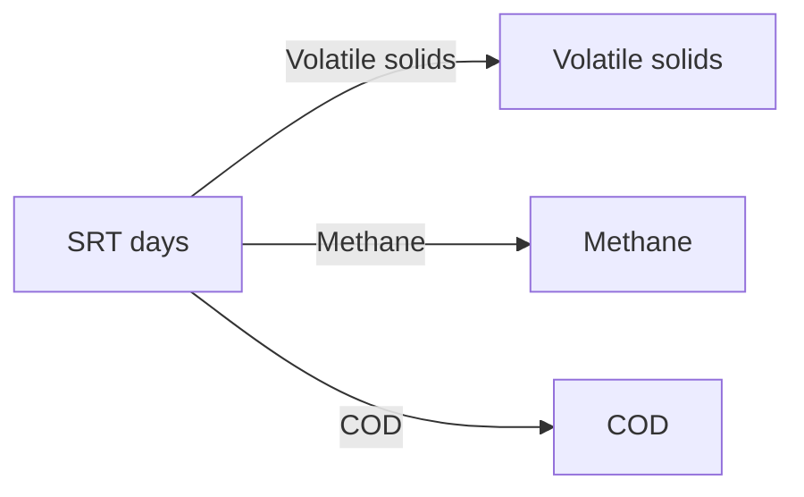

<Mermaid diagram for the bottom panel>

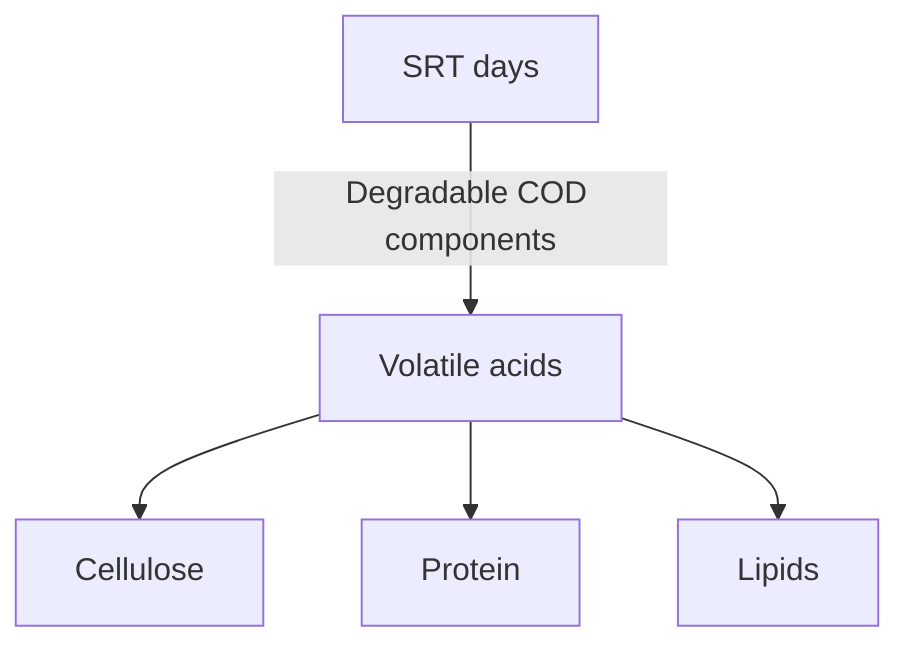

----

FIGURE 23.18 The effect of SRT on the relative breakdown of degradable waste components and methane production (cu ft/lb × 0.06243 = m^3/kg).
\n---\n

# 2.8.2 Process Design

Pilot-testing, before design, should also be considered when implementing a new process configuration or the raw solids contain unconventional substrates such as industrial inputs. The effect of industrial wastes on anaerobic digestion is always questionable until the specific waste is characterized and tested.

<table>
  <thead>
    <tr>
      <th>SRT, Days</th>
      <th>Primary</th>
      <th>Plus Secondary</th>
    </tr>
<tr>
      <th></th>
      <th>Primary</th>
      <th>Secondary</th>
    </tr>
  </thead>
  <tbody>
    <tr>
      <td>0-5</td>
      <td>0</td>
      <td>9</td>
    </tr>
<tr>
      <td>6-10</td>
      <td>0</td>
      <td>15</td>
    </tr>
<tr>
      <td>11-15</td>
      <td>0</td>
      <td>9</td>
    </tr>
<tr>
      <td>16-20</td>
      <td>11</td>
      <td>12</td>
    </tr>
<tr>
      <td>21-25</td>
      <td>45</td>
      <td>25</td>
    </tr>
<tr>
      <td>26-30</td>
      <td>11</td>
      <td>3</td>
    </tr>
<tr>
      <td>31-35</td>
      <td>11</td>
      <td>15</td>
    </tr>
<tr>
      <td>36-40</td>
      <td>0</td>
      <td>6</td>
    </tr>
<tr>
      <td>41-45</td>
      <td>0</td>
      <td>0</td>
    </tr>
<tr>
      <td>46-50</td>
      <td>22</td>
      <td>0</td>
    </tr>
<tr>
      <td>Over 50</td>
      <td>0</td>
      <td>6</td>
    </tr>
<tr>
      <td>Total number of plants</td>
      <td>(12 plants)</td>
      <td>(132 plants)</td>
    </tr>
  </tbody>
</table>

TABLE 23.12 Solids Residence Times Reported for anaerobic digestion operations in the United Substrates
(Reprinted with permission from ASCE, 1983)

\n---\n

## 2.8.2.1 Sizing Criteria

When sizing digesters, the key parameters are SRT and VS loading rate. For digestion systems without recycle, there is no difference between SRT and HRT. The VS loading rate is also used and is important in situations, like co-digestion, where the VS content in the feed may vary. The selection of the design SRT and VS loading rate should consider several factors (e.g., process microbiology, stability, biosolids regulatory requirements, biosolids stability, and industrial inputs). Generally, at higher TS concentrations, VS loading rate is limiting and, at lower TS concentrations, SRT is limiting.

Presently, the design minimum SRT typically is selected based on experience, general rules, and regulatory requirements. Design engineers should note that a range of solids-production conditions must be considered when developing appropriate SRT design criteria.

Researchers are developing more quantifiable approaches to understanding digestion and its limits. The selection of a design SRT directly affects system kinetics and, consequently, process performance. Both complex models (e.g., ADM-1) and simplified models (e.g., that presented by Parkin and Owen [1986]) have been suggested as a means of estimating or predicting the limiting (minimum) digester SRT, although the data required for its application are limited. The Parkin and Owen approach is based on applying a safety factor to a limiting SRT to establish the design SRT. If the limiting SRT is based on a desired digestion efficiency and the digester approaches complete-mix conditions, the limiting SRT can be estimated as follows:

$$
SRT_{\min} = \frac{Y_k S_{\text{eff}}}{K_c + S_{\text{eff}}} \, b^{-1}
$$
(23.3)
\n---\n

## FIGURE 23.19 Effect of temperatureᵃⁿᵈSRT on methane production and VSR (O’Rourke, 1968).

- Top panel: Methane production, cu ft/d vs SRT, days
  - Temperatures and markers:
    - 35°C
    - 25°C
    - 20°C
    - 15°C

### Methane production (top panel)

<table>
  <thead>
    <tr>
      <th>SRT, days</th>
      <th>0</th>
      <th>10</th>
      <th>20</th>
      <th>30</th>
      <th>40</th>
      <th>50</th>
      <th>60</th>
    </tr>
  </thead>
  <tbody>
    <tr>
      <td>35°C</td>
      <td>0.0</td>
      <td>~4.5</td>
      <td>~5.2</td>
      <td>~5.7</td>
      <td>~5.9</td>
      <td>~5.9</td>
      <td>~5.9</td>
    </tr>
<tr>
      <td>25°C</td>
      <td>0.0</td>
      <td>~2.0</td>
      <td>~3.0</td>
      <td>~4.0</td>
      <td>~4.8</td>
      <td>~5.0</td>
      <td>~5.1</td>
    </tr>
<tr>
      <td>20°C</td>
      <td>0.0</td>
      <td>~1.0</td>
      <td>~2.0</td>
      <td>~3.0</td>
      <td>~3.8</td>
      <td>~4.0</td>
      <td>~4.2</td>
    </tr>
<tr>
      <td>15°C</td>
      <td>0.0</td>
      <td>~0.3</td>
      <td>~0.8</td>
      <td>~1.5</td>
      <td>~2.0</td>
      <td>~2.2</td>
      <td>~2.4</td>
    </tr>
  </tbody>
</table>

- Bottom panel: Effluent concentration, g/L vs SRT, days
  - The same SRT range as above (0–60 days)
  - Temperature effects: 15°C, 20°C, 25°C, 35°C
  - Note: As temperature increases, effluent concentration decreases (better treatment), with 35°C generally producing the lowest effluent concentrations over SRT.

### Effluent concentration (bottom panel)

<table>
  <thead>
    <tr>
      <th>SRT, days</th>
      <th>0</th>
      <th>10</th>
      <th>20</th>
      <lt>30</lt>
      <th>40</th>
      <th>50</th>
      <th>60</th>
    </tr>
  </thead>
  <tbody>
    <tr>
      <td>15°C</td>
      <td>11.8</td>
      <td>~10.0</td>
      <td>~7.5</td>
      <td>~5.0</td>
      <td>~4.0</td>
      <td>~3.6</td>
      <td>~3.0</td>
    </tr>
<tr>
      <td>20°C</td>
      <td>11.8</td>
      <td>~9.0</td>
      <td>~6.8</td>
      <td>~4.0</td>
      <td>~3.0</td>
      <td>~2.5</td>
      <td>~2.0</td>
    </tr>
<tr>
      <td>25°C</td>
      <td>11.8</td>
      <td>~8.0</td>
      <td>~5.0</td>
      <td>~3.0</td>
      <td>~2.0</td>
      <td>~1.8</td>
      <td>~1.6</td>
    </tr>
<tr>
      <td>35°C</td>
      <td>11.8</td>
      <td>~7.0</td>
      <td>~4.0</td>
      <td>~2.0</td>
      <td>~1.5</td>
      <td>~1.5</td>
      <td>~1.5</td>
    </tr>
  </tbody>
</table>

- Raw sludge composition (solids)
  - Raw sludge: 11.8 g/L
  - Degradable volatile solids: 11.8 g/L
  - Nondegradable: 6.6 g/L
  - Total: 18.4 g/L
  - Degradable volatile solids (labeled in figure)

- Caption (continued)
  - Degradable volatile solids

- Note
  - where SRT_min = limiting SRT for required digester performance;

\n---\n

## Parameters and constants (Eq. 23.3)

- **Y** = yield of anaerobic organisms resulting from growth (g VSS/g COD destroyed);
- **k** = maximum specific substrate use rate (g COD/g VSS · d);
- **S_eff** = concentration of biodegradable substrate in digested solids (therefore, in digester) (g COD/L); which is equivalent to **S_o**, where **S_o** is the concentration of biodegradable substrate in the feed solids, g COD/L, and **e** is the digestion efficiency at removing **S_o**;
- **K_c** = half saturation concentration of biodegradable substrate in feed solids (g COD/L); and
- **b** = endogenous decay coefficient (d⁻¹).

Values for constants in eq. 23.3 have been proposed for typical municipal primary solids within a temperature range of **25°C to 35°C** (77°F to 95°F). The following proposed values (Parkin and Owen, 1986) are based on laboratory experiments (full-scale data are not currently available):

- **k** = 6.67 g COD/g VSS · d (25–35°C);
- **K_c** = 1.8 g COD/L (25–35°C);
- **b** = 0.03 d⁻¹ (25–35°C);
- **Y** = 0.04 g VSS/g COD removed; and
- **T** = temperature (°C).

Using the calculated value of the limiting SRT for required digester performance, the safety factor (SF) for anaerobic digestion then can be calculated as:

$$
SF = \frac{SRT_{actual}}{SRT_{min}}
$$

(23.4)

For example, suppose engineers were designing a new anaerobic digestion system with the help of data from similar existing systems (see Table 23.4) (ASCE, 1983). The data indicate a median average SRT of about 20 days. Assuming the new system would have
\n---\n

- a digestion efficiency of 90%, a design temperature of 35°C (95°F), and feed solids with a biodegradable COD concentration of 19.6 g/L, they used `eq 23.3` to calculate that the minimum SRT would be 9.2 days (Parkin and Owen, 1986). (Biodegradable COD is assumed to represent the degradable fraction of VS in feed solids and liquor.) Then, using `eq 23.4` and the median SRT of the existing systems, engineers calculate that the new system’s safety factor is 2.2. This safety factor obtained should be used to estimate if short-term or dynamic increase in hydraulic loadings could be accommodated within the process.

- Pilot-testing may be required to determine a system’s actual limits because using generic and/or lumped kinetic parameters can over- or underestimate SRT requirements, depending on actual operating conditions and the composition of the substrate. For example, if feedstocks contain significant amounts of materials (e.g., lipids) that are more difficult to degrade than typical municipal primary solids, then the constants given for `eq 23.3` will not apply: In such cases, or if consistently high VSR is critical, engineers may need to use higher design SRT values than those listed in Table 23.13. If solids readily degrade (e.g., typical primary solids without biological solids), then engineers may be able to use slightly lower design SRT values than those listed in Table 23.13.

- Other limits (e.g., regulatory limits to meet PSRP requirements) need to be considered as well. While a shorter design SRT may reduce tank and ancillary equipment size and cost, the ease of biosolids use or disposal also must be considered. Any initial cost savings may be lost if the biosolids are poor quality, do not meet regulatory standards, or incur significant O&M costs to ensure compliance.

<table>
<thead>
<tr><th>Digestion Type</th><th>Digestion Time (Days)</th><th>Volatile Solids Destruction (%)</th></tr>
</thead>
<tbody>
<tr><td>High-rate (mesophilic range)</td><td>30</td><td>55</td></tr>
<tr><td></td><td>50</td><td>50</td></tr>
<tr><td></td><td>45</td><td>45</td></tr>
<tr><td>Low-rate</td><td>40</td><td>50</td></tr>
</tbody>
</table>

\n---\n

<table>
<caption>TABLE 23.13 Estimated Volatile Solids Destruction</caption>
<tr><td>Low-rate</td><td>45</td></tr>
<tr><td></td><td>40</td></tr>
</table>

Furthermore, to minimize the likelihood of a digester upset, design engineers should select the design SRT based on a critical operating period (e.g., a high-solids-loading period when grit and scum has accumulated, or when a digester is out of service). The choice of critical operating period will depend on facility size, anticipated solids production, and other site-specific factors.

## 2.8.2.2 Loading Rates and Frequency

A digester’s loading rate and frequency significantly affects digester performance. Constant loading will produce the most stable operations because the microorganisms will reach and maintain steady-state conditions. Relative loading will affect the process’s overall stability because both over- and underloading can impair process performance. The design loading rate should be coupled with the process selected (suggested values can be found in the sections discussing each process).

Furthermore, design engineers also should consider the potential effects of a specific feeding regime. Continuous feeding may necessitate storage tanks or 24-hour thickening and dewatering operations. Slug loading may lead to foaming.

In addition, design engineers should ensure that upstream processes are adequate to meet design loading. Thickening performance could prevent a design loading rate or SRT from being met consistently. Design engineers should take this into account when sizing tanks because it could lead to process limitations that could reduce the expected life of the system.

## 2.8.2.3 Solids Blending

Adding a solids blending tank before the reactor can improve digestion stability. The blend tank homogenizes solids before digestion, particularly when multiple solids streams are being loaded to a digester. Primary solids and secondary solids degrade differently, so

\n---\n

## 2.8.2.4 Solids Destruction and Gas Production

without homogenization and flow pacing, the digester can experience a wide fluctuation of organic loads throughout the day, even at constant pumping speeds. (The effective organic loading rate is a function of degradable VS rather than the total VS load.)

Blending tanks reduce diurnal loading variability by providing a "wide spot" in the line. The tank absorbs high solids flows, allowing the digester to maintain more consistent operations, rather than peaking with the solids wasting protocols.

Blending tanks typically are mixed by mechanical mixers or pumps. The degree of mixing selected must be balanced by equipment costs and power use. When sizing blending tanks, design engineers should take care not to oversize them because that can promote acid-reactor conditions if the detention time is long enough. Sometimes blending tanks are heated to partially heat solids before they enter the digester. Heating also can exacerbate acid formation in excessively large blending tanks

----

Design engineers can estimate the expected VSR using previous data (40% to 70%) or equations relating VSR to detention time (Liu and Liptak, 1997). For a standard-rate system,

$$V_d = 30 + \frac{t}{2}$$

where \(V_d\) = VSR (%), and

\(t\) = time of digestion (days):

For a high-rate digestion system,

$$V_d = 13.7 \ln(u_d^m) + 18.94$$

where \(V_d\) = VSR (%), and

\(u_d^m\) = design SRT.

Additional estimates can be made using Table 23.13. The concentration of fixed solids entering the digester will remain constant. Table 23.14 compares the alternative methods for estimating VSR for a single source; it shows that VSR estimates depend on the
\n---\n

method selected, even for the same data set. Design engineers should understand the underlying assumption(s) behind each method before choosing one. If operational data are available, engineers should use them rather than these methods:

<table>
<thead>
<tr>
<th>Description</th>
<th>Value</th>
<th>Units</th>
<th>Source or Notation</th>
</tr>
</thead>
<tbody>
<tr><td colspan="4">Process parameters for estimated solids destruction</td></tr>
<tr>
<td>Raw solids biodegradable COD</td>
<td>19.3</td>
<td>mg-COD/L</td>
<td>Example in section 2.7.2.1. Parkin and Owen (1986)</td>
</tr>
<tr>
<td>COD removal efficiency</td>
<td>90</td>
<td>%</td>
<td>Example in section 2.7.2.1. Parkin and Owen (1986)</td>
</tr>
<tr>
<td>Digester temperature</td>
<td>35</td>
<td>°C</td>
<td></td>
</tr>
<tr>
<td>Design solids retention time (SRT)</td>
<td>20</td>
<td>Days</td>
<td></td>
</tr>
<tr>
<td>Process type</td>
<td>HR</td>
<td></td>
<td>HR = high rate</td>
</tr>
<tr>
<td>Volatile solids destruction based on Equations 23.8 and 23.15</td>
<td></td>
<td></td>
<td></td>
</tr>
<tr>
<td>SRTmin</td>
<td>9.2<br/>49</td>
<td>Days</td>
<td>Equation 23.8, using kinetic parameters in section 2.7.2.1<br/>Equation 23.15</td>
</tr>
<tr>
<td>Vd</td>
<td>49</td>
<td>%</td>
<td>Equation 23.15</td>
</tr>
<tr>
<td>Volatile solids destruction based on Table 23.13</td>
<td></td>
<td></td>
<td></td>
</tr>
<tr>
<td>Vd</td>
<td>60</td>
<td>%</td>
<td></td>
</tr>
<tr>
<td>Volatile solids destruction based on Figure 23.38</td>
<td></td>
<td></td>
<td></td>
</tr>
</tbody>
</table>

\n---\n

# TABLE 23.14 Comparison of Methods for Estimating Digester Volatile Solids Destruction

<table>
  <tr>
    <td>Vd</td>
    <td>42</td>
    <td>%</td>
    <td>Solids age × temperature = 700</td>
  </tr>
</table>

A close estimation of the solids (kg/d) that would enter the second-stage digester of a two-stage system is given by the following equation:

$$\text{Solids} = \text{TS} = (A \times \text{Total solids} \times V_a) \quad (23.7)$$

where TS = total solids entering digester (kg/d [lb/d]),
      A = volatile solids (%), and
      V_a = volatile solids destroyed in primary digester (%).

Equation 23.7 can be used to estimate the solids load to a second-stage digester and the degree of thickening (%). However, the secondary digester’s volume often is equal to that of the primary digester to allow units to be taken out of service.

Design engineers can estimate the specific gas production at WRRFs by using the relationship of approximately 0.8 to 1.1 m³/kg (13 to 18 cu ft/lb) of VSR. Gas production increases as the percentage of FOG in the feedstock increases (as long as adequate SRT and mixing are provided) because FOG is the slowest to metabolize. The total gas volume produced is as follows:

$$G_v = (G_{\text{sgp}}) V_s \quad (23.8)$$

where G_v = volume of total gas produced (m³ [cu ft]);
      V_s = VSR (kg [lb]); and
      G_{\text{sgp}} = specific gas production, taken as 0.8 to 1.1 m³/kg VSR (13 to 18 cu ft/lb VSR).

The total amount of methane produced can be estimated from the amount of organic material removed each day:

\n---\n

G_m = Msgp [ΔOR – 1.42(ΔX)] (23.9)

where G_m = volume of methane produced (m3/d [cu ft/d]),

Msgp = specific methane production per mass of organic material (COD) removed (m3/kg COD [cu ft/lb COD]),

ΔOR = organics (COD) removed daily (kg COD/d [lb COD/d]), and

ΔX = biomass produced (kg VSS/d [lb VSS/d]).

Because digester gas is about two-thirds methane, the total digester gas produced is equal to the following:

G_T = G_m / 0.67 (23.10)

where G_T = total gas produced (m3/d [cu ft/d]).

Expected methane concentrations can range from 45% to 75%; typical methane concentrations range from 60% to 75% (by volume). Typical carbon dioxide concentrations range from 25% to 40% (by volume). Biogas typically includes hydrogen sulfide, but excessively high concentrations should be investigated (e.g., by determining any sources of industrial wastes or saltwater infiltration). The expected heat value of digester gas depends on the biogas’ composition.

2.8.3 Tank Configuration and Shape

The tank configuration (shape) significantly affects the operating characteristics of anaerobic digestion, as well as the cost of construction and O&M. Typically, digesters are available in three basic shapes: short cylinder ("pancake"), tall cylinder ("silo"), and egg shaped:

2.8.3.1 Egg-Shaped Digesters

Egg-shaped digesters (Figure 23.20) have been in service for more than 50 years in Europe, and since the early 1990s in the United States (Volpe et al., 2004). This shape

\n---\n

Egg-shaped digesters are typically considered the optimal shape for a digester; providing excellent mixing characteristics, very few dead zones, and good grit suspension.

This digester's shape improves mixing: The tapered base, with centrally located mixing, is designed to promote the resuspension and removal of grit and other heavy materials (see Figure 23.21). This minimizes the amount of material retained in the digester; increasing the active fraction and reducing the out-of-service time for cleaning. In a review of egg-shaped digesters, Volpe et al. (2004) reported that some have been in service for 20 years without needing to be cleaned:

The digester's small gas dome provides operational advantages and disadvantages. First, the degree of liquid agitation in the dome due to mixing and the foam-suppression system is typically high, preventing a scum layer from forming; instead, it remains entrained in the liquid phase and can be withdrawn. Depending on tank configuration, however, withdrawal from the small gas dome can be problematic: This design may be susceptible to significant liquid-level variation during rapid volume expansion events but this can be overcome through properly sized overflows.

The German style of solids withdrawal—bottom withdrawal—can be problematic for systems with solids with a high propensity to foam. In such cases, foam (or a low-density sludge) can accumulate at the top of the digester or in the gas dome despite foam suppression. If the foaming event is great enough, the only means of exit is via the gas-handling system. So both surface and bottom withdrawals should be provided.
\n---\n

FIGURE 23.20 Egg-shaped digesters at the back river WRRF in Baltimore, Maryland (courtesy of the Baltimore Sun).
\n---\n

# FIGURE 23.21 Schematic of a typical egg-shaped digester:

Mermaid diagram to illustrate the schematic:
```mermaid
graph TD
  Mixer[Mixer]
  PlatformFeed[Platform Feed]
  ScumDoor[Scum door]
  Hopper[Hopper]
  SupernatantWithdrawal[Supernatant withdrawal]
  PlatformLeft[Platform to other digesters]
  Elevator[Elevator]
  PipeArea[Pipe area]
  Tower[Tower]
  Pipes[Pipes]
  GasSpargers[Gas spargers]
  PipingWithdrawalBottom[Piping to withdrawal bottom biosolids]
  Dia[20 m Dia.]
  Depth[8.8 m]
  RightWall[2 m]
  BottomPiping[Bottom biosolids piping]
  Angle[37°]

  Mixer --> PlatformFeed
  PlatformFeed -->|through interior| Inner[Inside digester]
  Inner --> GasSpargers
  GasSpargers --> BottomPiping
  BottomPiping --> PipingWithdrawalBottom
  ScumDoor --> Hopper
  Hopper --> SupernatantWithdrawal
  PlatformLeft --- Elevator
  Elevator --> PipeArea
  PipeArea --> Tower
  Dia --> Depth
  Depth --> RightWall
  // Position hints (labels)
  PlatformLeft --> PlatformFeed
  PlatformLeft --- Elevator
  RightWall --> BottomPiping
  BottomPiping --> PipingWithdrawalBottom
  PipingWithdrawalBottom --> Depth
```

Egg-shaped digesters typically are made of either steel or concrete. Both are vulnerable
to corrosion by the digester contents, so a corrosion-resistant coating typically is applied,
especially in the headspace and several feet below the normal operating level. Egg-
shaped digesters made of steel could use stainless steel in areas prone to corrosion,
although this increases the cost. Steel eggs also need a corrosion-resistant coating on the
outside of the digester. The insulation system often serves as part of the exterior coating,
preventing corrosion by minimizing moisture contact:
\n---\n

Their relatively tall profile makes these digesters visible from a distance but allows for a larger volume in a relatively small footprint. Some facilities including the Back River in Baltimore, Maryland, and Newtown Creek in New York City, New York, have applied architectural features to make their egg-shaped digesters landmarks. Deer Island in Boston, Massachusetts, and the Socol facility in Napa, California, have half eggs used as holding tanks with gas holder covers installed on top.

The shape and construction constraints of these unique tanks make their construction a specialty. A limited number of firms have the equipment and experience to build them, so egg-shaped digesters typically are more expensive to construct than a similar-sized cylindrical or silo digester. Unique construction techniques such as monolithic concrete airforms that are used to construct large free-span concrete domes have the potential to decrease costs of egg-shaped digester construction (Brinkman and Voss, 1997).

Volatile solids loading in these digesters ranges from 0.64 to 2.4 kg volatile solids/m3 (0.040 to 0.150 lb volatile solids/cu ft/d), with a maximum loading of 1.6 to 2.9 kg volatile solids/m3·d (0.106 to 0.175 lb volatile solids/cu ft/d). SRT ranges from 15 to 45 days, and VSR ranges from 42% to 65%, depending on the intended use for the resulting biosolids. Gas production ranges from 0.68 to 1.08 m3/kg volatile solids destroyed (11 to 17.5 cu ft/lb volatile solids destroyed): Though traditionally suited to mechanical mixers, gas, mechanical, and pump mixing systems can be used, and the mixing energy varies from 3.16 to 13.19 W/m3 (0.12 to 0.5 hp/1 000 cu ft). Heating systems primarily are heat exchangers, although a few use steam injection.

2.8.3.2 Silo Digesters (Tall Cylinders)

Silo digesters are a newer version of cylindrical (pancake) digesters, with a greater height-to-diameter ratio. This achieves some of the mixing advantages of egg-shaped digesters without the cost (see Figure 23.22). For this reason, the DC Water Blue Plains facility, despite early plans for new egg-shaped digesters, ended up with silo digesters in 2014.

Silo digesters can resemble egg-shaped digesters when equipped with a submerged fixed cover (see Section 2.8.4.5): The small liquid-gas interface of the submerged cover is similar to the gas dome of the egg-shaped digester, and provides many of the same advantages. Other cover options include gasholder (membrane or steel), fixed and
\n---\n

## 2.8.3.3 Cylindrical Digesters

Floating, allowing design engineers more flexibility to customize the tank for a specific use or even multiple uses (something egg-shaped digesters are not well suited for):

Cylindrical (pancake) digesters are by far the most common tank design for anaerobic digesters in the United States (see Figure 23.23). Their relatively low height-to-diameter ratio makes them easier and less expensive to construct. However, this tank does not have the process benefits realized by egg-shaped and silo digesters.

Pancake digesters are more prone to dead zones and poor mixing regimes, resulting in lower VSR and more grit deposition. So cleanings are needed more often, increasing O&M costs.

However, pancake digesters can be fitted with a variety of cover configurations, which can allow for significant process flexibility and multiple roles (e.g., gas storage and variable liquid level). Egg-shaped digesters are only suited for service as anaerobic reactors.

These tanks typically are made of reinforced concrete, with sidewall depths ranging from 6 to 14 m (20 to 45 ft) and diameters ranging from 8 to 40 m (25 to 125 ft) (U.S. EPA, 1979). Conical bottoms are preferred for cleaning purposes, with slopes varying between 1:3 and 1:6. Slopes greater than 1:3, although desirable for grit removal, are difficult to construct and difficult to stand on while cleaning. Conical bottoms also minimize grit accumulation, instead providing for relatively continuous grit removal: The floors can have either one central withdrawal pipe or be divided into wedges, each with its own withdrawal pipe (waffle-bottom digester). The latter are more expensive to construct but may reduce cleaning costs and frequency:

Where necessary, cylindrical digesters have been insulated using brick veneer and an air space, earth fill, polystyrene plastic, fiberglass, or insulation board.
\n---\n

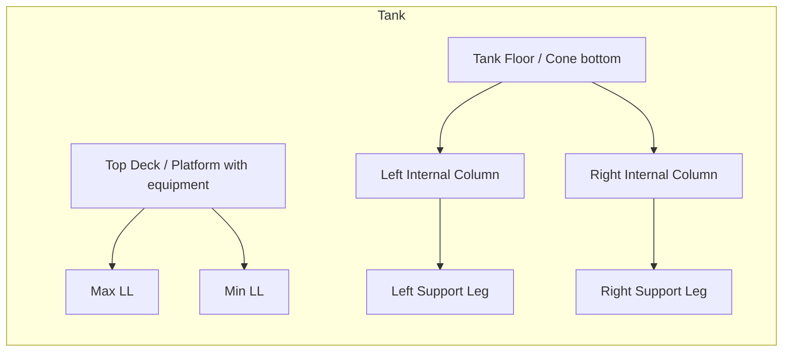
\n---\n

<table>
<thead>
<tr><th>Figure</th><th>Caption</th></tr>
</thead>
<tbody>
<tr><td>FIGURE 23.22</td><td>Cross section of a typical silo digester with internal draft tube mixers (courtesy of Brown and Caldwell and King County Brightwater WWTP).</td></tr>
</tbody>
</table>

# 2.8.4 Digester Cover Types

## 2.8.4.1 Fixed Digester Covers

Fixed digester covers can be constructed of either concrete or steel (see Figure 23.24). In some cases, stainless steel has been used to eliminate the need for coatings and to speed installation. The fixed cover minimizes fugitive odors, which can be released from the annular space between any floating cover and the digester wall. Since it rests on the tank wall and not on the liquid, it is not vulnerable to tipping; however, provisions must be made to prevent overpressurization. To prevent recurring damage from foaming incidents, several facilities installed emergency pressure-relief manhole covers.

<table>
<thead>
<tr><th>Figure</th><th>Caption</th></tr>
</thead>
<tbody>
<tr><td>FIGURE 23.23</td><td>The anaerobic digesters at King County's South Wastewater Treatment Plant in Renton, Washington (courtesy of Brown and Caldwell and King County, Washington).</td></tr>
</tbody>
</table>

\n---\n

FIGURE 23.24 Photograph of an anaerobic digester with a fixed cover at East Bay Municipal Utility District, Oakland, California (courtesy of WesTech).

These covers do not require the ballasting that floating or steel gasholder covers do; however, they must be anchored to the top of the digester to resist the uplift caused by the operating gas pressure

## 2.8.4.2 Floating Digester Covers

A floating cover is traditionally used to allow for significant liquid-level variation since it floats on the digester liquid. Floating covers require ballasting to ensure that the cover floats at the proper level in the liquid. Weights may also need to be added to balance uneven loads on the cover because piping and equipment on the cover could make it float unevenly on the liquid surface. Design engineers should ensure that the operating liquid level is above the corbels to maintain the perimeter gas seal. Floating covers are inherently immune to hydraulic overloading because during an overpressure event, if the gas safety devices are blocked, the cover will effectively “burp” gas, typically at the lightest (or highest) radial location on the cover:

All connections on floating covers between the cover and the digester wall must be flexible enough to allow full movement of the cover without stressing any of the equipment (e.g., gas pipes, or stairways/walkways on and off the cover). Also, guides are needed to ensure that the cover moves up and down without getting bound and tipped (see Figure
\n---\n

## 23.25
Original designs involving rollers and spring shoes have been largely replaced by slide guides: a series of cover-mounted plastic bars that slide vertically in a wall-mounted channel.

Floating covers typically are made of steel. They typically are coated or covered with some type of insulation (e.g., spray-on polyurethane foam with a protective coating or a modular insulation system). Without insulation, shell losses would be significant — particularly in cold environments — increasing heating requirements.

## 2.8.4.3 Steel Gasholder Covers
Like floating covers, gasholder covers are not fixed in place. The cover has a skirt that extends into the liquid, allowing the cover to float on a bubble of gas stored for off-peak use (Figure 23.26). As with floating covers, hydraulic overpressurization of the tank is difficult because solids will escape from the annular space.

FIGURE 23.25 Photograph of a slide guide used for floating and gas holder covers (courtesy of WesTech).

\n---\n

FIGURE 23.26 Schematic of a typical gas holder cover (courtesy of OTI).

<mermaid>
graph TD
  Tank[Gas holder tank]
  Cover[Gas holder cover]
  Bubble[Gas bubble underneath cover]
  Corrosion[Gas–liquid interface → potential corrosion]
  Foam[Foam and scum entrapment above corbels]
  Ballast[Ballast to balance cover]
  Digestion[Solids digestion: reduced due to cover riding on gas bubble]

  Tank --> Cover
  Cover --> Bubble
  Cover --> Ballast
  Cover --> Corrosion
  Bubble --> Digestion
  Foam --> Corrosion
</mermaid>

While gas holder covers provide extra gas storage, they have some distinct disadvantages. They have no surface withdrawal above the corbels, so foam and scum become entrapped and accumulate in the digester. The cover is effectively a large gas-liquid interface, which can lead to corrosion. Furthermore, mixing alternatives are limited because the cover moves and must be ballasted to ensure that it is balanced. Also, because the cover is riding on a gas bubble, the total volume of the reactor is not used for solids digestion (i.e., overall maximum hydraulic capacity is reduced):

2.8.4.4 Membrane Gasholder Covers

Membrane digester covers (Figure 23.27) provide maximum gas-storage capacity, ensure absolute gas containment and provide for the highest degree of liquid level variation. With several manufacturers now in the U.S. market, reduced installation times, and no field welding or coating required, these can also be a very economical cover. Though there are certainly differences in operating these covers when compared to steel covers, proper design and operation can help ensure a successful outcome. With an increase in the need
\n---\n

for gas storage for cogeneration and other uses, it is not surprising that several hundred
are in successful operation at WRRFs in the United States.

[Figure: Photograph of a membrane gas holder cover at Janesville, Wisconsin (courtesy of WesTech).]

Gas is typically drawn off the side, and this can be a problem for primary digesters that
may be subject to foaming: Top gas draw-off designs have been provided to eliminate this
problem, but since the air and gas membranes are clamped together at the peak, the
inner membrane level cannot be measured. In the best cases, this design has caused
operational challenges and, at worst, has been at the heart of several failures:

The life expectancy of these covers varies with the strength and quality of the fabric.
Traditionally, cable-supported designs have allowed for a lighter grade fabric to be used,
which may decrease fabric life.

Originally, there were challenges in measuring the inner membrane height (indicating gas
volume): Ultrasonic technology was widely used historically but since 2012, several
manufacturers have been using laser instruments with much success

## 2.8.4.5 Submerged Fixed Covers

A concrete submerged fixed cover converts the top of a cylindrical or silo digester into a
system resembling the top of an egg-shaped digester (see Figure 23.28). The sloping top
directs gas, foam, and scum to the small gas dome. Because the cover is fixed, surface
overflow can occur in the gas dome, which serves as a key solids-wastage point.
\n---\n

### Schematic of a digester with a submerged fixed cover

Typically, solids can be circulated from the digester to the dome for foam suppression, and gas is withdrawn from the very top of the gas dome.

As with standard fixed covers, there is the danger of hydraulic overpressurization by wasting at a slower rate than the feed rate to the digester. To help alleviate this concern (especially because the small gas dome has limited volume), an emergency overflow typically is added to the gas dome. A dual U-trap in the line keeps gas from exiting via the emergency overflow (see Figure 23.29).

< Mermaid diagram >

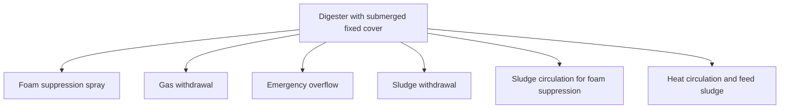

FIGURE 23.28 Schematic of a digester with a submerged fixed cover (courtesy of Brown and Caldwell, Seattle, WA).

\n---\n

### FIGURE 23.29 Emergency overflow apparatus for submerged fixed covers (courtesy of Brown and Caldwell):

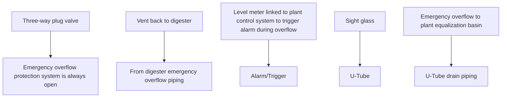

While submerged fixed covers have some obvious benefits, they also have some limitations. The small gas dome provides limited gas storage, and any change in liquid volume is quickly realized at the overflow points:
- 2.8.5 Digester Feeding Systems
\n---\n

Raw solids can be introduced to digesters at several locations, although the key criterion
 is to avoid short-circuiting feed to any exit (withdrawal) point. Solids can be added at the
 top, at the bottom, or in a recycle loop; however; if solids will be withdrawn from the top
 and bottom, feed through the digester sidewalls is typically best: If possible, feed location
 also should maximize solids dispersion. This is particularly easy with pumped systems if
 there is more than one return location. Sequencing control valves will allow for a good
 distribution of solids.

 Feeding to a recycleloopahead of the heat exchangers may initially seem like a good
 way to increase the `delta-T` and improve heat exchanger performance but should be
 done with care as raw sludge may affect the rheology and pressure drop causing the flow
 and heat transfer rates to vary: This practice, which may increase grease and fouling of
 the heat exchangers, is not recommended by manufacturers of spiral heat exchangers.
 Tube-in-tube heat exchangers may be less sensitive to these problems but not completely
 immune.

## 2.8.6 Digester Mixing Systems

Auxiliary mixing of digester contents is beneficial for the following processes:

* Reducing thermal stratification;
* Dispersing substrate for better contact with the active biomass;
* Reducing scum buildup;
* Diluting any inhibitory substances or adverse pH and temperature feed characteristics;
* Increasing the reactor’s effective volume;
* Allowing biogas to separate and rise more easily; and
* Keeping in suspension inorganic material that has a tendency to settle.

Three types of mixing methods typically have been used: mechanical, pumped, and gas
recirculation. Mechanical or internal mixers use impellers, propellers, and turbine wheels.
While some technologies have proven very reliable, problems may arise because of the
internal surfaces of the mixers. Shafts and impellers are subject to vibration (due to
collected materials) and wear (due to grit and debris). The linear motion mixer is relatively
new technology used in digesters over the past 5 years: Typically mounted in the center of
the tank cover; this mixer does not spin but uses a cam-drive to operate a shaft to move a
\n---\n

Disk up and down. The oscillating motion of the disk in the fluid promotes mixing in the tank.

Mixing via pumped recirculation involves using an external pump to recycle digester contents. The efficiency of this system depends on digester size, net energy input, viscosity, and turnover rate.

Gas-recirculation systems may use tubes, sequentially operated lances, diffusers on the tank bottom, or a tube that releases unconfined bubbles. In each case, the gas is produced, compressed, and circulated through the tank to promote mixing. There are basically two types of gas-recirculation systems: unconfined or confined. Unconfined systems include top-mounted lances and diffusers on the tank bottom. Confined systems discharge gas through draft tubes. Each system has advantages and disadvantages, and the degree of mixing typically depends on the energy input:

## 2.8.6.1 Mixing Requirements

Most manufacturers of digester mixing equipment can suggest the appropriate type, size, and power level, which depend on the digester volume and geometry. These suggestions typically are based on in-house studies and the successful experiences of similar installations. Anaerobic digesters can be mixed via gas, mechanical, or pumped mixing systems (various mixing systems have different advantages and disadvantages). Selection of a mixing system is based on costs; maintenance requirements; process configuration; and the screenings, grit, and scum content of the feed. Suggested parameters for sizing digester mixing systems include unit power; velocity gradient; unit gas flow, and digester volume turnover time. These four parameters are related and can be used to equate manufacturers’ recommendations but no single technology should be expected to meet all of these criteria.

Some newer technologies, including the linear motion mixer, fall outside these conventional recommendations and, therefore, use less energy than other mixers. The digestion process can be sustained with less mixing energy; however, it is unclear if other problems may arise (e.g., grit/scum accumulation). Long-term results are not yet available so it is too soon to draw many conclusions about this approach.
\n---\n

# Unit power and mixing in digester

Unit power is defined as delivered motor watts per cubic meter (horsepower per 1000 cu ft) of digester volume. Actual energy applied, viscosity, and digester configuration are not accounted for. Several values have been suggested for unit power selection, ranging from 5.2 to 40 W/m^3 (0.2 to 1.5 hp/1000 cu ft) of reactor volume. Using laboratory data, Speece (1972) predicted a level of 40 W/m^3 to be sufficient for a complete-mix reactor.

The velocity gradient parameter as a measure of mixing intensity was presented by Camp and Stein (1943). It is expressed as the following equation:

$$ G = \left( \frac{W}{m} \right)^{1/2} $$

where G = root-mean-square velocity gradient (s^-1);

- W = power dissipated per unit volume (W/m^3 or N·m/(m^3·s) [lb·s/sq ft]); and
- m = dynamic viscosity (N·s/m^2 or Pa·s [lb·s/sq ft]) (for water, 7.2 × 10^-4 N·s/m^2 or Pa·s at 35°C [1.5 × 10^-5 lb·s/sq ft at 95°F]).

and

$$ W = \frac{E}{V} \qquad (23.12) $$

where E = power dissipated (Watts [ft·lbf/s]), and

$$ V = \text{tank volume} \; (m^3 \; [cu ft]) $$

The power for gas injection can be determined from the following equation:

$$ E = P_1(Q) \left( \ln \frac{P_2}{P_1} \right) \quad (\text{SI units}) \qquad (23.13) $$

or

$$ E = 2.40\,P_1(Q) \left( \ln \frac{P_2}{P_1} \right) \quad (\text{U.S. customary units}) $$

where Q = gas flow (m^3/s [cu ft/min]);

- P1 = absolute pressure at surface of liquid (Pa [psi]);
- P2 = absolute pressure at depth of gas injection (Pa [psi]); and

\n---\n

# 2.40 = lumped conversion factor for U.S. customary units

These equations can be used to determine the necessary power and gas flow of compressors and motors for a gas-injection system. Viscosity is a function of temperature, total solids concentration, and volatile solids concentration. As temperature increases, viscosity decreases; as solids concentration increases, viscosity increases. In addition, as volatile solids increase to more than 3.0%, viscosity increases. Appropriate values of the root-mean-square velocity gradient are 50 to 80 s^-1. The lower values can be used for a system using one gas port, or where grease, oil, and scum are suspected problems.

By rearranging the preceding equations, the unit gas flow relationship to the root-mean-square velocity gradient can be solved by the following equation:

$$
\frac{\dot{Q}}{V} = \frac{G^2}{P_1 \ln \left( \frac{P_2}{P_1} \right)} \quad (23.14)
$$

Suggested values of gas flow/tank volume (Q/V) for a free-lift system range from 76 to 83
mL/m^3·s (4.5 to 5.0 cu ft/min/1000 cu ft). For a draft tube system, the suggested values
range from 80 to 120 mL/m^3·s (5 to 7 cu ft/min/1000 cu ft).

Turnover time is defined as digester volume divided by the flowrate through the draft tube.
This concept typically is used only with draft tube gas and mechanically pumped
recirculation systems, where such a flowrate actually can be determined. Typical digester
turnover times range from 20 to 30 minutes.

## 2.8.6.2 System Performance

A specific definition of “adequate digester mixing” has not yet been formulated. Various
methods (e.g., solids concentration profiles, temperature profiles, and tracer studies) have
been used to evaluate mixing system performance.

Solids concentration profiles are used to determine the effectiveness of digester mixing:
To use this method, samples are collected at specified depth intervals in the tank (typically
1.0 to 1.5 m [3 to 5 ft]) and analyzed for total solids concentration. Mixing is considered
adequate if the solids concentration does not deviate from the average concentration in
the digester by more than a specified amount (often 5% to 10%) over the entire digester
\n---\n

# Mixing and Tracer Tests in Digesters

depth. Allowances are sometimes made for greater deviations in the scum and bottom solids layers. A drawback of the solids concentration profile method, particularly for systems digesting secondary or combined primary and secondary solids, is that these solids often do not stratify significantly, even without mixing, so inefficient mixing cannot be shown by solids concentration profiles alone.

Temperature profiles also have been used to assess mixing effectiveness. The temperature profile method is similar to the solids profile method. Temperature readings are taken at specified depth intervals in the digester. Mixing is considered adequate if the temperature at any point does not deviate from the average by more than a specified amount (often 0.5°C to 1.0°C [1.0°F to 2.0°F]). A drawback of this method is that the digester may have enough heat dispersion without effective mixing to maintain a relatively uniform temperature profile, particularly in digesters with a long SRT:

The most reliable method currently available for evaluating mixing effectiveness is the tracer test method. In this method, a carefully measured amount of a conservative tracer material (e.g., lithium) is injected as a slug to the digester. (Continuous feed methods also can be used but are typically impractical because of the large amounts of tracer required and the long time required to perform the test.) Samples of digested solids are collected and analyzed for tracer content. For an “ideal” (i.e., completely mixed) digester, the tracer concentration in digested solids leaving the digester at any time is calculated as follows:

$$
C = C_0 e^{-\frac{t}{HRT}} \quad (23.15)
$$

where C = tracer concentration at time t (mg/L);

C0 = theoretical initial tracer concentration at time t = 0 (total mass of tracer injected/total digester volume) (mg/L);

t = elapsed time since injection of tracer (hours); and

HRT = digester hydraulic retention time (hours).

Substituting and taking natural logs, this equation becomes the following:

$$
\ln C = \ln C_0 - \frac{t}{HRT} \quad (23.16)
$$
\n---\n

## 2.8.6 Tracer Methods and Digester Volume (Text from prior sections)

- where v = total volume of solids fed in time t (F × t, where F = average solids feed rate [m3/h]) (m3); and
- V0 = total digester volume (m3).

Plotting ln C (y axis) versus v/V0 (x axis) gives the "tracer washout curve." The slope of this line gives an estimate of the effective digester volume, as follows:

$$V_e = \frac{1}{\text{slope}}$$

(23.17)

where \(V_e\) = estimated effective digester volume (m3).

The percentage active volume then is calculated by the following equation:

$$V_{act} = \frac{V_e}{V_0} \times 100$$

(23.18)

where \(V_{act}\) = estimated percent active volume.

This method of estimating mixing effectiveness is the most accurate of the methods discussed (Chapman, 1989). However, because it requires careful monitoring of digester feed and withdrawal rates and a large number of tracer concentration analyses in digested solids, this method is considerably more expensive than any of the other methods discussed.

----

## 2.8.7 Digester Heating Systems

To be effective, anaerobic digesters need a consistent, reliable heating system.

### 2.8.7.1 Digester Heating Needs

Anaerobic digesters must be heated to provide suitable environmental conditions for optimal biological activity. Mesophilic digestion need to operate between about 35°C and 39°C (95°F and 102°F), and thermophilic digestion needs to remain between 50°C and 56°C (122°F and 133°F). The amount of heat needed varies seasonally, mainly in relation to the raw solids temperature, and in relation to heat losses from the reactor to the environment:
\n---\n

## 2.8.7.2 Solids Heating

The lion's share of a digester's total heating load is the energy needed to heat raw solids to the temperature needed for anaerobic digestion. This energy is calculated as follows:

$$ q = m \cdot C_p \cdot T \quad (23.19) $$

where

* q = heat load (J/h or MJ/h [Btu/hr or million Btu/hr]);
* m = mass flowrate of the cake's sludge liquid, treated as water (kg/h [lb/hr]);
* C_p = solids' specific heat or heat capacity (J/kg·°C or MJ/kg·°C [Btu/lb/°F]);
* T = temperature difference between the cold, raw solids and desired heated solids temperature (°C [°F]).

To accurately compute the solids' heating needs, design engineers need to know the actual solids temperature, which typically is rarely recorded. However, the WRRF's influent and effluent temperatures typically are known and are representative of the raw solids temperature. (A WRRF does not appreciably change the average temperature of wastewater because of the large mass of water involved.)

## 2.8.7.3 Digester Heat Losses

In all but the very hottest weather, digesters lose heat to the environment via their roofs, walls, sides, and bottom. However, because digester temperatures typically are near ambient, radiant heat loss is small; virtually all heat is lost via convection. The general formula for heat loss (heat transfer) from these areas is as follows:

$$ q = U \cdot A \cdot \Delta T \quad (23.20) $$

where

* q = heat load (J/h or MJ/h [Btu/hr or million Btu/hr]);
* U = overall heat-transfer coefficient (J/h·m^2·°C [Btu/hr·sq ft/°F]);
* A = surface area (m^2 [sq ft]), and
* ΔT = temperature difference between the digester and the environment (°C [°F]).
\n---\n

The coefficient U is also the inverse of resistance to heat transfer. For multiple layers, 1/U can be expressed as a series of resistances (Bird et al., 1960):

$$
\frac{1}{U} = \frac{1}{h_0} + \frac{x_1}{k_1} + \frac{x_2}{k_2} + \cdots + \frac{1}{h_3}
$$

where h0 and h3 are film coefficients (J/h · m^2 · °C) or (Btu/h · ft^2 · °F),

x2 = thickness of material (consistent units), and

k2 = thermal conductivity of material (J/h · m · °C) or (Btu/h · ft · °F).

Coefficient values and the application of these equations to heat loss from digesters can be found in the American Society of Heating, Refrigerating, and Air Conditioning Engineers (ASHRAE) (2013), Avallone and Baumeister (1996), and Green and Perry (2007).

2.8.7.4 Heat Sources

The following types of heat sources are available:

* Fired boilers. Boilers (e.g., steam boilers and hot-water boilers) typically are used at WRRFs to produce heat from fuel. Fired boilers burn a fuel such as digester gas, natural gas, or propane to supply heat.
* Cogeneration. Cogeneration is the production of both usable heat and electric power from one fuel. These systems, also called combined heat and power (CHP) can deliver heat for solids digestion.
* Water-source heat pumps. A heat pump is a mechanical device that extracts heat from one source, and elevates its temperature to make it usable for other applications. Water-source heat pumps can heat water to between 68°C and 76°C (155°F and 170°F).
* Solar radiation. Solar energy is an increasingly popular form of clean, carbon-free, renewable energy that can provide a portion of solids-heating needs. Because it is not available at night or during inclement weather, solar power is typically not adequate as a sole source of heat. However, it is a carbon-free, renewable energy source that can provide a portion of solids-heating needs:

2.8.8 Heat Exchangers

2.8.8.1 Heat Exchanger Types

\n---\n

# The following types of heat exchangers have been used in anaerobic digestion systems

* Concentric tube. One of the oldest, most widely used heat exchangers is the concentric-tube (often called the tube-in-tube or concentric-pipe) heat exchanger (see Figure 23.30).
* Spiral plate. Spiral (spiral-plate) heat exchangers also are common (see Figure 23.31). Water temperatures are typically kept below 68°C (154°F) to prevent caking.
* Multiple tubes in a box. A variation of the concentric-tube heat exchanger consists of multiple tubes in a box. The small-diameter tubes have a common inlet and outlet.
* Interior submerged coils. Older digesters may have internal heating coils attached to the walls. The coils circulate hot water. They are subject to fouling, which can decrease the heat transfer. Maintaining the coils requires operators to remove the digester from service and empty it.
* Jacketed external solids mixers. A heat-jacketed draft-tube mixer also can be used to internally heat solids. However, internal heating systems are seldom used because of the difficulty associated with providing maintenance inside the reactor:

```mermaid
graph TD
HotIn[Hot water inlet] --> HotOut[Hot water outlet]
Annulus[Annulus (between tubes)] --> HotOut
InnerTube[Inner tube] --> ColdOut[Cold water outlet]
ColdIn[Cold water inlet] --> InnerTube
```

FIGURE 23.30 Tube-in-tube heat exchanger at the Littleton-Englewood Wastewater Treatment Plant in Colorado (courtesy of Brown and Caldwell).
\n---\n

Figure 23.31 A spiral heat exchanger (courtesy of Brown and Caldwell and City of Tacoma, Washington). The image shows a large cylindrical vessel with many nozzles and connected piping surrounding a central body.

## 2.8.8.2 Heat Exchanger Characteristics

Heat-transfer coefficients for external heat exchangers range from 0.9 to 1.6 kJ/m^2·°C.
Transfer coefficients for internal heating coils range from 85 to 450 kJ/m^2·°C (15 to 80 Btu/hr·ft^2·°F) depending on the biomass solids content:

## 2.8.9 Steam Heating
\n---\n

# The following two types of steam heating systems have been used in anaerobic digestion systems

* Submerged pipes. The submerged steam pipe (also called a steam lance) is a vertical, open-ended, small-diameter pipe that discharges at least 3 m (10 ft) below the liquid surface of the digester. Some WRRFs (e.g., the Hyperion Wastewater Treatment Plant [City of Los Angeles]; the JWPCP [of the Los Angeles County Sanitation Districts], and the Rancho Las Virgenes digester complex in Calabasas, California) heat via submerged steam.
* Steam injection. Steam injectors are precision devices that blast a small jet of steam into a stream of solids. The device is outside the digester, and the steam flow is precisely controlled to produce a specific discharge temperature. The amount of steam is adjusted by throttling the plug in the steam injector throat. A few facilities (e.g., the Back River Wastewater Treatment Plant in Baltimore, Maryland, the Crystal Lake [Illinois] Wastewater Treatment Plant; and the Spokane [Washington] Wastewater Treatment Plant) use external steam jet injectors to warm their solids.

## 2.8.10 Heat Recovery

The following three types of heat-recovery systems have been used in anaerobic digestion systems:

* Cogeneration equipment. These systems typically withdraw heat from hot exhaust gases or cooling equipment. Heat-recovery percentages for specific cogeneration equipment are discussed in later sections of this chapter.
* Solids heat recovery. At press time, recent increases in fuel costs had increased the value of heat, so recovering heat from digested solids and using it to warm raw solids is becoming more practical and common.
* Gas compression and equipment cooling. At least one WRRF is capturing the relatively low-temperature heat (40°C to 50°C) from other large processes and using it, along with some water-source heat pumps, to warm solids:

## 2.8.11 Additional Equipment Options

### 2.8.11.1 Debris Buildup and Foam Control
\n---\n

Given the heterogeneous nature of raw solids, the accumulation of debris and foam are part of normal digester operations. However, the rate and extent of accumulation can be controlled via proper digester design, best management practices, and wastewater treatment controls.

Debris can affect digesters in two ways. Floating debris can accumulate on the surface of digesters at the gas-liquid interface, forming a thick blanket that can affect mixing and reduce digester capacity. Heavy debris (e.g., grit) can accumulate on the bottom of the digester, consuming process capacity and possibly causing short-circuiting (if the draw-off points are at the bottom of the tank).

Debris can be reduced via prescreening or grinding solids, or via better screening at the headworks. Most debris and grit enter the solids-handling system via primary solids and scum-removal systems (floating materials). If debris removal can only occur in the digester, several solutions are available (e.g., better mixing to keep material suspended, spray bars to entrain material back into solution, surface withdrawal for floating materials, or grinding and screening). In most cases, a combination of these solutions would be used to mitigate the effects of debris:

Digest foaming can be caused by several factors (e.g., surfactants in influent or hauled wastes, filaments from the secondary treatment system, or digester perturbation). Surfactants can be removed via source identification testing. Filaments can be controlled in the activated sludge system via selectors or chlorine dosing. Foaming typically is associated with erratic feeding after digester perturbation, which can be mitigated via changes in operating practices. Foaming is more difficult to control when associated with a transient event (e.g., a toxic compound), which is difficult or impossible to predict. (In the case of toxic compounds, efforts should be made to identify chronic sources.)

Several design strategies can be used to limit foaming, many of which are limited to the type of cover associated with the digester. A fairly common approach is to add spray nozzles, which entrain foam back into the bulk solution. If the cover or tank design allows it, surface withdrawal is an effective means of removing foam (similar to a selector in secondary systems): Typically, surface withdrawal systems are augmented with spray bars to direct flow. Another alternative is to change the mixing system. Gas systems may exacerbate foaming because the material interacts with the gas bubbles carrying it out of
\n---\n

solution. Other mixing systems that do not sufficiently mix the liquid surface may cause areas of process instability and foaming.

Foaming can greatly increase O&M costs for a utility. As foam can escape digesters through the annular space on floating covers or enter the gas system requiring it to be taken off-line for cleaning:

Both foam and debris reduce digester capacity either by directly displacing volume or by causing operating levels to be reduced to contain them. Anaerobic digestion systems should be designed to minimize foam accumulation and have safety provisions (e.g., manhole pressure-relief valve) to protect digesters and covers from damage resulting from foaming events.

## 2.8.11.2 Scaling (Struvite)

Struvite (magnesium ammonium phosphate, MgNH4PO4·6H2O) is a white crystalline solid or scale that typically forms in anaerobic digesters, digested solids and centrate piping, solids lagoons and lagoon piping, and dewatering equipment. It forms a hard, tenacious precipitate that adheres to pipes and equipment, reducing pipe flow capacity and overloading motors serving brush aerators (see Figure 23.32).

A cross-section image illustrating struvite scale deposition on piping (Figure 23.32) is shown.

\n---\n

# FIGURE 23.32 Struvite precipitate in piping (courtesy of CNP)

Struvite typically forms when the concentrations of magnesium, ammonium, and phosphate exceed the solubility limit of struvite. Its formation also is influenced by various conditions in the digester (e.g., pH, temperature, and other chemicals that can compete primarily for phosphate). Anaerobic digestion can promote struvite formation via the release of phosphate and ammonia during stabilization. The amount of phosphorus and ammonium released depends on the digestion process and the wastewater treatment process(es) that generated the raw solids. For example, the phosphorus taken up during the enhanced biological phosphorus removal (EBPR) process is much more likely to be released in an anaerobic digester than in a conventional activated sludge system. The amount of magnesium in solids also will affect struvite formation. Because struvite formation (as the chemical formula suggests) is based on equimolar stoichiometric concentrations of magnesium, ammonium, and phosphate, the limiting concentration of each component typically determines the amount of struvite that eventually forms: For example, removing or reducing the concentration of any of these constituents can reduce struvite scaling (buildup):

Systems should be designed to give operators access to pipes and equipment so they can remove struvite. In particular, if a facility being upgraded has a history of struvite, design engineers should ensure that the changes provide access and minimize deposition points.

Struvite control can be both a design and a process consideration. However, most options for addressing struvite scaling (e.g., smooth-lined piping and more maintenance) are preventive.

Innovative research is needed to better control and reduce struvite scaling in digestion systems. One commonly used method is adding an iron compound to precipitate phosphorus (one of the three constituents for struvite formation). Staff at a California digestion system added ferrous chloride to control hydrogen sulfide generation and found that it also precipitated phosphate, thereby reducing struvite precipitation. However, phosphorus is an essential nutrient for bacteria, so design engineers should ensure that enough phosphorus remains to meet nutritional needs.
\n---\n

Other control methods that may mitigate struvite precipitation include dilution (to reduce ion concentrations) and operating at a lower pH. Neither is a desirable operating procedure: Emerging technologies, developed to reduce scaling of boiler pipes by applying electrical signals to pipes have been suggested to prevent struvite precipitation; however, there are very few reference installations:

Once struvite deposits have formed, they are difficult to remove. Acid washing removes struvite effectively but can be costly and a safety hazard (Barker, 1996). During early stages of formation, struvite can be controlled by frequent cleaning (pigging) of pipelines. Smooth-lined pipes made of PVC or glass-lined materials, and polyethylene- or polytetrafluoroethylene-coated plug valves will resist struvite accumulation better than other materials.

Several facilities have found vivianite (Fe3(PO4)2 · 8(H2O), also called hydrated iron phosphate) in their systems, especially when the digesters contain high levels of phosphate and also contain iron. Vivianite loses solubility when temperatures rise; it forms quickly when solids containing iron and phosphate are heated. Vivianite is blue, green, or gray-black; turns opaque or dark when exposed to light; and is soluble in hydrochloric acid or nitric acid (HNO3).

## 2.8.11.3 Piping and Cleaning Maintenance

Piping configurations should be designed to promote maximum flexibility for feeding, recirculating, and discharging solids. Piping should be arranged to provide several points for solids feed and solids withdrawal. Older designs typically also had multiple ports near the liquid surface for supernatant withdrawal. Because solids pumping is characterized by low velocities and possible solids accumulation in pipelines, design engineers should make provisions for cleaning out and backflushing lines (using treated effluent when available). They also should consider the choice of valves and where they should be placed for most utility (e.g., easy access and manual operations). Design engineers also should include provisions to allow all tanks and pumps to be isolated for maintenance and safety purposes:

Piping should be arranged to accommodate the following operating modes for two-stage digestion: transferring biomass via gravity from the first stage to the second, pumping the
\n---\n

## 2.8.11.4 Corrosion
An anaerobic digester is a highly corrosive environment, especially because of the release of hydrogen sulfide. Tank interiors, equipment, piping, and any other elements that may contact biogas should be designed to be corrosion resistant, and all seals and gaskets should be compatible with the material they contact. A system's life expectancy will be significantly reduced if its equipment and materials lack corrosion protection. For a detailed discussion of corrosion, see Chapter 8.

## 2.8.11.5 Pumping
Pumping is the primary means of conveying solids to and from digesters. For a detailed discussion of solids pumping, see Chapter 19.

## 2.8.11.6 Sampling and Process Monitoring
Anaerobic digestion is sensitive to changes in operating conditions. If uncontrolled, such changes can result in digester upsets and failure. Proper monitoring techniques promote successful operation and ensure process stability and methane production. All process streams should be available for sampling and analysis. Feed, digested solids, digester gas, and the heating fluid (hot water) should be analyzed for various constituents and physical conditions. Sampling ports should be incorporated into the design to ensure that operators have adequate access for sampling. Feed typically is analyzed for the following: total solids, volatile solids, pH, alkalinity, and temperature. Digester content and effluent solids should be analyzed for the same parameters and for volatile acids. Digester gas should be analyzed for volume and percentage of methane, carbon dioxide, and hydrogen sulfide. Heating fluid should be analyzed for total dissolved solids, pH, and levels of other hydronic system chemical additives.

The flowrates of all streams should be monitored by accurate meters. Additional monitoring requirements (e.g., those for toxics) should be determined on a case-by-case basis.

## 2.8.11.7 Alkalinity and pH Control
\n---\n

# pH and Alkalinity in Anaerobic Digesters

The methanogens in anaerobic digesters are affected by small pH changes, while the acid producers can function satisfactorily in a wide range of pH values. The effective pH range for methane producers is about 6.5 to 7.5, with an optimum range of 6.8 to 7.2. Maintaining this optimum range is important to ensure effective gas production and eliminate digester upsets. Digestion stability depends on the buffering capacity of the digester’s contents (i.e., the digester contents’ ability to resist pH changes). Alkalinity is important in anaerobic digestion; higher alkalinity values indicate more capacity for resisting pH changes. It is measured as bicarbonate alkalinity and ranges from 1500 to 5000 mg/L as calcium carbonate in anaerobic digesters. The volatile acids produced by the acid producers tend to depress pH. Under stable conditions, volatile acid concentrations range from 50 to 100 mg/L. By maintaining a constant ratio of volatile acids to alkalinity that is less than 0.3, the system’s buffering capacity can be maintained. The bicarbonate alkalinity concentration can be calculated from the total alkalinity (which also includes the alkalinity of volatile acids [e.g., acetate] and ammonium) as follows:

$$ \text{Bicarbonate alkalinity (mg/L as CaCO3)} = \text{total alkalinity (mg/L as CaCO3)} - [0.71 \times \text{volatile acids (mg/L as acetic acid)}] } \quad (23.22) $$

where 0.71 is a conversion factor to mg/L as CaCO3.

Barber and Dale (1978) developed the following equation to predict how much bicarbonate alkalinity is needed to raise the total alkalinity:

$$ D_d = D_{\max} \left(1 - \frac{1}{q}\right) \quad (23.23) $$

where

- \(D_d\) = amount added daily to reach set level (mg/L as CaCO3),
- \(D_{\max}\) = required increase (mg/L as CaCO3), and
- \(1/q\) = reciprocal of average detention time or SRT (d\(^{-1}\)).

Sodium bicarbonate, lime, sodium carbonate, and ammonium hydroxide all have been used successfully to increase the alkalinity of digester contents, especially during startup or upset conditions. However, most well-designed and well-operated digester facilities do not require alkalinity addition as long as the wastewater has sufficient buffering capacity:
\n---\n

Design engineers should evaluate the wastewater’s alkalinity before determining whether an alkalinity feed system should be constructed.

## 2.9 Digester-Gas Handling

This section covers a wide range of issues with respect to digester-gas (biogas) characteristics, processing equipment, handling equipment, and beneficial use. Design of systems for safe transport and maintainability are also covered.

The digester-gas collection and distribution system (Figure 23.33) must be maintained under positive pressure to avoid the possibility of explosion by allowing air into the system. A mixture of 5% to 15% gas to air is considered to be in the explosive range and is dangerous.

The gas intake line off the digester should be located a minimum of 1.2 meters above the maximum liquid level in the tank. A greater distance may be necessary to minimize the amount of solids and foam entering the piping system.

### 2.9.1 Characteristics and Contaminants

Because of the energy inherent in the methane, biogas is valuable as a renewable energy source and natural gas replacement. Biogas also has many contaminants and constituents that can cause problems if careful consideration is not given during the design stage. Hydrogen sulfide (H2S), siloxanes, carbon dioxide (CO2), and water may need to be treated or removed, depending on the ultimate use of the gas.

Typical composition of biogas is given in Table 23.15. Note that the values are typical for municipal mesophilic digesters treating primarily domestic sewage. The addition of FOGs, industrial waste streams, and food waste as well as the use of thermophilic digestion, thermal hydrolysis, and chemicals for struvite control can greatly affect these values:
\n---\n

# Diagram of a gas control system

The following represents the diagram content with its labeled sections and legend.

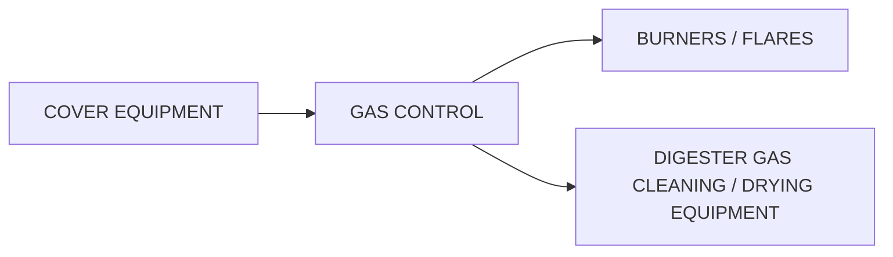

Figure 23.33 Diagram of a gas control system (courtesy of Varec Biogas).

- Color Legend:
  - 120°F (49°C)
  - 100°F (38°C)
  - Water / Glycol
  - 40°F (4°C)
  - 85°F (29°C)

<table>
  <tr><td>Sludge line valves</td></tr>
<tr><td>Sludge line (permanent)</td></tr>
<tr><td>Sludge line (temporary)</td></tr>
<tr><td>Digester access</td></tr>
<tr><td>Explosion-proof vent fan</td></tr>
<tr><td>Explosive level meter</td></tr>
<tr><td>Safe ladder</td></tr>
<tr><td>Self-contained breathing apparatus</td></tr>
<tr><td>Safety harness</td></tr>
<tr><td>Nonskid boots</td></tr>
</table>

\n---\n

# Digester Cleaning and Safety Equipment

<table>
<caption>TABLE 23.15 Digester Cleaning and Safety Equipment</caption>
<tbody>
<tr><td>Explosion-proof lights</td></tr>
<tr><td>Water source</td></tr>
<tr><td>Washdown hose</td></tr>
<tr><td>Nozzle with shutoff</td></tr>
<tr><td>Wash water pump</td></tr>
<tr><td>Fixed sludge pump</td></tr>
<tr><td>Portable sludge pump</td></tr>
<tr><td>Turret nozzle</td></tr>
<tr><td>Tripod or hoist</td></tr>
<tr><td>Tank truck</td></tr>
<tr><td>Crane</td></tr>
</tbody>
</table>

## 2.9.2 Gas Collection, Transport, and Safety

### 2.9.2.1 Commonly Referenced Standards

The following North American standards are recognized as either best design practice or, in some jurisdictions, code. Though not comprehensive these documents should be referenced and adhered to when designing digester-gas systems:

1. ANSI/CSA B149.6-15 Code for Digester Gas, Landfill Gas, and Biogas Generation and Utilization;
2. NFPA 820 Standard for Fire Protection in Wastewater Treatment and Collection Facilities; and
3. GLUMRB (Ten States Standards) Recommended Standards for Waste Water Facilities.
\n---\n

## 2.9.2.2 Materials of Construction

Because of the corrosive nature of digester gas, primarily due to H2S, CO2, and water, careful consideration should be given to the materials of construction. Although lined or coated carbon steel options, most designers use 316/316L stainless steel piping for above-ground applications. Below ground, some designers choose to use plastic or fiber-reinforced plastic as a cost-effective alternative. Care should be taken in choosing these materials, and consideration should be given to the practices outlined in NFPA 820 regarding flammability, and those listed in ANSI/CSA B149.6-15 regarding installation.

Equipment used in-line (flame arresters, valves, sediment traps, drip traps) should be either low-copper aluminum (Type 356) or 316 SS. In general, cast products should be aluminum, which has been proven in digester service for over 70 years and is generally less expensive than stainless steel. Stainless steel should be used in fabricated products as it is much more readily available.

Care should be taken in the use of steel in digester-gas service. When rust (Fe2O3) forms on the steel, it can react with the H2S to form Fe2S3. When the pipe is taken apart for maintenance, the reaction of Fe2S3 in air is exothermic, which can cause high temperatures and create a dangerous situation.

## 2.9.2.3 Flame Arresters and Flame Traps

Flame arresters (Figure 23.34) are devices that prevent the propagation of flame in gas-piping systems. They work by utilizing two different principles. The first is what is called the mean experimental safe gap (MESG). The MESG is an orifice of a size such that a flame of a particular gas will not pass through. It is used for determining the hazardous classification of a gas, which for biogas or methane is Group D.

The second principle is by the use of a large material area that dissipates the heat such that the protected side of the flame arrester does not rise above the auto-ignition temperature of the gas.

\n---\n

## 2.9.2.4 Climate

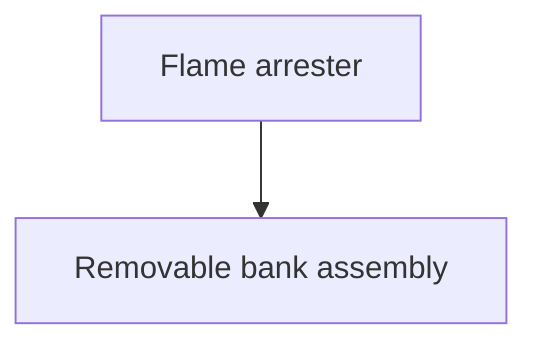

FIGURE 23.34 Flame arrester and removable bank assembly (courtesy of Varec Biogas).

Because the dissipation of heat is only effective for a limited time, in some applications a thermal shutoff valve is added to a flame arrester to shut off the gas flow in case of a continuous flame. This will stop the flame. A thermal shutoff valve is a spring-loaded valve whose pallet is held open by a fusible element. If a flame is present, the fusible element will melt, closing the valve.

A flame arrester combined with a thermal shutoff valve is called a flame trap assembly. Flame arresters should be used where there is the possibility of air entering the system, such as under the pressure- and vacuum-relief valves. Flame traps should be used wherever there is a combustion source such as flares and boilers.

Because of the small openings required to maintain the MESG and digester gas is wet and dirty, flame arresters are subject to fouling and need to be maintained on a regular basis. Depending on the application, this can be as often as every 6 months. Therefore, flame arrester bank assemblies should be easily removable and, in the case of in-line arresters, removal should not change the stress on the surrounding piping. In horizontal applications, flame arresters should not only have flow paths for gas but also for water, so that it can be drained through drip traps without becoming trapped in the element, which will cause premature fouling.
\n---\n

## 2.9.2.5 Digester Cover Equipment
### 2.9.2.5.1 Pressure- and Vacuum-Relief Valves and Flame Arresters with Three-Way Valve

In colder climates, especially those subject to freezing, gas piping and appurtenances need to be protected from the weather. Because biogas is saturated with water, exposure to freezing temperatures will cause freezing, which will prevent flow and could cause catastrophic failures of the piping and equipment. Insulation and, where indicated, heat tracing need to be evaluated. Devices such as regulators and sediment traps should be installed indoors. Equipment requiring maintenance should be fitted with removable insulation covers.

Pressure- and vacuum-relief valves protect the digester from structural damage related to over- or under-pressure (See Figure 23.35). These conditions can be caused by a number of occurrences including rapid pumping of sludge into or out of the digester; failure of the digester heating system, blocked gas draw-off lines, and rapid rise or foaming events. Flame arresters are included as part of the assembly in order to prevent a flame igniting the vapors in the tank during a vacuum condition. ANSI/CSA B149.6-15 requires that two sets of valves and arresters be mounted on a three-way valve to insure that maintenance can be performed while still leaving the tank protected. Depending on operating conditions, maintenance may need to be performed as frequently as every 6 months. Many three-way valves have low Cv values, so it is critical that pressure drop of the three-way valve be considered when sizing the valves for service. Pressure drops greater than 3% of the set point have been known to cause valve chatter and excessive pressure drops can cause reduced capacity of the valve, leading to failure of the digester:

ANSI/CSA B149 prohibits the use of liquid-based relief devices. Conventional pressure-relief devices are weight loaded with a Teflon seal. These devices are not bubble tight by design, as the low sealing force needed prohibits a tight seal. Although these devices, when new, can have very low leakage rates at 90% or above, during operation they can experience leakage as low as 80% of the set point. It is therefore recommended that these valves be set at least 20% above the normal operating pressure of the system as long as they can achieve full relief capacity at or below the design pressure of the digester.
\n---\n

FIGURE 23.35 Digester cover gas safety equipment (courtesy of Varec Biogas).

If the digester is expected to experience foaming based on past experience or other digester facilities in the vicinity, it is recommended to install a 24-in. pressure-relief manhole cover. These devices act as a backup to the normal pressure-relief valve, and relieve pressure or foam if the primary pressure-relief device gets clogged.

### 2.9.2.5.2 Sampling Hatches and Manways

Sampling wells should be mounted with 200-mm quick-opening, gas-tight, non-sparking sampling hatch covers. To facilitate entry into the digester during cleaning operations, one 915-mm and one 1.05-m manway covers should be installed for ventilation of the digester and to allow easy access of personnel equipped with breather packs to enter. These devices should be quick opening and easily operated to prevent the need for cutting bolts that have become seized, which could be a potential flame source.

### 2.9.2.6 Sizing and Installation
\n---\n

# 2.9.2.6.1 Pressure Drop and Moisture Considerations

Gas pipe slopes of 20 mm/m are recommended, with a minimum allowable slope of 10 mm/m for drainage of condensate. In order to minimize pressure drop and condensate carryover, lines should be sized so that gas velocity is no more than 3.5 m/s. Velocities should be calculated based on maximum gas production from the digester or digesters. The Ten States Standards prohibits the use of smaller than 4-in. piping for digester-gas service.

### 2.9.2.6.1.1 Condensate and Sediment Traps
Condensate and sediment traps operate by lowering the gas velocity to drop out moisture and particulates via gravity. In addition, they are fitted with curved inlets, which allows centrifugal force to move heavier particles to the outside. These devices should be placed at the digester and the end of long pipe runs to remove free liquid. Note that condensate and sediment traps are not replacements for filters or moisture-removal systems required for a higher level of gas treatment. They are simple devices used to protect downstream equipment.

### 2.9.2.6.1.2 Drip Traps
Drip traps are devices that remove condensate from the line without allowing gas to escape. They can be manual, electrically actuated, or continuous flow type (condensate accumulator). Both Ten States Standards and ANSI/CSA B149.6-15 prohibit the use of float-operated drip traps. In no case should valves be used, except in the case where there are two valves between the gas system and the drain, and positive mechanical or electrical interlocks are provided to prevent both valves from being opened at the same time.

One of the most common flaws in gas-collection-system designs is an insufficient number of drip traps to remove condensate from piping. Design engineers should install drip traps at all low spots in the gas system and on each sediment trap. Low-pressure drip traps typically are made of low-copper aluminum castings. High-pressure devices should be made of steel or stainless steel. Corrosion and freezing can be minimized by judicious use of drip traps.
\n---\n

# 2.9.3 Digester-Gas Storage

Some WRRFs use one or more forms of digester-gas-storage systems (e.g., low-pressure gas holder or higher-pressure compressed-gas storage) to help them use their gas more effectively:

## 2.9.3.1 Low-Pressure Digester-Gas Storage

In an operating digester-gas system, biogas constantly is being evolved and used. This is a dynamic system in an essentially constant-volume arrangement of piping and vessels. Gas is produced in the digesters at a variable rate that depends heavily on how recently each digester was fed with raw solids. Meanwhile, the devices using digester gas (e.g., engines and boilers) may have variable or relatively constant gas-consumption rates.

Low-pressure gas-storage systems include flexible-membrane dome covers, dry-seal cylindrical steel gasholder tanks, and gasholder digester covers.

## 2.9.3.2 Flexible Membrane Covers

One newer fabric gas-storage option is the flexible-membrane gasholder cover. Some of these covers have been used successfully for 20 years. Flexible-membrane covers provide short-term gas storage to equalize gas pressure, an important consideration when cogeneration systems are involved. Flexible-membrane digester-gas-storage systems are available in sizes up to 34 m (110 ft) and for gas pressures up to 4 kPa (16 in. H2O). They often are less expensive than traditional steel digester covers, and they contain gas and allow for liquid-level variation better than floating digester covers do since they are sealed to the top of the wall and not by the liquid.

## 2.9.3.3 Flexible-Membrane Cover Comparison

A summary of the advantages and disadvantages of flexible-membrane covers is noted here. Table 23.16 provides a summary of membrane cover design considerations.
\n---\n

<table>
  <thead>
    <tr>
      <th>Item or Parameter</th>
      <th>Digester Gas</th>
      <th>Common Value</th>
      <th>Natural Gas</th>
    </tr>
  </thead>
  <tbody>
    <tr>
      <td>Methane (%) (dry basis)</td>
      <td>50-73</td>
      <td>60</td>
      <td>80-98</td>
    </tr>
<tr>
      <td>Carbon dioxide (%) (dry basis)</td>
      <td>30-48</td>
      <td>39</td>
      <td>0-2</td>
    </tr>
<tr>
      <td>Nitrogen (%) (dry basis)</td>
      <td>0.2-2.5</td>
      <td>0.5</td>
      <td>0.2-10</td>
    </tr>
<tr>
      <td>Hydrogen (%) (dry basis)</td>
      <td>0-0.5</td>
      <td>0.2</td>
      <td>~0</td>
    </tr>
<tr>
      <td>Hydrogen sulfide (ppmv) (dry basis)</td>
      <td>200-3500</td>
      <td>500</td>
      <td>&lt;16</td>
    </tr>
<tr>
      <td>Ethane (%) (dry basis)</td>
      <td></td>
      <td></td>
      <td>0.3-5</td>
    </tr>
<tr>
      <td>Propane (%) (dry basis)</td>
      <td></td>
      <td></td>
      <td>0.6-5</td>
    </tr>
<tr>
      <td>Butane (%) (dry basis)</td>
      <td></td>
      <td></td>
      <td>0.5-3</td>
    </tr>
<tr>
      <td>Specific gravity (based on air = 1.0)</td>
      <td>0.8-1.0</td>
      <td>0.91</td>
      <td>0.58</td>
    </tr>
<tr>
      <td>Ignition velocity, maximum (ft/s)</td>
      <td>0.75-0.90</td>
      <td>0.82</td>
      <td>1.28</td>
    </tr>
<tr>
      <td>Wobbe number</td>
      <td></td>
      <td></td>
      <td></td>
    </tr>
<tr>
      <td>Higher heating value (HHV) (Btu/cu ft)</td>
      <td>600-650</td>
      <td>620</td>
      <td>1030-1050</td>
    </tr>
<tr>
      <td>Lower heating value (LHV) (Btu/cu ft)</td>
      <td>520-580</td>
      <td>560</td>
      <td>930-950</td>
    </tr>
  </tbody>
</table>

<p>*All percentages listed above are percentages by volume; ppmv = parts per million, by volume; the higher heating value includes the heat of the water of vaporization; the fuel's lower heating value does not include the heat of the water of vaporization; ft/s × 0.3048 = m/s; and Btu/cu ft × 37.26 = kJ/m³.</p>
\n---\n

TABLE 23.16 Typical Digester Gas Compared to Typical Natural Gas*

## 2.9.3.4 Dry-Seal-Type Cylindrical Steel Gasholder Vessels

The dry-seal (piston) gasholder is a vertical steel tank-within-a-tank gas-pressurization device designed to use its ample weight to keep digester-gas pressure virtually constant while gas production or use varies. It is a non-powered technique for supplementing the limited gas-storage volume between the liquid surface and the digester cover. The weighted, movable piston helps maintain a constant digester-gas pressure in the low-pressure gas piping.

## 2.9.3.5 Dry-Seal-Type Gasholder

Dry-seal (piston) welded-steel gasholders have been used at many U.S. locations for more than 150 years. Table 23.17 lists some advantages and disadvantages of replacing secondary digester covers with similar welded-steel covers and then adding dry-seal digester gasholder vessels.

## 2.9.3.6 Gasholder Digester Covers

Digester covers were common years ago, but are less common today because of concerns about gas escaping from the annular space between the outer edge of the cover and the inner digester wall. Another concern is the effect of such gas leakage on air quality. Most digester covers in California are fixed covers or membrane gasholders.

<table>
  <thead>
    <tr><th>Advantages</th><th>Disadvantages</th></tr>
  </thead>
  <tbody>
    <tr>
      <td>
        <ul>
          <li>Could function both as a digester cover and as a gas holder. Could be available quicker.</li>
        </ul>
      </td>
      <td>
        <ul>
          <li>Has no proven method of reporting status of percent storage used.</li>
          <li>No clear method for operating the secondary digesters with balanced storage covers in parallel.</li>
          <li>Is much more mechanically complex.</li>
          <li>Has a long-term durability concern.</li>
          <li>Some safety concerns.</li>
          <li>May not be completely impervious to methane gas leakage.</li>
          <li>Requires operation and maintenance on the pressuring air blowers, accessories, and controls.</li>
        </ul>
      </td>
    </tr>
  </tbody>
</table>

TABLE 23.17 Advantages and Disadvantages of Flexible Membrane Covers

## 2.9.3.7 High-Pressure Compressed Digester-Gas Storage
\n---\n

Some WRRFs effectively use a higher percentage of their digester gas via a system of medium- or high-pressure gas compressors and gas storage spheres or horizontal storage tanks (pressure vessels).

When biogas is compressed via high pressure, smaller storage vessels are needed but more electricity and a more expensive compressor are required. Several facilities use high-pressure digester-gas-storage systems; they frequently operate at pressures of about 7 to 22 kPa (50 to 150 psi)

A few WRRFs have medium-pressure digester-gas-storage systems, which operate at a pressure of about 3 kPa (20 psi). Medium-pressure systems sometimes are used only to compress the excess gas produced at night. This gas is used in cogeneration engines the following day during on-peak hours, when electric rates are higher. Utilities vary in their willingness to participate in these types of programs that facilitate renewable energy generation:

## 2.9.4 Gas Processing, Utilization, and Combustion Equipment

One of the primary advantages of anaerobic digestion is the fact that it produces renewable energy in the form of digester gas. For example, it can be used in boilers to supplant natural gas usage, and in combined heat and power (CHP) sets to generate electricity for either on-site use or export, or it can be upgraded to natural gas for injection into the grid or for vehicle fueling. Each of these uses requires a different level of treatment to remove contaminants, which may otherwise damage or reduce the life of the gas utilization equipment:

Because there are times when the gas conditioning and utilization equipment is undergoing maintenance, or the digester is producing more gas than can be utilized, there is often a need to dispose of the gas. The safest, most efficient and cost-effective way of doing this is through flaring:

### 2.9.4.1 Flaring

Flares are normally divided into two types: open or candlestick, and enclosed. The open type is considerably less expensive but also less efficient, but the choice between the two normally has less to do with economics than environmental regulations and facility locations. Because open flares have combustion occur in the atmosphere, the combustion
\n---\n

The process is considered uncontrolled, and therefore, emissions cannot be guaranteed and will generally not meet EPA permitting requirements in stricter regulatory areas like California, Washington, or Massachusetts. In addition, they produce a flame that, depending on the amount of gas flared and the proximity to the property line, can cause public relations issues with neighbors.

## 2.9.4.1.1 Flare Pilots
Flare pilots with flame verification should be used to ensure that all gas going to the flare is combusted. In addition, high-temperature, pre-mixed pilots can assist in the conversion of hydrogen sulfide, thereby eliminating odors.

40 CFR 60.118 requires that the flame be verified. The most reliable way to do this is by monitoring the pilot flame, as varying flow rates inhibit the ability to verify the main flame. ANSI/CSA B149.6-15 requires that a flare be operated at all times when flaring, and this standard and Ten States Standards require that the pilot gas be propane or natural gas. Although pilot systems have been developed that can utilize digester gas, and some cost savings can be achieved, the inherent variability as well as the wet and dirty nature make these systems potentially unreliable, regardless of the design:

## 2.9.4.1.2 Open Flares
Open flares typically consist of a pipe, a windshield, and a pilot nozzle. Items provided by the flare manufacturer should include the flare stack, pilot valve and regulator system including pre-mixed pilot controls, and a control panel to start and stop the pilot system and control valves. Typical inputs are for the start/stop signal, which can either be a pressure switch or, in the case of systems with a constant-pressure gasholder, a signal from the facility distributed control system (DCS) based on the gasholder position. Typical outputs are power on, pilot on, and pilot failure. These types of flares can be used in most cases, except as described above.

## 2.9.4.1.3 Enclosed Flares
Enclosed flares are substantially more expensive than open flares, but may be required based on regulatory or facility requirements described above. Enclosed flares are normally divided into three types: natural draft temperature controlled, forced draft temperature controlled, and natural draft venturi pre-mixed. Each of these have their
\n---\n

# 2.9.4.1.3.1 Natural Draft Temperature-Controlled Enclosed Flares

These are the oldest style of enclosed flares and were initially developed for the landfill market. Although the composition of landfill gas and digester gas is similar, landfill gas often contains volatile organic compounds (VOCs) and other toxic compounds that require a longer retention time to destroy.

These types of flares consist of a refractory-lined stack with a thermocouple at the stack exit and motorized dampers at the bottom. They work on a time-and-temperature basis to destroy methane and provide low NOx and CO emissions. As the temperature at the stack exit increases above the set point, the dampers open further to allow in more air to cool the combustion process.

These flares are primarily designed for continuous operation and a narrow flow range. In intermittent operation, the refractory tends to wick moisture from the atmosphere. When these flares are started after a long period of inactivity, the moisture in the refractory turns to steam, which can cause pieces of the refractory to come off. If this condition is not monitored, and proper repairs are not made, which in most cases includes refractory replacement, the stack can suffer irreparable damage. In addition, because these flares need to go through a purge cycle of 15 to 20 minutes each time the flare is called upon, their use may not match with facility requirements and may lead to venting due to flare unavailability.

The flow range the flare can operate under; commonly referred to as "turn-down" is limited by the heat loss in the stack and the ability to maintain stack exit temperature. This number is generally approximately 5:1 (maximum flow:minimum flow), although this can be extended by placing thermocouples at multiple elevations on the stack, and controlling from lower thermocouples during low-flow conditions. Care must be taken as these lower thermocouples become a maintenance item: In addition, at lower flows, the limited number of burner nozzles typically provided in this style of flare can have low velocities.
\n---\n

which will not provide sufficient mixing energy to achieve good combustion: This can lead to long, lazy flames, which may impinge on the refractory and cause damage.

### 2.9.4.1.3.2 Forced Draft Temperature-Controlled Enclosed Flares
This type of flare is similar to the natural draft temperature enclosed flares in that they include a refractory-lined stack and a thermocouple at the exit to control temperature at the exit. The main difference is that instead of using dampers to control airflow, these units use an air blower controlled by a variable-frequency drive (VFD) to provide combustion and cooling air. The advantage of this is more accurate control of the air, which can provide higher destruction of the methane and lower emissions of NOx and CO. In addition, because of the control of the air, the flames are normally shorter and have a high temperature, which allows the flare stacks to be shorter: However, as with any piece of rotating equipment, this requires a higher level of maintenance, especially if the flare is going to be operated intermittently. Also the parasitic power load is much higher than the other two styles of flares, which may be a concern when calculating the economy of a gas utilization system.

As with all temperature-controlled or refractory-lined flares, these units have a limited turn-down ratio (typically 7:1) and can experience the same issues with intermittent operation as described above.

### 2.9.4.1.3.3 Natural Draft Venturi Pre-Mixed Enclosed Flares
These types of flares (see Figure 23.36) use multiple venturi nozzles to pre-mix the air and gas, giving a short, high-temperature, robust flame. Instead of a refractory-lined stack, these flares have stack sections of gradually increasing diameter, which permit a boundary layer of cooling air that protects the stack.

Because these flares do not rely on temperature control and the smaller-diameter venturi orifices allow for higher velocities at lower flows, these types of flares are not subject to the turn-down limitations of other types of flares. Since there is no refractory, there is no possibility of refractory failure. In addition, because there are multiple openings in the stack, there is no need for a purge cycle, and these flares can be ready for gas flow within 1 to 2 minutes after being called on.

### 2.9.4.2 Moisture Removal
\n---\n

When produced, digester gas is saturated with water. However, an increasing number of digester-gas treatment technologies and use equipment require dry gas. Digester gas can be dried via several techniques (e.g., refrigerant dryers, desiccant dryers, coalescent filters, and glycol systems). All moisture-removal equipment should be made of corrosion-resistant materials and preceded by sediment and condensate trips. Consideration must be given for the safe drainage of the large amount of condensate generated by moisture-removal systems:

<table>
  <thead>
    <tr><th>Figure</th><th>Caption</th></tr>
  </thead>
  <tbody>
    <tr><td>FIGURE 23.36</td><td>Natural draft venturi premixed enclosed flares (courtesy of Varec Biogas).</td></tr>
  </tbody>
</table>

Refrigerated dryers are the most common and often the most successful technique for drying digester gas. They use gas heat exchangers and mechanical chillers to cool the gas and condense water, so it can be easily removed via physical separation. The gas is then reheated utilizing the heat of compression to give the gas a low dew point and a low relative humidity. The ability to control the exit temperature of the gas makes them ideal
\n---\n

for systems where downstream adsorbers are used to remove siloxanes or other compounds.

Desiccant dryers are sometimes used in packaged compressed-air dryers or natural gas applications. Because digester gas typically is saturated and often contains other contaminants, desiccant gas dryers must be specifically designated for these conditions to be effective.

Coalescent filters can be used to remove water from digester gas, but not molecular water vapor. So these filters are used with other water-removal equipment to prevent carryover of the water and to help with drainage.

### 2.9.4.3 Gas-Pressure Boosters

Anaerobic digesters typically produce gas at a pressure of 1 to 2.5 kPa (4 to 10 in. H2O), which may be insufficient for the gas-use equipment. However, many boilers, flares, and some gas-use equipment only require an inlet gas pressure of 0.3 to 2 kPa (2 to 14 psi). A gas booster often can make up the difference. Centrifugal gas-booster blowers can increase gas pressure by approximately 0.6 to 1.5 kPa (4 to 10 psi) (depending on size), and this increase in gas pressure is typically adequate for many applications.

Centrifugal gas-booster blowers are available both as open machines and as hermetically sealed gas blowers. They are available in stainless steel and cast iron. When using centrifugal gas blowers in indoor applications, design engineers should make sure to provide gas-tight seals.

### 2.9.4.4 High-Pressure Gas Compressors

Rotary screw compressors, sliding vane compressors, and reciprocating piston gas compressors all have been used to successfully compress digester gas up to 50 kPa (350 psi). All have limitations, and all must be designed for continuous duty with a typically contaminant-laden wet gas. Light-duty, intermittent-use air-compression machinery should not be used in digester-gas applications. Important design issues with high-pressure digester-gas compressors include:

- Robust structural foundations for the compressors;
- Gas-flow pulsation attenuation;
\n---\n

- Lubricating oil carryover and removal from the gas;
- Moisture condensation in the gas during shutdown; and
- Compressor cooling.

## 2.9.4.5 Gas Metering and Gas-Pressure Monitoring

Facility personnel need accurate, reliable measurement of gas flow. Gas production is a measurement of digester performance. A reliable metering system enables the facility to optimize both the digester and the gas-use system. It promptly alerts operators to gas-system leaks and process fluctuations. It also allows operators to store excess gas properly and helps them plan process schedules. In addition, flow data are needed to calculate digester efficiency and the fuel savings obtained by using digester gas.

Digester gas, which is moist, dirty, and corrosive, is produced at fluctuating rates. The piping and appurtenances are designed to convey gas at low velocities and pressures. These characteristics can cause numerous maintenance problems for metering devices that engineers need to address when designing the gas-collection system and selecting gas meters.

Thermal mass dispersion meters are the most common type currently in use and are favored for the fact that they do not create pressure drop and have no moving parts, minimizing maintenance. Other technologies that have made recent advancements are sonic flow meters and venturi-style meters.

Other flow meters that have monitored gas successfully include positive displacement bellows, shunt flow, turbine, differential-pressure venturi tube, orifice plate, and flow tube. Although these can be potentially more accurate, the high amounts of maintenance required have generally precluded their use.

The meters should measure each digester’s gas production, total gas production (after recirculation), gas sent to each engine and/or boiler, and gas wasted to the flares. They should resist corrosion and be easily serviced. Meters should be placed downstream of condensate and sediment traps to minimize the amount of free liquids and particulates they see.
\n---\n

When selecting the device, design engineers also should consider both startup and design flow conditions. Startup (low-flow) conditions may be below the operating range of a meter sized for design flows.

Gas-pressure gauges for local indication are available in both dial and manometer designs; the manometer typically is used on low-pressure lines due to its lack of moving parts, which make it well suited to wet, dirty gas.

Facilities may use pressure transmitters with remote indication in conjunction with local readouts as part of the facility's overall DCS. Gauges indicate the pressure available in the system; they help O&M personnel locate line blockages.

## 2.9.4.6 Isolation Valves
Several types of isolation valves (e.g., butterfly valves, plug valves, and knife gate valves) have been used successfully on digester-gas piping: For information on valve location requirements, see NFPA 320 and NFPA 54.

## 2.9.4.7 Gas Analysis and Conditioning
The sampling and analytical methods required for digester gas depend on the type and concentration of compound(s) of interest, which generally depends on the gas utilization. Many relevant methods and techniques are available, but only under the correct conditions.

Digester gas often is sampled via Tedlar bags or by collecting a gas sample in a methanol impinger.

There are several methods for analyzing digester gas (e.g., gas chromatography and mass spectrometry) (see Table 23.18). If the gas will be tested for siloxanes, or similar organic compounds typically found in small concentrations, then more analytical work may be required.

Complex sample collection and analysis (typically due to reactivity and low detection-limit requirements) require the use of certified and accredited labs staffed by analysts with the appropriate skills.
\n---\n

## 2.9.4.8 Hydrogen Sulfide Removal

Gas conditioning is one of the most rapidly developing fields in biogas handling. Entire books could be written on different technologies currently and commonly in use as of the publication date. It is recommended that designers use outside resources, including WERF research and WEF conference papers when evaluating gas conditioning systems for the latest technologies.

<table>
<thead>
<tr><th>Advantages</th><th>Disadvantages</th></tr>
</thead>
<tbody>
<tr>
<td>
<ul>
<li>Is mechanically simple; easy to operate and to understand</li>
<li>The dry-seal vessel height provides a complete and accurate indication of digester gas-storage status</li>
<li>Emergency repairs, if required, could be performed by local staff</li>
</ul>
</td>
<td>
<ul>
<li>When the costs of digester covers and dry seal gas holders are added together, it almost certainly will total more than a gas-membrane cover solution alone</li>
<li>Will probably not be available as quickly as a gas-membrane cover could be available</li>
</ul>
</td>
</tr>
</tbody>
</table>

TABLE 23.18 Advantages and Disadvantages of Dry-Seal Gas Holders

The hydrogen sulfide in digester gas is formed when anaerobic bacteria reduce sulfates and other sulfur material. It may need to be removed from digester gas to reduce corrosion in boilers and engine parts. It also may need to be removed to satisfy local air emissions standards: Hydrogen sulfide is a toxic air pollutant that can create both odor and safety issues, even in minute concentrations. Biogas with a high hydrogen sulfide content can contribute to air pollution: Flaring eliminates the odor problem but produces sulfur dioxide, which is a significant cause of acid rain:

There are a number of methods for removing hydrogen sulfide from digester gas, and the method chosen usually depends on the sulfur loading: When choosing a technology, the
\n---\n

Designer should keep in mind both capital and operating costs, as well as space requirements.

## 2.9.4.8.1 Dry Scrubbers (Absorbers and Adsorbers)

Dry scrubbers usually consist of a tank made either of stainless steel or fiber-glass-reinforced plastic (FRP), which contains a medium that removes the hydrogen sulfide.

A common dry scrubber (called the iron sponge) uses iron oxide hydrated wood chips (see Figure 23.37). Hydrogen sulfide reacts with iron oxide to form elemental iron, elemental sulfur, and water. The iron sponge is periodically regenerated by removing the sulfur and oxidizing the iron to form iron oxide. Such regeneration could be hazardous because spontaneous combustion is possible if the iron is oxidized too rapidly. There are systems where this is performed in situ, and the vessel is filled with water to prevent high heat during the oxidation process. Iron sponge can also be fitted with continuous regeneration systems, which add a small amount of air to control the reoxidation process. These systems should be provided with safety systems to prevent a runaway reaction, although at the level air is added this is rare. Other manufactured iron compounds have been developed that do not have the exothermic oxidation reaction iron sponge has, and give off various inert substances as a by-product.

FIGURE 23.37 Iron sponge purifier (courtesy of Varec Biogas).

Description: A photograph of an iron sponge purifier consisting of two large vertical tanks connected by a central piping manifold, installed outdoors on a gravel pad with trees in the background.
\n---\n

Activated carbon can also be used as an adsorber for hydrogen sulfide and is referred in some areas due to its ready availability. However; operating costs tend to be much higher than with iron-based systems.

Dry scrubbers are typically best suited to relatively small sulfur loadings.

## 2.9.4.8.2 Wet Scrubbers

A conventional wet scrubber (see Figure 23.38) uses a liquid that is maintained at a high pH (via caustic) to enhance hydrogen sulfide absorption. It also may contain an oxidant (e.g., sodium hypochlorite or potassium permanganate) to reduce adsorbent disposal problems and increase its useful life. Wet scrubbers use nozzles or diffuser plates, which periodically require cleaning: The gas leaving the wet scrubber is saturated with moisture, which must be condensed and removed downstream. Because the headloss through wet scrubbers typically is too high for the low-pressure digester-gas system, the gas must be compressed before being scrubbed.

One of the major costs of these systems is the caustic chemical costs. Recently systems have been developed where the caustic is recovered biologically from the drain water, which will lower operating costs.
\n---\n

## 2.9.4.8.3 Biological Treatment

Over the past 15 years, advances have been made to make biological H2S removal more reliable. In these systems, an FRP tower is filled with packed media (see Figure 23.39), which is then seeded with bacteria. These bacteria, when operated in a slightly aerobic environment, work to scavenge the sulfur from the gas.

Because these units require oxygen to operate, blowers are required to add air into the system. Sufficient safeguards are added to prevent the mixture from becoming flammable. In addition to air, the bacteria will also require nutrients to operate. These can often be provided by facility effluent, although fertilizer may also be required:
\n---\n

# Biological H2S removal

```mermaid
graph TD
    Tank[Acid proof tank]
    Manhole[Manhole]
    Ladder[Ladder]
    Bar[Round bar]
    Valve[Pressure vacuum valve]
    GasPipe[Internal gas pipe is available as an option]
    Inlet[Biogas inlet]
    Outlet[Biogas outlet]
    QSRDrain[QSR-drain liquid]
    QSRAir[QSR-air injection]
    Effluent[Discharge of effluent from biogas cleaner]
    Water[Supply of soft water or particle free water from end pond or settling tank]
    ByPass[By-pass valve]
    PTU[Process technique unit (PTU) with PLC control in FRP house]
    Power[Power supply]
    Flow[biogas flow signal 4-20 mAmp]
    Oxygen[Oxygen level signal 4-20 mAmp]
    Foundation[Foundation]

    Tank --> Manhole
    Tank --> Ladder
    Tank --> Bar
    Tank --> Valve
    Tank --> GasPipe
    Inlet --> Tank
    Tank --> Outlet
    Tank --> QSRDrain
    Tank --> QSRAir
    Tank --> Effluent
    Effluent --> Water
    PTU --> Power
    PTU --> Flow
    PTU --> Oxygen
    Foundation -.-> PTU
```

- Manhole
- Ladder
- Round bar
- Pressure vacuum valve
- Internal gas pipe is available as an option
- Acid proof tank
- Process technique unit (PTU) with PLC control in FRP house
- Power supply
- biogas flow signal 4-20 mAmp
- Oxygen level signal 4-20 mAmp
- By-pass valve
- Biogas inlet
- QSR-drain liquid
- QSR-air injection
- Biogas outlet
- Discharge of effluent from biogas cleaner
- Supply of soft water or particle free water from end pond or settling tank
- Foundation

FIGURE 23.39 Biological H2S removal (courtesy of Varec Biogas)

\n---\n

## 2.9.4.9 Siloxane-Removal Systems

Because sulfur and bacteria will build up on the media, the units require periodic cleaning. This is normally done by filling the vessel with water and blowing compressed air into the tank to agitate the media. Because these tanks are typically 12 to 15 m tall, the manufacturer needs to consider the weight loading on the media supports as well as having air nozzles of sufficient size and quantity to insure satisfactory agitation.

Instead of gas scrubbing, some facilities have added iron salts directly to the digester or facility influent: Iron reacts with sulfide to form insoluble iron sulfide. However; iron salts should not be added to heated solids lines because this results in buildup of vivianite (ferrous phosphate) scale. Iron salts also can reduce digester alkalinity, so design engineers must make provision to monitor and control the solution strength and dosing rate to avoid lowering the digester's pH:

This method requires a bulk-storage tank, chemical feed pumps, piping, and monitoring equipment: Its chief cost is for chemicals. Although this method's O&M costs are low, it requires more operator skill than the iron sponge method:

Siloxanes are a family of anthropogenic organic compounds containing silicon that are becoming increasingly common in many household products (e.g., deodorants, cosmetics, shampoos, dyes, lubricants, dry-cleaning fluids, and waterproofing compounds). As a result, volatile siloxanes can be found in landfill gas and digester gas, often at concentrations of a few parts per million or less (see Table 23.19).

Siloxanes are difficult to detect and control. Two common siloxanes, hexamethyldisiloxane (MM) and octamethyldisiloxane (MCM), are relatively large linear-chain molecules while others are cyclic (similar to benzene rings). Only hexamethylcyclotrisiloxane (D3) and MM are significantly soluble in water at ambient temperatures.

When combusted, siloxanes form tough, often abrasive silicon dioxide deposits. (Silicon dioxide is the chemical name for ordinary beach sand.) The combusted siloxanes also promote the formation of other chemical deposits (e.g., calcium, sulfur, iron, and zinc compounds) on them. These deposits often clog engine heads, foul exhaust and intake valves, and coat combustors and fuel injectors. They also cover exhaust catalysts, boiler surfaces, and exhaust heat-recovery equipment tubes.
\n---\n

# TABLE 23.19 Methods Typically Used to Analyze Biogas

Several WRRFs have had success removing siloxanes from digester gas. The best siloxane-control systems typically include moisture removal upstream of activated carbon (see Table 23.20). To maximize media life, both water and hydrogen sulfide should be removed from biogas before activated carbon treatment.

<table>
<thead>
<tr><th>Method Number</th><th>Description</th></tr>
</thead>
<tbody>
<tr><td>ASTM D-3588</td><td>Standard Practice for Calculating Heat Value, Compressibility Factor, and Relative Density of Gaseous Fuels</td></tr>
<tr><td>ASTM D-1945</td><td>Standard Test Method for Analysis of Natural Gas by Gas Chromatography</td></tr>
<tr><td>EPA TO-14</td><td>Determination of Volatile Organic Compounds (VOCs) in Ambient Air Using Specially Prepared Canisters With Subsequent Analysis by Gas Chromatography</td></tr>
</tbody>
</table>

<p>TABLE 23.19 Methods Typically Used to Analyze Biogas</p>

<table>
<thead>
<tr>
<th>Siloxane Species</th>
<th>Formula</th>
<th>Common Abbreviation</th>
<th>Molecular Weight</th>
<th>Vapor Pressure (mm Hg at 77°F)*</th>
<th>Boiling Point (°F)</th>
<th>Water Solubility (mg/L at 25°C)</th>
</tr>
</thead>
<tbody>
<tr>
<td>Hexamethyl disiloxane</td>
<td>C6H18OSi2O</td>
<td>MM</td>
<td>162</td>
<td>31</td>
<td>224</td>
<td>0.93</td>
</tr>
<tr>
<td>Octamethyltrisiloxane</td>
<td>C8H24Si3O2</td>
<td>MCM</td>
<td>236</td>
<td>3.9</td>
<td>N/A</td>
<td>0.035</td>
</tr>
<tr>
<td>Hexamethylcyclotrisiloxane</td>
<td>C12H18O3Si3</td>
<td>D3</td>
<td>222</td>
<td>10</td>
<td>275</td>
<td>1.56</td>
</tr>
<tr>
<td>Octamethylcyclotetrasiloxane</td>
<td>C8H24O4Si4</td>
<td>D4</td>
<td>297</td>
<td>1.3</td>
<td>348</td>
<td>0.056</td>
</tr>
<tr>
<td>Decamethylcyclopentasiloxane</td>
<td>C10H30O5Si5</td>
<td>D5</td>
<td>371</td>
<td>0.02</td>
<td>412</td>
<td>0.017</td>
</tr>
</tbody>
</table>

<p>*0.5556 (°F − 32) = °C.</p>

\n---\n

# TABLE 23.20 Typical Volatile Organic Siloxanes Found in Digester Gas

## 2.9.4.10 Carbon Dioxide Removal

As global concern about climate change increases, some WRRFs have begun to monitor carbon dioxide. Dry digester gas typically contains about 60% carbon dioxide by volume, or about 55% to 60% carbon dioxide on a mass basis. Techniques for removing carbon dioxide from digester gas include pressure swing adsorption, temperature swing adsorption, cryogenic refrigeration, and amine treatment:

### 2.9.4.10.1 Pressure Swing Adsorption

In pressure swing adsorption, gas constituents adsorb to the surface of a media at one pressure (typically high), and are released at another pressure (typically much lower).

### 2.9.4.10.2 Temperature Swing Adsorption

Temperature swing adsorption might be the most common technique for removing carbon dioxide. In this process, carbon dioxide adsorbs to a media at a low temperature (typically at or near ambient temperatures (10°C to 32°C [50°F to 90°F]). Once the adsorption media is saturated, carbon dioxide is expelled from it by heating the media to typically 150°C to 200°C (300°F to 400°F).

### 2.9.4.10.3 Cryogenic Refrigeration

Cryogenic refrigeration takes advantage of the fact that carbon dioxide freezes at a warmer temperature (279°C [2110°F]) than methane does (2182°C [2297°F]). Cryogenic systems can work well but require a significant amount of mechanical energy to refrigerate the gas.

### 2.9.4.11 Amines

Amines (e.g., monethanolamine [MEA] and diethanolamine [DEA]) are a class of substances derived from ammonia. They frequently are used to remove both hydrogen sulfide and carbon dioxide from raw or sour natural gas.

## 2.9.5 Gas Use—Boilers
\n---\n

Boilers extract usable heat energy from a fuel, typically via combustion. Historically, this is the most common technique for capturing a digester gas energy. Even WRRFs that use engine generators or gas turbines need boilers as standby or supplemental heating equipment. Boiler sizes range from about 100 000 to more than 1 billion kJ/h (Btu/h).

Emissions controls are becoming increasingly important features for boilers throughout the United States. Engineers should address air quality regulations as part of all boiler designs. If designed appropriately, specially modified boilers can meet nearly all air quality regulations.

### 2.9.5 Fire-Tube Boiler
Packaged fire-tube boilers are the most common type of boilers used in WRRFs. They are available in sizes from about 2 to 30 million kJ/h (2 to 30 million Btu/h).

### 2.9.5.1 Fire-Tube Boiler
Packaged fire-tube boilers are the most common type of boilers used in WRRFs. They are available in sizes from about 2 to 30 million kJ/h (2 to 30 million Btu/h).

### 2.9.5.2 Fire-Box Boilers
Fire-box boilers are a special type of fire-tube boiler with an oversized combustion chamber. This chamber may help properly combust the relatively low caloric (Btu) content of digester gas. Fire-box boilers range in size from about 2 to 10 million kJ/h (2 to 10 million Btu/h).

### 2.9.5.3 Water-Tube Boilers
Water-tube boilers are similar to fire-box boilers, except that the combustion chamber is a horizontal insulated gas-tight compartment containing multiple water-filled steel tubes that are heated by the combustion gases. They contain less water internally, so that water-tube boilers often can warm up quicker and start up faster than fire-tube boilers. Those with flexible tubes are particularly resistant to thermal shock and less vulnerable to siloxane-caused silicon deposits on the tubes. Water-tube boilers are available in sizes ranging from less than 8 to more than 20 million kJ/h (8 to 20 mil Btu/h).

### 2.9.5.4 Cast-Iron Boilers
Cast-iron sectional boilers are sometimes used in retrofit applications because they can fit through small doorways. These boilers are smaller, typically available in sizes from 300 000 to 10 million kJ/h (300 000 to 10 million Btu/h).

### 2.9.6 Gas Use—Combined Heat and Power (Cogeneration)

\n---\n

# 2.9.6. Reciprocating Internal-Combustion Gas Engines

Facilities larger than approximately 20 to 40 ML/d (5 to 10 mgd) are possible candidates for digester-gas cogeneration (combined heat and power systems). Typical cogeneration systems are based on internal-combustion engines, microturbines, or gas turbines:

## 2.9.6.1 Reciprocating engines

Most WRRFs that have digester-gas cogeneration systems use reciprocating internal-combustion engines. Major engine manufacturers have recently developed many advanced internal-combustion engines to improve fuel economy, reduce maintenance, and lower exhaust emissions.

### 2.9.6.1.1 Reciprocating engines

Reciprocating engines are the most widely used technology in digester-gas cogeneration applications.

### 2.9.6.1.2 Advanced reciprocating engine systems

With the goals of significantly better fuel economy and lower exhaust emissions, several manufacturers developed models that they used to create technically modern, progressive spark-ignition, lean-burn engines. These engines are called advanced reciprocating engine systems (ARES). With their higher fuel efficiency, these technologies could enable WRRFs to produce substantially more electric power to offset energy costs using existing digester-gas production.

ARES have been in service since 2005 or 2006; they have an electrical output of about 1000 to 3000 kW. The more fuel-efficient engines produce more power using less digester gas than the older engines now in service at some WRRFs. They also operate at a gas pressure less than 0.6 kPa (4 psi) and so often can be used with many existing digester-gas systems:

### 2.9.6.1.3 Dual-Fuel Engine Generator

Dual-fuel (gas-diesel) engines are compression-ignition, not spark-ignition, engines. To ignite, they simultaneously burn gas and a small amount of diesel fuel pilot oil. These engines must use some diesel fuel as pilot fuel, but their controls also allow automatic switchover to 100% diesel fuel operation without changing load if the gaseous fuel supply
\n---\n

is interrupted. This capability is a beneficial feature for standby units because they can start and operate even during power failures.

Dual-fuel engines typically use 1% to 5% diesel fuel oil, but many can, if necessary, operate on 1% to 100% diesel fuel. Such fuel flexibility is an excellent advantage, especially if the gaseous fuel supply is disrupted. This option includes storage and handling equipment for diesel fuel, along with 11-kPa (75-psi) gas compressors to supply gaseous fuel to these engines:

## 2.9.6.2 Combustion Gas Turbine Generators

Combustion gas turbines are available in sizes ranging from 250 to 250 000 kW. They typically are used at WRRFs with influent flows of 300 ML/d (80 mgd) or more. They also are widely used in new large commercial electric-power plants. Gas turbines are an attractive option for generating electricity because they have several important characteristics (see Table 23.21).

A few U.S. WRRFs have been successful in using gas turbines fueled by low-energy digester gas. Most probably will require some form of exhaust emissions control. There are three types of emission-control systems available for turbines: wet technologies; catalytic converters; and dry, low-nitrogen oxides (NOx) combustors. Wet technologies (e.g., water or steam injection directly into the turbine’s combustion zone) can substantially reduce exhaust emissions, but they require a continuous flow of ultraclean water. This is both expensive and time-consuming: Catalytic converters, which often follow water or steam injection, are expensive and simply not appropriate for digester-gas fuel without extensive, reliable fuel treatment. Dry, low-NOx combustors are the newest and most attractive technology, and may be the only one appropriate for digester-gas operations. Not all gas turbine manufacturers offer this technology, and many have dry-NOx units that are, at best, experimental. Most of the newer, more advanced gas turbines are available with low-NOx combustors:

   General Type               Advantages                       Disadvantages

   Water scrubber             Continuous process; Can be used upstream of others technologies  Only removes water soluble siloxanes
\n---\n

## TABLE 23.21 Advantages and Disadvantages of Various Siloxane-Removal Systems

<table>
<tr><td>Refrigeration (to 40'F*)</td><td>Continuous processCan be used upstream of others technologies</td><td>Only removes a fraction of the siloxanes</td></tr>
<tr><td>Refrigeration (to below 0°F)</td><td>Continuous processAlso removes water</td><td>All units to date have had significant freezing problemsConsumes more electricity</td></tr>
<tr><td>Activated carbon adsorption</td><td>Proven technology that works very effectivelyAlso removes H₂S and other trace organics</td><td>Batch type processMedia must be replaced or regenerated</td></tr>
<tr><td>Silica gel systems</td><td>An alternative to carbon Can be used upstream of others technologies</td><td>Very limited operation experience</td></tr>
</table>

*p>0.5556 (°F = 32) = °C.*

Gas turbines require slightly less maintenance than reciprocating engines, but service is highly specialized and expensive. So it is important that the WRRF have local service support.

The fuel should be free of condensation and particles larger than 5 mm. The inlet pressure should be 17 to 36 kPa (120 to 250 psi). A high-pressure gas compressor and a moisture separator or filter probably would be needed to meet these requirements

Gas turbines require a fuel gas-booster compressor to supply the required 29 kPa (200 psi) to the combustion chamber: Some turbine models are available in a "dry low emissions" version. Other gas turbines can meet NOx emission standards via a selective catalytic reduction system.

Catalysts are not suitable for use with digester gas unless the gas has been thoroughly and reliably cleaned of impurities. It has been tried unsuccessfully at the Los Angeles County Sanitation Districts' Carson plant;, and at the Sacramento Regional Wastewater Treatment Plant's cogeneration facility. Various contaminants in digester gas quickly poison the noble metals in the catalyst:

## 2.9.6.3 Microturbines

\n---\n

# Gas Turbines and Microturbines

A highly publicized new technology, microturbines are small, high-speed gas turbines ranging from 30 to 250 kW (see Table 23.22). Many were originally developed from large engine turbochargers and use new technologies (e.g., extended-surface recuperators, air bearings, and ultra-fast operating speeds). Recently, interest has grown in using microturbines for distributed generation and cogeneration.

All gas turbines—including microturbines—generate less power when installed at high elevations and when ambient temperatures exceed 15°C (59°F). If installed at a site with an elevation of 1295 m (4250 ft), for example, the gas turbine’s performance would be about 20% to 25% less than that of one installed at sea level, depending on the inlet combustion air temperature.

<table>
<thead>
<tr><th>Advantages</th><th>Disadvantages</th></tr>
</thead>
<tbody>
<tr><td>Suitably equipped gas turbines can burn several fuels, including digester gas.</td><td>Gas turbines are less-efficient electricity generators than engines.</td></tr>
<tr><td>Gas turbines are available from several experienced manufacturers in sizes from about 250 to 250 000 kW.</td><td>Gas turbines lose power and fuel efficiency in ambient air temperatures above 60°F*.</td></tr>
<tr><td>Gas turbines have few moving parts and typically require less maintenance than internal-combustion engines.</td><td>Gas turbines lose power and fuel efficiency at high elevations.</td></tr>
<tr><td>High-pressure steam can be produced from the hot turbine exhaust gasses sufficient in large gas turbines to provide another 50% electric generation capacity.</td><td>Gas turbines require high-pressure, clean fuel.</td></tr>
</tbody>
</table>

*0.5556(°F − 32) = °C.

TABLE 23.22 Advantages and Disadvantages of Gas Turbines

Because of their comparatively small size and output, microturbines have been attractive to WRRFs with smaller flows (average flows as low as 15 ML/d [4 mgd]) than typically suitable for digester-gas-fueled cogeneration systems. For example, a 57-ML/d (15-mgd) WRRF in southern California installed a 250-kW microturbine to process its digester gas. Additionally, between 2000 and about 2004, several California WRRFs installed

\n---\n

# 2.9.6.4 Steam Turbines and Steam Boilers

A few U.S. WRRFs are large enough (more than 400 ML/d [100 mgd]) to produce and burn digester gas in large steam boilers and then generate high-pressure steam and electricity via a steam-driven rotating steam turbine generator.

For smaller WRRFs, this steam boiler-turbine technology is an inefficient power generator. Superheated, very high-pressure steam, typically above 130 kPa (900 psia) is required for efficient steam turbine generator performance, and steam turbines less than about 10 MW in size are not physically large enough to be built with the relatively close matching tolerances and thus higher mechanical efficiencies of much larger steam turbines. Also, the high-pressure steam boiler must be continuously staffed (around the clock) by a licensed steam-boiler operator:

----

## 2.9.7 Gas Cleanup and Sale

The cost of natural gas in the United States has risen over time and various renewable energy credits are available. This has made it more economical to clean up and more fully utilize digester gas.

Table 23.23 characterizes pipeline-quality digester gas. Once carbon dioxide, hydrogen sulfide, and water are removed, digester gas also can be used for direct pipeline injection.

The applicability of scrubbing and selling digester gas to the local natural gas utility depends entirely on the gas utility's interest and willingness to offer a competitive price for the methane derived from digester gas.

Alternatively, this gas may be upgraded and stored as compressed natural gas (CNG) for vehicle fuel. Due to the high costs of vehicle fuels, this option is one of the most financially viable options for biogas end use (Knight et al., 2016). Gas upgrading may also be used in conjunction with cogeneration (Kemp, 2014).

<table>
<thead>
<tr><th>Advantages</th><th>Disadvantages</th></tr>
</thead>
<tbody>
<tr><td></td><td></td></tr>
</tbody>
</table>

\n---\n

<table>
<tr>
<td>Are available in smaller sizes, down to 30 kW for small-capacity plants.</td>
<td>Are inefficient electricity producers. Their electrical-generation efficiency typically is only 24% to 30%.</td>
</tr>
<tr>
<td>Produce fewer exhaust emissions than some other types of digester gas cogeneration equipment.</td>
<td>Require significant gas cleanup, including moisture and siloxane removal.</td>
</tr>
<tr>
<td>Are available as modular, fully packaged equipment.</td>
<td>Even with appropriate heat-recovery equipment, they supply relatively little heat for the quantity of digester gas consumed.</td>
</tr>
<tr>
<td>Are quiet and can be used outdoors.</td>
<td>The digester gas must be compressed to between 75 and 100 psi*.</td>
</tr>
</table>

*psi × 6.895 = kPa.

TABLE 23.23 Advantages and Disadvantages of Microturbines

## 2.9.8 Solids Drying
Reference Chapter 24.

## 2.9.9 Emerging Technologies—Fuel Cells
A fuel cell is an electrochemical device that combines hydrogen with oxygen to continuously produce electricity. The hydrogen is extracted from the fuel delivered to the unit, while the oxygen is simply obtained from the air. The popularity of fuel cells is due to their high power-generation efficiency, vibration-free operation, clean exhaust emissions, and technical novelty. Fuel cells are quiet; their accessories generate what little noise they produce. Stationary fuel cells are available as fully modular units in sizes of 200 kW and larger. They are readily installed outdoors.

Fuel cells are used today at some municipal and industrial treatment facilities. The technology continues to develop but their use is not yet as widespread as was anticipated. The current economic viability of fuel cells, however, depends largely on funding assistance, often via available grants.

### 2.9.9.1 Types of Fuel Cells
Four types of fuel cells are in development or commercially available: phosphoric acid fuel cells, carbonate fuel cells, solid oxide fuel cells, and proton exchange membrane (PEM)
\n---\n

# 2.9.9.1.1 Phosphoric Acid Fuel Cells

Phosphoric acid fuel cells were the first commercial fuel cells used at WRRFs. The phosphoric acid system is the most mature technology. At least 10 municipal WRRFs have installed 200-kW digester-gas phosphoric acid fuel cells, and some have more than years of operating experience with this technology: so phosphoric acid fuel cells should be considered a proven technology, not a developing or experimental one.

Several of the initial digester-gas phosphoric acid fuel-cell installations at WRRFs are best characterized as developmental or experimental applications. These early units might not accurately characterize current fuel-cell offerings.

# 2.9.9.1.2 Carbonate Fuel Cells

Many newer fuel-cell installations use the carbonate fuel cell (sometimes called the molten carbonate fuel cell or direct carbonate fuel cell) (see Table 23.24). Portions of the molten carbonate fuel cell (e.g., the reformer and the inverter) are similar to those in phosphoric acid fuel cells. One important difference is the lithium and potassium carbonate electrolyte solution, which allows electrons to transfer within the unit: Like phosphoric acid fuel cells, a carbonate fuel cell is a mature technology with a proven track record. Design engineers should consider both technologies when evaluating digester-gas applications (see Table 23.25).

# 2.9.9.2 Fuel-Cell Components

A fuel cell consists of several main process modules: the gas-cleanup unit, reformer, cell stack, and inverter.

## 2.9.9.2.1 Gas-cleanup unit

This module purifies digester gas or natural gas, removing all potential contaminants. Fuel cell stacks are exceptionally sensitive to certain impurities, so only exceptionally pure, clean, and pressurized methane gas leaves this module for the reformer.
\n---\n

# Digester Gas – Composition and Properties

<table>
<thead>
<tr><th>Item or Parameter</th><th>Digester Gas</th><th>Common Value</th></tr>
</thead>
<tbody>
<tr><td>Methane (%) (dry basis)</td><td>50–70</td><td>60</td></tr>
<tr><td>Carbon dioxide (%) (dry basis)</td><td>30–45</td><td>39</td></tr>
<tr><td>Nitrogen (%) (dry basis)</td><td>0.2–2.5</td><td>0.5</td></tr>
<tr><td>Hydrogen (%) (dry basis)</td><td>0–0.5</td><td>0.2</td></tr>
<tr><td>Water vapor (%)</td><td>5.9–15.3</td><td>6</td></tr>
<tr><td>Hydrogen sulfide (ppmv) (dry basis)</td><td>200–3500</td><td>500</td></tr>
<tr><td>Siloxanes, total (ppbv)</td><td>100–4000</td><td>800</td></tr>
<tr><td>Ammonia (ppbv)</td><td>100–2000</td><td>1000</td></tr>
<tr><td>Carbon disulfide (ppb)</td><td>200–900</td><td>500</td></tr>
<tr><td>Specific gravity (based on air = 1.0)</td><td>0.8–1.0</td><td>0.91</td></tr>
<tr><td>Higher heating value (HHV) (Btu/cu ft)</td><td>600–650</td><td>620</td></tr>
<tr><td>Lower heating value (LHV) (Btu/cu ft)</td><td>520–580</td><td>560</td></tr>
</tbody>
</table>

<p>*All percentages listed above are percentages by volume</p>

<p>ppmv = parts per million, by volume</p>
<p>ppbv = parts per billion, by volume</p>

<p>As produced, mesophilic digester gas at 37°C (98°F) is saturated with water and contains 5.9% to 6% water vapor. Thermophilic digester gas at 55°C (131°F) contains about 15% water vapor.</p>
\n---\n

A fuel's higher heating value includes the heat of the water of vaporization.

### TABLE 23.24 Characteristics of Typical Digester Gas*

## 2.9.9.2.2 Reformer
This device combusts a tiny amount of fuel to produce steam. The reformer mixes this pressurized, high-temperature steam with pure methane from the gas-cleanup module to produce the hydrogen gas essential to fuel-cell operations.

## 2.9.9.2.3 Cell stack
The cell stack uses hydrogen gas to produce electricity: Hydrogen gas and oxygen ions in the carbonate, or similar electrolyte, react to produce the constant flow of electrons needed to produce electricity.

## 2.9.9.2.4 Inverter
The inverter consists of electrical devices that convert the direct current (DC) electric power created by the fuel cell into alternating current (AC) and transforms this AC power into the required system voltage.

### 2.9.9.3 Solid Oxide and Proton Exchange Membrane Fuel Cells
Solid oxide fuel cells and PEM fuel cells have not yet been widely tested for long-term digester-gas use.

### 2.9.10 Emerging Technologies—Stirling Engines
A Stirling engine, invented in 1816, uses an external combustion process to convert heat into mechanical power. The manufacturer(s) claims that the engines require only limited fuel treatment and can operate on a low-energy fuel source (e.g., digester gas with less than 40% methane). They also have fewer emissions than reciprocating engines. Within the last decade, several 55-kW Stirling engines were installed, but the manufacturer is no longer in business.

There is a new generation of smaller-scale (7- to 10-kW) Stirling engines that provide a modular, scalable solution, especially for smaller facilities. While reliability shows promise due to the external combustion process and large-scale manufacturing, time will tell.
\n---\n

## 2.9.11 Digester-Gas Use Technology and Heat Recovery

Anaerobic digesters require a constant, reliable supply of heat to ensure optimal biological activity in the reactors. So the first requirement of any digester-gas use technology is to reliably satisfy the WRRF's heating needs. This means providing:

* An adequate quantity of digester heat;
* A reliable heating source or heat-recovery system; and
* A consistent heating supply when used with the facility's heating water loop (typically a heating loop at 60°C to 80°C [140°F to 180°F])

The type of heat and relative amount of recoverable heat is shown in Table 23.25.

### 2.9.11.1 Internal-Combustion Engine Heat Recovery

Large stationary internal-combustion engines sometimes are used to drive big air blowers, electric generators, and large pumps at WRRFs. Recovering heat from gas-fueled reciprocating engines is an established practice used at many WRRFs. Traditionally; engine-jacket water at 80°C to 110°C (180°F to 230°F) and heat from hot-engine exhaust gases (340°C to 540°C [650°F to 1000°F]) are common sources of recovered engine heat. Lower-temperature engine lubricating oil heat and turbocharger aftercooler heat at only about 50°C to 60°C (120°F to 140°F) typically are wasted to an air-cooled radiator or a water-cooled waste-heat exchanger:

The newer lean-burn reciprocating engines (e.g., ARES) incorporate two-stage aftercoolers or intercoolers. In these advanced gas-fueled engines, heat from the first turbocharger aftercooler is combined with the engine-jacket cooling-water system for better use in heat-recovery applications: This arrangement improves engine turbocharger performance and makes more of the engine's total heat available at a higher, more economically usable temperature

Process or Component                   Chemical Reaction
\n---\n

<table>
<thead>
<tr><th>Process</th><th>Reaction</th></tr>
</thead>
<tbody>
<tr>
<td>Within the internal steam reformer, the pure methane is converted to hydrogen gas via a reaction with steam</td>
<td>$$\mathrm{CH_4 + 2 H_2O\,(steam) \rightarrow 4 H_2 + CO_2}$$</td>
</tr>
<tr>
<td>After the reformer, hydrogen combines with carbonate at the anode. The reaction produces water and carbon dioxide</td>
<td>$$\mathrm{H_2 + CO_3^{2-} \rightarrow H_2O + CO_2 + 2 e^-}$$</td>
</tr>
<tr>
<td>The carbonate is the electrolyte media allowing electrons to flow from anode to cathode</td>
<td>No chemical reaction</td>
</tr>
<tr>
<td>At the cathode, oxygen from the air completes the carbonate balance, and the flow of electrons is finished.</td>
<td>$$2\,CO_2 + O_2 + 2 e^- \rightarrow 2\,CO_3^{2-}$$</td>
</tr>
<tr>
<td>At the electric power inverter, direct current is converted to alternating current at 480 V.</td>
<td>No chemical reaction</td>
</tr>
</tbody>
</table>

TABLE 23.25 How the Carbonate Fuel Cell Works

2.9.11.2 Fuel-Cell Heat Recovery

The chemical reactions in the current generation of fuel cells are exothermic, and they generate enough heat to vaporize the water chemically produced during the reactions. Excess fuel-cell heat is often captured and used productively.

Based on vendor performance data, a 1400-kW (1.4-MW) fuel-cell assembly produces about 8300 kg/h (18 300 lb/hr) of 370°C (700°F) exhaust consisting of steam and clean hot gases. When passed through a heat-recovery heat exchanger, this exhaust can produce about 2.1 million kJ/h (2.2 million Btu/hr) of fuel-cell heat while cooling to about 120°C (250°F). Although slightly more fuel-cell exhaust heat could be captured, it would only be about 50°C to 60°C (120°F to 140°F), which would be too cool for the WRRF's heating water loop and its digester heat exchangers. The 2.1 million kJ/h (2.2 million Btu/hr) of fuel-cell heat is enough to meet summer heating needs, but the heating boiler must be used for the rest of the year. The boiler is digester gas fueled, so for most of the year, a portion of the available digester gas must be diverted to operate the boiler, which supplements the fuel cell's heat-recovery process.

2.9.12 Air Emissions; Limits and Control Options, Greenhouse Gases

\n---\n

## 2.9.12.1 Criteria Pollutants

The traditional air pollutants of concern (criteria pollutants) from gas-combustion equipment are NOx, carbon monoxide, SOx, non-methane hydrocarbons (NMHC), and PM10:

- Nitrogen oxides (e.g., nitrogen dioxide, NO2, and nitric oxide, NO) traditionally have been the most significant criteria pollutants. They are formed via combustion from nitrogen in the air. This group typically does not include nitrous oxide (N2O).

- Carbon monoxide is formed via the partially complete combustion of methane (CH4). Its emissions are controlled by combustion modifications.

- Sulfur oxides (e.g., sulfur dioxide) typically form when the hydrogen sulfide in digester gas combusts. It is controlled by eliminating hydrogen sulfide from the gas.

- Non-methane hydrocarbons typically are not found in significant quantities in digester gas.

- Particulate matter can include both PM10 and PM2.5. PM10 are particles larger than 10 μm, while PM2.5 are particles larger than 2.5 μm.

## 2.9.12.2 Greenhouse Gases

One project consideration that has become a significant public concern is the reduction of greenhouse gases (climate change emissions). There are three greenhouse gases of concern in digester-gas use evaluations: carbon dioxide (CO2), methane (CH4), and nitrous oxide (N2O).

### 2.9.12.2.1 Carbon dioxide

Probably the best known greenhouse gas, carbon dioxide is a relatively heavy gas. Digester gas can contain as much as 40% carbon dioxide by volume or about 60% carbon dioxide on a per-weight basis. For most of the digester-gas-use processes under consideration, the carbon dioxide initially in digester gas passes through unreacted and unchanged:

Carbon dioxide is formed from the complete combustion of any fuel that contains carbon (e.g., methane): Any boiler, flare, incinerator, or power-generation technology that
\n---\n

# Methane

The basic reaction for this chemical reaction is as follows:

$$ \mathrm{CH_4} + 2\,\mathrm{O_2} \rightarrow \mathrm{CO_2} + 2\,\mathrm{H_2O} \quad (23.24) $$

In other words, when 1 mole of methane is combusted completely, it will form exactly 1 mole of carbon dioxide. This conversion is essentially the same in a boiler, engine, gas turbine, or flare. Because methane has a molecular weight of 16 and carbon dioxide has a molecular weight of 44, each completely combusted kilogram of methane will produce 44/16 = 2.75 kg of carbon dioxide.

Biogenic carbon dioxide is carbon dioxide produced by life processes. It is not included in greenhouse gas inventories.

## 2.9.12.2.2 Methane

Methane is the principal component of both digester gas and natural gas. It is a light gas with a specific gravity of less than 1.0. Methane is an exceptionally important greenhouse gas; its global warming potential is 21 to 23 times that of carbon dioxide. From a greenhouse gas perspective, completely combusting all methane without atmospheric release is vital:

In fuel cells, methane gas first reacts with steam to produce hydrogen gas, as follows:

$$ \mathrm{CH_4} + \mathrm{H_2O} \rightarrow 3\,\mathrm{H_2} + \mathrm{CO} \quad (23.25) $$

Then, the carbon monoxide (CO) combines with atmospheric oxygen (O_2) to produce carbon dioxide:

$$ \mathrm{CO} + \tfrac{1}{2}\mathrm{O_2} \rightarrow \mathrm{CO_2} \quad (23.26) $$

When totally combusted, 1 mole of methane produces 1 mole of carbon dioxide.

Low-NOx boilers, lean-burn engines, and combustion gas turbines operate with an abundant amount of excess air (up to 70% or more) in their carefully controlled combustion chambers to ensure virtually complete oxidation of all methane in their fuel.
\n---\n

## 2.9.12.2.3 Nitrous Oxide Emissions

However, traditional waste-gas burners are not precisely controlled combustion devices, and a substantial portion of the methane in digester gas passes unburned through the flare. The amount flared is difficult to measure because the conditions in one part of the flame differ greatly from another, according to the wind direction. Getting an accurate and true sample is next to impossible.

Unburned methane is an exceptionally powerful greenhouse gas, so alternatives that flare some of the digester gas via a conventional waste-gas burner contribute much more greenhouse gas than alternatives that fully combust all the digester gas to generate electricity or that consume all the gas via other means.

Methane also is released to the atmosphere whenever digester gas is discharged from pressure-relief valves. Again, such discharges are difficult to measure; but fortunately, they are unusual.

### 2.9.12.2.3 Nitrous Oxide Emissions

Nitrous oxide indirectly serves as a greenhouse gas because it produces tropospheric ozone when its molecules break down. With a global warming potential of 310 (based on carbon dioxide = 1), nitrous oxide is particularly a concern, even in small quantities. It can be formed during methane combustion as an intermediate combustion by-product. Nitrous oxide emissions are a function of many complex combustion dynamics and combustion equipment: For example, higher combustion-zone temperatures destroy nitrous oxide.

Emissions factors for nitrous oxide are varied: Most gas equipment has little or no information about nitrous oxide emissions, partially because it typically is produced in tiny amounts during combustion. One common guideline (AP-42) lists emissions factors for nitrous oxide from natural gas combustion as 0.01 to 0.034 g/m3 (0.64 to 2.2 lb/million cu ft). A nitrous oxide emissions factor of 0.1 kg nitrous oxide per terajoule (TJ) also is used for natural gas. Few actual, reliable nitrous oxide emissions factor data are available for digester gas, but they typically should be similar to natural gas emissions. Many combustion authorities do not consider nitrous oxide to be a component of traditional nitrogen oxides emissions.

### 2.9.12.3 Greenhouse Gases and Power-Generation Efficiency

\n---\n

# Another metric is based on the amount of electricity produced per pound of carbon dioxide released. As expected, more energy-efficient power-generation technologies (e.g., fuel cells and ARES) are the leaders in this area among fuel-burning power generators. Also, the net electrical output—after subtracting auxiliary electrical loads and the digester gas used to fire a supplemental heating boiler—is much more important than the gross power-generation efficiency.

## 2.9.12.4 Digester-Gas-Use Greenhouse Gas Concerns

When selecting a digester-gas-use application, design engineers should address the following greenhouse gas emission concerns:

- The digester-gas-use application should be selected to avoid venting or indirectly releasing any gas because of methane's high greenhouse gas potential.
- Digester-gas-use applications should flare as little of the gas as possible due to the incomplete combustion characteristics of virtually all traditional waste-gas burners.
- The digester-gas-use application should be designed to produce—directly or indirectly—as little nitrous oxide as possible.
- In cogeneration applications, the gas-use technology should produce as much net usable electricity as possible to reduce the electric utility's carbon dioxide emissions.

## 2.10 Physical Facilities

The choice of anaerobic digestion tanks and equipment, and sometimes the configuration itself, is often affected by the physical space available, height restrictions, as well as cost and preference.

### 2.10.1 Tanks and Materials

The tanks, tank configuration, and system geometry involved depend on the situation. Pancake digesters, common in the United States, are relatively short and require the most land for a given volume. If land is limited, then silo or egg-shaped digesters may be more appropriate. However, such digesters are often expensive as well as more complex to design and build, and height restrictions could be an issue.

Digester tanks typically are made of steel-reinforced concrete that is either cast in place or post-tensioned: They often are designed to provide 40- to 50-year service lives, or even
\n---\n

# 2.10. Equipment

Longer. Some tanks are made of bolted or welded steel. Most egg-shaped digesters in the United States have been made of steel but typically reinforced concrete in Europe. Tank shape can influence digestion performance. For example, the egg-shaped has superior mixing characteristics, but silos may provide similar mixing performance at a reduced cost. The tank bottom, top slope, and tank configuration can be critical for good mixing and treatment performance. Tall tanks with a small free liquid surface will see a substantial liquid level increase during rapid volume expansion (RVE) events, so emergency overflows need to be sized adequately. Tanks with shallow floor slopes and limited means of grit removal can be expected to have more frequent need for shutdown and cleaning:

Design engineers should select the tank type, shape, bottom and top configuration, and construction materials and methods based on each system's criteria and needs. Such criteria include costs, available area, future expansion needs, desired life expectancy, specific digestion process and temperature regime, specific foundation and structural needs (i.e., seismic requirements), contractor and specialty firm availability, and schedule constraints.

## 2.10.2 Pumps and Piping

Pumps and piping systems should have enough clearance for staff to maintain the equipment; move equipment in and out, and allow for easy cleaning. Piping systems should have cleanouts at periodic intervals, with drains and associated flushing systems nearby: Hot-water flushing is particularly effective for adhesive materials such as grease.

## 2.10.3 Mixing Equipment

The physical considerations for mixers are process dependent: Pump-based systems should have enough space for pump maintenance and piping cleanout. When designing draft-tube mixers, engineers must ensure that there is enough space between and around digesters to allow a crane to remove and replace equipment. When designing gas-mixing systems, engineers need to consider pipe materials and routes and be aware of confined and classified space requirements.

## 2.10.4 Heating and Heat-Transfer Equipment
\n---\n

The primary issue for all heat exchangers is cleaning and maintenance. The frequency depends on the type of heat exchanger used, the solids being conveyed, and the specific operating conditions. An effective design will include convenient wash stations, drains, and ample space to clean the heat exchanger. This is particularly critical for tube-in-tube heat exchangers, which often require clearance at one end to remove the pipes.

## 2.10.5 Cleaning and Safety

The decision to clean a digester tank is based on several factors: the degree to which grit and scum accumulation has reduced the digester's effective volume, the condition of internal heating and mixing equipment, and the availability of alternate solids-handling equipment. The tanks, mixers, and heaters should be designed for easy access during cleanout operations. At a minimum, there should be access manholes on the top and sides of the digester. The manholes should be at least 0.9 m (36 in.) in diameter; or large enough to enable an operator to use grit- and scum-removal equipment.

Heating and mixing equipment must be maintained throughout the life of the digester, so ideally, most of the critical equipment should be outside the tanks. However, interior equipment that can be removed during digester operations is often satisfactory. Digesters can be cleaned by in-house staff or by a contractor that specializes in such services. They typically are cleaned every 5 years, but this is only a general guideline—the timing should be based on the facility's specific situation that may depend on grit/scum accumulation rates, coating and equipment inspection intervals, or overall digester performance.

Safety is of primary importance during digester cleaning: All systems must be designed so that they can be made safe for O&M personnel to perform their work, often in permit-required confined spaces. Design engineers also need to specify the appropriate personal safety equipment needed when entering the tank for inspection and cleanout. Several pieces of equipment are available to perform safe cleaning operations (see Table 23.26); the items needed depend on the size of the operation:

- Other safety equipment should be included to prevent falls, infection, and injuries during system operations and to comply with any safety regulations.

- The gas-collection and -piping system design must include vacuum- and pressure-relief valves, flame arrestors, and automatic thermal-shutoff valves where appropriate. Biogas
\n---\n

safety also includes protecting against suffocation, asphyxiation, and explosions, so proper enclosures and ventilation must be provided.

For more information on safety features, see National Electric Code (NFPA, 2017) ,
 Standard for Fire Protection in Wastewater Treatment and Collection Facilities (NFPA,
2016) , Recommended Standards for Wastewater Facilities (Great Lakes), and Safety,
 Health, and Security in Wastewater Systems (WEF, 2012).

<table>
  <thead>
    <tr>
      <th>Item</th>
      <th>Phosphoric Aid</th>
      <th>Molten Carbonate</th>
      <th>Remarks</th>
    </tr>
  </thead>
  <tbody>
    <tr>
      <td>Representative fuel cell manufacturer</td>
      <td>United Technology Corporation (UTC)</td>
      <td>Fuel Cell Energy</td>
      <td>UTC purchased ONSI fuel cell business</td>
    </tr>
<tr>
      <td>Modular sizes, electrical output</td>
      <td>200 kW</td>
      <td>300-kW and 1200-kW units</td>
      <td>FCE recently increased their unit capacity</td>
    </tr>
<tr>
      <td>Electrical efficiency, percent</td>
      <td>36–40</td>
      <td>45–47</td>
      <td>New equipment performance, typical</td>
    </tr>
<tr>
      <td>Operating electrolyte temperature (°F)</td>
      <td>375</td>
      <td>1200</td>
      <td>Operating temperature affects start-up time</td>
    </tr>
<tr>
      <td>Recoverable heat output at 180°F to 200°F (Btu/hr)</td>
      <td>2.0 million (for units totaling 1 MW)</td>
      <td>1.49 million (for 1.2 MW unit)</td>
      <td>Per manufacturer’s performance claims</td>
    </tr>
<tr>
      <td>Expected performance degradation (%)</td>
      <td>About 2% yearly capacity decrease</td>
      <td>2% to 3% yearly capacity decrease</td>
      <td>Capacity drops off as the cell stack fouls</td>
    </tr>
<tr>
      <td>Water consumption, Continuous (gpm)</td>
      <td>1.6 gpm for 1-MW unit</td>
      <td>2 gpm for 1.2-MW unit</td>
      <td>Water is used to make steam in the reformer</td>
    </tr>
<tr>
      <td>Required digester-gas fuel pressure (psi)</td>
      <td>20–30</td>
      <td>About 25</td>
      <td>Gas compressors are required</td>
    </tr>
<tr>
      <td>Supplemental natural gas to the digester gas</td>
      <td>Not required</td>
      <td>Recommends 10% natural gas</td>
      <td>Strongly recommended by fuel cell supplier</td>
    </tr>
  </tbody>
</table>

*0.5556 (°F – 32) = °C; Btu/hr × 0.2931 = W; gpm × 5.451 = m3/d; psi × 6.895 = kPa.

TABLE 23.26 Comparison of Two Types of Digester-Gas Fuel Cells*
\n---\n

# 3.0 Aerobic Digestion

Stabilization during aerobic digestion occurs from the destruction of degradable organic components and the reduction of pathogens by aerobic, biological mechanisms. Aerobic digestion is a suspended-growth biological treatment process based on biological theories similar to those of the extended aeration modification of the activated sludge process. The objectives of aerobic digestion, which can be compared to those of anaerobic digestion, include producing a stable biosolids product; reducing mass and volume, reducing pathogens, and conditioning solids for further processing.

Advantages of the aerobic process compared to anaerobic digestion are the production of an innocuous, biologically stable product; lower capital costs; simpler operational control; safer operation with no potential for gas explosion and less potential for odor problems; and discharge of a supernatant with a 5-day BOD (BOD5) concentration typically less than that found in the anaerobic process. There is also some evidence that aerobic digestion is helpful in reducing some antibiotics (Burch et al., 2013). In addition, it is less prone to upsets and less susceptible to toxicity:

The primary disadvantage typically attributed to aerobic digestion is the higher power cost associated with oxygen transfer. Recent developments in aerobic digestion (e.g., highly efficient oxygen-transfer equipment and research into operation at elevated temperatures) may reduce this concern. Other disadvantages cited include the process’ reduced efficiency during cold weather; its inability to produce a useful by-product, such as methane gas; and the mixed results achieved during mechanical dewatering of aerobically digested solids:

Conventional, or mesophilic, aerobic digestion has been used for more than 60 years. The autothermal thermophilic aerobic digestion (ATAD) process modification has been used since the late 1970s in Europe, and is in its second generation of development in the United States. This section will also discuss methods of optimizing mesophilic aerobic digestion, based on recent research.

## 3.1 Process Applications

Aerobic digestion has been used successfully in facilities with capacities up to 1.89 × 10^5 m3/d (50 mgd), but is most common in facilities with design capacities of less than 19 000 m3/d.
\n---\n

m3/d (5 mgd): It has been used successfully in extended aeration and nutrient-removal activated sludge facilities, both with and without primary settling, and in many package treatment facilities. In larger facilities, mixed primary and biological solids are most often handled, and their oxygen requirements are greater than those of waste biological solids alone. Because of the high energy cost for aeration in such facilities, and the potential for resource recovery, it may be more economical to anaerobically digest primary solids separately while aerobically digesting biological solids

In cases where other disposal methods are not readily available, grease and skimmings can be treated in aerobic digesters. These streams should have a low inorganic content and pass through grinders or screens beforethey are added to the aerobic digestion system. Even with thorough grinding, recombination of stringy material, resulting in clogging or fouling of aeration equipment, is a potential problem. Grease and skimmings arelikely to accumulate as digester scum unless special provisions are made to keep this material in suspension (e.g , relatively intense surface mixing):

## 3.2 Process Theory

Aerobic digestion is based on the biological principle of endogenous respiration. Endogenous respiration occurs when the supply of available substrate (food) is depleted and microorganisms begin to consume their own protoplasm to obtain energy for cell-maintenance reactions.

Aerobic digestion actually involves two steps: direct oxidation of biodegradable matter and subsequent oxidation of microbial cellular material by organisms. These processes are illustrated by the following formulas (U.S. EPA, 1979):

$$ \text{Organic matter} + \mathrm{NH}_4^+ + \mathrm{O}_2 \rightarrow \text{bacteria} \; + \text{Cellular material} + \mathrm{CO}_2 + \mathrm{H}_2O \quad (23.27) $$

$$ \text{Cellular material} + \mathrm{O}_2 \rightarrow \text{Digested biosolids} + \mathrm{CO}_2 + \mathrm{H}_2O + \mathrm{NO}_3^- \quad (23.28) $$

Equation 23.27 describes the oxidation of organic matter to cellular material, which then is oxidized to digested biosolids. The process represented by eq 23.28 is typical of endogenous respiration and is the predominant reaction in aerobic digesters:
\n---\n

As shown in eq 23.28, during digestion, cell tissue is oxidized aerobically. Because aerobic oxidation is exothermic, heat is released during the process. Although digestion should theoretically go to completion given an infinite SRT, in actuality only 75% to 80% of cell tissue is oxidized. The remaining 20% to 25% is composed of refractory solids and organic compounds that are not biodegradable via aerobic digestion (Park et al., 2006). The material that remains after digestion is complete exists at such a low energy state that it is essentially biologically stable. So it is suitable for a variety of disposal options:
To optimize aerobic digestion and maintain the process in the endogenous respiration phase, aerobic digestion typically is used to stabilize WAS, where the organic matter has already been oxidized to biomass (eq 23.27). Because primary solids contain little cellular material, most of the organic and particulate material in primary solids is an external food source for the active biomass in biological solids. So longer retention times are required to accommodate the metabolism and cellular growth that must occur before endogenous respiration conditions are achieved:
Using the formula C5H7NO2 as representative of a microorganism's cell mass, the stoichiometry of aerobic digestion can be represented by either of the following equations:
$$ C_5H_7NO_2 + 5 O_2 \rightarrow 5 CO_2 + 2 H_2O + NH_3 + Energy \quad (23.29) $$
$$ C_5H_7NO_2 + 7 O_2 \rightarrow 5 CO_2 + 3 H_2O + NO_3^- + H^+ + Energy \quad (23.30) $$

Equation 23.29 represents a system designed to inhibit nitrification (because it is oxygen limited); nitrogen appears in the form of ammonia. The stoichiometry of a system in which nitrification occurs is represented by eq.23.30, where nitrogen appears in the form of nitrates.
As indicated by eq.23.30, nitrification during aerobic digestion increases the concentration of hydrogen ions and subsequently decreases pH if the solids have insufficient buffering capacity. As in the activated sludge process, about 7 kg of alkalinity is destroyed per kilogram of ammonia oxidized (7 lb/lb). The pH may drop as low as 5.5 during long aeration times, but aerobic digestion does not seem to be adversely affected. If excessive pH depression is a problem (as a result of alkalinity consumption by nitrification), it may
\n---\n

## 3.3 Process Fundamentals
### 3.3.1 General
This discussion on the design of aerobic digestion systems is directed toward conventional aerobic systems (i.e., systems operating at temperatures between 20°C and 30°C that use air as the oxygen source for biological activity). Thermophilic aerobic digestion systems are discussed later in this chapter. Cryophilic (low-temperature) aerobic digestion systems have also been used in some situations, but are covered in other references (Koers and Mavinic, 1977; WEF et al., 2012).

Factors that govern the design of aerobic digestion systems include feedstock characteristics, desired reduction in volatile solids, process operating temperature, oxygen-transfer and mixing requirements, tank volume/detention time, and method of system operation. However, since the U.S. EPA's 40 CFR 503 regulations (typically called Part 503 or the 503 regulations) went into effect; the overriding factor in the design of these systems has been meeting the requirements for vector attraction and pathogen reduction.

### 3.3.2 Feedstock Characteristics
As noted previously, aerobic digestion typically is used to stabilize biological solids (e.g., WAS). When the process is used to stabilize mixtures of primary and biological solids, the oxygenation requirements are increased by the additional demand of oxidizing the organic matter in primary solids to biomatter. In addition, longer detention times are required for these mixtures, as compared to a pure WAS feedstock: Because the mechanism of

----

Inline notes from OCR reference (content preceding 3.3):
be possible to control this problem through alkaline addition (e.g., lime) or periodic denitrification. Theoretically, about 50% of the alkalinity consumed by nitrification can be recovered by denitrification in an aerobic-anoxic cycle. This is discussed further in Section 3.6.3.

Equations 23.29 and 23.30 indicate that;, theoretically, 1.5 kg of oxygen is required per kilogram of active cell mass (1.5 Ib O2/lb) in the non-nitrifying system, while 2 kg of oxygen per kilogram of active cell mass (2 lb O2/lb) is required when nitrification occurs_. Actual oxygen requirements for aerobic digestion depend on such factors as operating temperature, inclusion of primary solids, and the SRT in the activated sludge system.

Equations represented as LaTeX:
$$1.5\ \text{kg of oxygen per kilogram of active cell mass} \; (1.5\ \mathrm{lb\ O_2/lb})$$
$$2\ \text{kg of oxygen per kilogram of active cell mass} \; (2\ \mathrm{lb\ O_2/lb})$$
\n---\n

## 3.3.3 Reduction in Volatile Solids

Aerobic digestion is similar to that of the activated sludge process; the same concerns regarding variations in influent characteristics and levels of biologically toxic materials apply, although a dampening effect will occur as a result of upstream treatment processes.

The heavy metals accumulated in activated solids via precipitation and adsorption (which can occur when pH is greater than 7) can resolubilize under low-pH conditions in the digester, resulting in toxicity.

The influent concentration is important in the design and operation of an aerobic digestion process. Sludge digestion at concentrations of 1% to 2% allows the use of conventional equipment for mixing and aeration, but requires a greater volume to achieve treatment objectives. Thickening solids to higher concentrations will reduce oxygen-transfer efficiency, but will result in smaller digester volume requirements, and potentially more volatile solids reduction (VSR).

The primary purpose of aerobic digestion is to produce biosolids that are stabilized and amenable to various disposal options. Here, stabilized implies that the biological organisms, particularly pathogens, have been reduced to a level at which the use or disposal of the biosolids will not result in a significant adverse environmental impact:

disposal of the biosolids will not result in a

Depending on feedstock characteristics, aerobic digestion can reduce volatile solids by 35% to 50%. Part 503 regulations require that a 38% VSR across the digester be met to attain the VAR requirements. In facilities with shorter sludge ages, and more volatile solids in the digester feed, this requirement can be achieved. On the other hand, if significant biodegradable solids reduction has already occurred in a secondary treatment system with a long SRT, it can be difficult to achieve this 38% reduction: Prior to the implementation of the 503 regulations, credit was sometimes given by regulators for the VSR that occurred in extended aeration facilities. Therefore, the overall VSR took into account the reduction through both the activated sludge and solids-handling processes.

With the promulgation of Part 503, however; this option is no longer available. If the aerobic digester does not achieve 38% reduction, the regulations provide other alternatives to demonstrate compliance with the VAR criteria. Although some of these

\n---\n

alternatives are specific to other stabilization methods or pertain to land application practices, there are methods that can demonstrate compliance in the WRRF. Compliance can be demonstrated by aerobically digesting a portion of the previously digested material that has a solids concentration of 2% or less in the laboratory in a bench-scale unit for 30 more days at 20°C. If the sample’s volatile solids concentration is reduced by less than 15%, VAR is achieved. Another alternative from the Part 503 is to meet the specific oxygen uptake rate (SOUR) criteria of less than 1.5 mg of oxygen per gram per hour total solids at a temperature of 20°C for digested solids instead of the 38% VSR criterion. Researchers have suggested that VSR may not be a valid indication of stabilization (Hartman et al., 1979; Matsch and Drnevich, 1977). Other parameters (e.g., the residual rate of oxygen demand, pathogen levels, odor-producing potential, SOUR, or oxidation/reduction potential) may be more indicative of stabilized, aerobically digested biosolids. Therefore, these alternative tests may be valuable to demonstrate stabilization of solids from long sludge-age secondary treatment processes.

### 3.3.4 Temperature

The aerobic digester’s operating temperature is a critical parameter. Conventional aerobic digestion systems are operated in the mesophilic zone of bacterial action (between 10°C and 40°C). Operating temperatures are typically closely related to ambient temperatures because most aerobic digestion systems use open tanks.

A frequently cited disadvantage of the aerobic process is the variation in process efficiency that results from changes in operating temperature. Because aerobic digestion is a biological process, the effects of temperature can be estimated by the following equation:

$$
(K_d)_T = (K_d)_{20^\circ C} q^{\,(T-20)}
$$

where K_d = reaction rate constant (time);
q = temperature coefficient; and
T = temperature (°C).
\n---\n

## 3.3.5 Oxygen-Transfer and Mixing Requirements

The biological reaction that occurs during aerobic digestion requires oxygen for the respiration of cellular material in activated sludge and, in the case of mixtures with primary solids, the oxygen needed to convert organic matter to cellular material. In addition ,

FIGURE 23.40 Experimentally determined reaction rate (K_d) versus aerobic digester liquid temperature. The value of K_d depends on solids characteristics and digester operating conditions (e.g., pH, TSS, and oxygen level) (U.S. EPA, 1978).

<table>
  <thead>
    <tr><th>Temperature of Liquid In Aerobic Digester (°C)</th><th>Reaction Rate K<sub>d</sub> (days⁻¹)</th></tr>
  </thead>
  <tbody>
    <tr><td>10</td><td>0.05</td></tr>
<tr><td>15</td><td>0.08</td></tr>
<tr><td>20</td><td>0.12</td></tr>
<tr><td>25</td><td>0.16</td></tr>
<tr><td>30</td><td>0.20</td></tr>
<tr><td>35</td><td>0.24</td></tr>
<tr><td>40</td><td>0.26</td></tr>
<tr><td>45</td><td>0.28</td></tr>
<tr><td>50</td><td>0.30</td></tr>
<tr><td>60</td><td>0.32</td></tr>
  </tbody>
</table>

The reaction rate constant indicates the destruction rate of volatile solids during digestion:
- Temperature coefficients ranging from 1.02 to 1.10 have been reported.
- A study by Krishnamoorthy and Loehr (1989) on WAS and mixed solids found a value of 1.092.
- As can be seen from eq.23.31, the reaction rate constant increases when the system's temperature increases, implying an increase in the digestion rate. This is shown graphically in Figure 23.40.
- However, above a critical temperature, the process will be inhibited. One study showed a maximum rate at 30°C, with a rate reduction at higher temperatures (Hartman et al., 1979). This is in contrast with the data in Figure 23.40 and indicates the importance of obtaining rate data applicable to the system being designed.

### 3.3.5 Oxygen-Transfer and Mixing Requirements

The biological reaction that occurs during aerobic digestion requires oxygen for the respiration of cellular material in activated sludge and, in the case of mixtures with primary solids, the oxygen needed to convert organic matter to cellular material. In addition ,

\n---\n

# Aerobic Digestion: Mixing and Oxygen Requirements

* proper system operations require adequate mixing of the contents to ensure contact of oxygen, cellular material, and organic matter (food source). Because introducing oxygen to maintain the biological process typically mixes the contents in the process, these parameters are interrelated.

* In aerobic digestion systems that strictly treat biological solids with a total solids concentration in the range of 1% to 2%, the need for adequate mixing typically will govern the capacity of the oxygenation equipment. Systems treating primary and biological mixtures require more oxygen for the biological oxidation process, and in most cases, this requirement will govern aeration equipment sizing. For designs with a higher total solids concentration (3% to 6%), process air requirements usually control aeration equipment sizing and design.

* Actual mixing requirements typically range from 10 to 100 W/m3 (0.5 to 4.0 hp/1000 cu ft) of digester volume; however, this value will vary depending on tank geometry and type of mixing device. If using mechanical mixing, design engineers should consult an experienced equipment manufacturer to determine actual mixing requirements.

* As noted above, aerobic digestion theoretically requires 1.5 to 2.0 parts of oxygen per part of applied organic cell mass, depending on whether nitrification is inhibited or allowed to proceed. Design experience has shown that 2.0 parts of oxygen per part of organic cell mass destroyed is a standard minimum value for biological stabilization. Including primary solids in the digestion process requires another 1.6 to 1.9 parts of oxygen per part of volatile solids destroyed to convert the organic matter to cell tissue and satisfy the endogenous demand of the resulting cell mass. Some U.S. state regulators (e.g., Wisconsin) stipulate in their design standards for WRRFs that the aeration system should account for another 0.91 kg (2 lb) of oxygen per pound of BOD5 applied by primary solids in the aerobic digestion design.

* Oxygen requirements for aerobic digestion systems typically represent airflow rates of 0.25 to 0.33 L/(m3·s) (15 to 20 cu ft/min/1000 cu ft) for WAS. Airflow rates increase to a range of 0.40 to 0.50 L/(m3·s) (25 to 30 cu ft/min/1000 cu ft) for a mixture of primary solids and WAS (Benefield and Randall, 1980). These airflow rates are valid for solids concentrations between 1% and 2% and will increase with increased solids content.
\n---\n

Dissolved oxygen levels in the aerobic digester typically are maintained at about 2 mg/L; however, this level may be reduced if the oxygen uptake rate is less than 20 mg/L·h.

After the requirements for adequate mixing and oxygen transfer have been separately computed, the larger of the two requirements will govern overall system design. If the mixing requirement exceeds the oxygen-transfer requirement, design engineers should consider providing supplemental mechanical mixing rather than overdesigning the oxygen-transfer system. The increased capital cost of supplemental mechanical mixers must be balanced against the power and maintenance costs of more aeration to determine the optimum configuration:

## 3.3.6 Detention Time and Tank Volume Requirements

Prior to the implementation of the Part 503 regulations, the required volume of an aerobic digester was typically governed by the detention time needed to achieve a desired reduction in volatile solids. In other cases, as in the Ten States Standards (Great Lakes Upper Mississippi River Board of State Sanitary Engineering Health Education Services Inc., 2014), the volume was based on a per capita loading.

The Part 503 regulations have two requirements, either of which may govern the required detention time, and thus the aerobic digester volume. The regulations require compliance with both VAR criteria and pathogen reduction requirements. Typically, the pathogen reduction requirements will govern. To comply with EPA requirements for aerobic digestion as a PSRP requires a residence time of 60 days at 15°C and 40 days at 20°C.

Full-scale aerobic digestion studies have shown that a total aeration time (including time in the extended aeration process) of 35 to 50 days was required to consistently meet Part 503’s VAR requirement for a SOUR of less than 1.5 mg oxygen/g·h volatile solids at WRRFs located at higher altitudes with colder climates (Maxwell et al., 1992). The total required aeration time depended significantly on operating temperature and WAS biodegradability. Although VSR will continue as detention time increases, the oxidation rate significantly decreases, and continuing digestion past the typical detention time is not economical. It has been reported that retention time in mesophilic aerobic digesters has a significant impact on dewaterability (Zhou et al., 2001).
\n---\n

The reduction in biodegradable solids during digestion typically is described by a first-order biochemical reaction at constant volume conditions, similar to the following:

$$
\frac{dM}{dt} = K_d M
$$
(23.32)

where \( \frac{dM}{dt} \) = rate of change of biodegradable volatile solids per unit of time (mass/time);

\( K_d \) = reaction rate constant (time\(^{-1}\)); and

\( M \) = concentration of biodegradable volatile solids remaining at time \( t \)
(mass/volume).

The time factor in eq. 23.32 represents the SRT in the aerobic digester. Research (Krishnamoorthy and Loehr, 1989) has found that first-order kinetics adequately represent digestion of WAS only and WAS/primary sludge mixtures, but must be modified for digestion of primary solids.

Such factors as the method of digester operation, solids concentration, operating temperature, and the SRT of the activated sludge system may affect the rate constant and make the time factor equal to or greater than the system’s theoretical HRT. Figure 23.40 depicts a graph of the change in reaction rate constant versus increasing operating temperature. Other studies have shown that the reaction rate constant declines as the digester's suspended solids level increases (D’Antonio, 1983) (Figure 23.41). Given these variables, several methods of calculating SRT have been derived and remain in use.

The product of temperature and SRT appears to correlate with the percentage of VSR that can be achieved during digestion. Figure 23.42 (U.S. EPA 1979) shows the effect of the temperature-SRT product on VSR. The selection of a desired percentage of reduction in volatile solids, coupled with an assumed operating temperature for the system, can be used to estimate the required digester SRT:
\n---\n

# Figures

## Figure 1: Impact of solids concentration on reaction rate

- Caption: FIGURE 23.41 Impact of solids concentration on reaction rate (d'Antonio, 1983).

<table>
  <thead>
    <tr>
      <th>Initial concentration of TSS (mg L⁻¹)</th>
      <th>k (days⁻¹) – TSS basis</th>
    </tr>
  </thead>
  <tbody>
    <tr><td>0</td><td>≈0.08</td></tr>
<tr><td>5,000</td><td>≈0.07</td></tr>
<tr><td>10,000</td><td>≈0.055</td></tr>
<tr><td>15,000</td><td>≈0.040</td></tr>
<tr><td>20,000</td><td>≈0.025</td></tr>
<tr><td>25,000</td><td>≈0.010</td></tr>
  </tbody>
</table>

> The chart shows a downward linear trend of k (days⁻¹) with increasing initial TSS concentration, with data points distributed around the trend line.

----

## Figure 2: VSS reduction efficiency vs SRT × temperature product

- Caption: VSS reduction efficiency (%) vs SRT × temperature product (days°C)

The figure presents data points for several series and a fitted curve:
- Ju-2
- JU-3
- Plum-2
- Paris-2
- NM-4
- Curve (fitted trend)

Mermaid diagram (schematic representation of the trend)

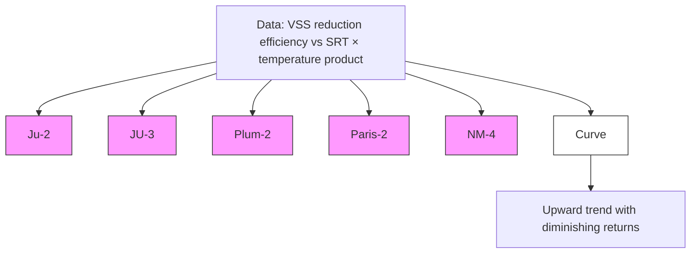

Note: Data points indicate that VSS reduction efficiency generally increases with the SRT × temperature product, with the fitted curve rising and gradually leveling off.\n---\n

# FIGURE 23.42 Volatile solids reduction as a function of digester liquid temperature and solids retention time — update of U.S. EPA curve (Daigger et al., 1999)

<Mermaid diagram>
```mermaid
graph TD
A[Volatile solids reduction] --> B[Digester liquid temperature]
A --> C[Solids retention time (SRT)]
```
</Mermaid diagram>

Benefield and Randall (1980) developed equations for determining required digester detention times. These equations resulted from an analysis of the kinetics associated with the digestion process, and the understanding that a portion of the volatile solids in the process are refractory and a portion of the nonvolatile solids is solubilized from microbial cells contained within the solids. The basic equation is as follows:

$$
SRT = \frac{(X_i - X_e)}{K_d \, D \, X_{\text{oad}} \, X} \quad (23.33)
$$

where SRT = digester detention time (days);

- \(X_i\) = TSS concentration in influent (mg/L);
- \(X_e\) = TSS concentration in effluent (mg/L);
- \(K_d\) = reaction rate constant for the biodegradable portion of the active biomass (d\(^{-1}\));
- \(D\) = biodegradable active biomass in the influent that appears in the effluent (%);
- \(X_{\text{oad}}\) = percentage of active biomass that is biodegradable in the influent.

The relationships shown in eq. 23.33 are further defined and stated in the Activated Sludge Model 1 (ASM1) terminology by Grady et al. (2011).

In instances in which there is a mixture of primary solids and WAS, the equation should be modified with the inclusion of factors describing the primary solids component. Refer to Benefield and Randall (1980) or Grady et al. (2011) for more detail on this less common aerobic digestion design:

Equation 23.33 supports the assumption that for equivalent solids reduction and constant solids loading, SRT must be increased as the active fraction of the influent biomass decreases. Actual operating experience indicates that for systems with a low fraction of
\n---\n

### 3.3.7 Supernatant Quality of Recycled Sidestreams

As noted previously, one of the benefits of aerobic digestion is that the sidestream from the process typically has less effect on facility loadings. On the other hand, depending on how the digesters are operated, there can be significant release of both nitrogen and phosphorus in the supernatant: Careful monitoring of solids-liquid separation in continuous and batch-feed digesters and proper operation both increases aerobic digester performance and reduces the recycle loadings to the facility influent. Table 23.27 lists

The following formula is presented for determining the volume of a continuously operating aerobic digester after the SRT is determined:

$$
V = \frac{Q_i (X_i + Y S_i)}{X \left( K_d + \frac{1}{\mathrm{SRT}} \right)}
$$
(23.34)

where
- V = volume of the aerobic digester (L [cu ft]);
- Q_i = influent average flowrate (L/d [cu ft/d]);
- X_i = TSS concentration in influent (mg/L);
- Y = portion of the influent BOD consisting of raw primary solids (%);
- S_i = BOD5 in digester influent (mg/L);
- X = digester suspended solids (mg/L);
- K_d = reaction rate constant for the biodegradable portion of the active biomass (d^-1);
- P_v = volatile fraction of digester suspended solids (%); and
- SRT = solids retention time (days).

The term Y S_i in eq. 23.34 can be disregarded if no primary solids are included in the load to the aerobic digester: Equation 23.34 should not be used to compute digester volumes in systems where significant nitrification will occur:
\n---\n

# CHAPTER 23: Stabilization
Matthew J. Williams, P.E.; Paul Bizier, P.E., F.ASCE, D.WRE; Jim Groman; and Rachelle Tippetts
\n---\n

# 1.0 Introduction
## 1.1 Comparison of Processes
# 2.0 Anaerobic Digestion
## 2.1 Process Development
## 2.2 Process Fundamentals
## 2.3 Process Options
## 2.4 Pretreatment
## 2.5 Digestion Processing
## 2.6 Post-Digestion Processing
## 2.7 Co-Digestion Processing
## 2.8 Design Considerations
## 2.9 Digester-Gas Handling
## 2.10 Physical Facilities
# 3.0 Aerobic Digestion
## 3.1 Process Applications
## 3.2 Process Theory
## 3.3 Process Fundamentals
## 3.4 Conventional (Mesophilic) Aerobic Digestion
## 3.5 Autothermal Thermophilic Aerobic Digestion
## 3.6 Design Techniques to Optimize Aerobic Digestion
## 3.7 Nutrient Removal in Aerobic Digestion
## 3.8 Process Variations
## 3.9 Aerobic Digester Design Examples
# 4.0 Composting
## 4.1 Process Variables
\n---\n

# 1.0 Introduction

With growing focus on renewable energy production and biosolids utilization, stabilization processes have gained more attention in recent years. Stabilization treats the solids generated in the liquid treatment train, converting them to a stable (i.e., not readily putrescible) product for beneficial use or disposal. Pathogens and odors are reduced, making the resulting biosolids appealing for beneficial use. This chapter discusses the four most common stabilization processes used in the United States today: anaerobic digestion, aerobic digestion, composting, and alkaline stabilization. (Thermal drying also is considered a stabilization process, but it is covered in Chapter 24.)

When designing a stabilization process, engineers should start by identifying the reasons for stabilization and all the stabilization options that could be easily integrated into the existing wastewater treatment scheme. Before selecting a process, the end use must be considered in light of local demand and regulations. Once a process is chosen, engineers should review all aspects (e.g., sidestream management, effectiveness in producing the desired biosolids quality, safety, ease of operation, and ancillary equipment needs) to ensure that the system is well designed. Design engineers should use a systematic approach that addresses both the economic and noneconomic ramifications of any proposed processing. This includes evaluating all parts of the system to ensure that they are flexible and reliable enough to consistently produce biosolids with the required characteristics. Furthermore, any potential effects on the liquid treatment processes (e.g., nutrient recycle loads) that may come as a result of the selected system must be carefully evaluated and mitigated where necessary:

The quality of the biosolids produced and the overall process operation can be improved if debris is removed from the solids prior to processing. Solids screens may be used to remove plastics and other debris from the solids. Grinders are also acceptable to help prevent problems with pumps and clogging, but these may leave small pieces of debris in the finished product, thus diminishing its quality:

Not all water resource recovery facilities (WRRFs) stabilize their solids. Those who do, however; typically stabilize them for one or more of the following reasons:

- Aesthetic reasons (e.g., product appearance and odor);
\n---\n

- Mass reduction;
- Volume reduction;
- Biogas (renewable energy) production;
- Reduction of pathogens (typically to comply with 40 CFR Part 503);
- Vector-attraction/volatile solids reduction (VSR) (typically to comply with 40 CFR Part 503); and
- Product usefulness and marketability.

Facility planners should consider biosolids management when designing or upgrading WRRFs. They should start by deciding how the solids will be used or disposed since this will determine whether and what type of stabilization is needed. For example, if solids will be landfilled with routine cover, federal and many state agencies may not require that the material be stabilized. Stabilization also may not be desirable if the solids will be thermally oxidized, because doing so will reduce the energy content. On the other hand, when treated biosolids are used in agriculture or silviculture, or distributed commercially, the material is stabilized to reduce pathogens, odor, and vector attraction in accordance with local and federal requirements.

## 1.1 Comparison of Processes

The implementation of 40 CFR Part 503 and the public’s growing concern for the environment have increased research into new technologies for beneficially using biosolids. They also have prompted many engineers and municipalities to investigate or design more effective stabilization systems. Tables 23.1 and 23.2 summarize many of the advantages and disadvantages of the principal stabilization processes used today: (Drying is not included in these tables because it is evaluated in Chapter 24.)

Anaerobic digestion is a very common stabilization process, typically utilized only at facilities that generate primary sludge. It produces relatively stable biosolids as well as biogas to fuel:

- Boilers to heat digesters and buildings;
- Cogeneration systems (e.g., generators or microturbines with heat recovery); and
- Thermal hydrolysis and/or biosolids dryers.
\n---\n

Compared to other stabilization options, these systems may be expensive to build; require a significant tankage (see Figure 23.1) and equipment (particularly if the digester gas is beneficially used); produce a strong ammonia and phosphorus sidestream; and need extra heat to maintain the desired temperature; and the process biology is slow growing and somewhat sensitive. Such disadvantages to this widely used process are largely resolved via proper design, careful operations, and pretreatment programs.

Aerobic digestion is typically used at smaller WRRFs (smaller than about 19 000 m3/d [5 mgd]) and those that only produce biological solids or waste activated sludge (WAS).

Compared to anaerobic digestion, aerobic digestion is a power-intensive process (because of the power needed for oxygen transfer); but it typically is less expensive to construct and simpler to operate than anaerobic digestion.

Researchers have developed many methods for increasing VSR, and pathogen destruction in aerobic digestion processes. Some use higher temperatures to destroy pathogens and reduce volatile solids (VS), while others use phasing or mechanical disruption to improve performance: Sometimes aerobic digestion is not a separate process; many extended aeration facilities (e.g., oxidation ditches) have a long-enough solids retention time (SRT) to provide at least partial digestion via endogenous respiration: However, Part 503 does not permit the VSR achieved in aeration tanks to be included as part of the 38% VSR required for biological solids stabilization:

Autothermal thermophilic aerobic digestion (ATAD) is an advanced, self-heating aerobic digestion process that operates at 50°C to 65°C (131°F to 149°F). Early ATAD experience in the United States established the process and allowed it to evolve with improvement of subsequent systems:

Composting often is used to convert solids into a soil amendment or conditioner. The feedstock can be either raw solids or biosolids, but should contain at least 40% solids. A bulking agent frequently is added to increase solids content, provide carbon for the process, improve the material's structural properties, and promote adequate air circulation. Composting typically is a labor-intensive process (e.g., adding bulking agent, turning the material, and recovering the bulking agent). It also can emit odors, especially if the site is poorly designed or operated. In addition, the process may increase the mass of biosolids to be used or disposed, and could spread pathogens via dust from the material:
\n---\n

<table>
<thead>
<tr><th>Process</th><th>Advantages</th><th>Disadvantages</th></tr>
</thead>
<tbody>
<tr>
<td>Anaerobic digestion</td>
<td>
<div>Good volatile suspended solids destruction (40% to 60%)</div>
<div>Methane formers are slow growing; hence, “acid digester” sometimes occurs</div>
<div>Recovers slowly from upset</div>
<div>Supernatant strong in ammonia and phosphorus</div>
<div>Cleaning is difficult (scum and grit)</div>
<div>Can generate nuisance odors resulting from anaerobic nature of process</div>
</td>
<td>Requires skilled operators</td>
</tr>
<tr>
<td>Advanced anaerobic digestion (many process options)</td>
<td>
<div>Excellent volatile solid destruction</div>
<div>Can be maintenance intensive (see Anaerobic digestion for other disadvantages)</div>
</td>
<td>Requires skilled operators</td>
</tr>
<tr>
<td>Aerobic digestion</td>
<td>Low initial cost, particularly for small plants</td>
<td>High energy cost</td>
</tr>
</tbody>
</table>

\n---\n

# Aerobic digestion
- Generally lower volatile suspended solids destruction than anaerobic
- Reduced pH and alkalinity
- Potential for pathogen spread through aerosol drift
- Biosolids typically are difficult to dewater by mechanical means

# Autothermal thermophilic aerobic digestion
- Reduced hydraulic retention compared with conventional aerobic digestion
- High energy costs
- Requires skilled operators
- Potential for odors
- Requires 18% to 30% dewatered solids

# Composting
- High-quality, potentially saleable product suitable for agricultural use
- Requires bulking agent
- Potential for pathogen spread through dust
\n---\n

## TABLE 23.1 Comparison of Stabilization Processes

<table>
  <tbody>
    <tr>
      <td>Composting</td>
      <td>Lime stabilization</td>
      <td>Low capital cost</td>
    </tr>
<tr>
      <td></td>
      <td></td>
      <td>Biosolids not always appropriate for land application</td>
    </tr>
<tr>
      <td></td>
      <td>Chemical intensive</td>
      <td></td>
    </tr>
<tr>
      <td>Advanced alkaline stabilization</td>
      <td>Produces a high-quality Class A product</td>
      <td>Operator intensive</td>
    </tr>
<tr>
      <td></td>
      <td>Chemical intensive</td>
      <td></td>
    </tr>
<tr>
      <td></td>
      <td>Potential for odors</td>
      <td></td>
    </tr>
<tr>
      <td></td>
      <td></td>
      <td></td>
    </tr>
<tr>
      <td></td>
      <td></td>
      <td></td>
    </tr>
  </tbody>
</table>

## TABLE 23.1 (continued): Additional Stabilization Process Information

<table>
  <thead>
    <tr>
      <th>Process</th>
      <th>Degree of Attenuation</th>
      <th>Putrefaction and Odor Potentiala</th>
    </tr>
  </thead>
  <tbody>
    <tr>
      <td>Anaerobic digestion</td>
      <td>Fair</td>
      <td></td>
    </tr>
<tr>
      <td>Good Advanced anaerobic digestion</td>
      <td>Excellentb</td>
      <td></td>
    </tr>
<tr>
      <td>Good Aerobic digestion</td>
      <td>Fair</td>
      <td></td>
    </tr>
  </tbody>
</table>

\n---\n

## TABLE 23.2 Attenuation Effect of Well-Conducted Treatment Processes on Stabilizing Wastewater Solids

<table>
<tbody>
<tr><td>GoodAutothermal thermophilic aerobic digestion</td><td>Excellent</td></tr>
<tr><td> GoodLime stabilization</td><td> Good</td></tr>
<tr><td> GoodAdvanced lime stabilization</td><td> Excellent</td></tr>
<tr><td>GoodComposting</td><td> Excellent</td></tr>
</tbody>
</table>

aIn addition to the stabilization process, putrefaction and odor potential also depends on post-processing and storage practices.

bFor Class A time–temperature processes.

TABLE 23.2 Attenuation Effect of Well-Conducted Treatment Processes on Stabilizing Wastewater Solids

Lime or alkaline stabilization frequently is used to meet the 40 CFR Part 503 requirements for Class B biosolids. In some cases, this process can produce a soil amendment or conditioner that meets Class A requirements. Alkaline stabilization typically is simpler to operate than digestion or composting. However, the resulting biosolids can become unstable if the pH drops after treatment and organisms regrow. Also, the lime or alkaline agent often is costly and can significantly increase the mass and cost of solids to be used or disposed. Some facilities have experienced odors and undesirable working conditions:
\n---\n

Figure 23.1 Anaerobic digesters at Loudon Water in Loudon, VA (photo courtesy of Crom Corporation).

A number of advanced alkaline-stabilization technologies now used in the wastewater treatment field include chemical additives in addition to, or instead of, lime.
Alkaline-stabilization processes produce a rich, soil-like product containing a few pathogens. The biosolids also have a higher pH, which is desirable at farms with acidic soils. However, alkaline stabilization increases the mass of biosolids to be managed, as well as generating strong ammonia and amine odors that may need to be treated. One of the more important parameters for alkaline stabilization is mixing efficiency, which depends on the raw materials used in the process (rheology of dewatered cake and gradation of lime). Improper mixing results in variable biosolids characteristics and odors during storage and land application.

## 2.0 Anaerobic Digestion
### 2.1 Process Development
\n---\n

Anaerobic digestion is the most common and established technology used to stabilize wastewater solids and has been in use for nearly a century: The major objectives of the technology have historically been as follows:
* Stabilize primary and secondary/tertiary solids;
* Reduce pathogens;
* Reduce the mass of material (hauling cost savings); and
* Produce usable biogas (typically for boilers).

As sustainable practices have developed in the United States, the role of anaerobic digesters at WRRFs has evolved to include the following objectives:
* Generate a biosolids product with fertilizer value;
* Recover resources by co-digesting solids with other organic wastes; and
* Develop power and energy via biogas use in cogeneration facilities.

As the importance of anaerobic digestion has increased in the wastewater industry, a number of new process alternatives, designs, and fundamental understandings have evolved.
Anaerobic digestion is a relatively complex process biochemically, but mechanically it is quite straightforward. It requires both proper design and careful operation. A better understanding of the fundamental aspects of design and process control is required to ensure reliable and efficient operation, especially for more advanced, high-rate systems.

Drawbacks of anaerobic digestion include the following:
* Handling potentially explosive and corrosive gases.
* A more complex system than aerobic digestion.
* Recycle streams high in nitrogen and phosphorus.
* Decreased dewaterability (where EBPR liquid processes are used).
* Completely closed tanks make process monitoring more challenging:

## 2.2 Process Fundamentals
### 2.2.1 Microbiology and Biochemistry
\n---\n

# Anaerobic digestion processes and kinetics

Anaerobic digestion is driven by a series of syntrophic relationships that convert complex organic matter via a series of intermediate compounds to a variety of low-molecular-weight reduced compounds. The primary products of anaerobic digestion are methane (CH4), carbon dioxide (CO2), hydrogen (H2), hydrogen sulfide (H2S), ammonia (NH3), phosphate (PO4^3-), and residual organic matter and biomass. Digestion can be viewed as a series of steps in which the waste products of one organism are the substrate for another. Solids destruction is the result of a balanced coupling of a variety of metabolisms.

Figure 23.2 is a simplified flow diagram of the major metabolic processes in anaerobic digestion for converting organic matter to methane and carbon dioxide. Each metabolic pathway represents myriad microorganisms, many of which have yet to be speciated.

The microorganisms responsible for digestion are bacteria and archaea. Each group provides a unique and indispensable biotransformation. Hydrolysis, acidogenesis, and methanogenesis are the three major metabolic steps in anaerobic digestion. Each step involves several biochemical reactions to convert complex organics to intermediates, such as short-chained organic acids, and final products, such as methane and carbon dioxide.

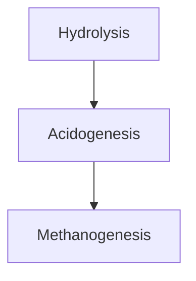

## 2.2.2 Process Rates and Kinetics

Process rates are impacted by several external factors, including temperature, substrate, interspecies competition, and the presence of toxicants. While the environmental conditions affect the observed process rates, the fundamental limits of a process are regulated by kinetics:

Two kinetic models dominate the fundamental description of process performance: Michaelis-Menten and Monod. Michaelis-Menten kinetics describe the kinetics of enzymatic reactions, which are primarily responsible for the first step in anaerobic digestion: hydrolysis. Monod kinetics describe the process reactions mediated by specific microorganisms (e.g., acetogenesis and methanogenesis).
\n---\n

## FIGURE 23.2 The major metabolic processes and products of anaerobic digestion.

<table>
  <thead>
    <tr>
      <th>Complex organics</th>
      <th>Soluble organics</th>
      <th>Organic acids</th>
      <th>Methane CO₂</th>
    </tr>
  </thead>
  <tbody>
    <tr>
      <td>Carbohydrates<br>proteins<br>lipids<br>phosphorylated organics</td>
      <td>Glucose<br>amino acids<br>fatty acids<br>PO₄³⁻</td>
      <td>Acetic<br>propionic<br>lactic</td>
      <td>Cells</td>
    </tr>
<tr>
      <td>Extracellular enzymes<br>Hydrolysis</td>
      <td>Acid producers</td>
      <td> + Cells</td>
      <td>Cells stabilized organics</td>
    </tr>
  </tbody>
</table>

----

## TABLE 23.3 Summary of Common Microbial Populations Associated with Anaerobic Digestion and Reported Kinetic Parameters (Muller; 2006)

<table>
  <thead>
    <tr>
      <th>Microbial Population or Metabolic Group</th>
      <th>I max (h⁻¹)</th>
      <th>Ks (mg substrate COD/L)</th>
      <th>Source</th>
    </tr>
  </thead>
  <tbody>
    <tr>
      <td>Amino acid and sugar fermenting bacteria</td>
      <td>0.25</td>
      <td>20–25</td>
      <td>Grady et al. (1999)</td>
    </tr>
<tr>
      <td>Long chain fatty acid oxidation</td>
      <td>0.01</td>
      <td>800</td>
      <td>Grady et al. (1999)</td>
    </tr>
<tr>
      <td>Propionate oxidation</td>
      <td>0.0065</td>
      <td>250</td>
      <td>Gujer and Zehnder (1983)</td>
    </tr>
<tr>
      <td>Propionate oxidation</td>
      <td>0.0033</td>
      <td>800</td>
      <td>Bryers (1984)</td>
    </tr>
<tr>
      <td>Methanosarcina sp.</td>
      <td>0.014</td>
      <td>300</td>
      <td>Grady et al. (1999)</td>
    </tr>
<tr>
      <td>Methanosaeta sp.</td>
      <td>0.003</td>
      <td>30–40</td>
      <td>Grady et al. (1999)</td>
    </tr>
<tr>
      <td>H₂ oxidizing methanogens</td>
      <td>0.06</td>
      <td>0.6</td>
      <td>Grady et al. (1999)</td>
    </tr>
<tr>
      <td>Acetoclastic methanogenesis</td>
      <td>0.0173</td>
      <td>166</td>
      <td>McCarty and Smith (1986)</td>
    </tr>
  </tbody>
</table>

\n---\n

Table 23.3 provides a small sample of kinetic rates for different microbial populations associated with anaerobic digestion. As with enzymes, the different organisms have significantly different maximum growth rates and half-saturation coefficients. The minimum retention time is set by the slowest-growing organisms in a system.

When designing a system, a sufficient level of conservatism must be built into the design. Depending on substrate characteristics, complex organic matter will hydrolyze at different rates, and the microbial consortia that form in the digester will be a function of initial substrate characteristics. So the observed loading rates and retention time required for one facility will not necessarily translate to another because of differences in substrate characteristics.

### 2.2.2.1 Hydrolysis
In the first stage (hydrolysis), the proteins, cellulose, lipids, and other complex organics are cleaved into lower-molecular-weight components that can pass through the cell wall for conversion to energy and additional biomass. Hydrolysis is thought to be the rate-limiting step of anaerobic digestion (Pavlostathis and Gossett, 1988, 2004).

Several factors can affect hydrolysis, including the organisms present, growth condition, temperature, particle surface area (Sanders et al., 2000), and solids composition:

### 2.2.2.2 Acidogenesis
In the second stage (acid formation), the products of the first stage are converted to complex soluble organic compounds (e.g., long-chained fatty acids), which in turn are broken down into short-chained organic acids (e.g., acetic, propionic, butyric, and valeric acids). The concentration and relative proportions of these acids can indicate the overall condition of a digester:

### 2.2.2.3 Methanogenesis
In municipal solids digesters, methanogenesis occurs via two primary metabolic pathways: acetoclastic methanogenesis and hydrogenotrophic methanogenesis. Acetoclastic methanogenesis—methane formed via acetate reduction—is the primary route of methane formation in mesophilic anaerobic digestion (McHugh et al., 2006). Although hydrogenotrophic methanogenesis—methane formed via hydrogen reactions—
\n---\n

## 2.2.3 Microbial Ecology

may produce less of the methane in a digester; it plays a critical role in preventing feedback inhibition. McCarty and Smith (1986) reported that when the partial pressure of hydrogen exceeds 5 mPa, fatty acid hydrolysis becomes thermodynamically unfavorable. Volatile acids then accumulate, reducing pH and souring the digester. Hydrogenotrophic methanogenesis ensures that the system remains in balance.

Another methanogenic population is methylotrophic methanogens, which convert simple methylated compounds into methane and a reduced product. These organisms typically consume methyl mercaptan, trimethyl amine, dimethyl disulfide, etc. While not significant in overall digester performance, they play a critical role in controlling organic methylated odorants

### 2.2.3 Microbial Ecology

An anaerobic digester can be described as an ecosystem whose environmental conditions are dictated by design engineers, operators, and the composition of the feedstock.

Feed solids composition, SRT, hydraulic retention time (HRT), temperature, and mixing regime all exert selective pressures on the microbial populations in the digester. Such pressures lead to the proliferation of some species and the recession or absence of others. Selective pressure can be to such a degree that overall digestion capacity can be affected by the relative population of species, such as has been reported for Methanosarcina spp. and Methanosaeta spp. (Conklin et al., 2006).

The relationship among microorganisms in an anaerobic digester can best be described as a syntrophic relationship. The metabolic activity of one population supports another, though not for the mutual benefit of either. Often the waste products of one group of organisms serve as the substrate of another. These relationships result in some distinct control points in the digestion process.

The production of hydrogen from fatty acid metabolism is thermodynamically not a highly favorable reaction. When hydrogen accumulates in the system at partial pressures above 5 mPa, there is a feedback inhibition of the acid oxidation process (McCarty and Smith, 1986). For the process to continue, as it does under stable digestion conditions, the hydrogenotrophic methanogenic population must be well established and respiring. What
\n---\n

is evident from this one example is that a stress or toxin that affects one population may be enough to retard or upset the entire digestion process.

Feed solids characteristics will affect which populations are dominant and can set up conditions where there is competition between a desired population and one that is less desirable. For example, acetate, the substrate from which about 75% of the methane in biogas is generated, is also the preferred substrate of sulfate-reducing bacteria. If the feed solids have high sulfate concentrations, conditions may exist in which the methanogenic population is in direct competition with sulfate-reducing bacteria. When this happens, the biogas methane content or overall biogas production may decrease.

Anaerobic digestion can be adversely affected by loading changes, both quantity and quality: Given the complex nature of the different microbial interactions and the potential for process upset via stress on the weakest population, sufficient care must be taken when changing loading conditions, both quantity and quality:

## 2.2.4 Feedstock Characteristics
Key objectives of anaerobic digestion are to stabilize raw solids and reduce the mass of the material. Raw, primary, and secondary solids are primarily composed of the following compounds: proteins, polysaccharides, nucleic acids, fatty acids, and lipids. The relative concentrations of these compounds are a direct function of influent wastewater characteristics and the liquid treatment train used.

Contrary to the prevailing perception, fats, oil, and grease (FOG)/high-strength waste (HSW) co-digestion can make building new anaerobic digesters and cogeneration facilities economically feasible without needing primary clarification and primary sludge (Kabouris et al., 2013).

## 2.2.5 Hydraulic and Solids Residence Time
Anaerobic digesters are sized to provide enough residence time in well-mixed reactors to meet regulatory requirements, allow significant VSR to occur, and prevent slower growing microbial populations from washing out. Sizing criteria are defined as follows:

SRT (days) is equal to the mass of solids in the digester (kilograms) divided by the solids removed (kilograms per day):

$$SRT\ (days) = \frac{Mass\ of\ solids\ in\ the\ digester\ (kg)}{Solids\ removed\ (kg/day)}$$
\n---\n

# HRT, SRT and the Temperature Effect in Anaerobic Digesters

* HRT (days) is equal to the working volume (liters) divided by the amount of solids removed (liters per day).

* Typically, HRT is calculated based on either digester inflow or outflow rate. However, in older, existing systems where supernatant is removed from the digester, SRT is calculated based on the solids volume removed. SRT and HRT are equal in digestion systems without recycle or supernatant withdrawal.

* The SRT (or HRT) and the extent of hydrolysis, acid formation, and methane formation during anaerobic digestion are directly related: an increase in SRT increases the extent of each reaction; a decrease in SRT decreases the extent of each reaction (see Figure 23.3). Each reaction has a minimum SRT; if the SRT is shorter, bacteria cannot grow rapidly enough to remain in the digester, the reaction mediated by the bacteria will cease, and the digestion process will fail. Excessively long SRTs would prevent washout, but the extra equipment and infrastructure costs typically are not justified by the marginal increase in process performance. Reference Table 23.4 for typical SRT values:

  100
 2 90
 1 80
   70
   60    35°C
 50                      20°C

 9 40                        15°C
       30
       20
 10

                         10  20            30  40  50                        60
                                 SRT, (days)

FIGURE 23.3 The effect of temperature and SRT on COD removal and methane production in anaerobic digesters:

> Figure 23.3 (as shown in the image) illustrates how volatile solids reduction (%) varies with SRT (days) at different temperatures (15°C, 20°C, 25°C, and 35°C). Higher temperatures and longer SRTs generally yield greater volatile solids reduction, with plateau values differing by temperature.

FIGURE 23.3 The effect of temperature and SRT on COD removal and methane production in anaerobic digesters.
\n---\n

## Table 23.4 Typical Operating Parameters for Mesophilic Anaerobic Digestion of Wastewater Solids

<table>
  <thead>
    <tr>
      <th>Parameter</th>
      <th>Value</th>
      <th>Units</th>
    </tr>
  </thead>
  <tbody>
    <tr>
      <td>Volatile solids destruction</td>
      <td>45–55</td>
      <td>%</td>
    </tr>
<tr>
      <td>pH</td>
      <td>6.8–7.2</td>
      <td></td>
    </tr>
<tr>
      <td>Alkalinity</td>
      <td>2500–5000</td>
      <td>mg CaCO3/L</td>
    </tr>
<tr>
      <td>Methane content</td>
      <td>60–65</td>
      <td>percent by volume</td>
    </tr>
<tr>
      <td>Carbon dioxide content</td>
      <td>35–40</td>
      <td>percent by volume</td>
    </tr>
<tr>
      <td>Volatile acids</td>
      <td>50–300</td>
      <td>mg VA/L</td>
    </tr>
<tr>
      <td>Vol. acid:alkalinity ratio</td>
      <td>&lt;0.3</td>
      <td>mg CaCO3/mg VA</td>
    </tr>
<tr>
      <td>Ammonia</td>
      <td>800–2000</td>
      <td>mg N/L</td>
    </tr>
  </tbody>
</table>

<p>TABLE 23.4 Typical Operating Parameters for Mesophilic Anaerobic Digestion of Wastewater Solids</p>

<p>Mesophilic anaerobic digestion of solids has been characterized through years of experience in operation and design, although design engineers always should consider the fundamental microbiology when designing a digester to optimize it toward maximum efficiency: Integrating process fundamentals into a design becomes increasingly important when the technology has a shorter operational history (e.g., thermophilic and phased systems). Applying inappropriate process parameters can result in improperly sized systems, which perform poorly and result in odors or other consequences:</p>

## 2.2.6 Organic Loading Rate and Frequency

<p>The phrase volatile solids loading rate refers to the mass of volatile solids (VS) added to the digester each day divided by the digester’s working volume (kg VS/m<sup>3</sup>·d [lb VS/cu ft/d]). Loading criteria typically are based on sustained loading conditions (typically peak month or peak week solids production), with provisions for avoiding excessive loading during shorter periods. A typical design sustained-peak loading rate for mesophilic digesters is 1.9 to 2.5 kg VS/m<sup>3</sup>·d (0.12 to 0.16 lb VS/cu ft/d). The upper limit of the</p>

\n---\n

volatile solids loading rate typically is determined by the rate at which toxic materials—particularly ammonia—accumulate or slow-growing microorganisms wash out. A limiting value of 3.2 kg VS/m^3·d (0.20 lb VS/cu ft/d) is often used.

Higher loading rates may be achieved with certain pretreatment technologies or other configurations. Some thermophilic systems have been able to attain higher volatile solids loadings than mesophilic systems. The limited application of and variable performance of thermophilic systems (and few good comparisons with mesophilic systems) has not generated the empirical data needed for a recommended operating range. With pre-dewatering to increase feed solids percentages and thermal or thermochemical pretreatment, some digesters may be loaded with approximately 2.5 kg VS/m^3·d. When designing these highly loaded systems, engineers should either pilot-test digester configurations to determine loading limits or perform a thorough review of comparable systems.

While design engineers should be conservative when setting an upper loading limit for a design, excessively low volatile solids loading rates (e.g., due to poor thickening) may result in designs that are expensive to construct (large tank volume) and operate (high heating demand of low percent solids feed). Thickening of solids before digestion is an efficient method for increasing a digester's HRT and SRT and decreasing the energy used to heat the process. Advances in thickening technology (e.g., thickening centrifuges) may allow digesters to be fed at 6% to 8% solids with a higher volatile solids loading rate.

When considering thickening improvements, pumps and mixing systems should be evaluated to ensure they will handle the increased viscosity and care should be taken to avoid overloading the digester (excessive volatile solids loading rate).

The loading frequency can affect operations as well as design. Microorganisms typically prefer to be maintained at a constant metabolic state (steady state), which is achieved via consistent loading. Constant loading also results in a more constant gas-production rate and may reduce gas storage requirements when gas is being utilized. However, it does involve some significant additional design considerations.

To maintain constant loading to the system, the feed and wastage rates need to be balanced, which may require continuous thickening and dewatering and/or sufficient storage upstream and downstream of the digesters to equalize flows.
\n---\n

Continuous feed or frequent incremental feeding is the ideal operation, but may be challenging because of the cost and operational constraints. Slug or pulse feeding (semi-continuous feeding) is often used; it involves feeding and wasting solids at set intervals, typically at peak staffing times. This type of operation has been implemented at many utilities but has some process risks (e.g., overloading, upsets, rapid volume expansion [RVE], and foaming). However, some research has shown that pulse feeding may increase the diversity and resilience of microbial communities within an anaerobic digester (De Vrieze et al., 2013).

## 2.2.7 Process Stability

Stable anaerobic digester operations can provide significant benefits (e.g., consistent solids destruction, pathogen reduction, and biogas generation). Stability is achieved through consistent loading, effective temperature control, and proper mixing.

A well-functioning, stable anaerobic process will exhibit specific digester and biosolids characteristics (see Table 23.5). Unstable digesters are more likely to foam, go acidic, and have microbial populations that are more susceptible to toxins.

Foaming is a common problem for many digesters. It can be caused by several factors (e.g., unstable digester operations, high concentrations of filamentous organisms in raw solids, and surfactants and other agents). Foaming associated with filaments and chemical additives can be remedied via source control. Foaming associated with digester stability is a result of microorganisms responding to environmental stress.

Chapman and Krugel (2011) suggest that RVE is an alternative explanation to upsets traditionally considered to be foaming: RVE occurs when gas bubbles become entrained in the solid-liquid matrix, often observed as a result of a change in apparent viscosity that occurs when mixing is suddenly stopped (or direction is reversed). This can occur over the course of several hours, and the digester fluid volume may increase by 10% to 15%. Willis et al. (2016) takes this a step further in suggesting that gas consistently present in the fluid effectively reduces the specific gravity of the digester contents, possibly as low as 0.6 to 0.7, causing problems with level sensing, digester cover operation, overflow systems. A simple solution to this problem is to ensure that solids are removed from the top of the digester as well as the bottom and/or the mixing system is able to pump down from near the surface (e.g., mechanical draft tube):
\n---\n

## TABLE 23.5 Concentrations of Selected Inorganic Compounds that Inhibit Anaerobic Processes (Parkin and Owen, 1986)

<table>
<thead>
<tr>
<th>Substance</th>
<th>Moderately Inhibitory Concentration<br>(mg/L)</th>
<th>Strongly Inhibitory Concentration<br>(mg/L)</th>
</tr>
</thead>
<tbody>
<tr>
<td>Na+</td>
<td>3500–5500</td>
<td>8000</td>
</tr>
<tr>
<td>K+</td>
<td>2500–4500</td>
<td>12 000</td>
</tr>
<tr>
<td>Ca++</td>
<td>2500–4500</td>
<td>8000</td>
</tr>
<tr>
<td>Mg++</td>
<td>1000–1500</td>
<td>3000</td>
</tr>
<tr>
<td>Ammonia-nitrogen</td>
<td>1500–3000</td>
<td>3000</td>
</tr>
<tr>
<td>Sulfide</td>
<td>200</td>
<td>200</td>
</tr>
<tr>
<td>Copper (Cu)</td>
<td>—</td>
<td>0.5 (soluble)</td>
</tr>
<tr>
<td>Chromium VI (Cr)</td>
<td>—</td>
<td>3.0 (soluble)</td>
</tr>
<tr>
<td>Chromium III</td>
<td>—</td>
<td>180–420 (total)</td>
</tr>
<tr>
<td>Nickel (Ni)</td>
<td>—</td>
<td>2.0 (soluble)</td>
</tr>
<tr>
<td>Zinc (Zn)</td>
<td>—</td>
<td>1.0 (soluble)</td>
</tr>
</tbody>
</table>

A good design can help promote stable digestion operations For example, to ensure a constant temperature, boilers and heat exchangers should be sized to meet both the heat
\n---\n

Blending tanks improve process stability by homogenizing raw solids and metering them more constantly to the digester. Minimizing fluctuations in solids strength and loading rate help the microorganisms in the digester maintain a constant metabolic state, which minimizes their stress. Though some research indicates that minor variations in feed may help promote more robust microbial populations, wide, frequent fluctuations in loading can stress the biomass—especially if loadings, substrates, and nutrients are insufficient.

Mixing improves the contact between the biomass and raw solids. Dispersing solids in the digester ensures that its entire volume is used and all of the biomass is engaged in stabilization.

## 2.2.8 Temperature

An anaerobic digester’s operating temperature significantly affects its observed performance and stability. Temperature affects growth rates (Lawrence and McCarty, 1969; van Lier et al., 1996; Salsali and Parker, 2007); substrate half-saturation constants (Lawrence and McCarty, 1969; van Lier et al., 1996); and microbial diversity (Chen et al., 2005; Wilson et al., 2008a). Lawrence and McCarty (1969) observed that growth rates increased as temperature increased in the mesophilic operation range. Salsali and Parker (2007) evaluated anaerobic digestion performance at 35°C, 42°C, and 49°C; they observed VSR increased as temperature increased. They did not attempt to derive growth rates from their experiments. Van Lier et al. (1996) evaluated volatile fatty acid (VFA) degradation by methanogens and suggested that acetate conversion in mesophilic and thermophilic digestion was described by an Arrhenius relationship, suggesting an increase in growth rates as temperature increased. Both Lawrence and McCarty (1969) and van Lier et al. (1996) suggested an increase in the substrate (VFA) half-saturation constant for acetoclastic methanogenesis with an increase in temperature (i.e., rising temperatures increased residual acetic and propionic acids):

Selecting a fixed operating temperature affects not only digester design but also day-to-day operations. From a design standpoint, the ability to achieve and maintain that temperature is critical to process stability and optimization, so appropriate safety factors should be employed.
\n---\n

The design operating temperature establishes the minimum SRT (or HRT) required to destroy a given amount of volatile solids (see Figure 23.3). Currently, most anaerobic digesters are designed to operate in the mesophilic temperature range (about 35°C [95°F]). Some systems have been designed to operate in the thermophilic temperature range (about 55°C [131°F]). Many new digesters are being designed so they can operate at both thermophilic and mesophilic temperatures, allowing future process flexibility.

Regardless of which temperature is selected, keeping it constant is of utmost importance. The microorganisms involved (particularly methanogenic populations) are sensitive to temperature changes; fluctuations in temperature can stress the organisms, thereby destabilizing the process. Temperature changes greater than 1°C/d can impact the digestion process. A good design avoids temperature changes greater than 0.5°C/d.

This is a critical consideration when determining feed schedules. However, for start-up of a thermophilic digester, a rapid increase in the temperature from mesophilic to thermophilic conditions has been reported to be an effective means of establishing a stable anaerobic population (Griffin et al., 2000; De la Rubia et al., 2013).

Temperature stability affects not only microbial stability but also the classification of the resulting biosolids. Under 40 CFR 503 Alternative 1 (time and temperature), solids must be maintained at a specific temperature above 50°C for a set period of time to achieve Class A status. In this instance, time is separate from HRT because every particle must be treated, requiring a batch held in an isolated tank, unless process equivalency has been granted. The effect of temperature on pathogen inactivation has made it one of the core mechanisms for achieving Class A biosolids, so it is important to design the system to maintain temperature (within close tolerances) under varying loads.

## 2.2.9 Volatile Fatty Acids, Concentration and Composition
When designing anaerobic digestion systems, engineers need to understand how volatile acid concentrations affect system design. Volatile fatty acids are the primary intermediates between complex organic matter and methanogenesis. The gross concentration of volatile acids can indicate how complete digestion is, while the composition of the acids can indicate or cause a process upset or disturbance. Some acids have been reported to be variably inhibitory to anaerobic consortia (Franke-Whittle et al., 2014). Volatile fatty acids
\n---\n

also can lead to on-site odors because of fugitive emissions from digesters or dewatering processes.

In many cases, the concentration of VFAs in a digester is also a function of operating conditions. For example, the residual VFA concentration increases when the operating temperature is high (van Lier et al., 1996). Higher ammonia concentrations also can result in higher residual VFA concentrations (Nielsen and Angelidaki, 2008). The temperature and ammonia effects represent normal operating conditions as long as pH is not depressed.

As volatile acid concentrations increase, alkalinity is consumed. Once the buffer capacity is consumed, pH will decrease, leading to process upset and failure: Monitoring acid production and concentration can provide evidence of impending upset or recent disturbance, so operators can take remedial actions.

Volatile acid concentrations of 50 to 300 mg/L are considered normal for an anaerobic digester operating at mesophilic temperatures. This is not necessarily true in other anaerobic digestion systems, however; thermophilic systems (e.g., temperature-phased anaerobic digestion [TPAD]) and phased systems (e.g., acid-gas phasing) will have vastly different volatile acid concentrations in their reactors.

## 2.2.10 Alkalinity and pH

Anaerobic microorganisms—particularly methane formers—are sensitive to pH. Optimum methane production typically occurs when the pH is maintained between 6.8 and 7.2. Acid forms continuously during digestion and tends to lower pH. However, methane formation also produces alkalinity—primarily carbon dioxide and ammonia, which buffer changes in pH by combining with hydrogen ions.

A reduction in pH (by various causes) promotes more acid formation and inhibits methane formation. As acid production continues, methane and alkalinity formation are further inhibited, possibly leading to process failure. Mixing, heating, and feed-system designs are important in minimizing the potential for such upsets. Design engineers also should include provisions for adding chemicals (e.g., lime, sodium bicarbonate, or sodium carbonate) to neutralize excess acid in an upset digester:

## 2.2.11 Toxicity in Digesters
\n---\n

If concentrations of certain materials (e.g., ammonia, heavy metals, light metal cations, and sulfide) increase sufficiently, they can create unstable conditions in an anaerobic digester (see Tables 23.6 and 23.7). A shock load of such materials in facility influent or a sudden change in digester operation (e.g., overfeeding solids or adding excessive chemicals) can create toxic conditions in the digester:

- Typically, excess concentrations of such toxicants inhibit methane formation, which typically leads to volatile acid accumulation, pH depression, and digester upset.

- Depending on the concentration and type of toxicant; the effect can be acute (e.g., instant process failure) or chronic (e.g., depressed performance). Chemicals can be added to control the concentrations of dissolved forms of some toxicants (e.g., using iron salts to control sulfide). Sometimes, toxicity is a result of more than one factor (e.g., ammonia toxicity increases at higher pH) (Finger and Butler, 1996).

- Design engineers typically can only address toxicity by mitigating a known impact. Identifying and monitoring process toxicity (e.g., sampling and analytical techniques and practices) is typically an operational issue and beyond the scope of this text. However, a sound monitoring and control program, and an understanding of toxic agents, can greatly improve the design of mitigation systems.

## 2.2.12 Volatile Solids and Chemical Oxygen Demand

Volatile solids and chemical oxygen demand (COD) are common measures of the substrate entering a digester. Volatile solids are the ignitable (550°C) fraction of total solids. They typically are thought of as the organic fraction. Volatile solids measurements typically are used as part of determining overall process performance and regulatory compliance, and for mass-based calculations. Figure 23.4 shows the effect of temperature on COD removal and methane production. One must be careful when using data from a volatile solids test. There are artifacts to the test, because a significant amount of inorganic salts—especially ammonium-based salts—can volatilize in analytical tests, skewing the volatile solids concentration higher and the VSR lower (Beall et al., 1998; Wilson et al., 2008b).

<table>
<thead>
<tr><th>Compound</th><th>Concentration Resulting in 50% Activity (mM)</th></tr>
</thead>
<tbody>
</tbody>
</table>

\n---\n

<table>
  <tr><td>1-Chloropropene</td><td>0.1</td></tr>
<tr><td>Nitrobenzene</td><td>0.1</td></tr>
<tr><td>Acrolein</td><td>0.2</td></tr>
<tr><td>1-Chloropropane</td><td>1.9</td></tr>
<tr><td>Formaldehyde</td><td>2.4</td></tr>
<tr><td>Lauric acid</td><td>2.6</td></tr>
<tr><td>Ethyl benzene</td><td>3.2</td></tr>
<tr><td>Acrylonitrile</td><td>4</td></tr>
<tr><td>3-Chlorol-1,2-propandiol</td><td>6</td></tr>
<tr><td>Crotonaldehyde</td><td>6.5</td></tr>
<tr><td>2-Chloropropionic acid</td><td>8</td></tr>
<tr><td>Vinyl acetate</td><td>8</td></tr>
<tr><td>Acetaldehyde</td><td>10</td></tr>
<tr><td>Ethyl acetate</td><td>11</td></tr>
<tr><td>Acrylic acid</td><td>12</td></tr>
<tr><td>Catechol</td><td>24</td></tr>
<tr><td>Phenol</td><td>26</td></tr>
<tr><td>Aniline</td><td>26</td></tr>
<tr><td>Resorcinol</td><td>29</td></tr>
</table>

\n---\n

## TABLE 23.6 Concentrations of Select Organic Chemicals that Reduce Anaerobic Digester Activity by 50% (Parkin and Owen, 1986)

<table>
<tr><td>Propanol</td><td>90</td></tr>
</table>

<table>
<thead>
<tr><th>Material</th><th>Specified Gas Production Per Unit Mass Destroyed</th><th>Methane Content (%)</th></tr>
</thead>
<tbody>
<tr><td>Fats</td><td>1.2–1.6</td><td>62–72</td></tr>
<tr><td>Scum</td><td>0.9–1.0</td><td>70–75</td></tr>
<tr><td>Grease</td><td>1.1</td><td>68</td></tr>
<tr><td>Crude fibers</td><td>0.8</td><td>45–50</td></tr>
<tr><td>Protein</td><td>0.7</td><td>73</td></tr>
</tbody>
</table>

> TABLE 23.7 Gas-Production Rates from Various Organic Substrates (Buswell and Neave, 1939)
\n---\n

# FIGURE 23.4 The effect of SRT and temperature on the rate and extent of VSR during anaerobic digestion

(ORourke, 1968)

Top panel
- Axes:
  - Vertical: Effluent COD (g/L), scale from 0 to 30 (tick marks at 0, 10, 20, 30)
  - Horizontal: SRT (days), scale from 0 to 60 (tick marks at 0, 10, 20, 30, 40, 50, 60)
- Data representation:
  - Three curves corresponding to temperatures of 20°C, 25°C, and 35°C
  - Symbols used in the plot: △ for 20°C, □ for 25°C, ○ for 35°C
  - Legend: ○ 35°C, □ 25°C, △ 20°C

Bottom panel
- Axes:
  - Vertical: CH₄ (mL/g COD), scale from 0 to 400 (tick marks at 0, 100, 200, 300, 400)
  - Horizontal: SRT (days), scale from 0 to 60 (tick marks at 0, 10, 20, 30, 40, 50, 60)
- Data representation:
  - Three curves corresponding to temperatures of 20°C, 25°C, and 35°C
  - Symbols used in the plot: △ for 20°C, □ for 25°C, ○ for 35°C
  - Legend: ○ 35°C, □ 25°C, △ 20°C

Caption
FIGURE 23.4 The effect of SRT and temperature on the rate and extent of VSR during anaerobic digestion (O'Rourke, 1968).

COD is a measure of the chemically oxidizable material in solids. As with volatile solids, this measure has limitations (e.g., the accounting of non-substrate components): COD
\n---\n

## 2.2.13 Biogas Production and Characterization

The quality and quantity of digester gas (biogas) produced also can be used to evaluate digester performance. Biogas production is directly related biochemically to the amount of volatile solids destroyed; it often is expressed as volume of gas per unit mass of volatile solids destroyed. The gas-production rate is different for each organic substance in the digester (see Table 23.8). The gas-production rate of fats ranges from about 1.2 to 1.6 m3/kg (20 to 25 cu ft/lb) of volatile solids destroyed; the gas-production rate of proteins and carbohydrates is 0.7 m3/kg (12 cu ft/lb) of volatile solids destroyed. The gas-production rate of a typical anaerobic digester treating a combination of primary solids and WAS should be about 0.8 to 1 m3/kg (13 to 18 cu ft/lb) of volatile solids destroyed. The amount of gas produced is a function of temperature, solids retention time (SRT), and volatile solids loading. Specific gas production should be measured until an average value can be obtained and used for monitoring:

<table>
<thead>
<tr><th>Constituent</th><th>Values for Various Plants, % by Volumea</th></tr>
</thead>
<tbody>
<tr><td>Methane</td><td>42.5</td><td>61.0</td><td>62.0</td><td>67.0</td><td>70.0</td><td>73.7</td><td>75.0</td><td>73-75</td></tr>
<tr><td>Carbon dioxide</td><td>47.7</td><td>32.8</td><td>38.0</td><td>30.0</td><td>30.0</td><td>17.7</td><td>22.0</td><td>21-24</td></tr>
<tr><td>Hydrogen</td><td>1.7</td><td>3.3</td><td>b</td><td>—</td><td>—</td><td>2.1</td><td>0.2</td><td>1-2</td></tr>
<tr><td>Nitrogen</td><td>8.1</td><td>2.9</td><td>b</td><td>3.0</td><td>—</td><td>6.5</td><td>2.7</td><td>1-2</td></tr>
</tbody>
</table>

\n---\n

# TABLE 23.8 A Survey of the Characteristics of Biogas from Anaerobic Digesters Tortorici and Stahl, 1997

<table>
  <tr>
    <td>Hydrogen sulfide</td>
    <td>—</td>
    <td>—</td>
    <td>0.15</td>
    <td>—</td>
    <td>0.01</td>
    <td>0.06</td>
    <td>0.1</td>
    <td>1–1.5</td>
  </tr>
<tr>
    <td>Heat value, Btulcu ft</td>
    <td>459</td>
    <td>667</td>
    <td>660</td>
    <td>624</td>
    <td>728</td>
    <td>791</td>
    <td>716</td>
    <td>739–750</td>
  </tr>
<tr>
    <td>Specific gravity (air = 1)</td>
    <td>1.04</td>
    <td>0.87</td>
    <td>0.92</td>
    <td>0.86</td>
    <td>0.85</td>
    <td>0.74</td>
    <td>0.78</td>
    <td>0.70–0.80</td>
  </tr>
</table>

a Except as noted.
b Trace.
c Btulcu ft × 37.26 = kJ/m3.

The two main constituents of digester gas are methane and carbon dioxide; it also
contains trace amounts of nitrogen, hydrogen, and hydrogen sulfide. Performance data
from healthy digesters suggest that methane concentrations should be 60% to 70% (by
volume) and carbon dioxide concentrations should be 30% to 35% (by volume). Tortorici
and Stahl (1977) have published data on typical digester-gas characteristics (see Table
23.9). An increase in carbon dioxide levels (percent) often indicates an upset digester:
Excessive concentrations of hydrogen sulfide can indicate unbalanced digestion ,
industrial waste sources, or saltwater infiltration: Hydrogen sulfide may be responsible for
odor problems and excessive corrosion in the digester and adjacent piping: Heavy metals
can precipitate as metallic sulfide, thereby minimizing hydrogen sulfide concentrations in
biogas.

2.2.14 Pathogens
Pathogen and pathogen-indicator reductions are major disinfection criteria and often a
component of stabilization processes. The rate and the extent of pathogen or pathogen-
indicator reduction (inactivation) are process specific. The degree of pathogen or
pathogen-indicator reduction required depends on the biosolids quality desired (Class B
or Class A, assuming beneficial use is desired). Design engineers should consult 40 CFR
\n---\n

# Part 503 (U.S. EPA, 1999) and other applicable regulations for pathogen or pathogen-indicator reduction requirements for anaerobic processes. (For more information on pathogen-reduction regulations, see Chapter 18.)

<table>
  <thead>
    <tr><th>Parameter</th><th>Low Rate</th><th>High Rate</th></tr>
  </thead>
  <tbody>
    <tr><td>Solids retention time, days</td><td>30–60</td><td>15–20</td></tr>
<tr><td>Volatile suspended solids loading, lb/cu ft/d (kg/m<sup>3</sup>·d)</td><td>0.04–0.1<br>1.9–1.5</td><td>0.12–0.16</td></tr>
<tr><td>Volume criteria, cu ft/cap (m<sup>3</sup>/cap)</td><td></td><td></td></tr>
<tr><td>Primary sludge</td><td>2–3(0.06–0.08)</td><td>1.3–2(0.03–0.06)</td></tr>
<tr><td>Primary sludge + trickling filter sludge</td><td>4–5(0.11–0.14)</td><td>2.6–3.3(0.07–0.09)</td></tr>
<tr><td>Primary sludge + waste-activated sludge</td><td>4–6(0.11–0.17)</td><td>2.6–4(0.07–0.11)</td></tr>
<tr><td>Combined primary + waste biological sludge feed concentration, % solids-dry basis</td><td>2–4</td><td>4–6</td></tr>
<tr><td>Anticipated digester underflow concentration, % solids-dry basis</td><td>4–6</td><td>4–6</td></tr>
  </tbody>
</table>

TABLE 23.9 Typical Design Parameters for Low-ᵃⁿᵈHigh-Rate Digesters (Burd, 1968)

Design engineers should carefully consider which digestion system to use. While multiple methodologies meet the desired degree of pathogen reduction, each comes with costs and degrees of process complexity:

## 2.3 Process Options

Process options for anaerobic digestion of wastewater solids have advanced significantly since the early 1990s. This section provides some historical context and discusses
\n---\n

process options that are being considered and implemented more frequently in the 21st century (e.g., staged and phased systems, and mesophilic and thermophilic processes).

## 2.3.1 Low-Rate Digestion

Before the 1950s or 1960s, solids were anaerobically digested in "low-rate" systems characterized by intermittent feeding, low organic loading rates, little to no external heating or mixing, and detention times of 30 to 60 days. The tanks were large because grit and scum accumulated on the bottom and top, respectively, thereby decreasing the effective volume. Optimum digestion conditions were not maintained. Relatively few low-rate digestion systems are in service today because technology advancements have made them uneconomical and unattractive.

## 2.3.2 High-Rate Digestion

Wastewater treatment professionals kept tinkering with the low-rate system, making improvements that eventually led to the "high-rate" anaerobic digestion system that was more common in the 1960s (see Figure 23.5). This system is still widely used for mesophilic digestion.
\n---\n

## 2.3.2.1 Process Development

High-rate anaerobic digestion was developed after research demonstrated the benefits of controlling environmental conditions in the digester. High-rate digestion is characterized by supplemental heating and mixing, relatively uniform feed rates, and thickening of solids (solids feedstock typically should contain 4% to 5% solids, although some recent improvements allow for thicker or thinner solids). These factors result in relatively uniform conditions throughout the reactor, leading to lower overall tank volume requirement and increased process stability:

Several heating methods (e.g., steam injection, internal heat exchangers, and external heat exchangers) have been used for anaerobic digesters. External heat exchangers are

----

FIGURE 23.5 Simplified flow schematic of high-rate anaerobic digestion.

----

### Diagram: High-rate anaerobic digestion (Mermaid diagram)

```mermaid
graph TD
    Sludge_Feed[Sludge Feed]
    Exchanger[Exchanger<br>Heat]
    Active_Zone[Active zone<br>(Completely mixed)]
    Digested_Biosolids[Digested biosolids]
    Gas[Gas]
    Digester_Gas[Digester gas]
    Recycle[Recycle]

    Sludge_Feed --> Exchanger
    Exchanger --> Active_Zone
    Active_Zone --> Digested_Biosolids
    Active_Zone --> Gas
    Gas --> Digester_Gas
    Recycle --> Sludge_Feed
```

\n---\n

### 2.3.2.2 Design Criteria—Mesophilic

the most popular because of their flexibility and easily maintained heating surfaces.
Internal coils are not recommended as they can foul and the digester must be emptied to clean them. Internal or external draft tube heat exchanger jackets can provide reliable service as long as they are constructed of stainless steel. Steam injection dilutes the contents of the digester without heat exchangers but may be prone to ragging:

Typically, high-rate systems achieve increased gas production, solids destruction, and overall process stability when compared to the increasingly rare low-rate systems. In the 1970s, the U.S. Environmental Protection Agency (EPA) extensively evaluated single-stage, high-rate anaerobic digesters operated at mesophilic temperatures with SRTs exceeding 15 days; regulators found that the process achieves significant pathogen reduction and solids stability. The agency defined it as a process to significantly reduce pathogens (PSRP) in its 1979 rule (40 CFR 257), and it essentially became a baseline for wastewater solids stabilization.

The basic design criteria for such mesophilic digesters typically are as follows:

- A volatile solids loading rate of 1.9 to 2.5 kg volatile solids/m3·d (0.12 to 0.16 lb volatile solids/cu ft/d), and a typical limiting value of 3.2 kg volatile solids/m3·d (0.20 lb volatile solids/cu ft/d);
- SRT of at least 15 days when feeding at peak 15-day or -month loads (a 15-day SRT is the minimum allowed under the PSRP [Class B] requirement in Part 503);
- Mesophilic temperatures (35°C to 39°C [95°F to 102°F]); the PSRP [Class B] requirement in Part 503 is at least 35°C);
- Enough mixing to ensure that the temperature is relatively consistent throughout the reactor (and to minimize bottom deposits and surface scum/debris, although this is only partially achieved in many high-rate digesters); and
- Feed solids containing 4% to 5% solids (historically), although more facilities are now aiming for 5% to 7% solids.

Frequent solids feeding helps maintain steady-state conditions in the digester:
- Methanogens are sensitive to changes in substrate levels; uniform feeding and multiple feed-point locations in the tank reduce shock loading to these microorganisms. Excessive
\n---\n

hydraulic loading should be avoided because it decreases detention time, dilutes the
alkalinity needed for buffering capacity, and requires more heat to achieve process goals.
Good mixing also is required to mix microorganisms with fresh feed, ensure that the
temperature is consistent throughout the reactor; and aid in preventing grit and scum/foam
accumulation.

Improvements in mixing, heating, and solids loading enhanced anaerobic digestion
performance: Mixing and heating provide better contact between substrates and
microorganisms, increasing stabilization while reducing short-circuiting (making pathogen
kill more consistent and increasing biosolids stability).

The relative success of high-rate mesophilic digestion has made this process the most
common means of solids stabilization in the world. It also is the standard for evaluating
future process variations.

## 2.3.2.3 Design Criteria—Thermophilic

Although most anaerobic digesters are operated at mesophilic temperatures (i.e:, 35°C
[95°F]), they also can be operated at thermophilic temperatures (typically between 50°C
and 57°C [122°F and 135°F]). Thermophilic digesters have somewhat different design and
performance criteria than those for mesophilic digestion. For example, volatile solids
loading rates can be higher and SRTs can be lower (Schafer et al., 2002). Thermophilic
digesters also reduce more volatile solids than identical-size mesophilic digesters, as
suggested by the Arrhenius relationship. Because the temperature is higher, however,
more energy is needed to provide heat. To reduce heating costs, energy recovery heat
exchangers may be employed:

Thermophilic digestion has a number of advantages over mesophilic digestion. For
example, solids from thermophilic digesters generally have better dewatering
characteristics, so heating costs may be offset by reduced dewatering costs. Thermophilic
digestion systems also destroy more volatile solids (Schafer et al., 2002) and typically
produce biosolids containing fewer pathogens: However, Part 503 classifies both
mesophilic and thermophilic anaerobic digestion (non-batch, non-phased systems) as
PSRPs (Class B processes), so continuous-flow thermophilic digesters do not get
regulatory credit for their pathogen-reduction performance. Part 503 also specifies that
any process to further reduce pathogens (PFRP) (Class A process) must precede or be

\n---\n

# Thermophilic Digestion Time-Temperature Relationship (EPA Part 503)

concurrent with the vector-attraction reduction (VAR) process (e.g., mesophilic or thermophilic anaerobic digestion) to allay concerns about post-pasteurization regrowth (Clements, 1982; Keller, 1980). So, to meet Class A requirements, a thermophilic digester may need to be designed to be partly or wholly operated in batch mode, where every particle meets the time and temperature relationship established by the U.S. EPA.

According to Part 503, a thermophilic digestion process typically meets Class A requirements by maintaining its temperature at or above 50°C (more typically, 55°C) for a specific period of time in a batch operation: The amount of time is calculated using the formula (U.S. EPA, 1999) below:

$$ D = \frac{50{,}070{,}000}{10^{0.14T}} \quad (23.1) $$

where D = time (days); and

T = temperature (°C).

This equation can be applied to sludge containing less than 7% solids. Based on this equation, one point of compliance would be 55°C for a minimum of 24 hours. Another point of compliance would be 50°C for a minimum of 120 hours. As the thermophilic digestion temperature increases, the batching time (and thus tank volume) required to destroy pathogens or pathogen indicators is considerably reduced:

If a utility chooses to disinfect sludge containing more than 7% solids, the time and temperature requirements are determined using the following equation:

$$ D = \frac{131{,}700{,}000}{10^{0.14T}} \quad (23.2) $$

where D = time (days) and

T = temperature (°C).

So, for a sludge containing more than 7% solids, the minimum batching time is 63.1 hours at 55°C. In practice, however; thermophilic digestion reactors are unlikely to be operated at such high solids concentrations because of the higher viscosity involved. Digesters need much more energy to pump and mix high-viscosity solids.

\n---\n

## 2.3 Thermophilic digestion

Early full-scale tests at Los Angeles indicated that thermophilic digesters were difficult to operate (Garber, 1982). However, thermophilic digester operations can be reliable when temperatures are constant and good mixing and feeding systems are used (Krügel et al., 1998). Inadequate mixing and temperature control systems may have contributed to challenges with early thermophilic digesters.

In summary, thermophilic digestion destroys more volatile solids and pathogens, and produces more biogas, but can be more expensive to implement and operate than mesophilic digestion. For further comparisons between thermophilic and mesophilic, see Gebreeyessus and Jenicek (2016). Design engineers may wish to perform pilot tests with the actual feedstock before deciding to use thermophilic digestion:

## 2.3.3 Primary-Secondary Digestion

Now, mostly obsolete, in the primary-secondary digestion system, the primary tank is a typical mixed and heated anaerobic digester and the secondary tank is a solid-liquid separator (supernatant withdrawn from the top). The secondary reactor traditionally did not have mixing or heating but this configuration is not common anymore. In fact, in modern systems or facilities that have been upgraded, the second tank may serve several other functions including providing storage capacity and insurance against process short-circuiting, standby digester capacity. Primary-secondary digestion worked well on primary clarifier solids (settled solids), because the second tank typically provided good separation. The now-common practice of digesting WAS or primary/WAS blends has made this process impractical.

## 2.3.4 Recuperative Thickening

Recuperative thickening is a process that increases SRT relative to HRT in an anaerobic digester: It also returns anaerobic microorganisms to the digester to potentially increase biological activity:

Thickening options include centrifuges, screw presses, gravity belt thickeners (GBTs), and dissolved gas flotation thickeners (both air flotation [DAF] and anoxic gas flotation have been used). GBTs are used at facilities in Pennsylvania and Wisconsin. DAF recuperative thickening was tested at the Spokane, Washington, WRRF, and the bacteria survived the oxygenation effect (Reynolds et al., 2001).
\n---\n

## 2.3.5 Staged Digestion
Recuperative thickening has been used for several reasons (e.g., temporarily increasing digester SRT while some of the facility digestion capacity is off-line for maintenance or construction). It also can be used to delay construction of more digestion tank capacity or provide increased solids storage capacity in existing tankage (Kabouris et al., 2015). The disadvantages of recuperative thickening include operational complexity, polymer use, ventilation requirements (for odor and explosive gas), maintenance, and costs for an additional process.

The concept of staged (phased) digestion has been used in various ways over the years (e.g., to stage metabolisms, operating temperatures, and redox conditions), but it is increasingly being recognized for its pathogen-control benefits. Primary-secondary digestion, for example, is basically a two-stage mesophilic process that produces well-stabilized solids because of the relatively long retention times and reduction of solids short-circuiting. Other staged mesophilic digestion options also are being recognized and used.

### 2.3.5.1 Two-Stage Mesophilic Digestion
Two-stage mesophilic digestion is an extension of single-stage high-rate anaerobic digestion that uses two complete-mix digesters in series. The first stage must be designed to provide reliable mesophilic digestion (e.g., sufficient SRT and reasonable volatile solids loading). Because much of the process considerations are met in the first reactor, the second stage can operate with a relatively shorter SRT. Both stages are heated and mixed. Placing the tanks in series causes the reaction kinetics to behave more like a plug-flow rather than a complete-mixed process, thus reducing short-circuiting and improving process efficiency:

Schafer and Farrell (2000) and Chapman and Muller (2010) reported that, compared to single-stage digestion, two-stage mesophilic digestion can:

- Improve product stability (because more volatile solids are destroyed) and
- Reduce short-circuiting of raw solids and pathogens.
\n---\n

## 2.3.5.2 Multiple-Stage Thermophilic Digestion
Compared to mesophilic processes, thermophilic digestion offers more gas production, solids reduction, and pathogen destruction. Likewise, two-stage thermophilic digesters are more effective than single-staged systems. The Annacis Island Wastewater Treatment Facility in Vancouver, British Columbia, is an example of multiple-stage thermophilic digestion. Krugel et al. (1998) predicted, based on the equations describing time and temperature relationships for batch systems, that Annacis Island’s process would achieve pathogen and pathogen-indicator reductions equivalent to a Class A batch process, and the agency’s monitoring results confirm the predictions. The system also has been reported to show low organic sulfur release from centrifugally dewatered biosolids, as well as no Escherichia coli regrowth following dewatering—something not observed in other thermophilic or mesophilic anaerobic processes (Chen et al., 2008).

## 2.3.6 Temperature-Phased Anaerobic Digestion
Temperature-phased anaerobic digestion (TPAD) uses both thermophilic and mesophilic digestion to improve digestion performance. Such systems are not nearly as common as conventional mesophilic systems. The Western Lake Superior Sanitary District in Duluth, Minnesota, has a TPAD system (see Figures 23.6 and 23.7). Constructed in 2001, this system has four tanks: one that operates as a thermophilic digester, followed by three tanks operating in parallel as mesophilic digesters:
\n---\n

# Thickened Raw Sludge Feed

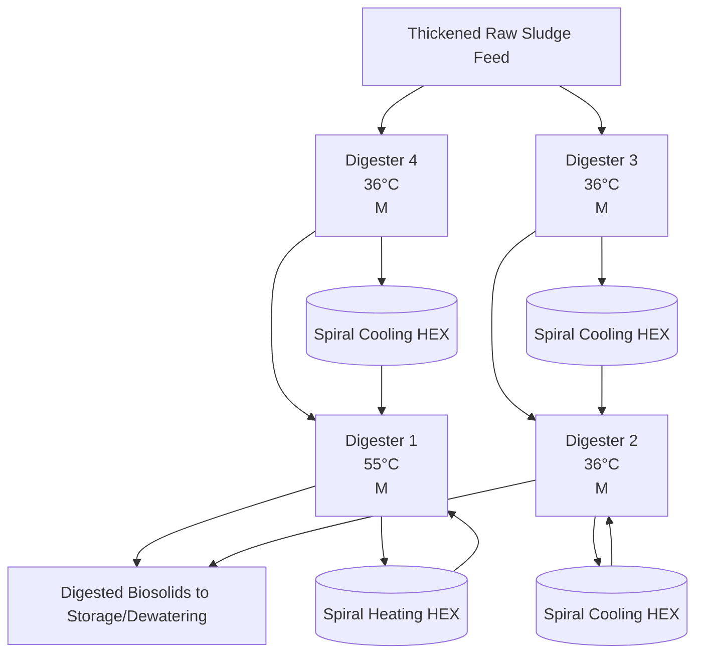

FIGURE 23.6 Process flow schematic of the TPAD installation at Western Lake Superior Sanitation District in Duluth, Minnesota (Krugel et al., 2006).

A photograph follows depicting TPAD facility infrastructure: A row of large cylindrical digesters with white tops and dark exteriors is shown along a paved area adjacent to a body of water, with an urban skyline visible in the distance.

Description of photograph: A TPAD facility with multiple circular digesters arranged in a row near a waterfront, featuring large, horizontal-sited tanks and industrial surroundings, with city buildings in the background.
\n---\n

## 2.3.6.1 Process Development

FIGURE 23.7 Photograph of the TPAD installation at Western Lake Superior Sanitation District in Duluth, Minnesota (courtesy of Brown and Caldwell).

Researchers in Germany identified the potential advantages of TPAD. Anaerobic digesters in Cologne, Germany, have been operated in a temperature-phased mode since August 1993 (Dichtl, 1997). In the United States, Han and Dague (1996) conducted laboratory studies documenting the advantages of TPAD, and a patent for the TPAD process was issued to Iowa State University in the 1990s based on Dague’s work.

The thermophilic digester’s greater hydrolysis and biological activity tends to provide more VSR and gas production than an all-mesophilic digestion process. The system also reduces the tendency of high-rate mesophilic digesters to foam when treating combined solids (primary solids and WAS) (Han and Dague, 1996). Other advantages include lower coliform counts in digested solids (Han and Dague, 1996) and the potential to meet Class A pathogen criteria under 40 CFR 503.

The TPAD’s mesophilic stage provides additional VSR and biogas production, as well as conditions solids for further handling. It also reduces the concentration of odorants (mostly fatty acids) that are common to thermophilic digestion, increases operational stability, and produces biosolids with more consistent characteristics. The biosolids also produce higher cake solids content during dewatering than those produced by mesophilic digesters.

The TPAD process is designed to take advantage of thermophilic digestion rates, which are estimated to be four times faster than mesophilic digestion (Dague, 1968). Dague evaluated a system in which the thermophilic stage operated at 55°C (131°F) with a 5-day detention time and the mesophilic stage operated at 35°C (95°F) with a 10-day detention time. Other researchers have tried different residence times for the thermophilic and mesophilic phases and found performance improvements at a variety of residence times for each stage. Few full-scale WRRFs have operated the thermophilic phase at a 5-day SRT or less, but research shows that this can be successful:

## 2.3.6.2 Design Criteria
\n---\n

Design criteria for TPAD vary because performance success has been demonstrated under various situations. However, based on most of the research and full-scale experience to date, design criteria for a typical TPAD system are:
* Thermophilic temperatures of 50°C to 57°C;
* Thermophilic residence times of 4 to 10 days (existing TPAD systems may have longer SRTs because a large tank was available for the thermophilic stage, or early loads were less than design loads);
* Mesophilic temperatures of 35°C to 40°C; and
* Mesophilic residence times of 6 to 12 days (again, existing TPAD systems may have longer SRTs because of the tankage used or loads that are less than design loads):

When designing a TPAD system, engineers should choose design criteria based on project objectives, solids feed characteristics and variability, and existing facilities (because most TPAD systems are modifications of existing digestion systems). If there are wide variations in feedstock quantity and characteristics, design engineers may want to use a longer residence time in the first-stage thermophilic reactor—perhaps a 10-day SRT or longer. If an existing tank can be used for thermophilic digestion, but its SRT is only 4 or 5 days, the TPAD system may work well as long as the mesophilic system's SRT is long enough to adequately handle some variable performance from the first-stage thermophilic reactor. Total SRTs of about 15 days (minimum) are considered good design practice for peak 15-day or peak month loads. If the facility needs to ensure that its biosolids meet Class B standards, then a 15-day total SRT (minimum) typically is required. Another Part 503 requirement is that digester temperatures in the mesophilic stage must remain above 35°C (if mesophilic SRT is needed to meet Class B requirements):

### 2.3.6.3 Performance
The performance of TPAD systems often is measured based on VSR or biogas production. Schafer et al. (2002) reported significant improvement in VSR at several facilities using the TPAD process, compared to the performance of a mesophilic system with a similar SRT. (If the mesophilic and TPAD systems have different SRTs, then direct performance comparisons are more difficult to quantify without additional information.)
\n---\n

## 2.3.6.4 Heating, Cooling, and Other Design Considerations

Schafer et al. (2002) also reviewed pilot- or demonstration-scale studies and found that TPAD outperformed mesophilic digestion systems when fed the same feedstock and using similar total SRTs. Improvements in VSR are often cited as follows:
* A high-rate mesophilic digester with a 20-day SRT achieved 50% VSR, while
* A TPAD system with a 20-day total SRT and identical or similar feedstock achieved 57% VSR.

TPAD can be heated (and cooled) in several ways, with some precautions:

* For energy efficiency, the heat from thermophilic solids can be recycled to heat cold feedstock and partially cool the thermophilic solids. Various arrangements have been used for this heat recycling concept (e.g., solids-solid heat exchangers and solids-water/solids heat exchangers). This approach requires supplemental heat (e.g., heat exchangers or steam addition) to ensure that feedstock reaches thermophilic conditions.
* Solids can be heated to thermophilic temperatures via heat exchangers and/or steam addition without heat recycling. In this case, thermophilic solids typically must be cooled before entering the mesophilic stage, and this heat can be transferred to facility effluent, blown into the atmosphere, or used to heat water for building heating or other purposes.
* In colder seasons, and if the mesophilic stage’s SRT is long enough, a purposeful cooling system may not be needed because the mesophilic stage can cool itself via thermal losses to the atmosphere and ground. Design engineers should calculate whether this is possible and if the mesophilic stage may be too hot for reliable performance under certain conditions.
* Engineers should ensure that the thermophilic stage is operated at a consistent temperature because its microorganisms are more sensitive to temperature changes, particularly increases. For example, if the design temperature is 55°C, the control system should ensure that this temperature is maintained (close tolerances). This may be difficult due to the poor heat transfer efficiency of sludge, reduced temperature differential between hot water and sludge, and challenges with sludge-to-sludge heat exchangers (for heat recovery). Also, a mixing system is required to ensure that all tank contents are close
\n---\n

## 2.3.7 Lagoon Digestion
It used to be common to digest solids via open lagoons, but anaerobic lagoons typically caused odor problems and were phased out of use. Today, various wastewater treatment agencies use facultative solids lagoons (FSLs), which have an aerobic cap layer to help oxidize and control the odorous decomposition products that rise from the anaerobic activity below. The Sacramento (California) Regional Wastewater Treatment Plant has a 50-ha (125-ac) FSL system of lagoons filled with liquid 4.5 m (15 ft) deep. Considerable research was conducted when this system was developed in the 1970s (Schafer and Wolfenden, 1982).

### 2.3.7.1 System Performance
Large-scale lagooning is conducted at ambient temperatures, which typically encompass the psychrophilic temperature range. A key feature of such digestion is that more digestion occurs in warmer seasons, and less occurs in colder seasons.
The approach used at Sacramento, Chicago, and other facilities is to achieve maximum VSR and solids stabilization via long-term digestion (1 to 5 years). Sacramento achieves almost 60% VSR in its mesophilic digesters, and has documented another 40% to 45% VSR in its FSL (Schafer and Wolfenden, 1982). Such long-term stabilization results in biosolids with relatively little product odor:
Design and operating criteria vary widely for FSLs, but most systems currently are fed either mesophilically digested biosolids or aerobic solids from extended aeration facilities
Facility effluent is often used for the cap water layer:
\n---\n

At Chicago and other facilities, dredged solids are air dried in warmer-weather months, producing biosolids that contain at least 60% solids. The biosolids are used for land application, land reclamation, landfill cover material, and other beneficial purposes. FSLs have been reported to produce Class A biosolids when batch storage is used to prevent short-circuiting (WERF, 2004).

## 2.3.7.2 Covered Lagoons for Methane Emission Control

Since the 1990s, concerns about odors and methane emissionsfrom open waste lagoons (mostly animal waste lagoons) have increased. In response, the animal-waste treatment industry has begun covering some lagoons to collect the biogas generated during anaerobic digestion and use it to produce power: Such systems are becoming more common in North America, Australia, and Asia_ For example, the Western facility in Melbourne, Australia, has used an extensive floating cover system on its wastewater ponds for almost a decade; the high-density polyethylene (HDPE) system covers 7.8 ha (19 ac) of anaerobic digestion ponds (DeGarie et al., 2000). The collected biogas is used to generate more than 2 MW of electricity, which powers other portions of the facility. This system reduces direct methane emissions to the atmosphere (cutting greenhouse gas emissions) and generates renewable power (offsetting carbon emissions from fossil fuel-based generators elsewhere). Memphis, Tennessee, also has covered some of its FSLs since the 1990s to control odor and collect biogas for energy use.

## 2.4 Pretreatment

### 2.4.1 Pre-Pasteurization

Pre-pasteurization is a pathogen reduction process involving a pasteurization step before digestion. This was developed primarily in Europe to allow biosolids to be applied directly to sensitive croplands or pastures_

### 2.4.1.1 Process Development

In an early paper on pasteurization, Clements (1982) reported that Switzerland had issued regulations in 1971 requiring biosolids to be treated to reduce pathogens before they could be applied to grazing land. The initial concept was to pasteurize the biosolids after digestion. About 70 post-pasteurization facilities were constructed in the following 6 years;
\n---\n

They typically processed anaerobically digested biosolids (i.e., biosolids were digested, pasteurized, and then either used or stored). When veterinary scientists investigated the material, they reported that the stored products often contained extremely high densities of pathogens, even though they had contained few enteric bacteria and no Salmonella immediately after pasteurization. Further investigation showed that regrowth was due to surviving organisms or to contamination. Investigators concluded that, because the pasteurized material had no remaining vegetative bacteria, any bacteria present later could grow explosively in the absence of competitors.

Keller (1980) presents data on regrowth of bacteria in biosolids from a post-pasteurization process. The data show that, after pasteurization, biosolids contained between 20 and 75 colony-forming units (CFU) of Enterobacteriaceae per gram of solids. When it was transported from the treatment facility, however, the material contained between 207 000 and 35 million CFU/g. Shortly afterward, WRRFs modified the process to pasteurize solids before digestion (called pre-pasteurization), and the regrowth problem disappeared. The practice has successfully sustained itself over several decades in many countries (mostly in Europe). A few U.S. facilities now use the process_

## 2.4.1.2 Design Criteria

The main reason to use a pasteurization process is to disinfect solids; it has not been reported to enhance VSR significantly. The pre-pasteurization process meets Part 503’s Class A pathogen standards by typically maintaining its temperature above 65°C (more typically 70°C) for a specific period of time in a batch operation. The amount of time is calculated using $$eq.23.1$$, which applies to sludge containing less than 7% solids. Calculations indicate that solids must be maintained at 65°C for approximately 1 hour. As pasteurization temperature increases, the required time (and, therefore, tank volume) shrinks. Most systems are designed to achieve at least 70°C for 0.5 hour, even though operating at slightly lower temperatures may lower operations and maintenance (O&M) costs.

If a utility chooses to pasteurize sludge containing more than 7% solids, the time and temperature requirements are determined using $$eq.23.2$$.
\n---\n

## 2.4.1.3 Pre-Pasteurization Vessel

The U.S. EPA has indicated that to produce a Class A biosolids that meets the requirements in Alternative 1 under Part 503, every particle of solids should be exposed to a minimum temperature for a minimum time. So design engineers should avoid using completely mixed systems or systems with potential for back-mixing or short-circuiting as pre-pasteurization tanks. Most vendor-supplied systems are batch tanks; only one vendor supplies a plug-flow tank for pre-pasteurization. Design engineers should consult U.S. EPA staff or other pertinent regulators before using a non-batch system:

Batch pre-pasteurization systems are operated in a fill/hold/draw mode, with several batch vessels used to perform each cycle if continuous operation is desired. The vessels should be well mixed to ensure that the monitored temperature reflects the entire contents (i.e., every solids particle meets the time and temperature requirements). If the downstream anaerobic digestion process uses an intermittent feed cycle and upstream storage is adequate, the system needs fewer than three batch vessels for the required fill, hold, and draw cycles.

## 2.4.1.4 Ancillary Equipment for Pre-Pasteurization

Design engineers should consider three important ancillary features when installing a pre-pasteurization process:

* Solids heating and cooling;
* Solids screening; and
* Temperature monitoring and control.

Because the temperature of pre-pasteurization systems typically is maintained at 70°C, solids must be heated and then cooled. Heat exchangers are the most common method for heating and cooling solids. If desired, design engineers could include a heat-recovery step to use heat from cooling biosolids to preheat raw solids. The recovery step will require a substantial amount of heat-exchange capacity: If heat exchangers are used, the
\n---\n

## 2.4.1.5 Performance

solids may need to be screened before pre-pasteurization—even if fine screens are used in the facility headworks. Screening also helps produce a more aesthetically pleasing product.

Good temperature monitoring and control are required to maintain Class A compliance. It is critical to have a well-automated system to both ensure pasteurization and prevent downstream contamination, which would take months to remedy. It should prohibit unpasteurized solids from passing through, and either waste or recirculate material that did not meet the time and temperature requirements. If necessary, standby equipment should be included to maintain time and temperature, because compromising these parameters could contaminate the downstream anaerobic digestion process.

The pre-pasteurization process can meet the Salmonella criteria in Part 503. Ward et al. (1999) showed that pre-pasteurized solids resisted regrowth even after they were seeded with Salmonella; instead, the organisms died off. Chen et al. (2008) also observed that pre-pasteurization effectively destroyed Salmonella, even though fecal coliforms regrew (suggesting that it may be necessary to measure the actual pathogen rather than the indicator to ensure Part 503 compliance).

In summary, pre-pasteurization is an effective method for destroying pathogens in solids and is commonly used throughout the world. Several U.S. facilities use this process, including a 204 400-m3/d (54-mgd) in Alexandria, Virginia.

## 2.4.2 Thermal Hydrolysis

Thermal hydrolysis is a predigestion conditioning process where solids are exposed to elevated temperatures and pressures. The process improves the digestibility of biological solids (e.g., WAS), in particular, while reducing the size of digestion tankage and improving dewatering performance. This is more commonly achieved through a batch process but some continuous processes are available as well.

## 2.4.2.1 Process Development

Thermal hydrolysis was first developed in the United States (Haug et al., 1978; 1983), but successful implementation occurred in Europe. The first full-scale system was
\n---\n

The Hias Wastewater Treatment Plant in Norway was the site for full-scale THP implementation in 1996. The largest facility in operation and the first in the United States is at the DC Water Blue Plains facility (Figure 23.8). More than 20 large and small systems are currently in operation, mostly in northern Europe. There are several additional WRRFs in the United States that are in various stages of thermal hydrolysis process (THP) design.

Another aspect of the full-scale THP is the rapid depressurization step. It occurs after the reaction step and is reported to help burst cells, further promoting hydrolysis and disinfection.

When used before anaerobic digestion, thermal hydrolysis achieves one or more of the following:

* Enhances digestion rates and gas production;
* Reduces the size of the anaerobic digestion system (increases allowable loading rates);
* Disinfects solids;
* Reduces the viscosity of the solids feed to the digester;
* Improves dewaterability of the biosolids; and
* Prepares solids for thermal processing downstream of anaerobic digestion.
\n---\n

FIGURE 23.8 The thermal hydrolysis process and anaerobic digesters at DC Water's Blue Plains WRRF (courtesy of Cambi, Norway)

## 2.4.2.2 Design Criteria—Thermal Hydrolysis Vessels

Thermal hydrolysis vessels are made of Type 316 stainless steel and are built to withstand both pressure and vacuum. The vessel configuration varies between manufacturers. Pressure vessels require annual inspection that may require a reactor to be shut down for up to a week so this must be factored into the design through the use of redundant trains, storage, or alternative destinations for the solids.

Operated at temperatures between 150°C and 170°C for 30 minutes and a pressure of about 827 kPa (120 psi), thermal hydrolysis solubilizes and hydrolyzes solids (Stuckey and McCarty; 1984; Li and Noike, 1992), and disintegrates biological cells (e.g., bacteria and viruses). According to Li and Noike (1992), maximum solubilization occurs at 170°C
\n---\n

# Thermal Hydrolysis and THP Process

and the optimal SRT is between 30 and 60 minutes. In practice, a 30-minute SRT optimizes reactor size and delivers a solubilized and hydrolyzed product.

Thermal hydrolysis consists of a preheating step, a heating and batch-reaction step, and a rapid depressurization step for further solubilization and rupturing of microbial cells (see Figure 23.9). The preheating step is used to conserve spent heat from the reaction and depressurization steps, as well as produce a favorable energy balance. The system’s feedstock is dewatered cake containing 14% to 18% solids. Dewatering considerably improves the heat balance and reduces the volume of the downstream anaerobic digestion process by about 50%.

If a Class A product is desired, design engineers and operators should ensure that every particle of solids in the reactor meets the time and temperature requirements and that any dilution water utilized after the THP process is disinfected. Solids screening (5-mm opening) is also required to protect the system components and ensure that no debris remains in the biosolids product:

<br/>

<div>Foul Gas Processing</div>
<div>Then to Digesters</div>
<div>Recycled Steam</div>

<table>
  <thead>
    <tr><th>PULPER TANK (Pre-heat)</th><th>REACTORS</th><th>FLASH TANK</th></tr>
  </thead>
  <tbody>
    <tr>
      <td>
        <div><strong>Raw Solids</strong> (15-18%)</div>
        <div><em>Variable Level</em></div>
      </td>
      <td>
        <div>1. In-Reactor Fill Cycle</div>
        <div>2. Add Steam to Reach 90 psi, 320 F</div>
        <div>3. Batch Hold Time (Class A)</div>
        <div>4. Flash (steam explosion) to Flash Tank</div>
      </td>
      <td>
        <div><strong>Hydrolyzed sludge to digestion</strong> (9-12%)</div>
        <div>Dilution Water</div>
      </td>
    </tr>
  </tbody>
</table>

<br/>

<div>Steam ~150-175 psi</div>
<div>From REACTORS to FLASH LINE</div>

\n---\n

FIGURE 23.9 Schematic of the thermal hydrolysis process (courtesy of Brown & Caldwell).

Because the THP feed is dewatered and contains more than 7% solids, time and
temperature requirements are determined using eq.23.2. Under Regime A, solids must
reach 150°C and stay that hot for 20 minutes, so the system's 30-minute SRT exceeds
the U.S. EPA's time and temperature requirements. This retention time is used more to
optimize hydrolysis and solubilization, and to ensure that the required temperature has
diffused to the interior of all solids particles in the solids mass_

2.4.2.3 Ancillary Equipment for Thermal Hydrolysis
The following four ancillary features should be considered when designing a thermal
hydrolysis system: cooling and heat recovery, screening, process control, and odor
management;

2.4.2.4 Solids Cooling and Heat Recovery
After depressurization, thermally hydrolyzed solids are about 100°C and must be cooled
before entering the anaerobic digestion process. This is typically achieved by first
blending the THS with recirculating digested solids (typically approximately 1:3, respectively)
and then cooling to the appropriate temperature in the digester. According to
Qui (2016), the blending step is important because it:

* Dilutes THS to reduce the risk that it congeals as it cools and blocks the pipe (unblended
THS should not be cooled below 70°C);
* Reduces the total solids % and improves pumping characteristics; and
* Creates turbulent flow, which improves heat transfer in the heat exchanger.

Cooling is typically achieved using facility effluent. Heat recovery can be performed if
desired, but is not typically as it increases heat exchanger size and may complicate
maintenance and operations:

2.4.2.5 Solids Screening
Solids screening is required to prevent debrisfromcausing problems within the THP
process, causing damage to reactors and pumps and negatively impacting final biosolids
quality. Screening is typically performed on thickened primary and WAS before the pre-
\n---\n

dewatering step (at less than 6% total solids). Enclosed solids screens with 5-mm openings are most commonly used.

## 2.4.2.6 Temperature and Pressure Monitoring and Control

Monitoring pressure and temperature is critical. Furthermore, the process needs to be installed with pressure- and vacuum-relief valves. The systems must be well automated to ensure disinfection and prevent downstream contamination of anaerobic digesters, which would take months to remedy. A well-automated system should ensure that only fully heat-treated solids pass through, and either waste or recirculate material that does not meet the time-temperature requirements. If necessary, standby equipment or upstream storage should be provided.

## 2.4.2.7 Odor Management

Thermal hydrolysis followed by anaerobic digestion produces biosolids with relatively low odors. However, the process itself emits strong odors, which must be contained and treated. The odorous gases are biodegradable and water soluble, so a convenient treatment method is to use water scrubbers and discharge the water into the downstream anaerobic digester, which will treat the process odors. The valving design for thermal hydrolysis vessels is critical to minimize vented odors.

## 2.4.2.8 Sidestream Treatment

The return liquor from thermal hydrolysis contains colloidal material that will contribute organic nitrogen, phosphorus, COD, and color to the mainstream process. For example, it will increase the facility effluent's organic nitrogen content by 0.75 to 1.5 mg/L. If the WRRF has low limits for any of these constituents, then they should be removed before the liquor enters the mainstream process. Treating these constituents with chemical conditioners (e.g., iron or aluminum) in the dewatering step has been proposed by Wilson et al. (2008b) but other biological sidestream treatment processes (e.g., anammox and struvite formation) are becoming more common.

## 2.4.2.9 Process Mode Variations

Two full-scale versions of thermal hydrolysis are currently in use. One process mode consists of a preheat tank, a reactor tank, and a flash tank (i.e., three tanks in series). The
\n---\n

Other process mode consists of one tank in which preheating, reaction, and depressurization occur. This mode could be designed with multiple parallel vessels.

## 2.4.2.10 Anaerobic Digestion Performance

The solubilized and hydrolyzed solids are easier to digest and, therefore, can increase digestion rates or reduce digester SRT. For example, Li and Noike (1992) report that the digester reached a stable maximum methanogen population and degraded most of the substrate in a 5-day SRT, suggesting that this was the minimum digester SRT to prevent washout or process instability. However; their work did not evaluate thermal hydrolysis performance under the high ammonia concentrations observed in highly loaded systems today, so full-scale processes are operated at a minimum 15-day SRT under average conditions. Design engineers can decrease the required anaerobic digester SRT by up to 10% to 25% (compared to conventional high-rate digestion) and expect similar process performance. For example, Wilson et al. (2008b) operated parallel conventional high-rate anaerobic digesters with and without thermal hydrolysis, using solids from DC Water Blue Plains facility. Results showed that both digesters had similar volatile solids and COD destruction, but the digester with thermal hydrolysis achieved these results at a 25% shorter digestion SRT (i.e: in 15days rather than 20):

The solubilized solids from thermal hydrolysis are much less viscous (Kopp and Ewert; 2006). Hydrolyzed sludge contains 10% solids or more (compared to a typical digester feed sludge containing 5% solids). Through pre-dewatering and dilutions, THP feed is 16% solids, where it is heated with steam. The steam both increases the temperature and dilutes the solids. The hydrolyzed cake typically contains between 9% and 12% total solids, which can be adjusted with facility-dilution water; if needed, to maintain fairly constant solids loading to the anaerobic digester: The maximum solids content depends on the concentration of ammonia-nitrogen produced during digestion; ammonia-nitrogen concentration is typically kept at less than 2500 mg/L to prevent process inhibition:

The THP; digested, and dewatered biosolids can achieve significantly higher total solids (6% to 9% more) (Kopp and Ewert; 2006; Wilson et al., 2008b) than that produced via conventional digestion. So thermal hydrolysis is attractive when the resulting biosolids will be hauled long distances for land application (to reduce hauling costs) or will be thermally processed (e.g:, heat drying) since influent cake dryness and process evaporative
\n---\n

## 2.4.3 Aerobic Pretreatment

Aerobic pretreatment of solids has been practiced in North America and Europe for more than a quarter century. It involves adding air or oxygen to solids at thermophilic temperatures as an initial “conditioning” step before anaerobic digestion.

### 2.4.3.1 Process Development

Aerobic pretreatment developed differently in Europe and North America; the aerobic thermophilic pretreatment (ATP) process is mainly practiced in Europe, while dual digestion is mainly practiced in North America. Both processes are intended to enhance VSR and pathogen reduction. The main difference between the two processes is the method of heating solids. In ATP, the heat used to attain thermophilic temperatures is waste heat from cogeneration of digester gas (not an autothermal process). ATP’s SRT mainly depends on both process and Part 503 requirements. It typically is 24 hours or fewer; depending on the digestion temperature and the results of time-temperature requirements in eq.23.1 to attain Alternative 1 in Part 503 (U.S. EPA, 1999b). The minimum temperature is typically 55°C and the maximum is 65°C (when biological conditioning of raw solids is encouraged to enhance VSR):

In dual digestion, the aerobic step is an autothermal step in which heat generated during microbial aerobic metabolism is used to increase the process’ temperature to thermophilic conditions. The temperature range for this process is also between 55°C and 65°C. Dual digestion’s SRT depends on two factors: the U.S. EPA’s time and temperature equation, and the time needed to autothermally raise the temperature of raw solids to the required set point. In most cases, the time needed to meet the temperature set point is greater than that demanded by the U.S. EPA’s time-temperature equation. Using oxygen rather than air reduces SRT requirements and improves the heat balance. Also, heat recovered from thermophilic solids can be used to help raise the input solids’ temperature. All of the North American installations have been at WRRFs that already used high-purity oxygen in their activated solids process. Dual digestion’s SRT is about 1 to 2 days, depending on
\n---\n

## 2.4.3.2 Design Criteria

the raw solids’ volatile solids content. Feed containing more volatile solids significantly helps the heat balance to achieve autothermal temperatures. Several dual-digestion facilities were commissioned in the 1980s, and three U.S. facilities are operating the process successfully today. The 143 800-m3/d (38-mgd) Central Treatment Plant in Tacoma, Washington, has used this process for more than a decade, producing and marketing a Class A soil amendment product (called Tagro) from the resulting biosolids (Eschborn and Thompson, 2007).

Aerobic pretreatment has two primary goals: pathogen reduction and enhanced VSR. Both dual digestion and ATP are designed to operate in the thermophilic temperature range, so the tanks should be well insulated to maintain a favorable heat balance. In addition, solids screening may be required if heat exchangers are used for heat recovery.

Under Part 503, processes must meet pathogen reduction requirements to achieve the Class A biosolids status. Aerobic pretreatment meets these requirements by typically maintaining a temperature between 55°C and 65°C for a specific period of time in a batch (plug-flow) operation: The amount of time is calculated using eq.23.1 (the equation for solids content less than 7%). Two possible options are 60°C for a minimum of 4.8 hours or 55°C for 24 hours. Hotter temperatures typically reduce time and, therefore, tank volume.

In dual digestion, however, the minimum SRT depends more on the time required to achieve the desired autothermal temperature than on the U.S. EPA’s time-temperature equation.

If a utility chooses to disinfect feedstock containing more than 7% solids, the time and temperature requirements are determined using eq.23.2.

ATP typically is heated using waste heat from a cogeneration process. The heat balance largely depends on the insulation of the preheat tank and the decision to use heat-recovery heat exchangers.

Dual digestion is mainly heated autothermally (the mixers introduce some heat). Three important parameters in dual-digestion designs are the decay rate, the biological heat of reaction (BHR), and oxygen demand. Gemmell et al. (1999) estimated an average decay rate of 0.087 ± 0.010 d⁻¹ at an average temperature of 37°C. Gemmell et al. (1999)
\n---\n

determined a BHR of 16.6 MJ/kg volatile solids destroyed for the dual-digestion process at Barrie, Ontario, in initial trials with a 26% VSR. Grady et al. (2011) suggest a BHR value of 18.8 MJ/kg volatile solids destroyed (for a design involving autothermal thermophilic aerobic digesters). Messenger et al. (1993) determined a BHR of 18.6 MJ/kg volatile solids destroyed. Haas (1984) found that BHR ranged from 17.4 to 23.3 MJ/kg volatile solids destroyed at 20% and 10% VSR, respectively, during trials conducted at Hagerstown, Maryland. The oxygen demand depends on the type of solids and the ratio of primary and biological solids. Values in the range of 1.7 kg O2/kg volatile solids destroyed have been reported by Pitt and Ekama (1996) and Gemmell et al. (1999). This value can easily be determined experimentally and should be tested, because it can vary from facility to facility:

## 2.4.3.3 Aerobic Vessel Design

To produce a Class A biosolids, the treatment process must meet the time and temperature requirements in Alternative 1 under Part 503, which specify that every particle of solids should be exposed to a minimum temperature for a minimum period of time (U.S. EPA, 1999b). So completely mixed systems or systems that could back-mix or short-circuit should be avoided. Design engineers should consult EPA staff or other pertinent regulators before using a non-batch plug-flow system. The batch systems should be designed to operate in a fill/hold/draw mode and be well mixed to ensure that every particle is maintained at the required temperature (for the required time) and that the monitored temperature reflects the entire contents of the batch. Typically, if continuous operation is desired, three batch vessels are needed (one for each cycle). However, if the downstream anaerobic digester can handle an intermittent feed cycle and upstream storage is adequate, then fewer batch vessels can be supplied:

## 2.4.3.4 Ancillary Equipment for Aerobic Pretreatment

Design engineers typically consider three important ancillary features when installing an aerobic pretreatment process:

* Solids heating and recovery (ATP) or oxygen system (dual digestion);
* Solids screening; and
* Temperature monitoring and control.
\n---\n

## The aerobic vessel and digestion processes

The aerobic vessel for ATP and dual digestion typically is maintained between 55°C and 65°C. In the ATP process, solids must be heated and then cooled. The most common method for heating and cooling solids is heat exchangers. In dual digestion, solids are heated autothermally so an external heat source is unnecessary: Both processes must cool treated solids before digestion—unless the anaerobic digester also is operated at thermophilic temperatures. The cooling method could include a heat-recovery step in which the heat transferred from cooling solids is used to preheat raw solids. This step depends on owner, engineer, and vendor preference, because it will require a substantial amount of heat-exchange capacity. If heat exchangers are used, the solids may need to be screened first: Screening also helps produce an aesthetically pleasing biosolids. Good temperature monitoring and control are required to maintain Class A compliance. If necessary, standby equipment should be provided to maintain time and temperature, because compromising these parameters could contaminate the anaerobic digester with inadequately disinfected solids. The solids should be thickened to at least 5% total solids for successful operations; therefore, downstream solids pumps and pipes should be designed to handle thicker solids adequately. Also, dual digestion will need an oxygen supply (hence, dual digestion typically is installed at facilities that already use high-purity oxygen in their activated sludge processes).

----

## 2.4.3.5 Performance

Preconditioning of solids with air is intended to increase the overall VSR. Researchers (Pagilla et al., 1996; Cheunbarn and Pagilla, 1999, 2000) have extensively evaluated ATP performance and compared it to mesophilic digestion performance. They confirmed the European full-scale observations of Baier and Zwiefelhofer (1991) that ATP enhances VSR and gas production. Cheunbarn and Pagilla (1999) showed that VSR increased as the ATP's SRT (0.6 to 1.5 days) and temperature (55°C to 65°C) increased. In pilot-testing work at Sacramento, Pagilla et al. (1996) compared ATP to conventional mesophilic digestion and determined that ATP enhanced VSR from 53% to 59% for combined solids (primary solids and WAS): They also showed that ATP could meet the U.S. EPA's Part 503 requirements for fecal coliform, Salmonella, enteric virus, and helminth ova. In addition, they determined that ATP effectively controlled and destroyed Nocardia filaments. Finally, they observed that ATP-treated, centrifuged biosolids contained between 32% and 36%.
\n---\n

total solids, compared to mesophilically digested, centrifuged biosolids, which only contained 30% total solids.

FIGURE 23.10 Schematic of the two-phase anaerobic digestion process

```mermaid
graph TD
  A[Feed sludge] --> B[Acid phase]
  B --> C[Transfer sludge]
  C --> D[Gas (Methane) phase]
  D --> E[Digested biosolids]
  F[Biogas] --> A
  F --> B
  F --> D
```

Gemmell et al. (1999) suggested that dual digestion could achieve stable performance when the first high-rate aerobic reactor had an HRT of 1 to 2 days and the second high-rate anaerobic reactor had an HRT of 9 to 12 days. Overall, this retention time was 6 to 10 days shorter than the 20-day SRT typically required for conventional high-rate digestion. Also, Gemmell et al. (2000) suggested that the full-scale dual-digestion process at the Barrie Wastewater Treatment Plant achieved 60% VSR. Operators at a 143 800-m³/d (38-mgd) WRRF in Tacoma, Washington, have been producing and marketing a biosolids-based soil amendment for more than a decade; they attribute much of its high quality to the dual-digestion process (Eschborn and Thompson, 2007):

## 2.4.4 Acid-Phase Hydrolysis

Acid-phase hydrolysis (sometimes called two-phase or acid-methane digestion) separates two major anaerobic reactions—acid formation (acidogenesis) and methane generation (methanogenesis)—to benefit the overall stabilization process (see Figure 23.10). The most practical way to separating phases is via kinetic control, by regulating the detention time and loading rate for each reactor: Increasing loadings to the first-stage digester and reducing SRT (HRT) favors acidogenic organisms because the low pH and retention time
\n---\n

are unfavorable to acetoclastic methane formers. In the second stage, a larger digester (or multiple digesters) increases SRT, so methanogens proliferate. High influent concentrations of short-chain fatty acids also promote the growth of methanogens.

## 2.4.4.1 Process Development

Early work on the process was largely completed by Professor Sam Ghosh (Ghosh et al., 1975, 1987; Lee et al., 1989). Raw solids initially are fed to a reactor with 1- to 2-day SRT; called an acid-phase digester. In this reactor, a low-pH environment (typically 5.5 to 6.2) is established, suspended organic matter is hydrolyzed, and then low-molecular-weight fatty acids are formed. Methane generation is limited in this phase. This first phase has been tested at both mesophilic and thermophilic temperatures, although few full-scale systems have operated the acid phase at thermophilic temperatures. Some research has suggested that there is no true phase separation (Shimada et al., 2011)

Acid-phase sludge then is fed to a second vessel with a 10- to 15-day SRT (called a methane-phase digester). This phase also can be operated at mesophilic or thermophilic temperatures. Conditions in this phase are similar to those found in conventional high-rate digesters, which are operated to maintain an optimum environment for methanogenic microorganisms

## 2.4.4.2 Design Criteria

Laboratory- and small-scale work led to the development of larger-scale systems for wastewater solids (Ghosh et al., 1991, 1995). Experience indicated that anaerobic digester performance could be improved by optimizing the acid-forming and methane-generation phases separately. Compared to the single-phase systems, two-phase anaerobic digestion systems have higher rates of VSR and biogas production, produce biogas that contains more methane, inactivate more pathogens, minimize foam, and are overall more resilient and stable.

The key design criteria are loading rates and retention times. The recommended process design criteria for the acid-phase digester typically are as follows:

* Volatile solids loading rate of 25 to 40 kg volatile solids/m^3·d (1.5 to 2.5 lb volatile solids/cu ft/d);
\n---\n

- Feedstock that contains 5% to 6% solids;
- SRT of 1 to 2 days (at mesophilic temperature);
- Total volatile fatty acid (VFA) concentrations of 7,000 to 12,000 mg/L; and
- pH range of 5.5 to 6.2.

The methane reactor in two-phase digestion can be loaded at higher rates than conventional high-rate digestion systems because of the hydrolysis that occurred in the acid-phase reactor. Volatile solids loading rates for the methane reactor often are similar to those for conventional high-rate mesophilic digestion. Residence times of about 10 days have been tested and promoted by process proponents; however, most full-scale systems have longer residence times (often 15 days or more). The total SRT for the entire two-phase digestion process is rarely less than 15 days, which is required if the resulting biosolids must meet Class B criteria under Part 503.

## 2.4.4.3 Performance

Two-phase digestion performance often has been measured via VSR or biogas production. Schafer et al. (2002) reported that this process significantly improved VSR at the DuPage County, Illinois, facility, but other agencies had seen less improvement: Barnes et al. (2007) reported that Denver, Colorado’s two-phase digestion facility had not shown any significant increase in VSR compared to its prior high-rate mesophilic system, but digester foaming was no longer a major problem. The DuPage County facility also had a major reduction in digester foaming (Ghosh et al., 1995).

## 2.4.4.4 Process Variation—Three-Phase Digestion

Three-phase digestion is a variation of two-phase digestion that uses both thermophilic digestion and a third reactor, which may have variable temperatures. This process has been used at the DuPage County, Illinois, facility and at the Inland Empire Utilities Agency in Chino, California. The primary objectives of this approach are to ameliorate the higher VFA levels that can occur in thermophilic digestion and provide another phase of digestion to reduce short-circuiting and allow for more pathogen control. Inland Empire's three-phase digestion process has been reported to produce biosolids that meet Class A requirements under Part 503 (Drury et al., 2002).

## 2.4.4.5 Process Variation—Enzymic Hydrolysis and Digestion
\n---\n

## 2.4.5 Other Pretreatment Technologies

Enzymatic hydrolysis expands the acid phase of the system into as many as six tanks in series at 42°C. The goal is to shift reactor kinetics away from complete mix to plug flow, which can provide more treatment. According to proponents, enzymatic hydrolysis proponents increased biogas and solids destruction, and enhanced enzymatic hydrolysis greatly improved pathogen destruction.

Solids disintegration technologies are designed to increase the rate and extent of anaerobic solids digestion by applying external energy to render solids more bioavailable. These processes typically are applied to WAS because it is considered the most difficult to digest.

The means of energy application is technology specific, but the reported effects are consistent:
- More biogas production;
- Increased VSR; and
- Reduced mass of solids for disposal.

Table 23.10 lists various disintegration technologies that currently are commercially available.

### 2.4.5.1 Ultrasonic Technologies—Process Development

Full-scale implementation of ultrasonic technologies to enhance anaerobic digestion began in Europe in the mid- to late 1990s. The technology was developed as a means of increasing biogas production while reducing the mass of biosolids for disposal; it essentially increases the digester's gasification rate.

Ultrasonics generate transient acoustic cavitation, which improves anaerobic digestion of WAS, in particular. Acoustic cavitation occurs when ultrasonic waves compress and rarefy the liquid. During rarefaction, enough energy may be applied to exceed intermolecular forces, forming a void (cavitation bubble): The bubble's subsequent collapse generates significant amounts of heat (4000°C), pressure (about 1000 atm) (Christi, 2003), and shear forces from the liquid jets formed (Mason and Lorimer, 1988). Particles near or

\n---\n

within a collapsing bubble can be exposed to one or more of these forces, breaking them down to a size of 40 000 Da (Portenlänger and Heusinger, 1997).

<table>
<thead>
<tr><th>Process</th><th>Example Manufacturer</th><th>Disintegration Method</th></tr>
</thead>
<tbody>
<tr><td>Ultrasonics</td><td>Sonix™, Enpure</td><td>Acoustic cavitation</td></tr>
<tr><td>High-pressure homogenization</td><td>Microsludge™, Paradigm Environmental</td><td>Chemical pretreatment with hydrodynamic cavitation and shear</td></tr>
<tr><td>Pulsed electric field</td><td>OpenCel</td><td>Electroporation</td></tr>
</tbody>
</table>

TABLE 23.10 Examples of Solids Disintegration Technologies

Pressure, temperature, and shear forces are the primary forces responsible for disintegrating WAS. Chemical transformations also are theoretically possible. The environment in the cavitation bubble could lead to the formation of free radicals, which can interact with various elements in the surrounding fluid. Depending on the ultrasonic probe’s frequency, either mechanical or sonochemical forces can dominate: At lower frequencies (around 20 kHz), mechanical forces typically dominate; free radical formation becomes more common at higher frequencies:

2.5 Digestion Processing

This section discusses some key processes that can improve digestion performance and biosolids characteristics.

2.5.1 Prethickening

Thickening solids before digestion is a means of preserving or expanding digester capacity. There are a variety of technologies for prethickening solids (see Chapter 21), and their design and operation should be coordinated with the anaerobic digesters. A thicker cake will preserve volumetric capacity and reduce heating requirements. Because thicker feed typically results in longer HRT, organic overloading of a digester is unlikely: Excessively thick solids can increase the sludge viscosity, thus increasing the energy required for digester mixing and sludge pumping. One notable exception is the thermal hydrolysis process.
\n---\n

## 2.5.2 Debris Removal
Debris typically is removed via screening and grit removal at the facility headworks; however, subsequent screening of primary solids, scum, and other digestion feedstocks may be necessary. If debris enters the digester, several of the following process issues could arise:
- Loss of digester volume (because of accumulated debris in the tank);
- Excessive wear on pumps;
- Clogging and additional cleaning of heat exchangers; and
- Ragging and binding of mixing and pumping equipment.

Debris also affects biosolids quality. Large quantities of debris (e.g., plastic materials) can degrade the aesthetic qualities of biosolids, making it undesirable or even unfit for beneficial use.

A variety of technologies (e.g., rotary drum screens and screen presses) can remove debris from solids. Screening (straining) has been done on raw solids, raw scum, and unthickened, thickened, and digested solids in slurry form. When evaluating technologies, design engineers should consider the intended application, the material to be processed, and other site-specific constraints (e.g., whether the sewer is combined or separated, extent of debris removal from wastewater; whether grinders have already been used, whether stringy material could bind pumps or other equipment, desired use for the biosolids, biosolids aesthetics, and regulatory requirements).

### 2.5.3 Debris Size Reduction (Reduction in 'Identifiables')
Reducing the size of debris protects process equipment from blockages and binding; it also makes debris less identifiable in biosolids. Debris can be reduced by grinding solids before pumping or dewatering them. In-line solids grinders often will be placed in front of recirculation, feed, or wasting pumps. Some states (e.g., Washington) require debris to be made unidentifiable before biosolids could be land applied or otherwise beneficially used.

### 2.5.4 Batch and Plug-Flow Systems
\n---\n

## 2.6 Post-Digestion Processing
### 2.6.1 Process Development

Most existing digestion systems can be classified PSRPs, which meet Class B requirements for land application (assuming vector-attraction requirements are met): The systems can be upgraded to PFRPs, which produce Class A biosolids. One upgrade option typically involves higher temperatures (e.g., thermophilic) and batch or plug-flow operations. To meet the time and temperature requirements of Part 503, every particle must be treated at a temperature higher than 50°C for a prescribed period of time. Typically, at least three tanks are required to meet this requirement: one in fill mode, one in hold mode, and one in draw mode. Another option is using a plug-flow reactor followed by a complete-mix reactor—both operating at thermophilic temperatures. Developed by the Columbus (Georgia) Water Works, this combination is thought to achieve similar pathogen reductions as the batch system but has fewer control points and less process complexity (Willis et al., 2003). The U.S. EPA recently determined that this process is a conditional, site-specific, PFRP-equivalent process.

After digestion, solids are considered "stabilized" because the available substrate has largely been depleted and microbial activity has largely been reduced, so the product is far less likely to emit odors, attract vectors, or regrow pathogens. However, because of its biological origin, any perturbation of biosolids characteristics can "destabilize" the material. So the methods used to store and handle biosolids can be extremely important: Murthy et al. (2003), Chen et al. (2005), Chen et al. (2006), and Higgins et al. (2006a) evaluated the headspace of bottle-stored anaerobically digested biosolids and found that destabilizing biosolids could increase odor production by increasing the available substrate and decreasing methanogenic activity. Research has shown that a key group of odorants are the volatile organic sulfur compounds (VOSCs), which are mainly methanethiol (or methyl mercaptan), dimethyl sulfide, and dimethyl disulfide. When present in air samples, VOSCs correlate well with odor panel measurements from biosolids (Adams et al., 2004). Higgins et al. (2006b, 2008b) also showed that fecal coliform regrowth was possible from post-digestion solids processing: These authors
\n---\n

## 2.6.2 Storage of Biosolids

Biosolids in liquid and cake forms can be stored under different conditions (see Chapter 22). One aspect of storage that affects microbial populations is freeze–thaw, in which stored biosolids alternately freeze and thaw during cold-weather seasons. Freezing biosolids can disrupt cells, thus releasing substrate and inhibiting methanogens. Thawing them could increase biological activity, resulting in odors. Eschborn et al. (2006) showed that the internal temperature of a field storage pile dropped during winter, and the outer layer of the pile froze. As temperatures increased the following spring, odorant production also increased. When designing biosolids storage, engineers should take these factors into account, especially in regions where long-term winter storage is anticipated: Higgins et al. (2003) simulated freeze–thaw conditions in laboratory headspace experiments and showed that odorant production could be substantial when frozen cake samples were thawed (see Figure 23.11). Freezing biosolids led to a delay in methanogen recovery when the material thawed (Figure 23.12).

Managing biosolids storage before land application can help reduce nuisance odors: The goal of storage is to allow solids to restabilize once odorant production begins, thus allowing VOSC-associated odors to dissipate. For example, once odorant production begins, it typically peaks about a week or two later—although this depends on temperature (Higgins et al., 2003). Cooler temperatures increase the time needed for odors to peak and VOSC concentrations to reduce (Figure 23.13).

When designing storage systems for biosolids, engineers should consider the following:
* If frozen biosolids are stored for several days once thawing begins, odors can dissipate before the material is beneficially used;
* Fresh biosolids emit more odors during land spreading than biosolids that had been in long-term field storage (to get past the peak concentrations of odorants), so proper storage is important to managing odors (Eschborn et al., 2006);
\n---\n

- Mixing old and new biosolids mitigates odorant production by bioaugmenting fresh biosolids with active methanogens that can degrade VOSCs (Chen et al., 2005; Williams et al., 2008); and
- Storage conditions should minimize freezing and perturbations that can destabilize population dynamics in biosolids (EPA, 2000).

<table>
  <thead>
    <tr>
      <th>Day (d)</th>
      <th>Control – Not Frozen (ppmv)</th>
      <th>Frozen then Thawed (ppmv)</th>
    </tr>
  </thead>
  <tbody>
    <tr><td>0</td><td>0</td><td>0</td></tr>
<tr><td>2</td><td>0</td><td>50</td></tr>
<tr><td>3</td><td>100</td><td>400</td></tr>
<tr><td>4</td><td>500</td><td>1800</td></tr>
<tr><td>5</td><td>400</td><td>1900</td></tr>
<tr><td>6</td><td>200</td><td>1700</td></tr>
<tr><td>7</td><td>0</td><td>1500</td></tr>
<tr><td>8</td><td>0</td><td>1400</td></tr>
<tr><td>9</td><td>0</td><td>1200</td></tr>
<tr><td>10</td><td>0</td><td>1000</td></tr>
<tr><td>11</td><td>0</td><td>900</td></tr>
<tr><td>12</td><td>0</td><td>700</td></tr>
<tr><td>13</td><td>0</td><td>500</td></tr>
<tr><td>14</td><td>0</td><td>400</td></tr>
<tr><td>15</td><td>0</td><td>300</td></tr>
<tr><td>16</td><td>0</td><td>200</td></tr>
<tr><td>18</td><td>0</td><td>100</td></tr>
<tr><td>20</td><td>0</td><td>0</td></tr>
  </tbody>
</table>

FIGURE 23.11 The effect of freeze-thaw conditions on methyl mercaptan emissions from biosolids (Higgins et al., 2003).
\n---\n

# Figure 23.12 The effect of freeze-thaw conditions on methanogen recovery from dewatered biosolids (Higgins et al., 2003).

The figure depicts two data series representing methane recovery (in ppm) as a function of cake storage time (days):

- Control (not frozen)
- Frozen Cake

Y-axis: Methane (ppm) with scale from 0 to 1.5 × 10^5 (0, 50,000, 100,000, 150,000)
X-axis: Cake Storage Time (d) from 0 to 25 (ticks at 5, 10, 15, 20, 25)

Table representation (approximated data points inferred from the chart):

<table>
  <thead>
    <tr>
      <th>Cake Storage Time (d)</th>
      <th>Control (not frozen)</th>
      <th>Frozen Cake</th>
    </tr>
  </thead>
  <tbody>
    <tr>
      <td>0</td>
      <td>0</td>
      <td>0</td>
    </tr>
<tr>
      <td>5</td>
      <td>40,000</td>
      <td>0</td>
    </tr>
<tr>
      <td>10</td>
      <td>85,000</td>
      <td>0</td>
    </tr>
<tr>
      <td>15</td>
      <td>120,000</td>
      <td>0</td>
    </tr>
<tr>
      <td>20</td>
      <td>140,000</td>
      <td>2,000</td>
    </tr>
<tr>
      <td>25</td>
      <td>150,000</td>
      <td>25,000</td>
    </tr>
  </tbody>
</table>

Caption:
FIGURE 23.12 The effect of freeze-thaw conditions on methanogen recovery from dewatered biosolids (Higgins et al., 2003).

Notes:
- The Control (not frozen) curve shows a steep, near-linear increase in methane recovery over time, reaching approximately 150,000 ppm by day 25.
- The Frozen Cake curve remains near zero methane recovery for the majority of the storage period and begins to rise slightly after day 20, reaching around 25,000 ppm by day 25.
\n---\n

## 2.6.3 Cake Conveyance Effects

The effect of high-shear conveyance has not been studied in great detail. Murthy et al. (2002) report that high-shear conveyance methods increase the biosolids' odorant production profile. Headspace experiments involving anaerobically digested biosolids confirm this research (see Figure 23.14). So, when designing solids conveyance systems, engineers should consider the following:

### FIGURE 23.13
The effect of incubation temperature on emissions of total volatile sulfur compounds from dewatered biosolids (Higgins et al., 2003).

```mermaid
%% A qualitative representation of the four incubation-temperature curves
graph TD
  subgraph FiveC
    A5_0[0 d] --> A5_5[5 d]
    A5_5 --> A5_10[10 d]
    A5_10 --> A5_20[20 d]
    A5_20 --> A5_40[40 d]
  end
  subgraph FifteenC
    A15_0[0 d] --> A15_5[5 d]
    A15_5 --> A15_10[10 d]
    A15_10 --> A15_20[20 d]
    A15_20 --> A15_40[40 d]
  end
  subgraph TwentyThreeC
    A23_0[0 d] --> A23_5[5 d]
    A23_5 --> A23_10[10 d]
    A23_10 --> A23_20[20 d]
    A23_20 --> A23_40[40 d]
  end
  subgraph ThirtyFiveC
    A35_0[0 d] --> A35_5[5 d]
    A35_5 --> A35_10[10 d]
    A35_10 --> A35_20[20 d]
    A35_20 --> A35_40[40 d]
  end
  %% This diagram provides a qualitative view: high temperatures produce higher emissions early, with all curves peaking within the first ~10 days and then declining.
```

\n---\n

FIGURE 23.14 The effect of a vertical screw conveyor on odorant production in dewatered biosolids (Murthy et al., 2002a).

<table>
<thead>
<tr>
<th></th>
<th>From Centrifuge - High-Solids Centrifuge</th>
<th>From Centrifuge - Low-Solids Centrifuge</th>
<th>From Vertical Conveyor - High-Solids Centrifuge</th>
<th>From Vertical Conveyor - Low-Solids Centrifuge</th>
</tr>
</thead>
<tbody>
<tr>
<td>Methyl Mercaptan</td>
<td>500</td>
<td>100</td>
<td>11000</td>
<td>4500</td>
</tr>
</tbody>
</table>

----

<table>
<thead>
<tr>
<th></th>
<th>From Low-Solids Centrifuge</th>
<th>From Vertical Conveyor</th>
</tr>
</thead>
<tbody>
<tr>
<td>Methyl Mercaptan</td>
<td>100</td>
<td>100000</td>
</tr>
<tr>
<td>Dimethyl Sulfide</td>
<td>150</td><td>90000</td>
</tr>
</tbody>
</table>

Figure caption: FIGURE 23.14 The effect of a vertical screw conveyor on odorant production in dewatered biosolids (Murthy et al., 2002a)

Keep transport distances as short as possible;
Use low-shear conveyance methods, if possible;
\n---\n

- Minimize the use of vertical high-shear conveyance; and
- Maintain a top-down design philosophy, if possible (i.e., install dewatering equipment at the top of a building and storage silos at the bottom to minimize conveyance distance and shear).

## 2.6.4 Dewatering Effects

Murthy et al. (2002) and Higgins et al. (2002) have suggested that VOSC production is influenced by a combination of factors. They conducted side-by-side tests on three dewatering systems: a high-solids centrifuge, a low-solids centrifuge, and a belt filter press simulator. The centrifuges were adjusted to produce lower cake solids (similar to the belt press device), so researchers could compare cakes from the same facility with similar solids content. Results showed that cakes from the high-solids centrifuge produced more odorants than the other two devices (see Figure 23.15). The authors found that solids sheared during centrifugation released both labile protein and inhibited methanogenesis, thus increasing odorant production.
\n---\n

## Figure 23.15 The effect of dewatering equipment on VSC emissions from biosolids

<h3>Methanethiol (ppmv)</h3>

<table>
  <thead>
    <tr>
      <th>Anaerobic storage time (days)</th>
      <th>High-solids centrifuge</th>
      <th>Low-solids centrifuge</th>
      <th>Belt filter press simulator</th>
    </tr>
  </thead>
  <tbody>
    <tr>
      <td>0</td>
      <td>0</td>
      <td>0</td>
      <td>0</td>
    </tr>
<tr>
      <td>2</td>
      <td>~150</td>
      <td>~120</td>
      <td>~60</td>
    </tr>
<tr>
      <td>4</td>
      <td>~300</td>
      <td>~140</td>
      <td>~100</td>
    </tr>
<tr>
      <td>6</td>
      <td>~40</td>
      <td>0</td>
      <td>0</td>
    </tr>
<tr>
      <td>8</td>
      <td>Not detected</td>
      <td>Not detected</td>
      <td>Not detected</td>
    </tr>
<tr>
      <td>10</td>
      <td>Not detected</td>
      <td>Not detected</td>
      <td>Not detected</td>
    </tr>
<tr>
      <td>12</td>
      <td>Not detected</td>
      <td>Not detected</td>
      <td>Not detected</td>
    </tr>
  </tbody>
</table>

<h3>Dimethyl sulfide (ppmv)</h3>

<table>
  <thead>
    <tr>
      <th>Anaerobic storage time (days)</th>
      <th>High-solids centrifuge</th>
      <th>Low-solids centrifuge</th>
      <th>Belt filter press simulator</th>
    </tr>
  </thead>
  <tbody>
    <tr>
      <td>0</td>
      <td>0</td>
      <td>0</td>
      <td>0</td>
    </tr>
<tr>
      <td>2</td>
      <td>~60</td>
      <td>~40</td>
      <td>~20</td>
    </tr>
<tr>
      <td>4</td>
      <td>~200</td>
      <td>~60</td>
      <td>~40</td>
    </tr>
<tr>
      <td>6</td>
      <td>~180</td>
      <td>~40</td>
      <td>0</td>
    </tr>
<tr>
      <td>8</td>
      <td>Not detected</td>
      <td>Not detected</td>
      <td>Not detected</td>
    </tr>
<tr>
      <td>10</td>
      <td>Not detected</td>
      <td>Not detected</td>
      <td>Not detected</td>
    </tr>
<tr>
      <td>12</td>
      <td>Not detected</td>
      <td>Not detected</td>
      <td>Not detected</td>
    </tr>
  </tbody>
</table>

> FIGURE 23.15 The effect of dewatering equipment on VSC emissions from biosolids (centrifuge cake contained 26% solids, belt filter press cake contained 25% solids, and detection limit is 1 ppmv) (Murthy et al., 2003)

Higgins et al. (2006b) also showed that centrifuging biosolids promoted the regrowth of fecal coliforms. In some cases, this regrowth exceeded fecal coliform concentrations in raw solids. Further work by Higgins et al. (2008) showed that Salmonella regrew in Class B biosolids during storage. The biosolids had been mesophilically digested and centrifuged. However; Salmonella did not regrow in stored Class A and Class B biosolids that had been thermophilically digested and centrifuged.
\n---\n

# 2.6.5 Digestion Process Effects

Design engineers should consider pilot-testing dewatering equipment; and monitoring for possible odorant production and regrowth before selecting a unit.

While low-shear dewatering equipment produces fewer odors regardless of the anaerobic digestion process used, this is not the case for high-shear dewatering. More complete digestion (e.g., enhanced or thermophilic digestion) can affect overall odorant production and in some cases reduce it, especially if high-shear post-processing is used. Figures 23.16 and 23.17 show the total VOSC production profile for several full-scale digestion processes. These figures suggest that enhanced digestion processes can produce fewer odors than a conventional mesophilic digestion process.

If high-shear post-digestion processes are being proposed or already exist at a facility, design engineers should consider using enhanced digestion processes to mitigate overall odorant production if land application is proposed. Processes that have been shown to reduce odorant production from high-shear solids processing include thermophilic digestion, temperature-phased anaerobic digestion (TPAD), and thermal hydrolysis (THP).

<table>
  <thead>
    <tr>
      <th>Storage time (d)</th>
      <th>0</th>
      <th>5</th>
      <th>10</th>
      <th>15</th>
      <th>20</th>
      <th>25</th>
      <th>30</th>
      <th>35</th>
      <th>40</th>
    </tr>
  </thead>
  <tbody>
    <tr>
      <td>Mesophilic</td>
      <td>0</td>
      <td>~520</td>
      <td>~40</td>
      <td>~20</td>
      <td>~10</td>
      <td>~15</td>
      <td>~20</td>
      <td>~10</td>
      <td>~5</td>
    </tr>
<tr>
      <td>TPADs</td>
      <td>0</td>
      <td>~40</td>
      <td>~200</td>
      <td>~150</td>
      <td>~100</td>
      <td>~50</td>
      <td>~40</td>
      <td>~30</td>
      <td>~20</td>
    </tr>
<tr>
      <td>Thermophilic</td>
      <td>0</td>
      <td>0</td>
      <td>0</td>
      <td>~60</td>
      <td>~140</td>
      <td>~200</td>
      <td>~260</td>
      <td>~320</td>
      <td>~360</td>
    </tr>
  </tbody>
</table>

\n---\n

## 2.7 Co-Digestion Processing

Historically, anaerobic digestion was used to minimize solids volume, stabilize solids, and reduce pathogens. As process options evolved, process efficiency improved, and the focus on biogas production and energy use grew; interest in anaerobic digestion expanded. Some wastewater utilities would like to further expand biogas production by adding other feedstocks (fats, oil, and grease [FOG], food wastes, and organic liquid wastes) to anaerobic digesters.

### 2.7.1 Dry Digestion and Wet Digestion

----

### FIGURE 23.16 The effect of two enhanced digestion processes on odorant production (TVOSC = total volatile organic sulfur compound) (courtesy of Dr. Matthew Higgins, Bucknell University).

<table>
  <thead>
    <tr><th>Figure</th><th>Caption</th></tr>
  </thead>
  <tbody>
    <tr>
      <td>FIGURE 23.16</td>
      <td>The effect of two enhanced digestion processes on odorant production (TVOSC = total volatile organic sulfur compound) (courtesy of Dr. Matthew Higgins, Bucknell University).</td>
    </tr>
  </tbody>
</table>

<table>
  <thead>
    <tr><th>Axis / Legend</th><th>Details</th></tr>
  </thead>
  <tbody>
    <tr><td>Y-axis</td><td>TVOSC Concentration (ppmv)</td></tr>
<tr><td>Y-axis scale</td><td>0 to 1000 (increments shown on axis)</td></tr>
<tr><td>X-axis</td><td>Storage time (days)</td></tr>
<tr><td>X-axis scale</td><td>0 to 35 (ticks at 0, 5, 10, 15, 20, 25, 30, 35)</td></tr>
<tr><td>Legend</td><td>Pre-pasteurization; Thermo in series; TPAD; Conventional Meso; Thermophilic; Cambi</td></tr>
  </tbody>
</table>

----

### FIGURE 23.17 The effect of five enhanced digestion processes on odorant production (TVOSC = total volatile organic sulfur compound) (courtesy of Dr. Matthew Higgins, Bucknell University).

<table>
  <thead>
    <tr><th>Figure</th><th>Caption</th></tr>
  </thead>
  <tbody>
    <tr>
      <td>FIGURE 23.17</td>
      <td>The effect of five enhanced digestion processes on odorant production (TVOSC = total volatile organic sulfur compound) (courtesy of Dr. Matthew Higgins, Bucknell University).</td>
    </tr>
  </tbody>
</table>

<table>
  <thead>
    <tr><th>Axis / Legend</th><th>Details</th></tr>
  </thead>
  <tbody>
    <tr><td>Axis</td><td>TVOSC Concentration (ppmv) vs Storage time (days)</td></tr>
<tr><td>Legend</td><td>Five enhanced digestion processes (specific processes not itemized in caption)</td></tr>
  </tbody>
</table>

----

## 2.7 Co-Digestion Processing (continued)

Historically, anaerobic digestion was used to minimize solids volume, stabilize solids, and reduce pathogens. As process options evolved, process efficiency improved, and the focus on biogas production and energy use grew; interest in anaerobic digestion expanded. Some wastewater utilities would like to further expand biogas production by adding other feedstocks (fats, oil, and grease [FOG], food wastes, and organic liquid wastes) to anaerobic digesters.

\n---\n

## 2.7 Co-digestion of wastes

Co-digestion of wastes can encompass a wide variety of organic feedstocks. Some organic feedstocks are more amenable to “dry digestion,” in which feedstocks contain 15% or even 20% solids. Such systems were developed primarily for organic solid waste or bulk-waste materials, and are seen primarily in technologies coming from Europe. Most of these systems originally were applied to the solid waste industry. The digestion vessels are often developed for plug-flow movement (e.g., feedstocks are added to the top of a silo-shaped reactor and move downward over a 20-day digestion period). Mixing systems are often limited, but can include paddles and other systems that work in thick solids. The use of wastewater solids in dry-digestion systems is limited because the cake typically contains less than 10% solids. This may change over time, so readers may wish to gather more information about dry digestion from the Internet or other literature sources.

In this manual of practice, the discussion of anaerobic digestion is devoted to liquid-slurry (“wet digestion”) in which feedstocks contain less than 10% to 15% solids (they frequently contain 5% or 6% solids). In wet-digestion systems, feedstocks are pumpable materials and the mixing systems are compatible with slurries that are typically less than 5% solids. Wet-digestion systems typically are operated as complete-mix reactors that minimize deposits on the bottom of the tank and minimize floating layers of solids on the liquid surface. Wastewater utilities in North America, Europe, and elsewhere are adding not only solids to their wet-digestion systems but also a variety of compatible organic feedstocks.

## 2.7.2 FOG and Grease Wastes

Fats, oil, and grease are generated in a variety of locations in an urban environment. To protect the collection system, many municipalities strictly limit FOG discharges, so the material is accumulated at point sources (e.g., waste drums, grease traps, and grease interceptors). While municipalities do not want this material in the collection system, its use in anaerobic digesters can provide major benefits. FOG is an energy-rich substrate that is readily degradable in anaerobic digestion systems:

Digesters with FOG loads as high as 30% of feedstock or volatile solids (VS) loading still can maintain stable operations (Schafer et al., 2008). Kester et al. (2008) has reported that some facilities digesting both solids and FOG have both enhanced biogas production and enhanced VSR.
\n---\n

The benefits of FOG addition are well documented, but there are challenges as well. At ambient temperatures, FOG tends to be highly viscous and adheres to metallic and concrete surfaces, making it difficult to introduce to a digester via a conventional hauled-waste receiving station. Also, FOG tends to stratify during transport and storage. Receiving stations used for FOG have a wide variety of tankage. Tanks of FOG used to feed digesters need to be mixed (to obtain consistent feedstock characteristics) and may need to be heated via steam injection, hot water circulation, or heat exchanger. Also, screening and grinding often are required to remove debris (e.g., stones, rags, and metallic objects). Because of its association with the food service industry, FOG can contain other extraneous food debris that must be removed to protect pumps and downstream equipment.

To minimize stratification and eliminate a possible grease layer on the liquid surface in the digester, FOG must be properly mixed with the mass in the tank. Utilities often introduce FOG into a recirculating slurry of digesting mass, so it becomes mixed and diluted quickly. Also, the digester's mixing system should be carefully evaluated to ensure that a surface layer of scum or grease does not develop and cause operational problems.

## 2.7.3 Liquid and High-Strength Wastes

Liquid and slurry wastes are typically easiest for a digestion system to accept because its infrastructure is designed to pump liquids. Some liquid wastes may require screening or grit removal, depending on its composition. These wastes often come from food processing industries (e.g., fruit and vegetable processing), the beverage industry, pharmaceutical industry, and others. While liquid wastes are relatively easy to accept, they can have significant negative effect on digester capacity. Most digesters do not use solids-liquid separation for SRT control, so the added volume of liquid waste takes up a digester’s hydraulic capacity. So high-strength wastes should be used before lower-strength wastes because they produce the most biogas per unit hydraulic capacity consumed. When characterizing liquid wastes, design engineers should ensure that their components will not negatively affect digestion (e.g., promote struvite formation or produce a compound that will affect the liquid treatment train). Also, increasing levels of total dissolved solids or other dissolved constituents can be introduced via digestion and typically will be returned to the liquid treatment train via the post-digestion dewatering
\n---\n

Such dissolved material may be inert and proceed directly to the outfall or can affect the liquid treatment process.

Liquid or slurry wastes being considered for co-digestion should be carefully evaluated for their compatibility with the digestion process, digestion-feeding system, mechanical systems used in digestion, and biogas management-system capacity. High-protein wastes, for example, could greatly affect foam production in digestion vessels. Sudden or large foam production is often debilitating for digester operations; it has caused digesters to overflow material onto the ground and caused accidents that resulted in major structural damage to tanks and tank covers.

These wastes often need to be carefully metered into the digestion system to prevent overfeeding microbes and causing digester upsets and foaming. Rapid feed of highly digestible waste also can lead to large spikes in gas production that the gas piping cannot accommodate. Instead, it is directly released to the atmosphere via gas-relief valves. In extreme cases, gas production could outpace the gas system's ability to discharge gas (especially if foam is blocking gas-relief valves), leading to gas pressure buildup in the vessel and potential catastrophic tank or cover failure:

## 2.7.4 Food Waste Materials

As with FOG, food scraps or post-consumer food waste materials are a source of renewable energy when anaerobically digested and converted to methane. One of the challenges of food scraps (the organic fraction of municipal solid waste) is removing contaminants to protect the digestion process. Also, the waste itself typically requires preprocessing to make it pumpable and amenable to efficient digestion without compromising biosolids aesthetics. Preprocessing can include screening; manual separation of debris and extraneous materials; removal of metals, aluminum, glass, grit, and plastics; and pulping—depending on the specific situation. Technologies that preprocess food scraps or food-waste materials are being developed primarily in Europe. Gray et al. (2008) describe one of these systems, which was tested at the East Bay Municipal Utility District in Oakland, California:

## 2.8 Design Considerations

### 2.8.1 Design Data and Parameters

\n---\n

# TABLE 23.11 Minimum Values of Solids Retention Time (θc) for Anaerobic Digestion of Various Substrates

Before designing the anaerobic digestion process, engineers should consider modeling it using available models (Batstone et al., 2002; Jones et al., 2008a). Jones et al. (2008b) recommend using a full-facility model to simulate influent wastewater characteristics and quantify fractions of solids produced to predict anaerobic digester performance: The Water Environment Federation (2013) provides more details on anaerobic digester modeling:

Historically, anaerobic digesters have been designed based on SRT, organic loading rate (volatile suspended solids [VSS] per volume), and volume per capita (see Table 23.11). In the absence of operating data (or estimates of projected facility flows) and calibrated system modeling, volume figures per capita can be used to estimate influent volumes at WRRFs: Low-rate digesters typically have organic loading rates of about 0.5 to 1.5 kg VSS/m3·d (0.04 to 0.1 lb VSS/d/cu ft). High-rate digesters with mixing and heating typically have organic loading rates of 1.9 to 2.5 kg VSS/m3·d (0.12 to 0.16 lb/d/cu ft).

<table>
<thead>
<tr><th>Substrate</th><th>35°C</th><th>30°C</th><th>25°C</th><th>20°C</th></tr>
</thead>
<tbody>
<tr><td>Acetic acid</td><td>3.1</td><td>4.2</td><td>4.2</td><td>—</td></tr>
<tr><td>Propionic acid</td><td>3.2</td><td>—</td><td>2.8</td><td>—</td></tr>
<tr><td>Butyric acid</td><td>2.7</td><td>—</td><td>—</td><td>—</td></tr>
<tr><td>Long-chain fatty acid</td><td>4.0</td><td>—</td><td>5.8</td><td>7.2</td></tr>
<tr><td>Hydrogen</td><td>0.95<sup>a</sup></td><td>—</td><td>—</td><td>—</td></tr>
<tr><td>Wastewater sludge</td><td>4.2<sup>b</sup></td><td>—</td><td>7.5<sup>b</sup></td><td>10</td></tr>
</tbody>
</table>

<p><sup>a</sup>For 37°C.</p>
<p><sup>b</sup>Computed value.</p>

TABLE 23.11 Minimum Values of Solids Retention Time (θc) for Anaerobic Digestion of Various Substrates
(Reprinted with permission from Lawrence (1971). Copyright © 1971 American Chemical Society)
\n---\n

Typical SRTs are about 30 to 60 days for low-rate digestion and 15 to 20 days for high-rate digestion at mesophilic temperatures. The SRT is the ratio of the total mass of solids in the system to the quantity of solids withdrawn per day: In two-stage digestion, the typical SRT above refers to that of the first reactor in the system. For anaerobic digesters with no internal recycle, the SRT equals the HRT. If settled solids are recycled, the SRT would be larger than the HRT: Recycling is characteristic of the anaerobic contact or two-phase digestion process or recuperative thickening:

A minimum SRT is essential in anaerobic digestion; it ensures that the necessary microorganisms are being produced at the same rate as they are wasted daily. It also is different for various constituent groups. For example, lipid-metabolizing bacteria grow most slowly and, therefore, need a longer SRT, while cellulose-metabolizing bacteria require a shorter SRT (see Figure 23.18).

If the SRT is too short, then the microbial population of methanogens will wash out and the system will fail: Lawrence (1971) has published the minimum SRT needed to reduce several specific substances; a function of temperature, these SRTs range from less than 1 day for hydrogen to 4.2 days for wastewater solids (see Table 23.12). Hotter temperatures reduce the SRTs needed for maximum performance because they increase specific gas production (see Figure 23.19).

However, digester SRT is not only a function of system microbiology; the selected use for biosolids also must be considered, especially for Class B biosolids. Both thermophilic and mesophilic anaerobic digestion are considered PSRPs. One method for achieving this status, along with maintaining temperature, mixing, and anaerobic conditions, is maintaining a minimum SRT of 15 days. Furthermore, for overall process stability, ease of control, to account for grit and scum accumulation, imperfect mixing, variability in solids-production rates, and biosolids stability, most digesters operate at 15 days.

Later sections will provide equations for process parameter estimation. Given the variability in reactor configurations and solids composition, generic and lumped kinetic parameters may not sufficiently describe system performance. Pilot or full-scale testing in conjunction with using newer more complex process models, with sufficient background data, should be considered when the accuracy of the projected process performance is critical.

\n---\n

# Figure 23.18

The effect of SRT on the relative breakdown of degradable waste components and methane production (cu ft/lb × 0.06243 = m3/kg).

## Top chart: Effluent concentration vs SRT (Volatile solids, Methane, COD)

<table>
<thead>
<tr>
  <th>SRT, days</th>
  <th>Volatile solids (g/L)</th>
  <th>Methane production (cu ft/lb)</th>
  <th>COD (g/L)</th>
</tr>
</thead>
<tbody>
<tr><td>0</td><td>~18</td><td>0</td><td>~14</td></tr>
<tr><td>10</td><td>~6</td><td>~1–2</td><td>~2</td></tr>
<tr><td>20</td><td>~2</td><td>~3–4</td><td>~1</td></tr>
<tr><td>60</td><td>0</td><td>~6</td><td>0</td></tr>
</tbody>
</table>

- Volatile solids
- Methane
- COD

> Legend: Volatile solids (circle), Methane (square), COD (diamond)

## Bottom chart: Bench-scale digestion of primary sludge at 35°C

<table>
<thead>
<tr>
  <th>SRT, days</th>
  <th>Volatile acids (g/L)</th>
  <th>Cellulose (g/L)</th>
  <th>Protein (g/L)</th>
  <th>Lipids (g/L)</th>
</tr>
</thead>
<tbody>
<tr><td>0</td><td>~9</td><td>~6</td><td>~4</td><td>~2</td></tr>
<tr><td>10</td><td>~3</td><td>~2</td><td>~1</td><td>~0</td></tr>
<tr><td>20</td><td>~1</td><td>~0.5</td><td>~0.5</td><td>~0</td></tr>
<tr><td>60</td><td>~0</td><td>0</td><td>0</td><td>0</td></tr>
</tbody>
</table>

- Volatile acids
- Cellulose
- Protein
- Lipids

> Note: Bench-scale digestion of primary sludge at 35°C; the figure shows the relative breakdown of degradable waste components over SRT days.

\n---\n

Pilot-testing, before design, should also be considered when implementing a new process configuration or the raw solids contain unconventional substrates such as industrial inputs. The effect of industrial wastes on anaerobic digestion is always questionable until the specific waste is characterized and tested.

<table>
<thead>
<tr><th>SRT, Days</th><th colspan="2">Percent of Facilities in Each Range</th></tr>
<tr><th></th><th>Primary</th><th>Plus Secondary</th></tr>
</thead>
<tbody>
<tr><td>0-5</td><td></td><td></td></tr>
<tr><td>6-10</td><td></td><td>15</td></tr>
<tr><td>11-15</td><td></td><td></td></tr>
<tr><td>16-20</td><td>11</td><td>12</td></tr>
<tr><td>21-25</td><td>45</td><td>25</td></tr>
<tr><td>26-30</td><td>11</td><td></td></tr>
<tr><td>31-35</td><td>11</td><td>15</td></tr>
<tr><td>36-40</td><td></td><td></td></tr>
<tr><td>41-45</td><td></td><td></td></tr>
<tr><td>46-50</td><td>22</td><td></td></tr>
<tr><td>Over 50</td><td></td><td>6</td></tr>
<tr><td>Total number of plants</td><td>(12 plants)</td><td>(132 plants)</td></tr>
</tbody>
</table>

TABLE 23.12 Solids Residence Times Reported for anaerobic digestion operations in the United Substrates
(Reprinted with permission from ASCE, 1983)

## 2.8.2 Process Design

\n---\n

# 2.8.2.1 Sizing Criteria

When sizing digesters, the key parameters are SRT and VS loading rate. For digestion systems without recycle, there is no difference between SRT and HRT. The VS loading rate is also used and is important in situations, like co-digestion, where the VS content in the feed may vary. The selection of the design SRT and VS loading rate should consider several factors (e.g., process microbiology, stability, biosolids regulatory requirements, biosolids stability, and industrial inputs). Generally, at higher TS concentrations, VS loading rate is limiting and, at lower TS concentrations, SRT is limiting.

Presently, the design minimum SRT typically is selected based on experience, general rules, and regulatory requirements. Design engineers should note that a range of solids-production conditions must be considered when developing appropriate SRT design criteria.

Researchers are developing more quantifiable approaches to understanding digestion and its limits. The selection of a design SRT directly affects system kinetics and, consequently, process performance. Both complex models (e.g., ADM-1) and simplified models (e.g., that presented by Parkin and Owen [1986]) have been suggested as a means of estimating or predicting the limiting (minimum) digester SRT, although the data required for its application are limited. The Parkin and Owen approach is based on applying a safety factor to a limiting SRT to establish the design SRT. If the limiting SRT is based on a desired digestion efficiency and the digester approaches complete-mix conditions, the limiting SRT can be estimated as follows:

$$
SRT_{\min} = \frac{Y_k S_{\text{eff}}}{K_c + S_{\text{eff}}} - b^{-1} \quad (23.3)
$$
\n---\n

# FIGURE 23.19 Effect of temperature and SRT on methane production and VSR (O’Rourke, 1968)

Top graph: Methane production vs SRT (days) at different temperatures
- Y-axis: Methane production, cu ft/d
- X-axis: SRT, days (0 to 60)
- Curves (temperatures labeled on the figure):
  - 35°C
  - 25°C
  - 20°C
  - 15°C
- All curves rise rapidly at low SRT and level off toward higher SRT, with the 35°C curve giving the highest methane production and the 15°C curve the lowest.

Bottom graph: Effluent concentration vs SRT (days) for degradable volatile solids
- Y-axis: Effluent concentration, g/L
- X-axis: SRT, days (0 to 60)
- Curves/labels correspond to temperatures 15°C, 20°C, 25°C, 35°C
- Degradable volatile solids decline with increasing SRT; higher temperatures generally show a more rapid decline toward a lower plateau
- Region labeled: Degradable volatile solids

Raw sludge data (as labeled in the figure)
- Raw sludge: 11.8 g/L
- Degradable: 6.6 g/L
- Nondegradable: (not explicitly labeled in the OCR snippet; total = 18.4 g/L)
- Total: 18.4 g/L

Caption
FIGURE 23.19 Effect of temperatureᵃⁿᵈ SRT on methane production and VSR (O’Rourke, 1968)

Source note
where SRT_min = limiting SRT for required digester performance;

\n---\n

# Parameters for anaerobic digestion (eq. 23.3)

* Y = yield of anaerobic organisms resulting from growth (g VSS/g COD destroyed);
* k = maximum specific substrate use rate (g COD/g VSS · d);
* S_eff = concentration of biodegradable substrate in digested solids (therefore, in digester) (g COD/L); which is equivalent to S_o(1 − e), where S_o is the concentration of biodegradable substrate in the feed solids, g COD/L, and e is the digestion efficiency at removing S_o;
* K_c = half saturation concentration of biodegradable substrate in feed solids (g COD/L); and
* b = endogenous decay coefficient (d^−1).

Values for constants in eq. 23.3 have been proposed for typical municipal primary solids within a temperature range of 25°C to 35°C (77°F to 95°F). The following proposed values (Parkin and Owen, 1986) are based on laboratory experiments (full-scale data are not currently available):

* k = 6.67 g COD/g VSS · d (1.035^(T−35));
* K_c = 1.8 g COD/L (1.112^(T−35));
* b = 0.03 d^−1 (1.035^(T−35));
* Y = 0.04 g VSS/g COD removed; and
* T = temperature (°C).

Using the calculated value of the limiting SRT for required digester performance, the safety factor (SF) for anaerobic digestion then can be calculated as:

$$ SF = \frac{SRT_{actual}}{SRT_{min}} \quad (23.4) $$

For example, suppose engineers were designing a new anaerobic digestion system with the help of data from similar existing systems (see Table 23.4) (ASCE, 1983). The data indicate a median average SRT of about 20 days. Assuming the new system would have
\n---\n

a digestion efficiency of 90%, a design temperature of 35°C (95°F), and feed solids with a biodegradable COD concentration of 19.6 g/L, they used eq.23.3 to calculate that the minimum SRT would be 9.2 days (Parkin and Owen, 1986). (Biodegradable COD is assumed to represent the degradable fraction of VS in feed solids and liquor:) Then, using eq 23.4 and the median SRT of the existing systems, engineers calculate that the new system’s safety factor is 2.2. This safety factor obtained should be used to estimate if short-term or dynamic increase in hydraulic loadings could be accommodated within the process.

Pilot-testing may be required to determine a system’s actual limits because using generic and/or lumped kinetic parameters can over- or underestimate SRT requirements, depending on actual operating conditions and the composition of the substrate. For example, if feedstocks contain significant amounts of materials (e.g., lipids) that are more difficult to degrade than typical municipal primary solids, then the constants given for eq 23.3 will not apply: In such cases, or if consistently high VSR is critical, engineers may need to use higher design SRT values than those listed in Table 23.13. If solids readily degrade (e.g., typical primary solids without biological solids), then engineers may be able to use slightly lower design SRT values than those listed in Table 23.13.

Other limits (e.g., regulatory limits to meet PSRP requirements) need to be considered as well. While a shorter design SRT may reduce tank and ancillary equipment size and cost, the ease of biosolids use or disposal also must be considered. Any initial cost savings may be lost if the biosolids are poor quality, do not meet regulatory standards, or incur significant O&M costs to ensure compliance.

<table>
<thead>
<tr><th>Digestion Type</th><th>Digestion Time (Days)</th><th>Volatile Solids Destruction (%)</th></tr>
</thead>
<tbody>
<tr><td>High-rate (mesophilic range)</td><td>30</td><td>55</td></tr>
<tr><td></td><td>50</td><td></td></tr>
<tr><td></td><td>45</td><td></td></tr>
<tr><td>Low-rate</td><td>40</td><td>50</td></tr>
</tbody>
</table>

\n---\n

<table>
  <tr><td>Low-rate</td><td>45</td></tr>
<tr><td></td><td>40</td></tr>
</table>

TABLE 23.13 Estimated Volatile Solids Destruction

Furthermore, to minimize the likelihood of a digester upset; design engineers should select the design SRT based on a critical operating period (e.g., a high-solids-loading period when grit and scum has accumulated, or when a digester is out of service). The choice of critical operating period will depend on facility size, anticipated solids production , and other site-specific factors:

## 2.8.2.2 Loading Rates and Frequency

A digester’s loading rate and frequency significantly affects digester performance. Constant loading will produce the most stable operations because the microorganisms will reach and maintain steady-state conditions. Relative loading will affect the process’ overall stability because both over- and underloading can impair process performance. The design loading rate should be coupled with the process selected (suggested values can be found in the sections discussing each process).

Furthermore, design engineers also should consider the potential effects of a specific feeding regime. Continuous feeding may necessitate storage tanks or 24-hour thickening and dewatering operations. Slug loading may lead to foaming:

In addition, design engineers should ensure that upstream processes are adequate to meet design loading. Thickening performance could prevent a design loading rate or SRT from being met consistently. Design engineers should take this into account when sizing tanks because it could lead to process limitations that could reduce the expected life of the system.

## 2.8.2.3 Solids Blending

Adding a solids blending tank before the reactor can improve digestion stability. The blend tank homogenizes solids before digestion, particularly when multiple solids streams are being loaded to a digester. Primary solids and secondary solids degrade differently, so
\n---\n

## 2.8.2.4 Solids Destruction and Gas Production

without homogenization and flow pacing, the digester can experience a wide fluctuation of organic loads throughout the day, even at constant pumping speeds. (The effective organic loading rate is a function of degradable VS rather than the total VS load.)
Blending tanks reduce diurnal loading variability by providing a "wide spot" in the line. The tank absorbs high solids flows, allowing the digester to maintain more consistent operations, rather than peaking with the solids wasting protocols.

Blending tanks typically are mixed by mechanical mixers or pumps. The degree of mixing selected must be balanced by equipment costs and power use. When sizing blending tanks, design engineers should take care not to oversize them because that can promote acid-reaction conditions if the detention time is long enough. Sometimes blending tanks are heated to partially heat solids before they enter the digester. Heating also can exacerbate acid formation in excessively large blending tanks.

### 2.8.2.4 Solids Destruction and Gas Production

Design engineers can estimate the expected VSR using previous data (40% to 70%) or equations relating VSR to detention time (Liu and Liptak, 1997). For a standard-rate system,

$$
V_d = 30 + \frac{t}{2} \quad (23.5)
$$

where \(V_d\) = VSR (%), and

\(t\) = time of digestion (days).

For a high-rate digestion system,

$$
V_d = 13.7 \ln(u_d^m) + 18.94 \quad (23.6)
$$

where \(V_d\) = VSR (%), and \(u_d^m =\) design SRT.

Additional estimates can be made using Table 23.13. The concentration of fixed solids entering the digester will remain constant. Table 23.14 compares the alternative methods for estimating VSR for a single source; it shows that VSR estimates depend on the
\n---\n

method selected, even for the same data set. Design engineers should understand the underlying assumption(s) behind each method before choosing one. If operational data are available, engineers should use them rather than these methods:

<table>
<thead>
<tr><th>Description</th><th>Value</th><th>Units</th><th>Source or Notation</th></tr>
</thead>
<tbody>
<tr><td>Process parameters for estimated solids destruction</td><td></td><td></td><td></td></tr>
<tr><td>Raw solids biodegradable COD</td><td>19.3</td><td>mg-COD/L</td><td>Example in section 2.7.2.1 Parkin and Owen (1986)</td></tr>
<tr><td>COD removal efficiency</td><td>90</td><td>%</td><td>Example in section 2.7.2.1 Parkin and Owen (1986)</td></tr>
<tr><td>Digester temperature</td><td>35</td><td>°C</td><td></td></tr>
<tr><td>Design solids retention time (SRT)</td><td>20</td><td>Days</td><td></td></tr>
<tr><td>Process type</td><td>HR</td><td></td><td>HR = high rate</td></tr>
<tr><td>Volatile solids destruction based on Equations 23.8 and 23.15</td><td></td><td></td><td></td></tr>
<tr><td>SRTmin</td><td>9.2</td><td>Days</td><td>Equation 23.8, using kinetic parameters in section 2.7.2.1</td></tr>
<tr><td></td><td>49</td><td></td><td>Equation 23.15</td></tr>
<tr><td>Volatile solids destruction based on Table 23.13</td><td></td><td></td><td></td></tr>
<tr><td>Vd</td><td>60</td><td>%</td><td></td></tr>
<tr><td>Volatile solids destruction based on Figure 23.38</td><td></td><td></td><td></td></tr>
</tbody>
</table>

\n---\n

# TABLE 23.14 Comparison of Methods for Estimating Digester Volatile Solids Destruction

<table>
<tr><td>Vd</td><td>42</td><td>%</td><td>Solids age × temperature</td></tr>
<tr><td></td><td></td><td></td><td>700</td></tr>
</table>

A close estimation of the solids (kg/d) that would enter the second-stage digester of a two-stage system is given by the following equation:

$$ \text{Solids} = \text{TS} = (A \times \text{Total solids} \times V_d) \quad (23.7) $$

where TS = total solids entering digester (kg/d [lb/d]),
      A = volatile solids (%),
      and V_d = volatile solids destroyed in primary digester (%).

Equation 23.7 can be used to estimate the solids load to a second-stage digester and the degree of thickening (%). However, the secondary digester’s volume often is equal to that of the primary digester to allow units to be taken out of service.

Design engineers can estimate the specific gas production at WRRFs by using the relationship of approximately 0.8 to 1.1 m³/kg (13 to 18 cu ft/lb) of VSR. Gas production increases as the percentage of FOG in the feedstock increases (as long as adequate SRT and mixing are provided) because FOG is the slowest to metabolize. The total gas volume produced is as follows:

$$ G_v = (G_{\text{sgp}}) \, V_s \quad (23.8) $$

where G_v = volume of total gas produced (m³ [cu ft]);
      V_s = VSR (kg [lb]); and
      G_{\text{sgp}} = specific gas production, taken as 0.8 to 1.1 m³/kg VSR (13 to 18 cu ft/lb VSR).

The total amount of methane produced can be estimated from the amount of organic material removed each day:

\n---\n

## 2.8.3 Tank Configuration and Shape

The tank configuration (shape) significantly affects the operating characteristics of anaerobic digestion, as well as the cost of construction and O&M. Typically, digesters are available in three basic shapes: short cylinder ("pancake"), tall cylinder ("silo"), and egg shaped.

### 2.8.3.1 Egg-Shaped Digesters

Egg-shaped digesters (Figure 23.20) have been in service for more than 50 years in Europe, and since the early 1990s in the United States (Volpe et al., 2004). This shape

----

Equation and definitions (from the preceding page):

$$
G_m = M_{sgp} [\Delta OR - 1.42 (\Delta X)] \quad (23.9)
$$

where
- G_m = volume of methane produced (m3/d [cu ft/d]),
- M_{sgp} = specific methane production per mass of organic material (COD) removed (m3/kg COD [cu ft/lb COD]),
- \Delta OR = organics (COD) removed daily (kg COD/d [lb COD/d]),
- \Delta X = biomass produced (kg VSS/d [lb VSS/d]).

Because digester gas is about two-thirds methane, the total digester gas produced is equal to the following:

$$
G_T = \frac{G_m}{0.67} \quad (23.10)
$$

where
- G_T = total gas produced (m3/d [cu ft/d]).

Expected methane concentrations can range from 45% to 75%; typical methane concentrations range from 60% to 75% (by volume). Typical carbon dioxide concentrations range from 25% to 40% (by volume). Biogas typically includes hydrogen sulfide, but excessively high concentrations should be investigated (e.g., by determining any sources of industrial wastes or saltwater infiltration). The expected heat value of digester gas depends on the biogas’ composition.
\n---\n

# Digester shapes, gas domes, and withdrawals

Egg-shaped digesters are typically considered the optimal shape for a digester, providing excellent mixing characteristics, very few dead zones, and good grit suspension.

This digester's shape improves mixing. The tapered base, with centrally located mixing, is designed to promote the resuspension and removal of grit and other heavy materials (see Figure 23.21). This minimizes the amount of material retained in the digester; increasing the active fraction and reducing the out-of-service time for cleaning. In a review of egg-shaped digesters, Volpe et al. (2004) reported that some have been in service for 20 years without needing to be cleaned:

The digester's small gas dome provides operational advantages and disadvantages. First, the degree of liquid agitation in the dome due to mixing and the foam-suppression system is typically high, preventing a scum layer from forming; instead, it remains entrained in the liquid phase and can be withdrawn. Depending on tank configuration, however, withdrawal from the small gas dome can be problematic: This design may be susceptible to significant liquid-level variation during rapid volume expansion events but this can be overcome through properly sized overflows.

The German style of solids withdrawal—bottom withdrawal—can be problematic for systems with solids with a high propensity to foam. In such cases, foam (or a low-density sludge) can accumulate at the top of the digester or in the gas dome despite foam suppression. If the foaming event is great enough, the only means of exit is via the gas-handling system. So both surface and bottom withdrawals should be provided.
\n---\n

FIGURE 23.20 Egg-shaped digesters at the Back River WRRF in Baltimore, Maryland (courtesy of the Baltimore Sun).

```mermaid
graph TD
  D1[Egg-shaped digester 1]
  D2[Egg-shaped digester 2]
  Bridge[Central bridge/tower]
  D1 --> Bridge
  D2 --> Bridge
```
\n---\n

# FIGURE 23.21 Schematic of a typical egg-shaped digester:

```mermaid
graph TD
  subgraph EggDigester
    direction TB
    Mixer[Mixer]
    ScumDoor[Scum door]
    Hopper[Hopper]
    Supernatant[Supernatant withdrawal]
    PlatformFeed[Platform Feed]
    PlatformOther[Platform to other digesters]
    Pipes[Pipes]
    Elevator[Elevator]
    Tower[Tower]
    GasSparsers[Gas spargers]
    BottomBiosolids[Piping to withdrawal bottom biosolids]
    Dia[20 m Dia.]
    Height[8.8 m]
    RightPiping[Piping to withdrawal bottom biosolids]
  end
  Mixer --> ScumDoor
  ScumDoor --> Hopper
  Hopper --> Supernatant
  PlatformFeed --> PlatformOther
  Pipes --> Elevator
  Tower --> PlatformFeed
  GasSparsers --> BottomBiosolids
  Dia --> Height
  RightPiping --> BottomBiosolids
```

Egg-shaped digesters typically are made of either steel or concrete. Both are vulnerable to corrosion by the digester contents, so a corrosion-resistant coating typically is applied, especially in the headspace and several feet below the normal operating level. Egg-shaped digesters made of steel could use stainless steel in areas prone to corrosion, although this increases the cost. Steel eggs also need a corrosion-resistant coating on the outside of the digester: The insulation system often serves as part of the exterior coating, preventing corrosion by minimizing moisture contact.
\n---\n

## 2.8.3 Egg-Shaped Digesters

Their relatively tall profile makes these digesters visible from a distance but allows for a larger volume in a relatively small footprint. Some facilities including the Back River in Baltimore, Maryland, and Newtown Creek in New York City, New York, have applied architectural features to make their eggs landmarks. Deer Island in Boston, Massachusetts, and the Socol facility in Napa, California, have half eggs used as holding tanks with gasholder covers installed on top.

The shape and construction constraints of these unique tanks make their construction a specialty. A limited number of firms have the equipment and experience to build them, so egg-shaped digesters typically are more expensive to construct than a similar-sized cylindrical or silo digester: Unique construction techniques such as monolithic concrete airforms that are used to construct large free-span concrete domes have the potential to decrease costs of egg-shaped digester construction (Brinkman and Voss, 1997).

Volatile solids loading in these digesters ranges from 0.64 to 2.4 kg volatile solids/m3 · d (0.040 to 0.150 lb volatile solids/cu ft/d), with a maximum loading of 1.6 to 2.9 kg volatile solids/m3 · d (0.106 to 0.175 lb volatile solids/cu ft/d). SRT ranges from 15 to 45 days, and VSR ranges from 42% to 65%, depending on the intended use for the resulting biosolids. Gas production ranges from 0.68 to 1.08 m3/kg volatile solids destroyed (11 to 17.5 cu ft/lb volatile solids destroyed): Though traditionally suited to mechanical mixers, gas, mechanical, and pump mixing systems can be used, and the mixing energy varies from 3.16 to 13.19 W/m3 (0.12 to 0.5 hp/1 000 cu ft). Heating systems primarily are heat exchangers, although a few use steam injection.

### 2.8.3.2 Silo Digesters (Tall Cylinders)

Silo digesters are a newer version of cylindrical (pancake) digesters, with a greater height-to-diameter ratio. This achieves some of the mixing advantages of egg-shaped digesters without the cost (see Figure 23.22). For this reason, the DC Water Blue Plains facility, despite early plans for new egg-shaped digesters, ended up with silo digesters in 2014.

Silo digesters can resemble egg-shaped digesters when equipped with a submerged fixed cover (see Section 2.8.4.5): The small liquid-gas interface of the submerged cover is similar to the gas dome of the egg-shaped digester, and provides many of the same advantages. Other cover options include gas holder (membrane or steel), fixed and
\n---\n

floating, allowing design engineers more flexibility to customize the tank for a specific use or even multiple uses (something egg-shaped digesters are not well suited for).

## 2.8.3 Cylindrical Digesters

Cylindrical (pancake) digesters are by far the most common tank design for anaerobic digesters in the United States (see Figure 23.23). Their relatively low height-to-diameter ratio makes them easier and less expensive to construct. However, this tank does not have the process benefits realized by egg-shaped and silo digesters.

Pancake digesters are more prone to dead zones and poor mixing regimes, resulting in lower VSR and more grit deposition. So cleanings are needed more often, increasing O&M costs.

However, pancake digesters can be fitted with a variety of cover configurations, which can allow for significant process flexibility and multiple roles (e.g., gas storage and variable liquid level). Egg-shaped digesters are only suited for service as anaerobic reactors.

These tanks typically are made of reinforced concrete, with sidewall depths ranging from 6 to 14 m (20 to 45 ft) and diameters ranging from 8 to 40 m (25 to 125 ft) (U.S. EPA, 1979). Conical bottoms are preferred for cleaning purposes, with slopes varying between 1:3 and 1:6. Slopes greater than 1:3, although desirable for grit removal, are difficult to construct and difficult to stand on while cleaning. Conical bottoms also minimize grit accumulation, instead providing for relatively continuous grit removal. The floors can have either one central withdrawal pipe or be divided into wedges, each with its own withdrawal pipe (waffle-bottom digester). The latter are more expensive to construct but may reduce cleaning costs and frequency:

Where necessary, cylindrical digesters have been insulated using brick veneer and an air space, earth fill, polystyrene plastic, fiber glass, or insulation board.
\n---\n

# Cross-Section Diagram: Tank with Level Limits

The page contains a sectional diagram of a large storage tank. Key annotations shown on the diagram include the liquid level limits:
- Max LL (maximum liquid level)
- Min LL (minimum liquid level)

A top platform/area with associated equipment sits on the tank, and the tank is supported by vertical legs with bracing at the base. Several dashed lines represent internal level references and structural guides within the tank.

```mermaid
graph TD
  Roof[Top Roof / Equipment Platform]
  Tank[Main Tank Structure (Cross-Section)]
  MaxLL[Max LL]
  MinLL[Min LL]
  LeftLeg[Left Support Leg]
  RightLeg[Right Support Leg]
  Floor[Ground / Floor]

  Roof --> Tank
  Tank --> MaxLL
  Tank --> MinLL
  Tank --> LeftLeg
  Tank --> RightLeg
  LeftLeg --> Floor
  RightLeg --> Floor
```

- The diagram shows a large cylindrical/rectangular tank cross-section with a roof region containing equipment.
- A set of internal vertical elements descend from the roof area toward the bottom, ending in braced legs that reach the floor.
- Dashed horizontal and vertical lines indicate measurement references and internal alignment lines within the tank.
- The labels “Max LL” and “Min LL” denote the maximum and minimum liquid levels inside the tank.

\n---\n

# 2.8.4 Digester Cover Types

## 2.8.4.1 Fixed Digester Covers

Fixed digester covers can be constructed of either concrete or steel (see Figure 23.24). In some cases, stainless steel has been used to eliminate the need for coatings and to speed installation. The fixed cover minimizes fugitive odors, which can be released from the annular space between any floating cover and the digester wall. Since it rests on the tank wall and not on the liquid, it is not vulnerable to tipping; however, provisions must be made to prevent overpressurization: To prevent recurring damage from foaming incidents, several facilities installed emergency pressure-relief manhole covers.

### Figure 23.22 Cross section of a typical silo digester with internal draft tube mixers (courtesy of Brown and Caldwell and King County Brightwater WWTP)

Description: A cross-section diagram showing a typical silo digester with internal draft-tube mixers. This illustration is provided courtesy of Brown and Caldwell and King County Brightwater WWTP.

### Figure 23.23 The anaerobic digesters at King County's South Wastewater Treatment Plant in Renton, Washington (courtesy of Brown and Caldwell and King County, Washington)

Description: A photograph of the anaerobic digesters at King County's South Wastewater Treatment Plant in Renton, Washington, courtesy of Brown and Caldwell and King County, Washington.
\n---\n

<table>
<thead>
<tr><th>Figure</th><th>Caption</th></tr>
</thead>
<tbody>
<tr><td>FIGURE 23.24</td><td>Photograph of an anaerobic digester with a fixed cover at East Bay Municipal Utility District, Oakland, California (courtesy of WesTech).</td></tr>
</tbody>
</table>

<p>These covers do not require the ballasting that floating or steel gas holder covers do; however, they must be anchored to the top of the digester to resist the uplift caused by the operating gas pressure.</p>

<h2>2.8.4.2 Floating Digester Covers</h2>

<p>A floating cover is traditionally used to allow for significant liquid-level variation since it floats on the digester liquid. Floating covers require ballasting to ensure that the cover floats at the proper level in the liquid. Weights may also need to be added to balance uneven loads on the cover because piping and equipment on the cover could make it float unevenly on the liquid surface. Design engineers should ensure that the operating liquid level is above the corbels to maintain the perimeter gas seal. Floating covers are inherently immune to hydraulic overloading because during an overpressure event, if the gas safety devices are blocked, the cover will effectively “burp” gas, typically at the lightest (or highest) radial location on the cover.</p>

<p>All connections on floating covers between the cover and the digester wall must be flexible enough to allow full movement of the cover without stressing any of the equipment (e.g., gas pipes, or stairways/walkways on and off the cover). Also, guides are needed to ensure that the cover moves up and down without getting bound and tipped (see Figure …).</p>

\n---\n

### 2.8.4.3 Steel Gasholder Covers

Original designs involving rollers and spring shoes have been largely replaced by slide guides: a series of cover-mounted plastic bars that slide vertically in a wall-mounted channel.

Floating covers typically are made of steel. So they typically are coated or covered with some type of insulation (e.g., spray-on polyurethane foam with a protective coating or a modular insulation system). Without insulation, shell losses would be significant — particularly in cold environments — increasing heating requirements.

Like floating covers, gasholder covers are not fixed in place. The cover has a skirt that extends into the liquid, allowing the cover to float on a bubble of gas stored for off-peak use (Figure 23.26). As with floating covers, hydraulic overpressurization of the tank is difficult because solids will escape from the annular space.

FIGURE 23.25 Photograph of a slide guide used for floating and gas holder covers (courtesy of WesTech).

Description: Photograph of a slide guide used for floating and gas holder covers.
\n---\n

FIGURE 23.26 Schematic of a typical gas holder cover (courtesy of OTI).

```mermaid
graph TD;
GasholderCover["Gas holder cover"]
GasStorage["Provides extra gas storage"]
Corbels["Corbels (no surface withdrawal above)"]
FoamScum["Foam and scum entrapped"]
GasLiquidInterface["Gas-liquid interface (can lead to corrosion)"]
Movement["Cover moves and must be ballasted to stay balanced"]
GasBubble["Riding on a gas bubble"]
HydraulicCapacity["Overall hydraulic capacity is reduced (not used for solids digestion)"]

GasholderCover --> GasStorage
GasholderCover --> Corbels
GasholderCover --> FoamScum
GasholderCover --> GasLiquidInterface
GasholderCover --> Movement
GasholderCover --> GasBubble
GasBubble --> HydraulicCapacity
```

FIGURE 23.26 Schematic of a typical gas holder cover (courtesy of OTI).

While gasholder covers provide extra gas storage, they have some distinct disadvantages. They have no surface withdrawal above the corbels, so foam and scum become entrapped and accumulate in the digester. The cover is effectively a large gas-liquid interface, which can lead to corrosion. Furthermore, mixing alternatives are limited because the cover moves and must be ballasted to ensure that it is balanced. Also, because the cover is riding on a gas bubble, the total volume of the reactor is not used for solids digestion (i.e., overall maximum hydraulic capacity is reduced).

2.8.4.4 Membrane Gasholder Covers

Membrane digester covers (Figure 23.27) provide maximum gas-storage capacity, ensure absolute gas containment and provide for the highest degree of liquid level variation. With several manufacturers now in the U.S. market, reduced installation times, and no field welding or coating required; these can also be a very economical cover. Though there are certainly differences in operating these covers when compared to steel covers, proper design and operation can help ensure a successful outcome. With an increase in the need

\n---\n

For gas storage for cogeneration and other uses, it is not surprising that several hundred are in successful operation at WRRFs in the United States.

FIGURE 23.27 Photograph of a membrane gas holder cover at Janesville, Wisconsin (courtesy of WesTech)

Gas is typically drawn off the side, and this can be a problem for primary digesters that may be subject to foaming. Top gas draw-off designs have been provided to eliminate this problem, but since the air and gas membranes are clamped together at the peak, the inner membrane level cannot be measured. In the best cases, this design has caused operational challenges and, at worst, has been at the heart of several failures:

The life expectancy of these covers varies with the strength and quality of the fabric. Traditionally, cable-supported designs have allowed for a lighter grade fabric to be used, which may decrease fabric life.

Originally, there were challenges in measuring the inner membrane height (indicating gas volume): Ultrasonic technology was widely used historically but since 2012, several manufacturers have been using laser instruments with much success.

### 2.8.4.5 Submerged Fixed Covers

A concrete submerged fixed cover converts the top of a cylindrical or silo digester into a system resembling the top of an egg-shaped digester (see Figure 23.28). The sloping top directs gas, foam, and scum to the small gas dome. Because the cover is fixed, surface overflow can occur in the gas dome, which serves as a key solids-wastage point.
\n---\n

Typically, solids can be circulated from the digester to the dome for foam suppression, and gas is withdrawn from the very top of the gas dome.

As with standard fixed covers, there is the danger of hydraulic overpressurization by wasting at a slower rate than the feed rate to the digester. To help alleviate this concern (especially because the small gas dome has limited volume), an emergency overflow typically is added to the gas dome. A dual U-trap in the line keeps gas from exiting via the emergency overflow (see Figure 23.29).

Foam suppression spray
Gas withdrawal
Emergency overflow
Sludge withdrawal

Sludge circulation for foam suppression
Heat circulation for foam and feed sludge

FIGURE 23.28 Schematic of a digester with a submerged fixed cover (courtesy of Brown and Caldwell, Seattle, WA).

```mermaid
graph TD
D[(Digester with submerged fixed cover)]
F[Foam suppression spray]
G[Gas withdrawal]
O[Emergency overflow]
S[Sludge withdrawal]
SC[Sludge circulation for foam suppression]
H[Heat circulation for foam and feed sludge]

D --> F
D --> G
G --> O
D --> S
SC --> S
SC --> D
H --> D
```

FIGURE 23.28 Schematic of a digester with a submerged fixed cover (courtesy of Brown and Caldwell, Seattle, WA).

\n---\n

# 2.8.5 Digester Feeding Systems

FIGURE 23.29 Emergency overflow apparatus for submerged fixed covers (courtesy of Brown and Caldwell):

> From digester emergency overflow piping
> Vent back to digester
> Three-way plug valve ensures that emergency overflow protection system is always open
> Level meter linked to plant control system to trigger alarm during overflow
> Sight glass
> U-Tube
> Emergency overflow to plant equalization basin
> U-Tube drain piping

```
mermaid
graph TD
    A[From digester emergency overflow piping] --> B[Vent back to digester]
    A --> C[Three-way plug valve]
    C --> D[Emergency overflow protection system is always open]
    D --> E[Level meter linked to plant control system to trigger alarm during overflow]
    E --> F[Sight glass]
    F --> G[U-Tube]
    A --> H[Emergency overflow to plant equalization basin]
    H --> I[U-Tube drain piping]
```
\n---\n

Raw solids can be introduced to digesters at several locations, although the key criterion is to avoid short-circuiting feed to any exit (withdrawal) point. Solids can be added at the top, at the bottom, or in a recycle loop; however, if solids will be withdrawn from the top and bottom, feed through the digester sidewalls is typically best. If possible, feed location also should maximize solids dispersion. This is particularly easy with pumped systems if there is more than one return location. Sequencing control valves will allow for a good distribution of solids.

Feeding to a recycle loop ahead of the heat exchangers may initially seem like a good way to increase the "delta-T" and improve heat exchanger performance but should be done with care as raw sludge may affect the rheology and pressure drop causing the flow and heat transfer rates to vary. This practice, which may increase grease and fouling of the heat exchangers, is not recommended by manufacturers of spiral heat exchangers. Tube-in-tube heat exchangers may be less sensitive to these problems but not completely immune.

## 2.8.6 Digester Mixing Systems

Auxiliary mixing of digester contents is beneficial for the following processes:
* Reducing thermal stratification;
* Dispersing substrate for better contact with the active biomass;
* Reducing scum buildup;
* Diluting any inhibitory substances or adverse pH and temperature feed characteristics;
* Increasing the reactor's effective volume;
* Allowing biogas to separate and rise more easily; and
* Keeping in suspension inorganic material that has a tendency to settle.

Three types of mixing methods typically have been used: mechanical, pumped, and gas recirculation. Mechanical or internal mixers use impellers, propellers, and turbine wheels. While some technologies have proven very reliable, problems may arise because of the internal surfaces of the mixers. Shafts and impellers are subject to vibration (due to collected materials) and wear (due to grit and debris). The linear motion mixer is relatively new technology used in digesters over the past 5 years: Typically mounted in the center of the tank cover; this mixer does not spin but uses a cam-drive to operate a shaft to move a
\n---\n

## 2.8.6.1 Mixing Requirements

The oscillating motion of the disk in the fluid promotes mixing in the tank.

Mixing via pumped recirculation involves using an external pump to recycle digester contents. The efficiency of this system depends on digester size, net energy input, viscosity, and turnover rate.

Gas-recirculation systems may use tubes, sequentially operated lances, diffusers on the tank bottom, or a tube that releases unconfined bubbles. In each case, the gas is produced, compressed, and circulated through the tank to promote mixing. There are basically two types of gas-recirculation systems: unconfined or confined. Unconfined systems include top-mounted lances and diffusers on the tank bottom. Confined systems discharge gas through draft tubes. Each system has advantages and disadvantages, and the degree of mixing typically depends on the energy input.

Most manufacturers of digester mixing equipment can suggest the appropriate type, size, and power level, which depend on the digester volume and geometry. These suggestions typically are based on in-house studies and the successful experiences of similar installations. Anaerobic digesters can be mixed via gas, mechanical, or pumped mixing systems (various mixing systems have different advantages and disadvantages). Selection of a mixing system is based on costs; maintenance requirements; process configuration; and the screenings, grit, and scum content of the feed. Suggested parameters for sizing digester mixing systems include unit power; velocity gradient; unit gas flow, and digester volume turnover time. These four parameters are related and can be used to equate manufacturers’ recommendations but no single technology should be expected to meet all of these criteria.

Some newer technologies, including the linear motion mixer, fall outside these conventional recommendations and, therefore, use less energy than other mixers. The digestion process can be sustained with less mixing energy; however, it is unclear if other problems may arise (e.g., grit/scum accumulation). Long-term results are not yet available so it is too soon to draw many conclusions about this approach:
\n---\n

Velocity Gradient Parameter and Gas Injection Power

The velocity gradient parameter as a measure of mixing intensity was presented by Camp and Stein (1943). It is expressed as the following equation:

$$ G = \sqrt{\frac{W}{m}} \quad (23.11) $$

where G = root-mean-square velocity gradient (s⁻¹);

- W = power dissipated per unit volume (W/m³ or N·s/m² · s [lb·s/ft²]); and
- m = dynamic viscosity (N·s/m² or Pa·s [lb·s/ft²]).

(for water, 7.2 × 10⁻⁴ N·s/m² or Pa·s at 35°C [1.5/10⁻⁵ lb·s/ft² at 95°F]).

and

$$ W = \frac{E}{V} \quad (23.12) $$

where E = power dissipated (Watts [ft·lb/s]), and
$$ V = \text{tank volume} \; (m³ \; [cu ft]). $$

The power for gas injection can be determined from the following equation:

$$ E = P_1(Q) \left( \ln \frac{P_2}{P_1} \right) \quad (SI\ units) \quad (23.13) $$

or

$$ E = 2.40 \, P_1(Q) \left( \ln \frac{P_2}{P_1} \right) \quad (\text{U.S. customary units}) $$

where Q = gas flow (m³/s [cu ft/min]);

- P₁ = absolute pressure at surface of liquid (Pa [psi]);
- P₂ = absolute pressure at depth of gas injection (Pa [psi]); and

and

\n---\n

# 2.40 = lumped conversion factor for U.S. customary units

These equations can be used to determine the necessary power and gas flow of compressors and motors for a gas-injection system. Viscosity is a function of temperature, total solids concentration, and volatile solids concentration. As temperature increases, viscosity decreases; as solids concentration increases, viscosity increases. In addition, as volatile solids increase to more than 3.0%, viscosity increases. Appropriate values of the root-mean-square velocity gradient are 50 to 80 s⁻¹. The lower values can be used for a system using one gas port, or where grease, oil, and scum are suspected problems.

By rearranging the preceding equations, the unit gas flow relationship to the root-mean-square velocity gradient can be solved by the following equation:

$$
\frac{Q}{V} = \frac{G^2}{P_1 \ln\left(\frac{P_2}{P_1}\right)} \quad (23.14)
$$

Suggested values of gas flow/tank volume (Q/V) for a free-lift system range from 76 to 83 mL/m³·s (4.5 to 5.0 cu ft/min/1000 cu ft). For a draft tube system, the suggested values range from 80 to 120 mL/m³·s (5 to 7 cu ft/min/1000 cu ft).

Turnover time is defined as digester volume divided by the flowrate through the draft tube. This concept typically is used only with draft tube gas and mechanically pumped recirculation systems, where such a flowrate actually can be determined. Typical digester turnover times range from 20 to 30 minutes.

## 2.8.6.2 System Performance

A specific definition of “adequate digester mixing” has not yet been formulated. Various methods (e.g., solids concentration profiles, temperature profiles, and tracer studies) have been used to evaluate mixing system performance.

Solids concentration profiles are used to determine the effectiveness of digester mixing. To use this method, samples are collected at specified depth intervals in the tank (typically 1.0 to 1.5 m [3 to 5 ft]) and analyzed for total solids concentration. Mixing is considered adequate if the solids concentration does not deviate from the average concentration in the digester by more than a specified amount (often 5% to 10%) over the entire digester.

\n---\n

depth. Allowances are sometimes made for greater deviations in the scum and bottom
solids layers. A drawback of the solids concentration profile method, particularly for
systems digesting secondary or combined primary and secondary solids, is that these
solids often do not stratify significantly, even without mixing, so inefficient mixing cannot
be shown by solids concentration profiles alone.

Temperature profiles also have been used to assess mixing effectiveness. The
temperature profile method is similar to the solids profile method. Temperature readings
are taken at specified depth intervals in the digester. Mixing is considered adequate if the
temperature at any point does not deviate from the average by more than a specified
amount (often 0.5°C to 1.0°C [1.0°F to 2.0°F]). A drawback of this method is that the
digester may have enough heat dispersion without effective mixing to maintain a relatively
uniform temperature profile, particularly in digesters with a long SRT.

The most reliable method currently available for evaluating mixing effectiveness is the
tracer test method. In this method, a carefully measured amount of a conservative tracer
material (e.g., lithium) is injected as a slug to the digester. (Continuous feed methods also
can be used but are typically impractical because of the large amounts of tracer required
and the long time required to perform the test.) Samples of digested solids are collected
and analyzed for tracer content. For an “ideal” (i.e., completely mixed) digester, the tracer
concentration in digested solids leaving the digester at any time is calculated as follows:

$$ C = C_0 e^{-t/HRT} \quad (23.15) $$

where C = tracer concentration at time t (mg/L);

$$ C_0 = theoretical initial tracer concentration at time t = 0 (total mass of tracer
injected/total digester volume) (mg/L); $$

t = elapsed time since injection of tracer (hours); and

HRT = digester hydraulic retention time (hours).

Substituting and taking natural logs, this equation becomes the following:

$$ \ln C = \ln C_0 - \frac{t}{HRT} \quad (23.16) $$

\n---\n

## 2.8.6 Tracer Washout and Effective Digester Volume

- where v = total volume of solids fed in time t (F × t, where F = average solids feed rate [m3/h]) (m3); and
- V0 = total digester volume (m3).

Plotting ln C (y axis) versus v/V0 (x axis) gives the "tracer washout curve." The slope of this line gives an estimate of the effective digester volume, as follows:

$$ V_e = \frac{1}{\text{slope}} \quad (23.17) $$

where Ve = estimated effective digester volume (m3).

The percentage active volume then is calculated by the following equation:

$$ V_{\text{act}} = \frac{V_e}{V_0} \times 100 \quad (23.18) $$

where V_act = estimated percent active volume.

This method of estimating mixing effectiveness is the most accurate of the methods discussed (Chapman, 1989). However, because it requires careful monitoring of digester feed and withdrawal rates and a large number of tracer concentration analyses in digested solids, this method is considerably more expensive than any of the other methods discussed.

----

## 2.8.7 Digester Heating Systems

To be effective, anaerobic digesters need a consistent, reliable heating system.

### 2.8.7.1 Digester Heating Needs

Anaerobic digesters must be heated to provide suitable environmental conditions for optimal biological activity. Mesophilic digestion needs to operate between about 35°C and 39°C (95°F and 102°F), and thermophilic digestion needs to remain between 50°C and 56°C (122°F and 133°F). The amount of heat needed varies seasonally, mainly in relation to the raw solids temperature, and in relation to heat losses from the reactor to the environment.
\n---\n

# 2.8.7.2 Solids Heating

The lion’s share of a digester’s total heating load is the energy needed to heat raw solids to the temperature needed for anaerobic digestion. This energy is calculated as follows:

$$ q = m \times C_p \times T $$

where q = heat load (J/h or MJ/h [Btu/hr or million Btu/hr]);

- m = mass flowrate of the cake’s sludge’s liquid, treated as water (kg/h [lb/hr]);

- C_p = solids’ specific heat or heat capacity (J/kg · °C or MJ/kg · °C [Btu/lb · °F]);

- T = temperature difference between the cold, raw solids and desired heated solids temperature (°C [°F]).

To accurately compute the solids’ heating needs, design engineers need to know the actual solids temperature, which typically is rarely recorded. However; the WRRF’s influent and effluent temperatures typically are known and are representative of the raw solids temperature. (A WRRF does not appreciably change the average temperature of wastewater because of the large mass of water involved.)

# 2.8.7.3 Digester Heat Losses

In all but the very hottest weather, digesters lose heat to the environment via their roofs, walls, sides, and bottom. However, because digester temperatures typically are near ambient, radiant heat loss is small; virtually all heat is lost via convection. The general formula for heat loss (heat transfer) from these areas is as follows:

$$ q = U \times A \times \Delta T $$

where q = heat load (J/h or MJ/h [Btu/hr or million Btu/hr]);

- U = overall heat-transfer coefficient (J/h · m^2 · °C [Btu/hr · sq ft · °F]);

- A = surface area (m^2 [sq ft]), and

- ΔT = temperature difference between the digester and the environment (°C [°F]).
\n---\n

## 2.8.7.4 Heat Sources

The coefficient U is also the inverse of resistance to heat transfer. For multiple layers, 1/U can be expressed as a series of resistances (Bird et al., 1960):

$$
\frac{1}{U} = \frac{1}{h_0} + \frac{x_1}{k_1} + \frac{x_2}{k_2} + \cdots + \frac{1}{h_3}
$$

where h0 and h3 = film coefficients (J/h · m^2 · °C) or (Btu/hr · sq ft · °F),

x2 = thickness of material (consistent units), and

k2 = thermal conductivity of material (J/h · m · °C) or (Btu/hr · ft · °F).

Coefficient values and the application of these equations to heat loss from digesters can be found in American Society of Heating, Refrigerating, and Air Conditioning Engineers (2013), Avallone and Baumeister (1996), and Green and Perry (2007).

The following types of heat sources are available:

- Fired boilers. Boilers (e.g., steam boilers and hot-water boilers) typically are used at WRRFs to produce heat from fuel. Fired boilers burn a fuel such as digester gas, natural gas, or propane to supply heat.

- Cogeneration. Cogeneration is the production of both usable heat and electric power from one fuel. These systems, also called combined heat and power (CHP) can deliver heat for solids digestion.

- Water-source heat pumps. A heat pump is a mechanical device that extracts heat from one source, and elevates its temperature to make it usable for other applications. Water-source heat pumps can heat water to between 68°C and 76°C (155°F and 170°F).

- Solar radiation. Solar energy is an increasingly popular form of clean, carbon-free, renewable energy that can provide a portion of solids-heating needs. Because it is not available at night or during inclement weather, solar power is typically not adequate as a sole source of heat. However, it is a carbon-free, renewable energy source that can provide a portion of solids-heating needs:

## 2.8.8 Heat Exchangers
### 2.8.8.1 Heat Exchanger Types
\n---\n

The following types of heat exchangers have been used in anaerobic digestion systems:
- Concentric tube. One of the oldest, most widely used heat exchangers is the concentric-tube (often called the tube-in-tube or concentric-pipe) heat exchanger (see Figure 23.30).
- Spiral plate. Spiral (spiral-plate) heat exchangers also are common (see Figure 23.31). Water temperatures are typically kept below 68°C (154°F) to prevent caking.
- Multiple tubes in a box. A variation of the concentric-tube heat exchanger consists of multiple tubes in a box. The small-diameter tubes have a common inlet and outlet.
- Interior submerged coils. Older digesters may have internal heating coils attached to the walls. The coils circulate hot water. They are subject to fouling, which can decrease the heat transfer. Maintaining the coils requires operators to remove the digester from service and empty it.
- Jacketed external solids mixers. A heat-jacketed draft-tube mixer also can be used to internally heat solids. However, internal heating systems are seldom used because of the difficulty associated with providing maintenance inside the reactor:

FIGURE 23.30 Tube-in-tube heat exchanger at the Littleton-Englewood Wastewater Treatment Plant in Colorado (courtesy of Brown and Caldwell).
\n---\n

[FIGURE 23.31 A spiral heat exchanger (courtesy of Brown and Caldwell and City of Tacoma, Washington).]

## 2.8.8.2 Heat Exchanger Characteristics

Heat-transfer coefficients for external heat exchangers range from 0.9 to 1.6 kJ/m^2·°C.

Transfer coefficients for internal heating coils range from 85 to 450 kJ/m^2·°C (15 to 80 Btu/hr·sq ft·°F) depending on the biomass solids content.

## 2.8.9 Steam Heating
\n---\n

The following two types of steam heating systems have been used in anaerobic digestion systems:
* Submerged pipes. The submerged steam pipe (also called a steam lance) is a vertical, open-ended, small-diameter pipe that discharges at least 3 m (10 ft) below the liquid surface of the digester. Some WRRFs (e.g., the Hyperion Wastewater Treatment Plant [City of Los Angeles], the JWPCP [of the Los Angeles County Sanitation Districts], and the Rancho Las Virgenes digester complex in Calabasas, California) heat via submerged steam.
* Steam injection. Steam injectors are precision devices that blast a small jet of steam into a stream of solids. The device is outside the digester, and the steam flow is precisely controlled to produce a specific discharge temperature. The amount of steam is adjusted by throttling the plug in the steam injector throat. A few facilities (e.g., the Back River Wastewater Treatment Plant in Baltimore, Maryland, the Crystal Lake [Illinois] Wastewater Treatment Plant; and the Spokane [Washington] Wastewater Treatment Plant) use external steam jet injectors to warm their solids.

## 2.8.10 Heat Recovery
The following three types of heat-recovery systems have been used in anaerobic digestion systems:
* Cogeneration equipment. These systems typically withdraw heat from hot exhaust gases or cooling equipment. Heat-recovery percentages for specific cogeneration equipment are discussed in later sections of this chapter:
* Solids heat recovery. At press time, recent increases in fuel costs had increased the value of heat, so recovering heat from digested solids and using it to warm raw solids is becoming more practical and common.
* Gas compression and equipment cooling. At least one WRRF is capturing the relatively low-temperature heat (40°C to 50°C) from other large processes and using it, along with some water-source heat pumps, to warm solids:

## 2.8.11 Additional Equipment Options
### 2.8.11.1 Debris Buildup and Foam Control
\n---\n

Given the heterogeneous nature of raw solids, the accumulation of debris and foam are part of normal digester operations. However, the rate and extent of accumulation can be controlled via proper digester design, best management practices, and wastewater treatment controls.

Debris can affect digesters in two ways. Floating debris can accumulate on the surface of digesters at the gas-liquid interface, forming a thick blanket that can affect mixing and reduce digester capacity. Heavy debris (e.g., grit) can accumulate on the bottom of the digester, consuming process capacity and possibly causing short-circuiting (if the draw-off points are at the bottom of the tank):

Debris can be reduced via prescreening or grinding solids, or via better screening at the headworks. Most debris and grit enter the solids-handling system via primary solids and scum-removal systems (floating materials). If debris removal can only occur in the digester, several solutions are available (e.g., better mixing to keep material suspended, spray bars to entrain material back into solution, surface withdrawal for floating materials, or grinding and screening). In most cases, a combination of these solutions would be used to mitigate the effects of debris:

Digester foaming can be caused by several factors (e.g., surfactants in influent or hauled wastes, filaments from the secondary treatment system, or digester perturbation). Surfactants can be removed via source identification testing. Filaments can be controlled in the activated sludge system via selectors or chlorine dosing. Foaming typically is associated with erratic feeding after digester perturbation, which can be mitigated via changes in operating practices. Foaming is more difficult to control when associated with a transient event (e.g., a toxic compound); which is difficult or impossible to predict: (In the case of toxic compounds, efforts should be made to identify chronic sources.)

Several design strategies can be used to limit foaming, many of which are limited to the type of cover associated with the digester. A fairly common approach is to add spray nozzles, which entrain foam back into the bulk solution. If the cover or tank design allows it, surface withdrawal is an effective means of removing foam (similar to a selector in secondary systems): Typically, surface withdrawal systems are augmented with spray bars to direct flow. Another alternative is to change the mixing system. Gas systems may exacerbate foaming because the material interacts with the gas bubbles carrying it out of
\n---\n

# 2.8.11.2 Scaling (Struvite)

solution. Other mixing systems that do not sufficiently mix the liquid surface may cause areas of process instability and foaming:

Foaming can greatly increase O&M costs for a utility. As foam can escape digesters through the annular space on floating covers or enter the gas system requiring it to be taken off-line for cleaning:

Both foam and debris reduce digester capacity either by directly displacing volume or by causing operating levels to be reduced to contain them. Anaerobic digestion systems should be designed to minimize foam accumulation and have safety provisions (e.g., manhole pressure-relief valve) to protect digesters and covers from damage resulting from foaming events_

Struvite (magnesium ammonium phosphate, MgNH4PO4·6H2O) is a white crystalline solid or scale that typically forms in anaerobic digesters, digested solids and centrate piping, solids lagoons and lagoon piping, and dewatering equipment. It forms a hard, tenacious precipitate that adheres to pipes and equipment, reducing pipe flow capacity and overloading motors serving brush aerators (see Figure 23.32).

<div>
<pre>
<code>
```mermaid
graph TD
P[Pipe interior] --> S[Struvite scale deposit]
S --> R[Reduces pipe flow capacity]
S --> M[Overloads motors serving brush aerators]
```
</code>
</pre>
</div>
\n---\n

# FIGURE 23.32 Struvite precipitate in piping (courtesy of CNP)

Struvite typically forms when the concentrations of magnesium, ammonium, and phosphate exceed the solubility limit of struvite. Its formation also is influenced by various conditions in the digester (e.g., pH, temperature, and other chemicals that can compete primarily for phosphate). Anaerobic digestion can promote struvite formation via the release of phosphate and ammonia during stabilization. The amount of phosphorus and ammonium released depends on the digestion process and the wastewater treatment process(es) that generated the raw solids. For example, the phosphorus taken up during the enhanced biological phosphorus removal (EBPR) process is much more likely to be released in an anaerobic digester than in a conventional activated solids system. The amount of magnesium in solids also will affect struvite formation. Because struvite formation (as the chemical formula suggests) is based on equimolar stoichiometric concentrations of magnesium, ammonium, and phosphate, the limiting concentration of each component typically determines the amount of struvite that eventually forms: For example, removing or reducing the concentration of any of these constituents can reduce struvite scaling (buildup):

Systems should be designed to give operators access to pipes and equipment so they can remove struvite. In particular, if a facility being upgraded has a history of struvite, design engineers should ensure that the changes provide access and minimize deposition points.

Struvite control can be both a design and a process consideration. However, most options for addressing struvite scaling (e.g., smooth-lined piping and more maintenance) are preventive.

Innovative research is needed to better control and reduce struvite scaling in digestion systems. One commonly used method is adding an iron compound to precipitate phosphorus (one of the three constituents for struvite formation). Staff at a California digestion system added ferrous chloride to control hydrogen sulfide generation and found that it also precipitated phosphate, thereby reducing struvite precipitation. However, phosphorus is an essential nutrient for bacteria, so design engineers should ensure that enough phosphorus remains to meet nutritional needs.
\n---\n

## 2.8.11.3 Piping and Cleaning Maintenance

Other control methods that may mitigate struvite precipitation include dilution (to reduce ion concentrations) and operating at a lower pH. Neither is a desirable operating procedure: Emerging technologies, developed to reduce scaling of boiler pipes by applying electrical signals to pipes have been suggested to prevent struvite precipitation; however, there are very few reference installations:

Once struvite deposits have formed, they are difficult to remove: Acid washing removes struvite effectively but can be costly and a safety hazard (Barker, 1996). During early stages of formation, struvite can be controlled by frequent cleaning (pigging) of pipelines. Smooth-lined pipes made of PVC or glass-lined materials, and polyethylene- or polytetrafluoroethylene-coated plug valves will resist struvite accumulation better than other materials.

Several facilities have found vivianite (Fe3(PO4)2·8(H2O), also called hydrated iron phosphate) in their systems, especially when the digesters contain high levels of phosphate and also contain iron: Vivianite loses solubility when temperatures rise; it forms quickly when solids containing iron and phosphate are heated. Vivianite is blue, green, or gray-black; turns opaque or dark when exposed to light; and is soluble in hydrochloric acid or nitric acid (HNO3).

Piping configurations should be designed to promote maximum flexibility for feeding, recirculating, and discharging solids. Piping should be arranged to provide several points for solids feed and solids withdrawal: Older designs typically also had multiple ports near the liquid surface for supernatant withdrawal. Because solids pumping is characterized by low velocities and possible solids accumulation in pipelines, design engineers should make provisions for cleaning out and backflushing lines (using treated effluent when available). They also should consider the choice of valves and where they should be placed for most utility (e.g., easy access and manual operations). Design engineers also should include provisions to allow all tanks and pumps to be isolated for maintenance and safety purposes:

Piping should be arranged to accommodate the following operating modes for two-stage digestion: transferring biomass via gravity from the first stage to the second, pumping the
\n---\n

biomass from one digester to another; recirculating solids via suction and discharge ports, and providing redundancy/backup.

## 2.8.11.4 Corrosion
An anaerobic digester is a highly corrosive environment, especially because of the release of hydrogen sulfide. Tank interiors, equipment, piping, and any other elements that may contact biogas should be designed to be corrosion resistant, and all seals and gaskets should be compatible with the material they contact. A system's life expectancy will be significantly reduced if its equipment and materials lack corrosion protection. For a detailed discussion of corrosion, see Chapter 8.

## 2.8.11.5 Pumping
Pumping is the primary means of conveying solids to and from digesters. For a detailed discussion of solids pumping, see Chapter 19.

## 2.8.11.6 Sampling and Process Monitoring
Anaerobic digestion is sensitive to changes in operating conditions. If uncontrolled, such changes can result in digester upsets and failure. Proper monitoring techniques promote successful operation and ensure process stability and methane production. All process streams should be available for sampling and analysis. Feed, digested solids, digester gas, and the heating fluid (hot water) should be analyzed for various constituents and physical conditions. Sampling ports should be incorporated into the design to ensure that operators have adequate access for sampling. Feed typically is analyzed for the following: total solids, volatile solids, pH, alkalinity, and temperature. Digester content and effluent solids should be analyzed for the same parameters and for volatile acids. Digester gas should be analyzed for volume and percentage of methane, carbon dioxide, and hydrogen sulfide. Heating fluid should be analyzed for total dissolved solids, pH, and levels of other hydronic system chemical additives. The flowrates of all streams should be monitored by accurate meters. Additional monitoring requirements (e.g., those for toxics) should be determined on a case-by-case basis.

## 2.8.11.7 Alkalinity and pH Control

\n---\n

The methanogens in anaerobic digesters are affected by small pH changes, while the acid producers can function satisfactorily in a wide range of pH values. The effective pH range for methane producers is about 6.5 to 7.5, with an optimum range of 6.8 to 7.2. Maintaining this optimum range is important to ensure effective gas production and eliminate digester upsets. Digestion stability depends on the buffering capacity of the digester’s contents (i.e., the digester contents’ ability to resist pH changes). Alkalinity is important in anaerobic digestion; higher alkalinity values indicate more capacity for resisting pH changes. It is measured as bicarbonate alkalinity and ranges from 1500 to 5000 mg/L as calcium carbonate in anaerobic digesters. The volatile acids produced by the acid producers tend to depress pH. Under stable conditions, volatile acid concentrations range from 50 to 100 mg/L. By maintaining a constant ratio of volatile acids to alkalinity that is less than 0.3, the system’s buffering capacity can be maintained.

The bicarbonate alkalinity concentration can be calculated from the total alkalinity (which also includes the alkalinity of volatile acids [e.g., acetate] and ammonium) as follows:

Bicarbonate alkalinity (mg/L as CaCO3) = total alkalinity (mg/L as CaCO3) - [0.71 × volatile acids (mg/L as acetic acid)]
(23.22)

where 0.71 is a conversion factor to mg/L as CaCO3.

Barber and Dale (1978) developed the following equation to predict how much bicarbonate alkalinity is needed to raise the total alkalinity:

D_d = D_max (1 - 1/q)  (23.23)

where D_d = amount added daily to reach set level (mg/L as CaCO3),
D_max = required increase (mg/L as CaCO3), and
1/q = reciprocal of average detention time or SRT (d^-1).

Sodium bicarbonate, lime, sodium carbonate, and ammonium hydroxide all have been used successfully to increase the alkalinity of digester contents, especially during startup or upset conditions. However, most well-designed and well-operated digester facilities do not require alkalinity addition as long as the wastewater has sufficient buffering capacity:
\n---\n

Design engineers should evaluate the wastewater's alkalinity before determining whether an alkalinity feed system should be constructed.

## 2.9 Digester-Gas Handling

This section covers a wide range of issues with respect to digester-gas (biogas) characteristics, processing equipment, handling equipment, and beneficial use. Design of systems for safe transport and maintainability are also covered.

The digester-gas collection and distribution system (Figure 23.33) must be maintained under positive pressure to avoid the possibility of explosion by allowing air into the system. A mixture of 5% to 15% gas to air is considered to be in the explosive range and is dangerous.

The gas intake line off the digester should be located a minimum of 1.2 meters above the maximum liquid level in the tank. A greater distance may be necessary to minimize the amount of solids and foam entering the piping system.

### 2.9.1 Characteristics and Contaminants

Because of the energy inherent in the methane, biogas is valuable as a renewable energy source and natural gas replacement. Biogas also has many contaminants and constituents that can cause problems if careful consideration is not given during the design stage. Hydrogen sulfide (H2S), siloxanes, carbon dioxide (CO2), and water may need to be treated or removed, depending on the ultimate use of the gas.

Typical composition of biogas is given in Table 23.15. Note that the values are typical for municipal mesophilic digesters treating primarily domestic sewage. The addition of FOGs, industrial waste streams, and food waste as well as the use of thermophilic digestion, thermal hydrolysis, and chemicals for struvite control can greatly affect these values.
\n---\n

# COVER EQUIPMENT
# DIGESTER GAS CLEANING/ DRYING EQUIPMENT

## GAS CONTROL

## BURNERS / FLARES

> FIGURE 23.33 Diagram of a gas control system (courtesy of Varec Biogas).

<strong>Color Legend:</strong>
<ul>
  <li>120°F (49°C)</li>
  <li>100°F (38°C)</li>
  <li>Water / Glycol</li>
  <li>40°F (4°C)</li>
  <li>85°F (29°C)</li>
</ul>

<table>
<thead>
<tr><th>Safety Equipment (Checklist)</th></tr>
</thead>
<tbody>
<tr><td>[ ] Sludge line valves</td></tr>
<tr><td>[ ] Sludge line (permanent)</td></tr>
<tr><td>[ ] Sludge line (temporary)</td></tr>
<tr><td>[ ] Digester access</td></tr>
<tr><td>[ ] Explosion-proof vent fan</td></tr>
<tr><td>[ ] Explosive level meter</td></tr>
<tr><td>[ ] Safe ladder</td></tr>
<tr><td>[ ] Self-contained breathing apparatus</td></tr>
<tr><td>[ ] Safety harness</td></tr>
<tr><td>[ ] Nonskid boots</td></tr>
</tbody>
</table>

\n---\n

## TABLE 23.15 Digester Cleaning and Safety Equipment

<table>
<thead>
<tr><th>Equipment</th></tr>
</thead>
<tbody>
<tr><td>Explosion-proof lights</td></tr>
<tr><td>Water source</td></tr>
<tr><td>Washdown hose</td></tr>
<tr><td>Nozzle with shutoff</td></tr>
<tr><td>Wash water pump</td></tr>
<tr><td>Fixed sludge pump</td></tr>
<tr><td>Portable sludge pump</td></tr>
<tr><td>Turret nozzle</td></tr>
<tr><td>Tripod or hoist</td></tr>
<tr><td>Tank truck</td></tr>
<tr><td>Crane</td></tr>
</tbody>
</table>

## 2.9.2 Gas Collection, Transport, and Safety
### 2.9.2.1 Commonly Referenced Standards

The following North American standards are recognized as either best design practice or, in some jurisdictions, code. Though not comprehensive these documents should be referenced and adhered to when designing digester-gas systems:

1. ANSI/CSA B149.6-15 Code for Digester Gas, Landfill Gas, and Biogas Generation and Utilization;
2. NFPA 820 Standard for Fire Protection in Wastewater Treatment and Collection Facilities; and
3. GLUMRB (Ten States Standards) Recommended Standards for Waste Water Facilities.
\n---\n

## 2.9.2.2 Materials of Construction

Because of the corrosive nature of digester gas, primarily due to H2S, CO2, and water, careful consideration should be given to the materials of construction. Although lined or coated carbon steel options, most designers use 316/316L stainless steel piping for above-ground applications. Below ground, some designers choose to use plastic or fiber-reinforced plastic as a cost-effective alternative. Care should be taken in choosing these materials, and consideration should be given to the practices outlined in NFPA 820 regarding flammability, and those listed in ANSI/CSA B149.6-15 regarding installation.

Equipment used in-line (flame arresters, valves, sediment traps, drip traps) should be either low-copper aluminum (Type 356) or 316 SS. In general, cast products should be aluminum, which has been proven in digester service for over 70 years and is generally less expensive than stainless steel. Stainless steel should be used in fabricated products as it is much more readily available.

Care should be taken in the use of steel in digester-gas service. When rust (Fe2O3) forms on the steel, it can react with the H2S to form Fe2S3. When the pipe is taken apart for maintenance, the reaction of Fe2S3 in air is exothermic, which can cause high temperatures and create a dangerous situation.

## 2.9.2.3 Flame Arresters and Flame Traps

Flame arresters (Figure 23.34) are devices that prevent the propagation of flame in gas-piping systems. They work by utilizing two different principles. The first is what is called the mean experimental safe gap (MESG). The MESG is an orifice of a size such that a flame of a particular gas will not pass through. It is used for determining the hazardous classification of a gas, which for biogas or methane is Group D.

The second principle is by the use of a large material area that dissipates the heat such that the protected side of the flame arrester does not rise above the auto-ignition temperature of the gas:
\n---\n

# 2.9.2.4 Climate

FIGURE 23.34 Flame arrester and removable bank assembly (courtesy of Varec Biogas).

Because the dissipation of heat is only effective for a limited time, in some applications a thermal shutoff valve is added to a flame arrester to shut off the gas flow in case of a continuous flame. This will stop the flame. A thermal shutoff valve is a spring-loaded valve whose pallet is held open by a fusible element. If a flame is present, the fusible element will melt, closing the valve.

A flame arrester combined with a thermal shutoff valve is called a flame trap assembly: Flame arresters should be used where there is the possibility of air entering the system, such as under the pressure- and vacuum-relief valves. Flame traps should be used wherever there is a combustion source such as flares and boilers.

Because of the small openings required to maintain the MESG and digester gas is wet and dirty, flame arresters are subject to fouling and need to be maintained on a regular basis. Depending on the application, this can be as often as every 6 months. Therefore, flame arrester bank assemblies should be easily removable and, in the case of in-line arresters, removal should not change the stress on the surrounding piping: In horizontal applications, flame arresters should not only have flow paths for gas but also for water, so that it can be drained through drip traps without becoming trapped in the element, which will cause premature fouling:

\n---\n

## 2.9.2.5 Digester Cover Equipment
### 2.9.2.5.1 Pressure- and Vacuum-Relief Valves and Flame Arresters with Three-Way Valve

In colder climates, especially those subject to freezing, gas piping and appurtenances need to be protected from the weather. Because biogas is saturated with water, exposure to freezing temperatures will cause freezing, which will prevent flow and could cause catastrophic failures of the piping and equipment. Insulation and, where indicated, heat tracing need to be evaluated. Devices such as regulators and sediment traps should be installed indoors. Equipment requiring maintenance should be fitted with removable insulation covers.

Pressure- and vacuum-relief valves protect the digester from structural damage related to over- or under-pressure (See Figure 23.35). These conditions can be caused by a number of occurrences including rapid pumping of sludge into or out of the digester; failure of the digester heating system, blocked gas draw-off lines, and rapid rise or foaming events. Flame arresters are included as part of the assembly in order to prevent a flame igniting the vapors in the tank during a vacuum condition. ANSI/CSA B149.6-15 requires that two sets of valves and arresters be mounted on a three-way valve to ensure that maintenance can be performed while still leaving the tank protected. Depending on operating conditions, maintenance may need to be performed as frequently as every 6 months. Many three-way valves have low Cv values, so it is critical that pressure drop of the three-way valve be considered when sizing the valves for service. Pressure drops greater than 3% of the set point have been known to cause valve chatter and excessive pressure drops can cause reduced capacity of the valve, leading to failure of the digester:

ANSI/CSA B149 prohibits the use of liquid-based relief devices. Conventional pressure-relief devices are weight loaded with a Teflon seal. These devices are not bubble-tight by design; as the low sealing force needed prohibits a tight seal. Although these devices, when new, can have very low leakage rates at 90% or above, during operation they can experience leakage as low as 80% of the set point. It is therefore recommended that these valves be set at least 20% above the normal operating pressure of the system as long as they can achieve full relief capacity at or below the design pressure of the digester.
\n---\n

FIGURE 23.35 Digester cover gas safety equipment (courtesy of Varec Biogas).

If the digester is expected to experience foaming based on past experience or other digester facilities in the vicinity, it is recommended to install a 24-in. pressure-relief manhole cover. These devices act as a backup to the normal pressure-relief valve, and relieve pressure or foam if the primary pressure-relief device gets clogged:

## 2.9.2.5.2 Sampling Hatches and Manways

Sampling wells should be mounted with 200-mm quick-opening, gas-tight, non-sparking sampling hatch covers. To facilitate entry into the digester during cleaning operations, one 915-mm and one 1.05-m manway covers should be installed for ventilation of the digester and to allow easy access of personnel equipped with breather packs to enter. These devices should be quick opening and easily operated to prevent the need for cutting bolts that have become seized, which could be a potential flame source.

## 2.9.2.6 Sizing and Installation
\n---\n

## 2.9.2.6.1 Pressure Drop and Moisture Considerations

Most digester systems operate at a pressure less than 3.5 kPa. Because of the low operating pressures, and moisture and particulates in the gas, special consideration should be given to line losses, preventing condensate buildup, and ease of maintenance of valves and flame arresters.

### 2.9.2.6.1.1 Condensate and Sediment Traps
Condensate and sediment traps operate by lowering the gas velocity to drop out moisture and particulates via gravity. In addition, they are fitted with curved inlets, which allows centrifugal force to move heavier particles to the outside. These devices should be placed at the digester and the end of long pipe runs to remove free liquid. Note that condensate and sediment traps are not replacements for filters or moisture-removal systems required for a higher level of gas treatment. They are simple devices used to protect downstream equipment.

### 2.9.2.6.1.2 Drip Traps
Drip traps are devices that remove condensate from the line without allowing gas to escape. They can be manual, electrically actuated, or continuous flow type (condensate accumulator). Both Ten States Standards and ANSI/CSA B149.6-15 prohibit the use of float-operated drip traps. In no case should valves be used, except in the case where there are two valves between the gas system and the drain, and positive mechanical or electrical interlocks are provided to prevent both valves from being opened at the same time.

One of the most common flaws in gas-collection-system designs is an insufficient number of drip traps to remove condensate from piping: Design engineers should install drip traps at all low spots in the gas system and on each sediment trap. Low-pressure drip traps typically are made of low-copper aluminum castings. High-pressure devices should be made of steel or stainless steel. Corrosion and freezing can be minimized by judicious use of drip traps.
\n---\n

# 2.9.3 Digester-Gas Storage

Some WRRFs use one or more forms of digester-gas-storage systems (e.g., low-pressure gasholder or higher-pressure compressed-gas storage) to help them use their gas more effectively:

## 2.9.3.1 Low-Pressure Digester-Gas Storage

In an operating digester-gas system, biogas constantly is being evolved and used. This is a dynamic system in an essentially constant-volume arrangement of piping and vessels. Gas is produced in the digesters at a variable rate that depends heavily on how recently each digester was fed with raw solids. Meanwhile, the devices using digester gas (e.g., engines and boilers) may have variable or relatively constant gas-consumption rates.

Low-pressure gas-storage systems include flexible-membrane dome covers, dry-seal cylindrical steel gasholder tanks, and gasholder digester covers.

## 2.9.3.2 Flexible Membrane Covers

One newer fabric gas-storage option is the flexible-membrane gasholder cover. Some of these covers have been used successfully for 20 years. Flexible-membrane covers provide short-term gas storage to equalize gas pressure, an important consideration when cogeneration systems are involved. Flexible-membrane digester-gas-storage systems are available in sizes up to 34 m (110 ft) and for gas pressures up to 4 kPa (16 in. H2O). They often are less expensive than traditional steel digester covers, and they contain gas and allow for liquid-level variation better than floating digester covers do since they are sealed to the top of the wall and not by the liquid.

## 2.9.3.3 Flexible-Membrane Cover Comparison

A summary of the advantages and disadvantages of flexible-membrane covers is noted here. Table 23.16 provides a summary of membrane cover design considerations.
\n---\n

<table>
  <thead>
    <tr>
      <th>Item or Parameter</th>
      <th>Digester Gas</th>
      <th>Common Value</th>
      <th>Note</th>
    </tr>
  </thead>
  <tbody>
    <tr>
      <td>Methane (%) (dry basis)</td>
      <td>50-73</td>
      <td>60</td>
      <td>80-98</td>
    </tr>
<tr>
      <td>Carbon dioxide (%) (dry basis)</td>
      <td>30-48</td>
      <td>39</td>
      <td>0-2</td>
    </tr>
<tr>
      <td>Nitrogen (%) (dry basis)</td>
      <td>0.2-2.5</td>
      <td>0.5</td>
      <td>0.2-10</td>
    </tr>
<tr>
      <td>Hydrogen (%) (dry basis)</td>
      <td>0-0.5</td>
      <td>0.2</td>
      <td>~0</td>
    </tr>
<tr>
      <td>Hydrogen sulfide (ppmV) (dry basis)</td>
      <td>200-3500</td>
      <td>500</td>
      <td>&lt;16</td>
    </tr>
<tr>
      <td>Ethane (%) (dry basis)</td>
      <td></td>
      <td></td>
      <td>0.3-5</td>
    </tr>
<tr>
      <td>Propane (%) (dry basis)</td>
      <td></td>
      <td></td>
      <td>0.6-5</td>
    </tr>
<tr>
      <td>Butane (%) (dry basis)</td>
      <td></td>
      <td></td>
      <td>0.5-3</td>
    </tr>
<tr>
      <td>Specific gravity (based on air = 1.0)</td>
      <td>0.8-1.0</td>
      <td>0.91</td>
      <td>0.58</td>
    </tr>
<tr>
      <td>Ignition velocity, maximum (ft/s)</td>
      <td>0.75-0.90</td>
      <td>0.82</td>
      <td>1.28</td>
    </tr>
<tr>
      <td>Wobbe number</td>
      <td></td>
      <td></td>
      <td></td>
    </tr>
<tr>
      <td>Higher heating value (HHV) (Btu/cu ft)</td>
      <td>600-650</td>
      <td>620</td>
      <td>1030-1050</td>
    </tr>
<tr>
      <td>Lower heating value (LHV) (Btu/cu ft)</td>
      <td>520-580</td>
      <td>560</td>
      <td>930-950</td>
    </tr>
  </tbody>
</table>

<p>*All percentages listed above are percentages by volume; ppmv = parts per million, by volume; the higher heating value includes the heat of the water of vaporization; the fuel's lower heating value does not include the heat of the water of vaporization; ft/s × 0.3048 = m/s; and Btu/cu ft × 37.26 = kJ/m³.</p>
\n---\n

## TABLE 23.16 Typical Digester Gas Compared to Typical Natural Gas*

### 2.9.3.4 Dry-Seal-Type Cylindrical Steel Gasholder Vessels

The dry-seal (piston) gasholder is a vertical steel tank-within-a-tank gas-pressurization device designed to use its ample weight to keep digester-gas pressure virtually constant while gas production or use varies. It is a non-powered technique for supplementing the limited gas-storage volume between the liquid surface and the digester cover. The weighted, movable piston helps maintain a constant digester-gas pressure in the low-pressure gas piping.

### 2.9.3.5 Dry-Seal-Type Gasholder

Dry-seal (piston) welded-steel gasholders have been used at many U.S. locations for more than 150 years. Table 23.17 lists some advantages and disadvantages of replacing secondary digester covers with similar welded-steel covers and then adding dry-seal digester gasholder vessels.

### 2.9.3.6 Gasholder Digester Covers

Digester covers were common years ago, but are less common today because of concerns about gas escaping from the annular space between the outer edge of the cover and the inner digester wall. Another concern is the effect of such gas leakage on air quality. Most digester covers in California are fixed covers or membrane gasholders.

<table>
  <thead>
    <tr><th>Advantages</th><th>Disadvantages</th></tr>
  </thead>
  <tbody>
    <tr>
      <td>
        <ul>
          <li>Could function both as a digester cover and as a gas holder.</li>
          <li>Might be available quicker.</li>
        </ul>
      </td>
      <td>
        <ul>
          <li>Has no proven method of reporting status of percent storage used.</li>
          <li>No clear method for operating the secondary digesters with balanced storage covers in parallel.</li>
          <li>Is much more mechanically complex.</li>
          <li>Has a long-term durability concern.</li>
          <li>Some safety concerns.</li>
          <li>May not be completely impervious to methane gas leakage.</li>
          <li>Requires operation and maintenance on the pressuring air blowers, accessories, and controls.</li>
        </ul>
      </td>
    </tr>
  </tbody>
</table>

### TABLE 23.17 Advantages and Disadvantages of Flexible Membrane Covers

### 2.9.3.7 High-Pressure Compressed Digester-Gas Storage
\n---\n

## 2.9.4 Gas Processing, Utilization, and Combustion Equipment

Some WRRFs effectively use a higher percentage of their digester gas via a system of medium- or high-pressure gas compressors and gas storage spheres or horizontal storage tanks (pressure vessels).

When biogas is compressed via high pressure, smaller storage vessels are needed but more electricity and a more expensive compressor are required. Several facilities use high-pressure digester-gas-storage systems; they frequently operate at pressures of about 7 to 22 kPa (50 to 150 psi)

A few WRRFs have medium-pressure digester-gas-storage systems, which operate at a pressure of about 3 kPa (20 psi). Medium-pressure systems sometimes are used only to compress the excess gas produced at night. This gas is used in cogeneration engines the following day during on-peak hours, when electric rates are higher. Utilities vary in their willingness to participate in these types of programs that facilitate renewable energy generation:

2.9.4 Gas Processing, Utilization, and Combustion Equipment

One of the primary advantages of anaerobic digestion is the fact that it produces renewable energy in the form of digester gas. For example, it can be used in boilers to supplant natural gas usage, and in combined heat and power (CHP) sets to generate electricity for either on-site use or export, or it can be upgraded to natural gas for injection into the grid or for vehicle fueling. Each of these uses requires a different level of treatment to remove contaminants, which may otherwise damage or reduce the life of the gas utilization equipment:

Because there are times when the gas conditioning and utilization equipment is undergoing maintenance, or the digester is producing more gas than can be utilized, there is often a need to dispose of the gas. The safest, most efficient and cost-effective way of doing this is through flaring:

### 2.9.4.1 Flaring

Flares are normally divided into two types: open or candlestick, and enclosed. The open type is considerably less expensive but also less efficient, but the choice between the two normally has less to do with economics than environmental regulations and facility locations. Because open flares have combustion occur in the atmosphere, the combustion
\n---\n

process is considered uncontrolled, and therefore, emissions cannot be guaranteed and will generally not meet EPA permitting requirements in stricter regulatory areas like California, Washington, or Massachusetts. In addition, they produce a flame that, depending on the amount of gas flared and the proximity to the property line, can cause public relations issues with neighbors.

## 2.9.4.1.1 Flare Pilots

Flare pilots with flame verification should be used to ensure that all gas going to the flare is combusted. In addition, high-temperature, pre-mixed pilots can assist in the conversion of hydrogen sulfide, thereby eliminating odors.

40 CFR 60.118 requires that the flame be verified. The most reliable way to do this is by monitoring the pilot flame, as varying flow rates inhibit the ability to verify the main flame: ANSI/CSA B149.6-15 requires that a flare be operated at all times when flaring, and this standard and Ten States Standards require that the pilot gas be propane or natural gas. Although pilot systems have been developed that can utilize digester gas, and some cost savings can be achieved, the inherent variability as well as the wet and dirty nature make these systems potentially unreliable, regardless of the design:

## 2.9.4.1.2 Open Flares

Open flares typically consist of a pipe, a windshield, and a pilot nozzle. Items provided by the flare manufacturer should include the flare stack, pilot valve and regulator system including pre-mixed pilot controls, and a control panel to start and stop the pilot system and control valves. Typical inputs are for the start/stop signal, which can either be a pressure switch or, in the case of systems with a constant-pressure gasholder, a signal from the facility distributed control system (DCS) based on the gasholder position. Typical outputs are power on, pilot on, and pilot failure. These types of flares can be used in most cases, except as described above.

## 2.9.4.1.3 Enclosed Flares

Enclosed flares are substantially more expensive than open flares, but may be required based on regulatory or facility requirements described above. Enclosed flares are normally divided into three types: natural draft temperature controlled, forced draft temperature controlled, and natural draft venturi pre-mixed. Each of these have their
\n---\n

## 2.9.4.1.3.1 Natural Draft Temperature-Controlled Enclosed Flares

These are the oldest style of enclosed flares and were initially developed for the landfill market. Although the composition of landfill gas and digester gas is similar, landfill gas often contains volatile organic compounds (VOCs) and other toxic compounds that require a longer retention time to destroy.

These types of flares consist of a refractory-lined stack with a thermocouple at the stack exit and motorized dampers at the bottom. They work on a time-and-temperature basis to destroy methane and provide low NOx and CO emissions. As the temperature at the stack exit increases above the set point, the dampers open further to allow in more air to cool the combustion process.

These flares are primarily designed for continuous operation and a narrow flow range. In intermittent operation, the refractory tends to wick moisture from the atmosphere. When these flares are started after a long period of inactivity, the moisture in the refractory turns to steam, which can cause pieces of the refractory to come off. If this condition is not monitored, and proper repairs are not made (which in most cases includes refractory replacement), the stack can suffer irreparable damage. In addition, because these flares need to go through a purge cycle of 15 to 20 minutes each time the flare is called upon, their use may not match with facility requirements and may lead to venting due to flare unavailability.

The flow range the flare can operate under, commonly referred to as "turn-down," is limited by the heat loss in the stack and the ability to maintain stack exit temperature. This number is generally approximately 5:1 (maximum flow:minimum flow), although this can be extended by placing thermocouples at multiple elevations on the stack, and controlling from lower thermocouples during low-flow conditions. Care must be taken as these lower thermocouples become a maintenance item: In addition, at lower flows, the limited number of burner nozzles typically provided in this style of flare can have low velocities.
\n---\n

# 2.9.4.1.3.2 Forced Draft Temperature-Controlled Enclosed Flares

This type of flare is similar to the natural draft temperature enclosed flares in that they include a refractory-lined stack and a thermocouple at the exit to control temperature at the exit. The main difference is that instead of using dampers to control airflow, these units use an air blower controlled by a variable-frequency drive (VFD) to provide combustion and cooling air. The advantage of this is more accurate control of the air, which can provide higher destruction of the methane and lower emissions of NOx and CO. In addition, because of the control of the air, the flames are normally shorter and have a high temperature, which allows the flare stacks to be shorter. However, as with any piece of rotating equipment, this requires a higher level of maintenance, especially if the flare is going to be operated intermittently. Also the parasitic power load is much higher than the other two styles of flares, which may be a concern when calculating the economy of a gas utilization system.

As with all temperature-controlled or refractory-lined flares, these units have a limited turn-down ratio (typically 7:1) and can experience the same issues with intermittent operation as described above.

# 2.9.4.1.3.3 Natural Draft Venturi Pre-Mixed Enclosed Flares

These types of flares (see Figure 23.36) use multiple venturi nozzles to pre-mix the air and gas, giving a short, high-temperature, robust flame. Instead of a refractory-lined stack, these flares have stack sections of gradually increasing diameter, which permit a boundary layer of cooling air that protects the stack.

Because these flares do not rely on temperature control and the smaller-diameter venturi orifices allow for higher velocities at lower flows, these types of flares are not subject to the turn-down limitations of other types of flares. Since there is no refractory, there is no possibility of refractory failure. In addition, because there are multiple openings in the stack, there is no need for a purge cycle, and these flares can be ready for gas flow within 1 to 2 minutes after being called on.

# 2.9.4.2 Moisture Removal
\n---\n

When produced, digester gas is saturated with water. However, an increasing number of digester-gas treatment technologies and use equipment require dry gas. Digester gas can be dried via several techniques (e.g., refrigerant dryers, desiccant dryers, coalescent filters, and glycol systems). All moisture-removal equipment should be made of corrosion-resistant materials and preceded by sediment and condensate trips. Consideration must be given for the safe drainage of the large amount of condensate generated by moisture-removal systems:

> FIGURE 23.36 Natural draft venturi premixed enclosed flares (courtesy of Varec Biogas)

Refrigerated dryers are the most common and often the most successful technique for drying digester gas. They use gas heat exchangers and mechanical chillers to cool the gas and condense water, so it can be easily removed via physical separation. The gas is then reheated utilizing the heat of compression to give the gas a low dew point and a low relative humidity. The ability to control the exit temperature of the gas makes them ideal

```mermaid
graph LR
    F1([Flare 1])
    F2([Flare 2])
    F3([Flare 3])
    F1 --> F2
    F2 --> F3
```
\n---\n

For systems where downstream adsorbers are used to remove siloxanes or other compounds.

Desiccant dryers are sometimes used in packaged compressed-air dryers or natural gas applications. Because digester gas typically is saturated and often contains other contaminants, desiccant gas dryers must be specifically designated for these conditions to be effective.

Coalescent filters can be used to remove water from digester gas, but not molecular water vapor. So these filters are used with other water-removal equipment to prevent carryover of the water and to help with drainage.

## 2.9.4.3 Gas-Pressure Boosters

Anaerobic digesters typically produce gas at a pressure of 1 to 2.5 kPa (4 to 10 in. H2O), which may be insufficient for the gas-use equipment. However, many boilers, flares, and some gas-use equipment only require an inlet gas pressure of 0.3 to 2 kPa (2 to 14 psi). A gas booster often can make up the difference. Centrifugal gas-booster blowers can increase gas pressure by approximately 0.6 to 1.5 kPa (4 to 10 psi) (depending on size), and this increase in gas pressure is typically adequate for many applications.

Centrifugal gas-booster blowers are available both as open machines and as hermetically sealed gas blowers. They are available in stainless steel and cast iron. When using centrifugal gas blowers in indoor applications, design engineers should make sure to provide gas-tight seals.

## 2.9.4.4 High-Pressure Gas Compressors

Rotary screw compressors, sliding vane compressors, and reciprocating piston gas compressors all have been used to successfully compress digester gas up to 50 kPa (350 psi). All have limitations, and all must be designed for continuous duty with a typically contaminant-laden wet gas. Light-duty, intermittent-use air-compression machinery should not be used in digester-gas applications. Important design issues with high-pressure digester-gas compressors include:

* Robust structural foundations for the compressors;
* Gas-flow pulsation attenuation;
\n---\n

* Lubricating oil carryover and removal from the gas;
* Moisture condensation in the gas during shutdown; and
* Compressor cooling.

## 2.9.4.5 Gas Metering and Gas-Pressure Monitoring

Facility personnel need accurate, reliable measurement of gas flow. Gas production is a measurement of digester performance. A reliable metering system enables the facility to optimize both the digester and the gas-use system. It promptly alerts operators to gas-system leaks and process fluctuations. It also allows operators to store excess gas properly and helps them plan process schedules. In addition, flow data are needed to calculate digester efficiency and the fuel savings obtained by using digester gas.

Digester gas, which is moist, dirty, and corrosive, is produced at fluctuating rates. The piping and appurtenances are designed to convey gas at low velocities and pressures. These characteristics can cause numerous maintenance problems for metering devices that engineers need to address when designing the gas-collection system and selecting gas meters.

Thermal mass dispersion meters are the most common type currently in use and are favored for the fact that they do not create pressure drop and have no moving parts, minimizing maintenance. Other technologies that have made recent advancements are sonic flow meters and venturi-style meters.

Other flow meters that have monitored gas successfully include positive displacement bellows, shunt flow, turbine, differential-pressure venturi tube, orifice plate, and flow tube. Although these can be potentially more accurate, the high amounts of maintenance required have generally precluded their use.

The meters should measure each digester’s gas production, total gas production (after recirculation), gas sent to each engine and/or boiler, and gas wasted to the flares. They should resist corrosion and be easily serviced. Meters should be placed downstream of condensate and sediment traps to minimize the amount of free liquids and particulates they see.
\n---\n

## 2.9.4.6 Isolation Valves
When selecting the device, design engineers also should consider both startup and design flow conditions. Startup (low-flow) conditions may be below the operating range of a meter sized for design flows:
Gas-pressure gauges for local indication are available in both dial and manometer designs; the manometer typically is used on low-pressure lines due to its lack of moving parts, which make it well suited to wet, dirty gas.
Facilities may use pressure transmitters with remote indication in conjunction with local readouts as part of the facility's overall DCS. Gauges indicate the pressure available in the system; they help O&M personnel locate line blockages.

2.9.4.6 Isolation Valves
Several types of isolation valves (e.g., butterfly valves, plug valves, and knife gate valves) have been used successfully on digester-gas piping: For information on valve location requirements, see NFPA 320 and NFPA 54.

## 2.9.4.7 Gas Analysis and Conditioning
The sampling and analytical methods required for digester gas depend on the type and concentration of compound(s) of interest, which generally depends on the gas utilization. Many relevant methods and techniques are available, but only should be used under the correct conditions.

Digester gas often is sampled via Tedlar bags or by collecting a gas sample in a methanol impinger.

There are several methods for analyzing digester gas (e.g., gas chromatography and mass spectrometry) (see Table 23.18). If the gas will be tested for siloxanes, or similar organic compounds typically found in small concentrations, then more analytical work may be required.

Complex sample collection and analysis (typically due to reactivity and low detection-limit requirements) require the use of certified and accredited labs staffed by analysts with the appropriate skills.
\n---\n

## 2.9.4.8 Hydrogen Sulfide Removal

Unless controlled, the concentration of hydrogen sulfide in digester gas can range from 150 to 3000 ppm or more, depending on both the influent's composition and the digester feedstock's characteristics. Major sources of sulfur compounds in the influent are the potable water supply and industrial discharges. Sulfates occur naturally in water when urine and protein decompose; they also result from alum treatment in the water supply system. Industries can discharge various sulfur materials to the collection system. In addition, trucked wastes, which are fed directly to anaerobic digesters, often contain sulfur material.

<table>
<caption>TABLE 23.18 Advantages and Disadvantages of Dry-Seal Gas Holders</caption>
<thead>
<tr><th>Advantages</th><th>Disadvantages</th></tr>
</thead>
<tbody>
<tr>
<td>
<ul>
<li>Is mechanically simple; easy to operate and to understand</li>
<li>The dry-seal vessel height provides a complete and accurate indication of digester gas-storage status</li>
<li>Emergency repairs, if required, could be performed by local staff</li>
</ul>
</td>
<td>
<ul>
<li>When the costs of digester covers and dry seal gas holders are added together, it almost certainly will total more than a gas-membrane cover solution alone</li>
<li>Will probably not be available as quickly as a gas-membrane cover could be available</li>
</ul>
</td>
</tr>
</tbody>
</table>

The hydrogen sulfide in digester gas is formed when anaerobic bacteria reduce sulfates and other sulfur material. It may need to be removed from digester gas to reduce corrosion in boilers and engine parts. It also may need to be removed to satisfy local air emissions standards. Hydrogen sulfide is a toxic air pollutant that can create both odor and safety issues, even in minute concentrations. Biogas with a high hydrogen sulfide content can contribute to air pollution. Flaring eliminates the odor problem but produces sulfur dioxide, which is a significant cause of acid rain:

There are a number of methods for removing hydrogen sulfide from digester gas, and the method chosen usually depends on the sulfur loading. When choosing a technology, the
\n---\n

# 2.9.4.8.1 Dry Scrubbers (Absorbers and Adsorbers)

Dry scrubbers usually consist of a tank made either of stainless steel or fiber-glass-reinforced plastic (FRP), which contains a medium that removes the hydrogen sulfide.

A common dry scrubber (called the iron sponge) uses iron oxide hydrated wood chips (see Figure 23.37). Hydrogen sulfide reacts with iron oxide to form elemental iron, elemental sulfur, and water. The iron sponge is periodically regenerated by removing the sulfur and oxidizing the iron to form iron oxide. Such regeneration could be hazardous because spontaneous combustion is possible if the iron is oxidized too rapidly. There are systems where this is performed in situ, and the vessel is filled with water to prevent high heat during the oxidation process. Iron sponge can also be fitted with continuous regeneration systems, which add a small amount of air to control the reoxidation process. These systems should be provided with safety systems to prevent a runaway reaction, although at the level air is added this is rare. Other manufactured iron compounds have been developed that do not have the exothermic oxidation reaction iron sponge has, and give off various inert substances as a by-product.

FIGURE 23.37 Iron sponge purifier (courtesy of Varec Biogas)

```mermaid
graph TD;
 A[Iron sponge purifier] --> B(Tank 1)
 B --> C(Piping)
 C --> D(Tank 2)
```

\n---\n

Activated carbon can also be used as an adsorber for hydrogen sulfide and is referred in some areas due to its ready availability. However, operating costs tend to be much higher than with iron-based systems.

Dry scrubbers are typically best suited to relatively small sulfur loadings.

## 2.9.4.8.2 Wet Scrubbers

A conventional wet scrubber (see Figure 23.38) uses a liquid that is maintained at a high pH (via caustic) to enhance hydrogen sulfide absorption. It also may contain an oxidant (e.g., sodium hypochlorite or potassium permanganate) to reduce adsorbent disposal problems and increase its useful life. Wet scrubbers use nozzles or diffuser plates, which periodically require cleaning: The gas leaving the wet scrubber is saturated with moisture, which must be condensed and removed downstream. Because the headloss through wet scrubbers typically is too high for the low-pressure digester-gas system, the gas must be compressed before being scrubbed.

One of the major costs of these systems is the caustic chemical costs. Recently systems have been developed where the caustic is recovered biologically from the drain water, which will lower operating costs.
\n---\n

## 2.9.4.8.3 Biological Treatment

Over the past 15 years, advances have been made to make biological H2S removal more reliable. In these systems, an FRP tower is filled with packed media (see Figure 23.39), which is then seeded with bacteria. These bacteria, when operated in a slightly aerobic environment, work to scavenge the sulfur from the gas.

Because these units require oxygen to operate, blowers are required to add air into the system. Sufficient safeguards are added to prevent the mixture from becoming flammable. In addition to air, the bacteria will also require nutrients to operate. These can often be provided by facility effluent, although fertilizer may also be required:
\n---\n

# Figure 23.39 Biological H2S removal (courtesy of Varec Biogas)

```mermaid
graph TD
  PTU[Process technique unit (PTU) with PLC control in FRP house]
  Foundation[Foundation]
  Tank[Acid proof tank]
  Top[Manhole / Ladder / Round bar / Pressure vacuum valve]
  Internal[Internal gas pipe is available as an option]
  Inlet[Biogas inlet]
  Outlet[Biogas outlet]
  ByPass[By-pass valve]
  QSRDrain[QSR-drain liquid]
  QSRAir[QSR-air injection]
  Effluent[Discharge of effluent from biogas cleaner]
  WaterSupply[Supply of soft water or particle free water from end pond or settling tank]
  EndPond[End pond or settling tank]
  Power[Power supply]
  Flow[biogas flow signal 4-20 mAmp]
  Oxygen[Oxygen level signal 4-20 mAmp]

  Foundation --> PTU
  PTU --> Tank
  Tank --> Inlet
  Inlet --> Outlet
  Outlet --> Effluent
  Effluent --> WaterSupply
  WaterSupply --> EndPond
  Tank --> ByPass
  ByPass --> Inlet
  QSRDrain --> Effluent
  QSRAir --> Inlet
  Internal --> Tank
  Top --> Tank
  Power --> PTU
  Flow --> PTU
  Oxygen --> PTU
```

- Manhole
- Ladder
- Round bar
- Pressure vacuum valve
- Internal gas pipe is available as an option
- Acid proof tank
- Process technique unit (PTU) with PLC control in FRP house
- Power supply
- biogas flow signal 4-20 mAmp
- Oxygen level signal 4-20 mAmp
- By-pass valve
- Biogas inlet
- QSR-drain liquid
- QSR-air injection
- Biogas outlet
- Foundation
- Discharge of effluent from biogas cleaner
- Supply of soft water or particle free water from end pond or settling tank

FIGURE 23.39 Biological H2S removal (courtesy of Varec Biogas)
\n---\n

## 2.9.4.9 Siloxane-Removal Systems

Because sulfur and bacteria will build up on the media, the units require periodic cleaning. This is normally done by filling the vessel with water and blowing compressed air into the tank to agitate the media. Because these tanks are typically 12 to 15 m tall, the manufacturer needs to consider the weight loading on the media supports as well as having air nozzles of sufficient size and quantity to insure satisfactory agitation.

Instead of gas scrubbing, some facilities have added iron salts directly to the digester or facility influent. Iron reacts with sulfide to form insoluble iron sulfide. However, iron salts should not be added to heated solids lines because this results in a buildup of vivianite (ferrous phosphate) scale. Iron salts also can reduce digester alkalinity, so design engineers must make provision to monitor and control the solution strength and dosing rate to avoid lowering the digester's pH:

This method requires a bulk-storage tank, chemical feed pumps, piping, and monitoring equipment. Its chief cost is for chemicals. Although this method’s O&M costs are low, it requires more operator skill than the iron sponge method:

## Siloxane-Removal Systems

Siloxanes are a family of anthropogenic organic compounds containing silicon that are becoming increasingly common in many household products (e.g., deodorants, cosmetics, shampoos, dyes, lubricants, dry-cleaning fluids, and waterproofing compounds). As a result, volatile siloxanes can be found in landfill gas and digester gas, often at concentrations of a few parts per million or less (see Table 23.19).

Siloxanes are difficult to detect and control. Two common siloxanes, hexamethyldisiloxane (MM) and octamethyldisiloxane (MCM), are relatively large linear-chain molecules while others are cyclical (similar to benzene rings). Only hexamethylcyclotrisiloxane (D3) and MM are significantly soluble in water at ambient temperatures.

When combusted, siloxanes form tough, often abrasive silicon dioxide deposits. (Silicon dioxide is the chemical name for ordinary beach sand.) The combusted siloxanes also promote the formation of other chemical deposits (e.g., calcium, sulfur, iron, and zinc compounds) on them. These deposits often clog engine heads, foul exhaust and intake valves, and coat combustors and fuel injectors. They also cover exhaust catalysts, boiler surfaces, and exhaust heat-recovery equipment tubes.
\n---\n

Several WRRFs have had success removing siloxanes from digester gas. The best siloxane-control systems typically include moisture removal upstream of activated carbon (see Table 23.20). To maximize media life, both water and hydrogen sulfide should be removed from biogas before activated carbon treatment;

<table>
<thead>
<tr><th>Method Number</th><th>Description</th></tr>
</thead>
<tbody>
<tr><td>ASTM D-3588</td><td>Standard Practice for Calculating Heat Value, Compressibility Factor, and Relative Density of Gaseous Fuels</td></tr>
<tr><td>ASTM D-1945</td><td>Standard Test Method for Analysis of Natural Gas by Gas Chromatography</td></tr>
<tr><td>EPA TO-14</td><td>Determination of Volatile Organic Compounds (VOCs) in Ambient Air Using Specially Prepared Canisters With Subsequent Analysis by Gas Chromatography</td></tr>
</tbody>
</table>

TABLE 23.19 Methods Typically Used to Analyze Biogas

<table>
<thead>
<tr>
<th>Siloxane Species</th>
<th>Formula</th>
<th>Common Abbreviation</th>
<th>Molecular Weight</th>
<th>Vapor Pressure (mm Hg at 77°F)*</th>
<th>Boiling Point (°F)</th>
<th>Water Solubility (mg/L at 25°C)</th>
</tr>
</thead>
<tbody>
<tr>
<td>Hexamethyl disiloxane</td>
<td>C6H18Si2O</td>
<td>MM</td>
<td>162</td>
<td>31</td>
<td>224</td>
<td>0.93</td>
</tr>
<tr>
<td>Octamethyltrisiloxane</td>
<td>C8H24Si3O2</td>
<td>MCM</td>
<td>236</td>
<td>3.9</td>
<td>N/A</td>
<td>0.035</td>
</tr>
<tr>
<td>Hexamethylcyclotrisiloxane</td>
<td>C12H18O3Si3</td>
<td>D3</td>
<td>222</td>
<td>10</td>
<td>275</td>
<td>1.56</td>
</tr>
<tr>
<td>Octamethylcyclotetrasiloxane</td>
<td>C8H24O4Si4</td>
<td>D4</td>
<td>297</td>
<td>1.3</td>
<td>348</td>
<td>0.056</td>
</tr>
<tr>
<td>Decamethylcyclopentasiloxane</td>
<td>C10H30O5Si5</td>
<td>D5</td>
<td>371</td>
<td>0.02</td>
<td>412</td>
<td>0.017</td>
</tr>
</tbody>
</table>

*0.5556 (°F − 32) = °C.
\n---\n

# TABLE 23.20 Typical Volatile Organic Siloxanes Found in Digester Gas

## 2.9.4.10 Carbon Dioxide Removal

As global concern about climate change increases, some WRRFs have begun to monitor carbon dioxide. Dry digester gas typically contains about 60% carbon dioxide by volume, or about 55% to 60% carbon dioxide on a mass basis. Techniques for removing carbon dioxide from digester gas include pressure swing adsorption, temperature swing adsorption, cryogenic refrigeration, and amine treatment:

### 2.9.4.10.1 Pressure Swing Adsorption

In pressure swing adsorption, gas constituents adsorb to the surface of a media at one pressure (typically high), and are released at another pressure (typically much lower).

### 2.9.4.10.2 Temperature Swing Adsorption

Temperature swing adsorption might be the most common technique for removing carbon dioxide. In this process, carbon dioxide adsorbs to a media at a low temperature (typically at or near ambient temperatures (10°C to 32°C [50°F to 90°F]). Once the adsorption media is saturated, carbon dioxide is expelled from it by heating the media to typically 150°C to 200°C (300°F to 400°F).

### 2.9.4.10.3 Cryogenic Refrigeration

Cryogenic refrigeration takes advantage of the fact that carbon dioxide freezes at a warmer temperature (279°C [2110°F]) than methane does (2182°C [2297°F]). Cryogenic systems can work well but require a significant amount of mechanical energy to refrigerate the gas.

### 2.9.4.11 Amines

Amines (e.g., monoethanolamine [MEA] and diethanolamine [DEA]) are a class of substances derived from ammonia. They frequently are used to remove both hydrogen sulfide and carbon dioxide from raw or sour natural gas.

### 2.9.5 Gas Use—Boilers
\n---\n

Boilers extract usable heat energy from a fuel, typically via combustion. Historically, this is the most common technique for capturing a digester gas' energy. Even WRRFs that use engine generators or gas turbines need boilers as standby or supplemental heating equipment. Boiler sizes range from about 100 000 to more than 1 billion kJ/h (Btu/hr).

Emissions controls are becoming increasingly important features for boilers throughout the United States. Engineers should address air quality regulations as part of all boiler designs. If designed appropriately, specially modified boilers can meet nearly all air quality regulations.

## 2.9.5.1 Fire-Tube Boiler
Packaged fire-tube boilers are the most common type of boilers used in WRRFs. They are available in sizes from about 2 to 30 million kJ/h (2 to 30 million Btu/hr).

## 2.9.5.2 Fire-Box Boilers
Fire-box boilers are a special type of fire-tube boiler with an oversized combustion chamber. This chamber may help properly combust the relatively low caloric (Btu) content of digester gas. Fire-box boilers range in size from about 2 to 10 million kJ/h (2 to 10 million Btu/hr).

## 2.9.5.3 Water-Tube Boilers
Water-tube boilers are similar to fire-box boilers, except that the combustion chamber is a horizontal insulated gas-tight compartment containing multiple water-filled steel tubes that are heated by the combustion gases. They contain less water internally, so that water-tube boilers often can warm up quicker and start up faster than fire-tube boilers. Those with flexible tubes are particularly resistant to thermal shock and less vulnerable to siloxane-caused silicon deposits on the tubes. Water-tube boilers are available in sizes ranging from less than 8 to more than 20 million kJ/h (8 to 20 million Btu/hr).

## 2.9.5.4 Cast-Iron Boilers
Cast-iron sectional boilers are sometimes used in retrofit applications because they can fit through small doorways. These boilers are smaller; typically available in sizes from 300 000 to 10 million kJ/h (300 000 to 10 million Btu/hr).

## 2.9.6 Gas Use—Combined Heat and Power (Cogeneration)
\n---\n

# 2.9.6.1 Reciprocating Internal-Combustion Gas Engines
Facilities larger than approximately 20 to 40 ML/d (5 to 10 mgd) are possible candidates for digester-gas cogeneration (combined heat and power systems). Typical cogeneration systems are based on internal-combustion engines, microturbines, or gas turbines.

## 2.9.6.1 Reciprocating engines
Most WRRFs that have digester-gas cogeneration systems use reciprocating internal-combustion engines. Major engine manufacturers have recently developed many advanced internal-combustion engines to improve fuel economy, reduce maintenance, and lower exhaust emissions.

### 2.9.6.1.1 Reciprocating engines
Reciprocating engines are the most widely used technology in digester-gas cogeneration applications.

### 2.9.6.1.2 Advanced reciprocating engine systems
With the goals of significantly better fuel economy and lower exhaust emissions, several manufacturers developed models that they used to create technically modern, progressive spark-ignition, lean-burn engines. These engines are called advanced reciprocating engine systems (ARES). With their higher fuel efficiency, these technologies could enable WRRFs to produce substantially more electric power to offset energy costs using existing digester-gas production.

ARES have been in service since 2005 or 2006; they have an electrical output of about 1000 to 3000 kW. The more fuel-efficient engines produce more power using less digester gas than the older engines now in service at some WRRFs. They also operate at a gas pressure less than 0.6 kPa (4 psi) and so often can be used with many existing digester-gas systems:

### 2.9.6.1.3 Dual-Fuel Engine Generator
Dual-fuel (gas-diesel) engines are compression-ignition, not spark-ignition, engines. To ignite, they simultaneously burn gas and a small amount of diesel fuel pilot oil. These engines must use some diesel fuel as pilot fuel, but their controls also allow automatic switchover to 100% diesel fuel operation without changing load if the gaseous fuel supply
\n---\n

This capability is a beneficial feature for standby units because they can start and operate even during power failures.

Dual-fuel engines typically use 1% to 5% diesel fuel oil, but many can, if necessary, operate on 1% to 100% diesel fuel. Such fuel flexibility is an excellent advantage, especially if the gaseous fuel supply is disrupted. This option includes storage and handling equipment for diesel fuel, along with 11-kPa (75-psi) gas compressors to supply gaseous fuel to these engines:

## 2.9.6.2 Combustion Gas Turbine Generators

Combustion gas turbines are available in sizes ranging from 250 to 250 000 kW. They typically are used at WRRFs with influent flows of 300 ML/d (80 mgd) or more. They also are widely used in new large commercial electric-power plants. Gas turbines are an attractive option for generating electricity because they have several important characteristics (see Table 23.21).

A few U.S. WRRFs have been successful in using gas turbines fueled by low-energy digester gas. Most probably will require some form of exhaust emissions control. There are three types of emission-control systems available for turbines: wet technologies; catalytic converters; and dry, low-nitrogen oxides (NOx) combustors. Wet technologies (e.g., water or steam injection directly into the turbine's combustion zone) can substantially reduce exhaust emissions, but they require a continuous flow of ultraclean water. This is both expensive and time-consuming. Catalytic converters, which often follow water or steam injection, are expensive and simply not appropriate for digester-gas fuel without extensive, reliable fuel treatment. Dry, low-NOx combustors are the newest and most attractive technology, and may be the only one appropriate for digester-gas operations. Not all gas turbine manufacturers offer this technology, and many have dry-NOx units that are, at best, experimental. Most of the newer, more advanced gas turbines are available with low-NOx combustors:

Most of the newer, more advanced gas turbines are available with low-NOx combustors:

<table>
  <thead>
    <tr>
      <th>General Type</th>
      <th>Advantages</th>
      <th>Disadvantages</th>
    </tr>
  </thead>
  <tbody>
    <tr>
      <td>Water scrubber</td>
      <td>Continuous process<br>Can be used upstream of others technologies</td>
      <td>Only removes water soluble siloxanes</td>
    </tr>
  </tbody>
</table>

\n---\n

## TABLE 23.21 Advantages and Disadvantages of Various Siloxane-Removal Systems

<table>
  <tr>
    <td>Refrigeration (to 40°F*)</td>
    <td>Continuous processCan be used upstream of others technologies</td>
    <td>Only removes a fraction of the siloxanes</td>
  </tr>
<tr>
    <td>Refrigeration (to below 0°F)</td>
    <td>Continuous processAlso removes water</td>
    <td>All units to date have had significant freezing problemsConsumes more electricity</td>
  </tr>
<tr>
    <td>Activated carbon adsorption</td>
    <td>Proven technology that works very effectivelyAlso removes H2S and other trace organics</td>
    <td>Batch type processMedia must be replaced or regenerated</td>
  </tr>
<tr>
    <td>Silica gel systems</td>
    <td>An alternative to carbon Can be used upstream of others technologies</td>
    <td>Very limited operation experience</td>
  </tr>
</table>

*0.5556 (°F = 32) = °C.*

TABLE 23.21 AdvantagesᵃⁿᵈDisadvantages of Various Siloxane-Removal Systems

Gas turbines require slightly less maintenance than reciprocating engines, but service is
highly specialized and expensive. So it is important that the WRRF have local service
support.

The fuel should be free of condensation and particles larger than 5 mm. The inlet pressure
should be 17 to 36 kPa (120 to 250 psi). A high-pressure gas compressor and a moisture
separator or filter probably would be needed to meet these requirements

Gas turbines require a fuel gas-booster compressor to supply the required 29 kPa (200
psi) to the combustion chamber: Some turbine models are available in a “dry low
emissions version.” Other gas turbines can meet NOx emission standards via a selective
catalytic reduction system.

Catalysts are not suitable for use with digester gas unless the gas has been thoroughly
and reliably cleaned of impurities. It has been tried unsuccessfully at the Los Angeles
County Sanitation Districts’ Carson plant, and at the Sacramento Regional Wastewater
Treatment Plant’s cogeneration facility. Various contaminants in digester gas quickly
poison the noble metals in the catalyst:

## 2.9.6.3 Microturbines
\n---\n

A highly publicized new technology, microturbines are small, high-speed gas turbines ranging from 30 to 250 kW (see Table 23.22). Many were originally developed from large engine turbochargers and use new technologies (e.g., extended-surface recuperators, air bearings, and ultra-fast operating speeds). Recently, interest has grown in using microturbines for distributed generation and cogeneration.

All gas turbines—including microturbines—generate less power when installed at high elevations and when ambient temperatures exceed 15°C (59°F). If installed at a site with an elevation of 1295 m (4250 ft), for example, the gas turbine’s performance would be about 20% to 25% less than that of one installed at sea level, depending on the inlet combustion air temperature.

<table>
<thead>
<tr><th>Advantages</th><th>Disadvantages</th></tr>
</thead>
<tbody>
<tr><td>Suitably equipped gas turbines can burn several fuels, including digester gas.</td><td>Gas turbines are less-efficient electricity generators than engines.</td></tr>
<tr><td>Gas turbines are available from several experienced manufacturers in sizes from about 250 to 250 000 kW.</td><td>Gas turbines lose power and fuel efficiency in ambient air temperatures above 60°F*</td></tr>
<tr><td>Gas turbines have few moving parts and typically require less maintenance than internal-combustion engines.</td><td>Gas turbines lose power and fuel efficiency at high elevations.</td></tr>
<tr><td>High-pressure steam can be produced from the hot turbine exhaust gasses sufficient in large gas turbines to provide another 50% electric generation capacity:</td><td>Gas turbines require high-pressure, clean fuel.</td></tr>
</tbody>
</table>

*0.5556(F − 32) = °C.

TABLE 23.22 Advantages and Disadvantages of Gas Turbines

Because of their comparatively small size and output, microturbines have been attractive to WRRFs with smaller flows (average flows as low as 15 ML/d [4 mgd]) than typically suitable for digester-gas-fueled cogeneration systems. For example, a 57-ML/d (15-mgd) WRRF in southern California installed a 250-kW microturbine to process its digester gas. Additionally, between 2000 and about 2004, several California WRRFs installed

\n---\n

microturbines without sufficient digester-gas treatment, and the facility staffs had difficulty operating and maintaining them. Several of the microturbines have been shut down:

## 2.9.6.4 Steam Turbines and Steam Boilers
A few U.S. WRRFs are large enough (more than 400 ML/d [100 mgd]) to produce and burn digester gas in large steam boilers and then generate high-pressure steam and electricity via a steam-driven rotating steam turbine generator.

For smaller WRRFs, this steam boiler-turbine technology is an inefficient power generator. Superheated, very high-pressure steam, typically above 130 kPa (900 psia) is required for efficient steam turbine generator performance, and steam turbines less than about 10 MW in size are not physically large enough to be built with the relatively close matching tolerances and thus higher mechanical efficiencies of much larger steam turbines. Also, the high-pressure steam boiler must be continuously staffed (around the clock) by a licensed steam-boiler operator:

## 2.9.7 Gas Cleanup and Sale
The cost of natural gas in the United States has risen over time and various renewable energy credits are available. This has made it more economical to clean up and more fully utilize digester gas.

Table 23.23 characterizes pipeline-quality digester gas. Once carbon dioxide, hydrogen sulfide, and water are removed, digester gas also can be used for direct pipeline injection; The applicability of scrubbing and selling digester gas to the local natural gas utility depends entirely on the gas utility's interest and willingness to offer a competitive price for the methane derived from digester gas.

Alternatively, this gas may be upgraded and stored as compressed natural gas (CNG) for vehicle fuel. Due to the high costs of vehicle fuels, this option is one of the most financially viable options for biogas end use (Knight et al., 2016). Gas upgrading may also be used in conjunction with cogeneration (Kemp, 2014).

<table>
<thead>
<tr><th>Advantages</th><th>Disadvantages</th></tr>
</thead>
<tbody>
</tbody>
</table>

\n---\n

<table>
  <thead>
    <tr>
      <th>Advantages</th>
      <th>Disadvantages</th>
    </tr>
  </thead>
  <tbody>
    <tr>
      <td>Are available in smaller sizes, down to 30 kW for small-capacity plants.</td>
      <td>Are inefficient electricity producers. Their electrical-generation efficiency typically is only 24% to 30%.</td>
    </tr>
<tr>
      <td>Produce fewer exhaust emissions than some other types of digester gas cogeneration equipment.</td>
      <td>Require significant gas cleanup, including moisture and siloxane removal.</td>
    </tr>
<tr>
      <td>Are available as modular, fully packaged equipment.</td>
      <td>Even with appropriate heat-recovery equipment, they supply relatively little heat for the quantity of digester gas consumed.</td>
    </tr>
<tr>
      <td>Are quiet and can be used outdoors.</td>
      <td>The digester gas must be compressed to between 75 and 100 psi*.</td>
    </tr>
  </tbody>
</table>

<p>*psi × 6.895 = kPa.</p>

<p>TABLE 23.23 Advantages and Disadvantages of Microturbines</p>

## 2.9.8 Solids Drying
Reference Chapter 24.

## 2.9.9 Emerging Technologies—Fuel Cells
A fuel cell is an electrochemical device that combines hydrogen with oxygen to continuously produce electricity. The hydrogen is extracted from the fuel delivered to the unit, while the oxygen is simply obtained from the air. The popularity of fuel cells is due to their high power-generation efficiency, vibration-free operation, clean exhaust emissions, and technical novelty. Fuel cells are quiet; their accessories generate what little noise they produce. Stationary fuel cells are available as fully modular units in sizes of 200 kW and larger. They are readily installed outdoors.

Fuel cells are used today at some municipal and industrial treatment facilities. The technology continues to develop but their use is not yet as widespread as was anticipated. The current economic viability of fuel cells, however; depends largely on funding assistance, often via available grants.

### 2.9.9.1 Types of Fuel Cells
Four types of fuel cells are in development or commercially available: phosphoric acid fuel cells, carbonate fuel cells, solid oxide fuel cells, and proton exchange membrane (PEM)

\n---\n

fuel cells.

## 2.9.9.1.1 Phosphoric Acid Fuel Cells

Phosphoric acid fuel cells were the first commercial fuel cells used at WRRFs. The phosphoric acid system is the most mature technology. At least 10 municipal WRRFs have installed 200-kW digester-gas phosphoric acid fuel cells, and some have more than 7 years of operating experience with this technology. So phosphoric acid fuel cells should be considered a proven technology, not a developing or experimental one.

Several of the initial digester-gas phosphoric acid fuel-cell installations at WRRFs are best characterized as developmental or experimental applications. These early units might not accurately characterize current fuel-cell offerings.

## 2.9.9.1.2 Carbonate Fuel Cells

Many newer fuel-cell installations use the carbonate fuel cell (sometimes called the molten carbonate fuel cell or direct carbonate fuel cell) (see Table 23.24). Portions of the molten carbonate fuel cell (e.g., the reformer and the inverter) are similar to those in phosphoric acid fuel cells. One important difference is the lithium and potassium carbonate electrolyte solution, which allows electrons to transfer within the unit:

Like phosphoric acid fuel cells, a carbonate fuel cell is a mature technology with a proven track record. Design engineers should consider both technologies when evaluating digester-gas applications (see Table 23.25).

## 2.9.9.2 Fuel-Cell Components

A fuel cell consists of several main process modules: the gas-cleanup unit, reformer, cell stack, and inverter.

### 2.9.9.2.1 Gas-cleanup unit

This module purifies digester gas or natural gas, removing all potential contaminants. Fuel cell stacks are exceptionally sensitive to certain impurities, so only exceptionally pure, clean, and pressurized methane gas leaves this module for the reformer:
\n---\n

<table>
  <thead>
    <tr>
      <th>Item or Parameter</th>
      <th>Digester Gas</th>
      <th>Common Value</th>
    </tr>
  </thead>
  <tbody>
    <tr>
      <td>Methane (%) (dry basis)</td>
      <td>50–70</td>
      <td>60</td>
    </tr>
<tr>
      <td>Carbon dioxide (%) (dry basis)</td>
      <td>30–45</td>
      <td>39</td>
    </tr>
<tr>
      <td>Nitrogen (%) (dry basis)</td>
      <td>0.2–2.5</td>
      <td>0.5</td>
    </tr>
<tr>
      <td>Hydrogen (%) (dry basis)</td>
      <td>0–0.5</td>
      <td>0.2</td>
    </tr>
<tr>
      <td>Water vapor (%)</td>
      <td>5.9–15.3</td>
      <td>6</td>
    </tr>
<tr>
      <td>Hydrogen sulfide (ppmV) (dry basis)</td>
      <td>200–3500</td>
      <td>500</td>
    </tr>
<tr>
      <td>Siloxanes, total (ppbv)</td>
      <td>100–4000</td>
      <td>800</td>
    </tr>
<tr>
      <td>Ammonia (ppbv)</td>
      <td>100–2000</td>
      <td>1000</td>
    </tr>
<tr>
      <td>Carbon disulfide (ppb)</td>
      <td>200–900</td>
      <td>500</td>
    </tr>
<tr>
      <td>Specific gravity (based on air = 1.0)</td>
      <td>0.8–1.0</td>
      <td>0.91</td>
    </tr>
<tr>
      <td>Higher heating value (HHV) (Btu/cu ft)</td>
      <td>600–650</td>
      <td>620</td>
    </tr>
<tr>
      <td>Lower heating value (LHV) (Btu/cu ft)</td>
      <td>520–580</td>
      <td>560</td>
    </tr>
  </tbody>
</table>

<p>*All percentages listed above are percentages by volume</p>

<p>ppmv = parts per million, by volume</p>
<p>ppbv = parts per billion, by volume</p>

<p>As produced, mesophilic digester gas at 37°C (98°F) is saturated with water and contains 5.9% to 6% water vapor.</p>
<p>Thermophilic digester gas at 55°C (131°F) contains about 15% water vapor.</p>
\n---\n

# A fuel's higher heating value includes the heat of the water of vaporization.

## TABLE 23.24 Characteristics of Typical Digester Gas*

### 2.9.9.2.2 Reformer
This device combusts a tiny amount of fuel to produce steam. The reformer mixes this pressurized, high-temperature steam with pure methane from the gas-cleanup module to produce the hydrogen gas essential to fuel-cell operations.

### 2.9.9.2.3 Cell stack
The cell stack uses hydrogen gas to produce electricity: Hydrogen gas and oxygen ions in the carbonate, or similar electrolyte, react to produce the constant flow of electrons needed to produce electricity.

### 2.9.9.2.4 Inverter
The inverter consists of electrical devices that convert the direct current (DC) electric power created by the fuel cell into alternating current (AC) and transforms this AC power into the required system voltage.

### 2.9.9.3 Solid Oxide and Proton Exchange Membrane Fuel Cells
Solid oxide fuel cells and PEM fuel cells have not yet been widely tested for long-term digester-gas use.

### 2.9.10 Emerging Technologies—Stirling Engines
A Stirling engine, invented in 1816, uses an external combustion process to convert heat into mechanical power. The manufacturer(s) claims that the engines require only limited fuel treatment and can operate on a low-energy fuel source (e.g., digester gas with less than 40% methane). They also have fewer emissions than reciprocating engines: Within the last decade, several 55-kW Stirling engines were installed, but the manufacturer is no longer in business.

There is a new generation of smaller-scale (7- to 10-kW) Stirling engines that provide a modular, scalable solution, especially for smaller facilities. While reliability shows promise due to the external combustion process and large-scale manufacturing, time will tell.
\n---\n

## 2.9.11 Digester-Gas Use Technology and Heat Recovery

Anaerobic digesters require a constant, reliable supply of heat to ensure optimal biological activity in the reactors. So the first requirement of any digester-gas use technology is to reliably satisfy the WRRF’s heating needs. This means providing:

* An adequate quantity of digester heat;
* A reliable heating source or heat-recovery system; and
* A consistent heating supply when used with the facility’s heating water loop (typically a heating loop at 60°C to 80°C [140°F to 180°F]).

The type of heat and relative amount of recoverable heat is shown in Table 23.25.

### 2.9.11.1 Internal-Combustion Engine Heat Recovery

Large stationary internal-combustion engines sometimes are used to drive big air blowers, electric generators, and large pumps at WRRFs. Recovering heat from gas-fueled reciprocating engines is an established practice used at many WRRFs. Traditionally, engine-jacket water at 80°C to 110°C (180°F to 230°F) and heat from hot-engine exhaust gases (340°C to 540°C [650°F to 1000°F]) are common sources of recovered engine heat. Lower-temperature engine lubricating oil heat and turbocharger aftercooler heat at only about 50°C to 60°C (120°F to 140°F) typically are wasted to an air-cooled radiator or a water-cooled waste-heat exchanger.

The newer lean-burn reciprocating engines (e.g., ARES) incorporate two-stage aftercoolers or intercoolers. In these advanced gas-fueled engines, heat from the first turbocharger aftercooler is combined with the engine-jacket cooling-water system for better use in heat-recovery applications. This arrangement improves engine turbocharger performance and makes more of the engine’s total heat available at a higher, more economically usable temperature.

<table>
<thead>
<tr><th>Process or Component</th><th>Chemical Reaction</th></tr>
</thead>
<tbody>
</tbody>
</table>

\n---\n

## TABLE 23.25 How the Carbonate Fuel Cell Works

<table>
<thead>
<tr><th>Step</th><th>Reaction / Description</th></tr>
</thead>
<tbody>
<tr><td>Within the internal steam reformer, the pure methane is converted to hydrogen gas via a reaction with steam.</td><td>CH4 + 2H2O (steam) → 4H2 + CO2</td></tr>
<tr><td>After the reformer, hydrogen combines with carbonate at the anode. The reaction produces water and carbon dioxide.</td><td>H2 + CO3^{2-} → H2O + CO2 + 2e-</td></tr>
<tr><td>The carbonate is the electrolyte media allowing electrons to flow from anode to cathode</td><td>No chemical reaction</td></tr>
<tr><td>At the cathode, oxygen from the air completes the carbonate balance, and the flow of electrons is finished.</td><td>2 CO2 + O2 + 2e- → 2 CO3^{2-}</td></tr>
<tr><td>At the electric power inverter, direct current is converted to alternating current at 480 V.</td><td>No chemical reaction</td></tr>
</tbody>
</table>

## 2.9.11.2 Fuel-Cell Heat Recovery

The chemical reactions in the current generation of fuel cells are exothermic, and they generate enough heat to vaporize the water chemically produced during the reactions. Excess fuel-cell heat is often captured and used productively.

Based on vendor performance data, a 1400-kW (1.4-MW) fuel-cell assembly produces about 8300 kg/h (18 300 lb/hr) of 370°C (700°F) exhaust consisting of steam and clean hot gases. When passed through a heat-recovery heat exchanger, this exhaust can produce about 2.1 million kJ/h (2.2 million Btu/hr) of fuel-cell heat while cooling to about 120°C (250°F). Although slightly more fuel-cell exhaust heat could be captured, it would only be about 50°C to 60°C (120°F to 140°F), which would be too cool for the WRRF's heating water loop and its digester heat exchangers: The 2.1 million kJ/h (2.2 million Btu/hr) of fuel-cell heat is enough to meet summer heating needs, but the heating boiler must be used for the rest of the year. The boiler is digester gas fueled, so for most of the year, a portion of the available digester gas must be diverted to operate the boiler, which supplements the fuel cell's heat-recovery process:

## 2.9.12 Air Emissions; Limits and Control Options, Greenhouse Gases
\n---\n

# 2.9.12.1 Criteria Pollutants

The traditional air pollutants of concern (criteria pollutants) from gas-combustion equipment are NOx, carbon monoxide, SOx, non-methane hydrocarbons (NMHC), and PM10:

* Nitrogen oxides (e.g., nitrogen dioxide, NO2, and nitric oxide, NO) traditionally have been the most significant criteria pollutants. They are formed via combustion from nitrogen in the air. This group typically does not include nitrous oxide (N2O).
* Carbon monoxide is formed via the partially complete combustion of methane (CH4). Its emissions are controlled by combustion modifications.
* Sulfur oxides (e.g., sulfur dioxide) typically form when the hydrogen sulfide in digester gas combusts. It is controlled by eliminating hydrogen sulfide from the gas.
* Non-methane hydrocarbons typically are not found in significant quantities in digester gas.
* Particulate matter can include both PM10 and PM2.5. PM10 are particles larger than 10 μm, while PM2.5 are particles larger than 2.5 μm.

## 2.9.12.2 Greenhouse Gases

One project consideration that has become a significant public concern is the reduction of greenhouse gases (climate change emissions). There are three greenhouse gases of concern in digester-gas use evaluations: carbon dioxide (CO2), methane (CH4), and nitrous oxide (N2O):

### 2.9.12.2.1 Carbon dioxide

Probably the best known greenhouse gas, carbon dioxide is a relatively heavy gas. Digester gas can contain as much as 40% carbon dioxide by volume or about 60% carbon dioxide on a per-weight basis. For most of the digester-gas-use processes under consideration, the carbon dioxide initially in digester gas passes through unreacted and unchanged:

Carbon dioxide is formed from the complete combustion of any fuel that contains carbon (e.g., methane): Any boiler, flare, incinerator, or power-generation technology that
\n---\n

## 2.9.12.2.2 Methane

combusts methane will produce a corresponding predictable amount of carbon dioxide. The basic reaction for this chemical reaction is as follows:
$$CH_4 + 2O_2 \rightarrow CO_2 + 2H_2O \quad (23.24)$$

In other words, when 1 mole of methane is combusted completely, it will form exactly 1 mole of carbon dioxide. This conversion is essentially the same in a boiler, engine, gas turbine, or flare. Because methane has a molecular weight of 16 and carbon dioxide has a molecular weight of 44, each completely combusted kilogram of methane will produce 44/16 = 2.75 kg of carbon dioxide.

Biogenic carbon dioxide is carbon dioxide produced by life processes. It is not included in greenhouse gas inventories.

### 2.9.12.2.2 Methane

Methane is the principal component of both digester gas and natural gas. It is a light gas with a specific gravity of less than 1.0. Methane is an exceptionally important greenhouse gas; its global warming potential is 21 to 23 times that of carbon dioxide. From a greenhouse gas perspective, completely combusting all methane without atmospheric release is vital:

In fuel cells, methane gas first reacts with steam to produce hydrogen gas, as follows:
$$CH_4 + H_2O \rightarrow CO + 3H_2 \quad (23.25)$$

Then, the carbon monoxide (CO) combines with atmospheric oxygen (O_2) to produce carbon dioxide:
$$CO + \tfrac{1}{2} O_2 \rightarrow CO_2 \quad (23.26)$$

When totally combusted, 1 mole of methane produces 1 mole of carbon dioxide.

Low-NOx boilers, lean-burn engines, and combustion gas turbines operate with an abundant amount of excess air (up to 70% or more) in their carefully controlled combustion chambers to ensure virtually complete oxidation of all methane in their fuel.
\n---\n

## 2.9.12.2.3 Nitrous Oxide Emissions

Nitrous oxide indirectly serves as a greenhouse gas because it produces tropospheric ozone when its molecules break down. With a global warming potential of 310 (based on carbon dioxide = 1), nitrous oxide is particularly a concern, even in small quantities. It can be formed during methane combustion as an intermediate combustion by-product. Nitrous oxide emissions are a function of many complex combustion dynamics and combustion equipment. For example, higher combustion-zone temperatures destroy nitrous oxide.

Emissions factors for nitrous oxide are varied: Most gas equipment has little or no information about nitrous oxide emissions, partially because it typically is produced in tiny amounts during combustion. One common guideline (AP-42) lists emissions factors for nitrous oxide from natural gas combustion as 0.01 to 0.034 g/m3 (0.64 to 2.2 lb/million cu ft). A nitrous oxide emissions factor of 0.1 kg nitrous oxide per terajoule (TJ) also is used for natural gas. Few actual, reliable nitrous oxide emissions factor data are available for digester gas, but they typically should be similar to natural gas emissions. Many combustion authorities do not consider nitrous oxide to be a component of traditional nitrogen oxides emissions.

## 2.9.12.3 Greenhouse Gases and Power-Generation Efficiency
\n---\n

# 2.9.12.4 Digester-Gas-Use Greenhouse Gas Concerns

Another metric is based on the amount of electricity produced per pound of carbon dioxide released. As expected, more energy-efficient power-generation technologies (e.g., fuel cells and ARES) are the leaders in this area among fuel-burning power generators. Also, the net electrical output—after subtracting auxiliary electrical loads and the digester gas used to fire a supplemental heating boiler—is much more important than the gross power-generation efficiency.

## 2.9.12.4 Digester-Gas-Use Greenhouse Gas Concerns

When selecting a digester-gas-use application, design engineers should address the following greenhouse gas emission concerns:

- The digester-gas-use application should be selected to avoid venting or indirectly releasing any gas because of methane’s high greenhouse gas potential.
- Digester-gas-use applications should flare as little of the gas as possible due to the incomplete combustion characteristics of virtually all traditional waste-gas burners.
- The digester-gas-use application should be designed to produce—directly or indirectly—as little nitrous oxide as possible.
- In cogeneration applications, the gas-use technology should produce as much net usable electricity as possible to reduce the electric utility’s carbon dioxide emissions.

## 2.10 Physical Facilities

The choice of anaerobic digestion tanks and equipment, and sometimes the configuration itself, is often affected by the physical space available, height restrictions, as well as cost and preference.

### 2.10.1 Tanks and Materials

The tanks, tank configuration, and system geometry involved depend on the situation. Pancake digesters, common in the United States, are relatively short and require the most land for a given volume. If land is limited, then silo or egg-shaped digesters may be more appropriate. However, such digesters are often expensive as well as more complex to design and build, and height restrictions could be an issue.

Digester tanks typically are made of steel-reinforced concrete that is either cast in place or post-tensioned. They often are designed to provide 40- to 50-year service lives, or even
\n---\n

Longer: Some tanks are made of bolted or welded steel. Most egg-shaped digesters in the United States have been made of steel but typically reinforced concrete in Europe.
Tank shape can influence digestion performance. For example, the egg-shaped digester has superior mixing characteristics, but silos may provide similar mixing performance at a reduced cost. The tank bottom, top slope, and tank configuration can be critical for good mixing and treatment performance. Tall tanks with a small free liquid surface will see a substantial liquid level increase during rapid volume expansion (RVE) events, so emergency overflows need to be sized adequately. Tanks with shallow floor slopes and limited means of grit removal can be expected to have more frequent need for shutdown and cleaning.

Design engineers should select the tank type, shape, bottom and top configuration, and construction materials and methods based on each system’s criteria and needs. Such criteria include costs, available area, future expansion needs, desired life expectancy; specific digestion process and temperature regime, specific foundation and structural needs (i.e., seismic requirements), contractor and specialty firm availability, and schedule constraints.

## 2.10.2 Pumps and Piping
Pumps and piping systems should have enough clearance for staff to maintain the equipment, move equipment in and out, and allow for easy cleaning. Piping systems should have cleanouts at periodic intervals, with drains and associated flushing systems nearby. Hot-water flushing is particularly effective for adhesive materials such as grease.

## 2.10.3 Mixing Equipment
The physical considerations for mixers are process dependent. Pump-based systems should have enough space for pump maintenance and piping cleanout. When designing draft-tube mixers, engineers must ensure that there is enough space between and around digesters to allow a crane to remove and replace equipment. When designing gas-mixing systems, engineers need to consider pipe materials and routes and be aware of confined and classified space requirements.

## 2.10.4 Heating and Heat-Transfer Equipment
\n---\n

The primary issue for all heat exchangers is cleaning and maintenance: The frequency depends on the type of heat exchanger used, the solids being conveyed, and the specific operating conditions. An effective design will include convenient wash stations, drains, and ample space to clean the heat exchanger. This is particularly critical for tube-in-tube heat exchangers, which often require clearance at one end to remove the pipes.

## 2.10.5 Cleaning and Safety

The decision to clean a digester tank is based on several factors: the degree to which grit and scum accumulation has reduced the digester’s effective volume, the condition of internal heating and mixing equipment, and the availability of alternate solids-handling equipment. The tanks, mixers, and heaters should be designed for easy access during cleanout operations. At a minimum, there should be access manholes on the top and sides of the digester. The manholes should be at least 0.9 m (36 in) in diameter, or large enough to enable an operator to use grit- and scum-removal equipment.

Heating and mixing equipment must be maintained throughout the life of the digester, so ideally, most of the critical equipment should be outside the tanks. However, interior equipment that can be removed during digester operations is often satisfactory. Digesters can be cleaned by in-house staff or by a contractor that specializes in such services. They typically are cleaned every 5 years, but this is only a general guideline—the timing should be based on the facility’s specific situation that may depend on grit/scum accumulation rates, coating and equipment inspection intervals, or overall digester performance.

Safety is of primary importance during digester cleaning: All systems must be designed so that they can be made safe for O&M personnel to perform their work, often in permit-required confined spaces. Design engineers also need to specify the appropriate personal safety equipment needed when entering the tank for inspection and cleanout. Several pieces of equipment are available to perform safe cleaning operations (see Table 23.26); the items needed depend on the size of the operation:

* Other safety equipment should be included to prevent falls, infection, and injuries during system operations and to comply with any safety regulations.

The gas-collection and -piping system design must include vacuum- and pressure-relief valves, flame arrestors, and automatic thermal-shutoff valves where appropriate. Biogas
\n---\n

safety also includes protecting against suffocation, asphyxiation, and explosions, so proper enclosures and ventilation must be provided.

For more information on safety features, see National Electric Code (NFPA, 2017),
Standard for Fire Protection in Wastewater Treatment and Collection Facilities (NFPA,
2016), Recommended Standards for Wastewater Facilities (Great Lakes), and Safety,
Health, and Security in Wastewater Systems (WEF, 2012).

<table>
<thead>
<tr>
<th>Item</th>
<th>Phosphoric Acid</th>
<th>Molten Carbonate</th>
<th>Remarks</th>
</tr>
</thead>
<tbody>
<tr>
<td>Representative fuel cell manufacturer</td>
<td>United Technology Corporation (UTC)</td>
<td>Fuel Cell Energy</td>
<td>UTC purchased ONSI fuel cell business</td>
</tr>
<tr>
<td>Modular sizes, electrical output</td>
<td>200 kW</td>
<td>300-kW and 1200-kW units</td>
<td>FCE recently increased their unit capacity</td>
</tr>
<tr>
<td>Electrical efficiency, percent</td>
<td>36–40</td>
<td>45–47</td>
<td>New equipment performance, typical</td>
</tr>
<tr>
<td>Operating electrolyte temperature (°F)</td>
<td>375</td>
<td>1200</td>
<td>Operating temperature affects start-up time</td>
</tr>
<tr>
<td>Recoverable heat output at 180°F to 200°F (Btu/hr)</td>
<td>2.0 million (for units totaling 1 MW)</td>
<td>1.49 million (for 1.2 MW unit)</td>
<td>Per manufacturer's performance claims</td>
</tr>
<tr>
<td>Expected performance degradation (%)</td>
<td>About 2% yearly capacity decrease</td>
<td>2% to 3% yearly capacity decrease</td>
<td>Capacity drops off as the cell stack fouls</td>
</tr>
<tr>
<td>Water consumption, Continuous (gpm)</td>
<td>1.6 gpm for 1-MW unit</td>
<td>2 gpm for 1.2-MW unit</td>
<td>Water is used to make steam in the reformer</td>
</tr>
<tr>
<td>Required digester-gas fuel pressure (psi)</td>
<td>20–30</td>
<td>About 25</td>
<td>Gas compressors are required</td>
</tr>
<tr>
<td>Supplemental natural gas to the digester gas</td>
<td>Not required</td>
<td>Recommends 10% natural gas</td>
<td>Strongly recommended by fuel cell supplier</td>
</tr>
</tbody>
</table>

*0.5556 (°F − 32) = °C; Btu/hr × 0.2931 = W; gpm × 5.451 = m3/d; psi × 6.895 = kPa

TABLE 23.26 Comparison of Two Types of Digester-Gas Fuel Cells*
\n---\n

# 3.0 Aerobic Digestion

Stabilization during aerobic digestion occurs from the destruction of degradable organic components and the reduction of pathogens by aerobic, biological mechanisms. Aerobic digestion is a suspended-growth biological treatment process based on biological theories similar to those of the extended aeration modification of the activated sludge process. The objectives of aerobic digestion, which can be compared to those of anaerobic digestion, include producing a stable biosolids product; reducing mass and volume, reducing pathogens, and conditioning solids for further processing.

Advantages of the aerobic process compared to anaerobic digestion are the production of an innocuous, biologically stable product; lower capital costs; simpler operational control; safer operation with no potential for gas explosion and less potential for odor problems; and discharge of a supernatant with a 5-day BOD (BOD5) concentration typically less than that found in the anaerobic process: There is also some evidence that aerobic digestion is helpful in reducing some antibiotics (Burch et al., 2013). In addition, it is less prone to upsets and less susceptible to toxicity.

The primary disadvantage typically attributed to aerobic digestion is the higher power cost associated with oxygen transfer. Recent developments in aerobic digestion (e.g., highly efficient oxygen-transfer equipment and research into operation at elevated temperatures) may reduce this concern. Other disadvantages cited include the process’ reduced efficiency during cold weather; its inability to produce a useful by-product, such as methane gas; and the mixed results achieved during mechanical dewatering of aerobically digested solids.

Conventional, or mesophilic, aerobic digestion has been used for more than 60 years. The autothermal thermophilic aerobic digestion (ATAD) process modification has been used since the late 1970s in Europe, and is in its second generation of development in the United States. This section will also discuss methods of optimizing mesophilic aerobic digestion, based on recent research.

## 3.1 Process Applications

Aerobic digestion has been used successfully in facilities with capacities up to $$1.89 \times 10^5 \, \mathrm{m^3/d}$$ (50 mgd); but is most common in facilities with design capacities of less than 19 000
\n---\n

m3/d (5 mgd): It has been used successfully in extended aeration and nutrient-removal activated sludge facilities, both with and without primary settling, and in many package treatment facilities. In larger facilities, mixed primary and biological solids are most often handled, and their oxygen requirements are greater than those of waste biological solids alone. Because of the high energy cost for aeration in such facilities, and the potential for resource recovery, it may be more economical to anaerobically digest primary solids separately while aerobically digesting biological solids

In cases where other disposal methods are not readily available, grease and skimmings can be treated in aerobic digesters. These streams should have a low inorganic content and pass through grinders or screens beforethey are added to the aerobic digestion system: Even with thorough grinding, recombination of stringy material, resulting in clogging or fouling of aeration equipment, is a potential problem. Grease and skimmings arelikely to accumulate as digester scum unless special provisions are made to keep this material in suspension (e.g , relatively intense surface mixing):

## 3.2 Process Theory

Aerobic digestion is based on the biological principle of endogenous respiration.  
Endogenous respiration occurs when the supply of available substrate (food) is depleted and microorganisms begin to consume their own protoplasm to obtain energy for cell-maintenance reactions.

Aerobic digestion actually involves two steps: direct oxidation of biodegradable matter and subsequent oxidation of microbial cellular material by organisms. These processes are illustrated by the following formulas (U.S. EPA, 1979):

$$ \text{Organic matter} + \mathrm{NH_4^+} + \mathrm{O_2} \xrightarrow{\text{bacteria}} \text{Cellular material} + CO_2 + H_2O \quad (23.27) $$

$$ \text{Cellular material} + \mathrm{O_2} \rightarrow \text{Digested biosolids} + CO_2 + \mathrm{H_2O} + \mathrm{NO_3^-} \quad (23.28) $$

Equation 23.27 describes the oxidation of organic matter to cellular material, which then is oxidized to digested biosolids. The process represented by eq 23.28 is typical of endogenous respiration and is the predominant reaction in aerobic digesters:
\n---\n

As shown in eq 23.28, during digestion, cell tissue is oxidized aerobically. Because
aerobic oxidation is exothermic, heat is released during the process. Although digestion
should theoretically go to completion given an infinite SRT, in actuality only 75% to 80% of
cell tissue is oxidized. The remaining 20% to 25% is composed of refractory solids and
organic compounds that are not biodegradable via aerobic digestion (Park et al., 2006).
 The material that remains after digestion is complete exists at such a low energy state
that it is essentially biologically stable. So it is suitable for a variety of disposal options:

To optimize aerobic digestion and maintain the process in the endogenous respiration
phase, aerobic digestion typically is used to stabilize WAS, where the organic matter has
already been oxidized to biomass (eq 23.27). Because primary solids contain little cellular
 material, most of the organic and particulate material in primary solids is an external food
source for the active biomass in biological solids. So longer retention times are required to
accommodate the metabolism and cellular growth that must occur before endogenous
respiration conditions are achieved:

Using the formula C5H7NO2 as representative of a microorganism's cell mass, the
stoichiometry of aerobic digestion can be represented by either of the following equations:

$$ C_5H_7NO_2 + 5 O_2 \rightarrow 5 CO_2 + 2 H_2O + NH_3 + Energy \quad (23.29) $$

$$ C_5H_7NO_2 + 7 O_2 \rightarrow 5 CO_2 + 3 H_2O + NO_3^- + H^+ + Energy \quad (23.30) $$

Equation 23.29 represents a system designed to inhibit nitrification (because it is oxygen
limited); nitrogen appears in the form of ammonia. The stoichiometry of a system in which
nitrification occurs is represented by eq.23.30, where nitrogen appears in the form of
nitrates.

As indicated by eq.23.30, nitrification during aerobic digestion increases the concentration
of hydrogen ions and subsequently decreases pH if the solids have insufficient buffering
capacity. As in the activated sludge process, about 7 kg of alkalinity is destroyed per
kilogram of ammonia oxidized (7 lb/lb) The pH may drop as low as 5.5 during long
aeration times, but aerobic digestion does not seem to be adversely affected. If excessive
pH depression is a problem (as a result of alkalinity consumption by nitrification), it may
\n---\n

It may be possible to control this problem through alkaline addition (e.g., lime) or periodic denitrification. Theoretically, about 50% of the alkalinity consumed by nitrification can be recovered by denitrification in an aerobic-anoxic cycle. This is discussed further in Section 3.6.3.

Equations 23.29 and 23.30 indicate that, theoretically, 1.5 kg of oxygen is required per kilogram of active cell mass (1.5 lb O2/lb) in the non-nitrifying system, while 2 kg of oxygen per kilogram of active cell mass (2 lb O2/lb) is required when nitrification occurs. Actual oxygen requirements for aerobic digestion depend on such factors as operating temperature, inclusion of primary solids, and the SRT in the activated sludge system.

## 3.3 Process Fundamentals

### 3.3.1 General

This discussion on the design of aerobic digestion systems is directed toward conventional aerobic systems (i.e., systems operating at temperatures between 20°C and 30°C that use air as the oxygen source for biological activity). Thermophilic aerobic digestion systems are discussed later in this chapter. Cryophilic (low-temperature) aerobic digestion systems have also been used in some situations, but are covered in other references (Koers and Mavinic, 1977; WEF et al., 2012).

Factors that govern the design of aerobic digestion systems include feedstock characteristics, desired reduction in volatile solids, process operating temperature, oxygen-transfer and mixing requirements, tank volume/detention time, and method of system operation. However, since the U.S. EPA's 40 CFR 503 regulations (typically called Part 503 or the 503 regulations) went into effect, the overriding factor in the design of these systems has been meeting the requirements for vector attraction and pathogen reduction.

### 3.3.2 Feedstock Characteristics

As noted previously, aerobic digestion typically is used to stabilize biological solids (e.g., WAS). When the process is used to stabilize mixtures of primary and biological solids, the oxygenation requirements are increased by the additional demand of oxidizing the organic matter in primary solids to biomatter. In addition, longer detention times are required for these mixtures, as compared to a pure WAS feedstock. Because the mechanism of
