# MOP8_Combined_part03.pdf

## Figure 14.10 Solids storage capabilities of filter media (ft × 0.3048 m; lb/sq ft × ft × 16.02 = kg/m²·m)

[The figure shows a plot of headloss (ft) versus solids holding capacity (lb/sq ft per ft of headloss) for different filter media. The curves labeled “Sand,” “Anthracite,” and “Effective media size” indicate that anthracite has a clear advantage in solids storage capacity, with a diminishing return as medium size increases. The numbers along the curves likely represent specific data points or characteristic values (e.g., 0.49, 0.68, 0.98 on the left; 0.1, 0.2, 0.3 on the bottom), and values such as 1.09 and 1.84 appear near the curves, corresponding to particular conditions or headloss gains.]

> Figure 14.10 data show that anthracite has a clear advantage in terms of solids storage capacity. It also reveals a diminishing return (exaggerated as the medium size increases) as higher filter headloss, resulting from solids accumulation, is achieved:

- Information displayed in Figures 14.9 and 14.10, if used with a fixed total allowable headloss requirement and an appropriate safety factor, provides a basis for developing a trial-and-error solution for the maximum allowable hydraulic loading rate of a filter:

### 2.3.1.3.1.4 BACKWASH AND CLEANING

- Effective medium cleaning is not ensured by expanding the bed. Fluidizing a bed is intended to allow trapped particles to be washed away from the medium. A minor expansion will promote cleaning by allowing particles to work against each other, thereby abrading more tenacious solids.
- Figure 14.11 shows backwash rate requirements for 10% bed expansion as a function of medium size, type, and water temperature (Cleasby and Baumann, 1974).
- Typically, rates provide up to 10% expansion of the 60% finer-by-weight particle size. The bottom of the wash trough is used as a guide, corresponding to the approximate rise anticipated for the effective size.
\n---\n

Most operators try to achieve filter-bed expansion of 30% to 50%, without the use of supplemental air wash. Figure 14.12 presents bed expansion data for a typical mixed-media filter with 1.6-mm (0.063-in.) anthracite. There are substantial differences in backwash water flowrates required to achieve the same bed expansion at differing water temperatures. Therefore, the controlling backwash water flowrate must provide the appropriate degree of bed expansion at the highest backwash water temperature anticipated:

Some researchers recommend selecting the maximum backwash rate from the 90% finer medium size (Cleasby and Baumann, 1974). Backwash pump sizing should account for the warmest water temperature anticipated. The total backwash requirement will typically be approximately 4000 to 10 000 L/m2 (100 to 250 gal/sq ft) and will be largely independent of the backwash rate (Cleasby and Baumann, 1974). This observation is typical for conventional U.S. wash-trough spacing with edges approximately 0.9 m (3 ft) above the filter media. This requirement should not be applied to proprietary systems without rigorous review of the proposed system. Selection of relative grain sizes for components of dual-media and multimedia filters typically should allow equal fluidization among bed components. Failure to provide equal fluidization may result in unplanned intermixing or, in the worst extreme, bed turnover:

\n---\n

## Figure 14.11 Minimum backwash rates for a bed expansion of 10% at 25°C (77°F) (gpm/sq ft × 2.444 = m/h)

- The figure shows Backwash Rate (gpm/sq ft) on the vertical axis and Media size (mm) on the horizontal axis.
- Media sizes shown range from about 0.25 mm to 2.5 mm with tick marks at 0.25, 0.5, 0.75, 1.0, 1.5, 2.0, and 2.5 mm.
- Three media types are plotted:
  - Garnet sand (sp gr ≈ 4.1) — solid line
  - Silica sand (sp gr ≈ 2.6) — dashed line
  - Anthracite (sp gr ≈ 1.7) — dash-dotted or alternate style line
- Backwash rates increase with media size for all media types, with Garnet showing the steepest increase, followed by Silica sand, and then Anthracite.
- Example relationships described by the figure (approximate qualitative trend):
  - Garnet sand: backwash rate rises quickly with media size, reaching the upper end of the scale around 2.5 mm.
  - Silica sand: backwash rate rises with media size at a moderate pace, lower than Garnet at comparable sizes.
  - Anthracite: backwash rate rises with media size at a pace between Silica sand and Garnet, generally lower than Garnet for the same size.
- Caption note: The figure is titled “Minimum backwash rates for a bed expansion of 10% at 25°C (77°F) (gpm/sq ft × 2.444 = m/h).”

----

### The bottom panel (Bed expansion vs backwash flow)

- Caption: FIGURE 14.11 (continued) Bed expansion data for backwash flow at various temperatures (illustrative curves and data points are shown).
- The axis on the left is labeled “Bed expansion, in.” with values that appear to run from 0 up to roughly the upper height shown (inches), while the axis on the top is labeled “Backwash Rate (gpm/sq ft)” and ranges up to about 50.
- The axis on the bottom is labeled “Backwash flow (gpm)” with values from 0 to about 350.
- There are multiple curves:
  - A solid curve labeled “10°C”
  - A dashed curve labeled “19°C”
  - A solid/dotted combination representing a temperature around 20.5°C (labeled near the plot)
- Data points (black circles) are plotted along the curves to indicate measured bed expansion at various backwash flows.
- A note near the curves reads: “Water temperature = 20.5°C.”
- The plot shows that bed expansion increases with backwash flow and is temperature-dependent, with higher temperatures (e.g., 19–20.5°C) generally producing greater expansion at a given flow.

\n---\n

## FIGURE 14.12 Bed expansion for sand/anthracite filter at 19 and 29.5°C (gpm × 3.785 = L/min; in. × 25.4 = mm; gpm/sq ft × 2.444 = m/h)

Relying solely on an upward flow of water to clean granular filters is inadequate because abrasive action among particles is the most effective cleaning mechanism during backwash (Babbitt et al., 1962; Fair and Geyer, 1954). Fluidized media are separated by the flow of water; thus reducing the frequency of grains rubbing together (Amirtharajah, 1979). Also, biological solids in secondary effluent are strongly attached to media because of their "sticky" nature. Consequently, it is not surprising that fluidization alone cannot effectively clean the bed (Amirtharajah, 1979; Cleasby and Lorence, 1978; Cleasby et al., 1975, 1977). Many investigators have reported and cited benefits associated with air scour before and during backwash with both subcritical and fluidizing backwash rates ( Huang, 1979). Surface and subsurface washing or agitating equipment also are used to assist cleaning, and are common in surface water treatment:

Air scour of approximately 0.015 to 0.025 m3/m2·s (3 to 5 scfm/sq ft) is advisable as a minimum for conventional systems; deeper beds may require more and shallow beds may require less. Although most of the beneficial action of air scour will occur during the first 2 minutes, sufficient operational flexibility should be provided for 10 or more minutes of scour with some control of the applied rate. Designers also should consider concurrent washing and air scouring: This requires a capability of draining the filter to just above its surface, followed by a brief simultaneous period of air-and-water backwash until the water reaches within 150 to 200 mm (6 to 8 in.) of the wash trough. Then, either the air or the water wash is stopped: The design of the backwash reservoir should provide for some flexibility by affording between a 3-minute and a 15-minute capacity at the maximum backwash rate.

The simultaneous backwash filtration process is sustained by simultaneous air-and-water backwash and specially designed baffles developed by equipment manufacturers. Figure 14.13a and 14.13b shows two variations on baffle systems required at backwash water troughs to prevent loss of filter media during the simultaneous air and water wash. Figure 14.13a shows one of the original baffle configurations developed to separate filter media and air bubbles at the trough. Figure 14.13b is suggested for those facilities requiring a

\n---\n

# Backwash and Subsurface Wash in Water Trough Systems

shorter profile for the backwash water trough system. Separation media used in the trough/baffle system are similar to tube settler media found in clarifiers.

To initiate backwash, water is introduced at subfluidization rates and air is introduced at rates sufficient to transport media to the surface. Air scour adds energy to the system, reducing backwash water rates. For example, 1.5-mm (0.059-in.) anthracite is washed at the rate of 480 L/m^2·min (12 gpm/sq ft) for water and 70 m^3/h (4 scfm/sq ft) for air. Sand media of 1.5-mm effective size is washed at 600 L/m^2·min (15 gpm/sq ft) for water and 110 m^3/h (6 scfm/sq ft) for air. If water only was used for these media, then backwash rates would be 1200 L/m^2·min (30 gpm/sq ft) and 1800 L/m^2·min (45 gpm/sq ft), respectively:

Simultaneous air-and-water backwash eliminates rate limitations, allowing large media to be used where appropriate.

A reported advantage of using combined air-and-water wash is that the bed can be cleaned more effectively than with water-or-air scour followed by water wash. Evidence of this improved cleanliness is shown by the results of abrasion tests, which measure the TSS remaining in filter media after backwashing. Results show that 10% of the solids remain in a combined washed filter compared to water wash or air scour followed by water wash filters.

Another benefit is that simultaneous backwash leaves the filter bed unstratified. Conventional water wash or air scour systems leave filter beds stratified. Stratified beds have small particle sizes at the surface of the bed and large particles at the bottom of the bed. This causes rapid accumulation of solids on the surface of the bed, shortening filter run lengths. An unstratified filter bed has uniform media grain sizes throughout the filter bed allowing deep-bed penetration of TSS and increasing filter run lengths significantly. It also increases the net production of filtered water.

A rotary subsurface wash capability appears most necessary when two or more filter media are used. The subsurface washer is located at the expected depth of the expanded interface. Rotary surface wash facilities typically are designed with 280 to 340 kPa (40 to 50 psig) of water pressure and 40 to 120 L/m^2·min (1 to 3 gpm/sq ft) of water supply. A strainer with 3-mm (0.1-in.) perforations in the surface wash line may prevent jet clogging:
\n---\n

Filter effluent is typically the source of backwash water. Chlorine contact basins can be sized to provide a convenient reservoir with sufficient capacity for backwash requirements. Clear wells that are used for chlorination contact should not be located below filtering equipment because of possible corrosion. They also should not receive any bypassed, untreated flow from the process sequence preceding the filter. The clear well should have adequate capacity for at least two consecutive backwashes and, in small facilities, the capability to receive supplementary clean water from a source such as a high-volume fire hydrant. Filter backwash should not return directly to the facility if the instantaneous recycle rate can adversely affect the treatment processes. If a BRW storage capability is provided, then the reservoir should be designed for maximum filtration with the longest duration of complete, consecutive filter washes.

Subsequent backwash reject recycle to the facility should extend over a period long enough to minimize hydraulic and loading effects on the facility. Design engineers also should consider treating this backwash reject stream separately to avoid the possible recycling of light solids and oil and grease through the facility. If backwash water receives treatment for solids-liquid separation, it may be safely returned directly to the filter influent; otherwise, it may be returned to the nearest upstream unit process such as the influent of the secondary sedimentation tank or, if lack of flocculation is a concern, to some intermediate point in the biological reactor. Returning the backwash to the front of the facility offers no significant advantage. The BRW storage basin should be stirred mechanically or aerated gently to prevent solids deposition and formation of a scum layer.
\n---\n

Figure 14.13

(a) Representative baffle configuration for simultaneous air and water backwash filters.

- Media separator baffles
- Washtrough
- Air water wash nozzle
- Air
- Backwash water
- Airwash tailpipe
- Air orifice

(b) Alternate baffle configuration for simultaneous air and water backwash filters with low-profile trough and baffle system.

- Media separator baffles
- Washtrough
- Separation media

FIGURE 14.13 (a) Representative baffle configuration for simultaneous air and water backwash filters. (b) Alternate baffle configuration for simultaneous air and water backwash filters with low-profile trough and baffle system.
\n---\n

Grease that is not effectively removed by biological treatment and its associated
sedimentation tanks may remain in suspension as an emulsion that coats the filter media.
Chlorination before the filter allows some of the grease in the influent stream or on the
media to pass through the filter and into the facility's final effluent. All filtering units should
be installed with provisions and operating instructions for the removal of grease
accumulated in the media. Grease removal may be accomplished by superdosing with
chlorine, hypochlorite, or commercially available industrial cleaning solutions. This entails
applying either the concentrated or the appropriately diluted solution to the bed, allowing it
to stand, and then vigorously backwashing the bed: Weak acids have been used
successfully to free bed encrustation associated with upstream use of metal salts or lime
 for phosphorus removal
2.3.1.3.1.5 COLLECTION AND DISTRIBUTION SYSTEMS In conventional downflow
filters, the underdrain system collects the filtrate and distributes the backwash water. The
latter function controls the design. The traditional system uses several layers of graded
gravel under the filter bed and a lateral header positioned on the filter floor. This header;
equipped with orifices, provides the preliminary distribution of backwash water: Final
distribution occurs as waterpercolates upward through the gravel: Typical gravel bed
designs for a pipe underdrain system can be found in standard references, which also
provide accepted rules for pipe lateral underdrain design (AWWA and ASCE, 2012;
Eliassen and Bennett, 1967; Fair et al., 1968; Weber, 1972). A disadvantage of gravel-
pipe lateral system is the tendency for the gravel to intermix with filter media because of
high local velocities during backwash, introduction of air to the backwash system, or
excessive backwash flowrates. Gravel-pipe systems also require a large vertical space.
Other underdrain systems have been developed to eliminate the need for a gravel
supporting bed (see Figure 14.14). Potential benefits include ease of installation, and
smaller vertical footprint (allowing more depth for media) and improved distribution of air
and water (for effective backwash) Plastic or steel nozzles of various sizes and shapes
are available. Nozzles inserted into precast channels, poured-in-place concrete , or steel
plates are designed with built-in orifices to distribute backwash water and air evenly:
 Nozzles selected for the air-water backwash system should ensure even distribution of air
 and water and that the finest filter media do not pass through or lodge in the opening: The
underdrain plenum below the strainers must be cleaned meticulously before use to
\n---\n

# Underdrain systems and backwash

prevent construction dirt or debris from clogging the strainers during backwash. At a minimum, a clogged nozzle may result in unequal backwash; at worst, excessive uplift pressures may cause structural failure of the underdrain plate or slab.

Early models of polyvinyl chloride (PVC) nozzles broke easily during installation or medium placement; however, recent designs have improved the mechanical integrity of nozzles. Porous plates made of aluminum oxide or stainless steel also are available. Porous plates offer more perfect backwash distribution but are vulnerable to clogging (Culp and Culp, 1978). Chlorinated backwash water is used to prevent biological growth in the porous plates.

<table>
<thead>
<tr><th>Figure</th><th>Component</th><th>Notes</th></tr>
</thead>
<tbody>
<tr><td>FIGURE 14.14</td><td>Underdrain systems without the need for gravel supporting beds</td><td></td></tr>
<tr><td></td><td>Type XA Underdrain</td><td>Shown here with I.M.S. 200 media retainer; I.M.S. 1000</td></tr>
</tbody>
</table>

<em>After moving through the bed, wash water exits the filter through troughs. To prevent nonuniform flow, the maximum lip-to-lip distance between troughs is typically set at 1.8 m (6 ft). Troughs, consisting of rectangular channels, are sized by assuming a convenient width and computing the depth using a momentum analysis of the backwater curve in the trough and adding 50 to 80 mm (2 to 3 in.) for freeboard: The design engineer should cautiously approach combining an auxiliary air scour system with a dual-media or multimedia filter because of the tendency of anthracite to float out of the filter. Mechanical surface and subsurface washing equipment may offer a better alternative. If not, then the designer should consider a sequential mode of media cleaning that incorporates air scour.</em>
\n---\n

Influent is introduced alone in a slightly submerged filter; followed by backwash at the required rate until the filter is clean.

Rubber-seated butterfly valves with an electric motor or air-activated hydraulic operator have almost completely replaced the hydraulic-activated and -operated gate valve that was the standard portable filter valve for many years. The butterfly valve is smaller, lighter, easier to install, is better for throttling service, and can be installed in any position. The seat material should be checked for its susceptibility to corrosion and wear if exposed to cleaning solutions. Electric solenoid actuators and air- or motor-operated valves also are being used more frequently in filtration applications.

Each filter should have the capability to operate when isolated completely from other parallel service units. Typically, for proper operation, a filter includes valves for influent; effluent; wash water supply; wash water drain; surface wash; and, in some facilities, filter-to-waste lines. Filter influent is admitted to the bed so that the medium surface is not disturbed: This entails directing the influent stream to an initial gullet to dissipate the velocity head, using a throttling control on the influent valve, or using a series of distribution troughs and splash plates. The filter-to-waste connection, if used, should have positive air gap protection against back siphoning from the filter drain to the filter bottom.

Filter to waste phase is typically exercised at the end of backwash cycles (or after a maintenance/cleaning event) to ensure that backwash reject or cleaning water does not mix with the filtered effluent. The effluent wash water supply and filter-to-waste lines typically are manifolded for a common connection with the filter underdrain system: Ductile iron and coal tar; enamel-lined welded steel pipe, and fittings are used in filter pipe galleries. Ease in installation, operation, and maintenance warrants a careful study of piping and valve detail. Space, access, isolation, and lighting also deserve special attention. The use of dresser couplings assists in pipe alignment during construction and valve removal for repair. At structure walls, wall sleeves or flexible pipe joints prevent pipeline breaks caused by differential settlement. Color coding of filter piping is advisable for appearance and ease of identification.

Reinforced concrete flumes and box conduits and concrete-encased pipe may be used for wash water drains or other lines on the floor, but they are not suggested for overhead use because of difficulties with cracks and leaks. Pipe galleries should have positive drainage.
\n---\n

## 2.3.1.3.1.6 FLOW CONTROL METHODS

Design of a filtration system requires an understanding of system operation and requirements and common problems. The main methods used to control the rate of flow through downflow gravity filters may be classified as (1) constant-rate filtration with fixed head, (2) constant-rate filtration with variable head, and (3) variable, declining-rate filtration.

In constant-rate filtration with fixed head, the flow through the filter is maintained at a constant rate. Constant-rate systems are either influent controlled or effluent controlled. Pumps or weirs are used for influent control systems. A modulating valve that can be operated manually or mechanically is used for effluent control systems. In effluent control systems, at the beginning of the run, a large portion of the available head is dissipated at the valve (almost closed position). The effluent valve is opened as the headloss builds up within the filter during the run. This method is not as common in WRRFs because the required control valves are expensive and they have malfunctioned on a number of occasions. Disadvantages of this system include initial and operating costs of the rate control system, which may require frequent maintenance. Alternative methods of flowrate control involving pumps and weirs are more commonly used:

In constant-rate variable head filtration, the flow through the filter is maintained at a constant rate. Pumps or weirs are used for influent control. When the head or effluent turbidity reaches a preset value, the filter is backwashed.

<table>
<thead>
<tr><th>Flow Description</th><th>Velocity (ft/s)a</th><th>Maximum Flow Per Unit of Filter Area (gpm/sq ft)b</th></tr>
</thead>
<tbody>
<tr><td>Influent</td><td>1–4</td><td>3–8</td></tr>
<tr><td>Effluent</td><td>3–6</td><td>3–8</td></tr>
<tr><td>Wash water supply</td><td>5–10</td><td>15–25</td></tr>
<tr><td>Wash water drain</td><td>3–8</td><td>15–25</td></tr>
</tbody>
</table>

\n---\n

## TABLE 14.5 Design Velocities and Flow Volumes

<table>
  <tr><td>Filter to waste</td><td>6–12</td><td>1–6</td></tr>
</table>

$$ \text{ft/s} \times 0.3048 = \text{m/s} $$

$$ \text{gpm/sq ft} \times 2.444 = \text{m/h} $$

In variable, declining-rate filtration, flow through the filter decreases as the rate of headloss builds up with time. Declining-rate filtration systems are either influent controlled or effluent controlled: When flow decreases to the minimum design rate, the filter is removed from service and backwashed.

As an alternative, an influent weir box located above the design terminal headloss can be used to achieve constant-rate filtration. This weir box splits flows approximately equally to all operating filter units and smoothly adjusts to flow changes and headloss indications by changing water levels. Variable, declining-rate filtration has advantages similar to those of constant-rate filtration with influent flow splitting. An effluent control weir at an elevation above the surface of the filtering media may prevent accidental bed dewatering and the possibility of a negative head in the filter from air binding caused by gases escaping the solution. The principal difference between this arrangement and the former in the constant-rate method is the location and type of influent arrangement, which maximize working headloss:

- Filter influent travels through a common conduit shared with other filters and enters below the wash-trough level. By suitable vertical baffling, constant-rate filtration of influent flow occurs until the water level in the filter rises above the level of the wash trough and baffle; thereafter; the unit provides variable, declining-rate filtration. The water level will remain the same in all operating filters at all times, but filtration rates will vary among filters and with time, depending on the headloss buildup in each. Providing a flow-restricting valve or orifice in the effluent pipe is advisable to prevent excessive filtration rates when the filter is clean: Variable, declining-rate operation sometimes produces better filter effluent quality than constant-rate filtration if the filter effluent quality tends to deteriorate toward the end

\n---\n

Typically, declining-rate filters provide the best mode of gravity filter operation unless the design terminal headloss exceeds 3 m (10 ft). In this situation, constant-level control of pressure filters may be a more economical choice. This prospective economy, however, must be weighed against a potential disadvantage because of occurrence of terminal headloss conditions simultaneously in all filters. This could cause a system failure under a declining-rate filtration mode unless backwash is consistently initiated before terminal conditions, an upstream reservoir is provided, or both. Figure 14.15 shows a typical filter- and-clear well arrangement for both influent splitting, constant-rate and variable, declining-rate filtration operations:

## 2.3.1.3.2 Semicontinuous Operation, Single-Graded Medium, Upflow Filters

- Upflow filters take advantage of the natural size gradation achieved hydraulically where the media contain different-sized particles of the same specific gravity. One example of an upflow filter medium consists of 100 mm (4 in.) of gravel with a diameter of 30 to 40 mm (1.25 to 1.5 in.); 250 mm (10 in.) of 10- to 16-mm (0.38- to 0.63-in.) gravel; 300 mm (12 in.) of 2- to 3-mm (0.05- to 0.08-in.) sand; and 1.5 m (60 in.) of 1- to 2-mm (0.03- to 0.05-in.) sand.
- Uniformity coefficient is of minor importance for this system. More important is a slightly buried restraining grid that allows formation of sand arches to provide a tight bed.
- Approximately 41 distribution nozzles/m^2 (4/ft^3) supply the influent. Figure 14.16 provides schematic of an upflow single-medium filter:
- The bed is cleaned by draining (approximately 4 minutes), followed by a sequential application of low-pressure air to break up the sand arches (3 minutes), and a flush water backwash (10 minutes): In some installations, air is used in the flush cycles. The backwash supply is the influent feed stream. Rates are selected to provide 7% to 10% expansion of the upper sand layer. Temperature will dictate what rates are necessary to obtain such expansion. For example, a backwash rate of 560 L/m^2·min (14 gpm/ft^2) at 20°C (68°F) corresponds to a rate of 800 L/m^2·min (20 gpm/ft^2) at 36°C (97°F).
- Following backwash, a 5-minute settling/classifying period is allowed. Then, a 10-minute prefiltration run establishes effluent clarity before the unit returns to service.

\n---\n

# FIGURE 14.15 Typical filter and clear well arrangement elevations for (a) influent splitting, constant-rate filtration and (b) variable, declining-rate filtration.

The image shows two configuration elevations labeled (a) and (b):

- (a) Influent splitting, constant-rate filtration
  - High water level
  - Low water level
  - Available headloss
  - Wash trough
  - Gullet
  - Weir box
  - Influent
  - Media underdrain
  - Drain
  - Waste backwash
  - Clear well
  - Effluent weir

- (b) Variable, declining-rate filtration
  - High water level
  - Low water level
  - Available headloss
  - Wash trough
  - Media underdrain
  - Drain
  - Flow restricting device
  - Baffle
  - Influent conduit
  - Waste backwash
  - Clear well
  - Effluent weir

FIGURE 14.15 Typical filter and clear well arrangement elevations for (a) influent splitting, constant-rate filtration and (b) variable, declining-rate filtration.

Typical flowrates of 240 to 500 L/m^2-min (6 to 12 gpm/sq ft) are reported. Studies at Chicago’s Hanover facility indicate that filtration rates of 205 to 220 L/m^2-min (5.0 to 5.3 gpm/sq ft) successfully reduced unconditioned secondary effluent TSS from 13 to 28 mg/L to 4 to 10 mg/L, with run times of 45 to 50 hours.
\n---\n

Advantages of the system include natural gradation of media in the direction of flow, minimal headloss caused by accumulated solids, and the use of influent water as a backwash supply. Possible disadvantages include the need for a pump storage feed capability and the potential for solids unloading with diurnal flowrate variations

<table>
  <tr>
    <td>&lt;-- Effluent</td>
    <td>Grid bar</td>
  </tr>
<tr>
    <td></td>
    <td>Fine sand</td>
  </tr>
<tr>
    <td></td>
    <td>Coarse sand</td>
  </tr>
<tr>
    <td>Underdrain</td>
    <td></td>
  </tr>
<tr>
    <td>Influent</td>
    <td></td>
  </tr>
</table>

FIGURE 14.16 Semicontinuous operation, upflow single-medium filter

## 2.3.1.3.3 Semicontinuous Operation, Single-Medium; Pulsed Bed Filters

A typical pulsed bed filter has semicontinuous operation with a 300-mm (10-in.) bed depth and media with a 1.5 uniformity coefficient. Media selection depends on effluent standards and filter influent characteristics. This system incorporates an air-and-pulse mix feature that operates if the bed becomes clogged. Once the water level builds up to the air-mix probe, low-pressure air is supplied to the diffuser just above the bed surface. Fine air bubbles leaving the diffuser create a gentle rolling motion above the bed that captures

\n---\n

## 2.3.1.3.4 Continuous Operation, Nongraded Media Filters

Large particles on the surface and holds them in suspension to extend the filtration cycle. As the process continues, solids continue to deposit on the bed; this causes the operating water level to rise to the pulse-mix probe. Once energized, the effluent valve is closed, and the backwash pump turns on to force the trapped air in the underdrain through small orifices in individual subcompartments and, ultimately, through clogged media. After expelled solids are trapped in the gentle-rolling mixture above the bed surface, the backwash pump is shut down: This relieves the bed and operation continues. When the pulse-mix system accumulator ultimately reaches a number of preset pulses—typically 6 to 10—the system is deactivated. The admixture level then rises and activates the true backwash. Figure 14.17 provides a schematic of a pulsed bed filter:

### 2.3.1.3.4 Continuous Operation, Nongraded Media Filters

Several nongraded-media, continuous-operation filter configurations exist specifically for wastewater treatment operations. Most of these systems have some proprietary features, and several are briefly described in this section. The most common of these filtration processes are the automatic backwashing (ABW) filter and moving bed filter (MBF):

<Mermaid diagram representing the pulsed bed filter>

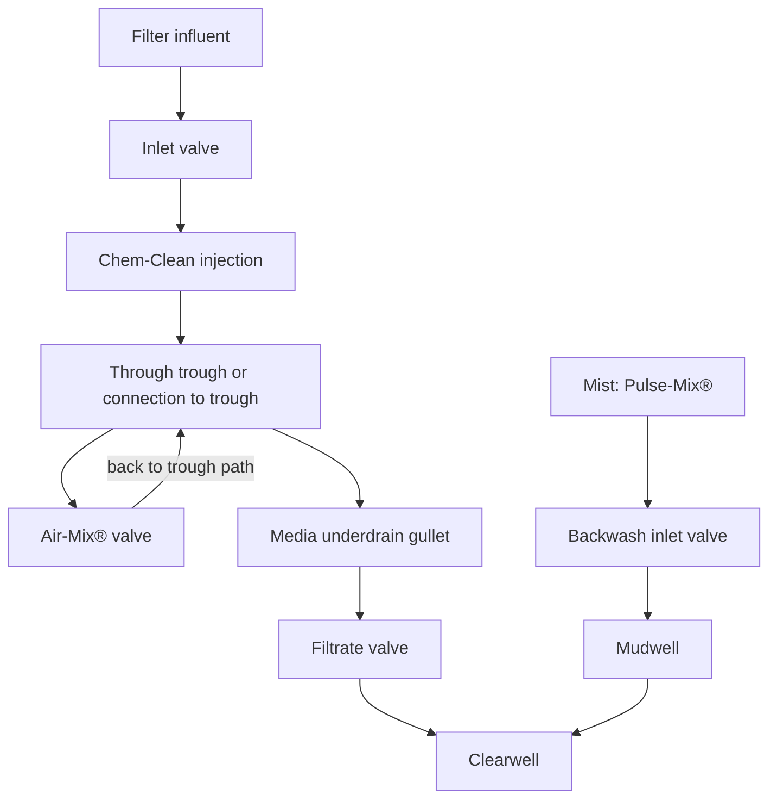

\n---\n

# FIGURE 14.17 Typical schematic of pulsed bed filter

Moving bed filters provide a continuous supply of filtered water without the interruption of backwash cleaning cycles. In a typical downflow configuration, influent enters the top of the filter and flows down through layers of increasingly finer sand. Filtered water is collected in a central filtrate chamber before exiting. Solids captured in the filter bed are drawn downward with the sand into an air-lift pump. The turbulent upward flow in the air lift provides scrubbing action that effectively separates sand and solids before discharging to the filter wash box. The wash box is a baffled chamber that allows gravity separation of cleaned sand from concentrated waste solids. From the wash box, regenerated sand returns to the top of the filter bed, and the solids and BRW are piped to a suitable disposal site. Filter media size is tailored to individual application requirements, and effective size ranges from 0.6 to 1.0 mm (0.02 to 0.04 in.).

In a typical upflow moving bed filter (also known as upflow continuous backwash filter), influent entering the bottom of the filter flows upward through a series of riser tubes. Wastewater spreads evenly into the sand bed through the open bottom of an inlet distribution hood and flows upward through the downward-moving sand bed as solids are removed. Clean filtrate exits the sand bed and overflows a weir as it leaves the filter. Simultaneously, the sand bed, with the accumulated solids, is drawn downward into an air-lift pipe positioned in the center of the filter. A small volume of compressed air is introduced to the bottom of the air lift. Sand, dirt, and water surge upward through the pipe at approximately 8000 L/m^2 min (200 gpm/sq ft). This violently turbulent upward flow scours impurities from the sand. On reaching the top of the air lift, dirty slurry spills over into a central reject compartment. Sand returns to the bed through the gravity washer separator that allows fast settling sand to penetrate, but not the dirty liquid. The sand bed is continuously cleaned while a filtrate and reject stream are produced. A schematic of a moving bed filter is given in Figure 14.18
\n---\n

# FIGURE 14.18 Typical schematic of a moving bed filter

```mermaid
graph TD
  Influent[Influent]
  FilterBox[Filter box / moving bridge / ABW filter]
  MediaBed[Filter media bed]
  FilterMedia[Filter media]
  FiltrateBox[Filtrate channel / filtrate]
  CleanFiltrate[Clean filtrate]
  FilteredWater[Filtered water]
  MediaWasher[Media washer]
  CleanedMedia[Cleaned media]
  AirLiftPump[Air-lift pump]
  BackwashWaste[Backwash waste]
  BackwashHood[Backwash hood]
  Headloss[Headloss path (to effluent)]
  Underdrain[Underdrain compartments]
  Compartments[Compartments / cells]
  InletChannel[Influent channel]

  Influent --> FilterBox
  FilterBox --> MediaBed
  MediaBed --> FilterMedia
  FilterBox --> FiltrateBox
  FiltrateBox --> CleanFiltrate
  CleanFiltrate --> FilteredWater
  MediaWasher --> CleanedMedia
  CleanedMedia --> MediaBed
  Headloss --> FilteredWater
  AirLiftPump --> BackwashWaste
  BackwashHood --> BackwashWaste
  FiltrateBox --> InletChannel
  Underdrain --> Compartments
  Compartments --> MediaBed
  FiltrateBox --> Headloss
```

FIGURE 14.18 Typical schematic of a moving bed filter.

The ABW filter—which is often referred to as a traveling bridge filter, continuous backwash filter, or low head filter—typically is constructed in modules that are 4.9 m (16 ft) wide. The length of the unit and the number of units are then adjusted to provide the required filter surface area. The filter uses a relatively shallow depth of media, typically less than 300 mm (12 in.), and the filter is backwashed relatively continuously. The change in backwash procedure eliminates the need for BRW storage basins and reduces capital costs.

Figure 14.19a shows a longitudinal section through an ABW filter. The filter underdrain system is divided into compartments, or cells, and each cell is individually backwashed as the traveling bridge and backwash hood are positioned over the cell to be cleaned. Figure 14.19b is a transverse section through an ABW filter: Water enters through the influent channel; flows into the filter box, and is collected in the filtrate channel. Headloss from the influent to the effluent channel is typically less than 1.5 m (4.9 ft), which is the source of the term "low head filter." Typical configurations for the influent and filtrate channels are indicated.

\n---\n

Original designs for ABW filters did not incorporate a supplemental washing mechanism, such as air wash or surface wash, and filters performed primarily as surface filters. This resulted in considerable sensitivity to TSS loadings; high TSS concentrations in influent to the filters (e.g., more than 40 to 50 mg/L) often resulted in overflow. Modern designs incorporate an air wash mechanism that improves the performance of the ABW filter.
Figure 14.20 presents a time-series plot of effluent TSS concentrations for the traveling bridge filters used at the Houston, Texas, WRRF (oxygen-activated sludge process).

Figure 14.21 is a time-series plot of filter influent and effluent TSS concentrations for the ABW filters used at the San Antonio, Texas, WRRF (nitrifiying activated sludge). The performance difference between the two facilities emphasizes the importance and effects of upstream biological treatment processes on filtration efficiency:

<Figure 14.20 and Figure 14.21 – Schematic components>

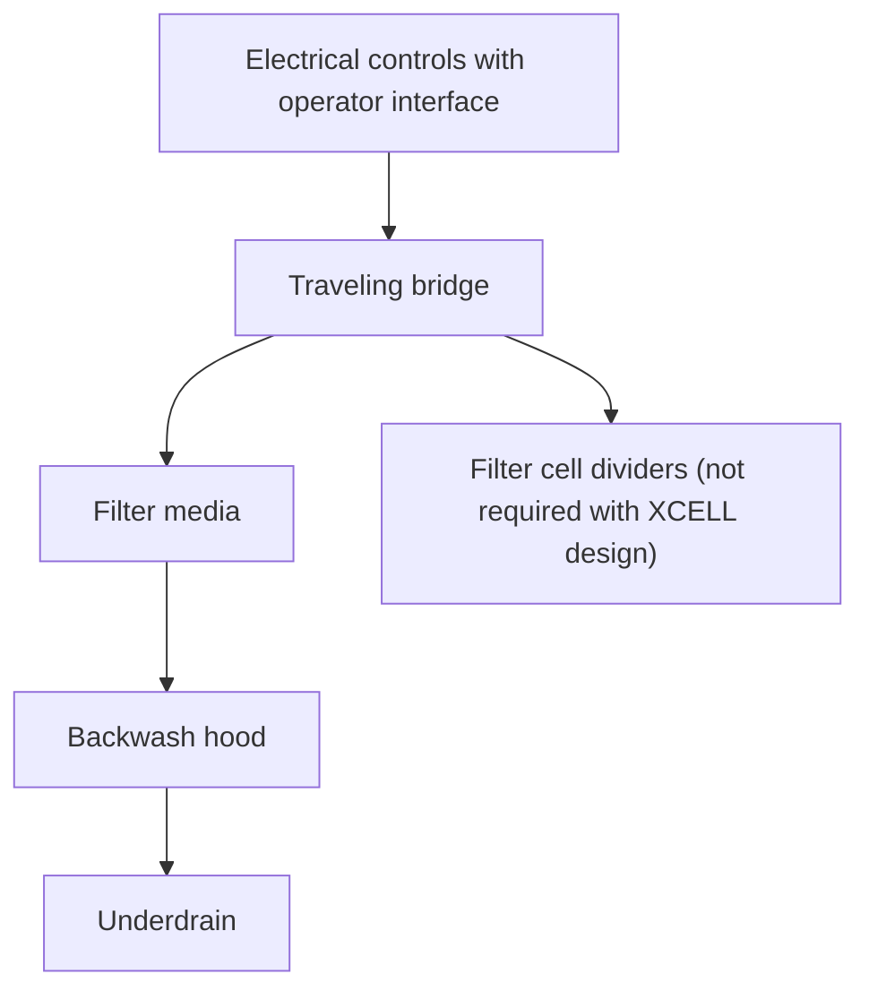

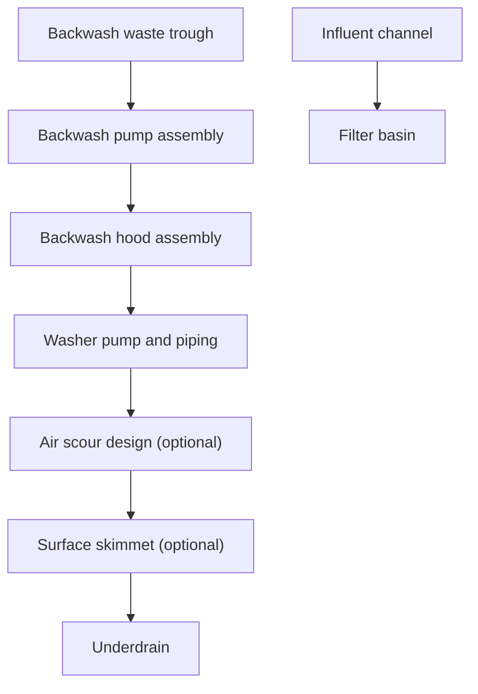

\n---\n

## 2.3.2 Nongranular Media Filtration

Several filtration technologies using nongranular media have been developed in the last 20 years to minimize the needs of the backwash operation and the BRW ratio and to provide different operational and design advantages. These filtration technologies can be grouped under two main categories: (1) compressible media filtration and (2) disk filtration.

### 2.3.2.1 Compressible Media Filtration

One of the filtration technologies using nongranular (i.e., synthetic material) is the compressible media filter (CMF), which was first developed in Japan and has been installed in many facilities around the world since its development. The filter bed consists of a large number of compressible balls, which are formed by shrinking synthetic fibers into a quasi-spherical shape resulting in a complex woven structure (see Figure 14.22). The CMF was first introduced in the United States about 20 years ago, and its application has increased in the last 10 to 15 years:

```
20
18
16
14
12
10
8
6
4
2
```

```
0   31  61  91 121 151 181 211 241 271 301 331 361
Days
```

FIGURE 14.19 (a) Longitudinal section through automatic backwashing filter; (b) transverse section through an automatic backwashing filter

\n---\n

# 2.3.2.1.1 Mechanical Compression Type

## FIGURE 14.20 City of Houston’s 69th Street filter effluent total suspended-solids concentrations

- A time-series plot of total suspended solids (TSS) in mg/L versus date.  
- Y-axis labeled TSS (mg/L) with scale from 0 to 70 mg/L (major ticks at 0, 10, 20, 30, 40, 50, 60, 70).  
- X-axis shows monthly timestamps across 1998: 1/1/98, 1/31/98, 3/2/98, 4/1/98, 5/1/98, 5/31/98, 6/30/98, 7/30/98, 8/29/98, 9/28/98, 10/28/98, 11/27/98, 12/27/98.  
- Two data series are labeled: “ABW filter influent” and “ABW filter effluent.” The plot indicates fluctuations in TSS over the year, with the influent generally exhibiting higher concentrations than the effluent.

> Caption: FIGURE 14.20 City of Houston’s 69th Street filter effluent total suspended-solids concentrations.

## FIGURE 14.21 San Antonio Dos Rios facility filter influent and effluent total suspended-solids concentrations

- A time-series figure showing filter influent and effluent TSS concentrations for the San Antonio Dos Rios facility.  
- As with Figure 14.20, two data series are present (influent and effluent) over a period that includes multiple measurements throughout the year. The plot illustrates how the effluent TSS compares to the influent TSS for filtration performance.

> Caption: FIGURE 14.21 San Antonio Dos Rios facility filter influent and effluent total suspended-solids concentrations.

## FIGURE 14.22 Compressible filter medium for: (a) Fuzzy Filter (courtesy of Schreiber LLC), (b) FlexFilter (courtesy of WesTech Engineering, Inc.)

- (a) Fuzzy Filter: A photograph showing the compressible filter medium arrangement (rounded, pellet-like elements) as used in some filter media designs.  
- (b) FlexFilter: A photograph showing a different compressible filter medium configuration (granular/aggregated media), illustrating the physical appearance of the media.

> Caption: FIGURE 14.22 Compressible filter medium for: (a) Fuzzy Filter (courtesy of Schreiber LLC), (b) FlexFilter (courtesy of WesTech Engineering, Inc.)

----

## 2.3.2.1.1 Mechanical Compression Type
\n---\n

One of the CMF technologies, also known as the Fuzzy Filter™, involves the use of mechanical compression of the filter medium. The medium has some unusual properties, including being highly porous (approximately 90%) and compressible. The Fuzzy Filter is also a depth filter similar to GMFs. Important design parameters include medium depth, compression ratio, and filtration rate (Caliskaner et al., 1999). The filter medium is resistant to temperature, pH, and acid and has good memory characteristics. The density of the medium is slightly greater than that of water. Because of its low density, the filter medium is retained between two perforated plates (see Figure 14.23). The filter medium properties, such as effective collector size, porosity, and depth, can be adjusted in response to changing influent conditions because it is compressible. Properties of the filter medium are altered by adjusting the position of the upper moveable plate.

Typical uncompressed medium depth for secondary effluent filtration is 760 mm (30 in.). For example, to compress the medium 30% (average value with respect to depth), the compression plate is lowered until the medium thickness is 530 mm (21 in.). Medium properties such as the porosity, collector size (i.e. pore/interstice size), and depth all decrease with the increase in the applied compression ratio. The corresponding porosity, medium depth, and collector size values of the medium are tabulated in Table 14.6 at different medium compression ratios.

The CMF is able to operate at filtration rates up to 1600 L/m^2·min (40 gpm/ft^2) because of reduced headloss development resulting from high porosity of the medium (Caliskaner et al., 2011a). Typical average design filtration rates are between 800 and 1200 L/m^2·min (20 to 30 gpm/ft^2). Footprint requirements are reduced significantly (approximately 75%) compared to the granular filters because of the high filtration rates. Influent and effluent turbidity values and headloss development curves (without chemical addition) are presented in Figure 14.24 (Caliskaner et al., 1999). The medium compression ratio was 40% for the filtration cycle shown in Figure 14.24. Removal performance can be increased approximately 50% to 70% with chemical addition. Chemical type, dose, and addition duration should be selected carefully to prevent medium blinding:
\n---\n

# FIGURE 14.23 Schematic view of filter with a compressible filter medium

The properties, porosity, collector size, and depth, of the filter bed can be adjusted by compressing the filter material (Caliskaner et al., 1999)

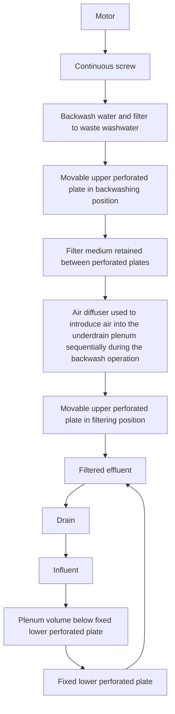

During the filtration cycle, secondary effluent is introduced in the bottom of the filter into a plenum. The influent wastewater flows upward through the filter medium, and is discharged from the top of the filter. On a regular operational basis, the filtration cycle is interrupted for backwashing when the terminal headloss or breakthrough (as measured in effluent turbidity) is reached. At the inception of the backwash cycle, the flow is diverted to the backwash water line, and the upper plate is moved up mechanically to increase the bed volume for backwashing. Secondary effluent typically is used to backwash the filter; eliminating the need for a clean water tank. While secondary effluent continues to flow up
\n---\n

through the filter, air is introduced below the lower perforated plate first from the left side and then from the right side of the filter (through separate air pipes in both sides). The complete backwash cycle takes approximately 20 minutes. To start the next filtration cycle, the upper perforated plate is returned to its desired position to obtain the required level of medium compression. The typical backwash rate is 410 L/m^2·min (10 gpm/sq ft), therefore secondary influent flowrate is reduced at the beginning of the backwash cycle (e.g., from 1230 L/m^2·min [30 gpm/sq ft] to 410 L/m^2·min [10 gpm/sq ft]). The BRW ratio ranges between 1% and 5% depending on the specific filtration conditions, with average typical values around 2% to 3%. Underdrain systems are eliminated in the CMF system because a granular medium is not used. The filtration and backwash cycles are illustrated in Figure 14.25.

<table>
<thead>
<tr>
<th>Bed Compression (%)</th>
<th>Porosity (%)</th>
<th>Depth (mm)</th>
<th>Effective Collector Size (mm)</th>
</tr>
</thead>
<tbody>
<tr>
<td>0</td>
<td>90</td>
<td>760</td>
<td>0.44</td>
</tr>
<tr>
<td>15</td>
<td>88</td>
<td>645</td>
<td>0.38</td>
</tr>
<tr>
<td>30</td>
<td>86</td>
<td>530</td>
<td>0.23</td>
</tr>
<tr>
<td>40</td>
<td>83</td>
<td>460</td>
<td>0.17</td>
</tr>
</tbody>
</table>

TABLE 14.6 Medium Properties at Different Medium Compression Ratios
\n---\n

# FIGURE 14.24 Typical performance of the compressible medium filter at a filtration rate of 820 Llm2-min

- (a) influent and effluent turbidity data versus time
- (b) headloss development versus time
- (c) headloss development versus suspended-solids accumulation (Caliskaner, 1999).

<table>
<thead>
<tr><th>Subfigure</th><th>Description</th><th>Key observations (inferred from figure)</th></tr>
</thead>
<tbody>
<tr><td>(a)</td><td>Influent turbidity and effluent turbidity versus time</td><td>Influent turbidity shows spikes; effluent turbidity remains relatively lower; turbidity values appear to range up to about 6–8 NTU during spikes with baseline around 2 NTU.</td></tr>
<tr><td>(b)</td><td>Headloss development versus time</td><td>Headloss increases over time with pronounced excursions at the times of turbidity spikes (roughly aligned with 500, 1000, and 1500 min); overall upward trend toward higher headloss (up to several thousand mm of H₂O).</td></tr>
<tr><td>(c)</td><td>Headloss development versus suspended-solids accumulation</td><td>Headloss rises with increasing suspended-solids accumulation (up to ~20,000 g/m³); periodic sharp drops corresponding to backwash/regeneration events (at ~5,000; ~10,000; ~15,000 g/m³).</td></tr>
</tbody>
</table>

FIGURE 14.24 Typical performance of the compressible medium filter at a filtration rate of 820 Llm2-min: (a) influent and effluent turbidity data versus time, (b) headloss development versus time, and (c) headloss development versus suspended-solids accumulation (Caliskaner; 1999).

Clean filter headloss increases linearly with filtration rate. Headloss also increases as porosity and collector size of the medium decrease as compression ratio is increased. The
\n---\n

## 2.3.2.1.2 Hydraulic Compression Type

clean filter headloss values as a function of the filtration rate and medium compression ratio is shown in Figure 14.26.

The typical terminal headloss value is between 1.8 and 3.7 m (6 and 12 ft). Figure 14.24 illustrates the development of headloss with time and TSS accumulation for a filtration rate of 820 L/m2·min (20 gpm/sq ft) and a medium bed compression ratio of 40%.

### FlexFilter technology

Another prominent-type CMF technology for tertiary filtration, known as “FlexFilterTM,” is configured based on downflow filtration. FlexFilter uses an engineered bladder coupled with the hydraulic pressure of the influent water to laterally compress the media. Influent water fills the area behind the bladder causing the bladder to compress the media as illustrated in Figure 14.27 resulting in a conical-shaped bed. Full compression is achieved as the water level reaches the inlet weir elevation. Filtration starts as influent water discharges over the influent weir and passes downward through the compressed medium. The lateral compression provides a porosity gradient with loose media at the top and compressed media at the bottom. As a result, large particles are removed at the top and fine particles are removed at the bottom. As solids are removed within the media, the influent level increases until a backwash is triggered. When the influent pressure is released, the bladder relaxes forming a curved bottom allowing smooth rotation when backwashing. During backwash, a rotational fluidized bed and air scrub is used to clean the media, with air-lift of the spent backwash water into troughs. Secondary influent at a rate of 205 L/m2·min (5 gpm/sq ft) is used for backwash. Backwash airflow rate is 0.05 m3/m2·s (10 scfm/sq ft). Typical backwash cycle ranges between 20 and 25 minutes. The operation of FlexFilter is illustrated in Figure 14.28.

> Mermaid diagram for FlexFilter operation
> 
> ```mermaid
> graph TD
>   A[Influent water enters and fills area behind bladder]
>   B[Bladder compresses media forming a conical bed]
>   C[Filtration starts as water discharges over weir and passes downward]
>   D[Lateral compression creates a porosity gradient: loose top, dense bottom]
>   E[Solids removed; influent level rises until backwash triggers]
>   F[Backwash: release of pressure; bladder relaxes; curved bottom]
>   G[Backwash: rotational fluidized bed and air scrub; water lifted to troughs]
>   H[Secondary influent for backwash: 205 L/m2·min]
>   I[Backwash airflow rate: 0.05 m3/m2·s]
>   J[Backwash cycle: 20–25 minutes]
>   A --> B --> C --> D --> E --> F --> G --> H --> I --> J
> ```
\n---\n

# FIGURE 14.25 Filtration and wash cycles of compressible medium filter (courtesy of Schreiber, LLC)

The page contains a three-panel illustration showing the Filtration Cycle, Wash Cycle, and Flush Cycle.

- Filtration Cycle
  - Labels visible include: Actuator for Upper Plate; Perforated Upper Plate; Perforated Lower Plate; Compressible Bed of Fuzzy Media; Influent; Effluent; Washing water interactions are implied by arrows and surrounding text.

- Wash Cycle
  - Labels visible include: Actuator for Upper Plate; Diffused Air Wash Bubbles; Fuzzy Media; Washing Air; Influent (Washing Water); Perforated Upper Plate; Perforated Lower Plate; Washing/Influence pathways; Inlet/Outlet annotations.

- Flush Cycle
  - Labels visible include: Actuator for Upper Plate; Perforated Upper Plate; Compressible Bed of Fuzzy Media; Influent; Effluent; Wash water interactions indicated by arrows; Fuzz media and plate components annotated.

----

FIGURE 14.25 Filtration and wash cycles of compressible medium filter (courtesy of Schreiber, LLC).

[Graph illustrating head loss vs. filtration rate for different compression levels]

- The graph plots Clean filter head loss (mm of H2O) on the y-axis against Filtration rate (L/m^2/min) on the x-axis.
- Legend (compression levels):
  - 0 % compression
  - 15 % compression
  - 30 % compression
  - 40 % compression
- X-axis labels shown: Filtration rate, L/m^2/min
  - Tick marks at 0, 500, 1000, 1500
- Secondary axis / side indicators (likely correspond to filter dimensions or height in inches):
  - 60"
  - 40"
  - 34"
  - 20"
  - 12"

Head-loss data series are shown for each compression level, with lines rising from the origin to respective maximums as filtration rate increases.

- The bottom axis also shows Gpm/sq ft (left) and corresponding values 5, 10, 20, 30 for an alternate measure of flow per square foot.

\n---\n

# FIGURE 14.26 Initial clean bed headloss across the filter medium versus filtration rate and bed compression
(Caliskaner and Tchobanoglous, 2005a).

Main design considerations for FlexFilter include medium depth, hydraulic and solids loading rates, and backwash management. The typical medium depth is 760 mm (30 in.) for secondary effluent filtration applications. Conical-shaped media bed provides a porosity (and pore size) gradient from 0% to 50% compression ratio. Design filtration rates depend on solids and hydraulic loading and headloss development. Filter hydraulic rates up to 800 L/m^2·min (20 gpm/ft^2) are used for secondary effluent filtration. An example layout for a FlexFilter system is given in Figure 14.29.

----

FIGURE 14.27 Compression of the FlexFilter media (courtesy of WesTech Engineering, Inc.).

```
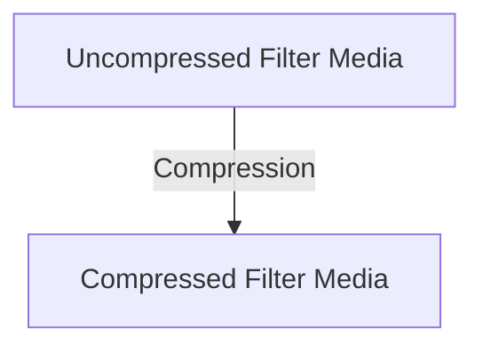
```
\n---\n

### FlexFilter operation cycle

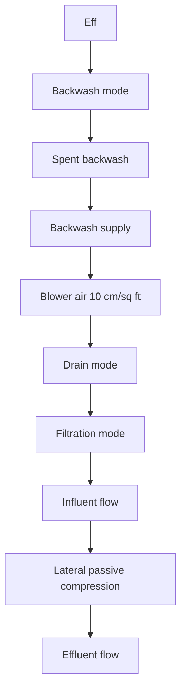

**FIGURE 14.28 Operational cycles of FlexFilter (courtesy of WesTech Engineering, Inc.)**

For both CMF technologies, design ranges for medium depth, the medium compression ratio, and filtration rates depend on specific wastewater characteristics such as filter influent TSS loads/concentrations:

### 2.3.2.2 Disk Filtration

Like the CMF, disk filtration was introduced for secondary effluent filtration in the last 20
years to reduce the requirements of backwash operation (and BRW ratio) and to simplify
filter operation. The two other main advantages of disk filters are the reduced footprint and

\n---\n

## Disk Filter Concepts

Low operational head requirements. As a result of these advantages, disk filters are frequently used to retrofit into basins formerly used for GMF to increase capacity.

Disk filter concept employs either depth or surface filtration mechanisms depending on the technology used. Filtration occurs primarily on the surface of the filter media in case for surface filtration (i.e., as opposed to throughout the media depth). Several proprietary disk filters exist for secondary effluent filtration with different configurations, media, and backwash methods. The design engineer should review the available technologies because design, operational, and filtration characteristics vary considerably between different disk filter manufacturers and technologies:

FIGURE 14.29 Example layout of FlexFilter system (courtesy of WesTech Engineering, Inc.):

```mermaid
flowchart LR
    Influent[Influent channel] --> FilterStrips[4 filter strips (6'x30' each)]
    FilterStrips --> FilterDrain[Filter drain]
    FilterDrain --> Waste[Waste]
    Waste --> BackwashStorage[Backwash & drain down storage]
    BackwashStorage --> BackwashSupply[Backwash supply]
    BackwashSupply --> FilterStrips
    FilterStrips --> Effluent[Effluent channel]
    BackwashAir[Backwash air] --> FilterStrips
```

## 2.3.2.2.1 Cloth Depth Filtration

Cloth depth filters (CDFs) use different types of cloth material (such as woven nylon or polyester construction) to create a dense fiber arrangement to separate the TSS remaining in the secondary effluent. In its operational state, the cloth medium provides an
\n---\n

# Cloth Filtration Media (CDF)

Approximately 5-mm (0.2-in.) thickness, which allows depth filtration to occur in addition to surface filtration. The pore size of the media is significantly smaller compared to the GMFs and CMFs resulting in similar medium depth-to-media diameter (L/d) ratios (i.e., similar medium depth-to-medium size ratios observed for GMF technologies). The CDF is one of the most common disk filtration technologies used for secondary effluent filtration.

Different types of cloth media are used depending on the manufacturer. Manufacturers may also offer different cloth media in order to address site-specific conditions (e.g., chemical resistance, different pore size characteristics) (see Figure 14.30). Cloth media technologies can vary in their construction with materials that can be woven, knitted, or produced by needle felting. Materials can be selected for the application and often include nylon, acrylic, or polyester material. The use of woven pile cloth materials has emerged as the most common type of CDF due to improvements in backwash efficiency. The density and thickness of the filter cloth can also be selected according to the characteristics of the influent wastewater and desired effluent quality. The pore size of the cloth media is not absolute because of the random arrangement of the CDF fibers. Nominal pore size ranges between 5 and 10 μm for different type of cloth materials, but significant removals can be realized in smaller particle size ranges.

<table>
<thead>
<tr><th>OptiFiber Cloth Filtration Media</th><th>Bag 2</th><th>Bag 3</th></tr></thead>
<tr><td>Bag 1: Dark material</td><td>Bag 2: White material</td><td>Bag 3: Dark/gray material</td></tr>
</table>

- Pile filaments
- Carrier fabric

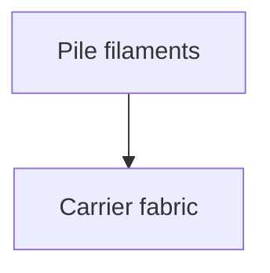
\n---\n

## FIGURE 14.30 Cloth depth filter: (a) media options, and (b) microscopic view of one type of media (courtesy of Aqua-Aerobic Systems, Inc.)

Typical maximum design filtration rates are between 240 to 280 L/m^2·min (6 and 7 gpm/sq ft). Although testing has shown that these filters can operate at hydraulic loading rates up to 800 L/m^2·min (20 gpm/sq ft) for short periods. The maximum hydraulic loading rate can also be limited by the influent TSS when the solids loading rate exceeds the manufacturer’s recommendation (typically 400 to 700 g/m^2·h):

Turbidity and TSS removal performance of CDF is similar to GMF and CMF technologies as illustrated in Figure 14.31 (Caliskaner et al., 2011b). The removal performance results presented in Figure 14.31 were obtained (without chemical addition) from a 6-month side-by-side pilot testing of CDF, CMF, and GMF technologies. CDF removal performance can be increased approximately 50% to 70% with chemical addition, but chemical type, dose, and addition duration should be selected carefully to prevent medium blinding. The footprint requirement is 70% to 75% less compared to GMFs (Caliskaner et al., 2011; Haecker and Healy, 2006a and 2006b). The vertical configuration of the filtration disks provides a relatively large filter surface area in a small footprint (see Figure 14.32). An individual filter can contain 1 to 24 disks. The number of disks in a filter unit depends on the design flow and filter loading rates and the size of an individual disk. The diameter of an individual disk ranges from 0.8 m (2.8 ft) to 3.05 m (10 ft) depending on the disk manufacturer, model, and design flow and loading rates. As seen in Figure 14.32, different CDF systems such as the diamond or MegaDisk configurations that use the same type of cloth filter medium are available. The diamond configuration was manufactured to accommodate low-profile/shallow basin designs (Baumann et al., 2006).

During the filtration cycle, the wastewater flow is from the outside to the inside of the disks. Several cloth disks covered by cloth media are mounted vertically to a common hollow tube, which conveys filtered effluent from the filter. Wastewater passes through the cloth media by gravity and enters inside filter disks that are connected to the effluent line by the hollow tube. A total hydraulic head between 0.75 and 1.2 m (2.5 and 4 ft) is required for the operation of the disk filters. It is common to use weirs on the influent and effluent sides of the filter to maintain a constant hydraulic profile outside of the filter: The filter is at rest during the filtration operation, which allows larger particles to settle to the
\n---\n

bottom of the tank: The prior sedimentation of larger size particles decreases the amount of solids to be filtered. The settled solids are pumped periodically to the headworks (or to the solids processing facilities). The design should also accommodate handling of the floating and settling material in the filter tanks outside of the disks.

## Secondary effluent filtration (no chemical addition)

<table>
<thead>
<tr><th>Fraction under</th><th>Influent (NTU)</th><th>Cloth disk (NTU)</th><th>Granular media (NTU)</th><th>Comressive media (NTU)</th></tr>
</thead>
<tbody>
<tr><td>0%</td><td>≈2.50</td><td>≈1.00</td><td>≈1.00</td><td>≈0.75</td></tr>
<tr><td>20%</td><td>≈2.60</td><td>≈1.25</td><td>≈1.20</td><td>≈1.00</td></tr>
<tr><td>40%</td><td>≈2.80</td><td>≈1.45</td><td>≈1.50</td><td>≈1.20</td></tr>
<tr><td>60%</td><td>≈3.20</td><td>≈1.70</td><td>≈2.00</td><td>≈1.40</td></tr>
<tr><td>80%</td><td>≈4.20</td><td>≈2.60</td><td>≈2.90</td><td>≈2.40</td></tr>
<tr><td>100%</td><td>≈4.70</td><td>≈3.00</td><td>≈3.60</td><td>≈3.00</td></tr>
</tbody>
</table>

FIGURE 14.31 Probability distribution function for filter influent and filter effluent from parallel testing of GMF, CMF, and CDF technologies at Eugene/Springfield (Oregon) water pollution control facility (Caliskaner et al., 2011b).

Backwash cycle starts when the terminal headloss or a certain run time is reached: The disk filters backwash more frequently (e.g., compared to CMFs or GMFs) because of the low head operational characteristics and low terminal headloss design values. Clean medium headloss ranges between 5 and 10 cm (2 and 4 in:): The pressure loss across the membrane increases as more particles are accumulated mostly on the surface and some within the cloth medium depth; a mat forms on the cloth surface. Backwash typically is initiated based on headloss development because the terminal headloss value is set at relatively low levels of approximately 0.3 to 0.5 m (12 to 18 in.) Accumulated particles are
\n---\n

removed from the cloth media surface by the liquid suction applied to each side of the disc. A vacuum apparatus is mounted on each side of the filter disk for the liquid suction backwashing. Depending on the disk technology, the cloth disk or vacuum backwash apparatus rotates slowly at approximately 1 rpm during backwash allowing each disk segment to be vacuumed. A typical schematic of a CDF system is illustrated in Figure 14.33.

<table>
<thead>
<tr><th>Figure</th><th>Description</th></tr>
</thead>
<tbody>
<tr><td>(a)</td><td>Aquadiamond configuration</td></tr>
<tr><td>(b)</td><td>Aquadisk configuration</td></tr>
<tr><td>(c)</td><td>MegaDisk configuration in package and concrete systems</td></tr>
</tbody>
</table>

FIGURE 14.32 Different cloth depth filter configurations: (a) Aquadiamond configuration; (b) Aquadisk configuration; and (c) MegaDisk configuration in package and concrete systems (courtesy of Aqua-Aerobic Systems, Inc.).
\n---\n

## 2.3.2.2.2 Cloth Surface Filtration

Filtration operation is continuous because only a small portion of the media is out of service during backwash. Filtration continues for an individual disk during the backwash cycle. The portion of the disk in contact with the vacuum apparatus (approximately 5%) is cleaned while the remainder of the disk continues to filter. Filtered water is used for backwash; therefore, a separate BWS tank is not required: The need for a BRW storage basin also is eliminated with the disk filter technology because of continuous filtration operation. The BRW ratio typically ranges between 1% and 3% depending on the specific filtration conditions (Bourgeous et al., 2003; Caliskaner et al., 2011b). Within a particular filter, the BRW ratio will be approximately directly proportional to the influent solids concentration_

              Cloth media disks    Drive

                                   motor

 Backwash
 shoe
                                   Effluent
                                   port

Influent
PLC    weir
control
system    Solids collection

          Backwash    manifold
          solids pump    Backwash valve

FIGURE 14.33 Typical schematic of a cloth depth filter system (courtesy of Aqua-Aerobic Systems, Inc.):

                         2.3.2.2.2 Cloth Surface Filtration

Like CDFs, filtration is continuous in cloth surface filtration (CSF) disk filters. The main
differences between CDFs and CSFs are medium type, filtration removal mechanisms,
\n---\n

# CSF Disk Filtration Technologies

flow direction, and submergence. The disks are partially submerged in common CSF technologies used for secondary effluent filtration.

The CSF technologies involve use of a cloth medium made from woven polyester. The medium looks like membrane material and has an absolute pore size between 10 and 20 μm (e.g., depending on the manufacturer) with insignificant depth. The disk panel can be a flat or pleated surface depending on the manufacturer. Pleated panel design was offered to provide more filtration surface area per disk. Different types of CSF technologies are shown in Figures 14.34 through 14.36.

The CSFs can be operated up to 480 L/m2·min (12 gpm/sq ft). Typical maximum design filtration rates are between 120 to 240 L/m2·min (3 and 6 gpm/sq ft). The vertical configuration of the filtration disks provides a relatively large filter surface area in a small footprint (see Figure 14.32). The diameter of an individual CSF disk ranges between 1.7 m (5.6 ft) and 2.6 m (8.4 ft) among different manufacturers and models. One filter tank can include 24 to 32 disks. The footprint requirement is similar to that of CDF systems: Total hydraulic head requirement for the operation is typically between 0.75 and 1.2 m (2.5 and 4 ft).

In contrast to the CDF system, influent wastewater flows by gravity into the filter disks from the center influent collection drum. Filter media mounted on two sides of the disks separate TSS. Filter media retain solids while filtered water flows outside the disks and into the effluent collection tank. Only filtered effluent passes out of the disk filter with this arrangement: During normal operation, the disks are at rest until the water level in the inlet channels rises to a specific point, such as terminal headloss value. Headloss across the filter medium increases as more particles are accumulated on the disk surface. Clean filter headloss values are similar to the CDF systems: Terminal headloss varies between 0.3 m (1 ft) and 0.6 m (2 ft) depending on the technology. When terminal headloss is reached, the backwash cycle is initiated automatically. The filtered effluent is used for backwash water; eliminating the need for a separate source of cleaning water or an additional BWS tank. The filtered effluent is pumped to the backwash spray header and nozzles, washing solids into the collection trough as the disks rotate. In normal operation, the disks are approximately 60% to 65% (depending on the disk filter manufacturer)
\n---\n

# Evoqua Forty-X Disk Filter, Model E1403TLSS

submerged. The need for a BRW storage basin is eliminated because of the continuous filtration operation. The typical BRW ratio is between 1% and 3%.

- Sliding covers
- Spray nozzles for backwashing
- Drum drive
- Drum
- Discs (2 of 3 shown)
- Reject
- Effluent (not visible)
- Influent
- Effluent weir
- Backwash pump
- Bearing assemblies
- Drain
- Bypass
- Bypass weir
- Control panel

Evoqua Forty-X disk filter components, model E1403TLSS shown, one disc removed for clarity.

```mermaid
graph TD
Influent[Influent]
Reject[Reject]
Influent --> Reject
DrumDrive[Drum drive] --> Drum
Drum[Drum] --> Discs[Discs]
Discs --> SlidingCovers[Sliding covers]
Discs --> EffluentWeir[Effluent weir]
EffluentWeir --> Effluent[Effluent (not visible)]
SprayNozzles[Spray nozzles for backwashing] --> BackwashPump[Backwash pump]
BackwashPump --> SprayNozzles
BearingAssemblies[Bearing assemblies] --> Drums
Drain[Drain]
Bypass[Bypass] --> BypassWeir[Bypass weir] --> Drain
ControlPanel[Control panel] --> DrumDrive
ControlPanel --> BackwashPump
```

FIGURE 14.34 Schematic of Forty-X Filter (courtesy of Evoqua, Inc.)

\n---\n

## FIGURE 14.35 Partially submerged disk filters in single filter units
Partially submerged disk filters in single filter units. Courtesy of Veolia Water Technologies, Inc. (dba Kruger).

```
Filter rotation
Influent  --->  [Disk filter]  --->  Effluent
```

## FIGURE 14.36 Schematic of stainless steel disk filters: (a) UltraScreen filter (courtesy of Xylem, Inc.); (b) Quantum filter (courtesy of Nova, LLC).
\n---\n

## 2.3.2.2.3 Stainless Steel Disk Filtration

Another emerging disk filter uses woven stainless steel as the filtering medium. Filtration occurs mainly via surface filtration mechanisms. For secondary effluent filtration applications, the woven-wire stainless steel mesh pore size ranges between 10 and 20 µm. The steel disk filter was first used for secondary effluent filtration in Europe in the early 2000s, and its use has increased worldwide (and in United States) within the last 5 to 10 years.

The steel medium disk filter is a continuous operation filter like other disk filters. Secondary effluent is introduced in the middle of the disks. Filter disks retain the solids while the filtered water flows outside the disks into the collection well. Disks operate in slow rotation during filtration cycle (also referred as the dynamic tangential filtration). The rotational speed is variable to provide operational adjustments for hydraulic and TSS load changes. Individual disks range in diameter between 1.0 and 1.6 m (3.1 and 5.1 ft) between different manufacturers and models, and an individual unit can contain up to 16 pairs of disks.

As filtration continues, particulates accumulate on the surface of the stainless steel medium; increasing headloss. Typical total operational head requirement is between 0.75 and 1.2 m (2.5 and 4 ft). When the headloss increases to a preset terminal headloss limit, backwash is started. Each disk has a dedicated spray header for backwashing: Typical backwash cycle is between 30 seconds and 1 minute. The BRW is collected in a common stainless steel trough below the washing assembly and exits the filter through a drain line. Effluent water is used for backwash; therefore, a separate BWS tank is not required. The BRW ratio is also very low similar to other disk filtration technologies (e.g., typically between 0.5% and 2%). Figure 14.36 illustrates schematics of two stainless steel disk technologies used for secondary effluent filtration:

The steel medium disk filters can be operated up to 640 L/m^2·min (16 gpm/sq ft). Typical maximum design filtration rates are between 160 to 280 L/m^2·min (4 to 7 gpm/sq ft). Similar to CDF and CSF, vertical configuration of the disks provides a large filter surface area for a small footprint:

## 3.0 Activated Carbon Adsorption
\n---\n

# Activated carbon in wastewater treatment

The use of activated carbon in wastewater treatment systems is a proven process for removal of organic compounds, while this is not a widely adopted practice due to the high cost of the process and carbon replacement and/or regeneration. Activated carbon can be used to adsorb residual chlorine in the water; although this is not a primary application. Activated carbon can be used in two forms: granular activated carbon (GAC) and powdered activated carbon (PAC).

There are three types of activated carbon available for treatment:

1. Coconut shell—small pore sizes, used for low-molecular-weight organics removal;
2. Coal—moderate pore size, used for moderate-molecular-weight organics removal; and
3. Lignite—large pore size, used for large organics removal.

As a tertiary treatment method, carbon adsorption and regeneration have been used for several years to process domestic wastewater contaminated with industrial waste of organic origin and biologically treated wastewater. Design and operating considerations have been well defined and documented (Culp and Culp, 1978; U.S. EPA, 1970, 1973).

Somewhat less frequently, activated carbon also has been used in chemical-physical WRRFs that use chemical coagulation and filtration to remove phosphorus and TSS and carbon adsorption to remove organics. The chemical-physical process appears to be an alternative to biological systems in some instances. To determine full-scale process requirements, however, both laboratory studies and pilot column tests should be incorporated into the design process.

Use of PAC in wastewater treatment was neglected in the past, in part because of the absence of established operational methods. New techniques to recover and regenerate PAC and new applications might, however, result in increased use in wastewater facilities.

## 3.1 Process Description

Activated carbon removes organic material from water through a combination of adsorption of the less polar molecules, filtration of larger particles, and partial deposition of colloidal material on the exterior surface of the activated carbon (Snoeyink et al., 1969; U.S. EPA, 1970; Weber, 1972). The extent of removal of soluble organics by adsorption depends on diffusion of the particle to the external surface of the carbon and diffusion within the porous adsorbent. For colloidal particles, internal diffusion is relatively
\n---\n

# Adsorption on Activated Carbon

unimportant because of particle size. Organic substances are refractory to adsorption, which means that dissolved molecules passing through the column consist of strongly hydrophilic organic molecules such as carbohydrates and other highly oxygenated organic compounds:

Two factors lead to adsorption: (1) forces of attraction at the surface of a particle that cause soluble organic materials to adhere to the particle surface; and (2) limited water solubility of many organic substances. Activated carbon has a large, highly active surface area that results from the activation process; this produces numerous pores within the carbon particle and creates active sites on the surface of pores

Adsorption occurs in three basic steps: film diffusion, pore diffusion, and adhesion of solute molecules to carbon surfaces. Film diffusion is the penetration of the solute molecule, the adsorbate, through the surface film of the carbon particle. At a molecular level, the adsorbate molecule overcomes the resistance of the carbon particle to mass transfer; pore diffusion involves the migration of solute molecules through carbon pores to an adsorption site; and then adhesion occurs when the solute molecule adheres to the carbon pore surface

Theory suggests that adsorption is a dynamic rather than static process, or that adsorption/desorption occurs continuously as different organic molecules or solutes approach adsorption sites on particle surfaces. More simplistically, adsorption is a selective process because different organic molecules, or structures, bond to carbon in varying degrees. A loosely bonded organic structure can be displaced at an adsorption site by a molecule with a functional group that more tightly adheres to the carbon: Thus, the displaced solute "desorbs," or is released by the carbon, when more preferred solute species are adsorbed:

Two types of adsorption have been hypothesized. Physical adsorption occurs when solute molecules are held loosely to carbon surfaces by van der Waals forces. Theory suggests that molecules are mobile and migrate on the carbon surface. Chemisorption, or chemical adsorption, occurs because molecular functional groups of the adsorbate and the carbon interact to form a stable carbon bond. Desorption is more applicable to adsorbates that are physically adsorbed than to those that are chemically adsorbed:
\n---\n

Active carbon typically is considered to consist of rigid clusters of microcrystallites, each of which is made up of a stack of graphitic planes. Each carbon atom within a particular plane is bonded to four adjacent carbon atoms; carbon atoms at the edges of graphitic planes have highly reactive (active) radical sites. At these sites, which consist of a heterogeneous mix of basal planes and microcrystallite edges, adsorption takes place. The adsorbent capacity of carbon is reached when active sites have been filled. As these sites fill, sorption equilibrium is approached, and effluent quality deteriorates to an unacceptable level. Then, the carbon is considered spent and removed for regeneration to a reactivation furnace.

The carbon transport and regeneration system provides for the movement of spent carbon to and from the carbon regeneration furnace, regeneration of the carbon, and the introduction and transport of makeup carbon within the system. Methods to regenerate granular carbon include:
* Passing low-pressure steam through the carbon bed to evaporate and removing adsorbed solvent;
* Extraction of the adsorbate with a solvent;
* Regeneration by thermal means; and
* Exposure of the carbon to oxidizing gases.

Carbon regeneration is accomplished primarily by thermal means (Hassler, 1963, 1974). The two most widely used reactivation methods use rotary kilns and multiple-hearth furnaces. In rotary kilns, carbon moves countercurrent to a mixture of combustion gases and superheated steam. Carbon recovery is reported at more than 90% to 95% adsorptive capacity of the regenerated carbon similar to that of new carbon: The multiple-hearth furnace is heated to a temperature sufficient to burn off carbon monoxide and hydrogen produced by the regeneration reaction. A shaft with rabble blades moves the carbon continuously to bring fresh granules to the surface and to transport the carbon toward the hearth outlet opening. Thus, carbon can be transferred from hearth to hearth.

Closely controlled heating in a multiple-hearth furnace is the most successful procedure for removal of adsorbed organics from activated carbon. Attrition of activated carbon
\n---\n

During the regeneration process is a significant design concern.

If a local furnace is available, then a typical regeneration scheme includes:
* Hydraulic transport of the carbon slurry to the regeneration unit;
* Carbon dewatering and feed to the furnace for volatilization and oxidation of adsorbed impurities;
* Water cooling of the carbon;
* Water washing for fines removal;
* Hydraulic transport of the carbon back to columns for reuse; and
* Scrubbing of furnace off-gases.

In offsite regeneration, spent carbon typically is transferred directly by hydraulic means from the absorbers to a waiting truck or other containment vehicle: Fresh, or virgin, carbon is then used to replace the spent material by hydraulic transfer from a second containment vehicle to the empty adsorber. The spent carbon is transported to a commercial reactivation facility, and the vehicle that supplied the virgin carbon returns to the manufacturing facility for a refill of virgin carbon:

### 3.2 Application
Two fundamental approaches to the use of GAC in wastewater treatment are (1) as a tertiary process following conventional secondary treatment (Figure 14.37) and (2) as one of several unit processes composing chemical-physical treatment.

#### 3.2.1 Tertiary Treatment
Activated carbon treatment is one of many processes that may be used for advanced wastewater treatment. Processes upstream of activated carbon typically are designed to remove all of soluble, biodegradable organics associated with suspended solids in the secondary effluent. Chemical clarification precedes the carbon adsorption step.

In tertiary treatment, the role of activated carbon is to remove relatively small quantities of refractory organics and inorganic compounds such as nitrogen, sulfides, and heavy metals remaining in an otherwise well-treated wastewater (Pretorius, 1972; Sollo et al., 1976; U.S. EPA, 1973). Effluent inorganic concentrations can be greater than those in
\n---\n

### 3.2.2 Chemical

Activated carbon may be used to remove soluble organics following chemical-physical treatment. Chemical-physical treatment systems typically rely on chemical coagulation, sedimentation, and filtration for removing suspended solids and associated organic materials from primary treated wastewater. Typically, the chemical-physical system with activated carbon is designed to produce the same effluent quality as that achieved with tertiary treatment. Purely chemical-physical treatment received is not currently in full-scale use for municipal wastewater treatment:

<table>
<thead>
<tr>
<th>Example</th>
<th>Influent</th><th>Primary treatment</th><th>Biological treatment</th><th>Carbon adsorption</th><th>Filtration</th><th>Disinfection</th><th>Effluent</th>
</tr>
</thead>
<tbody>
<tr>
<td>Example 1</td>
<td>Influent</td><td>Primary treatment</td><td>Biological treatment</td><td>Carbon adsorption</td><td>Filtration</td><td>Disinfection</td><td>Effluent</td>
</tr>
<tr>
<td>Example 2</td>
<td>Influent</td><td>Primary treatment</td><td>Biological treatment</td><td>Carbon adsorption</td><td>Filtration</td><td>Disinfection</td><td>Effluent</td>
</tr>
<tr>
<td>Example 3</td>
<td>Influent</td><td>Primary treatment</td><td>Biological treatment</td><td>Carbon adsorption</td><td>Disinfection</td><td></td><td>Effluent</td>
</tr>
</tbody>
</table>

FIGURE 14.37 Typical flow diagrams for tertiary treatment with carbon adsorption:

### 3.3 Design Considerations

#### 3.3.1 Wastewater Quality

The usefulness and the efficiency of carbon adsorption for municipal wastewater treatment depend on the quality and quantity of the delivered wastewater: To be effective, feedwater to the carbon unit should be of uniform quality and consistent flow. Wastewater constituents that can cause potential problems are suspended solids, BOD5, organics
\n---\n

# 3.3.2 Carbon Characteristics

such as methylene blue-active substance or phenol, and dissolved oxygen. Environmental parameters of importance include pH and temperature.

The exact effect of suspended solids on the efficiency and life of carbon is not known; nonetheless, channeling and short-circuiting can occur and reduce bed life and increase carbon losses because of higher localized velocities. The absorptive capacity of carbon can be reduced by (1) restriction of pore openings, or (2) buildup of ash from thermal regeneration of carbon and other materials within the pore structure, which is caused by presence of colloidal materials. Such restrictions or buildups interfere with diffusion processes or reduce effective adsorption sites. To avoid or minimize such impairment, pretreatment wastewater of the highest level of clarity is fed to activated carbon columns.

In cases where control of wastewater influent is not manageable, carbon unit performance is affected. With high influent suspended-solids concentrations (20 mg/L and greater in secondary effluent), solids can deposit on carbon granules as a floc, resulting in pressure loss and flow channeling or blockages. Also, if a high level of soluble organic removal in secondary treatment is not maintained, then more frequent carbon regeneration may be required. Similarly, lack of consistency in pH, temperature, or flowrate may adversely affect carbon adsorption. For these reasons, it is good practice to precede activated carbon treatment with GMF.

3.3.2 Carbon Characteristics

The amount of substance that can be removed from wastewater by carbon adsorption depends on conditions that provide optimum adsorption. A useful expression relating the amount of impurity in solution to that adsorbed is the empirically derived Freundlich equation:

$$ \frac{x}{m} = k c^{1/n} \quad (14.2) $$

where x = weight of impurity adsorbed;

m = unit weight of adsorbing material (carbon);

c = unadsorbed concentration of impurity left in solution (the equilibrium concentration);

\n---\n

# Adsorption Isotherms and Activated Carbon

k = constant (the log x/m intercept in the graph of log x/m versus log c); and
n = constant (where 1/n is the slope of the curve on the log x/m-versus-log c graph).

To use this equation, the quantity x/m is measured for a number of influent concentrations. The log x/m is plotted versus log c for each of the influent concentrations, and the constants k and n are determined. This produces an adsorption isotherm that allows determination of the degree of removal achieved by the adsorption processes and the adsorptive capacity of the carbon (Liptak, 1974; U.S. EPA, 1973).

However, isotherm data are developed by achieving equilibrium conditions, and field adsorption systems operate in a dynamic environment that is not necessarily in equilibrium. Because differences in adsorptive capacities between equilibrium and dynamic conditions exist, isotherm data typically overestimate the capability of operating systems.

During development of adsorption isotherms, the type of activated carbon available should be considered (Table 14.7) (U.S. EPA, 1973). Activated carbons produced from different base materials and by different activation processes will have varying adsorptive capacities (AWWA, 1974; Mattson and Kennedy, 1971; U.S. EPA, 1971a, 1971b). Some factors influencing adsorption at the carbon and liquid interface are:

<table>
<thead>
<tr><th>Properties and Specifications</th><th>ICI America Hydrodarco 3000</th><th>Calgon Filtrasorb 300 (8 × 30)</th><th>Westvaco Nuchar WV-L (8 × 30)</th><th>Witco 517 (12 × 30)</th></tr>
</thead>
<tbody>
<tr><td>Surface area, m2/g</td><td>600–650</td><td>950–1050</td><td>1000</td><td>1050</td></tr>
<tr><td>Apparent density, g/cm3</td><td>0.43</td><td>0.48</td><td>0.48</td><td>0.48</td></tr>
<tr><td>Density, backwashed and drained, lb/cu ft</td><td>22</td><td>26</td><td>26</td><td>30</td></tr>
<tr><td>Real density, g/cm3</td><td>2.0</td><td>2.1</td><td>2.1</td><td>2.1</td></tr>
</tbody>
</table>

\n---\n

<table>
  <thead>
    <tr>
      <th>Particle density, g/cm3</th>
      <th>Column 1</th>
      <th>Column 2</th>
      <th>Column 3</th>
      <th>Column 4</th>
    </tr>
  </thead>
  <tbody>
    <tr>
      <td>Particle density, g/cm3</td>
      <td>1.4-1.5</td>
      <td>1.3-1.4</td>
      <td>1.4</td>
      <td>0.92</td>
    </tr>
<tr>
      <td>Effective size, mm</td>
      <td>0.8-0.9</td>
      <td>0.8-0.9</td>
      <td>0.85-1.05</td>
      <td>0.89</td>
    </tr>
<tr>
      <td>Uniformity coefficient</td>
      <td>1.7</td>
      <td>≤1.9</td>
      <td>≤1.8</td>
      <td>1.44</td>
    </tr>
<tr>
      <td>Pore volume, cm3/g</td>
      <td>0.95</td>
      <td>0.85</td>
      <td>0.85</td>
      <td>0.60</td>
    </tr>
<tr>
      <td>Mean particle diameter, mm</td>
      <td>1.6</td>
      <td>1.5-1.7</td>
      <td>1.5-1.7</td>
      <td>1.2</td>
    </tr>
<tr>
      <td>Sieve size (U.S. standard series)</td>
      <td></td>
      <td></td>
      <td></td>
      <td></td>
    </tr>
<tr>
      <td>Larger than No. 8, maximum %</td>
      <td>8</td>
      <td>8</td>
      <td>8</td>
      <td>—</td>
    </tr>
<tr>
      <td>Larger than No. 12, maximum %</td>
      <td>—</td>
      <td>—</td>
      <td>—</td>
      <td>5</td>
    </tr>
<tr>
      <td>Smaller than No. 30, maximum %</td>
      <td>5</td>
      <td>5</td>
      <td>5</td>
      <td>5</td>
    </tr>
<tr>
      <td>Smaller than No. 40, maximum %</td>
      <td>b</td>
      <td></td>
      <td></td>
      <td></td>
    </tr>
<tr>
      <td>Iodine No.</td>
      <td>650</td>
      <td>900</td>
      <td>950</td>
      <td>1000</td>
    </tr>
<tr>
      <td>Abrasion No., minimum</td>
      <td>Not available</td>
      <td>70</td>
      <td>70</td>
      <td>85</td>
    </tr>
<tr>
      <td>Ash, %</td>
      <td>Not available</td>
      <td></td>
      <td>7.5</td>
      <td>0.5</td>
    </tr>
<tr>
      <td>Moisture as packed, maximum %</td>
      <td>Not available</td>
      <td>2</td>
      <td>2</td>
      <td>1</td>
    </tr>
  </tbody>
</table>

<p>lb/cu ft × 16.02 = kg/m3.</p>
<p>bNot applicable for this carbon size.</p>
\n---\n

# TABLE 14.7 Properties of Commercially Available Carbons

* Attraction of carbon for solute;
* Attraction of carbon for solvent;
* Solubilizing power of solvent for solute;
* Association;
* Ionization;
* Effect of solvent on orientation at interface;
* Competition for interface in presence of multiple solutes;
* Coadsorption;
* Molecular size of molecules in the system;
* Pore size distribution in carbon;
* Surface area of carbon; and
* Concentration of constituents

When an adsorbable solute molecule (adsorbate) contacts an unoccupied adsorption site on the carbon surface, the molecule adheres almost instantly. As the solution passes over a bed of granular carbon, the adsorption rate initially is rapid and subsequently becomes slower: Granular carbons require more time for their adsorptive potential to be exhausted than pulverized or powdered carbons. The time increment for a 0.5- to 1.00-mm (12 × 30 mesh) carbon to use an appreciable portion of the total adsorption capacity can be several hours; a powdered carbon, if mixing is adequate, will achieve its adsorptive potential within 1 hour.

In addition to the adsorptive behavior of activated carbon, other properties should be considered in designing an adsorption system. Physical properties of interest include density, PSD, porosity, surface area, hardness, ignition temperature, and total ash. Other characteristics, such as oil retention, conductivity, and carbon composition, also may deserve consideration, depending on the application.

Two typical size ranges of commercial GAC are available: 8 × 30 mesh and 12 × 30 mesh. Granular carbons also can be purchased in sizes as small as 20 × 50 mesh or as
\n---\n

# 3.3.3 Types of Carbon Adsorption Units

As large as 4 × 6 mesh. In most instances, an 8 × 30 mesh carbon is used in upflow packed (fixed) beds and downflow carbon columns to minimize operating headloss. For the same reason, a 12 × 30 mesh carbon typically is used in upflow expanded carbon columns.

## 3.3.3.1 Upflow Columns

Upflow columns are arranged so that the liquid moves vertically upward. The wastewater inlet is at the bottom of the column and the liquid outlet at the top. As carbon adsorbs organics, the apparent density of carbon particles increases, encouraging migration of heavier or more spent carbon to the bottom of the column: Upflow columns may have more carbon fines in the effluent than downflow columns because the bed tends to expand, not compress, the carbon. Bed expansion creates fines because carbon particles collide, causing particle attrition. These fines then escape through passageways created by the expanded bed:

## 3.3.3.2 Downflow Columns

Downflow carbon columns typically consist of two or three columns operated in series. Columns are piped and valved to allow operation of contactors in a countercurrent mode. The operational advantage of this design is that two processes—adsorption of organics and filtration of suspended solids—are accomplished in a single step. Claims that capital costs are lower for downflow columns are questionable, as they require extensive interconnecting valves and piping to permit interchanging the relative positions of individual contactors in the adsorption system. Also, because a filter composed solely of carbon is a surface-type filter, increased headloss requiring more frequent backwashing often results. Finally, physical plugging of carbon pores with suspended materials may require premature removal of the carbon for regeneration and increase the probability of ash buildup, thus decreasing the useful life of the carbon.

## 3.3.3.3 Fixed and Expanded Beds
\n---\n

Process water flows through steel or concrete contactor beds in which carbon granules remain fixed in the downflow mode or in which carbon separates to form an expanded bed in the upflow mode. Fixed beds remove particulates (if present in wastewater influent), thus requiring backwashing to dispose of accumulated particulate material. Typically, fixed beds use downward flow to lessen the chance of accumulating particulate material at the bottom of the bed where it would be difficult to remove by backwashing. Sand and gravel resting on a filter block form the supporting media for downflow contactors. The upflow column leads to development of the moving, or pulse, bed in which wastewater flows upward through a descending fixed bed of carbon. When the adsorptive capability of the carbon at the bottom of the column is exhausted, it is removed, and an equivalent quantity of regenerated or virgin carbon is added to the top of the column. Expanded beds provide a degree of organic removal similar to that achieved by fixed beds, but they require less pumping pressure and downtime. Aeration of carbon surfaces also may be provided more readily:

### 3.3.3.4 Countercurrent Adsorption
When impurities that are difficult to adsorb are present in large concentrations, removal efficiency requirements for a single-stage unit may dictate the use of more carbon than is practical. Countercurrent techniques may reduce the amount of carbon used, however, because carbon in equilibrium with a dilute solution of partially treated wastewater may remove more contaminants from concentrated wastewater.

The operating principle of this process involves using two separate beds of carbon (sometimes more than two are used). A quantity of wastewater is partially treated by a once-used carbon. This twice-used carbon is discarded, and the once-treated wastewater receives a second treatment with sufficient virgin or regenerated carbon to produce the required effluent quality: The process then is repeated for additional wastewater. By exposing the carbon to different concentrations of wastewater constituents, the amount of material held by a unit weight of carbon is increased, thus decreasing the amount of carbon required.

### 3.3.4 Unit Sizing
\n---\n

# Carbon contactors

The sizing of carbon contactors is based on four factors: contact time, hydraulic loading rate, carbon depth, and number of contactors.

The carbon contact time, typically calculated on the basis of the volume of the column occupied by the activated carbon, typically ranges from 15 to 35 minutes, depending on the application, wastewater constituents, and desired effluent quality. For tertiary treatment applications, carbon contact times of 15 to 20 minutes typically are used where effluent quality limits require a chemical oxygen demand (COD) of 10 to 20 mg/L; 30- to 35-minute contact times are used where the requirement is 5 to 15 mg/L. For chemical and physical treatment facilities, carbon contact times of 20 to 35 minutes typically are used, with a typical contact time of 30 minutes.

A standard column (Figure 14.38) is a vessel having a flat, conical, or dished head and a carbon-retaining screen and supporting grid installed in the bottom. The minimum height-to-diameter ratio of a column is typically 2:1.

Hydraulic loading rates of 10 to 20 m/h (4 to 10 gpm/cu ft) of the cross section of the bed typically are used for upflow carbon columns. For downflow carbon columns, hydraulic loading rates of 7 to 12 m/h (3 to 5 gpm/cu ft) are used. Actual operating pressure seldom is more than 7 kPa (1 psi) for each 0.3 m (1 ft) of bed depth.
\n---\n

### FIGURE 14.38 Typical downflow contactor (U.S. EPA, 1973)

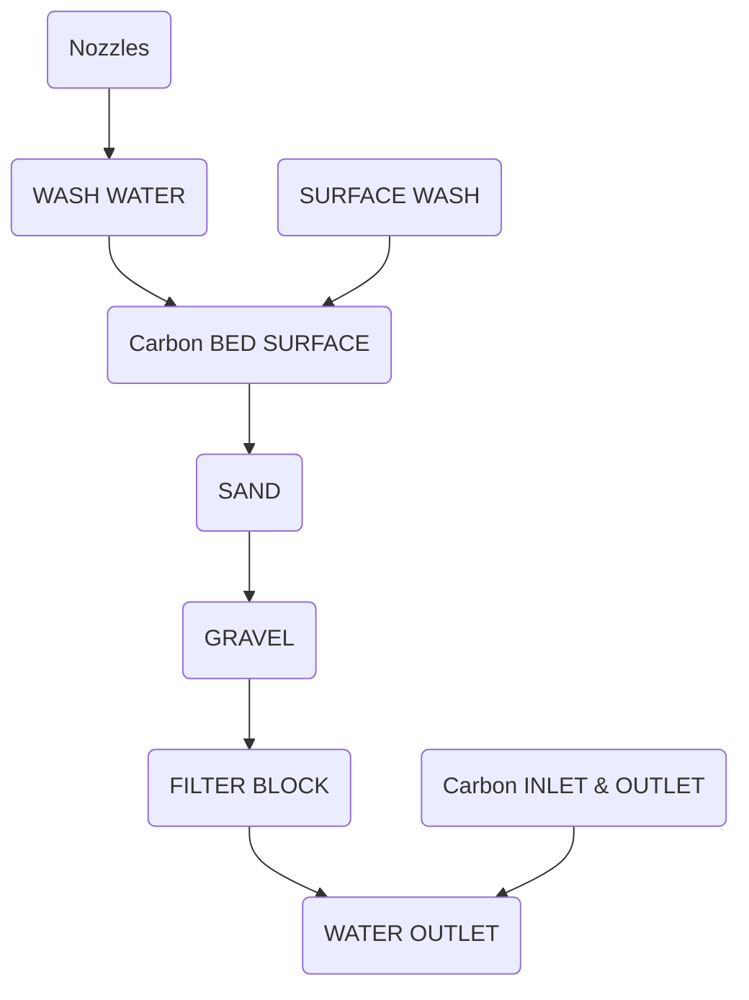

- NOZZLES
- WASH WATER
- SURFACE WASH
- CARBON BED SURFACE
- SAND
- GRAVEL
- FILTER BLOCK
- CARBON INLET & OUTLET
- WATER OUTLET

Bed depths vary, typically within a range of 3 to 12 m (10 to 40 ft), depending primarily on carbon contact time. A minimum carbon depth of 3 m is advisable. Typical total carbon depths range from 4.5 to 6 m (15 to 20 ft). Freeboard must be added to the carbon depth to allow a bed expansion of 10% to 50% during backwash or expanded bed operation; carbon particle size and water temperature determine the required quantity of backwash water to attain the desired level of bed expansion:
\n---\n

### 3.3.5 Backwashing

A minimum of two parallel carbon contactor units is necessary for a facility of any size. Two units in series also are advisable to permit removal of a spent carbon unit while the facility remains in operation: The number of contactors should be sufficient to ensure enough carbon contact time to maintain effluent quality while one column is offline during removal of spent carbon for regeneration or maintenance.

Backwashing

Backwashing consists of exposing the column media to a fluid flow sufficient to remove solids that either have accumulated in the bed or have been created by abrasive action. The rate and the frequency of backwash depend on hydraulic loading, the nature and concentration of suspended solids in the wastewater; carbon particle size, and adsorber type (expanded or fixed bed). Backwash frequency may be specified arbitrarily (each day at a specified time) or determined based on operating criteria (headloss or turbidity): Backwash duration is typically 10 to 15 minutes. The equipment used for backwashing and control is similar to that used for the GMF system.

One of the alternatives for carbon contacting systems is the downflow of wastewater through the carbon bed (Figure 14.39) (Pretorius, 1972). The principal reason for selecting a downflow contactor is dual-purpose use of carbon for adsorption of organics and filtration of suspended materials. A disadvantage associated with downflow systems is that provisions are necessary for backwashing beds periodically to relieve the pressure drop resulting from accumulation of suspended solids. Otherwise, continuous operation for several days without thorough backwashing eventually compacts or fouls beds.

Normal quantities of backwash water are less than 5% of the product water for a filter 0.8 m (2.5 ft) deep and 10% to 20% for a filter 4.5 m (15 ft) deep. Typical backwash flowrates for granular carbons of 8 × 12 or 12 × 30 mesh are 29 to 50 m/h (12 to 20 gpm/cu ft) (U.S. EPA, 1973).

Removal of solids trapped in a packed upflow bed may require two steps: (1) relieving the bottom surface plugging by temporarily operating the bed in a downflow mode; and (2) flushing out by expansion suspended solids entrapped in the middle of the bed. When upflow filters are backwashed, additional time and a proportionally larger volume of higher quality water may be required to avoid plugging the bottom of deep beds. Often, backflow
\n---\n

of packed upflow carbon contactors, preceded by filtration, merely consists of doubling the normal contactor flowrate for 10 to 15 minutes (U.S. EPA, 1973).

## 3.3.6 Valve and Piping Requirements

Valve and piping requirements for upflow and downflow contactors are similar. Upflow units are piped to operate either as upflow or as downflow units and allow backwashing. Downflow units are piped to operate downflow and in series. Each column is valved to be backwashed individually. Furthermore, downflow series contactors are valved and piped so that the respective position of individual contactors may be interchanged, typically referred to as a lead-lag configuration.

< Mermaid diagram of the figure >

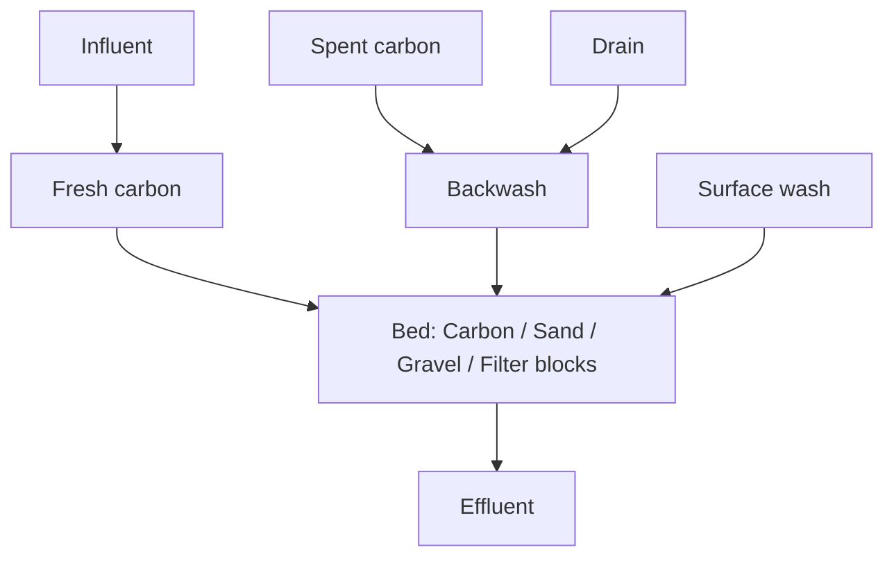

\n---\n

FIGURE 14.39 Typical downflow gravity contactor (U.S. EPA, 1973).

## 3.3.7 Instrumentation
Individual carbon columns should be equipped with flow and headloss-measuring devices.
Flow measurements serve to equalize flows through the individual carbon columns and
determine the actual carbon contact time.

## 3.3.8 Control of Biological Activity
A close relationship between adsorption phenomena and some aspects of biological
behavior has been observed because both biomass and activated carbon can adsorb and
remove certain dissolved substances from wastewater. Therefore, removal of 50% to
100% more organics in full-scale columns than that predicted by laboratory tests is not
unusual because of biomass accumulation within the column.

Carbon adsorbents may catalyze biological processes, thereby increasing buildup.
Therefore, removal of organics in full-scale columns frequently is greater than that
suggested by laboratory evaluation. After the predicted adsorptive capacity of the carbon
is exhausted, biological activity often continues.

If the supply of dissolved oxygen in the wastewater is insufficient, then anaerobic bacterial
activity may occur: In the presence of oxygenated compounds (nitrates, sulfates,
carbohydrates) and readily decomposable organic compounds, anaerobic bacteria cause
the oxygen in these compounds to react with organics, producing gases such as nitrogen,
hydrogen sulfide, and methane:

Where activated carbon follows physical and chemical treatment, carbon columns may
provide an environment conducive to production of hydrogen sulfide gas. Hydrogen
sulfide in the final carbon column effluent indicates anaerobic conditions that exert an
oxygen demand that diminishes effluent quality: Aerobic conditions are needed in carbon
absorbers to allow conversion of organics to carbon dioxide:

Hydrogen sulfide is produced by sulfate-reducing bacteria that reproduce under anaerobic
conditions likely resulting from:

- High concentrations of applied BOD5;
\n---\n

* Long detention times in the carbon column;
* Low concentrations of dissolved oxygen in the applied wastewater; or
* Combinations of the above conditions

Methods that can be incorporated in facility design to reduce hydrogen sulfide production include:

* Providing upstream biological treatment to satisfy as much of the BOD as possible before carbon treatment;
* Reducing detention time in carbon columns based on dissolved oxygen (DO) concentrations of the effluent;
* Ensuring a higher DO concentration in the influent to carbon columns;
* Backwashing columns frequently;
* Chlorinating carbon column influent (this is not the preferred alternative because chlorine carbon reactions destroy carbon, thereby increasing carbon usage); and
* Introducing an oxygen source such as air or hydrogen peroxide in upflow expanded beds to keep columns aerobic. (In expanded upflow columns, some biological growth is flushed through the bed and, if necessary, may be removed by downstream filters or settling basins. Based on cell mass produced by the introduction of gaseous or liquid oxygen compounds, use of other chemical additives as electron acceptors instead of oxygen in packed columns merits consideration.)

### 3.3.9 Carbon Transport

Spent carbon must be removed from carbon absorbers. In downflow contactors, removal provisions are straightforward because all of the carbon is removed at the same time and the column is refilled with fresh or regenerated carbon: Care should be taken to prevent entry of the gravel or stone-supporting media used in downflow contactors to the carbon transport system.

In upflow pulsed beds, only 5% to 25% of total carbon column charge is removed at any given time to achieve maximum loading: Spent carbon is removed from the bottom of the vessel and a fresh carbon charge, equal in volume to the spent carbon removed, is added to the top of the vessel. This procedure ensures that fresh carbon is positioned to "polish"
\n---\n

the effluent before it leaves the adsorber; and that the carbon containing the most adsorbate of the most spent carbon is removed for regeneration. It is important to obtain a uniform withdrawal of carbon over the entire horizontal surface area of the carbon bed. A cone on the base of the column (Figure 14.40) with water jets can achieve uniform carbon removal (Pretorius, 1972).

Activated carbon typically is transported hydraulically as shown in Figure 14.41. Spent carbon is transported from carbon columns and dewatered in a tank. The dewatered carbon is then conveyed by an inclined screw conveyor to the carbon regeneration furnace. In this screw conveyor, additional dewatering occurs as the carbon moves along the incline from the bottom toward the top, allowing water to flow against the direction of carbon transport. Water from the bottom of the screw conveyor returns to the process, while dewatered carbon discharges to the top of the furnace. Regenerated carbon exits the furnace to a quench tank where the carbon is cooled, wetted, and then transported to carbon de-fining tanks. After carbon fines are removed, the carbon is returned to the carbon columns. Makeup carbon is introduced to a slurry bin. Once the carbon is slurried, it is transported to carbon de-fining tanks and then to carbon columns.
\n---\n

### FIGURE 14.40 Carbon transfer with upflow column in service (U.S. EPA, 1973)

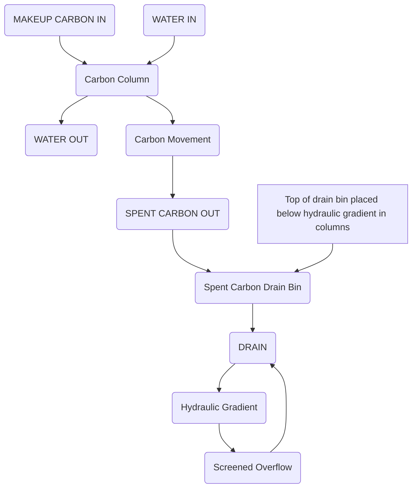

FIGURE 14.40 Carbon transfer with upflow column in service (U.S. EPA, 1973)
\n---\n

# FIGURE 14.41 Schematic of carbon regeneration and transport (U.S. EPA, 1973).

```
Spent Carbon
Drain & Feed
Tank
                 Spent
                 Carbon
                 Slurry
         Scrubber
 Afterburner
 (If Required)
 Screen Conveyor
                Water
Make-Up  Carbon
         Back to Process
Carbon   Regeneration
         Furnace
Carbon   Defining Tank
Slurry   Slurry Pump
Bin                 Transport
                      Water
```

FIGURE 14.41 Schematic of carbon regeneration and transport (U.S. EPA, 1973).

As alternatives to pumping carbon slurries, educators and motive water can transport carbon. Carbon slurries may be transported with water or compressed air, centrifugal or diaphragm pumps, or eductors. The type of motive equipment selected requires balanced consideration of owner preference, column control capabilities, capital and maintenance costs, and pumping head requirements.

Carbon slurry piping systems are designed to provide approximately 8 L of transport water/kg carbon removed (1 gal/lb). Pipeline velocities of 0.9 to 1.5 m/s (3.5 to 5 ft/s) are best. At velocities less than 0.9 m/s (3 ft/s), carbon settles in the pipeline; at velocities greater than 3 m/s (10 ft/s), excessive carbon abrasion and pipe erosion occur. Long-radius elbows or tees and crosses with cleanouts should be used at points of pipe

\n---\n

direction change. Typically, plug- or ball-type valves are used in the carbon slurry piping system. No valves for throttling flow should be installed in the slurry piping system. Flow control is maintained by throttling inlet water upstream of the point of carbon introduction.

## 3.3.10 Carbon Regeneration

The carbon dosage or use rate for regeneration equipment sizing depends on the strength of the wastewater applied to the carbon and the required effluent quality. Typical carbon dosages for municipal wastewater are shown in Table 14.8.

<table>
<thead>
<tr><th>Prior Treatment</th><th>Typical Carbon Dosage Required (lb/mil gal)</th></tr>
</thead>
<tbody>
<tr><td>Coagulated, settled, and filtered activated-sludge effluent</td><td>200–400</td></tr>
<tr><td>Filtered secondary effluent</td><td>400–600</td></tr>
<tr><td>Coagulated, settled, and filtered raw wastewater (physical-chemical)</td><td>600–1800</td></tr>
</tbody>
</table>

<sup>a</sup>Loss of carbon during each regeneration cycle is typically 5% to 10%. Makeup carbon is based on carbon dosage and the quality of the regenerated carbon.

<sup>b</sup>lb/mil gal × 0.1198 = g/m^3.

TABLE 14.8 Typical Carbon Dosages for Various Column Wastewater Influents

### 3.3.10.1 Carbon Dewatering

Dewatering of spent carbon slurry before thermal regeneration typically is accomplished in drain vessels. Screens in drainage vessels allow transport water to flow from the carbon. Gravity drainage vessels dewater the carbon to 40% to 55% moisture content. Typically, two drain bins are provided to permit continuous carbon feed to the furnace. Dewatering screws also may be used to dewater activated carbon to approximately 50% moisture. Such systems must include a bin to provide a continuous supply of carbon to the screw and maintain a positive seal on the furnace.
\n---\n

# 3.3.10.2 Regeneration Furnace

Partially dewatered carbon may be fed to the regeneration furnace with a screw conveyor (Figure 14.42) (Bishop et al., 1967; U.S. EPA, 1973) equipped with a variable-speed drive to control precisely the rate of carbon feed. Carbon feed rate is controlled because moisture content and quantities of adsorbed organics vary:

Anticipated carbon dosage governs theoretical furnace capacity. For multiple-hearth furnaces, approximately 5 mm^2 of hearth area is required for each gram (dry weight) of carbon per day (0.025 cu ft/d/lb). Actual furnace capacity typically includes an allowance for furnace downtime of approximately 40% beyond theoretical capacity:

Based on operating experiences at two full-scale facilities, the furnace should have provisions to add approximately 1 kg of steam per kilogram of carbon regenerated (1 lb/lb). Fuel requirements for the furnace are 7000 kJ/kg (3000 Btu/lb) of carbon when regenerating spent carbon for tertiary and secondary effluent applications. To this value, energy requirements for steam and an afterburner should be added if required.

The furnace is designed to control carbon feed rate, rabble arm speed, and hearth temperature. Off-gases from the furnace must be within acceptable air pollution standards. Air pollution control equipment, designed as an integral part of the furnace, includes a scrubber for removing carbon fines and an afterburner to ensure complete combustion of gases. Regenerated carbon exits the bottom of the furnace to a quench tank. The quench tank cools the regenerated carbon and provides a positive seal on the furnace. Water jets are provided in the quench tank to assist removal of regenerated carbon, which is then conveyed to the de-fining carbon tanks.
\n---\n

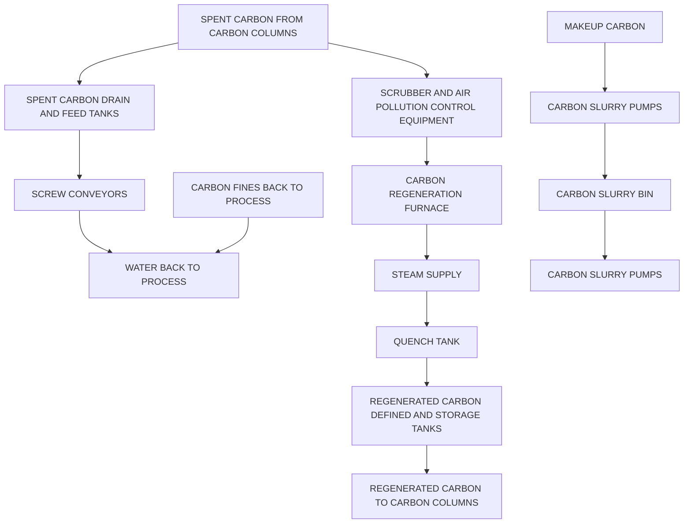

FIGURE 14.42 Schematic of carbon regeneration system (U.S. EPA, 1973).

Carbon losses vary considerably in the carbon transport and regeneration system:
System carbon losses are typically 5% to 10% per regeneration cycle, depending on
facility size and furnace type. Furnace losses may vary from 3% to 7% during
regeneration, depending on furnace type and operating efficiencies:

## 4.0 Chemical Treatment

Chemicals are used for a variety of municipal treatment applications, including to enhance
flocculation/sedimentation, condition solids, add nutrients, neutralize acid-base,
precipitate phosphorus, and disinfect or to control odors, algae, or activated sludge
bulking: This section describes chemicals use for advanced treatment processes. For
chemicals used for conventional processes and biological treatment, refer to Chapter 7.
\n---\n

## 4.1 Phosphorus Precipitation

Chemicals also can be used for precipitation of heavy metals, but are better controlled at the source through an industrial pretreatment program. Therefore, metals precipitation will not be further discussed in this chapter. Similarly, nutrient addition is principally an industrial waste problem that will not be discussed in this chapter. Flocculation, sedimentation, solids conditioning, odor control, and disinfection are discussed in other chapters of this manual. Discussion of chemical treatment in this chapter will, therefore, be limited to phosphorus precipitation and neutralization.

As an essential element in the metabolism of organic matter, phosphorus is necessary for the proper functioning of biological wastewater treatment processes. However, when excessive phosphorus is present, it may pollute the receiving body of water by causing excessive growths of rooted or floating aquatic plants that deplete dissolved oxygen and have adverse aesthetic effects.

Phosphorus may occur in the form of organic phosphorus found in organic matter and cell protoplasm, as complex inorganic phosphates (polyphosphates), such as those used in detergents, and as soluble inorganic orthophosphate (PO4^3-). As the final breakdown product in the phosphorus cycle, the orthophosphate form is most readily available for biological use or precipitation by a metal salt.

When considering removal of phosphorus from wastewater, its form and solubility are important: Phosphorus enters a WRRF in all three forms. During the treatment process most of the organic phosphate and complex phosphates are converted to inorganic orthophosphate. In wastewater that has been treated by biological processes, most of the phosphorus is in the soluble form, although a small amount of insoluble organic phosphorus also exists in the form of cell protoplasm. For example, the average amount of orthophosphate discharged in the effluent of municipal trickling-filter facilities without chemical precipitation has been estimated at approximately 24 mg/L PO4^3- (8 mg/L phosphorus) (Griffith et al., 1973), which needs to be controlled in light of recent regulations. Phosphorus removal via chemical (metal) precipitation should include more details concerning metal-to-P ratio (mole), the use of online instrumentation to achieve low effluent limits. In effluent from facilities with chemical precipitation for removal, most of the remaining phosphorus is in the insoluble form (calcium, aluminum, or iron phosphate):
\n---\n

## Insoluble phosphorus compounds

Insoluble phosphorus compounds typically do not release phosphorus in other units of the WRRF or in the receiving water body:

In activated sludge, the required minimum phosphorus-to-BOD5 ratio has been estimated as 1:100, with similar ratios expected for other biological processes. Municipal wastewater has a BOD5 in the range of 175 to 250 mg/L and a phosphorus content of 3 to 5 mg/L or higher; thus exceeding the nutrient requirements for aerobic biological treatment.

## 4.1.1 Phosphorus Removal Methods

Phosphorus removal may be part of primary, secondary, or tertiary treatment processes.  
Physical and chemical treatment techniques include chemical precipitation and flocculation of phosphorus followed by sedimentation, flotation, or filtration. Incidental uptake by biological processes typically accounts for relatively little phosphorus removal unless the systems are designed for phosphorus removal. Chapter 12 discusses biological phosphorus removal methods.

## 4.1.2 Precipitants

Phosphorus precipitation typically requires addition of chemicals and widely used coagulant aids (flocculant); and a coagulant (Daniels, 1975a, 1975b) can be used.  
Chemicals typically used for phosphorus precipitation are lime, alum, sodium aluminate, ferric chloride, ferrous sulfate, and polyaluminum chloride. Some examples on chemical reactions when using lime, alum, sodium aluminate and ferric chloride are shown below.

### 4.1.2.1 Lime

In addition to its reactions with carbonate species, lime reacts with orthophosphate to precipitate hydroxyapatite, according to the following stoichiometric reaction:

$$5 \mathrm{Ca^{2+}} + 4 \mathrm{OH^-} + 3 \mathrm{HPO_4^{2-}} \rightarrow \mathrm{Ca_5(PO_4)_3OH} + 3 \mathrm{H_2O}$$

The theoretical molar calcium-to-phosphorus ratio is 5:3. The above equation is representative, but not exact, because the composition of the apatite precipitate varies. As a result, the calcium-to-phosphorus mole ratio may vary from 1.3 to 2.0. Hydroxyapatite solubility decreases rapidly with increasing pH and, typically, phosphate removal increases with increasing pH. Almost all orthophosphate converts to the insoluble form if pH is greater than 9.5.

\n---\n

The actual pH required to precipitate a given amount of phosphate and the amount of lime
required to raise the pH to the desired level vary with wastewater composition. These
parameters should be determined by laboratory jar tests. Figure 14.43 shows a typical
curve with phosphorus removal as a function of lime dosage.
The chief variable that affects the lime dose for phosphorus removal is the wastewater
alkalinity: Unless a high pH is used, waters with low alkalinity (150 mg/L or less) form a
poorly settleable floc because of the small fraction of dense calcium carbonate (CaCO3)
precipitate. Sufficient quantities of calcium carbonate act as a flocculant that enhances
settling of the hydroxyapatite. For wastewater with high alkalinity, a pH of 9.5 to 10 can
result in excellent phosphorus removal:

<table>
  <thead>
    <tr>
      <th></th>
      <th>0</th>
      <th>100</th>
      <th>200</th>
      <th>300</th>
      <th>400</th>
      <th>500</th>
    </tr>
  </thead>
  <tbody>
    <tr>
      <td>Phosphorus removal (mg/L as P)</td>
      <td>8</td>
      <td>2</td>
      <td>0.5</td>
      <td>0</td>
      <td>0</td>
      <td>0</td>
    </tr>
<tr>
      <td>pH</td>
      <td>7.8</td>
      <td>8.5</td>
      <td>9.2</td>
      <td>9.8</td>
      <td>10.4</td>
      <td>11.0</td>
    </tr>
  </tbody>
</table>

FIGURE 14.43 Typical phosphorus removal curve with an influent phosphorus concentration of 10 mg/L as P assumed.
\n---\n

## 4.1.2.1.1 Process-Train Considerations

Magnesium hardness also affects the efficiency of phosphorus removal. At higher pH, magnesium hydroxide precipitates according to the following reaction:

$$\mathrm{Mg^{2+} + Ca(OH)_2 \rightarrow Mg(OH)_2 + Ca^{2+}}$$

This reaction begins at a pH of approximately 9.5 and is complete at a pH of 11. The magnesium hydroxide precipitate is gelatinous and removes fine suspended solids as it settles. However, these same gelatinous properties can impair solids dewatering.

Because chemical requirements impose the principal operational cost associated with phosphorus removal, proper chemical dosages are critical to process economy: The lime dosage required to reach a given effluent phosphorus level is independent of influent phosphorus concentration. The degree of phosphorus removal is a function of pH. Lime requirements to reach the required pH correlate more closely with wastewater alkalinity than with any other variable. For other phosphorus precipitants (alum or ferric salts), chemical requirements are proportional to influent phosphorus concentration. In contrast, phosphorus removal is decidedly nonstoichiometric with other chemicals.

Various lime precipitation schemes exist for phosphorus removal (Figure 14.44). Lime may be added before the primary sedimentation tank in a biological WRRF. Because an excessively high pH interferes with the biological process, lime addition to the primary sedimentation tank ahead of an activated sludge system is limited to a pH of approximately 9.0, with a maximum phosphorus insolubilization of approximately 80%. At this limited pH, 2 to 3 mg/L of remaining soluble phosphorus is not unusual. Additional phosphorus may be removed, if necessary, by using aluminum or iron addition in aeration tanks or the final sedimentation tank. The use of lime in primary treatment has the added advantage of increasing organics and suspended-solids removal efficiencies in the primary sedimentation tank, thereby decreasing the load on the aeration system.
\n---\n

## FIGURE 14.44 Various schemes of single-stage lime precipitation for phosphorus removal:

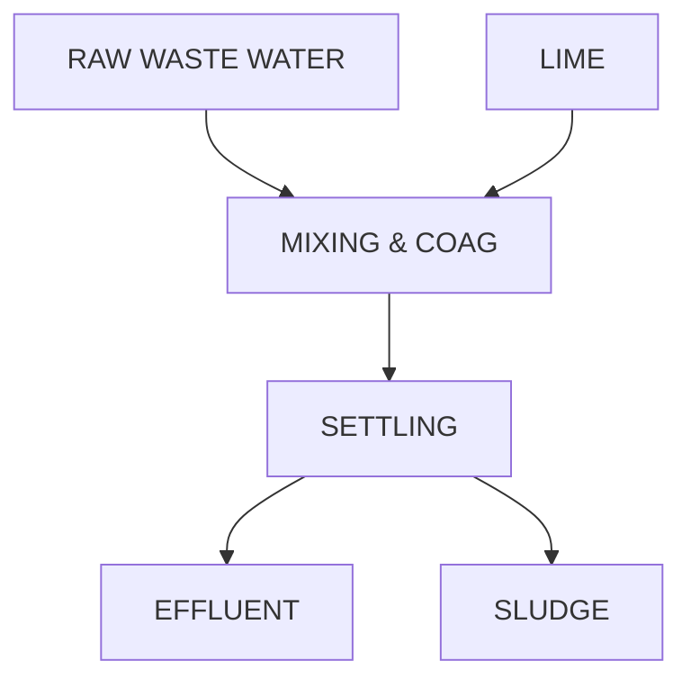

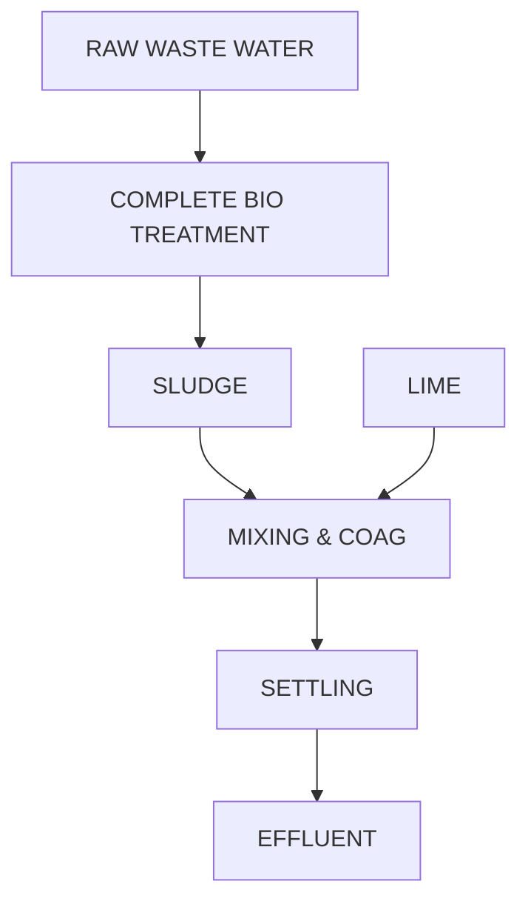

```mermaid
flowchart TD
    POLY[POLYMER (WHEN NEEDED)] --> M2[MIXING & COAG]
    LIME3[LIME] --> M2
    RAW3[RAW WASTE WATER] --> M2
    M2 --> S[SETTLING]
    S --> AERO[AERATION]
    AERO --> S2[SETTLING]
    S2 --> WASSET[WASTE ACTIVATED SLUDGE]
    S2 --> RETURN[RETURN ACTIVATED SLUDGE]
    WASSET --> THK[THICKENING, DEWATERING, CALCINING, SCRUBBING]
    THK --> ASH[ASH]
    ASH --> LRE[LIME RECOVERY OPTIONAL]
    % Optional sludge handling and gas pathways
    RETURN --> AERO
    WASSET --> GAS[GAS]
    THK --> CHEM[CHEMICAL REUSE]
    CHEM --> THK
```

A second alternative consists of lime treatment following biological treatment: Phosphorus
removal from the secondary effluent ensures enough phosphorus in the aeration stage to
meet the nutrient demand of the biological floc. In addition, the biological system breaks
down many of the complex phosphates to the more readily precipitated orthophosphate
form: However; the high pH of returned solids may affect biological treatment:

The tertiary lime treatment system may be either the one-stage or the two-stage type.
Typical process flowsheets for one- and two-stage treatment systems are shown in
Figures 14.45 and 14.46. The choice of a particular process depends on the degree of
phosphorus removal required, the alkalinity of the wastewater; and lime decalcination.
Typically; when high percentages of phosphorus removal are required or wastewater
alkalinity is low, a high process pH is required. High phosphorus removal efficiencies call
for the two-stage process because it allows recovery of calcium carbonate sludge for

\n---\n

# FIGURE 14.45 Single-stage lime treatment system

recalcination: Two-stage removal also allows better control of clarification. With low-alkalinity water, solids settling may be difficult in the first stage, even with a high pH. The second-stage sedimentation tank, with its dense calcium carbonate precipitate, may help eliminate solids carryover.

A variation of the two-stage process involves recirculation of settled solids from the second stage to the mixing tank before first-stage settling. The recirculated solids act as a weight agent that is especially effective with low-alkalinity wastewater (less than 150 mg/L as CaCO3).

<figure diagram>
```
graph TD
  subgraph Lime_Preparation
    MAKEUP_LIME([MAKEUP LIME])
    RECYCLED_LIME([RECYCLED LIME])
    SLAKER([SLAKER])
    RAPID_MIX([RAPID MIX])
    MAKEUP_LIME --> SLAKER
    RECYCLED_LIME --> SLAKER
    SLAKER --> RAPID_MIX
    RAPID_MIX --> FLOCCULATOR([FLOCCULATOR])
  end
  FLOCCULATOR --> SETTLER([SETTLER])
  SETTLER --> RECARBONATOR([RECARBONATOR])
  RECARBONATOR --> FILTER([FILTER])
  FILTER --> TREATED_WATER([TREATED WATER])
  FILTER --> WASHWATER([WASHWATER])
  FILTER --> WASTE([WASTE])
  FILTER_AID([FILTER AID]) --> FILTER
  WASHWATER --> FILTER

  subgraph Lime_Waste_Handling
    WASTE_LIME([WASTE LIME])
    CALCINER([CALCINER])
    CARBON_DIOXIDE([CARBON DIOXIDE])
    CENTRIFUGE([CENTRIFUGE])
    CENTRATE([CENTRATE])
    SUPERNATANT([SUPERNATANT])
    THICKENER([THICKENER])
    TREATMENT_DISPOSAL([TREATMENT AND DISPOSAL])
    WASTE_LIME --> CALCINER
    CALCINER --> CARBON_DIOXIDE
    CALCINER --> CENTRIFUGE
    CENTRIFUGE --> SUPERNATANT
    CENTRIFUGE --> CENTRATE
    CENTRIFUGE --> THICKENER
    THICKENER --> TREATMENT_DISPOSAL
  end
```
FIGURE 14.45 Single-stage lime treatment system.
\n---\n

# FIGURE 14.46 Two-stage lime treatment system

```
graph TD
  A(Wastewater feed) --> B(Rapid mix)
  B --> C(Flocculator)
  C --> D(Settler)
  D --> E(Recarbonator)
  E --> F(Settler)
  F --> G(Recarbonator)
  G --> H(Filter)
  H --> I(Treated water)
  %% Lime handling
  LIME[Lime] --> SL[Slaker]
  SL --> B
  %% Sludge handling
  D --> SLUDGE1[Sludge]
  G --> SLUDGE2[Sludge]
  SLUDGE1 --> RE[Recalcination/ disposal]
  SLUDGE2 --> RE
  %% Gas
  CO2[Carbon dioxide] --> E
  CO2 --> G
```

FIGURE 14.46 Two-stage lime treatment system.

> 4.1.2.1.2 Dosages and Removals

Lime precipitation of phosphorus may require filtration to ensure continuous compliance with effluent requirements. Even with a process pH as high as 11.4, the effluent may contain some residual phosphorus. Although high pH values ensure that virtually all phosphorus is insolubilized, effluent total phosphorus depends on suspended-solids removal efficiency. In cases where the precipitate floc is difficult to settle, granular-medium filtration can ensure an extremely high degree of suspended-solids and phosphorus removal. Typically, a residual phosphorus concentration of 0.1 to 0.2 mg/L may be achieved with granular-medium filtration.

> 4.1.2.2 Alum

Phosphorus may be precipitated from wastewater by chemical reaction with most mineral salt coagulants, including various salts of iron and aluminum. The principal source of aluminum in phosphorus precipitation is aluminum sulfate, typically known as alum. The theoretical stoichiometry of the chemical reaction is:

$$Al_2(SO_4)_3 \cdot (14H_2O) + 2\,H_2PO_4^- + 4\,HCO_3^- \rightarrow 2\,AlPO_4 + 4\,CO_2 + 3\,SO_4^{2-} + 18\,H_2O$$
\n---\n

The sulfate ion remains in solution, and pH is depressed. From the above equation, the calculated weight ratio of alum to phosphorus is 0.87Al:1.OP. However, much more alum actually is required because of side reactions involving wastewater alkalinity and organic matter (Table 14.9). The actual weight ratio of alum to phosphorus is up to 3.0Al:1.OP and higher.

The Al0.8(H2PO4)(OH)1.4 (molecular weight = 142.4 g/mol) is assumed to represent the precipitate formed after aluminum addition, and Al(OH)3 (molecular weight = 578 g/mol) is the excess aluminum hydroxide formed:

The solubility of aluminum phosphate is a function of pH: The most efficient chemical use occurs at a process pH near the range of minimum solubility, approximately 5.5 to 6.5 (Table 14.10). Because alum use results in a small pH depression and most existing treatment systems operate at near-neutral wastewater pH, addition of alum almost automatically results in a pH in the range of minimum aluminum phosphate solubility. Sometimes excess alum is required to depress the pH sufficiently to reach the optimal pH range for phosphate removal: Excess alum then simply acts as an acid that might be replaced by another acid. Using alum following a lime treatment process is an example of such an application. The Water Environment Federation’s Operation of Nutrient Removal Facilities, MOP 37, recommends the required dosages that can be confirmed by jar tests at the project site (WEF, 2013).

<table>
  <thead>
    <tr>
      <th>Phosphorus Reduction Required (%)</th>
      <th>Al:P Ratio</th>
      <th>Weight Ratio</th>
      <th>Other Ratio</th>
    </tr>
  </thead>
  <tbody>
    <tr>
      <td>75</td>
      <td>1.38:1</td>
      <td>1.2:1</td>
      <td>13:1</td>
    </tr>
<tr>
      <td>85</td>
      <td>1.72:1</td>
      <td>1.5:1</td>
      <td>16:1</td>
    </tr>
<tr>
      <td>95</td>
      <td>2.3:1</td>
      <td>2.0:1</td>
      <td>22:1</td>
    </tr>
  </tbody>
</table>

TABLE 14.9 Ratios of Alum to Phosphorus for Alum Treatment of Municipal Wastewater. Reprinted with permission from Rushton, J. H. (1952) Mixing of Liquids in Chemical Processing. Ind. Eng. Chem., 44 (12), 2931. Copyright 1952 American Chemical Society:
\n---\n

## 4.1.2.2.1 Process-Train Considerations

Alum addition offers flexibility in the location of chemical application points. Alum can be added before the primary settling tank, in the aeration tank, or between aeration and final sedimentation.

Alum addition before the primary settling tank provides additional removal of suspended solids and organic matter in addition to phosphorus precipitation. These removals, however, result from reactions that compete with soluble phosphorus for available alum, thereby increasing the dosage required to obtain a given phosphorus residual level. In addition, some polyphosphates that are more difficult to treat may be present in raw wastewater.

Providing alum addition in the activated sludge aeration tank allows use of the mixing already provided for that system. The best point of addition for alum in an activated sludge facility is likely to be in the aeration basin effluent channel that carries mixed liquor to the final settling basin. Turbulence in this channel adequately mixes the chemical.

Addition of alum after the biological system takes advantage of wastewater stabilization with the attendant hydrolysis of the complex phosphates to the more readily reacted orthophosphate form. Figure 14.47 illustrates the effect of point of addition on added aluminum. An added advantage is that dosage can be based on the phosphorus remaining after biological uptake.

## 4.1.2.2.2 Dosages and Removal

The Water Environment Federation’s Operation of Nutrient Removal Facilities (WEF, 2013) describes information on the practical method for dosages and removal, the basics of which are provided below: The starting point for determining chemical dosages for alum and other mineral precipitants is the stoichiometry of the reactions involved. In the case of lime, the degree of phosphorus removal depends directly on system pH: For aluminum and iron salts, phosphorus removal efficiency varies directly with chemical dosage up to the point where mole requirements (molecular weight in grams of any particular compound) for phosphate precipitation and side reactions have been satisfied: Optimum dosages cannot be calculated readily because of ambiguity of the reactions involved. As a result; laboratory jar tests may be used to determine actual chemical requirements (Figure
\n---\n

# 14.48) Visible flocculation tends to occur when sufficient coagulant has been added to remove all phosphorus and lower the pH to less than 6.5. More detailed information on the required dosages can be found in the literature on the nutrient removal published by the WEF and others.

<table>
  <thead>
    <tr><th>pH</th><th>Approximate Solubility of AlPO4 (mg/L)</th></tr>
  </thead>
  <tbody>
    <tr><td>5</td><td>0.03</td></tr>
<tr><td>6</td><td>0.01</td></tr>
<tr><td>7</td><td>0.3</td></tr>
  </tbody>
</table>

TABLE 14.10 Solubility of Aluminum Phosphate versus pH. Reprinted with permission from Rushton, J. H. (1952) Mixing of Liquids in Chemical Processing. Ind. Eng. Chem., 44 (12), 2931. Copyright 1952 American Chemical Society.
\n---\n

### FIGURE 14.47 Influence of point of addition on phosphorus removal with aluminum.

The plot shows the relationship between the amount of aluminum added (moles) per mole of initial total soluble phosphorus (x-axis) and the moles total soluble phosphorus removed per mole aluminum added (y-axis). Three curves are plotted:

- Final effluent
- Aerator
- Raw wastewater (data points)

Axis labels:
- Y-axis: Moles total soluble phosphorus removed/mole aluminum added
- X-axis: Moles of aluminum added/mole initial total soluble phosphorus

Scale:
- X-axis tick marks at 0, 1.0, 2.0, 3.0, 4.0, 5.0
- Y-axis tick marks at 0, 0.2, 0.4, 0.6, 0.8, 1.0, 1.2

Caption: FIGURE 14.47 Influence of point of addition on phosphorus removal with aluminum.
\n---\n

## FIGURE 14.48 Typical phosphorus reduction with alum:

<table>
  <thead>
    <tr>
      <th>Aluminum Sulfate Dose (mg/L)</th>
      <th>Remaining PO4 (mg/L)</th>
      <th>P removal (%)</th>
    </tr>
  </thead>
  <tbody>
    <tr><td>0</td><td>25</td><td>0</td></tr>
<tr><td>20</td><td>20</td><td>20</td></tr>
<tr><td>40</td><td>14</td><td>44</td></tr>
<tr><td>60</td><td>9</td><td>64</td></tr>
<tr><td>80</td><td>6</td><td>76</td></tr>
<tr><td>100</td><td>3</td><td>88</td></tr>
<tr><td>120</td><td>2</td><td>92</td></tr>
<tr><td>140</td><td>1</td><td>96</td></tr>
<tr><td>150</td><td>0.5</td><td>98</td></tr>
  </tbody>
</table>

> The left axis corresponds to Remaining PO4, mg/L, while the right axis corresponds to P removal, %. The x-axis shows Aluminum Sulfate Dose, mg/L. The curve depicted shows phosphorus reduction with increasing alum dose, with remaining PO4 decreasing from about 25 mg/L toward near zero and P removal rising toward 100%.

### 4.1.2.3 Sodium Aluminate

Most of the discussion concerning phosphorus precipitation with aluminum sulfate also applies to other mineral precipitants. Some differences for sodium aluminate are described herein. Sodium aluminate can serve as a source of aluminum for the precipitation of phosphorus. Granular trihydrate is one commercial form of sodium aluminate. The theoretical stoichiometric reaction for phosphorus precipitation is:

$$\mathrm{Na_2Al_2O_4 + 2H_3PO_4 + 4CO_2 \rightarrow 2AlPO_4 + 2Na^+ + 4HCO_3^-}$$

Dissolved carbon dioxide or other acidity must be present to avoid a pH increase beyond the optimum zone: When this occurs, sodium aluminate alone is not satisfactory as a phosphate precipitant. In contrast to alum, which reduces pH, addition of sodium aluminate results in a slight increase in pH. Therefore, use of this chemical may be appropriate where wastewater pH is already low, and further depression should be avoided. From the above equation, the calculated sodium aluminate-to-phosphorus weight ratio is approximately 3.6:1. In practice, side reactions will require a higher dosage.

\n---\n

## 4.1.2.4 Ferric Chloride

The Al0.8(H2PO4)(OH)1.4 (molecular weight = 142.4 g/mol) is assumed to represent the precipitate formed after sodium aluminate addition, and Al(OH)3 (molecular weight = 78 g/mol) is the excess aluminum hydroxide formed.

Typically, experience has shown the performance of sodium aluminate to be somewhat inferior to that of alum based on equivalent Al:P mole ratios. Typical curves for a moderately alkaline wastewater comparing phosphorus removal achieved by the two chemicals are shown in Figure 14.49. The effect illustrated, however, does not universally apply to all wastewaters. Therefore, laboratory jar tests are necessary for comparative evaluation of the two aluminum compounds. In either case, the final pH must be 5.5 to 6.5 to achieve optimal phosphate precipitation results.

<figure>

<table>
<caption>FIGURE 14.49 Comparison of phosphorus removal effectiveness of alum and sodium aluminate</caption>
<thead>
<tr><th>Al / P MOLE RATIO</th><th>SODIUM ALUMINATE<br>(TOTAL PHOSPHORUS, mg/L as P)</th><th>ALUM<br>(TOTAL PHOSPHORUS, mg/L as P)</th></tr>
</thead>
<tbody>
<tr><td>0.4</td><td>≈4</td><td>≈2.0</td></tr>
<tr><td>0.6</td><td>≈3.2</td><td>≈1.8</td></tr>
<tr><td>0.8</td><td>≈2.8</td><td>≈1.6</td></tr>
<tr><td>1.0</td><td>≈2.3</td><td>≈1.3</td></tr>
<tr><td>1.2</td><td>≈2.0</td><td>≈1.0</td></tr>
<tr><td>1.4</td><td>≈1.5</td><td>≈0.9</td></tr>
<tr><td>1.6</td><td>≈1.1</td><td>≈0.9</td></tr>
<tr><td>1.8</td><td>≈1.0</td><td>≈0.85</td></tr>
<tr><td>2.0</td><td>≈1.0</td><td>≈0.8</td></tr>
</tbody>
</table>

</figure>

Both ferric and ferrous iron compounds may be used in the chemical precipitation of phosphorus. Although both types of compounds produce equivalent results, ferric chloride
\n---\n

FeCl3 is used more often.
The dominant theoretical stoichiometric reaction between ferric chloride and phosphorus is believed to be similar to that of phosphate and alum:
$$\mathrm{FeCl_3 \cdot (6H_2O)} + \mathrm{H_2PO_4^-} + 2\mathrm{HCO_3^-} \rightarrow \mathrm{FePO_4} + 3\mathrm{Cl^-} + 2\mathrm{CO_2} + 8\mathrm{H_2O}$$

This equation indicates that an iron-to-phosphorus mole ratio of 1:1 is required. This corresponds to an iron-to-phosphorus weight ratio of 1.8:1. However, similarly to alum, practically much greater amounts of ferric chloride are required to satisfy side reactions with alkalinity that produce Fe(OH)3. Alkalinity reactions occur because the well-flocculating ferric hydroxide precipitate aids settling of the colloidal ferric phosphate:
Experience has shown that efficient phosphorus removal requires the stoichiometric amount of iron to be supplemented by at least 10 mg/L of iron for hydroxide formation. Typically, iron requirements for municipal wastewater are 15 to 30 mg/L as Fe (45 to 90 mg/L as FeCl3) to reduce phosphorus by 85% to 90%. Dosages vary with influent phosphorus concentration. The optimum pH range for iron precipitation of phosphorus is between 4.5 and 5.0. As with aluminum salts, iron salts may be added during primary; secondary, or tertiary treatment: The actual weight ratio of iron to phosphorus is up to 10.0 to 15.0 Fe:1.0 P and higher:

$$\mathrm{Fe}_{1.6}(\mathrm{H_2PO_4})(\mathrm{OH})_{3.8} \quad (\text{molecular weight} = 251\ \mathrm{g/mol})$$ is assumed to represent the precipitate formed after ferric iron addition, and Fe(OH)3 (molecular weight = 106.8 g/mol) is the excess ferric hydroxide formed:

Both aluminum and iron salts, when used as phosphorus precipitants, increase dissolved solids in facility effluent: In facilities with poor solids capture, ferric iron may impart a slight reddish color to the effluent.

### 4.1.3 Solids Considerations

Addition of mineral salts for phosphorus precipitation can significantly increase the quantity of solids generated because of production of metal-phosphate precipitates and metal hydroxides and improved suspended-solids removal (U.S. EPA, 1987).
\n---\n

As noted previously, phosphate precipitates of the form Fe1.6(H2PO4)(OH)3.8 and Al0.8(H2PO4)(OH)1.4 can be used to estimate the quantity of solids produced from precipitation of phosphorus. The remaining metal will be precipitated as hydroxide according to these reactions:

$$ Al^{3+} + 3 H_2O \rightarrow Al(OH)_3 + 3 H^{+} $$
$$ Fe^{3+} + 3 H_2O \rightarrow Fe(OH)_3 + 3 H^{+} $$

Addition of metals upstream of the primary clarifier results in a primary sludge mass increase of 50% to 100% because of phosphate and hydroxide precipitates and improved suspended-solids removal. The increase in solids production is almost equally attributable to improved suspended-solids capture and additional chemical sludge generation (Knight et al., 1973). Overall facility solids mass increase is smaller because of decreased secondary sludge production from improved primary removals. For example, a 60% to 70% increase is typical across the entire facility:

For metal addition to secondary processes, waste mixed-liquor solids mass may increase by 35% to 45%, and the overall facility solids mass increase may be 5% to 25%. Metal addition to either primary or secondary treatment units not only increases solids mass but also solids volume because settled solids concentration in clarifiers may decrease by as much as 20%.

As shown in the previous two reactions, each mole of cation beyond the quantity precipitated with phosphorus should react with three moles of water to produce one mole of metal hydroxide and three moles of hydrogen ions. Therefore, one milligram of alum; Al2(SO4)3·14H2O, will react to produce 0.26 mg of insoluble aluminum hydroxide while consuming 0.5 mg/L of alkalinity as calcium carbonate. One milligram of ferric chloride FeCl3·6H2O will produce approximately 0.4 mg of ferric hydroxide and consume 0.56 mg of alkalinity as calcium carbonate. Alkalinity reductions are important design considerations for low-alkalinity waters or nitrified effluent. During nitrification, significant alkalinity reductions occur and additional chemical treatment that further reduces alkalinity should be evaluated carefully:

The metals dosing needs to be controlled to minimize potential negative effects in case of overdosing. As an example, the overdose of iron coagulants affects the performance of
\n---\n

facilities, which are using UV disinfection due to the high UV lights absorptivity by iron in case of overdose.

## 4.2 pH Adjustment

One of the most common types of chemical processes used in WRRFs is pH adjustment.
Adjustment of pH, frequently used for coagulation and phosphorus precipitation, simply
raises or lowers pH to a more acceptable value. For example, wastewater that is
excessively acidic or alkaline is objectionable in collection systems, WRRFs, and natural
streams. Removal of excess acidity or alkalinity by chemical addition to provide a final pH
of approximately 7 is called neutralization. Most effluents must be neutralized to a pH of 6
to 9 before discharge:

There are three critical components of any pH control system: mixing intensity or turnover
time in the reactor; response time of the control system; and the ability of the chemical
meteringsystemto match process requirements. If any one of these components is not
properly designed, then significant problems in system performance may occur:

Other factors that complicate the design of pH control systems include the amount of
buffering capacity in wastewater; the change in mass flowrate of the hydrogen ion, and
variations in wastewater flowrate or temperature.

Before designing a pH control system, a thorough wastewater characterization study
should be performed: If characteristics are not clearly defined, additional sampling and
analysis should be considered. However; in almost all cases, titration curves should be
developed to provide definitive data with respect to chemical demands and consumption.

Methods used for pH adjustment are selected on the basis of overall cost because
material costs and equipment needs vary widely: The volume, kind, and quantity of acid or
alkali to be neutralized or partially removed are also variables that influence selection of a
chemical agent

Neutralization capabilities of alkaline reagents used to treat acidic wastes vary. For
comparison, each alkali may be assigned a basicity factor; defined as the weight of a
specific alkali equivalent in acid-neutralizing power to a unit weight of calcium oxide
(CaO). Basicity factors for more common alkaline reagents are shown in Table 14.11. To
properly use this table, the neutralizing capacity and solubility of the reagent must be
\n---\n

considered when comparing alkaline reagents. No direct correlation between pH and acidity exists. Adjusting the pH of or neutralizing an acidic process waste stream by adding an alkaline reagent requires development of a titration curve (American Public Health Association [APHA] et al., 2017). From the titration curve, the acidity values as milligrams per liter of calcium carbonate may be determined for any desired pH level. For example, to determine the amount of base required to neutralize an acidic process waste stream to a pH of 7, the acidity at the pH 7 endpoint is used. Concentration factors for various alkaline reagents shown in Table 14.11 may then be used to design neutralization systems for each reagent:

<table>
  <thead>
    <tr>
      <th>Chemical</th>
      <th>Formula</th>
      <th>Acidity or Alkalinity (Expressed as CaCO3) Required to Neutralize 1 mg/L, mg/L</th>
      <th>Neutralization Factor, Assuming 100% Purity of All Compounds</th>
      <th>Basicity</th>
    </tr>
  </thead>
  <tbody>
    <tr>
      <td>Calcium carbonate</td>
      <td>CaCO3</td>
      <td>1.0</td>
      <td>1.0/0.56 = 1.786</td>
      <td>1.786</td>
    </tr>
<tr>
      <td>Calcium oxide</td>
      <td>CaO</td>
      <td>0.560</td>
      <td>0.56/0.56 = 1.000</td>
      <td>1.000</td>
    </tr>
<tr>
      <td>Calcium hydroxide</td>
      <td>Ca(OH)2</td>
      <td>0.740</td>
      <td>0.74/0.56 = 1.321</td>
      <td>1.321</td>
    </tr>
<tr>
      <td>Magnesium oxide</td>
      <td>MgO</td>
      <td>0.403</td>
      <td>0.403/0.56 = 0.720</td>
      <td>0.720</td>
    </tr>
<tr>
      <td>Magnesium hydroxide</td>
      <td>Mg(OH)2</td>
      <td>0.583</td>
      <td>0.583/0.56 = 1.041</td>
      <td>1.041</td>
    </tr>
<tr>
      <td>Dolomitic quicklime</td>
      <td>[(CaO)0.6(MgO)0.4]</td>
      <td>0.497</td>
      <td>0.497/0.56 = 0.888</td>
      <td>0.888</td>
    </tr>
<tr>
      <td>Dolomitic hydrated lime</td>
      <td>[Ca(OH)2]0.6[Mg(OH)2]0.4</td>
      <td>0.677</td>
      <td>0.677/0.56 = 1.209</td>
      <td>1.209</td>
    </tr>
<tr>
      <td>Sodium hydroxide</td>
      <td>NaOH</td>
      <td>0.799</td>
      <td>0.799/0.56 = 1.427</td>
      <td>1.427</td>
    </tr>
<tr>
      <td>Sodium carbonate</td>
      <td>Na2CO3</td>
      <td>1.059</td>
      <td>1.059/0.56 = 1.891</td>
      <td>1.891</td>
    </tr>
  </tbody>
</table>

\n---\n

<table>
  <thead>
    <tr>
      <th>Reagent</th>
      <th>Formula</th>
      <th>Factor</th>
      <th>Neutralization Factor</th>
    </tr>
  </thead>
  <tbody>
    <tr>
      <td>Sulfuric acid</td>
      <td>H<sub>2</sub>SO<sub>4</sub></td>
      <td>0.98</td>
      <td>0.98/0.56 = 1.75</td>
    </tr>
<tr>
      <td>Hydrochloric acid</td>
      <td>HCl</td>
      <td>0.72</td>
      <td>0.72/0.56 = 1.285</td>
    </tr>
<tr>
      <td>Nitric acid</td>
      <td>HNO<sub>3</sub></td>
      <td>0.63</td>
      <td>0.63/0.56 = 1.125</td>
    </tr>
  </tbody>
</table>

TABLE 14.11 Neutralization Factors for Common Alkaline and Acid Reagents

\n---\n

## 4.2.1.2 Sodium Alkalies

Calcium and magnesium oxides are considerably less expensive than sodium alkalies and are used more widely. Because these oxides are only moderately soluble in water, they are typically slurried. Because of their limited solubilities, contact with the waste stream must be maintained for a significant period, with agitation, for the required reactions to occur. Many insoluble calcium salts formed by neutralization reactions coat unreacted lime particles, thereby stopping the reaction before the reagent is completely used. The insolubility of the products leads to the formation of a large volume of solids that must be settled or filtered and then either reclaimed or disposed. The formation of this sludge, however, also can act as a coagulant to entrain organic or colloidal material, thus removing pollutants.

4.2.1.2 Sodium Alkalies

Caustic soda and soda ash are the two primary sodium alkalies of interest. Both are highly soluble in water; thus, handling and feeding are convenient and readily adaptable to automatic control. They rapidly react with acidic waste streams. When combined with most acids, sodium alkalies produce soluble neutral salts and far less sludge than other neutralizing alkaline reagents. This advantage is offset by their higher cost. Caustic soda is a stronger alkali than soda ash and may be used to produce high pH levels in a waste stream. However, either alkali is suitable for the removal of free acidity. Caustic soda is available in anhydrous form or solutions of various concentrations. Soda ash is purchased as a dry granular material. Caustic soda requires precautions in handling to avoid contact burns. Soda ash is a mild alkali, but some precautions also must be taken in its handling and use.

Anhydrous caustic soda is available but typically is not considered practical in water and wastewater treatment applications. Thus, it will not be further discussed.

4.2.1.2.1 Caustic Soda

Designers of a caustic soda system must consider the nature of liquid caustic soda solutions (viscosity, vapor pressure, concentration, solubility, solidification temperature, and heat evolved during mixing) and shipping, unloading, storage, transmission (piping), and feed systems. Liquid caustic soda is produced and shipped in concentrations of 50% and 73%—the percentage denoting the approximate content of sodium hydroxide.
\n---\n

Solutions solidify at different temperatures, thus necessitating certain variations in unloading, handling, and storage methods. The most typically used liquid caustic soda contains approximately 50% actual sodium hydroxide; the concentration actually varies between 48% and 52%. The liquid, approximately 50% heavier than water, has a specific gravity that decreases from 1.53 to 1.47 as temperature increases from 10°C to 100°C (50°F to 212°F). Because the actual sodium hydroxide concentration in commercial 50% solutions may be as high as 52%, storage tanks, when required, should be kept higher than 21°C (70°F). At 16°C (60°F), the 50% grade will contain 0.784 kg NaOH/L caustic soda solution (6.54 lb/gal). The transfer piping should be insulated and heat traced to avoid crystallization.

Both 50% and 73% liquid caustic soda can be delivered in bulk quantities by tank cars and tank trucks. Shipments by rail are in well-insulated 30 000- or 38 000-L (8000- or 10 000-gal) tank cars lined with a caustic-resistant material that protects the chemical from contamination in transit. Most cars are equipped with steam coils for heating. Bulk liquid caustic soda shipped by truck is available in 11 000- or 13 200-L (3000- or 3500-gal) capacities. Because trucks typically are used only for deliveries within 300 km (200 mi) of production point, coils for steaming are not required:

Most tank cars in liquid caustic service may be unloaded either through a bottom discharge nozzle or through a dome by means of an interior siphon pipe extending to a depression in the bottom of the car. The solution can flow through the bottom discharge by gravity to a pump or directly to the storage tank either with or without the aid of air pressure. Air pressure typically assists unloading through the interior siphon pipe.

When unloading caustic liquor, proper precautions and safety measures should be observed. Because a 50% caustic soda solution begins to freeze at approximately 12°C (54°F) and a 73% caustic soda solution begins to freeze at approximately 62°C (144°F), steaming (typically at a maximum pressure of 172 kPa [25 psig]) may be necessary to aid in tank car unloading. For ease of unloading, the temperature of the caustic soda should be higher than 21°C (70°F) in "50% cars" and higher than 77°C (170°F) in "73% cars." Typically, vertical cylindrical steel tanks, which minimize heating, insulation, and field-erection problems, are used for storing liquid caustic soda, typically as a 50% solution. Where storage tanks are located indoors, limited headroom or the presence of other

\n---\n

equipment may dictate the use of prefabricated horizontal tanks, typically limited to no more than a 80 000-L (20 000-gal) capacity:
Because of the heat and corrosive nature of caustic soda, transfer lines, fittings, pumps, heat exchangers, and feed lines should be selected carefully:
Further dilution of liquid caustic soda below storage strength may be desirable for feeding by volumetric feeders. A typical feeding system is shown in Figure 14.50.

## 4.2.1.2.2 Sodium Carbonate (Soda Ash)

Four forms of sodium carbonate that are commercially available are anhydrous, monohydrate, heptahydrate, and decahydrate compounds. Only solid forms are commercially available.
\n---\n

# Figure 14.50 Typical feed system for caustic soda

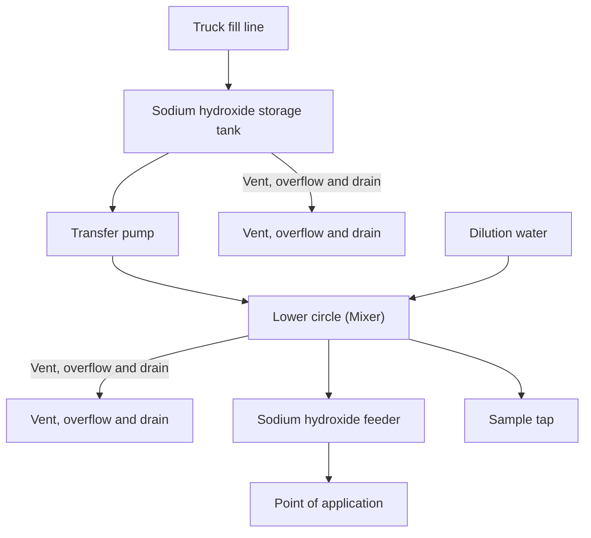

FIGURE 14.50 Typical feed system for caustic soda

Sodium carbonate monohydrate, Na2CO3·H2O, contains 85.48% sodium carbonate and 14.52% water of crystallization. It separates as small crystals from saturated aqueous
\n---\n

# Sodium Carbonate: Properties, Crystallization, and Handling

solutions higher than 36°C (96°F). It loses water when heated; and its solubility decreases slightly with increasing temperature. Sodium carbonate heptahydrate, Na2CO3·7H2O, contains 45.7% sodium carbonate and 54.3% water of crystallization.

Sodium carbonate decahydrate, Na2CO3(10H2O), typically called washing soda, contains 37.06% sodium carbonate and 62.94% water of crystallization. It can be crystallized from saturated aqueous solutions lower than 32°C (90°F) and higher than 2°C (28°F) or by wetting soda ash with the calculated quantity of water in this temperature range. Crystals readily effloresce in dry air, forming principally monohydrate:

Designers of sodium carbonate systems must consider the nature of the sodium carbonate solutions (viscosity, concentration, solubility, crystallization, heat of formation), shipping, storage, transmission, and feeding:

Dissolving anhydrous sodium carbonate or the monohydrate form in water generates heat: When heptahydrate or decahydrate forms are dissolved, heat is absorbed. The quantity of heat evolved or absorbed depends on the concentration of the solution. The solubility of sodium carbonate in water varies irregularly with temperature. The density of sodium carbonate solution decreases with increasing temperature:

Commercial soda ash is available packaged in 50-kg (100-lb) bags or in bulk by truck, hopper car, or barge. Bulk transport by rail is the typical mode of shipment. Hopper cars range in size from 60 m3 (2000 cu ft), holding 32 000 kg (70 000 lb) of light soda ash or 64 000 kg (140 000 lb) of dense soda ash, to more than 140 m3 (5000 cu ft), holding up to 82 000 kg (180 000 lb) of light or 90 000 kg (200 000 lb) of dense soda ash: Most hopper cars are unloaded by gravity:

Handling bagged soda ash is best accomplished by conveyors or on pallets using forklift trucks. Gravity conveying, pneumatic, or vacuum systems can handle bulk soda ash.

For large quantities of soda ash, bins or bunkers are used. Bins may be filled by an open-bottomed screw conveyor or a system of such conveyors arranged longitudinally across the top. These conveyors load progressively from one end of the bin to the other: The cover or roof of the bin should be tight: Dust control for the entire conveyance system may be provided at the bin.
\n---\n

When shipped, commercial soda ash contains 99.2% sodium carbonate. The accepted commercial standard for soda ash is expressed in terms of the equivalent sodium oxide, Na2O, content. On a weight percentage basis, 100% sodium carbonate contains 58.5% sodium oxide. Thus, 99.2% soda ash is equivalent to 58.0% sodium oxide.

When soda ash is to be stored as a slurry, pumping it directly through a pipeline from the unloading point to the storage tank is frequently convenient: Slurries containing 35% to 40% suspended solids by weight (50% to 60% total soda ash) can be pumped. The more common concentration is 10% to 20%.

Weak solutions containing 5% to 6% dissolved soda ash may be handled the same as water: Strong solutions, in the 20% to 32% range, require special care (heat loss prevention) to avoid crystallization.

Bagged soda ash should not be stored in a damp or humid place. Excessive air circulation in the storage area should be avoided. If bagged soda ash is to be stored for extended periods under adverse conditions, stacks should be covered by a tight-fitting, impermeable sheet. Large quantities of bulk soda typically are stored in steel bins or bunkers. Bins typically are built longer than their width.

Arching, bridging, or chimneying—sometimes encountered when storing light soda ash may be avoided by installing electric or pneumatic vibrators mounted on the outside of bin bottoms, just above the outlet. The use of vibrators is inadvisable with dense soda ash.

Basic components of a slurry storage system include a tank, means of slurring the bulk soda ash and transferring it to storage, and means of reclaiming solution from the tank and replenishing it with water. One of the most important requirements for successful operation of a slurry storage system is to maintain an operating temperature higher than 9°C (48°F) for a 10% slurry and 23°C (74°F) for a 20% slurry. Cooler temperatures in the slurry bed may result in the formation of heptahydrate and decahydrate forms, which are difficult to redisolve. Water used for operating the system should be preheated. Heating coils may be immersed in the bottom of the slurry tank. If the slurry tank is located outdoors, insulation may also be necessary:

Pipelines carrying strong soda ash solutions (30% to 32% at 32°C [90°F] minimum) should be insulated. Where the use point is distant from the storage tank and the use rate
\n---\n

## 4.2.2 Neutralization of Alkalinity

- is low or intermittent; pipelines may be constructed as a continuous loop, with most of the solution recirculated to the storage tank:
- Soda ash will precipitate insoluble compounds from hard water: If hard water is used for slurry and solution handling; undesirable scaling may result;
- feeding of dry soda ash, volumetric, gravimetric, or loss-in-weight gravimetric mechanical feeders may be used. Solution feed may be pumped.

In some cases, downward adjustment of the pH of a wastewater stream is necessary:
Discharge of effluent with a pH greater than 8.5 typically is undesirable and, in many cases, not permissible. High pH in municipal wastewater typically is caused by industrial waste contributions or by the use of lime for phosphorus removal during the treatment process. The pH may be decreased by adding carbon dioxide (recombination) or acid. Recombination is not discussed here because it is rarely practiced in municipal wastewater treatment:

Sulfuric (H₂SO₄), hydrochloric (HCl), nitric (HNO₃), or phosphoric (H₃PO₄) acids are used in wastewater neutralization. Sulfuric acid is the most widely used, but local economic considerations or availability may favor the use of hydrochloric acid. The use of nitric acid is restricted because of effluent nutrient considerations. Although the following discussion typically is based on sulfuric acid system needs, it applies, with minor modifications, to other acids.

No direct correlation between alkalinity and pH exists. Therefore, to determine acid requirements for design purposes, a laboratory titration curve using a pH meter and acid titration of standardized normality should be performed using a representative sample of the wastewater to be treated (APHA et al., 2017). Typically, the titration endpoint is at approximately pH 7 or 8, not at pH 5 as in a total-alkalinity determination. To neutralize 1.0 mg/L of alkalinity, the required amounts of 100% acid would be 0.98 mg/L for sulfuric acid, 0.72 mg/L for hydrochloric acid, and 0.63 mg/L for nitric acid. Because acids are commercially available in various strengths, these figures must be adjusted by a dilution factor; depending on acid strength: Concentrations of commercial acids in use are 93.19% for sulfuric acid, 31.45% for hydrochloric acid, and 67.2% for nitric acid.
\n---\n

## 4.2.2.1 Sulfuric Acid

Sulfuric acid used in wastewater treatment may be the 60° B (strength in Baume), 77.7% concentration, or the 66° B, 93.2% concentration (approximate specific gravity of 1.83). This acid is viscous, with a rating of approximately 0.035 N/m² (0.350 Pa) at 10°C. When diluted with water, the significant heat generated calls for precautions. In particular, the acid must always be added to water and not vice versa.

Iron is not vulnerable to attack from 66° B sulfuric acid. Therefore, this acid may be stored in unlined steel tanks with an air vent that is fitted with a dryer. If the concentration of the acid solution is more than 66° B, then a special tank lining is advisable.

At small facilities, acid reagents typically are supplied and stored in carboys, cans, or drums. At larger facilities, they are delivered by road or rail tankers and transferred to storage tanks by gravity, air compressors, or pumps.

----

## 4.2.2.2 Hydrochloric Acid

Hydrochloric acid, 22° B, has an average specific gravity of 1.17 and a content of 33% by weight. Polyvinyl chloride tanks or lined steel tanks may be used to store 22° B hydrochloric acid. Polyvinyl chloride tanks may be reinforced externally with polyester glass as an additional precaution:

----

## 4.2.2.3 Acid System Design Considerations

Options for acid addition systems or equipment include proportional feed or constant rate, gravity or pressure feed, and concentrated acid feed or dilute acid feed. Proportional feeders may be controlled according to flow or pH using suitable metering and control equipment. Many variables influence the design of an acid-feed system, including type and quantity of acid to be fed, purchase and installation costs, labor requirements, and method of control.

Constant-rate, acid-feed systems may consist of a simple drip or siphon apparatus for small acid quantities such as 8 to 11 L/d (2 to 3 gpd). A filter, preferably of glass wool, should be included in the line because commercial acid typically contains some suspended matter that may clog a drip-feed system. Educator units constructed of acid-
\n---\n

# 4.3 Rapid Mixing
Associated with each type of chemical treatment process is a series of chemicals that can be used. In most cases, the success of the chemical process depends on mixing the rapid dispersal of the chemical reagent throughout the waste stream.

Typically, separate mix tanks are preferred for chemical mixing. If the process lacks a separate tank, then the chemical must be added at a point that offers sufficient agitation and time for mixing. Pump suction and discharge lines have been used for this process.

From the engineer's point of view; mixing may be defined as the unit operation used to blend or mingle coagulating chemicals or other materials with water or wastewater to create a nearly homogeneous single-phase or multiphase system. Rapid mixing is a brief operation that is designed to create a quick response. It often precedes flocculation. The computational fluid dynamics (CFD) model can be used to design and select mixers and to estimate dosages of the chemicals:

## 4.3.1 Impeller Mixers
The most common type of mixing device for wastewater treatment is the rotating impeller mixer: Three groups of impeller mixers are used: paddles, turbines, or propellers. Of these, only turbine and propeller mixers are used for rapid mixing applications.

### 4.3.1.1 Turbine Mixers
A turbine impeller mixer submerged in liquid, shown in Figure 14.51, operates like a centrifugal pump without a casing. Most turbine mixers resemble multibladed paddle
\n---\n

### 4.3.1 Turbine Mixers

mixer with short blades turning at high speeds on a shaft typically located in the center of the mixing chamber. Figure 14.52 presents several variations of turbine mixers. Blades may be straight or curved, pitched, or vertical. The impeller may be open, semienclosed, or shrouded. The diameter of the impeller is typically within a range from 30% to 50% of the diameter of the mixing vessel.

In thin liquids, such as domestic wastewater, turbine mixers generate strong currents that persist throughout the chamber. Near the impeller is a zone of rapid currents, high turbulence, and intense fluid shear. Principal currents are radial and tangential. Tangential components induce vortexing and swirling that, for efficient operation, must be stopped by baffles or a diffuser ring.

### 4.3.1.2 Propeller Mixers

Propeller mixers, similar to the one shown in Figure 14.53, have high-speed impellers and are used for thick solutions. Small propeller mixers revolve at full motor speed, typically 1750 rpm; larger mixers turn at 400 to 800 rpm. Propellers generate currents that are primarily axial and continue through the liquid in a given direction until deflected by the flow or wall of the mixing chamber. Propeller blades vigorously cut or shear the liquid.

Propeller mixers are smaller in diameter than either paddle or turbine mixers, rarely exceeding 460 mm (18 in.) in diameter, regardless of mixing chamber size. In a deep chamber, two or more propellers may be mounted on the same shaft; they typically direct the liquid in the same direction.

----

Visual representations for the propeller mixer figures:

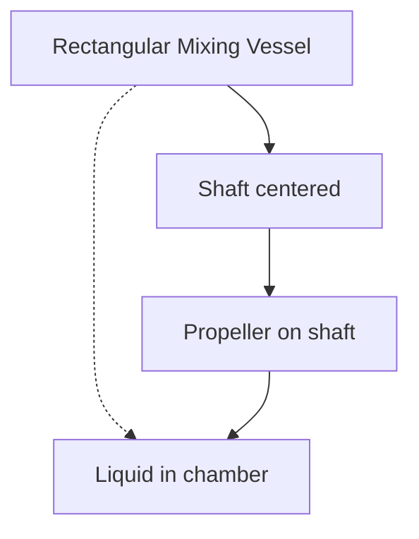

Side view diagram (descriptive):
- A rectangular mixing vessel with a vertical shaft centered in the chamber.
- The shaft extends downward to a propeller at the lower end.
- The liquid surrounds the shaft and propeller, illustrating axial flow along the shaft direction.

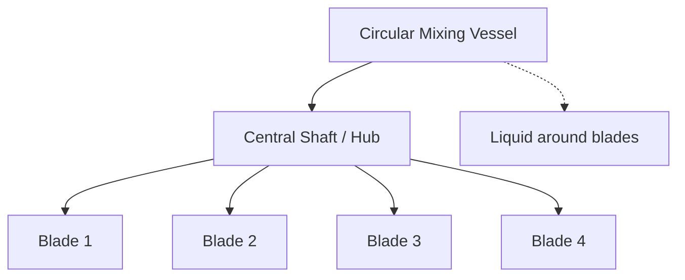

Top view diagram (descriptive):
- A circular vessel with a central hub.
- Four blades extend radially from the hub at 90-degree intervals, representing a four-blade propeller arrangement.\n---\n

## FIGURE 14.51 Turbine mixer in a baffled tank

<table>
  <tr>
    <td>(a)</td><td>(b)</td><td>(c)</td>
  </tr>
<tr>
    <td>(d)</td><td>(e)</td><td></td>
  </tr>
</table>

<table>
  <tr><td>Blades</td><td>Rotor blades</td><td>Stationary diffuser</td></tr>
</table>

----

## FIGURE 14.52 Turbine impellers: (a) straight blade, (b) 45-degree pitched blade, (c) straight curved blade, (d) vaned disk, (e) radial impeller, and (f) shrouded curved blade with diffuser ring:

<table>
  <tr>
    <td>(a) straight blade</td>
    <td>(b) 45-degree pitched blade</td>
    <td>(c) straight curved blade</td>
  </tr>
<tr>
    <td>(d) vaned disk</td>
    <td>(e) radial impeller</td>
    <td>(f) shrouded curved blade with diffuser ring</td>
  </tr>
</table>

----

### 4.3.2 Other Mixing Devices

Mixing may be accomplished by several other devices, including baffled channels, hydraulic jump mixers, pneumatic mixing by the injection of compressed air, and in-line static mixing devices:

\n---\n

FIGURE 14.53 Propeller mixer.

An illustration of a propeller mixer: a long shaft with blades near the end and a motor housing at the top.

Baffled channels and pneumatic mixing are better suited for flocculation operations than rapid mixing. In-line static mixers frequently are used for rapid mixing, but they have two disadvantages: headlosses are typically up to 0.9 m (3 ft) and the mean temporal velocity gradient, G, cannot be changed to meet varying requirements but is a function of flowrate through the unit.

4.3.3 Fluid Regimes

The term “fluid regime” refers to the flow pattern and overall summation of the mass flow shear relationships existing in a fluid in motion. The type of flow in a mixing chamber depends on impeller type; fluid characteristics; and tank, baffles, and mixer sizes and proportions. Fluid velocity at any point in the tank has three components; the overall flow pattern in the tank depends on variations in these three velocity components from point to point.

Three orthogonal components—radial, longitudinal, and tangential—conveniently define the flow pattern. The radial component acts in a direction perpendicular to the shaft of the impeller; the longitudinal component acts in a direction parallel to the shaft; and the tangential, or rotational, component acts in a direction tangent to a circular path around the shaft.

The tangential component induced by the rotating impeller promotes rotational movement, or vortexing, around the impeller shaft. This vortexing impedes mixing by reducing the
\n---\n

# 4.3.4 Design Considerations

The design of a functional, economically feasible rapid mixing system requires consideration of power requirements, laboratory scale-up, batch and continuous systems, hydraulic retention time, vessel geometry, high- and low-speed mixers, propeller and turbine mixers, mixer mounting, top-entering turbines and side-entering propeller mixers, and single-propeller and multipropeller mixers.

## 4.3.4.1 Power Requirements

The following formula has been developed for determining the power requirements of an impeller mixer to maintain turbulent hydraulic conditions (Reynolds number greater than 10^5) (Rushton, 1952):

$$ P = P_k \rho N^3 D^5 / \eta \quad (14.3) $$

where

- P = power requirement, in N·m/s or Watt (ft·lbf/s);

- ρ = mass density of the fluid, 1000 kg/m^3 (62.4 lb/ft^3) for water;

- n = impeller revolutions per second, s^-1;

- D = impeller diameter (units consistent with ρ and N);

- η = mechanical efficiency (dimensionless).

\n---\n

# Impeller and Mixing Parameters

D = diameter of the impeller; m (ft);

- `19.79 m /kg 32.17ft/bf`
- `g_c = gravitational acceleration factor, N · s^2 / sec^2 · b_1` and
- `K_T = constant.`

The **K_T** depends on the impeller shape and size, the number of baffles used to eliminate vortexing, and other variables not included in the power equation. Table 14.12 presents K_T values for mixing impellers rotating at the centerline of cylindrical vessels with a flat bottom, four baffles at the vessel wall, baffle widths equaling 10% of the vessel diameter, liquid depth equal to one tank diameter, impeller diameter equal to 30% of the tank diameter, and the impeller positioned one diameter above the tank floor:

Several empirical parameters have been developed to describe performance characteristics of the rapid-mixing unit operation. These include the power dissipation function, mean temporal velocity gradient, mixing opportunity parameter, and mixing loading parameter.

The power dissipation function, or power input per unit of mixer volume, provides a rough measure of the mixing effectiveness of the system because more power input creates greater turbulence and greater turbulence leads to better mixing. The mean temporal velocity gradient, \(G\) (s\(^{-1}\)), describes the degree of mixing of the system. As \(G\) increases, the degree of mixing increases. In domestic wastewater treatment, values of \(G\) typically range from 300 to 1500 s\(^{-1}\) for rapid mixing. The power dissipation function in W/m\(^3\) (or ft lb\(_f\) / s · cu ft) is expressed as

$$
\frac{P}{V} = \mu G^2 \quad (14.4)
$$

where \(V\) = mixing chamber volume, m\(^3\) (cu ft); and
\(\mu\) = absolute viscosity of fluid, N·s·m\(^2\) (lb·s/ sq ft).

| Impeller Type | \(K_T\) |
|---------------|---------|
|               |         |

\n---\n

## TABLE 14.12 Values for Kt Used for Determining Impeller Power Requirements

<table>
  <thead>
    <tr><th>Component</th><th>Kt</th></tr>
  </thead>
  <tbody>
    <tr><td>Propeller (square pitch, three blades)</td><td>0.32</td></tr>
<tr><td>Propeller (pitch of two, three blades)</td><td>1.00</td></tr>
<tr><td>Turbine (six flat blades)</td><td>6.30</td></tr>
<tr><td>Turbine (six curved blades)</td><td>4.80</td></tr>
<tr><td>Turbine (six arrowhead blades)</td><td>4.00</td></tr>
<tr><td>Fan turbine (six blades)</td><td>1.65</td></tr>
<tr><td>Flat paddle (two blades)</td><td>1.70</td></tr>
<tr><td>Shrouded turbine (six curved blades)</td><td>1.08</td></tr>
<tr><td>Shrouded turbine (with stator, no baffles)</td><td>1.12</td></tr>
  </tbody>
</table>

TABLE 14.12 Values for Kt Used for Determining Impeller Power Requirements

The mixing opportunity parameter is, in a sense, a ratio of power-induced rate of flow to hydraulic-induced rate of flow. In domestic wastewater treatment, this parameter typically ranges from 9000 to 180000 (dimensionless) for rapid mixing. The mixing opportunity parameter is expressed as:

$$ G_t = \frac{(P V / \mu)^{0.5}}{Q} \quad (14.5) $$

where
\( t_d \) = hydraulic retention time of mixing basin, s; and

\( Q \) = design flowrate, m³/s.

The mixing loading parameter implies that the hydraulic loading of mixing units is not merely a function of their hydraulic retention time but, more significantly, also a function of power input and viscosity. In domestic wastewater treatment, values of this parameter typically range from 0.03 to 0.0075 s⁻¹. The mixing loading parameter may be expressed (from eq 14.5) as:

\n---\n

## 4.3.4.2 Laboratory Scale-Up

“Scale-up” from a laboratory or bench-scale mixing operation to a full-scale unit poses a significant problem in mixer design. With geometric similarity, one procedure determines, in the laboratory, the hydraulic retention time, power dissipation function, and power function values. These values then are used for the design of a full-scale unit. Typically, the hydraulic retention time and power dissipation function may be determined directly. A graph of power function and Reynolds number also may be prepared on the basis of laboratory testing. The power function corresponding to the Reynolds number that represents best mixing may be determined:

$$\text{Power function} (Q) = \frac{P}{\rho\, N^3\, D^5} \quad (14.7)$$

$$\text{Reynolds number} (N_{Re}) = \frac{\rho\, N\, D^2}{\mu} \quad (14.8)$$

where \(\mu'\) = absolute viscosity of fluid (lbm/ft·s).

With laboratory data and calculations for \(Q\) and \(N_{Re}\), the engineer may determine the power requirement, volume, mixer speed, and mixer diameter for a full-scale unit:

## 4.3.4.3 Batch and Continuous Systems

Batch-mixing systems typically are used in the makeup of chemical solutions. Selection of the proper chamber size depends, to a large extent, on the volume to be mixed and the time allowed. For the makeup of specific chemical solutions requiring rapid mixing, the chemical manufacturer should be consulted to obtain the economical volume and suggested mixing times:

Continuous systems nearly always are required for mixing process waste streams. Where required in the treatment of domestic wastewater, multiple rapid-mixing chambers operated in parallel should be used.

## 4.3.4.4 Hydraulic Retention Time
\n---\n

Hydraulic retention time in mixing reactors typically varies from 0.5 to 2 minutes. Caution should be used to prevent either undermixing or overmixing. Undermixing results in inadequate dispersal of additives and uneven dosing. Overmixing may rupture wastewater solids already present in the waste stream or cause excessive dispersal of newly formed floc.

## 4.3.4.5 Vessel Geometry
The shape and the size of the tank often are dictated by process considerations. As a rule, circular mixing tanks are more efficient for rapid mixing than square or rectangular tanks. For circular tanks, liquid depths equal to the tank diameter are a good practice.
For tanks less than 4000 L (1000 gal) in capacity, portable or compact turbine mixers are most practical. For larger tanks, heavy-duty, top-entry turbine mixers typically are used.
Squat tanks, that is, tanks with top dimensions greater than liquid depth, have one or more side-entry mixers positioned next to each other. For rectangular tanks, the mixer(s) should enter through one of the narrow walls of the chamber. For all tanks, one or more side-entry mixers are used in lieu of top-entry mixers with extremely long shafts.

## 4.3.4.6 High- and Low-Speed Mixers
Modifying propeller size or pitch can help keep power constant even when speed changes. Typically, the choice between high- or low-speed mixers of equal power depends on the application. High-speed mixers are best for mixing fluids of low viscosity such as domestic wastewater. Low-speed mixers are best for thick and highly viscous fluids or solutions that have a strong tendency to foam.

## 4.3.4.7 Propeller and Turbine Mixers
Propellers are high-speed mixers operated with low horsepower. They are best used as side-entering mixers because they optimize flow more than fluid shear. Propeller speeds range from 400 to 1750 rpm. When the mixer is mounted properly, flow is axial with good top-to-bottom solution turnover. If used as top-entry mixers, propellers should be mounted off-center or at an angle. Baffles are not required for an angle mount, but they are essential for a vertical center mount. Through-bladed propellers typically are used.
\n---\n

## 4.3.4.8 Mixer Mounting

Turbines are used primarily in low-speed applications where great energy is required. Turbine speeds range from 56 to 125 r/min. Primary flow is radial and provides good top-to-bottom turnover in a baffled tank. Turbine mixers typically are mounted vertically and in the center of the mixing chamber, 50% to 100% of a diameter above the chamber floor.

Where top entry is required, the propeller mixer is mounted angled and off-center. Where side entry is necessary, the mixer is mounted horizontally, offset from the centerline of the tank. Flow should run parallel to the long axis of the basin. Power must be sufficient to create a stream velocity strong enough to reach the opposite tank wall with enough momentum to produce fluid flow at that point. For extra large volumes, two or more mixers should be mounted in the same quadrant.

The turbine mixer is always mounted exactly vertically. In an unbaffled tank, the unit is mounted off-center. In a baffled tank, the unit is centered.

## 4.3.4.9 Top-Entering Turbines and Side-Entering Propeller Mixers

For small, open tanks of less than 4000 L (1000 gal), top-entry mixers are best. In this case, either an angle-mounted propeller mixer or a vertically mounted turbine mixer will provide satisfactory service:

Top-entering turbine mixers may be used for tanks of more than 4000 L in capacity. Side-entering mixers typically are used for nonstandard tank geometry and larger tanks.

## 4.3.4.10 Single-Propeller and Multipropeller Mixers

Propeller size and pitch affect power output. The same power level may be maintained with either single or dual propellers. For equal volumes, vessel shape determines the choice between single or multiple propellers.

Typically, single propellers are used at lower speeds with larger tank sizes and higher flow applications. Dual propellers or multipropellers are used at higher speeds and smaller diameters in vessels with a liquid depth-to-tank top dimension ratio greater than unity:

## 4.3.5 Chemical Feed Systems
\n---\n

Feeding systems are necessary for the addition of reagents in the form of solid, liquid, or gas to the waste stream at a controlled rate. Design of a chemical feed system must consider the desired state of each chemical to be fed and its particular physical and chemical characteristics, maximum and minimum waste stream flowrates, and the reliability of feeding devices. Table 14.13 provides generalized information about chemical feed systems. Information specific to certain chemical processes is included in the phosphorus precipitation section of this chapter and elsewhere (Daniels, 1975b; Novak and O’Brien, 1975; Priesing, 1962; Stumm and Morgan, 1962; U.S. EPA, 1975b). Chemicals used in municipal facilities may be received in either liquid or solid form. Coagulants in solid form typically are converted to solution or slurry before entering the waste stream. The dry feeder has numerous forms to handle wide ranges in chemical characteristics, feed rates, and degree of accuracy required. Solution feeding of coagulants depends primarily on liquid volume and viscosity:

* Water-soluble coagulant aids, available as dry granular powders or concentrated liquids, are compatible with most dissolved inorganic salts at low concentrations typically found in tap water.
- Water for preparing flocculation solutions should have a low suspended-solids content to avoid chemical sludge formation.
- Concentrated solutions of coagulants and flocculants should never be prepared consecutively in the same vessel unless residues are thoroughly removed between uses.
- Dry coagulant aids should be given enough time to solubilize completely because long, entwined molecules must hydrate fully before they will uncoil completely; preparation time is decreased when dry particles initially are distributed evenly without large lumps. Then, only minimum agitation is required after dispersion to ensure a uniform solution. Flocculant solutions, unlike primary coagulants, are viscous and exhibit non-Newtonian flow: therefore, ordinary regulating devices are inadequate, and pumps and lines should not be sized on the basis of Newtonian flow properties.
- The capacity of a chemical feed system is an important consideration for storage and feeding: Storage capacity designs must take into account the economy of quantity purchase versus the disadvantages of construction cost and chemical deterioration with time. Potential delays and chemical use rates also merit careful consideration. Design of storage bins or tanks for chemicals must account for the angle of repose of the chemical
\n---\n

and its necessary environmental requirements such as temperature and humidity. The size and slope of feeding lines and construction materials are other important considerations.

Chemical feeders must accommodate minimum and maximum feeding rates required.
Manually controlled feeders have a common range of 20 to 1, but this range may be increased to approximately 100 to 1 with dual-control systems. Chemical feeder control may be manual, automatically proportioned to flow, dependent on some form of process feedback, or a combination of any two of these. More sophisticated control systems are feasible if proper sensors are available. Standby units should be included for each type of feeder used. For proper operational flexibility, points of chemical addition and associated piping should be capable of handling all possible changes in dosing patterns:

<table>
<thead>
<tr>
  <th>Feeder Type</th>
  <th>Use</th>
  <th>Equipment Limitations</th>
  <th>Feed Rate Range</th>
  <th></th>
</tr>
<tr>
  <th></th>
  <th></th>
  <th></th>
  <th></th>
  <th></th>
</tr>
</thead>
<tbody>
<tr><td colspan="5">Dry feeder</td></tr>
<tr><td colspan="5">Volumetric</td></tr>
<tr>
  <td>Oscillating plate</td>
  <td>Anymaterial, granules or powder</td>
  <td></td>
  <td>0.001-3.1</td>
  <td>40-1</td>
</tr>
<tr>
  <td>Oscillating throat (universal)</td>
  <td>Anymaterial, any particle size</td>
  <td></td>
  <td>0.002-9.0</td>
  <td>40-1</td>
</tr>
<tr>
  <td>Rotating disk</td>
  <td>Most materials, including NaF, granules or powder</td>
  <td>Use disk unloader for arching</td>
  <td>0.001-0.09</td>
  <td>20-1</td>
</tr>
<tr>
  <td>Rotating cylinder (star)</td>
  <td>Any material, granules or powder</td>
  <td></td>
  <td>0.7-1800.65-27.0</td>
  <td>10-1 or 100-1</td>
</tr>
</tbody>
</table>

\n---\n

## Gravimetric

<table>
  <tr>
    <td>Screw</td>
    <td>Dry, free-flowing material, powder or granular</td>
    <td>0.005-1.7</td>
    <td>20-1</td>
  </tr>
<tr>
    <td>Ribbon</td>
    <td>Dry, free-flowing material, powder, granular, or lumps</td>
    <td>0.0002-0.015</td>
    <td>10-1</td>
  </tr>
<tr>
    <td>Belt</td>
    <td>Dry, free-flowing material up to 40 mm (1.5 in.) in diameter, powder or granular</td>
    <td>0.009-270</td>
    <td>10-1</td>
  </tr>
</table>

### Continuous-belt and scale

<table>
  <tr>
    <td>Continuous-belt and scale</td>
    <td>Dry, free-flowing, granular material or floodable material</td>
    <td>Use hopper agitator to maintain</td>
    <td>0.002-0.18</td>
    <td>100-1</td>
  </tr>
<tr>
    <td>Loss in weight</td>
    <td>Most materials— powder, granular, or lumps</td>
    <td>constant density</td>
    <td>0.002-7.2</td>
    <td>100-1</td>
  </tr>
</table>

----

## Solution feeder

### Nonpositive displacement

<table>
  <tr>
    <td>Decanter (lowering pipe)</td>
    <td>Most solutions, light slurries</td>
    <td>No slurries</td>
    <td>0.009-0.9</td>
    <td>100-1</td>
  </tr>
<tr>
    <td>Orifice</td>
    <td>Most solutions</td>
    <td>No slurries</td>
    <td>0.015-0.45</td>
    <td>10-1</td>
  </tr>
<tr>
    <td>Rotameter (calibrated valve)</td>
    <td>Clear solutions</td>
    <td>No slurries</td>
    <td>0.0005-0.015; 0.0002-0.018</td>
    <td>10-1</td>
  </tr>
<tr>
    <td>Loss in weight (tank with control valve)</td>
    <td>Most solutions</td>
    <td>No slurries</td>
    <td>0.0002-0.018</td>
    <td>30-1</td>
  </tr>
</table>

\n---\n

<table>
<tr>
<td>Positive displacement<br>Rotating dipper</td>
<td>Most solutions or slurries</td>
<td>0.009–2.7</td>
<td>100–1</td>
</tr>
<tr>
<td>Proportioning pump Diaphragm</td>
<td>Most solutions<br>(special unit for 5% slurries)c</td>
<td>0.0004–0.014</td>
<td>100–1</td>
</tr>
<tr>
<td>Piston</td>
<td>Most solutions, light slurries</td>
<td>0.0001–15.3</td>
<td>20–1</td>
</tr>
</table>

<p><sup>a</sup>Volumetric feed capacities are given because chemical specific gravities must be known to specify mass feed capacity.</p>

<p><sup>b</sup>Ranges apply to purchased equipment: Overall feed ranges can be extended more.</p>

<p><sup>c</sup>Use special heads and valves for slurries.</p>

<p>TABLE 14.13 Types of Chemical Feeders</p>

<p>Chemicals must always enter the system at areas of active agitation rather than at dead spots. Chemicals should not be added at locations where they may escape to the effluent stream before completion of proper mixing and reaction: A visible flow of reagent, which helps the operator, may be achieved by discharge above the surface of the receiving liquid. However, many designers prefer discharge below the surface to promote faster and more complete mixing. Both objectives can be accomplished by feeding to a funnel that is connected to a line entering below the surface.</p>

<p>4.3.5.1 Dry Feed</p>

<p>A dry feed installation (Figure 14.54) (U.S. EPA, 1975b) consists essentially of a hopper, a feeder, and a dissolver tank. All three units are sized based on waste volume, treatment rate, and an optimum length of time for chemical feeding and dissolving: The best applications of dry feed systems have high treatment rates, more stable chemicals, and more fluid materials. Less fluid materials can be handled, but feeder accessories are needed. Because a powdered or granular material may arch or bridge in a hopper, it</p>
\n---\n

## FIGURE 14.54 Typical feed system for dry chemicals

```mermaid
flowchart TD
  A[Bulk storage bin] --> B[Bin gate]
  B --> C[Flexible connection]
  C --> D[Alternate supplies depending on storage]
  E[Day hopper for dry chemical from bags or drums] --> D
  D --> F[Feeder]
  F --> G[Dissolver]
  G --> H[Gravity to application]
  H --> I[Holding tank]
  I --> J[Pump to application]
  G --> K[Level probes] --> I
  L[Water supply] --> M[Solenoid valve] --> G
  N[Rotameter] --> G
  O[Control valve] --> N
  P[Pressure reducing valve] --> N
  Q[Scale or sample chute] --> H
```

Dry feeders are either of the volumetric or of the gravimetric type. Most types of volumetric feeders are the positive-displacement type, incorporating some form of moving
\n---\n

cavity of a specific or variable size: Accurate feeding depends on the chemical having a constant specific weight per unit volume. In operation, the chemical falls by gravity into the cavity and is then enclosed and separated from the hopper's feed. The size of the cavity and its rate of movement govern the material feed rate.

One type of volumetric dry-feeder has a continuous belt of specific width moving from beneath the hopper to the dissolving tank. A mechanical gate regulates the depth of material on the belt, and the feed rate is governed by the belt speed, height of the gate opening, or both. The hopper typically is equipped with a vibratory mechanism to reduce arching of powdered chemicals. Granular chemicals such as alum require no vibration. This type of feeder is unsuitable for easily fluidized materials.

Another type of volumetric feeder uses a screw or helix at the bottom of the hopper placed in a tube with an opening slightly larger in diameter. The speed of screw or helix rotation governs the feed rate.

The primary disadvantage of the volumetric feeder is its inability to compensate for changes in material density, which may be avoided by modifying the volumetric design to include a gravimetric or loss-in-weight controller. This modification allows continuous weighing of the material as it is fed. A beam-balance controller measures the actual mass of material. This is considerably more accurate, particularly over a long period, than a spring gravimetric design. Gravimetric feeders are used where a feed accuracy of approximately 1% is required for economy, as in large-scale operations, and where materials are used in small, precise quantities. Many volumetric feeders can be converted to loss-in-weight devices by placing the entire feeder on a platform scale tare to offset the weight of the feeder:

With dry feeders, the dissolving operation is critical. Numerous small particles dissolve more rapidly than larger granules or lumps. Warm water and efficient mixing tend to increase the solution rate. Too much heat, however, may cause excessive vapors that impede flow of the dry chemical. Solution temperature must be taken into account when dissolving certain chemicals.

The capacity of a dissolver is based on detention time, which is directly related to the wettability, or rate of solution, of a chemical. Therefore, the dissolver must be large
\n---\n

enough to provide the necessary retention time for both the chemical and the water at the maximum feed rate. At lower feed rates, the strength of the solution leaving the dissolver is less, but the detention time is approximately the same unless the water supply to the dissolver is reduced. When the water supply to any dissolver is reduced to form a constant-strength solution, mechanical mixing within the dissolver is necessary because the mixing jets do not provide sufficient power at low rates of flow.

## 4.3.5.2 Solution Feed

Liquid feed systems are best applied for chemical treatment with lower treatment rates, less stable chemicals, chemicals better fed as liquids to avoid handling of dusty or more dangerous chemicals, or materials available only as liquids (Figure 14.55) (Huang, 1979).
\n---\n

# Figure 14.55 Typical feed system for wet chemicals

```
mermaid
graph TD
TruckFillLine(Truck Fill Line) --> SolutionStorageTank[SOLUTION STORAGE TANK]
SolutionStorageTank --> TransferPump[TRANSFER PUMP]
TransferPump --> DayTank(DAY TANK)
DilutionWater[DILUTION WATER] --> DayTank
DayTank --> WetChemicalFeeder[WET CHEMICAL FEEDER]
WetChemicalFeeder --> PointOfApplication[POINT OF APPLICATION]

StorageVent[(VENT, OVERFLOW AND DRAIN)] --> SolutionStorageTank
DayTankVent[(VENT, OVERFLOW AND DRAIN)] --> DayTank

DayTankMixer[MIXER] --> DayTank
DayTankSample[SAMPLE TAP] --> DayTank
```

FIGURE 14.55 Typical feed system for wet chemicals.
\n---\n

Liquid feed units include piston, positive-displacement diaphragm, and balanced diaphragm pumps and liquid gravity feeders (rotating dippers). The unit best suited for a particular application depends on feed pressure, chemical corrosiveness, treatment rate, accuracy desired, viscosity and specific gravity of the fluid, other liquid properties, and type of control.

Piston-plunger and positive-displacement pumps are available with low to high capacities at pressures up to 41 000 kPa (6000 psig). Liquids with viscosities up to 10 N s/m² (100 P) may be handled by the plunger pump, depending on the rate of feed.

Mechanically actuated diaphragm pumps are designed for low discharge pressures less than 830 kPa (120 psig). Flow capacities of 0.076 L/s (72 gph) may be handled, although process fluids are limited to liquids with viscosities under 0.1 N s/m² (1 P).

Hydraulically actuated, balanced diaphragm pumps can operate against discharge pressures up to 21 000 kPa (3000 psig). They can handle capacities up to 0.4 L/s (400 gph), and liquids with viscosities of 1 N s/m² (10 P) and higher can be handled at lower flowrates.

Liquid gravity feeders (rotating dippers) can handle acids, alkalies, and slurries over a 100-to-1 range and at flowrates up to 1.90 L/s (1800 gph).

Simple homemade devices can be built in the facility to provide liquid reagent feed. An orifice tank, consisting of a constant head tank and an orifice, is such a device. A Sutro weir can be varied in width, manually or automatically, in accordance with liquid flowrate as indicated by a measuring weir or other control device.

5.0 Membrane Processes
5.1 Process Description

Membrane processes can be pressure or vacuum driven or depend on electrical potential gradients, concentration gradients, or other driving forces. Some facilities that are utilizing the vacuum-driven membranes are applying the gravity-assisted mode of operation when membranes are operated under the gravity (static pressure) until the desired permeability is achieved:
\n---\n

Four main membrane categories, classified by the size of the separated particles or materials, are commercially used at the present time and can be expressed in microns (µm) and/or Daltons molecular weight cutoff (Da MWCO) (Frenkel, 2004):
- Microfiltration separates particles from 0.1 to 10.0 microns (µm) (>100 000 Da);
- Ultrafiltration rejects materials from 0.01 to 0.1 microns (µm) (2000 to 100 000 Da);
- Nanofiltration rejects materials from 0.001 to 0.01 microns (µm) (200 to 1000 Da); and
- Reverse osmosis ranging in molecular size less than 0.001 microns (µm) (<200 Da):

The first two listed, microfiltration and ultrafiltration membranes, are LPMs, and the last two, nanofiltration and reverse osmosis, are HPMs:
These four classes of membranes have been established primarily based on the size range of particles or ions each type will remove from water or wastewater. This characteristic is described in terms of nominal pore size for microfiltration and ultrafiltration membranes and by molecular weight cutoff for nanofiltration and reverse osmosis membranes: Microfiltration and ultrafiltration membranes typically are used as a particle (suspended and colloidal matters) separation processes, whereas nanofiltration and reverse osmosis membranes can be classified as ion rejection processes:
Membrane processes originally were developed in the early 1960s as desalination or demineralization processes. Membranes initially were commercially applied in reverse osmosis, and then in the 1990s were developed for microfiltration and ultrafiltration. Membrane shapes include spiral wound, hollow fiber, flat sheet, and tubular:
There are two primary membrane types based on driven pressure (Frenkel, 2008):
- Pressure driven—low-pressure microfiltration, ultrafiltration, and high-pressure nanofiltration and reverse osmosis; and
- Immersed, vacuum driven—low-pressure microfiltration, ultrafiltration only
The separate category is the forward osmosis membranes driven by the osmotic power difference between solutes with different salt concentrations:
Figure 14.56 illustrates the relative rejection properties of four types of membranes for a range of contaminants that may be found in secondary wastewater effluent. Although
\n---\n

# 5.1.1 Low-Pressure Membranes: Microfiltration and Ultrafiltration

LPMs are designed to remove suspended and colloidal matter from water; HPMs are designed to remove dissolved constituents.

Compared to other membranes, microfiltration membranes have the largest pore size and are designed to remove relatively large suspended particles such as colloids, bacteria, cysts, and others. Ultrafiltration membranes typically have a one-order-of-magnitude smaller pore size than microfiltration membranes and can achieve greater log removals of viruses than the microfiltration membranes. Nanofiltration and reverse osmosis membranes are applied to remove dissolved constituents of different sizes and charges from the water.

The membrane separation process is a surface process that removes suspended and colloidal matter efficiently and produces high-quality effluent. With proper selection, membranes can remove pathogenic microorganisms, including bacteria, viruses, protozoa, and cysts. Additionally, the membrane filtration process can remove certain organic species, provided the molecular size and membrane pore sizes are properly determined. As indicated in Figure 14.56, membranes used in separation processes have pore sizes that are many orders of magnitude larger than those used in reverse osmosis processes.
\n---\n

# Water Treatment Processes Depending on Water Characteristics

<table>
<thead>
<tr>
<th>Method of Determination</th>
<th>St. microscope</th>
<th>Scanning electron microscope</th>
<th>Optical microscope</th>
<th>Visible to eye</th>
</tr>
</thead>
<tbody>
<tr>
<td>Range</td>
<td>Particle sizes of pollutants</td>
<td>Aqueous salts</td>
<td>Colloids</td>
<td>Bacteria</td>
</tr>
<tr>
<td></td>
<td>mm</td>
<td>0.000001</td>
<td>0.0001</td>
<td>0.001</td>
</tr>
<tr>
<td></td>
<td>0.01</td>
<td>0.1</td>
<td>1</td>
<td>10</td>
</tr>
<tr>
<td>Pollutants</td>
<td>Atomic radius</td>
<td>Metal ion</td>
<td>Sugars</td>
<td>Viruses & Protein</td>
</tr>
<tr>
<td></td>
<td>0.001</td>
<td>0.01</td>
<td>0.1</td>
<td>1</td>
</tr>
<tr>
<td></td>
<td>10</td>
<td>100</td>
<td>1000</td>
<td>10 000</td>
</tr>
<tr>
<td></td>
<td>100 000</td>
<td>1 000 000</td>
<td>10 000 000</td>
<td>100 000 000</td>
</tr>
<tr>
<td>Pollutants (continued)</td>
<td>Aqueous salts</td>
<td>Colloids</td>
<td>Bacteria</td>
<td>Small sand</td>
</tr>
<tr>
<td>Pollutants</td>
<td>Latex, emulsion</td>
<td>Viruses & Protein</td>
<td>Cryptosporidium oocysts</td>
<td>Pollens</td>
</tr>
<tr>
<td></td>
<td>Asbestos</td>
<td>Giardia cysts</td>
<td>GAC</td>
<td>GAC</td>
</tr>
</tbody>
</table>

  Aqueous salts                         Colloids                                 Bacteria             Small sand

  Pollutants              Metal ion                                                    Latex emulsion
                            Sugars         Viruses & Protein                          Cryptosporidium oocysts           Pollens
                          Atomic radius                                       Asbestos                   Giardia cysts         GAC

                          Electrodialys
                          Ion exchange     High pressure                                                                  Visible to eye
                          Reverse Osmosis
                                           Nanofiltration                              Low pressure                        Human hair
                                                            Ultrafiltration

  Processes                                                                           Microfiltration
     for                                                                                                            Sand filtration
  purification                             Distillation freeze concentraton

                                                            Solvent extraction
                                                                                                         Centrifuges
                                                                                                         Gravity sedimentation
                                                                                                                              Cloth & fiber filters
                                                                                                                              Screens & strainers
 1A" = 10-10m = 10-4μm = 10-7mm
                       G: PW-GroupISFPW-GraphicsGraphics-ImagesIllustrationWTPprocess

  FIGURE 14.56 Size ranges for various treatment processesᵃⁿᵈmembrane separation (courtesy of Val S. Frenkel):

  5.1.2 High-Pressure Membranes: Nanofiltration and Reverse
                                                                       Osmosis

 Both HPM types are similar processes and essentially use the same or similar membrane
 materials. Sometimes nanofiltration is called "loose reverse osmosis," because these
 membranes are designed for lower salt rejection than reverse osmosis. Nanofiltration
 membranes were developed primarily to reduce water hardness caused by sparingly
 soluble ions or divalent cations such as calcium and magnesium and to remove color
 caused by organics. For simplicity, only reverse osmosis process is described below:

 The natural phenomenon of osmosis occurs when pure water flows from a dilute saline
 solution through a membrane into a higher concentrated saline solution. Figure 14.57
 illustrates the phenomenon of osmosis. A semipermeable membrane is placed between
 two compartments. With a highly concentrated salt solution in one compartment and low-
\n---\n

concentration salt solution in the other compartment; the membrane will allow water to permeate through it: This system will try to reach equilibrium so that water from the Iow-concentrated solute will flow to the high-concentrated solute until the osmotic pressure in the high-concentrated solute reaches equilibrium with the weight of the water column in the high-concentrated solute. The only possible way to reach equilibrium is for water to pass from the low-concentrated solute compartment to the high-concentrated solute compartment to dilute the salt solution. This process is called the natural osmosis_

<table>
<thead>
<tr><th colspan="3">Osmosis</th><th colspan="3">Reverse Osmosis</th></tr>
</thead>
<tbody>
<tr><td>Water diffuses through a semi-permeable membrane toward region of higher concentration to equalize solution strength</td><td></td><td>Ultimate height difference between columns is "osmotic" pressure</td><td></td><td></td><td></td></tr>
<tr><td>Concentrated Solution</td><td></td><td></td><td>Concentrated Solution</td><td></td><td></td></tr>
<tr><td></td><td></td><td></td><td></td><td></td><td></td></tr>
</tbody>
</table>

Concentraled    Concentrated
Solulion        Dilute Solution    Solutlon    Dilute Solutlon

         Osmosis                                        Reverse Osmosis
Water ditfuses through a semi-permeable membrane        Applied pressure in excess ol osmotic pressure
toward region of higher concentration to equalize       reverses water Ilow direction. Hence the Ierm "reverse
solution strength Ultimate height dilference between    osmosis
columns is "osmotic" pressure

         FIGURE 14.57 Graphical depiction of osmosis and reverse osmosis:

Figure 14.57 also shows that osmosis can cause a rise in the height of the salt solution.
This height will increase until the pressure of the column of water (salt solution) is so high
that the weight of the water column stops the water flow_ The equilibrium point of this
water column height in terms of water pressure against the membrane is called osmotic
pressure_
The direction of water flow through the membrane can be reversed by applying pressure
to the high salt solution greater than the osmotic pressure. This is the basis of the term
reverse osmosis. Note that this reversed flow theoretically produces pure water from the
\n---\n

# Reverse Osmosis and Salt Rejection

a salt solution because osmotic pressure retains ions (cations and anions) in the high-concentrated solute; water discharged out of the solute under pressure that exceeds osmotic pressure. Theoretically, only the water molecules should be displaced from the high-concentrated solution; however, in practice, the process is more complicated. Because of diffusion and other forces, the leakage of ions other than water molecules can be found in the water. Nevertheless, salt rejection by reverse osmosis membranes is high because of the osmosis phenomena. Most commercially available reverse osmosis membranes provide salt rejection up to 99.8% by one single element at standard conditions. Unlike standard conditions, however, real-world operating conditions typically contain more than one element. As a result, most reverse osmosis systems realistically provide overall salt rejection in the range of 95.0% to 98.0%, which is considered high.

Any membrane process is a separation process: Feedwater is separated into two streams: product water (permeate) and reject water (concentrate, brine). The simplified reverse osmosis process is shown in Figure 14.58. A high-pressure pump is used to feed saline feedwater to the module system. Within the module—consisting of a pressure vessel or housing, membrane elements, or some combination of these—the feedwater is split into a low-saline product, called permeate, and a high-saline brine, called concentrate or reject. A flow-regulating valve located on the concentrate line controls the percentage of feedwater that is going to the concentrate stream and the permeate that will be obtained from the feed. The permeate flow comparing to the feed flow expressed as a percent reflects the system recovery. As an example, when a system fed by 22.7 m3/h (100 gpm) produces 17 m3/h (75 gpm) permeate, the system recovery is

$$R = \frac{17}{22.7} \times 100\% = 75\%.$$
\n---\n

# Figure 14.58 Operation of a typical membrane filtration or reverse osmosis process

- Module = Membrane Element + Pressure Vessel

- Feed Flow -> High Pressure Pump -> Semipermeable Membrane

- Concentrate Valve -> Concentrate (Brine, Reject) Flow

- Permeate (Product Water) Flow

- Recovery (%) = Permeate Flow × 100 / Feed Flow

- Salt Passage (%) = Permeate Salt Concentration × 100 / Feed Salt Concentration

- Salt Rejection (%) = 100 − Salt Passage

----

<p>FIGURE 14.58 Operation of a typical membrane filtration or reverse osmosis process.</p>

<table>
  <thead>
    <tr>
      <th>Process</th>
      <th>Materials Removed</th>
      <th>Applications</th>
      <th>Transmembrane Pressures<br>kPa (psi)</th>
    </tr>
  </thead>
  <tbody>
    <tr>
      <td>Microfiltration</td>
      <td>Suspended solids and large colloids</td>
      <td>Removal of bacteria, flocculated materials, and TSS</td>
      <td>69–173 (10–25)</td>
    </tr>
<tr>
      <td>Ultrafiltration</td>
      <td>Colloids, proteins, microbiological contaminants, and large organic molecules</td>
      <td>Virus removal, removal of colloids and some organic molecules</td>
      <td></td>
    </tr>
<tr>
      <td>Nanofiltration</td>
      <td>Organic molecules with weights greater than 200 to 400, some TDSa reduction</td>
      <td>Removal of color; TOC, hardness, radon, and TDS reduction</td>
      <td>345–1550 (50–225)</td>
    </tr>
<tr>
      <td>Reverse osmosis</td>
      <td>Dissolved salts, inorganic molecules, organic molecules with molecular weights greater than 100</td>
      <td>Desalination, wastewater reuse, food and beverage processing, industrial process water</td>
      <td>1379–6895 (200–1000)</td>
    </tr>
  </tbody>
</table>

<p>aTDS = total dissolved solids.</p>
<p>bTOC = total organic carbon.</p>

<p>TABLE 14.14 Comparison of Membrane Processes</p>

\n---\n

Table 14.14 summarizes the four primary membrane processes, including differences in applications and materials removed by each. Transmembrane pressure (TMP) is the pressure differential between the feed stream and the product stream in the process. Typically, the TMP increases as the pore size of the membrane becomes smaller. The TMP is more applicable to LPMs; it is not characteristic of HPMs because osmotic pressure is of much higher magnitude than TMP.

## 5.1.3 Electrical Current-Driven Membranes

Electrical current-driven membranes are represented by the electrodialysis and electrodialysis reversal (EDR) technologies that separate ions and molecules down to less than 10 Da MWCO units and are effective in removing TDS, hardness, and other charged ionic contaminants (Frenkel, 2002).

Electrodialysis and EDR are voltage-driven membrane separation processes that separate dissolved ions from a fluid (water, wastewater, or industrial fluid). Electrodialysis and EDR processes use a voltage potential, instead of pressure, to drive the salt ions through a semipermeable membrane. The EDR membranes have a high removal efficiency for multivalent ions such as calcium and magnesium (hardness) and will remove monovalent salts such as sodium and chloride depending on the voltage potential and the selectivity of the EDR membrane.

The electrodialysis and EDR process schematic is shown in Figure 14.59. The electrodialysis/EDR membrane separation surface is a thin, synthetic polymer manufactured into a flat sheet. The flat sheets are assembled into stacks of membranes, spacers, and electrodes. As low-pressure source water passes through the electrodialysis/EDR stacks, the voltage potential attracts ions through the membrane and out of the source water. The ions are concentrated into a reject stream and the source water exits the system as a low-TDS product water: Unlike reverse osmosis and nanofiltration separation processes, the product water from an electrodialysis/EDR system does not pass through the membrane.
\n---\n

# CHAPTER 15: Sidestream Treatment
Dimitri Katehis; Timothy A. Constantine; Anthonie Hogendoorn, MSc.; Jose Christiano Machado Jr., Ph.D., P.E.; and Samir Mathur, P.E., BCEE
\n---\n

# 1.0 Introduction
## 1.1 Sidestream Nutrient and Organics Management
## 1.2 Designing for Facility-Wide Integration
# 2.0 Sidestream Nutrient Removal and Recovery Design Considerations
## 2.1 General Design Considerations
## 2.2 Sidestream Characteristics
## 2.3 Nuisance Struvite Precipitation Control
## 2.4 Equalization
## 2.5 Pretreatment
## 2.6 Supporting Chemical Systems
## 2.7 Process Control Instrumentation
## 2.8 Heat Management
## 2.9 Safety
## 2.10 Materials of Construction
## 2.11 Incorporating Retrofit Flexibility
# 3.0 Nitrogen Removal Sidestream Process Design
## 3.1 Available Reactor Configurations
## 3.2 Aeration System Design
## 3.3 Mechanical Mixing/Shearing System Design
## 3.4 Effluent Management
## 3.5 Water Resource Recovery Facility Operations Capabilities
# 4.0 Phosphorus and Nitrogen Recovery Process Design
## 4.1 Phosphorus Precipitation and Recovery
## 4.2 Ammonia Recovery
# 5.0 Design Example
\n---\n

# 1.0 Introduction
With the ongoing transition from wastewater treatment to resource recovery, water resource recovery facilities (WRRFs) are deploying new process configurations that increasingly result in the production of concentrated sidestreams that can present new challenges for the facility, but also lend themselves opportunities to target and transform or harvest key constituents from within the water/nutrient/energy cycle.

Sidestreams are defined as flows containing nutrients, solids, and organic or inorganic constituents that are generated within a WRRF, typically during biosolids processing: Common sidestreams include overflow from gravity thickeners, filtrate from belt filter presses (BFP) or gravity belt thickeners (GBT), centrate from thickening or dewatering centrifuges, and scrubber water from incinerators. Although filter backwash water and other sidestreams containing solids should not be neglected in mass balances, this chapter focuses on a more critical design consideration: nutrient- and organics-rich sidestreams that are generated during dewatering of digested or otherwise processed biosolids that release nitrogen, phosphorus, and potentially soluble organic carbon. When this centrate or filtrate is returned to the head of the facility, it can result in significant increases in a facility's transient nitrogen, phosphorus, and organic loading, depending on the nature of the solids processing scheme. A typical example is the return of the dewatering sidestream to the head of the facility during single-shift dewatering operations that occur only a few days per week, as is commonly practiced in smaller to medium-sized facilities. Designs must account for these loads and be able to identify the optimal location (mainstream treatment processes or sidestream treatment) and process that needs to be deployed to manage them. Understanding the characteristics of the particular sidestream and what components can be sustainably harvested from it are at the core of the decision-making process of how it should be managed. The decision-making process, design approach, and considerations associated with sidestream treatment systems are the focus of this chapter:

## 1.1 Sidestream Nutrient and Organics Management
The designer has several options for addressing nutrient- and organics-rich sidestreams:
* Diverting to the mainstream processes,
\n---\n

- Exporting to specialized facilities, or
- Treating and harvesting or removing specific compounds such as nutrients prior to returning the liquid back to the mainstream process.

The strategy selected will depend on the type and averaging periods of the effluent discharge limits and biosolids use options and the utility’s environmental stewardship goals; for example, a facility that is only required to remove biochemical oxygen demand (BOD) and total suspended solids (TSS) is less affected by sidestream loads than a facility with stringent total nitrogen and phosphorus limits. Cost and impacts on other elements of facility operation will also play an important role in sidestream management strategies. For example, the impact of the sidestream process on the biosolids characteristics, such as changes in dewaterability, increased nitrogen, or reduced phosphorus content in the biosolids may drive the process selection decision. It is thus important to develop a whole-facility mass balance and evaluate changes in nutrient and organic loadings as well as impacts to other unit processes, through both the liquid and solids processing facilities and address capital, life-cycle costs, and sustainability considerations during the decision-making process.

## 1.1.1 Nutrient and Organics Removal

As of this update, the dominant technologies in the field rely on removal of nitrogen and of soluble and particulate organics from the sidestream, rather than their recovery: Biological oxidation of the organics and nitritation-denitritation processes for conversion of ammonia to inert nitrogen gas are used. The application of nitrification and nitritation-denitritation processes has been eclipsed by deammonification due to the elimination of the supplemental carbon requirement and significantly reduced energy requirements. Limited application of nitritation/denitritation still exists in facilities where bioaugmentation of ammonia oxidizers to the mainstream process is necessary to enhance low-temperature mainstream nitrification or restart nitrification after a process upset: Examples include the City of Richmond, Virginia, WWTP and New York City's AT-3 process used at the Hunts Point, 26th Ward, and Wards Island facilities. Nitrification-based processes are also used in facilities where nitrate can be applied to manage odors in the mainstream headworks and primary treatment processes such as in Phoenix’s 91st Avenue facility.
\n---\n

## 1.1.2 Nutrient and Organics Recovery

Where phosphorus removal (rather than recovery) is practiced from sidestreams, it is typically via precipitation with metal salts such as ferric or alum. In such instances, the metal salt is typically added upstream of dewatering (and possibly digestion) to maximize the benefits it imparts throughout the facility. Induced precipitation of struvite (without downstream recovery) is being more widely implemented upstream of dewatering, targeting the sludge stream both prior to and downstream of digestion, thereby reducing the orthophosphate content in the produced dewatering liquor (centrate or filtrate) and enhancing the dewaterability of the liquid biosolids via multivalent cation manipulation (Higgins and Novak, 1997).

### 1.1.2 Nutrient and Organics Recovery

The greater than fourfold increase in nitrogen and phosphate fertilizer prices in 2007 and 2008 resulted in the rapid commercialization of primarily phosphate recovery technologies, with limited efforts also directed toward nitrogen removal. Struvite, a fertilizer composed of approximately 15% ammonia, phosphate, and magnesium has been the primary recovery product although calcium-based phosphate products are also being recovered. Multiple facilities in North America using a variety of struvite recovery flowsheets are in operation, with improvements to the process being commercialized on a routine basis.

The direct recovery of nitrogen has been more problematic, although advances have been made in the application of vacuum distillation, ion exchange, and membrane-based processes. However, as of this update, the relatively poor economics and energetics of ammonia recovery relative to ammonia production via the Haber–Bosch process have resulted in no full-scale nitrogen recovery facilities in operation in North America.

## 1.2 Designing for Facility-Wide Integration

Deployment of a sidestream treatment process will affect the nutrient balance, the solids balance, and the carbon balance, and thus energy consumption and generation potential for the facility. Additionally, the dewatering characteristic of the liquid biosolids may be affected. A structured approach to defining the impact of alternative sidestream treatment processes is necessary to build a solid business case that will allow a concept to move forward to implementation. Key elements are discussed in the following subsections:

### 1.2.1 Mass Balance
\n---\n

## 1.2 Sidestream Treatment

As part of a sidestream system design, the impact of the reduction in nutrient and potentially solids loadings to the main facility should be evaluated. The main facility's oxygen requirements, supplemental carbon requirements, nuisance struvite, energy demand, and sludge production are among the many operating characteristics that will be affected. In facilities that have a marginal alkalinity balance and require supplemental alkalinity addition, provision of nitrogen removal in the sidestream may be adequate to allow for a significant reduction in alkalinity addition or even demobilization of the supplemental alkalinity facilities. Use of a whole facility simulator that incorporates biological and physicochemical reactions should be considered to allow a holistic assessment of alternative sidestream treatment options.

## 1.2.2 Energy Balance

Sidestream treatment has been identified as a potent tool for facilities that are attempting to materially reduce their energy consumption as well as for increased energy generation potential. By reducing the energy requirements for nitrogen removal and reducing sludge production, energy consumption can be materially reduced. In facilities where phosphorus is removed from the sidestream via induced precipitation (whether as a metal phosphate or as a struvite product) the organics required in the biological phosphorus removal process are reduced, potentially allowing organic carbon to be diverted to the digestion process where it can be used to produce biogas or to other high-value uses. The designer should consider using integrated mass and energy flow models to ascertain the impacts of alternative sidestream treatment configurations on the facility.

## 1.2.3 Carbon Footprint

Sidestream treatment provides multiple opportunities to reduce the carbon footprint of water resource recovery operations. Removal of nutrient- and organic-rich loadings from the main facility will serve to reduce aeration and biosolids processing energy demands as deammonification-based nitrogen removal processes use approximately 1/3 the energy of conventional mainstream nitrification/denitrification processes and exhibit negligible biomass yields. For facilities that use supplemental carbon sources for denitrification in the main facility, the carbon footprint reduction will be even greater as supplemental carbon source is not biogenic. However, the reduction in WAS production that sidestream treatment of both nitrogen and
\n---\n

## 1.2.4 International Experiences Gained
Adoption of sidestream treatment technologies in Europe preceded widespread adoption in the United States by more than a decade. This has resulted in a significant body of lessons learned and evolution of designs that can be used in the United States. However, the reader is cautioned to be cognizant of the differences in upstream processes and facility design approach that can affect sidestream characteristics and thus treatment system design, requiring that processes that have been successfully deployed in European facilities be adapted to U.S. norms. For example, this may include the level of pretreatment required (as fine screen is less prevalent in U.S. facilities), the level of automation being provided, and the operational expertise necessary, as specialized labor costs are materially higher in the United States, and even access to a specialized labor pool is problematic for many U.S. utilities.

International design and operations experiences are included and incorporated in this chapter: For example, the Sharon reactor at WWTP Dokhaven in Rotterdam was the first full-scale nitritation-denitritation reactor using the proprietary SHARON® concept, and later on retrofitted into a SHARON-anammox® system. The lessons learned from several other technologies that are emerging in North America as of this writing, such as the deammonification DEMON® systems at WWTP Apeldoorn and Amersfoort (the Netherlands) and deammonification EssDe® system at WWTP Strass (Austria), Velsen and Hertogenbosch (the Netherlands) are incorporated.

Finally, the reader must be aware of the overall trend toward expanding sustainable processes such as deammonification from the sidestream to the mainstream: Where possible, a technically viable path toward integration of the mainstream and sidestream processes must be provided, that may drive the selection of a particular type of process. In general, granular type deammonification technologies appear to have the best chance of integration into the mainstream.

# 2.0 Sidestream Nutrient Removal and Recovery Design Considerations
\n---\n

## 2.1 General Design Considerations

Successfully deployed sidestream treatment requires that both the sidestream reactor and the ancillary support systems that convey and pretreat the dewatering reject liquor be carefully designed. The unique characteristics of the dewatering reject stream make minimization of precipitation and fouling critical considerations for design. The decision to move forward with a sidestream treatment scheme will require definition of the costs of managing the dewatering reject liquor from the point of production to the point of return back to the mainstream process.

The following list summarizes key rationale for the implementation of sidestream treatment for N-removal/recovery:
* It will increase the C:N of bioreactor feed, making mainstream nutrient removal more viable/reliable while reducing/eliminating the need for supplemental carbon for denitrification;
* It is cost competitive and more energy efficient in sidestream systems (e.g., anammox-based processes) than in the mainstream; and
* It provides biological seed (e.g., nitrifying organisms and/or anammox) that can be subsequently directed to the mainstream facility to enhance nitrification and nutrient removal and potentially lead to mainstream process intensification through reduction in mainstream SRT requirements or anammox organism seeding:

The following list summarizes key rationale for the implementation of sidestream treatment for P-removal/recovery:
* Increase in carbon to C:P ratio of bioreactor feed, making mainstream biological phosphorus removal (if practiced) more viable/reliable and allowing reduction in metal salt addition requirements (if chemical P-removal is practiced)
* Reduced need for supplemental VFA addition/production to maintain reliable biological phosphorus removal.
* Reduced recycle of phosphorus can have a concomitant reduction in unintentional struvite production in digesters and/or piping to and from dewatering:
* Potential revenue stream through sale of product (e.g., struvite).
\n---\n

- Enhancement of dewaterability of biosolids reducing transportation and beneficial reuse costs.

## 2.2 Sidestream Characteristics

The sidestream resulting from anaerobic digestion will have high ammonia, alkalinity, phosphorus, and possibly BOD concentrations compared to typical wastewater: Nutrient and organics concentrations in the reject water sidestream are a function of the type of digestion, upstream solids processing, and liquid stream processes used. For example, nutrient concentrations will be elevated under one or more of the following conditions:
- (1) the liquid stream employs biological phosphorus removal,
- (2) a waste activated sludge (WAS) pretreatment method is used to enhance digestion,
- (3) thermal hydrolysis or advanced anaerobic digestion technology is used to enhance volatile solids (VS) destruction,
- (4) concentrated external organic carbon sources, such as slurried food scraps are fed directly to the digester:

To appropriately select and design the sidestream treatment process, a thorough investigation of the sidestream characteristics is required. Many of the sidestream processes are based on biological treatment; hence, alkalinity, pH, and temperature are critical constituents that must be identified. For example, a typical sidestream from anaerobic digestion may have a BOD concentration of 300 mg/L, ammonia concentration of 1000 mg/L; alkalinity concentration of 3500 mg/L, and a phosphorus concentration of 500 mg/L. If a sidestream treatment process is selected that provides full nitrification, approximately 1000 mg/L of nitrate will be formed and 7100 mg/L of alkalinity will be consumed. Roughly half of this alkalinity will be present in the sidestream, and about 3500 mg/L of alkalinity will have to be added to maintain a stable pH. Example sidestream characteristics that could be observed for various liquid and solids treatment scenarios are presented in Table 15.1.

When various sidestreams are comingled, care must be exercised to avoid diluting or cooling down the anaerobically digested biosolids dewatering stream. Reduction of the influent concentration, or even attempting to operate over a wide range of concentrations, can be deleterious to some configurations. For example, the presence of elevated soluble biodegradable organics in the dewatering sidestream is suspected as the primary cause of granular deammonification reactor failures. The provision of a dedicated BOD removal
\n---\n

TABLE 15.1 Sludge Processing Sidestreams Characteristics (U.S. EPA, 1987)

<table>
  <thead>
    <tr>
      <th>Source</th>
      <th>BOD5 (mg/L)</th>
      <th>TSS (mg/L)</th>
      <th>Ammonia (mg NH3-N/L)</th>
      <th>Orthophosphorus (mg P/L)</th>
    </tr>
  </thead>
  <tbody>
    <tr><td colspan="5"><strong>Thickening</strong></td></tr>
<tr>
      <td>Gravity thickening supernatant</td>
      <td>100–1200</td>
      <td>200–2500</td>
      <td>1–30</td>
      <td>1–5 (higher if bio P)</td>
    </tr>
<tr>
      <td>Dissolved air flotation subnatant</td>
      <td>50–1200</td>
      <td>100–2500</td>
      <td>1–30</td>
      <td>1–5</td>
    </tr>
<tr>
      <td>Centrifuge centrate</td>
      <td>170–3000</td>
      <td>500–3000</td>
      <td>1–30</td>
      <td>1–5</td>
    </tr>
<tr><td colspan="5"><strong>Stabilization</strong></td></tr>
<tr>
      <td>Aerobic digestion decant</td>
      <td>100–2000</td>
      <td>100–10 000</td>
      <td>1–50</td>
      <td>2–200</td>
    </tr>
<tr>
      <td>Anaerobic digestion supernatant</td>
      <td>100–2000</td>
      <td>100–10 000</td>
      <td>300–2000 (higher end for retreated/advanced processes)</td>
      <td>50–200</td>
    </tr>
<tr>
      <td>Incineration Scrubber water</td>
      <td>30–80</td>
      <td>600–10 000</td>
      <td>10–50</td>
      <td>1–5</td>
    </tr>
<tr><td colspan="5"><strong>Dewatering</strong></td></tr>
<tr>
      <td>Belt filter press filtrate</td>
      <td>50–500</td>
      <td>100–2000</td>
      <td>1–1500</td>
      <td>2–200</td>
    </tr>
<tr>
      <td>Centrifuge centrate</td>
      <td>100–2000</td>
      <td>200–20 000</td>
      <td>1–1500</td>
      <td>2–200</td>
    </tr>
<tr>
      <td>Sludge drying beds underdrain</td>
      <td>200–500</td>
      <td>20–500</td>
      <td>1–1500</td>
      <td>2–200</td>
    </tr>
  </tbody>
</table>

TABLE 15.1 Sludge Processing Sidestreams Characteristics (U.S. EPA, 1987)
\n---\n

In facilities that conduct phosphorus removal (whether enhanced biological or through metal salts addition), micronutrient addition may be required to supplement trace minerals that are precipitated by the phosphate complexes.

Where biosolids processing technologies that operate with atypically concentrated sludges and may include thermal or chemical pretreatment steps, the presence/impact of inhibitors should be investigated for deammonification. Free ammonia levels in excess of 20 mg N/L may require modification of operating pH or reactor configuration to reduce inhibitory effects for biological processing; similarly excessive hydrogen sulfide levels may require that offgasses be treated.

## 2.3 Nuisance Struvite Precipitation Control

MAP or Struvite (MgNH4PO4·6H2O) is a white crystal that contains equal molar amounts of magnesium, ammonium, and phosphorus. Struvite precipitation occurs when the concentration of magnesium, ammonium, and phosphate ions exceed the solubility product constant (Ksp). Nuisance struvite precipitation clogs dewatering and dewatering liquor conveyance and treatment equipment posing significant operational challenges and costs to both BNR and non-biological nutrient removal (NBNR) facilities. The precipitation reaction is affected by the pH, temperature, concentration of magnesium, ammonium and phosphate, and ionic strength of the process stream. Struvite solubility decreases as pH increases and a small portion of the orthophosphate is converted to phosphate ion, rather than the hydrogen phosphate and dihydrogen phosphate forms, which are the dominant forms at near neutral pH (6.5–7.5). Thus, the pH/phosphate relationship dominates the struvite precipitation potential in typical digestion and dewatering systems.

Section 4 of this chapter provides an overview of struvite formation fundamentals and design considerations as it applies to using struvite as a vehicle for phosphorus recovery under controlled conditions. In typical systems struvite precipitate is formed in the digestion, dewatering, and reject water conveyance/processing facilities. However, with the exception of severe nuisance struvite formation conditions (such as frequently observed in EBPR facilities), digestion facilities are not materially impacted. Nuisance struvite precipitation is typically observed in dewatering facilities, dewatering reject liquor conveyance systems and in reject liquor treatment processes.
\n---\n

Preventing nuisance struvite precipitation in the conveyance pumping and piping is a key consideration for biosolids processing and sidestream treatment systems. The buildup of struvite in piping and pumps reduces conveyance capacity and can be a severe bottleneck for not just sidestream treatment but dewatering operations as well. The incidents of nuisance struvite formation in North American facilities has increased over the past decade as an increasing number of facilities have converted to enhanced biological phosphorus removal (EBPR) for phosphorus removal. Struvite can also be aggravated in BOD removal and nitrogen removal facilities, as anaerobic conditions in the reactors can occur during periods of heavy organic loadings or when nitrate mass recycled to anoxic zones trails off diurnally, triggering inadvertent EBPR and thus accumulation of phosphate in the facility's biomass and release of that phosphate in the anaerobic digestion process. A multi-tiered approach to struvite management is required in facilities that will have the combination of constituent concentrations and pH to trigger nuisance struvite precipitation. This should include:

* Mass balance evaluation of NH3, Mg, PO4, and alkalinity levels with an integrated whole facility model that incorporates liquid and solids processing. For initial iterations precipitation reactions should be turned off in the model, and then sequentially turned on to allow the designer to assess process sensitivity and gauge where the bulk of the nuisance struvite precipitation will occur:
* Recognizing the sensitivity of struvite precipitation to pH shifts, evaluate the process flow path from the digestion facility (including digester withdrawal and sludge conveyance/storage prior to dewatering) to the dewatering facility and the flow of the dewatering reject stream to the sidestream treatment process or the head of the facility. Maintain the liquid digested biosolids stream under pressure at all times, eliminating points where offgassing of carbon dioxide may occur (increasing pH and inducing precipitation) or where the energy in the process stream is rapidly increased (centrifugal pumping for example) that may cause initial precipitate nucleation. Influent feeding and withdrawal points into unheated sludge storage tanks operated at atmospheric pressure or shallow wet wells are frequent problem areas
* Identify mitigation mechanisms where the struvite precipitation potential will be exceeded. These may include ferric chloride, denucleation/antiscalant chemicals specific
\n---\n

## 2.3 Chemical controls for struvite and related additives

to struvite, or carbon dioxide injection: Struvite recovery may be used on the sludge or dewatering liquor stream to remove the phosphate and alter the pH so as to prevent downstream inadvertent struvite precipitation. Restabilization of the treated stream with chemical addition is typically needed after struvite recovery to avoid nuisance struvite precipitation in downstream processes. Each of the above chemicals operates on different mechanisms; the designer must chose the correct tool based on the specific conditions and the downstream impacts of each chemical:

- Ferric chloride reduces struvite precipitation potential by binding phosphate and removing carbonate alkalinity, thereby reducing pH. This dual action mode makes it an effective alternative and it is widely used due to its operational/handling simplicity: It is best applied to facilities with a positive alkalinity balance as the destruction of alkalinity may require addition of supplemental alkalinity for sidestream and/or mainstream nitrogen removal. Approximately 0.9 kg of alkalinity as CaCO3 is destroyed per kg of ferric chloride added, whereas approximately kg of precipitate is produced.

- Denucleation polymers prevent initial precipitate formation. They have been used successfully in European and US facilities; long-term trials are recommended that include biological assays to ensure that they do not negatively impact biological processing and mass transfer:

- Carbon dioxide addition prevents struvite precipitation by reducing the pH of the process stream: Carbon dioxide has been used in the United States for struvite prevention in sludge and reject liquor lines, and for the prevention of struvite in lines that feed struvite recovery equipment as the other options are not viable in those applications.

## 2.4 Equalization

Flow equalization is often the easiest and most cost-effective way to manage dewatering sidestreams. Although flow equalization does not necessarily break the nutrient cycle, it enables operators to manage the additional nutrient loads by returning sidestreams in a controlled manner: Equalization can be accomplished either operationally with a continuous dewatering schedule (e.g., 24 hours per day, 7 days per week), or by design by incorporating an equalization basin. Several strategies have been utilized including:

- Storage and Return During Low Flow—This strategy is particularly beneficial for facilities that practice dewatering only during daytime shifts and where the high ammonia loading
\n---\n

During this period (which often coincides with the high influent diurnal loading) can result in elevated effluent ammonia concentration. In this case, return of stored sidestream flow often occurs during nighttime hours;

* Maintaining Optimal Carbon to Nutrient Levels—Rather than equalizing based on flow, another strategy is to return the sidestream based on influent loading. In particular; systems requiring tight effluent total nitrogen (TN) and total phosphorus (TP) can often vary the sidestream return to maintain an optimal carbon to nutrient ratio in the bioreactor feed.

* Use of a dynamic process model that incorporates diurnal flow and concentrations profiles can assist in determining the benefits, limitations, preferred strategy (if any), and expected outcomes of incorporating equalization. Given the volumes required to achieve meaningful equalization and the relative simplicity and cost benefits of sidestream nitrogen and phosphorus removal/recovery, the range within which an equalization only approach is viable will be very limited, likely applicable to facilities of less than 19 ML/d (5 mgd) capacity:

* Equalization is also required for most sidestream biological nitrogen removal processes, as shifts in characteristics and shutdowns can affect process stability, especially with respect to some of the deammonification processes. In centralized/regional dewatering facilities where dewatering sludge characteristics can change over a few hours, equalization of characteristics, rather than flow is required. To maximize the equalization of dewatering reject water characteristics, upstream processing should be evaluated, as digestion/storage upstream of dewatering can be used to equalize characteristics (while also enhancing dewatering operations). Where facilities operate with limited dewatering schedules (say 3 or 4 days per week), spreading out dewatering over the course of the week, or the selection of a sidestream process (particularly with respect to deammonification) that is affected minimally by lack of influent feed, such as moving bed bioreactor processes, should be considered:

## 2.5 Pretreatment

While sidestream treatment systems have now been shown to be quite robust with appropriate control strategies in place, there are certain circumstances where pretreatment of the sidestream is required to prevent either inhibition or process instability.
\n---\n

# Key considerations for biological N-removal configurations include the following:

- Screenings:
  - Processes that use plastic media for nitrogen removal biomass growth such as
    moving bed bioreactors, or fluidized beds for phosphorus recovery, can be
    catastrophically impacted by the long-term accumulation of fibrous materials. Granular
    deammonification reactors will also accumulate screenings over time, particularly
    where fine mesh screens are used for granular retention. Even where fine screens are
    used in the mainfacility flow, hair and other fines that pass through mainstream fine
    screens willaccumulate in sidestream reactors.

- Solutions:
  - Screening to approximately 2 to 3 mm is recommended, particularly where fine
    screening to this level is not provided in the upstream Iiquid or solids processing steps.
    Steps to minimize the potential for struvite formation on the screens will likely be required.
    Alternatively, screening of thickened sludge using screen presses prior to
    digestionlprocessing can be used to removescreenings and provide dividends throughout
    the biosolids management program, including production of a higher quality biosolids
    product for beneficial reuse.

- High TSS:
  - Those processes that operate with a required minimum or design suspended growth
    solids retention time and MLSS can be negatively affected by high influent TSS, as this
    increases the sidestream tankage requirements and reduces deammonification biomass
    stability:

- Sidestream processes that utilize a separate separation device such as a hydrocyclone
  or fine mesh screen to retain granular biological material (i.e. anammox granules) can be
  negatively impacted by  and other heavier TSS as this material may also be
  grit
  inadvertently retained in the system, which will ultimately limit capacity:

- Intermittent high TSS has been found to negatively impact the biological reaction rates in
  some sidestream treatment facilities_

- Solutions:
\n---\n

* Consider diverting centrate away from sidestream treatment during startup and shutdown of dewatering equipment; when high levels of TSS can be present in the centrate. This is typically not an issue with other dewatering technologies.
* Consider implementing a solids removal step, with potential options including gravity sedimentation, dissolved air floatation, or a filtration technology. Ensure compatibility of the selected technology with polymer/solids as plugging has been widely reported:
* Polymer:
  - High residual polymer in the feed can lead to excessive foaming events in the sidestream treatment facility: In some facilities that include anammox granules and gravity sedimentation, this can create conditions where excessive loss of anammox can occur, which may impact treatment performance.
  - High polymer levels may contribute to reduced biological activity, perhaps due to the creation of oxygen/substrate diffusional limitations.
* Solutions:
  - Provide interlocks to ensure polymer dosing tracks dewatering equipment throughput:
  - Consider incorporating a scum/foam removal step in the sidestream pretreatment step, or utilize dissolved air floatation for solids removal.
* Sidestreams arising from anaerobic digestion of thermally hydrolyzed sludge may contain high levels of ammonia or soluble biodegradable organics.
* Solutions:
  - Consider dilution water or internal recirculation with sidestream process effluent to reduce toxicity to biologically based sidestream treatment processes.
  - Include organics oxidation step in sidestream reactor process configuration.
2.6 Supporting Chemical Systems
Whereas sidestream treatment will in general result in chemical and energy savings in the main facility, a variety of chemicals may be required and will depend on the type and degree of treatment used to reduce nutrients in the solids processing sidestream.
The impact of any chemical addition on mainstream processes should be considered. For example, chemical phosphorus removal works primarily on the principle of converting
\n---\n

soluble phosphorus (orthophosphate) to an insoluble salt that can be removed using a solids separation process. One of three metal ions is commonly used to form this insoluble material: iron, aluminum, or calcium. The ability to remove soluble phosphate to very low concentrations is a function of the solubility of the metal phosphate formed by the metal ion. The addition of metal ions to decrease phosphorus concentration will increase the solids quantities produced onsite and, depending on the chemical used, may result in a reduction in pH, which will require alkalinity supplementation to minimize adverse effects on downstream biological processes.

For nitrogen reduction, the type of sidestream treatment process used dictates the chemical requirements. For the processes based on achieving oxidation of ammonia (via nitritation or nitrification), alkalinity supplementation may be required to balance the alkalinity consumed even if denitritation/denitrification is used. This is exacerbated by the use of chemicals such as ferric chloride for struvite control. Typically, the organic content in the anaerobic digestion reject water is significantly less than the quantity required to allow for denitrification or denitritation. Consequently, for those processes that require denitrification or denitritation, an external supplemental carbon source is required. The most common carbon supplementation is methanol; however, operation at elevated temperatures allows the use of various sources. With the additional carbon, there is always the potential to dose the chemical in excess of the denitrification requirements. Overdosing carbon can result in an increased aeration requirement to metabolize the carbon and the associated increase in solids production.

Deammonification-based sidestream treatment systems generally do not require supplemental chemicals to operate stably from a pH perspective, although in some cases lower ammonia conversion rates can arise (i.e. the residual ammonia maintains stable and near neutral pH):

Recent experience with full-scale deammonification systems has shown that some systems can suffer from micronutrient deficiencies in the feed stream. Such deficiencies have generally been attributed to insufficient iron and copper; although insufficient quantities of cobalt, zinc, manganese, and molybdenum have also been cited as potential causes of less than optimal performance. Considering the fact that micronutrient deficiencies can impact the growth of nitrifying bacteria (e.g., ammonia-oxidizing bacteria)
\n---\n

## 2.7 Process Control Instrumentation

[AOB], this potential problem should not be solely attributed to anammox-base systems. The addition of small quantities of a micronutrient mixture can have been successful in returning these systems to optimal performance.

Earlier iterations of sidestream treatment technologies, particularly for nitrogen removal using nitritation/denitritation, included the use of multiple online analyzers (DO, pH, ammonia, nitrite, nitrate, alkalinity), which drove proprietary setpoint algorithms. The maintenance of these systems proved problematic for early adopters. As part of the maturation of sidestream treatment technologies and shifting of the focus on deammonification for nitrogen removal, simplified control schemes have been developed that use surrogates based on an enhanced understanding of the underlying fundamentals. Online nutrient analysis is now only necessary for enhancing the information collection to maximize efficiency rather than for basic operation: For example, the use of an online ammonia analyzer may be used in conjunction with a pH/DO based control scheme to modify the pH and/or DO operating set point to maximize alkalinity utilization or reduce the potential for nitrite oxidation through nitrite oxidizing biomass (NOB) activity.

The primary control variables used in deammonification-based nitrogen removal are flow rates, liquid levels (for sequencing batch reactors [SBRs]), pH, temperature, and DO. In the case of phosphorus recovery using struvite, the use of an online orthophosphate analyzer may be required, particularly for treatment systems that use low HRT reactors; for high HRT (greater than four hour detention times) reactors daily sampling may be adequate.

## 2.8 Heat Management

One of the key advantages of sidestream treatment is the elevated liquid temperature at which they operate, a result of the heating provided for anaerobic digestion, which typically operates at 35°C for mesophilic anaerobic digestion. Reject water from thermophilic anaerobic digestion processes, which are operated at 55°C, may be at temperatures of greater than 38°C even after heat recovery, requiring cooling prior to biological treatment. For nitrogen oxidation, the rate of nitrification is maximized at 30 to 35°C; however, operating above 38°C will begin to inhibit the rate of nitrification and complete inhibition can occur at temperatures approaching 40°C. Consequently, it is

\n---\n

critical to have the ability to control temperature to allow the sidestream treatment process to operate optimally at 30 to 35°C. With mesophilic anaerobic digestion, natural cooling, which will occur through dewatering, should yield sidestream temperatures in the 30 to 33°C range. For thermophilic treatment processes, however, a cooling step should be considered within the solids handling or sidestream treatment process.

Conversely, to prevent the reject liquor from losing heat, the addition of insulation may be required; for example the use of a 'ball blanket' can reduce both heat and gas emissions in a dewatering reject liquor holding tank.

The heat generated by the biological reactions, particularly in processes that use supplemental carbon, may necessitate cooling of the reactor contents. In deammonification systems, cooling is not required as the heat generated by the oxidation and reduction of ammonia and the oxidation of the reject stream organics is typically minimal. This may not be the case if the dewatering reject stream is co-treated with other concentrated streams such as dryer condensate, which is typically rich in soluble organics. Nitritation/denitritation processes will typically always require a cooling/heating exchanger as the oxidation of the supplemental carbon source for denitritation will likely result in temperatures above 38°C in the reactor. This may be avoided by adding dilution water or preferably, return activated sludge from the main facility in nitritation/denitritation reactors. The impact of the cooling liquid on detention time and performance must be accounted as detention times and operating concentrations will be reduced.

In deammonification applications where the dewatering centrate is at temperatures less than 20°C, heating the sidestream may be needed to maintain the optimized operating temperature, particularly during startup. For example, the deammonification MBBR facility deployed at Hampton Roads Sanitation District's James River WWTP included heaters for startup (although they were not used). After a stable deammonification, biomass is developed operation at temperatures of as low as 18 to 20°C has been reported in Scandinavian facilities without any negative impacts.

For larger facilities, opportunities to recover low-grade heat immediately downstream of the sidestream reactor may exist; allowing reuse of the recovered heat for building heating purposes in conjunction with a heat pump, with paybacks that are superior to those of a geothermal heat pump system. Retrofit of facilities from nitritation/denitritation or
\n---\n

nitrification/denitrification to deammonification may provide additional heat recovery opportunities, as these types of facilities typically have process cooling heat exchangers that would no longer be required.

## 2.9 Safety

Safety considerations in sidestream treatment facilities are similar to most activated sludge BNR processes. In process configurations that require supplemental carbon, elevated temperatures typically encountered allow the process flexibility to use a range of supplemental carbon sources, including methanol, ethanol, and a range of waste organic products. Fire suppression systems are required where flammable carbon sources such as ethanol, methanol; or flammable organic waste products are intended to be used. Care must be exercised in selecting construction materials for storage tanks, piping, and instrumentation elements exposed to the supplemental carbon source and the influent dewatering liquor:

Although odors from sidestream treatment facilities are typically minimal, air collection and odor control should be provided at the point where aeration of the flow is initiated because volatile organics will be quickly stripped out of the flow: High oxygen transfer efficiency systems that minimize aeration rates and process configurations that expose the influent to anoxic treatment before aeration can help minimize stripping of volatile organics and ammonia, minimizing or eliminating odor control requirements.

## 2.10 Materials of Construction

Depending on the process configuration being used, special consideration may need to be given to materials of construction. The addition of chemicals such as ferric chloride to prevent struvite precipitation can accelerate corrosion of tank internals such as metals and plastics. The higher operating temperature and high total dissolved solids (TDS) levels of dewatering reject liquors will affect selection of materials for all submerged equipment. Hydrogen sulfide accumulations can damage concrete.

## 2.11 Incorporating Retrofit Flexibility

Sidestream treatment of anaerobic digestion dewatering flows provides an opportunity to treat a range of organic compounds of concern. Sidestream treatment processes, however, can also introduce new challenges in limiting nitrous oxide emissions from
\n---\n

# 3.0 Nitrogen Removal Sidestream Process Design

Sidestream treatment processes for nitrogen removal have evolved rapidly over the past ten years in North America: Whereas nitrification/denitrification and nitritation/denitritation systems were dominant through the early 2000s, deammonification (partial nitritation/anammox) systems have gained traction and represent effectively all of the new designs in North America. The reader is directed to the previous edition of this manual for information on sidestream nitrification/denitrification and nitritation/denitritation systems:

Deammonification is the main process used in three basic configurations:
- Granular sludge sequencing batch reactor
- Granular sludge continuous flow reactor
- Moving bed bioreactor (MBBR) with continuous flow

The designer has significant flexibility in deploying new reactors or retrofitting tankage to support these processes. It is assumed that the reader has reviewed the upstream treatment requirements for the dewatering stream and is providing a dewatering reject stream that is compatible with the sidestream treatment process.

## 3.1 Available Reactor Configurations
\n---\n

# 3.1.1 Granular Sludge Reactors

One of the primary advantages of deammonification-based sidestream treatment systems is the simplicity of the reactors used to deploy them. This section discusses design considerations for sidestream reactors using both granular and moving bed configurations. The specifics of the reactor configuration will be proprietary for most of the designs; however non-proprietary options may also be deployed, such as SBR and conventional reactor/clarifier configurations. The focus of proprietary designs is primarily on the granule retention method and the instrumentation/control philosophy used. Because of the rapid and ongoing evolution of these technologies, an intellectual property specialist should be consulted if a non-proprietary design is being considered:

Granular sludge reactors for sidestream treatment are similar to those provided for conventional activated sludge at elevated temperatures and high total dissolved oxygen liquid streams. The same considerations for the design of sequencing batch reactor systems and continuous flow reactor/clarifier combinations are applicable to sidestream designs. However, the designer has opportunities to simplify the design of the sidestream reactor, while incorporating the necessary design elements that will allow for successful operations.

Key components of the granular reactors include:
- Biological reactor
- Granule retention system
- Mixing system
- Fine bubble aeration system
- Decanting/Effluent withdrawal (SBR only)
- Instrumentation and controls

The provision of an internal recycle loop between the reactor effluent and the equalization zone will minimize the potential for nuisance struvite precipitation in both zones, while also providing an opportunity for removal of nitrate produced during deammonification and preventing hydrogen sulfide formation. However, internal recycles should be limited to levels that will not reduce effluent ammonia concentration to less than 50 to 100 mgN/L, as NOB suppression is reported to be affected at lower levels.
\n---\n

The presence of elevated soluble or particulate biodegradable chemical oxygen demand (COD) in the reactor influent has been shown to negatively affect granular reactor operations within a few days: Whereas the pretreatment provided upstream as described in the previous section will serve to minimize this, consideration should be given to providing a zone for biodegradable COD removal, whether in the reactor itself, or if possible in the upstream equalization tank.

A key consideration is the impact of maintaining a consistent level of carbon dioxide within the reactor: Deeper reactors with higher oxygen transfer efficiencies are preferred. Reactors with depths of 20 feet or greater will allow for greater retention of carbon dioxide and a more stable operating pH level, allowing for better utilization of the reject water stream’s alkalinity content; thereby also reducing or eliminating the need for a supplemental alkalinity source. Reactor depths of greater than approximately 7.6 m (25 ft) are difficult to justify due to the economics of tankage construction and the design/operational challenges with aeration systems operating at pressures in excess of 90 to 96 kPa (13–14 psi) (excessive process air temperatures, lack of high efficiency blowers, accelerated diffuser aging). The use of relatively low operating DO concentrations, on the order of 0.2 to 0.5 mg/L minimizes carbon dioxide stripping from these reactors, as well as energy use when coupled with fine bubble aeration.

The retention of the biomass granules is a primary goal of the granular reactor design. This can be achieved via conventional sedimentation including lamella clarifiers, however the general design trend is to augment retention through the provision of an external retention mechanism, such as hydrocyclones or ultrafine (200–500 micron) screens. Whereas the first generation of granular sludge reactors exhibited operational instabilities, the inclusion of equipment to enhance granule retention has significantly increased the reliability of granular deammonification technology.

When selecting granule retention equipment; the designer must be cognizant of the upstream liquid and solids treatment train, so as to prevent clogging of granule retention screens and hydrocyclones. Screening to 2 to 3 mm should be provided if upstream processes don’t provide screening to this level. Prevention of nuisance struvite formation on the reactor internals should be incorporated in the design:
\n---\n

# 3.1 Granule Retention Screens

The reduced energy consumption and higher retention efficiencies of granule retention screens has resulted in increased interest in this approach to granule retention, particularly where hydraulic loadings will be significant. At this time, there are no active facilities in the United States using screens, however granule retention screens are in use in European facilities and design for similar facilities in the United States is ongoing as of this update.

Design loadings on the order of 1 kg N d-1 m-3 can be sustained in reactors with an external granule retention system. It is anticipated that higher loadings will be achievable as granule retention efficiency is enhanced; the designer should provide the flexibility to readily increase the loadings to granular reactor systems to the level of approximately 1.5 kg N d-1 m-3. Where only conventional sedimentation is used for granule retention, loadings on the order of 0.5 to 0.8 kg N d-1 m-3 are advisable:

## 3.1.2 Moving Bed Biofilm Reactors

MBBRs have gained popularity due to their resilience to shifts in dewatering reject water characteristics and a perception of increased deammonification process robustness. Sedimentation is not provided in MBBRs, the anammox biomass grows on the suspended carrier media.

Key components of MBBRs for deammonification are:

* Influ ent and effluent media retention
* Carrier media
* Coarse bubble aeration system
* Mixers
* Instrumentation and controls

Screening to prevent blinding of screens and media may be needed for the MBBR:

- Screen apertures of no larger than 4 mm are required; with considerations regarding preventing struvite formation on the screens as noted in the pretreatment section:

- Design loadings for MBBRs are typically higher than those used for granular reactors:

- Loadings of 1.0 to 1.5 kg N d-1 m-3 can be readily applied with higher rates possible; resulting in a 30% to 50% reduction in reactor volumetric requirements versus granular reactors.
\n---\n

reactors. Operational trends with MBBR reactors have shown them to be very resilient with respect to maintaining anammox activity, with the limiting performance parameter being the ammonium oxidizing biomass. Where soluble biodegradable organics excursion may occur (such as in facilities that have a history of digesters going sour or dewatering from sources with poorly digested sludge or thermally processed sludge) an organics oxidation zone upstream of the deammonification MBBR is required. Coupled with an internal recycle from the MBBR effluent to the reactor influent to recycle nitrate and nitrite, minimal additional aeration may be required:

Operational controls to minimize NOB activity need to be provided. In reject liquor streams that have marginal alkalinity to ammonia ratios (below ~3.5) provision of supplemental alkalinity can be used to increase the operating pH setpoint to allow AOB a growth advantage while selective pressures (increased hydraulic loading, lower DO, etc.) are applied.

## 3.2 Aeration System Design

The combination of elevated operating temperatures and TDS levels, coupled with the need to turn off aeration as part of the control logic or in order to prevent formation of excess nitrite requires the deployment of unique design elements in the aeration system design of sidestream treatment systems.

High temperature operations and the potential for precipitate fouling result in rapid aging of fine bubble aeration systems; provision of Polytetrafluoroethylene (PTFE) or silicone fine bubble diffusers designed for high temperature operation is required. Regardless of the material used and care in design and installation, due to the operating conditions, over the life of the diffuser system, some diffusers will fail prematurely and result in process liquid entering the diffuser grid. Failure of positive displacement blowers due to high pressure startups has been experienced to date. Provisions must be made for "soft starts" that will allow process liquid to be expelled from the diffuser grid and prevent damage to the blowers and grid. This may include allowing for a slow increase in the blower speed and use of check/blow-off valves within the diffuser grid to help expel process water:

## 3.3 Mechanical Mixing/Shearing System Design
\n---\n

In conventional systems, mechanical mixing systems are used to maintain biomass and/or carriers in suspension when aeration systems are turned off. However, in granular deammonification systems, evidence to date shows shear providing a mechanism for selection of ammonia oxidizing over NOB. Thus, whereas one may be tempted to provide mixers sized at approximately 0.1 W/m3, mixing energies of 0.2 W/m3 may be required to achieve adequate shear and minimize NOB activity in granular systems. Provisions of multiple mixers that can alter the applied shear in the bioreactor are recommended:

## 3.4 Effluent Management

Significant nitrogen may still be present in discharge stream, potentially on the order of 100 mg N/L or more. The designer must recognize this recycle loading and identify opportunities to direct sidestream reactor effluent where it can maximize benefits to the main facility. For example, an aerated return activated sludge (RAS) channel can provide for residual ammonia oxidation and potentially oxidized nitrogen species reduction.

Effluent may also provide for specialty biomass that can be beneficial to the process. Particularly in systems where pretreatment is being provided, that includes solids removal from the centrate, the effluent from the sidestream reactor should be directed to the biological process. Redirection of the sidestream reactor effluent to an upstream solids settling process should be considered only if process calculations/modeling show that additional solids loading would be deleterious to the mainstream biological process.

Where hydraulic limitations do not govern process design, the inclusion of a recycle loop from the effluent to the reactor influent should be considered. The recycle loop will bring nitrate (a normal byproduct of the deammonification reaction) to the head of the sidestream reactor; allowing for its removal via conventional denitrification, while also reducing the concentration of ammonia and potentially the pH of the influent; thereby also reducing struvite precipitation potential with the reactor. Where conditions allow, the recycle stream can be directed into the equalization tank or even the screening facility, allowing for an increased margin of safety from struvite precipitation in these facilities:

## 3.5 Water Resource Recovery Facility Operations Capabilities

Operation of deammonification systems has strong parallels with conventional nitrification/denitrification, but also provides for some significant departures in operating.
\n---\n

Philosophy, including the parameters that need to be monitored and the operators' responses. As part of the design of a sidestream treatment system, it is recommended that a structured training program be provided for the facility's process engineering staff and the operators that will have daily responsibility for the facility:

# 4.0 Phosphorus and Nitrogen Recovery Process Design

## 4.1 Phosphorus Precipitation and Recovery

Phosphate precipitation and recovery is a sustainable alternative to manage sidestream loads with high concentrations of soluble phosphate. Phosphate recovery methods are typically based on precipitation and crystallization, or adsorption. This sidestream management strategy became popular with the development and implementation of magnesium ammonium phosphate (struvite or MAP) and calcium phosphate (apatite or CaP) precipitation and recovery systems. This section will focus on sidestream management aspects of phosphorus recovery: A more comprehensive review of phosphate recovery technologies can be found in the literature (Sartorius et al., 2012; Morse et al., 1998; Barnard et al., 2012).

### 4.1.1 Adsorption Methods for Phosphate Separation and Recovery

Processes based on adsorption such as the REM NUTe process are available, however they are not common for sidestream management applications. These processes include adsorbent packed columns, mixed reactors with media recovery, or ion exchange systems for phosphate removal. The phosphate recovery process follows downstream the adsorption process through media regeneration and phosphate recovery. These systems are typically more complex than precipitation and crystallization methods and have not been widely adopted by the industry: This section will focus on common precipitation and crystallization methods:

### 4.1.2 Precipitation and Crystallization Methods for Phosphate Recovery

Precipitation and crystallization methods aim to produce phosphate-based precipitates that can be crystalized and readily utilized as fertilizer products or can be post-processed to produce fertilizer: The most common precipitation products for recovery applications are magnesium ammonium phosphate—MAP (struvite) and calcium phosphate—CaP (e.g.,
\n---\n

These systems provide multiple benefits including substantial reduction of sidestream phosphate load, scaling control, improved sludge dewaterability, and production of a sustainable fertilizer product. Increased dewaterability of the biosolids has also been achieved depending on the phosphorus recovery process configuration applied: Despite systems based on CaP recovery being in operation in Europe for several years, systems based on struvite recovery have dominated the North American market. Some of the proprietary systems available include:
- DHV-Crystalactor (CaP)
- P-RoC (CaP)
- Ostara Pearl (MAP)
- Multiform Harvest (MAP)
- PhosNIX (MAP)
- PRISA (MAP)
- AirPrex (MAP)
however non-proprietary systems also exist; particularly in configurations that induce struvite precipitation prior to dewatering:

## 4.1.3 Precipitation and Crystallization of MAP and CaP

MAP or struvite (MgNH4PO4-6H2O) is a white crystal that contains equal molar amounts of magnesium, ammonium, and phosphorus. Struvite precipitation occurs when the concentration of magnesium, ammonium, and phosphate ions exceed the solubility product constant ($K_{sp}$). This reaction is affected by pH and ionic strength of the sidestream water. Therefore, a conditional solubility product is calculated from the $K_{sp}$ value to take into account these parameters. In general, struvite solubility decreases as pH increases (Figure 15.1). However, as pH increases, the availability of the ionic species that are needed to form struvite changes. For example, for pH values higher than 9, ammonium ion concentrations will decrease as the equilibrium shifts toward ammonia. Optimum pH for effective struvite precipitation is reported to be between 8.0 and 10.7 (Doyle and Parsons, 2002).

Estimating struvite formation potential is complex since it requires an estimate of the concentrations of each ionic species available at a given pH. These estimates are often performed using chemical equilibria software (Doyle and Parsons, 2002). Struvite precipitation occurs in two steps:
1. Nucleation—combination of ions to form embryonic crystals and
2. Growth—crystal development until equilibrium is attained.

Operating pH and temperature affect nucleation time. In general, an increase in pH and temperature decrease nucleation time. For pH values lower than 8.0, nucleation is slow
\n---\n

For pH values higher than 8.0, nucleation occurs substantially faster taking less than 1.0 hour for pH values higher than 8.5 (Doyle and Parsons, 2002). Mixing energy also affects nucleation time as more turbulent systems promote more release of CO2 and therefore an increase in pH. Therefore, a higher mixing energy tends to reduce nucleation time (Doyle and Parsons, 2002). However, struvite recovery reactors typically operate at pH levels of 6.8 to 7.2 as struvite nuclei are either already present or are recycled into the reactor.

<div>

<table>
<thead>
<tr><th>pH</th><th>pK50 Musvoto</th><th>pK50 Ohlinger</th><th>pK50 Booram</th></tr>
</thead>
<tbody>
<tr><td>6.5</td><td>5.4</td><td>5.5</td><td>5.0</td></tr>
<tr><td>7.0</td><td>5.9</td><td>6.3</td><td>5.8</td></tr>
<tr><td>7.5</td><td>6.8</td><td>6.9</td><td>7.4</td></tr>
<tr><td>8.0</td><td>7.6</td><td>7.7</td><td>8.3</td></tr>
<tr><td>8.5</td><td>8.2</td><td>7.9</td><td>8.9</td></tr>
<tr><td>9.0</td><td>8.8</td><td>8.3</td><td>9.2</td></tr>
<tr><td>9.5</td><td>9.1</td><td>8.8</td><td>9.4</td></tr>
<tr><td>10.0</td><td>9.4</td><td>9.0</td><td>9.6</td></tr>
<tr><td>10.5</td><td>9.7</td><td>9.2</td><td>9.6</td></tr>
</tbody>
</table>

</div>

FIGURE 15.1 Typical struvite solubility versus pH.

CaP can crystalize as different compounds depending on the solution: Hydroxyapatite (Ca5(PO4)3OH) is the most thermodynamically stable and is typically present in CaP recovery processes. The precipitation of CaP in wastewater requires a very high oversaturation of the solution and for this reason a seed is typically applied to the system to drive the crystallization process. The recovery of CaP may be attractive to specific applications depending on the target end product market. Contrary to MAP-based products, CaP-based products can be used not only in the fertilizer industry but also in the lower value phosphate market since CaP is essentially phosphate rock (Nieminen, 2010).

4.1.3.1 Struvite Precipitation and Recovery Processes
\n---\n

# Struvite recovery systems

Struvite recovery systems are typically pre-engineered packaged systems, which may vary slightly from manufacturer to manufacturer. Two approaches are becoming predominant in water resource recovery applications: (1) systems that use sidestream liquors (e.g., solids dewatering recycled water) as a base source of nutrients (e.g., Ostara Pearl, Multiform Harvest, PHOSNIX) and (2) systems that use digested sludge liquors as a base source of nutrients (e.g., AirPrex®, Bio-StruR Schwing Bioset). In the former systems, struvite recovery is an integral part of the process. In the latter processes, some utilities chose not to recover the struvite separately, but rather allow it to be removed from the facility with the biosolids stream during dewatering:

A typical struvite recovery processes from sidestream liquors is illustrated in Figure 15.2 and includes:
- (a) Equalizations and pretreatment system—Some processes may require an equalization and pretreatment step. Dewatering reject streams have a high amount of impurities that can affect the performance of the recovery process or create operational problems. The removal of suspended organic and inorganic material benefits the downstream recovery process. Equalization and sedimentation may be an option for facilities that have intermittent dewatering schedules. Fine screens can be used as noted earlier for fibrous material removal. Although, this is a desirable process component, some manufacturers will not include it as part of the packaged system. Therefore, it is up to the designer and owner's discretion to evaluate the need for equalization and pretreatment.
- (b) Fluidized bed reactors—In most processes, the nucleation and crystallization process takes place in a fluidized bed reactor. This reactor is commonly made of 304 stainless steel and has a conical shape, which may vary slightly from manufacturer to manufacturer. These reactors are generally tall with heights between 7.6 and 9 m (25–30 ft), which makes the retrofit of existing buildings challenging and construction of new buildings costly. However, they may be exposed to the environment and constructed without a building enclosure. Struvite is collected in the bottom of the reactor and conveyed for post-processing steps. Chemicals and the influent (e.g., centrate, filtrate) are added in the lower part of the reactor while effluent is collected at the top. Some designs will include a recirculation line to optimize hydraulic conditions of the reactor and promote formation and separation of larger particles:
\n---\n

## (c) Chemical addition system

Two chemicals are commonly added to the reactor: (1) A magnesium source such as magnesium chloride or magnesium hydroxide and (2) sodium hydroxide for pH control. Although magnesium hydroxide can be used as both a magnesium source and pH control agent, it may limit the opportunities for separate optimization of Mg addition and operating pH, but may reduce overall chemical costs. Chemical addition systems are, in general, comprised of bulk delivery system, storage tank, and metering system and pump.

## (d) Product dewatering and drying

Where recovery is practiced, the struvite product comes out of the reactor it needs to be dewatered and dried for handling and post-processing. The approach to dewatering and drying varies depending on the manufacturer. At a minimum a dewatering or separation stage is added before post-processing. Product drying may be added to the process train. The heat associated with drying represents the most significant energy input into the process; waste heat utilization opportunities will significantly affect the economic viability of drying.

## (e) Classifier, storage, and bagging

Some systems may include onsite struvite handling and storage. This would typically include a conveyor system, a product classifier, storage silos, and bagging system. When selecting the process site, attention must be paid to the existing truck routes within the facility.

<div style="page-break-after: always;"></div>

```mermaid
graph TD
MgCl2((MgCl2)) --> BulkDelivery[Bulk delivery]
BulkDelivery --> ChemicalStorage[Chemical storage]
NaOH((NaOH)) --> Metering[METERING]
ChemicalStorage --> Metering
MgCl2 --> BulkDelivery
Metering --> FluidizedBed[Fluidized bed reactor]
Sludge((Sludge)) --> Dewatering[Dewatering]
Dewatering --> DewateredSludge[Dewatered sludge]
Dewatering --> InfluentRecycle[Influent recycle stream]
InfluentRecycle --> PreTreatment[EQ and pre-treatment (if needed)]
PreTreatment --> FluidizedBed
FluidizedBed --> InternalRecycle[Internal recycle]
InternalRecycle --> FluidizedBed
FluidizedBed --> EffluentRecycle[Effluent recycle stream]
EffluentRecycle --> FluidizedBed
RecoveredProduct[Recovered product] --> DewateringAndDrying[Dewatering and drying]
DewateringAndDrying --> ClassifierStorage[Classifier; storage, bagging]
ClassifierStorage --> Truck[Truck]
```
\n---\n

FIGURE 15.2 Typical struvite recovery processes from sidestream liquors

A typical struvite recovery processes from digested sludge is illustrated in Figure 15.3 and includes

(a) Struvite precipitation reactor(s) — The precipitation reactor is a tall cylindrical tank with a conical bottom typically of stainless steel construction. In this system, air via a coarse bubble diffuser is used to strip CO2 and increase the pH of the sludge for optimal precipitation. The use of caustic for pH adjustment is typically not required, reducing the chemical handling requirements. Where only struvite precipitation is required only one reactor will be used with a hydraulic retention time of 4 to 6 hours. Where recovery of the struvite is also targeted, a two-reactor system in series may be used, with an additional 4 to 6 hours of detention time to allow for growth of the struvite crystal, enhancing downstream separation efficiency. In some processes, air is introduced in the first reactor for both pH control and mixing. Others decouple pH control from the recovery reactor and introduce air in the first reactor and supplemental chemicals in the second reactor: Recirculation of struvite crystals can be provided to increase recovered crystal size.

(b) Chemical addition system — Where pH control can be accomplished with CO2 stripping, only magnesium chloride is added to the recovery reactor as a magnesium source. Caustic or alternatively Mg(OH)2 may be used where an alkalinity source is required. Similarly, chemical addition systems are comprised of bulk delivery system, storage tank, and metering system and pumps.

(c) Struvite product washing system — The recovered product is withdrawn from the bottom of the reactor and discharged into a classifier and washing system similar to a grit washer and classifier commonly used in grit handling applications.

(d) Product handling system — The washed product is conveyed through a screw conveyor into a dumpster or storage container:

## 4.1.3.2 CaP Recovery Processes

The general concept of a CaP recovery process is similar to MAP recovery processes. Some of the technologies available include the DHV-Crystalactor and the P-RoC processes. An important difference in these processes is the need of seed to drive the
\n---\n

precipitation of CaP. A general CaP recovery process from sidestream liquors includes similar elements described for the MAP processes with the seed addition system:

## 4.1.4 Benefits of Sidestream Management Through Phosphate Recovery

The benefits of sidestream management through phosphate recovery go beyond the optimization of biological phosphorus removal in the main stream by reducing the phosphate loading to the head of the facility: The following added benefits can be listed; others can be found in the literature (Mayer et. al., 2016):

* (a) Scaling control and mitigation—Struvite and vivianite can form and accumulate in pipelines, mechanical equipment; and process tanks. The scaling of mechanical equipment (e.g., pipes, heat exchangers, dewatering equipment, centrate handling equipment, and pipelines) is not only a process performance issue, but also a critical maintenance problem: Scaling removal is a labor intense process and often times costly as it involves equipment/pipeline disassembly, acid washings, and the use of special descaling solutions. The reduction of phosphate levels in the facility through controlled precipitation of MAP or CaP can considerably reduce deposits and scaling issues: Where struvite scaling control and dewaterability enhancement is the primary goal, the use of magnesium hydroxide upstream of dewatering in lieu of magnesium chloride is preferred as it has been shown to minimize unintended struvite precipitate formation on reactor internals and piping.

* (b) Reduction of solids disposal—Although, the amount of solids recovered is small compared to the total solids disposed, a reduction on solids disposal quantities is noted in processes which include phosphate recovery: The reduction in solids disposal will depend on the treatment process and can vary considerably from facility to facility. No reduction in biosolids is achieved in facilities that do not recover the phosphate; however, the overall solids production of the facility may be reduced if struvite recovery reduces or eliminates the need for ferric chloride addition.

* (c) Impacts to solids dewatering processes—The digestion of waste-activated sludge from EBPR systems results on the release of PO4^3-, Mg^2+, and K^+, which change the ionic balance of the sludge mixture. High ratios of monovalent to divalent cations (M:D) are
\n---\n

# (d) Production of sustainable fertilizer product—Phosphate

Phosphate, which is a key element for food production, is a limited resource and readily accessible global phosphate reserves are being depleted. The recovery of phosphate from human excreta is one of the measures proposed in the literature to overcome a potential future global phosphorus scarcity (Cordell and White, 2013; Bird, 2015). The recovery of phosphate as struvite produces a slow release fertilizer product that requires minimum post-processing. Some manufacturers work with a business model where the fertilizer product is purchased from the resource recovery facility for resale.

(MgCl2 Bulk delivery Chemical storage Metering)

Recovery reactor

Raw sludge    Digester         Digested sludge  Sludge Dewatering  Recycle
                                                                   stream

                                                       Dewatered
                                                       sludge
                                                Recovered product

Aeration
 system    Washer                                                 Dewatering
            and                                                     and     Storage and bagging
         classifier                                                drying

              FIGURE 15.3 Typical struvite recovery processes from digested sludge liquors.

```mermaid
graph TD
  Bulk_delivery[Bulk delivery]
  MgCl2[MgCl2]
  Chemical_storage[Chemical storage]
  Metering[Metering]
  Recovery_reactor[Recovery reactor]

  Raw_sludge[Raw sludge]
  Digester[Digester]
  Digested_sludge[Digested sludge]
  Sludge_dewatering[Dewatering]
  Dewatered_sludge[Dewatered sludge]
  Recovered_product[Recovered product]
  Washer_classifier[Washer and classifier]
  Dewatering_and_drying[Dewatering and drying]
  Storage_bagging[Storage and bagging]
  Aeration_system[Aeration system]

  Bulk_delivery --> MgCl2
  MgCl2 --> Chemical_storage
  Chemical_storage --> Metering
  Metering --> Recovery_reactor
  Raw_sludge --> Digester
  Digester --> Digested_sludge
  Digested_sludge --> Recovery_reactor
  Recovery_reactor --> Recovered_product
  Recovery_reactor --> Sludge_dewatering
  Sludge_dewatering --> Dewatered_sludge
  Recovered_product --> Washer_classifier
  Washer_classifier --> Dewatering_and_drying
  Dewatering_and_drying --> Storage_bagging
  Dewatered_sludge --> Storage_bagging
  Aeration_system --> Digester
```

\n---\n

# 4.1.5 Maximizing Benefits Through Phosphate Stripping

The benefits of sidestream management through phosphate recovery can be maximized by the implementation of a phosphate stripping process upstream of the digestion process. This approach leads not only to a higher product yield, but also tends to reduce phosphate loadings to the digesters, reducing struvite precipitation potential, and improving sludge dewaterability (Shaw et al., 2014). WASSTRIP® is the most popular process of this kind in North America. This process includes a stripping tank followed by a thickening system upstream of the digester(s). Volatile fatty acids (VFA) are added to the stripping tank to facilitate and maximize phosphate release. VFAs can be produced by fermentation of primary sludge. Fermentation of WAS has also been reported as a feasible alternative for VFA addition (Schauer and Laney, 2015), however longer detention times and thus larger reactor volumes are required. Other proprietary processes include PRISA and MultiWAS. A typical process configuration for phosphate stripping systems is presented in Figure 15.4. Similar benefits can be obtained through the addition of magnesium hydroxide to the digested biosolids upstream of dewatering; however, this will not provide the same level of protection from unintended struvite precipitation in the digesters.

> FIGURE 15.4 Typical process configuration for phosphate stripping systems followed by phosphate recovery.

```
mermaid
graph TD
    Influent --> EBPR_Aeration[Aeration basin]
    EBPR_Aeration --> EBPR_Clarifier[Secondary clarifier]
    EBPR_Clarifier --> WAS[Return Activated Sludge (RAS)]
    WAS --> StrippingSystem[Phosphate stripping system]
    StrippingSystem --> StrippingTank[Stripping tank]
    StrippingTank --> VFASource[VFA source (P and Mg)]
    StrippingTank --> Thickening[Thickening]
    Thickening --> Dewatering[Dewatering]
    Dewatering --> RecoveredProduct[Recovered product]
    StrippingSystem --> BulkDelivery[Bulk delivery]
    BulkDelivery --> ChemicalStorage[Chemical storage]
    ChemicalStorage --> Metering[Metering]
    Metering --> FluidizedBed[Fluidized bed reactor]
```

FIGURE 15.4 Typical process configuration for phosphate stripping systems followed by phosphate recovery
\n---\n

<table>
  <thead>
    <tr><th>Technology</th><th>Key Basis of Design</th></tr>
  </thead>
  <tbody>
    <tr>
      <td>Recovery from dewatering reject liquor</td>
      <td>Phosphate load<br>65 (145) to 1250 (2750)<br>kg PO4/d (lb PO4/d)</td>
    </tr>
<tr>
      <td>Precipitation/Recovery from digested liquid biosolids</td>
      <td>Hydraulic retention time<br>2 to 4 hours (w/o recovery)<br>5 to 13 hours (w/ recovery)</td>
    </tr>
  </tbody>
</table>

TABLE 15.2 Typical Basis of Design for Recovery Systems from Sidestream Liquors and Sludge Liquors

## 4.1.6 Design Considerations

Design of phosphate recovery systems are highly dependent of supplier and manufacturer input since most systems are proprietary and customized designs are still rare. The role of design consultants may be limited to process integration with existing facilities and design of supporting systems such as structural, electrical, and utilities.

Recovery processes from sidestream liquors are typically designed based on the phosphate load to the fluidized bed reactor. Suppliers offer a range of predesigned reactors to cover multiple applications. Table 15.2 illustrates typical basis of design for recovery systems from sidestream liquors and sludge liquors:

Recovery systems from sludge liquors are designed based on the hydraulic retention time (HRT) within the precipitation/recovery reactor. For this reason, there is a higher degree of flexibility on reactor sizes. In cases where the system is intended to precipitate struvite without subsequent recovery (i.e., phosphate sequestration), shorter HRTs can be used:

## 4.2 Ammonia Recovery

### 4.2.1 Ammonia Stripping and Recovery

Ammonia stripping and recovery has been applied on dewatering streams, using conventional packed towers, steam strippers or vacuum distillation towers coupled with recovery into a dilute sulfuric acid solution resulting in production of an ammonium sulfate solution. However; the economics of the process configurations developed to date limit

\n---\n

the applicability of such processes to specialized situations. Examples where consideration of ammonia stripping/recovery may be viable include:
- Where nitrogen levels in biosolids need to be increased to enhance acceptance of biosolids for land application: By mixing the recovered ammonia (typically as ammonium sulfate) into the biosolids, nitrogen content can be increased by a factor of 2 or more.
- If ammonia removals on the order of 50% or lower are adequate from the dewatering reject liquor stream, as the mass transfer rates are greater when residual ammonia is elevated, enhancing economics of treatment
- Where the dewatering reject stream's temperature is elevated due to the use of thermophilic digestion or other thermal processing:
- If lime addition is used on the digested biosolids as part of the land application program's requirements, increasing the pH of the reject water stream, facilitating increased mass transfer rates
- Where chlorine for disinfection is produced on-site resulting in an alkaline waste stream that can be used for pH adjustment.

Pretreatment is a key to successful implementation of stripping/recovery processes. Key process would include:
- Fine screening—To prevent accumulation of fibers onto the media the dewatering reject stream, fine screens of 2 mm or less opening are required. The considerations discussed previously under pretreatment also apply in this configuration.
- pH Adjustment/CO2 removal—Depending on the temperature and removal targets, increase in the pH of the high ammonia reject stream may be required, to increase the fraction of ammonia in the molecular form within the reject water stream. Prior to alkali addition, reduction of pH with acid addition and stripping of CO2 will reduce acidity and precipitation potential within the packed tower: The economics of acid addition will be site specific, however CO2 stripping should be considered unless downstream processing obviates its use. Increasing pH will result in significant precipitate formation that will need to be removed prior to introduction into the stripping tower:
- Temperature adjustment—If temperature is to be adjusted, this step should occur prior to solids removal as additional precipitate may form, depending on the target operating pH.
\n---\n

## Solids removal/clarification
- Removal of the reject water stream solids and precipitate is required prior to introduction of the stream into the air stripper: Lamella-type clarifiers may be used, but with caution as high solids levels in the dewatering stream have been shown to result in plugging and failure:

## Hot air stripper
- Packed countercurrent towers using antifouling media are required: Acid cleaning of the packed tower needs to be provided to combat precipitation on the tower packing: Tower sizing is provided using conventional stripping tower design equation sets. High-efficiency mist eliminators are required to minimize water carryover to the downstream acid absorber:

## Acid absorber
- The air stream from the stripping tower is brought into an acid absorber; in which the ammonium in the air is converted to an ammonium sulfate solution. Heating of the acid absorber may be required to achieve the target ammonium sulfate solution concentration

## 5.0 Design Example
A 500 000 pollution equivalent WWTP is considering sidestream treatment since the current influent load (excl. dewatering liquor) is close to the WWTP maximum. The facility is comprised of a primary settling facility and activated sludge BNR process. Sludge processing includes gravity belt co-thickening of primary and secondary sludge, anaerobic digestion, and centrifuge dewatering:

A design example is provided for the following processes:
- Equalization of dewatering liquor;
- Phosphorus precipitation in a struvite reactor; and
- Nitrogen removal via deammonification of the dewatering liquor:

The sludge flow from the anaerobic digester is 150 000 m3/yr and has the following characteristics:
- NH4-N (soluble): 900 mg N/L;
- Temperature: 35°C;
- Alkalinity: 3300 mg/L as CaCO3, (Alkalinity/NH4-N > 3.5, i.e., suitable for deammonification without alkalinity addition);
\n---\n

## 5.1 Equalization Tank Design

- Ortho-P: 320 mg P/L.

The dewatering centrifuges are operated 8 hours per day on weekdays. The dewatering flow is 135 000 m3/yr.

The yearly average flow is 15.5 m3/hr, which is chosen as the design flow for the subsequent treatment steps. The longest period when the centrifuges are not in operation is during the weekends, that is, during 64 hours. The equalization capacity required is calculated as

$$
Equalization\ capacity\ [m^3] = 15.5 \frac{m^3}{hr} \cdot 64\ [hr] = 992\ [m^3]
$$

Consideration should be given to providing odor control for equalization tank and on-demand mechanical mixing for resuspension of settled solids. Coarse-bubble aeration is not used for mixing because of high struvite precipitation potential on tank internals.

## 5.2 Phosphorus Precipitation in a Struvite Reactor

### 5.2.1 Reactor Size Selection

A vendor supplied reactor from the types available as indicated in Table 15.3 is selected.

The ortho-P load in the reject flow is calculated at

$$
ortho-P\ load\ kg/d = 15.5 \frac{m^3}{hr} \cdot 24 \frac{hr}{d} \cdot 320 \frac{gram}{m^3} = 112 \frac{kg}{d}
$$

| Reactor | Ortho-P Capacity (kg/d) |
|---------|-------------------------|
| R-1     | 65                      |
| R-2     | 250                     |
| R-3     | 1250                    |
\n---\n

## TABLE 15.3 Available Induced Struvite Precipitation Reactor Types

<table>
<thead>
<tr><th>Deammonification System</th><th>Design Loading Rate (kg NH4-N/m<sup>3</sup> Reactor Volume/d)</th><th>Required Tank Volume (m<sup>3</sup>)</th></tr>
</thead>
<tbody>
<tr><td>Granular sludge reactor</td><td>0.4–0.6</td><td>560–840</td></tr>
<tr><td>Granular with cyclone on waste sludge line</td><td>0.6–1.0</td><td>340–560</td></tr>
<tr><td>MBBR</td><td>1.0–1.5</td><td>170–255</td></tr>
</tbody>
</table>

## TABLE 15.4 Types of Nitritation/Anammox Systems

> A R-2 reactor is chosen. Note that no redundancy is provided in this design. When the struvite precipitation reactor is offline, metal salt addition to the reject liquor (alum or ferric) will be practiced to reduce loadings to the mainstream process.

## 5.2.2 Chemical Dosing

The MgCl2-demand is 3.1 kg MgCl2/kg P_recovered. The assumed recovery of phosphorus is 90%. This results in the following chemical demand:

$$
\text{MgCl2-demand [kg/d]} = 112 \,[\text{kg ortho-P/d}] \times 0.9 \,[\text{Recovery ratio}] \times 3.1 \,[\text{kg MgCl2/kg P_recovered}] = 313 \,[\text{kg MgCl2}]
$$

## 5.3 Deammonification Reactor

### 5.3.1 Tank Dimensions

The dimensions of the deammonification system depend on the design loading rate of the chosen technology and the actual ammonium load of the flow to be treated. The ammonium load is calculated as:

$$
\text{NH}_4^-\text{N load [kg/d]} = 15.5 \,\frac{\text{m}^3}{\text{h}} \times 24 \,\frac{\text{h}}{\text{d}} \times 0.900 \,\frac{\text{kg NH}_4^-\text{N}}{\text{m}^3} = 335 \,\frac{\text{kg}}{\text{d}}
$$

\n---\n

Three general types of deammonification systems are considered in this example (Table 15.4). The nitrogen loading rates and the required tank volume are also shown:

## 5.3.2 Oxygen Demand

Assume that 85% of the influent ammonium is removed in the nitritation/anammox system, the oxygen demand is calculated as follows:

3.43 kg O2 is required for the oxidation of 1 kg NH4-N to NO2-. For design purposes it can be assumed that 1.7 kg of O2 will be utilized per kg of NH4-N in the deammonification reaction. The oxygen demand is calculated as:

$$ O_2\text{-demand} \,[\text{kg O}_2/\text{d}] = 335 \,[\text{kg NH4-N}/\text{d}] \times 0.85 \,[\text{Removal ratio}] \times 1.7 \,[\text{kg O}_2/(\text{kg NH4-N oxidized})] = 484 \,[\text{kg O}_2/\text{d}] $$

## 6.0 References

- Barnard, J.; Phillips H.; Steichen, M. (2012) State-of-the-art Recovery of Phosphorus from Wastewater: Proceedings of the 85th Annual Water Environment Federation Technical Exposition and Conference [CD-ROM]; New Orleans, Louisiana, Sep 29– Oct 3; Water Environment Federation, Alexandria, Virginia.
- Bird, A. R. (2015) Evaluation of the Feasibility of Struvite Precipitation from Domestic Wastewater as an Alternative Phosphorus Fertilizer Resource. Master’s Projects. Paper 141.
- Cordell, D.; White, S. (2013) Sustainable Phosphorus Measures: Strategies and Technologies for Achieving Phosphorus Security. Agronomy, 3 (1), 86–116.
- Doyle, J.; Parsons, S. (2002) Struvite Formation, Control, and Recovery. Water Res., 36, 3925–3940.
- Higgins, M.J.; Novak, J.T. (1997) The Effect of Cations on the Settling and Dewatering of Activated Sludges: Laboratory Results. Water Environ. Res., 69 (2), 215–224.
- Higgins, M.J. (2014) Does Bio-P Impact Dewatering after Anaerobic Digestion? Yes, and Not in a Good Way! WEF Biosolids and Residuals Conference, Austin TX. Water Environment Federation, Alexandria, VA.
\n---\n

## 7.0 Suggested Readings
* Mayer, B. K.; Baker, L. A.; Boyer, T. H.; Drechsel, P.; Gifford, M.; Hanjra, M.A.; Parameswaran, P.; Stoltzfus, J.; Westerhoff, P.; Rittmann, B. (2016) Total Value of Phosphorus Recovery. Environmental Sci. & Technol., 50, 6606–6620.
* Morse, G. K.; Brett, S. W.; Guy, J. A.; Lester, J. N. (1998) Review: Phosphorus Removal and Recovery Technologies. The Science of Total Environment, 212, 69–81.
* Nieminen, J. (2010) Phosphorus Recovery and Recycling from Municipal Wastewater Sludge. M.Sc. Thesis. Aalto University, School of Science and Technology, Department of Civil and Environmental Engineering.
* Sartorius C.; von Horn J.; Tettenborn F. (2012) Phosphorus Recovery from Wastewater— Expert Survey on Present Use and Future Potential. Water Environ. Res., 84 (4), 313–322.
* Schauer, P.; Laney, B. (2015) Continued Evolution of the WASSTRIP Process, Proceedings of the 88th Annual Water Environment Federation Technical Exposition and Conference [CD-ROM]; Chicago, Illinois, Sep 26–30; Water Environment Federation, Alexandria, Virginia.
* Shaw, A.; Koch, D.; Wirtel, S.; Britton, A. (2014) The Multiple Benefits of Phosphorus Recovery: Proceedings of the 87th Annual Water Environment Federation Technical Exposition and Conference [CD-ROM]; New Orleans, Louisiana, Sep 27– Oct 1; Water Environment Federation: Alexandria, Virginia.
* U.S. Environmental Protection Agency (1987) Design Manual: Dewatering Municipal Wastewater Sludges. EPA/625/1-87/014: U.S. Environmental Protection Agency: Washington, D.C.

## 7.0 Suggested Readings
* Lackner et al. (2014) Full-scale Partial Nitritation/Anammox Experiences—An Application Survey; Water Research, 55, 292–303.
* STOWA (2018) Sharon-Anammox-systemen, Amersfoort, The Netherlands.
* Wett und Hell, Betriebserfahrungen mit dem DEMON-Verfahren zur Deammonifikation von Prozesswasser; KA Abwasser Abfall, 2008.
* Wett et al. (2007) Key Parameters for Control of DEMON Deammonification Process, Water Practice, (5), 1–11.
\n---\n

# CHAPTER 16: Natural Systems
## A. Robert Rubin, Ph.D., and Michael Hines, P.E.
\n---\n

# 1.0 History

## 2.0 Subsurface Soil Absorption Systems
### 2.1 Pretreatment
### 2.2 Typical Absorption Systems
### 2.3 Alternative Systems
### 2.4 Drip Application
### 2.5 Soil-Absorption System Design Example

## 3.0 Pond Systems
### 3.1 Facultative Ponds
### 3.2 Partial-Mix Aerated Ponds
### 3.3 High-Performance Aerated Ponds
### 3.4 Advanced Integrated Pond Systems
### 3.5 Ponds Design Example

## 4.0 Land Treatment Systems
### 4.1 Preapplication Treatment
### 4.2 Site Requirements
### 4.3 Slow-Rate Systems
### 4.4 Overland-Flow Systems
### 4.5 Rapid-Infiltration Systems or Rapid Infiltration Beds

## 5.0 Floating Aquatic Plant Systems (Constructed Wetlands)
### 5.1 Water Hyacinths
### 5.2 Duckweed Systems
### 5.3 Design Criteria for Water Hyacinth and Duckweed Systems

## 6.0 Constructed Wetlands
### 6.1 Types of Constructed Wetlands
\n---\n

# 1.0 History
Natural systems for wastewater treatment include a variety of terrestrial and hydric systems. These are represented as subsurface soil absorption systems, ponds, land treatment, floating aquatic plants, and constructed wetlands. Natural systems may be developed with discharge to surface water or as a system that assimilates liquid and nutrients through the plant–soil system and results in no surface water discharge. If liquid is discharged to waters of the state, a National Pollutant Discharge Elimination System (NPDES) permit is required. State and local government may address the land-based system through individual permits or coverage under a general permit. Where sufficient land of suitable character is available, these natural systems can be the most cost-effective option for achieving stringent water quality limits. They typically are better suited for small communities and rural areas because of the need for and availability of suitable land area. Natural systems range in size from typical, small 1-m3/d (264-gpd) individual home soil absorption systems to large 190,000-m3/d (50-mgd) rapid infiltration land treatment system such as in Orlando, Florida.

The common element in the use of natural systems for wastewater treatment is the significant contribution made by the “natural” environmental components that provide the desired treatment. Typically, these responses by the vegetation, soil, microorganisms (terrestrial and aquatic), and, to a limited extent, higher animal life proceed at their “natural” rates.

Table 16.1 presents the five types of natural systems and the number of existing systems in each category. Waterless systems, such as composting or incinerating toilets, are described elsewhere (Leverenz et al., 2002).

## 2.0 Subsurface Soil Absorption Systems
These systems typically are limited to wastewater flows of approximately 190 m3/d (0.05 mgd) or less. The following two sections describe these systems; other publications describe system design [Crites and Tchobanoglous, 1998; U.S. Environmental Protection Agency (U.S. EPA, 2002; U.S. EPA Management Guidelines, 2003; NOWRA Guidelines, 2006)]. Subsurface soil absorption systems have typically been used to treat domestic wastewater from homes. Increasingly these systems are utilized to accommodate the
\n---\n

distributed or decentralized wastewater needs in periurban communities. Unlike many NPDES systems, there are no federal rules for these systems and state rules vary leading to a variety of design options. The design challenge in the development of subsurface systems include infiltrating liquid into the soil, ensuring the soil permeability is appropriate to move liquid through the soil, and assuring the transmissivity of the site boundary allows liquid to move off site. Historically subsurface systems (septic systems) have received effluent from septic tanks. Today increasing levels of effluent pretreatment are utilized to address site and soil limitations and the soil is utilized as a receiver to further treat and assimilate liquid, often through pressurized liquid dispersal systems designed to optimize assimilation.

<table>
<thead>
<tr><th>Type of System</th><th>Number of Systems</th></tr>
</thead>
<tbody>
<tr><td>Onsite soil absorption</td><td>26 000 000</td></tr>
<tr><td>Land treatment</td><td>1287</td></tr>
<tr><td>Ponds</td><td>8614</td></tr>
<tr><td>Floating aquatic plants</td><td>20</td></tr>
<tr><td>Constructed wetlands</td><td>497</td></tr>
</tbody>
</table>

TABLE 16.1 Number of Natural Wastewater Treatment Systems in the United States (U.S. Environmental Protection Agency; 2002, 2004; Wallace and Knight; 2006)

The most common natural system for wastewater management is the subsurface soil absorption system on which approximately 20% of U.S. households rely for wastewater treatment and disposal (U.S. EPA, 2002). Review of permits issued by local agencies suggests an increase in pressure distribution networks and utilization of advanced pretreatment to overcome site- and soil-based limitations. Many communities rely on these soil absorption systems; they are the infrastructure for these populations and infrastructure must be managed.
\n---\n

# 2 Subsurface Soil Absorption Systems

- Although most soil absorption systems serve individual homes, in recent years, small communities have begun to adopt the technology. Several small towns use community septic tanks followed by large soil absorption systems. For example, the community of Taylorsville, California (population 400), uses a community septic tank and a series of leach lines for its wastewater treatment and disposal system. Many larger communities still depend on individual onsite systems for wastewater management.

- Subsurface soil absorption systems are typically permitted through local health agencies. State agencies typically utilize a site and soil assessment process to develop the design criteria for subsurface soil absorption systems. Liquid loadings to the soil are expressed as gallons per square foot of trench bottom per day. Typical loading rates range from 1 to 1.5 gallons per square foot per day in sandy soils to as low as 0.1 gallons per square foot per day in clay rich soils. Consult state criteria for actual rates in each state.

## 2.1 Pretreatment

Historically septic tanks typically were used to provide primary treatment to remove solids, oil, and grease that could lead to accelerated plugging of the soil absorption system. Depending upon the type of wastewater dispersal of the system and any special discharge requirements, additional treatment consisting of anything from a simple outlet screen to a packaged advanced treatment system can be part of pretreatment before dispersal to the soil absorption system.

## 2.2 Typical Absorption Systems

The typical absorption system is a series of gravel-filled trenches preceded by a septic tank. Effluent from the septic tank flows by gravity into the trenches, which are often referred to as leach lines or drain lines. The basis for the system design is the ability of applied wastewater to infiltrate and then percolate through the soil profile. Conventional percolation tests measured both horizontal and vertical percolation rates and may have overestimated actual vertical percolation rates. Today, permitting agencies rely increasingly on comprehensive site and soil assessments to determine liquid loading rates to the soil. In some jurisdictions, utilization of an advanced wastewater pretreatment device allows designers to increase liquid load to the soil because solids removal is increased through the pretreatment.
\n---\n

<table>
<thead>
<tr><th>Alternative System</th><th>Applicability Under Otherwise Restrictive Conditions</th></tr>
</thead>
<tbody>
<tr><td>Mounds</td><td>High groundwater; shallow impervious layer; low permeability soil; shallow soil profile</td></tr>
<tr><td>At grade</td><td>Shallow fractured bedrock; high groundwater</td></tr>
<tr><td>Deep trench, bed, or seepage pit</td><td>Shallow (but rippable) impermeable layer in the soil profile, with more permeable soil below (must not have high groundwater)</td></tr>
<tr><td>Sand-lined beds and fill systems</td><td>Shallow fractured bedrock; high permeability soil</td></tr>
<tr><td>Evapotranspiration beds</td><td>Net positive annual evaporation; high groundwater; low permeability soil; shallow fractured bedrock; percolation disallowed by regulatory agency</td></tr>
</tbody>
</table>

TABLE 16.2 Alternative Soil Absorption Systems

## 2.3 Alternative Systems

Conventional leach lines cannot function adequately under adverse site conditions.
Alternative systems have been developed, however; that can overcome adverse site
conditions (see Table 16.2).

Mound systems work well if appropriately sited, designed, and constructed. Problems
relating to poor design, construction, and inadequate hydraulic considerations of percolate
flow have been discovered with large-scale (more than 25 equivalent single homes)
mound systems [Water Environment Federation (WEF, 2001)]:

The "at grade" alternative is similar to a mound system except that the bottom of the
aggregate (gravel envelope for the distribution piping) is located on the tilled soil surface.

An aggregate depth of 0.3 m (1 ft) topped by a synthetic fabric and 0.3 m (1 ft) of soil is
often used; pressure distribution with dosing from one to four times per day is typical for
all types of soil absorption systems (WEF, 2010).

Sand-lined beds and fill systems can be used above fractured bedrock or highly
permeable soils to improve pollutant removal. A typical trench or bed is lined with 0.6 m (2
\n---\n

Evapotranspiration absorption systems can be used where annual evaporation rates exceed precipitation rates. Evapotranspiration beds typically are filled with 0.6 to 0.75 m (2 to 2.5 ft) of fine sand and covered with topsoil and vegetation. Wastewater is drawn from the sand bottom (underlain by a liner for evapotranspiration systems) to the soil and vegetative surface by capillary forces, where it then evaporates.

2.4 Drip Application

Low loading rates of wastewater at shallow depths (0.1–0.3 m [0.33–1 ft]) can be achieved using subsurface drip irrigation for wastewater dispersal in a soil absorption system. The low loading rates and shallow application depths provide increased soil residence time for treatment and greater opportunity for water and nutrient uptake by plants compared with most other soil absorption systems. Drip lines typically are installed using vibratory or chisel plows spaced at 0.3 to 0.6 m (1–2 ft) [Electric Power Research Institute (EPRI) and Tennessee Valley Authority ( TVA, 2004)]. Drip lines are dosed 2 to 12 times per day depending upon design. Pretreatment filtration and the use of drip tubing specifically designed for subsurface wastewater dispersal are important for minimizing plugging in the drip system. A drip application system is shown in Figure 16.1.

[The image shows a coil of drip irrigation tubing mounted on a reel attached to a machinery setup, with a person nearby and a large tractor tire in the background on a dirt surface.]
\n---\n

FIGURE 16.1 Installation of subsurface drip lines:

## 2.5 Soil-Absorption System Design Example

This section outlines how to determine the dimensions of a gravel-filled trench style gravity soil absorption system. Many assumptions are based on state plumbing codes or local ordinances:

Given:
- Q = design flow = 1.9 m^3/d (500 gpd) (estimated or from code based on building served);
- Soil = sandy loam;
- R = design application rate = 0.025 m/d (0.6 gpd/ sq ft) (based on soil type and/or percolation tests);

- A = percolation area = Q/R = (1.9 m^3/d)/(0.025 m/d) = 76 m^2 (820 sq ft);

- W = gravel-filled trench width = 0.91 m (3 ft) (from code and construction ease);
- S = side-wall infiltrative depth = 0.3 m (1 ft) (from code and trench configuration);
- L = total trench length needed = A/(W + 2S) = 76/[0.91(2)(0.3)] = 50 m (164 ft);

- Drains = assume one drain line per trench;
- Dmax = maximum drain line length = 30 m (100 ft) (from code and/or hydraulics);
- N = number of drain lines = L/Dmax = 50 m/30 m = 1.67 (round up to 2);
- I = length of individual drain lines = L/N = 50 m/2 = 25 m (82 ft);
- X = drain line spacing (center-to-center) = 2.4 m (8 ft) (minimum is from code); and
- Gross leach field area = (N)(I)(X) = 2(25 m)(2.4 m) = 120 m^2 (1290 sq ft).

Gravity soil absorption systems typically use 0.1 m (4 in) diameter distribution pipe with 0.01-m (0.5-in) diameter holes every 0.1 m (4 in). Gravel-filled trench style pressurized distribution system dimensions would be determined in the same manner as the gravity system, but using smaller pipes selected based on friction loss calculations with 3.1-mm (0.125-in.) openings. Pressurized distribution systems enable greater layout flexibility and much more uniform distribution:

### 3.0 Pond Systems
\n---\n

# The second most prevalent natural system is the wastewater treatment pond

Wastewater treatment ponds can be classified based on their depth and the biological reactions that occur in the pond. Using this classification, the four main types of ponds are
* Aerobic,
* Facultative,
* Aerated, and
* Anaerobic.

## Aerobic ponds
Aerobic ponds are relatively shallow with typical depths ranging from 0.3 to 0.6 m (1–2 ft). Oxygen is provided by algae during photosynthesis and wind-aided surface aeration. These ponds are often mixed by recirculation to maintain dissolved oxygen throughout the entire depth. Aerobic ponds typically are limited to warm, sunny climates and are used mostly in the southern United States and similar climates (Crites et al., 2006; U.S. EPA, 1983).

## Facultative ponds
Facultative ponds, the most prevalent pond type, also are referred to as oxidation ponds. These ponds typically are 1.5 to 2.5 m (5–8 ft) deep, with detention times ranging from 25 to more than 180 days. Depths are kept at 1.5 m or more to avoid the growth of emergent plants. Surface layers of the ponds are aerobic with an anaerobic layer near the bottom: Photosynthetic algae and surface aeration through wind action supply oxygen. Facultative ponds are usually designed in series with a minimum of three cells to reduce short circuiting: Facultative ponds produce algae that remain in the effluent, sometimes causing effluent suspended solids to exceed discharge requirements.

## Aerated ponds
Aerated ponds can be either partially or completely mixed. Oxygen is supplied by mechanical floating aerators or diffused aeration. Aerated ponds typically are 3 to 6 m (10–20 ft) deep, with detention times ranging from 5 to 30 days. Aerated ponds accept higher biochemical oxygen demand (BOD) loadings than facultative ponds, are less susceptible to odors, and typically require less land. Aerated ponds can be followed by a facultative pond or a settling pond (one-day detention or less) to reduce suspended solids before discharge.

## Anaerobic ponds
Anaerobic ponds are heavily loaded with organics and do not have an aerobic zone: They are 2.5 to 6 m (8–20 ft) deep and have detention times of 20 to 50 days. Biological activity
\n---\n

### 3.1 Facultative Ponds

is typically low when compared with that of a mixed anaerobic digester: Anaerobic ponds have been used as pretreatment to facultative or aerobic ponds for strong industrial wastewater and for rural communities with a significant organic load from industries such as food processing: They are not used widely for municipal wastewater in the United States, thus are not further discussed in this chapter:

Another method of classifying ponds is based on the duration and frequency of their effluent discharges:

* Total containment ponds;
* Controlled discharge ponds;
* Hydrograph-controlled release ponds; and
* Continuous discharge ponds.

The use of total containment pond or evaporation ponds is generally limited to climates in which the evaporation exceeds the precipitation on an annual basis. The controlled discharge concept is to discharge only once or twice per year when stream conditions are satisfactory. The hydrograph-controlled release (HCR) pond, a variation of the controlled discharge concept, is designed with a discharge rate correlated to the stream flow rate. As with the controlled discharge ponds, the HCR pond only discharges when stream flow is higher than some acceptable minimum value. Most controlled discharge and HCR ponds are facultative. In the continuous discharge pond, the influent displaces an equal amount of effluent (less evaporation and seepage).

The following section presents performance and design criteria for facultative and aerated ponds, the two types of ponds most commonly used in wastewater treatment. It also includes information on controlled discharge ponds.

### 3.1.1 Treatment Performance
\n---\n

Properly designed and operated facultative ponds typically can convert essentially all of the incoming BOD. However, some portion ultimately becomes new algal cells that can persist into the effluent receiving stream. Simply stated, incoming brown BOD is converted to energy, carbon dioxide, and green BOD. Typical effluent BOD values range from 30 to 40 mg/L. Sedimentation removes influent suspended solids. Algae, however, contribute to the 40 to 100 mg/L of effluent suspended solids that typically are found during periods of maximum algal growth.

Facultative ponds can remove significant amounts of nitrogen and pathogens because of long detention times (U.S. EPA, 2009). Nitrogen removal often ranges from 40% to 95% (Crites et al., 2006). Phosphorus removal is low, typically less than 40%. Sedimentation, predation, natural die-off, and adsorption remove bacteria and viruses. Table 16.3 presents data on removal of fecal coliforms for both facultative and partial-mix aerated ponds.

A U.S. EPA pilot study (Hannah et al., 1986) found that removal of toxic organic compound in facultative and aerated ponds varied depending on the volatility of the compound: a facultative pond removed between 77% and 96% (average 86%) of volatile organics, whereas an aerated pond removed between 61% and 80% (average 68%).

<table>
<thead>
<tr>
  <th>Location</th>
  <th>Number of Cells</th>
  <th>Detention Time (days)</th>
  <th>Fecal Coliform, No./100 mL (influent)</th>
  <th>Fecal Coliform, No./100 mL (effluent)</th>
</tr>
</thead>
<tbody>
<tr>
  <td>Corinne, Utah</td>
  <td>7</td>
  <td>180</td>
  <td>1.0 × 10^6</td>
  <td>7.0 × 10^0</td>
</tr>
<tr>
  <td>Eudora, Kansas</td>
  <td>3</td>
  <td>47</td>
  <td>2.4 × 10^6</td>
  <td>2.0 × 10^2</td>
</tr>
<tr>
  <td>Kilmichael, Mississippi</td>
  <td>3</td>
  <td>79</td>
  <td>12.8 × 10^6</td>
  <td>2.3 × 10^4</td>
</tr>
</tbody>
</table>

\n---\n

<table>
<tr><td>Peterborough, New Hampshire</td><td>3</td><td>37</td><td>4.3 × 10^6</td><td>3.6 × 10^5</td></tr>
<tr><td colspan="5">Partial-mix aerated ponds</td></tr>
<tr><td>Edgerton, Wisconsin</td><td>3</td><td>30</td><td>10^6</td><td>3.0 × 10^1</td></tr>
<tr><td>Gulfport, Mississippi</td><td>2</td><td>26</td><td>10^6</td><td>1.0 × 10^5</td></tr>
<tr><td>Pawnee, Illinois</td><td>3</td><td>60</td><td>10^6</td><td>3.3 × 10^1</td></tr>
<tr><td>Windber, Pennsylvania</td><td>3</td><td>30</td><td>10^6</td><td>3.0 × 10^2</td></tr>
</table>

<p><em>TABLE 16.3 Removal of Fecal Coliform in Pond Systems (Reed et al., 1995; U.S. EPA, 1983)</em></p>

<p>Corresponding removals of semivolatile compounds by the two systems were found to be from 25% to 80% and from 22% to 77%, respectively. Only the activated-sludge process removed more of the organic compounds (Hannah et al., 1986).</p>

<h3>3.1.2 Design Procedures</h3>

<p>At least five methods have been used to design facultative ponds (WEF, 2010). For each method, Natural Systems for Wastewater Treatment (WEF, 2010) presents the calculated detention time, surface area, depth, and BOD loading rate for 5000 m3/d (1.32 mgd) flow, a BOD of 200 mg/L, required effluent BOD of 30 mg/l, k20 of 0.15 d-1 and a water temperature of 10°C (50°F). Selection of rate constant and ensuring no short circuiting are the two most critical aspects of lagoon design. Using actual operating data, evaluation of the various design methods failed to show any of the methods to be superior.</p>

<p>The areal loading rate method is the most commonly used design method as it typically produces the most conservative design and can be adapted to specific standards. Table 16.4 presents the recommended BOD loading rates based on average winter air temperatures.</p>

<p>To calculate the area needed for the facultative pond, the designer must divide the BOD load (kilograms per day) by the appropriate loading rate from Table 16.4 for appropriate</p>
\n---\n

## Average Winter Air Temperature and BOD Loading Rates

average winter air temperature or from specific state standards. The first cell in a series of
cells should not be loaded at more than 100 kg/ha · d (90 lb/ac-d) [for warm climates,
average winter air temperatures higher than 15°C (50°F)] and 40 kg/ha · d (36 lb/ac-d) [for
cold climates, average air temperatures lower than 0°C (32°F)]. When ice cover forms for
extended periods of time, facultative ponds perform as cold anaerobic ponds that remove
particulate BOD by settling with little biological activity:

<table>
  <thead>
    <tr><th>Average Winter Air Temperature (°C)</th><th>Depth (m)</th><th>BOD Loading Rate (kg/ha·d)</th></tr>
  </thead>
  <tbody>
    <tr><td>&lt;0</td><td>1.5–2.1</td><td>11–22</td></tr>
<tr><td>0–15</td><td>1.2–1.8</td><td>22–45</td></tr>
<tr><td>&gt;15</td><td>1.1</td><td>45–90</td></tr>
  </tbody>
</table>

TABLE 16.4 Facultative Pond Biochemical Oxygen Demand Loading Rates (U.S. EPA, 1975)

Properly designed inlets and outlets can help avoid hydraulic short-circuiting, either by
outfitting them with manifolds or diffusers, spacing them as far apart as possible, or by
including multiple sets. In-pond baffes and multiple ponds (typically three or four in a
series) will reduce short circuiting: Recirculation from the last pond to the first helps
distribution and also reduces short circuiting.

### 3.1.3 Controlled Discharge Ponds

These are typically facultative ponds with detention times of 120 days or more. Ponds with
seasonal discharge have been operated in the North-central United States with the
following design criteria (Crites et al., 2006):

- Overall organic loading of 22 to 28 kg/ha · d (20–25 lb/ac-d);
- Water depth of 2 m (6.5 ft) or less in the first cell and 2.5 m (8 ft) or less in subsequent
  two to three cells; and
- Minimum detention time of 6 months above a minimum depth of 0.6 m (2 ft) (in Alberta,
  Canada, and other cold climate areas, the required detention time is typically 1 year, and
  fall discharge is preferred to meet secondary effluent criteria).

\n---\n

# 3.1.4 Hydrograph-Controlled Release Ponds
A variation of the controlled discharge pond concept has been developed to optimize the dilution of pond effluent in receiving water. Effluent from facultative or aerated ponds is stored in an HCR pond and is discharged based on stream flow. Discharge rate varies— above some minimum flow— with the actual stream flow. The HCR is for storage only and is not designed with any treatment credit. HCR ponds must be able to retain incoming effluent during periods of low stream flow. Assimilative capacity of receiving stream must be established from historical data or estimated (Zirschky, 1987).

## 3.2 Partial-Mix Aerated Ponds
Data is lacking on actual reaction rates in operating systems. Therefore, partial-mix ponds are designed using complete-mix kinetics. The basic equation for design of partial-mix aerated ponds is given below (WEF, 2010).

$$
\frac{C_n}{C_0} = \frac{1}{(1 + k t)^n} \quad (16.1)
$$

where \(C_n\) = effluent BOD5 in cell n, mg/L;
\(C_0\) = influent BOD5, mg/L;
k = first-order reaction rate constant (0.14–0.3), d^-1;
t = detention time, d; and
n = number of cells in series.

Equation 16.1 is based on equal-size ponds at the same temperature. Detention time is total for pond system.

In the partial-mix aerated pond system, no attempt is made to completely mix the pond. Aeration demand is calculated to provide an adequate oxygen supply, typically by providing 1 to 1.5 kg of oxygen/kg of BOD loading or more. A portion of the suspended solids and, therefore, some of the particulate BOD settle to the bottom and degrade anaerobically. Because this bottom reaction resembles that of a facultative pond, the partial-mix pond is often referred to as a facultative aerated pond:
\n---\n

The reaction rate constant k depends on the pond temperature (see Chapter 12 for temperature coefficients). At 20°C (68°F), the typical k value used for domestic wastewater is 0.276 d^-1; at 1°C (34°F), the k value should be reduced to 0.14 d^-1 (Crites et al., 2006; U.S. EPA, 1983).

For most municipal systems, detention times range from 5 to 30 days, and water depths range from 3 to 6 m (10–20 ft). BOD loading rates of 100 to 400 kg/ha·d (90–356 lb/d-ac) are typical. A settling pond with a half- to one-day detention often follows the last partially aerated pond in series. The number of cells ranges from three to five or more. The advantages provided by a series of partially mixed aerated ponds diminish after the third or fourth cell. Treatment performance is typically good, with effluent BOD values ranging from 20 to 40 mg/L and effluent suspended solids values ranging from 20 to 60 mg/L. Using several iterations of equations given in WEF (2010), one can estimate the water surface and dimensions of partially-mixed ponds.

The area calculated should be increased to account for the side slope of the pond berm. In partially mixed aerated ponds, the aeration requirements are based on the oxygen demand of the wastewater, not on the mixing requirements for ponds, which are approximately 3 W/m^3 (15 hp/mil gal). Oxygen requirements and aeration system requirements are given elsewhere (Crites and Tchobanoglous, 1998).

Most existing treatment ponds are not lined but have soil conditions that minimize percolation: The trend in designing wastewater ponds is to include liners to minimize percolation; Some states now are requiring a permanent barrier along with groundwater monitoring wells down gradient of the pond. Typical materials used for liners are native clay, bentonite-amended soil, geosynthetic clay liners, and geomembranes. Many states reference the Recommended Standards for Sewage Works (10 States Standards) requirement that the permeability of the liner shall not exceed the value derived from the following equation (Great Lakes, 2014):

$$
k = FL \quad (16.2)
$$

$$
k = 30 \times 10^{-9} \quad (L)
$$

$$
k = 3.0 \times 10^{-9} \quad (L)
$$

where k = permeability, cm/s;
\n---\n

k = 3.0 × 10^-9 cm/s; and

L = thickness of the seal, cm.

For water balance calculations, note that permeability and seepage rates per unit area differ. Seepage rate can be calculated using Darcy’s law:

$$Q = \frac{k A h}{L}$$

where
- k = permeability, cm/s;
- L = thickness of the seal, cm;
- Q = flow through the liner, cm^3/s;
- A = liner area, cm^2; and
- h = hydraulic head over the liner, cm.

Installation of a pond liner is shown in Figure 16.2. To prevent erosion and desiccation of clay or bentonite liners, interior slopes of the pond should have soil cover and riprap:
- Suggested minimums are 0.5 m (1.6 ft) above and below the pond water level or twice the impinging wave height calculated for twice the maximum wind velocity anticipated. With surface aerators, the basin may need to be protected directly beneath aerators from the vortex or other scouring action.
- Concrete pads, anti-erosion plates on the aerators, or 150 mm (6 in.) of crushed rock provide adequate protection. Riprap for erosion control on the slopes of a facultative pond is shown in Figure 16.3.

Embankment tops with a minimum width of 2.5 m (8 ft) permit access of maintenance vehicles. Embankment outer slopes typically are designed to be no steeper than 3:1 to allow grass growth and tractor mowing. A minimum freeboard of 0.6 m (2 ft) represents typical practice.

## 3.3 High-Performance Aerated Ponds

The concept of high-performance aerated pond system (HPAPS)—also known as dual-power multicellular (DPMC) aerated ponds—is a series of partial-mixed, aerated ponds.
\n---\n

The first cell has a depth of 3 m (10 ft) and is aerated with a surface aerator at a rate of 6 W/m^3 (30 hp per million gallons). The subsequent three cells serve as sludge storage and conditioning cells and are aerated at a rate of 1 W/m^3 (5 hp per million gallons). Detention time in the first cell is 1.5 to 2 days, and the overall detention time of all four cells is 4.5 to 5 days (Rich, 1980).

[FIGURE 16.2 Pond liner installation.]

\n---\n

FIGURE 16.3 Oxidation pond with riprap for erosion control.

Complete mixing in aerated ponds requires between 15 and 30 W/m^3 (75 and 150 hp per million gallons), typically 20 W/m^3 (100 hp per million gallons) of aeration. The recommended 6 W/m^3 is more than the 2 W/m^3 (10 hp per million gallons) of most partial-mix aerated ponds; however, it is less than the mixing required to keep all solids in suspension. The combination of two levels of aeration meets the oxygen requirement for biological conversion while minimizing algae production by the reduced hydraulic detention times and turbulence of mixing. A number of DPMC systems are in operation in South Carolina (Rich, 1996; U.S. EPA, 2009), Tennessee, Oregon, and Louisiana. An existing 1 mgd aerated pond/subsurface flow constructed wetland system at Mandeville, Louisiana, was converted to a 4 mgd DPMC/surface flow wetland system in 2001 (Reed et al., 2003).

### 3.4 Advanced Integrated Pond Systems

The advanced integrated pond system concept combines multiple ponds with recycle (Oswald, 1991). The system consists of a deep, primary facultative pond followed by a shallow aerobic pond: The primary pond has fermentation pits for anaerobic treatment of
\n---\n

## St. Helena Integrated Pond System (1966)

settled solids. The fermentation pits must be unaerated and unmixed and will then serve as upflow anaerobic digesters. An example of an advanced integrated pond system is provided to illustrate the concept.

The city of St. Helena, California, located in the Napa Valley north of San Francisco, installed an integrated pond system in 1966 to treat 1900 m³/d (0.5 mgd) of municipal wastewater. Three shallow, floating aerators have been added to the primary pond to supplement the recycled, algae-laden pond-two water that provides an aerobic cap on the primary pond. A third pond is used in series for settling and the treated effluent is chlorinated before irrigation. The fourth and fifth ponds are maturation or storage ponds. Design factors and performance of the St. Helena system are summarized in Table 16.5. The BOD loading rate based on design flow rate and a typical influent BOD of 300 mg/L is 387 kg/ha·d (345 lb/d/ac).

<table>
<thead>
<tr><th>Design Factor(a)</th><th>Value</th></tr>
</thead>
<tbody>
<tr><td>Design flow rate, mgd</td><td>0.5</td></tr>
<tr><td>Average flow rate (1994), mgd</td><td>0.4</td></tr>
<tr><td>Primary lagoon</td><td></td></tr>
<tr><td>Aeration, hp</td><td>5</td></tr>
<tr><td>BOD loading, lb/d ac</td><td>345</td></tr>
<tr><td>Depth, ft</td><td>10</td></tr>
<tr><td>Area, ac</td><td>3</td></tr>
<tr><td>Detention time, days</td><td>19</td></tr>
<tr><td>High-rate aerobic lagoon</td><td></td></tr>
</tbody>
</table>

\n---\n

## 3.5 Ponds Design Example

<table>
  <thead>
    <tr><th>Parameter</th><th>Value</th></tr>
  </thead>
  <tbody>
    <tr>
      <td>Depth, ft</td>
      <td>3</td>
    </tr>
<tr>
      <td>Area, ac</td>
      <td>5.1</td>
    </tr>
<tr>
      <td>Detention time, days</td>
      <td>10</td>
    </tr>
<tr><td colspan="2"><strong>Settling lagoon</strong></td></tr>
<tr>
      <td>Depth, ft</td>
      <td>9</td>
    </tr>
<tr>
      <td>Area, ac</td>
      <td>2.5</td>
    </tr>
<tr>
      <td>Detention time, days</td>
      <td>15</td>
    </tr>
<tr>
      <td>BOD<sub>5</sub> influent (1994), mg/L</td>
      <td>250–300</td>
    </tr>
<tr>
      <td>BOD<sub>5</sub> effluent (1994), mg/L</td>
      <td>15–40</td>
    </tr>
<tr>
      <td>TSS<sub>b</sub> influent (1994), mg/L</td>
      <td>200–250</td>
    </tr>
<tr>
      <td>TSS effluent (1994), mg/L</td>
      <td>20–40</td>
    </tr>
  </tbody>
</table>

<p>bTSS = total suspended solids.</p>

<p>TABLE 16.5 Design Factors and Performance for St. Helena, California, Advanced Integrated Lagoon System (from Crites, R.W., Tchobanoglous, G., Small and Decentralized Wastewater Management Systems. Copyright © 1998, The McGraw-Hill Companies, New York, N.Y., with permission)</p>

<p>After 27 years of operation, there has been little accumulation of solids in the primary pond. No solids have been deliberately removed from the pond and their accumulated depth in 1993 was approximately 0.3 m (1 ft) on average, with maximum accumulations near the wastewater inlets of approximately 1.2 m (4 ft):</p>

<p>---

</p>

<p>3.5 Ponds Design Example</p>

\n---\n

This section presents two multi-stage, facultative pond design examples. See Figures 16.4 and 16.5 for design drawing.

<mermaid>
graph TD
  Influent --> CellA[Cell A - Train 1 Stage 1]
  Influent --> CellC[Cell C - Train 2 Stage 1]
  CellA --> CellB[Cell B - Train 1 Stage 2]
  CellC --> CellD[Cell D - Train 2 Stage 2]
  CellB --> Discharge[Discharge]
  CellD --> Discharge
</mermaid>

FIGURE 16.4 Option 1: Two-train operation in parallel.

Design conditions:
* 880 m3/d (232 000 gpd) annual average flow (AAF);
* 2320 m3/d (612 000 gpd) peak hourly flow (PHF); and
* Winter water temperature is approximately 0°C (32°F).

Pollution loading:
* 180 kg/d (395 lb/d) BOD5 (205 mg/L at AAF);
* 293 kg/d (646 lb/d) total suspended solids (TSS) (334 mg/L at AAF);
* 23 kg/d (50 lb/d) ammonia (25 mg/L at AAF); and
* 35 kg/d (77 lb/d total nitrogen) (40 mg/L at AAF).

Discharge criteria:
* 25 mg/L BOD (monthly average) and 45 mg/L (daily peak); and
* 30 mg/L TSS (monthly average) and 45 mg/L (daily peak).

Design calculations:
\n---\n

* Facilities designed for two trains, two-stage operations and for one train, four-stage operations.

<div>FIGURE 16.5 Option 2: Single-train operation in series.</div>

<table>
  <tr>
    <td>Influent</td>
    <td>Train 1 Stage 1</td>
    <td>Train 1 Stage 2</td>
  </tr>
<tr>
    <td></td>
    <td>Train 1 Stage 3</td>
    <td>Train 1 Stage 4</td>
  </tr>
</table>

• Solve for total efficiency to achieve BOD removal:
- BOD in (influent BOD) = 5180 kg/d;
- BOD eff (effluent BOD) = 22 kg/d [from (880 m^3/d × 25 mg/L)/1000];
- BOD in (1 − Eff)^2 < BOD eff;
- [180 kg/d (1 − Eff)^2] ≤ 22 kg/d; and
- Eff ≈ 66%.

where Eff = desired efficiency of BOD removal in the stage, represented by \((C_o - C_n)/C_o\).

T = temperature

From eq. 16.1, k = coefficient of BOD reduction (0.06/d at T = 0°C and 0.20/d at T = 20°C).

Combined with eq. 16.1 and solved for detention time (DT).

Solve for volume:

DT = 66% / 2.3 (0.06/d) (100 − 66); and

14.1 days at T = 0°C.
\n---\n

# Lagoon size, BOD removal, and system operation

Therefore, the lagoon size for either stage is approximately 6200 m3.

DT = 66%/2.3 (0.2/d) (100 – 66); and

4.2 days at T = 20°C.

Therefore, the lagoon size for either stage is approximately 1750 m3.

## To solve for total efficiency to achieve BOD removal:

- BOD in = 180 kg/d, (consider potential for short circuiting and review PHF and load);
- BOD eff = 22 kg/d;
- [180 kg/d (1 – Eff)^4] > 22 kg/d; and
- Eff ~ 42% (assumes all cells same size).

## Solve for volume:

- DT = 42%/2.3 (0.06/d) (100 – 42);
- 5.3 days at T = 0°C for all cells;
- DT = 42%/2.3 (0.2/d) (100 – 42); and
- 1.6 days at T = 20°C for all cells.

Sizing can be reviewed to provide for both series and parallel operation. Table 16.6 provides volume requirements of the two flow options.

This system was placed in operation in 1993. It originally included mechanical surface aeration and separate mixing design to standards included within this text (1.5 kg O2/kg BOD applied for aeration and 3 W/m3 for mixing). In this case, each cell was supplied with four, 3.73-kW (5-hp) surface aerators and one, 7.46-kW (10-hp) floating mixer. The lagoon operated successfully as permitted except for periodic TSS excursions associated with spring and fall “turnover” (single day values approaching 50 mg/L) and normal maintenance issues.

\n---\n

## 4.0 Land Treatment Systems

Land treatment is the controlled application of wastewater to land at rates compatible with the natural physical, chemical, and biological processes that occur on and in the soil. The three types of land treatment systems are:
- Slow rate
- Overland flow, and
- Rapid infiltration.

In slow-rate and rapid-infiltration systems, wastewater is treated as it enters the soil profile and percolates through the soil. In overland flow, treatment occurs in a thin film on the vegetated slopes established on slowly permeable soil. Rapid infiltration systems are frequently utilized to facilitate aquifer recharge and, more recently, recovery. The features of the three types of land treatment are presented in Table 16.7.

<table>
  <thead>
    <tr>
      <th>Feature</th>
      <th>Slow Rate</th>
      <th>Overland Flow</th>
      <th>Rapid Infiltration</th>
    </tr>
  </thead>
  <tbody>
  </tbody>
</table>

\n---\n

# TABLE 16.7 Features of Land Treatment Systems

<table>
<thead>
<tr><th>Treatment goals</th><th>Secondary or advanced wastewater treatment, zero discharge</th><th>Secondary, nitrogen removal</th><th>Secondary, advanced wastewater treatment, groundwater recharge, zero discharge</th></tr>
</thead>
<tbody>
<tr><td>Vegetation</td><td>Yes, various crops</td><td>Yes, water-tolerant grasses</td><td>Only for soil stabilization</td></tr>
<tr><td>Climate restrictions</td><td>Storage needed for cold weather and heavy precipitation</td><td>Storage needed for cold weather</td><td>No storage needed when properly designed and operated</td></tr>
<tr><td>Hydraulic loading, m/a</td><td>0.5–6</td><td>3–20</td><td>6–100</td></tr>
<tr><td>Area needed, ha*</td><td>23–280</td><td>7–46</td><td>1.4–23</td></tr>
</tbody>
</table>

*For design flow of 3785 m3/d (1 mgd).

TABLE 16.7 Features of Land Treatment Systems

Of the three types of land treatment; slow-rate systems typically achieve the highest level of pollutant removal. Surface runoff typically is contained onsite, although rainfall-induced runoff is typically allowed to exit the site. With typical loading rates of 1 to 2 m/yr (3–7 ft/yr) much of the applied wastewater can be lost to evapotranspiration, particularly in arid climates. The technology is similar to that which is used for crop irrigation, varying from drip and sprinkler operations to surface flooding. Recent design standards utilized in several states impose strict nutrient management planning requirements on slow-rate systems. These are developed to assure assimilation of nutrients in the plant–soil system and to reduce potential for nitrate transport to groundwater (USDA NRCS 590 program): Overland-flow systems, similar to other fixed-film biological treatment systems, remove significant amounts of BOD, suspended solids, and nitrogen. Removals of phosphorus, trace elements, and pathogens, however, are not as effective. Hydraulic loading rates range from 3 to 20 m/yr (10–70 ft/yr). Overland flow is best suited to slowly permeable soils that can be graded to mild slopes (2%–8%) and planted with water-tolerant grasses. Overland flow produces an effluent of better than secondary quality, depending on the application rate: This technology emerged in the United States in the 1970s and is now relatively well developed, although it is less frequently used outside the Southeast or
\n---\n

Southwest. Overland-flow systems may require NPDES permits depending on the fate of the liquid applied.

Rapid infiltration (also known as soil aquifer treatment), which is considered to be an established treatment technology, consists of shallow spreading basins in permeable soils to which wastewater is intermittently applied. Each basin is dosed for 1 to 7 days and then rested for 6 to 20 days. Treatment is accomplished by physical, chemical, and biological means as wastewater infiltrates through the surface and percolates through the soil. Rapid-infiltration systems discharge to groundwater or can be underdrained. Recently, high levels of effluent treatment have been utilized and the liquid entering the groundwater system is recovered for beneficial use.

The following section describes the preapplication treatment, site requirements, design criteria, and expected performance of each of the three land treatment systems.

## 4.1 Preapplication Treatment

Historically, land treatment systems have provided a method of treating and dispersing treated water to the environment: As the performance of these systems was documented and became better understood, the need for preapplication treatment was reexamined. Table 16.8 presents U.S. EPA’s recommended preapplication treatment guidance for land treatment systems.

Slow-rate systems typically require the preapplication treatment appropriate to end-use.

Dedicated land treatment sited frequently utilizes lagoon effluent as the irrigation resource. When site access is not controlled such as on a turf field, park or golf course, or when private farmer contracts are used and liquid is applied to edible crops, high levels of treatment are necessary. Increasingly, slow-rate irrigation is utilized to benefit crop production. Crops destined for human consumption or utilized as athletic fields are irrigated with reclaimed water and, where human contact is probable, tertiary treatment and advanced disinfection are utilized. Many states impose effluent BOD limits of 5 mg/l or less and coliform levels of 14/100 ml or less where human contact is probable.

 Land Treatment System                 Guidance

<table>
<thead>
<tr><th>Land Treatment System</th><th>Guidance</th></tr>
</thead>
<tbody>
<tr><td>Slow-rate systems</td><td>typically require the preapplication treatment appropriate to end-use</td></tr>
<tr><td>Dedicated land treatment</td><td>sited frequently utilizes lagoon effluent as the irrigation resource. When site access is not controlled such as on a turf field, park or golf course, or when private farmer contracts are used and liquid is applied to edible crops, high levels of treatment are necessary</td></tr>
<tr><td>Increasingly, slow-rate irrigation</td><td>is utilized to benefit crop production. Crops destined for human consumption or utilized as athletic fields are irrigated with reclaimed water and, where human contact is probable, tertiary treatment and advanced disinfection are utilized. Many states impose effluent BOD limits of 5 mg/l or less and coliform levels of 14/100 ml or less where human contact is probable</td></tr>
</tbody>
</table>

\n---\n

## TABLE 16.8 U. S. EPA Guidelines for Minimum Preapplication Treatment for Land Treatment Systems (U.S. EPA, 1981)

<table>
  <tr>
    <td></td>
    <td>for direct human consumption<br>
    Biological treatment using ponds or processes plus control<br>
    of fecal coliforms to less than 1000 MPN/100 mL is<br>
    acceptable for controlled agricultural irrigation except for<br>
    human food crops to be eaten raw<br>
    Biological treatment by ponds or in-plant processes with<br>
    additional BOD or suspended solids control as needed for<br>
    aesthetics plus disinfection to log mean fecal coliform<br>
    count of 200 MPN/100 mL is acceptable for application in<br>
    public access areas such as parks and golf courses</td>
  </tr>
<tr>
    <td>Overland-flow systems</td>
    <td>Screening or comminution* is acceptable for isolated sites<br>
    with no public access<br>
    Screening or comminution* plus aeration to control odors<br>
    during storage or application is acceptable for urban<br>
    locations with no public access</td>
  </tr>
<tr>
    <td>Rapid infiltration</td>
    <td>Primary treatment is acceptable for isolated locations with<br>
    restricted public access<br>
    Biological treatment by ponds or in-plant processes is<br>
    acceptable for urban locations with controlled public<br>
    access</td>
  </tr>
</table>

*Comminution is mentioned in this original U.S. EPA guidance (1981). Current considerations of comminution are
presented in Chapter 7.

For overland flow; the use of a partially aerated pond with a one-day detention time for
pretreatment has been successful. The pond removes larger solids and adds dissolved
oxygen to the wastewater. Short-term detention minimizes algal growth that otherwise
would not be removed efficiently:

Rapid-infiltration systems can operate year-round using primary or Imhoff tank effluent if
the underlying groundwater is of limited resource value. When aquifer storage and
recovery is proposed, high levels of treatment and nutrient removal are necessary:

## 4.2 Site Requirements

Table 16.9 presents requirements for suitable sites for land treatment systems. Sites
suitable as receivers for treated wastewater share some common characteristics. Site
\n---\n

information can be assessed from review of published information such as USGS
topographic information, USDA Soil Survey information, crop production potential from
 USDA, and published geologic information.

<table>
<thead>
<tr>
<th>Characteristics</th>
<th>Slow Rate</th>
<th>Overland Flow</th>
<th>Rapid Infiltration</th>
</tr>
</thead>
<tbody>
<tr>
<td>Soil depth, m</td>
<td>&gt;0.6</td>
<td>&gt;0.3</td>
<td>&gt;1.5</td>
</tr>
<tr>
<td>Soil permeability class range</td>
<td>Slow to moderately rapid</td>
<td>Very slow to moderately slow</td>
<td>Rapid</td>
</tr>
<tr>
<td>Soil permeability, mm/h</td>
<td>1.5–500</td>
<td>&lt;5.0</td>
<td>&gt;50</td>
</tr>
<tr>
<td>Depth to groundwater, m</td>
<td>0.6–1</td>
<td>Not critical<sup>a</sup></td>
<td>1 during flood cycle; 1.5–3 during drying cycle</td>
</tr>
<tr>
<td>Slope, %</td>
<td>&lt;20 on cultivated land; 40 on noncultivated land</td>
<td>0–15; finished slopes 2 to 8<sup>c</sup></td>
<td>&lt;10; excessive slopes require much earthwork</td>
</tr>
</tbody>
</table>

<p><sup>a</sup>Effect on groundwater should be considered for more permeable solids.</p>
<p><sup>b</sup>Underdains can be used to maintain this level at sites with high groundwater table.</p>
<p><sup>c</sup>Slopes as low as 1% and as high as 10% may be considered.</p>

<p>TABLE 16.9 Site Requirements for Land Treatment Processes</p>

<p>Detailed site and soil investigations are necessary to select the most appropriate land
 treatment process and the best available site (U.S. EPA, 2006). For slow-rate systems,
 investigations concentrate on topography, soil characteristics, groundwater depth, and
 surface drainage features. Site hydrologic boundary conditions must be defined: If a
 detailed USDA Natural Resources Conservation Service (NRCS) soil survey is available,
 the soil investigation typically serves as a suitability assessment; not a detailed
 investigation. Regardless of the availability of a USDA survey, a detailed site and soil
 assessment is necessary to optimize liquid and nutrient loadings to the site. Evaluation
 may include examination of profiles with backhoe pits and analysis of the soil profile by a
 soil scientist or experienced land treatment specialist, measurement of soil permeability.</p>
\n---\n

and evaluation of crop production potential. These measures are necessary since the fate
of the liquid applied is ultimately to shallow groundwater and that resource must be
protected with no violation of groundwater standards.

The same site features listed for slow-rate systems are important for overland-flow
systems. The soil depth and slope are more important than permeability for overland flow
because site grading to uniform slopes is necessary, and deep percolation is not desired.
Liquid applied to the site is intended for discharge to surface water:

For rapid-infiltration systems, the most important site features are soil depth, permeability,
and depth to groundwater: Site investigations should be performed to determine the soil
depth, depth to groundwater, and, most importantly, infiltration rate of the limiting soil layer
in the soil profile. The field investigation may need to extend beyond the proposed
application site to ensure that the percolate will flow away from the application point and
will not emerge as surface seepage at undesirable locations.

4.3 Slow-Rate Systems
Slow-rate systems have been demonstrated as effective wastewater treatment systems.
Slow-rate systems have been utilized in watershed protection programs as efficient
nutrient removal technologies. In the Chowan River Basin in North Carolina, land-based
wastewater systems were employed throughout the basin to eliminate the direct discharge
of nutrients to the river. This section describes the performance, design objectives, crop
selection, loading rates, and land-area requirements.

4.3.1 Treatment Performance
Table 16.10 summarizes treatment performance of slow-rate systems for BOD, nitrogen,
and phosphorus. Filtration, soil absorption, and bacterial oxidation remove BOD. Slow-rate
systems effectively remove BOD at loading rates of 500 kg/ha · d (450 lb/ac/d) and
more (Jewell, 1978). For the systems in Table 16.10, BOD loading rates range from 3 to
11 kg/ha · d (2.7–10 lb/ac/d), which is significantly less than the rate of 500 kg/ha · d (450
lb/ac/d). Effective BOD removal (more than 90%) can be expected for slow-rate systems
loaded up to 500 kg/ha · d (Crites et al., 2006). Careful management should be practiced
with organic loadings of more than 300 kg/ha · d (270 lb/ac/d) to avoid odor production: In
\n---\n

In practice, municipal slow-rate systems will rarely be loaded beyond 10 kg/ha·d (33 lb/ac/d).

In slow-rate systems, a combination of nitrogen mineralization, plant uptake, denitrification, and soil storage removes nitrogen and reduces potential for migration to shallow groundwater. Soil adsorption, chemical precipitation, and limited plant uptake remove phosphorus. Adsorption, chemical precipitation, ion exchange, limited plant uptake, and complexation remove metals. Soil filtration, adsorption, desiccation, radiation, predation, and exposure to other adverse environmental conditions remove pathogens. Photodecomposition, volatilization, sorption, and biological degradation remove trace organics. At Muskegon County, Michigan, the slow-rate system receives stable organics from many industrial sources and effectively removes them from wastewater (U.S. EPA, 2006). Of the 59 organic pollutants identified in municipal wastewater, the percolate contained only 10 organic compounds, all at low levels (1–10 mg/L) (U.S. EPA, 2006). Based on these results, slow-rate systems appear to be effective at removing trace organics.
\n---\n

TABLE 16.10 Removal of Biological Oxygen Demand; Nitrogen, and Phosphorus in Slow-Rate Systems (Reed et al., 1995; U.S. EPA, 1981)

<table>
  <thead>
    <tr>
      <th>Location</th>
      <th>Col1</th>
      <th>Col2</th>
      <th>Col3</th>
      <th>Col4</th>
      <th>Col5</th>
      <th>Col6</th>
    </tr>
  </thead>
  <tbody>
    <tr>
      <td>Dickinson, North Dakota</td>
      <td>42</td>
      <td>11.8</td>
      <td>3.9</td>
      <td>6.9</td>
      <td>0.05</td>
      <td></td>
    </tr>
<tr>
      <td>Hanover, New Hampshire</td>
      <td></td>
      <td></td>
      <td></td>
      <td></td>
      <td></td>
      <td></td>
    </tr>
<tr>
      <td>Primary effluent</td>
      <td>101</td>
      <td>1.4</td>
      <td>28.0</td>
      <td>9.5</td>
      <td></td>
      <td>0.03</td>
    </tr>
<tr>
      <td>Secondary effluent</td>
      <td>36</td>
      <td>1.2</td>
      <td>26.9</td>
      <td>7.3</td>
      <td>7.1</td>
      <td>0.03</td>
    </tr>
<tr>
      <td>Muskegon, Michigan</td>
      <td>34</td>
      <td>1.3</td>
      <td>8.2</td>
      <td>2.5</td>
      <td>3.8</td>
      <td>1.10</td>
    </tr>
<tr>
      <td>Roswell, New Mexico</td>
      <td>43</td>
      <td></td>
      <td>66.2</td>
      <td>10.7</td>
      <td>8.0</td>
      <td>0.39</td>
    </tr>
<tr>
      <td>Yarmouth, Massachusetts</td>
      <td>85</td>
      <td></td>
      <td>30.8</td>
      <td>1.8</td>
      <td>12.0</td>
      <td>0.04</td>
    </tr>
  </tbody>
</table>

TABLE 16.10 Removal of Biological Oxygen Demand; Nitrogen, and Phosphorus in Slow-Rate Systems (Reed et al., 1995; U.S. EPA, 1981)

## 4.3.2 Design Objectives

Slow-rate systems, classified according to the design objective, are either Type 1 (slow-rate infiltration) or Type 2 (crop irrigation). The objective of Type 1 systems is wastewater treatment. Design of Type 1 systems is based on the limiting design factor, which typically is either the soil permeability or the allowable loading rate for a particular wastewater constituent, such as nitrogen. Type 1 systems typically are found in humid areas of the United States and are managed by municipal wastewater agencies, private utilities, or industries.

\n---\n

# Type 2 Systems: Water and Nutrient Reuse

The objective of Type 2 systems is water and nutrient reuse. Crop production is a primary objective in Type 2 systems and wastewater treatment is a secondary objective. Design of Type 2 systems is based on applying sufficient water to meet crop irrigation requirements for water and nutrients. Type 2 systems typically are found in the arid areas of the United States and are managed by municipal wastewater agencies through farmer contracts or leases or through private utilities associated with planned communities where treated wastewater is utilized to irrigate community amenities, golf courses, and common areas.

## 4.3.2.1 Crop Selection

Crop selection and management are important steps in the design of slow-rate systems because the crop can affect the level of preapplication treatment, type of distribution system, and hydraulic loading rate. For Type 1 systems, compatible crops have high nitrogen uptake capacity and evapotranspiration rates and are tolerant to moisture and wastewater constituents. Type 1 system crops include perennial forage grasses, turf grasses, some tree species, and some field crops. Table 16.11 provides annual crop nitrogen uptake rates for various crops. Recent changes associated with NRCS 590 Nutrient Management Planning recommend development of comprehensive nutrient management plans specific to sites, soils, climate, and realistic crop yield:

For Type 2 systems, a broader variety of crops can be considered, including those presented in Table 16.11. Table 16.12 presents nutrient requirements for various crops. Double cropping increases revenue potential. In warm climates, short-season summer crops (such as corn or sorghum) can be combined with winter grains (such as barley, oats, or wheat). Again, the NRCS nutrient management criteria must be utilized to optimize design and prevent migration of soluble nutrients to groundwater. Mineralization of nitrogen is a particularly contentious issue. Organic nitrogen (which is typically not available to crops) applied to a site does mineralize to soluble forms (nitrate) available to plants. Application of excessive levels of organic nitrogen must be controlled carefully since mineralization may contribute nitrogen to shallow groundwater in subsequent years.

Comprehensive nutrient management planning (CNMP) requires system designers and regulatory agency personnel to tailor nutrient loads to specific crops and demonstrable crop yield data. Using the new NRCS nutrient management criteria, specific crop data is obtainable for specific crops raised on a specific soil series in a county:
\n---\n

## 4.3.2.2 Distribution System

The choice of distribution system depends on the crop, topography, and soil. Sprinkler systems are commonly used in wastewater applications because they are adaptable to different soil and topographic conditions. Variations in sprinkler systems include fixed, impact-type sprinklers, continuous-move (center pivots and linear) systems, and move-stop systems (wheel line and traveling gun) (Crites et al., 1988). Design guidance can be found elsewhere [Irrigation Association, 1983; State Water Resources Control Board (SWRCB), 1984 and product literature from irrigation equipment manufacturers]. Surface irrigation is a low-cost, moderately labor-intensive technique, which was typically associated with level land treatment (Hansen et al., 1979). Additional labor may be necessary during crop harvest and management operations. The advent of precision gear drive sprinklers for surface application and drip irrigation have expanded the role of land-based irrigation into high-value landscapes such as crop irrigation, golf course irrigation, and corporate campus beautification projects. These high-value operations require advanced treatment, multi-barrier disinfection and are used with in Type 2 slow-rate systems (Reed et al., 1998).

<table>
<thead>
<tr><th>Crop</th><th>Nitrogen Uptake (kg/ha·a)a</th></tr>
</thead>
<tbody>
<tr><td colspan="2">Forage crops</td></tr>
<tr><td>Alfalfa<sup>b</sup></td><td>225-675</td></tr>
<tr><td>Bromegrass</td><td>130-224</td></tr>
<tr><td>California grass</td><td>2000</td></tr>
<tr><td>Coastal Bermuda grass</td><td>400-675</td></tr>
<tr><td>Kentucky bluegrass</td><td>200-270</td></tr>
<tr><td>Orchard grass</td><td>250-350</td></tr>
</tbody>
</table>

\n---\n

<table>
<tr><td>Quack grass</td><td>235-280</td></tr>
<tr><td>Reed canary grass</td><td>335-450</td></tr>
<tr><td>Ryegrass</td><td>200-280</td></tr>
<tr><td>Sweet clover<sup>b</sup></td><td>175-300</td></tr>
<tr><td>Tall fescue</td><td>150-325</td></tr>
<tr><td>Timothy</td><td>150</td></tr>
<tr><td>Vetch</td><td>390</td></tr>
<tr><td colspan="2">Field crops</td></tr>
<tr><td>Barley</td><td>125-160</td></tr>
<tr><td>Corn</td><td>175-250</td></tr>
<tr><td>Cotton</td><td>75-180</td></tr>
<tr><td>Grain sorghum</td><td>135-250</td></tr>
<tr><td>Oats</td><td>115</td></tr>
<tr><td>Sugar beets</td><td>255</td></tr>
<tr><td>Wheat</td><td>160-175</td></tr>
<tr><td colspan="2">Tree crops</td></tr>
<tr><td>Mixed hardwoods (eastern)</td><td>220</td></tr>
<tr><td>Mixed hardwoods (southern)</td><td>340</td></tr>
</table>

\n---\n

## TABLE 16.11 Nitrogen Uptake of Selected Crops (U.S. EPA, 1981)

<table>
  <thead>
    <tr>
      <th>Crop</th>
      <th>N required (lb/ac)</th>
      <th>P required (lb/ac)</th>
      <th>N as pounds/yield</th>
      <th>P as pounds/yield</th>
    </tr>
  </thead>
  <tbody>
    <tr><td colspan="5">Forage</td></tr>
<tr>
      <td>Alfalfa</td>
      <td>225–675</td>
      <td>75–300</td>
      <td>50 lb/ton</td>
      <td>10 lb/ton</td>
    </tr>
<tr>
      <td>Bromegrass</td>
      <td>130–225</td>
      <td>50–80</td>
      <td>40 lb/ton</td>
      <td>8 lb/ton</td>
    </tr>
<tr>
      <td>Ky. Bluegrass</td>
      <td>200–270</td>
      <td>60–90</td>
      <td>40 lb/ton</td>
      <td>8 lb/ton</td>
    </tr>
<tr>
      <td>Orchard grass</td>
      <td>250–350</td>
      <td>50</td>
      <td>40 lb/ton</td>
      <td>8 lb/ton</td>
    </tr>
<tr>
      <td>Reed canary grass</td>
      <td>325–450</td>
      <td>60</td>
      <td>40 lb/ton</td>
      <td>8 lb/ton</td>
    </tr>
<tr>
      <td>Rye grass</td>
      <td>150–200</td>
      <td>50</td>
      <td>20 lb/ton</td>
      <td>5 lb/ton</td>
    </tr>
<tr>
      <td>Clover</td>
      <td>150–250</td>
      <td>50</td>
      <td>30 lb/ton</td>
      <td>5 lb/ton</td>
    </tr>
<tr>
      <td>Fescue</td>
      <td>150–300</td>
      <td>50</td>
      <td>40 lb/ton</td>
      <td>8 lb/ton</td>
    </tr>
<tr>
      <td>Timothy</td>
      <td>150</td>
      <td>60</td>
      <td>40 lb/ton</td>
      <td>8 lb/ton</td>
    </tr>
  </tbody>
</table>

aRange indicates yield variation.

bLegumes will take a minimal amount of nitrogen from the atmosphere when under nitrogen fertilization:

\n---\n

# Table 16.12 Nutrient Requirements for Selected Crops as unitac or Yield Based unitac/yield

<table>
  <thead>
    <tr>
      <th>Crop</th>
      <th>Yield Range</th>
      <th>Factor</th>
      <th>Unit 1</th>
      <th>Unit 2</th>
    </tr>
  </thead>
  <tbody>
    <tr>
      <td>Bermuda grass</td>
      <td>300–450</td>
      <td>60</td>
      <td>50 lb/ton</td>
      <td>10 lb/ton</td>
    </tr>
<tr>
      <td>Field Crops</td>
      <td colspan="4"></td>
    </tr>
<tr>
      <td>Barley</td>
      <td>125–160</td>
      <td>60</td>
      <td>2 lb/bu</td>
      <td>0.5 lb/bu</td>
    </tr>
<tr>
      <td>Corn Grain</td>
      <td>150–250</td>
      <td>50</td>
      <td>1.25 lb/bu</td>
      <td>0.4 lb/bu</td>
    </tr>
<tr>
      <td>Corn stover</td>
      <td>200–300</td>
      <td>75</td>
      <td>50 lb/ton</td>
      <td>10 lb/ton</td>
    </tr>
<tr>
      <td>Cotton</td>
      <td>75–125</td>
      <td>40</td>
      <td>0.75 lb/lb</td>
      <td>0.25 lb/lb</td>
    </tr>
<tr>
      <td>Sorghum</td>
      <td>125–200</td>
      <td>40</td>
      <td>2 lb/bu</td>
      <td>0.5 lb/bu</td>
    </tr>
<tr>
      <td>Oats</td>
      <td>110–150</td>
      <td>30</td>
      <td>0.75 lb/bu</td>
      <td>0.25 lb/bu</td>
    </tr>
<tr>
      <td>Wheat</td>
      <td>150–180</td>
      <td>50</td>
      <td>0.5 lb/bu</td>
      <td>0.2 lb/bu</td>
    </tr>
<tr>
      <td>Forest Crops</td>
      <td colspan="4"></td>
    </tr>
<tr>
      <td>Southern hardwood</td>
      <td>250</td>
      <td></td>
      <td></td>
      <td></td>
    </tr>
<tr>
      <td>Hybrid poplar</td>
      <td>300</td>
      <td></td>
      <td></td>
      <td></td>
    </tr>
<tr>
      <td>Pine</td>
      <td>150</td>
      <td></td>
      <td></td>
      <td></td>
    </tr>
<tr>
      <td>Northern hardwood</td>
      <td>200</td>
      <td></td>
      <td></td>
      <td></td>
    </tr>
  </tbody>
</table>

## 4.3.2.3 Hydraulic Loading Rate

For Type 1 systems, the hydraulic loading rate (Crites and Tchobanoglous, 1998) can be calculated from the following water balance equation:

$$
L_p = ET - P + W_p
$$
(16.4)
\n---\n

# 4.3.2.4 Nitrogen Loading Rate

where Lw = wastewater hydraulic loading rate based on soil permeability, m/yr;
 ET = design evapotranspiration rate, m/yr;
 P = design precipitation rate, m/yr; and
 Wp = design percolation rate, m/yr:

The design evapotranspiration rate is the estimated average rate for the selected crop.
The design precipitation rate is typically the total for the wettest year in a 10-year period.
The design percolation rate should be measured in the field using a cylinder infiltrometer, sprinkler infiltrometer, field portable constant head permeameter, or basin flooding technique (U.S. EPA, 2006; Amoozegar and Wilson, 1999).

For Type 2 systems, the hydraulic loading rate equation for a specific crop use is

$$L_w = \frac{ET - P}{1 + LR} \cdot \frac{100}{E_u} \quad (16.5)$$

where Lw = annual wastewater loading, m/yr;
 ET = crop evapotranspiration rate, m/yr;
 P = precipitation, m/yr;
 LR = leaching requirement, 15% to 25%; and
 E_u = irrigation efficiency, 65% to 85%.

The specific crop and its sensitivity to wastewater total dissolved solids determines the leaching requirement, which may range from 10% to 40% but is typically between 15% and 25%. Table 16.13 presents a list of crops and the electrical conductivity (ECw) of the applied wastewater for different yields (SWRCB, 1984).

Irrigation efficiency for sprinklers ranges from 70% to 80%; for surface irrigation it ranges from 65% to 85%. The total percolation is a combination of leaching fraction and irrigation inefficiency fraction (1 - E_u/100).
\n---\n

# Nitrogen balance in percolate

If the slow-rate system percolate enters a potable groundwater aquifer, the percolate nitrogen quality is often limited to 10 mg/L or less (as nitrate nitrogen). This is the nitrate nitrogen standard in drinking water and, in many areas, groundwater is drinking water.

The nitrogen balance is

$$L_n = U + fL_n + C_p F \quad (16.6)$$

where
- \(L_n\) = nitrogen loading rate (Crites and Tchobanoglous, 1998), kg/ha/yr;
- \(U\) = crop uptake of nitrogen from Table 16.11, kg/ha-yr;
- \(f\) = fraction of applied nitrogen lost to denitrification, volatilization, and soil storage;
- \(C_p\) = percolate nitrate nitrogen concentration, mg/L; and
- \(P_w\) = percolate flow, m/yr;
- \(F\) = conversion factor, 10 kg·m^2/g·ha

The value of \(f\) depends on the BOD to nitrogen ratio in wastewater and the air temperature during application season. High-strength wastewater (BOD:N) has the highest \(f\) value, as shown in Table 16.14; lower \(f\) values apply to cold climates. Misrepresentation of this value may lead to subsequent nitrate contamination of shallow groundwater:

<table>
  <thead>
    <tr>
      <th>Crop</th>
      <th>ECw Values, mmhos/cm (Electrical Conductivity of Applied Wastewater), for a Reduction in Crop Yield</th>
      <th>25%</th>
      <th>100%</th>
    </tr>
  </thead>
  <tbody>
    <tr>
      <td colspan="4">Forage crops</td>
    </tr>
<tr>
      <td>Alfalfa</td>
      <td>1.3</td>
      <td>3.6</td>
      <td>10.3</td>
    </tr>
<tr>
      <td>Bermuda grass</td>
      <td>4.6</td>
      <td>7.2</td>
      <td>15.0</td>
    </tr>
  </tbody>
</table>

\n---\n

# TABLE 16.13 Electrical Conductivity Values Resulting in Reductions in Crop Yield (Ayers and Westcot; 1984)

<table>
  <thead>
    <tr>
      <th>Crop</th>
      <th>ECw 1</th>
      <th>ECw 2</th>
      <th>ECw 3</th>
    </tr>
  </thead>
  <tbody>
    <tr><td>Clover</td><td>1.0</td><td>2.4</td><td></td></tr>
<tr><td>Corn (forage)</td><td>1.2</td><td>3.5</td><td>10.3</td></tr>
<tr><td>Orchard grass</td><td>1.0</td><td>3.7</td><td>11.7</td></tr>
<tr><td>Perennial ryegrass</td><td>3.7</td><td>5.9</td><td>12.7</td></tr>
<tr><td>Tall fescue</td><td>2.6</td><td>5.7</td><td>15.3</td></tr>
<tr><td>Vetch</td><td>2.0</td><td>3.5</td><td>8.0</td></tr>
<tr><td>Tall wheat grass</td><td>5.0</td><td>8.9</td><td>21.0</td></tr>
<tr><td colspan="4"><strong>Field crops</strong></td></tr>
<tr><td>Barley</td><td>5.3*</td><td>8.7</td><td>18.8</td></tr>
<tr><td>Corn</td><td>1.1</td><td>2.5</td><td>6.7</td></tr>
<tr><td>Cotton</td><td>5.1</td><td>8.7</td><td>18.0</td></tr>
<tr><td>Potatoes</td><td>1.1</td><td>2.5</td><td>6.7</td></tr>
<tr><td>Soybeans</td><td>3.3</td><td>4.1</td><td>6.7</td></tr>
<tr><td>Sugar beets</td><td>4.7</td><td>7.3</td><td>16.0</td></tr>
<tr><td>Wheat</td><td>4.0*</td><td>6.3</td><td>13.3</td></tr>
  </tbody>
</table>

<p>*Barley and wheat are less tolerant during germination and seeding stage when ECw should not exceed 2.7 mmhos/cm.</p>

By combining the water balance and nitrogen balance equations, the hydraulic loading rate based on nitrogen limits can be calculated as follows:
\n---\n

# 16.7 Hydraulic loading rate based on nitrogen limits

$$
L_{wn} = \frac{C_p (P_{ET}) + 0.1\,U}{(1 - f)\,C_n - C_p} \quad (16.7)
$$

where
- \(L_{wn}\) = hydraulic loading rate based on nitrogen limits, m/yr;
- \(C_n\) = wastewater nitrogen concentration, mg/L.

The design limiting loading rate is the lower of the two calculated values, \(L_w\) or \(L_{wn}\), for Type 1 systems.

## Table 16.14 — Ranges of f Values for Municipal Wastewaters

<table>
  <thead>
    <tr><th>Wastewater Type</th><th>f value</th></tr>
  </thead>
  <tbody>
    <tr><td>High strength</td><td>0.5–0.8</td></tr>
<tr><td>Primary effluent</td><td>0.25–0.5</td></tr>
<tr><td>Secondary effluent</td><td>0.15–0.25</td></tr>
<tr><td>Advanced treatment effluent</td><td>0.10–0.15</td></tr>
  </tbody>
</table>

_Table 16.14 — Ranges of f Values for Municipal Wastewaters_

----

## 4.3.2.5 Land Requirements

The land area needed for a slow-rate site includes the field application area plus space for roads, buffer zones, and any required storage (Crites and Tchobanoglous, 1998). The field area can be expressed as:

$$
A = \frac{Q}{L_w F} \quad (16.8)
$$

where
- \(A\) = field area, ha;
- \(Q\) = wastewater flow, mil gal/yr;
- \(L_w\) = wastewater design hydraulic loading rate, in/yr;
- \(F\) = conversion factor, 0.027 mil gal/ac·in.

\n---\n

### 4.3.2.6 Storage Requirements
Most slow-rate systems require wastewater storage during cold or wet weather periods and during routine crop management operations. In addition, the application rate will vary during the year while the wastewater supply remains relatively constant. A storage pond can store excess wastewater whenever the allowable application rate is lower than average. Storage needed based on climatic data can be estimated from maps or by using computer programs from the National Oceanic and Atmospheric Administration (U.S. EPA, 1976; 2006). A detailed water balance is necessary for final design to determine storage volume. Design details of storage facilities may be found elsewhere (Crites and Tchobanoglous, 1998; U.S. EPA, 2006).

### 4.3.3 Slow-Rate Land Treatment Design Example
An equation can be used to determine the land area requirement for a slow rate land treatment site. Based on an average annual flow of 378 m3/d and limiting hydraulic loading rate of 2.5 m/yr, with 100 days of storage and a net loss of water from evaporation and seepage from the storage pond of 3000 m3.

The solution is:
A = (365 Q + V) / L  (16.9)

Where:
- Q = average annual flow (m3/d)
- V = storage pond volume (m3)
- L = hydraulic loading rate (m/yr)

For the given example:
- Q = 378 m3/d
- V = 3000 m3
- L = 2.5 m/yr

A = (365 × 378 + 3000) / 2.5
A ≈ 56,388 m2 ≈ 5.64 ha ≈ 13.9 acres

### 4.4 Overland-Flow Systems
Overland-flow systems (OLF) can be designed to achieve secondary treatment, advanced treatment, or nitrogen removal. Phosphorus removal requires either pre- or post-application treatment. Typically OLF facilities are designed as systems that discharge to surface water and an NPDES permit may be required:

### 4.4.1 Treatment Performance
Table 16.15 presents the removal of BOD, TSS, and nitrogen in overland flow. As Table 16.15 shows, treated runoff concentrations of BOD and suspended solids differ little among raw; primary; and secondary effluent applications. Most overland-flow systems do not effectively remove algae from pond effluent (Witherow and Bledsoe, 1983). For raw and primary effluent applications at Ada, Oklahoma, nitrogen removal was better than for
\n---\n

secondary effluent application. This is primarily because of the lower BOD to nitrogen ratio
in the secondary effluent (1:1) compared to the raw wastewater (6.4:1) and the primary
effluent (3.7:1). The primary mechanism for nitrogen removal in overland flow is
nitrification/denitrification, which requires a BOD:nitrogen ratio of 3:1 to be effective (Crites
et al., 1998).
Land treatment requires thorough soil–water contact to provide effective phosphorus,
metals, and pathogen removal. As a result of the limited soil contact, overland flow
removes approximately 40% to 60% of applied phosphorus, 60% to 90% of trace metals,
and 99% of bacteria and viruses (U.S. EPA, 2006). Trace organics are adequately
removed in overland flow by the same mechanisms as in slow-rate systems.

## 4.4.2 Design Factors

Overland-flow design factors include application rate, slope length, slope grade, and
application period. The application rate, expressed in cubic meters per meter per hour,
applied to the top of the slope or terrace, ranges from 0.03 to 0.37 m3/m-h (0.04–0.5
gpm/ft). The length of the slope or terrace is typically 30 to 60 m (100–200 ft). Slope
grades are between 1% and 12%, with a preferred range of 2% to 8%. Application periods
are typically 6 to 12 hours/day and five to seven days/week. Table 16.16 presents design
factors for overland-flow systems.
\n---\n

# TABLE 16.15 Treatment Performance of Overland-Flow Systems

<table>
  <thead>
    <tr>
      <th>Location</th>
      <th colspan="2">BOD* (mg/L)</th>
      <th colspan="2">BOD* (mg/L)</th>
      <th colspan="2">BOD* (mg/L)</th>
    </tr>
  </thead>
  <thead>
    <tr>
      <th></th>
      <th>Effluent</th>
      <th>Applied</th>
      <th>Effluent</th>
      <th>Applied</th>
      <th>Effluent</th>
      <th>Applied</th>
    </tr>
  </thead>
  <tbody>
    <tr>
      <td>Ada, Oklahoma (raw)</td>
      <td>150</td>
      <td>8</td>
      <td>160</td>
      <td>9</td>
      <td>23.6</td>
      <td>2.1</td>
    </tr>
<tr>
      <td>Ada, Oklahoma (primary)</td>
      <td>70</td>
      <td>8</td>
      <td>56</td>
      <td>7</td>
      <td>19</td>
      <td>5</td>
    </tr>
<tr>
      <td>Ada, Oklahoma (Secondary)</td>
      <td>18</td>
      <td>6</td>
      <td>12</td>
      <td>5</td>
      <td>16</td>
      <td>8.5</td>
    </tr>
<tr>
      <td>Easley, South Carolina (raw)</td>
      <td>200</td>
      <td>23</td>
      <td>186</td>
      <td>8</td>
      <td>30.5</td>
      <td>7.7</td>
    </tr>
<tr>
      <td>Easley, South Carolina (pond)</td>
      <td>28</td>
      <td>15</td>
      <td>60</td>
      <td>40</td>
      <td>6.7</td>
      <td>2.1</td>
    </tr>
<tr>
      <td>Hanover, New Hampshire (primary)</td>
      <td>72</td>
      <td>9</td>
      <td>74</td>
      <td>10</td>
      <td>45</td>
      <td>9.4</td>
    </tr>
<tr>
      <td>Melbourne, Australia (primary)</td>
      <td>507</td>
      <td>12</td>
      <td>233</td>
      <td>19</td>
      <td>55.6</td>
      <td>39.7</td>
    </tr>
  </tbody>
</table>

<p>*SS = suspended solids; BOD = biological oxygen demand.</p>

<p>TABLE 16.15 Treatment Performance of Overland-Flow Systems</p>

<table>
  <thead>
    <tr>
      <th>Location</th>
      <th>Wastewater Applied</th>
      <th>Application Rate (m3/h·m)</th>
      <th>Slope Length (m)</th>
      <th>Slope Grade (%)</th>
      <th>Application Period (h/d)</th>
      <th>Loading Rate* (mm/d)</th>
    </tr>
  </thead>
  <tbody>
    <tr>
      <td>Ada, Oklahoma</td>
      <td>Raw wastewater</td>
      <td>0.075</td>
      <td>36</td>
      <td>4</td>
      <td>8–12</td>
      <td>11.6</td>
    </tr>
<tr>
      <td>Ada, Oklahoma</td>
      <td>Raw wastewater</td>
      <td>0.065</td>
      <td>36</td>
      <td>4</td>
      <td>12</td>
      <td>25</td>
    </tr>
  </tbody>
</table>

\n---\n

<table>
  <thead>
    <tr>
      <th>Location</th>
      <th>Source</th>
      <th>Value 1</th>
      <th>Value 2</th>
      <th>Value 3</th>
      <th>Value 4</th>
      <th>Value 5</th>
    </tr>
  </thead>
  <tbody>
    <tr>
      <td>Ada, Oklahoma</td>
      <td></td>
      <td>0.12-0.2</td>
      <td>36</td>
      <td>12</td>
      <td>42</td>
      <td></td>
    </tr>
<tr>
      <td>Easley, South Carolina</td>
      <td>Raw wastewater</td>
      <td>0.22</td>
      <td>55</td>
      <td>6</td>
      <td>6</td>
      <td>24</td>
    </tr>
<tr>
      <td></td>
      <td></td>
      <td>0.23</td>
      <td>46</td>
      <td>6</td>
      <td>7</td>
      <td>36</td>
    </tr>
<tr>
      <td>Hanover, New Hampshire</td>
      <td>Primary effluent</td>
      <td>0.075</td>
      <td>30.5</td>
      <td>5</td>
      <td>5</td>
      <td>12.5</td>
    </tr>
<tr>
      <td>Hanover, New Hampshire</td>
      <td></td>
      <td>0.075</td>
      <td>30.5</td>
      <td>5</td>
      <td>5</td>
      <td>12.5</td>
    </tr>
<tr>
      <td>Utica, Mississippi</td>
      <td>Lagoon effluent</td>
      <td>0.032-0.13</td>
      <td>46</td>
      <td>4</td>
      <td>6-18</td>
      <td>12.7-50.8</td>
    </tr>
<tr>
      <td>Melbourne, Australia</td>
      <td>Primary effluent</td>
      <td>0.24</td>
      <td>250</td>
      <td>0.3</td>
      <td>24</td>
      <td>23</td>
    </tr>
  </tbody>
</table>

*Loading rate is the total daily flow divided by total field*

TABLE 16.16 Design Factors for Overland-Flow Systems (U.S. EPA, 1981)

## 4.4.3 Design Procedures

The following equation presents the relationship between BOD removal and application rate that has been developed and validated by existing demonstration projects (U.S. EPA, 2006).

$$
\frac{C_z - R}{C_0} = A \exp\left(-\frac{K Z}{q^n}\right) \quad (16.10)
$$

where A = constant;

- C_z = effluent BOD concentration at point Z, mg/L;
- R = residual BOD at end of slope, mg/L;
- C_0 = applied BOD concentration, mg/L;
- Z = slope length, m;

\n---\n

- q = application rate, m3/m-h; and
- K, n = empirical constants.

Figure 16.6 graphs the equation that has been validated for screened raw wastewater and primary effluent but not for high-strength industrial wastewater (U.S. EPA, 1984). The graph can be used by finding the required BOD fraction remaining and looking right to the longest slope length within the validated range and noting the application rate indicated by the family of lines. As good practice, the application rate can be reduced by dividing by a safety factor of 1.5 before calculating the field area.
\n---\n

# Figure 16.6 Biochemical oxygen demand fraction remaining versus distance downslope for overland-flow treatment of primary effluent

The figure shows multiple lines (families of lines) representing different application rates, q. 
- The x-axis is labeled Distance Down Slope, m, with tick marks at 10, 20, 30, 40, and 50.
- The y-axis is labeled BOD5 Fraction Remaining, (units unclear in the OCR, but the scale runs from 0.02 up to 1.00).

There are five line families corresponding to different application rates (units: m^3/m^2·h) q. At distances around 40–50 m, annotated end-values along the lines are approximately:
- 0.37
- 0.25
- 0.16
- 0.10
- 0.04

Caption:
Biochemical oxygen demand fraction remaining versus distance downslope for overland-flow treatment of primary effluent.

----

#### 4.4.3.1 Suspended Solids Loadings
\n---\n

# 4.4.3.1 Algae and Solids (Overland-Flow Systems)

Except for algae, wastewater solids typically will not be limiting in overland-flow system designs. Suspended solids effectively are removed on overland-flow slopes because of low velocity and shallow depth of flow. For high-strength and high-solids content wastewater, sprinkler applications will distribute suspended solids uniformly over the upper 65% of the slope.

Removal of algae by overland flow varies based on application rate and type and concentration of algae. Removal rates range from 45% to 83% (Witherow and Bledsoe, 1983). Buoyant or motile algae resist removal by sedimentation or filtration (WEF, 2001). Where facultative ponds are used as pretreatment, the loading rate on the overland-flow slopes should not exceed 0.09 m^3/h (0.12 gpm/ft). If algae concentrations cause TSS values to exceed 100 mg/L, then the overland-flow system will not reduce the TSS below 30 mg/L. In these cases, operating the overland-flow system in a nondischarge mode might be possible by using repeated short application periods (15–30 minutes) followed by one to two hours rest. Overland-flow systems at Heavener, Oklahoma, and Sumrall, Mississippi, operate in the nondischarge mode during algae blooms:

## 4.4.3.2 Biochemical Oxygen Demand Loadings

BOD loadings of up to 100 kg/ha·d (90 lb/ac·d) have been used successfully in overland-flow systems. When the BOD exceeds 800 mg/L, the oxygen-transfer capacity of the system becomes limiting, and preapplication treatment or effluent recycling may be necessary for successful treatment (Crites and Tchobanoglous, 1998).

## 4.4.3.3 Nitrogen Removal

Nitrification and denitrification are the primary mechanisms for nitrogen removal in overland-flow systems, with 60% to 90% removal reported (U.S. EPA, 2006; Crites et al., 2006). Up to 90% removal of ammonia was reported at 0.10 m^3/h (0.13 gpm/ft) at the overland-flow site in the city of Davis, California, where oxidation pond effluent was applied (Crites et al., 2006). Further research at the Davis system proved that a low (less than 0.5:1) wetting-period to total cycle ratio is critical to ammonia removal (Johnston and Smith, 1988). Garland, Texas, conducted nitrification studies and found that loading rates needed to be less than 0.43 m^3/h·m (0.56 gpm/ft) and that the operating period could not exceed 10 hours/day for a wetting-period/total-cycle ratio of 0.42.
\n---\n

## 4.4.3.4 Land Requirements

The following equation is used to calculate the field area needed (Crites and Tchobanoglous, 1998) for overland flow:

$$ A = \frac{Q Z}{q P (10\,000)} $$

where A = field area, ha;

- Q = wastewater flow rate, m^3/d;
- Z = slope length, m;
- q = application rate per unit width of slope, m^3/m·min;
- P = period of application, h/d

10 000 m^2 = 1 ha

If wastewater storage is required, then the field area can be expressed as:

$$ A = \frac{(365 Q + V_s) Z}{q P (10\,000) D} $$

where V_s = net loss or gain from evaporation, seepage, or precipitation on the storage pond, m^3/yr; and D = operating time, d/yr.

### 4.4.3.5 Vegetation Selection

Water-tolerant grasses are used in overland-flow systems to provide a support medium for microorganisms, minimize erosion, and remove nitrogen. The crop is cut periodically and either removed as hay or green chop or left on the slope. Sod-forming, water-tolerant grasses such as reed canary grass typically are selected. Some older varieties of reed canary grass exhibit alkaloid concentrations that may be harmful to animals and designers must select appropriate varieties. Other cool-season grasses include tall fescue, perennial ryegrass, and redtop. Warm-season grasses include common and coastal Bermuda grass and bahia grass.
\n---\n

# 4.4.3.6 Distribution System
Municipal wastewater can be surface applied to overland-flow systems using gated pipe; however, industrial wastewater should be sprinkler applied. Sprinkler systems for municipal wastewater should be located 30% of the distance down the slope. Typical distances from the edge of the sprinkler wetted diameter to the runoff collection ditch range from 15 to 20 m (50–65 ft). Top-of-the-slope distribution methods, in addition to gated pipe, include low-pressure sprays, bubbling orifices, and perforated pipe (Crites and Tchobanoglous, 1998).

# 4.4.4 Overland-Flow Land Treatment Design Example
A calculation can be used to determine the land area required for an overland-flow land treatment site. The application rate, slope length, wetting period, and area needed for treatment can also be calculated as:
$$A = QZ/qP(10 000)$$

# 4.5 Rapid-Infiltration Systems or Rapid Infiltration Beds
Rapid-infiltration systems or Rapid Infiltration Beds (RIBS) require deep, rapidly permeable soils to receive wastewater for final treatment or dispersal. This section describes expected treatment performance, design procedures, hydraulic loading rates, organic loading rates, and land requirements.

## 4.5.1 Treatment Performance
Rapid-infiltration systems effectively remove BOD and suspended solids through filtration, adsorption, and bacterial decomposition. BOD loadings and removals for rapid infiltration are presented in Table 16.17. Suspended solids are typically removed to low levels, approaching 1 mg/L.

Nitrogen removal of rapid-infiltration systems varies from 40% to 90% as a result of biological denitrification. Important design criteria are the BOD to nitrogen ratio, hydraulic loading rate, and ratio of flooding to drying periods. The design objective is to manage these factors to obtain nitrification/denitrification and allowing escape of nitrogen as a gas. The BOD to nitrogen ratio should be greater than 3:1 for effective denitrification. The loading rate, if kept in the range of 15 to 30 m/yr (50–100 ft/yr), should provide adequate
\n---\n

detention time within the soil profile for effective nitrogen removal (Crites, 1985). The soil
profile should be 3 m (10 ft) or deeper to ensure adequate detention time at a 30 m/yr
(100 ft/yr) loading. Wetting and drying is also critical for nitrogen removal (Crites, 1985;
U.S. EPA, 2006). Table 16.18 summarizes nitrogen removal in rapid infiltration. Figure
16.7 shows a typical, rapid-infiltration basin:

<table>
  <thead>
    <tr>
      <th>Location</th>
      <th>Applied Wastewater BOD<br>(mg/L)</th>
      <th>Value 2</th>
      <th>Value 3</th>
      <th>Removal (%)</th>
    </tr>
  </thead>
  <tbody>
    <tr>
      <td>Brookings, South Dakota</td>
      <td>13</td>
      <td>23</td>
      <td>1.3</td>
      <td>94</td>
    </tr>
<tr>
      <td>Fort Devens, Massachusetts</td>
      <td>87</td>
      <td>112</td>
      <td>12</td>
      <td>89</td>
    </tr>
<tr>
      <td>Hollister, California</td>
      <td>177</td>
      <td>220</td>
      <td>8</td>
      <td>96</td>
    </tr>
<tr>
      <td>Lake George, New York</td>
      <td>53</td>
      <td>38</td>
      <td>1.2</td>
      <td>97</td>
    </tr>
<tr>
      <td>Phoenix, Arizona</td>
      <td>45</td>
      <td>15–30</td>
      <td>0–1</td>
      <td>93–100</td>
    </tr>
  </tbody>
</table>

TABLE 16.17 Biological Oxygen Demand (BOD) Loadings and Removal in Rapid-Infiltration Systems

<table>
  <thead>
    <tr>
      <th>Location</th>
      <th>Total Nitrogen Applied</th>
      <th>Applied BOD*<br>mg/L</th>
      <th>Nitrogen Ratio</th>
      <th>Removal (%)</th>
    </tr>
  </thead>
  <tbody>
    <tr>
      <td>Brookings, South Dakota</td>
      <td>1330</td>
      <td>10.9</td>
      <td>6.2</td>
      <td>2:1</td>
      <td>43</td>
    </tr>
<tr>
      <td>Calumet, Michigan</td>
      <td>4170</td>
      <td>24.4</td>
      <td>7.1</td>
      <td>3.4:1</td>
      <td>71</td>
    </tr>
  </tbody>
</table>

\n---\n

## TABLE 16.18 Total Nitrogen Removal at Rapid Infiltration Systems

<table>
<thead>
<tr>
<th>Location</th>
<th>Population</th>
<th>Col3</th>
<th>Col4</th>
<th>Col5</th>
<th>Col6</th>
</tr>
</thead>
<tbody>
<tr>
<td>Fort Devens, Massachusetts</td>
<td>15 250</td>
<td>50.0</td>
<td>10–20</td>
<td>2.4:1</td>
<td>60–80</td>
</tr>
<tr>
<td>Hollister, California</td>
<td>6110</td>
<td>40.2</td>
<td>2.8</td>
<td>5.5:1</td>
<td>93</td>
</tr>
<tr>
<td>Lake George, New York</td>
<td>6960</td>
<td>12.0</td>
<td>7.5</td>
<td>2:1</td>
<td>38</td>
</tr>
<tr>
<td>Phoenix, Arizona</td>
<td>16 710</td>
<td>27.4</td>
<td>9.6</td>
<td>1:1</td>
<td>65</td>
</tr>
</tbody>
</table>

*BOD = biological oxygen demand.*

TABLE 16.18 Total Nitrogen Removal at Rapid Infiltration Systems (from Crites, R.W. [1985] Nitrogen Removal in Rapid Infiltration Systems, J. Environ. Eng., 111, 865, with permission of the American Society of Civil Engineers, Reston, Virginia)

Description of Figure:
FIGURE 16.7 Rapid-infiltration basin.

The accompanying image shows a rapid-infiltration basin: a flat, sandy surface with several circular basins or structures in the foreground, surrounded by low berms. In the background there are trees and open sky.

\n---\n

# TABLE 16.19 Phosphorus Removal in Rapid-Infiltration Systems

<table>
<caption>TABLE 16.19 Phosphorus Removal in Rapid-Infiltration Systems (from Crites, R.W. [1985] Nitrogen Removal in Rapid Infiltration Systems. J. Environ. Eng., 111, 865, with permission of the American Society of Civil Engineers, Reston, Virginia)</caption>
<thead>
<tr>
<th>Location</th>
<th>Years of Operation</th>
<th>Applied Concentration (mg/L)</th>
<th>Distance to Sample Point (m)</th>
<th>Percolate Concentration (mg/L)</th>
<th>Removal (%)</th>
</tr>
</thead>
<tbody>
<tr>
<td>Brookings, South Dakota</td>
<td>5</td>
<td>3.0</td>
<td>0.8</td>
<td>0.45</td>
<td>85</td>
</tr>
<tr>
<td>Calumet, Michigan</td>
<td>88</td>
<td>3.5</td>
<td>1700</td>
<td>0.03</td>
<td>99</td>
</tr>
<tr>
<td>Dan Region, Israel</td>
<td>7</td>
<td>2.1</td>
<td>150</td>
<td>0.03</td>
<td>99</td>
</tr>
<tr>
<td Fort Devens, Massachusetts</td>
<td>31</td>
<td>9.0</td>
<td>45</td>
<td>0.10</td>
<td>99</td>
</tr>
<tr>
<td>Lake George, New York</td>
<td>38</td>
<td>2.1</td>
<td>600</td>
<td>0.014</td>
<td>99</td>
</tr>
<tr>
<td>Phoenix, Arizona</td>
<td>15</td>
<td>5.5</td>
<td>30</td>
<td>0.37</td>
<td>93</td>
</tr>
<tr>
<td>Vineland, New Jersey</td>
<td>50</td>
<td>4.8</td>
<td>530</td>
<td>0.27</td>
<td>94</td>
</tr>
</tbody>
</table>

<p>Phosphorus removal is accomplished by absorption and chemical precipitation. Detention time—critical for chemical precipitation—is a function of the percolation rate through the soil and the aquifer and the flow distance to the point of monitoring. Table 16.19 summarizes phosphorus removal in rapid-infiltration systems. Although phosphorus removal declines with time, the removal rate might remain high for many years. For example, at Calumet, Michigan, the phosphorus removal rate was 99% after 88 years (Crites, 1985).</p>

<p>Rapid-infiltration systems are also effective in removing metals, pathogens, and trace organics (U.S. EPA, 2006). In Phoenix, Arizona, 90% to 99% of the applied viruses were removed.</p>
\n---\n

Removed within 0.1 m (0.3 ft) of travel through soil; 99.99% was removed after travel through 9 m (30 ft) of soil (Gilbert et al., 1976).

## 4.5.2 Design Objectives

Design objectives for rapid-infiltration systems include:
* Treatment and avoidance of direct discharge to surface water by discharging to groundwater.
* Treatment and groundwater recharge.
* Treatment and recharge of streams by interception of groundwater.
* Treatment and recovery of treated water by wells or underdrains for reuse.
* Treatment and temporary storage of water in the aquifer.

## 4.5.3 Design Procedures

An outline of the basic procedure for design is as follows:
1. Determine the field-measured infiltration rate.
2. Predict the hydraulic pathway of treated water.
3. Determine overall treatment requirements.
4. Select the appropriate level of preapplication treatment.
5. Calculate the annual hydraulic loading rate.
6. Calculate the needed field area.
7. Check the potential for groundwater mounding.
8. Select the final hydraulic loading cycle.
9. Calculate the application rate.
10. Determine the number of individual basins needed.
11. Locate monitoring wells.

If nitrogen removal is required, add the following seven steps:
1. Calculate the mass of ammonium nitrogen that can be adsorbed on the cation exchange sites in the soil (Lance, 1984).
\n---\n

## 2. Calculations and guidance

2. Calculate the loading period that can be used without exceeding the mass loading from Step 1 based on ammonium concentration and daily application rate.

3. Compare ammonium and organic nitrogen loading rate to the maximum nitrification rate of 70 kg/ha·d (60 lb/ac/d) to check feasibility of complete nitrification (U.S. EPA, 2006).

4. Select the loading cycle based on Step 2 and the guidance in Table 16.20.

5. Check the BOD: nitrogen ratio in the applied wastewater.

6. Consider limiting the infiltration rate (typically to approximately 30–45 m/yr [100 to 150 ft/yr]).

7. Eliminate the nitrogen issue through development of a pretreatment system capable of high-level nitrogen removal.

Moderate infiltration rates are conducive to higher nitrogen removal rates. If the requirement for nitrogen removal is stringent (nitrate values of 5 mg/L or less or more than 80% removal), then pilot studies are needed for optimization or pretreatment is required to lower level sufficiently:

<table>
<thead>
<tr>
<th>Objective</th>
<th>Applied Wastewater</th>
<th>Season</th>
<th>Application Period (d)</th>
<th>Drying Period (d)</th>
</tr>
</thead>
<tbody>
<tr>
<td>Maximize infiltration rate</td>
<td>Primary effluent</td>
<td>Summer</td>
<td>1–2</td>
<td>6–7</td>
</tr>
<tr>
<td></td>
<td></td>
<td>7–12</td>
<td></td>
<td></td>
</tr>
<tr>
<td>Secondary effluent</td>
<td>Summer</td>
<td>1–3</td>
<td>4–5</td>
<td></td>
</tr>
<tr>
<td></td>
<td></td>
<td>1–3</td>
<td>5–10</td>
<td></td>
</tr>
<tr>
<td>Maximize nitrification</td>
<td>Primary effluent</td>
<td>Summer</td>
<td>1–2</td>
<td>6–7</td>
</tr>
<tr>
<td></td>
<td></td>
<td>7–12</td>
<td></td>
<td></td>
</tr>
<tr>
<td>Secondary effluent</td>
<td>Summer</td>
<td>1–3</td>
<td>4–5</td>
<td></td>
</tr>
<tr>
<td></td>
<td></td>
<td>1–2</td>
<td>7–10</td>
<td></td>
</tr>
</tbody>
</table>

\n---\n

## 4.5.3.1 Hydraulic Loading Rate

The design hydraulic loading rate is based on the soil infiltration rate, subsurface flow rate, or loading of BOD or nitrogen. Each of these loading rates must be calculated and the lowest value must be selected for design.

The procedure for calculating hydraulic loading based on infiltration rate includes converting the hourly infiltration rate into an annual rate (multiply by 8760 h/yr) and multiplying the result by a factor to account for the wetting-and-drying cycle, variability of the soils, and type of infiltration rate field test. The field-measured infiltration rate used in design is the steady-state rate measured during one hour or more at the end of a test. The equation for the annual design loading rate is

$$ L_w = a l \quad (16.13) $$

where
- \(L_w\) = annual design loading rate, m/yr;
- \(a\) = design factor ranging from 0.02 to 0.15; and
- \(l\) = measured steady-state infiltration rate, m/yr.

The design factor should be 0.02 to 0.04 for small-scale tests (cylinder infiltrometers or air entry permeameters). For larger-scale, basin-flooding tests, the design factor can be increased to 0.07 to 0.15, depending on soil variability, number of test results, and degree of conservatism used. The design factor must not exceed the fraction of the loading cycle during which the basins are flooded. For example, if the application period is one day and

<table>
  <thead>
    <tr>
      <th></th>
      <th>Primary effluent</th>
      <th>Summer</th>
      <th>1-2</th>
      <th>10-14</th>
    </tr>
  </thead>
  <tbody>
    <tr>
      <td>Maximize nitrogen removal</td>
      <td></td>
      <td></td>
      <td> </td>
      <td></td>
    </tr>
<tr>
      <td></td>
      <td></td>
      <td>12-16</td>
      <td></td>
      <td></td>
    </tr>
<tr>
      <td>Secondary effluent</td>
      <td>Summer</td>
      <td>7-9</td>
      <td>10-15</td>
      <td></td>
    </tr>
<tr>
      <td></td>
      <td></td>
      <td>9-12</td>
      <td>12-16</td>
      <td></td>
    </tr>
  </tbody>
</table>

TABLE 16.20 Loading Cycles for Rapid Infiltration (U.S. EPA, 1981)

\n---\n

the drying period is nine days (total cycle of 10 days), then the design factor must be less than 0.10.

## 4.5.3.2 Organic Loading Rate

For municipal rapid-infiltration systems, the BOD loading rate typically will range from 10 to 200 kg/ha·d (9180 lb/ac·d) (see Table 16.17). The suggested maximum rate is 670 kg/ha·d (598 lb/ac/d) (Crites and Tchobanoglous, 1998). The BOD loadings in Table 16.17 are typical of those for successfully performing systems.

## 4.5.3.3 Land Requirements

Equation 16.14 can be used to calculate the basin bottom area. Basin berms, roads, buffer area, or expansion must be taken into consideration:

A = 3650 Q / Lw    (16.14)

where
- A = net field area, ha;
- Q = wastewater design average flow, m3/d; and
- Lw = limiting loading rate, m/yr.

## 4.5.4 Rapid Infiltration Design Example

The example below calculates the field area for a rapid-infiltration system treating 378 m3/d of secondary effluent. The minimum infiltration rate of the soil profile is 0.10 m/h using the basin infiltration test. The hydraulic loading rate is calculated using 7% design factor for a:

Lw al = 0.07 (0.10 m/h) (24 h/d) = 0.168 m/d

The calculation below determines the land area needed:

A = Q / Lw = 378 m3/d / (0.168 m/d) = 2250 m2

## 5.0 Floating Aquatic Plant Systems (Constructed Wetlands)

Floating aquatic plants have been used for wastewater treatment in several processes, including upgrading facultative pond effluent. In this case, the plants can achieve degrees

\n---\n

# 5 Water Hyacinth and Duckweed Systems

## 5.1 Water Hyacinths

Water hyacinth systems are used at full-scale systems in Lanai, Hawaii; Headlands, Alabama; and San Benito, Texas. Cold weather restricts the growth of water hyacinths, limiting their suitability to warm climates. In some instances, hyacinths have exited the treatment wetland and entered surface water. Duckweed (Lemna sp.) is more cold tolerant and can survive, at least seasonally, in most U.S. locations. Duckweed is a common aquatic plant in most of the country. Plants may need to be obtained from certified vendors if they are not available locally.

The primary characteristics of water hyacinths that make them an attractive biological support medium for bacteria are their extensive root systems and rapid growth rate. The primary characteristic that limits their widespread use is their temperature sensitivity (that is, they are rapidly killed by frost conditions).

Water hyacinths have been used in Florida for removal of nitrogen (U.S. EPA, 1988). Nitrogen removal can be accomplished by optimizing nitrification/denitrification and by crop harvesting. Phosphorus removal by water hyacinths is not typically practiced.

## 5.2 Duckweed Systems

Duckweed (family Lemnaceae) systems have been studied alone and together with water hyacinths in polyculture systems. The primary advantage of duckweed is its lower sensitivity to cold climates; its primary disadvantages are its shallow root systems and sensitivity to movement by winds. Table 16.21 summarizes several projects that have provided valuable performance data for water hyacinth and duckweed systems:

## 5.3 Design Criteria for Water Hyacinth and Duckweed Systems
\n---\n

Design criteria for water hyacinth systems are presented in Table 16.22 and design criteria for duckweed systems are presented in Table 16.23. The pilot work at San Diego, California, with water hyacinths has led to the development of recycle, step feed, and wraparound configurations of the long rectangular basins (Crites et al., 1988). The San Diego work has also demonstrated odor-free and mosquito-free conditions using a supplemental aeration system to overcome anaerobic conditions stemming from high sulfate concentrations in the screened wastewater (Tchobanoglous et al., 1989). The operation at Koele on Lanai, Hawaii is shown in Figure 16.8.

<table>
<thead>
<tr>
<th>Project</th>
<th>Flow (m3/d)</th>
<th>Plant Type</th>
<th>Hydraulic Loading Rate (m3/ha*d)</th>
<th>BOD5* Influent/Effluent (mg/L)</th>
<th>SS* Influent/Effluent (mg/L)</th>
</tr>
</thead>
<tbody>
<tr>
<td>San Diego, California</td>
<td>378</td>
<td>Water hyacinth</td>
<td>590</td>
<td>130/10</td>
<td>107/10</td>
</tr>
<tr>
<td>NSTL* Mississippi</td>
<td>8</td>
<td>Duckweed and pennywort</td>
<td>504</td>
<td>35.5/3</td>
<td>47.7/11.5</td>
</tr>
<tr>
<td>Austin, Texas</td>
<td>1700</td>
<td>Water hyacinth</td>
<td>140</td>
<td>42/12</td>
<td>40/9</td>
</tr>
<tr>
<td>N. Biloxi, Mississippi (Cedar Lake)</td>
<td>49</td>
<td>Duckweed</td>
<td>700</td>
<td>30/15</td>
<td>155/12</td>
</tr>
<tr>
<td>Disney World, Florida</td>
<td>30</td>
<td>Water hyacinth</td>
<td>300</td>
<td>200/26</td>
<td>50/14</td>
</tr>
</tbody>
</table>

*SS = suspended solids; BOD = biological oxygen demand; NSTL = National Space Technology Laboratories

TABLE 16.21 Summary of Wastewater Treatment Performance of Aquatic Plant Systems

<table>
<thead>
<tr>
<th>Factor</th>
<th>Secondary Treatment (Nonaerated)</th>
<th>Advanced Secondary Treatment (Aerated)</th>
<th>Nutrient Removal (Nonaerated)</th>
</tr>
</thead>
<tbody>
<tr>
<td>Design criteria</td>
<td></td>
<td></td>
<td></td>
</tr>
</tbody>
</table>

\n---\n

# TABLE 16.22 Design Criteria for Water Hyacinth Systems (WEF; 2001)

<table>
  <thead>
    <tr>
      <th>Influent wastewater source</th>
      <th>Screened, settled, or lagoon effluent</th>
      <th>Screened or settled</th>
      <th>Secondary</th>
    </tr>
  </thead>
  <tbody>
    <tr>
      <td>Influent BOD5*, mg/L</td>
      <td>130–180</td>
      <td>130–180</td>
      <td>30</td>
    </tr>
<tr>
      <td>BOD5 loading rate, kg/ha·d</td>
      <td>40–80</td>
      <td>150–300</td>
      <td>10–40</td>
    </tr>
<tr>
      <td>Water depth, m</td>
      <td>0.5–0.8</td>
      <td>0.9–1.2</td>
      <td>0.6–0.9</td>
    </tr>
<tr>
      <td>Detention time, days</td>
      <td>10–36</td>
      <td>4–8</td>
      <td>6–18</td>
    </tr>
<tr>
      <td>Hydraulic loading, m3/ha·d</td>
      <td>200–800</td>
      <td>550–1000</td>
      <td>&lt;800</td>
    </tr>
<tr>
      <td>Harvest schedule</td>
      <td>Annual</td>
      <td>Twice monthly to continuous</td>
      <td>Twice monthly to continuous</td>
    </tr>
<tr>
      <td colspan="4">Expected effluent quality; mg/L</td>
    </tr>
<tr>
      <td>BOD5</td>
      <td>&lt;30</td>
      <td>&lt;15</td>
      <td>&lt;10</td>
    </tr>
<tr>
      <td>Suspended solids</td>
      <td>&lt;30</td>
      <td>&lt;15</td>
      <td>&lt;10</td>
    </tr>
<tr>
      <td>Total nitrogen</td>
      <td>&lt;15</td>
      <td>&lt;15</td>
      <td>&lt;5</td>
    </tr>
<tr>
      <td>Total phosphorus</td>
      <td>&lt;6</td>
      <td>&lt;6</td>
      <td>&lt;1–2</td>
    </tr>
  </tbody>
</table>

*BOD = biological oxygen demand.

> TABLE 16.22 Design Criteria for Water Hyacinth Systems (WEF; 2001)

<table>
  <thead>
    <tr>
      <th>Item</th>
      <th>Value</th>
    </tr>
  </thead>
  <tbody>
    <tr>
      <td>Design criteria</td>
      <td></td>
    </tr>
<tr>
      <td>Wastewater input</td>
      <td>Facultative lagoon effluent</td>
    </tr>
  </tbody>
</table>

\n---\n

<table>
  <tbody>
    <tr><td>BOD5 loading, kg/ha-d</td><td>22-28</td></tr>
<tr><td>Hydraulic loading, m3/ha-d</td><td>22-28</td></tr>
<tr><td>Water depth, m</td><td>1.5-2.0</td></tr>
<tr><td>Hydraulic detention time, days</td><td>20-25</td></tr>
<tr><td>Water temperature, °C</td><td>&gt;7</td></tr>
<tr><td>Harvest schedule</td><td>Monthly for secondary treatment, weekly for nutrient removal</td></tr>
<tr><td>Expected effluent quality secondary, mg/L</td>
      <td>
        

<table>
          <tbody>
            <tr><td>BOD5</td><td>&lt;30</td></tr>
<tr><td>Suspended solids</td><td>&lt;30</td></tr>
<tr><td>Total nitrogen</td><td>&lt;15</td></tr>
<tr><td>Total phosphorus</td><td>&lt;6</td></tr>
          </tbody>
        </table>

      </td>
    </tr>
<tr><td>Nutrient removal, mg/L</td>
      <td>
        

<table>
          <tbody>
            <tr><td>BOD5</td><td>&lt;10</td></tr>
<tr><td>Suspended solids</td><td>&lt;10</td></tr>
<tr><td>Total nitrogen</td><td>&lt;5</td></tr>
<tr><td>Total phosphorus</td><td>&lt;1-2</td></tr>
          </tbody>
        </table>

      </td>
    </tr>
  </tbody>
</table>

<p>*BOD = biological oxygen demand.</p>

TABLE 16.23 Design Criteria and Effluent Quality for Effluent Polishing With Duckweed Treatment Systems (WEF, 2001)
\n---\n

FIGURE 16.8 Water hyacinth treatment at Koele in Lanai, Hawaii.

The area needed for water hyacinth or duckweed systems can be estimated based on criteria for design of facultative lagoons. Select the detention times and depths from Table 16.22 or 16.23.

Both water hyacinths and duckweed need to be harvested. Harvested duckweed is typically land applied or composted while the water hyacinth at San Diego are chopped and composted. Attempts to feed harvested duckweed as an animal feed (replacement for hay) have encountered regulatory concern because of time requirements or lay-by associated with harvest and feeding: Typical time requirement imposed between harvest and feeding associated with vegetation raised on land treatment sites are 30 days.

6.0 Constructed Wetlands

Constructed wetlands are recognized as an effective and economically attractive technology for treatment of agricultural, municipal, and industrial wastewater: These systems are designed to treat wastewater using emergent plants such as cattails, reeds, and rushes. Applications for constructed wetlands include treatment of stormwater; acid
\n---\n

Mine waste, landfill leachate, agricultural runoff, and food-processing wastewater (Crites et al., 2006; Kadlec and Wallace, 2008). Constructed wetland systems vary in design from surface flow systems to a variety of subsurface flow options. Wetland systems have been demonstrated to lower organic strength, nutrient levels, regulated metal content, microbial constituent, and pharmaceutical and personal care product (PPCP) levels in a variety of source wastewaters.

A variant on the constructed wetland system involves reed bed systems for handling sludges. In this system, a reed-based system is typically developed in a sandy substrate and the bed is flooded with a thin layer of sludge. The reeds grow through the sludge and the liquid drains through the sand. When filled to a desired level, the reed/sludge mix is composted on-site or the material is removed and composted off-site into a class "A" sludge compost:

## 6.1 Types of Constructed Wetlands

There are three primary categories of constructed wetlands: free water surface (FWS); subsurface flow (SSF); and vertical flow (U.S. EPA, 1999; 2000). For FWS wetlands, the flow path of the applied wastewater is above the soil surface. For SSF wetlands, the flow runs laterally through the root zone and the medium, which ranges from sand to coarse gravel to rocks. For vertical-flow wetlands, the application is either by spray or surface flooding, and the flow path is down through the medium and out through the underdrains:

## 6.2 Free Water Surface Wetlands

Free water surface systems are more widely used than SSF systems and are found throughout the United States, including in Gustine and Arcata in California; Cannon Beach, Oregon; Benton, Kentucky; Ouray, Colorado; and Minot, North Dakota. The technology is still developing. Pilot-plant operations are conducted before large, full-scale designs are implemented, when treatment objectives have not been met, or when wastewater characteristics are unique. Figure 16.9 illustrates a typical FWS wetland system.
\n---\n

FIGURE 16.9 Free water surface constructed wetland at Cle Elum, Washington.

## 6.3 Subsurface Flow Wetlands

Subsurface flow systems consist of beds or channels filled with gravel, sand, or other permeable medium planted with emergent vegetation. Wastewater is treated as it flows horizontally through the medium/plant filter. Alternate nomenclature for SSF wetlands include rock/reed filters and vegetated submerged beds. Modifications to the SSF process have been employed in indoor applications to generate reclaimed water at Emory University; The San Francisco Public Utility Commission (SFPUC), and the Portland, Oregon airport terminal:

Several research pilot-scale and small full-scale facilities are evaluating the performance of subsurface flow wetlands. One of the more complete research tests using gravel-filled trenches was conducted in Santee, California. Full-scale systems are located in Benton and Houghton, Louisiana; Mesquite, Nevada; and Hardin, Kentucky: Subsurface flow wetlands are less developed primarily because they have only recently been
\n---\n

demonstrated in the United States (Reed et al., 1998). A technology assessment was completed for U.S. EPA in 1993 (U.S. EPA, 1993b).

## 6.4 Vertical-Flow Wetlands

Vertical-flow wetlands are a variant of intermittent packed-bed filter technology. Influent that has already received primary settling treatment (at a minimum) is introduced into a recirculation tank; where it is mixed with water that already has been treated in the wetland. A dosing pump intermittently sends water from the recirculation tank to a distribution piping network located on the surface of the wetland. The applied water percolates vertically through the wetland's pea-gravel media. Wetland vegetation growing in the media improves the aesthetics of the packed-bed filter while supplying a small amount of oxygen to bacteria in the pea-gravel media via the plant roots. Water is collected at the bottom of the wetland cell and returned to the recirculation tank in which a valve controls the effluent flow:

Vertical-flow wetlands are able to achieve BOD and TSS concentrations of less than 10 mg/L and to remove approximately 50% of total nitrogen. Vertical-flow wetlands are much more effective at converting ammonia into nitrate (nitrification) than free water surface and subsurface flow wetland systems because of the intermittent dosing of water and continuously drained media. Vertical-flow wetlands placed in series or combined in a stepwise manner with horizontal flow cells can achieve full nitrification of even high concentrations of ammonia (Crites et al., 2006).

## 6.5 Design and Performance of Constructed Wetlands

Issues that must be addressed in the design of constructed wetland systems include climate, plant selection, hydraulic loading and hydraulic retention time, and the method of operation. The various operational methods have been described above. Ideally plant selection involves utilization of native species of wetland tolerant vegetation. System designers must exercise caution to preclude introduction of invasive plant materials into an area. This requires designers, operators, and regulators possess some basic knowledge of appropriate plant communities in the various geographic/climactic settings where the wetland system will be utilized.
\n---\n

# Constructed Wetland Systems and Reclaimed Water

Constructed wetland systems can be designed to utilize natural aeration as supplied through convection or can be designed to utilize induced or mechanical aeration as supplied by blowers. The natural aeration can be developed as simple air transfer between a surface and the atmosphere or a fill and draw system as developed through tidal or “fill and draw” wetlands. Those systems utilizing mechanical aeration rely on standard transfer calculations to match aeration needs with the characteristics of the liquid requiring treatment.

Recently a modification of the constructed wetland process has been utilized in indoor settings to treat and renovate domestic wastewater to reclaimed water standards. These decentralized or distributed water reclamation facilities are utilized in San Francisco, California; Portland, Oregon; and at the Water Hub at Emory University in Atlanta, Georgia:

The San Francisco Public Utility Commission (SFPUC) headquarters building in downtown San Francisco is a LEED Platinum certified structure. A series of constructed wetlands are located on the site in both outdoor settings and within the building lobby as part of the SFPUC decentralized wastewater treatment and reuse program. This advanced treatment process generates approximately 5000 gallons of reclaimed water per day, and the reclaimed water is recycled through the building for toilet and urinal flushing. This volume represents approximately 60% of the water required in the building. Through the treatment processes, BOD, TSS, and nitrogen levels are reduced significantly. Total nitrogen in the effluent is reported as reduced from 150 mg/L to less than 5 mg/L. Information on this program is available on the SFPUC website at SFWater.org.

Table 16.24 summarizes performance of selected FWS constructed wetlands systems.

Free water surface systems remove BOD using bacteria attached to the plants and vegetative litter; suspended solids are removed by entrapment in vegetation and sedimentation. In SSF systems, filtration is a primary mechanism for suspended solids removal. Table 16.25 summarizes removal of BOD and TSS in SSF wetlands:
\n---\n

# Table 16.24 Typical BOD and TSS Removals Observed in FWS Constructed Wetlands

<table>
<thead>
<tr><th>Location</th><th colspan="2">BOD* (mg/L)</th><th colspan="2">TSS (mg/L)</th></tr>
<tr><th></th><th>Influent</th><th>Effluent</th><th>Influent</th><th>Effluent</th></tr>
</thead>
<tbody>
<tr><td>Arcata, California</td><td>26</td><td>12</td><td>30</td><td>14</td></tr>
<tr><td>Benton, Kentucky</td><td>25.6</td><td>9.7</td><td>57.4</td><td>10.7</td></tr>
<tr><td>Cannon Beach, Oregon</td><td>26.8</td><td>5.4</td><td>45.2</td><td>8.0</td></tr>
<tr><td>Ft Deposit, Alabama</td><td>32.8</td><td>6.9</td><td>91.2</td><td>12.6</td></tr>
<tr><td>Gustine, California</td><td>75</td><td>19</td><td>102</td><td>31</td></tr>
<tr><td>Iselin, Pennsylvania</td><td>140</td><td>17</td><td>380</td><td>53</td></tr>
<tr><td>Listowel, Ontario</td><td>56.3</td><td>9.6</td><td>111</td><td></td></tr>
<tr><td>Ouray, Colorado</td><td>63</td><td></td><td>86</td><td>14</td></tr>
<tr><td>West Jackson Co., Mississippi</td><td>25.9</td><td>7.4</td><td>40.4</td><td>14.1</td></tr>
<tr><td>Sacramento Co., California</td><td>23.9</td><td>6.5</td><td>8.9</td><td>12.2</td></tr>
</tbody>
</table>

*BOD = biological oxygen demand; TSS = total suspended solids

TABLE 16.24 Typical BOD and TSS Removals Observed in FWS Constructed Wetlands (from Crites, R.W., and Tchobanoglous, G., Small and Decentralized Wastewater Management Systems: Copyright © 1998, The McGraw-Hill Companies, New York, N.Y., with permission)

Nitrogen removal can be effective in both types of constructed wetlands depending on preapplication treatment, detention times, and loading rates. In cold weather, the ability to nitrify decreases when water temperatures fall below 5°C (Crites et al., 2006). When plants go into senescence, nutrients are released into the water column. Phosphorus
\n---\n

removal in most FWS wetland systems is not effective because of limited contact between
wastewater and soil. For SSF wetlands, the potential for phosphorus removal is greater
than for FWS systems, depending on the medium and detention time.

<table>
  <thead>
    <tr>
      <th>Location</th>
      <th>Pretreatment</th>
      <th>Concentration (mg/L)</th>
      <th>Nominal Detention Time (d)</th>
    </tr>
  </thead>
  <tbody>
    <tr>
      <td>Benton, Kentucky</td>
      <td>Oxidation lagoon</td>
      <td>23</td>
      <td>65<sup>a</sup></td>
    </tr>
<tr>
      <td>Mesquite, Nevada</td>
      <td>Oxidation lagoon</td>
      <td>78</td>
      <td>68<sup>b</sup></td>
    </tr>
<tr>
      <td>Santee, California</td>
      <td>Primary</td>
      <td>118</td>
      <td>88<sup>c</sup></td>
    </tr>
<tr>
      <td>Sydney, Australia</td>
      <td>Secondary</td>
      <td>33</td>
      <td>86<sup>d</sup></td>
    </tr>
  </tbody>
</table>

<p><sup>a</sup> Full-scale operation from March 1988 to November 1988 operated at 80 mm/d (Watson et al., 1989).</p>
<p><sup>b</sup> Full-scale operation, January 1994 to January 1995.</p>
<p><sup>c</sup> Pilot-scale operation, 1984, operated at 50 mm/d (Gersberg et al., 1985).</p>
<p><sup>d</sup> Pilot-scale operation at Richmond, New South Wales, near Sydney, Australia, operated at 40 mm/d from December 1985 to February 1986 (Bavor et al., 1987).</p>

<p>TABLE 16.25 Total Biological Oxygen Demand Removal Observed in a Subsurface Flow Wetlands</p>

<p>6.6 Land Requirements</p>

<p>Equation 16.17 can be used to calculate the area for FWS wetlands:</p>

$$
A_{fw} = \frac{q \left(\ln C_0 - \ln C_e\right)}{k_d n \left(10{,}000\right)} \quad (16.15)
$$

<p>where A_fw = surface area of FWS wetland, ha;</p>
\n---\n

# Definitions

- \(q =\) wastewater flow, m³/d;
- \(C_o =\) influent BOD concentration, mg/L;
- \(C_e =\) effluent BOD concentration, mg/L;
- \(n =\) porosity, fraction; and
- \(k_t =\) first-order rate coefficient, d⁻¹.

The wastewater flow is the average of the influent and effluent flow. The porosity, as a decimal, can range from 0.70 for heavily vegetated wetlands to 0.9 for lightly vegetated wetlands. The 20°C k factor is 0.678/d; Q factor is 1.06.

Equation 16.17 can be used to calculate the area for an SSF wetland:

$$
A_{sf} = \frac{q\,(\ln C_o - \ln C_e)}{k_t\,n\,d \, 10\,000}
$$

where
- \(A_{sf}\) = SSF wetland area; ha;
- \(q =\) flow, m³/d;
- \(C_o =\) influent BOD concentration, mg/L;
- \(C_e =\) effluent BOD concentration, mg/L;
- \(k_t =\) first-order rate coefficient, d⁻¹;
- \(d =\) depth of media, m;
- \(n =\) drainable voids, fraction; and
- \(10\,000 =\) conversion from square meters to hectares.

For a bed of medium-to-coarse gravel, a typical value of \(k_{20}\) would be 1.1 and a typical value of \(n\) would be 0.38 (Crites et al., 2006). Typical bed depths for SSF wetlands range from 0.5 to 0.75 m (20–30 in.). Design details may be found elsewhere (Crites and Tchobanoglous, 1998; Kadlec and Wallace, 2008; Crites et al., 2006).
\n---\n

Reed et al. (1998) has compared the area required for treatment by an FWS and an SSF and found that the FWS wetland is 1.52 times larger than the SSF wetland for the same temperature and the same performance and flow:

Free water surface wetlands can provide significant wildlife habitat (U.S. EPA, 1993a). Alternating shallow (less than 0.6 m) and deep (greater than 1 m) water areas can provide supplemental oxygen for aerobic treatment, provide open water for waterfowl, and reduce the need for planting and harvesting of emergent plants.

Distribution to an FWS wetland should be designed as a manifold or equivalent method: Outlets can be by manifolds, adjustable standpipes or adjustable weirs to allow variation in the water depth.

Mosquito control in FWS wetlands is necessary; whereas, with SSF wetlands, water is not exposed to adult mosquitoes. Control methods for mosquitoes include chemical and biological controls, mixing, water-level management, and encouragement of predators (Williams et al., 1996).

## 6.7 Wetlands Design Example

Below is an example of a wetlands design based on several assumptions:

- Temperature = 15°C;
- Flow, Q = 1136 m3/d (414 640 m3/yr);
- Septic tank or some other preliminary settling tank precedes the wetland; and
- BOD influent = 175 mg/L.

Using basic kinetic models:

$$ A = \frac{q(\ln C_o - \ln C_e)}{k d n (10\,000)} \quad \text{(16.17)} $$

$$ K_T = K_{20} (\theta)^{(T-20)} \quad \text{(16.18)} $$

where Co = wetland influent concentration, mg/L; and
\n---\n

# 7.0 Summary and Conclusion

Ce = wetland effluent concentration, mg/L (assume Ce = 25 mg/L for this example).

- K_T = reaction rate constant at temperature T;
- U = Temperature coefficient (assume U = 1.06);
- K_20 = reaction rate constant at 20°C, 0.678;
- A = treatment area of wetland, m²;
- q = annual influent wastewater flow rate, m³/yr;
- d = 0.6 m; and
- n = 0.8

To correct the reaction rate constant for temperature, use the conversion below:

$$K_T = K_{20} (U)^{(T-20)}$$

$$K_T = 0.678 (1.06)^{(15-20)}$$

$$K_T = 0.507$$

Based on the equation and assumptions above, the area needed for treatment is \(A = 0.91\) ha.

----

## 7.0 Summary and Conclusion

Natural systems for managing wastewater and stormwater continue to evolve as an integral component of the water infrastructure. These systems are designed and managed to mimic the physical, chemical, and biological processes ongoing in the plant-soil system and in wetland or hyporheic environments. Natural systems have been developed to address the wide variety of pollutants introduced through municipal, industrial, residential; and agricultural activities. Properly designed, operated, and managed natural systems can be cost-effective options for managing wastewater flows ranging from hundreds of gallons per day to flows exceeding many millions of gallons per day. The land treatment system serving Muskegon, Michigan, accommodates wastewater flows of up to 40 mgd.
\n---\n

on a land area of over 10 000 acres. Land-based and natural systems do require sufficient land to accommodate specified liquid and nutrient levels present in wastewater. Design guidelines and regulations available through USEPA and state agencies help assure these systems continue to serve the infrastructure niche where they are used.

## 8.0 References

* Amoozegar, A.; Wilson, G. V. (1999) Methods for Measuring Hydraulic Conductivity and Drainable Porosity. In Agricultural Drainage; Skaggs, R. W., Schilfgaarde, J. van, Eds.; Monograph No. 38; American Society of Agronomy, Crop Soil Science of America, and Soil Science Society of America: Madison, WI; 1149–1205.
* Bavor, H. J.; Roser, D. J.; McKersie, S. A. (1987) Nutrient Removal Using Shallow Lagoon-Solid Matrix Macrophyte Systems. In Aquatic Plants for Water Treatment and Resource Recovery; Reddy, K. R., Smith, W. H., Eds.; Magnolia Publishing: Orlando, Florida; 228.
* Crites, R. W. (1985) Nitrogen Removal in Rapid Infiltration Systems. J. Environ. Eng., 111(6), 865.
* Crites, R. W.; Tchobanoglous, G. (1998) Small and Decentralized Wastewater Management Systems; McGraw-Hill, Inc.: New York.
* Crites, R. W.; Kruzic, A. P.; Tchobanoglous, G. (1988) Aquatic Treatment Systems for Wastewater Management. Proceedings of the Joint Canadian Society of Civil Engineers and the American Society of Civil Engineers National Conference on Environmental Engineering; Vancouver, British Columbia, Canada, Jul 13–15; University of British Columbia: Vancouver, British Columbia.
* Crites, R. W.; Middlebrooks, E. J.; Reed, S. C. (2006) Natural Wastewater Treatment Systems; CRC Press: Boca Raton, Florida.
* Electric Power Research Institute; Tennessee Valley Authority (2004) Wastewater Subsurface Drip Distribution: Peer Reviewed Guidelines for Design, Operation, and Maintenance; Electric Power Research Institute: Palo Alto, California; Tennessee Valley Authority, Chattanooga, Tennessee.
* Gersberg, R. M.; Elkins, B. V.; Lyons, R.; Goldman, C. R. (1985) Role of Aquatic Plants in Wastewater Treatment by Artificial Wetlands. Water Res. (G.B.), 20, 363.
\n---\n

* Gilbert, R. G.; Gerba, C. P.; Rice, R. C.; Bouwer, H.; Wallis, C.; Melnick, J. L. (1976) Virus and Bacteria Removal from Wastewater by Land Treatment. Appl. Environ. Microbiol., 32, 333.
* Great Lakes Upper Mississippi River Board of State Sanitary Engineering Health Education Services (2014) Recommended Standards for Sewage Works; Great Lakes Upper Mississippi River Board of State Sanitary Engineering Health Education Services: Albany, New York.
* Hannah, S. A.; Austern, B. M.; Eralp, A. E.; Wise, R. H. (1986) Comparative Removal of Toxic Pollutants by Six Wastewater Treatment Processes. J. Water Pollut. Control Fed., 58 (1), 27.
* Hansen, V. E.; Israelsen, O. W.; Stringham, G. E. (1979) Irrigation Principles and Practices, 4th ed.; Wiley & Sons: New York.
* Irrigation Association (1983) Irrigation, 5th ed.; Pair, C. H., Ed.; Irrigation Association: Silver Spring, Maryland.
* Jewell, W. J. (1978) Limitations of Land Treatment of Wastes in the Vegetable Processing Industries; Cornell University Press: Ithaca, New York.
* Johnston, J.; Smith, R. (1988) Operating Schedule Effects on Nitrogen Removal in Overland Flow Treatment Systems. Proceedings of 61st Annual Conference of the Water Pollution Control Federation; Dallas, Texas, Oct 3–6; Water Pollution Control Federation: Alexandria, Virginia.
* Kadlec, R. H.; Wallace, S. D. (2008) Treatment Wetlands, 2nd ed.; CRC Press: Boca Raton, Florida.
* Lance, J. C. (1984) Land Disposal of Sewage Effluents and Residue: In Groundwater Pollution Microbiology; Britton, G.; Gerba, C. P., Eds.; John Wiley and Sons: New York.
* Leverenz, H.; Tchobanoglous, G.; Darby, J. (2002) Review of Onsite Technologies for the Onsite Treatment of Wastewater in California, Report to the California State Water Resources Control Board, Center for Environmental and Water Resources Engineering, 2002-1; University of California Davis: Davis, California.
\n---\n

# References

* National Onsite Wastewater Recycling Association (2006) Recommended Guidance for the Design of Wastewater Drip Dispersal Systems, March, NOWRA, Alexandria, Virginia.
* Oswald, W. J. (1991) Introduction to Advanced Integrated Wastewater Ponding Systems. Water Sci. Technol., 24 (5), 1.
* Reed, S. C.; Crites, R. W.; Middlebrooks, E. J. (1998) Natural Systems for Waste Management and Treatment, 2nd Ed.; McGraw-Hill: New York.
* Reed, S. C.; Hines, M.; Ogden, M. (2003) Improving Ammonia Removal in Municipal Constructed Wetlands, Proceedings of the 76th Annual Water Environment Federation Technical Exposition and Conference [CD-ROM]; Los Angeles, California, Oct 11–15; Water Environment Federation: Alexandria, Virginia.
* Rich, L. G. (1980) Low Maintenance Mechanically Simple Wastewater Treatment Systems; McGraw-Hill: New York.
* Rich, L. G. (1996) Low-Tech Systems for High Levels of BOD and Ammonia Removal; Public Works, 127 (4), 41.
* SF Water Guide to Non-Potable Water Treatment and Reuse, SFWater.org
* State Water Resources Control Board (1984) Irrigation with Reclaimed Municipal Wastewater A Guidance Manual, Report 84-1; Pettygrove, G. S., Asano, T., Eds.; State Water Resources Control Board: Sacramento, California.
* Tchobanoglous, G.; Maitski, F.; Thompson, K.; Chadwick, T. H. (1989) Evolution and Performance of City of San Diego Pilot-Scale Aquatic Wastewater Treatment System Using Hyacinths. J. Water Pollut. Control Fed., 61 (11/12), 1625.
* U.S. Department of Agriculture Natural Resources Conservation Service (2013) Conservation Practice Standard Nutrient Management, NRCS 590; U.S. Department of Agriculture: Washington, D.C.
* U.S. Environmental Protection Agency (1975) Wastewater Treatment Lagoons; EPA-430/9-74-001; MCD-14; U.S. Environmental Protection Agency: Washington, D.C.
* U.S. Environmental Protection Agency (1976) Use of Climatic Data in Estimating Storage Days for Soil Treatment Systems, EPA-600/2-76-250; U.S. Environmental Protection Agency, Office of Research and Development: Cincinnati, Ohio.
\n---\n

# U.S. Environmental Protection Agency Publications on Wastewater Treatment (1983–2004)

- U.S. Environmental Protection Agency (1983) Design Manual on Municipal Wastewater Stabilization Lagoons, EPA-625/1-83-015; Center for Environmental Research Information, U.S. Environmental Protection Agency: Cincinnati, Ohio.
- U.S. Environmental Protection Agency (1984) Process Design Manual for Land Treatment of Municipal Wastewater: Supplement on Rapid Infiltration and Overland Flow, EPA-625/1-81-019a; Center for Environmental Research Information, U.S. Environmental Protection Agency: Cincinnati, Ohio.
- U.S. Environmental Protection Agency (1988) Constructed Wetlands and Aquatic Plant Systems for Municipal Wastewater Treatment, EPA-625/1-88-022; Center for Environmental Research Information, U.S. Environmental Protection Agency: Cincinnati, Ohio.
- U.S. Environmental Protection Agency (1993a) Constructed Wetlands for Wastewater Treatment and Wildlife Habitat, EPA-832R/93-005; U.S. Environmental Protection Agency: Washington, D.C.
- U.S. Environmental Protection Agency (1993b) Subsurface Flow Constructed Wetlands for Wastewater Treatment: A Technology Assessment, EPA-832/R-93-008; U.S. Environmental Protection Agency: Washington, D.C.
- U.S. Environmental Protection Agency (1999) Free Water Surface Wetlands for Wastewater Treatment: A Technology Assessment; Office of Water Management, U.S. Environmental Protection Agency: Washington, D.C.
- U.S. Environmental Protection Agency (2000) Constructed Wetlands Treatment of Municipal Wastewater, EPA/625/R-99/010; Office of Research and Development, U.S. Environmental Protection Agency: Cincinnati, Ohio.
- U.S. Environmental Protection Agency (2002) Design Manual Onsite Wastewater Treatment and Disposal Systems, EPA-625/R-00/008; Center for Environmental Research Information, U.S. Environmental Protection Agency: Cincinnati, Ohio.
- U.S. Environmental Protection Agency (2003) Voluntary National Guidelines for Management of Onsite and Clustered (Decentralized) Wastewater Treatment Systems, EPA-832-B-03-001, March 2003: Washington, D.C.
- U.S. Environmental Protection Agency (2004) Needs Survey, 2004. Office of Water Management; U.S. Environmental Protection Agency; Washington, D.C.
\n---\n

## 9.0 Suggested Readings

* U.S. Environmental Protection Agency (2006) *Process Design Manual Land Treatment of Municipal Wastewater Effluents*, EPA-625/R-06/016; Center for Environmental Research Information, U.S. Environmental Protection Agency: Cincinnati, Ohio.
* U.S. Environmental Protection Agency (2009) *Design Manual: Municipal Wastewater Stabilization Ponds*, Office of Research and Development; U.S. Environmental Protection Agency: Cincinnati, Ohio.
* Wallace, S. L., and Knight, R. L. (2006) *Small Scale Constructed Wetland Treatment Systems: Feasibility, Design Criteria and O&M Requirements*, WERF Report 01-CTS-5.
* Water Environment Federation (2010) *Natural Systems for Wastewater Treatment*, Manual of Practice No FD-16; Water Environment Federation: Alexandria, Virginia.
* Water Pollution Control Federation (1989) *Technology and Design Deficiencies at Publicly Owned Treatment Works*. Water Environ. Technol., 1 (4), 515.
* Watson, J. T.; Reed, S. C.; Kadlec, R. H.; Knight, R. L.; Whitehouse, A. E. (1989) *Performance Expectations and Loading Rates for Constructed Wetlands*. In *Constructed Wetlands for Wastewater Treatment*; Hammer, D. A., Ed.; Lewis Publishers: Chelsea, Michigan; 319.
* Williams, C. R.; Jones, R. D.; Wright, S. A. (1996) *Mosquito Control in a Constructed Wetland*. Proceedings of the 69th Annual Water Environment Federation Technical Exposition and Conference [CD-ROM]; Dallas, Texas, Oct 5–9; Water Environment Federation: Alexandria, Virginia.
* Witherow, J. L.; Bledsoe, B. E. (1983) *Algae Removal by the Overland Flow Process*. J. Water Pollut. Control Fed., 55 (10), 1256.
* Zirschky, J. (1987) *State of the Art Hydrograph Contro lled Release (HCR) Lagoons*, J. Water Pollution Control Federation, 59 (7), 695–698.

## 9.0 Suggested Readings

* Bavor, H. J.; Roser, D. J.; McKersie, S. A. (1987) *Nutrient Removal Using Shallow Lagoon-Solid Matrix Macrophyte Systems*. In *Aquatic Plants for Water Treatment and Resource Recovery*. Reddy, K. R.; Smith, W. H., Eds.; Magnolia Publishing, Inc.: Orlando, Florida.
\n---\n

# References

* Mitsch, W. J. (1994) Global Wetlands: Old World and New. Elsevier: Amsterdam, Holland.
* Mitsch, W. J.; Gosselink, J. G. (2000) Wetlands, 3rd ed.; John Wiley & Sons: New York.
* Reed, S. C. (1991) Constructed Wetlands for Wastewater Treatment: BioCycle, 32, 44.
* Reed, S. C.; Crites, R. W. (1984) Handbook of Land Treatment Systems for Industrial and Municipal Wastes; Noyes Publications: Park Ridge, New Jersey.
* San Francisco Public Utilities Commission Design Guide for Water Reuse (2015)
  - SFWater.org
* Tchobanoglous, G.; Crites, R.; Gearheart, R.; Reed, S. C. (2003) A Review of Treatment Kinetics for Constructed Wetlands. In The Use of Aquatic Macrophytes for Wastewater Treatment in Constructed Wetlands; Dias, V.; Vymazal, J., Eds.; Instituto da Conservacao da Natureza and Instituto Nacional da Agua: Lisbon, Portugal:
* Water Environment Research Foundation (2006) Small-Scale Constructed Wetland Treatment Systems, Water Environment Research Foundation: Alexandria, Virginia.
\n---\n

# CHAPTER 17: Disinfection
Gary Hunter, P.E., BCEE, ENV SP; Naomi Eva Anderson; Keith Bourgeous, Ph.D., P.E.; Leonard W. Casson, Ph.D., P.E., BCEE; Ludwig Dinkloh; Kristin Frederickson; Samuel S. Jeyanayagam, Ph.D., P.E., BCEE; Morgan Knighton; Garrison W. Myer; Andrew Salveson, P.E.; and Jay L. Swift, P.E.
\n---\n

# 1.0 Introduction

# 2.0 Reactor Design Considerations
## 2.1 Reactor Dynamics
## 2.2 Typical Wastewater Disinfection Reactors
## 2.3 Initial Mixing
## 2.4 Combining Tracer Analysis and Disinfection Kinetics
## 2.5 Factors that Influence Disinfection Efficiencies
## 2.6 Reactor Design for Chemical Disinfectants
## 2.7 Surrounding Conditions

# 3.0 Chlorination
## 3.1 Chemistry of Chlorine as a Disinfectant
## 3.2 Chlorination and Dechlorination Chemicals
## 3.3 On-Site Generation of Sodium Hypochlorite
## 3.4 Chlorine and Disinfection Byproduct Toxicity
## 3.5 Aftergrowths
## 3.6 Safety and Health
## 3.7 Analytical Determination of Chlorine Residuals
## 3.8 Free Versus Combined Chlorine Residual
## 3.9 Process Design Requirements
## 3.10 Design and Selection of Equipment
## 3.11 Feed-Control Strategies
## 3.12 Chlorination of Secondary Effluent
## 3.13 Chlorination of Reclaimed Water
## 3.14 Factors Influencing Chlorination Efficacy

# 4.0 Dechlorination
\n---\n

# 1.0 Introduction
This chapter is intended to serve as guidance for engineers, scientists, and wastewater resource recovery facility (WRRF) operators in the comparison, selection, and design, of various commonly used wastewater disinfection processes. Disinfection is the most critical component of wastewater treatment for the protection of public health. Improperly disinfected water and wastewater have been responsible for major disease outbreaks in both the developing and developed worlds Readers are encouraged to consult other literaturepublished by WEF like *Disinfection Guidance* and *Ultraviolet Disinfection for Wastewater* and other literature need to be consulted to obtain additional information on the importance of the disinfection practice on public health_

This chapter is organized into a section that discusses design considerations for disinfection systems in that then specific information for the following commonly used disinfection alternatives:

* Chlorine gas
* Bulk hypochlorite
* UV
* Ozone

In addition, design requirements for the dechlorination process are also described within this chapter:

A key concept in disinfection design is the concept of the indicator organism or target organism—an organism whose concentration serves as a conservative indicator of the presence of other pathogens, and the reduction of such organisms indicates a reduction of a broader group of pathogens and thus the success of disinfection or relative safety of the water. The target pathogens, regulatory standards applied, and treatment technologies used have evolved in recent years, as more is understood about the risks associated with the various pathogens. In the United States, the Federal Water Pollution Control Act Amendments of 1972 provided a unified basis for determining secondary treatment standards, including disinfection standards mandated through the establishment of fecal coliform criteria. Increasingly, however; other indicator organisms have been
\n---\n

# Disinfection indicators and sustainability in wastewater disinfection design

considered to be more conservative indicators of disinfection and thus are increasingly used as a basis of regulatory limits and disinfection design, including Escherichia coli (E. coli), Enterococci; total coliform, viruses, and protozoa. Tables 17.1 through 17.8 provide background information on density and removal rates of various coliform, virus, and protozoa in wastewater:

Permitting agencies may limit the maximum allowable concentration of bacterial and viral indicator organisms based on daily, monthly, or seasonal requirements. Currently; regulators are using many methods to monitor and control the disinfection processes at municipal WRRFs and maintain adherence to design standards. Historically, standards have been directed toward the control of chlorine-based disinfection systems. In addition, compliance with specific water-quality discharge or receiving water limitations commonly is required in WRRF discharge permits. Such limitations vary, but often consist of fecal coliform concentrations of 200 or 400 most probable number (MPN) fecal coliforms (FC)/100 mL; 240 MPN total coliforms (TC)/100 mL, or 2.2 MPN TC/100 mL. Also, limitations on effluent chlorine residuals and toxicity are common in many areas of the United States.

With the heightened awareness of sustainability, there is a growing interest in improving wastewater-disinfection practices, while continuing to develop effective and affordable low-impact disinfection alternatives. Applying sustainability principles to the disinfection system requires the careful consideration of technologies that not only meet regulatory requirements, but also achieve the economic, social, and environmental goals of the project. Details of sustainable design can be found at http://sustainableinfrastructure.org/. Chapter 2 of this manual provides additional information on sustainable design.

<table>
<thead>
<tr><th>Organism</th><th>Minimum (MPN/100 mL)</th><th>Maximum (MPN/100 mL)</th></tr>
</thead>
<tbody>
<tr><td>Total coliform</td><td>1 000 000</td><td>—</td></tr>
<tr><td>Fecal coliform</td><td>340 000</td><td>49 000 000</td></tr>
<tr><td>Fecal streptococci</td><td>64 000</td><td>4 500 000</td></tr>
<tr><td>Virus</td><td>0.5</td><td>10 000</td></tr>
</tbody>
</table>

\n---\n

<table>
  <tr>
    <td>Cryptosporidium oocysts</td>
    <td>85</td>
    <td>1370</td>
  </tr>
<tr>
    <td>Giardia cysts</td>
    <td>80</td>
    <td>320</td>
  </tr>
</table>

<p>TABLE 17.1 Typical Wastewater Influent Concentration Ranges for Pathogenic and Indicator Organisms (Casson et al., 1990; Rose, 1988; U.S. EPA, 1979)</p>

<table>
  <thead>
    <tr>
      <th>Waterborne Diseases</th>
      <th colspan="3">Transmission Route as Reported in US</th>
    </tr>
<tr>
      <th></th>
      <th>Recreational Water</th>
      <th>Shellfish</th>
      <th>Drinking Water</th>
    </tr>
  </thead>
  <tbody>
    <tr><td colspan="4" style="font-weight:bold;">Bacterial diseases</td></tr>
<tr>
      <td>Bacillary dysentery (Shigella spp.)</td>
      <td>Yes</td>
      <td>Yes</td>
      <td>No</td>
    </tr>
<tr>
      <td>Cholera (Vibrio cholerae)</td>
      <td>No</td>
      <td>No</td>
      <td>Yes</td>
    </tr>
<tr>
      <td>Diarrhea (enteropathogenic Escherichia coli)</td>
      <td>Yes</td>
      <td>No</td>
      <td>No</td>
    </tr>
<tr>
      <td>Leptospirosis (Leptospira spp.)</td>
      <td>Yes</td>
      <td>Yes</td>
      <td>No</td>
    </tr>
<tr>
      <td>Salmonellosis (Salmonella spp.)</td>
      <td>Yes</td>
      <td>Yes</td>
      <td>Yes</td>
    </tr>
<tr>
      <td>Typhoid fever (Salmonella typhosa)</td>
      <td>Yes</td>
      <td>Yes</td>
      <td>No</td>
    </tr>
<tr>
      <td>Tularemia (Francisella tularensis)</td>
      <td>Yes</td>
      <td>No</td>
      <td>No</td>
    </tr>
<tr>
      <td>Yersinosis (Yersinia pseudotuberculosis)</td>
      <td>Yes</td>
      <td>No</td>
      <td>No</td>
    </tr>
  </tbody>
</table>

\n---\n

<table>
  <thead>
    <tr><th colspan="4">Unknown etiology</th></tr>
  </thead>
  <tbody>
    <tr><td>Diarrhea, acute undifferentiated</td><td>Yes</td><td>Yes</td><td>Yes</td></tr>
<tr><td>Gastroenteritis, acute, benign, self-limiting*</td><td>No</td><td>Yes</td><td>No</td></tr>
<tr><td colspan="4"><strong>Viral diseases</strong></td></tr>
<tr><td>Gastroenteritis (Norwalk-type agents)</td><td>Yes</td><td>No</td><td>No</td></tr>
<tr><td>Hepatitis A (hepatitis virus)</td><td>Yes</td><td>Yes</td><td>Yes</td></tr>
<tr><td colspan="4"><strong>Parasitic disease</strong></td></tr>
<tr><td>Amoebic dysentery (Entamoeba histolytica)</td><td>Yes</td><td>No</td><td>No</td></tr>
<tr><td>Ascarariosis (Ascaris lumbricoides)</td><td>No</td><td>No</td><td>No</td></tr>
<tr><td>Balantidial dysentery (Balantidium coli)</td><td>No</td><td>No</td><td>No</td></tr>
<tr><td>Giardiasis (Giardia lamblia)</td><td>Yes</td><td>No</td><td>No</td></tr>
<tr><td>Cryptosporidiosis (Enteric coccidian)</td><td>Yes</td><td>Yes</td><td>No</td></tr>
  </tbody>
</table>

<p>*Not a reportable disease, but transmission via recreational water has been demonstrated by an epidemiological investigation.</p>

<p>TABLE 17.2 Waterborne Diseases and Transmission Routes (Pipes, 1982. Sorvillo et al., 1992)</p>

<table>
  <thead>
    <tr><th>Organism</th><th>Minimum (MPN/100 mL)</th><th>Maximum (MPN/100 mL)</th></tr>
  </thead>
  <tbody>
    <!-- Data not provided in the OCR excerpt -->
  </tbody>
</table>

\n---\n

# TABLE 17.3 Secondary Effluent Ranges for Pathogenic and Indicator Organisms Before Disinfection (U.S. EPA, 1986a)

<table>
  <thead>
    <tr>
      <th>Wastewater</th>
      <th>Fecal Coliform</th>
      <th>Fecal Streptococci</th>
      <th>Ratio FC: FS</th>
      <th>Notes</th>
    </tr>
  </thead>
  <tbody>
    <tr><td>A</td><td>17.2</td><td>17.20</td><td>4.00</td><td>4.3</td></tr>
<tr><td>B</td><td>33.0</td><td>10.90</td><td>2.47</td><td>4.4</td></tr>
<tr><td>C</td><td>1.94</td><td>0.34</td><td>0.064</td><td>5.3</td></tr>
<tr><td>D</td><td>6.30</td><td>1.72</td><td>0.20</td><td>8.6</td></tr>
  </tbody>
</table>

*Assuming removal efficiencies for fecal streptococci similar to fecal coliform removal efficiencies.*

# TABLE 17.4 Bacterial Densities in Domestic Wastewater

<table>
  <thead>
    <tr>
      <th>Wastewater</th>
      <th>Total Coliforms (no./100 mL)</th>
      <th>Fecal Coliforms (no./100 mL)</th>
    </tr>
  </thead>
  <tbody>
    <tr><td>Raw</td><td>10^7–10^8</td><td>10^6–10^7</td></tr>
<tr><td>Primary effluent</td><td>10^7–10^8</td><td>10^6–10^7</td></tr>
  </tbody>
</table>

\n---\n

## TABLE 17.5 Typical Levels of Coliform Bacteria in Domestic Wastewater After Various Wastewater Treatment Steps (Hubley et al., 1985)

<table>
<thead>
<tr><th>Secondary</th><th>105–106</th><th>104–105</th></tr>
</thead>
<tbody>
<tr><td>Filtered secondary</td><td>104–105</td><td>103–105</td></tr>
<tr><td>Nitrified</td><td>104–105</td><td>103–105</td></tr>
<tr><td>Filtered nitrified</td><td>104–105</td><td>103–105</td></tr>
</tbody>
</table>

TABLE 17.5 Typical Levels of Coliform Bacteria in Domestic Wastewater After Various Wastewater Treatment Steps (Hubley et al., 1985)

## TABLE 17.6 Microbial Reductions by Conventional Treatment Processes (U.S. EPA, 1986a)

<table>
<thead>
<tr><th>Microorganism</th><th>Primary Treatment Removal (%)</th><th>Secondary Treatment Removal (%)</th></tr>
</thead>
<tbody>
<tr><td>Total coliforms</td><td>&lt;10</td><td>90–99</td></tr>
<tr><td>Fecal coliforms</td><td>35</td><td>90–99</td></tr>
<tr><td>Shigella spp.</td><td>15</td><td>91–99</td></tr>
<tr><td>Salmonella spp.</td><td>15</td><td>96–99</td></tr>
<tr><td>E. coli</td><td>15</td><td>90–99</td></tr>
<tr><td>Viruses</td><td>&lt;10</td><td>76–99</td></tr>
<tr><td>Entamoeba histolytica</td><td>10–50</td><td>10</td></tr>
</tbody>
</table>

TABLE 17.6 Microbial Reductions by Conventional Treatment Processes (U.S. EPA, 1986a)

| Pathogen | Soil |
|----------|------|
\n---\n

# Survival Times of Pathogens in Soil and on Plant Surfaces (U.S. EPA, 1992a)

<table>
  <thead>
    <tr>
      <th>Pathogen</th>
      <th>Soil Common Maximum</th>
      <th>Soil Absolute Maximum</th>
      <th>Plant Surface Common Maximum</th>
      <th>Plant Surface Absolute Maximum</th>
    </tr>
  </thead>
  <tbody>
    <tr><td>Bacteria</td><td>1 year</td><td>2 months</td><td>6 months</td><td>1 month</td></tr>
<tr><td>Viruses</td><td>1 year</td><td>3 months</td><td>2 months</td><td>1 month</td></tr>
<tr><td>Protozoan cysts</td><td>10 days</td><td>2 days</td><td>5 days</td><td>2 days</td></tr>
<tr><td>Helminth ova</td><td>7 years</td><td>2 years</td><td>5 months</td><td>1 month</td></tr>
  </tbody>
</table>

<a> aGreater survival time is possible under unusual conditions such as consistently low temperatures or highly sheltered conditions (for example, helminth ova below the soil in fallow fields). </a>
<br>
<a> bFew, if any, data are available on the survival times of Giardia cysts and Cryptosporidium oocysts. </a>

TABLE 17.7 Survival Times of Pathogens in Soil and on Plant Surfaces (U.S. EPA, 1992a)

<table>
  <thead>
    <tr>
      <th>Disease or agent</th>
      <th>1980</th>
      <th> </th>
      <th>Cases</th>
      <th>Outbreaks</th>
      <th>Cases</th>
      <th> </th>
    </tr>
  </thead>
  <tbody>
    <tr><td>Dermatitisa</td><td>5</td><td>78</td><td>7</td><td>642</td></tr>
<tr><td><em>Shigella</em></td><td>4</td><td>335</td><td>NR</td><td>NR</td></tr>
<tr><td>Acute gastrointestinal illness</td><td>2</td><td>83</td><td>NR</td><td>NR</td></tr>
<tr><td>Adenovirus</td><td>1</td><td>15</td><td>NR</td><td>NR</td></tr>
<tr><td>Legionella</td><td>NR</td><td>NR</td><td>1</td><td>34</td></tr>
<tr><td>Total</td><td>12</td><td>511a</td><td>8</td><td>676</td></tr>
  </tbody>
</table>

<a> a Four outbreaks of dermatitis were attributed to Pseudomonas aeruginosa and the agent for one outbreak was undetermined. </a>
\n---\n

bNR = none reported.

TABLE 17.8 Disease Outbreaks Related to Recreational Water During 1980 and 1981 (WPCF, 1984)

# 2.0 Reactor Design Considerations
## 2.1 Reactor Dynamics
Wastewater disinfection efficiency may be influenced by a number of variables, from the following three general categories:
- Wastewater and other surrounding conditions (chemical/physical),
- Disinfectant properties (kinetics), and
- Hydraulic characteristics of the reactor vessel.

As with most municipal wastewater treatment processes, the first category is difficult or impossible to control, because it is often a function of the influent and other natural characteristics at the WRRF. Treatment of the wastewater and surrounding conditions should be addressed by the processes upstream of disinfection, not by the disinfection process. Designers also need to examine possible impacts from upstream industrial and commercial users. The second category primarily depends on the type of disinfectant selected by the designer: Disinfection agents will vary in their flow rate (low hour; average, peak day; peak hour; and diurnal pattern), water temperatures, reaction rates, decay reactions, and mechanisms of biological inactivation. This section focuses on the hydraulic characteristics of a reactor vessel and shows how these characteristics can influence disinfection efficiency and, therefore, should be considered at the design level:

## 2.2 Typical Wastewater Disinfection Reactors
Serpentine or plug-flow reactors used for chlorine contact chambers and certain ozone contactors are designed to approach plug-flow conditions, but may contain zones of back-mixing (particularly at the entrance zone), short-circuiting, and dead zones. This type of reactor has been found to be most successful in terms of approaching a plug-flow condition when length-to-width ratios exceed 10:1. A length-to-width ratio of 40:1 or greater is preferred (Metcalf & Eddy, Inc./AECOM, 2013) for chlorine contact basins. Modifications for existing units with lower length-to-width ratios have been suggested to
\n---\n

## 2.2 Ultraviolet disinfection and related notes

Ultraviolet-disinfection units, with their high length-to-width ratios, are designed to closely follow a plug-flow pattern. Inlet and outlet conditions for these reactors are important because of relative short detention times in reactor units (Black & Veatch Corporation, 2010). UV dose monitoring relies upon reactor-specific validations following NWRI (2012), U.S. EPA UVDGM (2003), or other methods. Note that U.S. EPA UVDGM document is specific to drinking water and not wastewater:

<figure>

```mermaid
graph TD
  Inflow(Inflow)
  A1(Chamber inlet)
  A2(Serpentine path 1)
  A3(Serpentine path 2)
  A4(Serpentine path 3)
  A5(Serpentine path 4)
  Outflow(Outflow)

  Inflow --> A1
  A1 --> A2
  A2 --> A3
  A3 --> A4
  A4 --> A5
  A5 --> Outflow

  Note over A3: Baffles for optimum plug flow
```

</figure>

FIGURE 17.1 Serpentine flow reactor (length of flow in this chamber is four times the length of the chamber) (Black & Veatch Corporation, 2010)

----

## 2.3 Initial Mixing

Mixing conditions before the inlet of serpentine contactors (especially for chemical-disinfection processes) are extremely beneficial, because uniform distribution of the chemical will be ensured (Calmer, 1993). A uniform chemical distribution becomes very critical in wet weather applications where the contact time is limited: For UV, maximizing radial mixing (mixing perpendicular to flow) is a desirable feature of these disinfection units. This configuration is unique to UV reactors, because radiation dose is proportional to the distance from the radiation source.

## 2.4 Combining Tracer Analysis and Disinfection Kinetics

\n---\n

A useful analytical procedure for predicting the efficiency of a wastewater-disinfection reactor using a chemical alternative is to assume that the reactor behaves according to a simplified model (e.g., the ideal plug-flow or complete-mix, segregation, dispersion, or tanks-in-series model). Tracer studies can be used to confirm the effective detention time. Combining equations that describe disinfection kinetics and contact time, one can predict the effluent quality through the disinfection process.

## 2.5 Factors that Influence Disinfection Efficiencies

The means by which hydraulic characteristics influence the subsequent disinfection efficiency emphasize the significance of hydraulics when evaluating and designing a disinfection reactor. Clearly, a number of other parameters can have an effect on a reactor's performance. This section and other sections found in this chapter identify some of these parameters for chlorine contact chambers, ozone contactors, and UV reactors.

Under dynamic wastewater conditions, the chlorine residual will decay. Thus, reactors with long residence times (e.g., a chlorine contact chamber) will not perform simply according to the Chick-Watson equation.

In UV reactors, a designer tries to maximize the illumination efficiency, based on the laws of optical physics. The Municipal Wastewater Disinfection Design Manual (U.S. EPA, 1986a) and the Ultraviolet Disinfection Guidance Manual for the Final Long-Term 2 Enhanced Surface Water Treatment Rule (U.S. EPA, 2006) cover this topic in detail:

## 2.6 Reactor Design for Chemical Disinfectants

Specialized cross-references regarding the design of disinfection reactors include White’s Handbook of Chlorination and Alternative Disinfectants (Black & Veatch Corporation, 2010); Recommended Standards for Wastewater Facilities (Great Lakes—Upper Mississippi River Board of State and Provincial Public Health and Environmental Managers, 2014), Design Manual for Municipal Wastewater Disinfection, (U.S. EPA, 1996); and Wastewater Engineering: Treatment and Resource Recovery (Metcalf & Eddy, Inc./AECOM, 2013).

### 2.6.1 Designing to Achieve a Specific Contact Time “t”

One of the keys to effective disinfection with chemical disinfection systems is to apply the proper dose of chemical for the appropriate contact time. For chemical disinfection
\n---\n

## 2.6.2 Designing to Facilitate Reactor Maintenance

The major maintenance activity associated with disinfection reactors is keeping the reactor relatively free of microbial films/slimes and accumulations of settled particles. The principles used in the design of large-scale chlorine-contact reactors apply to much smaller ozone reactors. The following chlorine-contact-reactor-design features help the operators maintain a reactor free of films, slimes, and settled particles:

- The materials and surfaces used in reactors must be smooth, to facilitate easy cleaning, such as with a high-pressure-water jet and a squeegee-type wiper.
- The floors of the reactor channels should be sloped, all in one direction, to facilitate drainage of cleaning water and debris from the channel walls and floor. The sloped floor in each channel may be formed with a valley gutter running down the middle of each channel; so that wash water and solids flow away from the channel walls toward the channel center and then downslope toward a recessed mud valve located at the low end of each channel.
- A high-pressure water supply (typically disinfected effluent) should be available at the high end of the channels, to facilitate hydraulic scouring and flushing of slimes and settled particles.

----

For context, preceding this section, the document discusses the relationships among dose, residual, and demand in chlorine disinfection. It notes that chlorine reacts with ammonia to form other disinfectants (combined chlorine, such as monochloramine and other chloramine species), with reactions depending on the chlorine-to-ammonia ratio. The dose–residual relationship is non-linear and described by the breakpoint curve (Figures 17.2 and 17.3). The kinetics of chlorine disinfection are further complicated by the varying inactivation potentials of different chlorine species formed from reactions with ammonia.

One of the first steps in system design is to define hydraulic uniformity goals and approaches, often using computational fluid dynamics (CFD) and tracer testing methods. For UV systems, when coupled with irradiance modeling, CFD can track trajectories of individual microorganisms and calculate their resultant UV dose (fluence). Using CFD in this manner can minimize overdesigning of UV reactors and, thereby, lower the construction and operating costs of UV systems (Nisipeanu and Sami, 2004).
\n---\n

# Chlorine residual with ammonia-nitrogen

- particles from each channel down to its mud valve_

- Areas in the reactor (e.g., corners) where solids may tend to settle and/or accumulate may be eliminated during design (but this may increase concrete and/or forming costs). Designing these areas with chamfers to reduce accumulations and facilitate removal of any accumulation that does occur by scour from a high-pressure water jet should be considered:

- Figure 17.2 Chlorine residual with ammonia-nitrogen (Black & Veatch Corporation, 2010).

> Figure description (based on the image content):
> - The figure is a chart with Chlorine dose, mg/L along the x-axis and Chlorine residues, mg/L along the y-axis.
> - The y-axis scale runs from 0 to 7 mg/L; the x-axis scale runs from 0 to 11 mg/L, with tick marks at integer values.
> - There are two diagonal lines:
>   - One labeled "Zero Demand Residual" (a line sloping upward from near the origin).
>   - One labeled "Free and Combined Residuals" (another upward-sloping line, distinct from the first).
> - A legend in the upper right indicates residue forms with patterns: 
>   - Free (solid outline box)
>   - Mono (patterned)
>   - Di (patterned)
>   - Tri (patterned)
> - Several vertical bars appear at various chlorine dose values (roughly around 3–4 mg/L and 7–9 mg/L), with different hatch patterns corresponding to the residue types shown in the legend.
> - The caption beneath the figure reads: FIGURE 17.2 Chlorine residual with ammonia-nitrogen (Black & Veatch Corporation, 2010).

\n---\n

FIGURE 17.3 Chlorine residual with ammonia-nitrogen and organic nitrogen (Black & Veatch Corporation, 2010).

<figure>
<diagram>
```mermaid
graph TD
  Dose[Chlorine dose, mg/L]
  Zero[Zero Demand Residual]
  Comb[Combined Residuals]
  Free[Free Residuals]
  FreeAndComb[Free and Combined Residuals]

  Dose --> Zero
  Dose --> Comb
  Dose --> Free
  Dose --> FreeAndComb
```
</diagram>
</figure>

Once a reactor has been cleaned and placed back in service, the initial flow through the reactor may not comply with effluent disinfection requirements because of disturbed bits of debris left in the reactor from cleaning. It may be appropriate to direct the initial flow from the cleaned disinfection reactor to emergency storage or the wastewater facility’s drain system:

## 2.6.3 Designing to Minimize Reintroduction of Microbes to the Effluent

A major cause of exceedances of effluent disinfection limitations, particularly for stringent limits, such as are applied for water reuse, is reintroduction of microbes to the effluent during the effluent-disinfection process. Sources of these microbes include the following:

- Microbial films/slimes that will grow on the walls of the reactor,
- Settled particles on the floor of the reactor,
\n---\n

* Animals in the disinfection system reactor;
* Bird defecation in the reactor, and
* Windborne debris falling into the reactor:

Many of the design steps to minimize reintroduction of microbes to the effluent are identical to those discussed above. Additional suggestions include the following:

* Include bends or baffles in reactor channels to break up any tendency for portions of the effluent to pass entirely through the disinfection reactor along the floor or walls of the reactor:
* Design the reactor so that it can be cleaned easily. Include mud valves, a high-pressure hot wash water source, and so on, in the reactor design, and specify regular reactor cleaning in the operation and maintenance (O&M) manual:
* Include a scum baffle ahead of the reactor’s effluent weir.
* Design a low curb around the reactor top to prevent leaves, dirt, and tools, and so on from falling into the reactor:
* Keep the reactor away from landscaping that may shed debris into the reactor or provide significant habitat for birds.
* Discourage birds from frequenting the disinfection reactor area by use of wires over the tops of the handrails to stop perching (and possibly a few wires stretched over the top of the reactor if waterfowl are landing on the reactor’s water surface) or install equipment indoors.
* As noted previously, covers over disinfection-reactor channels are not always recommended, because they hinder the reactor’s cleaning process

## 2.6.4 Designing to Control Disinfection-Byproduct Formation

Design considerations in chemical disinfection system are to reduce disinfection-byproduct (DBP) formation to the extent feasible include the following:

* Avoid adding more chemical disinfectant than necessary to achieve the desired level of effluent disinfection (i.e., Chemical residual × contact time = Ct). This practice is more a matter of proper programming of the chemical disinfectant dosing system than the reactor
\n---\n

design itself, but the reactor design and its resulting contact-time curve have a bearing on that programming.

* Once the reactors are designed, the operation of the reactors needs to be specified (or programmed, if automated) to avoid unnecessarily long chemical disinfectant contact times. Having multiple, parallel, reactors provides the operator with some control over contact time, t, as a function of effluent flow. This control prevents it from becoming large at low flows (e.g., startup), which may cause excessive DBP formation in chemical disinfection systems.

## 2.7 Surrounding Conditions
The importance of initial mixing in chlorination and ozonation is noted later in this chapter. Initial mixing may be accomplished at the inlet zone using both static and mechanical mixers.

In open-channel reactors, the designer may need to consider wind effects that may cause surface currents, short-circuiting, and the disruption of an acceptable plug-flow condition.

When monochloramine is used as the disinfection agent, turbulence within the chamber should be minimized, because it may cause back-mixing and reduce the concentration of volatile monochloramine (Black & Veatch Corporation, 2010).

### 3.0 Chlorination
Chlorine is the most widely used chemical for the disinfection of wastewater. It can be applied either as gaseous chlorine (elemental chlorine, `Cl2`), a hypochlorite compound, or as chlorine dioxide.

#### 3.1 Chemistry of Chlorine as a Disinfectant
When chlorine is added to water or wastewater, hydrolysis occurs, and a mixture of hypochlorous acid and hydrochloric acid is formed. The reaction is pH- and temperature-dependent, completed within milliseconds, and reversible. The hypochlorous acid formed is a weak acid and dissociates or ionizes to form an equilibrium solution of hypochlorous acid and hypochlorite ion (`OCl-`). The equilibrium approaches 100% dissociation ($$H^+ + OCl^-$$) when the pH exceeds 8.5 and approaches 100% hypochlorous acid when the pH is less than 6.0.
\n---\n

For water and wastewater, the hypochlorous acid and hypochlorite ions are the oxidizing agents that provide disinfection. Hypochlorite solutions of sodium hypochlorite and calcium hypochlorite also dissociate in water to form hypochlorite ions yielding, in essence, the same chemistry as chlorine gas. The addition of chlorine gas will decrease the pH, because it forms both hypochlorous acid and hydrochloric acid, while sodium and calcium hypochlorite solutions have a minimal effect on pH. Gaseous chlorine also reduces alkalinity by as much as 2.8 parts chlorine per part calcium carbonate (CaCO3) for the same reason. Further discussion of chlorine chemistry can be found in Black & Veatch Corporation (2010).

The chlorine present as both hypochlorous acid and hypochlorite ions is defined as free available chlorine, or simply free chlorine.

3.1.1 Inorganic Reactions

In addition to oxidizing and disinfecting pathogens, chlorine compounds will react with and oxidize many inorganic compounds present in wastewater, including hydrogen sulfide (H2S), nitrite (NO2−), ferrous iron (Fe2+), and manganous manganese (Mn2+). These reducing agents exert a chlorine demand and react rapidly with the free chlorine.

When chlorine is added to water containing hydrogen sulfide or sulfite compounds, these compounds are oxidized to elemental sulfur or sulfate, depending on the conditions of the reaction. Nitrite is oxidized to nitrate (NO3−), ferrous iron to ferric (Fe3+), and manganous manganese to manganic (Mn4+) ions. The chlorine product in the reaction is the chloride ion.

3.1.1.1 Chloramines

Chloramines are products of the reactions between chlorine and ammonia-nitrogen found in wastewater. Ammonia-nitrogen may be present in appreciable amounts, typically 10 to 40 mg/L, in wastewater as either dissolved ammonia gas (NH3) or the ammonium ion (NH4+).

Three chloramines are formed—monochloramine (NH2Cl), dichloramine (NHCl2), and trichloramine or nitrogen trichloride (NCl3)—in a stepwise process, beginning with the reaction of hypochlorous acid and ammonia in dilute aqueous solutions. Chlorine and
\n---\n

## 3.1.1.2 The Breakpoint Phenomenon

ammonia can also react to produce nitrogen gas, although this reaction should not be considered a representation of the reaction mechanism.

How far these stepwise reactions proceed and how much of each compound is formed depends on the pH, temperature, time of contact, and ammonium ion and hypochlorous acid concentrations. In general, low pH levels and high chlorine-to-ammonia ratios favor dichloramine (NHCl2) formation. At a pH of greater than approximately 8.5, monochloramine (NH2Cl) exists almost exclusively. At a pH between 8.5 and 5.5, monochloramine and dichloramine exist simultaneously; between a pH of 5.5 and 4.5, dichloramine exists almost exclusively. At a pH of less than 4.4, nitrogen trichloride will be produced (Jafvert and Valentine, 1992).

Chloramines have disinfecting properties and are part of the combined available chlorine (CAC) measurement, also called total chlorine. Chloramines are a weaker oxidant compared with hypochlorite and are more specific. Their application for disinfection generally is limited to providing drinking-water-distribution-system disinfectant residuals, because they are not effective as a primary disinfectant

### 3.1.1.2 The Breakpoint Phenomenon

Breakpoint chlorination is the process of using chlorine's oxidative capacity to oxidize ammonia. Although breakpoint chlorination is a practice used in water treatment to obtain a free chlorine residual in the presence of ammonia-nitrogen, it is not used in conventional wastewater treatment because of the large quantities of chlorine required (approximately a 10:1 mass ratio of chlorine to ammonia-nitrogen). An exception to this occurs when a WRRF knowingly or unknowingly nitrifies most of its ammonia-nitrogen, leaving little or no ammonia present to form chloramines. In such a case, the addition of chlorine can produce the breakpoint reaction. In breakpoint chlorination, ammonia is progressively oxidized, until a point is reached, beyond which, combined chlorine or chloramines and ammonia react with chlorine to produce nitrogen gas, and excess chlorine is present as free chlorine. In this case, ammonia is no longer present as ammonia gas or ammonium ion, and only a minimum is present in combined chlorine forms:

Breakpoint reactions proceed at a rate that is highly pH-sensitive. At pH 7 to 8, and when the mass ratio of chlorine to ammonia-nitrogen is 5:1 or less, all free chlorine is converted
\n---\n

to monochloramine. At a lower pH, dichloramine is formed. When the applied chlorine-to-ammonia-nitrogen ratio exceeds 5:1, the total chlorine residual decreases, and the breakpoint is approached, with nitrogen (N2) as a product. When the breakpoint is reached a chlorine-to-ammonia mass ratio from 8:1 to 10:1, ammonia-nitrogen is oxidized, and free chlorine begins to appear in small amounts in the resultant residual. Figures 17.2 and 17.3 show typical breakpoint curves for selected effluents.

3.1.1.3 Other Chlorine/Nitrogen Reactions
Organic chloramines are formed when chlorine reacts with amino acids, proteinaceous material, and other organic nitrogen forms. Organic chloramines are not effective disinfectants, and the presence of organic nitrogen can exert considerable chlorine demand, in addition to interfering with differentiation between free and combined forms. Chlorine existing in chemical combination with ammonia or organic nitrogen chloramines is termed as combined available chlorine (CAC).

3.1.2 Organic Reactions
Chlorinated organic compounds, or chloro-organics, are formed by the action of chlorine on organic carbon in wastewater, just as organic chloramines are products of the chlorination of the organic nitrogen fraction. Organic nitrogen compounds contain nitrogen atoms, in addition to carbon atoms, and include urea, amino acids, and proteins. Most of the reactions between chlorine and organic compounds produce compounds that no longer have oxidizing potential and do not contribute to the CAC.

Trihalomethanes are some of the DBPs of complex chemical reactions of chlorine with a group of organic acids known as humic acids. The trihalomethanes (THMs) are single carbon molecules containing three halogen atoms present in varying combinations. There is concern regarding the formation of THMs and other DBPs because of their effects on the environment and human health. Chloroform, a well-known THM, is a documented animal carcinogen, and all haloforms are believed to act in a similar manner. U.S. EPA has issued regulations for the drinking water industry (Safe Drinking Water Act) targeted at minimizing public exposure to this class of compounds as well as state and national water quality standards for the discharge of these types of compounds WRRF are required to meet individual THM for discharges to receiving streams so the concentrations may be relatively low:
\n---\n

# 3.2 Chlorination and Dechlorination Chemicals

## 3.2.1 Elemental Chlorine

At standard conditions, chlorine (Cl₂) is a greenish-yellow gas. When cooled and compressed to −34.5°C (−30.1°F) and 100 kPa (1 atm), respectively, it condenses to a clear, amber-colored liquid. Commercial chlorine is classified as a nonflammable, toxic, compressed gas. It typically is shipped in steel containers that are designed, constructed, and handled in accordance with strict government regulations:

### 3.2.1.1 Physical Properties

In the gaseous state, chlorine is 2.5 times as heavy as air. In liquid form, chlorine is approximately 1.5 times as heavy as water. Liquid chlorine vaporizes rapidly. One volume of liquid yields approximately 450 volumes of gas. Thus, 1.0 kg (2.2 lb) of liquid vaporizes to approximately 0.31 m³ (11 cu ft) of gas.

Chlorine is only slightly soluble in water, with a maximum solubility at 100 kPa (1 atm) of approximately 10 000 mg/L (1%) at 9.6°C (49.3°F) and a solubility of 6500 mg/L at 25°C. The solubility of chlorine, like all gases, decreases with increasing temperature (Chlorine Institute, 1986). Practical solubility is approximately 50% of theoretical:

### 3.2.1.2 Chemical Properties

Chlorine is highly reactive and, under specific conditions, chlorine can rapidly react with and oxidize many compounds and elements. Because of its affinity for hydrogen, chlorine removes hydrogen from some compounds, as in the reaction with hydrogen sulfide to form elemental sulfur (S) or the sulfate ion (SO₄²⁻), depending on the chlorine-to-sulfur ratio and reaction conditions. Chloramines are formed when ammonia or other nitrogen-containing compounds react with chlorine.

## 3.2.2 Hypochlorites

Hypochlorites are salts of hypochlorous acid. Sodium hypochlorite (NaOCl) is the only liquid hypochlorite form in current use. There are several grades available. Calcium hypochlorite [Ca(OCl)₂] is the predominant dry form:

### 3.2.2.1 Physical Properties
\n---\n

### 3.2.2.2 Chemical Properties

Sodium hypochlorite, often referred to as liquid bleach, is commercially available only in liquid form, typically in concentrations between 5% and 15% available chlorine.

Calcium hypochlorite, sometimes referred to as powder bleach, is a dry material typically consisting of 65% available chlorine. Often called high-test hypochlorite (HTH), 1 kg (2.2 lb) is equivalent to 0.65 kg (1.43 lb) of elemental chlorine.

Hypochlorites are strong oxidants. All sodium hypochlorite solutions are unstable. Heat, light, storage time, and impurities, such as iron, accelerate product degradation.

Hypochlorites are destructive to wood; corrosive to most common metals, and will adversely affect the skin, eyes, and other body tissues with which they come in contact.

The dry form (calcium hypochlorite) is unstable under normal atmospheric conditions. Reactions may occur spontaneously with numerous chemicals, including turpentine, oils, water, and paper. Therefore, calcium hypochlorite should be stored in dry locations and used only with equipment that is free of organics. Serious fire and explosion hazards exist when using this material.

Most common metals are not affected at normal temperatures by dry chlorine in the gas or liquid state (dry chlorine typically contains less than 150 mg/L of water). However, chlorine reacts with titanium and ignites carbon steel at temperatures greater than 232 °C (450 °F).

### 3.2.2.3 Toxicity

Chlorine gas is a respiratory irritant and is classified as a toxic gas. A concentration in air greater than approximately 1.0 ppm by volume can be detected by most people because of its characteristic odor. Chlorine causes varying degrees of irritation of the skin, mucous membranes, and respiratory system.

Liquid chlorine will cause skin and eye burns on contact. As noted earlier, liquid chlorine vaporizes rapidly when unconfined and produces the same effects as the gas.

Complete recovery can occur following mild, short-term exposures to chlorine. The current OSHA permissible-exposure level is 0.5 ppm, the short-term-exposure level is 1.0 ppm, and the immediately-dangerous-to-life-or-health level is 30 ppm. Higher concentrations can be fatal (U.S. EPA, 1993).
\n---\n

The corrosivity of chlorine–water solutions can create handling problems. Most chlorine solutions are corrosive to common metals, with the exception of gold, silver, platinum, and certain specialized alloys. Hard rubber, unplasticized polyvinyl chloride (PVC), lined metal pipe, and certain other plastics are also resistant to the corrosivity of chlorine-water solutions.

### 3.2.3 Sulfur Dioxide

Sulfur dioxide is commonly used for dechlorination. Sulfur dioxide is classified as a nonflammable, corrosive, liquefied gas and is shipped commercially in steel containers designed, constructed, and handled in accordance with strict government regulations.

#### 3.2.3.1 Physical Properties

In the gaseous state, sulfur dioxide is colorless, with a suffocating, pungent odor, and is approximately 2.25 times as heavy as air. Liquid sulfur dioxide is approximately 1.5 times as heavy as water. Commercially, sulfur dioxide is supplied as a pressurized, colorless, liquefied gas. The solubility of sulfur dioxide gas in water (approximately 20 times greater than that of chlorine) is approximately 18.6% at 0°C (32°F). In solution, sulfur dioxide hydrolyzes to form a weak solution of sulfurous acid ($$H_2SO_3$$).

At a pH greater than 8.5, 95% of the sulfur dioxide gas dissolved in water exists as the sulfite ion ($$SO_3^{2-}$$). The solubility of sulfur dioxide in water decreases at elevated temperatures.

#### 3.2.3.2 Chemical Properties

Dry sulfur dioxide (liquid or gas) is not corrosive to steel and most other common metals. However, galvanized metals should not be used to handle sulfur dioxide, and, in the presence of sufficient moisture, sulfur dioxide is corrosive to most common metals. Because sulfur dioxide does not burn or support combustion, there is no danger of fire or explosion.

#### 3.2.3.3 Toxicity

Sulfur dioxide is an extremely irritating gas. The gas may cause varying degrees of irritation to the mucous membranes of the eyes, nose, throat, and lungs because of sulfurous acid formation. Contact with the liquid results in freezing f the skin, because
\n---\n

the liquid absorbs its latent heat of vaporization from the skin. Worker exposures, on an 8-hour, time-weighted average, are currently limited by OSHA to 5 ppm by volume in air, or approximately 13 mg/m3. Concentrations of 500 ppm are acutely irritating to the upper respiratory system and cause a sense of suffocation after several inhalations (Compressed Gas Association, 1988).

## 3.2.4 Sulfite Salts
Sodium sulfite (Na2SO3), sodium bisulfite (NaHSO3), and sodium metabisulfite (Na2S2O5) are also used in dechlorination. On dissolution in water, these salts produce the same active ion, sulfite (SO3-). All three compounds typically are more expensive than sulfur dioxide per kilogram (pound) of active reducing agent (sulfite formed); however, of the three, sodium metabisulfite is less costly and more stable than sodium sulfite and sodium bisulfite.

## 3.2.5 Chlorine Dioxide
Chlorine dioxide rarely is used as a disinfectant for secondary or tertiary wastewater effluent in the United States, as a result of traditional concerns associated with its unstable nature and the handling of hazardous chemicals required for its generation. However, advancements and introduction of chlorine-dioxide-generating systems that produce the disinfectant on-site, by combining sodium chlorite and hydrochloric acid, have helped to reduce these concerns.

Some testing indicates that chlorine dioxide is only slightly superior to chlorine as a bactericide, but is a much superior viricide (Black & Veatch Corporation, 2010). Chlorine dioxide was also shown to be more effective than chlorine against protozoa, including the cysts of Giardia and the oocysts of Cryptosporidium in wastewater streams. When Poliovirus and a native coliphage were subjected to chlorine and chlorine dioxide disinfectants, a 2-mg/L dose of chlorine dioxide produced a much lower survival rate than a 10-mg/L dose of chlorine (Roberts, 1980). Chlorine dioxide has also been shown to be effective in killing other infectious bacteria, such as Staphylococcus aureus and Salmonella.

Apart from being a more potent viricide, disinfection of wastewater by chlorine dioxide offers additional advantages over chlorination, as follows:
\n---\n

- It exhibits relatively constant biocide power in a pH range between 6 and 9;
- It dissolves readily in water;
- It may enhance coagulation; and
- It reduces formation of organohalogenated compounds, including THMs.

The disadvantages of using chlorine dioxide include the following:
- It can form potentially toxic DBPs, such as chlorite and chlorate;
- The production cost is high;
- Chlorine dioxide needs to be produced on-site, because it is highly explosive gas;
- Chlorine dioxide decomposes in sunlight; and
- The chemicals used in the generation of chlorine dioxide are hazardous.

## 3.2.5.1 Properties
Chlorine dioxide (ClO2) is a neutral compound of chlorine in the +IV oxidation state. It is a relatively small, volatile, and highly energetic molecule, and exists as a free radical, even while in dilute aqueous solutions. At high concentrations, it reacts violently with reducing agents. However, it is stable in dilute solution in a closed container in the absence of light (AWWA, 1990). Chlorine dioxide functions as a highly selective oxidant, as a result of its unique, one-electron transfer mechanism, where it is reduced to chlorite (ClO2-) (Hoehn et al., 1996). The pKa for the chlorite ion, chlorous acid equilibrium, is extremely low, at pH 1.8. This indicates that the chlorite ion will exist as the dominant species in drinking water:
One of the most important physical properties of chlorine dioxide is its high solubility in water, particularly in chilled water (U.S. EPA, 1999a). In contrast to the hydrolysis of chlorine gas in water, chlorine dioxide in water does not hydrolyze to any appreciable extent, but remains in solution as a dissolved gas (Aieta and Berg, 1986). Above 11 to 12°C, the free radical is found in gaseous form: This characteristic may affect chlorine dioxide's effectiveness when batching solutions and plumbing appropriate injection points. Another concern is difficulty in performing chemical analysis on treated solutions:

## 3.2.5.2 Generation
\n---\n

Chlorine dioxide cannot be compressed or stored commercially as a gas, because it is explosive under pressure. Therefore, it is never shipped. Chlorine dioxide is considered explosive at concentrations higher than 10% by volume in air; and its ignition temperature is approximately 130°C (266°F) at partial pressures (National Safety Council Data Sheet 525–ClO2, 1967). Strong aqueous solutions of chlorine dioxide will release gaseous chlorine dioxide into a closed atmosphere above the solution at levels that may exceed critical concentrations. Some newer generators produce a continuous supply of dilute gaseous chlorine dioxide in the range 100 to 300 mm Hg (absolute) rather than in an aqueous solution.

Chlorine dioxide is produced by activating sodium chlorite with an oxidizing agent or an acid source. Sodium chlorite is converted to chlorine dioxide through a chlorine dioxide generator and applied as a dilute solution. Chlorine dioxide solutions should be applied to the processing system at a point, and in a manner, which permits adequate mixing and uniform distribution. The feed point should be well below the water level, to prevent volatilization of the chlorine dioxide. Precautions should be taken to avoid coincident feeding of chlorine dioxide with lime or powdered activated carbon.

Most commercial generators use sodium chlorite (NaClO2) as the common precursor feedstock chemical to generate chlorine dioxide: However, production of chlorine dioxide from sodium chlorate (NaClO3) recently has been introduced as a generation method wherein sodium chlorate is reduced by a mixture of concentrated hydrogen peroxide (H2O2) and concentrated sulfuric acid (H2SO4). Chlorate-based systems traditionally have been used in pulp and paper applications, but recently have been tested full-scale at two United States municipal WRRFs (U.S. EPA, 1999a). However, a recent Water Environment Research Foundation (Alexandria, VA) (WERF) survey found that no major municipal WRRFs were using chlorine dioxide as a primary disinfectant (Leong et al., 2008).

For wastewater applications, residual chlorine dioxide concentrations up to 5 mg/L generally may be adequate. Residual chlorine dioxide concentrations must be determined by substantiated methods that are specific for chlorine dioxide. Two suitable methods—the DPD (N,N-diethyl-p-phenylenediamine) glycine method and the amperometric
\n---\n

## 3.3 On-Site Generation of Sodium Hypochlorite

On-site generation systems are increasingly popular for wastewater disinfection and include both unseparated and separated electrolyzer systems.

### 3.3.1 Unseparated Electrolyzer System Types and Principles of Operation

Unseparated electrolyzer systems can be classified into two basic types—brine electrolysis and seawater electrolysis. The basis for classification is that the feedstock is derived from either crystallized salt for brine systems or seawater for seawater electrolysis systems. Although the product of each system is the same sodium hypochlorite disinfectant, differences in the electrolysis method exist, as a result of the variations in the calcareous hardness and other properties of the feed material. Because crystallized salt is dissolved and used for electrolysis in brine systems, control of the calcareous components may be achieved using water softening or by selecting the desired quality of the crystallized salt. Seawater does not allow for easy methods of calcareous-component control. Thus, an entirely different approach to electrolysis is used in seawater systems.

To electrolyze a brine solution for sodium hypochlorite production, brine electrolysis cells are designed for very low brine feed flowrates and narrow electrode gaps, and produce sodium hypochlorite concentrations approaching 1%. The seawater-system approach is to use very high seawater flowrates and wide electrode gaps, and produce sodium hypochlorite concentrations of less than 0.3%, to reduce the rate of deposit formation on the cathodes. Brine systems have an average current efficiency of 65%, while seawater systems have an average current efficiency greater than 80%. This difference in current efficiency has an effect on power consumption and, for the brine system, on salt consumption.

Brine systems can be used for any application requiring chlorine or chloramines as a part of the disinfection regimen. These systems almost always are installed inland and are designed to provide substantial quantities of stored sodium hypochlorite. Systems generally are configured with the following components: water softeners, salt dissolvers, electrolyzer cell or cells, direct-current-power rectifier, storage tanks, hydrogen dilution.

\n---\n

blowers, dosing pumps with dosing control, cell-cleaning system, and central control panel:

Electrolytic cells may be designed having monopolar or bipolar electrode configurations and may include plate electrode designs and/or tubular electrode designs, or tubular cells with plate electrodes. Electrolytic cell modules consist of a group of cells connected together hydraulically and electrically, in series, to form a complete cell circuit. Additionally, corrosion must be prevented, because humidity and salt air will create electrical problems in tiny crevices that cannot be seen or foreseen until they occur:

## 3.3.2 Separated Electrolyzer Systems (Membrane Systems) and Principles of Operation

The overall process of sodium hypochlorite generation in a separated cell is a two-part process; the first part involves simultaneous production of caustic soda solution and chlorine gas, followed by recombining these two chemicals to produce the final product. In this process, a semipermeable membrane acts as a physical barrier between the anode and cathode sections of the process, as shown in Figure 17.4. This design allows sodium ions to pass through pores into the cathode from the anode. Hydroxide ions, formed by electrolysis of water, combine with sodium ions in the cathode to produce caustic soda solution.

The brine solution is fed through the inlet of the anode compartment. With applied current, a part of the feed salt is electrolyzed into chloride and sodium ions. The chloride ions plate out as chlorine molecules on the anode and exit with the remaining brine solution. Sodium ions pass through the membrane into the cathode compartment under the influence of electrical potential. In the cathode compartment, a weak solution of caustic soda is fed through the inlet line. A portion of the water in the entering caustic soda solution is electrolyzed to hydrogen and hydroxide ions. Because of the negative charge associated with hydroxide ions, they try to pass through the membrane to the anode. However, the membrane is ion selective and only permits the positive sodium ions to pass through. It deflects any hydroxide ions back into the cathode compartment:
\n---\n

<table>
<thead>
<tr><th>Left Chamber</th><th>Center</th><th>Right Chamber</th></tr>
</thead>
<tbody>
<tr><td>Hydrogen gas</td><td>DC power</td><td>Chlorine gas</td></tr>
<tr><td>Sodium hydroxide</td><td></td><td>Depleted brine</td></tr>
<tr><td>Cathode</td><td>Membrane</td><td>Anode</td></tr>
<tr><td>Water</td><td></td><td>Brine</td></tr>
</tbody>
</table>

FIGURE 17.4 Typical separated electrolytic cell schematic

Theoretically, 1 Faraday of electrical energy should produce one equivalent of chlorine gas at the anode, one equivalent of hydrogen gas at the cathode, one equivalent of hydroxide ions in the cathode compartment, and one equivalent of sodium ions in the anode compartment: With the transport of the sodium ions from anode to cathode, the cell should produce one equivalent of sodium hydroxide in the cathode compartment: Current efficiency is defined as the fraction of the total produced hydroxide ions that passes through the membrane into the anolyte.

The purity of the feed salt affects the quality of the brine, which has a great influence on the performance and life of the membrane: Therefore, membrane-type electrolyzers require high-purity salt as the raw material. Power consumption by an electrolyzer assembly, for a given rate of production of caustic soda and chlorine, is a function of two electrical operating variables—operating current, and the voltage drop across the electrolyzer required to make the current flow through the electrolyzer
\n---\n

## 3.4 Chlorine and Disinfection Byproduct Toxicity

Chlorine is an extremely reactive element, rapidly undergoing chemical reactions with inorganic and organic substrates. When the organic substrate is part of a living organism, the reaction can have a toxic effect on the organism. This toxicity may affect the organism’s ability to reproduce or metabolize, cause genetic dysfunctions (mutations), or ultimately kill the organism. The active agents are hypochlorous acid, hypochlorite ion, monochloramine, and dichloramine. Hypochlorous acid reacts with organic nitrogen compounds and may alter the chemical structure of the organism’s organic materials and change the genetic information.

Undesirable effects of chlorination on receiving water biota have been documented.

## 3.5 Aftergrowths

In the receiving stream, aftergrowths of some organisms occur after discharge of chlorinated effluents. The extent of these effects is governed primarily by the amount of biologically oxidizable material in the effluent: Aftergrowths observed in waters receiving chlorinated effluent are presumed to be a result of the destruction of large numbers of protozoa by chlorination. This permits subsequent multiplication of surviving bacteria unhampered by predatory protozoa, such as ciliates and flagellates. When effluent is chlorinated, the greater the initial reduction in bacterial population, the longer the lag time will be before the multiplication of surviving organisms becomes apparent.

## 3.6 Safety and Health

### 3.6.1 Chlorine Gas

Perhaps the most substantial drawback associated with the use of chlorine gas is the safety risk. Safety issues related to chlorine are documented in the Uniform Fire Code (UFC), (International Fire Code Institute, 1994) and the Occupational Safety and Health Administration (Washington, D.C.) (OSHA):

Chlorine gas has a detectable odor at low levels of concentration and has a greenish-yellow color at higher levels of concentration. At volumes of less than 0.1 ppm in air, chlorine gas is undetectable, except by instruments. The maximum contaminant level established for chlorine gas by OSHA is a 1-ppm, time-weighted average over 8 hours. The harmful effects of chlorine gas exposure begin to become evident at approximately 5 ppm.
\n---\n

## 3.6.2 Hypochlorites

ppm and higher: Between 5 and 10 ppm, however, these effects (choking, coughing, watery eyes, mild skin irritation, and lung irritation) are often temporary. At higher concentrations, the effects become more long lasting and can result in serious health consequences or death:

High-capacity storage and transportation facilities should be located in isolated areas and equipped with scrubbers. The designer should consult the latest edition of The Chlorine Manual (Chlorine Institute, 1986); Compressed Gas Association (Chantilly, VA) data; the appropriate U.S. Department of Transportation (Washington, D.C.) and OSHA regulations; and any applicable fire codes, including local codes and the Uniform Fire Code, Standard Fire Prevention Code, and National Fire Code. U.S. Department of Transportation regulations govern the use of tank cars, trucks, and 900-kg (1-ton) containers. Additional regulations pursuant to the Clean Air Act require risk-management plans for some facilities depending upon the amount of chlorine gas stored at the WRRF:

### 3.6.2 Hypochlorites

Eye protection and access to an emergency eyewash and showers are recommended for operators handling sodium hypochlorite. As with any form of hypochlorite, the undiluted chemical can cause severe burns on the skin and clothing. It is recommended that operators working with any of the hypochlorites wear protective clothing:

- Operators who use calcium hypochlorite should wear eye protectors and dust masks when transporting the powder or mixing it with water
- All areas exposed to hypochlorite should be washed thoroughly.
- Rubber gloves are recommended to provide hand protection.

### 3.6.3 Shipment and Handling

Operators of WRRFs in which hazardous chemicals are used must be thoroughly familiar with U.S. Department of Transportation regulations regarding the transportation of these chemicals. Calcium hypochlorite is classified as a corrosive and rapid oxidant. Sodium hypochlorite is a corrosive agent: Chlorine and sulfur dioxide are nonflammable, corrosive, toxic, liquefied gases under pressure. Various sulfite solutions are classified as corrosive.

#### 3.6.3.1 Cylinders
\n---\n

# Precautions for chlorine or sulfur dioxide containers

Precautions for chlorine or sulfur dioxide containers should be observed during design as outlined by:
* The National Fire Code, Standard Fire Prevention Code, and Chlorine Institute guidance; and
* Applicable local, state, and national codes.

## 3.6.3.2 Containers

Chlorine and sulfur dioxide are supplied in steel pressure vessels of 45 and 70 kg (100 and 150 lb) and in 900-kg (1-ton) containers, tank trucks and tank cars, and barges. For large WRRFs, a rail siding or stationary bulk storage tank may be provided.

The 70-kg (150-lb) cylinders are moved, stored, and used in the upright position. The cylinder valve is equipped with a fusible plug in its body. This plug is designed to melt between 70 and 73.9°C (158 and 165°F), to prevent hydrostatic rupture of the cylinder.

The 900-kg (1-ton) containers are moved, stored, and used in a horizontal position. The container valve is similar to the upright standard cylinder valve, except that it has no fusible plug. Three fusible plugs are located on each end of the 900-kg container. Each valve on a 900-kg container is connected to a tube inside the container. The valves on these containers must be aligned in the vertical position, to enable gas withdrawal from the upper valve and liquid withdrawal from the lower valve.

## 3.6.3.3 Facility Design Recommended Standards for Wastewater Facilities (Great Lakes–Upper Mississippi River Board of State and Provincial Public Health and Environmental Managers, 2014)

The Chlorine Institute provide good references for chlorine facility design:
Many jurisdictions require the installation of gas-scrubbing equipment for chlorine and sulfur dioxide storage rooms. Regulations are changing rapidly and are subject to wide variations in local interpretation. Planning and design of such facilities should be coordinated carefully with local authorities:

- Appropriate OSHA-approved warning signs should be posted at the entrance and any other exposed side.
- The appropriate container repair kit and self-contained breathing apparatus should be located at a convenient external location.
\n---\n

# 3.6 Gas Storage and Handling

Gas storage and use areas should be dedicated rooms. In these facilities, nothing should be stored, and no work should be performed that is not related directly to handling chlorine or sulfur dioxide.

It is recommended that chlorine or sulfur dioxide equipment be located in isolated rooms separate from cylinder storage. Remote vacuum regulators should be used to convert gas to a vacuum, preferably at the source. This practice will maintain any gas piping in the equipment room under vacuum, which improves safety and will permit the use of plastic piping, such as schedule 80 PVC, from the regulator to the feeding equipment and ejector. To facilitate operation, a gas-tight observation window should be provided in the common wall between the storage/vacuum regulator rooms.

### 3.6.3.4 900-kg (1-Ton) Containers

Facilities handling 900-kg (1-ton) containers must meet the same requirements of adequate space, safety devices, light, and ventilation as facilities handling cylinders. A properly designed 900-kg-container-handling facility will also have an overhead monorail hoist and motorized trolley of at least 1800 kg (2 tons) capacity. Slow-speed cranes typically are used to prevent jerky movements of containers.

Containers that are not presently in use may be stored on either trunnions or storage cradles. Any container scale and container in use must incorporate trunnions with rollers as part of its design. Trunnions are necessary for both stored and in-use containers, to allow the container to be rotated in the event of a leak, so that the leaking area is at the top of the container, resulting in the release of gas rather than liquid. Trunnions are also necessary to permit rotating the container, so that the valves on the 900-kg container are vertical. Hold-down chains for each container, both stored and in use (including those on scales), are recommended to prevent container movement, especially in earthquake-prone areas.

### 3.6.3.5 Vaporizer Facilities

Vaporizers, sometimes referred to as evaporators, for chlorine and sulfur dioxide, typically are electrically heated water baths that contain pressurized vaporization chambers. Design requirements for vaporizers are found in Recommended Standards for
\n---\n

Wastewater Facilities (Great Lakes–Upper Mississippi River Board of State and Provincial Public Health and Environmental Managers, 2014), and The Chlorine Institute.

## 3.7 Analytical Determination of Chlorine Residuals

A critical aspect in controlling the chlorination process is the accurate measurement of chlorine residuals. The reader is referred to the current edition of Standard Methods (APHA et al., 2012) for full details on the tests. Many of these analytical methods have been successfully adapted to on-line process control.

## 3.8 Free Versus Combined Chlorine Residual

Toxicity is related to the individual sensitivities of target organisms. A residual toxicity is also related to the degree of chemical reactivity of the compound. Free chlorine residual, hypochlorous acid, and hypochlorite ion are more reactive compounds than the combined residuals, monochloramine and dichloramine. Figure 17.5 relates residual concentration and contact time to 99% destruction of E. coli, a typical coliform. Although wastewater would require significantly higher chlorine doses, the relationship between relative efficiencies of various residuals remains.

Free chlorine residuals, hypochlorous acid, and hypochlorite ion exist only momentarily when added to wastewater containing ammonia-nitrogen. Because ammonia is a significant constituent of most effluents, and chlorine is able to form chloramines, it follows that combined residuals, which typically are predominately monochloramine, will be responsible for most of the germicidal activity of chlorine present in chlorinated effluent:

Free chlorination does not necessarily lead to improved disinfection. Presumably, the reactive free residual is dissipated in organic reactions and no longer available for disinfection, even though it titrates as a free residual. Combined residuals do not undergo such side reactions and remain available for disinfection. Free residuals are more reactive than combined residuals, although they may be consumed in organic reactions that do not contribute to disinfection. Both free chlorine and combined residual can produce undesirable byproducts that may be harmful to humans or to biota of receiving streams; combined residuals can also kill biota in the receiving stream.
\n---\n

# 3.9 Process Design Requirements

## 3.9.1 Mixing

### 3.9.1.1 Closed Conduits

Proper mixing may be achieved in a closed conduit with turbulent flow, by placing a properly designed chlorine diffuser in the center of the cross-section of the conduit’s flow

FIGURE 17.5 Escherichia coli kill times versus residual concentration (Clarke et al., 1964).

<table>
  <thead>
    <tr><th colspan="2">FIGURE 17.5 Escherichia coli kill times versus residual concentration (Clarke et al., 1964).</th></tr>
  </thead>
  <tbody>
    <tr><td>Y-axis</td><td>Titrable chlorine, mg/L</td></tr>
<tr><td>X-axis</td><td>Time, min</td></tr>
<tr><td>Lines</td><td>Monochloramine (dotted line), Hypochlorite ion (dashed line), Hypochlorous acid (solid line)</td></tr>
  </tbody>
</table>

- Y-axis label: Titratable chlorine, mg/L
- X-axis label: Time, min
- X-axis scale: Time from about 1 to 1000 minutes (log scale) with typical tick marks at 1, 5, 10, 50, 100, 500, 1000
- Lines:
  - Monochloramine (dot line)
  - Hypochlorite ion (dash line)
  - Hypochlorous acid (solid line)

----

\n---\n

## 3.9.1.2 Hydraulic Devices
A simple hydraulic jump may be a satisfactory mixing device. The chlorine diffuser, perforated and positioned perpendicular to the water flow, can be located in the quiet zone upstream of the turbulent zone created by the hydraulic break or directly in the turbulent zone. The disadvantage of locating the diffuser in the turbulent zone is that the zone shifts position when the flow changes. When using a hydraulic jump, the submergence of the diffuser should not be less than 230 mm (9 in.) below the water surface and before the hydraulic jump at minimum flow. The hydraulic jump typically is effective at mixing when the headloss exceeds 0.6 m (2 ft). Minimum Reynolds numbers of 1.9 × 10^4 for pipe flow and Froude numbers between 4.5 and 9 for open channels are recommended (U.S. EPA, 1986a). Recommended Standards for Wastewater Facilities (Great Lakes–Upper Mississippi River Board of State and Provincial Public Health and Environmental Managers, 2014) and The Chlorine Institute also provide good references for chlorine hydraulic design:

## 3.9.2 Contacting
Contacting is a separate process from mixing. Both processes are required in an optimized disinfection system, and neither process can be a substitute for the other. The objective of contacting is to further enhance the inactivation of microorganisms by the disinfection process. This objective is achieved by maintaining intimate contact between microorganisms in the wastewater stream and a minimum chlorine concentration for a specified period of time. A chlorine-contacting device typically takes the form of a pipeline or a serpentine chamber; either device is satisfactory, as long as short-circuiting is minimized, plug-flow conditions are closely approached, corners are rounded to reduce dead-flow areas, and the velocity of the contacting stream minimizes solids deposition in the contact chamber or pipeline. Guidance on chlorine contact tank design is provided in the Reactor Design Considerations section in this chapter:

## 3.10 Design and Selection of Equipment
### 3.10.1 Chlorinators
\n---\n

Chlorine gas feeders are referred to as chlorinators, to differentiate them from hypochlorinators, which feed a hypochlorite solution. Because of the hazards involved in handling chlorine, the gas tanks are stored in a well-protected section of the WRRFs, which is out of easy access by the facility personnel not directly responsible for O&M of this area. Recommended Standards for Wastewater Facilities (Great Lakes–Upper Mississippi River Board of State and Provincial Public Health and Environmental Managers, 2014) and The Chlorine Institute also provide good references for design practices.

## 3.10.2 Chemical-Feed for Hypochlorite Solutions

The risk involved in the transport, storage, and handling of gaseous chlorine has forced many WRRFs to switch to the application of hypochlorite solutions from gaseous chlorine. Typically, the application of sodium or calcium hypochlorite solution to the treated effluent is done by a set of chemical-feed pumps that are referred to as hypochlorinators The basic components are a storage reservoir or mixing tank for the hypochlorite solution; a metering pump, which consists of a positive displacement pumping mechanism, motor or solenoid, and feed-rate-adjustment device; and an injection device. Depending on the size of the system, a plastic or fiberglass vessel is used to hold a low-strength hypochlorite solution. Hypochlorite solutions are corrosive to metals commonly used in the construction of storage tanks. Feeding of calcium hypochlorite will require a mixing device, typically a motorized propeller or agitator located in the tank. Also in the tank is a foot-valve and suction strainer connected to the suction inlet of the hypochlorinator. Mixing takes place in a separate tank. Recommended Standards for Wastewater Facilities (Great Lakes–Upper Mississippi River Board of State and Provincial Public Health and Environmental Managers, 2014) and The Chlorine Institute also provide good references for hypochlorite system design.
\n---\n

FIGURE 17.6 Typical gas manifold with heaters (in. × 2.54 = mm; ton × 907.2 = kg)

```mermaid
graph TD
HV(Header valve) --> P[3/4 inch seamless steel pipe schedule 80]
P --> SH[Strip heater]
P --> FG[Forged steel fittings]
FG --> PRV[Pressure reducing valve]
PRV --> DL[Drip leg]
DL --> Htr[Heater]

LT(Isolating valve assembly) --- FC1(Flexible connector w/ strip heater) --> P
RT(One ton chlorine container) --- FC2(Flexible connector w/ strip heater) --> P
```

Selection of proper materials of construction for all the wetted parts is important to avoid corrosion and the potential of degradation of sodium hypochlorite solution. Most metals catalyze the degradation of sodium hypochlorite. Therefore, metering pump internals that come in contact with sodium hypochlorite solution are made up of synthetic materials. Peristaltic pumps use hoses made of flexible, polymeric material.

3.10.3 Manifolds and Vacuum-Regulator Location

If the vacuum regulator in a chlorination system is not mounted directly on the cylinder, a manifold or pressure piping is required. Gas manifolds consist of a flexible copper connector, typically with an isolation valve(s), and a rigid pipe section of carbon steel with a drip leg (Figure 17.6). If pressure manifolds are in use, reliquefaction must be prevented. Tracing of pressure lines, the use of pressure-reducing valves, insulation of the pressure line, sloping of the line back toward the source, and the use of drip legs at points of direction change and low points in the piping are recommended.

Often, for pressure piping that extends for long distances [more than 6 m (20 ft)], a pressure-reducing valve, preceded by a gas strainer, may be helpful. This requirement is

\n---\n

unnecessary if the pressure/vacuum regulator is located as close as possible to the container. The determination of line size should be calculated so that pressure in the line at the regulator meets minimal requirements for operation of the regulator. In vacuum systems, the drop should be such that the vacuum immediately downstream of the feed-rate controller is greater than 371 mm (14.6 in.) for sonic feed systems and 150 mm (6 in.) for non-sonic systems.

Facility designs should include the use of 100% standby and automatic switching from online to standby equipment. The use of vacuum-operated, automatic switchover devices that change from an empty to a full supply of chlorine is recommended (Figure 17.7). These devices are available at operating rates up to 80 kg/h (4000 lb/d) and are often built into vacuum regulators. When requirements exceed these values, pressure-type switchover systems are used.

\n---\n

### FIGURE 17.7 Automatic vacuum switchover system.

```mermaid
graph TD
  RV[Rate valve] --> RM[Remote meter panel]
  RM --> VM1[Vacuum regulator no. 1]
  VM1 --> TC1[Ton container]
  RM --> VM2[Vacuum regulator no. 2]
  VM2 --> TC2[Ton container]
  EJECTER[Ejecter] --> CM[Chemical induction/mixing unit]
  CM --> CT[Contact tank]
  CT --> DIFF[Diffuser]
```

FIGURE 17.7 Automatic vacuum switchover system.

### 3.10.4 Vaporizers

Vaporizers for chlorine and sulfur dioxide (used for dechlorination) are similar, and both are addressed in this section. Recommended Standards for Wastewater Facilities (Great Lakes–Upper Mississippi River Board of State and Provincial Public Health and Environmental Managers, 2014) and The Chlorine Institute also provide good references for vaporizers design.
\n---\n

# 3.11 Feed-Control Strategies

There are several ways to control the feed rate of chlorine gas or hypochlorite solutions—manual control, automatic-flow proportioning or open-loop control, automatic residual or closed-loop control, or automatic compound-loop control, which combines flow and residual signals to vary the gas-feed rate. Flow proportioning is sometimes referred to as *feed-forward control*, and residual control is sometimes referred to as *feedback control*.

Flow pacing is based on the concept that varying the chlorine feed rate in proportion to flowrate will provide adequate quantities of chlorine at any flow. A typical arrangement found in some WRRFs involves the use of a flow control device to measure the secondary clarifier effluent flow and send the flow signal to an automatic controller, which effectively controls the pacing of the sodium hypochlorite or chlorine-solution-dosing pump. However, in wastewater, this is not always correct. The chlorine demand will vary with flow and can vary independently of flow, depending on the constituents in it.

Residual control involves varying the chlorine feed rate based on the deviation of concentration from a setpoint on a controller. For systems in which the flowrate is nearly constant on a daily basis or is strictly seasonal, this type of control system works well. For systems in which the flowrate varies often and demand is variable also, residual control may not be as effective as flow pacing, because residual control systems do not react well to large variations in flowrate over short periods of time. These methods can be applied to control based on free chlorine residual, total chlorine residual, or ORP. The ORP has been used as the control variable for disinfection with oxidants. Proponents of this control
\n---\n

The approach maintains that, because different disinfectants have different disinfecting powers, relating the microorganism inactivation with the residual concentration can be unreliable. Oxidation-reduction potential has been able to serve as a combined surrogate parameter for disinfection strength.

Compound-loop control provides the ability to use both flow and residual input to control gas feed. Flow is the primary drive, while residual is used to trim the gas feed. When the setpoint in a compound-loop control system is further controlled automatically, the configuration is referred to as cascade control. Cascade control requires the use of another analyzer downstream of the compound-loop control analyzer. Output from the cascade-control analyzer is used to regulate the compound-loop controller.

The choice of control strategy for a particular installation is based on regulatory requirements, existing facilities, wastewater-treatment-system design, economics, cost effectiveness, and required system maintenance. The more complicated the selected control system, the more likely it is that service requirements will be more exacting and, therefore, will require more training and an increase in the skill level of operating personnel:

### 3.11.1 Manual Control
Manual control of chlorine feed is the simplest strategy and, because of its simplicity, may often be the most effective method. A manual-control system requires less maintenance and operator expertise than any form of automatic control: The basic chlorinator feeds chlorine at a predetermined constant feed rate, which is changed by the operator as required: In the case of hypochlorination, the chemical-dosing rate is controlled at the desired level by manually adjusting the pump stroke length and/or the motor speed. Manual control has a low capital cost, but it is prone to either overfeeding or underfeeding of chlorine and, therefore, excessive dechlorination, insufficient disinfection, or overchlorination. Manual-control systems are used where flowrate and demand are fairly constant: An example of where this may be appropriate is the discharge from pond treatment system.

### 3.11.2 Semiautomatic Control
\n---\n

The same equipment used in manual-control systems can often be used to partially automate the operation of a system.

One such system is on–off control. The chlorinator can be turned on and off automatically in response to a signal, such as a wet-well level or pump activation. The feeder can be turned on and off by controlling the following: the booster pump, a solenoid valve in the water supply line to the injector or ejector, or a solenoid valve located in the gas vacuum line between the rate-control valve and the injector.

Another option for semiautomatic control is a method known as band control. In this technique, two chlorine gas-flow metering tubes are used in the gas vacuum line in conjunction with two vacuum line solenoid valves and a chlorine residual analyzer. The analyzer, or a recorder receiving a signal from the analyzer, is equipped with two setpoint alarm contacts. The contacts are preset at points of maximum and minimum levels of residual. These contacts activate the vacuum line solenoid valves as follows:

* When the residual is lower than the low setpoint, both valves are open;
* When the residual is higher than the high setpoint, both valves are closed; and
* When the residual is between the two setpoints, one valve is closed.

The above control actions can also be achieved in the case of hypochlorinators, by turning the dosing pumps on or off in response to the signal from the controller:

## 3.11.3 Flow-Proportional Control

In most WRRFs, flow is variable, and it is not possible or practical to construct equalization basins. Therefore, control of chlorination feed is often set in proportion to flow, which enables the ratio to be varied by adjusting the dosage. In this strategy, a flow signal is transmitted by a primary flow element to the chlorinator, where an automatic valve opens or closes, depending on the signal level (typically 4 to 20 mA direct current) from the flow meter:

Flow-proportional chlorinators are sized by establishing a design dosage for the chlorine feed rate in grams per hour (pounds per day). This design sets the maximum wastewater flow and maximum chlorine flow dosage at a 1:1 ratio. This means that, at a 10% signal from the wastewater flow meter, the chlorinator flow meter will read 10% of full scale; at 90% of the wastewater flow rate, the chlorine flow meter will read 90%; and so on. Flow-
\n---\n

Proportional controllers have a dosage-control adjustment that allows the operator to vary the design dosage ratio from 10:1 turndown to 1:4 turn-up.

Flow measurement for hypochlorinator control commonly is performed by a Parshall flume, and the signal is recorded continuously and transmitted by a transmitter (Flow Indicator Transmitter, FIT) to a programmable logic controller (PLC). The controller sends a controlled signal to the speed controller of the dosing pump, to deliver the desired amount of hypochlorite solution in proportion to the effluent flow. The mathematical relationship between the output (pumping rate of hypochlorite solution) in response to an input (effluent flow) signal is programmed into the PLC, such that the controller maintains the dosing rate in proportion to the flow. The setpoint for the controller is the proportion of flow between the input and the output, which it tries to maintain.

### 3.11.4 Residual Control

One of the criteria for successful design of residual-control systems is to minimize lag time. Lag time consists of the following four primary components:

* Time required for the flow to pass from the injection point to the sampling point,
* Time required for the flow to pass from the sample point to the analyzer (including the speed of response of the analyzer),
* Time required for the chlorine gas or chlorine solution to reach the diffuser, and
* Response speed of the control valve in the chlorinator.

The first component of lag time depends on the flowrate and distance between the injection point and sample point. To limit lag time, this distance should be minimized. For optimal control, the sample point should be located at a distance that corresponds to an approximately 90-second travel time at maximum flowrate from the injection point.

The distance from the sample point to the analyzer and speed of response of the analyzer can be minimized also, by locating the analyzer as close as possible to the contact chamber and sample point: The use of a dedicated analyzer produces a consistent, rapid reading, because recalibration is unnecessary, and sample-line cleaning is not required: The sample line should include the capability of periodic cleaning with high concentrations of chlorine, to remove any buildup of algae and slime. Also, the sample line should be
\n---\n

Designed to maintain a sample velocity of approximately 3 m/s (10 ft/s) to minimize lag time and provide for plug flow:

When the injector and control valve are located at the diffuser site, any change in chlorine feed called for by the control signal is sensed rapidly, because the distance to the point of addition is minimized: The speed of response of the control valve in the chlorinator is relatively insignificant compared with the other three factors.

This discussion does not suggest that the chlorination reaction takes 90 seconds or that contact for a minimum of 30 minutes is unnecessary: Rather, the implication is that, after 90 seconds, chlorination reactions are sufficiently complete to be measured for control purposes, and, if the control system is functioning properly, the chlorine residual after 30 minutes of contact may be obtained by manual sampling and analysis.

If manual sampling is insufficient to provide an adequate safeguard against improper disinfection, an additional dedicated residual analyzer can be installed at a sample point at least 30 minutes detention downstream of the injection point: The use of dedicated analyzers allows continuous measurement and control, and the additional cost is negligible compared with the benefit derived.

With a typical feedback-control loop when using a hypochlorinator for the residual chlorine concentration, the analyzer probe and signal transmitter (Analysis Indicator Transmitter; AIT) transmits a signal to a PLC. The controller will send a signal to pace the dosing pump, to adjust the dosing rate, so that the desired residual chlorine concentration, which is the set point of the controller, is maintained:

## 3.11.5 Compound-Loop Control

Because chlorine demand is not exactly proportional to flowrate and because it is often impossible to regulate flowrate to the extent that a manual- or residual-control system becomes practical, many WRRFs are equipped with a chlorination system that combines the advantage of gross regulation of chlorine feed using flow proportioning and that of residual control (Figure 17.8).

The compound-loop system consists of two interlocking control loops—the flow loop and the residual loop. These loops can be interlocked in one of several ways. One way is to have the signal from a residual controller modulate the dosage adjustment of the chlorinator.
\n---\n

Alternatively, signals from the analyzer and flow meter can be sent to a multiplier, which then sends a composite signal corresponding to combined measured feedback to the chlorinator. The chlorinator then injects the appropriate amount of chlorine based on this mass signal.

An advantage of the compound-loop controller is that it can introduce damping to the system, enabling the system to avoid uncontrollable oscillation that results from excess lag time. The multiplier type of compound-loop controller has the advantage of being able to react quickly to rapid changes in residual (and, therefore, demand). In WRRFs, a compound-loop system not only provides more accurate control, but, equally important, it can save costs, by minimizing the overfeeding of chlorine by operators and reducing the amount of chlorine and chlorine byproducts in the effluent. Figure 17.8 represents the compound-control loop for hypochlorite-solution dosing, based on the effluent flow and residual chlorine concentrations.
\n---\n

```mermaid
graph TD
  A[Sodium hypochlorite storage tank] --> B[Metering pump]
  B --> C[Main line to contact tank]
  C --> D[Contact tank]
  D --> E[Chlorinated effluent]
  S[Secondary effluent] --> D
  C -- Cl2 injection --> E

  FRC[FRC] -.-> PLC[PLC]
  FIT[FIT] -.-> PLC
```

FIGURE 17.8 Schematic process and instrumentation diagram for compound control of sodium hypochlorite feed.
```

```mermaid
graph TD
  A2[Sodium hypochlorite storage tank] --> B2[Metering pump]
  B2 --> C2[Main line to contact tank]
  SC[SC] -.-> PLC2[PLC]
  FRC2[FRC] -.-> PLC2
  FIT2[FIT] -.-> PLC2
  C2 --> D2[Contact tank]
  S2[Secondary effluent] --> D2
  D2 --> E2[Chlorinated effluent]
  AIC[AIC] --> Cl2Feed[Cl2 feed]
  Cl2Feed --> E2
  C2 -- Cl2 injection --> E2
```

FIGURE 17.8 Schematic process and instrumentation diagram for compound control of sodium hypochlorite feed.\n---\n

## 3.11.6 Cascade Control

In cascade-control systems, additional instrumentation, measurement, and input to the control scheme are used. In this system, an additional chlorine-residual analyzer is provided to sample the contact chamber. Located at or near the contact-chamber discharge, this second analyzer provides input to the control scheme, by varying the setpoint of the compound-loop analyzer, thereby providing an additional damping effect on the variation of chlorine residual. The cascade-control loop for dosing hypochlorite solution is presented in Figure 17.9.

```
mermaid
graph TD
A[Chlorine source] --> B[Vacuum regulator]
B --> C[Chlorinator (Controller)]
C --> D[Vacuum line]
D --> E[Contact tank / dosing point]
E --> F[Chemical induction / mixing unit]
F --> G[Flow meter]
G --> H[Flow signal]
E --> I[Pump]
I --> J[Sample line to Analyzer 1]
J --> K[Analyzer 1 (Residual)]
K --> L[Recorder / Controller input]
L --> C

M[Second chlorine-residual analyzer near discharge] --> N[Input to compound-loop analyzer]
N --> O[Compound-loop analyzer]
O --> P[Setpoint signal to Controller]
P --> C
```

> FIGURE 17.9 Cascade control schematic.

### 3.12 Chlorination of Secondary Effluent

Chlorine has been used for many years as the primary disinfectant for wastewater effluents. While the use of chlorine gas may be decreasing, chlorine whether from bulk hypochlorite or from on-site generation systems, is being used by a majority of the large WRRFs in the United States.

Literature generally indicates that different doses should be used, depending on the type of secondary treatment: The use of literature values tends to result in a conservative

\n---\n

## 3.13 Chlorination of Reclaimed Water

Title 22 of the California Code of Regulations (Title 22) governs recycled water treatment in California and provides a model for recycled water regulation nationwide. Title 22 requires that recycled water disinfection practices result in a minimum of a 5-log (99.999%) reduction in viruses, with poliovirus being the standard: Title 22 requirements are based on a chlorination CT (combination of chlorine residual and modal contact time) of 450 mg·min/L providing 4 logs of poliovirus kill without media filtration and 5 logs of poliovirus kill with media filtration. Thus, Title 22 requires the following:

- Approved media filtration of clarified secondary effluent followed by chlorination (free or combined chlorine) at a CT of 450 mg·min/L; or
- An alternative filtration/disinfection process that results in 5-log inactivation of MS2 (a non-pathogenic indicator virus used in seeding studies) or poliovirus:

## 3.14 Factors Influencing Chlorination Efficacy

In general, the more efficiently a WRRF is operated, the easier it will be to disinfect the effluent. Any failure to provide adequate treatment will increase the level of pathogens and the chlorine requirements. High solids content increases the chlorine requirement, as does the soluble organic load. For example, care should be exercised in returning digester supernatant liquor to the primary tank. Such supernatant will increase the chlorine demand should it reach the chlorine contact chamber.

Increases in the proportion of industrial waste in the influent will often increase the amount of chlorine required for adequate disinfection: Cyanide in plating waste is a particularly troublesome constituent. In general, when fluctuating percentages of industrial waste are
\n---\n

contained in the influent; difficulty may be anticipated in maintaining a chlorine feed that will ensure adherence to a specified bacterial standard.

Approximate chlorine requirements for disinfecting normal domestic wastewater are listed in Tables 17.9 and 17.10. The roles of mixing, contacting, and control strategies in maximizing the effectiveness of chlorination are important factors to consider

<table>
  <thead>
    <tr>
      <th>Treatment</th>
      <th>Removal Expected (%)</th>
      <th>Virus Concentration in Effluent (no./L)*</th>
    </tr>
  </thead>
  <tbody>
    <tr>
      <td>Primary sedimentation (without chemicals)</td>
      <td>0</td>
      <td>7000</td>
    </tr>
<tr>
      <td>Secondary treatment</td>
      <td></td>
      <td></td>
    </tr>
<tr>
      <td>Trickling filters</td>
      <td>50</td>
      <td>3500</td>
    </tr>
<tr>
      <td>Activated sludge</td>
      <td>90</td>
      <td>700</td>
    </tr>
<tr>
      <td>Physical/chemical treatment</td>
      <td></td>
      <td></td>
    </tr>
<tr>
      <td>Precipitation of phosphate and suspended solids</td>
      <td>90</td>
      <td></td>
    </tr>
<tr>
      <td>Activated carbon adsorption</td>
      <td>10</td>
      <td>630</td>
    </tr>
  </tbody>
</table>

<span>*Assumes a virus concentration of 7000/L in raw wastewater.</span>

<p><strong>TABLE 17.9</strong> Expected Virus Concentration in Effluent</p>

<table>
  <thead>
    <tr>
      <th>Treatment</th>
      <th colspan="2">Chlorine Design Dose (mg/L)</th>
    </tr>
<tr>
      <th></th>
      <th>Black & Veatch Corporation (2010)</th>
      <th></th>
    </tr>
  </thead>
  <tbody>
    <tr>
      <td>Prechlorination (mechanically cleaned tanks)</td>
      <td>20–25</td>
      <td>—</td>
    </tr>
  </tbody>
</table>

\n---\n

# Table 17.10 Chlorine Design Requirements to Disinfect Normal Domestic Wastewater as Listed in Various References

<table>
  <thead>
    <tr>
      <th>Raw wastewater, depending on age</th>
      <th></th>
      <th></th>
    </tr>
  </thead>
  <tbody>
    <tr>
      <td>—</td>
      <td></td>
      <td>8–15</td>
    </tr>
<tr>
      <td></td>
      <td></td>
      <td>15–30</td>
    </tr>
<tr>
      <td>Primary effluent</td>
      <td>20</td>
      <td>8–15</td>
    </tr>
<tr>
      <td>Trickling filter effluent</td>
      <td>15</td>
      <td>3–10</td>
    </tr>
<tr>
      <td>Activated-sludge effluent</td>
      <td>8</td>
      <td>2–8</td>
    </tr>
<tr>
      <td>Sand filter effluent</td>
      <td>6</td>
      <td>1–5</td>
    </tr>
  </tbody>
</table>

<p>TABLE 17.10 Chlorine Design Requirements to Disinfect Normal Domestic Wastewater as Listed in Various References</p>

<p>Because the flow of effluent in stabilization ponds or pond treatment systems is placid and often channeled, these treatment processes can produce an effluent that creates serious problems in the disinfection process. A few issues regarding challenges of chlorinating effluent from pond treatment systems are discussed in a later section. In areas where ice cover is present; effluent may have an excessively high chlorine demand because of stagnation conditions.</p>

<p>Gong (2002) conducted experiments on effluents from four different WRRFs. Gong observed that WRRF effluents tended to become less stable after disinfection processes than undisinfected samples, in terms of regrowth potential, when fecal coliforms were used as the indicator. In other words, the regrowth potential of fecal coliforms is much higher for disinfected WRRF effluents than undisinfected ones. However, fecal coliform concentrations in disinfected samples, even after regrowth, generally were lower than that for undisinfected samples. Gong also observed that the addition of substrate did not increase regrowth potential significantly. The study covered both chlorination/dechlorination and UV disinfection processes.</p>

<p>Under certain process conditions for nitrification, the second step of conversion of nitrite to nitrate can become much slower than the first; leading to an accumulation of nitrite ions, leading to "nitrite lock". This can happen under various biochemical conditions affecting</p>
\n---\n

# Pond treatment systems and chlorination issues

The activity and growth of the nitrite-oxidizing bacteria. Oxidation of nitrite to nitrate is a thermodynamically favored reaction, and, in the absence of an enzymatic pathway, nitrite ions seek an alternate route to convert to nitrate. Chlorine added for disinfection to a treated wastewater containing large amounts of nitrite ions will oxidize nitrite and become partially consumed by the nitrite oxidation reaction. Stoichiometrically, one nitrite ion consumes one hypochlorite ion (produced by one molecule of chlorine) to complete the oxidation reaction. Approximately 14 g NO2-N consumes 71 g chlorine. Therefore, when several milligrams per liter of nitrite-nitrogen are found in the effluent, large dosages of chlorine are required before any residual is obtained.

Pond treatment systems can present complex chlorination issues, as a result of the ever-changing environment present within the treatment process. These issues typically include the following:

* Changes in pH. Pond treatment system pH will vary seasonally, daily, and even hourly, as a result of biochemical oxygen demand (BOD) removal, algae growth, and nitrification. Issues with changes in pH most commonly are the result of algae. Algae in large numbers will result in diurnal variations in the distribution of inorganic carbon species that provide pH buffering. Daily maximum pH values of 9.5 or greater are common in pond treatment systems during algae blooms. This affects disinfection, because a high pH results in the hypochlorite ion being the predominant form present and is less effective as a disinfecting agent.

* Incomplete nitrification/denitrification. The rate of oxidation of nitrite to nitrate decreases as alkalinity is depleted or as temperature decreases. As nitrite accumulates and places a high demand on chlorine, maintaining chlorine residual can become difficult.

* Pond-treatment-system environments can produce areas of low or no oxygen at different depths and times of the day and can lead to nitrite accumulation. In these areas, even at temperatures above 17°C, any nitrates will be reduced to nitrites and subsequently to nitrogen (N2). The second step is the slowest, especially if the carbon source is limiting growth and can lead to rapid nitrite accumulation.

* High effluent TSS resulting from algae growth. Pond treatment systems have an abundance of nitrogen and phosphorus; when this is combined with long hydraulic retention time (HRTs), an optimal environment for algae growth occurs. Typically, alkalinity
\n---\n

## 4.0 Dechlorination

(inorganic carbon) is the only nutrient likely to be limiting for algae growth. High effluent TSS, as a result of algae blooms, may interfere with disinfection.

Rapid mixing at the point of chlorine injection is very important and can improve disinfection effectiveness. Mixing is also critical for the formation of chloramines when ammonia is being added. The chlorine contact tank should be tested for obvious signs of short-circuiting, and tracer testing may be done to determine if adequate contact time is provided. The U.S. EPA Municipal Wastewater Disinfection Design Manual (U.S. EPA, 1986a) provides some insight to analyzing residence time and distribution curves.

Algae levels in pond treatment systems affect the effectiveness of the chlorine-disinfection process. Investigations to diurnal variations in the algae concentrations (and/or BOD or COD or TSS concentrations) at various depths within the pond treatment system may prove beneficial. Cleaning of sludge accumulation in the pond treatment system bottom should help to reduce nutrients that are being released as a source of food for the algae. Periodically monitoring the pond treatment system for nutrients beneficial to algae growth would be useful to determine cycles associated with sludge accumulation and seasonal changes within the pond treatment system. Other control mechanisms, such as mixing, may also warrant investigation as long-term solutions.

Depending on nitrite levels, alkalinity addition may be used seasonally, to prevent nitrite lock. Effluent ammonia, nitrite, and nitrate should be tested on a regular basis to determine the cycle of nitrification/denitrification.

> 4.0 Dechlorination
>
> Much attention has been focused on the toxic effects of chlorinated effluent: Both free chlorine and chloramine residuals are toxic to fish and other aquatic organisms, even at concentrations less than 0.02 mg/L. Although fish are repelled by low levels of chlorine and frequently escape harm, other aquatic organisms in the food chain may be killed by chlorine discharges. Dechlorination—the removal of remaining chlorine—is required in most states. Stream standards have been established, in most parts of the country, which limit TRC. However, carcinogenic chlorination byproducts will not be reduced by dechlorination.

### 4.1 Dechlorination Reactions and Kinetics
\n---\n

## 4.1 Dechlorination (context from previous page)

Free and combined chlorine residuals can be effectively reduced by sulfur dioxide and sulfite salts. The sulfite ion reacts rapidly with free and combined chlorine. The sulfite ion is the active agent when sulfur dioxide or sulfite salts are dissolved in water. Their dechlorination reactions are identical. Sulfite reacts instantaneously with free and combined chlorine, yields small amounts of acidity, which is neutralized by the alkalinity of the wastewater as calcium carbonate is consumed per milligram chlorine reduced. From the above equations, the amount of sulfur dioxide required per part chlorine is 0.9, but typical actual practice calls for the use of a 1:1 ratio. It should be noted that previous research (Helz and Nweke, 1995) has shown that complete dechlorination may not be achieved or may be delayed in the presence of monochloramine.

Granular and powdered carbon may be used to dechlorinate free, and some combined, chlorine residuals. Carbon requirements for dechlorination typically are determined by on-site pilot testing. Parameters of significance include mean particle diameter of the carbon (pressure drop within a contactor) and influent quality (pH, organics, and colloids). For typical municipal effluent, costs are high. Doses in the range 30 to 40 mg/L have been reported:

----

### 4.2 Sulfur Dioxide

Sulfur dioxide is more soluble than chlorine in water. Sodium sulfite and bisulfite, typically provided in solution form, are reducing agents like sulfur dioxide. Detailed information on safe handling procedures for all chemicals is available from various chemical suppliers. Training of all personnel in the handling and use of sulfur dioxide is available from the Compressed Gas Association (1988) and individual manufacturers.

### 4.4 Design and Selection of Equipment

Sulfur dioxide gas feeders are referred to as sulfonators. The four basic components of the system are discussed in Recommended Standards for Wastewater Facilities (Great Lakes–Upper Mississippi River Board of State and Provincial Public Health and Environmental Managers, 2014), and The Chlorine Institute.

### 4.5 Dechlorination Control
\n---\n

In general, many of the same principles identified for chlorination systems also apply to
dechlorination systems. The continuous measurement of sulfite residuals can be
accomplished directly or indirectly: The commonly accepted practice is to use a chlorine
residual analyzer and shift the zero point, by adding a known amount of oxidant (chlorine).
This enables a residual of chlorine or sulfur dioxide to be determined and used in the
control scheme. Alternately, the Renton system, which is a variation of the zero-shifted
analyzer, has been used successfully in some areas (Finger et al., 1985). Finally,
proprietary analyzers are available that use an iodine bias, making it possible to measure
very low residuals continuously:
Two types of control systems for dechlorination are often used. In WRRFs that are not
required to completely dechlorinate their effluent, it is possible to use a feedback control
system (Figure 17.10), whereby the analyzer measures the chlorine residual a short time
after the injection and mixing of the sulfur dioxide. Lag time between the injection point
and sample point is minimal, because the dechlorination reaction is almost instantaneous.
The setpoint signal is used as an inverse controller; as the chlorine residual increases, the
feed rate of sulfur dioxide also increases. Figure 17.10 shows an example of a
dechlorination system schematic:
\n---\n

## FIGURE 17.10 Dechlorination feedback schematic

```mermaid
graph TD
    FM[Flow meter] -->|Flow signal| CTRL[Controller]
    CTRL -->|Controller signal| SOL[Sulfonator]
    SOL -->|Vacuum line| CT[Contact tank]
    CT --> MIX[Chemical induction/mixing unit]
    CT -->|Drain| DRAIN[Drain]
    SAMP[Sample pump] -->|Sample line| ANALY[Biased residual analyzer]
    ANALY -->|Biased residual data| CTRL
    CTRL --> REC[Recorder]
```

In those facilities that must completely dechlorinate their effluent and do not have a biased or direct-reading analyzer, the feedback control system may not be practical. Facilities of this type can use a feed-forward system, with a multiplier to send a mass-flow signal to the sulfonator, based on the signal from the analyzer located at the end of the contact chamber: A modification of the standard feed-forward design, in which a gas-flow transmitter is installed in the vacuum line of the sulfonator, can also be used. The transmitter measures the flow of sulfur dioxide through the feeder and transmits this signal to a ratio controller: The controller compares the multiplied signal, in kilograms per hour (pounds per day) of chlorine in the water, with the measured feed rate of sulfur dioxide,

\n---\n

# 5.0 UV Disinfection
## 5.1 General UV Description

Ultraviolet disinfection acts primarily by damaging the genome of viruses, bacteria and parasites. The primary effect of the absorbed UVC photons (usually defined by wavelength range 100 nm–280 nm) is the production of pyrimidine (thymine and cytosine) dimers in the DNA or RNA of the irradiated organism. A sufficient number and location of dimers will prevent replication of the organism, rendering it harmless, unable to infect or infest. While there are other effects of UV radiation, these dimers are the factors primarily responsible for disinfection (Jagger, 1967). As a consequence, the wavelengths of UV that are strongly absorbed by nucleic acids are most effective at disinfection. The extent to which the organism absorbs the light and is damaged determines the sensitivity of the organism to UV disinfection. A number of references (U.S. EPA, 1986a; WEF, 2015; IUVA News, 2016; Haji Malayeri et al., 2017) provide information on the kinetics of UV disinfection:

Ultraviolet systems offer chemical-free disinfection and proven protection against waterborne illnesses. UV has been successfully installed in waters of all qualities and temperatures ranging from challenging primary effluent and combined sewer overflows (CSO) to secondary and tertiary effluent. Installation, operation, and maintenance of the UV systems is well-established, and the latest generation technologies bring greater efficiency, less lamps, and better automation and control. There have been many advances in UV technology since it was first introduced. Lamp efficiency and UV-intensity monitoring are some of the key features that contributed to the growing popularity of UV systems (WERF 2007; WEF 2015). In the mid-1980s, U.S. EPA named UV disinfection as a 'best available technology' for wastewater disinfection (Jeyanayagam and Cotton, 2002):

The majority of UV disinfection systems for wastewater disinfection currently use an open-channel, modular design, though pressurized systems are often used for water reuse applications following membrane treatment (in order to not break 'head'). Three principal lamp geometries have been adopted—horizontal, uniform arrays with flow directed
\n---\n

parallel to lamp axes; vertical, staggered arrays with flow directed perpendicular to lamp axes; and inclined, staggered arrays with flow directed at an angle to lamp axes.

Literature varies on when ultraviolet disinfection was implemented for use in wastewater treatment in North America. Some authors indicate that the rapid growth of this type of disinfection technologies has occurred since the later 1970s to early 1980s (Henri et al., 1910).

A fundamental variable that strongly impacts the amount of UV equipment that needs to be installed in any application is the UV transmittance (UVT – units %/cm). This measure is an indication of how much light the water lets through—the higher the number, the further the UV light is able to penetrate. Waters with low UVT absorb more UV light and therefore require higher energy for a desired inactivation: hence, the capital and operating and maintenance costs are generally higher for lower UVT installations. For high UVT applications, the UV reactor efficiency can be improved by increasing the lamp spacing, which would result in lower headloss across the UV system. Such system design changes can only be made by or in consultation with system suppliers who fully understand the operational range (UVT, headloss, disinfection target dose/fluence) of their system designs. Arbitrary changing of lamp spacing is not recommended:

UV system installations can sometimes be optimized by improving upstream water quality (such as UVT, TSS) through improved biological treatment performance [e.g., higher solids retention times (SRTs), nutrient removal, improved settling for more TSS reduction], secondary process optimization, and/or tertiary filtration (media and membrane), all leading to increased UVT of the water (WERF, 2007). The UVT of the wastewater to be disinfected is one of the most important parameters in determining the cost of UV disinfection, with reduced UVT having an exponential (not linear) impact on equipment and power to maintain a target dose. Therefore, frequent (ideally online) monitoring of UVT is critical to optimize UV system operation, and maintaining higher effluent quality is important to maintain efficient UV operation. However, the assumption of a conservative UVT can be made to allow systems to run very safely even without constant on-line UVT monitoring, where concerns around energy optimization are not paramount; such as in small systems:

### 5.2 UV Lamps
\n---\n

## 5.2.1 Low-Pressure Lamps

Practical UV disinfection requires an efficient and low-cost source of UVC photons. The mercury-vapor lamp is typically used for disinfection, since these lamps are very efficient and the physics and manufacturing were well developed in the 1960s for fluorescent lamps which rely on the same basic process, the ionization of mercury. (Fluorescent lamps use a fluorescent coating which is absent in disinfection lamps.) There are three main types of mercury lamp used in disinfection applications: low-pressure, amalgam, and medium-pressure lamps. These lamps are used in both open channel and pressurized (closed vessel) applications. The lamps are enclosed within UV-transparent quartz sleeves to protect the lamps from exposure to water and to control lamp temperature.

Mercury vapor lamps require power supplies that are suited to the unique characteristics of the mercury vapor gas discharge. These power supplies are sometimes referred to as ballasts, and older designs rely primarily on large inductors and capacitors. Modern electronic power supply designs incorporate sophisticated and efficient solid-state circuit designs able to precisely control lamp power:

### 5.2.1 Low-Pressure Lamps

The low-pressure, low-intensity, mercury-arc lamp principle is used in germicidal and standard fluorescent-lighting lamps. Both produce UV radiation by means of an electric discharge through a mixture of mercury vapor and inert gases at subatmospheric pressure (0.007 mm Hg [torr]). The primary emission from the ionized mercury vapor occurs at 253.7 nm, which is very close to the maximal UVC absorption of DNA at 260 nm.

In a low-pressure mercury vapor lamp, the mercury vapor is at equilibrium with a small liquid-mercury reservoir in the lamp. Lamp efficiency is a function of the vapor pressure of the mercury; which is in turn a function of the "cold-spot" temperature. For optimum lamp efficiency, the cold spot should be maintained near 40°C. Lamp efficiency will decrease at lower or higher temperatures. The relatively small temperature difference between the lamp and the surrounding water (acting as the heat sink) mean that the lamp output can be affected by changes in water temperature. Wall temperature is a function of the quartz sleeve diameter (i.e., the thickness of the air gap between the quartz sleeve wall and the lamp wall), water temperature, and power driving the lamp. UV system manufacturers carefully balance these factors during system design:
\n---\n

Two standard lamp lengths are typically used in conventional disinfection systems—0.9 m (0.7-m arc length) [36 in. (30-in. arc length)] and 1.6 m (1.5-m arc length) [64 in. (58-in. arc length)]: This lamp configuration is used in pressurized closed-vessel systems and in open-channel systems. While the low-pressure lamp is efficient at producing effective germicidal radiation, its output intensity is relatively low:

## 5.2.2 Amalgam Lamps

Amalgam lamps decrease and control the vapor pressure of the mercury by combining it with other metals to create a solid amalgam. As a result, the mercury vapor can be maintained near its optimum value over a broader range of higher temperatures. This allows these lamps to be operated at higher power, resulting in increased UV output for a given lamp size, while maintaining the nearly monochromatic output spectrum of the low-pressure lamp. Accordingly, amalgam lamps (also known as “low-pressure, high-output”) have become increasingly popular: The amalgam lamps generally operate at higher electrical current, higher temperature, and higher total internal pressure than low-pressure lamps. The actual operating pressure is as much as 40% higher than that of its low-pressure counterpart. Operating temperatures for high-intensity lamps are in the 180 to 200°C range. The high-intensity lamp is driven by currents as high as 5 A, which is 10 to 15 times higher than those of conventional low-pressure, low-intensity lamps. Amalgam lamps are used in enclosed pressurized reactors, and in open-channel reactors in vertical, horizontal, or inclined orientations. Figures 17.11 through 17.13 provide exampled pictures of low-pressure high output UV alignments:

## 5.2.3 Medium-Pressure Lamps

Medium-pressure (MP) lamps do not use amalgams, but operate at higher power density and temperature, so that the mercury is completely vaporized and many additional energy levels and emission transitions are populated. As a result, these lamps have a complex polychromatic broad emission of wavelengths from vacuum UV through to the infrared region. The UV emission power density is higher than for other mercury lamp types, but the efficiency of conversion from electrical power to germicidal output (output capable of inactivating microbes) is lower than that of low-pressure or amalgam lamps:
\n---\n

# Figures: Tubular and Horizontal Alignment Low-Pressure, High-Output Systems

<table>
  <thead>
    <tr><th>Figure</th><th>Caption</th><th>Description</th></tr>
  </thead>
  <tbody>
    <tr>
      <td>FIGURE 17.11</td>
      <td>Tubular alignment low-pressure, high-output system.</td>
      <td>Interior view showing tubular alignment with stairways and platforms in an industrial setting.</td>
    </tr>
<tr>
      <td>FIGURE 17.12</td>
      <td>Horizontal alignment low-pressure, high-output system.</td>
      <td>Interior view with multiple rows of equipment, channels, and support structures arranged horizontally along a facility floor.</td>
    </tr>
  </tbody>
</table>

\n---\n

## FIGURE 17.13 Inline alignment low-pressure, high-output system.

> Image description: An industrial panel with multiple circular lamp sockets arranged in rows, mounted on a metal frame with visible wiring and support structure.

The medium-pressure lamp operates in the 102 to 104 mm Hg (torr) range, which is at or near atmospheric pressure. Lamp operating temperatures range from 600 to 800 °C, which is much higher than the standard operating temperature range of 40 to 60 °C for low-pressure, low-intensity lamps. Since the temperature difference between the MP lamp temperature and the water temperature is so great, changes in the water temperature do not significantly affect the lamp temperature or output:
- The arc length of an MP lamp can range from less than 1 inch to more than 48 inches, with proportional changes in total lamp power.
- Medium-pressure lamps have a rated life of 4000 hours or more, although experience has shown an expected life exceeding 8000 hours.
- Actual lamp life depends on lamp operating power. A higher operating power results in higher lamp temperatures and typically lower lamp life.
- Medium-pressure lamps are generally more expensive than low-pressure or amalgam lamps, but this is offset by their greater power, which requires fewer lamps for a given output.
- Medium-pressure systems typically include automatic in-place cleaning systems (wipers).
- One system incorporates mechanical and chemical cleaning in a single unit. It operates while the system is in operation, without affecting disinfection performance. This is
\n---\n

accomplished by a wiper mechanism that circulates cleaning solution under pressure within the wiper as it moves along the lamp length. Medium-pressure lamps are available in either closed vessel or open channel systems. Figures 17.14 and 17.15 provide example medium-pressure UV systems:
## 5.2.4 Alternative Light Emission Technologies
A number of alternative light emission technologies such as pulsed power and light emitting diodes (LED) exist in the market, though have yet to be installed in large municipal applications. These technologies need to be evaluated (and validated) on a case-by-case basis for application in the wastewater industry. In general, these technologies have lower electrical-to-germicidal conversion efficiency and higher cost than mercury-based lamps with the same germicidal output.
## 5.3 UV-System-Reactor Design
### 5.3.1 System Hydraulics
The hydraulic behavior of a UV-disinfection system is a critical element to ensure adequate UV-disinfection performance. The hydraulic behavior influences the retention time of the various fluid elements passing through the complex UV-intensity profile within the system and, thus, directly affects UV dose. Inadequate hydraulic conditions (especially those caused by incorrect installation of the UV system in the field, e.g., lack of attention to the manufacturer’s installation specifications, etc.) are the most common cause of UV-disinfection-system failures:
[Image: Black-and-white photograph of an industrial UV-disinfection system with equipment and piping.]
\n---\n

# FIGURE 17.14 Open-channel, medium-pressure UV system
```mermaid
graph TD
A["Figure 17.14: Open-channel, medium-pressure UV system"]
```

# FIGURE 17.15 Closed-vessel, medium-pressure UV system
```mermaid
graph TD
B["Figure 17.15: Closed-vessel, medium-pressure UV system"]
```

Important hydraulic influences include longitudinal and radial mixing and turbulence, the inlet structure, outlet structure, and headloss through the system. Each will be addressed in the sections that follow:
\n---\n

# 5.3.1.1 Longitudinal Dispersion, Axial Dispersion, and Turbulence

One inherent characteristic of UV-disinfection systems, due to the absorption of light by water, is a non-uniform internal UV-intensity profile. Longitudinal and axial dispersion and turbulence (together referred to as mixing, herein) affects the retention time of the various fluid elements in the associated light field. Only laboratory-scale UV-disinfection apparatus (e.g., collimated beam) approximate the application of a single and consistent UV dose among all fluid elements that can be ensured to be free of extraneous hydraulic influences. Municipal-scale systems are affected by longitudinal and axial mixing: A resulting distribution of UV doses exists, and any attempt at assigning a single UV dose for a specific hydraulic condition is only for regulatory, operational, or design convenience.

Manufacturers use many tools, including bioassays, optical models and CFD models, in their efforts to optimize the longitudinal and axial mixing conditions associated with their systems before their installation to maximize disinfection performance. In fact, pilot testing with scale-up limitations before full-scale installation is required for producing recycled water suitable for unrestricted reuse, per guidelines published by the NWRI (NWRI, 2012) and is recommended for any UV disinfection project (Ultraviolet Disinfection for Wastewater, WEF, 2015). An UV-disinfection system should not be designed/specified, regardless of the intended disinfection objective, if that system has not undergone some type of performance-validation process, unless performance testing is part of the installation process. This validation process can be formal (e.g., per the NWRI guidelines) or informal (e.g., reference to other similar operating facilities or pilot-testing on-site). However, the goal of performance testing is largely an attempt to ensure proper accounting of the longitudinal and axial mixing that will be present in full-scale design, in order to ensure proper system dose distributions.

It may be intuitive to assume that a reduction in flowrate through a given UV-disinfection system will result in an increase in the applied UV dose, as a result of an increased residence time within the UV-disinfection system. However, there have been numerous examples whereby UV-disinfection performance efficiency deteriorates with a reduction in flowrate through the system, because the reduction in flowrate also decreases radial mixing, leaving many fluid elements limited to flow through low-UV-intensity microenvironments. Using manufacturer-supplied design curves, which were developed
\n---\n

through third-party empirical testing of UV reactor performance (also known as bioassay validation), is the best means, to date, of ensuring adequate accounting of longitudinal and radial mixing (and hence adequate doses and reactor headloss) in the UV-disinfection-system design.

When designing a UV-disinfection facility, it is important to ensure that the wide range of hydraulic conditions expected during operation is evaluated during design. Design for peak flows alone is insufficient; as, sometimes, low flows can significantly affect disinfection performance, as described above: For example, in addition to evaluating peak-hour as well as low hour flows at facility build-out, the velocities and corresponding doses should be evaluated that result during the diurnal low-flow period, which might occur during facility startup, when the facility is far from hydraulic design capacity. Also, intermediate flows should be evaluated. The number of channels and the operating schedule for those channels should be selected to ensure operation at a velocity that has been tested in some manner and is known to provide adequate UV-dose delivery. It is possible to recirculate flow from the effluent of the UV-disinfection system to the head end of the UV-disinfection system during extreme low-flow events, to ensure maintenance of acceptable velocity conditions, if necessary:

Finally, the designer should account for hydraulic effects from the upstream treatment process on the UV-disinfection system. Equalization basins/ponds can be advantageous, because they minimize hydraulic fluctuations, leading to more stable disinfection performance: Conversely, some filters can pulse to maintain filtration effectiveness. If these very high pulsed flows are outside of the operating range of the UV systems, then they may impair UV-disinfection performance. If present, pulses resulting from backwashing or filter-bed maintenance may need to be dampened before their introduction to the UV-disinfection system.

## 5.3.1.2 Inlet Structure

Inlet-flow conditioning can be achieved via the use of stilling plates and submerged dams. These structures impose a controlled energy loss on the system influent and are effective in achieving an even distribution of momentum throughout all channels. By positioning inlet structures far enough upstream of the zone exposed to UV, flow irregularities induced by the inlet structure are given ample time for dissipation, thereby allowing a uniform
\n---\n

velocity profile to be incident on the first bank of UV lamps. A perforated stilling plate (or similarly engineered flow modifier) can be installed, if sufficient head is available. The flow modifiers must be deliberately engineered and installed properly as shown in Figure 17.16. Improper stilling plates may not work, and can even make things worse, depending on the orifice distribution and local Reynolds number: When designed properly, flow modifiers can distribute the flow and equalize the velocities across the cross-section of the channel. Flow modifiers are often recommended to be placed at least 1.5 m (5 ft) in front of the first bank of lamps in open channel systems. In closed systems, flow modifiers can be an integral part of the UV system itself. The industry has demonstrated the value of CFD to accurately model flow split and hydraulic approach conditions, allowing for greater confidence in system performance in advance of operation.

A
L  Flow

    Cover plates or grating                              Stainless steel weir
        TOP VIEW
        (Cables removed for clarity)

                               Control panel and
                               power distribution center

        Front access
    Ultraviolet lamp racks
    Cover plates or grating
    Stilling plate

                  Flow         Level probe

FIGURE 17.16 Schematic illustration of UV disinfection system with stilling plate for flow conditioning and elongated
weir for level control

\n---\n

## 5.3.1.3 Outlet Structure

A similar logic applies to outlet structures; flow patterns leaving the irradiated zone should be uniform if the irradiated zone has a relatively uniform cross-sectional dose (fluence rate) distribution. Outlet structures must also allow liquid-level control over the range of expected flow conditions. Several alternatives have been used to achieve these performance objectives, including elongated weirs and flap gates (Figure 17.17) or automatically modulated overflow weir gates. Flap gates are typically used on larger systems where an elongated weir cannot be used. Elongated weirs have the advantage of no mechanical components and are also potentially advantageous in systems with low overnight flows, because they are less likely to allow channel draining than flap gate systems.

As discussed above, the placement of inlet and outlet structures relative to lamp arrays is critical to achieving uniform flow leading to uniform dose distribution and high photon utilization efficiency, for systems designed with the assumption of uniform influent velocity profile. Measurements of velocity profiles in full-scale systems (Blatchley et al., 1995) suggest that a minimum of approximately 2 m (6 ft) should be allowed between inlet/outlet structures and the closest lamp array. Lamp arrays placed within these inlet/outlet zones may be used suboptimally because of induced abnormalities in the flow structure.

It is critical that, in multi-channel systems, a water-tight device is used to isolate channels when not in use. Channels that are brought online and offline on a regular basis (e.g., in response to a change in flows) often contain wastewater; because they are not drained when offline. Even the smallest amount of leakage around an improperly sealed valve/gate or over a weir can prevent compliance with regulatory objectives, particularly with the most stringent regulatory requirements associated with reclaimed-water-type systems (e.g., 2.2 TC/100 mL):

## 5.3.1.4 Headloss

Energy (head) losses in UV systems are a function of approach velocity, and, consistent with physics, increase as the square of the incident fluid velocity. As in many fluid-mechanics applications, a general equation can be written to describe the functional relationship between headloss and velocity, as follows:

$$ h_{L} = K \, v^{2} $$

\n---\n

$$
\frac{\Delta H}{L} = aV + bV^2
$$
$$
where \Delta H = headloss (cm);
L = channel distance over which \Delta H is expressed (cm);
V = approach velocity (cm/s);

\rho = liquid density (g/cm^3); and
a, b = empirical constants.
$$

* where ΔH = headloss (cm);
* L = channel distance over which ΔH is expressed (cm);
* V = approach velocity (cm/s);
* ρ = liquid density (g/cm^3); and
* a, b = empirical constants.

For a given system geometry, the constants a and b may be determined by experiment and are available from the manufacturer: typically, the head loss for a particular UV system is based upon modeling that is calibrated through validation testing in accordance with specific standards such as NWRI (2012).

Headloss can have a significant effect, particularly in open-channel UV systems. Headloss is manifested as a drop in the water-free surface through the system. In open channels, while the headloss may be inconsequential compared with other losses in a WRRF, the drop in the free surface can induce operational problems in the disinfection process. If the liquid level is set such that the downstream free surface is coincident with the top of the irradiated zone, then some liquid on the upstream end of the system will pass through a region of low intensity: Conversely, if the liquid level is set such that the upstream free surface is coincident with the top of the irradiated zone, then a portion of the downstream lamps will not be immersed, resulting in loss of energy efficiency. With diurnal fluctuations in flow experienced at most WRRFs, this allows some lamps to experience alternate conditions of immersion and dryness, which can lead to increased rate of fouling of quartz jackets surrounding the lamps. Empirical observations with horizontal lamp systems indicate that acceptable performance can be achieved by setting the water level at the inlet of the channel to one-half of the distance of adjacent lamps within the system and limiting total head losses, such that lamps remain submerged. In some cases, the effects of head loss can be minimized by construction of a stepped channel (see Figure 17.18). Designers should use caution in adopting this practice for facilities where wide diurnal flow
\n---\n

Variations are expected because of the possibility of flooding under low-flow conditions, when head losses are relatively small.

FIGURE 17.17 Schematic illustration of flap gate and submerged dam used as an outlet structure at Bonnybrook Water Resource Recovery Facility, Calgary, Alberta, Canada.

<Mermaid diagram for Figure 17.17 (schematic)>

```mermaid
graph TD
  subgraph Unit1 "Unit 1"
    F1[Front access]
    IB1[Integrated bank assembly]
    UL1[Ultraviolet lamp racks]
    CP1[Cover plates or grating]
    LP1[Level probe]
  end
  subgraph Unit2 "Unit 2"
    F2[Front access]
    IB2[Integrated bank assembly]
    UL2[Ultraviolet lamp racks]
    CP2[Cover plates or grating]
    LP2[Level probe]
  end
  subgraph Unit3 "Unit 3"
    F3[Front access]
    IB3[Integrated bank assembly]
    UL3[Ultraviolet lamp racks]
    CP3[Cover plates or grating]
    LP3[Level probe]
  end
  F1 --> IB1 --> UL1 --> CP1 --> LP1
  F2 --> IB2 --> UL2 --> CP2 --> LP2
  F3 --> IB3 --> UL3 --> CP3 --> LP3
  LP1 --- LP2 --- LP3
```

Bank 6  Bank 5  Bank 4  Bank 3  Bank 2  Bank 1

FIGURE 17.18 Use of a stepped channel to minimize the effects of headloss in an open-channel UV disinfection system:

For pressurized systems, head loss remains an important calculation and engineering issue, but the exposure of lamps to the atmosphere is no longer a concern.

<Mermaid diagram for Figure 17.18 (stepped channel)>

```mermaid
graph TD
  B6[Bank 6] --> B5[Bank 5]
  B5 --> B4[Bank 4]
  B4 --> B3[Bank 3]
  B3 --> B2[Bank 2]
  B2 --> B1[Bank 1]
  subgraph OpenChannel
    style OpenChannel fill:none,stroke:#333,stroke-width:1px
    OC1[Stepped channel consisting of multiple banks]
    UV[UV disinfection lamps]
  end
  B6 --> OC1
  OC1 --> UV
```

For pressurized systems, head loss remains an important calculation and engineering issue, but the exposure of lamps to the atmosphere is no longer a concern.

## 5.3.2 Factors Affecting UV-Lamp Output

Ultraviolet output from mercury-arc lamps changes as a function of time. As the lamps are operated, the lamp output decreases. Lamps begin with a relatively high output power,

\n---\n

followed by a sharp decline during the first 1000 to 2000 hours of operation. After approximately 2000 hours of operation, the lamp output gradually declines, until it reaches a point called the end of lamp life, or the minimum UV output that was designed for (see Figure 17.19).

The UV manufacturer’s recommended operating life of low-pressure and amalgam mercury-arc lamps is typically in the range 10 000 to 14 000 hours; however, lamps have been operated effectively for considerably longer times. Medium-pressure, high-intensity lamps typically have 5000 hours or more of guaranteed lamp life. In practice, the lamp replacement interval decision should be based on a comparison of the lamps' replacement costs and the added cost of operating the aged lamps with their lower efficiency. System output can be kept relatively uniform by implementing a schedule of staged lamp replacement. If performed in a logical and orderly manner, a system with staged lamp replacement can provide relatively consistent UV output.

<table>
<thead><tr><th>Operating time (hours)</th><th>Output relative to output at 100 hours (%)</th></tr></thead>
<tbody>
<tr><td>0</td><td>100</td></tr>
<tr><td>2000</td><td>88</td></tr>
<tr><td>4000</td><td>80</td></tr>
<tr><td>6000</td><td>75</td></tr>
<tr><td>8000</td><td>72</td></tr>
</tbody>
</table>

FIGURE 17.19 Typical UV lamp output as a function of time.

For low-pressure, low-intensity lamps, manufacturers can provide lamps with internal coatings that reduce the rate of mercury absorption into the lamp wall. This advance has been found to significantly reduce the rate of decline in lamp output and increase the
\n---\n

## 5.3.3 UV-Reactor Validation

operating life. Some lamps do not include these coatings, which can result in more rapid decay of lamp output:

With some lamp drivers, the lamp life can be affected adversely by restarting the lamps more than 3 or 4 times per day: Badly controlled lamp startup can result in sputtering and premature failure of lamp filaments:

As mentioned in the section on UV lamps, the efficiency and output of lamps can be affected by water temperature, particularly for low-pressure mercury vapor lamps. Water temperatures outside the system manufacturer's design range can adversely affect lamp output:

Organic and inorganic fouling and scaling of the quartz sleeve can block and significantly reduce the UV energy that passes through the sleeve: The age and quality of the quartz sleeve may also affect the passage of UV energy through the sleeve, because aged or lesser quality sleeves can absorb UV light:

Electronic ballasts provide variable power output to modulate lamp output: By modulating output, lamps can be operated at less-than-maximum powers and at lower UV intensities, saving energy when possible: Lamp impedance can vary with manufacturing tolerance , with age and with operating temperature. If the power supply is designed to maintain constant current; the lamp power and output will vary with these factors and may fluctuate. Some electronic power supplies can measure and control lamp power; compensating for some of this effect. Electronic ballasts can optimize the lamp output over a broad range of operating conditions. Electronic ballasts have given designers the ability to better control the factors that affect lamp output, by designing for the expected range of liquid temperatures, lamp manufacturing tolerance , and lamp age:

Techniques and standards for conducting UV system bioassays have been the subject of much recent research and debate. Literature (WEF, 2015) provides a good discussion of the issues surrounding various validation approaches, the use of MS2 bacteriophage and other challenge organisms, and provides guidance on UV transmittance, velocity profiling, design doses, lamp-aging factors, and sleeve-fouling factors collected or determined as part of the validation testing: Other protocols exist; including the Uniform Protocol for
\n---\n

# Wastewater UV Validation Applications from the International UV Association (IUVA)

IUVA News, July 2011. Several standards exist for testing UV systems for drinking water, but caution must be used in applying these to wastewater applications due to the higher UV transmittance in drinking water; and the general absence of particles in the treated water. Hence drinking water testing techniques may not be directly applicable in wastewater applications. Drinking water protocols include the U.S. EPA UV Disinfection Guidance Manual (UVDGM 2006), NWRI-WRF and ETV guidelines, the German DVGW standard (2006) and Austrian ONORM which use Bacillus subtilis (spores) as the test organism (Swift et al., 2002) (in distinction to U.S. approaches which use MS2 bacteriophages and other organisms such as T1, T7, QB, φX174, aspergillus brasiliensis, B. pumilis, B. subtilis, and others).

The joint effort between NWRI and WRF was an expansion and revision of guidelines once commonly referred to as UV Guidelines for Disinfecting Reuse Waters. The NWRI UV Guidelines (NWRI; 2012) have become, in some form, an unofficial “standard” in several states with active wastewater reuse initiatives, such as Hawaii, Florida, Arizona, Washington, and Texas, in addition to California. The NWRI 2012 Guidelines are not an American national standard per se, and only California strictly follows this revision; some states such as Hawaii operate systems with control equations generated according to the previous version of the guidelines (NWRI 2003 UV Guidelines):

U.S. EPA’s ETV program was created to accelerate the development and commercialization of better environmental technologies through third-party verification and performance reporting using objective and quality-assured data. U.S. EPA’s protocol was written to closely mimic the NWRI-WRF guidance protocol for verifying UV systems. The intent was to provide a common ground for manufacturers to verify their respective claims of conformance with the NWRI-WRF guidance under the umbrella of a credible verification organization and program. The NWRI-WRF 2012 UV Guidelines and EPA ETV protocols allow manufacturers to demonstrate that their equipment meets emerging industry standards for UV disinfection for effluent reuse. An important part of the protocols are bioassays:

Because the goal of UV disinfection in reuse applications typically is to inactivate 99.999% or more of the target pathogen(s), failure to provide an adequate UV dose to as little as

\n---\n

0.001% of the wastewater flow can result in effluent regulatory exceedances. Doses in UV reactors are often estimated by mathematical models (increasingly supplemented by CFD and optical modeling), but a bioassay or UV reactor validation is considered to be the most accurate means to establish the dose and is often used to develop data for calibrating and verifying UV reactor models.

A bioassay implicitly estimates the delivered UV dose in a reactor through the use of a technically defensible test procedure in which an appropriate indicator organism— typically a bacterial virus or bacteriophage (see list above)— is subjected to varying UV doses in the laboratory using a collimated-beam apparatus. The apparatus, combined with an accurate calibrated UV intensity meter and closely timed exposure allows for precise delivery of UV doses to a water sample: The end result is a defined biological response (e.g., log survival ratio) at each UV dose. The UV dose-response regression equation is then used to quantify the challenge organism-specific reduction equivalent dose (RED) using the log reduction of the organism (sensitivity to UV) as determined from reactor influent and effluent samples taken under a given test condition (flow rate, UVT, power setting, etc.).

According to the NWRI-WRF 2012 UV Guidelines, bioassays are performed using MS2 in wastewater (or simulated wastewater): Influent and effluent samples are taken under steady-state conditions and at locations proven to be representative (well-mixed) The dose delivered by the UV system under a given test condition (MS2 reduction equivalent dose) must be quantified using an NWRI 2012 UV Guidelines standard dose-response regression equation, which is a significant departure in protocol relative to other guidance, including the NWRI 2003 UV Guidelines, which used water quality and MS2 stock-specific UV dose-responses generated at least once per test day:

MS2 is used because it provides several advantages over other organisms, including the following:
- It is easy to cultivate in large quantities and count using standard techniques;
- It is relatively resistant to UV light, so a dose-response relationship can be developed that encompasses dose levels required for most target pathogens in disinfection applications; It has a consistent response to UV light; and
\n---\n

## 5.3.4 Design Criteria for Reuse–NWRI-WRF Guidelines

* It is not pathogenic to humans and is harmless in the aquatic environment:

Other UV challenge organisms with similar inactivation kinetics as common target pathogens are often considered for use in bioassays (see list above), and Q-beta: Multi-organism bioassays have been adopted to take advantage of UV sensitivity "bracketing", where performance equations generated with multiple organisms allow for sizing with pathogen-specific UV sensitivities (UVDGM 2006).

The NWRI-WRF UV Guidelines are based on UV system performance testing at various flowrates, yielding a relationship of UV dose delivered by the UV reactor, and hydraulic loading rate [typically expressed in U.S. gallons per minute per lamp (gpm/lamp)]. The hydraulic loading rate that corresponds to the desired dose is used to design the UV system. Other NWRI-WRF design factors include wastewater quality and variability, aging and fouling characteristics of lamps and sleeves, and the application statistical analyses to the bioassay data through a "confidence ratio" factor applied to the system performance equation.

UV system designs must also acknowledge the variability of effluent UVT (e.g., using the 5th or 10th percentile UVT) as well as equipment robustness (e.g., sensor uncertainty): Some have criticized this compounding of attenuation factors as too conservative, resulting in oversized UV systems that waste electrical power and municipal funds.

The NWRI-WRF UV Guidelines specified MS2 design doses and transmittance values include 100 mJ/cm2 and 55% UVT for effluent treated with media filtration, 80 mJ/cm2 and 65% UVT for membrane filtration, and 50 mJ/cm2 and 90% UVT for reverse osmosis treated waters upstream of the UV.

Reclamation facilities with water-quality characteristics that are outside the required limits would need to test UV-reactor performance under site-specific conditions to validate that the UV system disinfects effluent sufficiently: If the facility plans to use lower design UVTs (at 254 nm) than those shown in the table, then 6 months of effluent analysis is recommended to justify the higher values (based on the 10th percentile of data collected).

The NWRI guidelines apply to the design, validation, and operation of UV systems and include the following requirements:
\n---\n

* At least two reactors (defined as an independent combination of single or multiple banks in series) must be operated simultaneously in any single reactor train (a combination of reactors in series).
* Flowrate, UV intensity, UVT, and turbidity must be monitored continuously. Doing so will also allow continuous monitoring of calculated operating dose (another guideline requirement).
* UV-intensity monitors must be calibrated at least monthly: The UVT and turbidity monitors must be calibrated in accordance with manufacturer recommendations, and laboratory measurements of UVT must be used weekly to verify the accuracy of online transmittance monitoring equipment.
* Effluent must be sampled for coliform bacteria and other microorganisms when water-reuse characteristics are most demanding on the treatment and disinfection facilities.
* Operators must operate the UV system at the same velocity range and flow per lamp as used for performance validation and with total headloss less than or equal to that measured during equipment validation testing.
* Water-reclamation-facility operators also must meet their state’s specific water-reuse requirements. The NWRI UV Guidelines specify a UV effluent quality of 2.2 total coliforms (MPN, 7-day median) per 100 ml.

### 5.3.5 Validation Testing for Reuse-NWRI-WRF Guidelines
Validation testing procedures under the NWRI guidelines are outlined in the literature (NWRI, 2012; WEF, 2015). The procedures outlined in the literature need to be followed strictly in California to ensure regulatory approval:

The following are some issues that may require resolution on a site-specific basis:

- Unfortunately, the systems designed under prior versions of the NWRI Guidelines (e.g., the 2003 UV Guidelines (NWRI, 2003)) are likely to require retrofit to comply with the current Guidelines. The statistical analyses of data in the two documents are different, and this change alone can cause systems that were compliant in 2003 to be non-compliant in the 2012 version. Nonetheless, the 2012 Guidelines specifically state that the industry continues to evolve, and designers should account for potential retrofits when planning UV-disinfection facilities.
\n---\n

## 5.4 UV Dose (Fluence)

- The 2012 UV Guidelines does not assign a scale-up limit from validation to full-scale systems. Instead, any differences between validation and installation are assumed to be vetted during the site-specific spot-check bioassay. Emerick and Borroum (2005) report that larger facilities appear to perform better than pilot facilities, provided the theoretical velocity between the two facilities remains constant. The larger facilities likely perform better because larger facilities make use of larger lamp arrays that exhibit higher internal UV intensities (or less surface volume around the outer surface of the array of lamps compared with the entire volume irradiated). They report concern that full-scale installations that are smaller than those pilot-tested will not provide an equivalent dose as was observed during the pilot testing:

## 5.4.1 UV Dose Estimation Methods

In general, four methods have been used to estimate the UV dose in flow-through reactors; the first two are computational models, and the last two are empirical. Models need to be validated, as they are merely mathematical representations of the actual UV-dose conditions (WERF, 2007). The most accurate dose estimation models are currently based upon detailed UV system validation testing using bioassay methods. For further discussion of dose, the reader is directed to the literature (WEF, 2015).

## 5.4.2 Factors Affecting UV Dose

A summary of the factors are known to affect the dose provided by UV reactors (WERF, 2007):

- Lamp type—Emission spectrum for various lamp types is different and need to be examined as part of the determination of the UV dose.
\n---\n

* Lamp UV flux (power) output—Various types of UV lamps provide different UV flux output per unit lamp surface area. The higher the UV flux output, the larger the intensity at the lamp surface. In addition, the UV flux of the lamp will increase with lamp length for a given UV flux per unit lamp surface area.
* Power setting of the lamp—The UV intensity is lower if the lamp is operated at less-than-maximum power (modulated by the power supplies).
* Lamp age—After the initial burn-in period, the lamp output and resultant UV intensity typically decreases gradually toward the end of the lamp’s useful life.
* Quality and age of the quartz sleeve—The extent of absorption by the quartz sleeve depends on its quality and may increase with sleeve age.
* Fouling on the quartz sleeve—Organic or inorganic fouling can reduce the UV radiation transmission into the wastewater.
* UVT of the wastewater—As UV light passes through wastewater, its intensity is reduced exponentially with distance from the source, because water and the substances in wastewater absorb some of the UV light.
* Type and size of suspended solids—The concentration, type and the size distribution of suspended solids will affect the UV intensity distribution, because suspended solids can absorb and scatter UV light.
* Particles can shield microorganisms from UV radiation—The UV intensity received by a free-flowing microorganism is expected to be greater than that received by a microorganism embedded in a particle at the same location.
* Distance from the center of the lamp—The UV intensity decreases with increasing distance from the lamp, because the UV flux is distributed over a larger area as the distance from the lamp increases.
* Hydraulics—Dead space reduces the effective reactor volume and shortens the HRT: Also, without good radial mixing, a microorganism may pass through the UV reactor between lamps and be exposed to a smaller UV dose.
* The reader is directed to additional information on factors impacting UV dose in the literature (WEF, 2015).

## 5.4.3 UV-Inactivation Kinetics
\n---\n

UV-inactivation of microorganisms is described by U.S. EPA (1986a, 2006) and within
other literature (WEF, 2015). A very comprehensive, curated compilation of the sensitivity
of many microorganisms from many classes can be found in the literature (Haji Malayeri
et al., 2017.) To date, all microorganisms that have been studied appear to respond to UV
treatment and do so over a narrower dose range (from most sensitive to most resistant
organism) compared to other disinfectants

Organisms respond to UV irradiation by first-order kinetics, with sensitivities that range
from ~<2 mJ/cm2 per log of reduction for UV-sensitive organisms such as E. coli or
Cryptosporidium parvum (depending on the type) to >40 mJ/cm2 per log of reduction for
certain types of UV-resistant organisms such as adenoviruses; however; most pathogens
tested so far are shown to be quite sensitive to UV disinfection, and the adenoviruses are
generally considered outliers Designers of UV systems and regulators need to consider
the target design pathogen of concern and its kinetics when determining the design dose
of a system:

## 5.4.4 Photoreactivation and Dark Repair

Microorganisms have effective systems for repairing damage caused by hostile
environmental conditions, such as exposure to disinfectants. Repair and recovery from
inadequate damage is known to occur following all disinfection operations. Designers and
operators of disinfection processes should understand these repair processes and their
potential consequences When the inflicted damage is small due to the application of a
very low UV dose relative to the target design dose, the photochemical damage to an
organism's nucleic acids caused by UV irradiation can be repaired: These repair
mechanisms can allow UV-treated microorganisms to regain viability (ability to reproduce)
following the disinfection process Two principal repair mechanisms have significance
relative to UV disinfection—photorepair, which occurs in the presence of visible light, and
dark repair, which can occur even in the absence of light;

Photorepair can occur in some organisms when only minor damage has occurred, and as
such is an indication of underdosing. At higher doses, the same organisms will not be able
to photorepair: The design dose must be carefully selected to ensure that adequate
damage to the target pathogen's nucleic acids is provided. Historic evidence suggests that
at least 4 logs inactivation or higher are required to minimize the impact of photorepair on
\n---\n

# Photorepair of Pathogens and UV Dose Guidelines

Final counts of pathogens that can photorepair (Lindenauer and Darby, 1994). In the case of the protozoan parasites and Legionella, and other UV-sensitive bacteria, this could mean a UV dose of at least 10 mJ/cm^2, but when attempting to provide redundancy for chlorination by targeting the majority of the photorepairable pathogens, this would mean a UV dose of closer to 25 mJ/cm^2. Cryptosporidium has been shown not to photorepair; and laboratory lines of Giardia have been shown (Linden et al., 2002) to have no manifestations of repair at UV doses of 16 and 40 mJ/cm^2; that is, at UV doses used respectively to polish municipal potable water by POU/POE UV technologies and disinfect municipal potable water respectively. The historical target dose for drinking water of 40 mJ/cm^2 results from the European target for the pathogen rotavirus, and both the original assessment of the target design dose and subsequent epidemiological assessments through years of use in municipal applications suggests that photorepair is adequately controlled at this dose.

Much of the design work for secondary WRRFs has been at dose levels of less than 40 mJ/cm^2, with consequential significant increases in residual organisms being measured after disinfection (via the static light/dark bottle technique) (U.S. EPA, 1986a).

Lehrer and Cabelli (1993) pointed out that etiologic agents of the most common waterborne diseases are Norwalk-like viruses. Viruses lack significant metabolic activity and cannot self-repair, but genetic damage to viruses may be repaired by the host and the virus itself may code for repair in the host. Many of these viruses are thought not to undergo repair of UV-induced damage. Whitby and Palmateer (1993) suggest that the reactivation phenomenon is not observed in situ. Using labeled E. coli bacteria, they demonstrated a lack of reactivation in UV-irradiated wastewater effluent after release to a receiving stream. These same bacteria were shown to undergo photoreactivation when exposed to a sufficient dose of photoreactivating radiation under controlled conditions. The depth of the receiving water and the receiving water's absorbance of photoreactivating light likely account for a failure to see repair phenomenon. Additionally, particle settling or adhesion to receiving water surfaces such as banks and facilities, as well as consumption by aquatic organisms could diminish any impacts of photoreactivation of microbes within particles or particle disintegration:
\n---\n

A consensus does not exist within the engineering, scientific, or regulatory communities regarding the inclusion of repair in UV-disinfection-system design, although the work of Lindenauer and Darby (1994) suggests that targeting 4 logs of inactivation will eliminate concerns of photorepair because the damage inflicted will be too severe for organisms to withstand. Although many operating WRRFs have been designed and are operating successfully with and without consideration of repair, photorepair can only occur with very low doses: Photorepair is a concern in systems that are underdesigned with respect to particulates management and/or UV dose design (resulting from inadequate consideration of water quality and/or inadequate characterization of hydraulic behavior of the UV reactor or its installation within the treatment train with consequential underdosing of part of the flow). Variations from normal of equipment in less than optimal condition (even with peripheral equipment like flow meters, UVT meters), or with significant transient changes in water quality, could lead to operational doses that are less than the validated doses under the same nominal conditions. The risk of inadequately protecting public health due to these factors becomes higher as target design doses are lowered. When systems are properly designed with adequate dose, issues of photorepair are not a concern.

## 5.5 Role of Computational Fluid Dynamics in UV Design

Computational fluid dynamics modeling combined with optical modelling of the light field within reactors and UV inactivation kinetics is increasingly an important tool for UV-reactor design by UV equipment vendors, because it can overcome the limitations associated with physical prototyping and overdesign or underdesign. Though not intended to replace physical prototyping, such numerical modelling enables the designer to test alternative scenarios before building prototype. Computational modeling can be used to force failure modes and identify design limitations, including short-circuiting and dead zones, which may have otherwise been impossible to test, as a result of physical or financial constraints. Models developed by vendors have been shown to replicate the results obtained through validation testing. CFD can also be used by the engineering community to optimize flow split to multiple UV trains, to improve approach and exit hydraulic conditions to and from the UV reactor, and to assess the efficacy of UV reactors in series including dose additivity between UV banks.

## 5.6 Fouling and Sleeve-Cleaning Systems
\n---\n

# UV Lamp Sleeve Fouling and Cleaning

The ability to deliver UV photons from the source (UV lamp) to the target pathogen is critical to the performance of UV disinfection systems. The accumulation of insoluble materials on the surfaces of the sleeves that house UV lamps can limit photon delivery: Sleeve fouling matter can contain organic and/or inorganic constituents. Organic fouling is largely attributable to floatable materials that accumulate on lamp sleeves near the free surface in open-channel systems. Additionally, extracellular polymeric substances are thought to play a role (Swift et al., 2000). Control of organic fouling can be augmented by removal of these wastewater constituents in upstream processes.

The inorganic components of a fouling material will accumulate over the entire wetted surface of a sleeve. Chemically, these materials are similar to inorganic scale, which can form in plumbing or on heated surfaces (e.g., heating elements). Empirical observations of sleeve fouling have suggested that water containing high hardness and/or high iron concentrations is likely to promote fouling. However, Swift et al. (2001) noted that some effluents with higher concentrations of hardness and iron may have substantially lower fouling rates than effluents with substantially lower concentrations. Elemental analysis (with an electron microprobe) of the scales on the quartz sleeves of several UV systems indicated that the scale was predominantly inorganic: Iron, phosphorus, and aluminum were the major components, with minor amounts of calcium and silicon.

Control of lamp fouling is achieved by a variety of techniques. There are several sleeve-cleaning options that are used currently.

* Manual cleaning strategies, which require periodic removal of the sleeves for soaking in a chemical bath or manual wiping with a chemical cleaner;
* Automated online strategies, which use mechanical cleaning devices that wipe frequently and require periodic manual chemical cleaning; and
* Automated chemical/mechanical cleaning systems.

As part of the design process the cleaning process needs to be validated. Sleeve fouling tests should be performed and witnessed to substantiate fouling factors used in full-scale system sizing: The test water used should have a higher fouling potential than the desired usage. For example, a fouling test conducted in tertiary treated water should not be used to size a system for secondary treated water:
\n---\n

## 5.7 Design Considerations

### 5.7.1 Liquid Level Control

The liquid level control device and its impact on the hydraulics of the UV System is discussed in Section 5.3.1. Maintaining precise liquid level control is critical for the effectiveness of the UV system.

### 5.7.2 Transmittance Monitoring

Aside from hydraulics, UVT is likely the most critical water-quality parameter in determining disinfection effectiveness. If a UV-disinfection system was designed to perform under a water transmittance of 65%, and an actual transmittance of 55% was observed, the system may underperform by 33% or more. Industrial discharges and wet-weather events often exhibit significant effects on UVT:

It is recommended that site-specific determination be made of UVT, rather than relying on default values offered by the NWRI-WRF guidelines (2012). Filtered secondary effluent often exhibits a UVT that is much higher than the default 55% recommended by NWRI (NWRI and WRF, 2012), which could lead to significant overdesign at considerable expense. The best way to determine a design UVT is through monitoring over a minimum
\n---\n

## 5.7.3 Intensity Monitoring
Because of the non-uniform UV-intensity profile within a UV-disinfection system, the monitoring of UV intensity is used primarily to report relative differences in performance. UV intensity sensors are useful in estimating lamp aging or fouling effects over time. An intensity sensor reading is recorded under new lamp and unfouled conditions, with subsequent recording of sensor readings over time. Sensor readings can be compared pre- and post-cleaning, to estimate cleaning effectiveness. They can be compared over time on clean systems, to discern the need to replace lamps.

## 5.7.4 System Controls
System control is typically in the form of a PLC coupled with an operator interface display screen supplied by the UV manufacturer and should be a function of the system type and the size of the WRRF. Control interfaces should be simple; the objective is to ensure that system loading can be maintained and disinfection can be accomplished while conserving the operating life of the lamps. This becomes increasingly important in larger systems. In smaller systems, it may be best to have the full unit in operation at all times, excluding redundant units incorporated to the design: Manual control and flexibility should be available as the system increases in size, enabling the operator to bring portions of the system (e.g., channels and banks) into and out of operation as needed, to adjust for changes in flow or water quality. Automation of this activity is increasingly beneficial as the system becomes larger and incorporates multiple channels.

System control varies from minimal to fully automatic. Fully automatic systems enable system control from a remote location, such as a central operations center: System controls typically provide, at minimum, system power, system hours, and lamp status indicators. Fully automatic designs can integrate flow and wastewater conditions and pace the UV system, by dimming lamps, shutting down banks, or taking channels out of service.

## 5.7.5 Facility Requirements
\n---\n

Planning of the UV facility should include adequate space allocation, based on the required disinfection system as well as the associated operational facilities. One of the key design considerations is good access to the channels (or pipes) for ease of maintenance and especially lamp removal. There should also be adequate space for cleaning and chemical infrastructure, availability, and location of the power supply, and provision of emergency power. Lifting devices provided by some UV vendors should be provided to facilitate removal of lamps, modules, and banks. Adequate space for electrical equipment, including control panels, needs to be considered, assuming maximum allowable separation distance between the UV reactors and electrical controls. Proper design should include easy access to the lamp modules for cleaning and other maintenance tasks. Ultraviolet systems should be installed in an area that is large enough for maintenance activities and for handling the modules when taken out of the channels, or for lamp replacement in closed vessel systems that are space constrained in buildings.

## 5.7.6 System Redundancy

In most designs, the UV facility will consist of multiple (minimum two), parallel channels or pipe trains of the same capacity. Each channel would be equipped with multiple banks of the same capacity. A decision regarding the required number of UV channels (trains) should include adequate redundancy, considering that full disinfection capacity is provided with the largest UV reactor out of operation.

## 5.7.7 Bypass Channels and Designing for Flood Conditions

A provision for UV-system bypass should be incorporated into the design to prevent the UV channels from potential flooding.

## 5.7.8 Channel Drains

Reactors, channels, and related tankage should be equipped with drains, to allow for complete and rapid dewatering. Drainage should be directed back to the headworks of the WRRF. A clean-water system should be permanently available for rinsing and cleaning needs. Consideration should be given to providing a bypass around the UV system, particularly in WRRFs that have seasonal disinfection requirements.

## 5.7.9 Screens
\n---\n

Screening should be considered upstream of the UV units, to remove any debris from the wastewater if the final clarifier launders are not covered. Algae, in particular, have caused problems resulting from sloughing from upstream clarifiers and channels. Leaves and plastic debris have also been observed in UV channels. These materials tend to catch on lamps and cause difficulties. Cleaning can present a maintenance problem. Screens can range from simple mesh inserts, which are removed and maintained manually, to self-cleaning, mechanical moving screens.

## 5.7.10 Module Lifting
For open channel systems, devices, such as cranes, are recommended to lift the UV banks out of the channel. At small- to medium-sized facilities, jib cranes typically are used. For large facilities, an overhead crane can be advantageous: Provisions for cranes require careful planning of space and access. Sufficient vertical clearance for crane operation should be provided. Several of the latest UV systems now include an inherent mechanical bank or module removal system, minimizing the need for an overhead crane.

## 5.7.11 Spare Parts
Operators should maintain adequate spare parts, including ballasts, lamps, and quartz sleeves. In general, the spare parts stock will be based on the manufacturer’s recommendations, operators’ preference, and the size of the facility.

## 5.7.12 Power Supply and Harmonic Distortion
UV equipment requires a significant amount of electrical power to illuminate the lamps; hence, accurate assessment of the available capacity of the electrical-power-distribution system is important: To ensure continuous operation, the UV disinfection system should be connected to emergency power (a generator or uninterruptible power supply) of adequate size (WERF, 2007). A simple backup-power supply (generator) may be sufficient, if power-quality variations are infrequent. Because power-quality fluctuations may result in jeopardized disinfection, an evaluation of power supply should be undertaken, to identify the best approach for power conditioning (U.S. EPA, 2006). Ultraviolet systems also require a reliably continuous power supply: In designing the backup-power supply, consideration should be given to the frequency and duration of power interruptions. Manufacturers of UV disinfection systems design their power supplies to ride through small power “glitches” and an assessment of technology ride-through
\n---\n

## 5.8 Effects of Water Quality and Wastewater Design

Backup disinfection may be warranted for some locations. If there is an existing chlorination system at the facility, it can be considered for backup disinfection, as long as the permit will allow the use of chlorine in an emergency:

Data should be collected to obtain a thorough characterization of effluent quantity and quality. For existing facilities, direct sampling and testing should be conducted and should address seasonal and diurnal variations. If the facility is new, an effort should be made to develop design effluent characteristics from similar WRRFs and collection systems. The most significant data that can be collected includes UVT and collimated beam data. Sufficient data of this kind ensures confidence in the UV dose required to meet a specified pathogen disinfection limit in any specific water:

### 5.8.1 Effects of Upstream Processes

Upstream treatment processes have a significant effect on the disinfection of secondary effluent. Because of "shading," particle-associated coliforms (PACs) are often difficult to inactivate to levels required for reuse (e.g., 2.2 total coliforms/100 mL). Additionally, certain upstream processes, such as fixed-film biological treatment, yield recalcitrant effluent with a high concentration of PAC in large particles. Loge et al. (1999) reported that PACs were found to decline exponentially with increasing mean cell residence times (MCRTs). The factors influencing the formation of PAC included the concentration of particles, concentration of dispersed (non-particle-associated) coliform bacteria, and the MCRT. The concentration of dispersed coliform bacteria was found to decline with increasing MCRTs. The rate of decline was greater than the typical half-life attributed to endogenous decay, suggesting that other factors (e.g., predation by protozoa) influence the concentration of dispersed coliform bacteria and subsequently the formation of PAC (Loge et al., 1999).

### 5.8.2 Effects of Industrial and Water Resource Recovery Facilities’ Chemicals

**Chemicals**  
A number of industries have been implicated as discharging wastewater with high dissolved UV absorbance (low filtered UVT), as a result of the presence of organic compounds not readily degraded (Swift et al., 2007), including sunblock, coffee, pharmaceutical, and chemical manufacturers; centralized WRRFs; and printed-circuit-

\n---\n

board manufacturers: Several WRRFs have been documented as having potentially violated effluent disinfection standards, as a result of the presence of refractory organic compounds passing through the WRRF and lowering effluent UVT. Compounds in the wastewater responsible for lowering effluent UVT can be considered to be “pollutants of concern for source control programs and thus appropriate for regulatory control through the use of local limits established through an evaluation of maximum allowable headworks loading using methods analogous to those used for other pollutants (Swift et al., 2007).

# 5.9 Safety and Health

Operators of the UV system should be familiar with its O&M manual and with any safety requirements. Operators should follow equipment manufacturer’s recommended safety precautions and procedures, OSHA regulations, and state guidance and regulations for UV reactor operations. In addition to the standards and procedures established for WRRF UV-disinfection system operations, the following safety issues pertain specifically to the design of UV systems (U.S. EPA, 2006):

* Exposure to UV light
* Electrical hazards

## 5.9.1 Exposure to UV Light

To minimize the danger of exposure, warning signs regarding UV radiation should be posted. For open-channel systems, the UV lamps are often covered with “light locks” and the channels have solid grating or checkered plates, to further protect workersfrom any UV light. Lamps should not be operated in air, to prevent overexposure of skin and eyes to UV radiation. This means that UV systems should be equipped with safety interlocks that will automatically shut down lamp modules, if they are taken out of the reactor or the water level falls below the top of the lamps in the reactor (WERF, 2007). For in-line systems, if viewing ports are provided,they should be fitted with UV-filtering windows: Workers near open channel UV disinfection systems should wear proper PPE including UV-blocking safety glasses at all times.

## 5.9.2 Electrical Hazards

To prevent electrical hazard, all safety and operational precautions required by the National Electric Code (National Fire Protection Association and American National
\n---\n

Standards Institute, 2008), OSHA, local electric codes, and the UV manufacturer should be followed and include the following precautions (U.S. EPA, 2006):

* Proper grounding,
* Lockout/Tagout procedures,
* Use of proper electrical insulators, and
* Installation of safety cutoff switches.

According to the U.S. EPA Ultraviolet Disinfection Guidance Manual for the Final Long-Term 2 Enhanced Surface Water Treatment Rule (2006), proper grounding and insulation of electrical components are critical for protecting operators from electrical shock and protecting the equipment. To minimize electrical hazards, ground-fault-interruption (GFI) circuitry should be provided with each module. For a GFI to function properly, the transformer in the UV reactor ballast must not be isolated from the ground.

## 6.0 Ozone Disinfection

Although ozone and chlorine were both developed as disinfection methods at roughly the same time in the late nineteenth and early twentieth centuries (von Sonntag and von Gunten, 2012), chlorine became the dominant wastewater disinfection technology due to its substantially lower capital cost. Moreover, many early ozone disinfection systems were abandoned because of maintenance and operational problems (Leong et al., 2008). However, concerns about the residual oxidizing effects of chlorine and the production of chlorinated DBPs have caused WRRF owners to look again at alternative treatment technologies. Improvements in ozone-production technologies, combined with the capacity of ozone to oxidize micropollutants and color- and odor-causing compounds, has brought ozone back into consideration as a disinfection method, especially in applications involving water reuse.

Leong et al. (2008) reported that, as of 2007, there were seven major WRRFs in the United States using ozone with a median design flow of 37,900 m³/d (10 mgd) and a range of 11,400 to 129,000 m³/d (3–34 mgd). As of 2016, ozone disinfection systems are in use or in construction at approximately 20 U.S. WRRFs, many of which cite color removal or the destruction of trace organics as deliberate supplementary goals (International Ozone Association, 2016).
\n---\n

# 6.1 General Description of Ozone Disinfection

Ozone acts as an effective disinfection agent through the following four mechanisms:
* It causes cell lysis by oxidation of cell walls;
* It breaks down purines and pyrimidines, the building blocks of nucleic acids;
* It breaks down carbon-nitrogen bonds, leading to depolymerization of organic molecules;
* It produces hydroxyl radicals in water, which are powerful oxidants.

The effectiveness of ozone for disinfection depends on several factors, including target pathogen, the pathogen’s exposure to ozone, particulate shielding, and temperature. In municipal wastewater effluent, ozone exposure, defined as the integral of ozone concentration over time, is influenced by the transferred ozone dose and the concentration and type of dissolved organic matter (DOM) present.

The disinfection process can be summarized as follows. Ozone, an unstable gas, must be generated on-site and then transferred into the treated water. Once transferred, a large portion of the initial ozone concentration rapidly decays within the first few seconds (“instantaneous demand”); the remaining concentration (“residual”) decays more slowly, with a typical half-life of less than 30 seconds in municipal wastewater effluent (Metcalf & Eddy, Inc./AECOM, 2013). However, since ozone decays so quickly, and much of the actual CT is accounted for before measurement is practical, treatment trains should be designed using site-specific bench and pilot studies.

## 6.2 Analytical Methods for Ozone Measurement

Measurement of ozone concentration is required to determine the initial demand and subsequent decay rate of ozone in a given wastewater matrix. This information is useful both for preliminary process design and for monitoring the performance of full-scale systems. Many ozone system manufacturers offer testing services to establish required ozone doses during the design process.

Gottschalk et al. (2010) provide an excellent description of the available measurement techniques, listing the advantages and disadvantages, detection limits, and potential interferences of each test method: A brief summary is provided in Table 17.11.
\n---\n

## 6.3 Ozone Kinetics

For a given pathogen, inactivation performance is partially a function of CT, which is in turn determined by ozone kinetics.

Ozone is unstable in aqueous solution, and will proceed along one of the two reaction pathways: the direct pathway or the indirect pathway. Relatively few substrates react directly with ozone, so the direct pathway is the slower and more selective of the two. However, in some cases ozone will form hydroxide radicals (•OH) or other radicals in its reaction products. These radicals react quickly and non-selectively with neighboring molecules, sometimes forming new radicals and perpetuating the reaction cycle. This indirect pathway greatly increases the ozone reaction rate and range of potential substrates. The following section is a summary of the mechanisms behind aqueous ozone kinetics. For a more detailed discussion, the reader is referred to von Sonntag and von Gunten (2012).

<table>
<caption>TABLE 17.11 Summary of Methods of Ozone Analysis</caption>
<thead>
<tr><th>Method</th><th>Advantage</th><th>Disadvantage</th></tr>
</thead>
<tbody>
<tr><td>Iodometric</td><td>Inexpensive</td><td>Not selective; time consuming</td></tr>
<tr><td>UV or visible-light absorption</td><td>Easy</td><td>Interference from aromatics</td></tr>
<tr><td>Indigo trisulfate</td><td>Inexpensive, quick, relatively selective</td><td>Needs calibration</td></tr>
<tr><td>DPD</td><td>Inexpensive</td><td>Not selective, difficult to perform</td></tr>
<tr><td>Chemiluminescence</td><td>Low detection limit</td><td>Difficult to perform</td></tr>
<tr><td>Membrane ozone electrode</td><td>Easy, selective</td><td>Expensive</td></tr>
</tbody>
</table>

### 6.3.1 Factors Influencing Ozone Kinetics

The major factors influencing ozone reaction kinetics are DOM, carbonaceous alkalinity, ozone concentration, pH, and temperature.
\n---\n

1. DOM: By far the most significant factor affecting ozone kinetics is DOM, which competes with pathogens for ozone exposure through both the direct and indirect pathways. There is increasing evidence that the ozone demand in municipal wastewater effluent scales linearly with dissolved organic carbon (DOC), which can be taken as a reasonable proxy for DOM (von Sonntag and von Gunten, 2012).

2. Alkalinity: Inorganic carbon is a major inhibitor to the indirect pathway because the radical forms of carbonate and bicarbonate are not reactive with most organic compounds. Hence, carbonate alkalinity generally increases the stability of dissolved ozone (von Sonntag and von Gunten, 2012).

3. Ozone concentration: An increase in the concentration of ozone in the bulk liquid will cause an increase in the reaction rate constants for direct (Bellamy et al., 1991; Prados et al., 1995) and indirect (Prados et al., 1995) reactions. This increase will result in an overall increase in the ozonation reaction rate constant.

4. pH: Since hydroxide ions are the primary initiators of the indirect pathway, increasing pH promotes the indirect pathway. The direct pathway dominates for acidic conditions (pH < 4), while the indirect pathway dominates above pH 10 (Staehelin and Hoigne, 1983). However, since pH is typically within a narrow range in wastewater effluent, it is not typically a factor of concern.

5. Temperature: Based on the Arrhenius expression (eq. 17.4), increasing the temperature will increase the ozone reaction rate, but will decrease the solubility of ozone in the liquid phase, which decreases gas-to-liquid transfer efficiency.

6.3.2 The Role of the Hydroxyl Radical in Disinfection
While •OH is a much stronger oxidant than ozone, and is the primary mechanism for the destruction of most micropollutants, its effectiveness as a disinfectant is debated. Several studies have shown that increasing the ratio of •OH to O3 in solution correlates with lower inactivation rates against E. coli and other heterotrophic bacteria (Wolfe, 1990; Hunt and Marinas, 1999; von Gunten, 2003). Other studies have shown improved inactivation rates against C. perfringens (a spore-forming bacterium) and B. subtilis spores (Cho et al, 2003; Lanao et al, 2008). It may be that bacterial spores are particularly resistant to ozone and require attacks via the indirect pathway:

6.4 Non-Kinetic Factors in Ozone Disinfection Efficiency
\n---\n

## 6.4.1 Particulate Shielding

Suspended solids can inhibit the performance of ozone disinfection by shielding pathogens (Gottschalk et al., 2010). Xu et al. (2002) observed a 1-log improvement in inactivation for the same CT values after wastewater effluent had been filtered at 10 μm.

## 6.4.2 Temperature

Generally, decreasing temperatures will require a higher CT to achieve the same inactivation rates (Gottschalk et al., 2010), although B. subtilis spores appear to exhibit a local maximum inactivation rate at 10°C, with decreasing efficiency at temperatures above and below (von Gunten, 2003).

## 6.5 Ozonated Effluent Concerns

Environmental issues associated with ozone include:

* Formation of disinfection byproducts, including bromate (formed from bromide), and aldehydes.
* Increase in the BOD of the effluent, due to breakdown of recalcitrant compounds associated with natural organic matter (NOM) and the formation of biodegradable smaller molecules. For this reason, ozonation is often followed by a tertiary biological treatment step (such as biological aerated filtration), which may, in turn, be followed by additional downstream “post-ozonation.”
* Ozonation will often result in high concentrations (10–20 mg/L) of effluent dissolved oxygen, typically obviating the need for post-aeration filtration:

## 6.6 Safety and Health

The severity of injury from exposure to ozone in the gas phase depends on concentration and time of exposure. Ozone is a mild irritant to humans exposed for 8 hours at 0.1 ppm, but can be dangerous and even fatal at 30 minutes of exposure to 50 ppm (Gottschalk et al., 2010). While ozone can be detected by smell at 0.02 ppm, the perception of continuous exposure fades over time, so any detection should be addressed promptly:

To minimize ozone contact, ozone systems are contained in sealed piping and vessels. Areas that vent to atmosphere should be equipped with ozone-destruction units. Reactor off gas vents should also be equipped with ozone destruction units when the off gas

\n---\n

contains ozone in concentrations above those required for human health and safety. The
ozone-destruction units should be checked periodically for performance, to ensure that off
gas ozone levels are not problematic.

Ozone facilities should also be equipped with integrated ventilation systems and ambient-
air-ozone monitors, to ensure the ozone levels in the working environment are kept below
exposure limits. If ozone levels are detected above 0.1 ppmv, the ventilation system can
be called on to provide room ventilation. If the ozone level continues to increase, the
monitor can produce an alarm. The alarm can be integrated to the facility supervisory
control and data acquisition system and can be used to shut down the ozone system.

Potential locations for leaks include piping, fittings, and equipment. Small leaks can be
noticed easily by smell near the leak. The leak can be pinpointed further by using a
portable ozone detector, applying a soap solution to the leak area, or by soaking a white
rag in 2% potassium iodide solution (the rag will turn brown in the presence of ozone)
(Rakness et al., 2005).

Ozone systems that use oxygen also present safety considerations. Oxygen is an oxidant
and, therefore, supports the combustion of flammable materials. Although on-site
generation is a viable option for many facilities, most existing ozone systems use liquid
oxygen (LOX). Safety information for oxygen is available from compressed-gas suppliers.
Ozone systems that use LOX also have cryogenic hazards associated with the
compressed liquid.

## Ozone removal

Wastewater                                   Wastewater
influent               Ozone contact chamber  effluent

  Ozone
generator

<Mermaid diagram>

```mermaid
graph TD
  Wastewater_influent([Wastewater influent]) --> Ozone_contact_chamber([Ozone contact chamber])
  Ozone_generator([Ozone generator]) --> Ozone_contact_chamber
  Ozone_contact_chamber --> Wastewater_effluent([Wastewater effluent])
  Ozone_contact_chamber --> Ozone_removal([Ozone removal])
``` 
\n---\n

FIGURE 17.20 Components of ozone-disinfection system.

# 6.7 Process Design

The three most important components of the ozonation process are the ozone generator, ozone contactor, and ozone-exhaust-gas destruction as shown in Figure 17.20.

## 6.7.1 Ozone Generators

Ozone is produced in an ozone generator by using oxygen or air as a feed gas. The feed gas is passed through electrodes carrying a high voltage (6000–20 000 V), which produces a corona. The feed gas is converted to ozone, and the efficiency depends on the type of feed gas—air (1%–4%) or oxygen (1%–10%). The use of pure oxygen yields ozone between 4% and 12% by weight. Approximately 80% to 95% of the energy will be converted to heat and must be removed at the ground electrode, typically through cooling water. The operational variables are the applied power, efficiency of the generator, flow of feed gas, and temperature.

The feed-gas treatment should be designed to remove moisture from the feed gas. The recommended moisture concentration in the generator is <1 ppm by weight (Rakness et al., 2005).

## 6.7.2 Ozone Contactors

For the ozone to do its work of disinfection and oxidation, it must be brought into the water and dispersed as finely as possible. This is accomplished generally through fine-bubble diffusers located in baffle chambers or in a turbine-type contactor. Sidestream systems with venturi injectors are also becoming increasingly popular:

- typical ozone contactor has several compartments, in series, with bubble diffusers at the bottom. 
- In the first compartment, the water flows downward against the rising bubbles, and, in the second compartment, the water flows upward as shown in Figure 17.21. The chambers are covered to prevent the escape of ozone and to increase the partial pressure of the ozone in the contactor. Additional chambers follow to ensure necessary contact time between the ozone and the water. Each of the chambers has sampling ports, so that the ozone concentration in each chamber can be determined. This capability is
\n---\n

needed to calculate the product of the concentration and detention time, to obtain the required CT value.

Figure 17.22 shows a turbine-diffuser contactor, which mixes the ozone with the water. Contact chambers to establish contact time must follow.

Increasingly, sidestream injection is used for ozonation, which involves splitting off a portion of the main flow into a sidestream: Ozone is injected into this sidestream and then the sidestream is mixed back into the main flow. The sidestream injection system is typically composed at a minimum of a booster pump, a venturi and nozzles for introducing the sidestream back into the main flow. A sidestream injection system may also include degassing equipment and in-line mixers.

<figure_diagram>
```mermaid
graph TD
  U[Unozonated water] --> L[Left baffled chamber]
  O[Ozone-rich air] --> V[Valve (typical)]
  V --> FM[Flow meter (typical)]
  FM --> I[Injection line into sidestream]
  I --> L
  L --> R[Right baffled chamber]
  R --> OZ[Ozonated water]
  OZ --> Out[Ozonated water]
  Offgas[Contact chamber offgas] --> Vent[Offgas]
```
</figure_diagram>

FIGURE 17.21 Baffled chamber (Deininger et al., 2008).
\n---\n

```mermaid
graph TD
A[Drive motor] --> B[Ozone-rich gas]
B --> C[Contact chamber offgas]
C --> D[Ozonated water]
C --> E[Unozonated water]
```

FIGURE 17.22 Turbine diffuser (Deininger et al., 2008).

## 6.7.3 Ozone Demand and Absorption

Ozone demand and absorption for wastewater applications are determined using laboratory analysis or online sensors. Online ozone analyzers are now accurate to parts per billion levels (EPA LT2ESWTR Toolbox Guidance 11.10.1).

## 6.7.4 Ozone Exhaust Destruction

The off-gas from ozone contactors generally exceeds the OSHA limit of 0.1 ppm by volume; therefore, the remaining ozone has to be recycled or destroyed. The off-gas is first passed through a demister, which traps small water droplets on stainless-steel mesh. The gas then is heated and passed through a destruction unit, which contains a catalyst to speed up the process. The power requirement is between 1 and 3 kW per 100 scfm (3 m3/min) of gas flow:

## 7.0 Peracetic Acid

Peracetic acid (CH3COOOH) (PAA), also known as peroxyacetic acid, ethaneperoxoic acid, or actyl hydroxide, is a strong oxidant: Laboratory research is underway to determine the disinfection and cost-effectiveness of this strong oxidant when compared with other

\n---\n

disinfection-unit processes. Peracetic acid is generated by creating a mixture of acetic
acid and hydrogen peroxide. Because this mixture is somewhat unstable, PAA must be
generated on-site and cannot be transported once it is generated:
PAA is a strong disinfectant with a wide spectrum of antimicrobial activity. Because of its
bacterial disinfection effectiveness, the use of peracetic acid as a disinfectant for
wastewater effluents has been drawing increasing interest in recent years. Researchers
debate whether PAA's disinfection action occurs as a result of active oxygen release or
the hydroxyl radical. Regardless, it is an effective disinfectant that is not mutagenic or
carcinogenic; decomposes to harmless acetic acid, oxygen, and water; and thus does not
yield harmful DBPs. In addition, no subsequent processes (e.g;, dechlorination) are
required.
The advantages of PAA for wastewater disinfection are the potentially low capital costs,
broad spectrum of germicidal effectiveness, absence of persistent toxic or mutagenic
residuals or byproducts, no quenching requirement (eg;, no dechlorination) , little
dependence on pH, and short contact time. Major disadvantages associated with PAA
disinfection are the residual acetic acid and thus the potential microbial regrowth (acetic
acid is already present in the mixture and is also formed after peracetic acid
decomposition): Another disadvantage of the use of peracetic acid is its high cost, which
is partly as a result of limited production capacity worldwide.
Currently research projects are being conducted to validate the design parameters for
 PAA systems.
          
8.0 Other Disinfection Methods
 The majority of disinfection systems in the United States use chlorination or UV
disinfection: However; other technologies exist, often either as methods common in other
parts of the world or as emerging techniques. These emerging technologies exist for
consideration by designers for incorporation to WRRFs. Some of these technologies are
taken directly from drinking-water applications; some are new developments; and others
are combinations of conventional physical- or chemical-unit processes These emerging
technologies are discussed in the following sections:
          
8.1 Bromine
\n---\n

## Bromine and related disinfectants

Bromine is a chemical with a similar nature as chlorine. Oxidizing forms of bromine in water, which have been used for disinfection purposes, include bromine monochloride (BrCl); 1-bromo-3-chloro-5,5-dimethylhydantoin (BCDMH); and sodium bromide (NaBr) activated with chlorinated water (Boner et al., 2002).

Both bromine and chlorine are in the halogen family of chemicals and react similarly in water and wastewater. However, chlorine and bromine may react differently in the presence of ammonia- and nitrogen-based compounds at elevated pH values. Although chlorine and bromine form chloramines and bromamines in the presence of nitrogen-based compounds, bromamines (mono- and dibromamines) have been shown to be effective disinfectants when compared with chloramines and free bromine (Mills, 1973; Wyss and Stockton, 1947).

Also, the dissociation of hypobromous acid into hypobromite ion is less affected by pH than the similar reaction with chlorine. Thus, bromine remains active as an effective disinfectant over a larger pH range than chlorine. It is also affected less by high temperature and nitrogen wastes than chlorine (Boner et al., 2002).

BCDMH is a disinfectant that is used rarely in the wastewater treatment industry. It has been used for the disinfection of cooling water systems. However, reports about the disinfection effectiveness of BCDMH are somewhat confusing and contradictory (Boner et al., 2002).

Studies by Boner et al. (2002) have investigated the effectiveness of using bromine and BCDMH for CSO disinfection. These studies indicate that oxidizing forms of bromine may be applicable for CSO disinfection where wide variability in flows occurs routinely:

## 8.2 Ferrate

Ferrate Treatment Technologies, LLC (Orlando, FL) has patented ferrate, which is a powerful oxidant and disinfectant and is being investigated for use in water and wastewater treatment systems. In addition to disinfection properties, ferrate also may be an effective coagulant:

Laboratory studies are underway to determine the effectiveness of ferrate as a disinfectant in WRRFs. The results of these studies will inform design engineers on the merits of Ferrate for WRRF applications.
\n---\n

## 8.3 Electron-Beam Irradiation
One of the emerging technologies in the 1990s was electron beam irradiation. This process used a stream of high-energy electrons directed into a thin film of water. The electrons would break apart water molecules and produce a large number of highly reactive chemical species. This unit process was once thought to be a competitor to chemical-disinfection processes. However, it is no longer considered a viable wastewater-disinfection process.

## 8.4 Solar Disinfection
Solar disinfection is most often used by developing countries that lack the financial and technical resources needed to implement conventional disinfection systems. Because solar disinfection is a naturally occurring disinfection method, its effectiveness and reliability are influenced heavily by environmental factors, including weather and water transmittance.

Solar disinfection is classified as an advanced oxidation process (AOP). Like all AOPs, solar disinfection generates hydroxyl radicals and other reactive oxygen species (ROS), which inactivate microorganisms by damaging cell constituents. In solar disinfection, solar irradiation produces the ROS, which can lead to the inactivation of both viral and bacterial pathogens in wastewater (Kohn and Nelson, 2007; Kohn et al., 2007).

The ability of solar disinfection to inactivate pathogens varies between species. E. coli is widely accepted as a measure of disinfection and is inactivated readily by solar radiation. However, it has been shown that enterococci are inactivated less rapidly, and some bacteria and cysts are altogether resistant to solar-UV irradiation (Blanco-Galvez et al., 2007). On the other hand, it has been demonstrated that the MS-2 coliphage, a surrogate for human enteric viruses, can be inactivated by applying solar irradiation to surface waters (Kohn and Nelson, 2007).

## 8.5 Pond Treatment System Die-Off
In wastewater-pond-treatment systems, natural processes, including starvation, predation, toxicity, sunlight-induced stress, and sedimentation, can lead to fecal coliform and pathogen die-off (Richard, 2001). The most common limit for final effluents that are being discharged to surface water is 200 or 400 FC/100 mL: When detention time and
\n---\n

## 8.6 Pasteurization

Temperature variations are correctly factored into the design; pond treatment systems can achieve this level of disinfection.

By maintaining a water temperature above 15°C and a detention time of at least 80 days, facultative pond treatment systems can produce effluent with less than 200 FC/100 mL. However, when mean temperatures fall below 10°C, much longer detention times are required to achieve this same level of treatment. Because die-off is heavily influenced by changes in temperature, pond treatment systems should be designed using wintertime water temperatures.

Unless a pond treatment system effluent is to be disinfected chemically, pond treatment systems typically are sized around the HRT needed to provide the desired level of fecal coliform reduction. Pond-treatment-system die-off can be enhanced by using multiple cells in series and maintaining aerobic conditions (Richard, 2001).

8.6 Pasteurization

Pasteurization uses the exhaust heat from an engine or turbine driven generating unit as a heat source to inactivate pathogens. The heat is passed through plate and frame heat exchangers to transfer the heat from the air to the bulk liquid. Pasteurization recently was approved for Title 22 disinfection in California, joining chlorine and UV as approved technologies. The process can also result in the co-generation of electricity.

Developed and named after Louis Pasteur in 1865, pasteurization is the process of heating liquids to destroy bacteria, protozoa, molds, and yeast. The effectiveness of the process is heavily dependent on liquid temperature and exposure time. Pasteurization has been used, for a long time, by the food industry for inactivating microorganisms in products like milk, eggs, and wine. Other applications include the treatment of wastewater sludge and disinfection of wastewater.

The State of California has approved the use of specific pasteurization technologies for disinfecting reclaimed water under the Title 22 regulation. The Title 22 approved technology uses "flash pasteurization" (short exposure time and higher temperature) to disinfect treated wastewater. The wastewater is heated for a time period and temperature specific to the microorganisms, <10 seconds and ~163°F to meet "tertiary recycled water" standards for Title 22 in California. The gas turbine or engine is powered by a natural gas.
\n---\n

The external natural gas supply can be supplemented with methane gas generated on-site by anaerobic digesters. In appropriate applications, the turbine can also be used to co-generate electricity, providing electricity for the facility that is separated from the power grid. Not all heat is transferred from the air to the bulk liquid, and some remaining heat can be used for other applications. Typically, waste heat can be used to increase the efficiency of anaerobic digesters by raising the temperature in the anaerobic digesters (Leong et al., 2008).

Currently, there is little to no information on the environmental effects of using pasteurization disinfection. However, the formation of DBPs is not anticipated, and, because no chemicals are used in the process, the effects are expected to be few. In some areas where receiving waters are temperature-sensitive or where the discharge makes up a majority of the receiving stream, the heated effluent may be a concern to receiving waters with a temperature total maximum daily load, strict dissolved oxygen limits, or a thermal-discharge plan (Leong et al., 2008). Preliminary economic analyses indicate that the Title 22 approved pasteurization disinfection process may be competitive with chlorination and UV-disinfection technologies in parts of the United States with high power costs and/or at locations with substantial waste heat from engine or turbine use (Ryan Pasteurization & Power, 2006).

## 8.7 Tertiary Filtration and Membrane Treatment

Disinfection is often differentiated from liquid-solid treatment processes, including clarification, tertiary filtration, and membrane treatment. However, these processes can be effective at removing pathogens, often resulting in the ability to decrease the size of downstream disinfection processes. Asano et al. (2007) reported typical log removals of various pathogens as &lt;0.1 to 1.7 for primary sedimentation, &lt;0.1 to 2 for secondary treatment, 0 to 4 for depth filtration, 0 to 6 for microfiltration, and 4 to 7 for reverse osmosis (enteric viruses showed the poorest removals among the bacteria, protozoa, and viruses studied). These processes and their pathogen removal characteristics are discussed in more detail in other chapters:

## 8.8 Advanced Oxidation

In water reclamation systems, advanced chemical-oxidation processes are used increasingly to remove trace organic pollutants. However, they have not yet found
\n---\n

widespread use in wastewater treatment. Often, these processes use high doses of UV light and chemical oxidants, such as ozone or peroxide. Examples include the following:
* Peroxone (ozone + hydrogen peroxide)
* Ozone + UV
* Peroxone + UV
* Hydrogen peroxide + UV
* Hydrogen peroxide + metal catalyst + UV
* Fenton's reagent
* Sunlight + metal catalyst

Use of these technologies often results in a high level of disinfection, in addition to chemical oxidation, because the doses required for chemical oxidation are often higher than for disinfection. Advanced oxidation is discussed in more detail in Chapter 16.

## 8.9 Combined Processes

The combination of two or more disinfection processes in the treatment train has some advantages. As previously discussed, the combination of UV and various oxidants can result in advanced oxidation processes to remove trace organic pollutants. Additionally, multiple processes in series can provide an additional margin of safety through additional log removals; if a pathogen is not inactivated as it passes through one process, the next process may inactivate it. Finally, combined processes may provide complementary pathogen inactivation, such that one process that provides effective inactivation in certain classes of pathogens, but not others, is complemented by another process that is known to be effective for the other pathogens.

Rose et al. (2004) evaluated the relative effect of loading conditions, process design, and operating parameters on the removal/inactivation of various pathogens at six WRRFs and water-reclamation facilities. Operation of biological treatment with higher levels of mixed-liquor suspended solids and longer MCRT s and under nitrification conditions tended to result in increased removal of pathogens:

## 9.0 References
\n---\n

# References

- Aieta, E. M.; Berg, J. D. (1986) A Review of Chlorine Dioxide in Drinking-Water Treatment. J. Am. Water Works Assoc., 78 (6), 62–72.
- American Public Health Association; American Water Works Association; Water Environment Federation (2012) Standards Methods for the Examination of Water and Wastewater, 22nd ed.; American Public Health Association: Washington, D.C.
- American Water Works Association (1973) Water Chlorination Principles and Practices, 2nd ed.; American Water Works Association: Denver, Colorado.
- American Water Works Association (1990) Water Quality and Treatment, 4th ed.; American Water Works Association: Denver, Colorado.
- Asano, T.; Burton, F. L.; Leverenz, H. L.; Tsuchihashi, R.; Tchobanoglous, G. (2007) Water Reuse: Issues, Technologies, and Applications; Metcalf & Eddy: New York.
- Beltran, F. J.; Encinar J. M.; et al. (1992) Kinetic-Study of the Ozonation of Some Industrial Wastewaters. Ozone-Science & Engineering 14 (4): 303–327.
- Bellamy, W.; Awad, J.; Wei, J.; Gramith, J. (1991) In-Line Ozone Dissolution Demonstration-Scale Evaluation. Ozone Sci. Eng., 13 (5), 559–591.
- Bingham, A. K.; Jarroll, E. L.; Meyer, E. A.; Radulescu, S. (1979) Induction of Giardia Excystation and the Effect of Temperature on Cyst Viability as Compared by Eosin-Exclusion and In Vitro Excystation. In Waterborne Transmission of Giardiasis, EPA-600/9-79-001; Jakubowski, W.; Hoff, J. C. Eds.; U.S. Environmental Protection Agency: Cincinnati, Ohio.
- Black & Veatch Corporation (2010) White’s Handbook of Chlorination and Alternative Disinfectants, 5th ed.; John Wiley & Sons: Hoboken, New Jersey.
- Blanco-Galvez, J.; Fernández-Ibáñez, P.; Malato-Rodríguez, S. (2007) Solar Photocatalytic Detoxification and Disinfection of Water: Recent Overview. J. Solar Energy Eng., 129, 4–14.
- Blatchley, E. R. III; Bastian, K. C.; Duggirala, R.; Hunt, B. A.; Alleman, J. E.; Wood, W. L.; Moore, M.; Anderson, B. L.; Gasvoda, M.; Schuerch, P. (1993) Large-Scale Pilot Investigation of Ultraviolet Disinfection. Proceedings of the Water Environment Federation Specialty Conference: Planning, Design, and Operation of Effluent
\n---\n

# References

* Disinfection Systems, Whippany, New Jersey, May 23–25; Water Environment Federation: Alexandria, Virginia, 417.
* Blatchley, E. R. III; Gong, W. L.; Rose, J. B.; Huffman, D. E.; Otaki, M.; Lisle, J. T. (2005) Effects of Wastewater on Human Health, Water Environment Research Foundation Report 99-HHE-1; Water Environment Research Foundation: Alexandria, Virginia.
* Blatchley, E. R. III; Hunt, B. A. (1994) Bioassay for Full Scale UV Disinfection Systems. Water Sci. Technol., 30 (4), 115–123.
* Blatchley, E. R. III; Wood, W. L.; Schuerch, P. (1995) UV Pilot Testing: Intensity Distributions and Hydrodynamics. J. Environ. Eng., 121, 258–262.
* Boner, M.; Kim, J. Y.; Muller, R. J. (2002) Is Bromine Disinfection a Viable Wet Weather Solution? Proceedings of the Water Environment Federation Disinfection Specialty Conference, St. Petersburg, Florida, Feb 17–20; Water Environment Federation: Alexandria, Virginia.
* Buffle, M. O.; Schumacher, J.; Salhi, E.; Jekel, M.; Von Gunten, U. (2006) Measurement of the initial phase of ozone decomposition in water and wastewater by means of a continuous quench-flow system: application to disinfection and pharmaceutical oxidation. Water Research, 40, 1884–1894.
* Buffle, M. O.; Schumacher, J.; Meylan, S.; Jekel, M.; von Gunten, U. (2006). Ozonation and advanced oxidation of wastewater: Effect of O3 dose, pH, DOM and HO• scavengers on ozone decomposition and HO• generation. Ozone: Science and Engineering, 28, 247–259.
* Cabelli, V. J. (1977) Indicators of Recreational Water Quality. In Bacterial Indicators/Health Hazards Associated with Water; Technical Publication 635; Hoadley, A. W.; Dutka, B. J. Eds.; ASTM International: West Conshohocken, Pennsylvania:
* Cabelli, V. J.; Dufour, A. P.; Levin, M. A.; Haberman, P. W. (1976) The Impact of Pollution on Marine Bathing Beaches: An Epidemiological Study: In Middle Atlantic Continental Shelf and the New York Bight; Limnology and Oceanography, Special Symp., Vol. 2, Gross, G. (Ed.); American Society of Limnology and Oceanography: Waco, Texas, 424.
\n---\n

* Cabelli, V. J.; Dufour, A. P.; Levin, M. A.; McCabe, L. J.; Haberman, P. W. (1975a). Relationship of Microbial Indicators to Health Effects at Marine Bathing Beaches. Paper presented at Annual Meeting of the American Public Health Association, Chicago, Illinois: American Public Health Association: Washington, D.C.
* Cabelli, V. J.; Levin, M. A.; Dufour, A. P.; McCabe, L. J. (1975b). The Development of Criteria for Recreation Water. In Discharge of Sewage from Sea Outfalls; Gameson, A. L. H., Ed.; Pergamon Press: New York.
* California DHS (2006). California Wastewater Reclamation Criteria, Title 22, Division 4, Chapter 3, of the California Code of Regulations.
* Calmer, J. C. (1993). Chlorine Mixing Energy Requirements for Disinfection of Municipal Effluents. Proceedings of the Water Environment Federation Specialty Conference: Planning, Design, and Operation of Effluent Disinfection Systems; Whippany, New Jersey; May 23–25; Water Environment Federation: Alexandria, Virginia.
* Calmer, J. C.; Adams, R. M. (1977). Design Guide Chlorination-Dechlorination Contact Facilities; Kennedy/Jenks Engineers: San Francisco, California.
* Calmer, J. C., et al. (1994). Dynamics of Coliform Regrowth in a Dechlorinated Secondary Effluent. Proceedings of the 67th Annual Water Environment Federation Technical Exposition and Conference [CD-ROM], Chicago, Illinois, Oct 15–19; Water Environment Federation: Alexandria, Virginia.
* Camper, A. K.; McFeters, G. A. (1979). Chlorine Injury and the Enumeration of Waterborne Coliform Bacteria. Appl. Environ. Microbiol., 37, 633–641.
* Casson, L. W.; Sorber, C. A.; Palmer, R. H.; Enrico, A.; Gupta, P. (1992). HIV Survivability in Wastewater. Water Environ. Res., 64, 213–215.
* Casson, L. W.; Sorber, C. A.; Sykora, J. L.; Gavaghan, P. D.; Shapiro, M. A.; Jakubowski, W. (1990). Giardia in Wastewater—Effect of Treatment. J. Water Pollut. Control Fed., 62, 670–675.
* Center for Disease Control (CDC) (2008). CDC Surveillance for Waterborne Disease and Outbreaks Associated with Recreational Water Use and Other Aquatic Facility-Associated Health Events—United States, 2005–2006. CDC website, CDC, Atlanta, Georgia.
\n---\n

# References

* Chlorine Institute (1986) The Chlorine Manual, 5th ed.; Chlorine Institute: Washington, D.C.
* Cho, M.; Chung, H.; Yoon, J. (2003) Disinfection of Water Containing Natural Organic Matter using Ozone-Initiated Radical Reactions, Appl. Environ. Microbiol., 69(4), 2284–2291.
* Chramosta, N.; Delaat, J., et al. (1993) Rate Constants for Reaction of Hydroxyl Radicals with S-Triazines. Environ. Technol., 14(3), 215–226.
* Clarke, N. A.; Berg, J.; Kabler, P. W.; Chang, S. L. (1964) Human Enteric Viruses in Water: Source, Survival and Removability. Advances in Water Pollution Research, Vol. 2, Pergamon Press: London, U.K., 523.
* Compressed Gas Association (1988) Sulfur Dioxide, 4th ed., Pamphlet G-3; Compressed Gas Association: Chantilly, Virginia.
* CRC (1990) Handbook of Chemistry and Physics, 71st ed.; Lide, D. L., Ed.; CRC Press: Boca Raton, Florida.
* Crockett, C. S. (2007) The Role of Wastewater Treatment in Protecting Water Supplies Against Emerging Pathogens. Water Environ. Res., 79, 221–232.
* Curds, C. R. (1992) Protozoa in the Water Industry; Cambridge University Press: Cambridge, United Kingdom.
* Darby, J.; Emerick, R.; Loge, F.; Tchobanoglous, G. (1999) The Effect of Upstream Treatment Processes on UV Disinfection Performance; Water Environment Research Foundation: Alexandria, Virginia.
* Darby, J. L.; Snider, K. E.; Tchobanoglous, G. (1993) Ultraviolet Disinfection for Wastewater Reclamation and Reuse Subject to Restrictive Standards. Water Environ. Res., 65, 169–180.
* DuPont, H. L.; Chappell, C. L.; Sterling, C. R.; Okhuysen, P. C.; Rose, J. B.; Jakubowski, W. (1995) The Infectivity of Cryptosporidium parvum in Healthy Volunteers. N. Engl. J. Med., 332, 855–859.
* DVGW (2006) UV Devices for the Disinfection for Drinking Water Supply; German Association for Gas and Water: Bonn, Germany.
* Emerick, R. W.; Borroum, Y. (2005) Bioassay Comparison Of Similar Pilot- And Full-Scale UV Disinfection Systems, Proceedings of the 78th Annual Water Environment
\n---\n

# Federation Technical Exposition and Conference [CD-ROM], Washington, D.C., Oct 31–Nov. 2; Water Environment Federation: Alexandria, Virginia.

* Emerick, R. W.; Darby, J. L. (1993) Ultraviolet Light Disinfection of Secondary Effluents: Predicting Performance Based on Water Quality Parameters. Proceedings of the Water Environment Federation Specialty Conference: Planning, Design, and Operation of Effluent Disinfection Systems, Whippany, New Jersey, May 23–25; Water Environment Federation: Alexandria, Virginia, 187.
* Finger, R. E.; Harrington, D.; Paxton, L. E. (1985) Development of an On-Line Zero Chlorine Residual Measurement and Control System. J. Water Pollut. Control Fed., 57, 1068–1073.
* Gates, F. L. (1929) A Study of the Bactericidal Action of Ultraviolet Light II. The Effects of Various Environmental Factors and Conditions. J. Gen. Physiol., 13, 249–260.
* Gaudy, A. F.; Gaudy, E. T. (1980) Microbiology for Environmental Scientists and Engineers; McGraw-Hill: New York.
* Gehr, R.; Pinto, D.; Santamaria, M.; Brenner, B. G. (2000) Fouling of UV Lamps with Varying Influent Water Quality. Proceedings of the 2000 Water Environment Federation Disinfection Specialty Conference, New Orleans, Louisiana, March 15–18; Water Environment Federation: Alexandria, Virginia.
* Gong, G. (2002) Ph.D. Dissertation, Department of Civil and Environmental Engineering, Purdue University: West Lafayette, Indiana.
* Gottschalk, C.; Libra, J. A.; Saupe, A. (2010) Ozonation of Water and Waste Water: A Practical Guide to Understanding Ozone and Its Applications; Wiley-VCH: Weinheim, Germany.
* Great Lakes–Upper Mississippi River Board of State and Provincial Public Health and Environmental Managers (2014) Recommended Standards for Wastewater Facilities; Health Education Services: Albany, New York.
* Haas, C. N.; Englebrecht, R. S. (1980) Physiological Alterations of Vegetative Microorganisms Resulting from Aqueous Chlorination. J. Water Pollut. Control Fed., 52, 1976–1989.
\n---\n

- Haji Malayeri, A.; Mohseni, M.; Cairns, B.; Bolton, J. R. (2017) Fluence (UV Dose) Required to Achieve Incremental Log Inactivation of Bacteria, Protozoa, Viruses and Algae. *IUVA News*, 18 (3), 4–6 + Supp. Tables.
- Hart, F. (1979) Improved Hydraulic Performance of Chlorine Contact Chambers. *J. Water Pollut. Control Fed.*, 51, 2868–2875.
- Helz, G. R.; Nweke, A. C. (1995) Incompleteness of Wastewater Dechlorination. *Environ. Sci. Technol.*, 29 (4), 1018–1022.
- Henri, H.; de Recklinghausen et al. (1910) Compt. Rend. Acad. Sci., 151, 677–680.
- Hoehn, R. C.; Rosenblatt, A. A.; Gates, D. J. (1996) Considerations for Chlorine dioxide Treatment in Drinking Water: Proceedings American Water Works Association Conference on Water Quality Technology, Boston, Massachusetts; American Water Works Association: Denver, Colorado.
- Hunt, N. K.; Marinas, B. J. (1999) Kinetics of Escherichia Coli Inactivation with Ozone: Chemical and Inactivation Kinetics. *Water Res.*, 33, 2633–2641.
- HydroQual, Inc. (1994) Disinfection Effectiveness of Combined Sewer Overflows, Draft report; U.S. Environmental Protection Agency: Washington, D.C.
- International Fire Code Institute (1994) Uniform Fire Code; International Fire Code Institute: Austin, Texas.
- Jafvert, C. T.; Valentine, R. L. (1992) Reaction Scheme for the Chlorination of Ammoniacal Water: *Environ. Sci. Technol.*, 26, 577–586.
- Jagger, J. (1967) Introduction to Research in Ultra-Violet Photobiology; Prentice-Hall, Inc.: Englewood Cliffs, New Jersey.
- Jeffcoat, S., CH2M Hill, Inc. (2005) Personal communication with Christine Cotton Malcolm Pirnie, Inc., regarding fouling in Clayton County: Tucson, Arizona.
- Jeyanayagam, S.; Cotton, C. (2002) Practical Considerations in the Use of UV Light for Drinking Water Disinfection. *Proceedings of the CASE/ASCE Joint Conference: An International Perspective on Environmental Engineering*.
- Kim, C. K.; Min, K. H. (1979) Inactivation of Bacteriophage f2 with Chlorine. *Misaengmul Hakhoe Chi*, 16 (2), 62.
\n---\n

# References

- Kohn, T.; Grandbots, M.; McNeill, K; Nelson, K. (2007) Associations with Natural Organic Matter Enhances the Sunlight-Mediated Inactivation of MS2 Coliphage by Singlet Oxygen. *Environ. Sci. Technol.*, 41 (13), 4626–4632.
- Kohn, T.; Nelson, K. (2007) Sunlight-Mediated Inactivation of MS2 Coliphage via Exogenous Singlet Oxygen Produced by Sensitizers in Natural Waters. *Environ. Sci. Technol.*, 41 (1), 192–197.
- Lanao, M.; Ormad, M. P.; Ibarz, C.; Miguel, N.; Ovelleiro, J. L. (2008) Bactericidal Effectiveness of O3, O3/H2O2 and O3/TiO2 on *Clostridium perfringens*. *Ozone: Sci. Eng.*, 30 (6), 431–438.
- Lee, Y.; Gerrity, D.; Lee, M.; Bogeat, A. E.; Salhi, E.; Gamage, S.; Von Gunten, U. (2013) Prediction of Micropollutant Elimination During Ozonation of Municipal Wastewater Effluents: Use of Kinetic and Water Specific Information. *Environ. Sci. Technol.*, 47 (11), 5872–5881.
- Leong, L. Y. C.; Kuo, J.; Tang, C. (2008) Disinfection of Wastewater Effluent—Comparison of Alternative Technologies; Water Environment Research Foundation: Alexandria, Virginia.
- Lin, L.; Johnston, C. T.; Blatchley, E. R. III (1999) Inorganic Fouling at Quartz: Water Interfaces in Ultraviolet Photoreactors — I. Chemical Characterization. *Water Res.*, 33 (15), 3321–3329.
- Linden, K. G. (2000) UV Dose Verification Using Chemical Actinometry and Biodosimetry Methods. *Proc. UV 2000: A Technical Symposium*, 2000.
- Linden, K.G.; Shin, G.; Faubert, G.; Cairns, W.; Sobsey, M. D. (2002) UV Disinfection of *Giardia lamblia* Cysts in Water. *Environ. Sci. Technol.*, 36, 2519–2522.
- Lindenauer, K. G.; Darby, J. L. (1994) Ultraviolet Disinfection of Wastewater: Effect of Dose on Subsequent Photoreactivation. *Water Res.*, 28, 805–817.
- Loge, F.; Emerick, R.; Thompson, D.; Nelson, D.; Darby, J. (1999) Factors Influencing UV Disinfection Performance—Part 1: Light Penetration Into Wastewater Particles. *Water Environ. Res.*, 71, 377–381.
\n---\n

# References

* Louie, D.; Fohrman, M. (1968) Hydraulic Model Studies of Chlorine Mixing and Contact Chambers. J. Water Pollut. Control Fed., 40, 174–184.
* Marske, D. M.; Boyle, V. D. (1973) Chlorine Contact Chamber Design—A Field Evaluation. Water Sewage Works, 120, 70–77.
* McDougal, J. S., et al. (1985) Immunoassay for the Detection and Quantification of Infectious Human Retrovirus, Lymphadenopathy-Associated Virus (LAV). J. Immunol. Methodol., 76, 171.
* Metcalf & Eddy, Inc./AECOM (2013) Wastewater Engineering: Treatment and Resource Recovery, 5th ed.; McGraw-Hill: New York.
* Meulemans, C. C. E. (1987) The Basic Principles of UV-Disinfection of Water. OzoneSci. Eng., 9, 299–313.
* Mills, J. (1973) The Disinfection of Sewage by Chlorobromination. American Chemical Society, Division of Water, Air and Waste Chemistry: Dallas, Texas.
* Moore, A. C.; Herwaldt, B. L.; Craun, G. F.; Calderon, R. L.; Highsmith, A. K.; Juranek, D. D. (1994) Waterborne Disease in the United States, 1991 and 1992. J. Am. Water Works Assoc., 86, 87–98.
* Nagy, R. (1964) Application and Measurement of Ultraviolet Radiation. Am. Ind. Hyg. Assoc. J., 25, 274–281.
* Najm, I.; Trussell, R. R. (2000) NDMA Formation in Water and Wastewater. Proc. 2000 WQTC, Salt Lake City, Utah.
* National Fire Protection Association; American National Standards Institute (2008) National Electrical Code, an American National Standard, NFPA No. 70-2008 ANSI C1-2008; National Fire Protection Association: Quincy, Massachusetts.
* National Water Research Institute (1993) UV Disinfection Guidelines for Wastewater Reclamation in California and UV Disinfection Research Needs Identification; National Water Research Institute: Fountain Valley, California.
* National Water Research Institute; American Water Works Association Research Foundation (2012) Ultraviolet Disinfection Guidelines for Drinking Water and Reuse; U.S. Environmental Protection Agency: Washington, D.C.
\n---\n

# References

- Nisipeanu, E.; Sami, M. (2004) Lighting the Way to Better Disinfection. https://www.edie.net/library/Lighting-the-way-to-UV-disinfection/707 (accessed July 2017).
- O’Brien, R. T.; Newman, J. (1979) Structural and Compositional Changes Associated with Chlorine Inactivation of Polioviruses. Appl. Environ. Microbiol., 38, 1034–1039.
- Occupational Safety and Health Administration (1996) Process Safety Management of Highly Hazardous Chemicals, Regulation 1910.119, 57 FR 23060, June 1, 1992; 61 FR 9227, March 7, 1996.
- Olivieri, V. P. et al. (1980) Reaction of Chlorine and Chloramines with Nucleic Acids under Disinfection Conditions. In Water Chlorination: Environmental Impact and Health Effects, Vol. 3; Jolley, R. L.; Brungs, W. A.; Cumming, R. B.; Jacobs, V. A. Eds.; Ann Arbor Science: Ann Arbor, Michigan.
- Prados, M.; Paillard, H.; Roche, P. (1995) Hydroxyl Radical Oxidation Processes for the Removal of Triazine from Natural Water. Ozone Sci. Eng., 17 (2), 183–194.
- Rakness, K. L.; Najm, I.; Elovitz, M.; Rexing, D.; Via, S. (2005) Cryptosporidium Log-Inactivation with Ozone Using Effluent CT10, Geometric Mean CT10, Extended Integrated CT10 and Extended CSTR Calculations. Ozone Sci. Eng., 27 (5), 335–350.
- Richard, M. (2001) Wastewater Pond Treatment System Operations Troubleshooting and Upgrade Workshop, July 18, Marysville, Washington; Pacific Northwest Pollution Control Association Northwest Washington Operators Section, Everett, Washington.
- Roberts, P. V.; Aieta, E. M.; Berg, J. D.; Cooper, R. C. (1980) Comparison of Chlorine Dioxide and Chlorine in Wastewater Disinfection. J. Water Pollut. Control Fed., 52, 810–824.
- Robertson, L. J.; Campbell, A. T.; Smith, H. V. (1992) Survival of Cryptosporidium parvum Oocysts Under Various Environmental Pressures. Appl. Environ. Microbiol., 58, 3494–3500.
- Rose, J. B.; Farrah, S. R.; Harwood, V. J.; Levine, A. D.; Lukasik, J.; Menendez, P.; Scott, T. M. (2004) Reductions of Pathogens, Indicator Bacteria, and Alternative Indicators by Wastewater Treatment and Reclamation Processes, Water Environment Research.
\n---\n

# Research Foundation Report 00-PUM-2T; Water Environment Research Foundation: Alexandria, Virginia.

* Ryan Pasteurization & Power (2006) RP&P Wastewater Pasteurization System Validation
  - Report Submitted to the California Department of Health and Hospitals. Ryan Pasteurization & Power: Geyserville, California.

* Salveson, A.; Oliver, M.; Bourgeois, K.; and Mahar, E. (2004) Has something gone foul with your UV? The impact of sleeve fouling on delivered UV dose.
  - Proceedings, Water Environment Federation 77th Annual Technical Exhibition and Conference, [CD-ROM] New Orleans, LA, Water Environment Federation, Alexandria, Virginia.

* Spire, B.; Dormont, D.; Barré-Sinoussi, F.; Montagnier, L.; Chermann, J. C. (1985) Inactivation of LAV by Heat; Gamma Rays and Ultraviolet Light. Lancet, 1, 188–189.

* Spire, B.; Montagnier, L.; Barre-Sinoussi, F.; Chermann, J. C. (1984) Inactivation of LAV by Chemical Disinfectants. Lancet, 2, 899–901.

* Staehelin, J.; Hoigne, J. (1985) Decomposition of Ozone in Water in the Presence of Organic Solutes Acting as Promoters and Inhibitors of Radical Chain Reactions. Environ. Sci. Technol., 19 (12), 1206–1213.

* Swift, J. L.; Emerick, R.; Scheible, K.; Soroushian, F.; Putnam, L. B.; Sakaji, R. (2002) Treat, Disinfect, Reuse: New Guidelines for Water Reuse are Intended to Ensure that Ultraviolet (UV) Disinfection Systems are Effective. Water Environ. Technol., Nov.

* Swift, J. L.; Wilson, J. P; Hunter, G. (2007) Implementing Local Limits for the Control of WWTP Effluent Ultraviolet Transmittance. Proceedings of the 80th Annual Water Environment Federation Technical Exposition and Conference [CD-ROM], Anaheim, California, Oct 13–17; Water Environment Federation: Alexandria, Virginia.

* Swift, J. L.; Wilson, J. P; Johnson, M.; Jacobsen, B. (2001) The Impact of UV-Absorbing Wastewater from a Printed Circuit Board Manufacturing Facility on the Performance of a Municipal UV Disinfection System. Proceedings of the 74th Annual Water Environment Federation Technical Exposition and Conference [CD-ROM], Atlanta, Georgia, Oct 13–17; Water Environment Federation: Alexandria, Virginia.
\n---\n

# References

* Swift, J. L.; Wilson, J. P; Welch, D:; Johnson, M:; Conley; P; Bowman, B. (2000) An Assessment of Operation and Maintenance Costs for Ultraviolet Disinfection Systems. Proceedings of the 73rd Annual Water Environment Federation Technical Exposition and Conference [CD-ROM], Anaheim, California, Oct 14-18; Water Environment Federation: Alexandria, Virginia.
* Tchobanoglous, G.; Stensel, H.D.; Burton, F. L. (Metcalf and Eddy) (2003) Wastewater Engineering: Treatment and Reuse, 4th ed.; McGraw-Hill: New York.
* U.S. Environmental Protection Agency (1979) Health Effects Criteria for Fresh Recreational Waters, EPA-600/1-84-004; U.S. Environmental Protection Agency: Cincinnati, Ohio.
* U.S. Environmental Protection Agency (1984) Ambient Water Quality Criteria for Bacteria, EPA-440/5-84-002; U.S. Environmental Protection Agency: Cincinnati, Ohio.
* U.S. Environmental Protection Agency (1986a) Municipal Wastewater Disinfection Design Manual, EPA-625/1-86-021; U.S. Environmental Protection Agency: Cincinnati, Ohio.
* U.S. Environmental Protection Agency (1986b) Quality Criteria for Water, EPA-440/5-86-001; U.S. Environmental Protection Agency: Washington, D.C.
* U.S. Environmental Protection Agency (1992a) Control of Pathogens and Vector Attraction in Sewage Sludge, EPA-625/R-92-013; U.S. Environmental Protection Agency: Washington, D.C.
* U.S. Environmental Protection Agency (1992b) Draft Report, March 1992. U.S. Environmental Protection Agency: Washington, D.C.
* U.S. Environmental Protection Agency (1992c) Ultraviolet Disinfection Technology Assessment, EPA-832/R-92-004; U.S. Environmental Protection Agency: Washington, D.C.
* U.S. Environmental Protection Agency (1993) Code of Federal Regulations, Title 29.
* U.S. Environmental Protection Agency (1996) Design Manual for Municipal Wastewater Disinfection; U.S. Environmental Protection Agency: Washington, D.C.
* U.S. Environmental Protection Agency (1999a) Chapter 4, Alternative Disinfectants and Oxidants Guidance Manual; U.S. Environmental Protection Agency: Washington,
\n---\n

# D.C.

* U.S. Environmental Protection Agency (1999b) Inactivation of Cryptosporidium parvum oocysts in Drinking Water; Calgon Carbon Corporation's Sentinel™ Ultraviolet Reactor; EPA-600/R-98-160; U.S. Environmental Protection Agency: Washington, D.C.
* U.S. Environmental Protection Agency (2002) Generic Verification Protocol for Secondary Effluent and Water Reuse Disinfection Applications. U.S. Environmental Protection Agency: Washington, D.C.
* U.S. Environmental Protection Agency (2006) Ultraviolet Disinfection Guidance Manual for the Final Long-Term 2 Enhanced Surface Water Treatment Rule, EPA-815/R-06-007; U.S. Environmental Protection Agency: Washington, D.C.
* von Gunten, U. (2003) Ozonation of Drinking Water: Part 1 Ozonation Kinetics and Product Formation. Water Res., 37(7), 1443–1467
* Von Sonntag, C.; Von Gunten, U. (2012) Chemistry of Ozone in Water and Wastewater Treatment: From Basic Principles to Applications; IWA Publishing: London, U.K
* Water Environment Federation (1996) Wastewater Disinfection, Manual of Practice FD-10; Water Environment Federation: Alexandria, Virginia.
* Water Environment Federation (2009) An Introduction to Process Modeling for Designers, Manual of Practice No. 31; Water Environment Federation: Alexandria, Virginia.
* Water Environment Federation (2015) Ultraviolet Disinfection for Wastewater; Water Environment Federation: Alexandria, Virginia.
* Water Environment Research Foundation (2007) Disinfection of Wastewater Effluent— Comparison of Alternative Technologies, Report No. 04-HHE-4; Water Environment Research Foundation: Alexandria, Virginia.
* Water Pollution Control Federation (1984) Wastewater Disinfection, A State-of-the-Art Report; Water Pollution Control Federation: Alexandria, Virginia.
* Whitby, G. E.; Palmateer, G. (1993) The Effects of UV Transmission, Suspended Solids, Wastewater Mixtures and Photoreactivation in Wastewater Treated with UV Light: Proceedings of the Water Environment Federation Specialty Conference: Planning,
\n---\n

Design, and Operation of Effluent Disinfection Systems, Whippany, New Jersey, May 23–25; Water Environment Federation: Alexandria, Virginia, 24.
Wolfe, R. L. (1990) Ultraviolet Disinfection of Potable Water. Environ. Sci. Technol., 24, 768–773.
Wyss, O.; Stockton, J. R. (1947) The Germicidal Action of Bromine. Arch. Biochem., 12, 267–271.
Xu, P.; Janex, M.; Savoye, P.; Cockx, A.; Lazarova, V. (2002) Wastewater Disinfection by Ozone: Main Parameters for Process Design. Water Res., 25, 761–773.
Yip, R. W.; Konasewich, D. E. (1972) Ultraviolet Sterilization of Water—Its Potential and Limitations. Water Pollut. Control, 14, 14–18.

## 10.0 Suggested Readings

Aieta, E. M.; Berg, J. D.; Robert, P. V.; Cooper, R. C. (1980) Comparison of Chlorine Dioxide and Chlorine in Wastewater Disinfection. J. Water Pollut. Control Fed., 52(4), 810–822.
Asbury, C.; Coler, R. (1980) Toxicity of Dissolved Ozone to Fish Eggs and Larvae. J. Water Pollut. Control Fed., 52, 1990–1996.
Ashley, R. M.; Souter, N.; Butler, D.; Davies, J.; Dunkerley, J.; Hendry, S. (1999) Assessment of the Sustainability of Alternatives for the Disposal of Domestic Sanitary Waste. Water Science Technol., 39(5), 251–258.
Blatchley, E. R. III; Duggirala, R.; Chiu, K. P.; Noesen, M.; Jaques, R.; Schuerch, P. (1994) Macro-Scale Hydraulic Behavior in Open Channel UV Systems. Proceedings of the 67th Annual Water Environment Federation Technical Exposition and Conference [CD-ROM], Chicago, Illinois, Oct 15–19; Water Environment Federation: Alexandria, Virginia.
Blatchley, E. R. III; Schmude, B. M.; Cole, K. A.; Hamilton, D. (2000) Analysis of Process Performance in Polychromatic UV Disinfection Systems. Proceedings of the 73rd Annual Water Environment Federation Technical Exposition and Conference [CD-ROM], Anaheim, California, Oct 14–18; Water Environment Federation: Alexandria, Virginia.
\n---\n

# References

* Boliden Intertrade (1979) Sulfur Dioxide Technical Handbook; Boliden Intertrade: Atlanta, Georgia.
* Cabelli, V. J. (1980) Health Effects Quality Criteria for Marine Recreational Waters, EPA-600/1-80-031. U.S. Environmental Protection Agency: Cincinnati, Ohio.
* Chick, H. (1908) An Investigation of the Laws of Disinfection. J. Hyg., 8, 92-158.
* Collins, H. F.; Selleck, R. E. (1972) Process Kinetics of Wastewater Chlorination, SERL Rep. 72-5. University of California: Berkeley, California.
* Comptroller General of the United States (1977) Unnecessary and Harmful Levels of Domestic Sewage Chlorination Should Be Stopped, CED-77-108, Report to Congress; U.S. General Accounting Office: Washington, D.C.
* Craun, G. F. (1988) Surface Water Supplies and Health. J. Am. Water Works Assoc., 80 (2), 40–52.
* Emerick, R.; Loge, F.; Ginn, T.; Darby, J. (2000) Modeling the Inactivation of Particle-Associated Coliform. Water Environ. Res., 72, 432–438.
* Emerick, R.; Loge, F.; Thompson, D.; Darby, J. (1999) Factors Influencing UV Disinfection Performance—Part 2: Association of Coliform Bacteria with Wastewater Particles. Water Environ. Res., 71, 1178–1187.
* Emerick, R.; Salveson, A.; Tchobanoglous, G.; Sakaji, R.; Swift, J. L. (2003) Is It Good Enough for Reuse? New Guidelines for Water Reuse Spell Out How to Test and Design Ultraviolet Disinfection Systems: Water Environ. Technol., 15, 40–45.
* Fogler, H. S. (1993) Elements of Chemical Reaction Engineering; Prentice Hall: Englewood Cliffs, New Jersey.
* Francey, D. S.; Hart, T. L.; Virostek, C. M. (1996) Effects of Receiving Water Quality and Wastewater Treatment on Injury, Survival and Regrowth of Fecal Indicator Bacteria Implications, Water Resources Investigation Report 96-4199; U.S. Geological Survey: Reston, Virginia.
* Giuliano, L. (1997) Nitrite Lock Phenomenon. Power Point Presentation, City of Las Vegas Water Pollution Facility: Las Vegas, Nevada.
* Gottschalk, C.; Libra, J.A.; Saupe, A. (2010) Ozonation of Water and Waste Water: A practical guide to understanding ozone and its applications; Wiley-VCH: Weinheim,
\n---\n

## Germany.

* Green, D. E.; Stumpf, P. K. (1946) The Mode of Action of Chlorine. J. Am. Water Works Assoc., 38, 1301–1305.
* Haas, C. N.; Hornberger, J. C.; Anmangandla, U.; Heath, M.; Jacangelo, J. G. (1994) A Volumetric Method for Assessing Giardia Inactivation. J. Am. Water Works Assoc., 86, 115–120.
* Haas, C. N.; Rose, J. B.; Gerba, C. P. (1999) Quantitative Microbial Risk Assessment; John Wiley and Sons, Inc.: New York.
* Hunt, B. A. (1992) Ultraviolet Dosimetry Using Microbial Indicators and Theoretical Modelling. M.S. Thesis, School of Civil Engineering; Purdue University: West Lafayette, Indiana.
* HydroQual, Inc. (1992a) A Review of UV Disinfection Process Design Consideration, Draft; U.S. Environmental Protection Agency: Washington, D.C.
* Jacob, S. M.; Dranoff, J. S. (1970) Light Intensity Profiles in a Perfectly Mixed Photoreactor: Am. Inst. Chem. Eng. J., 16, 359–363.
* Kreft, P.; Scheible, O. K.; Venosa, A. (1986) Hydraulic Studies and Cleaning Evaluations of Ultraviolet Disinfection Units. J. Water Pollut. Control Fed., 58, 1129–1137.
* Lev, O.; Regli, S. (1992) Evaluation of Ozone Disinfection Systems: Characteristic Time T. J. Environ. Eng., 118, 268–285.
* Linden, K. G.; Oliver, J. D.; Sobsey, M. D.; Shin, G. (2004) Fate and Persistence of Pathogens Subjected to Ultraviolet Light and Chlorine Disinfection, Water Environment Research Foundation Report 99-HHE-1; Water Environment Research Foundation: Alexandria, Virginia.
* Loge, F.; Emerick, R.; Thompson, D.; Nelson, D.; Darby, J. (1999) Factors Influencing UV Disinfection Performance—Part 1: Light Penetration Into Wastewater Particles: Water Environ. Res., 71, 377–381.
* National Fire Protection Association (2008) National Fire Codes. National Fire Protection Association: Quincy, Massachusetts.
* Nieuwstad, T.; Havelaar, A. H.; Van Olphen, M. (1991) Hydraulic and Microbiological Characterization of Reactors for Ultraviolet Disinfection of Secondary Wastewater.
\n---\n

# References

- Effluents. Am. Soc. Civ. Eng. J. Water Resour. Plann. Manage. Div.,25,775-783.
- Oliver, B. G.; Cosgrove, E. G. (1975) The Disinfection of Sewage Treatment Plant Effluents Using Ultraviolet Light: Can. J. Chem. Eng., 53, 170–174.
- Oliver, M. (2002) UV Cleaning System Performance Validation. Proceedings of the 2003 Water Environment Federation Disinfection Conference, Saint Petersburg, Florida; Water Environment Federation: Alexandria, Virginia.
- Ongerth, J. E.; Stibbs, H. H. (1987) Identification of Cryptosporidium Oocysts in River Water. Appl. Environ. Microbiol., 53, 672–676.
- Petri, B.; Sealey, L.; Mohamed, O. (2007) Validated CFD Models of UV Disinfection; Proceedings of the Water Environment Federation Disinfection Specialty Conference; Pittsburgh, Pennsylvania, Feb 4–7; Water Environment Federation: Alexandria, Virginia.
- Rokjer, D.; Valade, M.; Keesler, D.; Borsykowsky, M. (2003) Computer Modeling of UV Reactors for Validation Purposes. American Water Works Association Annual Conference and Exposition, Anaheim, California, June 15–19; American Water Works Association: Denver, Colorado.
- Rose, J. B.; Gerba, C. P.; Jakubowski, W. (1991) Survey of Potable Water Supplies for Cryptosporidium and Giardia. Environ. Sci. Technol., 26, 1393–1400.
- Sabin, A. B. (1957) Properties of Attenuated Poliovirus and Their Behavior in Human Beings. In Cellular Biology; Nucleic Acids and Viruses, Vol. 5; New York Academy of Sciences: New York.
- Santoro, D.; Bartrand, T.; Greene, D.; Farouk, B.; Haas, C.; Notarnicola, M.; Liberti, L. (2005) Use of CFD for Wastewater Disinfection Process Analysis: E. coli Inactivation with Peroxyacetic Acid (PAA). Int. J. Chem. Reactor Eng., 3 (A46), 1–12.
- Schulz, C. R.; Knatz, C. L.; Yelpo, J. (2004) Optimizing the Design of a Medium Pressure UV Reactor Using Computational Fluid Dynamics and Irradiance Modeling: Proceedings of the American Water Works Association Water Quality Technology Conference, San Antonio, Texas, Nov 14–18; American Water Works Association: Denver, Colorado.
\n---\n

# References

* Severin (1980) Disinfection of Municipal Effluents with Ultraviolet Light. J. Water Pollut. Control Fed., 52, 2007–2018.
* Sobsey, M.; Olsen, B. (1983) Microbial Agents of Waterborne Disease. In Assessment of Microbiology and Turbidity Standards for Drinking Water; EPA-570/4-83-001; U.S. Environmental Protection Agency: Washington, D.C.
* Southern Building Congress International (1991) Standard Fire Prevention Code. Southern Building Congress International: Birmingham, Alabama.
* Teefy, S.; Singer, P. (1990) Performance and Analysis of Tracer Tests to Determine Compliance of a Disinfection Scheme with the SWTR. J. Am. Water Works Assoc., 82, 88–98.
* U.S. Environmental Protection Agency (1976) Disinfection of Wastewater, EPA-430/9-75-012; U.S. Environmental Protection Agency: Washington, D.C.
* U.S. Environmental Protection Agency (2003) Ultraviolet Disinfection Guidance Manual, EPA-815-D-03-007, U.S. Environmental Protection Agency: Washington, D.C.
* Wyss, O.; Stockton, J. R. (1947) The Germicidal Action of Bromine. Arch. Biochem., 12, 267–271.
* Xin, Z. (2004) Disinfection Development: The Rise of UV in China; IWA Publishing: London, United Kingdom.
\n---\n

# CHAPTER 18: Introduction to Solids Management

K. Richard Tsang, Ph.D., P.E., BCEE; Amber Batson, P.E.; Matt Seib, Ph.D.; and Eric Spargimino, P.E., LEED AP
\n---\n

# 1.0 Introduction
# 2.0 Definitions
# 3.0 Regulations
## 3.1 40 CFR 503 (Part 503)
## 3.2 Additional Regulations
# 4.0 Environmental Management Systems
# 5.0 Solids Quantities
## 5.1 Estimating Solids Quantities
## 5.2 Primary Solids Production
## 5.3 Secondary Solids Production
## 5.4 Combined Solids Production
## 5.5 Chemical Solids Production
## 5.6 Mass Balance Example
# 6.0 Solids Characteristics
## 6.1 Primary Solids
## 6.2 Secondary Solids
## 6.3 Tertiary Solids
## 6.4 Combined Solids
## 6.5 Chemical Solids
## 6.6 Thickened Solids
## 6.7 Digested Solids
## 6.8 Dewatered Solids
## 6.9 Thermally Dried Solids
# 7.0 Pretreatment Options
## 7.1 Degritting
\n---\n

# 1.0 Introduction

Solids management is an important aspect of wastewater treatment design because of
the interrelationships between the liquid and solids processes. Chapters 18 to 25 cover
the solids generated during sedimentation and/or biological and chemical treatment of raw
wastewater: [For information on minor residuals streams (e.g., scum, grit, and screenings)
and their removal from wastewater, see Chapter 9 on preliminary treatment.]

It is impossible to completely separate liquid- and solids-handling processes, and
engineers must consider their relationships when designing water resource recovery
facilities (WRRFs). The liquid treatment processes chosen will affect both the amount of
solids generated and their characteristics, which in turn will affect the choice of thickening,
conditioning, and dewatering processes. Furthermore, the recycle streams from solids
treatment processes can affect liquid processes. For example, dewatering anaerobically
digested biosolids produces a sidestream with high ammonia and phosphorus
concentrations, which will increase these loadings to the facility's liquid treatment
processes. This chapter includes a mass balance example that illustrates these
relationships:

Chapters 18 to 25 describe accepted methods and procedures for planning, designing,
and constructing solids-handling processes and equipment; It discusses current U.S.
regulations, methods for determining solids quantities, and descriptions of typical
characteristics associated with the various residuals generated in WRRFs. Finally,
although there is a thorough discussion of degritting and screening as it relates to raw
wastewater in Chapter 9, there is a brief discussion in chapters from this point forward of
how these processes relate to solids management:

Chapter 19 discusses methods for transporting and storing residuals and biosolids.
Chapter 20 discusses solids conditioning, including the types of chemicals involved,
factors that affect conditioning, chemical-feed systems, and dose optimization: Chapters
21 and 22 describe thickening and dewatering processes; they include information on
process design conditions and criteria, key process variables, and ancillary equipment:
Chapter 23 covers biological- and chemical-stabilization processes (e.g., aerobic and
anaerobic digestion, composting, and alkaline stabilization). Chapter 24 discusses thermal
\n---\n

processes (e.g., incineration) for stabilizing, drying, or destroying solids. Chapter 25 describes land application and other biosolids use and disposal practices.

## 2.0 Definitions

The Water Environment Federation has adopted the following terminology for wastewater residuals.

- Sludge is any residual produced during primary, secondary, or advanced wastewater treatment that has not undergone any process to reduce pathogens or vector attraction. Another common term for this is raw sludge. The term sludge should be used with a specific process descriptor (e.g., primary sludge, waste activated sludge, or secondary sludge).

- Biosolids is any sludge that has been stabilized to meet the criteria in the U.S. EPA's 40 CFR 503 regulations and, therefore, can be beneficially used. Stabilization processes include anaerobic digestion, aerobic digestion, alkaline stabilization, and composting. Additionally, heat drying produces biosolids that can also be used beneficially.

- Solids and residuals are terms used when it is uncertain whether the material meets Part 503 criteria (e.g., during thickening, because stabilization may occur either before or after this process). In this manual, the terms solids and residuals will be used as general references and for general descriptors (e.g., solids handling).

- Land application is the process of adding bulk or bagged biosolids to soil at agronomic rates—the amount needed to provide enough nutrients (e.g., nitrogen, phosphorus, and potash) for optimal plant growth while minimizing the likelihood that they pass below the root zone and leach to groundwater. Land application can involve agricultural land (e.g., fields used to produce food, feed, and fiber crops); pasture and rangeland; nonagricultural land (e.g., forests); public-contact sites (e.g., parks and golf courses); disturbed lands (e.g., mine spoils, construction sites, and gravel pits); and home lawns and gardens:

## 3.0 Regulations

When designing any solids or biosolids project, engineers should take into account the prevailing local, state, and federal regulations. Most, if not all U.S. states, have adopted
\n---\n

# 3.1 40 CFR 503 (Part 503)

## 3.1.1 Background

The U.S. Environmental Protection Agency's biosolids regulations (40 CFR 503) address the use and disposal of solids generated during the treatment of domestic wastewater and septage. They are organized into five subparts: general provisions, land application, surface disposal, pathogen and vector-attraction reduction, and incineration (Fed. Reg., Feb. 19, 1993).

Part 503 biosolids standards are typically incorporated into a WRRF's National Pollutant Discharge Elimination System (NPDES) permit. Such permits are issued by U.S. EPA or by states with agency-approved biosolids programs. As of 2016, eight states are delegated authority to administer the NPDES biosolids program—Arizona, Michigan, Ohio, Oklahoma, South Dakota, Texas, Utah, and Wisconsin. Any facility that treats domestic wastewater (e.g., facilities that generate, treat, or provide disposal for solids, including nondischarging and “sludge-only” facilities) must have a permit. That said, the Part 503 rule was written to be self-implementing, which means that WRRFs are expected to follow it even before their permits are issued. It can be enforced either by U.S. EPA or via citizen lawsuits.

The agency continues to review Part 503—especially the land-application provisions—to ensure that current regulations protect public health and the environment: If the WRRF's solids are disposed in municipal solid waste landfills or used as landfill cover material, they must comply with the requirements of 40 CFR 258 (municipal solid waste landfill regulations) rather than with Part 503.

### 3.1.2 General Requirements

Biosolids generators are responsible for complying with Part 503. The regulation establishes two sets of criteria for heavy metals—Pollutant Concentrations and Pollutant Loading.
\n---\n

Ceiling Concentrations—and two sets of criteria for pathogen densities—Class A and Class B. It also allows for two approaches to reduce vector attraction: treating the solids or using physical barriers.

Biosolids that meet the higher-quality criteria have fewer restrictions. The minimum requirements for a biosolids to qualify for land application are Pollutant Ceiling Concentrations, Class B requirements, and vector-attraction reduction requirements. Biosolids that meets Pollutant Concentration limits, Class A requirements, and vector-attraction reduction requirements can be land-applied without the additional precautions (site restrictions) required for the Class B biosolids. However, all land-appliers must meet the minimum monitoring, recordkeeping, and reporting requirements (no matter which type of biosolids is used):

### 3.1.3 Pollutant Limits

Before biosolids can be land-applied, its level of heavy metals cannot exceed either Pollutant Concentration limits or Pollutant Ceiling Concentrations and Cumulative Pollutant Loading Rates (see Table 18.1). Bulk biosolids that will be applied to lawns and home gardens must meet Pollutant Concentration limits. Biosolids sold or given away in bags or other containers must meet either Pollutant Concentration limits or Pollutant Ceiling Concentrations. Users should be directed to apply this material at rates based on Annual Pollutant Loading Rates.

### 3.1.4 Pathogen Limits

Part 503 labels biosolids either Class A or Class B based on their pathogen levels. Both types have been treated to reduce pathogens and minimize their ability to attract vectors (e.g., rats). However, Class B biosolids still contain detectable levels of pathogens, while Class A biosolids are essentially pathogen-free: [If its metals levels are also low, then a Class A material is labeled an “exceptional quality” (EQ) biosolids.]

<table>
<thead>
<tr>
<th>Pollutant</th>
<th>Pollutant Ceiling Concentrations (mg/kg)</th>
<th>Cumulative Pollutant Loading Rates (kg/ha)</th>
<th>"High-quality" Pollutant Concentration Limits (mg/kg)</th>
<th>Annual Pollutant Loading Rates (kg/ha)</th>
</tr>
</thead>
<tbody>
<tr>
<td>Arsenic</td>
<td>75</td>
<td>41</td>
<td>41</td>
<td>2.0</td>
</tr>
</tbody>
</table>

\n---\n

aAbsolute values.
bMonthly averages.

<table>
  <thead>
    <tr>
      <th>Pollutant</th>
      <th>Absolute values</th>
      <th>Absolute values</th>
      <th>Absolute values</th>
      <th>Monthly averages</th>
    </tr>
  </thead>
  <tbody>
    <tr>
      <td>Cadmium</td>
      <td>85</td>
      <td>39</td>
      <td>39</td>
      <td>1.9</td>
    </tr>
<tr>
      <td>Copper</td>
      <td>4300</td>
      <td>1500</td>
      <td>1500</td>
      <td>75</td>
    </tr>
<tr>
      <td>Lead</td>
      <td>840</td>
      <td>300</td>
      <td>300</td>
      <td>15</td>
    </tr>
<tr>
      <td>Mercury</td>
      <td>57</td>
      <td>17</td>
      <td>17</td>
      <td>0.85</td>
    </tr>
<tr>
      <td>Molybdenum</td>
      <td>75</td>
      <td>—</td>
      <td>—</td>
      <td>—</td>
    </tr>
<tr>
      <td>Nickel</td>
      <td>420</td>
      <td>420</td>
      <td>420</td>
      <td>21</td>
    </tr>
<tr>
      <td>Selenium</td>
      <td>100</td>
      <td>100</td>
      <td>100</td>
      <td>5.0</td>
    </tr>
<tr>
      <td>Zinc</td>
      <td>7500</td>
      <td>2800</td>
      <td>2800</td>
      <td>140</td>
    </tr>
  </tbody>
</table>

TABLE 18.1 Pollutant Limits for Land-Applied Biosolids (All Limits are on a Dry Weight Basis)

Both Class A and Class B biosolids can be land-applied per Part 503, but land-applying a Class B material involves buffer requirements, public-access limits, and crop-harvesting restrictions (see Table 18.2). These rules are intended to protect public health and enable microorganisms in the soil to degrade remaining pathogens:

Anybiosolids being applied to lawns and home gardens—or sold or given away in bags or other containers—must meet Class A criteria. For information on selling or distributing biosolids (e.g., composted or heat-dried products), see Chapter 25. For information on product characterization and marketing approaches, also see Chapter 25:

                         3.1,4.1 Class A Requirements

To be considered Class A biosolids must meet specific fecal coliform and salmonella limits at the time of use or disposal. Also, the requirements of one of the following alternatives must be met:

\n---\n

Alternative 1. Thermal treatment (one of four time/temperature regimes as seen in Table 18.3),
Alternative 2. High pH, high temperature treatment,
Alternative 3. Prior testing for enteric virus/viable helminth ova to demonstrate process performance then follow similar operating criteria,
Alternative 4. Ongoing Testing for additional pathogens at the time the biosolids are used/disposed,
Alternative 5. Treatment by a process to further reduce pathogens (PFRP) (see Table 18.4), and
Alternative 6. Treatment by a process equivalent to one of the PFRPs as determined by permitting authority.

<table>
  <thead>
    <tr>
      <th>Class</th>
      <th>Allowable Uses</th>
      <th>Site Restrictions</th>
    </tr>
  </thead>
  <tbody>
    <tr>
      <td>A and A EQ</td>
      <td>
        <ul>
          <li>Home lawns and gardens</li>
          <li>Public contact sites</li>
          <li>Urban landscaping</li>
          <li>Agriculture</li>
          <li>Forestry</li>
          <li>Soil and site rehabilitation</li>
          <li>Landfill disposal</li>
          <li>Surface land disposal</li>
        </ul>
      </td>
      <td>Unrestricted</td>
    </tr>
<tr>
      <td> </td>
      <td>
        <ul>
          <li>Agriculture</li>
          <li>Forestry</li>
          <li>Soil and site rehabilitation</li>
          <li>Landfill disposal</li>
          <li>Surface land disposal</li>
        </ul>
      </td>
      <td> </td>
    </tr>
<tr>
      <td>B</td>
      <td>
        <ul>
          <li>Agriculture</li>
          <li>Forestry</li>
          <li>Soil and site rehabilitation</li>
          <li>Landfill disposal</li>
          <li>Surface land disposal</li>
        </ul>
      </td>
      <td>
        <ul>
          <li>Food crops: no harvesting after application for 14 to 38 months</li>
          <li>Feed crops: no harvesting for 30 days after application</li>
          <li>Public access: restricted access for 30 to one year</li>
          <li>Turf: no harvest for one year after application</li>
        </ul>
      </td>
    </tr>
  </tbody>
</table>

<p><sup>a</sup> Note state regulations, local ordinances, and agricultural practices may limit or restrict the use of Class A Class A EQ, and/or Class B further than Part 503.</p>

<p><sup>b</sup> Site restrictions listed herein are based upon pathogen and vector attraction reduction requirements alone. There are numerous use restrictions based upon nutrient loading and agricultural practice issues that apply to both Class A and Class B.</p>
\n---\n

# A and Class B biosolids

## TABLE 18.2 Allowable Uses of Class A and Class B Biosolids per Part 503a

<table>
<thead>
<tr>
<th>Total solids (%)</th>
<th>Temperature, t (°C)</th>
<th>Time (D)</th>
<th>Equation</th>
<th>Notes</th>
</tr>
</thead>
<tbody>
<tr>
<td>&ge;7</td>
<td>&ge;50</td>
<td>&ge;20 min</td>
<td>$$D = \dfrac{131700000}{10^{1400t}}$$</td>
<td>No heating of small particles by warmed gases or immiscible liquid</td>
</tr>
<tr>
<td>&ge;7</td>
<td>&ge;50</td>
<td>&ge;15 sec</td>
<td>$$D = \dfrac{131700000}{10^{1400t}}$$</td>
<td>Small particles heated by warmed gases or immiscible liquid</td>
</tr>
<tr>
<td>&lt;7</td>
<td>&ge;50</td>
<td>&ge;15 sec to &lt;30 min</td>
<td>$$D = \dfrac{131700000}{10^{1400t}}$$</td>
<td></td>
</tr>
<tr>
<td>&lt;7</td>
<td>&ge;50</td>
<td>&ge;30 min</td>
<td>$$D = \dfrac{50070000}{10^{1400t}}$$</td>
<td></td>
</tr>
</tbody>
</table>

TABLE 18.3 Time and Temperature Guidelines for Producing Class A Biosolids

## 3.1.4.2 Class B Requirements

Biosolids must meet at least Class B pathogen requirements before being used or disposed through one of three alternatives: (1) the monitoring of indicator organisms, (2) the use of one of the Processes to Significantly Reduce Pathogens (PSRPs), or (3) the use of a process deemed equivalent to the PSRPs as determined by the permitting authority. PSRPs have been included in Table 18.4. Biosolids that do not meet Class B criteria cannot be land-applied, but they may be placed in a surface-disposal unit that is covered daily per Part 503.

If Class B biosolids or domestic septage are land-applied, site restrictions must also be met (see Section 3.1.6):

### 3.1.4.3 Discussion on Typical Pathogen Treatment Processes
\n---\n

Municipal WRRFs typically use one of the following four processes to produce Class A or Class B biosolids: heat drying, digestion, composting, and alkaline stabilization as discussed in the following subsections.

### 3.1.4.3.1 Heat Drying

Heat drying and pelletizing processes typically produce Class A biosolids. Dryers typically have temperatures higher than 70°C, and retain biosolids for at least 30 minutes, thereby meeting the requirements for Class A pathogen reduction. If recycling shrinks retention times to less than 30 minutes, the PFRP time and temperature criteria for heat dryers may apply. Drying processes must also meet the requirements of the thermal equation in Part 503.

## Processes to Significantly Reduce Pathogens (PSRPs)

<table>
<thead>
<tr><th colspan="2">Processes to Significantly Reduce Pathogens (PSRPs)</th></tr>
</thead>
<tbody>
<tr><td>Aerobic Digestion</td><td>The process is conducted by agitating sludge with air or oxygen to maintain aerobic conditions at residence times ranging from 60 days at 15°C to 40 days at 20°C.</td></tr>
<tr><td>Air Drying</td><td>Liquid sludge is allowed to drain and/or dry on underdrained sand beds, or on paved or unpaved basins. A minimum of 3 months is needed, for 2 months of which temperatures average on a daily basis above 0°C.</td></tr>
<tr><td>Anaerobic Digestion</td><td>The process is conducted in the absence of air at residence times ranging from 60 days at 20°C to 15 days at 35°C to 55°C.</td></tr>
<tr><td>Composting</td><td>Using the within-vessel, static aerated pile, or windrow composting methods; the solid waste is maintained at minimum operating conditions of 40°C for 5 days. For 4 hours during this period the temperature exceeds 55°C.</td></tr>
<tr><td>Lime Stabilization</td><td>Sufficient lime is needed to produce a pH of 12 after 2 hours of contact.</td></tr>
</tbody>
</table>

## Processes to Further Reduce Pathogens (PFRPs)\n---\n

<table>
  <tr>
    <td></td>
    <td>the composting period. Also, during the high temperature period, there will be a minimum of five turnings of the windrow:</td>
  </tr>
<tr>
    <td>Heat Drying</td>
    <td>Dewatered sludge cake is dried by direct or indirect contact with hot gasses, and moisture content is reduced to 10% or lower. Sludge particles reach temperatures in excess of 80°C, or the wet bulb temperature of the gas stream in contact with the sludge at the point where it leaves the dryer is an excess of 80°C.</td>
  </tr>
<tr>
    <td>Heat Treatment</td>
    <td>Liquid sludge is heated to temperatures of 180°C for 30 minutes.</td>
  </tr>
<tr>
    <td>Thermophilic Aerobic Digestion</td>
    <td>Liquid sludge is agitated with air or oxygen to maintain aerobic conditions at residence times of 10 days at 55°C to 60°C.</td>
  </tr>
<tr>
    <td>Beta Ray Irradiation</td>
    <td>Sludge is irradiated with beta rays from an accelerator at dosages of at least 1.0 megarad at room temperature (ca. 20°C).</td>
  </tr>
<tr>
    <td>Gamma Ray Irradiation</td>
    <td>Sludge is irradiated with gamma rays from certain isotopes such as 60Co and 137Cs, at dosages of at least 1.0 megarad at room temperature (ca. 20°C).</td>
  </tr>
<tr>
    <td>Pasteurization</td>
    <td>Sludge is maintained for at least 30 minutes at a minimum temperature of 70°C.</td>
  </tr>
</table>

<p>Source: 40 CFR 503, Appendix B.</p>

<p><em>TABLE 18.4 Pathogen Reduction Processes</em></p>

<p>Heat dryers that produce a marketable biosolids can easily meet vector-attraction reduction requirements. Basically, if the material does not contain unstabilized primary sludge, then it must be at least 75% solids. If it does, then it must be at least 90% solids.</p>

<h3>3.1.4.3.2 Digestion</h3>

<p>Aerobic and anaerobic digestion systems typically can produce Class B biosolids if operated as designed. Modified anaerobic digestion systems (e.g., thermophilic anaerobic digestion) may produce Class A biosolids; such systems are considered PFRPs.</p>
\n---\n

### 3.1.4.3.3 Composting

In-vessel composting or static aerated-pile systems can meet Class A pathogen-reduction requirements if the temperature is maintained at 55°C or higher for 3 days; windrow composting systems can meet Class A requirements if the temperature is maintained at 55°C or higher for at least 15 days and the windrow is turned at least five times in that period. Other composting systems may produce Class A biosolids if they meet the time and temperature or pathogen-testing requirements:

To meet vector-attraction reduction requirements, composting systems must heat biosolids to more than 40°C for 14 days; the average temperature during that period must be higher than 45°C.

Also, after treatment, composted biosolids must be monitored periodically for pathogen regrowth. If the pathogen level increases, the material may not meet land application requirements and may require other means of disposal.

### 3.1.4.3.4 Alkaline Stabilization

One patented alkaline-stabilization process meets Class A pathogen-reduction requirements by elevating pH above 12 for 72 hours while elevating temperature above 52°C for 12 hours or longer; followed by air drying to produce a material with more than 50% solids. Other alkaline-stabilization approaches meet Class A standards by pasteurizing biosolids via the time and temperature criteria. Still others meet Class A standards via PFRP equivalency requirements.

### 3.1.5 Vector-Attraction Reduction Requirements

Vectors (e.g., flies, rodents, and birds) are attracted to volatile solids. Materials with lower volatile solids concentrations are less likely to attract vectors, which spread infectious disease agents. There are 10 options for reducing vector attraction. All biosolids must meet at least one of them before they can be beneficially used. The options are as follows:

* Option 1: Meet 38% volatile solids reduction.
* Option 2: Demonstrate vector-attraction reduction (VAR) with additional anaerobic digestion in a bench-scale unit.
\n---\n

## 3.1.6 Management Practices

- Option 3: Demonstrate VAR with additional aerobic digestion in a bench-scale unit.
- Option 4: Meet a specific oxygen uptake rate for aerobically digested biosolids.
- Option 5: Use aerobic processes at >40°C for 14 days or longer.
- Option 6: Alkali addition under specified conditions.
- Option 7: Dry biosolids with no unstabilized solids to at least 75% solids.
- Option 8: Dry biosolids with unstabilized solids to at least 90% solids.
- Option 9: Inject biosolids beneath the soil surface.
- Option 10: Incorporate biosolids into the soil within 6 hours of application.

Part 503’s pathogen and vector-attraction reduction requirements are complex. For more information, see U.S. EPA’s related guidance documents [especially A Plain English Guide to EPA Part 503 Biosolids Rule (1994)], the regulation itself, and the preamble that accompanied the rule when it was originally published in the Federal Register (1993).

When using bulk biosolids that have not met Pollutant Concentration Limits, Class A pathogen requirements, and vector-attraction reduction (Section 3.1.5), Part 503 restricts application
- to flooded, frozen, or snow-covered ground, where the material can enter wetlands or other U.S. waters (unless authorized to do so by the permitting authority);
- at rates above agronomic rates (except in reclamation projects when authorized to do so by the permitting authority);
- where they could adversely affect a threatened or endangered species; or
- within 10 m of U.S. waters (unless authorized to do so by the permitting authority);

Also, biosolids sold or given away in a container must come with a label or an information sheet that provides the name and address of the person who prepared the analysis including the annual application rate (which ensures that information on proper use, annual pollutant loading rates are within regulatory limits).

When using Class B biosolids, land-appliers must ensure that
\n---\n

- public access to the site is restricted for 30 days after application if the land has little public exposure (e.g., agricultural lands, reclamation sites, and forests) and for 1 year after application if the land has great public exposure (e.g., public parks, golf courses, cemeteries, and ball fields);
- animals are not grazed on the site for 30 days after application;
- no food, feed, or fiber crops are harvested from the site for 30 days after application;
- no food crops whose harvested parts are aboveground but touch the soil (e.g., melons, cucumbers, and squash) are harvested for 14 months after application;
- no food crops whose harvested parts are underground (e.g., potatoes, carrots, and radishes) are harvested for 20 months after application if biosolids remain on the surface for at least 4 months before being incorporated into soil, or for 38 months after application if biosolids are incorporated into soil in less than 4 months;
- turf is not harvested for 1 year after application if the turf will be put on land with high public exposure (e.g., a lawn) unless the permitting authority specifies otherwise.

## 3.1.7 Monitoring Requirements

The minimum frequency of pollutant, pathogen, and vector-attraction reduction monitoring depends on the amount of solids used or disposed annually. Permittees may impose more frequent monitoring requirements, but after 2 years of monitoring, they may reduce the monitoring frequencies for pollutants (and sometimes for pathogens). However, monitoring frequencies may not drop below once per year.

## 3.1.8 Recordkeeping Requirements

Recordkeeping requirements depend on which pathogen-reduction option, vector-attraction reduction method, and pollutant limits are met, as well as the ultimate use of the biosolids or product derived from biosolids. In general, the biosolids or product preparer is responsible for certifications and records related to pollutant concentrations, pathogen reduction option, and vector-attraction reduction method. Meanwhile, the biosolids or product applier is responsible for certifications and records concerning field operations, application rates, management practices, and site restrictions. Unless otherwise noted, records should be kept for 5 years.

## 3.1.9 Reporting Requirements
\n---\n

Once a year, all Class I solids management facilities and publicly owned treatment works
(POTWs) with a design flowrate of at least 4000 m3/d (1 mgd) or a service population of at
least 10 000 people should submit their annual biosolids report to the permitting authority.
As of 2016, U.S. EPA is implementing electronic reporting requirements for all NPDES
permitted biosolids programs.

## 3.1.10 Incineration

Part 503’s requirements for solids incinerators address feed solids, the furnace itself,
furnace operations, and exhaust gases. The rule does not apply to the incineration of
hazardous solids (as defined in 40 CFR 261) or solids containing more than 50 ppm of
polychlorinated biphenyls. It also does not apply to incinerators that cofire solids with
other wastes, although an incinerator can burn a mix of solids and municipal solid waste
(up to 30% as an “auxiliary fuel”) and still be regulated under Part 503.
Furthermore, this rule does not apply to the ash produced by a solids incinerator. Design
engineers should be aware that ash disposal can be a significant problem. Some states
regulate the ash as a hazardous waste (although federal regulations do not):

Recently, U.S. EPA promulgated new regulations for emissions from existing and
proposed Sewage Sludge Incinerators (SSIs) under the Clean Air Act (40 CFR 60). These
new SSI Maximum Achievable Control Technology (MACT) standards include limits for all
regulated pollutants, visible emission limits for ash handling, requirements for annual
inspections of emissions control devices, annual testing/monitoring/recordkeeping/reporting
requirements, and a schedule for compliance:
The additional costs for meeting the SSI MACT standards have rendered incineration to
nolonger be a cost effective solids management option for many utilities.

## 3.1.11 Prohibited Disposal Method (Ocean Disposal)

The Part 503 regulations do not address disposing solids in the ocean. Ocean disposal
once wasacceptable in the United States and practiced widely by communities on the
Atlantic coast. However, in 1988, the U.S. Congress passed the Ocean Dumping Ban Act,
which made this practice unlawful after 1991. Although some still argue about the
scientific basis of this decision and the environmental effects of ocean disposal, this
method has ceased to be an option in the United States and so is not discussed in this
\n---\n

### 3.2 Additional Regulations

Many states and local communities have promulgated biosolids regulations and/or local codes that are as strict or stricter than Part 503. These additional regulations can restrict land application of Class B biosolids; impose additional permitting, management, and recordkeeping requirements for generators, haulers, and land appliers; establish phosphorus limits restricting land application; require fertilizer registration for Class A (EQ) biosolids; or even impose additional requirements for landfilling biosolids. That is why design engineers must review state and local regulations before making decisions about the solids-management train.

For details on state biosolids regulations, inquire with the state environmental management agency or check the National Biosolids Partnership's website (www.biosolids.org).

### 4.0 Environmental Management Systems

The National Biosolids Partnership (NBP)—an alliance between the Water Environment Federation, the National Association of Clean Water Agencies, and U.S. EPA—has developed an environmental management system (EMS) for facilities that produce biosolids intended for beneficial use, similar to the ISO 14001 standard. The program is designed to help organizations establish good biosolids management practices and become certified for following them consistently. The NBP Code of Good Practice requires that certified organizations agree to

* commit to compliance with all applicable federal, state, and local requirements for biosolids production at the wastewater treatment facility, and management, transportation, storage, and use or disposal of biosolids away from the facility;
* provide biosolids that meet the applicable standards for their intended use or disposal;
* develop an EMS for biosolids that includes a method for independent third parties to verify that ongoing biosolids operations are effective;
* better monitor biosolids production and management practices;

\n---\n

- maintain good housekeeping practices for biosolids production, processing, transport, and storage, as well as during final use or disposal operations;

- develop response plans for unanticipated events (e.g., inclement weather, spills, and equipment malfunctions);

- enhance the environment by committing to sustainable, environmentally acceptable biosolids management practices and operations via an EMS;

- prepare and implement a preventive-maintenance plan for equipment used to manage solids and biosolids;

- seek continual improvement in all aspects of biosolids management; and

- provide effective communication methods with gatekeepers, stakeholders, and interested citizens about the key elements of each EMS, including information about system performance.

There is a tiered program that allows organizations to choose their level of participation with varying requirements by tier for the organization's efforts to commit to the program, develop and implement the program, and have the program audited by internal and external teams. Full program information can be found at www.biosolids.org.

## 5.0 Solids Quantities

The amount of solids generated during wastewater treatment is an important design parameter because it affects the sizing of solids treatment processes and all related equipment. Solids generation rates also affect the size of liquid treatment processes. For example, the size of a secondary treatment process to maintain a desired solids retention time (SRT) depends on how much solids will be produced.

### 5.1 Estimating Solids Quantities

While engineers generally recognize the importance of solids production in WRRF design, many still do not understand the wide variation of quality and quantity of solids produced at WRRFs and how difficult it is to estimate solids quantities accurately. The best source of information for estimating solids production is facility-specific data that reflects the nature of the wastewater being treated and the treatment processes being used. If such data do not exist, default approaches or sophisticated mathematical models can be used.
\n---\n

however, designers should understand that these estimates may differ significantly from actual results and, therefore, apply conservative safety factors to them.

In general, domestic wastewater typically produces about 0.23 kg/m^3 (1 dry ton/million gal) of solids. The WRRFs using processes that destroy solids (e.g., digestion or heat treatment) will generate less, and those using chemical addition will produce more. That said, 0.25 kg/m^3 is a convenient benchmark for cursory comparisons.

A good approach to estimating solids production is to provide a mass balance for the entire WRRF that relates solids production to design parameters for each treatment process (see Figure 18.1). The mass balance should show key constituents [e.g., flow, total suspended solids (TSS), and biochemical oxygen demand (BOD)] and the process assumptions used in the calculations. It should also include solids generated during nitrogen- and phosphorus-removal processes.

Recycle streams can be included in one of two ways. In the first approach, engineers assume that a fixed percentage of solids or BOD is recycled from downstream processes to the head of the facility. They then iterate the solids balance until the recycled quantities assumed at the head of the facility equal the sum of recycled quantities computed for each process.

The second approach is to estimate the WRRF's net solids production based on historical data, anticipated influent strength, or experience at similar facilities. Engineers then use this information to determine the amount of solids leaving the WRRF, and typically apply it to the output end of the dewatering process. They then back-calculate solids loading to a specific process via the mass balance.

In either approach, engineers must typically estimate the quantities of primary, secondary, and chemical solids separately. They must also take into account expected fluctuations in wastewater characteristics that result from changes in industrial contribution, stormwater flows, seasonal weather conditions, and an expanded collection area. Engineers need to understand peak solids production and diurnal variations to size solids-handling processes properly:

\n---\n

Most WRRFs use primary sedimentation tanks to remove settleable solids from wastewater. Primary sedimentation is a relatively efficient method for reducing BOD and TSS loading to secondary treatment processes. The amount of solids removed via primary sedimentation is typically related to either the surface overflow rate or hydraulic retention time (HRT). The relationship between primary solids production and HRT is as follows (Koch et al., 1990):

```
```mermaid
graph TD;
  Influent([Influent])
  Headworks_grit([Headworks/grit])
  Primary_clarifier([Primary clarifier])
  Return_AS([Return activated sludge])
  Biological_reactor([Biological reactor])
  Secondary_clarifier([Secondary clarifier])
  UV_disinfection([UV disinfection])
  Effluent([Effluent])
  Waste_AS([Waste activated sludge])
  GBT([GBT])
  Anaerobic_digester([Anaerobic digester])
  Supernatant([Supernatant])
  Filtrate([Filtrate])
  Belt_press([Belt filter press])
  Dewatered_solids([Dewatered solids])

  Influent --> Headworks_grit
  Headworks_grit --> Primary_clarifier
  Primary_clarifier --> Return_AS
  Return_AS --> Biological_reactor
  Biological_reactor --> Secondary_clarifier
  Secondary_clarifier --> UV_disinfection
  UV_disinfection --> Effluent
  Secondary_clarifier --> Waste_AS
  Waste_AS --> GBT
  GBT --> Filtrate
  Filtrate --> Anaerobic_digester
  Anaerobic_digester --> Supernatant
  Supernatant --> Influent
  Filtrate --> Belt_press
  Belt_press --> Dewatered_solids
```

FIGURE 18.1 Process flow schematic for mass balance example (GBT = gravity belt thickening)

Primary production = Facility flow × Influent TSS × Removal rate                           (18.1)

Removal rate = T/(a + bT)                                       (18.2)

where Removal rate = removal (%);

\n---\n

- T = detention time (minutes);
- a = constant (0.406 minutes); and
- b = constant (0.0152).

This expression was developed by fitting a curve to data from 18 large WRRFs. While suitable for many WRRFs, its predicted value can vary greatly (see Figure 18.2). In fact, the equation provides a reasonable approximation when data from many facilities are used, but the correlation coefficient is often rather poor when plotted for only one facility:

Figure 18.3 presents some typical curves relating primary solids production to the surface overflow rate (Great Lakes, 2014). This is the most common method for estimating primary solids production. However, other factors (e.g., hydraulic short-circuiting, poor flow distribution, density currents, and other mechanical factors) can affect performance significantly. Without proper clarifier design, actual facility data may indicate only a weak correlation between performance and either surface overflow rate or detention time. In fact, it is not unusual to briefly find occasional negative removal efficiencies for highly loaded primary sedimentation tanks. (For primary sedimentation design guidance, see Chapter 10.)
\n---\n

### FIGURE 18.2 Primary tank performance, Cedar Creek daily data

<table>
  <thead>
    <tr>
      <th>Detention time (min)</th>
      <th>Solids removal efficiency (%)</th>
    </tr>
  </thead>
  <tbody>
    <tr><td>60</td><td>Range approximately -80 to 100</td></tr>
<tr><td>70</td><td>Data points scattered around 40–70</td></tr>
<tr><td>80</td><td>Data points scattered around 40–70</td></tr>
<tr><td>90</td><td>Data points scattered around 40–70</td></tr>
<tr><td>100</td><td>Data points scattered around 40–70</td></tr>
<tr><td>110</td><td>Data points scattered around 40–70</td></tr>
  </tbody>
</table>

> Caption: FIGURE 18.2 Primary tank performance, Cedar Creek daily data

\n---\n

## FIGURE 18.3 Primary treatment performance—TSS and BOD removal

The degree of BOD or chemical oxygen demand (COD) removal across a primary sedimentation tank affects organic loading to the secondary treatment process and, hence, secondary solids production. Typically, BOD removal is about 50% of TSS removal, although wastewater characteristics can alter this ratio in either direction (Koch et al., 1990).

The retention time and surface overflow rate approaches are essentially equivalent for sedimentation tanks with similar depths. For tanks less than 4 or 5 m (12–15 ft) deep, the retention time approach may be better: Facilities that add chemicals to enhance primary treatment performance or remove phosphorus will produce more solids.

In chemically enhanced primary treatment (CEPT), chemicals (e.g., ferric chloride) are used to remove more suspended solids and BOD from wastewater. Adding about 20 mg/L of ferric chloride and 0.2 mg/L of polymers to the headworks before primary sedimentation has been shown to increase primary solids production by about 45% (Chaudhary et al., 1989). About 30% of this increase was the result of better suspended solids removal; 65% stems from chemical precipitation and removal of colloidal material (Chaudhary et al., 1989). (For a more detailed discussion of this subject, see Chapter 10.)

## 5.3 Secondary Solids Production

Secondary solids are produced by biological treatment processes [e.g., activated sludge, biological nutrient removal, trickling filters, rotating biological contactors (RBCs), and other attached-growth systems] that convert soluble wastes or substrates (measured as BOD or COD) into microorganisms or biomass. Secondary solids also include some of the particulate that remains after primary sedimentation and becomes incorporated into the biomass. The quantity of secondary solids produced is a function of many factors [e.g.: the efficiency of the primary treatment process, the ratio of TSS to 5-day BOD (BOD5), the amount of soluble BOD or COD in the wastewater; and the design parameters of the secondary treatment process].

In an activated-sludge process, the length of time that secondary solids remain in the process (i.e., SRT) significantly affects the amount of secondary solids produced because the longer solids are retained, the more endogenous decay (self-destruction of biomass)
\n---\n

# Kinetic relationship between secondary solids production and SRT

Temperature also affects secondary solids production. At higher temperatures, solids production should be decreased by a higher growth rate and more endogenous respiration.

The kinetic relationship between secondary solids production and SRT can theoretically be expressed as follows:

$$
Y_{obs} = \frac{Y}{1 + \frac{k_d}{q_c}}
$$
$$(18.3)$$

where
- **Y_obs** = observed yield (g biomass/g substrate);
- **Y** = yield (g biomass/g substrate);
- **k_d** = endogenous decay rate (g biomass/g biomass-d⁻¹); and
- **q_c** = SRT or MCRT (d).

The substrate concentration is represented by either BOD₅ or COD; it is typically expressed as grams BOD₅ or COD per liter consumed by the process, although some designers prefer to express it as the concentration applied rather than removed. The biomass concentration is expressed in either TSS or volatile suspended solids (VSS). Typically, the ratio of VSS to TSS is in the range of 0.7 to 0.8. The yield can also include effluent biomass and biomass wasted from the secondary treatment process. Some design engineers use the phrases total yield (including effluent solids) and net yield (excluding effluent solids) to distinguish between types of yields. Unfortunately, these phrases have been used interchangeably in the literature, along with observed yield and apparent yield, which can make plant comparisons confusing: The ranges listed in Table 18.5 have been reported for the yield and endogenous decay coefficients and are expressed as net production (i.e., 1 g TSS versus 1 g substrate removed). Engineers can also obtain values for yield and endogenous decay coefficients by plotting solids production versus SRT (see Figure 18.4).

<table>
  <thead>
    <tr>
      <th>Coefficient</th>
      <th>Basis</th>
      <th>Range</th>
      <th>Typical</th>
    </tr>
  </thead>
  <tbody>
    <tr>
      <td>Y</td>
      <td>g VSS/g BOD₅</td>
      <td>0.4-0.8</td>
      <td>0.6</td>
    </tr>
  </tbody>
</table>

\n---\n

<table>
<thead>
<tr><th>Parameter</th><th>Unit</th><th>Range</th><th>Typical value</th></tr>
</thead>
<tbody>
<tr><td>Y</td><td>g VSS/g COD</td><td>0.25–0.4</td><td>0.4</td></tr>
<tr><td>k_d</td><td>d<sup>-1</sup></td><td>0.04–0.075</td><td>0.06</td></tr>
</tbody>
</table>

TABLE 18.5 Typical Values For Solids Yield Coefficients

Figure 18.5 includes the Monod curve, which is named for the scientist who pioneered the application of Michaelis-Menten enzyme kinetics to microbial growth (Monod, 1949). This curve fits the above equation to the data using linear-regression techniques. The Monod curve’s values for yield and endogenous decay rate coefficients are 0.731 g VSS/g BOD5 removed and 0.055 d^-1, respectively: These values are within the range of reported typical values.

The data in Figure 18.5 emphasize the data variations typical of operating plants. In many plants, it is difficult to see a clear relationship between SRT and solids production: In fact; some researchers have reported that solids production does not appear to be affected by SRT (Wilson et al., 1984; Zabinski et al., 1984). A relationship between yield and SRT typically becomes apparent; however; when multiple plants are plotted.

In theory, the coefficients’ values should also vary with temperature. For a given SRT, the growth rate and amount of endogenous respiration should increase with temperature, thereby lowering solids production. The 1992 edition of this manual showed a series of curves relating solids production to SRT at three temperatures. The curve for 20°C in that edition was also plotted in Figure 18.5; it closely follows the curve fitted to the operating data. Although wastewater temperature varies over the year, the effect on solids production may be masked because many plants adjust SRT seasonally. Many plants see little difference in solids production throughout the year, and some plants have reported higher solids production during the warmer summer months (Koch et al., 1990).
\n---\n

# Figures

## Figure 18.4 Solids yield versus solids retention time (with primary treatment)

<table>
  <thead>
    <tr><th colspan="4">Figure 18.4 Solids yield versus solids retention time (with primary treatment).</th></tr>
<tr>
      <th>Axes</th>
      <th>X axis</th>
      <th>Y axis</th>
      <th>Notes</th>
    </tr>
  </thead>
  <tbody>
    <tr>
      <td>Variables</td>
      <td>Solids retention time (days)</td>
      <td>Sludge yield (kg VSS/kg BOD removed)</td>
      <td></td>
    </tr>
<tr>
      <td>X-axis range</td>
      <td colspan="2">0 – 12</td>
      <td></td>
    </tr>
<tr>
      <td>Y-axis range</td>
      <td colspan="2">0.2 – 1.4</td>
      <td></td>
    </tr>
<tr>
      <td>Notable curves</td>
      <td>1992 MOP 8 curve</td>
      <td>Monod curve</td>
      <td></td>
    </tr>
<tr>
      <td>Data points</td>
      <td colspan="3">Scatter data points across 0–12 days</td>
    </tr>
  </tbody>
</table>

----

## Figure 18.5 Solids yield versus solids retention time (without primary treatment)

<table>
  <thead>
    <tr><th colspan="4">Figure 18.5 Solids yield versus solids retention time (without primary treatment).</th></tr>
<tr>
      <th>Axes</th>
      <th>X axis</th>
      <th>Y axis</th>
      <th>Notes</th>
    </tr>
  </thead>
  <tbody>
    <tr>
      <td>Variables</td>
      <td>Solids retention time (days)</td>
      <td>Sludge yield (kg VSS/kg BOD removed)</td>
      <td></td>
    </tr>
<tr>
      <td>X-axis range</td>
      <td colspan="2">0 – 80</td>
      <td></td>
    </tr>
<tr>
      <td>Y-axis range</td>
      <td colspan="2">0 – 3.00</td>
      <td></td>
    </tr>
<tr>
      <td>Notable curves</td>
      <td>1992 MOP curve</td>
      <td>Monod curve</td>
      <td></td>
    </tr>
<tr>
      <td>Data points</td>
      <td colspan="3">Scatter data points across 0–80 days</td>
    </tr>
  </tbody>
</table>

----

One method for deriving yield coefficients is to plot the solids production per kilogram of aerated volatile solids versus the food-to-microorganism (F:M) ratio (U.S. EPA, 1979). A

\n---\n

plot of these two expressions will show the value of yield as the slope and the value of endogenous decay rate as the intercept: A plot of typical data presented by U.S. EPA (1979) in Process Design Manual Sludge Treatment and Disposal yields values within the range shown in Table 18.5. This approach is often used to obtain kinetic parameters from pilot-plant data.

Another approach for estimating secondary solids production is to separate production into three terms (Koch et al., 1990):

$$ Net\ production = Inerts + a\ VSS + b\ SBOD \quad (18.4) $$

where
- a = volatile solids coefficient;
- b = soluble BOD coefficient;
- VSS = volatile suspended solids (mg/L); and
- SBOD = soluble BOD (mg/L).

The volatile solids coefficient varies between 0.6 and 0.8, and the soluble BOD coefficient varies between 0.3 and 0.5. Both coefficients decrease with increasing SRT and are dimensionless.

This expression separates biomass production into the organic fraction (volatile solids and soluble BOD) and inorganic fraction (inerts) of influent. Each term on the right side of the equation represents a different portion of the wastewater influent strength (nonvolatile solids and volatile solids that include particulate BOD5 and soluble BOD5). The volatile solids and soluble BOD coefficients can also be related to temperature and SRT:

A more sophisticated form of eq18.4 is used in Activated Sludge Models Nos. 1 and 2 developed by the International Water Association (IWA). In these models, solids production is modeled by separately calculating non-degradable TSS, degradable TSS, soluble substrates, and active and inactive biomass. Different growth rates are applied to the heterotrophic and autotrophic microorganisms in the anaerobic, anoxic, and aerobic sections of the process. Daigger and Butz (1992) used Activated Sludge Model No. 1 to develop equations for estimating solids for both short SRTs, where they assumed partial
\n---\n

degradation or organic particulate, and long SRTs, where they assumed complete destruction of degradable TSS as follows:

For SRTs longer than 3 days,

$$Y_{obs} = \frac{TSS}{BOD_5} + \frac{Y_H\, SBOD_5}{BOD_5} \quad (18.5)$$

If SRT is shorter than 3 days,

$$Y_{obs} = \frac{TSS[1 - f_v + f_v f_n + (f_v - f_v f_n)(1 - f_D)]}{BOD_5} + \frac{Y_H SBOD_5 + (BOD_5 - SBOD_5) f_D}{BOD_5} \quad (18.6)$$

where Y_obs = g TSS generated/g BOD5 removed;

- TSS = influent suspended solids concentration (mg/L);
- BOD5 = influent BOD5 concentration removed (mg/L);
- SBOD5 = influent soluble BOD5 concentration (mg/L);
- f_v = volatile fraction of TSS (%);
- f_nv = non-biodegradable VSS fraction (%);
- f_D = fraction biodegradable VSS that is degraded at a given SRT (%); and
- Y_H = heterotrophic cell yield (g suspended solids generated/g soluble BOD5 removed).

Typical values for the parameters in eqs 18.5 and 18.6 can be found elsewhere (Daigger & Butzz, 1992). It should also be noted that newer models for solids production that have seen widespread use, such as BioWin and GPS-X, are based on these models. However; these newer models utilize different input nomenclature and variations in calculations to estimate solids production. Further discussion of modeling is included in Chapter 4.

For a TSS:BOD5 ratio of 0.6, which indicates a facility with primary treatment; eqs 18.5 and 18.6 yield values that typically follow the curves in Figure 18.4 for an SRT longer than 2 days. For an SRT shorter than 2 days, eqs 18.5 and 18.6 yield values higher than the

\n---\n

# Figure 18.4 curves and attached-growth solids production

Figure 18.4 curves, although close to the data points in Figure 18.4. Using two models to predict solids production at different SRTs may provide a better fit to the data in Figure 18.4. However, it is necessary to assume values for many more parameters to apply to eqs 18.5 and 18.6.

Design engineers should also consider the effect of COD:BOD5 ratio on solids yield. Facilities with high COD:BOD5 ratios tend to yield higher quantities of solids (U.S. EPA, 1987). Another factor that can affect secondary solids production is the need for phosphorus removal: If the secondary treatment process includes chemical or biological phosphorus removal, yields typically will be higher than those in Figure 18.4. Methods for estimating biological phosphorus yield can be found in other references (U.S. EPA, 1987) and are discussed in the "Combined Solids Production" section below.

All of these approaches can be used to estimate secondary solids production from suspended-growth activated-sludge systems. A similar approach can be applied to attached-growth secondary treatment systems (e.g., RBCs and trickling filters). In general, solids production for attached-growth systems can be expressed as follows (U.S. EPA, 1979):

$$
\text{Net production} = Y k_d
$$
$$
= Y_{\text{BOD}} - k_{AB} \quad (18.7)
$$

where Y = observed yield (g biomass/g substrate);
k_d = endogenous decay rate (g biomass/g biomass·d);
BOD_r = BOD removed (kg/d); and
AB = media area with attached biomass (m^2).

The yield coefficient has units similar to the BOD-removed coefficient for activated-sludge systems (i.e., grams VSS per gram BOD5 removed). The amount of attached biomass typically is directly related to the amount of surface area available to support attached growth. In addition, plots of solids production per unit of surface area versus BOD5 removal per unit of surface area can be used to derive facility-specific kinetic constants from facility data. The values of the yield coefficient for attached-growth systems are
\n---\n

## 5.4 Combined Solids Production

similar to those for suspended-growth systems; however; the values of the attached-biomass coefficient for attached growth tend to be higher to reflect the longer effective SRT in attached systems. The attached-biomass coefficient for an attached-growth system typically ranges from 0.03 to 0.40 d-1 (U.S. EPA, 1979).

In hybrid systems that use both suspended and attached growth, solids production varies depending on how much biomass is attached and how much is suspended. Some researchers have reported that the character and amount of solids produced is dominated by the attached growth (Newberg et al., 1988).

The WRRFs without primary treatment processes generate combined solids. This mix of primary and secondary solids will be significantly greater in quantity than the secondary solids produced at facilities with both treatment processes (see Figure 18.5) (Koch et al., 1997; Schultz et al., 1982). Design engineers can estimate how much combined sludge will be produced by adjusting the yield coefficients used to estimate secondary solids production to account for the additional solids. The values of the yield and endogenous decay rate coefficients for the Monod curve (see eq 18.3), as shown in Figure 18.5, are 0.975 g VSS/g BOD5 removed and 0.017 d-1, respectively.

The high SRTs represent extended aeration facilities and oxidation ditch facilities. Although Figure 18.5 shows that high SRTs tend to lower solids production, several facilities have solids-production levels significantly above this curve, so engineers should be cautious when using this information to design. A comparison of Figures 18.4 and 18.5 shows that the absence of primary treatment increases the solids yield coefficients. In IWA's model-derived equations, the absence of primary sedimentation is accounted for by the TSS/BOD5 term in the equation, which is higher for facilities without primary sedimentation.

Biological nitrogen removal typically will increase solids production as a result of the nitrification and denitrification processes (see Table 18.6) (U.S. EPA, 1987). However, the extra solids produced are often offset by the additional endogenous respiration that occurs at higher SRTs. If a second substrate (e.g., methanol) is added for denitrification, even more solids will be produced. Engineers can estimate this extra mass based on the
\n---\n

## 5.5 Chemical Solids Production

Biological phosphorus removal may generate more solids as a result of the inorganic salts that accumulate with phosphorus in the biomass (U.S. EPA, 1987). To estimate how much more solids will be produced, engineers can multiply the mass of additional phosphorus removed by 4.5, which is based on a molecular weight of 140 for phosphorus crystals in biomass (U.S. EPA, 1987).

Design engineers can estimate the quantity of chemical solids produced based on anticipated chemical reactions. Solids production typically increases in direct proportion to the amount of chemical added; however, competing reactions must be considered. For example, adding ferric chloride will generate more solids than estimated by considering the reaction of ferric chloride to form ferric hydroxide, which preferentially reacts with phosphate, yielding more precipitates than the hydroxide reaction alone. As a general rule, engineers can assume 1 g more solids per 1 g of ferric chloride added. Similarly, adding lime can significantly increase solids production.

Both chemicals are also used in the CEPT process. Adding inorganic chemicals for CEPT or phosphorus removal increases the mass and characteristics of primary solids (see Chapter 14, Section 4.1 for further discussion).

## 5.6 Mass Balance Example

Mass balance calculations yield the data that engineers need to design solids thickening, dewatering, and stabilization processes. The following is a simplified example of a mass balance for an activated sludge facility with headworks degritting, primary clarification, gravity belt thickening, anaerobic digestion, belt filter press dewatering, and ultraviolet disinfection (see Figure 18.1 and Table 18.7). Mixed-liquor suspended solids are wasted from the biological reactors.

<table>
<thead>
<tr><th>Process</th><th>Bases</th><th>Typical Values</th></tr>
</thead>
<tbody>
<tr><td>Nitrification</td><td>g VSS/g NH4-N removed</td><td>0.17</td></tr>
</tbody>
</table>

\n---\n

# Table 18.6 Nitrification and Denitrification Yield Factors

<table>
<tr><td>Denitrification</td><td>g VSS/g NO3-N removed</td><td>0.8</td></tr>
</table>

Mass balance is an iterative process, and this example shows two iterations. The first establishes the recycle flow and concentration. If the second iteration’s results are not within ±5% of those of the first iteration, engineers should do a third iteration. It is easy to set up a spreadsheet that incorporates the various formulae needed for numerous iterations. (NOTE: mg/L is identical to g/m^3)

## 5.6.1 Step 1: Determine the Mass of BOD and TSS in Influent

- a. Mass (kg/d) = Concentration (g/m^3) × Q (m^3/d) / 1000 g/kg

  - BOD = 300 g/m^3 × 90 850 m^3/d / 1000 g/kg = 27 255 kg/d
  - TSS = 335 g/m^3 × 90 850 m^3/d / 1000 g/kg = 30 435 kg/d
  - TSS after grit = 286 g/m^3 × 90 850 m^3/d / 1000 g/kg = 25 983 kg/d

- b. Mass (lb/d) = Concentration (mg/L) × Q (mgd) × 8.34

  - BOD = 300 mg/L × 24 mgd × 8.34 = 60 048 lb/d
  - TSS = 335 mg/L × 24 mgd × 8.34 = 67 054 lb/d
  - TSS after grit = 286 mg/L × 24 mgd × 8.34 = 57 246 lb/d

<br/>

<table>
<thead>
<tr><th></th><th>In SI Units</th><th>In U.S. Customary Units</th></tr>
</thead>
<tbody>
<tr><td>Q [m3/d (mgd)]</td><td>90 850</td><td>24.0</td></tr>
<tr><td>QP</td><td>227 125</td><td>60.0</td></tr>
<tr><td>Influent</td><td></td><td></td></tr>
</tbody>
</table>

\n---\n

TABLE 18.7 Solids Characteristics for Mass Balance Example

<table>
  <thead>
    <tr><th>Parameter</th><th>Inlet</th><th>Outlet</th></tr>
  </thead>
  <tbody>
    <tr><td>BOD [g/m3(mg/L)]</td><td>300</td><td>300</td></tr>
<tr><td>TSS [g/m3(mg/L)]</td><td>335</td><td>335</td></tr>
<tr><td>TSS after grit [g/m3(mg/L)]</td><td>286</td><td>286</td></tr>
<tr><td>Solids characteristics</td><td>%</td><td>%</td></tr>
<tr><td>Primary</td><td>4.8</td><td>4.8</td></tr>
<tr><td>Thickened WAS</td><td>5.5</td><td>5.5</td></tr>
<tr><td>TSS digested</td><td>5.3</td><td>5.3</td></tr>
<tr><td>Specific gravity</td><td>1</td><td>1</td></tr>
<tr><td>Biodegradable fraction of WAS</td><td>65</td><td>65</td></tr>
<tr><td colspan="3">Effluent characteristics</td></tr>
<tr><td>BOD [g/m3(mg/L)]</td><td>10</td><td>10</td></tr>
<tr><td>TSS [g/m3(mg/L)]</td><td>14</td><td>14</td></tr>
<tr><td>UBOD</td><td>1.42 g/g</td><td>1.42 g/g</td></tr>
  </tbody>
</table>

*BOD = biochemical oxygen demand; Q = influent flow; QP = peak flow; TSS = total suspended solids; UBOD = ultimate BOD; and WAS = waste activated sludge.*

TABLE 18.7 Solids Characteristics for Mass Balance Example

### 5.6.2 Step 2: Estimate Soluble BOD in Effluent

a. Assume TSS biodegradable portion = Effluent TSS × 65%

b. Biodegradable portion of Effluent TSS = 14 g/m3 × 65% = 9.1 g/m3

c. UBOD of Effluent TSS = Biodegradable portion × 1.42 = 9.1 g/m3 × 1.42 = 12.9 g/m3
\n---\n

# 5.6.3 Step 3: Conduct First Iteration

## 5.6.3.1 Step 3.1: Primary Settling

- a. Assume 33% removal of BOD and 70% removal of TSS

- b. Calculate mass of BOD and TSS removed by primary settling

  BOD removed = 27 255 kg/d × 33% = 8 994 kg/d (19 816 lb/d)

  TSS removed = 25 983 kg/d × 70% = 18 188 kg/d (40 072 lb/d)

- c. Calculate mass of BOD and TSS in primary effluent

  BOD in primary effluent = 27 255 kg/d × 67% = 18 261 kg/d (40 232 lb/d)

  TSS in primary effluent = 25 983 kg/d × 30% = 7 795 kg/d (17 174 lb/d)

- d. Calculate concentration of BOD in primary effluent

  BOD in primary effluent = 18 261 kg/d × 1000 g/kg / 90 850 m3/d = 201 g/m3

  (assume primary effluent flow is much greater than primary solids flow)

- e. Calculate volatile fraction of primary solids

  i. Assume volatile fraction of influent TSS = 67%

  ii. Assume volatile fraction of grit = 10%

  iii. Assume volatile fraction of influent TSS going to biological reactor = 85%

  iv. Influent VSS = 30 435 kg/d × 67% = 20 391 kg/d (44 926 lb/d)

  v. VSS removed in grit = (30 435 − 25 983) kg/d × 10% = 445 kg/d (981 lb/d)

  vi. VSS to biological reactor = 7 795 kg/d × 85% = 6 626 kg/d (14 598 lb/d)

  vii. VSS in primary solids = (20 391 − 445 − 6 626) kg/d = 13 320 kg/d (29 347 lb/d)

  viii. Volatile fraction of primary solids = 13 320 kg/d / 18 188 kg/d = 73%

## 5.6.3.2 Step 3.2: Secondary Process
\n---\n

# a. Set operating parameters
- MLSS = 3500 g/m^3
- Volatile fraction = 80%
- Y_obs = 0.3125 g/g
- MLVSS = 2800 g/m^3

# b. Calculate mass quantities of BOD and TSS in effluent
- Effluent BOD = 10 g/m^3 × 90 850 m^3/d / 1000 g/kg = 909 kg/d (2002 lb/d)
- Effluent TSS = 14 g/m^3 × 90 850 m^3/d / 1000 g/kg = 1272 kg/d (2802 lb/d)

# c. Estimate the amount of VSS produced in the bioreactor (assume primary solids flow is small relative to facility flow)
VSS produced = [Y_obs × Q (m^3/d) × (S_o − S)] / 1000 g/kg
= [0.3125 × 90 850 m^3/d × (201 − 1.2) g/m^3] / 1000 g/kg = 5672 kg/d (12 497 lb/d)

So = concentration of BOD in primary effluent
S  = concentration of soluble BOD in the final effluent

# d. Estimate mass of TSS wasting from the bioreactor
= 5672 kg/d ÷ 0.80 = 7090 kg/d (15 621 lb/d)

# e. Estimate mass of FSS wasting from the bioreactor
= 7090 kg/d − 5672 kg/d = 1418 kg/d (3124 lb/d)

# f. Estimate mass of waste activated sludge (WAS)
= 7090 kg/d − 1272 kg/d = 5818 kg/d (12 804 lb/d)

# g. Estimate flow of WAS from the bioreactor
= 5818 kg/d ÷ 3500 g/m^3 × 1000 g/kg = 1662 m^3/d (0.439 mgd)
\n---\n

# 5.6.3.3 Step 3.3: Gravity Belt Thickening

a. Set operating parameters
* Thickened solids = 5.5%
* Solids recovery = 92%
* Specific gravity = 1000 kg/m^3

b. Calculate flowrate of thickened solids
Mass of WAS × Solids recovery /(Specific gravity × Thickened solids)
$$\frac{\text{Mass of WAS} \times \text{Solids recovery}}{\text{Specific gravity} \times \text{Thickened solids}}$$
= (5818 kg/d × 92%) /(1000 kg/m^3 × 5.5%) = 97 m^3/d (25,710 gal/d)

c. Calculate flows from GBT
i. Filtrate recycle flowrate = WAS flowrate − Thickened solids flowrate
= 1662 m^3/d − 97 m^3/d = 1565 m^3/d (0.413 mgd)

ii. Mass of TSS to digester = Mass of WAS × Solids recovery
= 5818 kg/d × 92% = 5353 kg/d (11,793 lb/d)

iii. Mass of TSS to headworks = Mass of WAS − Mass to digester
= 5818 kg/d − 5353 kg/d = 465 kg/d (1,025 lb/d)

iv. Concentration of TSS to headworks
= 465 kg/d × 1000 g/kg ÷ 1565 m^3/d = 297 g/m^3

v. Concentration of BOD in TSS to headworks
= 297 g/m^3 × 65% degradable × 1.42 × 0.68 = 187 g/m^3
(Same steps as 5.6.2.a-c)

vi. Mass of BOD to headworks
= 187 g/m^3 × 1565 m^3/d ÷ 1000 g/kg = 292 kg/d (644 lb/d)
\n---\n

# 5.6.3.4 Step 3.4: Anaerobic Digestion

a. Set operating parameters
- VS destruction = 47%
- Biogas production = 0.9 m3/kg VS destroyed (15 ft3/lb)
- Biogas density = 1.204 kg/m3 (86% of air density)
- BOD in digester supernatant = 1000 g/m3
- TSS in digester supernatant = 5000 g/m3
- TSS concentration in digested solids = 5.3%

b. Calculate total solids flow fed to the digester from primary settling and GBT
- TS mass = 18 188 kg/d + 5353 kg/d = 23 541 kg/d (51 865 lb/d)
- Flowrate = 18 188 kg/d/(4.8% × 1000 kg/m3) + 5353 kg/d/(5.5% × 1000 kg/m3)
- = 476 m3/d (125 810 gal/d)

c. Calculate VS fed to the digester
- = 18 188 kg/d × 73% + 5353 kg/d × 80% = 17 560 kg/d (38 687 lb/d)

d. Calculate % VS of digester feed
- 17 560 kg/d ÷ 23 541 kg/d = 75%

e. Calculate FS mass of digester feed
- 23 541 kg/d − 17 560 kg/d = 5981 kg/d (13 178 lb/d)

9f. Calculate VS destroyed
- 17 560 kg/d × 47% = 8253 kg/d (18 183 lb/d)

9g. Calculate TS of digested solids
- = 17 560 kg/d − 8253 kg/d + 5981 kg/d = 15 288 kg/d (33 682 lb/d)
\n---\n

## h. Calculate digester biogas production

$$\text{Biogas production} = 8253 \, \text{kg/d} \times 0.9 \, \frac{\text{m}^3}{\text{kg}} \, \text{VS destroyed} = 7428 \, \frac{\text{m}^3}{\text{day}} \; (272{,}744 \, \text{ft}^3)$$

### i. Perform mass balance around digester

### ii. Mass flow to digester (Primary Sludge + WAS)

$$18{,}188 \, \text{kg/d} \; / \; 4.8\% \; + \; 5353 \, \text{kg/d} \; / \; 5.5\% = 476{,}243 \, \text{kg/d} \; (1{,}049{,}254 \, \text{lb/d})$$

### iii. Biogas mass flow leaving digester

$$7428 \, \text{m}^3/\text{day} \; \times \; 1.204 \, \frac{\text{kg}}{\text{m}^3} = 8943 \, \text{kg/d} \; (19{,}716 \, \text{lb/d})$$

### iv. Solid and liquid mass leaving digester

$$476{,}244 \, \text{kg/d} \; - \; 8943 \, \text{kg/d} = 467{,}300 \, \text{kg/d} \; (1{,}029{,}538 \, \text{lb/d})$$

## 5.6.3.5 Step 3.5: Flowrate Distribution of Supernatant and Digested Solids

### a. Determine mass of supernatant solids (S)

Mass output = (S / supernatant concentration) + (Total digested sludge mass − S) / solids in sludge

(5000 mg/L TSS digester supernatant = 0.5%)

$$467{,}301 \, \text{kg/d} = \frac{S}{0.5\%} + \frac{15{,}288 \, \text{kg/d} - S}{5.3\%}$$

$$2337 \, \text{kg/d} = S + 1442 \, \text{kg/d} - 0.0943S$$

$$S = 987 \, \text{kg/d} \; (2175 \, \text{lb/d})$$

### b. Determine mass of digested solids

$$15{,}288 \, \text{kg/d} - 987 \, \text{kg/d} = 14{,}301 \, \text{kg/d} \; (31{,}507 \, \text{lb/d})$$

### c. Determine supernatant flow

$$\frac{987 \, \text{kg/d}}{0.5\% \times 1000 \, \text{kg/m}^3} = 197 \, \text{m}^3/\text{d} \; (52{,}167 \, \text{gal/d})$$

### d. Determine digested solids flow

$$\frac{14{,}301 \, \text{kg/d}}{5.3\% \times 1000 \, \text{kg/m}^3} = 270 \, \text{m}^3/\text{d} \; (71{,}279 \, \text{gal/d})$$

\n---\n

# 5.6.3.6 Step 3.6: Solids Dewatering

e. Determine BOD of supernatant
= 197 m3/d × 1000 g/m3/1000 g/kg = 197 kg/d (435 lb/d)

## a. Set operating parameters
- Solids cake = 22%
- Specific gravity = 1.06
- Solids capture = 96%
- Filtrate BOD concentration = 2000 g/m3

## b. Determine solids cake characteristics
- Solids = 14 301 kg/d × 96% = 13 729 kg/d (30 247 lb/d)
- Volume = 13 729 kg/d /(1.06 × 22% × 1000 kg/m3) = 59 m3/d (15 552 gal/day)

## c. Determine filtrate characteristics
- Flow = 270 m3/d − 59 m3/d = 211 m3/d (55 727 gal/d)
- BOD = 211 m3/d × 2000 g/m3/1000 g/kg = 422 kg/d (943 lb/d)
- TSS = 14 301 kg/d × (100% − 96%) = 572 kg/d (1260 lb/d)

### 5.6.3.7 Step 3.7: Summary of Recycle Flows

- a. Liquid flow = 1565 m3/d + 197 m3/d + 211 m3/d = 1973 m3/d (0.521 mgd)
- b. BOD mass = 292 kg/d + 197 kg/d + 422 kg/d = 912 kg/d (2022 lb/d)
- c. TSS mass = 465 kg/d + 987 kg/d + 572 kg/d = 2025 kg/d (4461 lb/d)

### 5.6.4 Step 4: Conduct Second Iteration

#### 5.6.4.1 Step 4.1: New Influent Concentration and Mass of BOD and TSS to Primary Sedimentation

**a. Calculate TSS mass entering primary sedimentation (Influent after grit + Recycle)**
= 25 983 kg/d + 2025 kg/d = 28 008 kg/d (61 707 lb/d)
\n---\n

## 5.6.4.2 Step 4.2: Primary Setting

- a. Calculate TSS removed and sent to bioreactor (assuming 70% removal)
  - TSS removed = 28 008 kg/d × 70% = 19 606 kg/d (43 195 lb/d)
  - TSS to bioreactor = 28 008 kg/d × 30% = 8402 kg/d (18 512 lb/d)

- b. Calculate BOD removed and sent to bioreactor (assuming 33% removal)
  - BOD removed = 28 167 × 33% = 9295 kg/d (20 483 lb/d)
  - BOD to bioreactor = 28 167 × 67% = 18 872 kg/d (41 587 lb/d)

## 5.6.4.3 Step 4.3: Secondary Process

- a. Set operating parameters
  - SRT = 10 d
  - F:M = 0.35 d⁻¹
  - Y = 0.5 g/g
  - k_d = 0.06 d⁻¹
  - SRT = 10 d

- b. Using the target F:M ratio and original MLVSS concentration, calculate bioreactor volume
  - Bioreactor volume = Mass BOD to bioreactor /(MLVSS × F:M)
  - V = 18 872 kg/d /(2800 g/m³ / 1000 g/kg × 0.35) = 19 257 m³ (5.09 MG)

- c. Calculate new flow rate (Q), (Influent + Recycle)
  - Q = 90 850 m³/d + 1 973 m³/d = 92 823 m³/d (24.5 mgd)

- d. Calculate new bioreactor influent BOD concentration

\n---\n

# 5.6.4.4 Step 4.4: Gravity Belt Thickening

- 18 872 kg/d × 1000 g/kg / 92 823 m3 = 203 g/m3

## e. Calculate new concentration of MLVSS

$$MLVSS = \frac{(SRT \times Q)/V \times [Y \times (S_0 - S)]}{1 + (k_d \times SRT)}$$

$$= \left[\frac{(10\ d \times 92\,823\ \mathrm{m^3/d})}{19\,257\ \mathrm{m^3}}\right] \times [0.5 \times (203 - 1.2)\ \mathrm{g/m^3}] \Big/ [1 + (0.06 \times 10\ d)]$$

$$= 3044\ \mathrm{g/m^3}$$

## f. Calculate new concentration of MLSS (assuming 80% VSS)

$$MLSS = \frac{MLVSS}{0.80} = \frac{3044\ \mathrm{g/m^3}}{0.80} = 3805\ \mathrm{g/m^3}$$

## g. Calculate new cell growth (TSS of cells = [Q × Y_{obs} × (S_0 − S)]/1000 g/kg)

$$\text{TSS of cells} = \frac{Q \times Y_{\text{obs}} \times (S_0 - S)}{1000}$$

$$= \frac{92{,}823\ \mathrm{m^3/d} \times 0.3125 \times (203 - 1.2)\ \mathrm{g/m^3}}{1000}$$

$$= 5862\ \mathrm{kg/d} \quad (12{,}916\ \mathrm{lb/d})$$

## h. Calculate mass of WAS to thickening (Cell mass TSS − Effluent TSS)

$$= 5862\ \mathrm{kg/d} - 1272\ \mathrm{kg/d} = 4590\ \mathrm{kg/d} \quad (10{,}113\ \mathrm{lb/d})$$

## i. Calculate flowrate of WAS (Flowrate = WAS mass × 1000 g/kg / MLSS)

$$= 4590\ \mathrm{kg/d} \times \frac{1000\ \mathrm{g}}{\mathrm{kg}} \Big/ 3805\ \mathrm{g/m^3} = 1206\ \mathrm{m^3/d} \quad (318{,}668\ \mathrm{gal/d})$$

----

## 5.6.4.4 Step 4.4: Gravity Belt Thickening (continued)

### a. Determine flowrate of thickened sludge

$$\text{Flowrate of thickened sludge} = \frac{\text{WAS flowrate} \times 0.92}{(1000\ \mathrm{g/kg} \times 0.055)}$$

$$= \frac{4590\ \mathrm{kg/d} \times 0.92}{1000 \times 0.055} \approx 77\ \mathrm{m^3/d} \quad (20{,}284\ \mathrm{gal/d})$$

### b. Calculate flows from GBT

- Filtrate recycle flow rate = WAS flowrate − Thickened solids flowrate
  - \(1206\ \mathrm{m^3/d} - 77\ \mathrm{m^3/d} = 1130\ \mathrm{m^3/d}\) \quad (298{,}384\ \mathrm{gal/d})

- ii. Mass of TSS to digester = Mass of WAS × Solids recovery
  - \(4590\ \mathrm{kg/d} \times 0.92 = 4223\ \mathrm{kg/d}\) \quad (9304\ \mathrm{lb/d})

- iii. Mass of TSS to headworks = Mass of WAS − Mass to digester
  - Mass of TSS to headworks = Mass of WAS − Mass to digester

\n---\n

# 5.6.4.5 Step 4.5: Anaerobic Digestion

a. Calculate total solids flow fed to the digester from primary settling and GBT
- TS mass = 18,188 kg/d + 4,223 kg/d = 22,411 kg/d (49,376 lb/d)
- Flowrate = 18,188 kg/d/(4.8% × 1000 kg/m3) + 4,223 kg/d/(5.5% × 1000 kg/m3) = 481 m3/d (126,929 gal/d)

b. Calculate VS fed to the digester
- 18,188 kg/d × 73% + 4,215 kg/d × 80% = 16,656 kg/d (36,696 lb/d)

c. Calculate % VS of digester feed
- 16,656 kg/d / 22,411 kg/d = 74%

d. Calculate FS mass of digester feed
- 22,411 kg/d − 16,656 kg/d = 5,755 kg/d (12,680 lb/d)

e. Calculate VS destroyed
- 16,656 kg/d × 47% = 7,828 kg/d (17,247 lb/d)

f. Calculate TS of digester feed
- 16,656 kg/d − 7,828 kg/d + 5,755 kg/d = 14,583 kg/d (32,129 lb/d)
\n---\n

### g. Calculate digester biogas production
= 7828 kg/d × 0.9 m3/kg VSS destroyed = 7045 m3/day (258,706 ft3)

### h. Perform mass balance around digester
#### i. Mass flow to digester (Primary Sludge + WAS)
= 18,188 kg/d @ 4.8% + 4,223 kg/d @ 5.5% = 455,703 kg/d (1,004,001 lb/d)

#### ii. Biogas mass flow leaving digester
= 7045 m3/day × 1.204 kg/m3 = 8483 kg/d (18,701 lb/d)

#### iii. Solid and liquid mass leaving digester
= 455,703 kg/d − 8,483 kg/d = 447,220 kg/d (985,300 lb/d)

### 5.6.4.6 Step 4.6: Flowrate Distribution of Supernatant and Digested Solids

#### a. Determine mass of supernatant solids (S)
= 447,220 kg/d = S/0.5% + (14,583 kg/d − S)/5.3%
= 2,235 kg/d = S + 1,376 kg/d − 0.0943S
S = 950 kg/d (2,093 lb/d)

#### b. Determine mass of digested solids
= 14,583 kg/d − 950 kg/d = 13,633 kg/d (30,036 lb/d)

#### c. Determine supernatant flow
= 950 kg/d / (0.5% × 1000 kg/m3) = 190 m3/d (50,189 gal/d)

#### d. Determine digested solids flow
= 13,633 kg/d / (5.3% × 1000 kg/m3) = 257 m3/d (67,952 gal/d)

#### e. Determine BOD of supernatant
= 190 m3/d × (1000 g/m3) / (1000 g/kg) = 190 kg/d (419 lb/d)
\n---\n

# 5.6.4.7 Step 4.7: Solids Dewatering

## a. Determine solids cake characteristics

Solids = 13 633 kg/d x 96% = 13 088 kg/d (28 835 lb/d)

Volume = 13 088 kg/d/(1.06 x 22% x 1000 kg/m^3) = 56 m^3/d (14 826 gal/day)

## b. Determine filtrate characteristics

Flow = 257 m^3/d – 56 m^3/d = 201 m^3/d (53 126 gal/d)

BOD = 201 m^3/d × 2000 g/m^3/1000 g/kg = 402 kg/d (899 lb/d)

TSS = 13 633 kg/d × (100% – 96%) = 545 kg/d (1201 lb/d)

----

### 5.6.4.8 Step 4.8: Summary of Recycle Flows (GBT + Digester + Belt Filter Press)

#### a. Liquid flow
- 1130 m^3/d + 190 m^3/d + 201 m^3/d = 1521 m^3/d (0.402 mgd)

#### b. BOD mass
- 230 kg/d + 190 kg/d + 402 kg/d = 823 kg/d (1826 lb/d)

#### c. TSS mass
- 367 kg/d + 950 kg/d + 545 kg/d = 1863 kg/d (4103 lb/d)

----

### 5.6.5 Step 5: Create Summary of Recycle Flows and Loadings

#### First Iteration

|                 | U.S. Units | SI Units |
|-----------------|------------|----------|
| Recycle flow    | 1973       | 521 328  1521  401 700  -23 |
| Recycle TSS     | 2025       | 4461      1863  4103   -8  |
| Recycle BOD     | 912        | 2022      823   1826   -10 |

Note: The table above mirrors the data captured in the original figure and shows the progression from U.S. to SI units along with the corresponding paired values and a final difference field per row.

----

## 6.0 Solids Characteristics

When designing solids-handling facilities (e.g., conveyance, conditioning, thickening, dewatering, or drying systems), engineers must know the characteristics and volumes of the solids involved. There are several types of solids (e.g., primary, secondary, mixed primary, and chemical), and their characteristics depend on many factors (e.g., liquid
\n---\n

stream influent characteristics, the use of chemical precipitants and coagulants; process control; peak loads and weather conditions; and the treatment process chosen).

There are also numerous references available that can help designers obtain detailed information on solids sources, characteristics, and quantities. This manual, however, focuses on WRRF design, so it only addresses topics that significantly impact the design process.

## 6.1 Primary Solids

Most WRRFs use primary sedimentation to remove settleable solids, which thick en via gravity. Called primary solids, this material consists of a combination of organic solids, grit, and inorganic solids. Primary solids typically are conveyed downstream for further processing (e.g., thickening, digestion, dewatering, etc.) prior to beneficial reuse and/or disposal.

The composition of primary solids varies widely—from day to day, hour to hour, within a facility, and between facilities. Table 18.8 notes the typical composition (adapted from ASCE, 1998; U.S. EPA, 1979).

<table>
<thead>
<tr><th>Parameter</th><th>Concentration (Dry-Weight Basic)</th></tr>
</thead>
<tbody>
<tr><td>Total Solids, %</td><td>1.0–8.0</td></tr>
<tr><td>Total volatile solids, % of TS</td><td>60–85</td></tr>
<tr><td>Grease, % of TS</td><td>5.0–8.0</td></tr>
<tr><td>Phosphorus, % of TS</td><td>0.8–2.8</td></tr>
<tr><td>Protein, % of TS</td><td>20–30</td></tr>
<tr><td>Cellulose, % of TS</td><td>8–15</td></tr>
<tr><td>Nitrogen, % of TS</td><td>1.5–4.0</td></tr>
<tr><td>pH</td><td>pH 5.0–8.0</td></tr>
</tbody>
</table>

\n---\n

# 6.1 Primary Solids

TABLE 18.8 Primary Solids Characteristics

The total solids concentration depends on the characteristics of the solids, and the rate at which solids are removed from the primary sedimentation tank(s). If they are removed rapidly, a lower solids concentration can be expected. Some facilities remove solids more slowly or add chemicals to achieve any combination of type I, II, III, and IV settling. Furthermore, primary solids with more grit and heavier material will settle and thicken more quickly than other primary solids.

Facilities that receive both sanitary and stormwater or have a high contribution of infiltration and inflow will produce primary solids that vary greatly in both volume and volatile solids concentration. Those with inadequate grit removal may produce more primary solids, but they only contain 60% VSS because of all the inorganics and grit. Also, facilities that add inorganic chemicals to primary sedimentation tanks will produce more solids and may have lower VS concentrations.

The heavy metal content of primary solids depends on the types of industries that discharge to the facility. Also, chemical addition can also play a large role; it is higher for facilities that add inorganic chemicals (e.g., ferric chloride, alum, or lime) to primary tanks.

## 6.2 Secondary Solids

Secondary solids are those generated when soluble wastes and other particles in primary effluent are converted to biomass via aerobic biological-treatment processes (e.g., activated sludge, trickling filters, and RBCs). Typically, biological sludges are more difficult to thicken or dewater than primary solids and most chemical solids.

Table 18.9 indicates the typical composition of secondary solids (adapted from ASCE, 1998, and U.S. EPA, 1979). The WRRFs with high F:M ratios tend to produce secondary solids with higher nitrogen levels than conventional activated-sludge facilities do because less endogenous respiration occurs. Facilities with biological phosphorus-removal processes produce solids with higher phosphorus levels. Facilities that treat significant amounts of industrial wastewater can produce solids with higher heavy metal concentrations.

## 6.3 Tertiary Solids
\n---\n

As NPDES permits in the United States become more stringent the need for tertiary forms
of treatment has become much more popular. Tertiary treatment systems vary dramatically based on the intended treatment. In some cases, systems can be implemented to treat for metals or pharmaceuticals, but for purposes of this section, tertiary treatment is referring to nutrient treatment (nitrogen and/or phosphorus). These
systems are typically biological, chemical, or a combination of the two. As such, the sludge derived from these processes varies greatly. Table 18.10 indicates typical composition of tertiary sludge found in some of the widely used tertiary systems for nitrogen and phosphorus removal.

<table>
<thead>
<tr><th>Parameter</th><th>Concentration (Dry-Weight Basis)</th></tr>
</thead>
<tbody>
<tr><td>Total Solids, %</td><td>0.4-2.5</td></tr>
<tr><td>Total volatile solids, % of TS</td><td>60-85</td></tr>
<tr><td>Grease, % of TS</td><td>5-12</td></tr>
<tr><td>Phosphorus, % of TS</td><td>1.5-3.0</td></tr>
<tr><td>Protein, % of TS</td><td>32-41</td></tr>
<tr><td>Nitrogen, % of TS</td><td>2.4-7.0</td></tr>
<tr><td>pH</td><td>pH 6.5-8.0</td></tr>
</tbody>
</table>

TABLE 18.9 Secondary Solids Characteristics

<table>
<thead>
<tr><th>Parameter</th><th>Value</th></tr>
</thead>
<tbody>
<tr><td>Total Solids, %</td><td>0.1-1.0</td></tr>
<tr><td>Total volatile solids, % of TS</td><td>10-85</td></tr>
<tr><td>Grease, %</td><td>0-5</td></tr>
</tbody>
</table>

\n---\n

### TABLE 18.10 Tertiary Sludge Characteristics

<table>
  <tr><td>pH</td><td>6.5–8.0</td></tr>
</table>

When treating for phosphorus, the primary mechanism for removing phosphorus from the liquid stream is to precipitate it in the sludge. So these tertiary systems typically produce much higher quantities of sludge than nitrogen treatment system. When treating for nitrogen the primary mechanism for removing nitrogen is by converting it to N2 gas, so these systems typically have lower quantities of sludge (see Chapter 14 for further discussion):

## 6.4 Combined Solids

The characteristics of combined solids are dependent on the proportions of each type and their compositions. Table 18.11 indicates typical characteristics of combined, unthickened sludges.

## 6.5 Chemical Solids

Chemical solids are the result of adding metal salts, polymer, or lime to wastewater to improve suspended solids removal or precipitate phosphorus. Typically, these chemicals improve thickening and dewatering performance. However, modern polymers have become more effective and thus more popular than metal salts for improving thickening and dewater performance. The characteristics of chemical solids are affected by wastewater chemistry, pH, mixing, reaction time, and opportunities for flocculation. That said, they typically contain more heavy metals than other solids because of the heavy metals in coagulant and those that co-precipitate with iron and aluminum. See Chapter 20 for further discussion.

<table>
  <thead>
    <tr><th>Parameter</th><th>Value</th></tr>
  </thead>
  <tbody>
    <tr><td>Total Solids, %</td><td>3–10</td></tr>
<tr><td>Total volatile solids, % of TS</td><td>50–80</td></tr>
<tr><td>Grease, %</td><td>5–10</td></tr>
  </tbody>
</table>

\n---\n

TABLE 18.11 Combined sludge

<table>
  <tr><td>pH</td><td>6.0–8.0</td></tr>
</table>

## 6.6 Thickened Solids

Solids concentrations and constituents vary greatly depending on the treatment processes used upstream, strength of the wastewater, and other characteristics of the wastewater influent. Typically, storing, conveying, treating, and/or disposing of solids at low concentration is not economical, because the media is primarily water. So many facilities thicken their solids from the concentrations listed in the tables mentioned earlier, to 4%–10% total solids, depending on the thickening technology and polymers used. Thickening systems are described in more detail in Chapter 21. These systems generally take advantage of gravity to concentrate solids and employ types III and IV settling to remove the free water. Some of these systems are passive, like a gravity thickener; and some are mechanical like a gravity belt thickener or rotary drum thickener. In many cases polymer is used to enhance settling and capture rate.

## 6.7 Digested Solids

Some of the most common forms of stabilization are anaerobic digestion, aerobic digestion, and lime stabilization. New methods of stabilization are growing in popularity, and are discussed further in Chapter 23. Digestion is a biological process that stabilizes organic matter, reducing the total solids inside the digesters by volatilizing a portion of those solids into the gaseous state. Digested sludge is also often less odorous and has few vector attractants than raw sludge.

During anaerobic digestion, in the absence of oxygen, biodegradable organic matter is converted to water and biogas containing methane (CH4) and carbon dioxide (CO2).

Aerobic digestion is a biosolids stabilization process in which biodegradable organic matter is converted to water and gas containing carbon dioxide (CO2) and nitrogen gas (N2) in the presence of oxygen. Table 18.12 indicates typical characteristics of traditional high-rate mesophilic digested sludge; this does not include advanced digestion and pre-digestion processes like thermal hydrolysis and/or recuperative thickening:

Table 18.13 shows typical characteristics of traditional aerobic digestion.
