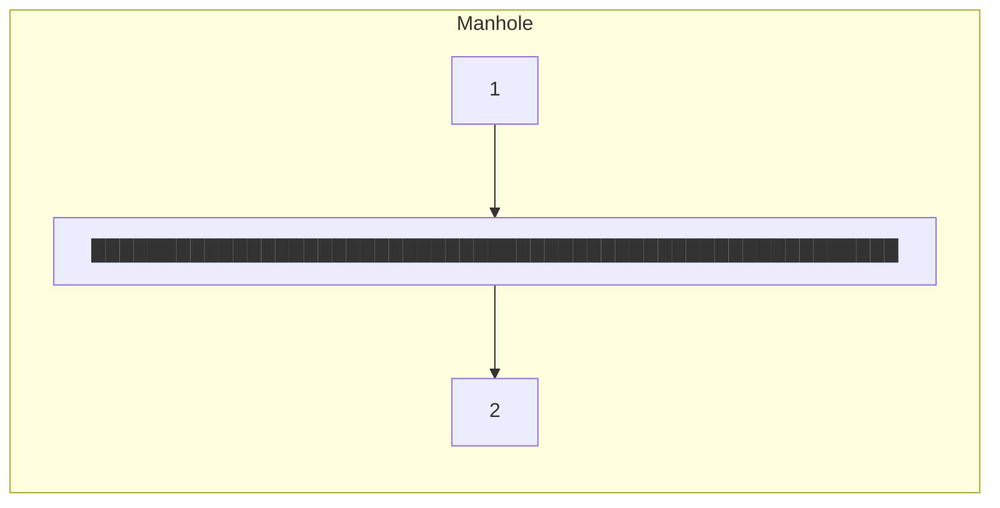
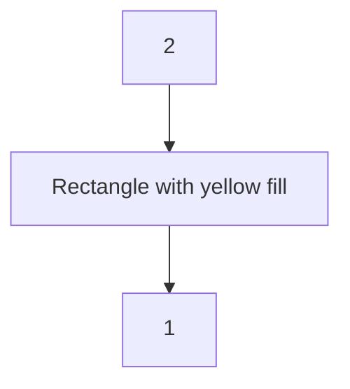

# appendix-3-u16-109-tekoe-wa-final-report.pdf

# Install Report for  
**City of Tekoa**  
**Washington, USA**  
**U16-109**  

Attn: Mr. Matt Morkert  
Century West Engineering  

----

## 2017 Sanitary Sewer Flow Monitor Installation  
### 4 Flow Sites and 1 Rain Gauge  

----

SFE GLOBAL  

Prepared and submitted by:  
SFE Global Inc.  
1313 East Maple Street  
Bellingham, WA  
98225  
*Toll Free: 1-866-332-9876*  

---

# SFE Global

May 8, 2017

Mr. Matt Morkert  
Century West Eng  
11707 East Montgomery Drive  
Spokane, WA  
99206  

----

## INSTALL REPORT - TEKOA, WA  
### Sanitary Sewer Flow Monitoring  
### March - April 2017  
### (4 Flow Sites and 1 Rain Gauge)  

----

Dear Mr. Morkert

Please find enclosed SFE’s Install Report for the above mentioned project. If you have any questions, comments or concerns, please do not hesitate to contact us at your earliest convenience.

Thank you for having SFE conduct this work on your behalf. We are appreciative of the opportunity to work with you and your team on this project. We look forward to working together again in the near future.

Sincerely,  
SFE Global  
SFE File #U16-109  

Paul Loving  
Operations Manager  
(604) 992-6792  
Paul.loving@sfeglobal.com  
www.sfeglobal.com  


---

# Final Report

## TABLE OF CONTENTS

1. INTRODUCTION .............................................................................................................................................................. 4  
2. FLOW MONITORING STATIONS ..................................................................................................................................... 4  
3. QA/QC AND SAFETY STATEMENT .................................................................................................................................. 5  
4. CONCLUSION .................................................................................................................................................................. 5  
5. DATA ............................................................................................................................................................................... 5  

APPENDIX 1 – SITE MAPS  
APPENDIX 2 – SITE BOOKS  
APPENDIX 3 – SUMMARIES  

Tekoa, Washington – Sanitary Sewer Flow Monitoring – SFE File #U16-09

---

# Final Report

## 1. Introduction

This report provides details of the sanitary sewer flow monitoring project installation conducted in the City of Tekoa, WA. SFE Global was retained by The Century West Engineering, under the direction of Mr. Matt Morkert. Mr. Adrian Marshall represented SFE Global as Project Manager during this project.

As requested, SFE installed four (4) sanitary sewer flow monitors to collect data for a one (1) month period. The stations were installed by March 8, 2017 and were removed on April 17, 2017. The monitoring stations are as follows:

<table>
    <thead>
    <tr>
        <th>Site # </th>
        <th>Manhole 
# </th>
        <th>Diameter 

Inches </th>
        <th>Location </th>
        <th>Meter  Comments </th>
        <th></th>
    </tr>
    </thead>
    <tr>
        <td>1 D1 </td>
        <td>West 
8 101 </td>
        <td></td>
        <td>Poplar Street </td>
        <td>Isco 2150 Area 
Velocity Meter </td>
        <td>Install Oct 7, 2017 </td>
    </tr>
    <tr>
        <td>2 B7N </td>
        <td>8  Seamon </td>
        <td></td>
        <td>Road East of 
Howard 
Street </td>
        <td>Isco 2150 Area 
Velocity Meter </td>
        <td>Install Oct 7 2017 </td>
    </tr>
    <tr>
        <td>3 </td>
        <td>A25 </td>
        <td>8 </td>
        <td>Park Street </td>
        <td>Isco 2150 Area 
Velocity Meter </td>
        <td>Install Oct 8, 2017 </td>
    </tr>
    <tr>
        <td>4 F1N </td>
        <td>8 
Street 
Water </td>
        <td></td>
        <td>North of 
Foot Bridge </td>
        <td>Isco 2150 Area 
Velocity Meter </td>
        <td>Install Oct 8, 2017 </td>
    </tr>
    <tr>
        <td>5 RG1  </td>
        <td>NA  NA  </td>
        <td>Tipping 
Bucket </td>
        <td></td>
        <td>RG=.01 inch per tip</td>
        <td>Install Oct 7, 2016 </td>
    </tr></table>

## 2. Flow Monitoring Stations

Prior to installing flow monitoring stations, SFE performed detailed site assessments of each potential site to determine the appropriate monitoring method. Factors such as pipe size, channel condition, site location, site access, and flow hydraulics were all considered and documented while performing site assessments.

The meters were calibrated and set to log data at 5 minute intervals as per spec and standard SFE procedure. To ensure proper operation of the stations, a regular maintenance schedule is adhered to for the duration of the project with bi-weekly site visits. During install, a preset benchmark is established for flow levels and during each visit this “field level” is compared to the meter readings simultaneously and recorded on the site maintenance sheet. All sites have shown to be well within limitations at this point in the project.


---

# Final Report

## 3. QA/QC and Safety Statement

SFE confirms that all flow monitoring stations were installed according to SFE’s QA/QC methodology and protocol, and standard industry practice. All flow monitoring equipment has been removed from the site locations.

SFE has a comprehensive Company Safety Manual and can be reviewed upon request.  
Confined space entry procedures and general site/traffic safety was adhered to during site installation and site maintenance. SFE utilizes an approved rescue system, a 2800 CFM air induction device and four-gas air quality monitors. All of our staff members are thoroughly trained and certified in confined space entry procedures. Certificates are available upon request.

A thorough traffic control plan was established and used by SFE Global crews where required.

## 4. Conclusion

All sites showed definite reaction to rainfall with 1 and 2 showing surcharge during the heavy storm events in first 2 weeks of the project. Data has been edited during these surcharges to use AV flow formula due to the Weir itself being maxed out and the water not free flowing, as is required with Weir flow. We use the Velocity sensor with our loggers as a redundancy for just this purpose.  
Site 4 had some issues with regard to the flowmeter itself shutting down and losing data in March. The meter was replaced after this failure and then the new meter again shutdown on April 10 until removal. We can only attribute this issue to site conditions with high moisture being the suspected culprit. Sites were slated to be removed on April 7 so data was collected at this site up to the initial end date.  
No data continuity issues are noticed at the other 3 sites.  
All sites were removed on April 17 and all data to this point has been made available in Summary form.

## 5. Data

Data collected during this project is manually downloaded. This data has been inspected for any anomalies and compared to field readings before being compiled into a Summary Page in CSV Format.

### Appendices

**Appendix 1 - Site Maps**  
**Appendix 2 - Site Books**  
**Appendix 3 - Summaries**

Report End

---

# Final Report

April 2017

## Appendix 1  
### SITE MAPS

---

# Streets and trips

<table>
  <thead>
    <tr>
      <th>0 mi</th>
      <th>0.2</th>
      <th>0.4</th>
      <th>0.6</th>
    </tr>
  </thead>
</table>

Copyright © 1988-2003 Microsoft Corp. and/or its suppliers. All rights reserved. http://www.microsoft.com/streets  
© Copyright 2002 by Geographic Data Technology, Inc. All rights reserved. © 2002 Navigation Technologies. All rights reserved. This data includes information taken with permission from Canadian authorities © 1991-2002 Government of Canada (Statistics Canada and/or Geomatics Canada), all rights reserved.

---

# Final Report

## Appendix 2  
### SITE BOOKS

---

# Site Assessment

<table>
  <tr>
    <td><b>CLIENT FLOW MONITORING #:</b></td>
    <td>U16-109</td>
    <td><b>SFE PROJECT #:</b></td>
    <td>U16-109</td>
  </tr>
<tr>
    <td><b>NAME:</b></td>
    <td><u>Tekoa, Wa</u></td>
    <td><b>SFE SITE #:</b></td>
    <td>1</td>
  </tr>
<tr>
    <td><b>Date / Time:</b></td>
    <td>03/07/17  10:52 AM</td>
    <td></td>
    <td></td>
  </tr>
</table>

## Project Specific Information

<table>
  <tr>
    <td><b>Client Name:</b></td>
    <td><u>Century West Engineering</u></td>
  </tr>
<tr>
    <td><b>End User Name:</b></td>
    <td><u>City of Tekoa, WA</u></td>
  </tr>
<tr>
    <td><b>Project Name:</b></td>
    <td><u>U16-109</u></td>
  </tr>
<tr>
    <td><b>Client Contact:</b></td>
    <td><u>Matt Morkert</u></td>
  </tr>
<tr>
    <td><b>Field Contact:</b></td>
    <td><u>Adrian Marshall</u> 509-312-0612</td>
  </tr>
<tr>
    <td><b>SFE PM Contact:</b></td>
    <td><u>Paul Loving</u> 604-992-6792</td>
  </tr>
</table>

## Site Equipment

<table>
  <tr>
    <td><b>Install / Remove Date:</b></td>
    <td>03/07/17</td>
  </tr>
<tr>
    <td><b>Meter Make & Model:</b></td>
    <td>Isco 2150 AV</td>
  </tr>
<tr>
    <td><b>Level Type:</b></td>
    <td>Pressure</td>
  </tr>
<tr>
    <td><b>Velocity Type:</b></td>
    <td>Average</td>
  </tr>
<tr>
    <td><b>Primary Device:</b></td>
    <td>Weir</td>
  </tr>
<tr>
    <td><b>Wireless:</b></td>
    <td>No</td>
  </tr>
<tr>
    <td><b>Redundancy:</b></td>
    <td>Yes</td>
  </tr>
<tr>
    <td><b>Logging Rate:</b></td>
    <td>5min</td>
  </tr>
</table>

## Site Location Information

<table>
  <tr>
    <td><b>Client Manhole #:</b></td>
    <td>D1</td>
  </tr>
<tr>
    <td><b>Address (Location):</b></td>
    <td>101 West Poplar Street</td>
  </tr>
<tr>
    <td><b>City, State:</b></td>
    <td>Tekoa, WA</td>
  </tr>
<tr>
    <td><b>GPS (North - West):</b></td>
    <td>47.22605  117.074610</td>
  </tr>
<tr>
    <td><b>Landmarks:</b></td>
    <td>Next to Gas Station</td>
  </tr>
<tr>
    <td><b>Additional Information:</b></td>
    <td></td>
  </tr>
</table>

## Site Profile

<table>
  <tr>
    <td><b>Pipe #1 Size:</b></td>
    <td>8</td>
    <td>Inches</td>
  </tr>
<tr>
    <td><b>Pipe #2 Size:</b></td>
    <td>8</td>
    <td>Inches</td>
  </tr>
<tr>
    <td><b>Pipe #3 Size:</b></td>
    <td></td>
    <td>Inches</td>
  </tr>
<tr>
    <td><b>Pipe #4 Size:</b></td>
    <td></td>
    <td>Inches</td>
  </tr>
<tr>
    <td><b>Constant:</b></td>
    <td>102.5</td>
    <td>Inches</td>
  </tr>
<tr>
    <td><b>Laterals / Rungs:</b></td>
    <td>No</td>
    <td>No</td>
  </tr>
<tr>
    <td><b>Additional Information:</b></td>
    <td colspan="2"></td>
  </tr>
</table>

### Manhole Layout

```
    1
  ┌─────┐
  │     │
  │█████│
  │     │
  └─────┘
    2
```

## Traffic Control Requirements

<table>
  <tr>
    <td><b>Provider:</b></td>
    <td>SFE</td>
  </tr>
<tr>
    <td><b>Condition:</b></td>
    <td>None</td>
  </tr>
<tr>
    <td><b>Frequency:</b></td>
    <td>Install</td>
  </tr>
<tr>
    <td><b>Speed Limit:</b></td>
    <td>None</td>
  </tr>
<tr>
    <td><b># of Lanes Effected:</b></td>
    <td>N/A</td>
  </tr>
<tr>
    <td><b>Lane Configuration:</b></td>
    <td>Parking Area</td>
  </tr>
<tr>
    <td><b>Additional Information:</b></td>
    <td></td>
  </tr>
<tr>
    <td><b>Notes</b></td>
    <td>1<br>2</td>
  </tr>
</table>

## Site Hydraulics

<table>
  <tr>
    <td><b>Date & Time:</b></td>
    <td>03/07/17  10:52</td>
  </tr>
<tr>
    <td><b>Depth:</b></td>
    <td>2 Inches</td>
  </tr>
<tr>
    <td><b>Velocity:</b></td>
    <td>1 FPS</td>
  </tr>
<tr>
    <td><b>Turbulent:</b></td>
    <td>No</td>
  </tr>
<tr>
    <td><b>Surcharge:</b></td>
    <td>No</td>
  </tr>
<tr>
    <td><b>Silting:</b></td>
    <td>No</td>
  </tr>
<tr>
    <td><b>Solids:</b></td>
    <td>No</td>
  </tr>
<tr>
    <td><b>Notes</b></td>
    <td>3<br>4</td>
  </tr>
</table>


---

<table>
  <tr>
    <td><b>CLIENT FLOW MONITORING #:</b> U16-109</td>
    <td><b>SFE PROJECT #:</b> U16-109</td>
  </tr>
<tr>
    <td><b>NAME:</b> Tekoa, Wa</td>
    <td><b>SFE SITE #:</b> 1</td>
  </tr>
<tr>
    <td><b>Date / Time:</b> 03/07/17</td>
    <td></td>
  </tr>
</table>

<b><u>Picture 1</u></b>

[The image shows an outdoor site area with a truck, several orange traffic cones, and some equipment on a snowy or icy ground.]

<b><u>Picture 2</u></b>

[The image shows a vertical concrete shaft or manhole with a metal step ladder and some cables or ropes inside.]

<b><u>Picture 3</u></b>

[The image shows a concrete chamber partially filled with water, with wooden braces supporting the opening and a green pipe visible inside.]

<b><u>Picture 4</u></b>

[The image shows a vertical concrete shaft or manhole with a metal step ladder and cables or hoses coiled at the bottom.]

<b><u>Picture 5</u></b>

[The image shows a close-up view inside a concrete chamber with water and wooden braces supporting the opening.]

<b><u>Picture 6</u></b>

[The image shows a vertical concrete shaft or manhole with a metal step ladder and cables or hoses inside.]

<b><u>Notes</u></b>
* 1
* 2
* 3

---

# CCW Installation Form

<table>
<thead>
<tr>
<th>CLIENT FLOW MONITORING #:</th>
<td>U16-109</td>
<th>SFE PROJECT #:</th>
<td>U16-109</td>
</tr>
<tr>
<th>NAME:</th>
<td><b>Tekoa, Wa</b></td>
<th>SFE SITE #:</th>
<td>1</td>
</tr>
<tr>
<th>Date / Time:</th>
<td>03/07/17  11:50 AM</td>
<th>Technician 1:</th>
<td>Adrian Marshall</td>
</tr>
<tr>
<th>Technician 2:</th>
<td>Dylan Carvin</td>
<th></th>
<td></td>
</tr>
</thead>
</table>

## Meter Depth vs.. Field Depth Calibration / Verification

<table>
<thead>
<tr>
<th>Reading Number</th>
<th>Date</th>
<th>Time</th>
<th>Field Meas (in.)</th>
<th>Meter Depth (in)</th>
<th>Comments (Zero Meter Level before Installation)</th>
</tr>
</thead>
<tbody>
<tr>
<td>Initial</td>
<td>3/7/2017</td>
<td>10:40</td>
<td>3.000</td>
<td>3.03</td>
<td>Install</td>
</tr>
<tr>
<td>1</td>
<td>3/7/2017</td>
<td>10:43</td>
<td>3.000</td>
<td>3.09</td>
<td></td>
</tr>
<tr>
<td>2</td>
<td>3/7/2017</td>
<td>10:48</td>
<td>2.500</td>
<td>2.54</td>
<td></td>
</tr>
<tr>
<td>3</td>
<td>3/7/2017</td>
<td>10:55</td>
<td>2.500</td>
<td>2.53</td>
<td></td>
</tr>
<tr>
<td><b>Average</b></td>
<td></td>
<td></td>
<td>2.750</td>
<td>2.798</td>
<td></td>
</tr>
</tbody>
</table>

<table>
<thead>
<tr>
<th colspan="3" style="text-align:center;">Diagram Measurements</th>
<th></th>
<th></th>
<th></th>
</tr>
</thead>
<tbody>
<tr>
<td>102.500</td>
<td>82.500</td>
<td></td>
<td></td>
<td><b>Constant Measurement (in)</b></td>
<td>Rim to Weir Lip</td>
<td>102.500</td>
</tr>
<tr>
<td><b>D1 + D2 = CNST</b></td>
<td><b>D2</b></td>
<td></td>
<td></td>
<td><b>Pipe Diameters (in)</b></td>
<td>Pipe 1</td>
<td>8</td>
</tr>
<tr>
<td>31.375</td>
<td>20.000</td>
<td></td>
<td></td>
<td></td>
<td>Pipe 2</td>
<td>8</td>
</tr>
<tr>
<td><b>D3</b></td>
<td><b>D1</b></td>
<td></td>
<td></td>
<td></td>
<td>Pipe 3</td>
<td>0</td>
</tr>
<tr>
<td></td>
<td></td>
<td>7.000</td>
<td></td>
<td></td>
<td>Pipe 4</td>
<td>0</td>
</tr>
<tr>
<td></td>
<td></td>
<td><b>D4</b></td>
<td></td>
<td></td>
<td></td>
<td></td>
</tr>
<tr>
<td></td>
<td></td>
<td>7.000</td>
<td></td>
<td><b>D4 = Invert to Weir Lip (D3 - D1)</b></td>
<td></td>
<td></td>
</tr>
<tr>
<td></td>
<td></td>
<td></td>
<td></td>
<td><b>Obvert to Weir Lip</b></td>
<td>NA</td>
<td></td>
</tr>
</tbody>
</table>

Revision 3.1

---

# Final Check-off Sheet

**CLIENT FLOW MONITORING #:** U16-109  
**SFE PROJECT #:** U16-109  
**NAME:** Tekoa, Wa  
**SFE SITE #:** 1  
**Date / Time:** 03/07/17  12:00 PM  

----

## Flow Meter Information

<table>
  <tr>
    <td>Meter Make:</td>
    <td>Isco</td>
    <td>Logging Rate:</td>
    <td>5 Minute</td>
  </tr>
<tr>
    <td>Meter Model:</td>
    <td>2150</td>
    <td>Flow Units:</td>
    <td>CFS</td>
  </tr>
<tr>
    <td>Sensor Type:</td>
    <td>AV</td>
    <td>Velocity Units:</td>
    <td>FPS</td>
  </tr>
<tr>
    <td>Meter Serial Number:</td>
    <td>NA</td>
    <td>Depth Units:</td>
    <td>Inches</td>
  </tr>
<tr>
    <td>Battery Volts:</td>
    <td>11.9</td>
    <td>Surcharge Meter (Y/N):</td>
    <td>Yes</td>
  </tr>
</table>

----

## Site Physical Information

<table>
  <tr>
    <td>Silt Level:</td>
    <td>0</td>
    <td>Weather:</td>
    <td>Clear</td>
  </tr>
<tr>
    <td>Slope:</td>
    <td>NA</td>
    <td>Weir Size:</td>
    <td>350 mm</td>
  </tr>
<tr>
    <td>Uniform Flow (Y/N):</td>
    <td>Y</td>
    <td>Depth Only (DO):</td>
    <td>NA</td>
  </tr>
<tr>
    <td>Debris in Flow (Y/N):</td>
    <td>Y</td>
    <td>or Look up Table (LT):</td>
    <td>LT</td>
  </tr>
<tr>
    <td>Pipe Material:</td>
    <td>Concrete</td>
    <td>Comments:</td>
    <td></td>
  </tr>
</table>

----

## Check Off List

<table>
  <thead>
    <tr>
      <th></th>
      <th>Yes</th>
      <th>No</th>
    </tr>
  </thead>
  <tbody>
    <tr>
      <td>Time Set:</td>
      <td>[x]</td>
      <td>[ ]</td>
    </tr>
<tr>
      <td>Depth Calibrated:</td>
      <td>[x]</td>
      <td>[ ]</td>
    </tr>
<tr>
      <td>Velocity Profile:</td>
      <td>[x]</td>
      <td>[ ]</td>
    </tr>
<tr>
      <td>Download Data:</td>
      <td>[x]</td>
      <td>[ ]</td>
    </tr>
<tr>
      <td>Meter Running:</td>
      <td>[x]</td>
      <td>[ ]</td>
    </tr>
<tr>
      <td>Pipe Size Verified:</td>
      <td>[x]</td>
      <td>[ ]</td>
    </tr>
<tr>
      <td>Photograph Taken:</td>
      <td>[x]</td>
      <td>[ ]</td>
    </tr>
<tr>
      <td>Site Cleaned:</td>
      <td>[x]</td>
      <td>[ ]</td>
    </tr>
<tr>
      <td>Site Secured:</td>
      <td>[x]</td>
      <td>[ ]</td>
    </tr>
  </tbody>
</table>

----

Revision 3.1

---

# Site Assessment

<table>
  <tr>
    <td><b>CLIENT FLOW MONITORING #:</b></td>
    <td><b>U16-109</b></td>
    <td><b>SFE PROJECT #:</b></td>
    <td><b>U16-109</b></td>
  </tr>
<tr>
    <td><b>NAME:</b></td>
    <td><b>Tekoa, Wa</b></td>
    <td><b>SFE SITE #:</b></td>
    <td><b>2</b></td>
  </tr>
<tr>
    <td><b>Date / Time:</b></td>
    <td>03/07/17</td>
    <td>10:52 AM</td>
    <td></td>
  </tr>
</table>

## Project Specific Information

<table>
  <tr>
    <td><b>Client Name:</b></td>
    <td>Century West Engineering</td>
  </tr>
<tr>
    <td><b>End User Name:</b></td>
    <td>City of Tekoa, WA</td>
  </tr>
<tr>
    <td><b>Project Name:</b></td>
    <td>U16-109</td>
  </tr>
<tr>
    <td><b>Client Contact:</b></td>
    <td>Matt Morkert</td>
  </tr>
<tr>
    <td><b>Field Contact:</b></td>
    <td>Adrian Marshall  509-312-0612</td>
  </tr>
<tr>
    <td><b>SFE PM Contact:</b></td>
    <td>Paul Loving  604-992-6792</td>
  </tr>
</table>

## Site Equipment

<table>
  <tr>
    <td><b>Install / Remove Date:</b></td>
    <td>03/07/17</td>
  </tr>
<tr>
    <td><b>Meter Make & Model:</b></td>
    <td>Isco 2150 AV</td>
  </tr>
<tr>
    <td><b>Level Type:</b></td>
    <td>Pressure</td>
  </tr>
<tr>
    <td><b>Velocity Type:</b></td>
    <td>Average</td>
  </tr>
<tr>
    <td><b>Primary Device:</b></td>
    <td>Weir</td>
  </tr>
<tr>
    <td><b>Wireless:</b></td>
    <td>No</td>
  </tr>
<tr>
    <td><b>Redundancy:</b></td>
    <td>Yes</td>
  </tr>
<tr>
    <td><b>Logging Rate:</b></td>
    <td>5min</td>
  </tr>
</table>

## Site Location Information

<table>
  <tr>
    <td><b>Client Manhole #:</b></td>
    <td>B7N</td>
  </tr>
<tr>
    <td><b>Address (Location):</b></td>
    <td>Seamon Rd east of Howard Street</td>
  </tr>
<tr>
    <td><b>City, State:</b></td>
    <td>Tekoa, WA</td>
  </tr>
<tr>
    <td><b>GPS (North - West):</b></td>
    <td>47.22571  117.569480</td>
  </tr>
<tr>
    <td><b>Landmarks:</b></td>
    <td>150 feet East of Howard</td>
  </tr>
<tr>
    <td><b>Additional Information:</b></td>
    <td>Near Elementary School</td>
  </tr>
</table>

## Site Profile

<table>
  <tr>
    <td><b>Pipe #1 Size:</b></td>
    <td>8</td>
    <td>Inches</td>
  </tr>
<tr>
    <td><b>Pipe #2 Size:</b></td>
    <td>8</td>
    <td>Inches</td>
  </tr>
<tr>
    <td><b>Pipe #3 Size:</b></td>
    <td>8</td>
    <td>Inches</td>
  </tr>
<tr>
    <td><b>Pipe #4 Size:</b></td>
    <td></td>
    <td>Inches</td>
  </tr>
<tr>
    <td><b>Constant:</b></td>
    <td>59.25</td>
    <td>Inches</td>
  </tr>
<tr>
    <td><b>Laterals / Rungs:</b></td>
    <td>No</td>
    <td>No</td>
  </tr>
<tr>
    <td><b>Additional Information:</b></td>
    <td></td>
  </tr>
</table>

## Traffic Control Requirements

<table>
  <tr>
    <td><b>Provider:</b></td>
    <td>SFE</td>
  </tr>
<tr>
    <td><b>Condition:</b></td>
    <td>None</td>
  </tr>
<tr>
    <td><b>Frequency:</b></td>
    <td>Install</td>
  </tr>
<tr>
    <td><b>Speed Limit:</b></td>
    <td>None</td>
  </tr>
<tr>
    <td><b># of Lanes Effected:</b></td>
    <td>N/A</td>
  </tr>
<tr>
    <td><b>Lane Configuration:</b></td>
    <td>Parking Area</td>
  </tr>
<tr>
    <td><b>Additional Information:</b></td>
    <td></td>
  </tr>
<tr>
    <td><b>Notes</b></td>
    <td>1<br>2</td>
  </tr>
</table>

## Site Hydraulics

<table>
  <tr>
    <td><b>Date & Time:</b></td>
    <td>03/07/17  10:52</td>
  </tr>
<tr>
    <td><b>Depth:</b></td>
    <td>2 Inches</td>
  </tr>
<tr>
    <td><b>Velocity:</b></td>
    <td>1 FPS</td>
  </tr>
<tr>
    <td><b>Turbulent:</b></td>
    <td>No</td>
  </tr>
<tr>
    <td><b>Surcharge:</b></td>
    <td>No</td>
  </tr>
<tr>
    <td><b>Silting:</b></td>
    <td>No</td>
  </tr>
<tr>
    <td><b>Solids:</b></td>
    <td>No</td>
  </tr>
<tr>
    <td><b>Notes</b></td>
    <td>3<br>4</td>
  </tr>
</table>

## Manhole Layout



## Map of Area

> Map area shows location near N Madison St, Connell St, and highway 27 with a marker labeled U16-109-02.


---

# Site Pictures

<table>
  <thead>
    <tr>
      <th colspan="2">CLIENT FLOW MONITORING #: <u>U16-109</u></th>
      <th colspan="2">SFE PROJECT #: <u>U16-109</u></th>
    </tr>
<tr>
      <th>NAME: <u>Tekoa, Wa</u></th>
      <th>Date / Time: <u>03/07/17</u></th>
      <th>SFE SITE #: <u>2</u></th>
      <th></th>
    </tr>
  </thead>
  <tbody>
    <tr>
      <td colspan="2" align="center"><u><a href="#picture1">Picture 1</a></u></td>
      <td colspan="2" align="center"><u><a href="#picture2">Picture 2</a></u></td>
    </tr>
<tr>
      <td colspan="2" align="center"><u><a href="#picture3">Picture 3</a></u></td>
      <td colspan="2" align="center"><u><a href="#picture4">Picture 4</a></u></td>
    </tr>
<tr>
      <td align="center"><u><a href="#picture5">Picture 5</a></u></td>
      <td align="center"><u><a href="#picture6">Picture 6</a></u></td>
      <td></td>
      <td></td>
    </tr>
  </tbody>
</table>

----

### Notes
* 1
* 2
* 3

----

Revision 3.1

---

# CCW Installation Form

<table>
<thead>
<tr>
<th>CLIENT FLOW MONITORING #:</th>
<td>U16-109</td>
<th>SFE PROJECT #:</th>
<td>U16-109</td>
</tr>
<tr>
<th>NAME:</th>
<td><b>Tekoa, Wa</b></td>
<th>SFE SITE #:</th>
<td>2</td>
</tr>
<tr>
<th>Date / Time:</th>
<td>03/07/17  11:50 AM</td>
<th>Technician 1:</th>
<td>Adrian Marshall</td>
</tr>
<tr>
<th>Technician 2:</th>
<td>Dylan Carvin</td>
<th></th>
<td></td>
</tr>
</thead>
</table>

## Meter Depth vs.. Field Depth Calibration / Verification

<table>
<thead>
<tr>
<th>Reading Number</th>
<th>Date</th>
<th>Time</th>
<th>Field Meas (in.)</th>
<th>Meter Depth (in)</th>
<th>Comments (Zero Meter Level before Installation)</th>
</tr>
</thead>
<tbody>
<tr>
<td>Initial</td>
<td>3/7/2017</td>
<td>10:40</td>
<td>3.000</td>
<td>3.03</td>
<td>Install</td>
</tr>
<tr>
<td>1</td>
<td>3/7/2017</td>
<td>10:43</td>
<td>3.000</td>
<td>3.09</td>
<td></td>
</tr>
<tr>
<td>2</td>
<td>3/7/2017</td>
<td>10:48</td>
<td>2.500</td>
<td>2.54</td>
<td></td>
</tr>
<tr>
<td>3</td>
<td>3/7/2017</td>
<td>10:55</td>
<td>2.500</td>
<td>2.53</td>
<td></td>
</tr>
<tr>
<td><b>Average</b></td>
<td></td>
<td></td>
<td>2.750</td>
<td>2.798</td>
<td></td>
</tr>
</tbody>
</table>

----

### Diagram Measurements and Values

<table>
<thead>
<tr>
<th colspan="2">Diagram Values</th>
<th></th>
<th colspan="2">Constant Measurement (in)</th>
</tr>
</thead>
<tbody>
<tr>
<td>59.250</td>
<td>41.500</td>
<td></td>
<td>Rim to Weir Lip</td>
<td>59.250</td>
</tr>
<tr>
<td><b>D1 + D2 = CNST</b></td>
<td><b>D2</b></td>
<td></td>
<td colspan="2"></td>
</tr>
<tr>
<td>27.250</td>
<td>17.750</td>
<td></td>
<td><b>Pipe Diameters (in)</b></td>
<td></td>
</tr>
<tr>
<td><b>D3</b></td>
<td><b>D1</b></td>
<td></td>
<td>Pipe 1</td>
<td>8</td>
</tr>
<tr>
<td></td>
<td></td>
<td></td>
<td>Pipe 2</td>
<td>8</td>
</tr>
<tr>
<td></td>
<td></td>
<td></td>
<td>Pipe 3</td>
<td>8</td>
</tr>
<tr>
<td>9.500</td>
<td><b>D4</b></td>
<td></td>
<td>Pipe 4</td>
<td>0</td>
</tr>
<tr>
<td></td>
<td></td>
<td></td>
<td></td>
<td></td>
</tr>
<tr>
<td></td>
<td></td>
<td></td>
<td><b>D4 = Invert to Weir Lip (D3 - D1)</b></td>
<td>9.500</td>
</tr>
<tr>
<td></td>
<td></td>
<td></td>
<td><b>Obvert to Weir Lip</b></td>
<td>NA</td>
</tr>
</tbody>
</table>

----

Revision 3.1

---

# Final Check-off Sheet

**CLIENT FLOW MONITORING #:** U16-109  
**SFE PROJECT #:** U16-109  
**NAME:** Tekoa, Wa  
**SFE SITE #:** 2  
**Date / Time:** 03/07/17  12:00 PM  

----

## Flow Meter Information

<table>
  <tr>
    <td>Meter Make:</td>
    <td>Isco</td>
    <td>Logging Rate:</td>
    <td>5 Minute</td>
  </tr>
<tr>
    <td>Meter Model:</td>
    <td>2150</td>
    <td>Flow Units:</td>
    <td>CFS</td>
  </tr>
<tr>
    <td>Sensor Type</td>
    <td>AV</td>
    <td>Velocity Units:</td>
    <td>FPS</td>
  </tr>
<tr>
    <td>Meter Serial Number:</td>
    <td>NA</td>
    <td>Depth Units</td>
    <td>Inches</td>
  </tr>
<tr>
    <td>Battery Volts:</td>
    <td>11.7</td>
    <td>Surcharge Meter (Y/N):</td>
    <td>Yes</td>
  </tr>
</table>

----

## Site Physical Information

<table>
  <tr>
    <td>Silt Level:</td>
    <td>0</td>
    <td>Weather:</td>
    <td>Clear</td>
  </tr>
<tr>
    <td>Slope:</td>
    <td>NA</td>
    <td>Weir Size:</td>
    <td>350 mm</td>
  </tr>
<tr>
    <td>Uniform Flow (Y/N):</td>
    <td>Y</td>
    <td>Depth Only (DO):</td>
    <td>NA</td>
  </tr>
<tr>
    <td>Debris in Flow (Y/N):</td>
    <td>Y</td>
    <td>or Look up Table (LT):</td>
    <td>LT</td>
  </tr>
<tr>
    <td>Pipe Material:</td>
    <td>Concrete</td>
    <td>Comments</td>
    <td></td>
  </tr>
</table>

----

## Check Off List

<table>
  <thead>
    <tr>
      <th></th>
      <th>Yes</th>
      <th>No</th>
    </tr>
  </thead>
  <tbody>
    <tr>
      <td>Time Set:</td>
      <td>[x]</td>
      <td>[ ]</td>
    </tr>
<tr>
      <td>Depth Calibrated:</td>
      <td>[x]</td>
      <td>[ ]</td>
    </tr>
<tr>
      <td>Velocity Profile:</td>
      <td>[x]</td>
      <td>[ ]</td>
    </tr>
<tr>
      <td>Download Data:</td>
      <td>[x]</td>
      <td>[ ]</td>
    </tr>
<tr>
      <td>Meter Running:</td>
      <td>[x]</td>
      <td>[ ]</td>
    </tr>
<tr>
      <td>Pipe Size Verified:</td>
      <td>[x]</td>
      <td>[ ]</td>
    </tr>
<tr>
      <td>Photograph Taken:</td>
      <td>[x]</td>
      <td>[ ]</td>
    </tr>
<tr>
      <td>Site Cleaned:</td>
      <td>[x]</td>
      <td>[ ]</td>
    </tr>
<tr>
      <td>Site Secured:</td>
      <td>[x]</td>
      <td>[ ]</td>
    </tr>
  </tbody>
</table>

----

Revision 3.1

---

# Site Assessment

<table>
<thead>
<tr>
<th>CLIENT FLOW MONITORING #:</th>
<td>U16-109</td>
<th>SFE PROJECT #:</th>
<td>U16-109</td>
</tr>
<tr>
<th>NAME:</th>
<td>Tekoa, Wa</td>
<th>SFE SITE #:</th>
<td>3</td>
</tr>
<tr>
<th>Date / Time:</th>
<td colspan="3">03/08/17  12:15 PM</td>
</tr>
</thead>
</table>

## Project Specific Information

<table>
<tbody>
<tr>
<th>Client Name:</th>
<td>Century West Engineering</td>
</tr>
<tr>
<th>End User Name:</th>
<td>City of Tekoa, WA</td>
</tr>
<tr>
<th>Project Name:</th>
<td>U16-109</td>
</tr>
<tr>
<th>Client Contact:</th>
<td>Matt Morkert</td>
</tr>
<tr>
<th>Field Contact:</th>
<td>Adrian Marshall  509-312-0612</td>
</tr>
<tr>
<th>SFE PM Contact:</th>
<td>Paul Loving  604-992-6792</td>
</tr>
</tbody>
</table>

## Site Equipment

<table>
<tbody>
<tr>
<th>Install / Remove Date:</th>
<td>03/08/17</td>
</tr>
<tr>
<th>Meter Make & Model:</th>
<td>Isco 2150 AV</td>
</tr>
<tr>
<th>Level Type:</th>
<td>Pressure</td>
</tr>
<tr>
<th>Velocity Type:</th>
<td>Average</td>
</tr>
<tr>
<th>Primary Device:</th>
<td>Weir</td>
</tr>
<tr>
<th>Wireless:</th>
<td>No</td>
</tr>
<tr>
<th>Redundancy:</th>
<td>Yes</td>
</tr>
<tr>
<th>Logging Rate:</th>
<td>5min</td>
</tr>
</tbody>
</table>

## Site Location Information

<table>
<tbody>
<tr>
<th>Client Manhole #:</th>
<td>A25</td>
</tr>
<tr>
<th>Address (Location):</th>
<td>Park st Btwn Lindsay and College</td>
</tr>
<tr>
<th>City, State:</th>
<td>Tekoa, WA</td>
</tr>
<tr>
<th>GPS (North - West ):</th>
<td>47.22124  117.066380</td>
</tr>
<tr>
<th>Landmarks:</th>
<td></td>
</tr>
<tr>
<th>Additional Information:</th>
<td></td>
</tr>
</tbody>
</table>

## Site Profile

<table>
<tbody>
<tr>
<th>Pipe #1 Size:</th>
<td>8</td>
<td>Inches</td>
</tr>
<tr>
<th>Pipe #2 Size:</th>
<td>8</td>
<td>Inches</td>
</tr>
<tr>
<th>Pipe #3 Size:</th>
<td>8</td>
<td>Inches</td>
</tr>
<tr>
<th>Pipe #4 Size:</th>
<td>NA</td>
<td>Inches</td>
</tr>
<tr>
<th>Constant:</th>
<td>58.25</td>
<td>Inches</td>
</tr>
<tr>
<th>Laterals / Rungs:</th>
<td>No</td>
<td>No</td>
</tr>
<tr>
<th>Additional Information:</th>
<td></td>
</tr>
</tbody>
</table>

### Manhole Layout

```
          2

    2     U16-109-03     2          1
```

## Traffic Control Requirements

<table>
<tbody>
<tr>
<th>Provider:</th>
<td>SFE</td>
</tr>
<tr>
<th>Condition:</th>
<td>None</td>
</tr>
<tr>
<th>Frequency:</th>
<td>Install</td>
</tr>
<tr>
<th>Speed Limit:</th>
<td>None</td>
</tr>
<tr>
<th># of Lanes Effected:</th>
<td>N/A</td>
</tr>
<tr>
<th>Lane Configuration:</th>
<td>Road</td>
</tr>
<tr>
<th>Additional Information:</th>
<td></td>
</tr>
<tr>
<th>Notes</th>
<td>1<br>2</td>
</tr>
</tbody>
</table>

## Site Hydraulics

<table>
<tbody>
<tr>
<th>Date & Time:</th>
<td>03/08/17  12:15</td>
</tr>
<tr>
<th>Depth:</th>
<td>2 Inches</td>
</tr>
<tr>
<th>Velocity:</th>
<td>1.5 FPS</td>
</tr>
<tr>
<th>Turbulent:</th>
<td>No</td>
</tr>
<tr>
<th>Surcharge:</th>
<td>No</td>
</tr>
<tr>
<th>Silting:</th>
<td>No</td>
</tr>
<tr>
<th>Solids:</th>
<td>No</td>
</tr>
<tr>
<th>Notes</th>
<td>3<br>4</td>
</tr>
</tbody>
</table>


---

<table>
  <tr>
    <td><b>CLIENT FLOW MONITORING #:</b></td>
    <td><u>U16-109</u></td>
    <td><b>SFE PROJECT #:</b></td>
    <td><u>U16-109</u></td>
  </tr>
<tr>
    <td><b>NAME:</b></td>
    <td><u>Tekoa, Wa</u></td>
    <td><b>SFE SITE #:</b></td>
    <td><u>3</u></td>
  </tr>
<tr>
    <td><b>Date / Time:</b></td>
    <td><u>03/08/17</u></td>
    <td></td>
    <td></td>
  </tr>
</table>

<b>Picture 1</b>  
[The image shows a street scene with traffic cones, a ladder, and a van parked on the right side. There is a house and some trees in the background.]

<b>Picture 2</b>  
[The image shows the inside of a circular manhole with some equipment and a wooden plank across it.]

<b>Picture 3</b>  
[The image shows a wooden structure with water flowing through it, likely part of a flow monitoring setup.]

<b>Picture 4</b>  
[The image shows the inside of a circular manhole similar to Picture 2, with water and equipment inside.]

<b>Picture 5</b>  
[The image is the same as Picture 3, showing the wooden structure with flowing water.]

<b>Picture 6</b>  
[The image is the same as Picture 4, showing the inside of the manhole with water and equipment.]

<b>Notes</b>  
* 1  
* 2  
* 3  

Revision 3.1

---

# CCW Installation Form

<table>
  <tr>
    <td><b>CLIENT FLOW MONITORING #:</b></td>
    <td>U16-109</td>
    <td><b>SFE PROJECT #:</b></td>
    <td>U16-109</td>
  </tr>
<tr>
    <td><b>NAME:</b></td>
    <td><u>Tekoa, Wa</u></td>
    <td><b>SFE SITE #:</b></td>
    <td>3</td>
  </tr>
<tr>
    <td><b>Date / Time:</b></td>
    <td>03/08/17  11:50 AM</td>
    <td><b>Technician 1:</b></td>
    <td>Adrian Marshall</td>
  </tr>
<tr>
    <td></td>
    <td></td>
    <td><b>Technician 2:</b></td>
    <td>Dylan Carvin</td>
  </tr>
</table>

## Meter Depth vs.. Field Depth Calibration / Verification

<table>
  <thead>
    <tr>
      <th>Reading Number</th>
      <th>Date</th>
      <th>Time</th>
      <th>Field Meas (in.)</th>
      <th>Meter Depth (in)</th>
      <th>Comments (Zero Meter Level before Installation)</th>
    </tr>
  </thead>
  <tbody>
    <tr>
      <td>Initial</td>
      <td>3/8/2017</td>
      <td>12:50</td>
      <td>3.000</td>
      <td>2.96</td>
      <td>Install</td>
    </tr>
<tr>
      <td>1</td>
      <td>3/8/2017</td>
      <td>12:56</td>
      <td>3.000</td>
      <td>3.03</td>
      <td></td>
    </tr>
<tr>
      <td>2</td>
      <td>3/8/2017</td>
      <td>12:59</td>
      <td>2.250</td>
      <td>2.31</td>
      <td></td>
    </tr>
<tr>
      <td>3</td>
      <td>3/8/2017</td>
      <td>13:05</td>
      <td>2.250</td>
      <td>3.26</td>
      <td></td>
    </tr>
<tr>
      <td><b>Average</b></td>
      <td></td>
      <td></td>
      <td>2.625</td>
      <td>2.767</td>
      <td></td>
    </tr>
  </tbody>
</table>

<table>
  <tr>
    <td colspan="3" rowspan="7" style="text-align:center; vertical-align:middle;">
      <b>Diagram</b><br><br>
      <b>58.250</b><br>
      <b>D1 + D2 = CNST</b><br><br>
      <b>43.375</b><br>
      <b>D2</b><br><br>
      <b>21.875</b>
---

# Final Check-off Sheet

**CLIENT FLOW MONITORING #:** U16-109  
**SFE PROJECT #:** U16-109  
**NAME:** Tekoa, Wa  
**SFE SITE #:** 3  
**Date / Time:** 03/08/17  12:00 PM  

----

## Flow Meter Information

<table>
  <tr>
    <td>Meter Make:</td>
    <td>Isco</td>
    <td>Logging Rate:</td>
    <td>5 Minute</td>
  </tr>
<tr>
    <td>Meter Model:</td>
    <td>2150</td>
    <td>Flow Units:</td>
    <td>CFS</td>
  </tr>
<tr>
    <td>Sensor Type</td>
    <td>AV</td>
    <td>Velocity Units:</td>
    <td>FPS</td>
  </tr>
<tr>
    <td>Meter Serial Number:</td>
    <td>NA</td>
    <td>Depth Units</td>
    <td>Inches</td>
  </tr>
<tr>
    <td>Battery Volts:</td>
    <td>11.6</td>
    <td>Surcharge Meter (Y/N):</td>
    <td>Yes</td>
  </tr>
</table>

----

## Site Physical Information

<table>
  <tr>
    <td>Silt Level:</td>
    <td>0</td>
    <td>Weather:</td>
    <td>Clear</td>
  </tr>
<tr>
    <td>Slope:</td>
    <td>NA</td>
    <td>Weir Size:</td>
    <td>350 mm</td>
  </tr>
<tr>
    <td>Uniform Flow (Y/N)</td>
    <td>Y</td>
    <td>Depth Only (DO)</td>
    <td>NA</td>
  </tr>
<tr>
    <td>Debris in Flow (Y/N):</td>
    <td>Y</td>
    <td>or Look up Table (LT)</td>
    <td>LT</td>
  </tr>
<tr>
    <td>Pipe Material:</td>
    <td>Concrete</td>
    <td>Comments</td>
    <td></td>
  </tr>
</table>

----

## Check Off List

<table>
  <thead>
    <tr>
      <th></th>
      <th>Yes</th>
      <th>No</th>
    </tr>
  </thead>
  <tbody>
    <tr>
      <td>Time Set:</td>
      <td>[x]</td>
      <td>[ ]</td>
    </tr>
<tr>
      <td>Depth Calibrated:</td>
      <td>[x]</td>
      <td>[ ]</td>
    </tr>
<tr>
      <td>Velocity Profile:</td>
      <td>[x]</td>
      <td>[ ]</td>
    </tr>
<tr>
      <td>Download Data:</td>
      <td>[x]</td>
      <td>[ ]</td>
    </tr>
<tr>
      <td>Meter Running:</td>
      <td>[x]</td>
      <td>[ ]</td>
    </tr>
<tr>
      <td>Pipe Size Verified:</td>
      <td>[x]</td>
      <td>[ ]</td>
    </tr>
<tr>
      <td>Photograph Taken:</td>
      <td>[x]</td>
      <td>[ ]</td>
    </tr>
<tr>
      <td>Site Cleaned:</td>
      <td>[x]</td>
      <td>[ ]</td>
    </tr>
<tr>
      <td>Site Secured:</td>
      <td>[x]</td>
      <td>[ ]</td>
    </tr>
  </tbody>
</table>

----

Revision 3.1

---

# Site Assessment

<table>
<thead>
<tr>
<th>CLIENT FLOW MONITORING #:</th>
<td>U16-109</td>
<th>SFE PROJECT #:</th>
<td>U16-109</td>
</tr>
<tr>
<th>NAME:</th>
<td>Tekoa, Wa</td>
<th>SFE SITE #:</th>
<td>4</td>
</tr>
<tr>
<th>Date / Time:</th>
<td>03/07/17  11:00 AM</td>
<th></th>
<td></td>
</tr>
</thead>
</table>

## Project Specific Information

<table>
<tr>
<th>Client Name:</th>
<td>Century West Engineering</td>
</tr>
<tr>
<th>End User Name:</th>
<td>City of Tekoa, WA</td>
</tr>
<tr>
<th>Project Name:</th>
<td>U16-109</td>
</tr>
<tr>
<th>Client Contact:</th>
<td>Matt Morkert</td>
</tr>
<tr>
<th>Field Contact:</th>
<td>Adrian Marshall  509-312-0612</td>
</tr>
<tr>
<th>SFE PM Contact:</th>
<td>Paul Loving  604-992-6792</td>
</tr>
</table>

## Site Equipment

<table>
<tr>
<th>Install / Remove Date:</th>
<td>03/07/17</td>
</tr>
<tr>
<th>Meter Make & Model:</th>
<td>Isco 2150 AV</td>
</tr>
<tr>
<th>Level Type:</th>
<td>Pressure</td>
</tr>
<tr>
<th>Velocity Type:</th>
<td>Average</td>
</tr>
<tr>
<th>Primary Device:</th>
<td>Weir</td>
</tr>
<tr>
<th>Wireless:</th>
<td>No</td>
</tr>
<tr>
<th>Redundancy:</th>
<td>Yes</td>
</tr>
<tr>
<th>Logging Rate:</th>
<td>5min</td>
</tr>
</table>

## Site Location Information

<table>
<tr>
<th>Client Manhole #:</th>
<td>F1N</td>
</tr>
<tr>
<th>Address (Location):</th>
<td>Water St North of foot bridge</td>
</tr>
<tr>
<th>City, State:</th>
<td>Tekoa, WA</td>
</tr>
<tr>
<th>GPS (North - West ):</th>
<td>47.22214</td>
<td>117.075360</td>
</tr>
<tr>
<th>Landmarks:</th>
<td></td>
</tr>
<tr>
<th>Additional Information:</th>
<td></td>
</tr>
</table>

### Map of Area

[The image shows a map with streets Bridge St, Henkle St, W Main, S Water St, S Crosby St, and a marker labeled U16-109-04 near Tekoa.]

## Site Profile

<table>
<tr>
<th>Pipe #1 Size:</th>
<td>8</td>
<td>Inches</td>
</tr>
<tr>
<th>Pipe #2 Size:</th>
<td>8</td>
<td>Inches</td>
</tr>
<tr>
<th>Pipe #3 Size:</th>
<td>NA</td>
<td>Inches</td>
</tr>
<tr>
<th>Pipe #4 Size:</th>
<td>NA</td>
<td>Inches</td>
</tr>
<tr>
<th>Constant:</th>
<td>71.5</td>
<td>Inches</td>
</tr>
<tr>
<th>Laterals / Rungs:</th>
<td>No</td>
<td>No</td>
</tr>
<tr>
<th>Additional Information:</th>
<td></td>
</tr>
</table>

### Manhole Layout



## Traffic Control Requirements

<table>
<tr>
<th>Provider:</th>
<td>SFE</td>
</tr>
<tr>
<th>Condition:</th>
<td>None</td>
</tr>
<tr>
<th>Frequency:</th>
<td>Install</td>
</tr>
<tr>
<th>Speed Limit:</th>
<td>None</td>
</tr>
<tr>
<th># of Lanes Effected:</th>
<td>N/A</td>
</tr>
<tr>
<th>Lane Configuration:</th>
<td>Road</td>
</tr>
<tr>
<th>Additional Information:</th>
<td></td>
</tr>
<tr>
<th>Notes</th>
<td>1<br>2</td>
</tr>
</table>

## Site Hydraulics

<table>
<tr>
<th>Date & Time:</th>
<td>03/07/17  11:00</td>
</tr>
<tr>
<th>Depth:</th>
<td>1 Inches</td>
</tr>
<tr>
<th>Velocity:</th>
<td>1 FPS</td>
</tr>
<tr>
<th>Turbulent:</th>
<td>No</td>
</tr>
<tr>
<th>Surcharge:</th>
<td>No</td>
</tr>
<tr>
<th>Silting:</th>
<td>No</td>
</tr>
<tr>
<th>Solids:</th>
<td>No</td>
</tr>
<tr>
<th>Notes</th>
<td>3<br>4</td>
</tr>
</table>


---

# Site Pictures

<table>
  <thead>
    <tr>
      <th>CLIENT FLOW MONITORING #:</th>
      <td><b>U16-109</b></td>
      <th>SFE PROJECT #:</th>
      <td><b>U16-109</b></td>
    </tr>
<tr>
      <th>NAME:</th>
      <td><b>Tekoa, Wa</b></td>
      <th>SFE SITE #:</th>
      <td><b>4</b></td>
    </tr>
<tr>
      <th>Date / Time:</th>
      <td colspan="3">03/07/17</td>
    </tr>
  </thead>
</table>

<table>
  <tr>
    <td>
      <b><a href="#picture1">Picture 1</a></b><br>
      [The image shows a person in a high-visibility jacket standing on a snow-covered road with orange traffic cones placed around.]
    </td>
    <td>
      <b><a href="#picture2">Picture 2</a></b><br>
      [The image shows the inside of a circular manhole or pipe with a metal grate and some water.]
    </td>
  </tr>
<tr>
    <td>
      <b><a href="#picture3">Picture 3</a></b><br>
      [The image shows a wooden structure inside a manhole or pipe with water partially filling the bottom.]
    </td>
    <td>
      <b><a href="#picture4">Picture 4</a></b><br>
      [The image shows the inside of a manhole or pipe with water and a wooden plank across the opening.]
    </td>
  </tr>
<tr>
    <td>
      <b><a href="#picture5">Picture 5</a></b><br>
      [The image shows a wooden structure inside a manhole or pipe with water partially filling the bottom.]
    </td>
    <td>
      <b><a href="#picture6">Picture 6</a></b><br>
      [The image shows the inside of a manhole or pipe with water and a wooden plank across the opening.]
    </td>
  </tr>
</table>

**Notes**  
1  
2  
3

Revision 3.1

---

# CCW Installation Form

<table>
  <tr>
    <td><b>CLIENT FLOW MONITORING #:</b></td>
    <td>U16-109</td>
    <td><b>SFE PROJECT #:</b></td>
    <td>U16-109</td>
  </tr>
<tr>
    <td><b>NAME:</b></td>
    <td><u>Tekoa, Wa</u></td>
    <td><b>SFE SITE #:</b></td>
    <td>4</td>
  </tr>
<tr>
    <td><b>Date / Time:</b></td>
    <td>03/07/17  11:50 AM</td>
    <td><b>Technician 1:</b></td>
    <td>Adrian Marshall</td>
  </tr>
<tr>
    <td></td>
    <td></td>
    <td><b>Technician 2:</b></td>
    <td>Dylan Carvin</td>
  </tr>
</table>

## Meter Depth vs.. Field Depth Calibration / Verification

<table>
  <thead>
    <tr>
      <th>Reading Number</th>
      <th>Date</th>
      <th>Time</th>
      <th>Field Meas (in.)</th>
      <th>Meter Depth (in)</th>
      <th>Comments (Zero Meter Level before Installation)</th>
    </tr>
  </thead>
  <tbody>
    <tr>
      <td>Initial</td>
      <td>3/7/2017</td>
      <td>12:50</td>
      <td>1.500</td>
      <td>1.53</td>
      <td>Install</td>
    </tr>
<tr>
      <td>1</td>
      <td>3/7/2017</td>
      <td>12:53</td>
      <td>1.500</td>
      <td>1.56</td>
      <td></td>
    </tr>
<tr>
      <td>2</td>
      <td>3/7/2017</td>
      <td>12:59</td>
      <td>1.500</td>
      <td>1.47</td>
      <td></td>
    </tr>
<tr>
      <td>3</td>
      <td>3/7/2017</td>
      <td>13:05</td>
      <td>1.250</td>
      <td>1.31</td>
      <td></td>
    </tr>
<tr>
      <td><b>Average</b></td>
      <td></td>
      <td></td>
      <td>1.438</td>
      <td>1.468</td>
      <td></td>
    </tr>
  </tbody>
</table>

<table>
  <tr>
    <td colspan="3" rowspan="7" style="text-align:center; vertical-align:middle;">
      <b>Ring</b><br><br>
      

<table>
        <tr>
          <td>71.500</td>
          <td>52.500</td>
        </tr>
<tr>
          <td><b>D1 + D2 = CNST</b></td>
          <td><b>D2</b></td>
        </tr>
<tr>
          <td>30.750</td>
          <td>19.000</td>
        </tr>
<tr>
          <td><b>D3</b></td>
          <td><b>D1</b></td>
        </tr>
<tr>
          <td colspan="2" style="text-align:center;">
            <b>Crossbar</b><br><br>
            11.750<br>
            <b>D4 = Invert to Weir Lip (D3 - D1)</b><br><br>
            <b>Obvert to Weir Lip</b><br>
            NA
          </td>
        </tr>
<tr>
          <td colspan="2" style="text-align:center;">
            11.750<br>
            <b>D4</b>
          </td>
        </tr>
      </table>

    </td>
    <td colspan="2" style="vertical-align:top;">
      <b>Constant Measurement (in)<br>Rim to Weir Lip</b><br>
      71.500
    </td>
  </tr>
<tr>
    <td colspan="2" style="vertical-align:top;">
      <b>Pipe Diameters (in)</b><br>
      Pipe 1
---

# Final Check-off Sheet

**CLIENT FLOW MONITORING #:** U16-109  
**SFE PROJECT #:** U16-109  
**NAME:** Tekoa, Wa  
**SFE SITE #:** 4  
**Date / Time:** 03/07/17  12:00 PM  

## Flow Meter Information

<table>
  <tr>
    <td>Meter Make:</td>
    <td>Isco</td>
    <td>Logging Rate:</td>
    <td>5 Minute</td>
  </tr>
<tr>
    <td>Meter Model:</td>
    <td>2150</td>
    <td>Flow Units:</td>
    <td>CFS</td>
  </tr>
<tr>
    <td>Sensor Type</td>
    <td>AV</td>
    <td>Velocity Units:</td>
    <td>FPS</td>
  </tr>
<tr>
    <td>Meter Serial Number:</td>
    <td>NA</td>
    <td>Depth Units</td>
    <td>Inches</td>
  </tr>
<tr>
    <td>Battery Volts:</td>
    <td>12</td>
    <td>Surcharge Meter (Y/N):</td>
    <td>Yes</td>
  </tr>
</table>

## Site Physical Information

<table>
  <tr>
    <td>Silt Level:</td>
    <td>0</td>
    <td>Weather:</td>
    <td>Clear</td>
  </tr>
<tr>
    <td>Slope:</td>
    <td>NA</td>
    <td>Weir Size:</td>
    <td>350 mm</td>
  </tr>
<tr>
    <td>Uniform Flow (Y/N)</td>
    <td>Y</td>
    <td>Depth Only (DO)</td>
    <td>NA</td>
  </tr>
<tr>
    <td>Debris in Flow (Y/N):</td>
    <td>Y</td>
    <td>or Look up Table (LT)</td>
    <td>LT</td>
  </tr>
<tr>
    <td>Pipe Material:</td>
    <td>Concrete</td>
    <td>Comments</td>
    <td></td>
  </tr>
</table>

## Check Off List

<table>
  <thead>
    <tr>
      <th></th>
      <th>Yes</th>
      <th>No</th>
    </tr>
  </thead>
  <tbody>
    <tr>
      <td>Time Set:</td>
      <td>[x]</td>
      <td>[ ]</td>
    </tr>
<tr>
      <td>Depth Calibrated:</td>
      <td>[x]</td>
      <td>[ ]</td>
    </tr>
<tr>
      <td>Velocity Profile:</td>
      <td>[x]</td>
      <td>[ ]</td>
    </tr>
<tr>
      <td>Download Data:</td>
      <td>[x]</td>
      <td>[ ]</td>
    </tr>
<tr>
      <td>Meter Running:</td>
      <td>[x]</td>
      <td>[ ]</td>
    </tr>
<tr>
      <td>Pipe Size Verified:</td>
      <td>[x]</td>
      <td>[ ]</td>
    </tr>
<tr>
      <td>Photograph Taken:</td>
      <td>[x]</td>
      <td>[ ]</td>
    </tr>
<tr>
      <td>Site Cleaned:</td>
      <td>[x]</td>
      <td>[ ]</td>
    </tr>
<tr>
      <td>Site Secured:</td>
      <td>[x]</td>
      <td>[ ]</td>
    </tr>
  </tbody>
</table>

Revision 3.1

---

# Final Report

## Appendix 3  
### SUMMARIES

Tekoa, Washington – Sanitary Sewer Flow Monitoring – SFE File #U16-09

---

# U16-109 Tekoa, WA  
## U16-109-1  
### Sanitary Sewer Flow Monitoring  
#### 101 West Poplar Street - MH# D1  
#### March 7 to April 17, 2017  

----

<table>
  <thead>
    <tr>
      <th colspan="2"></th>
      <th colspan="9" style="text-align:center;">Date</th>
    </tr>
<tr>
      <th>Flow</th>
      <th>Rain</th>
      <th>02-Mar-17</th>
      <th>07-Mar-17</th>
      <th>12-Mar-17</th>
      <th>17-Mar-17</th>
      <th>22-Mar-17</th>
      <th>27-Mar-17</th>
      <th>01-Apr-17</th>
      <th>06-Apr-17</th>
      <th>11-Apr-17</th>
      <th>16-Apr-17</th>
    </tr>
<tr>
      <td>(cfs)</td>
      <td>(in)</td>
      <td colspan="9" style="text-align:center;">00:00</td>
    </tr>
  </thead>
  <tbody>
    <tr>
      <td>1.000</td>
      <td>0</td>
      <td colspan="9"></td>
    </tr>
<tr>
      <td>0.900</td>
      <td>0.01</td>
      <td colspan="9"></td>
    </tr>
<tr>
      <td>0.800</td>
      <td>0.02</td>
      <td colspan="9"></td>
    </tr>
<tr>
      <td>0.700</td>
      <td>0.03</td>
      <td colspan="9"></td>
    </tr>
<tr>
      <td>0.600</td>
      <td>0.04</td>
      <td colspan="9"></td>
    </tr>
<tr>
      <td>0.500</td>
      <td>0.05</td>
      <td colspan="9"></td>
    </tr>
<tr>
      <td>0.400</td>
      <td>0.06</td>
      <td colspan="9"></td>
    </tr>
<tr>
      <td>0.300</td>
      <td>0.07</td>
      <td colspan="9"></td>
    </tr>
<tr>
      <td>0.200</td>
      <td>0.08</td>
      <td colspan="9"></td>
    </tr>
<tr>
      <td>0.100</td>
      <td>0.09</td>
      <td colspan="9"></td>
    </tr>
<tr>
      <td>0.000</td>
      <td>0.1</td>
      <td colspan="9"></td>
    </tr>
  </tbody>
</table>

----

- **Legend:**  
  - Flow (cfs) — represented by a dark blue line  
  - Rain (in) — represented by vertical bars  

[The image shows a time series graph of sanitary sewer flow monitoring data from March 7 to April 17, 2017, at 101 West Poplar Street, MH# D1, Tekoa, WA. The flow (in cubic feet per second) is plotted on the left y-axis ranging from 0.000 to 1.000 cfs. Rainfall (in inches) is plotted on the right y-axis ranging from 0 to 0.1 inches. The x-axis shows dates from March 2 to April 16, 2017, with timestamps at 00:00 hours. The flow data shows several peaks between March 7 and March 22, then stabilizes at a lower flow rate. Rain events are shown as vertical bars above the flow line, with varying intensity.]


---

# U16-109 Tekoa, WA  
## U16-109-1  
### Sanitary Sewer Flow Monitoring  
#### 101 West Poplar Street - MH# D1  
#### March 7 to April 17, 2017  

<table>
  <thead>
    <tr>
      <th colspan="2"></th>
      <th colspan="9" style="text-align:center;">Date</th>
    </tr>
<tr>
      <th>Level (in)</th>
      <th>Rain (in)</th>
      <th>02-Mar-17<br>00:00</th>
      <th>07-Mar-17<br>00:00</th>
      <th>12-Mar-17<br>00:00</th>
      <th>17-Mar-17<br>00:00</th>
      <th>22-Mar-17<br>00:00</th>
      <th>27-Mar-17<br>00:00</th>
      <th>01-Apr-17<br>00:00</th>
      <th>06-Apr-17<br>00:00</th>
      <th>11-Apr-17<br>00:00</th>
      <th>16-Apr-17<br>00:00</th>
    </tr>
  </thead>
  <tbody>
    <tr>
      <td>50.00</td>
      <td>0</td>
      <td colspan="10"></td>
    </tr>
<tr>
      <td>45.00</td>
      <td>0.01</td>
      <td colspan="10"></td>
    </tr>
<tr>
      <td>40.00</td>
      <td>0.02</td>
      <td colspan="10"></td>
    </tr>
<tr>
      <td>35.00</td>
      <td>0.03</td>
      <td colspan="10"></td>
    </tr>
<tr>
      <td>30.00</td>
      <td>0.04</td>
      <td colspan="10"></td>
    </tr>
<tr>
      <td>25.00</td>
      <td>0.05</td>
      <td colspan="10"></td>
    </tr>
<tr>
      <td>20.00</td>
      <td>0.06</td>
      <td colspan="10"></td>
    </tr>
<tr>
      <td>15.00</td>
      <td>0.07</td>
      <td colspan="10"></td>
    </tr>
<tr>
      <td>10.00</td>
      <td>0.08</td>
      <td colspan="10"></td>
    </tr>
<tr>
      <td>5.00</td>
      <td>0.09</td>
      <td colspan="10"></td>
    </tr>
<tr>
      <td>0.00</td>
      <td>0.1</td>
      <td colspan="10"></td>
    </tr>
  </tbody>
</table>

> **Legend:**  
> - Blue line represents *Level* (inches)  
> - Green bars represent *Rain* (inches)  

[The image shows a time series graph of sanitary sewer flow monitoring data from March 7 to April 17, 2017, at 101 West Poplar Street, MH# D1, Tekoa, WA. The left y-axis shows sewer level in inches (0 to 50), and the right y-axis shows rain in inches (0 to 0.1). The x-axis shows dates from March 2 to April 16, 2017. The graph shows spikes in sewer level corresponding to rain events.]


---

# U16-109 Tekoa, WA  
## U16-109-1  
### Sanitary Sewer Flow Monitoring  
#### 101 West Poplar Street - MH# D1  
#### March 7 to April 17, 2017  

<table>
  <thead>
    <tr>
      <th colspan="2"></th>
      <th colspan="9">Date</th>
    </tr>
<tr>
      <th>Level (in)</th>
      <th>Velocity (ft/s)</th>
      <th>02-Mar-17 00:00</th>
      <th>07-Mar-17 00:00</th>
      <th>12-Mar-17 00:00</th>
      <th>17-Mar-17 00:00</th>
      <th>22-Mar-17 00:00</th>
      <th>27-Mar-17 00:00</th>
      <th>01-Apr-17 00:00</th>
      <th>06-Apr-17 00:00</th>
      <th>11-Apr-17 00:00</th>
      <th>16-Apr-17 00:00</th>
    </tr>
  </thead>
  <tbody>
    <tr>
      <td>50.00</td>
      <td>2.00</td>
      <td colspan="9"></td>
    </tr>
<tr>
      <td>45.00</td>
      <td>1.80</td>
      <td colspan="9"></td>
    </tr>
<tr>
      <td>40.00</td>
      <td>1.60</td>
      <td colspan="9"></td>
    </tr>
<tr>
      <td>35.00</td>
      <td>1.40</td>
      <td colspan="9"></td>
    </tr>
<tr>
      <td>30.00</td>
      <td>1.20</td>
      <td colspan="9"></td>
    </tr>
<tr>
      <td>25.00</td>
      <td>1.00</td>
      <td colspan="9"></td>
    </tr>
<tr>
      <td>20.00</td>
      <td>0.80</td>
      <td colspan="9"></td>
    </tr>
<tr>
      <td>15.00</td>
      <td>0.60</td>
      <td colspan="9"></td>
    </tr>
<tr>
      <td>10.00</td>
      <td>0.40</td>
      <td colspan="9"></td>
    </tr>
<tr>
      <td>5.00</td>
      <td>0.20</td>
      <td colspan="9"></td>
    </tr>
<tr>
      <td>0.00</td>
      <td>0.00</td>
      <td colspan="9"></td>
    </tr>
  </tbody>
</table>

> **Legend:**  
> - Level (in) — represented by a dark line  
> - Velocity (ft/s) — represented by a red line  

[The image shows a time series line graph plotting Level (inches) on the left y-axis and Velocity (ft/s) on the right y-axis, over the date range March 7 to April 17, 2017. The Level data shows several sharp peaks between March 7 and March 22, then stabilizes at a low level. The Velocity data fluctuates moderately throughout the period, with values mostly between 0.5 and 1.0 ft/s.]


---

# SFE GLOBAL

U16-109 Tekoa, WA  
U16-109-1  
Sanitary Sewer Flow Monitoring  
101 West Poplar Street - MH# D1  
March 7 to April 17, 2017  

Date
Avg Flow
Min Flow
Max Flow
Total Flow

<table>
    <thead>
    <tr>
        <th></th>
        <th>(cfs)</th>
        <th>(cfs)</th>
        <th>(cfs)</th>
        <th>(mgd)</th>
    </tr>
    </thead>
    <tr>
        <td></td>
        <td></td>
        <td></td>
        <td></td>
        <td></td>
    </tr>
    <tr>
        <td>07-Mar-17</td>
        <td>0.183</td>
        <td>0.159</td>
        <td>0.211</td>
        <td>0.118</td>
    </tr>
    <tr>
        <td>08-Mar-17</td>
        <td>0.191</td>
        <td>0.181</td>
        <td>0.218</td>
        <td>0.123</td>
    </tr>
    <tr>
        <td>09-Mar-17</td>
        <td>0.254</td>
        <td>0.178</td>
        <td>0.493</td>
        <td>0.164</td>
    </tr>
    <tr>
        <td>10-Mar-17</td>
        <td>0.409</td>
        <td>0.367</td>
        <td>0.464</td>
        <td>0.264</td>
    </tr>
    <tr>
        <td>11-Mar-17</td>
        <td>0.246</td>
        <td>0.211</td>
        <td>0.381</td>
        <td>0.159</td>
    </tr>
    <tr>
        <td>12-Mar-17</td>
        <td>0.212</td>
        <td>0.198</td>
        <td>0.239</td>
        <td>0.137</td>
    </tr>
    <tr>
        <td>13-Mar-17</td>
        <td>0.262</td>
        <td>0.195</td>
        <td>0.466</td>
        <td>0.170</td>
    </tr>
    <tr>
        <td>14-Mar-17</td>
        <td>0.462</td>
        <td>0.405</td>
        <td>0.532</td>
        <td>0.299</td>
    </tr>
    <tr>
        <td>15-Mar-17</td>
        <td>0.430</td>
        <td>0.288</td>
        <td>0.505</td>
        <td>0.278</td>
    </tr>
    <tr>
        <td>16-Mar-17</td>
        <td>0.407</td>
        <td>0.237</td>
        <td>0.464</td>
        <td>0.263</td>
    </tr>
    <tr>
        <td>17-Mar-17</td>
        <td>0.239</td>
        <td>0.224</td>
        <td>0.266</td>
        <td>0.154</td>
    </tr>
    <tr>
        <td>18-Mar-17</td>
        <td>0.358</td>
        <td>0.232</td>
        <td>0.458</td>
        <td>0.231</td>
    </tr>
    <tr>
        <td>19-Mar-17</td>
        <td>0.240</td>
        <td>0.217</td>
        <td>0.278</td>
        <td>0.155</td>
    </tr>
    <tr>
        <td>20-Mar-17</td>
        <td>0.224</td>
        <td>0.205</td>
        <td>0.251</td>
        <td>0.145</td>
    </tr>
    <tr>
        <td>21-Mar-17</td>
        <td>0.231</td>
        <td>0.202</td>
        <td>0.384</td>
        <td>0.149</td>
    </tr>
    <tr>
        <td>22-Mar-17</td>
        <td>0.306</td>
        <td>0.207</td>
        <td>0.406</td>
        <td>0.198</td>
    </tr>
    <tr>
        <td>23-Mar-17</td>
        <td>0.255</td>
        <td>0.191</td>
        <td>0.375</td>
        <td>0.165</td>
    </tr>
    <tr>
        <td>24-Mar-17</td>
        <td>0.213</td>
        <td>0.186</td>
        <td>0.263</td>
        <td>0.138</td>
    </tr>
    <tr>
        <td>25-Mar-17</td>
        <td>0.214</td>
        <td>0.199</td>
        <td>0.262</td>
        <td>0.138</td>
    </tr>
    <tr>
        <td>26-Mar-17</td>
        <td>0.207</td>
        <td>0.188</td>
        <td>0.254</td>
        <td>0.134</td>
    </tr>
    <tr>
        <td>27-Mar-17</td>
        <td>0.216</td>
        <td>0.195</td>
        <td>0.256</td>
        <td>0.139</td>
    </tr>
    <tr>
        <td>28-Mar-17</td>
        <td>0.202</td>
        <td>0.181</td>
        <td>0.235</td>
        <td>0.131</td>
    </tr>
    <tr>
        <td>29-Mar-17</td>
        <td>0.243</td>
        <td>0.189</td>
        <td>0.289</td>
        <td>0.157</td>
    </tr>
    <tr>
        <td>30-Mar-17</td>
        <td>0.243</td>
        <td>0.213</td>
        <td>0.273</td>
        <td>0.157</td>
    </tr>
    <tr>
        <td>31-Mar-17</td>
        <td>0.225</td>
        <td>0.204</td>
        <td>0.255</td>
        <td>0.145</td>
    </tr>
    <tr>
        <td>01-Apr-17</td>
        <td>0.208</td>
        <td>0.192</td>
        <td>0.239</td>
        <td>0.135</td>
    </tr>
    <tr>
        <td>02-Apr-17</td>
        <td>0.202</td>
        <td>0.184</td>
        <td>0.232</td>
        <td>0.130</td>
    </tr>
    <tr>
        <td>03-Apr-17</td>
        <td>0.195</td>
        <td>0.175</td>
        <td>0.227</td>
        <td>0.126</td>
    </tr>
    <tr>
        <td>04-Apr-17</td>
        <td>0.190</td>
        <td>0.172</td>
        <td>0.211</td>
        <td>0.123</td>
    </tr>
    <tr>
        <td>05-Apr-17</td>
        <td>0.184</td>
        <td>0.173</td>
        <td>0.208</td>
        <td>0.119</td>
    </tr>
    <tr>
        <td>06-Apr-17</td>
        <td>0.184</td>
        <td>0.167</td>
        <td>0.214</td>
        <td>0.119</td>
    </tr>
    <tr>
        <td>07-Apr-17</td>
        <td>0.197</td>
        <td>0.166</td>
        <td>0.244</td>
        <td>0.127</td>
    </tr>
    <tr>
        <td>08-Apr-17</td>
        <td>0.185</td>
        <td>0.173</td>
        <td>0.215</td>
        <td>0.120</td>
    </tr>
    <tr>
        <td>09-Apr-17</td>
        <td>0.180</td>
        <td>0.168</td>
        <td>0.209</td>
        <td>0.116</td>
    </tr>
    <tr>
        <td>10-Apr-17</td>
        <td>0.188</td>
        <td>0.169</td>
        <td>0.223</td>
        <td>0.122</td>
    </tr>
    <tr>
        <td>11-Apr-17</td>
        <td>0.185</td>
        <td>0.169</td>
        <td>0.223</td>
        <td>0.120</td>
    </tr>
    <tr>
        <td>12-Apr-17</td>
        <td>0.185</td>
        <td>0.170</td>
        <td>0.220</td>
        <td>0.120</td>
    </tr></table>


---

<table>
    <tr>
        <td>13-Apr-17</td>
        <td>0.185</td>
        <td>0.164</td>
        <td>0.215</td>
        <td>0.119</td>
    </tr>
    <tr>
        <td>14-Apr-17</td>
        <td>0.172</td>
        <td>0.161</td>
        <td>0.192</td>
        <td>0.111</td>
    </tr>
    <tr>
        <td>15-Apr-17</td>
        <td>0.174</td>
        <td>0.162</td>
        <td>0.192</td>
        <td>0.112</td>
    </tr>
    <tr>
        <td>16-Apr-17</td>
        <td>0.179</td>
        <td>0.162</td>
        <td>0.206</td>
        <td>0.116</td>
    </tr>
    <tr>
        <td>17-Apr-17</td>
        <td>0.179</td>
        <td>0.167</td>
        <td>0.195</td>
        <td>0.115</td>
    </tr></table>

<table>
  <thead>
    <tr>
      <th>Total Flow</th>
      <th>Min Flow</th>
      <th>Max Flow</th>
    </tr>
<tr>
      <th>(mg)</th>
      <th>(cfs)</th>
      <th>(cfs)</th>
    </tr>
  </thead>
  <tbody>
    <tr>
      <td>6.360</td>
      <td>0.159</td>
      <td>0.532</td>
    </tr>
  </tbody>
</table>


---

# U16-109 Tekoa, WA  
## U16-109-2  
### Sanitary Sewer Flow Monitoring  
#### Seamon Road East of Howard Street - MH# B7N  
#### March 8 to April 17, 2017  

<table>
<thead>
<tr>
  <th colspan="10" style="text-align:center;">Flow (cfs)</th>
  <th colspan="10" style="text-align:center;">Rain (in)</th>
</tr>
</thead>
<tbody>
<tr>
  <td>1.000</td><td></td><td></td><td></td><td></td><td></td><td></td><td></td><td></td><td></td>
  <td>0</td><td></td><td></td><td></td><td></td><td></td><td></td><td></td><td></td><td></td>
</tr>
<tr>
  <td>0.900</td><td></td><td></td><td></td><td></td><td></td><td></td><td></td><td></td><td></td>
  <td>0.01</td><td></td><td></td><td></td><td></td><td></td><td></td><td></td><td></td><td></td>
</tr>
<tr>
  <td>0.800</td><td></td><td></td><td></td><td></td><td></td><td></td><td></td><td></td><td></td>
  <td>0.02</td><td></td><td></td><td></td><td></td><td></td><td></td><td></td><td></td><td></td>
</tr>
<tr>
  <td>0.700</td><td></td><td></td><td></td><td></td><td></td><td></td><td></td><td></td><td></td>
  <td>0.03</td><td></td><td></td><td></td><td></td><td></td><td></td><td></td><td></td><td></td>
</tr>
<tr>
  <td>0.600</td><td></td><td></td><td></td><td></td><td></td><td></td><td></td><td></td><td></td>
  <td>0.04</td><td></td><td></td><td></td><td></td><td></td><td></td><td></td><td></td><td></td>
</tr>
<tr>
  <td>0.500</td><td></td><td></td><td></td><td></td><td></td><td></td><td></td><td></td><td></td>
  <td>0.05</td><td></td><td></td><td></td><td></td><td></td><td></td><td></td><td></td><td></td>
</tr>
<tr>
  <td>0.400</td><td></td><td></td><td></td><td></td><td></td><td></td><td></td><td></td><td></td>
  <td>0.06</td><td></td><td></td><td></td><td></td><td></td><td></td><td></td><td></td><td></td>
</tr>
<tr>
  <td>0.300</td><td></td><td></td><td></td><td></td><td></td><td></td><td></td><td></td><td></td>
  <td>0.07</td><td></td><td></td><td></td><td></td><td></td><td></td><td></td><td></td><td></td>
</tr>
<tr>
  <td>0.200</td><td></td><td></td><td></td><td></td><td></td><td></td><td></td><td></td><td></td>
  <td>0.08</td><td></td><td></td><td></td><td></td><td></td><td></td><td></td><td></td><td></td>
</tr>
<tr>
  <td>0.100</td><td></td><td></td><td></td><td></td><td></td><td></td><td></td><td></td><td></td>
  <td>0.09</td><td></td><td></td><td></td><td></td><td></td><td></td><td></td><td></td><td></td>
</tr>
<tr>
  <td>0.000</td><td></td><td></td><td></td><td></td><td></td><td></td><td></td><td></td><td></td>
  <td>0.1</td><td></td><td></td><td></td><td></td><td></td><td></td><td></td><td></td><td></td>
</tr>
<tr>
  <td colspan="10" style="text-align:center;">07-Mar-17 00:00</td>
  <td colspan="10" style="text-align:center;">12-Mar-17 00:00</td>
</tr>
<tr>
  <td colspan="10" style="text-align:center;">17-Mar-17 00:00</td>
  <td colspan="10" style="text-align:center;">22-Mar-17 00:00</td>
</tr>
<tr>
  <td colspan="10" style="text-align:center;">27-Mar-17 00:00</td>
  <td colspan="10" style="text-align:center;">01-Apr-17 00:00</td>
</tr>
<tr>
  <td colspan="10" style="text-align:center;">06-Apr-17 00:00</td>
  <td colspan="10" style="text-align:center;">11-Apr-17 00:00</td>
</tr>
<tr>
  <td colspan="10" style="text-align:center;">16-Apr-17 00:00</td>
  <td colspan="10" style="text-align:center;"></td>
</tr>
</tbody>
</table>

**Legend:**  
- Flow (blue line)  
- Rain (green bars)  


---

# U16-109 Tekoa, WA  
## U16-109-2  
### Sanitary Sewer Flow Monitoring  
#### Seamon Road East of Howard Street - MH# B7N  
#### March 8 to April 17, 2017  

----

| Date       | 07-Mar-17 | 12-Mar-17 | 17-Mar-17 | 22-Mar-17 | 27-Mar-17 | 01-Apr-17 | 06-Apr-17 | 11-Apr-17 | 16-Apr-17 |
|------------|------------|------------|------------|------------|------------|------------|------------|------------|------------|
| Time       | 00:00      | 00:00      | 00:00      | 00:00      | 00:00      | 00:00      | 00:00      | 00:00      | 00:00      |

----

### Legend  
* **Level** (inches) — represented by a dark blue line  
* **Rain** (inches) — represented by vertical bars  

----

### Graph Data Summary

| Level (in) | Rain (in) |
|------------|-----------|
| 100.00     | 0         |
| 90.00      | 0.01      |
| 80.00      | 0.02      |
| 70.00      | 0.03      |
| 60.00      | 0.04      |
| 50.00      | 0.05      |
| 40.00      | 0.06      |
| 30.00      | 0.07      |
| 20.00      | 0.08      |
| 10.00      | 0.09      |
| 0.00       | 0.10      |

----

> The graph shows the sanitary sewer flow level (in inches) over time from March 8 to April 17, 2017, with corresponding rainfall (in inches) indicated by vertical bars. The level peaks multiple times in March, with rainfall events corresponding to these peaks. After late March, the level stabilizes at a low value with minimal rainfall.


---

# U16-109 Tekoa, WA  
## U16-109-2  
### Sanitary Sewer Flow Monitoring  
#### Seamon Road East of Howard Street - MH# B7N  
#### March 8 to April 17, 2017  

<table>
<thead>
<tr>
  <th colspan="2"></th>
  <th colspan="9" style="text-align:center;">Date</th>
</tr>
<tr>
  <th>Level (in)</th>
  <th>Velocity (ft/s)</th>
  <th>07-Mar-17 00:00</th>
  <th>12-Mar-17 00:00</th>
  <th>17-Mar-17 00:00</th>
  <th>22-Mar-17 00:00</th>
  <th>27-Mar-17 00:00</th>
  <th>01-Apr-17 00:00</th>
  <th>06-Apr-17 00:00</th>
  <th>11-Apr-17 00:00</th>
  <th>16-Apr-17 00:00</th>
</tr>
</thead>
<tbody>
<tr>
  <td>100.00</td>
  <td>2.00</td>
  <td colspan="9"></td>
</tr>
<tr>
  <td>90.00</td>
  <td>1.80</td>
  <td colspan="9"></td>
</tr>
<tr>
  <td>80.00</td>
  <td>1.60</td>
  <td colspan="9"></td>
</tr>
<tr>
  <td>70.00</td>
  <td>1.40</td>
  <td colspan="9"></td>
</tr>
<tr>
  <td>60.00</td>
  <td>1.20</td>
  <td colspan="9"></td>
</tr>
<tr>
  <td>50.00</td>
  <td>1.00</td>
  <td colspan="9"></td>
</tr>
<tr>
  <td>40.00</td>
  <td>0.80</td>
  <td colspan="9"></td>
</tr>
<tr>
  <td>30.00</td>
  <td>0.60</td>
  <td colspan="9"></td>
</tr>
<tr>
  <td>20.00</td>
  <td>0.40</td>
  <td colspan="9"></td>
</tr>
<tr>
  <td>10.00</td>
  <td>0.20</td>
  <td colspan="9"></td>
</tr>
<tr>
  <td>0.00</td>
  <td>0.00</td>
  <td colspan="9"></td>
</tr>
</tbody>
</table>

*Legend:*  
- **Level** (inches) — represented by a dark line  
- **Velocity** (ft/s) — represented by a red line  

[The image shows a time series graph of sanitary sewer flow monitoring data from March 8 to April 17, 2017, at Seamon Road East of Howard Street - MH# B7N, Tekoa, WA. The graph plots Level (in inches) on the left y-axis and Velocity (ft/s) on the right y-axis against dates on the x-axis. The Level data fluctuates with several peaks, while Velocity shows spikes corresponding to those peaks.]


---

# SFE GLOBAL

U16-109 Tekoa, WA  
U16-109-2  
Sanitary Sewer Flow Monitoring  
Seamon Road East of Howard Street - MH# B7N  
March 8 to April 17, 2017  

  
    
      Date
      Avg Flow
      Min Flow
      Max Flow
      Total Flow
    
  
  
    
      

<table>
    <thead>
    <tr>
        <th></th>
        <th>(cfs)</th>
        <th>(cfs)</th>
        <th>(cfs)</th>
        <th>(mgd)</th>
    </tr>
    </thead>
    <tr>
        <td></td>
        <td></td>
        <td></td>
        <td></td>
        <td></td>
    </tr>
    <tr>
        <td>08-Mar-17</td>
        <td>0.104</td>
        <td>0.087</td>
        <td>0.117</td>
        <td>0.067</td>
    </tr>
    <tr>
        <td>09-Mar-17</td>
        <td>0.184</td>
        <td>0.099</td>
        <td>0.471</td>
        <td>0.119</td>
    </tr>
    <tr>
        <td>10-Mar-17</td>
        <td>0.301</td>
        <td>0.228</td>
        <td>0.414</td>
        <td>0.194</td>
    </tr>
    <tr>
        <td>11-Mar-17</td>
        <td>0.165</td>
        <td>0.123</td>
        <td>0.408</td>
        <td>0.107</td>
    </tr>
    <tr>
        <td>12-Mar-17</td>
        <td>0.115</td>
        <td>0.102</td>
        <td>0.131</td>
        <td>0.074</td>
    </tr>
    <tr>
        <td>13-Mar-17</td>
        <td>0.171</td>
        <td>0.100</td>
        <td>0.392</td>
        <td>0.111</td>
    </tr>
    <tr>
        <td>14-Mar-17</td>
        <td>0.348</td>
        <td>0.275</td>
        <td>0.433</td>
        <td>0.225</td>
    </tr>
    <tr>
        <td>15-Mar-17</td>
        <td>0.278</td>
        <td>0.226</td>
        <td>0.541</td>
        <td>0.180</td>
    </tr>
    <tr>
        <td>16-Mar-17</td>
        <td>0.218</td>
        <td>0.119</td>
        <td>0.257</td>
        <td>0.141</td>
    </tr>
    <tr>
        <td>17-Mar-17</td>
        <td>0.110</td>
        <td>0.102</td>
        <td>0.142</td>
        <td>0.071</td>
    </tr>
    <tr>
        <td>18-Mar-17</td>
        <td>0.223</td>
        <td>0.119</td>
        <td>0.674</td>
        <td>0.144</td>
    </tr>
    <tr>
        <td>19-Mar-17</td>
        <td>0.110</td>
        <td>0.098</td>
        <td>0.127</td>
        <td>0.071</td>
    </tr>
    <tr>
        <td>20-Mar-17</td>
        <td>0.098</td>
        <td>0.092</td>
        <td>0.114</td>
        <td>0.063</td>
    </tr>
    <tr>
        <td>21-Mar-17</td>
        <td>0.105</td>
        <td>0.092</td>
        <td>0.179</td>
        <td>0.068</td>
    </tr>
    <tr>
        <td>22-Mar-17</td>
        <td>0.162</td>
        <td>0.095</td>
        <td>0.228</td>
        <td>0.105</td>
    </tr>
    <tr>
        <td>23-Mar-17</td>
        <td>0.137</td>
        <td>0.088</td>
        <td>0.225</td>
        <td>0.088</td>
    </tr>
    <tr>
        <td>24-Mar-17</td>
        <td>0.097</td>
        <td>0.088</td>
        <td>0.251</td>
        <td>0.063</td>
    </tr>
    <tr>
        <td>25-Mar-17</td>
        <td>0.094</td>
        <td>0.090</td>
        <td>0.100</td>
        <td>0.060</td>
    </tr>
    <tr>
        <td>26-Mar-17</td>
        <td>0.091</td>
        <td>0.088</td>
        <td>0.100</td>
        <td>0.059</td>
    </tr>
    <tr>
        <td>27-Mar-17</td>
        <td>0.100</td>
        <td>0.089</td>
        <td>0.133</td>
        <td>0.065</td>
    </tr>
    <tr>
        <td>28-Mar-17</td>
        <td>0.094</td>
        <td>0.090</td>
        <td>0.109</td>
        <td>0.061</td>
    </tr>
    <tr>
        <td>29-Mar-17</td>
        <td>0.126</td>
        <td>0.091</td>
        <td>0.181</td>
        <td>0.081</td>
    </tr>
    <tr>
        <td>30-Mar-17</td>
        <td>0.105</td>
        <td>0.096</td>
        <td>0.120</td>
        <td>0.068</td>
    </tr>
    <tr>
        <td>31-Mar-17</td>
        <td>0.096</td>
        <td>0.091</td>
        <td>0.107</td>
        <td>0.062</td>
    </tr>
    <tr>
        <td>01-Apr-17</td>
        <td>0.091</td>
        <td>0.088</td>
        <td>0.097</td>
        <td>0.059</td>
    </tr>
    <tr>
        <td>02-Apr-17</td>
        <td>0.089</td>
        <td>0.087</td>
        <td>0.096</td>
        <td>0.057</td>
    </tr>
    <tr>
        <td>03-Apr-17</td>
        <td>0.088</td>
        <td>0.085</td>
        <td>0.098</td>
        <td>0.057</td>
    </tr>
    <tr>
        <td>04-Apr-17</td>
        <td>0.087</td>
        <td>0.085</td>
        <td>0.096</td>
        <td>0.056</td>
    </tr>
    <tr>
        <td>05-Apr-17</td>
        <td>0.087</td>
        <td>0.085</td>
        <td>0.097</td>
        <td>0.056</td>
    </tr>
    <tr>
        <td>06-Apr-17</td>
        <td>0.087</td>
        <td>0.085</td>
        <td>0.108</td>
        <td>0.056</td>
    </tr>
    <tr>
        <td>07-Apr-17</td>
        <td>0.094</td>
        <td>0.085</td>
        <td>0.400</td>
        <td>0.061</td>
    </tr>
    <tr>
        <td>08-Apr-17</td>
        <td>0.088</td>
        <td>0.086</td>
        <td>0.104</td>
        <td>0.057</td>
    </tr>
    <tr>
        <td>09-Apr-17</td>
        <td>0.087</td>
        <td>0.086</td>
        <td>0.095</td>
        <td>0.057</td>
    </tr>
    <tr>
        <td>10-Apr-17</td>
        <td>0.091</td>
        <td>0.085</td>
        <td>0.119</td>
        <td>0.059</td>
    </tr>
    <tr>
        <td>11-Apr-17</td>
        <td>0.089</td>
        <td>0.086</td>
        <td>0.099</td>
        <td>0.058</td>
    </tr>
    <tr>
        <td>12-Apr-17</td>
        <td>0.090</td>
        <td>0.086</td>
        <td>0.128</td>
        <td>0.058</td>
    </tr>
    <tr>
        <td>13-Apr-17</td>
        <td>0.090</td>
        <td>0.086</td>
        <td>0.102</td>
        <td>0.058</td>
    </tr></table>

    
  


---

<table>
  <thead>
    <tr>
      <th></th>
      <th></th>
      <th></th>
      <th></th>
      <th></th>
    </tr>
  </thead>
  <tbody>
    <tr>
      <td>14-Apr-17</td>
      <td>0.089</td>
      <td>0.086</td>
      <td>0.097</td>
      <td>0.057</td>
    </tr>
<tr>
      <td>15-Apr-17</td>
      <td>0.088</td>
      <td>0.086</td>
      <td>0.103</td>
      <td>0.057</td>
    </tr>
<tr>
      <td>16-Apr-17</td>
      <td>0.088</td>
      <td>0.086</td>
      <td>0.095</td>
      <td>0.057</td>
    </tr>
<tr>
      <td>17-Apr-17</td>
      <td>0.089</td>
      <td>0.087</td>
      <td>0.097</td>
      <td>0.057</td>
    </tr>
  </tbody>
</table>

<table>
  <thead>
    <tr>
      <th><b>Total Flow</b><br>(mg)</th>
      <th><b>Min Flow</b><br>(cfs)</th>
      <th><b>Max Flow</b><br>(cfs)</th>
    </tr>
  </thead>
  <tbody>
    <tr>
      <td>3.326</td>
      <td>0.085</td>
      <td>0.674</td>
    </tr>
  </tbody>
</table>


---

# U16-109 Tekoa, WA  
## U16-109-3  
### Sanitary Sewer Flow Monitoring  
### Park Street - MH# A25  
### March 8 to April 17, 2017  

<table>
  <thead>
    <tr>
      <th colspan="2"></th>
      <th colspan="9" style="text-align:center;">Date</th>
    </tr>
<tr>
      <th>Flow (cfs)</th>
      <th>Rain (in)</th>
      <th>07-Mar-17<br>00:00</th>
      <th>12-Mar-17<br>00:00</th>
      <th>17-Mar-17<br>00:00</th>
      <th>22-Mar-17<br>00:00</th>
      <th>27-Mar-17<br>00:00</th>
      <th>01-Apr-17<br>00:00</th>
      <th>06-Apr-17<br>00:00</th>
      <th>11-Apr-17<br>00:00</th>
      <th>16-Apr-17<br>00:00</th>
    </tr>
  </thead>
  <tbody>
    <tr>
      <td>2.000</td>
      <td>0</td>
      <td colspan="9" rowspan="10" style="text-align:center; vertical-align:middle;">
        Flow and Rain data from March 8 to April 17, 2017 showing flow peaks and rain events.<br>
        Flow values range from 0.000 to 2.000 cfs.<br>
        Rain values range from 0 to 0.1 inches.<br>
        Flow is represented by a blue line, Rain by vertical bars.<br>
        Flow peaks correspond with rain events.
      </td>
    </tr>
<tr><td>1.800</td><td>0.01</td></tr>
<tr><td>1.600</td><td>0.02</td></tr>
<tr><td>1.400</td><td>0.03</td></tr>
<tr><td>1.200</td><td>0.04</td></tr>
<tr><td>1.000</td><td>0.05</td></tr>
<tr><td>0.800</td><td>0.06</td></tr>
<tr><td>0.600</td><td>0.07</td></tr>
<tr><td>0.400</td><td>0.08</td></tr>
<tr><td>0.200</td><td>0.09</td></tr>
<tr><td>0.000</td><td>0.1</td></tr>
  </tbody>
</table>


---

# U16-109 Tekoa, WA  
## U16-109-3  
### Sanitary Sewer Flow Monitoring  
#### Park Street - MH# A25  
#### March 8 to April 17, 2017  

<table>
  <thead>
    <tr>
      <th colspan="2"></th>
      <th colspan="9" style="text-align:center;">Date</th>
    </tr>
<tr>
      <th>Level (in)</th>
      <th>Rain (in)</th>
      <th>07-Mar-17<br>00:00</th>
      <th>12-Mar-17<br>00:00</th>
      <th>17-Mar-17<br>00:00</th>
      <th>22-Mar-17<br>00:00</th>
      <th>27-Mar-17<br>00:00</th>
      <th>01-Apr-17<br>00:00</th>
      <th>06-Apr-17<br>00:00</th>
      <th>11-Apr-17<br>00:00</th>
      <th>16-Apr-17<br>00:00</th>
    </tr>
  </thead>
  <tbody>
    <tr>
      <td>10.00</td>
      <td>0</td>
      <td colspan="9" rowspan="10" style="text-align:center; vertical-align:middle;">
        [Graph showing Level (in) and Rain (in) over time from March 8 to April 17, 2017.  
        Level values range from 0 to 10 inches on the left y-axis.  
        Rain values range from 0 to 0.1 inches on the right y-axis.  
        The x-axis shows dates from March 7 to April 16, 2017.  
        The graph includes a blue line for Level and vertical bars for Rain.]
      </td>
    </tr>
<tr><td>9.00</td><td>0.01</td></tr>
<tr><td>8.00</td><td>0.02</td></tr>
<tr><td>7.00</td><td>0.03</td></tr>
<tr><td>6.00</td><td>0.04</td></tr>
<tr><td>5.00</td><td>0.05</td></tr>
<tr><td>4.00</td><td>0.06</td></tr>
<tr><td>3.00</td><td>0.07</td></tr>
<tr><td>2.00</td><td>0.08</td></tr>
<tr><td>1.00</td><td>0.09</td></tr>
<tr><td>0.00</td><td>0.1</td></tr>
  </tbody>
</table>


---

# U16-109 Tekoa, WA  
## U16-109-3  
### Sanitary Sewer Flow Monitoring  
#### Park Street - MH# A25  
#### March 8 to April 17, 2017  

<table>
  <thead>
    <tr>
      <th colspan="2"></th>
      <th colspan="9" style="text-align:center;">Date</th>
    </tr>
<tr>
      <th>Level</th>
      <th>Velocity</th>
      <th>07-Mar-17</th>
      <th>12-Mar-17</th>
      <th>17-Mar-17</th>
      <th>22-Mar-17</th>
      <th>27-Mar-17</th>
      <th>01-Apr-17</th>
      <th>06-Apr-17</th>
      <th>11-Apr-17</th>
      <th>16-Apr-17</th>
    </tr>
<tr>
      <th>(in)</th>
      <th>(ft/s)</th>
      <th>00:00</th>
      <th>00:00</th>
      <th>00:00</th>
      <th>00:00</th>
      <th>00:00</th>
      <th>00:00</th>
      <th>00:00</th>
      <th>00:00</th>
      <th>00:00</th>
    </tr>
  </thead>
  <tbody>
    <tr>
      <td>10.00</td>
      <td>2.00</td>
      <td colspan="9" rowspan="1" style="text-align:center;">[Data represented as a continuous line graph showing fluctuations in Level and Velocity over time]</td>
    </tr>
<tr>
      <td>9.00</td>
      <td>1.80</td>
    </tr>
<tr>
      <td>8.00</td>
      <td>1.60</td>
    </tr>
<tr>
      <td>7.00</td>
      <td>1.40</td>
    </tr>
<tr>
      <td>6.00</td>
      <td>1.20</td>
    </tr>
<tr>
      <td>5.00</td>
      <td>1.00</td>
    </tr>
<tr>
      <td>4.00</td>
      <td>0.80</td>
    </tr>
<tr>
      <td>3.00</td>
      <td>0.60</td>
    </tr>
<tr>
      <td>2.00</td>
      <td>0.40</td>
    </tr>
<tr>
      <td>1.00</td>
      <td>0.20</td>
    </tr>
<tr>
      <td>0.00</td>
      <td>0.00</td>
    </tr>
  </tbody>
</table>

- **Legend:**  
  - Level (in) — represented by a dark line  
  - Velocity (ft/s) — represented by a red line  

- The graph shows fluctuations in sanitary sewer flow level and velocity at Park Street MH# A25 from March 8 to April 17, 2017.  
- Level values range from 0 to 10 inches.  
- Velocity values range from 0 to 2 ft/s.  
- Multiple peaks in velocity correspond with peaks in level, indicating flow events during the monitoring period.  


---

# SFE GLOBAL

U16-109 Tekoa, WA  
U16-109-3  
Sanitary Sewer Flow Monitoring  
Park Street - MH# A25  
March 8 to April 17, 2017  

  
    
      Date
      Avg Flow
      Min Flow
      Max Flow
      Total Flow
    
  
  
    
      

<table>
    <thead>
    <tr>
        <th></th>
        <th>(cfs)</th>
        <th>(cfs)</th>
        <th>(cfs)</th>
        <th>(mgd)</th>
    </tr>
    </thead>
    <tr>
        <td></td>
        <td></td>
        <td></td>
        <td></td>
        <td></td>
    </tr>
    <tr>
        <td>08-Mar-17</td>
        <td>0.156</td>
        <td>0.110</td>
        <td>1.527</td>
        <td>0.101</td>
    </tr>
    <tr>
        <td>09-Mar-17</td>
        <td>0.226</td>
        <td>0.101</td>
        <td>0.539</td>
        <td>0.146</td>
    </tr>
    <tr>
        <td>10-Mar-17</td>
        <td>0.340</td>
        <td>0.169</td>
        <td>0.535</td>
        <td>0.220</td>
    </tr>
    <tr>
        <td>11-Mar-17</td>
        <td>0.140</td>
        <td>0.117</td>
        <td>0.224</td>
        <td>0.090</td>
    </tr>
    <tr>
        <td>12-Mar-17</td>
        <td>0.116</td>
        <td>0.106</td>
        <td>0.155</td>
        <td>0.075</td>
    </tr>
    <tr>
        <td>13-Mar-17</td>
        <td>0.195</td>
        <td>0.104</td>
        <td>0.425</td>
        <td>0.126</td>
    </tr>
    <tr>
        <td>14-Mar-17</td>
        <td>0.393</td>
        <td>0.348</td>
        <td>0.482</td>
        <td>0.254</td>
    </tr>
    <tr>
        <td>15-Mar-17</td>
        <td>0.286</td>
        <td>0.175</td>
        <td>0.410</td>
        <td>0.185</td>
    </tr>
    <tr>
        <td>16-Mar-17</td>
        <td>0.195</td>
        <td>0.125</td>
        <td>0.329</td>
        <td>0.126</td>
    </tr>
    <tr>
        <td>17-Mar-17</td>
        <td>0.124</td>
        <td>0.107</td>
        <td>0.178</td>
        <td>0.080</td>
    </tr>
    <tr>
        <td>18-Mar-17</td>
        <td>0.252</td>
        <td>0.173</td>
        <td>0.400</td>
        <td>0.163</td>
    </tr>
    <tr>
        <td>19-Mar-17</td>
        <td>0.128</td>
        <td>0.103</td>
        <td>0.196</td>
        <td>0.082</td>
    </tr>
    <tr>
        <td>20-Mar-17</td>
        <td>0.103</td>
        <td>0.095</td>
        <td>0.128</td>
        <td>0.067</td>
    </tr>
    <tr>
        <td>21-Mar-17</td>
        <td>0.120</td>
        <td>0.094</td>
        <td>0.207</td>
        <td>0.078</td>
    </tr>
    <tr>
        <td>22-Mar-17</td>
        <td>0.107</td>
        <td>0.095</td>
        <td>0.132</td>
        <td>0.069</td>
    </tr>
    <tr>
        <td>23-Mar-17</td>
        <td>0.098</td>
        <td>0.088</td>
        <td>0.134</td>
        <td>0.063</td>
    </tr>
    <tr>
        <td>24-Mar-17</td>
        <td>0.128</td>
        <td>0.080</td>
        <td>0.298</td>
        <td>0.083</td>
    </tr>
    <tr>
        <td>25-Mar-17</td>
        <td>0.102</td>
        <td>0.086</td>
        <td>0.144</td>
        <td>0.066</td>
    </tr>
    <tr>
        <td>26-Mar-17</td>
        <td>0.098</td>
        <td>0.086</td>
        <td>0.139</td>
        <td>0.063</td>
    </tr>
    <tr>
        <td>27-Mar-17</td>
        <td>0.138</td>
        <td>0.101</td>
        <td>0.246</td>
        <td>0.089</td>
    </tr>
    <tr>
        <td>28-Mar-17</td>
        <td>0.106</td>
        <td>0.093</td>
        <td>0.155</td>
        <td>0.068</td>
    </tr>
    <tr>
        <td>29-Mar-17</td>
        <td>0.208</td>
        <td>0.100</td>
        <td>0.348</td>
        <td>0.134</td>
    </tr>
    <tr>
        <td>30-Mar-17</td>
        <td>0.113</td>
        <td>0.094</td>
        <td>0.151</td>
        <td>0.073</td>
    </tr>
    <tr>
        <td>31-Mar-17</td>
        <td>0.095</td>
        <td>0.087</td>
        <td>0.130</td>
        <td>0.061</td>
    </tr>
    <tr>
        <td>01-Apr-17</td>
        <td>0.090</td>
        <td>0.082</td>
        <td>0.116</td>
        <td>0.058</td>
    </tr>
    <tr>
        <td>02-Apr-17</td>
        <td>0.085</td>
        <td>0.076</td>
        <td>0.142</td>
        <td>0.055</td>
    </tr>
    <tr>
        <td>03-Apr-17</td>
        <td>0.084</td>
        <td>0.075</td>
        <td>0.212</td>
        <td>0.054</td>
    </tr>
    <tr>
        <td>04-Apr-17</td>
        <td>0.082</td>
        <td>0.071</td>
        <td>0.144</td>
        <td>0.053</td>
    </tr>
    <tr>
        <td>05-Apr-17</td>
        <td>0.088</td>
        <td>0.074</td>
        <td>0.131</td>
        <td>0.057</td>
    </tr>
    <tr>
        <td>06-Apr-17</td>
        <td>0.092</td>
        <td>0.079</td>
        <td>0.129</td>
        <td>0.059</td>
    </tr>
    <tr>
        <td>07-Apr-17</td>
        <td>0.133</td>
        <td>0.088</td>
        <td>0.304</td>
        <td>0.086</td>
    </tr>
    <tr>
        <td>08-Apr-17</td>
        <td>0.099</td>
        <td>0.088</td>
        <td>0.231</td>
        <td>0.064</td>
    </tr>
    <tr>
        <td>09-Apr-17</td>
        <td>0.109</td>
        <td>0.088</td>
        <td>0.154</td>
        <td>0.070</td>
    </tr>
    <tr>
        <td>10-Apr-17</td>
        <td>0.134</td>
        <td>0.109</td>
        <td>0.213</td>
        <td>0.087</td>
    </tr>
    <tr>
        <td>11-Apr-17</td>
        <td>0.120</td>
        <td>0.105</td>
        <td>0.153</td>
        <td>0.078</td>
    </tr>
    <tr>
        <td>12-Apr-17</td>
        <td>0.128</td>
        <td>0.113</td>
        <td>0.165</td>
        <td>0.083</td>
    </tr>
    <tr>
        <td>13-Apr-17</td>
        <td>0.151</td>
        <td>0.135</td>
        <td>0.228</td>
        <td>0.097</td>
    </tr></table>

    
  


---

<table>
  <thead>
    <tr>
      <th>14-Apr-17</th>
      <th>0.147</th>
      <th>0.136</th>
      <th>0.184</th>
      <th>0.095</th>
    </tr>
  </thead>
  <tbody>
    <tr>
      <td>15-Apr-17</td>
      <td>0.151</td>
      <td>0.135</td>
      <td>0.225</td>
      <td>0.098</td>
    </tr>
<tr>
      <td>16-Apr-17</td>
      <td>0.153</td>
      <td>0.137</td>
      <td>0.192</td>
      <td>0.099</td>
    </tr>
<tr>
      <td>17-Apr-17</td>
      <td>0.158</td>
      <td>0.148</td>
      <td>0.182</td>
      <td>0.102</td>
    </tr>
  </tbody>
</table>

<table>
  <thead>
    <tr>
      <th><b>Total Flow</b><br/>(mg)</th>
      <th><b>Min Flow</b><br/>(cfs)</th>
      <th><b>Max Flow</b><br/>(cfs)</th>
    </tr>
  </thead>
  <tbody>
    <tr>
      <td>3.860</td>
      <td>0.071</td>
      <td>1.527</td>
    </tr>
  </tbody>
</table>


---

# U16-109 Tekoa, WA  
## U16-109 Tekoa RG1  
### Sanitary Sewer Flow Monitoring  
#### Water Street North of Footbridge - MH# F1N  
#### March 7 to April 17, 2017  

<table>
  <thead>
    <tr>
      <th colspan="2"></th>
      <th colspan="9" style="text-align:center;">Date</th>
    </tr>
<tr>
      <th>Flow (cfs)</th>
      <th>Rain (in)</th>
      <th>02-Mar-17<br>00:00</th>
      <th>07-Mar-17<br>00:00</th>
      <th>12-Mar-17<br>00:00</th>
      <th>17-Mar-17<br>00:00</th>
      <th>22-Mar-17<br>00:00</th>
      <th>27-Mar-17<br>00:00</th>
      <th>01-Apr-17<br>00:00</th>
      <th>06-Apr-17<br>00:00</th>
      <th>11-Apr-17<br>00:00</th>
      <th>16-Apr-17<br>00:00</th>
    </tr>
  </thead>
  <tbody>
    <tr>
      <td>0.500</td>
      <td>0</td>
      <td colspan="10" rowspan="10" style="background:#f0e6d2;"></td>
    </tr>
<tr>
      <td>0.450</td>
      <td>0.01</td>
    </tr>
<tr>
      <td>0.400</td>
      <td>0.02</td>
    </tr>
<tr>
      <td>0.350</td>
      <td>0.03</td>
    </tr>
<tr>
      <td>0.300</td>
      <td>0.04</td>
    </tr>
<tr>
      <td>0.250</td>
      <td>0.05</td>
    </tr>
<tr>
      <td>0.200</td>
      <td>0.06</td>
    </tr>
<tr>
      <td>0.150</td>
      <td>0.07</td>
    </tr>
<tr>
      <td>0.100</td>
      <td>0.08</td>
    </tr>
<tr>
      <td>0.050</td>
      <td>0.09</td>
    </tr>
<tr>
      <td>0.000</td>
      <td>0.1</td>
    </tr>
  </tbody>
</table>

> **Legend:**  
> - Flow (cfs) — represented by a dark blue line  
> - Rain (in) — represented by vertical bars  

[The image shows a time series graph of sanitary sewer flow monitoring data from March 7 to April 17, 2017, at Water Street North of Footbridge - MH# F1N in Tekoa, WA. The flow (in cubic feet per second) is plotted on the left y-axis, ranging from 0.000 to 0.500 cfs. Rainfall (in inches) is plotted on the right y-axis, ranging from 0 to 0.1 inches. The x-axis shows dates from March 2 to April 16, 2017, with time stamps at 00:00 hours. The flow shows peaks around March 11-17, with corresponding rainfall events indicated by vertical bars. After March 17, flow stabilizes at a lower level with minor fluctuations, while rainfall events continue sporadically.]


---

# U16-109 Tekoa, WA  
## U16-109 Tekoa RG1  
### Sanitary Sewer Flow Monitoring  
#### Water Street North of Footbridge - MH# F1N  
#### March 7 to April 17, 2017  

<table>
  <thead>
    <tr>
      <th colspan="2"></th>
      <th>Level (in)</th>
      <th>Rain (in)</th>
    </tr>
  </thead>
  <tbody>
    <tr><td colspan="2">20</td><td></td><td>0</td></tr>
<tr><td colspan="2">18</td><td></td><td>0.01</td></tr>
<tr><td colspan="2">16</td><td></td><td>0.02</td></tr>
<tr><td colspan="2">14</td><td></td><td>0.03</td></tr>
<tr><td colspan="2">12</td><td></td><td>0.04</td></tr>
<tr><td colspan="2">10</td><td></td><td>0.05</td></tr>
<tr><td colspan="2">8</td><td></td><td>0.06</td></tr>
<tr><td colspan="2">6</td><td></td><td>0.07</td></tr>
<tr><td colspan="2">4</td><td></td><td>0.08</td></tr>
<tr><td colspan="2">2</td><td></td><td>0.09</td></tr>
<tr><td colspan="2">0</td><td></td><td>0.1</td></tr>
  </tbody>
</table>

<table>
  <thead>
    <tr>
      <th>Date</th>
      <th>Time</th>
    </tr>
  </thead>
  <tbody>
    <tr><td>02-Mar-17</td><td>00:00</td></tr>
<tr><td>07-Mar-17</td><td>00:00</td></tr>
<tr><td>12-Mar-17</td><td>00:00</td></tr>
<tr><td>17-Mar-17</td><td>00:00</td></tr>
<tr><td>22-Mar-17</td><td>00:00</td></tr>
<tr><td>27-Mar-17</td><td>00:00</td></tr>
<tr><td>01-Apr-17</td><td>00:00</td></tr>
<tr><td>06-Apr-17</td><td>00:00</td></tr>
<tr><td>11-Apr-17</td><td>00:00</td></tr>
<tr><td>16-Apr-17</td><td>00:00</td></tr>
  </tbody>
</table>

> **Legend:**  
> - Blue line: Level (inches)  
> - Green bars: Rain (inches)  

[The image shows a time series graph of Sanitary Sewer Flow Monitoring data from March 7 to April 17, 2017, at Water Street North of Footbridge - MH# F1N in Tekoa, WA. The graph plots sewer level in inches on the left y-axis (ranging from 0 to 20 inches) and rainfall in inches on the right y-axis (ranging from 0 to 0.1 inches). The x-axis shows dates from March 2 to April 16, 2017, with time at 00:00 hours. The blue line represents sewer level, showing several peaks around March 11-17, and then stabilizing at a lower level in April. The green bars represent rainfall events, which correspond to some of the peaks in sewer level.]

---

# U16-109 Tekoa, WA  
## U16-109 Tekoa RG1  
### Sanitary Sewer Flow Monitoring  
#### Water Street North of Footbridge - MH# F1N  
#### March 7 to April 17, 2017  

<table>
  <thead>
    <tr>
      <th colspan="2"></th>
      <th colspan="9" style="text-align:center;">Date</th>
    </tr>
<tr>
      <th>Level (in)</th>
      <th>Velocity (ft/s)</th>
      <th>02-Mar-17 00:00</th>
      <th>07-Mar-17 00:00</th>
      <th>12-Mar-17 00:00</th>
      <th>17-Mar-17 00:00</th>
      <th>22-Mar-17 00:00</th>
      <th>27-Mar-17 00:00</th>
      <th>01-Apr-17 00:00</th>
      <th>06-Apr-17 00:00</th>
      <th>11-Apr-17 00:00</th>
      <th>16-Apr-17 00:00</th>
    </tr>
  </thead>
  <tbody>
    <tr>
      <td>20</td>
      <td>1</td>
      <td colspan="9"></td>
    </tr>
<tr>
      <td>18</td>
      <td>0.9</td>
      <td colspan="9"></td>
    </tr>
<tr>
      <td>16</td>
      <td>0.8</td>
      <td colspan="9"></td>
    </tr>
<tr>
      <td>14</td>
      <td>0.7</td>
      <td colspan="9"></td>
    </tr>
<tr>
      <td>12</td>
      <td>0.6</td>
      <td colspan="9"></td>
    </tr>
<tr>
      <td>10</td>
      <td>0.5</td>
      <td colspan="9"></td>
    </tr>
<tr>
      <td>8</td>
      <td>0.4</td>
      <td colspan="9"></td>
    </tr>
<tr>
      <td>6</td>
      <td>0.3</td>
      <td colspan="9"></td>
    </tr>
<tr>
      <td>4</td>
      <td>0.2</td>
      <td colspan="9"></td>
    </tr>
<tr>
      <td>2</td>
      <td>0.1</td>
      <td colspan="9"></td>
    </tr>
<tr>
      <td>0</td>
      <td>0</td>
      <td colspan="9"></td>
    </tr>
  </tbody>
</table>

> **Legend:**  
> - Level (inches) — represented by a dark line  
> - Velocity (ft/s) — represented by a red line  

[The image shows a time series graph of sanitary sewer flow monitoring data from March 7 to April 17, 2017, at Water Street North of Footbridge - MH# F1N, Tekoa, WA. The graph plots Level (inches) on the left y-axis (0 to 20 inches) and Velocity (ft/s) on the right y-axis (0 to 1 ft/s) against dates on the x-axis. The Level data shows several peaks around March 11-12 and March 15-16, reaching up to about 18 inches. Velocity data follows a similar pattern with peaks around 0.7 to 0.8 ft/s during the same periods. After March 17, the data shows a gap and then resumes with lower values in April.]


---

# SFE GLOBAL

U16-109 Tekoa, WA  
U16-109 Tekoa RG1  
Sanitary Sewer Flow Monitoring  
Water Street North of Footbridge - MH# F1N  
March 7 to April 17, 2017  

  
    
      Date
      Avg Flow
      Min Flow
      Max Flow
      Total Flow
    
  
  
    
      

<table>
    <thead>
    <tr>
        <th></th>
        <th>(cfs)</th>
        <th>(cfs)</th>
        <th>(cfs)</th>
        <th>(mgd)</th>
    </tr>
    </thead>
    <tr>
        <td></td>
        <td></td>
        <td></td>
        <td></td>
        <td></td>
    </tr>
    <tr>
        <td>07-Mar-17</td>
        <td>0.051</td>
        <td>0.047</td>
        <td>0.061</td>
        <td>0.033</td>
    </tr>
    <tr>
        <td>08-Mar-17</td>
        <td>0.056</td>
        <td>0.044</td>
        <td>0.070</td>
        <td>0.036</td>
    </tr>
    <tr>
        <td>09-Mar-17</td>
        <td>0.075</td>
        <td>0.052</td>
        <td>0.225</td>
        <td>0.048</td>
    </tr>
    <tr>
        <td>10-Mar-17</td>
        <td>0.154</td>
        <td>0.069</td>
        <td>0.259</td>
        <td>0.099</td>
    </tr>
    <tr>
        <td>11-Mar-17</td>
        <td>0.065</td>
        <td>0.060</td>
        <td>0.073</td>
        <td>0.042</td>
    </tr>
    <tr>
        <td>12-Mar-17</td>
        <td>0.061</td>
        <td>0.057</td>
        <td>0.067</td>
        <td>0.039</td>
    </tr>
    <tr>
        <td>13-Mar-17</td>
        <td>0.078</td>
        <td>0.053</td>
        <td>0.169</td>
        <td>0.050</td>
    </tr>
    <tr>
        <td>14-Mar-17</td>
        <td>0.171</td>
        <td>0.126</td>
        <td>0.217</td>
        <td>0.110</td>
    </tr>
    <tr>
        <td>15-Mar-17</td>
        <td>0.112</td>
        <td>0.069</td>
        <td>0.212</td>
        <td>0.072</td>
    </tr>
    <tr>
        <td>16-Mar-17</td>
        <td>0.082</td>
        <td>0.059</td>
        <td>0.155</td>
        <td>0.053</td>
    </tr>
    <tr>
        <td>17-Mar-17</td>
        <td>0.063</td>
        <td>0.059</td>
        <td>0.070</td>
        <td>0.041</td>
    </tr>
    <tr>
        <td>18-Mar-17</td>
        <td>0.066</td>
        <td>0.044</td>
        <td>0.092</td>
        <td>0.043</td>
    </tr>
    <tr>
        <td>19-Mar-17</td>
        <td>0.044</td>
        <td>0.044</td>
        <td>0.044</td>
        <td>0.028</td>
    </tr>
    <tr>
        <td>20-Mar-17</td>
        <td>0.044</td>
        <td>0.044</td>
        <td>0.044</td>
        <td>0.028</td>
    </tr>
    <tr>
        <td>21-Mar-17</td>
        <td>0.044</td>
        <td>0.044</td>
        <td>0.044</td>
        <td>0.028</td>
    </tr>
    <tr>
        <td>22-Mar-17</td>
        <td>0.044</td>
        <td>0.044</td>
        <td>0.044</td>
        <td>0.028</td>
    </tr>
    <tr>
        <td>23-Mar-17</td>
        <td>0.044</td>
        <td>0.044</td>
        <td>0.044</td>
        <td>0.028</td>
    </tr>
    <tr>
        <td>24-Mar-17</td>
        <td>0.044</td>
        <td>0.044</td>
        <td>0.044</td>
        <td>0.028</td>
    </tr>
    <tr>
        <td>25-Mar-17</td>
        <td>0.044</td>
        <td>0.044</td>
        <td>0.044</td>
        <td>0.028</td>
    </tr>
    <tr>
        <td>26-Mar-17</td>
        <td>0.044</td>
        <td>0.044</td>
        <td>0.044</td>
        <td>0.028</td>
    </tr>
    <tr>
        <td>27-Mar-17</td>
        <td>0.044</td>
        <td>0.044</td>
        <td>0.044</td>
        <td>0.028</td>
    </tr>
    <tr>
        <td>28-Mar-17</td>
        <td>0.050</td>
        <td>0.044</td>
        <td>0.064</td>
        <td>0.032</td>
    </tr>
    <tr>
        <td>29-Mar-17</td>
        <td>0.060</td>
        <td>0.053</td>
        <td>0.068</td>
        <td>0.039</td>
    </tr>
    <tr>
        <td>30-Mar-17</td>
        <td>0.059</td>
        <td>0.055</td>
        <td>0.063</td>
        <td>0.038</td>
    </tr>
    <tr>
        <td>31-Mar-17</td>
        <td>0.056</td>
        <td>0.053</td>
        <td>0.059</td>
        <td>0.036</td>
    </tr>
    <tr>
        <td>01-Apr-17</td>
        <td>0.055</td>
        <td>0.051</td>
        <td>0.062</td>
        <td>0.035</td>
    </tr>
    <tr>
        <td>02-Apr-17</td>
        <td>0.055</td>
        <td>0.051</td>
        <td>0.064</td>
        <td>0.035</td>
    </tr>
    <tr>
        <td>03-Apr-17</td>
        <td>0.054</td>
        <td>0.050</td>
        <td>0.059</td>
        <td>0.035</td>
    </tr>
    <tr>
        <td>04-Apr-17</td>
        <td>0.053</td>
        <td>0.049</td>
        <td>0.057</td>
        <td>0.034</td>
    </tr>
    <tr>
        <td>05-Apr-17</td>
        <td>0.053</td>
        <td>0.051</td>
        <td>0.057</td>
        <td>0.034</td>
    </tr>
    <tr>
        <td>06-Apr-17</td>
        <td>0.054</td>
        <td>0.051</td>
        <td>0.058</td>
        <td>0.035</td>
    </tr>
    <tr>
        <td>07-Apr-17</td>
        <td>0.056</td>
        <td>0.052</td>
        <td>0.068</td>
        <td>0.036</td>
    </tr>
    <tr>
        <td>08-Apr-17</td>
        <td>0.054</td>
        <td>0.053</td>
        <td>0.057</td>
        <td>0.035</td>
    </tr>
    <tr>
        <td>09-Apr-17</td>
        <td>0.055</td>
        <td>0.053</td>
        <td>0.057</td>
        <td>0.035</td>
    </tr>
    <tr>
        <td>10-Apr-17</td>
        <td>0.054</td>
        <td>0.044</td>
        <td>0.058</td>
        <td>0.035</td>
    </tr>
    <tr>
        <td>11-Apr-17</td>
        <td>0.044</td>
        <td>0.044</td>
        <td>0.044</td>
        <td>0.028</td>
    </tr>
    <tr>
        <td>12-Apr-17</td>
        <td>0.044</td>
        <td>0.044</td>
        <td>0.044</td>
        <td>0.028</td>
    </tr></table>

    
  


---

<table>
    <tr>
        <td>13-Apr-17</td>
        <td>0.044</td>
        <td>0.044</td>
        <td>0.044</td>
        <td>0.028</td>
    </tr>
    <tr>
        <td>14-Apr-17</td>
        <td>0.044</td>
        <td>0.044</td>
        <td>0.044</td>
        <td>0.028</td>
    </tr>
    <tr>
        <td>15-Apr-17</td>
        <td>0.044</td>
        <td>0.044</td>
        <td>0.044</td>
        <td>0.028</td>
    </tr>
    <tr>
        <td>16-Apr-17</td>
        <td>0.044</td>
        <td>0.044</td>
        <td>0.044</td>
        <td>0.028</td>
    </tr>
    <tr>
        <td>17-Apr-17</td>
        <td>0.044</td>
        <td>0.044</td>
        <td>0.054</td>
        <td>0.029</td>
    </tr></table>

<table>
  <thead>
    <tr>
      <th>Total Flow</th>
      <th>Min Flow</th>
      <th>Max Flow</th>
    </tr>
<tr>
      <th>(mg)</th>
      <th>(cfs)</th>
      <th>(cfs)</th>
    </tr>
  </thead>
  <tbody>
    <tr>
      <td>1.619</td>
      <td>0.044</td>
      <td>0.259</td>
    </tr>
  </tbody>
</table>
