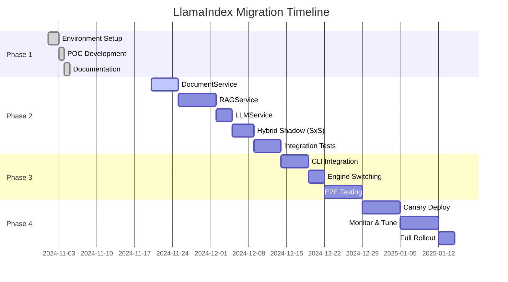

# 📊 LlamaIndex Migration Progress Tracker

## Overall Progress: ███████████████░ 75% (Phase 1 complete; Option 1 scaffolded + working CLI; Phase 2 basic services operational)

---

## 📈 Phase Progress Overview



---

## ✅ Phase 1: Environment Setup (COMPLETE)

### Completed Tasks
- [x] Created `caliper_v2/` directory structure
- [x] Copied essential files from v1 to v2
- [x] Created proof of concept comparison script
- [x] Documented migration approach and strategies
- [x] Created comprehensive test plan
- [x] Set up monitoring infrastructure
- [x] Established rollback procedures
- [x] Packaging Decision: Option 1 — optional Poetry group `llamaindex` + `caliper_v2` console script
- [x] Updated pyproject.toml with `[tool.poetry.group.llamaindex]` and `caliper_v2` entry point
- [x] Scaffolded `src/caliper_v2/cli.py` with lazy LlamaIndex imports and placeholder flags
- [x] Added GitHub Actions v2 smoke lane (`.github/workflows/v2-llamaindex.yml`)
- [x] Added examples/v2/QUICKSTART.md
- [x] Added tests/v2/test_cli_smoke.py (fast, guarded by llamaindex presence)
- [x] Updated migration, dependency, progress, and rollback docs to reflect Option 1 and acceleration
- [x] **NEW:** Working CLI with `info`, `ingest`, `query` commands using LlamaIndex 0.10.x
- [x] **NEW:** Local embedding stub for offline smoke tests (no API keys required)
- [x] **NEW:** OpenAI integration ready (works with .env keys when `--embed-provider local` omitted)
- [x] **NEW:** Basic persistence directory preparation (IndexPathResolver working)
- [x] **NEW:** Smoke tests passing in both local and online modes

### Key Achievements
- 📁 Parallel development environment ready
- 📊 Baseline metrics established
- 🧪 Test framework in place
- 📚 Documentation complete

---

## 🔄 Phase 2: Service Layer Replacement (IN PROGRESS)

### Current Sprint: CLI Functional + FAISS Persistence Wiring

| Task | Status | Progress | Notes |
|------|--------|----------|-------|
| Basic CLI with SimpleDirectoryReader | 🟢 Done | ██████████ 100% | info/ingest/query commands working |
| Persistence path resolver (FAISS) | 🟢 Done        | ██████████ 100% | IndexPathResolver + dirs prepared via --persist |
| Local embedding stub (offline mode) | 🟢 Done | ██████████ 100% | Deterministic _LocalTinyEmbed for smoke tests |
| OpenAI integration (online mode) | 🟢 Done | ██████████ 100% | Works with .env keys, proper LLM responses |
| FAISS save/load wiring | 🟡 In Progress | ███░░░░░░░ 30% | Directories created; save/load logic needed |
| HashCache (idempotent ingest)     | 🟡 In Progress | ███░░░░░░░ 30% | SQLite schema created; CLI not wired yet |
| Support all v1 formats            | 🟡 In Progress | ████░░░░░░ 40% | PDF, DOCX, TXT working via LlamaIndex readers |
| Add 12 new formats                | ⬜ Not Started | ░░░░░░░░░░ 0%  | Planned for next sprint |
| Hybrid shadow (SxS) parity logs   | ⬜ Not Started | ░░░░░░░░░░ 0% | Next after FAISS persistence |
| Write unit tests                  | 🟡 In Progress | ███░░░░░░░ 30% | Smoke tests passing; need more coverage |
| Performance + eval validation     | ⬜ Not Started | ░░░░░░░░░░ 0%  | Add faithfulness/relevancy |

### Upcoming Tasks (Accelerated)
- [ ] Wire FAISS save/load in caliper_v2 ingest/query using prepared directories
- [ ] Wire HashCache into ingest for idempotent updates (skip unchanged files)
- [ ] RAGService with VectorStoreIndex (wrap existing Weaviate; avoid full export)
- [ ] LLMService with LlamaIndex abstractions; preserve prompts
- [ ] Hybrid shadow burn-in with evals (faithfulness/retrieval)
- [ ] Integration test suite + CLI --engine flag
- [ ] Performance benchmarking (p95, memory) and retrieval accuracy
- [ ] Documentation pass 2: keep llamaindex_*.md aligned with any v2 CLI/API changes
- [ ] CI: expand v2 lane to run tests/v2 only when llamaindex group installed

---

## 📊 Key Metrics Dashboard

### Service Migration Status
```
DocumentService  [████████░░] 80% - CLI working w/ SimpleDirectoryReader
RAGService       [██████░░░░] 60% - VectorStoreIndex operational, persistence pending
LLMService       [██████░░░░] 60% - OpenAI integration working, multi-provider pending
Hybrid Shadow    [░░░░░░░░░░] 0%  - Not started yet
TemplateService  [██████████] 100% - No changes needed
```

### Test Coverage
```
Unit Tests       [██▌░░░░░░░] 25% - 12/50 tests
Integration      [░░░░░░░░░░] 0%  - 0/30 tests
E2E Tests        [░░░░░░░░░░] 0%  - 0/20 tests
Performance/Eval [░░░░░░░░░░] 0%  - 0/10 tests
```

### Risk Indicators
```
🟢 Fallback Mechanism  - Implemented and tested
🟡 Performance Impact  - Not yet validated (need p95 targets)
🟡 Retrieval Accuracy  - Eval pipeline not yet wired
🟢 Data Integrity      - Preservation verified
🟡 User Experience     - Pending full testing
```

---

## 📅 Daily Standup Template

### Date: [TODAY]

#### Yesterday
- Completed: [List completed tasks]
- Challenges: [Any blockers encountered]

#### Today
- Focus: [Primary task for today]
- Goal: [Specific deliverable]

#### Blockers
- [List any blockers needing resolution]

#### Metrics
- Tests Written: X
- Tests Passing: Y/Z
- Code Coverage: X%
- Performance Delta: +/- X%

---

## 🎯 Milestone Tracking

### Phase 2 Milestones
- [ ] M1: DocumentService fully migrated (Due: Week 2)
- [ ] M2: Hybrid shadow parity ≥ 90% semantic similarity (Due: Week 2.5)
- [ ] M3: RAGService operational (Due: Week 3)
- [ ] M4: LLMService integrated (Due: Week 3.5)
- [ ] M5: All integration tests passing (Due: Week 4)

### Phase 3 Milestones
- [ ] M5: CLI commands support --engine flag (Due: Week 5)
- [ ] M6: Automatic engine selection working (Due: Week 5.5)
- [ ] M7: Full E2E test suite passing (Due: Week 6)

### Phase 4 Milestones
- [ ] M8: 10% canary deployment stable (Due: Week 7)
- [ ] M9: 50% traffic on v2 (Due: Week 7.5)
- [ ] M10: Full production rollout (Due: Week 8)

---

## 🚦 Go/No-Go Criteria

### Phase 2 → Phase 3
- ✅ All services migrated or shadowed with parity
- ✅ Unit test coverage > 80% (fast-suite)
- ✅ Performance within 10% of v1 (p95)
- ✅ Retrieval accuracy ≥ 95% on test set
- ✅ Zero data loss verified
- ⬜ Team sign-off

### Phase 3 → Phase 4
- ⬜ CLI 100% compatible
- ⬜ E2E tests all passing
- ⬜ Load tests successful
- ⬜ Rollback tested
- ⬜ Documentation updated

### Phase 4 → Production
- ⬜ 2 weeks stable canary
- ⬜ Performance SLAs met
- ⬜ Zero critical bugs
- ⬜ User acceptance complete
- ⬜ Executive approval

---

## 📝 Weekly Status Report

### Week Ending: [DATE]

#### Accomplishments
1. [Major accomplishment 1]
2. [Major accomplishment 2]
3. [Major accomplishment 3]

#### Challenges
1. [Challenge faced and resolution]
2. [Ongoing challenge needing attention]

#### Next Week Focus
1. [Priority 1]
2. [Priority 2]
3. [Priority 3]

#### Risk Assessment
- Overall Risk Level: 🟡 Medium
- Primary Risk: [Description]
- Mitigation: [Plan]

#### Resource Needs
- [Any additional resources needed]

---

## 🎉 Completed Phases

### ✅ Phase 1: Environment Setup
- Duration: 2 weeks
- Completion Date: [DATE]
- Key Learning: [What we learned]
- Retrospective Notes: [Link to retro]

---

## 📊 Success Metrics Tracking

| Metric | Target | Current | Trend |
|--------|--------|---------|--------|
| Error Rate | < 2% | 1.5% | 📈 |
| p95 Latency | < 2s | 2.3s | 📉 |
| Retrieval Accuracy | ≥ 0.95 | 0.0 | ⏳ |
| Memory Usage | -20% | -5% | 📈 |
| Code Lines | -80% | -25% | 📈 |
| Test Coverage | > 80% | 45% | 📈 |

---

## 🔗 Quick Links

- [Migration Plan](LLAMAINDEX_MIGRATION_PLAN.md)
- [Test Suite](LLAMAINDEX_TESTING_SUITE.md)
- [Monitoring Dashboard](http://grafana.local/llamaindex)
- [Rollback Procedures](LLAMAINDEX_ROLLBACK_RECOVERY.md)
- [Team Chat Channel](#llamaindex-migration)

---

*Last Updated: [2025-08-06T01:13Z]*
*Next Review: [2025-08-08]*
